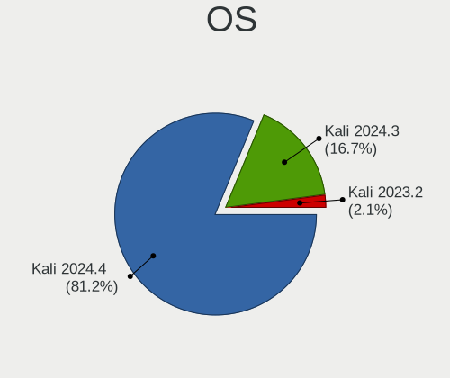
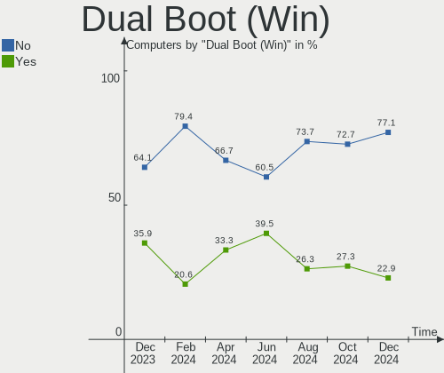
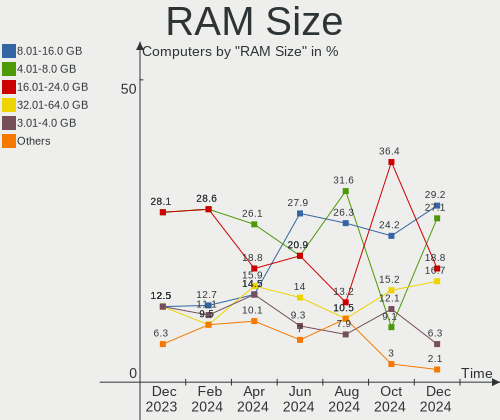
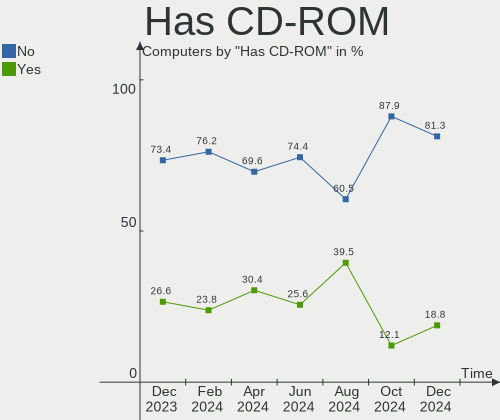
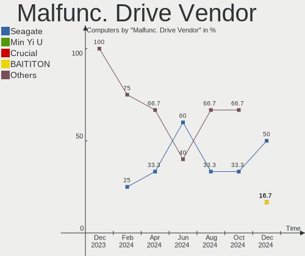
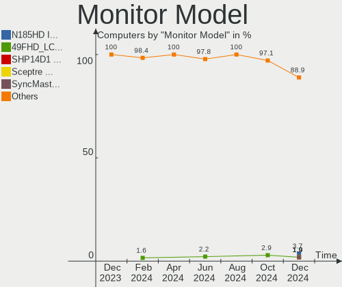
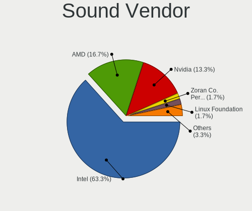

Kali - Hardware Trends
----------------------

A project to identify most popular hardware characteristics and track their change
over time based on data collected by Linux users at https://Linux-Hardware.org.

Anyone can contribute to this report by the [hw-probe](https://github.com/linuxhw/hw-probe) tool:

    sudo -E hw-probe -all -upload

This is a report for all computer types. See also reports for [desktops](/Dist/Kali/Desktop/README.md) and [notebooks](/Dist/Kali/Notebook/README.md).

This report is for one last month. Overall report since the beginning of time: [TestCoverage](https://github.com/linuxhw/TestCoverage)

Period: Oct, 2022.

Contents
--------

* [ System ](#system)
  - [ OS                       ](#os)
  - [ OS Family                ](#os-family)
  - [ Kernel                   ](#kernel)
  - [ Kernel Family            ](#kernel-family)
  - [ Kernel Major Ver.        ](#kernel-major-ver)
  - [ Arch                     ](#arch)
  - [ DE                       ](#de)
  - [ Display Server           ](#display-server)
  - [ Display Manager          ](#display-manager)
  - [ OS Lang                  ](#os-lang)
  - [ Boot Mode                ](#boot-mode)
  - [ Filesystem               ](#filesystem)
  - [ Part. scheme             ](#part-scheme)
  - [ Dual Boot with Linux/BSD ](#dual-boot-with-linuxbsd)
  - [ Dual Boot (Win)          ](#dual-boot-win)

* [ Board ](#board)
  - [ Vendor                   ](#vendor)
  - [ Model                    ](#model)
  - [ Model Family             ](#model-family)
  - [ MFG Year                 ](#mfg-year)
  - [ Form Factor              ](#form-factor)
  - [ Secure Boot              ](#secure-boot)
  - [ Coreboot                 ](#coreboot)
  - [ RAM Size                 ](#ram-size)
  - [ RAM Used                 ](#ram-used)
  - [ Total Drives             ](#total-drives)
  - [ Has CD-ROM               ](#has-cd-rom)
  - [ Has Ethernet             ](#has-ethernet)
  - [ Has WiFi                 ](#has-wifi)
  - [ Has Bluetooth            ](#has-bluetooth)

* [ Location ](#location)
  - [ Country                  ](#country)
  - [ City                     ](#city)

* [ Drives ](#drives)
  - [ Drive Vendor             ](#drive-vendor)
  - [ Drive Model              ](#drive-model)
  - [ HDD Vendor               ](#hdd-vendor)
  - [ SSD Vendor               ](#ssd-vendor)
  - [ Drive Kind               ](#drive-kind)
  - [ Drive Connector          ](#drive-connector)
  - [ Drive Size               ](#drive-size)
  - [ Space Total              ](#space-total)
  - [ Space Used               ](#space-used)
  - [ Malfunc. Drives          ](#malfunc-drives)
  - [ Malfunc. Drive Vendor    ](#malfunc-drive-vendor)
  - [ Malfunc. HDD Vendor      ](#malfunc-hdd-vendor)
  - [ Malfunc. Drive Kind      ](#malfunc-drive-kind)
  - [ Failed Drives            ](#failed-drives)
  - [ Failed Drive Vendor      ](#failed-drive-vendor)
  - [ Drive Status             ](#drive-status)

* [ Storage controller ](#storage-controller)
  - [ Storage Vendor           ](#storage-vendor)
  - [ Storage Model            ](#storage-model)
  - [ Storage Kind             ](#storage-kind)

* [ Processor ](#processor)
  - [ CPU Vendor               ](#cpu-vendor)
  - [ CPU Model                ](#cpu-model)
  - [ CPU Model Family         ](#cpu-model-family)
  - [ CPU Cores                ](#cpu-cores)
  - [ CPU Sockets              ](#cpu-sockets)
  - [ CPU Threads              ](#cpu-threads)
  - [ CPU Op-Modes             ](#cpu-op-modes)
  - [ CPU Microcode            ](#cpu-microcode)
  - [ CPU Microarch            ](#cpu-microarch)

* [ Graphics ](#graphics)
  - [ GPU Vendor               ](#gpu-vendor)
  - [ GPU Model                ](#gpu-model)
  - [ GPU Combo                ](#gpu-combo)
  - [ GPU Driver               ](#gpu-driver)
  - [ GPU Memory               ](#gpu-memory)

* [ Monitor ](#monitor)
  - [ Monitor Vendor           ](#monitor-vendor)
  - [ Monitor Model            ](#monitor-model)
  - [ Monitor Resolution       ](#monitor-resolution)
  - [ Monitor Diagonal         ](#monitor-diagonal)
  - [ Monitor Width            ](#monitor-width)
  - [ Aspect Ratio             ](#aspect-ratio)
  - [ Monitor Area             ](#monitor-area)
  - [ Pixel Density            ](#pixel-density)
  - [ Multiple Monitors        ](#multiple-monitors)

* [ Network ](#network)
  - [ Net Controller Vendor    ](#net-controller-vendor)
  - [ Net Controller Model     ](#net-controller-model)
  - [ Wireless Vendor          ](#wireless-vendor)
  - [ Wireless Model           ](#wireless-model)
  - [ Ethernet Vendor          ](#ethernet-vendor)
  - [ Ethernet Model           ](#ethernet-model)
  - [ Net Controller Kind      ](#net-controller-kind)
  - [ Used Controller          ](#used-controller)
  - [ NICs                     ](#nics)
  - [ IPv6                     ](#ipv6)

* [ Bluetooth ](#bluetooth)
  - [ Bluetooth Vendor         ](#bluetooth-vendor)
  - [ Bluetooth Model          ](#bluetooth-model)

* [ Sound ](#sound)
  - [ Sound Vendor             ](#sound-vendor)
  - [ Sound Model              ](#sound-model)

* [ Memory ](#memory)
  - [ Memory Vendor            ](#memory-vendor)
  - [ Memory Model             ](#memory-model)
  - [ Memory Kind              ](#memory-kind)
  - [ Memory Form Factor       ](#memory-form-factor)
  - [ Memory Size              ](#memory-size)
  - [ Memory Speed             ](#memory-speed)

* [ Printers & scanners ](#printers--scanners)
  - [ Printer Vendor           ](#printer-vendor)
  - [ Printer Model            ](#printer-model)
  - [ Scanner Vendor           ](#scanner-vendor)
  - [ Scanner Model            ](#scanner-model)

* [ Camera ](#camera)
  - [ Camera Vendor            ](#camera-vendor)
  - [ Camera Model             ](#camera-model)

* [ Security ](#security)
  - [ Fingerprint Vendor       ](#fingerprint-vendor)
  - [ Fingerprint Model        ](#fingerprint-model)
  - [ Chipcard Vendor          ](#chipcard-vendor)
  - [ Chipcard Model           ](#chipcard-model)

* [ Unsupported ](#unsupported)
  - [ Unsupported Devices      ](#unsupported-devices)
  - [ Unsupported Device Types ](#unsupported-device-types)

System
------

OS
--

Installed operating systems

| Name        | Computers | Percent |
|-------------|-----------|---------|
| Kali 2022.3 | 70        | 97.22%  |
| Kali 2022.2 | 1         | 1.39%   |
| Kali 2022.1 | 1         | 1.39%   |

OS Family
---------

OS without a version

| Name | Computers | Percent |
|------|-----------|---------|
| Kali | 72        | 100%    |

Kernel
------

Version of the Linux kernel

| Version               | Computers | Percent |
|-----------------------|-----------|---------|
| 5.19.0-kali2-amd64    | 26        | 36.11%  |
| 5.18.0-kali7-amd64    | 25        | 34.72%  |
| 5.18.0-kali5-amd64    | 14        | 19.44%  |
| 6.0.0-rc6             | 1         | 1.39%   |
| 5.19.10-surface       | 1         | 1.39%   |
| 5.19.0-kali2-rt-amd64 | 1         | 1.39%   |
| 5.16.0-kali7-amd64    | 1         | 1.39%   |
| 5.15.0-kali3-amd64    | 1         | 1.39%   |
| 5.14.0-kali4-amd64    | 1         | 1.39%   |
| 3.4.113-g3694c3a      | 1         | 1.39%   |

Kernel Family
-------------

Linux kernel without a distro release

| Version | Computers | Percent |
|---------|-----------|---------|
| 5.18.0  | 39        | 54.17%  |
| 5.19.0  | 27        | 37.5%   |
| 6.0.0   | 1         | 1.39%   |
| 5.19.10 | 1         | 1.39%   |
| 5.16.0  | 1         | 1.39%   |
| 5.15.0  | 1         | 1.39%   |
| 5.14.0  | 1         | 1.39%   |
| 3.4.113 | 1         | 1.39%   |

Kernel Major Ver.
-----------------

Linux kernel major version

| Version | Computers | Percent |
|---------|-----------|---------|
| 5.18    | 39        | 54.17%  |
| 5.19    | 28        | 38.89%  |
| 6.0     | 1         | 1.39%   |
| 5.16    | 1         | 1.39%   |
| 5.15    | 1         | 1.39%   |
| 5.14    | 1         | 1.39%   |
| 3.4     | 1         | 1.39%   |

Arch
----

OS architecture (x86_64, i586, etc.)

| Name   | Computers | Percent |
|--------|-----------|---------|
| x86_64 | 71        | 98.61%  |
| armv7l | 1         | 1.39%   |

DE
--

Desktop Environment

| Name    | Computers | Percent |
|---------|-----------|---------|
| XFCE    | 36        | 50%     |
| GNOME   | 22        | 30.56%  |
| KDE5    | 12        | 16.67%  |
| MATE    | 1         | 1.39%   |
| Unknown | 1         | 1.39%   |

Display Server
--------------

X11 or Wayland

| Name    | Computers | Percent |
|---------|-----------|---------|
| X11     | 70        | 97.22%  |
| Wayland | 1         | 1.39%   |
| Tty     | 1         | 1.39%   |

Display Manager
---------------

SDDM, LightDM, etc.

| Name    | Computers | Percent |
|---------|-----------|---------|
| LightDM | 32        | 44.44%  |
| Unknown | 20        | 27.78%  |
| GDM3    | 12        | 16.67%  |
| SDDM    | 6         | 8.33%   |
| GDM     | 2         | 2.78%   |

OS Lang
-------

Language

| Lang    | Computers | Percent |
|---------|-----------|---------|
| en_US   | 40        | 55.56%  |
| en_GB   | 5         | 6.94%   |
| en_IN   | 4         | 5.56%   |
| en_AU   | 3         | 4.17%   |
| ru_RU   | 2         | 2.78%   |
| it_IT   | 2         | 2.78%   |
| fr_FR   | 2         | 2.78%   |
| en_CA   | 2         | 2.78%   |
| de_DE   | 2         | 2.78%   |
| zh_CN   | 1         | 1.39%   |
| ru_UA   | 1         | 1.39%   |
| pt_BR   | 1         | 1.39%   |
| pl_PL   | 1         | 1.39%   |
| nl_NL   | 1         | 1.39%   |
| ka_GE   | 1         | 1.39%   |
| es_ES   | 1         | 1.39%   |
| en_DE   | 1         | 1.39%   |
| en_AG   | 1         | 1.39%   |
| Unknown | 1         | 1.39%   |

Boot Mode
---------

EFI or BIOS

| Mode | Computers | Percent |
|------|-----------|---------|
| EFI  | 51        | 70.83%  |
| BIOS | 21        | 29.17%  |

Filesystem
----------

Type of filesystem

| Type    | Computers | Percent |
|---------|-----------|---------|
| Ext4    | 67        | 93.06%  |
| Btrfs   | 3         | 4.17%   |
| Overlay | 1         | 1.39%   |
| Ext2    | 1         | 1.39%   |

Part. scheme
------------

Scheme of partitioning

| Type    | Computers | Percent |
|---------|-----------|---------|
| GPT     | 45        | 62.5%   |
| Unknown | 18        | 25%     |
| MBR     | 9         | 12.5%   |

Dual Boot with Linux/BSD
------------------------

Hosting more than one Linux/BSD

| Dual boot | Computers | Percent |
|-----------|-----------|---------|
| No        | 70        | 97.22%  |
| Yes       | 2         | 2.78%   |

Dual Boot (Win)
---------------

Hosting Linux and Windows

| Dual boot | Computers | Percent |
|-----------|-----------|---------|
| No        | 50        | 69.44%  |
| Yes       | 22        | 30.56%  |

Board
-----

Vendor
------

Motherboard manufacturer

| Name             | Computers | Percent |
|------------------|-----------|---------|
| Hewlett-Packard  | 15        | 20.83%  |
| Lenovo           | 12        | 16.67%  |
| ASUSTek Computer | 9         | 12.5%   |
| Apple            | 8         | 11.11%  |
| Dell             | 5         | 6.94%   |
| Microsoft        | 3         | 4.17%   |
| Acer             | 3         | 4.17%   |
| MSI              | 2         | 2.78%   |
| Intel            | 2         | 2.78%   |
| HUAWEI           | 2         | 2.78%   |
| Google           | 2         | 2.78%   |
| Positivo         | 1         | 1.39%   |
| PC Specialist    | 1         | 1.39%   |
| Monster          | 1         | 1.39%   |
| MicroByte        | 1         | 1.39%   |
| Medion           | 1         | 1.39%   |
| GPU Company      | 1         | 1.39%   |
| Chuwi            | 1         | 1.39%   |
| ASRock           | 1         | 1.39%   |
| Unknown          | 1         | 1.39%   |

Model
-----

Motherboard model

| Name                                     | Computers | Percent |
|------------------------------------------|-----------|---------|
| Apple MacBookAir7,2                      | 3         | 4.17%   |
| Unknown                                  | 3         | 4.17%   |
| ASUS ASUS TUF Gaming F15 FX506LH_FX506LH | 2         | 2.78%   |
| Positivo Q232A                           | 1         | 1.39%   |
| PC Specialist N13xWU                     | 1         | 1.39%   |
| MSI GP76 Leopard 10UE                    | 1         | 1.39%   |
| MSI GP60 2PE                             | 1         | 1.39%   |
| Monster HUMA H4 V4.1                     | 1         | 1.39%   |
| Microsoft Surface Pro 3                  | 1         | 1.39%   |
| Microsoft Surface Pro                    | 1         | 1.39%   |
| Microsoft Surface Book 2                 | 1         | 1.39%   |
| MicroByte ezbook                         | 1         | 1.39%   |
| Lenovo Yoga 3 14 80JH                    | 1         | 1.39%   |
| Lenovo V310-15ISK 80SY                   | 1         | 1.39%   |
| Lenovo ThinkPad T470s 20HGS2W300         | 1         | 1.39%   |
| Lenovo ThinkPad T460 20FMS4U300          | 1         | 1.39%   |
| Lenovo ThinkPad P1 Gen 5 21DC002PUS      | 1         | 1.39%   |
| Lenovo ThinkPad L450 20DSS00M01          | 1         | 1.39%   |
| Lenovo ThinkPad E580 20KTA001GE          | 1         | 1.39%   |
| Lenovo Legion 5 15IAH7 82RC              | 1         | 1.39%   |
| Lenovo IdeaPadFlex 5 14ALC05 82HU        | 1         | 1.39%   |
| Lenovo IdeaPad U530 Touch 20289          | 1         | 1.39%   |
| Lenovo IdeaPad P500 Touch 20253          | 1         | 1.39%   |
| Lenovo IdeaPad 330-15AST 81D6            | 1         | 1.39%   |
| Intel NUC8i3BEH                          | 1         | 1.39%   |
| Intel B819                               | 1         | 1.39%   |
| HUAWEI KLVC-WXX9                         | 1         | 1.39%   |
| HUAWEI BOM-WXX9                          | 1         | 1.39%   |
| HP Z210 Workstation                      | 1         | 1.39%   |
| HP ProLiant DL360 G7                     | 1         | 1.39%   |
| HP Pavilion x360 Convertible 14m-ba0xx   | 1         | 1.39%   |
| HP Pavilion Gaming Laptop 15-dk0xxx      | 1         | 1.39%   |
| HP Pavilion dv6                          | 1         | 1.39%   |
| HP Laptop 15s-du3xxx                     | 1         | 1.39%   |
| HP Laptop 15-da0xxx                      | 1         | 1.39%   |
| HP Laptop 15-bs0xx                       | 1         | 1.39%   |
| HP ENVY x360 Convertible 15-cn1xxx       | 1         | 1.39%   |
| HP ENVY x360 Convertible 13-bd0xxx       | 1         | 1.39%   |
| HP ENVY x360 2-in-1 Laptop 15-ey0xxx     | 1         | 1.39%   |
| HP EliteBook 850 G7 Notebook PC          | 1         | 1.39%   |

Model Family
------------

Motherboard model prefix

| Name                  | Computers | Percent |
|-----------------------|-----------|---------|
| Lenovo ThinkPad       | 5         | 6.94%   |
| Microsoft Surface     | 3         | 4.17%   |
| Lenovo IdeaPad        | 3         | 4.17%   |
| HP Pavilion           | 3         | 4.17%   |
| HP Laptop             | 3         | 4.17%   |
| HP ENVY               | 3         | 4.17%   |
| ASUS ASUS             | 3         | 4.17%   |
| Apple MacBookAir7     | 3         | 4.17%   |
| Unknown               | 3         | 4.17%   |
| HP EliteBook          | 2         | 2.78%   |
| Dell Inspiron         | 2         | 2.78%   |
| Apple iMac12          | 2         | 2.78%   |
| Positivo Q232A        | 1         | 1.39%   |
| PC Specialist N13xWU  | 1         | 1.39%   |
| MSI GP76              | 1         | 1.39%   |
| MSI GP60              | 1         | 1.39%   |
| Monster HUMA          | 1         | 1.39%   |
| MicroByte ezbook      | 1         | 1.39%   |
| Lenovo Yoga           | 1         | 1.39%   |
| Lenovo V310-15ISK     | 1         | 1.39%   |
| Lenovo Legion         | 1         | 1.39%   |
| Lenovo IdeaPadFlex    | 1         | 1.39%   |
| Intel NUC8i3BEH       | 1         | 1.39%   |
| Intel B819            | 1         | 1.39%   |
| HUAWEI KLVC-WXX9      | 1         | 1.39%   |
| HUAWEI BOM-WXX9       | 1         | 1.39%   |
| HP Z210               | 1         | 1.39%   |
| HP ProLiant           | 1         | 1.39%   |
| HP DR56-ICA22225GL0   | 1         | 1.39%   |
| HP 255                | 1         | 1.39%   |
| GPU Company GWTC116-2 | 1         | 1.39%   |
| Google Droid          | 1         | 1.39%   |
| Google Delbin         | 1         | 1.39%   |
| Dell Precision        | 1         | 1.39%   |
| Dell Latitude         | 1         | 1.39%   |
| Dell G5               | 1         | 1.39%   |
| Chuwi HeroBook        | 1         | 1.39%   |
| ASUS VivoBook         | 1         | 1.39%   |
| ASUS Strix            | 1         | 1.39%   |
| ASUS StrikerExtreme   | 1         | 1.39%   |

MFG Year
--------

Motherboard manufacture year

| Year    | Computers | Percent |
|---------|-----------|---------|
| 2021    | 13        | 18.06%  |
| 2018    | 8         | 11.11%  |
| 2015    | 7         | 9.72%   |
| 2022    | 6         | 8.33%   |
| 2019    | 5         | 6.94%   |
| 2017    | 5         | 6.94%   |
| 2016    | 5         | 6.94%   |
| 2014    | 5         | 6.94%   |
| 2011    | 5         | 6.94%   |
| 2013    | 4         | 5.56%   |
| 2020    | 3         | 4.17%   |
| 2010    | 3         | 4.17%   |
| 2012    | 1         | 1.39%   |
| 2008    | 1         | 1.39%   |
| Unknown | 1         | 1.39%   |

Form Factor
-----------

Physical design of the computer

| Name        | Computers | Percent |
|-------------|-----------|---------|
| Notebook    | 50        | 69.44%  |
| Desktop     | 8         | 11.11%  |
| Convertible | 6         | 8.33%   |
| Tablet      | 3         | 4.17%   |
| All in one  | 3         | 4.17%   |
| Mini pc     | 1         | 1.39%   |
| Server      | 1         | 1.39%   |

Secure Boot
-----------

Enabled or disabled

| State    | Computers | Percent |
|----------|-----------|---------|
| Disabled | 72        | 100%    |

Coreboot
--------

Have coreboot on board

| Used | Computers | Percent |
|------|-----------|---------|
| No   | 70        | 97.22%  |
| Yes  | 2         | 2.78%   |

RAM Size
--------

Total RAM memory

| Size in GB | Computers | Percent |
|------------|-----------|---------|
| 4.01-8.0   | 21        | 29.17%  |
| 16.01-24.0 | 18        | 25%     |
| 8.01-16.0  | 15        | 20.83%  |
| 3.01-4.0   | 11        | 15.28%  |
| 32.01-64.0 | 4         | 5.56%   |
| 1.01-2.0   | 3         | 4.17%   |

RAM Used
--------

Used RAM memory

| Used GB   | Computers | Percent |
|-----------|-----------|---------|
| 2.01-3.0  | 24        | 33.33%  |
| 1.01-2.0  | 20        | 27.78%  |
| 4.01-8.0  | 14        | 19.44%  |
| 3.01-4.0  | 11        | 15.28%  |
| 8.01-16.0 | 1         | 1.39%   |
| 0.51-1.0  | 1         | 1.39%   |
| Unknown   | 1         | 1.39%   |

Total Drives
------------

Number of drives on board

| Drives | Computers | Percent |
|--------|-----------|---------|
| 1      | 51        | 70.83%  |
| 2      | 17        | 23.61%  |
| 3      | 2         | 2.78%   |
| 11     | 1         | 1.39%   |
| 4      | 1         | 1.39%   |

Has CD-ROM
----------

Has CD-ROM on board

| Presented | Computers | Percent |
|-----------|-----------|---------|
| No        | 58        | 80.56%  |
| Yes       | 14        | 19.44%  |

Has Ethernet
------------

Has Ethernet on board

| Presented | Computers | Percent |
|-----------|-----------|---------|
| Yes       | 50        | 69.44%  |
| No        | 22        | 30.56%  |

Has WiFi
--------

Has WiFi module

| Presented | Computers | Percent |
|-----------|-----------|---------|
| Yes       | 66        | 91.67%  |
| No        | 6         | 8.33%   |

Has Bluetooth
-------------

Has Bluetooth module

| Presented | Computers | Percent |
|-----------|-----------|---------|
| Yes       | 56        | 77.78%  |
| No        | 16        | 22.22%  |

Location
--------

Country
-------

Geographic location (country)

| Country     | Computers | Percent |
|-------------|-----------|---------|
| USA         | 21        | 29.17%  |
| India       | 5         | 6.94%   |
| Germany     | 5         | 6.94%   |
| Russia      | 4         | 5.56%   |
| Canada      | 4         | 5.56%   |
| Italy       | 3         | 4.17%   |
| Australia   | 3         | 4.17%   |
| UK          | 2         | 2.78%   |
| Switzerland | 2         | 2.78%   |
| Spain       | 2         | 2.78%   |
| Pakistan    | 2         | 2.78%   |
| Netherlands | 2         | 2.78%   |
| Japan       | 2         | 2.78%   |
| France      | 2         | 2.78%   |
| Egypt       | 2         | 2.78%   |
| Ukraine     | 1         | 1.39%   |
| Turkey      | 1         | 1.39%   |
| Mexico      | 1         | 1.39%   |
| Indonesia   | 1         | 1.39%   |
| Guernsey    | 1         | 1.39%   |
| Ghana       | 1         | 1.39%   |
| Georgia     | 1         | 1.39%   |
| China       | 1         | 1.39%   |
| Brazil      | 1         | 1.39%   |
| Argentina   | 1         | 1.39%   |
| Anguilla    | 1         | 1.39%   |

City
----

Geographic location (city)

| City                  | Computers | Percent |
|-----------------------|-----------|---------|
| Montreal              | 2         | 2.78%   |
| Milan                 | 2         | 2.78%   |
| Littleton             | 2         | 2.78%   |
| Karachi               | 2         | 2.78%   |
| Zurich                | 1         | 1.39%   |
| Yogyakarta            | 1         | 1.39%   |
| Vonore                | 1         | 1.39%   |
| Vladivostok           | 1         | 1.39%   |
| Vincent               | 1         | 1.39%   |
| Toronto               | 1         | 1.39%   |
| The Valley            | 1         | 1.39%   |
| Sydney                | 1         | 1.39%   |
| Stiens                | 1         | 1.39%   |
| St Peter Port         | 1         | 1.39%   |
| San Clemente          | 1         | 1.39%   |
| Samsun                | 1         | 1.39%   |
| Rueti                 | 1         | 1.39%   |
| Rostov-on-Don         | 1         | 1.39%   |
| Rome                  | 1         | 1.39%   |
| Reno                  | 1         | 1.39%   |
| Rainsville            | 1         | 1.39%   |
| Portland              | 1         | 1.39%   |
| Pittsburg             | 1         | 1.39%   |
| Phoenix               | 1         | 1.39%   |
| Pensacola             | 1         | 1.39%   |
| Paris                 | 1         | 1.39%   |
| North Tonawanda       | 1         | 1.39%   |
| Newark                | 1         | 1.39%   |
| Nasu-yumoto           | 1         | 1.39%   |
| Nashville             | 1         | 1.39%   |
| Munich                | 1         | 1.39%   |
| Moscow                | 1         | 1.39%   |
| Modesto               | 1         | 1.39%   |
| Minneapolis           | 1         | 1.39%   |
| Manchester            | 1         | 1.39%   |
| Madrid                | 1         | 1.39%   |
| Ludwigshafen am Rhein | 1         | 1.39%   |
| Los Angeles           | 1         | 1.39%   |
| London                | 1         | 1.39%   |
| La Prairie            | 1         | 1.39%   |

Drives
------

Drive Vendor
------------

Hard drive vendors

| Vendor                    | Computers | Drives | Percent |
|---------------------------|-----------|--------|---------|
| Samsung Electronics       | 16        | 17     | 17.2%   |
| Seagate                   | 12        | 19     | 12.9%   |
| WDC                       | 8         | 8      | 8.6%    |
| Kingston                  | 8         | 8      | 8.6%    |
| SK hynix                  | 6         | 6      | 6.45%   |
| Apple                     | 6         | 6      | 6.45%   |
| Unknown                   | 4         | 4      | 4.3%    |
| Toshiba                   | 4         | 4      | 4.3%    |
| SanDisk                   | 3         | 3      | 3.23%   |
| Micron Technology         | 3         | 3      | 3.23%   |
| KIOXIA                    | 3         | 3      | 3.23%   |
| China                     | 3         | 3      | 3.23%   |
| A-DATA Technology         | 3         | 3      | 3.23%   |
| Intel                     | 2         | 3      | 2.15%   |
| Crucial                   | 2         | 2      | 2.15%   |
| Transcend                 | 1         | 1      | 1.08%   |
| Team                      | 1         | 1      | 1.08%   |
| PNY                       | 1         | 1      | 1.08%   |
| NETAPP                    | 1         | 2      | 1.08%   |
| Netac                     | 1         | 1      | 1.08%   |
| Micron/Crucial Technology | 1         | 1      | 1.08%   |
| LITEON                    | 1         | 1      | 1.08%   |
| KingSpec                  | 1         | 1      | 1.08%   |
| Intenso                   | 1         | 1      | 1.08%   |
| 1TB                       | 1         | 1      | 1.08%   |

Drive Model
-----------

Hard drive models

| Model                                          | Computers | Percent |
|------------------------------------------------|-----------|---------|
| Seagate ST1000LM035-1RK172 1TB                 | 3         | 3.09%   |
| Seagate ST3500418AS 500GB                      | 2         | 2.06%   |
| Micron 2210_MTFDHBA512QFD 512GB                | 2         | 2.06%   |
| China SSD 256GB                                | 2         | 2.06%   |
| Apple HDD HTS545050A7E362 500GB                | 2         | 2.06%   |
| WDC WDBNCE2500PNC 250GB SSD                    | 1         | 1.03%   |
| WDC WD7500BPVX-22JC3T0 752GB                   | 1         | 1.03%   |
| WDC WD10SPZX-60Z10T1 1TB                       | 1         | 1.03%   |
| WDC WD10SPZX-21Z10T0 1TB                       | 1         | 1.03%   |
| WDC WD10JPVX-60JC3T1 1TB                       | 1         | 1.03%   |
| WDC WD10EZEX-08WN4A0 1TB                       | 1         | 1.03%   |
| WDC WD10EADS-00L5B1 1TB                        | 1         | 1.03%   |
| WDC PC SN530 SDBPNPZ-256G-1006 256GB           | 1         | 1.03%   |
| Unknown MMC Card  8GB                          | 1         | 1.03%   |
| Unknown MMC Card  32GB                         | 1         | 1.03%   |
| Unknown DA4064  64GB                           | 1         | 1.03%   |
| Unknown Biwin  64GB                            | 1         | 1.03%   |
| Transcend TS256GMTE110S 256GB                  | 1         | 1.03%   |
| Toshiba THNSNJ128GMCU 128GB SSD                | 1         | 1.03%   |
| Toshiba KXG5AZNV256G 256GB                     | 1         | 1.03%   |
| Toshiba HDWD110 1TB                            | 1         | 1.03%   |
| Toshiba DT01ACA100 1TB                         | 1         | 1.03%   |
| Team T253X1480G 480GB SSD                      | 1         | 1.03%   |
| SK hynix SKHynix_HFS001TDE9X081N 1TB           | 1         | 1.03%   |
| SK hynix PC401 NVMe Solid State Drive 256GB    | 1         | 1.03%   |
| SK hynix HFS250G32TND-3110A 250GB SSD          | 1         | 1.03%   |
| SK hynix HFM128GDJTNG-8310A 128GB              | 1         | 1.03%   |
| SK hynix HCG8e  64GB                           | 1         | 1.03%   |
| SK hynix BC511 256GB                           | 1         | 1.03%   |
| Seagate ST9300653SS 304GB                      | 1         | 1.03%   |
| Seagate ST930065 CLAR300 304GB                 | 1         | 1.03%   |
| Seagate ST500LT012-1DG142 500GB                | 1         | 1.03%   |
| Seagate ST2000LM 015-2E8174 2TB                | 1         | 1.03%   |
| Seagate ST2000DM001-1ER164 2TB                 | 1         | 1.03%   |
| Seagate ST1000LM024 HN-M101MBB 1TB             | 1         | 1.03%   |
| Seagate M3 2TB                                 | 1         | 1.03%   |
| Seagate Expansion 2TB                          | 1         | 1.03%   |
| Seagate BUP Slim BK 1TB                        | 1         | 1.03%   |
| Seagate BACKUP+ 500GB                          | 1         | 1.03%   |
| Sandisk WD Black SN750 / PC SN730 NVMe SSD 1TB | 1         | 1.03%   |

HDD Vendor
----------

Hard disk drive vendors

| Vendor              | Computers | Drives | Percent |
|---------------------|-----------|--------|---------|
| Seagate             | 10        | 17     | 45.45%  |
| WDC                 | 6         | 6      | 27.27%  |
| Toshiba             | 2         | 2      | 9.09%   |
| Apple               | 2         | 2      | 9.09%   |
| Samsung Electronics | 1         | 1      | 4.55%   |
| NETAPP              | 1         | 2      | 4.55%   |

SSD Vendor
----------

Solid state drive vendors

| Vendor              | Computers | Drives | Percent |
|---------------------|-----------|--------|---------|
| Samsung Electronics | 8         | 8      | 24.24%  |
| Apple               | 4         | 4      | 12.12%  |
| Kingston            | 3         | 3      | 9.09%   |
| China               | 3         | 3      | 9.09%   |
| A-DATA Technology   | 3         | 3      | 9.09%   |
| WDC                 | 1         | 1      | 3.03%   |
| Toshiba             | 1         | 1      | 3.03%   |
| Team                | 1         | 1      | 3.03%   |
| SK hynix            | 1         | 1      | 3.03%   |
| SanDisk             | 1         | 1      | 3.03%   |
| PNY                 | 1         | 1      | 3.03%   |
| Netac               | 1         | 1      | 3.03%   |
| LITEON              | 1         | 1      | 3.03%   |
| KingSpec            | 1         | 1      | 3.03%   |
| Intenso             | 1         | 1      | 3.03%   |
| Crucial             | 1         | 1      | 3.03%   |
| 1TB                 | 1         | 1      | 3.03%   |

Drive Kind
----------

HDD or SSD

| Kind    | Computers | Drives | Percent |
|---------|-----------|--------|---------|
| SSD     | 31        | 33     | 35.63%  |
| NVMe    | 28        | 32     | 32.18%  |
| HDD     | 20        | 30     | 22.99%  |
| MMC     | 6         | 6      | 6.9%    |
| Unknown | 2         | 2      | 2.3%    |

Drive Connector
---------------

SATA, SAS, NVMe, etc.

| Type | Computers | Drives | Percent |
|------|-----------|--------|---------|
| SATA | 45        | 60     | 54.22%  |
| NVMe | 28        | 32     | 33.73%  |
| MMC  | 6         | 6      | 7.23%   |
| SAS  | 4         | 5      | 4.82%   |

Drive Size
----------

Size of hard drive

| Size in TB | Computers | Drives | Percent |
|------------|-----------|--------|---------|
| 0.01-0.5   | 35        | 40     | 66.04%  |
| 0.51-1.0   | 16        | 20     | 30.19%  |
| 1.01-2.0   | 2         | 3      | 3.77%   |

Space Total
-----------

Amount of disk space available on the file system

| Size in GB | Computers | Percent |
|------------|-----------|---------|
| 101-250    | 30        | 41.67%  |
| 251-500    | 17        | 23.61%  |
| 501-1000   | 9         | 12.5%   |
| 51-100     | 6         | 8.33%   |
| 21-50      | 3         | 4.17%   |
| 1001-2000  | 3         | 4.17%   |
| 2001-3000  | 2         | 2.78%   |
| 1-20       | 1         | 1.39%   |
| Unknown    | 1         | 1.39%   |

Space Used
----------

Amount of used disk space

| Used GB   | Computers | Percent |
|-----------|-----------|---------|
| 21-50     | 22        | 30.56%  |
| 1-20      | 19        | 26.39%  |
| 101-250   | 14        | 19.44%  |
| 51-100    | 10        | 13.89%  |
| 251-500   | 3         | 4.17%   |
| 1001-2000 | 2         | 2.78%   |
| 501-1000  | 1         | 1.39%   |
| Unknown   | 1         | 1.39%   |

Malfunc. Drives
---------------

Drive models with a malfunction

| Model                                 | Computers | Drives | Percent |
|---------------------------------------|-----------|--------|---------|
| WDC WD10JPVX-60JC3T1 1TB              | 1         | 1      | 20%     |
| SK hynix HFS250G32TND-3110A 250GB SSD | 1         | 1      | 20%     |
| Seagate ST2000LM 015-2E8174 2TB       | 1         | 1      | 20%     |
| Seagate ST1000LM035-1RK172 1TB        | 1         | 1      | 20%     |
| Samsung Electronics SSD 840 EVO 120GB | 1         | 1      | 20%     |

Malfunc. Drive Vendor
---------------------

Vendors of faulty drives

| Vendor              | Computers | Drives | Percent |
|---------------------|-----------|--------|---------|
| Seagate             | 2         | 2      | 40%     |
| WDC                 | 1         | 1      | 20%     |
| SK hynix            | 1         | 1      | 20%     |
| Samsung Electronics | 1         | 1      | 20%     |

Malfunc. HDD Vendor
-------------------

Vendors of faulty HDD drives

| Vendor  | Computers | Drives | Percent |
|---------|-----------|--------|---------|
| Seagate | 2         | 2      | 66.67%  |
| WDC     | 1         | 1      | 33.33%  |

Malfunc. Drive Kind
-------------------

Kinds of faulty drives

| Kind | Computers | Drives | Percent |
|------|-----------|--------|---------|
| HDD  | 3         | 3      | 60%     |
| SSD  | 2         | 2      | 40%     |

Failed Drives
-------------

Failed drive models

Zero info for selected period =(

Failed Drive Vendor
-------------------

Failed drive vendors

Zero info for selected period =(

Drive Status
------------

Number of failed and malfunc. drives

| Status   | Computers | Drives | Percent |
|----------|-----------|--------|---------|
| Works    | 42        | 59     | 53.16%  |
| Detected | 32        | 39     | 40.51%  |
| Malfunc  | 5         | 5      | 6.33%   |

Storage controller
------------------

Storage Vendor
--------------

Storage controller vendors

| Vendor                       | Computers | Percent |
|------------------------------|-----------|---------|
| Intel                        | 46        | 54.12%  |
| Samsung Electronics          | 10        | 11.76%  |
| Kingston Technology Company  | 5         | 5.88%   |
| AMD                          | 5         | 5.88%   |
| SK hynix                     | 4         | 4.71%   |
| Micron Technology            | 3         | 3.53%   |
| Toshiba America Info Systems | 2         | 2.35%   |
| SanDisk                      | 2         | 2.35%   |
| Micron/Crucial Technology    | 2         | 2.35%   |
| KIOXIA                       | 2         | 2.35%   |
| Transcend                    | 1         | 1.18%   |
| Silicon Image                | 1         | 1.18%   |
| Nvidia                       | 1         | 1.18%   |
| Hewlett-Packard              | 1         | 1.18%   |

Storage Model
-------------

Storage controller models

| Model                                                                            | Computers | Percent |
|----------------------------------------------------------------------------------|-----------|---------|
| Intel 82801 Mobile SATA Controller [RAID mode]                                   | 6         | 6.59%   |
| Intel Sunrise Point-LP SATA Controller [AHCI mode]                               | 5         | 5.49%   |
| Intel 8 Series SATA Controller 1 [AHCI mode]                                     | 4         | 4.4%    |
| Intel 7 Series Chipset Family 6-port SATA Controller [AHCI mode]                 | 4         | 4.4%    |
| AMD FCH SATA Controller [AHCI mode]                                              | 4         | 4.4%    |
| Samsung NVMe SSD Controller SM981/PM981/PM983                                    | 3         | 3.3%    |
| Samsung Electronics SATA controller                                              | 3         | 3.3%    |
| Micron Non-Volatile memory controller                                            | 3         | 3.3%    |
| Kingston Company Company Non-Volatile memory controller                          | 3         | 3.3%    |
| Intel Volume Management Device NVMe RAID Controller                              | 3         | 3.3%    |
| Intel Celeron/Pentium Silver Processor SATA Controller                           | 3         | 3.3%    |
| Samsung Electronics Non-Volatile memory controller                               | 2         | 2.2%    |
| KIOXIA NVMe SSD Controller BG4                                                   | 2         | 2.2%    |
| Intel Wildcat Point-LP SATA Controller [AHCI Mode]                               | 2         | 2.2%    |
| Intel SATA Controller [RAID mode]                                                | 2         | 2.2%    |
| Intel 8 Series/C220 Series Chipset Family 6-port SATA Controller 1 [AHCI mode]   | 2         | 2.2%    |
| Intel 6 Series/C200 Series Chipset Family 6 port Desktop SATA AHCI Controller    | 2         | 2.2%    |
| Intel 400 Series Chipset Family SATA AHCI Controller                             | 2         | 2.2%    |
| Transcend Non-Volatile memory controller                                         | 1         | 1.1%    |
| Toshiba America Info Systems Toshiba America Info Non-Volatile memory controller | 1         | 1.1%    |
| Toshiba America Info Systems BG3 NVMe SSD Controller                             | 1         | 1.1%    |
| SK hynix PC401 NVMe Solid State Drive 256GB                                      | 1         | 1.1%    |
| SK hynix Gold P31 SSD                                                            | 1         | 1.1%    |
| SK hynix BC511                                                                   | 1         | 1.1%    |
| SK hynix BC501 NVMe Solid State Drive                                            | 1         | 1.1%    |
| Silicon Image SiI 3132 Serial ATA Raid II Controller                             | 1         | 1.1%    |
| SanDisk WD Blue SN550 NVMe SSD                                                   | 1         | 1.1%    |
| SanDisk WD Black SN750 / PC SN730 NVMe SSD                                       | 1         | 1.1%    |
| Samsung NVMe SSD Controller SM961/PM961/SM963                                    | 1         | 1.1%    |
| Samsung NVMe SSD Controller 980                                                  | 1         | 1.1%    |
| Nvidia MCP55 SATA Controller                                                     | 1         | 1.1%    |
| Nvidia MCP55 IDE                                                                 | 1         | 1.1%    |
| Micron/Crucial P2 NVMe PCIe SSD                                                  | 1         | 1.1%    |
| Micron/Crucial Non-Volatile memory controller                                    | 1         | 1.1%    |
| Kingston Company OM3PDP3 NVMe SSD                                                | 1         | 1.1%    |
| Kingston Company A2000 NVMe SSD                                                  | 1         | 1.1%    |
| Intel Tiger Lake-LP SATA Controller                                              | 1         | 1.1%    |
| Intel SSD 600P Series                                                            | 1         | 1.1%    |
| Intel Q170/Q150/B150/H170/H110/Z170/CM236 Chipset SATA Controller [AHCI Mode]    | 1         | 1.1%    |
| Intel Non-Volatile memory controller                                             | 1         | 1.1%    |

Storage Kind
------------

Kind of storage controller (IDE, SATA, NVMe, SAS, ...)

| Kind | Computers | Percent |
|------|-----------|---------|
| SATA | 44        | 50%     |
| NVMe | 28        | 31.82%  |
| RAID | 13        | 14.77%  |
| IDE  | 3         | 3.41%   |

Processor
---------

CPU Vendor
----------

Processor vendors

| Vendor   | Computers | Percent |
|----------|-----------|---------|
| Intel    | 63        | 87.5%   |
| AMD      | 8         | 11.11%  |
| Qualcomm | 1         | 1.39%   |

CPU Model
---------

Processor models

| Model                                    | Computers | Percent |
|------------------------------------------|-----------|---------|
| Intel Core i5-8250U CPU @ 1.60GHz        | 3         | 4.17%   |
| Intel Core i5-7300U CPU @ 2.60GHz        | 3         | 4.17%   |
| Intel Celeron N4020 CPU @ 1.10GHz        | 3         | 4.17%   |
| Intel Core i7-5650U CPU @ 2.20GHz        | 2         | 2.78%   |
| Intel Core i5-3210M CPU @ 2.50GHz        | 2         | 2.78%   |
| Intel Core i5-10300H CPU @ 2.50GHz       | 2         | 2.78%   |
| Intel Core i3-6006U CPU @ 2.00GHz        | 2         | 2.78%   |
| Intel 11th Gen Core i7-1165G7 @ 2.80GHz  | 2         | 2.78%   |
| Qualcomm ARMv7 Processor rev 0 (v7l)     | 1         | 1.39%   |
| Intel Xeon CPU L5640 @ 2.27GHz           | 1         | 1.39%   |
| Intel Pentium Silver N5000 CPU @ 1.10GHz | 1         | 1.39%   |
| Intel Core i7-9750H CPU @ 2.60GHz        | 1         | 1.39%   |
| Intel Core i7-8750H CPU @ 2.20GHz        | 1         | 1.39%   |
| Intel Core i7-7700HQ CPU @ 2.80GHz       | 1         | 1.39%   |
| Intel Core i7-6600U CPU @ 2.60GHz        | 1         | 1.39%   |
| Intel Core i7-5500U CPU @ 2.40GHz        | 1         | 1.39%   |
| Intel Core i7-4500U CPU @ 1.80GHz        | 1         | 1.39%   |
| Intel Core i7-2670QM CPU @ 2.20GHz       | 1         | 1.39%   |
| Intel Core i7-2600S CPU @ 2.80GHz        | 1         | 1.39%   |
| Intel Core i7-2600 CPU @ 3.40GHz         | 1         | 1.39%   |
| Intel Core i7-10870H CPU @ 2.20GHz       | 1         | 1.39%   |
| Intel Core i7-10510U CPU @ 1.80GHz       | 1         | 1.39%   |
| Intel Core i5-9300H CPU @ 2.40GHz        | 1         | 1.39%   |
| Intel Core i5-8265U CPU @ 1.60GHz        | 1         | 1.39%   |
| Intel Core i5-7200U CPU @ 2.50GHz        | 1         | 1.39%   |
| Intel Core i5-6300U CPU @ 2.40GHz        | 1         | 1.39%   |
| Intel Core i5-6300HQ CPU @ 2.30GHz       | 1         | 1.39%   |
| Intel Core i5-5350U CPU @ 1.80GHz        | 1         | 1.39%   |
| Intel Core i5-5300U CPU @ 2.30GHz        | 1         | 1.39%   |
| Intel Core i5-4460 CPU @ 3.20GHz         | 1         | 1.39%   |
| Intel Core i5-4440 CPU @ 3.10GHz         | 1         | 1.39%   |
| Intel Core i5-4300U CPU @ 1.90GHz        | 1         | 1.39%   |
| Intel Core i5-4260U CPU @ 1.40GHz        | 1         | 1.39%   |
| Intel Core i5-4210U CPU @ 1.70GHz        | 1         | 1.39%   |
| Intel Core i5-4210H CPU @ 2.90GHz        | 1         | 1.39%   |
| Intel Core i5-3427U CPU @ 1.80GHz        | 1         | 1.39%   |
| Intel Core i5-3230M CPU @ 2.60GHz        | 1         | 1.39%   |
| Intel Core i5-2500K CPU @ 3.30GHz        | 1         | 1.39%   |
| Intel Core i5-2400 CPU @ 3.10GHz         | 1         | 1.39%   |
| Intel Core i5-10310U CPU @ 1.70GHz       | 1         | 1.39%   |

CPU Model Family
----------------

Processor model prefix

| Model                | Computers | Percent |
|----------------------|-----------|---------|
| Intel Core i5        | 28        | 38.89%  |
| Intel Core i7        | 13        | 18.06%  |
| Other                | 8         | 11.11%  |
| Intel Celeron        | 6         | 8.33%   |
| Intel Core i3        | 5         | 6.94%   |
| AMD Ryzen 7          | 3         | 4.17%   |
| Intel Xeon           | 1         | 1.39%   |
| Intel Pentium Silver | 1         | 1.39%   |
| Intel Core 2 Quad    | 1         | 1.39%   |
| Intel Atom           | 1         | 1.39%   |
| AMD Ryzen 5          | 1         | 1.39%   |
| AMD FX               | 1         | 1.39%   |
| AMD E2               | 1         | 1.39%   |
| AMD Athlon           | 1         | 1.39%   |
| AMD A8               | 1         | 1.39%   |

CPU Cores
---------

Number of processor cores

| Number | Computers | Percent |
|--------|-----------|---------|
| 2      | 33        | 45.83%  |
| 4      | 26        | 36.11%  |
| 8      | 4         | 5.56%   |
| 12     | 3         | 4.17%   |
| 6      | 3         | 4.17%   |
| 14     | 1         | 1.39%   |
| 3      | 1         | 1.39%   |
| 1      | 1         | 1.39%   |

CPU Sockets
-----------

Number of sockets

| Number | Computers | Percent |
|--------|-----------|---------|
| 1      | 71        | 98.61%  |
| 2      | 1         | 1.39%   |

CPU Threads
-----------

Threads per core (Hyper-Threading)

| Number | Computers | Percent |
|--------|-----------|---------|
| 2      | 54        | 75%     |
| 1      | 18        | 25%     |

CPU Op-Modes
------------

CPU Operation Modes (32-bit, 64-bit)

| Op mode        | Computers | Percent |
|----------------|-----------|---------|
| 32-bit, 64-bit | 71        | 98.61%  |
| Unknown        | 1         | 1.39%   |

CPU Microcode
-------------

Microcode number

| Number     | Computers | Percent |
|------------|-----------|---------|
| 0x306d4    | 5         | 6.94%   |
| 0x206a7    | 5         | 6.94%   |
| Unknown    | 5         | 6.94%   |
| 0x806e9    | 4         | 5.56%   |
| 0x806c1    | 4         | 5.56%   |
| 0x406e3    | 4         | 5.56%   |
| 0x306a9    | 4         | 5.56%   |
| 0xa0652    | 3         | 4.17%   |
| 0x906ea    | 3         | 4.17%   |
| 0x906a3    | 3         | 4.17%   |
| 0x806ec    | 3         | 4.17%   |
| 0x806ea    | 3         | 4.17%   |
| 0x706a8    | 3         | 4.17%   |
| 0x40651    | 3         | 4.17%   |
| 0x306c3    | 2         | 2.78%   |
| 0x08608103 | 2         | 2.78%   |
| 0xa0653    | 1         | 1.39%   |
| 0x906e9    | 1         | 1.39%   |
| 0x806eb    | 1         | 1.39%   |
| 0x706a1    | 1         | 1.39%   |
| 0x6fb      | 1         | 1.39%   |
| 0x506e3    | 1         | 1.39%   |
| 0x506c9    | 1         | 1.39%   |
| 0x406c4    | 1         | 1.39%   |
| 0x30678    | 1         | 1.39%   |
| 0x206c2    | 1         | 1.39%   |
| 0x1067a    | 1         | 1.39%   |
| 0x0a50000d | 1         | 1.39%   |
| 0x08108109 | 1         | 1.39%   |
| 0x06006704 | 1         | 1.39%   |
| 0x06003106 | 1         | 1.39%   |
| 0x0600063e | 1         | 1.39%   |

CPU Microarch
-------------

Microarchitecture

| Name             | Computers | Percent |
|------------------|-----------|---------|
| KabyLake         | 16        | 22.22%  |
| Haswell          | 7         | 9.72%   |
| Skylake          | 5         | 6.94%   |
| SandyBridge      | 5         | 6.94%   |
| Broadwell        | 5         | 6.94%   |
| TigerLake        | 4         | 5.56%   |
| IvyBridge        | 4         | 5.56%   |
| Goldmont plus    | 4         | 5.56%   |
| CometLake        | 4         | 5.56%   |
| Alderlake Hybrid | 3         | 4.17%   |
| Unknown          | 3         | 4.17%   |
| Silvermont       | 2         | 2.78%   |
| Zen+             | 1         | 1.39%   |
| Zen 3            | 1         | 1.39%   |
| Zen 2            | 1         | 1.39%   |
| Westmere         | 1         | 1.39%   |
| Steamroller      | 1         | 1.39%   |
| Penryn           | 1         | 1.39%   |
| Goldmont         | 1         | 1.39%   |
| Excavator        | 1         | 1.39%   |
| Core             | 1         | 1.39%   |
| Bulldozer        | 1         | 1.39%   |

Graphics
--------

GPU Vendor
----------

Vendors of graphics cards

| Vendor | Computers | Percent |
|--------|-----------|---------|
| Intel  | 58        | 62.37%  |
| Nvidia | 18        | 19.35%  |
| AMD    | 17        | 18.28%  |

GPU Model
---------

Graphics card models

| Model                                                                       | Computers | Percent |
|-----------------------------------------------------------------------------|-----------|---------|
| Intel HD Graphics 620                                                       | 4         | 4.3%    |
| Intel Haswell-ULT Integrated Graphics Controller                            | 4         | 4.3%    |
| Intel 3rd Gen Core processor Graphics Controller                            | 4         | 4.3%    |
| Intel UHD Graphics 620                                                      | 3         | 3.23%   |
| Intel TigerLake-LP GT2 [Iris Xe Graphics]                                   | 3         | 3.23%   |
| Intel Skylake GT2 [HD Graphics 520]                                         | 3         | 3.23%   |
| Intel HD Graphics 6000                                                      | 3         | 3.23%   |
| Intel GeminiLake [UHD Graphics 600]                                         | 3         | 3.23%   |
| Intel CometLake-H GT2 [UHD Graphics]                                        | 3         | 3.23%   |
| Intel CoffeeLake-H GT2 [UHD Graphics 630]                                   | 3         | 3.23%   |
| Intel Alder Lake-P Integrated Graphics Controller                           | 3         | 3.23%   |
| Intel 2nd Generation Core Processor Family Integrated Graphics Controller   | 3         | 3.23%   |
| Nvidia TU117M                                                               | 2         | 2.15%   |
| Nvidia TU116M [GeForce GTX 1660 Ti Mobile]                                  | 2         | 2.15%   |
| Nvidia GP107M [GeForce GTX 1050 Ti Mobile]                                  | 2         | 2.15%   |
| Intel WhiskeyLake-U GT2 [UHD Graphics 620]                                  | 2         | 2.15%   |
| Intel HD Graphics 5500                                                      | 2         | 2.15%   |
| Intel CometLake-U GT2 [UHD Graphics]                                        | 2         | 2.15%   |
| AMD Lucienne                                                                | 2         | 2.15%   |
| Nvidia TU117M [GeForce GTX 1650 Mobile / Max-Q]                             | 1         | 1.08%   |
| Nvidia GP108 [GeForce GT 1030]                                              | 1         | 1.08%   |
| Nvidia GP107M [GeForce MX350]                                               | 1         | 1.08%   |
| Nvidia GM108M [GeForce MX110]                                               | 1         | 1.08%   |
| Nvidia GM108M [GeForce 840M]                                                | 1         | 1.08%   |
| Nvidia GK208M [GeForce GT 730M]                                             | 1         | 1.08%   |
| Nvidia GK208B [GeForce GT 710]                                              | 1         | 1.08%   |
| Nvidia GF108 [GeForce GT 630]                                               | 1         | 1.08%   |
| Nvidia GA107GLM [RTX A2000 8GB Laptop GPU]                                  | 1         | 1.08%   |
| Nvidia GA107BM [GeForce RTX 3050 Ti Mobile]                                 | 1         | 1.08%   |
| Nvidia GA106M [GeForce RTX 3060 Mobile / Max-Q]                             | 1         | 1.08%   |
| Nvidia G80 [GeForce 8800 GTX]                                               | 1         | 1.08%   |
| Intel Xeon E3-1200 v3/4th Gen Core Processor Integrated Graphics Controller | 1         | 1.08%   |
| Intel Tiger Lake UHD Graphics                                               | 1         | 1.08%   |
| Intel Mobile 4 Series Chipset Integrated Graphics Controller                | 1         | 1.08%   |
| Intel HD Graphics 630                                                       | 1         | 1.08%   |
| Intel HD Graphics 530                                                       | 1         | 1.08%   |
| Intel HD Graphics 520                                                       | 1         | 1.08%   |
| Intel HD Graphics 500                                                       | 1         | 1.08%   |
| Intel GeminiLake [UHD Graphics 605]                                         | 1         | 1.08%   |
| Intel CometLake-S GT2 [UHD Graphics 630]                                    | 1         | 1.08%   |

GPU Combo
---------

Combinations of graphics cards

| Name           | Computers | Percent |
|----------------|-----------|---------|
| 1 x Intel      | 37        | 51.39%  |
| Intel + Nvidia | 13        | 18.06%  |
| 1 x AMD        | 10        | 13.89%  |
| Intel + AMD    | 5         | 6.94%   |
| 1 x Nvidia     | 3         | 4.17%   |
| AMD + Nvidia   | 2         | 2.78%   |
| Other          | 1         | 1.39%   |
| 2 x Intel      | 1         | 1.39%   |

GPU Driver
----------

Free vs proprietary

| Driver      | Computers | Percent |
|-------------|-----------|---------|
| Free        | 67        | 93.06%  |
| Proprietary | 3         | 4.17%   |
| Unknown     | 2         | 2.78%   |

GPU Memory
----------

Total video memory

| Size in GB | Computers | Percent |
|------------|-----------|---------|
| Unknown    | 46        | 63.89%  |
| 1.01-2.0   | 11        | 15.28%  |
| 3.01-4.0   | 7         | 9.72%   |
| 0.01-0.5   | 5         | 6.94%   |
| 0.51-1.0   | 2         | 2.78%   |
| 7.01-8.0   | 1         | 1.39%   |

Monitor
-------

Monitor Vendor
--------------

Monitor vendors

| Vendor                  | Computers | Percent |
|-------------------------|-----------|---------|
| BOE                     | 12        | 15.38%  |
| LG Display              | 11        | 14.1%   |
| Chimei Innolux          | 11        | 14.1%   |
| Apple                   | 8         | 10.26%  |
| Samsung Electronics     | 6         | 7.69%   |
| AU Optronics            | 6         | 7.69%   |
| PANDA                   | 5         | 6.41%   |
| Panasonic               | 2         | 2.56%   |
| Goldstar                | 2         | 2.56%   |
| Dell                    | 2         | 2.56%   |
| Chi Mei Optoelectronics | 2         | 2.56%   |
| Acer                    | 2         | 2.56%   |
| VOR                     | 1         | 1.28%   |
| ViewSonic               | 1         | 1.28%   |
| Unknown (XXX)           | 1         | 1.28%   |
| Unknown                 | 1         | 1.28%   |
| MiTAC                   | 1         | 1.28%   |
| InfoVision              | 1         | 1.28%   |
| CS_                     | 1         | 1.28%   |
| BenQ                    | 1         | 1.28%   |
| Ancor Communications    | 1         | 1.28%   |

Monitor Model
-------------

Monitor models

| Model                                                                 | Computers | Percent |
|-----------------------------------------------------------------------|-----------|---------|
| PANDA LCD Monitor NCP004D 1920x1080 344x194mm 15.5-inch               | 2         | 2.56%   |
| LG Display LCD Monitor LGD0521 1920x1080 309x174mm 14.0-inch          | 2         | 2.56%   |
| Chimei Innolux LCD Monitor CMN15DB 1366x768 344x193mm 15.5-inch       | 2         | 2.56%   |
| Chimei Innolux LCD Monitor CMN14B6 1920x1080 308x173mm 13.9-inch      | 2         | 2.56%   |
| Apple Color LCD APPA01B 1440x900 286x179mm 13.3-inch                  | 2         | 2.56%   |
| VOR LED2380 VOR2380 1920x1080 527x296mm 23.8-inch                     | 1         | 1.28%   |
| ViewSonic VA2718-FHD VSCD839 1920x1080 598x336mm 27.0-inch            | 1         | 1.28%   |
| Unknown LCD Monitor FFFF 2288x1287 2550x2550mm 142.0-inch             | 1         | 1.28%   |
| Unknown (XXX) Beyond TV XXX2851 1920x1080 1209x680mm 54.6-inch        | 1         | 1.28%   |
| Samsung Electronics SyncMaster SAM043F 1920x1200 518x324mm 24.1-inch  | 1         | 1.28%   |
| Samsung Electronics LF27T450F SAM7097 1920x1080 597x336mm 27.0-inch   | 1         | 1.28%   |
| Samsung Electronics LCD Monitor SEC3542 2160x1440 254x169mm 12.0-inch | 1         | 1.28%   |
| Samsung Electronics LCD Monitor SDC416C 1920x1080 344x194mm 15.5-inch | 1         | 1.28%   |
| Samsung Electronics LCD Monitor SDC3252 1366x768 344x194mm 15.5-inch  | 1         | 1.28%   |
| Samsung Electronics C27F390 SAM0D32 1920x1080 598x336mm 27.0-inch     | 1         | 1.28%   |
| PANDA LM116LF3L02 NCP000A 1920x1080 256x144mm 11.6-inch               | 1         | 1.28%   |
| PANDA LCD Monitor NCP0046 1920x1080 344x194mm 15.5-inch               | 1         | 1.28%   |
| PANDA LCD Monitor NCP0040 1920x1080 344x194mm 15.5-inch               | 1         | 1.28%   |
| Panasonic VVX14P048M00 MEI96A2 3000x2000 285x190mm 13.5-inch          | 1         | 1.28%   |
| Panasonic TV MEIC111 1920x540 697x392mm 31.5-inch                     | 1         | 1.28%   |
| MiTAC LCD MONITOR MTC03D7 1920x1080 331x186mm 14.9-inch               | 1         | 1.28%   |
| LG Display LCD Monitor LGD06D8 1920x1080 344x194mm 15.5-inch          | 1         | 1.28%   |
| LG Display LCD Monitor LGD0590 1920x1080 344x194mm 15.5-inch          | 1         | 1.28%   |
| LG Display LCD Monitor LGD0555 2736x1824 260x173mm 12.3-inch          | 1         | 1.28%   |
| LG Display LCD Monitor LGD0454 1366x768 310x174mm 14.0-inch           | 1         | 1.28%   |
| LG Display LCD Monitor LGD0450 1366x768 277x156mm 12.5-inch           | 1         | 1.28%   |
| LG Display LCD Monitor LGD0446 1920x1080 309x174mm 14.0-inch          | 1         | 1.28%   |
| LG Display LCD Monitor LGD0335 1366x768 310x174mm 14.0-inch           | 1         | 1.28%   |
| LG Display LCD Monitor LGD02AC 1366x768 344x194mm 15.5-inch           | 1         | 1.28%   |
| LG Display LCD Monitor LGD0259 1920x1080 345x194mm 15.6-inch          | 1         | 1.28%   |
| InfoVision LCD Monitor IVO8584 1920x1080 294x165mm 13.3-inch          | 1         | 1.28%   |
| Goldstar FULL HD GSM5B55 1920x1080 480x270mm 21.7-inch                | 1         | 1.28%   |
| Goldstar 22EA53 GSM59A6 1920x1080 477x268mm 21.5-inch                 | 1         | 1.28%   |
| Dell P190S DEL405A 1280x1024 376x301mm 19.0-inch                      | 1         | 1.28%   |
| Dell E173FP DELA00B 1280x1024 338x270mm 17.0-inch                     | 1         | 1.28%   |
| CS_ LCD Monitor CS_5211 1366x768 518x333mm 24.2-inch                  | 1         | 1.28%   |
| Chimei Innolux LCD Monitor CMN176E 1920x1080 381x214mm 17.2-inch      | 1         | 1.28%   |
| Chimei Innolux LCD Monitor CMN1747 1920x1080 381x214mm 17.2-inch      | 1         | 1.28%   |
| Chimei Innolux LCD Monitor CMN15E3 1920x1080 344x193mm 15.5-inch      | 1         | 1.28%   |
| Chimei Innolux LCD Monitor CMN1535 1366x768 344x193mm 15.5-inch       | 1         | 1.28%   |

Monitor Resolution
------------------

Monitor screen resolution

| Resolution        | Computers | Percent |
|-------------------|-----------|---------|
| 1920x1080 (FHD)   | 38        | 50%     |
| 1366x768 (WXGA)   | 17        | 22.37%  |
| 1440x900 (WXGA+)  | 4         | 5.26%   |
| 3840x2160 (4K)    | 3         | 3.95%   |
| 1920x1200 (WUXGA) | 3         | 3.95%   |
| 2288x1287         | 2         | 2.63%   |
| 2160x1440         | 2         | 2.63%   |
| 2736x1824         | 1         | 1.32%   |
| 2560x1600         | 1         | 1.32%   |
| 2560x1440 (QHD)   | 1         | 1.32%   |
| 1920x540          | 1         | 1.32%   |
| 1600x900 (HD+)    | 1         | 1.32%   |
| 1280x800 (WXGA)   | 1         | 1.32%   |
| 1280x1024 (SXGA)  | 1         | 1.32%   |

Monitor Diagonal
----------------

Diagonal size in inches

| Inches | Computers | Percent |
|--------|-----------|---------|
| 15     | 26        | 33.33%  |
| 13     | 13        | 16.67%  |
| 14     | 7         | 8.97%   |
| 17     | 5         | 6.41%   |
| 27     | 4         | 5.13%   |
| 21     | 4         | 5.13%   |
| 24     | 3         | 3.85%   |
| 19     | 3         | 3.85%   |
| 11     | 3         | 3.85%   |
| 23     | 2         | 2.56%   |
| 16     | 2         | 2.56%   |
| 12     | 2         | 2.56%   |
| 142    | 1         | 1.28%   |
| 54     | 1         | 1.28%   |
| 31     | 1         | 1.28%   |
| 18     | 1         | 1.28%   |

Monitor Width
-------------

Physical width

| Width in mm    | Computers | Percent |
|----------------|-----------|---------|
| 301-350        | 41        | 52.56%  |
| 201-300        | 13        | 16.67%  |
| 501-600        | 9         | 11.54%  |
| 401-500        | 7         | 8.97%   |
| 351-400        | 5         | 6.41%   |
| More than 2000 | 1         | 1.28%   |
| 601-700        | 1         | 1.28%   |
| 1001-1500      | 1         | 1.28%   |

Aspect Ratio
------------

Proportional relationship between the width and the height

| Ratio | Computers | Percent |
|-------|-----------|---------|
| 16/9  | 56        | 77.78%  |
| 16/10 | 11        | 15.28%  |
| 5/4   | 2         | 2.78%   |
| 3/2   | 2         | 2.78%   |
| 1.00  | 1         | 1.39%   |

Monitor Area
------------

Area in inch

| Area in inch | Computers | Percent |
|----------------|-----------|---------|
| 101-110        | 26        | 33.33%  |
| 81-90          | 17        | 21.79%  |
| 201-250        | 6         | 7.69%   |
| 71-80          | 4         | 5.13%   |
| 301-350        | 4         | 5.13%   |
| 151-200        | 4         | 5.13%   |
| 121-130        | 4         | 5.13%   |
| 51-60          | 3         | 3.85%   |
| More than 1000 | 2         | 2.56%   |
| 251-300        | 2         | 2.56%   |
| 141-150        | 2         | 2.56%   |
| 111-120        | 2         | 2.56%   |
| 61-70          | 1         | 1.28%   |
| 351-500        | 1         | 1.28%   |

Pixel Density
-------------

Pixels per inch

| Density       | Computers | Percent |
|---------------|-----------|---------|
| 121-160       | 35        | 46.05%  |
| 101-120       | 19        | 25%     |
| 51-100        | 14        | 18.42%  |
| 161-240       | 6         | 7.89%   |
| More than 240 | 1         | 1.32%   |
| 1-50          | 1         | 1.32%   |

Multiple Monitors
-----------------

Total monitors connected

| Total | Computers | Percent |
|-------|-----------|---------|
| 1     | 62        | 86.11%  |
| 2     | 9         | 12.5%   |
| 0     | 1         | 1.39%   |

Network
-------

Net Controller Vendor
---------------------

Controller vendors

| Vendor                          | Computers | Percent |
|---------------------------------|-----------|---------|
| Realtek Semiconductor           | 32        | 28.83%  |
| Intel                           | 32        | 28.83%  |
| Broadcom                        | 8         | 7.21%   |
| Qualcomm Atheros                | 7         | 6.31%   |
| MediaTek                        | 6         | 5.41%   |
| Ralink Technology               | 4         | 3.6%    |
| TP-Link                         | 3         | 2.7%    |
| Marvell Technology Group        | 3         | 2.7%    |
| Broadcom Limited                | 3         | 2.7%    |
| ASIX Electronics                | 3         | 2.7%    |
| Qualcomm Atheros Communications | 2         | 1.8%    |
| OPPO Electronics                | 2         | 1.8%    |
| Samsung Electronics             | 1         | 0.9%    |
| Ralink                          | 1         | 0.9%    |
| OnePlus                         | 1         | 0.9%    |
| Nvidia                          | 1         | 0.9%    |
| Lenovo                          | 1         | 0.9%    |
| AVM                             | 1         | 0.9%    |

Net Controller Model
--------------------

Controller models

| Model                                                             | Computers | Percent |
|-------------------------------------------------------------------|-----------|---------|
| Realtek RTL8111/8168/8411 PCI Express Gigabit Ethernet Controller | 21        | 16.15%  |
| Realtek RTL8821CE 802.11ac PCIe Wireless Network Adapter          | 4         | 3.08%   |
| Realtek RTL8822CE 802.11ac PCIe Wireless Network Adapter          | 3         | 2.31%   |
| Realtek RTL810xE PCI Express Fast Ethernet controller             | 3         | 2.31%   |
| MediaTek MT7921 802.11ax PCI Express Wireless Network Adapter     | 3         | 2.31%   |
| Marvell Group 88W8897 [AVASTAR] 802.11ac Wireless                 | 3         | 2.31%   |
| Intel Wireless 8260                                               | 3         | 2.31%   |
| Intel Wi-Fi 6 AX201                                               | 3         | 2.31%   |
| Intel Cannon Point-LP CNVi [Wireless-AC]                          | 3         | 2.31%   |
| Intel Alder Lake-P PCH CNVi WiFi                                  | 3         | 2.31%   |
| Broadcom NetXtreme BCM57765 Gigabit Ethernet PCIe                 | 3         | 2.31%   |
| Broadcom Limited BCM4360 802.11ac Wireless Network Adapter        | 3         | 2.31%   |
| Realtek RTL8822BE 802.11a/b/g/n/ac WiFi adapter                   | 2         | 1.54%   |
| Qualcomm Atheros AR9271 802.11n                                   | 2         | 1.54%   |
| Qualcomm Atheros AR93xx Wireless Network Adapter                  | 2         | 1.54%   |
| OPPO RMX2180                                                      | 2         | 1.54%   |
| MediaTek MT7612U 802.11a/b/g/n/ac Wireless Adapter                | 2         | 1.54%   |
| Intel Wireless 7265                                               | 2         | 1.54%   |
| Intel Wireless 7260                                               | 2         | 1.54%   |
| Intel Gemini Lake PCH CNVi WiFi                                   | 2         | 1.54%   |
| Intel Ethernet Connection I219-LM                                 | 2         | 1.54%   |
| Intel Comet Lake PCH-LP CNVi WiFi                                 | 2         | 1.54%   |
| Intel Cannon Lake PCH CNVi WiFi                                   | 2         | 1.54%   |
| Intel 82579LM Gigabit Network Connection (Lewisville)             | 2         | 1.54%   |
| Broadcom BCM43228 802.11a/b/g/n                                   | 2         | 1.54%   |
| ASIX AX88179 Gigabit Ethernet                                     | 2         | 1.54%   |
| TP-Link Archer T9UH v1 [Realtek RTL8814AU]                        | 1         | 0.77%   |
| TP-Link Archer T3U [Realtek RTL8812BU]                            | 1         | 0.77%   |
| TP-Link Archer T2U PLUS [RTL8821AU]                               | 1         | 0.77%   |
| Samsung GT-I9070 (network tethering, USB debugging enabled)       | 1         | 0.77%   |
| Realtek RTL8814AU 802.11a/b/g/n/ac Wireless Adapter               | 1         | 0.77%   |
| Realtek RTL8723DE Wireless Network Adapter                        | 1         | 0.77%   |
| Realtek RTL8723BU 802.11b/g/n WLAN Adapter                        | 1         | 0.77%   |
| Realtek RTL8188FTV 802.11b/g/n 1T1R 2.4G WLAN Adapter             | 1         | 0.77%   |
| Realtek RTL8188EUS 802.11n Wireless Network Adapter               | 1         | 0.77%   |
| Realtek RTL8153 Gigabit Ethernet Adapter                          | 1         | 0.77%   |
| Realtek Killer E2500 Gigabit Ethernet Controller                  | 1         | 0.77%   |
| Realtek 802.11n WLAN Adapter                                      | 1         | 0.77%   |
| Ralink RT5370 Wireless Adapter                                    | 1         | 0.77%   |
| Ralink RT3572 Wireless Adapter                                    | 1         | 0.77%   |

Wireless Vendor
---------------

Wireless vendors

| Vendor                          | Computers | Percent |
|---------------------------------|-----------|---------|
| Intel                           | 28        | 36.36%  |
| Realtek Semiconductor           | 15        | 19.48%  |
| Qualcomm Atheros                | 6         | 7.79%   |
| MediaTek                        | 6         | 7.79%   |
| Broadcom                        | 5         | 6.49%   |
| Ralink Technology               | 4         | 5.19%   |
| TP-Link                         | 3         | 3.9%    |
| Marvell Technology Group        | 3         | 3.9%    |
| Broadcom Limited                | 3         | 3.9%    |
| Qualcomm Atheros Communications | 2         | 2.6%    |
| Ralink                          | 1         | 1.3%    |
| AVM                             | 1         | 1.3%    |

Wireless Model
--------------

Wireless models

| Model                                                         | Computers | Percent |
|---------------------------------------------------------------|-----------|---------|
| Realtek RTL8821CE 802.11ac PCIe Wireless Network Adapter      | 4         | 5.19%   |
| Realtek RTL8822CE 802.11ac PCIe Wireless Network Adapter      | 3         | 3.9%    |
| MediaTek MT7921 802.11ax PCI Express Wireless Network Adapter | 3         | 3.9%    |
| Marvell Group 88W8897 [AVASTAR] 802.11ac Wireless             | 3         | 3.9%    |
| Intel Wireless 8260                                           | 3         | 3.9%    |
| Intel Wi-Fi 6 AX201                                           | 3         | 3.9%    |
| Intel Cannon Point-LP CNVi [Wireless-AC]                      | 3         | 3.9%    |
| Intel Alder Lake-P PCH CNVi WiFi                              | 3         | 3.9%    |
| Broadcom Limited BCM4360 802.11ac Wireless Network Adapter    | 3         | 3.9%    |
| Realtek RTL8822BE 802.11a/b/g/n/ac WiFi adapter               | 2         | 2.6%    |
| Qualcomm Atheros AR9271 802.11n                               | 2         | 2.6%    |
| Qualcomm Atheros AR93xx Wireless Network Adapter              | 2         | 2.6%    |
| MediaTek MT7612U 802.11a/b/g/n/ac Wireless Adapter            | 2         | 2.6%    |
| Intel Wireless 7265                                           | 2         | 2.6%    |
| Intel Wireless 7260                                           | 2         | 2.6%    |
| Intel Gemini Lake PCH CNVi WiFi                               | 2         | 2.6%    |
| Intel Comet Lake PCH-LP CNVi WiFi                             | 2         | 2.6%    |
| Intel Cannon Lake PCH CNVi WiFi                               | 2         | 2.6%    |
| Broadcom BCM43228 802.11a/b/g/n                               | 2         | 2.6%    |
| TP-Link Archer T9UH v1 [Realtek RTL8814AU]                    | 1         | 1.3%    |
| TP-Link Archer T3U [Realtek RTL8812BU]                        | 1         | 1.3%    |
| TP-Link Archer T2U PLUS [RTL8821AU]                           | 1         | 1.3%    |
| Realtek RTL8814AU 802.11a/b/g/n/ac Wireless Adapter           | 1         | 1.3%    |
| Realtek RTL8723DE Wireless Network Adapter                    | 1         | 1.3%    |
| Realtek RTL8723BU 802.11b/g/n WLAN Adapter                    | 1         | 1.3%    |
| Realtek RTL8188FTV 802.11b/g/n 1T1R 2.4G WLAN Adapter         | 1         | 1.3%    |
| Realtek RTL8188EUS 802.11n Wireless Network Adapter           | 1         | 1.3%    |
| Realtek 802.11n WLAN Adapter                                  | 1         | 1.3%    |
| Ralink RT5370 Wireless Adapter                                | 1         | 1.3%    |
| Ralink RT3572 Wireless Adapter                                | 1         | 1.3%    |
| Ralink RT2870/RT3070 Wireless Adapter                         | 1         | 1.3%    |
| Ralink MT7610U ("Archer T2U" 2.4G+5G WLAN Adapter             | 1         | 1.3%    |
| Ralink RT5390 Wireless 802.11n 1T/1R PCIe                     | 1         | 1.3%    |
| Qualcomm Atheros QCA9565 / AR9565 Wireless Network Adapter    | 1         | 1.3%    |
| Qualcomm Atheros QCA9377 802.11ac Wireless Network Adapter    | 1         | 1.3%    |
| Qualcomm Atheros QCA6174 802.11ac Wireless Network Adapter    | 1         | 1.3%    |
| Qualcomm Atheros AR9485 Wireless Network Adapter              | 1         | 1.3%    |
| MediaTek MT7922 802.11ax PCI Express Wireless Network Adapter | 1         | 1.3%    |
| Intel Wireless-AC 9260                                        | 1         | 1.3%    |
| Intel Wireless 8265 / 8275                                    | 1         | 1.3%    |

Ethernet Vendor
---------------

Ethernet vendors

| Vendor                | Computers | Percent |
|-----------------------|-----------|---------|
| Realtek Semiconductor | 26        | 49.06%  |
| Intel                 | 12        | 22.64%  |
| Broadcom              | 5         | 9.43%   |
| ASIX Electronics      | 3         | 5.66%   |
| OPPO Electronics      | 2         | 3.77%   |
| Samsung Electronics   | 1         | 1.89%   |
| Qualcomm Atheros      | 1         | 1.89%   |
| OnePlus               | 1         | 1.89%   |
| Nvidia                | 1         | 1.89%   |
| Lenovo                | 1         | 1.89%   |

Ethernet Model
--------------

Ethernet models

| Model                                                             | Computers | Percent |
|-------------------------------------------------------------------|-----------|---------|
| Realtek RTL8111/8168/8411 PCI Express Gigabit Ethernet Controller | 21        | 39.62%  |
| Realtek RTL810xE PCI Express Fast Ethernet controller             | 3         | 5.66%   |
| Broadcom NetXtreme BCM57765 Gigabit Ethernet PCIe                 | 3         | 5.66%   |
| OPPO RMX2180                                                      | 2         | 3.77%   |
| Intel Ethernet Connection I219-LM                                 | 2         | 3.77%   |
| Intel 82579LM Gigabit Network Connection (Lewisville)             | 2         | 3.77%   |
| ASIX AX88179 Gigabit Ethernet                                     | 2         | 3.77%   |
| Samsung GT-I9070 (network tethering, USB debugging enabled)       | 1         | 1.89%   |
| Realtek RTL8153 Gigabit Ethernet Adapter                          | 1         | 1.89%   |
| Realtek Killer E2500 Gigabit Ethernet Controller                  | 1         | 1.89%   |
| Qualcomm Atheros Killer E220x Gigabit Ethernet Controller         | 1         | 1.89%   |
| OnePlus OnePlus                                                   | 1         | 1.89%   |
| Nvidia MCP55 Ethernet                                             | 1         | 1.89%   |
| Lenovo ThinkPad TBT 3 Dock                                        | 1         | 1.89%   |
| Intel Ethernet Controller I225-V                                  | 1         | 1.89%   |
| Intel Ethernet Connection (6) I219-V                              | 1         | 1.89%   |
| Intel Ethernet Connection (4) I219-LM                             | 1         | 1.89%   |
| Intel Ethernet Connection (3) I218-LM                             | 1         | 1.89%   |
| Intel Ethernet Connection (2) I219-LM                             | 1         | 1.89%   |
| Intel Ethernet Connection (2) I218-V                              | 1         | 1.89%   |
| Intel Ethernet Connection (14) I219-V                             | 1         | 1.89%   |
| Intel 82579V Gigabit Network Connection                           | 1         | 1.89%   |
| Broadcom NetXtreme II BCM5709 Gigabit Ethernet                    | 1         | 1.89%   |
| Broadcom NetXtreme BCM57766 Gigabit Ethernet PCIe                 | 1         | 1.89%   |
| ASIX AX88772B                                                     | 1         | 1.89%   |

Net Controller Kind
-------------------

Ethernet, WiFi or modem

| Kind     | Computers | Percent |
|----------|-----------|---------|
| WiFi     | 66        | 56.9%   |
| Ethernet | 50        | 43.1%   |

Used Controller
---------------

Currently used network controller

| Kind     | Computers | Percent |
|----------|-----------|---------|
| WiFi     | 43        | 62.32%  |
| Ethernet | 26        | 37.68%  |

NICs
----

Total network controllers on board

| Total | Computers | Percent |
|-------|-----------|---------|
| 2     | 36        | 50%     |
| 1     | 30        | 41.67%  |
| 0     | 4         | 5.56%   |
| 4     | 2         | 2.78%   |

IPv6
----

IPv6 vs IPv4

| Used | Computers | Percent |
|------|-----------|---------|
| No   | 52        | 72.22%  |
| Yes  | 20        | 27.78%  |

Bluetooth
---------

Bluetooth Vendor
----------------

Controller vendors

| Vendor                          | Computers | Percent |
|---------------------------------|-----------|---------|
| Intel                           | 25        | 43.1%   |
| Realtek Semiconductor           | 8         | 13.79%  |
| Apple                           | 8         | 13.79%  |
| Foxconn / Hon Hai               | 4         | 6.9%    |
| IMC Networks                    | 3         | 5.17%   |
| Qualcomm Atheros Communications | 2         | 3.45%   |
| Marvell Semiconductor           | 2         | 3.45%   |
| Cambridge Silicon Radio         | 2         | 3.45%   |
| Broadcom                        | 2         | 3.45%   |
| Realtek                         | 1         | 1.72%   |
| Lite-On Technology              | 1         | 1.72%   |

Bluetooth Model
---------------

Controller models

| Model                                               | Computers | Percent |
|-----------------------------------------------------|-----------|---------|
| Intel Bluetooth 9460/9560 Jefferson Peak (JfP)      | 8         | 13.79%  |
| Intel Bluetooth wireless interface                  | 7         | 12.07%  |
| Apple Bluetooth USB Host Controller                 | 6         | 10.34%  |
| Intel AX201 Bluetooth                               | 5         | 8.62%   |
| Realtek Bluetooth Radio                             | 4         | 6.9%    |
| Realtek  Bluetooth 4.2 Adapter                      | 3         | 5.17%   |
| Intel Bluetooth Device                              | 3         | 5.17%   |
| Marvell Bluetooth and Wireless LAN Composite        | 2         | 3.45%   |
| IMC Networks Wireless_Device                        | 2         | 3.45%   |
| Foxconn / Hon Hai Wireless_Device                   | 2         | 3.45%   |
| Cambridge Silicon Radio Bluetooth Dongle (HCI mode) | 2         | 3.45%   |
| Apple Built-in Bluetooth 2.0+EDR HCI                | 2         | 3.45%   |
| Realtek RTL8822BE Bluetooth 4.2 Adapter             | 1         | 1.72%   |
| Realtek Bluetooth Radio                             | 1         | 1.72%   |
| Qualcomm Atheros  Bluetooth Device                  | 1         | 1.72%   |
| Qualcomm Atheros Bluetooth                          | 1         | 1.72%   |
| Lite-On Bluetooth Device                            | 1         | 1.72%   |
| Intel Wireless-AC 9260 Bluetooth Adapter            | 1         | 1.72%   |
| Intel Centrino Bluetooth Wireless Transceiver       | 1         | 1.72%   |
| IMC Networks Bluetooth Radio                        | 1         | 1.72%   |
| Foxconn / Hon Hai Bluetooth Device                  | 1         | 1.72%   |
| Foxconn / Hon Hai BCM20702A0                        | 1         | 1.72%   |
| Broadcom HP Portable SoftSailing                    | 1         | 1.72%   |
| Broadcom BCM20702A0 Bluetooth 4.0                   | 1         | 1.72%   |

Sound
-----

Sound Vendor
------------

Sound card vendors

| Vendor                | Computers | Percent |
|-----------------------|-----------|---------|
| Intel                 | 60        | 63.83%  |
| Nvidia                | 13        | 13.83%  |
| AMD                   | 12        | 12.77%  |
| Texas Instruments     | 2         | 2.13%   |
| Creative Labs         | 2         | 2.13%   |
| Samson Technologies   | 1         | 1.06%   |
| Realtek Semiconductor | 1         | 1.06%   |
| Logitech              | 1         | 1.06%   |
| Lenovo                | 1         | 1.06%   |
| Chicony Electronics   | 1         | 1.06%   |

Sound Model
-----------

Sound card models

| Model                                                                      | Computers | Percent |
|----------------------------------------------------------------------------|-----------|---------|
| Intel Sunrise Point-LP HD Audio                                            | 11        | 10%     |
| Intel Wildcat Point-LP High Definition Audio Controller                    | 5         | 4.55%   |
| Intel Broadwell-U Audio Controller                                         | 5         | 4.55%   |
| Intel 6 Series/C200 Series Chipset Family High Definition Audio Controller | 5         | 4.55%   |
| Intel Tiger Lake-LP Smart Sound Technology Audio Controller                | 4         | 3.64%   |
| Intel Haswell-ULT HD Audio Controller                                      | 4         | 3.64%   |
| Intel Celeron/Pentium Silver Processor High Definition Audio               | 4         | 3.64%   |
| Intel 8 Series HD Audio Controller                                         | 4         | 3.64%   |
| Intel 7 Series/C216 Chipset Family High Definition Audio Controller        | 4         | 3.64%   |
| AMD Renoir Radeon High Definition Audio Controller                         | 4         | 3.64%   |
| AMD Family 17h/19h HD Audio Controller                                     | 4         | 3.64%   |
| Nvidia TU107 GeForce GTX 1650 High Definition Audio Controller             | 3         | 2.73%   |
| Intel Comet Lake PCH cAVS                                                  | 3         | 2.73%   |
| Intel Cannon Point-LP High Definition Audio Controller                     | 3         | 2.73%   |
| Intel Cannon Lake PCH cAVS                                                 | 3         | 2.73%   |
| Intel Alder Lake PCH-P High Definition Audio Controller                    | 3         | 2.73%   |
| Nvidia TU116 High Definition Audio Controller                              | 2         | 1.82%   |
| Nvidia Audio device                                                        | 2         | 1.82%   |
| Intel Xeon E3-1200 v3/4th Gen Core Processor HD Audio Controller           | 2         | 1.82%   |
| Intel Comet Lake PCH-LP cAVS                                               | 2         | 1.82%   |
| Intel 8 Series/C220 Series Chipset High Definition Audio Controller        | 2         | 1.82%   |
| Texas Instruments PCM2902 Audio Codec                                      | 1         | 0.91%   |
| Texas Instruments PCM2900C Audio CODEC                                     | 1         | 0.91%   |
| Samson Technologies C01U Pro condenser microphone                          | 1         | 0.91%   |
| Realtek Semiconductor USB Audio                                            | 1         | 0.91%   |
| Nvidia MCP55 High Definition Audio                                         | 1         | 0.91%   |
| Nvidia GP108 High Definition Audio Controller                              | 1         | 0.91%   |
| Nvidia GP107GL High Definition Audio Controller                            | 1         | 0.91%   |
| Nvidia GK208 HDMI/DP Audio Controller                                      | 1         | 0.91%   |
| Nvidia GF108 High Definition Audio Controller                              | 1         | 0.91%   |
| Nvidia GA106 High Definition Audio Controller                              | 1         | 0.91%   |
| Logitech USB Headset                                                       | 1         | 0.91%   |
| Lenovo ThinkPad Thunderbolt 3 Dock USB Audio                               | 1         | 0.91%   |
| Intel CM238 HD Audio Controller                                            | 1         | 0.91%   |
| Intel Celeron N3350/Pentium N4200/Atom E3900 Series Audio Cluster          | 1         | 0.91%   |
| Intel Audio device                                                         | 1         | 0.91%   |
| Intel Atom Processor Z36xxx/Z37xxx Series High Definition Audio Controller | 1         | 0.91%   |
| Intel 9 Series Chipset Family HD Audio Controller                          | 1         | 0.91%   |
| Intel 82801I (ICH9 Family) HD Audio Controller                             | 1         | 0.91%   |
| Intel 100 Series/C230 Series Chipset Family HD Audio Controller            | 1         | 0.91%   |

Memory
------

Memory Vendor
-------------

Memory module vendors

| Vendor              | Computers | Percent |
|---------------------|-----------|---------|
| SK hynix            | 17        | 31.48%  |
| Samsung Electronics | 14        | 25.93%  |
| Micron Technology   | 7         | 12.96%  |
| Unknown             | 4         | 7.41%   |
| Unknown (ABCD)      | 3         | 5.56%   |
| Kingston            | 3         | 5.56%   |
| Elpida              | 2         | 3.7%    |
| Unknown             | 2         | 3.7%    |
| Avant               | 1         | 1.85%   |
| A-DATA Technology   | 1         | 1.85%   |

Memory Model
------------

Memory module models

| Model                                                            | Computers | Percent |
|------------------------------------------------------------------|-----------|---------|
| Unknown (ABCD) RAM 123456789012345678 2GB SODIMM LPDDR4 2400MT/s | 3         | 5.26%   |
| SK hynix RAM Module 4GB SODIMM DDR3 1600MT/s                     | 3         | 5.26%   |
| Samsung RAM M471A1K43CB1-CTD 8GB SODIMM DDR4 2667MT/s            | 2         | 3.51%   |
| Samsung RAM M471A1K43CB1-CRC 8GB SODIMM DDR4 2667MT/s            | 2         | 3.51%   |
| Micron RAM 8ATF1G64HZ-3G2J1 8GB SODIMM DDR4 3200MT/s             | 2         | 3.51%   |
| Unknown                                                          | 2         | 3.51%   |
| Unknown RAM Module 8GB DIMM 1066MT/s                             | 1         | 1.75%   |
| Unknown RAM Module 4GB DIMM DDR3 1600MT/s                        | 1         | 1.75%   |
| Unknown RAM Module 4GB DIMM DDR3 1333MT/s                        | 1         | 1.75%   |
| Unknown RAM Module 2GB DIMM DDR2 800MT/s                         | 1         | 1.75%   |
| Unknown RAM Module 1GB DIMM DDR2 800MT/s                         | 1         | 1.75%   |
| SK hynix RAM Module 2GB SODIMM DDR3 1600MT/s                     | 1         | 1.75%   |
| SK hynix RAM Module 2GB SODIMM DDR3 1333MT/s                     | 1         | 1.75%   |
| SK hynix RAM Module 2GB SODIMM DDR3 1066MT/s                     | 1         | 1.75%   |
| SK hynix RAM HYMP125S64CR8-S6 2GB SODIMM DDR2 800MT/s            | 1         | 1.75%   |
| SK hynix RAM HMT351S6CFR8C-PB 4GB SODIMM DDR3 1600MT/s           | 1         | 1.75%   |
| SK hynix RAM HMCG66MEBSA092N 8GB SODIMM 4800MT/s                 | 1         | 1.75%   |
| SK hynix RAM HMAA1GS6CJR6N-XN 8GB Row Of Chips DDR4 3200MT/s     | 1         | 1.75%   |
| SK hynix RAM HMA82GS6CJR8N-VK 16GB SODIMM DDR4 2667MT/s          | 1         | 1.75%   |
| SK hynix RAM HMA81GS6CJR8N-VK 8GB SODIMM DDR4 2667MT/s           | 1         | 1.75%   |
| SK hynix RAM HMA81GS6AFR8N-UH 8GB SODIMM DDR4 2667MT/s           | 1         | 1.75%   |
| SK hynix RAM HMA41GS6AFR8N-TF 8192MB SODIMM DDR4 2667MT/s        | 1         | 1.75%   |
| SK hynix RAM H9HCNNNBKMMLXR-NEE 1GB LPDDR4 3733MT/s              | 1         | 1.75%   |
| SK hynix RAM H9HCNNN8KUMLHR-NME 1GB LPDDR4 2400MT/s              | 1         | 1.75%   |
| SK hynix RAM H9CCNNNBJTALAR-NUD 4GB Row Of Chips LPDDR3 1867MT/s | 1         | 1.75%   |
| Samsung RAM M471B1G73EB0-YK0 8GB SODIMM DDR3 1600MT/s            | 1         | 1.75%   |
| Samsung RAM M471B1G73DB0-YK0 8GB SODIMM DDR3 1600MT/s            | 1         | 1.75%   |
| Samsung RAM M471B1G73BH0-YK0 8GB SODIMM DDR3 1600MT/s            | 1         | 1.75%   |
| Samsung RAM M471A5244CB0-CWE 4GB SODIMM DDR4 3200MT/s            | 1         | 1.75%   |
| Samsung RAM M471A5244CB0-CTD 4GB SODIMM DDR4 3266MT/s            | 1         | 1.75%   |
| Samsung RAM M471A1K43EB1-CWE 8GB SODIMM DDR4 3200MT/s            | 1         | 1.75%   |
| Samsung RAM M471A1K43DB1-CWE 8GB SODIMM DDR4 3200MT/s            | 1         | 1.75%   |
| Samsung RAM M471A1K43BB1-CRC 8GB SODIMM DDR4 2667MT/s            | 1         | 1.75%   |
| Samsung RAM M471A1K43BB0-CPB 8GB SODIMM DDR4 2133MT/s            | 1         | 1.75%   |
| Samsung RAM M471A1G44AB0-CTD 8GB Row Of Chips DDR4 2667MT/s      | 1         | 1.75%   |
| Samsung RAM K4EBE304EC-EGCG 8GB Row Of Chips LPDDR3 2133MT/s     | 1         | 1.75%   |
| Samsung RAM K4AAG165WA-BCWE 8GB SODIMM DDR4 3200MT/s             | 1         | 1.75%   |
| Micron RAM MTC8C1084S1SC48BA1 16GB SODIMM DDR5 4800MT/s          | 1         | 1.75%   |
| Micron RAM Module 4GB SODIMM DDR3 1600MT/s                       | 1         | 1.75%   |
| Micron RAM Module 16GB SODIMM DDR4 3200MT/s                      | 1         | 1.75%   |

Memory Kind
-----------

Memory module kinds

| Kind    | Computers | Percent |
|---------|-----------|---------|
| DDR4    | 23        | 45.1%   |
| DDR3    | 15        | 29.41%  |
| LPDDR4  | 5         | 9.8%    |
| DDR2    | 3         | 5.88%   |
| LPDDR3  | 2         | 3.92%   |
| DDR5    | 2         | 3.92%   |
| Unknown | 1         | 1.96%   |

Memory Form Factor
------------------

Physical design of the memory module

| Name         | Computers | Percent |
|--------------|-----------|---------|
| SODIMM       | 38        | 76%     |
| DIMM         | 6         | 12%     |
| Row Of Chips | 4         | 8%      |
| Unknown      | 2         | 4%      |

Memory Size
-----------

Memory module size

| Size  | Computers | Percent |
|-------|-----------|---------|
| 8192  | 23        | 43.4%   |
| 4096  | 18        | 33.96%  |
| 2048  | 6         | 11.32%  |
| 16384 | 4         | 7.55%   |
| 1024  | 2         | 3.77%   |

Memory Speed
------------

Memory module speed

| Speed | Computers | Percent |
|-------|-----------|---------|
| 1600  | 10        | 19.23%  |
| 3200  | 9         | 17.31%  |
| 2667  | 9         | 17.31%  |
| 2400  | 6         | 11.54%  |
| 1333  | 4         | 7.69%   |
| 2133  | 3         | 5.77%   |
| 4800  | 2         | 3.85%   |
| 1066  | 2         | 3.85%   |
| 800   | 2         | 3.85%   |
| 3733  | 1         | 1.92%   |
| 3266  | 1         | 1.92%   |
| 1867  | 1         | 1.92%   |
| 1866  | 1         | 1.92%   |
| 1334  | 1         | 1.92%   |

Printers & scanners
-------------------

Printer Vendor
--------------

Printer device vendors

Zero info for selected period =(

Printer Model
-------------

Printer device models

Zero info for selected period =(

Scanner Vendor
--------------

Scanner device vendors

Zero info for selected period =(

Scanner Model
-------------

Scanner device models

Zero info for selected period =(

Camera
------

Camera Vendor
-------------

Camera device vendors

| Vendor                        | Computers | Percent |
|-------------------------------|-----------|---------|
| Chicony Electronics           | 16        | 31.37%  |
| Apple                         | 6         | 11.76%  |
| IMC Networks                  | 5         | 9.8%    |
| Quanta                        | 4         | 7.84%   |
| Acer                          | 3         | 5.88%   |
| Syntek                        | 2         | 3.92%   |
| Sonix Technology              | 2         | 3.92%   |
| Realtek Semiconductor         | 2         | 3.92%   |
| Microdia                      | 2         | 3.92%   |
| Alcor Micro                   | 2         | 3.92%   |
| SunplusIT                     | 1         | 1.96%   |
| Sunplus Innovation Technology | 1         | 1.96%   |
| Microsoft                     | 1         | 1.96%   |
| Lite-On Technology            | 1         | 1.96%   |
| lihappe8                      | 1         | 1.96%   |
| icSpring                      | 1         | 1.96%   |
| Holitech                      | 1         | 1.96%   |

Camera Model
------------

Camera device models

| Model                                   | Computers | Percent |
|-----------------------------------------|-----------|---------|
| Chicony HP TrueVision HD Camera         | 4         | 7.69%   |
| Apple FaceTime HD Camera (Built-in)     | 4         | 7.69%   |
| Chicony HD WebCam                       | 3         | 5.77%   |
| Sonix USB2.0 HD UVC WebCam              | 2         | 3.85%   |
| IMC Networks HD Camera                  | 2         | 3.85%   |
| Chicony Integrated Camera               | 2         | 3.85%   |
| Syntek Integrated Camera                | 1         | 1.92%   |
| Syntek EasyCamera                       | 1         | 1.92%   |
| SunplusIT USB camera                    | 1         | 1.92%   |
| Sunplus Lenovo EasyCamera               | 1         | 1.92%   |
| Realtek Integrated_Webcam_HD            | 1         | 1.92%   |
| Realtek HP Wide Vision FHD Camera       | 1         | 1.92%   |
| Quanta USB2.0 HD UVC WebCam             | 1         | 1.92%   |
| Quanta HP Wide Vision HD Camera         | 1         | 1.92%   |
| Quanta HP HD Camera                     | 1         | 1.92%   |
| Quanta HD User Facing                   | 1         | 1.92%   |
| Microsoft LifeCam Rear                  | 1         | 1.92%   |
| Microsoft LifeCam Front                 | 1         | 1.92%   |
| Microdia Integrated_Webcam_HD           | 1         | 1.92%   |
| Microdia Integrated_Webcam_FHD          | 1         | 1.92%   |
| Lite-On HP Wide Vision HD Camera        | 1         | 1.92%   |
| lihappe8 USB 2.0 Camera                 | 1         | 1.92%   |
| IMC Networks USB2.0 HD UVC WebCam       | 1         | 1.92%   |
| IMC Networks Lenovo EasyCamera          | 1         | 1.92%   |
| IMC Networks EasyCamera                 | 1         | 1.92%   |
| icSpring camera                         | 1         | 1.92%   |
| Holitech USB2.0 HD UVC WebCam           | 1         | 1.92%   |
| Chicony VGA Webcam                      | 1         | 1.92%   |
| Chicony USB2.0 VGA UVC WebCam           | 1         | 1.92%   |
| Chicony USB2.0 Camera                   | 1         | 1.92%   |
| Chicony Lenovo EasyCamera               | 1         | 1.92%   |
| Chicony Integrated Camera (1280x720@30) | 1         | 1.92%   |
| Chicony HP TrueVision HD                | 1         | 1.92%   |
| Chicony HP HD Webcam [Fixed]            | 1         | 1.92%   |
| Apple iPhone 5/5C/5S/6/SE               | 1         | 1.92%   |
| Apple FaceTime HD Camera                | 1         | 1.92%   |
| Alcor Micro USB 2.0 WebCamera           | 1         | 1.92%   |
| Alcor Micro HD Webcam                   | 1         | 1.92%   |
| Acer ThinkPad P50 Integrated Camera     | 1         | 1.92%   |
| Acer Lenovo Integrated Webcam           | 1         | 1.92%   |

Security
--------

Fingerprint Vendor
------------------

Fingerprint sensor vendors

| Vendor                     | Computers | Percent |
|----------------------------|-----------|---------|
| Synaptics                  | 4         | 50%     |
| Validity Sensors           | 3         | 37.5%   |
| Shenzhen Goodix Technology | 1         | 12.5%   |

Fingerprint Model
-----------------

Fingerprint sensor models

| Model                                                     | Computers | Percent |
|-----------------------------------------------------------|-----------|---------|
| Unknown                                                   | 2         | 25%     |
| Validity Sensors VFS491                                   | 1         | 12.5%   |
| Validity Sensors Synaptics WBDI                           | 1         | 12.5%   |
| Validity Sensors Fingerprint scanner                      | 1         | 12.5%   |
| Synaptics  FS7604 Touch Fingerprint Sensor with PurePrint | 1         | 12.5%   |
| Synaptics Metallica MOH Touch Fingerprint Reader          | 1         | 12.5%   |
| Shenzhen Goodix  Fingerprint Device                       | 1         | 12.5%   |

Chipcard Vendor
---------------

Chipcard module vendors

| Vendor   | Computers | Percent |
|----------|-----------|---------|
| Broadcom | 2         | 100%    |

Chipcard Model
--------------

Chipcard module models

| Model         | Computers | Percent |
|---------------|-----------|---------|
| Broadcom 5880 | 2         | 100%    |

Unsupported
-----------

Unsupported Devices
-------------------

Total unsupported devices on board

| Total | Computers | Percent |
|-------|-----------|---------|
| 0     | 41        | 56.94%  |
| 1     | 27        | 37.5%   |
| 2     | 4         | 5.56%   |

Unsupported Device Types
------------------------

Types of unsupported devices

| Type                  | Computers | Percent |
|-----------------------|-----------|---------|
| Fingerprint reader    | 8         | 23.53%  |
| Multimedia controller | 7         | 20.59%  |
| Graphics card         | 7         | 20.59%  |
| Net/wireless          | 3         | 8.82%   |
| Chipcard              | 2         | 5.88%   |
| Card reader           | 2         | 5.88%   |
| Camera                | 2         | 5.88%   |
| Unclassified device   | 1         | 2.94%   |
| Network               | 1         | 2.94%   |
| Bluetooth             | 1         | 2.94%   |

