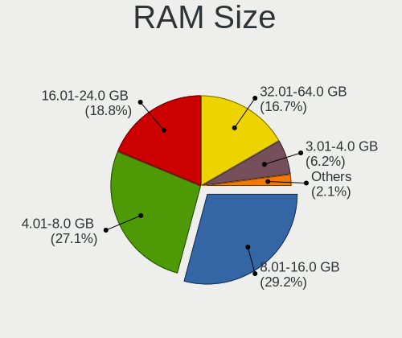
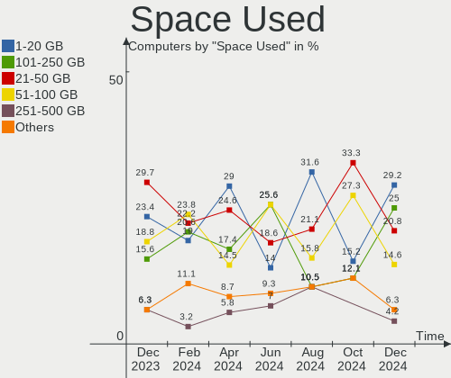
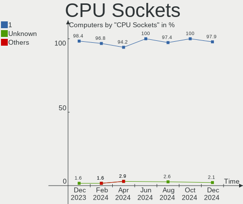
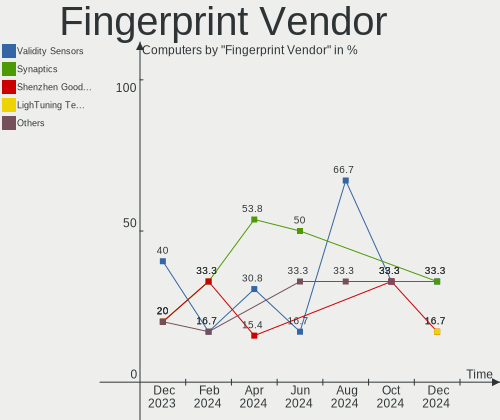

Kali - Hardware Trends
----------------------

A project to identify most popular hardware characteristics and track their change
over time based on data collected by Linux users at https://Linux-Hardware.org.

Anyone can contribute to this report by the [hw-probe](https://github.com/linuxhw/hw-probe) tool:

    sudo -E hw-probe -all -upload

This is a report for all computer types. See also reports for [desktops](/Dist/Kali/Desktop/README.md) and [notebooks](/Dist/Kali/Notebook/README.md).

This report is for one last month. Overall report since the beginning of time: [TestDays](https://github.com/linuxhw/TestDays)

Period: Sep, 2023.

Contents
--------

* [ System ](#system)
  - [ OS                       ](#os)
  - [ OS Family                ](#os-family)
  - [ Kernel                   ](#kernel)
  - [ Kernel Family            ](#kernel-family)
  - [ Kernel Major Ver.        ](#kernel-major-ver)
  - [ Arch                     ](#arch)
  - [ DE                       ](#de)
  - [ Display Server           ](#display-server)
  - [ Display Manager          ](#display-manager)
  - [ OS Lang                  ](#os-lang)
  - [ Boot Mode                ](#boot-mode)
  - [ Filesystem               ](#filesystem)
  - [ Part. scheme             ](#part-scheme)
  - [ Dual Boot with Linux/BSD ](#dual-boot-with-linuxbsd)
  - [ Dual Boot (Win)          ](#dual-boot-win)

* [ Board ](#board)
  - [ Vendor                   ](#vendor)
  - [ Model                    ](#model)
  - [ Model Family             ](#model-family)
  - [ MFG Year                 ](#mfg-year)
  - [ Form Factor              ](#form-factor)
  - [ Secure Boot              ](#secure-boot)
  - [ Coreboot                 ](#coreboot)
  - [ RAM Size                 ](#ram-size)
  - [ RAM Used                 ](#ram-used)
  - [ Total Drives             ](#total-drives)
  - [ Has CD-ROM               ](#has-cd-rom)
  - [ Has Ethernet             ](#has-ethernet)
  - [ Has WiFi                 ](#has-wifi)
  - [ Has Bluetooth            ](#has-bluetooth)

* [ Location ](#location)
  - [ Country                  ](#country)
  - [ City                     ](#city)

* [ Drives ](#drives)
  - [ Drive Vendor             ](#drive-vendor)
  - [ Drive Model              ](#drive-model)
  - [ HDD Vendor               ](#hdd-vendor)
  - [ SSD Vendor               ](#ssd-vendor)
  - [ Drive Kind               ](#drive-kind)
  - [ Drive Connector          ](#drive-connector)
  - [ Drive Size               ](#drive-size)
  - [ Space Total              ](#space-total)
  - [ Space Used               ](#space-used)
  - [ Malfunc. Drives          ](#malfunc-drives)
  - [ Malfunc. Drive Vendor    ](#malfunc-drive-vendor)
  - [ Malfunc. HDD Vendor      ](#malfunc-hdd-vendor)
  - [ Malfunc. Drive Kind      ](#malfunc-drive-kind)
  - [ Failed Drives            ](#failed-drives)
  - [ Failed Drive Vendor      ](#failed-drive-vendor)
  - [ Drive Status             ](#drive-status)

* [ Storage controller ](#storage-controller)
  - [ Storage Vendor           ](#storage-vendor)
  - [ Storage Model            ](#storage-model)
  - [ Storage Kind             ](#storage-kind)

* [ Processor ](#processor)
  - [ CPU Vendor               ](#cpu-vendor)
  - [ CPU Model                ](#cpu-model)
  - [ CPU Model Family         ](#cpu-model-family)
  - [ CPU Cores                ](#cpu-cores)
  - [ CPU Sockets              ](#cpu-sockets)
  - [ CPU Threads              ](#cpu-threads)
  - [ CPU Op-Modes             ](#cpu-op-modes)
  - [ CPU Microcode            ](#cpu-microcode)
  - [ CPU Microarch            ](#cpu-microarch)

* [ Graphics ](#graphics)
  - [ GPU Vendor               ](#gpu-vendor)
  - [ GPU Model                ](#gpu-model)
  - [ GPU Combo                ](#gpu-combo)
  - [ GPU Driver               ](#gpu-driver)
  - [ GPU Memory               ](#gpu-memory)

* [ Monitor ](#monitor)
  - [ Monitor Vendor           ](#monitor-vendor)
  - [ Monitor Model            ](#monitor-model)
  - [ Monitor Resolution       ](#monitor-resolution)
  - [ Monitor Diagonal         ](#monitor-diagonal)
  - [ Monitor Width            ](#monitor-width)
  - [ Aspect Ratio             ](#aspect-ratio)
  - [ Monitor Area             ](#monitor-area)
  - [ Pixel Density            ](#pixel-density)
  - [ Multiple Monitors        ](#multiple-monitors)

* [ Network ](#network)
  - [ Net Controller Vendor    ](#net-controller-vendor)
  - [ Net Controller Model     ](#net-controller-model)
  - [ Wireless Vendor          ](#wireless-vendor)
  - [ Wireless Model           ](#wireless-model)
  - [ Ethernet Vendor          ](#ethernet-vendor)
  - [ Ethernet Model           ](#ethernet-model)
  - [ Net Controller Kind      ](#net-controller-kind)
  - [ Used Controller          ](#used-controller)
  - [ NICs                     ](#nics)
  - [ IPv6                     ](#ipv6)

* [ Bluetooth ](#bluetooth)
  - [ Bluetooth Vendor         ](#bluetooth-vendor)
  - [ Bluetooth Model          ](#bluetooth-model)

* [ Sound ](#sound)
  - [ Sound Vendor             ](#sound-vendor)
  - [ Sound Model              ](#sound-model)

* [ Memory ](#memory)
  - [ Memory Vendor            ](#memory-vendor)
  - [ Memory Model             ](#memory-model)
  - [ Memory Kind              ](#memory-kind)
  - [ Memory Form Factor       ](#memory-form-factor)
  - [ Memory Size              ](#memory-size)
  - [ Memory Speed             ](#memory-speed)

* [ Printers & scanners ](#printers--scanners)
  - [ Printer Vendor           ](#printer-vendor)
  - [ Printer Model            ](#printer-model)
  - [ Scanner Vendor           ](#scanner-vendor)
  - [ Scanner Model            ](#scanner-model)

* [ Camera ](#camera)
  - [ Camera Vendor            ](#camera-vendor)
  - [ Camera Model             ](#camera-model)

* [ Security ](#security)
  - [ Fingerprint Vendor       ](#fingerprint-vendor)
  - [ Fingerprint Model        ](#fingerprint-model)
  - [ Chipcard Vendor          ](#chipcard-vendor)
  - [ Chipcard Model           ](#chipcard-model)

* [ Unsupported ](#unsupported)
  - [ Unsupported Devices      ](#unsupported-devices)
  - [ Unsupported Device Types ](#unsupported-device-types)

System
------

OS
--

Installed operating systems

| Name        | Computers | Percent |
|-------------|-----------|---------|
| Kali 2023.3 | 75        | 98.68%  |
| Kali 2023.2 | 1         | 1.32%   |

OS Family
---------

OS without a version

| Name | Computers | Percent |
|------|-----------|---------|
| Kali | 76        | 100%    |

Kernel
------

Version of the Linux kernel

| Version                                       | Computers | Percent |
|-----------------------------------------------|-----------|---------|
| 6.4.0-kali3-amd64                             | 38        | 50%     |
| 6.5.0-kali1-amd64                             | 19        | 25%     |
| 6.3.0-kali1-amd64                             | 11        | 14.47%  |
| 6.1.0-kali9-amd64                             | 2         | 2.63%   |
| 6.5.0-kali1-686-pae                           | 1         | 1.32%   |
| 6.1.0-kali7-amd64                             | 1         | 1.32%   |
| 6.1.0-kali5-amd64                             | 1         | 1.32%   |
| 5.4.210-qgki-gd327947dbac8                    | 1         | 1.32%   |
| 5.10.136-android12-9-27100597-abS908BXXS6CWH6 | 1         | 1.32%   |
| 4.14.320-perf-g087a6bd915a0                   | 1         | 1.32%   |

Kernel Family
-------------

Linux kernel without a distro release

| Version  | Computers | Percent |
|----------|-----------|---------|
| 6.4.0    | 38        | 50%     |
| 6.5.0    | 20        | 26.32%  |
| 6.3.0    | 11        | 14.47%  |
| 6.1.0    | 4         | 5.26%   |
| 5.4.210  | 1         | 1.32%   |
| 5.10.136 | 1         | 1.32%   |
| 4.14.320 | 1         | 1.32%   |

Kernel Major Ver.
-----------------

Linux kernel major version

| Version | Computers | Percent |
|---------|-----------|---------|
| 6.4     | 38        | 50%     |
| 6.5     | 20        | 26.32%  |
| 6.3     | 11        | 14.47%  |
| 6.1     | 4         | 5.26%   |
| 5.4     | 1         | 1.32%   |
| 5.10    | 1         | 1.32%   |
| 4.14    | 1         | 1.32%   |

Arch
----

OS architecture (x86_64, i586, etc.)

| Name    | Computers | Percent |
|---------|-----------|---------|
| x86_64  | 72        | 94.74%  |
| aarch64 | 3         | 3.95%   |
| i686    | 1         | 1.32%   |

DE
--

Desktop Environment

| Name  | Computers | Percent |
|-------|-----------|---------|
| XFCE  | 44        | 57.89%  |
| GNOME | 20        | 26.32%  |
| KDE5  | 11        | 14.47%  |
| MATE  | 1         | 1.32%   |

Display Server
--------------

X11 or Wayland

| Name    | Computers | Percent |
|---------|-----------|---------|
| X11     | 73        | 96.05%  |
| Wayland | 2         | 2.63%   |
| Tty     | 1         | 1.32%   |

Display Manager
---------------

SDDM, LightDM, etc.

| Name    | Computers | Percent |
|---------|-----------|---------|
| LightDM | 33        | 43.42%  |
| Unknown | 25        | 32.89%  |
| SDDM    | 12        | 15.79%  |
| GDM3    | 5         | 6.58%   |
| GDM     | 1         | 1.32%   |

OS Lang
-------

Language

| Lang    | Computers | Percent |
|---------|-----------|---------|
| C       | 32        | 42.11%  |
| en_US   | 22        | 28.95%  |
| de_DE   | 5         | 6.58%   |
| en_GB   | 4         | 5.26%   |
| ru_RU   | 2         | 2.63%   |
| pt_BR   | 2         | 2.63%   |
| en_AU   | 2         | 2.63%   |
| zh_TW   | 1         | 1.32%   |
| zh_CN   | 1         | 1.32%   |
| sv_SE   | 1         | 1.32%   |
| fr_FR   | 1         | 1.32%   |
| en_ZA   | 1         | 1.32%   |
| en_IN   | 1         | 1.32%   |
| Unknown | 1         | 1.32%   |

Boot Mode
---------

EFI or BIOS

| Mode | Computers | Percent |
|------|-----------|---------|
| EFI  | 44        | 57.89%  |
| BIOS | 32        | 42.11%  |

Filesystem
----------

Type of filesystem

| Type    | Computers | Percent |
|---------|-----------|---------|
| Ext4    | 68        | 89.47%  |
| Tmpfs   | 2         | 2.63%   |
| Overlay | 2         | 2.63%   |
| Btrfs   | 2         | 2.63%   |
| Xfs     | 1         | 1.32%   |
| F2fs    | 1         | 1.32%   |

Part. scheme
------------

Scheme of partitioning

| Type    | Computers | Percent |
|---------|-----------|---------|
| GPT     | 38        | 50%     |
| Unknown | 27        | 35.53%  |
| MBR     | 11        | 14.47%  |

Dual Boot with Linux/BSD
------------------------

Hosting more than one Linux/BSD

| Dual boot | Computers | Percent |
|-----------|-----------|---------|
| No        | 71        | 93.42%  |
| Yes       | 5         | 6.58%   |

Dual Boot (Win)
---------------

Hosting Linux and Windows

| Dual boot | Computers | Percent |
|-----------|-----------|---------|
| No        | 53        | 69.74%  |
| Yes       | 23        | 30.26%  |

Board
-----

Vendor
------

Motherboard manufacturer

| Name                | Computers | Percent |
|---------------------|-----------|---------|
| Hewlett-Packard     | 15        | 19.74%  |
| Lenovo              | 11        | 14.47%  |
| ASUSTek Computer    | 10        | 13.16%  |
| Dell                | 9         | 11.84%  |
| Gigabyte Technology | 4         | 5.26%   |
| MSI                 | 3         | 3.95%   |
| Acer                | 3         | 3.95%   |
| Unknown             | 3         | 3.95%   |
| Toshiba             | 2         | 2.63%   |
| Samsung Electronics | 2         | 2.63%   |
| Apple               | 2         | 2.63%   |
| Wortmann AG         | 1         | 1.32%   |
| Panasonic           | 1         | 1.32%   |
| Microsoft           | 1         | 1.32%   |
| Medion              | 1         | 1.32%   |
| LG Electronics      | 1         | 1.32%   |
| Intel               | 1         | 1.32%   |
| Google              | 1         | 1.32%   |
| Fujitsu             | 1         | 1.32%   |
| Dynabook            | 1         | 1.32%   |
| Clevo               | 1         | 1.32%   |
| Casper              | 1         | 1.32%   |
| ASRock              | 1         | 1.32%   |

Model
-----

Motherboard model

| Name                                      | Computers | Percent |
|-------------------------------------------|-----------|---------|
| Unknown                                   | 3         | 3.95%   |
| ASUS ROG STRIX B365-G GAMING              | 2         | 2.63%   |
| Wortmann AG TERRA_MOBILE_1512/1712        | 1         | 1.32%   |
| Toshiba Satellite S55-B                   | 1         | 1.32%   |
| Toshiba Satellite L50D-B                  | 1         | 1.32%   |
| Samsung R530/R730/P590                    | 1         | 1.32%   |
| Samsung 370E4K                            | 1         | 1.32%   |
| Panasonic CF-191HACHFN                    | 1         | 1.32%   |
| MSI N6105                                 | 1         | 1.32%   |
| MSI MS-7C02                               | 1         | 1.32%   |
| MSI MS-7891                               | 1         | 1.32%   |
| Microsoft Surface Go                      | 1         | 1.32%   |
| Medion E16402                             | 1         | 1.32%   |
| LG 15Z990-U.AAS5U1                        | 1         | 1.32%   |
| Lenovo Yoga 720-13IKB 81C3                | 1         | 1.32%   |
| Lenovo ThinkPad X220 Tablet 42992PG       | 1         | 1.32%   |
| Lenovo ThinkPad X13 Yoga Gen 1 20SX0004GE | 1         | 1.32%   |
| Lenovo ThinkPad X1 Extreme 2nd 20QVCTO1WW | 1         | 1.32%   |
| Lenovo ThinkPad X1 Carbon 7th 20QD003JGE  | 1         | 1.32%   |
| Lenovo ThinkPad T14 Gen 1 20S1S96300      | 1         | 1.32%   |
| Lenovo Legion Y740-17IRHg 81UJ            | 1         | 1.32%   |
| Lenovo Legion 5 15ARH05 82B5              | 1         | 1.32%   |
| Lenovo IdeaPadFlex 5 14ALC05 82HU         | 1         | 1.32%   |
| Lenovo IdeaPad 320-15IKB 81BT             | 1         | 1.32%   |
| Lenovo G580 2189                          | 1         | 1.32%   |
| Intel GT5628                              | 1         | 1.32%   |
| HP ProBook 450 G1                         | 1         | 1.32%   |
| HP Pavilion Laptop 15-eh1xxx              | 1         | 1.32%   |
| HP Pavilion Laptop 15-eg2xxx              | 1         | 1.32%   |
| HP Pavilion dv7                           | 1         | 1.32%   |
| HP Pavilion dv4                           | 1         | 1.32%   |
| HP Pavilion All-in-One Desktop 27-ca1xxx  | 1         | 1.32%   |
| HP Laptop 15-dy1xxx                       | 1         | 1.32%   |
| HP Laptop 15-bs2xx                        | 1         | 1.32%   |
| HP ENVY x360 Convertible 15-ds1xxx        | 1         | 1.32%   |
| HP ENVY x360 2-in-1 Laptop 15-fh0xxx      | 1         | 1.32%   |
| HP EliteDesk 800 G2 DM 35W                | 1         | 1.32%   |
| HP EliteBook 850 G1                       | 1         | 1.32%   |
| HP EliteBook 830 G5                       | 1         | 1.32%   |
| HP 240 14 inch G9 Notebook PC             | 1         | 1.32%   |

Model Family
------------

Motherboard model prefix

| Name                   | Computers | Percent |
|------------------------|-----------|---------|
| Lenovo ThinkPad        | 5         | 6.58%   |
| HP Pavilion            | 5         | 6.58%   |
| Dell Latitude          | 5         | 6.58%   |
| ASUS ROG               | 4         | 5.26%   |
| Unknown                | 3         | 3.95%   |
| Toshiba Satellite      | 2         | 2.63%   |
| Lenovo Legion          | 2         | 2.63%   |
| HP Laptop              | 2         | 2.63%   |
| HP ENVY                | 2         | 2.63%   |
| HP EliteBook           | 2         | 2.63%   |
| ASUS ASUS              | 2         | 2.63%   |
| Wortmann AG TERRA      | 1         | 1.32%   |
| Samsung R530           | 1         | 1.32%   |
| Samsung 370E4K         | 1         | 1.32%   |
| Panasonic CF-191HACHFN | 1         | 1.32%   |
| MSI N6105              | 1         | 1.32%   |
| MSI MS-7C02            | 1         | 1.32%   |
| MSI MS-7891            | 1         | 1.32%   |
| Microsoft Surface      | 1         | 1.32%   |
| Medion E16402          | 1         | 1.32%   |
| LG 15Z990-U.AAS5U1     | 1         | 1.32%   |
| Lenovo Yoga            | 1         | 1.32%   |
| Lenovo IdeaPadFlex     | 1         | 1.32%   |
| Lenovo IdeaPad         | 1         | 1.32%   |
| Lenovo G580            | 1         | 1.32%   |
| Intel GT5628           | 1         | 1.32%   |
| HP ProBook             | 1         | 1.32%   |
| HP EliteDesk           | 1         | 1.32%   |
| HP 240                 | 1         | 1.32%   |
| HP 23-b205er           | 1         | 1.32%   |
| Google Droid           | 1         | 1.32%   |
| Gigabyte Z590          | 1         | 1.32%   |
| Gigabyte G41M-Combo    | 1         | 1.32%   |
| Gigabyte B450M         | 1         | 1.32%   |
| Gigabyte 945GCMX-S2    | 1         | 1.32%   |
| Fujitsu LIFEBOOK       | 1         | 1.32%   |
| Dynabook TECRA         | 1         | 1.32%   |
| Dell Vostro            | 1         | 1.32%   |
| Dell Precision         | 1         | 1.32%   |
| Dell Inspiron          | 1         | 1.32%   |

MFG Year
--------

Motherboard manufacture year

| Year    | Computers | Percent |
|---------|-----------|---------|
| 2019    | 10        | 13.16%  |
| 2020    | 8         | 10.53%  |
| 2012    | 7         | 9.21%   |
| 2022    | 6         | 7.89%   |
| 2021    | 6         | 7.89%   |
| 2010    | 5         | 6.58%   |
| 2023    | 4         | 5.26%   |
| 2018    | 4         | 5.26%   |
| 2015    | 4         | 5.26%   |
| 2014    | 4         | 5.26%   |
| 2016    | 3         | 3.95%   |
| 2013    | 3         | 3.95%   |
| 2011    | 3         | 3.95%   |
| 2008    | 3         | 3.95%   |
| Unknown | 3         | 3.95%   |
| 2017    | 2         | 2.63%   |
| 2007    | 1         | 1.32%   |

Form Factor
-----------

Physical design of the computer

| Name           | Computers | Percent |
|----------------|-----------|---------|
| Notebook       | 52        | 68.42%  |
| Desktop        | 14        | 18.42%  |
| Convertible    | 5         | 6.58%   |
| System on chip | 3         | 3.95%   |
| Tablet         | 1         | 1.32%   |
| All in one     | 1         | 1.32%   |

Secure Boot
-----------

Enabled or disabled

| State    | Computers | Percent |
|----------|-----------|---------|
| Disabled | 76        | 100%    |

Coreboot
--------

Have coreboot on board

| Used | Computers | Percent |
|------|-----------|---------|
| No   | 75        | 98.68%  |
| Yes  | 1         | 1.32%   |

RAM Size
--------

Total RAM memory

| Size in GB  | Computers | Percent |
|-------------|-----------|---------|
| 4.01-8.0    | 28        | 36.84%  |
| 16.01-24.0  | 15        | 19.74%  |
| 8.01-16.0   | 12        | 15.79%  |
| 3.01-4.0    | 9         | 11.84%  |
| 32.01-64.0  | 7         | 9.21%   |
| 64.01-256.0 | 4         | 5.26%   |
| 1.01-2.0    | 1         | 1.32%   |

RAM Used
--------

Used RAM memory

| Used GB   | Computers | Percent |
|-----------|-----------|---------|
| 2.01-3.0  | 24        | 31.58%  |
| 3.01-4.0  | 20        | 26.32%  |
| 4.01-8.0  | 18        | 23.68%  |
| 1.01-2.0  | 12        | 15.79%  |
| 8.01-16.0 | 2         | 2.63%   |

Total Drives
------------

Number of drives on board

| Drives | Computers | Percent |
|--------|-----------|---------|
| 1      | 49        | 64.47%  |
| 2      | 21        | 27.63%  |
| 5      | 2         | 2.63%   |
| 3      | 2         | 2.63%   |
| 7      | 1         | 1.32%   |
| 0      | 1         | 1.32%   |

Has CD-ROM
----------

Has CD-ROM on board

| Presented | Computers | Percent |
|-----------|-----------|---------|
| No        | 57        | 75%     |
| Yes       | 19        | 25%     |

Has Ethernet
------------

Has Ethernet on board

| Presented | Computers | Percent |
|-----------|-----------|---------|
| Yes       | 60        | 78.95%  |
| No        | 16        | 21.05%  |

Has WiFi
--------

Has WiFi module

| Presented | Computers | Percent |
|-----------|-----------|---------|
| Yes       | 69        | 90.79%  |
| No        | 7         | 9.21%   |

Has Bluetooth
-------------

Has Bluetooth module

| Presented | Computers | Percent |
|-----------|-----------|---------|
| Yes       | 57        | 75%     |
| No        | 19        | 25%     |

Location
--------

Country
-------

Geographic location (country)

| Country      | Computers | Percent |
|--------------|-----------|---------|
| USA          | 14        | 18.42%  |
| Germany      | 8         | 10.53%  |
| Russia       | 5         | 6.58%   |
| Egypt        | 4         | 5.26%   |
| Turkey       | 3         | 3.95%   |
| Spain        | 3         | 3.95%   |
| Australia    | 3         | 3.95%   |
| UK           | 2         | 2.63%   |
| Poland       | 2         | 2.63%   |
| Pakistan     | 2         | 2.63%   |
| Norway       | 2         | 2.63%   |
| Indonesia    | 2         | 2.63%   |
| India        | 2         | 2.63%   |
| France       | 2         | 2.63%   |
| Canada       | 2         | 2.63%   |
| Bulgaria     | 2         | 2.63%   |
| Brazil       | 2         | 2.63%   |
| Taiwan       | 1         | 1.32%   |
| Sweden       | 1         | 1.32%   |
| South Africa | 1         | 1.32%   |
| Serbia       | 1         | 1.32%   |
| Philippines  | 1         | 1.32%   |
| Peru         | 1         | 1.32%   |
| Nigeria      | 1         | 1.32%   |
| Malaysia     | 1         | 1.32%   |
| Israel       | 1         | 1.32%   |
| Greece       | 1         | 1.32%   |
| Denmark      | 1         | 1.32%   |
| Colombia     | 1         | 1.32%   |
| China        | 1         | 1.32%   |
| Benin        | 1         | 1.32%   |
| Azerbaijan   | 1         | 1.32%   |
| Austria      | 1         | 1.32%   |

City
----

Geographic location (city)

| City          | Computers | Percent |
|---------------|-----------|---------|
| Zaragoza      | 3         | 3.95%   |
| Lahore        | 2         | 2.63%   |
| Cairo         | 2         | 2.63%   |
| Berlin        | 2         | 2.63%   |
| Warsaw        | 1         | 1.32%   |
| Vršac        | 1         | 1.32%   |
| Vlasikha      | 1         | 1.32%   |
| Vienna        | 1         | 1.32%   |
| Viby J        | 1         | 1.32%   |
| Vaureal       | 1         | 1.32%   |
| Van           | 1         | 1.32%   |
| Utansjo       | 1         | 1.32%   |
| Trondheim     | 1         | 1.32%   |
| Taipei        | 1         | 1.32%   |
| Sydney        | 1         | 1.32%   |
| Staunton      | 1         | 1.32%   |
| Sofia         | 1         | 1.32%   |
| Shah Alam     | 1         | 1.32%   |
| San Diego     | 1         | 1.32%   |
| Saint-Georges | 1         | 1.32%   |
| Rottweil      | 1         | 1.32%   |
| Reading       | 1         | 1.32%   |
| Qina          | 1         | 1.32%   |
| Pune          | 1         | 1.32%   |
| Port Said     | 1         | 1.32%   |
| Pleasant Hill | 1         | 1.32%   |
| Phoenix       | 1         | 1.32%   |
| Nanning       | 1         | 1.32%   |
| Nal'chik      | 1         | 1.32%   |
| Munich        | 1         | 1.32%   |
| Moscow        | 1         | 1.32%   |
| Melbourne     | 1         | 1.32%   |
| Medellín     | 1         | 1.32%   |
| Medan         | 1         | 1.32%   |
| Mannheim      | 1         | 1.32%   |
| Manaus        | 1         | 1.32%   |
| Lubaczow      | 1         | 1.32%   |
| Lima          | 1         | 1.32%   |
| Las Vegas     | 1         | 1.32%   |
| Lagos         | 1         | 1.32%   |

Drives
------

Drive Vendor
------------

Hard drive vendors

| Vendor                      | Computers | Drives | Percent |
|-----------------------------|-----------|--------|---------|
| Samsung Electronics         | 15        | 15     | 13.76%  |
| WDC                         | 14        | 16     | 12.84%  |
| Seagate                     | 11        | 12     | 10.09%  |
| Toshiba                     | 9         | 10     | 8.26%   |
| SanDisk                     | 9         | 9      | 8.26%   |
| Unknown                     | 8         | 9      | 7.34%   |
| Crucial                     | 7         | 7      | 6.42%   |
| Phison Electronics          | 3         | 3      | 2.75%   |
| Intel                       | 3         | 3      | 2.75%   |
| SK hynix                    | 2         | 2      | 1.83%   |
| Silicon Motion              | 2         | 2      | 1.83%   |
| Micron Technology           | 2         | 2      | 1.83%   |
| KIOXIA                      | 2         | 2      | 1.83%   |
| Kingston                    | 2         | 2      | 1.83%   |
| Hitachi                     | 2         | 2      | 1.83%   |
| China                       | 2         | 2      | 1.83%   |
| Apple                       | 2         | 2      | 1.83%   |
| V-GeN                       | 1         | 1      | 0.92%   |
| T-FORCE                     | 1         | 1      | 0.92%   |
| Realtek Semiconductor       | 1         | 1      | 0.92%   |
| Patriot                     | 1         | 1      | 0.92%   |
| MidasForce                  | 1         | 1      | 0.92%   |
| MAXIO Technology (Hangzhou) | 1         | 1      | 0.92%   |
| Kingston Technology Company | 1         | 1      | 0.92%   |
| JMicron Technology          | 1         | 1      | 0.92%   |
| Integral                    | 1         | 1      | 0.92%   |
| GOODRAM                     | 1         | 1      | 0.92%   |
| BAITITON                    | 1         | 1      | 0.92%   |
| ADATA Technology            | 1         | 1      | 0.92%   |
| A-DATA Technology           | 1         | 1      | 0.92%   |
| Unknown                     | 1         | 1      | 0.92%   |

Drive Model
-----------

Hard drive models

| Model                                | Computers | Percent |
|--------------------------------------|-----------|---------|
| SanDisk SSD PLUS 240GB               | 3         | 2.65%   |
| Samsung SSD 840 EVO 120GB            | 3         | 2.65%   |
| WDC WDS100T2B0A-00SM50 1TB SSD       | 2         | 1.77%   |
| WDC WD40EFAX-68JH4N0 4TB             | 2         | 1.77%   |
| Toshiba MQ01ABD100 1TB               | 2         | 1.77%   |
| Toshiba HDWR160 6TB                  | 2         | 1.77%   |
| Seagate ST1000LM035-1RK172 1TB       | 2         | 1.77%   |
| Phison E12 NVMe Controller 2TB       | 2         | 1.77%   |
| KIOXIA KBG50ZNV512G 512GB            | 2         | 1.77%   |
| Kingston SV300S37A120G 120GB SSD     | 2         | 1.77%   |
| Crucial CT512MX100SSD1 512GB         | 2         | 1.77%   |
| WDC WDS500G2B0A-00SM50 500GB SSD     | 1         | 0.88%   |
| WDC WD7500BPKT-00PK4T0 752GB         | 1         | 0.88%   |
| WDC WD5000BPKT-60PK4T0 500GB         | 1         | 0.88%   |
| WDC WD5000AAKX-08ERMA0 500GB         | 1         | 0.88%   |
| WDC WD3200BEKX-75B7WT0 320GB         | 1         | 0.88%   |
| WDC WD2500BEVS-22UST0 250GB          | 1         | 0.88%   |
| WDC WD10SPZX-22Z10T1 1TB             | 1         | 0.88%   |
| WDC WD10JPVX-75JC3T0 1TB             | 1         | 0.88%   |
| WDC WD10EZEX-22MFCA0 1TB             | 1         | 0.88%   |
| WDC WD10 JPVX-22JC3T0 1TB            | 1         | 0.88%   |
| WDC PC SN730 SDBQNTY-512G-1001 512GB | 1         | 0.88%   |
| WDC PC SN720 SDAPNTW-512G-1014 512GB | 1         | 0.88%   |
| V-GeN V-GEN12SM22AR128HY 128GB SSD   | 1         | 0.88%   |
| Unknown SS32G  32GB                  | 1         | 0.88%   |
| Unknown NCard  32GB                  | 1         | 0.88%   |
| Unknown MMC Card  8GB                | 1         | 0.88%   |
| Unknown MMC Card  536GB              | 1         | 0.88%   |
| Unknown MMC Card  16GB               | 1         | 0.88%   |
| Unknown MMC Card  128GB              | 1         | 0.88%   |
| Unknown hB8aP  32GB                  | 1         | 0.88%   |
| Unknown EB1QT  32GB                  | 1         | 0.88%   |
| Unknown 032GE4  32GB                 | 1         | 0.88%   |
| Toshiba MK5056GSY 500GB              | 1         | 0.88%   |
| Toshiba MD04ACA400 4TB               | 1         | 0.88%   |
| Toshiba KBG30ZPZ128G 128GB           | 1         | 0.88%   |
| Toshiba HDWD110 1TB                  | 1         | 0.88%   |
| Toshiba DT01ACA200 2TB               | 1         | 0.88%   |
| Toshiba DT01ACA050 500GB             | 1         | 0.88%   |
| T-FORCE 1TB                          | 1         | 0.88%   |

HDD Vendor
----------

Hard disk drive vendors

| Vendor  | Computers | Drives | Percent |
|---------|-----------|--------|---------|
| WDC     | 11        | 11     | 34.38%  |
| Seagate | 11        | 12     | 34.38%  |
| Toshiba | 8         | 9      | 25%     |
| Hitachi | 2         | 2      | 6.25%   |

SSD Vendor
----------

Solid state drive vendors

| Vendor              | Computers | Drives | Percent |
|---------------------|-----------|--------|---------|
| Samsung Electronics | 7         | 7      | 21.21%  |
| SanDisk             | 6         | 6      | 18.18%  |
| Crucial             | 5         | 5      | 15.15%  |
| WDC                 | 3         | 3      | 9.09%   |
| Kingston            | 2         | 2      | 6.06%   |
| China               | 2         | 2      | 6.06%   |
| V-GeN               | 1         | 1      | 3.03%   |
| Patriot             | 1         | 1      | 3.03%   |
| JMicron Technology  | 1         | 1      | 3.03%   |
| Intel               | 1         | 1      | 3.03%   |
| Integral            | 1         | 1      | 3.03%   |
| GOODRAM             | 1         | 1      | 3.03%   |
| BAITITON            | 1         | 1      | 3.03%   |
| Apple               | 1         | 1      | 3.03%   |

Drive Kind
----------

HDD or SSD

| Kind    | Computers | Drives | Percent |
|---------|-----------|--------|---------|
| NVMe    | 35        | 36     | 35%     |
| SSD     | 29        | 33     | 29%     |
| HDD     | 26        | 34     | 26%     |
| MMC     | 9         | 10     | 9%      |
| Unknown | 1         | 1      | 1%      |

Drive Connector
---------------

SATA, SAS, NVMe, etc.

| Type | Computers | Drives | Percent |
|------|-----------|--------|---------|
| SATA | 43        | 64     | 47.78%  |
| NVMe | 35        | 36     | 38.89%  |
| MMC  | 9         | 10     | 10%     |
| SAS  | 3         | 4      | 3.33%   |

Drive Size
----------

Size of hard drive

| Size in TB | Computers | Drives | Percent |
|------------|-----------|--------|---------|
| 0.01-0.5   | 30        | 37     | 53.57%  |
| 0.51-1.0   | 18        | 20     | 32.14%  |
| 3.01-4.0   | 4         | 4      | 7.14%   |
| 4.01-10.0  | 2         | 2      | 3.57%   |
| 10.01-20.0 | 1         | 1      | 1.79%   |
| 1.01-2.0   | 1         | 3      | 1.79%   |

Space Total
-----------

Amount of disk space available on the file system

| Size in GB     | Computers | Percent |
|----------------|-----------|---------|
| 101-250        | 25        | 32.89%  |
| 251-500        | 17        | 22.37%  |
| 501-1000       | 10        | 13.16%  |
| More than 3000 | 5         | 6.58%   |
| 1001-2000      | 5         | 6.58%   |
| 51-100         | 5         | 6.58%   |
| 21-50          | 4         | 5.26%   |
| Unknown        | 3         | 3.95%   |
| 2001-3000      | 1         | 1.32%   |
| 1-20           | 1         | 1.32%   |

Space Used
----------

Amount of used disk space

| Used GB        | Computers | Percent |
|----------------|-----------|---------|
| 21-50          | 17        | 22.37%  |
| 101-250        | 17        | 22.37%  |
| 1-20           | 16        | 21.05%  |
| 51-100         | 11        | 14.47%  |
| 251-500        | 5         | 6.58%   |
| More than 3000 | 4         | 5.26%   |
| Unknown        | 3         | 3.95%   |
| 2001-3000      | 1         | 1.32%   |
| 1001-2000      | 1         | 1.32%   |
| 501-1000       | 1         | 1.32%   |

Malfunc. Drives
---------------

Drive models with a malfunction

| Model                          | Computers | Drives | Percent |
|--------------------------------|-----------|--------|---------|
| Toshiba MQ01ABD100 1TB         | 1         | 1      | 16.67%  |
| Toshiba MK5056GSY 500GB        | 1         | 1      | 16.67%  |
| Silicon Motion NE-512 512GB    | 1         | 1      | 16.67%  |
| Seagate ST3500630AS 500GB      | 1         | 1      | 16.67%  |
| Seagate ST1000LM035-1RK172 1TB | 1         | 1      | 16.67%  |
| SanDisk SSD PLUS 240GB         | 1         | 1      | 16.67%  |

Malfunc. Drive Vendor
---------------------

Vendors of faulty drives

| Vendor         | Computers | Drives | Percent |
|----------------|-----------|--------|---------|
| Toshiba        | 2         | 2      | 33.33%  |
| Seagate        | 2         | 2      | 33.33%  |
| Silicon Motion | 1         | 1      | 16.67%  |
| SanDisk        | 1         | 1      | 16.67%  |

Malfunc. HDD Vendor
-------------------

Vendors of faulty HDD drives

| Vendor  | Computers | Drives | Percent |
|---------|-----------|--------|---------|
| Toshiba | 2         | 2      | 50%     |
| Seagate | 2         | 2      | 50%     |

Malfunc. Drive Kind
-------------------

Kinds of faulty drives

| Kind | Computers | Drives | Percent |
|------|-----------|--------|---------|
| HDD  | 4         | 4      | 66.67%  |
| NVMe | 1         | 1      | 16.67%  |
| SSD  | 1         | 1      | 16.67%  |

Failed Drives
-------------

Failed drive models

Zero info for selected period =(

Failed Drive Vendor
-------------------

Failed drive vendors

Zero info for selected period =(

Drive Status
------------

Number of failed and malfunc. drives

| Status   | Computers | Drives | Percent |
|----------|-----------|--------|---------|
| Works    | 43        | 57     | 52.44%  |
| Detected | 33        | 51     | 40.24%  |
| Malfunc  | 6         | 6      | 7.32%   |

Storage controller
------------------

Storage Vendor
--------------

Storage controller vendors

| Vendor                       | Computers | Percent |
|------------------------------|-----------|---------|
| Intel                        | 46        | 51.11%  |
| AMD                          | 9         | 10%     |
| Samsung Electronics          | 8         | 8.89%   |
| SanDisk                      | 5         | 5.56%   |
| Phison Electronics           | 4         | 4.44%   |
| Silicon Motion               | 3         | 3.33%   |
| SK hynix                     | 2         | 2.22%   |
| Micron/Crucial Technology    | 2         | 2.22%   |
| Micron Technology            | 2         | 2.22%   |
| KIOXIA                       | 2         | 2.22%   |
| ADATA Technology             | 2         | 2.22%   |
| Toshiba America Info Systems | 1         | 1.11%   |
| Realtek Semiconductor        | 1         | 1.11%   |
| MAXIO Technology (Hangzhou)  | 1         | 1.11%   |
| Kingston Technology Company  | 1         | 1.11%   |
| Apple                        | 1         | 1.11%   |

Storage Model
-------------

Storage controller models

| Model                                                                         | Computers | Percent |
|-------------------------------------------------------------------------------|-----------|---------|
| Intel 82801 Mobile SATA Controller [RAID mode]                                | 6         | 6.25%   |
| Intel 7 Series Chipset Family 6-port SATA Controller [AHCI mode]              | 6         | 6.25%   |
| AMD FCH SATA Controller [AHCI mode]                                           | 5         | 5.21%   |
| Samsung NVMe SSD Controller 980                                               | 4         | 4.17%   |
| Intel 5 Series/3400 Series Chipset 4 port SATA AHCI Controller                | 4         | 4.17%   |
| Intel Volume Management Device NVMe RAID Controller                           | 3         | 3.13%   |
| Intel Q170/Q150/B150/H170/H110/Z170/CM236 Chipset SATA Controller [AHCI Mode] | 3         | 3.13%   |
| Intel Cannon Lake Mobile PCH SATA AHCI Controller                             | 3         | 3.13%   |
| Intel 6 Series/C200 Series Chipset Family 6 port Mobile SATA AHCI Controller  | 3         | 3.13%   |
| Silicon Motion SM2263EN/SM2263XT (DRAM-less) NVMe SSD Controllers             | 2         | 2.08%   |
| Samsung NVMe SSD Controller SM981/PM981/PM983                                 | 2         | 2.08%   |
| Phison E12 NVMe Controller                                                    | 2         | 2.08%   |
| KIOXIA NVMe SSD Controller BG5 (DRAM-less)                                    | 2         | 2.08%   |
| Intel Sunrise Point-LP SATA Controller [AHCI mode]                            | 2         | 2.08%   |
| Intel NM10/ICH7 Family SATA Controller [IDE mode]                             | 2         | 2.08%   |
| Intel Cannon Point-LP SATA Controller [AHCI Mode]                             | 2         | 2.08%   |
| Intel Alder Lake-P SATA AHCI Controller                                       | 2         | 2.08%   |
| Intel 400 Series Chipset Family SATA AHCI Controller                          | 2         | 2.08%   |
| Intel 200 Series PCH SATA controller [AHCI mode]                              | 2         | 2.08%   |
| AMD 400 Series Chipset SATA Controller                                        | 2         | 2.08%   |
| ADATA XPG SX8200 Pro PCIe Gen3x4 M.2 2280 Solid State Drive                   | 2         | 2.08%   |
| Toshiba America Info Systems BG3 NVMe SSD Controller                          | 1         | 1.04%   |
| SK hynix Gold P31/BC711/PC711 NVMe Solid State Drive                          | 1         | 1.04%   |
| SK hynix BC901 NVMe Solid State Drive (DRAM-less)                             | 1         | 1.04%   |
| Silicon Motion SM2260 NVMe SSD Controller                                     | 1         | 1.04%   |
| SanDisk WD Green SN350 NVMe SSD 1 TB (DRAM-less)                              | 1         | 1.04%   |
| SanDisk WD Black SN770 / PC SN740 256GB / PC SN560 (DRAM-less) NVMe SSD       | 1         | 1.04%   |
| SanDisk WD Black SN750 / PC SN730 NVMe SSD                                    | 1         | 1.04%   |
| SanDisk WD Black NVMe SSD                                                     | 1         | 1.04%   |
| SanDisk WD Black 2018/SN750 / PC SN720 NVMe SSD                               | 1         | 1.04%   |
| Samsung NVMe SSD Controller SM961/PM961/SM963                                 | 1         | 1.04%   |
| Samsung NVMe SSD Controller S4LV008[Pascal]                                   | 1         | 1.04%   |
| Realtek RTS5763DL NVMe SSD Controller (DRAM-less)                             | 1         | 1.04%   |
| Phison PS5021-E21 PCIe4 NVMe Controller (DRAM-less)                           | 1         | 1.04%   |
| Phison PS5013 E13 NVMe Controller                                             | 1         | 1.04%   |
| Micron/Crucial P2 [Nick P2] / P3 / P3 Plus NVMe PCIe SSD (DRAM-less)          | 1         | 1.04%   |
| Micron/Crucial P1 NVMe PCIe SSD[Frampton2]                                    | 1         | 1.04%   |
| Micron 3400 NVMe SSD [Hendrix]                                                | 1         | 1.04%   |
| Micron 2210 NVMe SSD [Cobain]                                                 | 1         | 1.04%   |
| MAXIO (Hangzhou) NVMe SSD Controller MAP1202                                  | 1         | 1.04%   |

Storage Kind
------------

Kind of storage controller (IDE, SATA, NVMe, SAS, ...)

| Kind | Computers | Percent |
|------|-----------|---------|
| SATA | 47        | 49.47%  |
| NVMe | 36        | 37.89%  |
| RAID | 9         | 9.47%   |
| IDE  | 3         | 3.16%   |

Processor
---------

CPU Vendor
----------

Processor vendors

| Vendor | Computers | Percent |
|--------|-----------|---------|
| Intel  | 60        | 78.95%  |
| AMD    | 13        | 17.11%  |
| ARM    | 3         | 3.95%   |

CPU Model
---------

Processor models

| Model                                       | Computers | Percent |
|---------------------------------------------|-----------|---------|
| Intel Core i7-9750H CPU @ 2.60GHz           | 4         | 5.26%   |
| ARM Processor                               | 3         | 3.95%   |
| Intel Core i7-8565U CPU @ 1.80GHz           | 2         | 2.63%   |
| Intel Core i7-8550U CPU @ 1.80GHz           | 2         | 2.63%   |
| Intel Core i7-3520M CPU @ 2.90GHz           | 2         | 2.63%   |
| Intel Core i7-2670QM CPU @ 2.20GHz          | 2         | 2.63%   |
| Intel Core i7-10510U CPU @ 1.80GHz          | 2         | 2.63%   |
| Intel Core i3-9100 CPU @ 3.60GHz            | 2         | 2.63%   |
| Intel Core i3 CPU M 330 @ 2.13GHz           | 2         | 2.63%   |
| Intel Xeon CPU E5430 @ 2.66GHz              | 1         | 1.32%   |
| Intel Xeon CPU E3-1505M v5 @ 2.80GHz        | 1         | 1.32%   |
| Intel Pentium Dual-Core CPU E5300 @ 2.60GHz | 1         | 1.32%   |
| Intel Pentium CPU G2030 @ 3.00GHz           | 1         | 1.32%   |
| Intel Pentium CPU 4415Y @ 1.60GHz           | 1         | 1.32%   |
| Intel Core i7-7700K CPU @ 4.20GHz           | 1         | 1.32%   |
| Intel Core i7-7500U CPU @ 2.70GHz           | 1         | 1.32%   |
| Intel Core i7-4702MQ CPU @ 2.20GHz          | 1         | 1.32%   |
| Intel Core i7-4600U CPU @ 2.10GHz           | 1         | 1.32%   |
| Intel Core i7-4510U CPU @ 2.00GHz           | 1         | 1.32%   |
| Intel Core i7-3615QM CPU @ 2.30GHz          | 1         | 1.32%   |
| Intel Core i7-2720QM CPU @ 2.20GHz          | 1         | 1.32%   |
| Intel Core i7-1068NG7 CPU @ 2.30GHz         | 1         | 1.32%   |
| Intel Core i7-1065G7 CPU @ 1.30GHz          | 1         | 1.32%   |
| Intel Core i5-8350U CPU @ 1.70GHz           | 1         | 1.32%   |
| Intel Core i5-8265U CPU @ 1.60GHz           | 1         | 1.32%   |
| Intel Core i5-6500T CPU @ 2.50GHz           | 1         | 1.32%   |
| Intel Core i5-6300U CPU @ 2.40GHz           | 1         | 1.32%   |
| Intel Core i5-3340M CPU @ 2.70GHz           | 1         | 1.32%   |
| Intel Core i5-3320M CPU @ 2.60GHz           | 1         | 1.32%   |
| Intel Core i5-2520M CPU @ 2.50GHz           | 1         | 1.32%   |
| Intel Core i5-10300H CPU @ 2.50GHz          | 1         | 1.32%   |
| Intel Core i5 CPU M 480 @ 2.67GHz           | 1         | 1.32%   |
| Intel Core i5 CPU M 460 @ 2.53GHz           | 1         | 1.32%   |
| Intel Core i3-5005U CPU @ 2.00GHz           | 1         | 1.32%   |
| Intel Core i3-3217U CPU @ 1.80GHz           | 1         | 1.32%   |
| Intel Core i3-2350M CPU @ 2.30GHz           | 1         | 1.32%   |
| Intel Core i3-10100 CPU @ 3.60GHz           | 1         | 1.32%   |
| Intel Core 2 Quad CPU Q6600 @ 2.40GHz       | 1         | 1.32%   |
| Intel Celeron N4020 CPU @ 1.10GHz           | 1         | 1.32%   |
| Intel Celeron N4000 CPU @ 1.10GHz           | 1         | 1.32%   |

CPU Model Family
----------------

Processor model prefix

| Model                   | Computers | Percent |
|-------------------------|-----------|---------|
| Intel Core i7           | 23        | 30.26%  |
| Other                   | 12        | 15.79%  |
| Intel Core i5           | 10        | 13.16%  |
| Intel Core i3           | 8         | 10.53%  |
| AMD Ryzen 7             | 4         | 5.26%   |
| Intel Celeron           | 3         | 3.95%   |
| AMD Ryzen 5             | 3         | 3.95%   |
| Intel Xeon              | 2         | 2.63%   |
| Intel Pentium           | 2         | 2.63%   |
| Intel Pentium Dual-Core | 1         | 1.32%   |
| Intel Core 2 Quad       | 1         | 1.32%   |
| Intel Atom              | 1         | 1.32%   |
| AMD Ryzen 9             | 1         | 1.32%   |
| AMD Ryzen 3             | 1         | 1.32%   |
| AMD E1                  | 1         | 1.32%   |
| AMD Athlon II           | 1         | 1.32%   |
| AMD Athlon              | 1         | 1.32%   |
| AMD A6                  | 1         | 1.32%   |

CPU Cores
---------

Number of processor cores

| Number  | Computers | Percent |
|---------|-----------|---------|
| 2       | 28        | 36.84%  |
| 4       | 27        | 35.53%  |
| 6       | 7         | 9.21%   |
| 8       | 6         | 7.89%   |
| 12      | 3         | 3.95%   |
| 14      | 2         | 2.63%   |
| 10      | 1         | 1.32%   |
| 1       | 1         | 1.32%   |
| Unknown | 1         | 1.32%   |

CPU Sockets
-----------

Number of sockets

| Number  | Computers | Percent |
|---------|-----------|---------|
| 1       | 75        | 98.68%  |
| Unknown | 1         | 1.32%   |

CPU Threads
-----------

Threads per core (Hyper-Threading)

| Number  | Computers | Percent |
|---------|-----------|---------|
| 2       | 58        | 76.32%  |
| 1       | 17        | 22.37%  |
| Unknown | 1         | 1.32%   |

CPU Op-Modes
------------

CPU Operation Modes (32-bit, 64-bit)

| Op mode        | Computers | Percent |
|----------------|-----------|---------|
| 32-bit, 64-bit | 75        | 98.68%  |
| Unknown        | 1         | 1.32%   |

CPU Microcode
-------------

Microcode number

| Number     | Computers | Percent |
|------------|-----------|---------|
| Unknown    | 66        | 86.84%  |
| 0x08608104 | 2         | 2.63%   |
| 0x0a704101 | 1         | 1.32%   |
| 0x0a50000d | 1         | 1.32%   |
| 0x0a50000c | 1         | 1.32%   |
| 0x0a20120a | 1         | 1.32%   |
| 0x08600103 | 1         | 1.32%   |
| 0x08101016 | 1         | 1.32%   |
| 0x07030104 | 1         | 1.32%   |
| 0x010000c8 | 1         | 1.32%   |

CPU Microarch
-------------

Microarchitecture

| Name             | Computers | Percent |
|------------------|-----------|---------|
| KabyLake         | 17        | 22.37%  |
| IvyBridge        | 8         | 10.53%  |
| Alderlake Hybrid | 6         | 7.89%   |
| Unknown          | 6         | 7.89%   |
| SandyBridge      | 5         | 6.58%   |
| Westmere         | 4         | 5.26%   |
| Zen 3            | 3         | 3.95%   |
| Zen 2            | 3         | 3.95%   |
| Skylake          | 3         | 3.95%   |
| IceLake          | 3         | 3.95%   |
| Haswell          | 3         | 3.95%   |
| TigerLake        | 2         | 2.63%   |
| Penryn           | 2         | 2.63%   |
| Goldmont plus    | 2         | 2.63%   |
| CometLake        | 2         | 2.63%   |
| Zen              | 1         | 1.32%   |
| Silvermont       | 1         | 1.32%   |
| Puma             | 1         | 1.32%   |
| Piledriver       | 1         | 1.32%   |
| K10              | 1         | 1.32%   |
| Core             | 1         | 1.32%   |
| Broadwell        | 1         | 1.32%   |

Graphics
--------

GPU Vendor
----------

Vendors of graphics cards

| Vendor | Computers | Percent |
|--------|-----------|---------|
| Intel  | 53        | 55.21%  |
| Nvidia | 27        | 28.13%  |
| AMD    | 16        | 16.67%  |

GPU Model
---------

Graphics card models

| Model                                                                     | Computers | Percent |
|---------------------------------------------------------------------------|-----------|---------|
| Intel 3rd Gen Core processor Graphics Controller                          | 7         | 7.22%   |
| Intel CoffeeLake-H GT2 [UHD Graphics 630]                                 | 4         | 4.12%   |
| Intel 2nd Generation Core Processor Family Integrated Graphics Controller | 4         | 4.12%   |
| Intel WhiskeyLake-U GT2 [UHD Graphics 620]                                | 3         | 3.09%   |
| Intel UHD Graphics 620                                                    | 3         | 3.09%   |
| Intel Alder Lake-P Integrated Graphics Controller                         | 3         | 3.09%   |
| Nvidia TU116M [GeForce GTX 1660 Ti Mobile]                                | 2         | 2.06%   |
| Nvidia TU116 [GeForce GTX 1650 SUPER]                                     | 2         | 2.06%   |
| Nvidia GP104 [GeForce GTX 1080]                                           | 2         | 2.06%   |
| Nvidia GF117M [GeForce 610M/710M/810M/820M / GT 620M/625M/630M/720M]      | 2         | 2.06%   |
| Intel Iris Plus Graphics G7                                               | 2         | 2.06%   |
| Intel Haswell-ULT Integrated Graphics Controller                          | 2         | 2.06%   |
| Intel GeminiLake [UHD Graphics 600]                                       | 2         | 2.06%   |
| Intel Core Processor Integrated Graphics Controller                       | 2         | 2.06%   |
| Intel CometLake-U GT2 [UHD Graphics]                                      | 2         | 2.06%   |
| Intel CoffeeLake-S GT2 [UHD Graphics 630]                                 | 2         | 2.06%   |
| AMD Lucienne                                                              | 2         | 2.06%   |
| Nvidia TU117M [GeForce MX550]                                             | 1         | 1.03%   |
| Nvidia TU117M [GeForce GTX 1650 Ti Mobile]                                | 1         | 1.03%   |
| Nvidia TU117M [GeForce GTX 1650 Mobile / Max-Q]                           | 1         | 1.03%   |
| Nvidia TU117M                                                             | 1         | 1.03%   |
| Nvidia TU116 [GeForce GTX 1660 SUPER]                                     | 1         | 1.03%   |
| Nvidia TU106BM [GeForce RTX 2060 Mobile]                                  | 1         | 1.03%   |
| Nvidia GT218M [GeForce 310M]                                              | 1         | 1.03%   |
| Nvidia GM107GLM [Quadro M1000M]                                           | 1         | 1.03%   |
| Nvidia GM107 [GeForce GTX 750 Ti]                                         | 1         | 1.03%   |
| Nvidia GK208B [GeForce GT 710]                                            | 1         | 1.03%   |
| Nvidia GK107M [GeForce GT 650M Mac Edition]                               | 1         | 1.03%   |
| Nvidia GF119M [NVS 4200M]                                                 | 1         | 1.03%   |
| Nvidia GF116M [GeForce GT 560M]                                           | 1         | 1.03%   |
| Nvidia GF108GLM [NVS 5200M]                                               | 1         | 1.03%   |
| Nvidia GA107M [GeForce RTX 3050 Ti Mobile]                                | 1         | 1.03%   |
| Nvidia GA107BM [GeForce RTX 3050 Ti Mobile]                               | 1         | 1.03%   |
| Nvidia GA106M [GeForce RTX 3060 Mobile / Max-Q]                           | 1         | 1.03%   |
| Nvidia GA106 [Geforce RTX 3050]                                           | 1         | 1.03%   |
| Nvidia AD107M [GeForce RTX 4060 Max-Q / Mobile]                           | 1         | 1.03%   |
| Intel Xeon E3-1200 v2/3rd Gen Core processor Graphics Controller          | 1         | 1.03%   |
| Intel TigerLake-LP GT2 [Iris Xe Graphics]                                 | 1         | 1.03%   |
| Intel Tiger Lake-LP GT2 [UHD Graphics G4]                                 | 1         | 1.03%   |
| Intel Skylake GT2 [HD Graphics 520]                                       | 1         | 1.03%   |

GPU Combo
---------

Combinations of graphics cards

| Name           | Computers | Percent |
|----------------|-----------|---------|
| 1 x Intel      | 32        | 42.11%  |
| Intel + Nvidia | 16        | 21.05%  |
| 1 x Nvidia     | 9         | 11.84%  |
| 1 x AMD        | 8         | 10.53%  |
| Intel + AMD    | 5         | 6.58%   |
| Other          | 3         | 3.95%   |
| AMD + Nvidia   | 2         | 2.63%   |
| 2 x AMD        | 1         | 1.32%   |

GPU Driver
----------

Free vs proprietary

| Driver      | Computers | Percent |
|-------------|-----------|---------|
| Free        | 62        | 81.58%  |
| Proprietary | 9         | 11.84%  |
| Unknown     | 5         | 6.58%   |

GPU Memory
----------

Total video memory

| Size in GB | Computers | Percent |
|------------|-----------|---------|
| Unknown    | 46        | 60.53%  |
| 3.01-4.0   | 7         | 9.21%   |
| 0.51-1.0   | 7         | 9.21%   |
| 1.01-2.0   | 6         | 7.89%   |
| 0.01-0.5   | 5         | 6.58%   |
| 7.01-8.0   | 3         | 3.95%   |
| 5.01-6.0   | 2         | 2.63%   |

Monitor
-------

Monitor Vendor
--------------

Monitor vendors

| Vendor                  | Computers | Percent |
|-------------------------|-----------|---------|
| Samsung Electronics     | 11        | 12.94%  |
| BOE                     | 11        | 12.94%  |
| AU Optronics            | 10        | 11.76%  |
| LG Display              | 9         | 10.59%  |
| Chimei Innolux          | 7         | 8.24%   |
| Hewlett-Packard         | 4         | 4.71%   |
| PANDA                   | 3         | 3.53%   |
| Goldstar                | 3         | 3.53%   |
| Sharp                   | 2         | 2.35%   |
| MStar                   | 2         | 2.35%   |
| Chi Mei Optoelectronics | 2         | 2.35%   |
| Apple                   | 2         | 2.35%   |
| AOC                     | 2         | 2.35%   |
| Unknown                 | 2         | 2.35%   |
| ViewSonic               | 1         | 1.18%   |
| TMX                     | 1         | 1.18%   |
| SRT                     | 1         | 1.18%   |
| Sceptre Tech            | 1         | 1.18%   |
| QCM                     | 1         | 1.18%   |
| Philips                 | 1         | 1.18%   |
| Mi                      | 1         | 1.18%   |
| Lenovo Group Limited    | 1         | 1.18%   |
| Lenovo                  | 1         | 1.18%   |
| Insignia                | 1         | 1.18%   |
| InfoVision              | 1         | 1.18%   |
| HKC                     | 1         | 1.18%   |
| Dell                    | 1         | 1.18%   |
| ASUSTek Computer        | 1         | 1.18%   |
| Acer                    | 1         | 1.18%   |

Monitor Model
-------------

Monitor models

| Model                                                                | Computers | Percent |
|----------------------------------------------------------------------|-----------|---------|
| Samsung Electronics S24E450 SAM0C80 1920x1080 520x290mm 23.4-inch    | 2         | 2.33%   |
| Samsung Electronics LCD Monitor SEC5441 1366x768 344x194mm 15.5-inch | 2         | 2.33%   |
| PANDA LCD Monitor NCP004D 1920x1080 344x194mm 15.5-inch              | 2         | 2.33%   |
| MStar Demo MST0030 1360x765 1150x650mm 52.0-inch                     | 2         | 2.33%   |
| Unknown                                                              | 2         | 2.33%   |
| ViewSonic VA2448 SERIES VSC3828 1920x1080 521x293mm 23.5-inch        | 1         | 1.16%   |
| TMX TL140ADXP02-0 TMX1401 2560x1600 301x188mm 14.0-inch              | 1         | 1.16%   |
| SRT S322701 SRT1270 2560x1440 620x369mm 28.4-inch                    | 1         | 1.16%   |
| Sharp LQ100P1JX51 SHP14A6 1800x1200 211x141mm 10.0-inch              | 1         | 1.16%   |
| Sharp LCD Monitor SHP143E 3840x2160 346x194mm 15.6-inch              | 1         | 1.16%   |
| Sceptre Tech Sceptre F24 SPT09AB 1920x1080 530x290mm 23.8-inch       | 1         | 1.16%   |
| Samsung Electronics U28E590 SAM0C4D 3840x2160 610x350mm 27.7-inch    | 1         | 1.16%   |
| Samsung Electronics SyncMaster SAM0424 1920x1200 518x324mm 24.1-inch | 1         | 1.16%   |
| Samsung Electronics SMS24A450 SAM083A 1920x1200 518x324mm 24.1-inch  | 1         | 1.16%   |
| Samsung Electronics S19A33x SAM7120 1366x768 410x230mm 18.5-inch     | 1         | 1.16%   |
| Samsung Electronics LCD Monitor SEC5142 1280x800 303x190mm 14.1-inch | 1         | 1.16%   |
| Samsung Electronics LCD Monitor SEC414C 1366x768 309x174mm 14.0-inch | 1         | 1.16%   |
| Samsung Electronics LCD Monitor SEC4141 1366x768 344x193mm 15.5-inch | 1         | 1.16%   |
| Samsung Electronics LCD Monitor SDC4146 1366x768 344x194mm 15.5-inch | 1         | 1.16%   |
| QCM LCD Monitor QCM0001 1080x2400 800x450mm 36.1-inch                | 1         | 1.16%   |
| Philips FTV PHL01EA 1920x1080 1440x810mm 65.0-inch                   | 1         | 1.16%   |
| PANDA LCD Monitor NCP005F 1920x1080 344x194mm 15.5-inch              | 1         | 1.16%   |
| Mi Monitor XMI3446 3440x1440 797x334mm 34.0-inch                     | 1         | 1.16%   |
| LG Display LCD Monitor LGD40A9 1920x1080 309x174mm 14.0-inch         | 1         | 1.16%   |
| LG Display LCD Monitor LGD0764 1920x1080 344x194mm 15.5-inch         | 1         | 1.16%   |
| LG Display LCD Monitor LGD05E0 1920x1080 382x215mm 17.3-inch         | 1         | 1.16%   |
| LG Display LCD Monitor LGD05A8 1920x1080 344x194mm 15.5-inch         | 1         | 1.16%   |
| LG Display LCD Monitor LGD039F 1366x768 345x194mm 15.6-inch          | 1         | 1.16%   |
| LG Display LCD Monitor LGD0357 1600x900 382x215mm 17.3-inch          | 1         | 1.16%   |
| LG Display LCD Monitor LGD033A 1366x768 344x194mm 15.5-inch          | 1         | 1.16%   |
| LG Display LCD Monitor LGD02DC 1366x768 344x194mm 15.5-inch          | 1         | 1.16%   |
| LG Display LCD Monitor LGD02D8 1366x768 277x156mm 12.5-inch          | 1         | 1.16%   |
| Lenovo LEN P27h-10 LEN61AF 2560x1440 597x336mm 27.0-inch             | 1         | 1.16%   |
| Lenovo Group Limited LCD Monitor LEN L23i-18 1920x1080               | 1         | 1.16%   |
| Insignia DX-32L221A12 BBY3222 1360x768 697x392mm 31.5-inch           | 1         | 1.16%   |
| InfoVision LCD Monitor IVO03F4 1366x768 344x193mm 15.5-inch          | 1         | 1.16%   |
| HKC LCD Monitor TV                                                   | 1         | 1.16%   |
| Hewlett-Packard w2338h HWP281C 1920x1080 509x286mm 23.0-inch         | 1         | 1.16%   |
| Hewlett-Packard Contino HPN404C 1920x1080 597x366mm 27.6-inch        | 1         | 1.16%   |
| Hewlett-Packard All-in-One HWP4211 1920x1080 509x286mm 23.0-inch     | 1         | 1.16%   |

Monitor Resolution
------------------

Monitor screen resolution

| Resolution        | Computers | Percent |
|-------------------|-----------|---------|
| 1920x1080 (FHD)   | 40        | 48.19%  |
| 1366x768 (WXGA)   | 16        | 19.28%  |
| 3840x2160 (4K)    | 8         | 9.64%   |
| 2560x1440 (QHD)   | 5         | 6.02%   |
| 1920x1200 (WUXGA) | 3         | 3.61%   |
| 2560x1600         | 2         | 2.41%   |
| 3440x1440         | 1         | 1.2%    |
| 3280x1080         | 1         | 1.2%    |
| 2880x1800         | 1         | 1.2%    |
| 2800x1752         | 1         | 1.2%    |
| 1800x1200         | 1         | 1.2%    |
| 1600x900 (HD+)    | 1         | 1.2%    |
| 1360x768          | 1         | 1.2%    |
| 1280x800 (WXGA)   | 1         | 1.2%    |
| Unknown           | 1         | 1.2%    |

Monitor Diagonal
----------------

Diagonal size in inches

| Inches  | Computers | Percent |
|---------|-----------|---------|
| 15      | 30        | 35.29%  |
| 17      | 7         | 8.24%   |
| 13      | 7         | 8.24%   |
| 14      | 6         | 7.06%   |
| 23      | 5         | 5.88%   |
| 27      | 4         | 4.71%   |
| 31      | 3         | 3.53%   |
| 24      | 3         | 3.53%   |
| 21      | 3         | 3.53%   |
| Unknown | 3         | 3.53%   |
| 52      | 2         | 2.35%   |
| 25      | 2         | 2.35%   |
| 12      | 2         | 2.35%   |
| 67      | 1         | 1.18%   |
| 65      | 1         | 1.18%   |
| 34      | 1         | 1.18%   |
| 32      | 1         | 1.18%   |
| 28      | 1         | 1.18%   |
| 18      | 1         | 1.18%   |
| 16      | 1         | 1.18%   |
| 10      | 1         | 1.18%   |

Monitor Width
-------------

Physical width

| Width in mm | Computers | Percent |
|-------------|-----------|---------|
| 301-350     | 37        | 43.53%  |
| 501-600     | 13        | 15.29%  |
| 351-400     | 10        | 11.76%  |
| 201-300     | 7         | 8.24%   |
| 601-700     | 5         | 5.88%   |
| 401-500     | 4         | 4.71%   |
| 701-800     | 3         | 3.53%   |
| 1001-1500   | 3         | 3.53%   |
| Unknown     | 3         | 3.53%   |

Aspect Ratio
------------

Proportional relationship between the width and the height

| Ratio   | Computers | Percent |
|---------|-----------|---------|
| 16/9    | 59        | 81.94%  |
| 16/10   | 7         | 9.72%   |
| Unknown | 3         | 4.17%   |
| 3/2     | 1         | 1.39%   |
| 21/9    | 1         | 1.39%   |
| 0.45    | 1         | 1.39%   |

Monitor Area
------------

Area in inch²

| Area in inch² | Computers | Percent |
|----------------|-----------|---------|
| 101-110        | 31        | 36.47%  |
| 81-90          | 9         | 10.59%  |
| 201-250        | 8         | 9.41%   |
| 121-130        | 7         | 8.24%   |
| 351-500        | 6         | 7.06%   |
| More than 1000 | 4         | 4.71%   |
| 71-80          | 4         | 4.71%   |
| 301-350        | 4         | 4.71%   |
| 251-300        | 4         | 4.71%   |
| Unknown        | 3         | 3.53%   |
| 61-70          | 2         | 2.35%   |
| 41-50          | 1         | 1.18%   |
| 151-200        | 1         | 1.18%   |
| 141-150        | 1         | 1.18%   |

Pixel Density
-------------

Pixels per inch

| Density       | Computers | Percent |
|---------------|-----------|---------|
| 121-160       | 26        | 31.33%  |
| 101-120       | 23        | 27.71%  |
| 51-100        | 16        | 19.28%  |
| 161-240       | 8         | 9.64%   |
| 1-50          | 4         | 4.82%   |
| More than 240 | 3         | 3.61%   |
| Unknown       | 3         | 3.61%   |

Multiple Monitors
-----------------

Total monitors connected

| Total | Computers | Percent |
|-------|-----------|---------|
| 1     | 57        | 75%     |
| 2     | 13        | 17.11%  |
| 0     | 4         | 5.26%   |
| 3     | 2         | 2.63%   |

Network
-------

Net Controller Vendor
---------------------

Controller vendors

| Vendor                            | Computers | Percent |
|-----------------------------------|-----------|---------|
| Realtek Semiconductor             | 40        | 31.5%   |
| Intel                             | 38        | 29.92%  |
| Qualcomm Atheros                  | 14        | 11.02%  |
| Ralink Technology                 | 5         | 3.94%   |
| Broadcom                          | 5         | 3.94%   |
| TP-Link                           | 4         | 3.15%   |
| Ralink                            | 4         | 3.15%   |
| MediaTek                          | 4         | 3.15%   |
| Qualcomm Atheros Communications   | 2         | 1.57%   |
| DisplayLink                       | 2         | 1.57%   |
| Broadcom Limited                  | 2         | 1.57%   |
| Marvell Technology Group          | 1         | 0.79%   |
| JMicron Technology                | 1         | 0.79%   |
| Ericsson Business Mobile Networks | 1         | 0.79%   |
| D-Link                            | 1         | 0.79%   |
| ASUSTek Computer                  | 1         | 0.79%   |
| ASIX Electronics                  | 1         | 0.79%   |
| Aquantia                          | 1         | 0.79%   |

Net Controller Model
--------------------

Controller models

| Model                                                                                         | Computers | Percent |
|-----------------------------------------------------------------------------------------------|-----------|---------|
| Realtek RTL8111/8168/8411 PCI Express Gigabit Ethernet Controller                             | 24        | 15.89%  |
| Realtek RTL810xE PCI Express Fast Ethernet controller                                         | 5         | 3.31%   |
| Intel 82579LM Gigabit Network Connection (Lewisville)                                         | 5         | 3.31%   |
| Realtek RTL8822CE 802.11ac PCIe Wireless Network Adapter                                      | 4         | 2.65%   |
| Ralink RT2870/RT3070 Wireless Adapter                                                         | 4         | 2.65%   |
| Intel Wi-Fi 6 AX200                                                                           | 4         | 2.65%   |
| Realtek RTL8153 Gigabit Ethernet Adapter                                                      | 3         | 1.99%   |
| Qualcomm Atheros QCA9565 / AR9565 Wireless Network Adapter                                    | 3         | 1.99%   |
| Qualcomm Atheros QCA6174 802.11ac Wireless Network Adapter                                    | 3         | 1.99%   |
| Qualcomm Atheros AR9285 Wireless Network Adapter (PCI-Express)                                | 3         | 1.99%   |
| Intel Cannon Lake PCH CNVi WiFi                                                               | 3         | 1.99%   |
| TP-Link TL-WN722N v2/v3 [Realtek RTL8188EUS]                                                  | 2         | 1.32%   |
| Realtek 802.11ac NIC                                                                          | 2         | 1.32%   |
| Ralink RT5390 Wireless 802.11n 1T/1R PCIe                                                     | 2         | 1.32%   |
| Qualcomm Atheros AR9271 802.11n                                                               | 2         | 1.32%   |
| MediaTek MT7921 802.11ax PCI Express Wireless Network Adapter                                 | 2         | 1.32%   |
| Intel Wireless 8260                                                                           | 2         | 1.32%   |
| Intel Wireless 3160                                                                           | 2         | 1.32%   |
| Intel Wi-Fi 6 AX201                                                                           | 2         | 1.32%   |
| Intel Gemini Lake PCH CNVi WiFi                                                               | 2         | 1.32%   |
| Intel Ethernet Connection (2) I219-V                                                          | 2         | 1.32%   |
| Intel Ethernet Connection (10) I219-V                                                         | 2         | 1.32%   |
| Intel Comet Lake PCH-LP CNVi WiFi                                                             | 2         | 1.32%   |
| Intel Centrino Advanced-N 6205 [Taylor Peak]                                                  | 2         | 1.32%   |
| Intel Cannon Point-LP CNVi [Wireless-AC]                                                      | 2         | 1.32%   |
| Intel Alder Lake-P PCH CNVi WiFi                                                              | 2         | 1.32%   |
| Broadcom BCM43228 802.11a/b/g/n                                                               | 2         | 1.32%   |
| TP-Link AC600 wireless Realtek RTL8811AU [Archer T2U Nano]                                    | 1         | 0.66%   |
| TP-Link 802.11n NIC                                                                           | 1         | 0.66%   |
| Realtek RTL88x2bu [AC1200 Techkey]                                                            | 1         | 0.66%   |
| Realtek RTL8852AE 802.11ax PCIe Wireless Network Adapter                                      | 1         | 0.66%   |
| Realtek RTL8814AU 802.11a/b/g/n/ac Wireless Adapter                                           | 1         | 0.66%   |
| Realtek RTL8812AU 802.11a/b/g/n/ac 2T2R DB WLAN Adapter                                       | 1         | 0.66%   |
| Realtek RTL8192EU 802.11b/g/n WLAN Adapter                                                    | 1         | 0.66%   |
| Realtek RTL8192EE PCIe Wireless Network Adapter                                               | 1         | 0.66%   |
| Realtek RTL8188FTV 802.11b/g/n 1T1R 2.4G WLAN Adapter                                         | 1         | 0.66%   |
| Realtek RTL-8110SC/8169SC Gigabit Ethernet                                                    | 1         | 0.66%   |
| Realtek Realtek WLAN controller                                                               | 1         | 0.66%   |
| Realtek Realtek 8812AU/8821AU 802.11ac WLAN Adapter [USB Wireless Dual-Band Adapter 2.4/5Ghz] | 1         | 0.66%   |
| Realtek Killer E2600 Gigabit Ethernet Controller                                              | 1         | 0.66%   |

Wireless Vendor
---------------

Wireless vendors

| Vendor                          | Computers | Percent |
|---------------------------------|-----------|---------|
| Intel                           | 30        | 37.5%   |
| Realtek Semiconductor           | 12        | 15%     |
| Qualcomm Atheros                | 11        | 13.75%  |
| Ralink Technology               | 5         | 6.25%   |
| TP-Link                         | 4         | 5%      |
| Ralink                          | 4         | 5%      |
| MediaTek                        | 4         | 5%      |
| Broadcom                        | 4         | 5%      |
| Qualcomm Atheros Communications | 2         | 2.5%    |
| Broadcom Limited                | 2         | 2.5%    |
| D-Link                          | 1         | 1.25%   |
| ASUSTek Computer                | 1         | 1.25%   |

Wireless Model
--------------

Wireless models

| Model                                                                                         | Computers | Percent |
|-----------------------------------------------------------------------------------------------|-----------|---------|
| Realtek RTL8822CE 802.11ac PCIe Wireless Network Adapter                                      | 4         | 4.82%   |
| Ralink RT2870/RT3070 Wireless Adapter                                                         | 4         | 4.82%   |
| Intel Wi-Fi 6 AX200                                                                           | 4         | 4.82%   |
| Qualcomm Atheros QCA9565 / AR9565 Wireless Network Adapter                                    | 3         | 3.61%   |
| Qualcomm Atheros QCA6174 802.11ac Wireless Network Adapter                                    | 3         | 3.61%   |
| Qualcomm Atheros AR9285 Wireless Network Adapter (PCI-Express)                                | 3         | 3.61%   |
| Intel Cannon Lake PCH CNVi WiFi                                                               | 3         | 3.61%   |
| TP-Link TL-WN722N v2/v3 [Realtek RTL8188EUS]                                                  | 2         | 2.41%   |
| Realtek 802.11ac NIC                                                                          | 2         | 2.41%   |
| Ralink RT5390 Wireless 802.11n 1T/1R PCIe                                                     | 2         | 2.41%   |
| Qualcomm Atheros AR9271 802.11n                                                               | 2         | 2.41%   |
| MediaTek MT7921 802.11ax PCI Express Wireless Network Adapter                                 | 2         | 2.41%   |
| Intel Wireless 8260                                                                           | 2         | 2.41%   |
| Intel Wireless 3160                                                                           | 2         | 2.41%   |
| Intel Wi-Fi 6 AX201                                                                           | 2         | 2.41%   |
| Intel Gemini Lake PCH CNVi WiFi                                                               | 2         | 2.41%   |
| Intel Comet Lake PCH-LP CNVi WiFi                                                             | 2         | 2.41%   |
| Intel Centrino Advanced-N 6205 [Taylor Peak]                                                  | 2         | 2.41%   |
| Intel Cannon Point-LP CNVi [Wireless-AC]                                                      | 2         | 2.41%   |
| Broadcom BCM43228 802.11a/b/g/n                                                               | 2         | 2.41%   |
| TP-Link AC600 wireless Realtek RTL8811AU [Archer T2U Nano]                                    | 1         | 1.2%    |
| TP-Link 802.11n NIC                                                                           | 1         | 1.2%    |
| Realtek RTL88x2bu [AC1200 Techkey]                                                            | 1         | 1.2%    |
| Realtek RTL8852AE 802.11ax PCIe Wireless Network Adapter                                      | 1         | 1.2%    |
| Realtek RTL8814AU 802.11a/b/g/n/ac Wireless Adapter                                           | 1         | 1.2%    |
| Realtek RTL8812AU 802.11a/b/g/n/ac 2T2R DB WLAN Adapter                                       | 1         | 1.2%    |
| Realtek RTL8192EU 802.11b/g/n WLAN Adapter                                                    | 1         | 1.2%    |
| Realtek RTL8192EE PCIe Wireless Network Adapter                                               | 1         | 1.2%    |
| Realtek RTL8188FTV 802.11b/g/n 1T1R 2.4G WLAN Adapter                                         | 1         | 1.2%    |
| Realtek Realtek WLAN controller                                                               | 1         | 1.2%    |
| Realtek Realtek 8812AU/8821AU 802.11ac WLAN Adapter [USB Wireless Dual-Band Adapter 2.4/5Ghz] | 1         | 1.2%    |
| Ralink RT5372 Wireless Adapter                                                                | 1         | 1.2%    |
| Ralink RT3090 Wireless 802.11n 1T/1R PCIe                                                     | 1         | 1.2%    |
| Ralink RT2760 Wireless 802.11n 1T/2R                                                          | 1         | 1.2%    |
| Qualcomm Atheros QCA9377 802.11ac Wireless Network Adapter                                    | 1         | 1.2%    |
| Qualcomm Atheros AR9287 Wireless Network Adapter (PCI-Express)                                | 1         | 1.2%    |
| MediaTek MT7922 802.11ax PCI Express Wireless Network Adapter                                 | 1         | 1.2%    |
| MediaTek MT7612U 802.11a/b/g/n/ac Wireless Adapter                                            | 1         | 1.2%    |
| Intel Wireless 8265 / 8275                                                                    | 1         | 1.2%    |
| Intel Wireless 7260                                                                           | 1         | 1.2%    |

Ethernet Vendor
---------------

Ethernet vendors

| Vendor                   | Computers | Percent |
|--------------------------|-----------|---------|
| Realtek Semiconductor    | 34        | 51.52%  |
| Intel                    | 21        | 31.82%  |
| Qualcomm Atheros         | 4         | 6.06%   |
| DisplayLink              | 2         | 3.03%   |
| Marvell Technology Group | 1         | 1.52%   |
| JMicron Technology       | 1         | 1.52%   |
| Broadcom                 | 1         | 1.52%   |
| ASIX Electronics         | 1         | 1.52%   |
| Aquantia                 | 1         | 1.52%   |

Ethernet Model
--------------

Ethernet models

| Model                                                                          | Computers | Percent |
|--------------------------------------------------------------------------------|-----------|---------|
| Realtek RTL8111/8168/8411 PCI Express Gigabit Ethernet Controller              | 24        | 35.82%  |
| Realtek RTL810xE PCI Express Fast Ethernet controller                          | 5         | 7.46%   |
| Intel 82579LM Gigabit Network Connection (Lewisville)                          | 5         | 7.46%   |
| Realtek RTL8153 Gigabit Ethernet Adapter                                       | 3         | 4.48%   |
| Intel Ethernet Connection (2) I219-V                                           | 2         | 2.99%   |
| Intel Ethernet Connection (10) I219-V                                          | 2         | 2.99%   |
| Realtek RTL-8110SC/8169SC Gigabit Ethernet                                     | 1         | 1.49%   |
| Realtek Killer E2600 Gigabit Ethernet Controller                               | 1         | 1.49%   |
| Qualcomm Atheros Killer E2500 Gigabit Ethernet Controller                      | 1         | 1.49%   |
| Qualcomm Atheros AR8162 Fast Ethernet                                          | 1         | 1.49%   |
| Qualcomm Atheros AR8151 v2.0 Gigabit Ethernet                                  | 1         | 1.49%   |
| Qualcomm Atheros AR8151 v1.0 Gigabit Ethernet                                  | 1         | 1.49%   |
| Marvell Group Yukon Optima 88E8059 [PCIe Gigabit Ethernet Controller with AVB] | 1         | 1.49%   |
| JMicron JMC250 PCI Express Gigabit Ethernet Controller                         | 1         | 1.49%   |
| Intel WiMAX Connection 2400m                                                   | 1         | 1.49%   |
| Intel Ethernet Controller I219-LM                                              | 1         | 1.49%   |
| Intel Ethernet Connection I219-LM                                              | 1         | 1.49%   |
| Intel Ethernet Connection I218-LM                                              | 1         | 1.49%   |
| Intel Ethernet Connection (7) I219-V                                           | 1         | 1.49%   |
| Intel Ethernet Connection (6) I219-V                                           | 1         | 1.49%   |
| Intel Ethernet Connection (4) I219-LM                                          | 1         | 1.49%   |
| Intel Ethernet Connection (2) I219-LM                                          | 1         | 1.49%   |
| Intel Ethernet Connection (13) I219-V                                          | 1         | 1.49%   |
| Intel Ethernet Connection (12) I219-V                                          | 1         | 1.49%   |
| Intel Alder Lake-P PCH CNVi WiFi                                               | 1         | 1.49%   |
| Intel 82574L Gigabit Network Connection                                        | 1         | 1.49%   |
| Intel 82562V-2 10/100 Network Connection                                       | 1         | 1.49%   |
| DisplayLink Dell Universal Dock D6000                                          | 1         | 1.49%   |
| DisplayLink Dell D3100 Docking Station                                         | 1         | 1.49%   |
| Broadcom NetXtreme BCM57786 Gigabit Ethernet PCIe                              | 1         | 1.49%   |
| ASIX AX88179 Gigabit Ethernet                                                  | 1         | 1.49%   |
| Aquantia AQC113CS NBase-T/IEEE 802.3bz Ethernet Controller [AQtion]            | 1         | 1.49%   |

Net Controller Kind
-------------------

Ethernet, WiFi or modem

| Kind     | Computers | Percent |
|----------|-----------|---------|
| WiFi     | 69        | 53.91%  |
| Ethernet | 58        | 45.31%  |
| Modem    | 1         | 0.78%   |

Used Controller
---------------

Currently used network controller

| Kind     | Computers | Percent |
|----------|-----------|---------|
| WiFi     | 57        | 74.03%  |
| Ethernet | 20        | 25.97%  |

NICs
----

Total network controllers on board

| Total | Computers | Percent |
|-------|-----------|---------|
| 2     | 50        | 65.79%  |
| 1     | 21        | 27.63%  |
| 0     | 5         | 6.58%   |

IPv6
----

IPv6 vs IPv4

| Used | Computers | Percent |
|------|-----------|---------|
| No   | 57        | 75%     |
| Yes  | 19        | 25%     |

Bluetooth
---------

Bluetooth Vendor
----------------

Controller vendors

| Vendor                          | Computers | Percent |
|---------------------------------|-----------|---------|
| Intel                           | 28        | 49.12%  |
| Qualcomm Atheros Communications | 8         | 14.04%  |
| Realtek Semiconductor           | 7         | 12.28%  |
| IMC Networks                    | 2         | 3.51%   |
| Foxconn / Hon Hai               | 2         | 3.51%   |
| Dell                            | 2         | 3.51%   |
| Cambridge Silicon Radio         | 2         | 3.51%   |
| TP-Link                         | 1         | 1.75%   |
| Toshiba                         | 1         | 1.75%   |
| Broadcom                        | 1         | 1.75%   |
| ASUSTek Computer                | 1         | 1.75%   |
| Askey Computer                  | 1         | 1.75%   |
| Apple                           | 1         | 1.75%   |

Bluetooth Model
---------------

Controller models

| Model                                               | Computers | Percent |
|-----------------------------------------------------|-----------|---------|
| Realtek Bluetooth Radio                             | 7         | 12.28%  |
| Intel Bluetooth wireless interface                  | 7         | 12.28%  |
| Intel Bluetooth 9460/9560 Jefferson Peak (JfP)      | 7         | 12.28%  |
| Intel AX201 Bluetooth                               | 6         | 10.53%  |
| Intel AX200 Bluetooth                               | 4         | 7.02%   |
| Qualcomm Atheros  Bluetooth Device                  | 3         | 5.26%   |
| Qualcomm Atheros QCA61x4 Bluetooth 4.0              | 2         | 3.51%   |
| Intel Centrino Advanced-N 6230 Bluetooth adapter    | 2         | 3.51%   |
| IMC Networks Wireless_Device                        | 2         | 3.51%   |
| Cambridge Silicon Radio Bluetooth Dongle (HCI mode) | 2         | 3.51%   |
| TP-Link UB5A Adapter                                | 1         | 1.75%   |
| Toshiba BCM43142A0                                  | 1         | 1.75%   |
| Qualcomm Atheros AR3012 Bluetooth 4.0               | 1         | 1.75%   |
| Qualcomm Atheros AR3012 Bluetooth                   | 1         | 1.75%   |
| Qualcomm Atheros AR3011 Bluetooth                   | 1         | 1.75%   |
| Intel Centrino Bluetooth Wireless Transceiver       | 1         | 1.75%   |
| Intel Bluetooth Device                              | 1         | 1.75%   |
| Foxconn / Hon Hai Wireless_Device                   | 1         | 1.75%   |
| Foxconn / Hon Hai Broadcom BCM20702 Bluetooth       | 1         | 1.75%   |
| Dell DW375 Bluetooth Module                         | 1         | 1.75%   |
| Dell BCM20702A0 Bluetooth Module                    | 1         | 1.75%   |
| Broadcom HP Portable Bumble Bee                     | 1         | 1.75%   |
| ASUS ASUS USB-BT500                                 | 1         | 1.75%   |
| Askey Bluetooth Device                              | 1         | 1.75%   |
| Apple Bluetooth Host Controller                     | 1         | 1.75%   |

Sound
-----

Sound Vendor
------------

Sound card vendors

| Vendor                 | Computers | Percent |
|------------------------|-----------|---------|
| Intel                  | 58        | 56.86%  |
| Nvidia                 | 23        | 22.55%  |
| AMD                    | 15        | 14.71%  |
| YSTEK Technology       | 1         | 0.98%   |
| SteelSeries ApS        | 1         | 0.98%   |
| Giga-Byte Technology   | 1         | 0.98%   |
| Generalplus Technology | 1         | 0.98%   |
| C-Media Electronics    | 1         | 0.98%   |
| Apple                  | 1         | 0.98%   |

Sound Model
-----------

Sound card models

| Model                                                                      | Computers | Percent |
|----------------------------------------------------------------------------|-----------|---------|
| Intel 7 Series/C216 Chipset Family High Definition Audio Controller        | 9         | 7.83%   |
| AMD Family 17h/19h HD Audio Controller                                     | 8         | 6.96%   |
| Intel Sunrise Point-LP HD Audio                                            | 6         | 5.22%   |
| Nvidia TU116 High Definition Audio Controller                              | 5         | 4.35%   |
| AMD Renoir Radeon High Definition Audio Controller                         | 5         | 4.35%   |
| Intel Cannon Lake PCH cAVS                                                 | 4         | 3.48%   |
| Intel Alder Lake PCH-P High Definition Audio Controller                    | 4         | 3.48%   |
| Intel 6 Series/C200 Series Chipset Family High Definition Audio Controller | 4         | 3.48%   |
| Intel 5 Series/3400 Series Chipset High Definition Audio                   | 4         | 3.48%   |
| Nvidia TU107 GeForce GTX 1650 High Definition Audio Controller             | 3         | 2.61%   |
| Nvidia Audio device                                                        | 3         | 2.61%   |
| Intel Cannon Point-LP High Definition Audio Controller                     | 3         | 2.61%   |
| Intel 100 Series/C230 Series Chipset Family HD Audio Controller            | 3         | 2.61%   |
| Nvidia GP104 High Definition Audio Controller                              | 2         | 1.74%   |
| Nvidia GA106 High Definition Audio Controller                              | 2         | 1.74%   |
| Intel Tiger Lake-LP Smart Sound Technology Audio Controller                | 2         | 1.74%   |
| Intel NM10/ICH7 Family High Definition Audio Controller                    | 2         | 1.74%   |
| Intel Haswell-ULT HD Audio Controller                                      | 2         | 1.74%   |
| Intel Comet Lake PCH-LP cAVS                                               | 2         | 1.74%   |
| Intel Celeron/Pentium Silver Processor High Definition Audio               | 2         | 1.74%   |
| Intel 8 Series HD Audio Controller                                         | 2         | 1.74%   |
| Intel 200 Series PCH HD Audio                                              | 2         | 1.74%   |
| AMD Starship/Matisse HD Audio Controller                                   | 2         | 1.74%   |
| YSTEK Technology USB-UAC AP                                                | 1         | 0.87%   |
| SteelSeries ApS SteelSeries Arctis 7                                       | 1         | 0.87%   |
| Nvidia TU106 High Definition Audio Controller                              | 1         | 0.87%   |
| Nvidia High Definition Audio Controller                                    | 1         | 0.87%   |
| Nvidia GM107 High Definition Audio Controller [GeForce 940MX]              | 1         | 0.87%   |
| Nvidia GK208 HDMI/DP Audio Controller                                      | 1         | 0.87%   |
| Nvidia GK107 HDMI Audio Controller                                         | 1         | 0.87%   |
| Nvidia GF119 HDMI Audio Controller                                         | 1         | 0.87%   |
| Nvidia GF116 High Definition Audio Controller                              | 1         | 0.87%   |
| Nvidia GF108 High Definition Audio Controller                              | 1         | 0.87%   |
| Intel Xeon E3-1200 v3/4th Gen Core Processor HD Audio Controller           | 1         | 0.87%   |
| Intel Wildcat Point-LP High Definition Audio Controller                    | 1         | 0.87%   |
| Intel Tiger Lake-H HD Audio Controller                                     | 1         | 0.87%   |
| Intel Smart Sound Technology Audio Controller                              | 1         | 0.87%   |
| Intel Ice Lake-LP Smart Sound Technology Audio Controller                  | 1         | 0.87%   |
| Intel Comet Lake PCH-V cAVS                                                | 1         | 0.87%   |
| Intel Comet Lake PCH cAVS                                                  | 1         | 0.87%   |

Memory
------

Memory Vendor
-------------

Memory module vendors

| Vendor              | Computers | Percent |
|---------------------|-----------|---------|
| SK hynix            | 16        | 25.4%   |
| Samsung Electronics | 14        | 22.22%  |
| Micron Technology   | 9         | 14.29%  |
| Corsair             | 5         | 7.94%   |
| Unknown             | 4         | 6.35%   |
| Ramaxel Technology  | 3         | 4.76%   |
| Kingston            | 3         | 4.76%   |
| Crucial             | 2         | 3.17%   |
| Nanya Technology    | 1         | 1.59%   |
| G.Skill             | 1         | 1.59%   |
| ff                  | 1         | 1.59%   |
| Elpida              | 1         | 1.59%   |
| A-DATA Technology   | 1         | 1.59%   |
| 4ea5                | 1         | 1.59%   |
| Unknown             | 1         | 1.59%   |

Memory Model
------------

Memory module models

| Model                                                            | Computers | Percent |
|------------------------------------------------------------------|-----------|---------|
| Samsung RAM M471B5173QH0-YK0 4GB SODIMM DDR3 1600MT/s            | 2         | 2.9%    |
| Corsair RAM CMK32GX4M2Z3600C18 16GB DIMM DDR4 3800MT/s           | 2         | 2.9%    |
| Corsair RAM CMK32GX4M2B3000C15 16GB DIMM DDR4 3000MT/s           | 2         | 2.9%    |
| Unknown RAM Module 4GB DIMM 400MT/s                              | 1         | 1.45%   |
| Unknown RAM Module 2GB SODIMM DDR3 1333MT/s                      | 1         | 1.45%   |
| Unknown RAM Module 2GB DIMM 667MT/s                              | 1         | 1.45%   |
| Unknown RAM Module 2GB DIMM 400MT/s                              | 1         | 1.45%   |
| Unknown RAM MEM-DOWN 8192MB SODIMM DDR4 2400MT/s                 | 1         | 1.45%   |
| SK hynix RAM Module 4GB SODIMM DDR3 1600MT/s                     | 1         | 1.45%   |
| SK hynix RAM HMT451U6MFR8C-C9 4GB SODIMM DDR3 1600MT/s           | 1         | 1.45%   |
| SK hynix RAM HMT451S6BFR8A-PB 4GB SODIMM DDR3 1600MT/s           | 1         | 1.45%   |
| SK hynix RAM HMT425S6AFR6A-PB 2GB SODIMM DDR3 1600MT/s           | 1         | 1.45%   |
| SK hynix RAM HMT351S6CFR8C-PB 4GB SODIMM DDR3 1600MT/s           | 1         | 1.45%   |
| SK hynix RAM HMT351S6CFR8C-H9 4GB SODIMM DDR3 1333MT/s           | 1         | 1.45%   |
| SK hynix RAM HMT351S6CFR8A-H9 4GB SODIMM DDR3 1333MT/s           | 1         | 1.45%   |
| SK hynix RAM HMT325S6EFR8C-PB 2GB SODIMM DDR3 1600MT/s           | 1         | 1.45%   |
| SK hynix RAM HMAA2GS6CJR8N-XN 16GB SODIMM DDR4 3200MT/s          | 1         | 1.45%   |
| SK hynix RAM HMAA1GS6CMR8N-VK 8GB SODIMM DDR4 2667MT/s           | 1         | 1.45%   |
| SK hynix RAM HMAA1GS6CJR6N-XN 8GB SODIMM DDR4 3200MT/s           | 1         | 1.45%   |
| SK hynix RAM HMA81GS6JJR8N-VK 8GB SODIMM DDR4 2667MT/s           | 1         | 1.45%   |
| SK hynix RAM HMA81GS6AFR8N-UH 8GB SODIMM DDR4 2667MT/s           | 1         | 1.45%   |
| SK hynix RAM H9HCNNNCPMALHR-NEE 8GB Row Of Chips LPDDR4 4800MT/s | 1         | 1.45%   |
| SK hynix RAM H9HCNNN8KUMLHR-NME 1GB LPDDR4 2400MT/s              | 1         | 1.45%   |
| SK hynix RAM H9CCNNNCPTALBR-NUD 4GB Row Of Chips LPDDR3 1867MT/s | 1         | 1.45%   |
| SK hynix RAM H54G56CYRBX247N 8GB LPDDR4 4266MT/s                 | 1         | 1.45%   |
| Samsung RAM Module 8GB Row Of Chips LPDDR3 2133MT/s              | 1         | 1.45%   |
| Samsung RAM M471B5673FH0-CF8 2GB SODIMM DDR3 1067MT/s            | 1         | 1.45%   |
| Samsung RAM M471B5273DH0-CH9 4GB SODIMM DDR3 1334MT/s            | 1         | 1.45%   |
| Samsung RAM M471B5273CH0-CH9 4GB SODIMM DDR3 1334MT/s            | 1         | 1.45%   |
| Samsung RAM M471B5173CB0-YK0 4GB SODIMM DDR3 1600MT/s            | 1         | 1.45%   |
| Samsung RAM M471B1G73DB0-YK0 8GB SODIMM DDR3 1600MT/s            | 1         | 1.45%   |
| Samsung RAM M471A5244CB0-CWE 4GB Row Of Chips DDR4 3200MT/s      | 1         | 1.45%   |
| Samsung RAM M471A5244CB0-CTD 4GB SODIMM DDR4 3266MT/s            | 1         | 1.45%   |
| Samsung RAM M471A4G43MB1-CTD 32GB SODIMM DDR4 2667MT/s           | 1         | 1.45%   |
| Samsung RAM M471A2G44AM0-CWE 16GB SODIMM DDR4 3200MT/s           | 1         | 1.45%   |
| Samsung RAM M471A1K43EB1-CWE 8GB SODIMM DDR4 3200MT/s            | 1         | 1.45%   |
| Samsung RAM M471A1G44AB0-CWE 8GB SODIMM DDR4 3200MT/s            | 1         | 1.45%   |
| Samsung RAM M425R2GA3BB0-CQKOL 16GB SODIMM DDR5 4800MT/s         | 1         | 1.45%   |
| Ramaxel RAM RMT3160ED58E9W1600 4GB SODIMM DDR3 1600MT/s          | 1         | 1.45%   |
| Ramaxel RAM RMSA3270MB86H9F2400 4GB SODIMM DDR4 2400MT/s         | 1         | 1.45%   |

Memory Kind
-----------

Memory module kinds

| Kind    | Computers | Percent |
|---------|-----------|---------|
| DDR4    | 22        | 44.9%   |
| DDR3    | 16        | 32.65%  |
| LPDDR4  | 3         | 6.12%   |
| DDR5    | 3         | 6.12%   |
| LPDDR3  | 2         | 4.08%   |
| Unknown | 2         | 4.08%   |
| DDR2    | 1         | 2.04%   |

Memory Form Factor
------------------

Physical design of the memory module

| Name         | Computers | Percent |
|--------------|-----------|---------|
| SODIMM       | 35        | 71.43%  |
| DIMM         | 8         | 16.33%  |
| Row Of Chips | 4         | 8.16%   |
| Unknown      | 2         | 4.08%   |

Memory Size
-----------

Memory module size

| Size  | Computers | Percent |
|-------|-----------|---------|
| 8192  | 20        | 35.09%  |
| 4096  | 18        | 31.58%  |
| 2048  | 8         | 14.04%  |
| 16384 | 7         | 12.28%  |
| 32768 | 3         | 5.26%   |
| 1024  | 1         | 1.75%   |

Memory Speed
------------

Memory module speed

| Speed | Computers | Percent |
|-------|-----------|---------|
| 1600  | 10        | 18.18%  |
| 3200  | 9         | 16.36%  |
| 2667  | 6         | 10.91%  |
| 2400  | 5         | 9.09%   |
| 4800  | 4         | 7.27%   |
| 2133  | 3         | 5.45%   |
| 1334  | 3         | 5.45%   |
| 1333  | 3         | 5.45%   |
| 3800  | 2         | 3.64%   |
| 3000  | 2         | 3.64%   |
| 667   | 2         | 3.64%   |
| 4266  | 1         | 1.82%   |
| 3866  | 1         | 1.82%   |
| 3266  | 1         | 1.82%   |
| 1867  | 1         | 1.82%   |
| 1067  | 1         | 1.82%   |
| 400   | 1         | 1.82%   |

Printers & scanners
-------------------

Printer Vendor
--------------

Printer device vendors

| Vendor             | Computers | Percent |
|--------------------|-----------|---------|
| Brother Industries | 1         | 100%    |

Printer Model
-------------

Printer device models

| Model                    | Computers | Percent |
|--------------------------|-----------|---------|
| Brother HL-L2320D series | 1         | 100%    |

Scanner Vendor
--------------

Scanner device vendors

Zero info for selected period =(

Scanner Model
-------------

Scanner device models

Zero info for selected period =(

Camera
------

Camera Vendor
-------------

Camera device vendors

| Vendor                                 | Computers | Percent |
|----------------------------------------|-----------|---------|
| Chicony Electronics                    | 8         | 15.09%  |
| Quanta                                 | 7         | 13.21%  |
| IMC Networks                           | 6         | 11.32%  |
| Sonix Technology                       | 4         | 7.55%   |
| Cheng Uei Precision Industry (Foxlink) | 4         | 7.55%   |
| Bison Electronics                      | 4         | 7.55%   |
| Sunplus Innovation Technology          | 3         | 5.66%   |
| Apple                                  | 3         | 5.66%   |
| Syntek                                 | 2         | 3.77%   |
| Suyin                                  | 2         | 3.77%   |
| Microdia                               | 2         | 3.77%   |
| Luxvisions Innotech Limited            | 2         | 3.77%   |
| Silicon Motion                         | 1         | 1.89%   |
| Samsung Electronics                    | 1         | 1.89%   |
| Realtek Semiconductor                  | 1         | 1.89%   |
| Lite-On Technology                     | 1         | 1.89%   |
| DigiTech                               | 1         | 1.89%   |
| ALi                                    | 1         | 1.89%   |

Camera Model
------------

Camera device models

| Model                                                           | Computers | Percent |
|-----------------------------------------------------------------|-----------|---------|
| Sonix USB2.0 HD UVC WebCam                                      | 2         | 3.77%   |
| Microdia Integrated_Webcam_HD                                   | 2         | 3.77%   |
| IMC Networks TOSHIBA Web Camera - HD                            | 2         | 3.77%   |
| Chicony Integrated Camera                                       | 2         | 3.77%   |
| Cheng Uei Precision Industry (Foxlink) HP Wide Vision HD Camera | 2         | 3.77%   |
| Cheng Uei Precision Industry (Foxlink) HP HD Webcam             | 2         | 3.77%   |
| Apple iPhone 5/5C/5S/6/SE/7/8/X/XR                              | 2         | 3.77%   |
| Syntek Integrated Camera                                        | 1         | 1.89%   |
| Syntek EasyCamera                                               | 1         | 1.89%   |
| Suyin HP Webcam                                                 | 1         | 1.89%   |
| Suyin HP TrueVision HD                                          | 1         | 1.89%   |
| Sunplus Laptop_Integrated_Webcam_FHD                            | 1         | 1.89%   |
| Sunplus Integrated Webcam                                       | 1         | 1.89%   |
| Sunplus Dell E5570 integrated webcam                            | 1         | 1.89%   |
| Sonix USB2.0 FHD UVC WebCam                                     | 1         | 1.89%   |
| Sonix USB Camera                                                | 1         | 1.89%   |
| Silicon Motion ATIV VGA Camera                                  | 1         | 1.89%   |
| Samsung Galaxy series, misc. (MTP mode)                         | 1         | 1.89%   |
| Realtek USB2.0 HD UVC WebCam                                    | 1         | 1.89%   |
| Quanta USB Webcam                                               | 1         | 1.89%   |
| Quanta HP Wide Vision 5MP Camera                                | 1         | 1.89%   |
| Quanta HP Webcam                                                | 1         | 1.89%   |
| Quanta HP TrueVision HD Camera                                  | 1         | 1.89%   |
| Quanta HP 5MP Camera                                            | 1         | 1.89%   |
| Quanta HD User Facing                                           | 1         | 1.89%   |
| Quanta ACER HD User Facing                                      | 1         | 1.89%   |
| Luxvisions Innotech Limited HP Wide Vision HD Camera            | 1         | 1.89%   |
| Luxvisions Innotech Limited HP TrueVision HD Camera             | 1         | 1.89%   |
| Lite-On Integrated Camera                                       | 1         | 1.89%   |
| IMC Networks XHC Camera                                         | 1         | 1.89%   |
| IMC Networks UVC VGA Webcam                                     | 1         | 1.89%   |
| IMC Networks Integrated Camera                                  | 1         | 1.89%   |
| IMC Networks EasyCamera                                         | 1         | 1.89%   |
| DigiTech USB 2.0 PC Camera                                      | 1         | 1.89%   |
| Chicony Web Camera - HD                                         | 1         | 1.89%   |
| Chicony LG Camera                                               | 1         | 1.89%   |
| Chicony Lenovo Integrated Camera (0.3MP)                        | 1         | 1.89%   |
| Chicony HP High Definition 1MP Webcam                           | 1         | 1.89%   |
| Chicony HP HD Camera                                            | 1         | 1.89%   |
| Chicony HD User Facing                                          | 1         | 1.89%   |

Security
--------

Fingerprint Vendor
------------------

Fingerprint sensor vendors

| Vendor           | Computers | Percent |
|------------------|-----------|---------|
| Synaptics        | 6         | 54.55%  |
| Validity Sensors | 3         | 27.27%  |
| Upek             | 2         | 18.18%  |

Fingerprint Model
-----------------

Fingerprint sensor models

| Model                                                  | Computers | Percent |
|--------------------------------------------------------|-----------|---------|
| Synaptics Prometheus MIS Touch Fingerprint Reader      | 3         | 27.27%  |
| Validity Sensors VFS495 Fingerprint Reader             | 2         | 18.18%  |
| Validity Sensors Fingerprint scanner                   | 1         | 9.09%   |
| Upek TCS5B Fingerprint sensor                          | 1         | 9.09%   |
| Upek Biometric Touchchip/Touchstrip Fingerprint Sensor | 1         | 9.09%   |
| Synaptics WBDI                                         | 1         | 9.09%   |
| Synaptics UWP WBDI                                     | 1         | 9.09%   |
| Synaptics  WBDI                                        | 1         | 9.09%   |

Chipcard Vendor
---------------

Chipcard module vendors

| Vendor      | Computers | Percent |
|-------------|-----------|---------|
| Broadcom    | 3         | 60%     |
| Alcor Micro | 2         | 40%     |

Chipcard Model
--------------

Chipcard module models

| Model                                                                        | Computers | Percent |
|------------------------------------------------------------------------------|-----------|---------|
| Alcor Micro AU9540 Smartcard Reader                                          | 2         | 40%     |
| Broadcom BCM5880 Secure Applications Processor with fingerprint swipe sensor | 1         | 20%     |
| Broadcom BCM5880 Secure Applications Processor                               | 1         | 20%     |
| Broadcom 5880                                                                | 1         | 20%     |

Unsupported
-----------

Unsupported Devices
-------------------

Total unsupported devices on board

| Total | Computers | Percent |
|-------|-----------|---------|
| 0     | 48        | 63.16%  |
| 1     | 24        | 31.58%  |
| 2     | 4         | 5.26%   |

Unsupported Device Types
------------------------

Types of unsupported devices

| Type                  | Computers | Percent |
|-----------------------|-----------|---------|
| Fingerprint reader    | 11        | 35.48%  |
| Net/wireless          | 7         | 22.58%  |
| Graphics card         | 5         | 16.13%  |
| Storage               | 1         | 3.23%   |
| Sound                 | 1         | 3.23%   |
| Net/ethernet          | 1         | 3.23%   |
| Multimedia controller | 1         | 3.23%   |
| Modem                 | 1         | 3.23%   |
| Card reader           | 1         | 3.23%   |
| Camera                | 1         | 3.23%   |
| Bluetooth             | 1         | 3.23%   |

