Kali - Hardware Trends (Desktops)
---------------------------------

A project to identify most popular hardware characteristics and track their change
over time based on data collected by Linux users at https://Linux-Hardware.org.

Anyone can contribute to this report by the [hw-probe](https://github.com/linuxhw/hw-probe) tool:

    sudo -E hw-probe -all -upload

This report is for one last month. Overall report since the beginning of time: [TestDays](https://github.com/linuxhw/TestDays)

Period: Dec, 2025.

Contents
--------

* [ System ](#system)
  - [ OS                       ](#os)
  - [ OS Family                ](#os-family)
  - [ Kernel                   ](#kernel)
  - [ Kernel Family            ](#kernel-family)
  - [ Kernel Major Ver.        ](#kernel-major-ver)
  - [ Arch                     ](#arch)
  - [ DE                       ](#de)
  - [ Display Server           ](#display-server)
  - [ Display Manager          ](#display-manager)
  - [ OS Lang                  ](#os-lang)
  - [ Boot Mode                ](#boot-mode)
  - [ Filesystem               ](#filesystem)
  - [ Part. scheme             ](#part-scheme)
  - [ Dual Boot with Linux/BSD ](#dual-boot-with-linuxbsd)
  - [ Dual Boot (Win)          ](#dual-boot-win)

* [ Board ](#board)
  - [ Vendor                   ](#vendor)
  - [ Model                    ](#model)
  - [ Model Family             ](#model-family)
  - [ MFG Year                 ](#mfg-year)
  - [ Form Factor              ](#form-factor)
  - [ Secure Boot              ](#secure-boot)
  - [ Coreboot                 ](#coreboot)
  - [ RAM Size                 ](#ram-size)
  - [ RAM Used                 ](#ram-used)
  - [ Total Drives             ](#total-drives)
  - [ Has CD-ROM               ](#has-cd-rom)
  - [ Has Ethernet             ](#has-ethernet)
  - [ Has WiFi                 ](#has-wifi)
  - [ Has Bluetooth            ](#has-bluetooth)

* [ Location ](#location)
  - [ Country                  ](#country)
  - [ City                     ](#city)

* [ Drives ](#drives)
  - [ Drive Vendor             ](#drive-vendor)
  - [ Drive Model              ](#drive-model)
  - [ HDD Vendor               ](#hdd-vendor)
  - [ SSD Vendor               ](#ssd-vendor)
  - [ Drive Kind               ](#drive-kind)
  - [ Drive Connector          ](#drive-connector)
  - [ Drive Size               ](#drive-size)
  - [ Space Total              ](#space-total)
  - [ Space Used               ](#space-used)
  - [ Malfunc. Drives          ](#malfunc-drives)
  - [ Malfunc. Drive Vendor    ](#malfunc-drive-vendor)
  - [ Malfunc. HDD Vendor      ](#malfunc-hdd-vendor)
  - [ Malfunc. Drive Kind      ](#malfunc-drive-kind)
  - [ Failed Drives            ](#failed-drives)
  - [ Failed Drive Vendor      ](#failed-drive-vendor)
  - [ Drive Status             ](#drive-status)

* [ Storage controller ](#storage-controller)
  - [ Storage Vendor           ](#storage-vendor)
  - [ Storage Model            ](#storage-model)
  - [ Storage Kind             ](#storage-kind)

* [ Processor ](#processor)
  - [ CPU Vendor               ](#cpu-vendor)
  - [ CPU Model                ](#cpu-model)
  - [ CPU Model Family         ](#cpu-model-family)
  - [ CPU Cores                ](#cpu-cores)
  - [ CPU Sockets              ](#cpu-sockets)
  - [ CPU Threads              ](#cpu-threads)
  - [ CPU Op-Modes             ](#cpu-op-modes)
  - [ CPU Microcode            ](#cpu-microcode)
  - [ CPU Microarch            ](#cpu-microarch)

* [ Graphics ](#graphics)
  - [ GPU Vendor               ](#gpu-vendor)
  - [ GPU Model                ](#gpu-model)
  - [ GPU Combo                ](#gpu-combo)
  - [ GPU Driver               ](#gpu-driver)
  - [ GPU Memory               ](#gpu-memory)

* [ Monitor ](#monitor)
  - [ Monitor Vendor           ](#monitor-vendor)
  - [ Monitor Model            ](#monitor-model)
  - [ Monitor Resolution       ](#monitor-resolution)
  - [ Monitor Diagonal         ](#monitor-diagonal)
  - [ Monitor Width            ](#monitor-width)
  - [ Aspect Ratio             ](#aspect-ratio)
  - [ Monitor Area             ](#monitor-area)
  - [ Pixel Density            ](#pixel-density)
  - [ Multiple Monitors        ](#multiple-monitors)

* [ Network ](#network)
  - [ Net Controller Vendor    ](#net-controller-vendor)
  - [ Net Controller Model     ](#net-controller-model)
  - [ Wireless Vendor          ](#wireless-vendor)
  - [ Wireless Model           ](#wireless-model)
  - [ Ethernet Vendor          ](#ethernet-vendor)
  - [ Ethernet Model           ](#ethernet-model)
  - [ Net Controller Kind      ](#net-controller-kind)
  - [ Used Controller          ](#used-controller)
  - [ NICs                     ](#nics)
  - [ IPv6                     ](#ipv6)

* [ Bluetooth ](#bluetooth)
  - [ Bluetooth Vendor         ](#bluetooth-vendor)
  - [ Bluetooth Model          ](#bluetooth-model)

* [ Sound ](#sound)
  - [ Sound Vendor             ](#sound-vendor)
  - [ Sound Model              ](#sound-model)

* [ Memory ](#memory)
  - [ Memory Vendor            ](#memory-vendor)
  - [ Memory Model             ](#memory-model)
  - [ Memory Kind              ](#memory-kind)
  - [ Memory Form Factor       ](#memory-form-factor)
  - [ Memory Size              ](#memory-size)
  - [ Memory Speed             ](#memory-speed)

* [ Printers & scanners ](#printers--scanners)
  - [ Printer Vendor           ](#printer-vendor)
  - [ Printer Model            ](#printer-model)
  - [ Scanner Vendor           ](#scanner-vendor)
  - [ Scanner Model            ](#scanner-model)

* [ Camera ](#camera)
  - [ Camera Vendor            ](#camera-vendor)
  - [ Camera Model             ](#camera-model)

* [ Security ](#security)
  - [ Fingerprint Vendor       ](#fingerprint-vendor)
  - [ Fingerprint Model        ](#fingerprint-model)
  - [ Chipcard Vendor          ](#chipcard-vendor)
  - [ Chipcard Model           ](#chipcard-model)

* [ Unsupported ](#unsupported)
  - [ Unsupported Devices      ](#unsupported-devices)
  - [ Unsupported Device Types ](#unsupported-device-types)

System
------

OS
--

Installed operating systems

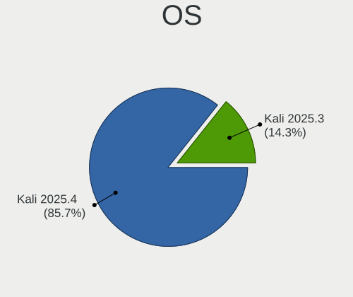

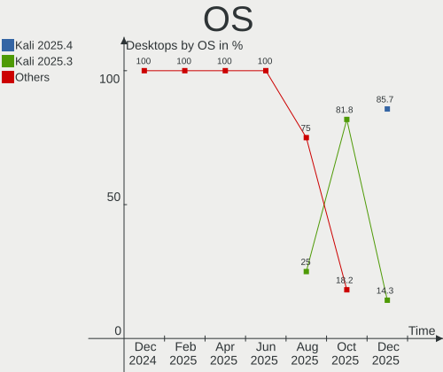

| Name        | Desktops | Percent |
|-------------|----------|---------|
| Kali 2025.4 | 6        | 85.71%  |
| Kali 2025.3 | 1        | 14.29%  |

OS Family
---------

OS without a version

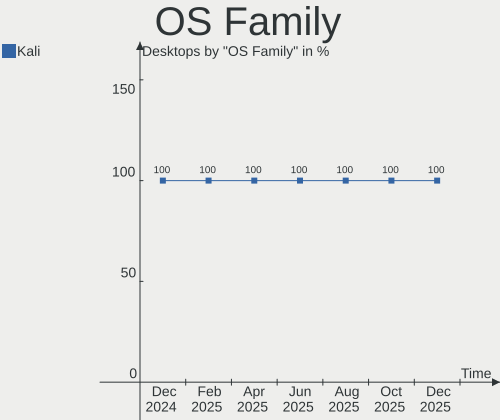

| Name | Desktops | Percent |
|------|----------|---------|
| Kali | 7        | 100%    |

Kernel
------

Version of the Linux kernel

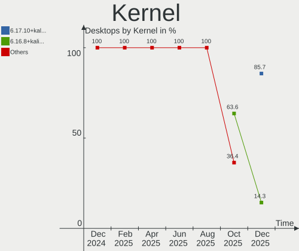

| Version            | Desktops | Percent |
|--------------------|----------|---------|
| 6.17.10+kali-amd64 | 6        | 85.71%  |
| 6.16.8+kali-amd64  | 1        | 14.29%  |

Kernel Family
-------------

Linux kernel without a distro release

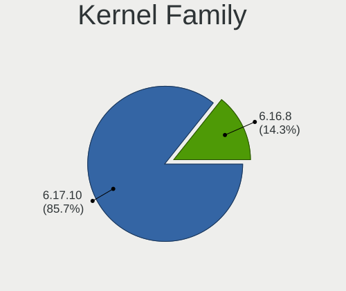

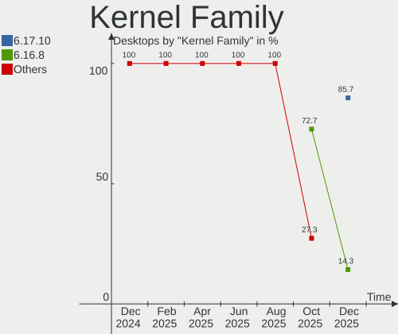

| Version | Desktops | Percent |
|---------|----------|---------|
| 6.17.10 | 6        | 85.71%  |
| 6.16.8  | 1        | 14.29%  |

Kernel Major Ver.
-----------------

Linux kernel major version

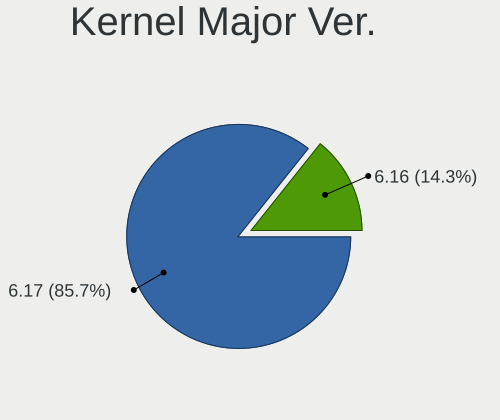

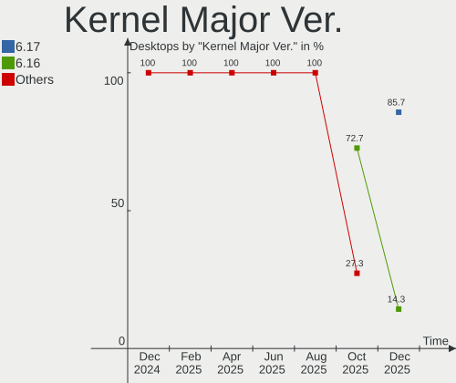

| Version | Desktops | Percent |
|---------|----------|---------|
| 6.17    | 6        | 85.71%  |
| 6.16    | 1        | 14.29%  |

Arch
----

OS architecture (x86_64, i586, etc.)

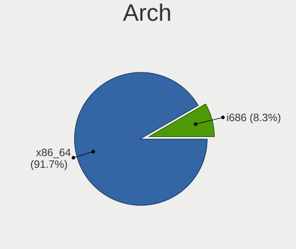

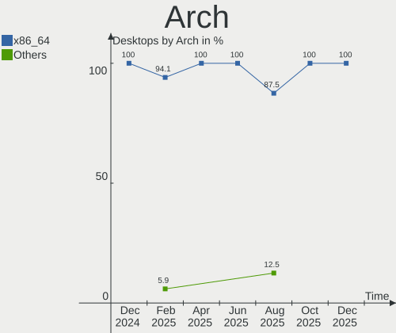

| Name   | Desktops | Percent |
|--------|----------|---------|
| x86_64 | 7        | 100%    |

DE
--

Desktop Environment

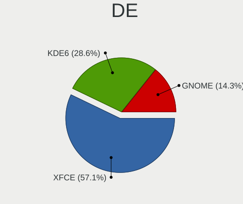

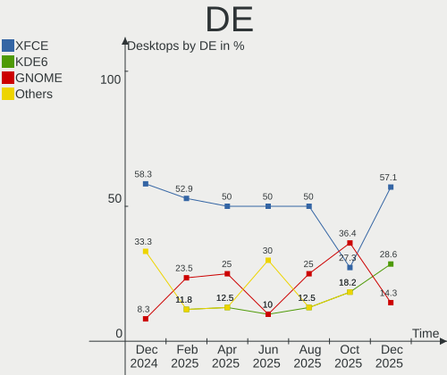

| Name  | Desktops | Percent |
|-------|----------|---------|
| XFCE  | 4        | 57.14%  |
| KDE6  | 2        | 28.57%  |
| GNOME | 1        | 14.29%  |

Display Server
--------------

X11 or Wayland

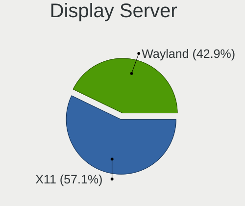

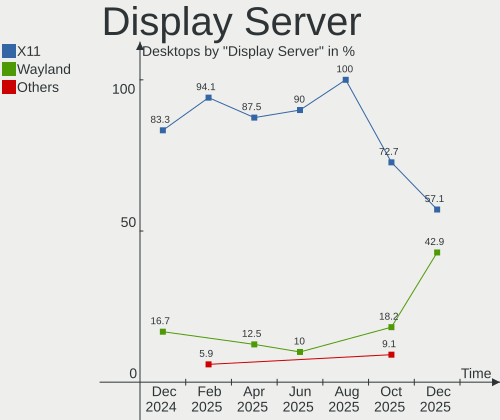

| Name    | Desktops | Percent |
|---------|----------|---------|
| X11     | 4        | 57.14%  |
| Wayland | 3        | 42.86%  |

Display Manager
---------------

SDDM, LightDM, etc.

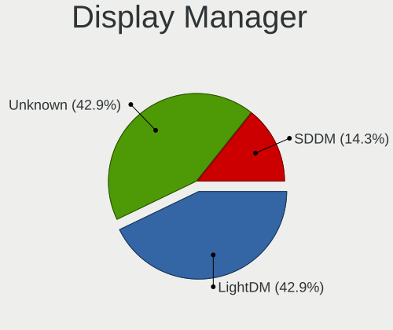

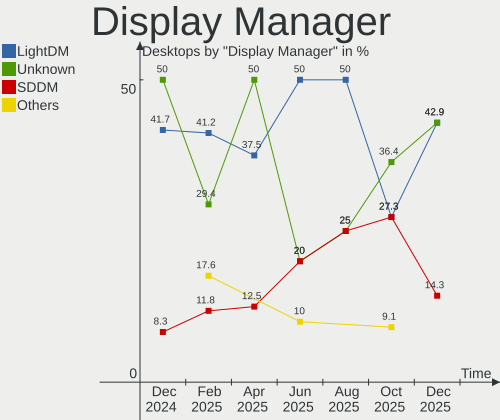

| Name    | Desktops | Percent |
|---------|----------|---------|
| LightDM | 3        | 42.86%  |
| Unknown | 3        | 42.86%  |
| SDDM    | 1        | 14.29%  |

OS Lang
-------

Language

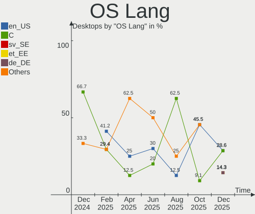

| Lang  | Desktops | Percent |
|-------|----------|---------|
| en_US | 2        | 28.57%  |
| C     | 2        | 28.57%  |
| sv_SE | 1        | 14.29%  |
| et_EE | 1        | 14.29%  |
| de_DE | 1        | 14.29%  |

Boot Mode
---------

EFI or BIOS

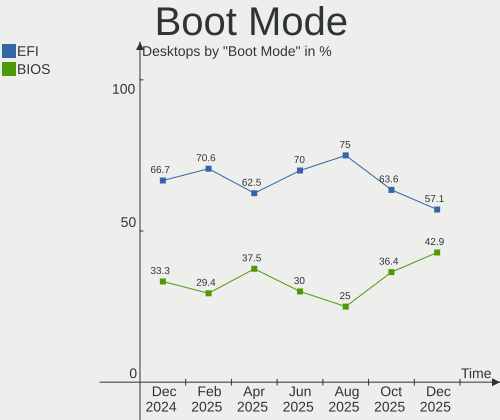

| Mode | Desktops | Percent |
|------|----------|---------|
| EFI  | 4        | 57.14%  |
| BIOS | 3        | 42.86%  |

Filesystem
----------

Type of filesystem

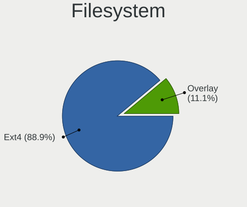

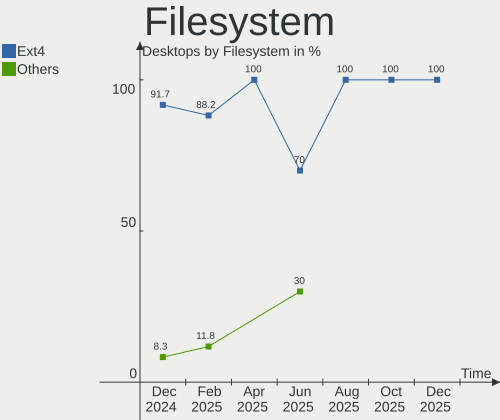

| Type | Desktops | Percent |
|------|----------|---------|
| Ext4 | 7        | 100%    |

Part. scheme
------------

Scheme of partitioning

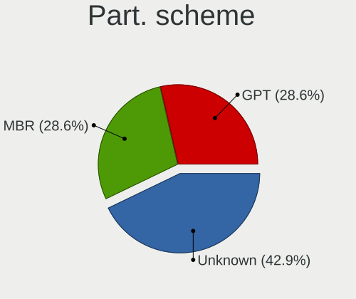

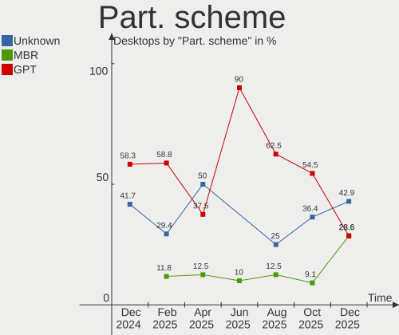

| Type    | Desktops | Percent |
|---------|----------|---------|
| Unknown | 3        | 42.86%  |
| MBR     | 2        | 28.57%  |
| GPT     | 2        | 28.57%  |

Dual Boot with Linux/BSD
------------------------

Hosting more than one Linux/BSD

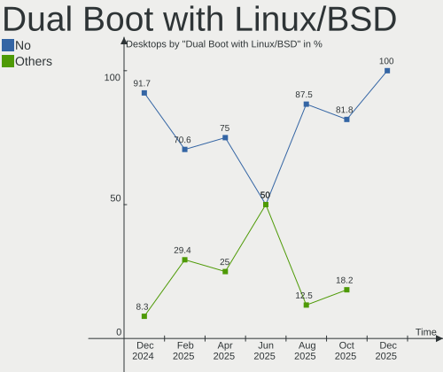

| Dual boot | Desktops | Percent |
|-----------|----------|---------|
| No        | 7        | 100%    |

Dual Boot (Win)
---------------

Hosting Linux and Windows

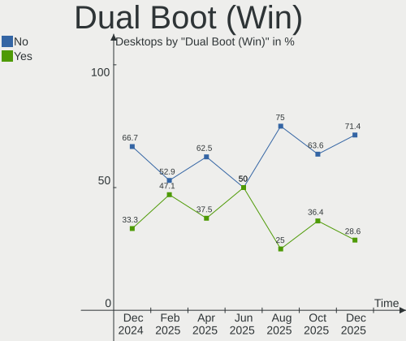

| Dual boot | Desktops | Percent |
|-----------|----------|---------|
| No        | 5        | 71.43%  |
| Yes       | 2        | 28.57%  |

Board
-----

Vendor
------

Motherboard manufacturer

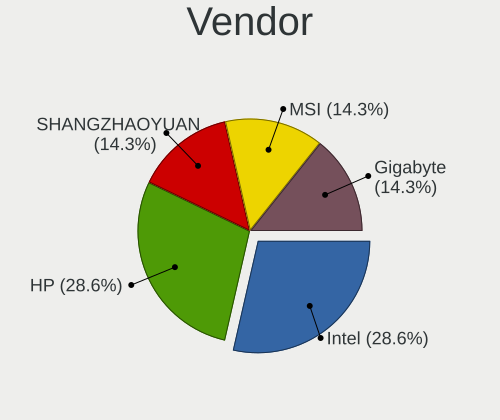

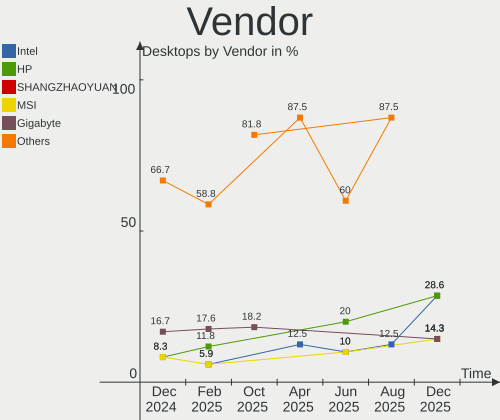

| Name                | Desktops | Percent |
|---------------------|----------|---------|
| Intel               | 2        | 28.57%  |
| Hewlett-Packard     | 2        | 28.57%  |
| SHANGZHAOYUAN       | 1        | 14.29%  |
| MSI                 | 1        | 14.29%  |
| Gigabyte Technology | 1        | 14.29%  |

Model
-----

Motherboard model

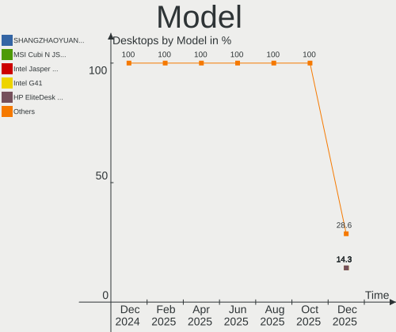

| Name                              | Desktops | Percent |
|-----------------------------------|----------|---------|
| SHANGZHAOYUAN X99 PR9             | 1        | 14.29%  |
| MSI Cubi N JSL (MS-B0A1)          | 1        | 14.29%  |
| Intel Jasper Lake Client Platform | 1        | 14.29%  |
| Intel G41                         | 1        | 14.29%  |
| HP EliteDesk 800 G2 SFF           | 1        | 14.29%  |
| HP Compaq 8200 Elite SFF PC       | 1        | 14.29%  |
| Gigabyte B550 GAMING X V2         | 1        | 14.29%  |

Model Family
------------

Motherboard model prefix

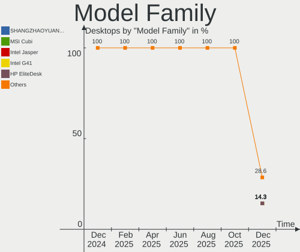

| Name              | Desktops | Percent |
|-------------------|----------|---------|
| SHANGZHAOYUAN X99 | 1        | 14.29%  |
| MSI Cubi          | 1        | 14.29%  |
| Intel Jasper      | 1        | 14.29%  |
| Intel G41         | 1        | 14.29%  |
| HP EliteDesk      | 1        | 14.29%  |
| HP Compaq         | 1        | 14.29%  |
| Gigabyte B550     | 1        | 14.29%  |

MFG Year
--------

Motherboard manufacture year

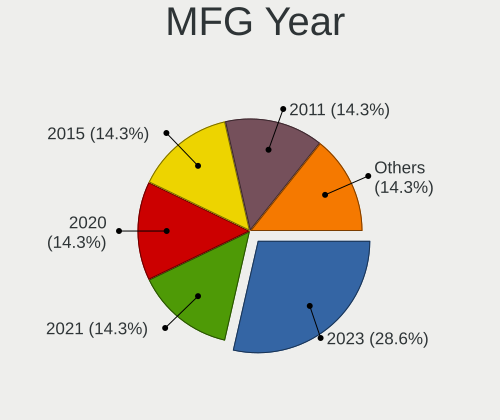

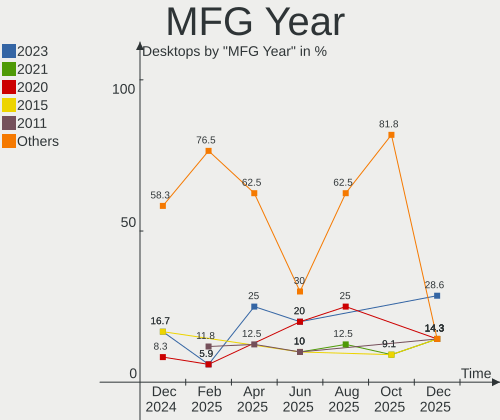

| Year    | Desktops | Percent |
|---------|----------|---------|
| 2023    | 2        | 28.57%  |
| 2021    | 1        | 14.29%  |
| 2020    | 1        | 14.29%  |
| 2015    | 1        | 14.29%  |
| 2011    | 1        | 14.29%  |
| Unknown | 1        | 14.29%  |

Form Factor
-----------

Physical design of the computer

| Name    | Desktops | Percent |
|---------|----------|---------|
| Desktop | 7        | 100%    |

Secure Boot
-----------

Enabled or disabled

| State    | Desktops | Percent |
|----------|----------|---------|
| Disabled | 7        | 100%    |

Coreboot
--------

Have coreboot on board

| Used | Desktops | Percent |
|------|----------|---------|
| No   | 7        | 100%    |

RAM Size
--------

Total RAM memory

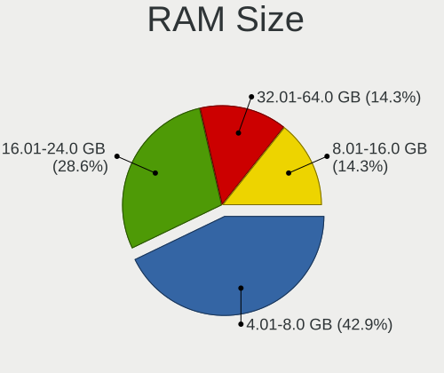

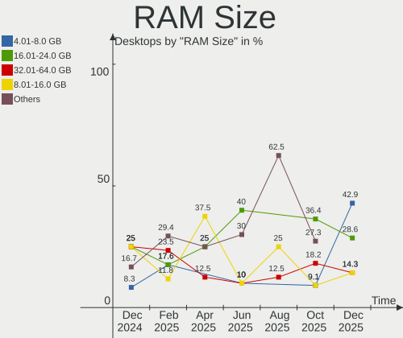

| Size in GB | Desktops | Percent |
|------------|----------|---------|
| 4.01-8.0   | 3        | 42.86%  |
| 16.01-24.0 | 2        | 28.57%  |
| 32.01-64.0 | 1        | 14.29%  |
| 8.01-16.0  | 1        | 14.29%  |

RAM Used
--------

Used RAM memory

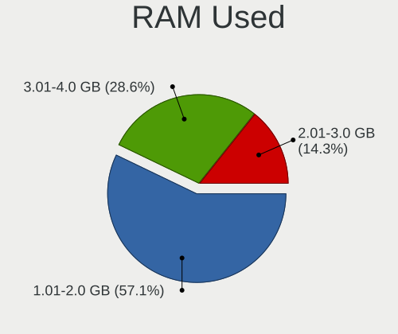

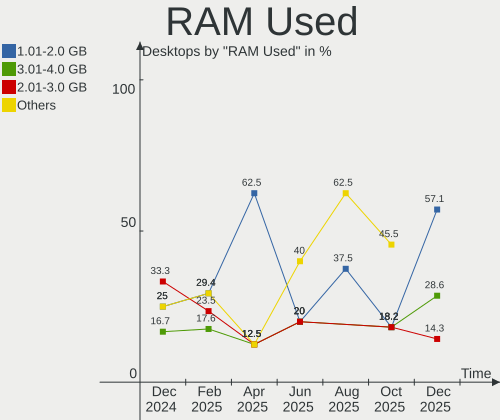

| Used GB  | Desktops | Percent |
|----------|----------|---------|
| 1.01-2.0 | 4        | 57.14%  |
| 3.01-4.0 | 2        | 28.57%  |
| 2.01-3.0 | 1        | 14.29%  |

Total Drives
------------

Number of drives on board

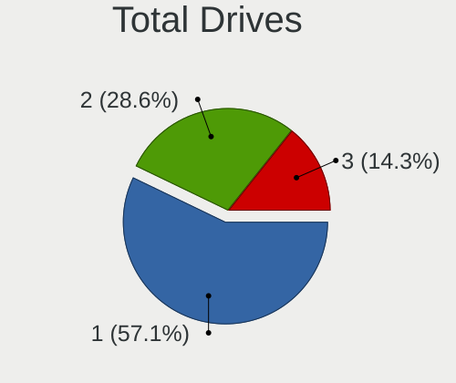

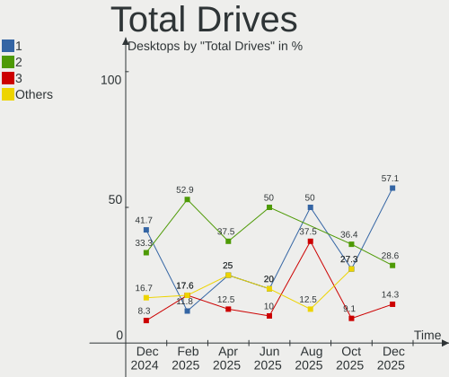

| Drives | Desktops | Percent |
|--------|----------|---------|
| 1      | 4        | 57.14%  |
| 2      | 2        | 28.57%  |
| 3      | 1        | 14.29%  |

Has CD-ROM
----------

Has CD-ROM on board

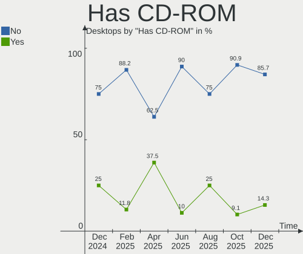

| Presented | Desktops | Percent |
|-----------|----------|---------|
| No        | 6        | 85.71%  |
| Yes       | 1        | 14.29%  |

Has Ethernet
------------

Has Ethernet on board

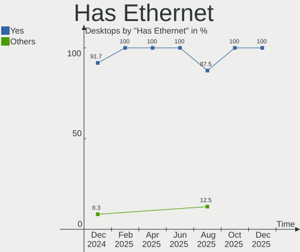

| Presented | Desktops | Percent |
|-----------|----------|---------|
| Yes       | 7        | 100%    |

Has WiFi
--------

Has WiFi module

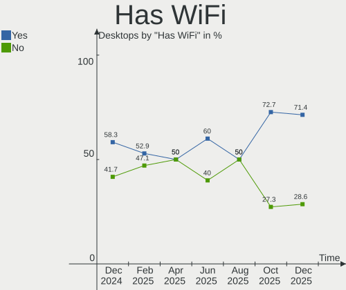

| Presented | Desktops | Percent |
|-----------|----------|---------|
| Yes       | 5        | 71.43%  |
| No        | 2        | 28.57%  |

Has Bluetooth
-------------

Has Bluetooth module

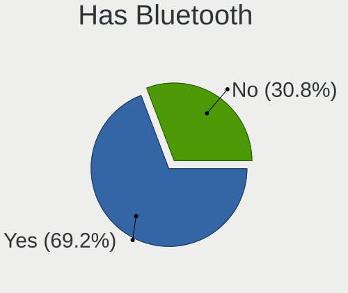

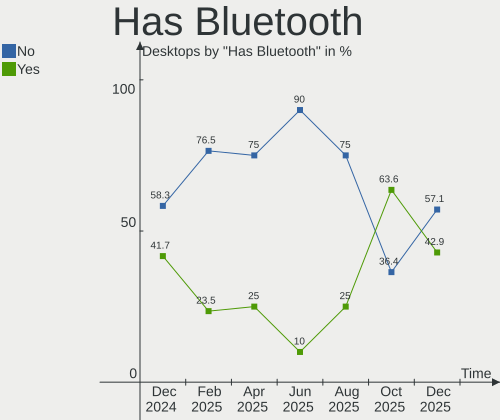

| Presented | Desktops | Percent |
|-----------|----------|---------|
| No        | 4        | 57.14%  |
| Yes       | 3        | 42.86%  |

Location
--------

Country
-------

Geographic location (country)

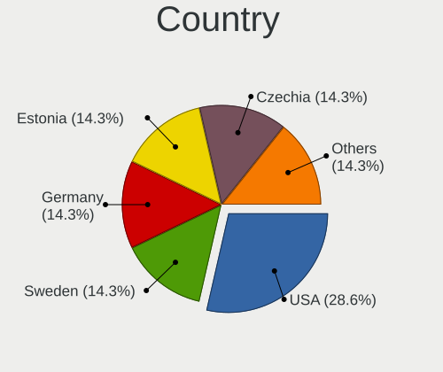

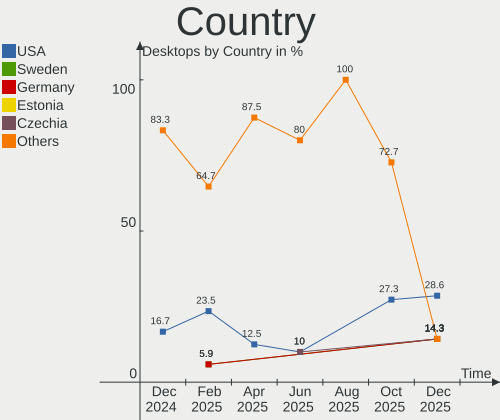

| Country | Desktops | Percent |
|---------|----------|---------|
| USA     | 2        | 28.57%  |
| Sweden  | 1        | 14.29%  |
| Germany | 1        | 14.29%  |
| Estonia | 1        | 14.29%  |
| Czechia | 1        | 14.29%  |
| China   | 1        | 14.29%  |

City
----

Geographic location (city)

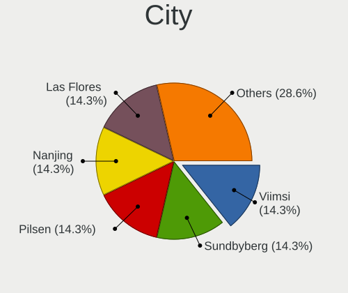

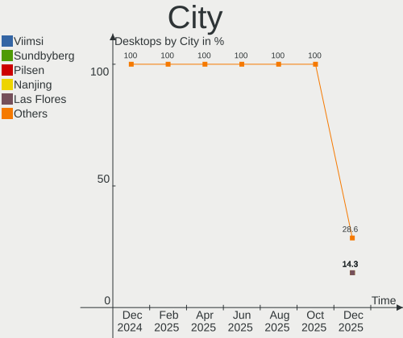

| City        | Desktops | Percent |
|-------------|----------|---------|
| Viimsi      | 1        | 14.29%  |
| Sundbyberg  | 1        | 14.29%  |
| Pilsen      | 1        | 14.29%  |
| Nanjing     | 1        | 14.29%  |
| Las Flores  | 1        | 14.29%  |
| Düsseldorf | 1        | 14.29%  |
| Chicago     | 1        | 14.29%  |

Drives
------

Drive Vendor
------------

Hard drive vendors

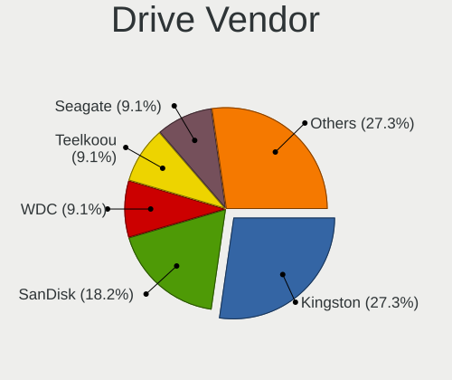

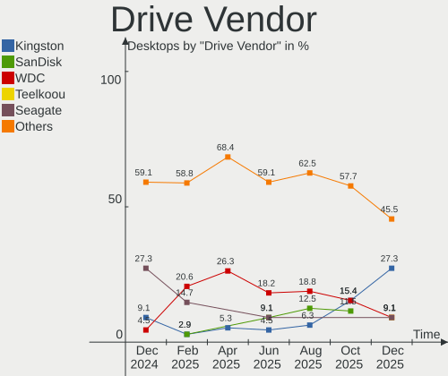

| Vendor                    | Desktops | Drives | Percent |
|---------------------------|----------|--------|---------|
| Kingston                  | 3        | 3      | 27.27%  |
| SanDisk                   | 2        | 3      | 18.18%  |
| WDC                       | 1        | 1      | 9.09%   |
| Teelkoou                  | 1        | 1      | 9.09%   |
| Seagate                   | 1        | 1      | 9.09%   |
| Rayson                    | 1        | 1      | 9.09%   |
| Micron/Crucial Technology | 1        | 1      | 9.09%   |
| Intel                     | 1        | 1      | 9.09%   |

Drive Model
-----------

Hard drive models

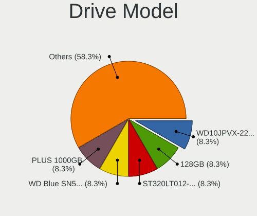

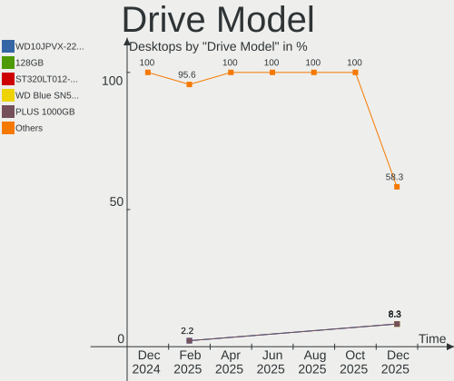

| Model                               | Desktops | Percent |
|-------------------------------------|----------|---------|
| WDC WD10JPVX-22JC3T0 1TB            | 1        | 8.33%   |
| Teelkoou SSD 128GB                  | 1        | 8.33%   |
| Seagate ST320LT012-9WS14C 320GB     | 1        | 8.33%   |
| Sandisk WD Blue SN5000 1TB          | 1        | 8.33%   |
| SanDisk SSD PLUS 1000GB             | 1        | 8.33%   |
| SanDisk SDSSDP128G 128GB            | 1        | 8.33%   |
| Rayson RS256GSSD310 256GB           | 1        | 8.33%   |
| Micron/Crucial P2 NVMe PCIe SSD 2TB | 1        | 8.33%   |
| Kingston SNV2S500G 500GB            | 1        | 8.33%   |
| Kingston SKC600MS256G 256GB SSD     | 1        | 8.33%   |
| Kingston SA400S37120G 120GB SSD     | 1        | 8.33%   |
| Intel SSDPEKKW256G7 256GB           | 1        | 8.33%   |

HDD Vendor
----------

Hard disk drive vendors

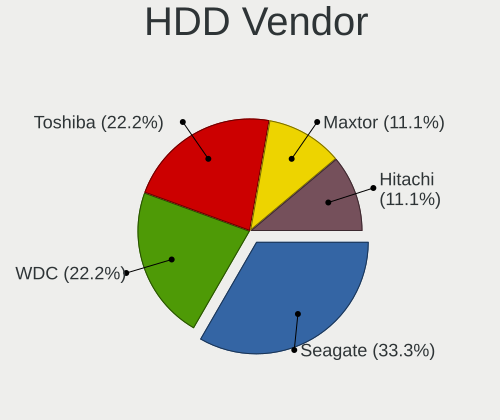

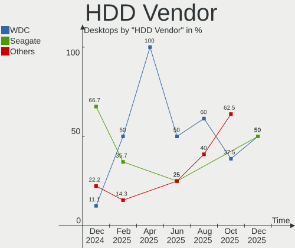

| Vendor  | Desktops | Drives | Percent |
|---------|----------|--------|---------|
| WDC     | 1        | 1      | 50%     |
| Seagate | 1        | 1      | 50%     |

SSD Vendor
----------

Solid state drive vendors

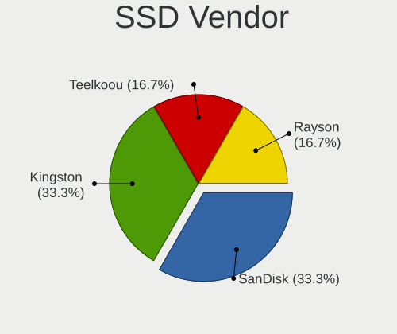

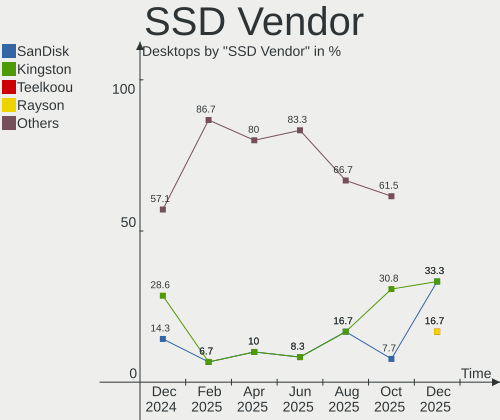

| Vendor   | Desktops | Drives | Percent |
|----------|----------|--------|---------|
| SanDisk  | 2        | 2      | 33.33%  |
| Kingston | 2        | 2      | 33.33%  |
| Teelkoou | 1        | 1      | 16.67%  |
| Rayson   | 1        | 1      | 16.67%  |

Drive Kind
----------

HDD or SSD

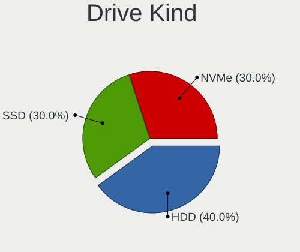

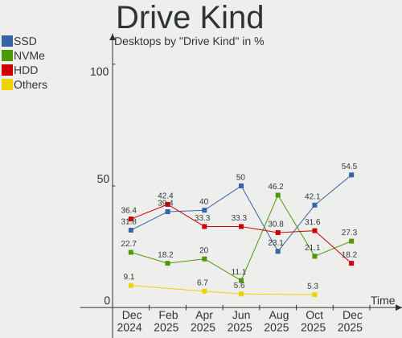

| Kind | Desktops | Drives | Percent |
|------|----------|--------|---------|
| SSD  | 6        | 6      | 54.55%  |
| NVMe | 3        | 4      | 27.27%  |
| HDD  | 2        | 2      | 18.18%  |

Drive Connector
---------------

SATA, SAS, NVMe, etc.

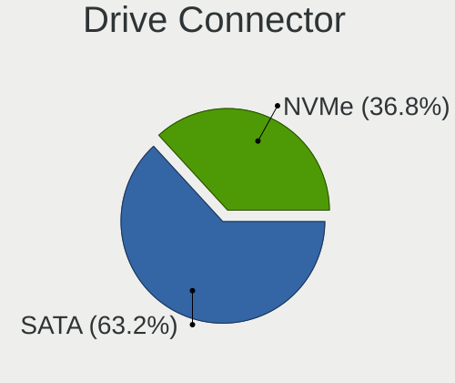

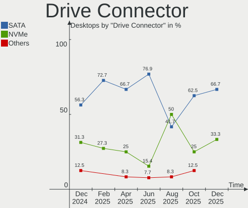

| Type | Desktops | Drives | Percent |
|------|----------|--------|---------|
| SATA | 6        | 8      | 66.67%  |
| NVMe | 3        | 4      | 33.33%  |

Drive Size
----------

Size of hard drive

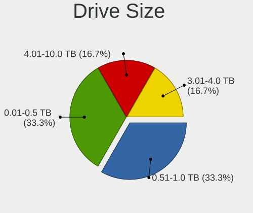

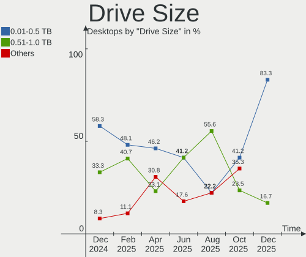

| Size in TB | Desktops | Drives | Percent |
|------------|----------|--------|---------|
| 0.01-0.5   | 5        | 6      | 83.33%  |
| 0.51-1.0   | 1        | 2      | 16.67%  |

Space Total
-----------

Amount of disk space available on the file system

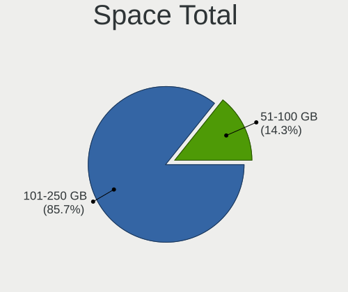

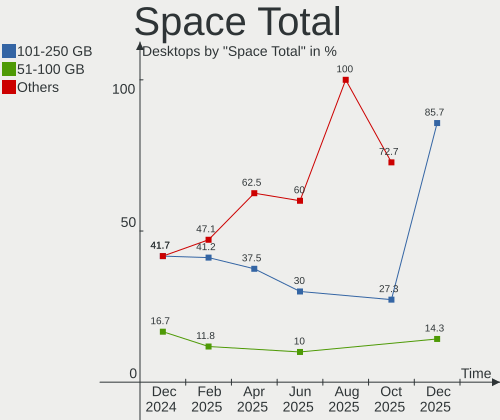

| Size in GB | Desktops | Percent |
|------------|----------|---------|
| 101-250    | 6        | 85.71%  |
| 51-100     | 1        | 14.29%  |

Space Used
----------

Amount of used disk space

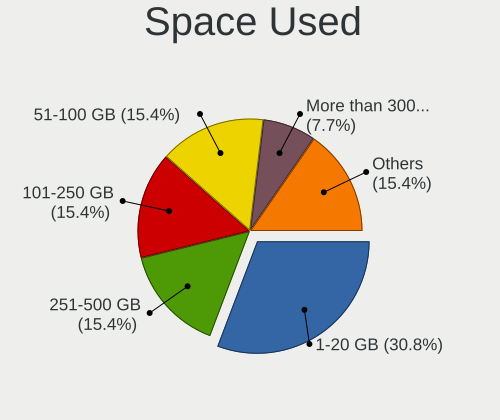

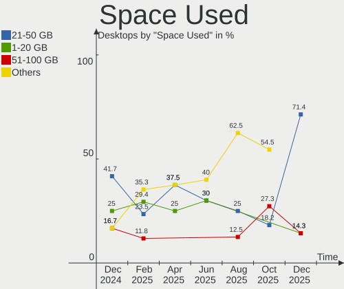

| Used GB | Desktops | Percent |
|---------|----------|---------|
| 21-50   | 5        | 71.43%  |
| 1-20    | 1        | 14.29%  |
| 51-100  | 1        | 14.29%  |

Malfunc. Drives
---------------

Drive models with a malfunction

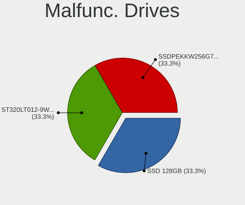

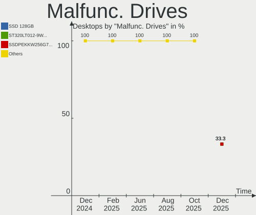

| Model                           | Desktops | Drives | Percent |
|---------------------------------|----------|--------|---------|
| Teelkoou SSD 128GB              | 1        | 1      | 33.33%  |
| Seagate ST320LT012-9WS14C 320GB | 1        | 1      | 33.33%  |
| Intel SSDPEKKW256G7 256GB       | 1        | 1      | 33.33%  |

Malfunc. Drive Vendor
---------------------

Vendors of faulty drives

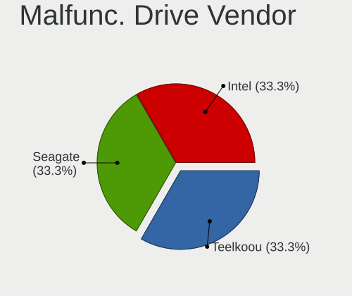

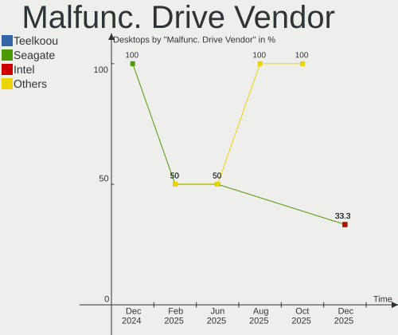

| Vendor   | Desktops | Drives | Percent |
|----------|----------|--------|---------|
| Teelkoou | 1        | 1      | 33.33%  |
| Seagate  | 1        | 1      | 33.33%  |
| Intel    | 1        | 1      | 33.33%  |

Malfunc. HDD Vendor
-------------------

Vendors of faulty HDD drives

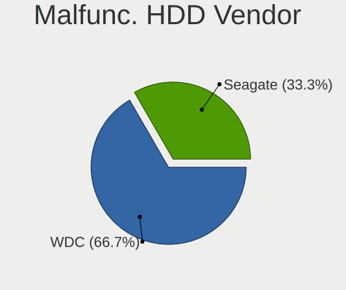

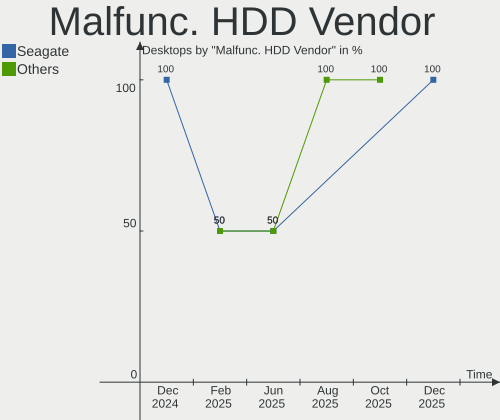

| Vendor  | Desktops | Drives | Percent |
|---------|----------|--------|---------|
| Seagate | 1        | 1      | 100%    |

Malfunc. Drive Kind
-------------------

Kinds of faulty drives

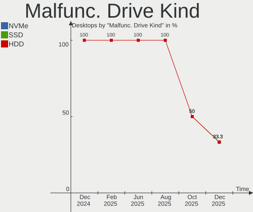

| Kind | Desktops | Drives | Percent |
|------|----------|--------|---------|
| NVMe | 1        | 1      | 33.33%  |
| SSD  | 1        | 1      | 33.33%  |
| HDD  | 1        | 1      | 33.33%  |

Failed Drives
-------------

Failed drive models

Zero info for selected period =(

Failed Drive Vendor
-------------------

Failed drive vendors

Zero info for selected period =(

Drive Status
------------

Number of failed and malfunc. drives

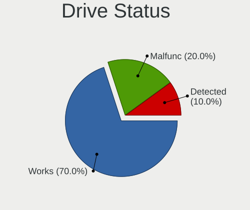

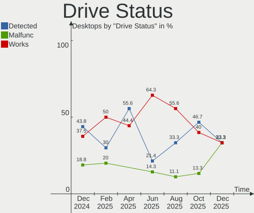

| Status   | Desktops | Drives | Percent |
|----------|----------|--------|---------|
| Detected | 3        | 6      | 33.33%  |
| Malfunc  | 3        | 3      | 33.33%  |
| Works    | 3        | 3      | 33.33%  |

Storage controller
------------------

Storage Vendor
--------------

Storage controller vendors

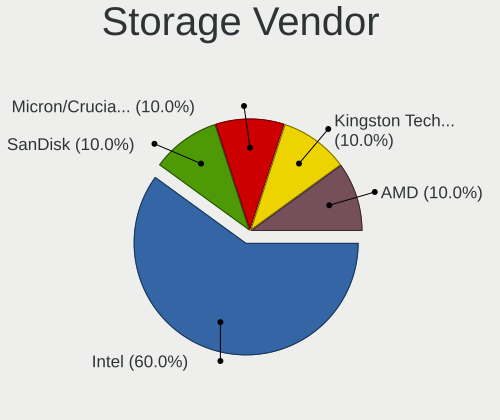

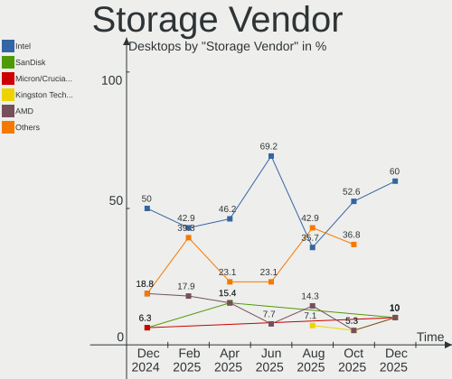

| Vendor                      | Desktops | Percent |
|-----------------------------|----------|---------|
| Intel                       | 6        | 60%     |
| SanDisk                     | 1        | 10%     |
| Micron/Crucial Technology   | 1        | 10%     |
| Kingston Technology Company | 1        | 10%     |
| AMD                         | 1        | 10%     |

Storage Model
-------------

Storage controller models

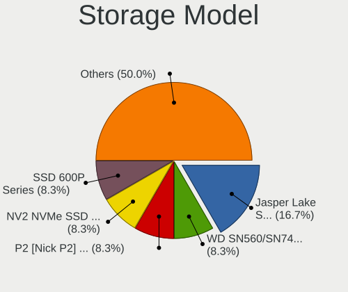

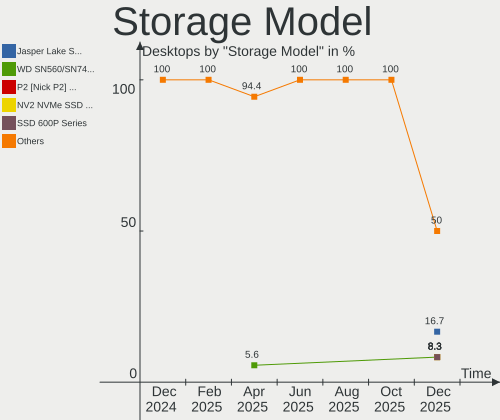

| Model                                                                          | Desktops | Percent |
|--------------------------------------------------------------------------------|----------|---------|
| Intel Jasper Lake SATA AHCI Controller                                         | 2        | 16.67%  |
| SanDisk WD SN560/SN740/SN770/SN5000 NVMe SSD                                   | 1        | 8.33%   |
| Micron/Crucial P2 [Nick P2] / P3 / P3 Plus NVMe PCIe SSD (DRAM-less)           | 1        | 8.33%   |
| Kingston Company NV2 NVMe SSD [E21T] (DRAM-less)                               | 1        | 8.33%   |
| Intel SSD 600P Series                                                          | 1        | 8.33%   |
| Intel SATA Controller [RAID mode]                                              | 1        | 8.33%   |
| Intel NM10/ICH7 Family SATA Controller [IDE mode]                              | 1        | 8.33%   |
| Intel 82801G (ICH7 Family) IDE Controller                                      | 1        | 8.33%   |
| Intel 8 Series/C220 Series Chipset Family 6-port SATA Controller 1 [AHCI mode] | 1        | 8.33%   |
| Intel 6 Series/C200 Series Chipset Family 6 port Desktop SATA AHCI Controller  | 1        | 8.33%   |
| AMD 500 Series Chipset SATA Controller                                         | 1        | 8.33%   |

Storage Kind
------------

Kind of storage controller (IDE, SATA, NVMe, SAS, ...)

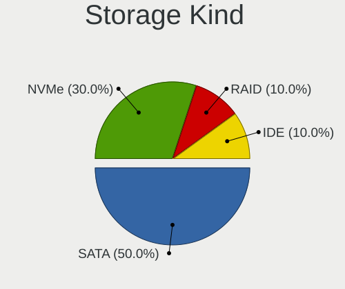

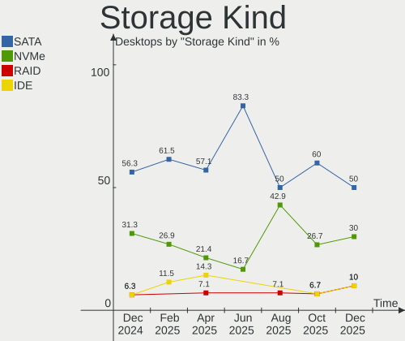

| Kind | Desktops | Percent |
|------|----------|---------|
| SATA | 5        | 50%     |
| NVMe | 3        | 30%     |
| RAID | 1        | 10%     |
| IDE  | 1        | 10%     |

Processor
---------

CPU Vendor
----------

Processor vendors

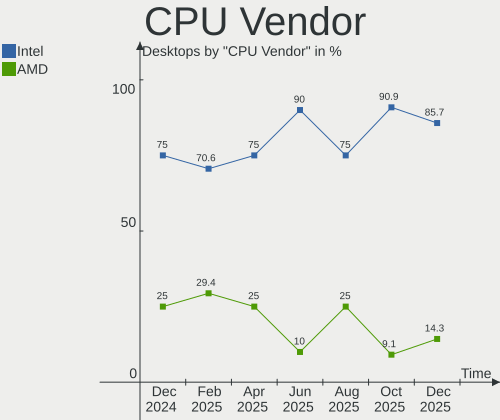

| Vendor | Desktops | Percent |
|--------|----------|---------|
| Intel  | 6        | 85.71%  |
| AMD    | 1        | 14.29%  |

CPU Model
---------

Processor models

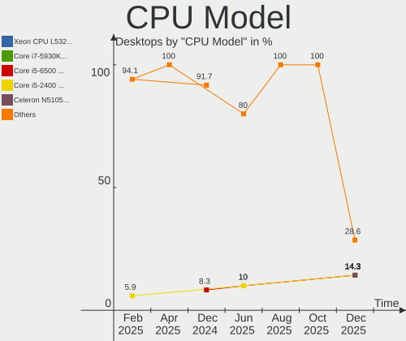

| Model                             | Desktops | Percent |
|-----------------------------------|----------|---------|
| Intel Xeon CPU L5320 @ 1.86GHz    | 1        | 14.29%  |
| Intel Core i7-5930K CPU @ 3.50GHz | 1        | 14.29%  |
| Intel Core i5-6500 CPU @ 3.20GHz  | 1        | 14.29%  |
| Intel Core i5-2400 CPU @ 3.10GHz  | 1        | 14.29%  |
| Intel Celeron N5105 @ 2.00GHz     | 1        | 14.29%  |
| Intel Celeron N4500 @ 1.10GHz     | 1        | 14.29%  |
| AMD Ryzen 5 4500 6-Core Processor | 1        | 14.29%  |

CPU Model Family
----------------

Processor model prefix

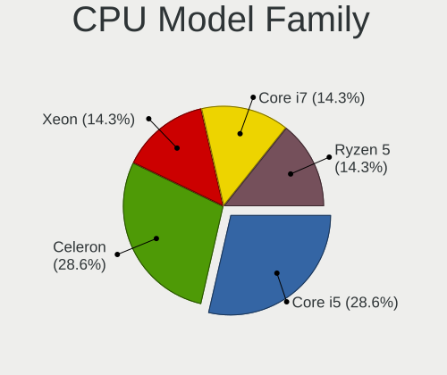

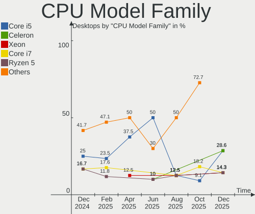

| Model         | Desktops | Percent |
|---------------|----------|---------|
| Intel Core i5 | 2        | 28.57%  |
| Intel Celeron | 2        | 28.57%  |
| Intel Xeon    | 1        | 14.29%  |
| Intel Core i7 | 1        | 14.29%  |
| AMD Ryzen 5   | 1        | 14.29%  |

CPU Cores
---------

Number of processor cores

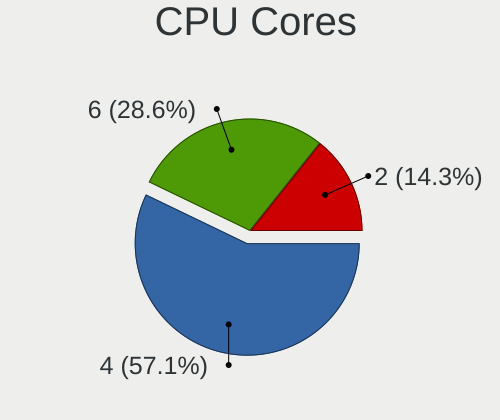

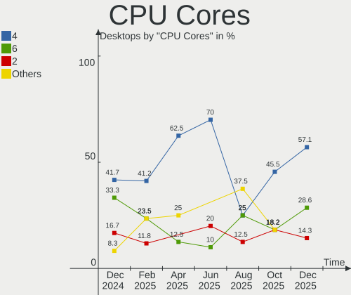

| Number | Desktops | Percent |
|--------|----------|---------|
| 4      | 4        | 57.14%  |
| 6      | 2        | 28.57%  |
| 2      | 1        | 14.29%  |

CPU Sockets
-----------

Number of sockets

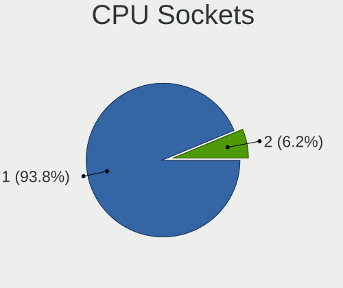

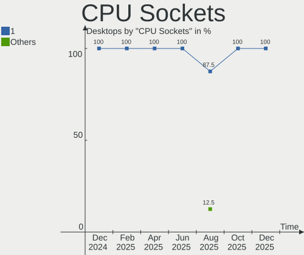

| Number | Desktops | Percent |
|--------|----------|---------|
| 1      | 7        | 100%    |

CPU Threads
-----------

Threads per core (Hyper-Threading)

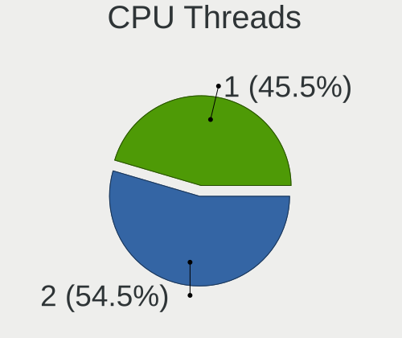

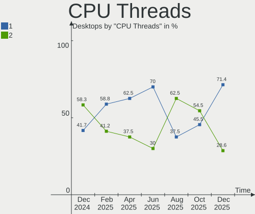

| Number | Desktops | Percent |
|--------|----------|---------|
| 1      | 5        | 71.43%  |
| 2      | 2        | 28.57%  |

CPU Op-Modes
------------

CPU Operation Modes (32-bit, 64-bit)

| Op mode        | Desktops | Percent |
|----------------|----------|---------|
| 32-bit, 64-bit | 7        | 100%    |

CPU Microcode
-------------

Microcode number

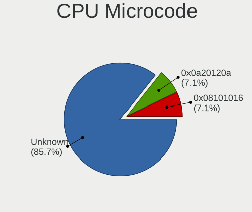

| Number  | Desktops | Percent |
|---------|----------|---------|
| Unknown | 7        | 100%    |

CPU Microarch
-------------

Microarchitecture

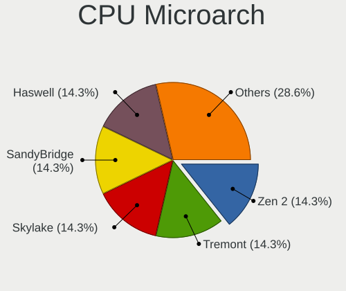

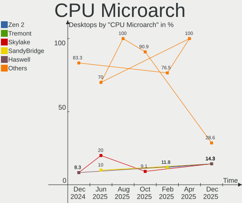

| Name        | Desktops | Percent |
|-------------|----------|---------|
| Zen 2       | 1        | 14.29%  |
| Tremont     | 1        | 14.29%  |
| Skylake     | 1        | 14.29%  |
| SandyBridge | 1        | 14.29%  |
| Haswell     | 1        | 14.29%  |
| Core        | 1        | 14.29%  |
| Unknown     | 1        | 14.29%  |

Graphics
--------

GPU Vendor
----------

Vendors of graphics cards

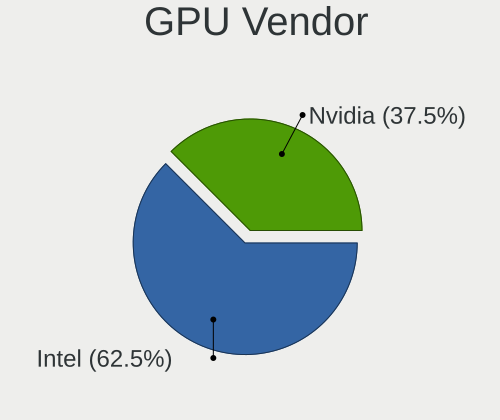

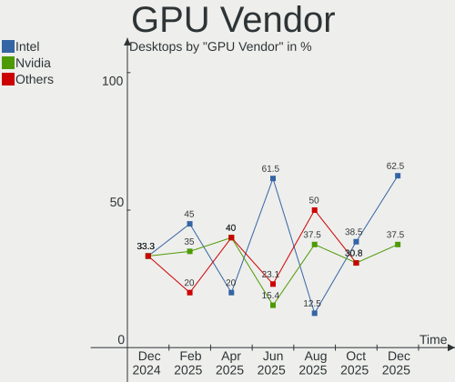

| Vendor | Desktops | Percent |
|--------|----------|---------|
| Intel  | 5        | 62.5%   |
| Nvidia | 3        | 37.5%   |

GPU Model
---------

Graphics card models

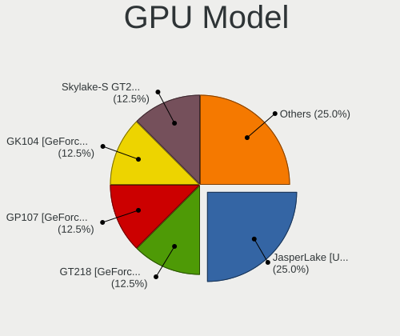

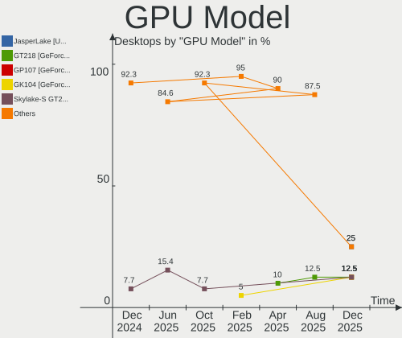

| Model                                                                     | Desktops | Percent |
|---------------------------------------------------------------------------|----------|---------|
| Intel JasperLake [UHD Graphics]                                           | 2        | 25%     |
| Nvidia GT218 [GeForce 210]                                                | 1        | 12.5%   |
| Nvidia GP107 [GeForce GTX 1050 Ti]                                        | 1        | 12.5%   |
| Nvidia GK104 [GeForce GTX 770]                                            | 1        | 12.5%   |
| Intel Skylake-S GT2 [HD Graphics 530]                                     | 1        | 12.5%   |
| Intel 4 Series Chipset Integrated Graphics Controller                     | 1        | 12.5%   |
| Intel 2nd Generation Core Processor Family Integrated Graphics Controller | 1        | 12.5%   |

GPU Combo
---------

Combinations of graphics cards

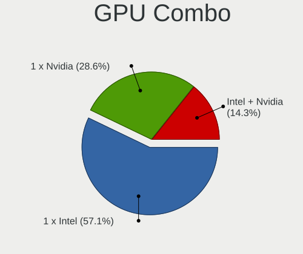

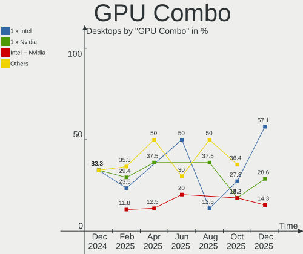

| Name           | Desktops | Percent |
|----------------|----------|---------|
| 1 x Intel      | 4        | 57.14%  |
| 1 x Nvidia     | 2        | 28.57%  |
| Intel + Nvidia | 1        | 14.29%  |

GPU Driver
----------

Free vs proprietary

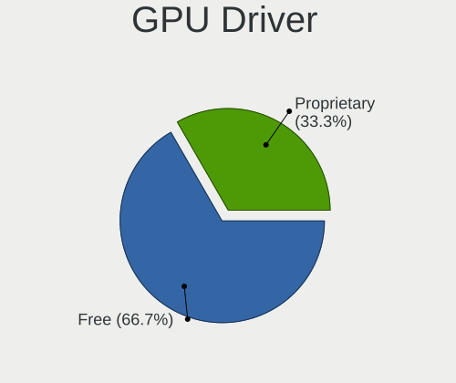

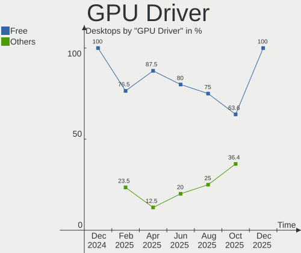

| Driver | Desktops | Percent |
|--------|----------|---------|
| Free   | 7        | 100%    |

GPU Memory
----------

Total video memory

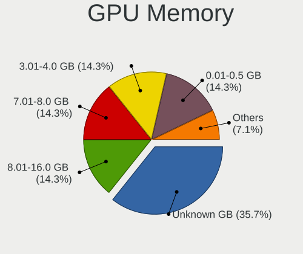

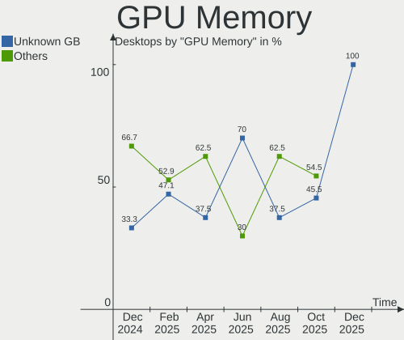

| Size in GB | Desktops | Percent |
|------------|----------|---------|
| Unknown    | 7        | 100%    |

Monitor
-------

Monitor Vendor
--------------

Monitor vendors

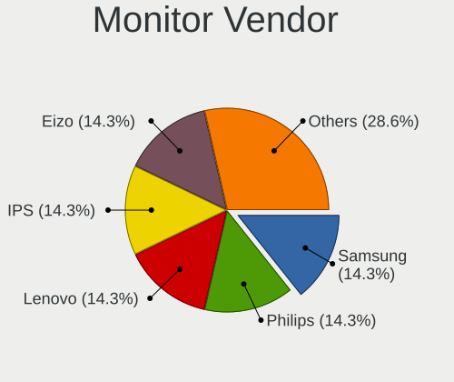

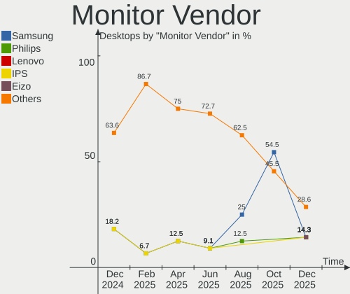

| Vendor              | Desktops | Percent |
|---------------------|----------|---------|
| Samsung Electronics | 1        | 14.29%  |
| Philips             | 1        | 14.29%  |
| Lenovo              | 1        | 14.29%  |
| IPS                 | 1        | 14.29%  |
| Eizo                | 1        | 14.29%  |
| Dell                | 1        | 14.29%  |
| BenQ                | 1        | 14.29%  |

Monitor Model
-------------

Monitor models

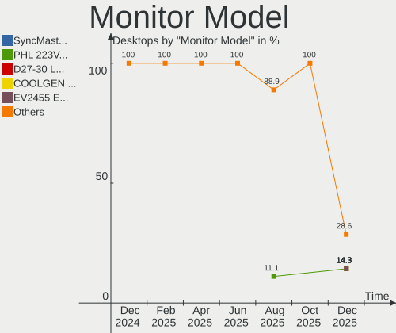

| Model                                                                | Desktops | Percent |
|----------------------------------------------------------------------|----------|---------|
| Samsung Electronics SyncMaster SAM0420 1680x1050 474x296mm 22.0-inch | 1        | 14.29%  |
| Philips PHL 223V5 PHLC0CF 1920x1080 477x268mm 21.5-inch              | 1        | 14.29%  |
| Lenovo D27-30 LEN66B8 1920x1080 600x340mm 27.2-inch                  | 1        | 14.29%  |
| IPS COOLGEN IPS2019 1920x1080 304x228mm 15.0-inch                    | 1        | 14.29%  |
| Eizo EV2455 ENC2534 1920x1080 519x324mm 24.1-inch                    | 1        | 14.29%  |
| Dell 1900FP DEL3009 1280x1024 376x301mm 19.0-inch                    | 1        | 14.29%  |
| BenQ T201W BNQ7719 1680x1050 433x271mm 20.1-inch                     | 1        | 14.29%  |

Monitor Resolution
------------------

Monitor screen resolution

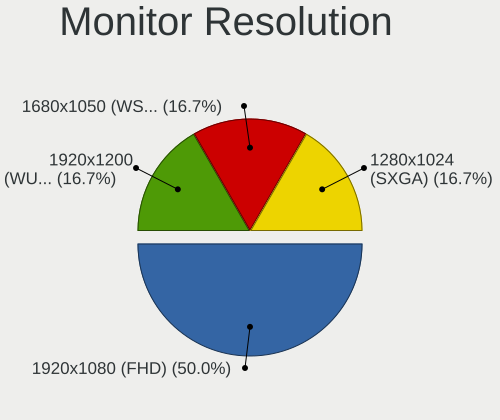

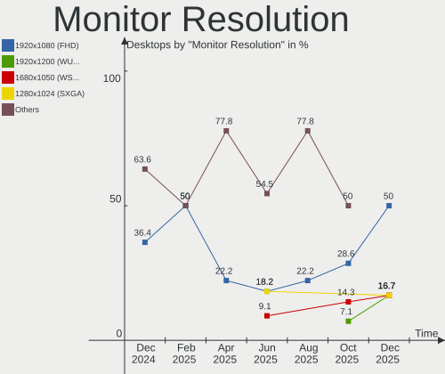

| Resolution         | Desktops | Percent |
|--------------------|----------|---------|
| 1920x1080 (FHD)    | 3        | 50%     |
| 1920x1200 (WUXGA)  | 1        | 16.67%  |
| 1680x1050 (WSXGA+) | 1        | 16.67%  |
| 1280x1024 (SXGA)   | 1        | 16.67%  |

Monitor Diagonal
----------------

Diagonal size in inches

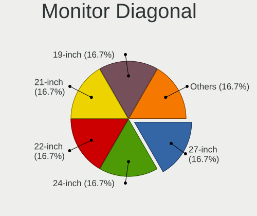

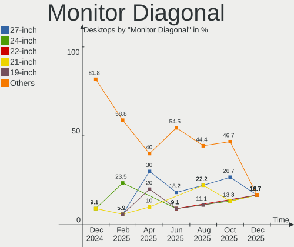

| Inches | Desktops | Percent |
|--------|----------|---------|
| 27     | 1        | 16.67%  |
| 24     | 1        | 16.67%  |
| 22     | 1        | 16.67%  |
| 21     | 1        | 16.67%  |
| 19     | 1        | 16.67%  |
| 15     | 1        | 16.67%  |

Monitor Width
-------------

Physical width

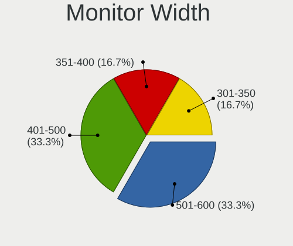

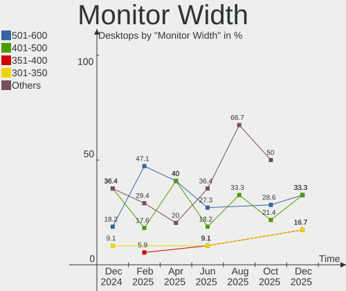

| Width in mm | Desktops | Percent |
|-------------|----------|---------|
| 501-600     | 2        | 33.33%  |
| 401-500     | 2        | 33.33%  |
| 351-400     | 1        | 16.67%  |
| 301-350     | 1        | 16.67%  |

Aspect Ratio
------------

Proportional relationship between the width and the height

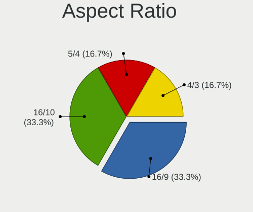

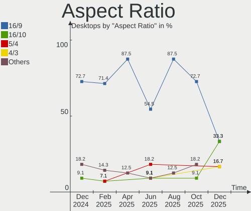

| Ratio | Desktops | Percent |
|-------|----------|---------|
| 16/9  | 2        | 33.33%  |
| 16/10 | 2        | 33.33%  |
| 5/4   | 1        | 16.67%  |
| 4/3   | 1        | 16.67%  |

Monitor Area
------------

Area in inch²

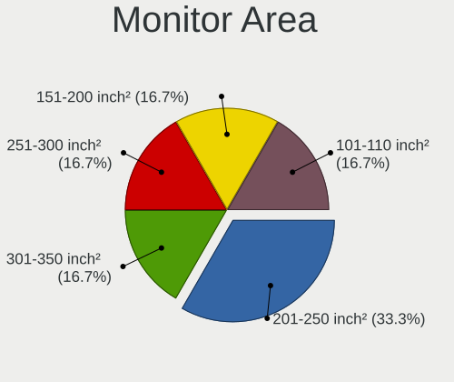

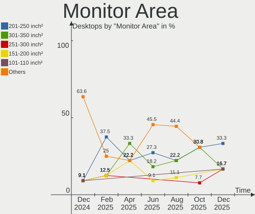

| Area in inch² | Desktops | Percent |
|----------------|----------|---------|
| 201-250        | 2        | 33.33%  |
| 301-350        | 1        | 16.67%  |
| 251-300        | 1        | 16.67%  |
| 151-200        | 1        | 16.67%  |
| 101-110        | 1        | 16.67%  |

Pixel Density
-------------

Pixels per inch

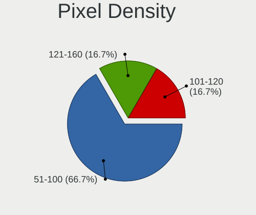

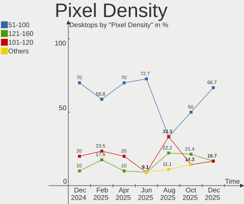

| Density | Desktops | Percent |
|---------|----------|---------|
| 51-100  | 4        | 66.67%  |
| 121-160 | 1        | 16.67%  |
| 101-120 | 1        | 16.67%  |

Multiple Monitors
-----------------

Total monitors connected

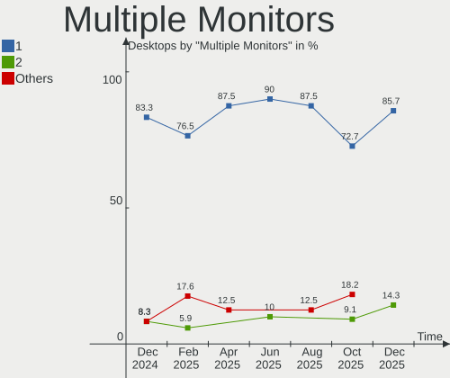

| Total | Desktops | Percent |
|-------|----------|---------|
| 1     | 6        | 85.71%  |
| 2     | 1        | 14.29%  |

Network
-------

Net Controller Vendor
---------------------

Controller vendors

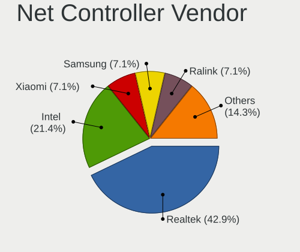

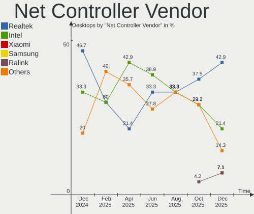

| Vendor                | Desktops | Percent |
|-----------------------|----------|---------|
| Realtek Semiconductor | 6        | 42.86%  |
| Intel                 | 3        | 21.43%  |
| Xiaomi                | 1        | 7.14%   |
| Samsung Electronics   | 1        | 7.14%   |
| Ralink Technology     | 1        | 7.14%   |
| Ralink                | 1        | 7.14%   |
| LG Electronics        | 1        | 7.14%   |

Net Controller Model
--------------------

Controller models

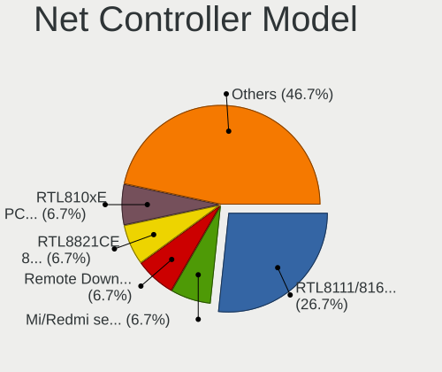

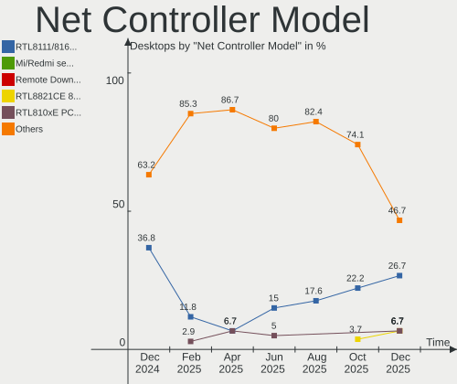

| Model                                                                  | Desktops | Percent |
|------------------------------------------------------------------------|----------|---------|
| Realtek RTL8111/8168/8211/8411 PCI Express Gigabit Ethernet Controller | 4        | 26.67%  |
| Xiaomi Mi/Redmi series (RNDIS + ADB)                                   | 1        | 6.67%   |
| Samsung Remote Download Wireless Adapter                               | 1        | 6.67%   |
| Realtek RTL8821CE 802.11ac PCIe Wireless Network Adapter               | 1        | 6.67%   |
| Realtek RTL810xE PCI Express Fast Ethernet controller                  | 1        | 6.67%   |
| Realtek 802.11ac NIC                                                   | 1        | 6.67%   |
| Ralink RT3072 Wireless Adapter                                         | 1        | 6.67%   |
| Ralink RT5392 PCIe Wireless Network Adapter                            | 1        | 6.67%   |
| LG 802.11 n WLAN                                                       | 1        | 6.67%   |
| Intel Jasper Lake PCH CNVi WiFi                                        | 1        | 6.67%   |
| Intel Ethernet Connection (2) I219-LM                                  | 1        | 6.67%   |
| Intel 82579LM Gigabit Network Connection (Lewisville)                  | 1        | 6.67%   |

Wireless Vendor
---------------

Wireless vendors

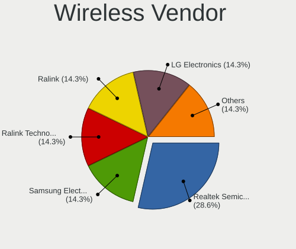

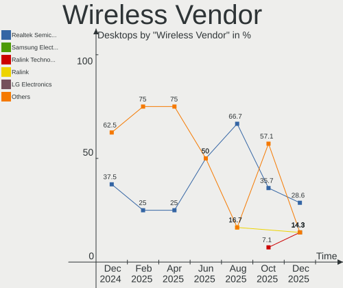

| Vendor                | Desktops | Percent |
|-----------------------|----------|---------|
| Realtek Semiconductor | 2        | 28.57%  |
| Samsung Electronics   | 1        | 14.29%  |
| Ralink Technology     | 1        | 14.29%  |
| Ralink                | 1        | 14.29%  |
| LG Electronics        | 1        | 14.29%  |
| Intel                 | 1        | 14.29%  |

Wireless Model
--------------

Wireless models

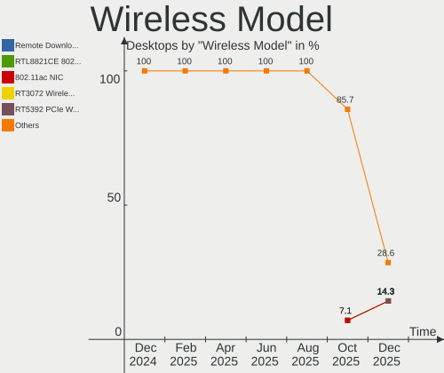

| Model                                                    | Desktops | Percent |
|----------------------------------------------------------|----------|---------|
| Samsung Remote Download Wireless Adapter                 | 1        | 14.29%  |
| Realtek RTL8821CE 802.11ac PCIe Wireless Network Adapter | 1        | 14.29%  |
| Realtek 802.11ac NIC                                     | 1        | 14.29%  |
| Ralink RT3072 Wireless Adapter                           | 1        | 14.29%  |
| Ralink RT5392 PCIe Wireless Network Adapter              | 1        | 14.29%  |
| LG 802.11 n WLAN                                         | 1        | 14.29%  |
| Intel Jasper Lake PCH CNVi WiFi                          | 1        | 14.29%  |

Ethernet Vendor
---------------

Ethernet vendors

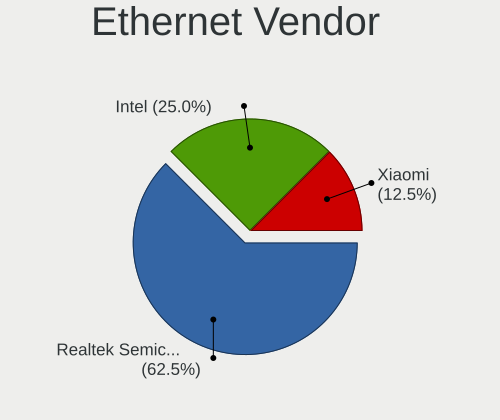

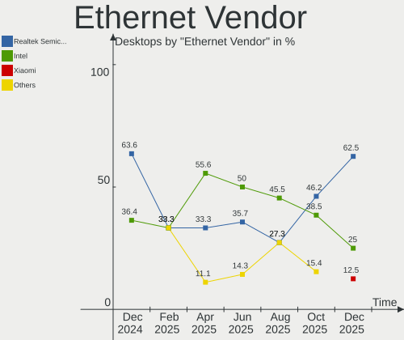

| Vendor                | Desktops | Percent |
|-----------------------|----------|---------|
| Realtek Semiconductor | 5        | 62.5%   |
| Intel                 | 2        | 25%     |
| Xiaomi                | 1        | 12.5%   |

Ethernet Model
--------------

Ethernet models

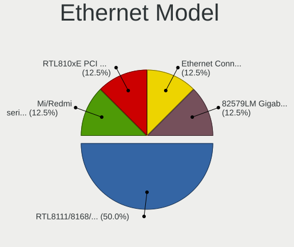

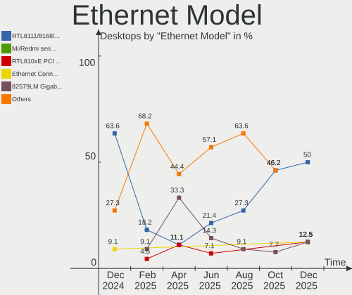

| Model                                                                  | Desktops | Percent |
|------------------------------------------------------------------------|----------|---------|
| Realtek RTL8111/8168/8211/8411 PCI Express Gigabit Ethernet Controller | 4        | 50%     |
| Xiaomi Mi/Redmi series (RNDIS + ADB)                                   | 1        | 12.5%   |
| Realtek RTL810xE PCI Express Fast Ethernet controller                  | 1        | 12.5%   |
| Intel Ethernet Connection (2) I219-LM                                  | 1        | 12.5%   |
| Intel 82579LM Gigabit Network Connection (Lewisville)                  | 1        | 12.5%   |

Net Controller Kind
-------------------

Ethernet, WiFi or modem

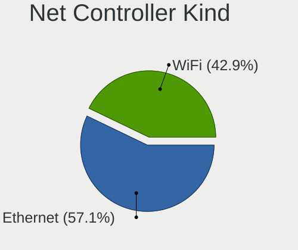

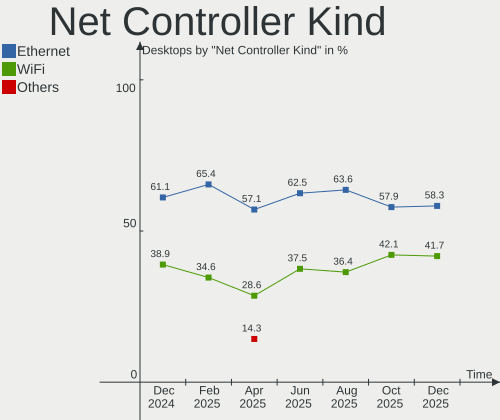

| Kind     | Desktops | Percent |
|----------|----------|---------|
| Ethernet | 7        | 58.33%  |
| WiFi     | 5        | 41.67%  |

Used Controller
---------------

Currently used network controller

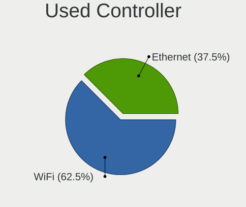

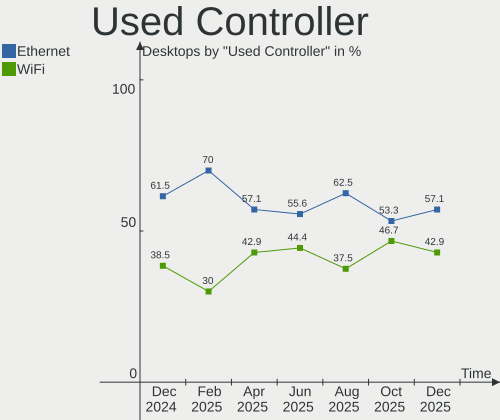

| Kind     | Desktops | Percent |
|----------|----------|---------|
| Ethernet | 4        | 57.14%  |
| WiFi     | 3        | 42.86%  |

NICs
----

Total network controllers on board

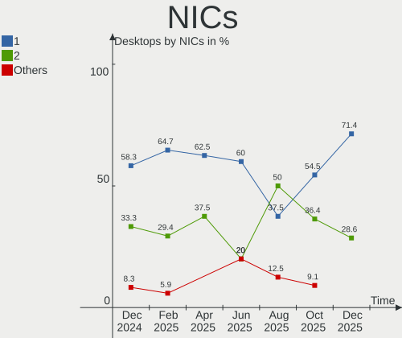

| Total | Desktops | Percent |
|-------|----------|---------|
| 1     | 5        | 71.43%  |
| 2     | 2        | 28.57%  |

IPv6
----

IPv6 vs IPv4

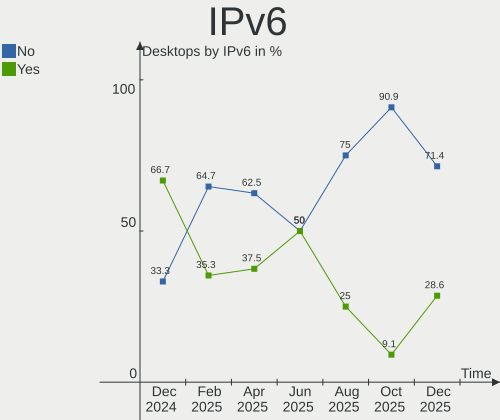

| Used | Desktops | Percent |
|------|----------|---------|
| No   | 5        | 71.43%  |
| Yes  | 2        | 28.57%  |

Bluetooth
---------

Bluetooth Vendor
----------------

Controller vendors

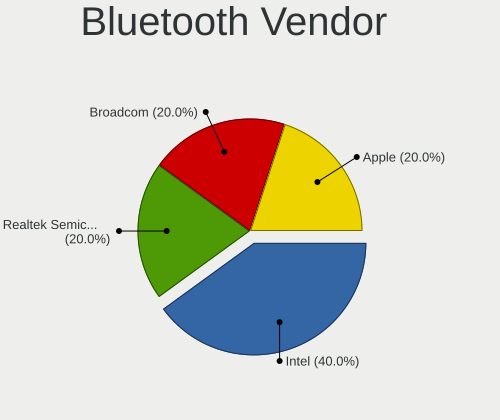

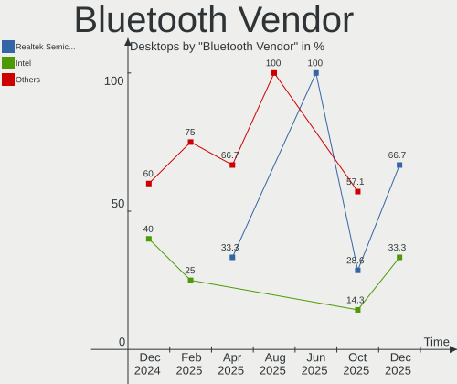

| Vendor                | Desktops | Percent |
|-----------------------|----------|---------|
| Realtek Semiconductor | 2        | 66.67%  |
| Intel                 | 1        | 33.33%  |

Bluetooth Model
---------------

Controller models

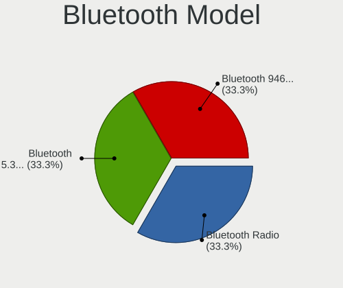

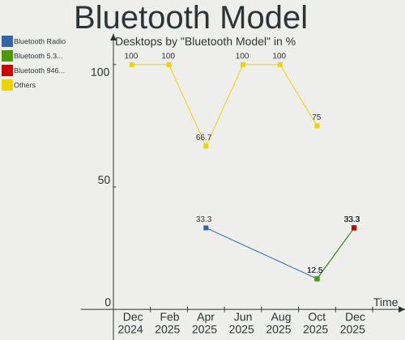

| Model                                          | Desktops | Percent |
|------------------------------------------------|----------|---------|
| Realtek Bluetooth Radio                        | 1        | 33.33%  |
| Realtek Bluetooth 5.3 Radio                    | 1        | 33.33%  |
| Intel Bluetooth 9460/9560 Jefferson Peak (JfP) | 1        | 33.33%  |

Sound
-----

Sound Vendor
------------

Sound card vendors

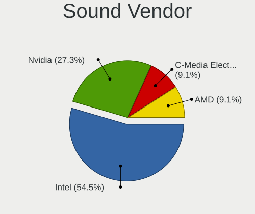

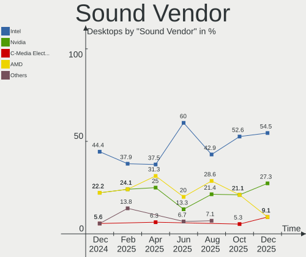

| Vendor              | Desktops | Percent |
|---------------------|----------|---------|
| Intel               | 6        | 54.55%  |
| Nvidia              | 3        | 27.27%  |
| C-Media Electronics | 1        | 9.09%   |
| AMD                 | 1        | 9.09%   |

Sound Model
-----------

Sound card models

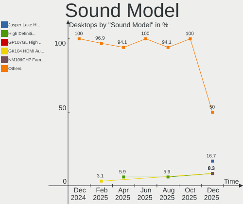

| Model                                                                      | Desktops | Percent |
|----------------------------------------------------------------------------|----------|---------|
| Intel Jasper Lake HD Audio                                                 | 2        | 16.67%  |
| Nvidia High Definition Audio Controller                                    | 1        | 8.33%   |
| Nvidia GP107GL High Definition Audio Controller                            | 1        | 8.33%   |
| Nvidia GK104 HDMI Audio Controller                                         | 1        | 8.33%   |
| Intel NM10/ICH7 Family High Definition Audio Controller                    | 1        | 8.33%   |
| Intel 8 Series/C220 Series Chipset High Definition Audio Controller        | 1        | 8.33%   |
| Intel 6 Series/C200 Series Chipset Family High Definition Audio Controller | 1        | 8.33%   |
| Intel 100 Series/C230 Series Chipset Family HD Audio Controller            | 1        | 8.33%   |
| C-Media Electronics Audio Adapter (Unitek Y-247A)                          | 1        | 8.33%   |
| AMD Ryzen HD Audio Controller                                              | 1        | 8.33%   |
| AMD Renoir/Cezanne HDMI/DP Audio Controller                                | 1        | 8.33%   |

Memory
------

Memory Vendor
-------------

Memory module vendors

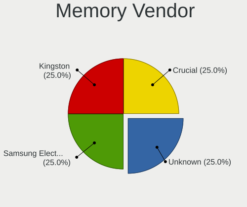

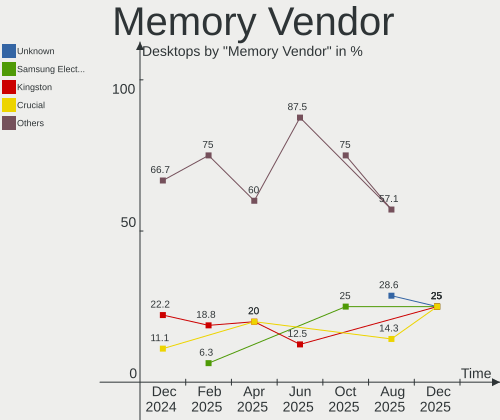

| Vendor              | Desktops | Percent |
|---------------------|----------|---------|
| Unknown             | 1        | 25%     |
| Samsung Electronics | 1        | 25%     |
| Kingston            | 1        | 25%     |
| Crucial             | 1        | 25%     |

Memory Model
------------

Memory module models

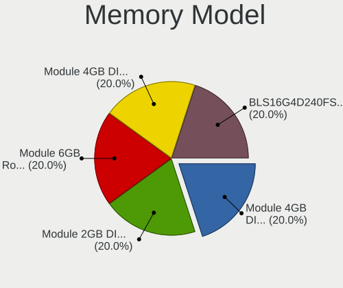

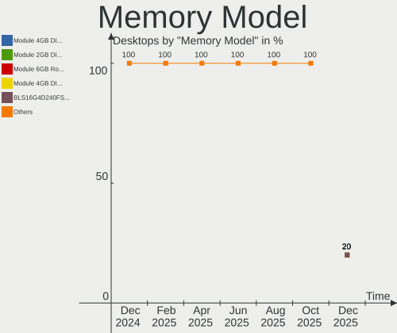

| Model                                                    | Desktops | Percent |
|----------------------------------------------------------|----------|---------|
| Unknown RAM Module 4GB DIMM SDRAM                        | 1        | 20%     |
| Unknown RAM Module 2GB DIMM SDRAM                        | 1        | 20%     |
| Samsung RAM Module 6GB Row Of Chips LPDDR4 3733MT/s      | 1        | 20%     |
| Kingston RAM Module 4GB DIMM DDR3 1333MT/s               | 1        | 20%     |
| Crucial RAM BLS16G4D240FSC.16FBD 16GB DIMM DDR4 2400MT/s | 1        | 20%     |

Memory Kind
-----------

Memory module kinds

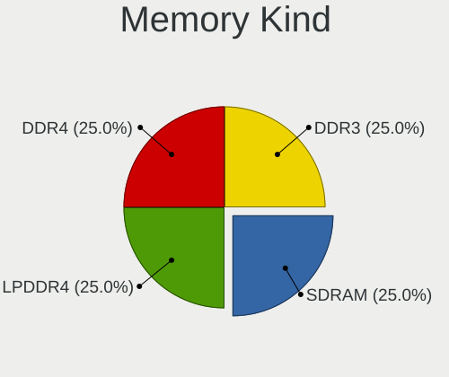

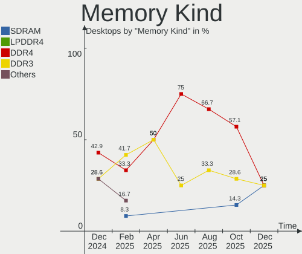

| Kind   | Desktops | Percent |
|--------|----------|---------|
| SDRAM  | 1        | 25%     |
| LPDDR4 | 1        | 25%     |
| DDR4   | 1        | 25%     |
| DDR3   | 1        | 25%     |

Memory Form Factor
------------------

Physical design of the memory module

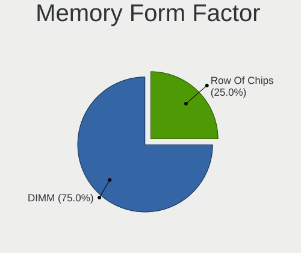

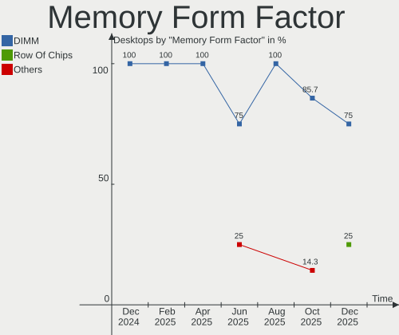

| Name         | Desktops | Percent |
|--------------|----------|---------|
| DIMM         | 3        | 75%     |
| Row Of Chips | 1        | 25%     |

Memory Size
-----------

Memory module size

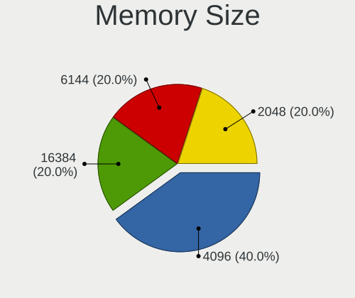

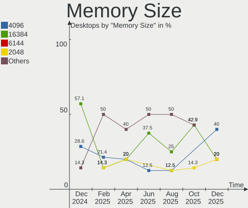

| Size  | Desktops | Percent |
|-------|----------|---------|
| 4096  | 2        | 40%     |
| 16384 | 1        | 20%     |
| 6144  | 1        | 20%     |
| 2048  | 1        | 20%     |

Memory Speed
------------

Memory module speed

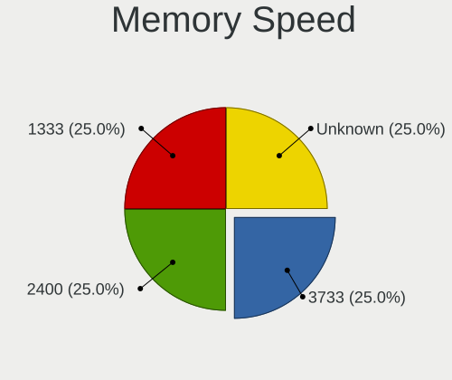

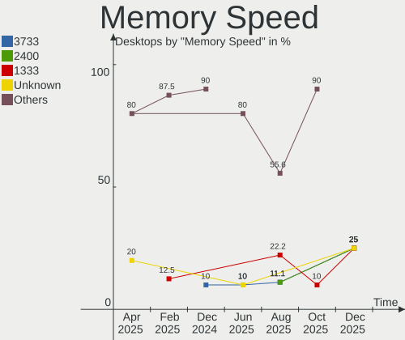

| Speed   | Desktops | Percent |
|---------|----------|---------|
| 3733    | 1        | 25%     |
| 2400    | 1        | 25%     |
| 1333    | 1        | 25%     |
| Unknown | 1        | 25%     |

Printers & scanners
-------------------

Printer Vendor
--------------

Printer device vendors

Zero info for selected period =(

Printer Model
-------------

Printer device models

Zero info for selected period =(

Scanner Vendor
--------------

Scanner device vendors

Zero info for selected period =(

Scanner Model
-------------

Scanner device models

Zero info for selected period =(

Camera
------

Camera Vendor
-------------

Camera device vendors

Zero info for selected period =(

Camera Model
------------

Camera device models

Zero info for selected period =(

Security
--------

Fingerprint Vendor
------------------

Fingerprint sensor vendors

Zero info for selected period =(

Fingerprint Model
-----------------

Fingerprint sensor models

Zero info for selected period =(

Chipcard Vendor
---------------

Chipcard module vendors

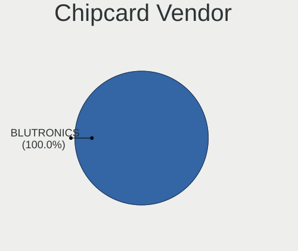

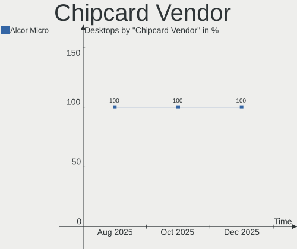

| Vendor      | Desktops | Percent |
|-------------|----------|---------|
| Alcor Micro | 1        | 100%    |

Chipcard Model
--------------

Chipcard module models

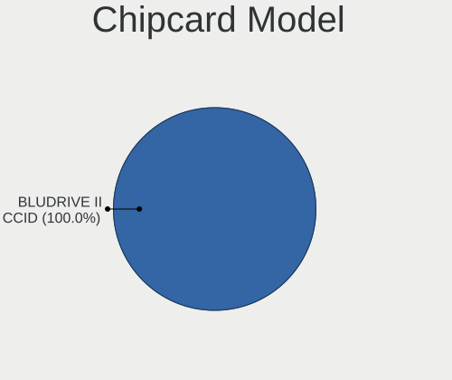

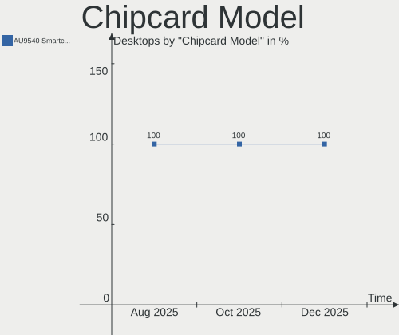

| Model                               | Desktops | Percent |
|-------------------------------------|----------|---------|
| Alcor Micro AU9540 Smartcard Reader | 1        | 100%    |

Unsupported
-----------

Unsupported Devices
-------------------

Total unsupported devices on board

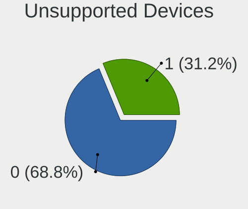

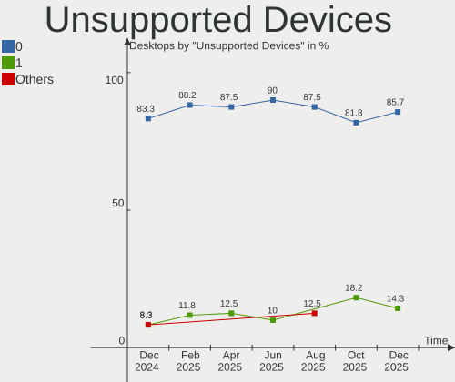

| Total | Desktops | Percent |
|-------|----------|---------|
| 0     | 6        | 85.71%  |
| 1     | 1        | 14.29%  |

Unsupported Device Types
------------------------

Types of unsupported devices

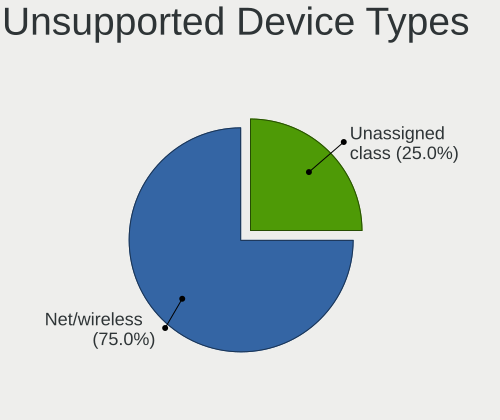

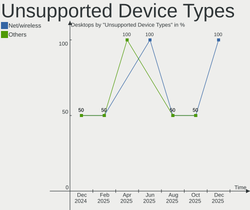

| Type         | Desktops | Percent |
|--------------|----------|---------|
| Net/wireless | 1        | 100%    |

