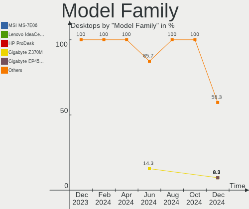
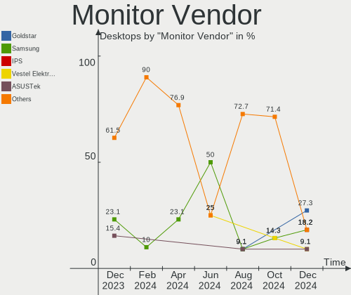
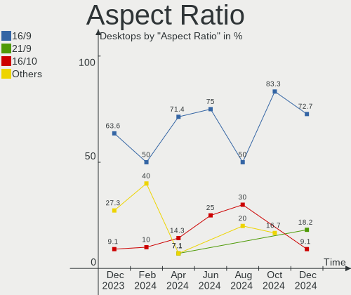
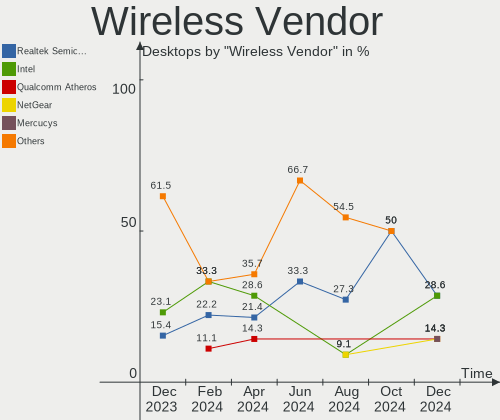

Kali - Hardware Trends (Desktops)
---------------------------------

A project to identify most popular hardware characteristics and track their change
over time based on data collected by Linux users at https://Linux-Hardware.org.

Anyone can contribute to this report by the [hw-probe](https://github.com/linuxhw/hw-probe) tool:

    sudo -E hw-probe -all -upload

This report is for one last month. Overall report since the beginning of time: [TestDays](https://github.com/linuxhw/TestDays)

Period: Oct, 2023.

Contents
--------

* [ System ](#system)
  - [ OS                       ](#os)
  - [ OS Family                ](#os-family)
  - [ Kernel                   ](#kernel)
  - [ Kernel Family            ](#kernel-family)
  - [ Kernel Major Ver.        ](#kernel-major-ver)
  - [ Arch                     ](#arch)
  - [ DE                       ](#de)
  - [ Display Server           ](#display-server)
  - [ Display Manager          ](#display-manager)
  - [ OS Lang                  ](#os-lang)
  - [ Boot Mode                ](#boot-mode)
  - [ Filesystem               ](#filesystem)
  - [ Part. scheme             ](#part-scheme)
  - [ Dual Boot with Linux/BSD ](#dual-boot-with-linuxbsd)
  - [ Dual Boot (Win)          ](#dual-boot-win)

* [ Board ](#board)
  - [ Vendor                   ](#vendor)
  - [ Model                    ](#model)
  - [ Model Family             ](#model-family)
  - [ MFG Year                 ](#mfg-year)
  - [ Form Factor              ](#form-factor)
  - [ Secure Boot              ](#secure-boot)
  - [ Coreboot                 ](#coreboot)
  - [ RAM Size                 ](#ram-size)
  - [ RAM Used                 ](#ram-used)
  - [ Total Drives             ](#total-drives)
  - [ Has CD-ROM               ](#has-cd-rom)
  - [ Has Ethernet             ](#has-ethernet)
  - [ Has WiFi                 ](#has-wifi)
  - [ Has Bluetooth            ](#has-bluetooth)

* [ Location ](#location)
  - [ Country                  ](#country)
  - [ City                     ](#city)

* [ Drives ](#drives)
  - [ Drive Vendor             ](#drive-vendor)
  - [ Drive Model              ](#drive-model)
  - [ HDD Vendor               ](#hdd-vendor)
  - [ SSD Vendor               ](#ssd-vendor)
  - [ Drive Kind               ](#drive-kind)
  - [ Drive Connector          ](#drive-connector)
  - [ Drive Size               ](#drive-size)
  - [ Space Total              ](#space-total)
  - [ Space Used               ](#space-used)
  - [ Malfunc. Drives          ](#malfunc-drives)
  - [ Malfunc. Drive Vendor    ](#malfunc-drive-vendor)
  - [ Malfunc. HDD Vendor      ](#malfunc-hdd-vendor)
  - [ Malfunc. Drive Kind      ](#malfunc-drive-kind)
  - [ Failed Drives            ](#failed-drives)
  - [ Failed Drive Vendor      ](#failed-drive-vendor)
  - [ Drive Status             ](#drive-status)

* [ Storage controller ](#storage-controller)
  - [ Storage Vendor           ](#storage-vendor)
  - [ Storage Model            ](#storage-model)
  - [ Storage Kind             ](#storage-kind)

* [ Processor ](#processor)
  - [ CPU Vendor               ](#cpu-vendor)
  - [ CPU Model                ](#cpu-model)
  - [ CPU Model Family         ](#cpu-model-family)
  - [ CPU Cores                ](#cpu-cores)
  - [ CPU Sockets              ](#cpu-sockets)
  - [ CPU Threads              ](#cpu-threads)
  - [ CPU Op-Modes             ](#cpu-op-modes)
  - [ CPU Microcode            ](#cpu-microcode)
  - [ CPU Microarch            ](#cpu-microarch)

* [ Graphics ](#graphics)
  - [ GPU Vendor               ](#gpu-vendor)
  - [ GPU Model                ](#gpu-model)
  - [ GPU Combo                ](#gpu-combo)
  - [ GPU Driver               ](#gpu-driver)
  - [ GPU Memory               ](#gpu-memory)

* [ Monitor ](#monitor)
  - [ Monitor Vendor           ](#monitor-vendor)
  - [ Monitor Model            ](#monitor-model)
  - [ Monitor Resolution       ](#monitor-resolution)
  - [ Monitor Diagonal         ](#monitor-diagonal)
  - [ Monitor Width            ](#monitor-width)
  - [ Aspect Ratio             ](#aspect-ratio)
  - [ Monitor Area             ](#monitor-area)
  - [ Pixel Density            ](#pixel-density)
  - [ Multiple Monitors        ](#multiple-monitors)

* [ Network ](#network)
  - [ Net Controller Vendor    ](#net-controller-vendor)
  - [ Net Controller Model     ](#net-controller-model)
  - [ Wireless Vendor          ](#wireless-vendor)
  - [ Wireless Model           ](#wireless-model)
  - [ Ethernet Vendor          ](#ethernet-vendor)
  - [ Ethernet Model           ](#ethernet-model)
  - [ Net Controller Kind      ](#net-controller-kind)
  - [ Used Controller          ](#used-controller)
  - [ NICs                     ](#nics)
  - [ IPv6                     ](#ipv6)

* [ Bluetooth ](#bluetooth)
  - [ Bluetooth Vendor         ](#bluetooth-vendor)
  - [ Bluetooth Model          ](#bluetooth-model)

* [ Sound ](#sound)
  - [ Sound Vendor             ](#sound-vendor)
  - [ Sound Model              ](#sound-model)

* [ Memory ](#memory)
  - [ Memory Vendor            ](#memory-vendor)
  - [ Memory Model             ](#memory-model)
  - [ Memory Kind              ](#memory-kind)
  - [ Memory Form Factor       ](#memory-form-factor)
  - [ Memory Size              ](#memory-size)
  - [ Memory Speed             ](#memory-speed)

* [ Printers & scanners ](#printers--scanners)
  - [ Printer Vendor           ](#printer-vendor)
  - [ Printer Model            ](#printer-model)
  - [ Scanner Vendor           ](#scanner-vendor)
  - [ Scanner Model            ](#scanner-model)

* [ Camera ](#camera)
  - [ Camera Vendor            ](#camera-vendor)
  - [ Camera Model             ](#camera-model)

* [ Security ](#security)
  - [ Fingerprint Vendor       ](#fingerprint-vendor)
  - [ Fingerprint Model        ](#fingerprint-model)
  - [ Chipcard Vendor          ](#chipcard-vendor)
  - [ Chipcard Model           ](#chipcard-model)

* [ Unsupported ](#unsupported)
  - [ Unsupported Devices      ](#unsupported-devices)
  - [ Unsupported Device Types ](#unsupported-device-types)

System
------

OS
--

Installed operating systems

| Name        | Desktops | Percent |
|-------------|----------|---------|
| Kali 2023.3 | 10       | 100%    |

OS Family
---------

OS without a version

| Name | Desktops | Percent |
|------|----------|---------|
| Kali | 10       | 100%    |

Kernel
------

Version of the Linux kernel

| Version           | Desktops | Percent |
|-------------------|----------|---------|
| 6.5.0-kali2-amd64 | 4        | 40%     |
| 6.5.0-kali1-amd64 | 3        | 30%     |
| 6.5.0-kali3-amd64 | 2        | 20%     |
| 6.3.0-kali1-amd64 | 1        | 10%     |

Kernel Family
-------------

Linux kernel without a distro release

| Version | Desktops | Percent |
|---------|----------|---------|
| 6.5.0   | 9        | 90%     |
| 6.3.0   | 1        | 10%     |

Kernel Major Ver.
-----------------

Linux kernel major version

| Version | Desktops | Percent |
|---------|----------|---------|
| 6.5     | 9        | 90%     |
| 6.3     | 1        | 10%     |

Arch
----

OS architecture (x86_64, i586, etc.)

| Name   | Desktops | Percent |
|--------|----------|---------|
| x86_64 | 10       | 100%    |

DE
--

Desktop Environment

| Name  | Desktops | Percent |
|-------|----------|---------|
| XFCE  | 6        | 60%     |
| GNOME | 4        | 40%     |

Display Server
--------------

X11 or Wayland

| Name    | Desktops | Percent |
|---------|----------|---------|
| X11     | 9        | 90%     |
| Wayland | 1        | 10%     |

Display Manager
---------------

SDDM, LightDM, etc.

| Name    | Desktops | Percent |
|---------|----------|---------|
| Unknown | 5        | 50%     |
| LightDM | 3        | 30%     |
| SDDM    | 2        | 20%     |

OS Lang
-------

Language

| Lang  | Desktops | Percent |
|-------|----------|---------|
| C     | 5        | 50%     |
| en_US | 3        | 30%     |
| ru_RU | 2        | 20%     |

Boot Mode
---------

EFI or BIOS

| Mode | Desktops | Percent |
|------|----------|---------|
| BIOS | 5        | 50%     |
| EFI  | 5        | 50%     |

Filesystem
----------

Type of filesystem

| Type  | Desktops | Percent |
|-------|----------|---------|
| Ext4  | 8        | 80%     |
| Xfs   | 1        | 10%     |
| Tmpfs | 1        | 10%     |

Part. scheme
------------

Scheme of partitioning

| Type    | Desktops | Percent |
|---------|----------|---------|
| Unknown | 5        | 50%     |
| GPT     | 4        | 40%     |
| MBR     | 1        | 10%     |

Dual Boot with Linux/BSD
------------------------

Hosting more than one Linux/BSD

| Dual boot | Desktops | Percent |
|-----------|----------|---------|
| No        | 9        | 90%     |
| Yes       | 1        | 10%     |

Dual Boot (Win)
---------------

Hosting Linux and Windows

| Dual boot | Desktops | Percent |
|-----------|----------|---------|
| No        | 8        | 80%     |
| Yes       | 2        | 20%     |

Board
-----

Vendor
------

Motherboard manufacturer

| Name                | Desktops | Percent |
|---------------------|----------|---------|
| MSI                 | 2        | 20%     |
| Gigabyte Technology | 2        | 20%     |
| Dell                | 2        | 20%     |
| ASUSTek Computer    | 2        | 20%     |
| Hewlett-Packard     | 1        | 10%     |
| ASRock              | 1        | 10%     |

Model
-----

Motherboard model

| Name                          | Desktops | Percent |
|-------------------------------|----------|---------|
| MSI MS-7C56                   | 1        | 10%     |
| MSI MS-7B49                   | 1        | 10%     |
| HP EliteDesk 800 G1 SFF       | 1        | 10%     |
| Gigabyte Z390 GAMING SLI      | 1        | 10%     |
| Gigabyte B550M DS3H           | 1        | 10%     |
| Dell OptiPlex 9020            | 1        | 10%     |
| Dell Inspiron 530             | 1        | 10%     |
| ASUS TUF Gaming B450M-PLUS II | 1        | 10%     |
| ASUS M5A78L-M/USB3            | 1        | 10%     |
| ASRock B650E PG Riptide WiFi  | 1        | 10%     |

Model Family
------------

Motherboard model prefix

| Name           | Desktops | Percent |
|----------------|----------|---------|
| MSI MS-7C56    | 1        | 10%     |
| MSI MS-7B49    | 1        | 10%     |
| HP EliteDesk   | 1        | 10%     |
| Gigabyte Z390  | 1        | 10%     |
| Gigabyte B550M | 1        | 10%     |
| Dell OptiPlex  | 1        | 10%     |
| Dell Inspiron  | 1        | 10%     |
| ASUS TUF       | 1        | 10%     |
| ASUS M5A78L-M  | 1        | 10%     |
| ASRock B650E   | 1        | 10%     |

MFG Year
--------

Motherboard manufacture year

| Year | Desktops | Percent |
|------|----------|---------|
| 2020 | 3        | 30%     |
| 2023 | 1        | 10%     |
| 2018 | 1        | 10%     |
| 2017 | 1        | 10%     |
| 2014 | 1        | 10%     |
| 2013 | 1        | 10%     |
| 2011 | 1        | 10%     |
| 2007 | 1        | 10%     |

Form Factor
-----------

Physical design of the computer

| Name    | Desktops | Percent |
|---------|----------|---------|
| Desktop | 10       | 100%    |

Secure Boot
-----------

Enabled or disabled

| State    | Desktops | Percent |
|----------|----------|---------|
| Disabled | 10       | 100%    |

Coreboot
--------

Have coreboot on board

| Used | Desktops | Percent |
|------|----------|---------|
| No   | 10       | 100%    |

RAM Size
--------

Total RAM memory

| Size in GB  | Desktops | Percent |
|-------------|----------|---------|
| 16.01-24.0  | 5        | 50%     |
| 8.01-16.0   | 2        | 20%     |
| 32.01-64.0  | 1        | 10%     |
| 3.01-4.0    | 1        | 10%     |
| 64.01-256.0 | 1        | 10%     |

RAM Used
--------

Used RAM memory

| Used GB   | Desktops | Percent |
|-----------|----------|---------|
| 2.01-3.0  | 4        | 40%     |
| 4.01-8.0  | 2        | 20%     |
| 8.01-16.0 | 2        | 20%     |
| 3.01-4.0  | 1        | 10%     |
| 1.01-2.0  | 1        | 10%     |

Total Drives
------------

Number of drives on board

| Drives | Desktops | Percent |
|--------|----------|---------|
| 2      | 4        | 40%     |
| 1      | 3        | 30%     |
| 3      | 2        | 20%     |
| 4      | 1        | 10%     |

Has CD-ROM
----------

Has CD-ROM on board

| Presented | Desktops | Percent |
|-----------|----------|---------|
| No        | 8        | 80%     |
| Yes       | 2        | 20%     |

Has Ethernet
------------

Has Ethernet on board

| Presented | Desktops | Percent |
|-----------|----------|---------|
| Yes       | 10       | 100%    |

Has WiFi
--------

Has WiFi module

| Presented | Desktops | Percent |
|-----------|----------|---------|
| Yes       | 6        | 60%     |
| No        | 4        | 40%     |

Has Bluetooth
-------------

Has Bluetooth module

| Presented | Desktops | Percent |
|-----------|----------|---------|
| Yes       | 5        | 50%     |
| No        | 5        | 50%     |

Location
--------

Country
-------

Geographic location (country)

| Country | Desktops | Percent |
|---------|----------|---------|
| USA     | 2        | 20%     |
| Taiwan  | 1        | 10%     |
| Spain   | 1        | 10%     |
| Serbia  | 1        | 10%     |
| Russia  | 1        | 10%     |
| Poland  | 1        | 10%     |
| Oman    | 1        | 10%     |
| Morocco | 1        | 10%     |
| Czechia | 1        | 10%     |

City
----

Geographic location (city)

| City             | Desktops | Percent |
|------------------|----------|---------|
| Warsaw           | 1        | 10%     |
| Tangier          | 1        | 10%     |
| Prague           | 1        | 10%     |
| Palm Bay         | 1        | 10%     |
| Muscat           | 1        | 10%     |
| Hsinchu          | 1        | 10%     |
| Dubna            | 1        | 10%     |
| Collado Villalba | 1        | 10%     |
| Casper           | 1        | 10%     |
| Belgrade         | 1        | 10%     |

Drives
------

Drive Vendor
------------

Hard drive vendors

| Vendor                      | Desktops | Drives | Percent |
|-----------------------------|----------|--------|---------|
| Seagate                     | 4        | 4      | 20%     |
| WDC                         | 3        | 3      | 15%     |
| Toshiba                     | 2        | 2      | 10%     |
| Samsung Electronics         | 2        | 2      | 10%     |
| TwinMOS                     | 1        | 1      | 5%      |
| Team                        | 1        | 1      | 5%      |
| Realtek Semiconductor       | 1        | 2      | 5%      |
| MAXIO Technology (Hangzhou) | 1        | 1      | 5%      |
| Lexar                       | 1        | 1      | 5%      |
| Kingston Technology Company | 1        | 1      | 5%      |
| Kingston                    | 1        | 1      | 5%      |
| A-DATA Technology           | 1        | 1      | 5%      |
| Unknown                     | 1        | 1      | 5%      |

Drive Model
-----------

Hard drive models

| Model                                     | Desktops | Percent |
|-------------------------------------------|----------|---------|
| Seagate ST2000DM008-2FR102 2TB            | 2        | 9.52%   |
| WDC WD5000AZLX-60K2TA0 500GB              | 1        | 4.76%   |
| WDC WD2500BPVT-00JJ5T0 250GB              | 1        | 4.76%   |
| WDC WD10EZEX-60WN4A0 1TB                  | 1        | 4.76%   |
| TwinMOS SSD 256GB                         | 1        | 4.76%   |
| Toshiba MQ01ABF050 500GB                  | 1        | 4.76%   |
| Toshiba DT02ABA200V 2TB                   | 1        | 4.76%   |
| Team T253X2512G 512GB SSD                 | 1        | 4.76%   |
| Seagate ST500DM002-1BD142 500GB           | 1        | 4.76%   |
| Seagate ST2000DM008-2UB102 2TB            | 1        | 4.76%   |
| Samsung SSD 970 EVO Plus 1TB              | 1        | 4.76%   |
| Samsung SSD 860 EVO 1TB                   | 1        | 4.76%   |
| Realtek RTS5763DL NVMe SSD Controller 1TB | 1        | 4.76%   |
| Realtek ADATA SX6000NP 256GB              | 1        | 4.76%   |
| MAXIO (Hangzhou) NVMe SSD Drive 512GB     | 1        | 4.76%   |
| Lexar SSD NM710 1TB                       | 1        | 4.76%   |
| Kingston Company SNV2S2000G 2TB           | 1        | 4.76%   |
| Kingston SA400S37240G 240GB SSD           | 1        | 4.76%   |
| A-DATA SP900 128GB SSD                    | 1        | 4.76%   |
| Unknown                                   | 1        | 4.76%   |

HDD Vendor
----------

Hard disk drive vendors

| Vendor  | Desktops | Drives | Percent |
|---------|----------|--------|---------|
| Seagate | 4        | 4      | 44.44%  |
| WDC     | 3        | 3      | 33.33%  |
| Toshiba | 2        | 2      | 22.22%  |

SSD Vendor
----------

Solid state drive vendors

| Vendor              | Desktops | Drives | Percent |
|---------------------|----------|--------|---------|
| TwinMOS             | 1        | 1      | 20%     |
| Team                | 1        | 1      | 20%     |
| Samsung Electronics | 1        | 1      | 20%     |
| Kingston            | 1        | 1      | 20%     |
| A-DATA Technology   | 1        | 1      | 20%     |

Drive Kind
----------

HDD or SSD

| Kind    | Desktops | Drives | Percent |
|---------|----------|--------|---------|
| HDD     | 6        | 9      | 37.5%   |
| SSD     | 5        | 5      | 31.25%  |
| NVMe    | 4        | 6      | 25%     |
| Unknown | 1        | 1      | 6.25%   |

Drive Connector
---------------

SATA, SAS, NVMe, etc.

| Type | Desktops | Drives | Percent |
|------|----------|--------|---------|
| SATA | 9        | 15     | 69.23%  |
| NVMe | 4        | 6      | 30.77%  |

Drive Size
----------

Size of hard drive

| Size in TB | Desktops | Drives | Percent |
|------------|----------|--------|---------|
| 1.01-2.0   | 4        | 4      | 40%     |
| 0.01-0.5   | 4        | 7      | 40%     |
| 0.51-1.0   | 2        | 3      | 20%     |

Space Total
-----------

Amount of disk space available on the file system

| Size in GB     | Desktops | Percent |
|----------------|----------|---------|
| 101-250        | 3        | 30%     |
| 501-1000       | 3        | 30%     |
| 251-500        | 2        | 20%     |
| More than 3000 | 1        | 10%     |
| 1001-2000      | 1        | 10%     |

Space Used
----------

Amount of used disk space

| Used GB        | Desktops | Percent |
|----------------|----------|---------|
| 251-500        | 2        | 20%     |
| 21-50          | 2        | 20%     |
| 51-100         | 2        | 20%     |
| More than 3000 | 1        | 10%     |
| 101-250        | 1        | 10%     |
| 1-20           | 1        | 10%     |
| 501-1000       | 1        | 10%     |

Malfunc. Drives
---------------

Drive models with a malfunction

Zero info for selected period =(

Malfunc. Drive Vendor
---------------------

Vendors of faulty drives

Zero info for selected period =(

Malfunc. HDD Vendor
-------------------

Vendors of faulty HDD drives

Zero info for selected period =(

Malfunc. Drive Kind
-------------------

Kinds of faulty drives

Zero info for selected period =(

Failed Drives
-------------

Failed drive models

Zero info for selected period =(

Failed Drive Vendor
-------------------

Failed drive vendors

Zero info for selected period =(

Drive Status
------------

Number of failed and malfunc. drives

| Status   | Desktops | Drives | Percent |
|----------|----------|--------|---------|
| Detected | 7        | 15     | 63.64%  |
| Works    | 4        | 6      | 36.36%  |

Storage controller
------------------

Storage Vendor
--------------

Storage controller vendors

| Vendor                       | Desktops | Percent |
|------------------------------|----------|---------|
| Intel                        | 5        | 31.25%  |
| AMD                          | 5        | 31.25%  |
| Shenzhen Longsys Electronics | 1        | 6.25%   |
| Samsung Electronics          | 1        | 6.25%   |
| Realtek Semiconductor        | 1        | 6.25%   |
| MAXIO Technology (Hangzhou)  | 1        | 6.25%   |
| Kingston Technology Company  | 1        | 6.25%   |
| ASMedia Technology           | 1        | 6.25%   |

Storage Model
-------------

Storage controller models

| Model                                                                          | Desktops | Percent |
|--------------------------------------------------------------------------------|----------|---------|
| Intel SATA Controller [RAID mode]                                              | 2        | 10.53%  |
| AMD FCH SATA Controller [AHCI mode]                                            | 2        | 10.53%  |
| AMD 500 Series Chipset SATA Controller                                         | 2        | 10.53%  |
| Shenzhen Longsys Non-Volatile memory controller                                | 1        | 5.26%   |
| Samsung NVMe SSD Controller SM981/PM981/PM983                                  | 1        | 5.26%   |
| Realtek RTS5763DL x2 NVMe SSD Controller                                       | 1        | 5.26%   |
| Realtek RTS5762 NVMe SSD Controller                                            | 1        | 5.26%   |
| MAXIO (Hangzhou) NVMe SSD Controller MAP1202                                   | 1        | 5.26%   |
| Kingston Company NV2 NVMe SSD SM2267XT                                         | 1        | 5.26%   |
| Intel Cannon Lake PCH SATA AHCI Controller                                     | 1        | 5.26%   |
| Intel 8 Series/C220 Series Chipset Family 6-port SATA Controller 1 [AHCI mode] | 1        | 5.26%   |
| Intel 200 Series PCH SATA controller [AHCI mode]                               | 1        | 5.26%   |
| ASMedia ASM1062 Serial ATA Controller                                          | 1        | 5.26%   |
| AMD SB7x0/SB8x0/SB9x0 SATA Controller [IDE mode]                               | 1        | 5.26%   |
| AMD SB7x0/SB8x0/SB9x0 IDE Controller                                           | 1        | 5.26%   |
| AMD 400 Series Chipset SATA Controller                                         | 1        | 5.26%   |

Storage Kind
------------

Kind of storage controller (IDE, SATA, NVMe, SAS, ...)

| Kind | Desktops | Percent |
|------|----------|---------|
| SATA | 8        | 53.33%  |
| NVMe | 4        | 26.67%  |
| RAID | 2        | 13.33%  |
| IDE  | 1        | 6.67%   |

Processor
---------

CPU Vendor
----------

Processor vendors

| Vendor | Desktops | Percent |
|--------|----------|---------|
| Intel  | 5        | 50%     |
| AMD    | 5        | 50%     |

CPU Model
---------

Processor models

| Model                                  | Desktops | Percent |
|----------------------------------------|----------|---------|
| Intel Core i9-9900 CPU @ 3.10GHz       | 1        | 10%     |
| Intel Core i5-8500 CPU @ 3.00GHz       | 1        | 10%     |
| Intel Core i5-4590 CPU @ 3.30GHz       | 1        | 10%     |
| Intel Core i5-4570 CPU @ 3.20GHz       | 1        | 10%     |
| Intel Core 2 Duo CPU E6550 @ 2.33GHz   | 1        | 10%     |
| AMD Ryzen 7 7700X 8-Core Processor     | 1        | 10%     |
| AMD Ryzen 7 5800X 8-Core Processor     | 1        | 10%     |
| AMD Ryzen 5 5600G with Radeon Graphics | 1        | 10%     |
| AMD Ryzen 5 3500X 6-Core Processor     | 1        | 10%     |
| AMD FX-6300 Six-Core Processor         | 1        | 10%     |

CPU Model Family
----------------

Processor model prefix

| Model            | Desktops | Percent |
|------------------|----------|---------|
| Intel Core i5    | 3        | 30%     |
| AMD Ryzen 7      | 2        | 20%     |
| AMD Ryzen 5      | 2        | 20%     |
| Intel Core i9    | 1        | 10%     |
| Intel Core 2 Duo | 1        | 10%     |
| AMD FX           | 1        | 10%     |

CPU Cores
---------

Number of processor cores

| Number | Desktops | Percent |
|--------|----------|---------|
| 8      | 3        | 30%     |
| 6      | 3        | 30%     |
| 4      | 2        | 20%     |
| 3      | 1        | 10%     |
| 2      | 1        | 10%     |

CPU Sockets
-----------

Number of sockets

| Number | Desktops | Percent |
|--------|----------|---------|
| 1      | 10       | 100%    |

CPU Threads
-----------

Threads per core (Hyper-Threading)

| Number | Desktops | Percent |
|--------|----------|---------|
| 2      | 5        | 50%     |
| 1      | 5        | 50%     |

CPU Op-Modes
------------

CPU Operation Modes (32-bit, 64-bit)

| Op mode        | Desktops | Percent |
|----------------|----------|---------|
| 32-bit, 64-bit | 10       | 100%    |

CPU Microcode
-------------

Microcode number

| Number     | Desktops | Percent |
|------------|----------|---------|
| Unknown    | 5        | 50%     |
| 0x0a601203 | 1        | 10%     |
| 0x0a50000d | 1        | 10%     |
| 0x08701030 | 1        | 10%     |
| 0x06000852 | 1        | 10%     |
| 0x00000000 | 1        | 10%     |

CPU Microarch
-------------

Microarchitecture

| Name       | Desktops | Percent |
|------------|----------|---------|
| Zen 3      | 2        | 20%     |
| KabyLake   | 2        | 20%     |
| Haswell    | 2        | 20%     |
| Zen 2      | 1        | 10%     |
| Piledriver | 1        | 10%     |
| Core       | 1        | 10%     |
| Unknown    | 1        | 10%     |

Graphics
--------

GPU Vendor
----------

Vendors of graphics cards

| Vendor | Desktops | Percent |
|--------|----------|---------|
| Nvidia | 6        | 46.15%  |
| Intel  | 5        | 38.46%  |
| AMD    | 2        | 15.38%  |

GPU Model
---------

Graphics card models

| Model                                                                       | Desktops | Percent |
|-----------------------------------------------------------------------------|----------|---------|
| Intel Xeon E3-1200 v3/4th Gen Core Processor Integrated Graphics Controller | 2        | 15.38%  |
| Intel CoffeeLake-S GT2 [UHD Graphics 630]                                   | 2        | 15.38%  |
| Nvidia GP106 [GeForce GTX 1060 6GB]                                         | 1        | 7.69%   |
| Nvidia GP104 [GeForce GTX 1080]                                             | 1        | 7.69%   |
| Nvidia GF119 [NVS 310]                                                      | 1        | 7.69%   |
| Nvidia GA106 [GeForce RTX 3060]                                             | 1        | 7.69%   |
| Nvidia GA102 [GeForce RTX 3090]                                             | 1        | 7.69%   |
| Nvidia AD104 [GeForce RTX 4070]                                             | 1        | 7.69%   |
| Intel 82G33/G31 Express Integrated Graphics Controller                      | 1        | 7.69%   |
| AMD RS780L [Radeon 3000]                                                    | 1        | 7.69%   |
| AMD Raphael                                                                 | 1        | 7.69%   |

GPU Combo
---------

Combinations of graphics cards

| Name         | Desktops | Percent |
|--------------|----------|---------|
| 1 x Nvidia   | 5        | 50%     |
| 1 x Intel    | 3        | 30%     |
| AMD + Nvidia | 1        | 10%     |
| 1 x AMD      | 1        | 10%     |

GPU Driver
----------

Free vs proprietary

| Driver      | Desktops | Percent |
|-------------|----------|---------|
| Proprietary | 5        | 50%     |
| Free        | 5        | 50%     |

GPU Memory
----------

Total video memory

| Size in GB | Desktops | Percent |
|------------|----------|---------|
| Unknown    | 4        | 40%     |
| 8.01-16.0  | 2        | 20%     |
| 7.01-8.0   | 1        | 10%     |
| 16.01-24.0 | 1        | 10%     |
| 0.51-1.0   | 1        | 10%     |
| 0.01-0.5   | 1        | 10%     |

Monitor
-------

Monitor Vendor
--------------

Monitor vendors

| Vendor              | Desktops | Percent |
|---------------------|----------|---------|
| AOC                 | 3        | 25%     |
| Samsung Electronics | 2        | 16.67%  |
| Philips             | 1        | 8.33%   |
| MSI                 | 1        | 8.33%   |
| Hewlett-Packard     | 1        | 8.33%   |
| Goldstar            | 1        | 8.33%   |
| Dell                | 1        | 8.33%   |
| ASUSTek Computer    | 1        | 8.33%   |
| Acer                | 1        | 8.33%   |

Monitor Model
-------------

Monitor models

| Model                                                             | Desktops | Percent |
|-------------------------------------------------------------------|----------|---------|
| Samsung Electronics LCD Monitor LF24T35 3840x1080                 | 1        | 8.33%   |
| Samsung Electronics LC27T55 SAM7020 1920x1080 609x349mm 27.6-inch | 1        | 8.33%   |
| Philips PHL 272E1 PHLC210 1920x1080 600x340mm 27.2-inch           | 1        | 8.33%   |
| MSI MAG241CR MSI3EA2 1920x1080 521x293mm 23.5-inch                | 1        | 8.33%   |
| Hewlett-Packard W2072a HWP3000 1600x900 443x249mm 20.0-inch       | 1        | 8.33%   |
| Goldstar M2262DP GSM5804 1920x1080 477x268mm 21.5-inch            | 1        | 8.33%   |
| Dell P2213 DELF043 1680x1050 473x296mm 22.0-inch                  | 1        | 8.33%   |
| ASUSTek Computer VG27AQL1A AUS2705 2560x1440 597x336mm 27.0-inch  | 1        | 8.33%   |
| AOC LCD Monitor 24G2W1G4 3840x1080                                | 1        | 8.33%   |
| AOC 24B2W1G5 AOC2402 1920x1080 530x300mm 24.0-inch                | 1        | 8.33%   |
| AOC 2343 AOC2343 1920x1080 509x286mm 23.0-inch                    | 1        | 8.33%   |
| Acer VG240Y ACR0673 1920x1080 527x296mm 23.8-inch                 | 1        | 8.33%   |

Monitor Resolution
------------------

Monitor screen resolution

| Resolution         | Desktops | Percent |
|--------------------|----------|---------|
| 1920x1080 (FHD)    | 5        | 50%     |
| 2560x1440 (QHD)    | 2        | 20%     |
| 3840x1080          | 1        | 10%     |
| 1680x1050 (WSXGA+) | 1        | 10%     |
| 1600x900 (HD+)     | 1        | 10%     |

Monitor Diagonal
----------------

Diagonal size in inches

| Inches  | Desktops | Percent |
|---------|----------|---------|
| 27      | 3        | 27.27%  |
| 24      | 2        | 18.18%  |
| 23      | 2        | 18.18%  |
| 22      | 1        | 9.09%   |
| 21      | 1        | 9.09%   |
| 20      | 1        | 9.09%   |
| Unknown | 1        | 9.09%   |

Monitor Width
-------------

Physical width

| Width in mm | Desktops | Percent |
|-------------|----------|---------|
| 501-600     | 5        | 50%     |
| 401-500     | 3        | 30%     |
| 601-700     | 1        | 10%     |
| Unknown     | 1        | 10%     |

Aspect Ratio
------------

Proportional relationship between the width and the height

| Ratio   | Desktops | Percent |
|---------|----------|---------|
| 16/9    | 8        | 80%     |
| 16/10   | 1        | 10%     |
| Unknown | 1        | 10%     |

Monitor Area
------------

Area in inch²

| Area in inch² | Desktops | Percent |
|----------------|----------|---------|
| 201-250        | 5        | 50%     |
| 301-350        | 3        | 30%     |
| 151-200        | 1        | 10%     |
| Unknown        | 1        | 10%     |

Pixel Density
-------------

Pixels per inch

| Density | Desktops | Percent |
|---------|----------|---------|
| 51-100  | 7        | 70%     |
| 101-120 | 2        | 20%     |
| Unknown | 1        | 10%     |

Multiple Monitors
-----------------

Total monitors connected

| Total | Desktops | Percent |
|-------|----------|---------|
| 1     | 8        | 80%     |
| 2     | 2        | 20%     |

Network
-------

Net Controller Vendor
---------------------

Controller vendors

| Vendor                | Desktops | Percent |
|-----------------------|----------|---------|
| Realtek Semiconductor | 7        | 41.18%  |
| Intel                 | 6        | 35.29%  |
| Ralink Technology     | 2        | 11.76%  |
| TP-Link               | 1        | 5.88%   |
| MediaTek              | 1        | 5.88%   |

Net Controller Model
--------------------

Controller models

| Model                                                             | Desktops | Percent |
|-------------------------------------------------------------------|----------|---------|
| Realtek RTL8111/8168/8411 PCI Express Gigabit Ethernet Controller | 4        | 22.22%  |
| Ralink MT7601U Wireless Adapter                                   | 2        | 11.11%  |
| Intel Ethernet Connection I217-LM                                 | 2        | 11.11%  |
| TP-Link TL-WN823N v2/v3 [Realtek RTL8192EU]                       | 1        | 5.56%   |
| Realtek RTL88x2bu [AC1200 Techkey]                                | 1        | 5.56%   |
| Realtek RTL8188EUS 802.11n Wireless Network Adapter               | 1        | 5.56%   |
| Realtek Killer E3000 2.5GbE Controller                            | 1        | 5.56%   |
| Realtek 802.11ac NIC                                              | 1        | 5.56%   |
| MediaTek MT7921K (RZ608) Wi-Fi 6E 80MHz                           | 1        | 5.56%   |
| Intel Wi-Fi 6 AX210/AX211/AX411 160MHz                            | 1        | 5.56%   |
| Intel Ethernet Connection (7) I219-V                              | 1        | 5.56%   |
| Intel Ethernet Connection (2) I219-V                              | 1        | 5.56%   |
| Intel 82562V-2 10/100 Network Connection                          | 1        | 5.56%   |

Wireless Vendor
---------------

Wireless vendors

| Vendor                | Desktops | Percent |
|-----------------------|----------|---------|
| Realtek Semiconductor | 3        | 37.5%   |
| Ralink Technology     | 2        | 25%     |
| TP-Link               | 1        | 12.5%   |
| MediaTek              | 1        | 12.5%   |
| Intel                 | 1        | 12.5%   |

Wireless Model
--------------

Wireless models

| Model                                               | Desktops | Percent |
|-----------------------------------------------------|----------|---------|
| Ralink MT7601U Wireless Adapter                     | 2        | 25%     |
| TP-Link TL-WN823N v2/v3 [Realtek RTL8192EU]         | 1        | 12.5%   |
| Realtek RTL88x2bu [AC1200 Techkey]                  | 1        | 12.5%   |
| Realtek RTL8188EUS 802.11n Wireless Network Adapter | 1        | 12.5%   |
| Realtek 802.11ac NIC                                | 1        | 12.5%   |
| MediaTek MT7921K (RZ608) Wi-Fi 6E 80MHz             | 1        | 12.5%   |
| Intel Wi-Fi 6 AX210/AX211/AX411 160MHz              | 1        | 12.5%   |

Ethernet Vendor
---------------

Ethernet vendors

| Vendor                | Desktops | Percent |
|-----------------------|----------|---------|
| Realtek Semiconductor | 5        | 50%     |
| Intel                 | 5        | 50%     |

Ethernet Model
--------------

Ethernet models

| Model                                                             | Desktops | Percent |
|-------------------------------------------------------------------|----------|---------|
| Realtek RTL8111/8168/8411 PCI Express Gigabit Ethernet Controller | 4        | 40%     |
| Intel Ethernet Connection I217-LM                                 | 2        | 20%     |
| Realtek Killer E3000 2.5GbE Controller                            | 1        | 10%     |
| Intel Ethernet Connection (7) I219-V                              | 1        | 10%     |
| Intel Ethernet Connection (2) I219-V                              | 1        | 10%     |
| Intel 82562V-2 10/100 Network Connection                          | 1        | 10%     |

Net Controller Kind
-------------------

Ethernet, WiFi or modem

| Kind     | Desktops | Percent |
|----------|----------|---------|
| Ethernet | 10       | 58.82%  |
| WiFi     | 7        | 41.18%  |

Used Controller
---------------

Currently used network controller

| Kind     | Desktops | Percent |
|----------|----------|---------|
| Ethernet | 9        | 64.29%  |
| WiFi     | 5        | 35.71%  |

NICs
----

Total network controllers on board

| Total | Desktops | Percent |
|-------|----------|---------|
| 1     | 8        | 80%     |
| 2     | 2        | 20%     |

IPv6
----

IPv6 vs IPv4

| Used | Desktops | Percent |
|------|----------|---------|
| No   | 7        | 70%     |
| Yes  | 3        | 30%     |

Bluetooth
---------

Bluetooth Vendor
----------------

Controller vendors

| Vendor                  | Desktops | Percent |
|-------------------------|----------|---------|
| TP-Link                 | 1        | 20%     |
| MediaTek                | 1        | 20%     |
| Intel                   | 1        | 20%     |
| Dynex                   | 1        | 20%     |
| Cambridge Silicon Radio | 1        | 20%     |

Bluetooth Model
---------------

Controller models

| Model                                                    | Desktops | Percent |
|----------------------------------------------------------|----------|---------|
| TP-Link UB500 Adapter                                    | 1        | 20%     |
| MediaTek Wireless_Device                                 | 1        | 20%     |
| Intel AX210 Bluetooth                                    | 1        | 20%     |
| Dynex Bluetooth 4.0 Adapter [Broadcom, 1.12, BCM20702A0] | 1        | 20%     |
| Cambridge Silicon Radio Bluetooth Dongle (HCI mode)      | 1        | 20%     |

Sound
-----

Sound Vendor
------------

Sound card vendors

| Vendor                  | Desktops | Percent |
|-------------------------|----------|---------|
| Nvidia                  | 6        | 31.58%  |
| Intel                   | 5        | 26.32%  |
| AMD                     | 5        | 26.32%  |
| Microdia                | 1        | 5.26%   |
| Kingston Technology     | 1        | 5.26%   |
| BEHRINGER International | 1        | 5.26%   |

Sound Model
-----------

Sound card models

| Model                                                               | Desktops | Percent |
|---------------------------------------------------------------------|----------|---------|
| Intel Xeon E3-1200 v3/4th Gen Core Processor HD Audio Controller    | 2        | 8.33%   |
| Intel 8 Series/C220 Series Chipset High Definition Audio Controller | 2        | 8.33%   |
| AMD Starship/Matisse HD Audio Controller                            | 2        | 8.33%   |
| AMD Family 17h/19h HD Audio Controller                              | 2        | 8.33%   |
| Nvidia GP106 High Definition Audio Controller                       | 1        | 4.17%   |
| Nvidia GP104 High Definition Audio Controller                       | 1        | 4.17%   |
| Nvidia GF119 HDMI Audio Controller                                  | 1        | 4.17%   |
| Nvidia GA106 High Definition Audio Controller                       | 1        | 4.17%   |
| Nvidia GA102 High Definition Audio Controller                       | 1        | 4.17%   |
| Nvidia Audio device                                                 | 1        | 4.17%   |
| Microdia XOX K10                                                    | 1        | 4.17%   |
| Kingston Technology HyperX 7.1 Audio                                | 1        | 4.17%   |
| Intel Cannon Lake PCH cAVS                                          | 1        | 4.17%   |
| Intel 82801I (ICH9 Family) HD Audio Controller                      | 1        | 4.17%   |
| Intel 200 Series PCH HD Audio                                       | 1        | 4.17%   |
| BEHRINGER International UMC204HD 192k                               | 1        | 4.17%   |
| AMD SBx00 Azalia (Intel HDA)                                        | 1        | 4.17%   |
| AMD RS780 HDMI Audio [Radeon 3000/3100 / HD 3200/3300]              | 1        | 4.17%   |
| AMD Renoir Radeon High Definition Audio Controller                  | 1        | 4.17%   |
| AMD Rembrandt Radeon High Definition Audio Controller               | 1        | 4.17%   |

Memory
------

Memory Vendor
-------------

Memory module vendors

| Vendor           | Desktops | Percent |
|------------------|----------|---------|
| Kingston         | 2        | 50%     |
| Unknown          | 1        | 25%     |
| Lexar Co Limited | 1        | 25%     |

Memory Model
------------

Memory module models

| Model                                                         | Desktops | Percent |
|---------------------------------------------------------------|----------|---------|
| Unknown RAM 3600 C20 Series 32GB DIMM DDR4 3666MT/s           | 1        | 20%     |
| Unknown RAM 3200 C18 Series 16384MB DIMM DDR4 2400MT/s        | 1        | 20%     |
| Lexar Co Limited RAM LD4BU016G-3600WG 16GB DIMM DDR4 3200MT/s | 1        | 20%     |
| Kingston RAM KF556C40-8 8GB DIMM DDR5 4800MT/s                | 1        | 20%     |
| Kingston RAM 9905678-173.A00G 8GB DIMM DDR4 2400MT/s          | 1        | 20%     |

Memory Kind
-----------

Memory module kinds

| Kind | Desktops | Percent |
|------|----------|---------|
| DDR4 | 3        | 75%     |
| DDR5 | 1        | 25%     |

Memory Form Factor
------------------

Physical design of the memory module

| Name | Desktops | Percent |
|------|----------|---------|
| DIMM | 4        | 100%    |

Memory Size
-----------

Memory module size

| Size  | Desktops | Percent |
|-------|----------|---------|
| 8192  | 2        | 50%     |
| 32768 | 1        | 25%     |
| 16384 | 1        | 25%     |

Memory Speed
------------

Memory module speed

| Speed | Desktops | Percent |
|-------|----------|---------|
| 3200  | 2        | 40%     |
| 4800  | 1        | 20%     |
| 3666  | 1        | 20%     |
| 2400  | 1        | 20%     |

Printers & scanners
-------------------

Printer Vendor
--------------

Printer device vendors

Zero info for selected period =(

Printer Model
-------------

Printer device models

Zero info for selected period =(

Scanner Vendor
--------------

Scanner device vendors

Zero info for selected period =(

Scanner Model
-------------

Scanner device models

Zero info for selected period =(

Camera
------

Camera Vendor
-------------

Camera device vendors

| Vendor                        | Desktops | Percent |
|-------------------------------|----------|---------|
| Sunplus Innovation Technology | 1        | 20%     |
| Samsung Electronics           | 1        | 20%     |
| Microdia                      | 1        | 20%     |
| Hangzhou Riyue Electronic     | 1        | 20%     |
| Generalplus Technology        | 1        | 20%     |

Camera Model
------------

Camera device models

| Model                                    | Desktops | Percent |
|------------------------------------------|----------|---------|
| Sunplus ProXtend                         | 1        | 20%     |
| Samsung Galaxy series, misc. (MTP mode)  | 1        | 20%     |
| Microdia Integrated Camera               | 1        | 20%     |
| Hangzhou Riyue Electronic USB 2.0 Camera | 1        | 20%     |
| Generalplus 808 Camera #9 (web-cam mode) | 1        | 20%     |

Security
--------

Fingerprint Vendor
------------------

Fingerprint sensor vendors

Zero info for selected period =(

Fingerprint Model
-----------------

Fingerprint sensor models

Zero info for selected period =(

Chipcard Vendor
---------------

Chipcard module vendors

Zero info for selected period =(

Chipcard Model
--------------

Chipcard module models

Zero info for selected period =(

Unsupported
-----------

Unsupported Devices
-------------------

Total unsupported devices on board

| Total | Desktops | Percent |
|-------|----------|---------|
| 0     | 8        | 80%     |
| 1     | 2        | 20%     |

Unsupported Device Types
------------------------

Types of unsupported devices

| Type                  | Desktops | Percent |
|-----------------------|----------|---------|
| Net/wireless          | 1        | 33.33%  |
| Multimedia controller | 1        | 33.33%  |
| Graphics card         | 1        | 33.33%  |

