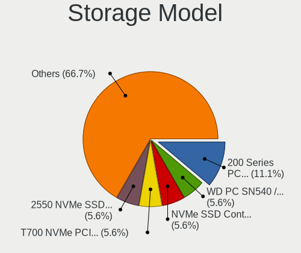

Kali - Hardware Trends (Desktops)
---------------------------------

A project to identify most popular hardware characteristics and track their change
over time based on data collected by Linux users at https://Linux-Hardware.org.

Anyone can contribute to this report by the [hw-probe](https://github.com/linuxhw/hw-probe) tool:

    sudo -E hw-probe -all -upload

This report is for one last month. Overall report since the beginning of time: [TestCoverage](https://github.com/linuxhw/TestCoverage)

Period: Jun, 2022.

Contents
--------

* [ System ](#system)
  - [ OS                       ](#os)
  - [ OS Family                ](#os-family)
  - [ Kernel                   ](#kernel)
  - [ Kernel Family            ](#kernel-family)
  - [ Kernel Major Ver.        ](#kernel-major-ver)
  - [ Arch                     ](#arch)
  - [ DE                       ](#de)
  - [ Display Server           ](#display-server)
  - [ Display Manager          ](#display-manager)
  - [ OS Lang                  ](#os-lang)
  - [ Boot Mode                ](#boot-mode)
  - [ Filesystem               ](#filesystem)
  - [ Part. scheme             ](#part-scheme)
  - [ Dual Boot with Linux/BSD ](#dual-boot-with-linuxbsd)
  - [ Dual Boot (Win)          ](#dual-boot-win)

* [ Board ](#board)
  - [ Vendor                   ](#vendor)
  - [ Model                    ](#model)
  - [ Model Family             ](#model-family)
  - [ MFG Year                 ](#mfg-year)
  - [ Form Factor              ](#form-factor)
  - [ Secure Boot              ](#secure-boot)
  - [ Coreboot                 ](#coreboot)
  - [ RAM Size                 ](#ram-size)
  - [ RAM Used                 ](#ram-used)
  - [ Total Drives             ](#total-drives)
  - [ Has CD-ROM               ](#has-cd-rom)
  - [ Has Ethernet             ](#has-ethernet)
  - [ Has WiFi                 ](#has-wifi)
  - [ Has Bluetooth            ](#has-bluetooth)

* [ Location ](#location)
  - [ Country                  ](#country)
  - [ City                     ](#city)

* [ Drives ](#drives)
  - [ Drive Vendor             ](#drive-vendor)
  - [ Drive Model              ](#drive-model)
  - [ HDD Vendor               ](#hdd-vendor)
  - [ SSD Vendor               ](#ssd-vendor)
  - [ Drive Kind               ](#drive-kind)
  - [ Drive Connector          ](#drive-connector)
  - [ Drive Size               ](#drive-size)
  - [ Space Total              ](#space-total)
  - [ Space Used               ](#space-used)
  - [ Malfunc. Drives          ](#malfunc-drives)
  - [ Malfunc. Drive Vendor    ](#malfunc-drive-vendor)
  - [ Malfunc. HDD Vendor      ](#malfunc-hdd-vendor)
  - [ Malfunc. Drive Kind      ](#malfunc-drive-kind)
  - [ Failed Drives            ](#failed-drives)
  - [ Failed Drive Vendor      ](#failed-drive-vendor)
  - [ Drive Status             ](#drive-status)

* [ Storage controller ](#storage-controller)
  - [ Storage Vendor           ](#storage-vendor)
  - [ Storage Model            ](#storage-model)
  - [ Storage Kind             ](#storage-kind)

* [ Processor ](#processor)
  - [ CPU Vendor               ](#cpu-vendor)
  - [ CPU Model                ](#cpu-model)
  - [ CPU Model Family         ](#cpu-model-family)
  - [ CPU Cores                ](#cpu-cores)
  - [ CPU Sockets              ](#cpu-sockets)
  - [ CPU Threads              ](#cpu-threads)
  - [ CPU Op-Modes             ](#cpu-op-modes)
  - [ CPU Microcode            ](#cpu-microcode)
  - [ CPU Microarch            ](#cpu-microarch)

* [ Graphics ](#graphics)
  - [ GPU Vendor               ](#gpu-vendor)
  - [ GPU Model                ](#gpu-model)
  - [ GPU Combo                ](#gpu-combo)
  - [ GPU Driver               ](#gpu-driver)
  - [ GPU Memory               ](#gpu-memory)

* [ Monitor ](#monitor)
  - [ Monitor Vendor           ](#monitor-vendor)
  - [ Monitor Model            ](#monitor-model)
  - [ Monitor Resolution       ](#monitor-resolution)
  - [ Monitor Diagonal         ](#monitor-diagonal)
  - [ Monitor Width            ](#monitor-width)
  - [ Aspect Ratio             ](#aspect-ratio)
  - [ Monitor Area             ](#monitor-area)
  - [ Pixel Density            ](#pixel-density)
  - [ Multiple Monitors        ](#multiple-monitors)

* [ Network ](#network)
  - [ Net Controller Vendor    ](#net-controller-vendor)
  - [ Net Controller Model     ](#net-controller-model)
  - [ Wireless Vendor          ](#wireless-vendor)
  - [ Wireless Model           ](#wireless-model)
  - [ Ethernet Vendor          ](#ethernet-vendor)
  - [ Ethernet Model           ](#ethernet-model)
  - [ Net Controller Kind      ](#net-controller-kind)
  - [ Used Controller          ](#used-controller)
  - [ NICs                     ](#nics)
  - [ IPv6                     ](#ipv6)

* [ Bluetooth ](#bluetooth)
  - [ Bluetooth Vendor         ](#bluetooth-vendor)
  - [ Bluetooth Model          ](#bluetooth-model)

* [ Sound ](#sound)
  - [ Sound Vendor             ](#sound-vendor)
  - [ Sound Model              ](#sound-model)

* [ Memory ](#memory)
  - [ Memory Vendor            ](#memory-vendor)
  - [ Memory Model             ](#memory-model)
  - [ Memory Kind              ](#memory-kind)
  - [ Memory Form Factor       ](#memory-form-factor)
  - [ Memory Size              ](#memory-size)
  - [ Memory Speed             ](#memory-speed)

* [ Printers & scanners ](#printers--scanners)
  - [ Printer Vendor           ](#printer-vendor)
  - [ Printer Model            ](#printer-model)
  - [ Scanner Vendor           ](#scanner-vendor)
  - [ Scanner Model            ](#scanner-model)

* [ Camera ](#camera)
  - [ Camera Vendor            ](#camera-vendor)
  - [ Camera Model             ](#camera-model)

* [ Security ](#security)
  - [ Fingerprint Vendor       ](#fingerprint-vendor)
  - [ Fingerprint Model        ](#fingerprint-model)
  - [ Chipcard Vendor          ](#chipcard-vendor)
  - [ Chipcard Model           ](#chipcard-model)

* [ Unsupported ](#unsupported)
  - [ Unsupported Devices      ](#unsupported-devices)
  - [ Unsupported Device Types ](#unsupported-device-types)

System
------

OS
--

Installed operating systems

| Name        | Desktops | Percent |
|-------------|----------|---------|
| Kali 2022.2 | 16       | 88.89%  |
| Kali 2022.1 | 1        | 5.56%   |
| Kali 2021.4 | 1        | 5.56%   |

OS Family
---------

OS without a version

| Name | Desktops | Percent |
|------|----------|---------|
| Kali | 18       | 100%    |

Kernel
------

Version of the Linux kernel

| Version            | Desktops | Percent |
|--------------------|----------|---------|
| 5.17.0-kali3-amd64 | 7        | 38.89%  |
| 5.16.0-kali7-amd64 | 5        | 27.78%  |
| 5.18.0-kali2-amd64 | 3        | 16.67%  |
| 5.16.0-kali1-amd64 | 1        | 5.56%   |
| 5.15.0-kali3-amd64 | 1        | 5.56%   |
| 5.14.0-kali4-amd64 | 1        | 5.56%   |

Kernel Family
-------------

Linux kernel without a distro release

| Version | Desktops | Percent |
|---------|----------|---------|
| 5.17.0  | 7        | 38.89%  |
| 5.16.0  | 6        | 33.33%  |
| 5.18.0  | 3        | 16.67%  |
| 5.15.0  | 1        | 5.56%   |
| 5.14.0  | 1        | 5.56%   |

Kernel Major Ver.
-----------------

Linux kernel major version

| Version | Desktops | Percent |
|---------|----------|---------|
| 5.17    | 7        | 38.89%  |
| 5.16    | 6        | 33.33%  |
| 5.18    | 3        | 16.67%  |
| 5.15    | 1        | 5.56%   |
| 5.14    | 1        | 5.56%   |

Arch
----

OS architecture (x86_64, i586, etc.)

| Name   | Desktops | Percent |
|--------|----------|---------|
| x86_64 | 18       | 100%    |

DE
--

Desktop Environment

| Name    | Desktops | Percent |
|---------|----------|---------|
| XFCE    | 9        | 50%     |
| GNOME   | 5        | 27.78%  |
| KDE5    | 2        | 11.11%  |
| MATE    | 1        | 5.56%   |
| Unknown | 1        | 5.56%   |

Display Server
--------------

X11 or Wayland

| Name    | Desktops | Percent |
|---------|----------|---------|
| X11     | 16       | 88.89%  |
| Wayland | 1        | 5.56%   |
| Tty     | 1        | 5.56%   |

Display Manager
---------------

SDDM, LightDM, etc.

| Name    | Desktops | Percent |
|---------|----------|---------|
| LightDM | 7        | 38.89%  |
| Unknown | 7        | 38.89%  |
| GDM3    | 3        | 16.67%  |
| SDDM    | 1        | 5.56%   |

OS Lang
-------

Language

| Lang    | Desktops | Percent |
|---------|----------|---------|
| en_US   | 8        | 44.44%  |
| en_AU   | 3        | 16.67%  |
| de_DE   | 2        | 11.11%  |
| ru_RU   | 1        | 5.56%   |
| pt_BR   | 1        | 5.56%   |
| it_IT   | 1        | 5.56%   |
| en_GB   | 1        | 5.56%   |
| Unknown | 1        | 5.56%   |

Boot Mode
---------

EFI or BIOS

| Mode | Desktops | Percent |
|------|----------|---------|
| EFI  | 11       | 61.11%  |
| BIOS | 7        | 38.89%  |

Filesystem
----------

Type of filesystem

| Type    | Desktops | Percent |
|---------|----------|---------|
| Ext4    | 16       | 88.89%  |
| Overlay | 2        | 11.11%  |

Part. scheme
------------

Scheme of partitioning

| Type    | Desktops | Percent |
|---------|----------|---------|
| GPT     | 10       | 55.56%  |
| Unknown | 6        | 33.33%  |
| MBR     | 2        | 11.11%  |

Dual Boot with Linux/BSD
------------------------

Hosting more than one Linux/BSD

| Dual boot | Desktops | Percent |
|-----------|----------|---------|
| No        | 17       | 94.44%  |
| Yes       | 1        | 5.56%   |

Dual Boot (Win)
---------------

Hosting Linux and Windows

| Dual boot | Desktops | Percent |
|-----------|----------|---------|
| Yes       | 9        | 50%     |
| No        | 9        | 50%     |

Board
-----

Vendor
------

Motherboard manufacturer

| Name                | Desktops | Percent |
|---------------------|----------|---------|
| Gigabyte Technology | 5        | 27.78%  |
| ASUSTek Computer    | 4        | 22.22%  |
| MSI                 | 3        | 16.67%  |
| Megaware            | 1        | 5.56%   |
| Lenovo              | 1        | 5.56%   |
| Hewlett-Packard     | 1        | 5.56%   |
| ECS                 | 1        | 5.56%   |
| Dell                | 1        | 5.56%   |
| Apple               | 1        | 5.56%   |

Model
-----

Motherboard model

| Name                                | Desktops | Percent |
|-------------------------------------|----------|---------|
| MSI MS-7D42                         | 1        | 5.56%   |
| MSI MS-7C02                         | 1        | 5.56%   |
| MSI MS-7A70                         | 1        | 5.56%   |
| Megaware MW-HDC-M                   | 1        | 5.56%   |
| Lenovo ThinkStation P500 30A6S4JY00 | 1        | 5.56%   |
| HP Compaq Pro 6300 SFF              | 1        | 5.56%   |
| Gigabyte Z690 AORUS ELITE AX DDR4   | 1        | 5.56%   |
| Gigabyte H77M-D3H                   | 1        | 5.56%   |
| Gigabyte GB-BXi3-5010               | 1        | 5.56%   |
| Gigabyte B550 AORUS ELITE V2        | 1        | 5.56%   |
| Gigabyte B450 GAMING X              | 1        | 5.56%   |
| ECS 945GZ/CT-M                      | 1        | 5.56%   |
| Dell OptiPlex 3010                  | 1        | 5.56%   |
| ASUS ROG STRIX B550-F GAMING        | 1        | 5.56%   |
| ASUS ROG STRIX B550-E GAMING        | 1        | 5.56%   |
| ASUS ROG STRIX B365-G GAMING        | 1        | 5.56%   |
| ASUS H61-PLUS                       | 1        | 5.56%   |
| Apple MacPro3,1                     | 1        | 5.56%   |

Model Family
------------

Motherboard model prefix

| Name                  | Desktops | Percent |
|-----------------------|----------|---------|
| ASUS ROG              | 3        | 16.67%  |
| MSI MS-7D42           | 1        | 5.56%   |
| MSI MS-7C02           | 1        | 5.56%   |
| MSI MS-7A70           | 1        | 5.56%   |
| Megaware MW-HDC-M     | 1        | 5.56%   |
| Lenovo ThinkStation   | 1        | 5.56%   |
| HP Compaq             | 1        | 5.56%   |
| Gigabyte Z690         | 1        | 5.56%   |
| Gigabyte H77M-D3H     | 1        | 5.56%   |
| Gigabyte GB-BXi3-5010 | 1        | 5.56%   |
| Gigabyte B550         | 1        | 5.56%   |
| Gigabyte B450         | 1        | 5.56%   |
| ECS 945GZ             | 1        | 5.56%   |
| Dell OptiPlex         | 1        | 5.56%   |
| ASUS H61-PLUS         | 1        | 5.56%   |
| Apple MacPro3         | 1        | 5.56%   |

MFG Year
--------

Motherboard manufacture year

| Year | Desktops | Percent |
|------|----------|---------|
| 2012 | 4        | 22.22%  |
| 2020 | 3        | 16.67%  |
| 2019 | 3        | 16.67%  |
| 2021 | 2        | 11.11%  |
| 2022 | 1        | 5.56%   |
| 2016 | 1        | 5.56%   |
| 2014 | 1        | 5.56%   |
| 2013 | 1        | 5.56%   |
| 2008 | 1        | 5.56%   |
| 2007 | 1        | 5.56%   |

Form Factor
-----------

Physical design of the computer

| Name    | Desktops | Percent |
|---------|----------|---------|
| Desktop | 18       | 100%    |

Secure Boot
-----------

Enabled or disabled

| State    | Desktops | Percent |
|----------|----------|---------|
| Disabled | 18       | 100%    |

Coreboot
--------

Have coreboot on board

| Used | Desktops | Percent |
|------|----------|---------|
| No   | 18       | 100%    |

RAM Size
--------

Total RAM memory

| Size in GB  | Desktops | Percent |
|-------------|----------|---------|
| 32.01-64.0  | 6        | 33.33%  |
| 16.01-24.0  | 4        | 22.22%  |
| 4.01-8.0    | 2        | 11.11%  |
| 8.01-16.0   | 2        | 11.11%  |
| 3.01-4.0    | 1        | 5.56%   |
| 24.01-32.0  | 1        | 5.56%   |
| 64.01-256.0 | 1        | 5.56%   |
| 1.01-2.0    | 1        | 5.56%   |

RAM Used
--------

Used RAM memory

| Used GB  | Desktops | Percent |
|----------|----------|---------|
| 1.01-2.0 | 6        | 33.33%  |
| 3.01-4.0 | 5        | 27.78%  |
| 2.01-3.0 | 5        | 27.78%  |
| 4.01-8.0 | 1        | 5.56%   |
| 0.01-0.5 | 1        | 5.56%   |

Total Drives
------------

Number of drives on board

| Drives | Desktops | Percent |
|--------|----------|---------|
| 2      | 7        | 38.89%  |
| 1      | 7        | 38.89%  |
| 3      | 3        | 16.67%  |
| 6      | 1        | 5.56%   |

Has CD-ROM
----------

Has CD-ROM on board

| Presented | Desktops | Percent |
|-----------|----------|---------|
| No        | 13       | 72.22%  |
| Yes       | 5        | 27.78%  |

Has Ethernet
------------

Has Ethernet on board

| Presented | Desktops | Percent |
|-----------|----------|---------|
| Yes       | 18       | 100%    |

Has WiFi
--------

Has WiFi module

| Presented | Desktops | Percent |
|-----------|----------|---------|
| Yes       | 12       | 66.67%  |
| No        | 6        | 33.33%  |

Has Bluetooth
-------------

Has Bluetooth module

| Presented | Desktops | Percent |
|-----------|----------|---------|
| No        | 13       | 72.22%  |
| Yes       | 5        | 27.78%  |

Location
--------

Country
-------

Geographic location (country)

| Country      | Desktops | Percent |
|--------------|----------|---------|
| Australia    | 3        | 16.67%  |
| UK           | 2        | 11.11%  |
| Germany      | 2        | 11.11%  |
| Brazil       | 2        | 11.11%  |
| USA          | 1        | 5.56%   |
| Spain        | 1        | 5.56%   |
| Saudi Arabia | 1        | 5.56%   |
| Russia       | 1        | 5.56%   |
| Pakistan     | 1        | 5.56%   |
| Malaysia     | 1        | 5.56%   |
| Italy        | 1        | 5.56%   |
| Iran         | 1        | 5.56%   |
| Ecuador      | 1        | 5.56%   |

City
----

Geographic location (city)

| City        | Desktops | Percent |
|-------------|----------|---------|
| Sao Paulo   | 2        | 11.11%  |
| Walsall     | 1        | 5.56%   |
| Toowoomba   | 1        | 5.56%   |
| Seremban    | 1        | 5.56%   |
| Salamanca   | 1        | 5.56%   |
| Oxford      | 1        | 5.56%   |
| Omsk        | 1        | 5.56%   |
| New York    | 1        | 5.56%   |
| Lahore      | 1        | 5.56%   |
| Khorramabad | 1        | 5.56%   |
| Khobar      | 1        | 5.56%   |
| Kenzingen   | 1        | 5.56%   |
| Fossano     | 1        | 5.56%   |
| Cuenca      | 1        | 5.56%   |
| Beverstedt  | 1        | 5.56%   |
| Ballarat    | 1        | 5.56%   |
| Adelaide    | 1        | 5.56%   |

Drives
------

Drive Vendor
------------

Hard drive vendors

| Vendor              | Desktops | Drives | Percent |
|---------------------|----------|--------|---------|
| WDC                 | 8        | 10     | 24.24%  |
| Seagate             | 7        | 7      | 21.21%  |
| Samsung Electronics | 7        | 7      | 21.21%  |
| Kingston            | 3        | 3      | 9.09%   |
| Toshiba             | 2        | 3      | 6.06%   |
| Crucial             | 2        | 2      | 6.06%   |
| Verbatim            | 1        | 1      | 3.03%   |
| Phison              | 1        | 1      | 3.03%   |
| Maxtor              | 1        | 1      | 3.03%   |
| Fujitsu             | 1        | 1      | 3.03%   |

Drive Model
-----------

Hard drive models

| Model                            | Desktops | Percent |
|----------------------------------|----------|---------|
| WDC WD10EZEX-08WN4A0 1TB         | 2        | 5.56%   |
| Seagate ST1000DM003-1SB102 1TB   | 2        | 5.56%   |
| WDC WDS100T2B0A-00SM50 1TB SSD   | 1        | 2.78%   |
| WDC WD5000AAKX-00ERMA0 500GB     | 1        | 2.78%   |
| WDC WD40EFAX-68JH4N0 4TB         | 1        | 2.78%   |
| WDC WD3200BPVT-00JJ5T0 320GB     | 1        | 2.78%   |
| WDC WD3200AAKS-00L9A0 320GB      | 1        | 2.78%   |
| WDC WD1600AAJS-75WAA0 160GB      | 1        | 2.78%   |
| WDC WD1200BEVS-22UST0 120GB      | 1        | 2.78%   |
| WDC WD10EARS-00Y5B1 1TB          | 1        | 2.78%   |
| Verbatim Portable SSD 240GB      | 1        | 2.78%   |
| Toshiba HDWR160 6TB              | 1        | 2.78%   |
| Toshiba HDWE150 5TB              | 1        | 2.78%   |
| Toshiba DT01ABA200 2TB           | 1        | 2.78%   |
| Seagate ST4000DM004-2CV104 4TB   | 1        | 2.78%   |
| Seagate ST3500418AS 500GB        | 1        | 2.78%   |
| Seagate ST3500413AS 500GB        | 1        | 2.78%   |
| Seagate ST2000DM008-2FR102 2TB   | 1        | 2.78%   |
| Seagate ST2000DM001-1CH164 2TB   | 1        | 2.78%   |
| Samsung SSD 980 PRO 2TB          | 1        | 2.78%   |
| Samsung SSD 980 500GB            | 1        | 2.78%   |
| Samsung SSD 970 EVO Plus 500GB   | 1        | 2.78%   |
| Samsung SSD 960 EVO 250GB        | 1        | 2.78%   |
| Samsung SSD 850 EVO 250GB        | 1        | 2.78%   |
| Samsung SSD 840 EVO 120GB        | 1        | 2.78%   |
| Samsung HD502HJ 500GB            | 1        | 2.78%   |
| Phison MSI M390 1TB              | 1        | 2.78%   |
| Maxtor STM3250310AS 250GB        | 1        | 2.78%   |
| Kingston SV300S37A240G 240GB SSD | 1        | 2.78%   |
| Kingston SV300S37A120G 120GB SSD | 1        | 2.78%   |
| Kingston SNVS1000G 1TB           | 1        | 2.78%   |
| Fujitsu MHZ2160BH G1 160GB       | 1        | 2.78%   |
| Crucial CT500MX500SSD1 500GB     | 1        | 2.78%   |
| Crucial CT240M500SSD3 240GB      | 1        | 2.78%   |

HDD Vendor
----------

Hard disk drive vendors

| Vendor              | Desktops | Drives | Percent |
|---------------------|----------|--------|---------|
| WDC                 | 8        | 9      | 40%     |
| Seagate             | 7        | 7      | 35%     |
| Toshiba             | 2        | 3      | 10%     |
| Samsung Electronics | 1        | 1      | 5%      |
| Maxtor              | 1        | 1      | 5%      |
| Fujitsu             | 1        | 1      | 5%      |

SSD Vendor
----------

Solid state drive vendors

| Vendor              | Desktops | Drives | Percent |
|---------------------|----------|--------|---------|
| Samsung Electronics | 2        | 2      | 25%     |
| Kingston            | 2        | 2      | 25%     |
| Crucial             | 2        | 2      | 25%     |
| WDC                 | 1        | 1      | 12.5%   |
| Verbatim            | 1        | 1      | 12.5%   |

Drive Kind
----------

HDD or SSD

| Kind | Desktops | Drives | Percent |
|------|----------|--------|---------|
| HDD  | 16       | 22     | 59.26%  |
| NVMe | 6        | 6      | 22.22%  |
| SSD  | 5        | 8      | 18.52%  |

Drive Connector
---------------

SATA, SAS, NVMe, etc.

| Type | Desktops | Drives | Percent |
|------|----------|--------|---------|
| SATA | 18       | 29     | 72%     |
| NVMe | 6        | 6      | 24%     |
| SAS  | 1        | 1      | 4%      |

Drive Size
----------

Size of hard drive

| Size in TB | Desktops | Drives | Percent |
|------------|----------|--------|---------|
| 0.01-0.5   | 12       | 17     | 52.17%  |
| 0.51-1.0   | 5        | 6      | 21.74%  |
| 1.01-2.0   | 3        | 3      | 13.04%  |
| 3.01-4.0   | 2        | 2      | 8.7%    |
| 4.01-10.0  | 1        | 2      | 4.35%   |

Space Total
-----------

Amount of disk space available on the file system

| Size in GB     | Desktops | Percent |
|----------------|----------|---------|
| 251-500        | 7        | 38.89%  |
| 101-250        | 5        | 27.78%  |
| 501-1000       | 2        | 11.11%  |
| More than 3000 | 1        | 5.56%   |
| 1001-2000      | 1        | 5.56%   |
| 1-20           | 1        | 5.56%   |
| Unknown        | 1        | 5.56%   |

Space Used
----------

Amount of used disk space

| Used GB        | Desktops | Percent |
|----------------|----------|---------|
| 21-50          | 5        | 27.78%  |
| 101-250        | 4        | 22.22%  |
| 1-20           | 3        | 16.67%  |
| 251-500        | 2        | 11.11%  |
| More than 3000 | 1        | 5.56%   |
| 1001-2000      | 1        | 5.56%   |
| 51-100         | 1        | 5.56%   |
| Unknown        | 1        | 5.56%   |

Malfunc. Drives
---------------

Drive models with a malfunction

| Model                               | Desktops | Drives | Percent |
|-------------------------------------|----------|--------|---------|
| WDC WD5000AAKX-00ERMA0 500GB        | 1        | 1      | 20%     |
| WDC WD1200BEVS-22UST0 120GB         | 1        | 1      | 20%     |
| Seagate ST3500418AS 500GB           | 1        | 1      | 20%     |
| Samsung Electronics SSD 980 PRO 2TB | 1        | 1      | 20%     |
| Fujitsu MHZ2160BH G1 160GB          | 1        | 1      | 20%     |

Malfunc. Drive Vendor
---------------------

Vendors of faulty drives

| Vendor              | Desktops | Drives | Percent |
|---------------------|----------|--------|---------|
| WDC                 | 2        | 2      | 40%     |
| Seagate             | 1        | 1      | 20%     |
| Samsung Electronics | 1        | 1      | 20%     |
| Fujitsu             | 1        | 1      | 20%     |

Malfunc. HDD Vendor
-------------------

Vendors of faulty HDD drives

| Vendor  | Desktops | Drives | Percent |
|---------|----------|--------|---------|
| WDC     | 2        | 2      | 50%     |
| Seagate | 1        | 1      | 25%     |
| Fujitsu | 1        | 1      | 25%     |

Malfunc. Drive Kind
-------------------

Kinds of faulty drives

| Kind | Desktops | Drives | Percent |
|------|----------|--------|---------|
| HDD  | 3        | 4      | 75%     |
| NVMe | 1        | 1      | 25%     |

Failed Drives
-------------

Failed drive models

Zero info for selected period =(

Failed Drive Vendor
-------------------

Failed drive vendors

Zero info for selected period =(

Drive Status
------------

Number of failed and malfunc. drives

| Status   | Desktops | Drives | Percent |
|----------|----------|--------|---------|
| Works    | 12       | 22     | 52.17%  |
| Detected | 7        | 9      | 30.43%  |
| Malfunc  | 4        | 5      | 17.39%  |

Storage controller
------------------

Storage Vendor
--------------

Storage controller vendors

| Vendor                      | Desktops | Percent |
|-----------------------------|----------|---------|
| Intel                       | 12       | 48%     |
| AMD                         | 6        | 24%     |
| Samsung Electronics         | 4        | 16%     |
| Phison Electronics          | 1        | 4%      |
| Kingston Technology Company | 1        | 4%      |
| ASMedia Technology          | 1        | 4%      |

Storage Model
-------------

Storage controller models

| Model                                                                         | Desktops | Percent |
|-------------------------------------------------------------------------------|----------|---------|
| AMD 500 Series Chipset SATA Controller                                        | 3        | 9.68%   |
| Intel Alder Lake-S PCH SATA Controller [AHCI Mode]                            | 2        | 6.45%   |
| Intel 7 Series/C210 Series Chipset Family 6-port SATA Controller [AHCI mode]  | 2        | 6.45%   |
| Intel 6 Series/C200 Series Chipset Family 6 port Desktop SATA AHCI Controller | 2        | 6.45%   |
| Intel 200 Series PCH SATA controller [AHCI mode]                              | 2        | 6.45%   |
| AMD FCH SATA Controller [AHCI mode]                                           | 2        | 6.45%   |
| AMD 400 Series Chipset SATA Controller                                        | 2        | 6.45%   |
| Samsung NVMe SSD Controller SM981/PM981/PM983                                 | 1        | 3.23%   |
| Samsung NVMe SSD Controller SM961/PM961/SM963                                 | 1        | 3.23%   |
| Samsung NVMe SSD Controller PM9A1/PM9A3/980PRO                                | 1        | 3.23%   |
| Samsung NVMe SSD Controller 980                                               | 1        | 3.23%   |
| Phison Electronics Non-Volatile memory controller                             | 1        | 3.23%   |
| Kingston Company Company Non-Volatile memory controller                       | 1        | 3.23%   |
| Intel Wildcat Point-LP SATA Controller [AHCI Mode]                            | 1        | 3.23%   |
| Intel NM10/ICH7 Family SATA Controller [IDE mode]                             | 1        | 3.23%   |
| Intel C610/X99 series chipset sSATA Controller [AHCI mode]                    | 1        | 3.23%   |
| Intel C610/X99 series chipset IDE-r Controller                                | 1        | 3.23%   |
| Intel C610/X99 series chipset 6-Port SATA Controller [AHCI mode]              | 1        | 3.23%   |
| Intel 82801G (ICH7 Family) IDE Controller                                     | 1        | 3.23%   |
| Intel 631xESB/632xESB SATA AHCI Controller                                    | 1        | 3.23%   |
| Intel 631xESB/632xESB IDE Controller                                          | 1        | 3.23%   |
| ASMedia ASM1062 Serial ATA Controller                                         | 1        | 3.23%   |
| AMD SB7x0/SB8x0/SB9x0 SATA Controller [AHCI mode]                             | 1        | 3.23%   |

Storage Kind
------------

Kind of storage controller (IDE, SATA, NVMe, SAS, ...)

| Kind | Desktops | Percent |
|------|----------|---------|
| SATA | 17       | 65.38%  |
| NVMe | 6        | 23.08%  |
| IDE  | 3        | 11.54%  |

Processor
---------

CPU Vendor
----------

Processor vendors

| Vendor | Desktops | Percent |
|--------|----------|---------|
| Intel  | 12       | 66.67%  |
| AMD    | 6        | 33.33%  |

CPU Model
---------

Processor models

| Model                                  | Desktops | Percent |
|----------------------------------------|----------|---------|
| AMD Ryzen 7 5800X 8-Core Processor     | 2        | 11.11%  |
| Intel Xeon CPU X5482 @ 3.20GHz         | 1        | 5.56%   |
| Intel Xeon CPU E5-1620 v3 @ 3.50GHz    | 1        | 5.56%   |
| Intel Core i7-7700 CPU @ 3.60GHz       | 1        | 5.56%   |
| Intel Core i5-3570 CPU @ 3.40GHz       | 1        | 5.56%   |
| Intel Core i5-3470 CPU @ 3.20GHz       | 1        | 5.56%   |
| Intel Core i5-2400S CPU @ 2.50GHz      | 1        | 5.56%   |
| Intel Core i3-9100 CPU @ 3.60GHz       | 1        | 5.56%   |
| Intel Core i3-5010U CPU @ 2.10GHz      | 1        | 5.56%   |
| Intel Core i3-3240 CPU @ 3.40GHz       | 1        | 5.56%   |
| Intel Core 2 Duo CPU E7500 @ 2.93GHz   | 1        | 5.56%   |
| Intel 12th Gen Core i9-12900K          | 1        | 5.56%   |
| Intel 12th Gen Core i5-12400F          | 1        | 5.56%   |
| AMD Ryzen 7 3700X 8-Core Processor     | 1        | 5.56%   |
| AMD Ryzen 5 5600G with Radeon Graphics | 1        | 5.56%   |
| AMD Ryzen 3 1200 Quad-Core Processor   | 1        | 5.56%   |
| AMD C-50 Processor                     | 1        | 5.56%   |

CPU Model Family
----------------

Processor model prefix

| Model            | Desktops | Percent |
|------------------|----------|---------|
| Intel Core i5    | 3        | 16.67%  |
| Intel Core i3    | 3        | 16.67%  |
| AMD Ryzen 7      | 3        | 16.67%  |
| Other            | 2        | 11.11%  |
| Intel Xeon       | 2        | 11.11%  |
| Intel Core i7    | 1        | 5.56%   |
| Intel Core 2 Duo | 1        | 5.56%   |
| AMD Ryzen 5      | 1        | 5.56%   |
| AMD Ryzen 3      | 1        | 5.56%   |
| AMD C-50         | 1        | 5.56%   |

CPU Cores
---------

Number of processor cores

| Number | Desktops | Percent |
|--------|----------|---------|
| 4      | 7        | 38.89%  |
| 8      | 4        | 22.22%  |
| 2      | 4        | 22.22%  |
| 6      | 2        | 11.11%  |
| 16     | 1        | 5.56%   |

CPU Sockets
-----------

Number of sockets

| Number | Desktops | Percent |
|--------|----------|---------|
| 1      | 17       | 94.44%  |
| 2      | 1        | 5.56%   |

CPU Threads
-----------

Threads per core (Hyper-Threading)

| Number | Desktops | Percent |
|--------|----------|---------|
| 2      | 10       | 55.56%  |
| 1      | 8        | 44.44%  |

CPU Op-Modes
------------

CPU Operation Modes (32-bit, 64-bit)

| Op mode        | Desktops | Percent |
|----------------|----------|---------|
| 32-bit, 64-bit | 18       | 100%    |

CPU Microcode
-------------

Microcode number

| Number     | Desktops | Percent |
|------------|----------|---------|
| 0x306a9    | 3        | 16.67%  |
| 0x90672    | 2        | 11.11%  |
| 0x906eb    | 1        | 5.56%   |
| 0x906e9    | 1        | 5.56%   |
| 0x306f2    | 1        | 5.56%   |
| 0x306d4    | 1        | 5.56%   |
| 0x206a7    | 1        | 5.56%   |
| 0x1067a    | 1        | 5.56%   |
| 0x0a50000d | 1        | 5.56%   |
| 0x0a201204 | 1        | 5.56%   |
| 0x0a201016 | 1        | 5.56%   |
| 0x08701021 | 1        | 5.56%   |
| 0x0800820d | 1        | 5.56%   |
| 0x05000028 | 1        | 5.56%   |
| Unknown    | 1        | 5.56%   |

CPU Microarch
-------------

Microarchitecture

| Name             | Desktops | Percent |
|------------------|----------|---------|
| Zen 3            | 3        | 16.67%  |
| IvyBridge        | 3        | 16.67%  |
| Penryn           | 2        | 11.11%  |
| KabyLake         | 2        | 11.11%  |
| Alderlake Hybrid | 2        | 11.11%  |
| Zen+             | 1        | 5.56%   |
| Zen 2            | 1        | 5.56%   |
| SandyBridge      | 1        | 5.56%   |
| Haswell          | 1        | 5.56%   |
| Broadwell        | 1        | 5.56%   |
| Bobcat           | 1        | 5.56%   |

Graphics
--------

GPU Vendor
----------

Vendors of graphics cards

| Vendor | Desktops | Percent |
|--------|----------|---------|
| Nvidia | 11       | 57.89%  |
| Intel  | 5        | 26.32%  |
| AMD    | 3        | 15.79%  |

GPU Model
---------

Graphics card models

| Model                                                                     | Desktops | Percent |
|---------------------------------------------------------------------------|----------|---------|
| Nvidia TU116 [GeForce GTX 1650 SUPER]                                     | 1        | 5%      |
| Nvidia GP104 [GeForce GTX 1070]                                           | 1        | 5%      |
| Nvidia GP104 [GeForce GTX 1070 Ti]                                        | 1        | 5%      |
| Nvidia GP104 [GeForce GTX 1060 6GB]                                       | 1        | 5%      |
| Nvidia GM206 [GeForce GTX 950]                                            | 1        | 5%      |
| Nvidia GM204 [GeForce GTX 980]                                            | 1        | 5%      |
| Nvidia GM204 [GeForce GTX 970]                                            | 1        | 5%      |
| Nvidia GM107GL [Quadro K2200]                                             | 1        | 5%      |
| Nvidia GF119 [GeForce GT 610]                                             | 1        | 5%      |
| Nvidia GF108 [GeForce GT 730]                                             | 1        | 5%      |
| Nvidia GF108 [GeForce GT 630]                                             | 1        | 5%      |
| Nvidia GA106 [GeForce RTX 3060 Lite Hash Rate]                            | 1        | 5%      |
| Intel Xeon E3-1200 v2/3rd Gen Core processor Graphics Controller          | 1        | 5%      |
| Intel HD Graphics 5500                                                    | 1        | 5%      |
| Intel AlderLake-S GT1                                                     | 1        | 5%      |
| Intel 82945G/GZ Integrated Graphics Controller                            | 1        | 5%      |
| Intel 2nd Generation Core Processor Family Integrated Graphics Controller | 1        | 5%      |
| AMD Navi 22 [Radeon RX 6700/6700 XT/6750 XT / 6800M]                      | 1        | 5%      |
| AMD Ellesmere [Radeon RX 470/480/570/570X/580/580X/590]                   | 1        | 5%      |
| AMD Cezanne                                                               | 1        | 5%      |

GPU Combo
---------

Combinations of graphics cards

| Name           | Desktops | Percent |
|----------------|----------|---------|
| 1 x Nvidia     | 9        | 50%     |
| 1 x Intel      | 4        | 22.22%  |
| 1 x AMD        | 3        | 16.67%  |
| 2 x Nvidia     | 1        | 5.56%   |
| Intel + Nvidia | 1        | 5.56%   |

GPU Driver
----------

Free vs proprietary

| Driver      | Desktops | Percent |
|-------------|----------|---------|
| Free        | 12       | 66.67%  |
| Proprietary | 6        | 33.33%  |

GPU Memory
----------

Total video memory

| Size in GB | Desktops | Percent |
|------------|----------|---------|
| Unknown    | 5        | 27.78%  |
| 3.01-4.0   | 3        | 16.67%  |
| 1.01-2.0   | 3        | 16.67%  |
| 7.01-8.0   | 2        | 11.11%  |
| 8.01-16.0  | 2        | 11.11%  |
| 5.01-6.0   | 1        | 5.56%   |
| 0.51-1.0   | 1        | 5.56%   |
| 0.01-0.5   | 1        | 5.56%   |

Monitor
-------

Monitor Vendor
--------------

Monitor vendors

| Vendor              | Desktops | Percent |
|---------------------|----------|---------|
| Samsung Electronics | 6        | 26.09%  |
| Dell                | 5        | 21.74%  |
| Hewlett-Packard     | 3        | 13.04%  |
| AOC                 | 2        | 8.7%    |
| Acer                | 2        | 8.7%    |
| SAC                 | 1        | 4.35%   |
| Panasonic           | 1        | 4.35%   |
| Iiyama              | 1        | 4.35%   |
| Goldstar            | 1        | 4.35%   |
| BenQ                | 1        | 4.35%   |

Monitor Model
-------------

Monitor models

| Model                                                                  | Desktops | Percent |
|------------------------------------------------------------------------|----------|---------|
| Samsung Electronics U28E590 SAM0C4E 3840x2160 608x345mm 27.5-inch      | 1        | 3.85%   |
| Samsung Electronics SyncMaster SAM0273 1440x900 410x257mm 19.1-inch    | 1        | 3.85%   |
| Samsung Electronics SA300/SA350 SAM0788 1366x768 410x230mm 18.5-inch   | 1        | 3.85%   |
| Samsung Electronics S24C300 SAM0A28 1920x1080 531x299mm 24.0-inch      | 1        | 3.85%   |
| Samsung Electronics LCD Monitor SMBX2450 3200x1080                     | 1        | 3.85%   |
| Samsung Electronics LCD Monitor SAM0A7D 1920x1080 1060x626mm 48.5-inch | 1        | 3.85%   |
| SAC LED MONITOR SAC952D 1920x1080 600x340mm 27.2-inch                  | 1        | 3.85%   |
| Panasonic TV MEIA0CC 1920x1080 698x392mm 31.5-inch                     | 1        | 3.85%   |
| Iiyama PLE2483H IVM6113 1920x1080 531x299mm 24.0-inch                  | 1        | 3.85%   |
| Hewlett-Packard OMEN by HP 25 HPN3425 1920x1080 543x302mm 24.5-inch    | 1        | 3.85%   |
| Hewlett-Packard LCD Monitor LA1951                                     | 1        | 3.85%   |
| Hewlett-Packard LA1956x HWP3021 1280x1024 376x301mm 19.0-inch          | 1        | 3.85%   |
| Hewlett-Packard 2009 HWP2827 1600x900 442x249mm 20.0-inch              | 1        | 3.85%   |
| Goldstar 2D HD TV GSM59C8 1366x768 509x286mm 23.0-inch                 | 1        | 3.85%   |
| Dell SE2717H/HX DELD0A1 1920x1080 598x336mm 27.0-inch                  | 1        | 3.85%   |
| Dell P2419H DELD0DA 1920x1080 530x300mm 24.0-inch                      | 1        | 3.85%   |
| Dell P2212H DELA07F 1920x1080 531x299mm 24.0-inch                      | 1        | 3.85%   |
| Dell E197FP DELA024 1280x1024 380x305mm 19.2-inch                      | 1        | 3.85%   |
| Dell D3218HN DEL200B 1920x1080 698x393mm 31.5-inch                     | 1        | 3.85%   |
| BenQ GW2283 BNQ78E9 1920x1080 476x268mm 21.5-inch                      | 1        | 3.85%   |
| BenQ GL2760 BNQ78D5 1920x1080 598x336mm 27.0-inch                      | 1        | 3.85%   |
| AOC 913FW AOC1913 1440x900 410x260mm 19.1-inch                         | 1        | 3.85%   |
| AOC 27V2G5 AOC2702 1920x1080 598x336mm 27.0-inch                       | 1        | 3.85%   |
| Acer LCD Monitor AL1717 1280x1024                                      | 1        | 3.85%   |
| Acer EI242QR P ACR0958 1920x1080 530x300mm 24.0-inch                   | 1        | 3.85%   |
| Acer AL1717 ACRAD72 1280x1024 340x270mm 17.1-inch                      | 1        | 3.85%   |

Monitor Resolution
------------------

Monitor screen resolution

| Resolution       | Desktops | Percent |
|------------------|----------|---------|
| 1920x1080 (FHD)  | 11       | 50%     |
| 3840x2160 (4K)   | 2        | 9.09%   |
| 1440x900 (WXGA+) | 2        | 9.09%   |
| 1366x768 (WXGA)  | 2        | 9.09%   |
| 1280x1024 (SXGA) | 2        | 9.09%   |
| 3200x1080        | 1        | 4.55%   |
| 1600x900 (HD+)   | 1        | 4.55%   |
| Unknown          | 1        | 4.55%   |

Monitor Diagonal
----------------

Diagonal size in inches

| Inches  | Desktops | Percent |
|---------|----------|---------|
| 24      | 6        | 25%     |
| 27      | 5        | 20.83%  |
| 19      | 3        | 12.5%   |
| 31      | 2        | 8.33%   |
| Unknown | 2        | 8.33%   |
| 48      | 1        | 4.17%   |
| 26      | 1        | 4.17%   |
| 21      | 1        | 4.17%   |
| 20      | 1        | 4.17%   |
| 18      | 1        | 4.17%   |
| 17      | 1        | 4.17%   |

Monitor Width
-------------

Physical width

| Width in mm | Desktops | Percent |
|-------------|----------|---------|
| 501-600     | 9        | 42.86%  |
| 401-500     | 4        | 19.05%  |
| 601-700     | 3        | 14.29%  |
| Unknown     | 2        | 9.52%   |
| 351-400     | 1        | 4.76%   |
| 301-350     | 1        | 4.76%   |
| 1001-1500   | 1        | 4.76%   |

Aspect Ratio
------------

Proportional relationship between the width and the height

| Ratio   | Desktops | Percent |
|---------|----------|---------|
| 16/9    | 14       | 70%     |
| 5/4     | 2        | 10%     |
| 16/10   | 2        | 10%     |
| Unknown | 2        | 10%     |

Monitor Area
------------

Area in inch²

| Area in inch² | Desktops | Percent |
|----------------|----------|---------|
| 201-250        | 6        | 25%     |
| 301-350        | 5        | 20.83%  |
| 151-200        | 4        | 16.67%  |
| 351-500        | 2        | 8.33%   |
| 251-300        | 2        | 8.33%   |
| 141-150        | 2        | 8.33%   |
| Unknown        | 2        | 8.33%   |
| More than 1000 | 1        | 4.17%   |

Pixel Density
-------------

Pixels per inch

| Density | Desktops | Percent |
|---------|----------|---------|
| 51-100  | 15       | 75%     |
| Unknown | 2        | 10%     |
| 1-50    | 1        | 5%      |
| 121-160 | 1        | 5%      |
| 101-120 | 1        | 5%      |

Multiple Monitors
-----------------

Total monitors connected

| Total | Desktops | Percent |
|-------|----------|---------|
| 1     | 11       | 61.11%  |
| 2     | 7        | 38.89%  |

Network
-------

Net Controller Vendor
---------------------

Controller vendors

| Vendor                          | Desktops | Percent |
|---------------------------------|----------|---------|
| Realtek Semiconductor           | 13       | 40.63%  |
| Intel                           | 8        | 25%     |
| TP-Link                         | 2        | 6.25%   |
| Qualcomm Atheros                | 2        | 6.25%   |
| Google                          | 2        | 6.25%   |
| Ralink Technology               | 1        | 3.13%   |
| Qualcomm Atheros Communications | 1        | 3.13%   |
| D-Link                          | 1        | 3.13%   |
| Broadcom                        | 1        | 3.13%   |
| AboCom Systems                  | 1        | 3.13%   |

Net Controller Model
--------------------

Controller models

| Model                                                             | Desktops | Percent |
|-------------------------------------------------------------------|----------|---------|
| Realtek RTL8111/8168/8411 PCI Express Gigabit Ethernet Controller | 8        | 22.22%  |
| Realtek RTL8125 2.5GbE Controller                                 | 3        | 8.33%   |
| Intel Ethernet Controller I225-V                                  | 2        | 5.56%   |
| Intel Alder Lake-S PCH CNVi WiFi                                  | 2        | 5.56%   |
| Google Pixel 6                                                    | 2        | 5.56%   |
| TP-Link Archer T9UH v1 [Realtek RTL8814AU]                        | 1        | 2.78%   |
| TP-Link 802.11ac WLAN Adapter                                     | 1        | 2.78%   |
| Realtek RTL8192EU 802.11b/g/n WLAN Adapter                        | 1        | 2.78%   |
| Realtek RTL8188ETV Wireless LAN 802.11n Network Adapter           | 1        | 2.78%   |
| Realtek RTL-8100/8101L/8139 PCI Fast Ethernet Adapter             | 1        | 2.78%   |
| Realtek 802.11n WLAN Adapter                                      | 1        | 2.78%   |
| Realtek 802.11ac NIC                                              | 1        | 2.78%   |
| Ralink RT2870/RT3070 Wireless Adapter                             | 1        | 2.78%   |
| Qualcomm Atheros AR9271 802.11n                                   | 1        | 2.78%   |
| Qualcomm Atheros AR9227 Wireless Network Adapter                  | 1        | 2.78%   |
| Qualcomm Atheros AR8161 Gigabit Ethernet                          | 1        | 2.78%   |
| Intel Wi-Fi 6 AX200                                               | 1        | 2.78%   |
| Intel Ethernet Connection (2) I219-V                              | 1        | 2.78%   |
| Intel Ethernet Connection (2) I218-LM                             | 1        | 2.78%   |
| Intel 82579LM Gigabit Network Connection (Lewisville)             | 1        | 2.78%   |
| Intel 80003ES2LAN Gigabit Ethernet Controller (Copper)            | 1        | 2.78%   |
| D-Link DWA-123 Wireless N 150 Adapter (rev.D1)                    | 1        | 2.78%   |
| Broadcom BCM4321 802.11a/b/g/n                                    | 1        | 2.78%   |
| AboCom Systems 802.11n WLAN Adapter                               | 1        | 2.78%   |

Wireless Vendor
---------------

Wireless vendors

| Vendor                          | Desktops | Percent |
|---------------------------------|----------|---------|
| Realtek Semiconductor           | 4        | 26.67%  |
| Intel                           | 3        | 20%     |
| TP-Link                         | 2        | 13.33%  |
| Ralink Technology               | 1        | 6.67%   |
| Qualcomm Atheros Communications | 1        | 6.67%   |
| Qualcomm Atheros                | 1        | 6.67%   |
| D-Link                          | 1        | 6.67%   |
| Broadcom                        | 1        | 6.67%   |
| AboCom Systems                  | 1        | 6.67%   |

Wireless Model
--------------

Wireless models

| Model                                                   | Desktops | Percent |
|---------------------------------------------------------|----------|---------|
| Intel Alder Lake-S PCH CNVi WiFi                        | 2        | 13.33%  |
| TP-Link Archer T9UH v1 [Realtek RTL8814AU]              | 1        | 6.67%   |
| TP-Link 802.11ac WLAN Adapter                           | 1        | 6.67%   |
| Realtek RTL8192EU 802.11b/g/n WLAN Adapter              | 1        | 6.67%   |
| Realtek RTL8188ETV Wireless LAN 802.11n Network Adapter | 1        | 6.67%   |
| Realtek 802.11n WLAN Adapter                            | 1        | 6.67%   |
| Realtek 802.11ac NIC                                    | 1        | 6.67%   |
| Ralink RT2870/RT3070 Wireless Adapter                   | 1        | 6.67%   |
| Qualcomm Atheros AR9271 802.11n                         | 1        | 6.67%   |
| Qualcomm Atheros AR9227 Wireless Network Adapter        | 1        | 6.67%   |
| Intel Wi-Fi 6 AX200                                     | 1        | 6.67%   |
| D-Link DWA-123 Wireless N 150 Adapter (rev.D1)          | 1        | 6.67%   |
| Broadcom BCM4321 802.11a/b/g/n                          | 1        | 6.67%   |
| AboCom Systems 802.11n WLAN Adapter                     | 1        | 6.67%   |

Ethernet Vendor
---------------

Ethernet vendors

| Vendor                | Desktops | Percent |
|-----------------------|----------|---------|
| Realtek Semiconductor | 12       | 57.14%  |
| Intel                 | 6        | 28.57%  |
| Google                | 2        | 9.52%   |
| Qualcomm Atheros      | 1        | 4.76%   |

Ethernet Model
--------------

Ethernet models

| Model                                                             | Desktops | Percent |
|-------------------------------------------------------------------|----------|---------|
| Realtek RTL8111/8168/8411 PCI Express Gigabit Ethernet Controller | 8        | 38.1%   |
| Realtek RTL8125 2.5GbE Controller                                 | 3        | 14.29%  |
| Intel Ethernet Controller I225-V                                  | 2        | 9.52%   |
| Google Pixel 6                                                    | 2        | 9.52%   |
| Realtek RTL-8100/8101L/8139 PCI Fast Ethernet Adapter             | 1        | 4.76%   |
| Qualcomm Atheros AR8161 Gigabit Ethernet                          | 1        | 4.76%   |
| Intel Ethernet Connection (2) I219-V                              | 1        | 4.76%   |
| Intel Ethernet Connection (2) I218-LM                             | 1        | 4.76%   |
| Intel 82579LM Gigabit Network Connection (Lewisville)             | 1        | 4.76%   |
| Intel 80003ES2LAN Gigabit Ethernet Controller (Copper)            | 1        | 4.76%   |

Net Controller Kind
-------------------

Ethernet, WiFi or modem

| Kind     | Desktops | Percent |
|----------|----------|---------|
| Ethernet | 18       | 60%     |
| WiFi     | 12       | 40%     |

Used Controller
---------------

Currently used network controller

| Kind     | Desktops | Percent |
|----------|----------|---------|
| Ethernet | 15       | 88.24%  |
| WiFi     | 2        | 11.76%  |

NICs
----

Total network controllers on board

| Total | Desktops | Percent |
|-------|----------|---------|
| 1     | 12       | 66.67%  |
| 2     | 5        | 27.78%  |
| 3     | 1        | 5.56%   |

IPv6
----

IPv6 vs IPv4

| Used | Desktops | Percent |
|------|----------|---------|
| No   | 16       | 88.89%  |
| Yes  | 2        | 11.11%  |

Bluetooth
---------

Bluetooth Vendor
----------------

Controller vendors

| Vendor                | Desktops | Percent |
|-----------------------|----------|---------|
| Intel                 | 2        | 33.33%  |
| Realtek Semiconductor | 1        | 16.67%  |
| Edimax Technology     | 1        | 16.67%  |
| Broadcom              | 1        | 16.67%  |
| Apple                 | 1        | 16.67%  |

Bluetooth Model
---------------

Controller models

| Model                             | Desktops | Percent |
|-----------------------------------|----------|---------|
| Intel Bluetooth Device            | 2        | 33.33%  |
| Realtek Bluetooth Radio           | 1        | 16.67%  |
| Edimax Bluetooth Device           | 1        | 16.67%  |
| Broadcom BCM20702A0 Bluetooth 4.0 | 1        | 16.67%  |
| Apple Bluetooth HCI               | 1        | 16.67%  |

Sound
-----

Sound Vendor
------------

Sound card vendors

| Vendor          | Desktops | Percent |
|-----------------|----------|---------|
| Nvidia          | 11       | 34.38%  |
| Intel           | 11       | 34.38%  |
| AMD             | 7        | 21.88%  |
| SteelSeries ApS | 1        | 3.13%   |
| Razer USA       | 1        | 3.13%   |
| Logitech        | 1        | 3.13%   |

Sound Model
-----------

Sound card models

| Model                                                                      | Desktops | Percent |
|----------------------------------------------------------------------------|----------|---------|
| Nvidia GP104 High Definition Audio Controller                              | 3        | 8.33%   |
| AMD Starship/Matisse HD Audio Controller                                   | 3        | 8.33%   |
| Nvidia GM204 High Definition Audio Controller                              | 2        | 5.56%   |
| Nvidia GF108 High Definition Audio Controller                              | 2        | 5.56%   |
| Intel Alder Lake-S HD Audio Controller                                     | 2        | 5.56%   |
| Intel 6 Series/C200 Series Chipset Family High Definition Audio Controller | 2        | 5.56%   |
| Intel 200 Series PCH HD Audio                                              | 2        | 5.56%   |
| SteelSeries ApS SteelSeries Arctis 5                                       | 1        | 2.78%   |
| Razer USA RZ19-0229 Gaming Microphone                                      | 1        | 2.78%   |
| Nvidia TU116 High Definition Audio Controller                              | 1        | 2.78%   |
| Nvidia GM206 High Definition Audio Controller                              | 1        | 2.78%   |
| Nvidia GM107 High Definition Audio Controller [GeForce 940MX]              | 1        | 2.78%   |
| Nvidia GF119 HDMI Audio Controller                                         | 1        | 2.78%   |
| Nvidia Audio device                                                        | 1        | 2.78%   |
| Logitech Logitech G PRO X Gaming Headset                                   | 1        | 2.78%   |
| Intel Wildcat Point-LP High Definition Audio Controller                    | 1        | 2.78%   |
| Intel NM10/ICH7 Family High Definition Audio Controller                    | 1        | 2.78%   |
| Intel C610/X99 series chipset HD Audio Controller                          | 1        | 2.78%   |
| Intel Broadwell-U Audio Controller                                         | 1        | 2.78%   |
| Intel 7 Series/C216 Chipset Family High Definition Audio Controller        | 1        | 2.78%   |
| Intel 631xESB/632xESB High Definition Audio Controller                     | 1        | 2.78%   |
| AMD SBx00 Azalia (Intel HDA)                                               | 1        | 2.78%   |
| AMD Renoir Radeon High Definition Audio Controller                         | 1        | 2.78%   |
| AMD Navi 21/23 HDMI/DP Audio Controller                                    | 1        | 2.78%   |
| AMD Family 17h/19h HD Audio Controller                                     | 1        | 2.78%   |
| AMD Family 17h (Models 00h-0fh) HD Audio Controller                        | 1        | 2.78%   |
| AMD Ellesmere HDMI Audio [Radeon RX 470/480 / 570/580/590]                 | 1        | 2.78%   |

Memory
------

Memory Vendor
-------------

Memory module vendors

| Vendor              | Desktops | Percent |
|---------------------|----------|---------|
| Corsair             | 4        | 28.57%  |
| Kingston            | 3        | 21.43%  |
| G.Skill             | 2        | 14.29%  |
| Unknown             | 1        | 7.14%   |
| SK hynix            | 1        | 7.14%   |
| Samsung Electronics | 1        | 7.14%   |
| Ramaxel Technology  | 1        | 7.14%   |
| Crucial             | 1        | 7.14%   |

Memory Model
------------

Memory module models

| Model                                                  | Desktops | Percent |
|--------------------------------------------------------|----------|---------|
| Unknown RAM Module 2GB DIMM SDRAM                      | 1        | 5.56%   |
| SK hynix RAM HMT451U6AFR8A-PB 4GB DIMM DDR3 1600MT/s   | 1        | 5.56%   |
| Samsung RAM M393A4K40BB0-CPB 32GB DIMM DDR4 2133MT/s   | 1        | 5.56%   |
| Samsung RAM M393A2G40DB0-CPB 16GB DIMM DDR4 2133MT/s   | 1        | 5.56%   |
| Ramaxel RAM RMR5030EF68F9W1600 4GB DIMM DDR3 1600MT/s  | 1        | 5.56%   |
| Kingston RAM Module 8GB DIMM DDR3 1333MT/s             | 1        | 5.56%   |
| Kingston RAM KVR648-PSB 8GB DIMM DDR3 1600MT/s         | 1        | 5.56%   |
| Kingston RAM KVR648-MIN 8GB DIMM DDR3 1600MT/s         | 1        | 5.56%   |
| Kingston RAM KF3600C18D4/16GX 16GB DIMM DDR4 3600MT/s  | 1        | 5.56%   |
| Kingston RAM 9905458-009.A00LF 2GB DIMM DDR3 1333MT/s  | 1        | 5.56%   |
| G.Skill RAM F4-3200C16-16GVK 16GB DIMM DDR4 3600MT/s   | 1        | 5.56%   |
| G.Skill RAM F4-2400C15-8GVR 8GB DIMM DDR4 3200MT/s     | 1        | 5.56%   |
| Crucial RAM BL8G36C16U4B.M8FE1 8GB DIMM DDR4 3733MT/s  | 1        | 5.56%   |
| Corsair RAM CMW16GX4M2C3200C16 8GB DIMM DDR4 3266MT/s  | 1        | 5.56%   |
| Corsair RAM CMK32GX4M2E3200C16 16GB DIMM DDR4 3200MT/s | 1        | 5.56%   |
| Corsair RAM CMK32GX4M2B3000C15 16GB DIMM DDR4 3000MT/s | 1        | 5.56%   |
| Corsair RAM CMK16GX4M2D3000C16 8GB DIMM DDR4 3200MT/s  | 1        | 5.56%   |
| Corsair RAM CMK16GX4M2B3200C16 8GB DIMM DDR4 3600MT/s  | 1        | 5.56%   |

Memory Kind
-----------

Memory module kinds

| Kind  | Desktops | Percent |
|-------|----------|---------|
| DDR4  | 9        | 75%     |
| DDR3  | 2        | 16.67%  |
| SDRAM | 1        | 8.33%   |

Memory Form Factor
------------------

Physical design of the memory module

| Name | Desktops | Percent |
|------|----------|---------|
| DIMM | 12       | 100%    |

Memory Size
-----------

Memory module size

| Size  | Desktops | Percent |
|-------|----------|---------|
| 8192  | 6        | 40%     |
| 16384 | 5        | 33.33%  |
| 4096  | 2        | 13.33%  |
| 32768 | 1        | 6.67%   |
| 2048  | 1        | 6.67%   |

Memory Speed
------------

Memory module speed

| Speed   | Desktops | Percent |
|---------|----------|---------|
| 3600    | 3        | 23.08%  |
| 3200    | 3        | 23.08%  |
| 3733    | 1        | 7.69%   |
| 3266    | 1        | 7.69%   |
| 3000    | 1        | 7.69%   |
| 2133    | 1        | 7.69%   |
| 1600    | 1        | 7.69%   |
| 1333    | 1        | 7.69%   |
| Unknown | 1        | 7.69%   |

Printers & scanners
-------------------

Printer Vendor
--------------

Printer device vendors

Zero info for selected period =(

Printer Model
-------------

Printer device models

Zero info for selected period =(

Scanner Vendor
--------------

Scanner device vendors

Zero info for selected period =(

Scanner Model
-------------

Scanner device models

Zero info for selected period =(

Camera
------

Camera Vendor
-------------

Camera device vendors

| Vendor   | Desktops | Percent |
|----------|----------|---------|
| Logitech | 2        | 100%    |

Camera Model
------------

Camera device models

| Model                       | Desktops | Percent |
|-----------------------------|----------|---------|
| Logitech HD Webcam C525     | 1        | 50%     |
| Logitech C920 PRO HD Webcam | 1        | 50%     |

Security
--------

Fingerprint Vendor
------------------

Fingerprint sensor vendors

Zero info for selected period =(

Fingerprint Model
-----------------

Fingerprint sensor models

Zero info for selected period =(

Chipcard Vendor
---------------

Chipcard module vendors

Zero info for selected period =(

Chipcard Model
--------------

Chipcard module models

Zero info for selected period =(

Unsupported
-----------

Unsupported Devices
-------------------

Total unsupported devices on board

| Total | Desktops | Percent |
|-------|----------|---------|
| 0     | 14       | 77.78%  |
| 1     | 4        | 22.22%  |

Unsupported Device Types
------------------------

Types of unsupported devices

| Type             | Desktops | Percent |
|------------------|----------|---------|
| Net/wireless     | 3        | 75%     |
| Unassigned class | 1        | 25%     |

