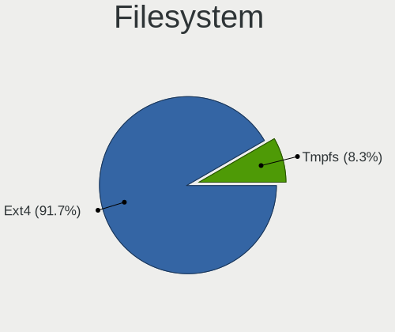
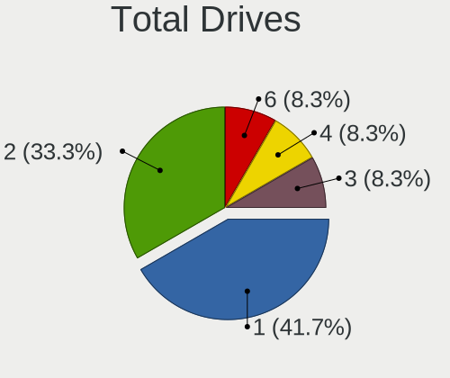
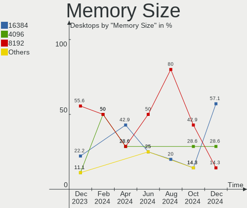

Kali Hardware Trends (Desktops)
-------------------------------

A project to identify most popular hardware characteristics and track their change
over time based on data collected by Kali users at https://Linux-Hardware.org.

Anyone can contribute to this report by the [hw-probe](https://github.com/linuxhw/hw-probe) tool:

    sudo -E hw-probe -all -upload

Full-feature report is available here: https://linux-hardware.org/?view=trends

Period: Mar, 2022.

Contents
--------

* [ System ](#system)
  - [ OS                       ](#os)
  - [ OS Family                ](#os-family)
  - [ Kernel                   ](#kernel)
  - [ Kernel Family            ](#kernel-family)
  - [ Kernel Major Ver.        ](#kernel-major-ver)
  - [ Arch                     ](#arch)
  - [ DE                       ](#de)
  - [ Display Server           ](#display-server)
  - [ Display Manager          ](#display-manager)
  - [ OS Lang                  ](#os-lang)
  - [ Boot Mode                ](#boot-mode)
  - [ Filesystem               ](#filesystem)
  - [ Part. scheme             ](#part-scheme)
  - [ Dual Boot with Linux/BSD ](#dual-boot-with-linuxbsd)
  - [ Dual Boot (Win)          ](#dual-boot-win)

* [ Board ](#board)
  - [ Vendor                   ](#vendor)
  - [ Model                    ](#model)
  - [ Model Family             ](#model-family)
  - [ MFG Year                 ](#mfg-year)
  - [ Form Factor              ](#form-factor)
  - [ Secure Boot              ](#secure-boot)
  - [ Coreboot                 ](#coreboot)
  - [ RAM Size                 ](#ram-size)
  - [ RAM Used                 ](#ram-used)
  - [ Total Drives             ](#total-drives)
  - [ Has CD-ROM               ](#has-cd-rom)
  - [ Has Ethernet             ](#has-ethernet)
  - [ Has WiFi                 ](#has-wifi)
  - [ Has Bluetooth            ](#has-bluetooth)

* [ Location ](#location)
  - [ Country                  ](#country)
  - [ City                     ](#city)

* [ Drives ](#drives)
  - [ Drive Vendor             ](#drive-vendor)
  - [ Drive Model              ](#drive-model)
  - [ HDD Vendor               ](#hdd-vendor)
  - [ SSD Vendor               ](#ssd-vendor)
  - [ Drive Kind               ](#drive-kind)
  - [ Drive Connector          ](#drive-connector)
  - [ Drive Size               ](#drive-size)
  - [ Space Total              ](#space-total)
  - [ Space Used               ](#space-used)
  - [ Malfunc. Drives          ](#malfunc-drives)
  - [ Malfunc. Drive Vendor    ](#malfunc-drive-vendor)
  - [ Malfunc. HDD Vendor      ](#malfunc-hdd-vendor)
  - [ Malfunc. Drive Kind      ](#malfunc-drive-kind)
  - [ Failed Drives            ](#failed-drives)
  - [ Failed Drive Vendor      ](#failed-drive-vendor)
  - [ Drive Status             ](#drive-status)

* [ Storage controller ](#storage-controller)
  - [ Storage Vendor           ](#storage-vendor)
  - [ Storage Model            ](#storage-model)
  - [ Storage Kind             ](#storage-kind)

* [ Processor ](#processor)
  - [ CPU Vendor               ](#cpu-vendor)
  - [ CPU Model                ](#cpu-model)
  - [ CPU Model Family         ](#cpu-model-family)
  - [ CPU Cores                ](#cpu-cores)
  - [ CPU Sockets              ](#cpu-sockets)
  - [ CPU Threads              ](#cpu-threads)
  - [ CPU Op-Modes             ](#cpu-op-modes)
  - [ CPU Microcode            ](#cpu-microcode)
  - [ CPU Microarch            ](#cpu-microarch)

* [ Graphics ](#graphics)
  - [ GPU Vendor               ](#gpu-vendor)
  - [ GPU Model                ](#gpu-model)
  - [ GPU Combo                ](#gpu-combo)
  - [ GPU Driver               ](#gpu-driver)
  - [ GPU Memory               ](#gpu-memory)

* [ Monitor ](#monitor)
  - [ Monitor Vendor           ](#monitor-vendor)
  - [ Monitor Model            ](#monitor-model)
  - [ Monitor Resolution       ](#monitor-resolution)
  - [ Monitor Diagonal         ](#monitor-diagonal)
  - [ Monitor Width            ](#monitor-width)
  - [ Aspect Ratio             ](#aspect-ratio)
  - [ Monitor Area             ](#monitor-area)
  - [ Pixel Density            ](#pixel-density)
  - [ Multiple Monitors        ](#multiple-monitors)

* [ Network ](#network)
  - [ Net Controller Vendor    ](#net-controller-vendor)
  - [ Net Controller Model     ](#net-controller-model)
  - [ Wireless Vendor          ](#wireless-vendor)
  - [ Wireless Model           ](#wireless-model)
  - [ Ethernet Vendor          ](#ethernet-vendor)
  - [ Ethernet Model           ](#ethernet-model)
  - [ Net Controller Kind      ](#net-controller-kind)
  - [ Used Controller          ](#used-controller)
  - [ NICs                     ](#nics)
  - [ IPv6                     ](#ipv6)

* [ Bluetooth ](#bluetooth)
  - [ Bluetooth Vendor         ](#bluetooth-vendor)
  - [ Bluetooth Model          ](#bluetooth-model)

* [ Sound ](#sound)
  - [ Sound Vendor             ](#sound-vendor)
  - [ Sound Model              ](#sound-model)

* [ Memory ](#memory)
  - [ Memory Vendor            ](#memory-vendor)
  - [ Memory Model             ](#memory-model)
  - [ Memory Kind              ](#memory-kind)
  - [ Memory Form Factor       ](#memory-form-factor)
  - [ Memory Size              ](#memory-size)
  - [ Memory Speed             ](#memory-speed)

* [ Printers & scanners ](#printers--scanners)
  - [ Printer Vendor           ](#printer-vendor)
  - [ Printer Model            ](#printer-model)
  - [ Scanner Vendor           ](#scanner-vendor)
  - [ Scanner Model            ](#scanner-model)

* [ Camera ](#camera)
  - [ Camera Vendor            ](#camera-vendor)
  - [ Camera Model             ](#camera-model)

* [ Security ](#security)
  - [ Fingerprint Vendor       ](#fingerprint-vendor)
  - [ Fingerprint Model        ](#fingerprint-model)
  - [ Chipcard Vendor          ](#chipcard-vendor)
  - [ Chipcard Model           ](#chipcard-model)

* [ Unsupported ](#unsupported)
  - [ Unsupported Devices      ](#unsupported-devices)
  - [ Unsupported Device Types ](#unsupported-device-types)

System
------

OS
--

Installed operating systems

| Name        | Desktops | Percent |
|-------------|----------|---------|
| Kali 2022.1 | 8        | 88.89%  |
| Kali 2021.4 | 1        | 11.11%  |

OS Family
---------

OS without a version

| Name | Desktops | Percent |
|------|----------|---------|
| Kali | 9        | 100%    |

Kernel
------

Version of the Linux kernel

| Version            | Desktops | Percent |
|--------------------|----------|---------|
| 5.16.0-kali1-amd64 | 3        | 33.33%  |
| 5.15.0-kali3-amd64 | 3        | 33.33%  |
| 5.16.14-custom     | 1        | 11.11%  |
| 5.16.0-kali5-amd64 | 1        | 11.11%  |
| 5.16.0-kali3-amd64 | 1        | 11.11%  |

Kernel Family
-------------

Linux kernel without a distro release

| Version | Desktops | Percent |
|---------|----------|---------|
| 5.16.0  | 5        | 55.56%  |
| 5.15.0  | 3        | 33.33%  |
| 5.16.14 | 1        | 11.11%  |

Kernel Major Ver.
-----------------

Linux kernel major version

| Version | Desktops | Percent |
|---------|----------|---------|
| 5.16    | 6        | 66.67%  |
| 5.15    | 3        | 33.33%  |

Arch
----

OS architecture (x86_64, i586, etc.)

| Name   | Desktops | Percent |
|--------|----------|---------|
| x86_64 | 9        | 100%    |

DE
--

Desktop Environment

| Name  | Desktops | Percent |
|-------|----------|---------|
| XFCE  | 7        | 77.78%  |
| GNOME | 2        | 22.22%  |

Display Server
--------------

X11 or Wayland

| Name | Desktops | Percent |
|------|----------|---------|
| X11  | 9        | 100%    |

Display Manager
---------------

SDDM, LightDM, etc.

| Name    | Desktops | Percent |
|---------|----------|---------|
| LightDM | 7        | 77.78%  |
| Unknown | 2        | 22.22%  |

OS Lang
-------

Language

| Lang  | Desktops | Percent |
|-------|----------|---------|
| en_US | 4        | 44.44%  |
| en_GB | 2        | 22.22%  |
| fr_CA | 1        | 11.11%  |
| es_VE | 1        | 11.11%  |
| de_DE | 1        | 11.11%  |

Boot Mode
---------

EFI or BIOS

| Mode | Desktops | Percent |
|------|----------|---------|
| EFI  | 6        | 66.67%  |
| BIOS | 3        | 33.33%  |

Filesystem
----------

Type of filesystem

| Type  | Desktops | Percent |
|-------|----------|---------|
| Ext4  | 8        | 88.89%  |
| Btrfs | 1        | 11.11%  |

Part. scheme
------------

Scheme of partitioning

| Type    | Desktops | Percent |
|---------|----------|---------|
| GPT     | 5        | 55.56%  |
| MBR     | 2        | 22.22%  |
| Unknown | 2        | 22.22%  |

Dual Boot with Linux/BSD
------------------------

Hosting more than one Linux/BSD

| Dual boot | Desktops | Percent |
|-----------|----------|---------|
| No        | 6        | 66.67%  |
| Yes       | 3        | 33.33%  |

Dual Boot (Win)
---------------

Hosting Linux and Windows

| Dual boot | Desktops | Percent |
|-----------|----------|---------|
| Yes       | 5        | 55.56%  |
| No        | 4        | 44.44%  |

Board
-----

Vendor
------

Motherboard manufacturer

| Name                | Desktops | Percent |
|---------------------|----------|---------|
| ASUSTek Computer    | 4        | 44.44%  |
| MSI                 | 2        | 22.22%  |
| Gigabyte Technology | 2        | 22.22%  |
| Pegatron            | 1        | 11.11%  |

Model
-----

Motherboard model

| Name                         | Desktops | Percent |
|------------------------------|----------|---------|
| Pegatron CQ1507LA            | 1        | 11.11%  |
| MSI MS-7B12                  | 1        | 11.11%  |
| MSI MS-7A34                  | 1        | 11.11%  |
| Gigabyte Z590 AORUS ULTRA    | 1        | 11.11%  |
| Gigabyte A520M S2H           | 1        | 11.11%  |
| ASUS TUF Z390-PLUS GAMING    | 1        | 11.11%  |
| ASUS ROG STRIX B365-G GAMING | 1        | 11.11%  |
| ASUS PRIME X370-PRO          | 1        | 11.11%  |
| ASUS H61-PLUS                | 1        | 11.11%  |

Model Family
------------

Motherboard model prefix

| Name              | Desktops | Percent |
|-------------------|----------|---------|
| Pegatron CQ1507LA | 1        | 11.11%  |
| MSI MS-7B12       | 1        | 11.11%  |
| MSI MS-7A34       | 1        | 11.11%  |
| Gigabyte Z590     | 1        | 11.11%  |
| Gigabyte A520M    | 1        | 11.11%  |
| ASUS TUF          | 1        | 11.11%  |
| ASUS ROG          | 1        | 11.11%  |
| ASUS PRIME        | 1        | 11.11%  |
| ASUS H61-PLUS     | 1        | 11.11%  |

MFG Year
--------

Motherboard manufacture year

| Year | Desktops | Percent |
|------|----------|---------|
| 2018 | 2        | 22.22%  |
| 2017 | 2        | 22.22%  |
| 2021 | 1        | 11.11%  |
| 2020 | 1        | 11.11%  |
| 2019 | 1        | 11.11%  |
| 2013 | 1        | 11.11%  |
| 2011 | 1        | 11.11%  |

Form Factor
-----------

Physical design of the computer

| Name    | Desktops | Percent |
|---------|----------|---------|
| Desktop | 9        | 100%    |

Secure Boot
-----------

Enabled or disabled

| State    | Desktops | Percent |
|----------|----------|---------|
| Disabled | 9        | 100%    |

Coreboot
--------

Have coreboot on board

| Used | Desktops | Percent |
|------|----------|---------|
| No   | 9        | 100%    |

RAM Size
--------

Total RAM memory

| Size in GB  | Desktops | Percent |
|-------------|----------|---------|
| 32.01-64.0  | 3        | 33.33%  |
| 16.01-24.0  | 2        | 22.22%  |
| 3.01-4.0    | 1        | 11.11%  |
| 24.01-32.0  | 1        | 11.11%  |
| 64.01-256.0 | 1        | 11.11%  |
| 8.01-16.0   | 1        | 11.11%  |

RAM Used
--------

Used RAM memory

| Used GB   | Desktops | Percent |
|-----------|----------|---------|
| 1.01-2.0  | 4        | 44.44%  |
| 4.01-8.0  | 2        | 22.22%  |
| 2.01-3.0  | 2        | 22.22%  |
| 8.01-16.0 | 1        | 11.11%  |

Total Drives
------------

Number of drives on board

| Drives | Desktops | Percent |
|--------|----------|---------|
| 1      | 3        | 33.33%  |
| 3      | 2        | 22.22%  |
| 2      | 2        | 22.22%  |
| 6      | 1        | 11.11%  |
| 4      | 1        | 11.11%  |

Has CD-ROM
----------

Has CD-ROM on board

| Presented | Desktops | Percent |
|-----------|----------|---------|
| No        | 7        | 77.78%  |
| Yes       | 2        | 22.22%  |

Has Ethernet
------------

Has Ethernet on board

| Presented | Desktops | Percent |
|-----------|----------|---------|
| Yes       | 9        | 100%    |

Has WiFi
--------

Has WiFi module

| Presented | Desktops | Percent |
|-----------|----------|---------|
| Yes       | 8        | 88.89%  |
| No        | 1        | 11.11%  |

Has Bluetooth
-------------

Has Bluetooth module

| Presented | Desktops | Percent |
|-----------|----------|---------|
| Yes       | 5        | 55.56%  |
| No        | 4        | 44.44%  |

Location
--------

Country
-------

Geographic location (country)

| Country     | Desktops | Percent |
|-------------|----------|---------|
| USA         | 2        | 22.22%  |
| Venezuela   | 1        | 11.11%  |
| Spain       | 1        | 11.11%  |
| Philippines | 1        | 11.11%  |
| Pakistan    | 1        | 11.11%  |
| Iran        | 1        | 11.11%  |
| Germany     | 1        | 11.11%  |
| Canada      | 1        | 11.11%  |

City
----

Geographic location (city)

| City              | Desktops | Percent |
|-------------------|----------|---------|
| Tucson            | 1        | 11.11%  |
| Trois-Rivières   | 1        | 11.11%  |
| Maracay           | 1        | 11.11%  |
| Magugpo Poblacion | 1        | 11.11%  |
| Madrid            | 1        | 11.11%  |
| Lahore            | 1        | 11.11%  |
| Khorramabad       | 1        | 11.11%  |
| Kaufbeuren        | 1        | 11.11%  |
| Harrisonburg      | 1        | 11.11%  |

Drives
------

Drive Vendor
------------

Hard drive vendors

| Vendor              | Desktops | Drives | Percent |
|---------------------|----------|--------|---------|
| Seagate             | 5        | 6      | 27.78%  |
| Samsung Electronics | 2        | 3      | 11.11%  |
| Hitachi             | 2        | 2      | 11.11%  |
| WDC                 | 1        | 2      | 5.56%   |
| Toshiba             | 1        | 2      | 5.56%   |
| SPCC                | 1        | 1      | 5.56%   |
| Silicon Motion      | 1        | 1      | 5.56%   |
| MAXTOR              | 1        | 1      | 5.56%   |
| Kingston            | 1        | 1      | 5.56%   |
| KingFast            | 1        | 2      | 5.56%   |
| Gigabyte Technology | 1        | 1      | 5.56%   |
| China               | 1        | 1      | 5.56%   |

Drive Model
-----------

Hard drive models

| Model                               | Desktops | Percent |
|-------------------------------------|----------|---------|
| WDC WDS100T2B0A-00SM50 1TB SSD      | 1        | 4.35%   |
| WDC WD40EFAX-68JH4N0 4TB            | 1        | 4.35%   |
| Toshiba HDWR160 6TB                 | 1        | 4.35%   |
| Toshiba HDWE150 5TB                 | 1        | 4.35%   |
| SPCC M.2 PCIe SSD 512GB             | 1        | 4.35%   |
| Silicon Motion NVME SSD 512GB       | 1        | 4.35%   |
| Seagate ST750LM022 HN-M750MBB 752GB | 1        | 4.35%   |
| Seagate ST500DM002-1BD142 500GB     | 1        | 4.35%   |
| Seagate ST4000LM024-2AN17V 4TB      | 1        | 4.35%   |
| Seagate ST4000DM004-2CV104 4TB      | 1        | 4.35%   |
| Seagate ST3500413AS 500GB           | 1        | 4.35%   |
| Seagate ST2000DM008-2FR102 2TB      | 1        | 4.35%   |
| Samsung SSD 980 500GB               | 1        | 4.35%   |
| Samsung SSD 960 EVO 500GB           | 1        | 4.35%   |
| Samsung SSD 840 EVO 120GB           | 1        | 4.35%   |
| MAXTOR STM3250310AS 250GB           | 1        | 4.35%   |
| Kingston SV300S37A120G 120GB SSD    | 1        | 4.35%   |
| KingFast 256GB                      | 1        | 4.35%   |
| KingFast 128GB                      | 1        | 4.35%   |
| Hitachi HTS547575A9E384 752GB       | 1        | 4.35%   |
| Hitachi HTS545025B9A300 250GB       | 1        | 4.35%   |
| Gigabyte GP-AG41TB                  | 1        | 4.35%   |
| China SATA3 240GB SSD               | 1        | 4.35%   |

HDD Vendor
----------

Hard disk drive vendors

| Vendor  | Desktops | Drives | Percent |
|---------|----------|--------|---------|
| Seagate | 5        | 6      | 50%     |
| Hitachi | 2        | 2      | 20%     |
| WDC     | 1        | 1      | 10%     |
| Toshiba | 1        | 2      | 10%     |
| MAXTOR  | 1        | 1      | 10%     |

SSD Vendor
----------

Solid state drive vendors

| Vendor              | Desktops | Drives | Percent |
|---------------------|----------|--------|---------|
| WDC                 | 1        | 1      | 25%     |
| Samsung Electronics | 1        | 1      | 25%     |
| Kingston            | 1        | 1      | 25%     |
| China               | 1        | 1      | 25%     |

Drive Kind
----------

HDD or SSD

| Kind    | Desktops | Drives | Percent |
|---------|----------|--------|---------|
| HDD     | 8        | 12     | 53.33%  |
| NVMe    | 4        | 5      | 26.67%  |
| SSD     | 2        | 4      | 13.33%  |
| Unknown | 1        | 2      | 6.67%   |

Drive Connector
---------------

SATA, SAS, NVMe, etc.

| Type | Desktops | Drives | Percent |
|------|----------|--------|---------|
| SATA | 8        | 18     | 66.67%  |
| NVMe | 4        | 5      | 33.33%  |

Drive Size
----------

Size of hard drive

| Size in TB | Desktops | Drives | Percent |
|------------|----------|--------|---------|
| 0.01-0.5   | 5        | 7      | 38.46%  |
| 3.01-4.0   | 3        | 3      | 23.08%  |
| 0.51-1.0   | 3        | 3      | 23.08%  |
| 1.01-2.0   | 1        | 1      | 7.69%   |
| 4.01-10.0  | 1        | 2      | 7.69%   |

Space Total
-----------

Amount of disk space available on the file system

| Size in GB     | Desktops | Percent |
|----------------|----------|---------|
| 101-250        | 3        | 33.33%  |
| 501-1000       | 2        | 22.22%  |
| More than 3000 | 1        | 11.11%  |
| 251-500        | 1        | 11.11%  |
| 2001-3000      | 1        | 11.11%  |
| 1001-2000      | 1        | 11.11%  |

Space Used
----------

Amount of used disk space

| Used GB  | Desktops | Percent |
|----------|----------|---------|
| 101-250  | 3        | 33.33%  |
| 21-50    | 2        | 22.22%  |
| 1-20     | 2        | 22.22%  |
| 251-500  | 1        | 11.11%  |
| 501-1000 | 1        | 11.11%  |

Malfunc. Drives
---------------

Drive models with a malfunction

| Model                               | Desktops | Drives | Percent |
|-------------------------------------|----------|--------|---------|
| Seagate ST750LM022 HN-M750MBB 752GB | 1        | 1      | 25%     |
| Seagate ST4000LM024-2AN17V 4TB      | 1        | 1      | 25%     |
| Seagate ST3500413AS 500GB           | 1        | 1      | 25%     |
| Kingston SV300S37A120G 120GB SSD    | 1        | 1      | 25%     |

Malfunc. Drive Vendor
---------------------

Vendors of faulty drives

| Vendor   | Desktops | Drives | Percent |
|----------|----------|--------|---------|
| Seagate  | 3        | 3      | 75%     |
| Kingston | 1        | 1      | 25%     |

Malfunc. HDD Vendor
-------------------

Vendors of faulty HDD drives

| Vendor  | Desktops | Drives | Percent |
|---------|----------|--------|---------|
| Seagate | 3        | 3      | 100%    |

Malfunc. Drive Kind
-------------------

Kinds of faulty drives

| Kind | Desktops | Drives | Percent |
|------|----------|--------|---------|
| HDD  | 3        | 3      | 75%     |
| SSD  | 1        | 1      | 25%     |

Failed Drives
-------------

Failed drive models

Zero info for selected period =(

Failed Drive Vendor
-------------------

Failed drive vendors

Zero info for selected period =(

Drive Status
------------

Number of failed and malfunc. drives

| Status   | Desktops | Drives | Percent |
|----------|----------|--------|---------|
| Works    | 6        | 15     | 50%     |
| Malfunc  | 4        | 4      | 33.33%  |
| Detected | 2        | 4      | 16.67%  |

Storage controller
------------------

Storage Vendor
--------------

Storage controller vendors

| Vendor              | Desktops | Percent |
|---------------------|----------|---------|
| Intel               | 6        | 46.15%  |
| AMD                 | 3        | 23.08%  |
| Phison Electronics  | 2        | 15.38%  |
| Silicon Motion      | 1        | 7.69%   |
| Samsung Electronics | 1        | 7.69%   |

Storage Model
-------------

Storage controller models

| Model                                                                         | Desktops | Percent |
|-------------------------------------------------------------------------------|----------|---------|
| AMD FCH SATA Controller [AHCI mode]                                           | 3        | 17.65%  |
| Intel Cannon Lake PCH SATA AHCI Controller                                    | 2        | 11.76%  |
| Silicon Motion SM2263EN/SM2263XT SSD Controller                               | 1        | 5.88%   |
| Samsung NVMe SSD Controller SM961/PM961/SM963                                 | 1        | 5.88%   |
| Samsung NVMe SSD Controller 980                                               | 1        | 5.88%   |
| Phison E16 PCIe4 NVMe Controller                                              | 1        | 5.88%   |
| Phison E12 NVMe Controller                                                    | 1        | 5.88%   |
| Intel NM10/ICH7 Family SATA Controller [AHCI mode]                            | 1        | 5.88%   |
| Intel 6 Series/C200 Series Chipset Family 6 port Desktop SATA AHCI Controller | 1        | 5.88%   |
| Intel 500 Series Chipset Family SATA AHCI Controller                          | 1        | 5.88%   |
| Intel 200 Series PCH SATA controller [AHCI mode]                              | 1        | 5.88%   |
| AMD X370 Series Chipset SATA Controller                                       | 1        | 5.88%   |
| AMD 500 Series Chipset SATA Controller                                        | 1        | 5.88%   |
| AMD 300 Series Chipset SATA Controller                                        | 1        | 5.88%   |

Storage Kind
------------

Kind of storage controller (IDE, SATA, NVMe, SAS, ...)

| Kind | Desktops | Percent |
|------|----------|---------|
| SATA | 9        | 69.23%  |
| NVMe | 4        | 30.77%  |

Processor
---------

CPU Vendor
----------

Processor vendors

| Vendor | Desktops | Percent |
|--------|----------|---------|
| Intel  | 6        | 66.67%  |
| AMD    | 3        | 33.33%  |

CPU Model
---------

Processor models

| Model                                   | Desktops | Percent |
|-----------------------------------------|----------|---------|
| Intel Core i9-9900K CPU @ 3.60GHz       | 1        | 11.11%  |
| Intel Core i7-9700 CPU @ 3.00GHz        | 1        | 11.11%  |
| Intel Core i3-9100 CPU @ 3.60GHz        | 1        | 11.11%  |
| Intel Core i3-3240 CPU @ 3.40GHz        | 1        | 11.11%  |
| Intel Atom CPU D525 @ 1.80GHz           | 1        | 11.11%  |
| Intel 11th Gen Core i9-11900K @ 3.50GHz | 1        | 11.11%  |
| AMD Ryzen 7 2700X Eight-Core Processor  | 1        | 11.11%  |
| AMD Ryzen 5 2600X Six-Core Processor    | 1        | 11.11%  |
| AMD Ryzen 3 1200 Quad-Core Processor    | 1        | 11.11%  |

CPU Model Family
----------------

Processor model prefix

| Model         | Desktops | Percent |
|---------------|----------|---------|
| Intel Core i3 | 2        | 22.22%  |
| Other         | 1        | 11.11%  |
| Intel Core i9 | 1        | 11.11%  |
| Intel Core i7 | 1        | 11.11%  |
| Intel Atom    | 1        | 11.11%  |
| AMD Ryzen 7   | 1        | 11.11%  |
| AMD Ryzen 5   | 1        | 11.11%  |
| AMD Ryzen 3   | 1        | 11.11%  |

CPU Cores
---------

Number of processor cores

| Number | Desktops | Percent |
|--------|----------|---------|
| 8      | 4        | 44.44%  |
| 4      | 2        | 22.22%  |
| 2      | 2        | 22.22%  |
| 6      | 1        | 11.11%  |

CPU Sockets
-----------

Number of sockets

| Number | Desktops | Percent |
|--------|----------|---------|
| 1      | 9        | 100%    |

CPU Threads
-----------

Threads per core (Hyper-Threading)

| Number | Desktops | Percent |
|--------|----------|---------|
| 2      | 6        | 66.67%  |
| 1      | 3        | 33.33%  |

CPU Op-Modes
------------

CPU Operation Modes (32-bit, 64-bit)

| Op mode        | Desktops | Percent |
|----------------|----------|---------|
| 32-bit, 64-bit | 9        | 100%    |

CPU Microcode
-------------

Microcode number

| Number     | Desktops | Percent |
|------------|----------|---------|
| 0x906ed    | 2        | 22.22%  |
| 0xa0671    | 1        | 11.11%  |
| 0x906eb    | 1        | 11.11%  |
| 0x306a9    | 1        | 11.11%  |
| 0x106ca    | 1        | 11.11%  |
| 0x0800820d | 1        | 11.11%  |
| 0x08001129 | 1        | 11.11%  |
| Unknown    | 1        | 11.11%  |

CPU Microarch
-------------

Microarchitecture

| Name      | Desktops | Percent |
|-----------|----------|---------|
| KabyLake  | 3        | 33.33%  |
| Zen+      | 2        | 22.22%  |
| Zen       | 1        | 11.11%  |
| IvyBridge | 1        | 11.11%  |
| Icelake   | 1        | 11.11%  |
| Bonnell   | 1        | 11.11%  |

Graphics
--------

GPU Vendor
----------

Vendors of graphics cards

| Vendor | Desktops | Percent |
|--------|----------|---------|
| Nvidia | 7        | 63.64%  |
| Intel  | 3        | 27.27%  |
| AMD    | 1        | 9.09%   |

GPU Model
---------

Graphics card models

| Model                                                                   | Desktops | Percent |
|-------------------------------------------------------------------------|----------|---------|
| Intel CoffeeLake-S GT2 [UHD Graphics 630]                               | 2        | 18.18%  |
| Nvidia TU116 [GeForce GTX 1650 SUPER]                                   | 1        | 9.09%   |
| Nvidia TU104 [GeForce RTX 2070 SUPER]                                   | 1        | 9.09%   |
| Nvidia GP108 [GeForce GT 1030]                                          | 1        | 9.09%   |
| Nvidia GP102 [GeForce GTX 1080 Ti]                                      | 1        | 9.09%   |
| Nvidia GM206 [GeForce GTX 960]                                          | 1        | 9.09%   |
| Nvidia GF108 [GeForce GT 630]                                           | 1        | 9.09%   |
| Nvidia GA102 [GeForce RTX 3080]                                         | 1        | 9.09%   |
| Intel Atom Processor D4xx/D5xx/N4xx/N5xx Integrated Graphics Controller | 1        | 9.09%   |
| AMD Ellesmere [Radeon RX 470/480/570/570X/580/580X/590]                 | 1        | 9.09%   |

GPU Combo
---------

Combinations of graphics cards

| Name       | Desktops | Percent |
|------------|----------|---------|
| 1 x Nvidia | 7        | 77.78%  |
| 1 x Intel  | 1        | 11.11%  |
| 1 x AMD    | 1        | 11.11%  |

GPU Driver
----------

Free vs proprietary

| Driver      | Desktops | Percent |
|-------------|----------|---------|
| Free        | 5        | 55.56%  |
| Proprietary | 3        | 33.33%  |
| Unknown     | 1        | 11.11%  |

GPU Memory
----------

Total video memory

| Size in GB | Desktops | Percent |
|------------|----------|---------|
| 7.01-8.0   | 2        | 22.22%  |
| 1.01-2.0   | 2        | 22.22%  |
| 8.01-16.0  | 2        | 22.22%  |
| Unknown    | 2        | 22.22%  |
| 3.01-4.0   | 1        | 11.11%  |

Monitor
-------

Monitor Vendor
--------------

Monitor vendors

| Vendor              | Desktops | Percent |
|---------------------|----------|---------|
| Samsung Electronics | 2        | 20%     |
| Hewlett-Packard     | 2        | 20%     |
| Goldstar            | 2        | 20%     |
| Unknown             | 1        | 10%     |
| SKY                 | 1        | 10%     |
| ASUSTek Computer    | 1        | 10%     |
| Acer                | 1        | 10%     |

Monitor Model
-------------

Monitor models

| Model                                                                 | Desktops | Percent |
|-----------------------------------------------------------------------|----------|---------|
| Unknown LCD Monitor SKYDATA S.P.A. TV-monitor 1360x768                | 1        | 7.69%   |
| SKY TV-monitor SKY1202 1920x1080 890x500mm 40.2-inch                  | 1        | 7.69%   |
| Samsung Electronics U28E590 SAM0C4D 3840x2160 607x345mm 27.5-inch     | 1        | 7.69%   |
| Samsung Electronics SyncMaster SAM0273 1440x900 410x257mm 19.1-inch   | 1        | 7.69%   |
| Samsung Electronics SA300/SA350 SAM07D2 1920x1080 477x268mm 21.5-inch | 1        | 7.69%   |
| Samsung Electronics S24E450 SAM0C80 1920x1080 520x290mm 23.4-inch     | 1        | 7.69%   |
| Samsung Electronics S22D300 SAM0B3F 1920x1080 477x268mm 21.5-inch     | 1        | 7.69%   |
| Hewlett-Packard E240c HWP327E 1920x1080 510x290mm 23.1-inch           | 1        | 7.69%   |
| Hewlett-Packard 21kd HWP3329 1920x1080 458x258mm 20.7-inch            | 1        | 7.69%   |
| Goldstar ULTRAWIDE GSM76F6 3440x1440 800x335mm 34.1-inch              | 1        | 7.69%   |
| Goldstar IPS234 GSM58D9 1920x1080 510x290mm 23.1-inch                 | 1        | 7.69%   |
| ASUSTek Computer VG27AQL1A AUS2705 2560x1440 600x340mm 27.2-inch      | 1        | 7.69%   |
| Acer XB273 GX ACR0746 1920x1080 598x336mm 27.0-inch                   | 1        | 7.69%   |

Monitor Resolution
------------------

Monitor screen resolution

| Resolution       | Desktops | Percent |
|------------------|----------|---------|
| 1920x1080 (FHD)  | 5        | 50%     |
| 3840x2160 (4K)   | 1        | 10%     |
| 3440x1440        | 1        | 10%     |
| 2560x1440 (QHD)  | 1        | 10%     |
| 1440x900 (WXGA+) | 1        | 10%     |
| 1360x768         | 1        | 10%     |

Monitor Diagonal
----------------

Diagonal size in inches

| Inches  | Desktops | Percent |
|---------|----------|---------|
| 27      | 3        | 27.27%  |
| 40      | 2        | 18.18%  |
| 23      | 2        | 18.18%  |
| 21      | 1        | 9.09%   |
| 20      | 1        | 9.09%   |
| 19      | 1        | 9.09%   |
| Unknown | 1        | 9.09%   |

Monitor Width
-------------

Physical width

| Width in mm | Desktops | Percent |
|-------------|----------|---------|
| 501-600     | 4        | 36.36%  |
| 401-500     | 3        | 27.27%  |
| 801-900     | 2        | 18.18%  |
| 601-700     | 1        | 9.09%   |
| Unknown     | 1        | 9.09%   |

Aspect Ratio
------------

Proportional relationship between the width and the height

| Ratio   | Desktops | Percent |
|---------|----------|---------|
| 16/9    | 7        | 77.78%  |
| 16/10   | 1        | 11.11%  |
| Unknown | 1        | 11.11%  |

Monitor Area
------------

Area in inch²

| Area in inch² | Desktops | Percent |
|----------------|----------|---------|
| 301-350        | 3        | 30%     |
| 201-250        | 2        | 20%     |
| 151-200        | 2        | 20%     |
| 501-1000       | 2        | 20%     |
| Unknown        | 1        | 10%     |

Pixel Density
-------------

Pixels per inch

| Density | Desktops | Percent |
|---------|----------|---------|
| 51-100  | 6        | 54.55%  |
| 101-120 | 3        | 27.27%  |
| 121-160 | 1        | 9.09%   |
| Unknown | 1        | 9.09%   |

Multiple Monitors
-----------------

Total monitors connected

| Total | Desktops | Percent |
|-------|----------|---------|
| 1     | 6        | 66.67%  |
| 4     | 1        | 11.11%  |
| 2     | 1        | 11.11%  |
| 0     | 1        | 11.11%  |

Network
-------

Net Controller Vendor
---------------------

Controller vendors

| Vendor                | Desktops | Percent |
|-----------------------|----------|---------|
| Intel                 | 5        | 25%     |
| Realtek Semiconductor | 4        | 20%     |
| Qualcomm Atheros      | 3        | 15%     |
| Ralink Technology     | 2        | 10%     |
| D-Link                | 2        | 10%     |
| Broadcom              | 2        | 10%     |
| NetGear               | 1        | 5%      |
| ASUSTek Computer      | 1        | 5%      |

Net Controller Model
--------------------

Controller models

| Model                                                                                         | Desktops | Percent |
|-----------------------------------------------------------------------------------------------|----------|---------|
| Realtek RTL8111/8168/8411 PCI Express Gigabit Ethernet Controller                             | 4        | 16.67%  |
| Intel Cannon Lake PCH CNVi WiFi                                                               | 2        | 8.33%   |
| Realtek RTL8812AU 802.11a/b/g/n/ac 2T2R DB WLAN Adapter                                       | 1        | 4.17%   |
| Realtek Realtek 8812AU/8821AU 802.11ac WLAN Adapter [USB Wireless Dual-Band Adapter 2.4/5Ghz] | 1        | 4.17%   |
| Ralink RT2870/RT3070 Wireless Adapter                                                         | 1        | 4.17%   |
| Ralink MT7601U Wireless Adapter                                                               | 1        | 4.17%   |
| Qualcomm Atheros Killer E2500 Gigabit Ethernet Controller                                     | 1        | 4.17%   |
| Qualcomm Atheros AR9227 Wireless Network Adapter                                              | 1        | 4.17%   |
| Qualcomm Atheros AR8132 Fast Ethernet                                                         | 1        | 4.17%   |
| NetGear A6100 AC600 DB Wireless Adapter [Realtek RTL8811AU]                                   | 1        | 4.17%   |
| Intel Wi-Fi 6 AX200                                                                           | 1        | 4.17%   |
| Intel I211 Gigabit Network Connection                                                         | 1        | 4.17%   |
| Intel Ethernet Controller I225-V                                                              | 1        | 4.17%   |
| Intel Ethernet Connection (7) I219-V                                                          | 1        | 4.17%   |
| Intel Ethernet Connection (2) I219-V                                                          | 1        | 4.17%   |
| D-Link DWA-140 RangeBooster N Adapter(rev.B3) [Ralink RT5372]                                 | 1        | 4.17%   |
| D-Link DWA-123 Wireless N 150 Adapter (rev.D1)                                                | 1        | 4.17%   |
| Broadcom NetXtreme II BCM5709 Gigabit Ethernet                                                | 1        | 4.17%   |
| Broadcom BCM4313 802.11bgn Wireless Network Adapter                                           | 1        | 4.17%   |
| ASUS 802.11ac NIC                                                                             | 1        | 4.17%   |

Wireless Vendor
---------------

Wireless vendors

| Vendor                | Desktops | Percent |
|-----------------------|----------|---------|
| Intel                 | 3        | 25%     |
| Ralink Technology     | 2        | 16.67%  |
| D-Link                | 2        | 16.67%  |
| Realtek Semiconductor | 1        | 8.33%   |
| Qualcomm Atheros      | 1        | 8.33%   |
| NetGear               | 1        | 8.33%   |
| Broadcom              | 1        | 8.33%   |
| ASUSTek Computer      | 1        | 8.33%   |

Wireless Model
--------------

Wireless models

| Model                                                                                         | Desktops | Percent |
|-----------------------------------------------------------------------------------------------|----------|---------|
| Intel Cannon Lake PCH CNVi WiFi                                                               | 2        | 15.38%  |
| Realtek RTL8812AU 802.11a/b/g/n/ac 2T2R DB WLAN Adapter                                       | 1        | 7.69%   |
| Realtek Realtek 8812AU/8821AU 802.11ac WLAN Adapter [USB Wireless Dual-Band Adapter 2.4/5Ghz] | 1        | 7.69%   |
| Ralink RT2870/RT3070 Wireless Adapter                                                         | 1        | 7.69%   |
| Ralink MT7601U Wireless Adapter                                                               | 1        | 7.69%   |
| Qualcomm Atheros AR9227 Wireless Network Adapter                                              | 1        | 7.69%   |
| NetGear A6100 AC600 DB Wireless Adapter [Realtek RTL8811AU]                                   | 1        | 7.69%   |
| Intel Wi-Fi 6 AX200                                                                           | 1        | 7.69%   |
| D-Link DWA-140 RangeBooster N Adapter(rev.B3) [Ralink RT5372]                                 | 1        | 7.69%   |
| D-Link DWA-123 Wireless N 150 Adapter (rev.D1)                                                | 1        | 7.69%   |
| Broadcom BCM4313 802.11bgn Wireless Network Adapter                                           | 1        | 7.69%   |
| ASUS 802.11ac NIC                                                                             | 1        | 7.69%   |

Ethernet Vendor
---------------

Ethernet vendors

| Vendor                | Desktops | Percent |
|-----------------------|----------|---------|
| Realtek Semiconductor | 4        | 36.36%  |
| Intel                 | 4        | 36.36%  |
| Qualcomm Atheros      | 2        | 18.18%  |
| Broadcom              | 1        | 9.09%   |

Ethernet Model
--------------

Ethernet models

| Model                                                             | Desktops | Percent |
|-------------------------------------------------------------------|----------|---------|
| Realtek RTL8111/8168/8411 PCI Express Gigabit Ethernet Controller | 4        | 36.36%  |
| Qualcomm Atheros Killer E2500 Gigabit Ethernet Controller         | 1        | 9.09%   |
| Qualcomm Atheros AR8132 Fast Ethernet                             | 1        | 9.09%   |
| Intel I211 Gigabit Network Connection                             | 1        | 9.09%   |
| Intel Ethernet Controller I225-V                                  | 1        | 9.09%   |
| Intel Ethernet Connection (7) I219-V                              | 1        | 9.09%   |
| Intel Ethernet Connection (2) I219-V                              | 1        | 9.09%   |
| Broadcom NetXtreme II BCM5709 Gigabit Ethernet                    | 1        | 9.09%   |

Net Controller Kind
-------------------

Ethernet, WiFi or modem

| Kind     | Desktops | Percent |
|----------|----------|---------|
| Ethernet | 9        | 52.94%  |
| WiFi     | 8        | 47.06%  |

Used Controller
---------------

Currently used network controller

| Kind     | Desktops | Percent |
|----------|----------|---------|
| Ethernet | 8        | 66.67%  |
| WiFi     | 4        | 33.33%  |

NICs
----

Total network controllers on board

| Total | Desktops | Percent |
|-------|----------|---------|
| 2     | 6        | 66.67%  |
| 1     | 2        | 22.22%  |
| 3     | 1        | 11.11%  |

IPv6
----

IPv6 vs IPv4

| Used | Desktops | Percent |
|------|----------|---------|
| No   | 8        | 88.89%  |
| Yes  | 1        | 11.11%  |

Bluetooth
---------

Bluetooth Vendor
----------------

Controller vendors

| Vendor                | Desktops | Percent |
|-----------------------|----------|---------|
| Intel                 | 3        | 60%     |
| Realtek Semiconductor | 1        | 20%     |
| Broadcom              | 1        | 20%     |

Bluetooth Model
---------------

Controller models

| Model                                          | Desktops | Percent |
|------------------------------------------------|----------|---------|
| Intel Bluetooth 9460/9560 Jefferson Peak (JfP) | 2        | 40%     |
| Realtek Bluetooth Radio                        | 1        | 20%     |
| Intel AX200 Bluetooth                          | 1        | 20%     |
| Broadcom BCM2070 Bluetooth Device              | 1        | 20%     |

Sound
-----

Sound Vendor
------------

Sound card vendors

| Vendor               | Desktops | Percent |
|----------------------|----------|---------|
| Nvidia               | 7        | 36.84%  |
| Intel                | 6        | 31.58%  |
| AMD                  | 3        | 15.79%  |
| Razer                | 1        | 5.26%   |
| Giga-Byte Technology | 1        | 5.26%   |
| Corsair              | 1        | 5.26%   |

Sound Model
-----------

Sound card models

| Model                                                                      | Desktops | Percent |
|----------------------------------------------------------------------------|----------|---------|
| AMD Family 17h (Models 00h-0fh) HD Audio Controller                        | 3        | 15%     |
| Intel Cannon Lake PCH cAVS                                                 | 2        | 10%     |
| Razer Seiren X                                                             | 1        | 5%      |
| Nvidia TU116 High Definition Audio Controller                              | 1        | 5%      |
| Nvidia TU104 HD Audio Controller                                           | 1        | 5%      |
| Nvidia GP108 High Definition Audio Controller                              | 1        | 5%      |
| Nvidia GP102 HDMI Audio Controller                                         | 1        | 5%      |
| Nvidia GM206 High Definition Audio Controller                              | 1        | 5%      |
| Nvidia GF108 High Definition Audio Controller                              | 1        | 5%      |
| Nvidia GA102 High Definition Audio Controller                              | 1        | 5%      |
| Intel Tiger Lake-H HD Audio Controller                                     | 1        | 5%      |
| Intel NM10/ICH7 Family High Definition Audio Controller                    | 1        | 5%      |
| Intel 6 Series/C200 Series Chipset Family High Definition Audio Controller | 1        | 5%      |
| Intel 200 Series PCH HD Audio                                              | 1        | 5%      |
| Giga-Byte Technology USB Audio                                             | 1        | 5%      |
| Corsair VOID ELITE Surround USB Adapter                                    | 1        | 5%      |
| AMD Ellesmere HDMI Audio [Radeon RX 470/480 / 570/580/590]                 | 1        | 5%      |

Memory
------

Memory Vendor
-------------

Memory module vendors

| Vendor   | Desktops | Percent |
|----------|----------|---------|
| Crucial  | 3        | 30%     |
| Corsair  | 3        | 30%     |
| V-Color  | 1        | 10%     |
| SK Hynix | 1        | 10%     |
| Patriot  | 1        | 10%     |
| G.Skill  | 1        | 10%     |

Memory Model
------------

Memory module models

| Model                                                    | Desktops | Percent |
|----------------------------------------------------------|----------|---------|
| V-Color RAM TA48G36S818BNK 8GB DIMM DDR4 3600MT/s        | 1        | 9.09%   |
| V-Color RAM TA48G36S818BN 8GB DIMM DDR4 3600MT/s         | 1        | 9.09%   |
| SK Hynix RAM HMT325S6BFR8C-H9 2GB SODIMM 1600MT/s        | 1        | 9.09%   |
| Patriot RAM 2400 C16 Series 16GB DIMM DDR4 2400MT/s      | 1        | 9.09%   |
| G.Skill RAM F4-3200C16-16GTZKW 16GB DIMM DDR4 3200MT/s   | 1        | 9.09%   |
| Crucial RAM CT25664BF160B.D8FE 2GB SODIMM DDR3 1600MT/s  | 1        | 9.09%   |
| Crucial RAM BLS8G4D26BFSC.16FBD2 8GB DIMM DDR4 2666MT/s  | 1        | 9.09%   |
| Crucial RAM BLS8G4D240FSC.16FBD 8GB DIMM DDR4 2667MT/s   | 1        | 9.09%   |
| Corsair RAM CMT128GX4M4C3200C16 32GB DIMM DDR4 3200MT/s  | 1        | 9.09%   |
| Corsair RAM CMK32GX4M2B3000C15 16GB DIMM DDR4 3000MT/s   | 1        | 9.09%   |
| Corsair RAM CMK16GX4M2B3200C16 8192MB DIMM DDR4 3600MT/s | 1        | 9.09%   |

Memory Kind
-----------

Memory module kinds

| Kind | Desktops | Percent |
|------|----------|---------|
| DDR4 | 6        | 85.71%  |
| DDR3 | 1        | 14.29%  |

Memory Form Factor
------------------

Physical design of the memory module

| Name   | Desktops | Percent |
|--------|----------|---------|
| DIMM   | 6        | 85.71%  |
| SODIMM | 1        | 14.29%  |

Memory Size
-----------

Memory module size

| Size  | Desktops | Percent |
|-------|----------|---------|
| 8192  | 3        | 42.86%  |
| 16384 | 2        | 28.57%  |
| 32768 | 1        | 14.29%  |
| 2048  | 1        | 14.29%  |

Memory Speed
------------

Memory module speed

| Speed | Desktops | Percent |
|-------|----------|---------|
| 3600  | 2        | 22.22%  |
| 3200  | 2        | 22.22%  |
| 3000  | 1        | 11.11%  |
| 2667  | 1        | 11.11%  |
| 2666  | 1        | 11.11%  |
| 2400  | 1        | 11.11%  |
| 1600  | 1        | 11.11%  |

Printers & scanners
-------------------

Printer Vendor
--------------

Printer device vendors

Zero info for selected period =(

Printer Model
-------------

Printer device models

Zero info for selected period =(

Scanner Vendor
--------------

Scanner device vendors

Zero info for selected period =(

Scanner Model
-------------

Scanner device models

Zero info for selected period =(

Camera
------

Camera Vendor
-------------

Camera device vendors

| Vendor              | Desktops | Percent |
|---------------------|----------|---------|
| Samsung Electronics | 1        | 33.33%  |
| Razer USA           | 1        | 33.33%  |
| Apple               | 1        | 33.33%  |

Camera Model
------------

Camera device models

| Model                                   | Desktops | Percent |
|-----------------------------------------|----------|---------|
| Samsung Galaxy series, misc. (MTP mode) | 1        | 33.33%  |
| Razer USA Gaming Webcam [Kiyo]          | 1        | 33.33%  |
| Apple iPhone 5/5C/5S/6/SE               | 1        | 33.33%  |

Security
--------

Fingerprint Vendor
------------------

Fingerprint sensor vendors

Zero info for selected period =(

Fingerprint Model
-----------------

Fingerprint sensor models

Zero info for selected period =(

Chipcard Vendor
---------------

Chipcard module vendors

Zero info for selected period =(

Chipcard Model
--------------

Chipcard module models

Zero info for selected period =(

Unsupported
-----------

Unsupported Devices
-------------------

Total unsupported devices on board

| Total | Desktops | Percent |
|-------|----------|---------|
| 0     | 5        | 55.56%  |
| 2     | 2        | 22.22%  |
| 1     | 2        | 22.22%  |

Unsupported Device Types
------------------------

Types of unsupported devices

| Type          | Desktops | Percent |
|---------------|----------|---------|
| Net/wireless  | 3        | 60%     |
| Graphics card | 1        | 20%     |
| Camera        | 1        | 20%     |

