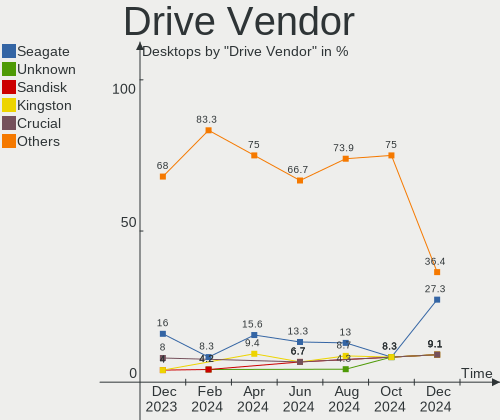
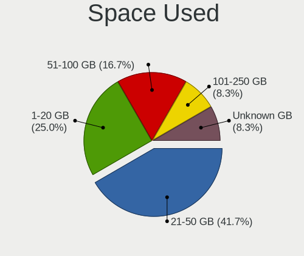
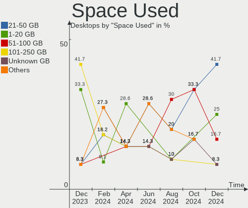
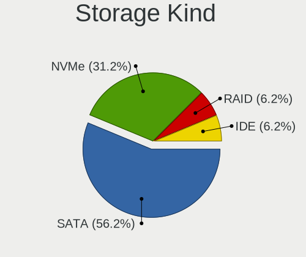
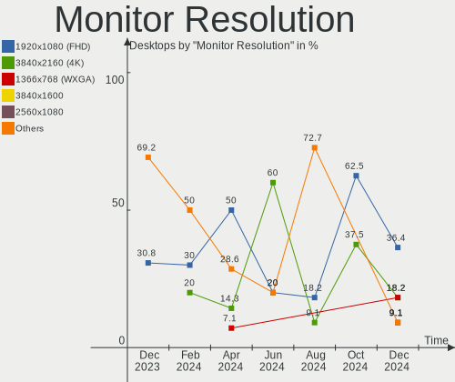

Kali - Hardware Trends (Desktops)
---------------------------------

A project to identify most popular hardware characteristics and track their change
over time based on data collected by Linux users at https://Linux-Hardware.org.

Anyone can contribute to this report by the [hw-probe](https://github.com/linuxhw/hw-probe) tool:

    sudo -E hw-probe -all -upload

This report is for one last month. Overall report since the beginning of time: [TestCoverage](https://github.com/linuxhw/TestCoverage)

Period: May, 2022.

Contents
--------

* [ System ](#system)
  - [ OS                       ](#os)
  - [ OS Family                ](#os-family)
  - [ Kernel                   ](#kernel)
  - [ Kernel Family            ](#kernel-family)
  - [ Kernel Major Ver.        ](#kernel-major-ver)
  - [ Arch                     ](#arch)
  - [ DE                       ](#de)
  - [ Display Server           ](#display-server)
  - [ Display Manager          ](#display-manager)
  - [ OS Lang                  ](#os-lang)
  - [ Boot Mode                ](#boot-mode)
  - [ Filesystem               ](#filesystem)
  - [ Part. scheme             ](#part-scheme)
  - [ Dual Boot with Linux/BSD ](#dual-boot-with-linuxbsd)
  - [ Dual Boot (Win)          ](#dual-boot-win)

* [ Board ](#board)
  - [ Vendor                   ](#vendor)
  - [ Model                    ](#model)
  - [ Model Family             ](#model-family)
  - [ MFG Year                 ](#mfg-year)
  - [ Form Factor              ](#form-factor)
  - [ Secure Boot              ](#secure-boot)
  - [ Coreboot                 ](#coreboot)
  - [ RAM Size                 ](#ram-size)
  - [ RAM Used                 ](#ram-used)
  - [ Total Drives             ](#total-drives)
  - [ Has CD-ROM               ](#has-cd-rom)
  - [ Has Ethernet             ](#has-ethernet)
  - [ Has WiFi                 ](#has-wifi)
  - [ Has Bluetooth            ](#has-bluetooth)

* [ Location ](#location)
  - [ Country                  ](#country)
  - [ City                     ](#city)

* [ Drives ](#drives)
  - [ Drive Vendor             ](#drive-vendor)
  - [ Drive Model              ](#drive-model)
  - [ HDD Vendor               ](#hdd-vendor)
  - [ SSD Vendor               ](#ssd-vendor)
  - [ Drive Kind               ](#drive-kind)
  - [ Drive Connector          ](#drive-connector)
  - [ Drive Size               ](#drive-size)
  - [ Space Total              ](#space-total)
  - [ Space Used               ](#space-used)
  - [ Malfunc. Drives          ](#malfunc-drives)
  - [ Malfunc. Drive Vendor    ](#malfunc-drive-vendor)
  - [ Malfunc. HDD Vendor      ](#malfunc-hdd-vendor)
  - [ Malfunc. Drive Kind      ](#malfunc-drive-kind)
  - [ Failed Drives            ](#failed-drives)
  - [ Failed Drive Vendor      ](#failed-drive-vendor)
  - [ Drive Status             ](#drive-status)

* [ Storage controller ](#storage-controller)
  - [ Storage Vendor           ](#storage-vendor)
  - [ Storage Model            ](#storage-model)
  - [ Storage Kind             ](#storage-kind)

* [ Processor ](#processor)
  - [ CPU Vendor               ](#cpu-vendor)
  - [ CPU Model                ](#cpu-model)
  - [ CPU Model Family         ](#cpu-model-family)
  - [ CPU Cores                ](#cpu-cores)
  - [ CPU Sockets              ](#cpu-sockets)
  - [ CPU Threads              ](#cpu-threads)
  - [ CPU Op-Modes             ](#cpu-op-modes)
  - [ CPU Microcode            ](#cpu-microcode)
  - [ CPU Microarch            ](#cpu-microarch)

* [ Graphics ](#graphics)
  - [ GPU Vendor               ](#gpu-vendor)
  - [ GPU Model                ](#gpu-model)
  - [ GPU Combo                ](#gpu-combo)
  - [ GPU Driver               ](#gpu-driver)
  - [ GPU Memory               ](#gpu-memory)

* [ Monitor ](#monitor)
  - [ Monitor Vendor           ](#monitor-vendor)
  - [ Monitor Model            ](#monitor-model)
  - [ Monitor Resolution       ](#monitor-resolution)
  - [ Monitor Diagonal         ](#monitor-diagonal)
  - [ Monitor Width            ](#monitor-width)
  - [ Aspect Ratio             ](#aspect-ratio)
  - [ Monitor Area             ](#monitor-area)
  - [ Pixel Density            ](#pixel-density)
  - [ Multiple Monitors        ](#multiple-monitors)

* [ Network ](#network)
  - [ Net Controller Vendor    ](#net-controller-vendor)
  - [ Net Controller Model     ](#net-controller-model)
  - [ Wireless Vendor          ](#wireless-vendor)
  - [ Wireless Model           ](#wireless-model)
  - [ Ethernet Vendor          ](#ethernet-vendor)
  - [ Ethernet Model           ](#ethernet-model)
  - [ Net Controller Kind      ](#net-controller-kind)
  - [ Used Controller          ](#used-controller)
  - [ NICs                     ](#nics)
  - [ IPv6                     ](#ipv6)

* [ Bluetooth ](#bluetooth)
  - [ Bluetooth Vendor         ](#bluetooth-vendor)
  - [ Bluetooth Model          ](#bluetooth-model)

* [ Sound ](#sound)
  - [ Sound Vendor             ](#sound-vendor)
  - [ Sound Model              ](#sound-model)

* [ Memory ](#memory)
  - [ Memory Vendor            ](#memory-vendor)
  - [ Memory Model             ](#memory-model)
  - [ Memory Kind              ](#memory-kind)
  - [ Memory Form Factor       ](#memory-form-factor)
  - [ Memory Size              ](#memory-size)
  - [ Memory Speed             ](#memory-speed)

* [ Printers & scanners ](#printers--scanners)
  - [ Printer Vendor           ](#printer-vendor)
  - [ Printer Model            ](#printer-model)
  - [ Scanner Vendor           ](#scanner-vendor)
  - [ Scanner Model            ](#scanner-model)

* [ Camera ](#camera)
  - [ Camera Vendor            ](#camera-vendor)
  - [ Camera Model             ](#camera-model)

* [ Security ](#security)
  - [ Fingerprint Vendor       ](#fingerprint-vendor)
  - [ Fingerprint Model        ](#fingerprint-model)
  - [ Chipcard Vendor          ](#chipcard-vendor)
  - [ Chipcard Model           ](#chipcard-model)

* [ Unsupported ](#unsupported)
  - [ Unsupported Devices      ](#unsupported-devices)
  - [ Unsupported Device Types ](#unsupported-device-types)

System
------

OS
--

Installed operating systems

| Name        | Desktops | Percent |
|-------------|----------|---------|
| Kali 2022.2 | 7        | 87.5%   |
| Kali 2022.1 | 1        | 12.5%   |

OS Family
---------

OS without a version

| Name | Desktops | Percent |
|------|----------|---------|
| Kali | 8        | 100%    |

Kernel
------

Version of the Linux kernel

| Version            | Desktops | Percent |
|--------------------|----------|---------|
| 5.16.0-kali7-amd64 | 6        | 75%     |
| 5.15.0-kali3-amd64 | 2        | 25%     |

Kernel Family
-------------

Linux kernel without a distro release

| Version | Desktops | Percent |
|---------|----------|---------|
| 5.16.0  | 6        | 75%     |
| 5.15.0  | 2        | 25%     |

Kernel Major Ver.
-----------------

Linux kernel major version

| Version | Desktops | Percent |
|---------|----------|---------|
| 5.16    | 6        | 75%     |
| 5.15    | 2        | 25%     |

Arch
----

OS architecture (x86_64, i586, etc.)

| Name   | Desktops | Percent |
|--------|----------|---------|
| x86_64 | 8        | 100%    |

DE
--

Desktop Environment

| Name  | Desktops | Percent |
|-------|----------|---------|
| GNOME | 4        | 50%     |
| XFCE  | 2        | 25%     |
| KDE5  | 2        | 25%     |

Display Server
--------------

X11 or Wayland

| Name | Desktops | Percent |
|------|----------|---------|
| X11  | 8        | 100%    |

Display Manager
---------------

SDDM, LightDM, etc.

| Name    | Desktops | Percent |
|---------|----------|---------|
| SDDM    | 2        | 25%     |
| LightDM | 2        | 25%     |
| GDM3    | 2        | 25%     |
| Unknown | 2        | 25%     |

OS Lang
-------

Language

| Lang  | Desktops | Percent |
|-------|----------|---------|
| en_US | 6        | 75%     |
| en_GB | 1        | 12.5%   |
| en_AU | 1        | 12.5%   |

Boot Mode
---------

EFI or BIOS

| Mode | Desktops | Percent |
|------|----------|---------|
| BIOS | 6        | 75%     |
| EFI  | 2        | 25%     |

Filesystem
----------

Type of filesystem

| Type | Desktops | Percent |
|------|----------|---------|
| Ext4 | 8        | 100%    |

Part. scheme
------------

Scheme of partitioning

| Type    | Desktops | Percent |
|---------|----------|---------|
| GPT     | 4        | 50%     |
| MBR     | 2        | 25%     |
| Unknown | 2        | 25%     |

Dual Boot with Linux/BSD
------------------------

Hosting more than one Linux/BSD

| Dual boot | Desktops | Percent |
|-----------|----------|---------|
| No        | 7        | 87.5%   |
| Yes       | 1        | 12.5%   |

Dual Boot (Win)
---------------

Hosting Linux and Windows

| Dual boot | Desktops | Percent |
|-----------|----------|---------|
| Yes       | 5        | 62.5%   |
| No        | 3        | 37.5%   |

Board
-----

Vendor
------

Motherboard manufacturer

| Name                | Desktops | Percent |
|---------------------|----------|---------|
| MSI                 | 2        | 25%     |
| ASUSTek Computer    | 2        | 25%     |
| Protectli           | 1        | 12.5%   |
| Lenovo              | 1        | 12.5%   |
| Gigabyte Technology | 1        | 12.5%   |
| ASRock              | 1        | 12.5%   |

Model
-----

Motherboard model

| Name                            | Desktops | Percent |
|---------------------------------|----------|---------|
| Protectli FW4A                  | 1        | 12.5%   |
| MSI MS-7C37                     | 1        | 12.5%   |
| MSI MS-7A65                     | 1        | 12.5%   |
| Lenovo ThinkStation S20 4105L1U | 1        | 12.5%   |
| Gigabyte H77M-D3H               | 1        | 12.5%   |
| ASUS ROG STRIX B365-G GAMING    | 1        | 12.5%   |
| ASUS P8H67-V                    | 1        | 12.5%   |
| ASRock 4Core1600-GLAN           | 1        | 12.5%   |

Model Family
------------

Motherboard model prefix

| Name                  | Desktops | Percent |
|-----------------------|----------|---------|
| Protectli FW4A        | 1        | 12.5%   |
| MSI MS-7C37           | 1        | 12.5%   |
| MSI MS-7A65           | 1        | 12.5%   |
| Lenovo ThinkStation   | 1        | 12.5%   |
| Gigabyte H77M-D3H     | 1        | 12.5%   |
| ASUS ROG              | 1        | 12.5%   |
| ASUS P8H67-V          | 1        | 12.5%   |
| ASRock 4Core1600-GLAN | 1        | 12.5%   |

MFG Year
--------

Motherboard manufacture year

| Year | Desktops | Percent |
|------|----------|---------|
| 2019 | 3        | 37.5%   |
| 2017 | 1        | 12.5%   |
| 2012 | 1        | 12.5%   |
| 2010 | 1        | 12.5%   |
| 2009 | 1        | 12.5%   |
| 2008 | 1        | 12.5%   |

Form Factor
-----------

Physical design of the computer

| Name    | Desktops | Percent |
|---------|----------|---------|
| Desktop | 8        | 100%    |

Secure Boot
-----------

Enabled or disabled

| State    | Desktops | Percent |
|----------|----------|---------|
| Disabled | 8        | 100%    |

Coreboot
--------

Have coreboot on board

| Used | Desktops | Percent |
|------|----------|---------|
| No   | 8        | 100%    |

RAM Size
--------

Total RAM memory

| Size in GB | Desktops | Percent |
|------------|----------|---------|
| 4.01-8.0   | 2        | 25%     |
| 32.01-64.0 | 2        | 25%     |
| 16.01-24.0 | 2        | 25%     |
| 3.01-4.0   | 1        | 12.5%   |
| 8.01-16.0  | 1        | 12.5%   |

RAM Used
--------

Used RAM memory

| Used GB  | Desktops | Percent |
|----------|----------|---------|
| 2.01-3.0 | 3        | 37.5%   |
| 3.01-4.0 | 2        | 25%     |
| 4.01-8.0 | 1        | 12.5%   |
| 1.01-2.0 | 1        | 12.5%   |
| 0.51-1.0 | 1        | 12.5%   |

Total Drives
------------

Number of drives on board

| Drives | Desktops | Percent |
|--------|----------|---------|
| 2      | 3        | 37.5%   |
| 1      | 2        | 25%     |
| 6      | 1        | 12.5%   |
| 4      | 1        | 12.5%   |
| 3      | 1        | 12.5%   |

Has CD-ROM
----------

Has CD-ROM on board

| Presented | Desktops | Percent |
|-----------|----------|---------|
| No        | 5        | 62.5%   |
| Yes       | 3        | 37.5%   |

Has Ethernet
------------

Has Ethernet on board

| Presented | Desktops | Percent |
|-----------|----------|---------|
| Yes       | 8        | 100%    |

Has WiFi
--------

Has WiFi module

| Presented | Desktops | Percent |
|-----------|----------|---------|
| Yes       | 5        | 62.5%   |
| No        | 3        | 37.5%   |

Has Bluetooth
-------------

Has Bluetooth module

| Presented | Desktops | Percent |
|-----------|----------|---------|
| No        | 5        | 62.5%   |
| Yes       | 3        | 37.5%   |

Location
--------

Country
-------

Geographic location (country)

| Country   | Desktops | Percent |
|-----------|----------|---------|
| USA       | 2        | 25%     |
| UK        | 1        | 12.5%   |
| Spain     | 1        | 12.5%   |
| Libya     | 1        | 12.5%   |
| Germany   | 1        | 12.5%   |
| Chile     | 1        | 12.5%   |
| Australia | 1        | 12.5%   |

City
----

Geographic location (city)

| City          | Desktops | Percent |
|---------------|----------|---------|
| Tripoli       | 1        | 12.5%   |
| Pompano Beach | 1        | 12.5%   |
| Odessa        | 1        | 12.5%   |
| Madrid        | 1        | 12.5%   |
| El Bosque     | 1        | 12.5%   |
| Blieskastel   | 1        | 12.5%   |
| Ballarat      | 1        | 12.5%   |
| Balham        | 1        | 12.5%   |

Drives
------

Drive Vendor
------------

Hard drive vendors

| Vendor              | Desktops | Drives | Percent |
|---------------------|----------|--------|---------|
| WDC                 | 4        | 7      | 25%     |
| Seagate             | 3        | 3      | 18.75%  |
| Samsung Electronics | 2        | 3      | 12.5%   |
| Kingston            | 2        | 2      | 12.5%   |
| Toshiba             | 1        | 2      | 6.25%   |
| OCZ                 | 1        | 1      | 6.25%   |
| Lexar               | 1        | 1      | 6.25%   |
| Dogfish             | 1        | 1      | 6.25%   |
| Unknown             | 1        | 1      | 6.25%   |

Drive Model
-----------

Hard drive models

| Model                            | Desktops | Percent |
|----------------------------------|----------|---------|
| WDC WDS500G3X0C-00SJG0 500GB     | 1        | 4.76%   |
| WDC WDS100T2B0A-00SM50 1TB SSD   | 1        | 4.76%   |
| WDC WD7500AAVS-00D7B1 752GB      | 1        | 4.76%   |
| WDC WD5000AAKX-083CA1 500GB      | 1        | 4.76%   |
| WDC WD40EFAX-68JH4N0 4TB         | 1        | 4.76%   |
| WDC WD30EZRX-00D8PB0 3TB         | 1        | 4.76%   |
| WDC WD10EVDS-63U8B0 1TB          | 1        | 4.76%   |
| Toshiba HDWR160 6TB              | 1        | 4.76%   |
| Toshiba HDWE150 5TB              | 1        | 4.76%   |
| Seagate ST4000DM005-2DP166 4TB   | 1        | 4.76%   |
| Seagate ST2000DM008-2FR102 2TB   | 1        | 4.76%   |
| Seagate ST2000DM001-1CH164 2TB   | 1        | 4.76%   |
| Samsung SSD 980 PRO 1TB          | 1        | 4.76%   |
| Samsung SSD 870 QVO 1TB          | 1        | 4.76%   |
| Samsung SSD 840 EVO 120GB        | 1        | 4.76%   |
| OCZ VERTEX3 120GB SSD            | 1        | 4.76%   |
| Lexar 128GB SSD                  | 1        | 4.76%   |
| Kingston SV300S37A240G 240GB SSD | 1        | 4.76%   |
| Kingston SV300S37A120G 120GB SSD | 1        | 4.76%   |
| Dogfish SSD 128GB                | 1        | 4.76%   |
| Unknown                          | 1        | 4.76%   |

HDD Vendor
----------

Hard disk drive vendors

| Vendor  | Desktops | Drives | Percent |
|---------|----------|--------|---------|
| WDC     | 4        | 5      | 50%     |
| Seagate | 3        | 3      | 37.5%   |
| Toshiba | 1        | 2      | 12.5%   |

SSD Vendor
----------

Solid state drive vendors

| Vendor              | Desktops | Drives | Percent |
|---------------------|----------|--------|---------|
| Samsung Electronics | 2        | 2      | 22.22%  |
| Kingston            | 2        | 2      | 22.22%  |
| WDC                 | 1        | 1      | 11.11%  |
| OCZ                 | 1        | 1      | 11.11%  |
| Lexar               | 1        | 1      | 11.11%  |
| Dogfish             | 1        | 1      | 11.11%  |
| Unknown             | 1        | 1      | 11.11%  |

Drive Kind
----------

HDD or SSD

| Kind | Desktops | Drives | Percent |
|------|----------|--------|---------|
| SSD  | 6        | 9      | 42.86%  |
| HDD  | 6        | 10     | 42.86%  |
| NVMe | 2        | 2      | 14.29%  |

Drive Connector
---------------

SATA, SAS, NVMe, etc.

| Type | Desktops | Drives | Percent |
|------|----------|--------|---------|
| SATA | 8        | 19     | 80%     |
| NVMe | 2        | 2      | 20%     |

Drive Size
----------

Size of hard drive

| Size in TB | Desktops | Drives | Percent |
|------------|----------|--------|---------|
| 0.01-0.5   | 6        | 8      | 37.5%   |
| 0.51-1.0   | 4        | 4      | 25%     |
| 3.01-4.0   | 2        | 2      | 12.5%   |
| 1.01-2.0   | 2        | 2      | 12.5%   |
| 2.01-3.0   | 1        | 1      | 6.25%   |
| 4.01-10.0  | 1        | 2      | 6.25%   |

Space Total
-----------

Amount of disk space available on the file system

| Size in GB     | Desktops | Percent |
|----------------|----------|---------|
| 101-250        | 3        | 37.5%   |
| More than 3000 | 1        | 12.5%   |
| 251-500        | 1        | 12.5%   |
| 1001-2000      | 1        | 12.5%   |
| 1-20           | 1        | 12.5%   |
| 501-1000       | 1        | 12.5%   |

Space Used
----------

Amount of used disk space

| Used GB        | Desktops | Percent |
|----------------|----------|---------|
| 21-50          | 3        | 37.5%   |
| 1-20           | 2        | 25%     |
| More than 3000 | 1        | 12.5%   |
| 1001-2000      | 1        | 12.5%   |
| 51-100         | 1        | 12.5%   |

Malfunc. Drives
---------------

Drive models with a malfunction

| Model                       | Desktops | Drives | Percent |
|-----------------------------|----------|--------|---------|
| WDC WD7500AAVS-00D7B1 752GB | 1        | 1      | 25%     |
| WDC WD5000AAKX-083CA1 500GB | 1        | 1      | 25%     |
| WDC WD10EVDS-63U8B0 1TB     | 1        | 1      | 25%     |
| OCZ VERTEX3 120GB SSD       | 1        | 1      | 25%     |

Malfunc. Drive Vendor
---------------------

Vendors of faulty drives

| Vendor | Desktops | Drives | Percent |
|--------|----------|--------|---------|
| WDC    | 3        | 3      | 75%     |
| OCZ    | 1        | 1      | 25%     |

Malfunc. HDD Vendor
-------------------

Vendors of faulty HDD drives

| Vendor | Desktops | Drives | Percent |
|--------|----------|--------|---------|
| WDC    | 3        | 3      | 100%    |

Malfunc. Drive Kind
-------------------

Kinds of faulty drives

| Kind | Desktops | Drives | Percent |
|------|----------|--------|---------|
| HDD  | 3        | 3      | 75%     |
| SSD  | 1        | 1      | 25%     |

Failed Drives
-------------

Failed drive models

Zero info for selected period =(

Failed Drive Vendor
-------------------

Failed drive vendors

Zero info for selected period =(

Drive Status
------------

Number of failed and malfunc. drives

| Status   | Desktops | Drives | Percent |
|----------|----------|--------|---------|
| Works    | 5        | 13     | 50%     |
| Malfunc  | 3        | 4      | 30%     |
| Detected | 2        | 4      | 20%     |

Storage controller
------------------

Storage Vendor
--------------

Storage controller vendors

| Vendor              | Desktops | Percent |
|---------------------|----------|---------|
| Intel               | 7        | 58.33%  |
| VIA Technologies    | 1        | 8.33%   |
| Sandisk             | 1        | 8.33%   |
| Samsung Electronics | 1        | 8.33%   |
| ASMedia Technology  | 1        | 8.33%   |
| AMD                 | 1        | 8.33%   |

Storage Model
-------------

Storage controller models

| Model                                                                                   | Desktops | Percent |
|-----------------------------------------------------------------------------------------|----------|---------|
| Intel 200 Series PCH SATA controller [AHCI mode]                                        | 2        | 14.29%  |
| VIA VT6415 PATA IDE Host Controller                                                     | 1        | 7.14%   |
| Sandisk WD Black SN750 / PC SN730 NVMe SSD                                              | 1        | 7.14%   |
| Samsung NVMe SSD Controller PM9A1/PM9A3/980PRO                                          | 1        | 7.14%   |
| Intel NM10/ICH7 Family SATA Controller [IDE mode]                                       | 1        | 7.14%   |
| Intel Atom Processor E3800 Series SATA AHCI Controller                                  | 1        | 7.14%   |
| Intel 82801JI (ICH10 Family) SATA AHCI Controller                                       | 1        | 7.14%   |
| Intel 82801G (ICH7 Family) IDE Controller                                               | 1        | 7.14%   |
| Intel 7 Series/C210 Series Chipset Family 6-port SATA Controller [AHCI mode]            | 1        | 7.14%   |
| Intel 6 Series/C200 Series Chipset Family Desktop SATA Controller (IDE mode, ports 4-5) | 1        | 7.14%   |
| Intel 6 Series/C200 Series Chipset Family Desktop SATA Controller (IDE mode, ports 0-3) | 1        | 7.14%   |
| ASMedia ASM1062 Serial ATA Controller                                                   | 1        | 7.14%   |
| AMD FCH SATA Controller [AHCI mode]                                                     | 1        | 7.14%   |

Storage Kind
------------

Kind of storage controller (IDE, SATA, NVMe, SAS, ...)

| Kind | Desktops | Percent |
|------|----------|---------|
| SATA | 6        | 60%     |
| NVMe | 2        | 20%     |
| IDE  | 2        | 20%     |

Processor
---------

CPU Vendor
----------

Processor vendors

| Vendor | Desktops | Percent |
|--------|----------|---------|
| Intel  | 7        | 87.5%   |
| AMD    | 1        | 12.5%   |

CPU Model
---------

Processor models

| Model                                | Desktops | Percent |
|--------------------------------------|----------|---------|
| Intel Xeon CPU W3530 @ 2.80GHz       | 1        | 12.5%   |
| Intel Core i5-7400 CPU @ 3.00GHz     | 1        | 12.5%   |
| Intel Core i5-3470 CPU @ 3.20GHz     | 1        | 12.5%   |
| Intel Core i5-2400 CPU @ 3.10GHz     | 1        | 12.5%   |
| Intel Core i3-9100 CPU @ 3.60GHz     | 1        | 12.5%   |
| Intel Core 2 Duo CPU E6750 @ 2.66GHz | 1        | 12.5%   |
| Intel Atom CPU E3845 @ 1.91GHz       | 1        | 12.5%   |
| AMD Ryzen 7 5800X 8-Core Processor   | 1        | 12.5%   |

CPU Model Family
----------------

Processor model prefix

| Model            | Desktops | Percent |
|------------------|----------|---------|
| Intel Core i5    | 3        | 37.5%   |
| Intel Xeon       | 1        | 12.5%   |
| Intel Core i3    | 1        | 12.5%   |
| Intel Core 2 Duo | 1        | 12.5%   |
| Intel Atom       | 1        | 12.5%   |
| AMD Ryzen 7      | 1        | 12.5%   |

CPU Cores
---------

Number of processor cores

| Number | Desktops | Percent |
|--------|----------|---------|
| 4      | 6        | 75%     |
| 8      | 1        | 12.5%   |
| 2      | 1        | 12.5%   |

CPU Sockets
-----------

Number of sockets

| Number | Desktops | Percent |
|--------|----------|---------|
| 1      | 8        | 100%    |

CPU Threads
-----------

Threads per core (Hyper-Threading)

| Number | Desktops | Percent |
|--------|----------|---------|
| 1      | 6        | 75%     |
| 2      | 2        | 25%     |

CPU Op-Modes
------------

CPU Operation Modes (32-bit, 64-bit)

| Op mode        | Desktops | Percent |
|----------------|----------|---------|
| 32-bit, 64-bit | 8        | 100%    |

CPU Microcode
-------------

Microcode number

| Number     | Desktops | Percent |
|------------|----------|---------|
| 0x906eb    | 1        | 12.5%   |
| 0x906e9    | 1        | 12.5%   |
| 0x6fb      | 1        | 12.5%   |
| 0x306a9    | 1        | 12.5%   |
| 0x30679    | 1        | 12.5%   |
| 0x106a5    | 1        | 12.5%   |
| 0x0a201016 | 1        | 12.5%   |
| Unknown    | 1        | 12.5%   |

CPU Microarch
-------------

Microarchitecture

| Name        | Desktops | Percent |
|-------------|----------|---------|
| KabyLake    | 2        | 25%     |
| Zen 3       | 1        | 12.5%   |
| Silvermont  | 1        | 12.5%   |
| SandyBridge | 1        | 12.5%   |
| Nehalem     | 1        | 12.5%   |
| IvyBridge   | 1        | 12.5%   |
| Core        | 1        | 12.5%   |

Graphics
--------

GPU Vendor
----------

Vendors of graphics cards

| Vendor | Desktops | Percent |
|--------|----------|---------|
| Nvidia | 4        | 44.44%  |
| Intel  | 3        | 33.33%  |
| AMD    | 2        | 22.22%  |

GPU Model
---------

Graphics card models

| Model                                                                     | Desktops | Percent |
|---------------------------------------------------------------------------|----------|---------|
| Nvidia TU116 [GeForce GTX 1650 SUPER]                                     | 1        | 11.11%  |
| Nvidia GM204 [GeForce GTX 970]                                            | 1        | 11.11%  |
| Nvidia GF108 [GeForce GT 430]                                             | 1        | 11.11%  |
| Nvidia GA106 [GeForce RTX 3060 Lite Hash Rate]                            | 1        | 11.11%  |
| Intel HD Graphics 630                                                     | 1        | 11.11%  |
| Intel Atom Processor Z36xxx/Z37xxx Series Graphics & Display              | 1        | 11.11%  |
| Intel 2nd Generation Core Processor Family Integrated Graphics Controller | 1        | 11.11%  |
| AMD Cedar [Radeon HD 5000/6000/7350/8350 Series]                          | 1        | 11.11%  |
| AMD Caicos [Radeon HD 6450/7450/8450 / R5 230 OEM]                        | 1        | 11.11%  |

GPU Combo
---------

Combinations of graphics cards

| Name        | Desktops | Percent |
|-------------|----------|---------|
| 1 x Nvidia  | 4        | 50%     |
| 1 x Intel   | 2        | 25%     |
| Intel + AMD | 1        | 12.5%   |
| 1 x AMD     | 1        | 12.5%   |

GPU Driver
----------

Free vs proprietary

| Driver      | Desktops | Percent |
|-------------|----------|---------|
| Free        | 5        | 62.5%   |
| Proprietary | 3        | 37.5%   |

GPU Memory
----------

Total video memory

| Size in GB | Desktops | Percent |
|------------|----------|---------|
| Unknown    | 3        | 37.5%   |
| 3.01-4.0   | 2        | 25%     |
| 1.01-2.0   | 1        | 12.5%   |
| 8.01-16.0  | 1        | 12.5%   |
| 0.51-1.0   | 1        | 12.5%   |

Monitor
-------

Monitor Vendor
--------------

Monitor vendors

| Vendor              | Desktops | Percent |
|---------------------|----------|---------|
| Samsung Electronics | 3        | 33.33%  |
| Hewlett-Packard     | 2        | 22.22%  |
| Sharp               | 1        | 11.11%  |
| NEC Computers       | 1        | 11.11%  |
| MSI                 | 1        | 11.11%  |
| Grundig             | 1        | 11.11%  |

Monitor Model
-------------

Monitor models

| Model                                                             | Desktops | Percent |
|-------------------------------------------------------------------|----------|---------|
| Sharp LC-42SV49U SHP4249 1920x1080 930x523mm 42.0-inch            | 1        | 9.09%   |
| Samsung Electronics U28E590 SAM0C4E 3840x2160 610x350mm 27.7-inch | 1        | 9.09%   |
| Samsung Electronics U28E590 SAM0C4D 3840x2160 607x345mm 27.5-inch | 1        | 9.09%   |
| Samsung Electronics S24E450 SAM0C80 1920x1080 520x290mm 23.4-inch | 1        | 9.09%   |
| Samsung Electronics S20B300 SAM08A8 1600x900 443x249mm 20.0-inch  | 1        | 9.09%   |
| Samsung Electronics LCD Monitor SMBX2450                          | 1        | 9.09%   |
| NEC Computers LCD225WNXM NEC672E 1680x1050 433x270mm 20.1-inch    | 1        | 9.09%   |
| MSI LCD Monitor MSI3CA6 2560x1440 600x340mm 27.2-inch             | 1        | 9.09%   |
| Hewlett-Packard LCD Monitor LA1951 3200x1080                      | 1        | 9.09%   |
| Hewlett-Packard 27f HPN354C 1920x1080 598x336mm 27.0-inch         | 1        | 9.09%   |
| Grundig WXGA GRU4448 1600x1200                                    | 1        | 9.09%   |

Monitor Resolution
------------------

Monitor screen resolution

| Resolution         | Desktops | Percent |
|--------------------|----------|---------|
| 1920x1080 (FHD)    | 3        | 30%     |
| 3840x2160 (4K)     | 2        | 20%     |
| 3200x1080          | 1        | 10%     |
| 2560x1440 (QHD)    | 1        | 10%     |
| 1680x1050 (WSXGA+) | 1        | 10%     |
| 1600x900 (HD+)     | 1        | 10%     |
| Unknown            | 1        | 10%     |

Monitor Diagonal
----------------

Diagonal size in inches

| Inches  | Desktops | Percent |
|---------|----------|---------|
| 27      | 3        | 33.33%  |
| 20      | 2        | 22.22%  |
| 54      | 1        | 11.11%  |
| 42      | 1        | 11.11%  |
| 23      | 1        | 11.11%  |
| Unknown | 1        | 11.11%  |

Monitor Width
-------------

Physical width

| Width in mm | Desktops | Percent |
|-------------|----------|---------|
| 501-600     | 3        | 33.33%  |
| 401-500     | 2        | 22.22%  |
| 601-700     | 1        | 11.11%  |
| 1001-1500   | 1        | 11.11%  |
| 901-1000    | 1        | 11.11%  |
| Unknown     | 1        | 11.11%  |

Aspect Ratio
------------

Proportional relationship between the width and the height

| Ratio   | Desktops | Percent |
|---------|----------|---------|
| 16/9    | 6        | 75%     |
| 16/10   | 1        | 12.5%   |
| Unknown | 1        | 12.5%   |

Monitor Area
------------

Area in inch²

| Area in inch² | Desktops | Percent |
|----------------|----------|---------|
| 301-350        | 3        | 33.33%  |
| 151-200        | 2        | 22.22%  |
| More than 1000 | 1        | 11.11%  |
| 201-250        | 1        | 11.11%  |
| 501-1000       | 1        | 11.11%  |
| Unknown        | 1        | 11.11%  |

Pixel Density
-------------

Pixels per inch

| Density | Desktops | Percent |
|---------|----------|---------|
| 51-100  | 5        | 62.5%   |
| 121-160 | 1        | 12.5%   |
| 101-120 | 1        | 12.5%   |
| Unknown | 1        | 12.5%   |

Multiple Monitors
-----------------

Total monitors connected

| Total | Desktops | Percent |
|-------|----------|---------|
| 1     | 5        | 62.5%   |
| 2     | 3        | 37.5%   |

Network
-------

Net Controller Vendor
---------------------

Controller vendors

| Vendor                | Desktops | Percent |
|-----------------------|----------|---------|
| Intel                 | 4        | 23.53%  |
| Realtek Semiconductor | 3        | 17.65%  |
| TP-Link               | 2        | 11.76%  |
| Ralink Technology     | 2        | 11.76%  |
| Qualcomm Atheros      | 2        | 11.76%  |
| Xiaomi                | 1        | 5.88%   |
| Ralink                | 1        | 5.88%   |
| Broadcom              | 1        | 5.88%   |
| ASIX Electronics      | 1        | 5.88%   |

Net Controller Model
--------------------

Controller models

| Model                                                                                         | Desktops | Percent |
|-----------------------------------------------------------------------------------------------|----------|---------|
| Realtek RTL8111/8168/8411 PCI Express Gigabit Ethernet Controller                             | 3        | 16.67%  |
| Ralink RT2870/RT3070 Wireless Adapter                                                         | 2        | 11.11%  |
| Intel Ethernet Connection (2) I219-V                                                          | 2        | 11.11%  |
| Xiaomi Mi/Redmi series (RNDIS)                                                                | 1        | 5.56%   |
| TP-Link TL-WN722N v2/v3 [Realtek RTL8188EUS]                                                  | 1        | 5.56%   |
| TP-Link Archer T2U PLUS [RTL8821AU]                                                           | 1        | 5.56%   |
| Realtek Realtek 8812AU/8821AU 802.11ac WLAN Adapter [USB Wireless Dual-Band Adapter 2.4/5Ghz] | 1        | 5.56%   |
| Ralink RT5362 PCI 802.11n Wireless Network Adapter                                            | 1        | 5.56%   |
| Qualcomm Atheros AR8161 Gigabit Ethernet                                                      | 1        | 5.56%   |
| Qualcomm Atheros AR8151 v2.0 Gigabit Ethernet                                                 | 1        | 5.56%   |
| Intel Wi-Fi 6 AX200                                                                           | 1        | 5.56%   |
| Intel 82583V Gigabit Network Connection                                                       | 1        | 5.56%   |
| Broadcom NetXtreme BCM5755 Gigabit Ethernet PCI Express                                       | 1        | 5.56%   |
| ASIX AX88772A Fast Ethernet                                                                   | 1        | 5.56%   |

Wireless Vendor
---------------

Wireless vendors

| Vendor                | Desktops | Percent |
|-----------------------|----------|---------|
| TP-Link               | 2        | 28.57%  |
| Ralink Technology     | 2        | 28.57%  |
| Realtek Semiconductor | 1        | 14.29%  |
| Ralink                | 1        | 14.29%  |
| Intel                 | 1        | 14.29%  |

Wireless Model
--------------

Wireless models

| Model                                                                                         | Desktops | Percent |
|-----------------------------------------------------------------------------------------------|----------|---------|
| Ralink RT2870/RT3070 Wireless Adapter                                                         | 2        | 28.57%  |
| TP-Link TL-WN722N v2/v3 [Realtek RTL8188EUS]                                                  | 1        | 14.29%  |
| TP-Link Archer T2U PLUS [RTL8821AU]                                                           | 1        | 14.29%  |
| Realtek Realtek 8812AU/8821AU 802.11ac WLAN Adapter [USB Wireless Dual-Band Adapter 2.4/5Ghz] | 1        | 14.29%  |
| Ralink RT5362 PCI 802.11n Wireless Network Adapter                                            | 1        | 14.29%  |
| Intel Wi-Fi 6 AX200                                                                           | 1        | 14.29%  |

Ethernet Vendor
---------------

Ethernet vendors

| Vendor                | Desktops | Percent |
|-----------------------|----------|---------|
| Realtek Semiconductor | 3        | 27.27%  |
| Intel                 | 3        | 27.27%  |
| Qualcomm Atheros      | 2        | 18.18%  |
| Xiaomi                | 1        | 9.09%   |
| Broadcom              | 1        | 9.09%   |
| ASIX Electronics      | 1        | 9.09%   |

Ethernet Model
--------------

Ethernet models

| Model                                                             | Desktops | Percent |
|-------------------------------------------------------------------|----------|---------|
| Realtek RTL8111/8168/8411 PCI Express Gigabit Ethernet Controller | 3        | 27.27%  |
| Intel Ethernet Connection (2) I219-V                              | 2        | 18.18%  |
| Xiaomi Mi/Redmi series (RNDIS)                                    | 1        | 9.09%   |
| Qualcomm Atheros AR8161 Gigabit Ethernet                          | 1        | 9.09%   |
| Qualcomm Atheros AR8151 v2.0 Gigabit Ethernet                     | 1        | 9.09%   |
| Intel 82583V Gigabit Network Connection                           | 1        | 9.09%   |
| Broadcom NetXtreme BCM5755 Gigabit Ethernet PCI Express           | 1        | 9.09%   |
| ASIX AX88772A Fast Ethernet                                       | 1        | 9.09%   |

Net Controller Kind
-------------------

Ethernet, WiFi or modem

| Kind     | Desktops | Percent |
|----------|----------|---------|
| Ethernet | 8        | 61.54%  |
| WiFi     | 5        | 38.46%  |

Used Controller
---------------

Currently used network controller

| Kind     | Desktops | Percent |
|----------|----------|---------|
| Ethernet | 4        | 57.14%  |
| WiFi     | 3        | 42.86%  |

NICs
----

Total network controllers on board

| Total | Desktops | Percent |
|-------|----------|---------|
| 1     | 4        | 50%     |
| 2     | 3        | 37.5%   |
| 4     | 1        | 12.5%   |

IPv6
----

IPv6 vs IPv4

| Used | Desktops | Percent |
|------|----------|---------|
| No   | 7        | 87.5%   |
| Yes  | 1        | 12.5%   |

Bluetooth
---------

Bluetooth Vendor
----------------

Controller vendors

| Vendor                | Desktops | Percent |
|-----------------------|----------|---------|
| Realtek Semiconductor | 1        | 33.33%  |
| Intel                 | 1        | 33.33%  |
| Edimax Technology     | 1        | 33.33%  |

Bluetooth Model
---------------

Controller models

| Model                   | Desktops | Percent |
|-------------------------|----------|---------|
| Realtek Bluetooth Radio | 1        | 33.33%  |
| Intel AX200 Bluetooth   | 1        | 33.33%  |
| Edimax Bluetooth Device | 1        | 33.33%  |

Sound
-----

Sound Vendor
------------

Sound card vendors

| Vendor                   | Desktops | Percent |
|--------------------------|----------|---------|
| Intel                    | 5        | 35.71%  |
| Nvidia                   | 4        | 28.57%  |
| AMD                      | 3        | 21.43%  |
| SteelSeries ApS          | 1        | 7.14%   |
| Micro Star International | 1        | 7.14%   |

Sound Model
-----------

Sound card models

| Model                                                                             | Desktops | Percent |
|-----------------------------------------------------------------------------------|----------|---------|
| Intel 200 Series PCH HD Audio                                                     | 2        | 14.29%  |
| SteelSeries ApS SteelSeries Arctis 5                                              | 1        | 7.14%   |
| Nvidia TU116 High Definition Audio Controller                                     | 1        | 7.14%   |
| Nvidia GM204 High Definition Audio Controller                                     | 1        | 7.14%   |
| Nvidia GF108 High Definition Audio Controller                                     | 1        | 7.14%   |
| Nvidia Audio device                                                               | 1        | 7.14%   |
| Micro Star International MSI GH50 Gaming Headset                                  | 1        | 7.14%   |
| Intel NM10/ICH7 Family High Definition Audio Controller                           | 1        | 7.14%   |
| Intel 82801JI (ICH10 Family) HD Audio Controller                                  | 1        | 7.14%   |
| Intel 6 Series/C200 Series Chipset Family High Definition Audio Controller        | 1        | 7.14%   |
| AMD Starship/Matisse HD Audio Controller                                          | 1        | 7.14%   |
| AMD Cedar HDMI Audio [Radeon HD 5400/6300/7300 Series]                            | 1        | 7.14%   |
| AMD Caicos HDMI Audio [Radeon HD 6450 / 7450/8450/8490 OEM / R5 230/235/235X OEM] | 1        | 7.14%   |

Memory
------

Memory Vendor
-------------

Memory module vendors

| Vendor   | Desktops | Percent |
|----------|----------|---------|
| Unknown  | 2        | 33.33%  |
| PNY      | 1        | 16.67%  |
| Kingston | 1        | 16.67%  |
| Crucial  | 1        | 16.67%  |
| Corsair  | 1        | 16.67%  |

Memory Model
------------

Memory module models

| Model                                                   | Desktops | Percent |
|---------------------------------------------------------|----------|---------|
| Unknown RAM Module 4GB DIMM DDR3 1066MT/s               | 1        | 14.29%  |
| Unknown RAM Module 2GB DIMM SDRAM                       | 1        | 14.29%  |
| Unknown RAM Module 1GB DIMM SDRAM                       | 1        | 14.29%  |
| PNY RAM Module 8GB DIMM DDR3 1600MT/s                   | 1        | 14.29%  |
| Kingston RAM KHX3200C16D4/8GX 8192MB DIMM DDR4 3533MT/s | 1        | 14.29%  |
| Crucial RAM CT8G4DFS8213.M8FB 8GB DIMM DDR4 2133MT/s    | 1        | 14.29%  |
| Corsair RAM CMK32GX4M2B3000C15 16GB DIMM DDR4 3000MT/s  | 1        | 14.29%  |

Memory Kind
-----------

Memory module kinds

| Kind  | Desktops | Percent |
|-------|----------|---------|
| DDR4  | 3        | 50%     |
| DDR3  | 2        | 33.33%  |
| SDRAM | 1        | 16.67%  |

Memory Form Factor
------------------

Physical design of the memory module

| Name | Desktops | Percent |
|------|----------|---------|
| DIMM | 6        | 100%    |

Memory Size
-----------

Memory module size

| Size  | Desktops | Percent |
|-------|----------|---------|
| 8192  | 3        | 42.86%  |
| 16384 | 1        | 14.29%  |
| 4096  | 1        | 14.29%  |
| 2048  | 1        | 14.29%  |
| 1024  | 1        | 14.29%  |

Memory Speed
------------

Memory module speed

| Speed   | Desktops | Percent |
|---------|----------|---------|
| 3533    | 1        | 16.67%  |
| 3000    | 1        | 16.67%  |
| 2133    | 1        | 16.67%  |
| 1600    | 1        | 16.67%  |
| 1066    | 1        | 16.67%  |
| Unknown | 1        | 16.67%  |

Printers & scanners
-------------------

Printer Vendor
--------------

Printer device vendors

Zero info for selected period =(

Printer Model
-------------

Printer device models

Zero info for selected period =(

Scanner Vendor
--------------

Scanner device vendors

Zero info for selected period =(

Scanner Model
-------------

Scanner device models

Zero info for selected period =(

Camera
------

Camera Vendor
-------------

Camera device vendors

| Vendor    | Desktops | Percent |
|-----------|----------|---------|
| Unknown   | 1        | 50%     |
| Microsoft | 1        | 50%     |

Camera Model
------------

Camera device models

| Model                                | Desktops | Percent |
|--------------------------------------|----------|---------|
| Unknown HuddleCamHD                  | 1        | 50%     |
| Microsoft Microsoft LifeCam Studio | 1        | 50%     |

Security
--------

Fingerprint Vendor
------------------

Fingerprint sensor vendors

Zero info for selected period =(

Fingerprint Model
-----------------

Fingerprint sensor models

Zero info for selected period =(

Chipcard Vendor
---------------

Chipcard module vendors

Zero info for selected period =(

Chipcard Model
--------------

Chipcard module models

Zero info for selected period =(

Unsupported
-----------

Unsupported Devices
-------------------

Total unsupported devices on board

| Total | Desktops | Percent |
|-------|----------|---------|
| 0     | 7        | 87.5%   |
| 1     | 1        | 12.5%   |

Unsupported Device Types
------------------------

Types of unsupported devices

| Type          | Desktops | Percent |
|---------------|----------|---------|
| Graphics card | 1        | 100%    |

