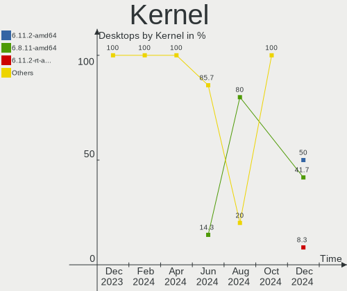
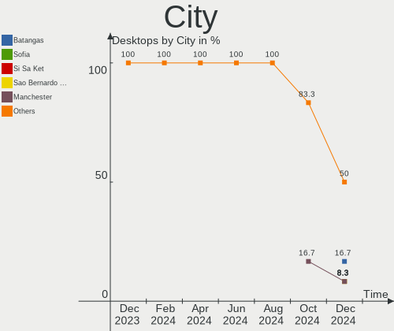
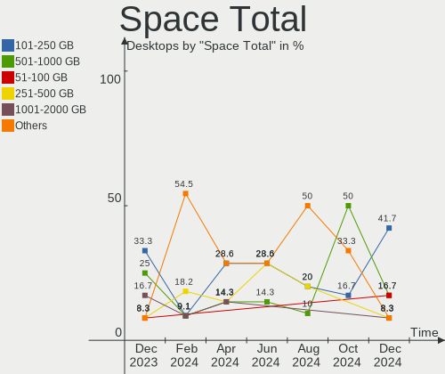
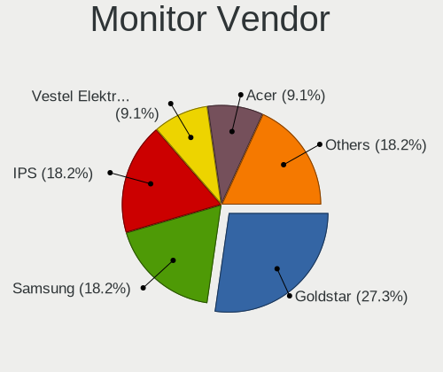
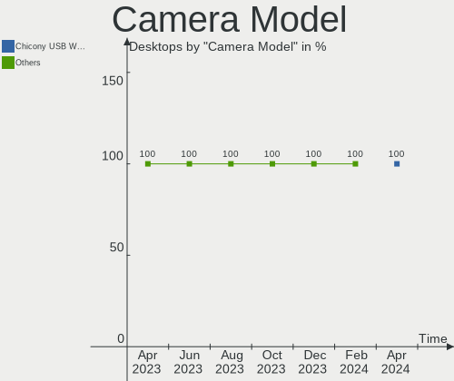
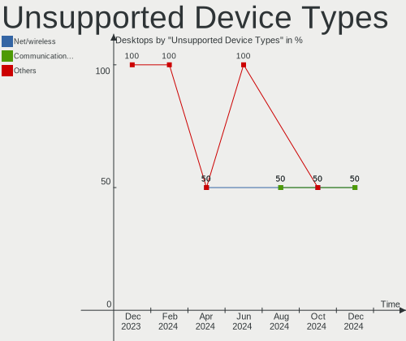

Kali - Hardware Trends (Desktops)
---------------------------------

A project to identify most popular hardware characteristics and track their change
over time based on data collected by Linux users at https://Linux-Hardware.org.

Anyone can contribute to this report by the [hw-probe](https://github.com/linuxhw/hw-probe) tool:

    sudo -E hw-probe -all -upload

This report is for one last month. Overall report since the beginning of time: [TestCoverage](https://github.com/linuxhw/TestCoverage)

Period: Jan, 2023.

Contents
--------

* [ System ](#system)
  - [ OS                       ](#os)
  - [ OS Family                ](#os-family)
  - [ Kernel                   ](#kernel)
  - [ Kernel Family            ](#kernel-family)
  - [ Kernel Major Ver.        ](#kernel-major-ver)
  - [ Arch                     ](#arch)
  - [ DE                       ](#de)
  - [ Display Server           ](#display-server)
  - [ Display Manager          ](#display-manager)
  - [ OS Lang                  ](#os-lang)
  - [ Boot Mode                ](#boot-mode)
  - [ Filesystem               ](#filesystem)
  - [ Part. scheme             ](#part-scheme)
  - [ Dual Boot with Linux/BSD ](#dual-boot-with-linuxbsd)
  - [ Dual Boot (Win)          ](#dual-boot-win)

* [ Board ](#board)
  - [ Vendor                   ](#vendor)
  - [ Model                    ](#model)
  - [ Model Family             ](#model-family)
  - [ MFG Year                 ](#mfg-year)
  - [ Form Factor              ](#form-factor)
  - [ Secure Boot              ](#secure-boot)
  - [ Coreboot                 ](#coreboot)
  - [ RAM Size                 ](#ram-size)
  - [ RAM Used                 ](#ram-used)
  - [ Total Drives             ](#total-drives)
  - [ Has CD-ROM               ](#has-cd-rom)
  - [ Has Ethernet             ](#has-ethernet)
  - [ Has WiFi                 ](#has-wifi)
  - [ Has Bluetooth            ](#has-bluetooth)

* [ Location ](#location)
  - [ Country                  ](#country)
  - [ City                     ](#city)

* [ Drives ](#drives)
  - [ Drive Vendor             ](#drive-vendor)
  - [ Drive Model              ](#drive-model)
  - [ HDD Vendor               ](#hdd-vendor)
  - [ SSD Vendor               ](#ssd-vendor)
  - [ Drive Kind               ](#drive-kind)
  - [ Drive Connector          ](#drive-connector)
  - [ Drive Size               ](#drive-size)
  - [ Space Total              ](#space-total)
  - [ Space Used               ](#space-used)
  - [ Malfunc. Drives          ](#malfunc-drives)
  - [ Malfunc. Drive Vendor    ](#malfunc-drive-vendor)
  - [ Malfunc. HDD Vendor      ](#malfunc-hdd-vendor)
  - [ Malfunc. Drive Kind      ](#malfunc-drive-kind)
  - [ Failed Drives            ](#failed-drives)
  - [ Failed Drive Vendor      ](#failed-drive-vendor)
  - [ Drive Status             ](#drive-status)

* [ Storage controller ](#storage-controller)
  - [ Storage Vendor           ](#storage-vendor)
  - [ Storage Model            ](#storage-model)
  - [ Storage Kind             ](#storage-kind)

* [ Processor ](#processor)
  - [ CPU Vendor               ](#cpu-vendor)
  - [ CPU Model                ](#cpu-model)
  - [ CPU Model Family         ](#cpu-model-family)
  - [ CPU Cores                ](#cpu-cores)
  - [ CPU Sockets              ](#cpu-sockets)
  - [ CPU Threads              ](#cpu-threads)
  - [ CPU Op-Modes             ](#cpu-op-modes)
  - [ CPU Microcode            ](#cpu-microcode)
  - [ CPU Microarch            ](#cpu-microarch)

* [ Graphics ](#graphics)
  - [ GPU Vendor               ](#gpu-vendor)
  - [ GPU Model                ](#gpu-model)
  - [ GPU Combo                ](#gpu-combo)
  - [ GPU Driver               ](#gpu-driver)
  - [ GPU Memory               ](#gpu-memory)

* [ Monitor ](#monitor)
  - [ Monitor Vendor           ](#monitor-vendor)
  - [ Monitor Model            ](#monitor-model)
  - [ Monitor Resolution       ](#monitor-resolution)
  - [ Monitor Diagonal         ](#monitor-diagonal)
  - [ Monitor Width            ](#monitor-width)
  - [ Aspect Ratio             ](#aspect-ratio)
  - [ Monitor Area             ](#monitor-area)
  - [ Pixel Density            ](#pixel-density)
  - [ Multiple Monitors        ](#multiple-monitors)

* [ Network ](#network)
  - [ Net Controller Vendor    ](#net-controller-vendor)
  - [ Net Controller Model     ](#net-controller-model)
  - [ Wireless Vendor          ](#wireless-vendor)
  - [ Wireless Model           ](#wireless-model)
  - [ Ethernet Vendor          ](#ethernet-vendor)
  - [ Ethernet Model           ](#ethernet-model)
  - [ Net Controller Kind      ](#net-controller-kind)
  - [ Used Controller          ](#used-controller)
  - [ NICs                     ](#nics)
  - [ IPv6                     ](#ipv6)

* [ Bluetooth ](#bluetooth)
  - [ Bluetooth Vendor         ](#bluetooth-vendor)
  - [ Bluetooth Model          ](#bluetooth-model)

* [ Sound ](#sound)
  - [ Sound Vendor             ](#sound-vendor)
  - [ Sound Model              ](#sound-model)

* [ Memory ](#memory)
  - [ Memory Vendor            ](#memory-vendor)
  - [ Memory Model             ](#memory-model)
  - [ Memory Kind              ](#memory-kind)
  - [ Memory Form Factor       ](#memory-form-factor)
  - [ Memory Size              ](#memory-size)
  - [ Memory Speed             ](#memory-speed)

* [ Printers & scanners ](#printers--scanners)
  - [ Printer Vendor           ](#printer-vendor)
  - [ Printer Model            ](#printer-model)
  - [ Scanner Vendor           ](#scanner-vendor)
  - [ Scanner Model            ](#scanner-model)

* [ Camera ](#camera)
  - [ Camera Vendor            ](#camera-vendor)
  - [ Camera Model             ](#camera-model)

* [ Security ](#security)
  - [ Fingerprint Vendor       ](#fingerprint-vendor)
  - [ Fingerprint Model        ](#fingerprint-model)
  - [ Chipcard Vendor          ](#chipcard-vendor)
  - [ Chipcard Model           ](#chipcard-model)

* [ Unsupported ](#unsupported)
  - [ Unsupported Devices      ](#unsupported-devices)
  - [ Unsupported Device Types ](#unsupported-device-types)

System
------

OS
--

Installed operating systems

| Name        | Desktops | Percent |
|-------------|----------|---------|
| Kali 2022.4 | 10       | 100%    |

OS Family
---------

OS without a version

| Name | Desktops | Percent |
|------|----------|---------|
| Kali | 10       | 100%    |

Kernel
------

Version of the Linux kernel

| Version            | Desktops | Percent |
|--------------------|----------|---------|
| 6.0.0-kali6-amd64  | 7        | 70%     |
| 6.0.0-kali5-amd64  | 1        | 10%     |
| 6.0.0-kali3-amd64  | 1        | 10%     |
| 5.18.0-kali5-amd64 | 1        | 10%     |

Kernel Family
-------------

Linux kernel without a distro release

| Version | Desktops | Percent |
|---------|----------|---------|
| 6.0.0   | 9        | 90%     |
| 5.18.0  | 1        | 10%     |

Kernel Major Ver.
-----------------

Linux kernel major version

| Version | Desktops | Percent |
|---------|----------|---------|
| 6.0     | 9        | 90%     |
| 5.18    | 1        | 10%     |

Arch
----

OS architecture (x86_64, i586, etc.)

| Name   | Desktops | Percent |
|--------|----------|---------|
| x86_64 | 10       | 100%    |

DE
--

Desktop Environment

| Name    | Desktops | Percent |
|---------|----------|---------|
| XFCE    | 5        | 50%     |
| GNOME   | 2        | 20%     |
| MATE    | 1        | 10%     |
| KDE5    | 1        | 10%     |
| Unknown | 1        | 10%     |

Display Server
--------------

X11 or Wayland

| Name    | Desktops | Percent |
|---------|----------|---------|
| X11     | 9        | 90%     |
| Unknown | 1        | 10%     |

Display Manager
---------------

SDDM, LightDM, etc.

| Name    | Desktops | Percent |
|---------|----------|---------|
| Unknown | 6        | 60%     |
| LightDM | 2        | 20%     |
| SDDM    | 1        | 10%     |
| GDM3    | 1        | 10%     |

OS Lang
-------

Language

| Lang    | Desktops | Percent |
|---------|----------|---------|
| en_US   | 5        | 50%     |
| ru_RU   | 1        | 10%     |
| it_IT   | 1        | 10%     |
| es_ES   | 1        | 10%     |
| de_DE   | 1        | 10%     |
| Unknown | 1        | 10%     |

Boot Mode
---------

EFI or BIOS

| Mode | Desktops | Percent |
|------|----------|---------|
| BIOS | 5        | 50%     |
| EFI  | 5        | 50%     |

Filesystem
----------

Type of filesystem

| Type | Desktops | Percent |
|------|----------|---------|
| Ext4 | 10       | 100%    |

Part. scheme
------------

Scheme of partitioning

| Type    | Desktops | Percent |
|---------|----------|---------|
| GPT     | 5        | 50%     |
| Unknown | 4        | 40%     |
| MBR     | 1        | 10%     |

Dual Boot with Linux/BSD
------------------------

Hosting more than one Linux/BSD

| Dual boot | Desktops | Percent |
|-----------|----------|---------|
| No        | 8        | 80%     |
| Yes       | 2        | 20%     |

Dual Boot (Win)
---------------

Hosting Linux and Windows

| Dual boot | Desktops | Percent |
|-----------|----------|---------|
| Yes       | 5        | 50%     |
| No        | 5        | 50%     |

Board
-----

Vendor
------

Motherboard manufacturer

| Name                | Desktops | Percent |
|---------------------|----------|---------|
| ASUSTek Computer    | 4        | 40%     |
| MSI                 | 2        | 20%     |
| Lenovo              | 1        | 10%     |
| Hewlett-Packard     | 1        | 10%     |
| Gigabyte Technology | 1        | 10%     |
| Fujitsu             | 1        | 10%     |

Model
-----

Motherboard model

| Name                         | Desktops | Percent |
|------------------------------|----------|---------|
| MSI MS-7D20                  | 1        | 10%     |
| MSI MS-7B48                  | 1        | 10%     |
| Lenovo 10MAA08BIA            | 1        | 10%     |
| HP 510-a013a                 | 1        | 10%     |
| Gigabyte B450 GAMING X       | 1        | 10%     |
| Fujitsu ESPRIMO PH320        | 1        | 10%     |
| ASUS TUF B360M-PLUS GAMING   | 1        | 10%     |
| ASUS ROG STRIX B550-F GAMING | 1        | 10%     |
| ASUS ROG STRIX B365-G GAMING | 1        | 10%     |
| ASUS All Series              | 1        | 10%     |

Model Family
------------

Motherboard model prefix

| Name              | Desktops | Percent |
|-------------------|----------|---------|
| ASUS ROG          | 2        | 20%     |
| MSI MS-7D20       | 1        | 10%     |
| MSI MS-7B48       | 1        | 10%     |
| Lenovo 10MAA08BIA | 1        | 10%     |
| HP 510-a013a      | 1        | 10%     |
| Gigabyte B450     | 1        | 10%     |
| Fujitsu ESPRIMO   | 1        | 10%     |
| ASUS TUF          | 1        | 10%     |
| ASUS All          | 1        | 10%     |

MFG Year
--------

Motherboard manufacture year

| Year | Desktops | Percent |
|------|----------|---------|
| 2019 | 3        | 30%     |
| 2020 | 2        | 20%     |
| 2017 | 2        | 20%     |
| 2021 | 1        | 10%     |
| 2014 | 1        | 10%     |
| 2012 | 1        | 10%     |

Form Factor
-----------

Physical design of the computer

| Name    | Desktops | Percent |
|---------|----------|---------|
| Desktop | 10       | 100%    |

Secure Boot
-----------

Enabled or disabled

| State    | Desktops | Percent |
|----------|----------|---------|
| Disabled | 10       | 100%    |

Coreboot
--------

Have coreboot on board

| Used | Desktops | Percent |
|------|----------|---------|
| No   | 10       | 100%    |

RAM Size
--------

Total RAM memory

| Size in GB | Desktops | Percent |
|------------|----------|---------|
| 16.01-24.0 | 3        | 30%     |
| 32.01-64.0 | 2        | 20%     |
| 3.01-4.0   | 2        | 20%     |
| 8.01-16.0  | 2        | 20%     |
| 4.01-8.0   | 1        | 10%     |

RAM Used
--------

Used RAM memory

| Used GB  | Desktops | Percent |
|----------|----------|---------|
| 4.01-8.0 | 3        | 30%     |
| 2.01-3.0 | 3        | 30%     |
| 1.01-2.0 | 3        | 30%     |
| 3.01-4.0 | 1        | 10%     |

Total Drives
------------

Number of drives on board

| Drives | Desktops | Percent |
|--------|----------|---------|
| 2      | 4        | 40%     |
| 1      | 3        | 30%     |
| 6      | 1        | 10%     |
| 5      | 1        | 10%     |
| 3      | 1        | 10%     |

Has CD-ROM
----------

Has CD-ROM on board

| Presented | Desktops | Percent |
|-----------|----------|---------|
| No        | 7        | 70%     |
| Yes       | 3        | 30%     |

Has Ethernet
------------

Has Ethernet on board

| Presented | Desktops | Percent |
|-----------|----------|---------|
| Yes       | 10       | 100%    |

Has WiFi
--------

Has WiFi module

| Presented | Desktops | Percent |
|-----------|----------|---------|
| No        | 6        | 60%     |
| Yes       | 4        | 40%     |

Has Bluetooth
-------------

Has Bluetooth module

| Presented | Desktops | Percent |
|-----------|----------|---------|
| No        | 7        | 70%     |
| Yes       | 3        | 30%     |

Location
--------

Country
-------

Geographic location (country)

| Country   | Desktops | Percent |
|-----------|----------|---------|
| Spain     | 2        | 20%     |
| USA       | 1        | 10%     |
| UK        | 1        | 10%     |
| Sweden    | 1        | 10%     |
| Russia    | 1        | 10%     |
| Italy     | 1        | 10%     |
| Indonesia | 1        | 10%     |
| Germany   | 1        | 10%     |
| Australia | 1        | 10%     |

City
----

Geographic location (city)

| City          | Desktops | Percent |
|---------------|----------|---------|
| Zaragoza      | 1        | 10%     |
| Valladolid    | 1        | 10%     |
| Stockholm     | 1        | 10%     |
| Soest         | 1        | 10%     |
| Omsk          | 1        | 10%     |
| Milan         | 1        | 10%     |
| Cumberland    | 1        | 10%     |
| Central Coast | 1        | 10%     |
| Birmingham    | 1        | 10%     |
| Bali          | 1        | 10%     |

Drives
------

Drive Vendor
------------

Hard drive vendors

| Vendor              | Desktops | Drives | Percent |
|---------------------|----------|--------|---------|
| Samsung Electronics | 5        | 6      | 26.32%  |
| WDC                 | 3        | 5      | 15.79%  |
| Seagate             | 3        | 3      | 15.79%  |
| Kingston            | 3        | 3      | 15.79%  |
| Unknown             | 2        | 3      | 10.53%  |
| Toshiba             | 1        | 1      | 5.26%   |
| Phison              | 1        | 1      | 5.26%   |
| OCZ-VERTEX2         | 1        | 1      | 5.26%   |

Drive Model
-----------

Hard drive models

| Model                            | Desktops | Percent |
|----------------------------------|----------|---------|
| Seagate ST1000DM003-1SB102 1TB   | 2        | 8.7%    |
| WDC WDS240G2G0A-00JH30 240GB SSD | 1        | 4.35%   |
| WDC WDS100T2B0A-00SM50 1TB SSD   | 1        | 4.35%   |
| WDC WD5000BPVT-22HXZT3 500GB     | 1        | 4.35%   |
| WDC WD40EFAX-68JH4N0 4TB         | 1        | 4.35%   |
| WDC WD10EZEX-60WN4A0 1TB         | 1        | 4.35%   |
| Unknown SD/MMC/MS PRO 2GB        | 1        | 4.35%   |
| Unknown SD/MMC 2GB               | 1        | 4.35%   |
| Unknown M.S./M.S.Pro/HG 16GB     | 1        | 4.35%   |
| Toshiba HDWR160 6TB              | 1        | 4.35%   |
| Seagate ST1000DM003-1CH162 1TB   | 1        | 4.35%   |
| Samsung SSD 980 1TB              | 1        | 4.35%   |
| Samsung SSD 860 EVO 500GB        | 1        | 4.35%   |
| Samsung SSD 840 EVO 120GB        | 1        | 4.35%   |
| Samsung PSSD T7 500GB            | 1        | 4.35%   |
| Samsung HD753LJ 752GB            | 1        | 4.35%   |
| Samsung HD252KJ 250GB            | 1        | 4.35%   |
| Phison MSI M390 1TB              | 1        | 4.35%   |
| OCZ-VERTEX2 3.5 115GB SSD        | 1        | 4.35%   |
| Kingston SV300S37A120G 120GB SSD | 1        | 4.35%   |
| Kingston SNV2S500G 500GB         | 1        | 4.35%   |
| Kingston SA400S37240G 240GB SSD  | 1        | 4.35%   |

HDD Vendor
----------

Hard disk drive vendors

| Vendor              | Desktops | Drives | Percent |
|---------------------|----------|--------|---------|
| WDC                 | 3        | 3      | 33.33%  |
| Seagate             | 3        | 3      | 33.33%  |
| Unknown             | 1        | 1      | 11.11%  |
| Toshiba             | 1        | 1      | 11.11%  |
| Samsung Electronics | 1        | 2      | 11.11%  |

SSD Vendor
----------

Solid state drive vendors

| Vendor              | Desktops | Drives | Percent |
|---------------------|----------|--------|---------|
| Samsung Electronics | 3        | 3      | 37.5%   |
| WDC                 | 2        | 2      | 25%     |
| Kingston            | 2        | 2      | 25%     |
| OCZ-VERTEX2         | 1        | 1      | 12.5%   |

Drive Kind
----------

HDD or SSD

| Kind    | Desktops | Drives | Percent |
|---------|----------|--------|---------|
| HDD     | 7        | 10     | 41.18%  |
| SSD     | 6        | 8      | 35.29%  |
| NVMe    | 3        | 3      | 17.65%  |
| Unknown | 1        | 2      | 5.88%   |

Drive Connector
---------------

SATA, SAS, NVMe, etc.

| Type | Desktops | Drives | Percent |
|------|----------|--------|---------|
| SATA | 9        | 16     | 64.29%  |
| NVMe | 3        | 3      | 21.43%  |
| SAS  | 2        | 4      | 14.29%  |

Drive Size
----------

Size of hard drive

| Size in TB | Desktops | Drives | Percent |
|------------|----------|--------|---------|
| 0.01-0.5   | 7        | 10     | 46.67%  |
| 0.51-1.0   | 6        | 6      | 40%     |
| 3.01-4.0   | 1        | 1      | 6.67%   |
| 4.01-10.0  | 1        | 1      | 6.67%   |

Space Total
-----------

Amount of disk space available on the file system

| Size in GB     | Desktops | Percent |
|----------------|----------|---------|
| 501-1000       | 3        | 30%     |
| 251-500        | 2        | 20%     |
| 101-250        | 2        | 20%     |
| More than 3000 | 1        | 10%     |
| 51-100         | 1        | 10%     |
| Unknown        | 1        | 10%     |

Space Used
----------

Amount of used disk space

| Used GB        | Desktops | Percent |
|----------------|----------|---------|
| 51-100         | 3        | 30%     |
| 21-50          | 2        | 20%     |
| More than 3000 | 1        | 10%     |
| 251-500        | 1        | 10%     |
| 101-250        | 1        | 10%     |
| 1-20           | 1        | 10%     |
| Unknown        | 1        | 10%     |

Malfunc. Drives
---------------

Drive models with a malfunction

Zero info for selected period =(

Malfunc. Drive Vendor
---------------------

Vendors of faulty drives

Zero info for selected period =(

Malfunc. HDD Vendor
-------------------

Vendors of faulty HDD drives

Zero info for selected period =(

Malfunc. Drive Kind
-------------------

Kinds of faulty drives

Zero info for selected period =(

Failed Drives
-------------

Failed drive models

Zero info for selected period =(

Failed Drive Vendor
-------------------

Failed drive vendors

Zero info for selected period =(

Drive Status
------------

Number of failed and malfunc. drives

| Status   | Desktops | Drives | Percent |
|----------|----------|--------|---------|
| Detected | 6        | 12     | 54.55%  |
| Works    | 5        | 11     | 45.45%  |

Storage controller
------------------

Storage Vendor
--------------

Storage controller vendors

| Vendor                      | Desktops | Percent |
|-----------------------------|----------|---------|
| Intel                       | 8        | 66.67%  |
| AMD                         | 2        | 16.67%  |
| Samsung Electronics         | 1        | 8.33%   |
| Kingston Technology Company | 1        | 8.33%   |

Storage Model
-------------

Storage controller models

| Model                                                                            | Desktops | Percent |
|----------------------------------------------------------------------------------|----------|---------|
| Intel 200 Series PCH SATA controller [AHCI mode]                                 | 3        | 21.43%  |
| Intel 8 Series/C220 Series Chipset Family 6-port SATA Controller 1 [AHCI mode]   | 2        | 14.29%  |
| Samsung NVMe SSD Controller 980                                                  | 1        | 7.14%   |
| Kingston Company Company Non-Volatile memory controller                          | 1        | 7.14%   |
| Intel Cannon Lake PCH SATA AHCI Controller                                       | 1        | 7.14%   |
| Intel Atom/Celeron/Pentium Processor x5-E8000/J3xxx/N3xxx Series SATA Controller | 1        | 7.14%   |
| Intel 500 Series Chipset Family SATA AHCI Controller                             | 1        | 7.14%   |
| AMD RAID Bottom Device                                                           | 1        | 7.14%   |
| AMD FCH SATA Controller [AHCI mode]                                              | 1        | 7.14%   |
| AMD 500 Series Chipset SATA Controller                                           | 1        | 7.14%   |
| AMD 400 Series Chipset SATA Controller                                           | 1        | 7.14%   |

Storage Kind
------------

Kind of storage controller (IDE, SATA, NVMe, SAS, ...)

| Kind | Desktops | Percent |
|------|----------|---------|
| SATA | 10       | 76.92%  |
| NVMe | 3        | 23.08%  |

Processor
---------

CPU Vendor
----------

Processor vendors

| Vendor | Desktops | Percent |
|--------|----------|---------|
| Intel  | 8        | 80%     |
| AMD    | 2        | 20%     |

CPU Model
---------

Processor models

| Model                                  | Desktops | Percent |
|----------------------------------------|----------|---------|
| Intel Pentium CPU G4560 @ 3.50GHz      | 1        | 10%     |
| Intel Core i7-4770 CPU @ 3.40GHz       | 1        | 10%     |
| Intel Core i5-8400 CPU @ 2.80GHz       | 1        | 10%     |
| Intel Core i5-4590 CPU @ 3.30GHz       | 1        | 10%     |
| Intel Core i3-9100F CPU @ 3.60GHz      | 1        | 10%     |
| Intel Core i3-9100 CPU @ 3.60GHz       | 1        | 10%     |
| Intel Celeron CPU J3060 @ 1.60GHz      | 1        | 10%     |
| Intel 11th Gen Core i5-11400 @ 2.60GHz | 1        | 10%     |
| AMD Ryzen 5 5600G with Radeon Graphics | 1        | 10%     |
| AMD Ryzen 3 1200 Quad-Core Processor   | 1        | 10%     |

CPU Model Family
----------------

Processor model prefix

| Model         | Desktops | Percent |
|---------------|----------|---------|
| Intel Core i5 | 2        | 20%     |
| Intel Core i3 | 2        | 20%     |
| Other         | 1        | 10%     |
| Intel Pentium | 1        | 10%     |
| Intel Core i7 | 1        | 10%     |
| Intel Celeron | 1        | 10%     |
| AMD Ryzen 5   | 1        | 10%     |
| AMD Ryzen 3   | 1        | 10%     |

CPU Cores
---------

Number of processor cores

| Number | Desktops | Percent |
|--------|----------|---------|
| 4      | 5        | 50%     |
| 6      | 3        | 30%     |
| 2      | 2        | 20%     |

CPU Sockets
-----------

Number of sockets

| Number | Desktops | Percent |
|--------|----------|---------|
| 1      | 10       | 100%    |

CPU Threads
-----------

Threads per core (Hyper-Threading)

| Number | Desktops | Percent |
|--------|----------|---------|
| 1      | 6        | 60%     |
| 2      | 4        | 40%     |

CPU Op-Modes
------------

CPU Operation Modes (32-bit, 64-bit)

| Op mode        | Desktops | Percent |
|----------------|----------|---------|
| 32-bit, 64-bit | 10       | 100%    |

CPU Microcode
-------------

Microcode number

| Number     | Desktops | Percent |
|------------|----------|---------|
| 0x906eb    | 2        | 20%     |
| 0x306c3    | 2        | 20%     |
| 0xa0671    | 1        | 10%     |
| 0x906ea    | 1        | 10%     |
| 0x906e9    | 1        | 10%     |
| 0x406c4    | 1        | 10%     |
| 0x0a50000d | 1        | 10%     |
| 0x0800820d | 1        | 10%     |

CPU Microarch
-------------

Microarchitecture

| Name       | Desktops | Percent |
|------------|----------|---------|
| KabyLake   | 4        | 40%     |
| Haswell    | 2        | 20%     |
| Zen+       | 1        | 10%     |
| Zen 3      | 1        | 10%     |
| Silvermont | 1        | 10%     |
| Icelake    | 1        | 10%     |

Graphics
--------

GPU Vendor
----------

Vendors of graphics cards

| Vendor | Desktops | Percent |
|--------|----------|---------|
| Nvidia | 6        | 54.55%  |
| Intel  | 4        | 36.36%  |
| AMD    | 1        | 9.09%   |

GPU Model
---------

Graphics card models

| Model                                                                                    | Desktops | Percent |
|------------------------------------------------------------------------------------------|----------|---------|
| Nvidia TU116 [GeForce GTX 1650 SUPER]                                                    | 1        | 9.09%   |
| Nvidia GP107 [GeForce GTX 1050 Ti]                                                       | 1        | 9.09%   |
| Nvidia GM107 [GeForce GTX 750]                                                           | 1        | 9.09%   |
| Nvidia GK107 [GeForce GT 630 OEM]                                                        | 1        | 9.09%   |
| Nvidia GF119 [GeForce GT 610]                                                            | 1        | 9.09%   |
| Nvidia GA106 [Geforce RTX 3050]                                                          | 1        | 9.09%   |
| Intel RocketLake-S GT1 [UHD Graphics 730]                                                | 1        | 9.09%   |
| Intel HD Graphics 610                                                                    | 1        | 9.09%   |
| Intel CoffeeLake-S GT2 [UHD Graphics 630]                                                | 1        | 9.09%   |
| Intel Atom/Celeron/Pentium Processor x5-E8000/J3xxx/N3xxx Integrated Graphics Controller | 1        | 9.09%   |
| AMD Ellesmere [Radeon RX 470/480/570/570X/580/580X/590]                                  | 1        | 9.09%   |

GPU Combo
---------

Combinations of graphics cards

| Name           | Desktops | Percent |
|----------------|----------|---------|
| 1 x Nvidia     | 5        | 50%     |
| 1 x Intel      | 3        | 30%     |
| Intel + Nvidia | 1        | 10%     |
| 1 x AMD        | 1        | 10%     |

GPU Driver
----------

Free vs proprietary

| Driver      | Desktops | Percent |
|-------------|----------|---------|
| Free        | 6        | 60%     |
| Proprietary | 4        | 40%     |

GPU Memory
----------

Total video memory

| Size in GB | Desktops | Percent |
|------------|----------|---------|
| Unknown    | 4        | 40%     |
| 7.01-8.0   | 2        | 20%     |
| 3.01-4.0   | 2        | 20%     |
| 1.01-2.0   | 1        | 10%     |
| 0.51-1.0   | 1        | 10%     |

Monitor
-------

Monitor Vendor
--------------

Monitor vendors

| Vendor              | Desktops | Percent |
|---------------------|----------|---------|
| Hewlett-Packard     | 3        | 27.27%  |
| Samsung Electronics | 2        | 18.18%  |
| Goldstar            | 2        | 18.18%  |
| Unknown             | 1        | 9.09%   |
| LG Electronics      | 1        | 9.09%   |
| Hitachi             | 1        | 9.09%   |
| Acer                | 1        | 9.09%   |

Monitor Model
-------------

Monitor models

| Model                                                                 | Desktops | Percent |
|-----------------------------------------------------------------------|----------|---------|
| Unknown LCD Monitor XXX AAA 1920x1080                                 | 1        | 7.14%   |
| Samsung Electronics U28E590 SAM0C4D 3840x2160 607x345mm 27.5-inch     | 1        | 7.14%   |
| Samsung Electronics SyncMaster SAM03F1 1680x1050                      | 1        | 7.14%   |
| Samsung Electronics SA300/SA350 SAM07D2 1920x1080 477x268mm 21.5-inch | 1        | 7.14%   |
| Samsung Electronics S24E450 SAM0C80 1920x1080 520x290mm 23.4-inch     | 1        | 7.14%   |
| Samsung Electronics S22D300 SAM0B3F 1920x1080 477x268mm 21.5-inch     | 1        | 7.14%   |
| LG Electronics LCD Monitor W2240 1920x1080                            | 1        | 7.14%   |
| Hitachi HISENSE HEC002F 3840x2160 1872x1053mm 84.6-inch               | 1        | 7.14%   |
| Hewlett-Packard w15e HWP280A 1280x720 332x187mm 15.0-inch             | 1        | 7.14%   |
| Hewlett-Packard E243m HPN3467 1920x1080 527x296mm 23.8-inch           | 1        | 7.14%   |
| Hewlett-Packard 2711 HWP2940 1920x1080 598x337mm 27.0-inch            | 1        | 7.14%   |
| Goldstar W2240 GSM57A1 1920x1080 480x270mm 21.7-inch                  | 1        | 7.14%   |
| Goldstar 22EN33 GSM597C 1920x1080 480x270mm 21.7-inch                 | 1        | 7.14%   |
| Acer LCD Monitor AL1717 1280x1024                                     | 1        | 7.14%   |

Monitor Resolution
------------------

Monitor screen resolution

| Resolution         | Desktops | Percent |
|--------------------|----------|---------|
| 1920x1080 (FHD)    | 6        | 54.55%  |
| 3840x2160 (4K)     | 2        | 18.18%  |
| 1680x1050 (WSXGA+) | 1        | 9.09%   |
| 1280x720 (HD)      | 1        | 9.09%   |
| 1280x1024 (SXGA)   | 1        | 9.09%   |

Monitor Diagonal
----------------

Diagonal size in inches

| Inches  | Desktops | Percent |
|---------|----------|---------|
| Unknown | 4        | 30.77%  |
| 21      | 3        | 23.08%  |
| 27      | 2        | 15.38%  |
| 23      | 2        | 15.38%  |
| 84      | 1        | 7.69%   |
| 15      | 1        | 7.69%   |

Monitor Width
-------------

Physical width

| Width in mm | Desktops | Percent |
|-------------|----------|---------|
| Unknown     | 4        | 30.77%  |
| 501-600     | 3        | 23.08%  |
| 401-500     | 3        | 23.08%  |
| 601-700     | 1        | 7.69%   |
| 301-350     | 1        | 7.69%   |
| 1501-2000   | 1        | 7.69%   |

Aspect Ratio
------------

Proportional relationship between the width and the height

| Ratio   | Desktops | Percent |
|---------|----------|---------|
| 16/9    | 7        | 63.64%  |
| Unknown | 3        | 27.27%  |
| 16/10   | 1        | 9.09%   |

Monitor Area
------------

Area in inch²

| Area in inch² | Desktops | Percent |
|----------------|----------|---------|
| 201-250        | 4        | 33.33%  |
| Unknown        | 4        | 33.33%  |
| 301-350        | 2        | 16.67%  |
| More than 1000 | 1        | 8.33%   |
| 91-100         | 1        | 8.33%   |

Pixel Density
-------------

Pixels per inch

| Density | Desktops | Percent |
|---------|----------|---------|
| 51-100  | 5        | 38.46%  |
| Unknown | 4        | 30.77%  |
| 101-120 | 3        | 23.08%  |
| 121-160 | 1        | 7.69%   |

Multiple Monitors
-----------------

Total monitors connected

| Total | Desktops | Percent |
|-------|----------|---------|
| 1     | 8        | 80%     |
| 4     | 1        | 10%     |
| 2     | 1        | 10%     |

Network
-------

Net Controller Vendor
---------------------

Controller vendors

| Vendor                | Desktops | Percent |
|-----------------------|----------|---------|
| Realtek Semiconductor | 8        | 44.44%  |
| Intel                 | 4        | 22.22%  |
| TP-Link               | 2        | 11.11%  |
| Xiaomi                | 1        | 5.56%   |
| Ralink Technology     | 1        | 5.56%   |
| Huawei Technologies   | 1        | 5.56%   |
| ASIX Electronics      | 1        | 5.56%   |

Net Controller Model
--------------------

Controller models

| Model                                                                                         | Desktops | Percent |
|-----------------------------------------------------------------------------------------------|----------|---------|
| Realtek RTL8111/8168/8411 PCI Express Gigabit Ethernet Controller                             | 7        | 35%     |
| Xiaomi Mi/Redmi series (RNDIS)                                                                | 1        | 5%      |
| TP-Link TL-WN823N v2/v3 [Realtek RTL8192EU]                                                   | 1        | 5%      |
| TP-Link TL-WN722N v2/v3 [Realtek RTL8188EUS]                                                  | 1        | 5%      |
| Realtek RTL8723BE PCIe Wireless Network Adapter                                               | 1        | 5%      |
| Realtek RTL8125 2.5GbE Controller                                                             | 1        | 5%      |
| Realtek Realtek 8812AU/8821AU 802.11ac WLAN Adapter [USB Wireless Dual-Band Adapter 2.4/5Ghz] | 1        | 5%      |
| Ralink RT2870/RT3070 Wireless Adapter                                                         | 1        | 5%      |
| Intel Wireless 7260                                                                           | 1        | 5%      |
| Intel Ethernet Controller I225-V                                                              | 1        | 5%      |
| Intel Ethernet Connection (7) I219-V                                                          | 1        | 5%      |
| Intel Ethernet Connection (2) I219-V                                                          | 1        | 5%      |
| Huawei ELS-NX9                                                                                | 1        | 5%      |
| ASIX AX88772A Fast Ethernet                                                                   | 1        | 5%      |

Wireless Vendor
---------------

Wireless vendors

| Vendor                | Desktops | Percent |
|-----------------------|----------|---------|
| TP-Link               | 2        | 33.33%  |
| Realtek Semiconductor | 2        | 33.33%  |
| Ralink Technology     | 1        | 16.67%  |
| Intel                 | 1        | 16.67%  |

Wireless Model
--------------

Wireless models

| Model                                                                                         | Desktops | Percent |
|-----------------------------------------------------------------------------------------------|----------|---------|
| TP-Link TL-WN823N v2/v3 [Realtek RTL8192EU]                                                   | 1        | 16.67%  |
| TP-Link TL-WN722N v2/v3 [Realtek RTL8188EUS]                                                  | 1        | 16.67%  |
| Realtek RTL8723BE PCIe Wireless Network Adapter                                               | 1        | 16.67%  |
| Realtek Realtek 8812AU/8821AU 802.11ac WLAN Adapter [USB Wireless Dual-Band Adapter 2.4/5Ghz] | 1        | 16.67%  |
| Ralink RT2870/RT3070 Wireless Adapter                                                         | 1        | 16.67%  |
| Intel Wireless 7260                                                                           | 1        | 16.67%  |

Ethernet Vendor
---------------

Ethernet vendors

| Vendor                | Desktops | Percent |
|-----------------------|----------|---------|
| Realtek Semiconductor | 8        | 57.14%  |
| Intel                 | 3        | 21.43%  |
| Xiaomi                | 1        | 7.14%   |
| Huawei Technologies   | 1        | 7.14%   |
| ASIX Electronics      | 1        | 7.14%   |

Ethernet Model
--------------

Ethernet models

| Model                                                             | Desktops | Percent |
|-------------------------------------------------------------------|----------|---------|
| Realtek RTL8111/8168/8411 PCI Express Gigabit Ethernet Controller | 7        | 50%     |
| Xiaomi Mi/Redmi series (RNDIS)                                    | 1        | 7.14%   |
| Realtek RTL8125 2.5GbE Controller                                 | 1        | 7.14%   |
| Intel Ethernet Controller I225-V                                  | 1        | 7.14%   |
| Intel Ethernet Connection (7) I219-V                              | 1        | 7.14%   |
| Intel Ethernet Connection (2) I219-V                              | 1        | 7.14%   |
| Huawei ELS-NX9                                                    | 1        | 7.14%   |
| ASIX AX88772A Fast Ethernet                                       | 1        | 7.14%   |

Net Controller Kind
-------------------

Ethernet, WiFi or modem

| Kind     | Desktops | Percent |
|----------|----------|---------|
| Ethernet | 10       | 71.43%  |
| WiFi     | 4        | 28.57%  |

Used Controller
---------------

Currently used network controller

| Kind     | Desktops | Percent |
|----------|----------|---------|
| Ethernet | 8        | 72.73%  |
| WiFi     | 3        | 27.27%  |

NICs
----

Total network controllers on board

| Total | Desktops | Percent |
|-------|----------|---------|
| 1     | 7        | 70%     |
| 2     | 3        | 30%     |

IPv6
----

IPv6 vs IPv4

| Used | Desktops | Percent |
|------|----------|---------|
| No   | 10       | 100%    |

Bluetooth
---------

Bluetooth Vendor
----------------

Controller vendors

| Vendor                  | Desktops | Percent |
|-------------------------|----------|---------|
| Realtek Semiconductor   | 2        | 50%     |
| Intel                   | 1        | 25%     |
| Cambridge Silicon Radio | 1        | 25%     |

Bluetooth Model
---------------

Controller models

| Model                                               | Desktops | Percent |
|-----------------------------------------------------|----------|---------|
| Realtek Bluetooth Radio                             | 2        | 50%     |
| Intel Bluetooth wireless interface                  | 1        | 25%     |
| Cambridge Silicon Radio Bluetooth Dongle (HCI mode) | 1        | 25%     |

Sound
-----

Sound Vendor
------------

Sound card vendors

| Vendor              | Desktops | Percent |
|---------------------|----------|---------|
| Intel               | 8        | 42.11%  |
| Nvidia              | 6        | 31.58%  |
| AMD                 | 3        | 15.79%  |
| Hewlett-Packard     | 1        | 5.26%   |
| C-Media Electronics | 1        | 5.26%   |

Sound Model
-----------

Sound card models

| Model                                                                                             | Desktops | Percent |
|---------------------------------------------------------------------------------------------------|----------|---------|
| Intel 200 Series PCH HD Audio                                                                     | 3        | 15%     |
| Intel 8 Series/C220 Series Chipset High Definition Audio Controller                               | 2        | 10%     |
| Nvidia TU116 High Definition Audio Controller                                                     | 1        | 5%      |
| Nvidia GP107GL High Definition Audio Controller                                                   | 1        | 5%      |
| Nvidia GM107 High Definition Audio Controller [GeForce 940MX]                                     | 1        | 5%      |
| Nvidia GK107 HDMI Audio Controller                                                                | 1        | 5%      |
| Nvidia GF119 HDMI Audio Controller                                                                | 1        | 5%      |
| Nvidia GA106 High Definition Audio Controller                                                     | 1        | 5%      |
| Intel Tiger Lake-H HD Audio Controller                                                            | 1        | 5%      |
| Intel Cannon Lake PCH cAVS                                                                        | 1        | 5%      |
| Intel Atom/Celeron/Pentium Processor x5-E8000/J3xxx/N3xxx Series High Definition Audio Controller | 1        | 5%      |
| Hewlett-Packard CONEXANT USB AUDIO                                                                | 1        | 5%      |
| C-Media Electronics USB Audio Device                                                              | 1        | 5%      |
| AMD Renoir Radeon High Definition Audio Controller                                                | 1        | 5%      |
| AMD Family 17h/19h HD Audio Controller                                                            | 1        | 5%      |
| AMD Family 17h (Models 00h-0fh) HD Audio Controller                                               | 1        | 5%      |
| AMD Ellesmere HDMI Audio [Radeon RX 470/480 / 570/580/590]                                        | 1        | 5%      |

Memory
------

Memory Vendor
-------------

Memory module vendors

| Vendor   | Desktops | Percent |
|----------|----------|---------|
| Kingston | 2        | 33.33%  |
| Corsair  | 2        | 33.33%  |
| Team     | 1        | 16.67%  |
| SK hynix | 1        | 16.67%  |

Memory Model
------------

Memory module models

| Model                                                  | Desktops | Percent |
|--------------------------------------------------------|----------|---------|
| Team RAM TEAMGROUP-UD4-3000 8GB DIMM DDR4 3200MT/s     | 1        | 14.29%  |
| SK hynix RAM HMT351U6CFR8C-PB 4GB DIMM DDR3 1800MT/s   | 1        | 14.29%  |
| Kingston RAM KHX2666C16D4/4G 4GB DIMM DDR4 2667MT/s    | 1        | 14.29%  |
| Kingston RAM KF3200C16D4/16GX 16GB DIMM DDR4 3200MT/s  | 1        | 14.29%  |
| Corsair RAM CMW16GX4M2C3200C16 8GB DIMM DDR4 3733MT/s  | 1        | 14.29%  |
| Corsair RAM CMK32GX4M2B3000C15 16GB DIMM DDR4 3000MT/s | 1        | 14.29%  |
| Corsair RAM CMK16GX4M2B3200C16 8GB DIMM DDR4 3600MT/s  | 1        | 14.29%  |

Memory Kind
-----------

Memory module kinds

| Kind | Desktops | Percent |
|------|----------|---------|
| DDR4 | 5        | 83.33%  |
| DDR3 | 1        | 16.67%  |

Memory Form Factor
------------------

Physical design of the memory module

| Name | Desktops | Percent |
|------|----------|---------|
| DIMM | 6        | 100%    |

Memory Size
-----------

Memory module size

| Size  | Desktops | Percent |
|-------|----------|---------|
| 16384 | 3        | 50%     |
| 4096  | 2        | 33.33%  |
| 8192  | 1        | 16.67%  |

Memory Speed
------------

Memory module speed

| Speed | Desktops | Percent |
|-------|----------|---------|
| 3200  | 2        | 28.57%  |
| 3733  | 1        | 14.29%  |
| 3600  | 1        | 14.29%  |
| 3000  | 1        | 14.29%  |
| 2667  | 1        | 14.29%  |
| 1800  | 1        | 14.29%  |

Printers & scanners
-------------------

Printer Vendor
--------------

Printer device vendors

Zero info for selected period =(

Printer Model
-------------

Printer device models

Zero info for selected period =(

Scanner Vendor
--------------

Scanner device vendors

Zero info for selected period =(

Scanner Model
-------------

Scanner device models

Zero info for selected period =(

Camera
------

Camera Vendor
-------------

Camera device vendors

| Vendor   | Desktops | Percent |
|----------|----------|---------|
| Logitech | 2        | 100%    |

Camera Model
------------

Camera device models

| Model                       | Desktops | Percent |
|-----------------------------|----------|---------|
| Logitech HD Webcam C525     | 1        | 50%     |
| Logitech C920 PRO HD Webcam | 1        | 50%     |

Security
--------

Fingerprint Vendor
------------------

Fingerprint sensor vendors

Zero info for selected period =(

Fingerprint Model
-----------------

Fingerprint sensor models

Zero info for selected period =(

Chipcard Vendor
---------------

Chipcard module vendors

Zero info for selected period =(

Chipcard Model
--------------

Chipcard module models

Zero info for selected period =(

Unsupported
-----------

Unsupported Devices
-------------------

Total unsupported devices on board

| Total | Desktops | Percent |
|-------|----------|---------|
| 0     | 8        | 80%     |
| 2     | 1        | 10%     |
| 1     | 1        | 10%     |

Unsupported Device Types
------------------------

Types of unsupported devices

| Type          | Desktops | Percent |
|---------------|----------|---------|
| Sound         | 1        | 50%     |
| Graphics card | 1        | 50%     |

