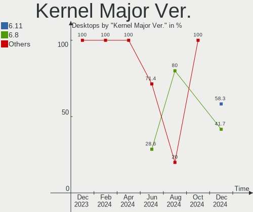
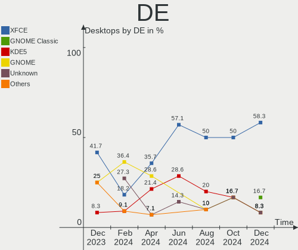
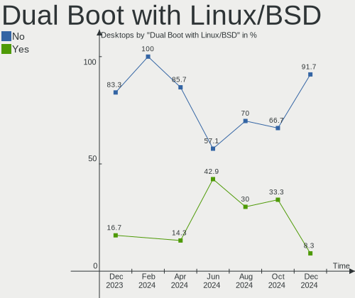
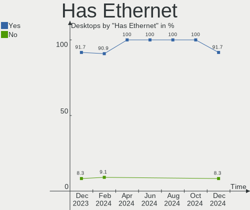
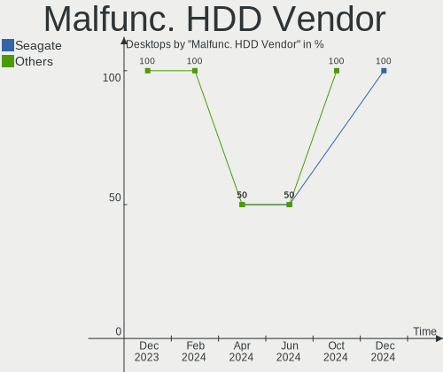
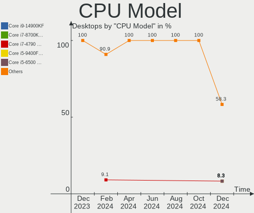
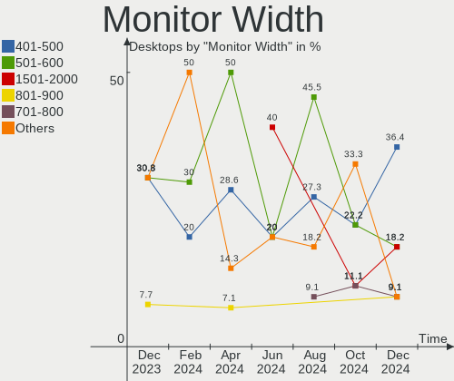
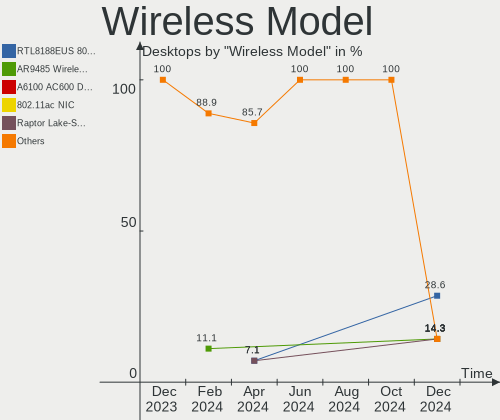

Kali - Hardware Trends (Desktops)
---------------------------------

A project to identify most popular hardware characteristics and track their change
over time based on data collected by Linux users at https://Linux-Hardware.org.

Anyone can contribute to this report by the [hw-probe](https://github.com/linuxhw/hw-probe) tool:

    sudo -E hw-probe -all -upload

This report is for one last month. Overall report since the beginning of time: [TestDays](https://github.com/linuxhw/TestDays)

Period: Aug, 2023.

Contents
--------

* [ System ](#system)
  - [ OS                       ](#os)
  - [ OS Family                ](#os-family)
  - [ Kernel                   ](#kernel)
  - [ Kernel Family            ](#kernel-family)
  - [ Kernel Major Ver.        ](#kernel-major-ver)
  - [ Arch                     ](#arch)
  - [ DE                       ](#de)
  - [ Display Server           ](#display-server)
  - [ Display Manager          ](#display-manager)
  - [ OS Lang                  ](#os-lang)
  - [ Boot Mode                ](#boot-mode)
  - [ Filesystem               ](#filesystem)
  - [ Part. scheme             ](#part-scheme)
  - [ Dual Boot with Linux/BSD ](#dual-boot-with-linuxbsd)
  - [ Dual Boot (Win)          ](#dual-boot-win)

* [ Board ](#board)
  - [ Vendor                   ](#vendor)
  - [ Model                    ](#model)
  - [ Model Family             ](#model-family)
  - [ MFG Year                 ](#mfg-year)
  - [ Form Factor              ](#form-factor)
  - [ Secure Boot              ](#secure-boot)
  - [ Coreboot                 ](#coreboot)
  - [ RAM Size                 ](#ram-size)
  - [ RAM Used                 ](#ram-used)
  - [ Total Drives             ](#total-drives)
  - [ Has CD-ROM               ](#has-cd-rom)
  - [ Has Ethernet             ](#has-ethernet)
  - [ Has WiFi                 ](#has-wifi)
  - [ Has Bluetooth            ](#has-bluetooth)

* [ Location ](#location)
  - [ Country                  ](#country)
  - [ City                     ](#city)

* [ Drives ](#drives)
  - [ Drive Vendor             ](#drive-vendor)
  - [ Drive Model              ](#drive-model)
  - [ HDD Vendor               ](#hdd-vendor)
  - [ SSD Vendor               ](#ssd-vendor)
  - [ Drive Kind               ](#drive-kind)
  - [ Drive Connector          ](#drive-connector)
  - [ Drive Size               ](#drive-size)
  - [ Space Total              ](#space-total)
  - [ Space Used               ](#space-used)
  - [ Malfunc. Drives          ](#malfunc-drives)
  - [ Malfunc. Drive Vendor    ](#malfunc-drive-vendor)
  - [ Malfunc. HDD Vendor      ](#malfunc-hdd-vendor)
  - [ Malfunc. Drive Kind      ](#malfunc-drive-kind)
  - [ Failed Drives            ](#failed-drives)
  - [ Failed Drive Vendor      ](#failed-drive-vendor)
  - [ Drive Status             ](#drive-status)

* [ Storage controller ](#storage-controller)
  - [ Storage Vendor           ](#storage-vendor)
  - [ Storage Model            ](#storage-model)
  - [ Storage Kind             ](#storage-kind)

* [ Processor ](#processor)
  - [ CPU Vendor               ](#cpu-vendor)
  - [ CPU Model                ](#cpu-model)
  - [ CPU Model Family         ](#cpu-model-family)
  - [ CPU Cores                ](#cpu-cores)
  - [ CPU Sockets              ](#cpu-sockets)
  - [ CPU Threads              ](#cpu-threads)
  - [ CPU Op-Modes             ](#cpu-op-modes)
  - [ CPU Microcode            ](#cpu-microcode)
  - [ CPU Microarch            ](#cpu-microarch)

* [ Graphics ](#graphics)
  - [ GPU Vendor               ](#gpu-vendor)
  - [ GPU Model                ](#gpu-model)
  - [ GPU Combo                ](#gpu-combo)
  - [ GPU Driver               ](#gpu-driver)
  - [ GPU Memory               ](#gpu-memory)

* [ Monitor ](#monitor)
  - [ Monitor Vendor           ](#monitor-vendor)
  - [ Monitor Model            ](#monitor-model)
  - [ Monitor Resolution       ](#monitor-resolution)
  - [ Monitor Diagonal         ](#monitor-diagonal)
  - [ Monitor Width            ](#monitor-width)
  - [ Aspect Ratio             ](#aspect-ratio)
  - [ Monitor Area             ](#monitor-area)
  - [ Pixel Density            ](#pixel-density)
  - [ Multiple Monitors        ](#multiple-monitors)

* [ Network ](#network)
  - [ Net Controller Vendor    ](#net-controller-vendor)
  - [ Net Controller Model     ](#net-controller-model)
  - [ Wireless Vendor          ](#wireless-vendor)
  - [ Wireless Model           ](#wireless-model)
  - [ Ethernet Vendor          ](#ethernet-vendor)
  - [ Ethernet Model           ](#ethernet-model)
  - [ Net Controller Kind      ](#net-controller-kind)
  - [ Used Controller          ](#used-controller)
  - [ NICs                     ](#nics)
  - [ IPv6                     ](#ipv6)

* [ Bluetooth ](#bluetooth)
  - [ Bluetooth Vendor         ](#bluetooth-vendor)
  - [ Bluetooth Model          ](#bluetooth-model)

* [ Sound ](#sound)
  - [ Sound Vendor             ](#sound-vendor)
  - [ Sound Model              ](#sound-model)

* [ Memory ](#memory)
  - [ Memory Vendor            ](#memory-vendor)
  - [ Memory Model             ](#memory-model)
  - [ Memory Kind              ](#memory-kind)
  - [ Memory Form Factor       ](#memory-form-factor)
  - [ Memory Size              ](#memory-size)
  - [ Memory Speed             ](#memory-speed)

* [ Printers & scanners ](#printers--scanners)
  - [ Printer Vendor           ](#printer-vendor)
  - [ Printer Model            ](#printer-model)
  - [ Scanner Vendor           ](#scanner-vendor)
  - [ Scanner Model            ](#scanner-model)

* [ Camera ](#camera)
  - [ Camera Vendor            ](#camera-vendor)
  - [ Camera Model             ](#camera-model)

* [ Security ](#security)
  - [ Fingerprint Vendor       ](#fingerprint-vendor)
  - [ Fingerprint Model        ](#fingerprint-model)
  - [ Chipcard Vendor          ](#chipcard-vendor)
  - [ Chipcard Model           ](#chipcard-model)

* [ Unsupported ](#unsupported)
  - [ Unsupported Devices      ](#unsupported-devices)
  - [ Unsupported Device Types ](#unsupported-device-types)

System
------

OS
--

Installed operating systems

| Name        | Desktops | Percent |
|-------------|----------|---------|
| Kali 2023.3 | 9        | 69.23%  |
| Kali 2023.2 | 4        | 30.77%  |

OS Family
---------

OS without a version

| Name | Desktops | Percent |
|------|----------|---------|
| Kali | 13       | 100%    |

Kernel
------

Version of the Linux kernel

| Version           | Desktops | Percent |
|-------------------|----------|---------|
| 6.3.0-kali1-amd64 | 11       | 84.62%  |
| 6.4.0-kali3-amd64 | 1        | 7.69%   |
| 6.4.0-1-amd64     | 1        | 7.69%   |

Kernel Family
-------------

Linux kernel without a distro release

| Version | Desktops | Percent |
|---------|----------|---------|
| 6.3.0   | 11       | 84.62%  |
| 6.4.0   | 2        | 15.38%  |

Kernel Major Ver.
-----------------

Linux kernel major version

| Version | Desktops | Percent |
|---------|----------|---------|
| 6.3     | 11       | 84.62%  |
| 6.4     | 2        | 15.38%  |

Arch
----

OS architecture (x86_64, i586, etc.)

| Name   | Desktops | Percent |
|--------|----------|---------|
| x86_64 | 13       | 100%    |

DE
--

Desktop Environment

| Name    | Desktops | Percent |
|---------|----------|---------|
| XFCE    | 6        | 46.15%  |
| KDE5    | 4        | 30.77%  |
| MATE    | 1        | 7.69%   |
| GNOME   | 1        | 7.69%   |
| Unknown | 1        | 7.69%   |

Display Server
--------------

X11 or Wayland

| Name    | Desktops | Percent |
|---------|----------|---------|
| X11     | 11       | 84.62%  |
| Wayland | 2        | 15.38%  |

Display Manager
---------------

SDDM, LightDM, etc.

| Name    | Desktops | Percent |
|---------|----------|---------|
| Unknown | 7        | 53.85%  |
| SDDM    | 3        | 23.08%  |
| LightDM | 3        | 23.08%  |

OS Lang
-------

Language

| Lang    | Desktops | Percent |
|---------|----------|---------|
| en_US   | 7        | 53.85%  |
| C       | 2        | 15.38%  |
| Unknown | 2        | 15.38%  |
| en_AU   | 1        | 7.69%   |
| de_DE   | 1        | 7.69%   |

Boot Mode
---------

EFI or BIOS

| Mode | Desktops | Percent |
|------|----------|---------|
| EFI  | 8        | 61.54%  |
| BIOS | 5        | 38.46%  |

Filesystem
----------

Type of filesystem

| Type | Desktops | Percent |
|------|----------|---------|
| Ext4 | 13       | 100%    |

Part. scheme
------------

Scheme of partitioning

| Type    | Desktops | Percent |
|---------|----------|---------|
| GPT     | 6        | 46.15%  |
| Unknown | 6        | 46.15%  |
| MBR     | 1        | 7.69%   |

Dual Boot with Linux/BSD
------------------------

Hosting more than one Linux/BSD

| Dual boot | Desktops | Percent |
|-----------|----------|---------|
| No        | 12       | 92.31%  |
| Yes       | 1        | 7.69%   |

Dual Boot (Win)
---------------

Hosting Linux and Windows

| Dual boot | Desktops | Percent |
|-----------|----------|---------|
| No        | 9        | 69.23%  |
| Yes       | 4        | 30.77%  |

Board
-----

Vendor
------

Motherboard manufacturer

| Name                | Desktops | Percent |
|---------------------|----------|---------|
| ASUSTek Computer    | 4        | 30.77%  |
| MSI                 | 2        | 15.38%  |
| Hewlett-Packard     | 2        | 15.38%  |
| Lenovo              | 1        | 7.69%   |
| Gigabyte Technology | 1        | 7.69%   |
| Dell                | 1        | 7.69%   |
| Alienware           | 1        | 7.69%   |
| Acer                | 1        | 7.69%   |

Model
-----

Motherboard model

| Name                               | Desktops | Percent |
|------------------------------------|----------|---------|
| MSI MS-7D15                        | 1        | 7.69%   |
| MSI MS-7C95                        | 1        | 7.69%   |
| Lenovo ThinkCentre M900 10FM001JUS | 1        | 7.69%   |
| HP Pavilion Desktop TP01-2xxx      | 1        | 7.69%   |
| HP EliteDesk 800 G2 DM 35W         | 1        | 7.69%   |
| Gigabyte X79-UP4                   | 1        | 7.69%   |
| Dell OptiPlex 3090                 | 1        | 7.69%   |
| ASUS ROG STRIX Z590-F GAMING WIFI  | 1        | 7.69%   |
| ASUS ROG STRIX B550-F GAMING       | 1        | 7.69%   |
| ASUS ROG STRIX B365-G GAMING       | 1        | 7.69%   |
| ASUS PRIME B550M-A                 | 1        | 7.69%   |
| Alienware Aurora R11               | 1        | 7.69%   |
| Acer Veriton X4650G                | 1        | 7.69%   |

Model Family
------------

Motherboard model prefix

| Name               | Desktops | Percent |
|--------------------|----------|---------|
| ASUS ROG           | 3        | 23.08%  |
| MSI MS-7D15        | 1        | 7.69%   |
| MSI MS-7C95        | 1        | 7.69%   |
| Lenovo ThinkCentre | 1        | 7.69%   |
| HP Pavilion        | 1        | 7.69%   |
| HP EliteDesk       | 1        | 7.69%   |
| Gigabyte X79-UP4   | 1        | 7.69%   |
| Dell OptiPlex      | 1        | 7.69%   |
| ASUS PRIME         | 1        | 7.69%   |
| Alienware Aurora   | 1        | 7.69%   |
| Acer Veriton       | 1        | 7.69%   |

MFG Year
--------

Motherboard manufacture year

| Year | Desktops | Percent |
|------|----------|---------|
| 2021 | 4        | 30.77%  |
| 2020 | 3        | 23.08%  |
| 2022 | 1        | 7.69%   |
| 2019 | 1        | 7.69%   |
| 2017 | 1        | 7.69%   |
| 2016 | 1        | 7.69%   |
| 2015 | 1        | 7.69%   |
| 2012 | 1        | 7.69%   |

Form Factor
-----------

Physical design of the computer

| Name    | Desktops | Percent |
|---------|----------|---------|
| Desktop | 13       | 100%    |

Secure Boot
-----------

Enabled or disabled

| State    | Desktops | Percent |
|----------|----------|---------|
| Disabled | 13       | 100%    |

Coreboot
--------

Have coreboot on board

| Used | Desktops | Percent |
|------|----------|---------|
| No   | 13       | 100%    |

RAM Size
--------

Total RAM memory

| Size in GB | Desktops | Percent |
|------------|----------|---------|
| 32.01-64.0 | 7        | 53.85%  |
| 8.01-16.0  | 3        | 23.08%  |
| 16.01-24.0 | 2        | 15.38%  |
| 4.01-8.0   | 1        | 7.69%   |

RAM Used
--------

Used RAM memory

| Used GB   | Desktops | Percent |
|-----------|----------|---------|
| 3.01-4.0  | 3        | 23.08%  |
| 2.01-3.0  | 3        | 23.08%  |
| 4.01-8.0  | 2        | 15.38%  |
| 1.01-2.0  | 2        | 15.38%  |
| 8.01-16.0 | 2        | 15.38%  |
| 0.51-1.0  | 1        | 7.69%   |

Total Drives
------------

Number of drives on board

| Drives | Desktops | Percent |
|--------|----------|---------|
| 1      | 5        | 38.46%  |
| 2      | 4        | 30.77%  |
| 5      | 2        | 15.38%  |
| 4      | 1        | 7.69%   |
| 3      | 1        | 7.69%   |

Has CD-ROM
----------

Has CD-ROM on board

| Presented | Desktops | Percent |
|-----------|----------|---------|
| No        | 11       | 84.62%  |
| Yes       | 2        | 15.38%  |

Has Ethernet
------------

Has Ethernet on board

| Presented | Desktops | Percent |
|-----------|----------|---------|
| Yes       | 12       | 92.31%  |
| No        | 1        | 7.69%   |

Has WiFi
--------

Has WiFi module

| Presented | Desktops | Percent |
|-----------|----------|---------|
| Yes       | 9        | 69.23%  |
| No        | 4        | 30.77%  |

Has Bluetooth
-------------

Has Bluetooth module

| Presented | Desktops | Percent |
|-----------|----------|---------|
| Yes       | 9        | 69.23%  |
| No        | 4        | 30.77%  |

Location
--------

Country
-------

Geographic location (country)

| Country     | Desktops | Percent |
|-------------|----------|---------|
| USA         | 7        | 53.85%  |
| UK          | 1        | 7.69%   |
| Spain       | 1        | 7.69%   |
| Netherlands | 1        | 7.69%   |
| Germany     | 1        | 7.69%   |
| France      | 1        | 7.69%   |
| Australia   | 1        | 7.69%   |

City
----

Geographic location (city)

| City       | Desktops | Percent |
|------------|----------|---------|
| Zaragoza   | 1        | 7.69%   |
| Zaandam    | 1        | 7.69%   |
| Reinbek    | 1        | 7.69%   |
| Paris      | 1        | 7.69%   |
| Omaha      | 1        | 7.69%   |
| Muskego    | 1        | 7.69%   |
| Hollywood  | 1        | 7.69%   |
| Fort Worth | 1        | 7.69%   |
| Denver     | 1        | 7.69%   |
| Corona     | 1        | 7.69%   |
| Canberra   | 1        | 7.69%   |
| Birmingham | 1        | 7.69%   |
| Atlanta    | 1        | 7.69%   |

Drives
------

Drive Vendor
------------

Hard drive vendors

| Vendor              | Desktops | Drives | Percent |
|---------------------|----------|--------|---------|
| Samsung Electronics | 9        | 9      | 32.14%  |
| WDC                 | 4        | 6      | 14.29%  |
| Sandisk             | 3        | 3      | 10.71%  |
| Toshiba             | 2        | 2      | 7.14%   |
| Seagate             | 2        | 2      | 7.14%   |
| Kingston            | 2        | 2      | 7.14%   |
| Unknown             | 1        | 1      | 3.57%   |
| MSI                 | 1        | 1      | 3.57%   |
| Maxtor              | 1        | 1      | 3.57%   |
| Intel               | 1        | 1      | 3.57%   |
| Crucial             | 1        | 1      | 3.57%   |
| Best Buy            | 1        | 1      | 3.57%   |

Drive Model
-----------

Hard drive models

| Model                                                | Desktops | Percent |
|------------------------------------------------------|----------|---------|
| WDC WDS100T2B0A-00SM50 1TB SSD                       | 1        | 3.33%   |
| WDC WD40EFAX-68JH4N0 4TB                             | 1        | 3.33%   |
| WDC WD360GD-00FLC0 37GB                              | 1        | 3.33%   |
| WDC WD2000FYYZ-01UL1B2 2TB                           | 1        | 3.33%   |
| WDC WD15EADS-00P8B0 1TB                              | 1        | 3.33%   |
| WDC PC SN530 SDBPNPZ-1T00-1006 1TB                   | 1        | 3.33%   |
| Unknown SD/MMC/MS PRO 1GB                            | 1        | 3.33%   |
| Toshiba HDWR160 6TB                                  | 1        | 3.33%   |
| Toshiba DT01ACA200 2TB                               | 1        | 3.33%   |
| Seagate ST5000LM000-2AN170 5TB                       | 1        | 3.33%   |
| Seagate ST3250820AS 250GB                            | 1        | 3.33%   |
| Sandisk WD_BLACK SN850X 1000GB                       | 1        | 3.33%   |
| Sandisk WD Blue SN550 NVMe SSD 250GB                 | 1        | 3.33%   |
| SanDisk NVMe SSD Drive 500GB                         | 1        | 3.33%   |
| Samsung SSD 980 PRO 1TB                              | 1        | 3.33%   |
| Samsung SSD 980 1TB                                  | 1        | 3.33%   |
| Samsung SSD 850 EVO 500GB                            | 1        | 3.33%   |
| Samsung SSD 840 EVO 120GB                            | 1        | 3.33%   |
| Samsung PSSD T7 500GB                                | 1        | 3.33%   |
| Samsung NVMe SSD Controller SM961/PM961/SM963 1024GB | 1        | 3.33%   |
| Samsung MZALQ512HBLU-00BL2 512GB                     | 1        | 3.33%   |
| Samsung MZ7TY128HDHP-000L1 128GB SSD                 | 1        | 3.33%   |
| Samsung MZ7LM960HCHP-00003 960GB SSD                 | 1        | 3.33%   |
| MSI M390 1TB                                         | 1        | 3.33%   |
| Maxtor 6L250S0 256GB                                 | 1        | 3.33%   |
| Kingston SV300S37A120G 120GB SSD                     | 1        | 3.33%   |
| Kingston SUV400S37120G 120GB SSD                     | 1        | 3.33%   |
| Intel SSDPEKKW256G7 256GB                            | 1        | 3.33%   |
| Crucial CT240BX500SSD1 240GB                         | 1        | 3.33%   |
| Best Buy NS-PCNVMEHDE(-C) 1024GB                     | 1        | 3.33%   |

HDD Vendor
----------

Hard disk drive vendors

| Vendor  | Desktops | Drives | Percent |
|---------|----------|--------|---------|
| WDC     | 3        | 4      | 33.33%  |
| Toshiba | 2        | 2      | 22.22%  |
| Seagate | 2        | 2      | 22.22%  |
| Unknown | 1        | 1      | 11.11%  |
| Maxtor  | 1        | 1      | 11.11%  |

SSD Vendor
----------

Solid state drive vendors

| Vendor              | Desktops | Drives | Percent |
|---------------------|----------|--------|---------|
| Samsung Electronics | 5        | 5      | 55.56%  |
| Kingston            | 2        | 2      | 22.22%  |
| WDC                 | 1        | 1      | 11.11%  |
| Crucial             | 1        | 1      | 11.11%  |

Drive Kind
----------

HDD or SSD

| Kind    | Desktops | Drives | Percent |
|---------|----------|--------|---------|
| NVMe    | 10       | 10     | 43.48%  |
| SSD     | 6        | 9      | 26.09%  |
| HDD     | 6        | 10     | 26.09%  |
| Unknown | 1        | 1      | 4.35%   |

Drive Connector
---------------

SATA, SAS, NVMe, etc.

| Type | Desktops | Drives | Percent |
|------|----------|--------|---------|
| NVMe | 10       | 10     | 47.62%  |
| SATA | 9        | 17     | 42.86%  |
| SAS  | 2        | 3      | 9.52%   |

Drive Size
----------

Size of hard drive

| Size in TB | Desktops | Drives | Percent |
|------------|----------|--------|---------|
| 0.01-0.5   | 8        | 11     | 50%     |
| 0.51-1.0   | 3        | 3      | 18.75%  |
| 1.01-2.0   | 2        | 2      | 12.5%   |
| 4.01-10.0  | 2        | 2      | 12.5%   |
| 3.01-4.0   | 1        | 1      | 6.25%   |

Space Total
-----------

Amount of disk space available on the file system

| Size in GB     | Desktops | Percent |
|----------------|----------|---------|
| 101-250        | 4        | 30.77%  |
| 501-1000       | 3        | 23.08%  |
| More than 3000 | 2        | 15.38%  |
| 51-100         | 2        | 15.38%  |
| 1001-2000      | 1        | 7.69%   |
| Unknown        | 1        | 7.69%   |

Space Used
----------

Amount of used disk space

| Used GB        | Desktops | Percent |
|----------------|----------|---------|
| 21-50          | 3        | 23.08%  |
| 1-20           | 3        | 23.08%  |
| 251-500        | 2        | 15.38%  |
| More than 3000 | 1        | 7.69%   |
| 1001-2000      | 1        | 7.69%   |
| 501-1000       | 1        | 7.69%   |
| 51-100         | 1        | 7.69%   |
| Unknown        | 1        | 7.69%   |

Malfunc. Drives
---------------

Drive models with a malfunction

| Model                            | Desktops | Drives | Percent |
|----------------------------------|----------|--------|---------|
| WDC WD40EFAX-68JH4N0 4TB         | 1        | 1      | 50%     |
| Kingston SUV400S37120G 120GB SSD | 1        | 1      | 50%     |

Malfunc. Drive Vendor
---------------------

Vendors of faulty drives

| Vendor   | Desktops | Drives | Percent |
|----------|----------|--------|---------|
| WDC      | 1        | 1      | 50%     |
| Kingston | 1        | 1      | 50%     |

Malfunc. HDD Vendor
-------------------

Vendors of faulty HDD drives

| Vendor | Desktops | Drives | Percent |
|--------|----------|--------|---------|
| WDC    | 1        | 1      | 100%    |

Malfunc. Drive Kind
-------------------

Kinds of faulty drives

| Kind | Desktops | Drives | Percent |
|------|----------|--------|---------|
| SSD  | 1        | 1      | 50%     |
| HDD  | 1        | 1      | 50%     |

Failed Drives
-------------

Failed drive models

Zero info for selected period =(

Failed Drive Vendor
-------------------

Failed drive vendors

Zero info for selected period =(

Drive Status
------------

Number of failed and malfunc. drives

| Status   | Desktops | Drives | Percent |
|----------|----------|--------|---------|
| Detected | 8        | 17     | 47.06%  |
| Works    | 7        | 11     | 41.18%  |
| Malfunc  | 2        | 2      | 11.76%  |

Storage controller
------------------

Storage Vendor
--------------

Storage controller vendors

| Vendor                   | Desktops | Percent |
|--------------------------|----------|---------|
| Intel                    | 9        | 40.91%  |
| Sandisk                  | 4        | 18.18%  |
| Samsung Electronics      | 4        | 18.18%  |
| AMD                      | 4        | 18.18%  |
| Marvell Technology Group | 1        | 4.55%   |

Storage Model
-------------

Storage controller models

| Model                                                                         | Desktops | Percent |
|-------------------------------------------------------------------------------|----------|---------|
| AMD 500 Series Chipset SATA Controller                                        | 3        | 12%     |
| SanDisk WD Blue SN550 NVMe SSD                                                | 2        | 8%      |
| Samsung NVMe SSD Controller 980                                               | 2        | 8%      |
| Intel Q170/Q150/B150/H170/H110/Z170/CM236 Chipset SATA Controller [AHCI Mode] | 2        | 8%      |
| Intel Comet Lake SATA AHCI Controller                                         | 2        | 8%      |
| Intel 500 Series Chipset Family SATA AHCI Controller                          | 2        | 8%      |
| Intel 200 Series PCH SATA controller [AHCI mode]                              | 2        | 8%      |
| Sandisk Western Digital WD Black SN850X NVMe SSD                              | 1        | 4%      |
| SanDisk WD Black SN770 / PC SN740 256GB / PC SN560 (DRAM-less) NVMe SSD       | 1        | 4%      |
| Samsung NVMe SSD Controller SM961/PM961/SM963                                 | 1        | 4%      |
| Samsung NVMe SSD Controller PM9A1/PM9A3/980PRO                                | 1        | 4%      |
| Marvell Group 88SE9172 SATA 6Gb/s Controller                                  | 1        | 4%      |
| Intel SSD 600P Series                                                         | 1        | 4%      |
| Intel C600/X79 series chipset 6-Port SATA AHCI Controller                     | 1        | 4%      |
| AMD FCH SATA Controller [RAID Bottom]                                         | 1        | 4%      |
| AMD FCH SATA Controller [AHCI mode]                                           | 1        | 4%      |
| AMD 400 Series Chipset SATA Controller                                        | 1        | 4%      |

Storage Kind
------------

Kind of storage controller (IDE, SATA, NVMe, SAS, ...)

| Kind | Desktops | Percent |
|------|----------|---------|
| SATA | 13       | 56.52%  |
| NVMe | 10       | 43.48%  |

Processor
---------

CPU Vendor
----------

Processor vendors

| Vendor | Desktops | Percent |
|--------|----------|---------|
| Intel  | 9        | 69.23%  |
| AMD    | 4        | 30.77%  |

CPU Model
---------

Processor models

| Model                                   | Desktops | Percent |
|-----------------------------------------|----------|---------|
| Intel Core i9-10900KF CPU @ 3.70GHz     | 1        | 7.69%   |
| Intel Core i7-6700T CPU @ 2.80GHz       | 1        | 7.69%   |
| Intel Core i7-3820 CPU @ 3.60GHz        | 1        | 7.69%   |
| Intel Core i5-7400 CPU @ 3.00GHz        | 1        | 7.69%   |
| Intel Core i5-6500T CPU @ 2.50GHz       | 1        | 7.69%   |
| Intel Core i3-9100 CPU @ 3.60GHz        | 1        | 7.69%   |
| Intel Core i3-10105T CPU @ 3.00GHz      | 1        | 7.69%   |
| Intel 11th Gen Core i9-11900K @ 3.50GHz | 1        | 7.69%   |
| Intel 11th Gen Core i5-11400 @ 2.60GHz  | 1        | 7.69%   |
| AMD Ryzen 9 5950X 16-Core Processor     | 1        | 7.69%   |
| AMD Ryzen 7 5700G with Radeon Graphics  | 1        | 7.69%   |
| AMD Ryzen 5 5600X 6-Core Processor      | 1        | 7.69%   |
| AMD Ryzen 5 5600G with Radeon Graphics  | 1        | 7.69%   |

CPU Model Family
----------------

Processor model prefix

| Model         | Desktops | Percent |
|---------------|----------|---------|
| Other         | 2        | 15.38%  |
| Intel Core i7 | 2        | 15.38%  |
| Intel Core i5 | 2        | 15.38%  |
| Intel Core i3 | 2        | 15.38%  |
| AMD Ryzen 5   | 2        | 15.38%  |
| Intel Core i9 | 1        | 7.69%   |
| AMD Ryzen 9   | 1        | 7.69%   |
| AMD Ryzen 7   | 1        | 7.69%   |

CPU Cores
---------

Number of processor cores

| Number | Desktops | Percent |
|--------|----------|---------|
| 4      | 5        | 38.46%  |
| 6      | 3        | 23.08%  |
| 8      | 2        | 15.38%  |
| 16     | 1        | 7.69%   |
| 10     | 1        | 7.69%   |
| 1      | 1        | 7.69%   |

CPU Sockets
-----------

Number of sockets

| Number | Desktops | Percent |
|--------|----------|---------|
| 1      | 13       | 100%    |

CPU Threads
-----------

Threads per core (Hyper-Threading)

| Number | Desktops | Percent |
|--------|----------|---------|
| 2      | 9        | 69.23%  |
| 1      | 4        | 30.77%  |

CPU Op-Modes
------------

CPU Operation Modes (32-bit, 64-bit)

| Op mode        | Desktops | Percent |
|----------------|----------|---------|
| 32-bit, 64-bit | 13       | 100%    |

CPU Microcode
-------------

Microcode number

| Number     | Desktops | Percent |
|------------|----------|---------|
| Unknown    | 9        | 69.23%  |
| 0x0a50000d | 2        | 15.38%  |
| 0x0a20120a | 1        | 7.69%   |
| 0x00000000 | 1        | 7.69%   |

CPU Microarch
-------------

Microarchitecture

| Name        | Desktops | Percent |
|-------------|----------|---------|
| Zen 3       | 4        | 30.77%  |
| Skylake     | 2        | 15.38%  |
| KabyLake    | 2        | 15.38%  |
| CometLake   | 2        | 15.38%  |
| SandyBridge | 1        | 7.69%   |
| Icelake     | 1        | 7.69%   |
| Unknown     | 1        | 7.69%   |

Graphics
--------

GPU Vendor
----------

Vendors of graphics cards

| Vendor | Desktops | Percent |
|--------|----------|---------|
| Nvidia | 6        | 46.15%  |
| Intel  | 5        | 38.46%  |
| AMD    | 2        | 15.38%  |

GPU Model
---------

Graphics card models

| Model                                                        | Desktops | Percent |
|--------------------------------------------------------------|----------|---------|
| Intel HD Graphics 530                                        | 2        | 15.38%  |
| Nvidia TU116 [GeForce GTX 1650 SUPER]                        | 1        | 7.69%   |
| Nvidia GF108 [GeForce GT 440]                                | 1        | 7.69%   |
| Nvidia GA106 [GeForce RTX 3060 Lite Hash Rate]               | 1        | 7.69%   |
| Nvidia GA106 [Geforce RTX 3050]                              | 1        | 7.69%   |
| Nvidia GA102 [GeForce RTX 3080]                              | 1        | 7.69%   |
| Nvidia AD103 [GeForce RTX 4080]                              | 1        | 7.69%   |
| Intel RocketLake-S GT1 [UHD Graphics 730]                    | 1        | 7.69%   |
| Intel HD Graphics 630                                        | 1        | 7.69%   |
| Intel CometLake-S GT2 [UHD Graphics 630]                     | 1        | 7.69%   |
| AMD Ellesmere [Radeon RX 470/480/570/570X/580/580X/590]      | 1        | 7.69%   |
| AMD Cezanne [Radeon Vega Series / Radeon Vega Mobile Series] | 1        | 7.69%   |

GPU Combo
---------

Combinations of graphics cards

| Name       | Desktops | Percent |
|------------|----------|---------|
| 1 x Nvidia | 6        | 46.15%  |
| 1 x Intel  | 5        | 38.46%  |
| 1 x AMD    | 2        | 15.38%  |

GPU Driver
----------

Free vs proprietary

| Driver      | Desktops | Percent |
|-------------|----------|---------|
| Free        | 7        | 53.85%  |
| Proprietary | 5        | 38.46%  |
| Unknown     | 1        | 7.69%   |

GPU Memory
----------

Total video memory

| Size in GB | Desktops | Percent |
|------------|----------|---------|
| Unknown    | 7        | 53.85%  |
| 8.01-16.0  | 3        | 23.08%  |
| 7.01-8.0   | 2        | 15.38%  |
| 0.01-0.5   | 1        | 7.69%   |

Monitor
-------

Monitor Vendor
--------------

Monitor vendors

| Vendor              | Desktops | Percent |
|---------------------|----------|---------|
| Samsung Electronics | 3        | 23.08%  |
| Philips             | 2        | 15.38%  |
| Dell                | 2        | 15.38%  |
| Vestel              | 1        | 7.69%   |
| Toshiba             | 1        | 7.69%   |
| Hewlett-Packard     | 1        | 7.69%   |
| AOC                 | 1        | 7.69%   |
| Acer                | 1        | 7.69%   |
| Unknown             | 1        | 7.69%   |

Monitor Model
-------------

Monitor models

| Model                                                             | Desktops | Percent |
|-------------------------------------------------------------------|----------|---------|
| Vestel LCD Monitor 50UHD_LCD_TV 3840x2160                         | 1        | 7.69%   |
| Toshiba SANTEC SLM LCD1000 1920x1080 708x398mm 32.0-inch          | 1        | 7.69%   |
| Samsung Electronics S24E450 SAM0C80 1920x1080 520x290mm 23.4-inch | 1        | 7.69%   |
| Samsung Electronics LCD Monitor SAM03A7 1920x540                  | 1        | 7.69%   |
| Samsung Electronics LC27T55 SAM701E 1920x1080 609x349mm 27.6-inch | 1        | 7.69%   |
| Philips PHL 276E8V PHLC18F 3840x2160 600x340mm 27.2-inch          | 1        | 7.69%   |
| Philips FTV PHL01EA 1920x1080 1440x810mm 65.0-inch                | 1        | 7.69%   |
| Hewlett-Packard E201 HWP305C 1600x900 443x249mm 20.0-inch         | 1        | 7.69%   |
| Dell P2312H DEL4077 1920x1080 510x287mm 23.0-inch                 | 1        | 7.69%   |
| Dell LCD Monitor U2718Q 3840x2160                                 | 1        | 7.69%   |
| AOC 2043 AOC2043 1600x900 440x250mm 19.9-inch                     | 1        | 7.69%   |
| Acer LCD Monitor XB273 GX 4480x1440                               | 1        | 7.69%   |
| Unknown                                                           | 1        | 7.69%   |

Monitor Resolution
------------------

Monitor screen resolution

| Resolution      | Desktops | Percent |
|-----------------|----------|---------|
| 1920x1080 (FHD) | 5        | 38.46%  |
| 3840x2160 (4K)  | 3        | 23.08%  |
| 1600x900 (HD+)  | 2        | 15.38%  |
| 4480x1440       | 1        | 7.69%   |
| 1920x540        | 1        | 7.69%   |
| Unknown         | 1        | 7.69%   |

Monitor Diagonal
----------------

Diagonal size in inches

| Inches  | Desktops | Percent |
|---------|----------|---------|
| Unknown | 3        | 25%     |
| 27      | 2        | 16.67%  |
| 23      | 2        | 16.67%  |
| 72      | 1        | 8.33%   |
| 65      | 1        | 8.33%   |
| 32      | 1        | 8.33%   |
| 20      | 1        | 8.33%   |
| 19      | 1        | 8.33%   |

Monitor Width
-------------

Physical width

| Width in mm | Desktops | Percent |
|-------------|----------|---------|
| 501-600     | 3        | 25%     |
| Unknown     | 3        | 25%     |
| 401-500     | 2        | 16.67%  |
| 701-800     | 1        | 8.33%   |
| 601-700     | 1        | 8.33%   |
| 1501-2000   | 1        | 8.33%   |
| 1001-1500   | 1        | 8.33%   |

Aspect Ratio
------------

Proportional relationship between the width and the height

| Ratio   | Desktops | Percent |
|---------|----------|---------|
| 16/9    | 9        | 75%     |
| Unknown | 3        | 25%     |

Monitor Area
------------

Area in inch²

| Area in inch² | Desktops | Percent |
|----------------|----------|---------|
| Unknown        | 3        | 25%     |
| More than 1000 | 2        | 16.67%  |
| 301-350        | 2        | 16.67%  |
| 201-250        | 2        | 16.67%  |
| 151-200        | 2        | 16.67%  |
| 351-500        | 1        | 8.33%   |

Pixel Density
-------------

Pixels per inch

| Density | Desktops | Percent |
|---------|----------|---------|
| 51-100  | 6        | 50%     |
| Unknown | 3        | 25%     |
| 1-50    | 2        | 16.67%  |
| 161-240 | 1        | 8.33%   |

Multiple Monitors
-----------------

Total monitors connected

| Total | Desktops | Percent |
|-------|----------|---------|
| 1     | 10       | 76.92%  |
| 2     | 3        | 23.08%  |

Network
-------

Net Controller Vendor
---------------------

Controller vendors

| Vendor                | Desktops | Percent |
|-----------------------|----------|---------|
| Intel                 | 9        | 42.86%  |
| Realtek Semiconductor | 8        | 38.1%   |
| Broadcom              | 2        | 9.52%   |
| MediaTek              | 1        | 4.76%   |
| Broadcom Limited      | 1        | 4.76%   |

Net Controller Model
--------------------

Controller models

| Model                                                             | Desktops | Percent |
|-------------------------------------------------------------------|----------|---------|
| Realtek RTL8111/8168/8411 PCI Express Gigabit Ethernet Controller | 5        | 19.23%  |
| Intel Ethernet Controller I225-V                                  | 2        | 7.69%   |
| Realtek RTL8821CE 802.11ac PCIe Wireless Network Adapter          | 1        | 3.85%   |
| Realtek RTL8814AU 802.11a/b/g/n/ac Wireless Adapter               | 1        | 3.85%   |
| Realtek RTL8812AU 802.11a/b/g/n/ac 2T2R DB WLAN Adapter           | 1        | 3.85%   |
| Realtek RTL8153 Gigabit Ethernet Adapter                          | 1        | 3.85%   |
| Realtek RTL8125 2.5GbE Controller                                 | 1        | 3.85%   |
| Realtek Killer E3000 2.5GbE Controller                            | 1        | 3.85%   |
| MediaTek moto g22                                                 | 1        | 3.85%   |
| Intel Wireless 8260                                               | 1        | 3.85%   |
| Intel Wi-Fi 6 AX210/AX211/AX411 160MHz                            | 1        | 3.85%   |
| Intel Ethernet Connection (2) I219-V                              | 1        | 3.85%   |
| Intel Ethernet Connection (2) I219-LM                             | 1        | 3.85%   |
| Intel Ethernet Connection (11) I219-LM                            | 1        | 3.85%   |
| Intel Ethernet Connection (10) I219-V                             | 1        | 3.85%   |
| Intel Dual Band Wireless-AC 3168NGW [Stone Peak]                  | 1        | 3.85%   |
| Intel Comet Lake PCH CNVi WiFi                                    | 1        | 3.85%   |
| Intel 82579LM Gigabit Network Connection (Lewisville)             | 1        | 3.85%   |
| Broadcom Limited BCM4360 802.11ac Wireless Network Adapter        | 1        | 3.85%   |
| Broadcom BCM4360 802.11ac Wireless Network Adapter                | 1        | 3.85%   |
| Broadcom BCM43225 802.11b/g/n                                     | 1        | 3.85%   |

Wireless Vendor
---------------

Wireless vendors

| Vendor                | Desktops | Percent |
|-----------------------|----------|---------|
| Intel                 | 4        | 44.44%  |
| Realtek Semiconductor | 2        | 22.22%  |
| Broadcom              | 2        | 22.22%  |
| Broadcom Limited      | 1        | 11.11%  |

Wireless Model
--------------

Wireless models

| Model                                                      | Desktops | Percent |
|------------------------------------------------------------|----------|---------|
| Realtek RTL8821CE 802.11ac PCIe Wireless Network Adapter   | 1        | 10%     |
| Realtek RTL8814AU 802.11a/b/g/n/ac Wireless Adapter        | 1        | 10%     |
| Realtek RTL8812AU 802.11a/b/g/n/ac 2T2R DB WLAN Adapter    | 1        | 10%     |
| Intel Wireless 8260                                        | 1        | 10%     |
| Intel Wi-Fi 6 AX210/AX211/AX411 160MHz                     | 1        | 10%     |
| Intel Dual Band Wireless-AC 3168NGW [Stone Peak]           | 1        | 10%     |
| Intel Comet Lake PCH CNVi WiFi                             | 1        | 10%     |
| Broadcom Limited BCM4360 802.11ac Wireless Network Adapter | 1        | 10%     |
| Broadcom BCM4360 802.11ac Wireless Network Adapter         | 1        | 10%     |
| Broadcom BCM43225 802.11b/g/n                              | 1        | 10%     |

Ethernet Vendor
---------------

Ethernet vendors

| Vendor                | Desktops | Percent |
|-----------------------|----------|---------|
| Realtek Semiconductor | 7        | 46.67%  |
| Intel                 | 7        | 46.67%  |
| MediaTek              | 1        | 6.67%   |

Ethernet Model
--------------

Ethernet models

| Model                                                             | Desktops | Percent |
|-------------------------------------------------------------------|----------|---------|
| Realtek RTL8111/8168/8411 PCI Express Gigabit Ethernet Controller | 5        | 31.25%  |
| Intel Ethernet Controller I225-V                                  | 2        | 12.5%   |
| Realtek RTL8153 Gigabit Ethernet Adapter                          | 1        | 6.25%   |
| Realtek RTL8125 2.5GbE Controller                                 | 1        | 6.25%   |
| Realtek Killer E3000 2.5GbE Controller                            | 1        | 6.25%   |
| MediaTek moto g22                                                 | 1        | 6.25%   |
| Intel Ethernet Connection (2) I219-V                              | 1        | 6.25%   |
| Intel Ethernet Connection (2) I219-LM                             | 1        | 6.25%   |
| Intel Ethernet Connection (11) I219-LM                            | 1        | 6.25%   |
| Intel Ethernet Connection (10) I219-V                             | 1        | 6.25%   |
| Intel 82579LM Gigabit Network Connection (Lewisville)             | 1        | 6.25%   |

Net Controller Kind
-------------------

Ethernet, WiFi or modem

| Kind     | Desktops | Percent |
|----------|----------|---------|
| Ethernet | 12       | 57.14%  |
| WiFi     | 9        | 42.86%  |

Used Controller
---------------

Currently used network controller

| Kind     | Desktops | Percent |
|----------|----------|---------|
| Ethernet | 11       | 64.71%  |
| WiFi     | 6        | 35.29%  |

NICs
----

Total network controllers on board

| Total | Desktops | Percent |
|-------|----------|---------|
| 2     | 8        | 61.54%  |
| 1     | 3        | 23.08%  |
| 3     | 1        | 7.69%   |
| 0     | 1        | 7.69%   |

IPv6
----

IPv6 vs IPv4

| Used | Desktops | Percent |
|------|----------|---------|
| No   | 9        | 69.23%  |
| Yes  | 4        | 30.77%  |

Bluetooth
---------

Bluetooth Vendor
----------------

Controller vendors

| Vendor                | Desktops | Percent |
|-----------------------|----------|---------|
| Intel                 | 4        | 44.44%  |
| Realtek Semiconductor | 3        | 33.33%  |
| Realtek               | 1        | 11.11%  |
| Apple                 | 1        | 11.11%  |

Bluetooth Model
---------------

Controller models

| Model                              | Desktops | Percent |
|------------------------------------|----------|---------|
| Realtek Bluetooth Radio            | 3        | 33.33%  |
| Realtek Bluetooth Radio            | 1        | 11.11%  |
| Intel Bluetooth wireless interface | 1        | 11.11%  |
| Intel Bluetooth Device             | 1        | 11.11%  |
| Intel AX210 Bluetooth              | 1        | 11.11%  |
| Intel AX201 Bluetooth              | 1        | 11.11%  |
| Apple Bluetooth Host Controller    | 1        | 11.11%  |

Sound
-----

Sound Vendor
------------

Sound card vendors

| Vendor           | Desktops | Percent |
|------------------|----------|---------|
| Intel            | 9        | 40.91%  |
| Nvidia           | 6        | 27.27%  |
| AMD              | 5        | 22.73%  |
| Tenx Technology  | 1        | 4.55%   |
| ASUSTek Computer | 1        | 4.55%   |

Sound Model
-----------

Sound card models

| Model                                                           | Desktops | Percent |
|-----------------------------------------------------------------|----------|---------|
| Nvidia GA106 High Definition Audio Controller                   | 2        | 8.33%   |
| Intel Tiger Lake-H HD Audio Controller                          | 2        | 8.33%   |
| Intel Comet Lake PCH cAVS                                       | 2        | 8.33%   |
| Intel 200 Series PCH HD Audio                                   | 2        | 8.33%   |
| Intel 100 Series/C230 Series Chipset Family HD Audio Controller | 2        | 8.33%   |
| AMD Starship/Matisse HD Audio Controller                        | 2        | 8.33%   |
| AMD Renoir Radeon High Definition Audio Controller              | 2        | 8.33%   |
| AMD Family 17h/19h HD Audio Controller                          | 2        | 8.33%   |
| Tenx Technology USB AUDIO                                       | 1        | 4.17%   |
| Nvidia TU116 High Definition Audio Controller                   | 1        | 4.17%   |
| Nvidia GF108 High Definition Audio Controller                   | 1        | 4.17%   |
| Nvidia GA102 High Definition Audio Controller                   | 1        | 4.17%   |
| Nvidia Audio device                                             | 1        | 4.17%   |
| Intel C600/X79 series chipset High Definition Audio Controller  | 1        | 4.17%   |
| ASUSTek Computer USB Audio                                      | 1        | 4.17%   |
| AMD Ellesmere HDMI Audio [Radeon RX 470/480 / 570/580/590]      | 1        | 4.17%   |

Memory
------

Memory Vendor
-------------

Memory module vendors

| Vendor              | Desktops | Percent |
|---------------------|----------|---------|
| Corsair             | 3        | 37.5%   |
| Micron Technology   | 2        | 25%     |
| SK hynix            | 1        | 12.5%   |
| Samsung Electronics | 1        | 12.5%   |
| G.Skill             | 1        | 12.5%   |

Memory Model
------------

Memory module models

| Model                                                   | Desktops | Percent |
|---------------------------------------------------------|----------|---------|
| SK hynix RAM Module 8GB DIMM DDR4 2133MT/s              | 1        | 11.11%  |
| Samsung RAM M471A1K43BB0-CPB 8GB SODIMM DDR4 2133MT/s   | 1        | 11.11%  |
| Micron RAM Module 8GB DIMM DDR4 2133MT/s                | 1        | 11.11%  |
| Micron RAM 8ATF2G64AZ-3G2F1 16GB DIMM DDR4 3200MT/s     | 1        | 11.11%  |
| G.Skill RAM F4-3200C16-16GIS 16384MB DIMM DDR4 3600MT/s | 1        | 11.11%  |
| Corsair RAM CMW32GX4M2D3600C18 16GB DIMM DDR4 3600MT/s  | 1        | 11.11%  |
| Corsair RAM CMW16GX4M2C3200C16 8GB DIMM DDR4 3733MT/s   | 1        | 11.11%  |
| Corsair RAM CMK32GX4M2B3000C15 16GB DIMM DDR4 3000MT/s  | 1        | 11.11%  |
| Corsair RAM CMK16GX4M2B3200C16 8GB DIMM DDR4 3600MT/s   | 1        | 11.11%  |

Memory Kind
-----------

Memory module kinds

| Kind | Desktops | Percent |
|------|----------|---------|
| DDR4 | 7        | 100%    |

Memory Form Factor
------------------

Physical design of the memory module

| Name   | Desktops | Percent |
|--------|----------|---------|
| DIMM   | 6        | 85.71%  |
| SODIMM | 1        | 14.29%  |

Memory Size
-----------

Memory module size

| Size  | Desktops | Percent |
|-------|----------|---------|
| 16384 | 4        | 57.14%  |
| 8192  | 3        | 42.86%  |

Memory Speed
------------

Memory module speed

| Speed | Desktops | Percent |
|-------|----------|---------|
| 3600  | 3        | 37.5%   |
| 2133  | 2        | 25%     |
| 3733  | 1        | 12.5%   |
| 3200  | 1        | 12.5%   |
| 3000  | 1        | 12.5%   |

Printers & scanners
-------------------

Printer Vendor
--------------

Printer device vendors

Zero info for selected period =(

Printer Model
-------------

Printer device models

Zero info for selected period =(

Scanner Vendor
--------------

Scanner device vendors

Zero info for selected period =(

Scanner Model
-------------

Scanner device models

Zero info for selected period =(

Camera
------

Camera Vendor
-------------

Camera device vendors

| Vendor                        | Desktops | Percent |
|-------------------------------|----------|---------|
| Sunplus Innovation Technology | 1        | 100%    |

Camera Model
------------

Camera device models

| Model                  | Desktops | Percent |
|------------------------|----------|---------|
| Sunplus USB 2.0 Camera | 1        | 100%    |

Security
--------

Fingerprint Vendor
------------------

Fingerprint sensor vendors

Zero info for selected period =(

Fingerprint Model
-----------------

Fingerprint sensor models

Zero info for selected period =(

Chipcard Vendor
---------------

Chipcard module vendors

Zero info for selected period =(

Chipcard Model
--------------

Chipcard module models

Zero info for selected period =(

Unsupported
-----------

Unsupported Devices
-------------------

Total unsupported devices on board

| Total | Desktops | Percent |
|-------|----------|---------|
| 0     | 10       | 76.92%  |
| 1     | 3        | 23.08%  |

Unsupported Device Types
------------------------

Types of unsupported devices

| Type          | Desktops | Percent |
|---------------|----------|---------|
| Graphics card | 2        | 66.67%  |
| Net/wireless  | 1        | 33.33%  |

