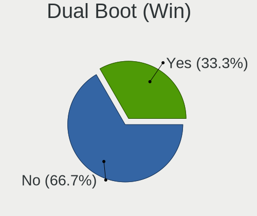
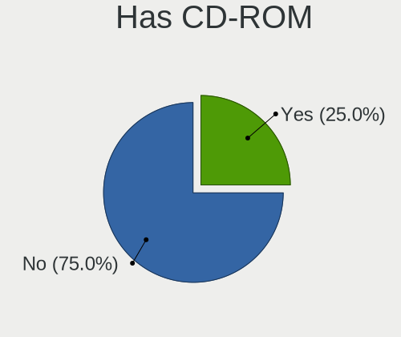
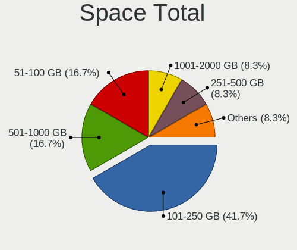
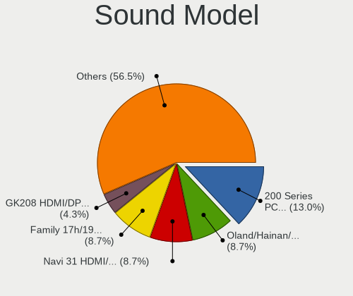

Kali - Hardware Trends (Desktops)
---------------------------------

A project to identify most popular hardware characteristics and track their change
over time based on data collected by Linux users at https://Linux-Hardware.org.

Anyone can contribute to this report by the [hw-probe](https://github.com/linuxhw/hw-probe) tool:

    sudo -E hw-probe -all -upload

This report is for one last month. Overall report since the beginning of time: [TestDays](https://github.com/linuxhw/TestDays)

Period: Apr, 2024.

Contents
--------

* [ System ](#system)
  - [ OS                       ](#os)
  - [ OS Family                ](#os-family)
  - [ Kernel                   ](#kernel)
  - [ Kernel Family            ](#kernel-family)
  - [ Kernel Major Ver.        ](#kernel-major-ver)
  - [ Arch                     ](#arch)
  - [ DE                       ](#de)
  - [ Display Server           ](#display-server)
  - [ Display Manager          ](#display-manager)
  - [ OS Lang                  ](#os-lang)
  - [ Boot Mode                ](#boot-mode)
  - [ Filesystem               ](#filesystem)
  - [ Part. scheme             ](#part-scheme)
  - [ Dual Boot with Linux/BSD ](#dual-boot-with-linuxbsd)
  - [ Dual Boot (Win)          ](#dual-boot-win)

* [ Board ](#board)
  - [ Vendor                   ](#vendor)
  - [ Model                    ](#model)
  - [ Model Family             ](#model-family)
  - [ MFG Year                 ](#mfg-year)
  - [ Form Factor              ](#form-factor)
  - [ Secure Boot              ](#secure-boot)
  - [ Coreboot                 ](#coreboot)
  - [ RAM Size                 ](#ram-size)
  - [ RAM Used                 ](#ram-used)
  - [ Total Drives             ](#total-drives)
  - [ Has CD-ROM               ](#has-cd-rom)
  - [ Has Ethernet             ](#has-ethernet)
  - [ Has WiFi                 ](#has-wifi)
  - [ Has Bluetooth            ](#has-bluetooth)

* [ Location ](#location)
  - [ Country                  ](#country)
  - [ City                     ](#city)

* [ Drives ](#drives)
  - [ Drive Vendor             ](#drive-vendor)
  - [ Drive Model              ](#drive-model)
  - [ HDD Vendor               ](#hdd-vendor)
  - [ SSD Vendor               ](#ssd-vendor)
  - [ Drive Kind               ](#drive-kind)
  - [ Drive Connector          ](#drive-connector)
  - [ Drive Size               ](#drive-size)
  - [ Space Total              ](#space-total)
  - [ Space Used               ](#space-used)
  - [ Malfunc. Drives          ](#malfunc-drives)
  - [ Malfunc. Drive Vendor    ](#malfunc-drive-vendor)
  - [ Malfunc. HDD Vendor      ](#malfunc-hdd-vendor)
  - [ Malfunc. Drive Kind      ](#malfunc-drive-kind)
  - [ Failed Drives            ](#failed-drives)
  - [ Failed Drive Vendor      ](#failed-drive-vendor)
  - [ Drive Status             ](#drive-status)

* [ Storage controller ](#storage-controller)
  - [ Storage Vendor           ](#storage-vendor)
  - [ Storage Model            ](#storage-model)
  - [ Storage Kind             ](#storage-kind)

* [ Processor ](#processor)
  - [ CPU Vendor               ](#cpu-vendor)
  - [ CPU Model                ](#cpu-model)
  - [ CPU Model Family         ](#cpu-model-family)
  - [ CPU Cores                ](#cpu-cores)
  - [ CPU Sockets              ](#cpu-sockets)
  - [ CPU Threads              ](#cpu-threads)
  - [ CPU Op-Modes             ](#cpu-op-modes)
  - [ CPU Microcode            ](#cpu-microcode)
  - [ CPU Microarch            ](#cpu-microarch)

* [ Graphics ](#graphics)
  - [ GPU Vendor               ](#gpu-vendor)
  - [ GPU Model                ](#gpu-model)
  - [ GPU Combo                ](#gpu-combo)
  - [ GPU Driver               ](#gpu-driver)
  - [ GPU Memory               ](#gpu-memory)

* [ Monitor ](#monitor)
  - [ Monitor Vendor           ](#monitor-vendor)
  - [ Monitor Model            ](#monitor-model)
  - [ Monitor Resolution       ](#monitor-resolution)
  - [ Monitor Diagonal         ](#monitor-diagonal)
  - [ Monitor Width            ](#monitor-width)
  - [ Aspect Ratio             ](#aspect-ratio)
  - [ Monitor Area             ](#monitor-area)
  - [ Pixel Density            ](#pixel-density)
  - [ Multiple Monitors        ](#multiple-monitors)

* [ Network ](#network)
  - [ Net Controller Vendor    ](#net-controller-vendor)
  - [ Net Controller Model     ](#net-controller-model)
  - [ Wireless Vendor          ](#wireless-vendor)
  - [ Wireless Model           ](#wireless-model)
  - [ Ethernet Vendor          ](#ethernet-vendor)
  - [ Ethernet Model           ](#ethernet-model)
  - [ Net Controller Kind      ](#net-controller-kind)
  - [ Used Controller          ](#used-controller)
  - [ NICs                     ](#nics)
  - [ IPv6                     ](#ipv6)

* [ Bluetooth ](#bluetooth)
  - [ Bluetooth Vendor         ](#bluetooth-vendor)
  - [ Bluetooth Model          ](#bluetooth-model)

* [ Sound ](#sound)
  - [ Sound Vendor             ](#sound-vendor)
  - [ Sound Model              ](#sound-model)

* [ Memory ](#memory)
  - [ Memory Vendor            ](#memory-vendor)
  - [ Memory Model             ](#memory-model)
  - [ Memory Kind              ](#memory-kind)
  - [ Memory Form Factor       ](#memory-form-factor)
  - [ Memory Size              ](#memory-size)
  - [ Memory Speed             ](#memory-speed)

* [ Printers & scanners ](#printers--scanners)
  - [ Printer Vendor           ](#printer-vendor)
  - [ Printer Model            ](#printer-model)
  - [ Scanner Vendor           ](#scanner-vendor)
  - [ Scanner Model            ](#scanner-model)

* [ Camera ](#camera)
  - [ Camera Vendor            ](#camera-vendor)
  - [ Camera Model             ](#camera-model)

* [ Security ](#security)
  - [ Fingerprint Vendor       ](#fingerprint-vendor)
  - [ Fingerprint Model        ](#fingerprint-model)
  - [ Chipcard Vendor          ](#chipcard-vendor)
  - [ Chipcard Model           ](#chipcard-model)

* [ Unsupported ](#unsupported)
  - [ Unsupported Devices      ](#unsupported-devices)
  - [ Unsupported Device Types ](#unsupported-device-types)

System
------

OS
--

Installed operating systems

| Name        | Desktops | Percent |
|-------------|----------|---------|
| Kali 2024.1 | 14       | 100%    |

OS Family
---------

OS without a version

| Name | Desktops | Percent |
|------|----------|---------|
| Kali | 14       | 100%    |

Kernel
------

Version of the Linux kernel

| Version      | Desktops | Percent |
|--------------|----------|---------|
| 6.6.9-amd64  | 11       | 78.57%  |
| 6.6.15-amd64 | 3        | 21.43%  |

Kernel Family
-------------

Linux kernel without a distro release

| Version | Desktops | Percent |
|---------|----------|---------|
| 6.6.9   | 11       | 78.57%  |
| 6.6.15  | 3        | 21.43%  |

Kernel Major Ver.
-----------------

Linux kernel major version

| Version | Desktops | Percent |
|---------|----------|---------|
| 6.6     | 14       | 100%    |

Arch
----

OS architecture (x86_64, i586, etc.)

| Name   | Desktops | Percent |
|--------|----------|---------|
| x86_64 | 14       | 100%    |

DE
--

Desktop Environment

| Name          | Desktops | Percent |
|---------------|----------|---------|
| XFCE          | 5        | 35.71%  |
| GNOME         | 4        | 28.57%  |
| KDE5          | 3        | 21.43%  |
| GNOME-Classic | 1        | 7.14%   |
| Unknown       | 1        | 7.14%   |

Display Server
--------------

X11 or Wayland

| Name    | Desktops | Percent |
|---------|----------|---------|
| X11     | 13       | 92.86%  |
| Wayland | 1        | 7.14%   |

Display Manager
---------------

SDDM, LightDM, etc.

| Name    | Desktops | Percent |
|---------|----------|---------|
| Unknown | 8        | 57.14%  |
| LightDM | 4        | 28.57%  |
| SDDM    | 2        | 14.29%  |

OS Lang
-------

Language

| Lang    | Desktops | Percent |
|---------|----------|---------|
| C       | 7        | 50%     |
| Unknown | 2        | 14.29%  |
| tr_TR   | 1        | 7.14%   |
| ru_RU   | 1        | 7.14%   |
| en_US   | 1        | 7.14%   |
| de_AT   | 1        | 7.14%   |
| cs_CZ   | 1        | 7.14%   |

Boot Mode
---------

EFI or BIOS

| Mode | Desktops | Percent |
|------|----------|---------|
| BIOS | 7        | 50%     |
| EFI  | 7        | 50%     |

Filesystem
----------

Type of filesystem

| Type  | Desktops | Percent |
|-------|----------|---------|
| Ext4  | 13       | 92.86%  |
| Btrfs | 1        | 7.14%   |

Part. scheme
------------

Scheme of partitioning

| Type    | Desktops | Percent |
|---------|----------|---------|
| Unknown | 7        | 50%     |
| GPT     | 6        | 42.86%  |
| MBR     | 1        | 7.14%   |

Dual Boot with Linux/BSD
------------------------

Hosting more than one Linux/BSD

| Dual boot | Desktops | Percent |
|-----------|----------|---------|
| No        | 12       | 85.71%  |
| Yes       | 2        | 14.29%  |

Dual Boot (Win)
---------------

Hosting Linux and Windows

| Dual boot | Desktops | Percent |
|-----------|----------|---------|
| No        | 10       | 71.43%  |
| Yes       | 4        | 28.57%  |

Board
-----

Vendor
------

Motherboard manufacturer

| Name                | Desktops | Percent |
|---------------------|----------|---------|
| ASUSTek Computer    | 5        | 35.71%  |
| MSI                 | 3        | 21.43%  |
| Hewlett-Packard     | 2        | 14.29%  |
| Pegatron            | 1        | 7.14%   |
| Gigabyte Technology | 1        | 7.14%   |
| Dell                | 1        | 7.14%   |
| ASRock              | 1        | 7.14%   |

Model
-----

Motherboard model

| Name                             | Desktops | Percent |
|----------------------------------|----------|---------|
| Pegatron IPMSB-H61               | 1        | 7.14%   |
| MSI MS-7D99                      | 1        | 7.14%   |
| MSI MS-7C95                      | 1        | 7.14%   |
| MSI MS-7917                      | 1        | 7.14%   |
| HP xw8600 Workstation            | 1        | 7.14%   |
| HP G1-2114la                     | 1        | 7.14%   |
| Gigabyte A620M DS3H              | 1        | 7.14%   |
| Dell OptiPlex 7060               | 1        | 7.14%   |
| ASUS ROG STRIX B550-F GAMING     | 1        | 7.14%   |
| ASUS ROG STRIX B365-G GAMING     | 1        | 7.14%   |
| ASUS PRIME Z590M-PLUS            | 1        | 7.14%   |
| ASUS M2N-MX SE Plus              | 1        | 7.14%   |
| ASUS All Series                  | 1        | 7.14%   |
| ASRock X570 Taichi Razer Edition | 1        | 7.14%   |

Model Family
------------

Motherboard model prefix

| Name               | Desktops | Percent |
|--------------------|----------|---------|
| ASUS ROG           | 2        | 14.29%  |
| Pegatron IPMSB-H61 | 1        | 7.14%   |
| MSI MS-7D99        | 1        | 7.14%   |
| MSI MS-7C95        | 1        | 7.14%   |
| MSI MS-7917        | 1        | 7.14%   |
| HP xw8600          | 1        | 7.14%   |
| HP G1-2114la       | 1        | 7.14%   |
| Gigabyte A620M     | 1        | 7.14%   |
| Dell OptiPlex      | 1        | 7.14%   |
| ASUS PRIME         | 1        | 7.14%   |
| ASUS M2N-MX        | 1        | 7.14%   |
| ASUS All           | 1        | 7.14%   |
| ASRock X570        | 1        | 7.14%   |

MFG Year
--------

Motherboard manufacture year

| Year | Desktops | Percent |
|------|----------|---------|
| 2023 | 2        | 14.29%  |
| 2021 | 2        | 14.29%  |
| 2020 | 2        | 14.29%  |
| 2014 | 2        | 14.29%  |
| 2022 | 1        | 7.14%   |
| 2019 | 1        | 7.14%   |
| 2011 | 1        | 7.14%   |
| 2010 | 1        | 7.14%   |
| 2008 | 1        | 7.14%   |
| 2006 | 1        | 7.14%   |

Form Factor
-----------

Physical design of the computer

| Name    | Desktops | Percent |
|---------|----------|---------|
| Desktop | 14       | 100%    |

Secure Boot
-----------

Enabled or disabled

| State    | Desktops | Percent |
|----------|----------|---------|
| Disabled | 14       | 100%    |

Coreboot
--------

Have coreboot on board

| Used | Desktops | Percent |
|------|----------|---------|
| No   | 14       | 100%    |

RAM Size
--------

Total RAM memory

| Size in GB  | Desktops | Percent |
|-------------|----------|---------|
| 32.01-64.0  | 7        | 50%     |
| 4.01-8.0    | 2        | 14.29%  |
| 3.01-4.0    | 1        | 7.14%   |
| 24.01-32.0  | 1        | 7.14%   |
| 64.01-256.0 | 1        | 7.14%   |
| 16.01-24.0  | 1        | 7.14%   |
| 8.01-16.0   | 1        | 7.14%   |

RAM Used
--------

Used RAM memory

| Used GB    | Desktops | Percent |
|------------|----------|---------|
| 2.01-3.0   | 4        | 28.57%  |
| 4.01-8.0   | 3        | 21.43%  |
| 1.01-2.0   | 3        | 21.43%  |
| 3.01-4.0   | 1        | 7.14%   |
| 16.01-24.0 | 1        | 7.14%   |
| 8.01-16.0  | 1        | 7.14%   |
| 0.51-1.0   | 1        | 7.14%   |

Total Drives
------------

Number of drives on board

| Drives | Desktops | Percent |
|--------|----------|---------|
| 2      | 5        | 35.71%  |
| 3      | 4        | 28.57%  |
| 1      | 2        | 14.29%  |
| 6      | 1        | 7.14%   |
| 5      | 1        | 7.14%   |
| 4      | 1        | 7.14%   |

Has CD-ROM
----------

Has CD-ROM on board

| Presented | Desktops | Percent |
|-----------|----------|---------|
| No        | 10       | 71.43%  |
| Yes       | 4        | 28.57%  |

Has Ethernet
------------

Has Ethernet on board

| Presented | Desktops | Percent |
|-----------|----------|---------|
| Yes       | 14       | 100%    |

Has WiFi
--------

Has WiFi module

| Presented | Desktops | Percent |
|-----------|----------|---------|
| Yes       | 11       | 78.57%  |
| No        | 3        | 21.43%  |

Has Bluetooth
-------------

Has Bluetooth module

| Presented | Desktops | Percent |
|-----------|----------|---------|
| Yes       | 8        | 57.14%  |
| No        | 6        | 42.86%  |

Location
--------

Country
-------

Geographic location (country)

| Country      | Desktops | Percent |
|--------------|----------|---------|
| USA          | 3        | 21.43%  |
| UK           | 1        | 7.14%   |
| Turkey       | 1        | 7.14%   |
| Spain        | 1        | 7.14%   |
| South Africa | 1        | 7.14%   |
| Norway       | 1        | 7.14%   |
| Netherlands  | 1        | 7.14%   |
| France       | 1        | 7.14%   |
| Finland      | 1        | 7.14%   |
| Czechia      | 1        | 7.14%   |
| Chile        | 1        | 7.14%   |
| Austria      | 1        | 7.14%   |

City
----

Geographic location (city)

| City        | Desktops | Percent |
|-------------|----------|---------|
| Waalre      | 1        | 7.14%   |
| Vamberk     | 1        | 7.14%   |
| Pretoria    | 1        | 7.14%   |
| Paris       | 1        | 7.14%   |
| Melipilla   | 1        | 7.14%   |
| Los Angeles | 1        | 7.14%   |
| Linz        | 1        | 7.14%   |
| Istanbul    | 1        | 7.14%   |
| Imperial    | 1        | 7.14%   |
| Helsinki    | 1        | 7.14%   |
| Haugesund   | 1        | 7.14%   |
| Corona      | 1        | 7.14%   |
| Birmingham  | 1        | 7.14%   |
| Barcelona   | 1        | 7.14%   |

Drives
------

Drive Vendor
------------

Hard drive vendors

| Vendor                      | Desktops | Drives | Percent |
|-----------------------------|----------|--------|---------|
| WDC                         | 7        | 11     | 21.88%  |
| Seagate                     | 5        | 7      | 15.63%  |
| Samsung Electronics         | 3        | 3      | 9.38%   |
| Kingston Technology Company | 3        | 3      | 9.38%   |
| Kingston                    | 3        | 4      | 9.38%   |
| Toshiba                     | 2        | 2      | 6.25%   |
| Lexar                       | 2        | 2      | 6.25%   |
| Phison Electronics          | 1        | 1      | 3.13%   |
| MSI                         | 1        | 1      | 3.13%   |
| Micron/Crucial Technology   | 1        | 1      | 3.13%   |
| Micron Technology           | 1        | 1      | 3.13%   |
| MAXIO Technology (Hangzhou) | 1        | 1      | 3.13%   |
| Hitachi                     | 1        | 1      | 3.13%   |
| Fanxiang                    | 1        | 1      | 3.13%   |

Drive Model
-----------

Hard drive models

| Model                               | Desktops | Percent |
|-------------------------------------|----------|---------|
| Seagate ST3500418AS 500GB           | 2        | 5.13%   |
| Kingston Company SNV2S1000G 1TB     | 2        | 5.13%   |
| WDC WDS100T2B0A-00SM50 1TB SSD      | 1        | 2.56%   |
| WDC WD5000AZLX-60K2TA0 500GB        | 1        | 2.56%   |
| WDC WD5000AAVS-00ZTB0 500GB         | 1        | 2.56%   |
| WDC WD5000AAKX-60U6AA0 500GB        | 1        | 2.56%   |
| WDC WD40EFAX-68JH4N0 4TB            | 1        | 2.56%   |
| WDC WD2500AAKX-603CA0 250GB         | 1        | 2.56%   |
| WDC WD2500AAJS-22L7A0 250GB         | 1        | 2.56%   |
| WDC WD20EURX-63T0FY0 2TB            | 1        | 2.56%   |
| WDC WD2000FYYZ-01UL1B2 2TB          | 1        | 2.56%   |
| WDC WD10EZEX-08M2NA0 1TB            | 1        | 2.56%   |
| WDC WD10EZEX-00KUWA0 1TB            | 1        | 2.56%   |
| Toshiba HDWR160 6TB                 | 1        | 2.56%   |
| Toshiba HDWQ140 4TB                 | 1        | 2.56%   |
| Seagate ST500DM002-1BD142 500GB     | 1        | 2.56%   |
| Seagate ST380815AS 80GB             | 1        | 2.56%   |
| Seagate ST3500312CS 500GB           | 1        | 2.56%   |
| Seagate ST1000DM010-2EP102 1TB      | 1        | 2.56%   |
| Seagate ST1000DM003-1SB102 1TB      | 1        | 2.56%   |
| Samsung SSD 870 EVO 4TB             | 1        | 2.56%   |
| Samsung SSD 840 EVO 120GB           | 1        | 2.56%   |
| Samsung MZALQ512HBLU-00BL2 512GB    | 1        | 2.56%   |
| Phison E12 NVMe Controller 2TB      | 1        | 2.56%   |
| MSI M390 1TB                        | 1        | 2.56%   |
| Micron/Crucial CT2000P3PSSD8 2TB    | 1        | 2.56%   |
| Micron CT500P3PSSD8 500GB           | 1        | 2.56%   |
| MAXIO (Hangzhou) NVMe SSD Drive 1TB | 1        | 2.56%   |
| Lexar SSD NS100 1TB                 | 1        | 2.56%   |
| Lexar SSD NM610PRO 1TB              | 1        | 2.56%   |
| Kingston Company SNV2S2000G 2TB     | 1        | 2.56%   |
| Kingston SV300S37A120G 120GB SSD    | 1        | 2.56%   |
| Kingston SNVS500G 500GB             | 1        | 2.56%   |
| Kingston SHFS37A120G 120GB SSD      | 1        | 2.56%   |
| Kingston SA400S37240G 240GB SSD     | 1        | 2.56%   |
| Hitachi HDS721075CLA332 752GB       | 1        | 2.56%   |
| Fanxiang S101 512GB                 | 1        | 2.56%   |

HDD Vendor
----------

Hard disk drive vendors

| Vendor  | Desktops | Drives | Percent |
|---------|----------|--------|---------|
| WDC     | 7        | 10     | 46.67%  |
| Seagate | 5        | 7      | 33.33%  |
| Toshiba | 2        | 2      | 13.33%  |
| Hitachi | 1        | 1      | 6.67%   |

SSD Vendor
----------

Solid state drive vendors

| Vendor              | Desktops | Drives | Percent |
|---------------------|----------|--------|---------|
| Kingston            | 3        | 3      | 42.86%  |
| Samsung Electronics | 2        | 2      | 28.57%  |
| WDC                 | 1        | 1      | 14.29%  |
| Lexar               | 1        | 1      | 14.29%  |

Drive Kind
----------

HDD or SSD

| Kind    | Desktops | Drives | Percent |
|---------|----------|--------|---------|
| HDD     | 11       | 20     | 44%     |
| NVMe    | 8        | 11     | 32%     |
| SSD     | 5        | 7      | 20%     |
| Unknown | 1        | 1      | 4%      |

Drive Connector
---------------

SATA, SAS, NVMe, etc.

| Type | Desktops | Drives | Percent |
|------|----------|--------|---------|
| SATA | 13       | 27     | 59.09%  |
| NVMe | 8        | 11     | 36.36%  |
| SAS  | 1        | 1      | 4.55%   |

Drive Size
----------

Size of hard drive

| Size in TB | Desktops | Drives | Percent |
|------------|----------|--------|---------|
| 0.01-0.5   | 8        | 14     | 38.1%   |
| 0.51-1.0   | 7        | 7      | 33.33%  |
| 3.01-4.0   | 3        | 3      | 14.29%  |
| 1.01-2.0   | 2        | 2      | 9.52%   |
| 4.01-10.0  | 1        | 1      | 4.76%   |

Space Total
-----------

Amount of disk space available on the file system

| Size in GB     | Desktops | Percent |
|----------------|----------|---------|
| 101-250        | 4        | 28.57%  |
| More than 3000 | 2        | 14.29%  |
| 251-500        | 2        | 14.29%  |
| 1001-2000      | 2        | 14.29%  |
| 501-1000       | 2        | 14.29%  |
| Unknown        | 2        | 14.29%  |

Space Used
----------

Amount of used disk space

| Used GB        | Desktops | Percent |
|----------------|----------|---------|
| 1-20           | 4        | 28.57%  |
| 21-50          | 2        | 14.29%  |
| 101-250        | 2        | 14.29%  |
| 51-100         | 2        | 14.29%  |
| Unknown        | 2        | 14.29%  |
| More than 3000 | 1        | 7.14%   |
| 501-1000       | 1        | 7.14%   |

Malfunc. Drives
---------------

Drive models with a malfunction

| Model                           | Desktops | Drives | Percent |
|---------------------------------|----------|--------|---------|
| WDC WD2500AAJS-22L7A0 250GB     | 1        | 1      | 25%     |
| Seagate ST500DM002-1BD142 500GB | 1        | 1      | 25%     |
| Seagate ST1000DM003-1SB102 1TB  | 1        | 1      | 25%     |
| Hitachi HDS721075CLA332 752GB   | 1        | 1      | 25%     |

Malfunc. Drive Vendor
---------------------

Vendors of faulty drives

| Vendor  | Desktops | Drives | Percent |
|---------|----------|--------|---------|
| Seagate | 2        | 2      | 50%     |
| WDC     | 1        | 1      | 25%     |
| Hitachi | 1        | 1      | 25%     |

Malfunc. HDD Vendor
-------------------

Vendors of faulty HDD drives

| Vendor  | Desktops | Drives | Percent |
|---------|----------|--------|---------|
| Seagate | 2        | 2      | 50%     |
| WDC     | 1        | 1      | 25%     |
| Hitachi | 1        | 1      | 25%     |

Malfunc. Drive Kind
-------------------

Kinds of faulty drives

| Kind | Desktops | Drives | Percent |
|------|----------|--------|---------|
| HDD  | 4        | 4      | 100%    |

Failed Drives
-------------

Failed drive models

Zero info for selected period =(

Failed Drive Vendor
-------------------

Failed drive vendors

Zero info for selected period =(

Drive Status
------------

Number of failed and malfunc. drives

| Status   | Desktops | Drives | Percent |
|----------|----------|--------|---------|
| Detected | 9        | 19     | 47.37%  |
| Works    | 6        | 16     | 31.58%  |
| Malfunc  | 4        | 4      | 21.05%  |

Storage controller
------------------

Storage Vendor
--------------

Storage controller vendors

| Vendor                       | Desktops | Percent |
|------------------------------|----------|---------|
| Intel                        | 9        | 33.33%  |
| AMD                          | 5        | 18.52%  |
| Kingston Technology Company  | 3        | 11.11%  |
| Phison Electronics           | 2        | 7.41%   |
| Shenzhen Longsys Electronics | 1        | 3.7%    |
| Samsung Electronics          | 1        | 3.7%    |
| Nvidia                       | 1        | 3.7%    |
| Micron/Crucial Technology    | 1        | 3.7%    |
| Micron Technology            | 1        | 3.7%    |
| MAXIO Technology (Hangzhou)  | 1        | 3.7%    |
| Broadcom / LSI               | 1        | 3.7%    |
| ASMedia Technology           | 1        | 3.7%    |

Storage Model
-------------

Storage controller models

| Model                                                                                   | Desktops | Percent |
|-----------------------------------------------------------------------------------------|----------|---------|
| Kingston Company NV2 NVMe SSD SM2267XT (DRAM-less)                                      | 3        | 9.38%   |
| Intel 9 Series Chipset Family SATA Controller [AHCI Mode]                               | 2        | 6.25%   |
| AMD 500 Series Chipset SATA Controller                                                  | 2        | 6.25%   |
| Shenzhen Longsys Lexar NM610 PRO NVME SSD (DRAM-less)                                   | 1        | 3.13%   |
| Samsung NVMe SSD Controller 980 (DRAM-less)                                             | 1        | 3.13%   |
| Phison PS5015-E15 PCIe3 NVMe Controller (DRAM-less)                                     | 1        | 3.13%   |
| Phison E12 NVMe Controller                                                              | 1        | 3.13%   |
| Nvidia MCP61 SATA Controller                                                            | 1        | 3.13%   |
| Nvidia MCP61 IDE                                                                        | 1        | 3.13%   |
| Micron/Crucial Non-Volatile memory controller                                           | 1        | 3.13%   |
| Micron 2550 NVMe SSD (DRAM-less)                                                        | 1        | 3.13%   |
| MAXIO (Hangzhou) NVMe SSD Controller MAP1202 (DRAM-less)                                | 1        | 3.13%   |
| Kingston Company NV1 NVMe SSD SM2263XT (DRAM-less)                                      | 1        | 3.13%   |
| Intel Raptor Lake SATA AHCI Controller                                                  | 1        | 3.13%   |
| Intel Cannon Lake PCH SATA AHCI Controller                                              | 1        | 3.13%   |
| Intel 82801JI (ICH10 Family) 4 port SATA IDE Controller #1                              | 1        | 3.13%   |
| Intel 82801JI (ICH10 Family) 2 port SATA IDE Controller #2                              | 1        | 3.13%   |
| Intel 631xESB/632xESB SATA RAID Controller                                              | 1        | 3.13%   |
| Intel 631xESB/632xESB IDE Controller                                                    | 1        | 3.13%   |
| Intel 6 Series/C200 Series Chipset Family Desktop SATA Controller (IDE mode, ports 4-5) | 1        | 3.13%   |
| Intel 6 Series/C200 Series Chipset Family Desktop SATA Controller (IDE mode, ports 0-3) | 1        | 3.13%   |
| Intel 500 Series Chipset Family SATA AHCI Controller                                    | 1        | 3.13%   |
| Intel 200 Series PCH SATA controller [AHCI mode]                                        | 1        | 3.13%   |
| Broadcom / LSI SAS1068 PCI-X Fusion-MPT SAS                                             | 1        | 3.13%   |
| ASMedia ASM1061/ASM1062 Serial ATA Controller                                           | 1        | 3.13%   |
| AMD SB7x0/SB8x0/SB9x0 SATA Controller [AHCI mode]                                       | 1        | 3.13%   |
| AMD FCH SATA Controller [AHCI mode]                                                     | 1        | 3.13%   |
| AMD 600 Series Chipset SATA Controller                                                  | 1        | 3.13%   |

Storage Kind
------------

Kind of storage controller (IDE, SATA, NVMe, SAS, ...)

| Kind | Desktops | Percent |
|------|----------|---------|
| SATA | 11       | 44%     |
| NVMe | 8        | 32%     |
| IDE  | 4        | 16%     |
| RAID | 1        | 4%      |
| SCSI | 1        | 4%      |

Processor
---------

CPU Vendor
----------

Processor vendors

| Vendor | Desktops | Percent |
|--------|----------|---------|
| Intel  | 8        | 57.14%  |
| AMD    | 6        | 42.86%  |

CPU Model
---------

Processor models

| Model                                      | Desktops | Percent |
|--------------------------------------------|----------|---------|
| AMD Ryzen 9 5950X 16-Core Processor        | 2        | 14.29%  |
| Intel Xeon CPU X5460 @ 3.16GHz             | 1        | 7.14%   |
| Intel Core i7-8700T CPU @ 2.40GHz          | 1        | 7.14%   |
| Intel Core i5-4690K CPU @ 3.50GHz          | 1        | 7.14%   |
| Intel Core i5-4460 CPU @ 3.20GHz           | 1        | 7.14%   |
| Intel Core i5-10400F CPU @ 2.90GHz         | 1        | 7.14%   |
| Intel Core i3-9100 CPU @ 3.60GHz           | 1        | 7.14%   |
| Intel Celeron CPU G530 @ 2.40GHz           | 1        | 7.14%   |
| Intel 12th Gen Core i9-12900F              | 1        | 7.14%   |
| AMD Ryzen 5 7500F 6-Core Processor         | 1        | 7.14%   |
| AMD Ryzen 5 5600G with Radeon Graphics     | 1        | 7.14%   |
| AMD E-350 Processor                        | 1        | 7.14%   |
| AMD Athlon 64 X2 Dual Core Processor 6000+ | 1        | 7.14%   |

CPU Model Family
----------------

Processor model prefix

| Model            | Desktops | Percent |
|------------------|----------|---------|
| Intel Core i5    | 3        | 21.43%  |
| AMD Ryzen 9      | 2        | 14.29%  |
| AMD Ryzen 5      | 2        | 14.29%  |
| Other            | 1        | 7.14%   |
| Intel Xeon       | 1        | 7.14%   |
| Intel Core i7    | 1        | 7.14%   |
| Intel Core i3    | 1        | 7.14%   |
| Intel Celeron    | 1        | 7.14%   |
| AMD E            | 1        | 7.14%   |
| AMD Athlon 64 X2 | 1        | 7.14%   |

CPU Cores
---------

Number of processor cores

| Number | Desktops | Percent |
|--------|----------|---------|
| 6      | 4        | 28.57%  |
| 16     | 3        | 21.43%  |
| 4      | 3        | 21.43%  |
| 2      | 3        | 21.43%  |
| 8      | 1        | 7.14%   |

CPU Sockets
-----------

Number of sockets

| Number | Desktops | Percent |
|--------|----------|---------|
| 1      | 13       | 92.86%  |
| 2      | 1        | 7.14%   |

CPU Threads
-----------

Threads per core (Hyper-Threading)

| Number | Desktops | Percent |
|--------|----------|---------|
| 2      | 7        | 50%     |
| 1      | 7        | 50%     |

CPU Op-Modes
------------

CPU Operation Modes (32-bit, 64-bit)

| Op mode        | Desktops | Percent |
|----------------|----------|---------|
| 32-bit, 64-bit | 14       | 100%    |

CPU Microcode
-------------

Microcode number

| Number     | Desktops | Percent |
|------------|----------|---------|
| Unknown    | 10       | 71.43%  |
| 0x306c3    | 1        | 7.14%   |
| 0x0a601206 | 1        | 7.14%   |
| 0x0a201204 | 1        | 7.14%   |
| 0x05000029 | 1        | 7.14%   |

CPU Microarch
-------------

Microarchitecture

| Name             | Desktops | Percent |
|------------------|----------|---------|
| Zen 3            | 3        | 21.43%  |
| KabyLake         | 2        | 14.29%  |
| Haswell          | 2        | 14.29%  |
| SandyBridge      | 1        | 7.14%   |
| Penryn           | 1        | 7.14%   |
| K8 Hammer        | 1        | 7.14%   |
| CometLake        | 1        | 7.14%   |
| Bobcat           | 1        | 7.14%   |
| Alderlake Hybrid | 1        | 7.14%   |
| Unknown          | 1        | 7.14%   |

Graphics
--------

GPU Vendor
----------

Vendors of graphics cards

| Vendor | Desktops | Percent |
|--------|----------|---------|
| Nvidia | 9        | 60%     |
| Intel  | 3        | 20%     |
| AMD    | 3        | 20%     |

GPU Model
---------

Graphics card models

| Model                                                                       | Desktops | Percent |
|-----------------------------------------------------------------------------|----------|---------|
| Nvidia TU116 [GeForce GTX 1650 SUPER]                                       | 1        | 6.67%   |
| Nvidia GP107 [GeForce GTX 1050 Ti]                                          | 1        | 6.67%   |
| Nvidia GP102 [GeForce GTX 1080 Ti]                                          | 1        | 6.67%   |
| Nvidia GA106 [GeForce RTX 3060 Lite Hash Rate]                              | 1        | 6.67%   |
| Nvidia GA106 [Geforce RTX 3050]                                             | 1        | 6.67%   |
| Nvidia GA104 [GeForce RTX 3060 Ti GDDR6X]                                   | 1        | 6.67%   |
| Nvidia C61 [GeForce 6150SE nForce 430]                                      | 1        | 6.67%   |
| Nvidia AD107 [GeForce RTX 4060]                                             | 1        | 6.67%   |
| Nvidia AD103 [GeForce RTX 4080]                                             | 1        | 6.67%   |
| Intel Xeon E3-1200 v3/4th Gen Core Processor Integrated Graphics Controller | 1        | 6.67%   |
| Intel CoffeeLake-S GT2 [UHD Graphics 630]                                   | 1        | 6.67%   |
| Intel 2nd Generation Core Processor Family Integrated Graphics Controller   | 1        | 6.67%   |
| AMD Wrestler [Radeon HD 6310]                                               | 1        | 6.67%   |
| AMD Curacao XT / Trinidad XT [Radeon R7 370 / R9 270X/370X]                 | 1        | 6.67%   |
| AMD Baffin [Radeon RX 550 640SP / RX 560/560X]                              | 1        | 6.67%   |

GPU Combo
---------

Combinations of graphics cards

| Name       | Desktops | Percent |
|------------|----------|---------|
| 1 x Nvidia | 9        | 64.29%  |
| 1 x Intel  | 3        | 21.43%  |
| 1 x AMD    | 2        | 14.29%  |

GPU Driver
----------

Free vs proprietary

| Driver      | Desktops | Percent |
|-------------|----------|---------|
| Free        | 10       | 71.43%  |
| Proprietary | 3        | 21.43%  |
| Unknown     | 1        | 7.14%   |

GPU Memory
----------

Total video memory

| Size in GB | Desktops | Percent |
|------------|----------|---------|
| Unknown    | 5        | 35.71%  |
| 7.01-8.0   | 2        | 14.29%  |
| 3.01-4.0   | 2        | 14.29%  |
| 8.01-16.0  | 2        | 14.29%  |
| 0.01-0.5   | 2        | 14.29%  |
| 1.01-2.0   | 1        | 7.14%   |

Monitor
-------

Monitor Vendor
--------------

Monitor vendors

| Vendor              | Desktops | Percent |
|---------------------|----------|---------|
| Samsung Electronics | 3        | 23.08%  |
| Hewlett-Packard     | 2        | 15.38%  |
| Vestel              | 1        | 7.69%   |
| Lenovo              | 1        | 7.69%   |
| Lanix               | 1        | 7.69%   |
| HUYINIUDA           | 1        | 7.69%   |
| Gigabyte Technology | 1        | 7.69%   |
| Fujitsu Siemens     | 1        | 7.69%   |
| BenQ                | 1        | 7.69%   |
| AOC                 | 1        | 7.69%   |

Monitor Model
-------------

Monitor models

| Model                                                                   | Desktops | Percent |
|-------------------------------------------------------------------------|----------|---------|
| Vestel LCD Monitor 50UHD_LCD_TV 3840x2160                               | 1        | 6.67%   |
| Samsung Electronics U28E590 SAM0C4D 3840x2160 607x345mm 27.5-inch       | 1        | 6.67%   |
| Samsung Electronics S24E450 SAM0C80 1920x1080 520x290mm 23.4-inch       | 1        | 6.67%   |
| Samsung Electronics Odyssey G85SB SAM72F2 3440x1440 809x354mm 34.8-inch | 1        | 6.67%   |
| Samsung Electronics LF24T35 SAM707D 1920x1080 528x297mm 23.9-inch       | 1        | 6.67%   |
| Lenovo T24i-10 LEN61A6 1920x1080 527x296mm 23.8-inch                    | 1        | 6.67%   |
| Lanix PiKVM V4 Mini LNX7772 1920x1080 527x296mm 23.8-inch               | 1        | 6.67%   |
| HUYINIUDA HUYINIUDA HUY1850 1366x768 410x220mm 18.3-inch                | 1        | 6.67%   |
| Hewlett-Packard E233 HPN3460 1920x1080 510x290mm 23.1-inch              | 1        | 6.67%   |
| Hewlett-Packard AIO HWP4109 1600x900 443x249mm 20.0-inch                | 1        | 6.67%   |
| Gigabyte Technology G24F 2 GBT2403 1920x1080 527x296mm 23.8-inch        | 1        | 6.67%   |
| Fujitsu Siemens P20W-3 FUS0739 1920x1080 433x271mm 20.1-inch            | 1        | 6.67%   |
| BenQ GW2280 BNQ78E8 1920x1080 476x268mm 21.5-inch                       | 1        | 6.67%   |
| AOC 24B2W1 AOC2402 1920x1080 527x296mm 23.8-inch                        | 1        | 6.67%   |
| AOC 24B1W1G5 AOC2401 1920x1080 527x296mm 23.8-inch                      | 1        | 6.67%   |

Monitor Resolution
------------------

Monitor screen resolution

| Resolution         | Desktops | Percent |
|--------------------|----------|---------|
| 1920x1080 (FHD)    | 7        | 50%     |
| 3840x2160 (4K)     | 2        | 14.29%  |
| 3440x1440          | 1        | 7.14%   |
| 2560x1440 (QHD)    | 1        | 7.14%   |
| 1680x1050 (WSXGA+) | 1        | 7.14%   |
| 1600x900 (HD+)     | 1        | 7.14%   |
| 1366x768 (WXGA)    | 1        | 7.14%   |

Monitor Diagonal
----------------

Diagonal size in inches

| Inches  | Desktops | Percent |
|---------|----------|---------|
| 23      | 4        | 28.57%  |
| 24      | 3        | 21.43%  |
| 20      | 2        | 14.29%  |
| 34      | 1        | 7.14%   |
| 27      | 1        | 7.14%   |
| 21      | 1        | 7.14%   |
| 18      | 1        | 7.14%   |
| Unknown | 1        | 7.14%   |

Monitor Width
-------------

Physical width

| Width in mm | Desktops | Percent |
|-------------|----------|---------|
| 501-600     | 7        | 50%     |
| 401-500     | 4        | 28.57%  |
| 801-900     | 1        | 7.14%   |
| 601-700     | 1        | 7.14%   |
| Unknown     | 1        | 7.14%   |

Aspect Ratio
------------

Proportional relationship between the width and the height

| Ratio   | Desktops | Percent |
|---------|----------|---------|
| 16/9    | 10       | 71.43%  |
| 16/10   | 2        | 14.29%  |
| 21/9    | 1        | 7.14%   |
| Unknown | 1        | 7.14%   |

Monitor Area
------------

Area in inch²

| Area in inch² | Desktops | Percent |
|----------------|----------|---------|
| 201-250        | 7        | 50%     |
| 151-200        | 2        | 14.29%  |
| 351-500        | 1        | 7.14%   |
| 301-350        | 1        | 7.14%   |
| 251-300        | 1        | 7.14%   |
| 131-140        | 1        | 7.14%   |
| Unknown        | 1        | 7.14%   |

Pixel Density
-------------

Pixels per inch

| Density | Desktops | Percent |
|---------|----------|---------|
| 51-100  | 9        | 69.23%  |
| 101-120 | 2        | 15.38%  |
| 121-160 | 1        | 7.69%   |
| Unknown | 1        | 7.69%   |

Multiple Monitors
-----------------

Total monitors connected

| Total | Desktops | Percent |
|-------|----------|---------|
| 1     | 9        | 64.29%  |
| 2     | 2        | 14.29%  |
| 0     | 2        | 14.29%  |
| 3     | 1        | 7.14%   |

Network
-------

Net Controller Vendor
---------------------

Controller vendors

| Vendor                          | Desktops | Percent |
|---------------------------------|----------|---------|
| Realtek Semiconductor           | 9        | 31.03%  |
| Intel                           | 7        | 24.14%  |
| Qualcomm Atheros                | 3        | 10.34%  |
| Ralink Technology               | 2        | 6.9%    |
| Qualcomm Atheros Communications | 2        | 6.9%    |
| U-Blox                          | 1        | 3.45%   |
| QinHeng Electronics             | 1        | 3.45%   |
| Nvidia                          | 1        | 3.45%   |
| MediaTek                        | 1        | 3.45%   |
| Broadcom                        | 1        | 3.45%   |
| Aquantia                        | 1        | 3.45%   |

Net Controller Model
--------------------

Controller models

| Model                                                                           | Desktops | Percent |
|---------------------------------------------------------------------------------|----------|---------|
| Realtek RTL8111/8168/8211/8411 PCI Express Gigabit Ethernet Controller          | 4        | 12.9%   |
| Qualcomm Atheros AR9271 802.11n                                                 | 2        | 6.45%   |
| U-Blox [u-blox 7]                                                               | 1        | 3.23%   |
| Realtek RTL8812AU 802.11a/b/g/n/ac 2T2R DB WLAN Adapter                         | 1        | 3.23%   |
| Realtek RTL8812AE 802.11ac PCIe Wireless Network Adapter                        | 1        | 3.23%   |
| Realtek RTL8188EUS 802.11n Wireless Network Adapter                             | 1        | 3.23%   |
| Realtek RTL8125 2.5GbE Controller                                               | 1        | 3.23%   |
| Realtek RTL810xE PCI Express Fast Ethernet controller                           | 1        | 3.23%   |
| Realtek Killer E3000 2.5GbE Controller                                          | 1        | 3.23%   |
| Ralink RT2870/RT3070 Wireless Adapter                                           | 1        | 3.23%   |
| Ralink MT7601U Wireless Adapter                                                 | 1        | 3.23%   |
| Qualcomm Atheros Killer E220x Gigabit Ethernet Controller                       | 1        | 3.23%   |
| Qualcomm Atheros AR9285 Wireless Network Adapter (PCI-Express)                  | 1        | 3.23%   |
| Qualcomm Atheros AR5416 Wireless Network Adapter [AR5008 802.11(a)bgn]          | 1        | 3.23%   |
| QinHeng USB Single Serial                                                       | 1        | 3.23%   |
| Nvidia MCP61 Ethernet                                                           | 1        | 3.23%   |
| MediaTek WiFi                                                                   | 1        | 3.23%   |
| Intel Wi-Fi 7(802.11be) AX1775*/AX1790*/BE20*/BE401/BE1750* 2x2                 | 1        | 3.23%   |
| Intel Wi-Fi 6 AX200                                                             | 1        | 3.23%   |
| Intel Raptor Lake-S PCH CNVi WiFi                                               | 1        | 3.23%   |
| Intel Ethernet Controller I225-V                                                | 1        | 3.23%   |
| Intel Ethernet Connection (7) I219-LM                                           | 1        | 3.23%   |
| Intel Ethernet Connection (2) I219-V                                            | 1        | 3.23%   |
| Intel Ethernet Connection (14) I219-V                                           | 1        | 3.23%   |
| Intel Dual Band Wireless-AC 3168NGW [Stone Peak]                                | 1        | 3.23%   |
| Broadcom NetXtreme BCM5755 Gigabit Ethernet PCI Express                         | 1        | 3.23%   |
| Aquantia AQtion AQC113CS NBase-T/IEEE 802.3an Ethernet Controller [Antigua 10G] | 1        | 3.23%   |

Wireless Vendor
---------------

Wireless vendors

| Vendor                          | Desktops | Percent |
|---------------------------------|----------|---------|
| Intel                           | 4        | 28.57%  |
| Realtek Semiconductor           | 3        | 21.43%  |
| Ralink Technology               | 2        | 14.29%  |
| Qualcomm Atheros Communications | 2        | 14.29%  |
| Qualcomm Atheros                | 2        | 14.29%  |
| MediaTek                        | 1        | 7.14%   |

Wireless Model
--------------

Wireless models

| Model                                                                  | Desktops | Percent |
|------------------------------------------------------------------------|----------|---------|
| Qualcomm Atheros AR9271 802.11n                                        | 2        | 14.29%  |
| Realtek RTL8812AU 802.11a/b/g/n/ac 2T2R DB WLAN Adapter                | 1        | 7.14%   |
| Realtek RTL8812AE 802.11ac PCIe Wireless Network Adapter               | 1        | 7.14%   |
| Realtek RTL8188EUS 802.11n Wireless Network Adapter                    | 1        | 7.14%   |
| Ralink RT2870/RT3070 Wireless Adapter                                  | 1        | 7.14%   |
| Ralink MT7601U Wireless Adapter                                        | 1        | 7.14%   |
| Qualcomm Atheros AR9285 Wireless Network Adapter (PCI-Express)         | 1        | 7.14%   |
| Qualcomm Atheros AR5416 Wireless Network Adapter [AR5008 802.11(a)bgn] | 1        | 7.14%   |
| MediaTek WiFi                                                          | 1        | 7.14%   |
| Intel Wi-Fi 7(802.11be) AX1775*/AX1790*/BE20*/BE401/BE1750* 2x2        | 1        | 7.14%   |
| Intel Wi-Fi 6 AX200                                                    | 1        | 7.14%   |
| Intel Raptor Lake-S PCH CNVi WiFi                                      | 1        | 7.14%   |
| Intel Dual Band Wireless-AC 3168NGW [Stone Peak]                       | 1        | 7.14%   |

Ethernet Vendor
---------------

Ethernet vendors

| Vendor                | Desktops | Percent |
|-----------------------|----------|---------|
| Realtek Semiconductor | 7        | 46.67%  |
| Intel                 | 4        | 26.67%  |
| Qualcomm Atheros      | 1        | 6.67%   |
| Nvidia                | 1        | 6.67%   |
| Broadcom              | 1        | 6.67%   |
| Aquantia              | 1        | 6.67%   |

Ethernet Model
--------------

Ethernet models

| Model                                                                           | Desktops | Percent |
|---------------------------------------------------------------------------------|----------|---------|
| Realtek RTL8111/8168/8211/8411 PCI Express Gigabit Ethernet Controller          | 4        | 26.67%  |
| Realtek RTL8125 2.5GbE Controller                                               | 1        | 6.67%   |
| Realtek RTL810xE PCI Express Fast Ethernet controller                           | 1        | 6.67%   |
| Realtek Killer E3000 2.5GbE Controller                                          | 1        | 6.67%   |
| Qualcomm Atheros Killer E220x Gigabit Ethernet Controller                       | 1        | 6.67%   |
| Nvidia MCP61 Ethernet                                                           | 1        | 6.67%   |
| Intel Ethernet Controller I225-V                                                | 1        | 6.67%   |
| Intel Ethernet Connection (7) I219-LM                                           | 1        | 6.67%   |
| Intel Ethernet Connection (2) I219-V                                            | 1        | 6.67%   |
| Intel Ethernet Connection (14) I219-V                                           | 1        | 6.67%   |
| Broadcom NetXtreme BCM5755 Gigabit Ethernet PCI Express                         | 1        | 6.67%   |
| Aquantia AQtion AQC113CS NBase-T/IEEE 802.3an Ethernet Controller [Antigua 10G] | 1        | 6.67%   |

Net Controller Kind
-------------------

Ethernet, WiFi or modem

| Kind     | Desktops | Percent |
|----------|----------|---------|
| Ethernet | 14       | 53.85%  |
| WiFi     | 11       | 42.31%  |
| Modem    | 1        | 3.85%   |

Used Controller
---------------

Currently used network controller

| Kind     | Desktops | Percent |
|----------|----------|---------|
| Ethernet | 12       | 80%     |
| WiFi     | 3        | 20%     |

NICs
----

Total network controllers on board

| Total | Desktops | Percent |
|-------|----------|---------|
| 2     | 7        | 50%     |
| 1     | 6        | 42.86%  |
| 3     | 1        | 7.14%   |

IPv6
----

IPv6 vs IPv4

| Used | Desktops | Percent |
|------|----------|---------|
| No   | 11       | 78.57%  |
| Yes  | 3        | 21.43%  |

Bluetooth
---------

Bluetooth Vendor
----------------

Controller vendors

| Vendor                  | Desktops | Percent |
|-------------------------|----------|---------|
| Intel                   | 4        | 50%     |
| Cambridge Silicon Radio | 2        | 25%     |
| Realtek Semiconductor   | 1        | 12.5%   |
| Logitech                | 1        | 12.5%   |

Bluetooth Model
---------------

Controller models

| Model                                               | Desktops | Percent |
|-----------------------------------------------------|----------|---------|
| Cambridge Silicon Radio Bluetooth Dongle (HCI mode) | 2        | 25%     |
| Realtek Bluetooth Radio                             | 1        | 12.5%   |
| Logitech BT Mini-Receiver (HCI mode)                | 1        | 12.5%   |
| Intel Wireless-AC 3168 Bluetooth                    | 1        | 12.5%   |
| Intel Bluetooth Device                              | 1        | 12.5%   |
| Intel AX211 Bluetooth                               | 1        | 12.5%   |
| Intel AX200 Bluetooth                               | 1        | 12.5%   |

Sound
-----

Sound Vendor
------------

Sound card vendors

| Vendor                 | Desktops | Percent |
|------------------------|----------|---------|
| Nvidia                 | 9        | 33.33%  |
| Intel                  | 7        | 25.93%  |
| AMD                    | 7        | 25.93%  |
| Tenx Technology        | 1        | 3.7%    |
| Razer USA              | 1        | 3.7%    |
| Logitech               | 1        | 3.7%    |
| Generalplus Technology | 1        | 3.7%    |

Sound Model
-----------

Sound card models

| Model                                                                      | Desktops | Percent |
|----------------------------------------------------------------------------|----------|---------|
| Nvidia GA106 High Definition Audio Controller                              | 2        | 6.9%    |
| Nvidia Audio device                                                        | 2        | 6.9%    |
| Intel 9 Series Chipset Family HD Audio Controller                          | 2        | 6.9%    |
| AMD Starship/Matisse HD Audio Controller                                   | 2        | 6.9%    |
| AMD Family 17h/19h HD Audio Controller                                     | 2        | 6.9%    |
| Tenx Technology USB AUDIO                                                  | 1        | 3.45%   |
| Razer USA Razer Kraken V3 Pro                                              | 1        | 3.45%   |
| Nvidia TU116 High Definition Audio Controller                              | 1        | 3.45%   |
| Nvidia MCP61 High Definition Audio                                         | 1        | 3.45%   |
| Nvidia GP107GL High Definition Audio Controller                            | 1        | 3.45%   |
| Nvidia GP102 HDMI Audio Controller                                         | 1        | 3.45%   |
| Nvidia GA104 High Definition Audio Controller                              | 1        | 3.45%   |
| Logitech PRO X Wireless Gaming Headset                                     | 1        | 3.45%   |
| Intel Xeon E3-1200 v3/4th Gen Core Processor HD Audio Controller           | 1        | 3.45%   |
| Intel Smart Sound Technology (SST) Audio Controller                        | 1        | 3.45%   |
| Intel Raptor Lake High Definition Audio Controller                         | 1        | 3.45%   |
| Intel Cannon Lake PCH cAVS                                                 | 1        | 3.45%   |
| Intel 6 Series/C200 Series Chipset Family High Definition Audio Controller | 1        | 3.45%   |
| Intel 200 Series PCH HD Audio                                              | 1        | 3.45%   |
| Generalplus Technology Nor-Tec streaming mic                               | 1        | 3.45%   |
| AMD SBx00 Azalia (Intel HDA)                                               | 1        | 3.45%   |
| AMD Renoir Radeon High Definition Audio Controller                         | 1        | 3.45%   |
| AMD Oland/Hainan/Cape Verde/Pitcairn HDMI Audio [Radeon HD 7000 Series]    | 1        | 3.45%   |
| AMD Baffin HDMI/DP Audio [Radeon RX 550 640SP / RX 560/560X]               | 1        | 3.45%   |

Memory
------

Memory Vendor
-------------

Memory module vendors

| Vendor              | Desktops | Percent |
|---------------------|----------|---------|
| Corsair             | 3        | 21.43%  |
| SK hynix            | 1        | 7.14%   |
| Samsung Electronics | 1        | 7.14%   |
| G.Skill             | 1        | 7.14%   |
| 98000817752EA5DF    | 1        | 7.14%   |
| 98000817752E90DE    | 1        | 7.14%   |
| 98000817752E75DE    | 1        | 7.14%   |
| 98000817702EBEDE    | 1        | 7.14%   |
| 98000817702EBDDE    | 1        | 7.14%   |
| 98000817702EBBDF    | 1        | 7.14%   |
| 98000817702E73DE    | 1        | 7.14%   |
| 98000817702E65DE    | 1        | 7.14%   |

Memory Model
------------

Memory module models

| Model                                                  | Desktops | Percent |
|--------------------------------------------------------|----------|---------|
| SK hynix RAM HMT451S6BFR8A-PB 4GB DIMM DDR3 1600MT/s   | 1        | 5.56%   |
| SK hynix RAM HMT451S6AFR8A-PB 4GB DIMM DDR3 1600MT/s   | 1        | 5.56%   |
| Samsung RAM M471A2K43DB1-CTD 16GB SODIMM DDR4 2667MT/s | 1        | 5.56%   |
| Samsung RAM M471A2K43CB1-CTD 16GB SODIMM DDR4 8400MT/s | 1        | 5.56%   |
| G.Skill RAM F4-3200C16-8GVKB 8GB DIMM DDR4 3866MT/s    | 1        | 5.56%   |
| Corsair RAM CMW16GX4M2C3200C16 8GB DIMM DDR4 3733MT/s  | 1        | 5.56%   |
| Corsair RAM CMK32GX5M2A4800C40 16GB DIMM DDR5 4800MT/s | 1        | 5.56%   |
| Corsair RAM CMK32GX4M2Z3600C18 16GB DIMM DDR4 3800MT/s | 1        | 5.56%   |
| Corsair RAM CMK32GX4M2B3000C15 16GB DIMM DDR4 3000MT/s | 1        | 5.56%   |
| Corsair RAM CMK16GX4M2B3200C16 8GB DIMM DDR4 3600MT/s  | 1        | 5.56%   |
| 98000817752EA5DF RAM Module 4GB FB-DIMM DDR2 667MT/s   | 1        | 5.56%   |
| 98000817752E90DE RAM Module 4GB FB-DIMM DDR2 667MT/s   | 1        | 5.56%   |
| 98000817752E75DE RAM Module 4GB FB-DIMM DDR2 667MT/s   | 1        | 5.56%   |
| 98000817702EBEDE RAM Module 4GB FB-DIMM DDR2 667MT/s   | 1        | 5.56%   |
| 98000817702EBDDE RAM Module 4GB FB-DIMM DDR2 667MT/s   | 1        | 5.56%   |
| 98000817702EBBDF RAM Module 4GB FB-DIMM DDR2 667MT/s   | 1        | 5.56%   |
| 98000817702E73DE RAM Module 4GB FB-DIMM DDR2 667MT/s   | 1        | 5.56%   |
| 98000817702E65DE RAM Module 4GB FB-DIMM DDR2 667MT/s   | 1        | 5.56%   |

Memory Kind
-----------

Memory module kinds

| Kind | Desktops | Percent |
|------|----------|---------|
| DDR4 | 4        | 57.14%  |
| DDR5 | 1        | 14.29%  |
| DDR3 | 1        | 14.29%  |
| DDR2 | 1        | 14.29%  |

Memory Form Factor
------------------

Physical design of the memory module

| Name    | Desktops | Percent |
|---------|----------|---------|
| DIMM    | 5        | 71.43%  |
| SODIMM  | 1        | 14.29%  |
| FB-DIMM | 1        | 14.29%  |

Memory Size
-----------

Memory module size

| Size  | Desktops | Percent |
|-------|----------|---------|
| 16384 | 3        | 42.86%  |
| 8192  | 2        | 28.57%  |
| 4096  | 2        | 28.57%  |

Memory Speed
------------

Memory module speed

| Speed | Desktops | Percent |
|-------|----------|---------|
| 8400  | 1        | 10%     |
| 4800  | 1        | 10%     |
| 3866  | 1        | 10%     |
| 3800  | 1        | 10%     |
| 3733  | 1        | 10%     |
| 3600  | 1        | 10%     |
| 3000  | 1        | 10%     |
| 2667  | 1        | 10%     |
| 1600  | 1        | 10%     |
| 667   | 1        | 10%     |

Printers & scanners
-------------------

Printer Vendor
--------------

Printer device vendors

Zero info for selected period =(

Printer Model
-------------

Printer device models

Zero info for selected period =(

Scanner Vendor
--------------

Scanner device vendors

Zero info for selected period =(

Scanner Model
-------------

Scanner device models

Zero info for selected period =(

Camera
------

Camera Vendor
-------------

Camera device vendors

| Vendor              | Desktops | Percent |
|---------------------|----------|---------|
| Chicony Electronics | 1        | 100%    |

Camera Model
------------

Camera device models

| Model              | Desktops | Percent |
|--------------------|----------|---------|
| Chicony USB Webcam | 1        | 100%    |

Security
--------

Fingerprint Vendor
------------------

Fingerprint sensor vendors

Zero info for selected period =(

Fingerprint Model
-----------------

Fingerprint sensor models

Zero info for selected period =(

Chipcard Vendor
---------------

Chipcard module vendors

Zero info for selected period =(

Chipcard Model
--------------

Chipcard module models

Zero info for selected period =(

Unsupported
-----------

Unsupported Devices
-------------------

Total unsupported devices on board

| Total | Desktops | Percent |
|-------|----------|---------|
| 0     | 12       | 85.71%  |
| 1     | 2        | 14.29%  |

Unsupported Device Types
------------------------

Types of unsupported devices

| Type          | Desktops | Percent |
|---------------|----------|---------|
| Net/wireless  | 1        | 50%     |
| Graphics card | 1        | 50%     |

