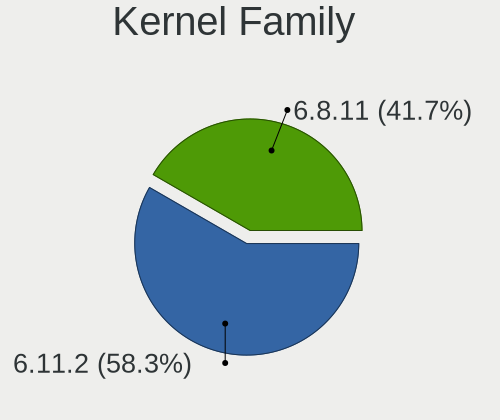
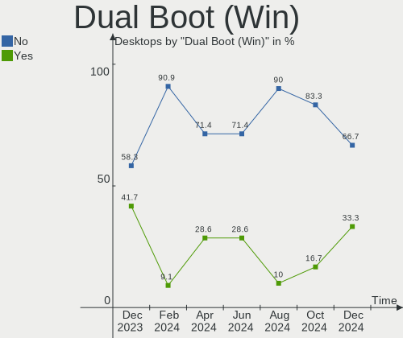
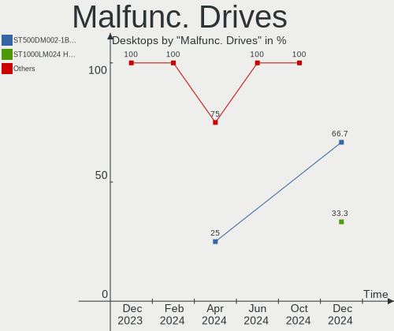
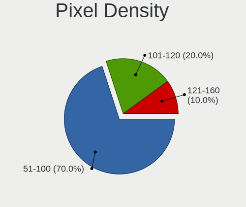
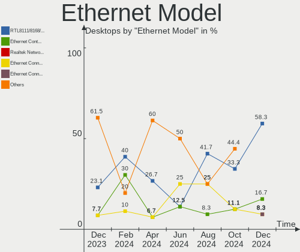
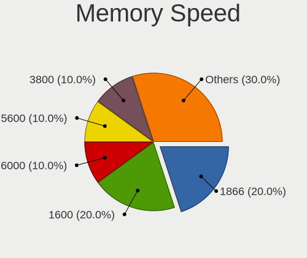

Kali Hardware Trends (Desktops)
-------------------------------

A project to identify most popular hardware characteristics and track their change
over time based on data collected by Kali users at https://Linux-Hardware.org.

Anyone can contribute to this report by the [hw-probe](https://github.com/linuxhw/hw-probe) tool:

    sudo -E hw-probe -all -upload

Full-feature report is available here: https://linux-hardware.org/?view=trends

Period: Jan, 2022.

Contents
--------

* [ System ](#system)
  - [ OS                       ](#os)
  - [ OS Family                ](#os-family)
  - [ Kernel                   ](#kernel)
  - [ Kernel Family            ](#kernel-family)
  - [ Kernel Major Ver.        ](#kernel-major-ver)
  - [ Arch                     ](#arch)
  - [ DE                       ](#de)
  - [ Display Server           ](#display-server)
  - [ Display Manager          ](#display-manager)
  - [ OS Lang                  ](#os-lang)
  - [ Boot Mode                ](#boot-mode)
  - [ Filesystem               ](#filesystem)
  - [ Part. scheme             ](#part-scheme)
  - [ Dual Boot with Linux/BSD ](#dual-boot-with-linuxbsd)
  - [ Dual Boot (Win)          ](#dual-boot-win)

* [ Board ](#board)
  - [ Vendor                   ](#vendor)
  - [ Model                    ](#model)
  - [ Model Family             ](#model-family)
  - [ MFG Year                 ](#mfg-year)
  - [ Form Factor              ](#form-factor)
  - [ Secure Boot              ](#secure-boot)
  - [ Coreboot                 ](#coreboot)
  - [ RAM Size                 ](#ram-size)
  - [ RAM Used                 ](#ram-used)
  - [ Total Drives             ](#total-drives)
  - [ Has CD-ROM               ](#has-cd-rom)
  - [ Has Ethernet             ](#has-ethernet)
  - [ Has WiFi                 ](#has-wifi)
  - [ Has Bluetooth            ](#has-bluetooth)

* [ Location ](#location)
  - [ Country                  ](#country)
  - [ City                     ](#city)

* [ Drives ](#drives)
  - [ Drive Vendor             ](#drive-vendor)
  - [ Drive Model              ](#drive-model)
  - [ HDD Vendor               ](#hdd-vendor)
  - [ SSD Vendor               ](#ssd-vendor)
  - [ Drive Kind               ](#drive-kind)
  - [ Drive Connector          ](#drive-connector)
  - [ Drive Size               ](#drive-size)
  - [ Space Total              ](#space-total)
  - [ Space Used               ](#space-used)
  - [ Malfunc. Drives          ](#malfunc-drives)
  - [ Malfunc. Drive Vendor    ](#malfunc-drive-vendor)
  - [ Malfunc. HDD Vendor      ](#malfunc-hdd-vendor)
  - [ Malfunc. Drive Kind      ](#malfunc-drive-kind)
  - [ Failed Drives            ](#failed-drives)
  - [ Failed Drive Vendor      ](#failed-drive-vendor)
  - [ Drive Status             ](#drive-status)

* [ Storage controller ](#storage-controller)
  - [ Storage Vendor           ](#storage-vendor)
  - [ Storage Model            ](#storage-model)
  - [ Storage Kind             ](#storage-kind)

* [ Processor ](#processor)
  - [ CPU Vendor               ](#cpu-vendor)
  - [ CPU Model                ](#cpu-model)
  - [ CPU Model Family         ](#cpu-model-family)
  - [ CPU Cores                ](#cpu-cores)
  - [ CPU Sockets              ](#cpu-sockets)
  - [ CPU Threads              ](#cpu-threads)
  - [ CPU Op-Modes             ](#cpu-op-modes)
  - [ CPU Microcode            ](#cpu-microcode)
  - [ CPU Microarch            ](#cpu-microarch)

* [ Graphics ](#graphics)
  - [ GPU Vendor               ](#gpu-vendor)
  - [ GPU Model                ](#gpu-model)
  - [ GPU Combo                ](#gpu-combo)
  - [ GPU Driver               ](#gpu-driver)
  - [ GPU Memory               ](#gpu-memory)

* [ Monitor ](#monitor)
  - [ Monitor Vendor           ](#monitor-vendor)
  - [ Monitor Model            ](#monitor-model)
  - [ Monitor Resolution       ](#monitor-resolution)
  - [ Monitor Diagonal         ](#monitor-diagonal)
  - [ Monitor Width            ](#monitor-width)
  - [ Aspect Ratio             ](#aspect-ratio)
  - [ Monitor Area             ](#monitor-area)
  - [ Pixel Density            ](#pixel-density)
  - [ Multiple Monitors        ](#multiple-monitors)

* [ Network ](#network)
  - [ Net Controller Vendor    ](#net-controller-vendor)
  - [ Net Controller Model     ](#net-controller-model)
  - [ Wireless Vendor          ](#wireless-vendor)
  - [ Wireless Model           ](#wireless-model)
  - [ Ethernet Vendor          ](#ethernet-vendor)
  - [ Ethernet Model           ](#ethernet-model)
  - [ Net Controller Kind      ](#net-controller-kind)
  - [ Used Controller          ](#used-controller)
  - [ NICs                     ](#nics)
  - [ IPv6                     ](#ipv6)

* [ Bluetooth ](#bluetooth)
  - [ Bluetooth Vendor         ](#bluetooth-vendor)
  - [ Bluetooth Model          ](#bluetooth-model)

* [ Sound ](#sound)
  - [ Sound Vendor             ](#sound-vendor)
  - [ Sound Model              ](#sound-model)

* [ Memory ](#memory)
  - [ Memory Vendor            ](#memory-vendor)
  - [ Memory Model             ](#memory-model)
  - [ Memory Kind              ](#memory-kind)
  - [ Memory Form Factor       ](#memory-form-factor)
  - [ Memory Size              ](#memory-size)
  - [ Memory Speed             ](#memory-speed)

* [ Printers & scanners ](#printers--scanners)
  - [ Printer Vendor           ](#printer-vendor)
  - [ Printer Model            ](#printer-model)
  - [ Scanner Vendor           ](#scanner-vendor)
  - [ Scanner Model            ](#scanner-model)

* [ Camera ](#camera)
  - [ Camera Vendor            ](#camera-vendor)
  - [ Camera Model             ](#camera-model)

* [ Security ](#security)
  - [ Fingerprint Vendor       ](#fingerprint-vendor)
  - [ Fingerprint Model        ](#fingerprint-model)
  - [ Chipcard Vendor          ](#chipcard-vendor)
  - [ Chipcard Model           ](#chipcard-model)

* [ Unsupported ](#unsupported)
  - [ Unsupported Devices      ](#unsupported-devices)
  - [ Unsupported Device Types ](#unsupported-device-types)

System
------

OS
--

Installed operating systems

| Name        | Desktops | Percent |
|-------------|----------|---------|
| Kali 2021.4 | 8        | 80%     |
| Kali 2021.3 | 2        | 20%     |

OS Family
---------

OS without a version

| Name | Desktops | Percent |
|------|----------|---------|
| Kali | 10       | 100%    |

Kernel
------

Version of the Linux kernel

| Version            | Desktops | Percent |
|--------------------|----------|---------|
| 5.15.0-kali2-amd64 | 6        | 60%     |
| 5.14.0-kali4-amd64 | 2        | 20%     |
| 5.15.5-custom      | 1        | 10%     |
| 5.10.0-kali9-amd64 | 1        | 10%     |

Kernel Family
-------------

Linux kernel without a distro release

| Version | Desktops | Percent |
|---------|----------|---------|
| 5.15.0  | 6        | 60%     |
| 5.14.0  | 2        | 20%     |
| 5.15.5  | 1        | 10%     |
| 5.10.0  | 1        | 10%     |

Kernel Major Ver.
-----------------

Linux kernel major version

| Version | Desktops | Percent |
|---------|----------|---------|
| 5.15    | 7        | 70%     |
| 5.14    | 2        | 20%     |
| 5.10    | 1        | 10%     |

Arch
----

OS architecture (x86_64, i586, etc.)

| Name   | Desktops | Percent |
|--------|----------|---------|
| x86_64 | 10       | 100%    |

DE
--

Desktop Environment

| Name  | Desktops | Percent |
|-------|----------|---------|
| KDE5  | 4        | 40%     |
| XFCE  | 3        | 30%     |
| GNOME | 3        | 30%     |

Display Server
--------------

X11 or Wayland

| Name    | Desktops | Percent |
|---------|----------|---------|
| X11     | 9        | 90%     |
| Wayland | 1        | 10%     |

Display Manager
---------------

SDDM, LightDM, etc.

| Name    | Desktops | Percent |
|---------|----------|---------|
| Unknown | 4        | 40%     |
| SDDM    | 3        | 30%     |
| GDM3    | 2        | 20%     |
| LightDM | 1        | 10%     |

OS Lang
-------

Language

| Lang  | Desktops | Percent |
|-------|----------|---------|
| en_US | 8        | 80%     |
| tr_TR | 1        | 10%     |
| es_ES | 1        | 10%     |

Boot Mode
---------

EFI or BIOS

| Mode | Desktops | Percent |
|------|----------|---------|
| BIOS | 8        | 80%     |
| EFI  | 2        | 20%     |

Filesystem
----------

Type of filesystem

| Type | Desktops | Percent |
|------|----------|---------|
| Ext4 | 10       | 100%    |

Part. scheme
------------

Scheme of partitioning

| Type    | Desktops | Percent |
|---------|----------|---------|
| Unknown | 4        | 40%     |
| MBR     | 3        | 30%     |
| GPT     | 3        | 30%     |

Dual Boot with Linux/BSD
------------------------

Hosting more than one Linux/BSD

| Dual boot | Desktops | Percent |
|-----------|----------|---------|
| No        | 7        | 70%     |
| Yes       | 3        | 30%     |

Dual Boot (Win)
---------------

Hosting Linux and Windows

| Dual boot | Desktops | Percent |
|-----------|----------|---------|
| No        | 6        | 60%     |
| Yes       | 4        | 40%     |

Board
-----

Vendor
------

Motherboard manufacturer

| Name                | Desktops | Percent |
|---------------------|----------|---------|
| Dell                | 3        | 30%     |
| Hewlett-Packard     | 2        | 20%     |
| ASUSTek Computer    | 2        | 20%     |
| Intel               | 1        | 10%     |
| Gigabyte Technology | 1        | 10%     |
| ECS                 | 1        | 10%     |

Model
-----

Motherboard model

| Name                         | Desktops | Percent |
|------------------------------|----------|---------|
| Dell OptiPlex 980            | 3        | 30%     |
| Intel H55                    | 1        | 10%     |
| HP Compaq Elite 8300 CMT     | 1        | 10%     |
| HP 870-147c                  | 1        | 10%     |
| Gigabyte Z590 AORUS ULTRA    | 1        | 10%     |
| ECS H61H2-M4                 | 1        | 10%     |
| ASUS ROG STRIX B365-G GAMING | 1        | 10%     |
| ASUS P5K Deluxe              | 1        | 10%     |

Model Family
------------

Motherboard model prefix

| Name          | Desktops | Percent |
|---------------|----------|---------|
| Dell OptiPlex | 3        | 30%     |
| Intel H55     | 1        | 10%     |
| HP Compaq     | 1        | 10%     |
| HP 870-147c   | 1        | 10%     |
| Gigabyte Z590 | 1        | 10%     |
| ECS H61H2-M4  | 1        | 10%     |
| ASUS ROG      | 1        | 10%     |
| ASUS P5K      | 1        | 10%     |

MFG Year
--------

Motherboard manufacture year

| Year | Desktops | Percent |
|------|----------|---------|
| 2010 | 3        | 30%     |
| 2021 | 1        | 10%     |
| 2019 | 1        | 10%     |
| 2016 | 1        | 10%     |
| 2015 | 1        | 10%     |
| 2013 | 1        | 10%     |
| 2012 | 1        | 10%     |
| 2007 | 1        | 10%     |

Form Factor
-----------

Physical design of the computer

| Name    | Desktops | Percent |
|---------|----------|---------|
| Desktop | 10       | 100%    |

Secure Boot
-----------

Enabled or disabled

| State    | Desktops | Percent |
|----------|----------|---------|
| Disabled | 10       | 100%    |

Coreboot
--------

Have coreboot on board

| Used | Desktops | Percent |
|------|----------|---------|
| No   | 10       | 100%    |

RAM Size
--------

Total RAM memory

| Size in GB  | Desktops | Percent |
|-------------|----------|---------|
| 8.01-16.0   | 4        | 40%     |
| 32.01-64.0  | 2        | 20%     |
| 4.01-8.0    | 1        | 10%     |
| 24.01-32.0  | 1        | 10%     |
| 64.01-256.0 | 1        | 10%     |
| 1.01-2.0    | 1        | 10%     |

RAM Used
--------

Used RAM memory

| Used GB  | Desktops | Percent |
|----------|----------|---------|
| 2.01-3.0 | 4        | 40%     |
| 1.01-2.0 | 4        | 40%     |
| 4.01-8.0 | 1        | 10%     |
| 3.01-4.0 | 1        | 10%     |

Total Drives
------------

Number of drives on board

| Drives | Desktops | Percent |
|--------|----------|---------|
| 1      | 5        | 50%     |
| 2      | 3        | 30%     |
| 4      | 1        | 10%     |
| 3      | 1        | 10%     |

Has CD-ROM
----------

Has CD-ROM on board

| Presented | Desktops | Percent |
|-----------|----------|---------|
| Yes       | 6        | 60%     |
| No        | 4        | 40%     |

Has Ethernet
------------

Has Ethernet on board

| Presented | Desktops | Percent |
|-----------|----------|---------|
| Yes       | 8        | 80%     |
| No        | 2        | 20%     |

Has WiFi
--------

Has WiFi module

| Presented | Desktops | Percent |
|-----------|----------|---------|
| Yes       | 9        | 90%     |
| No        | 1        | 10%     |

Has Bluetooth
-------------

Has Bluetooth module

| Presented | Desktops | Percent |
|-----------|----------|---------|
| No        | 8        | 80%     |
| Yes       | 2        | 20%     |

Location
--------

Country
-------

Geographic location (country)

| Country     | Desktops | Percent |
|-------------|----------|---------|
| USA         | 4        | 40%     |
| Turkey      | 1        | 10%     |
| Switzerland | 1        | 10%     |
| Spain       | 1        | 10%     |
| Philippines | 1        | 10%     |
| Morocco     | 1        | 10%     |
| Algeria     | 1        | 10%     |

City
----

Geographic location (city)

| City           | Desktops | Percent |
|----------------|----------|---------|
| Sanger         | 3        | 30%     |
| San Francisco  | 1        | 10%     |
| Oulad Teima    | 1        | 10%     |
| Guelma         | 1        | 10%     |
| Geneva         | 1        | 10%     |
| Cagayan de Oro | 1        | 10%     |
| Bursa          | 1        | 10%     |
| Barcelona      | 1        | 10%     |

Drives
------

Drive Vendor
------------

Hard drive vendors

| Vendor              | Desktops | Drives | Percent |
|---------------------|----------|--------|---------|
| Seagate             | 4        | 4      | 22.22%  |
| Hitachi             | 3        | 3      | 16.67%  |
| WDC                 | 2        | 3      | 11.11%  |
| Samsung Electronics | 2        | 2      | 11.11%  |
| Unknown             | 1        | 1      | 5.56%   |
| Toshiba             | 1        | 1      | 5.56%   |
| MAXTOR              | 1        | 1      | 5.56%   |
| LITEON              | 1        | 1      | 5.56%   |
| Kingston            | 1        | 1      | 5.56%   |
| Gigabyte Technology | 1        | 1      | 5.56%   |
| Unknown             | 1        | 1      | 5.56%   |

Drive Model
-----------

Hard drive models

| Model                             | Desktops | Percent |
|-----------------------------------|----------|---------|
| Hitachi HDS721010CLA630 1TB       | 3        | 15.79%  |
| WDC WDS100T2B0A-00SM50 1TB SSD    | 1        | 5.26%   |
| WDC WD40EFAX-68JH4N0 4TB          | 1        | 5.26%   |
| WDC WD10EZEX-08WN4A0 1TB          | 1        | 5.26%   |
| Unknown SD/MMC/MS PRO 128GB       | 1        | 5.26%   |
| Toshiba HDWE160 6TB               | 1        | 5.26%   |
| Seagate ST500LM000-1EJ162 500GB   | 1        | 5.26%   |
| Seagate ST500DM002-1BD142 500GB   | 1        | 5.26%   |
| Seagate ST4000DM004-2CV104 4TB    | 1        | 5.26%   |
| Seagate ST3500312CS 500GB         | 1        | 5.26%   |
| Samsung SSD 870 EVO 500GB         | 1        | 5.26%   |
| Samsung SSD 840 EVO 120GB         | 1        | 5.26%   |
| MAXTOR 6L300S0 304GB              | 1        | 5.26%   |
| LITEON IT LCS-128L9S-HP 128GB SSD | 1        | 5.26%   |
| Kingston SV300S37A120G 120GB SSD  | 1        | 5.26%   |
| Gigabyte GP-AG41TB                | 1        | 5.26%   |
| Unknown                           | 1        | 5.26%   |

HDD Vendor
----------

Hard disk drive vendors

| Vendor  | Desktops | Drives | Percent |
|---------|----------|--------|---------|
| Seagate | 4        | 4      | 33.33%  |
| Hitachi | 3        | 3      | 25%     |
| WDC     | 2        | 2      | 16.67%  |
| Unknown | 1        | 1      | 8.33%   |
| Toshiba | 1        | 1      | 8.33%   |
| MAXTOR  | 1        | 1      | 8.33%   |

SSD Vendor
----------

Solid state drive vendors

| Vendor              | Desktops | Drives | Percent |
|---------------------|----------|--------|---------|
| Samsung Electronics | 2        | 2      | 33.33%  |
| WDC                 | 1        | 1      | 16.67%  |
| LITEON              | 1        | 1      | 16.67%  |
| Kingston            | 1        | 1      | 16.67%  |
| Unknown             | 1        | 1      | 16.67%  |

Drive Kind
----------

HDD or SSD

| Kind | Desktops | Drives | Percent |
|------|----------|--------|---------|
| HDD  | 8        | 12     | 66.67%  |
| SSD  | 3        | 6      | 25%     |
| NVMe | 1        | 1      | 8.33%   |

Drive Connector
---------------

SATA, SAS, NVMe, etc.

| Type | Desktops | Drives | Percent |
|------|----------|--------|---------|
| SATA | 10       | 17     | 83.33%  |
| SAS  | 1        | 1      | 8.33%   |
| NVMe | 1        | 1      | 8.33%   |

Drive Size
----------

Size of hard drive

| Size in TB | Desktops | Drives | Percent |
|------------|----------|--------|---------|
| 0.01-0.5   | 6        | 10     | 42.86%  |
| 0.51-1.0   | 5        | 5      | 35.71%  |
| 3.01-4.0   | 2        | 2      | 14.29%  |
| 4.01-10.0  | 1        | 1      | 7.14%   |

Space Total
-----------

Amount of disk space available on the file system

| Size in GB     | Desktops | Percent |
|----------------|----------|---------|
| 251-500        | 3        | 30%     |
| 501-1000       | 3        | 30%     |
| More than 3000 | 2        | 20%     |
| 2001-3000      | 1        | 10%     |
| 101-250        | 1        | 10%     |

Space Used
----------

Amount of used disk space

| Used GB        | Desktops | Percent |
|----------------|----------|---------|
| 101-250        | 5        | 50%     |
| 1-20           | 2        | 20%     |
| More than 3000 | 1        | 10%     |
| 1001-2000      | 1        | 10%     |
| 501-1000       | 1        | 10%     |

Malfunc. Drives
---------------

Drive models with a malfunction

| Model                | Desktops | Drives | Percent |
|----------------------|----------|--------|---------|
| MAXTOR 6L300S0 304GB | 1        | 1      | 100%    |

Malfunc. Drive Vendor
---------------------

Vendors of faulty drives

| Vendor | Desktops | Drives | Percent |
|--------|----------|--------|---------|
| MAXTOR | 1        | 1      | 100%    |

Malfunc. HDD Vendor
-------------------

Vendors of faulty HDD drives

| Vendor | Desktops | Drives | Percent |
|--------|----------|--------|---------|
| MAXTOR | 1        | 1      | 100%    |

Malfunc. Drive Kind
-------------------

Kinds of faulty drives

| Kind | Desktops | Drives | Percent |
|------|----------|--------|---------|
| HDD  | 1        | 1      | 100%    |

Failed Drives
-------------

Failed drive models

Zero info for selected period =(

Failed Drive Vendor
-------------------

Failed drive vendors

Zero info for selected period =(

Drive Status
------------

Number of failed and malfunc. drives

| Status   | Desktops | Drives | Percent |
|----------|----------|--------|---------|
| Works    | 6        | 13     | 50%     |
| Detected | 5        | 5      | 41.67%  |
| Malfunc  | 1        | 1      | 8.33%   |

Storage controller
------------------

Storage Vendor
--------------

Storage controller vendors

| Vendor             | Desktops | Percent |
|--------------------|----------|---------|
| Intel              | 10       | 83.33%  |
| Phison Electronics | 1        | 8.33%   |
| JMicron Technology | 1        | 8.33%   |

Storage Model
-------------

Storage controller models

| Model                                                                                   | Desktops | Percent |
|-----------------------------------------------------------------------------------------|----------|---------|
| Intel 5 Series/3400 Series Chipset PT IDER Controller                                   | 3        | 16.67%  |
| Intel SATA Controller [RAID mode]                                                       | 2        | 11.11%  |
| Phison E16 PCIe4 NVMe Controller                                                        | 1        | 5.56%   |
| JMicron JMB363 SATA/IDE Controller                                                      | 1        | 5.56%   |
| Intel Q170/Q150/B150/H170/H110/Z170/CM236 Chipset SATA Controller [AHCI Mode]           | 1        | 5.56%   |
| Intel 82801IR/IO/IH (ICH9R/DO/DH) 4 port SATA Controller [IDE mode]                     | 1        | 5.56%   |
| Intel 82801I (ICH9 Family) 2 port SATA Controller [IDE mode]                            | 1        | 5.56%   |
| Intel 7 Series/C210 Series Chipset Family 6-port SATA Controller [AHCI mode]            | 1        | 5.56%   |
| Intel 6 Series/C200 Series Chipset Family Desktop SATA Controller (IDE mode, ports 4-5) | 1        | 5.56%   |
| Intel 6 Series/C200 Series Chipset Family Desktop SATA Controller (IDE mode, ports 0-3) | 1        | 5.56%   |
| Intel 500 Series Chipset Family SATA AHCI Controller                                    | 1        | 5.56%   |
| Intel 5 Series/3400 Series Chipset 6 port SATA AHCI Controller                          | 1        | 5.56%   |
| Intel 5 Series/3400 Series Chipset 4 port SATA IDE Controller                           | 1        | 5.56%   |
| Intel 5 Series/3400 Series Chipset 2 port SATA IDE Controller                           | 1        | 5.56%   |
| Intel 200 Series PCH SATA controller [AHCI mode]                                        | 1        | 5.56%   |

Storage Kind
------------

Kind of storage controller (IDE, SATA, NVMe, SAS, ...)

| Kind | Desktops | Percent |
|------|----------|---------|
| IDE  | 5        | 38.46%  |
| SATA | 5        | 38.46%  |
| RAID | 2        | 15.38%  |
| NVMe | 1        | 7.69%   |

Processor
---------

CPU Vendor
----------

Processor vendors

| Vendor | Desktops | Percent |
|--------|----------|---------|
| Intel  | 10       | 100%    |

CPU Model
---------

Processor models

| Model                                   | Desktops | Percent |
|-----------------------------------------|----------|---------|
| Intel Core i5 CPU 650 @ 3.20GHz         | 3        | 30%     |
| Intel Core i7-6700 CPU @ 3.40GHz        | 1        | 10%     |
| Intel Core i5-3470 CPU @ 3.20GHz        | 1        | 10%     |
| Intel Core i5 CPU 750 @ 2.67GHz         | 1        | 10%     |
| Intel Core i3-9100 CPU @ 3.60GHz        | 1        | 10%     |
| Intel Core i3-3220 CPU @ 3.30GHz        | 1        | 10%     |
| Intel Core 2 Quad CPU @ 2.40GHz         | 1        | 10%     |
| Intel 11th Gen Core i9-11900K @ 3.50GHz | 1        | 10%     |

CPU Model Family
----------------

Processor model prefix

| Model             | Desktops | Percent |
|-------------------|----------|---------|
| Intel Core i5     | 5        | 50%     |
| Intel Core i3     | 2        | 20%     |
| Other             | 1        | 10%     |
| Intel Core i7     | 1        | 10%     |
| Intel Core 2 Quad | 1        | 10%     |

CPU Cores
---------

Number of processor cores

| Number | Desktops | Percent |
|--------|----------|---------|
| 4      | 5        | 50%     |
| 2      | 4        | 40%     |
| 8      | 1        | 10%     |

CPU Sockets
-----------

Number of sockets

| Number | Desktops | Percent |
|--------|----------|---------|
| 1      | 10       | 100%    |

CPU Threads
-----------

Threads per core (Hyper-Threading)

| Number | Desktops | Percent |
|--------|----------|---------|
| 2      | 6        | 60%     |
| 1      | 4        | 40%     |

CPU Op-Modes
------------

CPU Operation Modes (32-bit, 64-bit)

| Op mode        | Desktops | Percent |
|----------------|----------|---------|
| 32-bit, 64-bit | 10       | 100%    |

CPU Microcode
-------------

Microcode number

| Number  | Desktops | Percent |
|---------|----------|---------|
| 0x20655 | 3        | 30%     |
| 0x306a9 | 2        | 20%     |
| 0xa0671 | 1        | 10%     |
| 0x906eb | 1        | 10%     |
| 0x6f7   | 1        | 10%     |
| 0x506e3 | 1        | 10%     |
| 0x106e5 | 1        | 10%     |

CPU Microarch
-------------

Microarchitecture

| Name      | Desktops | Percent |
|-----------|----------|---------|
| Westmere  | 3        | 30%     |
| IvyBridge | 2        | 20%     |
| Skylake   | 1        | 10%     |
| Nehalem   | 1        | 10%     |
| KabyLake  | 1        | 10%     |
| Icelake   | 1        | 10%     |
| Core      | 1        | 10%     |

Graphics
--------

GPU Vendor
----------

Vendors of graphics cards

| Vendor | Desktops | Percent |
|--------|----------|---------|
| Nvidia | 6        | 54.55%  |
| AMD    | 4        | 36.36%  |
| Intel  | 1        | 9.09%   |

GPU Model
---------

Graphics card models

| Model                                          | Desktops | Percent |
|------------------------------------------------|----------|---------|
| AMD RV620 LE [Radeon HD 3450]                  | 3        | 27.27%  |
| Nvidia TU116 [GeForce GTX 1650 SUPER]          | 1        | 9.09%   |
| Nvidia GM107 [GeForce GTX 750 Ti]              | 1        | 9.09%   |
| Nvidia GF119 [GeForce GT 610]                  | 1        | 9.09%   |
| Nvidia GF108 [GeForce GT 630]                  | 1        | 9.09%   |
| Nvidia GA102 [GeForce RTX 3080]                | 1        | 9.09%   |
| Nvidia G80 [GeForce 8800 GTS]                  | 1        | 9.09%   |
| Intel CoffeeLake-S GT2 [UHD Graphics 630]      | 1        | 9.09%   |
| AMD Oland PRO [Radeon R7 240/340 / Radeon 520] | 1        | 9.09%   |

GPU Combo
---------

Combinations of graphics cards

| Name           | Desktops | Percent |
|----------------|----------|---------|
| 1 x Nvidia     | 5        | 50%     |
| 1 x AMD        | 4        | 40%     |
| Intel + Nvidia | 1        | 10%     |

GPU Driver
----------

Free vs proprietary

| Driver      | Desktops | Percent |
|-------------|----------|---------|
| Free        | 8        | 80%     |
| Proprietary | 2        | 20%     |

GPU Memory
----------

Total video memory

| Size in GB | Desktops | Percent |
|------------|----------|---------|
| 3.01-4.0   | 4        | 40%     |
| 0.01-0.5   | 4        | 40%     |
| 1.01-2.0   | 1        | 10%     |
| 8.01-16.0  | 1        | 10%     |

Monitor
-------

Monitor Vendor
--------------

Monitor vendors

| Vendor               | Desktops | Percent |
|----------------------|----------|---------|
| Vizio                | 3        | 30%     |
| Samsung Electronics  | 3        | 30%     |
| AUS                  | 1        | 10%     |
| ASUSTek Computer     | 1        | 10%     |
| Ancor Communications | 1        | 10%     |
| Acer                 | 1        | 10%     |

Monitor Model
-------------

Monitor models

| Model                                                                  | Desktops | Percent |
|------------------------------------------------------------------------|----------|---------|
| Vizio E260MV VIZ0062 1920x1080 509x286mm 23.0-inch                     | 3        | 23.08%  |
| Samsung Electronics U28E590 SAM0C4D 3840x2160 607x345mm 27.5-inch      | 1        | 7.69%   |
| Samsung Electronics SA300/SA350 SAM07D2 1920x1080 477x268mm 21.5-inch  | 1        | 7.69%   |
| Samsung Electronics S24E450 SAM0C80 1920x1080 520x290mm 23.4-inch      | 1        | 7.69%   |
| Samsung Electronics S22D300 SAM0B3F 1920x1080 477x268mm 21.5-inch      | 1        | 7.69%   |
| Samsung Electronics LCD Monitor SAM0F39 1920x1080 1210x680mm 54.6-inch | 1        | 7.69%   |
| Samsung Electronics LCD Monitor SAM0DF7 3840x2160 950x540mm 43.0-inch  | 1        | 7.69%   |
| AUS LCD Monitor VG27AQL1A 2560x1440                                    | 1        | 7.69%   |
| ASUSTek Computer VG27AQL1A AUS2705 2560x1440 600x340mm 27.2-inch       | 1        | 7.69%   |
| Ancor Communications VG248 ACI24A5 1920x1080 531x299mm 24.0-inch       | 1        | 7.69%   |
| Acer AL1916W ACRAD80 1440x900 410x257mm 19.1-inch                      | 1        | 7.69%   |

Monitor Resolution
------------------

Monitor screen resolution

| Resolution       | Desktops | Percent |
|------------------|----------|---------|
| 1920x1080 (FHD)  | 6        | 60%     |
| 3840x2160 (4K)   | 2        | 20%     |
| 2560x1440 (QHD)  | 1        | 10%     |
| 1440x900 (WXGA+) | 1        | 10%     |

Monitor Diagonal
----------------

Diagonal size in inches

| Inches  | Desktops | Percent |
|---------|----------|---------|
| 26      | 3        | 25%     |
| 27      | 2        | 16.67%  |
| 84      | 1        | 8.33%   |
| 54      | 1        | 8.33%   |
| 24      | 1        | 8.33%   |
| 23      | 1        | 8.33%   |
| 21      | 1        | 8.33%   |
| 19      | 1        | 8.33%   |
| Unknown | 1        | 8.33%   |

Monitor Width
-------------

Physical width

| Width in mm | Desktops | Percent |
|-------------|----------|---------|
| 501-600     | 6        | 50%     |
| 401-500     | 2        | 16.67%  |
| 601-700     | 1        | 8.33%   |
| 1501-2000   | 1        | 8.33%   |
| 1001-1500   | 1        | 8.33%   |
| Unknown     | 1        | 8.33%   |

Aspect Ratio
------------

Proportional relationship between the width and the height

| Ratio   | Desktops | Percent |
|---------|----------|---------|
| 16/9    | 8        | 80%     |
| 16/10   | 1        | 10%     |
| Unknown | 1        | 10%     |

Monitor Area
------------

Area in inch²

| Area in inch² | Desktops | Percent |
|----------------|----------|---------|
| 251-300        | 3        | 27.27%  |
| More than 1000 | 2        | 18.18%  |
| 301-350        | 2        | 18.18%  |
| 201-250        | 2        | 18.18%  |
| 151-200        | 1        | 9.09%   |
| Unknown        | 1        | 9.09%   |

Pixel Density
-------------

Pixels per inch

| Density | Desktops | Percent |
|---------|----------|---------|
| 51-100  | 7        | 58.33%  |
| 101-120 | 2        | 16.67%  |
| 1-50    | 1        | 8.33%   |
| 121-160 | 1        | 8.33%   |
| Unknown | 1        | 8.33%   |

Multiple Monitors
-----------------

Total monitors connected

| Total | Desktops | Percent |
|-------|----------|---------|
| 1     | 8        | 80%     |
| 4     | 1        | 10%     |
| 0     | 1        | 10%     |

Network
-------

Net Controller Vendor
---------------------

Controller vendors

| Vendor                   | Desktops | Percent |
|--------------------------|----------|---------|
| Intel                    | 6        | 25%     |
| Realtek Semiconductor    | 5        | 20.83%  |
| TP-Link                  | 3        | 12.5%   |
| Qualcomm Atheros         | 3        | 12.5%   |
| Apple                    | 3        | 12.5%   |
| Xiaomi                   | 1        | 4.17%   |
| T & A Mobile Phones      | 1        | 4.17%   |
| Marvell Technology Group | 1        | 4.17%   |
| D-Link System            | 1        | 4.17%   |

Net Controller Model
--------------------

Controller models

| Model                                                                | Desktops | Percent |
|----------------------------------------------------------------------|----------|---------|
| TP-Link TL-WN722N v2/v3 [Realtek RTL8188EUS]                         | 3        | 9.68%   |
| Apple iPad 3 (wifi)                                                  | 3        | 9.68%   |
| TP-Link TL-WN823N v2/v3 [Realtek RTL8192EU]                          | 2        | 6.45%   |
| Realtek RTL8111/8168/8411 PCI Express Gigabit Ethernet Controller    | 2        | 6.45%   |
| Qualcomm Atheros QCA9565 / AR9565 Wireless Network Adapter           | 2        | 6.45%   |
| Xiaomi Mi/Redmi series (RNDIS)                                       | 1        | 3.23%   |
| TP-Link Archer T2U PLUS [RTL8821AU]                                  | 1        | 3.23%   |
| T & A Mobile Phones MT65xx Android Phone                             | 1        | 3.23%   |
| Realtek RTL8812AU 802.11a/b/g/n/ac 2T2R DB WLAN Adapter              | 1        | 3.23%   |
| Realtek RTL8192CU 802.11n WLAN Adapter                               | 1        | 3.23%   |
| Realtek RTL8188FTV 802.11b/g/n 1T1R 2.4G WLAN Adapter                | 1        | 3.23%   |
| Realtek RTL8187 Wireless Adapter                                     | 1        | 3.23%   |
| Realtek RTL810xE PCI Express Fast Ethernet controller                | 1        | 3.23%   |
| Realtek RTL-8110SC/8169SC Gigabit Ethernet                           | 1        | 3.23%   |
| Qualcomm Atheros AR8161 Gigabit Ethernet                             | 1        | 3.23%   |
| Marvell Group 88E8056 PCI-E Gigabit Ethernet Controller              | 1        | 3.23%   |
| Intel WiFi Link 5100                                                 | 1        | 3.23%   |
| Intel Wi-Fi 6 AX200                                                  | 1        | 3.23%   |
| Intel Ethernet Controller I225-V                                     | 1        | 3.23%   |
| Intel Ethernet Connection (2) I219-V                                 | 1        | 3.23%   |
| Intel Dual Band Wireless-AC 3168NGW [Stone Peak]                     | 1        | 3.23%   |
| Intel 82579LM Gigabit Network Connection (Lewisville)                | 1        | 3.23%   |
| Intel 82578DM Gigabit Network Connection                             | 1        | 3.23%   |
| D-Link System DWA-125 Wireless N 150 Adapter(rev.A2) [Ralink RT3070] | 1        | 3.23%   |

Wireless Vendor
---------------

Wireless vendors

| Vendor                | Desktops | Percent |
|-----------------------|----------|---------|
| TP-Link               | 3        | 20%     |
| Realtek Semiconductor | 3        | 20%     |
| Intel                 | 3        | 20%     |
| Apple                 | 3        | 20%     |
| Qualcomm Atheros      | 2        | 13.33%  |
| D-Link System         | 1        | 6.67%   |

Wireless Model
--------------

Wireless models

| Model                                                                | Desktops | Percent |
|----------------------------------------------------------------------|----------|---------|
| TP-Link TL-WN722N v2/v3 [Realtek RTL8188EUS]                         | 3        | 15.79%  |
| Apple iPad 3 (wifi)                                                  | 3        | 15.79%  |
| TP-Link TL-WN823N v2/v3 [Realtek RTL8192EU]                          | 2        | 10.53%  |
| Qualcomm Atheros QCA9565 / AR9565 Wireless Network Adapter           | 2        | 10.53%  |
| TP-Link Archer T2U PLUS [RTL8821AU]                                  | 1        | 5.26%   |
| Realtek RTL8812AU 802.11a/b/g/n/ac 2T2R DB WLAN Adapter              | 1        | 5.26%   |
| Realtek RTL8192CU 802.11n WLAN Adapter                               | 1        | 5.26%   |
| Realtek RTL8188FTV 802.11b/g/n 1T1R 2.4G WLAN Adapter                | 1        | 5.26%   |
| Realtek RTL8187 Wireless Adapter                                     | 1        | 5.26%   |
| Intel WiFi Link 5100                                                 | 1        | 5.26%   |
| Intel Wi-Fi 6 AX200                                                  | 1        | 5.26%   |
| Intel Dual Band Wireless-AC 3168NGW [Stone Peak]                     | 1        | 5.26%   |
| D-Link System DWA-125 Wireless N 150 Adapter(rev.A2) [Ralink RT3070] | 1        | 5.26%   |

Ethernet Vendor
---------------

Ethernet vendors

| Vendor                   | Desktops | Percent |
|--------------------------|----------|---------|
| Realtek Semiconductor    | 4        | 36.36%  |
| Intel                    | 4        | 36.36%  |
| Xiaomi                   | 1        | 9.09%   |
| Qualcomm Atheros         | 1        | 9.09%   |
| Marvell Technology Group | 1        | 9.09%   |

Ethernet Model
--------------

Ethernet models

| Model                                                             | Desktops | Percent |
|-------------------------------------------------------------------|----------|---------|
| Realtek RTL8111/8168/8411 PCI Express Gigabit Ethernet Controller | 2        | 18.18%  |
| Xiaomi Mi/Redmi series (RNDIS)                                    | 1        | 9.09%   |
| Realtek RTL810xE PCI Express Fast Ethernet controller             | 1        | 9.09%   |
| Realtek RTL-8110SC/8169SC Gigabit Ethernet                        | 1        | 9.09%   |
| Qualcomm Atheros AR8161 Gigabit Ethernet                          | 1        | 9.09%   |
| Marvell Group 88E8056 PCI-E Gigabit Ethernet Controller           | 1        | 9.09%   |
| Intel Ethernet Controller I225-V                                  | 1        | 9.09%   |
| Intel Ethernet Connection (2) I219-V                              | 1        | 9.09%   |
| Intel 82579LM Gigabit Network Connection (Lewisville)             | 1        | 9.09%   |
| Intel 82578DM Gigabit Network Connection                          | 1        | 9.09%   |

Net Controller Kind
-------------------

Ethernet, WiFi or modem

| Kind     | Desktops | Percent |
|----------|----------|---------|
| WiFi     | 9        | 50%     |
| Ethernet | 8        | 44.44%  |
| Unknown  | 1        | 5.56%   |

Used Controller
---------------

Currently used network controller

| Kind     | Desktops | Percent |
|----------|----------|---------|
| Ethernet | 6        | 54.55%  |
| WiFi     | 5        | 45.45%  |

NICs
----

Total network controllers on board

| Total | Desktops | Percent |
|-------|----------|---------|
| 1     | 5        | 50%     |
| 2     | 4        | 40%     |
| 3     | 1        | 10%     |

IPv6
----

IPv6 vs IPv4

| Used | Desktops | Percent |
|------|----------|---------|
| No   | 10       | 100%    |

Bluetooth
---------

Bluetooth Vendor
----------------

Controller vendors

| Vendor | Desktops | Percent |
|--------|----------|---------|
| Intel  | 2        | 100%    |

Bluetooth Model
---------------

Controller models

| Model                            | Desktops | Percent |
|----------------------------------|----------|---------|
| Intel Wireless-AC 3168 Bluetooth | 1        | 50%     |
| Intel Bluetooth Device           | 1        | 50%     |

Sound
-----

Sound Vendor
------------

Sound card vendors

| Vendor               | Desktops | Percent |
|----------------------|----------|---------|
| Intel                | 10       | 55.56%  |
| Nvidia               | 5        | 27.78%  |
| SteelSeries ApS      | 1        | 5.56%   |
| Giga-Byte Technology | 1        | 5.56%   |
| AMD                  | 1        | 5.56%   |

Sound Model
-----------

Sound card models

| Model                                                                      | Desktops | Percent |
|----------------------------------------------------------------------------|----------|---------|
| Intel 5 Series/3400 Series Chipset High Definition Audio                   | 4        | 22.22%  |
| SteelSeries ApS SteelSeries Arctis 5                                       | 1        | 5.56%   |
| Nvidia TU116 High Definition Audio Controller                              | 1        | 5.56%   |
| Nvidia GM107 High Definition Audio Controller [GeForce 940MX]              | 1        | 5.56%   |
| Nvidia GF119 HDMI Audio Controller                                         | 1        | 5.56%   |
| Nvidia GF108 High Definition Audio Controller                              | 1        | 5.56%   |
| Nvidia GA102 High Definition Audio Controller                              | 1        | 5.56%   |
| Intel Tiger Lake-H HD Audio Controller                                     | 1        | 5.56%   |
| Intel 82801I (ICH9 Family) HD Audio Controller                             | 1        | 5.56%   |
| Intel 7 Series/C216 Chipset Family High Definition Audio Controller        | 1        | 5.56%   |
| Intel 6 Series/C200 Series Chipset Family High Definition Audio Controller | 1        | 5.56%   |
| Intel 200 Series PCH HD Audio                                              | 1        | 5.56%   |
| Intel 100 Series/C230 Series Chipset Family HD Audio Controller            | 1        | 5.56%   |
| Giga-Byte Technology USB Audio                                             | 1        | 5.56%   |
| AMD Oland/Hainan/Cape Verde/Pitcairn HDMI Audio [Radeon HD 7000 Series]    | 1        | 5.56%   |

Memory
------

Memory Vendor
-------------

Memory module vendors

| Vendor              | Desktops | Percent |
|---------------------|----------|---------|
| Unknown             | 2        | 22.22%  |
| Corsair             | 2        | 22.22%  |
| TwinMOS             | 1        | 11.11%  |
| SK Hynix            | 1        | 11.11%  |
| Samsung Electronics | 1        | 11.11%  |
| Ramaxel Technology  | 1        | 11.11%  |
| Micron Technology   | 1        | 11.11%  |

Memory Model
------------

Memory module models

| Model                                                   | Desktops | Percent |
|---------------------------------------------------------|----------|---------|
| Unknown RAM Module 4GB DIMM DDR3 1333MT/s               | 1        | 10%     |
| Unknown RAM Module 1GB DIMM DDR 800MT/s                 | 1        | 10%     |
| TwinMOS RAM 9DPCBNZB-TATP 4GB DIMM DDR3 1333MT/s        | 1        | 10%     |
| SK Hynix RAM HMT41GU6MFR8C-PB 8GB DIMM DDR3 1600MT/s    | 1        | 10%     |
| Samsung RAM M378B5173EB0-YK0 4GB DIMM DDR3 1600MT/s     | 1        | 10%     |
| Samsung RAM M378B5173DB0-CK0 4096MB DIMM DDR3 1600MT/s  | 1        | 10%     |
| Ramaxel RAM RMUA5110MB78HAF-2400 8GB DIMM DDR4 2400MT/s | 1        | 10%     |
| Micron RAM 16JTF1G64AZ-1G6E1 8GB DIMM DDR3 1600MT/s     | 1        | 10%     |
| Corsair RAM CMT128GX4M4C3200C16 32GB DIMM DDR4 2133MT/s | 1        | 10%     |
| Corsair RAM CMK32GX4M2B3000C15 16GB DIMM DDR4 3000MT/s  | 1        | 10%     |

Memory Kind
-----------

Memory module kinds

| Kind | Desktops | Percent |
|------|----------|---------|
| DDR4 | 3        | 50%     |
| DDR3 | 2        | 33.33%  |
| DDR  | 1        | 16.67%  |

Memory Form Factor
------------------

Physical design of the memory module

| Name | Desktops | Percent |
|------|----------|---------|
| DIMM | 6        | 100%    |

Memory Size
-----------

Memory module size

| Size  | Desktops | Percent |
|-------|----------|---------|
| 8192  | 2        | 28.57%  |
| 4096  | 2        | 28.57%  |
| 32768 | 1        | 14.29%  |
| 16384 | 1        | 14.29%  |
| 1024  | 1        | 14.29%  |

Memory Speed
------------

Memory module speed

| Speed | Desktops | Percent |
|-------|----------|---------|
| 3000  | 1        | 16.67%  |
| 2400  | 1        | 16.67%  |
| 2133  | 1        | 16.67%  |
| 1600  | 1        | 16.67%  |
| 1333  | 1        | 16.67%  |
| 800   | 1        | 16.67%  |

Printers & scanners
-------------------

Printer Vendor
--------------

Printer device vendors

Zero info for selected period =(

Printer Model
-------------

Printer device models

Zero info for selected period =(

Scanner Vendor
--------------

Scanner device vendors

Zero info for selected period =(

Scanner Model
-------------

Scanner device models

Zero info for selected period =(

Camera
------

Camera Vendor
-------------

Camera device vendors

| Vendor              | Desktops | Percent |
|---------------------|----------|---------|
| Samsung Electronics | 1        | 25%     |
| Logitech            | 1        | 25%     |
| Google              | 1        | 25%     |
| Apple               | 1        | 25%     |

Camera Model
------------

Camera device models

| Model                                   | Desktops | Percent |
|-----------------------------------------|----------|---------|
| Samsung Galaxy A5 (MTP)                 | 1        | 25%     |
| Logitech Webcam C270                    | 1        | 25%     |
| Google Nexus/Pixel Device (MTP + debug) | 1        | 25%     |
| Apple iPhone 5/5C/5S/6/SE               | 1        | 25%     |

Security
--------

Fingerprint Vendor
------------------

Fingerprint sensor vendors

Zero info for selected period =(

Fingerprint Model
-----------------

Fingerprint sensor models

Zero info for selected period =(

Chipcard Vendor
---------------

Chipcard module vendors

Zero info for selected period =(

Chipcard Model
--------------

Chipcard module models

Zero info for selected period =(

Unsupported
-----------

Unsupported Devices
-------------------

Total unsupported devices on board

| Total | Desktops | Percent |
|-------|----------|---------|
| 0     | 6        | 60%     |
| 1     | 4        | 40%     |

Unsupported Device Types
------------------------

Types of unsupported devices

| Type         | Desktops | Percent |
|--------------|----------|---------|
| Net/wireless | 4        | 100%    |

