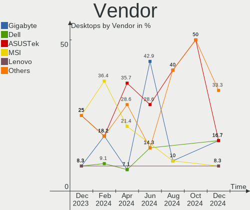
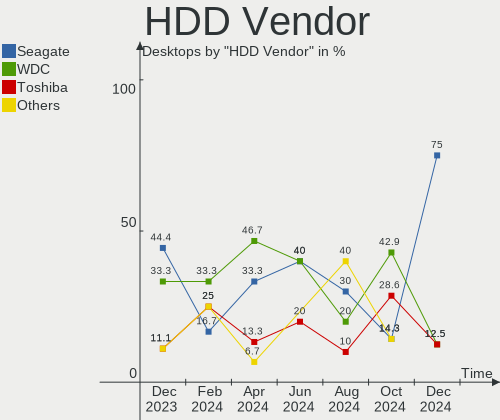
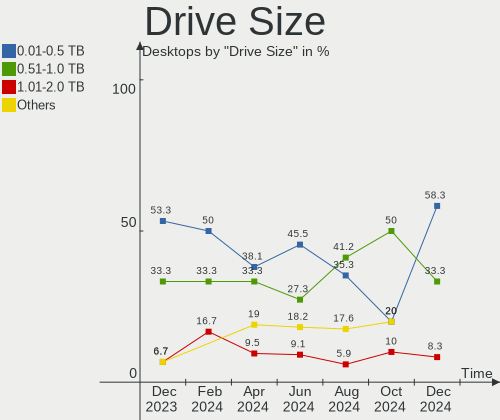
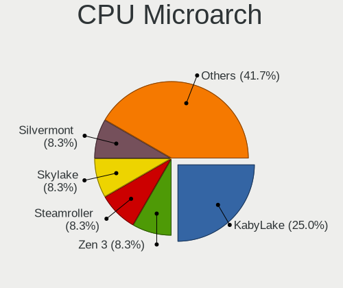
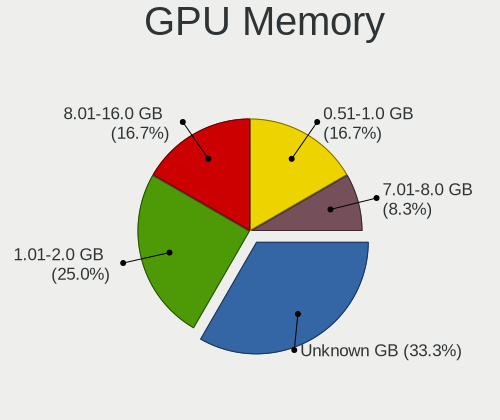
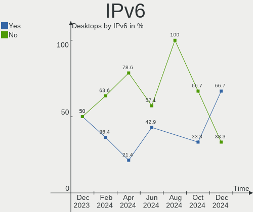
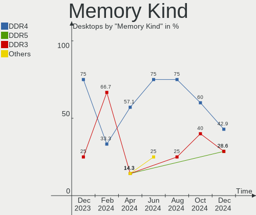
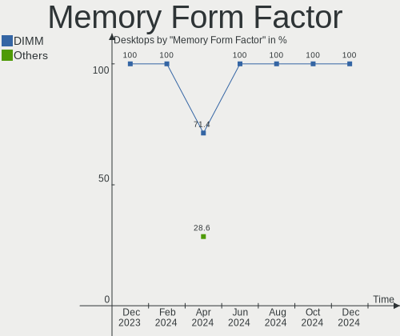

Kali - Hardware Trends (Desktops)
---------------------------------

A project to identify most popular hardware characteristics and track their change
over time based on data collected by Linux users at https://Linux-Hardware.org.

Anyone can contribute to this report by the [hw-probe](https://github.com/linuxhw/hw-probe) tool:

    sudo -E hw-probe -all -upload

This report is for one last month. Overall report since the beginning of time: [TestDays](https://github.com/linuxhw/TestDays)

Period: Feb, 2023.

Contents
--------

* [ System ](#system)
  - [ OS                       ](#os)
  - [ OS Family                ](#os-family)
  - [ Kernel                   ](#kernel)
  - [ Kernel Family            ](#kernel-family)
  - [ Kernel Major Ver.        ](#kernel-major-ver)
  - [ Arch                     ](#arch)
  - [ DE                       ](#de)
  - [ Display Server           ](#display-server)
  - [ Display Manager          ](#display-manager)
  - [ OS Lang                  ](#os-lang)
  - [ Boot Mode                ](#boot-mode)
  - [ Filesystem               ](#filesystem)
  - [ Part. scheme             ](#part-scheme)
  - [ Dual Boot with Linux/BSD ](#dual-boot-with-linuxbsd)
  - [ Dual Boot (Win)          ](#dual-boot-win)

* [ Board ](#board)
  - [ Vendor                   ](#vendor)
  - [ Model                    ](#model)
  - [ Model Family             ](#model-family)
  - [ MFG Year                 ](#mfg-year)
  - [ Form Factor              ](#form-factor)
  - [ Secure Boot              ](#secure-boot)
  - [ Coreboot                 ](#coreboot)
  - [ RAM Size                 ](#ram-size)
  - [ RAM Used                 ](#ram-used)
  - [ Total Drives             ](#total-drives)
  - [ Has CD-ROM               ](#has-cd-rom)
  - [ Has Ethernet             ](#has-ethernet)
  - [ Has WiFi                 ](#has-wifi)
  - [ Has Bluetooth            ](#has-bluetooth)

* [ Location ](#location)
  - [ Country                  ](#country)
  - [ City                     ](#city)

* [ Drives ](#drives)
  - [ Drive Vendor             ](#drive-vendor)
  - [ Drive Model              ](#drive-model)
  - [ HDD Vendor               ](#hdd-vendor)
  - [ SSD Vendor               ](#ssd-vendor)
  - [ Drive Kind               ](#drive-kind)
  - [ Drive Connector          ](#drive-connector)
  - [ Drive Size               ](#drive-size)
  - [ Space Total              ](#space-total)
  - [ Space Used               ](#space-used)
  - [ Malfunc. Drives          ](#malfunc-drives)
  - [ Malfunc. Drive Vendor    ](#malfunc-drive-vendor)
  - [ Malfunc. HDD Vendor      ](#malfunc-hdd-vendor)
  - [ Malfunc. Drive Kind      ](#malfunc-drive-kind)
  - [ Failed Drives            ](#failed-drives)
  - [ Failed Drive Vendor      ](#failed-drive-vendor)
  - [ Drive Status             ](#drive-status)

* [ Storage controller ](#storage-controller)
  - [ Storage Vendor           ](#storage-vendor)
  - [ Storage Model            ](#storage-model)
  - [ Storage Kind             ](#storage-kind)

* [ Processor ](#processor)
  - [ CPU Vendor               ](#cpu-vendor)
  - [ CPU Model                ](#cpu-model)
  - [ CPU Model Family         ](#cpu-model-family)
  - [ CPU Cores                ](#cpu-cores)
  - [ CPU Sockets              ](#cpu-sockets)
  - [ CPU Threads              ](#cpu-threads)
  - [ CPU Op-Modes             ](#cpu-op-modes)
  - [ CPU Microcode            ](#cpu-microcode)
  - [ CPU Microarch            ](#cpu-microarch)

* [ Graphics ](#graphics)
  - [ GPU Vendor               ](#gpu-vendor)
  - [ GPU Model                ](#gpu-model)
  - [ GPU Combo                ](#gpu-combo)
  - [ GPU Driver               ](#gpu-driver)
  - [ GPU Memory               ](#gpu-memory)

* [ Monitor ](#monitor)
  - [ Monitor Vendor           ](#monitor-vendor)
  - [ Monitor Model            ](#monitor-model)
  - [ Monitor Resolution       ](#monitor-resolution)
  - [ Monitor Diagonal         ](#monitor-diagonal)
  - [ Monitor Width            ](#monitor-width)
  - [ Aspect Ratio             ](#aspect-ratio)
  - [ Monitor Area             ](#monitor-area)
  - [ Pixel Density            ](#pixel-density)
  - [ Multiple Monitors        ](#multiple-monitors)

* [ Network ](#network)
  - [ Net Controller Vendor    ](#net-controller-vendor)
  - [ Net Controller Model     ](#net-controller-model)
  - [ Wireless Vendor          ](#wireless-vendor)
  - [ Wireless Model           ](#wireless-model)
  - [ Ethernet Vendor          ](#ethernet-vendor)
  - [ Ethernet Model           ](#ethernet-model)
  - [ Net Controller Kind      ](#net-controller-kind)
  - [ Used Controller          ](#used-controller)
  - [ NICs                     ](#nics)
  - [ IPv6                     ](#ipv6)

* [ Bluetooth ](#bluetooth)
  - [ Bluetooth Vendor         ](#bluetooth-vendor)
  - [ Bluetooth Model          ](#bluetooth-model)

* [ Sound ](#sound)
  - [ Sound Vendor             ](#sound-vendor)
  - [ Sound Model              ](#sound-model)

* [ Memory ](#memory)
  - [ Memory Vendor            ](#memory-vendor)
  - [ Memory Model             ](#memory-model)
  - [ Memory Kind              ](#memory-kind)
  - [ Memory Form Factor       ](#memory-form-factor)
  - [ Memory Size              ](#memory-size)
  - [ Memory Speed             ](#memory-speed)

* [ Printers & scanners ](#printers--scanners)
  - [ Printer Vendor           ](#printer-vendor)
  - [ Printer Model            ](#printer-model)
  - [ Scanner Vendor           ](#scanner-vendor)
  - [ Scanner Model            ](#scanner-model)

* [ Camera ](#camera)
  - [ Camera Vendor            ](#camera-vendor)
  - [ Camera Model             ](#camera-model)

* [ Security ](#security)
  - [ Fingerprint Vendor       ](#fingerprint-vendor)
  - [ Fingerprint Model        ](#fingerprint-model)
  - [ Chipcard Vendor          ](#chipcard-vendor)
  - [ Chipcard Model           ](#chipcard-model)

* [ Unsupported ](#unsupported)
  - [ Unsupported Devices      ](#unsupported-devices)
  - [ Unsupported Device Types ](#unsupported-device-types)

System
------

OS
--

Installed operating systems

| Name        | Desktops | Percent |
|-------------|----------|---------|
| Kali 2022.4 | 15       | 100%    |

OS Family
---------

OS without a version

| Name | Desktops | Percent |
|------|----------|---------|
| Kali | 15       | 100%    |

Kernel
------

Version of the Linux kernel

| Version            | Desktops | Percent |
|--------------------|----------|---------|
| 6.0.0-kali6-amd64  | 10       | 66.67%  |
| 6.0.0-kali3-amd64  | 3        | 20%     |
| 5.18.0-kali5-amd64 | 2        | 13.33%  |

Kernel Family
-------------

Linux kernel without a distro release

| Version | Desktops | Percent |
|---------|----------|---------|
| 6.0.0   | 13       | 86.67%  |
| 5.18.0  | 2        | 13.33%  |

Kernel Major Ver.
-----------------

Linux kernel major version

| Version | Desktops | Percent |
|---------|----------|---------|
| 6.0     | 13       | 86.67%  |
| 5.18    | 2        | 13.33%  |

Arch
----

OS architecture (x86_64, i586, etc.)

| Name   | Desktops | Percent |
|--------|----------|---------|
| x86_64 | 15       | 100%    |

DE
--

Desktop Environment

| Name    | Desktops | Percent |
|---------|----------|---------|
| XFCE    | 6        | 40%     |
| GNOME   | 4        | 26.67%  |
| KDE5    | 3        | 20%     |
| MATE    | 1        | 6.67%   |
| Unknown | 1        | 6.67%   |

Display Server
--------------

X11 or Wayland

| Name | Desktops | Percent |
|------|----------|---------|
| X11  | 15       | 100%    |

Display Manager
---------------

SDDM, LightDM, etc.

| Name    | Desktops | Percent |
|---------|----------|---------|
| LightDM | 7        | 46.67%  |
| GDM3    | 3        | 20%     |
| Unknown | 3        | 20%     |
| SDDM    | 2        | 13.33%  |

OS Lang
-------

Language

| Lang    | Desktops | Percent |
|---------|----------|---------|
| en_US   | 6        | 40%     |
| pt_BR   | 3        | 20%     |
| ru_UA   | 1        | 6.67%   |
| ru_RU   | 1        | 6.67%   |
| it_IT   | 1        | 6.67%   |
| fr_FR   | 1        | 6.67%   |
| en_PH   | 1        | 6.67%   |
| Unknown | 1        | 6.67%   |

Boot Mode
---------

EFI or BIOS

| Mode | Desktops | Percent |
|------|----------|---------|
| EFI  | 8        | 53.33%  |
| BIOS | 7        | 46.67%  |

Filesystem
----------

Type of filesystem

| Type    | Desktops | Percent |
|---------|----------|---------|
| Ext4    | 13       | 86.67%  |
| Overlay | 1        | 6.67%   |
| Btrfs   | 1        | 6.67%   |

Part. scheme
------------

Scheme of partitioning

| Type    | Desktops | Percent |
|---------|----------|---------|
| GPT     | 9        | 60%     |
| MBR     | 4        | 26.67%  |
| Unknown | 2        | 13.33%  |

Dual Boot with Linux/BSD
------------------------

Hosting more than one Linux/BSD

| Dual boot | Desktops | Percent |
|-----------|----------|---------|
| No        | 10       | 66.67%  |
| Yes       | 5        | 33.33%  |

Dual Boot (Win)
---------------

Hosting Linux and Windows

| Dual boot | Desktops | Percent |
|-----------|----------|---------|
| Yes       | 10       | 66.67%  |
| No        | 5        | 33.33%  |

Board
-----

Vendor
------

Motherboard manufacturer

| Name                | Desktops | Percent |
|---------------------|----------|---------|
| ASUSTek Computer    | 7        | 46.67%  |
| Gigabyte Technology | 3        | 20%     |
| ASRock              | 2        | 13.33%  |
| Lenovo              | 1        | 6.67%   |
| Intel               | 1        | 6.67%   |
| Dell                | 1        | 6.67%   |

Model
-----

Motherboard model

| Name                              | Desktops | Percent |
|-----------------------------------|----------|---------|
| Lenovo ThinkCentre M83 10ANS05400 | 1        | 6.67%   |
| Intel H61                         | 1        | 6.67%   |
| Gigabyte Z590 AORUS ULTRA         | 1        | 6.67%   |
| Gigabyte Std S20 K08              | 1        | 6.67%   |
| Gigabyte GA-78LMT-USB3 6.0        | 1        | 6.67%   |
| Dell Inspiron 3847                | 1        | 6.67%   |
| ASUS TUF Gaming B450-PLUS II      | 1        | 6.67%   |
| ASUS ROG STRIX B550-F GAMING      | 1        | 6.67%   |
| ASUS ROG STRIX B365-G GAMING      | 1        | 6.67%   |
| ASUS Rampage IV EXTREME           | 1        | 6.67%   |
| ASUS PRIME X370-A                 | 1        | 6.67%   |
| ASUS PRIME X299-A                 | 1        | 6.67%   |
| ASUS P5G41-M LX                   | 1        | 6.67%   |
| ASRock B550M Phantom Gaming 4     | 1        | 6.67%   |
| ASRock A320M-HD                   | 1        | 6.67%   |

Model Family
------------

Motherboard model prefix

| Name                   | Desktops | Percent |
|------------------------|----------|---------|
| ASUS ROG               | 2        | 13.33%  |
| ASUS PRIME             | 2        | 13.33%  |
| Lenovo ThinkCentre     | 1        | 6.67%   |
| Intel H61              | 1        | 6.67%   |
| Gigabyte Z590          | 1        | 6.67%   |
| Gigabyte Std           | 1        | 6.67%   |
| Gigabyte GA-78LMT-USB3 | 1        | 6.67%   |
| Dell Inspiron          | 1        | 6.67%   |
| ASUS TUF               | 1        | 6.67%   |
| ASUS Rampage           | 1        | 6.67%   |
| ASUS P5G41-M           | 1        | 6.67%   |
| ASRock B550M           | 1        | 6.67%   |
| ASRock A320M-HD        | 1        | 6.67%   |

MFG Year
--------

Motherboard manufacture year

| Year | Desktops | Percent |
|------|----------|---------|
| 2017 | 3        | 20%     |
| 2020 | 2        | 13.33%  |
| 2019 | 2        | 13.33%  |
| 2014 | 2        | 13.33%  |
| 2013 | 2        | 13.33%  |
| 2022 | 1        | 6.67%   |
| 2021 | 1        | 6.67%   |
| 2018 | 1        | 6.67%   |
| 2009 | 1        | 6.67%   |

Form Factor
-----------

Physical design of the computer

| Name    | Desktops | Percent |
|---------|----------|---------|
| Desktop | 15       | 100%    |

Secure Boot
-----------

Enabled or disabled

| State    | Desktops | Percent |
|----------|----------|---------|
| Disabled | 15       | 100%    |

Coreboot
--------

Have coreboot on board

| Used | Desktops | Percent |
|------|----------|---------|
| No   | 15       | 100%    |

RAM Size
--------

Total RAM memory

| Size in GB  | Desktops | Percent |
|-------------|----------|---------|
| 32.01-64.0  | 4        | 26.67%  |
| 8.01-16.0   | 4        | 26.67%  |
| 16.01-24.0  | 3        | 20%     |
| 4.01-8.0    | 2        | 13.33%  |
| 3.01-4.0    | 1        | 6.67%   |
| 64.01-256.0 | 1        | 6.67%   |

RAM Used
--------

Used RAM memory

| Used GB   | Desktops | Percent |
|-----------|----------|---------|
| 2.01-3.0  | 8        | 53.33%  |
| 3.01-4.0  | 3        | 20%     |
| 4.01-8.0  | 2        | 13.33%  |
| 1.01-2.0  | 1        | 6.67%   |
| 8.01-16.0 | 1        | 6.67%   |

Total Drives
------------

Number of drives on board

| Drives | Desktops | Percent |
|--------|----------|---------|
| 2      | 7        | 46.67%  |
| 5      | 3        | 20%     |
| 3      | 2        | 13.33%  |
| 1      | 2        | 13.33%  |
| 6      | 1        | 6.67%   |

Has CD-ROM
----------

Has CD-ROM on board

| Presented | Desktops | Percent |
|-----------|----------|---------|
| No        | 13       | 86.67%  |
| Yes       | 2        | 13.33%  |

Has Ethernet
------------

Has Ethernet on board

| Presented | Desktops | Percent |
|-----------|----------|---------|
| Yes       | 15       | 100%    |

Has WiFi
--------

Has WiFi module

| Presented | Desktops | Percent |
|-----------|----------|---------|
| Yes       | 8        | 53.33%  |
| No        | 7        | 46.67%  |

Has Bluetooth
-------------

Has Bluetooth module

| Presented | Desktops | Percent |
|-----------|----------|---------|
| No        | 9        | 60%     |
| Yes       | 6        | 40%     |

Location
--------

Country
-------

Geographic location (country)

| Country     | Desktops | Percent |
|-------------|----------|---------|
| Brazil      | 3        | 20%     |
| Russia      | 2        | 13.33%  |
| USA         | 1        | 6.67%   |
| Ukraine     | 1        | 6.67%   |
| UK          | 1        | 6.67%   |
| Thailand    | 1        | 6.67%   |
| Sweden      | 1        | 6.67%   |
| Spain       | 1        | 6.67%   |
| Philippines | 1        | 6.67%   |
| Netherlands | 1        | 6.67%   |
| Italy       | 1        | 6.67%   |
| Czechia     | 1        | 6.67%   |

City
----

Geographic location (city)

| City           | Desktops | Percent |
|----------------|----------|---------|
| Sao Paulo      | 3        | 20%     |
| Zamboanga City | 1        | 6.67%   |
| St Petersburg  | 1        | 6.67%   |
| Porto Cristo   | 1        | 6.67%   |
| Perm           | 1        | 6.67%   |
| Nakhon Pathom  | 1        | 6.67%   |
| Naaldwijk      | 1        | 6.67%   |
| Luino          | 1        | 6.67%   |
| Kyiv           | 1        | 6.67%   |
| Brno           | 1        | 6.67%   |
| Birmingham     | 1        | 6.67%   |
| Augusta        | 1        | 6.67%   |
| Arboga         | 1        | 6.67%   |

Drives
------

Drive Vendor
------------

Hard drive vendors

| Vendor              | Desktops | Drives | Percent |
|---------------------|----------|--------|---------|
| WDC                 | 8        | 9      | 21.62%  |
| Seagate             | 6        | 6      | 16.22%  |
| Samsung Electronics | 6        | 9      | 16.22%  |
| Kingston            | 4        | 5      | 10.81%  |
| Toshiba             | 3        | 3      | 8.11%   |
| Gigabyte Technology | 2        | 2      | 5.41%   |
| Team                | 1        | 1      | 2.7%    |
| SanDisk             | 1        | 1      | 2.7%    |
| OCZ-VERTEX3         | 1        | 1      | 2.7%    |
| Netac               | 1        | 1      | 2.7%    |
| MSI                 | 1        | 1      | 2.7%    |
| HGST                | 1        | 1      | 2.7%    |
| Apacer              | 1        | 1      | 2.7%    |
| A-DATA Technology   | 1        | 1      | 2.7%    |

Drive Model
-----------

Hard drive models

| Model                                | Desktops | Percent |
|--------------------------------------|----------|---------|
| Kingston SV300S37A120G 120GB SSD     | 2        | 4.76%   |
| WDC WDS100T2B0A-00SM50 1TB SSD       | 1        | 2.38%   |
| WDC WD7500AZEX-00RKKA0 752GB         | 1        | 2.38%   |
| WDC WD5000LPCX-21VHAT0 500GB         | 1        | 2.38%   |
| WDC WD5000AVVS-63H0B1 500GB          | 1        | 2.38%   |
| WDC WD40EFRX-68WT0N0 4TB             | 1        | 2.38%   |
| WDC WD40EFAX-68JH4N0 4TB             | 1        | 2.38%   |
| WDC WD10EZRX-00L4HB0 1TB             | 1        | 2.38%   |
| WDC WD10EZEX-08WN4A0 1TB             | 1        | 2.38%   |
| WDC WD10EZEX-00MFCA0 1TB             | 1        | 2.38%   |
| Toshiba MG06ACA600E 6TB              | 1        | 2.38%   |
| Toshiba HDWR160 6TB                  | 1        | 2.38%   |
| Toshiba DT01ACA050 500GB             | 1        | 2.38%   |
| Team T253X1480G 480GB SSD            | 1        | 2.38%   |
| Seagate ST9320325AS 320GB            | 1        | 2.38%   |
| Seagate ST500DM002-1BD142 500GB      | 1        | 2.38%   |
| Seagate ST4000VN000-2AH166 4TB       | 1        | 2.38%   |
| Seagate ST4000DM004-2CV104 4TB       | 1        | 2.38%   |
| Seagate ST1000DM003-1SB102 1TB       | 1        | 2.38%   |
| Seagate BUP Slim BK 1TB              | 1        | 2.38%   |
| SanDisk SSD PLUS 120 GB              | 1        | 2.38%   |
| Samsung SSD 980 1TB                  | 1        | 2.38%   |
| Samsung SSD 970 EVO Plus 2TB         | 1        | 2.38%   |
| Samsung SSD 870 EVO 250GB            | 1        | 2.38%   |
| Samsung SSD 860 QVO 1TB              | 1        | 2.38%   |
| Samsung SSD 860 EVO M.2 250GB        | 1        | 2.38%   |
| Samsung SSD 850 EVO 500GB            | 1        | 2.38%   |
| Samsung SSD 840 EVO 1TB              | 1        | 2.38%   |
| Samsung SSD 840 EVO 120GB            | 1        | 2.38%   |
| Samsung HD253GJ 250GB                | 1        | 2.38%   |
| OCZ-VERTEX3 MI 120GB SSD             | 1        | 2.38%   |
| Netac SSD 1TB                        | 1        | 2.38%   |
| MSI M390 1TB                         | 1        | 2.38%   |
| Kingston SUV400S37240G 240GB SSD     | 1        | 2.38%   |
| Kingston SA400S37240G 240GB SSD      | 1        | 2.38%   |
| Kingston SA400S37120G 120GB SSD      | 1        | 2.38%   |
| HGST HTS541010A9E680 1TB             | 1        | 2.38%   |
| Gigabyte GP-GSTFS31120GNTD 120GB SSD | 1        | 2.38%   |
| Gigabyte GP-AG41TB                   | 1        | 2.38%   |
| Apacer AS350 128GB SSD               | 1        | 2.38%   |

HDD Vendor
----------

Hard disk drive vendors

| Vendor              | Desktops | Drives | Percent |
|---------------------|----------|--------|---------|
| WDC                 | 8        | 8      | 42.11%  |
| Seagate             | 6        | 6      | 31.58%  |
| Toshiba             | 3        | 3      | 15.79%  |
| Samsung Electronics | 1        | 1      | 5.26%   |
| HGST                | 1        | 1      | 5.26%   |

SSD Vendor
----------

Solid state drive vendors

| Vendor              | Desktops | Drives | Percent |
|---------------------|----------|--------|---------|
| Kingston            | 4        | 5      | 26.67%  |
| Samsung Electronics | 3        | 6      | 20%     |
| WDC                 | 1        | 1      | 6.67%   |
| Team                | 1        | 1      | 6.67%   |
| SanDisk             | 1        | 1      | 6.67%   |
| OCZ-VERTEX3         | 1        | 1      | 6.67%   |
| Netac               | 1        | 1      | 6.67%   |
| Gigabyte Technology | 1        | 1      | 6.67%   |
| Apacer              | 1        | 1      | 6.67%   |
| A-DATA Technology   | 1        | 1      | 6.67%   |

Drive Kind
----------

HDD or SSD

| Kind | Desktops | Drives | Percent |
|------|----------|--------|---------|
| HDD  | 14       | 19     | 50%     |
| SSD  | 10       | 19     | 35.71%  |
| NVMe | 4        | 4      | 14.29%  |

Drive Connector
---------------

SATA, SAS, NVMe, etc.

| Type | Desktops | Drives | Percent |
|------|----------|--------|---------|
| SATA | 15       | 36     | 71.43%  |
| NVMe | 4        | 4      | 19.05%  |
| SAS  | 2        | 2      | 9.52%   |

Drive Size
----------

Size of hard drive

| Size in TB | Desktops | Drives | Percent |
|------------|----------|--------|---------|
| 0.01-0.5   | 11       | 20     | 42.31%  |
| 0.51-1.0   | 9        | 12     | 34.62%  |
| 3.01-4.0   | 4        | 4      | 15.38%  |
| 4.01-10.0  | 2        | 2      | 7.69%   |

Space Total
-----------

Amount of disk space available on the file system

| Size in GB     | Desktops | Percent |
|----------------|----------|---------|
| 501-1000       | 5        | 33.33%  |
| More than 3000 | 4        | 26.67%  |
| 101-250        | 3        | 20%     |
| 251-500        | 1        | 6.67%   |
| 51-100         | 1        | 6.67%   |
| Unknown        | 1        | 6.67%   |

Space Used
----------

Amount of used disk space

| Used GB        | Desktops | Percent |
|----------------|----------|---------|
| 21-50          | 4        | 26.67%  |
| 251-500        | 3        | 20%     |
| More than 3000 | 2        | 13.33%  |
| 1-20           | 2        | 13.33%  |
| 2001-3000      | 1        | 6.67%   |
| 101-250        | 1        | 6.67%   |
| 51-100         | 1        | 6.67%   |
| Unknown        | 1        | 6.67%   |

Malfunc. Drives
---------------

Drive models with a malfunction

| Model                               | Desktops | Drives | Percent |
|-------------------------------------|----------|--------|---------|
| Kingston SV300S37A120G 120GB SSD    | 2        | 2      | 50%     |
| WDC WD5000LPCX-21VHAT0 500GB        | 1        | 1      | 25%     |
| Samsung Electronics SSD 840 EVO 1TB | 1        | 1      | 25%     |

Malfunc. Drive Vendor
---------------------

Vendors of faulty drives

| Vendor              | Desktops | Drives | Percent |
|---------------------|----------|--------|---------|
| Kingston            | 2        | 2      | 50%     |
| WDC                 | 1        | 1      | 25%     |
| Samsung Electronics | 1        | 1      | 25%     |

Malfunc. HDD Vendor
-------------------

Vendors of faulty HDD drives

| Vendor | Desktops | Drives | Percent |
|--------|----------|--------|---------|
| WDC    | 1        | 1      | 100%    |

Malfunc. Drive Kind
-------------------

Kinds of faulty drives

| Kind | Desktops | Drives | Percent |
|------|----------|--------|---------|
| SSD  | 3        | 3      | 75%     |
| HDD  | 1        | 1      | 25%     |

Failed Drives
-------------

Failed drive models

Zero info for selected period =(

Failed Drive Vendor
-------------------

Failed drive vendors

Zero info for selected period =(

Drive Status
------------

Number of failed and malfunc. drives

| Status   | Desktops | Drives | Percent |
|----------|----------|--------|---------|
| Works    | 11       | 28     | 52.38%  |
| Detected | 6        | 10     | 28.57%  |
| Malfunc  | 4        | 4      | 19.05%  |

Storage controller
------------------

Storage Vendor
--------------

Storage controller vendors

| Vendor              | Desktops | Percent |
|---------------------|----------|---------|
| Intel               | 9        | 47.37%  |
| AMD                 | 6        | 31.58%  |
| Samsung Electronics | 2        | 10.53%  |
| Phison Electronics  | 1        | 5.26%   |
| ASMedia Technology  | 1        | 5.26%   |

Storage Model
-------------

Storage controller models

| Model                                                                                   | Desktops | Percent |
|-----------------------------------------------------------------------------------------|----------|---------|
| Intel 200 Series PCH SATA controller [AHCI mode]                                        | 3        | 12%     |
| Intel 8 Series/C220 Series Chipset Family 6-port SATA Controller 1 [AHCI mode]          | 2        | 8%      |
| AMD FCH SATA Controller [AHCI mode]                                                     | 2        | 8%      |
| AMD 500 Series Chipset SATA Controller                                                  | 2        | 8%      |
| Samsung NVMe SSD Controller SM981/PM981/PM983                                           | 1        | 4%      |
| Samsung NVMe SSD Controller 980                                                         | 1        | 4%      |
| Phison E16 PCIe4 NVMe Controller                                                        | 1        | 4%      |
| Intel NM10/ICH7 Family SATA Controller [IDE mode]                                       | 1        | 4%      |
| Intel C600/X79 series chipset 6-Port SATA AHCI Controller                               | 1        | 4%      |
| Intel 82801G (ICH7 Family) IDE Controller                                               | 1        | 4%      |
| Intel 6 Series/C200 Series Chipset Family Desktop SATA Controller (IDE mode, ports 4-5) | 1        | 4%      |
| Intel 6 Series/C200 Series Chipset Family Desktop SATA Controller (IDE mode, ports 0-3) | 1        | 4%      |
| Intel 500 Series Chipset Family SATA AHCI Controller                                    | 1        | 4%      |
| ASMedia ASM1062 Serial ATA Controller                                                   | 1        | 4%      |
| AMD X370 Series Chipset SATA Controller                                                 | 1        | 4%      |
| AMD SB7x0/SB8x0/SB9x0 SATA Controller [IDE mode]                                        | 1        | 4%      |
| AMD SB7x0/SB8x0/SB9x0 IDE Controller                                                    | 1        | 4%      |
| AMD RAID Bottom Device                                                                  | 1        | 4%      |
| AMD FCH SATA Controller D                                                               | 1        | 4%      |
| AMD 400 Series Chipset SATA Controller                                                  | 1        | 4%      |

Storage Kind
------------

Kind of storage controller (IDE, SATA, NVMe, SAS, ...)

| Kind | Desktops | Percent |
|------|----------|---------|
| SATA | 13       | 65%     |
| NVMe | 4        | 20%     |
| IDE  | 3        | 15%     |

Processor
---------

CPU Vendor
----------

Processor vendors

| Vendor | Desktops | Percent |
|--------|----------|---------|
| Intel  | 9        | 60%     |
| AMD    | 6        | 40%     |

CPU Model
---------

Processor models

| Model                                       | Desktops | Percent |
|---------------------------------------------|----------|---------|
| Intel Pentium Gold G5400 CPU @ 3.70GHz      | 1        | 6.67%   |
| Intel Pentium Dual CPU E2180 @ 2.00GHz      | 1        | 6.67%   |
| Intel Core i9-7900X CPU @ 3.30GHz           | 1        | 6.67%   |
| Intel Core i7-3960X CPU @ 3.30GHz           | 1        | 6.67%   |
| Intel Core i3-9100 CPU @ 3.60GHz            | 1        | 6.67%   |
| Intel Core i3-4330 CPU @ 3.50GHz            | 1        | 6.67%   |
| Intel Core i3-4150 CPU @ 3.50GHz            | 1        | 6.67%   |
| Intel Core i3-2100 CPU @ 3.10GHz            | 1        | 6.67%   |
| Intel 11th Gen Core i9-11900K @ 3.50GHz     | 1        | 6.67%   |
| AMD Ryzen 5 5600G with Radeon Graphics      | 1        | 6.67%   |
| AMD Ryzen 5 4600G with Radeon Graphics      | 1        | 6.67%   |
| AMD Ryzen 5 3600 6-Core Processor           | 1        | 6.67%   |
| AMD Ryzen 5 3400G with Radeon Vega Graphics | 1        | 6.67%   |
| AMD Ryzen 3 1300X Quad-Core Processor       | 1        | 6.67%   |
| AMD FX-6300 Six-Core Processor              | 1        | 6.67%   |

CPU Model Family
----------------

Processor model prefix

| Model              | Desktops | Percent |
|--------------------|----------|---------|
| Intel Core i3      | 4        | 26.67%  |
| AMD Ryzen 5        | 4        | 26.67%  |
| Other              | 1        | 6.67%   |
| Intel Pentium Gold | 1        | 6.67%   |
| Intel Pentium Dual | 1        | 6.67%   |
| Intel Core i9      | 1        | 6.67%   |
| Intel Core i7      | 1        | 6.67%   |
| AMD Ryzen 3        | 1        | 6.67%   |
| AMD FX             | 1        | 6.67%   |

CPU Cores
---------

Number of processor cores

| Number | Desktops | Percent |
|--------|----------|---------|
| 2      | 5        | 33.33%  |
| 6      | 4        | 26.67%  |
| 4      | 3        | 20%     |
| 10     | 1        | 6.67%   |
| 8      | 1        | 6.67%   |
| 3      | 1        | 6.67%   |

CPU Sockets
-----------

Number of sockets

| Number | Desktops | Percent |
|--------|----------|---------|
| 1      | 15       | 100%    |

CPU Threads
-----------

Threads per core (Hyper-Threading)

| Number | Desktops | Percent |
|--------|----------|---------|
| 2      | 12       | 80%     |
| 1      | 3        | 20%     |

CPU Op-Modes
------------

CPU Operation Modes (32-bit, 64-bit)

| Op mode        | Desktops | Percent |
|----------------|----------|---------|
| 32-bit, 64-bit | 15       | 100%    |

CPU Microcode
-------------

Microcode number

| Number     | Desktops | Percent |
|------------|----------|---------|
| 0x306c3    | 2        | 13.33%  |
| 0xa0671    | 1        | 6.67%   |
| 0x906eb    | 1        | 6.67%   |
| 0x906ea    | 1        | 6.67%   |
| 0x6fd      | 1        | 6.67%   |
| 0x50654    | 1        | 6.67%   |
| 0x206a7    | 1        | 6.67%   |
| 0x0a50000d | 1        | 6.67%   |
| 0x08701021 | 1        | 6.67%   |
| 0x08600106 | 1        | 6.67%   |
| 0x08108102 | 1        | 6.67%   |
| 0x08001129 | 1        | 6.67%   |
| 0x06000852 | 1        | 6.67%   |
| Unknown    | 1        | 6.67%   |

CPU Microarch
-------------

Microarchitecture

| Name        | Desktops | Percent |
|-------------|----------|---------|
| Zen 2       | 2        | 13.33%  |
| SandyBridge | 2        | 13.33%  |
| KabyLake    | 2        | 13.33%  |
| Haswell     | 2        | 13.33%  |
| Zen+        | 1        | 6.67%   |
| Zen 3       | 1        | 6.67%   |
| Zen         | 1        | 6.67%   |
| Skylake     | 1        | 6.67%   |
| Piledriver  | 1        | 6.67%   |
| Icelake     | 1        | 6.67%   |
| Core        | 1        | 6.67%   |

Graphics
--------

GPU Vendor
----------

Vendors of graphics cards

| Vendor | Desktops | Percent |
|--------|----------|---------|
| Nvidia | 8        | 44.44%  |
| AMD    | 6        | 33.33%  |
| Intel  | 4        | 22.22%  |

GPU Model
---------

Graphics card models

| Model                                                                       | Desktops | Percent |
|-----------------------------------------------------------------------------|----------|---------|
| Nvidia TU116 [GeForce GTX 1650 SUPER]                                       | 1        | 5.56%   |
| Nvidia GP108 [GeForce GT 1030]                                              | 1        | 5.56%   |
| Nvidia GM204 [GeForce GTX 970]                                              | 1        | 5.56%   |
| Nvidia GM107 [GeForce GTX 750]                                              | 1        | 5.56%   |
| Nvidia GM107 [GeForce GTX 750 Ti]                                           | 1        | 5.56%   |
| Nvidia GK208B [GeForce GT 710]                                              | 1        | 5.56%   |
| Nvidia GA106 [Geforce RTX 3050]                                             | 1        | 5.56%   |
| Nvidia GA102 [GeForce RTX 3080]                                             | 1        | 5.56%   |
| Intel Xeon E3-1200 v3/4th Gen Core Processor Integrated Graphics Controller | 1        | 5.56%   |
| Intel CoffeeLake-S GT2 [UHD Graphics 630]                                   | 1        | 5.56%   |
| Intel CoffeeLake-S GT1 [UHD Graphics 610]                                   | 1        | 5.56%   |
| Intel 4th Generation Core Processor Family Integrated Graphics Controller   | 1        | 5.56%   |
| AMD Vega 10 XL/XT [Radeon RX Vega 56/64]                                    | 1        | 5.56%   |
| AMD Renoir                                                                  | 1        | 5.56%   |
| AMD Picasso/Raven 2 [Radeon Vega Series / Radeon Vega Mobile Series]        | 1        | 5.56%   |
| AMD Oland LE [Radeon R7 240]                                                | 1        | 5.56%   |
| AMD Cedar [Radeon HD 5000/6000/7350/8350 Series]                            | 1        | 5.56%   |
| AMD Baffin [Radeon RX 460/560D / Pro 450/455/460/555/555X/560/560X]         | 1        | 5.56%   |

GPU Combo
---------

Combinations of graphics cards

| Name           | Desktops | Percent |
|----------------|----------|---------|
| 1 x Nvidia     | 7        | 46.67%  |
| 1 x AMD        | 5        | 33.33%  |
| Intel + Nvidia | 1        | 6.67%   |
| Intel + AMD    | 1        | 6.67%   |
| 1 x Intel      | 1        | 6.67%   |

GPU Driver
----------

Free vs proprietary

| Driver      | Desktops | Percent |
|-------------|----------|---------|
| Free        | 11       | 73.33%  |
| Proprietary | 4        | 26.67%  |

GPU Memory
----------

Total video memory

| Size in GB | Desktops | Percent |
|------------|----------|---------|
| 1.01-2.0   | 5        | 33.33%  |
| 3.01-4.0   | 3        | 20%     |
| 7.01-8.0   | 2        | 13.33%  |
| Unknown    | 2        | 13.33%  |
| 8.01-16.0  | 1        | 6.67%   |
| 0.51-1.0   | 1        | 6.67%   |
| 0.01-0.5   | 1        | 6.67%   |

Monitor
-------

Monitor Vendor
--------------

Monitor vendors

| Vendor              | Desktops | Percent |
|---------------------|----------|---------|
| Samsung Electronics | 4        | 25%     |
| Philips             | 2        | 12.5%   |
| Goldstar            | 2        | 12.5%   |
| Unknown             | 1        | 6.25%   |
| MSI                 | 1        | 6.25%   |
| Lenovo              | 1        | 6.25%   |
| Idek Iiyama         | 1        | 6.25%   |
| AUS                 | 1        | 6.25%   |
| AOC                 | 1        | 6.25%   |
| AGO                 | 1        | 6.25%   |
| Acer                | 1        | 6.25%   |

Monitor Model
-------------

Monitor models

| Model                                                                 | Desktops | Percent |
|-----------------------------------------------------------------------|----------|---------|
| Unknown LCD Monitor XXX AAA 1920x1080                                 | 1        | 5.88%   |
| Samsung Electronics SyncMaster SAM0564 1360x768 410x230mm 18.5-inch   | 1        | 5.88%   |
| Samsung Electronics SyncMaster SAM0169 1280x1024 376x301mm 19.0-inch  | 1        | 5.88%   |
| Samsung Electronics SA300/SA350 SAM07D2 1920x1080 477x268mm 21.5-inch | 1        | 5.88%   |
| Samsung Electronics S22D300 SAM0B3F 1920x1080 477x268mm 21.5-inch     | 1        | 5.88%   |
| Samsung Electronics S19B150 SAM0981 1366x768 410x230mm 18.5-inch      | 1        | 5.88%   |
| Philips PHL 278E9Q PHLC17F 1920x1080 598x336mm 27.0-inch              | 1        | 5.88%   |
| Philips 236V4 PHLC0B3 1920x1080 510x287mm 23.0-inch                   | 1        | 5.88%   |
| MSI G32CQ4 MSI3DB5 2560x1440 697x392mm 31.5-inch                      | 1        | 5.88%   |
| Lenovo E24-10 LEN61B7 1920x1080 476x267mm 21.5-inch                   | 1        | 5.88%   |
| Idek Iiyama LCD Monitor PL2792Q 2560x1440                             | 1        | 5.88%   |
| Goldstar L1753T GSM4476 1280x1024 338x270mm 17.0-inch                 | 1        | 5.88%   |
| Goldstar 22EA53 GSM59A6 1920x1080 477x268mm 21.5-inch                 | 1        | 5.88%   |
| AUS LCD Monitor VG27AQL1A 2560x1440                                   | 1        | 5.88%   |
| AOC 2267W AOC2267 1920x1080 476x268mm 21.5-inch                       | 1        | 5.88%   |
| AGO LCD Monitor AGO0001 1920x1080 256x192mm 12.6-inch                 | 1        | 5.88%   |
| Acer SA230 ACR057E 1920x1080 509x286mm 23.0-inch                      | 1        | 5.88%   |

Monitor Resolution
------------------

Monitor screen resolution

| Resolution       | Desktops | Percent |
|------------------|----------|---------|
| 1920x1080 (FHD)  | 9        | 56.25%  |
| 2560x1440 (QHD)  | 3        | 18.75%  |
| 1280x1024 (SXGA) | 2        | 12.5%   |
| 1366x768 (WXGA)  | 1        | 6.25%   |
| 1360x768         | 1        | 6.25%   |

Monitor Diagonal
----------------

Diagonal size in inches

| Inches  | Desktops | Percent |
|---------|----------|---------|
| 21      | 4        | 25%     |
| Unknown | 3        | 18.75%  |
| 27      | 2        | 12.5%   |
| 18      | 2        | 12.5%   |
| 31      | 1        | 6.25%   |
| 23      | 1        | 6.25%   |
| 19      | 1        | 6.25%   |
| 17      | 1        | 6.25%   |
| 12      | 1        | 6.25%   |

Monitor Width
-------------

Physical width

| Width in mm | Desktops | Percent |
|-------------|----------|---------|
| 401-500     | 6        | 37.5%   |
| 501-600     | 3        | 18.75%  |
| Unknown     | 3        | 18.75%  |
| 601-700     | 1        | 6.25%   |
| 351-400     | 1        | 6.25%   |
| 301-350     | 1        | 6.25%   |
| 201-300     | 1        | 6.25%   |

Aspect Ratio
------------

Proportional relationship between the width and the height

| Ratio   | Desktops | Percent |
|---------|----------|---------|
| 16/9    | 9        | 60%     |
| Unknown | 3        | 20%     |
| 5/4     | 2        | 13.33%  |
| 4/3     | 1        | 6.67%   |

Monitor Area
------------

Area in inch²

| Area in inch² | Desktops | Percent |
|----------------|----------|---------|
| 151-200        | 4        | 25%     |
| 141-150        | 3        | 18.75%  |
| Unknown        | 3        | 18.75%  |
| 301-350        | 2        | 12.5%   |
| 201-250        | 2        | 12.5%   |
| 71-80          | 1        | 6.25%   |
| 351-500        | 1        | 6.25%   |

Pixel Density
-------------

Pixels per inch

| Density | Desktops | Percent |
|---------|----------|---------|
| 51-100  | 7        | 46.67%  |
| 101-120 | 4        | 26.67%  |
| Unknown | 3        | 20%     |
| 161-240 | 1        | 6.67%   |

Multiple Monitors
-----------------

Total monitors connected

| Total | Desktops | Percent |
|-------|----------|---------|
| 1     | 12       | 80%     |
| 2     | 3        | 20%     |

Network
-------

Net Controller Vendor
---------------------

Controller vendors

| Vendor                          | Desktops | Percent |
|---------------------------------|----------|---------|
| Realtek Semiconductor           | 11       | 47.83%  |
| Intel                           | 7        | 30.43%  |
| TP-Link                         | 2        | 8.7%    |
| Sitecom Europe                  | 1        | 4.35%   |
| Qualcomm Atheros Communications | 1        | 4.35%   |
| Huawei Technologies             | 1        | 4.35%   |

Net Controller Model
--------------------

Controller models

| Model                                                             | Desktops | Percent |
|-------------------------------------------------------------------|----------|---------|
| Realtek RTL8111/8168/8411 PCI Express Gigabit Ethernet Controller | 8        | 27.59%  |
| TP-Link TL-WN722N v2/v3 [Realtek RTL8188EUS]                      | 2        | 6.9%    |
| Realtek RTL8188EUS 802.11n Wireless Network Adapter               | 2        | 6.9%    |
| Realtek RTL810xE PCI Express Fast Ethernet controller             | 2        | 6.9%    |
| Realtek 802.11n WLAN Adapter                                      | 2        | 6.9%    |
| Intel Ethernet Controller I225-V                                  | 2        | 6.9%    |
| Intel Ethernet Connection (2) I219-V                              | 2        | 6.9%    |
| Sitecom Europe WL-344 Wireless Adapter 300N X2 [Ralink RT3071]    | 1        | 3.45%   |
| Realtek RTL8153 Gigabit Ethernet Adapter                          | 1        | 3.45%   |
| Qualcomm Atheros AR9271 802.11n                                   | 1        | 3.45%   |
| Intel Wi-Fi 6 AX200                                               | 1        | 3.45%   |
| Intel I210 Gigabit Network Connection                             | 1        | 3.45%   |
| Intel Ethernet Connection I217-LM                                 | 1        | 3.45%   |
| Intel Centrino Ultimate-N 6300                                    | 1        | 3.45%   |
| Intel 82579V Gigabit Network Connection                           | 1        | 3.45%   |
| Huawei MLA-L11                                                    | 1        | 3.45%   |

Wireless Vendor
---------------

Wireless vendors

| Vendor                          | Desktops | Percent |
|---------------------------------|----------|---------|
| Realtek Semiconductor           | 4        | 40%     |
| TP-Link                         | 2        | 20%     |
| Intel                           | 2        | 20%     |
| Sitecom Europe                  | 1        | 10%     |
| Qualcomm Atheros Communications | 1        | 10%     |

Wireless Model
--------------

Wireless models

| Model                                                          | Desktops | Percent |
|----------------------------------------------------------------|----------|---------|
| TP-Link TL-WN722N v2/v3 [Realtek RTL8188EUS]                   | 2        | 20%     |
| Realtek RTL8188EUS 802.11n Wireless Network Adapter            | 2        | 20%     |
| Realtek 802.11n WLAN Adapter                                   | 2        | 20%     |
| Sitecom Europe WL-344 Wireless Adapter 300N X2 [Ralink RT3071] | 1        | 10%     |
| Qualcomm Atheros AR9271 802.11n                                | 1        | 10%     |
| Intel Wi-Fi 6 AX200                                            | 1        | 10%     |
| Intel Centrino Ultimate-N 6300                                 | 1        | 10%     |

Ethernet Vendor
---------------

Ethernet vendors

| Vendor                | Desktops | Percent |
|-----------------------|----------|---------|
| Realtek Semiconductor | 10       | 58.82%  |
| Intel                 | 6        | 35.29%  |
| Huawei Technologies   | 1        | 5.88%   |

Ethernet Model
--------------

Ethernet models

| Model                                                             | Desktops | Percent |
|-------------------------------------------------------------------|----------|---------|
| Realtek RTL8111/8168/8411 PCI Express Gigabit Ethernet Controller | 8        | 42.11%  |
| Realtek RTL810xE PCI Express Fast Ethernet controller             | 2        | 10.53%  |
| Intel Ethernet Controller I225-V                                  | 2        | 10.53%  |
| Intel Ethernet Connection (2) I219-V                              | 2        | 10.53%  |
| Realtek RTL8153 Gigabit Ethernet Adapter                          | 1        | 5.26%   |
| Intel I210 Gigabit Network Connection                             | 1        | 5.26%   |
| Intel Ethernet Connection I217-LM                                 | 1        | 5.26%   |
| Intel 82579V Gigabit Network Connection                           | 1        | 5.26%   |
| Huawei MLA-L11                                                    | 1        | 5.26%   |

Net Controller Kind
-------------------

Ethernet, WiFi or modem

| Kind     | Desktops | Percent |
|----------|----------|---------|
| Ethernet | 15       | 65.22%  |
| WiFi     | 8        | 34.78%  |

Used Controller
---------------

Currently used network controller

| Kind     | Desktops | Percent |
|----------|----------|---------|
| Ethernet | 11       | 68.75%  |
| WiFi     | 5        | 31.25%  |

NICs
----

Total network controllers on board

| Total | Desktops | Percent |
|-------|----------|---------|
| 1     | 10       | 66.67%  |
| 2     | 5        | 33.33%  |

IPv6
----

IPv6 vs IPv4

| Used | Desktops | Percent |
|------|----------|---------|
| No   | 13       | 86.67%  |
| Yes  | 2        | 13.33%  |

Bluetooth
---------

Bluetooth Vendor
----------------

Controller vendors

| Vendor                  | Desktops | Percent |
|-------------------------|----------|---------|
| Cambridge Silicon Radio | 3        | 50%     |
| Realtek Semiconductor   | 1        | 16.67%  |
| Intel                   | 1        | 16.67%  |
| ASUSTek Computer        | 1        | 16.67%  |

Bluetooth Model
---------------

Controller models

| Model                                               | Desktops | Percent |
|-----------------------------------------------------|----------|---------|
| Cambridge Silicon Radio Bluetooth Dongle (HCI mode) | 3        | 50%     |
| Realtek Bluetooth Radio                             | 1        | 16.67%  |
| Intel AX200 Bluetooth                               | 1        | 16.67%  |
| ASUS Bluetooth Adapter                              | 1        | 16.67%  |

Sound
-----

Sound Vendor
------------

Sound card vendors

| Vendor               | Desktops | Percent |
|----------------------|----------|---------|
| Intel                | 9        | 34.62%  |
| Nvidia               | 8        | 30.77%  |
| AMD                  | 7        | 26.92%  |
| Giga-Byte Technology | 1        | 3.85%   |
| Creative Labs        | 1        | 3.85%   |

Sound Model
-----------

Sound card models

| Model                                                                      | Desktops | Percent |
|----------------------------------------------------------------------------|----------|---------|
| Intel 200 Series PCH HD Audio                                              | 3        | 9.09%   |
| AMD Family 17h/19h HD Audio Controller                                     | 3        | 9.09%   |
| Nvidia GM107 High Definition Audio Controller [GeForce 940MX]              | 2        | 6.06%   |
| Intel Xeon E3-1200 v3/4th Gen Core Processor HD Audio Controller           | 2        | 6.06%   |
| Intel 8 Series/C220 Series Chipset High Definition Audio Controller        | 2        | 6.06%   |
| AMD Renoir Radeon High Definition Audio Controller                         | 2        | 6.06%   |
| Nvidia TU116 High Definition Audio Controller                              | 1        | 3.03%   |
| Nvidia GP108 High Definition Audio Controller                              | 1        | 3.03%   |
| Nvidia GM204 High Definition Audio Controller                              | 1        | 3.03%   |
| Nvidia GK208 HDMI/DP Audio Controller                                      | 1        | 3.03%   |
| Nvidia GA106 High Definition Audio Controller                              | 1        | 3.03%   |
| Nvidia GA102 High Definition Audio Controller                              | 1        | 3.03%   |
| Intel Tiger Lake-H HD Audio Controller                                     | 1        | 3.03%   |
| Intel NM10/ICH7 Family High Definition Audio Controller                    | 1        | 3.03%   |
| Intel C600/X79 series chipset High Definition Audio Controller             | 1        | 3.03%   |
| Intel 6 Series/C200 Series Chipset Family High Definition Audio Controller | 1        | 3.03%   |
| Giga-Byte Technology USB Audio                                             | 1        | 3.03%   |
| Creative Labs EMU20k2 [Sound Blaster X-Fi Titanium Series]                 | 1        | 3.03%   |
| AMD Vega 10 HDMI Audio [Radeon Vega 56/64]                                 | 1        | 3.03%   |
| AMD Starship/Matisse HD Audio Controller                                   | 1        | 3.03%   |
| AMD SBx00 Azalia (Intel HDA)                                               | 1        | 3.03%   |
| AMD Raven/Raven2/Fenghuang HDMI/DP Audio Controller                        | 1        | 3.03%   |
| AMD Oland/Hainan/Cape Verde/Pitcairn HDMI Audio [Radeon HD 7000 Series]    | 1        | 3.03%   |
| AMD Cedar HDMI Audio [Radeon HD 5400/6300/7300 Series]                     | 1        | 3.03%   |
| AMD Baffin HDMI/DP Audio [Radeon RX 550 640SP / RX 560/560X]               | 1        | 3.03%   |

Memory
------

Memory Vendor
-------------

Memory module vendors

| Vendor             | Desktops | Percent |
|--------------------|----------|---------|
| Corsair            | 5        | 41.67%  |
| Kingston           | 2        | 16.67%  |
| Unknown            | 1        | 8.33%   |
| Ramaxel Technology | 1        | 8.33%   |
| G.Skill            | 1        | 8.33%   |
| Foxline            | 1        | 8.33%   |
| Avant              | 1        | 8.33%   |

Memory Model
------------

Memory module models

| Model                                                   | Desktops | Percent |
|---------------------------------------------------------|----------|---------|
| Unknown RAM Module 2GB DIMM DDR2 800MT/s                | 1        | 7.69%   |
| Ramaxel RAM RMR5030EF68F9W1600 4GB DIMM DDR3 1600MT/s   | 1        | 7.69%   |
| Kingston RAM Module 8GB DIMM DDR3                       | 1        | 7.69%   |
| Kingston RAM KF3200C16D4/32GX 32GB DIMM DDR4 3266MT/s   | 1        | 7.69%   |
| G.Skill RAM F4-2666C15-8GVR 8GB DIMM DDR4 2800MT/s      | 1        | 7.69%   |
| Foxline RAM FL2133D4U15S-4G 4GB DIMM DDR4 2133MT/s      | 1        | 7.69%   |
| Corsair RAM Module 16GB DIMM DDR4 2133MT/s              | 1        | 7.69%   |
| Corsair RAM CMW16GX4M2C3200C16 8GB DIMM DDR4 3733MT/s   | 1        | 7.69%   |
| Corsair RAM CMT128GX4M4C3200C16 32GB DIMM DDR4 3200MT/s | 1        | 7.69%   |
| Corsair RAM CMK32GX4M2B3000C15 16GB DIMM DDR4 3000MT/s  | 1        | 7.69%   |
| Corsair RAM CMK16GX4M2B3200C16 8GB DIMM DDR4 3600MT/s   | 1        | 7.69%   |
| Corsair RAM CM3X2G1333C9 2GB DIMM DDR3 1333MT/s         | 1        | 7.69%   |
| Avant RAM W642GU42J9266N8 16GB DIMM DDR4 2667MT/s       | 1        | 7.69%   |

Memory Kind
-----------

Memory module kinds

| Kind | Desktops | Percent |
|------|----------|---------|
| DDR4 | 8        | 72.73%  |
| DDR3 | 2        | 18.18%  |
| DDR2 | 1        | 9.09%   |

Memory Form Factor
------------------

Physical design of the memory module

| Name | Desktops | Percent |
|------|----------|---------|
| DIMM | 11       | 100%    |

Memory Size
-----------

Memory module size

| Size  | Desktops | Percent |
|-------|----------|---------|
| 16384 | 3        | 25%     |
| 8192  | 3        | 25%     |
| 32768 | 2        | 16.67%  |
| 4096  | 2        | 16.67%  |
| 2048  | 2        | 16.67%  |

Memory Speed
------------

Memory module speed

| Speed   | Desktops | Percent |
|---------|----------|---------|
| 2133    | 2        | 15.38%  |
| 3733    | 1        | 7.69%   |
| 3600    | 1        | 7.69%   |
| 3266    | 1        | 7.69%   |
| 3200    | 1        | 7.69%   |
| 3000    | 1        | 7.69%   |
| 2800    | 1        | 7.69%   |
| 2667    | 1        | 7.69%   |
| 1600    | 1        | 7.69%   |
| 1333    | 1        | 7.69%   |
| 800     | 1        | 7.69%   |
| Unknown | 1        | 7.69%   |

Printers & scanners
-------------------

Printer Vendor
--------------

Printer device vendors

Zero info for selected period =(

Printer Model
-------------

Printer device models

Zero info for selected period =(

Scanner Vendor
--------------

Scanner device vendors

Zero info for selected period =(

Scanner Model
-------------

Scanner device models

Zero info for selected period =(

Camera
------

Camera Vendor
-------------

Camera device vendors

Zero info for selected period =(

Camera Model
------------

Camera device models

Zero info for selected period =(

Security
--------

Fingerprint Vendor
------------------

Fingerprint sensor vendors

Zero info for selected period =(

Fingerprint Model
-----------------

Fingerprint sensor models

Zero info for selected period =(

Chipcard Vendor
---------------

Chipcard module vendors

Zero info for selected period =(

Chipcard Model
--------------

Chipcard module models

Zero info for selected period =(

Unsupported
-----------

Unsupported Devices
-------------------

Total unsupported devices on board

| Total | Desktops | Percent |
|-------|----------|---------|
| 0     | 14       | 93.33%  |
| 1     | 1        | 6.67%   |

Unsupported Device Types
------------------------

Types of unsupported devices

| Type         | Desktops | Percent |
|--------------|----------|---------|
| Net/wireless | 1        | 100%    |

