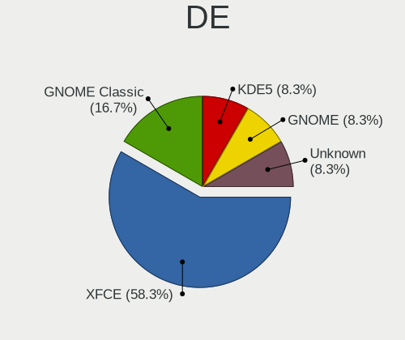
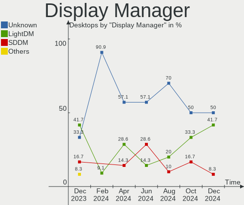
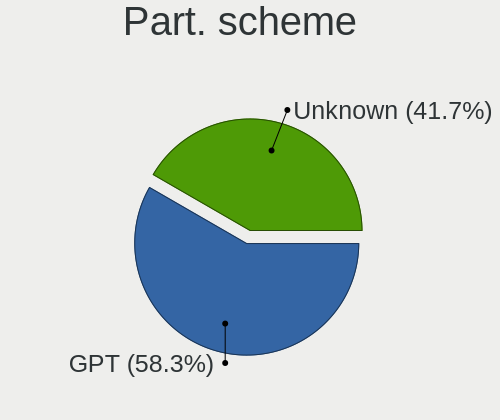
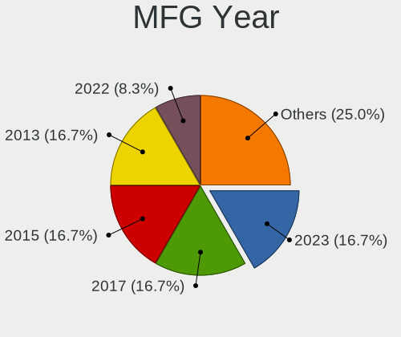
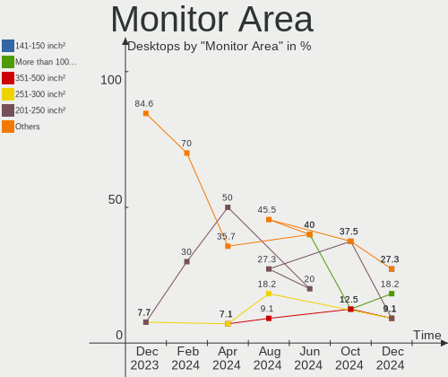
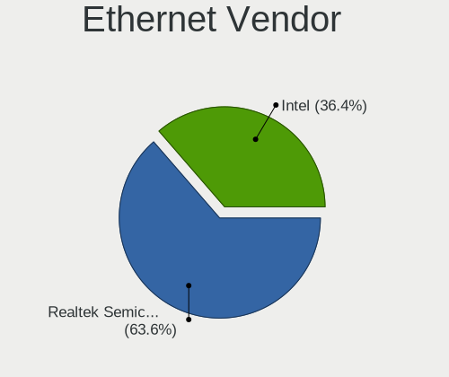
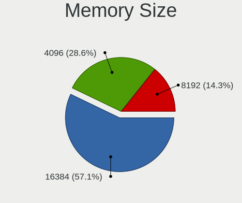

Kali - Hardware Trends (Desktops)
---------------------------------

A project to identify most popular hardware characteristics and track their change
over time based on data collected by Linux users at https://Linux-Hardware.org.

Anyone can contribute to this report by the [hw-probe](https://github.com/linuxhw/hw-probe) tool:

    sudo -E hw-probe -all -upload

This report is for one last month. Overall report since the beginning of time: [TestDays](https://github.com/linuxhw/TestDays)

Period: Jul, 2023.

Contents
--------

* [ System ](#system)
  - [ OS                       ](#os)
  - [ OS Family                ](#os-family)
  - [ Kernel                   ](#kernel)
  - [ Kernel Family            ](#kernel-family)
  - [ Kernel Major Ver.        ](#kernel-major-ver)
  - [ Arch                     ](#arch)
  - [ DE                       ](#de)
  - [ Display Server           ](#display-server)
  - [ Display Manager          ](#display-manager)
  - [ OS Lang                  ](#os-lang)
  - [ Boot Mode                ](#boot-mode)
  - [ Filesystem               ](#filesystem)
  - [ Part. scheme             ](#part-scheme)
  - [ Dual Boot with Linux/BSD ](#dual-boot-with-linuxbsd)
  - [ Dual Boot (Win)          ](#dual-boot-win)

* [ Board ](#board)
  - [ Vendor                   ](#vendor)
  - [ Model                    ](#model)
  - [ Model Family             ](#model-family)
  - [ MFG Year                 ](#mfg-year)
  - [ Form Factor              ](#form-factor)
  - [ Secure Boot              ](#secure-boot)
  - [ Coreboot                 ](#coreboot)
  - [ RAM Size                 ](#ram-size)
  - [ RAM Used                 ](#ram-used)
  - [ Total Drives             ](#total-drives)
  - [ Has CD-ROM               ](#has-cd-rom)
  - [ Has Ethernet             ](#has-ethernet)
  - [ Has WiFi                 ](#has-wifi)
  - [ Has Bluetooth            ](#has-bluetooth)

* [ Location ](#location)
  - [ Country                  ](#country)
  - [ City                     ](#city)

* [ Drives ](#drives)
  - [ Drive Vendor             ](#drive-vendor)
  - [ Drive Model              ](#drive-model)
  - [ HDD Vendor               ](#hdd-vendor)
  - [ SSD Vendor               ](#ssd-vendor)
  - [ Drive Kind               ](#drive-kind)
  - [ Drive Connector          ](#drive-connector)
  - [ Drive Size               ](#drive-size)
  - [ Space Total              ](#space-total)
  - [ Space Used               ](#space-used)
  - [ Malfunc. Drives          ](#malfunc-drives)
  - [ Malfunc. Drive Vendor    ](#malfunc-drive-vendor)
  - [ Malfunc. HDD Vendor      ](#malfunc-hdd-vendor)
  - [ Malfunc. Drive Kind      ](#malfunc-drive-kind)
  - [ Failed Drives            ](#failed-drives)
  - [ Failed Drive Vendor      ](#failed-drive-vendor)
  - [ Drive Status             ](#drive-status)

* [ Storage controller ](#storage-controller)
  - [ Storage Vendor           ](#storage-vendor)
  - [ Storage Model            ](#storage-model)
  - [ Storage Kind             ](#storage-kind)

* [ Processor ](#processor)
  - [ CPU Vendor               ](#cpu-vendor)
  - [ CPU Model                ](#cpu-model)
  - [ CPU Model Family         ](#cpu-model-family)
  - [ CPU Cores                ](#cpu-cores)
  - [ CPU Sockets              ](#cpu-sockets)
  - [ CPU Threads              ](#cpu-threads)
  - [ CPU Op-Modes             ](#cpu-op-modes)
  - [ CPU Microcode            ](#cpu-microcode)
  - [ CPU Microarch            ](#cpu-microarch)

* [ Graphics ](#graphics)
  - [ GPU Vendor               ](#gpu-vendor)
  - [ GPU Model                ](#gpu-model)
  - [ GPU Combo                ](#gpu-combo)
  - [ GPU Driver               ](#gpu-driver)
  - [ GPU Memory               ](#gpu-memory)

* [ Monitor ](#monitor)
  - [ Monitor Vendor           ](#monitor-vendor)
  - [ Monitor Model            ](#monitor-model)
  - [ Monitor Resolution       ](#monitor-resolution)
  - [ Monitor Diagonal         ](#monitor-diagonal)
  - [ Monitor Width            ](#monitor-width)
  - [ Aspect Ratio             ](#aspect-ratio)
  - [ Monitor Area             ](#monitor-area)
  - [ Pixel Density            ](#pixel-density)
  - [ Multiple Monitors        ](#multiple-monitors)

* [ Network ](#network)
  - [ Net Controller Vendor    ](#net-controller-vendor)
  - [ Net Controller Model     ](#net-controller-model)
  - [ Wireless Vendor          ](#wireless-vendor)
  - [ Wireless Model           ](#wireless-model)
  - [ Ethernet Vendor          ](#ethernet-vendor)
  - [ Ethernet Model           ](#ethernet-model)
  - [ Net Controller Kind      ](#net-controller-kind)
  - [ Used Controller          ](#used-controller)
  - [ NICs                     ](#nics)
  - [ IPv6                     ](#ipv6)

* [ Bluetooth ](#bluetooth)
  - [ Bluetooth Vendor         ](#bluetooth-vendor)
  - [ Bluetooth Model          ](#bluetooth-model)

* [ Sound ](#sound)
  - [ Sound Vendor             ](#sound-vendor)
  - [ Sound Model              ](#sound-model)

* [ Memory ](#memory)
  - [ Memory Vendor            ](#memory-vendor)
  - [ Memory Model             ](#memory-model)
  - [ Memory Kind              ](#memory-kind)
  - [ Memory Form Factor       ](#memory-form-factor)
  - [ Memory Size              ](#memory-size)
  - [ Memory Speed             ](#memory-speed)

* [ Printers & scanners ](#printers--scanners)
  - [ Printer Vendor           ](#printer-vendor)
  - [ Printer Model            ](#printer-model)
  - [ Scanner Vendor           ](#scanner-vendor)
  - [ Scanner Model            ](#scanner-model)

* [ Camera ](#camera)
  - [ Camera Vendor            ](#camera-vendor)
  - [ Camera Model             ](#camera-model)

* [ Security ](#security)
  - [ Fingerprint Vendor       ](#fingerprint-vendor)
  - [ Fingerprint Model        ](#fingerprint-model)
  - [ Chipcard Vendor          ](#chipcard-vendor)
  - [ Chipcard Model           ](#chipcard-model)

* [ Unsupported ](#unsupported)
  - [ Unsupported Devices      ](#unsupported-devices)
  - [ Unsupported Device Types ](#unsupported-device-types)

System
------

OS
--

Installed operating systems

| Name        | Desktops | Percent |
|-------------|----------|---------|
| Kali 2023.2 | 18       | 100%    |

OS Family
---------

OS without a version

| Name | Desktops | Percent |
|------|----------|---------|
| Kali | 18       | 100%    |

Kernel
------

Version of the Linux kernel

| Version            | Desktops | Percent |
|--------------------|----------|---------|
| 6.1.0-kali9-amd64  | 8        | 44.44%  |
| 6.3.0-kali1-amd64  | 7        | 38.89%  |
| 6.1.0-kali7-amd64  | 1        | 5.56%   |
| 6.0.0-kali3-amd64  | 1        | 5.56%   |
| 5.14.0-kali4-amd64 | 1        | 5.56%   |

Kernel Family
-------------

Linux kernel without a distro release

| Version | Desktops | Percent |
|---------|----------|---------|
| 6.1.0   | 9        | 50%     |
| 6.3.0   | 7        | 38.89%  |
| 6.0.0   | 1        | 5.56%   |
| 5.14.0  | 1        | 5.56%   |

Kernel Major Ver.
-----------------

Linux kernel major version

| Version | Desktops | Percent |
|---------|----------|---------|
| 6.1     | 9        | 50%     |
| 6.3     | 7        | 38.89%  |
| 6.0     | 1        | 5.56%   |
| 5.14    | 1        | 5.56%   |

Arch
----

OS architecture (x86_64, i586, etc.)

| Name   | Desktops | Percent |
|--------|----------|---------|
| x86_64 | 18       | 100%    |

DE
--

Desktop Environment

| Name    | Desktops | Percent |
|---------|----------|---------|
| XFCE    | 10       | 55.56%  |
| GNOME   | 4        | 22.22%  |
| KDE5    | 3        | 16.67%  |
| Unknown | 1        | 5.56%   |

Display Server
--------------

X11 or Wayland

| Name    | Desktops | Percent |
|---------|----------|---------|
| X11     | 16       | 88.89%  |
| Wayland | 2        | 11.11%  |

Display Manager
---------------

SDDM, LightDM, etc.

| Name    | Desktops | Percent |
|---------|----------|---------|
| LightDM | 9        | 50%     |
| SDDM    | 5        | 27.78%  |
| Unknown | 3        | 16.67%  |
| GDM3    | 1        | 5.56%   |

OS Lang
-------

Language

| Lang    | Desktops | Percent |
|---------|----------|---------|
| en_US   | 12       | 66.67%  |
| en_GB   | 2        | 11.11%  |
| ru_RU   | 1        | 5.56%   |
| es_ES   | 1        | 5.56%   |
| en_IN   | 1        | 5.56%   |
| Unknown | 1        | 5.56%   |

Boot Mode
---------

EFI or BIOS

| Mode | Desktops | Percent |
|------|----------|---------|
| EFI  | 14       | 77.78%  |
| BIOS | 4        | 22.22%  |

Filesystem
----------

Type of filesystem

| Type    | Desktops | Percent |
|---------|----------|---------|
| Ext4    | 16       | 88.89%  |
| Tmpfs   | 1        | 5.56%   |
| Overlay | 1        | 5.56%   |

Part. scheme
------------

Scheme of partitioning

| Type    | Desktops | Percent |
|---------|----------|---------|
| GPT     | 13       | 72.22%  |
| MBR     | 3        | 16.67%  |
| Unknown | 2        | 11.11%  |

Dual Boot with Linux/BSD
------------------------

Hosting more than one Linux/BSD

| Dual boot | Desktops | Percent |
|-----------|----------|---------|
| No        | 16       | 88.89%  |
| Yes       | 2        | 11.11%  |

Dual Boot (Win)
---------------

Hosting Linux and Windows

| Dual boot | Desktops | Percent |
|-----------|----------|---------|
| Yes       | 10       | 55.56%  |
| No        | 8        | 44.44%  |

Board
-----

Vendor
------

Motherboard manufacturer

| Name                | Desktops | Percent |
|---------------------|----------|---------|
| ASUSTek Computer    | 4        | 22.22%  |
| MSI                 | 3        | 16.67%  |
| Gigabyte Technology | 3        | 16.67%  |
| Hewlett-Packard     | 2        | 11.11%  |
| Dell                | 2        | 11.11%  |
| Lenovo              | 1        | 5.56%   |
| Intel               | 1        | 5.56%   |
| Fujitsu Siemens     | 1        | 5.56%   |
| Unknown             | 1        | 5.56%   |

Model
-----

Motherboard model

| Name                                      | Desktops | Percent |
|-------------------------------------------|----------|---------|
| MSI MS-7D75                               | 1        | 5.56%   |
| MSI MS-7B87                               | 1        | 5.56%   |
| MSI MS-7994                               | 1        | 5.56%   |
| Lenovo V520-15IKL Desktop 10NK001AUM      | 1        | 5.56%   |
| Intel X79                                 | 1        | 5.56%   |
| HP Z620 Workstation                       | 1        | 5.56%   |
| HP Victus by 15L Gaming Desktop TG02-0xxx | 1        | 5.56%   |
| Gigabyte H110M-DS2V                       | 1        | 5.56%   |
| Gigabyte B450M DS3H                       | 1        | 5.56%   |
| Gigabyte A620M GAMING X                   | 1        | 5.56%   |
| Fujitsu Siemens ESPRIMO EDITION P2540     | 1        | 5.56%   |
| Dell Vostro 270s                          | 1        | 5.56%   |
| Dell OptiPlex 9010                        | 1        | 5.56%   |
| ASUS ROG STRIX B650E-F GAMING WIFI        | 1        | 5.56%   |
| ASUS ROG STRIX B550-F GAMING              | 1        | 5.56%   |
| ASUS ROG STRIX B365-G GAMING              | 1        | 5.56%   |
| ASUS All Series                           | 1        | 5.56%   |
| Unknown                                   | 1        | 5.56%   |

Model Family
------------

Motherboard model prefix

| Name                    | Desktops | Percent |
|-------------------------|----------|---------|
| ASUS ROG                | 3        | 16.67%  |
| MSI MS-7D75             | 1        | 5.56%   |
| MSI MS-7B87             | 1        | 5.56%   |
| MSI MS-7994             | 1        | 5.56%   |
| Lenovo V520-15IKL       | 1        | 5.56%   |
| Intel X79               | 1        | 5.56%   |
| HP Z620                 | 1        | 5.56%   |
| HP Victus               | 1        | 5.56%   |
| Gigabyte H110M-DS2V     | 1        | 5.56%   |
| Gigabyte B450M          | 1        | 5.56%   |
| Gigabyte A620M          | 1        | 5.56%   |
| Fujitsu Siemens ESPRIMO | 1        | 5.56%   |
| Dell Vostro             | 1        | 5.56%   |
| Dell OptiPlex           | 1        | 5.56%   |
| ASUS All                | 1        | 5.56%   |
| Unknown                 | 1        | 5.56%   |

MFG Year
--------

Motherboard manufacture year

| Year | Desktops | Percent |
|------|----------|---------|
| 2022 | 4        | 22.22%  |
| 2012 | 3        | 16.67%  |
| 2018 | 2        | 11.11%  |
| 2016 | 2        | 11.11%  |
| 2023 | 1        | 5.56%   |
| 2021 | 1        | 5.56%   |
| 2020 | 1        | 5.56%   |
| 2019 | 1        | 5.56%   |
| 2017 | 1        | 5.56%   |
| 2014 | 1        | 5.56%   |
| 2008 | 1        | 5.56%   |

Form Factor
-----------

Physical design of the computer

| Name    | Desktops | Percent |
|---------|----------|---------|
| Desktop | 18       | 100%    |

Secure Boot
-----------

Enabled or disabled

| State    | Desktops | Percent |
|----------|----------|---------|
| Disabled | 18       | 100%    |

Coreboot
--------

Have coreboot on board

| Used | Desktops | Percent |
|------|----------|---------|
| No   | 18       | 100%    |

RAM Size
--------

Total RAM memory

| Size in GB  | Desktops | Percent |
|-------------|----------|---------|
| 16.01-24.0  | 5        | 27.78%  |
| 8.01-16.0   | 4        | 22.22%  |
| 32.01-64.0  | 3        | 16.67%  |
| 4.01-8.0    | 2        | 11.11%  |
| 3.01-4.0    | 2        | 11.11%  |
| 2.01-3.0    | 1        | 5.56%   |
| 64.01-256.0 | 1        | 5.56%   |

RAM Used
--------

Used RAM memory

| Used GB  | Desktops | Percent |
|----------|----------|---------|
| 2.01-3.0 | 8        | 44.44%  |
| 1.01-2.0 | 7        | 38.89%  |
| 4.01-8.0 | 2        | 11.11%  |
| 3.01-4.0 | 1        | 5.56%   |

Total Drives
------------

Number of drives on board

| Drives | Desktops | Percent |
|--------|----------|---------|
| 2      | 8        | 44.44%  |
| 1      | 7        | 38.89%  |
| 5      | 1        | 5.56%   |
| 4      | 1        | 5.56%   |
| 3      | 1        | 5.56%   |

Has CD-ROM
----------

Has CD-ROM on board

| Presented | Desktops | Percent |
|-----------|----------|---------|
| No        | 13       | 72.22%  |
| Yes       | 5        | 27.78%  |

Has Ethernet
------------

Has Ethernet on board

| Presented | Desktops | Percent |
|-----------|----------|---------|
| Yes       | 18       | 100%    |

Has WiFi
--------

Has WiFi module

| Presented | Desktops | Percent |
|-----------|----------|---------|
| Yes       | 12       | 66.67%  |
| No        | 6        | 33.33%  |

Has Bluetooth
-------------

Has Bluetooth module

| Presented | Desktops | Percent |
|-----------|----------|---------|
| No        | 10       | 55.56%  |
| Yes       | 8        | 44.44%  |

Location
--------

Country
-------

Geographic location (country)

| Country     | Desktops | Percent |
|-------------|----------|---------|
| USA         | 4        | 22.22%  |
| UK          | 2        | 11.11%  |
| Spain       | 2        | 11.11%  |
| Russia      | 2        | 11.11%  |
| South Korea | 1        | 5.56%   |
| Myanmar     | 1        | 5.56%   |
| Morocco     | 1        | 5.56%   |
| Kuwait      | 1        | 5.56%   |
| Jordan      | 1        | 5.56%   |
| Jersey      | 1        | 5.56%   |
| India       | 1        | 5.56%   |
| France      | 1        | 5.56%   |

City
----

Geographic location (city)

| City         | Desktops | Percent |
|--------------|----------|---------|
| Zaragoza     | 1        | 5.56%   |
| Yangon       | 1        | 5.56%   |
| Wakefield    | 1        | 5.56%   |
| San Diego    | 1        | 5.56%   |
| Saha-gu      | 1        | 5.56%   |
| Podolsk      | 1        | 5.56%   |
| Moscow       | 1        | 5.56%   |
| Montpellier  | 1        | 5.56%   |
| Kuwait City  | 1        | 5.56%   |
| Jersey       | 1        | 5.56%   |
| Indianapolis | 1        | 5.56%   |
| Greenville   | 1        | 5.56%   |
| Columbia     | 1        | 5.56%   |
| Chennai      | 1        | 5.56%   |
| Casablanca   | 1        | 5.56%   |
| Birmingham   | 1        | 5.56%   |
| Ávila       | 1        | 5.56%   |
| Aqaba        | 1        | 5.56%   |

Drives
------

Drive Vendor
------------

Hard drive vendors

| Vendor                    | Desktops | Drives | Percent |
|---------------------------|----------|--------|---------|
| WDC                       | 7        | 9      | 22.58%  |
| Seagate                   | 6        | 8      | 19.35%  |
| Samsung Electronics       | 6        | 6      | 19.35%  |
| Sandisk                   | 2        | 3      | 6.45%   |
| Kingston                  | 2        | 2      | 6.45%   |
| Toshiba                   | 1        | 1      | 3.23%   |
| SPCC                      | 1        | 1      | 3.23%   |
| MSI                       | 1        | 1      | 3.23%   |
| Micron/Crucial Technology | 1        | 1      | 3.23%   |
| KingFast                  | 1        | 1      | 3.23%   |
| Intel                     | 1        | 1      | 3.23%   |
| Fanxiang                  | 1        | 1      | 3.23%   |
| Crucial                   | 1        | 1      | 3.23%   |

Drive Model
-----------

Hard drive models

| Model                                        | Desktops | Percent |
|----------------------------------------------|----------|---------|
| Seagate ST1000DM010-2EP102 1TB               | 2        | 5.56%   |
| WDC WDS240G2G0A-00JH30 240GB SSD             | 1        | 2.78%   |
| WDC WDS120G2G0B-00EPW0 120GB SSD             | 1        | 2.78%   |
| WDC WDS120G2G0A-00JH30 120GB SSD             | 1        | 2.78%   |
| WDC WDS100T2B0A-00SM50 1TB SSD               | 1        | 2.78%   |
| WDC WD5000AZLX-22JKKA0 500GB                 | 1        | 2.78%   |
| WDC WD40EFAX-68JH4N0 4TB                     | 1        | 2.78%   |
| WDC WD3200AAKS-75L9A0 320GB                  | 1        | 2.78%   |
| WDC WD2002FYPS-02W3B0 2TB                    | 1        | 2.78%   |
| WDC WD10EZEX-00MFCA0 1TB                     | 1        | 2.78%   |
| Toshiba HDWR160 6TB                          | 1        | 2.78%   |
| SPCC Solid State Disk 128GB                  | 1        | 2.78%   |
| Seagate ST500DM002-1SB10A 500GB              | 1        | 2.78%   |
| Seagate ST3250312AS 250GB                    | 1        | 2.78%   |
| Seagate ST3250310AS 250GB                    | 1        | 2.78%   |
| Seagate ST3000VX006-1HH166 3TB               | 1        | 2.78%   |
| Seagate ST1000DM003-1SB102 1TB               | 1        | 2.78%   |
| Seagate BUP SL 5TB                           | 1        | 2.78%   |
| Sandisk WD_BLACK SN770 500GB                 | 1        | 2.78%   |
| SanDisk Portable SSD 1TB                     | 1        | 2.78%   |
| SanDisk NVMe SSD Drive 500GB                 | 1        | 2.78%   |
| Samsung SSD 980 1TB                          | 1        | 2.78%   |
| Samsung SSD 970 EVO Plus 500GB               | 1        | 2.78%   |
| Samsung SSD 970 EVO Plus 1TB S6S1NS0T337327E | 1        | 2.78%   |
| Samsung SSD 870 EVO 250GB                    | 1        | 2.78%   |
| Samsung SSD 850 EVO M.2 120GB                | 1        | 2.78%   |
| Samsung SSD 840 EVO 120GB                    | 1        | 2.78%   |
| MSI M390 1TB                                 | 1        | 2.78%   |
| Micron/Crucial CT500P5PSSD8 500GB            | 1        | 2.78%   |
| Kingston SV300S37A120G 120GB SSD             | 1        | 2.78%   |
| Kingston SA400S37120G 120GB SSD              | 1        | 2.78%   |
| KingFast SSD 256GB                           | 1        | 2.78%   |
| Intel SSDPEKNU512GZH 512GB                   | 1        | 2.78%   |
| Fanxiang S101 512GB                          | 1        | 2.78%   |
| Crucial CT2000BX500SSD1 2TB                  | 1        | 2.78%   |

HDD Vendor
----------

Hard disk drive vendors

| Vendor  | Desktops | Drives | Percent |
|---------|----------|--------|---------|
| Seagate | 6        | 8      | 50%     |
| WDC     | 5        | 5      | 41.67%  |
| Toshiba | 1        | 1      | 8.33%   |

SSD Vendor
----------

Solid state drive vendors

| Vendor              | Desktops | Drives | Percent |
|---------------------|----------|--------|---------|
| WDC                 | 4        | 4      | 28.57%  |
| Samsung Electronics | 3        | 3      | 21.43%  |
| Kingston            | 2        | 2      | 14.29%  |
| SPCC                | 1        | 1      | 7.14%   |
| SanDisk             | 1        | 1      | 7.14%   |
| KingFast            | 1        | 1      | 7.14%   |
| Fanxiang            | 1        | 1      | 7.14%   |
| Crucial             | 1        | 1      | 7.14%   |

Drive Kind
----------

HDD or SSD

| Kind | Desktops | Drives | Percent |
|------|----------|--------|---------|
| SSD  | 12       | 14     | 41.38%  |
| HDD  | 10       | 14     | 34.48%  |
| NVMe | 7        | 8      | 24.14%  |

Drive Connector
---------------

SATA, SAS, NVMe, etc.

| Type | Desktops | Drives | Percent |
|------|----------|--------|---------|
| SATA | 13       | 26     | 59.09%  |
| NVMe | 7        | 8      | 31.82%  |
| SAS  | 2        | 2      | 9.09%   |

Drive Size
----------

Size of hard drive

| Size in TB | Desktops | Drives | Percent |
|------------|----------|--------|---------|
| 0.01-0.5   | 10       | 15     | 45.45%  |
| 0.51-1.0   | 6        | 7      | 27.27%  |
| 1.01-2.0   | 2        | 2      | 9.09%   |
| 4.01-10.0  | 2        | 2      | 9.09%   |
| 3.01-4.0   | 1        | 1      | 4.55%   |
| 2.01-3.0   | 1        | 1      | 4.55%   |

Space Total
-----------

Amount of disk space available on the file system

| Size in GB     | Desktops | Percent |
|----------------|----------|---------|
| 101-250        | 5        | 27.78%  |
| 251-500        | 4        | 22.22%  |
| 501-1000       | 3        | 16.67%  |
| 2001-3000      | 2        | 11.11%  |
| 1001-2000      | 2        | 11.11%  |
| More than 3000 | 1        | 5.56%   |
| Unknown        | 1        | 5.56%   |

Space Used
----------

Amount of used disk space

| Used GB        | Desktops | Percent |
|----------------|----------|---------|
| 21-50          | 6        | 33.33%  |
| 101-250        | 3        | 16.67%  |
| 1-20           | 3        | 16.67%  |
| 501-1000       | 2        | 11.11%  |
| More than 3000 | 1        | 5.56%   |
| 251-500        | 1        | 5.56%   |
| 51-100         | 1        | 5.56%   |
| Unknown        | 1        | 5.56%   |

Malfunc. Drives
---------------

Drive models with a malfunction

| Model                          | Desktops | Drives | Percent |
|--------------------------------|----------|--------|---------|
| WDC WD5000AZLX-22JKKA0 500GB   | 1        | 1      | 25%     |
| WDC WD40EFAX-68JH4N0 4TB       | 1        | 1      | 25%     |
| SPCC Solid State Disk 128GB    | 1        | 1      | 25%     |
| Seagate ST1000DM003-1SB102 1TB | 1        | 1      | 25%     |

Malfunc. Drive Vendor
---------------------

Vendors of faulty drives

| Vendor  | Desktops | Drives | Percent |
|---------|----------|--------|---------|
| WDC     | 2        | 2      | 50%     |
| SPCC    | 1        | 1      | 25%     |
| Seagate | 1        | 1      | 25%     |

Malfunc. HDD Vendor
-------------------

Vendors of faulty HDD drives

| Vendor  | Desktops | Drives | Percent |
|---------|----------|--------|---------|
| WDC     | 2        | 2      | 66.67%  |
| Seagate | 1        | 1      | 33.33%  |

Malfunc. Drive Kind
-------------------

Kinds of faulty drives

| Kind | Desktops | Drives | Percent |
|------|----------|--------|---------|
| HDD  | 3        | 3      | 75%     |
| SSD  | 1        | 1      | 25%     |

Failed Drives
-------------

Failed drive models

Zero info for selected period =(

Failed Drive Vendor
-------------------

Failed drive vendors

Zero info for selected period =(

Drive Status
------------

Number of failed and malfunc. drives

| Status   | Desktops | Drives | Percent |
|----------|----------|--------|---------|
| Works    | 15       | 26     | 65.22%  |
| Detected | 4        | 6      | 17.39%  |
| Malfunc  | 4        | 4      | 17.39%  |

Storage controller
------------------

Storage Vendor
--------------

Storage controller vendors

| Vendor                    | Desktops | Percent |
|---------------------------|----------|---------|
| Intel                     | 11       | 42.31%  |
| AMD                       | 8        | 30.77%  |
| Samsung Electronics       | 3        | 11.54%  |
| ASMedia Technology        | 2        | 7.69%   |
| SanDisk                   | 1        | 3.85%   |
| Micron/Crucial Technology | 1        | 3.85%   |

Storage Model
-------------

Storage controller models

| Model                                                                         | Desktops | Percent |
|-------------------------------------------------------------------------------|----------|---------|
| AMD FCH SATA Controller [AHCI mode]                                           | 7        | 21.88%  |
| AMD 400 Series Chipset SATA Controller                                        | 3        | 9.38%   |
| Samsung NVMe SSD Controller SM981/PM981/PM983                                 | 2        | 6.25%   |
| Intel Q170/Q150/B150/H170/H110/Z170/CM236 Chipset SATA Controller [AHCI Mode] | 2        | 6.25%   |
| Intel 200 Series PCH SATA controller [AHCI mode]                              | 2        | 6.25%   |
| ASMedia ASM1062 Serial ATA Controller                                         | 2        | 6.25%   |
| SanDisk WD Black SN770 / PC SN740 256GB / PC SN560 (DRAM-less) NVMe SSD       | 1        | 3.13%   |
| Samsung NVMe SSD Controller 980                                               | 1        | 3.13%   |
| Micron/Crucial P5 Plus NVMe PCIe SSD                                          | 1        | 3.13%   |
| Intel SSD 670p Series [Keystone Harbor]                                       | 1        | 3.13%   |
| Intel SATA Controller [RAID mode]                                             | 1        | 3.13%   |
| Intel NM10/ICH7 Family SATA Controller [IDE mode]                             | 1        | 3.13%   |
| Intel C602 chipset 4-Port SATA Storage Control Unit                           | 1        | 3.13%   |
| Intel C600/X79 series chipset SATA RAID Controller                            | 1        | 3.13%   |
| Intel C600/X79 series chipset IDE-r Controller                                | 1        | 3.13%   |
| Intel C600/X79 series chipset 6-Port SATA AHCI Controller                     | 1        | 3.13%   |
| Intel 9 Series Chipset Family SATA Controller [AHCI Mode]                     | 1        | 3.13%   |
| Intel 7 Series/C210 Series Chipset Family 6-port SATA Controller [AHCI mode]  | 1        | 3.13%   |
| AMD FCH SATA Controller [RAID Bottom]                                         | 1        | 3.13%   |
| AMD 500 Series Chipset SATA Controller                                        | 1        | 3.13%   |

Storage Kind
------------

Kind of storage controller (IDE, SATA, NVMe, SAS, ...)

| Kind | Desktops | Percent |
|------|----------|---------|
| SATA | 15       | 55.56%  |
| NVMe | 7        | 25.93%  |
| RAID | 2        | 7.41%   |
| IDE  | 2        | 7.41%   |
| SAS  | 1        | 3.7%    |

Processor
---------

CPU Vendor
----------

Processor vendors

| Vendor | Desktops | Percent |
|--------|----------|---------|
| Intel  | 10       | 55.56%  |
| AMD    | 8        | 44.44%  |

CPU Model
---------

Processor models

| Model                                   | Desktops | Percent |
|-----------------------------------------|----------|---------|
| Intel Xeon CPU E5-2620 0 @ 2.00GHz      | 2        | 11.11%  |
| Intel Core i5-6400 CPU @ 2.70GHz        | 2        | 11.11%  |
| AMD Ryzen 5 5600G with Radeon Graphics  | 2        | 11.11%  |
| Intel Pentium CPU G2020 @ 2.90GHz       | 1        | 5.56%   |
| Intel Core i7-4790K CPU @ 4.00GHz       | 1        | 5.56%   |
| Intel Core i7-3770 CPU @ 3.40GHz        | 1        | 5.56%   |
| Intel Core i3-9100 CPU @ 3.60GHz        | 1        | 5.56%   |
| Intel Core i3-7100 CPU @ 3.90GHz        | 1        | 5.56%   |
| Intel Core 2 Duo CPU E7300 @ 2.66GHz    | 1        | 5.56%   |
| AMD Ryzen 9 7900X 12-Core Processor     | 1        | 5.56%   |
| AMD Ryzen 9 5900HX with Radeon Graphics | 1        | 5.56%   |
| AMD Ryzen 7 7700 8-Core Processor       | 1        | 5.56%   |
| AMD Ryzen 7 2700 Eight-Core Processor   | 1        | 5.56%   |
| AMD Ryzen 5 7600 6-Core Processor       | 1        | 5.56%   |
| AMD Ryzen 5 2600 Six-Core Processor     | 1        | 5.56%   |

CPU Model Family
----------------

Processor model prefix

| Model            | Desktops | Percent |
|------------------|----------|---------|
| AMD Ryzen 5      | 4        | 22.22%  |
| Intel Xeon       | 2        | 11.11%  |
| Intel Core i7    | 2        | 11.11%  |
| Intel Core i5    | 2        | 11.11%  |
| Intel Core i3    | 2        | 11.11%  |
| AMD Ryzen 9      | 2        | 11.11%  |
| AMD Ryzen 7      | 2        | 11.11%  |
| Intel Pentium    | 1        | 5.56%   |
| Intel Core 2 Duo | 1        | 5.56%   |

CPU Cores
---------

Number of processor cores

| Number | Desktops | Percent |
|--------|----------|---------|
| 4      | 5        | 27.78%  |
| 6      | 4        | 22.22%  |
| 12     | 3        | 16.67%  |
| 8      | 3        | 16.67%  |
| 2      | 3        | 16.67%  |

CPU Sockets
-----------

Number of sockets

| Number | Desktops | Percent |
|--------|----------|---------|
| 1      | 16       | 88.89%  |
| 2      | 2        | 11.11%  |

CPU Threads
-----------

Threads per core (Hyper-Threading)

| Number | Desktops | Percent |
|--------|----------|---------|
| 2      | 13       | 72.22%  |
| 1      | 5        | 27.78%  |

CPU Op-Modes
------------

CPU Operation Modes (32-bit, 64-bit)

| Op mode        | Desktops | Percent |
|----------------|----------|---------|
| 32-bit, 64-bit | 18       | 100%    |

CPU Microcode
-------------

Microcode number

| Number     | Desktops | Percent |
|------------|----------|---------|
| 0x0a601203 | 3        | 16.67%  |
| Unknown    | 3        | 16.67%  |
| 0x306a9    | 2        | 11.11%  |
| 0x206d7    | 2        | 11.11%  |
| 0x0a50000d | 2        | 11.11%  |
| 0x0800820d | 2        | 11.11%  |
| 0x506e3    | 1        | 5.56%   |
| 0x306c3    | 1        | 5.56%   |
| 0x10676    | 1        | 5.56%   |
| 0x0a50000c | 1        | 5.56%   |

CPU Microarch
-------------

Microarchitecture

| Name        | Desktops | Percent |
|-------------|----------|---------|
| Zen 3       | 3        | 16.67%  |
| Unknown     | 3        | 16.67%  |
| Zen+        | 2        | 11.11%  |
| Skylake     | 2        | 11.11%  |
| SandyBridge | 2        | 11.11%  |
| KabyLake    | 2        | 11.11%  |
| IvyBridge   | 2        | 11.11%  |
| Penryn      | 1        | 5.56%   |
| Haswell     | 1        | 5.56%   |

Graphics
--------

GPU Vendor
----------

Vendors of graphics cards

| Vendor | Desktops | Percent |
|--------|----------|---------|
| Nvidia | 9        | 42.86%  |
| AMD    | 8        | 38.1%   |
| Intel  | 4        | 19.05%  |

GPU Model
---------

Graphics card models

| Model                                                                 | Desktops | Percent |
|-----------------------------------------------------------------------|----------|---------|
| Nvidia GA106 [Geforce RTX 3050]                                       | 2        | 9.52%   |
| AMD Raphael                                                           | 2        | 9.52%   |
| AMD Cezanne [Radeon Vega Series / Radeon Vega Mobile Series]          | 2        | 9.52%   |
| Nvidia TU116 [GeForce GTX 1650 SUPER]                                 | 1        | 4.76%   |
| Nvidia GP107 [GeForce GTX 1050 Ti]                                    | 1        | 4.76%   |
| Nvidia GP104 [GeForce GTX 1070]                                       | 1        | 4.76%   |
| Nvidia GM204 [GeForce GTX 980]                                        | 1        | 4.76%   |
| Nvidia GK208B [GeForce GT 710]                                        | 1        | 4.76%   |
| Nvidia GK107GL [Quadro K2000]                                         | 1        | 4.76%   |
| Nvidia AD104 [GeForce RTX 4070]                                       | 1        | 4.76%   |
| Intel Xeon E3-1200 v2/3rd Gen Core processor Graphics Controller      | 1        | 4.76%   |
| Intel HD Graphics 630                                                 | 1        | 4.76%   |
| Intel HD Graphics 530                                                 | 1        | 4.76%   |
| Intel 4 Series Chipset Integrated Graphics Controller                 | 1        | 4.76%   |
| AMD Polaris 20 XL [Radeon RX 580 2048SP]                              | 1        | 4.76%   |
| AMD Oland [Radeon HD 8570 / R5 430 OEM / R7 240/340 / Radeon 520 OEM] | 1        | 4.76%   |
| AMD Navi 10 [Radeon RX 5600 OEM/5600 XT / 5700/5700 XT]               | 1        | 4.76%   |
| AMD Ellesmere [Radeon RX 470/480/570/570X/580/580X/590]               | 1        | 4.76%   |

GPU Combo
---------

Combinations of graphics cards

| Name         | Desktops | Percent |
|--------------|----------|---------|
| 1 x Nvidia   | 6        | 33.33%  |
| 1 x AMD      | 5        | 27.78%  |
| 1 x Intel    | 4        | 22.22%  |
| AMD + Nvidia | 3        | 16.67%  |

GPU Driver
----------

Free vs proprietary

| Driver      | Desktops | Percent |
|-------------|----------|---------|
| Free        | 13       | 72.22%  |
| Proprietary | 5        | 27.78%  |

GPU Memory
----------

Total video memory

| Size in GB | Desktops | Percent |
|------------|----------|---------|
| 7.01-8.0   | 6        | 33.33%  |
| Unknown    | 5        | 27.78%  |
| 1.01-2.0   | 3        | 16.67%  |
| 3.01-4.0   | 2        | 11.11%  |
| 8.01-16.0  | 1        | 5.56%   |
| 0.01-0.5   | 1        | 5.56%   |

Monitor
-------

Monitor Vendor
--------------

Monitor vendors

| Vendor              | Desktops | Percent |
|---------------------|----------|---------|
| Samsung Electronics | 3        | 15%     |
| BenQ                | 3        | 15%     |
| MSI                 | 2        | 10%     |
| Lenovo              | 2        | 10%     |
| Dell                | 2        | 10%     |
| Vestel              | 1        | 5%      |
| Philips             | 1        | 5%      |
| LG Electronics      | 1        | 5%      |
| ITE                 | 1        | 5%      |
| HKC                 | 1        | 5%      |
| Hewlett-Packard     | 1        | 5%      |
| ASUSTek Computer    | 1        | 5%      |
| Acer                | 1        | 5%      |

Monitor Model
-------------

Monitor models

| Model                                                                   | Desktops | Percent |
|-------------------------------------------------------------------------|----------|---------|
| Vestel LCD Monitor 50UHD_LCD_TV 3840x2160                               | 1        | 4.76%   |
| Samsung Electronics S24E450 SAM0C80 1920x1080 520x290mm 23.4-inch       | 1        | 4.76%   |
| Samsung Electronics LCD Monitor SAM720D 3840x2160 1872x1053mm 84.6-inch | 1        | 4.76%   |
| Samsung Electronics C49HG9x SAM0E5E 1920x1080 1200x340mm 49.1-inch      | 1        | 4.76%   |
| Samsung Electronics C49HG9x SAM0E5D 1920x1080 1200x340mm 49.1-inch      | 1        | 4.76%   |
| Philips LCD Monitor FTV 3840x2160                                       | 1        | 4.76%   |
| MSI MP242 MSI30A1 1920x1080 527x296mm 23.8-inch                         | 1        | 4.76%   |
| MSI G24C4 MSI3BA0 1920x1080 521x293mm 23.5-inch                         | 1        | 4.76%   |
| LG Electronics LCD Monitor LG ULTRAGEAR 1920x1080                       | 1        | 4.76%   |
| Lenovo LI2215sD LEN65CC 1920x1080 476x267mm 21.5-inch                   | 1        | 4.76%   |
| Lenovo LEN G24-10 LEN65FD 1920x1080 521x293mm 23.5-inch                 | 1        | 4.76%   |
| ITE DP2VGA V205 ITE6512 1920x1080 600x340mm 27.2-inch                   | 1        | 4.76%   |
| HKC LCD MONITOR HKC03D7 1440x900 410x256mm 19.0-inch                    | 1        | 4.76%   |
| Hewlett-Packard E242 HWP326E 1920x1200 518x324mm 24.1-inch              | 1        | 4.76%   |
| Dell E2220H DELF119 1920x1080 476x268mm 21.5-inch                       | 1        | 4.76%   |
| Dell E1914H DELD03A 1366x768 410x230mm 18.5-inch                        | 1        | 4.76%   |
| BenQ V2320H BNQ7B22 1920x1080 510x290mm 23.1-inch                       | 1        | 4.76%   |
| BenQ T2200HDA BNQ7725 1920x1080 477x268mm 21.5-inch                     | 1        | 4.76%   |
| BenQ GL2460 BNQ78CE 1920x1080 531x299mm 24.0-inch                       | 1        | 4.76%   |
| ASUSTek Computer VG245 AUS24A1 1920x1080 530x300mm 24.0-inch            | 1        | 4.76%   |
| Acer K242HL ACR03E3 1920x1080 531x299mm 24.0-inch                       | 1        | 4.76%   |

Monitor Resolution
------------------

Monitor screen resolution

| Resolution       | Desktops | Percent |
|------------------|----------|---------|
| 1920x1080 (FHD)  | 11       | 64.71%  |
| 3840x2160 (4K)   | 3        | 17.65%  |
| 3840x1080        | 1        | 5.88%   |
| 1440x900 (WXGA+) | 1        | 5.88%   |
| 1366x768 (WXGA)  | 1        | 5.88%   |

Monitor Diagonal
----------------

Diagonal size in inches

| Inches  | Desktops | Percent |
|---------|----------|---------|
| 23      | 5        | 25%     |
| 24      | 4        | 20%     |
| 21      | 3        | 15%     |
| Unknown | 3        | 15%     |
| 84      | 1        | 5%      |
| 49      | 1        | 5%      |
| 27      | 1        | 5%      |
| 19      | 1        | 5%      |
| 18      | 1        | 5%      |

Monitor Width
-------------

Physical width

| Width in mm | Desktops | Percent |
|-------------|----------|---------|
| 501-600     | 9        | 47.37%  |
| 401-500     | 5        | 26.32%  |
| Unknown     | 3        | 15.79%  |
| 1501-2000   | 1        | 5.26%   |
| 1001-1500   | 1        | 5.26%   |

Aspect Ratio
------------

Proportional relationship between the width and the height

| Ratio   | Desktops | Percent |
|---------|----------|---------|
| 16/9    | 11       | 64.71%  |
| Unknown | 3        | 17.65%  |
| 16/10   | 2        | 11.76%  |
| 32/9    | 1        | 5.88%   |

Monitor Area
------------

Area in inch²

| Area in inch² | Desktops | Percent |
|----------------|----------|---------|
| 201-250        | 7        | 38.89%  |
| 151-200        | 3        | 16.67%  |
| Unknown        | 3        | 16.67%  |
| More than 1000 | 1        | 5.56%   |
| 301-350        | 1        | 5.56%   |
| 251-300        | 1        | 5.56%   |
| 141-150        | 1        | 5.56%   |
| 501-1000       | 1        | 5.56%   |

Pixel Density
-------------

Pixels per inch

| Density | Desktops | Percent |
|---------|----------|---------|
| 51-100  | 12       | 63.16%  |
| 101-120 | 3        | 15.79%  |
| Unknown | 3        | 15.79%  |
| 1-50    | 1        | 5.26%   |

Multiple Monitors
-----------------

Total monitors connected

| Total | Desktops | Percent |
|-------|----------|---------|
| 1     | 14       | 77.78%  |
| 2     | 3        | 16.67%  |
| 3     | 1        | 5.56%   |

Network
-------

Net Controller Vendor
---------------------

Controller vendors

| Vendor                | Desktops | Percent |
|-----------------------|----------|---------|
| Realtek Semiconductor | 14       | 43.75%  |
| Intel                 | 9        | 28.13%  |
| MediaTek              | 3        | 9.38%   |
| Qualcomm Atheros      | 2        | 6.25%   |
| STMicroelectronics    | 1        | 3.13%   |
| SOYEA                 | 1        | 3.13%   |
| Samsung Electronics   | 1        | 3.13%   |
| Broadcom              | 1        | 3.13%   |

Net Controller Model
--------------------

Controller models

| Model                                                                                         | Desktops | Percent |
|-----------------------------------------------------------------------------------------------|----------|---------|
| Realtek RTL8111/8168/8411 PCI Express Gigabit Ethernet Controller                             | 10       | 27.03%  |
| Realtek 802.11ac NIC                                                                          | 2        | 5.41%   |
| Qualcomm Atheros AR9485 Wireless Network Adapter                                              | 2        | 5.41%   |
| Intel Ethernet Controller I225-V                                                              | 2        | 5.41%   |
| Intel Ethernet Connection (2) I219-V                                                          | 2        | 5.41%   |
| Intel 82579LM Gigabit Network Connection (Lewisville)                                         | 2        | 5.41%   |
| STMicroelectronics Virtual COM Port                                                           | 1        | 2.7%    |
| SOYEA SRT873                                                                                  | 1        | 2.7%    |
| Samsung Galaxy series, misc. (tethering mode)                                                 | 1        | 2.7%    |
| Realtek RTL8822CE 802.11ac PCIe Wireless Network Adapter                                      | 1        | 2.7%    |
| Realtek RTL8153 Gigabit Ethernet Adapter                                                      | 1        | 2.7%    |
| Realtek RTL8125 2.5GbE Controller                                                             | 1        | 2.7%    |
| Realtek RTL810xE PCI Express Fast Ethernet controller                                         | 1        | 2.7%    |
| Realtek Realtek 8812AU/8821AU 802.11ac WLAN Adapter [USB Wireless Dual-Band Adapter 2.4/5Ghz] | 1        | 2.7%    |
| Realtek 802.11n WLAN Adapter                                                                  | 1        | 2.7%    |
| MediaTek MT7922 802.11ax PCI Express Wireless Network Adapter                                 | 1        | 2.7%    |
| MediaTek MT7921K (RZ608) Wi-Fi 6E 80MHz                                                       | 1        | 2.7%    |
| MediaTek MT7612U 802.11a/b/g/n/ac Wireless Adapter                                            | 1        | 2.7%    |
| Intel Wireless 7265                                                                           | 1        | 2.7%    |
| Intel Wi-Fi 6 AX200                                                                           | 1        | 2.7%    |
| Intel Ethernet Connection (2) I218-V                                                          | 1        | 2.7%    |
| Intel 82574L Gigabit Network Connection                                                       | 1        | 2.7%    |
| Broadcom NetLink BCM5784M Gigabit Ethernet PCIe                                               | 1        | 2.7%    |

Wireless Vendor
---------------

Wireless vendors

| Vendor                | Desktops | Percent |
|-----------------------|----------|---------|
| Realtek Semiconductor | 5        | 41.67%  |
| MediaTek              | 3        | 25%     |
| Qualcomm Atheros      | 2        | 16.67%  |
| Intel                 | 2        | 16.67%  |

Wireless Model
--------------

Wireless models

| Model                                                                                         | Desktops | Percent |
|-----------------------------------------------------------------------------------------------|----------|---------|
| Realtek 802.11ac NIC                                                                          | 2        | 16.67%  |
| Qualcomm Atheros AR9485 Wireless Network Adapter                                              | 2        | 16.67%  |
| Realtek RTL8822CE 802.11ac PCIe Wireless Network Adapter                                      | 1        | 8.33%   |
| Realtek Realtek 8812AU/8821AU 802.11ac WLAN Adapter [USB Wireless Dual-Band Adapter 2.4/5Ghz] | 1        | 8.33%   |
| Realtek 802.11n WLAN Adapter                                                                  | 1        | 8.33%   |
| MediaTek MT7922 802.11ax PCI Express Wireless Network Adapter                                 | 1        | 8.33%   |
| MediaTek MT7921K (RZ608) Wi-Fi 6E 80MHz                                                       | 1        | 8.33%   |
| MediaTek MT7612U 802.11a/b/g/n/ac Wireless Adapter                                            | 1        | 8.33%   |
| Intel Wireless 7265                                                                           | 1        | 8.33%   |
| Intel Wi-Fi 6 AX200                                                                           | 1        | 8.33%   |

Ethernet Vendor
---------------

Ethernet vendors

| Vendor                | Desktops | Percent |
|-----------------------|----------|---------|
| Realtek Semiconductor | 12       | 57.14%  |
| Intel                 | 7        | 33.33%  |
| Samsung Electronics   | 1        | 4.76%   |
| Broadcom              | 1        | 4.76%   |

Ethernet Model
--------------

Ethernet models

| Model                                                             | Desktops | Percent |
|-------------------------------------------------------------------|----------|---------|
| Realtek RTL8111/8168/8411 PCI Express Gigabit Ethernet Controller | 10       | 43.48%  |
| Intel Ethernet Controller I225-V                                  | 2        | 8.7%    |
| Intel Ethernet Connection (2) I219-V                              | 2        | 8.7%    |
| Intel 82579LM Gigabit Network Connection (Lewisville)             | 2        | 8.7%    |
| Samsung Galaxy series, misc. (tethering mode)                     | 1        | 4.35%   |
| Realtek RTL8153 Gigabit Ethernet Adapter                          | 1        | 4.35%   |
| Realtek RTL8125 2.5GbE Controller                                 | 1        | 4.35%   |
| Realtek RTL810xE PCI Express Fast Ethernet controller             | 1        | 4.35%   |
| Intel Ethernet Connection (2) I218-V                              | 1        | 4.35%   |
| Intel 82574L Gigabit Network Connection                           | 1        | 4.35%   |
| Broadcom NetLink BCM5784M Gigabit Ethernet PCIe                   | 1        | 4.35%   |

Net Controller Kind
-------------------

Ethernet, WiFi or modem

| Kind     | Desktops | Percent |
|----------|----------|---------|
| Ethernet | 18       | 56.25%  |
| WiFi     | 12       | 37.5%   |
| Modem    | 1        | 3.13%   |
| Unknown  | 1        | 3.13%   |

Used Controller
---------------

Currently used network controller

| Kind     | Desktops | Percent |
|----------|----------|---------|
| Ethernet | 14       | 66.67%  |
| WiFi     | 6        | 28.57%  |
| Unknown  | 1        | 4.76%   |

NICs
----

Total network controllers on board

| Total | Desktops | Percent |
|-------|----------|---------|
| 2     | 9        | 50%     |
| 1     | 9        | 50%     |

IPv6
----

IPv6 vs IPv4

| Used | Desktops | Percent |
|------|----------|---------|
| No   | 15       | 83.33%  |
| Yes  | 3        | 16.67%  |

Bluetooth
---------

Bluetooth Vendor
----------------

Controller vendors

| Vendor                          | Desktops | Percent |
|---------------------------------|----------|---------|
| Realtek Semiconductor           | 3        | 37.5%   |
| MediaTek                        | 2        | 25%     |
| Intel                           | 2        | 25%     |
| Qualcomm Atheros Communications | 1        | 12.5%   |

Bluetooth Model
---------------

Controller models

| Model                               | Desktops | Percent |
|-------------------------------------|----------|---------|
| Realtek Bluetooth Radio             | 3        | 37.5%   |
| MediaTek Wireless_Device            | 2        | 25%     |
| Qualcomm Atheros Bluetooth (AR3011) | 1        | 12.5%   |
| Intel Bluetooth wireless interface  | 1        | 12.5%   |
| Intel AX200 Bluetooth               | 1        | 12.5%   |

Sound
-----

Sound Vendor
------------

Sound card vendors

| Vendor                   | Desktops | Percent |
|--------------------------|----------|---------|
| Intel                    | 10       | 32.26%  |
| Nvidia                   | 9        | 29.03%  |
| AMD                      | 9        | 29.03%  |
| Micro Star International | 1        | 3.23%   |
| Kingston Technology      | 1        | 3.23%   |
| ASUSTek Computer         | 1        | 3.23%   |

Sound Model
-----------

Sound card models

| Model                                                                   | Desktops | Percent |
|-------------------------------------------------------------------------|----------|---------|
| AMD Family 17h/19h HD Audio Controller                                  | 5        | 13.16%  |
| AMD Renoir Radeon High Definition Audio Controller                      | 3        | 7.89%   |
| Nvidia GA106 High Definition Audio Controller                           | 2        | 5.26%   |
| Intel C600/X79 series chipset High Definition Audio Controller          | 2        | 5.26%   |
| Intel 7 Series/C216 Chipset Family High Definition Audio Controller     | 2        | 5.26%   |
| Intel 200 Series PCH HD Audio                                           | 2        | 5.26%   |
| Intel 100 Series/C230 Series Chipset Family HD Audio Controller         | 2        | 5.26%   |
| AMD Rembrandt Radeon High Definition Audio Controller                   | 2        | 5.26%   |
| AMD Family 17h (Models 00h-0fh) HD Audio Controller                     | 2        | 5.26%   |
| AMD Ellesmere HDMI Audio [Radeon RX 470/480 / 570/580/590]              | 2        | 5.26%   |
| Nvidia TU116 High Definition Audio Controller                           | 1        | 2.63%   |
| Nvidia GP107GL High Definition Audio Controller                         | 1        | 2.63%   |
| Nvidia GP104 High Definition Audio Controller                           | 1        | 2.63%   |
| Nvidia GM204 High Definition Audio Controller                           | 1        | 2.63%   |
| Nvidia GK208 HDMI/DP Audio Controller                                   | 1        | 2.63%   |
| Nvidia GK107 HDMI Audio Controller                                      | 1        | 2.63%   |
| Nvidia Audio device                                                     | 1        | 2.63%   |
| Micro Star International USB Audio                                      | 1        | 2.63%   |
| Kingston Technology HyperX 7.1 Audio                                    | 1        | 2.63%   |
| Intel NM10/ICH7 Family High Definition Audio Controller                 | 1        | 2.63%   |
| Intel 9 Series Chipset Family HD Audio Controller                       | 1        | 2.63%   |
| ASUSTek Computer USB Audio                                              | 1        | 2.63%   |
| AMD Oland/Hainan/Cape Verde/Pitcairn HDMI Audio [Radeon HD 7000 Series] | 1        | 2.63%   |
| AMD Navi 10 HDMI Audio                                                  | 1        | 2.63%   |

Memory
------

Memory Vendor
-------------

Memory module vendors

| Vendor              | Desktops | Percent |
|---------------------|----------|---------|
| Kingston            | 6        | 26.09%  |
| Samsung Electronics | 5        | 21.74%  |
| SK hynix            | 4        | 17.39%  |
| Corsair             | 3        | 13.04%  |
| Team                | 2        | 8.7%    |
| PNY                 | 1        | 4.35%   |
| Nanya Technology    | 1        | 4.35%   |
| Crucial             | 1        | 4.35%   |

Memory Model
------------

Memory module models

| Model                                                                   | Desktops | Percent |
|-------------------------------------------------------------------------|----------|---------|
| Team RAM TEAMGROUP-UD4-3200 8GB DIMM DDR4 3800MT/s                      | 1        | 3.7%    |
| Team RAM TEAMGROUP-UD4-2400 4GB DIMM DDR4 2400MT/s                      | 1        | 3.7%    |
| SK hynix RAM HMT425U6AFR6C-PB 2GB DIMM DDR3 1600MT/s                    | 1        | 3.7%    |
| SK hynix RAM HMT41GU6AFR8A-PB 8GB DIMM DDR3 1600MT/s                    | 1        | 3.7%    |
| SK hynix RAM HMT31GR7CFR4C-PB 8GB DIMM DDR3 1600MT/s                    | 1        | 3.7%    |
| SK hynix RAM 48594D503132355536344350382D53362020 2GB DIMM DDR2 800MT/s | 1        | 3.7%    |
| Samsung RAM M393B5170GB0 4GB DIMM DDR3 1866MT/s                         | 1        | 3.7%    |
| Samsung RAM M393B1K73DH0-YF8 8GB DIMM DDR3 1066MT/s                     | 1        | 3.7%    |
| Samsung RAM M393B1K70DH0-CK0 8GB DIMM DDR3 1600MT/s                     | 1        | 3.7%    |
| Samsung RAM M393B1K70CH0-YH9 8GB DIMM DDR3 1333MT/s                     | 1        | 3.7%    |
| Samsung RAM M378A5244CB0-CRC 4GB DIMM DDR4 3066MT/s                     | 1        | 3.7%    |
| Samsung RAM M378A1K43CB2-CTD 8GB DIMM DDR4 3266MT/s                     | 1        | 3.7%    |
| Samsung RAM 4D332037385432383633515A532D43463720 1GB DIMM DDR2 800MT/s  | 1        | 3.7%    |
| PNY RAM 8GBF1X08QFHH38-135-K 8GB DIMM DDR4 3600MT/s                     | 1        | 3.7%    |
| Nanya RAM NT2GC64B88G0NF-DI 2GB DIMM DDR3 1600MT/s                      | 1        | 3.7%    |
| Kingston RAM KVT8FP-HYC 4GB DIMM DDR3 1600MT/s                          | 1        | 3.7%    |
| Kingston RAM KHX2400C14S4/16G 16GB SODIMM DDR4 2667MT/s                 | 1        | 3.7%    |
| Kingston RAM KHX2400C11D3/4GX 4GB DIMM DDR3 2400MT/s                    | 1        | 3.7%    |
| Kingston RAM KF552C36-16 16GB DIMM DDR5 5200MT/s                        | 1        | 3.7%    |
| Kingston RAM 99U5474-037.A00LF 4GB DIMM DDR3 1600MT/s                   | 1        | 3.7%    |
| Kingston RAM 9905678-014.A00G 4GB DIMM DDR4 2400MT/s                    | 1        | 3.7%    |
| Kingston RAM 9905622-012.A00G 4GB DIMM DDR4 2133MT/s                    | 1        | 3.7%    |
| Crucial RAM CT4G4DFS8266.C8GT 4GB DIMM DDR4 2667MT/s                    | 1        | 3.7%    |
| Corsair RAM CMW16GX4M2C3200C16 8GB DIMM DDR4 3733MT/s                   | 1        | 3.7%    |
| Corsair RAM CMK64GX5M2B5200C40 32GB DIMM 5200MT/s                       | 1        | 3.7%    |
| Corsair RAM CMK32GX4M2B3000C15 16GB DIMM DDR4 3000MT/s                  | 1        | 3.7%    |
| Corsair RAM CMK16GX4M2B3200C16 8GB DIMM DDR4 3600MT/s                   | 1        | 3.7%    |

Memory Kind
-----------

Memory module kinds

| Kind | Desktops | Percent |
|------|----------|---------|
| DDR4 | 9        | 52.94%  |
| DDR3 | 5        | 29.41%  |
| DDR5 | 2        | 11.76%  |
| DDR2 | 1        | 5.88%   |

Memory Form Factor
------------------

Physical design of the memory module

| Name   | Desktops | Percent |
|--------|----------|---------|
| DIMM   | 16       | 94.12%  |
| SODIMM | 1        | 5.88%   |

Memory Size
-----------

Memory module size

| Size  | Desktops | Percent |
|-------|----------|---------|
| 4096  | 6        | 30%     |
| 8192  | 5        | 25%     |
| 16384 | 4        | 20%     |
| 32768 | 2        | 10%     |
| 2048  | 2        | 10%     |
| 1024  | 1        | 5%      |

Memory Speed
------------

Memory module speed

| Speed | Desktops | Percent |
|-------|----------|---------|
| 2400  | 3        | 13.64%  |
| 1600  | 3        | 13.64%  |
| 5200  | 2        | 9.09%   |
| 3600  | 2        | 9.09%   |
| 2667  | 2        | 9.09%   |
| 3800  | 1        | 4.55%   |
| 3733  | 1        | 4.55%   |
| 3266  | 1        | 4.55%   |
| 3066  | 1        | 4.55%   |
| 3000  | 1        | 4.55%   |
| 2133  | 1        | 4.55%   |
| 1866  | 1        | 4.55%   |
| 1333  | 1        | 4.55%   |
| 1066  | 1        | 4.55%   |
| 800   | 1        | 4.55%   |

Printers & scanners
-------------------

Printer Vendor
--------------

Printer device vendors

Zero info for selected period =(

Printer Model
-------------

Printer device models

Zero info for selected period =(

Scanner Vendor
--------------

Scanner device vendors

Zero info for selected period =(

Scanner Model
-------------

Scanner device models

Zero info for selected period =(

Camera
------

Camera Vendor
-------------

Camera device vendors

Zero info for selected period =(

Camera Model
------------

Camera device models

Zero info for selected period =(

Security
--------

Fingerprint Vendor
------------------

Fingerprint sensor vendors

Zero info for selected period =(

Fingerprint Model
-----------------

Fingerprint sensor models

Zero info for selected period =(

Chipcard Vendor
---------------

Chipcard module vendors

| Vendor      | Desktops | Percent |
|-------------|----------|---------|
| Alcor Micro | 1        | 100%    |

Chipcard Model
--------------

Chipcard module models

| Model                               | Desktops | Percent |
|-------------------------------------|----------|---------|
| Alcor Micro AU9540 Smartcard Reader | 1        | 100%    |

Unsupported
-----------

Unsupported Devices
-------------------

Total unsupported devices on board

| Total | Desktops | Percent |
|-------|----------|---------|
| 0     | 14       | 77.78%  |
| 2     | 2        | 11.11%  |
| 1     | 2        | 11.11%  |

Unsupported Device Types
------------------------

Types of unsupported devices

| Type                     | Desktops | Percent |
|--------------------------|----------|---------|
| Net/wireless             | 3        | 50%     |
| Sound                    | 1        | 16.67%  |
| Communication controller | 1        | 16.67%  |
| Chipcard                 | 1        | 16.67%  |

