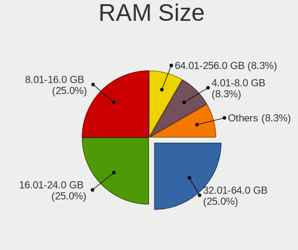
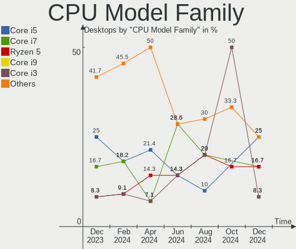
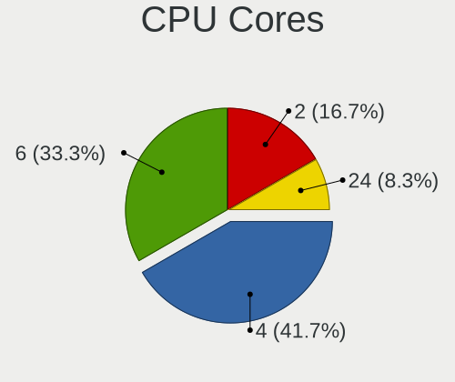
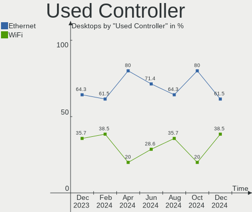
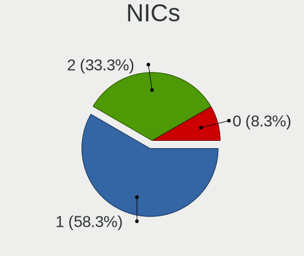
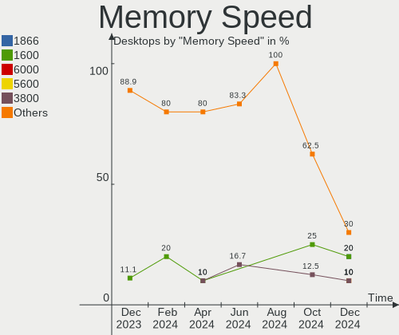

Kali - Hardware Trends (Desktops)
---------------------------------

A project to identify most popular hardware characteristics and track their change
over time based on data collected by Linux users at https://Linux-Hardware.org.

Anyone can contribute to this report by the [hw-probe](https://github.com/linuxhw/hw-probe) tool:

    sudo -E hw-probe -all -upload

This report is for one last month. Overall report since the beginning of time: [TestDays](https://github.com/linuxhw/TestDays)

Period: Sep, 2023.

Contents
--------

* [ System ](#system)
  - [ OS                       ](#os)
  - [ OS Family                ](#os-family)
  - [ Kernel                   ](#kernel)
  - [ Kernel Family            ](#kernel-family)
  - [ Kernel Major Ver.        ](#kernel-major-ver)
  - [ Arch                     ](#arch)
  - [ DE                       ](#de)
  - [ Display Server           ](#display-server)
  - [ Display Manager          ](#display-manager)
  - [ OS Lang                  ](#os-lang)
  - [ Boot Mode                ](#boot-mode)
  - [ Filesystem               ](#filesystem)
  - [ Part. scheme             ](#part-scheme)
  - [ Dual Boot with Linux/BSD ](#dual-boot-with-linuxbsd)
  - [ Dual Boot (Win)          ](#dual-boot-win)

* [ Board ](#board)
  - [ Vendor                   ](#vendor)
  - [ Model                    ](#model)
  - [ Model Family             ](#model-family)
  - [ MFG Year                 ](#mfg-year)
  - [ Form Factor              ](#form-factor)
  - [ Secure Boot              ](#secure-boot)
  - [ Coreboot                 ](#coreboot)
  - [ RAM Size                 ](#ram-size)
  - [ RAM Used                 ](#ram-used)
  - [ Total Drives             ](#total-drives)
  - [ Has CD-ROM               ](#has-cd-rom)
  - [ Has Ethernet             ](#has-ethernet)
  - [ Has WiFi                 ](#has-wifi)
  - [ Has Bluetooth            ](#has-bluetooth)

* [ Location ](#location)
  - [ Country                  ](#country)
  - [ City                     ](#city)

* [ Drives ](#drives)
  - [ Drive Vendor             ](#drive-vendor)
  - [ Drive Model              ](#drive-model)
  - [ HDD Vendor               ](#hdd-vendor)
  - [ SSD Vendor               ](#ssd-vendor)
  - [ Drive Kind               ](#drive-kind)
  - [ Drive Connector          ](#drive-connector)
  - [ Drive Size               ](#drive-size)
  - [ Space Total              ](#space-total)
  - [ Space Used               ](#space-used)
  - [ Malfunc. Drives          ](#malfunc-drives)
  - [ Malfunc. Drive Vendor    ](#malfunc-drive-vendor)
  - [ Malfunc. HDD Vendor      ](#malfunc-hdd-vendor)
  - [ Malfunc. Drive Kind      ](#malfunc-drive-kind)
  - [ Failed Drives            ](#failed-drives)
  - [ Failed Drive Vendor      ](#failed-drive-vendor)
  - [ Drive Status             ](#drive-status)

* [ Storage controller ](#storage-controller)
  - [ Storage Vendor           ](#storage-vendor)
  - [ Storage Model            ](#storage-model)
  - [ Storage Kind             ](#storage-kind)

* [ Processor ](#processor)
  - [ CPU Vendor               ](#cpu-vendor)
  - [ CPU Model                ](#cpu-model)
  - [ CPU Model Family         ](#cpu-model-family)
  - [ CPU Cores                ](#cpu-cores)
  - [ CPU Sockets              ](#cpu-sockets)
  - [ CPU Threads              ](#cpu-threads)
  - [ CPU Op-Modes             ](#cpu-op-modes)
  - [ CPU Microcode            ](#cpu-microcode)
  - [ CPU Microarch            ](#cpu-microarch)

* [ Graphics ](#graphics)
  - [ GPU Vendor               ](#gpu-vendor)
  - [ GPU Model                ](#gpu-model)
  - [ GPU Combo                ](#gpu-combo)
  - [ GPU Driver               ](#gpu-driver)
  - [ GPU Memory               ](#gpu-memory)

* [ Monitor ](#monitor)
  - [ Monitor Vendor           ](#monitor-vendor)
  - [ Monitor Model            ](#monitor-model)
  - [ Monitor Resolution       ](#monitor-resolution)
  - [ Monitor Diagonal         ](#monitor-diagonal)
  - [ Monitor Width            ](#monitor-width)
  - [ Aspect Ratio             ](#aspect-ratio)
  - [ Monitor Area             ](#monitor-area)
  - [ Pixel Density            ](#pixel-density)
  - [ Multiple Monitors        ](#multiple-monitors)

* [ Network ](#network)
  - [ Net Controller Vendor    ](#net-controller-vendor)
  - [ Net Controller Model     ](#net-controller-model)
  - [ Wireless Vendor          ](#wireless-vendor)
  - [ Wireless Model           ](#wireless-model)
  - [ Ethernet Vendor          ](#ethernet-vendor)
  - [ Ethernet Model           ](#ethernet-model)
  - [ Net Controller Kind      ](#net-controller-kind)
  - [ Used Controller          ](#used-controller)
  - [ NICs                     ](#nics)
  - [ IPv6                     ](#ipv6)

* [ Bluetooth ](#bluetooth)
  - [ Bluetooth Vendor         ](#bluetooth-vendor)
  - [ Bluetooth Model          ](#bluetooth-model)

* [ Sound ](#sound)
  - [ Sound Vendor             ](#sound-vendor)
  - [ Sound Model              ](#sound-model)

* [ Memory ](#memory)
  - [ Memory Vendor            ](#memory-vendor)
  - [ Memory Model             ](#memory-model)
  - [ Memory Kind              ](#memory-kind)
  - [ Memory Form Factor       ](#memory-form-factor)
  - [ Memory Size              ](#memory-size)
  - [ Memory Speed             ](#memory-speed)

* [ Printers & scanners ](#printers--scanners)
  - [ Printer Vendor           ](#printer-vendor)
  - [ Printer Model            ](#printer-model)
  - [ Scanner Vendor           ](#scanner-vendor)
  - [ Scanner Model            ](#scanner-model)

* [ Camera ](#camera)
  - [ Camera Vendor            ](#camera-vendor)
  - [ Camera Model             ](#camera-model)

* [ Security ](#security)
  - [ Fingerprint Vendor       ](#fingerprint-vendor)
  - [ Fingerprint Model        ](#fingerprint-model)
  - [ Chipcard Vendor          ](#chipcard-vendor)
  - [ Chipcard Model           ](#chipcard-model)

* [ Unsupported ](#unsupported)
  - [ Unsupported Devices      ](#unsupported-devices)
  - [ Unsupported Device Types ](#unsupported-device-types)

System
------

OS
--

Installed operating systems

| Name        | Desktops | Percent |
|-------------|----------|---------|
| Kali 2023.3 | 14       | 100%    |

OS Family
---------

OS without a version

| Name | Desktops | Percent |
|------|----------|---------|
| Kali | 14       | 100%    |

Kernel
------

Version of the Linux kernel

| Version           | Desktops | Percent |
|-------------------|----------|---------|
| 6.4.0-kali3-amd64 | 7        | 50%     |
| 6.5.0-kali1-amd64 | 6        | 42.86%  |
| 6.3.0-kali1-amd64 | 1        | 7.14%   |

Kernel Family
-------------

Linux kernel without a distro release

| Version | Desktops | Percent |
|---------|----------|---------|
| 6.4.0   | 7        | 50%     |
| 6.5.0   | 6        | 42.86%  |
| 6.3.0   | 1        | 7.14%   |

Kernel Major Ver.
-----------------

Linux kernel major version

| Version | Desktops | Percent |
|---------|----------|---------|
| 6.4     | 7        | 50%     |
| 6.5     | 6        | 42.86%  |
| 6.3     | 1        | 7.14%   |

Arch
----

OS architecture (x86_64, i586, etc.)

| Name   | Desktops | Percent |
|--------|----------|---------|
| x86_64 | 14       | 100%    |

DE
--

Desktop Environment

| Name  | Desktops | Percent |
|-------|----------|---------|
| XFCE  | 5        | 35.71%  |
| GNOME | 5        | 35.71%  |
| KDE5  | 4        | 28.57%  |

Display Server
--------------

X11 or Wayland

| Name | Desktops | Percent |
|------|----------|---------|
| X11  | 13       | 92.86%  |
| Tty  | 1        | 7.14%   |

Display Manager
---------------

SDDM, LightDM, etc.

| Name    | Desktops | Percent |
|---------|----------|---------|
| Unknown | 6        | 42.86%  |
| LightDM | 4        | 28.57%  |
| SDDM    | 3        | 21.43%  |
| GDM     | 1        | 7.14%   |

OS Lang
-------

Language

| Lang  | Desktops | Percent |
|-------|----------|---------|
| C     | 9        | 64.29%  |
| zh_TW | 1        | 7.14%   |
| zh_CN | 1        | 7.14%   |
| ru_RU | 1        | 7.14%   |
| en_US | 1        | 7.14%   |
| de_DE | 1        | 7.14%   |

Boot Mode
---------

EFI or BIOS

| Mode | Desktops | Percent |
|------|----------|---------|
| BIOS | 8        | 57.14%  |
| EFI  | 6        | 42.86%  |

Filesystem
----------

Type of filesystem

| Type | Desktops | Percent |
|------|----------|---------|
| Ext4 | 14       | 100%    |

Part. scheme
------------

Scheme of partitioning

| Type    | Desktops | Percent |
|---------|----------|---------|
| GPT     | 6        | 42.86%  |
| Unknown | 5        | 35.71%  |
| MBR     | 3        | 21.43%  |

Dual Boot with Linux/BSD
------------------------

Hosting more than one Linux/BSD

| Dual boot | Desktops | Percent |
|-----------|----------|---------|
| No        | 13       | 92.86%  |
| Yes       | 1        | 7.14%   |

Dual Boot (Win)
---------------

Hosting Linux and Windows

| Dual boot | Desktops | Percent |
|-----------|----------|---------|
| No        | 8        | 57.14%  |
| Yes       | 6        | 42.86%  |

Board
-----

Vendor
------

Motherboard manufacturer

| Name                | Desktops | Percent |
|---------------------|----------|---------|
| Gigabyte Technology | 4        | 28.57%  |
| ASUSTek Computer    | 4        | 28.57%  |
| MSI                 | 2        | 14.29%  |
| Hewlett-Packard     | 2        | 14.29%  |
| Intel               | 1        | 7.14%   |
| ASRock              | 1        | 7.14%   |

Model
-----

Motherboard model

| Name                         | Desktops | Percent |
|------------------------------|----------|---------|
| ASUS ROG STRIX B365-G GAMING | 2        | 14.29%  |
| MSI MS-7C02                  | 1        | 7.14%   |
| MSI MS-7891                  | 1        | 7.14%   |
| Intel GT5628                 | 1        | 7.14%   |
| HP EliteDesk 800 G2 DM 35W   | 1        | 7.14%   |
| HP 23-b205er                 | 1        | 7.14%   |
| Gigabyte Z590 AORUS ULTRA    | 1        | 7.14%   |
| Gigabyte G41M-Combo          | 1        | 7.14%   |
| Gigabyte B450M DS3H V2       | 1        | 7.14%   |
| Gigabyte 945GCMX-S2          | 1        | 7.14%   |
| ASUS Z170-P D3               | 1        | 7.14%   |
| ASUS TUF Gaming B460M-PLUS   | 1        | 7.14%   |
| ASRock A320M-HDV R3.0        | 1        | 7.14%   |

Model Family
------------

Motherboard model prefix

| Name                | Desktops | Percent |
|---------------------|----------|---------|
| ASUS ROG            | 2        | 14.29%  |
| MSI MS-7C02         | 1        | 7.14%   |
| MSI MS-7891         | 1        | 7.14%   |
| Intel GT5628        | 1        | 7.14%   |
| HP EliteDesk        | 1        | 7.14%   |
| HP 23-b205er        | 1        | 7.14%   |
| Gigabyte Z590       | 1        | 7.14%   |
| Gigabyte G41M-Combo | 1        | 7.14%   |
| Gigabyte B450M      | 1        | 7.14%   |
| Gigabyte 945GCMX-S2 | 1        | 7.14%   |
| ASUS Z170-P         | 1        | 7.14%   |
| ASUS TUF            | 1        | 7.14%   |
| ASRock A320M-HDV    | 1        | 7.14%   |

MFG Year
--------

Motherboard manufacture year

| Year | Desktops | Percent |
|------|----------|---------|
| 2020 | 2        | 14.29%  |
| 2019 | 2        | 14.29%  |
| 2018 | 2        | 14.29%  |
| 2015 | 2        | 14.29%  |
| 2021 | 1        | 7.14%   |
| 2014 | 1        | 7.14%   |
| 2012 | 1        | 7.14%   |
| 2010 | 1        | 7.14%   |
| 2008 | 1        | 7.14%   |
| 2007 | 1        | 7.14%   |

Form Factor
-----------

Physical design of the computer

| Name    | Desktops | Percent |
|---------|----------|---------|
| Desktop | 14       | 100%    |

Secure Boot
-----------

Enabled or disabled

| State    | Desktops | Percent |
|----------|----------|---------|
| Disabled | 14       | 100%    |

Coreboot
--------

Have coreboot on board

| Used | Desktops | Percent |
|------|----------|---------|
| No   | 14       | 100%    |

RAM Size
--------

Total RAM memory

| Size in GB  | Desktops | Percent |
|-------------|----------|---------|
| 4.01-8.0    | 3        | 21.43%  |
| 16.01-24.0  | 3        | 21.43%  |
| 8.01-16.0   | 3        | 21.43%  |
| 32.01-64.0  | 2        | 14.29%  |
| 64.01-256.0 | 2        | 14.29%  |
| 3.01-4.0    | 1        | 7.14%   |

RAM Used
--------

Used RAM memory

| Used GB  | Desktops | Percent |
|----------|----------|---------|
| 4.01-8.0 | 5        | 35.71%  |
| 3.01-4.0 | 3        | 21.43%  |
| 2.01-3.0 | 3        | 21.43%  |
| 1.01-2.0 | 3        | 21.43%  |

Total Drives
------------

Number of drives on board

| Drives | Desktops | Percent |
|--------|----------|---------|
| 2      | 6        | 42.86%  |
| 1      | 3        | 21.43%  |
| 5      | 2        | 14.29%  |
| 3      | 2        | 14.29%  |
| 7      | 1        | 7.14%   |

Has CD-ROM
----------

Has CD-ROM on board

| Presented | Desktops | Percent |
|-----------|----------|---------|
| No        | 12       | 85.71%  |
| Yes       | 2        | 14.29%  |

Has Ethernet
------------

Has Ethernet on board

| Presented | Desktops | Percent |
|-----------|----------|---------|
| Yes       | 12       | 85.71%  |
| No        | 2        | 14.29%  |

Has WiFi
--------

Has WiFi module

| Presented | Desktops | Percent |
|-----------|----------|---------|
| Yes       | 11       | 78.57%  |
| No        | 3        | 21.43%  |

Has Bluetooth
-------------

Has Bluetooth module

| Presented | Desktops | Percent |
|-----------|----------|---------|
| Yes       | 7        | 50%     |
| No        | 7        | 50%     |

Location
--------

Country
-------

Geographic location (country)

| Country     | Desktops | Percent |
|-------------|----------|---------|
| Russia      | 3        | 21.43%  |
| USA         | 2        | 14.29%  |
| Spain       | 2        | 14.29%  |
| Turkey      | 1        | 7.14%   |
| Taiwan      | 1        | 7.14%   |
| Poland      | 1        | 7.14%   |
| Philippines | 1        | 7.14%   |
| Israel      | 1        | 7.14%   |
| Germany     | 1        | 7.14%   |
| China       | 1        | 7.14%   |

City
----

Geographic location (city)

| City         | Desktops | Percent |
|--------------|----------|---------|
| Zaragoza     | 2        | 14.29%  |
| Taipei       | 1        | 7.14%   |
| Nanning      | 1        | 7.14%   |
| Nal'chik     | 1        | 7.14%   |
| Lubaczow     | 1        | 7.14%   |
| Jacksonville | 1        | 7.14%   |
| Istanbul     | 1        | 7.14%   |
| Hamburg      | 1        | 7.14%   |
| Haifa        | 1        | 7.14%   |
| Cheboksary   | 1        | 7.14%   |
| Butuan       | 1        | 7.14%   |
| Balakovo     | 1        | 7.14%   |
| Arnold       | 1        | 7.14%   |

Drives
------

Drive Vendor
------------

Hard drive vendors

| Vendor                      | Desktops | Drives | Percent |
|-----------------------------|----------|--------|---------|
| WDC                         | 6        | 8      | 17.65%  |
| Toshiba                     | 5        | 6      | 14.71%  |
| Seagate                     | 5        | 6      | 14.71%  |
| Samsung Electronics         | 4        | 4      | 11.76%  |
| SanDisk                     | 3        | 3      | 8.82%   |
| Kingston                    | 2        | 2      | 5.88%   |
| T-FORCE                     | 1        | 1      | 2.94%   |
| Silicon Motion              | 1        | 1      | 2.94%   |
| Realtek Semiconductor       | 1        | 1      | 2.94%   |
| Patriot                     | 1        | 1      | 2.94%   |
| MAXIO Technology (Hangzhou) | 1        | 1      | 2.94%   |
| Hitachi                     | 1        | 1      | 2.94%   |
| GOODRAM                     | 1        | 1      | 2.94%   |
| Crucial                     | 1        | 1      | 2.94%   |
| A-DATA Technology           | 1        | 1      | 2.94%   |

Drive Model
-----------

Hard drive models

| Model                                               | Desktops | Percent |
|-----------------------------------------------------|----------|---------|
| Samsung SSD 840 EVO 120GB                           | 3        | 8.11%   |
| WDC WDS100T2B0A-00SM50 1TB SSD                      | 2        | 5.41%   |
| WDC WD40EFAX-68JH4N0 4TB                            | 2        | 5.41%   |
| Toshiba HDWR160 6TB                                 | 2        | 5.41%   |
| SanDisk SSD PLUS 240GB                              | 2        | 5.41%   |
| Kingston SV300S37A120G 120GB SSD                    | 2        | 5.41%   |
| WDC WD5000AAKX-08ERMA0 500GB                        | 1        | 2.7%    |
| WDC WD2500BEVS-22UST0 250GB                         | 1        | 2.7%    |
| WDC WD10EZEX-22MFCA0 1TB                            | 1        | 2.7%    |
| WDC WD10 JPVX-22JC3T0 1TB                           | 1        | 2.7%    |
| Toshiba MD04ACA400 4TB                              | 1        | 2.7%    |
| Toshiba HDWD110 1TB                                 | 1        | 2.7%    |
| Toshiba DT01ACA200 2TB                              | 1        | 2.7%    |
| Toshiba DT01ACA050 500GB                            | 1        | 2.7%    |
| T-FORCE 1TB                                         | 1        | 2.7%    |
| Silicon Motion ADATA SX7000NP 256GB                 | 1        | 2.7%    |
| Seagate ST4000DM004-2CV104 4TB                      | 1        | 2.7%    |
| Seagate ST3500630AS 500GB                           | 1        | 2.7%    |
| Seagate ST3500413AS 500GB                           | 1        | 2.7%    |
| Seagate ST2000DM006-2DM164 2TB                      | 1        | 2.7%    |
| Seagate ST1000DM003-1ER162 1TB                      | 1        | 2.7%    |
| SanDisk 3.2 Gen 1 128GB SSD                         | 1        | 2.7%    |
| Samsung NVMe SSD Controller SM961/PM961/SM963 500GB | 1        | 2.7%    |
| Realtek XPG GAMMIX S5 256GB                         | 1        | 2.7%    |
| Patriot Burst 120GB SSD                             | 1        | 2.7%    |
| MAXIO (Hangzhou) NVMe SSD Controller MAP1202 512GB  | 1        | 2.7%    |
| Hitachi HTS542520K9SA00 200GB                       | 1        | 2.7%    |
| GOODRAM SSDPR-CX400-512-G2 512GB                    | 1        | 2.7%    |
| Crucial CT240BX500SSD1 240GB                        | 1        | 2.7%    |
| A-DATA SX8200PNP 512GB                              | 1        | 2.7%    |

HDD Vendor
----------

Hard disk drive vendors

| Vendor  | Desktops | Drives | Percent |
|---------|----------|--------|---------|
| WDC     | 6        | 6      | 35.29%  |
| Toshiba | 5        | 6      | 29.41%  |
| Seagate | 5        | 6      | 29.41%  |
| Hitachi | 1        | 1      | 5.88%   |

SSD Vendor
----------

Solid state drive vendors

| Vendor              | Desktops | Drives | Percent |
|---------------------|----------|--------|---------|
| SanDisk             | 3        | 3      | 23.08%  |
| Samsung Electronics | 3        | 3      | 23.08%  |
| WDC                 | 2        | 2      | 15.38%  |
| Kingston            | 2        | 2      | 15.38%  |
| Patriot             | 1        | 1      | 7.69%   |
| GOODRAM             | 1        | 1      | 7.69%   |
| Crucial             | 1        | 1      | 7.69%   |

Drive Kind
----------

HDD or SSD

| Kind    | Desktops | Drives | Percent |
|---------|----------|--------|---------|
| HDD     | 11       | 19     | 42.31%  |
| SSD     | 9        | 13     | 34.62%  |
| NVMe    | 5        | 5      | 19.23%  |
| Unknown | 1        | 1      | 3.85%   |

Drive Connector
---------------

SATA, SAS, NVMe, etc.

| Type | Desktops | Drives | Percent |
|------|----------|--------|---------|
| SATA | 14       | 31     | 70%     |
| NVMe | 5        | 5      | 25%     |
| SAS  | 1        | 2      | 5%      |

Drive Size
----------

Size of hard drive

| Size in TB | Desktops | Drives | Percent |
|------------|----------|--------|---------|
| 0.01-0.5   | 10       | 16     | 43.48%  |
| 0.51-1.0   | 6        | 7      | 26.09%  |
| 3.01-4.0   | 4        | 4      | 17.39%  |
| 4.01-10.0  | 2        | 2      | 8.7%    |
| 1.01-2.0   | 1        | 3      | 4.35%   |

Space Total
-----------

Amount of disk space available on the file system

| Size in GB     | Desktops | Percent |
|----------------|----------|---------|
| 251-500        | 5        | 35.71%  |
| 101-250        | 4        | 28.57%  |
| More than 3000 | 3        | 21.43%  |
| 501-1000       | 1        | 7.14%   |
| 51-100         | 1        | 7.14%   |

Space Used
----------

Amount of used disk space

| Used GB        | Desktops | Percent |
|----------------|----------|---------|
| 1-20           | 4        | 28.57%  |
| More than 3000 | 3        | 21.43%  |
| 21-50          | 3        | 21.43%  |
| 101-250        | 3        | 21.43%  |
| 251-500        | 1        | 7.14%   |

Malfunc. Drives
---------------

Drive models with a malfunction

| Model                     | Desktops | Drives | Percent |
|---------------------------|----------|--------|---------|
| Seagate ST3500630AS 500GB | 1        | 1      | 100%    |

Malfunc. Drive Vendor
---------------------

Vendors of faulty drives

| Vendor  | Desktops | Drives | Percent |
|---------|----------|--------|---------|
| Seagate | 1        | 1      | 100%    |

Malfunc. HDD Vendor
-------------------

Vendors of faulty HDD drives

| Vendor  | Desktops | Drives | Percent |
|---------|----------|--------|---------|
| Seagate | 1        | 1      | 100%    |

Malfunc. Drive Kind
-------------------

Kinds of faulty drives

| Kind | Desktops | Drives | Percent |
|------|----------|--------|---------|
| HDD  | 1        | 1      | 100%    |

Failed Drives
-------------

Failed drive models

Zero info for selected period =(

Failed Drive Vendor
-------------------

Failed drive vendors

Zero info for selected period =(

Drive Status
------------

Number of failed and malfunc. drives

| Status   | Desktops | Drives | Percent |
|----------|----------|--------|---------|
| Works    | 9        | 22     | 60%     |
| Detected | 5        | 15     | 33.33%  |
| Malfunc  | 1        | 1      | 6.67%   |

Storage controller
------------------

Storage Vendor
--------------

Storage controller vendors

| Vendor                      | Desktops | Percent |
|-----------------------------|----------|---------|
| Intel                       | 10       | 50%     |
| AMD                         | 4        | 20%     |
| Silicon Motion              | 1        | 5%      |
| Samsung Electronics         | 1        | 5%      |
| Realtek Semiconductor       | 1        | 5%      |
| Phison Electronics          | 1        | 5%      |
| MAXIO Technology (Hangzhou) | 1        | 5%      |
| ADATA Technology            | 1        | 5%      |

Storage Model
-------------

Storage controller models

| Model                                                                         | Desktops | Percent |
|-------------------------------------------------------------------------------|----------|---------|
| Intel Q170/Q150/B150/H170/H110/Z170/CM236 Chipset SATA Controller [AHCI Mode] | 2        | 10%     |
| Intel NM10/ICH7 Family SATA Controller [IDE mode]                             | 2        | 10%     |
| Intel 200 Series PCH SATA controller [AHCI mode]                              | 2        | 10%     |
| AMD 400 Series Chipset SATA Controller                                        | 2        | 10%     |
| Silicon Motion SM2260 NVMe SSD Controller                                     | 1        | 5%      |
| Samsung NVMe SSD Controller SM961/PM961/SM963                                 | 1        | 5%      |
| Realtek RTS5763DL NVMe SSD Controller (DRAM-less)                             | 1        | 5%      |
| Phison PS5013 E13 NVMe Controller                                             | 1        | 5%      |
| MAXIO (Hangzhou) NVMe SSD Controller MAP1202                                  | 1        | 5%      |
| Intel 82801IR/IO/IH (ICH9R/DO/DH) 6 port SATA Controller [AHCI mode]          | 1        | 5%      |
| Intel 7 Series/C210 Series Chipset Family 6-port SATA Controller [AHCI mode]  | 1        | 5%      |
| Intel 500 Series Chipset Family SATA AHCI Controller                          | 1        | 5%      |
| Intel 400 Series Chipset Family SATA AHCI Controller                          | 1        | 5%      |
| AMD FCH SATA Controller [AHCI mode]                                           | 1        | 5%      |
| AMD FCH SATA Controller D                                                     | 1        | 5%      |
| ADATA XPG SX8200 Pro PCIe Gen3x4 M.2 2280 Solid State Drive                   | 1        | 5%      |

Storage Kind
------------

Kind of storage controller (IDE, SATA, NVMe, SAS, ...)

| Kind | Desktops | Percent |
|------|----------|---------|
| SATA | 12       | 60%     |
| NVMe | 6        | 30%     |
| IDE  | 2        | 10%     |

Processor
---------

CPU Vendor
----------

Processor vendors

| Vendor | Desktops | Percent |
|--------|----------|---------|
| Intel  | 10       | 71.43%  |
| AMD    | 4        | 28.57%  |

CPU Model
---------

Processor models

| Model                                       | Desktops | Percent |
|---------------------------------------------|----------|---------|
| Intel Core i3-9100 CPU @ 3.60GHz            | 2        | 14.29%  |
| Intel Xeon CPU E5430 @ 2.66GHz              | 1        | 7.14%   |
| Intel Pentium Dual-Core CPU E5300 @ 2.60GHz | 1        | 7.14%   |
| Intel Pentium CPU G2030 @ 3.00GHz           | 1        | 7.14%   |
| Intel Core i7-7700K CPU @ 4.20GHz           | 1        | 7.14%   |
| Intel Core i5-6500T CPU @ 2.50GHz           | 1        | 7.14%   |
| Intel Core i3-10100 CPU @ 3.60GHz           | 1        | 7.14%   |
| Intel Core 2 Quad CPU Q6600 @ 2.40GHz       | 1        | 7.14%   |
| Intel 11th Gen Core i9-11900K @ 3.50GHz     | 1        | 7.14%   |
| AMD Ryzen 5 5600 6-Core Processor           | 1        | 7.14%   |
| AMD Ryzen 5 3600 6-Core Processor           | 1        | 7.14%   |
| AMD Athlon 200GE with Radeon Vega Graphics  | 1        | 7.14%   |
| AMD A6-5400K APU with Radeon HD Graphics    | 1        | 7.14%   |

CPU Model Family
----------------

Processor model prefix

| Model                   | Desktops | Percent |
|-------------------------|----------|---------|
| Intel Core i3           | 3        | 21.43%  |
| AMD Ryzen 5             | 2        | 14.29%  |
| Other                   | 1        | 7.14%   |
| Intel Xeon              | 1        | 7.14%   |
| Intel Pentium Dual-Core | 1        | 7.14%   |
| Intel Pentium           | 1        | 7.14%   |
| Intel Core i7           | 1        | 7.14%   |
| Intel Core i5           | 1        | 7.14%   |
| Intel Core 2 Quad       | 1        | 7.14%   |
| AMD Athlon              | 1        | 7.14%   |
| AMD A6                  | 1        | 7.14%   |

CPU Cores
---------

Number of processor cores

| Number | Desktops | Percent |
|--------|----------|---------|
| 4      | 7        | 50%     |
| 2      | 3        | 21.43%  |
| 6      | 2        | 14.29%  |
| 8      | 1        | 7.14%   |
| 1      | 1        | 7.14%   |

CPU Sockets
-----------

Number of sockets

| Number | Desktops | Percent |
|--------|----------|---------|
| 1      | 14       | 100%    |

CPU Threads
-----------

Threads per core (Hyper-Threading)

| Number | Desktops | Percent |
|--------|----------|---------|
| 2      | 7        | 50%     |
| 1      | 7        | 50%     |

CPU Op-Modes
------------

CPU Operation Modes (32-bit, 64-bit)

| Op mode        | Desktops | Percent |
|----------------|----------|---------|
| 32-bit, 64-bit | 14       | 100%    |

CPU Microcode
-------------

Microcode number

| Number     | Desktops | Percent |
|------------|----------|---------|
| Unknown    | 12       | 85.71%  |
| 0x0a20120a | 1        | 7.14%   |
| 0x08101016 | 1        | 7.14%   |

CPU Microarch
-------------

Microarchitecture

| Name       | Desktops | Percent |
|------------|----------|---------|
| KabyLake   | 3        | 21.43%  |
| Penryn     | 2        | 14.29%  |
| Zen 3      | 1        | 7.14%   |
| Zen 2      | 1        | 7.14%   |
| Zen        | 1        | 7.14%   |
| Skylake    | 1        | 7.14%   |
| Piledriver | 1        | 7.14%   |
| IvyBridge  | 1        | 7.14%   |
| Icelake    | 1        | 7.14%   |
| Core       | 1        | 7.14%   |
| CometLake  | 1        | 7.14%   |

Graphics
--------

GPU Vendor
----------

Vendors of graphics cards

| Vendor | Desktops | Percent |
|--------|----------|---------|
| Nvidia | 9        | 52.94%  |
| Intel  | 6        | 35.29%  |
| AMD    | 2        | 11.76%  |

GPU Model
---------

Graphics card models

| Model                                                                | Desktops | Percent |
|----------------------------------------------------------------------|----------|---------|
| Nvidia TU116 [GeForce GTX 1650 SUPER]                                | 2        | 11.76%  |
| Nvidia GP104 [GeForce GTX 1080]                                      | 2        | 11.76%  |
| Intel CoffeeLake-S GT2 [UHD Graphics 630]                            | 2        | 11.76%  |
| Nvidia TU116 [GeForce GTX 1660 SUPER]                                | 1        | 5.88%   |
| Nvidia GM107 [GeForce GTX 750 Ti]                                    | 1        | 5.88%   |
| Nvidia GK208B [GeForce GT 710]                                       | 1        | 5.88%   |
| Nvidia GF117M [GeForce 610M/710M/810M/820M / GT 620M/625M/630M/720M] | 1        | 5.88%   |
| Nvidia GA106 [Geforce RTX 3050]                                      | 1        | 5.88%   |
| Intel Xeon E3-1200 v2/3rd Gen Core processor Graphics Controller     | 1        | 5.88%   |
| Intel RocketLake-S GT1 [UHD Graphics 750]                            | 1        | 5.88%   |
| Intel HD Graphics 530                                                | 1        | 5.88%   |
| Intel 82G33/G31 Express Integrated Graphics Controller               | 1        | 5.88%   |
| AMD Raven Ridge [Radeon Vega Series / Radeon Vega Mobile Series]     | 1        | 5.88%   |
| AMD Cedar [Radeon HD 5000/6000/7350/8350 Series]                     | 1        | 5.88%   |

GPU Combo
---------

Combinations of graphics cards

| Name           | Desktops | Percent |
|----------------|----------|---------|
| 1 x Nvidia     | 6        | 42.86%  |
| Intel + Nvidia | 3        | 21.43%  |
| 1 x Intel      | 3        | 21.43%  |
| 1 x AMD        | 2        | 14.29%  |

GPU Driver
----------

Free vs proprietary

| Driver      | Desktops | Percent |
|-------------|----------|---------|
| Free        | 9        | 64.29%  |
| Proprietary | 5        | 35.71%  |

GPU Memory
----------

Total video memory

| Size in GB | Desktops | Percent |
|------------|----------|---------|
| Unknown    | 4        | 28.57%  |
| 7.01-8.0   | 3        | 21.43%  |
| 3.01-4.0   | 2        | 14.29%  |
| 1.01-2.0   | 2        | 14.29%  |
| 0.51-1.0   | 2        | 14.29%  |
| 5.01-6.0   | 1        | 7.14%   |

Monitor
-------

Monitor Vendor
--------------

Monitor vendors

| Vendor               | Desktops | Percent |
|----------------------|----------|---------|
| Samsung Electronics  | 3        | 21.43%  |
| Goldstar             | 2        | 14.29%  |
| Unknown              | 2        | 14.29%  |
| SRT                  | 1        | 7.14%   |
| Philips              | 1        | 7.14%   |
| Lenovo Group Limited | 1        | 7.14%   |
| HKC                  | 1        | 7.14%   |
| Hewlett-Packard      | 1        | 7.14%   |
| ASUSTek Computer     | 1        | 7.14%   |
| AOC                  | 1        | 7.14%   |

Monitor Model
-------------

Monitor models

| Model                                                                | Desktops | Percent |
|----------------------------------------------------------------------|----------|---------|
| Samsung Electronics S24E450 SAM0C80 1920x1080 520x290mm 23.4-inch    | 2        | 13.33%  |
| Unknown                                                              | 2        | 13.33%  |
| SRT S322701 SRT1270 2560x1440 620x369mm 28.4-inch                    | 1        | 6.67%   |
| Samsung Electronics U28E590 SAM0C4D 3840x2160 610x350mm 27.7-inch    | 1        | 6.67%   |
| Samsung Electronics SyncMaster SAM0424 1920x1200 518x324mm 24.1-inch | 1        | 6.67%   |
| Philips FTV PHL01EA 1920x1080 1440x810mm 65.0-inch                   | 1        | 6.67%   |
| Lenovo Group Limited LCD Monitor LEN L23i-18 1920x1080               | 1        | 6.67%   |
| HKC LCD Monitor TV                                                   | 1        | 6.67%   |
| Hewlett-Packard All-in-One HWP4211 1920x1080 509x286mm 23.0-inch     | 1        | 6.67%   |
| Goldstar MP59G GSM5B34 1920x1080 480x270mm 21.7-inch                 | 1        | 6.67%   |
| Goldstar FULL HD GSM5B54 1920x1080 480x270mm 21.7-inch               | 1        | 6.67%   |
| ASUSTek Computer VG27AQL1A AUS2705 2560x1440 597x336mm 27.0-inch     | 1        | 6.67%   |
| AOC 2243W AOC2243 1920x1080 477x268mm 21.5-inch                      | 1        | 6.67%   |

Monitor Resolution
------------------

Monitor screen resolution

| Resolution        | Desktops | Percent |
|-------------------|----------|---------|
| 1920x1080 (FHD)   | 8        | 53.33%  |
| 3840x2160 (4K)    | 2        | 13.33%  |
| 2560x1440 (QHD)   | 2        | 13.33%  |
| 3280x1080         | 1        | 6.67%   |
| 1920x1200 (WUXGA) | 1        | 6.67%   |
| Unknown           | 1        | 6.67%   |

Monitor Diagonal
----------------

Diagonal size in inches

| Inches  | Desktops | Percent |
|---------|----------|---------|
| 23      | 3        | 21.43%  |
| 21      | 3        | 21.43%  |
| Unknown | 3        | 21.43%  |
| 27      | 2        | 14.29%  |
| 65      | 1        | 7.14%   |
| 28      | 1        | 7.14%   |
| 24      | 1        | 7.14%   |

Monitor Width
-------------

Physical width

| Width in mm | Desktops | Percent |
|-------------|----------|---------|
| 501-600     | 5        | 35.71%  |
| 401-500     | 3        | 21.43%  |
| Unknown     | 3        | 21.43%  |
| 601-700     | 2        | 14.29%  |
| 1001-1500   | 1        | 7.14%   |

Aspect Ratio
------------

Proportional relationship between the width and the height

| Ratio   | Desktops | Percent |
|---------|----------|---------|
| 16/9    | 9        | 69.23%  |
| Unknown | 3        | 23.08%  |
| 16/10   | 1        | 7.69%   |

Monitor Area
------------

Area in inch²

| Area in inch² | Desktops | Percent |
|----------------|----------|---------|
| 201-250        | 5        | 35.71%  |
| Unknown        | 3        | 21.43%  |
| 301-350        | 2        | 14.29%  |
| More than 1000 | 1        | 7.14%   |
| 351-500        | 1        | 7.14%   |
| 251-300        | 1        | 7.14%   |
| 151-200        | 1        | 7.14%   |

Pixel Density
-------------

Pixels per inch

| Density | Desktops | Percent |
|---------|----------|---------|
| 101-120 | 5        | 35.71%  |
| 51-100  | 4        | 28.57%  |
| Unknown | 3        | 21.43%  |
| 1-50    | 1        | 7.14%   |
| 121-160 | 1        | 7.14%   |

Multiple Monitors
-----------------

Total monitors connected

| Total | Desktops | Percent |
|-------|----------|---------|
| 1     | 12       | 85.71%  |
| 2     | 2        | 14.29%  |

Network
-------

Net Controller Vendor
---------------------

Controller vendors

| Vendor                | Desktops | Percent |
|-----------------------|----------|---------|
| Realtek Semiconductor | 8        | 32%     |
| Intel                 | 7        | 28%     |
| Ralink Technology     | 3        | 12%     |
| TP-Link               | 1        | 4%      |
| Ralink                | 1        | 4%      |
| Qualcomm Atheros      | 1        | 4%      |
| D-Link                | 1        | 4%      |
| Broadcom              | 1        | 4%      |
| ASUSTek Computer      | 1        | 4%      |
| Aquantia              | 1        | 4%      |

Net Controller Model
--------------------

Controller models

| Model                                                                                         | Desktops | Percent |
|-----------------------------------------------------------------------------------------------|----------|---------|
| Realtek RTL8111/8168/8411 PCI Express Gigabit Ethernet Controller                             | 6        | 20.69%  |
| Ralink RT2870/RT3070 Wireless Adapter                                                         | 3        | 10.34%  |
| Intel Ethernet Connection (2) I219-V                                                          | 2        | 6.9%    |
| TP-Link 802.11n NIC                                                                           | 1        | 3.45%   |
| Realtek RTL88x2bu [AC1200 Techkey]                                                            | 1        | 3.45%   |
| Realtek RTL8812AU 802.11a/b/g/n/ac 2T2R DB WLAN Adapter                                       | 1        | 3.45%   |
| Realtek RTL8192EE PCIe Wireless Network Adapter                                               | 1        | 3.45%   |
| Realtek RTL-8110SC/8169SC Gigabit Ethernet                                                    | 1        | 3.45%   |
| Realtek Realtek 8812AU/8821AU 802.11ac WLAN Adapter [USB Wireless Dual-Band Adapter 2.4/5Ghz] | 1        | 3.45%   |
| Realtek 802.11ac NIC                                                                          | 1        | 3.45%   |
| Ralink RT2760 Wireless 802.11n 1T/2R                                                          | 1        | 3.45%   |
| Qualcomm Atheros AR8151 v2.0 Gigabit Ethernet                                                 | 1        | 3.45%   |
| Intel Wi-Fi 6 AX200                                                                           | 1        | 3.45%   |
| Intel Ethernet Connection (2) I219-LM                                                         | 1        | 3.45%   |
| Intel Ethernet Connection (12) I219-V                                                         | 1        | 3.45%   |
| Intel 82574L Gigabit Network Connection                                                       | 1        | 3.45%   |
| Intel 82562V-2 10/100 Network Connection                                                      | 1        | 3.45%   |
| D-Link DWA-125 Wireless N 150 Adapter(rev.D1) [Realtek RTL8188ETV]                            | 1        | 3.45%   |
| Broadcom BCM43228 802.11a/b/g/n                                                               | 1        | 3.45%   |
| ASUS 802.11ac NIC                                                                             | 1        | 3.45%   |
| Aquantia AQC113CS NBase-T/IEEE 802.3bz Ethernet Controller [AQtion]                           | 1        | 3.45%   |

Wireless Vendor
---------------

Wireless vendors

| Vendor                | Desktops | Percent |
|-----------------------|----------|---------|
| Realtek Semiconductor | 3        | 25%     |
| Ralink Technology     | 3        | 25%     |
| TP-Link               | 1        | 8.33%   |
| Ralink                | 1        | 8.33%   |
| Intel                 | 1        | 8.33%   |
| D-Link                | 1        | 8.33%   |
| Broadcom              | 1        | 8.33%   |
| ASUSTek Computer      | 1        | 8.33%   |

Wireless Model
--------------

Wireless models

| Model                                                                                         | Desktops | Percent |
|-----------------------------------------------------------------------------------------------|----------|---------|
| Ralink RT2870/RT3070 Wireless Adapter                                                         | 3        | 21.43%  |
| TP-Link 802.11n NIC                                                                           | 1        | 7.14%   |
| Realtek RTL88x2bu [AC1200 Techkey]                                                            | 1        | 7.14%   |
| Realtek RTL8812AU 802.11a/b/g/n/ac 2T2R DB WLAN Adapter                                       | 1        | 7.14%   |
| Realtek RTL8192EE PCIe Wireless Network Adapter                                               | 1        | 7.14%   |
| Realtek Realtek 8812AU/8821AU 802.11ac WLAN Adapter [USB Wireless Dual-Band Adapter 2.4/5Ghz] | 1        | 7.14%   |
| Realtek 802.11ac NIC                                                                          | 1        | 7.14%   |
| Ralink RT2760 Wireless 802.11n 1T/2R                                                          | 1        | 7.14%   |
| Intel Wi-Fi 6 AX200                                                                           | 1        | 7.14%   |
| D-Link DWA-125 Wireless N 150 Adapter(rev.D1) [Realtek RTL8188ETV]                            | 1        | 7.14%   |
| Broadcom BCM43228 802.11a/b/g/n                                                               | 1        | 7.14%   |
| ASUS 802.11ac NIC                                                                             | 1        | 7.14%   |

Ethernet Vendor
---------------

Ethernet vendors

| Vendor                | Desktops | Percent |
|-----------------------|----------|---------|
| Realtek Semiconductor | 7        | 46.67%  |
| Intel                 | 6        | 40%     |
| Qualcomm Atheros      | 1        | 6.67%   |
| Aquantia              | 1        | 6.67%   |

Ethernet Model
--------------

Ethernet models

| Model                                                               | Desktops | Percent |
|---------------------------------------------------------------------|----------|---------|
| Realtek RTL8111/8168/8411 PCI Express Gigabit Ethernet Controller   | 6        | 40%     |
| Intel Ethernet Connection (2) I219-V                                | 2        | 13.33%  |
| Realtek RTL-8110SC/8169SC Gigabit Ethernet                          | 1        | 6.67%   |
| Qualcomm Atheros AR8151 v2.0 Gigabit Ethernet                       | 1        | 6.67%   |
| Intel Ethernet Connection (2) I219-LM                               | 1        | 6.67%   |
| Intel Ethernet Connection (12) I219-V                               | 1        | 6.67%   |
| Intel 82574L Gigabit Network Connection                             | 1        | 6.67%   |
| Intel 82562V-2 10/100 Network Connection                            | 1        | 6.67%   |
| Aquantia AQC113CS NBase-T/IEEE 802.3bz Ethernet Controller [AQtion] | 1        | 6.67%   |

Net Controller Kind
-------------------

Ethernet, WiFi or modem

| Kind     | Desktops | Percent |
|----------|----------|---------|
| Ethernet | 12       | 52.17%  |
| WiFi     | 11       | 47.83%  |

Used Controller
---------------

Currently used network controller

| Kind     | Desktops | Percent |
|----------|----------|---------|
| WiFi     | 10       | 52.63%  |
| Ethernet | 9        | 47.37%  |

NICs
----

Total network controllers on board

| Total | Desktops | Percent |
|-------|----------|---------|
| 1     | 7        | 50%     |
| 2     | 6        | 42.86%  |
| 0     | 1        | 7.14%   |

IPv6
----

IPv6 vs IPv4

| Used | Desktops | Percent |
|------|----------|---------|
| No   | 11       | 78.57%  |
| Yes  | 3        | 21.43%  |

Bluetooth
---------

Bluetooth Vendor
----------------

Controller vendors

| Vendor                  | Desktops | Percent |
|-------------------------|----------|---------|
| Cambridge Silicon Radio | 2        | 28.57%  |
| TP-Link                 | 1        | 14.29%  |
| Realtek Semiconductor   | 1        | 14.29%  |
| Intel                   | 1        | 14.29%  |
| Broadcom                | 1        | 14.29%  |
| ASUSTek Computer        | 1        | 14.29%  |

Bluetooth Model
---------------

Controller models

| Model                                               | Desktops | Percent |
|-----------------------------------------------------|----------|---------|
| Cambridge Silicon Radio Bluetooth Dongle (HCI mode) | 2        | 28.57%  |
| TP-Link UB5A Adapter                                | 1        | 14.29%  |
| Realtek Bluetooth Radio                             | 1        | 14.29%  |
| Intel AX200 Bluetooth                               | 1        | 14.29%  |
| Broadcom HP Portable Bumble Bee                     | 1        | 14.29%  |
| ASUS ASUS USB-BT500                                 | 1        | 14.29%  |

Sound
-----

Sound Vendor
------------

Sound card vendors

| Vendor               | Desktops | Percent |
|----------------------|----------|---------|
| Intel                | 10       | 40%     |
| Nvidia               | 8        | 32%     |
| AMD                  | 4        | 16%     |
| SteelSeries ApS      | 1        | 4%      |
| Giga-Byte Technology | 1        | 4%      |
| C-Media Electronics  | 1        | 4%      |

Sound Model
-----------

Sound card models

| Model                                                               | Desktops | Percent |
|---------------------------------------------------------------------|----------|---------|
| Nvidia TU116 High Definition Audio Controller                       | 3        | 11.54%  |
| Nvidia GP104 High Definition Audio Controller                       | 2        | 7.69%   |
| Intel NM10/ICH7 Family High Definition Audio Controller             | 2        | 7.69%   |
| Intel 200 Series PCH HD Audio                                       | 2        | 7.69%   |
| Intel 100 Series/C230 Series Chipset Family HD Audio Controller     | 2        | 7.69%   |
| AMD Starship/Matisse HD Audio Controller                            | 2        | 7.69%   |
| SteelSeries ApS SteelSeries Arctis 7                                | 1        | 3.85%   |
| Nvidia GM107 High Definition Audio Controller [GeForce 940MX]       | 1        | 3.85%   |
| Nvidia GK208 HDMI/DP Audio Controller                               | 1        | 3.85%   |
| Nvidia GA106 High Definition Audio Controller                       | 1        | 3.85%   |
| Intel Tiger Lake-H HD Audio Controller                              | 1        | 3.85%   |
| Intel Comet Lake PCH-V cAVS                                         | 1        | 3.85%   |
| Intel 82801I (ICH9 Family) HD Audio Controller                      | 1        | 3.85%   |
| Intel 7 Series/C216 Chipset Family High Definition Audio Controller | 1        | 3.85%   |
| Giga-Byte Technology USB Audio                                      | 1        | 3.85%   |
| C-Media Electronics USB Audio Device                                | 1        | 3.85%   |
| AMD Raven/Raven2/Fenghuang HDMI/DP Audio Controller                 | 1        | 3.85%   |
| AMD Family 17h/19h HD Audio Controller                              | 1        | 3.85%   |
| AMD Cedar HDMI Audio [Radeon HD 5400/6300/7300 Series]              | 1        | 3.85%   |

Memory
------

Memory Vendor
-------------

Memory module vendors

| Vendor              | Desktops | Percent |
|---------------------|----------|---------|
| Corsair             | 3        | 30%     |
| Unknown             | 2        | 20%     |
| Samsung Electronics | 1        | 10%     |
| Micron Technology   | 1        | 10%     |
| Kingston            | 1        | 10%     |
| G.Skill             | 1        | 10%     |
| Unknown             | 1        | 10%     |

Memory Model
------------

Memory module models

| Model                                                   | Desktops | Percent |
|---------------------------------------------------------|----------|---------|
| Corsair RAM CMK32GX4M2Z3600C18 16GB DIMM DDR4 3800MT/s  | 2        | 15.38%  |
| Corsair RAM CMK32GX4M2B3000C15 16GB DIMM DDR4 3000MT/s  | 2        | 15.38%  |
| Unknown RAM Module 4GB DIMM 400MT/s                     | 1        | 7.69%   |
| Unknown RAM Module 2GB DIMM 667MT/s                     | 1        | 7.69%   |
| Unknown RAM Module 2GB DIMM 400MT/s                     | 1        | 7.69%   |
| Samsung RAM M471B5173CB0-YK0 4GB SODIMM DDR3 1600MT/s   | 1        | 7.69%   |
| Micron RAM 4KTF25664HZ-1G6E1 2GB SODIMM DDR3 1600MT/s   | 1        | 7.69%   |
| Kingston RAM Module 2GB DIMM DDR2 667MT/s               | 1        | 7.69%   |
| G.Skill RAM F4-3200C16-8GVKB 8GB DIMM DDR4 3866MT/s     | 1        | 7.69%   |
| Corsair RAM CMT128GX4M4C3200C16 32GB DIMM DDR4 3200MT/s | 1        | 7.69%   |
| Unknown                                                 | 1        | 7.69%   |

Memory Kind
-----------

Memory module kinds

| Kind    | Desktops | Percent |
|---------|----------|---------|
| DDR4    | 5        | 55.56%  |
| Unknown | 2        | 22.22%  |
| DDR3    | 1        | 11.11%  |
| DDR2    | 1        | 11.11%  |

Memory Form Factor
------------------

Physical design of the memory module

| Name   | Desktops | Percent |
|--------|----------|---------|
| DIMM   | 8        | 88.89%  |
| SODIMM | 1        | 11.11%  |

Memory Size
-----------

Memory module size

| Size  | Desktops | Percent |
|-------|----------|---------|
| 2048  | 4        | 36.36%  |
| 16384 | 3        | 27.27%  |
| 4096  | 2        | 18.18%  |
| 32768 | 1        | 9.09%   |
| 8192  | 1        | 9.09%   |

Memory Speed
------------

Memory module speed

| Speed | Desktops | Percent |
|-------|----------|---------|
| 3800  | 2        | 18.18%  |
| 3000  | 2        | 18.18%  |
| 667   | 2        | 18.18%  |
| 3866  | 1        | 9.09%   |
| 3200  | 1        | 9.09%   |
| 2400  | 1        | 9.09%   |
| 1600  | 1        | 9.09%   |
| 400   | 1        | 9.09%   |

Printers & scanners
-------------------

Printer Vendor
--------------

Printer device vendors

Zero info for selected period =(

Printer Model
-------------

Printer device models

Zero info for selected period =(

Scanner Vendor
--------------

Scanner device vendors

Zero info for selected period =(

Scanner Model
-------------

Scanner device models

Zero info for selected period =(

Camera
------

Camera Vendor
-------------

Camera device vendors

| Vendor              | Desktops | Percent |
|---------------------|----------|---------|
| Samsung Electronics | 1        | 50%     |
| Chicony Electronics | 1        | 50%     |

Camera Model
------------

Camera device models

| Model                                   | Desktops | Percent |
|-----------------------------------------|----------|---------|
| Samsung Galaxy series, misc. (MTP mode) | 1        | 50%     |
| Chicony HP High Definition 1MP Webcam   | 1        | 50%     |

Security
--------

Fingerprint Vendor
------------------

Fingerprint sensor vendors

Zero info for selected period =(

Fingerprint Model
-----------------

Fingerprint sensor models

Zero info for selected period =(

Chipcard Vendor
---------------

Chipcard module vendors

Zero info for selected period =(

Chipcard Model
--------------

Chipcard module models

Zero info for selected period =(

Unsupported
-----------

Unsupported Devices
-------------------

Total unsupported devices on board

| Total | Desktops | Percent |
|-------|----------|---------|
| 0     | 12       | 85.71%  |
| 1     | 2        | 14.29%  |

Unsupported Device Types
------------------------

Types of unsupported devices

| Type          | Desktops | Percent |
|---------------|----------|---------|
| Net/wireless  | 1        | 50%     |
| Graphics card | 1        | 50%     |

