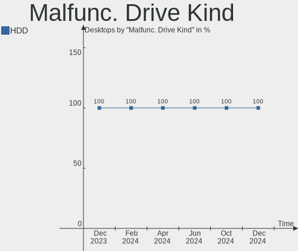
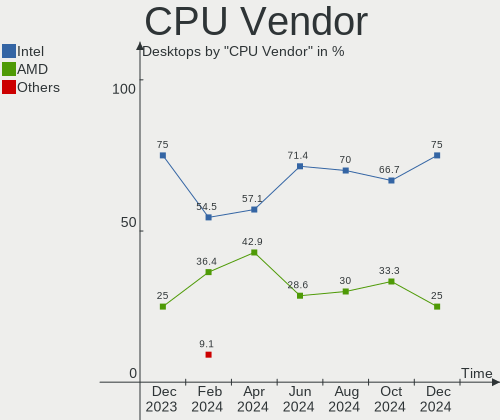
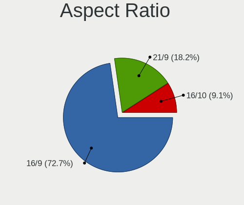
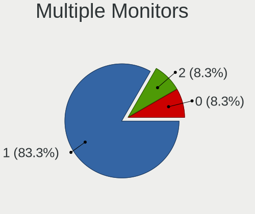
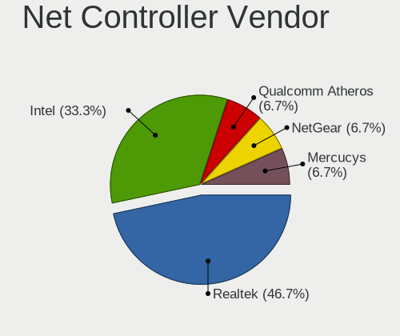
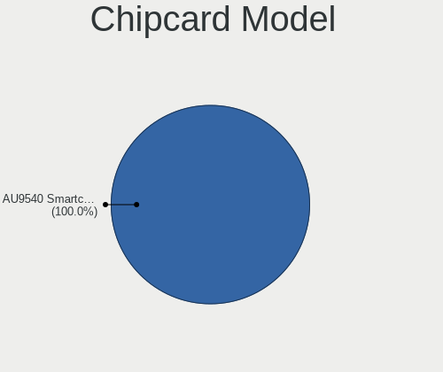
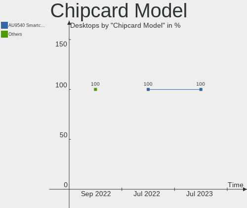

Kali Hardware Trends (Desktops)
-------------------------------

A project to identify most popular hardware characteristics and track their change
over time based on data collected by Kali users at https://Linux-Hardware.org.

Anyone can contribute to this report by the [hw-probe](https://github.com/linuxhw/hw-probe) tool:

    sudo -E hw-probe -all -upload

This report is for one last month. Overall report since the beginning of time: [TestCoverage](https://github.com/linuxhw/TestCoverage)

Period: Apr, 2022.

Contents
--------

* [ System ](#system)
  - [ OS                       ](#os)
  - [ OS Family                ](#os-family)
  - [ Kernel                   ](#kernel)
  - [ Kernel Family            ](#kernel-family)
  - [ Kernel Major Ver.        ](#kernel-major-ver)
  - [ Arch                     ](#arch)
  - [ DE                       ](#de)
  - [ Display Server           ](#display-server)
  - [ Display Manager          ](#display-manager)
  - [ OS Lang                  ](#os-lang)
  - [ Boot Mode                ](#boot-mode)
  - [ Filesystem               ](#filesystem)
  - [ Part. scheme             ](#part-scheme)
  - [ Dual Boot with Linux/BSD ](#dual-boot-with-linuxbsd)
  - [ Dual Boot (Win)          ](#dual-boot-win)

* [ Board ](#board)
  - [ Vendor                   ](#vendor)
  - [ Model                    ](#model)
  - [ Model Family             ](#model-family)
  - [ MFG Year                 ](#mfg-year)
  - [ Form Factor              ](#form-factor)
  - [ Secure Boot              ](#secure-boot)
  - [ Coreboot                 ](#coreboot)
  - [ RAM Size                 ](#ram-size)
  - [ RAM Used                 ](#ram-used)
  - [ Total Drives             ](#total-drives)
  - [ Has CD-ROM               ](#has-cd-rom)
  - [ Has Ethernet             ](#has-ethernet)
  - [ Has WiFi                 ](#has-wifi)
  - [ Has Bluetooth            ](#has-bluetooth)

* [ Location ](#location)
  - [ Country                  ](#country)
  - [ City                     ](#city)

* [ Drives ](#drives)
  - [ Drive Vendor             ](#drive-vendor)
  - [ Drive Model              ](#drive-model)
  - [ HDD Vendor               ](#hdd-vendor)
  - [ SSD Vendor               ](#ssd-vendor)
  - [ Drive Kind               ](#drive-kind)
  - [ Drive Connector          ](#drive-connector)
  - [ Drive Size               ](#drive-size)
  - [ Space Total              ](#space-total)
  - [ Space Used               ](#space-used)
  - [ Malfunc. Drives          ](#malfunc-drives)
  - [ Malfunc. Drive Vendor    ](#malfunc-drive-vendor)
  - [ Malfunc. HDD Vendor      ](#malfunc-hdd-vendor)
  - [ Malfunc. Drive Kind      ](#malfunc-drive-kind)
  - [ Failed Drives            ](#failed-drives)
  - [ Failed Drive Vendor      ](#failed-drive-vendor)
  - [ Drive Status             ](#drive-status)

* [ Storage controller ](#storage-controller)
  - [ Storage Vendor           ](#storage-vendor)
  - [ Storage Model            ](#storage-model)
  - [ Storage Kind             ](#storage-kind)

* [ Processor ](#processor)
  - [ CPU Vendor               ](#cpu-vendor)
  - [ CPU Model                ](#cpu-model)
  - [ CPU Model Family         ](#cpu-model-family)
  - [ CPU Cores                ](#cpu-cores)
  - [ CPU Sockets              ](#cpu-sockets)
  - [ CPU Threads              ](#cpu-threads)
  - [ CPU Op-Modes             ](#cpu-op-modes)
  - [ CPU Microcode            ](#cpu-microcode)
  - [ CPU Microarch            ](#cpu-microarch)

* [ Graphics ](#graphics)
  - [ GPU Vendor               ](#gpu-vendor)
  - [ GPU Model                ](#gpu-model)
  - [ GPU Combo                ](#gpu-combo)
  - [ GPU Driver               ](#gpu-driver)
  - [ GPU Memory               ](#gpu-memory)

* [ Monitor ](#monitor)
  - [ Monitor Vendor           ](#monitor-vendor)
  - [ Monitor Model            ](#monitor-model)
  - [ Monitor Resolution       ](#monitor-resolution)
  - [ Monitor Diagonal         ](#monitor-diagonal)
  - [ Monitor Width            ](#monitor-width)
  - [ Aspect Ratio             ](#aspect-ratio)
  - [ Monitor Area             ](#monitor-area)
  - [ Pixel Density            ](#pixel-density)
  - [ Multiple Monitors        ](#multiple-monitors)

* [ Network ](#network)
  - [ Net Controller Vendor    ](#net-controller-vendor)
  - [ Net Controller Model     ](#net-controller-model)
  - [ Wireless Vendor          ](#wireless-vendor)
  - [ Wireless Model           ](#wireless-model)
  - [ Ethernet Vendor          ](#ethernet-vendor)
  - [ Ethernet Model           ](#ethernet-model)
  - [ Net Controller Kind      ](#net-controller-kind)
  - [ Used Controller          ](#used-controller)
  - [ NICs                     ](#nics)
  - [ IPv6                     ](#ipv6)

* [ Bluetooth ](#bluetooth)
  - [ Bluetooth Vendor         ](#bluetooth-vendor)
  - [ Bluetooth Model          ](#bluetooth-model)

* [ Sound ](#sound)
  - [ Sound Vendor             ](#sound-vendor)
  - [ Sound Model              ](#sound-model)

* [ Memory ](#memory)
  - [ Memory Vendor            ](#memory-vendor)
  - [ Memory Model             ](#memory-model)
  - [ Memory Kind              ](#memory-kind)
  - [ Memory Form Factor       ](#memory-form-factor)
  - [ Memory Size              ](#memory-size)
  - [ Memory Speed             ](#memory-speed)

* [ Printers & scanners ](#printers--scanners)
  - [ Printer Vendor           ](#printer-vendor)
  - [ Printer Model            ](#printer-model)
  - [ Scanner Vendor           ](#scanner-vendor)
  - [ Scanner Model            ](#scanner-model)

* [ Camera ](#camera)
  - [ Camera Vendor            ](#camera-vendor)
  - [ Camera Model             ](#camera-model)

* [ Security ](#security)
  - [ Fingerprint Vendor       ](#fingerprint-vendor)
  - [ Fingerprint Model        ](#fingerprint-model)
  - [ Chipcard Vendor          ](#chipcard-vendor)
  - [ Chipcard Model           ](#chipcard-model)

* [ Unsupported ](#unsupported)
  - [ Unsupported Devices      ](#unsupported-devices)
  - [ Unsupported Device Types ](#unsupported-device-types)

System
------

OS
--

Installed operating systems

| Name         | Desktops | Percent |
|--------------|----------|---------|
| Kali 2022.1  | 11       | 84.62%  |
| Kali Rolling | 1        | 7.69%   |
| Kali 2022.2  | 1        | 7.69%   |

OS Family
---------

OS without a version

| Name | Desktops | Percent |
|------|----------|---------|
| Kali | 13       | 100%    |

Kernel
------

Version of the Linux kernel

| Version            | Desktops | Percent |
|--------------------|----------|---------|
| 5.16.0-kali6-amd64 | 7        | 53.85%  |
| 5.16.0-kali7-amd64 | 2        | 15.38%  |
| 5.16.0-kali5-amd64 | 1        | 7.69%   |
| 5.16.0-kali1-amd64 | 1        | 7.69%   |
| 5.15.0-kali3-amd64 | 1        | 7.69%   |
| 5.10.0-kali2-amd64 | 1        | 7.69%   |

Kernel Family
-------------

Linux kernel without a distro release

| Version | Desktops | Percent |
|---------|----------|---------|
| 5.16.0  | 11       | 84.62%  |
| 5.15.0  | 1        | 7.69%   |
| 5.10.0  | 1        | 7.69%   |

Kernel Major Ver.
-----------------

Linux kernel major version

| Version | Desktops | Percent |
|---------|----------|---------|
| 5.16    | 11       | 84.62%  |
| 5.15    | 1        | 7.69%   |
| 5.10    | 1        | 7.69%   |

Arch
----

OS architecture (x86_64, i586, etc.)

| Name   | Desktops | Percent |
|--------|----------|---------|
| x86_64 | 13       | 100%    |

DE
--

Desktop Environment

| Name    | Desktops | Percent |
|---------|----------|---------|
| XFCE    | 8        | 61.54%  |
| KDE5    | 2        | 15.38%  |
| GNOME   | 2        | 15.38%  |
| Unknown | 1        | 7.69%   |

Display Server
--------------

X11 or Wayland

| Name    | Desktops | Percent |
|---------|----------|---------|
| X11     | 12       | 92.31%  |
| Wayland | 1        | 7.69%   |

Display Manager
---------------

SDDM, LightDM, etc.

| Name    | Desktops | Percent |
|---------|----------|---------|
| Unknown | 5        | 38.46%  |
| LightDM | 4        | 30.77%  |
| SDDM    | 2        | 15.38%  |
| GDM3    | 2        | 15.38%  |

OS Lang
-------

Language

| Lang    | Desktops | Percent |
|---------|----------|---------|
| en_US   | 7        | 53.85%  |
| en_GB   | 2        | 15.38%  |
| pt_BR   | 1        | 7.69%   |
| es_ES   | 1        | 7.69%   |
| de_DE   | 1        | 7.69%   |
| Unknown | 1        | 7.69%   |

Boot Mode
---------

EFI or BIOS

| Mode | Desktops | Percent |
|------|----------|---------|
| BIOS | 8        | 61.54%  |
| EFI  | 5        | 38.46%  |

Filesystem
----------

Type of filesystem

| Type    | Desktops | Percent |
|---------|----------|---------|
| Ext4    | 12       | 92.31%  |
| Overlay | 1        | 7.69%   |

Part. scheme
------------

Scheme of partitioning

| Type    | Desktops | Percent |
|---------|----------|---------|
| MBR     | 5        | 38.46%  |
| GPT     | 4        | 30.77%  |
| Unknown | 4        | 30.77%  |

Dual Boot with Linux/BSD
------------------------

Hosting more than one Linux/BSD

| Dual boot | Desktops | Percent |
|-----------|----------|---------|
| No        | 9        | 69.23%  |
| Yes       | 4        | 30.77%  |

Dual Boot (Win)
---------------

Hosting Linux and Windows

| Dual boot | Desktops | Percent |
|-----------|----------|---------|
| No        | 8        | 61.54%  |
| Yes       | 5        | 38.46%  |

Board
-----

Vendor
------

Motherboard manufacturer

| Name                | Desktops | Percent |
|---------------------|----------|---------|
| Dell                | 3        | 23.08%  |
| ASUSTek Computer    | 3        | 23.08%  |
| Lenovo              | 2        | 15.38%  |
| Gigabyte Technology | 2        | 15.38%  |
| MSI                 | 1        | 7.69%   |
| Hewlett-Packard     | 1        | 7.69%   |
| Apple               | 1        | 7.69%   |

Model
-----

Motherboard model

| Name                               | Desktops | Percent |
|------------------------------------|----------|---------|
| MSI MS-7B86                        | 1        | 7.69%   |
| Lenovo Legion T5 26AMR5 90RC006TMW | 1        | 7.69%   |
| Lenovo H535 10117                  | 1        | 7.69%   |
| HP ProLiant ML150 Gen9             | 1        | 7.69%   |
| Gigabyte Z390 AORUS PRO WIFI       | 1        | 7.69%   |
| Gigabyte GA-78LMT-S2               | 1        | 7.69%   |
| Dell Precision T3600               | 1        | 7.69%   |
| Dell OptiPlex 745                  | 1        | 7.69%   |
| Dell OptiPlex 3010                 | 1        | 7.69%   |
| ASUS SABERTOOTH 990FX R3.0         | 1        | 7.69%   |
| ASUS ROG STRIX B365-G GAMING       | 1        | 7.69%   |
| ASUS P5K Deluxe                    | 1        | 7.69%   |
| Apple MacPro3,1                    | 1        | 7.69%   |

Model Family
------------

Motherboard model prefix

| Name                 | Desktops | Percent |
|----------------------|----------|---------|
| Dell OptiPlex        | 2        | 15.38%  |
| MSI MS-7B86          | 1        | 7.69%   |
| Lenovo Legion        | 1        | 7.69%   |
| Lenovo H535          | 1        | 7.69%   |
| HP ProLiant          | 1        | 7.69%   |
| Gigabyte Z390        | 1        | 7.69%   |
| Gigabyte GA-78LMT-S2 | 1        | 7.69%   |
| Dell Precision       | 1        | 7.69%   |
| ASUS SABERTOOTH      | 1        | 7.69%   |
| ASUS ROG             | 1        | 7.69%   |
| ASUS P5K             | 1        | 7.69%   |
| Apple MacPro3        | 1        | 7.69%   |

MFG Year
--------

Motherboard manufacture year

| Year | Desktops | Percent |
|------|----------|---------|
| 2019 | 2        | 15.38%  |
| 2013 | 2        | 15.38%  |
| 2012 | 2        | 15.38%  |
| 2007 | 2        | 15.38%  |
| 2021 | 1        | 7.69%   |
| 2018 | 1        | 7.69%   |
| 2016 | 1        | 7.69%   |
| 2015 | 1        | 7.69%   |
| 2008 | 1        | 7.69%   |

Form Factor
-----------

Physical design of the computer

| Name    | Desktops | Percent |
|---------|----------|---------|
| Desktop | 13       | 100%    |

Secure Boot
-----------

Enabled or disabled

| State    | Desktops | Percent |
|----------|----------|---------|
| Disabled | 13       | 100%    |

Coreboot
--------

Have coreboot on board

| Used | Desktops | Percent |
|------|----------|---------|
| No   | 13       | 100%    |

RAM Size
--------

Total RAM memory

| Size in GB  | Desktops | Percent |
|-------------|----------|---------|
| 32.01-64.0  | 6        | 46.15%  |
| 1.01-2.0    | 2        | 15.38%  |
| 8.01-16.0   | 2        | 15.38%  |
| 4.01-8.0    | 1        | 7.69%   |
| 64.01-256.0 | 1        | 7.69%   |
| 16.01-24.0  | 1        | 7.69%   |

RAM Used
--------

Used RAM memory

| Used GB  | Desktops | Percent |
|----------|----------|---------|
| 2.01-3.0 | 5        | 38.46%  |
| 1.01-2.0 | 5        | 38.46%  |
| 4.01-8.0 | 2        | 15.38%  |
| 3.01-4.0 | 1        | 7.69%   |

Total Drives
------------

Number of drives on board

| Drives | Desktops | Percent |
|--------|----------|---------|
| 1      | 5        | 38.46%  |
| 2      | 4        | 30.77%  |
| 6      | 1        | 7.69%   |
| 4      | 1        | 7.69%   |
| 3      | 1        | 7.69%   |
| 0      | 1        | 7.69%   |

Has CD-ROM
----------

Has CD-ROM on board

| Presented | Desktops | Percent |
|-----------|----------|---------|
| Yes       | 8        | 61.54%  |
| No        | 5        | 38.46%  |

Has Ethernet
------------

Has Ethernet on board

| Presented | Desktops | Percent |
|-----------|----------|---------|
| Yes       | 13       | 100%    |

Has WiFi
--------

Has WiFi module

| Presented | Desktops | Percent |
|-----------|----------|---------|
| Yes       | 9        | 69.23%  |
| No        | 4        | 30.77%  |

Has Bluetooth
-------------

Has Bluetooth module

| Presented | Desktops | Percent |
|-----------|----------|---------|
| No        | 9        | 69.23%  |
| Yes       | 4        | 30.77%  |

Location
--------

Country
-------

Geographic location (country)

| Country     | Desktops | Percent |
|-------------|----------|---------|
| USA         | 4        | 30.77%  |
| UK          | 2        | 15.38%  |
| Switzerland | 1        | 7.69%   |
| Sweden      | 1        | 7.69%   |
| Spain       | 1        | 7.69%   |
| Germany     | 1        | 7.69%   |
| Egypt       | 1        | 7.69%   |
| Colombia    | 1        | 7.69%   |
| Brazil      | 1        | 7.69%   |

City
----

Geographic location (city)

| City            | Desktops | Percent |
|-----------------|----------|---------|
| Stockholm       | 1        | 7.69%   |
| Springfield     | 1        | 7.69%   |
| Rio de Janeiro  | 1        | 7.69%   |
| Newton Aycliffe | 1        | 7.69%   |
| New York        | 1        | 7.69%   |
| Medellín       | 1        | 7.69%   |
| Madrid          | 1        | 7.69%   |
| Lyss            | 1        | 7.69%   |
| Los Angeles     | 1        | 7.69%   |
| Grimmen         | 1        | 7.69%   |
| Dallas          | 1        | 7.69%   |
| Birmingham      | 1        | 7.69%   |
| Bilbeis         | 1        | 7.69%   |

Drives
------

Drive Vendor
------------

Hard drive vendors

| Vendor              | Desktops | Drives | Percent |
|---------------------|----------|--------|---------|
| WDC                 | 6        | 7      | 31.58%  |
| Toshiba             | 2        | 4      | 10.53%  |
| Seagate             | 2        | 2      | 10.53%  |
| Samsung Electronics | 2        | 2      | 10.53%  |
| Kingston            | 2        | 3      | 10.53%  |
| Unknown             | 1        | 1      | 5.26%   |
| MARVELL             | 1        | 2      | 5.26%   |
| Hitachi             | 1        | 1      | 5.26%   |
| Fujitsu             | 1        | 1      | 5.26%   |
| Crucial             | 1        | 1      | 5.26%   |

Drive Model
-----------

Hard drive models

| Model                            | Desktops | Percent |
|----------------------------------|----------|---------|
| WDC WDS100T2B0C-00PXH0 1TB       | 1        | 4.55%   |
| WDC WDS100T2B0A-00SM50 1TB SSD   | 1        | 4.55%   |
| WDC WD40EFAX-68JH4N0 4TB         | 1        | 4.55%   |
| WDC WD3200BPVT-75JJ5T0 320GB     | 1        | 4.55%   |
| WDC WD30EZRX-00DC0B0 3TB         | 1        | 4.55%   |
| WDC WD2003FYYS-05T9B0 2TB        | 1        | 4.55%   |
| WDC WD10EZEX-08M2NA0 1TB         | 1        | 4.55%   |
| Unknown Sabrent Disk Dev 500GB   | 1        | 4.55%   |
| Toshiba MK2565GSX HR 160GB       | 1        | 4.55%   |
| Toshiba HDWR160 6TB              | 1        | 4.55%   |
| Toshiba HDWE150 5TB              | 1        | 4.55%   |
| Toshiba HDWD120 2TB              | 1        | 4.55%   |
| Seagate ST380815AS 80GB          | 1        | 4.55%   |
| Seagate ST3500312CS 500GB        | 1        | 4.55%   |
| Samsung SSD 870 EVO 500GB        | 1        | 4.55%   |
| Samsung SSD 840 EVO 120GB        | 1        | 4.55%   |
| MARVELL Raid VD 2TB              | 1        | 4.55%   |
| Kingston SV300S37A120G 120GB SSD | 1        | 4.55%   |
| Kingston NVMe SSD Drive 1TB      | 1        | 4.55%   |
| Hitachi HDS723020BLA642 2TB      | 1        | 4.55%   |
| Fujitsu MHV2080BH PL 80GB        | 1        | 4.55%   |
| Crucial CT500MX500SSD1 500GB     | 1        | 4.55%   |

HDD Vendor
----------

Hard disk drive vendors

| Vendor  | Desktops | Drives | Percent |
|---------|----------|--------|---------|
| WDC     | 5        | 5      | 38.46%  |
| Toshiba | 2        | 4      | 15.38%  |
| Seagate | 2        | 2      | 15.38%  |
| Unknown | 1        | 1      | 7.69%   |
| MARVELL | 1        | 2      | 7.69%   |
| Hitachi | 1        | 1      | 7.69%   |
| Fujitsu | 1        | 1      | 7.69%   |

SSD Vendor
----------

Solid state drive vendors

| Vendor              | Desktops | Drives | Percent |
|---------------------|----------|--------|---------|
| Samsung Electronics | 2        | 2      | 40%     |
| WDC                 | 1        | 1      | 20%     |
| Kingston            | 1        | 1      | 20%     |
| Crucial             | 1        | 1      | 20%     |

Drive Kind
----------

HDD or SSD

| Kind | Desktops | Drives | Percent |
|------|----------|--------|---------|
| HDD  | 9        | 16     | 64.29%  |
| SSD  | 3        | 5      | 21.43%  |
| NVMe | 2        | 3      | 14.29%  |

Drive Connector
---------------

SATA, SAS, NVMe, etc.

| Type | Desktops | Drives | Percent |
|------|----------|--------|---------|
| SATA | 10       | 19     | 71.43%  |
| SAS  | 2        | 2      | 14.29%  |
| NVMe | 2        | 3      | 14.29%  |

Drive Size
----------

Size of hard drive

| Size in TB | Desktops | Drives | Percent |
|------------|----------|--------|---------|
| 0.01-0.5   | 8        | 10     | 47.06%  |
| 1.01-2.0   | 4        | 5      | 23.53%  |
| 0.51-1.0   | 2        | 2      | 11.76%  |
| 3.01-4.0   | 1        | 1      | 5.88%   |
| 2.01-3.0   | 1        | 1      | 5.88%   |
| 4.01-10.0  | 1        | 2      | 5.88%   |

Space Total
-----------

Amount of disk space available on the file system

| Size in GB     | Desktops | Percent |
|----------------|----------|---------|
| 251-500        | 4        | 30.77%  |
| 1-20           | 2        | 15.38%  |
| More than 3000 | 1        | 7.69%   |
| 2001-3000      | 1        | 7.69%   |
| 101-250        | 1        | 7.69%   |
| 1001-2000      | 1        | 7.69%   |
| 501-1000       | 1        | 7.69%   |
| 51-100         | 1        | 7.69%   |
| Unknown        | 1        | 7.69%   |

Space Used
----------

Amount of used disk space

| Used GB        | Desktops | Percent |
|----------------|----------|---------|
| 1-20           | 4        | 30.77%  |
| 251-500        | 2        | 15.38%  |
| 101-250        | 2        | 15.38%  |
| 51-100         | 2        | 15.38%  |
| More than 3000 | 1        | 7.69%   |
| 21-50          | 1        | 7.69%   |
| Unknown        | 1        | 7.69%   |

Malfunc. Drives
---------------

Drive models with a malfunction

| Model                   | Desktops | Drives | Percent |
|-------------------------|----------|--------|---------|
| Seagate ST380815AS 80GB | 1        | 1      | 100%    |

Malfunc. Drive Vendor
---------------------

Vendors of faulty drives

| Vendor  | Desktops | Drives | Percent |
|---------|----------|--------|---------|
| Seagate | 1        | 1      | 100%    |

Malfunc. HDD Vendor
-------------------

Vendors of faulty HDD drives

| Vendor  | Desktops | Drives | Percent |
|---------|----------|--------|---------|
| Seagate | 1        | 1      | 100%    |

Malfunc. Drive Kind
-------------------

Kinds of faulty drives

| Kind | Desktops | Drives | Percent |
|------|----------|--------|---------|
| HDD  | 1        | 1      | 100%    |

Failed Drives
-------------

Failed drive models

Zero info for selected period =(

Failed Drive Vendor
-------------------

Failed drive vendors

Zero info for selected period =(

Drive Status
------------

Number of failed and malfunc. drives

| Status   | Desktops | Drives | Percent |
|----------|----------|--------|---------|
| Works    | 7        | 13     | 58.33%  |
| Detected | 4        | 10     | 33.33%  |
| Malfunc  | 1        | 1      | 8.33%   |

Storage controller
------------------

Storage Vendor
--------------

Storage controller vendors

| Vendor                      | Desktops | Percent |
|-----------------------------|----------|---------|
| Intel                       | 8        | 44.44%  |
| AMD                         | 5        | 27.78%  |
| Sandisk                     | 1        | 5.56%   |
| Marvell Technology Group    | 1        | 5.56%   |
| Kingston Technology Company | 1        | 5.56%   |
| JMicron Technology          | 1        | 5.56%   |
| Hewlett-Packard             | 1        | 5.56%   |

Storage Model
-------------

Storage controller models

| Model                                                                         | Desktops | Percent |
|-------------------------------------------------------------------------------|----------|---------|
| AMD FCH SATA Controller [AHCI mode]                                           | 2        | 8%      |
| Sandisk WD Blue SN550 NVMe SSD                                                | 1        | 4%      |
| Marvell Group 88SE9230 PCIe 2.0 x2 4-port SATA 6 Gb/s RAID Controller         | 1        | 4%      |
| Kingston Company A2000 NVMe SSD                                               | 1        | 4%      |
| JMicron JMB363 SATA/IDE Controller                                            | 1        | 4%      |
| Intel Cannon Lake PCH SATA AHCI Controller                                    | 1        | 4%      |
| Intel C610/X99 series chipset sSATA Controller [RAID mode]                    | 1        | 4%      |
| Intel C610/X99 series chipset SATA Controller [RAID mode]                     | 1        | 4%      |
| Intel C602 chipset 4-Port SATA Storage Control Unit                           | 1        | 4%      |
| Intel C600/X79 series chipset 6-Port SATA AHCI Controller                     | 1        | 4%      |
| Intel 82801IR/IO/IH (ICH9R/DO/DH) 4 port SATA Controller [IDE mode]           | 1        | 4%      |
| Intel 82801I (ICH9 Family) 2 port SATA Controller [IDE mode]                  | 1        | 4%      |
| Intel 82801HR/HO/HH (ICH8R/DO/DH) 2 port SATA Controller [IDE mode]           | 1        | 4%      |
| Intel 82801H (ICH8 Family) 4 port SATA Controller [IDE mode]                  | 1        | 4%      |
| Intel 631xESB/632xESB SATA AHCI Controller                                    | 1        | 4%      |
| Intel 631xESB/632xESB IDE Controller                                          | 1        | 4%      |
| Intel 6 Series/C200 Series Chipset Family 6 port Desktop SATA AHCI Controller | 1        | 4%      |
| Intel 200 Series PCH SATA controller [AHCI mode]                              | 1        | 4%      |
| HP Smart Array Gen9 Controllers                                               | 1        | 4%      |
| AMD SB7x0/SB8x0/SB9x0 SATA Controller [IDE mode]                              | 1        | 4%      |
| AMD SB7x0/SB8x0/SB9x0 SATA Controller [AHCI mode]                             | 1        | 4%      |
| AMD SB7x0/SB8x0/SB9x0 IDE Controller                                          | 1        | 4%      |
| AMD 500 Series Chipset SATA Controller                                        | 1        | 4%      |
| AMD 400 Series Chipset SATA Controller                                        | 1        | 4%      |

Storage Kind
------------

Kind of storage controller (IDE, SATA, NVMe, SAS, ...)

| Kind | Desktops | Percent |
|------|----------|---------|
| SATA | 10       | 55.56%  |
| IDE  | 4        | 22.22%  |
| NVMe | 2        | 11.11%  |
| RAID | 1        | 5.56%   |
| SAS  | 1        | 5.56%   |

Processor
---------

CPU Vendor
----------

Processor vendors

| Vendor | Desktops | Percent |
|--------|----------|---------|
| Intel  | 8        | 61.54%  |
| AMD    | 5        | 38.46%  |

CPU Model
---------

Processor models

| Model                                   | Desktops | Percent |
|-----------------------------------------|----------|---------|
| Intel Xeon CPU X5482 @ 3.20GHz          | 1        | 7.69%   |
| Intel Xeon CPU E5-2660 0 @ 2.20GHz      | 1        | 7.69%   |
| Intel Xeon CPU E5-2609 v4 @ 1.70GHz     | 1        | 7.69%   |
| Intel Core i9-9900K CPU @ 3.60GHz       | 1        | 7.69%   |
| Intel Core i3-9100 CPU @ 3.60GHz        | 1        | 7.69%   |
| Intel Core i3-3245 CPU @ 3.40GHz        | 1        | 7.69%   |
| Intel Core 2 Quad CPU @ 2.40GHz         | 1        | 7.69%   |
| Intel Core 2 CPU 6600 @ 2.40GHz         | 1        | 7.69%   |
| AMD Ryzen 7 3700X 8-Core Processor      | 1        | 7.69%   |
| AMD Ryzen 5 5600G with Radeon Graphics  | 1        | 7.69%   |
| AMD FX-9590 Eight-Core Processor        | 1        | 7.69%   |
| AMD FX-6100 Six-Core Processor          | 1        | 7.69%   |
| AMD A8-5500 APU with Radeon HD Graphics | 1        | 7.69%   |

CPU Model Family
----------------

Processor model prefix

| Model             | Desktops | Percent |
|-------------------|----------|---------|
| Intel Xeon        | 3        | 23.08%  |
| Intel Core i3     | 2        | 15.38%  |
| AMD FX            | 2        | 15.38%  |
| Intel Core i9     | 1        | 7.69%   |
| Intel Core 2 Quad | 1        | 7.69%   |
| Intel Core 2      | 1        | 7.69%   |
| AMD Ryzen 7       | 1        | 7.69%   |
| AMD Ryzen 5       | 1        | 7.69%   |
| AMD A8            | 1        | 7.69%   |

CPU Cores
---------

Number of processor cores

| Number | Desktops | Percent |
|--------|----------|---------|
| 8      | 4        | 30.77%  |
| 4      | 3        | 23.08%  |
| 2      | 3        | 23.08%  |
| 16     | 1        | 7.69%   |
| 6      | 1        | 7.69%   |
| 3      | 1        | 7.69%   |

CPU Sockets
-----------

Number of sockets

| Number | Desktops | Percent |
|--------|----------|---------|
| 1      | 11       | 84.62%  |
| 2      | 2        | 15.38%  |

CPU Threads
-----------

Threads per core (Hyper-Threading)

| Number | Desktops | Percent |
|--------|----------|---------|
| 2      | 8        | 61.54%  |
| 1      | 5        | 38.46%  |

CPU Op-Modes
------------

CPU Operation Modes (32-bit, 64-bit)

| Op mode        | Desktops | Percent |
|----------------|----------|---------|
| 32-bit, 64-bit | 13       | 100%    |

CPU Microcode
-------------

Microcode number

| Number     | Desktops | Percent |
|------------|----------|---------|
| 0x906ed    | 1        | 7.69%   |
| 0x906eb    | 1        | 7.69%   |
| 0x6f7      | 1        | 7.69%   |
| 0x6f6      | 1        | 7.69%   |
| 0x406f1    | 1        | 7.69%   |
| 0x306a9    | 1        | 7.69%   |
| 0x206d7    | 1        | 7.69%   |
| 0x10676    | 1        | 7.69%   |
| 0x0a50000c | 1        | 7.69%   |
| 0x08701021 | 1        | 7.69%   |
| 0x06001119 | 1        | 7.69%   |
| 0x06000852 | 1        | 7.69%   |
| 0x0600063e | 1        | 7.69%   |

CPU Microarch
-------------

Microarchitecture

| Name        | Desktops | Percent |
|-------------|----------|---------|
| Piledriver  | 2        | 15.38%  |
| KabyLake    | 2        | 15.38%  |
| Core        | 2        | 15.38%  |
| Zen 3       | 1        | 7.69%   |
| Zen 2       | 1        | 7.69%   |
| SandyBridge | 1        | 7.69%   |
| Penryn      | 1        | 7.69%   |
| IvyBridge   | 1        | 7.69%   |
| Bulldozer   | 1        | 7.69%   |
| Broadwell   | 1        | 7.69%   |

Graphics
--------

GPU Vendor
----------

Vendors of graphics cards

| Vendor                     | Desktops | Percent |
|----------------------------|----------|---------|
| Nvidia                     | 7        | 46.67%  |
| AMD                        | 5        | 33.33%  |
| Intel                      | 2        | 13.33%  |
| Matrox Electronics Systems | 1        | 6.67%   |

GPU Model
---------

Graphics card models

| Model                                                   | Desktops | Percent |
|---------------------------------------------------------|----------|---------|
| AMD Ellesmere [Radeon RX 470/480/570/570X/580/580X/590] | 2        | 13.33%  |
| Nvidia TU116 [GeForce GTX 1650 SUPER]                   | 1        | 6.67%   |
| Nvidia GT218 [GeForce 210]                              | 1        | 6.67%   |
| Nvidia GP102 [GeForce GTX 1080 Ti]                      | 1        | 6.67%   |
| Nvidia GM107 [GeForce GTX 750]                          | 1        | 6.67%   |
| Nvidia GF108 [GeForce GT 630]                           | 1        | 6.67%   |
| Nvidia GA104 [GeForce RTX 3060 Ti]                      | 1        | 6.67%   |
| Nvidia G80 [GeForce 8800 GTS]                           | 1        | 6.67%   |
| Matrox Electronics Systems MGA G200EH                   | 1        | 6.67%   |
| Intel CoffeeLake-S GT2 [UHD Graphics 630]               | 1        | 6.67%   |
| Intel 82Q963/Q965 Integrated Graphics Controller        | 1        | 6.67%   |
| AMD Trinity [Radeon HD 7560D]                           | 1        | 6.67%   |
| AMD Cezanne                                             | 1        | 6.67%   |
| AMD Cayman LE GL [FirePro V5900]                        | 1        | 6.67%   |

GPU Combo
---------

Combinations of graphics cards

| Name           | Desktops | Percent |
|----------------|----------|---------|
| 1 x Nvidia     | 5        | 38.46%  |
| 1 x AMD        | 4        | 30.77%  |
| 1 x Matrox     | 1        | 7.69%   |
| Intel + Nvidia | 1        | 7.69%   |
| 1 x Intel      | 1        | 7.69%   |
| AMD + Nvidia   | 1        | 7.69%   |

GPU Driver
----------

Free vs proprietary

| Driver      | Desktops | Percent |
|-------------|----------|---------|
| Free        | 10       | 76.92%  |
| Proprietary | 3        | 23.08%  |

GPU Memory
----------

Total video memory

| Size in GB | Desktops | Percent |
|------------|----------|---------|
| 0.51-1.0   | 3        | 23.08%  |
| Unknown    | 3        | 23.08%  |
| 7.01-8.0   | 2        | 15.38%  |
| 3.01-4.0   | 2        | 15.38%  |
| 1.01-2.0   | 1        | 7.69%   |
| 8.01-16.0  | 1        | 7.69%   |
| 0.01-0.5   | 1        | 7.69%   |

Monitor
-------

Monitor Vendor
--------------

Monitor vendors

| Vendor              | Desktops | Percent |
|---------------------|----------|---------|
| Samsung Electronics | 2        | 20%     |
| Hewlett-Packard     | 2        | 20%     |
| Dell                | 2        | 20%     |
| AOC                 | 2        | 20%     |
| ONN                 | 1        | 10%     |
| Acer                | 1        | 10%     |

Monitor Model
-------------

Monitor models

| Model                                                                 | Desktops | Percent |
|-----------------------------------------------------------------------|----------|---------|
| Samsung Electronics U28E590 SAM0C4D 3840x2160 610x350mm 27.7-inch     | 1        | 7.14%   |
| Samsung Electronics SA300/SA350 SAM07D2 1920x1080 477x268mm 21.5-inch | 1        | 7.14%   |
| Samsung Electronics S24E450 SAM0C80 1920x1080 521x293mm 23.5-inch     | 1        | 7.14%   |
| Samsung Electronics S22D300 SAM0B3F 1920x1080 477x268mm 21.5-inch     | 1        | 7.14%   |
| Samsung Electronics LCD Monitor C27F390 1920x1080                     | 1        | 7.14%   |
| ONN 100002487 ONN0101 1920x1080 517x323mm 24.0-inch                   | 1        | 7.14%   |
| Hewlett-Packard P201 HWP3056 1600x900 443x249mm 20.0-inch             | 1        | 7.14%   |
| Hewlett-Packard E221 HWP3061 1920x1080 496x292mm 22.7-inch            | 1        | 7.14%   |
| Dell E2414H DEL4090 1920x1080 531x299mm 24.0-inch                     | 1        | 7.14%   |
| Dell E178FP DELA027 1280x1024 338x270mm 17.0-inch                     | 1        | 7.14%   |
| Dell D3218HN DEL200B 1920x1080 698x393mm 31.5-inch                    | 1        | 7.14%   |
| AOC 2770G4 AOC2770 1920x1080 600x340mm 27.2-inch                      | 1        | 7.14%   |
| AOC 2260W AOC2260 1920x1080 477x268mm 21.5-inch                       | 1        | 7.14%   |
| Acer AL1916W ACRAD80 1440x900 410x257mm 19.1-inch                     | 1        | 7.14%   |

Monitor Resolution
------------------

Monitor screen resolution

| Resolution       | Desktops | Percent |
|------------------|----------|---------|
| 1920x1080 (FHD)  | 8        | 66.67%  |
| 3840x2160 (4K)   | 1        | 8.33%   |
| 1600x900 (HD+)   | 1        | 8.33%   |
| 1440x900 (WXGA+) | 1        | 8.33%   |
| 1280x1024 (SXGA) | 1        | 8.33%   |

Monitor Diagonal
----------------

Diagonal size in inches

| Inches  | Desktops | Percent |
|---------|----------|---------|
| 31      | 2        | 15.38%  |
| 27      | 2        | 15.38%  |
| 22      | 2        | 15.38%  |
| 24      | 1        | 7.69%   |
| 23      | 1        | 7.69%   |
| 21      | 1        | 7.69%   |
| 20      | 1        | 7.69%   |
| 19      | 1        | 7.69%   |
| 17      | 1        | 7.69%   |
| Unknown | 1        | 7.69%   |

Monitor Width
-------------

Physical width

| Width in mm | Desktops | Percent |
|-------------|----------|---------|
| 401-500     | 5        | 38.46%  |
| 601-700     | 3        | 23.08%  |
| 501-600     | 3        | 23.08%  |
| 301-350     | 1        | 7.69%   |
| Unknown     | 1        | 7.69%   |

Aspect Ratio
------------

Proportional relationship between the width and the height

| Ratio   | Desktops | Percent |
|---------|----------|---------|
| 16/9    | 7        | 63.64%  |
| 16/10   | 2        | 18.18%  |
| 5/4     | 1        | 9.09%   |
| Unknown | 1        | 9.09%   |

Monitor Area
------------

Area in inch²

| Area in inch² | Desktops | Percent |
|----------------|----------|---------|
| 201-250        | 4        | 33.33%  |
| 351-500        | 2        | 16.67%  |
| 301-350        | 2        | 16.67%  |
| 151-200        | 2        | 16.67%  |
| 141-150        | 1        | 8.33%   |
| Unknown        | 1        | 8.33%   |

Pixel Density
-------------

Pixels per inch

| Density | Desktops | Percent |
|---------|----------|---------|
| 51-100  | 9        | 75%     |
| 121-160 | 1        | 8.33%   |
| 101-120 | 1        | 8.33%   |
| Unknown | 1        | 8.33%   |

Multiple Monitors
-----------------

Total monitors connected

| Total | Desktops | Percent |
|-------|----------|---------|
| 1     | 11       | 84.62%  |
| 4     | 1        | 7.69%   |
| 2     | 1        | 7.69%   |

Network
-------

Net Controller Vendor
---------------------

Controller vendors

| Vendor                   | Desktops | Percent |
|--------------------------|----------|---------|
| Realtek Semiconductor    | 10       | 37.04%  |
| Intel                    | 6        | 22.22%  |
| Broadcom                 | 3        | 11.11%  |
| TP-Link                  | 2        | 7.41%   |
| Ralink Technology        | 2        | 7.41%   |
| NetGear                  | 2        | 7.41%   |
| Xiaomi                   | 1        | 3.7%    |
| Marvell Technology Group | 1        | 3.7%    |

Net Controller Model
--------------------

Controller models

| Model                                                                     | Desktops | Percent |
|---------------------------------------------------------------------------|----------|---------|
| Realtek RTL8111/8168/8411 PCI Express Gigabit Ethernet Controller         | 7        | 21.21%  |
| Realtek RTL8812AU 802.11a/b/g/n/ac 2T2R DB WLAN Adapter                   | 3        | 9.09%   |
| Xiaomi Mi/Redmi series (RNDIS)                                            | 1        | 3.03%   |
| TP-Link TL-WN821N v5/v6 [RTL8192EU]                                       | 1        | 3.03%   |
| TP-Link 802.11ac WLAN Adapter                                             | 1        | 3.03%   |
| Realtek RTL8188FTV 802.11b/g/n 1T1R 2.4G WLAN Adapter                     | 1        | 3.03%   |
| Realtek RTL8188EE Wireless Network Adapter                                | 1        | 3.03%   |
| Realtek RTL8187 Wireless Adapter                                          | 1        | 3.03%   |
| Realtek RTL-8110SC/8169SC Gigabit Ethernet                                | 1        | 3.03%   |
| Ralink RT5370 Wireless Adapter                                            | 1        | 3.03%   |
| Ralink RT2870/RT3070 Wireless Adapter                                     | 1        | 3.03%   |
| Ralink MT7601U Wireless Adapter                                           | 1        | 3.03%   |
| NetGear WG111v2 54 Mbps Wireless [RealTek RTL8187L]                       | 1        | 3.03%   |
| NetGear Nighthawk A7000 802.11ac Wireless Adapter AC1900 [Realtek 8814AU] | 1        | 3.03%   |
| Marvell Group 88E8056 PCI-E Gigabit Ethernet Controller                   | 1        | 3.03%   |
| Intel Wi-Fi 6 AX200                                                       | 1        | 3.03%   |
| Intel I211 Gigabit Network Connection                                     | 1        | 3.03%   |
| Intel Ethernet Connection (7) I219-V                                      | 1        | 3.03%   |
| Intel Ethernet Connection (2) I219-V                                      | 1        | 3.03%   |
| Intel Cannon Lake PCH CNVi WiFi                                           | 1        | 3.03%   |
| Intel 82579LM Gigabit Network Connection (Lewisville)                     | 1        | 3.03%   |
| Intel 80003ES2LAN Gigabit Ethernet Controller (Copper)                    | 1        | 3.03%   |
| Broadcom NetXtreme BCM5754 Gigabit Ethernet PCI Express                   | 1        | 3.03%   |
| Broadcom NetXtreme BCM5717 Gigabit Ethernet PCIe                          | 1        | 3.03%   |
| Broadcom BCM4321 802.11a/b/g/n                                            | 1        | 3.03%   |

Wireless Vendor
---------------

Wireless vendors

| Vendor                | Desktops | Percent |
|-----------------------|----------|---------|
| Realtek Semiconductor | 5        | 35.71%  |
| TP-Link               | 2        | 14.29%  |
| Ralink Technology     | 2        | 14.29%  |
| NetGear               | 2        | 14.29%  |
| Intel                 | 2        | 14.29%  |
| Broadcom              | 1        | 7.14%   |

Wireless Model
--------------

Wireless models

| Model                                                                     | Desktops | Percent |
|---------------------------------------------------------------------------|----------|---------|
| Realtek RTL8812AU 802.11a/b/g/n/ac 2T2R DB WLAN Adapter                   | 3        | 18.75%  |
| TP-Link TL-WN821N v5/v6 [RTL8192EU]                                       | 1        | 6.25%   |
| TP-Link 802.11ac WLAN Adapter                                             | 1        | 6.25%   |
| Realtek RTL8188FTV 802.11b/g/n 1T1R 2.4G WLAN Adapter                     | 1        | 6.25%   |
| Realtek RTL8188EE Wireless Network Adapter                                | 1        | 6.25%   |
| Realtek RTL8187 Wireless Adapter                                          | 1        | 6.25%   |
| Ralink RT5370 Wireless Adapter                                            | 1        | 6.25%   |
| Ralink RT2870/RT3070 Wireless Adapter                                     | 1        | 6.25%   |
| Ralink MT7601U Wireless Adapter                                           | 1        | 6.25%   |
| NetGear WG111v2 54 Mbps Wireless [RealTek RTL8187L]                       | 1        | 6.25%   |
| NetGear Nighthawk A7000 802.11ac Wireless Adapter AC1900 [Realtek 8814AU] | 1        | 6.25%   |
| Intel Wi-Fi 6 AX200                                                       | 1        | 6.25%   |
| Intel Cannon Lake PCH CNVi WiFi                                           | 1        | 6.25%   |
| Broadcom BCM4321 802.11a/b/g/n                                            | 1        | 6.25%   |

Ethernet Vendor
---------------

Ethernet vendors

| Vendor                   | Desktops | Percent |
|--------------------------|----------|---------|
| Realtek Semiconductor    | 8        | 47.06%  |
| Intel                    | 5        | 29.41%  |
| Broadcom                 | 2        | 11.76%  |
| Xiaomi                   | 1        | 5.88%   |
| Marvell Technology Group | 1        | 5.88%   |

Ethernet Model
--------------

Ethernet models

| Model                                                             | Desktops | Percent |
|-------------------------------------------------------------------|----------|---------|
| Realtek RTL8111/8168/8411 PCI Express Gigabit Ethernet Controller | 7        | 41.18%  |
| Xiaomi Mi/Redmi series (RNDIS)                                    | 1        | 5.88%   |
| Realtek RTL-8110SC/8169SC Gigabit Ethernet                        | 1        | 5.88%   |
| Marvell Group 88E8056 PCI-E Gigabit Ethernet Controller           | 1        | 5.88%   |
| Intel I211 Gigabit Network Connection                             | 1        | 5.88%   |
| Intel Ethernet Connection (7) I219-V                              | 1        | 5.88%   |
| Intel Ethernet Connection (2) I219-V                              | 1        | 5.88%   |
| Intel 82579LM Gigabit Network Connection (Lewisville)             | 1        | 5.88%   |
| Intel 80003ES2LAN Gigabit Ethernet Controller (Copper)            | 1        | 5.88%   |
| Broadcom NetXtreme BCM5754 Gigabit Ethernet PCI Express           | 1        | 5.88%   |
| Broadcom NetXtreme BCM5717 Gigabit Ethernet PCIe                  | 1        | 5.88%   |

Net Controller Kind
-------------------

Ethernet, WiFi or modem

| Kind     | Desktops | Percent |
|----------|----------|---------|
| Ethernet | 13       | 59.09%  |
| WiFi     | 9        | 40.91%  |

Used Controller
---------------

Currently used network controller

| Kind     | Desktops | Percent |
|----------|----------|---------|
| WiFi     | 7        | 53.85%  |
| Ethernet | 6        | 46.15%  |

NICs
----

Total network controllers on board

| Total | Desktops | Percent |
|-------|----------|---------|
| 2     | 7        | 53.85%  |
| 1     | 5        | 38.46%  |
| 3     | 1        | 7.69%   |

IPv6
----

IPv6 vs IPv4

| Used | Desktops | Percent |
|------|----------|---------|
| No   | 11       | 84.62%  |
| Yes  | 2        | 15.38%  |

Bluetooth
---------

Bluetooth Vendor
----------------

Controller vendors

| Vendor                | Desktops | Percent |
|-----------------------|----------|---------|
| Intel                 | 2        | 40%     |
| Realtek Semiconductor | 1        | 20%     |
| Broadcom              | 1        | 20%     |
| Apple                 | 1        | 20%     |

Bluetooth Model
---------------

Controller models

| Model                                          | Desktops | Percent |
|------------------------------------------------|----------|---------|
| Realtek Bluetooth Radio                        | 1        | 20%     |
| Intel Bluetooth 9460/9560 Jefferson Peak (JfP) | 1        | 20%     |
| Intel AX200 Bluetooth                          | 1        | 20%     |
| Broadcom BCM20702A0 Bluetooth 4.0              | 1        | 20%     |
| Apple Bluetooth HCI                            | 1        | 20%     |

Sound
-----

Sound Vendor
------------

Sound card vendors

| Vendor              | Desktops | Percent |
|---------------------|----------|---------|
| Intel               | 7        | 30.43%  |
| AMD                 | 7        | 30.43%  |
| Nvidia              | 6        | 26.09%  |
| Texas Instruments   | 1        | 4.35%   |
| C-Media Electronics | 1        | 4.35%   |
| Alesis              | 1        | 4.35%   |

Sound Model
-----------

Sound card models

| Model                                                                      | Desktops | Percent |
|----------------------------------------------------------------------------|----------|---------|
| AMD SBx00 Azalia (Intel HDA)                                               | 2        | 7.69%   |
| AMD Ellesmere HDMI Audio [Radeon RX 470/480 / 570/580/590]                 | 2        | 7.69%   |
| Texas Instruments PCM2902 Audio Codec                                      | 1        | 3.85%   |
| Nvidia TU116 High Definition Audio Controller                              | 1        | 3.85%   |
| Nvidia High Definition Audio Controller                                    | 1        | 3.85%   |
| Nvidia GP102 HDMI Audio Controller                                         | 1        | 3.85%   |
| Nvidia GM107 High Definition Audio Controller [GeForce 940MX]              | 1        | 3.85%   |
| Nvidia GF108 High Definition Audio Controller                              | 1        | 3.85%   |
| Nvidia GA104 High Definition Audio Controller                              | 1        | 3.85%   |
| Intel Cannon Lake PCH cAVS                                                 | 1        | 3.85%   |
| Intel C600/X79 series chipset High Definition Audio Controller             | 1        | 3.85%   |
| Intel 82801I (ICH9 Family) HD Audio Controller                             | 1        | 3.85%   |
| Intel 82801H (ICH8 Family) HD Audio Controller                             | 1        | 3.85%   |
| Intel 631xESB/632xESB High Definition Audio Controller                     | 1        | 3.85%   |
| Intel 6 Series/C200 Series Chipset Family High Definition Audio Controller | 1        | 3.85%   |
| Intel 200 Series PCH HD Audio                                              | 1        | 3.85%   |
| C-Media Electronics USB Audio Device                                       | 1        | 3.85%   |
| AMD Trinity HDMI Audio Controller                                          | 1        | 3.85%   |
| AMD Starship/Matisse HD Audio Controller                                   | 1        | 3.85%   |
| AMD Renoir Radeon High Definition Audio Controller                         | 1        | 3.85%   |
| AMD FCH Azalia Controller                                                  | 1        | 3.85%   |
| AMD Family 17h/19h HD Audio Controller                                     | 1        | 3.85%   |
| AMD Cayman/Antilles HDMI Audio [Radeon HD 6930/6950/6970/6990]             | 1        | 3.85%   |
| Alesis io|2                                                                | 1        | 3.85%   |

Memory
------

Memory Vendor
-------------

Memory module vendors

| Vendor              | Desktops | Percent |
|---------------------|----------|---------|
| Unknown             | 3        | 23.08%  |
| SK Hynix            | 3        | 23.08%  |
| Samsung Electronics | 2        | 15.38%  |
| Unknown (0x02BA)    | 1        | 7.69%   |
| Micron Technology   | 1        | 7.69%   |
| Kingston            | 1        | 7.69%   |
| Hewlett-Packard     | 1        | 7.69%   |
| Corsair             | 1        | 7.69%   |

Memory Model
------------

Memory module models

| Model                                                     | Desktops | Percent |
|-----------------------------------------------------------|----------|---------|
| Unknown RAM Module 8GB DIMM DDR4 2133MT/s                 | 1        | 6.25%   |
| Unknown RAM Module 8GB DIMM 1600MT/s                      | 1        | 6.25%   |
| Unknown RAM Module 1GB DIMM DDR 800MT/s                   | 1        | 6.25%   |
| Unknown RAM Module 16GB DIMM DDR4 2133MT/s                | 1        | 6.25%   |
| Unknown (0x02BA) RAM Module 8GB FB-DIMM DDR2 800MT/s      | 1        | 6.25%   |
| SK Hynix RAM HYMP512U64CP8-Y5 1GB DIMM DDR 667MT/s        | 1        | 6.25%   |
| SK Hynix RAM HMT351U6CFR8C-PB 4GB DIMM DDR3 1800MT/s      | 1        | 6.25%   |
| SK Hynix RAM HMT31GR7AFR4C-G7 8GB DIMM DDR3 1067MT/s      | 1        | 6.25%   |
| Samsung RAM M378B5773DH0-CK0 2GB DIMM DDR3 1600MT/s       | 1        | 6.25%   |
| Samsung RAM M378B5273DH0-CK0 4GB DIMM DDR3 2200MT/s       | 1        | 6.25%   |
| Samsung RAM M378A1G44AB0-CWE 8GB DIMM DDR4 3200MT/s       | 1        | 6.25%   |
| Micron RAM 16HTF12864AY-53EB1 1GB DIMM DDR 533MT/s        | 1        | 6.25%   |
| Kingston RAM KHX2666C16S4/16G 16GB SODIMM DDR4 2667MT/s   | 1        | 6.25%   |
| HP RAM 752369-081 16384MB DIMM DDR4 2133MT/s              | 1        | 6.25%   |
| HP RAM 752368-081 8GB DIMM DDR4 2133MT/s                  | 1        | 6.25%   |
| Corsair RAM CMK32GX4M2B3000C15 16384MB DIMM DDR4 3000MT/s | 1        | 6.25%   |

Memory Kind
-----------

Memory module kinds

| Kind    | Desktops | Percent |
|---------|----------|---------|
| DDR4    | 3        | 25%     |
| DDR3    | 3        | 25%     |
| SDRAM   | 2        | 16.67%  |
| DDR     | 2        | 16.67%  |
| DDR2    | 1        | 8.33%   |
| Unknown | 1        | 8.33%   |

Memory Form Factor
------------------

Physical design of the memory module

| Name    | Desktops | Percent |
|---------|----------|---------|
| DIMM    | 9        | 81.82%  |
| SODIMM  | 1        | 9.09%   |
| FB-DIMM | 1        | 9.09%   |

Memory Size
-----------

Memory module size

| Size  | Desktops | Percent |
|-------|----------|---------|
| 8192  | 5        | 38.46%  |
| 16384 | 3        | 23.08%  |
| 4096  | 2        | 15.38%  |
| 1024  | 2        | 15.38%  |
| 2048  | 1        | 7.69%   |

Memory Speed
------------

Memory module speed

| Speed | Desktops | Percent |
|-------|----------|---------|
| 1600  | 2        | 15.38%  |
| 800   | 2        | 15.38%  |
| 3200  | 1        | 7.69%   |
| 3000  | 1        | 7.69%   |
| 2667  | 1        | 7.69%   |
| 2200  | 1        | 7.69%   |
| 2133  | 1        | 7.69%   |
| 1800  | 1        | 7.69%   |
| 1067  | 1        | 7.69%   |
| 667   | 1        | 7.69%   |
| 533   | 1        | 7.69%   |

Printers & scanners
-------------------

Printer Vendor
--------------

Printer device vendors

Zero info for selected period =(

Printer Model
-------------

Printer device models

Zero info for selected period =(

Scanner Vendor
--------------

Scanner device vendors

Zero info for selected period =(

Scanner Model
-------------

Scanner device models

Zero info for selected period =(

Camera
------

Camera Vendor
-------------

Camera device vendors

| Vendor | Desktops | Percent |
|--------|----------|---------|
| Xiaomi | 1        | 100%    |

Camera Model
------------

Camera device models

| Model                    | Desktops | Percent |
|--------------------------|----------|---------|
| Xiaomi Redmi Note 10 Pro | 1        | 100%    |

Security
--------

Fingerprint Vendor
------------------

Fingerprint sensor vendors

Zero info for selected period =(

Fingerprint Model
-----------------

Fingerprint sensor models

Zero info for selected period =(

Chipcard Vendor
---------------

Chipcard module vendors

| Vendor     | Desktops | Percent |
|------------|----------|---------|
| BLUTRONICS | 1        | 100%    |

Chipcard Model
--------------

Chipcard module models

| Model                       | Desktops | Percent |
|-----------------------------|----------|---------|
| BLUTRONICS BLUDRIVE II CCID | 1        | 100%    |

Unsupported
-----------

Unsupported Devices
-------------------

Total unsupported devices on board

| Total | Desktops | Percent |
|-------|----------|---------|
| 0     | 7        | 53.85%  |
| 1     | 4        | 30.77%  |
| 2     | 2        | 15.38%  |

Unsupported Device Types
------------------------

Types of unsupported devices

| Type             | Desktops | Percent |
|------------------|----------|---------|
| Net/wireless     | 4        | 50%     |
| Unassigned class | 1        | 12.5%   |
| Storage/raid     | 1        | 12.5%   |
| Network          | 1        | 12.5%   |
| Chipcard         | 1        | 12.5%   |

