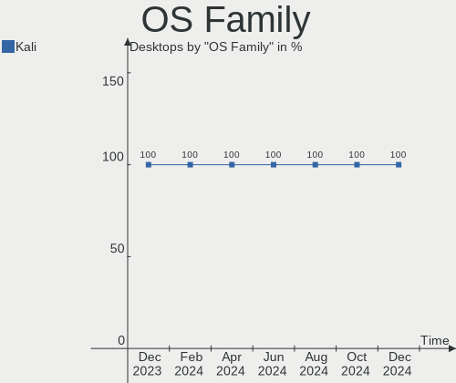
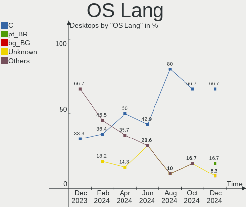
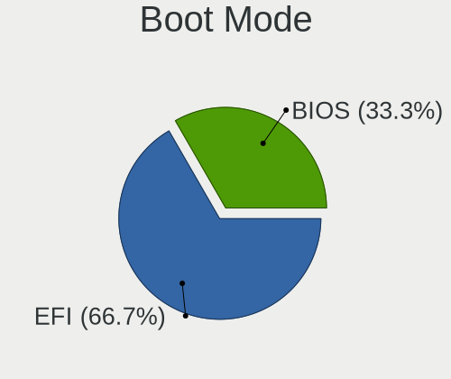
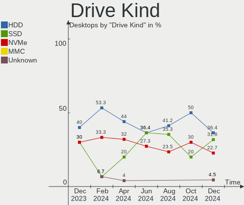
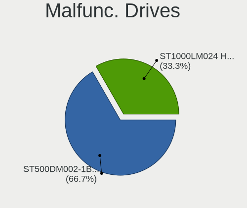
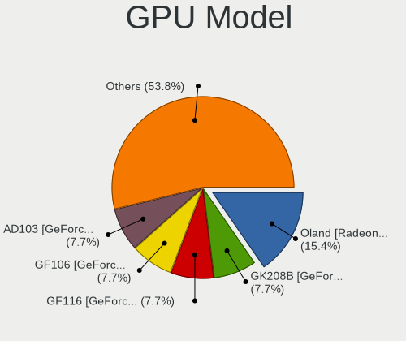
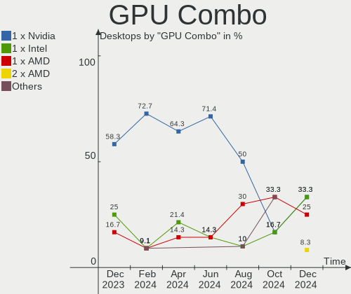

Kali - Hardware Trends (Desktops)
---------------------------------

A project to identify most popular hardware characteristics and track their change
over time based on data collected by Linux users at https://Linux-Hardware.org.

Anyone can contribute to this report by the [hw-probe](https://github.com/linuxhw/hw-probe) tool:

    sudo -E hw-probe -all -upload

This report is for one last month. Overall report since the beginning of time: [TestDays](https://github.com/linuxhw/TestDays)

Period: Jun, 2023.

Contents
--------

* [ System ](#system)
  - [ OS                       ](#os)
  - [ OS Family                ](#os-family)
  - [ Kernel                   ](#kernel)
  - [ Kernel Family            ](#kernel-family)
  - [ Kernel Major Ver.        ](#kernel-major-ver)
  - [ Arch                     ](#arch)
  - [ DE                       ](#de)
  - [ Display Server           ](#display-server)
  - [ Display Manager          ](#display-manager)
  - [ OS Lang                  ](#os-lang)
  - [ Boot Mode                ](#boot-mode)
  - [ Filesystem               ](#filesystem)
  - [ Part. scheme             ](#part-scheme)
  - [ Dual Boot with Linux/BSD ](#dual-boot-with-linuxbsd)
  - [ Dual Boot (Win)          ](#dual-boot-win)

* [ Board ](#board)
  - [ Vendor                   ](#vendor)
  - [ Model                    ](#model)
  - [ Model Family             ](#model-family)
  - [ MFG Year                 ](#mfg-year)
  - [ Form Factor              ](#form-factor)
  - [ Secure Boot              ](#secure-boot)
  - [ Coreboot                 ](#coreboot)
  - [ RAM Size                 ](#ram-size)
  - [ RAM Used                 ](#ram-used)
  - [ Total Drives             ](#total-drives)
  - [ Has CD-ROM               ](#has-cd-rom)
  - [ Has Ethernet             ](#has-ethernet)
  - [ Has WiFi                 ](#has-wifi)
  - [ Has Bluetooth            ](#has-bluetooth)

* [ Location ](#location)
  - [ Country                  ](#country)
  - [ City                     ](#city)

* [ Drives ](#drives)
  - [ Drive Vendor             ](#drive-vendor)
  - [ Drive Model              ](#drive-model)
  - [ HDD Vendor               ](#hdd-vendor)
  - [ SSD Vendor               ](#ssd-vendor)
  - [ Drive Kind               ](#drive-kind)
  - [ Drive Connector          ](#drive-connector)
  - [ Drive Size               ](#drive-size)
  - [ Space Total              ](#space-total)
  - [ Space Used               ](#space-used)
  - [ Malfunc. Drives          ](#malfunc-drives)
  - [ Malfunc. Drive Vendor    ](#malfunc-drive-vendor)
  - [ Malfunc. HDD Vendor      ](#malfunc-hdd-vendor)
  - [ Malfunc. Drive Kind      ](#malfunc-drive-kind)
  - [ Failed Drives            ](#failed-drives)
  - [ Failed Drive Vendor      ](#failed-drive-vendor)
  - [ Drive Status             ](#drive-status)

* [ Storage controller ](#storage-controller)
  - [ Storage Vendor           ](#storage-vendor)
  - [ Storage Model            ](#storage-model)
  - [ Storage Kind             ](#storage-kind)

* [ Processor ](#processor)
  - [ CPU Vendor               ](#cpu-vendor)
  - [ CPU Model                ](#cpu-model)
  - [ CPU Model Family         ](#cpu-model-family)
  - [ CPU Cores                ](#cpu-cores)
  - [ CPU Sockets              ](#cpu-sockets)
  - [ CPU Threads              ](#cpu-threads)
  - [ CPU Op-Modes             ](#cpu-op-modes)
  - [ CPU Microcode            ](#cpu-microcode)
  - [ CPU Microarch            ](#cpu-microarch)

* [ Graphics ](#graphics)
  - [ GPU Vendor               ](#gpu-vendor)
  - [ GPU Model                ](#gpu-model)
  - [ GPU Combo                ](#gpu-combo)
  - [ GPU Driver               ](#gpu-driver)
  - [ GPU Memory               ](#gpu-memory)

* [ Monitor ](#monitor)
  - [ Monitor Vendor           ](#monitor-vendor)
  - [ Monitor Model            ](#monitor-model)
  - [ Monitor Resolution       ](#monitor-resolution)
  - [ Monitor Diagonal         ](#monitor-diagonal)
  - [ Monitor Width            ](#monitor-width)
  - [ Aspect Ratio             ](#aspect-ratio)
  - [ Monitor Area             ](#monitor-area)
  - [ Pixel Density            ](#pixel-density)
  - [ Multiple Monitors        ](#multiple-monitors)

* [ Network ](#network)
  - [ Net Controller Vendor    ](#net-controller-vendor)
  - [ Net Controller Model     ](#net-controller-model)
  - [ Wireless Vendor          ](#wireless-vendor)
  - [ Wireless Model           ](#wireless-model)
  - [ Ethernet Vendor          ](#ethernet-vendor)
  - [ Ethernet Model           ](#ethernet-model)
  - [ Net Controller Kind      ](#net-controller-kind)
  - [ Used Controller          ](#used-controller)
  - [ NICs                     ](#nics)
  - [ IPv6                     ](#ipv6)

* [ Bluetooth ](#bluetooth)
  - [ Bluetooth Vendor         ](#bluetooth-vendor)
  - [ Bluetooth Model          ](#bluetooth-model)

* [ Sound ](#sound)
  - [ Sound Vendor             ](#sound-vendor)
  - [ Sound Model              ](#sound-model)

* [ Memory ](#memory)
  - [ Memory Vendor            ](#memory-vendor)
  - [ Memory Model             ](#memory-model)
  - [ Memory Kind              ](#memory-kind)
  - [ Memory Form Factor       ](#memory-form-factor)
  - [ Memory Size              ](#memory-size)
  - [ Memory Speed             ](#memory-speed)

* [ Printers & scanners ](#printers--scanners)
  - [ Printer Vendor           ](#printer-vendor)
  - [ Printer Model            ](#printer-model)
  - [ Scanner Vendor           ](#scanner-vendor)
  - [ Scanner Model            ](#scanner-model)

* [ Camera ](#camera)
  - [ Camera Vendor            ](#camera-vendor)
  - [ Camera Model             ](#camera-model)

* [ Security ](#security)
  - [ Fingerprint Vendor       ](#fingerprint-vendor)
  - [ Fingerprint Model        ](#fingerprint-model)
  - [ Chipcard Vendor          ](#chipcard-vendor)
  - [ Chipcard Model           ](#chipcard-model)

* [ Unsupported ](#unsupported)
  - [ Unsupported Devices      ](#unsupported-devices)
  - [ Unsupported Device Types ](#unsupported-device-types)

System
------

OS
--

Installed operating systems

| Name        | Desktops | Percent |
|-------------|----------|---------|
| Kali 2023.2 | 9        | 81.82%  |
| Kali 2023.1 | 2        | 18.18%  |

OS Family
---------

OS without a version

| Name | Desktops | Percent |
|------|----------|---------|
| Kali | 11       | 100%    |

Kernel
------

Version of the Linux kernel

| Version           | Desktops | Percent |
|-------------------|----------|---------|
| 6.1.0-kali9-amd64 | 8        | 72.73%  |
| 6.1.0-kali5-amd64 | 3        | 27.27%  |

Kernel Family
-------------

Linux kernel without a distro release

| Version | Desktops | Percent |
|---------|----------|---------|
| 6.1.0   | 11       | 100%    |

Kernel Major Ver.
-----------------

Linux kernel major version

| Version | Desktops | Percent |
|---------|----------|---------|
| 6.1     | 11       | 100%    |

Arch
----

OS architecture (x86_64, i586, etc.)

| Name   | Desktops | Percent |
|--------|----------|---------|
| x86_64 | 11       | 100%    |

DE
--

Desktop Environment

| Name    | Desktops | Percent |
|---------|----------|---------|
| XFCE    | 6        | 54.55%  |
| GNOME   | 3        | 27.27%  |
| KDE5    | 1        | 9.09%   |
| Unknown | 1        | 9.09%   |

Display Server
--------------

X11 or Wayland

| Name | Desktops | Percent |
|------|----------|---------|
| X11  | 11       | 100%    |

Display Manager
---------------

SDDM, LightDM, etc.

| Name    | Desktops | Percent |
|---------|----------|---------|
| LightDM | 6        | 54.55%  |
| Unknown | 3        | 27.27%  |
| SDDM    | 1        | 9.09%   |
| GDM3    | 1        | 9.09%   |

OS Lang
-------

Language

| Lang  | Desktops | Percent |
|-------|----------|---------|
| en_US | 9        | 81.82%  |
| pl_PL | 1        | 9.09%   |
| en_IN | 1        | 9.09%   |

Boot Mode
---------

EFI or BIOS

| Mode | Desktops | Percent |
|------|----------|---------|
| EFI  | 8        | 72.73%  |
| BIOS | 3        | 27.27%  |

Filesystem
----------

Type of filesystem

| Type    | Desktops | Percent |
|---------|----------|---------|
| Ext4    | 8        | 72.73%  |
| Overlay | 3        | 27.27%  |

Part. scheme
------------

Scheme of partitioning

| Type    | Desktops | Percent |
|---------|----------|---------|
| GPT     | 6        | 54.55%  |
| MBR     | 3        | 27.27%  |
| Unknown | 2        | 18.18%  |

Dual Boot with Linux/BSD
------------------------

Hosting more than one Linux/BSD

| Dual boot | Desktops | Percent |
|-----------|----------|---------|
| No        | 10       | 90.91%  |
| Yes       | 1        | 9.09%   |

Dual Boot (Win)
---------------

Hosting Linux and Windows

| Dual boot | Desktops | Percent |
|-----------|----------|---------|
| No        | 7        | 63.64%  |
| Yes       | 4        | 36.36%  |

Board
-----

Vendor
------

Motherboard manufacturer

| Name                | Desktops | Percent |
|---------------------|----------|---------|
| MSI                 | 2        | 18.18%  |
| Lenovo              | 2        | 18.18%  |
| ASRock              | 2        | 18.18%  |
| Intel               | 1        | 9.09%   |
| Gigabyte Technology | 1        | 9.09%   |
| Dell                | 1        | 9.09%   |
| BY OEM              | 1        | 9.09%   |
| Acer                | 1        | 9.09%   |

Model
-----

Motherboard model

| Name                                     | Desktops | Percent |
|------------------------------------------|----------|---------|
| Lenovo ThinkCentre M75s Gen 2 11R9S02K00 | 2        | 18.18%  |
| MSI MS-7B89                              | 1        | 9.09%   |
| MSI MS-7B87                              | 1        | 9.09%   |
| Intel GT5628                             | 1        | 9.09%   |
| Gigabyte B450 AORUS PRO WIFI             | 1        | 9.09%   |
| Dell Inspiron One 2020                   | 1        | 9.09%   |
| BY OEM ZRD1103                           | 1        | 9.09%   |
| ASRock Z170 Pro4S                        | 1        | 9.09%   |
| ASRock H61M-VG3                          | 1        | 9.09%   |
| Acer Veriton N4640G                      | 1        | 9.09%   |

Model Family
------------

Motherboard model prefix

| Name               | Desktops | Percent |
|--------------------|----------|---------|
| Lenovo ThinkCentre | 2        | 18.18%  |
| MSI MS-7B89        | 1        | 9.09%   |
| MSI MS-7B87        | 1        | 9.09%   |
| Intel GT5628       | 1        | 9.09%   |
| Gigabyte B450      | 1        | 9.09%   |
| Dell Inspiron      | 1        | 9.09%   |
| BY OEM ZRD1103     | 1        | 9.09%   |
| ASRock Z170        | 1        | 9.09%   |
| ASRock H61M-VG3    | 1        | 9.09%   |
| Acer Veriton       | 1        | 9.09%   |

MFG Year
--------

Motherboard manufacture year

| Year | Desktops | Percent |
|------|----------|---------|
| 2018 | 3        | 27.27%  |
| 2023 | 2        | 18.18%  |
| 2021 | 1        | 9.09%   |
| 2017 | 1        | 9.09%   |
| 2015 | 1        | 9.09%   |
| 2013 | 1        | 9.09%   |
| 2012 | 1        | 9.09%   |
| 2008 | 1        | 9.09%   |

Form Factor
-----------

Physical design of the computer

| Name    | Desktops | Percent |
|---------|----------|---------|
| Desktop | 11       | 100%    |

Secure Boot
-----------

Enabled or disabled

| State    | Desktops | Percent |
|----------|----------|---------|
| Disabled | 11       | 100%    |

Coreboot
--------

Have coreboot on board

| Used | Desktops | Percent |
|------|----------|---------|
| No   | 11       | 100%    |

RAM Size
--------

Total RAM memory

| Size in GB | Desktops | Percent |
|------------|----------|---------|
| 16.01-24.0 | 3        | 27.27%  |
| 8.01-16.0  | 3        | 27.27%  |
| 32.01-64.0 | 2        | 18.18%  |
| 4.01-8.0   | 1        | 9.09%   |
| 3.01-4.0   | 1        | 9.09%   |
| 24.01-32.0 | 1        | 9.09%   |

RAM Used
--------

Used RAM memory

| Used GB  | Desktops | Percent |
|----------|----------|---------|
| 2.01-3.0 | 4        | 36.36%  |
| 1.01-2.0 | 4        | 36.36%  |
| 4.01-8.0 | 3        | 27.27%  |

Total Drives
------------

Number of drives on board

| Drives | Desktops | Percent |
|--------|----------|---------|
| 1      | 7        | 63.64%  |
| 2      | 2        | 18.18%  |
| 10     | 1        | 9.09%   |
| 4      | 1        | 9.09%   |

Has CD-ROM
----------

Has CD-ROM on board

| Presented | Desktops | Percent |
|-----------|----------|---------|
| No        | 8        | 72.73%  |
| Yes       | 3        | 27.27%  |

Has Ethernet
------------

Has Ethernet on board

| Presented | Desktops | Percent |
|-----------|----------|---------|
| Yes       | 11       | 100%    |

Has WiFi
--------

Has WiFi module

| Presented | Desktops | Percent |
|-----------|----------|---------|
| Yes       | 9        | 81.82%  |
| No        | 2        | 18.18%  |

Has Bluetooth
-------------

Has Bluetooth module

| Presented | Desktops | Percent |
|-----------|----------|---------|
| Yes       | 6        | 54.55%  |
| No        | 5        | 45.45%  |

Location
--------

Country
-------

Geographic location (country)

| Country | Desktops | Percent |
|---------|----------|---------|
| USA     | 6        | 54.55%  |
| Brazil  | 2        | 18.18%  |
| Romania | 1        | 9.09%   |
| Poland  | 1        | 9.09%   |
| India   | 1        | 9.09%   |

City
----

Geographic location (city)

| City           | Desktops | Percent |
|----------------|----------|---------|
| Rio de Janeiro | 2        | 18.18%  |
| Wroclaw        | 1        | 9.09%   |
| Temperance     | 1        | 9.09%   |
| Panorama City  | 1        | 9.09%   |
| Las Vegas      | 1        | 9.09%   |
| Hyderabad      | 1        | 9.09%   |
| Columbia       | 1        | 9.09%   |
| Bucharest      | 1        | 9.09%   |
| Atlanta        | 1        | 9.09%   |
| Arnold         | 1        | 9.09%   |

Drives
------

Drive Vendor
------------

Hard drive vendors

| Vendor              | Desktops | Drives | Percent |
|---------------------|----------|--------|---------|
| WDC                 | 4        | 8      | 21.05%  |
| Samsung Electronics | 3        | 3      | 15.79%  |
| Toshiba             | 2        | 3      | 10.53%  |
| SSSTC               | 2        | 2      | 10.53%  |
| Seagate             | 2        | 3      | 10.53%  |
| T-FORCE             | 1        | 1      | 5.26%   |
| SCUDA               | 1        | 1      | 5.26%   |
| Sandisk             | 1        | 1      | 5.26%   |
| Maxtor              | 1        | 1      | 5.26%   |
| Kingston            | 1        | 1      | 5.26%   |
| Intel               | 1        | 1      | 5.26%   |

Drive Model
-----------

Hard drive models

| Model                            | Desktops | Percent |
|----------------------------------|----------|---------|
| SSSTC CA5-8D256-Q79 256GB        | 2        | 8.33%   |
| Samsung SSD 850 EVO 250GB        | 2        | 8.33%   |
| WDC WDS500G3X0C-00SJG0 500GB     | 1        | 4.17%   |
| WDC WD5000AAVS-00ZTB0 500GB      | 1        | 4.17%   |
| WDC WD5000AAJS-08A8B0 500GB      | 1        | 4.17%   |
| WDC WD5000AACS-00ZUB0 500GB      | 1        | 4.17%   |
| WDC WD32 00KS-00PFB0 320GB       | 1        | 4.17%   |
| WDC WD30 EFRX-68EUZN0 3TB        | 1        | 4.17%   |
| WDC WD100EMAZ-00WJTA0 10TB       | 1        | 4.17%   |
| WDC PC SN730 NVMe 512GB          | 1        | 4.17%   |
| Toshiba MQ01ABF050 500GB         | 1        | 4.17%   |
| Toshiba MK6475GSX 640GB          | 1        | 4.17%   |
| Toshiba DT01ACA050 500GB         | 1        | 4.17%   |
| T-FORCE SSD 1TB                  | 1        | 4.17%   |
| Seagate ST3500630AS 500GB        | 1        | 4.17%   |
| Seagate ST2000DL 003-9VT166 2TB  | 1        | 4.17%   |
| SCUDA 512GB SATA SSD             | 1        | 4.17%   |
| Sandisk WD_BLACK SN770 500GB     | 1        | 4.17%   |
| Samsung HM320JI 320GB            | 1        | 4.17%   |
| Maxtor 7H500F0 500GB             | 1        | 4.17%   |
| Kingston SUV400S37120G 120GB SSD | 1        | 4.17%   |
| Intel SSDSC2KW256G8 256GB        | 1        | 4.17%   |

HDD Vendor
----------

Hard disk drive vendors

| Vendor              | Desktops | Drives | Percent |
|---------------------|----------|--------|---------|
| WDC                 | 4        | 6      | 40%     |
| Toshiba             | 2        | 3      | 20%     |
| Seagate             | 2        | 3      | 20%     |
| Samsung Electronics | 1        | 1      | 10%     |
| Maxtor              | 1        | 1      | 10%     |

SSD Vendor
----------

Solid state drive vendors

| Vendor              | Desktops | Drives | Percent |
|---------------------|----------|--------|---------|
| Samsung Electronics | 2        | 2      | 33.33%  |
| T-FORCE             | 1        | 1      | 16.67%  |
| SCUDA               | 1        | 1      | 16.67%  |
| Kingston            | 1        | 1      | 16.67%  |
| Intel               | 1        | 1      | 16.67%  |

Drive Kind
----------

HDD or SSD

| Kind | Desktops | Drives | Percent |
|------|----------|--------|---------|
| HDD  | 6        | 14     | 37.5%   |
| NVMe | 5        | 5      | 31.25%  |
| SSD  | 5        | 6      | 31.25%  |

Drive Connector
---------------

SATA, SAS, NVMe, etc.

| Type | Desktops | Drives | Percent |
|------|----------|--------|---------|
| SATA | 8        | 15     | 57.14%  |
| NVMe | 5        | 5      | 35.71%  |
| SAS  | 1        | 5      | 7.14%   |

Drive Size
----------

Size of hard drive

| Size in TB | Desktops | Drives | Percent |
|------------|----------|--------|---------|
| 0.01-0.5   | 7        | 13     | 53.85%  |
| 0.51-1.0   | 3        | 3      | 23.08%  |
| 2.01-3.0   | 1        | 1      | 7.69%   |
| 1.01-2.0   | 1        | 2      | 7.69%   |
| 4.01-10.0  | 1        | 1      | 7.69%   |

Space Total
-----------

Amount of disk space available on the file system

| Size in GB     | Desktops | Percent |
|----------------|----------|---------|
| 251-500        | 4        | 36.36%  |
| 501-1000       | 2        | 18.18%  |
| 51-100         | 2        | 18.18%  |
| More than 3000 | 1        | 9.09%   |
| 101-250        | 1        | 9.09%   |
| 1-20           | 1        | 9.09%   |

Space Used
----------

Amount of used disk space

| Used GB        | Desktops | Percent |
|----------------|----------|---------|
| 21-50          | 5        | 45.45%  |
| 1-20           | 3        | 27.27%  |
| More than 3000 | 1        | 9.09%   |
| 251-500        | 1        | 9.09%   |
| 101-250        | 1        | 9.09%   |

Malfunc. Drives
---------------

Drive models with a malfunction

| Model                     | Desktops | Drives | Percent |
|---------------------------|----------|--------|---------|
| Toshiba MQ01ABF050 500GB  | 1        | 1      | 33.33%  |
| Toshiba MK6475GSX 640GB   | 1        | 1      | 33.33%  |
| Seagate ST3500630AS 500GB | 1        | 1      | 33.33%  |

Malfunc. Drive Vendor
---------------------

Vendors of faulty drives

| Vendor  | Desktops | Drives | Percent |
|---------|----------|--------|---------|
| Toshiba | 1        | 2      | 50%     |
| Seagate | 1        | 1      | 50%     |

Malfunc. HDD Vendor
-------------------

Vendors of faulty HDD drives

| Vendor  | Desktops | Drives | Percent |
|---------|----------|--------|---------|
| Toshiba | 1        | 2      | 50%     |
| Seagate | 1        | 1      | 50%     |

Malfunc. Drive Kind
-------------------

Kinds of faulty drives

| Kind | Desktops | Drives | Percent |
|------|----------|--------|---------|
| HDD  | 2        | 3      | 100%    |

Failed Drives
-------------

Failed drive models

Zero info for selected period =(

Failed Drive Vendor
-------------------

Failed drive vendors

Zero info for selected period =(

Drive Status
------------

Number of failed and malfunc. drives

| Status   | Desktops | Drives | Percent |
|----------|----------|--------|---------|
| Works    | 9        | 15     | 64.29%  |
| Detected | 3        | 7      | 21.43%  |
| Malfunc  | 2        | 3      | 14.29%  |

Storage controller
------------------

Storage Vendor
--------------

Storage controller vendors

| Vendor                         | Desktops | Percent |
|--------------------------------|----------|---------|
| Intel                          | 6        | 37.5%   |
| AMD                            | 5        | 31.25%  |
| SanDisk                        | 3        | 18.75%  |
| Solid State Storage Technology | 2        | 12.5%   |

Storage Model
-------------

Storage controller models

| Model                                                                                   | Desktops | Percent |
|-----------------------------------------------------------------------------------------|----------|---------|
| Intel Q170/Q150/B150/H170/H110/Z170/CM236 Chipset SATA Controller [AHCI Mode]           | 3        | 15%     |
| AMD FCH SATA Controller [AHCI mode]                                                     | 3        | 15%     |
| AMD 400 Series Chipset SATA Controller                                                  | 3        | 15%     |
| Solid State Storage Non-Volatile memory controller                                      | 2        | 10%     |
| SanDisk WD Black SN750 / PC SN730 NVMe SSD                                              | 2        | 10%     |
| AMD 500 Series Chipset SATA Controller                                                  | 2        | 10%     |
| SanDisk WD Black SN770 NVMe SSD                                                         | 1        | 5%      |
| Intel SATA Controller [RAID mode]                                                       | 1        | 5%      |
| Intel 6 Series/C200 Series Chipset Family Desktop SATA Controller (IDE mode, ports 4-5) | 1        | 5%      |
| Intel 6 Series/C200 Series Chipset Family Desktop SATA Controller (IDE mode, ports 0-3) | 1        | 5%      |
| Intel 6 Series/C200 Series Chipset Family 6 port Desktop SATA AHCI Controller           | 1        | 5%      |

Storage Kind
------------

Kind of storage controller (IDE, SATA, NVMe, SAS, ...)

| Kind | Desktops | Percent |
|------|----------|---------|
| SATA | 9        | 56.25%  |
| NVMe | 5        | 31.25%  |
| RAID | 1        | 6.25%   |
| IDE  | 1        | 6.25%   |

Processor
---------

CPU Vendor
----------

Processor vendors

| Vendor | Desktops | Percent |
|--------|----------|---------|
| Intel  | 6        | 54.55%  |
| AMD    | 5        | 45.45%  |

CPU Model
---------

Processor models

| Model                                  | Desktops | Percent |
|----------------------------------------|----------|---------|
| AMD Ryzen 7 5700G with Radeon Graphics | 2        | 18.18%  |
| Intel Pentium CPU G2030T @ 2.60GHz     | 1        | 9.09%   |
| Intel Core i7-6700 CPU @ 3.40GHz       | 1        | 9.09%   |
| Intel Core i5-7500T CPU @ 2.70GHz      | 1        | 9.09%   |
| Intel Core i5-6500 CPU @ 3.20GHz       | 1        | 9.09%   |
| Intel Core 2 Quad CPU Q6600 @ 2.40GHz  | 1        | 9.09%   |
| Intel Celeron CPU G1610 @ 2.60GHz      | 1        | 9.09%   |
| AMD Ryzen 7 3700X 8-Core Processor     | 1        | 9.09%   |
| AMD Ryzen 7 2700 Eight-Core Processor  | 1        | 9.09%   |
| AMD Ryzen 5 2600 Six-Core Processor    | 1        | 9.09%   |

CPU Model Family
----------------

Processor model prefix

| Model             | Desktops | Percent |
|-------------------|----------|---------|
| AMD Ryzen 7       | 4        | 36.36%  |
| Intel Core i5     | 2        | 18.18%  |
| Intel Pentium     | 1        | 9.09%   |
| Intel Core i7     | 1        | 9.09%   |
| Intel Core 2 Quad | 1        | 9.09%   |
| Intel Celeron     | 1        | 9.09%   |
| AMD Ryzen 5       | 1        | 9.09%   |

CPU Cores
---------

Number of processor cores

| Number | Desktops | Percent |
|--------|----------|---------|
| 8      | 4        | 36.36%  |
| 4      | 4        | 36.36%  |
| 2      | 2        | 18.18%  |
| 6      | 1        | 9.09%   |

CPU Sockets
-----------

Number of sockets

| Number | Desktops | Percent |
|--------|----------|---------|
| 1      | 11       | 100%    |

CPU Threads
-----------

Threads per core (Hyper-Threading)

| Number | Desktops | Percent |
|--------|----------|---------|
| 2      | 6        | 54.55%  |
| 1      | 5        | 45.45%  |

CPU Op-Modes
------------

CPU Operation Modes (32-bit, 64-bit)

| Op mode        | Desktops | Percent |
|----------------|----------|---------|
| 32-bit, 64-bit | 11       | 100%    |

CPU Microcode
-------------

Microcode number

| Number     | Desktops | Percent |
|------------|----------|---------|
| 0x506e3    | 2        | 18.18%  |
| 0x306a9    | 2        | 18.18%  |
| 0x0a50000c | 2        | 18.18%  |
| 0x0800820d | 2        | 18.18%  |
| 0x906e9    | 1        | 9.09%   |
| 0x6fb      | 1        | 9.09%   |
| 0x08701013 | 1        | 9.09%   |

CPU Microarch
-------------

Microarchitecture

| Name      | Desktops | Percent |
|-----------|----------|---------|
| Zen+      | 2        | 18.18%  |
| Zen 3     | 2        | 18.18%  |
| Skylake   | 2        | 18.18%  |
| IvyBridge | 2        | 18.18%  |
| Zen 2     | 1        | 9.09%   |
| KabyLake  | 1        | 9.09%   |
| Core      | 1        | 9.09%   |

Graphics
--------

GPU Vendor
----------

Vendors of graphics cards

| Vendor | Desktops | Percent |
|--------|----------|---------|
| Nvidia | 4        | 36.36%  |
| Intel  | 4        | 36.36%  |
| AMD    | 3        | 27.27%  |

GPU Model
---------

Graphics card models

| Model                                                            | Desktops | Percent |
|------------------------------------------------------------------|----------|---------|
| Intel Xeon E3-1200 v2/3rd Gen Core processor Graphics Controller | 2        | 15.38%  |
| AMD Lexa PRO [Radeon 540/540X/550/550X / RX 540X/550/550X]       | 2        | 15.38%  |
| AMD Cezanne [Radeon Vega Series / Radeon Vega Mobile Series]     | 2        | 15.38%  |
| Nvidia TU106 [GeForce RTX 2060 SUPER]                            | 1        | 7.69%   |
| Nvidia GM204 [GeForce GTX 970]                                   | 1        | 7.69%   |
| Nvidia GK208B [GeForce GT 730]                                   | 1        | 7.69%   |
| Nvidia GA104 [GeForce RTX 3060 Ti]                               | 1        | 7.69%   |
| Intel HD Graphics 630                                            | 1        | 7.69%   |
| Intel 82G33/G31 Express Integrated Graphics Controller           | 1        | 7.69%   |
| AMD Navi 10 [Radeon RX 5600 OEM/5600 XT / 5700/5700 XT]          | 1        | 7.69%   |

GPU Combo
---------

Combinations of graphics cards

| Name       | Desktops | Percent |
|------------|----------|---------|
| 1 x Nvidia | 4        | 36.36%  |
| 1 x Intel  | 4        | 36.36%  |
| 2 x AMD    | 2        | 18.18%  |
| 1 x AMD    | 1        | 9.09%   |

GPU Driver
----------

Free vs proprietary

| Driver      | Desktops | Percent |
|-------------|----------|---------|
| Free        | 10       | 90.91%  |
| Proprietary | 1        | 9.09%   |

GPU Memory
----------

Total video memory

| Size in GB | Desktops | Percent |
|------------|----------|---------|
| 3.01-4.0   | 4        | 36.36%  |
| Unknown    | 4        | 36.36%  |
| 7.01-8.0   | 3        | 27.27%  |

Monitor
-------

Monitor Vendor
--------------

Monitor vendors

| Vendor               | Desktops | Percent |
|----------------------|----------|---------|
| Samsung Electronics  | 5        | 41.67%  |
| Lenovo               | 3        | 25%     |
| Insignia             | 1        | 8.33%   |
| Dell                 | 1        | 8.33%   |
| BenQ                 | 1        | 8.33%   |
| Ancor Communications | 1        | 8.33%   |

Monitor Model
-------------

Monitor models

| Model                                                                   | Desktops | Percent |
|-------------------------------------------------------------------------|----------|---------|
| Lenovo LEN S24e-03 LEN61F9 1920x1080 527x296mm 23.8-inch                | 2        | 16.67%  |
| Samsung Electronics SyncMaster SAM0424 1920x1200 518x324mm 24.1-inch    | 1        | 8.33%   |
| Samsung Electronics SyncMaster SAM0234 1280x1024 376x301mm 19.0-inch    | 1        | 8.33%   |
| Samsung Electronics SA300/350/360 SAM07D6 1920x1080 531x299mm 24.0-inch | 1        | 8.33%   |
| Samsung Electronics Odyssey G50A SAM7181 2560x1440 597x336mm 27.0-inch  | 1        | 8.33%   |
| Samsung Electronics LCD Monitor SAM099C 1920x1080 890x500mm 40.2-inch   | 1        | 8.33%   |
| Lenovo LEN D24-10 LEN65E2 1920x1080 521x293mm 23.5-inch                 | 1        | 8.33%   |
| Insignia NS32DD200NA14 BBY0032 1680x1050 700x390mm 31.5-inch            | 1        | 8.33%   |
| Dell 20 DELF112 1600x900 443x249mm 20.0-inch                            | 1        | 8.33%   |
| BenQ GW2480 BNQ78E7 1920x1080 527x296mm 23.8-inch                       | 1        | 8.33%   |
| Ancor Communications ASUS VW266H ACI26A4 1920x1200 550x340mm 25.5-inch  | 1        | 8.33%   |

Monitor Resolution
------------------

Monitor screen resolution

| Resolution        | Desktops | Percent |
|-------------------|----------|---------|
| 1920x1080 (FHD)   | 7        | 58.33%  |
| 1920x1200 (WUXGA) | 2        | 16.67%  |
| 2560x1440 (QHD)   | 1        | 8.33%   |
| 1920x540          | 1        | 8.33%   |
| 1280x1024 (SXGA)  | 1        | 8.33%   |

Monitor Diagonal
----------------

Diagonal size in inches

| Inches | Desktops | Percent |
|--------|----------|---------|
| 24     | 4        | 33.33%  |
| 23     | 3        | 25%     |
| 54     | 1        | 8.33%   |
| 48     | 1        | 8.33%   |
| 27     | 1        | 8.33%   |
| 25     | 1        | 8.33%   |
| 19     | 1        | 8.33%   |

Monitor Width
-------------

Physical width

| Width in mm | Desktops | Percent |
|-------------|----------|---------|
| 501-600     | 8        | 80%     |
| 351-400     | 1        | 10%     |
| 1001-1500   | 1        | 10%     |

Aspect Ratio
------------

Proportional relationship between the width and the height

| Ratio | Desktops | Percent |
|-------|----------|---------|
| 16/9  | 8        | 66.67%  |
| 16/10 | 2        | 16.67%  |
| 5/4   | 1        | 8.33%   |
| 1.96  | 1        | 8.33%   |

Monitor Area
------------

Area in inch²

| Area in inch² | Desktops | Percent |
|----------------|----------|---------|
| 201-250        | 6        | 50%     |
| 251-300        | 2        | 16.67%  |
| More than 1000 | 1        | 8.33%   |
| 301-350        | 1        | 8.33%   |
| 151-200        | 1        | 8.33%   |
| 501-1000       | 1        | 8.33%   |

Pixel Density
-------------

Pixels per inch

| Density | Desktops | Percent |
|---------|----------|---------|
| 51-100  | 8        | 80%     |
| 1-50    | 1        | 10%     |
| 101-120 | 1        | 10%     |

Multiple Monitors
-----------------

Total monitors connected

| Total | Desktops | Percent |
|-------|----------|---------|
| 1     | 9        | 81.82%  |
| 2     | 2        | 18.18%  |

Network
-------

Net Controller Vendor
---------------------

Controller vendors

| Vendor                | Desktops | Percent |
|-----------------------|----------|---------|
| Realtek Semiconductor | 9        | 47.37%  |
| Intel                 | 5        | 26.32%  |
| Ralink Technology     | 2        | 10.53%  |
| Ralink                | 1        | 5.26%   |
| Qualcomm              | 1        | 5.26%   |
| DisplayLink           | 1        | 5.26%   |

Net Controller Model
--------------------

Controller models

| Model                                                             | Desktops | Percent |
|-------------------------------------------------------------------|----------|---------|
| Realtek RTL8111/8168/8411 PCI Express Gigabit Ethernet Controller | 7        | 31.82%  |
| Realtek RTL8852AE 802.11ax PCIe Wireless Network Adapter          | 2        | 9.09%   |
| Realtek RTL8812AU 802.11a/b/g/n/ac 2T2R DB WLAN Adapter           | 1        | 4.55%   |
| Realtek RTL810xE PCI Express Fast Ethernet controller             | 1        | 4.55%   |
| Ralink RT3072 Wireless Adapter                                    | 1        | 4.55%   |
| Ralink MT7601U Wireless Adapter                                   | 1        | 4.55%   |
| Ralink RT2760 Wireless 802.11n 1T/2R                              | 1        | 4.55%   |
| Qualcomm MDM9207-MTP _SN:7F5AA874                                 | 1        | 4.55%   |
| Intel Wireless 7265                                               | 1        | 4.55%   |
| Intel I211 Gigabit Network Connection                             | 1        | 4.55%   |
| Intel Ethernet Connection (2) I219-V                              | 1        | 4.55%   |
| Intel Dual Band Wireless-AC 3168NGW [Stone Peak]                  | 1        | 4.55%   |
| Intel Centrino Wireless-N 1030 [Rainbow Peak]                     | 1        | 4.55%   |
| Intel 82562V-2 10/100 Network Connection                          | 1        | 4.55%   |
| DisplayLink Dell Universal Dock D6000                             | 1        | 4.55%   |

Wireless Vendor
---------------

Wireless vendors

| Vendor                | Desktops | Percent |
|-----------------------|----------|---------|
| Realtek Semiconductor | 3        | 33.33%  |
| Intel                 | 3        | 33.33%  |
| Ralink Technology     | 2        | 22.22%  |
| Ralink                | 1        | 11.11%  |

Wireless Model
--------------

Wireless models

| Model                                                    | Desktops | Percent |
|----------------------------------------------------------|----------|---------|
| Realtek RTL8852AE 802.11ax PCIe Wireless Network Adapter | 2        | 22.22%  |
| Realtek RTL8812AU 802.11a/b/g/n/ac 2T2R DB WLAN Adapter  | 1        | 11.11%  |
| Ralink RT3072 Wireless Adapter                           | 1        | 11.11%  |
| Ralink MT7601U Wireless Adapter                          | 1        | 11.11%  |
| Ralink RT2760 Wireless 802.11n 1T/2R                     | 1        | 11.11%  |
| Intel Wireless 7265                                      | 1        | 11.11%  |
| Intel Dual Band Wireless-AC 3168NGW [Stone Peak]         | 1        | 11.11%  |
| Intel Centrino Wireless-N 1030 [Rainbow Peak]            | 1        | 11.11%  |

Ethernet Vendor
---------------

Ethernet vendors

| Vendor                | Desktops | Percent |
|-----------------------|----------|---------|
| Realtek Semiconductor | 8        | 61.54%  |
| Intel                 | 3        | 23.08%  |
| Qualcomm              | 1        | 7.69%   |
| DisplayLink           | 1        | 7.69%   |

Ethernet Model
--------------

Ethernet models

| Model                                                             | Desktops | Percent |
|-------------------------------------------------------------------|----------|---------|
| Realtek RTL8111/8168/8411 PCI Express Gigabit Ethernet Controller | 7        | 53.85%  |
| Realtek RTL810xE PCI Express Fast Ethernet controller             | 1        | 7.69%   |
| Qualcomm MDM9207-MTP _SN:7F5AA874                                 | 1        | 7.69%   |
| Intel I211 Gigabit Network Connection                             | 1        | 7.69%   |
| Intel Ethernet Connection (2) I219-V                              | 1        | 7.69%   |
| Intel 82562V-2 10/100 Network Connection                          | 1        | 7.69%   |
| DisplayLink Dell Universal Dock D6000                             | 1        | 7.69%   |

Net Controller Kind
-------------------

Ethernet, WiFi or modem

| Kind     | Desktops | Percent |
|----------|----------|---------|
| Ethernet | 11       | 55%     |
| WiFi     | 9        | 45%     |

Used Controller
---------------

Currently used network controller

| Kind     | Desktops | Percent |
|----------|----------|---------|
| Ethernet | 8        | 66.67%  |
| WiFi     | 4        | 33.33%  |

NICs
----

Total network controllers on board

| Total | Desktops | Percent |
|-------|----------|---------|
| 2     | 6        | 54.55%  |
| 1     | 5        | 45.45%  |

IPv6
----

IPv6 vs IPv4

| Used | Desktops | Percent |
|------|----------|---------|
| No   | 9        | 81.82%  |
| Yes  | 2        | 18.18%  |

Bluetooth
---------

Bluetooth Vendor
----------------

Controller vendors

| Vendor                  | Desktops | Percent |
|-------------------------|----------|---------|
| Intel                   | 3        | 50%     |
| Realtek Semiconductor   | 2        | 33.33%  |
| Cambridge Silicon Radio | 1        | 16.67%  |

Bluetooth Model
---------------

Controller models

| Model                                               | Desktops | Percent |
|-----------------------------------------------------|----------|---------|
| Realtek Bluetooth Radio                             | 2        | 33.33%  |
| Intel Wireless-AC 3168 Bluetooth                    | 1        | 16.67%  |
| Intel Centrino Advanced-N 6230 Bluetooth adapter    | 1        | 16.67%  |
| Intel Bluetooth wireless interface                  | 1        | 16.67%  |
| Cambridge Silicon Radio Bluetooth Dongle (HCI mode) | 1        | 16.67%  |

Sound
-----

Sound Vendor
------------

Sound card vendors

| Vendor | Desktops | Percent |
|--------|----------|---------|
| Intel  | 6        | 37.5%   |
| AMD    | 5        | 31.25%  |
| Nvidia | 4        | 25%     |
| Bose   | 1        | 6.25%   |

Sound Model
-----------

Sound card models

| Model                                                                      | Desktops | Percent |
|----------------------------------------------------------------------------|----------|---------|
| Intel 100 Series/C230 Series Chipset Family HD Audio Controller            | 3        | 14.29%  |
| Intel 6 Series/C200 Series Chipset Family High Definition Audio Controller | 2        | 9.52%   |
| AMD Renoir Radeon High Definition Audio Controller                         | 2        | 9.52%   |
| AMD Family 17h/19h HD Audio Controller                                     | 2        | 9.52%   |
| AMD Family 17h (Models 00h-0fh) HD Audio Controller                        | 2        | 9.52%   |
| AMD Baffin HDMI/DP Audio [Radeon RX 550 640SP / RX 560/560X]               | 2        | 9.52%   |
| Nvidia TU106 High Definition Audio Controller                              | 1        | 4.76%   |
| Nvidia GM204 High Definition Audio Controller                              | 1        | 4.76%   |
| Nvidia GK208 HDMI/DP Audio Controller                                      | 1        | 4.76%   |
| Nvidia GA104 High Definition Audio Controller                              | 1        | 4.76%   |
| Intel 82801I (ICH9 Family) HD Audio Controller                             | 1        | 4.76%   |
| Bose USB Audio                                                             | 1        | 4.76%   |
| AMD Starship/Matisse HD Audio Controller                                   | 1        | 4.76%   |
| AMD Navi 10 HDMI Audio                                                     | 1        | 4.76%   |

Memory
------

Memory Vendor
-------------

Memory module vendors

| Vendor              | Desktops | Percent |
|---------------------|----------|---------|
| SK hynix            | 2        | 18.18%  |
| Kingston            | 2        | 18.18%  |
| Unknown             | 2        | 18.18%  |
| Samsung Electronics | 1        | 9.09%   |
| Nanya Technology    | 1        | 9.09%   |
| G.Skill             | 1        | 9.09%   |
| Crucial             | 1        | 9.09%   |
| Corsair             | 1        | 9.09%   |

Memory Model
------------

Memory module models

| Model                                                  | Desktops | Percent |
|--------------------------------------------------------|----------|---------|
| Unknown                                                | 2        | 18.18%  |
| SK hynix RAM HMT451S6BFR8A-PB 4GB SODIMM DDR3 1600MT/s | 1        | 9.09%   |
| SK hynix RAM HMA81GS6AFR8N-UH 8GB SODIMM DDR4 2667MT/s | 1        | 9.09%   |
| Samsung RAM M471B5173CB0-YK0 4GB SODIMM DDR3 1600MT/s  | 1        | 9.09%   |
| Nanya RAM M2F4G64CB8HG5N-CG 4GB DIMM DDR3 1600MT/s     | 1        | 9.09%   |
| Kingston RAM XJ69DF-MIE2 8GB DIMM DDR4 2800MT/s        | 1        | 9.09%   |
| Kingston RAM Module 2GB DIMM DDR2 667MT/s              | 1        | 9.09%   |
| G.Skill RAM F4-2400C15-8GVR 8GB DIMM DDR4 3200MT/s     | 1        | 9.09%   |
| Crucial RAM BLS8G4D30AESCK.M8FE 8GB DIMM DDR4 3533MT/s | 1        | 9.09%   |
| Corsair RAM CMK8GX4M2B3000C15 4GB DIMM DDR4 2933MT/s   | 1        | 9.09%   |

Memory Kind
-----------

Memory module kinds

| Kind | Desktops | Percent |
|------|----------|---------|
| DDR4 | 6        | 66.67%  |
| DDR3 | 2        | 22.22%  |
| DDR2 | 1        | 11.11%  |

Memory Form Factor
------------------

Physical design of the memory module

| Name   | Desktops | Percent |
|--------|----------|---------|
| DIMM   | 7        | 77.78%  |
| SODIMM | 2        | 22.22%  |

Memory Size
-----------

Memory module size

| Size | Desktops | Percent |
|------|----------|---------|
| 8192 | 7        | 70%     |
| 4096 | 2        | 20%     |
| 2048 | 1        | 10%     |

Memory Speed
------------

Memory module speed

| Speed | Desktops | Percent |
|-------|----------|---------|
| 3200  | 3        | 30%     |
| 1600  | 2        | 20%     |
| 3533  | 1        | 10%     |
| 3007  | 1        | 10%     |
| 2800  | 1        | 10%     |
| 2667  | 1        | 10%     |
| 667   | 1        | 10%     |

Printers & scanners
-------------------

Printer Vendor
--------------

Printer device vendors

Zero info for selected period =(

Printer Model
-------------

Printer device models

Zero info for selected period =(

Scanner Vendor
--------------

Scanner device vendors

Zero info for selected period =(

Scanner Model
-------------

Scanner device models

Zero info for selected period =(

Camera
------

Camera Vendor
-------------

Camera device vendors

| Vendor   | Desktops | Percent |
|----------|----------|---------|
| Microdia | 1        | 100%    |

Camera Model
------------

Camera device models

| Model                                | Desktops | Percent |
|--------------------------------------|----------|---------|
| Microdia Laptop_Integrated_Webcam_HD | 1        | 100%    |

Security
--------

Fingerprint Vendor
------------------

Fingerprint sensor vendors

Zero info for selected period =(

Fingerprint Model
-----------------

Fingerprint sensor models

Zero info for selected period =(

Chipcard Vendor
---------------

Chipcard module vendors

Zero info for selected period =(

Chipcard Model
--------------

Chipcard module models

Zero info for selected period =(

Unsupported
-----------

Unsupported Devices
-------------------

Total unsupported devices on board

| Total | Desktops | Percent |
|-------|----------|---------|
| 0     | 10       | 90.91%  |
| 1     | 1        | 9.09%   |

Unsupported Device Types
------------------------

Types of unsupported devices

| Type         | Desktops | Percent |
|--------------|----------|---------|
| Net/wireless | 1        | 100%    |

