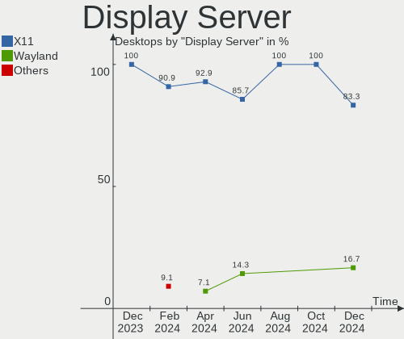
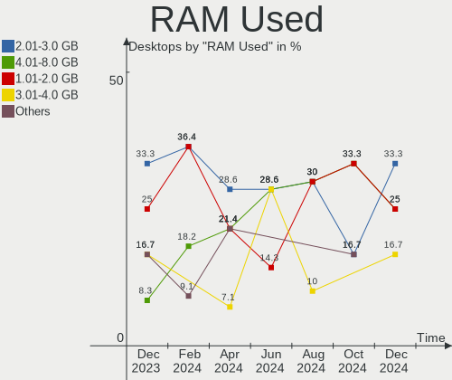
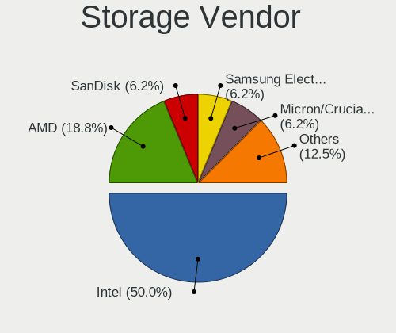
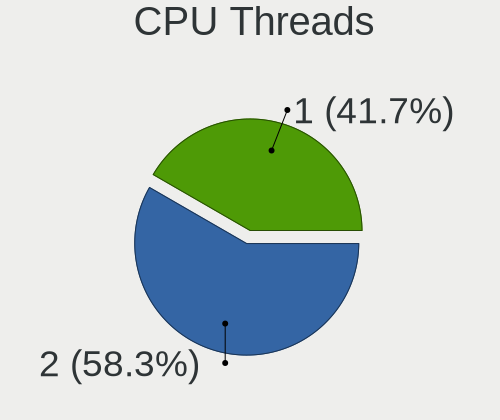
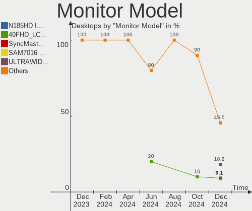
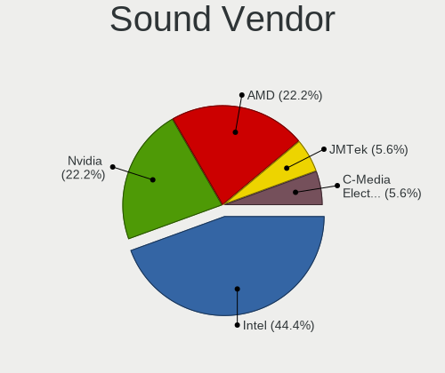

Kali - Hardware Trends (Desktops)
---------------------------------

A project to identify most popular hardware characteristics and track their change
over time based on data collected by Linux users at https://Linux-Hardware.org.

Anyone can contribute to this report by the [hw-probe](https://github.com/linuxhw/hw-probe) tool:

    sudo -E hw-probe -all -upload

This report is for one last month. Overall report since the beginning of time: [TestCoverage](https://github.com/linuxhw/TestCoverage)

Period: Aug, 2022.

Contents
--------

* [ System ](#system)
  - [ OS                       ](#os)
  - [ OS Family                ](#os-family)
  - [ Kernel                   ](#kernel)
  - [ Kernel Family            ](#kernel-family)
  - [ Kernel Major Ver.        ](#kernel-major-ver)
  - [ Arch                     ](#arch)
  - [ DE                       ](#de)
  - [ Display Server           ](#display-server)
  - [ Display Manager          ](#display-manager)
  - [ OS Lang                  ](#os-lang)
  - [ Boot Mode                ](#boot-mode)
  - [ Filesystem               ](#filesystem)
  - [ Part. scheme             ](#part-scheme)
  - [ Dual Boot with Linux/BSD ](#dual-boot-with-linuxbsd)
  - [ Dual Boot (Win)          ](#dual-boot-win)

* [ Board ](#board)
  - [ Vendor                   ](#vendor)
  - [ Model                    ](#model)
  - [ Model Family             ](#model-family)
  - [ MFG Year                 ](#mfg-year)
  - [ Form Factor              ](#form-factor)
  - [ Secure Boot              ](#secure-boot)
  - [ Coreboot                 ](#coreboot)
  - [ RAM Size                 ](#ram-size)
  - [ RAM Used                 ](#ram-used)
  - [ Total Drives             ](#total-drives)
  - [ Has CD-ROM               ](#has-cd-rom)
  - [ Has Ethernet             ](#has-ethernet)
  - [ Has WiFi                 ](#has-wifi)
  - [ Has Bluetooth            ](#has-bluetooth)

* [ Location ](#location)
  - [ Country                  ](#country)
  - [ City                     ](#city)

* [ Drives ](#drives)
  - [ Drive Vendor             ](#drive-vendor)
  - [ Drive Model              ](#drive-model)
  - [ HDD Vendor               ](#hdd-vendor)
  - [ SSD Vendor               ](#ssd-vendor)
  - [ Drive Kind               ](#drive-kind)
  - [ Drive Connector          ](#drive-connector)
  - [ Drive Size               ](#drive-size)
  - [ Space Total              ](#space-total)
  - [ Space Used               ](#space-used)
  - [ Malfunc. Drives          ](#malfunc-drives)
  - [ Malfunc. Drive Vendor    ](#malfunc-drive-vendor)
  - [ Malfunc. HDD Vendor      ](#malfunc-hdd-vendor)
  - [ Malfunc. Drive Kind      ](#malfunc-drive-kind)
  - [ Failed Drives            ](#failed-drives)
  - [ Failed Drive Vendor      ](#failed-drive-vendor)
  - [ Drive Status             ](#drive-status)

* [ Storage controller ](#storage-controller)
  - [ Storage Vendor           ](#storage-vendor)
  - [ Storage Model            ](#storage-model)
  - [ Storage Kind             ](#storage-kind)

* [ Processor ](#processor)
  - [ CPU Vendor               ](#cpu-vendor)
  - [ CPU Model                ](#cpu-model)
  - [ CPU Model Family         ](#cpu-model-family)
  - [ CPU Cores                ](#cpu-cores)
  - [ CPU Sockets              ](#cpu-sockets)
  - [ CPU Threads              ](#cpu-threads)
  - [ CPU Op-Modes             ](#cpu-op-modes)
  - [ CPU Microcode            ](#cpu-microcode)
  - [ CPU Microarch            ](#cpu-microarch)

* [ Graphics ](#graphics)
  - [ GPU Vendor               ](#gpu-vendor)
  - [ GPU Model                ](#gpu-model)
  - [ GPU Combo                ](#gpu-combo)
  - [ GPU Driver               ](#gpu-driver)
  - [ GPU Memory               ](#gpu-memory)

* [ Monitor ](#monitor)
  - [ Monitor Vendor           ](#monitor-vendor)
  - [ Monitor Model            ](#monitor-model)
  - [ Monitor Resolution       ](#monitor-resolution)
  - [ Monitor Diagonal         ](#monitor-diagonal)
  - [ Monitor Width            ](#monitor-width)
  - [ Aspect Ratio             ](#aspect-ratio)
  - [ Monitor Area             ](#monitor-area)
  - [ Pixel Density            ](#pixel-density)
  - [ Multiple Monitors        ](#multiple-monitors)

* [ Network ](#network)
  - [ Net Controller Vendor    ](#net-controller-vendor)
  - [ Net Controller Model     ](#net-controller-model)
  - [ Wireless Vendor          ](#wireless-vendor)
  - [ Wireless Model           ](#wireless-model)
  - [ Ethernet Vendor          ](#ethernet-vendor)
  - [ Ethernet Model           ](#ethernet-model)
  - [ Net Controller Kind      ](#net-controller-kind)
  - [ Used Controller          ](#used-controller)
  - [ NICs                     ](#nics)
  - [ IPv6                     ](#ipv6)

* [ Bluetooth ](#bluetooth)
  - [ Bluetooth Vendor         ](#bluetooth-vendor)
  - [ Bluetooth Model          ](#bluetooth-model)

* [ Sound ](#sound)
  - [ Sound Vendor             ](#sound-vendor)
  - [ Sound Model              ](#sound-model)

* [ Memory ](#memory)
  - [ Memory Vendor            ](#memory-vendor)
  - [ Memory Model             ](#memory-model)
  - [ Memory Kind              ](#memory-kind)
  - [ Memory Form Factor       ](#memory-form-factor)
  - [ Memory Size              ](#memory-size)
  - [ Memory Speed             ](#memory-speed)

* [ Printers & scanners ](#printers--scanners)
  - [ Printer Vendor           ](#printer-vendor)
  - [ Printer Model            ](#printer-model)
  - [ Scanner Vendor           ](#scanner-vendor)
  - [ Scanner Model            ](#scanner-model)

* [ Camera ](#camera)
  - [ Camera Vendor            ](#camera-vendor)
  - [ Camera Model             ](#camera-model)

* [ Security ](#security)
  - [ Fingerprint Vendor       ](#fingerprint-vendor)
  - [ Fingerprint Model        ](#fingerprint-model)
  - [ Chipcard Vendor          ](#chipcard-vendor)
  - [ Chipcard Model           ](#chipcard-model)

* [ Unsupported ](#unsupported)
  - [ Unsupported Devices      ](#unsupported-devices)
  - [ Unsupported Device Types ](#unsupported-device-types)

System
------

OS
--

Installed operating systems

| Name        | Desktops | Percent |
|-------------|----------|---------|
| Kali 2022.3 | 12       | 92.31%  |
| Kali 2022.1 | 1        | 7.69%   |

OS Family
---------

OS without a version

| Name | Desktops | Percent |
|------|----------|---------|
| Kali | 13       | 100%    |

Kernel
------

Version of the Linux kernel

| Version            | Desktops | Percent |
|--------------------|----------|---------|
| 5.18.0-kali5-amd64 | 12       | 92.31%  |
| 5.15.0-kali3-amd64 | 1        | 7.69%   |

Kernel Family
-------------

Linux kernel without a distro release

| Version | Desktops | Percent |
|---------|----------|---------|
| 5.18.0  | 12       | 92.31%  |
| 5.15.0  | 1        | 7.69%   |

Kernel Major Ver.
-----------------

Linux kernel major version

| Version | Desktops | Percent |
|---------|----------|---------|
| 5.18    | 12       | 92.31%  |
| 5.15    | 1        | 7.69%   |

Arch
----

OS architecture (x86_64, i586, etc.)

| Name   | Desktops | Percent |
|--------|----------|---------|
| x86_64 | 13       | 100%    |

DE
--

Desktop Environment

| Name    | Desktops | Percent |
|---------|----------|---------|
| XFCE    | 7        | 53.85%  |
| GNOME   | 3        | 23.08%  |
| KDE5    | 2        | 15.38%  |
| Unknown | 1        | 7.69%   |

Display Server
--------------

X11 or Wayland

| Name | Desktops | Percent |
|------|----------|---------|
| X11  | 13       | 100%    |

Display Manager
---------------

SDDM, LightDM, etc.

| Name    | Desktops | Percent |
|---------|----------|---------|
| LightDM | 6        | 46.15%  |
| Unknown | 3        | 23.08%  |
| SDDM    | 2        | 15.38%  |
| GDM3    | 2        | 15.38%  |

OS Lang
-------

Language

| Lang    | Desktops | Percent |
|---------|----------|---------|
| en_US   | 7        | 53.85%  |
| ru_RU   | 1        | 7.69%   |
| pt_BR   | 1        | 7.69%   |
| fr_CA   | 1        | 7.69%   |
| es_ES   | 1        | 7.69%   |
| de_DE   | 1        | 7.69%   |
| Unknown | 1        | 7.69%   |

Boot Mode
---------

EFI or BIOS

| Mode | Desktops | Percent |
|------|----------|---------|
| EFI  | 8        | 61.54%  |
| BIOS | 5        | 38.46%  |

Filesystem
----------

Type of filesystem

| Type | Desktops | Percent |
|------|----------|---------|
| Ext4 | 13       | 100%    |

Part. scheme
------------

Scheme of partitioning

| Type    | Desktops | Percent |
|---------|----------|---------|
| GPT     | 9        | 69.23%  |
| Unknown | 3        | 23.08%  |
| MBR     | 1        | 7.69%   |

Dual Boot with Linux/BSD
------------------------

Hosting more than one Linux/BSD

| Dual boot | Desktops | Percent |
|-----------|----------|---------|
| No        | 10       | 76.92%  |
| Yes       | 3        | 23.08%  |

Dual Boot (Win)
---------------

Hosting Linux and Windows

| Dual boot | Desktops | Percent |
|-----------|----------|---------|
| Yes       | 8        | 61.54%  |
| No        | 5        | 38.46%  |

Board
-----

Vendor
------

Motherboard manufacturer

| Name                | Desktops | Percent |
|---------------------|----------|---------|
| ASUSTek Computer    | 7        | 53.85%  |
| MSI                 | 2        | 15.38%  |
| Gigabyte Technology | 2        | 15.38%  |
| Dell                | 2        | 15.38%  |

Model
-----

Motherboard model

| Name                            | Desktops | Percent |
|---------------------------------|----------|---------|
| MSI MS-7D18                     | 1        | 7.69%   |
| MSI MS-7C02                     | 1        | 7.69%   |
| Gigabyte B550 AORUS ELITE V2    | 1        | 7.69%   |
| Gigabyte AB350M-DS3H            | 1        | 7.69%   |
| Dell OptiPlex 780               | 1        | 7.69%   |
| Dell OptiPlex 7050              | 1        | 7.69%   |
| ASUS TUF Z390-PLUS GAMING       | 1        | 7.69%   |
| ASUS ROG STRIX B550-F GAMING    | 1        | 7.69%   |
| ASUS ROG STRIX B450-F GAMING II | 1        | 7.69%   |
| ASUS ROG STRIX B365-G GAMING    | 1        | 7.69%   |
| ASUS P7P55-M                    | 1        | 7.69%   |
| ASUS H170 PRO GAMING            | 1        | 7.69%   |
| ASUS Crosshair IV Formula       | 1        | 7.69%   |

Model Family
------------

Motherboard model prefix

| Name                 | Desktops | Percent |
|----------------------|----------|---------|
| ASUS ROG             | 3        | 23.08%  |
| Dell OptiPlex        | 2        | 15.38%  |
| MSI MS-7D18          | 1        | 7.69%   |
| MSI MS-7C02          | 1        | 7.69%   |
| Gigabyte B550        | 1        | 7.69%   |
| Gigabyte AB350M-DS3H | 1        | 7.69%   |
| ASUS TUF             | 1        | 7.69%   |
| ASUS P7P55-M         | 1        | 7.69%   |
| ASUS H170            | 1        | 7.69%   |
| ASUS Crosshair       | 1        | 7.69%   |

MFG Year
--------

Motherboard manufacture year

| Year | Desktops | Percent |
|------|----------|---------|
| 2020 | 3        | 23.08%  |
| 2018 | 3        | 23.08%  |
| 2010 | 2        | 15.38%  |
| 2021 | 1        | 7.69%   |
| 2019 | 1        | 7.69%   |
| 2017 | 1        | 7.69%   |
| 2015 | 1        | 7.69%   |
| 2012 | 1        | 7.69%   |

Form Factor
-----------

Physical design of the computer

| Name    | Desktops | Percent |
|---------|----------|---------|
| Desktop | 13       | 100%    |

Secure Boot
-----------

Enabled or disabled

| State    | Desktops | Percent |
|----------|----------|---------|
| Disabled | 13       | 100%    |

Coreboot
--------

Have coreboot on board

| Used | Desktops | Percent |
|------|----------|---------|
| No   | 13       | 100%    |

RAM Size
--------

Total RAM memory

| Size in GB | Desktops | Percent |
|------------|----------|---------|
| 32.01-64.0 | 8        | 61.54%  |
| 8.01-16.0  | 3        | 23.08%  |
| 3.01-4.0   | 1        | 7.69%   |
| 16.01-24.0 | 1        | 7.69%   |

RAM Used
--------

Used RAM memory

| Used GB   | Desktops | Percent |
|-----------|----------|---------|
| 2.01-3.0  | 5        | 38.46%  |
| 4.01-8.0  | 4        | 30.77%  |
| 1.01-2.0  | 2        | 15.38%  |
| 3.01-4.0  | 1        | 7.69%   |
| 8.01-16.0 | 1        | 7.69%   |

Total Drives
------------

Number of drives on board

| Drives | Desktops | Percent |
|--------|----------|---------|
| 2      | 9        | 69.23%  |
| 3      | 2        | 15.38%  |
| 6      | 1        | 7.69%   |
| 1      | 1        | 7.69%   |

Has CD-ROM
----------

Has CD-ROM on board

| Presented | Desktops | Percent |
|-----------|----------|---------|
| No        | 11       | 84.62%  |
| Yes       | 2        | 15.38%  |

Has Ethernet
------------

Has Ethernet on board

| Presented | Desktops | Percent |
|-----------|----------|---------|
| Yes       | 13       | 100%    |

Has WiFi
--------

Has WiFi module

| Presented | Desktops | Percent |
|-----------|----------|---------|
| Yes       | 11       | 84.62%  |
| No        | 2        | 15.38%  |

Has Bluetooth
-------------

Has Bluetooth module

| Presented | Desktops | Percent |
|-----------|----------|---------|
| No        | 7        | 53.85%  |
| Yes       | 6        | 46.15%  |

Location
--------

Country
-------

Geographic location (country)

| Country     | Desktops | Percent |
|-------------|----------|---------|
| USA         | 3        | 23.08%  |
| Germany     | 2        | 15.38%  |
| UK          | 1        | 7.69%   |
| Spain       | 1        | 7.69%   |
| Russia      | 1        | 7.69%   |
| Norway      | 1        | 7.69%   |
| Netherlands | 1        | 7.69%   |
| Indonesia   | 1        | 7.69%   |
| Canada      | 1        | 7.69%   |
| Brazil      | 1        | 7.69%   |

City
----

Geographic location (city)

| City            | Desktops | Percent |
|-----------------|----------|---------|
| Yekaterinburg   | 1        | 7.69%   |
| Tucson          | 1        | 7.69%   |
| Trondheim       | 1        | 7.69%   |
| Trois-Rivières | 1        | 7.69%   |
| Schwalbach      | 1        | 7.69%   |
| Okemos          | 1        | 7.69%   |
| Marbella        | 1        | 7.69%   |
| Las Vegas       | 1        | 7.69%   |
| Jakarta         | 1        | 7.69%   |
| Bristol         | 1        | 7.69%   |
| Brasília       | 1        | 7.69%   |
| Berlin          | 1        | 7.69%   |
| Unknown         | 1        | 7.69%   |

Drives
------

Drive Vendor
------------

Hard drive vendors

| Vendor              | Desktops | Drives | Percent |
|---------------------|----------|--------|---------|
| Seagate             | 6        | 7      | 22.22%  |
| Samsung Electronics | 4        | 5      | 14.81%  |
| Toshiba             | 3        | 4      | 11.11%  |
| Kingston            | 3        | 4      | 11.11%  |
| WDC                 | 2        | 3      | 7.41%   |
| A-DATA Technology   | 2        | 2      | 7.41%   |
| XrayDisk            | 1        | 1      | 3.7%    |
| SK hynix            | 1        | 1      | 3.7%    |
| Silicon Motion      | 1        | 2      | 3.7%    |
| Phison              | 1        | 1      | 3.7%    |
| Maxtor              | 1        | 1      | 3.7%    |
| KingSpec            | 1        | 1      | 3.7%    |
| Hitachi             | 1        | 1      | 3.7%    |

Drive Model
-----------

Hard drive models

| Model                                    | Desktops | Percent |
|------------------------------------------|----------|---------|
| Samsung SSD 970 EVO Plus 2TB             | 2        | 6.06%   |
| XrayDisk SSD 512GB                       | 1        | 3.03%   |
| WDC WDS100T2B0A-00SM50 1TB SSD           | 1        | 3.03%   |
| WDC WD40EFAX-68JH4N0 4TB                 | 1        | 3.03%   |
| WDC WD30EZRX-00MMMB0 3TB                 | 1        | 3.03%   |
| Toshiba MQ01ABF050 500GB                 | 1        | 3.03%   |
| Toshiba MK7559GSXP 752GB                 | 1        | 3.03%   |
| Toshiba HDWR160 6TB                      | 1        | 3.03%   |
| Toshiba HDWE150 5TB                      | 1        | 3.03%   |
| SK hynix PC300 NVMe 512GB                | 1        | 3.03%   |
| Silicon Motion NVMe SSD Drive 512GB      | 1        | 3.03%   |
| Silicon Motion NVME SSD 512GB            | 1        | 3.03%   |
| Seagate ST9160821AS 160GB                | 1        | 3.03%   |
| Seagate ST6000NM0044 6TB                 | 1        | 3.03%   |
| Seagate ST3500418AS 500GB                | 1        | 3.03%   |
| Seagate ST2000DM008-2UB102 2TB           | 1        | 3.03%   |
| Seagate ST1000LM024 HN-M101MBB 1TB       | 1        | 3.03%   |
| Seagate ST1000DM003-1SB102 1TB           | 1        | 3.03%   |
| Seagate BarraCuda SSD ZA500CM10002 500GB | 1        | 3.03%   |
| Samsung SSD 970 EVO 500GB                | 1        | 3.03%   |
| Samsung SSD 860 EVO 500GB                | 1        | 3.03%   |
| Samsung SSD 840 EVO 120GB                | 1        | 3.03%   |
| Phison MSI M390 1TB                      | 1        | 3.03%   |
| Maxtor 6Y080M0 81GB                      | 1        | 3.03%   |
| Kingston SV300S37A120G 120GB SSD         | 1        | 3.03%   |
| Kingston SA400S37120G 120GB SSD          | 1        | 3.03%   |
| Kingston SA2000M8250G 250GB              | 1        | 3.03%   |
| Kingston NVMe SSD Drive 250GB            | 1        | 3.03%   |
| KingSpec P3-1TB SSD                      | 1        | 3.03%   |
| Hitachi HTS725050A9A360 500GB            | 1        | 3.03%   |
| A-DATA SX8200PNP 512GB                   | 1        | 3.03%   |
| A-DATA SSD DP900 512GB-DL3               | 1        | 3.03%   |

HDD Vendor
----------

Hard disk drive vendors

| Vendor  | Desktops | Drives | Percent |
|---------|----------|--------|---------|
| Seagate | 5        | 6      | 41.67%  |
| Toshiba | 3        | 4      | 25%     |
| WDC     | 2        | 2      | 16.67%  |
| Maxtor  | 1        | 1      | 8.33%   |
| Hitachi | 1        | 1      | 8.33%   |

SSD Vendor
----------

Solid state drive vendors

| Vendor              | Desktops | Drives | Percent |
|---------------------|----------|--------|---------|
| Samsung Electronics | 2        | 2      | 22.22%  |
| Kingston            | 2        | 2      | 22.22%  |
| XrayDisk            | 1        | 1      | 11.11%  |
| WDC                 | 1        | 1      | 11.11%  |
| Seagate             | 1        | 1      | 11.11%  |
| KingSpec            | 1        | 1      | 11.11%  |
| A-DATA Technology   | 1        | 1      | 11.11%  |

Drive Kind
----------

HDD or SSD

| Kind | Desktops | Drives | Percent |
|------|----------|--------|---------|
| HDD  | 9        | 14     | 39.13%  |
| NVMe | 7        | 10     | 30.43%  |
| SSD  | 7        | 9      | 30.43%  |

Drive Connector
---------------

SATA, SAS, NVMe, etc.

| Type | Desktops | Drives | Percent |
|------|----------|--------|---------|
| SATA | 12       | 23     | 63.16%  |
| NVMe | 7        | 10     | 36.84%  |

Drive Size
----------

Size of hard drive

| Size in TB | Desktops | Drives | Percent |
|------------|----------|--------|---------|
| 0.01-0.5   | 8        | 10     | 42.11%  |
| 0.51-1.0   | 6        | 7      | 31.58%  |
| 4.01-10.0  | 2        | 3      | 10.53%  |
| 3.01-4.0   | 1        | 1      | 5.26%   |
| 2.01-3.0   | 1        | 1      | 5.26%   |
| 1.01-2.0   | 1        | 1      | 5.26%   |

Space Total
-----------

Amount of disk space available on the file system

| Size in GB     | Desktops | Percent |
|----------------|----------|---------|
| 251-500        | 5        | 38.46%  |
| 101-250        | 3        | 23.08%  |
| More than 3000 | 2        | 15.38%  |
| 501-1000       | 2        | 15.38%  |
| Unknown        | 1        | 7.69%   |

Space Used
----------

Amount of used disk space

| Used GB        | Desktops | Percent |
|----------------|----------|---------|
| 21-50          | 4        | 30.77%  |
| 101-250        | 3        | 23.08%  |
| 51-100         | 2        | 15.38%  |
| More than 3000 | 1        | 7.69%   |
| 251-500        | 1        | 7.69%   |
| 1-20           | 1        | 7.69%   |
| Unknown        | 1        | 7.69%   |

Malfunc. Drives
---------------

Drive models with a malfunction

| Model                         | Desktops | Drives | Percent |
|-------------------------------|----------|--------|---------|
| Hitachi HTS725050A9A360 500GB | 1        | 1      | 100%    |

Malfunc. Drive Vendor
---------------------

Vendors of faulty drives

| Vendor  | Desktops | Drives | Percent |
|---------|----------|--------|---------|
| Hitachi | 1        | 1      | 100%    |

Malfunc. HDD Vendor
-------------------

Vendors of faulty HDD drives

| Vendor  | Desktops | Drives | Percent |
|---------|----------|--------|---------|
| Hitachi | 1        | 1      | 100%    |

Malfunc. Drive Kind
-------------------

Kinds of faulty drives

| Kind | Desktops | Drives | Percent |
|------|----------|--------|---------|
| HDD  | 1        | 1      | 100%    |

Failed Drives
-------------

Failed drive models

Zero info for selected period =(

Failed Drive Vendor
-------------------

Failed drive vendors

Zero info for selected period =(

Drive Status
------------

Number of failed and malfunc. drives

| Status   | Desktops | Drives | Percent |
|----------|----------|--------|---------|
| Works    | 11       | 26     | 73.33%  |
| Detected | 3        | 6      | 20%     |
| Malfunc  | 1        | 1      | 6.67%   |

Storage controller
------------------

Storage Vendor
--------------

Storage controller vendors

| Vendor                      | Desktops | Percent |
|-----------------------------|----------|---------|
| Intel                       | 7        | 30.43%  |
| AMD                         | 6        | 26.09%  |
| Samsung Electronics         | 3        | 13.04%  |
| VIA Technologies            | 1        | 4.35%   |
| SK hynix                    | 1        | 4.35%   |
| Silicon Motion              | 1        | 4.35%   |
| Phison Electronics          | 1        | 4.35%   |
| Kingston Technology Company | 1        | 4.35%   |
| JMicron Technology          | 1        | 4.35%   |
| ADATA Technology            | 1        | 4.35%   |

Storage Model
-------------

Storage controller models

| Model                                                                         | Desktops | Percent |
|-------------------------------------------------------------------------------|----------|---------|
| Samsung NVMe SSD Controller SM981/PM981/PM983                                 | 3        | 10.71%  |
| Intel SATA Controller [RAID mode]                                             | 2        | 7.14%   |
| Intel 200 Series PCH SATA controller [AHCI mode]                              | 2        | 7.14%   |
| AMD FCH SATA Controller [AHCI mode]                                           | 2        | 7.14%   |
| AMD 500 Series Chipset SATA Controller                                        | 2        | 7.14%   |
| AMD 400 Series Chipset SATA Controller                                        | 2        | 7.14%   |
| VIA VT6415 PATA IDE Host Controller                                           | 1        | 3.57%   |
| SK hynix PC300 NVMe Solid State Drive 512GB                                   | 1        | 3.57%   |
| Silicon Motion SM2263EN/SM2263XT SSD Controller                               | 1        | 3.57%   |
| Phison Electronics Non-Volatile memory controller                             | 1        | 3.57%   |
| Kingston Company A2000 NVMe SSD                                               | 1        | 3.57%   |
| JMicron JMB363 SATA/IDE Controller                                            | 1        | 3.57%   |
| Intel Q170/Q150/B150/H170/H110/Z170/CM236 Chipset SATA Controller [AHCI Mode] | 1        | 3.57%   |
| Intel 500 Series Chipset Family SATA AHCI Controller                          | 1        | 3.57%   |
| Intel 5 Series/3400 Series Chipset 4 port SATA IDE Controller                 | 1        | 3.57%   |
| Intel 5 Series/3400 Series Chipset 2 port SATA IDE Controller                 | 1        | 3.57%   |
| Intel 4 Series Chipset PT IDER Controller                                     | 1        | 3.57%   |
| AMD X370 Series Chipset SATA Controller                                       | 1        | 3.57%   |
| AMD SB7x0/SB8x0/SB9x0 SATA Controller [IDE mode]                              | 1        | 3.57%   |
| AMD SB7x0/SB8x0/SB9x0 IDE Controller                                          | 1        | 3.57%   |
| ADATA XPG SX8200 Pro PCIe Gen3x4 M.2 2280 Solid State Drive                   | 1        | 3.57%   |

Storage Kind
------------

Kind of storage controller (IDE, SATA, NVMe, SAS, ...)

| Kind | Desktops | Percent |
|------|----------|---------|
| SATA | 10       | 45.45%  |
| NVMe | 7        | 31.82%  |
| IDE  | 3        | 13.64%  |
| RAID | 2        | 9.09%   |

Processor
---------

CPU Vendor
----------

Processor vendors

| Vendor | Desktops | Percent |
|--------|----------|---------|
| Intel  | 7        | 53.85%  |
| AMD    | 6        | 46.15%  |

CPU Model
---------

Processor models

| Model                                  | Desktops | Percent |
|----------------------------------------|----------|---------|
| Intel Genuine 0000 @ 1.80GHz           | 1        | 7.69%   |
| Intel Core i7-9700 CPU @ 3.00GHz       | 1        | 7.69%   |
| Intel Core i7-7700 CPU @ 3.60GHz       | 1        | 7.69%   |
| Intel Core i7-6700 CPU @ 3.40GHz       | 1        | 7.69%   |
| Intel Core i5 CPU 750 @ 2.67GHz        | 1        | 7.69%   |
| Intel Core i3-9100 CPU @ 3.60GHz       | 1        | 7.69%   |
| Intel Core 2 Duo CPU E8400 @ 3.00GHz   | 1        | 7.69%   |
| AMD Ryzen 9 3900X 12-Core Processor    | 1        | 7.69%   |
| AMD Ryzen 7 5800X 8-Core Processor     | 1        | 7.69%   |
| AMD Ryzen 5 5600G with Radeon Graphics | 1        | 7.69%   |
| AMD Ryzen 5 2600 Six-Core Processor    | 1        | 7.69%   |
| AMD Ryzen 5 1600 Six-Core Processor    | 1        | 7.69%   |
| AMD Athlon II X2 250 Processor         | 1        | 7.69%   |

CPU Model Family
----------------

Processor model prefix

| Model            | Desktops | Percent |
|------------------|----------|---------|
| Intel Core i7    | 3        | 23.08%  |
| AMD Ryzen 5      | 3        | 23.08%  |
| Intel Genuine    | 1        | 7.69%   |
| Intel Core i5    | 1        | 7.69%   |
| Intel Core i3    | 1        | 7.69%   |
| Intel Core 2 Duo | 1        | 7.69%   |
| AMD Ryzen 9      | 1        | 7.69%   |
| AMD Ryzen 7      | 1        | 7.69%   |
| AMD Athlon II X2 | 1        | 7.69%   |

CPU Cores
---------

Number of processor cores

| Number | Desktops | Percent |
|--------|----------|---------|
| 4      | 4        | 30.77%  |
| 8      | 3        | 23.08%  |
| 6      | 3        | 23.08%  |
| 2      | 2        | 15.38%  |
| 12     | 1        | 7.69%   |

CPU Sockets
-----------

Number of sockets

| Number | Desktops | Percent |
|--------|----------|---------|
| 1      | 13       | 100%    |

CPU Threads
-----------

Threads per core (Hyper-Threading)

| Number | Desktops | Percent |
|--------|----------|---------|
| 2      | 8        | 61.54%  |
| 1      | 5        | 38.46%  |

CPU Op-Modes
------------

CPU Operation Modes (32-bit, 64-bit)

| Op mode        | Desktops | Percent |
|----------------|----------|---------|
| 32-bit, 64-bit | 13       | 100%    |

CPU Microcode
-------------

Microcode number

| Number     | Desktops | Percent |
|------------|----------|---------|
| 0xa0670    | 1        | 7.69%   |
| 0x906ed    | 1        | 7.69%   |
| 0x906eb    | 1        | 7.69%   |
| 0x906e9    | 1        | 7.69%   |
| 0x506e3    | 1        | 7.69%   |
| 0x106e5    | 1        | 7.69%   |
| 0x1067a    | 1        | 7.69%   |
| 0x0a50000d | 1        | 7.69%   |
| 0x0a201204 | 1        | 7.69%   |
| 0x08701021 | 1        | 7.69%   |
| 0x0800820d | 1        | 7.69%   |
| 0x08001129 | 1        | 7.69%   |
| Unknown    | 1        | 7.69%   |

CPU Microarch
-------------

Microarchitecture

| Name     | Desktops | Percent |
|----------|----------|---------|
| KabyLake | 3        | 23.08%  |
| Zen 3    | 2        | 15.38%  |
| Zen+     | 1        | 7.69%   |
| Zen 2    | 1        | 7.69%   |
| Zen      | 1        | 7.69%   |
| Skylake  | 1        | 7.69%   |
| Penryn   | 1        | 7.69%   |
| Nehalem  | 1        | 7.69%   |
| K10      | 1        | 7.69%   |
| Icelake  | 1        | 7.69%   |

Graphics
--------

GPU Vendor
----------

Vendors of graphics cards

| Vendor | Desktops | Percent |
|--------|----------|---------|
| Nvidia | 7        | 46.67%  |
| Intel  | 4        | 26.67%  |
| AMD    | 4        | 26.67%  |

GPU Model
---------

Graphics card models

| Model                                                             | Desktops | Percent |
|-------------------------------------------------------------------|----------|---------|
| Nvidia TU116 [GeForce GTX 1650 SUPER]                             | 1        | 6.67%   |
| Nvidia TU104 [GeForce RTX 2070 SUPER]                             | 1        | 6.67%   |
| Nvidia GP107 [GeForce GTX 1050 Ti]                                | 1        | 6.67%   |
| Nvidia GP102 [GeForce GTX 1080 Ti]                                | 1        | 6.67%   |
| Nvidia GA104 [GeForce RTX 3070 Ti]                                | 1        | 6.67%   |
| Nvidia G98 [GeForce 8400 GS Rev. 2]                               | 1        | 6.67%   |
| Nvidia G96C [GeForce 9500 GT]                                     | 1        | 6.67%   |
| Intel RocketLake-S GT1 [UHD Graphics 750]                         | 1        | 6.67%   |
| Intel HD Graphics 630                                             | 1        | 6.67%   |
| Intel HD Graphics 530                                             | 1        | 6.67%   |
| Intel CoffeeLake-S GT2 [UHD Graphics 630]                         | 1        | 6.67%   |
| AMD RV620 LE [Radeon HD 3450]                                     | 1        | 6.67%   |
| AMD Oland XT [Radeon HD 8670 / R5 340X OEM / R7 250/350/350X OEM] | 1        | 6.67%   |
| AMD Cezanne                                                       | 1        | 6.67%   |
| AMD Baffin [Radeon RX 550 640SP / RX 560/560X]                    | 1        | 6.67%   |

GPU Combo
---------

Combinations of graphics cards

| Name           | Desktops | Percent |
|----------------|----------|---------|
| 1 x Nvidia     | 6        | 46.15%  |
| 1 x AMD        | 3        | 23.08%  |
| 1 x Intel      | 2        | 15.38%  |
| Intel + Nvidia | 1        | 7.69%   |
| Intel + AMD    | 1        | 7.69%   |

GPU Driver
----------

Free vs proprietary

| Driver      | Desktops | Percent |
|-------------|----------|---------|
| Free        | 8        | 61.54%  |
| Proprietary | 4        | 30.77%  |
| Unknown     | 1        | 7.69%   |

GPU Memory
----------

Total video memory

| Size in GB | Desktops | Percent |
|------------|----------|---------|
| Unknown    | 4        | 30.77%  |
| 3.01-4.0   | 3        | 23.08%  |
| 7.01-8.0   | 2        | 15.38%  |
| 0.01-0.5   | 2        | 15.38%  |
| 1.01-2.0   | 1        | 7.69%   |
| 8.01-16.0  | 1        | 7.69%   |

Monitor
-------

Monitor Vendor
--------------

Monitor vendors

| Vendor              | Desktops | Percent |
|---------------------|----------|---------|
| Samsung Electronics | 2        | 20%     |
| Dell                | 2        | 20%     |
| Unknown             | 1        | 10%     |
| Toshiba             | 1        | 10%     |
| Sony                | 1        | 10%     |
| Goldstar            | 1        | 10%     |
| ASUSTek Computer    | 1        | 10%     |
| Acer                | 1        | 10%     |

Monitor Model
-------------

Monitor models

| Model                                                             | Desktops | Percent |
|-------------------------------------------------------------------|----------|---------|
| Unknown LCD Monitor SKYDATA S.P.A. TV-monitor 1360x768            | 1        | 10%     |
| Toshiba TV TSB0206 1920x1080 886x498mm 40.0-inch                  | 1        | 10%     |
| Sony TV SNY8200 1920x1080 560x420mm 27.6-inch                     | 1        | 10%     |
| Samsung Electronics U28E590 SAM0C4E 3840x2160 610x350mm 27.7-inch | 1        | 10%     |
| Samsung Electronics SMB1930N SAM0632 1360x768 410x230mm 18.5-inch | 1        | 10%     |
| Goldstar HDR WFHD GSM7714 2560x1080 798x334mm 34.1-inch           | 1        | 10%     |
| Dell U3818DW DELA0F3 3840x1600 880x367mm 37.5-inch                | 1        | 10%     |
| Dell E2210 DELD037 1680x1050 473x296mm 22.0-inch                  | 1        | 10%     |
| ASUSTek Computer XG258 AUS25B3 1920x1080 540x300mm 24.3-inch      | 1        | 10%     |
| Acer XZ240Q ACR0946 1920x1080 520x290mm 23.4-inch                 | 1        | 10%     |

Monitor Resolution
------------------

Monitor screen resolution

| Resolution         | Desktops | Percent |
|--------------------|----------|---------|
| 1920x1080 (FHD)    | 4        | 40%     |
| 3840x2160 (4K)     | 1        | 10%     |
| 3840x1600          | 1        | 10%     |
| 2560x1080          | 1        | 10%     |
| 1680x1050 (WSXGA+) | 1        | 10%     |
| 1366x768 (WXGA)    | 1        | 10%     |
| 1360x768           | 1        | 10%     |

Monitor Diagonal
----------------

Diagonal size in inches

| Inches  | Desktops | Percent |
|---------|----------|---------|
| 74      | 1        | 10%     |
| 37      | 1        | 10%     |
| 34      | 1        | 10%     |
| 31      | 1        | 10%     |
| 27      | 1        | 10%     |
| 24      | 1        | 10%     |
| 23      | 1        | 10%     |
| 22      | 1        | 10%     |
| 18      | 1        | 10%     |
| Unknown | 1        | 10%     |

Monitor Width
-------------

Physical width

| Width in mm | Desktops | Percent |
|-------------|----------|---------|
| 601-700     | 2        | 20%     |
| 501-600     | 2        | 20%     |
| 401-500     | 2        | 20%     |
| 801-900     | 1        | 10%     |
| 701-800     | 1        | 10%     |
| 1501-2000   | 1        | 10%     |
| Unknown     | 1        | 10%     |

Aspect Ratio
------------

Proportional relationship between the width and the height

| Ratio   | Desktops | Percent |
|---------|----------|---------|
| 16/9    | 5        | 50%     |
| 21/9    | 2        | 20%     |
| 16/10   | 2        | 20%     |
| Unknown | 1        | 10%     |

Monitor Area
------------

Area in inch²

| Area in inch² | Desktops | Percent |
|----------------|----------|---------|
| 351-500        | 2        | 20%     |
| 201-250        | 2        | 20%     |
| More than 1000 | 1        | 10%     |
| 301-350        | 1        | 10%     |
| 251-300        | 1        | 10%     |
| 141-150        | 1        | 10%     |
| 501-1000       | 1        | 10%     |
| Unknown        | 1        | 10%     |

Pixel Density
-------------

Pixels per inch

| Density | Desktops | Percent |
|---------|----------|---------|
| 51-100  | 6        | 60%     |
| 1-50    | 1        | 10%     |
| 121-160 | 1        | 10%     |
| 101-120 | 1        | 10%     |
| Unknown | 1        | 10%     |

Multiple Monitors
-----------------

Total monitors connected

| Total | Desktops | Percent |
|-------|----------|---------|
| 1     | 12       | 92.31%  |
| 0     | 1        | 7.69%   |

Network
-------

Net Controller Vendor
---------------------

Controller vendors

| Vendor                          | Desktops | Percent |
|---------------------------------|----------|---------|
| Intel                           | 8        | 34.78%  |
| Realtek Semiconductor           | 6        | 26.09%  |
| Broadcom                        | 2        | 8.7%    |
| Spreadtrum Communications       | 1        | 4.35%   |
| Samsung Electronics             | 1        | 4.35%   |
| Ralink Technology               | 1        | 4.35%   |
| Qualcomm Atheros Communications | 1        | 4.35%   |
| NetGear                         | 1        | 4.35%   |
| Marvell Technology Group        | 1        | 4.35%   |
| Linksys                         | 1        | 4.35%   |

Net Controller Model
--------------------

Controller models

| Model                                                                                         | Desktops | Percent |
|-----------------------------------------------------------------------------------------------|----------|---------|
| Realtek RTL8111/8168/8411 PCI Express Gigabit Ethernet Controller                             | 4        | 12.9%   |
| Realtek RTL8812AU 802.11a/b/g/n/ac 2T2R DB WLAN Adapter                                       | 2        | 6.45%   |
| Realtek RTL8125 2.5GbE Controller                                                             | 2        | 6.45%   |
| Intel Ethernet Connection (2) I219-V                                                          | 2        | 6.45%   |
| Spreadtrum Note 6                                                                             | 1        | 3.23%   |
| Samsung GT-I9070 (network tethering, USB debugging enabled)                                   | 1        | 3.23%   |
| Realtek RTL8188FTV 802.11b/g/n 1T1R 2.4G WLAN Adapter                                         | 1        | 3.23%   |
| Realtek RTL8188EUS 802.11n Wireless Network Adapter                                           | 1        | 3.23%   |
| Realtek Realtek 8812AU/8821AU 802.11ac WLAN Adapter [USB Wireless Dual-Band Adapter 2.4/5Ghz] | 1        | 3.23%   |
| Realtek 802.11ac NIC                                                                          | 1        | 3.23%   |
| Ralink MT7601U Wireless Adapter                                                               | 1        | 3.23%   |
| Qualcomm Atheros AR9271 802.11n                                                               | 1        | 3.23%   |
| NetGear A6150                                                                                 | 1        | 3.23%   |
| Marvell Group Yukon Optima 88E8059 [PCIe Gigabit Ethernet Controller with AVB]                | 1        | 3.23%   |
| Linksys WUSB6300 V2                                                                           | 1        | 3.23%   |
| Intel Wireless 8265 / 8275                                                                    | 1        | 3.23%   |
| Intel Wi-Fi 6 AX210/AX211/AX411 160MHz                                                        | 1        | 3.23%   |
| Intel I211 Gigabit Network Connection                                                         | 1        | 3.23%   |
| Intel Ethernet Controller I225-V                                                              | 1        | 3.23%   |
| Intel Ethernet Connection (7) I219-V                                                          | 1        | 3.23%   |
| Intel Ethernet Connection (5) I219-LM                                                         | 1        | 3.23%   |
| Intel Cannon Lake PCH CNVi WiFi                                                               | 1        | 3.23%   |
| Intel 82567LM-3 Gigabit Network Connection                                                    | 1        | 3.23%   |
| Broadcom BCM43602 802.11ac Wireless LAN SoC                                                   | 1        | 3.23%   |
| Broadcom BCM4360 802.11ac Wireless Network Adapter                                            | 1        | 3.23%   |

Wireless Vendor
---------------

Wireless vendors

| Vendor                          | Desktops | Percent |
|---------------------------------|----------|---------|
| Realtek Semiconductor           | 6        | 40%     |
| Intel                           | 3        | 20%     |
| Broadcom                        | 2        | 13.33%  |
| Ralink Technology               | 1        | 6.67%   |
| Qualcomm Atheros Communications | 1        | 6.67%   |
| NetGear                         | 1        | 6.67%   |
| Linksys                         | 1        | 6.67%   |

Wireless Model
--------------

Wireless models

| Model                                                                                         | Desktops | Percent |
|-----------------------------------------------------------------------------------------------|----------|---------|
| Realtek RTL8812AU 802.11a/b/g/n/ac 2T2R DB WLAN Adapter                                       | 2        | 13.33%  |
| Realtek RTL8188FTV 802.11b/g/n 1T1R 2.4G WLAN Adapter                                         | 1        | 6.67%   |
| Realtek RTL8188EUS 802.11n Wireless Network Adapter                                           | 1        | 6.67%   |
| Realtek Realtek 8812AU/8821AU 802.11ac WLAN Adapter [USB Wireless Dual-Band Adapter 2.4/5Ghz] | 1        | 6.67%   |
| Realtek 802.11ac NIC                                                                          | 1        | 6.67%   |
| Ralink MT7601U Wireless Adapter                                                               | 1        | 6.67%   |
| Qualcomm Atheros AR9271 802.11n                                                               | 1        | 6.67%   |
| NetGear A6150                                                                                 | 1        | 6.67%   |
| Linksys WUSB6300 V2                                                                           | 1        | 6.67%   |
| Intel Wireless 8265 / 8275                                                                    | 1        | 6.67%   |
| Intel Wi-Fi 6 AX210/AX211/AX411 160MHz                                                        | 1        | 6.67%   |
| Intel Cannon Lake PCH CNVi WiFi                                                               | 1        | 6.67%   |
| Broadcom BCM43602 802.11ac Wireless LAN SoC                                                   | 1        | 6.67%   |
| Broadcom BCM4360 802.11ac Wireless Network Adapter                                            | 1        | 6.67%   |

Ethernet Vendor
---------------

Ethernet vendors

| Vendor                    | Desktops | Percent |
|---------------------------|----------|---------|
| Intel                     | 7        | 43.75%  |
| Realtek Semiconductor     | 6        | 37.5%   |
| Spreadtrum Communications | 1        | 6.25%   |
| Samsung Electronics       | 1        | 6.25%   |
| Marvell Technology Group  | 1        | 6.25%   |

Ethernet Model
--------------

Ethernet models

| Model                                                                          | Desktops | Percent |
|--------------------------------------------------------------------------------|----------|---------|
| Realtek RTL8111/8168/8411 PCI Express Gigabit Ethernet Controller              | 4        | 25%     |
| Realtek RTL8125 2.5GbE Controller                                              | 2        | 12.5%   |
| Intel Ethernet Connection (2) I219-V                                           | 2        | 12.5%   |
| Spreadtrum Note 6                                                              | 1        | 6.25%   |
| Samsung GT-I9070 (network tethering, USB debugging enabled)                    | 1        | 6.25%   |
| Marvell Group Yukon Optima 88E8059 [PCIe Gigabit Ethernet Controller with AVB] | 1        | 6.25%   |
| Intel I211 Gigabit Network Connection                                          | 1        | 6.25%   |
| Intel Ethernet Controller I225-V                                               | 1        | 6.25%   |
| Intel Ethernet Connection (7) I219-V                                           | 1        | 6.25%   |
| Intel Ethernet Connection (5) I219-LM                                          | 1        | 6.25%   |
| Intel 82567LM-3 Gigabit Network Connection                                     | 1        | 6.25%   |

Net Controller Kind
-------------------

Ethernet, WiFi or modem

| Kind     | Desktops | Percent |
|----------|----------|---------|
| Ethernet | 13       | 54.17%  |
| WiFi     | 11       | 45.83%  |

Used Controller
---------------

Currently used network controller

| Kind     | Desktops | Percent |
|----------|----------|---------|
| Ethernet | 10       | 71.43%  |
| WiFi     | 4        | 28.57%  |

NICs
----

Total network controllers on board

| Total | Desktops | Percent |
|-------|----------|---------|
| 1     | 7        | 53.85%  |
| 2     | 6        | 46.15%  |

IPv6
----

IPv6 vs IPv4

| Used | Desktops | Percent |
|------|----------|---------|
| No   | 9        | 69.23%  |
| Yes  | 4        | 30.77%  |

Bluetooth
---------

Bluetooth Vendor
----------------

Controller vendors

| Vendor                  | Desktops | Percent |
|-------------------------|----------|---------|
| Intel                   | 2        | 33.33%  |
| Realtek Semiconductor   | 1        | 16.67%  |
| Cambridge Silicon Radio | 1        | 16.67%  |
| Broadcom                | 1        | 16.67%  |
| ASUSTek Computer        | 1        | 16.67%  |

Bluetooth Model
---------------

Controller models

| Model                                               | Desktops | Percent |
|-----------------------------------------------------|----------|---------|
| Realtek Bluetooth Radio                             | 1        | 16.67%  |
| Intel Bluetooth wireless interface                  | 1        | 16.67%  |
| Intel Bluetooth 9460/9560 Jefferson Peak (JfP)      | 1        | 16.67%  |
| Cambridge Silicon Radio Bluetooth Dongle (HCI mode) | 1        | 16.67%  |
| Broadcom BCM2045 Bluetooth                          | 1        | 16.67%  |
| ASUS Broadcom BCM20702A0 Bluetooth                  | 1        | 16.67%  |

Sound
-----

Sound Vendor
------------

Sound card vendors

| Vendor          | Desktops | Percent |
|-----------------|----------|---------|
| Intel           | 7        | 35%     |
| AMD             | 7        | 35%     |
| Nvidia          | 5        | 25%     |
| SteelSeries ApS | 1        | 5%      |

Sound Model
-----------

Sound card models

| Model                                                                   | Desktops | Percent |
|-------------------------------------------------------------------------|----------|---------|
| Intel 200 Series PCH HD Audio                                           | 2        | 9.09%   |
| AMD Starship/Matisse HD Audio Controller                                | 2        | 9.09%   |
| AMD Family 17h (Models 00h-0fh) HD Audio Controller                     | 2        | 9.09%   |
| SteelSeries ApS SteelSeries GameDAC                                     | 1        | 4.55%   |
| Nvidia TU116 High Definition Audio Controller                           | 1        | 4.55%   |
| Nvidia TU104 HD Audio Controller                                        | 1        | 4.55%   |
| Nvidia GP107GL High Definition Audio Controller                         | 1        | 4.55%   |
| Nvidia GP102 HDMI Audio Controller                                      | 1        | 4.55%   |
| Nvidia GA104 High Definition Audio Controller                           | 1        | 4.55%   |
| Intel Tiger Lake-H HD Audio Controller                                  | 1        | 4.55%   |
| Intel Cannon Lake PCH cAVS                                              | 1        | 4.55%   |
| Intel 82801JD/DO (ICH10 Family) HD Audio Controller                     | 1        | 4.55%   |
| Intel 5 Series/3400 Series Chipset High Definition Audio                | 1        | 4.55%   |
| Intel 100 Series/C230 Series Chipset Family HD Audio Controller         | 1        | 4.55%   |
| AMD SBx00 Azalia (Intel HDA)                                            | 1        | 4.55%   |
| AMD Renoir Radeon High Definition Audio Controller                      | 1        | 4.55%   |
| AMD Oland/Hainan/Cape Verde/Pitcairn HDMI Audio [Radeon HD 7000 Series] | 1        | 4.55%   |
| AMD Family 17h/19h HD Audio Controller                                  | 1        | 4.55%   |
| AMD Baffin HDMI/DP Audio [Radeon RX 550 640SP / RX 560/560X]            | 1        | 4.55%   |

Memory
------

Memory Vendor
-------------

Memory module vendors

| Vendor            | Desktops | Percent |
|-------------------|----------|---------|
| Unknown           | 2        | 16.67%  |
| Kingston          | 2        | 16.67%  |
| G.Skill           | 2        | 16.67%  |
| Corsair           | 2        | 16.67%  |
| A-DATA Technology | 2        | 16.67%  |
| Patriot           | 1        | 8.33%   |
| Atermiter         | 1        | 8.33%   |

Memory Model
------------

Memory module models

| Model                                                  | Desktops | Percent |
|--------------------------------------------------------|----------|---------|
| Unknown RAM Module 4GB DIMM DDR 1333MT/s               | 1        | 7.14%   |
| Unknown RAM Module 2GB DIMM DDR 1333MT/s               | 1        | 7.14%   |
| Unknown RAM 3400 C16 Series 8GB DIMM DDR4 2133MT/s     | 1        | 7.14%   |
| Patriot RAM 2400 C16 Series 16GB DIMM DDR4 2400MT/s    | 1        | 7.14%   |
| Kingston RAM KM0VW4-MIH 8GB DIMM DDR4 2400MT/s         | 1        | 7.14%   |
| Kingston RAM KF3200C16D4/32GX 32GB DIMM DDR4 3200MT/s  | 1        | 7.14%   |
| G.Skill RAM F4-3200C16-16GTZKW 16GB DIMM DDR4 3200MT/s | 1        | 7.14%   |
| G.Skill RAM F4-3200C16-16GIS 16GB DIMM DDR4 3600MT/s   | 1        | 7.14%   |
| Corsair RAM CMW16GX4M2C3200C16 8GB DIMM DDR4 3266MT/s  | 1        | 7.14%   |
| Corsair RAM CMK32GX4M2B3000C15 16GB DIMM DDR4 3000MT/s | 1        | 7.14%   |
| Corsair RAM CMK16GX4M2B3200C16 8GB DIMM DDR4 3600MT/s  | 1        | 7.14%   |
| Atermiter RAM Module 8GB DIMM DDR4 2133MT/s            | 1        | 7.14%   |
| A-DATA RAM DDR4 2666 2OZ 8GB DIMM DDR4 3200MT/s        | 1        | 7.14%   |
| A-DATA RAM DDR4 2400 2OZ 8GB DIMM DDR4 3000MT/s        | 1        | 7.14%   |

Memory Kind
-----------

Memory module kinds

| Kind | Desktops | Percent |
|------|----------|---------|
| DDR4 | 10       | 90.91%  |
| DDR  | 1        | 9.09%   |

Memory Form Factor
------------------

Physical design of the memory module

| Name | Desktops | Percent |
|------|----------|---------|
| DIMM | 11       | 100%    |

Memory Size
-----------

Memory module size

| Size  | Desktops | Percent |
|-------|----------|---------|
| 8192  | 5        | 41.67%  |
| 16384 | 4        | 33.33%  |
| 32768 | 1        | 8.33%   |
| 4096  | 1        | 8.33%   |
| 2048  | 1        | 8.33%   |

Memory Speed
------------

Memory module speed

| Speed | Desktops | Percent |
|-------|----------|---------|
| 3200  | 3        | 23.08%  |
| 3600  | 2        | 15.38%  |
| 3000  | 2        | 15.38%  |
| 2400  | 2        | 15.38%  |
| 3266  | 1        | 7.69%   |
| 2933  | 1        | 7.69%   |
| 2133  | 1        | 7.69%   |
| 1333  | 1        | 7.69%   |

Printers & scanners
-------------------

Printer Vendor
--------------

Printer device vendors

Zero info for selected period =(

Printer Model
-------------

Printer device models

Zero info for selected period =(

Scanner Vendor
--------------

Scanner device vendors

Zero info for selected period =(

Scanner Model
-------------

Scanner device models

Zero info for selected period =(

Camera
------

Camera Vendor
-------------

Camera device vendors

| Vendor           | Desktops | Percent |
|------------------|----------|---------|
| Logitech         | 1        | 50%     |
| Jieli Technology | 1        | 50%     |

Camera Model
------------

Camera device models

| Model                 | Desktops | Percent |
|-----------------------|----------|---------|
| Logitech Webcam C925e | 1        | 50%     |
| Jieli USB PHY 2.0     | 1        | 50%     |

Security
--------

Fingerprint Vendor
------------------

Fingerprint sensor vendors

Zero info for selected period =(

Fingerprint Model
-----------------

Fingerprint sensor models

Zero info for selected period =(

Chipcard Vendor
---------------

Chipcard module vendors

Zero info for selected period =(

Chipcard Model
--------------

Chipcard module models

Zero info for selected period =(

Unsupported
-----------

Unsupported Devices
-------------------

Total unsupported devices on board

| Total | Desktops | Percent |
|-------|----------|---------|
| 0     | 9        | 69.23%  |
| 1     | 4        | 30.77%  |

Unsupported Device Types
------------------------

Types of unsupported devices

| Type          | Desktops | Percent |
|---------------|----------|---------|
| Net/wireless  | 3        | 75%     |
| Graphics card | 1        | 25%     |

