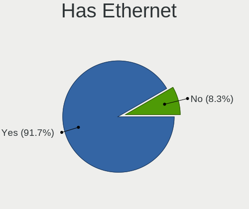
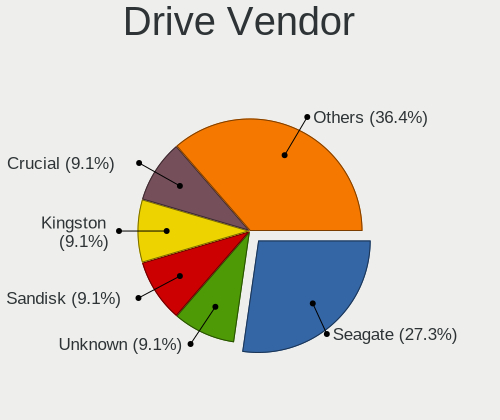
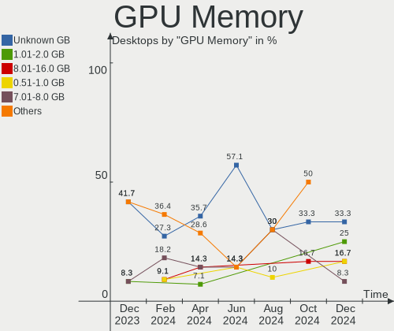
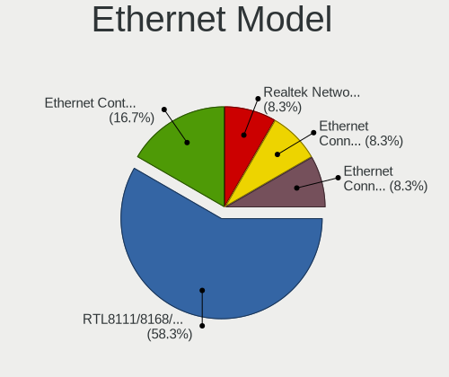
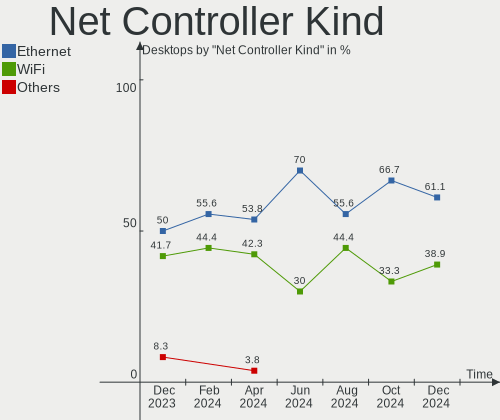
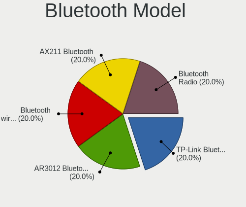

Kali - Hardware Trends (Desktops)
---------------------------------

A project to identify most popular hardware characteristics and track their change
over time based on data collected by Linux users at https://Linux-Hardware.org.

Anyone can contribute to this report by the [hw-probe](https://github.com/linuxhw/hw-probe) tool:

    sudo -E hw-probe -all -upload

This report is for one last month. Overall report since the beginning of time: [TestCoverage](https://github.com/linuxhw/TestCoverage)

Period: Dec, 2022.

Contents
--------

* [ System ](#system)
  - [ OS                       ](#os)
  - [ OS Family                ](#os-family)
  - [ Kernel                   ](#kernel)
  - [ Kernel Family            ](#kernel-family)
  - [ Kernel Major Ver.        ](#kernel-major-ver)
  - [ Arch                     ](#arch)
  - [ DE                       ](#de)
  - [ Display Server           ](#display-server)
  - [ Display Manager          ](#display-manager)
  - [ OS Lang                  ](#os-lang)
  - [ Boot Mode                ](#boot-mode)
  - [ Filesystem               ](#filesystem)
  - [ Part. scheme             ](#part-scheme)
  - [ Dual Boot with Linux/BSD ](#dual-boot-with-linuxbsd)
  - [ Dual Boot (Win)          ](#dual-boot-win)

* [ Board ](#board)
  - [ Vendor                   ](#vendor)
  - [ Model                    ](#model)
  - [ Model Family             ](#model-family)
  - [ MFG Year                 ](#mfg-year)
  - [ Form Factor              ](#form-factor)
  - [ Secure Boot              ](#secure-boot)
  - [ Coreboot                 ](#coreboot)
  - [ RAM Size                 ](#ram-size)
  - [ RAM Used                 ](#ram-used)
  - [ Total Drives             ](#total-drives)
  - [ Has CD-ROM               ](#has-cd-rom)
  - [ Has Ethernet             ](#has-ethernet)
  - [ Has WiFi                 ](#has-wifi)
  - [ Has Bluetooth            ](#has-bluetooth)

* [ Location ](#location)
  - [ Country                  ](#country)
  - [ City                     ](#city)

* [ Drives ](#drives)
  - [ Drive Vendor             ](#drive-vendor)
  - [ Drive Model              ](#drive-model)
  - [ HDD Vendor               ](#hdd-vendor)
  - [ SSD Vendor               ](#ssd-vendor)
  - [ Drive Kind               ](#drive-kind)
  - [ Drive Connector          ](#drive-connector)
  - [ Drive Size               ](#drive-size)
  - [ Space Total              ](#space-total)
  - [ Space Used               ](#space-used)
  - [ Malfunc. Drives          ](#malfunc-drives)
  - [ Malfunc. Drive Vendor    ](#malfunc-drive-vendor)
  - [ Malfunc. HDD Vendor      ](#malfunc-hdd-vendor)
  - [ Malfunc. Drive Kind      ](#malfunc-drive-kind)
  - [ Failed Drives            ](#failed-drives)
  - [ Failed Drive Vendor      ](#failed-drive-vendor)
  - [ Drive Status             ](#drive-status)

* [ Storage controller ](#storage-controller)
  - [ Storage Vendor           ](#storage-vendor)
  - [ Storage Model            ](#storage-model)
  - [ Storage Kind             ](#storage-kind)

* [ Processor ](#processor)
  - [ CPU Vendor               ](#cpu-vendor)
  - [ CPU Model                ](#cpu-model)
  - [ CPU Model Family         ](#cpu-model-family)
  - [ CPU Cores                ](#cpu-cores)
  - [ CPU Sockets              ](#cpu-sockets)
  - [ CPU Threads              ](#cpu-threads)
  - [ CPU Op-Modes             ](#cpu-op-modes)
  - [ CPU Microcode            ](#cpu-microcode)
  - [ CPU Microarch            ](#cpu-microarch)

* [ Graphics ](#graphics)
  - [ GPU Vendor               ](#gpu-vendor)
  - [ GPU Model                ](#gpu-model)
  - [ GPU Combo                ](#gpu-combo)
  - [ GPU Driver               ](#gpu-driver)
  - [ GPU Memory               ](#gpu-memory)

* [ Monitor ](#monitor)
  - [ Monitor Vendor           ](#monitor-vendor)
  - [ Monitor Model            ](#monitor-model)
  - [ Monitor Resolution       ](#monitor-resolution)
  - [ Monitor Diagonal         ](#monitor-diagonal)
  - [ Monitor Width            ](#monitor-width)
  - [ Aspect Ratio             ](#aspect-ratio)
  - [ Monitor Area             ](#monitor-area)
  - [ Pixel Density            ](#pixel-density)
  - [ Multiple Monitors        ](#multiple-monitors)

* [ Network ](#network)
  - [ Net Controller Vendor    ](#net-controller-vendor)
  - [ Net Controller Model     ](#net-controller-model)
  - [ Wireless Vendor          ](#wireless-vendor)
  - [ Wireless Model           ](#wireless-model)
  - [ Ethernet Vendor          ](#ethernet-vendor)
  - [ Ethernet Model           ](#ethernet-model)
  - [ Net Controller Kind      ](#net-controller-kind)
  - [ Used Controller          ](#used-controller)
  - [ NICs                     ](#nics)
  - [ IPv6                     ](#ipv6)

* [ Bluetooth ](#bluetooth)
  - [ Bluetooth Vendor         ](#bluetooth-vendor)
  - [ Bluetooth Model          ](#bluetooth-model)

* [ Sound ](#sound)
  - [ Sound Vendor             ](#sound-vendor)
  - [ Sound Model              ](#sound-model)

* [ Memory ](#memory)
  - [ Memory Vendor            ](#memory-vendor)
  - [ Memory Model             ](#memory-model)
  - [ Memory Kind              ](#memory-kind)
  - [ Memory Form Factor       ](#memory-form-factor)
  - [ Memory Size              ](#memory-size)
  - [ Memory Speed             ](#memory-speed)

* [ Printers & scanners ](#printers--scanners)
  - [ Printer Vendor           ](#printer-vendor)
  - [ Printer Model            ](#printer-model)
  - [ Scanner Vendor           ](#scanner-vendor)
  - [ Scanner Model            ](#scanner-model)

* [ Camera ](#camera)
  - [ Camera Vendor            ](#camera-vendor)
  - [ Camera Model             ](#camera-model)

* [ Security ](#security)
  - [ Fingerprint Vendor       ](#fingerprint-vendor)
  - [ Fingerprint Model        ](#fingerprint-model)
  - [ Chipcard Vendor          ](#chipcard-vendor)
  - [ Chipcard Model           ](#chipcard-model)

* [ Unsupported ](#unsupported)
  - [ Unsupported Devices      ](#unsupported-devices)
  - [ Unsupported Device Types ](#unsupported-device-types)

System
------

OS
--

Installed operating systems

| Name        | Desktops | Percent |
|-------------|----------|---------|
| Kali 2022.4 | 12       | 85.71%  |
| Kali 2022.3 | 2        | 14.29%  |

OS Family
---------

OS without a version

| Name | Desktops | Percent |
|------|----------|---------|
| Kali | 14       | 100%    |

Kernel
------

Version of the Linux kernel

| Version            | Desktops | Percent |
|--------------------|----------|---------|
| 6.0.0-kali3-amd64  | 6        | 42.86%  |
| 6.0.0-kali6-amd64  | 3        | 21.43%  |
| 6.0.0-kali5-amd64  | 3        | 21.43%  |
| 6.0.0-5-amd64      | 1        | 7.14%   |
| 5.19.0-kali2-amd64 | 1        | 7.14%   |

Kernel Family
-------------

Linux kernel without a distro release

| Version | Desktops | Percent |
|---------|----------|---------|
| 6.0.0   | 13       | 92.86%  |
| 5.19.0  | 1        | 7.14%   |

Kernel Major Ver.
-----------------

Linux kernel major version

| Version | Desktops | Percent |
|---------|----------|---------|
| 6.0     | 13       | 92.86%  |
| 5.19    | 1        | 7.14%   |

Arch
----

OS architecture (x86_64, i586, etc.)

| Name   | Desktops | Percent |
|--------|----------|---------|
| x86_64 | 14       | 100%    |

DE
--

Desktop Environment

| Name    | Desktops | Percent |
|---------|----------|---------|
| XFCE    | 7        | 50%     |
| GNOME   | 3        | 21.43%  |
| KDE5    | 2        | 14.29%  |
| MATE    | 1        | 7.14%   |
| Unknown | 1        | 7.14%   |

Display Server
--------------

X11 or Wayland

| Name | Desktops | Percent |
|------|----------|---------|
| X11  | 14       | 100%    |

Display Manager
---------------

SDDM, LightDM, etc.

| Name    | Desktops | Percent |
|---------|----------|---------|
| LightDM | 6        | 42.86%  |
| Unknown | 4        | 28.57%  |
| GDM3    | 3        | 21.43%  |
| SDDM    | 1        | 7.14%   |

OS Lang
-------

Language

| Lang    | Desktops | Percent |
|---------|----------|---------|
| en_US   | 8        | 57.14%  |
| fr_FR   | 3        | 21.43%  |
| es_ES   | 1        | 7.14%   |
| en_GB   | 1        | 7.14%   |
| Unknown | 1        | 7.14%   |

Boot Mode
---------

EFI or BIOS

| Mode | Desktops | Percent |
|------|----------|---------|
| EFI  | 9        | 64.29%  |
| BIOS | 5        | 35.71%  |

Filesystem
----------

Type of filesystem

| Type    | Desktops | Percent |
|---------|----------|---------|
| Ext4    | 13       | 92.86%  |
| Overlay | 1        | 7.14%   |

Part. scheme
------------

Scheme of partitioning

| Type    | Desktops | Percent |
|---------|----------|---------|
| GPT     | 10       | 71.43%  |
| Unknown | 3        | 21.43%  |
| MBR     | 1        | 7.14%   |

Dual Boot with Linux/BSD
------------------------

Hosting more than one Linux/BSD

| Dual boot | Desktops | Percent |
|-----------|----------|---------|
| No        | 10       | 71.43%  |
| Yes       | 4        | 28.57%  |

Dual Boot (Win)
---------------

Hosting Linux and Windows

| Dual boot | Desktops | Percent |
|-----------|----------|---------|
| No        | 8        | 57.14%  |
| Yes       | 6        | 42.86%  |

Board
-----

Vendor
------

Motherboard manufacturer

| Name                | Desktops | Percent |
|---------------------|----------|---------|
| ASUSTek Computer    | 5        | 35.71%  |
| MSI                 | 2        | 14.29%  |
| Gigabyte Technology | 2        | 14.29%  |
| Pegatron            | 1        | 7.14%   |
| Huanan              | 1        | 7.14%   |
| Dell                | 1        | 7.14%   |
| Apple               | 1        | 7.14%   |
| Unknown             | 1        | 7.14%   |

Model
-----

Motherboard model

| Name                                                            | Desktops | Percent |
|-----------------------------------------------------------------|----------|---------|
| Pegatron 23-b017c                                               | 1        | 7.14%   |
| MSI MS-7D15                                                     | 1        | 7.14%   |
| MSI MS-7916                                                     | 1        | 7.14%   |
| Huanan X79 (INTEL Xeon E5/Core i7 DMI2 - C600/C200 Cipset V2.49 | 1        | 7.14%   |
| Gigabyte Z690 AORUS MASTER                                      | 1        | 7.14%   |
| Gigabyte H310M S2H 2.0                                          | 1        | 7.14%   |
| Dell OptiPlex 3050                                              | 1        | 7.14%   |
| ASUS ROG STRIX B550-F GAMING                                    | 1        | 7.14%   |
| ASUS ROG STRIX B365-G GAMING                                    | 1        | 7.14%   |
| ASUS ProArt X570-CREATOR WIFI                                   | 1        | 7.14%   |
| ASUS PRIME A320M-K                                              | 1        | 7.14%   |
| ASUS All Series                                                 | 1        | 7.14%   |
| Apple iMacPro1,1                                                | 1        | 7.14%   |
| Unknown                                                         | 1        | 7.14%   |

Model Family
------------

Motherboard model prefix

| Name              | Desktops | Percent |
|-------------------|----------|---------|
| ASUS ROG          | 2        | 14.29%  |
| Pegatron 23-b017c | 1        | 7.14%   |
| MSI MS-7D15       | 1        | 7.14%   |
| MSI MS-7916       | 1        | 7.14%   |
| Huanan X79        | 1        | 7.14%   |
| Gigabyte Z690     | 1        | 7.14%   |
| Gigabyte H310M    | 1        | 7.14%   |
| Dell OptiPlex     | 1        | 7.14%   |
| ASUS ProArt       | 1        | 7.14%   |
| ASUS PRIME        | 1        | 7.14%   |
| ASUS All          | 1        | 7.14%   |
| Apple iMacPro1    | 1        | 7.14%   |
| Unknown           | 1        | 7.14%   |

MFG Year
--------

Motherboard manufacture year

| Year | Desktops | Percent |
|------|----------|---------|
| 2021 | 4        | 28.57%  |
| 2017 | 3        | 21.43%  |
| 2020 | 2        | 14.29%  |
| 2019 | 1        | 7.14%   |
| 2016 | 1        | 7.14%   |
| 2014 | 1        | 7.14%   |
| 2013 | 1        | 7.14%   |
| 2012 | 1        | 7.14%   |

Form Factor
-----------

Physical design of the computer

| Name    | Desktops | Percent |
|---------|----------|---------|
| Desktop | 14       | 100%    |

Secure Boot
-----------

Enabled or disabled

| State    | Desktops | Percent |
|----------|----------|---------|
| Disabled | 14       | 100%    |

Coreboot
--------

Have coreboot on board

| Used | Desktops | Percent |
|------|----------|---------|
| No   | 14       | 100%    |

RAM Size
--------

Total RAM memory

| Size in GB  | Desktops | Percent |
|-------------|----------|---------|
| 32.01-64.0  | 4        | 28.57%  |
| 16.01-24.0  | 4        | 28.57%  |
| 4.01-8.0    | 2        | 14.29%  |
| 64.01-256.0 | 2        | 14.29%  |
| 3.01-4.0    | 1        | 7.14%   |
| 8.01-16.0   | 1        | 7.14%   |

RAM Used
--------

Used RAM memory

| Used GB  | Desktops | Percent |
|----------|----------|---------|
| 2.01-3.0 | 6        | 42.86%  |
| 3.01-4.0 | 4        | 28.57%  |
| 4.01-8.0 | 2        | 14.29%  |
| 1.01-2.0 | 1        | 7.14%   |
| 0.51-1.0 | 1        | 7.14%   |

Total Drives
------------

Number of drives on board

| Drives | Desktops | Percent |
|--------|----------|---------|
| 1      | 6        | 42.86%  |
| 5      | 3        | 21.43%  |
| 3      | 2        | 14.29%  |
| 2      | 2        | 14.29%  |
| 8      | 1        | 7.14%   |

Has CD-ROM
----------

Has CD-ROM on board

| Presented | Desktops | Percent |
|-----------|----------|---------|
| No        | 11       | 78.57%  |
| Yes       | 3        | 21.43%  |

Has Ethernet
------------

Has Ethernet on board

| Presented | Desktops | Percent |
|-----------|----------|---------|
| Yes       | 14       | 100%    |

Has WiFi
--------

Has WiFi module

| Presented | Desktops | Percent |
|-----------|----------|---------|
| Yes       | 10       | 71.43%  |
| No        | 4        | 28.57%  |

Has Bluetooth
-------------

Has Bluetooth module

| Presented | Desktops | Percent |
|-----------|----------|---------|
| No        | 10       | 71.43%  |
| Yes       | 4        | 28.57%  |

Location
--------

Country
-------

Geographic location (country)

| Country     | Desktops | Percent |
|-------------|----------|---------|
| USA         | 5        | 35.71%  |
| France      | 3        | 21.43%  |
| UK          | 2        | 14.29%  |
| Switzerland | 1        | 7.14%   |
| Spain       | 1        | 7.14%   |
| Russia      | 1        | 7.14%   |
| Germany     | 1        | 7.14%   |

City
----

Geographic location (city)

| City              | Desktops | Percent |
|-------------------|----------|---------|
| Zaragoza          | 1        | 7.14%   |
| Yuzhno-Sakhalinsk | 1        | 7.14%   |
| Siblingen         | 1        | 7.14%   |
| San Antonio       | 1        | 7.14%   |
| Paris             | 1        | 7.14%   |
| Newton Tony       | 1        | 7.14%   |
| Jesup             | 1        | 7.14%   |
| Garons            | 1        | 7.14%   |
| Fort Worth        | 1        | 7.14%   |
| Dubuque           | 1        | 7.14%   |
| Drummonds         | 1        | 7.14%   |
| Compiègne        | 1        | 7.14%   |
| Birmingham        | 1        | 7.14%   |
| Augsburg          | 1        | 7.14%   |

Drives
------

Drive Vendor
------------

Hard drive vendors

| Vendor              | Desktops | Drives | Percent |
|---------------------|----------|--------|---------|
| Samsung Electronics | 6        | 9      | 18.75%  |
| WDC                 | 5        | 7      | 15.63%  |
| Seagate             | 4        | 4      | 12.5%   |
| SanDisk             | 3        | 5      | 9.38%   |
| Kingston            | 3        | 3      | 9.38%   |
| Toshiba             | 2        | 2      | 6.25%   |
| Crucial             | 2        | 2      | 6.25%   |
| SABRENT             | 1        | 1      | 3.13%   |
| PNY                 | 1        | 2      | 3.13%   |
| Phison              | 1        | 1      | 3.13%   |
| Intenso             | 1        | 1      | 3.13%   |
| Hitachi             | 1        | 1      | 3.13%   |
| Hewlett-Packard     | 1        | 1      | 3.13%   |
| Apple               | 1        | 1      | 3.13%   |

Drive Model
-----------

Hard drive models

| Model                                              | Desktops | Percent |
|----------------------------------------------------|----------|---------|
| Seagate ST1000DM003-1SB102 1TB                     | 2        | 5.26%   |
| Kingston SUV400S37240G 240GB SSD                   | 2        | 5.26%   |
| WDC WDS100T2B0A-00SM50 1TB SSD                     | 1        | 2.63%   |
| WDC WD8001FZBX-00ASYA0 8TB                         | 1        | 2.63%   |
| WDC WD40EFAX-68JH4N0 4TB                           | 1        | 2.63%   |
| WDC WD3200AAKS-00L9A0 320GB                        | 1        | 2.63%   |
| WDC WD15EADS-00P8B0 1TB                            | 1        | 2.63%   |
| WDC WD10EADS-00M2B0 1TB                            | 1        | 2.63%   |
| WDC WD101FZBX-00ATAA0 10TB                         | 1        | 2.63%   |
| Toshiba HDWR160 6TB                                | 1        | 2.63%   |
| Toshiba DT01ACA200 2TB                             | 1        | 2.63%   |
| Seagate ST9500325AS 500GB                          | 1        | 2.63%   |
| Seagate ST500LM021-1KJ152 500GB                    | 1        | 2.63%   |
| Sandisk WDC WDS200T2B0C-00PXH0 2TB                 | 1        | 2.63%   |
| SanDisk Ultra II 240GB SSD                         | 1        | 2.63%   |
| SanDisk SD8SB8U-128G-1016 128GB SSD                | 1        | 2.63%   |
| SanDisk Extreme SSD 500GB                          | 1        | 2.63%   |
| SanDisk Extreme 55AE 1TB SSD                       | 1        | 2.63%   |
| Samsung SSD 980 PRO 250GB                          | 1        | 2.63%   |
| Samsung SSD 980 PRO 1TB                            | 1        | 2.63%   |
| Samsung SSD 980 1TB                                | 1        | 2.63%   |
| Samsung SSD 960 EVO 500GB                          | 1        | 2.63%   |
| Samsung SSD 870 QVO 2TB                            | 1        | 2.63%   |
| Samsung SSD 840 EVO 120GB                          | 1        | 2.63%   |
| Samsung NVMe SSD Controller PM9A1/PM9A3/980PRO 2TB | 1        | 2.63%   |
| Samsung HM250HJ 250GB                              | 1        | 2.63%   |
| SABRENT Dual SATA Bridge                           | 1        | 2.63%   |
| PNY CS900 480GB SSD                                | 1        | 2.63%   |
| Phison MSI M390 1TB                                | 1        | 2.63%   |
| Kingston SV300S37A120G 120GB SSD                   | 1        | 2.63%   |
| Intenso Portable SSD 512GB                         | 1        | 2.63%   |
| Hitachi HTS727550A9E364 500GB                      | 1        | 2.63%   |
| HP SSD S700 500GB                                  | 1        | 2.63%   |
| Crucial CT500P3PSSD8 500GB                         | 1        | 2.63%   |
| Crucial CT2000MX500SSD1 2TB                        | 1        | 2.63%   |
| Apple SSD AP1024M 1TB                              | 1        | 2.63%   |

HDD Vendor
----------

Hard disk drive vendors

| Vendor              | Desktops | Drives | Percent |
|---------------------|----------|--------|---------|
| WDC                 | 5        | 6      | 35.71%  |
| Seagate             | 4        | 4      | 28.57%  |
| Toshiba             | 2        | 2      | 14.29%  |
| Samsung Electronics | 1        | 1      | 7.14%   |
| SABRENT             | 1        | 1      | 7.14%   |
| Hitachi             | 1        | 1      | 7.14%   |

SSD Vendor
----------

Solid state drive vendors

| Vendor              | Desktops | Drives | Percent |
|---------------------|----------|--------|---------|
| SanDisk             | 3        | 4      | 23.08%  |
| Kingston            | 3        | 3      | 23.08%  |
| Samsung Electronics | 2        | 2      | 15.38%  |
| WDC                 | 1        | 1      | 7.69%   |
| PNY                 | 1        | 2      | 7.69%   |
| Intenso             | 1        | 1      | 7.69%   |
| Hewlett-Packard     | 1        | 1      | 7.69%   |
| Crucial             | 1        | 1      | 7.69%   |

Drive Kind
----------

HDD or SSD

| Kind | Desktops | Drives | Percent |
|------|----------|--------|---------|
| NVMe | 8        | 10     | 34.78%  |
| HDD  | 8        | 15     | 34.78%  |
| SSD  | 7        | 15     | 30.43%  |

Drive Connector
---------------

SATA, SAS, NVMe, etc.

| Type | Desktops | Drives | Percent |
|------|----------|--------|---------|
| SATA | 11       | 26     | 52.38%  |
| NVMe | 8        | 10     | 38.1%   |
| SAS  | 2        | 4      | 9.52%   |

Drive Size
----------

Size of hard drive

| Size in TB | Desktops | Drives | Percent |
|------------|----------|--------|---------|
| 0.01-0.5   | 9        | 15     | 47.37%  |
| 0.51-1.0   | 5        | 7      | 26.32%  |
| 1.01-2.0   | 2        | 3      | 10.53%  |
| 4.01-10.0  | 2        | 4      | 10.53%  |
| 3.01-4.0   | 1        | 1      | 5.26%   |

Space Total
-----------

Amount of disk space available on the file system

| Size in GB     | Desktops | Percent |
|----------------|----------|---------|
| More than 3000 | 3        | 21.43%  |
| 251-500        | 3        | 21.43%  |
| 101-250        | 3        | 21.43%  |
| 501-1000       | 3        | 21.43%  |
| 21-50          | 1        | 7.14%   |
| Unknown        | 1        | 7.14%   |

Space Used
----------

Amount of used disk space

| Used GB        | Desktops | Percent |
|----------------|----------|---------|
| 1-20           | 6        | 42.86%  |
| 2001-3000      | 2        | 14.29%  |
| More than 3000 | 1        | 7.14%   |
| 21-50          | 1        | 7.14%   |
| 101-250        | 1        | 7.14%   |
| 501-1000       | 1        | 7.14%   |
| 51-100         | 1        | 7.14%   |
| Unknown        | 1        | 7.14%   |

Malfunc. Drives
---------------

Drive models with a malfunction

| Model                            | Desktops | Drives | Percent |
|----------------------------------|----------|--------|---------|
| WDC WD3200AAKS-00L9A0 320GB      | 1        | 1      | 25%     |
| Seagate ST9500325AS 500GB        | 1        | 1      | 25%     |
| Seagate ST500LM021-1KJ152 500GB  | 1        | 1      | 25%     |
| Kingston SUV400S37240G 240GB SSD | 1        | 1      | 25%     |

Malfunc. Drive Vendor
---------------------

Vendors of faulty drives

| Vendor   | Desktops | Drives | Percent |
|----------|----------|--------|---------|
| Seagate  | 2        | 2      | 50%     |
| WDC      | 1        | 1      | 25%     |
| Kingston | 1        | 1      | 25%     |

Malfunc. HDD Vendor
-------------------

Vendors of faulty HDD drives

| Vendor  | Desktops | Drives | Percent |
|---------|----------|--------|---------|
| Seagate | 2        | 2      | 66.67%  |
| WDC     | 1        | 1      | 33.33%  |

Malfunc. Drive Kind
-------------------

Kinds of faulty drives

| Kind | Desktops | Drives | Percent |
|------|----------|--------|---------|
| HDD  | 2        | 3      | 66.67%  |
| SSD  | 1        | 1      | 33.33%  |

Failed Drives
-------------

Failed drive models

Zero info for selected period =(

Failed Drive Vendor
-------------------

Failed drive vendors

Zero info for selected period =(

Drive Status
------------

Number of failed and malfunc. drives

| Status   | Desktops | Drives | Percent |
|----------|----------|--------|---------|
| Works    | 9        | 16     | 56.25%  |
| Detected | 5        | 20     | 31.25%  |
| Malfunc  | 2        | 4      | 12.5%   |

Storage controller
------------------

Storage Vendor
--------------

Storage controller vendors

| Vendor                    | Desktops | Percent |
|---------------------------|----------|---------|
| Intel                     | 8        | 36.36%  |
| Samsung Electronics       | 5        | 22.73%  |
| AMD                       | 4        | 18.18%  |
| SanDisk                   | 1        | 4.55%   |
| Phison Electronics        | 1        | 4.55%   |
| Micron/Crucial Technology | 1        | 4.55%   |
| ASMedia Technology        | 1        | 4.55%   |
| Apple                     | 1        | 4.55%   |

Storage Model
-------------

Storage controller models

| Model                                                                          | Desktops | Percent |
|--------------------------------------------------------------------------------|----------|---------|
| Samsung NVMe SSD Controller PM9A1/PM9A3/980PRO                                 | 3        | 12.5%   |
| Intel 200 Series PCH SATA controller [AHCI mode]                               | 3        | 12.5%   |
| AMD FCH SATA Controller [AHCI mode]                                            | 2        | 8.33%   |
| SanDisk Non-Volatile memory controller                                         | 1        | 4.17%   |
| Samsung NVMe SSD Controller SM961/PM961/SM963                                  | 1        | 4.17%   |
| Samsung NVMe SSD Controller 980                                                | 1        | 4.17%   |
| Phison Electronics Non-Volatile memory controller                              | 1        | 4.17%   |
| Micron/Crucial P2 NVMe PCIe SSD                                                | 1        | 4.17%   |
| Intel Volume Management Device NVMe RAID Controller                            | 1        | 4.17%   |
| Intel Alder Lake-S PCH SATA Controller [AHCI Mode]                             | 1        | 4.17%   |
| Intel 82801IR/IO/IH (ICH9R/DO/DH) 6 port SATA Controller [AHCI mode]           | 1        | 4.17%   |
| Intel 8 Series/C220 Series Chipset Family 6-port SATA Controller 1 [AHCI mode] | 1        | 4.17%   |
| Intel 6 Series/C200 Series Chipset Family 6 port Desktop SATA AHCI Controller  | 1        | 4.17%   |
| Intel 500 Series Chipset Family SATA AHCI Controller                           | 1        | 4.17%   |
| ASMedia ASM1062 Serial ATA Controller                                          | 1        | 4.17%   |
| Apple ANS2 NVMe Controller                                                     | 1        | 4.17%   |
| AMD RAID Bottom Device                                                         | 1        | 4.17%   |
| AMD FCH SATA Controller D                                                      | 1        | 4.17%   |
| AMD 500 Series Chipset SATA Controller                                         | 1        | 4.17%   |

Storage Kind
------------

Kind of storage controller (IDE, SATA, NVMe, SAS, ...)

| Kind | Desktops | Percent |
|------|----------|---------|
| SATA | 13       | 59.09%  |
| NVMe | 8        | 36.36%  |
| RAID | 1        | 4.55%   |

Processor
---------

CPU Vendor
----------

Processor vendors

| Vendor | Desktops | Percent |
|--------|----------|---------|
| Intel  | 10       | 71.43%  |
| AMD    | 4        | 28.57%  |

CPU Model
---------

Processor models

| Model                                   | Desktops | Percent |
|-----------------------------------------|----------|---------|
| Intel Xeon W-2140B CPU @ 3.20GHz        | 1        | 7.14%   |
| Intel Xeon CPU E5-2690 0 @ 2.90GHz      | 1        | 7.14%   |
| Intel Core i7-4790K CPU @ 4.00GHz       | 1        | 7.14%   |
| Intel Core i5-9600K CPU @ 3.70GHz       | 1        | 7.14%   |
| Intel Core i5-4690 CPU @ 3.50GHz        | 1        | 7.14%   |
| Intel Core i3-9100 CPU @ 3.60GHz        | 1        | 7.14%   |
| Intel Core i3-6100 CPU @ 3.70GHz        | 1        | 7.14%   |
| Intel Atom CPU D525 @ 1.80GHz           | 1        | 7.14%   |
| Intel 12th Gen Core i9-12900K           | 1        | 7.14%   |
| Intel 11th Gen Core i5-11400 @ 2.60GHz  | 1        | 7.14%   |
| AMD Ryzen 9 5950X 16-Core Processor     | 1        | 7.14%   |
| AMD Ryzen 5 5600G with Radeon Graphics  | 1        | 7.14%   |
| AMD Ryzen 5 3600 6-Core Processor       | 1        | 7.14%   |
| AMD A4-5300 APU with Radeon HD Graphics | 1        | 7.14%   |

CPU Model Family
----------------

Processor model prefix

| Model         | Desktops | Percent |
|---------------|----------|---------|
| Other         | 2        | 14.29%  |
| Intel Xeon    | 2        | 14.29%  |
| Intel Core i5 | 2        | 14.29%  |
| Intel Core i3 | 2        | 14.29%  |
| AMD Ryzen 5   | 2        | 14.29%  |
| Intel Core i7 | 1        | 7.14%   |
| Intel Atom    | 1        | 7.14%   |
| AMD Ryzen 9   | 1        | 7.14%   |
| AMD A4        | 1        | 7.14%   |

CPU Cores
---------

Number of processor cores

| Number | Desktops | Percent |
|--------|----------|---------|
| 6      | 4        | 28.57%  |
| 4      | 3        | 21.43%  |
| 16     | 2        | 14.29%  |
| 8      | 2        | 14.29%  |
| 2      | 2        | 14.29%  |
| 1      | 1        | 7.14%   |

CPU Sockets
-----------

Number of sockets

| Number | Desktops | Percent |
|--------|----------|---------|
| 1      | 14       | 100%    |

CPU Threads
-----------

Threads per core (Hyper-Threading)

| Number | Desktops | Percent |
|--------|----------|---------|
| 2      | 11       | 78.57%  |
| 1      | 3        | 21.43%  |

CPU Op-Modes
------------

CPU Operation Modes (32-bit, 64-bit)

| Op mode        | Desktops | Percent |
|----------------|----------|---------|
| 32-bit, 64-bit | 14       | 100%    |

CPU Microcode
-------------

Microcode number

| Number     | Desktops | Percent |
|------------|----------|---------|
| 0x306c3    | 2        | 14.29%  |
| Unknown    | 2        | 14.29%  |
| 0x906eb    | 1        | 7.14%   |
| 0x90672    | 1        | 7.14%   |
| 0x506e3    | 1        | 7.14%   |
| 0x50654    | 1        | 7.14%   |
| 0x206d7    | 1        | 7.14%   |
| 0x106ca    | 1        | 7.14%   |
| 0x0a50000d | 1        | 7.14%   |
| 0x0a201016 | 1        | 7.14%   |
| 0x08701021 | 1        | 7.14%   |
| 0x06001119 | 1        | 7.14%   |

CPU Microarch
-------------

Microarchitecture

| Name             | Desktops | Percent |
|------------------|----------|---------|
| Zen 3            | 2        | 14.29%  |
| Skylake          | 2        | 14.29%  |
| KabyLake         | 2        | 14.29%  |
| Haswell          | 2        | 14.29%  |
| Zen 2            | 1        | 7.14%   |
| SandyBridge      | 1        | 7.14%   |
| Piledriver       | 1        | 7.14%   |
| Bonnell          | 1        | 7.14%   |
| Alderlake Hybrid | 1        | 7.14%   |
| Unknown          | 1        | 7.14%   |

Graphics
--------

GPU Vendor
----------

Vendors of graphics cards

| Vendor | Desktops | Percent |
|--------|----------|---------|
| Nvidia | 7        | 41.18%  |
| Intel  | 5        | 29.41%  |
| AMD    | 5        | 29.41%  |

GPU Model
---------

Graphics card models

| Model                                                                   | Desktops | Percent |
|-------------------------------------------------------------------------|----------|---------|
| Intel CoffeeLake-S GT2 [UHD Graphics 630]                               | 2        | 11.11%  |
| Nvidia TU116 [GeForce GTX 1660 Ti]                                      | 1        | 5.56%   |
| Nvidia TU116 [GeForce GTX 1650 SUPER]                                   | 1        | 5.56%   |
| Nvidia GP107 [GeForce GTX 1050 Ti]                                      | 1        | 5.56%   |
| Nvidia GP104 [GeForce GTX 1080]                                         | 1        | 5.56%   |
| Nvidia GM206 [GeForce GTX 960]                                          | 1        | 5.56%   |
| Nvidia GK104 [GeForce GTX 680]                                          | 1        | 5.56%   |
| Nvidia GA106 [Geforce RTX 3050]                                         | 1        | 5.56%   |
| Intel HD Graphics 530                                                   | 1        | 5.56%   |
| Intel Atom Processor D4xx/D5xx/N4xx/N5xx Integrated Graphics Controller | 1        | 5.56%   |
| Intel AlderLake-S GT1                                                   | 1        | 5.56%   |
| AMD Vega 10 XL [Radeon Pro Vega 56]                                     | 1        | 5.56%   |
| AMD Trinity 2 [Radeon HD 7480D]                                         | 1        | 5.56%   |
| AMD Navi 21 GL-XL [Radeon PRO W6800]                                    | 1        | 5.56%   |
| AMD Navi 10 [Radeon RX 5600 OEM/5600 XT / 5700/5700 XT]                 | 1        | 5.56%   |
| AMD Ellesmere [Radeon RX 470/480/570/570X/580/580X/590]                 | 1        | 5.56%   |
| AMD Cezanne [Radeon Vega Series / Radeon Vega Mobile Series]            | 1        | 5.56%   |

GPU Combo
---------

Combinations of graphics cards

| Name         | Desktops | Percent |
|--------------|----------|---------|
| 1 x Nvidia   | 6        | 42.86%  |
| 1 x AMD      | 3        | 21.43%  |
| 1 x Intel    | 2        | 14.29%  |
| 2 x Intel    | 1        | 7.14%   |
| 2 x AMD      | 1        | 7.14%   |
| AMD + Nvidia | 1        | 7.14%   |

GPU Driver
----------

Free vs proprietary

| Driver      | Desktops | Percent |
|-------------|----------|---------|
| Free        | 11       | 78.57%  |
| Proprietary | 3        | 21.43%  |

GPU Memory
----------

Total video memory

| Size in GB | Desktops | Percent |
|------------|----------|---------|
| 7.01-8.0   | 4        | 28.57%  |
| Unknown    | 4        | 28.57%  |
| 3.01-4.0   | 2        | 14.29%  |
| 5.01-6.0   | 1        | 7.14%   |
| 24.01-32.0 | 1        | 7.14%   |
| 1.01-2.0   | 1        | 7.14%   |
| 0.01-0.5   | 1        | 7.14%   |

Monitor
-------

Monitor Vendor
--------------

Monitor vendors

| Vendor               | Desktops | Percent |
|----------------------|----------|---------|
| Samsung Electronics  | 3        | 15.79%  |
| Goldstar             | 2        | 10.53%  |
| Dell                 | 2        | 10.53%  |
| Ancor Communications | 2        | 10.53%  |
| Vizio                | 1        | 5.26%   |
| Unknown              | 1        | 5.26%   |
| NECCI                | 1        | 5.26%   |
| LG Electronics       | 1        | 5.26%   |
| Lenovo               | 1        | 5.26%   |
| HKC                  | 1        | 5.26%   |
| Hewlett-Packard      | 1        | 5.26%   |
| BenQ                 | 1        | 5.26%   |
| Apple                | 1        | 5.26%   |
| Acer                 | 1        | 5.26%   |

Monitor Model
-------------

Monitor models

| Model                                                                 | Desktops | Percent |
|-----------------------------------------------------------------------|----------|---------|
| Vizio E241i-B1 VIZ1005 1920x1080 521x293mm 23.5-inch                  | 1        | 4%      |
| Unknown LCD Monitor XXX AAA 1920x1080                                 | 1        | 4%      |
| Samsung Electronics U28E590 SAM0C4E 3840x2160 608x345mm 27.5-inch     | 1        | 4%      |
| Samsung Electronics U28E590 SAM0C4D 3840x2160 607x345mm 27.5-inch     | 1        | 4%      |
| Samsung Electronics SA300/SA350 SAM07D2 1920x1080 477x268mm 21.5-inch | 1        | 4%      |
| Samsung Electronics S24E450 SAM0C80 1920x1080 520x290mm 23.4-inch     | 1        | 4%      |
| Samsung Electronics S24B350 SAM08DA 1920x1080 531x299mm 24.0-inch     | 1        | 4%      |
| Samsung Electronics S22D300 SAM0B3F 1920x1080 477x268mm 21.5-inch     | 1        | 4%      |
| Samsung Electronics LU28R55 SAM1016 3840x2160 632x360mm 28.6-inch     | 1        | 4%      |
| NECCI MAE190W NCI5050 1440x900 410x256mm 19.0-inch                    | 1        | 4%      |
| LG Electronics LCD Monitor 27GN950 7680x4320                          | 1        | 4%      |
| LG Electronics LCD Monitor 27GN950                                    | 1        | 4%      |
| Lenovo G27q-20 LEN66C3 2560x1440 597x336mm 27.0-inch                  | 1        | 4%      |
| HKC 24N5C HKC2451 1920x1080 523x293mm 23.6-inch                       | 1        | 4%      |
| Hewlett-Packard All-in-One HWP4211 1920x1080 509x286mm 23.0-inch      | 1        | 4%      |
| Goldstar ULTRAWIDE GSM76FA 2560x1080 798x334mm 34.1-inch              | 1        | 4%      |
| Goldstar 27GN950 GSM5B9A 3840x2160 600x340mm 27.2-inch                | 1        | 4%      |
| Dell S3221QS DELD107 3840x2160 700x400mm 31.7-inch                    | 1        | 4%      |
| Dell P2312H DEL4077 1920x1080 510x287mm 23.0-inch                     | 1        | 4%      |
| Dell LCD Monitor S3221QS                                              | 1        | 4%      |
| BenQ LCD Monitor ZOWIE XL LCD 3840x1080                               | 1        | 4%      |
| Apple iMac APPAE1D 3840x2160 597x336mm 27.0-inch                      | 1        | 4%      |
| Ancor Communications PA329 ACI32A9 3840x2160 708x399mm 32.0-inch      | 1        | 4%      |
| Ancor Communications ASUS VE278 ACI27F6 1920x1080 598x336mm 27.0-inch | 1        | 4%      |
| Acer LCD Monitor G246HL                                               | 1        | 4%      |

Monitor Resolution
------------------

Monitor screen resolution

| Resolution       | Desktops | Percent |
|------------------|----------|---------|
| 1920x1080 (FHD)  | 8        | 42.11%  |
| 3840x2160 (4K)   | 4        | 21.05%  |
| Unknown          | 2        | 10.53%  |
| 7680x4320        | 1        | 5.26%   |
| 3840x1080        | 1        | 5.26%   |
| 2560x1440 (QHD)  | 1        | 5.26%   |
| 2560x1080        | 1        | 5.26%   |
| 1440x900 (WXGA+) | 1        | 5.26%   |

Monitor Diagonal
----------------

Diagonal size in inches

| Inches  | Desktops | Percent |
|---------|----------|---------|
| 27      | 5        | 25%     |
| 23      | 4        | 20%     |
| Unknown | 3        | 15%     |
| 31      | 2        | 10%     |
| 34      | 1        | 5%      |
| 32      | 1        | 5%      |
| 28      | 1        | 5%      |
| 24      | 1        | 5%      |
| 21      | 1        | 5%      |
| 19      | 1        | 5%      |

Monitor Width
-------------

Physical width

| Width in mm | Desktops | Percent |
|-------------|----------|---------|
| 501-600     | 9        | 45%     |
| 601-700     | 4        | 20%     |
| Unknown     | 3        | 15%     |
| 701-800     | 2        | 10%     |
| 401-500     | 2        | 10%     |

Aspect Ratio
------------

Proportional relationship between the width and the height

| Ratio   | Desktops | Percent |
|---------|----------|---------|
| 16/9    | 11       | 68.75%  |
| Unknown | 3        | 18.75%  |
| 21/9    | 1        | 6.25%   |
| 16/10   | 1        | 6.25%   |

Monitor Area
------------

Area in inch²

| Area in inch² | Desktops | Percent |
|----------------|----------|---------|
| 301-350        | 5        | 27.78%  |
| 201-250        | 5        | 27.78%  |
| 351-500        | 4        | 22.22%  |
| Unknown        | 3        | 16.67%  |
| 151-200        | 1        | 5.56%   |

Pixel Density
-------------

Pixels per inch

| Density | Desktops | Percent |
|---------|----------|---------|
| 51-100  | 8        | 42.11%  |
| 121-160 | 4        | 21.05%  |
| Unknown | 3        | 15.79%  |
| 161-240 | 2        | 10.53%  |
| 101-120 | 2        | 10.53%  |

Multiple Monitors
-----------------

Total monitors connected

| Total | Desktops | Percent |
|-------|----------|---------|
| 1     | 9        | 64.29%  |
| 2     | 4        | 28.57%  |
| 4     | 1        | 7.14%   |

Network
-------

Net Controller Vendor
---------------------

Controller vendors

| Vendor                | Desktops | Percent |
|-----------------------|----------|---------|
| Realtek Semiconductor | 9        | 33.33%  |
| Intel                 | 6        | 22.22%  |
| Aquantia              | 3        | 11.11%  |
| Broadcom              | 2        | 7.41%   |
| TP-Link               | 1        | 3.7%    |
| Ralink Technology     | 1        | 3.7%    |
| Ralink                | 1        | 3.7%    |
| Qualcomm Atheros      | 1        | 3.7%    |
| OPPO Electronics      | 1        | 3.7%    |
| Oculus VR             | 1        | 3.7%    |
| MediaTek              | 1        | 3.7%    |

Net Controller Model
--------------------

Controller models

| Model                                                                                         | Desktops | Percent |
|-----------------------------------------------------------------------------------------------|----------|---------|
| Realtek RTL8111/8168/8411 PCI Express Gigabit Ethernet Controller                             | 7        | 21.88%  |
| Intel Wi-Fi 6 AX210/AX211/AX411 160MHz                                                        | 2        | 6.25%   |
| Intel Ethernet Controller I225-V                                                              | 2        | 6.25%   |
| TP-Link TL-WN823N v2/v3 [Realtek RTL8192EU]                                                   | 1        | 3.13%   |
| Realtek RTL8812AU 802.11a/b/g/n/ac 2T2R DB WLAN Adapter                                       | 1        | 3.13%   |
| Realtek RTL8125 2.5GbE Controller                                                             | 1        | 3.13%   |
| Realtek Realtek 8812AU/8821AU 802.11ac WLAN Adapter [USB Wireless Dual-Band Adapter 2.4/5Ghz] | 1        | 3.13%   |
| Realtek B1680188186                                                                           | 1        | 3.13%   |
| Realtek 802.11ac+Bluetooth 5.0 Adapter                                                        | 1        | 3.13%   |
| Ralink RT2870/RT3070 Wireless Adapter                                                         | 1        | 3.13%   |
| Ralink RT5390 Wireless 802.11n 1T/1R PCIe                                                     | 1        | 3.13%   |
| Qualcomm Atheros Killer E220x Gigabit Ethernet Controller                                     | 1        | 3.13%   |
| OPPO RMX3263                                                                                  | 1        | 3.13%   |
| Oculus VR Rift S                                                                              | 1        | 3.13%   |
| MediaTek Infinix NOTE 11                                                                      | 1        | 3.13%   |
| Intel I210 Gigabit Network Connection                                                         | 1        | 3.13%   |
| Intel Ethernet Connection (2) I219-V                                                          | 1        | 3.13%   |
| Intel Ethernet Connection (10) I219-V                                                         | 1        | 3.13%   |
| Intel 82574L Gigabit Network Connection                                                       | 1        | 3.13%   |
| Broadcom BCM4364 802.11ac Wireless Network Adapter                                            | 1        | 3.13%   |
| Broadcom BCM43225 802.11b/g/n                                                                 | 1        | 3.13%   |
| Aquantia Ethernet controller                                                                  | 1        | 3.13%   |
| Aquantia AQC113CS NBase-T/IEEE 802.3bz Ethernet Controller [AQtion]                           | 1        | 3.13%   |
| Aquantia AQC107 NBase-T/IEEE 802.3bz Ethernet Controller [AQtion]                             | 1        | 3.13%   |

Wireless Vendor
---------------

Wireless vendors

| Vendor                | Desktops | Percent |
|-----------------------|----------|---------|
| Realtek Semiconductor | 4        | 36.36%  |
| Intel                 | 2        | 18.18%  |
| Broadcom              | 2        | 18.18%  |
| TP-Link               | 1        | 9.09%   |
| Ralink Technology     | 1        | 9.09%   |
| Ralink                | 1        | 9.09%   |

Wireless Model
--------------

Wireless models

| Model                                                                                         | Desktops | Percent |
|-----------------------------------------------------------------------------------------------|----------|---------|
| Intel Wi-Fi 6 AX210/AX211/AX411 160MHz                                                        | 2        | 18.18%  |
| TP-Link TL-WN823N v2/v3 [Realtek RTL8192EU]                                                   | 1        | 9.09%   |
| Realtek RTL8812AU 802.11a/b/g/n/ac 2T2R DB WLAN Adapter                                       | 1        | 9.09%   |
| Realtek Realtek 8812AU/8821AU 802.11ac WLAN Adapter [USB Wireless Dual-Band Adapter 2.4/5Ghz] | 1        | 9.09%   |
| Realtek B1680188186                                                                           | 1        | 9.09%   |
| Realtek 802.11ac+Bluetooth 5.0 Adapter                                                        | 1        | 9.09%   |
| Ralink RT2870/RT3070 Wireless Adapter                                                         | 1        | 9.09%   |
| Ralink RT5390 Wireless 802.11n 1T/1R PCIe                                                     | 1        | 9.09%   |
| Broadcom BCM4364 802.11ac Wireless Network Adapter                                            | 1        | 9.09%   |
| Broadcom BCM43225 802.11b/g/n                                                                 | 1        | 9.09%   |

Ethernet Vendor
---------------

Ethernet vendors

| Vendor                | Desktops | Percent |
|-----------------------|----------|---------|
| Realtek Semiconductor | 8        | 42.11%  |
| Intel                 | 5        | 26.32%  |
| Aquantia              | 3        | 15.79%  |
| Qualcomm Atheros      | 1        | 5.26%   |
| OPPO Electronics      | 1        | 5.26%   |
| MediaTek              | 1        | 5.26%   |

Ethernet Model
--------------

Ethernet models

| Model                                                               | Desktops | Percent |
|---------------------------------------------------------------------|----------|---------|
| Realtek RTL8111/8168/8411 PCI Express Gigabit Ethernet Controller   | 7        | 35%     |
| Intel Ethernet Controller I225-V                                    | 2        | 10%     |
| Realtek RTL8125 2.5GbE Controller                                   | 1        | 5%      |
| Qualcomm Atheros Killer E220x Gigabit Ethernet Controller           | 1        | 5%      |
| OPPO RMX3263                                                        | 1        | 5%      |
| MediaTek Infinix NOTE 11                                            | 1        | 5%      |
| Intel I210 Gigabit Network Connection                               | 1        | 5%      |
| Intel Ethernet Connection (2) I219-V                                | 1        | 5%      |
| Intel Ethernet Connection (10) I219-V                               | 1        | 5%      |
| Intel 82574L Gigabit Network Connection                             | 1        | 5%      |
| Aquantia Ethernet controller                                        | 1        | 5%      |
| Aquantia AQC113CS NBase-T/IEEE 802.3bz Ethernet Controller [AQtion] | 1        | 5%      |
| Aquantia AQC107 NBase-T/IEEE 802.3bz Ethernet Controller [AQtion]   | 1        | 5%      |

Net Controller Kind
-------------------

Ethernet, WiFi or modem

| Kind     | Desktops | Percent |
|----------|----------|---------|
| Ethernet | 14       | 56%     |
| WiFi     | 10       | 40%     |
| Modem    | 1        | 4%      |

Used Controller
---------------

Currently used network controller

| Kind     | Desktops | Percent |
|----------|----------|---------|
| Ethernet | 12       | 92.31%  |
| WiFi     | 1        | 7.69%   |

NICs
----

Total network controllers on board

| Total | Desktops | Percent |
|-------|----------|---------|
| 2     | 6        | 42.86%  |
| 1     | 6        | 42.86%  |
| 5     | 1        | 7.14%   |
| 3     | 1        | 7.14%   |

IPv6
----

IPv6 vs IPv4

| Used | Desktops | Percent |
|------|----------|---------|
| No   | 10       | 71.43%  |
| Yes  | 4        | 28.57%  |

Bluetooth
---------

Bluetooth Vendor
----------------

Controller vendors

| Vendor                | Desktops | Percent |
|-----------------------|----------|---------|
| Intel                 | 2        | 50%     |
| Realtek Semiconductor | 1        | 25%     |
| Realtek               | 1        | 25%     |

Bluetooth Model
---------------

Controller models

| Model                   | Desktops | Percent |
|-------------------------|----------|---------|
| Intel AX210 Bluetooth   | 2        | 50%     |
| Realtek Bluetooth Radio | 1        | 25%     |
| Realtek Bluetooth Radio | 1        | 25%     |

Sound
-----

Sound Vendor
------------

Sound card vendors

| Vendor    | Desktops | Percent |
|-----------|----------|---------|
| Intel     | 9        | 36%     |
| Nvidia    | 7        | 28%     |
| AMD       | 6        | 24%     |
| No brand  | 1        | 4%      |
| GN Netcom | 1        | 4%      |
| Apple     | 1        | 4%      |

Sound Model
-----------

Sound card models

| Model                                                                      | Desktops | Percent |
|----------------------------------------------------------------------------|----------|---------|
| Intel 200 Series PCH HD Audio                                              | 3        | 10.71%  |
| Nvidia TU116 High Definition Audio Controller                              | 2        | 7.14%   |
| AMD Starship/Matisse HD Audio Controller                                   | 2        | 7.14%   |
| Nvidia GP107GL High Definition Audio Controller                            | 1        | 3.57%   |
| Nvidia GP104 High Definition Audio Controller                              | 1        | 3.57%   |
| Nvidia GM206 High Definition Audio Controller                              | 1        | 3.57%   |
| Nvidia GK104 HDMI Audio Controller                                         | 1        | 3.57%   |
| Nvidia GA106 High Definition Audio Controller                              | 1        | 3.57%   |
| No brand CalDigit Thunderbolt 3 Audio                                      | 1        | 3.57%   |
| Intel Tiger Lake-H HD Audio Controller                                     | 1        | 3.57%   |
| Intel Alder Lake-S HD Audio Controller                                     | 1        | 3.57%   |
| Intel 9 Series Chipset Family HD Audio Controller                          | 1        | 3.57%   |
| Intel 82801I (ICH9 Family) HD Audio Controller                             | 1        | 3.57%   |
| Intel 8 Series/C220 Series Chipset High Definition Audio Controller        | 1        | 3.57%   |
| Intel 6 Series/C200 Series Chipset Family High Definition Audio Controller | 1        | 3.57%   |
| GN Netcom Jabra Link 370                                                   | 1        | 3.57%   |
| Apple Audio Device                                                         | 1        | 3.57%   |
| AMD Vega 10 HDMI Audio [Radeon Vega 56/64]                                 | 1        | 3.57%   |
| AMD Renoir Radeon High Definition Audio Controller                         | 1        | 3.57%   |
| AMD Navi 21/23 HDMI/DP Audio Controller                                    | 1        | 3.57%   |
| AMD Navi 10 HDMI Audio                                                     | 1        | 3.57%   |
| AMD FCH Azalia Controller                                                  | 1        | 3.57%   |
| AMD Family 17h/19h HD Audio Controller                                     | 1        | 3.57%   |
| AMD Ellesmere HDMI Audio [Radeon RX 470/480 / 570/580/590]                 | 1        | 3.57%   |

Memory
------

Memory Vendor
-------------

Memory module vendors

| Vendor              | Desktops | Percent |
|---------------------|----------|---------|
| Corsair             | 4        | 33.33%  |
| Samsung Electronics | 2        | 16.67%  |
| G.Skill             | 2        | 16.67%  |
| Unknown             | 1        | 8.33%   |
| SK hynix            | 1        | 8.33%   |
| Micron Technology   | 1        | 8.33%   |
| Kingston            | 1        | 8.33%   |

Memory Model
------------

Memory module models

| Model                                                   | Desktops | Percent |
|---------------------------------------------------------|----------|---------|
| Unknown RAM Module 2GB SODIMM DDR2 800MT/s              | 1        | 7.69%   |
| SK hynix RAM Module 8GB SODIMM DDR4 2666MT/s            | 1        | 7.69%   |
| Samsung RAM M471B5273CH0-CK0 4GB DIMM DDR3 1600MT/s     | 1        | 7.69%   |
| Samsung RAM M393B5170FH0 4GB DIMM DDR3 1333MT/s         | 1        | 7.69%   |
| Micron RAM 8ATF1G64AZ-2G3E1 8GB DIMM DDR4 2400MT/s      | 1        | 7.69%   |
| Kingston RAM 552C40-32 32GB DIMM DDR5 4800MT/s          | 1        | 7.69%   |
| G.Skill RAM F4-3600C19-8GVRB 8GB DIMM DDR4 3666MT/s     | 1        | 7.69%   |
| G.Skill RAM F4-2666C19-8GNT 8GB DIMM DDR4 2667MT/s      | 1        | 7.69%   |
| Corsair RAM CMY32GX3M4A1600C9 8192MB DIMM DDR3 1600MT/s | 1        | 7.69%   |
| Corsair RAM CMW16GX4M2C3200C16 8GB DIMM DDR4 3733MT/s   | 1        | 7.69%   |
| Corsair RAM CMSA4GX3M1A1333C9 4GB DIMM DDR3 1333MT/s    | 1        | 7.69%   |
| Corsair RAM CMK32GX4M2B3000C15 16GB DIMM DDR4 3000MT/s  | 1        | 7.69%   |
| Corsair RAM CMK16GX4M2B3200C16 8GB DIMM DDR4 3600MT/s   | 1        | 7.69%   |

Memory Kind
-----------

Memory module kinds

| Kind | Desktops | Percent |
|------|----------|---------|
| DDR4 | 6        | 54.55%  |
| DDR3 | 3        | 27.27%  |
| DDR5 | 1        | 9.09%   |
| DDR2 | 1        | 9.09%   |

Memory Form Factor
------------------

Physical design of the memory module

| Name   | Desktops | Percent |
|--------|----------|---------|
| DIMM   | 9        | 81.82%  |
| SODIMM | 2        | 18.18%  |

Memory Size
-----------

Memory module size

| Size  | Desktops | Percent |
|-------|----------|---------|
| 8192  | 6        | 54.55%  |
| 4096  | 2        | 18.18%  |
| 32768 | 1        | 9.09%   |
| 16384 | 1        | 9.09%   |
| 2048  | 1        | 9.09%   |

Memory Speed
------------

Memory module speed

| Speed | Desktops | Percent |
|-------|----------|---------|
| 1600  | 2        | 15.38%  |
| 1333  | 2        | 15.38%  |
| 4800  | 1        | 7.69%   |
| 3733  | 1        | 7.69%   |
| 3666  | 1        | 7.69%   |
| 3600  | 1        | 7.69%   |
| 3000  | 1        | 7.69%   |
| 2667  | 1        | 7.69%   |
| 2666  | 1        | 7.69%   |
| 2400  | 1        | 7.69%   |
| 800   | 1        | 7.69%   |

Printers & scanners
-------------------

Printer Vendor
--------------

Printer device vendors

| Vendor              | Desktops | Percent |
|---------------------|----------|---------|
| Samsung Electronics | 1        | 100%    |

Printer Model
-------------

Printer device models

| Model                | Desktops | Percent |
|----------------------|----------|---------|
| Samsung M2020 Series | 1        | 100%    |

Scanner Vendor
--------------

Scanner device vendors

Zero info for selected period =(

Scanner Model
-------------

Scanner device models

Zero info for selected period =(

Camera
------

Camera Vendor
-------------

Camera device vendors

| Vendor              | Desktops | Percent |
|---------------------|----------|---------|
| Microsoft           | 1        | 50%     |
| Chicony Electronics | 1        | 50%     |

Camera Model
------------

Camera device models

| Model                                 | Desktops | Percent |
|---------------------------------------|----------|---------|
| Microsoft Xbox NUI Camera             | 1        | 50%     |
| Chicony HP High Definition 1MP Webcam | 1        | 50%     |

Security
--------

Fingerprint Vendor
------------------

Fingerprint sensor vendors

Zero info for selected period =(

Fingerprint Model
-----------------

Fingerprint sensor models

Zero info for selected period =(

Chipcard Vendor
---------------

Chipcard module vendors

Zero info for selected period =(

Chipcard Model
--------------

Chipcard module models

Zero info for selected period =(

Unsupported
-----------

Unsupported Devices
-------------------

Total unsupported devices on board

| Total | Desktops | Percent |
|-------|----------|---------|
| 0     | 8        | 57.14%  |
| 1     | 6        | 42.86%  |

Unsupported Device Types
------------------------

Types of unsupported devices

| Type          | Desktops | Percent |
|---------------|----------|---------|
| Net/wireless  | 2        | 33.33%  |
| Sound         | 1        | 16.67%  |
| Network       | 1        | 16.67%  |
| Graphics card | 1        | 16.67%  |
| Camera        | 1        | 16.67%  |

