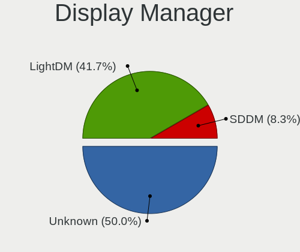
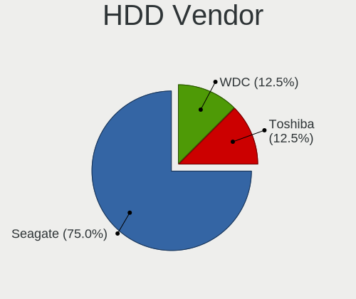
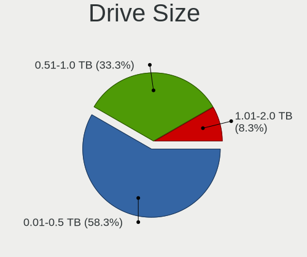
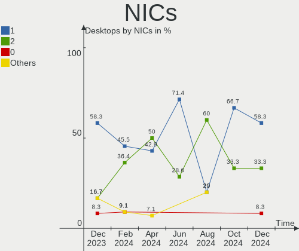

Kali - Hardware Trends (Desktops)
---------------------------------

A project to identify most popular hardware characteristics and track their change
over time based on data collected by Linux users at https://Linux-Hardware.org.

Anyone can contribute to this report by the [hw-probe](https://github.com/linuxhw/hw-probe) tool:

    sudo -E hw-probe -all -upload

This report is for one last month. Overall report since the beginning of time: [TestDays](https://github.com/linuxhw/TestDays)

Period: Jan, 2024.

Contents
--------

* [ System ](#system)
  - [ OS                       ](#os)
  - [ OS Family                ](#os-family)
  - [ Kernel                   ](#kernel)
  - [ Kernel Family            ](#kernel-family)
  - [ Kernel Major Ver.        ](#kernel-major-ver)
  - [ Arch                     ](#arch)
  - [ DE                       ](#de)
  - [ Display Server           ](#display-server)
  - [ Display Manager          ](#display-manager)
  - [ OS Lang                  ](#os-lang)
  - [ Boot Mode                ](#boot-mode)
  - [ Filesystem               ](#filesystem)
  - [ Part. scheme             ](#part-scheme)
  - [ Dual Boot with Linux/BSD ](#dual-boot-with-linuxbsd)
  - [ Dual Boot (Win)          ](#dual-boot-win)

* [ Board ](#board)
  - [ Vendor                   ](#vendor)
  - [ Model                    ](#model)
  - [ Model Family             ](#model-family)
  - [ MFG Year                 ](#mfg-year)
  - [ Form Factor              ](#form-factor)
  - [ Secure Boot              ](#secure-boot)
  - [ Coreboot                 ](#coreboot)
  - [ RAM Size                 ](#ram-size)
  - [ RAM Used                 ](#ram-used)
  - [ Total Drives             ](#total-drives)
  - [ Has CD-ROM               ](#has-cd-rom)
  - [ Has Ethernet             ](#has-ethernet)
  - [ Has WiFi                 ](#has-wifi)
  - [ Has Bluetooth            ](#has-bluetooth)

* [ Location ](#location)
  - [ Country                  ](#country)
  - [ City                     ](#city)

* [ Drives ](#drives)
  - [ Drive Vendor             ](#drive-vendor)
  - [ Drive Model              ](#drive-model)
  - [ HDD Vendor               ](#hdd-vendor)
  - [ SSD Vendor               ](#ssd-vendor)
  - [ Drive Kind               ](#drive-kind)
  - [ Drive Connector          ](#drive-connector)
  - [ Drive Size               ](#drive-size)
  - [ Space Total              ](#space-total)
  - [ Space Used               ](#space-used)
  - [ Malfunc. Drives          ](#malfunc-drives)
  - [ Malfunc. Drive Vendor    ](#malfunc-drive-vendor)
  - [ Malfunc. HDD Vendor      ](#malfunc-hdd-vendor)
  - [ Malfunc. Drive Kind      ](#malfunc-drive-kind)
  - [ Failed Drives            ](#failed-drives)
  - [ Failed Drive Vendor      ](#failed-drive-vendor)
  - [ Drive Status             ](#drive-status)

* [ Storage controller ](#storage-controller)
  - [ Storage Vendor           ](#storage-vendor)
  - [ Storage Model            ](#storage-model)
  - [ Storage Kind             ](#storage-kind)

* [ Processor ](#processor)
  - [ CPU Vendor               ](#cpu-vendor)
  - [ CPU Model                ](#cpu-model)
  - [ CPU Model Family         ](#cpu-model-family)
  - [ CPU Cores                ](#cpu-cores)
  - [ CPU Sockets              ](#cpu-sockets)
  - [ CPU Threads              ](#cpu-threads)
  - [ CPU Op-Modes             ](#cpu-op-modes)
  - [ CPU Microcode            ](#cpu-microcode)
  - [ CPU Microarch            ](#cpu-microarch)

* [ Graphics ](#graphics)
  - [ GPU Vendor               ](#gpu-vendor)
  - [ GPU Model                ](#gpu-model)
  - [ GPU Combo                ](#gpu-combo)
  - [ GPU Driver               ](#gpu-driver)
  - [ GPU Memory               ](#gpu-memory)

* [ Monitor ](#monitor)
  - [ Monitor Vendor           ](#monitor-vendor)
  - [ Monitor Model            ](#monitor-model)
  - [ Monitor Resolution       ](#monitor-resolution)
  - [ Monitor Diagonal         ](#monitor-diagonal)
  - [ Monitor Width            ](#monitor-width)
  - [ Aspect Ratio             ](#aspect-ratio)
  - [ Monitor Area             ](#monitor-area)
  - [ Pixel Density            ](#pixel-density)
  - [ Multiple Monitors        ](#multiple-monitors)

* [ Network ](#network)
  - [ Net Controller Vendor    ](#net-controller-vendor)
  - [ Net Controller Model     ](#net-controller-model)
  - [ Wireless Vendor          ](#wireless-vendor)
  - [ Wireless Model           ](#wireless-model)
  - [ Ethernet Vendor          ](#ethernet-vendor)
  - [ Ethernet Model           ](#ethernet-model)
  - [ Net Controller Kind      ](#net-controller-kind)
  - [ Used Controller          ](#used-controller)
  - [ NICs                     ](#nics)
  - [ IPv6                     ](#ipv6)

* [ Bluetooth ](#bluetooth)
  - [ Bluetooth Vendor         ](#bluetooth-vendor)
  - [ Bluetooth Model          ](#bluetooth-model)

* [ Sound ](#sound)
  - [ Sound Vendor             ](#sound-vendor)
  - [ Sound Model              ](#sound-model)

* [ Memory ](#memory)
  - [ Memory Vendor            ](#memory-vendor)
  - [ Memory Model             ](#memory-model)
  - [ Memory Kind              ](#memory-kind)
  - [ Memory Form Factor       ](#memory-form-factor)
  - [ Memory Size              ](#memory-size)
  - [ Memory Speed             ](#memory-speed)

* [ Printers & scanners ](#printers--scanners)
  - [ Printer Vendor           ](#printer-vendor)
  - [ Printer Model            ](#printer-model)
  - [ Scanner Vendor           ](#scanner-vendor)
  - [ Scanner Model            ](#scanner-model)

* [ Camera ](#camera)
  - [ Camera Vendor            ](#camera-vendor)
  - [ Camera Model             ](#camera-model)

* [ Security ](#security)
  - [ Fingerprint Vendor       ](#fingerprint-vendor)
  - [ Fingerprint Model        ](#fingerprint-model)
  - [ Chipcard Vendor          ](#chipcard-vendor)
  - [ Chipcard Model           ](#chipcard-model)

* [ Unsupported ](#unsupported)
  - [ Unsupported Devices      ](#unsupported-devices)
  - [ Unsupported Device Types ](#unsupported-device-types)

System
------

OS
--

Installed operating systems

| Name        | Desktops | Percent |
|-------------|----------|---------|
| Kali 2023.4 | 13       | 81.25%  |
| Kali 2023.3 | 2        | 12.5%   |
| Kali 2023.2 | 1        | 6.25%   |

OS Family
---------

OS without a version

| Name | Desktops | Percent |
|------|----------|---------|
| Kali | 16       | 100%    |

Kernel
------

Version of the Linux kernel

| Version           | Desktops | Percent |
|-------------------|----------|---------|
| 6.5.0-kali3-amd64 | 10       | 62.5%   |
| 6.3.0-kali1-amd64 | 2        | 12.5%   |
| 6.1.0-kali9-amd64 | 2        | 12.5%   |
| 6.6.9-amd64       | 1        | 6.25%   |
| 6.1.0-15-amd64    | 1        | 6.25%   |

Kernel Family
-------------

Linux kernel without a distro release

| Version | Desktops | Percent |
|---------|----------|---------|
| 6.5.0   | 10       | 62.5%   |
| 6.1.0   | 3        | 18.75%  |
| 6.3.0   | 2        | 12.5%   |
| 6.6.9   | 1        | 6.25%   |

Kernel Major Ver.
-----------------

Linux kernel major version

| Version | Desktops | Percent |
|---------|----------|---------|
| 6.5     | 10       | 62.5%   |
| 6.1     | 3        | 18.75%  |
| 6.3     | 2        | 12.5%   |
| 6.6     | 1        | 6.25%   |

Arch
----

OS architecture (x86_64, i586, etc.)

| Name   | Desktops | Percent |
|--------|----------|---------|
| x86_64 | 16       | 100%    |

DE
--

Desktop Environment

| Name       | Desktops | Percent |
|------------|----------|---------|
| XFCE       | 6        | 37.5%   |
| GNOME      | 6        | 37.5%   |
| X-Cinnamon | 2        | 12.5%   |
| KDE5       | 1        | 6.25%   |
| Unknown    | 1        | 6.25%   |

Display Server
--------------

X11 or Wayland

| Name | Desktops | Percent |
|------|----------|---------|
| X11  | 16       | 100%    |

Display Manager
---------------

SDDM, LightDM, etc.

| Name    | Desktops | Percent |
|---------|----------|---------|
| Unknown | 8        | 50%     |
| LightDM | 5        | 31.25%  |
| SDDM    | 2        | 12.5%   |
| GDM3    | 1        | 6.25%   |

OS Lang
-------

Language

| Lang    | Desktops | Percent |
|---------|----------|---------|
| en_US   | 5        | 31.25%  |
| C       | 3        | 18.75%  |
| es_MX   | 2        | 12.5%   |
| pt_BR   | 1        | 6.25%   |
| es_ES   | 1        | 6.25%   |
| en_GB   | 1        | 6.25%   |
| de_DE   | 1        | 6.25%   |
| ar_EG   | 1        | 6.25%   |
| Unknown | 1        | 6.25%   |

Boot Mode
---------

EFI or BIOS

| Mode | Desktops | Percent |
|------|----------|---------|
| EFI  | 11       | 68.75%  |
| BIOS | 5        | 31.25%  |

Filesystem
----------

Type of filesystem

| Type    | Desktops | Percent |
|---------|----------|---------|
| Ext4    | 13       | 81.25%  |
| Overlay | 2        | 12.5%   |
| Tmpfs   | 1        | 6.25%   |

Part. scheme
------------

Scheme of partitioning

| Type    | Desktops | Percent |
|---------|----------|---------|
| Unknown | 7        | 43.75%  |
| MBR     | 5        | 31.25%  |
| GPT     | 4        | 25%     |

Dual Boot with Linux/BSD
------------------------

Hosting more than one Linux/BSD

| Dual boot | Desktops | Percent |
|-----------|----------|---------|
| No        | 14       | 87.5%   |
| Yes       | 2        | 12.5%   |

Dual Boot (Win)
---------------

Hosting Linux and Windows

| Dual boot | Desktops | Percent |
|-----------|----------|---------|
| No        | 13       | 81.25%  |
| Yes       | 3        | 18.75%  |

Board
-----

Vendor
------

Motherboard manufacturer

| Name                | Desktops | Percent |
|---------------------|----------|---------|
| ASUSTek Computer    | 4        | 25%     |
| MSI                 | 3        | 18.75%  |
| Hewlett-Packard     | 3        | 18.75%  |
| Lenovo              | 2        | 12.5%   |
| Gigabyte Technology | 2        | 12.5%   |
| Pegatron            | 1        | 6.25%   |
| Apple               | 1        | 6.25%   |

Model
-----

Motherboard model

| Name                                 | Desktops | Percent |
|--------------------------------------|----------|---------|
| MSI MS-7816                          | 2        | 12.5%   |
| Pegatron IPMIP-GS                    | 1        | 6.25%   |
| MSI MS-7C95                          | 1        | 6.25%   |
| Lenovo ThinkCentre M91p 4518RQ4      | 1        | 6.25%   |
| Lenovo ThinkCentre M72z 3535A48      | 1        | 6.25%   |
| HP ProDesk 600 G1 SFF                | 1        | 6.25%   |
| HP G1-2012la                         | 1        | 6.25%   |
| HP 280 G3 MT                         | 1        | 6.25%   |
| Gigabyte P31-ES3G                    | 1        | 6.25%   |
| Gigabyte G41MT-ES2L                  | 1        | 6.25%   |
| ASUS STRIX Z270F GAMING              | 1        | 6.25%   |
| ASUS ROG STRIX B660-A GAMING WIFI D4 | 1        | 6.25%   |
| ASUS ROG STRIX B550-F GAMING         | 1        | 6.25%   |
| ASUS PRIME X299-DELUXE II            | 1        | 6.25%   |
| Apple MacPro5,1                      | 1        | 6.25%   |

Model Family
------------

Motherboard model prefix

| Name                | Desktops | Percent |
|---------------------|----------|---------|
| MSI MS-7816         | 2        | 12.5%   |
| Lenovo ThinkCentre  | 2        | 12.5%   |
| ASUS ROG            | 2        | 12.5%   |
| Pegatron IPMIP-GS   | 1        | 6.25%   |
| MSI MS-7C95         | 1        | 6.25%   |
| HP ProDesk          | 1        | 6.25%   |
| HP G1-2012la        | 1        | 6.25%   |
| HP 280              | 1        | 6.25%   |
| Gigabyte P31-ES3G   | 1        | 6.25%   |
| Gigabyte G41MT-ES2L | 1        | 6.25%   |
| ASUS STRIX          | 1        | 6.25%   |
| ASUS PRIME          | 1        | 6.25%   |
| Apple MacPro5       | 1        | 6.25%   |

MFG Year
--------

Motherboard manufacture year

| Year | Desktops | Percent |
|------|----------|---------|
| 2020 | 3        | 18.75%  |
| 2010 | 3        | 18.75%  |
| 2014 | 2        | 12.5%   |
| 2021 | 1        | 6.25%   |
| 2018 | 1        | 6.25%   |
| 2016 | 1        | 6.25%   |
| 2013 | 1        | 6.25%   |
| 2012 | 1        | 6.25%   |
| 2011 | 1        | 6.25%   |
| 2009 | 1        | 6.25%   |
| 2008 | 1        | 6.25%   |

Form Factor
-----------

Physical design of the computer

| Name    | Desktops | Percent |
|---------|----------|---------|
| Desktop | 16       | 100%    |

Secure Boot
-----------

Enabled or disabled

| State    | Desktops | Percent |
|----------|----------|---------|
| Disabled | 16       | 100%    |

Coreboot
--------

Have coreboot on board

| Used | Desktops | Percent |
|------|----------|---------|
| No   | 16       | 100%    |

RAM Size
--------

Total RAM memory

| Size in GB  | Desktops | Percent |
|-------------|----------|---------|
| 4.01-8.0    | 4        | 25%     |
| 32.01-64.0  | 3        | 18.75%  |
| 16.01-24.0  | 3        | 18.75%  |
| 3.01-4.0    | 2        | 12.5%   |
| 8.01-16.0   | 2        | 12.5%   |
| 2.01-3.0    | 1        | 6.25%   |
| 64.01-256.0 | 1        | 6.25%   |

RAM Used
--------

Used RAM memory

| Used GB    | Desktops | Percent |
|------------|----------|---------|
| 2.01-3.0   | 4        | 25%     |
| 1.01-2.0   | 4        | 25%     |
| 4.01-8.0   | 3        | 18.75%  |
| 3.01-4.0   | 3        | 18.75%  |
| 16.01-24.0 | 1        | 6.25%   |
| 0.51-1.0   | 1        | 6.25%   |

Total Drives
------------

Number of drives on board

| Drives | Desktops | Percent |
|--------|----------|---------|
| 2      | 7        | 43.75%  |
| 1      | 5        | 31.25%  |
| 0      | 2        | 12.5%   |
| 9      | 1        | 6.25%   |
| 4      | 1        | 6.25%   |

Has CD-ROM
----------

Has CD-ROM on board

| Presented | Desktops | Percent |
|-----------|----------|---------|
| No        | 10       | 62.5%   |
| Yes       | 6        | 37.5%   |

Has Ethernet
------------

Has Ethernet on board

| Presented | Desktops | Percent |
|-----------|----------|---------|
| Yes       | 16       | 100%    |

Has WiFi
--------

Has WiFi module

| Presented | Desktops | Percent |
|-----------|----------|---------|
| Yes       | 11       | 68.75%  |
| No        | 5        | 31.25%  |

Has Bluetooth
-------------

Has Bluetooth module

| Presented | Desktops | Percent |
|-----------|----------|---------|
| No        | 10       | 62.5%   |
| Yes       | 6        | 37.5%   |

Location
--------

Country
-------

Geographic location (country)

| Country      | Desktops | Percent |
|--------------|----------|---------|
| USA          | 4        | 25%     |
| Poland       | 2        | 12.5%   |
| Mexico       | 2        | 12.5%   |
| UK           | 1        | 6.25%   |
| Spain        | 1        | 6.25%   |
| Saudi Arabia | 1        | 6.25%   |
| Netherlands  | 1        | 6.25%   |
| Germany      | 1        | 6.25%   |
| France       | 1        | 6.25%   |
| Canada       | 1        | 6.25%   |
| Brazil       | 1        | 6.25%   |

City
----

Geographic location (city)

| City                  | Desktops | Percent |
|-----------------------|----------|---------|
| Koszalin              | 2        | 12.5%   |
| Voelklingen           | 1        | 6.25%   |
| Ta'if                 | 1        | 6.25%   |
| Mexico City           | 1        | 6.25%   |
| Martinsville          | 1        | 6.25%   |
| Maisons-Alfort        | 1        | 6.25%   |
| Lorena                | 1        | 6.25%   |
| Ibiza Town            | 1        | 6.25%   |
| Hoofddorp             | 1        | 6.25%   |
| Gustavo Adolfo Madero | 1        | 6.25%   |
| Elk Grove             | 1        | 6.25%   |
| Corona                | 1        | 6.25%   |
| Calgary               | 1        | 6.25%   |
| Birmingham            | 1        | 6.25%   |
| Bartlesville          | 1        | 6.25%   |

Drives
------

Drive Vendor
------------

Hard drive vendors

| Vendor              | Desktops | Drives | Percent |
|---------------------|----------|--------|---------|
| Seagate             | 8        | 8      | 30.77%  |
| WDC                 | 4        | 5      | 15.38%  |
| Samsung Electronics | 3        | 3      | 11.54%  |
| Hitachi             | 3        | 3      | 11.54%  |
| SanDisk             | 2        | 2      | 7.69%   |
| TDAS                | 1        | 5      | 3.85%   |
| OCZ                 | 1        | 1      | 3.85%   |
| MSI                 | 1        | 1      | 3.85%   |
| Intenso             | 1        | 1      | 3.85%   |
| Fanxiang            | 1        | 2      | 3.85%   |
| Apple               | 1        | 1      | 3.85%   |

Drive Model
-----------

Hard drive models

| Model                               | Desktops | Percent |
|-------------------------------------|----------|---------|
| Seagate ST31000524AS 1TB            | 2        | 7.41%   |
| WDC WD5000AZLX-60K2TA0 500GB        | 1        | 3.7%    |
| WDC WD20EZRX-00D8PB0 2TB            | 1        | 3.7%    |
| WDC WD2000FYYZ-01UL1B2 2TB          | 1        | 3.7%    |
| WDC WD10PURZ-85U8XY0 1TB            | 1        | 3.7%    |
| TDAS TerraMaster 500GB              | 1        | 3.7%    |
| Seagate ST750LM022 HN-M750MBB 752GB | 1        | 3.7%    |
| Seagate ST3750525AS 752GB           | 1        | 3.7%    |
| Seagate ST2000DX002-2DV164 2TB      | 1        | 3.7%    |
| Seagate ST1000DM003-1SB102 1TB      | 1        | 3.7%    |
| Seagate ST1000DM003-1CH162 1TB      | 1        | 3.7%    |
| Seagate ST10000DM0004-1ZC101 10TB   | 1        | 3.7%    |
| Sandisk WD Blue SN570 1TB           | 1        | 3.7%    |
| SanDisk NVMe SSD Drive 1TB          | 1        | 3.7%    |
| Samsung SSD 850 EVO 250GB           | 1        | 3.7%    |
| Samsung MZALQ512HBLU-00BL2 512GB    | 1        | 3.7%    |
| Samsung HM160HI 160GB               | 1        | 3.7%    |
| OCZ VERTEX4 256GB SSD               | 1        | 3.7%    |
| MSI M390 1TB                        | 1        | 3.7%    |
| Intenso SSD 250GB                   | 1        | 3.7%    |
| Hitachi HTS543216L9SA00 160GB       | 1        | 3.7%    |
| Hitachi HDS721010CLA332 1TB         | 1        | 3.7%    |
| Hitachi HDE721010SLA330 1TB         | 1        | 3.7%    |
| Fanxiang S101 2TB SSD               | 1        | 3.7%    |
| Fanxiang S101 2TB MX                | 1        | 3.7%    |
| Apple HDD WDC WD10EALX-408EA0 1TB   | 1        | 3.7%    |

HDD Vendor
----------

Hard disk drive vendors

| Vendor              | Desktops | Drives | Percent |
|---------------------|----------|--------|---------|
| Seagate             | 8        | 8      | 44.44%  |
| WDC                 | 4        | 5      | 22.22%  |
| Hitachi             | 3        | 3      | 16.67%  |
| TDAS                | 1        | 5      | 5.56%   |
| Samsung Electronics | 1        | 1      | 5.56%   |
| Apple               | 1        | 1      | 5.56%   |

SSD Vendor
----------

Solid state drive vendors

| Vendor              | Desktops | Drives | Percent |
|---------------------|----------|--------|---------|
| Samsung Electronics | 1        | 1      | 25%     |
| OCZ                 | 1        | 1      | 25%     |
| Intenso             | 1        | 1      | 25%     |
| Fanxiang            | 1        | 1      | 25%     |

Drive Kind
----------

HDD or SSD

| Kind    | Desktops | Drives | Percent |
|---------|----------|--------|---------|
| HDD     | 12       | 23     | 57.14%  |
| NVMe    | 4        | 4      | 19.05%  |
| SSD     | 4        | 4      | 19.05%  |
| Unknown | 1        | 1      | 4.76%   |

Drive Connector
---------------

SATA, SAS, NVMe, etc.

| Type | Desktops | Drives | Percent |
|------|----------|--------|---------|
| SATA | 13       | 23     | 72.22%  |
| NVMe | 4        | 4      | 22.22%  |
| SAS  | 1        | 5      | 5.56%   |

Drive Size
----------

Size of hard drive

| Size in TB | Desktops | Drives | Percent |
|------------|----------|--------|---------|
| 0.51-1.0   | 7        | 10     | 38.89%  |
| 0.01-0.5   | 6        | 12     | 33.33%  |
| 1.01-2.0   | 4        | 4      | 22.22%  |
| 4.01-10.0  | 1        | 1      | 5.56%   |

Space Total
-----------

Amount of disk space available on the file system

| Size in GB | Desktops | Percent |
|------------|----------|---------|
| 501-1000   | 5        | 31.25%  |
| 101-250    | 4        | 25%     |
| 251-500    | 2        | 12.5%   |
| 1001-2000  | 2        | 12.5%   |
| 1-20       | 2        | 12.5%   |
| Unknown    | 1        | 6.25%   |

Space Used
----------

Amount of used disk space

| Used GB  | Desktops | Percent |
|----------|----------|---------|
| 51-100   | 5        | 31.25%  |
| 1-20     | 4        | 25%     |
| 21-50    | 2        | 12.5%   |
| 101-250  | 2        | 12.5%   |
| 501-1000 | 2        | 12.5%   |
| Unknown  | 1        | 6.25%   |

Malfunc. Drives
---------------

Drive models with a malfunction

| Model                          | Desktops | Drives | Percent |
|--------------------------------|----------|--------|---------|
| Seagate ST31000524AS 1TB       | 1        | 1      | 33.33%  |
| Seagate ST2000DX002-2DV164 2TB | 1        | 1      | 33.33%  |
| Seagate ST1000DM003-1SB102 1TB | 1        | 1      | 33.33%  |

Malfunc. Drive Vendor
---------------------

Vendors of faulty drives

| Vendor  | Desktops | Drives | Percent |
|---------|----------|--------|---------|
| Seagate | 3        | 3      | 100%    |

Malfunc. HDD Vendor
-------------------

Vendors of faulty HDD drives

| Vendor  | Desktops | Drives | Percent |
|---------|----------|--------|---------|
| Seagate | 3        | 3      | 100%    |

Malfunc. Drive Kind
-------------------

Kinds of faulty drives

| Kind | Desktops | Drives | Percent |
|------|----------|--------|---------|
| HDD  | 3        | 3      | 100%    |

Failed Drives
-------------

Failed drive models

Zero info for selected period =(

Failed Drive Vendor
-------------------

Failed drive vendors

Zero info for selected period =(

Drive Status
------------

Number of failed and malfunc. drives

| Status   | Desktops | Drives | Percent |
|----------|----------|--------|---------|
| Detected | 9        | 23     | 52.94%  |
| Works    | 5        | 6      | 29.41%  |
| Malfunc  | 3        | 3      | 17.65%  |

Storage controller
------------------

Storage Vendor
--------------

Storage controller vendors

| Vendor                   | Desktops | Percent |
|--------------------------|----------|---------|
| Intel                    | 13       | 59.09%  |
| AMD                      | 3        | 13.64%  |
| SanDisk                  | 2        | 9.09%   |
| Samsung Electronics      | 1        | 4.55%   |
| Marvell Technology Group | 1        | 4.55%   |
| HighPoint Technologies   | 1        | 4.55%   |
| ASMedia Technology       | 1        | 4.55%   |

Storage Model
-------------

Storage controller models

| Model                                                                          | Desktops | Percent |
|--------------------------------------------------------------------------------|----------|---------|
| Intel 8 Series/C220 Series Chipset Family 6-port SATA Controller 1 [AHCI mode] | 3        | 12%     |
| Intel NM10/ICH7 Family SATA Controller [IDE mode]                              | 2        | 8%      |
| Intel 6 Series/C200 Series Chipset Family 6 port Desktop SATA AHCI Controller  | 2        | 8%      |
| AMD 500 Series Chipset SATA Controller                                         | 2        | 8%      |
| SanDisk WD Black SN770 / PC SN740 256GB / PC SN560 (DRAM-less) NVMe SSD        | 1        | 4%      |
| SanDisk Ultra 3D / WD Blue SN570 NVMe SSD (DRAM-less)                          | 1        | 4%      |
| Samsung NVMe SSD Controller 980 (DRAM-less)                                    | 1        | 4%      |
| Marvell Group 88SE912x IDE Controller                                          | 1        | 4%      |
| Intel Volume Management Device NVMe RAID Controller                            | 1        | 4%      |
| Intel SATA Controller [RAID mode]                                              | 1        | 4%      |
| Intel Q170/Q150/B150/H170/H110/Z170/CM236 Chipset SATA Controller [AHCI Mode]  | 1        | 4%      |
| Intel Alder Lake-S PCH SATA Controller [AHCI Mode]                             | 1        | 4%      |
| Intel 82801JI (ICH10 Family) SATA AHCI Controller                              | 1        | 4%      |
| Intel 5 Series/3400 Series Chipset 4 port SATA IDE Controller                  | 1        | 4%      |
| Intel 5 Series/3400 Series Chipset 2 port SATA IDE Controller                  | 1        | 4%      |
| Intel 200 Series PCH SATA controller [AHCI mode]                               | 1        | 4%      |
| HighPoint RocketRAID 622 2 Port SATA-III Controller                            | 1        | 4%      |
| ASMedia ASM1061/ASM1062 Serial ATA Controller                                  | 1        | 4%      |
| AMD SB7x0/SB8x0/SB9x0 SATA Controller [AHCI mode]                              | 1        | 4%      |
| AMD FCH SATA Controller [RAID Bottom]                                          | 1        | 4%      |

Storage Kind
------------

Kind of storage controller (IDE, SATA, NVMe, SAS, ...)

| Kind | Desktops | Percent |
|------|----------|---------|
| SATA | 13       | 54.17%  |
| NVMe | 4        | 16.67%  |
| IDE  | 4        | 16.67%  |
| RAID | 3        | 12.5%   |

Processor
---------

CPU Vendor
----------

Processor vendors

| Vendor | Desktops | Percent |
|--------|----------|---------|
| Intel  | 13       | 81.25%  |
| AMD    | 3        | 18.75%  |

CPU Model
---------

Processor models

| Model                                       | Desktops | Percent |
|---------------------------------------------|----------|---------|
| Intel Xeon CPU E3-1230 v3 @ 3.30GHz         | 2        | 12.5%   |
| Intel Xeon CPU E5620 @ 2.40GHz              | 1        | 6.25%   |
| Intel Pentium Dual-Core CPU E5700 @ 3.00GHz | 1        | 6.25%   |
| Intel Core i9-10980XE CPU @ 3.00GHz         | 1        | 6.25%   |
| Intel Core i7-7700K CPU @ 4.20GHz           | 1        | 6.25%   |
| Intel Core i5-4570 CPU @ 3.20GHz            | 1        | 6.25%   |
| Intel Core i5-3470S CPU @ 2.90GHz           | 1        | 6.25%   |
| Intel Core i5-2400 CPU @ 3.10GHz            | 1        | 6.25%   |
| Intel Core i5 CPU 650 @ 3.20GHz             | 1        | 6.25%   |
| Intel Core i3-6100 CPU @ 3.70GHz            | 1        | 6.25%   |
| Intel Core 2 Duo CPU E7400 @ 2.80GHz        | 1        | 6.25%   |
| Intel 12th Gen Core i5-12600K               | 1        | 6.25%   |
| AMD Ryzen 9 5950X 16-Core Processor         | 1        | 6.25%   |
| AMD Ryzen 5 5600G with Radeon Graphics      | 1        | 6.25%   |
| AMD E-350 Processor                         | 1        | 6.25%   |

CPU Model Family
----------------

Processor model prefix

| Model                   | Desktops | Percent |
|-------------------------|----------|---------|
| Intel Core i5           | 4        | 25%     |
| Intel Xeon              | 3        | 18.75%  |
| Other                   | 1        | 6.25%   |
| Intel Pentium Dual-Core | 1        | 6.25%   |
| Intel Core i9           | 1        | 6.25%   |
| Intel Core i7           | 1        | 6.25%   |
| Intel Core i3           | 1        | 6.25%   |
| Intel Core 2 Duo        | 1        | 6.25%   |
| AMD Ryzen 9             | 1        | 6.25%   |
| AMD Ryzen 5             | 1        | 6.25%   |
| AMD E                   | 1        | 6.25%   |

CPU Cores
---------

Number of processor cores

| Number | Desktops | Percent |
|--------|----------|---------|
| 4      | 6        | 37.5%   |
| 2      | 4        | 25%     |
| 18     | 1        | 6.25%   |
| 16     | 1        | 6.25%   |
| 10     | 1        | 6.25%   |
| 8      | 1        | 6.25%   |
| 6      | 1        | 6.25%   |
| 1      | 1        | 6.25%   |

CPU Sockets
-----------

Number of sockets

| Number | Desktops | Percent |
|--------|----------|---------|
| 1      | 15       | 93.75%  |
| 2      | 1        | 6.25%   |

CPU Threads
-----------

Threads per core (Hyper-Threading)

| Number | Desktops | Percent |
|--------|----------|---------|
| 2      | 10       | 62.5%   |
| 1      | 6        | 37.5%   |

CPU Op-Modes
------------

CPU Operation Modes (32-bit, 64-bit)

| Op mode        | Desktops | Percent |
|----------------|----------|---------|
| 32-bit, 64-bit | 16       | 100%    |

CPU Microcode
-------------

Microcode number

| Number     | Desktops | Percent |
|------------|----------|---------|
| Unknown    | 12       | 75%     |
| 0x50657    | 1        | 6.25%   |
| 0x1067a    | 1        | 6.25%   |
| 0x0a50000d | 1        | 6.25%   |
| 0x05000029 | 1        | 6.25%   |

CPU Microarch
-------------

Microarchitecture

| Name        | Desktops | Percent |
|-------------|----------|---------|
| Haswell     | 3        | 18.75%  |
| Zen 3       | 2        | 12.5%   |
| Westmere    | 2        | 12.5%   |
| Skylake     | 2        | 12.5%   |
| Penryn      | 2        | 12.5%   |
| SandyBridge | 1        | 6.25%   |
| KabyLake    | 1        | 6.25%   |
| IvyBridge   | 1        | 6.25%   |
| Bobcat      | 1        | 6.25%   |
| Unknown     | 1        | 6.25%   |

Graphics
--------

GPU Vendor
----------

Vendors of graphics cards

| Vendor | Desktops | Percent |
|--------|----------|---------|
| Nvidia | 8        | 50%     |
| Intel  | 4        | 25%     |
| AMD    | 4        | 25%     |

GPU Model
---------

Graphics card models

| Model                                                                       | Desktops | Percent |
|-----------------------------------------------------------------------------|----------|---------|
| AMD Juniper PRO [Radeon HD 6750]                                            | 2        | 12.5%   |
| Nvidia TU102 [GeForce RTX 2080 Ti Rev. A]                                   | 1        | 6.25%   |
| Nvidia GP108 [GeForce GT 1030]                                              | 1        | 6.25%   |
| Nvidia GP104 [GeForce GTX 1080]                                             | 1        | 6.25%   |
| Nvidia GF119 [GeForce GT 520]                                               | 1        | 6.25%   |
| Nvidia GF119 [GeForce 510]                                                  | 1        | 6.25%   |
| Nvidia GA106 [GeForce RTX 3060 Lite Hash Rate]                              | 1        | 6.25%   |
| Nvidia GA106 [Geforce RTX 3050]                                             | 1        | 6.25%   |
| Nvidia AD103 [GeForce RTX 4080]                                             | 1        | 6.25%   |
| Intel Xeon E3-1200 v3/4th Gen Core Processor Integrated Graphics Controller | 1        | 6.25%   |
| Intel Xeon E3-1200 v2/3rd Gen Core processor Graphics Controller            | 1        | 6.25%   |
| Intel HD Graphics 530                                                       | 1        | 6.25%   |
| Intel Core Processor Integrated Graphics Controller                         | 1        | 6.25%   |
| AMD Wrestler [Radeon HD 6310]                                               | 1        | 6.25%   |
| AMD Cypress XT [Radeon HD 5870]                                             | 1        | 6.25%   |

GPU Combo
---------

Combinations of graphics cards

| Name       | Desktops | Percent |
|------------|----------|---------|
| 1 x Nvidia | 8        | 50%     |
| 1 x Intel  | 4        | 25%     |
| 1 x AMD    | 4        | 25%     |

GPU Driver
----------

Free vs proprietary

| Driver      | Desktops | Percent |
|-------------|----------|---------|
| Free        | 11       | 68.75%  |
| Proprietary | 4        | 25%     |
| Unknown     | 1        | 6.25%   |

GPU Memory
----------

Total video memory

| Size in GB | Desktops | Percent |
|------------|----------|---------|
| Unknown    | 5        | 31.25%  |
| 8.01-16.0  | 3        | 18.75%  |
| 0.51-1.0   | 3        | 18.75%  |
| 7.01-8.0   | 2        | 12.5%   |
| 1.01-2.0   | 2        | 12.5%   |
| 0.01-0.5   | 1        | 6.25%   |

Monitor
-------

Monitor Vendor
--------------

Monitor vendors

| Vendor              | Desktops | Percent |
|---------------------|----------|---------|
| Samsung Electronics | 3        | 18.75%  |
| Philips             | 2        | 12.5%   |
| Lenovo              | 2        | 12.5%   |
| Dell                | 2        | 12.5%   |
| Vizio               | 1        | 6.25%   |
| VIZ                 | 1        | 6.25%   |
| Vestel              | 1        | 6.25%   |
| Iiyama              | 1        | 6.25%   |
| Hewlett-Packard     | 1        | 6.25%   |
| Goldstar            | 1        | 6.25%   |
| Acer                | 1        | 6.25%   |

Monitor Model
-------------

Monitor models

| Model                                                                | Desktops | Percent |
|----------------------------------------------------------------------|----------|---------|
| Philips 190SW PHL0862 1440x900 408x255mm 18.9-inch                   | 2        | 11.11%  |
| Vizio E320-A0 VIZ0095 1366x768 697x392mm 31.5-inch                   | 1        | 5.56%   |
| VIZ LCD Monitor E320-A0 1366x768                                     | 1        | 5.56%   |
| Vestel LCD Monitor 50UHD_LCD_TV 3840x2160                            | 1        | 5.56%   |
| Samsung Electronics LU28R55 SAM1017 3840x2160 632x360mm 28.6-inch    | 1        | 5.56%   |
| Samsung Electronics LS27AG55x SAM71E1 2560x1440 600x340mm 27.2-inch  | 1        | 5.56%   |
| Samsung Electronics LCD Monitor SAM0C3C 1366x768 609x347mm 27.6-inch | 1        | 5.56%   |
| Lenovo LEN T2054pC LEN60D9 1440x900 419x262mm 19.5-inch              | 1        | 5.56%   |
| Lenovo H61 LEN520B 1600x900 410x230mm 18.5-inch                      | 1        | 5.56%   |
| Iiyama PL2470H IVM615C 1920x1080 527x296mm 23.8-inch                 | 1        | 5.56%   |
| Iiyama PL2470H IVM615B 1920x1080 527x296mm 23.8-inch                 | 1        | 5.56%   |
| Hewlett-Packard AIO HWP4109 1600x900 443x249mm 20.0-inch             | 1        | 5.56%   |
| Goldstar W1953 GSM4BA7 1360x768 406x229mm 18.4-inch                  | 1        | 5.56%   |
| Goldstar W1943 GSM4BAD 1360x768 406x229mm 18.4-inch                  | 1        | 5.56%   |
| Dell P2721Q DELF122 3840x2160 600x340mm 27.2-inch                    | 1        | 5.56%   |
| Dell LCD Monitor U2718Q 3840x2160                                    | 1        | 5.56%   |
| Acer EI491CR ACR06D5 3840x1080 1196x336mm 48.9-inch                  | 1        | 5.56%   |

Monitor Resolution
------------------

Monitor screen resolution

| Resolution       | Desktops | Percent |
|------------------|----------|---------|
| 3840x2160 (4K)   | 4        | 26.67%  |
| 1440x900 (WXGA+) | 3        | 20%     |
| 1600x900 (HD+)   | 2        | 13.33%  |
| 1366x768 (WXGA)  | 2        | 13.33%  |
| 3840x1080        | 1        | 6.67%   |
| 2560x1440 (QHD)  | 1        | 6.67%   |
| 1920x1080 (FHD)  | 1        | 6.67%   |
| 1360x768         | 1        | 6.67%   |

Monitor Diagonal
----------------

Diagonal size in inches

| Inches  | Desktops | Percent |
|---------|----------|---------|
| 18      | 4        | 25%     |
| Unknown | 3        | 18.75%  |
| 31      | 2        | 12.5%   |
| 49      | 1        | 6.25%   |
| 28      | 1        | 6.25%   |
| 27      | 1        | 6.25%   |
| 24      | 1        | 6.25%   |
| 23      | 1        | 6.25%   |
| 20      | 1        | 6.25%   |
| 19      | 1        | 6.25%   |

Monitor Width
-------------

Physical width

| Width in mm | Desktops | Percent |
|-------------|----------|---------|
| 401-500     | 6        | 40%     |
| 601-700     | 3        | 20%     |
| Unknown     | 3        | 20%     |
| 501-600     | 2        | 13.33%  |
| 1001-1500   | 1        | 6.67%   |

Aspect Ratio
------------

Proportional relationship between the width and the height

| Ratio   | Desktops | Percent |
|---------|----------|---------|
| 16/9    | 8        | 53.33%  |
| 16/10   | 3        | 20%     |
| Unknown | 3        | 20%     |
| 32/9    | 1        | 6.67%   |

Monitor Area
------------

Area in inch²

| Area in inch² | Desktops | Percent |
|----------------|----------|---------|
| 151-200        | 4        | 26.67%  |
| 351-500        | 3        | 20%     |
| Unknown        | 3        | 20%     |
| 141-150        | 2        | 13.33%  |
| 301-350        | 1        | 6.67%   |
| 201-250        | 1        | 6.67%   |
| 501-1000       | 1        | 6.67%   |

Pixel Density
-------------

Pixels per inch

| Density | Desktops | Percent |
|---------|----------|---------|
| 51-100  | 8        | 50%     |
| Unknown | 3        | 18.75%  |
| 1-50    | 2        | 12.5%   |
| 161-240 | 1        | 6.25%   |
| 121-160 | 1        | 6.25%   |
| 101-120 | 1        | 6.25%   |

Multiple Monitors
-----------------

Total monitors connected

| Total | Desktops | Percent |
|-------|----------|---------|
| 1     | 11       | 68.75%  |
| 2     | 3        | 18.75%  |
| 0     | 2        | 12.5%   |

Network
-------

Net Controller Vendor
---------------------

Controller vendors

| Vendor                | Desktops | Percent |
|-----------------------|----------|---------|
| Realtek Semiconductor | 9        | 30%     |
| Intel                 | 9        | 30%     |
| Ralink Technology     | 2        | 6.67%   |
| Qualcomm              | 2        | 6.67%   |
| TP-Link               | 1        | 3.33%   |
| Ralink                | 1        | 3.33%   |
| Qualcomm Atheros      | 1        | 3.33%   |
| MediaTek              | 1        | 3.33%   |
| Linksys               | 1        | 3.33%   |
| Broadcom              | 1        | 3.33%   |
| Aquantia              | 1        | 3.33%   |
| ADMtek                | 1        | 3.33%   |

Net Controller Model
--------------------

Controller models

| Model                                                                  | Desktops | Percent |
|------------------------------------------------------------------------|----------|---------|
| Realtek RTL8111/8168/8211/8411 PCI Express Gigabit Ethernet Controller | 5        | 14.71%  |
| Ralink RT2870/RT3070 Wireless Adapter                                  | 2        | 5.88%   |
| Qualcomm Android                                                       | 2        | 5.88%   |
| Intel Ethernet Controller I225-V                                       | 2        | 5.88%   |
| Intel Ethernet Connection (2) I219-V                                   | 2        | 5.88%   |
| TP-Link 802.11ac WLAN Adapter                                          | 1        | 2.94%   |
| Realtek RTL8814AU 802.11a/b/g/n/ac Wireless Adapter                    | 1        | 2.94%   |
| Realtek RTL8812AU 802.11a/b/g/n/ac 2T2R DB WLAN Adapter                | 1        | 2.94%   |
| Realtek RTL8190 802.11n PCI Wireless Network Adapter                   | 1        | 2.94%   |
| Realtek RTL8188CUS 802.11n WLAN Adapter                                | 1        | 2.94%   |
| Realtek RTL8153 Gigabit Ethernet Adapter                               | 1        | 2.94%   |
| Realtek RTL810xE PCI Express Fast Ethernet controller                  | 1        | 2.94%   |
| Ralink RT3090 Wireless 802.11n 1T/1R PCIe                              | 1        | 2.94%   |
| Qualcomm Atheros AR5212/5213/2414 Wireless Network Adapter             | 1        | 2.94%   |
| MediaTek WiFi                                                          | 1        | 2.94%   |
| Linksys WUSB6300 802.11a/b/g/n/ac Wireless Adapter [Realtek RTL8812AU] | 1        | 2.94%   |
| Intel Wi-Fi 5(802.11ac) Wireless-AC 9x6x [Thunder Peak]                | 1        | 2.94%   |
| Intel Ethernet Connection I217-LM                                      | 1        | 2.94%   |
| Intel Dual Band Wireless-AC 3168NGW [Stone Peak]                       | 1        | 2.94%   |
| Intel Alder Lake-S PCH CNVi WiFi                                       | 1        | 2.94%   |
| Intel 82579LM Gigabit Network Connection (Lewisville)                  | 1        | 2.94%   |
| Intel 82578DC Gigabit Network Connection                               | 1        | 2.94%   |
| Intel 82574L Gigabit Network Connection                                | 1        | 2.94%   |
| Broadcom BCM4322 802.11a/b/g/n Wireless LAN Controller                 | 1        | 2.94%   |
| Aquantia AQC111 NBase-T/IEEE 802.3bz Ethernet Controller [AQtion]      | 1        | 2.94%   |
| ADMtek NC100 Network Everywhere Fast Ethernet 10/100                   | 1        | 2.94%   |

Wireless Vendor
---------------

Wireless vendors

| Vendor                | Desktops | Percent |
|-----------------------|----------|---------|
| Realtek Semiconductor | 3        | 21.43%  |
| Intel                 | 3        | 21.43%  |
| Ralink Technology     | 2        | 14.29%  |
| TP-Link               | 1        | 7.14%   |
| Ralink                | 1        | 7.14%   |
| Qualcomm Atheros      | 1        | 7.14%   |
| MediaTek              | 1        | 7.14%   |
| Linksys               | 1        | 7.14%   |
| Broadcom              | 1        | 7.14%   |

Wireless Model
--------------

Wireless models

| Model                                                                  | Desktops | Percent |
|------------------------------------------------------------------------|----------|---------|
| Ralink RT2870/RT3070 Wireless Adapter                                  | 2        | 13.33%  |
| TP-Link 802.11ac WLAN Adapter                                          | 1        | 6.67%   |
| Realtek RTL8814AU 802.11a/b/g/n/ac Wireless Adapter                    | 1        | 6.67%   |
| Realtek RTL8812AU 802.11a/b/g/n/ac 2T2R DB WLAN Adapter                | 1        | 6.67%   |
| Realtek RTL8190 802.11n PCI Wireless Network Adapter                   | 1        | 6.67%   |
| Realtek RTL8188CUS 802.11n WLAN Adapter                                | 1        | 6.67%   |
| Ralink RT3090 Wireless 802.11n 1T/1R PCIe                              | 1        | 6.67%   |
| Qualcomm Atheros AR5212/5213/2414 Wireless Network Adapter             | 1        | 6.67%   |
| MediaTek WiFi                                                          | 1        | 6.67%   |
| Linksys WUSB6300 802.11a/b/g/n/ac Wireless Adapter [Realtek RTL8812AU] | 1        | 6.67%   |
| Intel Wi-Fi 5(802.11ac) Wireless-AC 9x6x [Thunder Peak]                | 1        | 6.67%   |
| Intel Dual Band Wireless-AC 3168NGW [Stone Peak]                       | 1        | 6.67%   |
| Intel Alder Lake-S PCH CNVi WiFi                                       | 1        | 6.67%   |
| Broadcom BCM4322 802.11a/b/g/n Wireless LAN Controller                 | 1        | 6.67%   |

Ethernet Vendor
---------------

Ethernet vendors

| Vendor                | Desktops | Percent |
|-----------------------|----------|---------|
| Intel                 | 8        | 42.11%  |
| Realtek Semiconductor | 7        | 36.84%  |
| Qualcomm              | 2        | 10.53%  |
| Aquantia              | 1        | 5.26%   |
| ADMtek                | 1        | 5.26%   |

Ethernet Model
--------------

Ethernet models

| Model                                                                  | Desktops | Percent |
|------------------------------------------------------------------------|----------|---------|
| Realtek RTL8111/8168/8211/8411 PCI Express Gigabit Ethernet Controller | 5        | 26.32%  |
| Qualcomm Android                                                       | 2        | 10.53%  |
| Intel Ethernet Controller I225-V                                       | 2        | 10.53%  |
| Intel Ethernet Connection (2) I219-V                                   | 2        | 10.53%  |
| Realtek RTL8153 Gigabit Ethernet Adapter                               | 1        | 5.26%   |
| Realtek RTL810xE PCI Express Fast Ethernet controller                  | 1        | 5.26%   |
| Intel Ethernet Connection I217-LM                                      | 1        | 5.26%   |
| Intel 82579LM Gigabit Network Connection (Lewisville)                  | 1        | 5.26%   |
| Intel 82578DC Gigabit Network Connection                               | 1        | 5.26%   |
| Intel 82574L Gigabit Network Connection                                | 1        | 5.26%   |
| Aquantia AQC111 NBase-T/IEEE 802.3bz Ethernet Controller [AQtion]      | 1        | 5.26%   |
| ADMtek NC100 Network Everywhere Fast Ethernet 10/100                   | 1        | 5.26%   |

Net Controller Kind
-------------------

Ethernet, WiFi or modem

| Kind     | Desktops | Percent |
|----------|----------|---------|
| Ethernet | 16       | 59.26%  |
| WiFi     | 11       | 40.74%  |

Used Controller
---------------

Currently used network controller

| Kind     | Desktops | Percent |
|----------|----------|---------|
| WiFi     | 8        | 53.33%  |
| Ethernet | 7        | 46.67%  |

NICs
----

Total network controllers on board

| Total | Desktops | Percent |
|-------|----------|---------|
| 1     | 7        | 43.75%  |
| 2     | 4        | 25%     |
| 3     | 3        | 18.75%  |
| 0     | 2        | 12.5%   |

IPv6
----

IPv6 vs IPv4

| Used | Desktops | Percent |
|------|----------|---------|
| No   | 9        | 56.25%  |
| Yes  | 7        | 43.75%  |

Bluetooth
---------

Bluetooth Vendor
----------------

Controller vendors

| Vendor                  | Desktops | Percent |
|-------------------------|----------|---------|
| Intel                   | 3        | 42.86%  |
| TP-Link                 | 2        | 28.57%  |
| Cambridge Silicon Radio | 1        | 14.29%  |
| Apple                   | 1        | 14.29%  |

Bluetooth Model
---------------

Controller models

| Model                                               | Desktops | Percent |
|-----------------------------------------------------|----------|---------|
| TP-Link UB500 Adapter                               | 2        | 28.57%  |
| Intel Wireless-AC 9260 Bluetooth Adapter            | 1        | 14.29%  |
| Intel Wireless-AC 3168 Bluetooth                    | 1        | 14.29%  |
| Intel AX201 Bluetooth                               | 1        | 14.29%  |
| Cambridge Silicon Radio Bluetooth Dongle (HCI mode) | 1        | 14.29%  |
| Apple Built-in Bluetooth 2.0+EDR HCI                | 1        | 14.29%  |

Sound
-----

Sound Vendor
------------

Sound card vendors

| Vendor                   | Desktops | Percent |
|--------------------------|----------|---------|
| Intel                    | 13       | 40.63%  |
| Nvidia                   | 8        | 25%     |
| AMD                      | 6        | 18.75%  |
| Nordic Semiconductor ASA | 2        | 6.25%   |
| Tenx Technology          | 1        | 3.13%   |
| Lenovo                   | 1        | 3.13%   |
| ASUSTek Computer         | 1        | 3.13%   |

Sound Model
-----------

Sound card models

| Model                                                                      | Desktops | Percent |
|----------------------------------------------------------------------------|----------|---------|
| Intel 8 Series/C220 Series Chipset High Definition Audio Controller        | 3        | 8.82%   |
| Nvidia GF119 HDMI Audio Controller                                         | 2        | 5.88%   |
| Nvidia GA106 High Definition Audio Controller                              | 2        | 5.88%   |
| Nordic Semiconductor ASA USB Composite Device                              | 2        | 5.88%   |
| Intel NM10/ICH7 Family High Definition Audio Controller                    | 2        | 5.88%   |
| Intel 6 Series/C200 Series Chipset Family High Definition Audio Controller | 2        | 5.88%   |
| Intel 200 Series PCH HD Audio                                              | 2        | 5.88%   |
| AMD Juniper HDMI Audio [Radeon HD 5700 Series]                             | 2        | 5.88%   |
| Tenx Technology USB AUDIO                                                  | 1        | 2.94%   |
| Nvidia TU102 High Definition Audio Controller                              | 1        | 2.94%   |
| Nvidia GP108 High Definition Audio Controller                              | 1        | 2.94%   |
| Nvidia GP104 High Definition Audio Controller                              | 1        | 2.94%   |
| Nvidia Audio device                                                        | 1        | 2.94%   |
| Lenovo USB Soundbar                                                        | 1        | 2.94%   |
| Intel Xeon E3-1200 v3/4th Gen Core Processor HD Audio Controller           | 1        | 2.94%   |
| Intel Alder Lake-S HD Audio Controller                                     | 1        | 2.94%   |
| Intel 82801JI (ICH10 Family) HD Audio Controller                           | 1        | 2.94%   |
| Intel 5 Series/3400 Series Chipset High Definition Audio                   | 1        | 2.94%   |
| Intel 100 Series/C230 Series Chipset Family HD Audio Controller            | 1        | 2.94%   |
| ASUSTek Computer USB Audio                                                 | 1        | 2.94%   |
| AMD Starship/Matisse HD Audio Controller                                   | 1        | 2.94%   |
| AMD SBx00 Azalia (Intel HDA)                                               | 1        | 2.94%   |
| AMD Renoir Radeon High Definition Audio Controller                         | 1        | 2.94%   |
| AMD Family 17h/19h HD Audio Controller                                     | 1        | 2.94%   |
| AMD Cypress HDMI Audio [Radeon HD 5830/5850/5870 / 6850/6870 Rebrand]      | 1        | 2.94%   |

Memory
------

Memory Vendor
-------------

Memory module vendors

| Vendor              | Desktops | Percent |
|---------------------|----------|---------|
| Unknown             | 2        | 14.29%  |
| Ramaxel Technology  | 2        | 14.29%  |
| Micron Technology   | 2        | 14.29%  |
| G.Skill             | 2        | 14.29%  |
| Corsair             | 2        | 14.29%  |
| SK hynix            | 1        | 7.14%   |
| Samsung Electronics | 1        | 7.14%   |
| Kingston            | 1        | 7.14%   |
| Crucial             | 1        | 7.14%   |

Memory Model
------------

Memory module models

| Model                                                  | Desktops | Percent |
|--------------------------------------------------------|----------|---------|
| Ramaxel RAM RMR1870ED48E8F1066 2GB DIMM DDR3 1067MT/s  | 2        | 12.5%   |
| Micron RAM 8JTF25664AZ-1G4D1 2GB DIMM DDR3 1333MT/s    | 2        | 12.5%   |
| G.Skill RAM F3-10666CL9-4GBNT 4GB DIMM DDR3 1600MT/s   | 2        | 12.5%   |
| Unknown RAM Module 2GB DIMM 800MT/s                    | 1        | 6.25%   |
| Unknown RAM Module 2GB DIMM 400MT/s                    | 1        | 6.25%   |
| Unknown RAM Module 1GB DIMM 800MT/s                    | 1        | 6.25%   |
| SK hynix RAM HMT451U6BFR8A-PB 4GB DIMM DDR3 1600MT/s   | 1        | 6.25%   |
| Samsung RAM M378B5173DB0-CK0 4GB DIMM DDR3 1600MT/s    | 1        | 6.25%   |
| Kingston RAM Module 4GB DIMM DDR3 1066MT/s             | 1        | 6.25%   |
| Crucial RAM BLE8G4D30AEEA.K16FE 8GB DIMM DDR4 3000MT/s | 1        | 6.25%   |
| Corsair RAM CMW16GX4M2C3200C16 8GB DIMM DDR4 3733MT/s  | 1        | 6.25%   |
| Corsair RAM CMK16GX4M2E3200C16 8GB DIMM DDR4 3200MT/s  | 1        | 6.25%   |
| Corsair RAM CMK16GX4M2B3200C16 8GB DIMM DDR4 3600MT/s  | 1        | 6.25%   |

Memory Kind
-----------

Memory module kinds

| Kind    | Desktops | Percent |
|---------|----------|---------|
| DDR3    | 4        | 44.44%  |
| DDR4    | 3        | 33.33%  |
| Unknown | 2        | 22.22%  |

Memory Form Factor
------------------

Physical design of the memory module

| Name | Desktops | Percent |
|------|----------|---------|
| DIMM | 9        | 100%    |

Memory Size
-----------

Memory module size

| Size | Desktops | Percent |
|------|----------|---------|
| 4096 | 4        | 33.33%  |
| 2048 | 4        | 33.33%  |
| 8192 | 3        | 25%     |
| 1024 | 1        | 8.33%   |

Memory Speed
------------

Memory module speed

| Speed | Desktops | Percent |
|-------|----------|---------|
| 1600  | 3        | 20%     |
| 1333  | 2        | 13.33%  |
| 1067  | 2        | 13.33%  |
| 3733  | 1        | 6.67%   |
| 3600  | 1        | 6.67%   |
| 3200  | 1        | 6.67%   |
| 3000  | 1        | 6.67%   |
| 1648  | 1        | 6.67%   |
| 1066  | 1        | 6.67%   |
| 800   | 1        | 6.67%   |
| 400   | 1        | 6.67%   |

Printers & scanners
-------------------

Printer Vendor
--------------

Printer device vendors

Zero info for selected period =(

Printer Model
-------------

Printer device models

Zero info for selected period =(

Scanner Vendor
--------------

Scanner device vendors

Zero info for selected period =(

Scanner Model
-------------

Scanner device models

Zero info for selected period =(

Camera
------

Camera Vendor
-------------

Camera device vendors

| Vendor                  | Desktops | Percent |
|-------------------------|----------|---------|
| Z-Star Microelectronics | 1        | 25%     |
| Microsoft               | 1        | 25%     |
| Logitech                | 1        | 25%     |
| GEMBIRD                 | 1        | 25%     |

Camera Model
------------

Camera device models

| Model                                             | Desktops | Percent |
|---------------------------------------------------|----------|---------|
| Z-Star Integrated Camera                          | 1        | 25%     |
| Microsoft LifeCam VX-800                          | 1        | 25%     |
| Logitech C922 Pro Stream Webcam                   | 1        | 25%     |
| GEMBIRD Generic UVC 1.00 camera [AppoTech AX2311] | 1        | 25%     |

Security
--------

Fingerprint Vendor
------------------

Fingerprint sensor vendors

Zero info for selected period =(

Fingerprint Model
-----------------

Fingerprint sensor models

Zero info for selected period =(

Chipcard Vendor
---------------

Chipcard module vendors

Zero info for selected period =(

Chipcard Model
--------------

Chipcard module models

Zero info for selected period =(

Unsupported
-----------

Unsupported Devices
-------------------

Total unsupported devices on board

| Total | Desktops | Percent |
|-------|----------|---------|
| 0     | 11       | 68.75%  |
| 1     | 5        | 31.25%  |

Unsupported Device Types
------------------------

Types of unsupported devices

| Type          | Desktops | Percent |
|---------------|----------|---------|
| Net/wireless  | 3        | 60%     |
| Storage/raid  | 1        | 20%     |
| Graphics card | 1        | 20%     |

