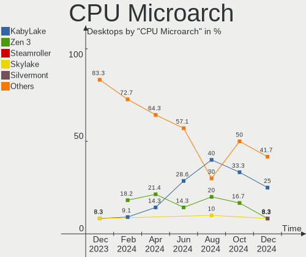
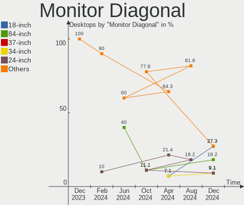
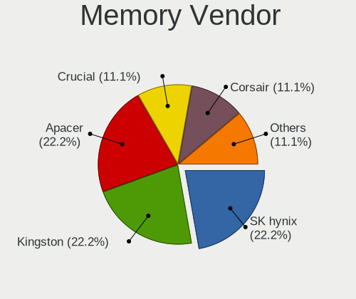
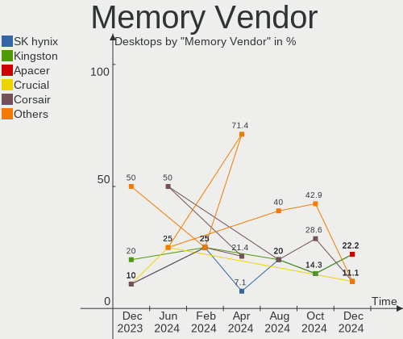

Kali - Hardware Trends (Desktops)
---------------------------------

A project to identify most popular hardware characteristics and track their change
over time based on data collected by Linux users at https://Linux-Hardware.org.

Anyone can contribute to this report by the [hw-probe](https://github.com/linuxhw/hw-probe) tool:

    sudo -E hw-probe -all -upload

This report is for one last month. Overall report since the beginning of time: [TestDays](https://github.com/linuxhw/TestDays)

Period: Dec, 2024.

Contents
--------

* [ System ](#system)
  - [ OS                       ](#os)
  - [ OS Family                ](#os-family)
  - [ Kernel                   ](#kernel)
  - [ Kernel Family            ](#kernel-family)
  - [ Kernel Major Ver.        ](#kernel-major-ver)
  - [ Arch                     ](#arch)
  - [ DE                       ](#de)
  - [ Display Server           ](#display-server)
  - [ Display Manager          ](#display-manager)
  - [ OS Lang                  ](#os-lang)
  - [ Boot Mode                ](#boot-mode)
  - [ Filesystem               ](#filesystem)
  - [ Part. scheme             ](#part-scheme)
  - [ Dual Boot with Linux/BSD ](#dual-boot-with-linuxbsd)
  - [ Dual Boot (Win)          ](#dual-boot-win)

* [ Board ](#board)
  - [ Vendor                   ](#vendor)
  - [ Model                    ](#model)
  - [ Model Family             ](#model-family)
  - [ MFG Year                 ](#mfg-year)
  - [ Form Factor              ](#form-factor)
  - [ Secure Boot              ](#secure-boot)
  - [ Coreboot                 ](#coreboot)
  - [ RAM Size                 ](#ram-size)
  - [ RAM Used                 ](#ram-used)
  - [ Total Drives             ](#total-drives)
  - [ Has CD-ROM               ](#has-cd-rom)
  - [ Has Ethernet             ](#has-ethernet)
  - [ Has WiFi                 ](#has-wifi)
  - [ Has Bluetooth            ](#has-bluetooth)

* [ Location ](#location)
  - [ Country                  ](#country)
  - [ City                     ](#city)

* [ Drives ](#drives)
  - [ Drive Vendor             ](#drive-vendor)
  - [ Drive Model              ](#drive-model)
  - [ HDD Vendor               ](#hdd-vendor)
  - [ SSD Vendor               ](#ssd-vendor)
  - [ Drive Kind               ](#drive-kind)
  - [ Drive Connector          ](#drive-connector)
  - [ Drive Size               ](#drive-size)
  - [ Space Total              ](#space-total)
  - [ Space Used               ](#space-used)
  - [ Malfunc. Drives          ](#malfunc-drives)
  - [ Malfunc. Drive Vendor    ](#malfunc-drive-vendor)
  - [ Malfunc. HDD Vendor      ](#malfunc-hdd-vendor)
  - [ Malfunc. Drive Kind      ](#malfunc-drive-kind)
  - [ Failed Drives            ](#failed-drives)
  - [ Failed Drive Vendor      ](#failed-drive-vendor)
  - [ Drive Status             ](#drive-status)

* [ Storage controller ](#storage-controller)
  - [ Storage Vendor           ](#storage-vendor)
  - [ Storage Model            ](#storage-model)
  - [ Storage Kind             ](#storage-kind)

* [ Processor ](#processor)
  - [ CPU Vendor               ](#cpu-vendor)
  - [ CPU Model                ](#cpu-model)
  - [ CPU Model Family         ](#cpu-model-family)
  - [ CPU Cores                ](#cpu-cores)
  - [ CPU Sockets              ](#cpu-sockets)
  - [ CPU Threads              ](#cpu-threads)
  - [ CPU Op-Modes             ](#cpu-op-modes)
  - [ CPU Microcode            ](#cpu-microcode)
  - [ CPU Microarch            ](#cpu-microarch)

* [ Graphics ](#graphics)
  - [ GPU Vendor               ](#gpu-vendor)
  - [ GPU Model                ](#gpu-model)
  - [ GPU Combo                ](#gpu-combo)
  - [ GPU Driver               ](#gpu-driver)
  - [ GPU Memory               ](#gpu-memory)

* [ Monitor ](#monitor)
  - [ Monitor Vendor           ](#monitor-vendor)
  - [ Monitor Model            ](#monitor-model)
  - [ Monitor Resolution       ](#monitor-resolution)
  - [ Monitor Diagonal         ](#monitor-diagonal)
  - [ Monitor Width            ](#monitor-width)
  - [ Aspect Ratio             ](#aspect-ratio)
  - [ Monitor Area             ](#monitor-area)
  - [ Pixel Density            ](#pixel-density)
  - [ Multiple Monitors        ](#multiple-monitors)

* [ Network ](#network)
  - [ Net Controller Vendor    ](#net-controller-vendor)
  - [ Net Controller Model     ](#net-controller-model)
  - [ Wireless Vendor          ](#wireless-vendor)
  - [ Wireless Model           ](#wireless-model)
  - [ Ethernet Vendor          ](#ethernet-vendor)
  - [ Ethernet Model           ](#ethernet-model)
  - [ Net Controller Kind      ](#net-controller-kind)
  - [ Used Controller          ](#used-controller)
  - [ NICs                     ](#nics)
  - [ IPv6                     ](#ipv6)

* [ Bluetooth ](#bluetooth)
  - [ Bluetooth Vendor         ](#bluetooth-vendor)
  - [ Bluetooth Model          ](#bluetooth-model)

* [ Sound ](#sound)
  - [ Sound Vendor             ](#sound-vendor)
  - [ Sound Model              ](#sound-model)

* [ Memory ](#memory)
  - [ Memory Vendor            ](#memory-vendor)
  - [ Memory Model             ](#memory-model)
  - [ Memory Kind              ](#memory-kind)
  - [ Memory Form Factor       ](#memory-form-factor)
  - [ Memory Size              ](#memory-size)
  - [ Memory Speed             ](#memory-speed)

* [ Printers & scanners ](#printers--scanners)
  - [ Printer Vendor           ](#printer-vendor)
  - [ Printer Model            ](#printer-model)
  - [ Scanner Vendor           ](#scanner-vendor)
  - [ Scanner Model            ](#scanner-model)

* [ Camera ](#camera)
  - [ Camera Vendor            ](#camera-vendor)
  - [ Camera Model             ](#camera-model)

* [ Security ](#security)
  - [ Fingerprint Vendor       ](#fingerprint-vendor)
  - [ Fingerprint Model        ](#fingerprint-model)
  - [ Chipcard Vendor          ](#chipcard-vendor)
  - [ Chipcard Model           ](#chipcard-model)

* [ Unsupported ](#unsupported)
  - [ Unsupported Devices      ](#unsupported-devices)
  - [ Unsupported Device Types ](#unsupported-device-types)

System
------

OS
--

Installed operating systems

| Name        | Desktops | Percent |
|-------------|----------|---------|
| Kali 2024.4 | 9        | 75%     |
| Kali 2024.3 | 3        | 25%     |

OS Family
---------

OS without a version

| Name | Desktops | Percent |
|------|----------|---------|
| Kali | 12       | 100%    |

Kernel
------

Version of the Linux kernel

| Version         | Desktops | Percent |
|-----------------|----------|---------|
| 6.11.2-amd64    | 6        | 50%     |
| 6.8.11-amd64    | 5        | 41.67%  |
| 6.11.2-rt-amd64 | 1        | 8.33%   |

Kernel Family
-------------

Linux kernel without a distro release

| Version | Desktops | Percent |
|---------|----------|---------|
| 6.11.2  | 7        | 58.33%  |
| 6.8.11  | 5        | 41.67%  |

Kernel Major Ver.
-----------------

Linux kernel major version

| Version | Desktops | Percent |
|---------|----------|---------|
| 6.11    | 7        | 58.33%  |
| 6.8     | 5        | 41.67%  |

Arch
----

OS architecture (x86_64, i586, etc.)

| Name   | Desktops | Percent |
|--------|----------|---------|
| x86_64 | 12       | 100%    |

DE
--

Desktop Environment

| Name          | Desktops | Percent |
|---------------|----------|---------|
| XFCE          | 7        | 58.33%  |
| GNOME Classic | 2        | 16.67%  |
| KDE5          | 1        | 8.33%   |
| GNOME         | 1        | 8.33%   |
| Unknown       | 1        | 8.33%   |

Display Server
--------------

X11 or Wayland

| Name    | Desktops | Percent |
|---------|----------|---------|
| X11     | 10       | 83.33%  |
| Wayland | 2        | 16.67%  |

Display Manager
---------------

SDDM, LightDM, etc.

| Name    | Desktops | Percent |
|---------|----------|---------|
| Unknown | 6        | 50%     |
| LightDM | 5        | 41.67%  |
| SDDM    | 1        | 8.33%   |

OS Lang
-------

Language

| Lang    | Desktops | Percent |
|---------|----------|---------|
| C       | 8        | 66.67%  |
| pt_BR   | 2        | 16.67%  |
| bg_BG   | 1        | 8.33%   |
| Unknown | 1        | 8.33%   |

Boot Mode
---------

EFI or BIOS

| Mode | Desktops | Percent |
|------|----------|---------|
| EFI  | 8        | 66.67%  |
| BIOS | 4        | 33.33%  |

Filesystem
----------

Type of filesystem

| Type  | Desktops | Percent |
|-------|----------|---------|
| Ext4  | 11       | 91.67%  |
| Tmpfs | 1        | 8.33%   |

Part. scheme
------------

Scheme of partitioning

| Type    | Desktops | Percent |
|---------|----------|---------|
| GPT     | 7        | 58.33%  |
| Unknown | 5        | 41.67%  |

Dual Boot with Linux/BSD
------------------------

Hosting more than one Linux/BSD

| Dual boot | Desktops | Percent |
|-----------|----------|---------|
| No        | 11       | 91.67%  |
| Yes       | 1        | 8.33%   |

Dual Boot (Win)
---------------

Hosting Linux and Windows

| Dual boot | Desktops | Percent |
|-----------|----------|---------|
| No        | 8        | 66.67%  |
| Yes       | 4        | 33.33%  |

Board
-----

Vendor
------

Motherboard manufacturer

| Name                | Desktops | Percent |
|---------------------|----------|---------|
| Gigabyte Technology | 2        | 16.67%  |
| Dell                | 2        | 16.67%  |
| ASUSTek Computer    | 2        | 16.67%  |
| MSI                 | 1        | 8.33%   |
| Lenovo              | 1        | 8.33%   |
| Hewlett-Packard     | 1        | 8.33%   |
| EMAXX TECHNOLOGY    | 1        | 8.33%   |
| DUEX                | 1        | 8.33%   |
| Unknown             | 1        | 8.33%   |

Model
-----

Motherboard model

| Name                                    | Desktops | Percent |
|-----------------------------------------|----------|---------|
| MSI MS-7E06                             | 1        | 8.33%   |
| Lenovo IdeaCentre 510S-08IKL 90GB00D3MH | 1        | 8.33%   |
| HP ProDesk 600 G2 SFF                   | 1        | 8.33%   |
| Gigabyte Z370M AORUS Gaming             | 1        | 8.33%   |
| Gigabyte EP45-UD3R                      | 1        | 8.33%   |
| EMAXX TECHNOLOGY EMX-A70FM2+iCafe       | 1        | 8.33%   |
| DUEX H310C                              | 1        | 8.33%   |
| Dell XPS 8700                           | 1        | 8.33%   |
| Dell OptiPlex 3010                      | 1        | 8.33%   |
| ASUS ROG STRIX B550-F GAMING            | 1        | 8.33%   |
| ASUS GamingPC                           | 1        | 8.33%   |
| Unknown                                 | 1        | 8.33%   |

Model Family
------------

Motherboard model prefix

| Name                              | Desktops | Percent |
|-----------------------------------|----------|---------|
| MSI MS-7E06                       | 1        | 8.33%   |
| Lenovo IdeaCentre                 | 1        | 8.33%   |
| HP ProDesk                        | 1        | 8.33%   |
| Gigabyte Z370M                    | 1        | 8.33%   |
| Gigabyte EP45-UD3R                | 1        | 8.33%   |
| EMAXX TECHNOLOGY EMX-A70FM2+iCafe | 1        | 8.33%   |
| DUEX H310C                        | 1        | 8.33%   |
| Dell XPS                          | 1        | 8.33%   |
| Dell OptiPlex                     | 1        | 8.33%   |
| ASUS ROG                          | 1        | 8.33%   |
| ASUS GamingPC                     | 1        | 8.33%   |
| Unknown                           | 1        | 8.33%   |

MFG Year
--------

Motherboard manufacture year

| Year | Desktops | Percent |
|------|----------|---------|
| 2023 | 2        | 16.67%  |
| 2017 | 2        | 16.67%  |
| 2015 | 2        | 16.67%  |
| 2013 | 2        | 16.67%  |
| 2022 | 1        | 8.33%   |
| 2020 | 1        | 8.33%   |
| 2019 | 1        | 8.33%   |
| 2008 | 1        | 8.33%   |

Form Factor
-----------

Physical design of the computer

| Name    | Desktops | Percent |
|---------|----------|---------|
| Desktop | 12       | 100%    |

Secure Boot
-----------

Enabled or disabled

| State    | Desktops | Percent |
|----------|----------|---------|
| Disabled | 12       | 100%    |

Coreboot
--------

Have coreboot on board

| Used | Desktops | Percent |
|------|----------|---------|
| No   | 12       | 100%    |

RAM Size
--------

Total RAM memory

| Size in GB  | Desktops | Percent |
|-------------|----------|---------|
| 32.01-64.0  | 3        | 25%     |
| 16.01-24.0  | 3        | 25%     |
| 8.01-16.0   | 3        | 25%     |
| 4.01-8.0    | 1        | 8.33%   |
| 3.01-4.0    | 1        | 8.33%   |
| 64.01-256.0 | 1        | 8.33%   |

RAM Used
--------

Used RAM memory

| Used GB  | Desktops | Percent |
|----------|----------|---------|
| 2.01-3.0 | 4        | 33.33%  |
| 4.01-8.0 | 3        | 25%     |
| 1.01-2.0 | 3        | 25%     |
| 3.01-4.0 | 2        | 16.67%  |

Total Drives
------------

Number of drives on board

| Drives | Desktops | Percent |
|--------|----------|---------|
| 1      | 5        | 41.67%  |
| 2      | 4        | 33.33%  |
| 6      | 1        | 8.33%   |
| 4      | 1        | 8.33%   |
| 3      | 1        | 8.33%   |

Has CD-ROM
----------

Has CD-ROM on board

| Presented | Desktops | Percent |
|-----------|----------|---------|
| No        | 9        | 75%     |
| Yes       | 3        | 25%     |

Has Ethernet
------------

Has Ethernet on board

| Presented | Desktops | Percent |
|-----------|----------|---------|
| Yes       | 11       | 91.67%  |
| No        | 1        | 8.33%   |

Has WiFi
--------

Has WiFi module

| Presented | Desktops | Percent |
|-----------|----------|---------|
| Yes       | 7        | 58.33%  |
| No        | 5        | 41.67%  |

Has Bluetooth
-------------

Has Bluetooth module

| Presented | Desktops | Percent |
|-----------|----------|---------|
| No        | 7        | 58.33%  |
| Yes       | 5        | 41.67%  |

Location
--------

Country
-------

Geographic location (country)

| Country         | Desktops | Percent |
|-----------------|----------|---------|
| Brazil          | 3        | 25%     |
| USA             | 2        | 16.67%  |
| Philippines     | 2        | 16.67%  |
| UK              | 1        | 8.33%   |
| The Netherlands | 1        | 8.33%   |
| Thailand        | 1        | 8.33%   |
| Switzerland     | 1        | 8.33%   |
| Bulgaria        | 1        | 8.33%   |

City
----

Geographic location (city)

| City                  | Desktops | Percent |
|-----------------------|----------|---------|
| Batangas              | 2        | 16.67%  |
| Sofia                 | 1        | 8.33%   |
| Si Sa Ket             | 1        | 8.33%   |
| Sao Bernardo do Campo | 1        | 8.33%   |
| Manchester            | 1        | 8.33%   |
| Lucerne               | 1        | 8.33%   |
| Leiden                | 1        | 8.33%   |
| Hollywood             | 1        | 8.33%   |
| Cushing               | 1        | 8.33%   |
| Curitiba              | 1        | 8.33%   |
| Campinas              | 1        | 8.33%   |

Drives
------

Drive Vendor
------------

Hard drive vendors

| Vendor              | Desktops | Drives | Percent |
|---------------------|----------|--------|---------|
| Seagate             | 6        | 7      | 27.27%  |
| Unknown             | 2        | 4      | 9.09%   |
| Sandisk             | 2        | 3      | 9.09%   |
| Kingston            | 2        | 2      | 9.09%   |
| Crucial             | 2        | 2      | 9.09%   |
| BR                  | 2        | 2      | 9.09%   |
| WDC                 | 1        | 1      | 4.55%   |
| Toshiba             | 1        | 1      | 4.55%   |
| SATAFIRM            | 1        | 1      | 4.55%   |
| Samsung Electronics | 1        | 1      | 4.55%   |
| PNY                 | 1        | 1      | 4.55%   |
| Fanxiang            | 1        | 2      | 4.55%   |

Drive Model
-----------

Hard drive models

| Model                                               | Desktops | Percent |
|-----------------------------------------------------|----------|---------|
| Seagate ST500DM002-1BD142 500GB                     | 2        | 7.41%   |
| BR SSD 120G                                         | 2        | 7.41%   |
| WDC WD10EZEX-08WN4A0 1TB                            | 1        | 3.7%    |
| Unknown SD/MMC 1073GB                               | 1        | 3.7%    |
| Unknown MMC Card  64GB                              | 1        | 3.7%    |
| Unknown M.S./M.S.Pro/HG 16GB                        | 1        | 3.7%    |
| Unknown Compact Flash 977MB                         | 1        | 3.7%    |
| Toshiba MQ02ABF050H 500GB                           | 1        | 3.7%    |
| Seagate ST500LT012-1DG142 500GB                     | 1        | 3.7%    |
| Seagate ST500LM012 HN-M500MBB 500GB                 | 1        | 3.7%    |
| Seagate ST31000524AS 1TB                            | 1        | 3.7%    |
| Seagate ST2000DM006-2DM164 2TB                      | 1        | 3.7%    |
| Seagate ST1000LM024 HN-M101MBB 1TB                  | 1        | 3.7%    |
| SATAFIRM S11 480GB                                  | 1        | 3.7%    |
| Sandisk WD Green SN350 1TB                          | 1        | 3.7%    |
| SanDisk SD7SB3Q-128G-1006 128GB SSD                 | 1        | 3.7%    |
| SanDisk NVMe SSD Drive 1TB                          | 1        | 3.7%    |
| Samsung NVMe SSD Controller SM961/PM961/SM963 256GB | 1        | 3.7%    |
| PNY CS900 240GB SSD                                 | 1        | 3.7%    |
| Kingston SV300S37A120G 120GB SSD                    | 1        | 3.7%    |
| Kingston SA400S37240G 240GB SSD                     | 1        | 3.7%    |
| Fanxiang S690Q 2TB                                  | 1        | 3.7%    |
| Fanxiang S101 512GB SSD                             | 1        | 3.7%    |
| Crucial CT1000T700SSD3 1TB                          | 1        | 3.7%    |
| Crucial CT1000P3PSSD8 1TB                           | 1        | 3.7%    |

HDD Vendor
----------

Hard disk drive vendors

| Vendor  | Desktops | Drives | Percent |
|---------|----------|--------|---------|
| Seagate | 6        | 7      | 75%     |
| WDC     | 1        | 1      | 12.5%   |
| Toshiba | 1        | 1      | 12.5%   |

SSD Vendor
----------

Solid state drive vendors

| Vendor   | Desktops | Drives | Percent |
|----------|----------|--------|---------|
| Kingston | 2        | 2      | 25%     |
| BR       | 2        | 2      | 25%     |
| SATAFIRM | 1        | 1      | 12.5%   |
| SanDisk  | 1        | 1      | 12.5%   |
| PNY      | 1        | 1      | 12.5%   |
| Fanxiang | 1        | 1      | 12.5%   |

Drive Kind
----------

HDD or SSD

| Kind    | Desktops | Drives | Percent |
|---------|----------|--------|---------|
| HDD     | 8        | 9      | 36.36%  |
| SSD     | 7        | 8      | 31.82%  |
| NVMe    | 5        | 6      | 22.73%  |
| MMC     | 1        | 1      | 4.55%   |
| Unknown | 1        | 3      | 4.55%   |

Drive Connector
---------------

SATA, SAS, NVMe, etc.

| Type | Desktops | Drives | Percent |
|------|----------|--------|---------|
| SATA | 9        | 17     | 56.25%  |
| NVMe | 5        | 6      | 31.25%  |
| SAS  | 1        | 3      | 6.25%   |
| MMC  | 1        | 1      | 6.25%   |

Drive Size
----------

Size of hard drive

| Size in TB | Desktops | Drives | Percent |
|------------|----------|--------|---------|
| 0.01-0.5   | 7        | 12     | 58.33%  |
| 0.51-1.0   | 4        | 4      | 33.33%  |
| 1.01-2.0   | 1        | 1      | 8.33%   |

Space Total
-----------

Amount of disk space available on the file system

| Size in GB | Desktops | Percent |
|------------|----------|---------|
| 101-250    | 5        | 41.67%  |
| 501-1000   | 2        | 16.67%  |
| 51-100     | 2        | 16.67%  |
| 251-500    | 1        | 8.33%   |
| 1001-2000  | 1        | 8.33%   |
| Unknown    | 1        | 8.33%   |

Space Used
----------

Amount of used disk space

| Used GB | Desktops | Percent |
|---------|----------|---------|
| 21-50   | 5        | 41.67%  |
| 1-20    | 3        | 25%     |
| 51-100  | 2        | 16.67%  |
| 101-250 | 1        | 8.33%   |
| Unknown | 1        | 8.33%   |

Malfunc. Drives
---------------

Drive models with a malfunction

| Model                              | Desktops | Drives | Percent |
|------------------------------------|----------|--------|---------|
| Seagate ST500DM002-1BD142 500GB    | 2        | 2      | 66.67%  |
| Seagate ST1000LM024 HN-M101MBB 1TB | 1        | 1      | 33.33%  |

Malfunc. Drive Vendor
---------------------

Vendors of faulty drives

| Vendor  | Desktops | Drives | Percent |
|---------|----------|--------|---------|
| Seagate | 3        | 3      | 100%    |

Malfunc. HDD Vendor
-------------------

Vendors of faulty HDD drives

| Vendor  | Desktops | Drives | Percent |
|---------|----------|--------|---------|
| Seagate | 3        | 3      | 100%    |

Malfunc. Drive Kind
-------------------

Kinds of faulty drives

| Kind | Desktops | Drives | Percent |
|------|----------|--------|---------|
| HDD  | 3        | 3      | 100%    |

Failed Drives
-------------

Failed drive models

Zero info for selected period =(

Failed Drive Vendor
-------------------

Failed drive vendors

Zero info for selected period =(

Drive Status
------------

Number of failed and malfunc. drives

| Status   | Desktops | Drives | Percent |
|----------|----------|--------|---------|
| Detected | 7        | 16     | 43.75%  |
| Works    | 6        | 8      | 37.5%   |
| Malfunc  | 3        | 3      | 18.75%  |

Storage controller
------------------

Storage Vendor
--------------

Storage controller vendors

| Vendor                    | Desktops | Percent |
|---------------------------|----------|---------|
| Intel                     | 8        | 50%     |
| AMD                       | 3        | 18.75%  |
| SanDisk                   | 1        | 6.25%   |
| Samsung Electronics       | 1        | 6.25%   |
| Micron/Crucial Technology | 1        | 6.25%   |
| Micron Technology         | 1        | 6.25%   |
| JMicron Technology        | 1        | 6.25%   |

Storage Model
-------------

Storage controller models

| Model                                                                          | Desktops | Percent |
|--------------------------------------------------------------------------------|----------|---------|
| Intel 200 Series PCH SATA controller [AHCI mode]                               | 2        | 11.11%  |
| SanDisk WD PC SN540 / Green SN350 NVMe SSD 1 TB (DRAM-less)                    | 1        | 5.56%   |
| Samsung NVMe SSD Controller SM961/PM961/SM963                                  | 1        | 5.56%   |
| Micron/Crucial T700 NVMe PCIe SSD                                              | 1        | 5.56%   |
| Micron 2550 NVMe SSD (DRAM-less)                                               | 1        | 5.56%   |
| JMicron JMB363 SATA/IDE Controller                                             | 1        | 5.56%   |
| Intel SATA Controller [RAID mode]                                              | 1        | 5.56%   |
| Intel Raptor Lake SATA AHCI Controller                                         | 1        | 5.56%   |
| Intel Q170/Q150/B150/H170/H110/Z170/CM236 Chipset SATA Controller [AHCI Mode]  | 1        | 5.56%   |
| Intel 82801JI (ICH10 Family) 4 port SATA IDE Controller #1                     | 1        | 5.56%   |
| Intel 82801JI (ICH10 Family) 2 port SATA IDE Controller #2                     | 1        | 5.56%   |
| Intel 8 Series/C220 Series Chipset Family 6-port SATA Controller 1 [AHCI mode] | 1        | 5.56%   |
| Intel 6 Series/C200 Series Chipset Family 6 port Desktop SATA AHCI Controller  | 1        | 5.56%   |
| AMD RAID Bottom Device                                                         | 1        | 5.56%   |
| AMD FCH SATA Controller [IDE mode]                                             | 1        | 5.56%   |
| AMD 600 Series Chipset SATA Controller                                         | 1        | 5.56%   |
| AMD 500 Series Chipset SATA Controller                                         | 1        | 5.56%   |

Storage Kind
------------

Kind of storage controller (IDE, SATA, NVMe, SAS, ...)

| Kind | Desktops | Percent |
|------|----------|---------|
| SATA | 9        | 56.25%  |
| NVMe | 5        | 31.25%  |
| RAID | 1        | 6.25%   |
| IDE  | 1        | 6.25%   |

Processor
---------

CPU Vendor
----------

Processor vendors

| Vendor | Desktops | Percent |
|--------|----------|---------|
| Intel  | 9        | 75%     |
| AMD    | 3        | 25%     |

CPU Model
---------

Processor models

| Model                                         | Desktops | Percent |
|-----------------------------------------------|----------|---------|
| Intel Core i9-14900KF                         | 1        | 8.33%   |
| Intel Core i7-8700K CPU @ 3.70GHz             | 1        | 8.33%   |
| Intel Core i7-4790 CPU @ 3.60GHz              | 1        | 8.33%   |
| Intel Core i5-9400F CPU @ 2.90GHz             | 1        | 8.33%   |
| Intel Core i5-6500 CPU @ 3.20GHz              | 1        | 8.33%   |
| Intel Core i5-3470 CPU @ 3.20GHz              | 1        | 8.33%   |
| Intel Core i3-7100 CPU @ 3.90GHz              | 1        | 8.33%   |
| Intel Core 2 Quad CPU Q9550 @ 2.83GHz         | 1        | 8.33%   |
| Intel Atom x5-Z8350 CPU @ 1.44GHz             | 1        | 8.33%   |
| AMD Ryzen 5 7600 6-Core Processor             | 1        | 8.33%   |
| AMD Ryzen 5 5600G with Radeon Graphics        | 1        | 8.33%   |
| AMD A8-7600 Radeon R7, 10 Compute Cores 4C+6G | 1        | 8.33%   |

CPU Model Family
----------------

Processor model prefix

| Model             | Desktops | Percent |
|-------------------|----------|---------|
| Intel Core i5     | 3        | 25%     |
| Intel Core i7     | 2        | 16.67%  |
| AMD Ryzen 5       | 2        | 16.67%  |
| Intel Core i9     | 1        | 8.33%   |
| Intel Core i3     | 1        | 8.33%   |
| Intel Core 2 Quad | 1        | 8.33%   |
| Intel Atom        | 1        | 8.33%   |
| AMD A8            | 1        | 8.33%   |

CPU Cores
---------

Number of processor cores

| Number | Desktops | Percent |
|--------|----------|---------|
| 4      | 5        | 41.67%  |
| 6      | 4        | 33.33%  |
| 2      | 2        | 16.67%  |
| 24     | 1        | 8.33%   |

CPU Sockets
-----------

Number of sockets

| Number | Desktops | Percent |
|--------|----------|---------|
| 1      | 12       | 100%    |

CPU Threads
-----------

Threads per core (Hyper-Threading)

| Number | Desktops | Percent |
|--------|----------|---------|
| 2      | 7        | 58.33%  |
| 1      | 5        | 41.67%  |

CPU Op-Modes
------------

CPU Operation Modes (32-bit, 64-bit)

| Op mode        | Desktops | Percent |
|----------------|----------|---------|
| 32-bit, 64-bit | 12       | 100%    |

CPU Microcode
-------------

Microcode number

| Number  | Desktops | Percent |
|---------|----------|---------|
| Unknown | 12       | 100%    |

CPU Microarch
-------------

Microarchitecture

| Name             | Desktops | Percent |
|------------------|----------|---------|
| KabyLake         | 3        | 25%     |
| Zen 3            | 1        | 8.33%   |
| Steamroller      | 1        | 8.33%   |
| Skylake          | 1        | 8.33%   |
| Silvermont       | 1        | 8.33%   |
| Penryn           | 1        | 8.33%   |
| IvyBridge        | 1        | 8.33%   |
| Haswell          | 1        | 8.33%   |
| Alderlake Hybrid | 1        | 8.33%   |
| Unknown          | 1        | 8.33%   |

Graphics
--------

GPU Vendor
----------

Vendors of graphics cards

| Vendor | Desktops | Percent |
|--------|----------|---------|
| Nvidia | 4        | 33.33%  |
| Intel  | 4        | 33.33%  |
| AMD    | 4        | 33.33%  |

GPU Model
---------

Graphics card models

| Model                                                                                    | Desktops | Percent |
|------------------------------------------------------------------------------------------|----------|---------|
| AMD Oland [Radeon HD 8570 / R5 430 OEM / R7 240/340 / Radeon 520 OEM]                    | 2        | 15.38%  |
| Nvidia GK208B [GeForce GT 710]                                                           | 1        | 7.69%   |
| Nvidia GF116 [GeForce GTS 450 Rev. 2]                                                    | 1        | 7.69%   |
| Nvidia GF106 [GeForce GTS 450]                                                           | 1        | 7.69%   |
| Nvidia AD103 [GeForce RTX 4070 Ti SUPER]                                                 | 1        | 7.69%   |
| Intel HD Graphics 630                                                                    | 1        | 7.69%   |
| Intel HD Graphics 530                                                                    | 1        | 7.69%   |
| Intel CoffeeLake-S GT2 [UHD Graphics 630]                                                | 1        | 7.69%   |
| Intel Atom/Celeron/Pentium Processor x5-E8000/J3xxx/N3xxx Integrated Graphics Controller | 1        | 7.69%   |
| AMD Raphael                                                                              | 1        | 7.69%   |
| AMD Navi 33 [Radeon RX 7600/7600 XT/7600M XT/7600S/7700S / PRO W7600]                    | 1        | 7.69%   |
| AMD Navi 32 [Radeon RX 7700 XT / 7800 XT]                                                | 1        | 7.69%   |

GPU Combo
---------

Combinations of graphics cards

| Name       | Desktops | Percent |
|------------|----------|---------|
| 1 x Nvidia | 4        | 33.33%  |
| 1 x Intel  | 4        | 33.33%  |
| 1 x AMD    | 3        | 25%     |
| 2 x AMD    | 1        | 8.33%   |

GPU Driver
----------

Free vs proprietary

| Driver | Desktops | Percent |
|--------|----------|---------|
| Free   | 12       | 100%    |

GPU Memory
----------

Total video memory

| Size in GB | Desktops | Percent |
|------------|----------|---------|
| Unknown    | 4        | 33.33%  |
| 1.01-2.0   | 3        | 25%     |
| 8.01-16.0  | 2        | 16.67%  |
| 0.51-1.0   | 2        | 16.67%  |
| 7.01-8.0   | 1        | 8.33%   |

Monitor
-------

Monitor Vendor
--------------

Monitor vendors

| Vendor              | Desktops | Percent |
|---------------------|----------|---------|
| Goldstar            | 3        | 27.27%  |
| Samsung Electronics | 2        | 18.18%  |
| IPS                 | 2        | 18.18%  |
| Vestel Elektronik   | 1        | 9.09%   |
| ASUSTek Computer    | 1        | 9.09%   |
| AOC                 | 1        | 9.09%   |
| Acer                | 1        | 9.09%   |

Monitor Model
-------------

Monitor models

| Model                                                                  | Desktops | Percent |
|------------------------------------------------------------------------|----------|---------|
| IPS N185HD IPS1850 1366x768 410x230mm 18.5-inch                        | 2        | 18.18%  |
| Vestel Elektronik 49FHD_LCD_TV VES3700 1920x1080 1280x720mm 57.8-inch  | 1        | 9.09%   |
| Samsung Electronics SyncMaster SAM0598 1360x768 410x230mm 18.5-inch    | 1        | 9.09%   |
| Samsung Electronics LCD Monitor SAM7016 3840x2160 1110x620mm 50.1-inch | 1        | 9.09%   |
| Goldstar ULTRAWIDE GSM777C 3840x1600 880x367mm 37.5-inch               | 1        | 9.09%   |
| Goldstar ULTRAWIDE GSM76FA 2560x1080 531x298mm 24.0-inch               | 1        | 9.09%   |
| Goldstar E2342 GSM58C1 1920x1080 510x290mm 23.1-inch                   | 1        | 9.09%   |
| ASUSTek Computer VT229 AUS22C1 1920x1080 477x268mm 21.5-inch           | 1        | 9.09%   |
| AOC 2460G4 AOC2460 1920x1080 531x299mm 24.0-inch                       | 1        | 9.09%   |
| Acer PM161Q C ACR0E2D 1920x1080 345x195mm 15.6-inch                    | 1        | 9.09%   |

Monitor Resolution
------------------

Monitor screen resolution

| Resolution      | Desktops | Percent |
|-----------------|----------|---------|
| 1920x1080 (FHD) | 4        | 36.36%  |
| 3840x2160 (4K)  | 2        | 18.18%  |
| 1366x768 (WXGA) | 2        | 18.18%  |
| 3840x1600       | 1        | 9.09%   |
| 2560x1080       | 1        | 9.09%   |
| 1360x768        | 1        | 9.09%   |

Monitor Diagonal
----------------

Diagonal size in inches

| Inches | Desktops | Percent |
|--------|----------|---------|
| 18     | 3        | 27.27%  |
| 84     | 2        | 18.18%  |
| 37     | 1        | 9.09%   |
| 34     | 1        | 9.09%   |
| 24     | 1        | 9.09%   |
| 23     | 1        | 9.09%   |
| 21     | 1        | 9.09%   |
| 15     | 1        | 9.09%   |

Monitor Width
-------------

Physical width

| Width in mm | Desktops | Percent |
|-------------|----------|---------|
| 401-500     | 4        | 36.36%  |
| 501-600     | 2        | 18.18%  |
| 1501-2000   | 2        | 18.18%  |
| 801-900     | 1        | 9.09%   |
| 701-800     | 1        | 9.09%   |
| 301-350     | 1        | 9.09%   |

Aspect Ratio
------------

Proportional relationship between the width and the height

| Ratio | Desktops | Percent |
|-------|----------|---------|
| 16/9  | 8        | 72.73%  |
| 21/9  | 2        | 18.18%  |
| 16/10 | 1        | 9.09%   |

Monitor Area
------------

Area in inch²

| Area in inch² | Desktops | Percent |
|----------------|----------|---------|
| 141-150        | 3        | 27.27%  |
| More than 1000 | 2        | 18.18%  |
| 351-500        | 1        | 9.09%   |
| 251-300        | 1        | 9.09%   |
| 201-250        | 1        | 9.09%   |
| 151-200        | 1        | 9.09%   |
| 101-110        | 1        | 9.09%   |
| 501-1000       | 1        | 9.09%   |

Pixel Density
-------------

Pixels per inch

| Density | Desktops | Percent |
|---------|----------|---------|
| 51-100  | 7        | 70%     |
| 101-120 | 2        | 20%     |
| 121-160 | 1        | 10%     |

Multiple Monitors
-----------------

Total monitors connected

| Total | Desktops | Percent |
|-------|----------|---------|
| 1     | 10       | 83.33%  |
| 2     | 1        | 8.33%   |
| 0     | 1        | 8.33%   |

Network
-------

Net Controller Vendor
---------------------

Controller vendors

| Vendor                | Desktops | Percent |
|-----------------------|----------|---------|
| Realtek Semiconductor | 7        | 46.67%  |
| Intel                 | 5        | 33.33%  |
| Qualcomm Atheros      | 1        | 6.67%   |
| NetGear               | 1        | 6.67%   |
| Mercucys              | 1        | 6.67%   |

Net Controller Model
--------------------

Controller models

| Model                                                                  | Desktops | Percent |
|------------------------------------------------------------------------|----------|---------|
| Realtek RTL8111/8168/8211/8411 PCI Express Gigabit Ethernet Controller | 7        | 36.84%  |
| Realtek RTL8188EUS 802.11n Wireless Network Adapter                    | 2        | 10.53%  |
| Intel Ethernet Controller I225-V                                       | 2        | 10.53%  |
| Realtek Realtek Network controller                                     | 1        | 5.26%   |
| Qualcomm Atheros AR9485 Wireless Network Adapter                       | 1        | 5.26%   |
| NetGear A6100 AC600 DB Wireless Adapter [Realtek RTL8811AU]            | 1        | 5.26%   |
| Mercucys 802.11ac NIC                                                  | 1        | 5.26%   |
| Intel Raptor Lake-S PCH CNVi WiFi                                      | 1        | 5.26%   |
| Intel Ethernet Connection (2) I219-V                                   | 1        | 5.26%   |
| Intel Ethernet Connection (2) I219-LM                                  | 1        | 5.26%   |
| Intel Dual Band Wireless-AC 3165 Plus Bluetooth                        | 1        | 5.26%   |

Wireless Vendor
---------------

Wireless vendors

| Vendor                | Desktops | Percent |
|-----------------------|----------|---------|
| Realtek Semiconductor | 2        | 28.57%  |
| Intel                 | 2        | 28.57%  |
| Qualcomm Atheros      | 1        | 14.29%  |
| NetGear               | 1        | 14.29%  |
| Mercucys              | 1        | 14.29%  |

Wireless Model
--------------

Wireless models

| Model                                                       | Desktops | Percent |
|-------------------------------------------------------------|----------|---------|
| Realtek RTL8188EUS 802.11n Wireless Network Adapter         | 2        | 28.57%  |
| Qualcomm Atheros AR9485 Wireless Network Adapter            | 1        | 14.29%  |
| NetGear A6100 AC600 DB Wireless Adapter [Realtek RTL8811AU] | 1        | 14.29%  |
| Mercucys 802.11ac NIC                                       | 1        | 14.29%  |
| Intel Raptor Lake-S PCH CNVi WiFi                           | 1        | 14.29%  |
| Intel Dual Band Wireless-AC 3165 Plus Bluetooth             | 1        | 14.29%  |

Ethernet Vendor
---------------

Ethernet vendors

| Vendor                | Desktops | Percent |
|-----------------------|----------|---------|
| Realtek Semiconductor | 7        | 63.64%  |
| Intel                 | 4        | 36.36%  |

Ethernet Model
--------------

Ethernet models

| Model                                                                  | Desktops | Percent |
|------------------------------------------------------------------------|----------|---------|
| Realtek RTL8111/8168/8211/8411 PCI Express Gigabit Ethernet Controller | 7        | 58.33%  |
| Intel Ethernet Controller I225-V                                       | 2        | 16.67%  |
| Realtek Realtek Network controller                                     | 1        | 8.33%   |
| Intel Ethernet Connection (2) I219-V                                   | 1        | 8.33%   |
| Intel Ethernet Connection (2) I219-LM                                  | 1        | 8.33%   |

Net Controller Kind
-------------------

Ethernet, WiFi or modem

| Kind     | Desktops | Percent |
|----------|----------|---------|
| Ethernet | 11       | 61.11%  |
| WiFi     | 7        | 38.89%  |

Used Controller
---------------

Currently used network controller

| Kind     | Desktops | Percent |
|----------|----------|---------|
| Ethernet | 8        | 61.54%  |
| WiFi     | 5        | 38.46%  |

NICs
----

Total network controllers on board

| Total | Desktops | Percent |
|-------|----------|---------|
| 1     | 7        | 58.33%  |
| 2     | 4        | 33.33%  |
| 0     | 1        | 8.33%   |

IPv6
----

IPv6 vs IPv4

| Used | Desktops | Percent |
|------|----------|---------|
| Yes  | 8        | 66.67%  |
| No   | 4        | 33.33%  |

Bluetooth
---------

Bluetooth Vendor
----------------

Controller vendors

| Vendor                          | Desktops | Percent |
|---------------------------------|----------|---------|
| Intel                           | 2        | 40%     |
| TP-Link                         | 1        | 20%     |
| Qualcomm Atheros Communications | 1        | 20%     |
| Foxconn / Hon Hai               | 1        | 20%     |

Bluetooth Model
---------------

Controller models

| Model                                 | Desktops | Percent |
|---------------------------------------|----------|---------|
| TP-Link TP-Link Bluetooth USB Adapter | 1        | 20%     |
| Qualcomm Atheros AR3012 Bluetooth 4.0 | 1        | 20%     |
| Intel Bluetooth wireless interface    | 1        | 20%     |
| Intel AX211 Bluetooth                 | 1        | 20%     |
| Foxconn / Hon Hai Bluetooth Radio     | 1        | 20%     |

Sound
-----

Sound Vendor
------------

Sound card vendors

| Vendor              | Desktops | Percent |
|---------------------|----------|---------|
| Intel               | 8        | 44.44%  |
| Nvidia              | 4        | 22.22%  |
| AMD                 | 4        | 22.22%  |
| JMTek               | 1        | 5.56%   |
| C-Media Electronics | 1        | 5.56%   |

Sound Model
-----------

Sound card models

| Model                                                                      | Desktops | Percent |
|----------------------------------------------------------------------------|----------|---------|
| Intel 200 Series PCH HD Audio                                              | 3        | 13.04%  |
| AMD Oland/Hainan/Cape Verde/Pitcairn HDMI Audio [Radeon HD 7000 Series]    | 2        | 8.7%    |
| AMD Navi 31 HDMI/DP Audio                                                  | 2        | 8.7%    |
| AMD Family 17h/19h/1ah HD Audio Controller                                 | 2        | 8.7%    |
| Nvidia GK208 HDMI/DP Audio Controller                                      | 1        | 4.35%   |
| Nvidia GF116 High Definition Audio Controller                              | 1        | 4.35%   |
| Nvidia GF106 High Definition Audio Controller                              | 1        | 4.35%   |
| Nvidia Audio device                                                        | 1        | 4.35%   |
| JMTek ONIKUMA                                                              | 1        | 4.35%   |
| Intel Raptor Lake High Definition Audio Controller                         | 1        | 4.35%   |
| Intel 82801JI (ICH10 Family) HD Audio Controller                           | 1        | 4.35%   |
| Intel 8 Series/C220 Series Chipset High Definition Audio Controller        | 1        | 4.35%   |
| Intel 6 Series/C200 Series Chipset Family High Definition Audio Controller | 1        | 4.35%   |
| Intel 100 Series/C230 Series Chipset Family HD Audio Controller            | 1        | 4.35%   |
| C-Media Electronics Audio Adapter (Unitek Y-247A)                          | 1        | 4.35%   |
| AMD Renoir Radeon High Definition Audio Controller                         | 1        | 4.35%   |
| AMD Rembrandt Radeon High Definition Audio Controller                      | 1        | 4.35%   |
| AMD FCH Azalia Controller                                                  | 1        | 4.35%   |

Memory
------

Memory Vendor
-------------

Memory module vendors

| Vendor   | Desktops | Percent |
|----------|----------|---------|
| SK hynix | 2        | 22.22%  |
| Kingston | 2        | 22.22%  |
| Apacer   | 2        | 22.22%  |
| Crucial  | 1        | 11.11%  |
| Corsair  | 1        | 11.11%  |
| Asgard   | 1        | 11.11%  |

Memory Model
------------

Memory module models

| Model                                                  | Desktops | Percent |
|--------------------------------------------------------|----------|---------|
| SK hynix RAM HMT451U7AFR8C-RD 4GB DIMM DDR3 1866MT/s   | 2        | 20%     |
| Apacer RAM 78.B1GE3.AU10C 4GB DIMM DDR3 1600MT/s       | 2        | 20%     |
| Kingston RAM KHX2400C15/16G 16GB DIMM DDR4 3334MT/s    | 1        | 10%     |
| Kingston RAM KF560C36-16 16GB DIMM DDR5 6000MT/s       | 1        | 10%     |
| Crucial RAM CP16G60C36U5B.M8D1 16GB DIMM DDR5 5600MT/s | 1        | 10%     |
| Corsair RAM CMW16GX4M2C3200C16 8GB DIMM DDR4 3733MT/s  | 1        | 10%     |
| Corsair RAM CMK16GX4M2B3200C16 8GB DIMM DDR4 3600MT/s  | 1        | 10%     |
| Asgard RAM VMA45UH-MEC1U22T3 16GB DIMM DDR4 3800MT/s   | 1        | 10%     |

Memory Kind
-----------

Memory module kinds

| Kind | Desktops | Percent |
|------|----------|---------|
| DDR4 | 3        | 42.86%  |
| DDR5 | 2        | 28.57%  |
| DDR3 | 2        | 28.57%  |

Memory Form Factor
------------------

Physical design of the memory module

| Name | Desktops | Percent |
|------|----------|---------|
| DIMM | 7        | 100%    |

Memory Size
-----------

Memory module size

| Size  | Desktops | Percent |
|-------|----------|---------|
| 16384 | 4        | 57.14%  |
| 4096  | 2        | 28.57%  |
| 8192  | 1        | 14.29%  |

Memory Speed
------------

Memory module speed

| Speed | Desktops | Percent |
|-------|----------|---------|
| 1866  | 2        | 20%     |
| 1600  | 2        | 20%     |
| 6000  | 1        | 10%     |
| 5600  | 1        | 10%     |
| 3800  | 1        | 10%     |
| 3733  | 1        | 10%     |
| 3600  | 1        | 10%     |
| 3334  | 1        | 10%     |

Printers & scanners
-------------------

Printer Vendor
--------------

Printer device vendors

Zero info for selected period =(

Printer Model
-------------

Printer device models

Zero info for selected period =(

Scanner Vendor
--------------

Scanner device vendors

Zero info for selected period =(

Scanner Model
-------------

Scanner device models

Zero info for selected period =(

Camera
------

Camera Vendor
-------------

Camera device vendors

Zero info for selected period =(

Camera Model
------------

Camera device models

Zero info for selected period =(

Security
--------

Fingerprint Vendor
------------------

Fingerprint sensor vendors

Zero info for selected period =(

Fingerprint Model
-----------------

Fingerprint sensor models

Zero info for selected period =(

Chipcard Vendor
---------------

Chipcard module vendors

Zero info for selected period =(

Chipcard Model
--------------

Chipcard module models

Zero info for selected period =(

Unsupported
-----------

Unsupported Devices
-------------------

Total unsupported devices on board

| Total | Desktops | Percent |
|-------|----------|---------|
| 0     | 10       | 83.33%  |
| 2     | 1        | 8.33%   |
| 1     | 1        | 8.33%   |

Unsupported Device Types
------------------------

Types of unsupported devices

| Type                     | Desktops | Percent |
|--------------------------|----------|---------|
| Net/wireless             | 1        | 50%     |
| Communication controller | 1        | 50%     |

