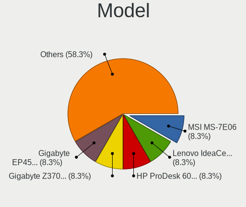
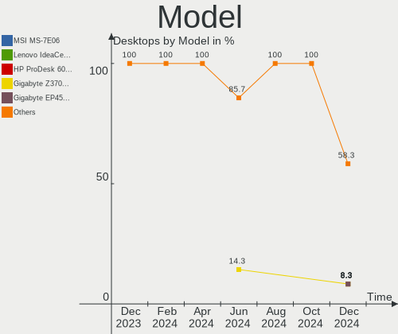
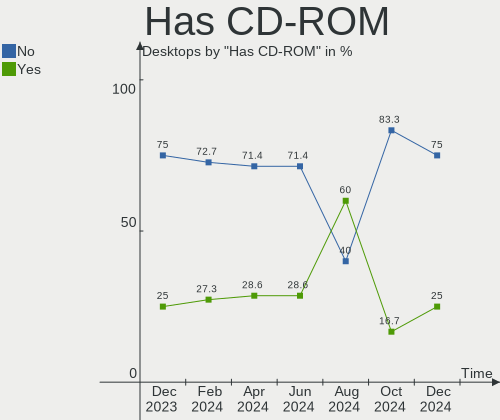
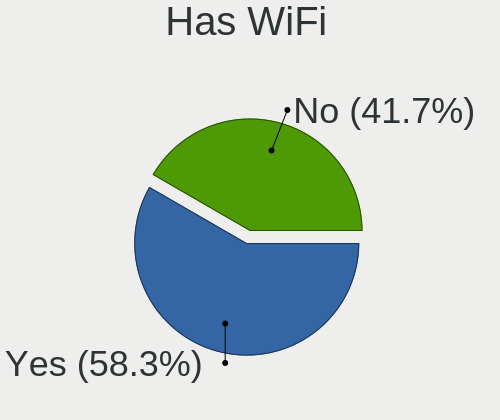
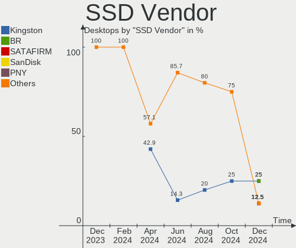
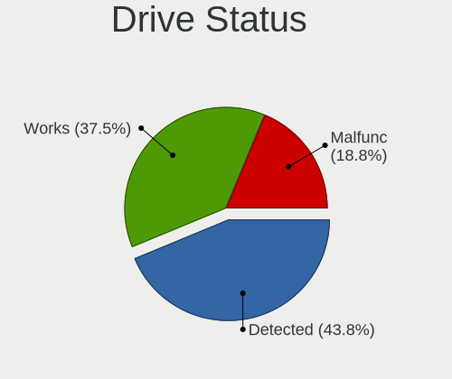
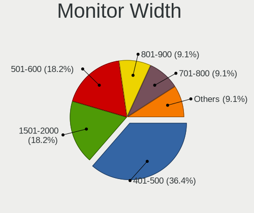
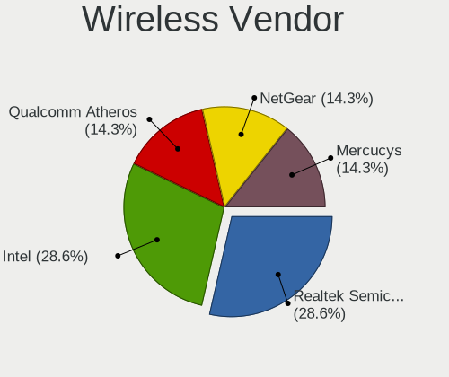
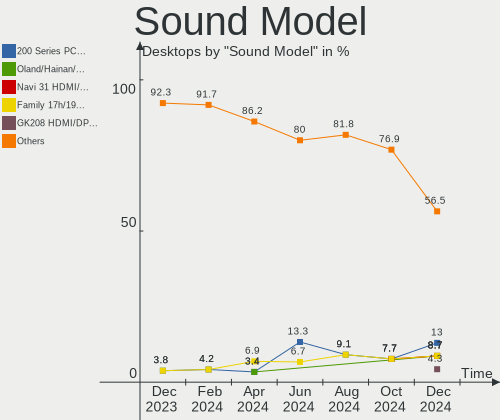

Kali - Hardware Trends (Desktops)
---------------------------------

A project to identify most popular hardware characteristics and track their change
over time based on data collected by Linux users at https://Linux-Hardware.org.

Anyone can contribute to this report by the [hw-probe](https://github.com/linuxhw/hw-probe) tool:

    sudo -E hw-probe -all -upload

This report is for one last month. Overall report since the beginning of time: [TestDays](https://github.com/linuxhw/TestDays)

Period: Nov, 2023.

Contents
--------

* [ System ](#system)
  - [ OS                       ](#os)
  - [ OS Family                ](#os-family)
  - [ Kernel                   ](#kernel)
  - [ Kernel Family            ](#kernel-family)
  - [ Kernel Major Ver.        ](#kernel-major-ver)
  - [ Arch                     ](#arch)
  - [ DE                       ](#de)
  - [ Display Server           ](#display-server)
  - [ Display Manager          ](#display-manager)
  - [ OS Lang                  ](#os-lang)
  - [ Boot Mode                ](#boot-mode)
  - [ Filesystem               ](#filesystem)
  - [ Part. scheme             ](#part-scheme)
  - [ Dual Boot with Linux/BSD ](#dual-boot-with-linuxbsd)
  - [ Dual Boot (Win)          ](#dual-boot-win)

* [ Board ](#board)
  - [ Vendor                   ](#vendor)
  - [ Model                    ](#model)
  - [ Model Family             ](#model-family)
  - [ MFG Year                 ](#mfg-year)
  - [ Form Factor              ](#form-factor)
  - [ Secure Boot              ](#secure-boot)
  - [ Coreboot                 ](#coreboot)
  - [ RAM Size                 ](#ram-size)
  - [ RAM Used                 ](#ram-used)
  - [ Total Drives             ](#total-drives)
  - [ Has CD-ROM               ](#has-cd-rom)
  - [ Has Ethernet             ](#has-ethernet)
  - [ Has WiFi                 ](#has-wifi)
  - [ Has Bluetooth            ](#has-bluetooth)

* [ Location ](#location)
  - [ Country                  ](#country)
  - [ City                     ](#city)

* [ Drives ](#drives)
  - [ Drive Vendor             ](#drive-vendor)
  - [ Drive Model              ](#drive-model)
  - [ HDD Vendor               ](#hdd-vendor)
  - [ SSD Vendor               ](#ssd-vendor)
  - [ Drive Kind               ](#drive-kind)
  - [ Drive Connector          ](#drive-connector)
  - [ Drive Size               ](#drive-size)
  - [ Space Total              ](#space-total)
  - [ Space Used               ](#space-used)
  - [ Malfunc. Drives          ](#malfunc-drives)
  - [ Malfunc. Drive Vendor    ](#malfunc-drive-vendor)
  - [ Malfunc. HDD Vendor      ](#malfunc-hdd-vendor)
  - [ Malfunc. Drive Kind      ](#malfunc-drive-kind)
  - [ Failed Drives            ](#failed-drives)
  - [ Failed Drive Vendor      ](#failed-drive-vendor)
  - [ Drive Status             ](#drive-status)

* [ Storage controller ](#storage-controller)
  - [ Storage Vendor           ](#storage-vendor)
  - [ Storage Model            ](#storage-model)
  - [ Storage Kind             ](#storage-kind)

* [ Processor ](#processor)
  - [ CPU Vendor               ](#cpu-vendor)
  - [ CPU Model                ](#cpu-model)
  - [ CPU Model Family         ](#cpu-model-family)
  - [ CPU Cores                ](#cpu-cores)
  - [ CPU Sockets              ](#cpu-sockets)
  - [ CPU Threads              ](#cpu-threads)
  - [ CPU Op-Modes             ](#cpu-op-modes)
  - [ CPU Microcode            ](#cpu-microcode)
  - [ CPU Microarch            ](#cpu-microarch)

* [ Graphics ](#graphics)
  - [ GPU Vendor               ](#gpu-vendor)
  - [ GPU Model                ](#gpu-model)
  - [ GPU Combo                ](#gpu-combo)
  - [ GPU Driver               ](#gpu-driver)
  - [ GPU Memory               ](#gpu-memory)

* [ Monitor ](#monitor)
  - [ Monitor Vendor           ](#monitor-vendor)
  - [ Monitor Model            ](#monitor-model)
  - [ Monitor Resolution       ](#monitor-resolution)
  - [ Monitor Diagonal         ](#monitor-diagonal)
  - [ Monitor Width            ](#monitor-width)
  - [ Aspect Ratio             ](#aspect-ratio)
  - [ Monitor Area             ](#monitor-area)
  - [ Pixel Density            ](#pixel-density)
  - [ Multiple Monitors        ](#multiple-monitors)

* [ Network ](#network)
  - [ Net Controller Vendor    ](#net-controller-vendor)
  - [ Net Controller Model     ](#net-controller-model)
  - [ Wireless Vendor          ](#wireless-vendor)
  - [ Wireless Model           ](#wireless-model)
  - [ Ethernet Vendor          ](#ethernet-vendor)
  - [ Ethernet Model           ](#ethernet-model)
  - [ Net Controller Kind      ](#net-controller-kind)
  - [ Used Controller          ](#used-controller)
  - [ NICs                     ](#nics)
  - [ IPv6                     ](#ipv6)

* [ Bluetooth ](#bluetooth)
  - [ Bluetooth Vendor         ](#bluetooth-vendor)
  - [ Bluetooth Model          ](#bluetooth-model)

* [ Sound ](#sound)
  - [ Sound Vendor             ](#sound-vendor)
  - [ Sound Model              ](#sound-model)

* [ Memory ](#memory)
  - [ Memory Vendor            ](#memory-vendor)
  - [ Memory Model             ](#memory-model)
  - [ Memory Kind              ](#memory-kind)
  - [ Memory Form Factor       ](#memory-form-factor)
  - [ Memory Size              ](#memory-size)
  - [ Memory Speed             ](#memory-speed)

* [ Printers & scanners ](#printers--scanners)
  - [ Printer Vendor           ](#printer-vendor)
  - [ Printer Model            ](#printer-model)
  - [ Scanner Vendor           ](#scanner-vendor)
  - [ Scanner Model            ](#scanner-model)

* [ Camera ](#camera)
  - [ Camera Vendor            ](#camera-vendor)
  - [ Camera Model             ](#camera-model)

* [ Security ](#security)
  - [ Fingerprint Vendor       ](#fingerprint-vendor)
  - [ Fingerprint Model        ](#fingerprint-model)
  - [ Chipcard Vendor          ](#chipcard-vendor)
  - [ Chipcard Model           ](#chipcard-model)

* [ Unsupported ](#unsupported)
  - [ Unsupported Devices      ](#unsupported-devices)
  - [ Unsupported Device Types ](#unsupported-device-types)

System
------

OS
--

Installed operating systems

| Name        | Desktops | Percent |
|-------------|----------|---------|
| Kali 2023.3 | 11       | 78.57%  |
| Kali 2023.4 | 1        | 7.14%   |
| Kali 2023.2 | 1        | 7.14%   |
| Kali 2023.1 | 1        | 7.14%   |

OS Family
---------

OS without a version

| Name | Desktops | Percent |
|------|----------|---------|
| Kali | 14       | 100%    |

Kernel
------

Version of the Linux kernel

| Version           | Desktops | Percent |
|-------------------|----------|---------|
| 6.5.0-kali3-amd64 | 10       | 71.43%  |
| 6.3.0-kali1-amd64 | 2        | 14.29%  |
| 6.5.0-4-amd64     | 1        | 7.14%   |
| 6.1.0-kali5-amd64 | 1        | 7.14%   |

Kernel Family
-------------

Linux kernel without a distro release

| Version | Desktops | Percent |
|---------|----------|---------|
| 6.5.0   | 11       | 78.57%  |
| 6.3.0   | 2        | 14.29%  |
| 6.1.0   | 1        | 7.14%   |

Kernel Major Ver.
-----------------

Linux kernel major version

| Version | Desktops | Percent |
|---------|----------|---------|
| 6.5     | 11       | 78.57%  |
| 6.3     | 2        | 14.29%  |
| 6.1     | 1        | 7.14%   |

Arch
----

OS architecture (x86_64, i586, etc.)

| Name   | Desktops | Percent |
|--------|----------|---------|
| x86_64 | 14       | 100%    |

DE
--

Desktop Environment

| Name             | Desktops | Percent |
|------------------|----------|---------|
| XFCE             | 7        | 50%     |
| KDE5             | 2        | 14.29%  |
| GNOME            | 2        | 14.29%  |
| X-Cinnamon       | 1        | 7.14%   |
| MATE             | 1        | 7.14%   |
| lightdm-xsession | 1        | 7.14%   |

Display Server
--------------

X11 or Wayland

| Name | Desktops | Percent |
|------|----------|---------|
| X11  | 14       | 100%    |

Display Manager
---------------

SDDM, LightDM, etc.

| Name    | Desktops | Percent |
|---------|----------|---------|
| LightDM | 6        | 42.86%  |
| Unknown | 4        | 28.57%  |
| SDDM    | 2        | 14.29%  |
| GDM3    | 2        | 14.29%  |

OS Lang
-------

Language

| Lang    | Desktops | Percent |
|---------|----------|---------|
| C       | 6        | 42.86%  |
| en_US   | 5        | 35.71%  |
| en_IN   | 1        | 7.14%   |
| de_DE   | 1        | 7.14%   |
| Unknown | 1        | 7.14%   |

Boot Mode
---------

EFI or BIOS

| Mode | Desktops | Percent |
|------|----------|---------|
| EFI  | 8        | 57.14%  |
| BIOS | 6        | 42.86%  |

Filesystem
----------

Type of filesystem

| Type    | Desktops | Percent |
|---------|----------|---------|
| Ext4    | 11       | 78.57%  |
| Overlay | 2        | 14.29%  |
| Tmpfs   | 1        | 7.14%   |

Part. scheme
------------

Scheme of partitioning

| Type    | Desktops | Percent |
|---------|----------|---------|
| GPT     | 8        | 57.14%  |
| Unknown | 4        | 28.57%  |
| MBR     | 2        | 14.29%  |

Dual Boot with Linux/BSD
------------------------

Hosting more than one Linux/BSD

| Dual boot | Desktops | Percent |
|-----------|----------|---------|
| No        | 14       | 100%    |

Dual Boot (Win)
---------------

Hosting Linux and Windows

| Dual boot | Desktops | Percent |
|-----------|----------|---------|
| Yes       | 9        | 64.29%  |
| No        | 5        | 35.71%  |

Board
-----

Vendor
------

Motherboard manufacturer

| Name                | Desktops | Percent |
|---------------------|----------|---------|
| ASUSTek Computer    | 6        | 42.86%  |
| MSI                 | 3        | 21.43%  |
| Gigabyte Technology | 2        | 14.29%  |
| Intel               | 1        | 7.14%   |
| Hewlett-Packard     | 1        | 7.14%   |
| Dell                | 1        | 7.14%   |

Model
-----

Motherboard model

| Name                         | Desktops | Percent |
|------------------------------|----------|---------|
| MSI MS-7C95                  | 1        | 7.14%   |
| MSI MS-7B07                  | 1        | 7.14%   |
| MSI MS-7788                  | 1        | 7.14%   |
| Intel H61                    | 1        | 7.14%   |
| HP Slim Desktop S01-pF2xxx   | 1        | 7.14%   |
| Gigabyte X570 AORUS ELITE    | 1        | 7.14%   |
| Gigabyte AX370-Gaming 5      | 1        | 7.14%   |
| Dell Inspiron 530            | 1        | 7.14%   |
| ASUS TUF H310-PLUS GAMING    | 1        | 7.14%   |
| ASUS ROG STRIX B365-G GAMING | 1        | 7.14%   |
| ASUS PRIME X570-PRO          | 1        | 7.14%   |
| ASUS PRIME B550M-A           | 1        | 7.14%   |
| ASUS PRIME B350-PLUS         | 1        | 7.14%   |
| ASUS P6X58D PREMIUM          | 1        | 7.14%   |

Model Family
------------

Motherboard model prefix

| Name                  | Desktops | Percent |
|-----------------------|----------|---------|
| ASUS PRIME            | 3        | 21.43%  |
| MSI MS-7C95           | 1        | 7.14%   |
| MSI MS-7B07           | 1        | 7.14%   |
| MSI MS-7788           | 1        | 7.14%   |
| Intel H61             | 1        | 7.14%   |
| HP Slim               | 1        | 7.14%   |
| Gigabyte X570         | 1        | 7.14%   |
| Gigabyte AX370-Gaming | 1        | 7.14%   |
| Dell Inspiron         | 1        | 7.14%   |
| ASUS TUF              | 1        | 7.14%   |
| ASUS ROG              | 1        | 7.14%   |
| ASUS P6X58D           | 1        | 7.14%   |

MFG Year
--------

Motherboard manufacture year

| Year | Desktops | Percent |
|------|----------|---------|
| 2017 | 4        | 28.57%  |
| 2019 | 3        | 21.43%  |
| 2020 | 2        | 14.29%  |
| 2023 | 1        | 7.14%   |
| 2018 | 1        | 7.14%   |
| 2012 | 1        | 7.14%   |
| 2010 | 1        | 7.14%   |
| 2007 | 1        | 7.14%   |

Form Factor
-----------

Physical design of the computer

| Name    | Desktops | Percent |
|---------|----------|---------|
| Desktop | 14       | 100%    |

Secure Boot
-----------

Enabled or disabled

| State    | Desktops | Percent |
|----------|----------|---------|
| Disabled | 14       | 100%    |

Coreboot
--------

Have coreboot on board

| Used | Desktops | Percent |
|------|----------|---------|
| No   | 14       | 100%    |

RAM Size
--------

Total RAM memory

| Size in GB  | Desktops | Percent |
|-------------|----------|---------|
| 16.01-24.0  | 7        | 50%     |
| 32.01-64.0  | 3        | 21.43%  |
| 64.01-256.0 | 2        | 14.29%  |
| 3.01-4.0    | 1        | 7.14%   |
| 8.01-16.0   | 1        | 7.14%   |

RAM Used
--------

Used RAM memory

| Used GB   | Desktops | Percent |
|-----------|----------|---------|
| 4.01-8.0  | 5        | 35.71%  |
| 1.01-2.0  | 5        | 35.71%  |
| 2.01-3.0  | 3        | 21.43%  |
| 8.01-16.0 | 1        | 7.14%   |

Total Drives
------------

Number of drives on board

| Drives | Desktops | Percent |
|--------|----------|---------|
| 1      | 8        | 57.14%  |
| 4      | 3        | 21.43%  |
| 5      | 1        | 7.14%   |
| 3      | 1        | 7.14%   |
| 2      | 1        | 7.14%   |

Has CD-ROM
----------

Has CD-ROM on board

| Presented | Desktops | Percent |
|-----------|----------|---------|
| No        | 9        | 64.29%  |
| Yes       | 5        | 35.71%  |

Has Ethernet
------------

Has Ethernet on board

| Presented | Desktops | Percent |
|-----------|----------|---------|
| Yes       | 14       | 100%    |

Has WiFi
--------

Has WiFi module

| Presented | Desktops | Percent |
|-----------|----------|---------|
| Yes       | 10       | 71.43%  |
| No        | 4        | 28.57%  |

Has Bluetooth
-------------

Has Bluetooth module

| Presented | Desktops | Percent |
|-----------|----------|---------|
| No        | 8        | 57.14%  |
| Yes       | 6        | 42.86%  |

Location
--------

Country
-------

Geographic location (country)

| Country      | Desktops | Percent |
|--------------|----------|---------|
| USA          | 5        | 35.71%  |
| Sweden       | 2        | 14.29%  |
| Spain        | 1        | 7.14%   |
| Slovenia     | 1        | 7.14%   |
| Saudi Arabia | 1        | 7.14%   |
| Italy        | 1        | 7.14%   |
| Indonesia    | 1        | 7.14%   |
| India        | 1        | 7.14%   |
| Belgium      | 1        | 7.14%   |

City
----

Geographic location (city)

| City        | Desktops | Percent |
|-------------|----------|---------|
| Zaragoza    | 1        | 7.14%   |
| Vipava      | 1        | 7.14%   |
| Uppsala     | 1        | 7.14%   |
| Stockholm   | 1        | 7.14%   |
| Semarang    | 1        | 7.14%   |
| Milan       | 1        | 7.14%   |
| Huy         | 1        | 7.14%   |
| Fort Thomas | 1        | 7.14%   |
| Delhi       | 1        | 7.14%   |
| Casper      | 1        | 7.14%   |
| Baltimore   | 1        | 7.14%   |
| Atlanta     | 1        | 7.14%   |
| Arnold      | 1        | 7.14%   |
| Abha        | 1        | 7.14%   |

Drives
------

Drive Vendor
------------

Hard drive vendors

| Vendor              | Desktops | Drives | Percent |
|---------------------|----------|--------|---------|
| WDC                 | 4        | 7      | 16.67%  |
| Toshiba             | 3        | 3      | 12.5%   |
| Samsung Electronics | 3        | 4      | 12.5%   |
| Silicon Motion      | 2        | 2      | 8.33%   |
| Sandisk             | 2        | 2      | 8.33%   |
| Kingston            | 2        | 2      | 8.33%   |
| TO Exter            | 1        | 1      | 4.17%   |
| Seagate             | 1        | 2      | 4.17%   |
| PNY                 | 1        | 1      | 4.17%   |
| Plextor             | 1        | 1      | 4.17%   |
| Lexar               | 1        | 1      | 4.17%   |
| Hewlett-Packard     | 1        | 2      | 4.17%   |
| GLOWAY              | 1        | 1      | 4.17%   |
| Corsair             | 1        | 1      | 4.17%   |

Drive Model
-----------

Hard drive models

| Model                                                 | Desktops | Percent |
|-------------------------------------------------------|----------|---------|
| WDC WD10EZEX-08WN4A0 1TB                              | 2        | 7.14%   |
| WDC WDS500G3X0C-00SJG0 500GB                          | 1        | 3.57%   |
| WDC WDS100T2B0A-00SM50 1TB SSD                        | 1        | 3.57%   |
| WDC WD5000AAKS-00TMA0 500GB                           | 1        | 3.57%   |
| WDC WD40EFAX-68JH4N0 4TB                              | 1        | 3.57%   |
| WDC WD10EZRX-00L4HB0 1TB                              | 1        | 3.57%   |
| Toshiba RD400 256GB                                   | 1        | 3.57%   |
| Toshiba HDWR160 6TB                                   | 1        | 3.57%   |
| Toshiba DT02ABA200V 2TB                               | 1        | 3.57%   |
| TO Exter nal USB 3.0 1TB                              | 1        | 3.57%   |
| Silicon Motion SSD_M.2_PCI_NVME_1TB_InnovationIT      | 1        | 3.57%   |
| Silicon Motion SM2263EN/SM2263XT SSD Controller 256GB | 1        | 3.57%   |
| Seagate ST4000DM004-2CV104 4TB                        | 1        | 3.57%   |
| Seagate ST2000DM006-2DM164 2TB                        | 1        | 3.57%   |
| Sandisk WD_BLACK SN770 1TB                            | 1        | 3.57%   |
| SanDisk SSD PLUS 1000GB                               | 1        | 3.57%   |
| Samsung SSD 860 QVO 1TB                               | 1        | 3.57%   |
| Samsung SSD 840 EVO 250GB mSATA                       | 1        | 3.57%   |
| Samsung SSD 840 EVO 120GB                             | 1        | 3.57%   |
| PNY USB 3.2.2 FD 500GB SSD                            | 1        | 3.57%   |
| Plextor PX-256M8PeY 256GB                             | 1        | 3.57%   |
| Lexar SSD NM610PRO 1TB                                | 1        | 3.57%   |
| Kingston SV300S37A120G 120GB SSD                      | 1        | 3.57%   |
| Kingston SKC3000D2048G 2TB                            | 1        | 3.57%   |
| HP SSD S650 480GB                                     | 1        | 3.57%   |
| GLOWAY FER120GS3-S7 120GB SSD                         | 1        | 3.57%   |
| Corsair Force MP510 1.9TB                             | 1        | 3.57%   |

HDD Vendor
----------

Hard disk drive vendors

| Vendor   | Desktops | Drives | Percent |
|----------|----------|--------|---------|
| WDC      | 4        | 5      | 50%     |
| Toshiba  | 2        | 2      | 25%     |
| TO Exter | 1        | 1      | 12.5%   |
| Seagate  | 1        | 2      | 12.5%   |

SSD Vendor
----------

Solid state drive vendors

| Vendor              | Desktops | Drives | Percent |
|---------------------|----------|--------|---------|
| Samsung Electronics | 3        | 4      | 33.33%  |
| WDC                 | 1        | 1      | 11.11%  |
| SanDisk             | 1        | 1      | 11.11%  |
| PNY                 | 1        | 1      | 11.11%  |
| Kingston            | 1        | 1      | 11.11%  |
| Hewlett-Packard     | 1        | 2      | 11.11%  |
| GLOWAY              | 1        | 1      | 11.11%  |

Drive Kind
----------

HDD or SSD

| Kind | Desktops | Drives | Percent |
|------|----------|--------|---------|
| NVMe | 8        | 9      | 38.1%   |
| SSD  | 7        | 11     | 33.33%  |
| HDD  | 6        | 10     | 28.57%  |

Drive Connector
---------------

SATA, SAS, NVMe, etc.

| Type | Desktops | Drives | Percent |
|------|----------|--------|---------|
| SATA | 11       | 19     | 52.38%  |
| NVMe | 8        | 9      | 38.1%   |
| SAS  | 2        | 2      | 9.52%   |

Drive Size
----------

Size of hard drive

| Size in TB | Desktops | Drives | Percent |
|------------|----------|--------|---------|
| 0.51-1.0   | 7        | 7      | 41.18%  |
| 0.01-0.5   | 5        | 9      | 29.41%  |
| 3.01-4.0   | 2        | 2      | 11.76%  |
| 1.01-2.0   | 2        | 2      | 11.76%  |
| 4.01-10.0  | 1        | 1      | 5.88%   |

Space Total
-----------

Amount of disk space available on the file system

| Size in GB     | Desktops | Percent |
|----------------|----------|---------|
| 251-500        | 3        | 21.43%  |
| 101-250        | 3        | 21.43%  |
| 501-1000       | 3        | 21.43%  |
| More than 3000 | 2        | 14.29%  |
| 1001-2000      | 2        | 14.29%  |
| 1-20           | 1        | 7.14%   |

Space Used
----------

Amount of used disk space

| Used GB        | Desktops | Percent |
|----------------|----------|---------|
| 251-500        | 4        | 28.57%  |
| 1-20           | 3        | 21.43%  |
| 21-50          | 2        | 14.29%  |
| 101-250        | 2        | 14.29%  |
| More than 3000 | 1        | 7.14%   |
| 501-1000       | 1        | 7.14%   |
| 51-100         | 1        | 7.14%   |

Malfunc. Drives
---------------

Drive models with a malfunction

| Model                         | Desktops | Drives | Percent |
|-------------------------------|----------|--------|---------|
| WDC WD10EZEX-08WN4A0 1TB      | 1        | 1      | 33.33%  |
| SanDisk SSD PLUS 1000GB       | 1        | 1      | 33.33%  |
| GLOWAY FER120GS3-S7 120GB SSD | 1        | 1      | 33.33%  |

Malfunc. Drive Vendor
---------------------

Vendors of faulty drives

| Vendor  | Desktops | Drives | Percent |
|---------|----------|--------|---------|
| WDC     | 1        | 1      | 33.33%  |
| SanDisk | 1        | 1      | 33.33%  |
| GLOWAY  | 1        | 1      | 33.33%  |

Malfunc. HDD Vendor
-------------------

Vendors of faulty HDD drives

| Vendor | Desktops | Drives | Percent |
|--------|----------|--------|---------|
| WDC    | 1        | 1      | 100%    |

Malfunc. Drive Kind
-------------------

Kinds of faulty drives

| Kind | Desktops | Drives | Percent |
|------|----------|--------|---------|
| SSD  | 2        | 2      | 66.67%  |
| HDD  | 1        | 1      | 33.33%  |

Failed Drives
-------------

Failed drive models

Zero info for selected period =(

Failed Drive Vendor
-------------------

Failed drive vendors

Zero info for selected period =(

Drive Status
------------

Number of failed and malfunc. drives

| Status   | Desktops | Drives | Percent |
|----------|----------|--------|---------|
| Works    | 7        | 18     | 46.67%  |
| Detected | 5        | 9      | 33.33%  |
| Malfunc  | 3        | 3      | 20%     |

Storage controller
------------------

Storage Vendor
--------------

Storage controller vendors

| Vendor                       | Desktops | Percent |
|------------------------------|----------|---------|
| Intel                        | 7        | 26.92%  |
| AMD                          | 7        | 26.92%  |
| Silicon Motion               | 2        | 7.69%   |
| SanDisk                      | 2        | 7.69%   |
| ASMedia Technology           | 2        | 7.69%   |
| Shenzhen Longsys Electronics | 1        | 3.85%   |
| Phison Electronics           | 1        | 3.85%   |
| OCZ Technology Group         | 1        | 3.85%   |
| Marvell Technology Group     | 1        | 3.85%   |
| Lite-On Technology           | 1        | 3.85%   |
| Kingston Technology Company  | 1        | 3.85%   |

Storage Model
-------------

Storage controller models

| Model                                                                                   | Desktops | Percent |
|-----------------------------------------------------------------------------------------|----------|---------|
| AMD FCH SATA Controller [AHCI mode]                                                     | 5        | 16.67%  |
| Silicon Motion SM2263EN/SM2263XT (DRAM-less) NVMe SSD Controllers                       | 2        | 6.67%   |
| ASMedia ASM1062 Serial ATA Controller                                                   | 2        | 6.67%   |
| AMD 500 Series Chipset SATA Controller                                                  | 2        | 6.67%   |
| Shenzhen Longsys Lexar NM610 PRO NVME SSD (DRAM-less)                                   | 1        | 3.33%   |
| SanDisk WD Black SN770 / PC SN740 256GB / PC SN560 (DRAM-less) NVMe SSD                 | 1        | 3.33%   |
| SanDisk Extreme Pro / WD Black SN750 / PC SN730 / Red SN700 NVMe SSD                    | 1        | 3.33%   |
| Phison E12 NVMe Controller                                                              | 1        | 3.33%   |
| OCZ Group RD400/400A SSD                                                                | 1        | 3.33%   |
| Marvell Group 88SE9123 PCIe SATA 6.0 Gb/s controller                                    | 1        | 3.33%   |
| Lite-On M8Pe Series NVMe SSD                                                            | 1        | 3.33%   |
| Kingston Company KC3000/FURY Renegade NVMe SSD E18                                      | 1        | 3.33%   |
| Intel SATA Controller [RAID mode]                                                       | 1        | 3.33%   |
| Intel Cannon Lake PCH SATA AHCI Controller                                              | 1        | 3.33%   |
| Intel 82801JI (ICH10 Family) SATA AHCI Controller                                       | 1        | 3.33%   |
| Intel 6 Series/C200 Series Chipset Family Desktop SATA Controller (IDE mode, ports 4-5) | 1        | 3.33%   |
| Intel 6 Series/C200 Series Chipset Family Desktop SATA Controller (IDE mode, ports 0-3) | 1        | 3.33%   |
| Intel 6 Series/C200 Series Chipset Family 6 port Desktop SATA AHCI Controller           | 1        | 3.33%   |
| Intel 500 Series Chipset Family SATA AHCI Controller                                    | 1        | 3.33%   |
| Intel 200 Series PCH SATA controller [AHCI mode]                                        | 1        | 3.33%   |
| AMD X370 Series Chipset SATA Controller                                                 | 1        | 3.33%   |
| AMD FCH SATA Controller D                                                               | 1        | 3.33%   |
| AMD 300 Series Chipset SATA Controller                                                  | 1        | 3.33%   |

Storage Kind
------------

Kind of storage controller (IDE, SATA, NVMe, SAS, ...)

| Kind | Desktops | Percent |
|------|----------|---------|
| SATA | 12       | 54.55%  |
| NVMe | 8        | 36.36%  |
| RAID | 1        | 4.55%   |
| IDE  | 1        | 4.55%   |

Processor
---------

CPU Vendor
----------

Processor vendors

| Vendor | Desktops | Percent |
|--------|----------|---------|
| Intel  | 7        | 50%     |
| AMD    | 7        | 50%     |

CPU Model
---------

Processor models

| Model                                  | Desktops | Percent |
|----------------------------------------|----------|---------|
| Intel Xeon CPU X5690 @ 3.47GHz         | 1        | 7.14%   |
| Intel Core i5-2500 CPU @ 3.30GHz       | 1        | 7.14%   |
| Intel Core i5-10500T CPU @ 2.30GHz     | 1        | 7.14%   |
| Intel Core i3-9100 CPU @ 3.60GHz       | 1        | 7.14%   |
| Intel Core i3-8100 CPU @ 3.60GHz       | 1        | 7.14%   |
| Intel Core i3-2120 CPU @ 3.30GHz       | 1        | 7.14%   |
| Intel Core 2 Duo CPU E6550 @ 2.33GHz   | 1        | 7.14%   |
| AMD Ryzen 9 5900X 12-Core Processor    | 1        | 7.14%   |
| AMD Ryzen 9 3900X 12-Core Processor    | 1        | 7.14%   |
| AMD Ryzen 7 5800X3D 8-Core Processor   | 1        | 7.14%   |
| AMD Ryzen 7 3700X 8-Core Processor     | 1        | 7.14%   |
| AMD Ryzen 7 1700X Eight-Core Processor | 1        | 7.14%   |
| AMD Ryzen 5 2600 Six-Core Processor    | 1        | 7.14%   |
| AMD Ryzen 5 1600X Six-Core Processor   | 1        | 7.14%   |

CPU Model Family
----------------

Processor model prefix

| Model            | Desktops | Percent |
|------------------|----------|---------|
| Intel Core i3    | 3        | 21.43%  |
| AMD Ryzen 7      | 3        | 21.43%  |
| Intel Core i5    | 2        | 14.29%  |
| AMD Ryzen 9      | 2        | 14.29%  |
| AMD Ryzen 5      | 2        | 14.29%  |
| Intel Xeon       | 1        | 7.14%   |
| Intel Core 2 Duo | 1        | 7.14%   |

CPU Cores
---------

Number of processor cores

| Number | Desktops | Percent |
|--------|----------|---------|
| 6      | 4        | 28.57%  |
| 8      | 3        | 21.43%  |
| 4      | 3        | 21.43%  |
| 12     | 2        | 14.29%  |
| 2      | 2        | 14.29%  |

CPU Sockets
-----------

Number of sockets

| Number | Desktops | Percent |
|--------|----------|---------|
| 1      | 14       | 100%    |

CPU Threads
-----------

Threads per core (Hyper-Threading)

| Number | Desktops | Percent |
|--------|----------|---------|
| 2      | 10       | 71.43%  |
| 1      | 4        | 28.57%  |

CPU Op-Modes
------------

CPU Operation Modes (32-bit, 64-bit)

| Op mode        | Desktops | Percent |
|----------------|----------|---------|
| 32-bit, 64-bit | 14       | 100%    |

CPU Microcode
-------------

Microcode number

| Number     | Desktops | Percent |
|------------|----------|---------|
| Unknown    | 6        | 42.86%  |
| 0x206a7    | 1        | 7.14%   |
| 0x0a20120e | 1        | 7.14%   |
| 0x0a20120a | 1        | 7.14%   |
| 0x08701030 | 1        | 7.14%   |
| 0x08701013 | 1        | 7.14%   |
| 0x0800820d | 1        | 7.14%   |
| 0x08001138 | 1        | 7.14%   |
| 0x08001136 | 1        | 7.14%   |

CPU Microarch
-------------

Microarchitecture

| Name        | Desktops | Percent |
|-------------|----------|---------|
| Zen 3       | 2        | 14.29%  |
| Zen 2       | 2        | 14.29%  |
| Zen         | 2        | 14.29%  |
| SandyBridge | 2        | 14.29%  |
| KabyLake    | 2        | 14.29%  |
| Zen+        | 1        | 7.14%   |
| Westmere    | 1        | 7.14%   |
| Core        | 1        | 7.14%   |
| CometLake   | 1        | 7.14%   |

Graphics
--------

GPU Vendor
----------

Vendors of graphics cards

| Vendor | Desktops | Percent |
|--------|----------|---------|
| Nvidia | 9        | 56.25%  |
| Intel  | 5        | 31.25%  |
| AMD    | 2        | 12.5%   |

GPU Model
---------

Graphics card models

| Model                                                                     | Desktops | Percent |
|---------------------------------------------------------------------------|----------|---------|
| Intel CoffeeLake-S GT2 [UHD Graphics 630]                                 | 2        | 12.5%   |
| Nvidia TU116 [GeForce GTX 1650 SUPER]                                     | 1        | 6.25%   |
| Nvidia TU106 [GeForce RTX 2070 Rev. A]                                    | 1        | 6.25%   |
| Nvidia TU102 [GeForce RTX 2080 Ti Rev. A]                                 | 1        | 6.25%   |
| Nvidia GP107 [GeForce GTX 1050]                                           | 1        | 6.25%   |
| Nvidia GP107 [GeForce GTX 1050 Ti]                                        | 1        | 6.25%   |
| Nvidia GP106 [GeForce GTX 1060 6GB]                                       | 1        | 6.25%   |
| Nvidia GP104 [GeForce GTX 1080]                                           | 1        | 6.25%   |
| Nvidia GK110 [GeForce GTX TITAN]                                          | 1        | 6.25%   |
| Nvidia GA106 [GeForce RTX 3060 Lite Hash Rate]                            | 1        | 6.25%   |
| Intel CometLake-S GT2 [UHD Graphics 630]                                  | 1        | 6.25%   |
| Intel 82G33/G31 Express Integrated Graphics Controller                    | 1        | 6.25%   |
| Intel 2nd Generation Core Processor Family Integrated Graphics Controller | 1        | 6.25%   |
| AMD Tahiti PRO [Radeon HD 7950/8950 OEM / R9 280]                         | 1        | 6.25%   |
| AMD Ellesmere [Radeon RX 470/480/570/570X/580/580X/590]                   | 1        | 6.25%   |

GPU Combo
---------

Combinations of graphics cards

| Name           | Desktops | Percent |
|----------------|----------|---------|
| 1 x Nvidia     | 7        | 50%     |
| 1 x Intel      | 3        | 21.43%  |
| Intel + Nvidia | 2        | 14.29%  |
| 1 x AMD        | 2        | 14.29%  |

GPU Driver
----------

Free vs proprietary

| Driver      | Desktops | Percent |
|-------------|----------|---------|
| Free        | 8        | 57.14%  |
| Proprietary | 5        | 35.71%  |
| Unknown     | 1        | 7.14%   |

GPU Memory
----------

Total video memory

| Size in GB | Desktops | Percent |
|------------|----------|---------|
| Unknown    | 6        | 42.86%  |
| 7.01-8.0   | 2        | 14.29%  |
| 3.01-4.0   | 2        | 14.29%  |
| 8.01-16.0  | 2        | 14.29%  |
| 5.01-6.0   | 1        | 7.14%   |
| 2.01-3.0   | 1        | 7.14%   |

Monitor
-------

Monitor Vendor
--------------

Monitor vendors

| Vendor              | Desktops | Percent |
|---------------------|----------|---------|
| Samsung Electronics | 3        | 21.43%  |
| ASUSTek Computer    | 3        | 21.43%  |
| ViewSonic           | 2        | 14.29%  |
| Unknown (XXX)       | 1        | 7.14%   |
| Hewlett-Packard     | 1        | 7.14%   |
| Goldstar            | 1        | 7.14%   |
| Chimei Innolux      | 1        | 7.14%   |
| BenQ                | 1        | 7.14%   |
| AOC                 | 1        | 7.14%   |

Monitor Model
-------------

Monitor models

| Model                                                                 | Desktops | Percent |
|-----------------------------------------------------------------------|----------|---------|
| ViewSonic VX2250 SERIES VSCCB25 1920x1080 477x268mm 21.5-inch         | 1        | 6.25%   |
| ViewSonic VA2419 Series VSC7B32 1920x1080 530x300mm 24.0-inch         | 1        | 6.25%   |
| Unknown (XXX) Beyond TV XXX2851 3840x2160 1210x680mm 54.6-inch        | 1        | 6.25%   |
| Samsung Electronics U28E590 SAM0C4D 3840x2160 610x350mm 27.7-inch     | 1        | 6.25%   |
| Samsung Electronics SyncMaster SAM0425 1920x1200 518x324mm 24.1-inch  | 1        | 6.25%   |
| Samsung Electronics SA300/SA350 SAM078F 1920x1080 477x268mm 21.5-inch | 1        | 6.25%   |
| Samsung Electronics S24E450 SAM0C80 1920x1080 520x290mm 23.4-inch     | 1        | 6.25%   |
| Samsung Electronics LC32G5xT SAM7089 2560x1440 698x393mm 31.5-inch    | 1        | 6.25%   |
| Hewlett-Packard w2408 HWP26CE 1920x1200 518x324mm 24.1-inch           | 1        | 6.25%   |
| Goldstar E2060 GSM4EBF 1600x900 443x249mm 20.0-inch                   | 1        | 6.25%   |
| Chimei Innolux LCD Monitor CMN1132 1366x768 256x144mm 11.6-inch       | 1        | 6.25%   |
| BenQ EL2870U BNQ7949 3840x2160 621x341mm 27.9-inch                    | 1        | 6.25%   |
| ASUSTek Computer VG27A AUS2722 2560x1440 597x336mm 27.0-inch          | 1        | 6.25%   |
| ASUSTek Computer VA27EHE AUS27D2 1920x1080 598x336mm 27.0-inch        | 1        | 6.25%   |
| ASUSTek Computer VA27D AUS270A 1920x1080 598x336mm 27.0-inch          | 1        | 6.25%   |
| AOC U2790B AOC2790 3840x2160 597x336mm 27.0-inch                      | 1        | 6.25%   |

Monitor Resolution
------------------

Monitor screen resolution

| Resolution        | Desktops | Percent |
|-------------------|----------|---------|
| 1920x1080 (FHD)   | 5        | 33.33%  |
| 3840x2160 (4K)    | 4        | 26.67%  |
| 2560x1440 (QHD)   | 2        | 13.33%  |
| 1920x1200 (WUXGA) | 2        | 13.33%  |
| 1600x900 (HD+)    | 1        | 6.67%   |
| 1366x768 (WXGA)   | 1        | 6.67%   |

Monitor Diagonal
----------------

Diagonal size in inches

| Inches | Desktops | Percent |
|--------|----------|---------|
| 27     | 5        | 31.25%  |
| 24     | 3        | 18.75%  |
| 21     | 2        | 12.5%   |
| 54     | 1        | 6.25%   |
| 36     | 1        | 6.25%   |
| 31     | 1        | 6.25%   |
| 23     | 1        | 6.25%   |
| 20     | 1        | 6.25%   |
| 11     | 1        | 6.25%   |

Monitor Width
-------------

Physical width

| Width in mm | Desktops | Percent |
|-------------|----------|---------|
| 501-600     | 8        | 50%     |
| 401-500     | 3        | 18.75%  |
| 601-700     | 2        | 12.5%   |
| 701-800     | 1        | 6.25%   |
| 201-300     | 1        | 6.25%   |
| 1001-1500   | 1        | 6.25%   |

Aspect Ratio
------------

Proportional relationship between the width and the height

| Ratio | Desktops | Percent |
|-------|----------|---------|
| 16/9  | 11       | 84.62%  |
| 16/10 | 2        | 15.38%  |

Monitor Area
------------

Area in inch²

| Area in inch² | Desktops | Percent |
|----------------|----------|---------|
| 301-350        | 5        | 31.25%  |
| 201-250        | 4        | 25%     |
| 251-300        | 2        | 12.5%   |
| More than 1000 | 1        | 6.25%   |
| 51-60          | 1        | 6.25%   |
| 351-500        | 1        | 6.25%   |
| 151-200        | 1        | 6.25%   |
| 501-1000       | 1        | 6.25%   |

Pixel Density
-------------

Pixels per inch

| Density | Desktops | Percent |
|---------|----------|---------|
| 51-100  | 10       | 62.5%   |
| 121-160 | 3        | 18.75%  |
| 101-120 | 3        | 18.75%  |

Multiple Monitors
-----------------

Total monitors connected

| Total | Desktops | Percent |
|-------|----------|---------|
| 1     | 9        | 64.29%  |
| 2     | 4        | 28.57%  |
| 0     | 1        | 7.14%   |

Network
-------

Net Controller Vendor
---------------------

Controller vendors

| Vendor                          | Desktops | Percent |
|---------------------------------|----------|---------|
| Realtek Semiconductor           | 10       | 37.04%  |
| Intel                           | 7        | 25.93%  |
| TP-Link                         | 2        | 7.41%   |
| Qualcomm Atheros                | 2        | 7.41%   |
| Ralink                          | 1        | 3.7%    |
| Qualcomm Atheros Communications | 1        | 3.7%    |
| MediaTek                        | 1        | 3.7%    |
| Marvell Technology Group        | 1        | 3.7%    |
| Broadcom                        | 1        | 3.7%    |
| Aquantia                        | 1        | 3.7%    |

Net Controller Model
--------------------

Controller models

| Model                                                               | Desktops | Percent |
|---------------------------------------------------------------------|----------|---------|
| Realtek RTL8111/8168/8411 PCI Express Gigabit Ethernet Controller   | 5        | 17.86%  |
| Intel I211 Gigabit Network Connection                               | 3        | 10.71%  |
| Realtek RTL810xE PCI Express Fast Ethernet controller               | 2        | 7.14%   |
| TP-Link Archer T3U [Realtek RTL8812BU]                              | 1        | 3.57%   |
| TP-Link AC600 wireless Realtek RTL8811AU [Archer T2U Nano]          | 1        | 3.57%   |
| Realtek RTL88x2bu [AC1200 Techkey]                                  | 1        | 3.57%   |
| Realtek RTL8814AU 802.11a/b/g/n/ac Wireless Adapter                 | 1        | 3.57%   |
| Realtek RTL8812AU 802.11a/b/g/n/ac 2T2R DB WLAN Adapter             | 1        | 3.57%   |
| Realtek RTL8192EU 802.11b/g/n WLAN Adapter                          | 1        | 3.57%   |
| Ralink RT5592 PCIe Wireless Network Adapter                         | 1        | 3.57%   |
| Qualcomm Atheros Killer E2500 Gigabit Ethernet Controller           | 1        | 3.57%   |
| Qualcomm Atheros AR9271 802.11n                                     | 1        | 3.57%   |
| Qualcomm Atheros AR9462 Wireless Network Adapter                    | 1        | 3.57%   |
| MediaTek MT7922 802.11ax PCI Express Wireless Network Adapter       | 1        | 3.57%   |
| Marvell Group 88E8056 PCI-E Gigabit Ethernet Controller             | 1        | 3.57%   |
| Intel Tiger Lake PCH CNVi WiFi                                      | 1        | 3.57%   |
| Intel Ethernet Connection (7) I219-V                                | 1        | 3.57%   |
| Intel Ethernet Connection (2) I219-V                                | 1        | 3.57%   |
| Intel 82562V-2 10/100 Network Connection                            | 1        | 3.57%   |
| Broadcom BCM4360 802.11ac Dual Band Wireless Network Adapter        | 1        | 3.57%   |
| Aquantia AQC113CS NBase-T/IEEE 802.3bz Ethernet Controller [AQtion] | 1        | 3.57%   |

Wireless Vendor
---------------

Wireless vendors

| Vendor                          | Desktops | Percent |
|---------------------------------|----------|---------|
| Realtek Semiconductor           | 4        | 33.33%  |
| TP-Link                         | 2        | 16.67%  |
| Ralink                          | 1        | 8.33%   |
| Qualcomm Atheros Communications | 1        | 8.33%   |
| Qualcomm Atheros                | 1        | 8.33%   |
| MediaTek                        | 1        | 8.33%   |
| Intel                           | 1        | 8.33%   |
| Broadcom                        | 1        | 8.33%   |

Wireless Model
--------------

Wireless models

| Model                                                         | Desktops | Percent |
|---------------------------------------------------------------|----------|---------|
| TP-Link Archer T3U [Realtek RTL8812BU]                        | 1        | 8.33%   |
| TP-Link AC600 wireless Realtek RTL8811AU [Archer T2U Nano]    | 1        | 8.33%   |
| Realtek RTL88x2bu [AC1200 Techkey]                            | 1        | 8.33%   |
| Realtek RTL8814AU 802.11a/b/g/n/ac Wireless Adapter           | 1        | 8.33%   |
| Realtek RTL8812AU 802.11a/b/g/n/ac 2T2R DB WLAN Adapter       | 1        | 8.33%   |
| Realtek RTL8192EU 802.11b/g/n WLAN Adapter                    | 1        | 8.33%   |
| Ralink RT5592 PCIe Wireless Network Adapter                   | 1        | 8.33%   |
| Qualcomm Atheros AR9271 802.11n                               | 1        | 8.33%   |
| Qualcomm Atheros AR9462 Wireless Network Adapter              | 1        | 8.33%   |
| MediaTek MT7922 802.11ax PCI Express Wireless Network Adapter | 1        | 8.33%   |
| Intel Tiger Lake PCH CNVi WiFi                                | 1        | 8.33%   |
| Broadcom BCM4360 802.11ac Dual Band Wireless Network Adapter  | 1        | 8.33%   |

Ethernet Vendor
---------------

Ethernet vendors

| Vendor                   | Desktops | Percent |
|--------------------------|----------|---------|
| Realtek Semiconductor    | 7        | 43.75%  |
| Intel                    | 6        | 37.5%   |
| Qualcomm Atheros         | 1        | 6.25%   |
| Marvell Technology Group | 1        | 6.25%   |
| Aquantia                 | 1        | 6.25%   |

Ethernet Model
--------------

Ethernet models

| Model                                                               | Desktops | Percent |
|---------------------------------------------------------------------|----------|---------|
| Realtek RTL8111/8168/8411 PCI Express Gigabit Ethernet Controller   | 5        | 31.25%  |
| Intel I211 Gigabit Network Connection                               | 3        | 18.75%  |
| Realtek RTL810xE PCI Express Fast Ethernet controller               | 2        | 12.5%   |
| Qualcomm Atheros Killer E2500 Gigabit Ethernet Controller           | 1        | 6.25%   |
| Marvell Group 88E8056 PCI-E Gigabit Ethernet Controller             | 1        | 6.25%   |
| Intel Ethernet Connection (7) I219-V                                | 1        | 6.25%   |
| Intel Ethernet Connection (2) I219-V                                | 1        | 6.25%   |
| Intel 82562V-2 10/100 Network Connection                            | 1        | 6.25%   |
| Aquantia AQC113CS NBase-T/IEEE 802.3bz Ethernet Controller [AQtion] | 1        | 6.25%   |

Net Controller Kind
-------------------

Ethernet, WiFi or modem

| Kind     | Desktops | Percent |
|----------|----------|---------|
| Ethernet | 14       | 58.33%  |
| WiFi     | 10       | 41.67%  |

Used Controller
---------------

Currently used network controller

| Kind     | Desktops | Percent |
|----------|----------|---------|
| Ethernet | 10       | 66.67%  |
| WiFi     | 5        | 33.33%  |

NICs
----

Total network controllers on board

| Total | Desktops | Percent |
|-------|----------|---------|
| 1     | 8        | 57.14%  |
| 2     | 4        | 28.57%  |
| 3     | 2        | 14.29%  |

IPv6
----

IPv6 vs IPv4

| Used | Desktops | Percent |
|------|----------|---------|
| No   | 8        | 57.14%  |
| Yes  | 6        | 42.86%  |

Bluetooth
---------

Bluetooth Vendor
----------------

Controller vendors

| Vendor                | Desktops | Percent |
|-----------------------|----------|---------|
| TP-Link               | 1        | 16.67%  |
| Realtek Semiconductor | 1        | 16.67%  |
| MediaTek              | 1        | 16.67%  |
| Intel                 | 1        | 16.67%  |
| Dynex                 | 1        | 16.67%  |
| Broadcom              | 1        | 16.67%  |

Bluetooth Model
---------------

Controller models

| Model                                                    | Desktops | Percent |
|----------------------------------------------------------|----------|---------|
| TP-Link TP-Cdj+ UB5A Adapter                             | 1        | 16.67%  |
| Realtek Bluetooth Radio                                  | 1        | 16.67%  |
| MediaTek Wireless_Device                                 | 1        | 16.67%  |
| Intel AX201 Bluetooth                                    | 1        | 16.67%  |
| Dynex Bluetooth 4.0 Adapter [Broadcom, 1.12, BCM20702A0] | 1        | 16.67%  |
| Broadcom BCM20702A0 Bluetooth 4.0                        | 1        | 16.67%  |

Sound
-----

Sound Vendor
------------

Sound card vendors

| Vendor              | Desktops | Percent |
|---------------------|----------|---------|
| Nvidia              | 9        | 33.33%  |
| AMD                 | 8        | 29.63%  |
| Intel               | 7        | 25.93%  |
| Logitech            | 1        | 3.7%    |
| Creative Technology | 1        | 3.7%    |
| C-Media Electronics | 1        | 3.7%    |

Sound Model
-----------

Sound card models

| Model                                                                      | Desktops | Percent |
|----------------------------------------------------------------------------|----------|---------|
| AMD Starship/Matisse HD Audio Controller                                   | 4        | 13.79%  |
| AMD Family 17h (Models 00h-0fh) HD Audio Controller                        | 3        | 10.34%  |
| Nvidia GP107GL High Definition Audio Controller                            | 2        | 6.9%    |
| Intel 6 Series/C200 Series Chipset Family High Definition Audio Controller | 2        | 6.9%    |
| Nvidia TU116 High Definition Audio Controller                              | 1        | 3.45%   |
| Nvidia TU106 High Definition Audio Controller                              | 1        | 3.45%   |
| Nvidia TU102 High Definition Audio Controller                              | 1        | 3.45%   |
| Nvidia GP106 High Definition Audio Controller                              | 1        | 3.45%   |
| Nvidia GP104 High Definition Audio Controller                              | 1        | 3.45%   |
| Nvidia GK110 High Definition Audio Controller                              | 1        | 3.45%   |
| Nvidia GA106 High Definition Audio Controller                              | 1        | 3.45%   |
| Logitech G432 Gaming Headset                                               | 1        | 3.45%   |
| Intel Smart Sound Technology (SST) Audio Controller                        | 1        | 3.45%   |
| Intel Cannon Lake PCH cAVS                                                 | 1        | 3.45%   |
| Intel 82801JI (ICH10 Family) HD Audio Controller                           | 1        | 3.45%   |
| Intel 82801I (ICH9 Family) HD Audio Controller                             | 1        | 3.45%   |
| Intel 200 Series PCH HD Audio                                              | 1        | 3.45%   |
| Creative Technology Sound BlasterX Katana                                  | 1        | 3.45%   |
| C-Media Electronics CM8888 [Oxygen Express]                                | 1        | 3.45%   |
| C-Media Electronics CM106 Like Sound Device                                | 1        | 3.45%   |
| AMD Tahiti HDMI Audio [Radeon HD 7870 XT / 7950/7970]                      | 1        | 3.45%   |
| AMD Ellesmere HDMI Audio [Radeon RX 470/480 / 570/580/590]                 | 1        | 3.45%   |

Memory
------

Memory Vendor
-------------

Memory module vendors

| Vendor   | Desktops | Percent |
|----------|----------|---------|
| Kingston | 3        | 27.27%  |
| Corsair  | 3        | 27.27%  |
| G.Skill  | 2        | 18.18%  |
| Unknown  | 1        | 9.09%   |
| SK hynix | 1        | 9.09%   |
| PNY      | 1        | 9.09%   |

Memory Model
------------

Memory module models

| Model                                                     | Desktops | Percent |
|-----------------------------------------------------------|----------|---------|
| Unknown RAM Module 4GB DIMM 1066MT/s                      | 1        | 7.14%   |
| Unknown RAM Module 2GB DIMM 1066MT/s                      | 1        | 7.14%   |
| SK hynix RAM DMT351U6CFR8C-H9 4GB DIMM DDR3 1333MT/s      | 1        | 7.14%   |
| PNY RAM 8GBF1X08RHJJ40-135-K 8GB DIMM DDR4 3600MT/s       | 1        | 7.14%   |
| Kingston RAM KHX2400C15/8G 8GB DIMM DDR4 3400MT/s         | 1        | 7.14%   |
| Kingston RAM KF3600C16D4/16GX 16GB DIMM DDR4 3800MT/s     | 1        | 7.14%   |
| Kingston RAM KF3200C16D4/16GX 16GB DIMM DDR4 3200MT/s     | 1        | 7.14%   |
| G.Skill RAM F4-3200C14-16GTZN 16GB DIMM DDR4 3200MT/s     | 1        | 7.14%   |
| G.Skill RAM F4-3000C16-8GISB 8192MB DIMM DDR4 3200MT/s    | 1        | 7.14%   |
| Corsair RAM CMK32GX4M2Z3600C18 16384MB DIMM DDR4 3800MT/s | 1        | 7.14%   |
| Corsair RAM CMK32GX4M2E3200C16 16GB DIMM DDR4 3534MT/s    | 1        | 7.14%   |
| Corsair RAM CMK32GX4M2B3000C15 16GB DIMM DDR4 3000MT/s    | 1        | 7.14%   |
| Corsair RAM CMK16GX4M2B3000C15 8GB DIMM DDR4 3533MT/s     | 1        | 7.14%   |
| Corsair RAM CMK16GX4M1D3000C16 16GB DIMM DDR4 3000MT/s    | 1        | 7.14%   |

Memory Kind
-----------

Memory module kinds

| Kind    | Desktops | Percent |
|---------|----------|---------|
| DDR4    | 8        | 80%     |
| DDR3    | 1        | 10%     |
| Unknown | 1        | 10%     |

Memory Form Factor
------------------

Physical design of the memory module

| Name | Desktops | Percent |
|------|----------|---------|
| DIMM | 10       | 100%    |

Memory Size
-----------

Memory module size

| Size  | Desktops | Percent |
|-------|----------|---------|
| 16384 | 4        | 36.36%  |
| 8192  | 4        | 36.36%  |
| 4096  | 2        | 18.18%  |
| 2048  | 1        | 9.09%   |

Memory Speed
------------

Memory module speed

| Speed | Desktops | Percent |
|-------|----------|---------|
| 3200  | 3        | 23.08%  |
| 3800  | 2        | 15.38%  |
| 3000  | 2        | 15.38%  |
| 3600  | 1        | 7.69%   |
| 3534  | 1        | 7.69%   |
| 3533  | 1        | 7.69%   |
| 3400  | 1        | 7.69%   |
| 1333  | 1        | 7.69%   |
| 1066  | 1        | 7.69%   |

Printers & scanners
-------------------

Printer Vendor
--------------

Printer device vendors

| Vendor              | Desktops | Percent |
|---------------------|----------|---------|
| Samsung Electronics | 1        | 33.33%  |
| Hewlett-Packard     | 1        | 33.33%  |
| Canon               | 1        | 33.33%  |

Printer Model
-------------

Printer device models

| Model                                | Desktops | Percent |
|--------------------------------------|----------|---------|
| Samsung ML-1640 Series Laser Printer | 1        | 25%     |
| HP ENVY 4500 series                  | 1        | 25%     |
| Canon PIXMA MG5600 Series            | 1        | 25%     |
| Canon iP4200                         | 1        | 25%     |

Scanner Vendor
--------------

Scanner device vendors

Zero info for selected period =(

Scanner Model
-------------

Scanner device models

Zero info for selected period =(

Camera
------

Camera Vendor
-------------

Camera device vendors

| Vendor   | Desktops | Percent |
|----------|----------|---------|
| Microdia | 1        | 33.33%  |
| GEMBIRD  | 1        | 33.33%  |
| Apple    | 1        | 33.33%  |

Camera Model
------------

Camera device models

| Model                              | Desktops | Percent |
|------------------------------------|----------|---------|
| Microdia Integrated Camera         | 1        | 33.33%  |
| GEMBIRD USB2.0 PC CAMERA           | 1        | 33.33%  |
| Apple iPhone 5/5C/5S/6/SE/7/8/X/XR | 1        | 33.33%  |

Security
--------

Fingerprint Vendor
------------------

Fingerprint sensor vendors

Zero info for selected period =(

Fingerprint Model
-----------------

Fingerprint sensor models

Zero info for selected period =(

Chipcard Vendor
---------------

Chipcard module vendors

Zero info for selected period =(

Chipcard Model
--------------

Chipcard module models

Zero info for selected period =(

Unsupported
-----------

Unsupported Devices
-------------------

Total unsupported devices on board

| Total | Desktops | Percent |
|-------|----------|---------|
| 0     | 11       | 78.57%  |
| 1     | 2        | 14.29%  |
| 2     | 1        | 7.14%   |

Unsupported Device Types
------------------------

Types of unsupported devices

| Type          | Desktops | Percent |
|---------------|----------|---------|
| Net/wireless  | 2        | 50%     |
| Graphics card | 1        | 25%     |
| Card reader   | 1        | 25%     |

