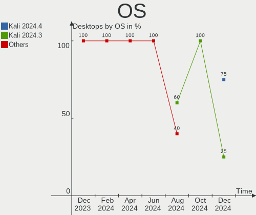
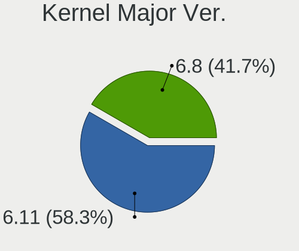
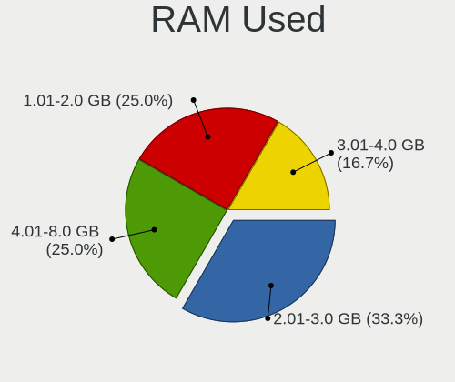
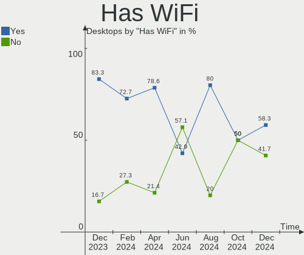
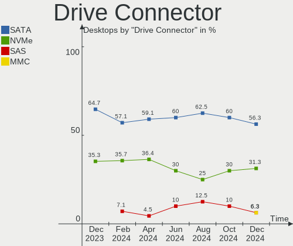
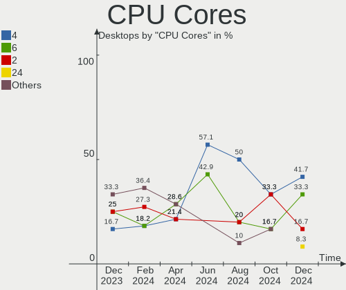

Kali Hardware Trends (Desktops)
-------------------------------

A project to identify most popular hardware characteristics and track their change
over time based on data collected by Kali users at https://Linux-Hardware.org.

Anyone can contribute to this report by the [hw-probe](https://github.com/linuxhw/hw-probe) tool:

    sudo -E hw-probe -all -upload

Full-feature report is available here: https://linux-hardware.org/?view=trends

Period: Feb, 2022.

Contents
--------

* [ System ](#system)
  - [ OS                       ](#os)
  - [ OS Family                ](#os-family)
  - [ Kernel                   ](#kernel)
  - [ Kernel Family            ](#kernel-family)
  - [ Kernel Major Ver.        ](#kernel-major-ver)
  - [ Arch                     ](#arch)
  - [ DE                       ](#de)
  - [ Display Server           ](#display-server)
  - [ Display Manager          ](#display-manager)
  - [ OS Lang                  ](#os-lang)
  - [ Boot Mode                ](#boot-mode)
  - [ Filesystem               ](#filesystem)
  - [ Part. scheme             ](#part-scheme)
  - [ Dual Boot with Linux/BSD ](#dual-boot-with-linuxbsd)
  - [ Dual Boot (Win)          ](#dual-boot-win)

* [ Board ](#board)
  - [ Vendor                   ](#vendor)
  - [ Model                    ](#model)
  - [ Model Family             ](#model-family)
  - [ MFG Year                 ](#mfg-year)
  - [ Form Factor              ](#form-factor)
  - [ Secure Boot              ](#secure-boot)
  - [ Coreboot                 ](#coreboot)
  - [ RAM Size                 ](#ram-size)
  - [ RAM Used                 ](#ram-used)
  - [ Total Drives             ](#total-drives)
  - [ Has CD-ROM               ](#has-cd-rom)
  - [ Has Ethernet             ](#has-ethernet)
  - [ Has WiFi                 ](#has-wifi)
  - [ Has Bluetooth            ](#has-bluetooth)

* [ Location ](#location)
  - [ Country                  ](#country)
  - [ City                     ](#city)

* [ Drives ](#drives)
  - [ Drive Vendor             ](#drive-vendor)
  - [ Drive Model              ](#drive-model)
  - [ HDD Vendor               ](#hdd-vendor)
  - [ SSD Vendor               ](#ssd-vendor)
  - [ Drive Kind               ](#drive-kind)
  - [ Drive Connector          ](#drive-connector)
  - [ Drive Size               ](#drive-size)
  - [ Space Total              ](#space-total)
  - [ Space Used               ](#space-used)
  - [ Malfunc. Drives          ](#malfunc-drives)
  - [ Malfunc. Drive Vendor    ](#malfunc-drive-vendor)
  - [ Malfunc. HDD Vendor      ](#malfunc-hdd-vendor)
  - [ Malfunc. Drive Kind      ](#malfunc-drive-kind)
  - [ Failed Drives            ](#failed-drives)
  - [ Failed Drive Vendor      ](#failed-drive-vendor)
  - [ Drive Status             ](#drive-status)

* [ Storage controller ](#storage-controller)
  - [ Storage Vendor           ](#storage-vendor)
  - [ Storage Model            ](#storage-model)
  - [ Storage Kind             ](#storage-kind)

* [ Processor ](#processor)
  - [ CPU Vendor               ](#cpu-vendor)
  - [ CPU Model                ](#cpu-model)
  - [ CPU Model Family         ](#cpu-model-family)
  - [ CPU Cores                ](#cpu-cores)
  - [ CPU Sockets              ](#cpu-sockets)
  - [ CPU Threads              ](#cpu-threads)
  - [ CPU Op-Modes             ](#cpu-op-modes)
  - [ CPU Microcode            ](#cpu-microcode)
  - [ CPU Microarch            ](#cpu-microarch)

* [ Graphics ](#graphics)
  - [ GPU Vendor               ](#gpu-vendor)
  - [ GPU Model                ](#gpu-model)
  - [ GPU Combo                ](#gpu-combo)
  - [ GPU Driver               ](#gpu-driver)
  - [ GPU Memory               ](#gpu-memory)

* [ Monitor ](#monitor)
  - [ Monitor Vendor           ](#monitor-vendor)
  - [ Monitor Model            ](#monitor-model)
  - [ Monitor Resolution       ](#monitor-resolution)
  - [ Monitor Diagonal         ](#monitor-diagonal)
  - [ Monitor Width            ](#monitor-width)
  - [ Aspect Ratio             ](#aspect-ratio)
  - [ Monitor Area             ](#monitor-area)
  - [ Pixel Density            ](#pixel-density)
  - [ Multiple Monitors        ](#multiple-monitors)

* [ Network ](#network)
  - [ Net Controller Vendor    ](#net-controller-vendor)
  - [ Net Controller Model     ](#net-controller-model)
  - [ Wireless Vendor          ](#wireless-vendor)
  - [ Wireless Model           ](#wireless-model)
  - [ Ethernet Vendor          ](#ethernet-vendor)
  - [ Ethernet Model           ](#ethernet-model)
  - [ Net Controller Kind      ](#net-controller-kind)
  - [ Used Controller          ](#used-controller)
  - [ NICs                     ](#nics)
  - [ IPv6                     ](#ipv6)

* [ Bluetooth ](#bluetooth)
  - [ Bluetooth Vendor         ](#bluetooth-vendor)
  - [ Bluetooth Model          ](#bluetooth-model)

* [ Sound ](#sound)
  - [ Sound Vendor             ](#sound-vendor)
  - [ Sound Model              ](#sound-model)

* [ Memory ](#memory)
  - [ Memory Vendor            ](#memory-vendor)
  - [ Memory Model             ](#memory-model)
  - [ Memory Kind              ](#memory-kind)
  - [ Memory Form Factor       ](#memory-form-factor)
  - [ Memory Size              ](#memory-size)
  - [ Memory Speed             ](#memory-speed)

* [ Printers & scanners ](#printers--scanners)
  - [ Printer Vendor           ](#printer-vendor)
  - [ Printer Model            ](#printer-model)
  - [ Scanner Vendor           ](#scanner-vendor)
  - [ Scanner Model            ](#scanner-model)

* [ Camera ](#camera)
  - [ Camera Vendor            ](#camera-vendor)
  - [ Camera Model             ](#camera-model)

* [ Security ](#security)
  - [ Fingerprint Vendor       ](#fingerprint-vendor)
  - [ Fingerprint Model        ](#fingerprint-model)
  - [ Chipcard Vendor          ](#chipcard-vendor)
  - [ Chipcard Model           ](#chipcard-model)

* [ Unsupported ](#unsupported)
  - [ Unsupported Devices      ](#unsupported-devices)
  - [ Unsupported Device Types ](#unsupported-device-types)

System
------

OS
--

Installed operating systems

| Name        | Desktops | Percent |
|-------------|----------|---------|
| Kali 2022.1 | 5        | 71.43%  |
| Kali 2021.4 | 2        | 28.57%  |

OS Family
---------

OS without a version

| Name | Desktops | Percent |
|------|----------|---------|
| Kali | 7        | 100%    |

Kernel
------

Version of the Linux kernel

| Version            | Desktops | Percent |
|--------------------|----------|---------|
| 5.15.0-kali3-amd64 | 5        | 71.43%  |
| 5.15.0-kali2-amd64 | 2        | 28.57%  |

Kernel Family
-------------

Linux kernel without a distro release

| Version | Desktops | Percent |
|---------|----------|---------|
| 5.15.0  | 7        | 100%    |

Kernel Major Ver.
-----------------

Linux kernel major version

| Version | Desktops | Percent |
|---------|----------|---------|
| 5.15    | 7        | 100%    |

Arch
----

OS architecture (x86_64, i586, etc.)

| Name   | Desktops | Percent |
|--------|----------|---------|
| x86_64 | 7        | 100%    |

DE
--

Desktop Environment

| Name  | Desktops | Percent |
|-------|----------|---------|
| KDE5  | 4        | 57.14%  |
| XFCE  | 2        | 28.57%  |
| GNOME | 1        | 14.29%  |

Display Server
--------------

X11 or Wayland

| Name | Desktops | Percent |
|------|----------|---------|
| X11  | 7        | 100%    |

Display Manager
---------------

SDDM, LightDM, etc.

| Name    | Desktops | Percent |
|---------|----------|---------|
| Unknown | 3        | 42.86%  |
| SDDM    | 2        | 28.57%  |
| LightDM | 2        | 28.57%  |

OS Lang
-------

Language

| Lang  | Desktops | Percent |
|-------|----------|---------|
| en_US | 4        | 57.14%  |
| tr_TR | 1        | 14.29%  |
| it_IT | 1        | 14.29%  |
| es_ES | 1        | 14.29%  |

Boot Mode
---------

EFI or BIOS

| Mode | Desktops | Percent |
|------|----------|---------|
| EFI  | 5        | 71.43%  |
| BIOS | 2        | 28.57%  |

Filesystem
----------

Type of filesystem

| Type | Desktops | Percent |
|------|----------|---------|
| Ext4 | 7        | 100%    |

Part. scheme
------------

Scheme of partitioning

| Type    | Desktops | Percent |
|---------|----------|---------|
| GPT     | 4        | 57.14%  |
| Unknown | 3        | 42.86%  |

Dual Boot with Linux/BSD
------------------------

Hosting more than one Linux/BSD

| Dual boot | Desktops | Percent |
|-----------|----------|---------|
| No        | 5        | 71.43%  |
| Yes       | 2        | 28.57%  |

Dual Boot (Win)
---------------

Hosting Linux and Windows

| Dual boot | Desktops | Percent |
|-----------|----------|---------|
| No        | 5        | 71.43%  |
| Yes       | 2        | 28.57%  |

Board
-----

Vendor
------

Motherboard manufacturer

| Name                | Desktops | Percent |
|---------------------|----------|---------|
| Gigabyte Technology | 2        | 28.57%  |
| ASUSTek Computer    | 2        | 28.57%  |
| Lenovo              | 1        | 14.29%  |
| Hewlett-Packard     | 1        | 14.29%  |
| Dell                | 1        | 14.29%  |

Model
-----

Motherboard model

| Name                                    | Desktops | Percent |
|-----------------------------------------|----------|---------|
| Lenovo IdeaCentre G5 14IMB05 90N900FKTX | 1        | 14.29%  |
| HP Compaq Elite 8300 SFF                | 1        | 14.29%  |
| Gigabyte Z590 AORUS ULTRA               | 1        | 14.29%  |
| Gigabyte B85M-D3H                       | 1        | 14.29%  |
| Dell OptiPlex 980                       | 1        | 14.29%  |
| ASUS ROG STRIX B365-G GAMING            | 1        | 14.29%  |
| ASUS ROG Maximus XI FORMULA             | 1        | 14.29%  |

Model Family
------------

Motherboard model prefix

| Name              | Desktops | Percent |
|-------------------|----------|---------|
| ASUS ROG          | 2        | 28.57%  |
| Lenovo IdeaCentre | 1        | 14.29%  |
| HP Compaq         | 1        | 14.29%  |
| Gigabyte Z590     | 1        | 14.29%  |
| Gigabyte B85M-D3H | 1        | 14.29%  |
| Dell OptiPlex     | 1        | 14.29%  |

MFG Year
--------

Motherboard manufacture year

| Year | Desktops | Percent |
|------|----------|---------|
| 2021 | 3        | 42.86%  |
| 2019 | 1        | 14.29%  |
| 2013 | 1        | 14.29%  |
| 2012 | 1        | 14.29%  |
| 2010 | 1        | 14.29%  |

Form Factor
-----------

Physical design of the computer

| Name    | Desktops | Percent |
|---------|----------|---------|
| Desktop | 7        | 100%    |

Secure Boot
-----------

Enabled or disabled

| State    | Desktops | Percent |
|----------|----------|---------|
| Disabled | 7        | 100%    |

Coreboot
--------

Have coreboot on board

| Used | Desktops | Percent |
|------|----------|---------|
| No   | 7        | 100%    |

RAM Size
--------

Total RAM memory

| Size in GB  | Desktops | Percent |
|-------------|----------|---------|
| 32.01-64.0  | 2        | 28.57%  |
| 4.01-8.0    | 1        | 14.29%  |
| 3.01-4.0    | 1        | 14.29%  |
| 64.01-256.0 | 1        | 14.29%  |
| 16.01-24.0  | 1        | 14.29%  |
| 8.01-16.0   | 1        | 14.29%  |

RAM Used
--------

Used RAM memory

| Used GB  | Desktops | Percent |
|----------|----------|---------|
| 1.01-2.0 | 3        | 42.86%  |
| 2.01-3.0 | 2        | 28.57%  |
| 4.01-8.0 | 1        | 14.29%  |
| 3.01-4.0 | 1        | 14.29%  |

Total Drives
------------

Number of drives on board

| Drives | Desktops | Percent |
|--------|----------|---------|
| 1      | 3        | 42.86%  |
| 2      | 2        | 28.57%  |
| 8      | 1        | 14.29%  |
| 4      | 1        | 14.29%  |

Has CD-ROM
----------

Has CD-ROM on board

| Presented | Desktops | Percent |
|-----------|----------|---------|
| No        | 4        | 57.14%  |
| Yes       | 3        | 42.86%  |

Has Ethernet
------------

Has Ethernet on board

| Presented | Desktops | Percent |
|-----------|----------|---------|
| Yes       | 6        | 85.71%  |
| No        | 1        | 14.29%  |

Has WiFi
--------

Has WiFi module

| Presented | Desktops | Percent |
|-----------|----------|---------|
| Yes       | 6        | 85.71%  |
| No        | 1        | 14.29%  |

Has Bluetooth
-------------

Has Bluetooth module

| Presented | Desktops | Percent |
|-----------|----------|---------|
| No        | 4        | 57.14%  |
| Yes       | 3        | 42.86%  |

Location
--------

Country
-------

Geographic location (country)

| Country     | Desktops | Percent |
|-------------|----------|---------|
| USA         | 2        | 28.57%  |
| Spain       | 2        | 28.57%  |
| Turkey      | 1        | 14.29%  |
| Philippines | 1        | 14.29%  |
| Egypt       | 1        | 14.29%  |

City
----

Geographic location (city)

| City                       | Desktops | Percent |
|----------------------------|----------|---------|
| Van                        | 1        | 14.29%  |
| Sanger                     | 1        | 14.29%  |
| Madrid                     | 1        | 14.29%  |
| Las Palmas de Gran Canaria | 1        | 14.29%  |
| Davao City                 | 1        | 14.29%  |
| Daly City                  | 1        | 14.29%  |
| Cairo                      | 1        | 14.29%  |

Drives
------

Drive Vendor
------------

Hard drive vendors

| Vendor              | Desktops | Drives | Percent |
|---------------------|----------|--------|---------|
| WDC                 | 3        | 4      | 18.75%  |
| Seagate             | 3        | 3      | 18.75%  |
| Samsung Electronics | 3        | 6      | 18.75%  |
| Toshiba             | 1        | 1      | 6.25%   |
| SPCC                | 1        | 1      | 6.25%   |
| Sandisk             | 1        | 1      | 6.25%   |
| Kingston            | 1        | 1      | 6.25%   |
| Hitachi             | 1        | 1      | 6.25%   |
| HGST                | 1        | 1      | 6.25%   |
| Gigabyte Technology | 1        | 1      | 6.25%   |

Drive Model
-----------

Hard drive models

| Model                            | Desktops | Percent |
|----------------------------------|----------|---------|
| WDC WDS100T2B0A-00SM50 1TB SSD   | 1        | 5.26%   |
| WDC WD40EFAX-68JH4N0 4TB         | 1        | 5.26%   |
| WDC WD32 00BEVT-75ZCT0 320GB     | 1        | 5.26%   |
| WDC WD10EZEX-00WN4A0 1TB         | 1        | 5.26%   |
| Toshiba HDWE150 5TB              | 1        | 5.26%   |
| SPCC Solid State Disk 256GB      | 1        | 5.26%   |
| Seagate ST8000DM004-2CX188 8TB   | 1        | 5.26%   |
| Seagate ST4000DM004-2CV104 4TB   | 1        | 5.26%   |
| Seagate ST3500414CS 500GB        | 1        | 5.26%   |
| Sandisk NVMe SSD Drive 500GB     | 1        | 5.26%   |
| Samsung SSD 860 EVO 1TB          | 1        | 5.26%   |
| Samsung SSD 850 EVO 500GB        | 1        | 5.26%   |
| Samsung SSD 840 EVO 120GB        | 1        | 5.26%   |
| Samsung NVMe SSD Drive 500GB     | 1        | 5.26%   |
| Samsung MZALQ512HALU-000L1 512GB | 1        | 5.26%   |
| Kingston SV300S37A120G 120GB SSD | 1        | 5.26%   |
| Hitachi HDS721010CLA630 1TB      | 1        | 5.26%   |
| HGST HUH721008ALE604 8TB         | 1        | 5.26%   |
| Gigabyte GP-AG41TB               | 1        | 5.26%   |

HDD Vendor
----------

Hard disk drive vendors

| Vendor  | Desktops | Drives | Percent |
|---------|----------|--------|---------|
| WDC     | 3        | 3      | 33.33%  |
| Seagate | 3        | 3      | 33.33%  |
| Toshiba | 1        | 1      | 11.11%  |
| Hitachi | 1        | 1      | 11.11%  |
| HGST    | 1        | 1      | 11.11%  |

SSD Vendor
----------

Solid state drive vendors

| Vendor              | Desktops | Drives | Percent |
|---------------------|----------|--------|---------|
| Samsung Electronics | 2        | 3      | 40%     |
| WDC                 | 1        | 1      | 20%     |
| SPCC                | 1        | 1      | 20%     |
| Kingston            | 1        | 1      | 20%     |

Drive Kind
----------

HDD or SSD

| Kind | Desktops | Drives | Percent |
|------|----------|--------|---------|
| HDD  | 6        | 9      | 54.55%  |
| NVMe | 3        | 5      | 27.27%  |
| SSD  | 2        | 6      | 18.18%  |

Drive Connector
---------------

SATA, SAS, NVMe, etc.

| Type | Desktops | Drives | Percent |
|------|----------|--------|---------|
| SATA | 6        | 14     | 60%     |
| NVMe | 3        | 5      | 30%     |
| SAS  | 1        | 1      | 10%     |

Drive Size
----------

Size of hard drive

| Size in TB | Desktops | Drives | Percent |
|------------|----------|--------|---------|
| 0.51-1.0   | 4        | 4      | 33.33%  |
| 0.01-0.5   | 4        | 6      | 33.33%  |
| 3.01-4.0   | 2        | 2      | 16.67%  |
| 4.01-10.0  | 2        | 3      | 16.67%  |

Space Total
-----------

Amount of disk space available on the file system

| Size in GB     | Desktops | Percent |
|----------------|----------|---------|
| 251-500        | 3        | 42.86%  |
| 501-1000       | 3        | 42.86%  |
| More than 3000 | 1        | 14.29%  |

Space Used
----------

Amount of used disk space

| Used GB   | Desktops | Percent |
|-----------|----------|---------|
| 101-250   | 3        | 42.86%  |
| 251-500   | 1        | 14.29%  |
| 2001-3000 | 1        | 14.29%  |
| 1-20      | 1        | 14.29%  |
| 51-100    | 1        | 14.29%  |

Malfunc. Drives
---------------

Drive models with a malfunction

Zero info for selected period =(

Malfunc. Drive Vendor
---------------------

Vendors of faulty drives

Zero info for selected period =(

Malfunc. HDD Vendor
-------------------

Vendors of faulty HDD drives

Zero info for selected period =(

Malfunc. Drive Kind
-------------------

Kinds of faulty drives

Zero info for selected period =(

Failed Drives
-------------

Failed drive models

Zero info for selected period =(

Failed Drive Vendor
-------------------

Failed drive vendors

Zero info for selected period =(

Drive Status
------------

Number of failed and malfunc. drives

| Status   | Desktops | Drives | Percent |
|----------|----------|--------|---------|
| Works    | 4        | 9      | 57.14%  |
| Detected | 3        | 11     | 42.86%  |

Storage controller
------------------

Storage Vendor
--------------

Storage controller vendors

| Vendor              | Desktops | Percent |
|---------------------|----------|---------|
| Intel               | 7        | 63.64%  |
| Samsung Electronics | 2        | 18.18%  |
| Sandisk             | 1        | 9.09%   |
| Phison Electronics  | 1        | 9.09%   |

Storage Model
-------------

Storage controller models

| Model                                                                          | Desktops | Percent |
|--------------------------------------------------------------------------------|----------|---------|
| Sandisk WD Black SN750 / PC SN730 NVMe SSD                                     | 1        | 7.69%   |
| Samsung NVMe SSD Controller SM981/PM981/PM983                                  | 1        | 7.69%   |
| Samsung NVMe SSD Controller 980                                                | 1        | 7.69%   |
| Phison E16 PCIe4 NVMe Controller                                               | 1        | 7.69%   |
| Intel SATA Controller [RAID mode]                                              | 1        | 7.69%   |
| Intel Cannon Lake PCH SATA AHCI Controller                                     | 1        | 7.69%   |
| Intel 8 Series/C220 Series Chipset Family 6-port SATA Controller 1 [AHCI mode] | 1        | 7.69%   |
| Intel 7 Series/C210 Series Chipset Family 4-port SATA Controller [IDE mode]    | 1        | 7.69%   |
| Intel 7 Series/C210 Series Chipset Family 2-port SATA Controller [IDE mode]    | 1        | 7.69%   |
| Intel 500 Series Chipset Family SATA AHCI Controller                           | 1        | 7.69%   |
| Intel 5 Series/3400 Series Chipset PT IDER Controller                          | 1        | 7.69%   |
| Intel 400 Series Chipset Family SATA AHCI Controller                           | 1        | 7.69%   |
| Intel 200 Series PCH SATA controller [AHCI mode]                               | 1        | 7.69%   |

Storage Kind
------------

Kind of storage controller (IDE, SATA, NVMe, SAS, ...)

| Kind | Desktops | Percent |
|------|----------|---------|
| SATA | 5        | 45.45%  |
| NVMe | 3        | 27.27%  |
| IDE  | 2        | 18.18%  |
| RAID | 1        | 9.09%   |

Processor
---------

CPU Vendor
----------

Processor vendors

| Vendor | Desktops | Percent |
|--------|----------|---------|
| Intel  | 7        | 100%    |

CPU Model
---------

Processor models

| Model                                   | Desktops | Percent |
|-----------------------------------------|----------|---------|
| Intel Pentium CPU G3260 @ 3.30GHz       | 1        | 14.29%  |
| Intel Core i9-9900K CPU @ 3.60GHz       | 1        | 14.29%  |
| Intel Core i5-10400F CPU @ 2.90GHz      | 1        | 14.29%  |
| Intel Core i5 CPU 650 @ 3.20GHz         | 1        | 14.29%  |
| Intel Core i3-9100 CPU @ 3.60GHz        | 1        | 14.29%  |
| Intel Core i3-2120 CPU @ 3.30GHz        | 1        | 14.29%  |
| Intel 11th Gen Core i9-11900K @ 3.50GHz | 1        | 14.29%  |

CPU Model Family
----------------

Processor model prefix

| Model         | Desktops | Percent |
|---------------|----------|---------|
| Intel Core i5 | 2        | 28.57%  |
| Intel Core i3 | 2        | 28.57%  |
| Other         | 1        | 14.29%  |
| Intel Pentium | 1        | 14.29%  |
| Intel Core i9 | 1        | 14.29%  |

CPU Cores
---------

Number of processor cores

| Number | Desktops | Percent |
|--------|----------|---------|
| 2      | 3        | 42.86%  |
| 8      | 2        | 28.57%  |
| 6      | 1        | 14.29%  |
| 4      | 1        | 14.29%  |

CPU Sockets
-----------

Number of sockets

| Number | Desktops | Percent |
|--------|----------|---------|
| 1      | 7        | 100%    |

CPU Threads
-----------

Threads per core (Hyper-Threading)

| Number | Desktops | Percent |
|--------|----------|---------|
| 2      | 5        | 71.43%  |
| 1      | 2        | 28.57%  |

CPU Op-Modes
------------

CPU Operation Modes (32-bit, 64-bit)

| Op mode        | Desktops | Percent |
|----------------|----------|---------|
| 32-bit, 64-bit | 7        | 100%    |

CPU Microcode
-------------

Microcode number

| Number  | Desktops | Percent |
|---------|----------|---------|
| 0xa0671 | 1        | 14.29%  |
| 0xa0653 | 1        | 14.29%  |
| 0x906ec | 1        | 14.29%  |
| 0x906eb | 1        | 14.29%  |
| 0x306c3 | 1        | 14.29%  |
| 0x206a7 | 1        | 14.29%  |
| 0x20655 | 1        | 14.29%  |

CPU Microarch
-------------

Microarchitecture

| Name        | Desktops | Percent |
|-------------|----------|---------|
| KabyLake    | 2        | 28.57%  |
| Westmere    | 1        | 14.29%  |
| SandyBridge | 1        | 14.29%  |
| Icelake     | 1        | 14.29%  |
| Haswell     | 1        | 14.29%  |
| CometLake   | 1        | 14.29%  |

Graphics
--------

GPU Vendor
----------

Vendors of graphics cards

| Vendor | Desktops | Percent |
|--------|----------|---------|
| Nvidia | 6        | 60%     |
| Intel  | 3        | 30%     |
| AMD    | 1        | 10%     |

GPU Model
---------

Graphics card models

| Model                                                                       | Desktops | Percent |
|-----------------------------------------------------------------------------|----------|---------|
| Nvidia TU116 [GeForce GTX 1650 SUPER]                                       | 2        | 20%     |
| Intel CoffeeLake-S GT2 [UHD Graphics 630]                                   | 2        | 20%     |
| Nvidia GT218 [GeForce 210]                                                  | 1        | 10%     |
| Nvidia GF108GL [Quadro 600]                                                 | 1        | 10%     |
| Nvidia GA104 [GeForce RTX 3070]                                             | 1        | 10%     |
| Nvidia GA102 [GeForce RTX 3080]                                             | 1        | 10%     |
| Intel Xeon E3-1200 v3/4th Gen Core Processor Integrated Graphics Controller | 1        | 10%     |
| AMD RV620 LE [Radeon HD 3450]                                               | 1        | 10%     |

GPU Combo
---------

Combinations of graphics cards

| Name           | Desktops | Percent |
|----------------|----------|---------|
| 1 x Nvidia     | 4        | 57.14%  |
| Intel + Nvidia | 2        | 28.57%  |
| 1 x AMD        | 1        | 14.29%  |

GPU Driver
----------

Free vs proprietary

| Driver      | Desktops | Percent |
|-------------|----------|---------|
| Free        | 4        | 57.14%  |
| Proprietary | 3        | 42.86%  |

GPU Memory
----------

Total video memory

| Size in GB | Desktops | Percent |
|------------|----------|---------|
| 3.01-4.0   | 2        | 28.57%  |
| 0.01-0.5   | 2        | 28.57%  |
| 7.01-8.0   | 1        | 14.29%  |
| 8.01-16.0  | 1        | 14.29%  |
| 0.51-1.0   | 1        | 14.29%  |

Monitor
-------

Monitor Vendor
--------------

Monitor vendors

| Vendor               | Desktops | Percent |
|----------------------|----------|---------|
| Samsung Electronics  | 2        | 28.57%  |
| Vizio                | 1        | 14.29%  |
| MSI                  | 1        | 14.29%  |
| Hewlett-Packard      | 1        | 14.29%  |
| ASUSTek Computer     | 1        | 14.29%  |
| Ancor Communications | 1        | 14.29%  |

Monitor Model
-------------

Monitor models

| Model                                                                 | Desktops | Percent |
|-----------------------------------------------------------------------|----------|---------|
| Vizio E260MV VIZ0062 1920x1080 509x286mm 23.0-inch                    | 1        | 10%     |
| Samsung Electronics U28E590 SAM0C4D 3840x2160 607x345mm 27.5-inch     | 1        | 10%     |
| Samsung Electronics SA300/SA350 SAM07D2 1920x1080 477x268mm 21.5-inch | 1        | 10%     |
| Samsung Electronics S24E450 SAM0C80 1920x1080 520x290mm 23.4-inch     | 1        | 10%     |
| Samsung Electronics S22D300 SAM0B3F 1920x1080 477x268mm 21.5-inch     | 1        | 10%     |
| Samsung Electronics LCD Monitor C32JG5x 2560x1440                     | 1        | 10%     |
| MSI Optix G24C MSI1462 1920x1080 521x293mm 23.5-inch                  | 1        | 10%     |
| Hewlett-Packard S2031 HWP2904 1600x900 440x250mm 19.9-inch            | 1        | 10%     |
| ASUSTek Computer VG27AQL1A AUS2705 2560x1440 600x340mm 27.2-inch      | 1        | 10%     |
| Ancor Communications ASUS VS208 ACI20D9 1600x900 443x249mm 20.0-inch  | 1        | 10%     |

Monitor Resolution
------------------

Monitor screen resolution

| Resolution      | Desktops | Percent |
|-----------------|----------|---------|
| 2560x1440 (QHD) | 2        | 25%     |
| 1920x1080 (FHD) | 2        | 25%     |
| 1600x900 (HD+)  | 2        | 25%     |
| 3840x2160 (4K)  | 1        | 12.5%   |
| 3440x1440       | 1        | 12.5%   |

Monitor Diagonal
----------------

Diagonal size in inches

| Inches  | Desktops | Percent |
|---------|----------|---------|
| 27      | 2        | 22.22%  |
| 20      | 2        | 22.22%  |
| 34      | 1        | 11.11%  |
| 26      | 1        | 11.11%  |
| 23      | 1        | 11.11%  |
| 21      | 1        | 11.11%  |
| Unknown | 1        | 11.11%  |

Monitor Width
-------------

Physical width

| Width in mm | Desktops | Percent |
|-------------|----------|---------|
| 501-600     | 3        | 33.33%  |
| 401-500     | 3        | 33.33%  |
| 701-800     | 1        | 11.11%  |
| 601-700     | 1        | 11.11%  |
| Unknown     | 1        | 11.11%  |

Aspect Ratio
------------

Proportional relationship between the width and the height

| Ratio   | Desktops | Percent |
|---------|----------|---------|
| 16/9    | 5        | 71.43%  |
| 21/9    | 1        | 14.29%  |
| Unknown | 1        | 14.29%  |

Monitor Area
------------

Area in inch²

| Area in inch² | Desktops | Percent |
|----------------|----------|---------|
| 301-350        | 2        | 25%     |
| 151-200        | 2        | 25%     |
| 351-500        | 1        | 12.5%   |
| 251-300        | 1        | 12.5%   |
| 201-250        | 1        | 12.5%   |
| Unknown        | 1        | 12.5%   |

Pixel Density
-------------

Pixels per inch

| Density | Desktops | Percent |
|---------|----------|---------|
| 51-100  | 4        | 44.44%  |
| 101-120 | 3        | 33.33%  |
| 121-160 | 1        | 11.11%  |
| Unknown | 1        | 11.11%  |

Multiple Monitors
-----------------

Total monitors connected

| Total | Desktops | Percent |
|-------|----------|---------|
| 1     | 6        | 85.71%  |
| 4     | 1        | 14.29%  |

Network
-------

Net Controller Vendor
---------------------

Controller vendors

| Vendor                | Desktops | Percent |
|-----------------------|----------|---------|
| Intel                 | 5        | 31.25%  |
| Realtek Semiconductor | 3        | 18.75%  |
| D-Link                | 2        | 12.5%   |
| TP-Link               | 1        | 6.25%   |
| Ralink Technology     | 1        | 6.25%   |
| Ralink                | 1        | 6.25%   |
| Microchip Technology  | 1        | 6.25%   |
| Broadcom              | 1        | 6.25%   |
| Aquantia              | 1        | 6.25%   |

Net Controller Model
--------------------

Controller models

| Model                                                                                         | Desktops | Percent |
|-----------------------------------------------------------------------------------------------|----------|---------|
| Realtek RTL8111/8168/8411 PCI Express Gigabit Ethernet Controller                             | 3        | 14.29%  |
| TP-Link Archer T2U PLUS [RTL8821AU]                                                           | 1        | 4.76%   |
| TP-Link 802.11ac NIC                                                                          | 1        | 4.76%   |
| Realtek RTL8822CE 802.11ac PCIe Wireless Network Adapter                                      | 1        | 4.76%   |
| Realtek Realtek 8812AU/8821AU 802.11ac WLAN Adapter [USB Wireless Dual-Band Adapter 2.4/5Ghz] | 1        | 4.76%   |
| Ralink RT2870/RT3070 Wireless Adapter                                                         | 1        | 4.76%   |
| Ralink RT2561/RT61 802.11g PCI                                                                | 1        | 4.76%   |
| Microchip MCP2200 USB Serial Port Emulator                                                    | 1        | 4.76%   |
| Intel Wi-Fi 6 AX200                                                                           | 1        | 4.76%   |
| Intel Ethernet Controller I225-V                                                              | 1        | 4.76%   |
| Intel Ethernet Connection (7) I219-V                                                          | 1        | 4.76%   |
| Intel Ethernet Connection (2) I219-V                                                          | 1        | 4.76%   |
| Intel Centrino Wireless-N 2200                                                                | 1        | 4.76%   |
| Intel Cannon Lake PCH CNVi WiFi                                                               | 1        | 4.76%   |
| Intel 82579LM Gigabit Network Connection (Lewisville)                                         | 1        | 4.76%   |
| D-Link DWA-140 RangeBooster N Adapter(rev.B3) [Ralink RT5372]                                 | 1        | 4.76%   |
| D-Link 802.11 n WLAN                                                                          | 1        | 4.76%   |
| Broadcom BCM4360 802.11ac Wireless Network Adapter                                            | 1        | 4.76%   |
| Aquantia AQC111 NBase-T/IEEE 802.3bz Ethernet Controller [AQtion]                             | 1        | 4.76%   |

Wireless Vendor
---------------

Wireless vendors

| Vendor                | Desktops | Percent |
|-----------------------|----------|---------|
| Intel                 | 3        | 27.27%  |
| Realtek Semiconductor | 2        | 18.18%  |
| D-Link                | 2        | 18.18%  |
| TP-Link               | 1        | 9.09%   |
| Ralink Technology     | 1        | 9.09%   |
| Ralink                | 1        | 9.09%   |
| Broadcom              | 1        | 9.09%   |

Wireless Model
--------------

Wireless models

| Model                                                                                         | Desktops | Percent |
|-----------------------------------------------------------------------------------------------|----------|---------|
| TP-Link Archer T2U PLUS [RTL8821AU]                                                           | 1        | 8.33%   |
| TP-Link 802.11ac NIC                                                                          | 1        | 8.33%   |
| Realtek RTL8822CE 802.11ac PCIe Wireless Network Adapter                                      | 1        | 8.33%   |
| Realtek Realtek 8812AU/8821AU 802.11ac WLAN Adapter [USB Wireless Dual-Band Adapter 2.4/5Ghz] | 1        | 8.33%   |
| Ralink RT2870/RT3070 Wireless Adapter                                                         | 1        | 8.33%   |
| Ralink RT2561/RT61 802.11g PCI                                                                | 1        | 8.33%   |
| Intel Wi-Fi 6 AX200                                                                           | 1        | 8.33%   |
| Intel Centrino Wireless-N 2200                                                                | 1        | 8.33%   |
| Intel Cannon Lake PCH CNVi WiFi                                                               | 1        | 8.33%   |
| D-Link DWA-140 RangeBooster N Adapter(rev.B3) [Ralink RT5372]                                 | 1        | 8.33%   |
| D-Link 802.11 n WLAN                                                                          | 1        | 8.33%   |
| Broadcom BCM4360 802.11ac Wireless Network Adapter                                            | 1        | 8.33%   |

Ethernet Vendor
---------------

Ethernet vendors

| Vendor                | Desktops | Percent |
|-----------------------|----------|---------|
| Intel                 | 4        | 50%     |
| Realtek Semiconductor | 3        | 37.5%   |
| Aquantia              | 1        | 12.5%   |

Ethernet Model
--------------

Ethernet models

| Model                                                             | Desktops | Percent |
|-------------------------------------------------------------------|----------|---------|
| Realtek RTL8111/8168/8411 PCI Express Gigabit Ethernet Controller | 3        | 37.5%   |
| Intel Ethernet Controller I225-V                                  | 1        | 12.5%   |
| Intel Ethernet Connection (7) I219-V                              | 1        | 12.5%   |
| Intel Ethernet Connection (2) I219-V                              | 1        | 12.5%   |
| Intel 82579LM Gigabit Network Connection (Lewisville)             | 1        | 12.5%   |
| Aquantia AQC111 NBase-T/IEEE 802.3bz Ethernet Controller [AQtion] | 1        | 12.5%   |

Net Controller Kind
-------------------

Ethernet, WiFi or modem

| Kind     | Desktops | Percent |
|----------|----------|---------|
| WiFi     | 6        | 46.15%  |
| Ethernet | 6        | 46.15%  |
| Modem    | 1        | 7.69%   |

Used Controller
---------------

Currently used network controller

| Kind     | Desktops | Percent |
|----------|----------|---------|
| WiFi     | 5        | 62.5%   |
| Ethernet | 3        | 37.5%   |

NICs
----

Total network controllers on board

| Total | Desktops | Percent |
|-------|----------|---------|
| 2     | 4        | 57.14%  |
| 1     | 2        | 28.57%  |
| 4     | 1        | 14.29%  |

IPv6
----

IPv6 vs IPv4

| Used | Desktops | Percent |
|------|----------|---------|
| No   | 7        | 100%    |

Bluetooth
---------

Bluetooth Vendor
----------------

Controller vendors

| Vendor                | Desktops | Percent |
|-----------------------|----------|---------|
| Realtek Semiconductor | 2        | 66.67%  |
| Intel                 | 1        | 33.33%  |

Bluetooth Model
---------------

Controller models

| Model                   | Desktops | Percent |
|-------------------------|----------|---------|
| Realtek Bluetooth Radio | 2        | 66.67%  |
| Intel Bluetooth Device  | 1        | 33.33%  |

Sound
-----

Sound Vendor
------------

Sound card vendors

| Vendor                | Desktops | Percent |
|-----------------------|----------|---------|
| Nvidia                | 6        | 46.15%  |
| Intel                 | 6        | 46.15%  |
| Barco Display Systems | 1        | 7.69%   |

Sound Model
-----------

Sound card models

| Model                                                               | Desktops | Percent |
|---------------------------------------------------------------------|----------|---------|
| Nvidia TU116 High Definition Audio Controller                       | 2        | 14.29%  |
| Nvidia High Definition Audio Controller                             | 1        | 7.14%   |
| Nvidia GF108 High Definition Audio Controller                       | 1        | 7.14%   |
| Nvidia GA104 High Definition Audio Controller                       | 1        | 7.14%   |
| Nvidia GA102 High Definition Audio Controller                       | 1        | 7.14%   |
| Intel Xeon E3-1200 v3/4th Gen Core Processor HD Audio Controller    | 1        | 7.14%   |
| Intel Comet Lake PCH-V cAVS                                         | 1        | 7.14%   |
| Intel Cannon Lake PCH cAVS                                          | 1        | 7.14%   |
| Intel 8 Series/C220 Series Chipset High Definition Audio Controller | 1        | 7.14%   |
| Intel 7 Series/C216 Chipset Family High Definition Audio Controller | 1        | 7.14%   |
| Intel 5 Series/3400 Series Chipset High Definition Audio            | 1        | 7.14%   |
| Intel 200 Series PCH HD Audio                                       | 1        | 7.14%   |
| Barco Display Systems USBFC1-A                                      | 1        | 7.14%   |

Memory
------

Memory Vendor
-------------

Memory module vendors

| Vendor              | Desktops | Percent |
|---------------------|----------|---------|
| Corsair             | 2        | 28.57%  |
| SK Hynix            | 1        | 14.29%  |
| Samsung Electronics | 1        | 14.29%  |
| Ramaxel Technology  | 1        | 14.29%  |
| Nanya Technology    | 1        | 14.29%  |
| Kingston            | 1        | 14.29%  |

Memory Model
------------

Memory module models

| Model                                                   | Desktops | Percent |
|---------------------------------------------------------|----------|---------|
| SK Hynix RAM HMT351U6CFR8C-PB 4GB DIMM DDR3 1600MT/s    | 1        | 14.29%  |
| Samsung RAM M378A1K43EB2-CWE 8192MB DIMM DDR4 3200MT/s  | 1        | 14.29%  |
| Ramaxel RAM RMR5030MM58E8F1600 2GB DIMM DDR3 1600MT/s   | 1        | 14.29%  |
| Nanya RAM NT2GC64B8HC0NF-CG 2GB DIMM DDR3 1333MT/s      | 1        | 14.29%  |
| Kingston RAM KHX1600C10D3/8G 8GB DIMM DDR3 1867MT/s     | 1        | 14.29%  |
| Corsair RAM CMT128GX4M4C3200C16 32GB DIMM DDR4 3200MT/s | 1        | 14.29%  |
| Corsair RAM CMK32GX4M2B3000C15 16GB DIMM DDR4 3000MT/s  | 1        | 14.29%  |

Memory Kind
-----------

Memory module kinds

| Kind | Desktops | Percent |
|------|----------|---------|
| DDR4 | 3        | 60%     |
| DDR3 | 2        | 40%     |

Memory Form Factor
------------------

Physical design of the memory module

| Name | Desktops | Percent |
|------|----------|---------|
| DIMM | 5        | 100%    |

Memory Size
-----------

Memory module size

| Size  | Desktops | Percent |
|-------|----------|---------|
| 8192  | 2        | 33.33%  |
| 32768 | 1        | 16.67%  |
| 16384 | 1        | 16.67%  |
| 4096  | 1        | 16.67%  |
| 2048  | 1        | 16.67%  |

Memory Speed
------------

Memory module speed

| Speed | Desktops | Percent |
|-------|----------|---------|
| 3200  | 2        | 33.33%  |
| 3000  | 1        | 16.67%  |
| 1867  | 1        | 16.67%  |
| 1600  | 1        | 16.67%  |
| 1333  | 1        | 16.67%  |

Printers & scanners
-------------------

Printer Vendor
--------------

Printer device vendors

Zero info for selected period =(

Printer Model
-------------

Printer device models

Zero info for selected period =(

Scanner Vendor
--------------

Scanner device vendors

Zero info for selected period =(

Scanner Model
-------------

Scanner device models

Zero info for selected period =(

Camera
------

Camera Vendor
-------------

Camera device vendors

| Vendor                        | Desktops | Percent |
|-------------------------------|----------|---------|
| Sunplus Innovation Technology | 1        | 100%    |

Camera Model
------------

Camera device models

| Model                  | Desktops | Percent |
|------------------------|----------|---------|
| Sunplus Full HD webcam | 1        | 100%    |

Security
--------

Fingerprint Vendor
------------------

Fingerprint sensor vendors

Zero info for selected period =(

Fingerprint Model
-----------------

Fingerprint sensor models

Zero info for selected period =(

Chipcard Vendor
---------------

Chipcard module vendors

| Vendor      | Desktops | Percent |
|-------------|----------|---------|
| Alcor Micro | 1        | 100%    |

Chipcard Model
--------------

Chipcard module models

| Model                               | Desktops | Percent |
|-------------------------------------|----------|---------|
| Alcor Micro AU9540 Smartcard Reader | 1        | 100%    |

Unsupported
-----------

Unsupported Devices
-------------------

Total unsupported devices on board

| Total | Desktops | Percent |
|-------|----------|---------|
| 0     | 5        | 71.43%  |
| 2     | 1        | 14.29%  |
| 1     | 1        | 14.29%  |

Unsupported Device Types
------------------------

Types of unsupported devices

| Type         | Desktops | Percent |
|--------------|----------|---------|
| Net/wireless | 1        | 33.33%  |
| Net/ethernet | 1        | 33.33%  |
| Chipcard     | 1        | 33.33%  |

