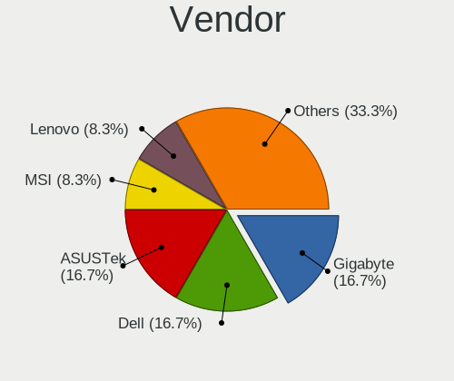
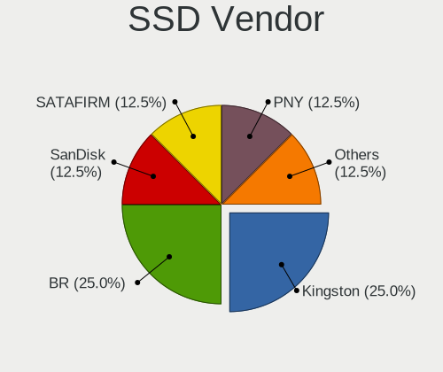
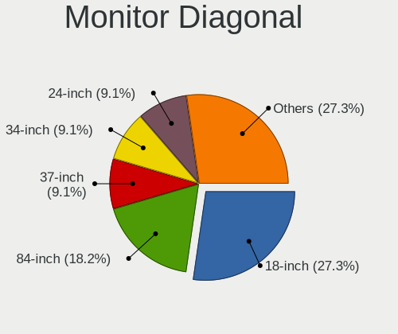
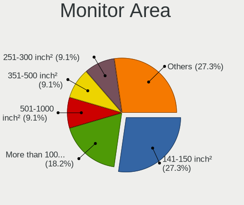
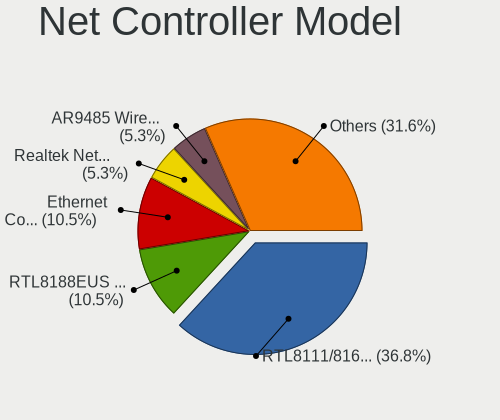
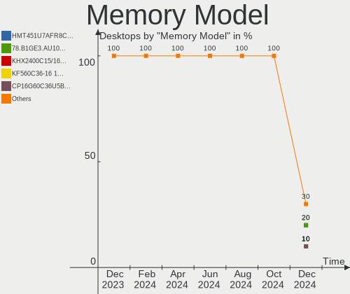
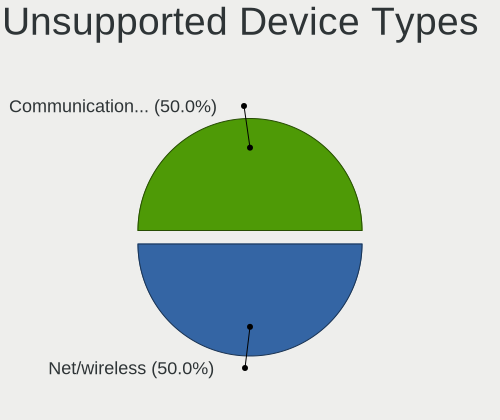

Kali - Hardware Trends (Desktops)
---------------------------------

A project to identify most popular hardware characteristics and track their change
over time based on data collected by Linux users at https://Linux-Hardware.org.

Anyone can contribute to this report by the [hw-probe](https://github.com/linuxhw/hw-probe) tool:

    sudo -E hw-probe -all -upload

This report is for one last month. Overall report since the beginning of time: [TestDays](https://github.com/linuxhw/TestDays)

Period: Dec, 2023.

Contents
--------

* [ System ](#system)
  - [ OS                       ](#os)
  - [ OS Family                ](#os-family)
  - [ Kernel                   ](#kernel)
  - [ Kernel Family            ](#kernel-family)
  - [ Kernel Major Ver.        ](#kernel-major-ver)
  - [ Arch                     ](#arch)
  - [ DE                       ](#de)
  - [ Display Server           ](#display-server)
  - [ Display Manager          ](#display-manager)
  - [ OS Lang                  ](#os-lang)
  - [ Boot Mode                ](#boot-mode)
  - [ Filesystem               ](#filesystem)
  - [ Part. scheme             ](#part-scheme)
  - [ Dual Boot with Linux/BSD ](#dual-boot-with-linuxbsd)
  - [ Dual Boot (Win)          ](#dual-boot-win)

* [ Board ](#board)
  - [ Vendor                   ](#vendor)
  - [ Model                    ](#model)
  - [ Model Family             ](#model-family)
  - [ MFG Year                 ](#mfg-year)
  - [ Form Factor              ](#form-factor)
  - [ Secure Boot              ](#secure-boot)
  - [ Coreboot                 ](#coreboot)
  - [ RAM Size                 ](#ram-size)
  - [ RAM Used                 ](#ram-used)
  - [ Total Drives             ](#total-drives)
  - [ Has CD-ROM               ](#has-cd-rom)
  - [ Has Ethernet             ](#has-ethernet)
  - [ Has WiFi                 ](#has-wifi)
  - [ Has Bluetooth            ](#has-bluetooth)

* [ Location ](#location)
  - [ Country                  ](#country)
  - [ City                     ](#city)

* [ Drives ](#drives)
  - [ Drive Vendor             ](#drive-vendor)
  - [ Drive Model              ](#drive-model)
  - [ HDD Vendor               ](#hdd-vendor)
  - [ SSD Vendor               ](#ssd-vendor)
  - [ Drive Kind               ](#drive-kind)
  - [ Drive Connector          ](#drive-connector)
  - [ Drive Size               ](#drive-size)
  - [ Space Total              ](#space-total)
  - [ Space Used               ](#space-used)
  - [ Malfunc. Drives          ](#malfunc-drives)
  - [ Malfunc. Drive Vendor    ](#malfunc-drive-vendor)
  - [ Malfunc. HDD Vendor      ](#malfunc-hdd-vendor)
  - [ Malfunc. Drive Kind      ](#malfunc-drive-kind)
  - [ Failed Drives            ](#failed-drives)
  - [ Failed Drive Vendor      ](#failed-drive-vendor)
  - [ Drive Status             ](#drive-status)

* [ Storage controller ](#storage-controller)
  - [ Storage Vendor           ](#storage-vendor)
  - [ Storage Model            ](#storage-model)
  - [ Storage Kind             ](#storage-kind)

* [ Processor ](#processor)
  - [ CPU Vendor               ](#cpu-vendor)
  - [ CPU Model                ](#cpu-model)
  - [ CPU Model Family         ](#cpu-model-family)
  - [ CPU Cores                ](#cpu-cores)
  - [ CPU Sockets              ](#cpu-sockets)
  - [ CPU Threads              ](#cpu-threads)
  - [ CPU Op-Modes             ](#cpu-op-modes)
  - [ CPU Microcode            ](#cpu-microcode)
  - [ CPU Microarch            ](#cpu-microarch)

* [ Graphics ](#graphics)
  - [ GPU Vendor               ](#gpu-vendor)
  - [ GPU Model                ](#gpu-model)
  - [ GPU Combo                ](#gpu-combo)
  - [ GPU Driver               ](#gpu-driver)
  - [ GPU Memory               ](#gpu-memory)

* [ Monitor ](#monitor)
  - [ Monitor Vendor           ](#monitor-vendor)
  - [ Monitor Model            ](#monitor-model)
  - [ Monitor Resolution       ](#monitor-resolution)
  - [ Monitor Diagonal         ](#monitor-diagonal)
  - [ Monitor Width            ](#monitor-width)
  - [ Aspect Ratio             ](#aspect-ratio)
  - [ Monitor Area             ](#monitor-area)
  - [ Pixel Density            ](#pixel-density)
  - [ Multiple Monitors        ](#multiple-monitors)

* [ Network ](#network)
  - [ Net Controller Vendor    ](#net-controller-vendor)
  - [ Net Controller Model     ](#net-controller-model)
  - [ Wireless Vendor          ](#wireless-vendor)
  - [ Wireless Model           ](#wireless-model)
  - [ Ethernet Vendor          ](#ethernet-vendor)
  - [ Ethernet Model           ](#ethernet-model)
  - [ Net Controller Kind      ](#net-controller-kind)
  - [ Used Controller          ](#used-controller)
  - [ NICs                     ](#nics)
  - [ IPv6                     ](#ipv6)

* [ Bluetooth ](#bluetooth)
  - [ Bluetooth Vendor         ](#bluetooth-vendor)
  - [ Bluetooth Model          ](#bluetooth-model)

* [ Sound ](#sound)
  - [ Sound Vendor             ](#sound-vendor)
  - [ Sound Model              ](#sound-model)

* [ Memory ](#memory)
  - [ Memory Vendor            ](#memory-vendor)
  - [ Memory Model             ](#memory-model)
  - [ Memory Kind              ](#memory-kind)
  - [ Memory Form Factor       ](#memory-form-factor)
  - [ Memory Size              ](#memory-size)
  - [ Memory Speed             ](#memory-speed)

* [ Printers & scanners ](#printers--scanners)
  - [ Printer Vendor           ](#printer-vendor)
  - [ Printer Model            ](#printer-model)
  - [ Scanner Vendor           ](#scanner-vendor)
  - [ Scanner Model            ](#scanner-model)

* [ Camera ](#camera)
  - [ Camera Vendor            ](#camera-vendor)
  - [ Camera Model             ](#camera-model)

* [ Security ](#security)
  - [ Fingerprint Vendor       ](#fingerprint-vendor)
  - [ Fingerprint Model        ](#fingerprint-model)
  - [ Chipcard Vendor          ](#chipcard-vendor)
  - [ Chipcard Model           ](#chipcard-model)

* [ Unsupported ](#unsupported)
  - [ Unsupported Devices      ](#unsupported-devices)
  - [ Unsupported Device Types ](#unsupported-device-types)

System
------

OS
--

Installed operating systems

| Name        | Desktops | Percent |
|-------------|----------|---------|
| Kali 2023.4 | 10       | 83.33%  |
| Kali 2023.3 | 2        | 16.67%  |

OS Family
---------

OS without a version

| Name | Desktops | Percent |
|------|----------|---------|
| Kali | 12       | 100%    |

Kernel
------

Version of the Linux kernel

| Version           | Desktops | Percent |
|-------------------|----------|---------|
| 6.5.0-kali3-amd64 | 10       | 83.33%  |
| 6.5.0-kali5-amd64 | 1        | 8.33%   |
| 6.5.0-5-amd64     | 1        | 8.33%   |

Kernel Family
-------------

Linux kernel without a distro release

| Version | Desktops | Percent |
|---------|----------|---------|
| 6.5.0   | 12       | 100%    |

Kernel Major Ver.
-----------------

Linux kernel major version

| Version | Desktops | Percent |
|---------|----------|---------|
| 6.5     | 12       | 100%    |

Arch
----

OS architecture (x86_64, i586, etc.)

| Name   | Desktops | Percent |
|--------|----------|---------|
| x86_64 | 12       | 100%    |

DE
--

Desktop Environment

| Name             | Desktops | Percent |
|------------------|----------|---------|
| XFCE             | 5        | 41.67%  |
| GNOME            | 3        | 25%     |
| X-Cinnamon       | 1        | 8.33%   |
| MATE             | 1        | 8.33%   |
| lightdm-xsession | 1        | 8.33%   |
| KDE5             | 1        | 8.33%   |

Display Server
--------------

X11 or Wayland

| Name | Desktops | Percent |
|------|----------|---------|
| X11  | 12       | 100%    |

Display Manager
---------------

SDDM, LightDM, etc.

| Name    | Desktops | Percent |
|---------|----------|---------|
| LightDM | 5        | 41.67%  |
| Unknown | 4        | 33.33%  |
| SDDM    | 2        | 16.67%  |
| GDM3    | 1        | 8.33%   |

OS Lang
-------

Language

| Lang  | Desktops | Percent |
|-------|----------|---------|
| en_US | 5        | 41.67%  |
| C     | 4        | 33.33%  |
| es_MX | 1        | 8.33%   |
| es_CO | 1        | 8.33%   |
| de_DE | 1        | 8.33%   |

Boot Mode
---------

EFI or BIOS

| Mode | Desktops | Percent |
|------|----------|---------|
| EFI  | 9        | 75%     |
| BIOS | 3        | 25%     |

Filesystem
----------

Type of filesystem

| Type    | Desktops | Percent |
|---------|----------|---------|
| Ext4    | 11       | 91.67%  |
| Overlay | 1        | 8.33%   |

Part. scheme
------------

Scheme of partitioning

| Type    | Desktops | Percent |
|---------|----------|---------|
| GPT     | 7        | 58.33%  |
| Unknown | 4        | 33.33%  |
| MBR     | 1        | 8.33%   |

Dual Boot with Linux/BSD
------------------------

Hosting more than one Linux/BSD

| Dual boot | Desktops | Percent |
|-----------|----------|---------|
| No        | 10       | 83.33%  |
| Yes       | 2        | 16.67%  |

Dual Boot (Win)
---------------

Hosting Linux and Windows

| Dual boot | Desktops | Percent |
|-----------|----------|---------|
| No        | 7        | 58.33%  |
| Yes       | 5        | 41.67%  |

Board
-----

Vendor
------

Motherboard manufacturer

| Name                | Desktops | Percent |
|---------------------|----------|---------|
| MSI                 | 3        | 25%     |
| ASUSTek Computer    | 3        | 25%     |
| Lenovo              | 1        | 8.33%   |
| Intel               | 1        | 8.33%   |
| Hewlett-Packard     | 1        | 8.33%   |
| Gigabyte Technology | 1        | 8.33%   |
| EVGA                | 1        | 8.33%   |
| Dell                | 1        | 8.33%   |

Model
-----

Motherboard model

| Name                      | Desktops | Percent |
|---------------------------|----------|---------|
| MSI MS-7D28               | 1        | 8.33%   |
| MSI MS-7D22               | 1        | 8.33%   |
| MSI MS-7B49               | 1        | 8.33%   |
| Lenovo H50-50 90B600BFBG  | 1        | 8.33%   |
| Intel H61                 | 1        | 8.33%   |
| HP G1-2012la              | 1        | 8.33%   |
| Gigabyte Z590 AORUS ULTRA | 1        | 8.33%   |
| EVGA 151-BE-E097          | 1        | 8.33%   |
| Dell Precision T3610      | 1        | 8.33%   |
| ASUS Z170-A               | 1        | 8.33%   |
| ASUS PRIME B350-PLUS      | 1        | 8.33%   |
| ASUS PRIME A320M-K        | 1        | 8.33%   |

Model Family
------------

Motherboard model prefix

| Name             | Desktops | Percent |
|------------------|----------|---------|
| ASUS PRIME       | 2        | 16.67%  |
| MSI MS-7D28      | 1        | 8.33%   |
| MSI MS-7D22      | 1        | 8.33%   |
| MSI MS-7B49      | 1        | 8.33%   |
| Lenovo H50-50    | 1        | 8.33%   |
| Intel H61        | 1        | 8.33%   |
| HP G1-2012la     | 1        | 8.33%   |
| Gigabyte Z590    | 1        | 8.33%   |
| EVGA 151-BE-E097 | 1        | 8.33%   |
| Dell Precision   | 1        | 8.33%   |
| ASUS Z170-A      | 1        | 8.33%   |

MFG Year
--------

Motherboard manufacture year

| Year | Desktops | Percent |
|------|----------|---------|
| 2017 | 4        | 33.33%  |
| 2021 | 2        | 16.67%  |
| 2015 | 2        | 16.67%  |
| 2022 | 1        | 8.33%   |
| 2019 | 1        | 8.33%   |
| 2013 | 1        | 8.33%   |
| 2010 | 1        | 8.33%   |

Form Factor
-----------

Physical design of the computer

| Name    | Desktops | Percent |
|---------|----------|---------|
| Desktop | 12       | 100%    |

Secure Boot
-----------

Enabled or disabled

| State    | Desktops | Percent |
|----------|----------|---------|
| Disabled | 12       | 100%    |

Coreboot
--------

Have coreboot on board

| Used | Desktops | Percent |
|------|----------|---------|
| No   | 12       | 100%    |

RAM Size
--------

Total RAM memory

| Size in GB  | Desktops | Percent |
|-------------|----------|---------|
| 32.01-64.0  | 4        | 33.33%  |
| 16.01-24.0  | 4        | 33.33%  |
| 4.01-8.0    | 1        | 8.33%   |
| 3.01-4.0    | 1        | 8.33%   |
| 64.01-256.0 | 1        | 8.33%   |
| 8.01-16.0   | 1        | 8.33%   |

RAM Used
--------

Used RAM memory

| Used GB    | Desktops | Percent |
|------------|----------|---------|
| 2.01-3.0   | 4        | 33.33%  |
| 1.01-2.0   | 3        | 25%     |
| 3.01-4.0   | 2        | 16.67%  |
| 4.01-8.0   | 1        | 8.33%   |
| 16.01-24.0 | 1        | 8.33%   |
| 8.01-16.0  | 1        | 8.33%   |

Total Drives
------------

Number of drives on board

| Drives | Desktops | Percent |
|--------|----------|---------|
| 2      | 4        | 33.33%  |
| 1      | 4        | 33.33%  |
| 3      | 3        | 25%     |
| 6      | 1        | 8.33%   |

Has CD-ROM
----------

Has CD-ROM on board

| Presented | Desktops | Percent |
|-----------|----------|---------|
| No        | 9        | 75%     |
| Yes       | 3        | 25%     |

Has Ethernet
------------

Has Ethernet on board

| Presented | Desktops | Percent |
|-----------|----------|---------|
| Yes       | 11       | 91.67%  |
| No        | 1        | 8.33%   |

Has WiFi
--------

Has WiFi module

| Presented | Desktops | Percent |
|-----------|----------|---------|
| Yes       | 10       | 83.33%  |
| No        | 2        | 16.67%  |

Has Bluetooth
-------------

Has Bluetooth module

| Presented | Desktops | Percent |
|-----------|----------|---------|
| Yes       | 6        | 50%     |
| No        | 6        | 50%     |

Location
--------

Country
-------

Geographic location (country)

| Country     | Desktops | Percent |
|-------------|----------|---------|
| USA         | 2        | 16.67%  |
| Romania     | 1        | 8.33%   |
| Philippines | 1        | 8.33%   |
| Mexico      | 1        | 8.33%   |
| Indonesia   | 1        | 8.33%   |
| India       | 1        | 8.33%   |
| Colombia    | 1        | 8.33%   |
| Canada      | 1        | 8.33%   |
| Bulgaria    | 1        | 8.33%   |
| Belgium     | 1        | 8.33%   |
| Argentina   | 1        | 8.33%   |

City
----

Geographic location (city)

| City           | Desktops | Percent |
|----------------|----------|---------|
| Villa Martelli | 1        | 8.33%   |
| Toronto        | 1        | 8.33%   |
| Shumen         | 1        | 8.33%   |
| Semarang       | 1        | 8.33%   |
| Mexico City    | 1        | 8.33%   |
| Los Angeles    | 1        | 8.33%   |
| Las Vegas      | 1        | 8.33%   |
| Huy            | 1        | 8.33%   |
| Butuan         | 1        | 8.33%   |
| Bucharest      | 1        | 8.33%   |
| Bengaluru      | 1        | 8.33%   |
| Barranquilla   | 1        | 8.33%   |

Drives
------

Drive Vendor
------------

Hard drive vendors

| Vendor                      | Desktops | Drives | Percent |
|-----------------------------|----------|--------|---------|
| WDC                         | 4        | 4      | 16%     |
| Seagate                     | 4        | 4      | 16%     |
| Silicon Motion              | 2        | 2      | 8%      |
| Crucial                     | 2        | 2      | 8%      |
| A-DATA Technology           | 2        | 2      | 8%      |
| Toshiba                     | 1        | 1      | 4%      |
| Sandisk                     | 1        | 1      | 4%      |
| Samsung Electronics         | 1        | 1      | 4%      |
| PNY                         | 1        | 1      | 4%      |
| Phison Electronics          | 1        | 1      | 4%      |
| Patriot                     | 1        | 1      | 4%      |
| MAXIO Technology (Hangzhou) | 1        | 1      | 4%      |
| Lite-On Technology          | 1        | 1      | 4%      |
| Kingston Technology Company | 1        | 2      | 4%      |
| Kingston                    | 1        | 1      | 4%      |
| Hitachi                     | 1        | 1      | 4%      |

Drive Model
-----------

Hard drive models

| Model                                                 | Desktops | Percent |
|-------------------------------------------------------|----------|---------|
| Crucial CT500MX500SSD1 500GB                          | 2        | 7.69%   |
| WDC WDS240G2G0B-00EPW0 240GB SSD                      | 1        | 3.85%   |
| WDC WD5003ABYX-50WERA1 500GB                          | 1        | 3.85%   |
| WDC WD5000AVDS-63U7B1 500GB                           | 1        | 3.85%   |
| WDC WD22PURZ-85B4ZY0 2TB                              | 1        | 3.85%   |
| Toshiba DT01ACA100 1TB                                | 1        | 3.85%   |
| Silicon Motion SSD_M.2_PCI_NVME_1TB_InnovationIT      | 1        | 3.85%   |
| Silicon Motion SM2263EN/SM2263XT SSD Controller 500GB | 1        | 3.85%   |
| Seagate ST500LM012 HN-M500MBB 500GB                   | 1        | 3.85%   |
| Seagate ST4000DM004-2CV104 4TB                        | 1        | 3.85%   |
| Seagate ST3750525AS 752GB                             | 1        | 3.85%   |
| Seagate ST31000524AS 1TB                              | 1        | 3.85%   |
| Sandisk WD Black SN850 1024GB                         | 1        | 3.85%   |
| Samsung SSD 860 QVO 1TB                               | 1        | 3.85%   |
| PNY CS1031 500GB SSD                                  | 1        | 3.85%   |
| Phison E16 PCIe4 NVMe Controller 2TB                  | 1        | 3.85%   |
| Patriot Blast 120GB SSD                               | 1        | 3.85%   |
| MAXIO (Hangzhou) NVMe SSD Controller MAP1202 256GB    | 1        | 3.85%   |
| Lite-On M8Pe Series NVMe SSD 512GB                    | 1        | 3.85%   |
| Kingston Company OM3PGP4-AD NVMe KDI 256GB            | 1        | 3.85%   |
| Kingston Company OM3PDP3 NVMe SSD 512GB               | 1        | 3.85%   |
| Kingston SNVS1000G 1TB                                | 1        | 3.85%   |
| Hitachi HDE721010SLA330 1TB                           | 1        | 3.85%   |
| A-DATA SU650 240GB SSD                                | 1        | 3.85%   |
| A-DATA SU630 240GB SSD                                | 1        | 3.85%   |

HDD Vendor
----------

Hard disk drive vendors

| Vendor  | Desktops | Drives | Percent |
|---------|----------|--------|---------|
| Seagate | 4        | 4      | 44.44%  |
| WDC     | 3        | 3      | 33.33%  |
| Toshiba | 1        | 1      | 11.11%  |
| Hitachi | 1        | 1      | 11.11%  |

SSD Vendor
----------

Solid state drive vendors

| Vendor              | Desktops | Drives | Percent |
|---------------------|----------|--------|---------|
| Crucial             | 2        | 2      | 28.57%  |
| A-DATA Technology   | 2        | 2      | 28.57%  |
| WDC                 | 1        | 1      | 14.29%  |
| Samsung Electronics | 1        | 1      | 14.29%  |
| Patriot             | 1        | 1      | 14.29%  |

Drive Kind
----------

HDD or SSD

| Kind | Desktops | Drives | Percent |
|------|----------|--------|---------|
| HDD  | 8        | 9      | 40%     |
| NVMe | 6        | 10     | 30%     |
| SSD  | 6        | 7      | 30%     |

Drive Connector
---------------

SATA, SAS, NVMe, etc.

| Type | Desktops | Drives | Percent |
|------|----------|--------|---------|
| SATA | 11       | 16     | 64.71%  |
| NVMe | 6        | 10     | 35.29%  |

Drive Size
----------

Size of hard drive

| Size in TB | Desktops | Drives | Percent |
|------------|----------|--------|---------|
| 0.01-0.5   | 8        | 9      | 53.33%  |
| 0.51-1.0   | 5        | 5      | 33.33%  |
| 3.01-4.0   | 1        | 1      | 6.67%   |
| 1.01-2.0   | 1        | 1      | 6.67%   |

Space Total
-----------

Amount of disk space available on the file system

| Size in GB | Desktops | Percent |
|------------|----------|---------|
| 101-250    | 4        | 33.33%  |
| 501-1000   | 3        | 25%     |
| 1001-2000  | 2        | 16.67%  |
| 251-500    | 1        | 8.33%   |
| 1-20       | 1        | 8.33%   |
| 51-100     | 1        | 8.33%   |

Space Used
----------

Amount of used disk space

| Used GB | Desktops | Percent |
|---------|----------|---------|
| 101-250 | 5        | 41.67%  |
| 1-20    | 4        | 33.33%  |
| 251-500 | 1        | 8.33%   |
| 21-50   | 1        | 8.33%   |
| 51-100  | 1        | 8.33%   |

Malfunc. Drives
---------------

Drive models with a malfunction

| Model                       | Desktops | Drives | Percent |
|-----------------------------|----------|--------|---------|
| Hitachi HDE721010SLA330 1TB | 1        | 1      | 100%    |

Malfunc. Drive Vendor
---------------------

Vendors of faulty drives

| Vendor  | Desktops | Drives | Percent |
|---------|----------|--------|---------|
| Hitachi | 1        | 1      | 100%    |

Malfunc. HDD Vendor
-------------------

Vendors of faulty HDD drives

| Vendor  | Desktops | Drives | Percent |
|---------|----------|--------|---------|
| Hitachi | 1        | 1      | 100%    |

Malfunc. Drive Kind
-------------------

Kinds of faulty drives

| Kind | Desktops | Drives | Percent |
|------|----------|--------|---------|
| HDD  | 1        | 1      | 100%    |

Failed Drives
-------------

Failed drive models

Zero info for selected period =(

Failed Drive Vendor
-------------------

Failed drive vendors

Zero info for selected period =(

Drive Status
------------

Number of failed and malfunc. drives

| Status   | Desktops | Drives | Percent |
|----------|----------|--------|---------|
| Works    | 8        | 14     | 61.54%  |
| Detected | 4        | 11     | 30.77%  |
| Malfunc  | 1        | 1      | 7.69%   |

Storage controller
------------------

Storage Vendor
--------------

Storage controller vendors

| Vendor                      | Desktops | Percent |
|-----------------------------|----------|---------|
| Intel                       | 9        | 40.91%  |
| AMD                         | 3        | 13.64%  |
| Silicon Motion              | 2        | 9.09%   |
| Phison Electronics          | 2        | 9.09%   |
| Kingston Technology Company | 2        | 9.09%   |
| SanDisk                     | 1        | 4.55%   |
| MAXIO Technology (Hangzhou) | 1        | 4.55%   |
| Marvell Technology Group    | 1        | 4.55%   |
| Lite-On Technology          | 1        | 4.55%   |

Storage Model
-------------

Storage controller models

| Model                                                                          | Desktops | Percent |
|--------------------------------------------------------------------------------|----------|---------|
| Silicon Motion SM2263EN/SM2263XT (DRAM-less) NVMe SSD Controllers              | 2        | 7.69%   |
| Intel 500 Series Chipset Family SATA AHCI Controller                           | 2        | 7.69%   |
| AMD FCH SATA Controller [AHCI mode]                                            | 2        | 7.69%   |
| SanDisk WD PC SN810 / Black SN850 NVMe SSD                                     | 1        | 3.85%   |
| Phison PS5013-E13 PCIe3 NVMe Controller (DRAM-less)                            | 1        | 3.85%   |
| Phison E16 PCIe4 NVMe Controller                                               | 1        | 3.85%   |
| MAXIO (Hangzhou) NVMe SSD Controller MAP1202                                   | 1        | 3.85%   |
| Marvell Group 88SE9215 PCIe 2.0 x1 4-port SATA 6 Gb/s Controller               | 1        | 3.85%   |
| Lite-On M8Pe Series NVMe SSD                                                   | 1        | 3.85%   |
| Kingston Company OM3PGP4 NVMe SSD                                              | 1        | 3.85%   |
| Kingston Company OM3PDP3 NVMe SSD                                              | 1        | 3.85%   |
| Kingston Company NV1 NVMe SSD E13T                                             | 1        | 3.85%   |
| Intel Q170/Q150/B150/H170/H110/Z170/CM236 Chipset SATA Controller [AHCI Mode]  | 1        | 3.85%   |
| Intel C610/X99 series chipset sSATA Controller [AHCI mode]                     | 1        | 3.85%   |
| Intel C610/X99 series chipset 6-Port SATA Controller [AHCI mode]               | 1        | 3.85%   |
| Intel C600/X79 series chipset SATA RAID Controller                             | 1        | 3.85%   |
| Intel Alder Lake-S PCH SATA Controller [AHCI Mode]                             | 1        | 3.85%   |
| Intel 8 Series/C220 Series Chipset Family 6-port SATA Controller 1 [AHCI mode] | 1        | 3.85%   |
| Intel 6 Series/C200 Series Chipset Family 6 port Desktop SATA AHCI Controller  | 1        | 3.85%   |
| Intel 200 Series PCH SATA controller [AHCI mode]                               | 1        | 3.85%   |
| AMD SB7x0/SB8x0/SB9x0 SATA Controller [AHCI mode]                              | 1        | 3.85%   |
| AMD FCH SATA Controller D                                                      | 1        | 3.85%   |
| AMD 300 Series Chipset SATA Controller                                         | 1        | 3.85%   |

Storage Kind
------------

Kind of storage controller (IDE, SATA, NVMe, SAS, ...)

| Kind | Desktops | Percent |
|------|----------|---------|
| SATA | 11       | 61.11%  |
| NVMe | 6        | 33.33%  |
| RAID | 1        | 5.56%   |

Processor
---------

CPU Vendor
----------

Processor vendors

| Vendor | Desktops | Percent |
|--------|----------|---------|
| Intel  | 9        | 75%     |
| AMD    | 3        | 25%     |

CPU Model
---------

Processor models

| Model                                      | Desktops | Percent |
|--------------------------------------------|----------|---------|
| Intel Xeon CPU E5-2650 0 @ 2.00GHz         | 1        | 8.33%   |
| Intel Core i7-6900K CPU @ 3.20GHz          | 1        | 8.33%   |
| Intel Core i7-6700K CPU @ 4.00GHz          | 1        | 8.33%   |
| Intel Core i5-8400 CPU @ 2.80GHz           | 1        | 8.33%   |
| Intel Core i5-2500 CPU @ 3.30GHz           | 1        | 8.33%   |
| Intel Core i5-10400F CPU @ 2.90GHz         | 1        | 8.33%   |
| Intel Core i3-4160 CPU @ 3.60GHz           | 1        | 8.33%   |
| Intel 12th Gen Core i9-12900K              | 1        | 8.33%   |
| Intel 11th Gen Core i9-11900K @ 3.50GHz    | 1        | 8.33%   |
| AMD Ryzen 5 2600 Six-Core Processor        | 1        | 8.33%   |
| AMD E-350 Processor                        | 1        | 8.33%   |
| AMD Athlon 3000G with Radeon Vega Graphics | 1        | 8.33%   |

CPU Model Family
----------------

Processor model prefix

| Model         | Desktops | Percent |
|---------------|----------|---------|
| Intel Core i5 | 3        | 25%     |
| Other         | 2        | 16.67%  |
| Intel Core i7 | 2        | 16.67%  |
| Intel Xeon    | 1        | 8.33%   |
| Intel Core i3 | 1        | 8.33%   |
| AMD Ryzen 5   | 1        | 8.33%   |
| AMD E         | 1        | 8.33%   |
| AMD Athlon    | 1        | 8.33%   |

CPU Cores
---------

Number of processor cores

| Number | Desktops | Percent |
|--------|----------|---------|
| 8      | 3        | 25%     |
| 6      | 3        | 25%     |
| 2      | 3        | 25%     |
| 4      | 2        | 16.67%  |
| 16     | 1        | 8.33%   |

CPU Sockets
-----------

Number of sockets

| Number | Desktops | Percent |
|--------|----------|---------|
| 1      | 12       | 100%    |

CPU Threads
-----------

Threads per core (Hyper-Threading)

| Number | Desktops | Percent |
|--------|----------|---------|
| 2      | 8        | 66.67%  |
| 1      | 4        | 33.33%  |

CPU Op-Modes
------------

CPU Operation Modes (32-bit, 64-bit)

| Op mode        | Desktops | Percent |
|----------------|----------|---------|
| 32-bit, 64-bit | 12       | 100%    |

CPU Microcode
-------------

Microcode number

| Number     | Desktops | Percent |
|------------|----------|---------|
| Unknown    | 9        | 75%     |
| 0x08108109 | 1        | 8.33%   |
| 0x0800820d | 1        | 8.33%   |
| 0x05000029 | 1        | 8.33%   |

CPU Microarch
-------------

Microarchitecture

| Name        | Desktops | Percent |
|-------------|----------|---------|
| Zen+        | 2        | 16.67%  |
| SandyBridge | 2        | 16.67%  |
| Skylake     | 1        | 8.33%   |
| KabyLake    | 1        | 8.33%   |
| Icelake     | 1        | 8.33%   |
| Haswell     | 1        | 8.33%   |
| CometLake   | 1        | 8.33%   |
| Broadwell   | 1        | 8.33%   |
| Bobcat      | 1        | 8.33%   |
| Unknown     | 1        | 8.33%   |

Graphics
--------

GPU Vendor
----------

Vendors of graphics cards

| Vendor | Desktops | Percent |
|--------|----------|---------|
| Nvidia | 7        | 58.33%  |
| Intel  | 3        | 25%     |
| AMD    | 2        | 16.67%  |

GPU Model
---------

Graphics card models

| Model                                                                | Desktops | Percent |
|----------------------------------------------------------------------|----------|---------|
| Nvidia TU106 [GeForce RTX 2070 Rev. A]                               | 1        | 8.33%   |
| Nvidia TU106 [GeForce RTX 2060 Rev. A]                               | 1        | 8.33%   |
| Nvidia GP107 [GeForce GTX 1050 Ti]                                   | 1        | 8.33%   |
| Nvidia GP104 [GeForce GTX 1070]                                      | 1        | 8.33%   |
| Nvidia GM107 [GeForce GTX 750 Ti]                                    | 1        | 8.33%   |
| Nvidia GK106GL [Quadro K4000]                                        | 1        | 8.33%   |
| Nvidia GA102 [GeForce RTX 3090]                                      | 1        | 8.33%   |
| Intel RocketLake-S GT1 [UHD Graphics 750]                            | 1        | 8.33%   |
| Intel HD Graphics 530                                                | 1        | 8.33%   |
| Intel DG2 [Arc A750]                                                 | 1        | 8.33%   |
| AMD Wrestler [Radeon HD 6310]                                        | 1        | 8.33%   |
| AMD Picasso/Raven 2 [Radeon Vega Series / Radeon Vega Mobile Series] | 1        | 8.33%   |

GPU Combo
---------

Combinations of graphics cards

| Name       | Desktops | Percent |
|------------|----------|---------|
| 1 x Nvidia | 7        | 58.33%  |
| 1 x Intel  | 3        | 25%     |
| 1 x AMD    | 2        | 16.67%  |

GPU Driver
----------

Free vs proprietary

| Driver      | Desktops | Percent |
|-------------|----------|---------|
| Free        | 6        | 50%     |
| Proprietary | 5        | 41.67%  |
| Unknown     | 1        | 8.33%   |

GPU Memory
----------

Total video memory

| Size in GB | Desktops | Percent |
|------------|----------|---------|
| Unknown    | 5        | 41.67%  |
| 7.01-8.0   | 1        | 8.33%   |
| 5.01-6.0   | 1        | 8.33%   |
| 3.01-4.0   | 1        | 8.33%   |
| 2.01-3.0   | 1        | 8.33%   |
| 16.01-24.0 | 1        | 8.33%   |
| 1.01-2.0   | 1        | 8.33%   |
| 0.01-0.5   | 1        | 8.33%   |

Monitor
-------

Monitor Vendor
--------------

Monitor vendors

| Vendor               | Desktops | Percent |
|----------------------|----------|---------|
| Samsung Electronics  | 3        | 23.08%  |
| ASUSTek Computer     | 2        | 15.38%  |
| Westinghouse         | 1        | 7.69%   |
| ViewSonic            | 1        | 7.69%   |
| Hewlett-Packard      | 1        | 7.69%   |
| eMachines            | 1        | 7.69%   |
| Dell                 | 1        | 7.69%   |
| BenQ                 | 1        | 7.69%   |
| Ancor Communications | 1        | 7.69%   |
| Unknown              | 1        | 7.69%   |

Monitor Model
-------------

Monitor models

| Model                                                                | Desktops | Percent |
|----------------------------------------------------------------------|----------|---------|
| Westinghouse CW40T8GW WDT1D39 1920x1080 890x500mm 40.2-inch          | 1        | 7.69%   |
| ViewSonic LCD Monitor VA2419 Series 1920x1080                        | 1        | 7.69%   |
| Samsung Electronics SyncMaster SAM027D 1680x1050 433x271mm 20.1-inch | 1        | 7.69%   |
| Samsung Electronics LCD Monitor SAM0678 1360x768                     | 1        | 7.69%   |
| Samsung Electronics LCD Monitor C24F390                              | 1        | 7.69%   |
| Hewlett-Packard AIO HWP4109 1600x900 443x249mm 20.0-inch             | 1        | 7.69%   |
| eMachines E202H EMA00B5 1600x900 440x250mm 19.9-inch                 | 1        | 7.69%   |
| Dell U2520D DELA14F 2560x1440 553x311mm 25.0-inch                    | 1        | 7.69%   |
| BenQ GW2780 BNQ78E6 1920x1080 598x336mm 27.0-inch                    | 1        | 7.69%   |
| ASUSTek Computer VG27AQL1A AUS2705 2560x1440 597x336mm 27.0-inch     | 1        | 7.69%   |
| ASUSTek Computer VG27A AUS2722 2560x1440 597x336mm 27.0-inch         | 1        | 7.69%   |
| Ancor Communications VH226 ACI22F2 1920x1080 480x270mm 21.7-inch     | 1        | 7.69%   |
| Unknown                                                              | 1        | 7.69%   |

Monitor Resolution
------------------

Monitor screen resolution

| Resolution         | Desktops | Percent |
|--------------------|----------|---------|
| 1920x1080 (FHD)    | 4        | 30.77%  |
| 2560x1440 (QHD)    | 3        | 23.08%  |
| 1600x900 (HD+)     | 2        | 15.38%  |
| 1680x1050 (WSXGA+) | 1        | 7.69%   |
| 1440x900 (WXGA+)   | 1        | 7.69%   |
| 1360x768           | 1        | 7.69%   |
| Unknown            | 1        | 7.69%   |

Monitor Diagonal
----------------

Diagonal size in inches

| Inches  | Desktops | Percent |
|---------|----------|---------|
| Unknown | 4        | 30.77%  |
| 27      | 3        | 23.08%  |
| 20      | 3        | 23.08%  |
| 40      | 1        | 7.69%   |
| 25      | 1        | 7.69%   |
| 21      | 1        | 7.69%   |

Monitor Width
-------------

Physical width

| Width in mm | Desktops | Percent |
|-------------|----------|---------|
| 501-600     | 4        | 30.77%  |
| 401-500     | 4        | 30.77%  |
| Unknown     | 4        | 30.77%  |
| 801-900     | 1        | 7.69%   |

Aspect Ratio
------------

Proportional relationship between the width and the height

| Ratio   | Desktops | Percent |
|---------|----------|---------|
| 16/9    | 7        | 63.64%  |
| Unknown | 3        | 27.27%  |
| 16/10   | 1        | 9.09%   |

Monitor Area
------------

Area in inch²

| Area in inch² | Desktops | Percent |
|----------------|----------|---------|
| Unknown        | 4        | 30.77%  |
| 301-350        | 3        | 23.08%  |
| 151-200        | 3        | 23.08%  |
| 251-300        | 1        | 7.69%   |
| 201-250        | 1        | 7.69%   |
| 501-1000       | 1        | 7.69%   |

Pixel Density
-------------

Pixels per inch

| Density | Desktops | Percent |
|---------|----------|---------|
| 51-100  | 5        | 41.67%  |
| Unknown | 4        | 33.33%  |
| 101-120 | 3        | 25%     |

Multiple Monitors
-----------------

Total monitors connected

| Total | Desktops | Percent |
|-------|----------|---------|
| 1     | 9        | 75%     |
| 2     | 2        | 16.67%  |
| 0     | 1        | 8.33%   |

Network
-------

Net Controller Vendor
---------------------

Controller vendors

| Vendor                          | Desktops | Percent |
|---------------------------------|----------|---------|
| Realtek Semiconductor           | 6        | 24%     |
| Intel                           | 6        | 24%     |
| TP-Link                         | 2        | 8%      |
| ASIX Electronics                | 2        | 8%      |
| STMicroelectronics              | 1        | 4%      |
| Ralink Technology               | 1        | 4%      |
| Ralink                          | 1        | 4%      |
| Qualcomm Atheros Communications | 1        | 4%      |
| Qualcomm Atheros                | 1        | 4%      |
| MediaTek                        | 1        | 4%      |
| Linksys                         | 1        | 4%      |
| D-Link                          | 1        | 4%      |
| Accton Technology               | 1        | 4%      |

Net Controller Model
--------------------

Controller models

| Model                                                                     | Desktops | Percent |
|---------------------------------------------------------------------------|----------|---------|
| Realtek RTL8111/8168/8411 PCI Express Gigabit Ethernet Controller         | 3        | 10.71%  |
| Realtek RTL810xE PCI Express Fast Ethernet controller                     | 2        | 7.14%   |
| TP-Link TL-WN821N Version 5 RTL8192EU                                     | 1        | 3.57%   |
| TP-Link Archer T3U [Realtek RTL8812BU]                                    | 1        | 3.57%   |
| STMicroelectronics Virtual COM Port                                       | 1        | 3.57%   |
| Realtek RTL8812AU 802.11a/b/g/n/ac 2T2R DB WLAN Adapter                   | 1        | 3.57%   |
| Realtek RTL8723BE PCIe Wireless Network Adapter                           | 1        | 3.57%   |
| Ralink RT2870/RT3070 Wireless Adapter                                     | 1        | 3.57%   |
| Ralink RT3090 Wireless 802.11n 1T/1R PCIe                                 | 1        | 3.57%   |
| Qualcomm Atheros Killer E2400 Gigabit Ethernet Controller                 | 1        | 3.57%   |
| Qualcomm Atheros AR9271 802.11n                                           | 1        | 3.57%   |
| MediaTek MT6227 phone                                                     | 1        | 3.57%   |
| Linksys WUSB6100M 802.11a/b/g/n/ac Wireless Adapter                       | 1        | 3.57%   |
| Intel Wi-Fi 6 AX210/AX211/AX411 160MHz                                    | 1        | 3.57%   |
| Intel Wi-Fi 6 AX200                                                       | 1        | 3.57%   |
| Intel Ethernet Controller I225-V                                          | 1        | 3.57%   |
| Intel Ethernet Connection (2) I219-V                                      | 1        | 3.57%   |
| Intel Ethernet Connection (2) I218-V                                      | 1        | 3.57%   |
| Intel Ethernet Connection (10) I219-V                                     | 1        | 3.57%   |
| Intel Alder Lake-S PCH CNVi WiFi                                          | 1        | 3.57%   |
| Intel 82579LM Gigabit Network Connection (Lewisville)                     | 1        | 3.57%   |
| D-Link 11ac adapter                                                       | 1        | 3.57%   |
| ASIX AX88772B                                                             | 1        | 3.57%   |
| ASIX AX88179 Gigabit Ethernet                                             | 1        | 3.57%   |
| Accton SMCWUSBS-N EZ Connect N Draft 11n Wireless Adapter [Ralink RT2870] | 1        | 3.57%   |

Wireless Vendor
---------------

Wireless vendors

| Vendor                          | Desktops | Percent |
|---------------------------------|----------|---------|
| Intel                           | 3        | 23.08%  |
| TP-Link                         | 2        | 15.38%  |
| Realtek Semiconductor           | 2        | 15.38%  |
| Ralink Technology               | 1        | 7.69%   |
| Ralink                          | 1        | 7.69%   |
| Qualcomm Atheros Communications | 1        | 7.69%   |
| Linksys                         | 1        | 7.69%   |
| D-Link                          | 1        | 7.69%   |
| Accton Technology               | 1        | 7.69%   |

Wireless Model
--------------

Wireless models

| Model                                                                     | Desktops | Percent |
|---------------------------------------------------------------------------|----------|---------|
| TP-Link TL-WN821N Version 5 RTL8192EU                                     | 1        | 7.69%   |
| TP-Link Archer T3U [Realtek RTL8812BU]                                    | 1        | 7.69%   |
| Realtek RTL8812AU 802.11a/b/g/n/ac 2T2R DB WLAN Adapter                   | 1        | 7.69%   |
| Realtek RTL8723BE PCIe Wireless Network Adapter                           | 1        | 7.69%   |
| Ralink RT2870/RT3070 Wireless Adapter                                     | 1        | 7.69%   |
| Ralink RT3090 Wireless 802.11n 1T/1R PCIe                                 | 1        | 7.69%   |
| Qualcomm Atheros AR9271 802.11n                                           | 1        | 7.69%   |
| Linksys WUSB6100M 802.11a/b/g/n/ac Wireless Adapter                       | 1        | 7.69%   |
| Intel Wi-Fi 6 AX210/AX211/AX411 160MHz                                    | 1        | 7.69%   |
| Intel Wi-Fi 6 AX200                                                       | 1        | 7.69%   |
| Intel Alder Lake-S PCH CNVi WiFi                                          | 1        | 7.69%   |
| D-Link 11ac adapter                                                       | 1        | 7.69%   |
| Accton SMCWUSBS-N EZ Connect N Draft 11n Wireless Adapter [Ralink RT2870] | 1        | 7.69%   |

Ethernet Vendor
---------------

Ethernet vendors

| Vendor                | Desktops | Percent |
|-----------------------|----------|---------|
| Realtek Semiconductor | 5        | 38.46%  |
| Intel                 | 5        | 38.46%  |
| ASIX Electronics      | 2        | 15.38%  |
| Qualcomm Atheros      | 1        | 7.69%   |

Ethernet Model
--------------

Ethernet models

| Model                                                             | Desktops | Percent |
|-------------------------------------------------------------------|----------|---------|
| Realtek RTL8111/8168/8411 PCI Express Gigabit Ethernet Controller | 3        | 23.08%  |
| Realtek RTL810xE PCI Express Fast Ethernet controller             | 2        | 15.38%  |
| Qualcomm Atheros Killer E2400 Gigabit Ethernet Controller         | 1        | 7.69%   |
| Intel Ethernet Controller I225-V                                  | 1        | 7.69%   |
| Intel Ethernet Connection (2) I219-V                              | 1        | 7.69%   |
| Intel Ethernet Connection (2) I218-V                              | 1        | 7.69%   |
| Intel Ethernet Connection (10) I219-V                             | 1        | 7.69%   |
| Intel 82579LM Gigabit Network Connection (Lewisville)             | 1        | 7.69%   |
| ASIX AX88772B                                                     | 1        | 7.69%   |
| ASIX AX88179 Gigabit Ethernet                                     | 1        | 7.69%   |

Net Controller Kind
-------------------

Ethernet, WiFi or modem

| Kind     | Desktops | Percent |
|----------|----------|---------|
| Ethernet | 12       | 50%     |
| WiFi     | 10       | 41.67%  |
| Modem    | 2        | 8.33%   |

Used Controller
---------------

Currently used network controller

| Kind     | Desktops | Percent |
|----------|----------|---------|
| Ethernet | 9        | 64.29%  |
| WiFi     | 5        | 35.71%  |

NICs
----

Total network controllers on board

| Total | Desktops | Percent |
|-------|----------|---------|
| 1     | 7        | 58.33%  |
| 3     | 2        | 16.67%  |
| 2     | 2        | 16.67%  |
| 0     | 1        | 8.33%   |

IPv6
----

IPv6 vs IPv4

| Used | Desktops | Percent |
|------|----------|---------|
| Yes  | 6        | 50%     |
| No   | 6        | 50%     |

Bluetooth
---------

Bluetooth Vendor
----------------

Controller vendors

| Vendor                  | Desktops | Percent |
|-------------------------|----------|---------|
| Intel                   | 3        | 50%     |
| Realtek Semiconductor   | 1        | 16.67%  |
| Cambridge Silicon Radio | 1        | 16.67%  |
| Broadcom                | 1        | 16.67%  |

Bluetooth Model
---------------

Controller models

| Model                                               | Desktops | Percent |
|-----------------------------------------------------|----------|---------|
| Realtek RTL8723B Bluetooth                          | 1        | 16.67%  |
| Intel Bluetooth Device                              | 1        | 16.67%  |
| Intel AX210 Bluetooth                               | 1        | 16.67%  |
| Intel AX200 Bluetooth                               | 1        | 16.67%  |
| Cambridge Silicon Radio Bluetooth Dongle (HCI mode) | 1        | 16.67%  |
| Broadcom BCM20702A0 Bluetooth 4.0                   | 1        | 16.67%  |

Sound
-----

Sound Vendor
------------

Sound card vendors

| Vendor                   | Desktops | Percent |
|--------------------------|----------|---------|
| Intel                    | 9        | 39.13%  |
| Nvidia                   | 7        | 30.43%  |
| AMD                      | 2        | 8.7%    |
| Micro Star International | 1        | 4.35%   |
| JMTek                    | 1        | 4.35%   |
| Giga-Byte Technology     | 1        | 4.35%   |
| Focusrite-Novation       | 1        | 4.35%   |
| C-Media Electronics      | 1        | 4.35%   |

Sound Model
-----------

Sound card models

| Model                                                                      | Desktops | Percent |
|----------------------------------------------------------------------------|----------|---------|
| Nvidia TU106 High Definition Audio Controller                              | 2        | 7.69%   |
| Nvidia GP107GL High Definition Audio Controller                            | 1        | 3.85%   |
| Nvidia GP104 High Definition Audio Controller                              | 1        | 3.85%   |
| Nvidia GM107 High Definition Audio Controller [GeForce 940MX]              | 1        | 3.85%   |
| Nvidia GK106 HDMI Audio Controller                                         | 1        | 3.85%   |
| Nvidia GA102 High Definition Audio Controller                              | 1        | 3.85%   |
| Micro Star International USB Audio                                         | 1        | 3.85%   |
| JMTek audio controller                                                     | 1        | 3.85%   |
| Intel Tiger Lake-H HD Audio Controller                                     | 1        | 3.85%   |
| Intel Smart Sound Technology (SST) Audio Controller                        | 1        | 3.85%   |
| Intel DG2 Audio Controller                                                 | 1        | 3.85%   |
| Intel C610/X99 series chipset HD Audio Controller                          | 1        | 3.85%   |
| Intel C600/X79 series chipset High Definition Audio Controller             | 1        | 3.85%   |
| Intel Alder Lake-S HD Audio Controller                                     | 1        | 3.85%   |
| Intel 8 Series/C220 Series Chipset High Definition Audio Controller        | 1        | 3.85%   |
| Intel 6 Series/C200 Series Chipset Family High Definition Audio Controller | 1        | 3.85%   |
| Intel 200 Series PCH HD Audio                                              | 1        | 3.85%   |
| Intel 100 Series/C230 Series Chipset Family HD Audio Controller            | 1        | 3.85%   |
| Giga-Byte Technology USB Audio                                             | 1        | 3.85%   |
| Focusrite-Novation LaunchKey Mini MK3                                      | 1        | 3.85%   |
| Focusrite-Novation Focusrite Scarlett 2i2 2nd Gen                          | 1        | 3.85%   |
| C-Media Electronics CM8888 [Oxygen Express]                                | 1        | 3.85%   |
| AMD SBx00 Azalia (Intel HDA)                                               | 1        | 3.85%   |
| AMD Raven/Raven2/Fenghuang HDMI/DP Audio Controller                        | 1        | 3.85%   |
| AMD Family 17h/19h HD Audio Controller                                     | 1        | 3.85%   |

Memory
------

Memory Vendor
-------------

Memory module vendors

| Vendor              | Desktops | Percent |
|---------------------|----------|---------|
| Kingston            | 2        | 20%     |
| SK hynix            | 1        | 10%     |
| Samsung Electronics | 1        | 10%     |
| Ramaxel Technology  | 1        | 10%     |
| Hewlett-Packard     | 1        | 10%     |
| G.Skill             | 1        | 10%     |
| Crucial             | 1        | 10%     |
| Corsair             | 1        | 10%     |
| Unknown             | 1        | 10%     |

Memory Model
------------

Memory module models

| Model                                                   | Desktops | Percent |
|---------------------------------------------------------|----------|---------|
| SK hynix RAM HMT351R7EFR8A-H9 4GB DIMM DDR3 1333MT/s    | 1        | 9.09%   |
| SK hynix RAM HMT31GR7CFR4C-H9 8GB DIMM DDR3 1333MT/s    | 1        | 9.09%   |
| Samsung RAM M393B1K70CH0-CH9 8GB DIMM 1333MT/s          | 1        | 9.09%   |
| Ramaxel RAM RMR5040ME68FAF1600 8GB DIMM DDR3 1600MT/s   | 1        | 9.09%   |
| Kingston RAM KHX2666C15/16GX 16GB DIMM DDR4 2133MT/s    | 1        | 9.09%   |
| Kingston RAM KF3200C16D4/8GX 8192MB DIMM DDR4 3600MT/s  | 1        | 9.09%   |
| HP RAM 7EH82AA# 8GB DIMM DDR4 3000MT/s                  | 1        | 9.09%   |
| G.Skill RAM F4-3000C16-8GISB 8192MB DIMM DDR4 3200MT/s  | 1        | 9.09%   |
| Crucial RAM CT51264BA160BJ.C8 4GB DIMM DDR3 1632MT/s    | 1        | 9.09%   |
| Corsair RAM CMT128GX4M4C3200C16 32GB DIMM DDR4 3200MT/s | 1        | 9.09%   |
| Unknown                                                 | 1        | 9.09%   |

Memory Kind
-----------

Memory module kinds

| Kind | Desktops | Percent |
|------|----------|---------|
| DDR4 | 6        | 75%     |
| DDR3 | 2        | 25%     |

Memory Form Factor
------------------

Physical design of the memory module

| Name | Desktops | Percent |
|------|----------|---------|
| DIMM | 8        | 100%    |

Memory Size
-----------

Memory module size

| Size  | Desktops | Percent |
|-------|----------|---------|
| 8192  | 5        | 55.56%  |
| 16384 | 2        | 22.22%  |
| 32768 | 1        | 11.11%  |
| 4096  | 1        | 11.11%  |

Memory Speed
------------

Memory module speed

| Speed | Desktops | Percent |
|-------|----------|---------|
| 3200  | 3        | 33.33%  |
| 3600  | 1        | 11.11%  |
| 3000  | 1        | 11.11%  |
| 2133  | 1        | 11.11%  |
| 1632  | 1        | 11.11%  |
| 1600  | 1        | 11.11%  |
| 1333  | 1        | 11.11%  |

Printers & scanners
-------------------

Printer Vendor
--------------

Printer device vendors

Zero info for selected period =(

Printer Model
-------------

Printer device models

Zero info for selected period =(

Scanner Vendor
--------------

Scanner device vendors

Zero info for selected period =(

Scanner Model
-------------

Scanner device models

Zero info for selected period =(

Camera
------

Camera Vendor
-------------

Camera device vendors

| Vendor                 | Desktops | Percent |
|------------------------|----------|---------|
| Microsoft              | 1        | 33.33%  |
| Logitech               | 1        | 33.33%  |
| Generalplus Technology | 1        | 33.33%  |

Camera Model
------------

Camera device models

| Model                      | Desktops | Percent |
|----------------------------|----------|---------|
| Microsoft Modern Webcam    | 1        | 33.33%  |
| Logitech QuickCam E 3500   | 1        | 33.33%  |
| Generalplus GENERAL WEBCAM | 1        | 33.33%  |

Security
--------

Fingerprint Vendor
------------------

Fingerprint sensor vendors

Zero info for selected period =(

Fingerprint Model
-----------------

Fingerprint sensor models

Zero info for selected period =(

Chipcard Vendor
---------------

Chipcard module vendors

Zero info for selected period =(

Chipcard Model
--------------

Chipcard module models

Zero info for selected period =(

Unsupported
-----------

Unsupported Devices
-------------------

Total unsupported devices on board

| Total | Desktops | Percent |
|-------|----------|---------|
| 0     | 9        | 75%     |
| 1     | 2        | 16.67%  |
| 2     | 1        | 8.33%   |

Unsupported Device Types
------------------------

Types of unsupported devices

| Type             | Desktops | Percent |
|------------------|----------|---------|
| Unassigned class | 1        | 33.33%  |
| Sound            | 1        | 33.33%  |
| Graphics card    | 1        | 33.33%  |

