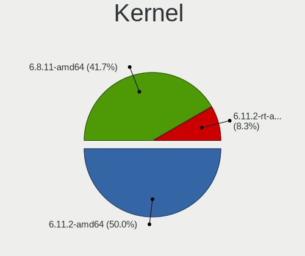
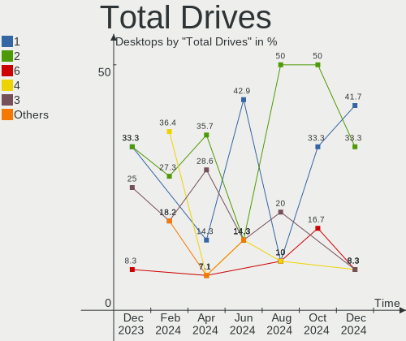
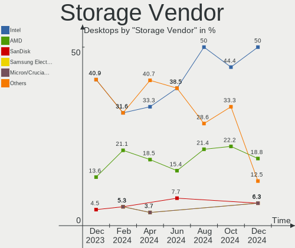
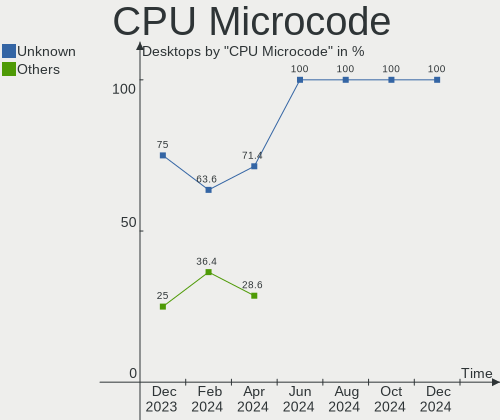

Kali - Hardware Trends (Desktops)
---------------------------------

A project to identify most popular hardware characteristics and track their change
over time based on data collected by Linux users at https://Linux-Hardware.org.

Anyone can contribute to this report by the [hw-probe](https://github.com/linuxhw/hw-probe) tool:

    sudo -E hw-probe -all -upload

This report is for one last month. Overall report since the beginning of time: [TestCoverage](https://github.com/linuxhw/TestCoverage)

Period: Nov, 2022.

Contents
--------

* [ System ](#system)
  - [ OS                       ](#os)
  - [ OS Family                ](#os-family)
  - [ Kernel                   ](#kernel)
  - [ Kernel Family            ](#kernel-family)
  - [ Kernel Major Ver.        ](#kernel-major-ver)
  - [ Arch                     ](#arch)
  - [ DE                       ](#de)
  - [ Display Server           ](#display-server)
  - [ Display Manager          ](#display-manager)
  - [ OS Lang                  ](#os-lang)
  - [ Boot Mode                ](#boot-mode)
  - [ Filesystem               ](#filesystem)
  - [ Part. scheme             ](#part-scheme)
  - [ Dual Boot with Linux/BSD ](#dual-boot-with-linuxbsd)
  - [ Dual Boot (Win)          ](#dual-boot-win)

* [ Board ](#board)
  - [ Vendor                   ](#vendor)
  - [ Model                    ](#model)
  - [ Model Family             ](#model-family)
  - [ MFG Year                 ](#mfg-year)
  - [ Form Factor              ](#form-factor)
  - [ Secure Boot              ](#secure-boot)
  - [ Coreboot                 ](#coreboot)
  - [ RAM Size                 ](#ram-size)
  - [ RAM Used                 ](#ram-used)
  - [ Total Drives             ](#total-drives)
  - [ Has CD-ROM               ](#has-cd-rom)
  - [ Has Ethernet             ](#has-ethernet)
  - [ Has WiFi                 ](#has-wifi)
  - [ Has Bluetooth            ](#has-bluetooth)

* [ Location ](#location)
  - [ Country                  ](#country)
  - [ City                     ](#city)

* [ Drives ](#drives)
  - [ Drive Vendor             ](#drive-vendor)
  - [ Drive Model              ](#drive-model)
  - [ HDD Vendor               ](#hdd-vendor)
  - [ SSD Vendor               ](#ssd-vendor)
  - [ Drive Kind               ](#drive-kind)
  - [ Drive Connector          ](#drive-connector)
  - [ Drive Size               ](#drive-size)
  - [ Space Total              ](#space-total)
  - [ Space Used               ](#space-used)
  - [ Malfunc. Drives          ](#malfunc-drives)
  - [ Malfunc. Drive Vendor    ](#malfunc-drive-vendor)
  - [ Malfunc. HDD Vendor      ](#malfunc-hdd-vendor)
  - [ Malfunc. Drive Kind      ](#malfunc-drive-kind)
  - [ Failed Drives            ](#failed-drives)
  - [ Failed Drive Vendor      ](#failed-drive-vendor)
  - [ Drive Status             ](#drive-status)

* [ Storage controller ](#storage-controller)
  - [ Storage Vendor           ](#storage-vendor)
  - [ Storage Model            ](#storage-model)
  - [ Storage Kind             ](#storage-kind)

* [ Processor ](#processor)
  - [ CPU Vendor               ](#cpu-vendor)
  - [ CPU Model                ](#cpu-model)
  - [ CPU Model Family         ](#cpu-model-family)
  - [ CPU Cores                ](#cpu-cores)
  - [ CPU Sockets              ](#cpu-sockets)
  - [ CPU Threads              ](#cpu-threads)
  - [ CPU Op-Modes             ](#cpu-op-modes)
  - [ CPU Microcode            ](#cpu-microcode)
  - [ CPU Microarch            ](#cpu-microarch)

* [ Graphics ](#graphics)
  - [ GPU Vendor               ](#gpu-vendor)
  - [ GPU Model                ](#gpu-model)
  - [ GPU Combo                ](#gpu-combo)
  - [ GPU Driver               ](#gpu-driver)
  - [ GPU Memory               ](#gpu-memory)

* [ Monitor ](#monitor)
  - [ Monitor Vendor           ](#monitor-vendor)
  - [ Monitor Model            ](#monitor-model)
  - [ Monitor Resolution       ](#monitor-resolution)
  - [ Monitor Diagonal         ](#monitor-diagonal)
  - [ Monitor Width            ](#monitor-width)
  - [ Aspect Ratio             ](#aspect-ratio)
  - [ Monitor Area             ](#monitor-area)
  - [ Pixel Density            ](#pixel-density)
  - [ Multiple Monitors        ](#multiple-monitors)

* [ Network ](#network)
  - [ Net Controller Vendor    ](#net-controller-vendor)
  - [ Net Controller Model     ](#net-controller-model)
  - [ Wireless Vendor          ](#wireless-vendor)
  - [ Wireless Model           ](#wireless-model)
  - [ Ethernet Vendor          ](#ethernet-vendor)
  - [ Ethernet Model           ](#ethernet-model)
  - [ Net Controller Kind      ](#net-controller-kind)
  - [ Used Controller          ](#used-controller)
  - [ NICs                     ](#nics)
  - [ IPv6                     ](#ipv6)

* [ Bluetooth ](#bluetooth)
  - [ Bluetooth Vendor         ](#bluetooth-vendor)
  - [ Bluetooth Model          ](#bluetooth-model)

* [ Sound ](#sound)
  - [ Sound Vendor             ](#sound-vendor)
  - [ Sound Model              ](#sound-model)

* [ Memory ](#memory)
  - [ Memory Vendor            ](#memory-vendor)
  - [ Memory Model             ](#memory-model)
  - [ Memory Kind              ](#memory-kind)
  - [ Memory Form Factor       ](#memory-form-factor)
  - [ Memory Size              ](#memory-size)
  - [ Memory Speed             ](#memory-speed)

* [ Printers & scanners ](#printers--scanners)
  - [ Printer Vendor           ](#printer-vendor)
  - [ Printer Model            ](#printer-model)
  - [ Scanner Vendor           ](#scanner-vendor)
  - [ Scanner Model            ](#scanner-model)

* [ Camera ](#camera)
  - [ Camera Vendor            ](#camera-vendor)
  - [ Camera Model             ](#camera-model)

* [ Security ](#security)
  - [ Fingerprint Vendor       ](#fingerprint-vendor)
  - [ Fingerprint Model        ](#fingerprint-model)
  - [ Chipcard Vendor          ](#chipcard-vendor)
  - [ Chipcard Model           ](#chipcard-model)

* [ Unsupported ](#unsupported)
  - [ Unsupported Devices      ](#unsupported-devices)
  - [ Unsupported Device Types ](#unsupported-device-types)

System
------

OS
--

Installed operating systems

| Name        | Desktops | Percent |
|-------------|----------|---------|
| Kali 2022.3 | 6        | 75%     |
| Kali 2022.4 | 2        | 25%     |

OS Family
---------

OS without a version

| Name | Desktops | Percent |
|------|----------|---------|
| Kali | 8        | 100%    |

Kernel
------

Version of the Linux kernel

| Version            | Desktops | Percent |
|--------------------|----------|---------|
| 5.19.0-kali2-amd64 | 5        | 62.5%   |
| 6.0.0-kali3-amd64  | 2        | 25%     |
| 6.0.0-4-amd64      | 1        | 12.5%   |

Kernel Family
-------------

Linux kernel without a distro release

| Version | Desktops | Percent |
|---------|----------|---------|
| 5.19.0  | 5        | 62.5%   |
| 6.0.0   | 3        | 37.5%   |

Kernel Major Ver.
-----------------

Linux kernel major version

| Version | Desktops | Percent |
|---------|----------|---------|
| 5.19    | 5        | 62.5%   |
| 6.0     | 3        | 37.5%   |

Arch
----

OS architecture (x86_64, i586, etc.)

| Name   | Desktops | Percent |
|--------|----------|---------|
| x86_64 | 8        | 100%    |

DE
--

Desktop Environment

| Name  | Desktops | Percent |
|-------|----------|---------|
| XFCE  | 4        | 50%     |
| KDE5  | 2        | 25%     |
| MATE  | 1        | 12.5%   |
| GNOME | 1        | 12.5%   |

Display Server
--------------

X11 or Wayland

| Name | Desktops | Percent |
|------|----------|---------|
| X11  | 8        | 100%    |

Display Manager
---------------

SDDM, LightDM, etc.

| Name    | Desktops | Percent |
|---------|----------|---------|
| Unknown | 3        | 37.5%   |
| LightDM | 2        | 25%     |
| GDM3    | 2        | 25%     |
| SDDM    | 1        | 12.5%   |

OS Lang
-------

Language

| Lang  | Desktops | Percent |
|-------|----------|---------|
| en_US | 3        | 37.5%   |
| pt_BR | 2        | 25%     |
| ru_RU | 1        | 12.5%   |
| en_ZA | 1        | 12.5%   |
| en_IN | 1        | 12.5%   |

Boot Mode
---------

EFI or BIOS

| Mode | Desktops | Percent |
|------|----------|---------|
| BIOS | 5        | 62.5%   |
| EFI  | 3        | 37.5%   |

Filesystem
----------

Type of filesystem

| Type | Desktops | Percent |
|------|----------|---------|
| Ext4 | 8        | 100%    |

Part. scheme
------------

Scheme of partitioning

| Type    | Desktops | Percent |
|---------|----------|---------|
| GPT     | 5        | 62.5%   |
| Unknown | 3        | 37.5%   |

Dual Boot with Linux/BSD
------------------------

Hosting more than one Linux/BSD

| Dual boot | Desktops | Percent |
|-----------|----------|---------|
| No        | 6        | 75%     |
| Yes       | 2        | 25%     |

Dual Boot (Win)
---------------

Hosting Linux and Windows

| Dual boot | Desktops | Percent |
|-----------|----------|---------|
| Yes       | 4        | 50%     |
| No        | 4        | 50%     |

Board
-----

Vendor
------

Motherboard manufacturer

| Name                | Desktops | Percent |
|---------------------|----------|---------|
| MSI                 | 2        | 25%     |
| Lenovo              | 1        | 12.5%   |
| Hewlett-Packard     | 1        | 12.5%   |
| Gigabyte Technology | 1        | 12.5%   |
| Dell                | 1        | 12.5%   |
| Colorful Technology | 1        | 12.5%   |
| ASUSTek Computer    | 1        | 12.5%   |

Model
-----

Motherboard model

| Name                            | Desktops | Percent |
|---------------------------------|----------|---------|
| MSI MS-7D15                     | 1        | 12.5%   |
| MSI MS-7998                     | 1        | 12.5%   |
| Lenovo ThinkCentre M62z 51061A2 | 1        | 12.5%   |
| HP ProDesk 400 G3 SFF           | 1        | 12.5%   |
| Gigabyte AB350M-DS3H            | 1        | 12.5%   |
| Dell OptiPlex 7040              | 1        | 12.5%   |
| Colorful DJ H310M-E             | 1        | 12.5%   |
| ASUS Maximus V FORMULA          | 1        | 12.5%   |

Model Family
------------

Motherboard model prefix

| Name                 | Desktops | Percent |
|----------------------|----------|---------|
| MSI MS-7D15          | 1        | 12.5%   |
| MSI MS-7998          | 1        | 12.5%   |
| Lenovo ThinkCentre   | 1        | 12.5%   |
| HP ProDesk           | 1        | 12.5%   |
| Gigabyte AB350M-DS3H | 1        | 12.5%   |
| Dell OptiPlex        | 1        | 12.5%   |
| Colorful DJ          | 1        | 12.5%   |
| ASUS Maximus         | 1        | 12.5%   |

MFG Year
--------

Motherboard manufacture year

| Year | Desktops | Percent |
|------|----------|---------|
| 2015 | 2        | 25%     |
| 2013 | 2        | 25%     |
| 2021 | 1        | 12.5%   |
| 2019 | 1        | 12.5%   |
| 2018 | 1        | 12.5%   |
| 2016 | 1        | 12.5%   |

Form Factor
-----------

Physical design of the computer

| Name    | Desktops | Percent |
|---------|----------|---------|
| Desktop | 8        | 100%    |

Secure Boot
-----------

Enabled or disabled

| State    | Desktops | Percent |
|----------|----------|---------|
| Disabled | 8        | 100%    |

Coreboot
--------

Have coreboot on board

| Used | Desktops | Percent |
|------|----------|---------|
| No   | 8        | 100%    |

RAM Size
--------

Total RAM memory

| Size in GB | Desktops | Percent |
|------------|----------|---------|
| 16.01-24.0 | 3        | 37.5%   |
| 4.01-8.0   | 2        | 25%     |
| 32.01-64.0 | 1        | 12.5%   |
| 24.01-32.0 | 1        | 12.5%   |
| 8.01-16.0  | 1        | 12.5%   |

RAM Used
--------

Used RAM memory

| Used GB    | Desktops | Percent |
|------------|----------|---------|
| 4.01-8.0   | 3        | 37.5%   |
| 2.01-3.0   | 2        | 25%     |
| 3.01-4.0   | 1        | 12.5%   |
| 16.01-24.0 | 1        | 12.5%   |
| 1.01-2.0   | 1        | 12.5%   |

Total Drives
------------

Number of drives on board

| Drives | Desktops | Percent |
|--------|----------|---------|
| 5      | 2        | 25%     |
| 1      | 2        | 25%     |
| 6      | 1        | 12.5%   |
| 4      | 1        | 12.5%   |
| 3      | 1        | 12.5%   |
| 2      | 1        | 12.5%   |

Has CD-ROM
----------

Has CD-ROM on board

| Presented | Desktops | Percent |
|-----------|----------|---------|
| No        | 8        | 100%    |

Has Ethernet
------------

Has Ethernet on board

| Presented | Desktops | Percent |
|-----------|----------|---------|
| Yes       | 8        | 100%    |

Has WiFi
--------

Has WiFi module

| Presented | Desktops | Percent |
|-----------|----------|---------|
| Yes       | 5        | 62.5%   |
| No        | 3        | 37.5%   |

Has Bluetooth
-------------

Has Bluetooth module

| Presented | Desktops | Percent |
|-----------|----------|---------|
| No        | 5        | 62.5%   |
| Yes       | 3        | 37.5%   |

Location
--------

Country
-------

Geographic location (country)

| Country      | Desktops | Percent |
|--------------|----------|---------|
| USA          | 3        | 37.5%   |
| Brazil       | 2        | 25%     |
| South Africa | 1        | 12.5%   |
| Russia       | 1        | 12.5%   |
| India        | 1        | 12.5%   |

City
----

Geographic location (city)

| City           | Desktops | Percent |
|----------------|----------|---------|
| Yekaterinburg  | 1        | 12.5%   |
| Reading        | 1        | 12.5%   |
| Rajkot         | 1        | 12.5%   |
| Ooltewah       | 1        | 12.5%   |
| Foz do Iguaçu | 1        | 12.5%   |
| Fort Worth     | 1        | 12.5%   |
| Cape Town      | 1        | 12.5%   |
| Campina Grande | 1        | 12.5%   |

Drives
------

Drive Vendor
------------

Hard drive vendors

| Vendor              | Desktops | Drives | Percent |
|---------------------|----------|--------|---------|
| Toshiba             | 6        | 6      | 26.09%  |
| WDC                 | 3        | 4      | 13.04%  |
| Seagate             | 3        | 3      | 13.04%  |
| Samsung Electronics | 3        | 7      | 13.04%  |
| Hitachi             | 3        | 3      | 13.04%  |
| XrayDisk            | 1        | 1      | 4.35%   |
| SanDisk             | 1        | 1      | 4.35%   |
| Rogueware           | 1        | 1      | 4.35%   |
| Kingston            | 1        | 1      | 4.35%   |
| KingSpec            | 1        | 1      | 4.35%   |

Drive Model
-----------

Hard drive models

| Model                                    | Desktops | Percent |
|------------------------------------------|----------|---------|
| XrayDisk 512GB                           | 1        | 3.7%    |
| WDC WD5000BEKT-60KA9T0 500GB             | 1        | 3.7%    |
| WDC WD3200BEVT-75ZCT2 320GB              | 1        | 3.7%    |
| WDC WD15EADS-00P8B0 1TB                  | 1        | 3.7%    |
| WDC WD10EZEX-00WN4A0 1TB                 | 1        | 3.7%    |
| Toshiba MQ02ABD100H 1TB                  | 1        | 3.7%    |
| Toshiba MQ01ABF050 500GB                 | 1        | 3.7%    |
| Toshiba MK5061GSY 500GB                  | 1        | 3.7%    |
| Toshiba HDWT140 4TB                      | 1        | 3.7%    |
| Toshiba DT01ACA200 2TB                   | 1        | 3.7%    |
| Toshiba DT01ACA050 500GB                 | 1        | 3.7%    |
| Seagate ST500DM002-1BD142 500GB          | 1        | 3.7%    |
| Seagate ST1000LM024 HN-M101MBB 1TB       | 1        | 3.7%    |
| Seagate Expansion HDD 5TB                | 1        | 3.7%    |
| SanDisk SDSSDA120G 120GB                 | 1        | 3.7%    |
| Samsung SSD 980 1TB                      | 1        | 3.7%    |
| Samsung SSD 840 PRO Series 128GB         | 1        | 3.7%    |
| Samsung SSD 750 EVO 250GB                | 1        | 3.7%    |
| Samsung NVMe SSD Drive 1TB               | 1        | 3.7%    |
| Samsung MZ7PA128HMCD-010L1 128GB SSD     | 1        | 3.7%    |
| Samsung HM250HJ 250GB                    | 1        | 3.7%    |
| Rogueware 2.5" S 1TB SSD                 | 1        | 3.7%    |
| Kingston SNVS250G 250GB                  | 1        | 3.7%    |
| KingSpec P4-240 240GB SSD                | 1        | 3.7%    |
| Hitachi HTS727550A9E364 500GB            | 1        | 3.7%    |
| Hitachi HDT722525DLA380 41N3150LEN 250GB | 1        | 3.7%    |
| Hitachi HDP725050GLA360 500GB            | 1        | 3.7%    |

HDD Vendor
----------

Hard disk drive vendors

| Vendor              | Desktops | Drives | Percent |
|---------------------|----------|--------|---------|
| Toshiba             | 6        | 6      | 37.5%   |
| WDC                 | 3        | 4      | 18.75%  |
| Seagate             | 3        | 3      | 18.75%  |
| Hitachi             | 3        | 3      | 18.75%  |
| Samsung Electronics | 1        | 1      | 6.25%   |

SSD Vendor
----------

Solid state drive vendors

| Vendor              | Desktops | Drives | Percent |
|---------------------|----------|--------|---------|
| Samsung Electronics | 2        | 4      | 40%     |
| SanDisk             | 1        | 1      | 20%     |
| Rogueware           | 1        | 1      | 20%     |
| KingSpec            | 1        | 1      | 20%     |

Drive Kind
----------

HDD or SSD

| Kind    | Desktops | Drives | Percent |
|---------|----------|--------|---------|
| HDD     | 8        | 17     | 53.33%  |
| SSD     | 4        | 7      | 26.67%  |
| NVMe    | 2        | 3      | 13.33%  |
| Unknown | 1        | 1      | 6.67%   |

Drive Connector
---------------

SATA, SAS, NVMe, etc.

| Type | Desktops | Drives | Percent |
|------|----------|--------|---------|
| SATA | 8        | 24     | 72.73%  |
| NVMe | 2        | 3      | 18.18%  |
| SAS  | 1        | 1      | 9.09%   |

Drive Size
----------

Size of hard drive

| Size in TB | Desktops | Drives | Percent |
|------------|----------|--------|---------|
| 0.01-0.5   | 7        | 16     | 50%     |
| 0.51-1.0   | 4        | 5      | 28.57%  |
| 3.01-4.0   | 1        | 1      | 7.14%   |
| 1.01-2.0   | 1        | 1      | 7.14%   |
| 4.01-10.0  | 1        | 1      | 7.14%   |

Space Total
-----------

Amount of disk space available on the file system

| Size in GB     | Desktops | Percent |
|----------------|----------|---------|
| More than 3000 | 3        | 37.5%   |
| 101-250        | 3        | 37.5%   |
| 1001-2000      | 1        | 12.5%   |
| 501-1000       | 1        | 12.5%   |

Space Used
----------

Amount of used disk space

| Used GB   | Desktops | Percent |
|-----------|----------|---------|
| 501-1000  | 2        | 25%     |
| 21-50     | 1        | 12.5%   |
| 2001-3000 | 1        | 12.5%   |
| 101-250   | 1        | 12.5%   |
| 1001-2000 | 1        | 12.5%   |
| 1-20      | 1        | 12.5%   |
| 51-100    | 1        | 12.5%   |

Malfunc. Drives
---------------

Drive models with a malfunction

| Model                           | Desktops | Drives | Percent |
|---------------------------------|----------|--------|---------|
| WDC WD5000BEKT-60KA9T0 500GB    | 1        | 1      | 20%     |
| WDC WD3200BEVT-75ZCT2 320GB     | 1        | 1      | 20%     |
| WDC WD10EZEX-00WN4A0 1TB        | 1        | 1      | 20%     |
| Toshiba DT01ACA050 500GB        | 1        | 1      | 20%     |
| Seagate ST500DM002-1BD142 500GB | 1        | 1      | 20%     |

Malfunc. Drive Vendor
---------------------

Vendors of faulty drives

| Vendor  | Desktops | Drives | Percent |
|---------|----------|--------|---------|
| WDC     | 2        | 3      | 50%     |
| Toshiba | 1        | 1      | 25%     |
| Seagate | 1        | 1      | 25%     |

Malfunc. HDD Vendor
-------------------

Vendors of faulty HDD drives

| Vendor  | Desktops | Drives | Percent |
|---------|----------|--------|---------|
| WDC     | 2        | 3      | 50%     |
| Toshiba | 1        | 1      | 25%     |
| Seagate | 1        | 1      | 25%     |

Malfunc. Drive Kind
-------------------

Kinds of faulty drives

| Kind | Desktops | Drives | Percent |
|------|----------|--------|---------|
| HDD  | 3        | 5      | 100%    |

Failed Drives
-------------

Failed drive models

Zero info for selected period =(

Failed Drive Vendor
-------------------

Failed drive vendors

Zero info for selected period =(

Drive Status
------------

Number of failed and malfunc. drives

| Status   | Desktops | Drives | Percent |
|----------|----------|--------|---------|
| Works    | 5        | 12     | 41.67%  |
| Detected | 4        | 11     | 33.33%  |
| Malfunc  | 3        | 5      | 25%     |

Storage controller
------------------

Storage Vendor
--------------

Storage controller vendors

| Vendor                      | Desktops | Percent |
|-----------------------------|----------|---------|
| Intel                       | 7        | 63.64%  |
| Samsung Electronics         | 1        | 9.09%   |
| Kingston Technology Company | 1        | 9.09%   |
| ASMedia Technology          | 1        | 9.09%   |
| AMD                         | 1        | 9.09%   |

Storage Model
-------------

Storage controller models

| Model                                                                         | Desktops | Percent |
|-------------------------------------------------------------------------------|----------|---------|
| Intel Q170/Q150/B150/H170/H110/Z170/CM236 Chipset SATA Controller [AHCI Mode] | 2        | 16.67%  |
| Samsung NVMe SSD Controller 980                                               | 1        | 8.33%   |
| Kingston Company Company Non-Volatile memory controller                       | 1        | 8.33%   |
| Intel SATA Controller [RAID mode]                                             | 1        | 8.33%   |
| Intel 7 Series/C210 Series Chipset Family 6-port SATA Controller [AHCI mode]  | 1        | 8.33%   |
| Intel 6 Series/C200 Series Chipset Family 6 port Desktop SATA AHCI Controller | 1        | 8.33%   |
| Intel 500 Series Chipset Family SATA AHCI Controller                          | 1        | 8.33%   |
| Intel 200 Series PCH SATA controller [AHCI mode]                              | 1        | 8.33%   |
| ASMedia ASM1062 Serial ATA Controller                                         | 1        | 8.33%   |
| AMD X370 Series Chipset SATA Controller                                       | 1        | 8.33%   |
| AMD FCH SATA Controller [AHCI mode]                                           | 1        | 8.33%   |

Storage Kind
------------

Kind of storage controller (IDE, SATA, NVMe, SAS, ...)

| Kind | Desktops | Percent |
|------|----------|---------|
| SATA | 7        | 70%     |
| NVMe | 2        | 20%     |
| RAID | 1        | 10%     |

Processor
---------

CPU Vendor
----------

Processor vendors

| Vendor | Desktops | Percent |
|--------|----------|---------|
| Intel  | 7        | 87.5%   |
| AMD    | 1        | 12.5%   |

CPU Model
---------

Processor models

| Model                                  | Desktops | Percent |
|----------------------------------------|----------|---------|
| Intel Pentium CPU G4400 @ 3.30GHz      | 1        | 12.5%   |
| Intel Core i7-6700K CPU @ 4.00GHz      | 1        | 12.5%   |
| Intel Core i7-6700 CPU @ 3.40GHz       | 1        | 12.5%   |
| Intel Core i7-3770K CPU @ 3.50GHz      | 1        | 12.5%   |
| Intel Core i5-3470S CPU @ 2.90GHz      | 1        | 12.5%   |
| Intel Core i3-9100F CPU @ 3.60GHz      | 1        | 12.5%   |
| Intel 11th Gen Core i5-11400 @ 2.60GHz | 1        | 12.5%   |
| AMD Ryzen 5 1600 Six-Core Processor    | 1        | 12.5%   |

CPU Model Family
----------------

Processor model prefix

| Model         | Desktops | Percent |
|---------------|----------|---------|
| Intel Core i7 | 3        | 37.5%   |
| Other         | 1        | 12.5%   |
| Intel Pentium | 1        | 12.5%   |
| Intel Core i5 | 1        | 12.5%   |
| Intel Core i3 | 1        | 12.5%   |
| AMD Ryzen 5   | 1        | 12.5%   |

CPU Cores
---------

Number of processor cores

| Number | Desktops | Percent |
|--------|----------|---------|
| 4      | 5        | 62.5%   |
| 6      | 2        | 25%     |
| 2      | 1        | 12.5%   |

CPU Sockets
-----------

Number of sockets

| Number | Desktops | Percent |
|--------|----------|---------|
| 1      | 8        | 100%    |

CPU Threads
-----------

Threads per core (Hyper-Threading)

| Number | Desktops | Percent |
|--------|----------|---------|
| 2      | 5        | 62.5%   |
| 1      | 3        | 37.5%   |

CPU Op-Modes
------------

CPU Operation Modes (32-bit, 64-bit)

| Op mode        | Desktops | Percent |
|----------------|----------|---------|
| 32-bit, 64-bit | 8        | 100%    |

CPU Microcode
-------------

Microcode number

| Number     | Desktops | Percent |
|------------|----------|---------|
| 0x506e3    | 3        | 37.5%   |
| Unknown    | 2        | 25%     |
| 0x906ea    | 1        | 12.5%   |
| 0x306a9    | 1        | 12.5%   |
| 0x08001138 | 1        | 12.5%   |

CPU Microarch
-------------

Microarchitecture

| Name      | Desktops | Percent |
|-----------|----------|---------|
| Skylake   | 3        | 37.5%   |
| IvyBridge | 2        | 25%     |
| Zen       | 1        | 12.5%   |
| KabyLake  | 1        | 12.5%   |
| Unknown   | 1        | 12.5%   |

Graphics
--------

GPU Vendor
----------

Vendors of graphics cards

| Vendor | Desktops | Percent |
|--------|----------|---------|
| Intel  | 4        | 40%     |
| AMD    | 4        | 40%     |
| Nvidia | 2        | 20%     |

GPU Model
---------

Graphics card models

| Model                                                             | Desktops | Percent |
|-------------------------------------------------------------------|----------|---------|
| Nvidia GP106 [GeForce GTX 1060 6GB]                               | 1        | 10%     |
| Nvidia GK208B [GeForce GT 710]                                    | 1        | 10%     |
| Intel Xeon E3-1200 v2/3rd Gen Core processor Graphics Controller  | 1        | 10%     |
| Intel RocketLake-S GT1 [UHD Graphics 730]                         | 1        | 10%     |
| Intel IvyBridge GT2 [HD Graphics 4000]                            | 1        | 10%     |
| Intel HD Graphics 510                                             | 1        | 10%     |
| AMD Oland XT [Radeon HD 8670 / R5 340X OEM / R7 250/350/350X OEM] | 1        | 10%     |
| AMD Ellesmere [Radeon RX 470/480/570/570X/580/580X/590]           | 1        | 10%     |
| AMD Barts XT [Radeon HD 6870]                                     | 1        | 10%     |
| AMD Baffin [Radeon RX 550 640SP / RX 560/560X]                    | 1        | 10%     |

GPU Combo
---------

Combinations of graphics cards

| Name        | Desktops | Percent |
|-------------|----------|---------|
| 1 x AMD     | 3        | 37.5%   |
| 1 x Nvidia  | 2        | 25%     |
| 1 x Intel   | 2        | 25%     |
| Intel + AMD | 1        | 12.5%   |

GPU Driver
----------

Free vs proprietary

| Driver  | Desktops | Percent |
|---------|----------|---------|
| Free    | 7        | 87.5%   |
| Unknown | 1        | 12.5%   |

GPU Memory
----------

Total video memory

| Size in GB | Desktops | Percent |
|------------|----------|---------|
| Unknown    | 4        | 50%     |
| 3.01-4.0   | 2        | 25%     |
| 5.01-6.0   | 1        | 12.5%   |
| 1.01-2.0   | 1        | 12.5%   |

Monitor
-------

Monitor Vendor
--------------

Monitor vendors

| Vendor              | Desktops | Percent |
|---------------------|----------|---------|
| Dell                | 2        | 33.33%  |
| Samsung Electronics | 1        | 16.67%  |
| Hewlett-Packard     | 1        | 16.67%  |
| GDH                 | 1        | 16.67%  |
| BenQ                | 1        | 16.67%  |

Monitor Model
-------------

Monitor models

| Model                                                                   | Desktops | Percent |
|-------------------------------------------------------------------------|----------|---------|
| Samsung Electronics LCD Monitor SAM0D3B 3840x2160 1872x1053mm 84.6-inch | 1        | 16.67%  |
| Hewlett-Packard LE1901w HWP2842 1440x900 410x256mm 19.0-inch            | 1        | 16.67%  |
| GDH PHILCO GDH0030 1920x540 708x398mm 32.0-inch                         | 1        | 16.67%  |
| Dell SE2416H DELD081 1920x1080 527x296mm 23.8-inch                      | 1        | 16.67%  |
| Dell 2001FP DELA008 1600x1200 367x275mm 18.1-inch                       | 1        | 16.67%  |
| BenQ RL2460H BNQ7F34 1920x1080 531x299mm 24.0-inch                      | 1        | 16.67%  |

Monitor Resolution
------------------

Monitor screen resolution

| Resolution       | Desktops | Percent |
|------------------|----------|---------|
| 3840x2160 (4K)   | 2        | 33.33%  |
| 1920x1080 (FHD)  | 2        | 33.33%  |
| 1600x1200        | 1        | 16.67%  |
| 1440x900 (WXGA+) | 1        | 16.67%  |

Monitor Diagonal
----------------

Diagonal size in inches

| Inches | Desktops | Percent |
|--------|----------|---------|
| 24     | 2        | 33.33%  |
| 84     | 1        | 16.67%  |
| 52     | 1        | 16.67%  |
| 20     | 1        | 16.67%  |
| 19     | 1        | 16.67%  |

Monitor Width
-------------

Physical width

| Width in mm | Desktops | Percent |
|-------------|----------|---------|
| 501-600     | 2        | 33.33%  |
| 401-500     | 2        | 33.33%  |
| 1501-2000   | 1        | 16.67%  |
| 1001-1500   | 1        | 16.67%  |

Aspect Ratio
------------

Proportional relationship between the width and the height

| Ratio | Desktops | Percent |
|-------|----------|---------|
| 16/9  | 4        | 66.67%  |
| 4/3   | 1        | 16.67%  |
| 16/10 | 1        | 16.67%  |

Monitor Area
------------

Area in inch²

| Area in inch² | Desktops | Percent |
|----------------|----------|---------|
| More than 1000 | 2        | 33.33%  |
| 201-250        | 2        | 33.33%  |
| 151-200        | 2        | 33.33%  |

Pixel Density
-------------

Pixels per inch

| Density | Desktops | Percent |
|---------|----------|---------|
| 51-100  | 4        | 80%     |
| 1-50    | 1        | 20%     |

Multiple Monitors
-----------------

Total monitors connected

| Total | Desktops | Percent |
|-------|----------|---------|
| 1     | 6        | 75%     |
| 2     | 1        | 12.5%   |
| 0     | 1        | 12.5%   |

Network
-------

Net Controller Vendor
---------------------

Controller vendors

| Vendor                | Desktops | Percent |
|-----------------------|----------|---------|
| Realtek Semiconductor | 7        | 41.18%  |
| Intel                 | 5        | 29.41%  |
| Broadcom              | 2        | 11.76%  |
| NetGear               | 1        | 5.88%   |
| ASIX Electronics      | 1        | 5.88%   |
| Arduino SA            | 1        | 5.88%   |

Net Controller Model
--------------------

Controller models

| Model                                                             | Desktops | Percent |
|-------------------------------------------------------------------|----------|---------|
| Realtek RTL8111/8168/8411 PCI Express Gigabit Ethernet Controller | 4        | 22.22%  |
| Realtek RTL8812AU 802.11a/b/g/n/ac 2T2R DB WLAN Adapter           | 1        | 5.56%   |
| Realtek RTL8188EE Wireless Network Adapter                        | 1        | 5.56%   |
| Realtek RTL8187 Wireless Adapter                                  | 1        | 5.56%   |
| Realtek RTL8125 2.5GbE Controller                                 | 1        | 5.56%   |
| NetGear A6210                                                     | 1        | 5.56%   |
| Intel Wi-Fi 6 AX210/AX211/AX411 160MHz                            | 1        | 5.56%   |
| Intel Ethernet Connection (2) I219-V                              | 1        | 5.56%   |
| Intel Ethernet Connection (2) I219-LM                             | 1        | 5.56%   |
| Intel Ethernet Connection (10) I219-V                             | 1        | 5.56%   |
| Intel 82579V Gigabit Network Connection                           | 1        | 5.56%   |
| Broadcom BCM43228 802.11a/b/g/n                                   | 1        | 5.56%   |
| Broadcom BCM43225 802.11b/g/n                                     | 1        | 5.56%   |
| ASIX AX88772                                                      | 1        | 5.56%   |
| Arduino SA Uno R3 (CDC ACM)                                       | 1        | 5.56%   |

Wireless Vendor
---------------

Wireless vendors

| Vendor                | Desktops | Percent |
|-----------------------|----------|---------|
| Realtek Semiconductor | 3        | 42.86%  |
| Broadcom              | 2        | 28.57%  |
| NetGear               | 1        | 14.29%  |
| Intel                 | 1        | 14.29%  |

Wireless Model
--------------

Wireless models

| Model                                                   | Desktops | Percent |
|---------------------------------------------------------|----------|---------|
| Realtek RTL8812AU 802.11a/b/g/n/ac 2T2R DB WLAN Adapter | 1        | 14.29%  |
| Realtek RTL8188EE Wireless Network Adapter              | 1        | 14.29%  |
| Realtek RTL8187 Wireless Adapter                        | 1        | 14.29%  |
| NetGear A6210                                           | 1        | 14.29%  |
| Intel Wi-Fi 6 AX210/AX211/AX411 160MHz                  | 1        | 14.29%  |
| Broadcom BCM43228 802.11a/b/g/n                         | 1        | 14.29%  |
| Broadcom BCM43225 802.11b/g/n                           | 1        | 14.29%  |

Ethernet Vendor
---------------

Ethernet vendors

| Vendor                | Desktops | Percent |
|-----------------------|----------|---------|
| Realtek Semiconductor | 5        | 50%     |
| Intel                 | 4        | 40%     |
| ASIX Electronics      | 1        | 10%     |

Ethernet Model
--------------

Ethernet models

| Model                                                             | Desktops | Percent |
|-------------------------------------------------------------------|----------|---------|
| Realtek RTL8111/8168/8411 PCI Express Gigabit Ethernet Controller | 4        | 40%     |
| Realtek RTL8125 2.5GbE Controller                                 | 1        | 10%     |
| Intel Ethernet Connection (2) I219-V                              | 1        | 10%     |
| Intel Ethernet Connection (2) I219-LM                             | 1        | 10%     |
| Intel Ethernet Connection (10) I219-V                             | 1        | 10%     |
| Intel 82579V Gigabit Network Connection                           | 1        | 10%     |
| ASIX AX88772                                                      | 1        | 10%     |

Net Controller Kind
-------------------

Ethernet, WiFi or modem

| Kind     | Desktops | Percent |
|----------|----------|---------|
| Ethernet | 8        | 57.14%  |
| WiFi     | 5        | 35.71%  |
| Modem    | 1        | 7.14%   |

Used Controller
---------------

Currently used network controller

| Kind     | Desktops | Percent |
|----------|----------|---------|
| Ethernet | 6        | 66.67%  |
| WiFi     | 3        | 33.33%  |

NICs
----

Total network controllers on board

| Total | Desktops | Percent |
|-------|----------|---------|
| 1     | 4        | 50%     |
| 2     | 3        | 37.5%   |
| 3     | 1        | 12.5%   |

IPv6
----

IPv6 vs IPv4

| Used | Desktops | Percent |
|------|----------|---------|
| No   | 5        | 62.5%   |
| Yes  | 3        | 37.5%   |

Bluetooth
---------

Bluetooth Vendor
----------------

Controller vendors

| Vendor                  | Desktops | Percent |
|-------------------------|----------|---------|
| Logitech                | 1        | 25%     |
| Cambridge Silicon Radio | 1        | 25%     |
| Broadcom                | 1        | 25%     |
| ASUSTek Computer        | 1        | 25%     |

Bluetooth Model
---------------

Controller models

| Model                                               | Desktops | Percent |
|-----------------------------------------------------|----------|---------|
| Logitech BT Mini-Receiver (HCI mode)                | 1        | 25%     |
| Cambridge Silicon Radio Bluetooth Dongle (HCI mode) | 1        | 25%     |
| Broadcom BCM2045 Bluetooth                          | 1        | 25%     |
| ASUS BCM20702A0                                     | 1        | 25%     |

Sound
-----

Sound Vendor
------------

Sound card vendors

| Vendor                | Desktops | Percent |
|-----------------------|----------|---------|
| Intel                 | 7        | 38.89%  |
| AMD                   | 4        | 22.22%  |
| Nvidia                | 2        | 11.11%  |
| Yamaha                | 1        | 5.56%   |
| Texas Instruments     | 1        | 5.56%   |
| Realtek Semiconductor | 1        | 5.56%   |
| Logitech              | 1        | 5.56%   |
| C-Media Electronics   | 1        | 5.56%   |

Sound Model
-----------

Sound card models

| Model                                                                      | Desktops | Percent |
|----------------------------------------------------------------------------|----------|---------|
| Intel 100 Series/C230 Series Chipset Family HD Audio Controller            | 3        | 15.79%  |
| Yamaha AG06/AG03                                                           | 1        | 5.26%   |
| Texas Instruments PCM2902 Audio Codec                                      | 1        | 5.26%   |
| Realtek Semiconductor DIXON GAMING DN-GM30                                 | 1        | 5.26%   |
| Nvidia GP106 High Definition Audio Controller                              | 1        | 5.26%   |
| Nvidia GK208 HDMI/DP Audio Controller                                      | 1        | 5.26%   |
| Logitech Logitech USB Microphone                                           | 1        | 5.26%   |
| Intel Tiger Lake-H HD Audio Controller                                     | 1        | 5.26%   |
| Intel 7 Series/C216 Chipset Family High Definition Audio Controller        | 1        | 5.26%   |
| Intel 6 Series/C200 Series Chipset Family High Definition Audio Controller | 1        | 5.26%   |
| Intel 200 Series PCH HD Audio                                              | 1        | 5.26%   |
| C-Media Electronics USB Audio Device                                       | 1        | 5.26%   |
| AMD Oland/Hainan/Cape Verde/Pitcairn HDMI Audio [Radeon HD 7000 Series]    | 1        | 5.26%   |
| AMD Family 17h (Models 00h-0fh) HD Audio Controller                        | 1        | 5.26%   |
| AMD Ellesmere HDMI Audio [Radeon RX 470/480 / 570/580/590]                 | 1        | 5.26%   |
| AMD Barts HDMI Audio [Radeon HD 6790/6850/6870 / 7720 OEM]                 | 1        | 5.26%   |
| AMD Baffin HDMI/DP Audio [Radeon RX 550 640SP / RX 560/560X]               | 1        | 5.26%   |

Memory
------

Memory Vendor
-------------

Memory module vendors

| Vendor              | Desktops | Percent |
|---------------------|----------|---------|
| Samsung Electronics | 2        | 33.33%  |
| Corsair             | 2        | 33.33%  |
| Kingston            | 1        | 16.67%  |
| Crucial             | 1        | 16.67%  |

Memory Model
------------

Memory module models

| Model                                                  | Desktops | Percent |
|--------------------------------------------------------|----------|---------|
| Samsung RAM Module 8GB DIMM DDR4 2133MT/s              | 1        | 14.29%  |
| Samsung RAM M378B5173QH0-CK0 4096MB DIMM DDR3 1600MT/s | 1        | 14.29%  |
| Kingston RAM 9905625-062.A00G 8GB DIMM DDR4 2133MT/s   | 1        | 14.29%  |
| Crucial RAM CB8GU2666.C8RT 8GB DIMM DDR4 2667MT/s      | 1        | 14.29%  |
| Crucial RAM CB8GU2666.C8NT 8GB DIMM DDR4 2667MT/s      | 1        | 14.29%  |
| Corsair RAM CMZ16GX3M2A2400C10 8GB DIMM DDR3 2400MT/s  | 1        | 14.29%  |
| Corsair RAM CMK16GX4M2E3200C16 8GB DIMM DDR4 3200MT/s  | 1        | 14.29%  |

Memory Kind
-----------

Memory module kinds

| Kind | Desktops | Percent |
|------|----------|---------|
| DDR4 | 4        | 66.67%  |
| DDR3 | 2        | 33.33%  |

Memory Form Factor
------------------

Physical design of the memory module

| Name | Desktops | Percent |
|------|----------|---------|
| DIMM | 6        | 100%    |

Memory Size
-----------

Memory module size

| Size | Desktops | Percent |
|------|----------|---------|
| 8192 | 5        | 83.33%  |
| 4096 | 1        | 16.67%  |

Memory Speed
------------

Memory module speed

| Speed | Desktops | Percent |
|-------|----------|---------|
| 2133  | 2        | 33.33%  |
| 3200  | 1        | 16.67%  |
| 2667  | 1        | 16.67%  |
| 2400  | 1        | 16.67%  |
| 1866  | 1        | 16.67%  |

Printers & scanners
-------------------

Printer Vendor
--------------

Printer device vendors

Zero info for selected period =(

Printer Model
-------------

Printer device models

Zero info for selected period =(

Scanner Vendor
--------------

Scanner device vendors

Zero info for selected period =(

Scanner Model
-------------

Scanner device models

Zero info for selected period =(

Camera
------

Camera Vendor
-------------

Camera device vendors

| Vendor                 | Desktops | Percent |
|------------------------|----------|---------|
| Microsoft              | 1        | 33.33%  |
| Generalplus Technology | 1        | 33.33%  |
| Cubeternet             | 1        | 33.33%  |

Camera Model
------------

Camera device models

| Model                      | Desktops | Percent |
|----------------------------|----------|---------|
| Microsoft Xbox NUI Camera  | 1        | 33.33%  |
| Generalplus GENERAL WEBCAM | 1        | 33.33%  |
| Cubeternet WebCam          | 1        | 33.33%  |

Security
--------

Fingerprint Vendor
------------------

Fingerprint sensor vendors

Zero info for selected period =(

Fingerprint Model
-----------------

Fingerprint sensor models

Zero info for selected period =(

Chipcard Vendor
---------------

Chipcard module vendors

Zero info for selected period =(

Chipcard Model
--------------

Chipcard module models

Zero info for selected period =(

Unsupported
-----------

Unsupported Devices
-------------------

Total unsupported devices on board

| Total | Desktops | Percent |
|-------|----------|---------|
| 0     | 7        | 87.5%   |
| 4     | 1        | 12.5%   |

Unsupported Device Types
------------------------

Types of unsupported devices

| Type          | Desktops | Percent |
|---------------|----------|---------|
| Net/wireless  | 1        | 33.33%  |
| Graphics card | 1        | 33.33%  |
| Camera        | 1        | 33.33%  |

