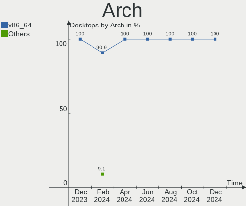
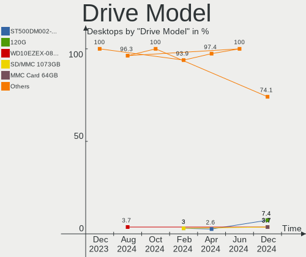
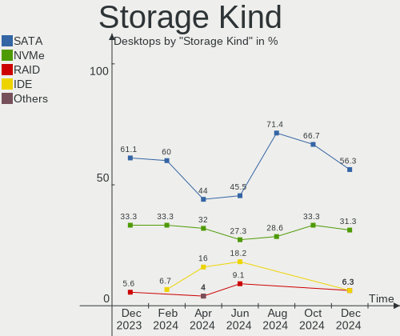
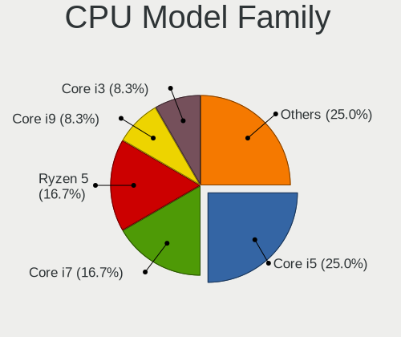
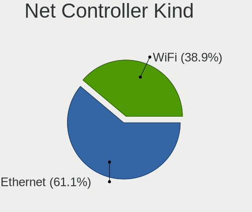

Kali - Hardware Trends (Desktops)
---------------------------------

A project to identify most popular hardware characteristics and track their change
over time based on data collected by Linux users at https://Linux-Hardware.org.

Anyone can contribute to this report by the [hw-probe](https://github.com/linuxhw/hw-probe) tool:

    sudo -E hw-probe -all -upload

This report is for one last month. Overall report since the beginning of time: [TestDays](https://github.com/linuxhw/TestDays)

Period: May, 2023.

Contents
--------

* [ System ](#system)
  - [ OS                       ](#os)
  - [ OS Family                ](#os-family)
  - [ Kernel                   ](#kernel)
  - [ Kernel Family            ](#kernel-family)
  - [ Kernel Major Ver.        ](#kernel-major-ver)
  - [ Arch                     ](#arch)
  - [ DE                       ](#de)
  - [ Display Server           ](#display-server)
  - [ Display Manager          ](#display-manager)
  - [ OS Lang                  ](#os-lang)
  - [ Boot Mode                ](#boot-mode)
  - [ Filesystem               ](#filesystem)
  - [ Part. scheme             ](#part-scheme)
  - [ Dual Boot with Linux/BSD ](#dual-boot-with-linuxbsd)
  - [ Dual Boot (Win)          ](#dual-boot-win)

* [ Board ](#board)
  - [ Vendor                   ](#vendor)
  - [ Model                    ](#model)
  - [ Model Family             ](#model-family)
  - [ MFG Year                 ](#mfg-year)
  - [ Form Factor              ](#form-factor)
  - [ Secure Boot              ](#secure-boot)
  - [ Coreboot                 ](#coreboot)
  - [ RAM Size                 ](#ram-size)
  - [ RAM Used                 ](#ram-used)
  - [ Total Drives             ](#total-drives)
  - [ Has CD-ROM               ](#has-cd-rom)
  - [ Has Ethernet             ](#has-ethernet)
  - [ Has WiFi                 ](#has-wifi)
  - [ Has Bluetooth            ](#has-bluetooth)

* [ Location ](#location)
  - [ Country                  ](#country)
  - [ City                     ](#city)

* [ Drives ](#drives)
  - [ Drive Vendor             ](#drive-vendor)
  - [ Drive Model              ](#drive-model)
  - [ HDD Vendor               ](#hdd-vendor)
  - [ SSD Vendor               ](#ssd-vendor)
  - [ Drive Kind               ](#drive-kind)
  - [ Drive Connector          ](#drive-connector)
  - [ Drive Size               ](#drive-size)
  - [ Space Total              ](#space-total)
  - [ Space Used               ](#space-used)
  - [ Malfunc. Drives          ](#malfunc-drives)
  - [ Malfunc. Drive Vendor    ](#malfunc-drive-vendor)
  - [ Malfunc. HDD Vendor      ](#malfunc-hdd-vendor)
  - [ Malfunc. Drive Kind      ](#malfunc-drive-kind)
  - [ Failed Drives            ](#failed-drives)
  - [ Failed Drive Vendor      ](#failed-drive-vendor)
  - [ Drive Status             ](#drive-status)

* [ Storage controller ](#storage-controller)
  - [ Storage Vendor           ](#storage-vendor)
  - [ Storage Model            ](#storage-model)
  - [ Storage Kind             ](#storage-kind)

* [ Processor ](#processor)
  - [ CPU Vendor               ](#cpu-vendor)
  - [ CPU Model                ](#cpu-model)
  - [ CPU Model Family         ](#cpu-model-family)
  - [ CPU Cores                ](#cpu-cores)
  - [ CPU Sockets              ](#cpu-sockets)
  - [ CPU Threads              ](#cpu-threads)
  - [ CPU Op-Modes             ](#cpu-op-modes)
  - [ CPU Microcode            ](#cpu-microcode)
  - [ CPU Microarch            ](#cpu-microarch)

* [ Graphics ](#graphics)
  - [ GPU Vendor               ](#gpu-vendor)
  - [ GPU Model                ](#gpu-model)
  - [ GPU Combo                ](#gpu-combo)
  - [ GPU Driver               ](#gpu-driver)
  - [ GPU Memory               ](#gpu-memory)

* [ Monitor ](#monitor)
  - [ Monitor Vendor           ](#monitor-vendor)
  - [ Monitor Model            ](#monitor-model)
  - [ Monitor Resolution       ](#monitor-resolution)
  - [ Monitor Diagonal         ](#monitor-diagonal)
  - [ Monitor Width            ](#monitor-width)
  - [ Aspect Ratio             ](#aspect-ratio)
  - [ Monitor Area             ](#monitor-area)
  - [ Pixel Density            ](#pixel-density)
  - [ Multiple Monitors        ](#multiple-monitors)

* [ Network ](#network)
  - [ Net Controller Vendor    ](#net-controller-vendor)
  - [ Net Controller Model     ](#net-controller-model)
  - [ Wireless Vendor          ](#wireless-vendor)
  - [ Wireless Model           ](#wireless-model)
  - [ Ethernet Vendor          ](#ethernet-vendor)
  - [ Ethernet Model           ](#ethernet-model)
  - [ Net Controller Kind      ](#net-controller-kind)
  - [ Used Controller          ](#used-controller)
  - [ NICs                     ](#nics)
  - [ IPv6                     ](#ipv6)

* [ Bluetooth ](#bluetooth)
  - [ Bluetooth Vendor         ](#bluetooth-vendor)
  - [ Bluetooth Model          ](#bluetooth-model)

* [ Sound ](#sound)
  - [ Sound Vendor             ](#sound-vendor)
  - [ Sound Model              ](#sound-model)

* [ Memory ](#memory)
  - [ Memory Vendor            ](#memory-vendor)
  - [ Memory Model             ](#memory-model)
  - [ Memory Kind              ](#memory-kind)
  - [ Memory Form Factor       ](#memory-form-factor)
  - [ Memory Size              ](#memory-size)
  - [ Memory Speed             ](#memory-speed)

* [ Printers & scanners ](#printers--scanners)
  - [ Printer Vendor           ](#printer-vendor)
  - [ Printer Model            ](#printer-model)
  - [ Scanner Vendor           ](#scanner-vendor)
  - [ Scanner Model            ](#scanner-model)

* [ Camera ](#camera)
  - [ Camera Vendor            ](#camera-vendor)
  - [ Camera Model             ](#camera-model)

* [ Security ](#security)
  - [ Fingerprint Vendor       ](#fingerprint-vendor)
  - [ Fingerprint Model        ](#fingerprint-model)
  - [ Chipcard Vendor          ](#chipcard-vendor)
  - [ Chipcard Model           ](#chipcard-model)

* [ Unsupported ](#unsupported)
  - [ Unsupported Devices      ](#unsupported-devices)
  - [ Unsupported Device Types ](#unsupported-device-types)

System
------

OS
--

Installed operating systems

| Name        | Desktops | Percent |
|-------------|----------|---------|
| Kali 2023.1 | 9        | 75%     |
| Kali 2023.2 | 3        | 25%     |

OS Family
---------

OS without a version

| Name | Desktops | Percent |
|------|----------|---------|
| Kali | 12       | 100%    |

Kernel
------

Version of the Linux kernel

| Version             | Desktops | Percent |
|---------------------|----------|---------|
| 6.1.0-kali7-amd64   | 5        | 41.67%  |
| 6.1.0-kali9-amd64   | 3        | 25%     |
| 6.1.0-kali5-amd64   | 3        | 25%     |
| 6.1.0-kali7-686-pae | 1        | 8.33%   |

Kernel Family
-------------

Linux kernel without a distro release

| Version | Desktops | Percent |
|---------|----------|---------|
| 6.1.0   | 12       | 100%    |

Kernel Major Ver.
-----------------

Linux kernel major version

| Version | Desktops | Percent |
|---------|----------|---------|
| 6.1     | 12       | 100%    |

Arch
----

OS architecture (x86_64, i586, etc.)

| Name   | Desktops | Percent |
|--------|----------|---------|
| x86_64 | 11       | 91.67%  |
| i686   | 1        | 8.33%   |

DE
--

Desktop Environment

| Name  | Desktops | Percent |
|-------|----------|---------|
| XFCE  | 7        | 58.33%  |
| GNOME | 4        | 33.33%  |
| KDE5  | 1        | 8.33%   |

Display Server
--------------

X11 or Wayland

| Name    | Desktops | Percent |
|---------|----------|---------|
| X11     | 11       | 91.67%  |
| Wayland | 1        | 8.33%   |

Display Manager
---------------

SDDM, LightDM, etc.

| Name    | Desktops | Percent |
|---------|----------|---------|
| LightDM | 4        | 33.33%  |
| Unknown | 4        | 33.33%  |
| GDM3    | 2        | 16.67%  |
| SDDM    | 1        | 8.33%   |
| GDM     | 1        | 8.33%   |

OS Lang
-------

Language

| Lang  | Desktops | Percent |
|-------|----------|---------|
| en_US | 5        | 41.67%  |
| de_DE | 2        | 16.67%  |
| zh_TW | 1        | 8.33%   |
| tr_TR | 1        | 8.33%   |
| ru_RU | 1        | 8.33%   |
| fr_FR | 1        | 8.33%   |
| en_CA | 1        | 8.33%   |

Boot Mode
---------

EFI or BIOS

| Mode | Desktops | Percent |
|------|----------|---------|
| BIOS | 8        | 66.67%  |
| EFI  | 4        | 33.33%  |

Filesystem
----------

Type of filesystem

| Type  | Desktops | Percent |
|-------|----------|---------|
| Ext4  | 11       | 91.67%  |
| Tmpfs | 1        | 8.33%   |

Part. scheme
------------

Scheme of partitioning

| Type    | Desktops | Percent |
|---------|----------|---------|
| MBR     | 4        | 33.33%  |
| GPT     | 4        | 33.33%  |
| Unknown | 4        | 33.33%  |

Dual Boot with Linux/BSD
------------------------

Hosting more than one Linux/BSD

| Dual boot | Desktops | Percent |
|-----------|----------|---------|
| No        | 10       | 83.33%  |
| Yes       | 2        | 16.67%  |

Dual Boot (Win)
---------------

Hosting Linux and Windows

| Dual boot | Desktops | Percent |
|-----------|----------|---------|
| No        | 8        | 66.67%  |
| Yes       | 4        | 33.33%  |

Board
-----

Vendor
------

Motherboard manufacturer

| Name                | Desktops | Percent |
|---------------------|----------|---------|
| ASUSTek Computer    | 5        | 41.67%  |
| MSI                 | 2        | 16.67%  |
| Dell                | 2        | 16.67%  |
| Medion              | 1        | 8.33%   |
| Gigabyte Technology | 1        | 8.33%   |
| Apple               | 1        | 8.33%   |

Model
-----

Motherboard model

| Name                         | Desktops | Percent |
|------------------------------|----------|---------|
| MSI MS-7823                  | 1        | 8.33%   |
| MSI MS-7636                  | 1        | 8.33%   |
| Medion MD34100/2543          | 1        | 8.33%   |
| Gigabyte B450 GAMING X       | 1        | 8.33%   |
| Dell OptiPlex 3070           | 1        | 8.33%   |
| Dell Inspiron 3470           | 1        | 8.33%   |
| ASUS ROG STRIX B550-F GAMING | 1        | 8.33%   |
| ASUS ROG STRIX B365-G GAMING | 1        | 8.33%   |
| ASUS PRIME B250M-A           | 1        | 8.33%   |
| ASUS P9X79                   | 1        | 8.33%   |
| ASUS M5A99FX PRO R2.0        | 1        | 8.33%   |
| Apple MacPro1,1              | 1        | 8.33%   |

Model Family
------------

Motherboard model prefix

| Name           | Desktops | Percent |
|----------------|----------|---------|
| ASUS ROG       | 2        | 16.67%  |
| MSI MS-7823    | 1        | 8.33%   |
| MSI MS-7636    | 1        | 8.33%   |
| Medion MD34100 | 1        | 8.33%   |
| Gigabyte B450  | 1        | 8.33%   |
| Dell OptiPlex  | 1        | 8.33%   |
| Dell Inspiron  | 1        | 8.33%   |
| ASUS PRIME     | 1        | 8.33%   |
| ASUS P9X79     | 1        | 8.33%   |
| ASUS M5A99FX   | 1        | 8.33%   |
| Apple MacPro1  | 1        | 8.33%   |

MFG Year
--------

Motherboard manufacture year

| Year | Desktops | Percent |
|------|----------|---------|
| 2019 | 3        | 25%     |
| 2020 | 2        | 16.67%  |
| 2021 | 1        | 8.33%   |
| 2016 | 1        | 8.33%   |
| 2014 | 1        | 8.33%   |
| 2012 | 1        | 8.33%   |
| 2011 | 1        | 8.33%   |
| 2009 | 1        | 8.33%   |
| 2007 | 1        | 8.33%   |

Form Factor
-----------

Physical design of the computer

| Name    | Desktops | Percent |
|---------|----------|---------|
| Desktop | 12       | 100%    |

Secure Boot
-----------

Enabled or disabled

| State    | Desktops | Percent |
|----------|----------|---------|
| Disabled | 12       | 100%    |

Coreboot
--------

Have coreboot on board

| Used | Desktops | Percent |
|------|----------|---------|
| No   | 12       | 100%    |

RAM Size
--------

Total RAM memory

| Size in GB | Desktops | Percent |
|------------|----------|---------|
| 16.01-24.0 | 5        | 41.67%  |
| 8.01-16.0  | 3        | 25%     |
| 32.01-64.0 | 2        | 16.67%  |
| 4.01-8.0   | 1        | 8.33%   |
| 3.01-4.0   | 1        | 8.33%   |

RAM Used
--------

Used RAM memory

| Used GB  | Desktops | Percent |
|----------|----------|---------|
| 2.01-3.0 | 4        | 33.33%  |
| 1.01-2.0 | 4        | 33.33%  |
| 3.01-4.0 | 3        | 25%     |
| 4.01-8.0 | 1        | 8.33%   |

Total Drives
------------

Number of drives on board

| Drives | Desktops | Percent |
|--------|----------|---------|
| 1      | 8        | 66.67%  |
| 4      | 2        | 16.67%  |
| 5      | 1        | 8.33%   |
| 2      | 1        | 8.33%   |

Has CD-ROM
----------

Has CD-ROM on board

| Presented | Desktops | Percent |
|-----------|----------|---------|
| No        | 7        | 58.33%  |
| Yes       | 5        | 41.67%  |

Has Ethernet
------------

Has Ethernet on board

| Presented | Desktops | Percent |
|-----------|----------|---------|
| Yes       | 12       | 100%    |

Has WiFi
--------

Has WiFi module

| Presented | Desktops | Percent |
|-----------|----------|---------|
| Yes       | 9        | 75%     |
| No        | 3        | 25%     |

Has Bluetooth
-------------

Has Bluetooth module

| Presented | Desktops | Percent |
|-----------|----------|---------|
| Yes       | 7        | 58.33%  |
| No        | 5        | 41.67%  |

Location
--------

Country
-------

Geographic location (country)

| Country  | Desktops | Percent |
|----------|----------|---------|
| Russia   | 2        | 16.67%  |
| Germany  | 2        | 16.67%  |
| Turkey   | 1        | 8.33%   |
| Thailand | 1        | 8.33%   |
| Taiwan   | 1        | 8.33%   |
| Spain    | 1        | 8.33%   |
| India    | 1        | 8.33%   |
| France   | 1        | 8.33%   |
| Canada   | 1        | 8.33%   |
| Brazil   | 1        | 8.33%   |

City
----

Geographic location (city)

| City                      | Desktops | Percent |
|---------------------------|----------|---------|
| Winnipeg                  | 1        | 8.33%   |
| Tomsk                     | 1        | 8.33%   |
| Sao Paulo                 | 1        | 8.33%   |
| Pune                      | 1        | 8.33%   |
| Plougastel-Daoulas        | 1        | 8.33%   |
| Omsk                      | 1        | 8.33%   |
| Nakhon Pathom             | 1        | 8.33%   |
| La Almunia de Dona Godina | 1        | 8.33%   |
| Istanbul                  | 1        | 8.33%   |
| Essen                     | 1        | 8.33%   |
| Duisburg                  | 1        | 8.33%   |
| Chiayi City               | 1        | 8.33%   |

Drives
------

Drive Vendor
------------

Hard drive vendors

| Vendor              | Desktops | Drives | Percent |
|---------------------|----------|--------|---------|
| WDC                 | 4        | 5      | 20%     |
| Seagate             | 4        | 6      | 20%     |
| Samsung Electronics | 3        | 5      | 15%     |
| Toshiba             | 2        | 2      | 10%     |
| Kingston            | 2        | 2      | 10%     |
| SK hynix            | 1        | 1      | 5%      |
| NN                  | 1        | 1      | 5%      |
| Intel               | 1        | 1      | 5%      |
| Crypto              | 1        | 1      | 5%      |
| Crucial             | 1        | 1      | 5%      |

Drive Model
-----------

Hard drive models

| Model                                               | Desktops | Percent |
|-----------------------------------------------------|----------|---------|
| WDC WDS100T2B0A-00SM50 1TB SSD                      | 1        | 4.17%   |
| WDC WD40EFAX-68JH4N0 4TB                            | 1        | 4.17%   |
| WDC WD3200BPVT-22JJ5T0 320GB                        | 1        | 4.17%   |
| WDC WD3200AAKS-00L9A0 320GB                         | 1        | 4.17%   |
| WDC WD10EZEX-00MFCA0 1TB                            | 1        | 4.17%   |
| Toshiba HDWR160 6TB                                 | 1        | 4.17%   |
| Toshiba DT01ACA100 1TB                              | 1        | 4.17%   |
| SK hynix BC501 HFM256GDJTNG-8310A 256GB             | 1        | 4.17%   |
| Seagate ST9160821AS 160GB                           | 1        | 4.17%   |
| Seagate ST3160812AS 160GB                           | 1        | 4.17%   |
| Seagate ST1000DM010-2EP102 1TB                      | 1        | 4.17%   |
| Seagate ST1000DM003-1SB102 1TB                      | 1        | 4.17%   |
| Seagate ST1000DM003-1CH162 1TB                      | 1        | 4.17%   |
| Samsung SSD 970 EVO Plus 1TB                        | 1        | 4.17%   |
| Samsung SSD 860 EVO 500GB                           | 1        | 4.17%   |
| Samsung SSD 840 EVO 120GB                           | 1        | 4.17%   |
| Samsung NVMe SSD Controller SM981/PM981/PM983 256GB | 1        | 4.17%   |
| Samsung HD103SI 1TB                                 | 1        | 4.17%   |
| NN TECNOL GIA 128GB SSD                             | 1        | 4.17%   |
| Kingston SV300S37A60G 64GB SSD                      | 1        | 4.17%   |
| Kingston SV300S37A120G 120GB SSD                    | 1        | 4.17%   |
| Intel SSDSCKKF180G8L 180GB                          | 1        | 4.17%   |
| Crypto SSD 480GB                                    | 1        | 4.17%   |
| Crucial CT480BX500SSD1 480GB                        | 1        | 4.17%   |

HDD Vendor
----------

Hard disk drive vendors

| Vendor              | Desktops | Drives | Percent |
|---------------------|----------|--------|---------|
| WDC                 | 4        | 4      | 36.36%  |
| Seagate             | 4        | 6      | 36.36%  |
| Toshiba             | 2        | 2      | 18.18%  |
| Samsung Electronics | 1        | 1      | 9.09%   |

SSD Vendor
----------

Solid state drive vendors

| Vendor              | Desktops | Drives | Percent |
|---------------------|----------|--------|---------|
| Samsung Electronics | 2        | 2      | 22.22%  |
| Kingston            | 2        | 2      | 22.22%  |
| WDC                 | 1        | 1      | 11.11%  |
| NN                  | 1        | 1      | 11.11%  |
| Intel               | 1        | 1      | 11.11%  |
| Crypto              | 1        | 1      | 11.11%  |
| Crucial             | 1        | 1      | 11.11%  |

Drive Kind
----------

HDD or SSD

| Kind | Desktops | Drives | Percent |
|------|----------|--------|---------|
| HDD  | 9        | 13     | 52.94%  |
| SSD  | 6        | 9      | 35.29%  |
| NVMe | 2        | 3      | 11.76%  |

Drive Connector
---------------

SATA, SAS, NVMe, etc.

| Type | Desktops | Drives | Percent |
|------|----------|--------|---------|
| SATA | 12       | 22     | 85.71%  |
| NVMe | 2        | 3      | 14.29%  |

Drive Size
----------

Size of hard drive

| Size in TB | Desktops | Drives | Percent |
|------------|----------|--------|---------|
| 0.01-0.5   | 9        | 12     | 50%     |
| 0.51-1.0   | 7        | 8      | 38.89%  |
| 3.01-4.0   | 1        | 1      | 5.56%   |
| 4.01-10.0  | 1        | 1      | 5.56%   |

Space Total
-----------

Amount of disk space available on the file system

| Size in GB     | Desktops | Percent |
|----------------|----------|---------|
| 51-100         | 3        | 25%     |
| 251-500        | 2        | 16.67%  |
| 2001-3000      | 2        | 16.67%  |
| 101-250        | 2        | 16.67%  |
| 501-1000       | 2        | 16.67%  |
| More than 3000 | 1        | 8.33%   |

Space Used
----------

Amount of used disk space

| Used GB        | Desktops | Percent |
|----------------|----------|---------|
| 1-20           | 3        | 25%     |
| 51-100         | 3        | 25%     |
| 21-50          | 2        | 16.67%  |
| More than 3000 | 1        | 8.33%   |
| 251-500        | 1        | 8.33%   |
| 101-250        | 1        | 8.33%   |
| 1001-2000      | 1        | 8.33%   |

Malfunc. Drives
---------------

Drive models with a malfunction

| Model                          | Desktops | Drives | Percent |
|--------------------------------|----------|--------|---------|
| WDC WD3200BPVT-22JJ5T0 320GB   | 1        | 1      | 25%     |
| Seagate ST9160821AS 160GB      | 1        | 1      | 25%     |
| Seagate ST3160812AS 160GB      | 1        | 1      | 25%     |
| Seagate ST1000DM003-1CH162 1TB | 1        | 2      | 25%     |

Malfunc. Drive Vendor
---------------------

Vendors of faulty drives

| Vendor  | Desktops | Drives | Percent |
|---------|----------|--------|---------|
| Seagate | 2        | 4      | 66.67%  |
| WDC     | 1        | 1      | 33.33%  |

Malfunc. HDD Vendor
-------------------

Vendors of faulty HDD drives

| Vendor  | Desktops | Drives | Percent |
|---------|----------|--------|---------|
| Seagate | 2        | 4      | 66.67%  |
| WDC     | 1        | 1      | 33.33%  |

Malfunc. Drive Kind
-------------------

Kinds of faulty drives

| Kind | Desktops | Drives | Percent |
|------|----------|--------|---------|
| HDD  | 2        | 5      | 100%    |

Failed Drives
-------------

Failed drive models

Zero info for selected period =(

Failed Drive Vendor
-------------------

Failed drive vendors

Zero info for selected period =(

Drive Status
------------

Number of failed and malfunc. drives

| Status   | Desktops | Drives | Percent |
|----------|----------|--------|---------|
| Works    | 7        | 12     | 50%     |
| Detected | 5        | 8      | 35.71%  |
| Malfunc  | 2        | 5      | 14.29%  |

Storage controller
------------------

Storage Vendor
--------------

Storage controller vendors

| Vendor              | Desktops | Percent |
|---------------------|----------|---------|
| Intel               | 9        | 60%     |
| AMD                 | 3        | 20%     |
| ASMedia Technology  | 2        | 13.33%  |
| Samsung Electronics | 1        | 6.67%   |

Storage Model
-------------

Storage controller models

| Model                                                                          | Desktops | Percent |
|--------------------------------------------------------------------------------|----------|---------|
| Intel SATA Controller [RAID mode]                                              | 2        | 11.11%  |
| Intel Cannon Lake PCH SATA AHCI Controller                                     | 2        | 11.11%  |
| ASMedia ASM1062 Serial ATA Controller                                          | 2        | 11.11%  |
| Samsung NVMe SSD Controller SM981/PM981/PM983                                  | 1        | 5.56%   |
| Intel C600/X79 series chipset 6-Port SATA AHCI Controller                      | 1        | 5.56%   |
| Intel 8 Series/C220 Series Chipset Family 6-port SATA Controller 1 [AHCI mode] | 1        | 5.56%   |
| Intel 631xESB/632xESB/3100 Chipset SATA IDE Controller                         | 1        | 5.56%   |
| Intel 631xESB/632xESB IDE Controller                                           | 1        | 5.56%   |
| Intel 5 Series/3400 Series Chipset 4 port SATA IDE Controller                  | 1        | 5.56%   |
| Intel 5 Series/3400 Series Chipset 2 port SATA IDE Controller                  | 1        | 5.56%   |
| Intel 200 Series PCH SATA controller [AHCI mode]                               | 1        | 5.56%   |
| AMD SB7x0/SB8x0/SB9x0 SATA Controller [AHCI mode]                              | 1        | 5.56%   |
| AMD FCH SATA Controller [AHCI mode]                                            | 1        | 5.56%   |
| AMD 500 Series Chipset SATA Controller                                         | 1        | 5.56%   |
| AMD 400 Series Chipset SATA Controller                                         | 1        | 5.56%   |

Storage Kind
------------

Kind of storage controller (IDE, SATA, NVMe, SAS, ...)

| Kind | Desktops | Percent |
|------|----------|---------|
| SATA | 8        | 61.54%  |
| RAID | 2        | 15.38%  |
| IDE  | 2        | 15.38%  |
| NVMe | 1        | 7.69%   |

Processor
---------

CPU Vendor
----------

Processor vendors

| Vendor | Desktops | Percent |
|--------|----------|---------|
| Intel  | 9        | 75%     |
| AMD    | 3        | 25%     |

CPU Model
---------

Processor models

| Model                                | Desktops | Percent |
|--------------------------------------|----------|---------|
| Intel Core i3-9100 CPU @ 3.60GHz     | 3        | 25%     |
| Intel Xeon CPU 5150 @ 2.66GHz        | 1        | 8.33%   |
| Intel Core i7-4820K CPU @ 3.70GHz    | 1        | 8.33%   |
| Intel Core i5-8400 CPU @ 2.80GHz     | 1        | 8.33%   |
| Intel Core i5-7400 CPU @ 3.00GHz     | 1        | 8.33%   |
| Intel Core i5-4460 CPU @ 3.20GHz     | 1        | 8.33%   |
| Intel Core i3 CPU 530 @ 2.93GHz      | 1        | 8.33%   |
| AMD Ryzen 7 3700X 8-Core Processor   | 1        | 8.33%   |
| AMD Ryzen 3 1200 Quad-Core Processor | 1        | 8.33%   |
| AMD FX-6350 Six-Core Processor       | 1        | 8.33%   |

CPU Model Family
----------------

Processor model prefix

| Model         | Desktops | Percent |
|---------------|----------|---------|
| Intel Core i3 | 4        | 33.33%  |
| Intel Core i5 | 3        | 25%     |
| Intel Xeon    | 1        | 8.33%   |
| Intel Core i7 | 1        | 8.33%   |
| AMD Ryzen 7   | 1        | 8.33%   |
| AMD Ryzen 3   | 1        | 8.33%   |
| AMD FX        | 1        | 8.33%   |

CPU Cores
---------

Number of processor cores

| Number | Desktops | Percent |
|--------|----------|---------|
| 4      | 8        | 66.67%  |
| 8      | 1        | 8.33%   |
| 6      | 1        | 8.33%   |
| 3      | 1        | 8.33%   |
| 2      | 1        | 8.33%   |

CPU Sockets
-----------

Number of sockets

| Number | Desktops | Percent |
|--------|----------|---------|
| 1      | 11       | 91.67%  |
| 2      | 1        | 8.33%   |

CPU Threads
-----------

Threads per core (Hyper-Threading)

| Number | Desktops | Percent |
|--------|----------|---------|
| 1      | 8        | 66.67%  |
| 2      | 4        | 33.33%  |

CPU Op-Modes
------------

CPU Operation Modes (32-bit, 64-bit)

| Op mode        | Desktops | Percent |
|----------------|----------|---------|
| 32-bit, 64-bit | 12       | 100%    |

CPU Microcode
-------------

Microcode number

| Number     | Desktops | Percent |
|------------|----------|---------|
| 0x906eb    | 2        | 16.67%  |
| 0x906ea    | 1        | 8.33%   |
| 0x906e9    | 1        | 8.33%   |
| 0x6f6      | 1        | 8.33%   |
| 0x306e4    | 1        | 8.33%   |
| 0x306c3    | 1        | 8.33%   |
| 0x20652    | 1        | 8.33%   |
| 0x08701021 | 1        | 8.33%   |
| 0x0800820d | 1        | 8.33%   |
| 0x06000852 | 1        | 8.33%   |
| Unknown    | 1        | 8.33%   |

CPU Microarch
-------------

Microarchitecture

| Name       | Desktops | Percent |
|------------|----------|---------|
| KabyLake   | 5        | 41.67%  |
| Zen+       | 1        | 8.33%   |
| Zen 2      | 1        | 8.33%   |
| Westmere   | 1        | 8.33%   |
| Piledriver | 1        | 8.33%   |
| IvyBridge  | 1        | 8.33%   |
| Haswell    | 1        | 8.33%   |
| Core       | 1        | 8.33%   |

Graphics
--------

GPU Vendor
----------

Vendors of graphics cards

| Vendor | Desktops | Percent |
|--------|----------|---------|
| Nvidia | 7        | 58.33%  |
| Intel  | 3        | 25%     |
| AMD    | 2        | 16.67%  |

GPU Model
---------

Graphics card models

| Model                                            | Desktops | Percent |
|--------------------------------------------------|----------|---------|
| Intel CoffeeLake-S GT2 [UHD Graphics 630]        | 2        | 15.38%  |
| Nvidia TU116 [GeForce GTX 1660 SUPER]            | 1        | 7.69%   |
| Nvidia TU116 [GeForce GTX 1650 SUPER]            | 1        | 7.69%   |
| Nvidia GM206 [GeForce GTX 960]                   | 1        | 7.69%   |
| Nvidia GF119 [GeForce GT 610]                    | 1        | 7.69%   |
| Nvidia GF104 [GeForce GTX 460 SE]                | 1        | 7.69%   |
| Nvidia GA102 [GeForce RTX 3090]                  | 1        | 7.69%   |
| Nvidia G92 [GeForce 9800 GT]                     | 1        | 7.69%   |
| Nvidia G72 [GeForce 7300 GS]                     | 1        | 7.69%   |
| Intel HD Graphics 630                            | 1        | 7.69%   |
| AMD Juniper XT [Radeon HD 5770]                  | 1        | 7.69%   |
| AMD Curacao PRO [Radeon R7 370 / R9 270/370 OEM] | 1        | 7.69%   |

GPU Combo
---------

Combinations of graphics cards

| Name       | Desktops | Percent |
|------------|----------|---------|
| 1 x Nvidia | 6        | 50%     |
| 1 x Intel  | 3        | 25%     |
| 1 x AMD    | 2        | 16.67%  |
| 2 x Nvidia | 1        | 8.33%   |

GPU Driver
----------

Free vs proprietary

| Driver      | Desktops | Percent |
|-------------|----------|---------|
| Free        | 8        | 66.67%  |
| Proprietary | 3        | 25%     |
| Unknown     | 1        | 8.33%   |

GPU Memory
----------

Total video memory

| Size in GB | Desktops | Percent |
|------------|----------|---------|
| 0.51-1.0   | 3        | 25%     |
| Unknown    | 3        | 25%     |
| 1.01-2.0   | 2        | 16.67%  |
| 5.01-6.0   | 1        | 8.33%   |
| 3.01-4.0   | 1        | 8.33%   |
| 16.01-24.0 | 1        | 8.33%   |
| 0.01-0.5   | 1        | 8.33%   |

Monitor
-------

Monitor Vendor
--------------

Monitor vendors

| Vendor               | Desktops | Percent |
|----------------------|----------|---------|
| Ancor Communications | 4        | 28.57%  |
| Samsung Electronics  | 3        | 21.43%  |
| Hewlett-Packard      | 2        | 14.29%  |
| Philips              | 1        | 7.14%   |
| Dell                 | 1        | 7.14%   |
| ASUSTek Computer     | 1        | 7.14%   |
| AOC                  | 1        | 7.14%   |
| Acer                 | 1        | 7.14%   |

Monitor Model
-------------

Monitor models

| Model                                                                 | Desktops | Percent |
|-----------------------------------------------------------------------|----------|---------|
| Samsung Electronics U28E590 SAM0C4D 1680x1050 610x350mm 27.7-inch     | 1        | 5.88%   |
| Samsung Electronics S24E450 SAM0C80 1920x1080 520x290mm 23.4-inch     | 1        | 5.88%   |
| Samsung Electronics S22D300 SAM0B3F 1920x1080 477x268mm 21.5-inch     | 1        | 5.88%   |
| Samsung Electronics S19B150 SAM0980 1366x768 410x230mm 18.5-inch      | 1        | 5.88%   |
| Samsung Electronics LCD Monitor SAM07BC 1360x768                      | 1        | 5.88%   |
| Philips 236V4 PHLC0B3 1920x1080 510x287mm 23.0-inch                   | 1        | 5.88%   |
| Hewlett-Packard L1740 HWP2648 1280x1024 338x270mm 17.0-inch           | 1        | 5.88%   |
| Hewlett-Packard 2310 HWP288E 1920x1080 510x287mm 23.0-inch            | 1        | 5.88%   |
| Dell E2720HS DELA15E 1920x1080 600x340mm 27.2-inch                    | 1        | 5.88%   |
| ASUSTek Computer VG27VQ AUS2787 1920x1080 598x336mm 27.0-inch         | 1        | 5.88%   |
| AOC 24B2W1G5 AOC2402 1920x1080 527x296mm 23.8-inch                    | 1        | 5.88%   |
| Ancor Communications VW225 ACI22A0 1680x1050 473x296mm 22.0-inch      | 1        | 5.88%   |
| Ancor Communications LCD Monitor ASUS MG28U 3840x2160                 | 1        | 5.88%   |
| Ancor Communications ASUS VP228 ACI22C3 1920x1080 476x268mm 21.5-inch | 1        | 5.88%   |
| Ancor Communications ASUS VN289 ACI28A1 1920x1080 621x341mm 27.9-inch | 1        | 5.88%   |
| Ancor Communications ASUS MG28U ACI28A7 3840x2160 621x341mm 27.9-inch | 1        | 5.88%   |
| Acer AL1717 ACRAD72 1280x1024 340x270mm 17.1-inch                     | 1        | 5.88%   |

Monitor Resolution
------------------

Monitor screen resolution

| Resolution         | Desktops | Percent |
|--------------------|----------|---------|
| 1920x1080 (FHD)    | 7        | 46.67%  |
| 3840x2160 (4K)     | 2        | 13.33%  |
| 1280x1024 (SXGA)   | 2        | 13.33%  |
| 2560x1440 (QHD)    | 1        | 6.67%   |
| 1680x1050 (WSXGA+) | 1        | 6.67%   |
| 1366x768 (WXGA)    | 1        | 6.67%   |
| 1360x768           | 1        | 6.67%   |

Monitor Diagonal
----------------

Diagonal size in inches

| Inches  | Desktops | Percent |
|---------|----------|---------|
| 27      | 5        | 29.41%  |
| 23      | 4        | 23.53%  |
| 21      | 2        | 11.76%  |
| 17      | 2        | 11.76%  |
| 31      | 1        | 5.88%   |
| 22      | 1        | 5.88%   |
| 18      | 1        | 5.88%   |
| Unknown | 1        | 5.88%   |

Monitor Width
-------------

Physical width

| Width in mm | Desktops | Percent |
|-------------|----------|---------|
| 501-600     | 6        | 35.29%  |
| 601-700     | 4        | 23.53%  |
| 401-500     | 4        | 23.53%  |
| 301-350     | 2        | 11.76%  |
| Unknown     | 1        | 5.88%   |

Aspect Ratio
------------

Proportional relationship between the width and the height

| Ratio   | Desktops | Percent |
|---------|----------|---------|
| 16/9    | 10       | 71.43%  |
| 5/4     | 2        | 14.29%  |
| 16/10   | 1        | 7.14%   |
| Unknown | 1        | 7.14%   |

Monitor Area
------------

Area in inch²

| Area in inch² | Desktops | Percent |
|----------------|----------|---------|
| 301-350        | 5        | 33.33%  |
| 201-250        | 5        | 33.33%  |
| 141-150        | 3        | 20%     |
| 351-500        | 1        | 6.67%   |
| Unknown        | 1        | 6.67%   |

Pixel Density
-------------

Pixels per inch

| Density | Desktops | Percent |
|---------|----------|---------|
| 51-100  | 9        | 60%     |
| 121-160 | 2        | 13.33%  |
| 101-120 | 2        | 13.33%  |
| 1-50    | 1        | 6.67%   |
| Unknown | 1        | 6.67%   |

Multiple Monitors
-----------------

Total monitors connected

| Total | Desktops | Percent |
|-------|----------|---------|
| 1     | 9        | 75%     |
| 2     | 2        | 16.67%  |
| 3     | 1        | 8.33%   |

Network
-------

Net Controller Vendor
---------------------

Controller vendors

| Vendor                          | Desktops | Percent |
|---------------------------------|----------|---------|
| Realtek Semiconductor           | 9        | 36%     |
| Intel                           | 6        | 24%     |
| Qualcomm Atheros                | 3        | 12%     |
| Ralink Technology               | 2        | 8%      |
| TP-Link                         | 1        | 4%      |
| Qualcomm Atheros Communications | 1        | 4%      |
| NetGear                         | 1        | 4%      |
| D-Link System                   | 1        | 4%      |
| Broadcom Limited                | 1        | 4%      |

Net Controller Model
--------------------

Controller models

| Model                                                                                         | Desktops | Percent |
|-----------------------------------------------------------------------------------------------|----------|---------|
| Realtek RTL8111/8168/8411 PCI Express Gigabit Ethernet Controller                             | 9        | 33.33%  |
| Ralink RT2870/RT3070 Wireless Adapter                                                         | 2        | 7.41%   |
| Intel Wi-Fi 6 AX200                                                                           | 2        | 7.41%   |
| TP-Link Archer T2U PLUS [RTL8821AU]                                                           | 1        | 3.7%    |
| Realtek RTL88x2bu [AC1200 Techkey]                                                            | 1        | 3.7%    |
| Realtek Realtek 8812AU/8821AU 802.11ac WLAN Adapter [USB Wireless Dual-Band Adapter 2.4/5Ghz] | 1        | 3.7%    |
| Qualcomm Atheros QCA9565 / AR9565 Wireless Network Adapter                                    | 1        | 3.7%    |
| Qualcomm Atheros QCA9377 802.11ac Wireless Network Adapter                                    | 1        | 3.7%    |
| Qualcomm Atheros AR9271 802.11n                                                               | 1        | 3.7%    |
| Qualcomm Atheros AR9287 Wireless Network Adapter (PCI-Express)                                | 1        | 3.7%    |
| NetGear A6210                                                                                 | 1        | 3.7%    |
| Intel Ethernet Controller I225-V                                                              | 1        | 3.7%    |
| Intel Ethernet Connection (2) I219-V                                                          | 1        | 3.7%    |
| Intel Cannon Lake PCH CNVi WiFi                                                               | 1        | 3.7%    |
| Intel 80003ES2LAN Gigabit Ethernet Controller (Copper)                                        | 1        | 3.7%    |
| D-Link System DGE-528T Gigabit Ethernet Adapter                                               | 1        | 3.7%    |
| Broadcom Limited BCM4321 802.11a/b/g/n                                                        | 1        | 3.7%    |

Wireless Vendor
---------------

Wireless vendors

| Vendor                          | Desktops | Percent |
|---------------------------------|----------|---------|
| Qualcomm Atheros                | 3        | 23.08%  |
| Intel                           | 3        | 23.08%  |
| Realtek Semiconductor           | 2        | 15.38%  |
| Ralink Technology               | 2        | 15.38%  |
| Qualcomm Atheros Communications | 1        | 7.69%   |
| NetGear                         | 1        | 7.69%   |
| Broadcom Limited                | 1        | 7.69%   |

Wireless Model
--------------

Wireless models

| Model                                                                                         | Desktops | Percent |
|-----------------------------------------------------------------------------------------------|----------|---------|
| Ralink RT2870/RT3070 Wireless Adapter                                                         | 2        | 15.38%  |
| Intel Wi-Fi 6 AX200                                                                           | 2        | 15.38%  |
| Realtek RTL88x2bu [AC1200 Techkey]                                                            | 1        | 7.69%   |
| Realtek Realtek 8812AU/8821AU 802.11ac WLAN Adapter [USB Wireless Dual-Band Adapter 2.4/5Ghz] | 1        | 7.69%   |
| Qualcomm Atheros QCA9565 / AR9565 Wireless Network Adapter                                    | 1        | 7.69%   |
| Qualcomm Atheros QCA9377 802.11ac Wireless Network Adapter                                    | 1        | 7.69%   |
| Qualcomm Atheros AR9271 802.11n                                                               | 1        | 7.69%   |
| Qualcomm Atheros AR9287 Wireless Network Adapter (PCI-Express)                                | 1        | 7.69%   |
| NetGear A6210                                                                                 | 1        | 7.69%   |
| Intel Cannon Lake PCH CNVi WiFi                                                               | 1        | 7.69%   |
| Broadcom Limited BCM4321 802.11a/b/g/n                                                        | 1        | 7.69%   |

Ethernet Vendor
---------------

Ethernet vendors

| Vendor                | Desktops | Percent |
|-----------------------|----------|---------|
| Realtek Semiconductor | 9        | 64.29%  |
| Intel                 | 3        | 21.43%  |
| TP-Link               | 1        | 7.14%   |
| D-Link System         | 1        | 7.14%   |

Ethernet Model
--------------

Ethernet models

| Model                                                             | Desktops | Percent |
|-------------------------------------------------------------------|----------|---------|
| Realtek RTL8111/8168/8411 PCI Express Gigabit Ethernet Controller | 9        | 64.29%  |
| TP-Link Archer T2U PLUS [RTL8821AU]                               | 1        | 7.14%   |
| Intel Ethernet Controller I225-V                                  | 1        | 7.14%   |
| Intel Ethernet Connection (2) I219-V                              | 1        | 7.14%   |
| Intel 80003ES2LAN Gigabit Ethernet Controller (Copper)            | 1        | 7.14%   |
| D-Link System DGE-528T Gigabit Ethernet Adapter                   | 1        | 7.14%   |

Net Controller Kind
-------------------

Ethernet, WiFi or modem

| Kind     | Desktops | Percent |
|----------|----------|---------|
| Ethernet | 12       | 57.14%  |
| WiFi     | 9        | 42.86%  |

Used Controller
---------------

Currently used network controller

| Kind     | Desktops | Percent |
|----------|----------|---------|
| Ethernet | 10       | 71.43%  |
| WiFi     | 4        | 28.57%  |

NICs
----

Total network controllers on board

| Total | Desktops | Percent |
|-------|----------|---------|
| 2     | 6        | 50%     |
| 1     | 5        | 41.67%  |
| 3     | 1        | 8.33%   |

IPv6
----

IPv6 vs IPv4

| Used | Desktops | Percent |
|------|----------|---------|
| No   | 7        | 58.33%  |
| Yes  | 5        | 41.67%  |

Bluetooth
---------

Bluetooth Vendor
----------------

Controller vendors

| Vendor                          | Desktops | Percent |
|---------------------------------|----------|---------|
| Intel                           | 3        | 37.5%   |
| Qualcomm Atheros Communications | 2        | 25%     |
| Realtek Semiconductor           | 1        | 12.5%   |
| Cambridge Silicon Radio         | 1        | 12.5%   |
| Apple                           | 1        | 12.5%   |

Bluetooth Model
---------------

Controller models

| Model                                               | Desktops | Percent |
|-----------------------------------------------------|----------|---------|
| Qualcomm Atheros  Bluetooth Device                  | 2        | 25%     |
| Intel AX200 Bluetooth                               | 2        | 25%     |
| Realtek Bluetooth Radio                             | 1        | 12.5%   |
| Intel Bluetooth 9460/9560 Jefferson Peak (JfP)      | 1        | 12.5%   |
| Cambridge Silicon Radio Bluetooth Dongle (HCI mode) | 1        | 12.5%   |
| Apple Bluetooth HCI                                 | 1        | 12.5%   |

Sound
-----

Sound Vendor
------------

Sound card vendors

| Vendor              | Desktops | Percent |
|---------------------|----------|---------|
| Intel               | 8        | 38.1%   |
| Nvidia              | 6        | 28.57%  |
| AMD                 | 5        | 23.81%  |
| Creative Labs       | 1        | 4.76%   |
| C-Media Electronics | 1        | 4.76%   |

Sound Model
-----------

Sound card models

| Model                                                                   | Desktops | Percent |
|-------------------------------------------------------------------------|----------|---------|
| Intel Cannon Lake PCH cAVS                                              | 3        | 14.29%  |
| Nvidia TU116 High Definition Audio Controller                           | 2        | 9.52%   |
| Intel 200 Series PCH HD Audio                                           | 2        | 9.52%   |
| Nvidia GM206 High Definition Audio Controller                           | 1        | 4.76%   |
| Nvidia GF119 HDMI Audio Controller                                      | 1        | 4.76%   |
| Nvidia GF104 High Definition Audio Controller                           | 1        | 4.76%   |
| Nvidia GA102 High Definition Audio Controller                           | 1        | 4.76%   |
| Intel 8 Series/C220 Series Chipset High Definition Audio Controller     | 1        | 4.76%   |
| Intel 631xESB/632xESB High Definition Audio Controller                  | 1        | 4.76%   |
| Intel 5 Series/3400 Series Chipset High Definition Audio                | 1        | 4.76%   |
| Creative Labs CA0106/CA0111 [SB Live!/Audigy/X-Fi Series]               | 1        | 4.76%   |
| C-Media Electronics USB Audio Device                                    | 1        | 4.76%   |
| AMD Starship/Matisse HD Audio Controller                                | 1        | 4.76%   |
| AMD SBx00 Azalia (Intel HDA)                                            | 1        | 4.76%   |
| AMD Oland/Hainan/Cape Verde/Pitcairn HDMI Audio [Radeon HD 7000 Series] | 1        | 4.76%   |
| AMD Juniper HDMI Audio [Radeon HD 5700 Series]                          | 1        | 4.76%   |
| AMD Family 17h (Models 00h-0fh) HD Audio Controller                     | 1        | 4.76%   |

Memory
------

Memory Vendor
-------------

Memory module vendors

| Vendor              | Desktops | Percent |
|---------------------|----------|---------|
| G.Skill             | 2        | 18.18%  |
| Corsair             | 2        | 18.18%  |
| Unknown (0x0194)    | 1        | 9.09%   |
| SK hynix            | 1        | 9.09%   |
| Samsung Electronics | 1        | 9.09%   |
| Kingston            | 1        | 9.09%   |
| Crucial             | 1        | 9.09%   |
| Apacer              | 1        | 9.09%   |
| Unknown             | 1        | 9.09%   |

Memory Model
------------

Memory module models

| Model                                                  | Desktops | Percent |
|--------------------------------------------------------|----------|---------|
| Unknown (0x0194) RAM Module 2GB FB-DIMM DDR2 667MT/s   | 1        | 6.25%   |
| SK hynix RAM HMA851U6DJR6N-VK 4GB DIMM DDR4 2666MT/s   | 1        | 6.25%   |
| Samsung RAM M378A5244CB0-CRC 4096MB DIMM DDR4 3066MT/s | 1        | 6.25%   |
| Samsung RAM M378A1K43CB2-CRC 8GB DIMM DDR4 3500MT/s    | 1        | 6.25%   |
| Kingston RAM KHX1866C10D3/8G 8GB DIMM DDR3 2133MT/s    | 1        | 6.25%   |
| G.Skill RAM F4-3200C16-8GVKB 8GB DIMM DDR4 3866MT/s    | 1        | 6.25%   |
| G.Skill RAM F4-3000C16-8GISB 8192MB DIMM DDR4 3200MT/s | 1        | 6.25%   |
| G.Skill RAM F3-1866C9-4GAB 4GB DIMM DDR3 1866MT/s      | 1        | 6.25%   |
| G.Skill RAM F3-14900CL9-4GBZL 4GB DIMM DDR3 1866MT/s   | 1        | 6.25%   |
| G.Skill RAM F3-14900CL9-4GBXL 4GB DIMM DDR3 1866MT/s   | 1        | 6.25%   |
| Crucial RAM BLS4G3D1609ES2LX0. 4GB DIMM DDR3 1600MT/s  | 1        | 6.25%   |
| Crucial RAM BLS4G3D1609DS1S00. 4GB DIMM DDR3 1600MT/s  | 1        | 6.25%   |
| Corsair RAM CMK8GX4M1A2400C16 8GB DIMM DDR4 2800MT/s   | 1        | 6.25%   |
| Corsair RAM CMK32GX4M2B3000C15 16GB DIMM DDR4 3000MT/s | 1        | 6.25%   |
| Apacer RAM GD2.1127WC.004 8GB DIMM DDR4 2133MT/s       | 1        | 6.25%   |
| Unknown                                                | 1        | 6.25%   |

Memory Kind
-----------

Memory module kinds

| Kind  | Desktops | Percent |
|-------|----------|---------|
| DDR4  | 5        | 50%     |
| DDR3  | 3        | 30%     |
| SDRAM | 1        | 10%     |
| DDR2  | 1        | 10%     |

Memory Form Factor
------------------

Physical design of the memory module

| Name    | Desktops | Percent |
|---------|----------|---------|
| DIMM    | 9        | 90%     |
| FB-DIMM | 1        | 10%     |

Memory Size
-----------

Memory module size

| Size  | Desktops | Percent |
|-------|----------|---------|
| 8192  | 5        | 41.67%  |
| 4096  | 5        | 41.67%  |
| 16384 | 1        | 8.33%   |
| 2048  | 1        | 8.33%   |

Memory Speed
------------

Memory module speed

| Speed | Desktops | Percent |
|-------|----------|---------|
| 2133  | 2        | 14.29%  |
| 3866  | 1        | 7.14%   |
| 3500  | 1        | 7.14%   |
| 3200  | 1        | 7.14%   |
| 3066  | 1        | 7.14%   |
| 3000  | 1        | 7.14%   |
| 2800  | 1        | 7.14%   |
| 2666  | 1        | 7.14%   |
| 1867  | 1        | 7.14%   |
| 1866  | 1        | 7.14%   |
| 1600  | 1        | 7.14%   |
| 1333  | 1        | 7.14%   |
| 667   | 1        | 7.14%   |

Printers & scanners
-------------------

Printer Vendor
--------------

Printer device vendors

Zero info for selected period =(

Printer Model
-------------

Printer device models

Zero info for selected period =(

Scanner Vendor
--------------

Scanner device vendors

Zero info for selected period =(

Scanner Model
-------------

Scanner device models

Zero info for selected period =(

Camera
------

Camera Vendor
-------------

Camera device vendors

| Vendor           | Desktops | Percent |
|------------------|----------|---------|
| OPPO Electronics | 1        | 33.33%  |
| Logitech         | 1        | 33.33%  |
| Jieli Technology | 1        | 33.33%  |

Camera Model
------------

Camera device models

| Model                        | Desktops | Percent |
|------------------------------|----------|---------|
| OPPO SDM665-IDP _SN:9DAF99F9 | 1        | 33.33%  |
| Logitech HD Webcam C525      | 1        | 33.33%  |
| Jieli USB PHY 2.0            | 1        | 33.33%  |

Security
--------

Fingerprint Vendor
------------------

Fingerprint sensor vendors

Zero info for selected period =(

Fingerprint Model
-----------------

Fingerprint sensor models

Zero info for selected period =(

Chipcard Vendor
---------------

Chipcard module vendors

Zero info for selected period =(

Chipcard Model
--------------

Chipcard module models

Zero info for selected period =(

Unsupported
-----------

Unsupported Devices
-------------------

Total unsupported devices on board

| Total | Desktops | Percent |
|-------|----------|---------|
| 0     | 10       | 83.33%  |
| 2     | 1        | 8.33%   |
| 1     | 1        | 8.33%   |

Unsupported Device Types
------------------------

Types of unsupported devices

| Type          | Desktops | Percent |
|---------------|----------|---------|
| Net/wireless  | 1        | 33.33%  |
| Graphics card | 1        | 33.33%  |
| Camera        | 1        | 33.33%  |

