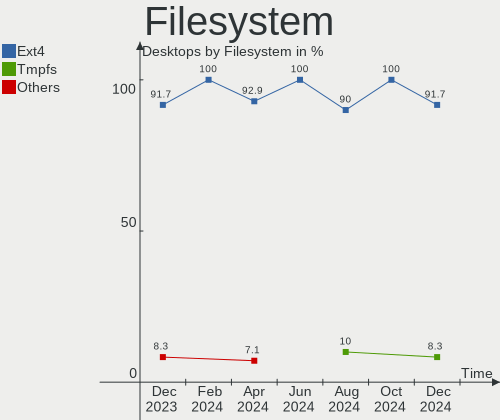
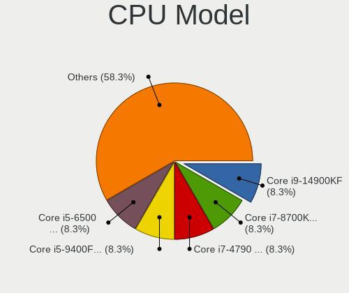
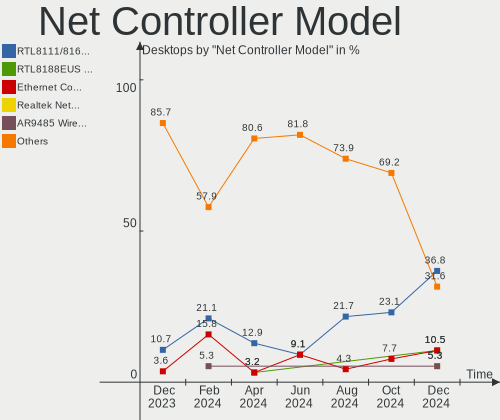
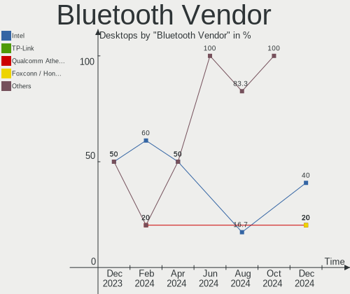
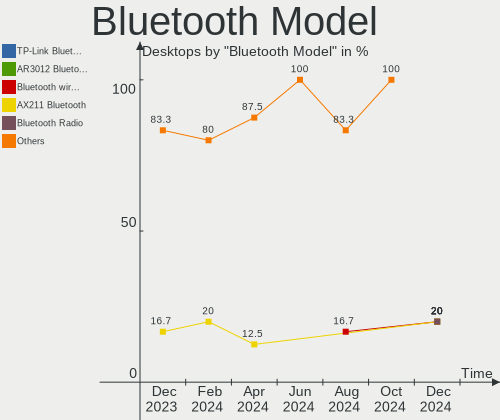
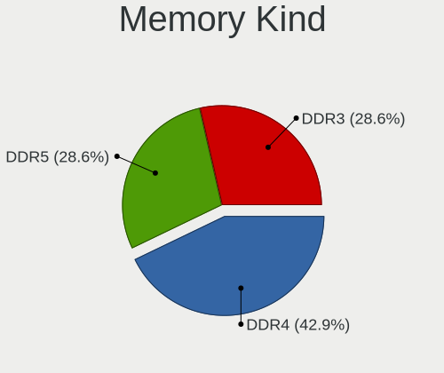

Kali - Hardware Trends (Desktops)
---------------------------------

A project to identify most popular hardware characteristics and track their change
over time based on data collected by Linux users at https://Linux-Hardware.org.

Anyone can contribute to this report by the [hw-probe](https://github.com/linuxhw/hw-probe) tool:

    sudo -E hw-probe -all -upload

This report is for one last month. Overall report since the beginning of time: [TestDays](https://github.com/linuxhw/TestDays)

Period: Mar, 2023.

Contents
--------

* [ System ](#system)
  - [ OS                       ](#os)
  - [ OS Family                ](#os-family)
  - [ Kernel                   ](#kernel)
  - [ Kernel Family            ](#kernel-family)
  - [ Kernel Major Ver.        ](#kernel-major-ver)
  - [ Arch                     ](#arch)
  - [ DE                       ](#de)
  - [ Display Server           ](#display-server)
  - [ Display Manager          ](#display-manager)
  - [ OS Lang                  ](#os-lang)
  - [ Boot Mode                ](#boot-mode)
  - [ Filesystem               ](#filesystem)
  - [ Part. scheme             ](#part-scheme)
  - [ Dual Boot with Linux/BSD ](#dual-boot-with-linuxbsd)
  - [ Dual Boot (Win)          ](#dual-boot-win)

* [ Board ](#board)
  - [ Vendor                   ](#vendor)
  - [ Model                    ](#model)
  - [ Model Family             ](#model-family)
  - [ MFG Year                 ](#mfg-year)
  - [ Form Factor              ](#form-factor)
  - [ Secure Boot              ](#secure-boot)
  - [ Coreboot                 ](#coreboot)
  - [ RAM Size                 ](#ram-size)
  - [ RAM Used                 ](#ram-used)
  - [ Total Drives             ](#total-drives)
  - [ Has CD-ROM               ](#has-cd-rom)
  - [ Has Ethernet             ](#has-ethernet)
  - [ Has WiFi                 ](#has-wifi)
  - [ Has Bluetooth            ](#has-bluetooth)

* [ Location ](#location)
  - [ Country                  ](#country)
  - [ City                     ](#city)

* [ Drives ](#drives)
  - [ Drive Vendor             ](#drive-vendor)
  - [ Drive Model              ](#drive-model)
  - [ HDD Vendor               ](#hdd-vendor)
  - [ SSD Vendor               ](#ssd-vendor)
  - [ Drive Kind               ](#drive-kind)
  - [ Drive Connector          ](#drive-connector)
  - [ Drive Size               ](#drive-size)
  - [ Space Total              ](#space-total)
  - [ Space Used               ](#space-used)
  - [ Malfunc. Drives          ](#malfunc-drives)
  - [ Malfunc. Drive Vendor    ](#malfunc-drive-vendor)
  - [ Malfunc. HDD Vendor      ](#malfunc-hdd-vendor)
  - [ Malfunc. Drive Kind      ](#malfunc-drive-kind)
  - [ Failed Drives            ](#failed-drives)
  - [ Failed Drive Vendor      ](#failed-drive-vendor)
  - [ Drive Status             ](#drive-status)

* [ Storage controller ](#storage-controller)
  - [ Storage Vendor           ](#storage-vendor)
  - [ Storage Model            ](#storage-model)
  - [ Storage Kind             ](#storage-kind)

* [ Processor ](#processor)
  - [ CPU Vendor               ](#cpu-vendor)
  - [ CPU Model                ](#cpu-model)
  - [ CPU Model Family         ](#cpu-model-family)
  - [ CPU Cores                ](#cpu-cores)
  - [ CPU Sockets              ](#cpu-sockets)
  - [ CPU Threads              ](#cpu-threads)
  - [ CPU Op-Modes             ](#cpu-op-modes)
  - [ CPU Microcode            ](#cpu-microcode)
  - [ CPU Microarch            ](#cpu-microarch)

* [ Graphics ](#graphics)
  - [ GPU Vendor               ](#gpu-vendor)
  - [ GPU Model                ](#gpu-model)
  - [ GPU Combo                ](#gpu-combo)
  - [ GPU Driver               ](#gpu-driver)
  - [ GPU Memory               ](#gpu-memory)

* [ Monitor ](#monitor)
  - [ Monitor Vendor           ](#monitor-vendor)
  - [ Monitor Model            ](#monitor-model)
  - [ Monitor Resolution       ](#monitor-resolution)
  - [ Monitor Diagonal         ](#monitor-diagonal)
  - [ Monitor Width            ](#monitor-width)
  - [ Aspect Ratio             ](#aspect-ratio)
  - [ Monitor Area             ](#monitor-area)
  - [ Pixel Density            ](#pixel-density)
  - [ Multiple Monitors        ](#multiple-monitors)

* [ Network ](#network)
  - [ Net Controller Vendor    ](#net-controller-vendor)
  - [ Net Controller Model     ](#net-controller-model)
  - [ Wireless Vendor          ](#wireless-vendor)
  - [ Wireless Model           ](#wireless-model)
  - [ Ethernet Vendor          ](#ethernet-vendor)
  - [ Ethernet Model           ](#ethernet-model)
  - [ Net Controller Kind      ](#net-controller-kind)
  - [ Used Controller          ](#used-controller)
  - [ NICs                     ](#nics)
  - [ IPv6                     ](#ipv6)

* [ Bluetooth ](#bluetooth)
  - [ Bluetooth Vendor         ](#bluetooth-vendor)
  - [ Bluetooth Model          ](#bluetooth-model)

* [ Sound ](#sound)
  - [ Sound Vendor             ](#sound-vendor)
  - [ Sound Model              ](#sound-model)

* [ Memory ](#memory)
  - [ Memory Vendor            ](#memory-vendor)
  - [ Memory Model             ](#memory-model)
  - [ Memory Kind              ](#memory-kind)
  - [ Memory Form Factor       ](#memory-form-factor)
  - [ Memory Size              ](#memory-size)
  - [ Memory Speed             ](#memory-speed)

* [ Printers & scanners ](#printers--scanners)
  - [ Printer Vendor           ](#printer-vendor)
  - [ Printer Model            ](#printer-model)
  - [ Scanner Vendor           ](#scanner-vendor)
  - [ Scanner Model            ](#scanner-model)

* [ Camera ](#camera)
  - [ Camera Vendor            ](#camera-vendor)
  - [ Camera Model             ](#camera-model)

* [ Security ](#security)
  - [ Fingerprint Vendor       ](#fingerprint-vendor)
  - [ Fingerprint Model        ](#fingerprint-model)
  - [ Chipcard Vendor          ](#chipcard-vendor)
  - [ Chipcard Model           ](#chipcard-model)

* [ Unsupported ](#unsupported)
  - [ Unsupported Devices      ](#unsupported-devices)
  - [ Unsupported Device Types ](#unsupported-device-types)

System
------

OS
--

Installed operating systems

| Name        | Desktops | Percent |
|-------------|----------|---------|
| Kali 2023.1 | 17       | 94.44%  |
| Kali 2022.4 | 1        | 5.56%   |

OS Family
---------

OS without a version

| Name | Desktops | Percent |
|------|----------|---------|
| Kali | 18       | 100%    |

Kernel
------

Version of the Linux kernel

| Version            | Desktops | Percent |
|--------------------|----------|---------|
| 6.1.0-kali5-amd64  | 15       | 83.33%  |
| 6.0.0-kali6-amd64  | 1        | 5.56%   |
| 5.19.0-kali2-amd64 | 1        | 5.56%   |
| 5.18.0-kali5-amd64 | 1        | 5.56%   |

Kernel Family
-------------

Linux kernel without a distro release

| Version | Desktops | Percent |
|---------|----------|---------|
| 6.1.0   | 15       | 83.33%  |
| 6.0.0   | 1        | 5.56%   |
| 5.19.0  | 1        | 5.56%   |
| 5.18.0  | 1        | 5.56%   |

Kernel Major Ver.
-----------------

Linux kernel major version

| Version | Desktops | Percent |
|---------|----------|---------|
| 6.1     | 15       | 83.33%  |
| 6.0     | 1        | 5.56%   |
| 5.19    | 1        | 5.56%   |
| 5.18    | 1        | 5.56%   |

Arch
----

OS architecture (x86_64, i586, etc.)

| Name   | Desktops | Percent |
|--------|----------|---------|
| x86_64 | 18       | 100%    |

DE
--

Desktop Environment

| Name             | Desktops | Percent |
|------------------|----------|---------|
| XFCE             | 9        | 50%     |
| GNOME            | 4        | 22.22%  |
| KDE5             | 2        | 11.11%  |
| lightdm-xsession | 1        | 5.56%   |
| GNOME Classic    | 1        | 5.56%   |
| Unknown          | 1        | 5.56%   |

Display Server
--------------

X11 or Wayland

| Name | Desktops | Percent |
|------|----------|---------|
| X11  | 18       | 100%    |

Display Manager
---------------

SDDM, LightDM, etc.

| Name    | Desktops | Percent |
|---------|----------|---------|
| LightDM | 7        | 38.89%  |
| Unknown | 6        | 33.33%  |
| GDM3    | 3        | 16.67%  |
| SDDM    | 2        | 11.11%  |

OS Lang
-------

Language

| Lang    | Desktops | Percent |
|---------|----------|---------|
| en_US   | 8        | 44.44%  |
| zh_TW   | 1        | 5.56%   |
| sv_SE   | 1        | 5.56%   |
| ru_RU   | 1        | 5.56%   |
| hu_HU   | 1        | 5.56%   |
| fr_FR   | 1        | 5.56%   |
| en_PH   | 1        | 5.56%   |
| en_GB   | 1        | 5.56%   |
| de_DE   | 1        | 5.56%   |
| cs_CZ   | 1        | 5.56%   |
| Unknown | 1        | 5.56%   |

Boot Mode
---------

EFI or BIOS

| Mode | Desktops | Percent |
|------|----------|---------|
| EFI  | 13       | 72.22%  |
| BIOS | 5        | 27.78%  |

Filesystem
----------

Type of filesystem

| Type    | Desktops | Percent |
|---------|----------|---------|
| Ext4    | 16       | 88.89%  |
| Overlay | 1        | 5.56%   |
| Btrfs   | 1        | 5.56%   |

Part. scheme
------------

Scheme of partitioning

| Type    | Desktops | Percent |
|---------|----------|---------|
| GPT     | 9        | 50%     |
| Unknown | 5        | 27.78%  |
| MBR     | 4        | 22.22%  |

Dual Boot with Linux/BSD
------------------------

Hosting more than one Linux/BSD

| Dual boot | Desktops | Percent |
|-----------|----------|---------|
| No        | 14       | 77.78%  |
| Yes       | 4        | 22.22%  |

Dual Boot (Win)
---------------

Hosting Linux and Windows

| Dual boot | Desktops | Percent |
|-----------|----------|---------|
| Yes       | 10       | 55.56%  |
| No        | 8        | 44.44%  |

Board
-----

Vendor
------

Motherboard manufacturer

| Name                | Desktops | Percent |
|---------------------|----------|---------|
| ASUSTek Computer    | 9        | 50%     |
| Gigabyte Technology | 2        | 11.11%  |
| Dell                | 2        | 11.11%  |
| Acer                | 2        | 11.11%  |
| MSI                 | 1        | 5.56%   |
| Medion              | 1        | 5.56%   |
| ASRock              | 1        | 5.56%   |

Model
-----

Motherboard model

| Name                         | Desktops | Percent |
|------------------------------|----------|---------|
| ASUS PRIME Z690-P WIFI D4    | 2        | 11.11%  |
| MSI MS-7636                  | 1        | 5.56%   |
| Medion MS-7800               | 1        | 5.56%   |
| Gigabyte Z590 AORUS ULTRA    | 1        | 5.56%   |
| Gigabyte B450M DS3H          | 1        | 5.56%   |
| Dell Precision T1700         | 1        | 5.56%   |
| Dell Inspiron 3847           | 1        | 5.56%   |
| ASUS SABERTOOTH 990FX        | 1        | 5.56%   |
| ASUS ROG STRIX Z390-E GAMING | 1        | 5.56%   |
| ASUS ROG STRIX B550-F GAMING | 1        | 5.56%   |
| ASUS ROG STRIX B365-G GAMING | 1        | 5.56%   |
| ASUS P7P55D                  | 1        | 5.56%   |
| ASUS All Series              | 1        | 5.56%   |
| ASUS 7200-5734A              | 1        | 5.56%   |
| ASRock Z87 Killer            | 1        | 5.56%   |
| Acer Nitro N50-640           | 1        | 5.56%   |
| Acer Aspire XC-705           | 1        | 5.56%   |

Model Family
------------

Motherboard model prefix

| Name            | Desktops | Percent |
|-----------------|----------|---------|
| ASUS ROG        | 3        | 16.67%  |
| ASUS PRIME      | 2        | 11.11%  |
| MSI MS-7636     | 1        | 5.56%   |
| Medion MS-7800  | 1        | 5.56%   |
| Gigabyte Z590   | 1        | 5.56%   |
| Gigabyte B450M  | 1        | 5.56%   |
| Dell Precision  | 1        | 5.56%   |
| Dell Inspiron   | 1        | 5.56%   |
| ASUS SABERTOOTH | 1        | 5.56%   |
| ASUS P7P55D     | 1        | 5.56%   |
| ASUS All        | 1        | 5.56%   |
| ASUS 7200-5734A | 1        | 5.56%   |
| ASRock Z87      | 1        | 5.56%   |
| Acer Nitro      | 1        | 5.56%   |
| Acer Aspire     | 1        | 5.56%   |

MFG Year
--------

Motherboard manufacture year

| Year | Desktops | Percent |
|------|----------|---------|
| 2021 | 4        | 22.22%  |
| 2013 | 3        | 16.67%  |
| 2018 | 2        | 11.11%  |
| 2014 | 2        | 11.11%  |
| 2009 | 2        | 11.11%  |
| 2022 | 1        | 5.56%   |
| 2020 | 1        | 5.56%   |
| 2019 | 1        | 5.56%   |
| 2012 | 1        | 5.56%   |
| 2011 | 1        | 5.56%   |

Form Factor
-----------

Physical design of the computer

| Name    | Desktops | Percent |
|---------|----------|---------|
| Desktop | 18       | 100%    |

Secure Boot
-----------

Enabled or disabled

| State    | Desktops | Percent |
|----------|----------|---------|
| Disabled | 18       | 100%    |

Coreboot
--------

Have coreboot on board

| Used | Desktops | Percent |
|------|----------|---------|
| No   | 18       | 100%    |

RAM Size
--------

Total RAM memory

| Size in GB  | Desktops | Percent |
|-------------|----------|---------|
| 16.01-24.0  | 7        | 38.89%  |
| 32.01-64.0  | 4        | 22.22%  |
| 8.01-16.0   | 3        | 16.67%  |
| 4.01-8.0    | 2        | 11.11%  |
| 64.01-256.0 | 2        | 11.11%  |

RAM Used
--------

Used RAM memory

| Used GB  | Desktops | Percent |
|----------|----------|---------|
| 2.01-3.0 | 9        | 50%     |
| 4.01-8.0 | 5        | 27.78%  |
| 1.01-2.0 | 3        | 16.67%  |
| 3.01-4.0 | 1        | 5.56%   |

Total Drives
------------

Number of drives on board

| Drives | Desktops | Percent |
|--------|----------|---------|
| 2      | 7        | 38.89%  |
| 1      | 5        | 27.78%  |
| 3      | 3        | 16.67%  |
| 5      | 2        | 11.11%  |
| 4      | 1        | 5.56%   |

Has CD-ROM
----------

Has CD-ROM on board

| Presented | Desktops | Percent |
|-----------|----------|---------|
| No        | 12       | 66.67%  |
| Yes       | 6        | 33.33%  |

Has Ethernet
------------

Has Ethernet on board

| Presented | Desktops | Percent |
|-----------|----------|---------|
| Yes       | 18       | 100%    |

Has WiFi
--------

Has WiFi module

| Presented | Desktops | Percent |
|-----------|----------|---------|
| Yes       | 14       | 77.78%  |
| No        | 4        | 22.22%  |

Has Bluetooth
-------------

Has Bluetooth module

| Presented | Desktops | Percent |
|-----------|----------|---------|
| Yes       | 10       | 55.56%  |
| No        | 8        | 44.44%  |

Location
--------

Country
-------

Geographic location (country)

| Country     | Desktops | Percent |
|-------------|----------|---------|
| Sweden      | 3        | 16.67%  |
| USA         | 1        | 5.56%   |
| UK          | 1        | 5.56%   |
| Thailand    | 1        | 5.56%   |
| Taiwan      | 1        | 5.56%   |
| Spain       | 1        | 5.56%   |
| Serbia      | 1        | 5.56%   |
| Russia      | 1        | 5.56%   |
| Poland      | 1        | 5.56%   |
| Philippines | 1        | 5.56%   |
| Mexico      | 1        | 5.56%   |
| Italy       | 1        | 5.56%   |
| Germany     | 1        | 5.56%   |
| France      | 1        | 5.56%   |
| Czechia     | 1        | 5.56%   |
| Belgium     | 1        | 5.56%   |

City
----

Geographic location (city)

| City                 | Desktops | Percent |
|----------------------|----------|---------|
| Zamboanga City       | 1        | 5.56%   |
| Wałbrzych           | 1        | 5.56%   |
| Stockholm            | 1        | 5.56%   |
| Oldenburg            | 1        | 5.56%   |
| Novi Sad             | 1        | 5.56%   |
| Nakhon Pathom        | 1        | 5.56%   |
| Mutzig               | 1        | 5.56%   |
| Moscow               | 1        | 5.56%   |
| Mladá Boleslav      | 1        | 5.56%   |
| Lugo                 | 1        | 5.56%   |
| Kil                  | 1        | 5.56%   |
| Gothenburg           | 1        | 5.56%   |
| Ciudad Obregón      | 1        | 5.56%   |
| City of Saint Peters | 1        | 5.56%   |
| Chiayi City          | 1        | 5.56%   |
| Calatorao            | 1        | 5.56%   |
| Brussels             | 1        | 5.56%   |
| Birmingham           | 1        | 5.56%   |

Drives
------

Drive Vendor
------------

Hard drive vendors

| Vendor              | Desktops | Drives | Percent |
|---------------------|----------|--------|---------|
| WDC                 | 7        | 10     | 20%     |
| Seagate             | 7        | 8      | 20%     |
| Samsung Electronics | 7        | 7      | 20%     |
| Kingston            | 3        | 3      | 8.57%   |
| Crucial             | 3        | 3      | 8.57%   |
| Unknown             | 2        | 2      | 5.71%   |
| Toshiba             | 2        | 2      | 5.71%   |
| SanDisk             | 1        | 1      | 2.86%   |
| MSI                 | 1        | 1      | 2.86%   |
| Intenso             | 1        | 1      | 2.86%   |
| Gigabyte Technology | 1        | 1      | 2.86%   |

Drive Model
-----------

Hard drive models

| Model                                | Desktops | Percent |
|--------------------------------------|----------|---------|
| Unknown SD/MMC/MS PRO 64GB           | 2        | 5.13%   |
| Kingston SA400S37120G 120GB SSD      | 2        | 5.13%   |
| WDC WDS200T1X0E-00AFY0 2TB           | 1        | 2.56%   |
| WDC WDS100T2B0A-00SM50 1TB SSD       | 1        | 2.56%   |
| WDC WD80EAZZ-00BKLB0 8TB             | 1        | 2.56%   |
| WDC WD5000AAKX-60U6AA0 500GB         | 1        | 2.56%   |
| WDC WD40EFAX-68JH4N0 4TB             | 1        | 2.56%   |
| WDC WD3200AAKS-00L9A0 320GB          | 1        | 2.56%   |
| WDC WD2500AAKX-603CA0 250GB          | 1        | 2.56%   |
| WDC WD10EZEX-08M2NA0 1TB             | 1        | 2.56%   |
| WDC WD10EZEX-00MFCA0 1TB             | 1        | 2.56%   |
| WDC PC SN530 SDBPNPZ-512G-1114 512GB | 1        | 2.56%   |
| Toshiba MK6465GSX 640GB              | 1        | 2.56%   |
| Toshiba HDWR160 6TB                  | 1        | 2.56%   |
| Seagate ST8000DM004-2U9188 8TB       | 1        | 2.56%   |
| Seagate ST4000DM004-2U9104 4TB       | 1        | 2.56%   |
| Seagate ST4000DM004-2CV104 4TB       | 1        | 2.56%   |
| Seagate ST3500312CS 500GB            | 1        | 2.56%   |
| Seagate ST3320418AS 320GB            | 1        | 2.56%   |
| Seagate ST2000DM008-2FR102 2TB       | 1        | 2.56%   |
| Seagate ST1000LM024 HN-M101MBB 1TB   | 1        | 2.56%   |
| Seagate ST1000DM003-1SB102 1TB       | 1        | 2.56%   |
| SanDisk SSD PLUS 480GB               | 1        | 2.56%   |
| Samsung SSD 970 EVO 1TB              | 1        | 2.56%   |
| Samsung SSD 960 PRO 512GB            | 1        | 2.56%   |
| Samsung SSD 870 QVO 1TB              | 1        | 2.56%   |
| Samsung SSD 860 EVO 500GB            | 1        | 2.56%   |
| Samsung SSD 850 EVO M.2 120GB        | 1        | 2.56%   |
| Samsung SSD 840 EVO 120GB            | 1        | 2.56%   |
| Samsung 980 PRO with Heatsink 1TB    | 1        | 2.56%   |
| MSI M390 1TB                         | 1        | 2.56%   |
| Kingston SV300S37A120G 120GB SSD     | 1        | 2.56%   |
| Intenso SSD Sata III 256GB           | 1        | 2.56%   |
| Gigabyte GP-AG41TB                   | 1        | 2.56%   |
| Crucial CT512MX100SSD1 512GB         | 1        | 2.56%   |
| Crucial CT500P3SSD8 500GB            | 1        | 2.56%   |
| Crucial CT500MX500SSD1 500GB         | 1        | 2.56%   |

HDD Vendor
----------

Hard disk drive vendors

| Vendor  | Desktops | Drives | Percent |
|---------|----------|--------|---------|
| Seagate | 7        | 8      | 43.75%  |
| WDC     | 5        | 7      | 31.25%  |
| Unknown | 2        | 2      | 12.5%   |
| Toshiba | 2        | 2      | 12.5%   |

SSD Vendor
----------

Solid state drive vendors

| Vendor              | Desktops | Drives | Percent |
|---------------------|----------|--------|---------|
| Samsung Electronics | 4        | 4      | 33.33%  |
| Kingston            | 3        | 3      | 25%     |
| Crucial             | 2        | 2      | 16.67%  |
| WDC                 | 1        | 1      | 8.33%   |
| SanDisk             | 1        | 1      | 8.33%   |
| Intenso             | 1        | 1      | 8.33%   |

Drive Kind
----------

HDD or SSD

| Kind | Desktops | Drives | Percent |
|------|----------|--------|---------|
| HDD  | 13       | 19     | 46.43%  |
| SSD  | 9        | 12     | 32.14%  |
| NVMe | 6        | 8      | 21.43%  |

Drive Connector
---------------

SATA, SAS, NVMe, etc.

| Type | Desktops | Drives | Percent |
|------|----------|--------|---------|
| SATA | 17       | 29     | 68%     |
| NVMe | 6        | 8      | 24%     |
| SAS  | 2        | 2      | 8%      |

Drive Size
----------

Size of hard drive

| Size in TB | Desktops | Drives | Percent |
|------------|----------|--------|---------|
| 0.01-0.5   | 11       | 16     | 42.31%  |
| 0.51-1.0   | 8        | 8      | 30.77%  |
| 3.01-4.0   | 3        | 3      | 11.54%  |
| 4.01-10.0  | 3        | 3      | 11.54%  |
| 1.01-2.0   | 1        | 1      | 3.85%   |

Space Total
-----------

Amount of disk space available on the file system

| Size in GB     | Desktops | Percent |
|----------------|----------|---------|
| 501-1000       | 5        | 27.78%  |
| 251-500        | 3        | 16.67%  |
| 1001-2000      | 3        | 16.67%  |
| More than 3000 | 2        | 11.11%  |
| 101-250        | 2        | 11.11%  |
| 1-20           | 1        | 5.56%   |
| 51-100         | 1        | 5.56%   |
| Unknown        | 1        | 5.56%   |

Space Used
----------

Amount of used disk space

| Used GB        | Desktops | Percent |
|----------------|----------|---------|
| 1-20           | 5        | 27.78%  |
| 21-50          | 4        | 22.22%  |
| 251-500        | 2        | 11.11%  |
| 101-250        | 2        | 11.11%  |
| 501-1000       | 2        | 11.11%  |
| More than 3000 | 1        | 5.56%   |
| 1001-2000      | 1        | 5.56%   |
| Unknown        | 1        | 5.56%   |

Malfunc. Drives
---------------

Drive models with a malfunction

| Model                               | Desktops | Drives | Percent |
|-------------------------------------|----------|--------|---------|
| Toshiba MK6465GSX 640GB             | 1        | 1      | 25%     |
| Seagate ST2000DM008-2FR102 2TB      | 1        | 1      | 25%     |
| Samsung Electronics SSD 970 EVO 1TB | 1        | 1      | 25%     |
| Kingston SV300S37A120G 120GB SSD    | 1        | 1      | 25%     |

Malfunc. Drive Vendor
---------------------

Vendors of faulty drives

| Vendor              | Desktops | Drives | Percent |
|---------------------|----------|--------|---------|
| Toshiba             | 1        | 1      | 25%     |
| Seagate             | 1        | 1      | 25%     |
| Samsung Electronics | 1        | 1      | 25%     |
| Kingston            | 1        | 1      | 25%     |

Malfunc. HDD Vendor
-------------------

Vendors of faulty HDD drives

| Vendor  | Desktops | Drives | Percent |
|---------|----------|--------|---------|
| Toshiba | 1        | 1      | 50%     |
| Seagate | 1        | 1      | 50%     |

Malfunc. Drive Kind
-------------------

Kinds of faulty drives

| Kind | Desktops | Drives | Percent |
|------|----------|--------|---------|
| HDD  | 2        | 2      | 50%     |
| NVMe | 1        | 1      | 25%     |
| SSD  | 1        | 1      | 25%     |

Failed Drives
-------------

Failed drive models

Zero info for selected period =(

Failed Drive Vendor
-------------------

Failed drive vendors

Zero info for selected period =(

Drive Status
------------

Number of failed and malfunc. drives

| Status   | Desktops | Drives | Percent |
|----------|----------|--------|---------|
| Works    | 13       | 24     | 59.09%  |
| Detected | 6        | 11     | 27.27%  |
| Malfunc  | 3        | 4      | 13.64%  |

Storage controller
------------------

Storage Vendor
--------------

Storage controller vendors

| Vendor                    | Desktops | Percent |
|---------------------------|----------|---------|
| Intel                     | 13       | 46.43%  |
| AMD                       | 5        | 17.86%  |
| Samsung Electronics       | 3        | 10.71%  |
| SanDisk                   | 2        | 7.14%   |
| JMicron Technology        | 2        | 7.14%   |
| Phison Electronics        | 1        | 3.57%   |
| Micron/Crucial Technology | 1        | 3.57%   |
| ASMedia Technology        | 1        | 3.57%   |

Storage Model
-------------

Storage controller models

| Model                                                                          | Desktops | Percent |
|--------------------------------------------------------------------------------|----------|---------|
| Intel Volume Management Device NVMe RAID Controller                            | 3        | 8.57%   |
| Intel Alder Lake-S PCH SATA Controller [AHCI Mode]                             | 3        | 8.57%   |
| Intel 8 Series/C220 Series Chipset Family 6-port SATA Controller 1 [AHCI mode] | 3        | 8.57%   |
| Intel 5 Series/3400 Series Chipset 4 port SATA IDE Controller                  | 2        | 5.71%   |
| Intel 5 Series/3400 Series Chipset 2 port SATA IDE Controller                  | 2        | 5.71%   |
| AMD FCH SATA Controller [AHCI mode]                                            | 2        | 5.71%   |
| AMD 500 Series Chipset SATA Controller                                         | 2        | 5.71%   |
| SanDisk WD PC SN810 / Black SN850 NVMe SSD                                     | 1        | 2.86%   |
| SanDisk WD Blue SN550 NVMe SSD                                                 | 1        | 2.86%   |
| Samsung NVMe SSD Controller SM981/PM981/PM983                                  | 1        | 2.86%   |
| Samsung NVMe SSD Controller SM961/PM961/SM963                                  | 1        | 2.86%   |
| Samsung NVMe SSD Controller PM9A1/PM9A3/980PRO                                 | 1        | 2.86%   |
| Phison E16 PCIe4 NVMe Controller                                               | 1        | 2.86%   |
| Micron/Crucial P2 NVMe PCIe SSD                                                | 1        | 2.86%   |
| JMicron JMB363 SATA/IDE Controller                                             | 1        | 2.86%   |
| JMicron JMB362 SATA Controller                                                 | 1        | 2.86%   |
| Intel SATA Controller [RAID mode]                                              | 1        | 2.86%   |
| Intel Cannon Lake PCH SATA AHCI Controller                                     | 1        | 2.86%   |
| Intel 9 Series Chipset Family SATA Controller [AHCI Mode]                      | 1        | 2.86%   |
| Intel 500 Series Chipset Family SATA AHCI Controller                           | 1        | 2.86%   |
| Intel 200 Series PCH SATA controller [AHCI mode]                               | 1        | 2.86%   |
| ASMedia ASM1062 Serial ATA Controller                                          | 1        | 2.86%   |
| AMD SB7x0/SB8x0/SB9x0 SATA Controller [AHCI mode]                              | 1        | 2.86%   |
| AMD FCH SATA Controller [RAID Bottom]                                          | 1        | 2.86%   |
| AMD 400 Series Chipset SATA Controller                                         | 1        | 2.86%   |

Storage Kind
------------

Kind of storage controller (IDE, SATA, NVMe, SAS, ...)

| Kind | Desktops | Percent |
|------|----------|---------|
| SATA | 15       | 55.56%  |
| NVMe | 6        | 22.22%  |
| RAID | 4        | 14.81%  |
| IDE  | 2        | 7.41%   |

Processor
---------

CPU Vendor
----------

Processor vendors

| Vendor | Desktops | Percent |
|--------|----------|---------|
| Intel  | 13       | 72.22%  |
| AMD    | 5        | 27.78%  |

CPU Model
---------

Processor models

| Model                                    | Desktops | Percent |
|------------------------------------------|----------|---------|
| AMD Ryzen 5 5600G with Radeon Graphics   | 2        | 11.11%  |
| Intel Pentium CPU G3420 @ 3.20GHz        | 1        | 5.56%   |
| Intel Core i9-9900K CPU @ 3.60GHz        | 1        | 5.56%   |
| Intel Core i7-4790K CPU @ 4.00GHz        | 1        | 5.56%   |
| Intel Core i7-4770 CPU @ 3.40GHz         | 1        | 5.56%   |
| Intel Core i5-4460 CPU @ 3.20GHz         | 1        | 5.56%   |
| Intel Core i5 CPU 750 @ 2.67GHz          | 1        | 5.56%   |
| Intel Core i3-9100 CPU @ 3.60GHz         | 1        | 5.56%   |
| Intel Core i3-4150 CPU @ 3.50GHz         | 1        | 5.56%   |
| Intel Core i3 CPU 530 @ 2.93GHz          | 1        | 5.56%   |
| Intel 12th Gen Core i9-12900K            | 1        | 5.56%   |
| Intel 12th Gen Core i5-12600K            | 1        | 5.56%   |
| Intel 12th Gen Core i5-12400F            | 1        | 5.56%   |
| Intel 11th Gen Core i9-11900K @ 3.50GHz  | 1        | 5.56%   |
| AMD Ryzen 5 5600X 6-Core Processor       | 1        | 5.56%   |
| AMD Phenom II X6 1090T Processor         | 1        | 5.56%   |
| AMD A10-5700 APU with Radeon HD Graphics | 1        | 5.56%   |

CPU Model Family
----------------

Processor model prefix

| Model            | Desktops | Percent |
|------------------|----------|---------|
| Other            | 4        | 22.22%  |
| Intel Core i3    | 3        | 16.67%  |
| AMD Ryzen 5      | 3        | 16.67%  |
| Intel Core i7    | 2        | 11.11%  |
| Intel Core i5    | 2        | 11.11%  |
| Intel Pentium    | 1        | 5.56%   |
| Intel Core i9    | 1        | 5.56%   |
| AMD Phenom II X6 | 1        | 5.56%   |
| AMD A10          | 1        | 5.56%   |

CPU Cores
---------

Number of processor cores

| Number | Desktops | Percent |
|--------|----------|---------|
| 6      | 5        | 27.78%  |
| 4      | 5        | 27.78%  |
| 2      | 4        | 22.22%  |
| 8      | 2        | 11.11%  |
| 16     | 1        | 5.56%   |
| 10     | 1        | 5.56%   |

CPU Sockets
-----------

Number of sockets

| Number | Desktops | Percent |
|--------|----------|---------|
| 1      | 18       | 100%    |

CPU Threads
-----------

Threads per core (Hyper-Threading)

| Number | Desktops | Percent |
|--------|----------|---------|
| 2      | 13       | 72.22%  |
| 1      | 5        | 27.78%  |

CPU Op-Modes
------------

CPU Operation Modes (32-bit, 64-bit)

| Op mode        | Desktops | Percent |
|----------------|----------|---------|
| 32-bit, 64-bit | 18       | 100%    |

CPU Microcode
-------------

Microcode number

| Number     | Desktops | Percent |
|------------|----------|---------|
| 0x306c3    | 5        | 27.78%  |
| 0x90672    | 3        | 16.67%  |
| 0xa0671    | 1        | 5.56%   |
| 0x906ed    | 1        | 5.56%   |
| 0x906eb    | 1        | 5.56%   |
| 0x106e5    | 1        | 5.56%   |
| 0x0a50000d | 1        | 5.56%   |
| 0x0a50000c | 1        | 5.56%   |
| 0x0a201009 | 1        | 5.56%   |
| 0x06001119 | 1        | 5.56%   |
| 0x010000dc | 1        | 5.56%   |
| Unknown    | 1        | 5.56%   |

CPU Microarch
-------------

Microarchitecture

| Name             | Desktops | Percent |
|------------------|----------|---------|
| Haswell          | 5        | 27.78%  |
| Zen 3            | 3        | 16.67%  |
| Alderlake Hybrid | 3        | 16.67%  |
| KabyLake         | 2        | 11.11%  |
| Westmere         | 1        | 5.56%   |
| Piledriver       | 1        | 5.56%   |
| Nehalem          | 1        | 5.56%   |
| K10              | 1        | 5.56%   |
| Icelake          | 1        | 5.56%   |

Graphics
--------

GPU Vendor
----------

Vendors of graphics cards

| Vendor | Desktops | Percent |
|--------|----------|---------|
| Nvidia | 13       | 65%     |
| Intel  | 5        | 25%     |
| AMD    | 2        | 10%     |

GPU Model
---------

Graphics card models

| Model                                                                       | Desktops | Percent |
|-----------------------------------------------------------------------------|----------|---------|
| Intel Xeon E3-1200 v3/4th Gen Core Processor Integrated Graphics Controller | 2        | 10%     |
| Nvidia TU116 [GeForce GTX 1650 SUPER]                                       | 1        | 5%      |
| Nvidia GT200b [GeForce GTX 275]                                             | 1        | 5%      |
| Nvidia GP106 [GeForce GTX 1060 6GB]                                         | 1        | 5%      |
| Nvidia GM206 [GeForce GTX 960]                                              | 1        | 5%      |
| Nvidia GM204 [GeForce GTX 980]                                              | 1        | 5%      |
| Nvidia GK106GL [Quadro K4000]                                               | 1        | 5%      |
| Nvidia GF119 [GeForce GT 705]                                               | 1        | 5%      |
| Nvidia GF114 [GeForce GTX 560 Ti]                                           | 1        | 5%      |
| Nvidia GA106 [GeForce RTX 3060 Lite Hash Rate]                              | 1        | 5%      |
| Nvidia GA106 [Geforce RTX 3050]                                             | 1        | 5%      |
| Nvidia GA102 [GeForce RTX 3090]                                             | 1        | 5%      |
| Nvidia GA102 [GeForce RTX 3080]                                             | 1        | 5%      |
| Nvidia GA102 [GeForce RTX 3080 Ti]                                          | 1        | 5%      |
| Intel CoffeeLake-S GT2 [UHD Graphics 630]                                   | 1        | 5%      |
| Intel AlderLake-S GT1                                                       | 1        | 5%      |
| Intel 4th Generation Core Processor Family Integrated Graphics Controller   | 1        | 5%      |
| AMD Trinity [Radeon HD 7660D]                                               | 1        | 5%      |
| AMD Barts XT [Radeon HD 6870]                                               | 1        | 5%      |

GPU Combo
---------

Combinations of graphics cards

| Name           | Desktops | Percent |
|----------------|----------|---------|
| 1 x Nvidia     | 12       | 66.67%  |
| 1 x Intel      | 3        | 16.67%  |
| 1 x AMD        | 2        | 11.11%  |
| Intel + Nvidia | 1        | 5.56%   |

GPU Driver
----------

Free vs proprietary

| Driver      | Desktops | Percent |
|-------------|----------|---------|
| Free        | 12       | 66.67%  |
| Proprietary | 6        | 33.33%  |

GPU Memory
----------

Total video memory

| Size in GB | Desktops | Percent |
|------------|----------|---------|
| 1.01-2.0   | 3        | 16.67%  |
| 8.01-16.0  | 3        | 16.67%  |
| Unknown    | 3        | 16.67%  |
| 3.01-4.0   | 2        | 11.11%  |
| 0.51-1.0   | 2        | 11.11%  |
| 7.01-8.0   | 1        | 5.56%   |
| 5.01-6.0   | 1        | 5.56%   |
| 2.01-3.0   | 1        | 5.56%   |
| 16.01-24.0 | 1        | 5.56%   |
| 0.01-0.5   | 1        | 5.56%   |

Monitor
-------

Monitor Vendor
--------------

Monitor vendors

| Vendor               | Desktops | Percent |
|----------------------|----------|---------|
| Samsung Electronics  | 4        | 16.67%  |
| BenQ                 | 3        | 12.5%   |
| Ancor Communications | 3        | 12.5%   |
| Hewlett-Packard      | 2        | 8.33%   |
| ViewSonic            | 1        | 4.17%   |
| Unknown              | 1        | 4.17%   |
| Philips              | 1        | 4.17%   |
| MSI                  | 1        | 4.17%   |
| Medion               | 1        | 4.17%   |
| LG Electronics       | 1        | 4.17%   |
| Goldstar             | 1        | 4.17%   |
| Fujitsu Siemens      | 1        | 4.17%   |
| Dell                 | 1        | 4.17%   |
| ASUSTek Computer     | 1        | 4.17%   |
| Acer                 | 1        | 4.17%   |
| Unknown              | 1        | 4.17%   |

Monitor Model
-------------

Monitor models

| Model                                                                 | Desktops | Percent |
|-----------------------------------------------------------------------|----------|---------|
| Hewlett-Packard E233 HPN3460 1920x1080 510x290mm 23.1-inch            | 2        | 8%      |
| ViewSonic VX3276-QHD VSCE635 2560x1440 698x393mm 31.5-inch            | 1        | 4%      |
| Unknown LCD Monitor XXX AAA 1920x1080                                 | 1        | 4%      |
| Samsung Electronics SA300/SA350 SAM07D2 1920x1080 477x268mm 21.5-inch | 1        | 4%      |
| Samsung Electronics S22D300 SAM0B3F 1920x1080 477x268mm 21.5-inch     | 1        | 4%      |
| Samsung Electronics S19B150 SAM0981 1366x768 410x230mm 18.5-inch      | 1        | 4%      |
| Samsung Electronics LCD Monitor C49HG9x                               | 1        | 4%      |
| Samsung Electronics LC24RG50 SAM0F90 1920x1080 532x304mm 24.1-inch    | 1        | 4%      |
| Philips 273ELH PHLC07D 1920x1080 598x336mm 27.0-inch                  | 1        | 4%      |
| MSI MAG271CQR MSI3FA7 2560x1440 597x336mm 27.0-inch                   | 1        | 4%      |
| Medion MD 20888 MED3682 1920x1080 509x286mm 23.0-inch                 | 1        | 4%      |
| LG Electronics LCD Monitor LG FHD 1920x1080                           | 1        | 4%      |
| Goldstar FHD GSM5BC9 1920x1080 480x270mm 21.7-inch                    | 1        | 4%      |
| Fujitsu Siemens D22W-1T FUS079A 1680x1050 474x296mm 22.0-inch         | 1        | 4%      |
| Dell P2414H DELA09B 1920x1080 527x297mm 23.8-inch                     | 1        | 4%      |
| BenQ XL2420T BNQ7F06 1920x1080 531x298mm 24.0-inch                    | 1        | 4%      |
| BenQ LCD Monitor V2320H 5760x2160                                     | 1        | 4%      |
| BenQ G2200W BNQ780E 1680x1050 474x296mm 22.0-inch                     | 1        | 4%      |
| ASUSTek Computer VG34V AUS3435 3440x1440 797x334mm 34.0-inch          | 1        | 4%      |
| Ancor Communications VW202 ACI20A2 1680x1050 433x271mm 20.1-inch      | 1        | 4%      |
| Ancor Communications LCD Monitor ASUS VN289 1920x1080                 | 1        | 4%      |
| Ancor Communications ASUS VB171 ACI17B6 1280x720 340x270mm 17.1-inch  | 1        | 4%      |
| Acer VG240Y ACR06BF 1920x1080 527x296mm 23.8-inch                     | 1        | 4%      |
| Unknown                                                               | 1        | 4%      |

Monitor Resolution
------------------

Monitor screen resolution

| Resolution         | Desktops | Percent |
|--------------------|----------|---------|
| 1920x1080 (FHD)    | 12       | 54.55%  |
| 2560x1440 (QHD)    | 3        | 13.64%  |
| 1680x1050 (WSXGA+) | 2        | 9.09%   |
| 5760x2160          | 1        | 4.55%   |
| 3440x1440          | 1        | 4.55%   |
| 1366x768 (WXGA)    | 1        | 4.55%   |
| 1280x720 (HD)      | 1        | 4.55%   |
| Unknown            | 1        | 4.55%   |

Monitor Diagonal
----------------

Diagonal size in inches

| Inches  | Desktops | Percent |
|---------|----------|---------|
| Unknown | 5        | 22.73%  |
| 24      | 4        | 18.18%  |
| 23      | 3        | 13.64%  |
| 27      | 2        | 9.09%   |
| 21      | 2        | 9.09%   |
| 34      | 1        | 4.55%   |
| 31      | 1        | 4.55%   |
| 22      | 1        | 4.55%   |
| 20      | 1        | 4.55%   |
| 18      | 1        | 4.55%   |
| 17      | 1        | 4.55%   |

Monitor Width
-------------

Physical width

| Width in mm | Desktops | Percent |
|-------------|----------|---------|
| 501-600     | 8        | 38.1%   |
| 401-500     | 5        | 23.81%  |
| Unknown     | 5        | 23.81%  |
| 701-800     | 1        | 4.76%   |
| 601-700     | 1        | 4.76%   |
| 301-350     | 1        | 4.76%   |

Aspect Ratio
------------

Proportional relationship between the width and the height

| Ratio   | Desktops | Percent |
|---------|----------|---------|
| 16/9    | 12       | 57.14%  |
| Unknown | 5        | 23.81%  |
| 16/10   | 2        | 9.52%   |
| 5/4     | 1        | 4.76%   |
| 21/9    | 1        | 4.76%   |

Monitor Area
------------

Area in inch²

| Area in inch² | Desktops | Percent |
|----------------|----------|---------|
| 201-250        | 9        | 40.91%  |
| Unknown        | 5        | 22.73%  |
| 351-500        | 2        | 9.09%   |
| 301-350        | 2        | 9.09%   |
| 141-150        | 2        | 9.09%   |
| 251-300        | 1        | 4.55%   |
| 151-200        | 1        | 4.55%   |

Pixel Density
-------------

Pixels per inch

| Density | Desktops | Percent |
|---------|----------|---------|
| 51-100  | 13       | 59.09%  |
| Unknown | 5        | 22.73%  |
| 101-120 | 4        | 18.18%  |

Multiple Monitors
-----------------

Total monitors connected

| Total | Desktops | Percent |
|-------|----------|---------|
| 1     | 13       | 72.22%  |
| 2     | 5        | 27.78%  |

Network
-------

Net Controller Vendor
---------------------

Controller vendors

| Vendor                          | Desktops | Percent |
|---------------------------------|----------|---------|
| Realtek Semiconductor           | 13       | 37.14%  |
| Intel                           | 11       | 31.43%  |
| Ralink Technology               | 3        | 8.57%   |
| Qualcomm Atheros Communications | 2        | 5.71%   |
| Qualcomm Atheros                | 2        | 5.71%   |
| Xiaomi                          | 1        | 2.86%   |
| Motorola PCS                    | 1        | 2.86%   |
| Linksys                         | 1        | 2.86%   |
| LG Electronics                  | 1        | 2.86%   |

Net Controller Model
--------------------

Controller models

| Model                                                             | Desktops | Percent |
|-------------------------------------------------------------------|----------|---------|
| Realtek RTL8111/8168/8411 PCI Express Gigabit Ethernet Controller | 11       | 28.21%  |
| Intel Wi-Fi 6 AX200                                               | 3        | 7.69%   |
| Intel Alder Lake-S PCH CNVi WiFi                                  | 3        | 7.69%   |
| Realtek RTL8125 2.5GbE Controller                                 | 2        | 5.13%   |
| Ralink RT2870/RT3070 Wireless Adapter                             | 2        | 5.13%   |
| Qualcomm Atheros AR9271 802.11n                                   | 2        | 5.13%   |
| Intel Ethernet Controller I225-V                                  | 2        | 5.13%   |
| Xiaomi Mi/Redmi series (RNDIS)                                    | 1        | 2.56%   |
| Realtek RTL8814AU 802.11a/b/g/n/ac Wireless Adapter               | 1        | 2.56%   |
| Realtek RTL8188CUS 802.11n WLAN Adapter                           | 1        | 2.56%   |
| Ralink RT5572 Wireless Adapter                                    | 1        | 2.56%   |
| Qualcomm Atheros QCA9565 / AR9565 Wireless Network Adapter        | 1        | 2.56%   |
| Qualcomm Atheros Killer E220x Gigabit Ethernet Controller         | 1        | 2.56%   |
| Motorola PCS moto g(7) optimo maxx(XT1955DL)                      | 1        | 2.56%   |
| Linksys WUSB6400M                                                 | 1        | 2.56%   |
| LG LM-X420xxx/G2 Android Phone (USB tethering mode)               | 1        | 2.56%   |
| Intel Ethernet Connection I217-LM                                 | 1        | 2.56%   |
| Intel Ethernet Connection (7) I219-V                              | 1        | 2.56%   |
| Intel Ethernet Connection (2) I219-V                              | 1        | 2.56%   |
| Intel Ethernet Connection (2) I218-V                              | 1        | 2.56%   |
| Intel Cannon Lake PCH CNVi WiFi                                   | 1        | 2.56%   |

Wireless Vendor
---------------

Wireless vendors

| Vendor                          | Desktops | Percent |
|---------------------------------|----------|---------|
| Intel                           | 7        | 43.75%  |
| Ralink Technology               | 3        | 18.75%  |
| Realtek Semiconductor           | 2        | 12.5%   |
| Qualcomm Atheros Communications | 2        | 12.5%   |
| Qualcomm Atheros                | 1        | 6.25%   |
| Linksys                         | 1        | 6.25%   |

Wireless Model
--------------

Wireless models

| Model                                                      | Desktops | Percent |
|------------------------------------------------------------|----------|---------|
| Intel Wi-Fi 6 AX200                                        | 3        | 18.75%  |
| Intel Alder Lake-S PCH CNVi WiFi                           | 3        | 18.75%  |
| Ralink RT2870/RT3070 Wireless Adapter                      | 2        | 12.5%   |
| Qualcomm Atheros AR9271 802.11n                            | 2        | 12.5%   |
| Realtek RTL8814AU 802.11a/b/g/n/ac Wireless Adapter        | 1        | 6.25%   |
| Realtek RTL8188CUS 802.11n WLAN Adapter                    | 1        | 6.25%   |
| Ralink RT5572 Wireless Adapter                             | 1        | 6.25%   |
| Qualcomm Atheros QCA9565 / AR9565 Wireless Network Adapter | 1        | 6.25%   |
| Linksys WUSB6400M                                          | 1        | 6.25%   |
| Intel Cannon Lake PCH CNVi WiFi                            | 1        | 6.25%   |

Ethernet Vendor
---------------

Ethernet vendors

| Vendor                | Desktops | Percent |
|-----------------------|----------|---------|
| Realtek Semiconductor | 13       | 59.09%  |
| Intel                 | 6        | 27.27%  |
| Xiaomi                | 1        | 4.55%   |
| Qualcomm Atheros      | 1        | 4.55%   |
| LG Electronics        | 1        | 4.55%   |

Ethernet Model
--------------

Ethernet models

| Model                                                             | Desktops | Percent |
|-------------------------------------------------------------------|----------|---------|
| Realtek RTL8111/8168/8411 PCI Express Gigabit Ethernet Controller | 11       | 50%     |
| Realtek RTL8125 2.5GbE Controller                                 | 2        | 9.09%   |
| Intel Ethernet Controller I225-V                                  | 2        | 9.09%   |
| Xiaomi Mi/Redmi series (RNDIS)                                    | 1        | 4.55%   |
| Qualcomm Atheros Killer E220x Gigabit Ethernet Controller         | 1        | 4.55%   |
| LG LM-X420xxx/G2 Android Phone (USB tethering mode)               | 1        | 4.55%   |
| Intel Ethernet Connection I217-LM                                 | 1        | 4.55%   |
| Intel Ethernet Connection (7) I219-V                              | 1        | 4.55%   |
| Intel Ethernet Connection (2) I219-V                              | 1        | 4.55%   |
| Intel Ethernet Connection (2) I218-V                              | 1        | 4.55%   |

Net Controller Kind
-------------------

Ethernet, WiFi or modem

| Kind     | Desktops | Percent |
|----------|----------|---------|
| Ethernet | 18       | 54.55%  |
| WiFi     | 14       | 42.42%  |
| Unknown  | 1        | 3.03%   |

Used Controller
---------------

Currently used network controller

| Kind     | Desktops | Percent |
|----------|----------|---------|
| Ethernet | 14       | 73.68%  |
| WiFi     | 5        | 26.32%  |

NICs
----

Total network controllers on board

| Total | Desktops | Percent |
|-------|----------|---------|
| 2     | 10       | 55.56%  |
| 1     | 8        | 44.44%  |

IPv6
----

IPv6 vs IPv4

| Used | Desktops | Percent |
|------|----------|---------|
| No   | 17       | 94.44%  |
| Yes  | 1        | 5.56%   |

Bluetooth
---------

Bluetooth Vendor
----------------

Controller vendors

| Vendor                  | Desktops | Percent |
|-------------------------|----------|---------|
| Intel                   | 7        | 70%     |
| Realtek Semiconductor   | 1        | 10%     |
| Lite-On Technology      | 1        | 10%     |
| Cambridge Silicon Radio | 1        | 10%     |

Bluetooth Model
---------------

Controller models

| Model                                               | Desktops | Percent |
|-----------------------------------------------------|----------|---------|
| Intel AX201 Bluetooth                               | 3        | 30%     |
| Intel AX200 Bluetooth                               | 3        | 30%     |
| Realtek Bluetooth Radio                             | 1        | 10%     |
| Lite-On Atheros AR3012 Bluetooth                    | 1        | 10%     |
| Intel Bluetooth 9460/9560 Jefferson Peak (JfP)      | 1        | 10%     |
| Cambridge Silicon Radio Bluetooth Dongle (HCI mode) | 1        | 10%     |

Sound
-----

Sound Vendor
------------

Sound card vendors

| Vendor               | Desktops | Percent |
|----------------------|----------|---------|
| Intel                | 13       | 36.11%  |
| Nvidia               | 12       | 33.33%  |
| AMD                  | 5        | 13.89%  |
| C-Media Electronics  | 2        | 5.56%   |
| SteelSeries ApS      | 1        | 2.78%   |
| Kingston Technology  | 1        | 2.78%   |
| Giga-Byte Technology | 1        | 2.78%   |
| Focusrite-Novation   | 1        | 2.78%   |

Sound Model
-----------

Sound card models

| Model                                                               | Desktops | Percent |
|---------------------------------------------------------------------|----------|---------|
| Intel 8 Series/C220 Series Chipset High Definition Audio Controller | 4        | 9.3%    |
| Nvidia GA102 High Definition Audio Controller                       | 3        | 6.98%   |
| Intel Xeon E3-1200 v3/4th Gen Core Processor HD Audio Controller    | 3        | 6.98%   |
| Intel Alder Lake-S HD Audio Controller                              | 3        | 6.98%   |
| Nvidia GA106 High Definition Audio Controller                       | 2        | 4.65%   |
| Intel 5 Series/3400 Series Chipset High Definition Audio            | 2        | 4.65%   |
| AMD Renoir Radeon High Definition Audio Controller                  | 2        | 4.65%   |
| AMD Family 17h/19h HD Audio Controller                              | 2        | 4.65%   |
| SteelSeries ApS SteelSeries Arctis 5                                | 1        | 2.33%   |
| Nvidia TU116 High Definition Audio Controller                       | 1        | 2.33%   |
| Nvidia GP106 High Definition Audio Controller                       | 1        | 2.33%   |
| Nvidia GM206 High Definition Audio Controller                       | 1        | 2.33%   |
| Nvidia GM204 High Definition Audio Controller                       | 1        | 2.33%   |
| Nvidia GK106 HDMI Audio Controller                                  | 1        | 2.33%   |
| Nvidia GF119 HDMI Audio Controller                                  | 1        | 2.33%   |
| Nvidia GF114 HDMI Audio Controller                                  | 1        | 2.33%   |
| Kingston Technology HyperX 7.1 Audio                                | 1        | 2.33%   |
| Intel Tiger Lake-H HD Audio Controller                              | 1        | 2.33%   |
| Intel Cannon Lake PCH cAVS                                          | 1        | 2.33%   |
| Intel 9 Series Chipset Family HD Audio Controller                   | 1        | 2.33%   |
| Intel 200 Series PCH HD Audio                                       | 1        | 2.33%   |
| Giga-Byte Technology USB Audio                                      | 1        | 2.33%   |
| Focusrite-Novation Speedio                                          | 1        | 2.33%   |
| C-Media Electronics USB Audio Device                                | 1        | 2.33%   |
| C-Media Electronics Blue Snowball                                   | 1        | 2.33%   |
| AMD Trinity HDMI Audio Controller                                   | 1        | 2.33%   |
| AMD Starship/Matisse HD Audio Controller                            | 1        | 2.33%   |
| AMD SBx00 Azalia (Intel HDA)                                        | 1        | 2.33%   |
| AMD FCH Azalia Controller                                           | 1        | 2.33%   |
| AMD Barts HDMI Audio [Radeon HD 6790/6850/6870 / 7720 OEM]          | 1        | 2.33%   |

Memory
------

Memory Vendor
-------------

Memory module vendors

| Vendor            | Desktops | Percent |
|-------------------|----------|---------|
| Kingston          | 3        | 25%     |
| Corsair           | 3        | 25%     |
| Unknown           | 2        | 16.67%  |
| SK hynix          | 1        | 8.33%   |
| Micron Technology | 1        | 8.33%   |
| G.Skill           | 1        | 8.33%   |
| Unknown           | 1        | 8.33%   |

Memory Model
------------

Memory module models

| Model                                                   | Desktops | Percent |
|---------------------------------------------------------|----------|---------|
| Unknown RAM Module 4GB DIMM DDR3 1333MT/s               | 1        | 7.69%   |
| Unknown RAM Module 2GB DIMM DDR 1333MT/s                | 1        | 7.69%   |
| SK hynix RAM HMT351U6EFR8C-PB 4GB DIMM DDR3 1800MT/s    | 1        | 7.69%   |
| Micron RAM Module 8GB DIMM DDR4 3200MT/s                | 1        | 7.69%   |
| Kingston RAM KHX2400C11D3/4GX 4GB DIMM DDR3 2400MT/s    | 1        | 7.69%   |
| Kingston RAM KF3600C18D4/16GX 16GB DIMM DDR4 3600MT/s   | 1        | 7.69%   |
| Kingston RAM KF3200C18D4/8G 8GB DIMM DDR4 3200MT/s      | 1        | 7.69%   |
| G.Skill RAM F4-3600C19-16GTRS 16GB DIMM DDR4 3600MT/s   | 1        | 7.69%   |
| Corsair RAM CMW16GX4M2C3200C16 8GB DIMM DDR4 3733MT/s   | 1        | 7.69%   |
| Corsair RAM CMT128GX4M4C3200C16 32GB DIMM DDR4 3200MT/s | 1        | 7.69%   |
| Corsair RAM CMK32GX4M2B3000C15 16GB DIMM DDR4 3000MT/s  | 1        | 7.69%   |
| Corsair RAM CMK16GX4M2B3200C16 8GB DIMM DDR4 3600MT/s   | 1        | 7.69%   |
| Unknown                                                 | 1        | 7.69%   |

Memory Kind
-----------

Memory module kinds

| Kind  | Desktops | Percent |
|-------|----------|---------|
| DDR4  | 7        | 58.33%  |
| DDR3  | 3        | 25%     |
| SDRAM | 1        | 8.33%   |
| DDR   | 1        | 8.33%   |

Memory Form Factor
------------------

Physical design of the memory module

| Name | Desktops | Percent |
|------|----------|---------|
| DIMM | 12       | 100%    |

Memory Size
-----------

Memory module size

| Size  | Desktops | Percent |
|-------|----------|---------|
| 4096  | 4        | 33.33%  |
| 16384 | 3        | 25%     |
| 8192  | 3        | 25%     |
| 32768 | 1        | 8.33%   |
| 2048  | 1        | 8.33%   |

Memory Speed
------------

Memory module speed

| Speed | Desktops | Percent |
|-------|----------|---------|
| 3600  | 3        | 23.08%  |
| 3200  | 3        | 23.08%  |
| 1333  | 3        | 23.08%  |
| 3733  | 1        | 7.69%   |
| 3000  | 1        | 7.69%   |
| 2400  | 1        | 7.69%   |
| 1800  | 1        | 7.69%   |

Printers & scanners
-------------------

Printer Vendor
--------------

Printer device vendors

Zero info for selected period =(

Printer Model
-------------

Printer device models

Zero info for selected period =(

Scanner Vendor
--------------

Scanner device vendors

Zero info for selected period =(

Scanner Model
-------------

Scanner device models

Zero info for selected period =(

Camera
------

Camera Vendor
-------------

Camera device vendors

| Vendor                        | Desktops | Percent |
|-------------------------------|----------|---------|
| Sunplus Innovation Technology | 2        | 33.33%  |
| Microsoft                     | 1        | 16.67%  |
| Microdia                      | 1        | 16.67%  |
| LG Electronics                | 1        | 16.67%  |
| eMeet                         | 1        | 16.67%  |

Camera Model
------------

Camera device models

| Model                                                 | Desktops | Percent |
|-------------------------------------------------------|----------|---------|
| Sunplus NexiGo N930AF FHD Webcam                      | 2        | 28.57%  |
| Microsoft LifeCam Studio                              | 1        | 14.29%  |
| Microsoft LifeCam HD-3000                             | 1        | 14.29%  |
| Microdia Camera                                       | 1        | 14.29%  |
| LG LM-X420xxx/G2/G3 Android Phone (MTP/download mode) | 1        | 14.29%  |
| eMeet HD Webcam C960                                  | 1        | 14.29%  |

Security
--------

Fingerprint Vendor
------------------

Fingerprint sensor vendors

Zero info for selected period =(

Fingerprint Model
-----------------

Fingerprint sensor models

Zero info for selected period =(

Chipcard Vendor
---------------

Chipcard module vendors

Zero info for selected period =(

Chipcard Model
--------------

Chipcard module models

Zero info for selected period =(

Unsupported
-----------

Unsupported Devices
-------------------

Total unsupported devices on board

| Total | Desktops | Percent |
|-------|----------|---------|
| 0     | 15       | 83.33%  |
| 1     | 2        | 11.11%  |
| 3     | 1        | 5.56%   |

Unsupported Device Types
------------------------

Types of unsupported devices

| Type                     | Desktops | Percent |
|--------------------------|----------|---------|
| Communication controller | 2        | 50%     |
| Sound                    | 1        | 25%     |
| Camera                   | 1        | 25%     |

