Kali - Hardware Trends (Desktops)
---------------------------------

A project to identify most popular hardware characteristics and track their change
over time based on data collected by Linux users at https://Linux-Hardware.org.

Anyone can contribute to this report by the [hw-probe](https://github.com/linuxhw/hw-probe) tool:

    sudo -E hw-probe -all -upload

This report is for one last month. Overall report since the beginning of time: [TestCoverage](https://github.com/linuxhw/TestCoverage)

Period: Jul, 2022.

Contents
--------

* [ System ](#system)
  - [ OS                       ](#os)
  - [ OS Family                ](#os-family)
  - [ Kernel                   ](#kernel)
  - [ Kernel Family            ](#kernel-family)
  - [ Kernel Major Ver.        ](#kernel-major-ver)
  - [ Arch                     ](#arch)
  - [ DE                       ](#de)
  - [ Display Server           ](#display-server)
  - [ Display Manager          ](#display-manager)
  - [ OS Lang                  ](#os-lang)
  - [ Boot Mode                ](#boot-mode)
  - [ Filesystem               ](#filesystem)
  - [ Part. scheme             ](#part-scheme)
  - [ Dual Boot with Linux/BSD ](#dual-boot-with-linuxbsd)
  - [ Dual Boot (Win)          ](#dual-boot-win)

* [ Board ](#board)
  - [ Vendor                   ](#vendor)
  - [ Model                    ](#model)
  - [ Model Family             ](#model-family)
  - [ MFG Year                 ](#mfg-year)
  - [ Form Factor              ](#form-factor)
  - [ Secure Boot              ](#secure-boot)
  - [ Coreboot                 ](#coreboot)
  - [ RAM Size                 ](#ram-size)
  - [ RAM Used                 ](#ram-used)
  - [ Total Drives             ](#total-drives)
  - [ Has CD-ROM               ](#has-cd-rom)
  - [ Has Ethernet             ](#has-ethernet)
  - [ Has WiFi                 ](#has-wifi)
  - [ Has Bluetooth            ](#has-bluetooth)

* [ Location ](#location)
  - [ Country                  ](#country)
  - [ City                     ](#city)

* [ Drives ](#drives)
  - [ Drive Vendor             ](#drive-vendor)
  - [ Drive Model              ](#drive-model)
  - [ HDD Vendor               ](#hdd-vendor)
  - [ SSD Vendor               ](#ssd-vendor)
  - [ Drive Kind               ](#drive-kind)
  - [ Drive Connector          ](#drive-connector)
  - [ Drive Size               ](#drive-size)
  - [ Space Total              ](#space-total)
  - [ Space Used               ](#space-used)
  - [ Malfunc. Drives          ](#malfunc-drives)
  - [ Malfunc. Drive Vendor    ](#malfunc-drive-vendor)
  - [ Malfunc. HDD Vendor      ](#malfunc-hdd-vendor)
  - [ Malfunc. Drive Kind      ](#malfunc-drive-kind)
  - [ Failed Drives            ](#failed-drives)
  - [ Failed Drive Vendor      ](#failed-drive-vendor)
  - [ Drive Status             ](#drive-status)

* [ Storage controller ](#storage-controller)
  - [ Storage Vendor           ](#storage-vendor)
  - [ Storage Model            ](#storage-model)
  - [ Storage Kind             ](#storage-kind)

* [ Processor ](#processor)
  - [ CPU Vendor               ](#cpu-vendor)
  - [ CPU Model                ](#cpu-model)
  - [ CPU Model Family         ](#cpu-model-family)
  - [ CPU Cores                ](#cpu-cores)
  - [ CPU Sockets              ](#cpu-sockets)
  - [ CPU Threads              ](#cpu-threads)
  - [ CPU Op-Modes             ](#cpu-op-modes)
  - [ CPU Microcode            ](#cpu-microcode)
  - [ CPU Microarch            ](#cpu-microarch)

* [ Graphics ](#graphics)
  - [ GPU Vendor               ](#gpu-vendor)
  - [ GPU Model                ](#gpu-model)
  - [ GPU Combo                ](#gpu-combo)
  - [ GPU Driver               ](#gpu-driver)
  - [ GPU Memory               ](#gpu-memory)

* [ Monitor ](#monitor)
  - [ Monitor Vendor           ](#monitor-vendor)
  - [ Monitor Model            ](#monitor-model)
  - [ Monitor Resolution       ](#monitor-resolution)
  - [ Monitor Diagonal         ](#monitor-diagonal)
  - [ Monitor Width            ](#monitor-width)
  - [ Aspect Ratio             ](#aspect-ratio)
  - [ Monitor Area             ](#monitor-area)
  - [ Pixel Density            ](#pixel-density)
  - [ Multiple Monitors        ](#multiple-monitors)

* [ Network ](#network)
  - [ Net Controller Vendor    ](#net-controller-vendor)
  - [ Net Controller Model     ](#net-controller-model)
  - [ Wireless Vendor          ](#wireless-vendor)
  - [ Wireless Model           ](#wireless-model)
  - [ Ethernet Vendor          ](#ethernet-vendor)
  - [ Ethernet Model           ](#ethernet-model)
  - [ Net Controller Kind      ](#net-controller-kind)
  - [ Used Controller          ](#used-controller)
  - [ NICs                     ](#nics)
  - [ IPv6                     ](#ipv6)

* [ Bluetooth ](#bluetooth)
  - [ Bluetooth Vendor         ](#bluetooth-vendor)
  - [ Bluetooth Model          ](#bluetooth-model)

* [ Sound ](#sound)
  - [ Sound Vendor             ](#sound-vendor)
  - [ Sound Model              ](#sound-model)

* [ Memory ](#memory)
  - [ Memory Vendor            ](#memory-vendor)
  - [ Memory Model             ](#memory-model)
  - [ Memory Kind              ](#memory-kind)
  - [ Memory Form Factor       ](#memory-form-factor)
  - [ Memory Size              ](#memory-size)
  - [ Memory Speed             ](#memory-speed)

* [ Printers & scanners ](#printers--scanners)
  - [ Printer Vendor           ](#printer-vendor)
  - [ Printer Model            ](#printer-model)
  - [ Scanner Vendor           ](#scanner-vendor)
  - [ Scanner Model            ](#scanner-model)

* [ Camera ](#camera)
  - [ Camera Vendor            ](#camera-vendor)
  - [ Camera Model             ](#camera-model)

* [ Security ](#security)
  - [ Fingerprint Vendor       ](#fingerprint-vendor)
  - [ Fingerprint Model        ](#fingerprint-model)
  - [ Chipcard Vendor          ](#chipcard-vendor)
  - [ Chipcard Model           ](#chipcard-model)

* [ Unsupported ](#unsupported)
  - [ Unsupported Devices      ](#unsupported-devices)
  - [ Unsupported Device Types ](#unsupported-device-types)

System
------

OS
--

Installed operating systems

| Name        | Desktops | Percent |
|-------------|----------|---------|
| Kali 2022.2 | 4        | 57.14%  |
| Kali 2022.3 | 2        | 28.57%  |
| Kali 2022.1 | 1        | 14.29%  |

OS Family
---------

OS without a version

| Name | Desktops | Percent |
|------|----------|---------|
| Kali | 7        | 100%    |

Kernel
------

Version of the Linux kernel

| Version            | Desktops | Percent |
|--------------------|----------|---------|
| 5.18.0-kali5-amd64 | 3        | 42.86%  |
| 5.18.0-kali2-amd64 | 2        | 28.57%  |
| 5.15.0-kali3-amd64 | 1        | 14.29%  |
| 5.15.0-kali2-amd64 | 1        | 14.29%  |

Kernel Family
-------------

Linux kernel without a distro release

| Version | Desktops | Percent |
|---------|----------|---------|
| 5.18.0  | 5        | 71.43%  |
| 5.15.0  | 2        | 28.57%  |

Kernel Major Ver.
-----------------

Linux kernel major version

| Version | Desktops | Percent |
|---------|----------|---------|
| 5.18    | 5        | 71.43%  |
| 5.15    | 2        | 28.57%  |

Arch
----

OS architecture (x86_64, i586, etc.)

| Name   | Desktops | Percent |
|--------|----------|---------|
| x86_64 | 7        | 100%    |

DE
--

Desktop Environment

| Name | Desktops | Percent |
|------|----------|---------|
| XFCE | 5        | 71.43%  |
| KDE5 | 2        | 28.57%  |

Display Server
--------------

X11 or Wayland

| Name | Desktops | Percent |
|------|----------|---------|
| X11  | 7        | 100%    |

Display Manager
---------------

SDDM, LightDM, etc.

| Name    | Desktops | Percent |
|---------|----------|---------|
| LightDM | 3        | 42.86%  |
| SDDM    | 2        | 28.57%  |
| Unknown | 2        | 28.57%  |

OS Lang
-------

Language

| Lang  | Desktops | Percent |
|-------|----------|---------|
| en_GB | 3        | 42.86%  |
| en_US | 2        | 28.57%  |
| ru_RU | 1        | 14.29%  |
| en_AU | 1        | 14.29%  |

Boot Mode
---------

EFI or BIOS

| Mode | Desktops | Percent |
|------|----------|---------|
| EFI  | 4        | 57.14%  |
| BIOS | 3        | 42.86%  |

Filesystem
----------

Type of filesystem

| Type | Desktops | Percent |
|------|----------|---------|
| Ext4 | 7        | 100%    |

Part. scheme
------------

Scheme of partitioning

| Type    | Desktops | Percent |
|---------|----------|---------|
| GPT     | 4        | 57.14%  |
| Unknown | 2        | 28.57%  |
| MBR     | 1        | 14.29%  |

Dual Boot with Linux/BSD
------------------------

Hosting more than one Linux/BSD

| Dual boot | Desktops | Percent |
|-----------|----------|---------|
| No        | 6        | 85.71%  |
| Yes       | 1        | 14.29%  |

Dual Boot (Win)
---------------

Hosting Linux and Windows

| Dual boot | Desktops | Percent |
|-----------|----------|---------|
| No        | 4        | 57.14%  |
| Yes       | 3        | 42.86%  |

Board
-----

Vendor
------

Motherboard manufacturer

| Name                | Desktops | Percent |
|---------------------|----------|---------|
| ASUSTek Computer    | 4        | 57.14%  |
| MSI                 | 1        | 14.29%  |
| Gigabyte Technology | 1        | 14.29%  |
| Dell                | 1        | 14.29%  |

Model
-----

Motherboard model

| Name                         | Desktops | Percent |
|------------------------------|----------|---------|
| MSI MS-7A34                  | 1        | 14.29%  |
| Gigabyte AB350M-DS3H         | 1        | 14.29%  |
| Dell OptiPlex 3010           | 1        | 14.29%  |
| ASUS ROG STRIX B550-F GAMING | 1        | 14.29%  |
| ASUS ROG STRIX B365-G GAMING | 1        | 14.29%  |
| ASUS H61-PLUS                | 1        | 14.29%  |
| ASUS 970 PRO GAMING/AURA     | 1        | 14.29%  |

Model Family
------------

Motherboard model prefix

| Name                 | Desktops | Percent |
|----------------------|----------|---------|
| ASUS ROG             | 2        | 28.57%  |
| MSI MS-7A34          | 1        | 14.29%  |
| Gigabyte AB350M-DS3H | 1        | 14.29%  |
| Dell OptiPlex        | 1        | 14.29%  |
| ASUS H61-PLUS        | 1        | 14.29%  |
| ASUS 970             | 1        | 14.29%  |

MFG Year
--------

Motherboard manufacture year

| Year | Desktops | Percent |
|------|----------|---------|
| 2020 | 1        | 14.29%  |
| 2019 | 1        | 14.29%  |
| 2018 | 1        | 14.29%  |
| 2017 | 1        | 14.29%  |
| 2016 | 1        | 14.29%  |
| 2013 | 1        | 14.29%  |
| 2012 | 1        | 14.29%  |

Form Factor
-----------

Physical design of the computer

| Name    | Desktops | Percent |
|---------|----------|---------|
| Desktop | 7        | 100%    |

Secure Boot
-----------

Enabled or disabled

| State    | Desktops | Percent |
|----------|----------|---------|
| Disabled | 7        | 100%    |

Coreboot
--------

Have coreboot on board

| Used | Desktops | Percent |
|------|----------|---------|
| No   | 7        | 100%    |

RAM Size
--------

Total RAM memory

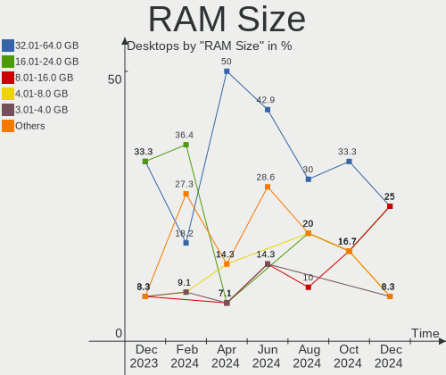

| Size in GB | Desktops | Percent |
|------------|----------|---------|
| 32.01-64.0 | 2        | 28.57%  |
| 24.01-32.0 | 2        | 28.57%  |
| 4.01-8.0   | 1        | 14.29%  |
| 3.01-4.0   | 1        | 14.29%  |
| 8.01-16.0  | 1        | 14.29%  |

RAM Used
--------

Used RAM memory

| Used GB  | Desktops | Percent |
|----------|----------|---------|
| 3.01-4.0 | 2        | 28.57%  |
| 2.01-3.0 | 2        | 28.57%  |
| 1.01-2.0 | 2        | 28.57%  |
| 4.01-8.0 | 1        | 14.29%  |

Total Drives
------------

Number of drives on board

| Drives | Desktops | Percent |
|--------|----------|---------|
| 1      | 3        | 42.86%  |
| 2      | 2        | 28.57%  |
| 6      | 1        | 14.29%  |
| 3      | 1        | 14.29%  |

Has CD-ROM
----------

Has CD-ROM on board

| Presented | Desktops | Percent |
|-----------|----------|---------|
| No        | 5        | 71.43%  |
| Yes       | 2        | 28.57%  |

Has Ethernet
------------

Has Ethernet on board

| Presented | Desktops | Percent |
|-----------|----------|---------|
| Yes       | 7        | 100%    |

Has WiFi
--------

Has WiFi module

| Presented | Desktops | Percent |
|-----------|----------|---------|
| Yes       | 7        | 100%    |

Has Bluetooth
-------------

Has Bluetooth module

| Presented | Desktops | Percent |
|-----------|----------|---------|
| No        | 5        | 71.43%  |
| Yes       | 2        | 28.57%  |

Location
--------

Country
-------

Geographic location (country)

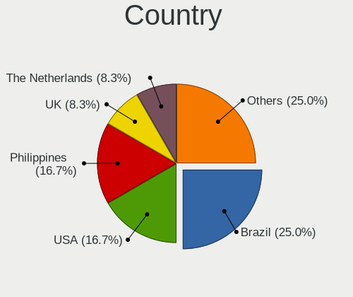

| Country   | Desktops | Percent |
|-----------|----------|---------|
| UK        | 2        | 28.57%  |
| USA       | 1        | 14.29%  |
| Spain     | 1        | 14.29%  |
| Russia    | 1        | 14.29%  |
| France    | 1        | 14.29%  |
| Australia | 1        | 14.29%  |

City
----

Geographic location (city)

| City           | Desktops | Percent |
|----------------|----------|---------|
| Yekaterinburg  | 1        | 14.29%  |
| Toowoomba      | 1        | 14.29%  |
| Salamanca      | 1        | 14.29%  |
| Harrisonburg   | 1        | 14.29%  |
| Gennevilliers  | 1        | 14.29%  |
| City of London | 1        | 14.29%  |
| Bristol        | 1        | 14.29%  |

Drives
------

Drive Vendor
------------

Hard drive vendors

| Vendor              | Desktops | Drives | Percent |
|---------------------|----------|--------|---------|
| Seagate             | 3        | 3      | 21.43%  |
| WDC                 | 2        | 3      | 14.29%  |
| Toshiba             | 2        | 3      | 14.29%  |
| XrayDisk            | 1        | 1      | 7.14%   |
| SPCC                | 1        | 1      | 7.14%   |
| Samsung Electronics | 1        | 1      | 7.14%   |
| Phison              | 1        | 1      | 7.14%   |
| Maxtor              | 1        | 1      | 7.14%   |
| Kingston            | 1        | 1      | 7.14%   |
| Hitachi             | 1        | 1      | 7.14%   |

Drive Model
-----------

Hard drive models

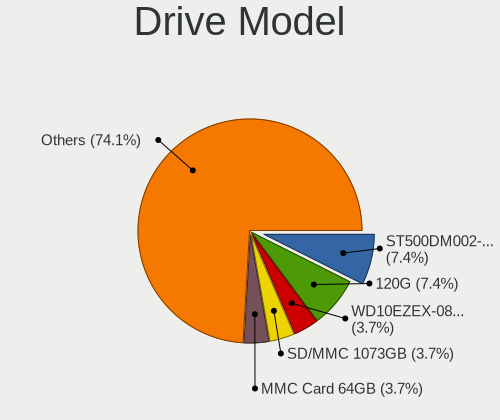

| Model                            | Desktops | Percent |
|----------------------------------|----------|---------|
| XrayDisk SSD 512GB               | 1        | 6.25%   |
| WDC WDS100T2B0A-00SM50 1TB SSD   | 1        | 6.25%   |
| WDC WD40EFAX-68JH4N0 4TB         | 1        | 6.25%   |
| WDC WD3200AAKS-00L9A0 320GB      | 1        | 6.25%   |
| Toshiba MQ01ABF050 500GB         | 1        | 6.25%   |
| Toshiba HDWR160 6TB              | 1        | 6.25%   |
| Toshiba HDWE150 5TB              | 1        | 6.25%   |
| SPCC Solid State Disk 120GB      | 1        | 6.25%   |
| Seagate ST9200827AS 200GB        | 1        | 6.25%   |
| Seagate ST3500413AS 500GB        | 1        | 6.25%   |
| Seagate ST1000DM003-1SB102 1TB   | 1        | 6.25%   |
| Samsung SSD 840 EVO 120GB        | 1        | 6.25%   |
| Phison MSI M390 1TB              | 1        | 6.25%   |
| Maxtor STM3250310AS 250GB        | 1        | 6.25%   |
| Kingston SV300S37A120G 120GB SSD | 1        | 6.25%   |
| Hitachi HTS547575A9E384 752GB    | 1        | 6.25%   |

HDD Vendor
----------

Hard disk drive vendors

| Vendor  | Desktops | Drives | Percent |
|---------|----------|--------|---------|
| Seagate | 3        | 3      | 33.33%  |
| WDC     | 2        | 2      | 22.22%  |
| Toshiba | 2        | 3      | 22.22%  |
| Maxtor  | 1        | 1      | 11.11%  |
| Hitachi | 1        | 1      | 11.11%  |

SSD Vendor
----------

Solid state drive vendors

| Vendor              | Desktops | Drives | Percent |
|---------------------|----------|--------|---------|
| XrayDisk            | 1        | 1      | 20%     |
| WDC                 | 1        | 1      | 20%     |
| SPCC                | 1        | 1      | 20%     |
| Samsung Electronics | 1        | 1      | 20%     |
| Kingston            | 1        | 1      | 20%     |

Drive Kind
----------

HDD or SSD

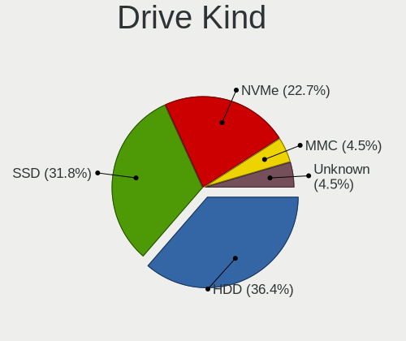

| Kind | Desktops | Drives | Percent |
|------|----------|--------|---------|
| HDD  | 7        | 10     | 70%     |
| SSD  | 2        | 5      | 20%     |
| NVMe | 1        | 1      | 10%     |

Drive Connector
---------------

SATA, SAS, NVMe, etc.

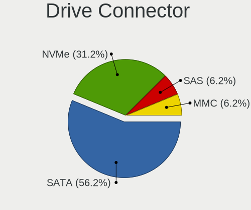

| Type | Desktops | Drives | Percent |
|------|----------|--------|---------|
| SATA | 7        | 15     | 87.5%   |
| NVMe | 1        | 1      | 12.5%   |

Drive Size
----------

Size of hard drive

| Size in TB | Desktops | Drives | Percent |
|------------|----------|--------|---------|
| 0.01-0.5   | 5        | 8      | 45.45%  |
| 0.51-1.0   | 4        | 4      | 36.36%  |
| 3.01-4.0   | 1        | 1      | 9.09%   |
| 4.01-10.0  | 1        | 2      | 9.09%   |

Space Total
-----------

Amount of disk space available on the file system

| Size in GB     | Desktops | Percent |
|----------------|----------|---------|
| 501-1000       | 3        | 42.86%  |
| 101-250        | 2        | 28.57%  |
| More than 3000 | 1        | 14.29%  |
| 251-500        | 1        | 14.29%  |

Space Used
----------

Amount of used disk space

| Used GB        | Desktops | Percent |
|----------------|----------|---------|
| 251-500        | 2        | 28.57%  |
| 1-20           | 2        | 28.57%  |
| More than 3000 | 1        | 14.29%  |
| 101-250        | 1        | 14.29%  |
| 51-100         | 1        | 14.29%  |

Malfunc. Drives
---------------

Drive models with a malfunction

| Model                       | Desktops | Drives | Percent |
|-----------------------------|----------|--------|---------|
| SPCC Solid State Disk 120GB | 1        | 1      | 50%     |
| Seagate ST9200827AS 200GB   | 1        | 1      | 50%     |

Malfunc. Drive Vendor
---------------------

Vendors of faulty drives

| Vendor  | Desktops | Drives | Percent |
|---------|----------|--------|---------|
| SPCC    | 1        | 1      | 50%     |
| Seagate | 1        | 1      | 50%     |

Malfunc. HDD Vendor
-------------------

Vendors of faulty HDD drives

| Vendor  | Desktops | Drives | Percent |
|---------|----------|--------|---------|
| Seagate | 1        | 1      | 100%    |

Malfunc. Drive Kind
-------------------

Kinds of faulty drives

| Kind | Desktops | Drives | Percent |
|------|----------|--------|---------|
| SSD  | 1        | 1      | 50%     |
| HDD  | 1        | 1      | 50%     |

Failed Drives
-------------

Failed drive models

Zero info for selected period =(

Failed Drive Vendor
-------------------

Failed drive vendors

Zero info for selected period =(

Drive Status
------------

Number of failed and malfunc. drives

| Status   | Desktops | Drives | Percent |
|----------|----------|--------|---------|
| Works    | 4        | 11     | 50%     |
| Detected | 2        | 3      | 25%     |
| Malfunc  | 2        | 2      | 25%     |

Storage controller
------------------

Storage Vendor
--------------

Storage controller vendors

| Vendor             | Desktops | Percent |
|--------------------|----------|---------|
| AMD                | 4        | 50%     |
| Intel              | 3        | 37.5%   |
| Phison Electronics | 1        | 12.5%   |

Storage Model
-------------

Storage controller models

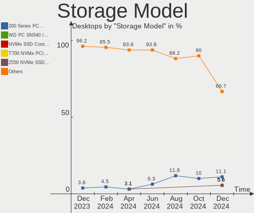

| Model                                                                         | Desktops | Percent |
|-------------------------------------------------------------------------------|----------|---------|
| Intel 6 Series/C200 Series Chipset Family 6 port Desktop SATA AHCI Controller | 2        | 20%     |
| AMD FCH SATA Controller [AHCI mode]                                           | 2        | 20%     |
| Phison Electronics Non-Volatile memory controller                             | 1        | 10%     |
| Intel 200 Series PCH SATA controller [AHCI mode]                              | 1        | 10%     |
| AMD X370 Series Chipset SATA Controller                                       | 1        | 10%     |
| AMD SB7x0/SB8x0/SB9x0 SATA Controller [AHCI mode]                             | 1        | 10%     |
| AMD 500 Series Chipset SATA Controller                                        | 1        | 10%     |
| AMD 300 Series Chipset SATA Controller                                        | 1        | 10%     |

Storage Kind
------------

Kind of storage controller (IDE, SATA, NVMe, SAS, ...)

| Kind | Desktops | Percent |
|------|----------|---------|
| SATA | 7        | 87.5%   |
| NVMe | 1        | 12.5%   |

Processor
---------

CPU Vendor
----------

Processor vendors

| Vendor | Desktops | Percent |
|--------|----------|---------|
| AMD    | 4        | 57.14%  |
| Intel  | 3        | 42.86%  |

CPU Model
---------

Processor models

| Model                                  | Desktops | Percent |
|----------------------------------------|----------|---------|
| Intel Core i5-2400S CPU @ 2.50GHz      | 1        | 14.29%  |
| Intel Core i3-9100 CPU @ 3.60GHz       | 1        | 14.29%  |
| Intel Core i3-3240 CPU @ 3.40GHz       | 1        | 14.29%  |
| AMD Ryzen 5 5600G with Radeon Graphics | 1        | 14.29%  |
| AMD Ryzen 5 1600 Six-Core Processor    | 1        | 14.29%  |
| AMD Ryzen 3 1200 Quad-Core Processor   | 1        | 14.29%  |
| AMD FX-6300 Six-Core Processor         | 1        | 14.29%  |

CPU Model Family
----------------

Processor model prefix

| Model         | Desktops | Percent |
|---------------|----------|---------|
| Intel Core i3 | 2        | 28.57%  |
| AMD Ryzen 5   | 2        | 28.57%  |
| Intel Core i5 | 1        | 14.29%  |
| AMD Ryzen 3   | 1        | 14.29%  |
| AMD FX        | 1        | 14.29%  |

CPU Cores
---------

Number of processor cores

| Number | Desktops | Percent |
|--------|----------|---------|
| 4      | 3        | 42.86%  |
| 6      | 2        | 28.57%  |
| 3      | 1        | 14.29%  |
| 2      | 1        | 14.29%  |

CPU Sockets
-----------

Number of sockets

| Number | Desktops | Percent |
|--------|----------|---------|
| 1      | 7        | 100%    |

CPU Threads
-----------

Threads per core (Hyper-Threading)

| Number | Desktops | Percent |
|--------|----------|---------|
| 2      | 4        | 57.14%  |
| 1      | 3        | 42.86%  |

CPU Op-Modes
------------

CPU Operation Modes (32-bit, 64-bit)

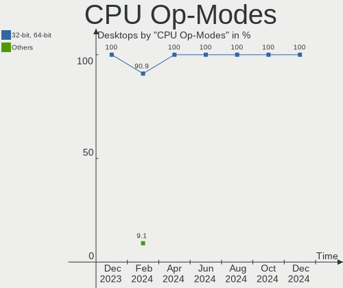

| Op mode        | Desktops | Percent |
|----------------|----------|---------|
| 32-bit, 64-bit | 7        | 100%    |

CPU Microcode
-------------

Microcode number

| Number     | Desktops | Percent |
|------------|----------|---------|
| 0x08001129 | 2        | 28.57%  |
| 0x906eb    | 1        | 14.29%  |
| 0x306a9    | 1        | 14.29%  |
| 0x0a50000d | 1        | 14.29%  |
| 0x06000852 | 1        | 14.29%  |
| Unknown    | 1        | 14.29%  |

CPU Microarch
-------------

Microarchitecture

| Name        | Desktops | Percent |
|-------------|----------|---------|
| Zen         | 2        | 28.57%  |
| Zen 3       | 1        | 14.29%  |
| SandyBridge | 1        | 14.29%  |
| Piledriver  | 1        | 14.29%  |
| KabyLake    | 1        | 14.29%  |
| IvyBridge   | 1        | 14.29%  |

Graphics
--------

GPU Vendor
----------

Vendors of graphics cards

| Vendor | Desktops | Percent |
|--------|----------|---------|
| Nvidia | 4        | 50%     |
| Intel  | 2        | 25%     |
| AMD    | 2        | 25%     |

GPU Model
---------

Graphics card models

| Model                                                                     | Desktops | Percent |
|---------------------------------------------------------------------------|----------|---------|
| Nvidia TU116 [GeForce GTX 1650 SUPER]                                     | 1        | 12.5%   |
| Nvidia GP108 [GeForce GT 1030]                                            | 1        | 12.5%   |
| Nvidia GP107 [GeForce GTX 1050]                                           | 1        | 12.5%   |
| Nvidia GF108 [GeForce GT 630]                                             | 1        | 12.5%   |
| Intel CoffeeLake-S GT2 [UHD Graphics 630]                                 | 1        | 12.5%   |
| Intel 2nd Generation Core Processor Family Integrated Graphics Controller | 1        | 12.5%   |
| AMD Cezanne                                                               | 1        | 12.5%   |
| AMD Baffin [Radeon RX 550 640SP / RX 560/560X]                            | 1        | 12.5%   |

GPU Combo
---------

Combinations of graphics cards

| Name       | Desktops | Percent |
|------------|----------|---------|
| 1 x Nvidia | 4        | 57.14%  |
| 1 x AMD    | 2        | 28.57%  |
| 1 x Intel  | 1        | 14.29%  |

GPU Driver
----------

Free vs proprietary

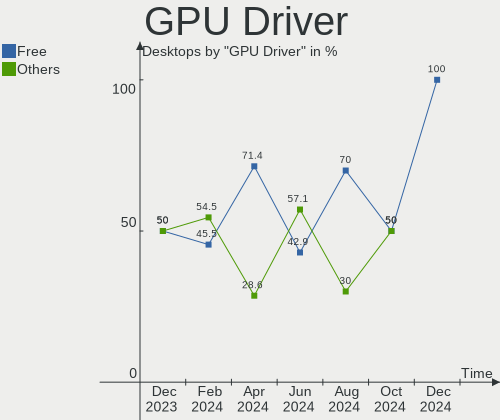

| Driver      | Desktops | Percent |
|-------------|----------|---------|
| Free        | 5        | 71.43%  |
| Proprietary | 2        | 28.57%  |

GPU Memory
----------

Total video memory

| Size in GB | Desktops | Percent |
|------------|----------|---------|
| 1.01-2.0   | 3        | 42.86%  |
| 3.01-4.0   | 2        | 28.57%  |
| 0.01-0.5   | 1        | 14.29%  |
| Unknown    | 1        | 14.29%  |

Monitor
-------

Monitor Vendor
--------------

Monitor vendors

| Vendor              | Desktops | Percent |
|---------------------|----------|---------|
| Samsung Electronics | 3        | 50%     |
| Panasonic           | 1        | 16.67%  |
| Hewlett-Packard     | 1        | 16.67%  |
| HannStar            | 1        | 16.67%  |

Monitor Model
-------------

Monitor models

| Model                                                               | Desktops | Percent |
|---------------------------------------------------------------------|----------|---------|
| Samsung Electronics U28E590 SAM0C4E 3840x2160 610x350mm 27.7-inch   | 1        | 14.29%  |
| Samsung Electronics SyncMaster SAM0273 1440x900 410x257mm 19.1-inch | 1        | 14.29%  |
| Samsung Electronics LCD Monitor SyncMaster 1440x900                 | 1        | 14.29%  |
| Samsung Electronics LCD Monitor SAM039B 1280x720                    | 1        | 14.29%  |
| Panasonic TV MEIA0CC 1920x1080 698x392mm 31.5-inch                  | 1        | 14.29%  |
| Hewlett-Packard 21kd HWP3329 1920x1080 458x258mm 20.7-inch          | 1        | 14.29%  |
| HannStar LM02 HSP0013 1440x900 408x255mm 18.9-inch                  | 1        | 14.29%  |

Monitor Resolution
------------------

Monitor screen resolution

| Resolution       | Desktops | Percent |
|------------------|----------|---------|
| 1920x1080 (FHD)  | 2        | 33.33%  |
| 1440x900 (WXGA+) | 2        | 33.33%  |
| 3840x2160 (4K)   | 1        | 16.67%  |
| 1280x720 (HD)    | 1        | 16.67%  |

Monitor Diagonal
----------------

Diagonal size in inches

| Inches  | Desktops | Percent |
|---------|----------|---------|
| Unknown | 2        | 28.57%  |
| 31      | 1        | 14.29%  |
| 27      | 1        | 14.29%  |
| 20      | 1        | 14.29%  |
| 19      | 1        | 14.29%  |
| 18      | 1        | 14.29%  |

Monitor Width
-------------

Physical width

| Width in mm | Desktops | Percent |
|-------------|----------|---------|
| 401-500     | 3        | 42.86%  |
| 601-700     | 2        | 28.57%  |
| Unknown     | 2        | 28.57%  |

Aspect Ratio
------------

Proportional relationship between the width and the height

| Ratio   | Desktops | Percent |
|---------|----------|---------|
| 16/9    | 4        | 57.14%  |
| 16/10   | 2        | 28.57%  |
| Unknown | 1        | 14.29%  |

Monitor Area
------------

Area in inch²

| Area in inch² | Desktops | Percent |
|----------------|----------|---------|
| 151-200        | 3        | 42.86%  |
| Unknown        | 2        | 28.57%  |
| 351-500        | 1        | 14.29%  |
| 301-350        | 1        | 14.29%  |

Pixel Density
-------------

Pixels per inch

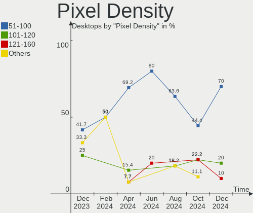

| Density | Desktops | Percent |
|---------|----------|---------|
| 51-100  | 3        | 42.86%  |
| Unknown | 2        | 28.57%  |
| 121-160 | 1        | 14.29%  |
| 101-120 | 1        | 14.29%  |

Multiple Monitors
-----------------

Total monitors connected

| Total | Desktops | Percent |
|-------|----------|---------|
| 1     | 6        | 85.71%  |
| 2     | 1        | 14.29%  |

Network
-------

Net Controller Vendor
---------------------

Controller vendors

| Vendor                          | Desktops | Percent |
|---------------------------------|----------|---------|
| Realtek Semiconductor           | 5        | 31.25%  |
| Intel                           | 5        | 31.25%  |
| Qualcomm Atheros Communications | 2        | 12.5%   |
| Ralink Technology               | 1        | 6.25%   |
| Qualcomm Atheros                | 1        | 6.25%   |
| D-Link                          | 1        | 6.25%   |
| ASUSTek Computer                | 1        | 6.25%   |

Net Controller Model
--------------------

Controller models

| Model                                                                                         | Desktops | Percent |
|-----------------------------------------------------------------------------------------------|----------|---------|
| Realtek RTL8111/8168/8411 PCI Express Gigabit Ethernet Controller                             | 5        | 26.32%  |
| Realtek RTL8812AU 802.11a/b/g/n/ac 2T2R DB WLAN Adapter                                       | 2        | 10.53%  |
| Qualcomm Atheros AR9271 802.11n                                                               | 2        | 10.53%  |
| Realtek Realtek 8812AU/8821AU 802.11ac WLAN Adapter [USB Wireless Dual-Band Adapter 2.4/5Ghz] | 1        | 5.26%   |
| Ralink RT2870/RT3070 Wireless Adapter                                                         | 1        | 5.26%   |
| Qualcomm Atheros AR9227 Wireless Network Adapter                                              | 1        | 5.26%   |
| Intel Wi-Fi 6 AX210/AX211/AX411 160MHz                                                        | 1        | 5.26%   |
| Intel Ultimate N WiFi Link 5300                                                               | 1        | 5.26%   |
| Intel I211 Gigabit Network Connection                                                         | 1        | 5.26%   |
| Intel Ethernet Controller I225-V                                                              | 1        | 5.26%   |
| Intel Ethernet Connection (2) I219-V                                                          | 1        | 5.26%   |
| D-Link DWA-123 Wireless N 150 Adapter (rev.D1)                                                | 1        | 5.26%   |
| ASUS 802.11ac NIC                                                                             | 1        | 5.26%   |

Wireless Vendor
---------------

Wireless vendors

| Vendor                          | Desktops | Percent |
|---------------------------------|----------|---------|
| Realtek Semiconductor           | 3        | 27.27%  |
| Qualcomm Atheros Communications | 2        | 18.18%  |
| Intel                           | 2        | 18.18%  |
| Ralink Technology               | 1        | 9.09%   |
| Qualcomm Atheros                | 1        | 9.09%   |
| D-Link                          | 1        | 9.09%   |
| ASUSTek Computer                | 1        | 9.09%   |

Wireless Model
--------------

Wireless models

| Model                                                                                         | Desktops | Percent |
|-----------------------------------------------------------------------------------------------|----------|---------|
| Realtek RTL8812AU 802.11a/b/g/n/ac 2T2R DB WLAN Adapter                                       | 2        | 18.18%  |
| Qualcomm Atheros AR9271 802.11n                                                               | 2        | 18.18%  |
| Realtek Realtek 8812AU/8821AU 802.11ac WLAN Adapter [USB Wireless Dual-Band Adapter 2.4/5Ghz] | 1        | 9.09%   |
| Ralink RT2870/RT3070 Wireless Adapter                                                         | 1        | 9.09%   |
| Qualcomm Atheros AR9227 Wireless Network Adapter                                              | 1        | 9.09%   |
| Intel Wi-Fi 6 AX210/AX211/AX411 160MHz                                                        | 1        | 9.09%   |
| Intel Ultimate N WiFi Link 5300                                                               | 1        | 9.09%   |
| D-Link DWA-123 Wireless N 150 Adapter (rev.D1)                                                | 1        | 9.09%   |
| ASUS 802.11ac NIC                                                                             | 1        | 9.09%   |

Ethernet Vendor
---------------

Ethernet vendors

| Vendor                | Desktops | Percent |
|-----------------------|----------|---------|
| Realtek Semiconductor | 5        | 62.5%   |
| Intel                 | 3        | 37.5%   |

Ethernet Model
--------------

Ethernet models

| Model                                                             | Desktops | Percent |
|-------------------------------------------------------------------|----------|---------|
| Realtek RTL8111/8168/8411 PCI Express Gigabit Ethernet Controller | 5        | 62.5%   |
| Intel I211 Gigabit Network Connection                             | 1        | 12.5%   |
| Intel Ethernet Controller I225-V                                  | 1        | 12.5%   |
| Intel Ethernet Connection (2) I219-V                              | 1        | 12.5%   |

Net Controller Kind
-------------------

Ethernet, WiFi or modem

| Kind     | Desktops | Percent |
|----------|----------|---------|
| WiFi     | 7        | 50%     |
| Ethernet | 7        | 50%     |

Used Controller
---------------

Currently used network controller

| Kind     | Desktops | Percent |
|----------|----------|---------|
| Ethernet | 6        | 66.67%  |
| WiFi     | 3        | 33.33%  |

NICs
----

Total network controllers on board

| Total | Desktops | Percent |
|-------|----------|---------|
| 2     | 4        | 57.14%  |
| 1     | 3        | 42.86%  |

IPv6
----

IPv6 vs IPv4

| Used | Desktops | Percent |
|------|----------|---------|
| No   | 6        | 85.71%  |
| Yes  | 1        | 14.29%  |

Bluetooth
---------

Bluetooth Vendor
----------------

Controller vendors

| Vendor                | Desktops | Percent |
|-----------------------|----------|---------|
| Realtek Semiconductor | 1        | 50%     |
| Broadcom              | 1        | 50%     |

Bluetooth Model
---------------

Controller models

| Model                      | Desktops | Percent |
|----------------------------|----------|---------|
| Realtek Bluetooth Radio    | 1        | 50%     |
| Broadcom BCM2045 Bluetooth | 1        | 50%     |

Sound
-----

Sound Vendor
------------

Sound card vendors

| Vendor | Desktops | Percent |
|--------|----------|---------|
| Nvidia | 4        | 36.36%  |
| AMD    | 4        | 36.36%  |
| Intel  | 3        | 27.27%  |

Sound Model
-----------

Sound card models

| Model                                                                      | Desktops | Percent |
|----------------------------------------------------------------------------|----------|---------|
| Intel 6 Series/C200 Series Chipset Family High Definition Audio Controller | 2        | 15.38%  |
| AMD Family 17h (Models 00h-0fh) HD Audio Controller                        | 2        | 15.38%  |
| Nvidia TU116 High Definition Audio Controller                              | 1        | 7.69%   |
| Nvidia GP108 High Definition Audio Controller                              | 1        | 7.69%   |
| Nvidia GP107GL High Definition Audio Controller                            | 1        | 7.69%   |
| Nvidia GF108 High Definition Audio Controller                              | 1        | 7.69%   |
| Intel 200 Series PCH HD Audio                                              | 1        | 7.69%   |
| AMD SBx00 Azalia (Intel HDA)                                               | 1        | 7.69%   |
| AMD Renoir Radeon High Definition Audio Controller                         | 1        | 7.69%   |
| AMD Family 17h/19h HD Audio Controller                                     | 1        | 7.69%   |
| AMD Baffin HDMI/DP Audio [Radeon RX 550 640SP / RX 560/560X]               | 1        | 7.69%   |

Memory
------

Memory Vendor
-------------

Memory module vendors

| Vendor    | Desktops | Percent |
|-----------|----------|---------|
| Corsair   | 4        | 57.14%  |
| Kingston  | 1        | 14.29%  |
| Crucial   | 1        | 14.29%  |
| Atermiter | 1        | 14.29%  |

Memory Model
------------

Memory module models

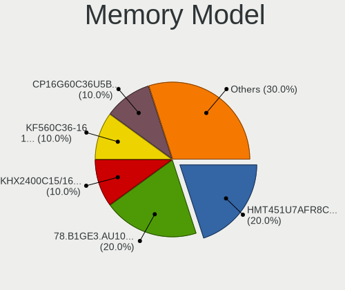

| Model                                                  | Desktops | Percent |
|--------------------------------------------------------|----------|---------|
| Corsair RAM CMK16GX4M2B3200C16 8GB DIMM DDR4 3600MT/s  | 2        | 25%     |
| Kingston RAM KHX2133C14D4/4G 4GB DIMM DDR4 2933MT/s    | 1        | 12.5%   |
| Crucial RAM BLS8G4D240FSC.16FBD 8GB DIMM DDR4 2667MT/s | 1        | 12.5%   |
| Corsair RAM CMX4GX3M1A1600C11 4GB DIMM DDR3 1600MT/s   | 1        | 12.5%   |
| Corsair RAM CMW16GX4M2C3200C16 8GB DIMM DDR4 3266MT/s  | 1        | 12.5%   |
| Corsair RAM CMK32GX4M2B3000C15 16GB DIMM DDR4 3000MT/s | 1        | 12.5%   |
| Atermiter RAM Module 8GB DIMM DDR4 2133MT/s            | 1        | 12.5%   |

Memory Kind
-----------

Memory module kinds

| Kind | Desktops | Percent |
|------|----------|---------|
| DDR4 | 4        | 80%     |
| DDR3 | 1        | 20%     |

Memory Form Factor
------------------

Physical design of the memory module

| Name | Desktops | Percent |
|------|----------|---------|
| DIMM | 5        | 100%    |

Memory Size
-----------

Memory module size

| Size  | Desktops | Percent |
|-------|----------|---------|
| 8192  | 3        | 50%     |
| 4096  | 2        | 33.33%  |
| 16384 | 1        | 16.67%  |

Memory Speed
------------

Memory module speed

| Speed | Desktops | Percent |
|-------|----------|---------|
| 3600  | 2        | 25%     |
| 3266  | 1        | 12.5%   |
| 3000  | 1        | 12.5%   |
| 2933  | 1        | 12.5%   |
| 2667  | 1        | 12.5%   |
| 2133  | 1        | 12.5%   |
| 1600  | 1        | 12.5%   |

Printers & scanners
-------------------

Printer Vendor
--------------

Printer device vendors

Zero info for selected period =(

Printer Model
-------------

Printer device models

Zero info for selected period =(

Scanner Vendor
--------------

Scanner device vendors

Zero info for selected period =(

Scanner Model
-------------

Scanner device models

Zero info for selected period =(

Camera
------

Camera Vendor
-------------

Camera device vendors

| Vendor                        | Desktops | Percent |
|-------------------------------|----------|---------|
| Sunplus Innovation Technology | 1        | 50%     |
| Chicony Electronics           | 1        | 50%     |

Camera Model
------------

Camera device models

| Model                  | Desktops | Percent |
|------------------------|----------|---------|
| Sunplus Full HD webcam | 1        | 50%     |
| Chicony Front Camera   | 1        | 50%     |

Security
--------

Fingerprint Vendor
------------------

Fingerprint sensor vendors

Zero info for selected period =(

Fingerprint Model
-----------------

Fingerprint sensor models

Zero info for selected period =(

Chipcard Vendor
---------------

Chipcard module vendors

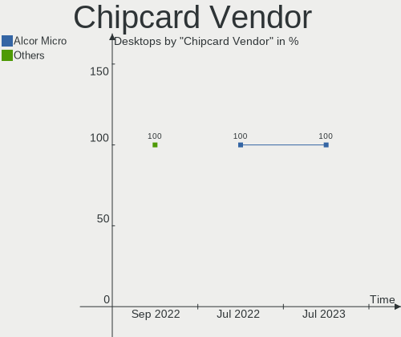

| Vendor      | Desktops | Percent |
|-------------|----------|---------|
| Alcor Micro | 1        | 100%    |

Chipcard Model
--------------

Chipcard module models

| Model                               | Desktops | Percent |
|-------------------------------------|----------|---------|
| Alcor Micro AU9540 Smartcard Reader | 1        | 100%    |

Unsupported
-----------

Unsupported Devices
-------------------

Total unsupported devices on board

| Total | Desktops | Percent |
|-------|----------|---------|
| 0     | 4        | 57.14%  |
| 1     | 2        | 28.57%  |
| 2     | 1        | 14.29%  |

Unsupported Device Types
------------------------

Types of unsupported devices

| Type         | Desktops | Percent |
|--------------|----------|---------|
| Net/wireless | 3        | 75%     |
| Chipcard     | 1        | 25%     |

