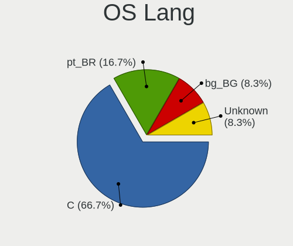
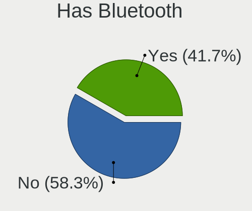
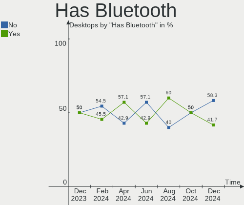
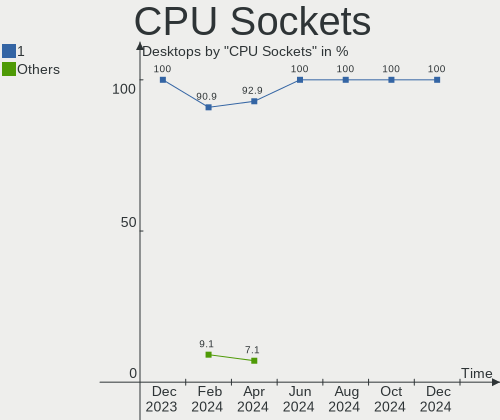
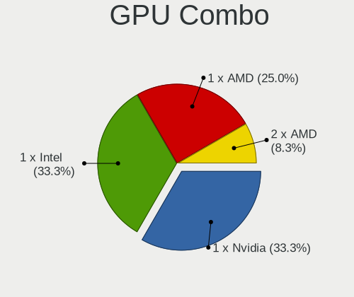
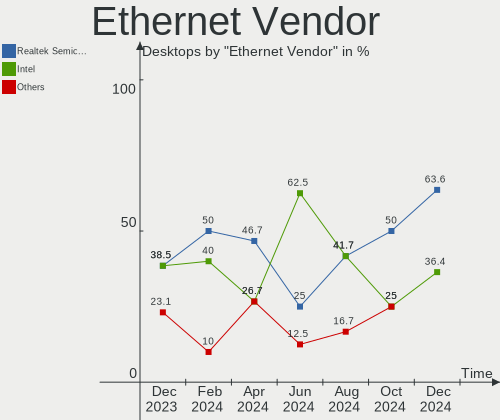
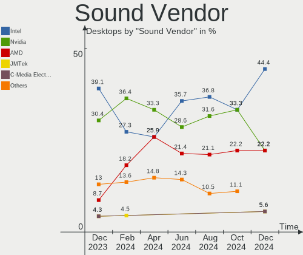
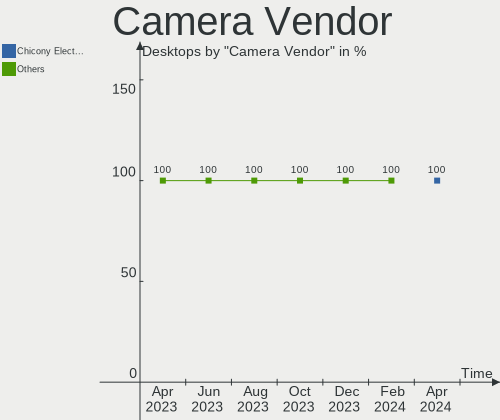

Kali - Hardware Trends (Desktops)
---------------------------------

A project to identify most popular hardware characteristics and track their change
over time based on data collected by Linux users at https://Linux-Hardware.org.

Anyone can contribute to this report by the [hw-probe](https://github.com/linuxhw/hw-probe) tool:

    sudo -E hw-probe -all -upload

This report is for one last month. Overall report since the beginning of time: [TestDays](https://github.com/linuxhw/TestDays)

Period: Apr, 2023.

Contents
--------

* [ System ](#system)
  - [ OS                       ](#os)
  - [ OS Family                ](#os-family)
  - [ Kernel                   ](#kernel)
  - [ Kernel Family            ](#kernel-family)
  - [ Kernel Major Ver.        ](#kernel-major-ver)
  - [ Arch                     ](#arch)
  - [ DE                       ](#de)
  - [ Display Server           ](#display-server)
  - [ Display Manager          ](#display-manager)
  - [ OS Lang                  ](#os-lang)
  - [ Boot Mode                ](#boot-mode)
  - [ Filesystem               ](#filesystem)
  - [ Part. scheme             ](#part-scheme)
  - [ Dual Boot with Linux/BSD ](#dual-boot-with-linuxbsd)
  - [ Dual Boot (Win)          ](#dual-boot-win)

* [ Board ](#board)
  - [ Vendor                   ](#vendor)
  - [ Model                    ](#model)
  - [ Model Family             ](#model-family)
  - [ MFG Year                 ](#mfg-year)
  - [ Form Factor              ](#form-factor)
  - [ Secure Boot              ](#secure-boot)
  - [ Coreboot                 ](#coreboot)
  - [ RAM Size                 ](#ram-size)
  - [ RAM Used                 ](#ram-used)
  - [ Total Drives             ](#total-drives)
  - [ Has CD-ROM               ](#has-cd-rom)
  - [ Has Ethernet             ](#has-ethernet)
  - [ Has WiFi                 ](#has-wifi)
  - [ Has Bluetooth            ](#has-bluetooth)

* [ Location ](#location)
  - [ Country                  ](#country)
  - [ City                     ](#city)

* [ Drives ](#drives)
  - [ Drive Vendor             ](#drive-vendor)
  - [ Drive Model              ](#drive-model)
  - [ HDD Vendor               ](#hdd-vendor)
  - [ SSD Vendor               ](#ssd-vendor)
  - [ Drive Kind               ](#drive-kind)
  - [ Drive Connector          ](#drive-connector)
  - [ Drive Size               ](#drive-size)
  - [ Space Total              ](#space-total)
  - [ Space Used               ](#space-used)
  - [ Malfunc. Drives          ](#malfunc-drives)
  - [ Malfunc. Drive Vendor    ](#malfunc-drive-vendor)
  - [ Malfunc. HDD Vendor      ](#malfunc-hdd-vendor)
  - [ Malfunc. Drive Kind      ](#malfunc-drive-kind)
  - [ Failed Drives            ](#failed-drives)
  - [ Failed Drive Vendor      ](#failed-drive-vendor)
  - [ Drive Status             ](#drive-status)

* [ Storage controller ](#storage-controller)
  - [ Storage Vendor           ](#storage-vendor)
  - [ Storage Model            ](#storage-model)
  - [ Storage Kind             ](#storage-kind)

* [ Processor ](#processor)
  - [ CPU Vendor               ](#cpu-vendor)
  - [ CPU Model                ](#cpu-model)
  - [ CPU Model Family         ](#cpu-model-family)
  - [ CPU Cores                ](#cpu-cores)
  - [ CPU Sockets              ](#cpu-sockets)
  - [ CPU Threads              ](#cpu-threads)
  - [ CPU Op-Modes             ](#cpu-op-modes)
  - [ CPU Microcode            ](#cpu-microcode)
  - [ CPU Microarch            ](#cpu-microarch)

* [ Graphics ](#graphics)
  - [ GPU Vendor               ](#gpu-vendor)
  - [ GPU Model                ](#gpu-model)
  - [ GPU Combo                ](#gpu-combo)
  - [ GPU Driver               ](#gpu-driver)
  - [ GPU Memory               ](#gpu-memory)

* [ Monitor ](#monitor)
  - [ Monitor Vendor           ](#monitor-vendor)
  - [ Monitor Model            ](#monitor-model)
  - [ Monitor Resolution       ](#monitor-resolution)
  - [ Monitor Diagonal         ](#monitor-diagonal)
  - [ Monitor Width            ](#monitor-width)
  - [ Aspect Ratio             ](#aspect-ratio)
  - [ Monitor Area             ](#monitor-area)
  - [ Pixel Density            ](#pixel-density)
  - [ Multiple Monitors        ](#multiple-monitors)

* [ Network ](#network)
  - [ Net Controller Vendor    ](#net-controller-vendor)
  - [ Net Controller Model     ](#net-controller-model)
  - [ Wireless Vendor          ](#wireless-vendor)
  - [ Wireless Model           ](#wireless-model)
  - [ Ethernet Vendor          ](#ethernet-vendor)
  - [ Ethernet Model           ](#ethernet-model)
  - [ Net Controller Kind      ](#net-controller-kind)
  - [ Used Controller          ](#used-controller)
  - [ NICs                     ](#nics)
  - [ IPv6                     ](#ipv6)

* [ Bluetooth ](#bluetooth)
  - [ Bluetooth Vendor         ](#bluetooth-vendor)
  - [ Bluetooth Model          ](#bluetooth-model)

* [ Sound ](#sound)
  - [ Sound Vendor             ](#sound-vendor)
  - [ Sound Model              ](#sound-model)

* [ Memory ](#memory)
  - [ Memory Vendor            ](#memory-vendor)
  - [ Memory Model             ](#memory-model)
  - [ Memory Kind              ](#memory-kind)
  - [ Memory Form Factor       ](#memory-form-factor)
  - [ Memory Size              ](#memory-size)
  - [ Memory Speed             ](#memory-speed)

* [ Printers & scanners ](#printers--scanners)
  - [ Printer Vendor           ](#printer-vendor)
  - [ Printer Model            ](#printer-model)
  - [ Scanner Vendor           ](#scanner-vendor)
  - [ Scanner Model            ](#scanner-model)

* [ Camera ](#camera)
  - [ Camera Vendor            ](#camera-vendor)
  - [ Camera Model             ](#camera-model)

* [ Security ](#security)
  - [ Fingerprint Vendor       ](#fingerprint-vendor)
  - [ Fingerprint Model        ](#fingerprint-model)
  - [ Chipcard Vendor          ](#chipcard-vendor)
  - [ Chipcard Model           ](#chipcard-model)

* [ Unsupported ](#unsupported)
  - [ Unsupported Devices      ](#unsupported-devices)
  - [ Unsupported Device Types ](#unsupported-device-types)

System
------

OS
--

Installed operating systems

| Name        | Desktops | Percent |
|-------------|----------|---------|
| Kali 2023.1 | 8        | 88.89%  |
| Kali 2022.4 | 1        | 11.11%  |

OS Family
---------

OS without a version

| Name | Desktops | Percent |
|------|----------|---------|
| Kali | 9        | 100%    |

Kernel
------

Version of the Linux kernel

| Version           | Desktops | Percent |
|-------------------|----------|---------|
| 6.1.0-kali5-amd64 | 5        | 55.56%  |
| 6.1.0-kali7-amd64 | 3        | 33.33%  |
| 6.0.0-kali3-amd64 | 1        | 11.11%  |

Kernel Family
-------------

Linux kernel without a distro release

| Version | Desktops | Percent |
|---------|----------|---------|
| 6.1.0   | 8        | 88.89%  |
| 6.0.0   | 1        | 11.11%  |

Kernel Major Ver.
-----------------

Linux kernel major version

| Version | Desktops | Percent |
|---------|----------|---------|
| 6.1     | 8        | 88.89%  |
| 6.0     | 1        | 11.11%  |

Arch
----

OS architecture (x86_64, i586, etc.)

| Name   | Desktops | Percent |
|--------|----------|---------|
| x86_64 | 9        | 100%    |

DE
--

Desktop Environment

| Name  | Desktops | Percent |
|-------|----------|---------|
| XFCE  | 5        | 55.56%  |
| KDE5  | 2        | 22.22%  |
| GNOME | 2        | 22.22%  |

Display Server
--------------

X11 or Wayland

| Name    | Desktops | Percent |
|---------|----------|---------|
| X11     | 8        | 88.89%  |
| Wayland | 1        | 11.11%  |

Display Manager
---------------

SDDM, LightDM, etc.

| Name    | Desktops | Percent |
|---------|----------|---------|
| LightDM | 4        | 44.44%  |
| SDDM    | 2        | 22.22%  |
| GDM3    | 2        | 22.22%  |
| Unknown | 1        | 11.11%  |

OS Lang
-------

Language

| Lang  | Desktops | Percent |
|-------|----------|---------|
| en_US | 5        | 55.56%  |
| ru_RU | 1        | 11.11%  |
| en_IN | 1        | 11.11%  |
| en_GB | 1        | 11.11%  |
| cs_CZ | 1        | 11.11%  |

Boot Mode
---------

EFI or BIOS

| Mode | Desktops | Percent |
|------|----------|---------|
| EFI  | 7        | 77.78%  |
| BIOS | 2        | 22.22%  |

Filesystem
----------

Type of filesystem

| Type    | Desktops | Percent |
|---------|----------|---------|
| Ext4    | 8        | 88.89%  |
| Overlay | 1        | 11.11%  |

Part. scheme
------------

Scheme of partitioning

| Type    | Desktops | Percent |
|---------|----------|---------|
| GPT     | 6        | 66.67%  |
| MBR     | 2        | 22.22%  |
| Unknown | 1        | 11.11%  |

Dual Boot with Linux/BSD
------------------------

Hosting more than one Linux/BSD

| Dual boot | Desktops | Percent |
|-----------|----------|---------|
| No        | 8        | 88.89%  |
| Yes       | 1        | 11.11%  |

Dual Boot (Win)
---------------

Hosting Linux and Windows

| Dual boot | Desktops | Percent |
|-----------|----------|---------|
| Yes       | 6        | 66.67%  |
| No        | 3        | 33.33%  |

Board
-----

Vendor
------

Motherboard manufacturer

| Name                | Desktops | Percent |
|---------------------|----------|---------|
| ASRock              | 3        | 33.33%  |
| Gigabyte Technology | 2        | 22.22%  |
| ASUSTek Computer    | 2        | 22.22%  |
| MSI                 | 1        | 11.11%  |
| Hewlett-Packard     | 1        | 11.11%  |

Model
-----

Motherboard model

| Name                            | Desktops | Percent |
|---------------------------------|----------|---------|
| MSI MS-7B12                     | 1        | 11.11%  |
| HP t620 Dual Core TC            | 1        | 11.11%  |
| Gigabyte H81M-S                 | 1        | 11.11%  |
| Gigabyte B550 AORUS ELITE AX V2 | 1        | 11.11%  |
| ASUS ROG STRIX B365-G GAMING    | 1        | 11.11%  |
| ASUS M4A78LT-M                  | 1        | 11.11%  |
| ASRock Z87 Killer               | 1        | 11.11%  |
| ASRock B550M Steel Legend       | 1        | 11.11%  |
| ASRock B450 Steel Legend        | 1        | 11.11%  |

Model Family
------------

Motherboard model prefix

| Name            | Desktops | Percent |
|-----------------|----------|---------|
| MSI MS-7B12     | 1        | 11.11%  |
| HP t620         | 1        | 11.11%  |
| Gigabyte H81M-S | 1        | 11.11%  |
| Gigabyte B550   | 1        | 11.11%  |
| ASUS ROG        | 1        | 11.11%  |
| ASUS M4A78LT-M  | 1        | 11.11%  |
| ASRock Z87      | 1        | 11.11%  |
| ASRock B550M    | 1        | 11.11%  |
| ASRock B450     | 1        | 11.11%  |

MFG Year
--------

Motherboard manufacture year

| Year | Desktops | Percent |
|------|----------|---------|
| 2020 | 2        | 22.22%  |
| 2013 | 2        | 22.22%  |
| 2022 | 1        | 11.11%  |
| 2019 | 1        | 11.11%  |
| 2018 | 1        | 11.11%  |
| 2014 | 1        | 11.11%  |
| 2010 | 1        | 11.11%  |

Form Factor
-----------

Physical design of the computer

| Name    | Desktops | Percent |
|---------|----------|---------|
| Desktop | 9        | 100%    |

Secure Boot
-----------

Enabled or disabled

| State    | Desktops | Percent |
|----------|----------|---------|
| Disabled | 9        | 100%    |

Coreboot
--------

Have coreboot on board

| Used | Desktops | Percent |
|------|----------|---------|
| No   | 9        | 100%    |

RAM Size
--------

Total RAM memory

| Size in GB  | Desktops | Percent |
|-------------|----------|---------|
| 32.01-64.0  | 4        | 44.44%  |
| 3.01-4.0    | 2        | 22.22%  |
| 4.01-8.0    | 1        | 11.11%  |
| 64.01-256.0 | 1        | 11.11%  |
| 8.01-16.0   | 1        | 11.11%  |

RAM Used
--------

Used RAM memory

| Used GB  | Desktops | Percent |
|----------|----------|---------|
| 2.01-3.0 | 6        | 66.67%  |
| 4.01-8.0 | 1        | 11.11%  |
| 3.01-4.0 | 1        | 11.11%  |
| 1.01-2.0 | 1        | 11.11%  |

Total Drives
------------

Number of drives on board

| Drives | Desktops | Percent |
|--------|----------|---------|
| 3      | 4        | 44.44%  |
| 5      | 2        | 22.22%  |
| 2      | 1        | 11.11%  |
| 1      | 1        | 11.11%  |
| 0      | 1        | 11.11%  |

Has CD-ROM
----------

Has CD-ROM on board

| Presented | Desktops | Percent |
|-----------|----------|---------|
| No        | 9        | 100%    |

Has Ethernet
------------

Has Ethernet on board

| Presented | Desktops | Percent |
|-----------|----------|---------|
| Yes       | 8        | 88.89%  |
| No        | 1        | 11.11%  |

Has WiFi
--------

Has WiFi module

| Presented | Desktops | Percent |
|-----------|----------|---------|
| Yes       | 7        | 77.78%  |
| No        | 2        | 22.22%  |

Has Bluetooth
-------------

Has Bluetooth module

| Presented | Desktops | Percent |
|-----------|----------|---------|
| No        | 5        | 55.56%  |
| Yes       | 4        | 44.44%  |

Location
--------

Country
-------

Geographic location (country)

| Country | Desktops | Percent |
|---------|----------|---------|
| USA     | 2        | 22.22%  |
| Russia  | 2        | 22.22%  |
| UK      | 1        | 11.11%  |
| Spain   | 1        | 11.11%  |
| India   | 1        | 11.11%  |
| Czechia | 1        | 11.11%  |
| Albania | 1        | 11.11%  |

City
----

Geographic location (city)

| City            | Desktops | Percent |
|-----------------|----------|---------|
| Zaragoza        | 1        | 11.11%  |
| Yaroslavl       | 1        | 11.11%  |
| Tucson          | 1        | 11.11%  |
| Springfield     | 1        | 11.11%  |
| Mumbai          | 1        | 11.11%  |
| Mladá Boleslav | 1        | 11.11%  |
| Harrow          | 1        | 11.11%  |
| Durrës         | 1        | 11.11%  |
| Belovo          | 1        | 11.11%  |

Drives
------

Drive Vendor
------------

Hard drive vendors

| Vendor              | Desktops | Drives | Percent |
|---------------------|----------|--------|---------|
| WDC                 | 4        | 7      | 23.53%  |
| Samsung Electronics | 4        | 6      | 23.53%  |
| Seagate             | 3        | 6      | 17.65%  |
| Kingston            | 2        | 2      | 11.76%  |
| Toshiba             | 1        | 1      | 5.88%   |
| PNY                 | 1        | 1      | 5.88%   |
| Gigabyte Technology | 1        | 1      | 5.88%   |
| Fujitsu             | 1        | 1      | 5.88%   |

Drive Model
-----------

Hard drive models

| Model                                      | Desktops | Percent |
|--------------------------------------------|----------|---------|
| WDC WDS100T2B0A-00SM50 1TB SSD             | 1        | 4.17%   |
| WDC WD5000AAKX-60U6AA0 500GB               | 1        | 4.17%   |
| WDC WD40EFAX-68JH4N0 4TB                   | 1        | 4.17%   |
| WDC WD3200AAJS-56M0A0 320GB                | 1        | 4.17%   |
| WDC WD2500AAKX-603CA0 250GB                | 1        | 4.17%   |
| WDC WD10EZEX-08WN4A0 1TB                   | 1        | 4.17%   |
| WDC WD10EZEX-08M2NA0 1TB                   | 1        | 4.17%   |
| Toshiba HDWR160 6TB                        | 1        | 4.17%   |
| Seagate ST500LT012-1DG142 500GB            | 1        | 4.17%   |
| Seagate ST4000LM024-2AN17V 4TB             | 1        | 4.17%   |
| Seagate ST4000DM004-2CV104 4TB             | 1        | 4.17%   |
| Seagate ST2000DM008-2FR102 2TB             | 1        | 4.17%   |
| Seagate ST1000LM024 HN-M101MBB 1TB         | 1        | 4.17%   |
| Seagate FireCuda 510 SSD ZP1000GM30031 1TB | 1        | 4.17%   |
| Samsung SSD 970 EVO Plus 500GB             | 1        | 4.17%   |
| Samsung SSD 870 QVO 2TB                    | 1        | 4.17%   |
| Samsung SSD 870 QVO 1TB                    | 1        | 4.17%   |
| Samsung SSD 840 EVO 120GB                  | 1        | 4.17%   |
| Samsung MZMPC128HBFU-000L1 128GB SSD       | 1        | 4.17%   |
| PNY CS900 120GB SSD                        | 1        | 4.17%   |
| Kingston SV300S37A120G 120GB SSD           | 1        | 4.17%   |
| Kingston SUV400S37240G 240GB SSD           | 1        | 4.17%   |
| Gigabyte GP-GSTFS31240GNTD 240GB SSD       | 1        | 4.17%   |
| Fujitsu F500s 1TB SSD                      | 1        | 4.17%   |

HDD Vendor
----------

Hard disk drive vendors

| Vendor  | Desktops | Drives | Percent |
|---------|----------|--------|---------|
| WDC     | 4        | 6      | 50%     |
| Seagate | 3        | 5      | 37.5%   |
| Toshiba | 1        | 1      | 12.5%   |

SSD Vendor
----------

Solid state drive vendors

| Vendor              | Desktops | Drives | Percent |
|---------------------|----------|--------|---------|
| Samsung Electronics | 3        | 5      | 33.33%  |
| Kingston            | 2        | 2      | 22.22%  |
| WDC                 | 1        | 1      | 11.11%  |
| PNY                 | 1        | 1      | 11.11%  |
| Gigabyte Technology | 1        | 1      | 11.11%  |
| Fujitsu             | 1        | 1      | 11.11%  |

Drive Kind
----------

HDD or SSD

| Kind | Desktops | Drives | Percent |
|------|----------|--------|---------|
| SSD  | 6        | 11     | 42.86%  |
| HDD  | 6        | 12     | 42.86%  |
| NVMe | 2        | 2      | 14.29%  |

Drive Connector
---------------

SATA, SAS, NVMe, etc.

| Type | Desktops | Drives | Percent |
|------|----------|--------|---------|
| SATA | 8        | 23     | 80%     |
| NVMe | 2        | 2      | 20%     |

Drive Size
----------

Size of hard drive

| Size in TB | Desktops | Drives | Percent |
|------------|----------|--------|---------|
| 0.01-0.5   | 7        | 10     | 38.89%  |
| 0.51-1.0   | 5        | 7      | 27.78%  |
| 3.01-4.0   | 3        | 3      | 16.67%  |
| 1.01-2.0   | 2        | 2      | 11.11%  |
| 4.01-10.0  | 1        | 1      | 5.56%   |

Space Total
-----------

Amount of disk space available on the file system

| Size in GB     | Desktops | Percent |
|----------------|----------|---------|
| 101-250        | 3        | 33.33%  |
| 1001-2000      | 3        | 33.33%  |
| More than 3000 | 2        | 22.22%  |
| 251-500        | 1        | 11.11%  |

Space Used
----------

Amount of used disk space

| Used GB        | Desktops | Percent |
|----------------|----------|---------|
| 21-50          | 3        | 33.33%  |
| 51-100         | 2        | 22.22%  |
| More than 3000 | 1        | 11.11%  |
| 2001-3000      | 1        | 11.11%  |
| 101-250        | 1        | 11.11%  |
| 1001-2000      | 1        | 11.11%  |

Malfunc. Drives
---------------

Drive models with a malfunction

| Model                            | Desktops | Drives | Percent |
|----------------------------------|----------|--------|---------|
| WDC WD3200AAJS-56M0A0 320GB      | 1        | 1      | 33.33%  |
| Seagate ST4000LM024-2AN17V 4TB   | 1        | 1      | 33.33%  |
| Kingston SV300S37A120G 120GB SSD | 1        | 1      | 33.33%  |

Malfunc. Drive Vendor
---------------------

Vendors of faulty drives

| Vendor   | Desktops | Drives | Percent |
|----------|----------|--------|---------|
| WDC      | 1        | 1      | 33.33%  |
| Seagate  | 1        | 1      | 33.33%  |
| Kingston | 1        | 1      | 33.33%  |

Malfunc. HDD Vendor
-------------------

Vendors of faulty HDD drives

| Vendor  | Desktops | Drives | Percent |
|---------|----------|--------|---------|
| WDC     | 1        | 1      | 50%     |
| Seagate | 1        | 1      | 50%     |

Malfunc. Drive Kind
-------------------

Kinds of faulty drives

| Kind | Desktops | Drives | Percent |
|------|----------|--------|---------|
| SSD  | 1        | 1      | 50%     |
| HDD  | 1        | 2      | 50%     |

Failed Drives
-------------

Failed drive models

Zero info for selected period =(

Failed Drive Vendor
-------------------

Failed drive vendors

Zero info for selected period =(

Drive Status
------------

Number of failed and malfunc. drives

| Status   | Desktops | Drives | Percent |
|----------|----------|--------|---------|
| Works    | 7        | 19     | 70%     |
| Malfunc  | 2        | 3      | 20%     |
| Detected | 1        | 3      | 10%     |

Storage controller
------------------

Storage Vendor
--------------

Storage controller vendors

| Vendor              | Desktops | Percent |
|---------------------|----------|---------|
| AMD                 | 5        | 41.67%  |
| Intel               | 4        | 33.33%  |
| Seagate Technology  | 1        | 8.33%   |
| Samsung Electronics | 1        | 8.33%   |
| ASMedia Technology  | 1        | 8.33%   |

Storage Model
-------------

Storage controller models

| Model                                                                          | Desktops | Percent |
|--------------------------------------------------------------------------------|----------|---------|
| Intel 8 Series/C220 Series Chipset Family 6-port SATA Controller 1 [AHCI mode] | 2        | 14.29%  |
| AMD FCH SATA Controller [AHCI mode]                                            | 2        | 14.29%  |
| AMD 500 Series Chipset SATA Controller                                         | 2        | 14.29%  |
| Seagate FireCuda 510 SSD                                                       | 1        | 7.14%   |
| Samsung NVMe SSD Controller SM981/PM981/PM983                                  | 1        | 7.14%   |
| Intel Cannon Lake PCH SATA AHCI Controller                                     | 1        | 7.14%   |
| Intel 200 Series PCH SATA controller [AHCI mode]                               | 1        | 7.14%   |
| ASMedia ASM1062 Serial ATA Controller                                          | 1        | 7.14%   |
| AMD SB7x0/SB8x0/SB9x0 SATA Controller [IDE mode]                               | 1        | 7.14%   |
| AMD SB7x0/SB8x0/SB9x0 IDE Controller                                           | 1        | 7.14%   |
| AMD 400 Series Chipset SATA Controller                                         | 1        | 7.14%   |

Storage Kind
------------

Kind of storage controller (IDE, SATA, NVMe, SAS, ...)

| Kind | Desktops | Percent |
|------|----------|---------|
| SATA | 9        | 75%     |
| NVMe | 2        | 16.67%  |
| IDE  | 1        | 8.33%   |

Processor
---------

CPU Vendor
----------

Processor vendors

| Vendor | Desktops | Percent |
|--------|----------|---------|
| AMD    | 5        | 55.56%  |
| Intel  | 4        | 44.44%  |

CPU Model
---------

Processor models

| Model                                    | Desktops | Percent |
|------------------------------------------|----------|---------|
| Intel Pentium CPU G3420 @ 3.20GHz        | 1        | 11.11%  |
| Intel Core i9-9900K CPU @ 3.60GHz        | 1        | 11.11%  |
| Intel Core i5-4430 CPU @ 3.00GHz         | 1        | 11.11%  |
| Intel Core i3-9100 CPU @ 3.60GHz         | 1        | 11.11%  |
| AMD Ryzen 7 5700X 8-Core Processor       | 1        | 11.11%  |
| AMD Ryzen 7 3700X 8-Core Processor       | 1        | 11.11%  |
| AMD Ryzen 7 2700X Eight-Core Processor   | 1        | 11.11%  |
| AMD Phenom II X4 965 Processor           | 1        | 11.11%  |
| AMD GX-217GA SOC with Radeon HD Graphics | 1        | 11.11%  |

CPU Model Family
----------------

Processor model prefix

| Model            | Desktops | Percent |
|------------------|----------|---------|
| AMD Ryzen 7      | 3        | 33.33%  |
| Intel Pentium    | 1        | 11.11%  |
| Intel Core i9    | 1        | 11.11%  |
| Intel Core i5    | 1        | 11.11%  |
| Intel Core i3    | 1        | 11.11%  |
| AMD Phenom II X4 | 1        | 11.11%  |
| AMD GX           | 1        | 11.11%  |

CPU Cores
---------

Number of processor cores

| Number | Desktops | Percent |
|--------|----------|---------|
| 8      | 4        | 44.44%  |
| 4      | 3        | 33.33%  |
| 2      | 2        | 22.22%  |

CPU Sockets
-----------

Number of sockets

| Number | Desktops | Percent |
|--------|----------|---------|
| 1      | 9        | 100%    |

CPU Threads
-----------

Threads per core (Hyper-Threading)

| Number | Desktops | Percent |
|--------|----------|---------|
| 1      | 5        | 55.56%  |
| 2      | 4        | 44.44%  |

CPU Op-Modes
------------

CPU Operation Modes (32-bit, 64-bit)

| Op mode        | Desktops | Percent |
|----------------|----------|---------|
| 32-bit, 64-bit | 9        | 100%    |

CPU Microcode
-------------

Microcode number

| Number     | Desktops | Percent |
|------------|----------|---------|
| 0x306c3    | 2        | 22.22%  |
| 0x906ed    | 1        | 11.11%  |
| 0x906eb    | 1        | 11.11%  |
| 0x0a20120a | 1        | 11.11%  |
| 0x08701021 | 1        | 11.11%  |
| 0x0800820d | 1        | 11.11%  |
| 0x07000110 | 1        | 11.11%  |
| 0x010000b6 | 1        | 11.11%  |

CPU Microarch
-------------

Microarchitecture

| Name     | Desktops | Percent |
|----------|----------|---------|
| KabyLake | 2        | 22.22%  |
| Haswell  | 2        | 22.22%  |
| Zen+     | 1        | 11.11%  |
| Zen 3    | 1        | 11.11%  |
| Zen 2    | 1        | 11.11%  |
| K10      | 1        | 11.11%  |
| Jaguar   | 1        | 11.11%  |

Graphics
--------

GPU Vendor
----------

Vendors of graphics cards

| Vendor | Desktops | Percent |
|--------|----------|---------|
| Nvidia | 6        | 60%     |
| Intel  | 2        | 20%     |
| AMD    | 2        | 20%     |

GPU Model
---------

Graphics card models

| Model                                                                       | Desktops | Percent |
|-----------------------------------------------------------------------------|----------|---------|
| Intel Xeon E3-1200 v3/4th Gen Core Processor Integrated Graphics Controller | 2        | 20%     |
| Nvidia TU117GLM [Quadro T400 Mobile]                                        | 1        | 10%     |
| Nvidia TU116 [GeForce GTX 1650 SUPER]                                       | 1        | 10%     |
| Nvidia TU104 [GeForce RTX 2070 SUPER]                                       | 1        | 10%     |
| Nvidia GM107 [GeForce GTX 750 Ti]                                           | 1        | 10%     |
| Nvidia GF106GL [Quadro 2000]                                                | 1        | 10%     |
| Nvidia GA106 [Geforce RTX 3050]                                             | 1        | 10%     |
| AMD RS780L [Radeon 3000]                                                    | 1        | 10%     |
| AMD Kabini [Radeon HD 8280E]                                                | 1        | 10%     |

GPU Combo
---------

Combinations of graphics cards

| Name           | Desktops | Percent |
|----------------|----------|---------|
| 1 x Nvidia     | 5        | 55.56%  |
| 1 x AMD        | 2        | 22.22%  |
| Intel + Nvidia | 1        | 11.11%  |
| 1 x Intel      | 1        | 11.11%  |

GPU Driver
----------

Free vs proprietary

| Driver      | Desktops | Percent |
|-------------|----------|---------|
| Free        | 6        | 66.67%  |
| Proprietary | 3        | 33.33%  |

GPU Memory
----------

Total video memory

| Size in GB | Desktops | Percent |
|------------|----------|---------|
| 7.01-8.0   | 2        | 22.22%  |
| 1.01-2.0   | 2        | 22.22%  |
| 0.01-0.5   | 2        | 22.22%  |
| 3.01-4.0   | 1        | 11.11%  |
| 0.51-1.0   | 1        | 11.11%  |
| Unknown    | 1        | 11.11%  |

Monitor
-------

Monitor Vendor
--------------

Monitor vendors

| Vendor              | Desktops | Percent |
|---------------------|----------|---------|
| Samsung Electronics | 2        | 20%     |
| Hewlett-Packard     | 2        | 20%     |
| Dell                | 2        | 20%     |
| Acer                | 2        | 20%     |
| NEC Computers       | 1        | 10%     |
| Eizo                | 1        | 10%     |

Monitor Model
-------------

Monitor models

| Model                                                                | Desktops | Percent |
|----------------------------------------------------------------------|----------|---------|
| Samsung Electronics SyncMaster SAM027D 1680x1050 433x271mm 20.1-inch | 1        | 8.33%   |
| Samsung Electronics LCD Monitor U28E590 5560x2300                    | 1        | 8.33%   |
| Samsung Electronics LCD Monitor S24E450                              | 1        | 8.33%   |
| NEC Computers LCD1970GX NEC6685 1280x1024 376x301mm 19.0-inch        | 1        | 8.33%   |
| Hewlett-Packard E233 HPN3460 1920x1080 509x286mm 23.0-inch           | 1        | 8.33%   |
| Hewlett-Packard Compaq F191 HWP3177 1366x768 410x230mm 18.5-inch     | 1        | 8.33%   |
| Eizo LCD Monitor EV2450 3840x1080                                    | 1        | 8.33%   |
| Eizo LCD Monitor EV2450                                              | 1        | 8.33%   |
| Dell S2722DGM DEL4239 2560x1440 597x336mm 27.0-inch                  | 1        | 8.33%   |
| Dell E157FPT DEL7400 1024x768 300x230mm 14.9-inch                    | 1        | 8.33%   |
| Acer LCD Monitor XB273 GX 1920x1080                                  | 1        | 8.33%   |
| Acer CB273U ACR096F 2560x1440 597x336mm 27.0-inch                    | 1        | 8.33%   |

Monitor Resolution
------------------

Monitor screen resolution

| Resolution         | Desktops | Percent |
|--------------------|----------|---------|
| 2560x1440 (QHD)    | 2        | 16.67%  |
| 1920x1080 (FHD)    | 2        | 16.67%  |
| Unknown            | 2        | 16.67%  |
| 5560x2300          | 1        | 8.33%   |
| 3840x1080          | 1        | 8.33%   |
| 1680x1050 (WSXGA+) | 1        | 8.33%   |
| 1366x768 (WXGA)    | 1        | 8.33%   |
| 1280x1024 (SXGA)   | 1        | 8.33%   |
| 1024x768 (XGA)     | 1        | 8.33%   |

Monitor Diagonal
----------------

Diagonal size in inches

| Inches  | Desktops | Percent |
|---------|----------|---------|
| Unknown | 3        | 30%     |
| 27      | 2        | 20%     |
| 23      | 1        | 10%     |
| 20      | 1        | 10%     |
| 19      | 1        | 10%     |
| 18      | 1        | 10%     |
| 14      | 1        | 10%     |

Monitor Width
-------------

Physical width

| Width in mm | Desktops | Percent |
|-------------|----------|---------|
| 501-600     | 3        | 30%     |
| Unknown     | 3        | 30%     |
| 401-500     | 2        | 20%     |
| 351-400     | 1        | 10%     |
| 201-300     | 1        | 10%     |

Aspect Ratio
------------

Proportional relationship between the width and the height

| Ratio   | Desktops | Percent |
|---------|----------|---------|
| 16/9    | 4        | 40%     |
| Unknown | 3        | 30%     |
| 5/4     | 1        | 10%     |
| 4/3     | 1        | 10%     |
| 16/10   | 1        | 10%     |

Monitor Area
------------

Area in inch²

| Area in inch² | Desktops | Percent |
|----------------|----------|---------|
| Unknown        | 3        | 30%     |
| 301-350        | 2        | 20%     |
| 151-200        | 2        | 20%     |
| 201-250        | 1        | 10%     |
| 141-150        | 1        | 10%     |
| 101-110        | 1        | 10%     |

Pixel Density
-------------

Pixels per inch

| Density | Desktops | Percent |
|---------|----------|---------|
| 51-100  | 5        | 50%     |
| Unknown | 3        | 30%     |
| 101-120 | 2        | 20%     |

Multiple Monitors
-----------------

Total monitors connected

| Total | Desktops | Percent |
|-------|----------|---------|
| 1     | 6        | 66.67%  |
| 2     | 3        | 33.33%  |

Network
-------

Net Controller Vendor
---------------------

Controller vendors

| Vendor                | Desktops | Percent |
|-----------------------|----------|---------|
| Realtek Semiconductor | 6        | 35.29%  |
| Intel                 | 5        | 29.41%  |
| Qualcomm Atheros      | 3        | 17.65%  |
| Ralink Technology     | 1        | 5.88%   |
| NetGear               | 1        | 5.88%   |
| Dell                  | 1        | 5.88%   |

Net Controller Model
--------------------

Controller models

| Model                                                                 | Desktops | Percent |
|-----------------------------------------------------------------------|----------|---------|
| Realtek RTL8111/8168/8411 PCI Express Gigabit Ethernet Controller     | 4        | 21.05%  |
| Realtek RTL8125 2.5GbE Controller                                     | 2        | 10.53%  |
| Realtek RTL8188EUS 802.11n Wireless Network Adapter                   | 1        | 5.26%   |
| Realtek RTL8153 Gigabit Ethernet Adapter                              | 1        | 5.26%   |
| Ralink RT5572 Wireless Adapter                                        | 1        | 5.26%   |
| Qualcomm Atheros Killer E2500 Gigabit Ethernet Controller             | 1        | 5.26%   |
| Qualcomm Atheros Killer E220x Gigabit Ethernet Controller             | 1        | 5.26%   |
| Qualcomm Atheros AR93xx Wireless Network Adapter                      | 1        | 5.26%   |
| NetGear A6100 AC600 DB Wireless Adapter [Realtek RTL8811AU]           | 1        | 5.26%   |
| Intel Wi-Fi 6 AX210/AX211/AX411 160MHz                                | 1        | 5.26%   |
| Intel Wi-Fi 6 AX200                                                   | 1        | 5.26%   |
| Intel Ethernet Connection (2) I219-V                                  | 1        | 5.26%   |
| Intel Centrino Advanced-N 6205 [Taylor Peak]                          | 1        | 5.26%   |
| Intel Cannon Lake PCH CNVi WiFi                                       | 1        | 5.26%   |
| Dell Wireless 1450 Dual-band (802.11a/b/g) Adapter [Intersil ISL3887] | 1        | 5.26%   |

Wireless Vendor
---------------

Wireless vendors

| Vendor                | Desktops | Percent |
|-----------------------|----------|---------|
| Intel                 | 4        | 44.44%  |
| Realtek Semiconductor | 1        | 11.11%  |
| Ralink Technology     | 1        | 11.11%  |
| Qualcomm Atheros      | 1        | 11.11%  |
| NetGear               | 1        | 11.11%  |
| Dell                  | 1        | 11.11%  |

Wireless Model
--------------

Wireless models

| Model                                                                 | Desktops | Percent |
|-----------------------------------------------------------------------|----------|---------|
| Realtek RTL8188EUS 802.11n Wireless Network Adapter                   | 1        | 11.11%  |
| Ralink RT5572 Wireless Adapter                                        | 1        | 11.11%  |
| Qualcomm Atheros AR93xx Wireless Network Adapter                      | 1        | 11.11%  |
| NetGear A6100 AC600 DB Wireless Adapter [Realtek RTL8811AU]           | 1        | 11.11%  |
| Intel Wi-Fi 6 AX210/AX211/AX411 160MHz                                | 1        | 11.11%  |
| Intel Wi-Fi 6 AX200                                                   | 1        | 11.11%  |
| Intel Centrino Advanced-N 6205 [Taylor Peak]                          | 1        | 11.11%  |
| Intel Cannon Lake PCH CNVi WiFi                                       | 1        | 11.11%  |
| Dell Wireless 1450 Dual-band (802.11a/b/g) Adapter [Intersil ISL3887] | 1        | 11.11%  |

Ethernet Vendor
---------------

Ethernet vendors

| Vendor                | Desktops | Percent |
|-----------------------|----------|---------|
| Realtek Semiconductor | 6        | 66.67%  |
| Qualcomm Atheros      | 2        | 22.22%  |
| Intel                 | 1        | 11.11%  |

Ethernet Model
--------------

Ethernet models

| Model                                                             | Desktops | Percent |
|-------------------------------------------------------------------|----------|---------|
| Realtek RTL8111/8168/8411 PCI Express Gigabit Ethernet Controller | 4        | 40%     |
| Realtek RTL8125 2.5GbE Controller                                 | 2        | 20%     |
| Realtek RTL8153 Gigabit Ethernet Adapter                          | 1        | 10%     |
| Qualcomm Atheros Killer E2500 Gigabit Ethernet Controller         | 1        | 10%     |
| Qualcomm Atheros Killer E220x Gigabit Ethernet Controller         | 1        | 10%     |
| Intel Ethernet Connection (2) I219-V                              | 1        | 10%     |

Net Controller Kind
-------------------

Ethernet, WiFi or modem

| Kind     | Desktops | Percent |
|----------|----------|---------|
| Ethernet | 8        | 53.33%  |
| WiFi     | 7        | 46.67%  |

Used Controller
---------------

Currently used network controller

| Kind     | Desktops | Percent |
|----------|----------|---------|
| Ethernet | 7        | 58.33%  |
| WiFi     | 5        | 41.67%  |

NICs
----

Total network controllers on board

| Total | Desktops | Percent |
|-------|----------|---------|
| 2     | 5        | 55.56%  |
| 1     | 4        | 44.44%  |

IPv6
----

IPv6 vs IPv4

| Used | Desktops | Percent |
|------|----------|---------|
| No   | 8        | 88.89%  |
| Yes  | 1        | 11.11%  |

Bluetooth
---------

Bluetooth Vendor
----------------

Controller vendors

| Vendor                | Desktops | Percent |
|-----------------------|----------|---------|
| Intel                 | 2        | 50%     |
| TP-Link               | 1        | 25%     |
| Realtek Semiconductor | 1        | 25%     |

Bluetooth Model
---------------

Controller models

| Model                                          | Desktops | Percent |
|------------------------------------------------|----------|---------|
| TP-Link UB500 Adapter                          | 1        | 25%     |
| Realtek Bluetooth Radio                        | 1        | 25%     |
| Intel Bluetooth 9460/9560 Jefferson Peak (JfP) | 1        | 25%     |
| Intel AX210 Bluetooth                          | 1        | 25%     |

Sound
-----

Sound Vendor
------------

Sound card vendors

| Vendor                | Desktops | Percent |
|-----------------------|----------|---------|
| Nvidia                | 6        | 37.5%   |
| AMD                   | 5        | 31.25%  |
| Intel                 | 4        | 25%     |
| Realtek Semiconductor | 1        | 6.25%   |

Sound Model
-----------

Sound card models

| Model                                                               | Desktops | Percent |
|---------------------------------------------------------------------|----------|---------|
| Intel Xeon E3-1200 v3/4th Gen Core Processor HD Audio Controller    | 2        | 10%     |
| Intel 8 Series/C220 Series Chipset High Definition Audio Controller | 2        | 10%     |
| AMD Starship/Matisse HD Audio Controller                            | 2        | 10%     |
| Realtek Semiconductor CB273U                                        | 1        | 5%      |
| Nvidia TU116 High Definition Audio Controller                       | 1        | 5%      |
| Nvidia TU107 GeForce GTX 1650 High Definition Audio Controller      | 1        | 5%      |
| Nvidia TU104 HD Audio Controller                                    | 1        | 5%      |
| Nvidia GM107 High Definition Audio Controller [GeForce 940MX]       | 1        | 5%      |
| Nvidia GF106 High Definition Audio Controller                       | 1        | 5%      |
| Nvidia GA106 High Definition Audio Controller                       | 1        | 5%      |
| Intel Cannon Lake PCH cAVS                                          | 1        | 5%      |
| Intel 200 Series PCH HD Audio                                       | 1        | 5%      |
| AMD SBx00 Azalia (Intel HDA)                                        | 1        | 5%      |
| AMD RS780 HDMI Audio [Radeon 3000/3100 / HD 3200/3300]              | 1        | 5%      |
| AMD Kabini HDMI/DP Audio                                            | 1        | 5%      |
| AMD FCH Azalia Controller                                           | 1        | 5%      |
| AMD Family 17h (Models 00h-0fh) HD Audio Controller                 | 1        | 5%      |

Memory
------

Memory Vendor
-------------

Memory module vendors

| Vendor              | Desktops | Percent |
|---------------------|----------|---------|
| Kingston            | 2        | 25%     |
| V-Color             | 1        | 12.5%   |
| Unknown             | 1        | 12.5%   |
| SK hynix            | 1        | 12.5%   |
| Samsung Electronics | 1        | 12.5%   |
| G.Skill             | 1        | 12.5%   |
| Corsair             | 1        | 12.5%   |

Memory Model
------------

Memory module models

| Model                                                     | Desktops | Percent |
|-----------------------------------------------------------|----------|---------|
| V-Color RAM TA48G36S818BNK 8GB DIMM DDR4 3600MT/s         | 1        | 11.11%  |
| V-Color RAM TA48G36S818BN 8GB DIMM DDR4 3600MT/s          | 1        | 11.11%  |
| Unknown RAM Module 2GB DIMM 1333MT/s                      | 1        | 11.11%  |
| SK hynix RAM HMT451S6AFR8A-PB 4GB SODIMM DDR3 1600MT/s    | 1        | 11.11%  |
| Samsung RAM M378B1G73QH0-CK0 8GB DIMM DDR3 1600MT/s       | 1        | 11.11%  |
| Kingston RAM KHX3200C16D4/8GX 8GB DIMM DDR4 3600MT/s      | 1        | 11.11%  |
| Kingston RAM KF3200C16D4/32GX 32GB DIMM DDR4 3933MT/s     | 1        | 11.11%  |
| G.Skill RAM F4-3200C16-8GIS 8GB DIMM DDR4 3200MT/s        | 1        | 11.11%  |
| Corsair RAM CMK32GX4M2B3000C15 16384MB DIMM DDR4 3000MT/s | 1        | 11.11%  |

Memory Kind
-----------

Memory module kinds

| Kind    | Desktops | Percent |
|---------|----------|---------|
| DDR4    | 5        | 62.5%   |
| DDR3    | 2        | 25%     |
| Unknown | 1        | 12.5%   |

Memory Form Factor
------------------

Physical design of the memory module

| Name   | Desktops | Percent |
|--------|----------|---------|
| DIMM   | 7        | 87.5%   |
| SODIMM | 1        | 12.5%   |

Memory Size
-----------

Memory module size

| Size  | Desktops | Percent |
|-------|----------|---------|
| 8192  | 4        | 50%     |
| 32768 | 1        | 12.5%   |
| 16384 | 1        | 12.5%   |
| 4096  | 1        | 12.5%   |
| 2048  | 1        | 12.5%   |

Memory Speed
------------

Memory module speed

| Speed | Desktops | Percent |
|-------|----------|---------|
| 3600  | 2        | 25%     |
| 1600  | 2        | 25%     |
| 3933  | 1        | 12.5%   |
| 3200  | 1        | 12.5%   |
| 3000  | 1        | 12.5%   |
| 1333  | 1        | 12.5%   |

Printers & scanners
-------------------

Printer Vendor
--------------

Printer device vendors

Zero info for selected period =(

Printer Model
-------------

Printer device models

Zero info for selected period =(

Scanner Vendor
--------------

Scanner device vendors

Zero info for selected period =(

Scanner Model
-------------

Scanner device models

Zero info for selected period =(

Camera
------

Camera Vendor
-------------

Camera device vendors

| Vendor    | Desktops | Percent |
|-----------|----------|---------|
| Remo Tech | 1        | 33.33%  |
| Razer USA | 1        | 33.33%  |
| Logitech  | 1        | 33.33%  |

Camera Model
------------

Camera device models

| Model                          | Desktops | Percent |
|--------------------------------|----------|---------|
| Remo Tech OBSBOT Tiny          | 1        | 33.33%  |
| Razer USA Gaming Webcam [Kiyo] | 1        | 33.33%  |
| Logitech B525 HD Webcam        | 1        | 33.33%  |

Security
--------

Fingerprint Vendor
------------------

Fingerprint sensor vendors

Zero info for selected period =(

Fingerprint Model
-----------------

Fingerprint sensor models

Zero info for selected period =(

Chipcard Vendor
---------------

Chipcard module vendors

Zero info for selected period =(

Chipcard Model
--------------

Chipcard module models

Zero info for selected period =(

Unsupported
-----------

Unsupported Devices
-------------------

Total unsupported devices on board

| Total | Desktops | Percent |
|-------|----------|---------|
| 0     | 8        | 88.89%  |
| 1     | 1        | 11.11%  |

Unsupported Device Types
------------------------

Types of unsupported devices

| Type         | Desktops | Percent |
|--------------|----------|---------|
| Net/wireless | 1        | 100%    |

