Kali - Hardware Trends (Notebooks)
----------------------------------

A project to identify most popular hardware characteristics and track their change
over time based on data collected by Linux users at https://Linux-Hardware.org.

Anyone can contribute to this report by the [hw-probe](https://github.com/linuxhw/hw-probe) tool:

    sudo -E hw-probe -all -upload

This report is for one last month. Overall report since the beginning of time: [TestDays](https://github.com/linuxhw/TestDays)

Period: Dec, 2025.

Contents
--------

* [ System ](#system)
  - [ OS                       ](#os)
  - [ OS Family                ](#os-family)
  - [ Kernel                   ](#kernel)
  - [ Kernel Family            ](#kernel-family)
  - [ Kernel Major Ver.        ](#kernel-major-ver)
  - [ Arch                     ](#arch)
  - [ DE                       ](#de)
  - [ Display Server           ](#display-server)
  - [ Display Manager          ](#display-manager)
  - [ OS Lang                  ](#os-lang)
  - [ Boot Mode                ](#boot-mode)
  - [ Filesystem               ](#filesystem)
  - [ Part. scheme             ](#part-scheme)
  - [ Dual Boot with Linux/BSD ](#dual-boot-with-linuxbsd)
  - [ Dual Boot (Win)          ](#dual-boot-win)

* [ Board ](#board)
  - [ Vendor                   ](#vendor)
  - [ Model                    ](#model)
  - [ Model Family             ](#model-family)
  - [ MFG Year                 ](#mfg-year)
  - [ Form Factor              ](#form-factor)
  - [ Secure Boot              ](#secure-boot)
  - [ Coreboot                 ](#coreboot)
  - [ RAM Size                 ](#ram-size)
  - [ RAM Used                 ](#ram-used)
  - [ Total Drives             ](#total-drives)
  - [ Has CD-ROM               ](#has-cd-rom)
  - [ Has Ethernet             ](#has-ethernet)
  - [ Has WiFi                 ](#has-wifi)
  - [ Has Bluetooth            ](#has-bluetooth)

* [ Location ](#location)
  - [ Country                  ](#country)
  - [ City                     ](#city)

* [ Drives ](#drives)
  - [ Drive Vendor             ](#drive-vendor)
  - [ Drive Model              ](#drive-model)
  - [ HDD Vendor               ](#hdd-vendor)
  - [ SSD Vendor               ](#ssd-vendor)
  - [ Drive Kind               ](#drive-kind)
  - [ Drive Connector          ](#drive-connector)
  - [ Drive Size               ](#drive-size)
  - [ Space Total              ](#space-total)
  - [ Space Used               ](#space-used)
  - [ Malfunc. Drives          ](#malfunc-drives)
  - [ Malfunc. Drive Vendor    ](#malfunc-drive-vendor)
  - [ Malfunc. HDD Vendor      ](#malfunc-hdd-vendor)
  - [ Malfunc. Drive Kind      ](#malfunc-drive-kind)
  - [ Failed Drives            ](#failed-drives)
  - [ Failed Drive Vendor      ](#failed-drive-vendor)
  - [ Drive Status             ](#drive-status)

* [ Storage controller ](#storage-controller)
  - [ Storage Vendor           ](#storage-vendor)
  - [ Storage Model            ](#storage-model)
  - [ Storage Kind             ](#storage-kind)

* [ Processor ](#processor)
  - [ CPU Vendor               ](#cpu-vendor)
  - [ CPU Model                ](#cpu-model)
  - [ CPU Model Family         ](#cpu-model-family)
  - [ CPU Cores                ](#cpu-cores)
  - [ CPU Sockets              ](#cpu-sockets)
  - [ CPU Threads              ](#cpu-threads)
  - [ CPU Op-Modes             ](#cpu-op-modes)
  - [ CPU Microcode            ](#cpu-microcode)
  - [ CPU Microarch            ](#cpu-microarch)

* [ Graphics ](#graphics)
  - [ GPU Vendor               ](#gpu-vendor)
  - [ GPU Model                ](#gpu-model)
  - [ GPU Combo                ](#gpu-combo)
  - [ GPU Driver               ](#gpu-driver)
  - [ GPU Memory               ](#gpu-memory)

* [ Monitor ](#monitor)
  - [ Monitor Vendor           ](#monitor-vendor)
  - [ Monitor Model            ](#monitor-model)
  - [ Monitor Resolution       ](#monitor-resolution)
  - [ Monitor Diagonal         ](#monitor-diagonal)
  - [ Monitor Width            ](#monitor-width)
  - [ Aspect Ratio             ](#aspect-ratio)
  - [ Monitor Area             ](#monitor-area)
  - [ Pixel Density            ](#pixel-density)
  - [ Multiple Monitors        ](#multiple-monitors)

* [ Network ](#network)
  - [ Net Controller Vendor    ](#net-controller-vendor)
  - [ Net Controller Model     ](#net-controller-model)
  - [ Wireless Vendor          ](#wireless-vendor)
  - [ Wireless Model           ](#wireless-model)
  - [ Ethernet Vendor          ](#ethernet-vendor)
  - [ Ethernet Model           ](#ethernet-model)
  - [ Net Controller Kind      ](#net-controller-kind)
  - [ Used Controller          ](#used-controller)
  - [ NICs                     ](#nics)
  - [ IPv6                     ](#ipv6)

* [ Bluetooth ](#bluetooth)
  - [ Bluetooth Vendor         ](#bluetooth-vendor)
  - [ Bluetooth Model          ](#bluetooth-model)

* [ Sound ](#sound)
  - [ Sound Vendor             ](#sound-vendor)
  - [ Sound Model              ](#sound-model)

* [ Memory ](#memory)
  - [ Memory Vendor            ](#memory-vendor)
  - [ Memory Model             ](#memory-model)
  - [ Memory Kind              ](#memory-kind)
  - [ Memory Form Factor       ](#memory-form-factor)
  - [ Memory Size              ](#memory-size)
  - [ Memory Speed             ](#memory-speed)

* [ Printers & scanners ](#printers--scanners)
  - [ Printer Vendor           ](#printer-vendor)
  - [ Printer Model            ](#printer-model)
  - [ Scanner Vendor           ](#scanner-vendor)
  - [ Scanner Model            ](#scanner-model)

* [ Camera ](#camera)
  - [ Camera Vendor            ](#camera-vendor)
  - [ Camera Model             ](#camera-model)

* [ Security ](#security)
  - [ Fingerprint Vendor       ](#fingerprint-vendor)
  - [ Fingerprint Model        ](#fingerprint-model)
  - [ Chipcard Vendor          ](#chipcard-vendor)
  - [ Chipcard Model           ](#chipcard-model)

* [ Unsupported ](#unsupported)
  - [ Unsupported Devices      ](#unsupported-devices)
  - [ Unsupported Device Types ](#unsupported-device-types)

System
------

OS
--

Installed operating systems

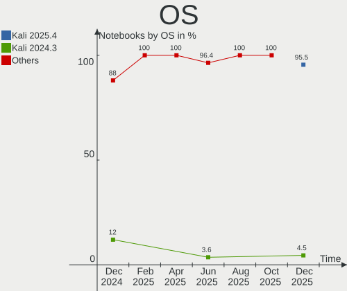

| Name        | Notebooks | Percent |
|-------------|-----------|---------|
| Kali 2025.4 | 21        | 95.45%  |
| Kali 2024.3 | 1         | 4.55%   |

OS Family
---------

OS without a version

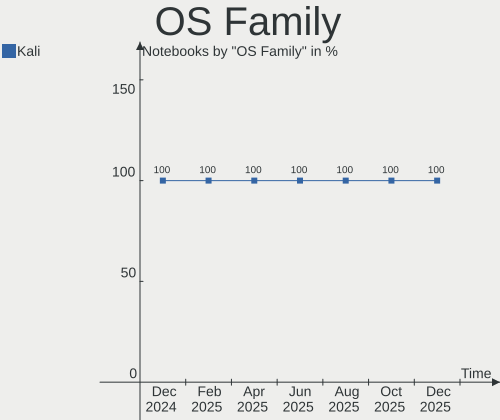

| Name | Notebooks | Percent |
|------|-----------|---------|
| Kali | 22        | 100%    |

Kernel
------

Version of the Linux kernel

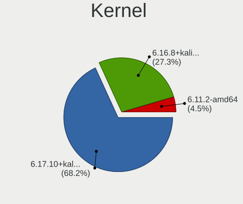

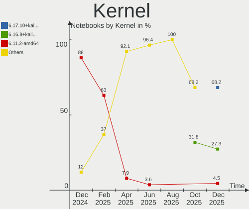

| Version            | Notebooks | Percent |
|--------------------|-----------|---------|
| 6.17.10+kali-amd64 | 15        | 68.18%  |
| 6.16.8+kali-amd64  | 6         | 27.27%  |
| 6.11.2-amd64       | 1         | 4.55%   |

Kernel Family
-------------

Linux kernel without a distro release

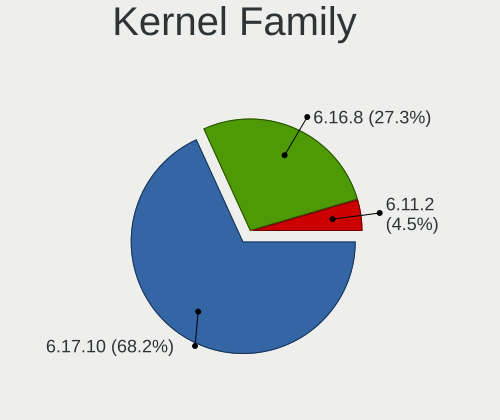

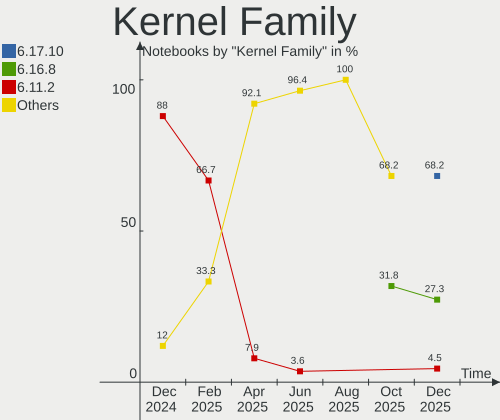

| Version | Notebooks | Percent |
|---------|-----------|---------|
| 6.17.10 | 15        | 68.18%  |
| 6.16.8  | 6         | 27.27%  |
| 6.11.2  | 1         | 4.55%   |

Kernel Major Ver.
-----------------

Linux kernel major version

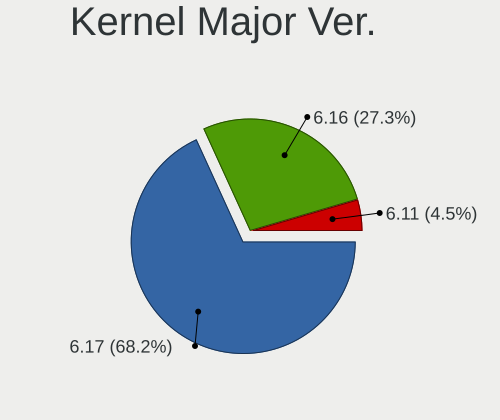

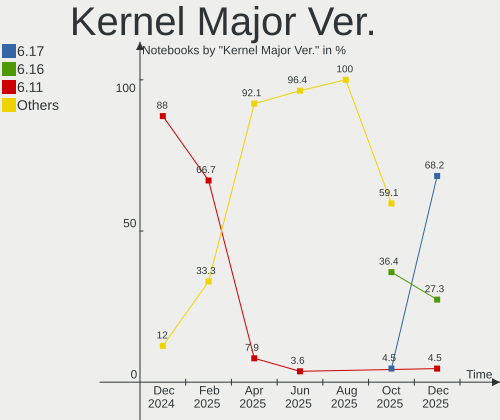

| Version | Notebooks | Percent |
|---------|-----------|---------|
| 6.17    | 15        | 68.18%  |
| 6.16    | 6         | 27.27%  |
| 6.11    | 1         | 4.55%   |

Arch
----

OS architecture (x86_64, i586, etc.)

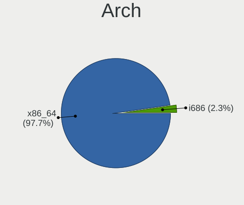

| Name   | Notebooks | Percent |
|--------|-----------|---------|
| x86_64 | 22        | 100%    |

DE
--

Desktop Environment

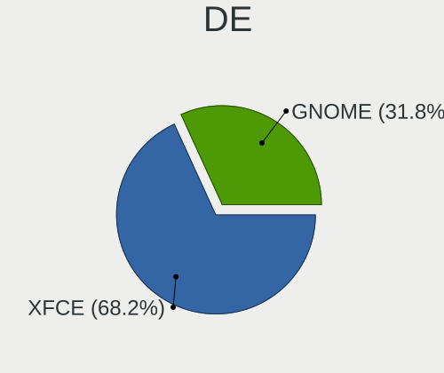

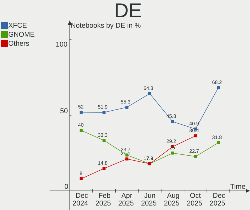

| Name  | Notebooks | Percent |
|-------|-----------|---------|
| XFCE  | 15        | 68.18%  |
| GNOME | 7         | 31.82%  |

Display Server
--------------

X11 or Wayland

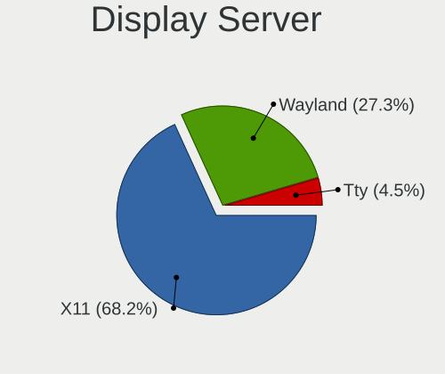

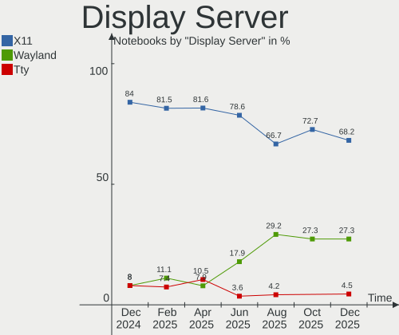

| Name    | Notebooks | Percent |
|---------|-----------|---------|
| X11     | 15        | 68.18%  |
| Wayland | 6         | 27.27%  |
| Tty     | 1         | 4.55%   |

Display Manager
---------------

SDDM, LightDM, etc.

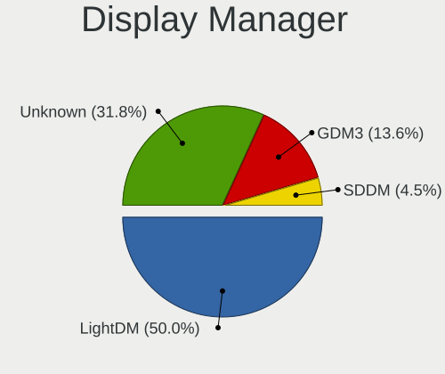

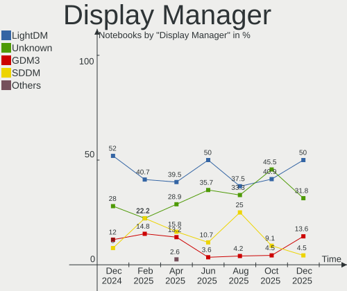

| Name    | Notebooks | Percent |
|---------|-----------|---------|
| LightDM | 11        | 50%     |
| Unknown | 7         | 31.82%  |
| GDM3    | 3         | 13.64%  |
| SDDM    | 1         | 4.55%   |

OS Lang
-------

Language

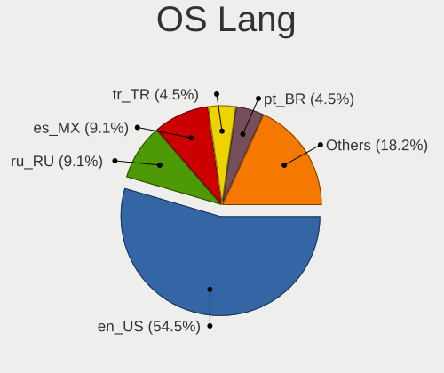

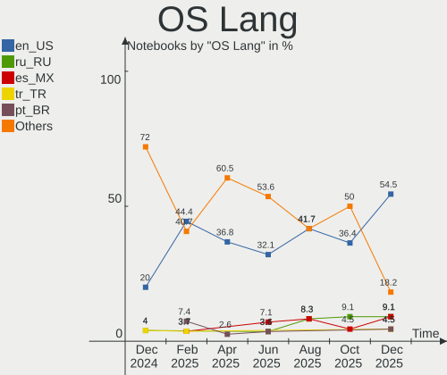

| Lang   | Notebooks | Percent |
|--------|-----------|---------|
| en_US  | 12        | 54.55%  |
| ru_RU  | 2         | 9.09%   |
| es_MX  | 2         | 9.09%   |
| tr_TR  | 1         | 4.55%   |
| pt_BR  | 1         | 4.55%   |
| id_ID  | 1         | 4.55%   |
| en_GB  | 1         | 4.55%   |
| en_AU  | 1         | 4.55%   |
| ast_ES | 1         | 4.55%   |

Boot Mode
---------

EFI or BIOS

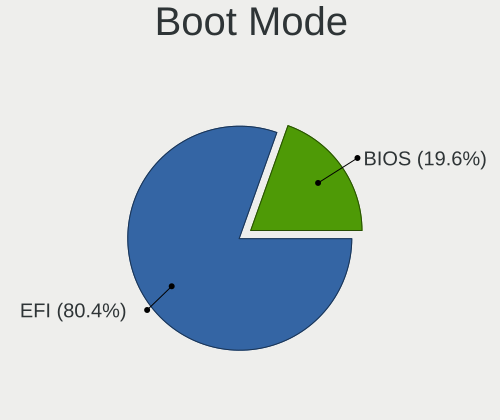

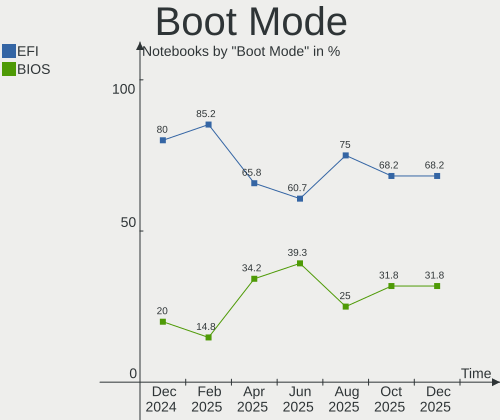

| Mode | Notebooks | Percent |
|------|-----------|---------|
| EFI  | 15        | 68.18%  |
| BIOS | 7         | 31.82%  |

Filesystem
----------

Type of filesystem

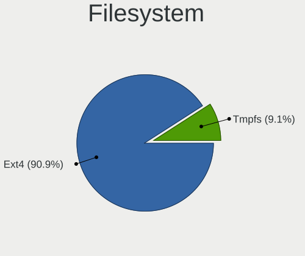

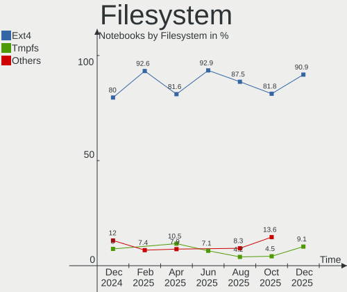

| Type  | Notebooks | Percent |
|-------|-----------|---------|
| Ext4  | 20        | 90.91%  |
| Tmpfs | 2         | 9.09%   |

Part. scheme
------------

Scheme of partitioning

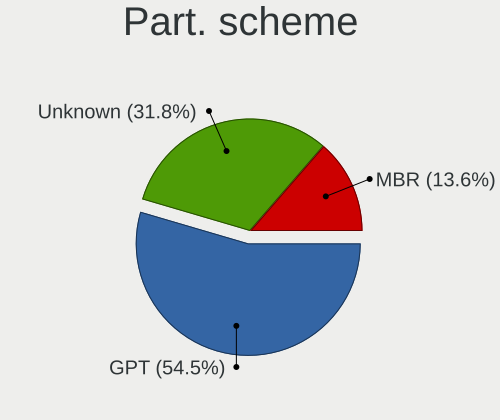

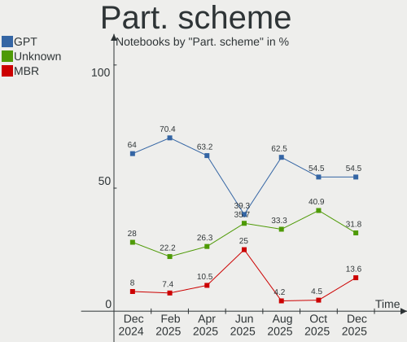

| Type    | Notebooks | Percent |
|---------|-----------|---------|
| GPT     | 12        | 54.55%  |
| Unknown | 7         | 31.82%  |
| MBR     | 3         | 13.64%  |

Dual Boot with Linux/BSD
------------------------

Hosting more than one Linux/BSD

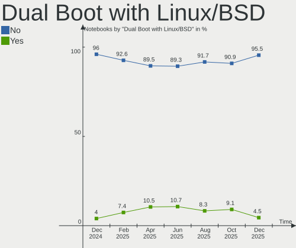

| Dual boot | Notebooks | Percent |
|-----------|-----------|---------|
| No        | 21        | 95.45%  |
| Yes       | 1         | 4.55%   |

Dual Boot (Win)
---------------

Hosting Linux and Windows

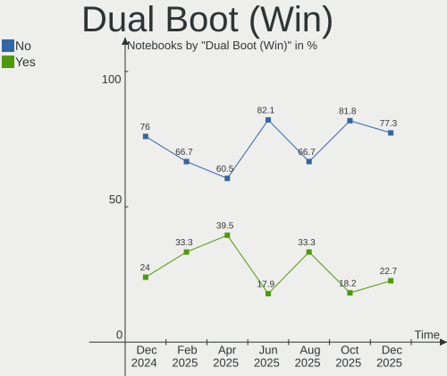

| Dual boot | Notebooks | Percent |
|-----------|-----------|---------|
| No        | 17        | 77.27%  |
| Yes       | 5         | 22.73%  |

Board
-----

Vendor
------

Motherboard manufacturer

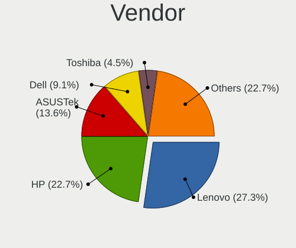

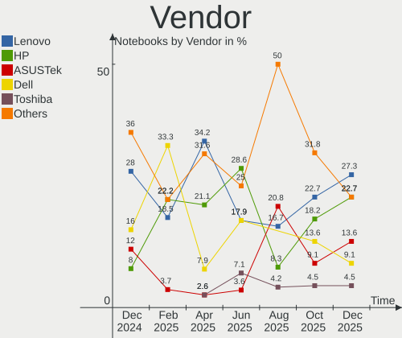

| Name             | Notebooks | Percent |
|------------------|-----------|---------|
| Lenovo           | 6         | 27.27%  |
| Hewlett-Packard  | 5         | 22.73%  |
| ASUSTek Computer | 3         | 13.64%  |
| Dell             | 2         | 9.09%   |
| Toshiba          | 1         | 4.55%   |
| Sony             | 1         | 4.55%   |
| Google           | 1         | 4.55%   |
| Apple            | 1         | 4.55%   |
| ADVAN            | 1         | 4.55%   |
| Acer             | 1         | 4.55%   |

Model
-----

Motherboard model

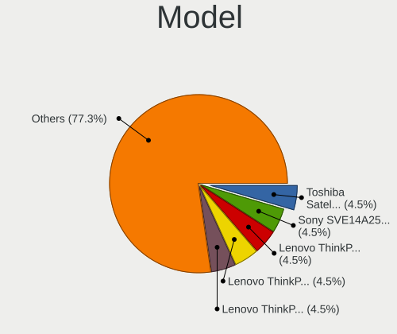

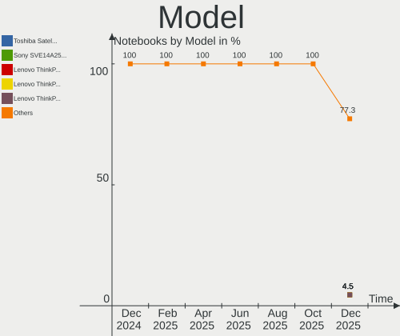

| Name                                        | Notebooks | Percent |
|---------------------------------------------|-----------|---------|
| Toshiba Satellite E45W-C                    | 1         | 4.55%   |
| Sony SVE14A25CGWI                           | 1         | 4.55%   |
| Lenovo ThinkPad X270 W10DG 20K5S0PS0Y       | 1         | 4.55%   |
| Lenovo ThinkPad X1 Carbon Gen 10 21CCS12300 | 1         | 4.55%   |
| Lenovo ThinkPad T14 Gen 1 20S1S98704        | 1         | 4.55%   |
| Lenovo ThinkPad E495 20NES0FJ00             | 1         | 4.55%   |
| Lenovo LOQ 15ARP9 83JC                      | 1         | 4.55%   |
| Lenovo Legion 5 15IRX10 83LY                | 1         | 4.55%   |
| HP ProBook 430 G8 Notebook PC               | 1         | 4.55%   |
| HP Laptop 17t-cn300                         | 1         | 4.55%   |
| HP EliteBook 840 G6                         | 1         | 4.55%   |
| HP 247 G8                                   | 1         | 4.55%   |
| HP 240 G7 Notebook PC                       | 1         | 4.55%   |
| Google Bobba                                | 1         | 4.55%   |
| Dell Latitude E6440                         | 1         | 4.55%   |
| Dell Inspiron N5110                         | 1         | 4.55%   |
| ASUS Zenbook UX3402ZA_Q409ZA                | 1         | 4.55%   |
| ASUS VivoBook_ASUSLaptop X412DA_R424DA      | 1         | 4.55%   |
| ASUS VivoBook_ASUSLaptop MJ401TA            | 1         | 4.55%   |
| Apple MacBookAir6,2                         | 1         | 4.55%   |
| ADVAN 1701                                  | 1         | 4.55%   |
| Acer Aspire A315-53                         | 1         | 4.55%   |

Model Family
------------

Motherboard model prefix

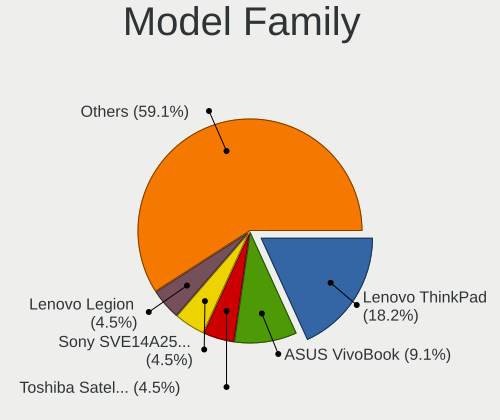

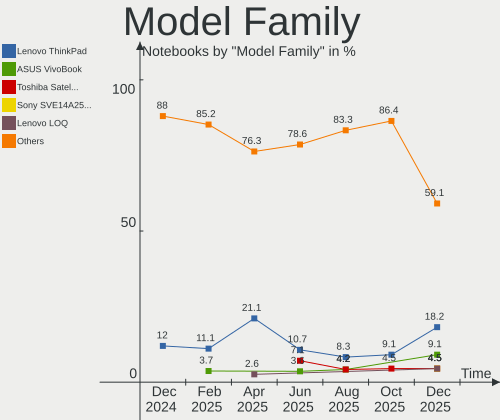

| Name              | Notebooks | Percent |
|-------------------|-----------|---------|
| Lenovo ThinkPad   | 4         | 18.18%  |
| ASUS VivoBook     | 2         | 9.09%   |
| Toshiba Satellite | 1         | 4.55%   |
| Sony SVE14A25CGWI | 1         | 4.55%   |
| Lenovo LOQ        | 1         | 4.55%   |
| Lenovo Legion     | 1         | 4.55%   |
| HP ProBook        | 1         | 4.55%   |
| HP Laptop         | 1         | 4.55%   |
| HP EliteBook      | 1         | 4.55%   |
| HP 247            | 1         | 4.55%   |
| HP 240            | 1         | 4.55%   |
| Google Bobba      | 1         | 4.55%   |
| Dell Latitude     | 1         | 4.55%   |
| Dell Inspiron     | 1         | 4.55%   |
| ASUS Zenbook      | 1         | 4.55%   |
| Apple MacBookAir6 | 1         | 4.55%   |
| ADVAN 1701        | 1         | 4.55%   |
| Acer Aspire       | 1         | 4.55%   |

MFG Year
--------

Motherboard manufacture year

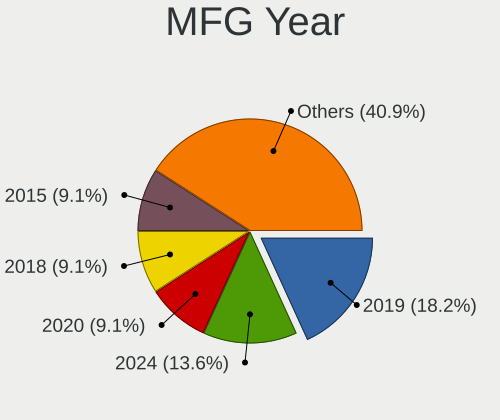

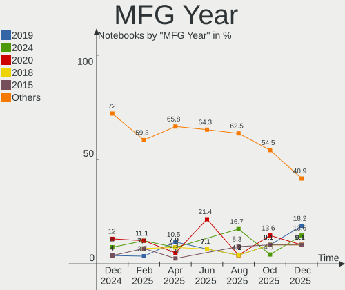

| Year | Notebooks | Percent |
|------|-----------|---------|
| 2019 | 4         | 18.18%  |
| 2024 | 3         | 13.64%  |
| 2020 | 2         | 9.09%   |
| 2018 | 2         | 9.09%   |
| 2015 | 2         | 9.09%   |
| 2013 | 2         | 9.09%   |
| 2025 | 1         | 4.55%   |
| 2023 | 1         | 4.55%   |
| 2022 | 1         | 4.55%   |
| 2021 | 1         | 4.55%   |
| 2017 | 1         | 4.55%   |
| 2014 | 1         | 4.55%   |
| 2011 | 1         | 4.55%   |

Form Factor
-----------

Physical design of the computer

| Name     | Notebooks | Percent |
|----------|-----------|---------|
| Notebook | 22        | 100%    |

Secure Boot
-----------

Enabled or disabled

| State    | Notebooks | Percent |
|----------|-----------|---------|
| Disabled | 22        | 100%    |

Coreboot
--------

Have coreboot on board

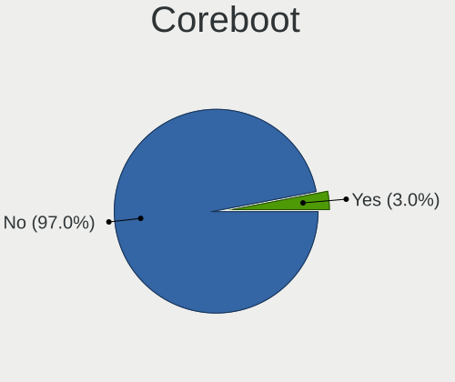

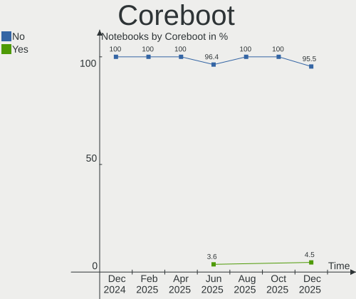

| Used | Notebooks | Percent |
|------|-----------|---------|
| No   | 21        | 95.45%  |
| Yes  | 1         | 4.55%   |

RAM Size
--------

Total RAM memory

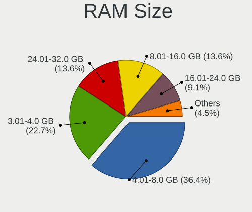

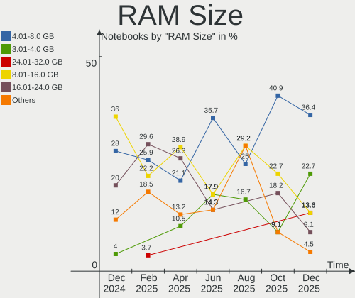

| Size in GB | Notebooks | Percent |
|------------|-----------|---------|
| 4.01-8.0   | 8         | 36.36%  |
| 3.01-4.0   | 5         | 22.73%  |
| 24.01-32.0 | 3         | 13.64%  |
| 8.01-16.0  | 3         | 13.64%  |
| 16.01-24.0 | 2         | 9.09%   |
| 32.01-64.0 | 1         | 4.55%   |

RAM Used
--------

Used RAM memory

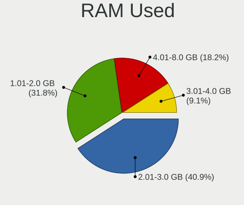

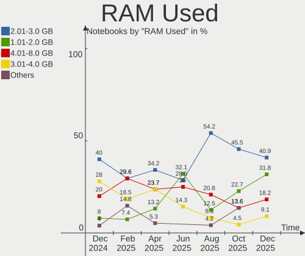

| Used GB  | Notebooks | Percent |
|----------|-----------|---------|
| 2.01-3.0 | 9         | 40.91%  |
| 1.01-2.0 | 7         | 31.82%  |
| 4.01-8.0 | 4         | 18.18%  |
| 3.01-4.0 | 2         | 9.09%   |

Total Drives
------------

Number of drives on board

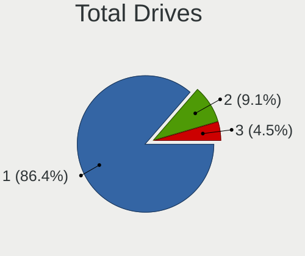

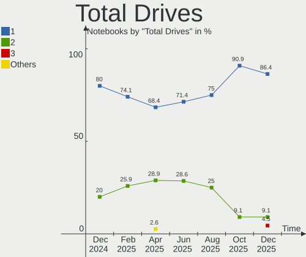

| Drives | Notebooks | Percent |
|--------|-----------|---------|
| 1      | 19        | 86.36%  |
| 2      | 2         | 9.09%   |
| 3      | 1         | 4.55%   |

Has CD-ROM
----------

Has CD-ROM on board

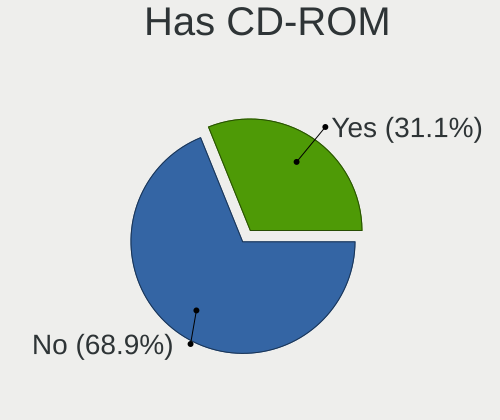

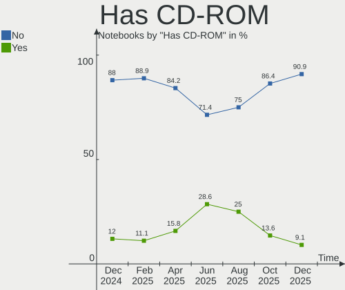

| Presented | Notebooks | Percent |
|-----------|-----------|---------|
| No        | 20        | 90.91%  |
| Yes       | 2         | 9.09%   |

Has Ethernet
------------

Has Ethernet on board

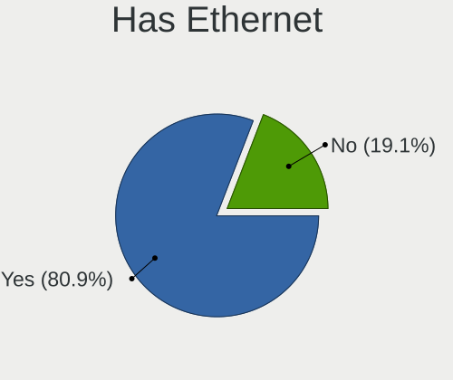

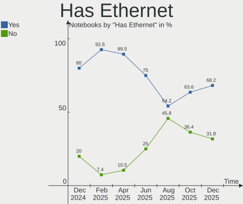

| Presented | Notebooks | Percent |
|-----------|-----------|---------|
| Yes       | 15        | 68.18%  |
| No        | 7         | 31.82%  |

Has WiFi
--------

Has WiFi module

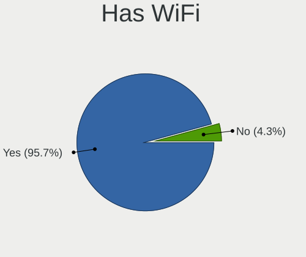

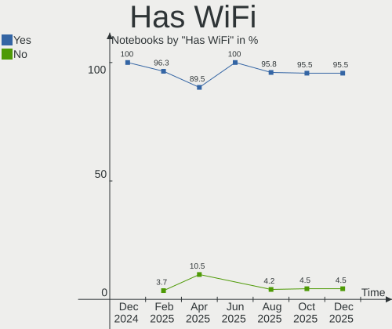

| Presented | Notebooks | Percent |
|-----------|-----------|---------|
| Yes       | 21        | 95.45%  |
| No        | 1         | 4.55%   |

Has Bluetooth
-------------

Has Bluetooth module

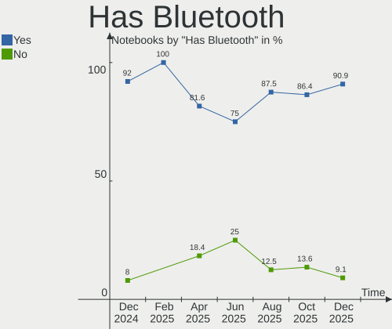

| Presented | Notebooks | Percent |
|-----------|-----------|---------|
| Yes       | 20        | 90.91%  |
| No        | 2         | 9.09%   |

Location
--------

Country
-------

Geographic location (country)

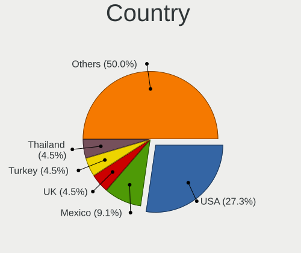

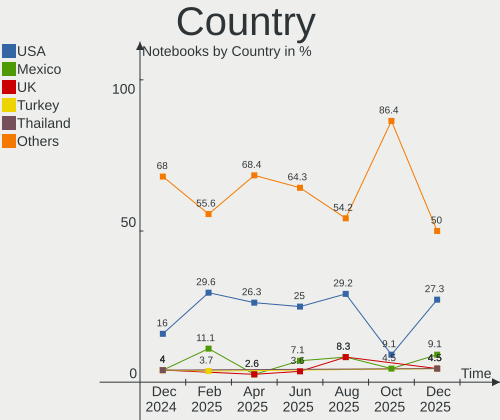

| Country      | Notebooks | Percent |
|--------------|-----------|---------|
| USA          | 6         | 27.27%  |
| Mexico       | 2         | 9.09%   |
| UK           | 1         | 4.55%   |
| Turkey       | 1         | 4.55%   |
| Thailand     | 1         | 4.55%   |
| Spain        | 1         | 4.55%   |
| South Africa | 1         | 4.55%   |
| Russia       | 1         | 4.55%   |
| Malaysia     | 1         | 4.55%   |
| Lithuania    | 1         | 4.55%   |
| Jordan       | 1         | 4.55%   |
| Indonesia    | 1         | 4.55%   |
| India        | 1         | 4.55%   |
| Bulgaria     | 1         | 4.55%   |
| Brazil       | 1         | 4.55%   |
| Australia    | 1         | 4.55%   |

City
----

Geographic location (city)

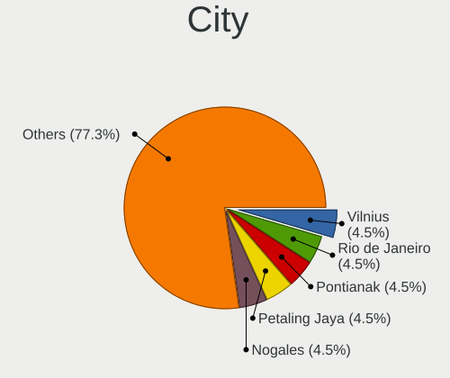

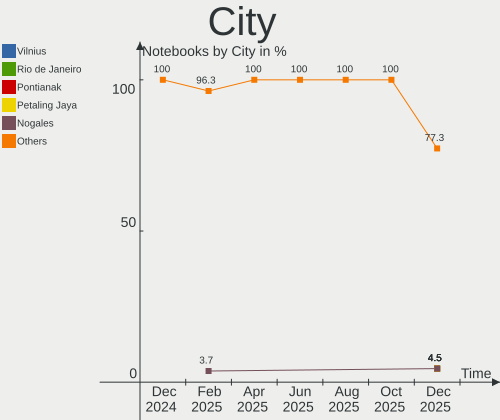

| City           | Notebooks | Percent |
|----------------|-----------|---------|
| Vilnius        | 1         | 4.55%   |
| Rio de Janeiro | 1         | 4.55%   |
| Pontianak      | 1         | 4.55%   |
| Petaling Jaya  | 1         | 4.55%   |
| Nogales        | 1         | 4.55%   |
| Mikhaylovsk    | 1         | 4.55%   |
| Melbourne      | 1         | 4.55%   |
| Kütahya       | 1         | 4.55%   |
| Kernersville   | 1         | 4.55%   |
| Indianapolis   | 1         | 4.55%   |
| Hermitage      | 1         | 4.55%   |
| Hackney        | 1         | 4.55%   |
| Dallas         | 1         | 4.55%   |
| Cape Town      | 1         | 4.55%   |
| Belovo         | 1         | 4.55%   |
| Bangkok        | 1         | 4.55%   |
| Avilés        | 1         | 4.55%   |
| Atlanta        | 1         | 4.55%   |
| Amritsar       | 1         | 4.55%   |
| Amman          | 1         | 4.55%   |
| Alexandria     | 1         | 4.55%   |
| Aguascalientes | 1         | 4.55%   |

Drives
------

Drive Vendor
------------

Hard drive vendors

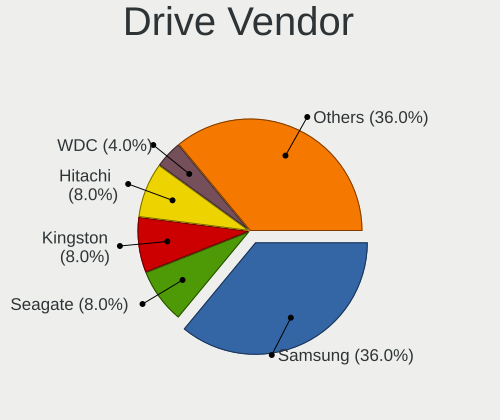

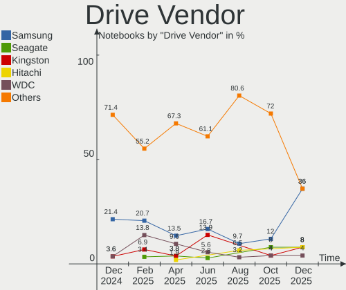

| Vendor              | Notebooks | Drives | Percent |
|---------------------|-----------|--------|---------|
| Samsung Electronics | 9         | 9      | 36%     |
| Seagate             | 2         | 2      | 8%      |
| Kingston            | 2         | 2      | 8%      |
| Hitachi             | 2         | 2      | 8%      |
| WDC                 | 1         | 1      | 4%      |
| SK hynix            | 1         | 1      | 4%      |
| Silicon Motion      | 1         | 1      | 4%      |
| Sandisk             | 1         | 1      | 4%      |
| PNY                 | 1         | 1      | 4%      |
| Phison Electronics  | 1         | 1      | 4%      |
| INRAM               | 1         | 1      | 4%      |
| China               | 1         | 1      | 4%      |
| Apple               | 1         | 1      | 4%      |
| Unknown             | 1         | 1      | 4%      |

Drive Model
-----------

Hard drive models

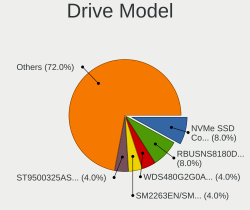

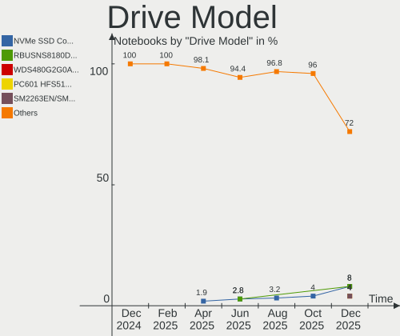

| Model                                                 | Notebooks | Percent |
|-------------------------------------------------------|-----------|---------|
| Samsung NVMe SSD Controller SM981/PM981/PM983 1TB     | 2         | 8%      |
| Kingston RBUSNS8180DS3128GJ 128GB SSD                 | 2         | 8%      |
| WDC WDS480G2G0A-00JH30 480GB SSD                      | 1         | 4%      |
| SK hynix PC601 HFS512GD9TNG-L2A0A 512GB               | 1         | 4%      |
| Silicon Motion SM2263EN/SM2263XT SSD Controller 512GB | 1         | 4%      |
| Seagate ST9500325AS 500GB                             | 1         | 4%      |
| Seagate ST500LT012-9WS142 500GB                       | 1         | 4%      |
| Sandisk WD Green SN350 1TB 2G0C                       | 1         | 4%      |
| Samsung SSD 870 EVO 250GB                             | 1         | 4%      |
| Samsung NVMe SSD Controller SM961/PM961/SM963 1024GB  | 1         | 4%      |
| Samsung MZVLQ256HAJD-000H1 256GB                      | 1         | 4%      |
| Samsung MZVL8256HEJD-00BH1 256GB                      | 1         | 4%      |
| Samsung MZVL21T0HCLR-00BL7 1TB                        | 1         | 4%      |
| Samsung MZAMX512HCLV-00BL2 512GB                      | 1         | 4%      |
| Samsung MZAL81T0HFLB-00BL2 1TB                        | 1         | 4%      |
| PNY CS2140 1TB SSD                                    | 1         | 4%      |
| Phison PS5013 E13 NVMe Controller 500GB               | 1         | 4%      |
| INRAM SSD 512GB                                       | 1         | 4%      |
| Hitachi HTS545025B9A300 250GB                         | 1         | 4%      |
| Hitachi HTS543232A7A384 320GB                         | 1         | 4%      |
| China SSD 256GB                                       | 1         | 4%      |
| Apple SSD SM0512F 500GB                               | 1         | 4%      |
| Unknown                                               | 1         | 4%      |

HDD Vendor
----------

Hard disk drive vendors

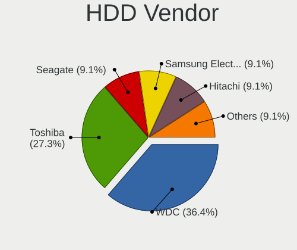

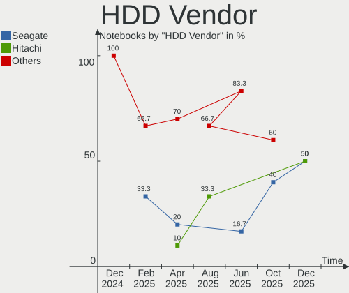

| Vendor  | Notebooks | Drives | Percent |
|---------|-----------|--------|---------|
| Seagate | 2         | 2      | 50%     |
| Hitachi | 2         | 2      | 50%     |

SSD Vendor
----------

Solid state drive vendors

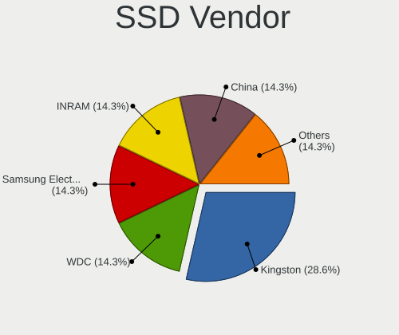

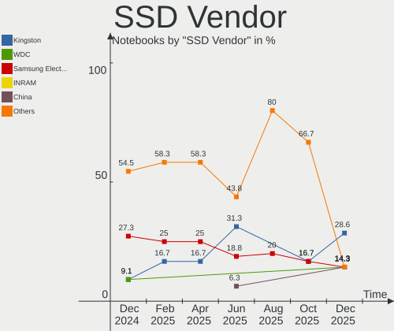

| Vendor              | Notebooks | Drives | Percent |
|---------------------|-----------|--------|---------|
| Kingston            | 2         | 2      | 28.57%  |
| WDC                 | 1         | 1      | 14.29%  |
| Samsung Electronics | 1         | 1      | 14.29%  |
| INRAM               | 1         | 1      | 14.29%  |
| China               | 1         | 1      | 14.29%  |
| Apple               | 1         | 1      | 14.29%  |

Drive Kind
----------

HDD or SSD

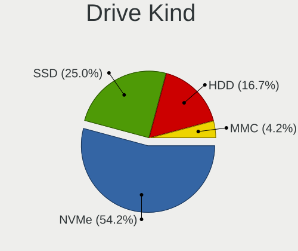

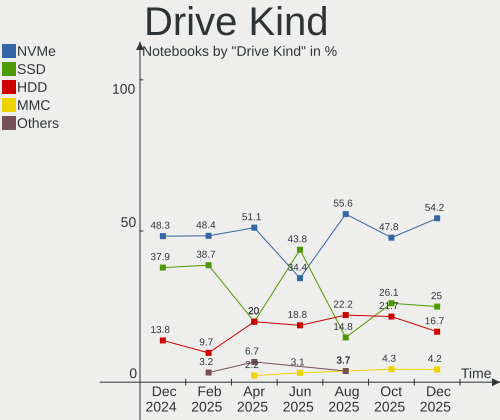

| Kind | Notebooks | Drives | Percent |
|------|-----------|--------|---------|
| NVMe | 13        | 13     | 54.17%  |
| SSD  | 6         | 7      | 25%     |
| HDD  | 4         | 4      | 16.67%  |
| MMC  | 1         | 1      | 4.17%   |

Drive Connector
---------------

SATA, SAS, NVMe, etc.

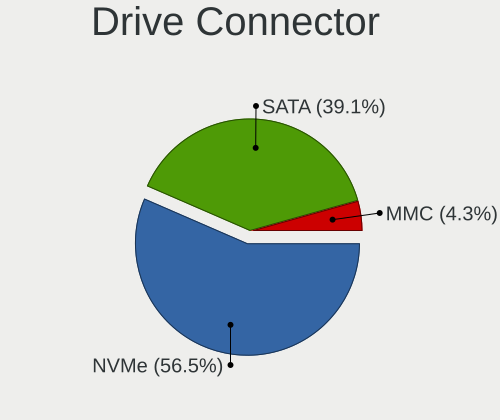

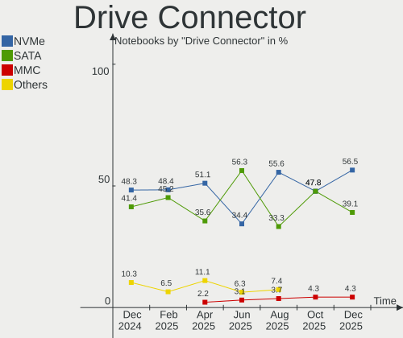

| Type | Notebooks | Drives | Percent |
|------|-----------|--------|---------|
| NVMe | 13        | 13     | 56.52%  |
| SATA | 9         | 11     | 39.13%  |
| MMC  | 1         | 1      | 4.35%   |

Drive Size
----------

Size of hard drive

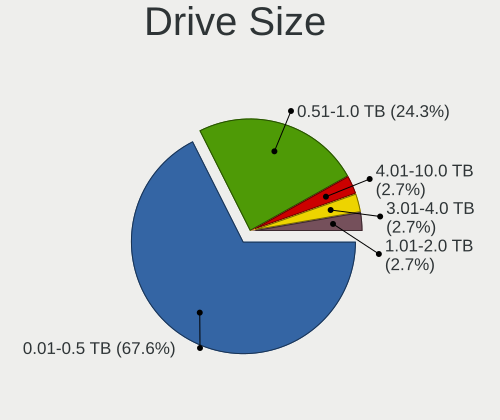

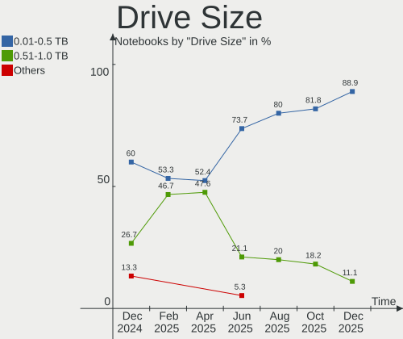

| Size in TB | Notebooks | Drives | Percent |
|------------|-----------|--------|---------|
| 0.01-0.5   | 8         | 10     | 88.89%  |
| 0.51-1.0   | 1         | 1      | 11.11%  |

Space Total
-----------

Amount of disk space available on the file system

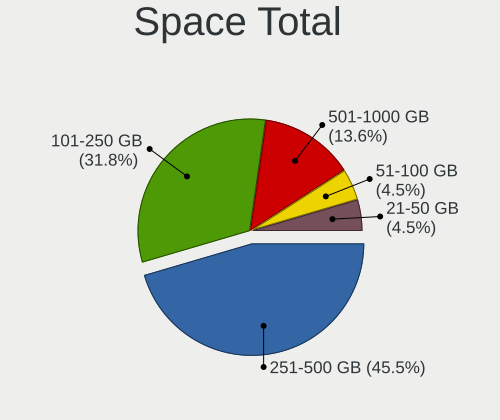

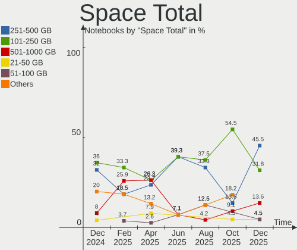

| Size in GB | Notebooks | Percent |
|------------|-----------|---------|
| 251-500    | 10        | 45.45%  |
| 101-250    | 7         | 31.82%  |
| 501-1000   | 3         | 13.64%  |
| 21-50      | 1         | 4.55%   |
| 51-100     | 1         | 4.55%   |

Space Used
----------

Amount of used disk space

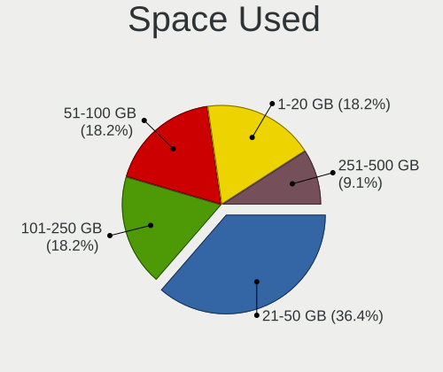

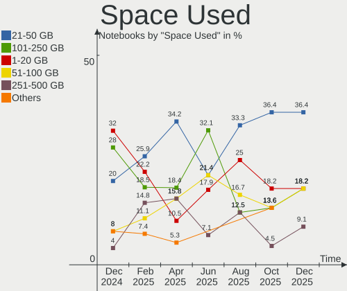

| Used GB | Notebooks | Percent |
|---------|-----------|---------|
| 21-50   | 8         | 36.36%  |
| 101-250 | 4         | 18.18%  |
| 1-20    | 4         | 18.18%  |
| 51-100  | 4         | 18.18%  |
| 251-500 | 2         | 9.09%   |

Malfunc. Drives
---------------

Drive models with a malfunction

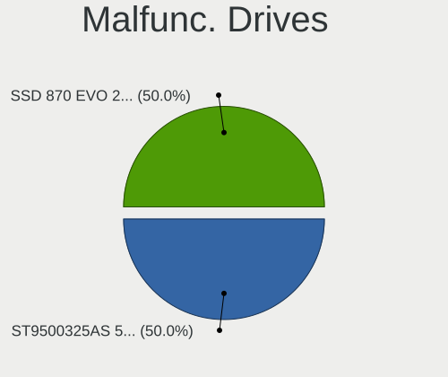

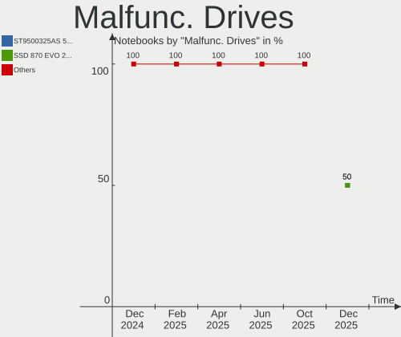

| Model                                 | Notebooks | Drives | Percent |
|---------------------------------------|-----------|--------|---------|
| Seagate ST9500325AS 500GB             | 1         | 1      | 50%     |
| Samsung Electronics SSD 870 EVO 250GB | 1         | 1      | 50%     |

Malfunc. Drive Vendor
---------------------

Vendors of faulty drives

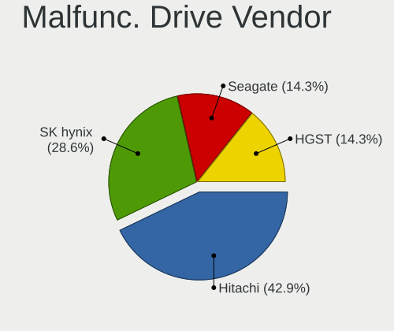

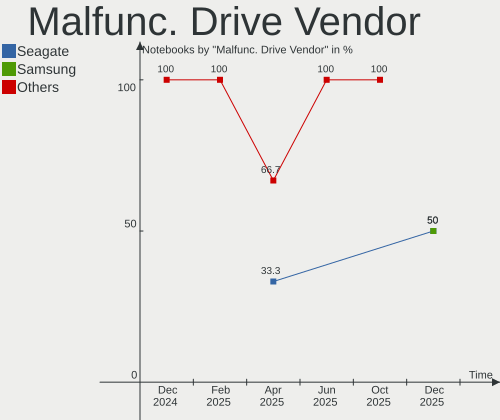

| Vendor              | Notebooks | Drives | Percent |
|---------------------|-----------|--------|---------|
| Seagate             | 1         | 1      | 50%     |
| Samsung Electronics | 1         | 1      | 50%     |

Malfunc. HDD Vendor
-------------------

Vendors of faulty HDD drives

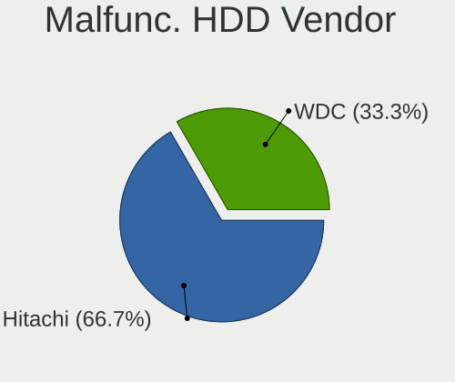

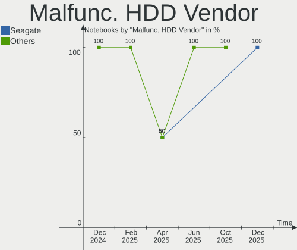

| Vendor  | Notebooks | Drives | Percent |
|---------|-----------|--------|---------|
| Seagate | 1         | 1      | 100%    |

Malfunc. Drive Kind
-------------------

Kinds of faulty drives

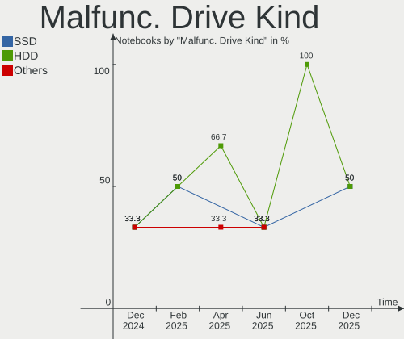

| Kind | Notebooks | Drives | Percent |
|------|-----------|--------|---------|
| SSD  | 1         | 1      | 50%     |
| HDD  | 1         | 1      | 50%     |

Failed Drives
-------------

Failed drive models

Zero info for selected period =(

Failed Drive Vendor
-------------------

Failed drive vendors

Zero info for selected period =(

Drive Status
------------

Number of failed and malfunc. drives

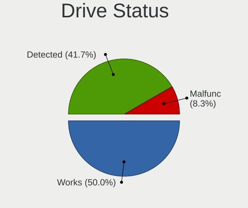

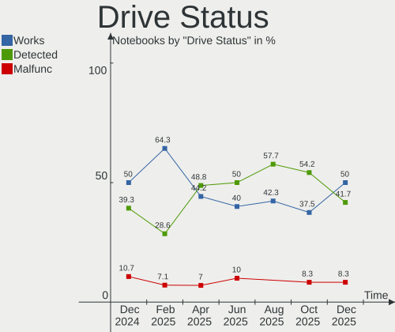

| Status   | Notebooks | Drives | Percent |
|----------|-----------|--------|---------|
| Works    | 12        | 12     | 50%     |
| Detected | 10        | 11     | 41.67%  |
| Malfunc  | 2         | 2      | 8.33%   |

Storage controller
------------------

Storage Vendor
--------------

Storage controller vendors

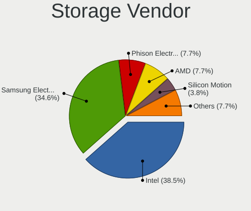

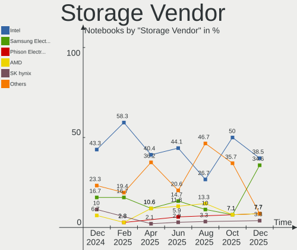

| Vendor              | Notebooks | Percent |
|---------------------|-----------|---------|
| Intel               | 10        | 38.46%  |
| Samsung Electronics | 9         | 34.62%  |
| Phison Electronics  | 2         | 7.69%   |
| AMD                 | 2         | 7.69%   |
| SK hynix            | 1         | 3.85%   |
| Silicon Motion      | 1         | 3.85%   |
| SanDisk             | 1         | 3.85%   |

Storage Model
-------------

Storage controller models

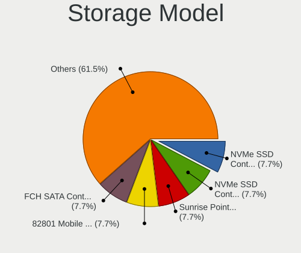

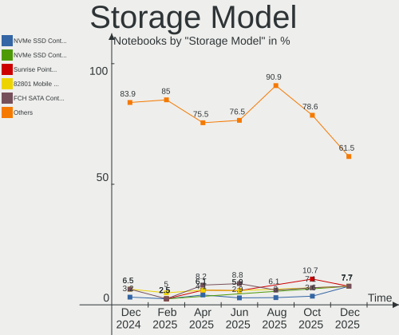

| Model                                                                        | Notebooks | Percent |
|------------------------------------------------------------------------------|-----------|---------|
| Samsung NVMe SSD Controller SM981/PM981/PM983                                | 2         | 7.69%   |
| Samsung NVMe SSD Controller PM9C1a (DRAM-less)                               | 2         | 7.69%   |
| Intel Sunrise Point-LP SATA Controller [AHCI mode]                           | 2         | 7.69%   |
| Intel 82801 Mobile SATA Controller [RAID mode]                               | 2         | 7.69%   |
| AMD FCH SATA Controller [AHCI mode]                                          | 2         | 7.69%   |
| SK hynix PC601 NVMe Solid State Drive                                        | 1         | 3.85%   |
| Silicon Motion SM2263EN/SM2263XT (DRAM-less) NVMe SSD Controllers            | 1         | 3.85%   |
| SanDisk WD Green SN350 240GB (DRAM-less) / SN560E NVMe SSD                   | 1         | 3.85%   |
| Samsung S4LN053X01 AHCI SSD Controller(Apple slot)                           | 1         | 3.85%   |
| Samsung NVMe SSD Controller SM961/PM961/SM963                                | 1         | 3.85%   |
| Samsung NVMe SSD Controller PM9A1/PM9A3/980PRO                               | 1         | 3.85%   |
| Samsung NVMe SSD Controller 980 (DRAM-less)                                  | 1         | 3.85%   |
| Samsung BM9C1 QLC NVME SSD (DRAM-less)                                       | 1         | 3.85%   |
| Phison PS5019-E19 PCIe4 NVMe Controller (DRAM-less)                          | 1         | 3.85%   |
| Phison PS5013-E13 PCIe3 NVMe Controller (DRAM-less)                          | 1         | 3.85%   |
| Intel Wildcat Point-LP SATA Controller [AHCI Mode]                           | 1         | 3.85%   |
| Intel Volume Management Device NVMe RAID Controller                          | 1         | 3.85%   |
| Intel Ice Lake-LP SATA Controller [AHCI mode]                                | 1         | 3.85%   |
| Intel Alder Lake-P SATA AHCI Controller                                      | 1         | 3.85%   |
| Intel 7 Series Chipset Family 6-port SATA Controller [AHCI mode]             | 1         | 3.85%   |
| Intel 6 Series/C200 Series Chipset Family 6 port Mobile SATA AHCI Controller | 1         | 3.85%   |

Storage Kind
------------

Kind of storage controller (IDE, SATA, NVMe, SAS, ...)

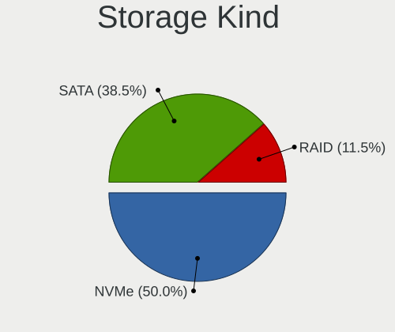

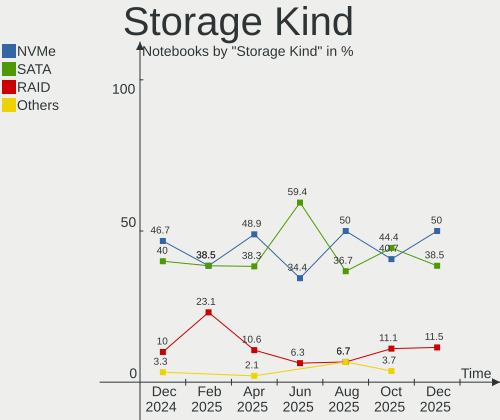

| Kind | Notebooks | Percent |
|------|-----------|---------|
| NVMe | 13        | 50%     |
| SATA | 10        | 38.46%  |
| RAID | 3         | 11.54%  |

Processor
---------

CPU Vendor
----------

Processor vendors

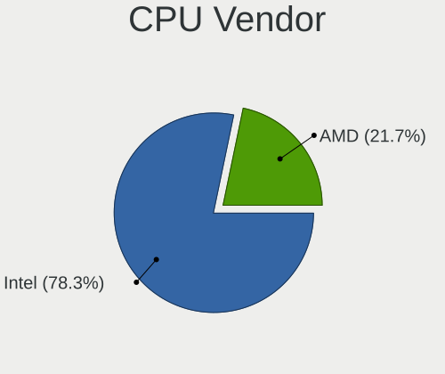

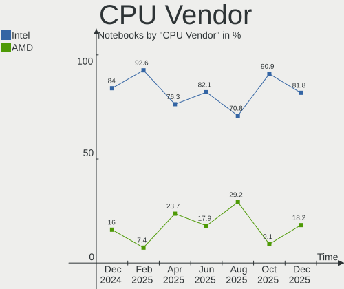

| Vendor | Notebooks | Percent |
|--------|-----------|---------|
| Intel  | 18        | 81.82%  |
| AMD    | 4         | 18.18%  |

CPU Model
---------

Processor models

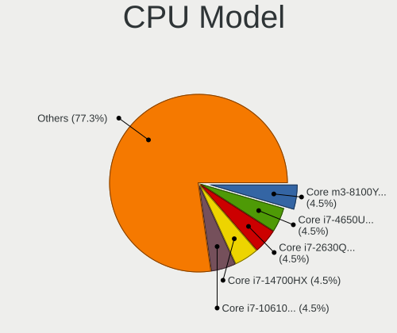

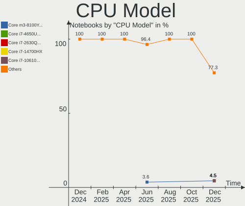

| Model                                         | Notebooks | Percent |
|-----------------------------------------------|-----------|---------|
| Intel Core m3-8100Y CPU @ 1.10GHz             | 1         | 4.55%   |
| Intel Core i7-4650U CPU @ 1.70GHz             | 1         | 4.55%   |
| Intel Core i7-2630QM CPU @ 2.00GHz            | 1         | 4.55%   |
| Intel Core i7-14700HX                         | 1         | 4.55%   |
| Intel Core i7-10610U CPU @ 1.80GHz            | 1         | 4.55%   |
| Intel Core i5-8365U CPU @ 1.60GHz             | 1         | 4.55%   |
| Intel Core i5-6300U CPU @ 2.40GHz             | 1         | 4.55%   |
| Intel Core i5-4310M CPU @ 2.70GHz             | 1         | 4.55%   |
| Intel Core i5-3210M CPU @ 2.50GHz             | 1         | 4.55%   |
| Intel Core i5-1035G7 CPU @ 1.20GHz            | 1         | 4.55%   |
| Intel Core i5-1035G1 CPU @ 1.00GHz            | 1         | 4.55%   |
| Intel Core i3-7100U CPU @ 2.40GHz             | 1         | 4.55%   |
| Intel Core i3-5015U CPU @ 2.10GHz             | 1         | 4.55%   |
| Intel Celeron N4020 CPU @ 1.10GHz             | 1         | 4.55%   |
| Intel 13th Gen Core i5-1334U                  | 1         | 4.55%   |
| Intel 12th Gen Core i7-1270P                  | 1         | 4.55%   |
| Intel 12th Gen Core i5-1240P                  | 1         | 4.55%   |
| Intel 11th Gen Core i3-1115G4 @ 3.00GHz       | 1         | 4.55%   |
| AMD Ryzen 7 7435HS                            | 1         | 4.55%   |
| AMD Ryzen 5 3500U with Radeon Vega Mobile Gfx | 1         | 4.55%   |
| AMD Ryzen 3 5300U with Radeon Graphics        | 1         | 4.55%   |
| AMD Ryzen 3 3200U with Radeon Vega Mobile Gfx | 1         | 4.55%   |

CPU Model Family
----------------

Processor model prefix

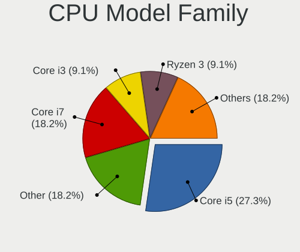

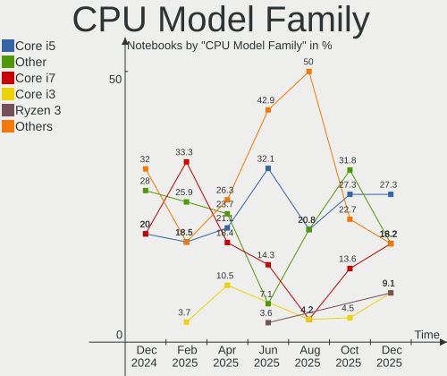

| Model         | Notebooks | Percent |
|---------------|-----------|---------|
| Intel Core i5 | 6         | 27.27%  |
| Other         | 4         | 18.18%  |
| Intel Core i7 | 4         | 18.18%  |
| Intel Core i3 | 2         | 9.09%   |
| AMD Ryzen 3   | 2         | 9.09%   |
| Intel Core m3 | 1         | 4.55%   |
| Intel Celeron | 1         | 4.55%   |
| AMD Ryzen 7   | 1         | 4.55%   |
| AMD Ryzen 5   | 1         | 4.55%   |

CPU Cores
---------

Number of processor cores

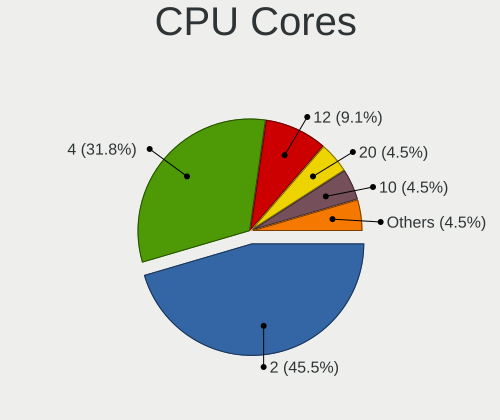

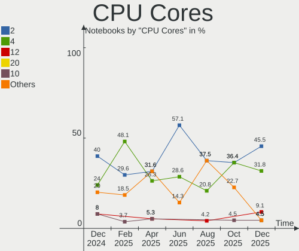

| Number | Notebooks | Percent |
|--------|-----------|---------|
| 2      | 10        | 45.45%  |
| 4      | 7         | 31.82%  |
| 12     | 2         | 9.09%   |
| 20     | 1         | 4.55%   |
| 10     | 1         | 4.55%   |
| 8      | 1         | 4.55%   |

CPU Sockets
-----------

Number of sockets

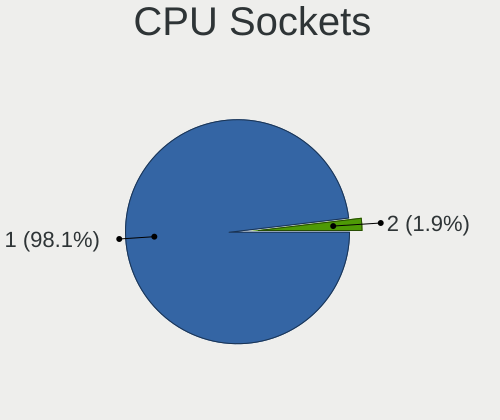

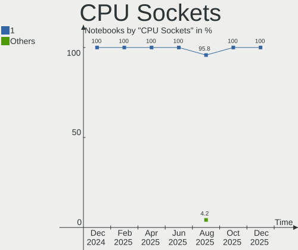

| Number | Notebooks | Percent |
|--------|-----------|---------|
| 1      | 22        | 100%    |

CPU Threads
-----------

Threads per core (Hyper-Threading)

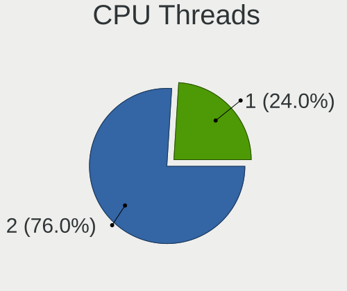

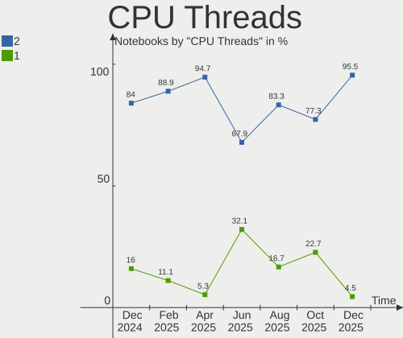

| Number | Notebooks | Percent |
|--------|-----------|---------|
| 2      | 21        | 95.45%  |
| 1      | 1         | 4.55%   |

CPU Op-Modes
------------

CPU Operation Modes (32-bit, 64-bit)

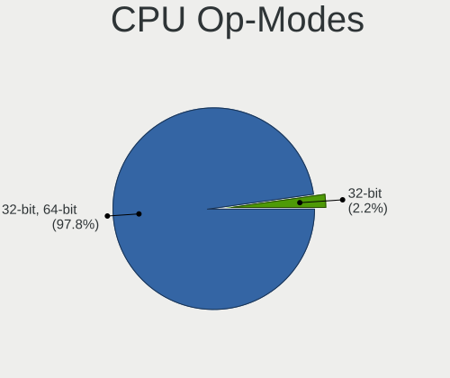

| Op mode        | Notebooks | Percent |
|----------------|-----------|---------|
| 32-bit, 64-bit | 22        | 100%    |

CPU Microcode
-------------

Microcode number

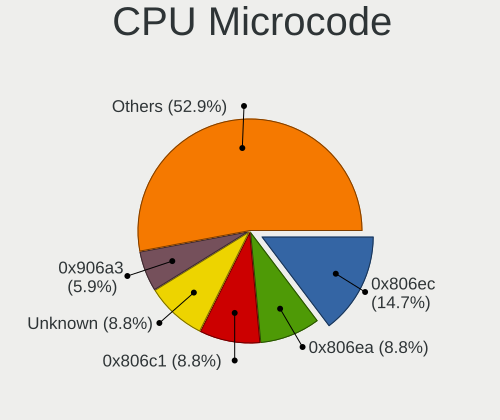

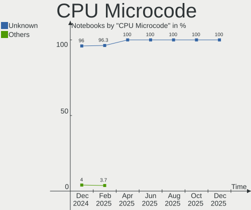

| Number  | Notebooks | Percent |
|---------|-----------|---------|
| Unknown | 22        | 100%    |

CPU Microarch
-------------

Microarchitecture

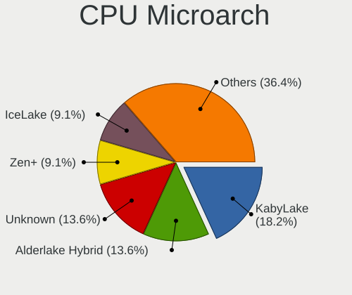

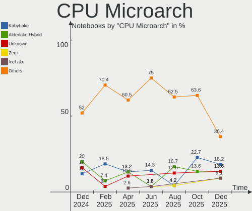

| Name             | Notebooks | Percent |
|------------------|-----------|---------|
| KabyLake         | 4         | 18.18%  |
| Alderlake Hybrid | 3         | 13.64%  |
| Unknown          | 3         | 13.64%  |
| Zen+             | 2         | 9.09%   |
| IceLake          | 2         | 9.09%   |
| Haswell          | 2         | 9.09%   |
| TigerLake        | 1         | 4.55%   |
| Skylake          | 1         | 4.55%   |
| SandyBridge      | 1         | 4.55%   |
| IvyBridge        | 1         | 4.55%   |
| Goldmont plus    | 1         | 4.55%   |
| Broadwell        | 1         | 4.55%   |

Graphics
--------

GPU Vendor
----------

Vendors of graphics cards

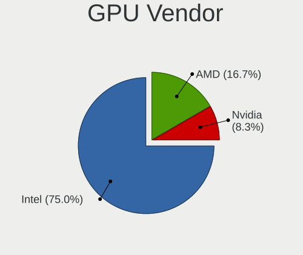

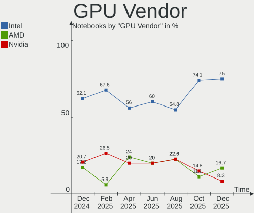

| Vendor | Notebooks | Percent |
|--------|-----------|---------|
| Intel  | 18        | 75%     |
| AMD    | 4         | 16.67%  |
| Nvidia | 2         | 8.33%   |

GPU Model
---------

Graphics card models

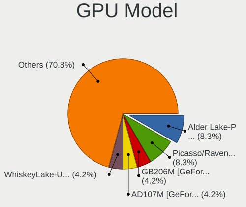

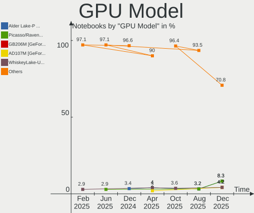

| Model                                                                     | Notebooks | Percent |
|---------------------------------------------------------------------------|-----------|---------|
| Intel Alder Lake-P GT2 [Iris Xe Graphics]                                 | 2         | 8.33%   |
| AMD Picasso/Raven 2 [Radeon Vega Series / Radeon Vega Mobile Series]      | 2         | 8.33%   |
| Nvidia GB206M [GeForce RTX 5070 Max-Q / Mobile]                           | 1         | 4.17%   |
| Nvidia AD107M [GeForce RTX 4050 Max-Q / Mobile]                           | 1         | 4.17%   |
| Intel WhiskeyLake-U GT2 [UHD Graphics 620]                                | 1         | 4.17%   |
| Intel UHD Graphics 615                                                    | 1         | 4.17%   |
| Intel Tiger Lake-LP GT2 [UHD Graphics G4]                                 | 1         | 4.17%   |
| Intel Skylake-U GT2 [HD Graphics 520]                                     | 1         | 4.17%   |
| Intel Raptor Lake-S UHD Graphics                                          | 1         | 4.17%   |
| Intel Raptor Lake-P [Iris Xe Graphics]                                    | 1         | 4.17%   |
| Intel Kaby Lake-U GT2 [HD Graphics 620]                                   | 1         | 4.17%   |
| Intel Iris Plus Graphics G7                                               | 1         | 4.17%   |
| Intel Iris Plus Graphics G1 (Ice Lake)                                    | 1         | 4.17%   |
| Intel Haswell-ULT Integrated Graphics Controller                          | 1         | 4.17%   |
| Intel GeminiLake [UHD Graphics 600]                                       | 1         | 4.17%   |
| Intel CometLake-U GT2 [UHD Graphics]                                      | 1         | 4.17%   |
| Intel Broadwell-U GT2 [HD Graphics 5500]                                  | 1         | 4.17%   |
| Intel 4th Gen Core Processor Integrated Graphics Controller               | 1         | 4.17%   |
| Intel 3rd Gen Core processor Graphics Controller                          | 1         | 4.17%   |
| Intel 2nd Generation Core Processor Family Integrated Graphics Controller | 1         | 4.17%   |
| AMD Thames [Radeon HD 7500M/7600M Series]                                 | 1         | 4.17%   |
| AMD Lucienne                                                              | 1         | 4.17%   |

GPU Combo
---------

Combinations of graphics cards

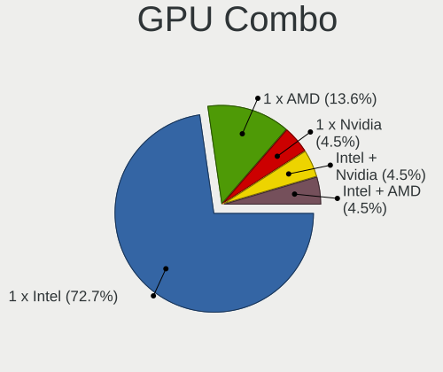

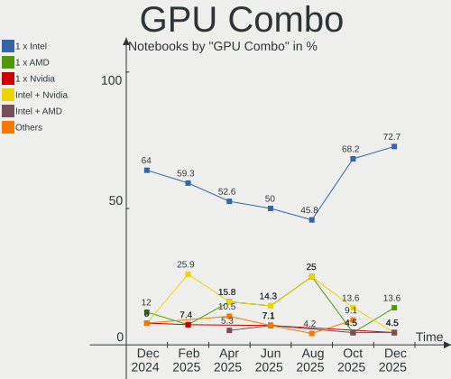

| Name           | Notebooks | Percent |
|----------------|-----------|---------|
| 1 x Intel      | 16        | 72.73%  |
| 1 x AMD        | 3         | 13.64%  |
| 1 x Nvidia     | 1         | 4.55%   |
| Intel + Nvidia | 1         | 4.55%   |
| Intel + AMD    | 1         | 4.55%   |

GPU Driver
----------

Free vs proprietary

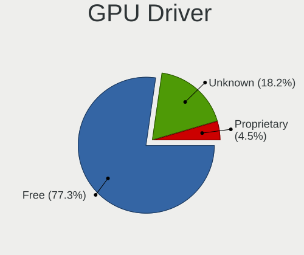

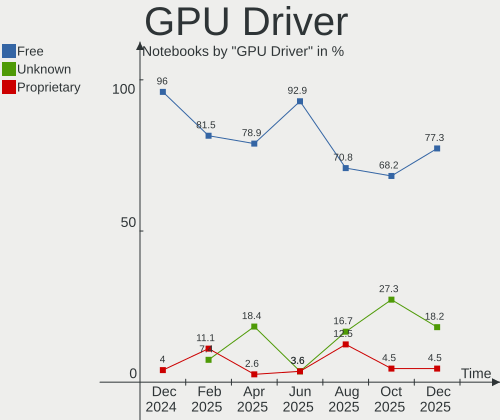

| Driver      | Notebooks | Percent |
|-------------|-----------|---------|
| Free        | 17        | 77.27%  |
| Unknown     | 4         | 18.18%  |
| Proprietary | 1         | 4.55%   |

GPU Memory
----------

Total video memory

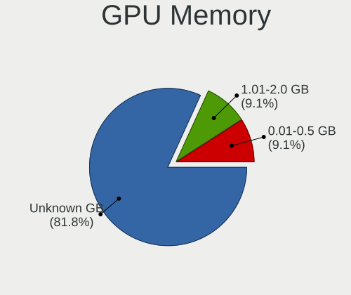

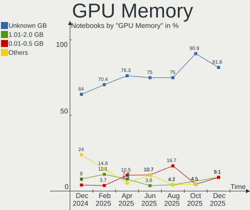

| Size in GB | Notebooks | Percent |
|------------|-----------|---------|
| Unknown    | 18        | 81.82%  |
| 1.01-2.0   | 2         | 9.09%   |
| 0.01-0.5   | 2         | 9.09%   |

Monitor
-------

Monitor Vendor
--------------

Monitor vendors

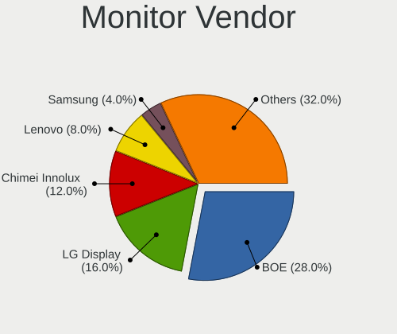

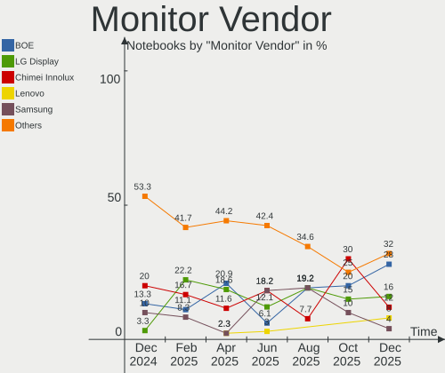

| Vendor              | Notebooks | Percent |
|---------------------|-----------|---------|
| BOE                 | 7         | 28%     |
| LG Display          | 4         | 16%     |
| Chimei Innolux      | 3         | 12%     |
| Lenovo              | 2         | 8%      |
| Samsung Electronics | 1         | 4%      |
| Roku                | 1         | 4%      |
| PANDA               | 1         | 4%      |
| HKC                 | 1         | 4%      |
| EDO                 | 1         | 4%      |
| Dell                | 1         | 4%      |
| AU Optronics        | 1         | 4%      |
| Apple               | 1         | 4%      |
| AOC                 | 1         | 4%      |

Monitor Model
-------------

Monitor models

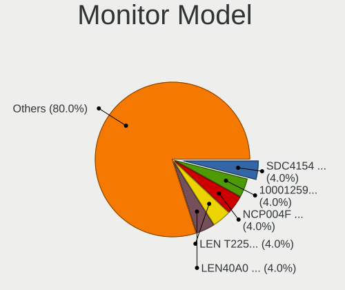

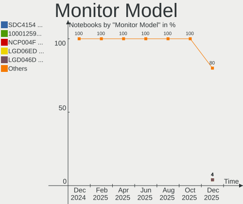

| Model                                                                 | Notebooks | Percent |
|-----------------------------------------------------------------------|-----------|---------|
| Samsung Electronics LCD Monitor SDC4154 2880x1800 302x189mm 14.0-inch | 1         | 4%      |
| Roku 100012590 RKU0B01 1920x1080 698x392mm 31.5-inch                  | 1         | 4%      |
| PANDA LCD Monitor NCP004F 1920x1080 309x174mm 14.0-inch               | 1         | 4%      |
| LG Display LCD Monitor LGD06ED 1920x1200 302x188mm 14.0-inch          | 1         | 4%      |
| LG Display LCD Monitor LGD046D 1920x1080 309x174mm 14.0-inch          | 1         | 4%      |
| LG Display LCD Monitor LGD0454 1366x768 310x174mm 14.0-inch           | 1         | 4%      |
| LG Display LCD Monitor LGD02DC 1366x768 344x194mm 15.5-inch           | 1         | 4%      |
| Lenovo LEN T2254pC LEN60CC 1680x1050 474x296mm 22.0-inch              | 1         | 4%      |
| Lenovo LCD Monitor LEN40A0 1366x768 309x173mm 13.9-inch               | 1         | 4%      |
| HKC LCD Monitor HKC36BB 1366x768 309x174mm 14.0-inch                  | 1         | 4%      |
| EDO EF10QBC64.C EDO4245                                               | 1         | 4%      |
| Dell SE2416H DELD082 1920x1080 527x296mm 23.8-inch                    | 1         | 4%      |
| Chimei Innolux LCD Monitor CMN14D4 1920x1080 309x173mm 13.9-inch      | 1         | 4%      |
| Chimei Innolux LCD Monitor CMN139E 1920x1080 293x165mm 13.2-inch      | 1         | 4%      |
| Chimei Innolux LCD Monitor CMN1138 1366x768 256x144mm 11.6-inch       | 1         | 4%      |
| BOE LCD Monitor BOE0C29 1920x1080 344x194mm 15.5-inch                 | 1         | 4%      |
| BOE LCD Monitor BOE0A6A 1920x1200 301x188mm 14.0-inch                 | 1         | 4%      |
| BOE LCD Monitor BOE0955 1600x900 382x215mm 17.3-inch                  | 1         | 4%      |
| BOE LCD Monitor BOE07F6 1920x1080 309x174mm 14.0-inch                 | 1         | 4%      |
| BOE LCD Monitor BOE07C9 1920x1080 309x173mm 13.9-inch                 | 1         | 4%      |
| BOE LCD Monitor BOE06CE 1366x768 277x156mm 12.5-inch                  | 1         | 4%      |
| BOE LCD Monitor BOE0697 1366x768 309x173mm 13.9-inch                  | 1         | 4%      |
| AU Optronics LCD Monitor AUO203E 1600x900 309x174mm 14.0-inch         | 1         | 4%      |
| Apple Color LCD APP9CF0 1440x900 290x180mm 13.4-inch                  | 1         | 4%      |
| AOC 2050W AOC2050 1600x900 432x240mm 19.5-inch                        | 1         | 4%      |

Monitor Resolution
------------------

Monitor screen resolution

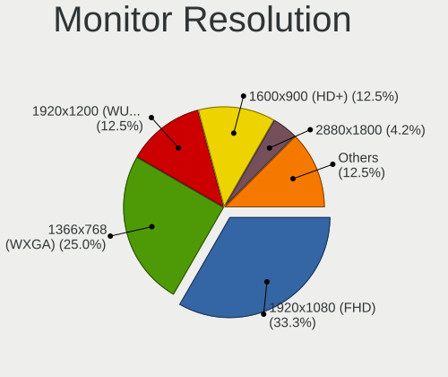

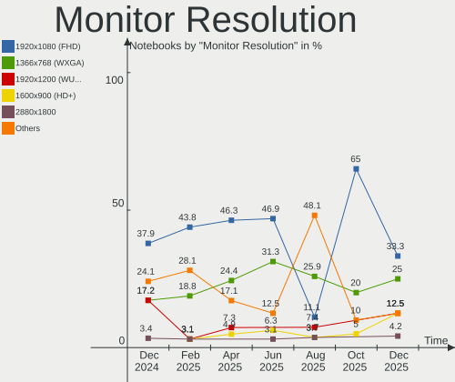

| Resolution         | Notebooks | Percent |
|--------------------|-----------|---------|
| 1920x1080 (FHD)    | 8         | 33.33%  |
| 1366x768 (WXGA)    | 6         | 25%     |
| 1920x1200 (WUXGA)  | 3         | 12.5%   |
| 1600x900 (HD+)     | 3         | 12.5%   |
| 2880x1800          | 1         | 4.17%   |
| 1680x1050 (WSXGA+) | 1         | 4.17%   |
| 1440x900 (WXGA+)   | 1         | 4.17%   |
| Unknown            | 1         | 4.17%   |

Monitor Diagonal
----------------

Diagonal size in inches

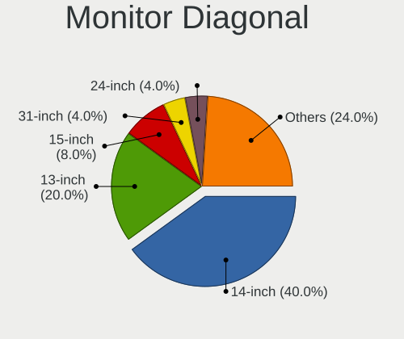

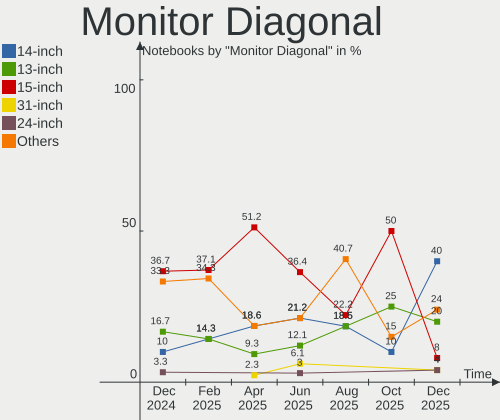

| Inches  | Notebooks | Percent |
|---------|-----------|---------|
| 14      | 10        | 40%     |
| 13      | 5         | 20%     |
| 15      | 2         | 8%      |
| 31      | 1         | 4%      |
| 24      | 1         | 4%      |
| 22      | 1         | 4%      |
| 20      | 1         | 4%      |
| 17      | 1         | 4%      |
| 12      | 1         | 4%      |
| 11      | 1         | 4%      |
| Unknown | 1         | 4%      |

Monitor Width
-------------

Physical width

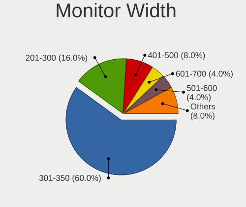

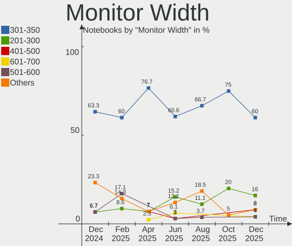

| Width in mm | Notebooks | Percent |
|-------------|-----------|---------|
| 301-350     | 15        | 60%     |
| 201-300     | 4         | 16%     |
| 401-500     | 2         | 8%      |
| 601-700     | 1         | 4%      |
| 501-600     | 1         | 4%      |
| 351-400     | 1         | 4%      |
| Unknown     | 1         | 4%      |

Aspect Ratio
------------

Proportional relationship between the width and the height

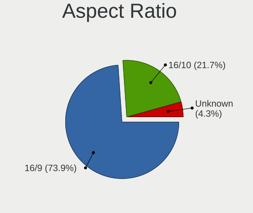

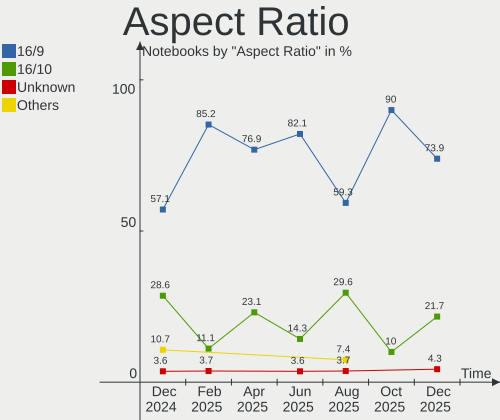

| Ratio   | Notebooks | Percent |
|---------|-----------|---------|
| 16/9    | 17        | 73.91%  |
| 16/10   | 5         | 21.74%  |
| Unknown | 1         | 4.35%   |

Monitor Area
------------

Area in inch²

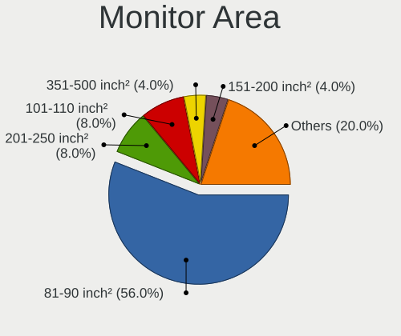

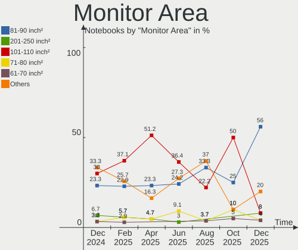

| Area in inch² | Notebooks | Percent |
|----------------|-----------|---------|
| 81-90          | 14        | 56%     |
| 201-250        | 2         | 8%      |
| 101-110        | 2         | 8%      |
| 71-80          | 1         | 4%      |
| 61-70          | 1         | 4%      |
| 51-60          | 1         | 4%      |
| 351-500        | 1         | 4%      |
| 151-200        | 1         | 4%      |
| 121-130        | 1         | 4%      |
| Unknown        | 1         | 4%      |

Pixel Density
-------------

Pixels per inch

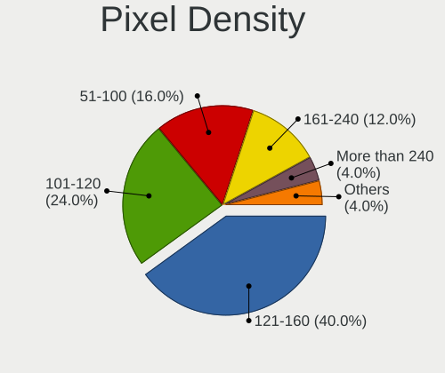

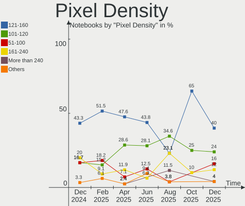

| Density       | Notebooks | Percent |
|---------------|-----------|---------|
| 121-160       | 10        | 40%     |
| 101-120       | 6         | 24%     |
| 51-100        | 4         | 16%     |
| 161-240       | 3         | 12%     |
| More than 240 | 1         | 4%      |
| Unknown       | 1         | 4%      |

Multiple Monitors
-----------------

Total monitors connected

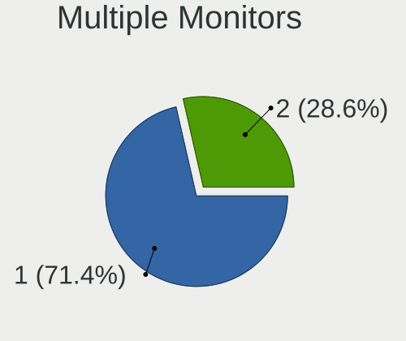

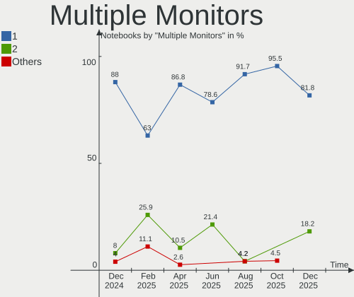

| Total | Notebooks | Percent |
|-------|-----------|---------|
| 1     | 18        | 81.82%  |
| 2     | 4         | 18.18%  |

Network
-------

Net Controller Vendor
---------------------

Controller vendors

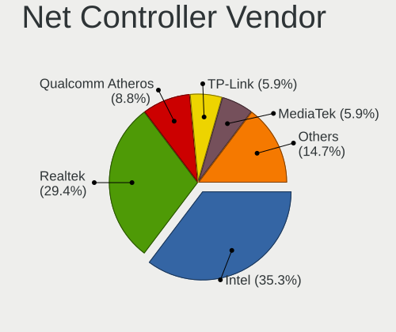

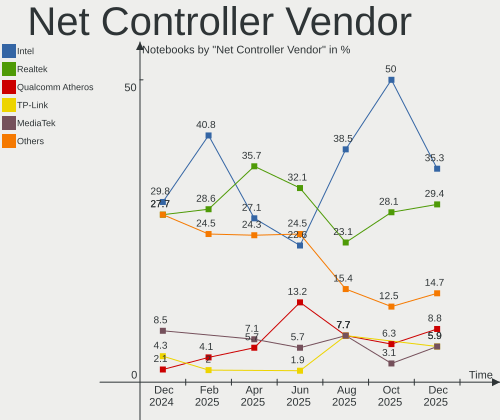

| Vendor                | Notebooks | Percent |
|-----------------------|-----------|---------|
| Intel                 | 12        | 35.29%  |
| Realtek Semiconductor | 10        | 29.41%  |
| Qualcomm Atheros      | 3         | 8.82%   |
| TP-Link               | 2         | 5.88%   |
| MediaTek              | 2         | 5.88%   |
| Broadcom Limited      | 2         | 5.88%   |
| Samsung Electronics   | 1         | 2.94%   |
| Belkin Components     | 1         | 2.94%   |
| ASR Microelectronics  | 1         | 2.94%   |

Net Controller Model
--------------------

Controller models

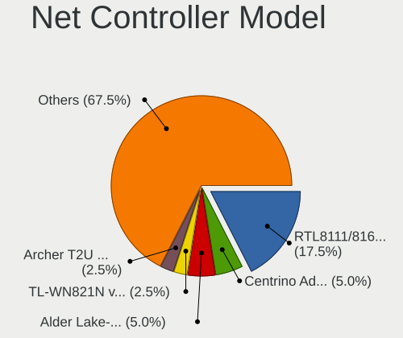

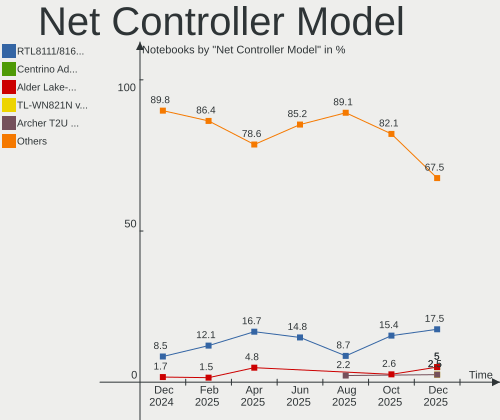

| Model                                                                           | Notebooks | Percent |
|---------------------------------------------------------------------------------|-----------|---------|
| Realtek RTL8111/8168/8211/8411 PCI Express Gigabit Ethernet Controller          | 7         | 17.5%   |
| Intel Centrino Advanced-N 6235                                                  | 2         | 5%      |
| Intel Alder Lake-P PCH CNVi WiFi                                                | 2         | 5%      |
| TP-Link TL-WN821N v5/v6 [RTL8192EU]                                             | 1         | 2.5%    |
| TP-Link Archer T2U PLUS [RTL8821AU]                                             | 1         | 2.5%    |
| Samsung Galaxy series, misc. (tethering mode)                                   | 1         | 2.5%    |
| Realtek RTL8852BE PCIe 802.11ax Wireless Network Controller                     | 1         | 2.5%    |
| Realtek RTL8852AE 802.11ax PCIe Wireless Network Adapter                        | 1         | 2.5%    |
| Realtek RTL8821CE 802.11ac PCIe Wireless Network Adapter                        | 1         | 2.5%    |
| Realtek RTL8153 Gigabit Ethernet Adapter                                        | 1         | 2.5%    |
| Realtek RTL810xE PCI Express Fast Ethernet controller                           | 1         | 2.5%    |
| Qualcomm Atheros QCA9377 802.11ac Wireless Network Adapter                      | 1         | 2.5%    |
| Qualcomm Atheros QCA6174 802.11ac Wireless Network Adapter                      | 1         | 2.5%    |
| Qualcomm Atheros AR9485 Wireless Network Adapter                                | 1         | 2.5%    |
| MediaTek MT7925 802.11be 160MHz 2x2 PCIe Wireless Network Adapter [Filogic 360] | 1         | 2.5%    |
| MediaTek MT7921 802.11ax PCIe Wireless Network Adapter [Filogic 330]            | 1         | 2.5%    |
| Intel Wireless 8265 / 8275                                                      | 1         | 2.5%    |
| Intel Wireless 8260                                                             | 1         | 2.5%    |
| Intel Wi-Fi 6 AX201                                                             | 1         | 2.5%    |
| Intel Wi-Fi 6 AX200                                                             | 1         | 2.5%    |
| Intel Wi-Fi 5(802.11ac) Wireless-AC 9x6x [Thunder Peak]                         | 1         | 2.5%    |
| Intel Ice Lake-LP PCH CNVi WiFi                                                 | 1         | 2.5%    |
| Intel Gemini Lake PCH CNVi WiFi                                                 | 1         | 2.5%    |
| Intel Ethernet Connection I219-LM                                               | 1         | 2.5%    |
| Intel Ethernet Connection I217-LM                                               | 1         | 2.5%    |
| Intel Ethernet Connection (6) I219-LM                                           | 1         | 2.5%    |
| Intel Ethernet Connection (10) I219-LM                                          | 1         | 2.5%    |
| Intel Comet Lake PCH-LP CNVi WiFi                                               | 1         | 2.5%    |
| Broadcom Limited BCM4360 802.11ac Dual Band Wireless Network Adapter            | 1         | 2.5%    |
| Broadcom Limited BCM4312 802.11b/g LP-PHY                                       | 1         | 2.5%    |
| Belkin Components F7D1101 v1 Basic Wireless Adapter [Realtek RTL8188SU]         | 1         | 2.5%    |
| ASR ML307R                                                                      | 1         | 2.5%    |

Wireless Vendor
---------------

Wireless vendors

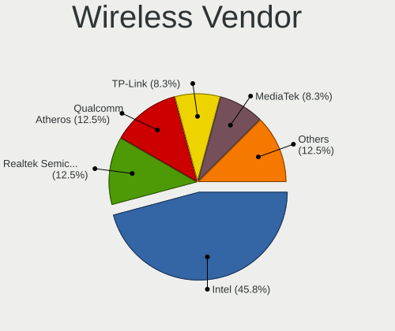

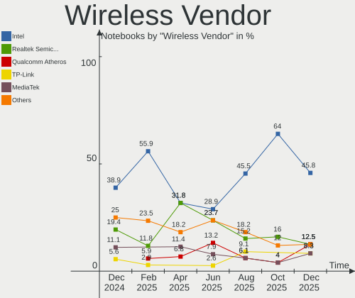

| Vendor                | Notebooks | Percent |
|-----------------------|-----------|---------|
| Intel                 | 11        | 45.83%  |
| Realtek Semiconductor | 3         | 12.5%   |
| Qualcomm Atheros      | 3         | 12.5%   |
| TP-Link               | 2         | 8.33%   |
| MediaTek              | 2         | 8.33%   |
| Broadcom Limited      | 2         | 8.33%   |
| Belkin Components     | 1         | 4.17%   |

Wireless Model
--------------

Wireless models

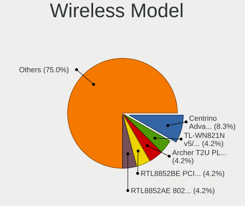

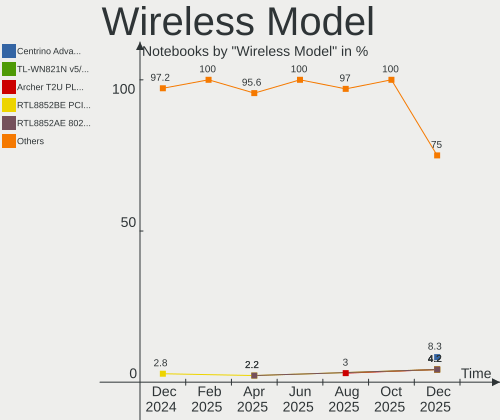

| Model                                                                           | Notebooks | Percent |
|---------------------------------------------------------------------------------|-----------|---------|
| Intel Centrino Advanced-N 6235                                                  | 2         | 8.33%   |
| TP-Link TL-WN821N v5/v6 [RTL8192EU]                                             | 1         | 4.17%   |
| TP-Link Archer T2U PLUS [RTL8821AU]                                             | 1         | 4.17%   |
| Realtek RTL8852BE PCIe 802.11ax Wireless Network Controller                     | 1         | 4.17%   |
| Realtek RTL8852AE 802.11ax PCIe Wireless Network Adapter                        | 1         | 4.17%   |
| Realtek RTL8821CE 802.11ac PCIe Wireless Network Adapter                        | 1         | 4.17%   |
| Qualcomm Atheros QCA9377 802.11ac Wireless Network Adapter                      | 1         | 4.17%   |
| Qualcomm Atheros QCA6174 802.11ac Wireless Network Adapter                      | 1         | 4.17%   |
| Qualcomm Atheros AR9485 Wireless Network Adapter                                | 1         | 4.17%   |
| MediaTek MT7925 802.11be 160MHz 2x2 PCIe Wireless Network Adapter [Filogic 360] | 1         | 4.17%   |
| MediaTek MT7921 802.11ax PCIe Wireless Network Adapter [Filogic 330]            | 1         | 4.17%   |
| Intel Wireless 8265 / 8275                                                      | 1         | 4.17%   |
| Intel Wireless 8260                                                             | 1         | 4.17%   |
| Intel Wi-Fi 6 AX201                                                             | 1         | 4.17%   |
| Intel Wi-Fi 6 AX200                                                             | 1         | 4.17%   |
| Intel Wi-Fi 5(802.11ac) Wireless-AC 9x6x [Thunder Peak]                         | 1         | 4.17%   |
| Intel Ice Lake-LP PCH CNVi WiFi                                                 | 1         | 4.17%   |
| Intel Gemini Lake PCH CNVi WiFi                                                 | 1         | 4.17%   |
| Intel Comet Lake PCH-LP CNVi WiFi                                               | 1         | 4.17%   |
| Intel Alder Lake-P PCH CNVi WiFi                                                | 1         | 4.17%   |
| Broadcom Limited BCM4360 802.11ac Dual Band Wireless Network Adapter            | 1         | 4.17%   |
| Broadcom Limited BCM4312 802.11b/g LP-PHY                                       | 1         | 4.17%   |
| Belkin Components F7D1101 v1 Basic Wireless Adapter [Realtek RTL8188SU]         | 1         | 4.17%   |

Ethernet Vendor
---------------

Ethernet vendors

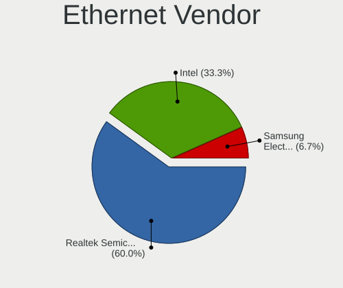

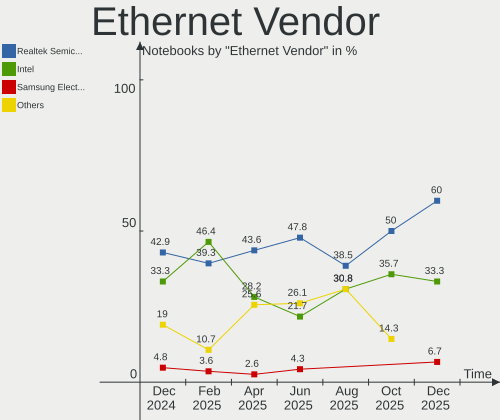

| Vendor                | Notebooks | Percent |
|-----------------------|-----------|---------|
| Realtek Semiconductor | 9         | 60%     |
| Intel                 | 5         | 33.33%  |
| Samsung Electronics   | 1         | 6.67%   |

Ethernet Model
--------------

Ethernet models

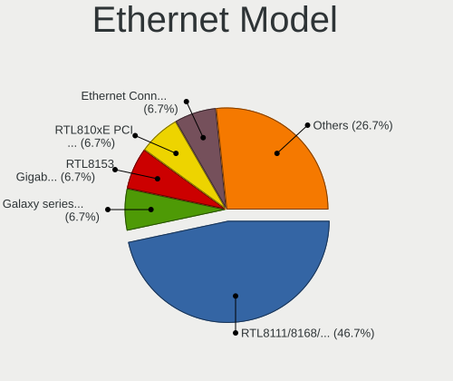

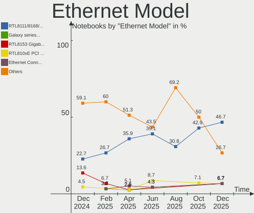

| Model                                                                  | Notebooks | Percent |
|------------------------------------------------------------------------|-----------|---------|
| Realtek RTL8111/8168/8211/8411 PCI Express Gigabit Ethernet Controller | 7         | 46.67%  |
| Samsung Galaxy series, misc. (tethering mode)                          | 1         | 6.67%   |
| Realtek RTL8153 Gigabit Ethernet Adapter                               | 1         | 6.67%   |
| Realtek RTL810xE PCI Express Fast Ethernet controller                  | 1         | 6.67%   |
| Intel Ethernet Connection I219-LM                                      | 1         | 6.67%   |
| Intel Ethernet Connection I217-LM                                      | 1         | 6.67%   |
| Intel Ethernet Connection (6) I219-LM                                  | 1         | 6.67%   |
| Intel Ethernet Connection (10) I219-LM                                 | 1         | 6.67%   |
| Intel Alder Lake-P PCH CNVi WiFi                                       | 1         | 6.67%   |

Net Controller Kind
-------------------

Ethernet, WiFi or modem

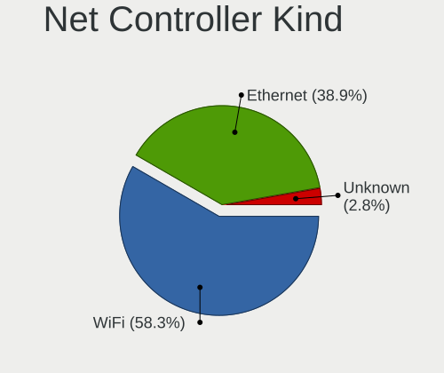

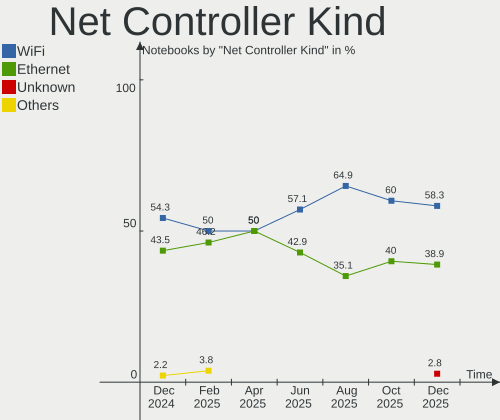

| Kind     | Notebooks | Percent |
|----------|-----------|---------|
| WiFi     | 21        | 58.33%  |
| Ethernet | 14        | 38.89%  |
| Unknown  | 1         | 2.78%   |

Used Controller
---------------

Currently used network controller

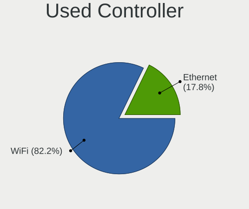

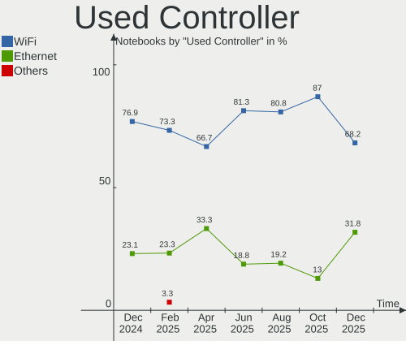

| Kind     | Notebooks | Percent |
|----------|-----------|---------|
| WiFi     | 15        | 68.18%  |
| Ethernet | 7         | 31.82%  |

NICs
----

Total network controllers on board

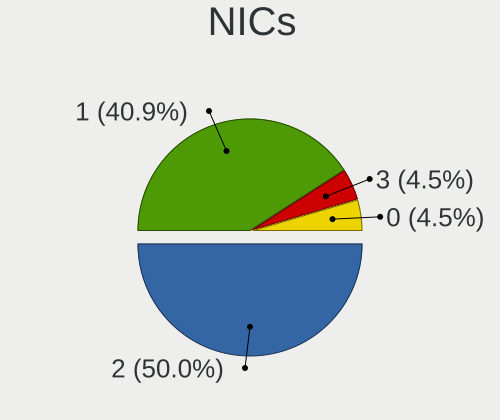

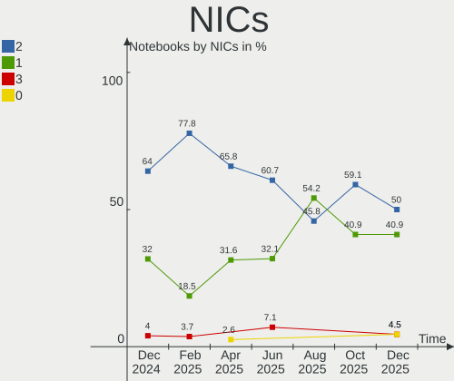

| Total | Notebooks | Percent |
|-------|-----------|---------|
| 2     | 11        | 50%     |
| 1     | 9         | 40.91%  |
| 3     | 1         | 4.55%   |
| 0     | 1         | 4.55%   |

IPv6
----

IPv6 vs IPv4

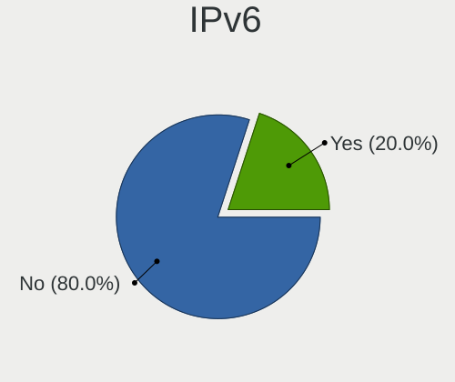

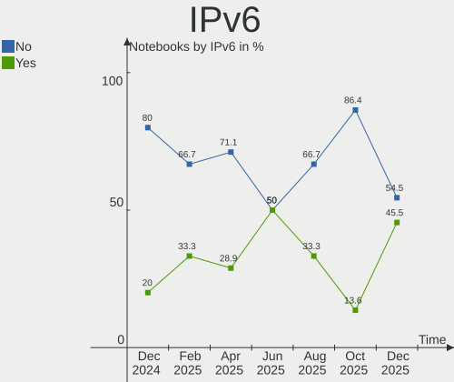

| Used | Notebooks | Percent |
|------|-----------|---------|
| No   | 12        | 54.55%  |
| Yes  | 10        | 45.45%  |

Bluetooth
---------

Bluetooth Vendor
----------------

Controller vendors

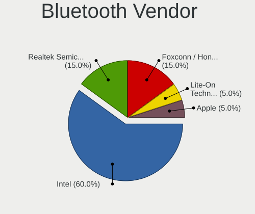

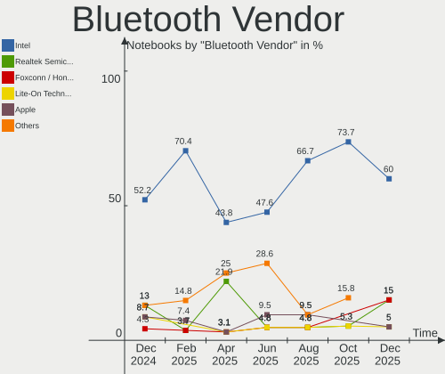

| Vendor                | Notebooks | Percent |
|-----------------------|-----------|---------|
| Intel                 | 12        | 60%     |
| Realtek Semiconductor | 3         | 15%     |
| Foxconn / Hon Hai     | 3         | 15%     |
| Lite-On Technology    | 1         | 5%      |
| Apple                 | 1         | 5%      |

Bluetooth Model
---------------

Controller models

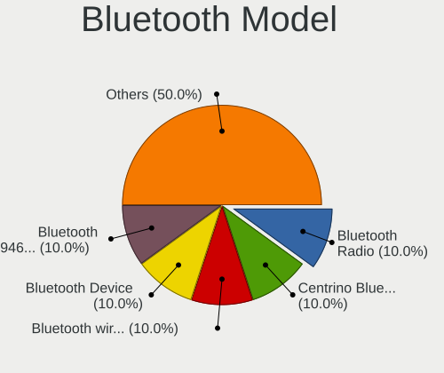

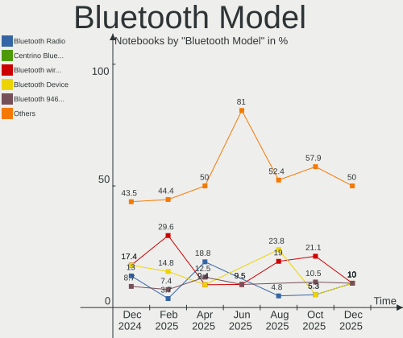

| Model                                          | Notebooks | Percent |
|------------------------------------------------|-----------|---------|
| Realtek Bluetooth Radio                        | 2         | 10%     |
| Intel Centrino Bluetooth Wireless Transceiver  | 2         | 10%     |
| Intel Bluetooth wireless interface             | 2         | 10%     |
| Intel Bluetooth Device                         | 2         | 10%     |
| Intel Bluetooth 9460/9560 Jefferson Peak (JfP) | 2         | 10%     |
| Intel AX201 Bluetooth                          | 2         | 10%     |
| Realtek  Bluetooth 4.2 Adapter                 | 1         | 5%      |
| Lite-On Qualcomm Atheros QCA9377 Bluetooth     | 1         | 5%      |
| Intel Wireless-AC 9260 Bluetooth Adapter       | 1         | 5%      |
| Intel AX200 Bluetooth                          | 1         | 5%      |
| Foxconn / Hon Hai Wireless_Device              | 1         | 5%      |
| Foxconn / Hon Hai MediaTek Bluetooth Adapter   | 1         | 5%      |
| Foxconn / Hon Hai Bluetooth Device             | 1         | 5%      |
| Apple Bluetooth USB Host Controller            | 1         | 5%      |

Sound
-----

Sound Vendor
------------

Sound card vendors

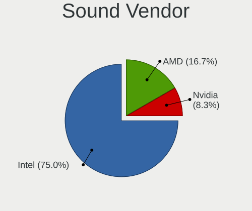

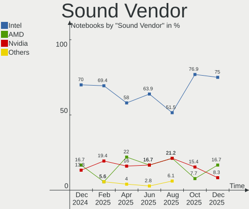

| Vendor | Notebooks | Percent |
|--------|-----------|---------|
| Intel  | 18        | 75%     |
| AMD    | 4         | 16.67%  |
| Nvidia | 2         | 8.33%   |

Sound Model
-----------

Sound card models

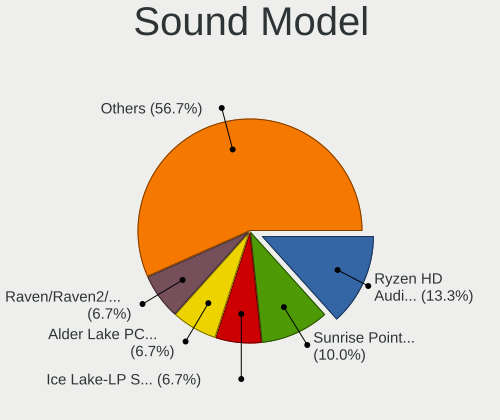

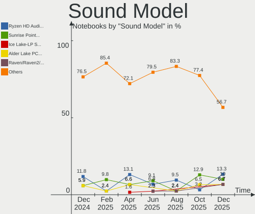

| Model                                                                      | Notebooks | Percent |
|----------------------------------------------------------------------------|-----------|---------|
| AMD Ryzen HD Audio Controller                                              | 4         | 13.33%  |
| Intel Sunrise Point-LP HD Audio                                            | 3         | 10%     |
| Intel Ice Lake-LP Smart Sound Technology Audio Controller                  | 2         | 6.67%   |
| Intel Alder Lake PCH-P High Definition Audio Controller                    | 2         | 6.67%   |
| AMD Raven/Raven2/Fenghuang HDMI/DP Audio Controller                        | 2         | 6.67%   |
| Nvidia GB206 High Definition Audio Controller                              | 1         | 3.33%   |
| Nvidia AD107 High Definition Audio Controller                              | 1         | 3.33%   |
| Intel Xeon E3-1200 v3/4th Gen Core Processor HD Audio Controller           | 1         | 3.33%   |
| Intel Wildcat Point-LP High Definition Audio Controller                    | 1         | 3.33%   |
| Intel Tiger Lake-LP Smart Sound Technology Audio Controller                | 1         | 3.33%   |
| Intel Raptor Lake-P/U/H cAVS                                               | 1         | 3.33%   |
| Intel Raptor Lake High Definition Audio Controller                         | 1         | 3.33%   |
| Intel Haswell-ULT HD Audio Controller                                      | 1         | 3.33%   |
| Intel Comet Lake PCH-LP cAVS                                               | 1         | 3.33%   |
| Intel Celeron/Pentium Silver Processor High Definition Audio               | 1         | 3.33%   |
| Intel Cannon Point-LP High Definition Audio Controller                     | 1         | 3.33%   |
| Intel Broadwell-U Audio Controller                                         | 1         | 3.33%   |
| Intel 8 Series/C220 Series Chipset High Definition Audio Controller        | 1         | 3.33%   |
| Intel 8 Series HD Audio Controller                                         | 1         | 3.33%   |
| Intel 7 Series/C216 Chipset Family High Definition Audio Controller        | 1         | 3.33%   |
| Intel 6 Series/C200 Series Chipset Family High Definition Audio Controller | 1         | 3.33%   |
| AMD Renoir/Cezanne HDMI/DP Audio Controller                                | 1         | 3.33%   |

Memory
------

Memory Vendor
-------------

Memory module vendors

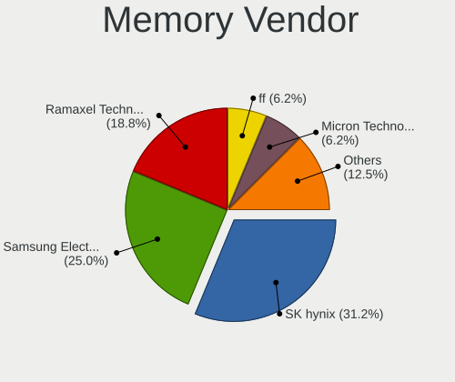

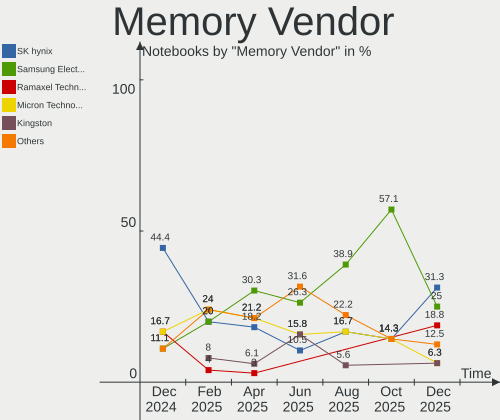

| Vendor              | Notebooks | Percent |
|---------------------|-----------|---------|
| SK hynix            | 5         | 31.25%  |
| Samsung Electronics | 4         | 25%     |
| Ramaxel Technology  | 3         | 18.75%  |
| Micron Technology   | 1         | 6.25%   |
| Kingston            | 1         | 6.25%   |
| ff                  | 1         | 6.25%   |
| 4ea5                | 1         | 6.25%   |

Memory Model
------------

Memory module models

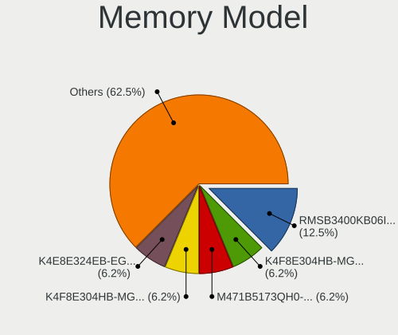

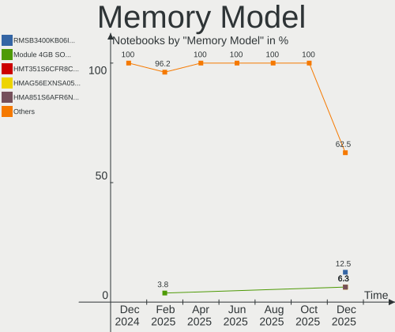

| Model                                                            | Notebooks | Percent |
|------------------------------------------------------------------|-----------|---------|
| Ramaxel RAM RMSB3400KB06IVF-4800 12GB SODIMM DDR5 4800MT/s       | 2         | 12.5%   |
| SK hynix RAM Module 4GB SODIMM DDR3 1600MT/s                     | 1         | 6.25%   |
| SK hynix RAM HMT351S6CFR8C-PB 4096MB SODIMM DDR3 1600MT/s        | 1         | 6.25%   |
| SK hynix RAM HMAG56EXNSA051N 4GB SODIMM DDR4 3200MT/s            | 1         | 6.25%   |
| SK hynix RAM HMA851S6AFR6N-UH 4GB SODIMM DDR4 2400MT/s           | 1         | 6.25%   |
| SK hynix RAM H9JCNNNBK3MLYR-N6E 1GB Row Of Chips LPDDR5 6400MT/s | 1         | 6.25%   |
| Samsung RAM M471B5173QH0-YK0 4GB SODIMM DDR3 1600MT/s            | 1         | 6.25%   |
| Samsung RAM K4F8E304HB-MGCJ 1GB LPDDR4 2400MT/s                  | 1         | 6.25%   |
| Samsung RAM K4E8E324EB-EGCG 2GB Row Of Chips LPDDR3 2133MT/s     | 1         | 6.25%   |
| Samsung RAM K3LKCKC0BM-MGCP 4GB Row Of Chips LPDDR5 6400MT/s     | 1         | 6.25%   |
| Ramaxel RAM RMT3170EB68F9W1600 4GB SODIMM DDR3 1600MT/s          | 1         | 6.25%   |
| Micron RAM Module 8GB SODIMM DDR4 2400MT/s                       | 1         | 6.25%   |
| Kingston RAM 99U5469-053.A00LF 4GB SODIMM DDR3 1333MT/s          | 1         | 6.25%   |
| ff RAM K4F8E304HB-MGCJ 1GB LPDDR4 2400MT/s                       | 1         | 6.25%   |
| 4ea5 RAM K4F8E304HB-MGCJ 1GB LPDDR4 2400MT/s                     | 1         | 6.25%   |

Memory Kind
-----------

Memory module kinds

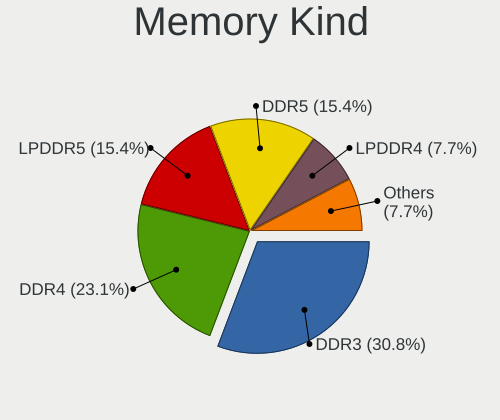

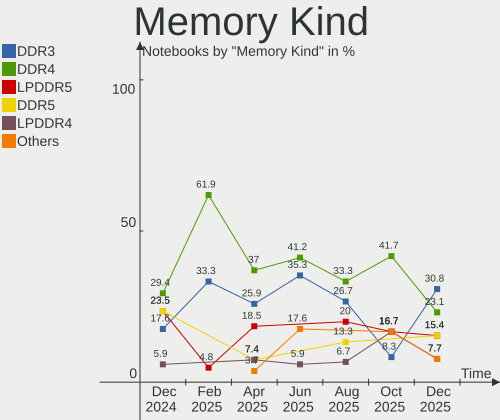

| Kind   | Notebooks | Percent |
|--------|-----------|---------|
| DDR3   | 4         | 30.77%  |
| DDR4   | 3         | 23.08%  |
| LPDDR5 | 2         | 15.38%  |
| DDR5   | 2         | 15.38%  |
| LPDDR4 | 1         | 7.69%   |
| LPDDR3 | 1         | 7.69%   |

Memory Form Factor
------------------

Physical design of the memory module

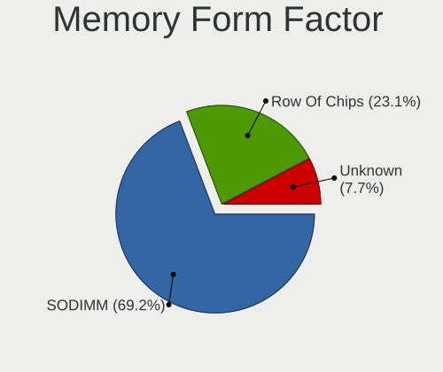

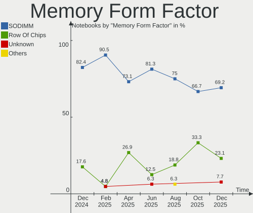

| Name         | Notebooks | Percent |
|--------------|-----------|---------|
| SODIMM       | 9         | 69.23%  |
| Row Of Chips | 3         | 23.08%  |
| Unknown      | 1         | 7.69%   |

Memory Size
-----------

Memory module size

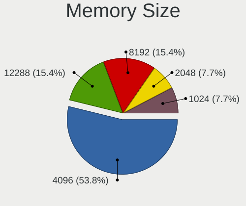

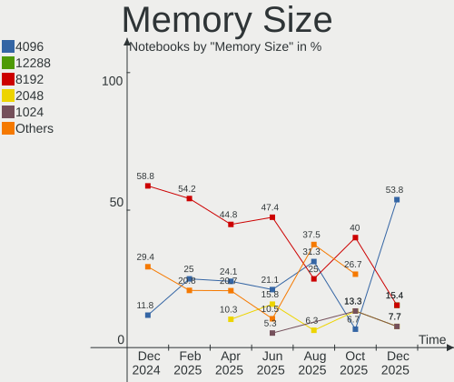

| Size  | Notebooks | Percent |
|-------|-----------|---------|
| 4096  | 7         | 53.85%  |
| 12288 | 2         | 15.38%  |
| 8192  | 2         | 15.38%  |
| 2048  | 1         | 7.69%   |
| 1024  | 1         | 7.69%   |

Memory Speed
------------

Memory module speed

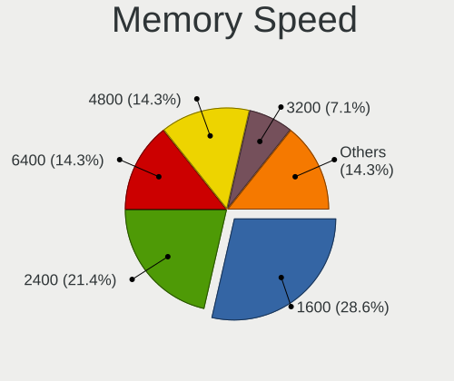

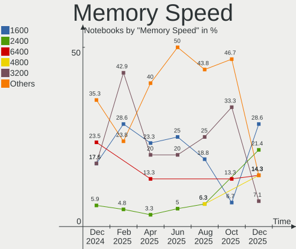

| Speed | Notebooks | Percent |
|-------|-----------|---------|
| 1600  | 4         | 28.57%  |
| 2400  | 3         | 21.43%  |
| 6400  | 2         | 14.29%  |
| 4800  | 2         | 14.29%  |
| 3200  | 1         | 7.14%   |
| 2133  | 1         | 7.14%   |
| 1333  | 1         | 7.14%   |

Printers & scanners
-------------------

Printer Vendor
--------------

Printer device vendors

Zero info for selected period =(

Printer Model
-------------

Printer device models

Zero info for selected period =(

Scanner Vendor
--------------

Scanner device vendors

Zero info for selected period =(

Scanner Model
-------------

Scanner device models

Zero info for selected period =(

Camera
------

Camera Vendor
-------------

Camera device vendors

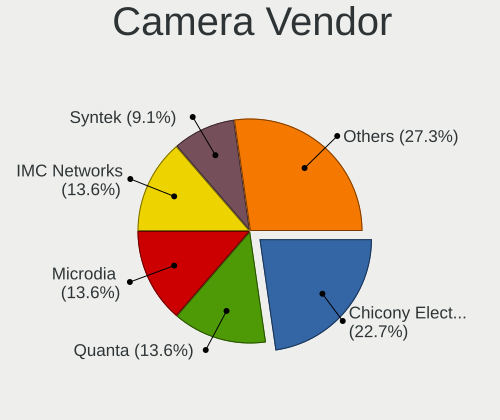

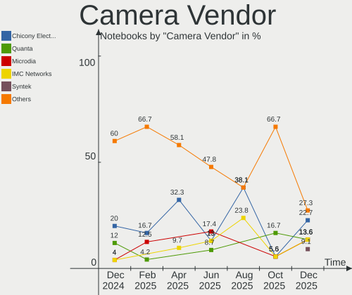

| Vendor                                 | Notebooks | Percent |
|----------------------------------------|-----------|---------|
| Chicony Electronics                    | 5         | 22.73%  |
| Quanta                                 | 3         | 13.64%  |
| Microdia                               | 3         | 13.64%  |
| IMC Networks                           | 3         | 13.64%  |
| Syntek                                 | 2         | 9.09%   |
| Luxvisions Innotech Limited            | 2         | 9.09%   |
| Bison Electronics                      | 2         | 9.09%   |
| Cheng Uei Precision Industry (Foxlink) | 1         | 4.55%   |
| Apple                                  | 1         | 4.55%   |

Camera Model
------------

Camera device models

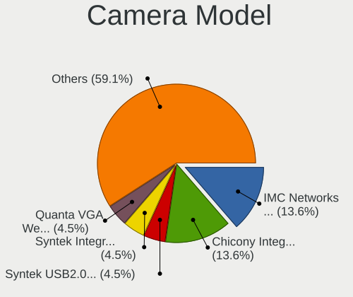

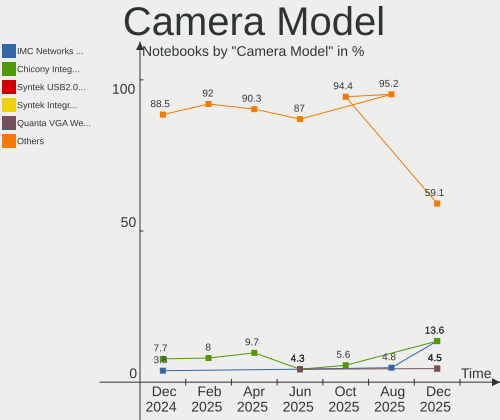

| Model                                                          | Notebooks | Percent |
|----------------------------------------------------------------|-----------|---------|
| IMC Networks USB2.0 HD UVC WebCam                              | 3         | 13.64%  |
| Chicony Integrated Camera                                      | 3         | 13.64%  |
| Syntek USB2.0 Camera                                           | 1         | 4.55%   |
| Syntek Integrated Camera                                       | 1         | 4.55%   |
| Quanta VGA WebCam                                              | 1         | 4.55%   |
| Quanta HP TrueVision HD Camera                                 | 1         | 4.55%   |
| Quanta HP HD Camera                                            | 1         | 4.55%   |
| Microdia Webcam Vitade AF                                      | 1         | 4.55%   |
| Microdia Laptop_Integrated_Webcam_HD                           | 1         | 4.55%   |
| Microdia Integrated Webcam                                     | 1         | 4.55%   |
| Luxvisions Innotech Limited HP True Vision HD Camera           | 1         | 4.55%   |
| Luxvisions Innotech Limited HP HD Camera                       | 1         | 4.55%   |
| Chicony TOSHIBA Web Camera - HD                                | 1         | 4.55%   |
| Chicony HD WebCam                                              | 1         | 4.55%   |
| Cheng Uei Precision Industry (Foxlink) HP TrueVision HD Camera | 1         | 4.55%   |
| Bison Integrated RGB Camera                                    | 1         | 4.55%   |
| Bison Integrated Camera                                        | 1         | 4.55%   |
| Apple iPhone 5/5C/5S/6/SE/7/8/X                                | 1         | 4.55%   |

Security
--------

Fingerprint Vendor
------------------

Fingerprint sensor vendors

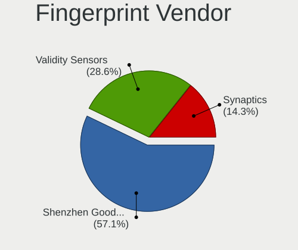

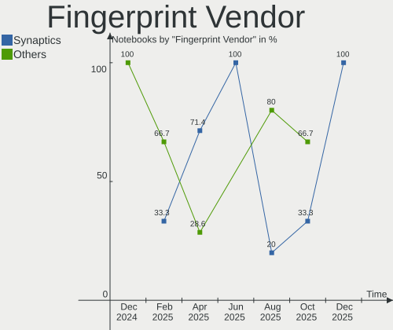

| Vendor    | Notebooks | Percent |
|-----------|-----------|---------|
| Synaptics | 2         | 100%    |

Fingerprint Model
-----------------

Fingerprint sensor models

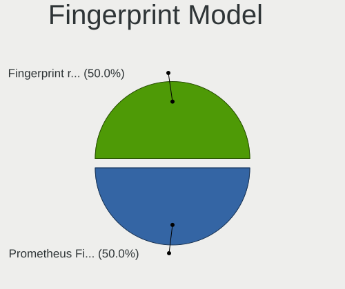

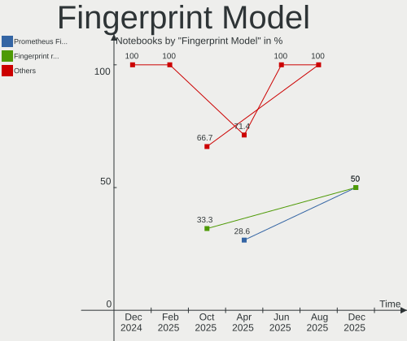

| Model                                   | Notebooks | Percent |
|-----------------------------------------|-----------|---------|
| Synaptics Prometheus Fingerprint Reader | 1         | 50%     |
| Synaptics Fingerprint reader [HP G6]    | 1         | 50%     |

Chipcard Vendor
---------------

Chipcard module vendors

Zero info for selected period =(

Chipcard Model
--------------

Chipcard module models

Zero info for selected period =(

Unsupported
-----------

Unsupported Devices
-------------------

Total unsupported devices on board

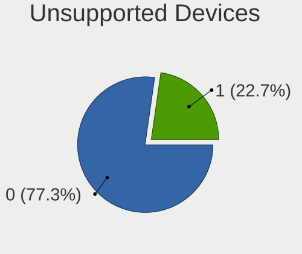

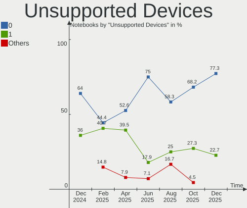

| Total | Notebooks | Percent |
|-------|-----------|---------|
| 0     | 17        | 77.27%  |
| 1     | 5         | 22.73%  |

Unsupported Device Types
------------------------

Types of unsupported devices

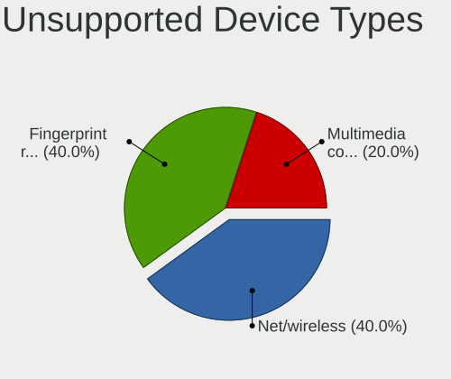

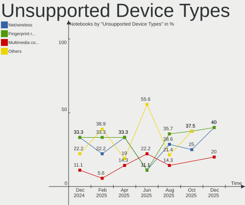

| Type                  | Notebooks | Percent |
|-----------------------|-----------|---------|
| Net/wireless          | 2         | 40%     |
| Fingerprint reader    | 2         | 40%     |
| Multimedia controller | 1         | 20%     |

