Kali Hardware Trends (Notebooks)
--------------------------------

A project to identify most popular hardware characteristics and track their change
over time based on data collected by Kali users at https://Linux-Hardware.org.

Anyone can contribute to this report by the [hw-probe](https://github.com/linuxhw/hw-probe) tool:

    sudo -E hw-probe -all -upload

Full-feature report is available here: https://linux-hardware.org/?view=trends

Period: Mar, 2022.

Contents
--------

* [ System ](#system)
  - [ OS                       ](#os)
  - [ OS Family                ](#os-family)
  - [ Kernel                   ](#kernel)
  - [ Kernel Family            ](#kernel-family)
  - [ Kernel Major Ver.        ](#kernel-major-ver)
  - [ Arch                     ](#arch)
  - [ DE                       ](#de)
  - [ Display Server           ](#display-server)
  - [ Display Manager          ](#display-manager)
  - [ OS Lang                  ](#os-lang)
  - [ Boot Mode                ](#boot-mode)
  - [ Filesystem               ](#filesystem)
  - [ Part. scheme             ](#part-scheme)
  - [ Dual Boot with Linux/BSD ](#dual-boot-with-linuxbsd)
  - [ Dual Boot (Win)          ](#dual-boot-win)

* [ Board ](#board)
  - [ Vendor                   ](#vendor)
  - [ Model                    ](#model)
  - [ Model Family             ](#model-family)
  - [ MFG Year                 ](#mfg-year)
  - [ Form Factor              ](#form-factor)
  - [ Secure Boot              ](#secure-boot)
  - [ Coreboot                 ](#coreboot)
  - [ RAM Size                 ](#ram-size)
  - [ RAM Used                 ](#ram-used)
  - [ Total Drives             ](#total-drives)
  - [ Has CD-ROM               ](#has-cd-rom)
  - [ Has Ethernet             ](#has-ethernet)
  - [ Has WiFi                 ](#has-wifi)
  - [ Has Bluetooth            ](#has-bluetooth)

* [ Location ](#location)
  - [ Country                  ](#country)
  - [ City                     ](#city)

* [ Drives ](#drives)
  - [ Drive Vendor             ](#drive-vendor)
  - [ Drive Model              ](#drive-model)
  - [ HDD Vendor               ](#hdd-vendor)
  - [ SSD Vendor               ](#ssd-vendor)
  - [ Drive Kind               ](#drive-kind)
  - [ Drive Connector          ](#drive-connector)
  - [ Drive Size               ](#drive-size)
  - [ Space Total              ](#space-total)
  - [ Space Used               ](#space-used)
  - [ Malfunc. Drives          ](#malfunc-drives)
  - [ Malfunc. Drive Vendor    ](#malfunc-drive-vendor)
  - [ Malfunc. HDD Vendor      ](#malfunc-hdd-vendor)
  - [ Malfunc. Drive Kind      ](#malfunc-drive-kind)
  - [ Failed Drives            ](#failed-drives)
  - [ Failed Drive Vendor      ](#failed-drive-vendor)
  - [ Drive Status             ](#drive-status)

* [ Storage controller ](#storage-controller)
  - [ Storage Vendor           ](#storage-vendor)
  - [ Storage Model            ](#storage-model)
  - [ Storage Kind             ](#storage-kind)

* [ Processor ](#processor)
  - [ CPU Vendor               ](#cpu-vendor)
  - [ CPU Model                ](#cpu-model)
  - [ CPU Model Family         ](#cpu-model-family)
  - [ CPU Cores                ](#cpu-cores)
  - [ CPU Sockets              ](#cpu-sockets)
  - [ CPU Threads              ](#cpu-threads)
  - [ CPU Op-Modes             ](#cpu-op-modes)
  - [ CPU Microcode            ](#cpu-microcode)
  - [ CPU Microarch            ](#cpu-microarch)

* [ Graphics ](#graphics)
  - [ GPU Vendor               ](#gpu-vendor)
  - [ GPU Model                ](#gpu-model)
  - [ GPU Combo                ](#gpu-combo)
  - [ GPU Driver               ](#gpu-driver)
  - [ GPU Memory               ](#gpu-memory)

* [ Monitor ](#monitor)
  - [ Monitor Vendor           ](#monitor-vendor)
  - [ Monitor Model            ](#monitor-model)
  - [ Monitor Resolution       ](#monitor-resolution)
  - [ Monitor Diagonal         ](#monitor-diagonal)
  - [ Monitor Width            ](#monitor-width)
  - [ Aspect Ratio             ](#aspect-ratio)
  - [ Monitor Area             ](#monitor-area)
  - [ Pixel Density            ](#pixel-density)
  - [ Multiple Monitors        ](#multiple-monitors)

* [ Network ](#network)
  - [ Net Controller Vendor    ](#net-controller-vendor)
  - [ Net Controller Model     ](#net-controller-model)
  - [ Wireless Vendor          ](#wireless-vendor)
  - [ Wireless Model           ](#wireless-model)
  - [ Ethernet Vendor          ](#ethernet-vendor)
  - [ Ethernet Model           ](#ethernet-model)
  - [ Net Controller Kind      ](#net-controller-kind)
  - [ Used Controller          ](#used-controller)
  - [ NICs                     ](#nics)
  - [ IPv6                     ](#ipv6)

* [ Bluetooth ](#bluetooth)
  - [ Bluetooth Vendor         ](#bluetooth-vendor)
  - [ Bluetooth Model          ](#bluetooth-model)

* [ Sound ](#sound)
  - [ Sound Vendor             ](#sound-vendor)
  - [ Sound Model              ](#sound-model)

* [ Memory ](#memory)
  - [ Memory Vendor            ](#memory-vendor)
  - [ Memory Model             ](#memory-model)
  - [ Memory Kind              ](#memory-kind)
  - [ Memory Form Factor       ](#memory-form-factor)
  - [ Memory Size              ](#memory-size)
  - [ Memory Speed             ](#memory-speed)

* [ Printers & scanners ](#printers--scanners)
  - [ Printer Vendor           ](#printer-vendor)
  - [ Printer Model            ](#printer-model)
  - [ Scanner Vendor           ](#scanner-vendor)
  - [ Scanner Model            ](#scanner-model)

* [ Camera ](#camera)
  - [ Camera Vendor            ](#camera-vendor)
  - [ Camera Model             ](#camera-model)

* [ Security ](#security)
  - [ Fingerprint Vendor       ](#fingerprint-vendor)
  - [ Fingerprint Model        ](#fingerprint-model)
  - [ Chipcard Vendor          ](#chipcard-vendor)
  - [ Chipcard Model           ](#chipcard-model)

* [ Unsupported ](#unsupported)
  - [ Unsupported Devices      ](#unsupported-devices)
  - [ Unsupported Device Types ](#unsupported-device-types)

System
------

OS
--

Installed operating systems

| Name        | Notebooks | Percent |
|-------------|-----------|---------|
| Kali 2022.1 | 33        | 94.29%  |
| Kali 2021.4 | 2         | 5.71%   |

OS Family
---------

OS without a version

| Name | Notebooks | Percent |
|------|-----------|---------|
| Kali | 35        | 100%    |

Kernel
------

Version of the Linux kernel

| Version            | Notebooks | Percent |
|--------------------|-----------|---------|
| 5.15.0-kali3-amd64 | 11        | 31.43%  |
| 5.16.0-kali3-amd64 | 8         | 22.86%  |
| 5.16.0-kali5-amd64 | 6         | 17.14%  |
| 5.16.0-kali1-amd64 | 6         | 17.14%  |
| 5.16.0-kali6-amd64 | 1         | 2.86%   |
| 5.14.21            | 1         | 2.86%   |
| 5.14.0-kali4-amd64 | 1         | 2.86%   |
| 5.10.0-kali7-amd64 | 1         | 2.86%   |

Kernel Family
-------------

Linux kernel without a distro release

| Version | Notebooks | Percent |
|---------|-----------|---------|
| 5.16.0  | 21        | 60%     |
| 5.15.0  | 11        | 31.43%  |
| 5.14.21 | 1         | 2.86%   |
| 5.14.0  | 1         | 2.86%   |
| 5.10.0  | 1         | 2.86%   |

Kernel Major Ver.
-----------------

Linux kernel major version

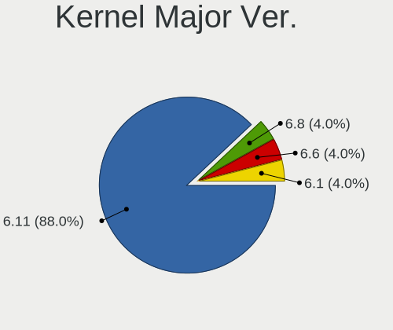

| Version | Notebooks | Percent |
|---------|-----------|---------|
| 5.16    | 21        | 60%     |
| 5.15    | 11        | 31.43%  |
| 5.14    | 2         | 5.71%   |
| 5.10    | 1         | 2.86%   |

Arch
----

OS architecture (x86_64, i586, etc.)

| Name    | Notebooks | Percent |
|---------|-----------|---------|
| x86_64  | 34        | 97.14%  |
| aarch64 | 1         | 2.86%   |

DE
--

Desktop Environment

| Name     | Notebooks | Percent |
|----------|-----------|---------|
| XFCE     | 21        | 60%     |
| KDE5     | 6         | 17.14%  |
| GNOME    | 6         | 17.14%  |
| Cinnamon | 1         | 2.86%   |
| Budgie   | 1         | 2.86%   |

Display Server
--------------

X11 or Wayland

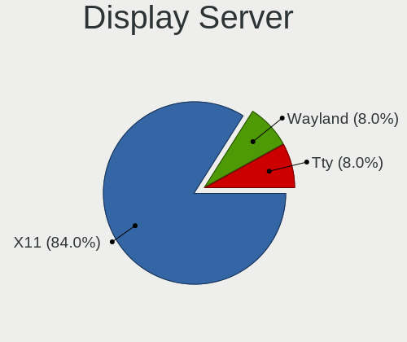

| Name    | Notebooks | Percent |
|---------|-----------|---------|
| X11     | 34        | 97.14%  |
| Wayland | 1         | 2.86%   |

Display Manager
---------------

SDDM, LightDM, etc.

| Name    | Notebooks | Percent |
|---------|-----------|---------|
| LightDM | 19        | 54.29%  |
| Unknown | 8         | 22.86%  |
| GDM3    | 5         | 14.29%  |
| SDDM    | 3         | 8.57%   |

OS Lang
-------

Language

| Lang              | Notebooks | Percent |
|-------------------|-----------|---------|
| en_US             | 16        | 45.71%  |
| pt_BR             | 2         | 5.71%   |
| pl_PL             | 2         | 5.71%   |
| fr_FR             | 2         | 5.71%   |
| es_MX             | 2         | 5.71%   |
| en_GB             | 2         | 5.71%   |
| tr_TR             | 1         | 2.86%   |
| ru_RU             | 1         | 2.86%   |
| fr_CH             | 1         | 2.86%   |
| fr_CA             | 1         | 2.86%   |
| en_ZA             | 1         | 2.86%   |
| en_US.ISO-8859-15 | 1         | 2.86%   |
| en_IN             | 1         | 2.86%   |
| de_DE             | 1         | 2.86%   |
| de_CH             | 1         | 2.86%   |

Boot Mode
---------

EFI or BIOS

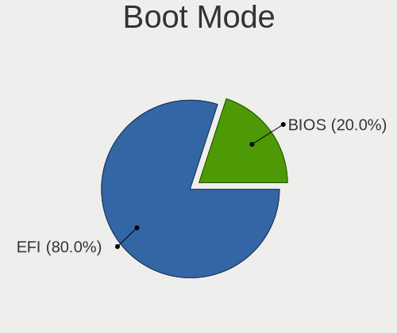

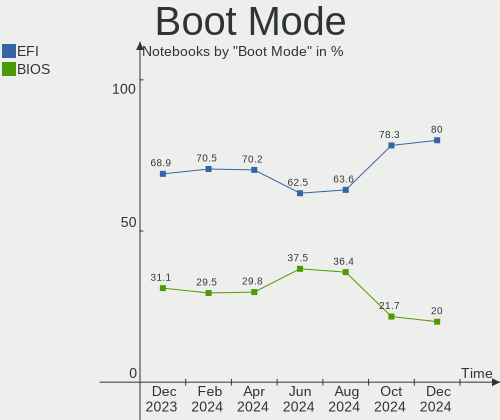

| Mode | Notebooks | Percent |
|------|-----------|---------|
| EFI  | 19        | 54.29%  |
| BIOS | 16        | 45.71%  |

Filesystem
----------

Type of filesystem

| Type    | Notebooks | Percent |
|---------|-----------|---------|
| Ext4    | 32        | 91.43%  |
| Overlay | 3         | 8.57%   |

Part. scheme
------------

Scheme of partitioning

| Type    | Notebooks | Percent |
|---------|-----------|---------|
| GPT     | 17        | 48.57%  |
| MBR     | 11        | 31.43%  |
| Unknown | 7         | 20%     |

Dual Boot with Linux/BSD
------------------------

Hosting more than one Linux/BSD

| Dual boot | Notebooks | Percent |
|-----------|-----------|---------|
| No        | 33        | 94.29%  |
| Yes       | 2         | 5.71%   |

Dual Boot (Win)
---------------

Hosting Linux and Windows

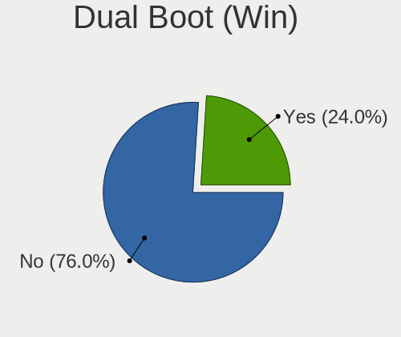

| Dual boot | Notebooks | Percent |
|-----------|-----------|---------|
| No        | 19        | 54.29%  |
| Yes       | 16        | 45.71%  |

Board
-----

Vendor
------

Motherboard manufacturer

| Name              | Notebooks | Percent |
|-------------------|-----------|---------|
| Hewlett-Packard   | 12        | 34.29%  |
| Dell              | 8         | 22.86%  |
| Acer              | 4         | 11.43%  |
| Sony              | 2         | 5.71%   |
| MSI               | 2         | 5.71%   |
| Apple             | 2         | 5.71%   |
| Timi              | 1         | 2.86%   |
| Pine Microsystems | 1         | 2.86%   |
| Lenovo            | 1         | 2.86%   |
| HUAWEI            | 1         | 2.86%   |
| ASUSTek Computer  | 1         | 2.86%   |

Model
-----

Motherboard model

| Name                                  | Notebooks | Percent |
|---------------------------------------|-----------|---------|
| HP Pavilion g6                        | 2         | 5.71%   |
| Acer Swift SF314-42                   | 2         | 5.71%   |
| Timi Mi Laptop Pro 15                 | 1         | 2.86%   |
| Sony VPCEH10EB                        | 1         | 2.86%   |
| Sony VGN-NW265F                       | 1         | 2.86%   |
| Pine Microsystems Pine64 Pinebook Pro | 1         | 2.86%   |
| MSI GP76 Leopard 10UE                 | 1         | 2.86%   |
| MSI GL63 8RC                          | 1         | 2.86%   |
| Lenovo IdeaPad S540-15IWL GTX 81SW    | 1         | 2.86%   |
| HUAWEI HVY-WXX9                       | 1         | 2.86%   |
| HP ProBook 6570b                      | 1         | 2.86%   |
| HP ProBook 650 G1                     | 1         | 2.86%   |
| HP ProBook 6470b                      | 1         | 2.86%   |
| HP Pavilion Laptop 14-bf1xx           | 1         | 2.86%   |
| HP Pavilion Gaming Laptop 15-dk1xxx   | 1         | 2.86%   |
| HP Pavilion 14                        | 1         | 2.86%   |
| HP Notebook                           | 1         | 2.86%   |
| HP Laptop 15-da1xxx                   | 1         | 2.86%   |
| HP EliteBook 820 G3                   | 1         | 2.86%   |
| HP Compaq 620                         | 1         | 2.86%   |
| Dell Vostro 3590                      | 1         | 2.86%   |
| Dell Latitude E6530                   | 1         | 2.86%   |
| Dell Latitude E6510                   | 1         | 2.86%   |
| Dell Latitude E6430                   | 1         | 2.86%   |
| Dell Latitude 5480                    | 1         | 2.86%   |
| Dell Inspiron 5566                    | 1         | 2.86%   |
| Dell Inspiron 3593                    | 1         | 2.86%   |
| Dell Inspiron 3542                    | 1         | 2.86%   |
| ASUS GL753VD                          | 1         | 2.86%   |
| Apple MacBookPro15,2                  | 1         | 2.86%   |
| Apple MacBookPro12,1                  | 1         | 2.86%   |
| Acer Aspire ES1-572                   | 1         | 2.86%   |
| Acer Aspire 5732Z                     | 1         | 2.86%   |

Model Family
------------

Motherboard model prefix

| Name                     | Notebooks | Percent |
|--------------------------|-----------|---------|
| HP Pavilion              | 5         | 14.29%  |
| Dell Latitude            | 4         | 11.43%  |
| HP ProBook               | 3         | 8.57%   |
| Dell Inspiron            | 3         | 8.57%   |
| Acer Swift               | 2         | 5.71%   |
| Acer Aspire              | 2         | 5.71%   |
| Timi Mi                  | 1         | 2.86%   |
| Sony VPCEH10EB           | 1         | 2.86%   |
| Sony VGN-NW265F          | 1         | 2.86%   |
| Pine Microsystems Pine64 | 1         | 2.86%   |
| MSI GP76                 | 1         | 2.86%   |
| MSI GL63                 | 1         | 2.86%   |
| Lenovo IdeaPad           | 1         | 2.86%   |
| HUAWEI HVY-WXX9          | 1         | 2.86%   |
| HP Notebook              | 1         | 2.86%   |
| HP Laptop                | 1         | 2.86%   |
| HP EliteBook             | 1         | 2.86%   |
| HP Compaq                | 1         | 2.86%   |
| Dell Vostro              | 1         | 2.86%   |
| ASUS GL753VD             | 1         | 2.86%   |
| Apple MacBookPro15       | 1         | 2.86%   |
| Apple MacBookPro12       | 1         | 2.86%   |

MFG Year
--------

Motherboard manufacture year

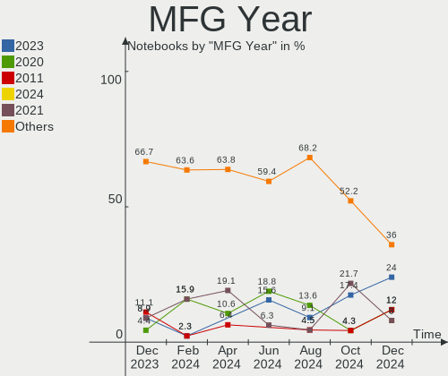

| Year    | Notebooks | Percent |
|---------|-----------|---------|
| 2020    | 6         | 17.14%  |
| 2019    | 4         | 11.43%  |
| 2016    | 4         | 11.43%  |
| 2012    | 4         | 11.43%  |
| 2018    | 3         | 8.57%   |
| 2011    | 3         | 8.57%   |
| 2017    | 2         | 5.71%   |
| 2013    | 2         | 5.71%   |
| 2010    | 2         | 5.71%   |
| 2009    | 2         | 5.71%   |
| 2021    | 1         | 2.86%   |
| 2014    | 1         | 2.86%   |
| Unknown | 1         | 2.86%   |

Form Factor
-----------

Physical design of the computer

| Name     | Notebooks | Percent |
|----------|-----------|---------|
| Notebook | 35        | 100%    |

Secure Boot
-----------

Enabled or disabled

| State    | Notebooks | Percent |
|----------|-----------|---------|
| Disabled | 35        | 100%    |

Coreboot
--------

Have coreboot on board

| Used | Notebooks | Percent |
|------|-----------|---------|
| No   | 35        | 100%    |

RAM Size
--------

Total RAM memory

| Size in GB | Notebooks | Percent |
|------------|-----------|---------|
| 4.01-8.0   | 15        | 42.86%  |
| 8.01-16.0  | 8         | 22.86%  |
| 3.01-4.0   | 7         | 20%     |
| 16.01-24.0 | 5         | 14.29%  |

RAM Used
--------

Used RAM memory

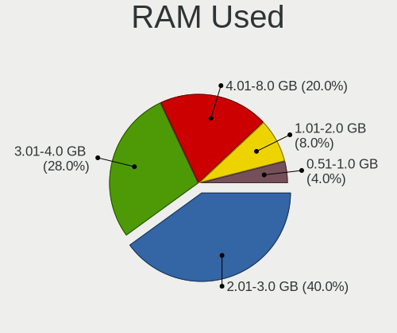

| Used GB  | Notebooks | Percent |
|----------|-----------|---------|
| 2.01-3.0 | 13        | 37.14%  |
| 1.01-2.0 | 13        | 37.14%  |
| 4.01-8.0 | 5         | 14.29%  |
| 3.01-4.0 | 3         | 8.57%   |
| 0.51-1.0 | 1         | 2.86%   |

Total Drives
------------

Number of drives on board

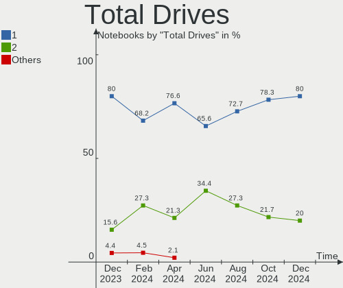

| Drives | Notebooks | Percent |
|--------|-----------|---------|
| 1      | 23        | 65.71%  |
| 2      | 10        | 28.57%  |
| 3      | 2         | 5.71%   |

Has CD-ROM
----------

Has CD-ROM on board

| Presented | Notebooks | Percent |
|-----------|-----------|---------|
| No        | 22        | 62.86%  |
| Yes       | 13        | 37.14%  |

Has Ethernet
------------

Has Ethernet on board

| Presented | Notebooks | Percent |
|-----------|-----------|---------|
| Yes       | 28        | 80%     |
| No        | 7         | 20%     |

Has WiFi
--------

Has WiFi module

| Presented | Notebooks | Percent |
|-----------|-----------|---------|
| Yes       | 35        | 100%    |

Has Bluetooth
-------------

Has Bluetooth module

| Presented | Notebooks | Percent |
|-----------|-----------|---------|
| Yes       | 26        | 74.29%  |
| No        | 9         | 25.71%  |

Location
--------

Country
-------

Geographic location (country)

| Country      | Notebooks | Percent |
|--------------|-----------|---------|
| USA          | 4         | 11.43%  |
| Russia       | 3         | 8.57%   |
| Germany      | 3         | 8.57%   |
| Brazil       | 3         | 8.57%   |
| Turkey       | 2         | 5.71%   |
| Switzerland  | 2         | 5.71%   |
| South Africa | 2         | 5.71%   |
| Poland       | 2         | 5.71%   |
| Mexico       | 2         | 5.71%   |
| India        | 2         | 5.71%   |
| France       | 2         | 5.71%   |
| Sri Lanka    | 1         | 2.86%   |
| Serbia       | 1         | 2.86%   |
| Iran         | 1         | 2.86%   |
| Indonesia    | 1         | 2.86%   |
| Greece       | 1         | 2.86%   |
| Finland      | 1         | 2.86%   |
| Egypt        | 1         | 2.86%   |
| Canada       | 1         | 2.86%   |

City
----

Geographic location (city)

| City            | Notebooks | Percent |
|-----------------|-----------|---------|
| Caruaru         | 2         | 5.71%   |
| Zurich          | 1         | 2.86%   |
| Winnenden       | 1         | 2.86%   |
| Warsaw          | 1         | 2.86%   |
| Versailles      | 1         | 2.86%   |
| Vern-sur-Seiche | 1         | 2.86%   |
| Vantaa          | 1         | 2.86%   |
| Trois-Rivières | 1         | 2.86%   |
| St Petersburg   | 1         | 2.86%   |
| Şowmeeh Sarā  | 1         | 2.86%   |
| Sleman          | 1         | 2.86%   |
| Seattle         | 1         | 2.86%   |
| Roodepoort      | 1         | 2.86%   |
| Queretaro       | 1         | 2.86%   |
| Pretoria        | 1         | 2.86%   |
| Port Said       | 1         | 2.86%   |
| Ordu            | 1         | 2.86%   |
| Murfreesboro    | 1         | 2.86%   |
| Mumbai          | 1         | 2.86%   |
| Moscow          | 1         | 2.86%   |
| Mexico City     | 1         | 2.86%   |
| Lyss            | 1         | 2.86%   |
| Lubawa          | 1         | 2.86%   |
| Kirov           | 1         | 2.86%   |
| Kayseri         | 1         | 2.86%   |
| Jaciara         | 1         | 2.86%   |
| Hyderabad       | 1         | 2.86%   |
| Duisburg        | 1         | 2.86%   |
| Cooperstown     | 1         | 2.86%   |
| Colombo         | 1         | 2.86%   |
| Chania          | 1         | 2.86%   |
| Braunfels       | 1         | 2.86%   |
| Belgrade        | 1         | 2.86%   |
| Avondale        | 1         | 2.86%   |

Drives
------

Drive Vendor
------------

Hard drive vendors

| Vendor              | Notebooks | Drives | Percent |
|---------------------|-----------|--------|---------|
| Seagate             | 12        | 12     | 24.49%  |
| Samsung Electronics | 6         | 6      | 12.24%  |
| WDC                 | 4         | 4      | 8.16%   |
| Unknown             | 4         | 4      | 8.16%   |
| Kingston            | 4         | 4      | 8.16%   |
| Hitachi             | 3         | 3      | 6.12%   |
| LITEONIT            | 2         | 2      | 4.08%   |
| KIOXIA              | 2         | 2      | 4.08%   |
| Apple               | 2         | 2      | 4.08%   |
| ZTE                 | 1         | 1      | 2.04%   |
| YMTC                | 1         | 1      | 2.04%   |
| UMIS                | 1         | 1      | 2.04%   |
| Toshiba             | 1         | 1      | 2.04%   |
| SK Hynix            | 1         | 1      | 2.04%   |
| Patriot             | 1         | 1      | 2.04%   |
| Micron Technology   | 1         | 1      | 2.04%   |
| Crucial             | 1         | 1      | 2.04%   |
| A-DATA Technology   | 1         | 1      | 2.04%   |
| Unknown             | 1         | 1      | 2.04%   |

Drive Model
-----------

Hard drive models

| Model                                   | Notebooks | Percent |
|-----------------------------------------|-----------|---------|
| Seagate ST1000LM035-1RK172 1TB          | 4         | 8.16%   |
| Seagate ST9320423AS 320GB               | 3         | 6.12%   |
| ZTE MMC Storage 8GB                     | 1         | 2.04%   |
| YMTC PC005 512GB                        | 1         | 2.04%   |
| WDC WD5000BEVT-22ZAT0 500GB             | 1         | 2.04%   |
| WDC WD3200BEVS-26VAT0 320GB             | 1         | 2.04%   |
| WDC WD10SPZX-60Z10T0 1TB                | 1         | 2.04%   |
| WDC WD10JPVX-22JC3T0 1TB                | 1         | 2.04%   |
| Unknown SD/MMC/MS PRO 32GB              | 1         | 2.04%   |
| Unknown MMC Card  7GB                   | 1         | 2.04%   |
| Unknown MMC Card  16GB                  | 1         | 2.04%   |
| Unknown DA4064  64GB                    | 1         | 2.04%   |
| UMIS RPFTJ128PDD2EWX 128GB              | 1         | 2.04%   |
| Toshiba KSG60ZMV256G M.2 2280 256GB SSD | 1         | 2.04%   |
| SK Hynix BC501 NVMe 256GB               | 1         | 2.04%   |
| Seagate ST9500420AS 500GB               | 1         | 2.04%   |
| Seagate ST500LT012-1DG142 500GB         | 1         | 2.04%   |
| Seagate ST1000LM049-2GH172 1TB          | 1         | 2.04%   |
| Seagate ST1000LM048-2E7172 1TB          | 1         | 2.04%   |
| Seagate Expansion 320GB                 | 1         | 2.04%   |
| Samsung SSD 980 PRO 1TB                 | 1         | 2.04%   |
| Samsung MZVPV256HDGL-000H1 256GB        | 1         | 2.04%   |
| Samsung MZVLQ1T0HALB-00000 1TB          | 1         | 2.04%   |
| Samsung MZNLN256HMHQ-000H1 256GB SSD    | 1         | 2.04%   |
| Samsung MZNLN256HAJQ-000H1 256GB SSD    | 1         | 2.04%   |
| Samsung HN-M101MBB 1TB                  | 1         | 2.04%   |
| Patriot Burst 240GB SSD                 | 1         | 2.04%   |
| Micron 2200_MTFDHBA512TCK 512GB         | 1         | 2.04%   |
| LITEONIT LCS-256M6S 2.5 7mm 256GB SSD   | 1         | 2.04%   |
| LITEONIT LCS-128M6S-HP 128GB SSD        | 1         | 2.04%   |
| KIOXIA NVMe SSD Drive 256GB             | 1         | 2.04%   |
| KIOXIA KBG40ZNS256G NVMe 256GB          | 1         | 2.04%   |
| Kingston SNVS250G 250GB                 | 1         | 2.04%   |
| Kingston SA400S37480G 480GB SSD         | 1         | 2.04%   |
| Kingston SA400S37240G 240GB SSD         | 1         | 2.04%   |
| Kingston OM8PCP31024F-AI1 1TB           | 1         | 2.04%   |
| Hitachi HTS547575A9E384 752GB           | 1         | 2.04%   |
| Hitachi HTS545050B9A300 500GB           | 1         | 2.04%   |
| Hitachi HTS543232L9A300 320GB           | 1         | 2.04%   |
| Crucial CT1000P5SSD8 1TB                | 1         | 2.04%   |
| Apple SSD SM0256G 256GB                 | 1         | 2.04%   |
| Apple SSD AP0512M 500GB                 | 1         | 2.04%   |
| A-DATA SX8200PNP 2TB                    | 1         | 2.04%   |
| Unknown                                 | 1         | 2.04%   |

HDD Vendor
----------

Hard disk drive vendors

| Vendor              | Notebooks | Drives | Percent |
|---------------------|-----------|--------|---------|
| Seagate             | 12        | 12     | 57.14%  |
| WDC                 | 4         | 4      | 19.05%  |
| Hitachi             | 3         | 3      | 14.29%  |
| Unknown             | 1         | 1      | 4.76%   |
| Samsung Electronics | 1         | 1      | 4.76%   |

SSD Vendor
----------

Solid state drive vendors

| Vendor              | Notebooks | Drives | Percent |
|---------------------|-----------|--------|---------|
| Samsung Electronics | 2         | 2      | 20%     |
| LITEONIT            | 2         | 2      | 20%     |
| Kingston            | 2         | 2      | 20%     |
| Toshiba             | 1         | 1      | 10%     |
| Patriot             | 1         | 1      | 10%     |
| Apple               | 1         | 1      | 10%     |
| Unknown             | 1         | 1      | 10%     |

Drive Kind
----------

HDD or SSD

| Kind    | Notebooks | Drives | Percent |
|---------|-----------|--------|---------|
| HDD     | 20        | 21     | 42.55%  |
| NVMe    | 13        | 14     | 27.66%  |
| SSD     | 10        | 10     | 21.28%  |
| MMC     | 3         | 3      | 6.38%   |
| Unknown | 1         | 1      | 2.13%   |

Drive Connector
---------------

SATA, SAS, NVMe, etc.

| Type | Notebooks | Drives | Percent |
|------|-----------|--------|---------|
| SATA | 25        | 29     | 56.82%  |
| NVMe | 13        | 14     | 29.55%  |
| SAS  | 3         | 3      | 6.82%   |
| MMC  | 3         | 3      | 6.82%   |

Drive Size
----------

Size of hard drive

| Size in TB | Notebooks | Drives | Percent |
|------------|-----------|--------|---------|
| 0.01-0.5   | 19        | 21     | 65.52%  |
| 0.51-1.0   | 10        | 10     | 34.48%  |

Space Total
-----------

Amount of disk space available on the file system

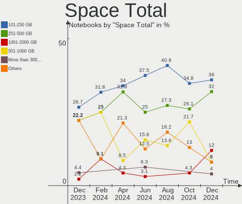

| Size in GB     | Notebooks | Percent |
|----------------|-----------|---------|
| 101-250        | 14        | 40%     |
| 251-500        | 9         | 25.71%  |
| 21-50          | 6         | 17.14%  |
| 501-1000       | 2         | 5.71%   |
| 51-100         | 2         | 5.71%   |
| More than 3000 | 1         | 2.86%   |
| 1001-2000      | 1         | 2.86%   |

Space Used
----------

Amount of used disk space

| Used GB   | Notebooks | Percent |
|-----------|-----------|---------|
| 1-20      | 18        | 51.43%  |
| 21-50     | 8         | 22.86%  |
| 101-250   | 3         | 8.57%   |
| 251-500   | 2         | 5.71%   |
| 51-100    | 2         | 5.71%   |
| 2001-3000 | 1         | 2.86%   |
| 1001-2000 | 1         | 2.86%   |

Malfunc. Drives
---------------

Drive models with a malfunction

| Model                                   | Notebooks | Drives | Percent |
|-----------------------------------------|-----------|--------|---------|
| Seagate ST9320423AS 320GB               | 3         | 3      | 27.27%  |
| Seagate ST1000LM035-1RK172 1TB          | 2         | 2      | 18.18%  |
| WDC WD5000BEVT-22ZAT0 500GB             | 1         | 1      | 9.09%   |
| Toshiba KSG60ZMV256G M.2 2280 256GB SSD | 1         | 1      | 9.09%   |
| Seagate ST9500420AS 500GB               | 1         | 1      | 9.09%   |
| Seagate ST1000LM049-2GH172 1TB          | 1         | 1      | 9.09%   |
| Hitachi HTS547575A9E384 752GB           | 1         | 1      | 9.09%   |
| Hitachi HTS543232L9A300 320GB           | 1         | 1      | 9.09%   |

Malfunc. Drive Vendor
---------------------

Vendors of faulty drives

| Vendor  | Notebooks | Drives | Percent |
|---------|-----------|--------|---------|
| Seagate | 7         | 7      | 63.64%  |
| Hitachi | 2         | 2      | 18.18%  |
| WDC     | 1         | 1      | 9.09%   |
| Toshiba | 1         | 1      | 9.09%   |

Malfunc. HDD Vendor
-------------------

Vendors of faulty HDD drives

| Vendor  | Notebooks | Drives | Percent |
|---------|-----------|--------|---------|
| Seagate | 7         | 7      | 70%     |
| Hitachi | 2         | 2      | 20%     |
| WDC     | 1         | 1      | 10%     |

Malfunc. Drive Kind
-------------------

Kinds of faulty drives

| Kind | Notebooks | Drives | Percent |
|------|-----------|--------|---------|
| HDD  | 10        | 10     | 90.91%  |
| SSD  | 1         | 1      | 9.09%   |

Failed Drives
-------------

Failed drive models

Zero info for selected period =(

Failed Drive Vendor
-------------------

Failed drive vendors

Zero info for selected period =(

Drive Status
------------

Number of failed and malfunc. drives

| Status   | Notebooks | Drives | Percent |
|----------|-----------|--------|---------|
| Works    | 19        | 24     | 45.24%  |
| Detected | 12        | 14     | 28.57%  |
| Malfunc  | 11        | 11     | 26.19%  |

Storage controller
------------------

Storage Vendor
--------------

Storage controller vendors

| Vendor                      | Notebooks | Percent |
|-----------------------------|-----------|---------|
| Intel                       | 27        | 61.36%  |
| Samsung Electronics         | 4         | 9.09%   |
| KIOXIA                      | 2         | 4.55%   |
| Kingston Technology Company | 2         | 4.55%   |
| AMD                         | 2         | 4.55%   |
| Yangtze Memory Technologies | 1         | 2.27%   |
| Union Memory (Shenzhen)     | 1         | 2.27%   |
| SK Hynix                    | 1         | 2.27%   |
| Micron/Crucial Technology   | 1         | 2.27%   |
| Micron Technology           | 1         | 2.27%   |
| Apple                       | 1         | 2.27%   |
| ADATA Technology            | 1         | 2.27%   |

Storage Model
-------------

Storage controller models

| Model                                                                            | Notebooks | Percent |
|----------------------------------------------------------------------------------|-----------|---------|
| Intel 82801 Mobile SATA Controller [RAID mode]                                   | 6         | 13.64%  |
| Intel Sunrise Point-LP SATA Controller [AHCI mode]                               | 5         | 11.36%  |
| Intel 7 Series Chipset Family 6-port SATA Controller [AHCI mode]                 | 3         | 6.82%   |
| KIOXIA Non-Volatile memory controller                                            | 2         | 4.55%   |
| Intel 82801IBM/IEM (ICH9M/ICH9M-E) 4 port SATA Controller [AHCI mode]            | 2         | 4.55%   |
| Intel 6 Series/C200 Series Chipset Family 6 port Mobile SATA AHCI Controller     | 2         | 4.55%   |
| AMD FCH SATA Controller [AHCI mode]                                              | 2         | 4.55%   |
| Yangtze Memory Non-Volatile memory controller                                    | 1         | 2.27%   |
| Union Memory (Shenzhen) Non-Volatile memory controller                           | 1         | 2.27%   |
| SK Hynix BC501 NVMe Solid State Drive                                            | 1         | 2.27%   |
| Samsung NVMe SSD Controller SM951/PM951                                          | 1         | 2.27%   |
| Samsung NVMe SSD Controller PM9A1/PM9A3/980PRO                                   | 1         | 2.27%   |
| Samsung NVMe SSD Controller 980                                                  | 1         | 2.27%   |
| Samsung Electronics SATA controller                                              | 1         | 2.27%   |
| Micron/Crucial Non-Volatile memory controller                                    | 1         | 2.27%   |
| Micron Non-Volatile memory controller                                            | 1         | 2.27%   |
| Kingston Company Company Non-Volatile memory controller                          | 1         | 2.27%   |
| Kingston Company SNVS2000G [NV1 NVMe PCIe SSD 2TB]                               | 1         | 2.27%   |
| Intel Ice Lake-LP SATA Controller [AHCI mode]                                    | 1         | 2.27%   |
| Intel HM170/QM170 Chipset SATA Controller [AHCI Mode]                            | 1         | 2.27%   |
| Intel Comet Lake SATA AHCI Controller                                            | 1         | 2.27%   |
| Intel Cannon Point-LP SATA Controller [AHCI Mode]                                | 1         | 2.27%   |
| Intel Cannon Lake Mobile PCH SATA AHCI Controller                                | 1         | 2.27%   |
| Intel Atom/Celeron/Pentium Processor x5-E8000/J3xxx/N3xxx Series SATA Controller | 1         | 2.27%   |
| Intel 82801IBM/IEM (ICH9M/ICH9M-E) 2 port SATA Controller [IDE mode]             | 1         | 2.27%   |
| Intel 8 Series/C220 Series Chipset Family 6-port SATA Controller 1 [AHCI mode]   | 1         | 2.27%   |
| Intel 8 Series SATA Controller 1 [AHCI mode]                                     | 1         | 2.27%   |
| Apple ANS2 NVMe Controller                                                       | 1         | 2.27%   |
| ADATA XPG SX8200 Pro PCIe Gen3x4 M.2 2280 Solid State Drive                      | 1         | 2.27%   |

Storage Kind
------------

Kind of storage controller (IDE, SATA, NVMe, SAS, ...)

| Kind | Notebooks | Percent |
|------|-----------|---------|
| SATA | 23        | 53.49%  |
| NVMe | 13        | 30.23%  |
| RAID | 6         | 13.95%  |
| IDE  | 1         | 2.33%   |

Processor
---------

CPU Vendor
----------

Processor vendors

| Vendor | Notebooks | Percent |
|--------|-----------|---------|
| Intel  | 31        | 88.57%  |
| AMD    | 3         | 8.57%   |
| ARM    | 1         | 2.86%   |

CPU Model
---------

Processor models

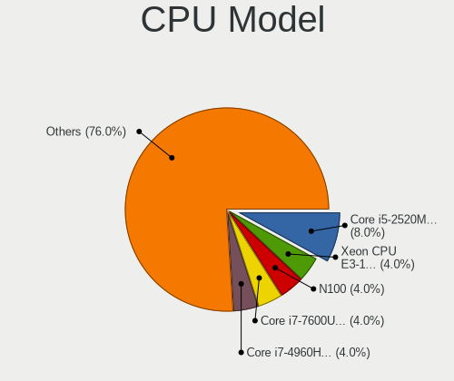

| Model                                       | Notebooks | Percent |
|---------------------------------------------|-----------|---------|
| Intel Pentium Dual-Core CPU T4300 @ 2.10GHz | 2         | 5.71%   |
| Intel Core i5-10210U CPU @ 1.60GHz          | 2         | 5.71%   |
| AMD Ryzen 7 4700U with Radeon Graphics      | 2         | 5.71%   |
| Intel Pentium CPU N3710 @ 1.60GHz           | 1         | 2.86%   |
| Intel Core i7-8565U CPU @ 1.80GHz           | 1         | 2.86%   |
| Intel Core i7-7700HQ CPU @ 2.80GHz          | 1         | 2.86%   |
| Intel Core i7-6600U CPU @ 2.60GHz           | 1         | 2.86%   |
| Intel Core i7-10870H CPU @ 2.20GHz          | 1         | 2.86%   |
| Intel Core i7-1065G7 CPU @ 1.30GHz          | 1         | 2.86%   |
| Intel Core i5-8300H CPU @ 2.30GHz           | 1         | 2.86%   |
| Intel Core i5-8265U CPU @ 1.60GHz           | 1         | 2.86%   |
| Intel Core i5-8259U CPU @ 2.30GHz           | 1         | 2.86%   |
| Intel Core i5-8250U CPU @ 1.60GHz           | 1         | 2.86%   |
| Intel Core i5-6300U CPU @ 2.40GHz           | 1         | 2.86%   |
| Intel Core i5-5257U CPU @ 2.70GHz           | 1         | 2.86%   |
| Intel Core i5-4210U CPU @ 1.70GHz           | 1         | 2.86%   |
| Intel Core i5-4200M CPU @ 2.50GHz           | 1         | 2.86%   |
| Intel Core i5-3340M CPU @ 2.70GHz           | 1         | 2.86%   |
| Intel Core i5-3320M CPU @ 2.60GHz           | 1         | 2.86%   |
| Intel Core i5-3230M CPU @ 2.60GHz           | 1         | 2.86%   |
| Intel Core i5-2430M CPU @ 2.40GHz           | 1         | 2.86%   |
| Intel Core i5-2410M CPU @ 2.30GHz           | 1         | 2.86%   |
| Intel Core i5-10300H CPU @ 2.50GHz          | 1         | 2.86%   |
| Intel Core i5 CPU M 540 @ 2.53GHz           | 1         | 2.86%   |
| Intel Core i3-7100U CPU @ 2.40GHz           | 1         | 2.86%   |
| Intel Core i3-6006U CPU @ 2.00GHz           | 1         | 2.86%   |
| Intel Core i3-3217U CPU @ 1.80GHz           | 1         | 2.86%   |
| Intel Core i3-2370M CPU @ 2.40GHz           | 1         | 2.86%   |
| Intel Core i3-2310M CPU @ 2.10GHz           | 1         | 2.86%   |
| Intel Core 2 Duo CPU T6670 @ 2.20GHz        | 1         | 2.86%   |
| ARM Processor                               | 1         | 2.86%   |
| AMD Ryzen 5 4600H with Radeon Graphics      | 1         | 2.86%   |

CPU Model Family
----------------

Processor model prefix

| Model                   | Notebooks | Percent |
|-------------------------|-----------|---------|
| Intel Core i5           | 17        | 48.57%  |
| Intel Core i7           | 5         | 14.29%  |
| Intel Core i3           | 5         | 14.29%  |
| Intel Pentium Dual-Core | 2         | 5.71%   |
| AMD Ryzen 7             | 2         | 5.71%   |
| Other                   | 1         | 2.86%   |
| Intel Pentium           | 1         | 2.86%   |
| Intel Core 2 Duo        | 1         | 2.86%   |
| AMD Ryzen 5             | 1         | 2.86%   |

CPU Cores
---------

Number of processor cores

| Number | Notebooks | Percent |
|--------|-----------|---------|
| 2      | 20        | 57.14%  |
| 4      | 11        | 31.43%  |
| 8      | 3         | 8.57%   |
| 6      | 1         | 2.86%   |

CPU Sockets
-----------

Number of sockets

| Number | Notebooks | Percent |
|--------|-----------|---------|
| 1      | 35        | 100%    |

CPU Threads
-----------

Threads per core (Hyper-Threading)

| Number | Notebooks | Percent |
|--------|-----------|---------|
| 2      | 28        | 80%     |
| 1      | 7         | 20%     |

CPU Op-Modes
------------

CPU Operation Modes (32-bit, 64-bit)

| Op mode        | Notebooks | Percent |
|----------------|-----------|---------|
| 32-bit, 64-bit | 35        | 100%    |

CPU Microcode
-------------

Microcode number

| Number     | Notebooks | Percent |
|------------|-----------|---------|
| 0x806ec    | 4         | 11.43%  |
| 0x406e3    | 3         | 8.57%   |
| 0x306a9    | 3         | 8.57%   |
| 0x206a7    | 3         | 8.57%   |
| 0x1067a    | 3         | 8.57%   |
| Unknown    | 3         | 8.57%   |
| 0xa0652    | 2         | 5.71%   |
| 0x806ea    | 2         | 5.71%   |
| 0x906ea    | 1         | 2.86%   |
| 0x906e9    | 1         | 2.86%   |
| 0x806e9    | 1         | 2.86%   |
| 0x706e5    | 1         | 2.86%   |
| 0x406c4    | 1         | 2.86%   |
| 0x40651    | 1         | 2.86%   |
| 0x306d4    | 1         | 2.86%   |
| 0x306c3    | 1         | 2.86%   |
| 0x20652    | 1         | 2.86%   |
| 0x08600106 | 1         | 2.86%   |
| 0x08600104 | 1         | 2.86%   |
| 0x08600102 | 1         | 2.86%   |

CPU Microarch
-------------

Microarchitecture

| Name        | Notebooks | Percent |
|-------------|-----------|---------|
| KabyLake    | 9         | 25.71%  |
| SandyBridge | 4         | 11.43%  |
| IvyBridge   | 4         | 11.43%  |
| Zen 2       | 3         | 8.57%   |
| Skylake     | 3         | 8.57%   |
| Penryn      | 3         | 8.57%   |
| Haswell     | 2         | 5.71%   |
| CometLake   | 2         | 5.71%   |
| Westmere    | 1         | 2.86%   |
| Silvermont  | 1         | 2.86%   |
| IceLake     | 1         | 2.86%   |
| Broadwell   | 1         | 2.86%   |
| Unknown     | 1         | 2.86%   |

Graphics
--------

GPU Vendor
----------

Vendors of graphics cards

| Vendor | Notebooks | Percent |
|--------|-----------|---------|
| Intel  | 30        | 63.83%  |
| Nvidia | 10        | 21.28%  |
| AMD    | 7         | 14.89%  |

GPU Model
---------

Graphics card models

| Model                                                                                    | Notebooks | Percent |
|------------------------------------------------------------------------------------------|-----------|---------|
| Intel 3rd Gen Core processor Graphics Controller                                         | 4         | 8.51%   |
| Intel 2nd Generation Core Processor Family Integrated Graphics Controller                | 4         | 8.51%   |
| Intel Skylake GT2 [HD Graphics 520]                                                      | 3         | 6.38%   |
| AMD Renoir                                                                               | 3         | 6.38%   |
| Nvidia GP107M [GeForce GTX 1050 Mobile]                                                  | 2         | 4.26%   |
| Intel WhiskeyLake-U GT2 [UHD Graphics 620]                                               | 2         | 4.26%   |
| Intel Mobile 4 Series Chipset Integrated Graphics Controller                             | 2         | 4.26%   |
| Intel CometLake-U GT2 [UHD Graphics]                                                     | 2         | 4.26%   |
| Intel CometLake-H GT2 [UHD Graphics]                                                     | 2         | 4.26%   |
| Nvidia TU117M [GeForce GTX 1650 Mobile / Max-Q]                                          | 1         | 2.13%   |
| Nvidia TU117M                                                                            | 1         | 2.13%   |
| Nvidia GP108M [GeForce MX250]                                                            | 1         | 2.13%   |
| Nvidia GP108M [GeForce MX230]                                                            | 1         | 2.13%   |
| Nvidia GM108M [GeForce 940MX]                                                            | 1         | 2.13%   |
| Nvidia GF117M [GeForce 610M/710M/810M/820M / GT 620M/625M/630M/720M]                     | 1         | 2.13%   |
| Nvidia GF108GLM [NVS 5200M]                                                              | 1         | 2.13%   |
| Nvidia GA106M [GeForce RTX 3060 Mobile / Max-Q]                                          | 1         | 2.13%   |
| Intel UHD Graphics 620                                                                   | 1         | 2.13%   |
| Intel Iris Plus Graphics G7                                                              | 1         | 2.13%   |
| Intel Iris Graphics 6100                                                                 | 1         | 2.13%   |
| Intel HD Graphics 630                                                                    | 1         | 2.13%   |
| Intel HD Graphics 620                                                                    | 1         | 2.13%   |
| Intel Haswell-ULT Integrated Graphics Controller                                         | 1         | 2.13%   |
| Intel Core Processor Integrated Graphics Controller                                      | 1         | 2.13%   |
| Intel CoffeeLake-U GT3e [Iris Plus Graphics 655]                                         | 1         | 2.13%   |
| Intel CoffeeLake-H GT2 [UHD Graphics 630]                                                | 1         | 2.13%   |
| Intel Atom/Celeron/Pentium Processor x5-E8000/J3xxx/N3xxx Integrated Graphics Controller | 1         | 2.13%   |
| Intel 4th Gen Core Processor Integrated Graphics Controller                              | 1         | 2.13%   |
| AMD Thames [Radeon HD 7500M/7600M Series]                                                | 1         | 2.13%   |
| AMD Seymour [Radeon HD 6400M/7400M Series]                                               | 1         | 2.13%   |
| AMD RV710/M92 [Mobility Radeon HD 4530/4570/545v]                                        | 1         | 2.13%   |
| AMD Jet PRO [Radeon R5 M230 / R7 M260DX / Radeon 520 Mobile]                             | 1         | 2.13%   |

GPU Combo
---------

Combinations of graphics cards

| Name           | Notebooks | Percent |
|----------------|-----------|---------|
| 1 x Intel      | 17        | 48.57%  |
| Intel + Nvidia | 10        | 28.57%  |
| 1 x AMD        | 4         | 11.43%  |
| Intel + AMD    | 3         | 8.57%   |
| Other          | 1         | 2.86%   |

GPU Driver
----------

Free vs proprietary

| Driver      | Notebooks | Percent |
|-------------|-----------|---------|
| Free        | 33        | 94.29%  |
| Proprietary | 1         | 2.86%   |
| Unknown     | 1         | 2.86%   |

GPU Memory
----------

Total video memory

| Size in GB | Notebooks | Percent |
|------------|-----------|---------|
| Unknown    | 21        | 60%     |
| 3.01-4.0   | 4         | 11.43%  |
| 1.01-2.0   | 4         | 11.43%  |
| 0.01-0.5   | 4         | 11.43%  |
| 0.51-1.0   | 2         | 5.71%   |

Monitor
-------

Monitor Vendor
--------------

Monitor vendors

| Vendor              | Notebooks | Percent |
|---------------------|-----------|---------|
| LG Display          | 12        | 29.27%  |
| Samsung Electronics | 6         | 14.63%  |
| BOE                 | 5         | 12.2%   |
| Chimei Innolux      | 4         | 9.76%   |
| AU Optronics        | 4         | 9.76%   |
| Goldstar            | 2         | 4.88%   |
| Apple               | 2         | 4.88%   |
| Sharp               | 1         | 2.44%   |
| Philips             | 1         | 2.44%   |
| Hewlett-Packard     | 1         | 2.44%   |
| Dell                | 1         | 2.44%   |
| AOC                 | 1         | 2.44%   |
| Acer                | 1         | 2.44%   |

Monitor Model
-------------

Monitor models

| Model                                                                | Notebooks | Percent |
|----------------------------------------------------------------------|-----------|---------|
| AU Optronics LCD Monitor AUO38ED 1920x1080 344x193mm 15.5-inch       | 2         | 4.88%   |
| Sharp LQ156M1JW01 SHP14C3 1920x1080 344x194mm 15.5-inch              | 1         | 2.44%   |
| Samsung Electronics SyncMaster SAM02AD 1440x900 410x257mm 19.1-inch  | 1         | 2.44%   |
| Samsung Electronics SMB1630N SAM0630 1366x768 344x194mm 15.5-inch    | 1         | 2.44%   |
| Samsung Electronics LCD Monitor SEC544B 1600x900 310x174mm 14.0-inch | 1         | 2.44%   |
| Samsung Electronics LCD Monitor SEC345A 1366x768 309x174mm 14.0-inch | 1         | 2.44%   |
| Samsung Electronics LCD Monitor SEC3046 1366x768 344x193mm 15.5-inch | 1         | 2.44%   |
| Samsung Electronics LCD Monitor SDC4742 1366x768 309x174mm 14.0-inch | 1         | 2.44%   |
| Philips HDMI TV PHL4650 1280x768 576x324mm 26.0-inch                 | 1         | 2.44%   |
| LG Display LCD Monitor LGD062E 1920x1080 344x194mm 15.5-inch         | 1         | 2.44%   |
| LG Display LCD Monitor LGD05F6 1920x1080 309x174mm 14.0-inch         | 1         | 2.44%   |
| LG Display LCD Monitor LGD04E8 1920x1080 382x215mm 17.3-inch         | 1         | 2.44%   |
| LG Display LCD Monitor LGD0498 1366x768 277x156mm 12.5-inch          | 1         | 2.44%   |
| LG Display LCD Monitor LGD0456 1366x768 340x190mm 15.3-inch          | 1         | 2.44%   |
| LG Display LCD Monitor LGD03E0 1366x768 345x194mm 15.6-inch          | 1         | 2.44%   |
| LG Display LCD Monitor LGD0395 1366x768 344x194mm 15.5-inch          | 1         | 2.44%   |
| LG Display LCD Monitor LGD0384 1366x768 344x194mm 15.5-inch          | 1         | 2.44%   |
| LG Display LCD Monitor LGD032C 1920x1080 344x194mm 15.5-inch         | 1         | 2.44%   |
| LG Display LCD Monitor LGD02F2 1366x768 344x194mm 15.5-inch          | 1         | 2.44%   |
| LG Display LCD Monitor LGD02DF 1600x900 310x174mm 14.0-inch          | 1         | 2.44%   |
| LG Display LCD Monitor LGD02AD 1366x768 344x194mm 15.5-inch          | 1         | 2.44%   |
| Hewlett-Packard 22w HPN342E 1920x1080 476x268mm 21.5-inch            | 1         | 2.44%   |
| Goldstar W1934 GSM4B7A 1440x900 410x256mm 19.0-inch                  | 1         | 2.44%   |
| Goldstar HD GSM5ACB 1366x768 410x230mm 18.5-inch                     | 1         | 2.44%   |
| Dell P2213 DELF041 1680x1050 473x296mm 22.0-inch                     | 1         | 2.44%   |
| Chimei Innolux LCD Monitor CMN176E 1920x1080 381x214mm 17.2-inch     | 1         | 2.44%   |
| Chimei Innolux LCD Monitor CMN15D6 1920x1080 344x193mm 15.5-inch     | 1         | 2.44%   |
| Chimei Innolux LCD Monitor CMN15C6 1366x768 344x193mm 15.5-inch      | 1         | 2.44%   |
| Chimei Innolux LCD Monitor CMN14D5 1920x1080 309x173mm 13.9-inch     | 1         | 2.44%   |
| BOE LCD Monitor BOE08E7 1920x1080 344x193mm 15.5-inch                | 1         | 2.44%   |
| BOE LCD Monitor BOE0878 1920x1080 355x200mm 16.0-inch                | 1         | 2.44%   |
| BOE LCD Monitor BOE0802 1920x1080 344x193mm 15.5-inch                | 1         | 2.44%   |
| BOE LCD Monitor BOE06FB 1920x1080 344x194mm 15.5-inch                | 1         | 2.44%   |
| BOE LCD Monitor BOE06E2 1920x1080 309x173mm 13.9-inch                | 1         | 2.44%   |
| AU Optronics LCD Monitor AUO413D 1920x1080 309x173mm 13.9-inch       | 1         | 2.44%   |
| AU Optronics LCD Monitor AUO26EC 1366x768 344x193mm 15.5-inch        | 1         | 2.44%   |
| Apple Color LCD APPA03E 2560x1600 286x179mm 13.3-inch                | 1         | 2.44%   |
| Apple Color LCD APPA029 2560x1600 286x179mm 13.3-inch                | 1         | 2.44%   |
| AOC 2460 AOC2460 1920x1080 531x299mm 24.0-inch                       | 1         | 2.44%   |
| Acer B243H ACR00D2 1920x1080 531x298mm 24.0-inch                     | 1         | 2.44%   |

Monitor Resolution
------------------

Monitor screen resolution

| Resolution         | Notebooks | Percent |
|--------------------|-----------|---------|
| 1920x1080 (FHD)    | 17        | 44.74%  |
| 1366x768 (WXGA)    | 13        | 34.21%  |
| 2560x1600          | 2         | 5.26%   |
| 1600x900 (HD+)     | 2         | 5.26%   |
| 1440x900 (WXGA+)   | 2         | 5.26%   |
| 1680x1050 (WSXGA+) | 1         | 2.63%   |
| 1280x768           | 1         | 2.63%   |

Monitor Diagonal
----------------

Diagonal size in inches

| Inches | Notebooks | Percent |
|--------|-----------|---------|
| 15     | 18        | 45%     |
| 13     | 5         | 12.5%   |
| 14     | 4         | 10%     |
| 17     | 3         | 7.5%    |
| 24     | 2         | 5%      |
| 19     | 2         | 5%      |
| 34     | 1         | 2.5%    |
| 22     | 1         | 2.5%    |
| 21     | 1         | 2.5%    |
| 18     | 1         | 2.5%    |
| 16     | 1         | 2.5%    |
| 12     | 1         | 2.5%    |

Monitor Width
-------------

Physical width

| Width in mm | Notebooks | Percent |
|-------------|-----------|---------|
| 301-350     | 25        | 62.5%   |
| 401-500     | 5         | 12.5%   |
| 351-400     | 4         | 10%     |
| 201-300     | 3         | 7.5%    |
| 501-600     | 2         | 5%      |
| 701-800     | 1         | 2.5%    |

Aspect Ratio
------------

Proportional relationship between the width and the height

| Ratio | Notebooks | Percent |
|-------|-----------|---------|
| 16/9  | 31        | 83.78%  |
| 16/10 | 5         | 13.51%  |
| 3/2   | 1         | 2.7%    |

Monitor Area
------------

Area in inch²

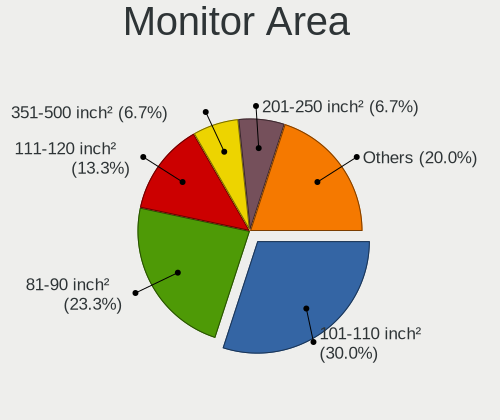

| Area in inch² | Notebooks | Percent |
|----------------|-----------|---------|
| 101-110        | 19        | 47.5%   |
| 81-90          | 8         | 20%     |
| 201-250        | 3         | 7.5%    |
| 121-130        | 3         | 7.5%    |
| 151-200        | 2         | 5%      |
| 71-80          | 1         | 2.5%    |
| 61-70          | 1         | 2.5%    |
| 251-300        | 1         | 2.5%    |
| 141-150        | 1         | 2.5%    |
| 501-1000       | 1         | 2.5%    |

Pixel Density
-------------

Pixels per inch

| Density | Notebooks | Percent |
|---------|-----------|---------|
| 121-160 | 18        | 46.15%  |
| 101-120 | 12        | 30.77%  |
| 51-100  | 6         | 15.38%  |
| 161-240 | 2         | 5.13%   |
| 1-50    | 1         | 2.56%   |

Multiple Monitors
-----------------

Total monitors connected

| Total | Notebooks | Percent |
|-------|-----------|---------|
| 1     | 27        | 77.14%  |
| 2     | 8         | 22.86%  |

Network
-------

Net Controller Vendor
---------------------

Controller vendors

| Vendor                          | Notebooks | Percent |
|---------------------------------|-----------|---------|
| Realtek Semiconductor           | 17        | 27.42%  |
| Intel                           | 16        | 25.81%  |
| Qualcomm Atheros                | 12        | 19.35%  |
| Ralink                          | 3         | 4.84%   |
| Broadcom                        | 3         | 4.84%   |
| Qualcomm Atheros Communications | 2         | 3.23%   |
| ZTE WCDMA Technologies MSM      | 1         | 1.61%   |
| TP-Link                         | 1         | 1.61%   |
| Samsung Electronics             | 1         | 1.61%   |
| MediaTek                        | 1         | 1.61%   |
| Marvell Technology Group        | 1         | 1.61%   |
| Hewlett-Packard                 | 1         | 1.61%   |
| DisplayLink                     | 1         | 1.61%   |
| Dell                            | 1         | 1.61%   |
| ASIX Electronics                | 1         | 1.61%   |

Net Controller Model
--------------------

Controller models

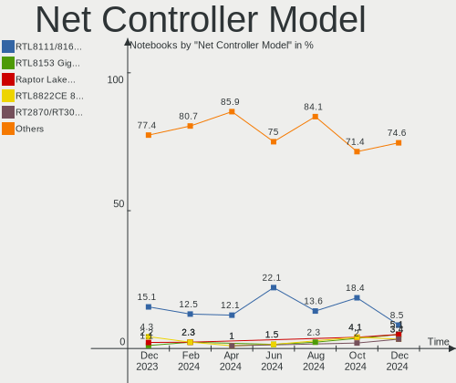

| Model                                                             | Notebooks | Percent |
|-------------------------------------------------------------------|-----------|---------|
| Realtek RTL810xE PCI Express Fast Ethernet controller             | 8         | 10.81%  |
| Realtek RTL8111/8168/8411 PCI Express Gigabit Ethernet Controller | 7         | 9.46%   |
| Qualcomm Atheros QCA9565 / AR9565 Wireless Network Adapter        | 4         | 5.41%   |
| Intel Wi-Fi 6 AX200                                               | 3         | 4.05%   |
| Realtek RTL8814AU 802.11a/b/g/n/ac Wireless Adapter               | 2         | 2.7%    |
| Ralink RT3290 Wireless 802.11n 1T/1R PCIe                         | 2         | 2.7%    |
| Qualcomm Atheros QCA9377 802.11ac Wireless Network Adapter        | 2         | 2.7%    |
| Qualcomm Atheros AR9271 802.11n                                   | 2         | 2.7%    |
| Qualcomm Atheros AR9285 Wireless Network Adapter (PCI-Express)    | 2         | 2.7%    |
| Intel 82579V Gigabit Network Connection                           | 2         | 2.7%    |
| Intel 82579LM Gigabit Network Connection (Lewisville)             | 2         | 2.7%    |
| ZTE WCDMA MSM ZTE Mobile Broadband Station                        | 1         | 1.35%   |
| TP-Link Archer T3U [Realtek RTL8812BU]                            | 1         | 1.35%   |
| Samsung Galaxy series, misc. (tethering mode)                     | 1         | 1.35%   |
| Realtek RTL8822CE 802.11ac PCIe Wireless Network Adapter          | 1         | 1.35%   |
| Realtek RTL8812AU 802.11a/b/g/n/ac 2T2R DB WLAN Adapter           | 1         | 1.35%   |
| Realtek RTL8723DE Wireless Network Adapter                        | 1         | 1.35%   |
| Realtek RTL8187 Wireless Adapter                                  | 1         | 1.35%   |
| Ralink RT3090 Wireless 802.11n 1T/1R PCIe                         | 1         | 1.35%   |
| Qualcomm Atheros QCA8171 Gigabit Ethernet                         | 1         | 1.35%   |
| Qualcomm Atheros QCA6174 802.11ac Wireless Network Adapter        | 1         | 1.35%   |
| Qualcomm Atheros AR9485 Wireless Network Adapter                  | 1         | 1.35%   |
| Qualcomm Atheros AR928X Wireless Network Adapter (PCI-Express)    | 1         | 1.35%   |
| Qualcomm Atheros AR8132 Fast Ethernet                             | 1         | 1.35%   |
| MediaTek MT7612U 802.11a/b/g/n/ac Wireless Adapter                | 1         | 1.35%   |
| Marvell Group 88E8057 PCI-E Gigabit Ethernet Controller           | 1         | 1.35%   |
| Intel Wireless 8260                                               | 1         | 1.35%   |
| Intel Ethernet Controller I225-V                                  | 1         | 1.35%   |
| Intel Ethernet Connection I219-LM                                 | 1         | 1.35%   |
| Intel Ethernet Connection I217-V                                  | 1         | 1.35%   |
| Intel Ethernet Connection (4) I219-LM                             | 1         | 1.35%   |
| Intel Dual Band Wireless-AC 3168NGW [Stone Peak]                  | 1         | 1.35%   |
| Intel Comet Lake PCH-LP CNVi WiFi                                 | 1         | 1.35%   |
| Intel Comet Lake PCH CNVi WiFi                                    | 1         | 1.35%   |
| Intel Centrino Wireless-N 2200                                    | 1         | 1.35%   |
| Intel Centrino Ultimate-N 6300                                    | 1         | 1.35%   |
| Intel Centrino Advanced-N 6235                                    | 1         | 1.35%   |
| Intel Centrino Advanced-N 6205 [Taylor Peak]                      | 1         | 1.35%   |
| Intel Centrino Advanced-N 6200                                    | 1         | 1.35%   |
| Intel Cannon Point-LP CNVi [Wireless-AC]                          | 1         | 1.35%   |
| Intel Cannon Lake PCH CNVi WiFi                                   | 1         | 1.35%   |
| Intel 82577LM Gigabit Network Connection                          | 1         | 1.35%   |
| HP lt4120 Snapdragon X5 LTE                                       | 1         | 1.35%   |
| DisplayLink Dell D3100 Docking Station                            | 1         | 1.35%   |
| Dell DW5560 miniPCIe HSPA+ Mobile Broadband Modem                 | 1         | 1.35%   |
| Broadcom BCM4364 802.11ac Wireless Network Adapter                | 1         | 1.35%   |
| Broadcom BCM43602 802.11ac Wireless LAN SoC                       | 1         | 1.35%   |
| Broadcom BCM43228 802.11a/b/g/n                                   | 1         | 1.35%   |
| ASIX AX88179 Gigabit Ethernet                                     | 1         | 1.35%   |

Wireless Vendor
---------------

Wireless vendors

| Vendor                          | Notebooks | Percent |
|---------------------------------|-----------|---------|
| Intel                           | 14        | 35%     |
| Qualcomm Atheros                | 11        | 27.5%   |
| Realtek Semiconductor           | 5         | 12.5%   |
| Ralink                          | 3         | 7.5%    |
| Broadcom                        | 3         | 7.5%    |
| Qualcomm Atheros Communications | 2         | 5%      |
| TP-Link                         | 1         | 2.5%    |
| MediaTek                        | 1         | 2.5%    |

Wireless Model
--------------

Wireless models

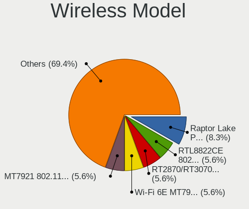

| Model                                                          | Notebooks | Percent |
|----------------------------------------------------------------|-----------|---------|
| Qualcomm Atheros QCA9565 / AR9565 Wireless Network Adapter     | 4         | 9.76%   |
| Intel Wi-Fi 6 AX200                                            | 3         | 7.32%   |
| Realtek RTL8814AU 802.11a/b/g/n/ac Wireless Adapter            | 2         | 4.88%   |
| Ralink RT3290 Wireless 802.11n 1T/1R PCIe                      | 2         | 4.88%   |
| Qualcomm Atheros QCA9377 802.11ac Wireless Network Adapter     | 2         | 4.88%   |
| Qualcomm Atheros AR9271 802.11n                                | 2         | 4.88%   |
| Qualcomm Atheros AR9285 Wireless Network Adapter (PCI-Express) | 2         | 4.88%   |
| TP-Link Archer T3U [Realtek RTL8812BU]                         | 1         | 2.44%   |
| Realtek RTL8822CE 802.11ac PCIe Wireless Network Adapter       | 1         | 2.44%   |
| Realtek RTL8812AU 802.11a/b/g/n/ac 2T2R DB WLAN Adapter        | 1         | 2.44%   |
| Realtek RTL8723DE Wireless Network Adapter                     | 1         | 2.44%   |
| Realtek RTL8187 Wireless Adapter                               | 1         | 2.44%   |
| Ralink RT3090 Wireless 802.11n 1T/1R PCIe                      | 1         | 2.44%   |
| Qualcomm Atheros QCA6174 802.11ac Wireless Network Adapter     | 1         | 2.44%   |
| Qualcomm Atheros AR9485 Wireless Network Adapter               | 1         | 2.44%   |
| Qualcomm Atheros AR928X Wireless Network Adapter (PCI-Express) | 1         | 2.44%   |
| MediaTek MT7612U 802.11a/b/g/n/ac Wireless Adapter             | 1         | 2.44%   |
| Intel Wireless 8260                                            | 1         | 2.44%   |
| Intel Dual Band Wireless-AC 3168NGW [Stone Peak]               | 1         | 2.44%   |
| Intel Comet Lake PCH-LP CNVi WiFi                              | 1         | 2.44%   |
| Intel Comet Lake PCH CNVi WiFi                                 | 1         | 2.44%   |
| Intel Centrino Wireless-N 2200                                 | 1         | 2.44%   |
| Intel Centrino Ultimate-N 6300                                 | 1         | 2.44%   |
| Intel Centrino Advanced-N 6235                                 | 1         | 2.44%   |
| Intel Centrino Advanced-N 6205 [Taylor Peak]                   | 1         | 2.44%   |
| Intel Centrino Advanced-N 6200                                 | 1         | 2.44%   |
| Intel Cannon Point-LP CNVi [Wireless-AC]                       | 1         | 2.44%   |
| Intel Cannon Lake PCH CNVi WiFi                                | 1         | 2.44%   |
| Broadcom BCM4364 802.11ac Wireless Network Adapter             | 1         | 2.44%   |
| Broadcom BCM43602 802.11ac Wireless LAN SoC                    | 1         | 2.44%   |
| Broadcom BCM43228 802.11a/b/g/n                                | 1         | 2.44%   |

Ethernet Vendor
---------------

Ethernet vendors

| Vendor                   | Notebooks | Percent |
|--------------------------|-----------|---------|
| Realtek Semiconductor    | 15        | 48.39%  |
| Intel                    | 9         | 29.03%  |
| Qualcomm Atheros         | 2         | 6.45%   |
| Samsung Electronics      | 1         | 3.23%   |
| Marvell Technology Group | 1         | 3.23%   |
| Hewlett-Packard          | 1         | 3.23%   |
| DisplayLink              | 1         | 3.23%   |
| ASIX Electronics         | 1         | 3.23%   |

Ethernet Model
--------------

Ethernet models

| Model                                                             | Notebooks | Percent |
|-------------------------------------------------------------------|-----------|---------|
| Realtek RTL810xE PCI Express Fast Ethernet controller             | 8         | 25.81%  |
| Realtek RTL8111/8168/8411 PCI Express Gigabit Ethernet Controller | 7         | 22.58%  |
| Intel 82579V Gigabit Network Connection                           | 2         | 6.45%   |
| Intel 82579LM Gigabit Network Connection (Lewisville)             | 2         | 6.45%   |
| Samsung Galaxy series, misc. (tethering mode)                     | 1         | 3.23%   |
| Qualcomm Atheros QCA8171 Gigabit Ethernet                         | 1         | 3.23%   |
| Qualcomm Atheros AR8132 Fast Ethernet                             | 1         | 3.23%   |
| Marvell Group 88E8057 PCI-E Gigabit Ethernet Controller           | 1         | 3.23%   |
| Intel Ethernet Controller I225-V                                  | 1         | 3.23%   |
| Intel Ethernet Connection I219-LM                                 | 1         | 3.23%   |
| Intel Ethernet Connection I217-V                                  | 1         | 3.23%   |
| Intel Ethernet Connection (4) I219-LM                             | 1         | 3.23%   |
| Intel 82577LM Gigabit Network Connection                          | 1         | 3.23%   |
| HP lt4120 Snapdragon X5 LTE                                       | 1         | 3.23%   |
| DisplayLink Dell D3100 Docking Station                            | 1         | 3.23%   |
| ASIX AX88179 Gigabit Ethernet                                     | 1         | 3.23%   |

Net Controller Kind
-------------------

Ethernet, WiFi or modem

| Kind     | Notebooks | Percent |
|----------|-----------|---------|
| WiFi     | 35        | 53.85%  |
| Ethernet | 28        | 43.08%  |
| Modem    | 2         | 3.08%   |

Used Controller
---------------

Currently used network controller

| Kind     | Notebooks | Percent |
|----------|-----------|---------|
| WiFi     | 28        | 70%     |
| Ethernet | 11        | 27.5%   |
| Modem    | 1         | 2.5%    |

NICs
----

Total network controllers on board

| Total | Notebooks | Percent |
|-------|-----------|---------|
| 2     | 26        | 74.29%  |
| 1     | 8         | 22.86%  |
| 0     | 1         | 2.86%   |

IPv6
----

IPv6 vs IPv4

| Used | Notebooks | Percent |
|------|-----------|---------|
| No   | 23        | 65.71%  |
| Yes  | 12        | 34.29%  |

Bluetooth
---------

Bluetooth Vendor
----------------

Controller vendors

| Vendor                          | Notebooks | Percent |
|---------------------------------|-----------|---------|
| Intel                           | 10        | 38.46%  |
| Qualcomm Atheros Communications | 6         | 23.08%  |
| Dell                            | 3         | 11.54%  |
| Ralink                          | 2         | 7.69%   |
| Lite-On Technology              | 2         | 7.69%   |
| Realtek Semiconductor           | 1         | 3.85%   |
| Broadcom                        | 1         | 3.85%   |
| Apple                           | 1         | 3.85%   |

Bluetooth Model
---------------

Controller models

| Model                                          | Notebooks | Percent |
|------------------------------------------------|-----------|---------|
| Qualcomm Atheros  Bluetooth Device             | 4         | 15.38%  |
| Intel Bluetooth 9460/9560 Jefferson Peak (JfP) | 3         | 11.54%  |
| Intel AX200 Bluetooth                          | 3         | 11.54%  |
| Ralink RT3290 Bluetooth                        | 2         | 7.69%   |
| Dell BCM20702A0 Bluetooth Module               | 2         | 7.69%   |
| Realtek Bluetooth Radio                        | 1         | 3.85%   |
| Qualcomm Atheros AR9462 Bluetooth              | 1         | 3.85%   |
| Qualcomm Atheros AR3011 Bluetooth              | 1         | 3.85%   |
| Lite-On Qualcomm Atheros Bluetooth             | 1         | 3.85%   |
| Lite-On Bluetooth Device                       | 1         | 3.85%   |
| Intel Wireless-AC 3168 Bluetooth               | 1         | 3.85%   |
| Intel Centrino Bluetooth Wireless Transceiver  | 1         | 3.85%   |
| Intel Bluetooth wireless interface             | 1         | 3.85%   |
| Intel AX201 Bluetooth                          | 1         | 3.85%   |
| Dell DW375 Bluetooth Module                    | 1         | 3.85%   |
| Broadcom HP Portable SoftSailing               | 1         | 3.85%   |
| Apple Bluetooth Host Controller                | 1         | 3.85%   |

Sound
-----

Sound Vendor
------------

Sound card vendors

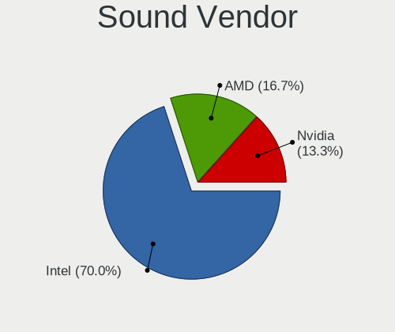

| Vendor            | Notebooks | Percent |
|-------------------|-----------|---------|
| Intel             | 31        | 75.61%  |
| Nvidia            | 4         | 9.76%   |
| AMD               | 3         | 7.32%   |
| Texas Instruments | 1         | 2.44%   |
| Logitech          | 1         | 2.44%   |
| Apple             | 1         | 2.44%   |

Sound Model
-----------

Sound card models

| Model                                                                                             | Notebooks | Percent |
|---------------------------------------------------------------------------------------------------|-----------|---------|
| Intel 7 Series/C216 Chipset Family High Definition Audio Controller                               | 6         | 13.04%  |
| Intel Sunrise Point-LP HD Audio                                                                   | 5         | 10.87%  |
| Intel Cannon Point-LP High Definition Audio Controller                                            | 3         | 6.52%   |
| Intel 82801I (ICH9 Family) HD Audio Controller                                                    | 3         | 6.52%   |
| AMD Renoir Radeon High Definition Audio Controller                                                | 3         | 6.52%   |
| Nvidia TU107 GeForce GTX 1650 High Definition Audio Controller                                    | 2         | 4.35%   |
| Intel Comet Lake PCH-LP cAVS                                                                      | 2         | 4.35%   |
| Intel Comet Lake PCH cAVS                                                                         | 2         | 4.35%   |
| Intel 6 Series/C200 Series Chipset Family High Definition Audio Controller                        | 2         | 4.35%   |
| AMD Family 17h/19h HD Audio Controller                                                            | 2         | 4.35%   |
| Texas Instruments PCM2902 Audio Codec                                                             | 1         | 2.17%   |
| Nvidia GF108 High Definition Audio Controller                                                     | 1         | 2.17%   |
| Nvidia Audio device                                                                               | 1         | 2.17%   |
| Logitech 960 Headset                                                                              | 1         | 2.17%   |
| Intel Xeon E3-1200 v3/4th Gen Core Processor HD Audio Controller                                  | 1         | 2.17%   |
| Intel Wildcat Point-LP High Definition Audio Controller                                           | 1         | 2.17%   |
| Intel Ice Lake-LP Smart Sound Technology Audio Controller                                         | 1         | 2.17%   |
| Intel Haswell-ULT HD Audio Controller                                                             | 1         | 2.17%   |
| Intel CM238 HD Audio Controller                                                                   | 1         | 2.17%   |
| Intel Cannon Lake PCH cAVS                                                                        | 1         | 2.17%   |
| Intel Broadwell-U Audio Controller                                                                | 1         | 2.17%   |
| Intel Atom/Celeron/Pentium Processor x5-E8000/J3xxx/N3xxx Series High Definition Audio Controller | 1         | 2.17%   |
| Intel 8 Series/C220 Series Chipset High Definition Audio Controller                               | 1         | 2.17%   |
| Intel 8 Series HD Audio Controller                                                                | 1         | 2.17%   |
| Intel 5 Series/3400 Series Chipset High Definition Audio                                          | 1         | 2.17%   |
| Apple Audio Device                                                                                | 1         | 2.17%   |

Memory
------

Memory Vendor
-------------

Memory module vendors

| Vendor              | Notebooks | Percent |
|---------------------|-----------|---------|
| SK Hynix            | 10        | 30.3%   |
| Samsung Electronics | 9         | 27.27%  |
| Unknown             | 4         | 12.12%  |
| Micron Technology   | 3         | 9.09%   |
| Crucial             | 2         | 6.06%   |
| Ramaxel Technology  | 1         | 3.03%   |
| Nanya Technology    | 1         | 3.03%   |
| Kingston            | 1         | 3.03%   |
| Corsair             | 1         | 3.03%   |
| A-DATA Technology   | 1         | 3.03%   |

Memory Model
------------

Memory module models

| Model                                                        | Notebooks | Percent |
|--------------------------------------------------------------|-----------|---------|
| SK Hynix RAM HMA81GS6JJR8N-VK 8GB SODIMM DDR4 2667MT/s       | 2         | 5.88%   |
| SK Hynix RAM HMA81GS6AFR8N-UH 8GB SODIMM DDR4 2667MT/s       | 2         | 5.88%   |
| Unknown RAM Module 8GB SODIMM LPDDR4 4266MT/s                | 1         | 2.94%   |
| Unknown RAM Module 4GB SODIMM DDR3                           | 1         | 2.94%   |
| Unknown RAM Module 2GB SODIMM DDR2                           | 1         | 2.94%   |
| Unknown RAM Module 2GB SODIMM 800MT/s                        | 1         | 2.94%   |
| Unknown RAM Module 2048MB SODIMM DDR2                        | 1         | 2.94%   |
| SK Hynix RAM HMT451S6DFR8A-PB 4GB SODIMM DDR3 1600MT/s       | 1         | 2.94%   |
| SK Hynix RAM HMT451S6BFR8A-PB 4GB SODIMM DDR3 1600MT/s       | 1         | 2.94%   |
| SK Hynix RAM HMT351S6EFR8A-PB 4096MB SODIMM DDR3 1600MT/s    | 1         | 2.94%   |
| SK Hynix RAM HMT351S6CFR8A-PB 4GB SODIMM DDR3 1600MT/s       | 1         | 2.94%   |
| SK Hynix RAM HMT351S6BFR8C-H9 4GB SODIMM DDR3 1334MT/s       | 1         | 2.94%   |
| SK Hynix RAM HMA851S6CJR6N-VK 4GB SODIMM DDR4 2667MT/s       | 1         | 2.94%   |
| Samsung RAM Module 8GB SODIMM DDR4 2133MT/s                  | 1         | 2.94%   |
| Samsung RAM M471B5773CHS-CF8 2048MB SODIMM DDR3 1067MT/s     | 1         | 2.94%   |
| Samsung RAM M471B5273DH0-CH9 4096MB SODIMM DDR3 1334MT/s     | 1         | 2.94%   |
| Samsung RAM M471A5244BB0-CTD 4GB SODIMM DDR4 2667MT/s        | 1         | 2.94%   |
| Samsung RAM M471A1K43DB1-CWE 8192MB SODIMM DDR4 3200MT/s     | 1         | 2.94%   |
| Samsung RAM M471A1K43CB1-CTD 8192MB SODIMM DDR4 2667MT/s     | 1         | 2.94%   |
| Samsung RAM M471A1K43CB1-CRC 8GB SODIMM DDR4 2667MT/s        | 1         | 2.94%   |
| Samsung RAM K4UBE3D4AA-MGCL 8GB SODIMM LPDDR4 4266MT/s       | 1         | 2.94%   |
| Samsung RAM K4E6E304EC-EGCG 4GB Row Of Chips LPDDR3 2133MT/s | 1         | 2.94%   |
| Ramaxel RAM RMSA3260ME78HAF-2666 8GB SODIMM DDR4 2667MT/s    | 1         | 2.94%   |
| Nanya RAM NT4GC64B8HG0NS-DI 4096MB SODIMM DDR3 1600MT/s      | 1         | 2.94%   |
| Micron RAM 8JSF25664HZ-1G4D1 2048MB SODIMM DDR3 1334MT/s     | 1         | 2.94%   |
| Micron RAM 4ATF51264HZ-2G3B1 4GB SODIMM DDR4 2400MT/s        | 1         | 2.94%   |
| Micron RAM 4ATF1G64HZ-3G2E1 8GB Row Of Chips DDR4 3200MT/s   | 1         | 2.94%   |
| Kingston RAM KHX1600C9S3L/4G 4GB SODIMM DDR3 1600MT/s        | 1         | 2.94%   |
| Crucial RAM CT8G4SFS8213.M8FA 8GB SODIMM DDR4 2133MT/s       | 1         | 2.94%   |
| Crucial RAM CB16GS2400.C16J 16GB SODIMM DDR4 2400MT/s        | 1         | 2.94%   |
| Corsair RAM CMSO8GX3M1C1600C11 8192MB SODIMM DDR3 1600MT/s   | 1         | 2.94%   |
| A-DATA RAM AM1U16BC4P2-B19H 4GB SODIMM DDR3 1600MT/s         | 1         | 2.94%   |

Memory Kind
-----------

Memory module kinds

| Kind    | Notebooks | Percent |
|---------|-----------|---------|
| DDR4    | 12        | 46.15%  |
| DDR3    | 9         | 34.62%  |
| LPDDR4  | 2         | 7.69%   |
| LPDDR3  | 1         | 3.85%   |
| DDR2    | 1         | 3.85%   |
| Unknown | 1         | 3.85%   |

Memory Form Factor
------------------

Physical design of the memory module

| Name         | Notebooks | Percent |
|--------------|-----------|---------|
| SODIMM       | 24        | 92.31%  |
| Row Of Chips | 2         | 7.69%   |

Memory Size
-----------

Memory module size

| Size  | Notebooks | Percent |
|-------|-----------|---------|
| 8192  | 13        | 48.15%  |
| 4096  | 10        | 37.04%  |
| 2048  | 3         | 11.11%  |
| 16384 | 1         | 3.7%    |

Memory Speed
------------

Memory module speed

| Speed   | Notebooks | Percent |
|---------|-----------|---------|
| 2667    | 8         | 27.59%  |
| 1600    | 6         | 20.69%  |
| 2133    | 3         | 10.34%  |
| 1334    | 3         | 10.34%  |
| 4266    | 2         | 6.9%    |
| 3200    | 2         | 6.9%    |
| Unknown | 2         | 6.9%    |
| 2400    | 1         | 3.45%   |
| 1067    | 1         | 3.45%   |
| 800     | 1         | 3.45%   |

Printers & scanners
-------------------

Printer Vendor
--------------

Printer device vendors

| Vendor | Notebooks | Percent |
|--------|-----------|---------|
| Canon  | 1         | 100%    |

Printer Model
-------------

Printer device models

| Model              | Notebooks | Percent |
|--------------------|-----------|---------|
| Canon G4000 series | 1         | 100%    |

Scanner Vendor
--------------

Scanner device vendors

Zero info for selected period =(

Scanner Model
-------------

Scanner device models

Zero info for selected period =(

Camera
------

Camera Vendor
-------------

Camera device vendors

| Vendor                                 | Notebooks | Percent |
|----------------------------------------|-----------|---------|
| Chicony Electronics                    | 8         | 25.81%  |
| Microdia                               | 6         | 19.35%  |
| IMC Networks                           | 3         | 9.68%   |
| Cheng Uei Precision Industry (Foxlink) | 3         | 9.68%   |
| Realtek Semiconductor                  | 2         | 6.45%   |
| Lite-On Technology                     | 2         | 6.45%   |
| Acer                                   | 2         | 6.45%   |
| Suyin                                  | 1         | 3.23%   |
| Ricoh                                  | 1         | 3.23%   |
| Quanta                                 | 1         | 3.23%   |
| Primax Electronics                     | 1         | 3.23%   |
| Pixart Imaging                         | 1         | 3.23%   |

Camera Model
------------

Camera device models

| Model                                                          | Notebooks | Percent |
|----------------------------------------------------------------|-----------|---------|
| Microdia Integrated_Webcam_HD                                  | 2         | 6.45%   |
| Lite-On HP HD Webcam                                           | 2         | 6.45%   |
| Chicony HP Wide Vision HD Camera                               | 2         | 6.45%   |
| Acer HD Webcam                                                 | 2         | 6.45%   |
| Suyin Acer/HP Integrated Webcam [CN0314]                       | 1         | 3.23%   |
| Ricoh HD Webcam                                                | 1         | 3.23%   |
| Realtek Integrated_Webcam_HD                                   | 1         | 3.23%   |
| Realtek Acer 640 x 480 laptop camera                           | 1         | 3.23%   |
| Quanta HD User Facing                                          | 1         | 3.23%   |
| Primax HP Webcam-101                                           | 1         | 3.23%   |
| Pixart Imaging USB_2.0_Webcam                                  | 1         | 3.23%   |
| Microdia Sony Visual Communication Camera                      | 1         | 3.23%   |
| Microdia Integrated Webcam HD                                  | 1         | 3.23%   |
| Microdia Integrated Webcam                                     | 1         | 3.23%   |
| Microdia HP Integrated Webcam                                  | 1         | 3.23%   |
| IMC Networks USB2.0 HD UVC WebCam                              | 1         | 3.23%   |
| IMC Networks Integrated Camera                                 | 1         | 3.23%   |
| IMC Networks HD Camera                                         | 1         | 3.23%   |
| Chicony XiaoMi USB 2.0 Webcam                                  | 1         | 3.23%   |
| Chicony Sony Visual Communication Camera                       | 1         | 3.23%   |
| Chicony Integrated HP HD Webcam                                | 1         | 3.23%   |
| Chicony HP Truevision HD                                       | 1         | 3.23%   |
| Chicony HP HD Webcam [Fixed]                                   | 1         | 3.23%   |
| Chicony HD User Facing                                         | 1         | 3.23%   |
| Cheng Uei Precision Industry (Foxlink) Webcam                  | 1         | 3.23%   |
| Cheng Uei Precision Industry (Foxlink) HP TrueVision HD Camera | 1         | 3.23%   |
| Cheng Uei Precision Industry (Foxlink) HP Truevision HD        | 1         | 3.23%   |

Security
--------

Fingerprint Vendor
------------------

Fingerprint sensor vendors

| Vendor                     | Notebooks | Percent |
|----------------------------|-----------|---------|
| Shenzhen Goodix Technology | 2         | 66.67%  |
| Elan Microelectronics      | 1         | 33.33%  |

Fingerprint Model
-----------------

Fingerprint sensor models

| Model                               | Notebooks | Percent |
|-------------------------------------|-----------|---------|
| Shenzhen Goodix  Fingerprint Device | 1         | 33.33%  |
| Shenzhen Goodix Fingerprint Reader  | 1         | 33.33%  |
| Elan ELAN:Fingerprint               | 1         | 33.33%  |

Chipcard Vendor
---------------

Chipcard module vendors

| Vendor   | Notebooks | Percent |
|----------|-----------|---------|
| Broadcom | 4         | 100%    |

Chipcard Model
--------------

Chipcard module models

| Model                                                                        | Notebooks | Percent |
|------------------------------------------------------------------------------|-----------|---------|
| Broadcom BCM5880 Secure Applications Processor with fingerprint touch sensor | 1         | 25%     |
| Broadcom BCM5880 Secure Applications Processor with fingerprint swipe sensor | 1         | 25%     |
| Broadcom BCM5880 Secure Applications Processor                               | 1         | 25%     |
| Broadcom 5880                                                                | 1         | 25%     |

Unsupported
-----------

Unsupported Devices
-------------------

Total unsupported devices on board

| Total | Notebooks | Percent |
|-------|-----------|---------|
| 0     | 20        | 57.14%  |
| 1     | 11        | 31.43%  |
| 2     | 4         | 11.43%  |

Unsupported Device Types
------------------------

Types of unsupported devices

| Type                  | Notebooks | Percent |
|-----------------------|-----------|---------|
| Chipcard              | 4         | 21.05%  |
| Net/wireless          | 3         | 15.79%  |
| Fingerprint reader    | 3         | 15.79%  |
| Graphics card         | 2         | 10.53%  |
| Bluetooth             | 2         | 10.53%  |
| Sound                 | 1         | 5.26%   |
| Network               | 1         | 5.26%   |
| Multimedia controller | 1         | 5.26%   |
| Card reader           | 1         | 5.26%   |
| Camera                | 1         | 5.26%   |

