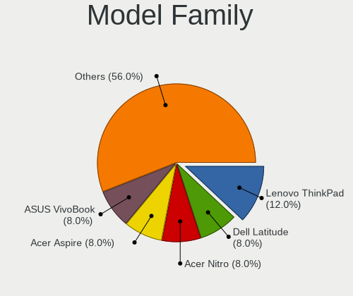
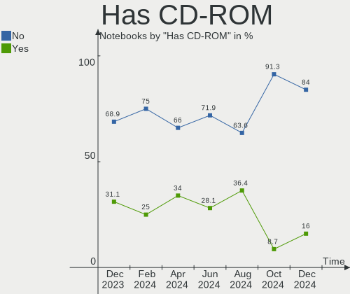
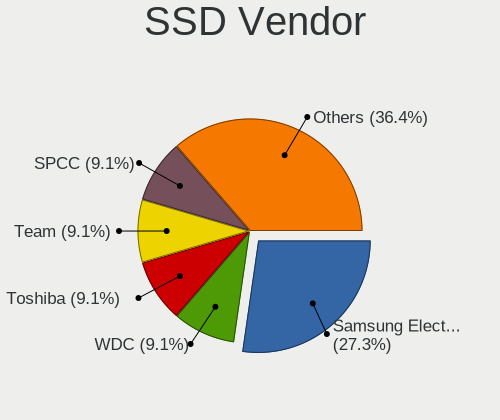
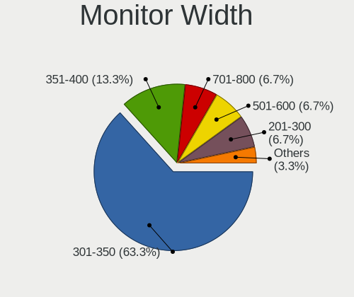
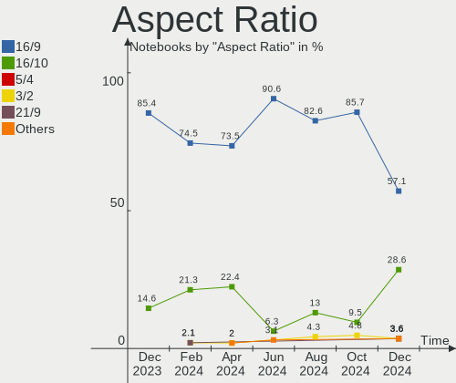
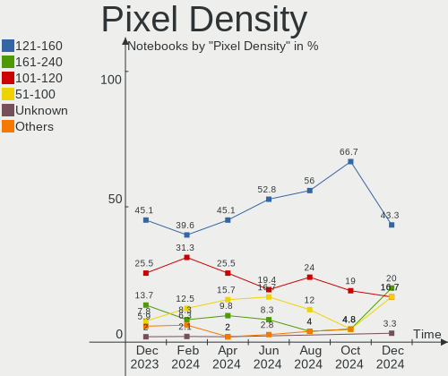
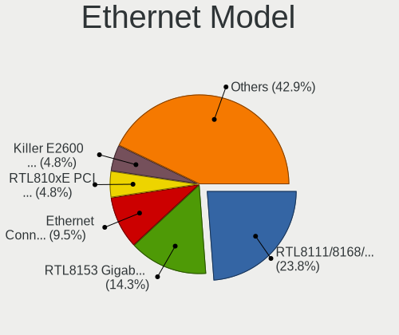
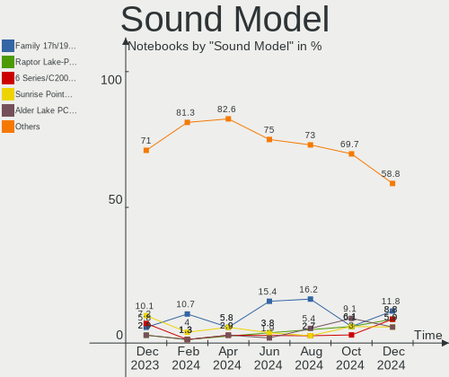
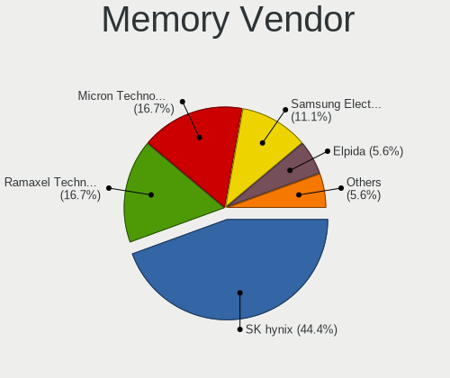
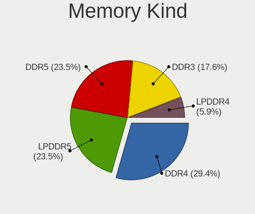

Kali - Hardware Trends (Notebooks)
----------------------------------

A project to identify most popular hardware characteristics and track their change
over time based on data collected by Linux users at https://Linux-Hardware.org.

Anyone can contribute to this report by the [hw-probe](https://github.com/linuxhw/hw-probe) tool:

    sudo -E hw-probe -all -upload

This report is for one last month. Overall report since the beginning of time: [TestDays](https://github.com/linuxhw/TestDays)

Period: Aug, 2023.

Contents
--------

* [ System ](#system)
  - [ OS                       ](#os)
  - [ OS Family                ](#os-family)
  - [ Kernel                   ](#kernel)
  - [ Kernel Family            ](#kernel-family)
  - [ Kernel Major Ver.        ](#kernel-major-ver)
  - [ Arch                     ](#arch)
  - [ DE                       ](#de)
  - [ Display Server           ](#display-server)
  - [ Display Manager          ](#display-manager)
  - [ OS Lang                  ](#os-lang)
  - [ Boot Mode                ](#boot-mode)
  - [ Filesystem               ](#filesystem)
  - [ Part. scheme             ](#part-scheme)
  - [ Dual Boot with Linux/BSD ](#dual-boot-with-linuxbsd)
  - [ Dual Boot (Win)          ](#dual-boot-win)

* [ Board ](#board)
  - [ Vendor                   ](#vendor)
  - [ Model                    ](#model)
  - [ Model Family             ](#model-family)
  - [ MFG Year                 ](#mfg-year)
  - [ Form Factor              ](#form-factor)
  - [ Secure Boot              ](#secure-boot)
  - [ Coreboot                 ](#coreboot)
  - [ RAM Size                 ](#ram-size)
  - [ RAM Used                 ](#ram-used)
  - [ Total Drives             ](#total-drives)
  - [ Has CD-ROM               ](#has-cd-rom)
  - [ Has Ethernet             ](#has-ethernet)
  - [ Has WiFi                 ](#has-wifi)
  - [ Has Bluetooth            ](#has-bluetooth)

* [ Location ](#location)
  - [ Country                  ](#country)
  - [ City                     ](#city)

* [ Drives ](#drives)
  - [ Drive Vendor             ](#drive-vendor)
  - [ Drive Model              ](#drive-model)
  - [ HDD Vendor               ](#hdd-vendor)
  - [ SSD Vendor               ](#ssd-vendor)
  - [ Drive Kind               ](#drive-kind)
  - [ Drive Connector          ](#drive-connector)
  - [ Drive Size               ](#drive-size)
  - [ Space Total              ](#space-total)
  - [ Space Used               ](#space-used)
  - [ Malfunc. Drives          ](#malfunc-drives)
  - [ Malfunc. Drive Vendor    ](#malfunc-drive-vendor)
  - [ Malfunc. HDD Vendor      ](#malfunc-hdd-vendor)
  - [ Malfunc. Drive Kind      ](#malfunc-drive-kind)
  - [ Failed Drives            ](#failed-drives)
  - [ Failed Drive Vendor      ](#failed-drive-vendor)
  - [ Drive Status             ](#drive-status)

* [ Storage controller ](#storage-controller)
  - [ Storage Vendor           ](#storage-vendor)
  - [ Storage Model            ](#storage-model)
  - [ Storage Kind             ](#storage-kind)

* [ Processor ](#processor)
  - [ CPU Vendor               ](#cpu-vendor)
  - [ CPU Model                ](#cpu-model)
  - [ CPU Model Family         ](#cpu-model-family)
  - [ CPU Cores                ](#cpu-cores)
  - [ CPU Sockets              ](#cpu-sockets)
  - [ CPU Threads              ](#cpu-threads)
  - [ CPU Op-Modes             ](#cpu-op-modes)
  - [ CPU Microcode            ](#cpu-microcode)
  - [ CPU Microarch            ](#cpu-microarch)

* [ Graphics ](#graphics)
  - [ GPU Vendor               ](#gpu-vendor)
  - [ GPU Model                ](#gpu-model)
  - [ GPU Combo                ](#gpu-combo)
  - [ GPU Driver               ](#gpu-driver)
  - [ GPU Memory               ](#gpu-memory)

* [ Monitor ](#monitor)
  - [ Monitor Vendor           ](#monitor-vendor)
  - [ Monitor Model            ](#monitor-model)
  - [ Monitor Resolution       ](#monitor-resolution)
  - [ Monitor Diagonal         ](#monitor-diagonal)
  - [ Monitor Width            ](#monitor-width)
  - [ Aspect Ratio             ](#aspect-ratio)
  - [ Monitor Area             ](#monitor-area)
  - [ Pixel Density            ](#pixel-density)
  - [ Multiple Monitors        ](#multiple-monitors)

* [ Network ](#network)
  - [ Net Controller Vendor    ](#net-controller-vendor)
  - [ Net Controller Model     ](#net-controller-model)
  - [ Wireless Vendor          ](#wireless-vendor)
  - [ Wireless Model           ](#wireless-model)
  - [ Ethernet Vendor          ](#ethernet-vendor)
  - [ Ethernet Model           ](#ethernet-model)
  - [ Net Controller Kind      ](#net-controller-kind)
  - [ Used Controller          ](#used-controller)
  - [ NICs                     ](#nics)
  - [ IPv6                     ](#ipv6)

* [ Bluetooth ](#bluetooth)
  - [ Bluetooth Vendor         ](#bluetooth-vendor)
  - [ Bluetooth Model          ](#bluetooth-model)

* [ Sound ](#sound)
  - [ Sound Vendor             ](#sound-vendor)
  - [ Sound Model              ](#sound-model)

* [ Memory ](#memory)
  - [ Memory Vendor            ](#memory-vendor)
  - [ Memory Model             ](#memory-model)
  - [ Memory Kind              ](#memory-kind)
  - [ Memory Form Factor       ](#memory-form-factor)
  - [ Memory Size              ](#memory-size)
  - [ Memory Speed             ](#memory-speed)

* [ Printers & scanners ](#printers--scanners)
  - [ Printer Vendor           ](#printer-vendor)
  - [ Printer Model            ](#printer-model)
  - [ Scanner Vendor           ](#scanner-vendor)
  - [ Scanner Model            ](#scanner-model)

* [ Camera ](#camera)
  - [ Camera Vendor            ](#camera-vendor)
  - [ Camera Model             ](#camera-model)

* [ Security ](#security)
  - [ Fingerprint Vendor       ](#fingerprint-vendor)
  - [ Fingerprint Model        ](#fingerprint-model)
  - [ Chipcard Vendor          ](#chipcard-vendor)
  - [ Chipcard Model           ](#chipcard-model)

* [ Unsupported ](#unsupported)
  - [ Unsupported Devices      ](#unsupported-devices)
  - [ Unsupported Device Types ](#unsupported-device-types)

System
------

OS
--

Installed operating systems

| Name        | Notebooks | Percent |
|-------------|-----------|---------|
| Kali 2023.3 | 29        | 70.73%  |
| Kali 2023.2 | 11        | 26.83%  |
| Kali 2023.1 | 1         | 2.44%   |

OS Family
---------

OS without a version

| Name | Notebooks | Percent |
|------|-----------|---------|
| Kali | 41        | 100%    |

Kernel
------

Version of the Linux kernel

| Version                      | Notebooks | Percent |
|------------------------------|-----------|---------|
| 6.3.0-kali1-amd64            | 31        | 75.61%  |
| 6.1.0-kali9-amd64            | 5         | 12.2%   |
| 6.4.0-kali3-amd64            | 3         | 7.32%   |
| 6.1.0-kali5-amd64            | 1         | 2.44%   |
| 4.14.254-20571-g474cebce577e | 1         | 2.44%   |

Kernel Family
-------------

Linux kernel without a distro release

| Version  | Notebooks | Percent |
|----------|-----------|---------|
| 6.3.0    | 31        | 75.61%  |
| 6.1.0    | 6         | 14.63%  |
| 6.4.0    | 3         | 7.32%   |
| 4.14.254 | 1         | 2.44%   |

Kernel Major Ver.
-----------------

Linux kernel major version

| Version | Notebooks | Percent |
|---------|-----------|---------|
| 6.3     | 31        | 75.61%  |
| 6.1     | 6         | 14.63%  |
| 6.4     | 3         | 7.32%   |
| 4.14    | 1         | 2.44%   |

Arch
----

OS architecture (x86_64, i586, etc.)

| Name   | Notebooks | Percent |
|--------|-----------|---------|
| x86_64 | 41        | 100%    |

DE
--

Desktop Environment

| Name             | Notebooks | Percent |
|------------------|-----------|---------|
| XFCE             | 23        | 56.1%   |
| GNOME            | 12        | 29.27%  |
| KDE5             | 5         | 12.2%   |
| lightdm-xsession | 1         | 2.44%   |

Display Server
--------------

X11 or Wayland

| Name    | Notebooks | Percent |
|---------|-----------|---------|
| X11     | 34        | 82.93%  |
| Wayland | 7         | 17.07%  |

Display Manager
---------------

SDDM, LightDM, etc.

| Name    | Notebooks | Percent |
|---------|-----------|---------|
| LightDM | 21        | 51.22%  |
| Unknown | 8         | 19.51%  |
| GDM3    | 7         | 17.07%  |
| SDDM    | 4         | 9.76%   |
| GDM     | 1         | 2.44%   |

OS Lang
-------

Language

| Lang    | Notebooks | Percent |
|---------|-----------|---------|
| en_US   | 23        | 56.1%   |
| ru_RU   | 3         | 7.32%   |
| pt_BR   | 2         | 4.88%   |
| en_AU   | 2         | 4.88%   |
| ur_PK   | 1         | 2.44%   |
| tr_TR   | 1         | 2.44%   |
| pt_PT   | 1         | 2.44%   |
| ja_JP   | 1         | 2.44%   |
| fr_FR   | 1         | 2.44%   |
| es_ES   | 1         | 2.44%   |
| es_AR   | 1         | 2.44%   |
| en_IN   | 1         | 2.44%   |
| en_GB   | 1         | 2.44%   |
| C       | 1         | 2.44%   |
| Unknown | 1         | 2.44%   |

Boot Mode
---------

EFI or BIOS

| Mode | Notebooks | Percent |
|------|-----------|---------|
| EFI  | 28        | 68.29%  |
| BIOS | 13        | 31.71%  |

Filesystem
----------

Type of filesystem

| Type  | Notebooks | Percent |
|-------|-----------|---------|
| Ext4  | 40        | 97.56%  |
| Tmpfs | 1         | 2.44%   |

Part. scheme
------------

Scheme of partitioning

| Type    | Notebooks | Percent |
|---------|-----------|---------|
| GPT     | 26        | 63.41%  |
| Unknown | 8         | 19.51%  |
| MBR     | 7         | 17.07%  |

Dual Boot with Linux/BSD
------------------------

Hosting more than one Linux/BSD

| Dual boot | Notebooks | Percent |
|-----------|-----------|---------|
| No        | 37        | 90.24%  |
| Yes       | 4         | 9.76%   |

Dual Boot (Win)
---------------

Hosting Linux and Windows

| Dual boot | Notebooks | Percent |
|-----------|-----------|---------|
| No        | 29        | 70.73%  |
| Yes       | 12        | 29.27%  |

Board
-----

Vendor
------

Motherboard manufacturer

| Name                | Notebooks | Percent |
|---------------------|-----------|---------|
| Lenovo              | 8         | 19.51%  |
| Hewlett-Packard     | 7         | 17.07%  |
| Dell                | 5         | 12.2%   |
| Google              | 4         | 9.76%   |
| Apple               | 4         | 9.76%   |
| Acer                | 4         | 9.76%   |
| ASUSTek Computer    | 3         | 7.32%   |
| Samsung Electronics | 2         | 4.88%   |
| HUAWEI              | 2         | 4.88%   |
| Panasonic           | 1         | 2.44%   |
| Fujitsu             | 1         | 2.44%   |

Model
-----

Motherboard model

| Name                                    | Notebooks | Percent |
|-----------------------------------------|-----------|---------|
| HP EliteBook 840 G1                     | 2         | 4.88%   |
| Google Epaulette                        | 2         | 4.88%   |
| Apple MacBookPro8,1                     | 2         | 4.88%   |
| Samsung 300E5EV/300E4EV/270E5EV/270E4EV | 1         | 2.44%   |
| Samsung 300E4C/300E5C/300E7C            | 1         | 2.44%   |
| Panasonic CF-31RECAXDR                  | 1         | 2.44%   |
| Lenovo Yoga 300-11IBR 80M1              | 1         | 2.44%   |
| Lenovo V310-15ISK 80SY                  | 1         | 2.44%   |
| Lenovo ThinkPad P16s Gen 1 21CKCTO1WW   | 1         | 2.44%   |
| Lenovo ThinkPad E14 Gen 2 20TAS0U500    | 1         | 2.44%   |
| Lenovo PIQY0                            | 1         | 2.44%   |
| Lenovo Legion Y740-17IRHg 81UJ          | 1         | 2.44%   |
| Lenovo IdeaPad S145-15IIL 82DJ          | 1         | 2.44%   |
| Lenovo G50-70 20351                     | 1         | 2.44%   |
| HUAWEI RLEF-XX                          | 1         | 2.44%   |
| HUAWEI BOM-WXX9                         | 1         | 2.44%   |
| HP ProBook 645 G1                       | 1         | 2.44%   |
| HP ProBook 640 G2                       | 1         | 2.44%   |
| HP Pavilion Notebook                    | 1         | 2.44%   |
| HP Bloog                                | 1         | 2.44%   |
| HP 250 G6 Notebook PC                   | 1         | 2.44%   |
| Google Kohaku                           | 1         | 2.44%   |
| Google Coral                            | 1         | 2.44%   |
| Fujitsu LIFEBOOK AH530                  | 1         | 2.44%   |
| Dell Latitude E4300                     | 1         | 2.44%   |
| Dell Latitude 5510                      | 1         | 2.44%   |
| Dell Latitude 5400                      | 1         | 2.44%   |
| Dell Inspiron 5542                      | 1         | 2.44%   |
| Dell Inspiron 15-3552                   | 1         | 2.44%   |
| ASUS VivoBook_ASUSLaptop X415DAP_D415DA | 1         | 2.44%   |
| ASUS N53SV                              | 1         | 2.44%   |
| ASUS K55VD                              | 1         | 2.44%   |
| Apple MacBookPro16,2                    | 1         | 2.44%   |
| Apple MacBookPro15,2                    | 1         | 2.44%   |
| Acer Nitro AN515-54                     | 1         | 2.44%   |
| Acer Nitro AN515-52                     | 1         | 2.44%   |
| Acer Nitro AN515-45                     | 1         | 2.44%   |
| Acer Aspire 3820                        | 1         | 2.44%   |

Model Family
------------

Motherboard model prefix

| Name                   | Notebooks | Percent |
|------------------------|-----------|---------|
| Dell Latitude          | 3         | 7.32%   |
| Acer Nitro             | 3         | 7.32%   |
| Lenovo ThinkPad        | 2         | 4.88%   |
| HP ProBook             | 2         | 4.88%   |
| HP EliteBook           | 2         | 4.88%   |
| Google Epaulette       | 2         | 4.88%   |
| Dell Inspiron          | 2         | 4.88%   |
| Apple MacBookPro8      | 2         | 4.88%   |
| Samsung 300E5EV        | 1         | 2.44%   |
| Samsung 300E4C         | 1         | 2.44%   |
| Panasonic CF-31RECAXDR | 1         | 2.44%   |
| Lenovo Yoga            | 1         | 2.44%   |
| Lenovo V310-15ISK      | 1         | 2.44%   |
| Lenovo PIQY0           | 1         | 2.44%   |
| Lenovo Legion          | 1         | 2.44%   |
| Lenovo IdeaPad         | 1         | 2.44%   |
| Lenovo G50-70          | 1         | 2.44%   |
| HUAWEI RLEF-XX         | 1         | 2.44%   |
| HUAWEI BOM-WXX9        | 1         | 2.44%   |
| HP Pavilion            | 1         | 2.44%   |
| HP Bloog               | 1         | 2.44%   |
| HP 250                 | 1         | 2.44%   |
| Google Kohaku          | 1         | 2.44%   |
| Google Coral           | 1         | 2.44%   |
| Fujitsu LIFEBOOK       | 1         | 2.44%   |
| ASUS VivoBook          | 1         | 2.44%   |
| ASUS N53SV             | 1         | 2.44%   |
| ASUS K55VD             | 1         | 2.44%   |
| Apple MacBookPro16     | 1         | 2.44%   |
| Apple MacBookPro15     | 1         | 2.44%   |
| Acer Aspire            | 1         | 2.44%   |

MFG Year
--------

Motherboard manufacture year

| Year | Notebooks | Percent |
|------|-----------|---------|
| 2020 | 5         | 12.2%   |
| 2021 | 4         | 9.76%   |
| 2013 | 4         | 9.76%   |
| 2012 | 4         | 9.76%   |
| 2022 | 3         | 7.32%   |
| 2019 | 3         | 7.32%   |
| 2016 | 3         | 7.32%   |
| 2015 | 3         | 7.32%   |
| 2010 | 3         | 7.32%   |
| 2023 | 2         | 4.88%   |
| 2018 | 2         | 4.88%   |
| 2011 | 2         | 4.88%   |
| 2017 | 1         | 2.44%   |
| 2014 | 1         | 2.44%   |
| 2008 | 1         | 2.44%   |

Form Factor
-----------

Physical design of the computer

| Name     | Notebooks | Percent |
|----------|-----------|---------|
| Notebook | 41        | 100%    |

Secure Boot
-----------

Enabled or disabled

| State    | Notebooks | Percent |
|----------|-----------|---------|
| Disabled | 41        | 100%    |

Coreboot
--------

Have coreboot on board

| Used | Notebooks | Percent |
|------|-----------|---------|
| No   | 36        | 87.8%   |
| Yes  | 5         | 12.2%   |

RAM Size
--------

Total RAM memory

| Size in GB | Notebooks | Percent |
|------------|-----------|---------|
| 3.01-4.0   | 15        | 36.59%  |
| 4.01-8.0   | 12        | 29.27%  |
| 16.01-24.0 | 6         | 14.63%  |
| 8.01-16.0  | 5         | 12.2%   |
| 24.01-32.0 | 2         | 4.88%   |
| 1.01-2.0   | 1         | 2.44%   |

RAM Used
--------

Used RAM memory

| Used GB  | Notebooks | Percent |
|----------|-----------|---------|
| 2.01-3.0 | 20        | 48.78%  |
| 3.01-4.0 | 11        | 26.83%  |
| 1.01-2.0 | 6         | 14.63%  |
| 4.01-8.0 | 2         | 4.88%   |
| 0.51-1.0 | 2         | 4.88%   |

Total Drives
------------

Number of drives on board

| Drives | Notebooks | Percent |
|--------|-----------|---------|
| 1      | 34        | 82.93%  |
| 2      | 6         | 14.63%  |
| 0      | 1         | 2.44%   |

Has CD-ROM
----------

Has CD-ROM on board

| Presented | Notebooks | Percent |
|-----------|-----------|---------|
| No        | 29        | 70.73%  |
| Yes       | 12        | 29.27%  |

Has Ethernet
------------

Has Ethernet on board

| Presented | Notebooks | Percent |
|-----------|-----------|---------|
| Yes       | 30        | 73.17%  |
| No        | 11        | 26.83%  |

Has WiFi
--------

Has WiFi module

| Presented | Notebooks | Percent |
|-----------|-----------|---------|
| Yes       | 40        | 97.56%  |
| No        | 1         | 2.44%   |

Has Bluetooth
-------------

Has Bluetooth module

| Presented | Notebooks | Percent |
|-----------|-----------|---------|
| Yes       | 38        | 92.68%  |
| No        | 3         | 7.32%   |

Location
--------

Country
-------

Geographic location (country)

| Country     | Notebooks | Percent |
|-------------|-----------|---------|
| USA         | 7         | 17.07%  |
| Russia      | 4         | 9.76%   |
| India       | 3         | 7.32%   |
| Turkey      | 2         | 4.88%   |
| Pakistan    | 2         | 4.88%   |
| Kenya       | 2         | 4.88%   |
| France      | 2         | 4.88%   |
| Bulgaria    | 2         | 4.88%   |
| Brazil      | 2         | 4.88%   |
| Australia   | 2         | 4.88%   |
| Venezuela   | 1         | 2.44%   |
| Portugal    | 1         | 2.44%   |
| Poland      | 1         | 2.44%   |
| Netherlands | 1         | 2.44%   |
| Morocco     | 1         | 2.44%   |
| Lebanon     | 1         | 2.44%   |
| Japan       | 1         | 2.44%   |
| Germany     | 1         | 2.44%   |
| Ethiopia    | 1         | 2.44%   |
| Canada      | 1         | 2.44%   |
| Azerbaijan  | 1         | 2.44%   |
| Argentina   | 1         | 2.44%   |
| Algeria     | 1         | 2.44%   |

City
----

Geographic location (city)

| City                  | Notebooks | Percent |
|-----------------------|-----------|---------|
| Wichita               | 3         | 7.32%   |
| Sydney                | 2         | 4.88%   |
| Nairobi               | 2         | 4.88%   |
| Istanbul              | 2         | 4.88%   |
| Teteringen            | 1         | 2.44%   |
| Tacoma                | 1         | 2.44%   |
| Sofia                 | 1         | 2.44%   |
| Salé                 | 1         | 2.44%   |
| Perm                  | 1         | 2.44%   |
| Penza                 | 1         | 2.44%   |
| Nougaroulet           | 1         | 2.44%   |
| Moscow                | 1         | 2.44%   |
| Morena                | 1         | 2.44%   |
| Montreal              | 1         | 2.44%   |
| Las Vegas             | 1         | 2.44%   |
| Lansing               | 1         | 2.44%   |
| Lahore                | 1         | 2.44%   |
| Kutno                 | 1         | 2.44%   |
| Krasnodar             | 1         | 2.44%   |
| Ikegami               | 1         | 2.44%   |
| Gujranwala            | 1         | 2.44%   |
| Fürth                | 1         | 2.44%   |
| Delhi                 | 1         | 2.44%   |
| Dallas                | 1         | 2.44%   |
| Córdoba              | 1         | 2.44%   |
| Caracas               | 1         | 2.44%   |
| Butia                 | 1         | 2.44%   |
| Burgas                | 1         | 2.44%   |
| Bom Jesus da Lapa     | 1         | 2.44%   |
| Barreiro              | 1         | 2.44%   |
| Barika                | 1         | 2.44%   |
| Baku                  | 1         | 2.44%   |
| Bailleau-Armenonville | 1         | 2.44%   |
| Ahmedabad             | 1         | 2.44%   |
| Addis Ababa           | 1         | 2.44%   |
| Aaley                 | 1         | 2.44%   |

Drives
------

Drive Vendor
------------

Hard drive vendors

| Vendor              | Notebooks | Drives | Percent |
|---------------------|-----------|--------|---------|
| Seagate             | 6         | 6      | 13.04%  |
| WDC                 | 5         | 5      | 10.87%  |
| Unknown             | 4         | 6      | 8.7%    |
| SK hynix            | 4         | 5      | 8.7%    |
| Toshiba             | 3         | 3      | 6.52%   |
| Kingston            | 3         | 3      | 6.52%   |
| Apple               | 3         | 4      | 6.52%   |
| SanDisk             | 2         | 2      | 4.35%   |
| Vaseky              | 1         | 1      | 2.17%   |
| SSSTC               | 1         | 1      | 2.17%   |
| Silicon Motion      | 1         | 1      | 2.17%   |
| Samsung Electronics | 1         | 1      | 2.17%   |
| Phison              | 1         | 1      | 2.17%   |
| Patriot             | 1         | 1      | 2.17%   |
| OWC                 | 1         | 1      | 2.17%   |
| Lenovo              | 1         | 1      | 2.17%   |
| KIOXIA              | 1         | 1      | 2.17%   |
| Intel               | 1         | 1      | 2.17%   |
| Initio              | 1         | 1      | 2.17%   |
| Hitachi             | 1         | 1      | 2.17%   |
| GOODRAM             | 1         | 1      | 2.17%   |
| Crucial             | 1         | 1      | 2.17%   |
| China               | 1         | 1      | 2.17%   |
| Unknown             | 1         | 1      | 2.17%   |

Drive Model
-----------

Hard drive models

| Model                                       | Notebooks | Percent |
|---------------------------------------------|-----------|---------|
| Unknown MMC Card  64GB                      | 2         | 4.08%   |
| Seagate ST9500325AS 500GB                   | 2         | 4.08%   |
| Seagate ST1000LM035-1RK172 1TB              | 2         | 4.08%   |
| WDC WDS240G2G0A-00JH30 240GB SSD            | 1         | 2.04%   |
| WDC WD5000LUCT-63RC2Y0 500GB                | 1         | 2.04%   |
| WDC WD10SPZX-24Z10 1TB                      | 1         | 2.04%   |
| WDC WD10JPVX-00JC3T0 1TB                    | 1         | 2.04%   |
| WDC WD Green 2.5 240GB SSD                  | 1         | 2.04%   |
| Vaseky V800/240G 240GB SSD                  | 1         | 2.04%   |
| Unknown TA2964  64GB                        | 1         | 2.04%   |
| Unknown SD256  256GB                        | 1         | 2.04%   |
| Unknown MMC Card  32GB                      | 1         | 2.04%   |
| Unknown hB8aP  32GB                         | 1         | 2.04%   |
| Toshiba MQ01ABD100 1TB                      | 1         | 2.04%   |
| Toshiba MK5065GSXF 500GB                    | 1         | 2.04%   |
| Toshiba MK3276GSX 320GB                     | 1         | 2.04%   |
| SSSTC CL1-3D256 256GB                       | 1         | 2.04%   |
| SK hynix SKHynix_HFS256GDE9X081N 256GB      | 1         | 2.04%   |
| SK hynix PC601 NVMe 256GB                   | 1         | 2.04%   |
| SK hynix HFS128G39TND-N210A 128GB SSD       | 1         | 2.04%   |
| SK hynix BC501 NVMe Solid State Drive 512GB | 1         | 2.04%   |
| SK hynix BC501 HFM256GDJTNG-8310A 256GB     | 1         | 2.04%   |
| Silicon Motion PCIe-8 SSD 512GB             | 1         | 2.04%   |
| Seagate ST750LX003-1AC154 752GB             | 1         | 2.04%   |
| Seagate ST1000LM049-2GH172 1TB              | 1         | 2.04%   |
| SanDisk SD6SB1M-128G-1006 128GB SSD         | 1         | 2.04%   |
| SanDisk DF4032  32GB                        | 1         | 2.04%   |
| Samsung MZVLB1T0HALR-000L2 1TB              | 1         | 2.04%   |
| Phison 311CD0512GB                          | 1         | 2.04%   |
| Patriot P210 1024GB SSD                     | 1         | 2.04%   |
| OWC Mercury Electra 6G SSD                  | 1         | 2.04%   |
| Lenovo E660 SSD-2.5-1TB                     | 1         | 2.04%   |
| KIOXIA KBG40ZNS256G NVMe 256GB              | 1         | 2.04%   |
| Kingston SNVS1000G 1TB                      | 1         | 2.04%   |
| Kingston OM8PDP3256B-AA1 256GB              | 1         | 2.04%   |
| Kingston OM8PCP3512F-AB 512GB               | 1         | 2.04%   |
| Intel SSDSC2KW256G8 256GB                   | 1         | 2.04%   |
| Initio 3639S 256GB                          | 1         | 2.04%   |
| Hitachi HTS543225A7A384 250GB               | 1         | 2.04%   |
| GOODRAM SSDPR-CX400-512-G2 512GB            | 1         | 2.04%   |

HDD Vendor
----------

Hard disk drive vendors

| Vendor  | Notebooks | Drives | Percent |
|---------|-----------|--------|---------|
| Seagate | 6         | 6      | 42.86%  |
| WDC     | 3         | 3      | 21.43%  |
| Toshiba | 3         | 3      | 21.43%  |
| Initio  | 1         | 1      | 7.14%   |
| Hitachi | 1         | 1      | 7.14%   |

SSD Vendor
----------

Solid state drive vendors

| Vendor   | Notebooks | Drives | Percent |
|----------|-----------|--------|---------|
| WDC      | 2         | 2      | 15.38%  |
| Vaseky   | 1         | 1      | 7.69%   |
| SK hynix | 1         | 1      | 7.69%   |
| SanDisk  | 1         | 1      | 7.69%   |
| Patriot  | 1         | 1      | 7.69%   |
| OWC      | 1         | 1      | 7.69%   |
| Lenovo   | 1         | 1      | 7.69%   |
| Intel    | 1         | 1      | 7.69%   |
| GOODRAM  | 1         | 1      | 7.69%   |
| Crucial  | 1         | 1      | 7.69%   |
| China    | 1         | 1      | 7.69%   |
| Unknown  | 1         | 1      | 7.69%   |

Drive Kind
----------

HDD or SSD

| Kind | Notebooks | Drives | Percent |
|------|-----------|--------|---------|
| NVMe | 14        | 16     | 31.11%  |
| HDD  | 14        | 14     | 31.11%  |
| SSD  | 12        | 13     | 26.67%  |
| MMC  | 5         | 7      | 11.11%  |

Drive Connector
---------------

SATA, SAS, NVMe, etc.

| Type | Notebooks | Drives | Percent |
|------|-----------|--------|---------|
| SATA | 23        | 26     | 53.49%  |
| NVMe | 14        | 16     | 32.56%  |
| MMC  | 5         | 7      | 11.63%  |
| SAS  | 1         | 1      | 2.33%   |

Drive Size
----------

Size of hard drive

| Size in TB | Notebooks | Drives | Percent |
|------------|-----------|--------|---------|
| 0.01-0.5   | 16        | 17     | 61.54%  |
| 0.51-1.0   | 9         | 9      | 34.62%  |
| 1.01-2.0   | 1         | 1      | 3.85%   |

Space Total
-----------

Amount of disk space available on the file system

| Size in GB     | Notebooks | Percent |
|----------------|-----------|---------|
| 101-250        | 19        | 46.34%  |
| 501-1000       | 7         | 17.07%  |
| 251-500        | 6         | 14.63%  |
| 51-100         | 6         | 14.63%  |
| More than 3000 | 1         | 2.44%   |
| 21-50          | 1         | 2.44%   |
| 1001-2000      | 1         | 2.44%   |

Space Used
----------

Amount of used disk space

| Used GB | Notebooks | Percent |
|---------|-----------|---------|
| 21-50   | 13        | 31.71%  |
| 1-20    | 13        | 31.71%  |
| 51-100  | 11        | 26.83%  |
| 101-250 | 4         | 9.76%   |

Malfunc. Drives
---------------

Drive models with a malfunction

| Model                                 | Notebooks | Drives | Percent |
|---------------------------------------|-----------|--------|---------|
| WDC WD Green 2.5 240GB SSD            | 1         | 1      | 33.33%  |
| Toshiba MQ01ABD100 1TB                | 1         | 1      | 33.33%  |
| SK hynix HFS128G39TND-N210A 128GB SSD | 1         | 1      | 33.33%  |

Malfunc. Drive Vendor
---------------------

Vendors of faulty drives

| Vendor   | Notebooks | Drives | Percent |
|----------|-----------|--------|---------|
| WDC      | 1         | 1      | 33.33%  |
| Toshiba  | 1         | 1      | 33.33%  |
| SK hynix | 1         | 1      | 33.33%  |

Malfunc. HDD Vendor
-------------------

Vendors of faulty HDD drives

| Vendor  | Notebooks | Drives | Percent |
|---------|-----------|--------|---------|
| Toshiba | 1         | 1      | 100%    |

Malfunc. Drive Kind
-------------------

Kinds of faulty drives

| Kind | Notebooks | Drives | Percent |
|------|-----------|--------|---------|
| SSD  | 2         | 2      | 66.67%  |
| HDD  | 1         | 1      | 33.33%  |

Failed Drives
-------------

Failed drive models

Zero info for selected period =(

Failed Drive Vendor
-------------------

Failed drive vendors

Zero info for selected period =(

Drive Status
------------

Number of failed and malfunc. drives

| Status   | Notebooks | Drives | Percent |
|----------|-----------|--------|---------|
| Works    | 28        | 32     | 65.12%  |
| Detected | 12        | 15     | 27.91%  |
| Malfunc  | 3         | 3      | 6.98%   |

Storage controller
------------------

Storage Vendor
--------------

Storage controller vendors

| Vendor                         | Notebooks | Percent |
|--------------------------------|-----------|---------|
| Intel                          | 27        | 62.79%  |
| SK hynix                       | 3         | 6.98%   |
| Kingston Technology Company    | 3         | 6.98%   |
| AMD                            | 3         | 6.98%   |
| Apple                          | 2         | 4.65%   |
| Solid State Storage Technology | 1         | 2.33%   |
| Silicon Motion                 | 1         | 2.33%   |
| Samsung Electronics            | 1         | 2.33%   |
| Phison Electronics             | 1         | 2.33%   |
| KIOXIA                         | 1         | 2.33%   |

Storage Model
-------------

Storage controller models

| Model                                                                            | Notebooks | Percent |
|----------------------------------------------------------------------------------|-----------|---------|
| Intel 6 Series/C200 Series Chipset Family 6 port Mobile SATA AHCI Controller     | 5         | 11.63%  |
| Intel Sunrise Point-LP SATA Controller [AHCI mode]                               | 4         | 9.3%    |
| Intel 8 Series SATA Controller 1 [AHCI mode]                                     | 4         | 9.3%    |
| Intel 7 Series Chipset Family 6-port SATA Controller [AHCI mode]                 | 3         | 6.98%   |
| AMD FCH SATA Controller [AHCI mode]                                              | 3         | 6.98%   |
| Intel Comet Lake SATA AHCI Controller                                            | 2         | 4.65%   |
| Intel 82801 Mobile SATA Controller [RAID mode]                                   | 2         | 4.65%   |
| Intel 5 Series/3400 Series Chipset 4 port SATA AHCI Controller                   | 2         | 4.65%   |
| Apple ANS2 NVMe Controller                                                       | 2         | 4.65%   |
| Solid State Storage CL1-3D256-Q11 NVMe SSD M.2                                   | 1         | 2.33%   |
| SK hynix PC601 NVMe Solid State Drive                                            | 1         | 2.33%   |
| SK hynix Gold P31/BC711/PC711 NVMe Solid State Drive                             | 1         | 2.33%   |
| SK hynix BC501 NVMe Solid State Drive                                            | 1         | 2.33%   |
| Silicon Motion Non-Volatile memory controller                                    | 1         | 2.33%   |
| Samsung NVMe SSD Controller SM981/PM981/PM983                                    | 1         | 2.33%   |
| Phison PS5013 E13 NVMe Controller                                                | 1         | 2.33%   |
| KIOXIA NVMe SSD Controller BG4 (DRAM-less)                                       | 1         | 2.33%   |
| Kingston Company OM8PCP Design-In PCIe 3 NVMe SSD (DRAM-less)                    | 1         | 2.33%   |
| Kingston Company OM3PDP3 NVMe SSD                                                | 1         | 2.33%   |
| Kingston Company NVMe Controller                                                 | 1         | 2.33%   |
| Intel Ice Lake-LP SATA Controller [AHCI mode]                                    | 1         | 2.33%   |
| Intel Cannon Point-LP SATA Controller [AHCI Mode]                                | 1         | 2.33%   |
| Intel Cannon Lake Mobile PCH SATA AHCI Controller                                | 1         | 2.33%   |
| Intel Atom/Celeron/Pentium Processor x5-E8000/J3xxx/N3xxx Series SATA Controller | 1         | 2.33%   |
| Intel 82801IBM/IEM (ICH9M/ICH9M-E) 4 port SATA Controller [AHCI mode]            | 1         | 2.33%   |

Storage Kind
------------

Kind of storage controller (IDE, SATA, NVMe, SAS, ...)

| Kind | Notebooks | Percent |
|------|-----------|---------|
| SATA | 28        | 65.12%  |
| NVMe | 13        | 30.23%  |
| RAID | 2         | 4.65%   |

Processor
---------

CPU Vendor
----------

Processor vendors

| Vendor | Notebooks | Percent |
|--------|-----------|---------|
| Intel  | 36        | 87.8%   |
| AMD    | 5         | 12.2%   |

CPU Model
---------

Processor models

| Model                                      | Notebooks | Percent |
|--------------------------------------------|-----------|---------|
| Intel Pentium CPU N4200 @ 1.10GHz          | 2         | 4.88%   |
| Intel Core i5-6200U CPU @ 2.30GHz          | 2         | 4.88%   |
| Intel Core i5-4210U CPU @ 1.70GHz          | 2         | 4.88%   |
| Intel Core i3-4005U CPU @ 1.70GHz          | 2         | 4.88%   |
| Intel Celeron CPU N3060 @ 1.60GHz          | 2         | 4.88%   |
| Intel Pentium Silver N5030 CPU @ 1.10GHz   | 1         | 2.44%   |
| Intel Pentium CPU P6200 @ 2.13GHz          | 1         | 2.44%   |
| Intel Core i7-9750H CPU @ 2.60GHz          | 1         | 2.44%   |
| Intel Core i7-6500U CPU @ 2.50GHz          | 1         | 2.44%   |
| Intel Core i7-3630QM CPU @ 2.40GHz         | 1         | 2.44%   |
| Intel Core i7-2630QM CPU @ 2.00GHz         | 1         | 2.44%   |
| Intel Core i7-1068NG7 CPU @ 2.30GHz        | 1         | 2.44%   |
| Intel Core i5-9300H CPU @ 2.40GHz          | 1         | 2.44%   |
| Intel Core i5-8365U CPU @ 1.60GHz          | 1         | 2.44%   |
| Intel Core i5-8300H CPU @ 2.30GHz          | 1         | 2.44%   |
| Intel Core i5-8259U CPU @ 2.30GHz          | 1         | 2.44%   |
| Intel Core i5-2520M CPU @ 2.50GHz          | 1         | 2.44%   |
| Intel Core i5-2450M CPU @ 2.50GHz          | 1         | 2.44%   |
| Intel Core i5-2435M CPU @ 2.40GHz          | 1         | 2.44%   |
| Intel Core i5-2415M CPU @ 2.30GHz          | 1         | 2.44%   |
| Intel Core i5-10310U CPU @ 1.70GHz         | 1         | 2.44%   |
| Intel Core i5-10210U CPU @ 1.60GHz         | 1         | 2.44%   |
| Intel Core i5 CPU M 460 @ 2.53GHz          | 1         | 2.44%   |
| Intel Core i3-7020U CPU @ 2.30GHz          | 1         | 2.44%   |
| Intel Core i3-2328M CPU @ 2.20GHz          | 1         | 2.44%   |
| Intel Core i3-1005G1 CPU @ 1.20GHz         | 1         | 2.44%   |
| Intel Core 2 Duo CPU P9400 @ 2.40GHz       | 1         | 2.44%   |
| Intel Celeron CPU N3350 @ 1.10GHz          | 1         | 2.44%   |
| Intel Celeron CPU 847 @ 1.10GHz            | 1         | 2.44%   |
| Intel 12th Gen Core i5-12450H              | 1         | 2.44%   |
| Intel 11th Gen Core i7-1165G7 @ 2.80GHz    | 1         | 2.44%   |
| AMD Ryzen 7 5800H with Radeon Graphics     | 1         | 2.44%   |
| AMD Ryzen 5 PRO 6650U with Radeon Graphics | 1         | 2.44%   |
| AMD Ryzen 5 5500U with Radeon Graphics     | 1         | 2.44%   |
| AMD Ryzen 3 3250U with Radeon Graphics     | 1         | 2.44%   |
| AMD A8-4500M APU with Radeon HD Graphics   | 1         | 2.44%   |

CPU Model Family
----------------

Processor model prefix

| Model                | Notebooks | Percent |
|----------------------|-----------|---------|
| Intel Core i5        | 15        | 36.59%  |
| Intel Core i7        | 5         | 12.2%   |
| Intel Core i3        | 5         | 12.2%   |
| Intel Celeron        | 4         | 9.76%   |
| Intel Pentium        | 3         | 7.32%   |
| Other                | 2         | 4.88%   |
| Intel Pentium Silver | 1         | 2.44%   |
| Intel Core 2 Duo     | 1         | 2.44%   |
| AMD Ryzen 7          | 1         | 2.44%   |
| AMD Ryzen 5 PRO      | 1         | 2.44%   |
| AMD Ryzen 5          | 1         | 2.44%   |
| AMD Ryzen 3          | 1         | 2.44%   |
| AMD A8               | 1         | 2.44%   |

CPU Cores
---------

Number of processor cores

| Number | Notebooks | Percent |
|--------|-----------|---------|
| 2      | 23        | 56.1%   |
| 4      | 13        | 31.71%  |
| 6      | 3         | 7.32%   |
| 8      | 2         | 4.88%   |

CPU Sockets
-----------

Number of sockets

| Number | Notebooks | Percent |
|--------|-----------|---------|
| 1      | 41        | 100%    |

CPU Threads
-----------

Threads per core (Hyper-Threading)

| Number | Notebooks | Percent |
|--------|-----------|---------|
| 2      | 32        | 78.05%  |
| 1      | 9         | 21.95%  |

CPU Op-Modes
------------

CPU Operation Modes (32-bit, 64-bit)

| Op mode        | Notebooks | Percent |
|----------------|-----------|---------|
| 32-bit, 64-bit | 41        | 100%    |

CPU Microcode
-------------

Microcode number

| Number     | Notebooks | Percent |
|------------|-----------|---------|
| Unknown    | 31        | 75.61%  |
| 0x906ea    | 1         | 2.44%   |
| 0x806e9    | 1         | 2.44%   |
| 0x406e3    | 1         | 2.44%   |
| 0x40651    | 1         | 2.44%   |
| 0x206a7    | 1         | 2.44%   |
| 0x0a50000c | 1         | 2.44%   |
| 0x0a404102 | 1         | 2.44%   |
| 0x08608103 | 1         | 2.44%   |
| 0x08108109 | 1         | 2.44%   |
| 0x0600111f | 1         | 2.44%   |

CPU Microarch
-------------

Microarchitecture

| Name             | Notebooks | Percent |
|------------------|-----------|---------|
| KabyLake         | 8         | 19.51%  |
| SandyBridge      | 7         | 17.07%  |
| Haswell          | 4         | 9.76%   |
| Skylake          | 3         | 7.32%   |
| Goldmont         | 3         | 7.32%   |
| Westmere         | 2         | 4.88%   |
| Silvermont       | 2         | 4.88%   |
| IceLake          | 2         | 4.88%   |
| Unknown          | 2         | 4.88%   |
| Zen+             | 1         | 2.44%   |
| Zen 3            | 1         | 2.44%   |
| TigerLake        | 1         | 2.44%   |
| Piledriver       | 1         | 2.44%   |
| Penryn           | 1         | 2.44%   |
| IvyBridge        | 1         | 2.44%   |
| Goldmont plus    | 1         | 2.44%   |
| Alderlake Hybrid | 1         | 2.44%   |

Graphics
--------

GPU Vendor
----------

Vendors of graphics cards

| Vendor | Notebooks | Percent |
|--------|-----------|---------|
| Intel  | 36        | 72%     |
| Nvidia | 8         | 16%     |
| AMD    | 6         | 12%     |

GPU Model
---------

Graphics card models

| Model                                                                                    | Notebooks | Percent |
|------------------------------------------------------------------------------------------|-----------|---------|
| Intel 2nd Generation Core Processor Family Integrated Graphics Controller                | 7         | 14%     |
| Intel Haswell-ULT Integrated Graphics Controller                                         | 4         | 8%      |
| Intel Skylake GT2 [HD Graphics 520]                                                      | 3         | 6%      |
| Intel CoffeeLake-H GT2 [UHD Graphics 630]                                                | 3         | 6%      |
| Intel Core Processor Integrated Graphics Controller                                      | 2         | 4%      |
| Intel CometLake-U GT2 [UHD Graphics]                                                     | 2         | 4%      |
| Intel Atom/Celeron/Pentium Processor x5-E8000/J3xxx/N3xxx Integrated Graphics Controller | 2         | 4%      |
| Intel Apollo Lake [HD Graphics 505]                                                      | 2         | 4%      |
| Nvidia TU117M [GeForce MX450]                                                            | 1         | 2%      |
| Nvidia TU106BM [GeForce RTX 2060 Mobile]                                                 | 1         | 2%      |
| Nvidia GP107M [GeForce GTX 1050 Mobile]                                                  | 1         | 2%      |
| Nvidia GP107M [GeForce GTX 1050 3 GB Max-Q]                                              | 1         | 2%      |
| Nvidia GM108M [GeForce 940MX]                                                            | 1         | 2%      |
| Nvidia GF119M [GeForce 610M]                                                             | 1         | 2%      |
| Nvidia GF108M [GeForce GT 540M]                                                          | 1         | 2%      |
| Nvidia GA106M [GeForce RTX 3060 Mobile / Max-Q]                                          | 1         | 2%      |
| Intel WhiskeyLake-U GT2 [UHD Graphics 620]                                               | 1         | 2%      |
| Intel TigerLake-LP GT2 [Iris Xe Graphics]                                                | 1         | 2%      |
| Intel Mobile 4 Series Chipset Integrated Graphics Controller                             | 1         | 2%      |
| Intel Iris Plus Graphics G7                                                              | 1         | 2%      |
| Intel Iris Plus Graphics G1 (Ice Lake)                                                   | 1         | 2%      |
| Intel HD Graphics 620                                                                    | 1         | 2%      |
| Intel HD Graphics 500                                                                    | 1         | 2%      |
| Intel GeminiLake [UHD Graphics 605]                                                      | 1         | 2%      |
| Intel CoffeeLake-U GT3e [Iris Plus Graphics 655]                                         | 1         | 2%      |
| Intel Alder Lake-P GT1 [UHD Graphics]                                                    | 1         | 2%      |
| Intel 3rd Gen Core processor Graphics Controller                                         | 1         | 2%      |
| AMD Trinity [Radeon HD 7640G]                                                            | 1         | 2%      |
| AMD Rembrandt [Radeon 680M]                                                              | 1         | 2%      |
| AMD Picasso/Raven 2 [Radeon Vega Series / Radeon Vega Mobile Series]                     | 1         | 2%      |
| AMD Madison [Mobility Radeon HD 5650/5750 / 6530M/6550M]                                 | 1         | 2%      |
| AMD Lucienne                                                                             | 1         | 2%      |
| AMD Cezanne [Radeon Vega Series / Radeon Vega Mobile Series]                             | 1         | 2%      |

GPU Combo
---------

Combinations of graphics cards

| Name           | Notebooks | Percent |
|----------------|-----------|---------|
| 1 x Intel      | 25        | 60.98%  |
| Intel + Nvidia | 7         | 17.07%  |
| 1 x AMD        | 4         | 9.76%   |
| Other          | 2         | 4.88%   |
| 2 x Intel      | 1         | 2.44%   |
| Intel + AMD    | 1         | 2.44%   |
| AMD + Nvidia   | 1         | 2.44%   |

GPU Driver
----------

Free vs proprietary

| Driver | Notebooks | Percent |
|--------|-----------|---------|
| Free   | 41        | 100%    |

GPU Memory
----------

Total video memory

| Size in GB | Notebooks | Percent |
|------------|-----------|---------|
| Unknown    | 30        | 73.17%  |
| 3.01-4.0   | 3         | 7.32%   |
| 0.51-1.0   | 3         | 7.32%   |
| 1.01-2.0   | 2         | 4.88%   |
| 0.01-0.5   | 2         | 4.88%   |
| 2.01-3.0   | 1         | 2.44%   |

Monitor
-------

Monitor Vendor
--------------

Monitor vendors

| Vendor              | Notebooks | Percent |
|---------------------|-----------|---------|
| AU Optronics        | 11        | 24.44%  |
| BOE                 | 9         | 20%     |
| Chimei Innolux      | 7         | 15.56%  |
| LG Display          | 5         | 11.11%  |
| Apple               | 5         | 11.11%  |
| Samsung Electronics | 3         | 6.67%   |
| ViewSonic           | 1         | 2.22%   |
| Toshiba             | 1         | 2.22%   |
| PANDA               | 1         | 2.22%   |
| Hewlett-Packard     | 1         | 2.22%   |
| Dell                | 1         | 2.22%   |

Monitor Model
-------------

Monitor models

| Model                                                                 | Notebooks | Percent |
|-----------------------------------------------------------------------|-----------|---------|
| Chimei Innolux LCD Monitor CMN14A3 1600x900 309x174mm 14.0-inch       | 2         | 4.44%   |
| BOE LCD Monitor BOE0671 1366x768 344x194mm 15.5-inch                  | 2         | 4.44%   |
| AU Optronics LCD Monitor AUO303D 1920x1080 309x174mm 14.0-inch        | 2         | 4.44%   |
| ViewSonic XG2405 VSC0D39 1920x1080 527x296mm 23.8-inch                | 1         | 2.22%   |
| Toshiba LCD Monitor LCD2207 1280x800 287x180mm 13.3-inch              | 1         | 2.22%   |
| Samsung Electronics SA300/SA350 SAM078B 1600x900 443x249mm 20.0-inch  | 1         | 2.22%   |
| Samsung Electronics LCD Monitor SEC5441 1280x800 331x207mm 15.4-inch  | 1         | 2.22%   |
| Samsung Electronics LCD Monitor SDC4142 3840x2160 294x165mm 13.3-inch | 1         | 2.22%   |
| PANDA LCD Monitor NCP004D 1920x1080 344x194mm 15.5-inch               | 1         | 2.22%   |
| LG Display LCD Monitor LGD05E0 1920x1080 382x215mm 17.3-inch          | 1         | 2.22%   |
| LG Display LCD Monitor LGD05D8 1920x1080 344x194mm 15.5-inch          | 1         | 2.22%   |
| LG Display LCD Monitor LGD0503 1366x768 344x194mm 15.5-inch           | 1         | 2.22%   |
| LG Display LCD Monitor LGD02DC 1366x768 344x194mm 15.5-inch           | 1         | 2.22%   |
| LG Display LCD Monitor LGD023F 1366x768 293x165mm 13.2-inch           | 1         | 2.22%   |
| Hewlett-Packard V270 HPN3523 1920x1080 598x336mm 27.0-inch            | 1         | 2.22%   |
| Dell SE2417HG DELD08E 1920x1080 521x293mm 23.5-inch                   | 1         | 2.22%   |
| Chimei Innolux LCD Monitor CMN1614 1920x1200 344x215mm 16.0-inch      | 1         | 2.22%   |
| Chimei Innolux LCD Monitor CMN15E6 1366x768 344x193mm 15.5-inch       | 1         | 2.22%   |
| Chimei Innolux LCD Monitor CMN15DB 1366x768 344x193mm 15.5-inch       | 1         | 2.22%   |
| Chimei Innolux LCD Monitor CMN1495 1366x768 309x173mm 13.9-inch       | 1         | 2.22%   |
| Chimei Innolux LCD Monitor CMN1424 1366x768 309x173mm 13.9-inch       | 1         | 2.22%   |
| BOE LCD Monitor BOE0A74 1920x1200 345x215mm 16.0-inch                 | 1         | 2.22%   |
| BOE LCD Monitor BOE08C7 1920x1080 309x174mm 14.0-inch                 | 1         | 2.22%   |
| BOE LCD Monitor BOE0872 1920x1080 344x194mm 15.5-inch                 | 1         | 2.22%   |
| BOE LCD Monitor BOE0869 1920x1080 344x194mm 15.5-inch                 | 1         | 2.22%   |
| BOE LCD Monitor BOE06A5 1366x768 344x194mm 15.5-inch                  | 1         | 2.22%   |
| BOE LCD Monitor BOE0608 1366x768 256x144mm 11.6-inch                  | 1         | 2.22%   |
| BOE LCD Monitor BOE0590 1366x768 309x173mm 13.9-inch                  | 1         | 2.22%   |
| AU Optronics LCD Monitor AUO723C 1366x768 309x173mm 13.9-inch         | 1         | 2.22%   |
| AU Optronics LCD Monitor AUO463D 1920x1080 309x174mm 14.0-inch        | 1         | 2.22%   |
| AU Optronics LCD Monitor AUO40EC 1366x768 344x193mm 15.5-inch         | 1         | 2.22%   |
| AU Optronics LCD Monitor AUO405C 1366x768 256x144mm 11.6-inch         | 1         | 2.22%   |
| AU Optronics LCD Monitor AUO26EC 1366x768 344x193mm 15.5-inch         | 1         | 2.22%   |
| AU Optronics LCD Monitor AUO22EC 1366x768 344x193mm 15.5-inch         | 1         | 2.22%   |
| AU Optronics LCD Monitor AUO21ED 1920x1080 344x193mm 15.5-inch        | 1         | 2.22%   |
| AU Optronics LCD Monitor AUO21EC 1366x768 344x193mm 15.5-inch         | 1         | 2.22%   |
| AU Optronics LCD Monitor AUO123D 1920x1080 309x173mm 13.9-inch        | 1         | 2.22%   |
| Apple LCD Monitor APP9CC5 1280x800 286x179mm 13.3-inch                | 1         | 2.22%   |
| Apple Color LCD APPA03E 2560x1600 286x179mm 13.3-inch                 | 1         | 2.22%   |
| Apple Color LCD APPA03D 2560x1600 286x179mm 13.3-inch                 | 1         | 2.22%   |

Monitor Resolution
------------------

Monitor screen resolution

| Resolution        | Notebooks | Percent |
|-------------------|-----------|---------|
| 1366x768 (WXGA)   | 19        | 43.18%  |
| 1920x1080 (FHD)   | 13        | 29.55%  |
| 1600x900 (HD+)    | 3         | 6.82%   |
| 1280x800 (WXGA)   | 3         | 6.82%   |
| 2560x1600         | 2         | 4.55%   |
| 1920x1200 (WUXGA) | 2         | 4.55%   |
| 3840x2160 (4K)    | 1         | 2.27%   |
| 2880x1800         | 1         | 2.27%   |

Monitor Diagonal
----------------

Diagonal size in inches

| Inches | Notebooks | Percent |
|--------|-----------|---------|
| 15     | 17        | 37.78%  |
| 13     | 11        | 24.44%  |
| 14     | 8         | 17.78%  |
| 16     | 2         | 4.44%   |
| 11     | 2         | 4.44%   |
| 27     | 1         | 2.22%   |
| 24     | 1         | 2.22%   |
| 23     | 1         | 2.22%   |
| 20     | 1         | 2.22%   |
| 17     | 1         | 2.22%   |

Monitor Width
-------------

Physical width

| Width in mm | Notebooks | Percent |
|-------------|-----------|---------|
| 301-350     | 29        | 64.44%  |
| 201-300     | 10        | 22.22%  |
| 501-600     | 3         | 6.67%   |
| 351-400     | 2         | 4.44%   |
| 401-500     | 1         | 2.22%   |

Aspect Ratio
------------

Proportional relationship between the width and the height

| Ratio | Notebooks | Percent |
|-------|-----------|---------|
| 16/9  | 33        | 80.49%  |
| 16/10 | 8         | 19.51%  |

Monitor Area
------------

Area in inch²

| Area in inch² | Notebooks | Percent |
|----------------|-----------|---------|
| 101-110        | 17        | 37.78%  |
| 81-90          | 14        | 31.11%  |
| 71-80          | 5         | 11.11%  |
| 51-60          | 2         | 4.44%   |
| 201-250        | 2         | 4.44%   |
| 111-120        | 2         | 4.44%   |
| 301-350        | 1         | 2.22%   |
| 151-200        | 1         | 2.22%   |
| 121-130        | 1         | 2.22%   |

Pixel Density
-------------

Pixels per inch

| Density       | Notebooks | Percent |
|---------------|-----------|---------|
| 101-120       | 19        | 44.19%  |
| 121-160       | 17        | 39.53%  |
| 51-100        | 3         | 6.98%   |
| More than 240 | 2         | 4.65%   |
| 161-240       | 2         | 4.65%   |

Multiple Monitors
-----------------

Total monitors connected

| Total | Notebooks | Percent |
|-------|-----------|---------|
| 1     | 37        | 90.24%  |
| 2     | 2         | 4.88%   |
| 3     | 1         | 2.44%   |
| 0     | 1         | 2.44%   |

Network
-------

Net Controller Vendor
---------------------

Controller vendors

| Vendor                | Notebooks | Percent |
|-----------------------|-----------|---------|
| Realtek Semiconductor | 24        | 32%     |
| Intel                 | 19        | 25.33%  |
| Qualcomm Atheros      | 12        | 16%     |
| Broadcom              | 5         | 6.67%   |
| TP-Link               | 4         | 5.33%   |
| MediaTek              | 3         | 4%      |
| Ralink Technology     | 2         | 2.67%   |
| Hewlett-Packard       | 2         | 2.67%   |
| Qualcomm              | 1         | 1.33%   |
| D-Link                | 1         | 1.33%   |
| Broadcom Limited      | 1         | 1.33%   |
| ASIX Electronics      | 1         | 1.33%   |

Net Controller Model
--------------------

Controller models

| Model                                                             | Notebooks | Percent |
|-------------------------------------------------------------------|-----------|---------|
| Realtek RTL8111/8168/8411 PCI Express Gigabit Ethernet Controller | 14        | 16.67%  |
| Qualcomm Atheros AR9285 Wireless Network Adapter (PCI-Express)    | 4         | 4.76%   |
| TP-Link TL-WN722N v2/v3 [Realtek RTL8188EUS]                      | 3         | 3.57%   |
| Realtek RTL810xE PCI Express Fast Ethernet controller             | 3         | 3.57%   |
| Qualcomm Atheros QCA9565 / AR9565 Wireless Network Adapter        | 3         | 3.57%   |
| Qualcomm Atheros AR9485 Wireless Network Adapter                  | 3         | 3.57%   |
| Intel Wireless 7265                                               | 3         | 3.57%   |
| Intel Cannon Lake PCH CNVi WiFi                                   | 3         | 3.57%   |
| Realtek RTL8822CE 802.11ac PCIe Wireless Network Adapter          | 2         | 2.38%   |
| Realtek RTL8188EUS 802.11n Wireless Network Adapter               | 2         | 2.38%   |
| Intel Wireless 7260                                               | 2         | 2.38%   |
| Intel Comet Lake PCH-LP CNVi WiFi                                 | 2         | 2.38%   |
| HP lt4112 Gobi 4G Module Network Device                           | 2         | 2.38%   |
| Broadcom NetXtreme BCM57765 Gigabit Ethernet PCIe                 | 2         | 2.38%   |
| Broadcom BCM4364 802.11ac Wireless Network Adapter                | 2         | 2.38%   |
| Broadcom BCM4331 802.11a/b/g/n                                    | 2         | 2.38%   |
| TP-Link Archer T4U ver.3                                          | 1         | 1.19%   |
| Realtek RTL8821CE 802.11ac PCIe Wireless Network Adapter          | 1         | 1.19%   |
| Realtek RTL8812AU 802.11a/b/g/n/ac 2T2R DB WLAN Adapter           | 1         | 1.19%   |
| Realtek Killer E2600 Gigabit Ethernet Controller                  | 1         | 1.19%   |
| Realtek 802.11ac NIC                                              | 1         | 1.19%   |
| Ralink RT2870/RT3070 Wireless Adapter                             | 1         | 1.19%   |
| Ralink MT7601U Wireless Adapter                                   | 1         | 1.19%   |
| Qualcomm QCNFA765 Wireless Network Adapter                        | 1         | 1.19%   |
| Qualcomm Atheros QCA9377 802.11ac Wireless Network Adapter        | 1         | 1.19%   |
| Qualcomm Atheros AR9287 Wireless Network Adapter (PCI-Express)    | 1         | 1.19%   |
| Qualcomm Atheros AR8151 v1.0 Gigabit Ethernet                     | 1         | 1.19%   |
| MediaTek WiFi                                                     | 1         | 1.19%   |
| MediaTek MT7921 802.11ax PCI Express Wireless Network Adapter     | 1         | 1.19%   |
| MediaTek MT7612U 802.11a/b/g/n/ac Wireless Adapter                | 1         | 1.19%   |
| Intel Wireless 8260                                               | 1         | 1.19%   |
| Intel Wireless 3165                                               | 1         | 1.19%   |
| Intel Wireless 3160                                               | 1         | 1.19%   |
| Intel Wi-Fi 6 AX201                                               | 1         | 1.19%   |
| Intel Ethernet Connection I219-V                                  | 1         | 1.19%   |
| Intel Ethernet Connection I218-LM                                 | 1         | 1.19%   |
| Intel Ethernet Connection (6) I219-LM                             | 1         | 1.19%   |
| Intel Ethernet Connection (10) I219-LM                            | 1         | 1.19%   |
| Intel Dual Band Wireless-AC 3168NGW [Stone Peak]                  | 1         | 1.19%   |
| Intel Centrino Advanced-N 6205 [Taylor Peak]                      | 1         | 1.19%   |

Wireless Vendor
---------------

Wireless vendors

| Vendor                | Notebooks | Percent |
|-----------------------|-----------|---------|
| Intel                 | 18        | 32.73%  |
| Qualcomm Atheros      | 12        | 21.82%  |
| Realtek Semiconductor | 7         | 12.73%  |
| Broadcom              | 5         | 9.09%   |
| TP-Link               | 4         | 7.27%   |
| MediaTek              | 3         | 5.45%   |
| Ralink Technology     | 2         | 3.64%   |
| Hewlett-Packard       | 2         | 3.64%   |
| Qualcomm              | 1         | 1.82%   |
| D-Link                | 1         | 1.82%   |

Wireless Model
--------------

Wireless models

| Model                                                                | Notebooks | Percent |
|----------------------------------------------------------------------|-----------|---------|
| Qualcomm Atheros AR9285 Wireless Network Adapter (PCI-Express)       | 4         | 7.27%   |
| TP-Link TL-WN722N v2/v3 [Realtek RTL8188EUS]                         | 3         | 5.45%   |
| Qualcomm Atheros QCA9565 / AR9565 Wireless Network Adapter           | 3         | 5.45%   |
| Qualcomm Atheros AR9485 Wireless Network Adapter                     | 3         | 5.45%   |
| Intel Wireless 7265                                                  | 3         | 5.45%   |
| Intel Cannon Lake PCH CNVi WiFi                                      | 3         | 5.45%   |
| Realtek RTL8822CE 802.11ac PCIe Wireless Network Adapter             | 2         | 3.64%   |
| Realtek RTL8188EUS 802.11n Wireless Network Adapter                  | 2         | 3.64%   |
| Intel Wireless 7260                                                  | 2         | 3.64%   |
| Intel Comet Lake PCH-LP CNVi WiFi                                    | 2         | 3.64%   |
| HP lt4112 Gobi 4G Module Network Device                              | 2         | 3.64%   |
| Broadcom BCM4364 802.11ac Wireless Network Adapter                   | 2         | 3.64%   |
| Broadcom BCM4331 802.11a/b/g/n                                       | 2         | 3.64%   |
| TP-Link Archer T4U ver.3                                             | 1         | 1.82%   |
| Realtek RTL8821CE 802.11ac PCIe Wireless Network Adapter             | 1         | 1.82%   |
| Realtek RTL8812AU 802.11a/b/g/n/ac 2T2R DB WLAN Adapter              | 1         | 1.82%   |
| Realtek 802.11ac NIC                                                 | 1         | 1.82%   |
| Ralink RT2870/RT3070 Wireless Adapter                                | 1         | 1.82%   |
| Ralink MT7601U Wireless Adapter                                      | 1         | 1.82%   |
| Qualcomm QCNFA765 Wireless Network Adapter                           | 1         | 1.82%   |
| Qualcomm Atheros QCA9377 802.11ac Wireless Network Adapter           | 1         | 1.82%   |
| Qualcomm Atheros AR9287 Wireless Network Adapter (PCI-Express)       | 1         | 1.82%   |
| MediaTek WiFi                                                        | 1         | 1.82%   |
| MediaTek MT7921 802.11ax PCI Express Wireless Network Adapter        | 1         | 1.82%   |
| MediaTek MT7612U 802.11a/b/g/n/ac Wireless Adapter                   | 1         | 1.82%   |
| Intel Wireless 8260                                                  | 1         | 1.82%   |
| Intel Wireless 3165                                                  | 1         | 1.82%   |
| Intel Wireless 3160                                                  | 1         | 1.82%   |
| Intel Wi-Fi 6 AX201                                                  | 1         | 1.82%   |
| Intel Dual Band Wireless-AC 3168NGW [Stone Peak]                     | 1         | 1.82%   |
| Intel Centrino Advanced-N 6205 [Taylor Peak]                         | 1         | 1.82%   |
| Intel Cannon Point-LP CNVi [Wireless-AC]                             | 1         | 1.82%   |
| Intel Alder Lake-P PCH CNVi WiFi                                     | 1         | 1.82%   |
| D-Link DWA-171 AC600 DB Wireless Adapter(rev.A1) [Realtek RTL8811AU] | 1         | 1.82%   |
| Broadcom BCM43228 802.11a/b/g/n                                      | 1         | 1.82%   |

Ethernet Vendor
---------------

Ethernet vendors

| Vendor                | Notebooks | Percent |
|-----------------------|-----------|---------|
| Realtek Semiconductor | 18        | 62.07%  |
| Intel                 | 6         | 20.69%  |
| Broadcom              | 2         | 6.9%    |
| Qualcomm Atheros      | 1         | 3.45%   |
| Broadcom Limited      | 1         | 3.45%   |
| ASIX Electronics      | 1         | 3.45%   |

Ethernet Model
--------------

Ethernet models

| Model                                                             | Notebooks | Percent |
|-------------------------------------------------------------------|-----------|---------|
| Realtek RTL8111/8168/8411 PCI Express Gigabit Ethernet Controller | 14        | 48.28%  |
| Realtek RTL810xE PCI Express Fast Ethernet controller             | 3         | 10.34%  |
| Broadcom NetXtreme BCM57765 Gigabit Ethernet PCIe                 | 2         | 6.9%    |
| Realtek Killer E2600 Gigabit Ethernet Controller                  | 1         | 3.45%   |
| Qualcomm Atheros AR8151 v1.0 Gigabit Ethernet                     | 1         | 3.45%   |
| Intel Ethernet Connection I219-V                                  | 1         | 3.45%   |
| Intel Ethernet Connection I218-LM                                 | 1         | 3.45%   |
| Intel Ethernet Connection (6) I219-LM                             | 1         | 3.45%   |
| Intel Ethernet Connection (10) I219-LM                            | 1         | 3.45%   |
| Intel 82579LM Gigabit Network Connection (Lewisville)             | 1         | 3.45%   |
| Intel 82567LM Gigabit Network Connection                          | 1         | 3.45%   |
| Broadcom Limited NetLink BCM57781 Gigabit Ethernet PCIe           | 1         | 3.45%   |
| ASIX AX88179 Gigabit Ethernet                                     | 1         | 3.45%   |

Net Controller Kind
-------------------

Ethernet, WiFi or modem

| Kind     | Notebooks | Percent |
|----------|-----------|---------|
| WiFi     | 42        | 59.15%  |
| Ethernet | 29        | 40.85%  |

Used Controller
---------------

Currently used network controller

| Kind     | Notebooks | Percent |
|----------|-----------|---------|
| WiFi     | 32        | 76.19%  |
| Ethernet | 10        | 23.81%  |

NICs
----

Total network controllers on board

| Total | Notebooks | Percent |
|-------|-----------|---------|
| 2     | 27        | 65.85%  |
| 1     | 14        | 34.15%  |

IPv6
----

IPv6 vs IPv4

| Used | Notebooks | Percent |
|------|-----------|---------|
| No   | 32        | 78.05%  |
| Yes  | 9         | 21.95%  |

Bluetooth
---------

Bluetooth Vendor
----------------

Controller vendors

| Vendor                          | Notebooks | Percent |
|---------------------------------|-----------|---------|
| Intel                           | 17        | 43.59%  |
| Qualcomm Atheros Communications | 9         | 23.08%  |
| IMC Networks                    | 2         | 5.13%   |
| Apple                           | 2         | 5.13%   |
| USI                             | 1         | 2.56%   |
| Realtek Semiconductor           | 1         | 2.56%   |
| Realtek                         | 1         | 2.56%   |
| Lite-On Technology              | 1         | 2.56%   |
| Foxconn / Hon Hai               | 1         | 2.56%   |
| Dell                            | 1         | 2.56%   |
| Broadcom                        | 1         | 2.56%   |
| Askey Computer                  | 1         | 2.56%   |
| Alps Electric                   | 1         | 2.56%   |

Bluetooth Model
---------------

Controller models

| Model                                             | Notebooks | Percent |
|---------------------------------------------------|-----------|---------|
| Intel Bluetooth wireless interface                | 8         | 20.51%  |
| Qualcomm Atheros AR3012 Bluetooth 4.0             | 4         | 10.26%  |
| Intel Bluetooth 9460/9560 Jefferson Peak (JfP)    | 4         | 10.26%  |
| Intel AX201 Bluetooth                             | 4         | 10.26%  |
| Qualcomm Atheros AR3011 Bluetooth                 | 3         | 7.69%   |
| Qualcomm Atheros  Bluetooth Device                | 2         | 5.13%   |
| Apple Bluetooth Host Controller                   | 2         | 5.13%   |
| USI Bluetooth Device                              | 1         | 2.56%   |
| Realtek Bluetooth Radio                           | 1         | 2.56%   |
| Realtek 802.11ac WLAN Adapter                     | 1         | 2.56%   |
| Lite-On Wireless_Device                           | 1         | 2.56%   |
| Intel Bluetooth Device                            | 1         | 2.56%   |
| IMC Networks Bluetooth Radio                      | 1         | 2.56%   |
| IMC Networks Atheros AR3012 Bluetooth 4.0 Adapter | 1         | 2.56%   |
| Foxconn / Hon Hai Broadcom Bluetooth 2.1 Device   | 1         | 2.56%   |
| Dell DW375 Bluetooth Module                       | 1         | 2.56%   |
| Broadcom HP Portable Bumble Bee                   | 1         | 2.56%   |
| Askey Bluetooth Device                            | 1         | 2.56%   |
| Alps Electric UGTZ4 Bluetooth                     | 1         | 2.56%   |

Sound
-----

Sound Vendor
------------

Sound card vendors

| Vendor                | Notebooks | Percent |
|-----------------------|-----------|---------|
| Intel                 | 36        | 72%     |
| AMD                   | 6         | 12%     |
| Nvidia                | 5         | 10%     |
| Apple                 | 2         | 4%      |
| Barco Display Systems | 1         | 2%      |

Sound Model
-----------

Sound card models

| Model                                                                                             | Notebooks | Percent |
|---------------------------------------------------------------------------------------------------|-----------|---------|
| Intel 6 Series/C200 Series Chipset Family High Definition Audio Controller                        | 5         | 8.77%   |
| Intel Sunrise Point-LP HD Audio                                                                   | 4         | 7.02%   |
| Intel Haswell-ULT HD Audio Controller                                                             | 4         | 7.02%   |
| Intel 8 Series HD Audio Controller                                                                | 4         | 7.02%   |
| Intel Celeron N3350/Pentium N4200/Atom E3900 Series Audio Cluster                                 | 3         | 5.26%   |
| Intel Cannon Lake PCH cAVS                                                                        | 3         | 5.26%   |
| Intel 7 Series/C216 Chipset Family High Definition Audio Controller                               | 3         | 5.26%   |
| AMD Family 17h/19h HD Audio Controller                                                            | 3         | 5.26%   |
| Nvidia GP107GL High Definition Audio Controller                                                   | 2         | 3.51%   |
| Intel Comet Lake PCH-LP cAVS                                                                      | 2         | 3.51%   |
| Intel Cannon Point-LP High Definition Audio Controller                                            | 2         | 3.51%   |
| Intel Atom/Celeron/Pentium Processor x5-E8000/J3xxx/N3xxx Series High Definition Audio Controller | 2         | 3.51%   |
| Intel 5 Series/3400 Series Chipset High Definition Audio                                          | 2         | 3.51%   |
| Apple Audio Device                                                                                | 2         | 3.51%   |
| Nvidia TU106 High Definition Audio Controller                                                     | 1         | 1.75%   |
| Nvidia GF108 High Definition Audio Controller                                                     | 1         | 1.75%   |
| Nvidia GA106 High Definition Audio Controller                                                     | 1         | 1.75%   |
| Intel Tiger Lake-LP Smart Sound Technology Audio Controller                                       | 1         | 1.75%   |
| Intel Smart Sound Technology Audio Controller                                                     | 1         | 1.75%   |
| Intel Ice Lake-LP Smart Sound Technology Audio Controller                                         | 1         | 1.75%   |
| Intel Celeron/Pentium Silver Processor High Definition Audio                                      | 1         | 1.75%   |
| Intel Alder Lake PCH-P High Definition Audio Controller                                           | 1         | 1.75%   |
| Intel 82801I (ICH9 Family) HD Audio Controller                                                    | 1         | 1.75%   |
| Barco Display Systems USBFC1                                                                      | 1         | 1.75%   |
| AMD Trinity HDMI Audio Controller                                                                 | 1         | 1.75%   |
| AMD Renoir Radeon High Definition Audio Controller                                                | 1         | 1.75%   |
| AMD Rembrandt Radeon High Definition Audio Controller                                             | 1         | 1.75%   |
| AMD Redwood HDMI Audio [Radeon HD 5000 Series]                                                    | 1         | 1.75%   |
| AMD Raven/Raven2/Fenghuang HDMI/DP Audio Controller                                               | 1         | 1.75%   |
| AMD FCH Azalia Controller                                                                         | 1         | 1.75%   |

Memory
------

Memory Vendor
-------------

Memory module vendors

| Vendor              | Notebooks | Percent |
|---------------------|-----------|---------|
| SK hynix            | 10        | 25%     |
| Micron Technology   | 10        | 25%     |
| Samsung Electronics | 8         | 20%     |
| Ramaxel Technology  | 3         | 7.5%    |
| Unknown             | 2         | 5%      |
| Apacer              | 2         | 5%      |
| Smart Brazil        | 1         | 2.5%    |
| Smart               | 1         | 2.5%    |
| Kingston            | 1         | 2.5%    |
| Crucial             | 1         | 2.5%    |
| ASint Technology    | 1         | 2.5%    |

Memory Model
------------

Memory module models

| Model                                                              | Notebooks | Percent |
|--------------------------------------------------------------------|-----------|---------|
| SK hynix RAM HMA81GS6JJR8N-VK 8GB SODIMM DDR4 2667MT/s             | 3         | 6.98%   |
| SK hynix RAM HMT451S6DFR8A-PB 4GB SODIMM DDR3 1600MT/s             | 2         | 4.65%   |
| Samsung RAM M471A5244CB0-CWE 4GB SODIMM DDR4 3200MT/s              | 2         | 4.65%   |
| Apacer RAM 76.A302G.C4D0B 2GB SODIMM DDR3 1600MT/s                 | 2         | 4.65%   |
| Unknown RAM Module 4GB SODIMM DDR3 1333MT/s                        | 1         | 2.33%   |
| Unknown RAM Module 2GB Row Of Chips LPDDR4 4267MT/s                | 1         | 2.33%   |
| Smart RAM SH564568FH8NZPHSCR 2048MB SODIMM DDR3 1333MT/s           | 1         | 2.33%   |
| Smart Brazil RAM SMS4TDC3C0K0446SCG 4GB Row Of Chips DDR4 2667MT/s | 1         | 2.33%   |
| SK hynix RAM Module 2GB SODIMM DDR3 1333MT/s                       | 1         | 2.33%   |
| SK hynix RAM HMT451S6AFR8A-PB 4GB SODIMM DDR3 1600MT/s             | 1         | 2.33%   |
| SK hynix RAM HMT425S6AFR6A-PB 2GB SODIMM DDR3 3200MT/s             | 1         | 2.33%   |
| SK hynix RAM HMA81GS6CJR8N-XN 8GB SODIMM DDR4 3200MT/s             | 1         | 2.33%   |
| SK hynix RAM H9HCNNNCPMALHR-NEE 8GB Row Of Chips LPDDR4 4800MT/s   | 1         | 2.33%   |
| Samsung RAM Module 4GB Row Of Chips LPDDR3 2133MT/s                | 1         | 2.33%   |
| Samsung RAM M471B5773CHS-CK0 2GB SODIMM DDR3 1600MT/s              | 1         | 2.33%   |
| Samsung RAM M471B5273CH0-CK0 4GB SODIMM DDR3 1600MT/s              | 1         | 2.33%   |
| Samsung RAM M471B1G73QH0-YK0 8GB SODIMM DDR3 1867MT/s              | 1         | 2.33%   |
| Samsung RAM M471B1G73EB0-YK0 8GB SODIMM DDR3 1600MT/s              | 1         | 2.33%   |
| Samsung RAM M471A1K43BB0-CPB 8GB SODIMM DDR4 2133MT/s              | 1         | 2.33%   |
| Samsung RAM M471A1G44AB0-CTD 8GB Row Of Chips DDR4 2667MT/s        | 1         | 2.33%   |
| Samsung RAM K4F8E3S4HD-MGCL 1GB LPDDR4 2400MT/s                    | 1         | 2.33%   |
| Ramaxel RAM RMT3160ED58E9W1600 4GB SODIMM DDR3 1600MT/s            | 1         | 2.33%   |
| Ramaxel RAM RMSA3340MB88HBF-3200 16GB SODIMM DDR4 3200MT/s         | 1         | 2.33%   |
| Ramaxel RAM RMSA3260ME78HAF-2666 8GB SODIMM DDR4 2667MT/s          | 1         | 2.33%   |
| Micron RAM MT62F2G32D8DR-031 WT 8GB SODIMM LPDDR5 6400MT/s         | 1         | 2.33%   |
| Micron RAM MT53B256M32D1NP 1GB 2400MT/s                            | 1         | 2.33%   |
| Micron RAM MT52L1G32D4PG-093 8GB Row Of Chips LPDDR3 2133MT/s      | 1         | 2.33%   |
| Micron RAM Module 8GB SODIMM LPDDR3 2133MT/s                       | 1         | 2.33%   |
| Micron RAM Module 8GB SODIMM DDR4 2133MT/s                         | 1         | 2.33%   |
| Micron RAM Module 2GB SODIMM DDR3 1333MT/s                         | 1         | 2.33%   |
| Micron RAM 4ATF51264HZ-3G2J1 4GB SODIMM DDR4 3200MT/s              | 1         | 2.33%   |
| Micron RAM 4ATF1G64HZ-3G2B2 8GB SODIMM DDR4 3200MT/s               | 1         | 2.33%   |
| Micron RAM 16KTF51264HZ-1G4M1 4GB SODIMM DDR3 1334MT/s             | 1         | 2.33%   |
| Micron RAM 16JSF25664HZ-1G1F1 2GB SODIMM DDR3 1067MT/s             | 1         | 2.33%   |
| Kingston RAM 99U5624-001.A00G 8GB SODIMM DDR4 2667MT/s             | 1         | 2.33%   |
| Kingston RAM 9905744-035.A00G 16GB SODIMM DDR4 3200MT/s            | 1         | 2.33%   |
| Crucial RAM CT102464BF160B.C16 8GB SODIMM DDR3 1600MT/s            | 1         | 2.33%   |
| ASint RAM SSZ302G08-GGNHC 2GB SODIMM DDR3 1600MT/s                 | 1         | 2.33%   |

Memory Kind
-----------

Memory module kinds

| Kind   | Notebooks | Percent |
|--------|-----------|---------|
| DDR3   | 13        | 39.39%  |
| DDR4   | 12        | 36.36%  |
| LPDDR4 | 4         | 12.12%  |
| LPDDR3 | 3         | 9.09%   |
| LPDDR5 | 1         | 3.03%   |

Memory Form Factor
------------------

Physical design of the memory module

| Name         | Notebooks | Percent |
|--------------|-----------|---------|
| SODIMM       | 25        | 75.76%  |
| Row Of Chips | 6         | 18.18%  |
| Unknown      | 2         | 6.06%   |

Memory Size
-----------

Memory module size

| Size  | Notebooks | Percent |
|-------|-----------|---------|
| 8192  | 16        | 40%     |
| 4096  | 9         | 22.5%   |
| 2048  | 9         | 22.5%   |
| 16384 | 4         | 10%     |
| 1024  | 2         | 5%      |

Memory Speed
------------

Memory module speed

| Speed | Notebooks | Percent |
|-------|-----------|---------|
| 1600  | 8         | 21.05%  |
| 3200  | 7         | 18.42%  |
| 2667  | 7         | 18.42%  |
| 2133  | 5         | 13.16%  |
| 1333  | 3         | 7.89%   |
| 2400  | 2         | 5.26%   |
| 1334  | 2         | 5.26%   |
| 6400  | 1         | 2.63%   |
| 4800  | 1         | 2.63%   |
| 4267  | 1         | 2.63%   |
| 1067  | 1         | 2.63%   |

Printers & scanners
-------------------

Printer Vendor
--------------

Printer device vendors

Zero info for selected period =(

Printer Model
-------------

Printer device models

Zero info for selected period =(

Scanner Vendor
--------------

Scanner device vendors

Zero info for selected period =(

Scanner Model
-------------

Scanner device models

Zero info for selected period =(

Camera
------

Camera Vendor
-------------

Camera device vendors

| Vendor                                 | Notebooks | Percent |
|----------------------------------------|-----------|---------|
| Quanta                                 | 7         | 18.42%  |
| Chicony Electronics                    | 6         | 15.79%  |
| Cheng Uei Precision Industry (Foxlink) | 5         | 13.16%  |
| Realtek Semiconductor                  | 4         | 10.53%  |
| Apple                                  | 4         | 10.53%  |
| Syntek                                 | 3         | 7.89%   |
| Silicon Motion                         | 2         | 5.26%   |
| IMC Networks                           | 2         | 5.26%   |
| Bison Electronics                      | 2         | 5.26%   |
| Suyin                                  | 1         | 2.63%   |
| Microdia                               | 1         | 2.63%   |
| ALi                                    | 1         | 2.63%   |

Camera Model
------------

Camera device models

| Model                                                                      | Notebooks | Percent |
|----------------------------------------------------------------------------|-----------|---------|
| Realtek Integrated_Webcam_HD                                               | 2         | 5%      |
| Realtek HD WebCam                                                          | 2         | 5%      |
| Quanta HD User Facing                                                      | 2         | 5%      |
| Chicony HD User Facing                                                     | 2         | 5%      |
| Cheng Uei Precision Industry (Foxlink) HP HD Webcam                        | 2         | 5%      |
| Apple iPhone 5/5C/5S/6/SE/7/8/X                                            | 2         | 5%      |
| Apple FaceTime HD Camera                                                   | 2         | 5%      |
| Syntek USB Video Device                                                    | 1         | 2.5%    |
| Syntek Integrated Camera                                                   | 1         | 2.5%    |
| Syntek EasyCamera                                                          | 1         | 2.5%    |
| Suyin Integrated_Webcam_HD                                                 | 1         | 2.5%    |
| Silicon Motion WebCam SC-13HDL11939N                                       | 1         | 2.5%    |
| Silicon Motion WebCam SC-10HDD12636N                                       | 1         | 2.5%    |
| Quanta USB2.0 VGA UVC WebCam                                               | 1         | 2.5%    |
| Quanta ov9734_techfront_camera                                             | 1         | 2.5%    |
| Quanta HP Wide Vision HD Camera                                            | 1         | 2.5%    |
| Quanta HP Webcam                                                           | 1         | 2.5%    |
| Quanta FHD Camera                                                          | 1         | 2.5%    |
| Microdia Integrated Webcam                                                 | 1         | 2.5%    |
| IMC Networks Lenovo EasyCamera                                             | 1         | 2.5%    |
| IMC Networks Integrated Camera                                             | 1         | 2.5%    |
| Chicony UVC 1.00 device HD UVC WebCam                                      | 1         | 2.5%    |
| Chicony Lenovo EasyCamera                                                  | 1         | 2.5%    |
| Chicony Integrated Camera                                                  | 1         | 2.5%    |
| Chicony 8M Camera                                                          | 1         | 2.5%    |
| Chicony 720p HD Camera                                                     | 1         | 2.5%    |
| Cheng Uei Precision Industry (Foxlink) HP Wide Vision HD integrated webcam | 1         | 2.5%    |
| Cheng Uei Precision Industry (Foxlink) HP HD Camera                        | 1         | 2.5%    |
| Cheng Uei Precision Industry (Foxlink) FH13FF-238                          | 1         | 2.5%    |
| Bison SunplusIT Integrated Camera                                          | 1         | 2.5%    |
| Bison Lenovo EasyCamera                                                    | 1         | 2.5%    |
| Apple iBridge                                                              | 1         | 2.5%    |
| ALi Gateway Webcam                                                         | 1         | 2.5%    |

Security
--------

Fingerprint Vendor
------------------

Fingerprint sensor vendors

| Vendor                     | Notebooks | Percent |
|----------------------------|-----------|---------|
| Shenzhen Goodix Technology | 2         | 66.67%  |
| Validity Sensors           | 1         | 33.33%  |

Fingerprint Model
-----------------

Fingerprint sensor models

| Model                                       | Notebooks | Percent |
|---------------------------------------------|-----------|---------|
| Shenzhen Goodix  FingerPrint Device         | 2         | 66.67%  |
| Validity Sensors VFS5011 Fingerprint Reader | 1         | 33.33%  |

Chipcard Vendor
---------------

Chipcard module vendors

| Vendor   | Notebooks | Percent |
|----------|-----------|---------|
| Broadcom | 1         | 100%    |

Chipcard Model
--------------

Chipcard module models

| Model                                          | Notebooks | Percent |
|------------------------------------------------|-----------|---------|
| Broadcom BCM5880 Secure Applications Processor | 1         | 100%    |

Unsupported
-----------

Unsupported Devices
-------------------

Total unsupported devices on board

| Total | Notebooks | Percent |
|-------|-----------|---------|
| 0     | 27        | 65.85%  |
| 1     | 13        | 31.71%  |
| 2     | 1         | 2.44%   |

Unsupported Device Types
------------------------

Types of unsupported devices

| Type                  | Notebooks | Percent |
|-----------------------|-----------|---------|
| Net/wireless          | 5         | 31.25%  |
| Graphics card         | 3         | 18.75%  |
| Fingerprint reader    | 3         | 18.75%  |
| Sound                 | 2         | 12.5%   |
| Multimedia controller | 1         | 6.25%   |
| Camera                | 1         | 6.25%   |
| Bluetooth             | 1         | 6.25%   |

