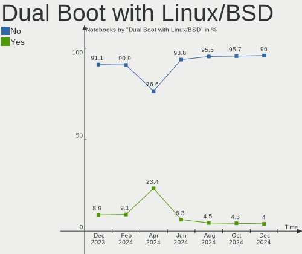
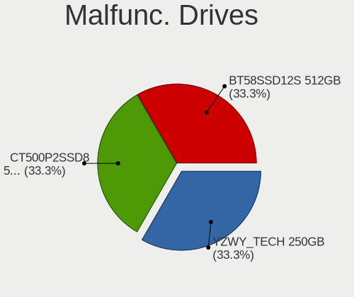
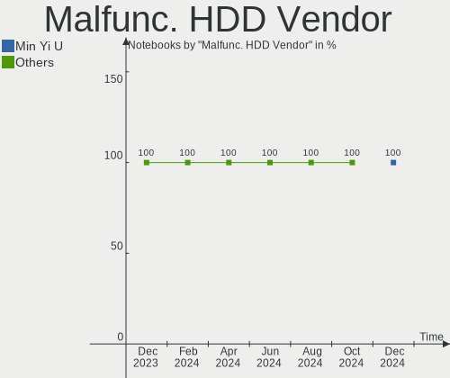
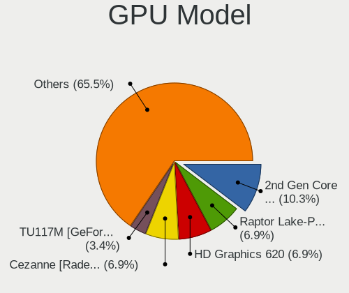
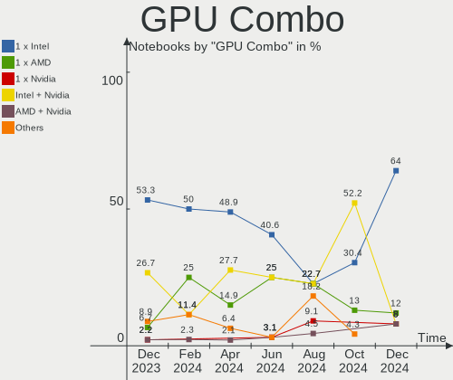
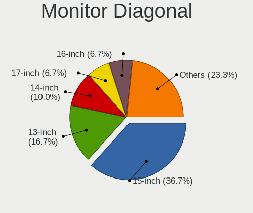
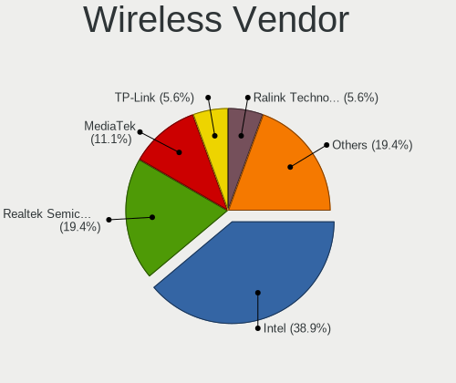
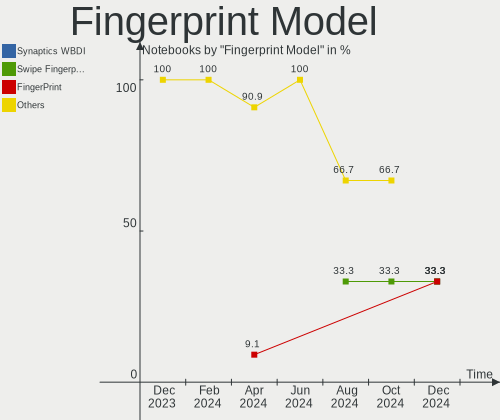
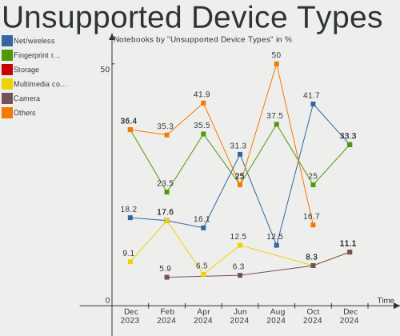

Kali - Hardware Trends (Notebooks)
----------------------------------

A project to identify most popular hardware characteristics and track their change
over time based on data collected by Linux users at https://Linux-Hardware.org.

Anyone can contribute to this report by the [hw-probe](https://github.com/linuxhw/hw-probe) tool:

    sudo -E hw-probe -all -upload

This report is for one last month. Overall report since the beginning of time: [TestDays](https://github.com/linuxhw/TestDays)

Period: Apr, 2023.

Contents
--------

* [ System ](#system)
  - [ OS                       ](#os)
  - [ OS Family                ](#os-family)
  - [ Kernel                   ](#kernel)
  - [ Kernel Family            ](#kernel-family)
  - [ Kernel Major Ver.        ](#kernel-major-ver)
  - [ Arch                     ](#arch)
  - [ DE                       ](#de)
  - [ Display Server           ](#display-server)
  - [ Display Manager          ](#display-manager)
  - [ OS Lang                  ](#os-lang)
  - [ Boot Mode                ](#boot-mode)
  - [ Filesystem               ](#filesystem)
  - [ Part. scheme             ](#part-scheme)
  - [ Dual Boot with Linux/BSD ](#dual-boot-with-linuxbsd)
  - [ Dual Boot (Win)          ](#dual-boot-win)

* [ Board ](#board)
  - [ Vendor                   ](#vendor)
  - [ Model                    ](#model)
  - [ Model Family             ](#model-family)
  - [ MFG Year                 ](#mfg-year)
  - [ Form Factor              ](#form-factor)
  - [ Secure Boot              ](#secure-boot)
  - [ Coreboot                 ](#coreboot)
  - [ RAM Size                 ](#ram-size)
  - [ RAM Used                 ](#ram-used)
  - [ Total Drives             ](#total-drives)
  - [ Has CD-ROM               ](#has-cd-rom)
  - [ Has Ethernet             ](#has-ethernet)
  - [ Has WiFi                 ](#has-wifi)
  - [ Has Bluetooth            ](#has-bluetooth)

* [ Location ](#location)
  - [ Country                  ](#country)
  - [ City                     ](#city)

* [ Drives ](#drives)
  - [ Drive Vendor             ](#drive-vendor)
  - [ Drive Model              ](#drive-model)
  - [ HDD Vendor               ](#hdd-vendor)
  - [ SSD Vendor               ](#ssd-vendor)
  - [ Drive Kind               ](#drive-kind)
  - [ Drive Connector          ](#drive-connector)
  - [ Drive Size               ](#drive-size)
  - [ Space Total              ](#space-total)
  - [ Space Used               ](#space-used)
  - [ Malfunc. Drives          ](#malfunc-drives)
  - [ Malfunc. Drive Vendor    ](#malfunc-drive-vendor)
  - [ Malfunc. HDD Vendor      ](#malfunc-hdd-vendor)
  - [ Malfunc. Drive Kind      ](#malfunc-drive-kind)
  - [ Failed Drives            ](#failed-drives)
  - [ Failed Drive Vendor      ](#failed-drive-vendor)
  - [ Drive Status             ](#drive-status)

* [ Storage controller ](#storage-controller)
  - [ Storage Vendor           ](#storage-vendor)
  - [ Storage Model            ](#storage-model)
  - [ Storage Kind             ](#storage-kind)

* [ Processor ](#processor)
  - [ CPU Vendor               ](#cpu-vendor)
  - [ CPU Model                ](#cpu-model)
  - [ CPU Model Family         ](#cpu-model-family)
  - [ CPU Cores                ](#cpu-cores)
  - [ CPU Sockets              ](#cpu-sockets)
  - [ CPU Threads              ](#cpu-threads)
  - [ CPU Op-Modes             ](#cpu-op-modes)
  - [ CPU Microcode            ](#cpu-microcode)
  - [ CPU Microarch            ](#cpu-microarch)

* [ Graphics ](#graphics)
  - [ GPU Vendor               ](#gpu-vendor)
  - [ GPU Model                ](#gpu-model)
  - [ GPU Combo                ](#gpu-combo)
  - [ GPU Driver               ](#gpu-driver)
  - [ GPU Memory               ](#gpu-memory)

* [ Monitor ](#monitor)
  - [ Monitor Vendor           ](#monitor-vendor)
  - [ Monitor Model            ](#monitor-model)
  - [ Monitor Resolution       ](#monitor-resolution)
  - [ Monitor Diagonal         ](#monitor-diagonal)
  - [ Monitor Width            ](#monitor-width)
  - [ Aspect Ratio             ](#aspect-ratio)
  - [ Monitor Area             ](#monitor-area)
  - [ Pixel Density            ](#pixel-density)
  - [ Multiple Monitors        ](#multiple-monitors)

* [ Network ](#network)
  - [ Net Controller Vendor    ](#net-controller-vendor)
  - [ Net Controller Model     ](#net-controller-model)
  - [ Wireless Vendor          ](#wireless-vendor)
  - [ Wireless Model           ](#wireless-model)
  - [ Ethernet Vendor          ](#ethernet-vendor)
  - [ Ethernet Model           ](#ethernet-model)
  - [ Net Controller Kind      ](#net-controller-kind)
  - [ Used Controller          ](#used-controller)
  - [ NICs                     ](#nics)
  - [ IPv6                     ](#ipv6)

* [ Bluetooth ](#bluetooth)
  - [ Bluetooth Vendor         ](#bluetooth-vendor)
  - [ Bluetooth Model          ](#bluetooth-model)

* [ Sound ](#sound)
  - [ Sound Vendor             ](#sound-vendor)
  - [ Sound Model              ](#sound-model)

* [ Memory ](#memory)
  - [ Memory Vendor            ](#memory-vendor)
  - [ Memory Model             ](#memory-model)
  - [ Memory Kind              ](#memory-kind)
  - [ Memory Form Factor       ](#memory-form-factor)
  - [ Memory Size              ](#memory-size)
  - [ Memory Speed             ](#memory-speed)

* [ Printers & scanners ](#printers--scanners)
  - [ Printer Vendor           ](#printer-vendor)
  - [ Printer Model            ](#printer-model)
  - [ Scanner Vendor           ](#scanner-vendor)
  - [ Scanner Model            ](#scanner-model)

* [ Camera ](#camera)
  - [ Camera Vendor            ](#camera-vendor)
  - [ Camera Model             ](#camera-model)

* [ Security ](#security)
  - [ Fingerprint Vendor       ](#fingerprint-vendor)
  - [ Fingerprint Model        ](#fingerprint-model)
  - [ Chipcard Vendor          ](#chipcard-vendor)
  - [ Chipcard Model           ](#chipcard-model)

* [ Unsupported ](#unsupported)
  - [ Unsupported Devices      ](#unsupported-devices)
  - [ Unsupported Device Types ](#unsupported-device-types)

System
------

OS
--

Installed operating systems

| Name        | Notebooks | Percent |
|-------------|-----------|---------|
| Kali 2023.1 | 45        | 97.83%  |
| Kali 2021.4 | 1         | 2.17%   |

OS Family
---------

OS without a version

| Name | Notebooks | Percent |
|------|-----------|---------|
| Kali | 46        | 100%    |

Kernel
------

Version of the Linux kernel

| Version            | Notebooks | Percent |
|--------------------|-----------|---------|
| 6.1.0-kali7-amd64  | 30        | 65.22%  |
| 6.1.0-kali5-amd64  | 12        | 26.09%  |
| 6.1.20             | 1         | 2.17%   |
| 6.0.0-kali6-amd64  | 1         | 2.17%   |
| 5.18.0-kali5-amd64 | 1         | 2.17%   |
| 5.14.0-kali4-amd64 | 1         | 2.17%   |

Kernel Family
-------------

Linux kernel without a distro release

| Version | Notebooks | Percent |
|---------|-----------|---------|
| 6.1.0   | 42        | 91.3%   |
| 6.1.20  | 1         | 2.17%   |
| 6.0.0   | 1         | 2.17%   |
| 5.18.0  | 1         | 2.17%   |
| 5.14.0  | 1         | 2.17%   |

Kernel Major Ver.
-----------------

Linux kernel major version

| Version | Notebooks | Percent |
|---------|-----------|---------|
| 6.1     | 43        | 93.48%  |
| 6.0     | 1         | 2.17%   |
| 5.18    | 1         | 2.17%   |
| 5.14    | 1         | 2.17%   |

Arch
----

OS architecture (x86_64, i586, etc.)

| Name   | Notebooks | Percent |
|--------|-----------|---------|
| x86_64 | 46        | 100%    |

DE
--

Desktop Environment

| Name  | Notebooks | Percent |
|-------|-----------|---------|
| XFCE  | 27        | 58.7%   |
| GNOME | 11        | 23.91%  |
| KDE5  | 8         | 17.39%  |

Display Server
--------------

X11 or Wayland

| Name    | Notebooks | Percent |
|---------|-----------|---------|
| X11     | 41        | 89.13%  |
| Wayland | 4         | 8.7%    |
| Tty     | 1         | 2.17%   |

Display Manager
---------------

SDDM, LightDM, etc.

| Name    | Notebooks | Percent |
|---------|-----------|---------|
| LightDM | 23        | 50%     |
| SDDM    | 8         | 17.39%  |
| GDM3    | 8         | 17.39%  |
| Unknown | 7         | 15.22%  |

OS Lang
-------

Language

| Lang  | Notebooks | Percent |
|-------|-----------|---------|
| en_US | 27        | 58.7%   |
| en_GB | 4         | 8.7%    |
| ru_RU | 3         | 6.52%   |
| fr_FR | 2         | 4.35%   |
| de_DE | 2         | 4.35%   |
| tr_TR | 1         | 2.17%   |
| pt_PT | 1         | 2.17%   |
| pt_BR | 1         | 2.17%   |
| pl_PL | 1         | 2.17%   |
| it_IT | 1         | 2.17%   |
| es_ES | 1         | 2.17%   |
| en_NZ | 1         | 2.17%   |
| en_AU | 1         | 2.17%   |

Boot Mode
---------

EFI or BIOS

| Mode | Notebooks | Percent |
|------|-----------|---------|
| EFI  | 37        | 80.43%  |
| BIOS | 9         | 19.57%  |

Filesystem
----------

Type of filesystem

| Type    | Notebooks | Percent |
|---------|-----------|---------|
| Ext4    | 41        | 89.13%  |
| Overlay | 3         | 6.52%   |
| Ext2    | 1         | 2.17%   |
| Btrfs   | 1         | 2.17%   |

Part. scheme
------------

Scheme of partitioning

| Type    | Notebooks | Percent |
|---------|-----------|---------|
| GPT     | 33        | 71.74%  |
| Unknown | 7         | 15.22%  |
| MBR     | 6         | 13.04%  |

Dual Boot with Linux/BSD
------------------------

Hosting more than one Linux/BSD

| Dual boot | Notebooks | Percent |
|-----------|-----------|---------|
| No        | 40        | 86.96%  |
| Yes       | 6         | 13.04%  |

Dual Boot (Win)
---------------

Hosting Linux and Windows

| Dual boot | Notebooks | Percent |
|-----------|-----------|---------|
| No        | 25        | 54.35%  |
| Yes       | 21        | 45.65%  |

Board
-----

Vendor
------

Motherboard manufacturer

| Name                | Notebooks | Percent |
|---------------------|-----------|---------|
| Lenovo              | 11        | 23.91%  |
| Hewlett-Packard     | 10        | 21.74%  |
| Dell                | 8         | 17.39%  |
| ASUSTek Computer    | 5         | 10.87%  |
| HUAWEI              | 2         | 4.35%   |
| Chuwi               | 2         | 4.35%   |
| Apple               | 2         | 4.35%   |
| Acer                | 2         | 4.35%   |
| Panasonic           | 1         | 2.17%   |
| MSI                 | 1         | 2.17%   |
| Mediacom            | 1         | 2.17%   |
| Gigabyte Technology | 1         | 2.17%   |

Model
-----

Motherboard model

| Name                                        | Notebooks | Percent |
|---------------------------------------------|-----------|---------|
| HP EliteBook 840 G7 Notebook PC             | 2         | 4.35%   |
| Chuwi GemiBook Pro                          | 2         | 4.35%   |
| Panasonic CF-19RHSC8FN                      | 1         | 2.17%   |
| MSI GP76 Leopard 10UE                       | 1         | 2.17%   |
| Mediacom WinPad 11,6 FullHD- WPU11          | 1         | 2.17%   |
| Lenovo V15 G3 ABA 82TV                      | 1         | 2.17%   |
| Lenovo ThinkPad X13 Gen 1 20T20030GE        | 1         | 2.17%   |
| Lenovo ThinkPad T490 20N20008US             | 1         | 2.17%   |
| Lenovo ThinkPad L560 20F2S13L00             | 1         | 2.17%   |
| Lenovo ThinkPad L480 20LTS1NK27             | 1         | 2.17%   |
| Lenovo ThinkPad E15 Gen 3 20YG004DMX        | 1         | 2.17%   |
| Lenovo IdeaPad Slim 7 15IIL05 82AD          | 1         | 2.17%   |
| Lenovo IdeaPad L340-15IRH Gaming 81LK       | 1         | 2.17%   |
| Lenovo IdeaPad Gaming 3 15IMH05 81Y4        | 1         | 2.17%   |
| Lenovo IdeaPad 3 17IML05 81WC               | 1         | 2.17%   |
| Lenovo IdeaPad 110-17IKB 80VK               | 1         | 2.17%   |
| HUAWEI RLEF-XX                              | 1         | 2.17%   |
| HUAWEI KLVC-WXX9                            | 1         | 2.17%   |
| HP ProBook 450 G6                           | 1         | 2.17%   |
| HP ProBook 445 G7                           | 1         | 2.17%   |
| HP Pavilion Laptop 15-eh0xxx                | 1         | 2.17%   |
| HP Pavilion Gaming Laptop 15-dk1xxx         | 1         | 2.17%   |
| HP Laptop 17-cp0xxx                         | 1         | 2.17%   |
| HP EliteBook 840 G1                         | 1         | 2.17%   |
| HP 255 G8 Notebook PC                       | 1         | 2.17%   |
| HP 15 Notebook PC                           | 1         | 2.17%   |
| Gigabyte G5 GD                              | 1         | 2.17%   |
| Dell XPS 17 9710                            | 1         | 2.17%   |
| Dell Precision M4800                        | 1         | 2.17%   |
| Dell Latitude E7250                         | 1         | 2.17%   |
| Dell Latitude E7240                         | 1         | 2.17%   |
| Dell Latitude E6430                         | 1         | 2.17%   |
| Dell Latitude E6420                         | 1         | 2.17%   |
| Dell Latitude E4300                         | 1         | 2.17%   |
| Dell Inspiron 16 Plus 7620                  | 1         | 2.17%   |
| ASUS ZenBook UX481FL_UX481FL                | 1         | 2.17%   |
| ASUS X751SA                                 | 1         | 2.17%   |
| ASUS X555BP                                 | 1         | 2.17%   |
| ASUS ASUS TUF Gaming A17 FA706ICB_TUF706ICB | 1         | 2.17%   |
| ASUS ASUS TUF Gaming A15 FA506IU_FA506IU    | 1         | 2.17%   |

Model Family
------------

Motherboard model prefix

| Name                   | Notebooks | Percent |
|------------------------|-----------|---------|
| Lenovo ThinkPad        | 5         | 10.87%  |
| Lenovo IdeaPad         | 5         | 10.87%  |
| Dell Latitude          | 5         | 10.87%  |
| HP EliteBook           | 3         | 6.52%   |
| HP ProBook             | 2         | 4.35%   |
| HP Pavilion            | 2         | 4.35%   |
| Chuwi GemiBook         | 2         | 4.35%   |
| ASUS ASUS              | 2         | 4.35%   |
| Acer Aspire            | 2         | 4.35%   |
| Panasonic CF-19RHSC8FN | 1         | 2.17%   |
| MSI GP76               | 1         | 2.17%   |
| Mediacom WinPad        | 1         | 2.17%   |
| Lenovo V15             | 1         | 2.17%   |
| HUAWEI RLEF-XX         | 1         | 2.17%   |
| HUAWEI KLVC-WXX9       | 1         | 2.17%   |
| HP Laptop              | 1         | 2.17%   |
| HP 255                 | 1         | 2.17%   |
| HP 15                  | 1         | 2.17%   |
| Gigabyte G5            | 1         | 2.17%   |
| Dell XPS               | 1         | 2.17%   |
| Dell Precision         | 1         | 2.17%   |
| Dell Inspiron          | 1         | 2.17%   |
| ASUS ZenBook           | 1         | 2.17%   |
| ASUS X751SA            | 1         | 2.17%   |
| ASUS X555BP            | 1         | 2.17%   |
| Apple MacBookAir7      | 1         | 2.17%   |
| Apple MacBook5         | 1         | 2.17%   |

MFG Year
--------

Motherboard manufacture year

| Year | Notebooks | Percent |
|------|-----------|---------|
| 2020 | 11        | 23.91%  |
| 2021 | 6         | 13.04%  |
| 2022 | 5         | 10.87%  |
| 2019 | 4         | 8.7%    |
| 2018 | 3         | 6.52%   |
| 2016 | 3         | 6.52%   |
| 2015 | 3         | 6.52%   |
| 2013 | 3         | 6.52%   |
| 2023 | 1         | 2.17%   |
| 2014 | 1         | 2.17%   |
| 2012 | 1         | 2.17%   |
| 2011 | 1         | 2.17%   |
| 2010 | 1         | 2.17%   |
| 2009 | 1         | 2.17%   |
| 2008 | 1         | 2.17%   |
| 2007 | 1         | 2.17%   |

Form Factor
-----------

Physical design of the computer

| Name     | Notebooks | Percent |
|----------|-----------|---------|
| Notebook | 46        | 100%    |

Secure Boot
-----------

Enabled or disabled

| State    | Notebooks | Percent |
|----------|-----------|---------|
| Disabled | 46        | 100%    |

Coreboot
--------

Have coreboot on board

| Used | Notebooks | Percent |
|------|-----------|---------|
| No   | 46        | 100%    |

RAM Size
--------

Total RAM memory

| Size in GB | Notebooks | Percent |
|------------|-----------|---------|
| 4.01-8.0   | 14        | 30.43%  |
| 16.01-24.0 | 14        | 30.43%  |
| 3.01-4.0   | 6         | 13.04%  |
| 8.01-16.0  | 6         | 13.04%  |
| 32.01-64.0 | 4         | 8.7%    |
| 1.01-2.0   | 2         | 4.35%   |

RAM Used
--------

Used RAM memory

| Used GB  | Notebooks | Percent |
|----------|-----------|---------|
| 2.01-3.0 | 12        | 26.09%  |
| 1.01-2.0 | 12        | 26.09%  |
| 3.01-4.0 | 11        | 23.91%  |
| 4.01-8.0 | 8         | 17.39%  |
| 0.51-1.0 | 2         | 4.35%   |
| 0.01-0.5 | 1         | 2.17%   |

Total Drives
------------

Number of drives on board

| Drives | Notebooks | Percent |
|--------|-----------|---------|
| 1      | 36        | 78.26%  |
| 2      | 9         | 19.57%  |
| 3      | 1         | 2.17%   |

Has CD-ROM
----------

Has CD-ROM on board

| Presented | Notebooks | Percent |
|-----------|-----------|---------|
| No        | 41        | 89.13%  |
| Yes       | 5         | 10.87%  |

Has Ethernet
------------

Has Ethernet on board

| Presented | Notebooks | Percent |
|-----------|-----------|---------|
| Yes       | 37        | 80.43%  |
| No        | 9         | 19.57%  |

Has WiFi
--------

Has WiFi module

| Presented | Notebooks | Percent |
|-----------|-----------|---------|
| Yes       | 45        | 97.83%  |
| No        | 1         | 2.17%   |

Has Bluetooth
-------------

Has Bluetooth module

| Presented | Notebooks | Percent |
|-----------|-----------|---------|
| Yes       | 40        | 86.96%  |
| No        | 6         | 13.04%  |

Location
--------

Country
-------

Geographic location (country)

| Country     | Notebooks | Percent |
|-------------|-----------|---------|
| USA         | 12        | 26.09%  |
| Russia      | 6         | 13.04%  |
| UK          | 3         | 6.52%   |
| Spain       | 2         | 4.35%   |
| Portugal    | 2         | 4.35%   |
| Poland      | 2         | 4.35%   |
| Germany     | 2         | 4.35%   |
| France      | 2         | 4.35%   |
| Zambia      | 1         | 2.17%   |
| Turkey      | 1         | 2.17%   |
| Panama      | 1         | 2.17%   |
| New Zealand | 1         | 2.17%   |
| Kenya       | 1         | 2.17%   |
| Italy       | 1         | 2.17%   |
| Iran        | 1         | 2.17%   |
| India       | 1         | 2.17%   |
| Ghana       | 1         | 2.17%   |
| Estonia     | 1         | 2.17%   |
| Bulgaria    | 1         | 2.17%   |
| Brazil      | 1         | 2.17%   |
| Belarus     | 1         | 2.17%   |
| Austria     | 1         | 2.17%   |
| Australia   | 1         | 2.17%   |

City
----

Geographic location (city)

| City                  | Notebooks | Percent |
|-----------------------|-----------|---------|
| St Petersburg         | 2         | 4.35%   |
| Perm                  | 2         | 4.35%   |
| Yekaterinburg         | 1         | 2.17%   |
| Welwyn Garden City    | 1         | 2.17%   |
| Warsaw                | 1         | 2.17%   |
| Vigo                  | 1         | 2.17%   |
| Tehran                | 1         | 2.17%   |
| Tampa                 | 1         | 2.17%   |
| Tallinn               | 1         | 2.17%   |
| Sydney                | 1         | 2.17%   |
| Surbiton              | 1         | 2.17%   |
| Sofia                 | 1         | 2.17%   |
| San Diego             | 1         | 2.17%   |
| Portland              | 1         | 2.17%   |
| Pereira Barreto       | 1         | 2.17%   |
| Panama City           | 1         | 2.17%   |
| Nairobi               | 1         | 2.17%   |
| Moscow                | 1         | 2.17%   |
| Mohali                | 1         | 2.17%   |
| Maracena              | 1         | 2.17%   |
| Lusaka                | 1         | 2.17%   |
| Lublin                | 1         | 2.17%   |
| London                | 1         | 2.17%   |
| Lodi                  | 1         | 2.17%   |
| Le Clerjus            | 1         | 2.17%   |
| Kals am Grossglockner | 1         | 2.17%   |
| Istanbul              | 1         | 2.17%   |
| Issy-les-Moulineaux   | 1         | 2.17%   |
| Gomel                 | 1         | 2.17%   |
| Florence              | 1         | 2.17%   |
| Everett               | 1         | 2.17%   |
| Elk Grove             | 1         | 2.17%   |
| Conroe                | 1         | 2.17%   |
| Columbus              | 1         | 2.17%   |
| Chicago               | 1         | 2.17%   |
| Casier                | 1         | 2.17%   |
| Braga                 | 1         | 2.17%   |
| Birmingham            | 1         | 2.17%   |
| Berlin                | 1         | 2.17%   |
| Bay City              | 1         | 2.17%   |

Drives
------

Drive Vendor
------------

Hard drive vendors

| Vendor              | Notebooks | Drives | Percent |
|---------------------|-----------|--------|---------|
| Samsung Electronics | 13        | 13     | 23.21%  |
| Seagate             | 8         | 8      | 14.29%  |
| WDC                 | 5         | 5      | 8.93%   |
| Kingston            | 5         | 6      | 8.93%   |
| SanDisk             | 3         | 3      | 5.36%   |
| China               | 3         | 3      | 5.36%   |
| A-DATA Technology   | 3         | 3      | 5.36%   |
| Unknown             | 2         | 2      | 3.57%   |
| UMIS                | 2         | 2      | 3.57%   |
| Phison              | 2         | 2      | 3.57%   |
| Lexar               | 2         | 2      | 3.57%   |
| Intel               | 2         | 2      | 3.57%   |
| Toshiba             | 1         | 1      | 1.79%   |
| Smartbuy            | 1         | 1      | 1.79%   |
| Silicon Motion      | 1         | 1      | 1.79%   |
| LaCie               | 1         | 1      | 1.79%   |
| Crucial             | 1         | 1      | 1.79%   |
| Apple               | 1         | 1      | 1.79%   |

Drive Model
-----------

Hard drive models

| Model                                | Notebooks | Percent |
|--------------------------------------|-----------|---------|
| Samsung MZVLB256HBHQ-000L7 256GB     | 2         | 3.51%   |
| China G521N256GB                     | 2         | 3.51%   |
| WDC WDS240G2G0A-00JH30 240GB SSD     | 1         | 1.75%   |
| WDC WD10SPZX-60Z10T1 1TB             | 1         | 1.75%   |
| WDC WD10SPZX-21Z10T0 1TB             | 1         | 1.75%   |
| WDC PC SN530 SDBPNPZ-256G-1006 256GB | 1         | 1.75%   |
| WDC PC SN530 SDBPMPZ-256G-1001 256GB | 1         | 1.75%   |
| Unknown SD  32GB                     | 1         | 1.75%   |
| Unknown NCard  32GB                  | 1         | 1.75%   |
| UMIS RPJTJ512MEE1OWX 512GB           | 1         | 1.75%   |
| UMIS RPFTJ256PDD2MWX 256GB           | 1         | 1.75%   |
| Toshiba MQ01ABD100 1TB               | 1         | 1.75%   |
| Smartbuy SSD 512GB                   | 1         | 1.75%   |
| Silicon Motion PCIe-8 SSD 512GB      | 1         | 1.75%   |
| Seagate ST980811AS 80GB              | 1         | 1.75%   |
| Seagate ST9500325AS 500GB            | 1         | 1.75%   |
| Seagate ST750LM022 HN-M750MBB 752GB  | 1         | 1.75%   |
| Seagate ST500LT012-1DG142 500GB      | 1         | 1.75%   |
| Seagate ST200FM0 012 200GB           | 1         | 1.75%   |
| Seagate ST2000LX001-1RG174 2TB       | 1         | 1.75%   |
| Seagate ST1000VT001-1RE172 1TB       | 1         | 1.75%   |
| Seagate Expansion 4TB                | 1         | 1.75%   |
| SanDisk X300 MSATA 256GB SSD         | 1         | 1.75%   |
| SanDisk SD6SB2M512G1022I 512GB SSD   | 1         | 1.75%   |
| SanDisk NVMe SSD Drive 1TB           | 1         | 1.75%   |
| Samsung SSD PM810 mSATA 128GB        | 1         | 1.75%   |
| Samsung SSD 980 PRO 1TB              | 1         | 1.75%   |
| Samsung SSD 870 QVO 1TB              | 1         | 1.75%   |
| Samsung SSD 860 EVO 500GB            | 1         | 1.75%   |
| Samsung SSD 850 PRO 256GB            | 1         | 1.75%   |
| Samsung SSD 850 EVO 500GB            | 1         | 1.75%   |
| Samsung PM9B1 NVMe 1024GB            | 1         | 1.75%   |
| Samsung MZVLQ512HBLU-00B00 512GB     | 1         | 1.75%   |
| Samsung MZVLQ512HALU-000H1 512GB     | 1         | 1.75%   |
| Samsung MZVLQ256HAJD-000H1 256GB     | 1         | 1.75%   |
| Samsung MZVLB1T0HALR-00000 1TB       | 1         | 1.75%   |
| Phison Sabrent Rocket Q 1TB          | 1         | 1.75%   |
| Phison ESR512GTLG-E6GBTNB4 512GB     | 1         | 1.75%   |
| Lexar SSD NM620 512GB                | 1         | 1.75%   |
| Lexar 512GB SSD                      | 1         | 1.75%   |

HDD Vendor
----------

Hard disk drive vendors

| Vendor  | Notebooks | Drives | Percent |
|---------|-----------|--------|---------|
| Seagate | 8         | 8      | 72.73%  |
| WDC     | 2         | 2      | 18.18%  |
| Toshiba | 1         | 1      | 9.09%   |

SSD Vendor
----------

Solid state drive vendors

| Vendor              | Notebooks | Drives | Percent |
|---------------------|-----------|--------|---------|
| Samsung Electronics | 5         | 5      | 26.32%  |
| China               | 3         | 3      | 15.79%  |
| SanDisk             | 2         | 2      | 10.53%  |
| Kingston            | 2         | 2      | 10.53%  |
| A-DATA Technology   | 2         | 2      | 10.53%  |
| WDC                 | 1         | 1      | 5.26%   |
| Smartbuy            | 1         | 1      | 5.26%   |
| Intel               | 1         | 1      | 5.26%   |
| Crucial             | 1         | 1      | 5.26%   |
| Apple               | 1         | 1      | 5.26%   |

Drive Kind
----------

HDD or SSD

| Kind    | Notebooks | Drives | Percent |
|---------|-----------|--------|---------|
| NVMe    | 21        | 24     | 38.89%  |
| SSD     | 19        | 19     | 35.19%  |
| HDD     | 11        | 11     | 20.37%  |
| MMC     | 2         | 2      | 3.7%    |
| Unknown | 1         | 1      | 1.85%   |

Drive Connector
---------------

SATA, SAS, NVMe, etc.

| Type | Notebooks | Drives | Percent |
|------|-----------|--------|---------|
| SATA | 26        | 28     | 50%     |
| NVMe | 21        | 24     | 40.38%  |
| SAS  | 3         | 3      | 5.77%   |
| MMC  | 2         | 2      | 3.85%   |

Drive Size
----------

Size of hard drive

| Size in TB | Notebooks | Drives | Percent |
|------------|-----------|--------|---------|
| 0.01-0.5   | 18        | 19     | 62.07%  |
| 0.51-1.0   | 9         | 9      | 31.03%  |
| 3.01-4.0   | 1         | 1      | 3.45%   |
| 1.01-2.0   | 1         | 1      | 3.45%   |

Space Total
-----------

Amount of disk space available on the file system

| Size in GB     | Notebooks | Percent |
|----------------|-----------|---------|
| 101-250        | 19        | 41.3%   |
| 251-500        | 10        | 21.74%  |
| 501-1000       | 5         | 10.87%  |
| 21-50          | 4         | 8.7%    |
| 51-100         | 4         | 8.7%    |
| 1-20           | 3         | 6.52%   |
| More than 3000 | 1         | 2.17%   |

Space Used
----------

Amount of used disk space

| Used GB        | Notebooks | Percent |
|----------------|-----------|---------|
| 21-50          | 16        | 34.78%  |
| 1-20           | 16        | 34.78%  |
| 51-100         | 8         | 17.39%  |
| 101-250        | 3         | 6.52%   |
| More than 3000 | 1         | 2.17%   |
| 251-500        | 1         | 2.17%   |
| 501-1000       | 1         | 2.17%   |

Malfunc. Drives
---------------

Drive models with a malfunction

| Model                                     | Notebooks | Drives | Percent |
|-------------------------------------------|-----------|--------|---------|
| China G521N256GB                          | 2         | 2      | 50%     |
| Seagate ST1000VT001-1RE172 1TB            | 1         | 1      | 25%     |
| Samsung Electronics SSD PM810 mSATA 128GB | 1         | 1      | 25%     |

Malfunc. Drive Vendor
---------------------

Vendors of faulty drives

| Vendor              | Notebooks | Drives | Percent |
|---------------------|-----------|--------|---------|
| China               | 2         | 2      | 50%     |
| Seagate             | 1         | 1      | 25%     |
| Samsung Electronics | 1         | 1      | 25%     |

Malfunc. HDD Vendor
-------------------

Vendors of faulty HDD drives

| Vendor  | Notebooks | Drives | Percent |
|---------|-----------|--------|---------|
| Seagate | 1         | 1      | 100%    |

Malfunc. Drive Kind
-------------------

Kinds of faulty drives

| Kind | Notebooks | Drives | Percent |
|------|-----------|--------|---------|
| SSD  | 3         | 3      | 75%     |
| HDD  | 1         | 1      | 25%     |

Failed Drives
-------------

Failed drive models

Zero info for selected period =(

Failed Drive Vendor
-------------------

Failed drive vendors

Zero info for selected period =(

Drive Status
------------

Number of failed and malfunc. drives

| Status   | Notebooks | Drives | Percent |
|----------|-----------|--------|---------|
| Works    | 34        | 40     | 66.67%  |
| Detected | 13        | 13     | 25.49%  |
| Malfunc  | 4         | 4      | 7.84%   |

Storage controller
------------------

Storage Vendor
--------------

Storage controller vendors

| Vendor                       | Notebooks | Percent |
|------------------------------|-----------|---------|
| Intel                        | 25        | 45.45%  |
| Samsung Electronics          | 9         | 16.36%  |
| AMD                          | 5         | 9.09%   |
| SanDisk                      | 3         | 5.45%   |
| Kingston Technology Company  | 3         | 5.45%   |
| Union Memory (Shenzhen)      | 2         | 3.64%   |
| Phison Electronics           | 2         | 3.64%   |
| Nvidia                       | 2         | 3.64%   |
| Silicon Motion               | 1         | 1.82%   |
| Shenzhen Longsys Electronics | 1         | 1.82%   |
| MAXIO Technology (Hangzhou)  | 1         | 1.82%   |
| ADATA Technology             | 1         | 1.82%   |

Storage Model
-------------

Storage controller models

| Model                                                                            | Notebooks | Percent |
|----------------------------------------------------------------------------------|-----------|---------|
| Intel 82801 Mobile SATA Controller [RAID mode]                                   | 8         | 14.04%  |
| AMD FCH SATA Controller [AHCI mode]                                              | 5         | 8.77%   |
| Samsung NVMe SSD Controller SM981/PM981/PM983                                    | 3         | 5.26%   |
| Samsung NVMe SSD Controller 980                                                  | 3         | 5.26%   |
| Kingston Company Company Non-Volatile memory controller                          | 3         | 5.26%   |
| Intel Sunrise Point-LP SATA Controller [AHCI mode]                               | 3         | 5.26%   |
| Union Memory (Shenzhen) Non-Volatile memory controller                           | 2         | 3.51%   |
| Intel Jasper Lake SATA AHCI Controller                                           | 2         | 3.51%   |
| Intel Comet Lake SATA AHCI Controller                                            | 2         | 3.51%   |
| Silicon Motion Non-Volatile memory controller                                    | 1         | 1.75%   |
| Shenzhen Longsys Electronics Non-Volatile memory controller                      | 1         | 1.75%   |
| SanDisk WD Blue SN570 NVMe SSD 1TB                                               | 1         | 1.75%   |
| SanDisk WD Blue SN550 NVMe SSD                                                   | 1         | 1.75%   |
| SanDisk NVMe Controller                                                          | 1         | 1.75%   |
| Samsung NVMe SSD Controller PM9B1                                                | 1         | 1.75%   |
| Samsung NVMe SSD Controller PM9A1/PM9A3/980PRO                                   | 1         | 1.75%   |
| Samsung Electronics SATA controller                                              | 1         | 1.75%   |
| Phison E16 PCIe4 NVMe Controller                                                 | 1         | 1.75%   |
| Phison E12 NVMe Controller                                                       | 1         | 1.75%   |
| Nvidia MCP79 AHCI Controller                                                     | 1         | 1.75%   |
| Nvidia MCP67 IDE Controller                                                      | 1         | 1.75%   |
| Nvidia MCP67 AHCI Controller                                                     | 1         | 1.75%   |
| MAXIO (Hangzhou) NVMe SSD Controller MAP1202                                     | 1         | 1.75%   |
| Kingston Company A2000 NVMe SSD                                                  | 1         | 1.75%   |
| Intel Non-Volatile memory controller                                             | 1         | 1.75%   |
| Intel Cannon Point-LP SATA Controller [AHCI Mode]                                | 1         | 1.75%   |
| Intel Cannon Lake Mobile PCH SATA AHCI Controller                                | 1         | 1.75%   |
| Intel Atom/Celeron/Pentium Processor x5-E8000/J3xxx/N3xxx Series SATA Controller | 1         | 1.75%   |
| Intel Atom Processor E3800 Series SATA AHCI Controller                           | 1         | 1.75%   |
| Intel 82801IBM/IEM (ICH9M/ICH9M-E) 4 port SATA Controller [AHCI mode]            | 1         | 1.75%   |
| Intel 8 Series SATA Controller 1 [AHCI mode]                                     | 1         | 1.75%   |
| Intel 500 Series Chipset Family SATA AHCI Controller                             | 1         | 1.75%   |
| Intel 5 Series/3400 Series Chipset 6 port SATA AHCI Controller                   | 1         | 1.75%   |
| Intel 400 Series Chipset Family SATA AHCI Controller                             | 1         | 1.75%   |
| ADATA A Non-Volatile memory controller                                           | 1         | 1.75%   |

Storage Kind
------------

Kind of storage controller (IDE, SATA, NVMe, SAS, ...)

| Kind | Notebooks | Percent |
|------|-----------|---------|
| SATA | 23        | 43.4%   |
| NVMe | 21        | 39.62%  |
| RAID | 8         | 15.09%  |
| IDE  | 1         | 1.89%   |

Processor
---------

CPU Vendor
----------

Processor vendors

| Vendor | Notebooks | Percent |
|--------|-----------|---------|
| Intel  | 36        | 78.26%  |
| AMD    | 10        | 21.74%  |

CPU Model
---------

Processor models

| Model                                        | Notebooks | Percent |
|----------------------------------------------|-----------|---------|
| Intel Core i5-10210U CPU @ 1.60GHz           | 3         | 6.52%   |
| Intel Core i7-10510U CPU @ 1.80GHz           | 2         | 4.35%   |
| Intel Core i5-8265U CPU @ 1.60GHz            | 2         | 4.35%   |
| Intel Celeron N5100 @ 1.10GHz                | 2         | 4.35%   |
| AMD Ryzen 5 4500U with Radeon Graphics       | 2         | 4.35%   |
| Intel Pentium CPU N3710 @ 1.60GHz            | 1         | 2.17%   |
| Intel Pentium CPU N3540 @ 2.16GHz            | 1         | 2.17%   |
| Intel Core i7-8565U CPU @ 1.80GHz            | 1         | 2.17%   |
| Intel Core i7-5600U CPU @ 2.60GHz            | 1         | 2.17%   |
| Intel Core i7-4810MQ CPU @ 2.80GHz           | 1         | 2.17%   |
| Intel Core i7-3720QM CPU @ 2.60GHz           | 1         | 2.17%   |
| Intel Core i7-2620M CPU @ 2.70GHz            | 1         | 2.17%   |
| Intel Core i7-10870H CPU @ 2.20GHz           | 1         | 2.17%   |
| Intel Core i7-10750H CPU @ 2.60GHz           | 1         | 2.17%   |
| Intel Core i5-9300HF CPU @ 2.40GHz           | 1         | 2.17%   |
| Intel Core i5-8350U CPU @ 1.70GHz            | 1         | 2.17%   |
| Intel Core i5-7200U CPU @ 2.50GHz            | 1         | 2.17%   |
| Intel Core i5-5250U CPU @ 1.60GHz            | 1         | 2.17%   |
| Intel Core i5-4310U CPU @ 2.00GHz            | 1         | 2.17%   |
| Intel Core i5-4210U CPU @ 1.70GHz            | 1         | 2.17%   |
| Intel Core i5-1035G4 CPU @ 1.10GHz           | 1         | 2.17%   |
| Intel Core i5-10300H CPU @ 2.50GHz           | 1         | 2.17%   |
| Intel Core i5 CPU U 540 @ 1.20GHz            | 1         | 2.17%   |
| Intel Core i3-6100U CPU @ 2.30GHz            | 1         | 2.17%   |
| Intel Core i3-10110U CPU @ 2.10GHz           | 1         | 2.17%   |
| Intel Core 2 Duo CPU P9400 @ 2.40GHz         | 1         | 2.17%   |
| Intel Core 2 Duo CPU P7350 @ 2.00GHz         | 1         | 2.17%   |
| Intel Atom x5-Z8300 CPU @ 1.44GHz            | 1         | 2.17%   |
| Intel 12th Gen Core i7-12700H                | 1         | 2.17%   |
| Intel 12th Gen Core i5-12450H                | 1         | 2.17%   |
| Intel 11th Gen Core i7-11800H @ 2.30GHz      | 1         | 2.17%   |
| Intel 11th Gen Core i5-11400H @ 2.70GHz      | 1         | 2.17%   |
| AMD Turion 64 X2 Mobile Technology TL-50     | 1         | 2.17%   |
| AMD Ryzen 7 5700U with Radeon Graphics       | 1         | 2.17%   |
| AMD Ryzen 7 4800H with Radeon Graphics       | 1         | 2.17%   |
| AMD Ryzen 5 5625U with Radeon Graphics       | 1         | 2.17%   |
| AMD Ryzen 5 5500U with Radeon Graphics       | 1         | 2.17%   |
| AMD Ryzen 5 4600H with Radeon Graphics       | 1         | 2.17%   |
| AMD A9-9410 RADEON R5, 5 COMPUTE CORES 2C+3G | 1         | 2.17%   |
| AMD 3020e with Radeon Graphics               | 1         | 2.17%   |

CPU Model Family
----------------

Processor model prefix

| Model                   | Notebooks | Percent |
|-------------------------|-----------|---------|
| Intel Core i5           | 14        | 30.43%  |
| Intel Core i7           | 9         | 19.57%  |
| Other                   | 6         | 13.04%  |
| AMD Ryzen 5             | 5         | 10.87%  |
| Intel Pentium           | 2         | 4.35%   |
| Intel Core i3           | 2         | 4.35%   |
| Intel Core 2 Duo        | 2         | 4.35%   |
| Intel Celeron           | 2         | 4.35%   |
| AMD Ryzen 7             | 2         | 4.35%   |
| Intel Atom              | 1         | 2.17%   |
| AMD Turion 64 X2 Mobile | 1         | 2.17%   |

CPU Cores
---------

Number of processor cores

| Number | Notebooks | Percent |
|--------|-----------|---------|
| 4      | 19        | 41.3%   |
| 2      | 14        | 30.43%  |
| 6      | 7         | 15.22%  |
| 8      | 5         | 10.87%  |
| 14     | 1         | 2.17%   |

CPU Sockets
-----------

Number of sockets

| Number | Notebooks | Percent |
|--------|-----------|---------|
| 1      | 46        | 100%    |

CPU Threads
-----------

Threads per core (Hyper-Threading)

| Number | Notebooks | Percent |
|--------|-----------|---------|
| 2      | 34        | 73.91%  |
| 1      | 12        | 26.09%  |

CPU Op-Modes
------------

CPU Operation Modes (32-bit, 64-bit)

| Op mode        | Notebooks | Percent |
|----------------|-----------|---------|
| 32-bit, 64-bit | 46        | 100%    |

CPU Microcode
-------------

Microcode number

| Number     | Notebooks | Percent |
|------------|-----------|---------|
| 0x806ec    | 9         | 19.57%  |
| 0xa0652    | 3         | 6.52%   |
| 0x906c0    | 2         | 4.35%   |
| 0x906a3    | 2         | 4.35%   |
| 0x806d1    | 2         | 4.35%   |
| 0x40651    | 2         | 4.35%   |
| 0x306d4    | 2         | 4.35%   |
| 0x1067a    | 2         | 4.35%   |
| 0x08608103 | 2         | 4.35%   |
| Unknown    | 2         | 4.35%   |
| 0x906ed    | 1         | 2.17%   |
| 0x806ea    | 1         | 2.17%   |
| 0x806e9    | 1         | 2.17%   |
| 0x706e5    | 1         | 2.17%   |
| 0x406e3    | 1         | 2.17%   |
| 0x406c4    | 1         | 2.17%   |
| 0x406c3    | 1         | 2.17%   |
| 0x306c3    | 1         | 2.17%   |
| 0x306a9    | 1         | 2.17%   |
| 0x30678    | 1         | 2.17%   |
| 0x206a7    | 1         | 2.17%   |
| 0x20655    | 1         | 2.17%   |
| 0x0a50000c | 1         | 2.17%   |
| 0x08600109 | 1         | 2.17%   |
| 0x08600106 | 1         | 2.17%   |
| 0x08600104 | 1         | 2.17%   |
| 0x08200103 | 1         | 2.17%   |
| 0x06006705 | 1         | 2.17%   |

CPU Microarch
-------------

Microarchitecture

| Name             | Notebooks | Percent |
|------------------|-----------|---------|
| KabyLake         | 12        | 26.09%  |
| Zen 2            | 4         | 8.7%    |
| Silvermont       | 3         | 6.52%   |
| IceLake          | 3         | 6.52%   |
| Haswell          | 3         | 6.52%   |
| CometLake        | 3         | 6.52%   |
| Tremont          | 2         | 4.35%   |
| Penryn           | 2         | 4.35%   |
| Broadwell        | 2         | 4.35%   |
| Alderlake Hybrid | 2         | 4.35%   |
| Unknown          | 2         | 4.35%   |
| Zen 3            | 1         | 2.17%   |
| Zen              | 1         | 2.17%   |
| Westmere         | 1         | 2.17%   |
| Skylake          | 1         | 2.17%   |
| SandyBridge      | 1         | 2.17%   |
| K8 Hammer        | 1         | 2.17%   |
| IvyBridge        | 1         | 2.17%   |
| Excavator        | 1         | 2.17%   |

Graphics
--------

GPU Vendor
----------

Vendors of graphics cards

| Vendor | Notebooks | Percent |
|--------|-----------|---------|
| Intel  | 34        | 57.63%  |
| Nvidia | 15        | 25.42%  |
| AMD    | 10        | 16.95%  |

GPU Model
---------

Graphics card models

| Model                                                                                    | Notebooks | Percent |
|------------------------------------------------------------------------------------------|-----------|---------|
| Intel CometLake-U GT2 [UHD Graphics]                                                     | 6         | 10%     |
| AMD Renoir                                                                               | 4         | 6.67%   |
| Nvidia GA107M [GeForce RTX 3050 Mobile]                                                  | 3         | 5%      |
| Intel WhiskeyLake-U GT2 [UHD Graphics 620]                                               | 3         | 5%      |
| Intel CometLake-H GT2 [UHD Graphics]                                                     | 3         | 5%      |
| Nvidia TU117M                                                                            | 2         | 3.33%   |
| Intel TigerLake-H GT1 [UHD Graphics]                                                     | 2         | 3.33%   |
| Intel JasperLake [UHD Graphics]                                                          | 2         | 3.33%   |
| Intel Haswell-ULT Integrated Graphics Controller                                         | 2         | 3.33%   |
| Intel Atom/Celeron/Pentium Processor x5-E8000/J3xxx/N3xxx Integrated Graphics Controller | 2         | 3.33%   |
| AMD Lucienne                                                                             | 2         | 3.33%   |
| Nvidia TU117M [GeForce GTX 1650 Mobile / Max-Q]                                          | 1         | 1.67%   |
| Nvidia TU116M [GeForce GTX 1660 Ti Mobile]                                               | 1         | 1.67%   |
| Nvidia GP108BM [GeForce MX250]                                                           | 1         | 1.67%   |
| Nvidia GP107M [GeForce MX350]                                                            | 1         | 1.67%   |
| Nvidia GM108M [GeForce MX130]                                                            | 1         | 1.67%   |
| Nvidia GF119M [NVS 4200M]                                                                | 1         | 1.67%   |
| Nvidia GF108GLM [NVS 5200M]                                                              | 1         | 1.67%   |
| Nvidia GA106M [GeForce RTX 3060 Mobile / Max-Q]                                          | 1         | 1.67%   |
| Nvidia C79 [GeForce 9400M]                                                               | 1         | 1.67%   |
| Nvidia C67 [GeForce 7000M / nForce 610M]                                                 | 1         | 1.67%   |
| Intel UHD Graphics 620                                                                   | 1         | 1.67%   |
| Intel Skylake GT2 [HD Graphics 520]                                                      | 1         | 1.67%   |
| Intel Mobile 4 Series Chipset Integrated Graphics Controller                             | 1         | 1.67%   |
| Intel Iris Plus Graphics G4 (Ice Lake)                                                   | 1         | 1.67%   |
| Intel HD Graphics 620                                                                    | 1         | 1.67%   |
| Intel HD Graphics 6000                                                                   | 1         | 1.67%   |
| Intel HD Graphics 5500                                                                   | 1         | 1.67%   |
| Intel Core Processor Integrated Graphics Controller                                      | 1         | 1.67%   |
| Intel Atom Processor Z36xxx/Z37xxx Series Graphics & Display                             | 1         | 1.67%   |
| Intel Alder Lake-P Integrated Graphics Controller                                        | 1         | 1.67%   |
| Intel Alder Lake-P GT1 [UHD Graphics]                                                    | 1         | 1.67%   |
| Intel 4th Gen Core Processor Integrated Graphics Controller                              | 1         | 1.67%   |
| Intel 3rd Gen Core processor Graphics Controller                                         | 1         | 1.67%   |
| Intel 2nd Generation Core Processor Family Integrated Graphics Controller                | 1         | 1.67%   |
| AMD Venus XT [Radeon HD 8870M / R9 M270X/M370X]                                          | 1         | 1.67%   |
| AMD Sun LE [Radeon HD 8550M / R5 M230]                                                   | 1         | 1.67%   |
| AMD Stoney [Radeon R2/R3/R4/R5 Graphics]                                                 | 1         | 1.67%   |
| AMD Picasso/Raven 2 [Radeon Vega Series / Radeon Vega Mobile Series]                     | 1         | 1.67%   |
| AMD Barcelo                                                                              | 1         | 1.67%   |

GPU Combo
---------

Combinations of graphics cards

| Name           | Notebooks | Percent |
|----------------|-----------|---------|
| 1 x Intel      | 22        | 47.83%  |
| Intel + Nvidia | 10        | 21.74%  |
| 1 x AMD        | 6         | 13.04%  |
| 1 x Nvidia     | 3         | 6.52%   |
| AMD + Nvidia   | 2         | 4.35%   |
| 2 x Intel      | 1         | 2.17%   |
| 2 x AMD        | 1         | 2.17%   |
| Intel + AMD    | 1         | 2.17%   |

GPU Driver
----------

Free vs proprietary

| Driver      | Notebooks | Percent |
|-------------|-----------|---------|
| Free        | 41        | 89.13%  |
| Proprietary | 3         | 6.52%   |
| Unknown     | 2         | 4.35%   |

GPU Memory
----------

Total video memory

| Size in GB | Notebooks | Percent |
|------------|-----------|---------|
| Unknown    | 30        | 65.22%  |
| 0.01-0.5   | 5         | 10.87%  |
| 3.01-4.0   | 4         | 8.7%    |
| 1.01-2.0   | 4         | 8.7%    |
| 0.51-1.0   | 2         | 4.35%   |
| 5.01-6.0   | 1         | 2.17%   |

Monitor
-------

Monitor Vendor
--------------

Monitor vendors

| Vendor              | Notebooks | Percent |
|---------------------|-----------|---------|
| Chimei Innolux      | 15        | 33.33%  |
| BOE                 | 12        | 26.67%  |
| AU Optronics        | 5         | 11.11%  |
| LG Display          | 4         | 8.89%   |
| Samsung Electronics | 2         | 4.44%   |
| PANDA               | 2         | 4.44%   |
| Toshiba             | 1         | 2.22%   |
| Sharp               | 1         | 2.22%   |
| InfoVision          | 1         | 2.22%   |
| Goldstar            | 1         | 2.22%   |
| Apple               | 1         | 2.22%   |

Monitor Model
-------------

Monitor models

| Model                                                                | Notebooks | Percent |
|----------------------------------------------------------------------|-----------|---------|
| BOE LCD Monitor BOE0893 2160x1440 296x197mm 14.0-inch                | 2         | 4.35%   |
| Toshiba LCD Monitor LCD2207 1280x800 287x180mm 13.3-inch             | 1         | 2.17%   |
| Sharp LCD Monitor SHP1518 1920x1200 366x229mm 17.0-inch              | 1         | 2.17%   |
| Samsung Electronics SyncMaster SAM0487 1920x1080                     | 1         | 2.17%   |
| Samsung Electronics LCD Monitor SEC5441 1366x768 344x194mm 15.5-inch | 1         | 2.17%   |
| PANDA LCD Monitor NCP004F 1920x1080 309x174mm 14.0-inch              | 1         | 2.17%   |
| PANDA LCD Monitor NCP004D 1920x1080 344x194mm 15.5-inch              | 1         | 2.17%   |
| LG Display LCD Monitor LGD060A 1920x1080 294x165mm 13.3-inch         | 1         | 2.17%   |
| LG Display LCD Monitor LGD0436 1920x1080 276x156mm 12.5-inch         | 1         | 2.17%   |
| LG Display LCD Monitor LGD03DC 1366x768 277x156mm 12.5-inch          | 1         | 2.17%   |
| LG Display LCD Monitor LGD02E9 1366x768 309x174mm 14.0-inch          | 1         | 2.17%   |
| InfoVision LCD Monitor IVO057D 1920x1080 309x174mm 14.0-inch         | 1         | 2.17%   |
| Goldstar 24EN43 GSM59DF 1920x1080 510x290mm 23.1-inch                | 1         | 2.17%   |
| Goldstar 24EA53 GSM59AC 1920x1080 510x290mm 23.1-inch                | 1         | 2.17%   |
| Chimei Innolux P140ZKA-BZ1 CMN8C02 2160x1440 296x197mm 14.0-inch     | 1         | 2.17%   |
| Chimei Innolux LCD Monitor CMN176E 1920x1080 381x214mm 17.2-inch     | 1         | 2.17%   |
| Chimei Innolux LCD Monitor CMN1734 1600x900 382x214mm 17.2-inch      | 1         | 2.17%   |
| Chimei Innolux LCD Monitor CMN15E7 1920x1080 344x193mm 15.5-inch     | 1         | 2.17%   |
| Chimei Innolux LCD Monitor CMN15E6 1366x768 344x193mm 15.5-inch      | 1         | 2.17%   |
| Chimei Innolux LCD Monitor CMN15C5 1366x768 344x193mm 15.5-inch      | 1         | 2.17%   |
| Chimei Innolux LCD Monitor CMN15C4 1920x1080 344x193mm 15.5-inch     | 1         | 2.17%   |
| Chimei Innolux LCD Monitor CMN151E 1920x1080 344x193mm 15.5-inch     | 1         | 2.17%   |
| Chimei Innolux LCD Monitor CMN1515 1920x1080 344x193mm 15.5-inch     | 1         | 2.17%   |
| Chimei Innolux LCD Monitor CMN150F 1920x1080 344x193mm 15.5-inch     | 1         | 2.17%   |
| Chimei Innolux LCD Monitor CMN1502 1920x1080 344x193mm 15.5-inch     | 1         | 2.17%   |
| Chimei Innolux LCD Monitor CMN14D6 1366x768 309x173mm 13.9-inch      | 1         | 2.17%   |
| Chimei Innolux LCD Monitor CMN14D5 1920x1080 309x173mm 13.9-inch     | 1         | 2.17%   |
| Chimei Innolux LCD Monitor CMN14C9 1920x1080 309x173mm 13.9-inch     | 1         | 2.17%   |
| Chimei Innolux LCD Monitor CMN14A3 1600x900 309x174mm 14.0-inch      | 1         | 2.17%   |
| BOE LCD Monitor BOE0A74 1920x1200 345x215mm 16.0-inch                | 1         | 2.17%   |
| BOE LCD Monitor BOE0A11 1920x1080 382x215mm 17.3-inch                | 1         | 2.17%   |
| BOE LCD Monitor BOE09D5 3072x1920 345x215mm 16.0-inch                | 1         | 2.17%   |
| BOE LCD Monitor BOE08E4 1600x900 382x215mm 17.3-inch                 | 1         | 2.17%   |
| BOE LCD Monitor BOE08D5 1920x1080 344x194mm 15.5-inch                | 1         | 2.17%   |
| BOE LCD Monitor BOE08B9 1920x1080 344x194mm 15.5-inch                | 1         | 2.17%   |
| BOE LCD Monitor BOE087F 1920x515                                     | 1         | 2.17%   |
| BOE LCD Monitor BOE0688 1366x768 344x194mm 15.5-inch                 | 1         | 2.17%   |
| BOE LCD Monitor BOE0684 1600x900 382x215mm 17.3-inch                 | 1         | 2.17%   |
| BOE LCD Monitor BOE0662 1366x768 344x194mm 15.5-inch                 | 1         | 2.17%   |
| AU Optronics LCD Monitor AUOF992 1920x1080 382x215mm 17.3-inch       | 1         | 2.17%   |

Monitor Resolution
------------------

Monitor screen resolution

| Resolution        | Notebooks | Percent |
|-------------------|-----------|---------|
| 1920x1080 (FHD)   | 22        | 50%     |
| 1366x768 (WXGA)   | 9         | 20.45%  |
| 1600x900 (HD+)    | 4         | 9.09%   |
| 2160x1440         | 3         | 6.82%   |
| 1920x1200 (WUXGA) | 2         | 4.55%   |
| 3072x1920         | 1         | 2.27%   |
| 1920x515          | 1         | 2.27%   |
| 1440x900 (WXGA+)  | 1         | 2.27%   |
| 1280x800 (WXGA)   | 1         | 2.27%   |

Monitor Diagonal
----------------

Diagonal size in inches

| Inches  | Notebooks | Percent |
|---------|-----------|---------|
| 15      | 17        | 37.78%  |
| 14      | 8         | 17.78%  |
| 17      | 7         | 15.56%  |
| 13      | 6         | 13.33%  |
| 16      | 2         | 4.44%   |
| 12      | 2         | 4.44%   |
| Unknown | 2         | 4.44%   |
| 23      | 1         | 2.22%   |

Monitor Width
-------------

Physical width

| Width in mm | Notebooks | Percent |
|-------------|-----------|---------|
| 301-350     | 26        | 57.78%  |
| 351-400     | 8         | 17.78%  |
| 201-300     | 8         | 17.78%  |
| Unknown     | 2         | 4.44%   |
| 501-600     | 1         | 2.22%   |

Aspect Ratio
------------

Proportional relationship between the width and the height

| Ratio | Notebooks | Percent |
|-------|-----------|---------|
| 16/9  | 34        | 79.07%  |
| 16/10 | 5         | 11.63%  |
| 3/2   | 3         | 6.98%   |
| 3.73  | 1         | 2.33%   |

Monitor Area
------------

Area in inch

| Area in inch | Notebooks | Percent |
|----------------|-----------|---------|
| 101-110        | 17        | 37.78%  |
| 81-90          | 11        | 24.44%  |
| 121-130        | 7         | 15.56%  |
| 71-80          | 3         | 6.67%   |
| 61-70          | 2         | 4.44%   |
| 111-120        | 2         | 4.44%   |
| Unknown        | 2         | 4.44%   |
| 201-250        | 1         | 2.22%   |

Pixel Density
-------------

Pixels per inch

| Density | Notebooks | Percent |
|---------|-----------|---------|
| 121-160 | 24        | 53.33%  |
| 101-120 | 11        | 24.44%  |
| 161-240 | 6         | 13.33%  |
| 51-100  | 2         | 4.44%   |
| Unknown | 2         | 4.44%   |

Multiple Monitors
-----------------

Total monitors connected

| Total | Notebooks | Percent |
|-------|-----------|---------|
| 1     | 39        | 84.78%  |
| 2     | 4         | 8.7%    |
| 0     | 2         | 4.35%   |
| 3     | 1         | 2.17%   |

Network
-------

Net Controller Vendor
---------------------

Controller vendors

| Vendor                | Notebooks | Percent |
|-----------------------|-----------|---------|
| Intel                 | 27        | 37.5%   |
| Realtek Semiconductor | 21        | 29.17%  |
| Qualcomm Atheros      | 6         | 8.33%   |
| Broadcom              | 3         | 4.17%   |
| TP-Link               | 2         | 2.78%   |
| OPPO Electronics      | 2         | 2.78%   |
| Nvidia                | 2         | 2.78%   |
| ASIX Electronics      | 2         | 2.78%   |
| Philips (or NXP)      | 1         | 1.39%   |
| NetGear               | 1         | 1.39%   |
| MediaTek              | 1         | 1.39%   |
| Hewlett-Packard       | 1         | 1.39%   |
| Google                | 1         | 1.39%   |
| DisplayLink           | 1         | 1.39%   |
| Broadcom Limited      | 1         | 1.39%   |

Net Controller Model
--------------------

Controller models

| Model                                                                   | Notebooks | Percent |
|-------------------------------------------------------------------------|-----------|---------|
| Realtek RTL8111/8168/8411 PCI Express Gigabit Ethernet Controller       | 14        | 15.56%  |
| Intel Comet Lake PCH-LP CNVi WiFi                                       | 6         | 6.67%   |
| Realtek RTL8821CE 802.11ac PCIe Wireless Network Adapter                | 4         | 4.44%   |
| Realtek RTL8822CE 802.11ac PCIe Wireless Network Adapter                | 2         | 2.22%   |
| Realtek RTL8812AU 802.11a/b/g/n/ac 2T2R DB WLAN Adapter                 | 2         | 2.22%   |
| Realtek RTL8152 Fast Ethernet Adapter                                   | 2         | 2.22%   |
| Realtek RTL810xE PCI Express Fast Ethernet controller                   | 2         | 2.22%   |
| Qualcomm Atheros QCA9565 / AR9565 Wireless Network Adapter              | 2         | 2.22%   |
| Qualcomm Atheros QCA9377 802.11ac Wireless Network Adapter              | 2         | 2.22%   |
| OPPO KALAMA-MTP_CID:0437_SN:AEEEF597                                    | 2         | 2.22%   |
| Intel Wireless 7260                                                     | 2         | 2.22%   |
| Intel Wi-Fi 6 AX201 160MHz                                              | 2         | 2.22%   |
| Intel Tiger Lake PCH CNVi WiFi                                          | 2         | 2.22%   |
| Intel Ethernet Connection I218-LM                                       | 2         | 2.22%   |
| Intel Comet Lake PCH CNVi WiFi                                          | 2         | 2.22%   |
| Intel Alder Lake-P PCH CNVi WiFi                                        | 2         | 2.22%   |
| Intel 82579LM Gigabit Network Connection (Lewisville)                   | 2         | 2.22%   |
| Broadcom BCM4313 802.11bgn Wireless Network Adapter                     | 2         | 2.22%   |
| ASIX AX88179 Gigabit Ethernet                                           | 2         | 2.22%   |
| TP-Link Archer T2U PLUS [RTL8821AU]                                     | 1         | 1.11%   |
| TP-Link 802.11ac WLAN Adapter                                           | 1         | 1.11%   |
| Realtek RTL8852BE PCIe 802.11ax Wireless Network Controller             | 1         | 1.11%   |
| Realtek RTL8852AE 802.11ax PCIe Wireless Network Adapter                | 1         | 1.11%   |
| Realtek RTL8821AE 802.11ac PCIe Wireless Network Adapter                | 1         | 1.11%   |
| Realtek RTL8153 Gigabit Ethernet Adapter                                | 1         | 1.11%   |
| Qualcomm Atheros AR9285 Wireless Network Adapter (PCI-Express)          | 1         | 1.11%   |
| Qualcomm Atheros AR242x / AR542x Wireless Network Adapter (PCI-Express) | 1         | 1.11%   |
| Philips (or NXP) PTA01 Wireless Adapter                                 | 1         | 1.11%   |
| Nvidia MCP79 Ethernet                                                   | 1         | 1.11%   |
| Nvidia MCP67 Ethernet                                                   | 1         | 1.11%   |
| NetGear A6210                                                           | 1         | 1.11%   |
| MediaTek MT7921 802.11ax PCI Express Wireless Network Adapter           | 1         | 1.11%   |
| Intel Wireless 8265 / 8275                                              | 1         | 1.11%   |
| Intel Wireless 8260                                                     | 1         | 1.11%   |
| Intel Wireless 7265                                                     | 1         | 1.11%   |
| Intel Wi-Fi 6 AX200                                                     | 1         | 1.11%   |
| Intel Ice Lake-LP PCH CNVi WiFi                                         | 1         | 1.11%   |
| Intel Ethernet Controller I225-V                                        | 1         | 1.11%   |
| Intel Ethernet Connection I219-V                                        | 1         | 1.11%   |
| Intel Ethernet Connection I217-LM                                       | 1         | 1.11%   |

Wireless Vendor
---------------

Wireless vendors

| Vendor                | Notebooks | Percent |
|-----------------------|-----------|---------|
| Intel                 | 24        | 47.06%  |
| Realtek Semiconductor | 11        | 21.57%  |
| Qualcomm Atheros      | 6         | 11.76%  |
| Broadcom              | 3         | 5.88%   |
| TP-Link               | 2         | 3.92%   |
| Philips (or NXP)      | 1         | 1.96%   |
| NetGear               | 1         | 1.96%   |
| MediaTek              | 1         | 1.96%   |
| Hewlett-Packard       | 1         | 1.96%   |
| Broadcom Limited      | 1         | 1.96%   |

Wireless Model
--------------

Wireless models

| Model                                                                   | Notebooks | Percent |
|-------------------------------------------------------------------------|-----------|---------|
| Intel Comet Lake PCH-LP CNVi WiFi                                       | 6         | 11.76%  |
| Realtek RTL8821CE 802.11ac PCIe Wireless Network Adapter                | 4         | 7.84%   |
| Realtek RTL8822CE 802.11ac PCIe Wireless Network Adapter                | 2         | 3.92%   |
| Realtek RTL8812AU 802.11a/b/g/n/ac 2T2R DB WLAN Adapter                 | 2         | 3.92%   |
| Qualcomm Atheros QCA9565 / AR9565 Wireless Network Adapter              | 2         | 3.92%   |
| Qualcomm Atheros QCA9377 802.11ac Wireless Network Adapter              | 2         | 3.92%   |
| Intel Wireless 7260                                                     | 2         | 3.92%   |
| Intel Wi-Fi 6 AX201 160MHz                                              | 2         | 3.92%   |
| Intel Tiger Lake PCH CNVi WiFi                                          | 2         | 3.92%   |
| Intel Comet Lake PCH CNVi WiFi                                          | 2         | 3.92%   |
| Intel Alder Lake-P PCH CNVi WiFi                                        | 2         | 3.92%   |
| Broadcom BCM4313 802.11bgn Wireless Network Adapter                     | 2         | 3.92%   |
| TP-Link Archer T2U PLUS [RTL8821AU]                                     | 1         | 1.96%   |
| TP-Link 802.11ac WLAN Adapter                                           | 1         | 1.96%   |
| Realtek RTL8852BE PCIe 802.11ax Wireless Network Controller             | 1         | 1.96%   |
| Realtek RTL8852AE 802.11ax PCIe Wireless Network Adapter                | 1         | 1.96%   |
| Realtek RTL8821AE 802.11ac PCIe Wireless Network Adapter                | 1         | 1.96%   |
| Qualcomm Atheros AR9285 Wireless Network Adapter (PCI-Express)          | 1         | 1.96%   |
| Qualcomm Atheros AR242x / AR542x Wireless Network Adapter (PCI-Express) | 1         | 1.96%   |
| Philips (or NXP) PTA01 Wireless Adapter                                 | 1         | 1.96%   |
| NetGear A6210                                                           | 1         | 1.96%   |
| MediaTek MT7921 802.11ax PCI Express Wireless Network Adapter           | 1         | 1.96%   |
| Intel Wireless 8265 / 8275                                              | 1         | 1.96%   |
| Intel Wireless 8260                                                     | 1         | 1.96%   |
| Intel Wireless 7265                                                     | 1         | 1.96%   |
| Intel Wi-Fi 6 AX200                                                     | 1         | 1.96%   |
| Intel Ice Lake-LP PCH CNVi WiFi                                         | 1         | 1.96%   |
| Intel Centrino Ultimate-N 6300                                          | 1         | 1.96%   |
| Intel Centrino Advanced-N 6200                                          | 1         | 1.96%   |
| Intel Cannon Point-LP CNVi [Wireless-AC]                                | 1         | 1.96%   |
| HP lt4112 Gobi 4G Module Network Device                                 | 1         | 1.96%   |
| Broadcom Limited BCM4360 802.11ac Wireless Network Adapter              | 1         | 1.96%   |
| Broadcom BCM4322 802.11a/b/g/n Wireless LAN Controller                  | 1         | 1.96%   |

Ethernet Vendor
---------------

Ethernet vendors

| Vendor                | Notebooks | Percent |
|-----------------------|-----------|---------|
| Realtek Semiconductor | 19        | 48.72%  |
| Intel                 | 12        | 30.77%  |
| OPPO Electronics      | 2         | 5.13%   |
| Nvidia                | 2         | 5.13%   |
| ASIX Electronics      | 2         | 5.13%   |
| Google                | 1         | 2.56%   |
| DisplayLink           | 1         | 2.56%   |

Ethernet Model
--------------

Ethernet models

| Model                                                             | Notebooks | Percent |
|-------------------------------------------------------------------|-----------|---------|
| Realtek RTL8111/8168/8411 PCI Express Gigabit Ethernet Controller | 14        | 35.9%   |
| Realtek RTL8152 Fast Ethernet Adapter                             | 2         | 5.13%   |
| Realtek RTL810xE PCI Express Fast Ethernet controller             | 2         | 5.13%   |
| OPPO KALAMA-MTP_CID:0437_SN:AEEEF597                              | 2         | 5.13%   |
| Intel Ethernet Connection I218-LM                                 | 2         | 5.13%   |
| Intel 82579LM Gigabit Network Connection (Lewisville)             | 2         | 5.13%   |
| ASIX AX88179 Gigabit Ethernet                                     | 2         | 5.13%   |
| Realtek RTL8153 Gigabit Ethernet Adapter                          | 1         | 2.56%   |
| Nvidia MCP79 Ethernet                                             | 1         | 2.56%   |
| Nvidia MCP67 Ethernet                                             | 1         | 2.56%   |
| Intel Ethernet Controller I225-V                                  | 1         | 2.56%   |
| Intel Ethernet Connection I219-V                                  | 1         | 2.56%   |
| Intel Ethernet Connection I217-LM                                 | 1         | 2.56%   |
| Intel Ethernet Connection (4) I219-LM                             | 1         | 2.56%   |
| Intel Ethernet Connection (3) I218-LM                             | 1         | 2.56%   |
| Intel Ethernet Connection (10) I219-V                             | 1         | 2.56%   |
| Intel 82577LM Gigabit Network Connection                          | 1         | 2.56%   |
| Intel 82567LM Gigabit Network Connection                          | 1         | 2.56%   |
| Google Pixel 7                                                    | 1         | 2.56%   |
| DisplayLink Targus USB3.0 DV-2K Dock w Power                      | 1         | 2.56%   |

Net Controller Kind
-------------------

Ethernet, WiFi or modem

| Kind     | Notebooks | Percent |
|----------|-----------|---------|
| WiFi     | 45        | 54.88%  |
| Ethernet | 37        | 45.12%  |

Used Controller
---------------

Currently used network controller

| Kind     | Notebooks | Percent |
|----------|-----------|---------|
| WiFi     | 36        | 75%     |
| Ethernet | 12        | 25%     |

NICs
----

Total network controllers on board

| Total | Notebooks | Percent |
|-------|-----------|---------|
| 2     | 30        | 65.22%  |
| 1     | 14        | 30.43%  |
| 0     | 2         | 4.35%   |

IPv6
----

IPv6 vs IPv4

| Used | Notebooks | Percent |
|------|-----------|---------|
| No   | 30        | 65.22%  |
| Yes  | 16        | 34.78%  |

Bluetooth
---------

Bluetooth Vendor
----------------

Controller vendors

| Vendor                          | Notebooks | Percent |
|---------------------------------|-----------|---------|
| Intel                           | 22        | 55%     |
| Realtek Semiconductor           | 7         | 17.5%   |
| IMC Networks                    | 4         | 10%     |
| Qualcomm Atheros Communications | 2         | 5%      |
| Lite-On Technology              | 2         | 5%      |
| Apple                           | 2         | 5%      |
| Alps Electric                   | 1         | 2.5%    |

Bluetooth Model
---------------

Controller models

| Model                                          | Notebooks | Percent |
|------------------------------------------------|-----------|---------|
| Intel AX201 Bluetooth                          | 13        | 32.5%   |
| Realtek Bluetooth Radio                        | 5         | 12.5%   |
| Intel Bluetooth wireless interface             | 5         | 12.5%   |
| Realtek  Bluetooth 4.2 Adapter                 | 2         | 5%      |
| Intel Bluetooth 9460/9560 Jefferson Peak (JfP) | 2         | 5%      |
| IMC Networks Bluetooth Radio                   | 2         | 5%      |
| Qualcomm Atheros  Bluetooth Device             | 1         | 2.5%    |
| Qualcomm Atheros AR3011 Bluetooth              | 1         | 2.5%    |
| Lite-On Qualcomm Atheros QCA9377 Bluetooth     | 1         | 2.5%    |
| Lite-On Bluetooth Device                       | 1         | 2.5%    |
| Intel Bluetooth Device                         | 1         | 2.5%    |
| Intel AX200 Bluetooth                          | 1         | 2.5%    |
| IMC Networks Wireless_Device                   | 1         | 2.5%    |
| IMC Networks Bluetooth Device                  | 1         | 2.5%    |
| Apple Bluetooth USB Host Controller            | 1         | 2.5%    |
| Apple Bluetooth Host Controller                | 1         | 2.5%    |
| Alps Electric UGTZ4 Bluetooth                  | 1         | 2.5%    |

Sound
-----

Sound Vendor
------------

Sound card vendors

| Vendor      | Notebooks | Percent |
|-------------|-----------|---------|
| Intel       | 34        | 59.65%  |
| Nvidia      | 11        | 19.3%   |
| AMD         | 10        | 17.54%  |
| Plantronics | 2         | 3.51%   |

Sound Model
-----------

Sound card models

| Model                                                                                             | Notebooks | Percent |
|---------------------------------------------------------------------------------------------------|-----------|---------|
| AMD Family 17h/19h HD Audio Controller                                                            | 8         | 11.27%  |
| AMD Renoir Radeon High Definition Audio Controller                                                | 7         | 9.86%   |
| Intel Comet Lake PCH-LP cAVS                                                                      | 6         | 8.45%   |
| Nvidia TU107 GeForce GTX 1650 High Definition Audio Controller                                    | 3         | 4.23%   |
| Intel Sunrise Point-LP HD Audio                                                                   | 3         | 4.23%   |
| Intel Comet Lake PCH cAVS                                                                         | 3         | 4.23%   |
| Intel Cannon Point-LP High Definition Audio Controller                                            | 3         | 4.23%   |
| Plantronics Poly Blackwire 3320 Series                                                            | 2         | 2.82%   |
| Nvidia Audio device                                                                               | 2         | 2.82%   |
| Intel Wildcat Point-LP High Definition Audio Controller                                           | 2         | 2.82%   |
| Intel Tiger Lake-H HD Audio Controller                                                            | 2         | 2.82%   |
| Intel Jasper Lake HD Audio                                                                        | 2         | 2.82%   |
| Intel Haswell-ULT HD Audio Controller                                                             | 2         | 2.82%   |
| Intel Broadwell-U Audio Controller                                                                | 2         | 2.82%   |
| Intel Alder Lake PCH-P High Definition Audio Controller                                           | 2         | 2.82%   |
| Intel 8 Series HD Audio Controller                                                                | 2         | 2.82%   |
| Nvidia TU116 High Definition Audio Controller                                                     | 1         | 1.41%   |
| Nvidia MCP79 High Definition Audio                                                                | 1         | 1.41%   |
| Nvidia MCP67 High Definition Audio                                                                | 1         | 1.41%   |
| Nvidia GF119 HDMI Audio Controller                                                                | 1         | 1.41%   |
| Nvidia GF108 High Definition Audio Controller                                                     | 1         | 1.41%   |
| Nvidia GA106 High Definition Audio Controller                                                     | 1         | 1.41%   |
| Intel Xeon E3-1200 v3/4th Gen Core Processor HD Audio Controller                                  | 1         | 1.41%   |
| Intel Ice Lake-LP Smart Sound Technology Audio Controller                                         | 1         | 1.41%   |
| Intel Cannon Lake PCH cAVS                                                                        | 1         | 1.41%   |
| Intel Atom/Celeron/Pentium Processor x5-E8000/J3xxx/N3xxx Series High Definition Audio Controller | 1         | 1.41%   |
| Intel Atom Processor Z36xxx/Z37xxx Series High Definition Audio Controller                        | 1         | 1.41%   |
| Intel 82801I (ICH9 Family) HD Audio Controller                                                    | 1         | 1.41%   |
| Intel 8 Series/C220 Series Chipset High Definition Audio Controller                               | 1         | 1.41%   |
| Intel 7 Series/C216 Chipset Family High Definition Audio Controller                               | 1         | 1.41%   |
| Intel 6 Series/C200 Series Chipset Family High Definition Audio Controller                        | 1         | 1.41%   |
| Intel 5 Series/3400 Series Chipset High Definition Audio                                          | 1         | 1.41%   |
| AMD Raven/Raven2/Fenghuang HDMI/DP Audio Controller                                               | 1         | 1.41%   |
| AMD Oland/Hainan/Cape Verde/Pitcairn HDMI Audio [Radeon HD 7000 Series]                           | 1         | 1.41%   |
| AMD High Definition Audio Controller                                                              | 1         | 1.41%   |
| AMD Family 15h (Models 60h-6fh) Audio Controller                                                  | 1         | 1.41%   |

Memory
------

Memory Vendor
-------------

Memory module vendors

| Vendor              | Notebooks | Percent |
|---------------------|-----------|---------|
| Samsung Electronics | 18        | 33.33%  |
| Micron Technology   | 11        | 20.37%  |
| SK hynix            | 8         | 14.81%  |
| Unknown             | 4         | 7.41%   |
| Kingston            | 3         | 5.56%   |
| Ramaxel Technology  | 2         | 3.7%    |
| Timetec             | 1         | 1.85%   |
| Smart               | 1         | 1.85%   |
| Silicon Power       | 1         | 1.85%   |
| G.Skill             | 1         | 1.85%   |
| Crucial             | 1         | 1.85%   |
| Corsair             | 1         | 1.85%   |
| Apacer              | 1         | 1.85%   |
| Unknown             | 1         | 1.85%   |

Memory Model
------------

Memory module models

| Model                                                            | Notebooks | Percent |
|------------------------------------------------------------------|-----------|---------|
| Samsung RAM M471A1K43DB1-CWE 8GB SODIMM DDR4 3200MT/s            | 3         | 5.45%   |
| SK hynix RAM HMT451S6DFR8A-PB 4GB SODIMM DDR3 1600MT/s           | 2         | 3.64%   |
| Samsung RAM M471B5173EB0-YK0 4GB SODIMM DDR3 1600MT/s            | 2         | 3.64%   |
| Samsung RAM M471A5244CB0-CWE 4GB SODIMM DDR4 3200MT/s            | 2         | 3.64%   |
| Samsung RAM M471A1G44AB0-CWE 8GB SODIMM DDR4 3200MT/s            | 2         | 3.64%   |
| Micron RAM 53E1G32D4NQ-046WTE 4GB Row Of Chips LPDDR4 3200MT/s   | 2         | 3.64%   |
| Micron RAM 4ATF51264HZ-3G2J1 4GB SODIMM DDR4 3200MT/s            | 2         | 3.64%   |
| Unknown RAM Module 4GB SODIMM DDR3 800MT/s                       | 1         | 1.82%   |
| Unknown RAM Module 2GB SODIMM DDR3 1066MT/s                      | 1         | 1.82%   |
| Unknown RAM Module 2GB Row Of Chips LPDDR4 4267MT/s              | 1         | 1.82%   |
| Unknown RAM Module 1GB SODIMM DDR2                               | 1         | 1.82%   |
| Timetec RAM SD4-3200 16GB SODIMM DDR4 3200MT/s                   | 1         | 1.82%   |
| Smart RAM SF4641G8CK8IEHLSBG 8GB SODIMM DDR4 2667MT/s            | 1         | 1.82%   |
| SK hynix RAM HMT451S6BFR8A-PB 4GB SODIMM DDR3 1600MT/s           | 1         | 1.82%   |
| SK hynix RAM HMT451S6AFR8A-PB 4GB SODIMM DDR3 1600MT/s           | 1         | 1.82%   |
| SK hynix RAM HMCG88MEBSA095N 32GB SODIMM DDR5 4800MT/s           | 1         | 1.82%   |
| SK hynix RAM HMAA1GS6CJR6N-XN 8GB Row Of Chips DDR4 3200MT/s     | 1         | 1.82%   |
| SK hynix RAM HMA851S6AFR6N-UH 4GB SODIMM DDR4 2667MT/s           | 1         | 1.82%   |
| SK hynix RAM HMA82GS6JJR8N-VK 16GB SODIMM DDR4 2667MT/s          | 1         | 1.82%   |
| SK hynix RAM H9HCNNNBKMALHR-NEE 4GB Row Of Chips LPDDR4 4267MT/s | 1         | 1.82%   |
| Silicon Power RAM SP016GBSFU320F02 16GB SODIMM DDR4 3200MT/s     | 1         | 1.82%   |
| Samsung RAM Module 8GB SODIMM DDR4 2667MT/s                      | 1         | 1.82%   |
| Samsung RAM Module 4GB SODIMM DDR3 1600MT/s                      | 1         | 1.82%   |
| Samsung RAM Module 16GB SODIMM DDR4 3200MT/s                     | 1         | 1.82%   |
| Samsung RAM Module 16GB SODIMM DDR4 2667MT/s                     | 1         | 1.82%   |
| Samsung RAM M471B5773CHS-CK0 2GB SODIMM DDR3 1600MT/s            | 1         | 1.82%   |
| Samsung RAM M471B1G73EB0-YK0 8GB SODIMM DDR3 1600MT/s            | 1         | 1.82%   |
| Samsung RAM M471A5244CB0-CTD 4GB Row Of Chips DDR4 2667MT/s      | 1         | 1.82%   |
| Samsung RAM M471A1K43BB1-CTD 8GB SODIMM DDR4 2667MT/s            | 1         | 1.82%   |
| Samsung RAM K4EBE304EC-EGCG 8GB Row Of Chips LPDDR3 2133MT/s     | 1         | 1.82%   |
| Ramaxel RAM RMSA3320MJ78HAF-3200 8GB SODIMM DDR4 3200MT/s        | 1         | 1.82%   |
| Ramaxel RAM Module 8GB SODIMM DDR4 2400MT/s                      | 1         | 1.82%   |
| Micron RAM MT52L1G32D4PG-093 8GB Row Of Chips LPDDR3 2133MT/s    | 1         | 1.82%   |
| Micron RAM MT40A512M8RH-083E:B 4GB SODIMM DDR4 2400MT/s          | 1         | 1.82%   |
| Micron RAM Module 8GB SODIMM DDR4 2133MT/s                       | 1         | 1.82%   |
| Micron RAM 8KTF51264HZ-1G6E1 4GB SODIMM DDR3 1600MT/s            | 1         | 1.82%   |
| Micron RAM 8ATF1G64HZ-3G2J1 8GB SODIMM DDR4 3200MT/s             | 1         | 1.82%   |
| Micron RAM 4ATF1G64HZ-3G2E1 8GB SODIMM DDR4 3200MT/s             | 1         | 1.82%   |
| Micron RAM 16JSF25664HZ-1G1F1 2GB SODIMM DDR3 1067MT/s           | 1         | 1.82%   |
| Kingston RAM Module 4GB SODIMM DDR4 2667MT/s                     | 1         | 1.82%   |

Memory Kind
-----------

Memory module kinds

| Kind   | Notebooks | Percent |
|--------|-----------|---------|
| DDR4   | 22        | 53.66%  |
| DDR3   | 10        | 24.39%  |
| LPDDR4 | 5         | 12.2%   |
| LPDDR3 | 2         | 4.88%   |
| DDR5   | 1         | 2.44%   |
| DDR2   | 1         | 2.44%   |

Memory Form Factor
------------------

Physical design of the memory module

| Name         | Notebooks | Percent |
|--------------|-----------|---------|
| SODIMM       | 34        | 80.95%  |
| Row Of Chips | 8         | 19.05%  |

Memory Size
-----------

Memory module size

| Size  | Notebooks | Percent |
|-------|-----------|---------|
| 8192  | 19        | 41.3%   |
| 4096  | 15        | 32.61%  |
| 16384 | 6         | 13.04%  |
| 2048  | 4         | 8.7%    |
| 32768 | 1         | 2.17%   |
| 1024  | 1         | 2.17%   |

Memory Speed
------------

Memory module speed

| Speed   | Notebooks | Percent |
|---------|-----------|---------|
| 3200    | 16        | 35.56%  |
| 2667    | 8         | 17.78%  |
| 1600    | 7         | 15.56%  |
| 2400    | 3         | 6.67%   |
| 2133    | 3         | 6.67%   |
| 4267    | 2         | 4.44%   |
| 1067    | 2         | 4.44%   |
| 4800    | 1         | 2.22%   |
| 1066    | 1         | 2.22%   |
| 800     | 1         | 2.22%   |
| Unknown | 1         | 2.22%   |

Printers & scanners
-------------------

Printer Vendor
--------------

Printer device vendors

Zero info for selected period =(

Printer Model
-------------

Printer device models

Zero info for selected period =(

Scanner Vendor
--------------

Scanner device vendors

Zero info for selected period =(

Scanner Model
-------------

Scanner device models

Zero info for selected period =(

Camera
------

Camera Vendor
-------------

Camera device vendors

| Vendor                                 | Notebooks | Percent |
|----------------------------------------|-----------|---------|
| Chicony Electronics                    | 8         | 19.51%  |
| Sunplus Innovation Technology          | 4         | 9.76%   |
| Microdia                               | 4         | 9.76%   |
| IMC Networks                           | 4         | 9.76%   |
| Bison Electronics                      | 4         | 9.76%   |
| Luxvisions Innotech Limited            | 3         | 7.32%   |
| Lite-On Technology                     | 3         | 7.32%   |
| Cheng Uei Precision Industry (Foxlink) | 3         | 7.32%   |
| Syntek                                 | 2         | 4.88%   |
| Realtek Semiconductor                  | 2         | 4.88%   |
| Sonix Technology                       | 1         | 2.44%   |
| Quanta                                 | 1         | 2.44%   |
| Genesys Logic                          | 1         | 2.44%   |
| Apple                                  | 1         | 2.44%   |

Camera Model
------------

Camera device models

| Model                                                           | Notebooks | Percent |
|-----------------------------------------------------------------|-----------|---------|
| Chicony Integrated Camera                                       | 3         | 7.32%   |
| Syntek Integrated Camera                                        | 2         | 4.88%   |
| Sunplus HD WebCam                                               | 2         | 4.88%   |
| Luxvisions Innotech Limited HP HD Camera                        | 2         | 4.88%   |
| IMC Networks Integrated Camera                                  | 2         | 4.88%   |
| Bison SunplusIT Integrated Camera                               | 2         | 4.88%   |
| Sunplus Laptop_Integrated_Webcam_FHD                            | 1         | 2.44%   |
| Sunplus Integrated_Webcam_HD                                    | 1         | 2.44%   |
| Sonix USB2.0 HD UVC WebCam                                      | 1         | 2.44%   |
| Realtek USB2.0 VGA UVC WebCam                                   | 1         | 2.44%   |
| Realtek USB Camera                                              | 1         | 2.44%   |
| Quanta FHD Camera                                               | 1         | 2.44%   |
| Microdia Integrated_Webcam_HD                                   | 1         | 2.44%   |
| Microdia Integrated_Webcam_FHD                                  | 1         | 2.44%   |
| Microdia Integrated Webcam                                      | 1         | 2.44%   |
| Microdia Dell Integrated HD Webcam                              | 1         | 2.44%   |
| Luxvisions Innotech Limited HP TrueVision HD Camera             | 1         | 2.44%   |
| Lite-On Integrated Camera                                       | 1         | 2.44%   |
| Lite-On HP Wide Vision HD Camera                                | 1         | 2.44%   |
| Lite-On HP HD Camera                                            | 1         | 2.44%   |
| IMC Networks USB2.0 HD UVC WebCam                               | 1         | 2.44%   |
| IMC Networks USB2.0 HD IR UVC WebCam                            | 1         | 2.44%   |
| Genesys Logic USB2.0 UVC PC Camera                              | 1         | 2.44%   |
| Chicony USB2.0 Camera                                           | 1         | 2.44%   |
| Chicony HP Wide Vision HD Camera                                | 1         | 2.44%   |
| Chicony HP Webcam                                               | 1         | 2.44%   |
| Chicony HP HD Camera                                            | 1         | 2.44%   |
| Chicony HD User Facing                                          | 1         | 2.44%   |
| Cheng Uei Precision Industry (Foxlink) HP True Vision HD Camera | 1         | 2.44%   |
| Cheng Uei Precision Industry (Foxlink) HP HD Webcam             | 1         | 2.44%   |
| Cheng Uei Precision Industry (Foxlink) HD Camera                | 1         | 2.44%   |
| Bison HD Webcam                                                 | 1         | 2.44%   |
| Bison EasyCamera                                                | 1         | 2.44%   |
| Apple Built-in iSight                                           | 1         | 2.44%   |

Security
--------

Fingerprint Vendor
------------------

Fingerprint sensor vendors

| Vendor                     | Notebooks | Percent |
|----------------------------|-----------|---------|
| Synaptics                  | 6         | 66.67%  |
| Elan Microelectronics      | 2         | 22.22%  |
| Shenzhen Goodix Technology | 1         | 11.11%  |

Fingerprint Model
-----------------

Fingerprint sensor models

| Model                                                      | Notebooks | Percent |
|------------------------------------------------------------|-----------|---------|
| Synaptics  FS7604 Touch Fingerprint Sensor with PurePrint  | 2         | 22.22%  |
| Synaptics Prometheus MIS Touch Fingerprint Reader          | 2         | 22.22%  |
| Synaptics  VFS7552 Touch Fingerprint Sensor with PurePrint | 1         | 11.11%  |
| Synaptics Metallica MIS Touch Fingerprint Reader           | 1         | 11.11%  |
| Shenzhen Goodix  FingerPrint Device                        | 1         | 11.11%  |
| Elan ELAN:Fingerprint                                      | 1         | 11.11%  |
| Elan ELAN:ARM-M4                                           | 1         | 11.11%  |

Chipcard Vendor
---------------

Chipcard module vendors

| Vendor      | Notebooks | Percent |
|-------------|-----------|---------|
| Broadcom    | 4         | 80%     |
| Alcor Micro | 1         | 20%     |

Chipcard Model
--------------

Chipcard module models

| Model                                          | Notebooks | Percent |
|------------------------------------------------|-----------|---------|
| Broadcom BCM5880 Secure Applications Processor | 4         | 80%     |
| Alcor Micro AU9540 Smartcard Reader            | 1         | 20%     |

Unsupported
-----------

Unsupported Devices
-------------------

Total unsupported devices on board

| Total | Notebooks | Percent |
|-------|-----------|---------|
| 0     | 23        | 50%     |
| 1     | 18        | 39.13%  |
| 2     | 5         | 10.87%  |

Unsupported Device Types
------------------------

Types of unsupported devices

| Type                  | Notebooks | Percent |
|-----------------------|-----------|---------|
| Fingerprint reader    | 9         | 32.14%  |
| Net/wireless          | 5         | 17.86%  |
| Graphics card         | 4         | 14.29%  |
| Chipcard              | 4         | 14.29%  |
| Multimedia controller | 3         | 10.71%  |
| Storage               | 1         | 3.57%   |
| Card reader           | 1         | 3.57%   |
| Camera                | 1         | 3.57%   |

