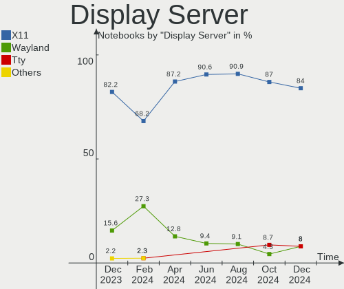
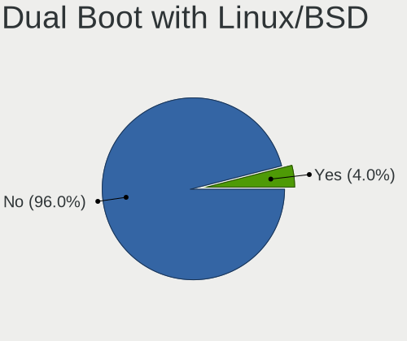
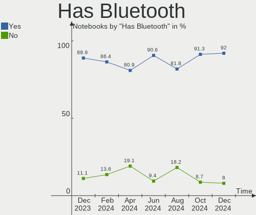
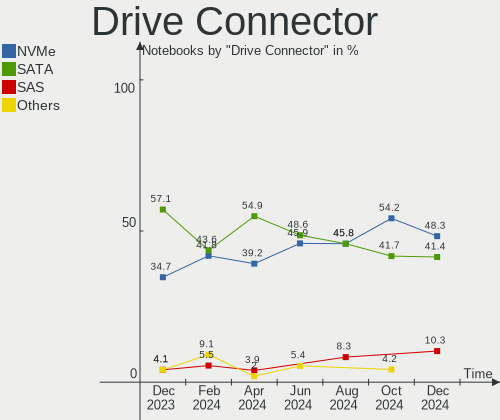
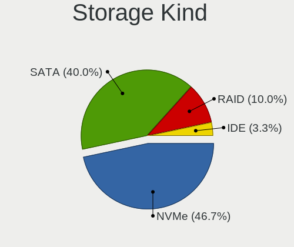
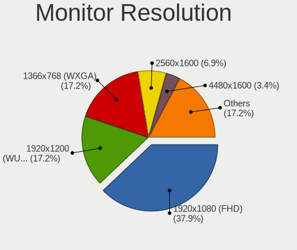
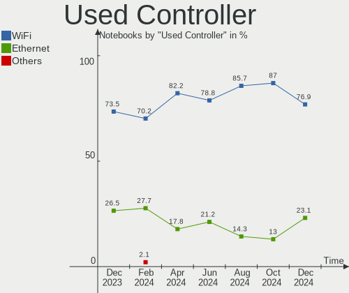
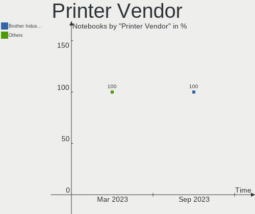

Kali - Hardware Trends (Notebooks)
----------------------------------

A project to identify most popular hardware characteristics and track their change
over time based on data collected by Linux users at https://Linux-Hardware.org.

Anyone can contribute to this report by the [hw-probe](https://github.com/linuxhw/hw-probe) tool:

    sudo -E hw-probe -all -upload

This report is for one last month. Overall report since the beginning of time: [TestDays](https://github.com/linuxhw/TestDays)

Period: Mar, 2023.

Contents
--------

* [ System ](#system)
  - [ OS                       ](#os)
  - [ OS Family                ](#os-family)
  - [ Kernel                   ](#kernel)
  - [ Kernel Family            ](#kernel-family)
  - [ Kernel Major Ver.        ](#kernel-major-ver)
  - [ Arch                     ](#arch)
  - [ DE                       ](#de)
  - [ Display Server           ](#display-server)
  - [ Display Manager          ](#display-manager)
  - [ OS Lang                  ](#os-lang)
  - [ Boot Mode                ](#boot-mode)
  - [ Filesystem               ](#filesystem)
  - [ Part. scheme             ](#part-scheme)
  - [ Dual Boot with Linux/BSD ](#dual-boot-with-linuxbsd)
  - [ Dual Boot (Win)          ](#dual-boot-win)

* [ Board ](#board)
  - [ Vendor                   ](#vendor)
  - [ Model                    ](#model)
  - [ Model Family             ](#model-family)
  - [ MFG Year                 ](#mfg-year)
  - [ Form Factor              ](#form-factor)
  - [ Secure Boot              ](#secure-boot)
  - [ Coreboot                 ](#coreboot)
  - [ RAM Size                 ](#ram-size)
  - [ RAM Used                 ](#ram-used)
  - [ Total Drives             ](#total-drives)
  - [ Has CD-ROM               ](#has-cd-rom)
  - [ Has Ethernet             ](#has-ethernet)
  - [ Has WiFi                 ](#has-wifi)
  - [ Has Bluetooth            ](#has-bluetooth)

* [ Location ](#location)
  - [ Country                  ](#country)
  - [ City                     ](#city)

* [ Drives ](#drives)
  - [ Drive Vendor             ](#drive-vendor)
  - [ Drive Model              ](#drive-model)
  - [ HDD Vendor               ](#hdd-vendor)
  - [ SSD Vendor               ](#ssd-vendor)
  - [ Drive Kind               ](#drive-kind)
  - [ Drive Connector          ](#drive-connector)
  - [ Drive Size               ](#drive-size)
  - [ Space Total              ](#space-total)
  - [ Space Used               ](#space-used)
  - [ Malfunc. Drives          ](#malfunc-drives)
  - [ Malfunc. Drive Vendor    ](#malfunc-drive-vendor)
  - [ Malfunc. HDD Vendor      ](#malfunc-hdd-vendor)
  - [ Malfunc. Drive Kind      ](#malfunc-drive-kind)
  - [ Failed Drives            ](#failed-drives)
  - [ Failed Drive Vendor      ](#failed-drive-vendor)
  - [ Drive Status             ](#drive-status)

* [ Storage controller ](#storage-controller)
  - [ Storage Vendor           ](#storage-vendor)
  - [ Storage Model            ](#storage-model)
  - [ Storage Kind             ](#storage-kind)

* [ Processor ](#processor)
  - [ CPU Vendor               ](#cpu-vendor)
  - [ CPU Model                ](#cpu-model)
  - [ CPU Model Family         ](#cpu-model-family)
  - [ CPU Cores                ](#cpu-cores)
  - [ CPU Sockets              ](#cpu-sockets)
  - [ CPU Threads              ](#cpu-threads)
  - [ CPU Op-Modes             ](#cpu-op-modes)
  - [ CPU Microcode            ](#cpu-microcode)
  - [ CPU Microarch            ](#cpu-microarch)

* [ Graphics ](#graphics)
  - [ GPU Vendor               ](#gpu-vendor)
  - [ GPU Model                ](#gpu-model)
  - [ GPU Combo                ](#gpu-combo)
  - [ GPU Driver               ](#gpu-driver)
  - [ GPU Memory               ](#gpu-memory)

* [ Monitor ](#monitor)
  - [ Monitor Vendor           ](#monitor-vendor)
  - [ Monitor Model            ](#monitor-model)
  - [ Monitor Resolution       ](#monitor-resolution)
  - [ Monitor Diagonal         ](#monitor-diagonal)
  - [ Monitor Width            ](#monitor-width)
  - [ Aspect Ratio             ](#aspect-ratio)
  - [ Monitor Area             ](#monitor-area)
  - [ Pixel Density            ](#pixel-density)
  - [ Multiple Monitors        ](#multiple-monitors)

* [ Network ](#network)
  - [ Net Controller Vendor    ](#net-controller-vendor)
  - [ Net Controller Model     ](#net-controller-model)
  - [ Wireless Vendor          ](#wireless-vendor)
  - [ Wireless Model           ](#wireless-model)
  - [ Ethernet Vendor          ](#ethernet-vendor)
  - [ Ethernet Model           ](#ethernet-model)
  - [ Net Controller Kind      ](#net-controller-kind)
  - [ Used Controller          ](#used-controller)
  - [ NICs                     ](#nics)
  - [ IPv6                     ](#ipv6)

* [ Bluetooth ](#bluetooth)
  - [ Bluetooth Vendor         ](#bluetooth-vendor)
  - [ Bluetooth Model          ](#bluetooth-model)

* [ Sound ](#sound)
  - [ Sound Vendor             ](#sound-vendor)
  - [ Sound Model              ](#sound-model)

* [ Memory ](#memory)
  - [ Memory Vendor            ](#memory-vendor)
  - [ Memory Model             ](#memory-model)
  - [ Memory Kind              ](#memory-kind)
  - [ Memory Form Factor       ](#memory-form-factor)
  - [ Memory Size              ](#memory-size)
  - [ Memory Speed             ](#memory-speed)

* [ Printers & scanners ](#printers--scanners)
  - [ Printer Vendor           ](#printer-vendor)
  - [ Printer Model            ](#printer-model)
  - [ Scanner Vendor           ](#scanner-vendor)
  - [ Scanner Model            ](#scanner-model)

* [ Camera ](#camera)
  - [ Camera Vendor            ](#camera-vendor)
  - [ Camera Model             ](#camera-model)

* [ Security ](#security)
  - [ Fingerprint Vendor       ](#fingerprint-vendor)
  - [ Fingerprint Model        ](#fingerprint-model)
  - [ Chipcard Vendor          ](#chipcard-vendor)
  - [ Chipcard Model           ](#chipcard-model)

* [ Unsupported ](#unsupported)
  - [ Unsupported Devices      ](#unsupported-devices)
  - [ Unsupported Device Types ](#unsupported-device-types)

System
------

OS
--

Installed operating systems

| Name        | Notebooks | Percent |
|-------------|-----------|---------|
| Kali 2023.1 | 58        | 92.06%  |
| Kali 2022.4 | 3         | 4.76%   |
| Kali 2022.3 | 1         | 1.59%   |
| Kali 2020.3 | 1         | 1.59%   |

OS Family
---------

OS without a version

| Name | Notebooks | Percent |
|------|-----------|---------|
| Kali | 63        | 100%    |

Kernel
------

Version of the Linux kernel

| Version            | Notebooks | Percent |
|--------------------|-----------|---------|
| 6.1.0-kali5-amd64  | 51        | 80.95%  |
| 6.0.0-kali3-amd64  | 5         | 7.94%   |
| 6.1.0-kali7-amd64  | 3         | 4.76%   |
| 6.2.7-custom       | 1         | 1.59%   |
| 6.0.0-kali6-amd64  | 1         | 1.59%   |
| 5.7.0-kali1-amd64  | 1         | 1.59%   |
| 5.18.0-kali5-amd64 | 1         | 1.59%   |

Kernel Family
-------------

Linux kernel without a distro release

| Version | Notebooks | Percent |
|---------|-----------|---------|
| 6.1.0   | 54        | 85.71%  |
| 6.0.0   | 6         | 9.52%   |
| 6.2.7   | 1         | 1.59%   |
| 5.7.0   | 1         | 1.59%   |
| 5.18.0  | 1         | 1.59%   |

Kernel Major Ver.
-----------------

Linux kernel major version

| Version | Notebooks | Percent |
|---------|-----------|---------|
| 6.1     | 54        | 85.71%  |
| 6.0     | 6         | 9.52%   |
| 6.2     | 1         | 1.59%   |
| 5.7     | 1         | 1.59%   |
| 5.18    | 1         | 1.59%   |

Arch
----

OS architecture (x86_64, i586, etc.)

| Name   | Notebooks | Percent |
|--------|-----------|---------|
| x86_64 | 63        | 100%    |

DE
--

Desktop Environment

| Name  | Notebooks | Percent |
|-------|-----------|---------|
| XFCE  | 34        | 53.97%  |
| GNOME | 22        | 34.92%  |
| KDE5  | 7         | 11.11%  |

Display Server
--------------

X11 or Wayland

| Name    | Notebooks | Percent |
|---------|-----------|---------|
| X11     | 59        | 93.65%  |
| Wayland | 3         | 4.76%   |
| Tty     | 1         | 1.59%   |

Display Manager
---------------

SDDM, LightDM, etc.

| Name    | Notebooks | Percent |
|---------|-----------|---------|
| LightDM | 32        | 50.79%  |
| GDM3    | 17        | 26.98%  |
| Unknown | 8         | 12.7%   |
| SDDM    | 6         | 9.52%   |

OS Lang
-------

Language

| Lang  | Notebooks | Percent |
|-------|-----------|---------|
| en_US | 35        | 55.56%  |
| ru_RU | 6         | 9.52%   |
| de_DE | 5         | 7.94%   |
| es_ES | 3         | 4.76%   |
| en_IN | 3         | 4.76%   |
| pt_BR | 2         | 3.17%   |
| es_MX | 2         | 3.17%   |
| en_GB | 2         | 3.17%   |
| pl_PL | 1         | 1.59%   |
| fr_FR | 1         | 1.59%   |
| en_CA | 1         | 1.59%   |
| cs_CZ | 1         | 1.59%   |
| C     | 1         | 1.59%   |

Boot Mode
---------

EFI or BIOS

| Mode | Notebooks | Percent |
|------|-----------|---------|
| EFI  | 52        | 82.54%  |
| BIOS | 11        | 17.46%  |

Filesystem
----------

Type of filesystem

| Type    | Notebooks | Percent |
|---------|-----------|---------|
| Ext4    | 57        | 90.48%  |
| Overlay | 4         | 6.35%   |
| Xfs     | 1         | 1.59%   |
| Btrfs   | 1         | 1.59%   |

Part. scheme
------------

Scheme of partitioning

| Type    | Notebooks | Percent |
|---------|-----------|---------|
| GPT     | 46        | 73.02%  |
| MBR     | 9         | 14.29%  |
| Unknown | 8         | 12.7%   |

Dual Boot with Linux/BSD
------------------------

Hosting more than one Linux/BSD

| Dual boot | Notebooks | Percent |
|-----------|-----------|---------|
| No        | 58        | 92.06%  |
| Yes       | 5         | 7.94%   |

Dual Boot (Win)
---------------

Hosting Linux and Windows

| Dual boot | Notebooks | Percent |
|-----------|-----------|---------|
| No        | 40        | 63.49%  |
| Yes       | 23        | 36.51%  |

Board
-----

Vendor
------

Motherboard manufacturer

| Name                | Notebooks | Percent |
|---------------------|-----------|---------|
| Dell                | 17        | 26.98%  |
| Lenovo              | 9         | 14.29%  |
| ASUSTek Computer    | 9         | 14.29%  |
| Hewlett-Packard     | 7         | 11.11%  |
| MSI                 | 6         | 9.52%   |
| HUAWEI              | 3         | 4.76%   |
| Google              | 2         | 3.17%   |
| Chuwi               | 2         | 3.17%   |
| Apple               | 2         | 3.17%   |
| Acer                | 2         | 3.17%   |
| Sony                | 1         | 1.59%   |
| GPD                 | 1         | 1.59%   |
| Gigabyte Technology | 1         | 1.59%   |
| AMI                 | 1         | 1.59%   |

Model
-----

Motherboard model

| Name                                 | Notebooks | Percent |
|--------------------------------------|-----------|---------|
| HUAWEI KLVL-WXXW                     | 2         | 3.17%   |
| Dell Latitude E6420                  | 2         | 3.17%   |
| Chuwi GemiBook Pro                   | 2         | 3.17%   |
| ASUS X551MA                          | 2         | 3.17%   |
| Sony VGN-FZ250E                      | 1         | 1.59%   |
| MSI Pulse GL66 12UEK                 | 1         | 1.59%   |
| MSI Modern 15 B12M                   | 1         | 1.59%   |
| MSI Modern 14 C12M                   | 1         | 1.59%   |
| MSI Modern 14 A10M                   | 1         | 1.59%   |
| MSI GF63 Thin 9SC                    | 1         | 1.59%   |
| MSI Bravo 15 B5DD                    | 1         | 1.59%   |
| Lenovo Yoga 500-14IBD 80N4           | 1         | 1.59%   |
| Lenovo ThinkPad X250 20CLS4XP00      | 1         | 1.59%   |
| Lenovo ThinkPad X230 23255NG         | 1         | 1.59%   |
| Lenovo ThinkPad T480s 20L8S02E00     | 1         | 1.59%   |
| Lenovo ThinkPad qqqqS2E              | 1         | 1.59%   |
| Lenovo ThinkPad E15 Gen 4 21E6006WHV | 1         | 1.59%   |
| Lenovo Legion 5 Pro 16ARH7H 82RG     | 1         | 1.59%   |
| Lenovo IdeaPad 5 15ALC05 82LN        | 1         | 1.59%   |
| Lenovo G40-80 80E4                   | 1         | 1.59%   |
| HUAWEI KPRC-WX0                      | 1         | 1.59%   |
| HP ProBook 645 G4                    | 1         | 1.59%   |
| HP ProBook 640 G2                    | 1         | 1.59%   |
| HP Pavilion Gaming Laptop 15-dk0xxx  | 1         | 1.59%   |
| HP Pavilion g6                       | 1         | 1.59%   |
| HP Notebook                          | 1         | 1.59%   |
| HP ENVY 17                           | 1         | 1.59%   |
| HP 250 G7 Notebook PC                | 1         | 1.59%   |
| GPD P2 MAX                           | 1         | 1.59%   |
| Google Whitetip                      | 1         | 1.59%   |
| Google Celes                         | 1         | 1.59%   |
| Gigabyte AORUS 15G KC                | 1         | 1.59%   |
| Dell Vostro 3400                     | 1         | 1.59%   |
| Dell System XPS L502X                | 1         | 1.59%   |
| Dell Precision 7550                  | 1         | 1.59%   |
| Dell Latitude E7240                  | 1         | 1.59%   |
| Dell Latitude E5470                  | 1         | 1.59%   |
| Dell Latitude E5430 non-vPro         | 1         | 1.59%   |
| Dell Latitude E4300                  | 1         | 1.59%   |
| Dell Latitude 7410                   | 1         | 1.59%   |

Model Family
------------

Motherboard model prefix

| Name              | Notebooks | Percent |
|-------------------|-----------|---------|
| Dell Latitude     | 10        | 15.87%  |
| Lenovo ThinkPad   | 5         | 7.94%   |
| MSI Modern        | 3         | 4.76%   |
| HUAWEI KLVL-WXXW  | 2         | 3.17%   |
| HP ProBook        | 2         | 3.17%   |
| HP Pavilion       | 2         | 3.17%   |
| Dell Inspiron     | 2         | 3.17%   |
| Chuwi GemiBook    | 2         | 3.17%   |
| ASUS X551MA       | 2         | 3.17%   |
| Acer Aspire       | 2         | 3.17%   |
| Sony VGN-FZ250E   | 1         | 1.59%   |
| MSI Pulse         | 1         | 1.59%   |
| MSI GF63          | 1         | 1.59%   |
| MSI Bravo         | 1         | 1.59%   |
| Lenovo Yoga       | 1         | 1.59%   |
| Lenovo Legion     | 1         | 1.59%   |
| Lenovo IdeaPad    | 1         | 1.59%   |
| Lenovo G40-80     | 1         | 1.59%   |
| HUAWEI KPRC-WX0   | 1         | 1.59%   |
| HP Notebook       | 1         | 1.59%   |
| HP ENVY           | 1         | 1.59%   |
| HP 250            | 1         | 1.59%   |
| GPD P2            | 1         | 1.59%   |
| Google Whitetip   | 1         | 1.59%   |
| Google Celes      | 1         | 1.59%   |
| Gigabyte AORUS    | 1         | 1.59%   |
| Dell Vostro       | 1         | 1.59%   |
| Dell System       | 1         | 1.59%   |
| Dell Precision    | 1         | 1.59%   |
| Dell G5           | 1         | 1.59%   |
| Dell G3           | 1         | 1.59%   |
| ASUS X555LA       | 1         | 1.59%   |
| ASUS X555BA       | 1         | 1.59%   |
| ASUS X455LF       | 1         | 1.59%   |
| ASUS VivoBook     | 1         | 1.59%   |
| ASUS ROG          | 1         | 1.59%   |
| ASUS Q551LN       | 1         | 1.59%   |
| ASUS K84C         | 1         | 1.59%   |
| Apple MacBookPro8 | 1         | 1.59%   |
| Apple MacBook5    | 1         | 1.59%   |

MFG Year
--------

Motherboard manufacture year

| Year | Notebooks | Percent |
|------|-----------|---------|
| 2020 | 10        | 15.87%  |
| 2019 | 8         | 12.7%   |
| 2022 | 7         | 11.11%  |
| 2021 | 6         | 9.52%   |
| 2018 | 6         | 9.52%   |
| 2011 | 6         | 9.52%   |
| 2015 | 4         | 6.35%   |
| 2013 | 3         | 4.76%   |
| 2016 | 2         | 3.17%   |
| 2014 | 2         | 3.17%   |
| 2012 | 2         | 3.17%   |
| 2010 | 2         | 3.17%   |
| 2023 | 1         | 1.59%   |
| 2009 | 1         | 1.59%   |
| 2008 | 1         | 1.59%   |
| 2007 | 1         | 1.59%   |
| 2006 | 1         | 1.59%   |

Form Factor
-----------

Physical design of the computer

| Name     | Notebooks | Percent |
|----------|-----------|---------|
| Notebook | 63        | 100%    |

Secure Boot
-----------

Enabled or disabled

| State    | Notebooks | Percent |
|----------|-----------|---------|
| Disabled | 63        | 100%    |

Coreboot
--------

Have coreboot on board

| Used | Notebooks | Percent |
|------|-----------|---------|
| No   | 61        | 96.83%  |
| Yes  | 2         | 3.17%   |

RAM Size
--------

Total RAM memory

| Size in GB  | Notebooks | Percent |
|-------------|-----------|---------|
| 4.01-8.0    | 28        | 44.44%  |
| 3.01-4.0    | 10        | 15.87%  |
| 16.01-24.0  | 9         | 14.29%  |
| 8.01-16.0   | 9         | 14.29%  |
| 32.01-64.0  | 3         | 4.76%   |
| 24.01-32.0  | 2         | 3.17%   |
| 64.01-256.0 | 1         | 1.59%   |
| 1.01-2.0    | 1         | 1.59%   |

RAM Used
--------

Used RAM memory

| Used GB   | Notebooks | Percent |
|-----------|-----------|---------|
| 2.01-3.0  | 22        | 34.92%  |
| 1.01-2.0  | 15        | 23.81%  |
| 3.01-4.0  | 14        | 22.22%  |
| 4.01-8.0  | 7         | 11.11%  |
| 8.01-16.0 | 4         | 6.35%   |
| 0.51-1.0  | 1         | 1.59%   |

Total Drives
------------

Number of drives on board

| Drives | Notebooks | Percent |
|--------|-----------|---------|
| 1      | 48        | 76.19%  |
| 2      | 14        | 22.22%  |
| 3      | 1         | 1.59%   |

Has CD-ROM
----------

Has CD-ROM on board

| Presented | Notebooks | Percent |
|-----------|-----------|---------|
| No        | 47        | 74.6%   |
| Yes       | 16        | 25.4%   |

Has Ethernet
------------

Has Ethernet on board

| Presented | Notebooks | Percent |
|-----------|-----------|---------|
| Yes       | 51        | 80.95%  |
| No        | 12        | 19.05%  |

Has WiFi
--------

Has WiFi module

| Presented | Notebooks | Percent |
|-----------|-----------|---------|
| Yes       | 62        | 98.41%  |
| No        | 1         | 1.59%   |

Has Bluetooth
-------------

Has Bluetooth module

| Presented | Notebooks | Percent |
|-----------|-----------|---------|
| Yes       | 58        | 92.06%  |
| No        | 5         | 7.94%   |

Location
--------

Country
-------

Geographic location (country)

| Country      | Notebooks | Percent |
|--------------|-----------|---------|
| USA          | 11        | 17.46%  |
| Germany      | 8         | 12.7%   |
| Russia       | 6         | 9.52%   |
| Spain        | 5         | 7.94%   |
| India        | 4         | 6.35%   |
| Mexico       | 3         | 4.76%   |
| Indonesia    | 3         | 4.76%   |
| Sweden       | 2         | 3.17%   |
| Poland       | 2         | 3.17%   |
| Hungary      | 2         | 3.17%   |
| Czechia      | 2         | 3.17%   |
| Bulgaria     | 2         | 3.17%   |
| Brazil       | 2         | 3.17%   |
| UAE          | 1         | 1.59%   |
| Switzerland  | 1         | 1.59%   |
| Saudi Arabia | 1         | 1.59%   |
| Norway       | 1         | 1.59%   |
| Netherlands  | 1         | 1.59%   |
| Nepal        | 1         | 1.59%   |
| Mali         | 1         | 1.59%   |
| Libya        | 1         | 1.59%   |
| Guatemala    | 1         | 1.59%   |
| Canada       | 1         | 1.59%   |
| Barbados     | 1         | 1.59%   |

City
----

Geographic location (city)

| City                 | Notebooks | Percent |
|----------------------|-----------|---------|
| Yakutsk              | 2         | 3.17%   |
| Vigo                 | 2         | 3.17%   |
| Stockholm            | 2         | 3.17%   |
| St Petersburg        | 2         | 3.17%   |
| Sofia                | 2         | 3.17%   |
| Mexico City          | 2         | 3.17%   |
| Zurich               | 1         | 1.59%   |
| Żory                | 1         | 1.59%   |
| Yogyakarta           | 1         | 1.59%   |
| Westland             | 1         | 1.59%   |
| Viernheim            | 1         | 1.59%   |
| Veliky Novgorod      | 1         | 1.59%   |
| Vancouver            | 1         | 1.59%   |
| Tula                 | 1         | 1.59%   |
| Tripoli              | 1         | 1.59%   |
| Tatabánya           | 1         | 1.59%   |
| Stuttgart            | 1         | 1.59%   |
| Schleswig            | 1         | 1.59%   |
| Sao José dos Campos | 1         | 1.59%   |
| Salamanca            | 1         | 1.59%   |
| Sabadell             | 1         | 1.59%   |
| Rybnik               | 1         | 1.59%   |
| Regensburg           | 1         | 1.59%   |
| Queens               | 1         | 1.59%   |
| Prague               | 1         | 1.59%   |
| Peoria               | 1         | 1.59%   |
| Mopti                | 1         | 1.59%   |
| Malang               | 1         | 1.59%   |
| Makkah               | 1         | 1.59%   |
| Kozhikode            | 1         | 1.59%   |
| Kathmandu            | 1         | 1.59%   |
| Karlsruhe            | 1         | 1.59%   |
| Ixtapaluca           | 1         | 1.59%   |
| Inhumas              | 1         | 1.59%   |
| Hemet                | 1         | 1.59%   |
| Halle                | 1         | 1.59%   |
| Gummersbach          | 1         | 1.59%   |
| Guatemala City       | 1         | 1.59%   |
| Floro                | 1         | 1.59%   |
| Evansville           | 1         | 1.59%   |

Drives
------

Drive Vendor
------------

Hard drive vendors

| Vendor                      | Notebooks | Drives | Percent |
|-----------------------------|-----------|--------|---------|
| Samsung Electronics         | 10        | 10     | 13.16%  |
| WDC                         | 9         | 11     | 11.84%  |
| Seagate                     | 7         | 7      | 9.21%   |
| Toshiba                     | 5         | 5      | 6.58%   |
| China                       | 5         | 5      | 6.58%   |
| Unknown                     | 4         | 5      | 5.26%   |
| Micron Technology           | 3         | 3      | 3.95%   |
| Kingston                    | 3         | 3      | 3.95%   |
| A-DATA Technology           | 3         | 3      | 3.95%   |
| SK hynix                    | 2         | 2      | 2.63%   |
| Phison Electronics          | 2         | 2      | 2.63%   |
| Phison                      | 2         | 2      | 2.63%   |
| KIOXIA                      | 2         | 2      | 2.63%   |
| JMicron Technology          | 2         | 2      | 2.63%   |
| Fujitsu                     | 2         | 2      | 2.63%   |
| Wellcomm                    | 1         | 1      | 1.32%   |
| VISIPRO                     | 1         | 1      | 1.32%   |
| UMIS                        | 1         | 1      | 1.32%   |
| Team                        | 1         | 1      | 1.32%   |
| SanDisk                     | 1         | 1      | 1.32%   |
| Netac                       | 1         | 1      | 1.32%   |
| MAXIO Technology (Hangzhou) | 1         | 1      | 1.32%   |
| LITEON                      | 1         | 1      | 1.32%   |
| Hitachi                     | 1         | 1      | 1.32%   |
| HGST                        | 1         | 1      | 1.32%   |
| GOODRAM                     | 1         | 1      | 1.32%   |
| CT250MX5                    | 1         | 1      | 1.32%   |
| Crucial                     | 1         | 1      | 1.32%   |
| BIWIN                       | 1         | 1      | 1.32%   |
| BAITITON                    | 1         | 1      | 1.32%   |

Drive Model
-----------

Hard drive models

| Model                                | Notebooks | Percent |
|--------------------------------------|-----------|---------|
| Toshiba MQ01ABF050 500GB             | 2         | 2.56%   |
| Seagate ST1000LM035-1RK172 1TB       | 2         | 2.56%   |
| China G521N256GB SSD                 | 2         | 2.56%   |
| Wellcomm Master 128GB SSD            | 1         | 1.28%   |
| WDC WDS240G2G0A-00JH30 240GB SSD     | 1         | 1.28%   |
| WDC WD7500BPKT-75PK4T0 752GB         | 1         | 1.28%   |
| WDC WD50 00AAKX-603CA0 500GB         | 1         | 1.28%   |
| WDC WD10SPZX-75Z10T2 1TB             | 1         | 1.28%   |
| WDC WD10JPVX-80JC3T0 1TB             | 1         | 1.28%   |
| WDC WD10JPVX-22JC3T0 1TB             | 1         | 1.28%   |
| WDC WD Blue SA510 2.5 500GB SSD      | 1         | 1.28%   |
| WDC PC SN720 SDAPNTW-512G-1127 512GB | 1         | 1.28%   |
| WDC PC SN530 SDBPNPZ-512G-1014 512GB | 1         | 1.28%   |
| WDC PC SN520 SDAPNUW-512G-1032 512GB | 1         | 1.28%   |
| VISIPRO SDVPSA181024 240GB           | 1         | 1.28%   |
| Unknown SN128  128GB                 | 1         | 1.28%   |
| Unknown SL16G  16GB                  | 1         | 1.28%   |
| Unknown MMC Card  64GB               | 1         | 1.28%   |
| Unknown DF4016  16GB                 | 1         | 1.28%   |
| Unknown DA4032  32GB                 | 1         | 1.28%   |
| UMIS RPJTJ512MGE1QDQ 512GB           | 1         | 1.28%   |
| Toshiba THNSNJ512GCSU 512GB SSD      | 1         | 1.28%   |
| Toshiba MQ04ABF100 1TB               | 1         | 1.28%   |
| Toshiba MQ01ABD100 1TB               | 1         | 1.28%   |
| Team TM8FP6002T 2TB                  | 1         | 1.28%   |
| SK hynix PC611 NVMe 512GB            | 1         | 1.28%   |
| SK hynix BC711 NVMe 256GB            | 1         | 1.28%   |
| Seagate ST9120821AS 120GB            | 1         | 1.28%   |
| Seagate ST2000LM007-1R8174 2TB       | 1         | 1.28%   |
| Seagate ST1000LM049-2GH172 1TB       | 1         | 1.28%   |
| Seagate ST1000LM024 HN-M101MBB 1TB   | 1         | 1.28%   |
| Seagate BUP Slim BK 2TB              | 1         | 1.28%   |
| SanDisk Z400s 2.5 7MM 128GB SSD      | 1         | 1.28%   |
| Samsung SSD PM871 M.2 2280 256GB     | 1         | 1.28%   |
| Samsung SSD PM810 mSATA 128GB        | 1         | 1.28%   |
| Samsung SSD 980 1TB                  | 1         | 1.28%   |
| Samsung SSD 970 EVO Plus 1TB         | 1         | 1.28%   |
| Samsung SSD 860 EVO 500GB            | 1         | 1.28%   |
| Samsung SSD 840 EVO 250GB            | 1         | 1.28%   |
| Samsung SSD 840 EVO 1TB              | 1         | 1.28%   |

HDD Vendor
----------

Hard disk drive vendors

| Vendor  | Notebooks | Drives | Percent |
|---------|-----------|--------|---------|
| Seagate | 7         | 7      | 35%     |
| WDC     | 5         | 6      | 25%     |
| Toshiba | 4         | 4      | 20%     |
| Fujitsu | 2         | 2      | 10%     |
| Hitachi | 1         | 1      | 5%      |
| HGST    | 1         | 1      | 5%      |

SSD Vendor
----------

Solid state drive vendors

| Vendor              | Notebooks | Drives | Percent |
|---------------------|-----------|--------|---------|
| Samsung Electronics | 5         | 5      | 20.83%  |
| China               | 5         | 5      | 20.83%  |
| WDC                 | 2         | 2      | 8.33%   |
| A-DATA Technology   | 2         | 2      | 8.33%   |
| Wellcomm            | 1         | 1      | 4.17%   |
| Toshiba             | 1         | 1      | 4.17%   |
| SanDisk             | 1         | 1      | 4.17%   |
| Netac               | 1         | 1      | 4.17%   |
| LITEON              | 1         | 1      | 4.17%   |
| JMicron Technology  | 1         | 1      | 4.17%   |
| GOODRAM             | 1         | 1      | 4.17%   |
| CT250MX5            | 1         | 1      | 4.17%   |
| Crucial             | 1         | 1      | 4.17%   |
| BAITITON            | 1         | 1      | 4.17%   |

Drive Kind
----------

HDD or SSD

| Kind    | Notebooks | Drives | Percent |
|---------|-----------|--------|---------|
| NVMe    | 25        | 27     | 34.25%  |
| SSD     | 22        | 24     | 30.14%  |
| HDD     | 20        | 21     | 27.4%   |
| MMC     | 4         | 5      | 5.48%   |
| Unknown | 2         | 2      | 2.74%   |

Drive Connector
---------------

SATA, SAS, NVMe, etc.

| Type | Notebooks | Drives | Percent |
|------|-----------|--------|---------|
| SATA | 38        | 41     | 52.78%  |
| NVMe | 25        | 27     | 34.72%  |
| SAS  | 5         | 6      | 6.94%   |
| MMC  | 4         | 5      | 5.56%   |

Drive Size
----------

Size of hard drive

| Size in TB | Notebooks | Drives | Percent |
|------------|-----------|--------|---------|
| 0.01-0.5   | 24        | 28     | 58.54%  |
| 0.51-1.0   | 15        | 15     | 36.59%  |
| 1.01-2.0   | 2         | 2      | 4.88%   |

Space Total
-----------

Amount of disk space available on the file system

| Size in GB | Notebooks | Percent |
|------------|-----------|---------|
| 101-250    | 25        | 39.68%  |
| 251-500    | 21        | 33.33%  |
| 501-1000   | 7         | 11.11%  |
| 21-50      | 3         | 4.76%   |
| 1001-2000  | 3         | 4.76%   |
| 51-100     | 3         | 4.76%   |
| 1-20       | 1         | 1.59%   |

Space Used
----------

Amount of used disk space

| Used GB   | Notebooks | Percent |
|-----------|-----------|---------|
| 1-20      | 17        | 26.98%  |
| 21-50     | 16        | 25.4%   |
| 101-250   | 13        | 20.63%  |
| 51-100    | 11        | 17.46%  |
| 251-500   | 4         | 6.35%   |
| 1001-2000 | 1         | 1.59%   |
| 501-1000  | 1         | 1.59%   |

Malfunc. Drives
---------------

Drive models with a malfunction

| Model                                     | Notebooks | Drives | Percent |
|-------------------------------------------|-----------|--------|---------|
| China G521N256GB SSD                      | 2         | 2      | 16.67%  |
| Wellcomm Master 128GB SSD                 | 1         | 1      | 8.33%   |
| WDC WD7500BPKT-75PK4T0 752GB              | 1         | 1      | 8.33%   |
| WDC WD Blue SA510 2.5 500GB SSD           | 1         | 1      | 8.33%   |
| Toshiba MQ01ABD100 1TB                    | 1         | 1      | 8.33%   |
| Seagate ST1000LM024 HN-M101MBB 1TB        | 1         | 1      | 8.33%   |
| Samsung Electronics SSD PM810 mSATA 128GB | 1         | 1      | 8.33%   |
| Samsung Electronics SSD 840 EVO 1TB       | 1         | 1      | 8.33%   |
| LITEON LCH-256V2S-11 2.5 7mm 256GB SSD    | 1         | 1      | 8.33%   |
| HGST HTS545050A7E680 500GB                | 1         | 1      | 8.33%   |
| Fujitsu MHY2120BH 120GB                   | 1         | 1      | 8.33%   |

Malfunc. Drive Vendor
---------------------

Vendors of faulty drives

| Vendor              | Notebooks | Drives | Percent |
|---------------------|-----------|--------|---------|
| WDC                 | 2         | 2      | 16.67%  |
| Samsung Electronics | 2         | 2      | 16.67%  |
| China               | 2         | 2      | 16.67%  |
| Wellcomm            | 1         | 1      | 8.33%   |
| Toshiba             | 1         | 1      | 8.33%   |
| Seagate             | 1         | 1      | 8.33%   |
| LITEON              | 1         | 1      | 8.33%   |
| HGST                | 1         | 1      | 8.33%   |
| Fujitsu             | 1         | 1      | 8.33%   |

Malfunc. HDD Vendor
-------------------

Vendors of faulty HDD drives

| Vendor  | Notebooks | Drives | Percent |
|---------|-----------|--------|---------|
| WDC     | 1         | 1      | 20%     |
| Toshiba | 1         | 1      | 20%     |
| Seagate | 1         | 1      | 20%     |
| HGST    | 1         | 1      | 20%     |
| Fujitsu | 1         | 1      | 20%     |

Malfunc. Drive Kind
-------------------

Kinds of faulty drives

| Kind | Notebooks | Drives | Percent |
|------|-----------|--------|---------|
| SSD  | 7         | 7      | 58.33%  |
| HDD  | 5         | 5      | 41.67%  |

Failed Drives
-------------

Failed drive models

Zero info for selected period =(

Failed Drive Vendor
-------------------

Failed drive vendors

Zero info for selected period =(

Drive Status
------------

Number of failed and malfunc. drives

| Status   | Notebooks | Drives | Percent |
|----------|-----------|--------|---------|
| Works    | 40        | 47     | 58.82%  |
| Detected | 17        | 20     | 25%     |
| Malfunc  | 11        | 12     | 16.18%  |

Storage controller
------------------

Storage Vendor
--------------

Storage controller vendors

| Vendor                      | Notebooks | Percent |
|-----------------------------|-----------|---------|
| Intel                       | 40        | 54.79%  |
| Samsung Electronics         | 5         | 6.85%   |
| AMD                         | 5         | 6.85%   |
| Phison Electronics          | 4         | 5.48%   |
| SanDisk                     | 3         | 4.11%   |
| Micron Technology           | 3         | 4.11%   |
| Kingston Technology Company | 3         | 4.11%   |
| SK hynix                    | 2         | 2.74%   |
| KIOXIA                      | 2         | 2.74%   |
| Union Memory (Shenzhen)     | 1         | 1.37%   |
| Silicon Motion              | 1         | 1.37%   |
| Realtek Semiconductor       | 1         | 1.37%   |
| Nvidia                      | 1         | 1.37%   |
| MAXIO Technology (Hangzhou) | 1         | 1.37%   |
| ADATA Technology            | 1         | 1.37%   |

Storage Model
-------------

Storage controller models

| Model                                                                          | Notebooks | Percent |
|--------------------------------------------------------------------------------|-----------|---------|
| Intel Wildcat Point-LP SATA Controller [AHCI Mode]                             | 5         | 6.67%   |
| Intel 82801 Mobile SATA Controller [RAID mode]                                 | 5         | 6.67%   |
| Intel 8 Series SATA Controller 1 [AHCI mode]                                   | 4         | 5.33%   |
| Intel 6 Series/C200 Series Chipset Family 6 port Mobile SATA AHCI Controller   | 4         | 5.33%   |
| AMD FCH SATA Controller [AHCI mode]                                            | 4         | 5.33%   |
| Phison PS5013 E13 NVMe Controller                                              | 3         | 4%      |
| Kingston Company Company Non-Volatile memory controller                        | 3         | 4%      |
| Intel 7 Series Chipset Family 6-port SATA Controller [AHCI mode]               | 3         | 4%      |
| Samsung NVMe SSD Controller SM981/PM981/PM983                                  | 2         | 2.67%   |
| Samsung NVMe SSD Controller 980                                                | 2         | 2.67%   |
| Micron NVMe Controller                                                         | 2         | 2.67%   |
| KIOXIA NVMe SSD Controller BG4                                                 | 2         | 2.67%   |
| Intel Sunrise Point-LP SATA Controller [AHCI mode]                             | 2         | 2.67%   |
| Intel Jasper Lake SATA AHCI Controller                                         | 2         | 2.67%   |
| Intel Celeron/Pentium Silver Processor SATA Controller                         | 2         | 2.67%   |
| Intel Atom Processor E3800 Series SATA AHCI Controller                         | 2         | 2.67%   |
| Intel 400 Series Chipset Family SATA AHCI Controller                           | 2         | 2.67%   |
| Union Memory (Shenzhen) AM630 PCIe 4.0 x4 NVMe SSD Controller                  | 1         | 1.33%   |
| SK hynix Non-Volatile memory controller                                        | 1         | 1.33%   |
| SK hynix Gold P31/PC711 NVMe Solid State Drive                                 | 1         | 1.33%   |
| Silicon Motion SM2263EN/SM2263XT SSD Controller                                | 1         | 1.33%   |
| SanDisk WD Blue SN550 NVMe SSD                                                 | 1         | 1.33%   |
| SanDisk WD Blue SN500 / PC SN520 NVMe SSD                                      | 1         | 1.33%   |
| SanDisk WD Black 2018/SN750 / PC SN720 NVMe SSD                                | 1         | 1.33%   |
| Samsung NVMe SSD Controller PM9A1/PM9A3/980PRO                                 | 1         | 1.33%   |
| Realtek NVMe Controller                                                        | 1         | 1.33%   |
| Phison E12 NVMe Controller                                                     | 1         | 1.33%   |
| Nvidia MCP79 AHCI Controller                                                   | 1         | 1.33%   |
| Micron NVMe Storage Controller                                                 | 1         | 1.33%   |
| MAXIO (Hangzhou) NVMe SSD Controller MAP1202                                   | 1         | 1.33%   |
| Intel Volume Management Device NVMe RAID Controller                            | 1         | 1.33%   |
| Intel Tiger Lake-LP SATA Controller                                            | 1         | 1.33%   |
| Intel Comet Lake SATA AHCI Controller                                          | 1         | 1.33%   |
| Intel Comet Lake PCH-H RAID                                                    | 1         | 1.33%   |
| Intel Cannon Lake Mobile PCH SATA AHCI Controller                              | 1         | 1.33%   |
| Intel Alder Lake-P SATA AHCI Controller                                        | 1         | 1.33%   |
| Intel 82801IBM/IEM (ICH9M/ICH9M-E) 4 port SATA Controller [AHCI mode]          | 1         | 1.33%   |
| Intel 82801HM/HEM (ICH8M/ICH8M-E) SATA Controller [AHCI mode]                  | 1         | 1.33%   |
| Intel 82801HM/HEM (ICH8M/ICH8M-E) IDE Controller                               | 1         | 1.33%   |
| Intel 8 Series/C220 Series Chipset Family 6-port SATA Controller 1 [AHCI mode] | 1         | 1.33%   |

Storage Kind
------------

Kind of storage controller (IDE, SATA, NVMe, SAS, ...)

| Kind | Notebooks | Percent |
|------|-----------|---------|
| SATA | 38        | 52.78%  |
| NVMe | 25        | 34.72%  |
| RAID | 7         | 9.72%   |
| IDE  | 2         | 2.78%   |

Processor
---------

CPU Vendor
----------

Processor vendors

| Vendor | Notebooks | Percent |
|--------|-----------|---------|
| Intel  | 52        | 82.54%  |
| AMD    | 11        | 17.46%  |

CPU Model
---------

Processor models

| Model                                  | Notebooks | Percent |
|----------------------------------------|-----------|---------|
| Intel 12th Gen Core i5-1235U           | 3         | 4.76%   |
| Intel Core i7-4510U CPU @ 2.00GHz      | 2         | 3.17%   |
| Intel Core i7-10750H CPU @ 2.60GHz     | 2         | 3.17%   |
| Intel Core i5-6300U CPU @ 2.40GHz      | 2         | 3.17%   |
| Intel Core i5-5200U CPU @ 2.20GHz      | 2         | 3.17%   |
| Intel Core i5-10300H CPU @ 2.50GHz     | 2         | 3.17%   |
| Intel Core i5-10210U CPU @ 1.60GHz     | 2         | 3.17%   |
| Intel Celeron N5100 @ 1.10GHz          | 2         | 3.17%   |
| AMD Ryzen 5 5500U with Radeon Graphics | 2         | 3.17%   |
| Intel Xeon W-10855M CPU @ 2.80GHz      | 1         | 1.59%   |
| Intel Pentium CPU B950 @ 2.10GHz       | 1         | 1.59%   |
| Intel Core m3-8100Y CPU @ 1.10GHz      | 1         | 1.59%   |
| Intel Core M-5Y71 CPU @ 1.20GHz        | 1         | 1.59%   |
| Intel Core i7-9750H CPU @ 2.60GHz      | 1         | 1.59%   |
| Intel Core i7-8550U CPU @ 1.80GHz      | 1         | 1.59%   |
| Intel Core i7-4700MQ CPU @ 2.40GHz     | 1         | 1.59%   |
| Intel Core i7-4600U CPU @ 2.10GHz      | 1         | 1.59%   |
| Intel Core i7-2760QM CPU @ 2.40GHz     | 1         | 1.59%   |
| Intel Core i7-2670QM CPU @ 2.20GHz     | 1         | 1.59%   |
| Intel Core i7-10870H CPU @ 2.20GHz     | 1         | 1.59%   |
| Intel Core i7-10610U CPU @ 1.80GHz     | 1         | 1.59%   |
| Intel Core i5-9300H CPU @ 2.40GHz      | 1         | 1.59%   |
| Intel Core i5-8250U CPU @ 1.60GHz      | 1         | 1.59%   |
| Intel Core i5-5300U CPU @ 2.30GHz      | 1         | 1.59%   |
| Intel Core i5-4310U CPU @ 2.00GHz      | 1         | 1.59%   |
| Intel Core i5-3320M CPU @ 2.60GHz      | 1         | 1.59%   |
| Intel Core i5-3210M CPU @ 2.50GHz      | 1         | 1.59%   |
| Intel Core i5-2540M CPU @ 2.60GHz      | 1         | 1.59%   |
| Intel Core i5-2415M CPU @ 2.30GHz      | 1         | 1.59%   |
| Intel Core i3-7020U CPU @ 2.30GHz      | 1         | 1.59%   |
| Intel Core i3-5005U CPU @ 2.00GHz      | 1         | 1.59%   |
| Intel Core i3-4005U CPU @ 1.70GHz      | 1         | 1.59%   |
| Intel Core i3-3110M CPU @ 2.40GHz      | 1         | 1.59%   |
| Intel Core 2 Duo CPU T7500 @ 2.20GHz   | 1         | 1.59%   |
| Intel Core 2 Duo CPU P9400 @ 2.40GHz   | 1         | 1.59%   |
| Intel Core 2 Duo CPU P7350 @ 2.00GHz   | 1         | 1.59%   |
| Intel Celeron N4120 CPU @ 1.10GHz      | 1         | 1.59%   |
| Intel Celeron N4000 CPU @ 1.10GHz      | 1         | 1.59%   |
| Intel Celeron CPU N3350 @ 1.10GHz      | 1         | 1.59%   |
| Intel Celeron CPU N3060 @ 1.60GHz      | 1         | 1.59%   |

CPU Model Family
----------------

Processor model prefix

| Model            | Notebooks | Percent |
|------------------|-----------|---------|
| Intel Core i5    | 16        | 25.4%   |
| Intel Core i7    | 12        | 19.05%  |
| Intel Celeron    | 8         | 12.7%   |
| Other            | 6         | 9.52%   |
| Intel Core i3    | 4         | 6.35%   |
| AMD Ryzen 7      | 4         | 6.35%   |
| AMD Ryzen 5      | 4         | 6.35%   |
| Intel Core 2 Duo | 3         | 4.76%   |
| Intel Xeon       | 1         | 1.59%   |
| Intel Pentium    | 1         | 1.59%   |
| Intel Core m3    | 1         | 1.59%   |
| Intel Core M     | 1         | 1.59%   |
| AMD Ryzen 7 PRO  | 1         | 1.59%   |
| AMD Athlon 64 X2 | 1         | 1.59%   |

CPU Cores
---------

Number of processor cores

| Number | Notebooks | Percent |
|--------|-----------|---------|
| 2      | 30        | 47.62%  |
| 4      | 18        | 28.57%  |
| 6      | 7         | 11.11%  |
| 8      | 4         | 6.35%   |
| 10     | 3         | 4.76%   |
| 14     | 1         | 1.59%   |

CPU Sockets
-----------

Number of sockets

| Number | Notebooks | Percent |
|--------|-----------|---------|
| 1      | 63        | 100%    |

CPU Threads
-----------

Threads per core (Hyper-Threading)

| Number | Notebooks | Percent |
|--------|-----------|---------|
| 2      | 48        | 76.19%  |
| 1      | 15        | 23.81%  |

CPU Op-Modes
------------

CPU Operation Modes (32-bit, 64-bit)

| Op mode        | Notebooks | Percent |
|----------------|-----------|---------|
| 32-bit, 64-bit | 63        | 100%    |

CPU Microcode
-------------

Microcode number

| Number     | Notebooks | Percent |
|------------|-----------|---------|
| 0xa0652    | 6         | 9.52%   |
| 0x40651    | 5         | 7.94%   |
| 0x306d4    | 5         | 7.94%   |
| 0x206a7    | 5         | 7.94%   |
| Unknown    | 4         | 6.35%   |
| 0x906a4    | 3         | 4.76%   |
| 0x806ec    | 3         | 4.76%   |
| 0x306a9    | 3         | 4.76%   |
| 0x08608102 | 3         | 4.76%   |
| 0x806e9    | 2         | 3.17%   |
| 0x406e3    | 2         | 3.17%   |
| 0x30678    | 2         | 3.17%   |
| 0x1067a    | 2         | 3.17%   |
| 0x08108102 | 2         | 3.17%   |
| 0x906ed    | 1         | 1.59%   |
| 0x906ea    | 1         | 1.59%   |
| 0x906c0    | 1         | 1.59%   |
| 0x906a3    | 1         | 1.59%   |
| 0x806ea    | 1         | 1.59%   |
| 0x806c1    | 1         | 1.59%   |
| 0x706a8    | 1         | 1.59%   |
| 0x706a1    | 1         | 1.59%   |
| 0x6fa      | 1         | 1.59%   |
| 0x506c9    | 1         | 1.59%   |
| 0x406c4    | 1         | 1.59%   |
| 0x306c3    | 1         | 1.59%   |
| 0x0a404102 | 1         | 1.59%   |
| 0x08600106 | 1         | 1.59%   |
| 0x08101016 | 1         | 1.59%   |
| 0x06006705 | 1         | 1.59%   |

CPU Microarch
-------------

Microarchitecture

| Name             | Notebooks | Percent |
|------------------|-----------|---------|
| KabyLake         | 9         | 14.29%  |
| Haswell          | 6         | 9.52%   |
| CometLake        | 6         | 9.52%   |
| SandyBridge      | 5         | 7.94%   |
| Broadwell        | 5         | 7.94%   |
| Alderlake Hybrid | 4         | 6.35%   |
| Unknown          | 4         | 6.35%   |
| Silvermont       | 3         | 4.76%   |
| IvyBridge        | 3         | 4.76%   |
| Zen+             | 2         | 3.17%   |
| Tremont          | 2         | 3.17%   |
| Skylake          | 2         | 3.17%   |
| Penryn           | 2         | 3.17%   |
| Goldmont plus    | 2         | 3.17%   |
| Zen 3            | 1         | 1.59%   |
| Zen 2            | 1         | 1.59%   |
| Zen              | 1         | 1.59%   |
| TigerLake        | 1         | 1.59%   |
| K8 Hammer        | 1         | 1.59%   |
| Goldmont         | 1         | 1.59%   |
| Excavator        | 1         | 1.59%   |
| Core             | 1         | 1.59%   |

Graphics
--------

GPU Vendor
----------

Vendors of graphics cards

| Vendor | Notebooks | Percent |
|--------|-----------|---------|
| Intel  | 51        | 61.45%  |
| Nvidia | 18        | 21.69%  |
| AMD    | 14        | 16.87%  |

GPU Model
---------

Graphics card models

| Model                                                                         | Notebooks | Percent |
|-------------------------------------------------------------------------------|-----------|---------|
| Intel Haswell-ULT Integrated Graphics Controller                              | 5         | 5.88%   |
| Intel CometLake-H GT2 [UHD Graphics]                                          | 5         | 5.88%   |
| Intel 2nd Generation Core Processor Family Integrated Graphics Controller     | 5         | 5.88%   |
| Intel HD Graphics 5500                                                        | 4         | 4.71%   |
| Intel CometLake-U GT2 [UHD Graphics]                                          | 3         | 3.53%   |
| Intel Alder Lake-UP3 GT2 [Iris Xe Graphics]                                   | 3         | 3.53%   |
| Intel 3rd Gen Core processor Graphics Controller                              | 3         | 3.53%   |
| AMD Lucienne                                                                  | 3         | 3.53%   |
| Nvidia TU117M [GeForce GTX 1650 Ti Mobile]                                    | 2         | 2.35%   |
| Nvidia TU117M [GeForce GTX 1650 Mobile / Max-Q]                               | 2         | 2.35%   |
| Nvidia GA106M [GeForce RTX 3060 Mobile / Max-Q]                               | 2         | 2.35%   |
| Intel UHD Graphics 620                                                        | 2         | 2.35%   |
| Intel Skylake GT2 [HD Graphics 520]                                           | 2         | 2.35%   |
| Intel JasperLake [UHD Graphics]                                               | 2         | 2.35%   |
| Intel GeminiLake [UHD Graphics 600]                                           | 2         | 2.35%   |
| Intel CoffeeLake-H GT2 [UHD Graphics 630]                                     | 2         | 2.35%   |
| Intel Atom Processor Z36xxx/Z37xxx Series Graphics & Display                  | 2         | 2.35%   |
| AMD Sun XT [Radeon HD 8670A/8670M/8690M / R5 M330 / M430 / Radeon 520 Mobile] | 2         | 2.35%   |
| AMD Picasso/Raven 2 [Radeon Vega Series / Radeon Vega Mobile Series]          | 2         | 2.35%   |
| Nvidia TU117M                                                                 | 1         | 1.18%   |
| Nvidia TU117GLM [Quadro T1000 Mobile]                                         | 1         | 1.18%   |
| Nvidia TU106M [GeForce RTX 2060 Mobile]                                       | 1         | 1.18%   |
| Nvidia GP108M [GeForce MX230]                                                 | 1         | 1.18%   |
| Nvidia GP108M [GeForce MX150]                                                 | 1         | 1.18%   |
| Nvidia GM108M [GeForce 930M]                                                  | 1         | 1.18%   |
| Nvidia GM108M [GeForce 840M]                                                  | 1         | 1.18%   |
| Nvidia GK208M [GeForce GT 740M]                                               | 1         | 1.18%   |
| Nvidia GF119M [NVS 4200M]                                                     | 1         | 1.18%   |
| Nvidia GF108M [GeForce GT 540M]                                               | 1         | 1.18%   |
| Nvidia GA104M [Geforce RTX 3070 Ti Laptop GPU]                                | 1         | 1.18%   |
| Nvidia C79 [GeForce 9400M]                                                    | 1         | 1.18%   |
| Intel UHD Graphics 615                                                        | 1         | 1.18%   |
| Intel TigerLake-LP GT2 [Iris Xe Graphics]                                     | 1         | 1.18%   |
| Intel Mobile GM965/GL960 Integrated Graphics Controller (secondary)           | 1         | 1.18%   |
| Intel Mobile GM965/GL960 Integrated Graphics Controller (primary)             | 1         | 1.18%   |
| Intel Mobile 4 Series Chipset Integrated Graphics Controller                  | 1         | 1.18%   |
| Intel HD Graphics 620                                                         | 1         | 1.18%   |
| Intel HD Graphics 5300                                                        | 1         | 1.18%   |
| Intel HD Graphics 500                                                         | 1         | 1.18%   |
| Intel Coffee Lake-S GT2 [UHD Graphics P630]                                   | 1         | 1.18%   |

GPU Combo
---------

Combinations of graphics cards

| Name           | Notebooks | Percent |
|----------------|-----------|---------|
| 1 x Intel      | 31        | 49.21%  |
| Intel + Nvidia | 16        | 25.4%   |
| 1 x AMD        | 9         | 14.29%  |
| Intel + AMD    | 3         | 4.76%   |
| 2 x Intel      | 1         | 1.59%   |
| 2 x AMD        | 1         | 1.59%   |
| 1 x Nvidia     | 1         | 1.59%   |
| AMD + Nvidia   | 1         | 1.59%   |

GPU Driver
----------

Free vs proprietary

| Driver      | Notebooks | Percent |
|-------------|-----------|---------|
| Free        | 55        | 87.3%   |
| Proprietary | 5         | 7.94%   |
| Unknown     | 3         | 4.76%   |

GPU Memory
----------

Total video memory

| Size in GB | Notebooks | Percent |
|------------|-----------|---------|
| Unknown    | 42        | 66.67%  |
| 1.01-2.0   | 7         | 11.11%  |
| 0.01-0.5   | 6         | 9.52%   |
| 3.01-4.0   | 4         | 6.35%   |
| 0.51-1.0   | 2         | 3.17%   |
| 7.01-8.0   | 1         | 1.59%   |
| 5.01-6.0   | 1         | 1.59%   |

Monitor
-------

Monitor Vendor
--------------

Monitor vendors

| Vendor                  | Notebooks | Percent |
|-------------------------|-----------|---------|
| BOE                     | 16        | 25%     |
| AU Optronics            | 12        | 18.75%  |
| LG Display              | 10        | 15.63%  |
| Chimei Innolux          | 9         | 14.06%  |
| Sharp                   | 3         | 4.69%   |
| PANDA                   | 2         | 3.13%   |
| Toshiba                 | 1         | 1.56%   |
| Samsung Electronics     | 1         | 1.56%   |
| Philips                 | 1         | 1.56%   |
| LG Philips              | 1         | 1.56%   |
| Lenovo                  | 1         | 1.56%   |
| InnoLux Display         | 1         | 1.56%   |
| Hewlett-Packard         | 1         | 1.56%   |
| Fujitsu Siemens         | 1         | 1.56%   |
| Chi Mei Optoelectronics | 1         | 1.56%   |
| BenQ                    | 1         | 1.56%   |
| Apple                   | 1         | 1.56%   |
| AOC                     | 1         | 1.56%   |

Monitor Model
-------------

Monitor models

| Model                                                                    | Notebooks | Percent |
|--------------------------------------------------------------------------|-----------|---------|
| BOE LCD Monitor BOE0893 2160x1440 296x197mm 14.0-inch                    | 4         | 6.25%   |
| LG Display LCD Monitor LGD05F2 1920x1080 344x194mm 15.5-inch             | 2         | 3.13%   |
| Chimei Innolux LCD Monitor CMN1490 1366x768 309x173mm 13.9-inch          | 2         | 3.13%   |
| AU Optronics LCD Monitor AUO20EC 1366x768 344x193mm 15.5-inch            | 2         | 3.13%   |
| AU Optronics LCD Monitor AUO106C 1366x768 276x155mm 12.5-inch            | 2         | 3.13%   |
| Toshiba LCD Monitor LCD2207 1280x800 287x180mm 13.3-inch                 | 1         | 1.56%   |
| Sharp LQ156M1JW03 SHP14C5 1920x1080 344x194mm 15.5-inch                  | 1         | 1.56%   |
| Sharp LCD Monitor SHP14AC 1920x1080 309x174mm 14.0-inch                  | 1         | 1.56%   |
| Sharp LCD Monitor SHP1417 1366x768 256x144mm 11.6-inch                   | 1         | 1.56%   |
| Samsung Electronics LF27T35 SAM707F 1920x1080 598x337mm 27.0-inch        | 1         | 1.56%   |
| Philips PHL 325E1 PHLC20E 2560x1440 697x392mm 31.5-inch                  | 1         | 1.56%   |
| PANDA LCD Monitor NCP004D 1920x1080 344x194mm 15.5-inch                  | 1         | 1.56%   |
| PANDA LCD Monitor NCP0035 1920x1080 309x174mm 14.0-inch                  | 1         | 1.56%   |
| LG Philips LCD Monitor LPLE800 1280x800 304x190mm 14.1-inch              | 1         | 1.56%   |
| LG Display LCD Monitor LGD0737 1920x1080 344x194mm 15.5-inch             | 1         | 1.56%   |
| LG Display LCD Monitor LGD062E 1920x1080 344x194mm 15.5-inch             | 1         | 1.56%   |
| LG Display LCD Monitor LGD058B 2560x1440 309x174mm 14.0-inch             | 1         | 1.56%   |
| LG Display LCD Monitor LGD03DC 1366x768 277x156mm 12.5-inch              | 1         | 1.56%   |
| LG Display LCD Monitor LGD03CD 1366x768 277x156mm 12.5-inch              | 1         | 1.56%   |
| LG Display LCD Monitor LGD038E 1366x768 344x194mm 15.5-inch              | 1         | 1.56%   |
| LG Display LCD Monitor LGD033E 1366x768 309x174mm 14.0-inch              | 1         | 1.56%   |
| LG Display LCD Monitor LGD02DF 1600x900 310x174mm 14.0-inch              | 1         | 1.56%   |
| Lenovo LEN T2364tA LEN60E9 1920x1080 509x286mm 23.0-inch                 | 1         | 1.56%   |
| InnoLux Display LCD Monitor CMI001B 1366x768 309x174mm 14.0-inch         | 1         | 1.56%   |
| Hewlett-Packard 22xi HWP302F 1920x1080 480x270mm 21.7-inch               | 1         | 1.56%   |
| Fujitsu Siemens C19-8 FUS0593 1280x1024 376x301mm 19.0-inch              | 1         | 1.56%   |
| Chimei Innolux LCD Monitor CMN1733 1600x900 382x215mm 17.3-inch          | 1         | 1.56%   |
| Chimei Innolux LCD Monitor CMN15E7 1920x1080 344x193mm 15.5-inch         | 1         | 1.56%   |
| Chimei Innolux LCD Monitor CMN14D5 1920x1080 309x173mm 13.9-inch         | 1         | 1.56%   |
| Chimei Innolux LCD Monitor CMN14D4 1920x1080 309x173mm 13.9-inch         | 1         | 1.56%   |
| Chimei Innolux LCD Monitor CMN14C9 1920x1080 309x173mm 13.9-inch         | 1         | 1.56%   |
| Chimei Innolux LCD Monitor CMN14C3 1366x768 309x173mm 13.9-inch          | 1         | 1.56%   |
| Chimei Innolux LCD Monitor CMN142B 1920x1080 309x173mm 13.9-inch         | 1         | 1.56%   |
| Chi Mei Optoelectronics LCD Monitor CMO1464 1366x768 309x174mm 14.0-inch | 1         | 1.56%   |
| BOE LCD Monitor BOE0A9B 2560x1600 344x215mm 16.0-inch                    | 1         | 1.56%   |
| BOE LCD Monitor BOE0957 1920x1080 344x194mm 15.5-inch                    | 1         | 1.56%   |
| BOE LCD Monitor BOE092A 1920x1080 344x194mm 15.5-inch                    | 1         | 1.56%   |
| BOE LCD Monitor BOE08E2 1920x1080 344x194mm 15.5-inch                    | 1         | 1.56%   |
| BOE LCD Monitor BOE084A 1920x1080 344x194mm 15.5-inch                    | 1         | 1.56%   |
| BOE LCD Monitor BOE083C 1920x1080 309x173mm 13.9-inch                    | 1         | 1.56%   |

Monitor Resolution
------------------

Monitor screen resolution

| Resolution       | Notebooks | Percent |
|------------------|-----------|---------|
| 1920x1080 (FHD)  | 26        | 41.94%  |
| 1366x768 (WXGA)  | 22        | 35.48%  |
| 2160x1440        | 4         | 6.45%   |
| 2560x1440 (QHD)  | 2         | 3.23%   |
| 1600x900 (HD+)   | 2         | 3.23%   |
| 1280x800 (WXGA)  | 2         | 3.23%   |
| 3840x2160 (4K)   | 1         | 1.61%   |
| 2560x1600        | 1         | 1.61%   |
| 2288x1287        | 1         | 1.61%   |
| 1280x1024 (SXGA) | 1         | 1.61%   |

Monitor Diagonal
----------------

Diagonal size in inches

| Inches | Notebooks | Percent |
|--------|-----------|---------|
| 15     | 26        | 40.63%  |
| 14     | 13        | 20.31%  |
| 13     | 10        | 15.63%  |
| 12     | 4         | 6.25%   |
| 31     | 2         | 3.13%   |
| 11     | 2         | 3.13%   |
| 27     | 1         | 1.56%   |
| 24     | 1         | 1.56%   |
| 23     | 1         | 1.56%   |
| 21     | 1         | 1.56%   |
| 19     | 1         | 1.56%   |
| 17     | 1         | 1.56%   |
| 16     | 1         | 1.56%   |

Monitor Width
-------------

Physical width

| Width in mm | Notebooks | Percent |
|-------------|-----------|---------|
| 301-350     | 44        | 68.75%  |
| 201-300     | 12        | 18.75%  |
| 501-600     | 3         | 4.69%   |
| 601-700     | 2         | 3.13%   |
| 351-400     | 2         | 3.13%   |
| 401-500     | 1         | 1.56%   |

Aspect Ratio
------------

Proportional relationship between the width and the height

| Ratio | Notebooks | Percent |
|-------|-----------|---------|
| 16/9  | 50        | 84.75%  |
| 3/2   | 4         | 6.78%   |
| 16/10 | 4         | 6.78%   |
| 5/4   | 1         | 1.69%   |

Monitor Area
------------

Area in inch²

| Area in inch² | Notebooks | Percent |
|----------------|-----------|---------|
| 101-110        | 26        | 40.63%  |
| 81-90          | 21        | 32.81%  |
| 61-70          | 4         | 6.25%   |
| 201-250        | 3         | 4.69%   |
| 71-80          | 2         | 3.13%   |
| 51-60          | 2         | 3.13%   |
| 351-500        | 2         | 3.13%   |
| 301-350        | 1         | 1.56%   |
| 151-200        | 1         | 1.56%   |
| 131-140        | 1         | 1.56%   |
| 111-120        | 1         | 1.56%   |

Pixel Density
-------------

Pixels per inch

| Density | Notebooks | Percent |
|---------|-----------|---------|
| 121-160 | 31        | 49.21%  |
| 101-120 | 20        | 31.75%  |
| 161-240 | 6         | 9.52%   |
| 51-100  | 6         | 9.52%   |

Multiple Monitors
-----------------

Total monitors connected

| Total | Notebooks | Percent |
|-------|-----------|---------|
| 1     | 54        | 85.71%  |
| 2     | 6         | 9.52%   |
| 0     | 3         | 4.76%   |

Network
-------

Net Controller Vendor
---------------------

Controller vendors

| Vendor                          | Notebooks | Percent |
|---------------------------------|-----------|---------|
| Intel                           | 38        | 33.04%  |
| Realtek Semiconductor           | 37        | 32.17%  |
| Qualcomm Atheros                | 11        | 9.57%   |
| Broadcom                        | 5         | 4.35%   |
| TP-Link                         | 3         | 2.61%   |
| MediaTek                        | 3         | 2.61%   |
| Sierra Wireless                 | 2         | 1.74%   |
| Samsung Electronics             | 2         | 1.74%   |
| Qualcomm Atheros Communications | 2         | 1.74%   |
| DisplayLink                     | 2         | 1.74%   |
| Ralink Technology               | 1         | 0.87%   |
| Ralink                          | 1         | 0.87%   |
| OPPO Electronics                | 1         | 0.87%   |
| Nvidia                          | 1         | 0.87%   |
| Marvell Technology Group        | 1         | 0.87%   |
| Fibocom                         | 1         | 0.87%   |
| Edimax Technology               | 1         | 0.87%   |
| ASUSTek Computer                | 1         | 0.87%   |
| ASIX Electronics                | 1         | 0.87%   |
| Allwinner Technology            | 1         | 0.87%   |

Net Controller Model
--------------------

Controller models

| Model                                                             | Notebooks | Percent |
|-------------------------------------------------------------------|-----------|---------|
| Realtek RTL8111/8168/8411 PCI Express Gigabit Ethernet Controller | 22        | 16.92%  |
| Realtek RTL810xE PCI Express Fast Ethernet controller             | 5         | 3.85%   |
| Intel Comet Lake PCH CNVi WiFi                                    | 5         | 3.85%   |
| Realtek RTL8822CE 802.11ac PCIe Wireless Network Adapter          | 4         | 3.08%   |
| Intel Wireless 7265                                               | 4         | 3.08%   |
| Intel Alder Lake-P PCH CNVi WiFi                                  | 4         | 3.08%   |
| Realtek RTL8812AU 802.11a/b/g/n/ac 2T2R DB WLAN Adapter           | 3         | 2.31%   |
| Qualcomm Atheros QCA9565 / AR9565 Wireless Network Adapter        | 3         | 2.31%   |
| Qualcomm Atheros AR9285 Wireless Network Adapter (PCI-Express)    | 3         | 2.31%   |
| Intel Wireless 7260                                               | 3         | 2.31%   |
| Intel Comet Lake PCH-LP CNVi WiFi                                 | 3         | 2.31%   |
| Intel 82579LM Gigabit Network Connection (Lewisville)             | 3         | 2.31%   |
| Realtek RTL8723BE PCIe Wireless Network Adapter                   | 2         | 1.54%   |
| Qualcomm Atheros QCA9377 802.11ac Wireless Network Adapter        | 2         | 1.54%   |
| Qualcomm Atheros AR9271 802.11n                                   | 2         | 1.54%   |
| Intel Wireless 8265 / 8275                                        | 2         | 1.54%   |
| Intel Wireless 8260                                               | 2         | 1.54%   |
| Intel Wi-Fi 6 AX201 160MHz                                        | 2         | 1.54%   |
| Intel Ethernet Connection I219-LM                                 | 2         | 1.54%   |
| Intel Ethernet Connection I218-LM                                 | 2         | 1.54%   |
| Intel Centrino Advanced-N 6205 [Taylor Peak]                      | 2         | 1.54%   |
| Intel Cannon Lake PCH CNVi WiFi                                   | 2         | 1.54%   |
| TP-Link UE300 10/100/1000 LAN (ethernet mode) [Realtek RTL8153]   | 1         | 0.77%   |
| TP-Link Archer T4U ver.3                                          | 1         | 0.77%   |
| TP-Link 802.11n NIC                                               | 1         | 0.77%   |
| Sierra Wireless EM7345 4G LTE                                     | 1         | 0.77%   |
| Sierra Wireless EM7305                                            | 1         | 0.77%   |
| Samsung GT-I9070 (network tethering, USB debugging enabled)       | 1         | 0.77%   |
| Samsung Galaxy series, misc. (tethering mode)                     | 1         | 0.77%   |
| Realtek RTL88x2bu [AC1200 Techkey]                                | 1         | 0.77%   |
| Realtek RTL8821CE 802.11ac PCIe Wireless Network Adapter          | 1         | 0.77%   |
| Realtek RTL8125 2.5GbE Controller                                 | 1         | 0.77%   |
| Realtek RTL-8100/8101L/8139 PCI Fast Ethernet Adapter             | 1         | 0.77%   |
| Realtek Killer E2500 Gigabit Ethernet Controller                  | 1         | 0.77%   |
| Ralink RT3572 Wireless Adapter                                    | 1         | 0.77%   |
| Ralink RT3290 Wireless 802.11n 1T/1R PCIe                         | 1         | 0.77%   |
| Qualcomm Atheros QCA6174 802.11ac Wireless Network Adapter        | 1         | 0.77%   |
| Qualcomm Atheros QCA6164 802.11ac Wireless Network Adapter        | 1         | 0.77%   |
| Qualcomm Atheros AR9485 Wireless Network Adapter                  | 1         | 0.77%   |
| OPPO RMX3263                                                      | 1         | 0.77%   |

Wireless Vendor
---------------

Wireless vendors

| Vendor                          | Notebooks | Percent |
|---------------------------------|-----------|---------|
| Intel                           | 35        | 46.67%  |
| Realtek Semiconductor           | 11        | 14.67%  |
| Qualcomm Atheros                | 11        | 14.67%  |
| Broadcom                        | 5         | 6.67%   |
| MediaTek                        | 3         | 4%      |
| TP-Link                         | 2         | 2.67%   |
| Sierra Wireless                 | 2         | 2.67%   |
| Qualcomm Atheros Communications | 2         | 2.67%   |
| Ralink Technology               | 1         | 1.33%   |
| Ralink                          | 1         | 1.33%   |
| Fibocom                         | 1         | 1.33%   |
| Edimax Technology               | 1         | 1.33%   |

Wireless Model
--------------

Wireless models

| Model                                                          | Notebooks | Percent |
|----------------------------------------------------------------|-----------|---------|
| Intel Comet Lake PCH CNVi WiFi                                 | 5         | 6.67%   |
| Realtek RTL8822CE 802.11ac PCIe Wireless Network Adapter       | 4         | 5.33%   |
| Intel Wireless 7265                                            | 4         | 5.33%   |
| Intel Alder Lake-P PCH CNVi WiFi                               | 4         | 5.33%   |
| Realtek RTL8812AU 802.11a/b/g/n/ac 2T2R DB WLAN Adapter        | 3         | 4%      |
| Qualcomm Atheros QCA9565 / AR9565 Wireless Network Adapter     | 3         | 4%      |
| Qualcomm Atheros AR9285 Wireless Network Adapter (PCI-Express) | 3         | 4%      |
| Intel Wireless 7260                                            | 3         | 4%      |
| Intel Comet Lake PCH-LP CNVi WiFi                              | 3         | 4%      |
| Realtek RTL8723BE PCIe Wireless Network Adapter                | 2         | 2.67%   |
| Qualcomm Atheros QCA9377 802.11ac Wireless Network Adapter     | 2         | 2.67%   |
| Qualcomm Atheros AR9271 802.11n                                | 2         | 2.67%   |
| Intel Wireless 8265 / 8275                                     | 2         | 2.67%   |
| Intel Wireless 8260                                            | 2         | 2.67%   |
| Intel Wi-Fi 6 AX201 160MHz                                     | 2         | 2.67%   |
| Intel Centrino Advanced-N 6205 [Taylor Peak]                   | 2         | 2.67%   |
| Intel Cannon Lake PCH CNVi WiFi                                | 2         | 2.67%   |
| TP-Link Archer T4U ver.3                                       | 1         | 1.33%   |
| TP-Link 802.11n NIC                                            | 1         | 1.33%   |
| Sierra Wireless EM7345 4G LTE                                  | 1         | 1.33%   |
| Sierra Wireless EM7305                                         | 1         | 1.33%   |
| Realtek RTL88x2bu [AC1200 Techkey]                             | 1         | 1.33%   |
| Realtek RTL8821CE 802.11ac PCIe Wireless Network Adapter       | 1         | 1.33%   |
| Ralink RT3572 Wireless Adapter                                 | 1         | 1.33%   |
| Ralink RT3290 Wireless 802.11n 1T/1R PCIe                      | 1         | 1.33%   |
| Qualcomm Atheros QCA6174 802.11ac Wireless Network Adapter     | 1         | 1.33%   |
| Qualcomm Atheros QCA6164 802.11ac Wireless Network Adapter     | 1         | 1.33%   |
| Qualcomm Atheros AR9485 Wireless Network Adapter               | 1         | 1.33%   |
| MediaTek MT7922 802.11ax PCI Express Wireless Network Adapter  | 1         | 1.33%   |
| MediaTek MT7921K (RZ608) Wi-Fi 6E 80MHz                        | 1         | 1.33%   |
| MediaTek MT7612U 802.11a/b/g/n/ac Wireless Adapter             | 1         | 1.33%   |
| Intel Wi-Fi 6 AX201                                            | 1         | 1.33%   |
| Intel Wi-Fi 6 AX200                                            | 1         | 1.33%   |
| Intel PRO/Wireless 4965 AG or AGN [Kedron] Network Connection  | 1         | 1.33%   |
| Intel Gemini Lake PCH CNVi WiFi                                | 1         | 1.33%   |
| Intel Centrino Wireless-N 2230                                 | 1         | 1.33%   |
| Intel Centrino Wireless-N 1030 [Rainbow Peak]                  | 1         | 1.33%   |
| Fibocom L830-EB-00 LTE WWAN Modem                              | 1         | 1.33%   |
| Edimax AC600 USB                                               | 1         | 1.33%   |
| Broadcom BCM4331 802.11a/b/g/n                                 | 1         | 1.33%   |

Ethernet Vendor
---------------

Ethernet vendors

| Vendor                   | Notebooks | Percent |
|--------------------------|-----------|---------|
| Realtek Semiconductor    | 30        | 55.56%  |
| Intel                    | 12        | 22.22%  |
| Samsung Electronics      | 2         | 3.7%    |
| DisplayLink              | 2         | 3.7%    |
| Broadcom                 | 2         | 3.7%    |
| TP-Link                  | 1         | 1.85%   |
| OPPO Electronics         | 1         | 1.85%   |
| Nvidia                   | 1         | 1.85%   |
| Marvell Technology Group | 1         | 1.85%   |
| ASUSTek Computer         | 1         | 1.85%   |
| ASIX Electronics         | 1         | 1.85%   |

Ethernet Model
--------------

Ethernet models

| Model                                                             | Notebooks | Percent |
|-------------------------------------------------------------------|-----------|---------|
| Realtek RTL8111/8168/8411 PCI Express Gigabit Ethernet Controller | 22        | 40.74%  |
| Realtek RTL810xE PCI Express Fast Ethernet controller             | 5         | 9.26%   |
| Intel 82579LM Gigabit Network Connection (Lewisville)             | 3         | 5.56%   |
| Intel Ethernet Connection I219-LM                                 | 2         | 3.7%    |
| Intel Ethernet Connection I218-LM                                 | 2         | 3.7%    |
| TP-Link UE300 10/100/1000 LAN (ethernet mode) [Realtek RTL8153]   | 1         | 1.85%   |
| Samsung GT-I9070 (network tethering, USB debugging enabled)       | 1         | 1.85%   |
| Samsung Galaxy series, misc. (tethering mode)                     | 1         | 1.85%   |
| Realtek RTL8125 2.5GbE Controller                                 | 1         | 1.85%   |
| Realtek RTL-8100/8101L/8139 PCI Fast Ethernet Adapter             | 1         | 1.85%   |
| Realtek Killer E2500 Gigabit Ethernet Controller                  | 1         | 1.85%   |
| OPPO RMX3263                                                      | 1         | 1.85%   |
| Nvidia MCP79 Ethernet                                             | 1         | 1.85%   |
| Marvell Group 88E8036 PCI-E Fast Ethernet Controller              | 1         | 1.85%   |
| Intel Ethernet Connection (4) I219-V                              | 1         | 1.85%   |
| Intel Ethernet Connection (3) I218-LM                             | 1         | 1.85%   |
| Intel Ethernet Connection (16) I219-V                             | 1         | 1.85%   |
| Intel Ethernet Connection (11) I219-LM                            | 1         | 1.85%   |
| Intel 82567LM Gigabit Network Connection                          | 1         | 1.85%   |
| DisplayLink USB 3.0 Dual Video Dock                               | 1         | 1.85%   |
| DisplayLink Dell Universal Dock D6000                             | 1         | 1.85%   |
| Broadcom NetXtreme BCM57765 Gigabit Ethernet PCIe                 | 1         | 1.85%   |
| Broadcom NetXtreme BCM5761 Gigabit Ethernet PCIe                  | 1         | 1.85%   |
| ASUS USB 10/100/1G/2.5G LAN                                       | 1         | 1.85%   |
| ASIX AX88179 Gigabit Ethernet                                     | 1         | 1.85%   |

Net Controller Kind
-------------------

Ethernet, WiFi or modem

| Kind     | Notebooks | Percent |
|----------|-----------|---------|
| WiFi     | 62        | 54.87%  |
| Ethernet | 50        | 44.25%  |
| Unknown  | 1         | 0.88%   |

Used Controller
---------------

Currently used network controller

| Kind     | Notebooks | Percent |
|----------|-----------|---------|
| WiFi     | 48        | 76.19%  |
| Ethernet | 15        | 23.81%  |

NICs
----

Total network controllers on board

| Total | Notebooks | Percent |
|-------|-----------|---------|
| 2     | 45        | 71.43%  |
| 1     | 17        | 26.98%  |
| 0     | 1         | 1.59%   |

IPv6
----

IPv6 vs IPv4

| Used | Notebooks | Percent |
|------|-----------|---------|
| No   | 47        | 74.6%   |
| Yes  | 16        | 25.4%   |

Bluetooth
---------

Bluetooth Vendor
----------------

Controller vendors

| Vendor                          | Notebooks | Percent |
|---------------------------------|-----------|---------|
| Intel                           | 33        | 56.9%   |
| Qualcomm Atheros Communications | 5         | 8.62%   |
| Realtek Semiconductor           | 4         | 6.9%    |
| Realtek                         | 3         | 5.17%   |
| Lite-On Technology              | 2         | 3.45%   |
| IMC Networks                    | 2         | 3.45%   |
| Dell                            | 2         | 3.45%   |
| Broadcom                        | 2         | 3.45%   |
| Apple                           | 2         | 3.45%   |
| Ralink                          | 1         | 1.72%   |
| MediaTek                        | 1         | 1.72%   |
| Foxconn / Hon Hai               | 1         | 1.72%   |

Bluetooth Model
---------------

Controller models

| Model                                            | Notebooks | Percent |
|--------------------------------------------------|-----------|---------|
| Intel Bluetooth wireless interface               | 12        | 20.69%  |
| Intel AX201 Bluetooth                            | 12        | 20.69%  |
| Intel Bluetooth 9460/9560 Jefferson Peak (JfP)   | 6         | 10.34%  |
| Realtek Bluetooth Radio                          | 3         | 5.17%   |
| Realtek Bluetooth Radio                          | 2         | 3.45%   |
| Qualcomm Atheros  Bluetooth Device               | 2         | 3.45%   |
| Qualcomm Atheros AR3011 Bluetooth                | 2         | 3.45%   |
| Lite-On Bluetooth Device                         | 2         | 3.45%   |
| IMC Networks Bluetooth Device                    | 2         | 3.45%   |
| Dell DW375 Bluetooth Module                      | 2         | 3.45%   |
| Apple Bluetooth Host Controller                  | 2         | 3.45%   |
| Realtek RTL8723B Bluetooth                       | 1         | 1.72%   |
| Realtek  Bluetooth 4.2 Adapter                   | 1         | 1.72%   |
| Ralink RT3290 Bluetooth                          | 1         | 1.72%   |
| Qualcomm Atheros QCA61x4 Bluetooth 4.0           | 1         | 1.72%   |
| MediaTek Wireless_Device                         | 1         | 1.72%   |
| Intel Centrino Bluetooth Wireless Transceiver    | 1         | 1.72%   |
| Intel Centrino Advanced-N 6230 Bluetooth adapter | 1         | 1.72%   |
| Intel AX200 Bluetooth                            | 1         | 1.72%   |
| Foxconn / Hon Hai Wireless_Device                | 1         | 1.72%   |
| Broadcom BCM20702 Bluetooth 4.0 [ThinkPad]       | 1         | 1.72%   |
| Broadcom BCM2045 Bluetooth                       | 1         | 1.72%   |

Sound
-----

Sound Vendor
------------

Sound card vendors

| Vendor                | Notebooks | Percent |
|-----------------------|-----------|---------|
| Intel                 | 51        | 67.11%  |
| Nvidia                | 12        | 15.79%  |
| AMD                   | 11        | 14.47%  |
| Realtek Semiconductor | 1         | 1.32%   |
| GN Netcom             | 1         | 1.32%   |

Sound Model
-----------

Sound card models

| Model                                                                                             | Notebooks | Percent |
|---------------------------------------------------------------------------------------------------|-----------|---------|
| AMD Family 17h/19h HD Audio Controller                                                            | 7         | 7.37%   |
| Intel Sunrise Point-LP HD Audio                                                                   | 6         | 6.32%   |
| Intel Comet Lake PCH cAVS                                                                         | 6         | 6.32%   |
| Nvidia TU107 GeForce GTX 1650 High Definition Audio Controller                                    | 5         | 5.26%   |
| Intel Wildcat Point-LP High Definition Audio Controller                                           | 5         | 5.26%   |
| Intel Haswell-ULT HD Audio Controller                                                             | 5         | 5.26%   |
| Intel Broadwell-U Audio Controller                                                                | 5         | 5.26%   |
| Intel 8 Series HD Audio Controller                                                                | 5         | 5.26%   |
| Intel 6 Series/C200 Series Chipset Family High Definition Audio Controller                        | 5         | 5.26%   |
| AMD Renoir Radeon High Definition Audio Controller                                                | 5         | 5.26%   |
| Intel Alder Lake PCH-P High Definition Audio Controller                                           | 4         | 4.21%   |
| Intel Comet Lake PCH-LP cAVS                                                                      | 3         | 3.16%   |
| Intel 7 Series/C216 Chipset Family High Definition Audio Controller                               | 3         | 3.16%   |
| AMD Raven/Raven2/Fenghuang HDMI/DP Audio Controller                                               | 3         | 3.16%   |
| Nvidia GA106 High Definition Audio Controller                                                     | 2         | 2.11%   |
| Intel Jasper Lake HD Audio                                                                        | 2         | 2.11%   |
| Intel Celeron/Pentium Silver Processor High Definition Audio                                      | 2         | 2.11%   |
| Intel Cannon Lake PCH cAVS                                                                        | 2         | 2.11%   |
| Intel Atom Processor Z36xxx/Z37xxx Series High Definition Audio Controller                        | 2         | 2.11%   |
| Realtek Semiconductor USB Audio                                                                   | 1         | 1.05%   |
| Nvidia TU106 High Definition Audio Controller                                                     | 1         | 1.05%   |
| Nvidia MCP79 High Definition Audio                                                                | 1         | 1.05%   |
| Nvidia GF119 HDMI Audio Controller                                                                | 1         | 1.05%   |
| Nvidia GF108 High Definition Audio Controller                                                     | 1         | 1.05%   |
| Nvidia GA104 High Definition Audio Controller                                                     | 1         | 1.05%   |
| Intel Xeon E3-1200 v3/4th Gen Core Processor HD Audio Controller                                  | 1         | 1.05%   |
| Intel Tiger Lake-LP Smart Sound Technology Audio Controller                                       | 1         | 1.05%   |
| Intel Celeron N3350/Pentium N4200/Atom E3900 Series Audio Cluster                                 | 1         | 1.05%   |
| Intel Atom/Celeron/Pentium Processor x5-E8000/J3xxx/N3xxx Series High Definition Audio Controller | 1         | 1.05%   |
| Intel 82801I (ICH9 Family) HD Audio Controller                                                    | 1         | 1.05%   |
| Intel 82801H (ICH8 Family) HD Audio Controller                                                    | 1         | 1.05%   |
| Intel 8 Series/C220 Series Chipset High Definition Audio Controller                               | 1         | 1.05%   |
| GN Netcom Jabra Link 380                                                                          | 1         | 1.05%   |
| AMD Navi 10 HDMI Audio                                                                            | 1         | 1.05%   |
| AMD IXP SB4x0 High Definition Audio Controller                                                    | 1         | 1.05%   |
| AMD High Definition Audio Controller                                                              | 1         | 1.05%   |
| AMD Family 15h (Models 60h-6fh) Audio Controller                                                  | 1         | 1.05%   |

Memory
------

Memory Vendor
-------------

Memory module vendors

| Vendor              | Notebooks | Percent |
|---------------------|-----------|---------|
| Samsung Electronics | 19        | 28.36%  |
| SK hynix            | 14        | 20.9%   |
| Micron Technology   | 13        | 19.4%   |
| Kingston            | 6         | 8.96%   |
| Ramaxel Technology  | 2         | 2.99%   |
| Corsair             | 2         | 2.99%   |
| Unknown (ABCD)      | 1         | 1.49%   |
| Unknown             | 1         | 1.49%   |
| TEXTORM             | 1         | 1.49%   |
| Smart               | 1         | 1.49%   |
| Patriot             | 1         | 1.49%   |
| Nanya Technology    | 1         | 1.49%   |
| GOODRAM             | 1         | 1.49%   |
| fef5                | 1         | 1.49%   |
| Crucial             | 1         | 1.49%   |
| BANK 2              | 1         | 1.49%   |
| BANK 0              | 1         | 1.49%   |

Memory Model
------------

Memory module models

| Model                                                            | Notebooks | Percent |
|------------------------------------------------------------------|-----------|---------|
| SK hynix RAM HMT451S6BFR8A-PB 4GB SODIMM DDR3 1600MT/s           | 3         | 4.35%   |
| Samsung RAM M471A5244CB0-CWE 4GB SODIMM DDR4 3200MT/s            | 2         | 2.9%    |
| Samsung RAM M471A2K43DB1-CWE 16GB SODIMM DDR4 3200MT/s           | 2         | 2.9%    |
| Micron RAM 53E1G32D4NQ-046WTE 4GB Row Of Chips LPDDR4 3200MT/s   | 2         | 2.9%    |
| Unknown RAM Module 512MB SODIMM DDR2                             | 1         | 1.45%   |
| Unknown RAM Module 1GB SODIMM DDR2                               | 1         | 1.45%   |
| Unknown (ABCD) RAM 123456789012345678 2GB SODIMM LPDDR4 2400MT/s | 1         | 1.45%   |
| TEXTORM RAM TXS16G2M2666C19 16GB SODIMM DDR4 2667MT/s            | 1         | 1.45%   |
| Smart RAM SH564128FH8NZPHSCG 4GB SODIMM DDR3 1334MT/s            | 1         | 1.45%   |
| SK hynix RAM Module 4GB SODIMM DDR3 1600MT/s                     | 1         | 1.45%   |
| SK hynix RAM Module 4GB SODIMM DDR3 1333MT/s                     | 1         | 1.45%   |
| SK hynix RAM HMT41GS6BFR8A-PB 8GB SODIMM DDR3 1600MT/s           | 1         | 1.45%   |
| SK hynix RAM HMT351S6CFR8C-H9 4096MB SODIMM DDR3 1333MT/s        | 1         | 1.45%   |
| SK hynix RAM HMT325S6EFR8A-PB 2GB SODIMM DDR3 1600MT/s           | 1         | 1.45%   |
| SK hynix RAM HMA851S6JJR6N-VK 4GB SODIMM DDR4 2667MT/s           | 1         | 1.45%   |
| SK hynix RAM HMA851S6DJR6N-XN 4GB SODIMM DDR4 3200MT/s           | 1         | 1.45%   |
| SK hynix RAM HMA851S6CJR6N-VK 4GB Row Of Chips DDR4 2667MT/s     | 1         | 1.45%   |
| SK hynix RAM HMA82GS6DJR8N-XN 16GB SODIMM DDR4 3200MT/s          | 1         | 1.45%   |
| SK hynix RAM HMA82GS6CJR8N-VK 16GB SODIMM DDR4 2667MT/s          | 1         | 1.45%   |
| SK hynix RAM HMA81GS6DJR8N-XN 8GB SODIMM DDR4 3200MT/s           | 1         | 1.45%   |
| SK hynix RAM HMA81GS6AFR8N-UH 8GB SODIMM DDR4 2400MT/s           | 1         | 1.45%   |
| Samsung RAM Module 8GB SODIMM DDR4 2133MT/s                      | 1         | 1.45%   |
| Samsung RAM Module 8GB Row Of Chips LPDDR3 1600MT/s              | 1         | 1.45%   |
| Samsung RAM Module 4GB SODIMM DDR3 1333MT/s                      | 1         | 1.45%   |
| Samsung RAM M471B5773CHS-CK0 2GB SODIMM DDR3 1600MT/s            | 1         | 1.45%   |
| Samsung RAM M471B5273DH0-CH9 4GB SODIMM DDR3 1334MT/s            | 1         | 1.45%   |
| Samsung RAM M471B5173QH0-YK0 4GB SODIMM DDR3 1600MT/s            | 1         | 1.45%   |
| Samsung RAM M471B5173EB0-YK0 4GB SODIMM DDR3 1600MT/s            | 1         | 1.45%   |
| Samsung RAM M471B1G73EB0-YK0 8GB SODIMM DDR3 1600MT/s            | 1         | 1.45%   |
| Samsung RAM M471A5244CB0-CTD 4GB Row Of Chips DDR4 2667MT/s      | 1         | 1.45%   |
| Samsung RAM M471A5244CB0-CRC 4GB SODIMM DDR4 2667MT/s            | 1         | 1.45%   |
| Samsung RAM M471A2G44AM0-CTD 16GB Row Of Chips DDR4 2667MT/s     | 1         | 1.45%   |
| Samsung RAM M471A1K43DB1-CWE 8GB SODIMM DDR4 3200MT/s            | 1         | 1.45%   |
| Samsung RAM M471A1K43CB1-CTD 8GB SODIMM DDR4 2667MT/s            | 1         | 1.45%   |
| Samsung RAM K4F8E304HB-MGCJ 1GB 2400MT/s                         | 1         | 1.45%   |
| Samsung RAM K4E8E324EB-EGCF 2GB LPDDR3 1867MT/s                  | 1         | 1.45%   |
| Ramaxel RAM RMT3170MN68F9F1600 4GB SODIMM DDR3 1600MT/s          | 1         | 1.45%   |
| Ramaxel RAM RMT3160EB68FAW1600 8GB SODIMM DDR3 1600MT/s          | 1         | 1.45%   |
| Patriot RAM PSD44G240081S 4096MB SODIMM DDR4 2400MT/s            | 1         | 1.45%   |
| Nanya RAM M2S8G64CC8HB5N-DI 8GB SODIMM DDR3 1600MT/s             | 1         | 1.45%   |

Memory Kind
-----------

Memory module kinds

| Kind    | Notebooks | Percent |
|---------|-----------|---------|
| DDR4    | 27        | 49.09%  |
| DDR3    | 18        | 32.73%  |
| LPDDR4  | 4         | 7.27%   |
| LPDDR3  | 3         | 5.45%   |
| DDR5    | 1         | 1.82%   |
| DDR2    | 1         | 1.82%   |
| Unknown | 1         | 1.82%   |

Memory Form Factor
------------------

Physical design of the memory module

| Name         | Notebooks | Percent |
|--------------|-----------|---------|
| SODIMM       | 44        | 81.48%  |
| Row Of Chips | 8         | 14.81%  |
| Unknown      | 2         | 3.7%    |

Memory Size
-----------

Memory module size

| Size  | Notebooks | Percent |
|-------|-----------|---------|
| 4096  | 23        | 38.98%  |
| 8192  | 22        | 37.29%  |
| 16384 | 7         | 11.86%  |
| 2048  | 3         | 5.08%   |
| 1024  | 2         | 3.39%   |
| 32768 | 1         | 1.69%   |
| 512   | 1         | 1.69%   |

Memory Speed
------------

Memory module speed

| Speed   | Notebooks | Percent |
|---------|-----------|---------|
| 3200    | 16        | 27.59%  |
| 1600    | 15        | 25.86%  |
| 2667    | 10        | 17.24%  |
| 2400    | 6         | 10.34%  |
| 2133    | 2         | 3.45%   |
| 1334    | 2         | 3.45%   |
| 1333    | 2         | 3.45%   |
| 1067    | 2         | 3.45%   |
| 4800    | 1         | 1.72%   |
| 1867    | 1         | 1.72%   |
| Unknown | 1         | 1.72%   |

Printers & scanners
-------------------

Printer Vendor
--------------

Printer device vendors

| Vendor | Notebooks | Percent |
|--------|-----------|---------|
| Canon  | 1         | 100%    |

Printer Model
-------------

Printer device models

| Model                | Notebooks | Percent |
|----------------------|-----------|---------|
| Canon PRO-100 series | 1         | 100%    |

Scanner Vendor
--------------

Scanner device vendors

Zero info for selected period =(

Scanner Model
-------------

Scanner device models

Zero info for selected period =(

Camera
------

Camera Vendor
-------------

Camera device vendors

| Vendor                                 | Notebooks | Percent |
|----------------------------------------|-----------|---------|
| Realtek Semiconductor                  | 10        | 18.52%  |
| Chicony Electronics                    | 7         | 12.96%  |
| IMC Networks                           | 6         | 11.11%  |
| Microdia                               | 5         | 9.26%   |
| Sunplus Innovation Technology          | 4         | 7.41%   |
| Acer                                   | 4         | 7.41%   |
| Quanta                                 | 3         | 5.56%   |
| Apple                                  | 3         | 5.56%   |
| Syntek                                 | 2         | 3.7%    |
| Silicon Motion                         | 2         | 3.7%    |
| Cheng Uei Precision Industry (Foxlink) | 2         | 3.7%    |
| USB Camera                             | 1         | 1.85%   |
| Ricoh                                  | 1         | 1.85%   |
| Lite-On Technology                     | 1         | 1.85%   |
| Bison Electronics                      | 1         | 1.85%   |
| Alpha Imaging Technology               | 1         | 1.85%   |
| Alcor Micro                            | 1         | 1.85%   |

Camera Model
------------

Camera device models

| Model                                                                      | Notebooks | Percent |
|----------------------------------------------------------------------------|-----------|---------|
| Realtek Integrated_Webcam_HD                                               | 5         | 9.26%   |
| Microdia Integrated_Webcam_HD                                              | 4         | 7.41%   |
| Realtek USB Camera                                                         | 3         | 5.56%   |
| Acer HD Webcam                                                             | 3         | 5.56%   |
| Sunplus Laptop_Integrated_Webcam_FHD                                       | 2         | 3.7%    |
| Sunplus Hy HD Camera                                                       | 2         | 3.7%    |
| IMC Networks USB2.0 HD UVC WebCam                                          | 2         | 3.7%    |
| IMC Networks HD Camera                                                     | 2         | 3.7%    |
| Chicony Integrated Camera                                                  | 2         | 3.7%    |
| Chicony HP Truevision HD                                                   | 2         | 3.7%    |
| USB Camera USB Camera                                                      | 1         | 1.85%   |
| Syntek Lenovo EasyCamera                                                   | 1         | 1.85%   |
| Syntek Integrated Camera                                                   | 1         | 1.85%   |
| Silicon Motion Real HD WebCam                                              | 1         | 1.85%   |
| Silicon Motion 300k Pixel Camera                                           | 1         | 1.85%   |
| Ricoh Visual Communication Camera VGP-VCC8 [R5U870]                        | 1         | 1.85%   |
| Realtek USB2.0 VGA UVC WebCam                                              | 1         | 1.85%   |
| Realtek Integrated_Webcam_FHD                                              | 1         | 1.85%   |
| Quanta Laptop_Integrated_Webcam_2HDM                                       | 1         | 1.85%   |
| Quanta HP Webcam                                                           | 1         | 1.85%   |
| Quanta hm1091_techfront                                                    | 1         | 1.85%   |
| Microdia NexiGo HD Webcam                                                  | 1         | 1.85%   |
| Lite-On HP HD Webcam                                                       | 1         | 1.85%   |
| IMC Networks USB2.0 UVC HD Webcam                                          | 1         | 1.85%   |
| IMC Networks Lenovo EasyCamera                                             | 1         | 1.85%   |
| Chicony USB2.0 VGA UVC WebCam                                              | 1         | 1.85%   |
| Chicony HP HD Camera                                                       | 1         | 1.85%   |
| Chicony HD User Facing                                                     | 1         | 1.85%   |
| Cheng Uei Precision Industry (Foxlink) HP Wide Vision HD Integrated Webcam | 1         | 1.85%   |
| Cheng Uei Precision Industry (Foxlink) HP Truevision HD                    | 1         | 1.85%   |
| Bison ThinkPad Integrated Camera                                           | 1         | 1.85%   |
| Apple iPhone 5/5C/5S/6/SE/7/8/X                                            | 1         | 1.85%   |
| Apple FaceTime HD Camera                                                   | 1         | 1.85%   |
| Apple Built-in iSight                                                      | 1         | 1.85%   |
| Alpha Imaging Integrated_Webcam_8M                                         | 1         | 1.85%   |
| Alcor Micro Asus Integrated Webcam                                         | 1         | 1.85%   |
| Acer SunplusIT Integrated Camera                                           | 1         | 1.85%   |

Security
--------

Fingerprint Vendor
------------------

Fingerprint sensor vendors

| Vendor                     | Notebooks | Percent |
|----------------------------|-----------|---------|
| Shenzhen Goodix Technology | 4         | 57.14%  |
| Validity Sensors           | 2         | 28.57%  |
| Synaptics                  | 1         | 14.29%  |

Fingerprint Model
-----------------

Fingerprint sensor models

| Model                                            | Notebooks | Percent |
|--------------------------------------------------|-----------|---------|
| Shenzhen Goodix  Fingerprint Device              | 3         | 42.86%  |
| Validity Sensors VFS495 Fingerprint Reader       | 1         | 14.29%  |
| Validity Sensors Swipe Fingerprint Sensor        | 1         | 14.29%  |
| Synaptics Metallica MIS Touch Fingerprint Reader | 1         | 14.29%  |
| Shenzhen Goodix Fingerprint Reader               | 1         | 14.29%  |

Chipcard Vendor
---------------

Chipcard module vendors

| Vendor      | Notebooks | Percent |
|-------------|-----------|---------|
| Broadcom    | 5         | 71.43%  |
| Upek        | 1         | 14.29%  |
| Alcor Micro | 1         | 14.29%  |

Chipcard Model
--------------

Chipcard module models

| Model                                                                        | Notebooks | Percent |
|------------------------------------------------------------------------------|-----------|---------|
| Broadcom BCM5880 Secure Applications Processor                               | 2         | 28.57%  |
| Upek TouchChip Fingerprint Coprocessor (WBF advanced mode)                   | 1         | 14.29%  |
| Broadcom BCM5880 Secure Applications Processor with fingerprint swipe sensor | 1         | 14.29%  |
| Broadcom 5880                                                                | 1         | 14.29%  |
| Broadcom 58200                                                               | 1         | 14.29%  |
| Alcor Micro AU9540 Smartcard Reader                                          | 1         | 14.29%  |

Unsupported
-----------

Unsupported Devices
-------------------

Total unsupported devices on board

| Total | Notebooks | Percent |
|-------|-----------|---------|
| 0     | 37        | 58.73%  |
| 1     | 16        | 25.4%   |
| 2     | 8         | 12.7%   |
| 3     | 2         | 3.17%   |

Unsupported Device Types
------------------------

Types of unsupported devices

| Type               | Notebooks | Percent |
|--------------------|-----------|---------|
| Fingerprint reader | 7         | 20.59%  |
| Chipcard           | 7         | 20.59%  |
| Graphics card      | 5         | 14.71%  |
| Net/wireless       | 4         | 11.76%  |
| Camera             | 3         | 8.82%   |
| Storage            | 2         | 5.88%   |
| Network            | 2         | 5.88%   |
| Sound              | 1         | 2.94%   |
| Flash memory       | 1         | 2.94%   |
| Card reader        | 1         | 2.94%   |
| Bluetooth          | 1         | 2.94%   |

