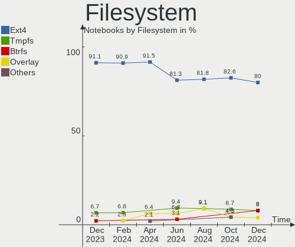
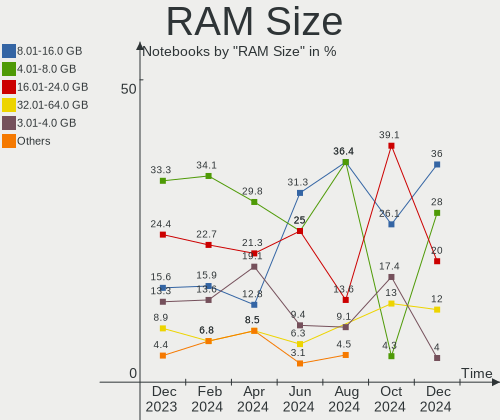
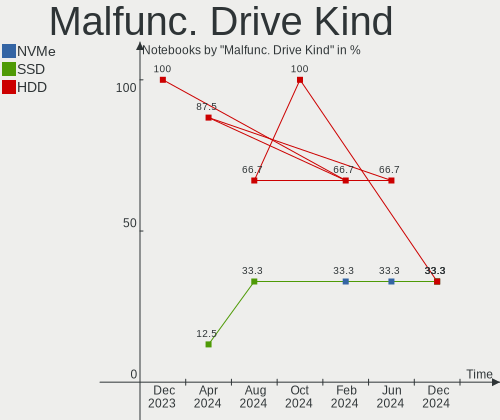
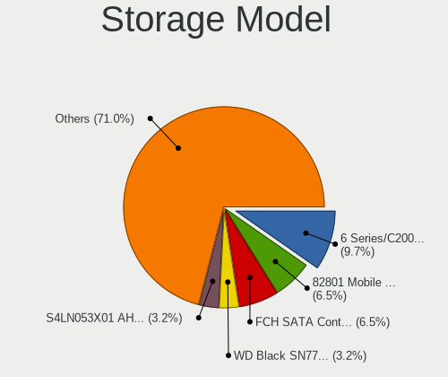
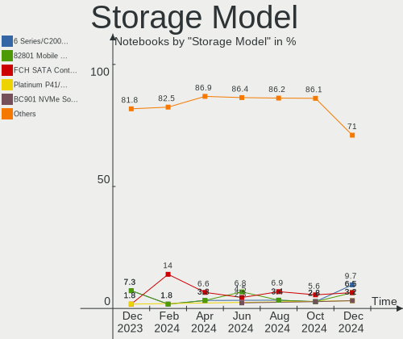
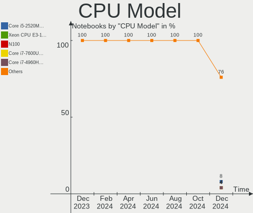
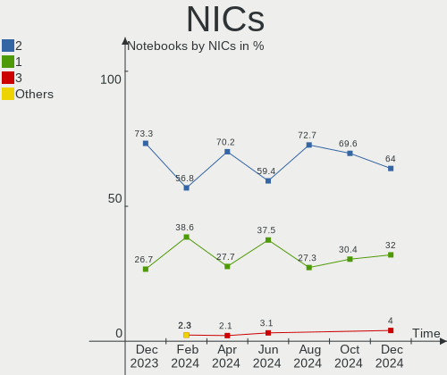

Kali - Hardware Trends (Notebooks)
----------------------------------

A project to identify most popular hardware characteristics and track their change
over time based on data collected by Linux users at https://Linux-Hardware.org.

Anyone can contribute to this report by the [hw-probe](https://github.com/linuxhw/hw-probe) tool:

    sudo -E hw-probe -all -upload

This report is for one last month. Overall report since the beginning of time: [TestDays](https://github.com/linuxhw/TestDays)

Period: Nov, 2023.

Contents
--------

* [ System ](#system)
  - [ OS                       ](#os)
  - [ OS Family                ](#os-family)
  - [ Kernel                   ](#kernel)
  - [ Kernel Family            ](#kernel-family)
  - [ Kernel Major Ver.        ](#kernel-major-ver)
  - [ Arch                     ](#arch)
  - [ DE                       ](#de)
  - [ Display Server           ](#display-server)
  - [ Display Manager          ](#display-manager)
  - [ OS Lang                  ](#os-lang)
  - [ Boot Mode                ](#boot-mode)
  - [ Filesystem               ](#filesystem)
  - [ Part. scheme             ](#part-scheme)
  - [ Dual Boot with Linux/BSD ](#dual-boot-with-linuxbsd)
  - [ Dual Boot (Win)          ](#dual-boot-win)

* [ Board ](#board)
  - [ Vendor                   ](#vendor)
  - [ Model                    ](#model)
  - [ Model Family             ](#model-family)
  - [ MFG Year                 ](#mfg-year)
  - [ Form Factor              ](#form-factor)
  - [ Secure Boot              ](#secure-boot)
  - [ Coreboot                 ](#coreboot)
  - [ RAM Size                 ](#ram-size)
  - [ RAM Used                 ](#ram-used)
  - [ Total Drives             ](#total-drives)
  - [ Has CD-ROM               ](#has-cd-rom)
  - [ Has Ethernet             ](#has-ethernet)
  - [ Has WiFi                 ](#has-wifi)
  - [ Has Bluetooth            ](#has-bluetooth)

* [ Location ](#location)
  - [ Country                  ](#country)
  - [ City                     ](#city)

* [ Drives ](#drives)
  - [ Drive Vendor             ](#drive-vendor)
  - [ Drive Model              ](#drive-model)
  - [ HDD Vendor               ](#hdd-vendor)
  - [ SSD Vendor               ](#ssd-vendor)
  - [ Drive Kind               ](#drive-kind)
  - [ Drive Connector          ](#drive-connector)
  - [ Drive Size               ](#drive-size)
  - [ Space Total              ](#space-total)
  - [ Space Used               ](#space-used)
  - [ Malfunc. Drives          ](#malfunc-drives)
  - [ Malfunc. Drive Vendor    ](#malfunc-drive-vendor)
  - [ Malfunc. HDD Vendor      ](#malfunc-hdd-vendor)
  - [ Malfunc. Drive Kind      ](#malfunc-drive-kind)
  - [ Failed Drives            ](#failed-drives)
  - [ Failed Drive Vendor      ](#failed-drive-vendor)
  - [ Drive Status             ](#drive-status)

* [ Storage controller ](#storage-controller)
  - [ Storage Vendor           ](#storage-vendor)
  - [ Storage Model            ](#storage-model)
  - [ Storage Kind             ](#storage-kind)

* [ Processor ](#processor)
  - [ CPU Vendor               ](#cpu-vendor)
  - [ CPU Model                ](#cpu-model)
  - [ CPU Model Family         ](#cpu-model-family)
  - [ CPU Cores                ](#cpu-cores)
  - [ CPU Sockets              ](#cpu-sockets)
  - [ CPU Threads              ](#cpu-threads)
  - [ CPU Op-Modes             ](#cpu-op-modes)
  - [ CPU Microcode            ](#cpu-microcode)
  - [ CPU Microarch            ](#cpu-microarch)

* [ Graphics ](#graphics)
  - [ GPU Vendor               ](#gpu-vendor)
  - [ GPU Model                ](#gpu-model)
  - [ GPU Combo                ](#gpu-combo)
  - [ GPU Driver               ](#gpu-driver)
  - [ GPU Memory               ](#gpu-memory)

* [ Monitor ](#monitor)
  - [ Monitor Vendor           ](#monitor-vendor)
  - [ Monitor Model            ](#monitor-model)
  - [ Monitor Resolution       ](#monitor-resolution)
  - [ Monitor Diagonal         ](#monitor-diagonal)
  - [ Monitor Width            ](#monitor-width)
  - [ Aspect Ratio             ](#aspect-ratio)
  - [ Monitor Area             ](#monitor-area)
  - [ Pixel Density            ](#pixel-density)
  - [ Multiple Monitors        ](#multiple-monitors)

* [ Network ](#network)
  - [ Net Controller Vendor    ](#net-controller-vendor)
  - [ Net Controller Model     ](#net-controller-model)
  - [ Wireless Vendor          ](#wireless-vendor)
  - [ Wireless Model           ](#wireless-model)
  - [ Ethernet Vendor          ](#ethernet-vendor)
  - [ Ethernet Model           ](#ethernet-model)
  - [ Net Controller Kind      ](#net-controller-kind)
  - [ Used Controller          ](#used-controller)
  - [ NICs                     ](#nics)
  - [ IPv6                     ](#ipv6)

* [ Bluetooth ](#bluetooth)
  - [ Bluetooth Vendor         ](#bluetooth-vendor)
  - [ Bluetooth Model          ](#bluetooth-model)

* [ Sound ](#sound)
  - [ Sound Vendor             ](#sound-vendor)
  - [ Sound Model              ](#sound-model)

* [ Memory ](#memory)
  - [ Memory Vendor            ](#memory-vendor)
  - [ Memory Model             ](#memory-model)
  - [ Memory Kind              ](#memory-kind)
  - [ Memory Form Factor       ](#memory-form-factor)
  - [ Memory Size              ](#memory-size)
  - [ Memory Speed             ](#memory-speed)

* [ Printers & scanners ](#printers--scanners)
  - [ Printer Vendor           ](#printer-vendor)
  - [ Printer Model            ](#printer-model)
  - [ Scanner Vendor           ](#scanner-vendor)
  - [ Scanner Model            ](#scanner-model)

* [ Camera ](#camera)
  - [ Camera Vendor            ](#camera-vendor)
  - [ Camera Model             ](#camera-model)

* [ Security ](#security)
  - [ Fingerprint Vendor       ](#fingerprint-vendor)
  - [ Fingerprint Model        ](#fingerprint-model)
  - [ Chipcard Vendor          ](#chipcard-vendor)
  - [ Chipcard Model           ](#chipcard-model)

* [ Unsupported ](#unsupported)
  - [ Unsupported Devices      ](#unsupported-devices)
  - [ Unsupported Device Types ](#unsupported-device-types)

System
------

OS
--

Installed operating systems

| Name        | Notebooks | Percent |
|-------------|-----------|---------|
| Kali 2023.3 | 48        | 90.57%  |
| Kali 2023.4 | 3         | 5.66%   |
| Kali 2023.2 | 1         | 1.89%   |
| Kali 2023.1 | 1         | 1.89%   |

OS Family
---------

OS without a version

| Name | Notebooks | Percent |
|------|-----------|---------|
| Kali | 53        | 100%    |

Kernel
------

Version of the Linux kernel

| Version            | Notebooks | Percent |
|--------------------|-----------|---------|
| 6.5.0-kali3-amd64  | 40        | 75.47%  |
| 6.3.0-kali1-amd64  | 5         | 9.43%   |
| 5.18.0-kali5-amd64 | 2         | 3.77%   |
| 6.5.0-kali1-amd64  | 1         | 1.89%   |
| 6.1.0-kali9-amd64  | 1         | 1.89%   |
| 6.1.0-kali5-amd64  | 1         | 1.89%   |
| 5.19.0-21-generic  | 1         | 1.89%   |
| 5.10.0-kali3-amd64 | 1         | 1.89%   |
| 4.19.127+          | 1         | 1.89%   |

Kernel Family
-------------

Linux kernel without a distro release

| Version  | Notebooks | Percent |
|----------|-----------|---------|
| 6.5.0    | 41        | 77.36%  |
| 6.3.0    | 5         | 9.43%   |
| 6.1.0    | 2         | 3.77%   |
| 5.18.0   | 2         | 3.77%   |
| 5.19.0   | 1         | 1.89%   |
| 5.10.0   | 1         | 1.89%   |
| 4.19.127 | 1         | 1.89%   |

Kernel Major Ver.
-----------------

Linux kernel major version

| Version | Notebooks | Percent |
|---------|-----------|---------|
| 6.5     | 41        | 77.36%  |
| 6.3     | 5         | 9.43%   |
| 6.1     | 2         | 3.77%   |
| 5.18    | 2         | 3.77%   |
| 5.19    | 1         | 1.89%   |
| 5.10    | 1         | 1.89%   |
| 4.19    | 1         | 1.89%   |

Arch
----

OS architecture (x86_64, i586, etc.)

| Name   | Notebooks | Percent |
|--------|-----------|---------|
| x86_64 | 52        | 98.11%  |
| armv7l | 1         | 1.89%   |

DE
--

Desktop Environment

| Name    | Notebooks | Percent |
|---------|-----------|---------|
| XFCE    | 26        | 49.06%  |
| GNOME   | 17        | 32.08%  |
| KDE5    | 9         | 16.98%  |
| Unknown | 1         | 1.89%   |

Display Server
--------------

X11 or Wayland

| Name    | Notebooks | Percent |
|---------|-----------|---------|
| X11     | 44        | 83.02%  |
| Wayland | 7         | 13.21%  |
| Tty     | 1         | 1.89%   |
| Unknown | 1         | 1.89%   |

Display Manager
---------------

SDDM, LightDM, etc.

| Name    | Notebooks | Percent |
|---------|-----------|---------|
| LightDM | 20        | 37.74%  |
| SDDM    | 13        | 24.53%  |
| Unknown | 11        | 20.75%  |
| GDM3    | 9         | 16.98%  |

OS Lang
-------

Language

| Lang    | Notebooks | Percent |
|---------|-----------|---------|
| C       | 24        | 45.28%  |
| en_US   | 13        | 24.53%  |
| de_DE   | 3         | 5.66%   |
| ru_RU   | 2         | 3.77%   |
| pt_PT   | 2         | 3.77%   |
| fr_FR   | 2         | 3.77%   |
| zh_CN   | 1         | 1.89%   |
| pl_PL   | 1         | 1.89%   |
| it_IT   | 1         | 1.89%   |
| hu_HU   | 1         | 1.89%   |
| es_EC   | 1         | 1.89%   |
| en_GB   | 1         | 1.89%   |
| Unknown | 1         | 1.89%   |

Boot Mode
---------

EFI or BIOS

| Mode | Notebooks | Percent |
|------|-----------|---------|
| EFI  | 39        | 73.58%  |
| BIOS | 14        | 26.42%  |

Filesystem
----------

Type of filesystem

| Type  | Notebooks | Percent |
|-------|-----------|---------|
| Ext4  | 47        | 88.68%  |
| Tmpfs | 5         | 9.43%   |
| Ext3  | 1         | 1.89%   |

Part. scheme
------------

Scheme of partitioning

| Type    | Notebooks | Percent |
|---------|-----------|---------|
| GPT     | 35        | 66.04%  |
| Unknown | 10        | 18.87%  |
| MBR     | 8         | 15.09%  |

Dual Boot with Linux/BSD
------------------------

Hosting more than one Linux/BSD

| Dual boot | Notebooks | Percent |
|-----------|-----------|---------|
| No        | 48        | 90.57%  |
| Yes       | 5         | 9.43%   |

Dual Boot (Win)
---------------

Hosting Linux and Windows

| Dual boot | Notebooks | Percent |
|-----------|-----------|---------|
| No        | 32        | 60.38%  |
| Yes       | 21        | 39.62%  |

Board
-----

Vendor
------

Motherboard manufacturer

| Name                     | Notebooks | Percent |
|--------------------------|-----------|---------|
| Hewlett-Packard          | 13        | 24.53%  |
| Lenovo                   | 8         | 15.09%  |
| Dell                     | 6         | 11.32%  |
| Unknown                  | 6         | 11.32%  |
| Acer                     | 4         | 7.55%   |
| ASUSTek Computer         | 3         | 5.66%   |
| MSI                      | 2         | 3.77%   |
| Google                   | 2         | 3.77%   |
| Wortmann AG              | 1         | 1.89%   |
| Toshiba                  | 1         | 1.89%   |
| Medion                   | 1         | 1.89%   |
| Mediacom                 | 1         | 1.89%   |
| K.A.Technologies Limited | 1         | 1.89%   |
| HONOR                    | 1         | 1.89%   |
| Fujitsu                  | 1         | 1.89%   |
| Apple                    | 1         | 1.89%   |
| Alienware                | 1         | 1.89%   |

Model
-----

Motherboard model

| Name                                              | Notebooks | Percent |
|---------------------------------------------------|-----------|---------|
| Unknown                                           | 7         | 13.21%  |
| Dell Latitude 3380                                | 2         | 3.77%   |
| Wortmann AG 1220571_1470066                       | 1         | 1.89%   |
| Toshiba PORTEGE Z930                              | 1         | 1.89%   |
| MSI Thin GF63 12VF                                | 1         | 1.89%   |
| MSI Modern 14 A10M                                | 1         | 1.89%   |
| Medion M14L-256                                   | 1         | 1.89%   |
| Mediacom WinPad 11,6 FullHD- WPU11                | 1         | 1.89%   |
| Lenovo V130-15IKB 81HN                            | 1         | 1.89%   |
| Lenovo ThinkPad X1 Carbon 7th 20QD000BUS          | 1         | 1.89%   |
| Lenovo ThinkPad T460s 20FAS1TT00                  | 1         | 1.89%   |
| Lenovo ThinkBook 16 G4+ IAP 21CY                  | 1         | 1.89%   |
| Lenovo Legion Y740-17IRHg 81UJ                    | 1         | 1.89%   |
| Lenovo IdeaPad S410p 20296                        | 1         | 1.89%   |
| Lenovo IdeaPad Gaming 3 15IAH7 82S9               | 1         | 1.89%   |
| Lenovo G580 2189                                  | 1         | 1.89%   |
| K.A.Technologies Limited TM1                      | 1         | 1.89%   |
| HONOR BRN-FXX                                     | 1         | 1.89%   |
| HP ZBook Firefly 14 inch G8 Mobile Workstation PC | 1         | 1.89%   |
| HP ProBook 655 G1                                 | 1         | 1.89%   |
| HP ProBook 11 G2                                  | 1         | 1.89%   |
| HP Pavilion Gaming Laptop 15-dk0xxx               | 1         | 1.89%   |
| HP Pavilion g7                                    | 1         | 1.89%   |
| HP Pavilion dv7                                   | 1         | 1.89%   |
| HP Pavilion 14                                    | 1         | 1.89%   |
| HP Notebook                                       | 1         | 1.89%   |
| HP Laptop 17-cp0xxx                               | 1         | 1.89%   |
| HP Laptop 15s-eq2xxx                              | 1         | 1.89%   |
| HP Laptop 14-dk0xxx                               | 1         | 1.89%   |
| HP EliteBook 1040 G4                              | 1         | 1.89%   |
| Google Lindar                                     | 1         | 1.89%   |
| Google Droid                                      | 1         | 1.89%   |
| Fujitsu LIFEBOOK S937                             | 1         | 1.89%   |
| Dell System Inspiron N4110                        | 1         | 1.89%   |
| Dell Latitude E6400                               | 1         | 1.89%   |
| Dell Latitude 5520                                | 1         | 1.89%   |
| Dell Inspiron 15 3515                             | 1         | 1.89%   |
| ASUS VivoBook_ASUSLaptop M1605XA_M1605XA          | 1         | 1.89%   |
| ASUS VivoBook_ASUS Laptop E410MA_E410MA           | 1         | 1.89%   |
| ASUS ASUS TUF Dash F15 FX516PM_FX516PM            | 1         | 1.89%   |

Model Family
------------

Motherboard model prefix

| Name                         | Notebooks | Percent |
|------------------------------|-----------|---------|
| Unknown                      | 7         | 13.21%  |
| HP Pavilion                  | 4         | 7.55%   |
| Dell Latitude                | 4         | 7.55%   |
| HP Laptop                    | 3         | 5.66%   |
| Lenovo ThinkPad              | 2         | 3.77%   |
| Lenovo IdeaPad               | 2         | 3.77%   |
| HP ProBook                   | 2         | 3.77%   |
| ASUS VivoBook                | 2         | 3.77%   |
| Acer Aspire                  | 2         | 3.77%   |
| Wortmann AG 1220571          | 1         | 1.89%   |
| Toshiba PORTEGE              | 1         | 1.89%   |
| MSI Thin                     | 1         | 1.89%   |
| MSI Modern                   | 1         | 1.89%   |
| Medion M14L-256              | 1         | 1.89%   |
| Mediacom WinPad              | 1         | 1.89%   |
| Lenovo V130-15IKB            | 1         | 1.89%   |
| Lenovo ThinkBook             | 1         | 1.89%   |
| Lenovo Legion                | 1         | 1.89%   |
| Lenovo G580                  | 1         | 1.89%   |
| K.A.Technologies Limited TM1 | 1         | 1.89%   |
| HONOR BRN-FXX                | 1         | 1.89%   |
| HP ZBook                     | 1         | 1.89%   |
| HP Notebook                  | 1         | 1.89%   |
| HP EliteBook                 | 1         | 1.89%   |
| Google Lindar                | 1         | 1.89%   |
| Google Droid                 | 1         | 1.89%   |
| Fujitsu LIFEBOOK             | 1         | 1.89%   |
| Dell System                  | 1         | 1.89%   |
| Dell Inspiron                | 1         | 1.89%   |
| ASUS ASUS                    | 1         | 1.89%   |
| Apple MacBookPro8            | 1         | 1.89%   |
| Alienware 14                 | 1         | 1.89%   |
| Acer Predator                | 1         | 1.89%   |
| Acer Nitro                   | 1         | 1.89%   |

MFG Year
--------

Motherboard manufacture year

| Year    | Notebooks | Percent |
|---------|-----------|---------|
| 2021    | 11        | 20.75%  |
| 2019    | 8         | 15.09%  |
| 2023    | 7         | 13.21%  |
| 2022    | 4         | 7.55%   |
| 2016    | 4         | 7.55%   |
| 2013    | 3         | 5.66%   |
| 2012    | 3         | 5.66%   |
| 2011    | 3         | 5.66%   |
| 2020    | 2         | 3.77%   |
| 2018    | 2         | 3.77%   |
| 2017    | 2         | 3.77%   |
| 2008    | 2         | 3.77%   |
| 2014    | 1         | 1.89%   |
| Unknown | 1         | 1.89%   |

Form Factor
-----------

Physical design of the computer

| Name     | Notebooks | Percent |
|----------|-----------|---------|
| Notebook | 53        | 100%    |

Secure Boot
-----------

Enabled or disabled

| State    | Notebooks | Percent |
|----------|-----------|---------|
| Disabled | 53        | 100%    |

Coreboot
--------

Have coreboot on board

| Used | Notebooks | Percent |
|------|-----------|---------|
| No   | 51        | 96.23%  |
| Yes  | 2         | 3.77%   |

RAM Size
--------

Total RAM memory

| Size in GB | Notebooks | Percent |
|------------|-----------|---------|
| 4.01-8.0   | 17        | 32.08%  |
| 16.01-24.0 | 13        | 24.53%  |
| 3.01-4.0   | 11        | 20.75%  |
| 8.01-16.0  | 7         | 13.21%  |
| 32.01-64.0 | 3         | 5.66%   |
| 2.01-3.0   | 1         | 1.89%   |
| 1.01-2.0   | 1         | 1.89%   |

RAM Used
--------

Used RAM memory

| Used GB   | Notebooks | Percent |
|-----------|-----------|---------|
| 2.01-3.0  | 20        | 37.74%  |
| 3.01-4.0  | 13        | 24.53%  |
| 1.01-2.0  | 10        | 18.87%  |
| 4.01-8.0  | 5         | 9.43%   |
| 0.51-1.0  | 3         | 5.66%   |
| 8.01-16.0 | 2         | 3.77%   |

Total Drives
------------

Number of drives on board

| Drives | Notebooks | Percent |
|--------|-----------|---------|
| 1      | 38        | 71.7%   |
| 2      | 15        | 28.3%   |

Has CD-ROM
----------

Has CD-ROM on board

| Presented | Notebooks | Percent |
|-----------|-----------|---------|
| No        | 41        | 77.36%  |
| Yes       | 12        | 22.64%  |

Has Ethernet
------------

Has Ethernet on board

| Presented | Notebooks | Percent |
|-----------|-----------|---------|
| Yes       | 40        | 75.47%  |
| No        | 13        | 24.53%  |

Has WiFi
--------

Has WiFi module

| Presented | Notebooks | Percent |
|-----------|-----------|---------|
| Yes       | 51        | 96.23%  |
| No        | 2         | 3.77%   |

Has Bluetooth
-------------

Has Bluetooth module

| Presented | Notebooks | Percent |
|-----------|-----------|---------|
| Yes       | 44        | 83.02%  |
| No        | 9         | 16.98%  |

Location
--------

Country
-------

Geographic location (country)

| Country            | Notebooks | Percent |
|--------------------|-----------|---------|
| Germany            | 7         | 13.21%  |
| Canada             | 4         | 7.55%   |
| USA                | 3         | 5.66%   |
| Russia             | 3         | 5.66%   |
| UK                 | 2         | 3.77%   |
| Spain              | 2         | 3.77%   |
| Italy              | 2         | 3.77%   |
| France             | 2         | 3.77%   |
| Australia          | 2         | 3.77%   |
| Yemen              | 1         | 1.89%   |
| Turkey             | 1         | 1.89%   |
| Tunisia            | 1         | 1.89%   |
| The Netherlands    | 1         | 1.89%   |
| Thailand           | 1         | 1.89%   |
| Sri Lanka          | 1         | 1.89%   |
| Portugal           | 1         | 1.89%   |
| Poland             | 1         | 1.89%   |
| Pakistan           | 1         | 1.89%   |
| Malaysia           | 1         | 1.89%   |
| Kenya              | 1         | 1.89%   |
| Indonesia          | 1         | 1.89%   |
| India              | 1         | 1.89%   |
| Hungary            | 1         | 1.89%   |
| Greece             | 1         | 1.89%   |
| Ghana              | 1         | 1.89%   |
| Finland            | 1         | 1.89%   |
| Estonia            | 1         | 1.89%   |
| Egypt              | 1         | 1.89%   |
| Ecuador            | 1         | 1.89%   |
| Dominican Republic | 1         | 1.89%   |
| China              | 1         | 1.89%   |
| Cameroon           | 1         | 1.89%   |
| Bulgaria           | 1         | 1.89%   |
| Bangladesh         | 1         | 1.89%   |
| Austria            | 1         | 1.89%   |

City
----

Geographic location (city)

| City                           | Notebooks | Percent |
|--------------------------------|-----------|---------|
| Ottawa                         | 2         | 3.77%   |
| Moscow                         | 2         | 3.77%   |
| Berlin                         | 2         | 3.77%   |
| Zaragoza                       | 1         | 1.89%   |
| Vienna                         | 1         | 1.89%   |
| Veyangoda                      | 1         | 1.89%   |
| Toronto                        | 1         | 1.89%   |
| Tallinn                        | 1         | 1.89%   |
| Shanghai                       | 1         | 1.89%   |
| Saskatoon                      | 1         | 1.89%   |
| Santo Domingo de los Colorados | 1         | 1.89%   |
| Sanaa                          | 1         | 1.89%   |
| San Juan                       | 1         | 1.89%   |
| Roosendaal                     | 1         | 1.89%   |
| Rho                            | 1         | 1.89%   |
| Rendsburg                      | 1         | 1.89%   |
| Poulsbo                        | 1         | 1.89%   |
| Pionerskiy                     | 1         | 1.89%   |
| Perth                          | 1         | 1.89%   |
| Paris                          | 1         | 1.89%   |
| Nairobi                        | 1         | 1.89%   |
| Milton Keynes                  | 1         | 1.89%   |
| Milano                         | 1         | 1.89%   |
| Mainz                          | 1         | 1.89%   |
| Ludhiana                       | 1         | 1.89%   |
| Loudéac                       | 1         | 1.89%   |
| London                         | 1         | 1.89%   |
| Kuala Lumpur                   | 1         | 1.89%   |
| Krakow                         | 1         | 1.89%   |
| Kiel                           | 1         | 1.89%   |
| Karachi                        | 1         | 1.89%   |
| Kairouan                       | 1         | 1.89%   |
| Joplin                         | 1         | 1.89%   |
| Istanbul                       | 1         | 1.89%   |
| Helsinki                       | 1         | 1.89%   |
| Havixbeck                      | 1         | 1.89%   |
| Funchal                        | 1         | 1.89%   |
| El Cajon                       | 1         | 1.89%   |
| Douala                         | 1         | 1.89%   |
| Dhaka                          | 1         | 1.89%   |

Drives
------

Drive Vendor
------------

Hard drive vendors

| Vendor                      | Notebooks | Drives | Percent |
|-----------------------------|-----------|--------|---------|
| Samsung Electronics         | 9         | 9      | 13.43%  |
| Seagate                     | 7         | 7      | 10.45%  |
| WDC                         | 6         | 6      | 8.96%   |
| Unknown                     | 5         | 6      | 7.46%   |
| Toshiba                     | 4         | 4      | 5.97%   |
| Sandisk                     | 4         | 4      | 5.97%   |
| Intel                       | 4         | 4      | 5.97%   |
| SSSTC                       | 3         | 3      | 4.48%   |
| Micron Technology           | 3         | 3      | 4.48%   |
| MAXIO Technology (Hangzhou) | 2         | 2      | 2.99%   |
| China                       | 2         | 2      | 2.99%   |
| V-GeN                       | 1         | 1      | 1.49%   |
| Transcend                   | 1         | 1      | 1.49%   |
| Team                        | 1         | 1      | 1.49%   |
| Silicon Motion              | 1         | 2      | 1.49%   |
| SABRENT                     | 1         | 1      | 1.49%   |
| Ramos Technology            | 1         | 1      | 1.49%   |
| Phison                      | 1         | 1      | 1.49%   |
| Netac                       | 1         | 1      | 1.49%   |
| KIOXIA                      | 1         | 1      | 1.49%   |
| Kingston Technology Company | 1         | 1      | 1.49%   |
| Kingston                    | 1         | 1      | 1.49%   |
| Hitachi                     | 1         | 1      | 1.49%   |
| HGST                        | 1         | 1      | 1.49%   |
| Emtec                       | 1         | 1      | 1.49%   |
| Crucial                     | 1         | 1      | 1.49%   |
| BAITITON                    | 1         | 1      | 1.49%   |
| AirDisk                     | 1         | 1      | 1.49%   |
| Unknown                     | 1         | 1      | 1.49%   |

Drive Model
-----------

Hard drive models

| Model                                                 | Notebooks | Percent |
|-------------------------------------------------------|-----------|---------|
| Sandisk WD Blue SN550 NVMe SSD 512GB                  | 3         | 4.35%   |
| China SSD 256GB                                       | 2         | 2.9%    |
| WDC WDS240G2G0A-00JH30 240GB SSD                      | 1         | 1.45%   |
| WDC WDS100T2B0C-00PXH0 1TB                            | 1         | 1.45%   |
| WDC WD5000LPVX-75V0TT0 500GB                          | 1         | 1.45%   |
| WDC WD5000BPKT-60PK4T0 500GB                          | 1         | 1.45%   |
| WDC WD10SPZX-22Z10T0 1TB                              | 1         | 1.45%   |
| WDC PC SN730 SDBPNTY-512G-1032 512GB                  | 1         | 1.45%   |
| V-GeN V-GEN11SM18EG120GB SSD                          | 1         | 1.45%   |
| Unknown TA2964  64GB                                  | 1         | 1.45%   |
| Unknown SC32G  32GB                                   | 1         | 1.45%   |
| Unknown NCard  32GB                                   | 1         | 1.45%   |
| Unknown MMC Card  32GB                                | 1         | 1.45%   |
| Unknown MMC Card  16GB                                | 1         | 1.45%   |
| Unknown DA4064  64GB                                  | 1         | 1.45%   |
| Transcend TS512GMTS430S 512GB SSD                     | 1         | 1.45%   |
| Toshiba THNSNF128GMCS 128GB SSD                       | 1         | 1.45%   |
| Toshiba THNSFJ256GDNU A 256GB SSD                     | 1         | 1.45%   |
| Toshiba MQ01ABD100V 1TB                               | 1         | 1.45%   |
| Toshiba KXG50ZNV512G 512GB                            | 1         | 1.45%   |
| Team T253512GB SSD                                    | 1         | 1.45%   |
| SSSTC CL4-8D512 512GB                                 | 1         | 1.45%   |
| SSSTC CL1-3D256-Q11 NVMe 256GB                        | 1         | 1.45%   |
| SSSTC CL1-3D128-Q11 NVMe 128GB                        | 1         | 1.45%   |
| Silicon Motion SM2263EN/SM2263XT SSD Controller 256GB | 1         | 1.45%   |
| Silicon Motion N256T3V 256GB                          | 1         | 1.45%   |
| Seagate ST980411ASG 80GB                              | 1         | 1.45%   |
| Seagate ST9640320AS 640GB                             | 1         | 1.45%   |
| Seagate ST9500325AS 500GB                             | 1         | 1.45%   |
| Seagate ST500LT012-1DG142 500GB                       | 1         | 1.45%   |
| Seagate ST500LM030-1RK17D 500GB                       | 1         | 1.45%   |
| Seagate ST1000LM049-2GH172 1TB                        | 1         | 1.45%   |
| Seagate ST1000LM024 HN-M101MBB 1TB                    | 1         | 1.45%   |
| Sandisk WD Blue SN580 1TB                             | 1         | 1.45%   |
| Samsung SSD 980 PRO 1TB                               | 1         | 1.45%   |
| Samsung SSD 850 EVO 500GB                             | 1         | 1.45%   |
| Samsung SSD 850 EVO 120GB                             | 1         | 1.45%   |
| Samsung PSSD T7 1TB                                   | 1         | 1.45%   |
| Samsung MZVLQ512HBLU-00BTW 512GB                      | 1         | 1.45%   |
| Samsung MZVLB1T0HBLR-000H1 1TB                        | 1         | 1.45%   |

HDD Vendor
----------

Hard disk drive vendors

| Vendor  | Notebooks | Drives | Percent |
|---------|-----------|--------|---------|
| Seagate | 7         | 7      | 53.85%  |
| WDC     | 3         | 3      | 23.08%  |
| Toshiba | 1         | 1      | 7.69%   |
| Hitachi | 1         | 1      | 7.69%   |
| HGST    | 1         | 1      | 7.69%   |

SSD Vendor
----------

Solid state drive vendors

| Vendor              | Notebooks | Drives | Percent |
|---------------------|-----------|--------|---------|
| Samsung Electronics | 4         | 4      | 19.05%  |
| Toshiba             | 2         | 2      | 9.52%   |
| China               | 2         | 2      | 9.52%   |
| WDC                 | 1         | 1      | 4.76%   |
| V-GeN               | 1         | 1      | 4.76%   |
| Transcend           | 1         | 1      | 4.76%   |
| Team                | 1         | 1      | 4.76%   |
| Ramos Technology    | 1         | 1      | 4.76%   |
| Netac               | 1         | 1      | 4.76%   |
| Micron Technology   | 1         | 1      | 4.76%   |
| Kingston            | 1         | 1      | 4.76%   |
| Intel               | 1         | 1      | 4.76%   |
| Crucial             | 1         | 1      | 4.76%   |
| BAITITON            | 1         | 1      | 4.76%   |
| AirDisk             | 1         | 1      | 4.76%   |
| Unknown             | 1         | 1      | 4.76%   |

Drive Kind
----------

HDD or SSD

| Kind    | Notebooks | Drives | Percent |
|---------|-----------|--------|---------|
| NVMe    | 23        | 28     | 37.1%   |
| SSD     | 20        | 21     | 32.26%  |
| HDD     | 13        | 13     | 20.97%  |
| MMC     | 5         | 6      | 8.06%   |
| Unknown | 1         | 1      | 1.61%   |

Drive Connector
---------------

SATA, SAS, NVMe, etc.

| Type | Notebooks | Drives | Percent |
|------|-----------|--------|---------|
| SATA | 31        | 34     | 50.82%  |
| NVMe | 22        | 26     | 36.07%  |
| MMC  | 5         | 6      | 8.2%    |
| SAS  | 3         | 3      | 4.92%   |

Drive Size
----------

Size of hard drive

| Size in TB | Notebooks | Drives | Percent |
|------------|-----------|--------|---------|
| 0.01-0.5   | 22        | 23     | 66.67%  |
| 0.51-1.0   | 11        | 11     | 33.33%  |

Space Total
-----------

Amount of disk space available on the file system

| Size in GB | Notebooks | Percent |
|------------|-----------|---------|
| 101-250    | 22        | 41.51%  |
| 251-500    | 15        | 28.3%   |
| 51-100     | 6         | 11.32%  |
| 501-1000   | 5         | 9.43%   |
| 21-50      | 3         | 5.66%   |
| 2001-3000  | 1         | 1.89%   |
| Unknown    | 1         | 1.89%   |

Space Used
----------

Amount of used disk space

| Used GB   | Notebooks | Percent |
|-----------|-----------|---------|
| 21-50     | 18        | 33.96%  |
| 51-100    | 13        | 24.53%  |
| 1-20      | 10        | 18.87%  |
| 101-250   | 9         | 16.98%  |
| 251-500   | 1         | 1.89%   |
| 1001-2000 | 1         | 1.89%   |
| Unknown   | 1         | 1.89%   |

Malfunc. Drives
---------------

Drive models with a malfunction

| Model                           | Notebooks | Drives | Percent |
|---------------------------------|-----------|--------|---------|
| Seagate ST9640320AS 640GB       | 1         | 1      | 33.33%  |
| Seagate ST500LT012-1DG142 500GB | 1         | 1      | 33.33%  |
| HGST HTS541075A9E680 752GB      | 1         | 1      | 33.33%  |

Malfunc. Drive Vendor
---------------------

Vendors of faulty drives

| Vendor  | Notebooks | Drives | Percent |
|---------|-----------|--------|---------|
| Seagate | 2         | 2      | 66.67%  |
| HGST    | 1         | 1      | 33.33%  |

Malfunc. HDD Vendor
-------------------

Vendors of faulty HDD drives

| Vendor  | Notebooks | Drives | Percent |
|---------|-----------|--------|---------|
| Seagate | 2         | 2      | 66.67%  |
| HGST    | 1         | 1      | 33.33%  |

Malfunc. Drive Kind
-------------------

Kinds of faulty drives

| Kind | Notebooks | Drives | Percent |
|------|-----------|--------|---------|
| HDD  | 3         | 3      | 100%    |

Failed Drives
-------------

Failed drive models

Zero info for selected period =(

Failed Drive Vendor
-------------------

Failed drive vendors

Zero info for selected period =(

Drive Status
------------

Number of failed and malfunc. drives

| Status   | Notebooks | Drives | Percent |
|----------|-----------|--------|---------|
| Works    | 33        | 38     | 55.93%  |
| Detected | 23        | 28     | 38.98%  |
| Malfunc  | 3         | 3      | 5.08%   |

Storage controller
------------------

Storage Vendor
--------------

Storage controller vendors

| Vendor                         | Notebooks | Percent |
|--------------------------------|-----------|---------|
| Intel                          | 35        | 56.45%  |
| AMD                            | 6         | 9.68%   |
| Sandisk                        | 5         | 8.06%   |
| Samsung Electronics            | 4         | 6.45%   |
| Solid State Storage Technology | 3         | 4.84%   |
| Micron Technology              | 2         | 3.23%   |
| MAXIO Technology (Hangzhou)    | 2         | 3.23%   |
| Toshiba America Info Systems   | 1         | 1.61%   |
| Silicon Motion                 | 1         | 1.61%   |
| Phison Electronics             | 1         | 1.61%   |
| KIOXIA                         | 1         | 1.61%   |
| Kingston Technology Company    | 1         | 1.61%   |

Storage Model
-------------

Storage controller models

| Model                                                                            | Notebooks | Percent |
|----------------------------------------------------------------------------------|-----------|---------|
| Intel Sunrise Point-LP SATA Controller [AHCI mode]                               | 6         | 9.68%   |
| AMD FCH SATA Controller [AHCI mode]                                              | 6         | 9.68%   |
| Intel Celeron/Pentium Silver Processor SATA Controller                           | 5         | 8.06%   |
| Intel 82801 Mobile SATA Controller [RAID mode]                                   | 4         | 6.45%   |
| SanDisk Ultra 3D / WD Blue SN550 NVMe SSD                                        | 3         | 4.84%   |
| Intel 7 Series Chipset Family 6-port SATA Controller [AHCI mode]                 | 3         | 4.84%   |
| Intel 6 Series/C200 Series Chipset Family 6 port Mobile SATA AHCI Controller     | 3         | 4.84%   |
| Solid State Storage CL1-3D256-Q11 NVMe SSD M.2                                   | 2         | 3.23%   |
| Samsung NVMe SSD Controller SM981/PM981/PM983                                    | 2         | 3.23%   |
| MAXIO (Hangzhou) NVMe SSD Controller MAP1202                                     | 2         | 3.23%   |
| Intel Volume Management Device NVMe RAID Controller                              | 2         | 3.23%   |
| Intel Tiger Lake-LP SATA Controller                                              | 2         | 3.23%   |
| Intel SSD 670p Series [Keystone Harbor]                                          | 2         | 3.23%   |
| Intel 8 Series SATA Controller 1 [AHCI mode]                                     | 2         | 3.23%   |
| Toshiba America Info Systems XG5 NVMe SSD Controller                             | 1         | 1.61%   |
| Solid State Storage CL4-8D512 NVMe SSD M.2 (DRAM-less)                           | 1         | 1.61%   |
| Silicon Motion SM2263EN/SM2263XT (DRAM-less) NVMe SSD Controllers                | 1         | 1.61%   |
| Sandisk WD Blue SN580 NVMe SSD (DRAM-less)                                       | 1         | 1.61%   |
| SanDisk Extreme Pro / WD Black SN750 / PC SN730 / Red SN700 NVMe SSD             | 1         | 1.61%   |
| Samsung NVMe SSD Controller PM9A1/PM9A3/980PRO                                   | 1         | 1.61%   |
| Samsung NVMe SSD Controller 980 (DRAM-less)                                      | 1         | 1.61%   |
| Phison PS5013-E13 PCIe3 NVMe Controller (DRAM-less)                              | 1         | 1.61%   |
| Micron 2450 NVMe SSD [HendrixV] (DRAM-less)                                      | 1         | 1.61%   |
| Micron 2400 NVMe SSD (DRAM-less)                                                 | 1         | 1.61%   |
| KIOXIA NVMe SSD Controller BG5 (DRAM-less)                                       | 1         | 1.61%   |
| Kingston Company NV2 NVMe SSD SM2267XT                                           | 1         | 1.61%   |
| Intel Wildcat Point-LP SATA Controller [AHCI Mode]                               | 1         | 1.61%   |
| Intel SSD 660P Series                                                            | 1         | 1.61%   |
| Intel Cannon Lake Mobile PCH SATA AHCI Controller                                | 1         | 1.61%   |
| Intel Atom/Celeron/Pentium Processor x5-E8000/J3xxx/N3xxx Series SATA Controller | 1         | 1.61%   |
| Intel Alder Lake-P SATA AHCI Controller                                          | 1         | 1.61%   |
| Intel 8 Series/C220 Series Chipset Family 6-port SATA Controller 1 [AHCI mode]   | 1         | 1.61%   |

Storage Kind
------------

Kind of storage controller (IDE, SATA, NVMe, SAS, ...)

| Kind | Notebooks | Percent |
|------|-----------|---------|
| SATA | 32        | 53.33%  |
| NVMe | 22        | 36.67%  |
| RAID | 6         | 10%     |

Processor
---------

CPU Vendor
----------

Processor vendors

| Vendor | Notebooks | Percent |
|--------|-----------|---------|
| Intel  | 41        | 77.36%  |
| AMD    | 11        | 20.75%  |
| ARM    | 1         | 1.89%   |

CPU Model
---------

Processor models

| Model                                         | Notebooks | Percent |
|-----------------------------------------------|-----------|---------|
| Intel Core i7-9750H CPU @ 2.60GHz             | 3         | 5.66%   |
| Intel Core i5-7200U CPU @ 2.50GHz             | 3         | 5.66%   |
| Intel Celeron N4020 CPU @ 1.10GHz             | 3         | 5.66%   |
| Intel Core i5-4200U CPU @ 1.60GHz             | 2         | 3.77%   |
| Intel Celeron J4125 CPU @ 2.00GHz             | 2         | 3.77%   |
| Intel 12th Gen Core i7-12650H                 | 2         | 3.77%   |
| Intel 11th Gen Core i5-11300H @ 3.10GHz       | 2         | 3.77%   |
| AMD Ryzen 7 5700U with Radeon Graphics        | 2         | 3.77%   |
| Intel Pentium Gold 7505 @ 2.00GHz             | 1         | 1.89%   |
| Intel Pentium CPU N3710 @ 1.60GHz             | 1         | 1.89%   |
| Intel Core i7-4700MQ CPU @ 2.40GHz            | 1         | 1.89%   |
| Intel Core i7-3520M CPU @ 2.90GHz             | 1         | 1.89%   |
| Intel Core i7-2670QM CPU @ 2.20GHz            | 1         | 1.89%   |
| Intel Core i5-8265U CPU @ 1.60GHz             | 1         | 1.89%   |
| Intel Core i5-7300U CPU @ 2.60GHz             | 1         | 1.89%   |
| Intel Core i5-6300U CPU @ 2.40GHz             | 1         | 1.89%   |
| Intel Core i5-3437U CPU @ 1.90GHz             | 1         | 1.89%   |
| Intel Core i5-2435M CPU @ 2.40GHz             | 1         | 1.89%   |
| Intel Core i5-2410M CPU @ 2.30GHz             | 1         | 1.89%   |
| Intel Core i5-10210U CPU @ 1.60GHz            | 1         | 1.89%   |
| Intel Core i3-7020U CPU @ 2.30GHz             | 1         | 1.89%   |
| Intel Core i3-6100U CPU @ 2.30GHz             | 1         | 1.89%   |
| Intel Core i3-5005U CPU @ 2.00GHz             | 1         | 1.89%   |
| Intel Core i3-3217U CPU @ 1.80GHz             | 1         | 1.89%   |
| Intel Core i3-1005G1 CPU @ 1.20GHz            | 1         | 1.89%   |
| Intel Core 2 Duo CPU P8400 @ 2.26GHz          | 1         | 1.89%   |
| Intel Celeron N4120 CPU @ 1.10GHz             | 1         | 1.89%   |
| Intel Atom x5-Z8300 CPU @ 1.44GHz             | 1         | 1.89%   |
| Intel 12th Gen Core i5-12450H                 | 1         | 1.89%   |
| Intel 12th Gen Core i5-1235U                  | 1         | 1.89%   |
| Intel 11th Gen Core i7-1185G7 @ 3.00GHz       | 1         | 1.89%   |
| Intel 11th Gen Core i5-1135G7 @ 2.40GHz       | 1         | 1.89%   |
| ARM ARMv7 Processor rev 4 (v7l)               | 1         | 1.89%   |
| AMD Ryzen 9 7940H w/ Radeon 780M Graphics     | 1         | 1.89%   |
| AMD Ryzen 5 5625U with Radeon Graphics        | 1         | 1.89%   |
| AMD Ryzen 5 5500U with Radeon Graphics        | 1         | 1.89%   |
| AMD Ryzen 5 3500U with Radeon Vega Mobile Gfx | 1         | 1.89%   |
| AMD Ryzen 5 3450U with Radeon Vega Mobile Gfx | 1         | 1.89%   |
| AMD Ryzen 3 5300U with Radeon Graphics        | 1         | 1.89%   |
| AMD E2-7110 APU with AMD Radeon R2 Graphics   | 1         | 1.89%   |

CPU Model Family
----------------

Processor model prefix

| Model              | Notebooks | Percent |
|--------------------|-----------|---------|
| Intel Core i5      | 12        | 22.64%  |
| Other              | 8         | 15.09%  |
| Intel Core i7      | 6         | 11.32%  |
| Intel Celeron      | 6         | 11.32%  |
| Intel Core i3      | 5         | 9.43%   |
| AMD Ryzen 5        | 4         | 7.55%   |
| AMD Ryzen 7        | 2         | 3.77%   |
| Intel Pentium Gold | 1         | 1.89%   |
| Intel Pentium      | 1         | 1.89%   |
| Intel Core 2 Duo   | 1         | 1.89%   |
| Intel Atom         | 1         | 1.89%   |
| ARM ARMv7          | 1         | 1.89%   |
| AMD Ryzen 9        | 1         | 1.89%   |
| AMD Ryzen 3        | 1         | 1.89%   |
| AMD E2             | 1         | 1.89%   |
| AMD A6             | 1         | 1.89%   |
| AMD A10            | 1         | 1.89%   |

CPU Cores
---------

Number of processor cores

| Number | Notebooks | Percent |
|--------|-----------|---------|
| 2      | 22        | 41.51%  |
| 4      | 18        | 33.96%  |
| 8      | 5         | 9.43%   |
| 6      | 5         | 9.43%   |
| 10     | 3         | 5.66%   |

CPU Sockets
-----------

Number of sockets

| Number | Notebooks | Percent |
|--------|-----------|---------|
| 1      | 52        | 98.11%  |
| 2      | 1         | 1.89%   |

CPU Threads
-----------

Threads per core (Hyper-Threading)

| Number | Notebooks | Percent |
|--------|-----------|---------|
| 2      | 41        | 77.36%  |
| 1      | 12        | 22.64%  |

CPU Op-Modes
------------

CPU Operation Modes (32-bit, 64-bit)

| Op mode        | Notebooks | Percent |
|----------------|-----------|---------|
| 32-bit, 64-bit | 52        | 98.11%  |
| Unknown        | 1         | 1.89%   |

CPU Microcode
-------------

Microcode number

| Number     | Notebooks | Percent |
|------------|-----------|---------|
| Unknown    | 37        | 69.81%  |
| 0x706a8    | 3         | 5.66%   |
| 0x08608104 | 2         | 3.77%   |
| 0x08608103 | 2         | 3.77%   |
| 0x08108109 | 2         | 3.77%   |
| 0x806e9    | 1         | 1.89%   |
| 0x406c3    | 1         | 1.89%   |
| 0x40651    | 1         | 1.89%   |
| 0x206a7    | 1         | 1.89%   |
| 0x0a704103 | 1         | 1.89%   |
| 0x0a50000c | 1         | 1.89%   |
| 0x07030106 | 1         | 1.89%   |

CPU Microarch
-------------

Microarchitecture

| Name             | Notebooks | Percent |
|------------------|-----------|---------|
| KabyLake         | 10        | 18.87%  |
| Goldmont plus    | 6         | 11.32%  |
| Unknown          | 6         | 11.32%  |
| TigerLake        | 5         | 9.43%   |
| Alderlake Hybrid | 4         | 7.55%   |
| SandyBridge      | 3         | 5.66%   |
| IvyBridge        | 3         | 5.66%   |
| Haswell          | 3         | 5.66%   |
| Zen+             | 2         | 3.77%   |
| Skylake          | 2         | 3.77%   |
| Silvermont       | 2         | 3.77%   |
| Zen 3            | 1         | 1.89%   |
| Puma             | 1         | 1.89%   |
| Piledriver       | 1         | 1.89%   |
| Penryn           | 1         | 1.89%   |
| K10 Llano        | 1         | 1.89%   |
| IceLake          | 1         | 1.89%   |
| Broadwell        | 1         | 1.89%   |

Graphics
--------

GPU Vendor
----------

Vendors of graphics cards

| Vendor | Notebooks | Percent |
|--------|-----------|---------|
| Intel  | 41        | 63.08%  |
| AMD    | 13        | 20%     |
| Nvidia | 11        | 16.92%  |

GPU Model
---------

Graphics card models

| Model                                                                                    | Notebooks | Percent |
|------------------------------------------------------------------------------------------|-----------|---------|
| Intel GeminiLake [UHD Graphics 600]                                                      | 6         | 9.23%   |
| Intel HD Graphics 620                                                                    | 5         | 7.69%   |
| Intel TigerLake-LP GT2 [Iris Xe Graphics]                                                | 4         | 6.15%   |
| AMD Lucienne                                                                             | 4         | 6.15%   |
| Intel CoffeeLake-H GT2 [UHD Graphics 630]                                                | 3         | 4.62%   |
| Intel Alder Lake-P GT1 [UHD Graphics]                                                    | 3         | 4.62%   |
| Intel 3rd Gen Core processor Graphics Controller                                         | 3         | 4.62%   |
| Intel 2nd Generation Core Processor Family Integrated Graphics Controller                | 3         | 4.62%   |
| Nvidia TU117M [GeForce GTX 1650 Mobile / Max-Q]                                          | 2         | 3.08%   |
| Nvidia GA107M [GeForce RTX 3050 Mobile]                                                  | 2         | 3.08%   |
| Intel Skylake GT2 [HD Graphics 520]                                                      | 2         | 3.08%   |
| Intel Haswell-ULT Integrated Graphics Controller                                         | 2         | 3.08%   |
| Intel Atom/Celeron/Pentium Processor x5-E8000/J3xxx/N3xxx Integrated Graphics Controller | 2         | 3.08%   |
| AMD Picasso/Raven 2 [Radeon Vega Series / Radeon Vega Mobile Series]                     | 2         | 3.08%   |
| Nvidia TU106M [GeForce RTX 2060 Mobile]                                                  | 1         | 1.54%   |
| Nvidia TU106BM [GeForce RTX 2060 Mobile]                                                 | 1         | 1.54%   |
| Nvidia GK208M [GeForce GT 740M]                                                          | 1         | 1.54%   |
| Nvidia GK106M [GeForce GTX 765M]                                                         | 1         | 1.54%   |
| Nvidia GF117M [GeForce 610M/710M/810M/820M / GT 620M/625M/630M/720M]                     | 1         | 1.54%   |
| Nvidia GA106M [GeForce RTX 3060 Mobile / Max-Q]                                          | 1         | 1.54%   |
| Nvidia AD107M [GeForce RTX 4060 Max-Q / Mobile]                                          | 1         | 1.54%   |
| Intel WhiskeyLake-U GT2 [UHD Graphics 620]                                               | 1         | 1.54%   |
| Intel Tiger Lake-LP GT2 [UHD Graphics G4]                                                | 1         | 1.54%   |
| Intel Mobile 4 Series Chipset Integrated Graphics Controller                             | 1         | 1.54%   |
| Intel Iris Plus Graphics G1 (Ice Lake)                                                   | 1         | 1.54%   |
| Intel HD Graphics 5500                                                                   | 1         | 1.54%   |
| Intel CometLake-U GT2 [UHD Graphics]                                                     | 1         | 1.54%   |
| Intel Alder Lake-UP3 GT2 [Iris Xe Graphics]                                              | 1         | 1.54%   |
| Intel 4th Gen Core Processor Integrated Graphics Controller                              | 1         | 1.54%   |
| AMD Whistler [Radeon HD 6730M/6770M/7690M XT]                                            | 1         | 1.54%   |
| AMD Sun XT [Radeon HD 8670A/8670M/8690M / R5 M330 / M430 / Radeon 520 Mobile]            | 1         | 1.54%   |
| AMD Sumo [Radeon HD 6520G]                                                               | 1         | 1.54%   |
| AMD Richland [Radeon HD 8650G]                                                           | 1         | 1.54%   |
| AMD Phoenix1                                                                             | 1         | 1.54%   |
| AMD Mullins [Radeon R3 Graphics]                                                         | 1         | 1.54%   |
| AMD Barcelo                                                                              | 1         | 1.54%   |

GPU Combo
---------

Combinations of graphics cards

| Name           | Notebooks | Percent |
|----------------|-----------|---------|
| 1 x Intel      | 28        | 52.83%  |
| Intel + Nvidia | 10        | 18.87%  |
| 1 x AMD        | 10        | 18.87%  |
| Intel + AMD    | 2         | 3.77%   |
| Other          | 1         | 1.89%   |
| 2 x Intel      | 1         | 1.89%   |
| AMD + Nvidia   | 1         | 1.89%   |

GPU Driver
----------

Free vs proprietary

| Driver      | Notebooks | Percent |
|-------------|-----------|---------|
| Free        | 46        | 86.79%  |
| Proprietary | 6         | 11.32%  |
| Unknown     | 1         | 1.89%   |

GPU Memory
----------

Total video memory

| Size in GB | Notebooks | Percent |
|------------|-----------|---------|
| Unknown    | 40        | 75.47%  |
| 0.01-0.5   | 6         | 11.32%  |
| 1.01-2.0   | 5         | 9.43%   |
| 3.01-4.0   | 1         | 1.89%   |
| 0.51-1.0   | 1         | 1.89%   |

Monitor
-------

Monitor Vendor
--------------

Monitor vendors

| Vendor              | Notebooks | Percent |
|---------------------|-----------|---------|
| BOE                 | 15        | 26.32%  |
| Chimei Innolux      | 10        | 17.54%  |
| LG Display          | 9         | 15.79%  |
| AU Optronics        | 9         | 15.79%  |
| Samsung Electronics | 2         | 3.51%   |
| InfoVision          | 2         | 3.51%   |
| STA                 | 1         | 1.75%   |
| Sharp               | 1         | 1.75%   |
| Philips             | 1         | 1.75%   |
| PANDA               | 1         | 1.75%   |
| HKC                 | 1         | 1.75%   |
| Hewlett-Packard     | 1         | 1.75%   |
| Dell                | 1         | 1.75%   |
| ASUSTek Computer    | 1         | 1.75%   |
| Apple               | 1         | 1.75%   |
| Acer                | 1         | 1.75%   |

Monitor Model
-------------

Monitor models

| Model                                                              | Notebooks | Percent |
|--------------------------------------------------------------------|-----------|---------|
| AU Optronics LCD Monitor AUOAF90 1920x1080 344x193mm 15.5-inch     | 3         | 5.17%   |
| BOE LCD Monitor BOE0747 1920x1080 345x195mm 15.6-inch              | 2         | 3.45%   |
| BOE LCD Monitor BOE0708 1366x768 277x156mm 12.5-inch               | 2         | 3.45%   |
| STA XR140EA1T STA0450 1366x768 310x174mm 14.0-inch                 | 1         | 1.72%   |
| Sharp LQ133M1JW01 SHP141B 1920x1080 294x165mm 13.3-inch            | 1         | 1.72%   |
| Samsung Electronics S27F350 SAM0D22 1920x1080 598x336mm 27.0-inch  | 1         | 1.72%   |
| Samsung Electronics LC27G5xT SAM7079 2560x1440 597x336mm 27.0-inch | 1         | 1.72%   |
| Philips FTV PHL04C3 1920x1080 1440x810mm 65.0-inch                 | 1         | 1.72%   |
| PANDA LCD Monitor NCP004D 1920x1080 344x194mm 15.5-inch            | 1         | 1.72%   |
| LG Display LCD Monitor LGD0ABC 1280x800 304x190mm 14.1-inch        | 1         | 1.72%   |
| LG Display LCD Monitor LGD0690 2560x1440 344x194mm 15.5-inch       | 1         | 1.72%   |
| LG Display LCD Monitor LGD060F 1920x1080 309x174mm 14.0-inch       | 1         | 1.72%   |
| LG Display LCD Monitor LGD0608 1920x1080 309x174mm 14.0-inch       | 1         | 1.72%   |
| LG Display LCD Monitor LGD05E0 1920x1080 382x215mm 17.3-inch       | 1         | 1.72%   |
| LG Display LCD Monitor LGD0551 1920x1080 309x174mm 14.0-inch       | 1         | 1.72%   |
| LG Display LCD Monitor LGD03EA 1920x1080 309x174mm 14.0-inch       | 1         | 1.72%   |
| LG Display LCD Monitor LGD033A 1366x768 344x194mm 15.5-inch        | 1         | 1.72%   |
| LG Display LCD Monitor LGD02E9 1366x768 309x174mm 14.0-inch        | 1         | 1.72%   |
| InfoVision LCD Monitor IVO057D 1920x1080 309x174mm 14.0-inch       | 1         | 1.72%   |
| InfoVision LCD Monitor IVO0489 1366x768 256x144mm 11.6-inch        | 1         | 1.72%   |
| HKC LCD Monitor HKC023D 1920x1080 344x194mm 15.5-inch              | 1         | 1.72%   |
| Hewlett-Packard L1706 HWP265C 1280x1024 337x270mm 17.0-inch        | 1         | 1.72%   |
| Dell U2515H DELD070 2560x1440 553x311mm 25.0-inch                  | 1         | 1.72%   |
| Chimei Innolux LCD Monitor CMN175C 1920x1080 380x210mm 17.1-inch   | 1         | 1.72%   |
| Chimei Innolux LCD Monitor CMN1728 1600x900 382x215mm 17.3-inch    | 1         | 1.72%   |
| Chimei Innolux LCD Monitor CMN15C2 1920x1080 344x194mm 15.5-inch   | 1         | 1.72%   |
| Chimei Innolux LCD Monitor CMN1538 1920x1080 344x193mm 15.5-inch   | 1         | 1.72%   |
| Chimei Innolux LCD Monitor CMN14D7 1920x1080 309x173mm 13.9-inch   | 1         | 1.72%   |
| Chimei Innolux LCD Monitor CMN14D6 1366x768 309x173mm 13.9-inch    | 1         | 1.72%   |
| Chimei Innolux LCD Monitor CMN14D5 1920x1080 309x173mm 13.9-inch   | 1         | 1.72%   |
| Chimei Innolux LCD Monitor CMN14A1 1366x768 309x174mm 14.0-inch    | 1         | 1.72%   |
| Chimei Innolux LCD Monitor CMN1476 1366x768 309x174mm 14.0-inch    | 1         | 1.72%   |
| Chimei Innolux LCD Monitor CMN140A 1920x1080 309x173mm 13.9-inch   | 1         | 1.72%   |
| BOE LCD Monitor BOE0BEE 2560x1600 345x215mm 16.0-inch              | 1         | 1.72%   |
| BOE LCD Monitor BOE0B4C 1920x1200 345x215mm 16.0-inch              | 1         | 1.72%   |
| BOE LCD Monitor BOE0A81 1920x1080 344x194mm 15.5-inch              | 1         | 1.72%   |
| BOE LCD Monitor BOE0A31 1920x1200 345x215mm 16.0-inch              | 1         | 1.72%   |
| BOE LCD Monitor BOE097D 1920x1080 344x194mm 15.5-inch              | 1         | 1.72%   |
| BOE LCD Monitor BOE0960 1366x768 344x194mm 15.5-inch               | 1         | 1.72%   |
| BOE LCD Monitor BOE094A 1920x1080 344x194mm 15.5-inch              | 1         | 1.72%   |

Monitor Resolution
------------------

Monitor screen resolution

| Resolution        | Notebooks | Percent |
|-------------------|-----------|---------|
| 1920x1080 (FHD)   | 27        | 48.21%  |
| 1366x768 (WXGA)   | 16        | 28.57%  |
| 2560x1440 (QHD)   | 4         | 7.14%   |
| 1920x1200 (WUXGA) | 2         | 3.57%   |
| 1600x900 (HD+)    | 2         | 3.57%   |
| 1280x800 (WXGA)   | 2         | 3.57%   |
| 3840x2160 (4K)    | 1         | 1.79%   |
| 2560x1600         | 1         | 1.79%   |
| 1280x1024 (SXGA)  | 1         | 1.79%   |

Monitor Diagonal
----------------

Diagonal size in inches

| Inches | Notebooks | Percent |
|--------|-----------|---------|
| 15     | 21        | 36.84%  |
| 14     | 9         | 15.79%  |
| 13     | 8         | 14.04%  |
| 17     | 6         | 10.53%  |
| 16     | 3         | 5.26%   |
| 27     | 2         | 3.51%   |
| 12     | 2         | 3.51%   |
| 65     | 1         | 1.75%   |
| 31     | 1         | 1.75%   |
| 25     | 1         | 1.75%   |
| 24     | 1         | 1.75%   |
| 21     | 1         | 1.75%   |
| 11     | 1         | 1.75%   |

Monitor Width
-------------

Physical width

| Width in mm | Notebooks | Percent |
|-------------|-----------|---------|
| 301-350     | 39        | 68.42%  |
| 201-300     | 6         | 10.53%  |
| 351-400     | 5         | 8.77%   |
| 501-600     | 4         | 7.02%   |
| 601-700     | 1         | 1.75%   |
| 401-500     | 1         | 1.75%   |
| 1001-1500   | 1         | 1.75%   |

Aspect Ratio
------------

Proportional relationship between the width and the height

| Ratio | Notebooks | Percent |
|-------|-----------|---------|
| 16/9  | 46        | 88.46%  |
| 16/10 | 5         | 9.62%   |
| 5/4   | 1         | 1.92%   |

Monitor Area
------------

Area in inch²

| Area in inch² | Notebooks | Percent |
|----------------|-----------|---------|
| 101-110        | 21        | 36.84%  |
| 81-90          | 14        | 24.56%  |
| 121-130        | 4         | 7.02%   |
| 71-80          | 3         | 5.26%   |
| 111-120        | 3         | 5.26%   |
| 61-70          | 2         | 3.51%   |
| 301-350        | 2         | 3.51%   |
| More than 1000 | 1         | 1.75%   |
| 51-60          | 1         | 1.75%   |
| 351-500        | 1         | 1.75%   |
| 251-300        | 1         | 1.75%   |
| 201-250        | 1         | 1.75%   |
| 151-200        | 1         | 1.75%   |
| 141-150        | 1         | 1.75%   |
| 131-140        | 1         | 1.75%   |

Pixel Density
-------------

Pixels per inch

| Density | Notebooks | Percent |
|---------|-----------|---------|
| 121-160 | 29        | 50.88%  |
| 101-120 | 20        | 35.09%  |
| 51-100  | 4         | 7.02%   |
| 161-240 | 3         | 5.26%   |
| 1-50    | 1         | 1.75%   |

Multiple Monitors
-----------------

Total monitors connected

| Total | Notebooks | Percent |
|-------|-----------|---------|
| 1     | 43        | 81.13%  |
| 2     | 7         | 13.21%  |
| 0     | 2         | 3.77%   |
| 3     | 1         | 1.89%   |

Network
-------

Net Controller Vendor
---------------------

Controller vendors

| Vendor                | Notebooks | Percent |
|-----------------------|-----------|---------|
| Realtek Semiconductor | 32        | 34.41%  |
| Intel                 | 27        | 29.03%  |
| Qualcomm Atheros      | 7         | 7.53%   |
| TP-Link               | 5         | 5.38%   |
| Broadcom              | 5         | 5.38%   |
| Ralink Technology     | 4         | 4.3%    |
| MediaTek              | 3         | 3.23%   |
| Samsung Electronics   | 2         | 2.15%   |
| Huawei Technologies   | 2         | 2.15%   |
| Xiaomi                | 1         | 1.08%   |
| Toshiba               | 1         | 1.08%   |
| Ralink                | 1         | 1.08%   |
| Dell                  | 1         | 1.08%   |
| Broadcom Limited      | 1         | 1.08%   |
| ASIX Electronics      | 1         | 1.08%   |

Net Controller Model
--------------------

Controller models

| Model                                                             | Notebooks | Percent |
|-------------------------------------------------------------------|-----------|---------|
| Realtek RTL8111/8168/8411 PCI Express Gigabit Ethernet Controller | 15        | 13.64%  |
| Realtek RTL810xE PCI Express Fast Ethernet controller             | 5         | 4.55%   |
| Intel Wi-Fi 6 AX201                                               | 5         | 4.55%   |
| TP-Link Archer T2U PLUS [RTL8821AU]                               | 3         | 2.73%   |
| Realtek RTL8821CE 802.11ac PCIe Wireless Network Adapter          | 3         | 2.73%   |
| Intel Alder Lake-P PCH CNVi WiFi                                  | 3         | 2.73%   |
| Samsung GT-I9070 (network tethering, USB debugging enabled)       | 2         | 1.82%   |
| Realtek RTL8812AU 802.11a/b/g/n/ac 2T2R DB WLAN Adapter           | 2         | 1.82%   |
| Realtek RTL8153 Gigabit Ethernet Adapter                          | 2         | 1.82%   |
| Realtek 802.11ac NIC                                              | 2         | 1.82%   |
| Ralink MT7601U Wireless Adapter                                   | 2         | 1.82%   |
| Qualcomm Atheros QCA6174 802.11ac Wireless Network Adapter        | 2         | 1.82%   |
| Qualcomm Atheros AR9485 Wireless Network Adapter                  | 2         | 1.82%   |
| Intel Wireless 8265 / 8275                                        | 2         | 1.82%   |
| Intel Wireless 8260                                               | 2         | 1.82%   |
| Intel Wireless 7265                                               | 2         | 1.82%   |
| Intel Centrino Wireless-N 1030 [Rainbow Peak]                     | 2         | 1.82%   |
| Intel Cannon Lake PCH CNVi WiFi                                   | 2         | 1.82%   |
| Huawei MAR-LX1M                                                   | 2         | 1.82%   |
| Broadcom BCM43228 802.11a/b/g/n                                   | 2         | 1.82%   |
| Xiaomi Mi/Redmi series (RNDIS + ADB)                              | 1         | 0.91%   |
| TP-Link 802.11ac WLAN Adapter                                     | 1         | 0.91%   |
| TP-Link 802.11ac NIC                                              | 1         | 0.91%   |
| Toshiba H5321gw                                                   | 1         | 0.91%   |
| Realtek RTL88x2bu [AC1200 Techkey]                                | 1         | 0.91%   |
| Realtek RTL8852BE PCIe 802.11ax Wireless Network Controller       | 1         | 0.91%   |
| Realtek RTL8822CE 802.11ac PCIe Wireless Network Adapter          | 1         | 0.91%   |
| Realtek RTL8822BE 802.11a/b/g/n/ac WiFi adapter                   | 1         | 0.91%   |
| Realtek RTL8814AU 802.11a/b/g/n/ac Wireless Adapter               | 1         | 0.91%   |
| Realtek RTL8723BE PCIe Wireless Network Adapter                   | 1         | 0.91%   |
| Realtek RTL8188FTV 802.11b/g/n 1T1R 2.4G WLAN Adapter             | 1         | 0.91%   |
| Realtek RTL8152 Fast Ethernet Adapter                             | 1         | 0.91%   |
| Realtek PCIe GbE Family Controller                                | 1         | 0.91%   |
| Realtek Killer E2600 Gigabit Ethernet Controller                  | 1         | 0.91%   |
| Realtek 802.11n WLAN Adapter                                      | 1         | 0.91%   |
| Ralink RT5372 Wireless Adapter                                    | 1         | 0.91%   |
| Ralink RT3572 Wireless Adapter                                    | 1         | 0.91%   |
| Ralink RT3290 Wireless 802.11n 1T/1R PCIe                         | 1         | 0.91%   |
| Qualcomm Atheros QCA8172 Fast Ethernet                            | 1         | 0.91%   |
| Qualcomm Atheros Killer E2500 Gigabit Ethernet Controller         | 1         | 0.91%   |

Wireless Vendor
---------------

Wireless vendors

| Vendor                | Notebooks | Percent |
|-----------------------|-----------|---------|
| Intel                 | 27        | 42.19%  |
| Realtek Semiconductor | 14        | 21.88%  |
| TP-Link               | 5         | 7.81%   |
| Broadcom              | 5         | 7.81%   |
| Ralink Technology     | 4         | 6.25%   |
| Qualcomm Atheros      | 4         | 6.25%   |
| MediaTek              | 3         | 4.69%   |
| Ralink                | 1         | 1.56%   |
| Broadcom Limited      | 1         | 1.56%   |

Wireless Model
--------------

Wireless models

| Model                                                         | Notebooks | Percent |
|---------------------------------------------------------------|-----------|---------|
| Intel Wi-Fi 6 AX201                                           | 5         | 7.69%   |
| TP-Link Archer T2U PLUS [RTL8821AU]                           | 3         | 4.62%   |
| Realtek RTL8821CE 802.11ac PCIe Wireless Network Adapter      | 3         | 4.62%   |
| Intel Alder Lake-P PCH CNVi WiFi                              | 3         | 4.62%   |
| Realtek RTL8812AU 802.11a/b/g/n/ac 2T2R DB WLAN Adapter       | 2         | 3.08%   |
| Realtek 802.11ac NIC                                          | 2         | 3.08%   |
| Ralink MT7601U Wireless Adapter                               | 2         | 3.08%   |
| Qualcomm Atheros QCA6174 802.11ac Wireless Network Adapter    | 2         | 3.08%   |
| Qualcomm Atheros AR9485 Wireless Network Adapter              | 2         | 3.08%   |
| Intel Wireless 8265 / 8275                                    | 2         | 3.08%   |
| Intel Wireless 8260                                           | 2         | 3.08%   |
| Intel Wireless 7265                                           | 2         | 3.08%   |
| Intel Centrino Wireless-N 1030 [Rainbow Peak]                 | 2         | 3.08%   |
| Intel Cannon Lake PCH CNVi WiFi                               | 2         | 3.08%   |
| Broadcom BCM43228 802.11a/b/g/n                               | 2         | 3.08%   |
| TP-Link 802.11ac WLAN Adapter                                 | 1         | 1.54%   |
| TP-Link 802.11ac NIC                                          | 1         | 1.54%   |
| Realtek RTL88x2bu [AC1200 Techkey]                            | 1         | 1.54%   |
| Realtek RTL8852BE PCIe 802.11ax Wireless Network Controller   | 1         | 1.54%   |
| Realtek RTL8822CE 802.11ac PCIe Wireless Network Adapter      | 1         | 1.54%   |
| Realtek RTL8822BE 802.11a/b/g/n/ac WiFi adapter               | 1         | 1.54%   |
| Realtek RTL8814AU 802.11a/b/g/n/ac Wireless Adapter           | 1         | 1.54%   |
| Realtek RTL8723BE PCIe Wireless Network Adapter               | 1         | 1.54%   |
| Realtek RTL8188FTV 802.11b/g/n 1T1R 2.4G WLAN Adapter         | 1         | 1.54%   |
| Realtek 802.11n WLAN Adapter                                  | 1         | 1.54%   |
| Ralink RT5372 Wireless Adapter                                | 1         | 1.54%   |
| Ralink RT3572 Wireless Adapter                                | 1         | 1.54%   |
| Ralink RT3290 Wireless 802.11n 1T/1R PCIe                     | 1         | 1.54%   |
| MediaTek WiFi                                                 | 1         | 1.54%   |
| MediaTek Wi-Fi 6E MT7902 Wireless Network Adapter             | 1         | 1.54%   |
| MediaTek MT7922 802.11ax PCI Express Wireless Network Adapter | 1         | 1.54%   |
| Intel Wireless 3165                                           | 1         | 1.54%   |
| Intel WiFi Link 5100                                          | 1         | 1.54%   |
| Intel Wi-Fi 6 AX200                                           | 1         | 1.54%   |
| Intel Ice Lake-LP PCH CNVi WiFi                               | 1         | 1.54%   |
| Intel Gemini Lake PCH CNVi WiFi                               | 1         | 1.54%   |
| Intel Dual Band Wireless-AC 3165 Plus Bluetooth               | 1         | 1.54%   |
| Intel Comet Lake PCH-LP CNVi WiFi                             | 1         | 1.54%   |
| Intel Centrino Advanced-N 6235                                | 1         | 1.54%   |
| Intel Cannon Point-LP CNVi [Wireless-AC]                      | 1         | 1.54%   |

Ethernet Vendor
---------------

Ethernet vendors

| Vendor                | Notebooks | Percent |
|-----------------------|-----------|---------|
| Realtek Semiconductor | 24        | 60%     |
| Intel                 | 7         | 17.5%   |
| Qualcomm Atheros      | 4         | 10%     |
| Huawei Technologies   | 2         | 5%      |
| Xiaomi                | 1         | 2.5%    |
| Broadcom              | 1         | 2.5%    |
| ASIX Electronics      | 1         | 2.5%    |

Ethernet Model
--------------

Ethernet models

| Model                                                             | Notebooks | Percent |
|-------------------------------------------------------------------|-----------|---------|
| Realtek RTL8111/8168/8411 PCI Express Gigabit Ethernet Controller | 15        | 36.59%  |
| Realtek RTL810xE PCI Express Fast Ethernet controller             | 5         | 12.2%   |
| Realtek RTL8153 Gigabit Ethernet Adapter                          | 2         | 4.88%   |
| Huawei MAR-LX1M                                                   | 2         | 4.88%   |
| Xiaomi Mi/Redmi series (RNDIS + ADB)                              | 1         | 2.44%   |
| Realtek RTL8152 Fast Ethernet Adapter                             | 1         | 2.44%   |
| Realtek PCIe GbE Family Controller                                | 1         | 2.44%   |
| Realtek Killer E2600 Gigabit Ethernet Controller                  | 1         | 2.44%   |
| Qualcomm Atheros QCA8172 Fast Ethernet                            | 1         | 2.44%   |
| Qualcomm Atheros Killer E2500 Gigabit Ethernet Controller         | 1         | 2.44%   |
| Qualcomm Atheros Killer E220x Gigabit Ethernet Controller         | 1         | 2.44%   |
| Qualcomm Atheros AR8162 Fast Ethernet                             | 1         | 2.44%   |
| Intel Ethernet Connection I219-LM                                 | 1         | 2.44%   |
| Intel Ethernet Connection (6) I219-V                              | 1         | 2.44%   |
| Intel Ethernet Connection (4) I219-LM                             | 1         | 2.44%   |
| Intel Ethernet Connection (16) I219-V                             | 1         | 2.44%   |
| Intel Ethernet Connection (13) I219-V                             | 1         | 2.44%   |
| Intel 82579LM Gigabit Network Connection (Lewisville)             | 1         | 2.44%   |
| Intel 82567LM Gigabit Network Connection                          | 1         | 2.44%   |
| Broadcom NetXtreme BCM57765 Gigabit Ethernet PCIe                 | 1         | 2.44%   |
| ASIX AX88179 Gigabit Ethernet                                     | 1         | 2.44%   |

Net Controller Kind
-------------------

Ethernet, WiFi or modem

| Kind     | Notebooks | Percent |
|----------|-----------|---------|
| WiFi     | 51        | 53.68%  |
| Ethernet | 40        | 42.11%  |
| Modem    | 4         | 4.21%   |

Used Controller
---------------

Currently used network controller

| Kind     | Notebooks | Percent |
|----------|-----------|---------|
| WiFi     | 42        | 79.25%  |
| Ethernet | 11        | 20.75%  |

NICs
----

Total network controllers on board

| Total | Notebooks | Percent |
|-------|-----------|---------|
| 2     | 34        | 64.15%  |
| 1     | 13        | 24.53%  |
| 0     | 6         | 11.32%  |

IPv6
----

IPv6 vs IPv4

| Used | Notebooks | Percent |
|------|-----------|---------|
| No   | 42        | 79.25%  |
| Yes  | 11        | 20.75%  |

Bluetooth
---------

Bluetooth Vendor
----------------

Controller vendors

| Vendor                          | Notebooks | Percent |
|---------------------------------|-----------|---------|
| Intel                           | 25        | 56.82%  |
| Realtek Semiconductor           | 6         | 13.64%  |
| Qualcomm Atheros Communications | 3         | 6.82%   |
| IMC Networks                    | 3         | 6.82%   |
| Foxconn / Hon Hai               | 3         | 6.82%   |
| Broadcom                        | 2         | 4.55%   |
| Ralink                          | 1         | 2.27%   |
| Apple                           | 1         | 2.27%   |

Bluetooth Model
---------------

Controller models

| Model                                            | Notebooks | Percent |
|--------------------------------------------------|-----------|---------|
| Intel Bluetooth wireless interface               | 8         | 18.18%  |
| Intel AX201 Bluetooth                            | 7         | 15.91%  |
| Intel Bluetooth 9460/9560 Jefferson Peak (JfP)   | 6         | 13.64%  |
| Realtek Bluetooth Radio                          | 4         | 9.09%   |
| Qualcomm Atheros  Bluetooth Device               | 2         | 4.55%   |
| Intel Centrino Advanced-N 6230 Bluetooth adapter | 2         | 4.55%   |
| Realtek  Bluetooth 4.2 Adapter                   | 1         | 2.27%   |
| Realtek 802.11ac WLAN Adapter                    | 1         | 2.27%   |
| Ralink RT3290 Bluetooth                          | 1         | 2.27%   |
| Qualcomm Atheros AR3012 Bluetooth 4.0            | 1         | 2.27%   |
| Intel Centrino Bluetooth Wireless Transceiver    | 1         | 2.27%   |
| Intel Bluetooth Device                           | 1         | 2.27%   |
| IMC Networks Wireless_Device                     | 1         | 2.27%   |
| IMC Networks Bluetooth Radio                     | 1         | 2.27%   |
| IMC Networks BCM20702A0                          | 1         | 2.27%   |
| Foxconn / Hon Hai Wireless_Device                | 1         | 2.27%   |
| Foxconn / Hon Hai Broadcom BCM20702 Bluetooth    | 1         | 2.27%   |
| Foxconn / Hon Hai BCM20702A0                     | 1         | 2.27%   |
| Broadcom HP Portable Bumble Bee                  | 1         | 2.27%   |
| Broadcom BCM43142A0 Bluetooth 4.0                | 1         | 2.27%   |
| Apple Bluetooth Host Controller                  | 1         | 2.27%   |

Sound
-----

Sound Vendor
------------

Sound card vendors

| Vendor | Notebooks | Percent |
|--------|-----------|---------|
| Intel  | 40        | 67.8%   |
| AMD    | 11        | 18.64%  |
| Nvidia | 8         | 13.56%  |

Sound Model
-----------

Sound card models

| Model                                                                                             | Notebooks | Percent |
|---------------------------------------------------------------------------------------------------|-----------|---------|
| AMD Family 17h/19h HD Audio Controller                                                            | 8         | 10.81%  |
| Intel Sunrise Point-LP HD Audio                                                                   | 7         | 9.46%   |
| Intel Celeron/Pentium Silver Processor High Definition Audio                                      | 6         | 8.11%   |
| Intel Tiger Lake-LP Smart Sound Technology Audio Controller                                       | 5         | 6.76%   |
| AMD Renoir Radeon High Definition Audio Controller                                                | 5         | 6.76%   |
| Intel Alder Lake PCH-P High Definition Audio Controller                                           | 4         | 5.41%   |
| Intel Cannon Lake PCH cAVS                                                                        | 3         | 4.05%   |
| Intel 7 Series/C216 Chipset Family High Definition Audio Controller                               | 3         | 4.05%   |
| Intel 6 Series/C200 Series Chipset Family High Definition Audio Controller                        | 3         | 4.05%   |
| AMD FCH Azalia Controller                                                                         | 3         | 4.05%   |
| Nvidia TU107 GeForce GTX 1650 High Definition Audio Controller                                    | 2         | 2.7%    |
| Nvidia TU106 High Definition Audio Controller                                                     | 2         | 2.7%    |
| Nvidia Audio device                                                                               | 2         | 2.7%    |
| Intel Haswell-ULT HD Audio Controller                                                             | 2         | 2.7%    |
| Intel 8 Series HD Audio Controller                                                                | 2         | 2.7%    |
| AMD Raven/Raven2/Fenghuang HDMI/DP Audio Controller                                               | 2         | 2.7%    |
| Nvidia GK106 HDMI Audio Controller                                                                | 1         | 1.35%   |
| Nvidia GA106 High Definition Audio Controller                                                     | 1         | 1.35%   |
| Intel Xeon E3-1200 v3/4th Gen Core Processor HD Audio Controller                                  | 1         | 1.35%   |
| Intel Wildcat Point-LP High Definition Audio Controller                                           | 1         | 1.35%   |
| Intel Ice Lake-LP Smart Sound Technology Audio Controller                                         | 1         | 1.35%   |
| Intel Comet Lake PCH-LP cAVS                                                                      | 1         | 1.35%   |
| Intel Cannon Point-LP High Definition Audio Controller                                            | 1         | 1.35%   |
| Intel Broadwell-U Audio Controller                                                                | 1         | 1.35%   |
| Intel Atom/Celeron/Pentium Processor x5-E8000/J3xxx/N3xxx Series High Definition Audio Controller | 1         | 1.35%   |
| Intel 82801I (ICH9 Family) HD Audio Controller                                                    | 1         | 1.35%   |
| Intel 8 Series/C220 Series Chipset High Definition Audio Controller                               | 1         | 1.35%   |
| AMD Trinity HDMI Audio Controller                                                                 | 1         | 1.35%   |
| AMD Rembrandt Radeon High Definition Audio Controller                                             | 1         | 1.35%   |
| AMD Kabini HDMI/DP Audio                                                                          | 1         | 1.35%   |
| AMD BeaverCreek HDMI Audio [Radeon HD 6500D and 6400G-6600G series]                               | 1         | 1.35%   |

Memory
------

Memory Vendor
-------------

Memory module vendors

| Vendor              | Notebooks | Percent |
|---------------------|-----------|---------|
| Samsung Electronics | 13        | 25%     |
| SK hynix            | 10        | 19.23%  |
| Micron Technology   | 7         | 13.46%  |
| Unknown (ABCD)      | 4         | 7.69%   |
| Ramaxel Technology  | 4         | 7.69%   |
| Unknown             | 2         | 3.85%   |
| Kingston            | 2         | 3.85%   |
| Crucial             | 2         | 3.85%   |
| A-DATA Technology   | 2         | 3.85%   |
| Unknown             | 2         | 3.85%   |
| KLEVV               | 1         | 1.92%   |
| ff                  | 1         | 1.92%   |
| Corsair             | 1         | 1.92%   |
| 4ea5                | 1         | 1.92%   |

Memory Model
------------

Memory module models

| Model                                                            | Notebooks | Percent |
|------------------------------------------------------------------|-----------|---------|
| Unknown (ABCD) RAM 123456789012345678 2GB SODIMM LPDDR4 2400MT/s | 4         | 7.55%   |
| SK hynix RAM HMAA1GS6CJR6N-XN 8GB SODIMM DDR4 3200MT/s           | 2         | 3.77%   |
| SK hynix RAM HMA81GS6JJR8N-VK 8GB SODIMM DDR4 2667MT/s           | 2         | 3.77%   |
| Samsung RAM M471B5273DH0-CH9 4GB SODIMM DDR3 1334MT/s            | 2         | 3.77%   |
| Samsung RAM M471A1K43BB1-CRC 8192MB SODIMM DDR4 2667MT/s         | 2         | 3.77%   |
| Micron RAM 8ATF1G64HZ-3G2R1 8GB SODIMM DDR4 3200MT/s             | 2         | 3.77%   |
| Unknown                                                          | 2         | 3.77%   |
| Unknown RAM Module 4GB Chip DDR4 2133MT/s                        | 1         | 1.89%   |
| Unknown RAM Module 2GB SODIMM DDR3 1066MT/s                      | 1         | 1.89%   |
| SK hynix RAM Module 1GB Row Of Chips LPDDR4 3733MT/s             | 1         | 1.89%   |
| SK hynix RAM HYMP125S64CP8-S6 2GB SODIMM DDR2 975MT/s            | 1         | 1.89%   |
| SK hynix RAM HMA851S6AFR6N-UH 4GB SODIMM DDR4 2667MT/s           | 1         | 1.89%   |
| SK hynix RAM HMA81GS6DJR8N-XN 8GB SODIMM DDR4 3200MT/s           | 1         | 1.89%   |
| SK hynix RAM HMA81GS6AFR8N-UH 8GB SODIMM DDR4 2667MT/s           | 1         | 1.89%   |
| SK hynix RAM H9HCNNN8KUMLHR-NME 1GB LPDDR4 2400MT/s              | 1         | 1.89%   |
| Samsung RAM Module 4GB SODIMM DDR3 1067MT/s                      | 1         | 1.89%   |
| Samsung RAM Module 4GB Row Of Chips LPDDR3 2133MT/s              | 1         | 1.89%   |
| Samsung RAM M471B5773CHS-CK0 2GB DDR3 1600MT/s                   | 1         | 1.89%   |
| Samsung RAM M471A5244CB0-CTD 4GB SODIMM DDR4 3266MT/s            | 1         | 1.89%   |
| Samsung RAM M471A5143EB0-CPB 4GB SODIMM DDR4 2133MT/s            | 1         | 1.89%   |
| Samsung RAM M471A4G43MB1-CTD 32GB SODIMM DDR4 2667MT/s           | 1         | 1.89%   |
| Samsung RAM M471A1K43EB1-CWE 8GB SODIMM DDR4 3200MT/s            | 1         | 1.89%   |
| Samsung RAM M425R1GB4BB0-CQKOL 8GB SODIMM 4800MT/s               | 1         | 1.89%   |
| Samsung RAM M4 70T5663EH3-CF7 2GB SODIMM DDR2 975MT/s            | 1         | 1.89%   |
| Samsung RAM K3LKBKB@BM-MGCP 2GB Row Of Chips LPDDR5 6400MT/s     | 1         | 1.89%   |
| Ramaxel RAM RMT3170EF68F9W1600 4GB SODIMM DDR3 1600MT/s          | 1         | 1.89%   |
| Ramaxel RAM RMT3160ED58E9W1600 4GB SODIMM DDR3 1600MT/s          | 1         | 1.89%   |
| Ramaxel RAM RMSA3320MR78HAF-3200 8GB SODIMM DDR4 3200MT/s        | 1         | 1.89%   |
| Ramaxel RAM RMSA3260ME78HAF-2666 8GB SODIMM DDR4 2667MT/s        | 1         | 1.89%   |
| Micron RAM MTC4C10163S1SC48BA1 8GB SODIMM DDR5 4800MT/s          | 1         | 1.89%   |
| Micron RAM MT53E1G32D2NP-046 W 2GB Row Of Chips LPDDR4 4267MT/s  | 1         | 1.89%   |
| Micron RAM Module 32GB SODIMM DDR4 3200MT/s                      | 1         | 1.89%   |
| Micron RAM 8KTF51264HZ-1G9P1 4GB SODIMM DDR3 1867MT/s            | 1         | 1.89%   |
| Micron RAM 4ATF1G64HZ-3G2B1 8GB SODIMM DDR4 3200MT/s             | 1         | 1.89%   |
| KLEVV RAM KD4AGS881-26N190D 16GB SODIMM DDR4 2400MT/s            | 1         | 1.89%   |
| Kingston RAM 9905744-067.A00G 32GB SODIMM DDR4 2667MT/s          | 1         | 1.89%   |
| Kingston RAM 9905403-559A00LF 4GB SODIMM DDR3 1600MT/s           | 1         | 1.89%   |
| ff RAM H9HCNNN8KUMLHR-NME 1GB LPDDR4 2400MT/s                    | 1         | 1.89%   |
| Crucial RAM CT16G4SFD8266.M16FE 16GB SODIMM DDR4 2667MT/s        | 1         | 1.89%   |
| Crucial RAM CT102464BF160B.M16 8GB SODIMM DDR3 1600MT/s          | 1         | 1.89%   |

Memory Kind
-----------

Memory module kinds

| Kind   | Notebooks | Percent |
|--------|-----------|---------|
| DDR4   | 20        | 46.51%  |
| DDR3   | 10        | 23.26%  |
| LPDDR4 | 8         | 18.6%   |
| SDRAM  | 1         | 2.33%   |
| LPDDR5 | 1         | 2.33%   |
| LPDDR3 | 1         | 2.33%   |
| DDR5   | 1         | 2.33%   |
| DDR2   | 1         | 2.33%   |

Memory Form Factor
------------------

Physical design of the memory module

| Name         | Notebooks | Percent |
|--------------|-----------|---------|
| SODIMM       | 36        | 81.82%  |
| Row Of Chips | 5         | 11.36%  |
| Unknown      | 2         | 4.55%   |
| Chip         | 1         | 2.27%   |

Memory Size
-----------

Memory module size

| Size  | Notebooks | Percent |
|-------|-----------|---------|
| 8192  | 22        | 50%     |
| 4096  | 8         | 18.18%  |
| 16384 | 5         | 11.36%  |
| 2048  | 4         | 9.09%   |
| 32768 | 3         | 6.82%   |
| 1024  | 2         | 4.55%   |

Memory Speed
------------

Memory module speed

| Speed | Notebooks | Percent |
|-------|-----------|---------|
| 3200  | 10        | 21.74%  |
| 2667  | 8         | 17.39%  |
| 1600  | 7         | 15.22%  |
| 2400  | 6         | 13.04%  |
| 2133  | 3         | 6.52%   |
| 1334  | 2         | 4.35%   |
| 6400  | 1         | 2.17%   |
| 4800  | 1         | 2.17%   |
| 4267  | 1         | 2.17%   |
| 3733  | 1         | 2.17%   |
| 3266  | 1         | 2.17%   |
| 2048  | 1         | 2.17%   |
| 1867  | 1         | 2.17%   |
| 1067  | 1         | 2.17%   |
| 1066  | 1         | 2.17%   |
| 975   | 1         | 2.17%   |

Printers & scanners
-------------------

Printer Vendor
--------------

Printer device vendors

Zero info for selected period =(

Printer Model
-------------

Printer device models

Zero info for selected period =(

Scanner Vendor
--------------

Scanner device vendors

Zero info for selected period =(

Scanner Model
-------------

Scanner device models

Zero info for selected period =(

Camera
------

Camera Vendor
-------------

Camera device vendors

| Vendor                                 | Notebooks | Percent |
|----------------------------------------|-----------|---------|
| Chicony Electronics                    | 8         | 17.02%  |
| Cheng Uei Precision Industry (Foxlink) | 5         | 10.64%  |
| Sunplus Innovation Technology          | 4         | 8.51%   |
| Microdia                               | 4         | 8.51%   |
| icSpring                               | 4         | 8.51%   |
| Bison Electronics                      | 4         | 8.51%   |
| Quanta                                 | 3         | 6.38%   |
| Syntek                                 | 2         | 4.26%   |
| Samsung Electronics                    | 2         | 4.26%   |
| Y Media                                | 1         | 2.13%   |
| Suyin                                  | 1         | 2.13%   |
| SunplusIT                              | 1         | 2.13%   |
| ShineTech                              | 1         | 2.13%   |
| ShineOptics                            | 1         | 2.13%   |
| Realtek Semiconductor                  | 1         | 2.13%   |
| Luxvisions Innotech Limited            | 1         | 2.13%   |
| Logitech                               | 1         | 2.13%   |
| IMC Networks                           | 1         | 2.13%   |
| Apple                                  | 1         | 2.13%   |
| Alcor Micro                            | 1         | 2.13%   |

Camera Model
------------

Camera device models

| Model                                                                      | Notebooks | Percent |
|----------------------------------------------------------------------------|-----------|---------|
| icSpring camera                                                            | 4         | 8.51%   |
| Samsung Galaxy series, misc. (MTP mode)                                    | 2         | 4.26%   |
| Chicony HD User Facing                                                     | 2         | 4.26%   |
| Cheng Uei Precision Industry (Foxlink) HP TrueVision HD                    | 2         | 4.26%   |
| Y Media USB Camera                                                         | 1         | 2.13%   |
| Syntek Lenovo EasyCamera                                                   | 1         | 2.13%   |
| Syntek Integrated Camera                                                   | 1         | 2.13%   |
| Suyin HP TrueVision HD                                                     | 1         | 2.13%   |
| SunplusIT USB 2M Camera                                                    | 1         | 2.13%   |
| Sunplus Laptop_Integrated_Webcam_HD                                        | 1         | 2.13%   |
| Sunplus Integrated_Webcam_HD                                               | 1         | 2.13%   |
| Sunplus Integrated_Webcam_FHD                                              | 1         | 2.13%   |
| Sunplus HD WebCam                                                          | 1         | 2.13%   |
| ShineTech USB2.0 HD UVC WebCam                                             | 1         | 2.13%   |
| ShineOptics HD Camera                                                      | 1         | 2.13%   |
| Realtek Integrated Webcam                                                  | 1         | 2.13%   |
| Quanta HP TrueVision HD Camera                                             | 1         | 2.13%   |
| Quanta HD User Facing                                                      | 1         | 2.13%   |
| Quanta ACER HD User Facing                                                 | 1         | 2.13%   |
| Microdia Laptop_Integrated_Webcam_FHD                                      | 1         | 2.13%   |
| Microdia Integrated_Webcam_HD                                              | 1         | 2.13%   |
| Microdia HP Webcam                                                         | 1         | 2.13%   |
| Microdia HP Integrated Webcam                                              | 1         | 2.13%   |
| Luxvisions Innotech Limited HP TrueVision HD Camera                        | 1         | 2.13%   |
| Logitech B525 HD Webcam                                                    | 1         | 2.13%   |
| IMC Networks Integrated Camera                                             | 1         | 2.13%   |
| Chicony USB2.0 Camera                                                      | 1         | 2.13%   |
| Chicony Integrated Camera (1280x720@30)                                    | 1         | 2.13%   |
| Chicony Integrated Camera                                                  | 1         | 2.13%   |
| Chicony HP Truevision HD                                                   | 1         | 2.13%   |
| Chicony HP HD Camera                                                       | 1         | 2.13%   |
| Chicony FJ Camera                                                          | 1         | 2.13%   |
| Cheng Uei Precision Industry (Foxlink) HP Wide Vision HD Integrated Webcam | 1         | 2.13%   |
| Cheng Uei Precision Industry (Foxlink) HP TrueVision HD Camera             | 1         | 2.13%   |
| Cheng Uei Precision Industry (Foxlink) HP HD Webcam                        | 1         | 2.13%   |
| Bison SunplusIT Integrated Camera                                          | 1         | 2.13%   |
| Bison Lenovo EasyCamera                                                    | 1         | 2.13%   |
| Bison Integrated Camera                                                    | 1         | 2.13%   |
| Bison HD Webcam                                                            | 1         | 2.13%   |
| Apple FaceTime HD Camera                                                   | 1         | 2.13%   |

Security
--------

Fingerprint Vendor
------------------

Fingerprint sensor vendors

| Vendor                | Notebooks | Percent |
|-----------------------|-----------|---------|
| Validity Sensors      | 4         | 50%     |
| HOLTEK                | 2         | 25%     |
| Synaptics             | 1         | 12.5%   |
| Elan Microelectronics | 1         | 12.5%   |

Fingerprint Model
-----------------

Fingerprint sensor models

| Model                                                       | Notebooks | Percent |
|-------------------------------------------------------------|-----------|---------|
| HOLTEK FocalTech Fingerprint Device                         | 2         | 25%     |
| Validity Sensors VFS7500 Touch Fingerprint Sensor           | 1         | 12.5%   |
| Validity Sensors VFS495 Fingerprint Reader                  | 1         | 12.5%   |
| Validity Sensors Synaptics VFS7552 Touch Fingerprint Sensor | 1         | 12.5%   |
| Validity Sensors Fingerprint scanner                        | 1         | 12.5%   |
| Synaptics FS7604 Touch Fingerprint Sensor with PurePrint    | 1         | 12.5%   |
| Elan ELAN:ARM-M4                                            | 1         | 12.5%   |

Chipcard Vendor
---------------

Chipcard module vendors

| Vendor      | Notebooks | Percent |
|-------------|-----------|---------|
| Broadcom    | 1         | 50%     |
| Alcor Micro | 1         | 50%     |

Chipcard Model
--------------

Chipcard module models

| Model                                          | Notebooks | Percent |
|------------------------------------------------|-----------|---------|
| Broadcom BCM5880 Secure Applications Processor | 1         | 50%     |
| Alcor Micro AU9540 Smartcard Reader            | 1         | 50%     |

Unsupported
-----------

Unsupported Devices
-------------------

Total unsupported devices on board

| Total | Notebooks | Percent |
|-------|-----------|---------|
| 0     | 36        | 67.92%  |
| 1     | 16        | 30.19%  |
| 3     | 1         | 1.89%   |

Unsupported Device Types
------------------------

Types of unsupported devices

| Type                  | Notebooks | Percent |
|-----------------------|-----------|---------|
| Fingerprint reader    | 8         | 44.44%  |
| Graphics card         | 4         | 22.22%  |
| Net/wireless          | 2         | 11.11%  |
| Bluetooth             | 2         | 11.11%  |
| Multimedia controller | 1         | 5.56%   |
| Card reader           | 1         | 5.56%   |

