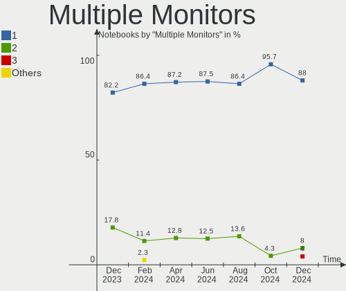
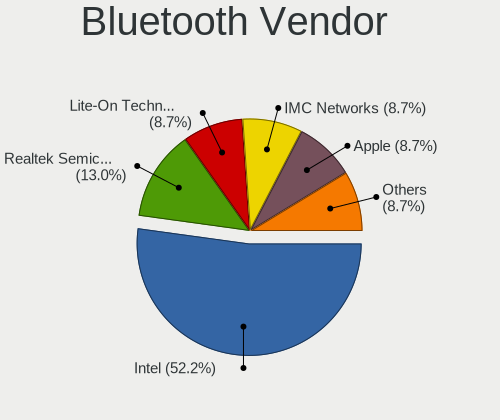

Kali - Hardware Trends (Notebooks)
----------------------------------

A project to identify most popular hardware characteristics and track their change
over time based on data collected by Linux users at https://Linux-Hardware.org.

Anyone can contribute to this report by the [hw-probe](https://github.com/linuxhw/hw-probe) tool:

    sudo -E hw-probe -all -upload

This report is for one last month. Overall report since the beginning of time: [TestDays](https://github.com/linuxhw/TestDays)

Period: Jun, 2023.

Contents
--------

* [ System ](#system)
  - [ OS                       ](#os)
  - [ OS Family                ](#os-family)
  - [ Kernel                   ](#kernel)
  - [ Kernel Family            ](#kernel-family)
  - [ Kernel Major Ver.        ](#kernel-major-ver)
  - [ Arch                     ](#arch)
  - [ DE                       ](#de)
  - [ Display Server           ](#display-server)
  - [ Display Manager          ](#display-manager)
  - [ OS Lang                  ](#os-lang)
  - [ Boot Mode                ](#boot-mode)
  - [ Filesystem               ](#filesystem)
  - [ Part. scheme             ](#part-scheme)
  - [ Dual Boot with Linux/BSD ](#dual-boot-with-linuxbsd)
  - [ Dual Boot (Win)          ](#dual-boot-win)

* [ Board ](#board)
  - [ Vendor                   ](#vendor)
  - [ Model                    ](#model)
  - [ Model Family             ](#model-family)
  - [ MFG Year                 ](#mfg-year)
  - [ Form Factor              ](#form-factor)
  - [ Secure Boot              ](#secure-boot)
  - [ Coreboot                 ](#coreboot)
  - [ RAM Size                 ](#ram-size)
  - [ RAM Used                 ](#ram-used)
  - [ Total Drives             ](#total-drives)
  - [ Has CD-ROM               ](#has-cd-rom)
  - [ Has Ethernet             ](#has-ethernet)
  - [ Has WiFi                 ](#has-wifi)
  - [ Has Bluetooth            ](#has-bluetooth)

* [ Location ](#location)
  - [ Country                  ](#country)
  - [ City                     ](#city)

* [ Drives ](#drives)
  - [ Drive Vendor             ](#drive-vendor)
  - [ Drive Model              ](#drive-model)
  - [ HDD Vendor               ](#hdd-vendor)
  - [ SSD Vendor               ](#ssd-vendor)
  - [ Drive Kind               ](#drive-kind)
  - [ Drive Connector          ](#drive-connector)
  - [ Drive Size               ](#drive-size)
  - [ Space Total              ](#space-total)
  - [ Space Used               ](#space-used)
  - [ Malfunc. Drives          ](#malfunc-drives)
  - [ Malfunc. Drive Vendor    ](#malfunc-drive-vendor)
  - [ Malfunc. HDD Vendor      ](#malfunc-hdd-vendor)
  - [ Malfunc. Drive Kind      ](#malfunc-drive-kind)
  - [ Failed Drives            ](#failed-drives)
  - [ Failed Drive Vendor      ](#failed-drive-vendor)
  - [ Drive Status             ](#drive-status)

* [ Storage controller ](#storage-controller)
  - [ Storage Vendor           ](#storage-vendor)
  - [ Storage Model            ](#storage-model)
  - [ Storage Kind             ](#storage-kind)

* [ Processor ](#processor)
  - [ CPU Vendor               ](#cpu-vendor)
  - [ CPU Model                ](#cpu-model)
  - [ CPU Model Family         ](#cpu-model-family)
  - [ CPU Cores                ](#cpu-cores)
  - [ CPU Sockets              ](#cpu-sockets)
  - [ CPU Threads              ](#cpu-threads)
  - [ CPU Op-Modes             ](#cpu-op-modes)
  - [ CPU Microcode            ](#cpu-microcode)
  - [ CPU Microarch            ](#cpu-microarch)

* [ Graphics ](#graphics)
  - [ GPU Vendor               ](#gpu-vendor)
  - [ GPU Model                ](#gpu-model)
  - [ GPU Combo                ](#gpu-combo)
  - [ GPU Driver               ](#gpu-driver)
  - [ GPU Memory               ](#gpu-memory)

* [ Monitor ](#monitor)
  - [ Monitor Vendor           ](#monitor-vendor)
  - [ Monitor Model            ](#monitor-model)
  - [ Monitor Resolution       ](#monitor-resolution)
  - [ Monitor Diagonal         ](#monitor-diagonal)
  - [ Monitor Width            ](#monitor-width)
  - [ Aspect Ratio             ](#aspect-ratio)
  - [ Monitor Area             ](#monitor-area)
  - [ Pixel Density            ](#pixel-density)
  - [ Multiple Monitors        ](#multiple-monitors)

* [ Network ](#network)
  - [ Net Controller Vendor    ](#net-controller-vendor)
  - [ Net Controller Model     ](#net-controller-model)
  - [ Wireless Vendor          ](#wireless-vendor)
  - [ Wireless Model           ](#wireless-model)
  - [ Ethernet Vendor          ](#ethernet-vendor)
  - [ Ethernet Model           ](#ethernet-model)
  - [ Net Controller Kind      ](#net-controller-kind)
  - [ Used Controller          ](#used-controller)
  - [ NICs                     ](#nics)
  - [ IPv6                     ](#ipv6)

* [ Bluetooth ](#bluetooth)
  - [ Bluetooth Vendor         ](#bluetooth-vendor)
  - [ Bluetooth Model          ](#bluetooth-model)

* [ Sound ](#sound)
  - [ Sound Vendor             ](#sound-vendor)
  - [ Sound Model              ](#sound-model)

* [ Memory ](#memory)
  - [ Memory Vendor            ](#memory-vendor)
  - [ Memory Model             ](#memory-model)
  - [ Memory Kind              ](#memory-kind)
  - [ Memory Form Factor       ](#memory-form-factor)
  - [ Memory Size              ](#memory-size)
  - [ Memory Speed             ](#memory-speed)

* [ Printers & scanners ](#printers--scanners)
  - [ Printer Vendor           ](#printer-vendor)
  - [ Printer Model            ](#printer-model)
  - [ Scanner Vendor           ](#scanner-vendor)
  - [ Scanner Model            ](#scanner-model)

* [ Camera ](#camera)
  - [ Camera Vendor            ](#camera-vendor)
  - [ Camera Model             ](#camera-model)

* [ Security ](#security)
  - [ Fingerprint Vendor       ](#fingerprint-vendor)
  - [ Fingerprint Model        ](#fingerprint-model)
  - [ Chipcard Vendor          ](#chipcard-vendor)
  - [ Chipcard Model           ](#chipcard-model)

* [ Unsupported ](#unsupported)
  - [ Unsupported Devices      ](#unsupported-devices)
  - [ Unsupported Device Types ](#unsupported-device-types)

System
------

OS
--

Installed operating systems

| Name        | Notebooks | Percent |
|-------------|-----------|---------|
| Kali 2023.2 | 37        | 90.24%  |
| Kali 2023.1 | 2         | 4.88%   |
| Kali 2022.4 | 1         | 2.44%   |
| Kali 2022.2 | 1         | 2.44%   |

OS Family
---------

OS without a version

| Name | Notebooks | Percent |
|------|-----------|---------|
| Kali | 41        | 100%    |

Kernel
------

Version of the Linux kernel

| Version              | Notebooks | Percent |
|----------------------|-----------|---------|
| 6.1.0-kali9-amd64    | 31        | 75.61%  |
| 6.1.0-kali5-amd64    | 4         | 9.76%   |
| 6.3.9-x64v3-xanmod1  | 1         | 2.44%   |
| 6.3.7-060307-generic | 1         | 2.44%   |
| 6.1.0-kali9-686-pae  | 1         | 2.44%   |
| 6.0.0-kali6-amd64    | 1         | 2.44%   |
| 5.9.0-kali1-amd64    | 1         | 2.44%   |
| 5.16.0-kali7-amd64   | 1         | 2.44%   |

Kernel Family
-------------

Linux kernel without a distro release

| Version | Notebooks | Percent |
|---------|-----------|---------|
| 6.1.0   | 36        | 87.8%   |
| 6.3.9   | 1         | 2.44%   |
| 6.3.7   | 1         | 2.44%   |
| 6.0.0   | 1         | 2.44%   |
| 5.9.0   | 1         | 2.44%   |
| 5.16.0  | 1         | 2.44%   |

Kernel Major Ver.
-----------------

Linux kernel major version

| Version | Notebooks | Percent |
|---------|-----------|---------|
| 6.1     | 36        | 87.8%   |
| 6.3     | 2         | 4.88%   |
| 6.0     | 1         | 2.44%   |
| 5.9     | 1         | 2.44%   |
| 5.16    | 1         | 2.44%   |

Arch
----

OS architecture (x86_64, i586, etc.)

| Name   | Notebooks | Percent |
|--------|-----------|---------|
| x86_64 | 40        | 97.56%  |
| i686   | 1         | 2.44%   |

DE
--

Desktop Environment

| Name             | Notebooks | Percent |
|------------------|-----------|---------|
| GNOME            | 16        | 39.02%  |
| XFCE             | 15        | 36.59%  |
| KDE5             | 7         | 17.07%  |
| lightdm-xsession | 1         | 2.44%   |
| i3               | 1         | 2.44%   |
| Unknown          | 1         | 2.44%   |

Display Server
--------------

X11 or Wayland

| Name    | Notebooks | Percent |
|---------|-----------|---------|
| X11     | 36        | 87.8%   |
| Wayland | 4         | 9.76%   |
| Tty     | 1         | 2.44%   |

Display Manager
---------------

SDDM, LightDM, etc.

| Name    | Notebooks | Percent |
|---------|-----------|---------|
| LightDM | 13        | 31.71%  |
| Unknown | 12        | 29.27%  |
| GDM3    | 10        | 24.39%  |
| SDDM    | 6         | 14.63%  |

OS Lang
-------

Language

| Lang  | Notebooks | Percent |
|-------|-----------|---------|
| en_US | 19        | 46.34%  |
| en_IN | 6         | 14.63%  |
| pt_BR | 3         | 7.32%   |
| zh_CN | 2         | 4.88%   |
| ru_RU | 2         | 4.88%   |
| sl_SI | 1         | 2.44%   |
| pl_PL | 1         | 2.44%   |
| it_IT | 1         | 2.44%   |
| fr_FR | 1         | 2.44%   |
| es_MX | 1         | 2.44%   |
| es_ES | 1         | 2.44%   |
| es_AR | 1         | 2.44%   |
| en_GB | 1         | 2.44%   |
| de_DE | 1         | 2.44%   |

Boot Mode
---------

EFI or BIOS

| Mode | Notebooks | Percent |
|------|-----------|---------|
| EFI  | 28        | 68.29%  |
| BIOS | 13        | 31.71%  |

Filesystem
----------

Type of filesystem

| Type    | Notebooks | Percent |
|---------|-----------|---------|
| Ext4    | 37        | 90.24%  |
| Tmpfs   | 2         | 4.88%   |
| Overlay | 1         | 2.44%   |
| Btrfs   | 1         | 2.44%   |

Part. scheme
------------

Scheme of partitioning

| Type    | Notebooks | Percent |
|---------|-----------|---------|
| GPT     | 24        | 58.54%  |
| Unknown | 10        | 24.39%  |
| MBR     | 7         | 17.07%  |

Dual Boot with Linux/BSD
------------------------

Hosting more than one Linux/BSD

| Dual boot | Notebooks | Percent |
|-----------|-----------|---------|
| No        | 35        | 85.37%  |
| Yes       | 6         | 14.63%  |

Dual Boot (Win)
---------------

Hosting Linux and Windows

| Dual boot | Notebooks | Percent |
|-----------|-----------|---------|
| No        | 26        | 63.41%  |
| Yes       | 15        | 36.59%  |

Board
-----

Vendor
------

Motherboard manufacturer

| Name                | Notebooks | Percent |
|---------------------|-----------|---------|
| Lenovo              | 8         | 19.51%  |
| ASUSTek Computer    | 6         | 14.63%  |
| MSI                 | 5         | 12.2%   |
| Hewlett-Packard     | 5         | 12.2%   |
| Dell                | 5         | 12.2%   |
| Acer                | 3         | 7.32%   |
| Samsung Electronics | 2         | 4.88%   |
| Packard Bell        | 1         | 2.44%   |
| Medion              | 1         | 2.44%   |
| Daten Tecnologia    | 1         | 2.44%   |
| Clevo               | 1         | 2.44%   |
| Chuwi               | 1         | 2.44%   |
| Apple               | 1         | 2.44%   |
| Unknown             | 1         | 2.44%   |

Model
-----

Motherboard model

| Name                                        | Notebooks | Percent |
|---------------------------------------------|-----------|---------|
| Samsung N130                                | 1         | 2.44%   |
| Samsung 305U1A                              | 1         | 2.44%   |
| Packard Bell EasyNote TE69KB                | 1         | 2.44%   |
| MSI Pulse GL66 12UGKV                       | 1         | 2.44%   |
| MSI Modern 15 A5M                           | 1         | 2.44%   |
| MSI GF75 Thin 9SC                           | 1         | 2.44%   |
| MSI GE66 Raider 10SFS                       | 1         | 2.44%   |
| MSI Bravo 15 B5DD                           | 1         | 2.44%   |
| Medion Akoya P6656 MD99615                  | 1         | 2.44%   |
| Lenovo ThinkPad T15g Gen1 20URCTO1WW        | 1         | 2.44%   |
| Lenovo ThinkPad E14 Gen 2 20TAS0U500        | 1         | 2.44%   |
| Lenovo ThinkBook 16 G4+ ARA 21D1            | 1         | 2.44%   |
| Lenovo Legion Y740-17IRHg 81UJ              | 1         | 2.44%   |
| Lenovo IdeaPad Gaming 3 15IAH7 82S9         | 1         | 2.44%   |
| Lenovo IdeaPad 3 15IIL05 81WE               | 1         | 2.44%   |
| Lenovo G580 2189                            | 1         | 2.44%   |
| Lenovo E41-55 82FJ                          | 1         | 2.44%   |
| HP ProBook 450 G8 Notebook PC               | 1         | 2.44%   |
| HP ProBook 440 G3                           | 1         | 2.44%   |
| HP Notebook                                 | 1         | 2.44%   |
| HP EliteBook Folio 9470m                    | 1         | 2.44%   |
| HP EliteBook 835 G8 Notebook PC             | 1         | 2.44%   |
| Dell Precision 7710                         | 1         | 2.44%   |
| Dell Latitude E6540                         | 1         | 2.44%   |
| Dell Latitude E6430                         | 1         | 2.44%   |
| Dell Latitude 7390                          | 1         | 2.44%   |
| Dell Inspiron 15-3565                       | 1         | 2.44%   |
| Daten Tecnologia DCM4D-4 v4                 | 1         | 2.44%   |
| Clevo P170HMx                               | 1         | 2.44%   |
| Chuwi GemiBook Pro                          | 1         | 2.44%   |
| ASUS VivoBook_ASUSLaptop X515DA_X515DA      | 1         | 2.44%   |
| ASUS T200TA                                 | 1         | 2.44%   |
| ASUS ROG Strix G513RC_G513RC                | 1         | 2.44%   |
| ASUS GL503VS                                | 1         | 2.44%   |
| ASUS ASUS TUF Gaming F15 FX506LHB_FX506LHB  | 1         | 2.44%   |
| ASUS ASUS TUF Gaming A17 FA706ICB_TUF706ICB | 1         | 2.44%   |
| Apple MacBookPro5,5                         | 1         | 2.44%   |
| Acer Nitro AN517-54                         | 1         | 2.44%   |
| Acer Aspire A515-56                         | 1         | 2.44%   |
| Acer Aspire 5551                            | 1         | 2.44%   |

Model Family
------------

Motherboard model prefix

| Name                     | Notebooks | Percent |
|--------------------------|-----------|---------|
| Dell Latitude            | 3         | 7.32%   |
| Lenovo ThinkPad          | 2         | 4.88%   |
| Lenovo IdeaPad           | 2         | 4.88%   |
| HP ProBook               | 2         | 4.88%   |
| HP EliteBook             | 2         | 4.88%   |
| ASUS ASUS                | 2         | 4.88%   |
| Acer Aspire              | 2         | 4.88%   |
| Samsung N130             | 1         | 2.44%   |
| Samsung 305U1A           | 1         | 2.44%   |
| Packard Bell EasyNote    | 1         | 2.44%   |
| MSI Pulse                | 1         | 2.44%   |
| MSI Modern               | 1         | 2.44%   |
| MSI GF75                 | 1         | 2.44%   |
| MSI GE66                 | 1         | 2.44%   |
| MSI Bravo                | 1         | 2.44%   |
| Medion Akoya             | 1         | 2.44%   |
| Lenovo ThinkBook         | 1         | 2.44%   |
| Lenovo Legion            | 1         | 2.44%   |
| Lenovo G580              | 1         | 2.44%   |
| Lenovo E41-55            | 1         | 2.44%   |
| HP Notebook              | 1         | 2.44%   |
| Dell Precision           | 1         | 2.44%   |
| Dell Inspiron            | 1         | 2.44%   |
| Daten Tecnologia DCM4D-4 | 1         | 2.44%   |
| Clevo P170HMx            | 1         | 2.44%   |
| Chuwi GemiBook           | 1         | 2.44%   |
| ASUS VivoBook            | 1         | 2.44%   |
| ASUS T200TA              | 1         | 2.44%   |
| ASUS ROG                 | 1         | 2.44%   |
| ASUS GL503VS             | 1         | 2.44%   |
| Apple MacBookPro5        | 1         | 2.44%   |
| Acer Nitro               | 1         | 2.44%   |
| Unknown                  | 1         | 2.44%   |

MFG Year
--------

Motherboard manufacture year

| Year | Notebooks | Percent |
|------|-----------|---------|
| 2022 | 8         | 19.51%  |
| 2021 | 6         | 14.63%  |
| 2020 | 6         | 14.63%  |
| 2019 | 4         | 9.76%   |
| 2015 | 3         | 7.32%   |
| 2012 | 3         | 7.32%   |
| 2018 | 2         | 4.88%   |
| 2013 | 2         | 4.88%   |
| 2011 | 2         | 4.88%   |
| 2009 | 2         | 4.88%   |
| 2023 | 1         | 2.44%   |
| 2017 | 1         | 2.44%   |
| 2010 | 1         | 2.44%   |

Form Factor
-----------

Physical design of the computer

| Name     | Notebooks | Percent |
|----------|-----------|---------|
| Notebook | 41        | 100%    |

Secure Boot
-----------

Enabled or disabled

| State    | Notebooks | Percent |
|----------|-----------|---------|
| Disabled | 41        | 100%    |

Coreboot
--------

Have coreboot on board

| Used | Notebooks | Percent |
|------|-----------|---------|
| No   | 41        | 100%    |

RAM Size
--------

Total RAM memory

| Size in GB  | Notebooks | Percent |
|-------------|-----------|---------|
| 4.01-8.0    | 13        | 31.71%  |
| 16.01-24.0  | 10        | 24.39%  |
| 8.01-16.0   | 7         | 17.07%  |
| 32.01-64.0  | 4         | 9.76%   |
| 3.01-4.0    | 4         | 9.76%   |
| 2.01-3.0    | 1         | 2.44%   |
| 64.01-256.0 | 1         | 2.44%   |
| 1.01-2.0    | 1         | 2.44%   |

RAM Used
--------

Used RAM memory

| Used GB   | Notebooks | Percent |
|-----------|-----------|---------|
| 3.01-4.0  | 12        | 29.27%  |
| 2.01-3.0  | 12        | 29.27%  |
| 1.01-2.0  | 12        | 29.27%  |
| 4.01-8.0  | 3         | 7.32%   |
| 8.01-16.0 | 1         | 2.44%   |
| 0.01-0.5  | 1         | 2.44%   |

Total Drives
------------

Number of drives on board

| Drives | Notebooks | Percent |
|--------|-----------|---------|
| 1      | 25        | 60.98%  |
| 2      | 15        | 36.59%  |
| 3      | 1         | 2.44%   |

Has CD-ROM
----------

Has CD-ROM on board

| Presented | Notebooks | Percent |
|-----------|-----------|---------|
| No        | 32        | 78.05%  |
| Yes       | 9         | 21.95%  |

Has Ethernet
------------

Has Ethernet on board

| Presented | Notebooks | Percent |
|-----------|-----------|---------|
| Yes       | 36        | 87.8%   |
| No        | 5         | 12.2%   |

Has WiFi
--------

Has WiFi module

| Presented | Notebooks | Percent |
|-----------|-----------|---------|
| Yes       | 40        | 97.56%  |
| No        | 1         | 2.44%   |

Has Bluetooth
-------------

Has Bluetooth module

| Presented | Notebooks | Percent |
|-----------|-----------|---------|
| Yes       | 35        | 85.37%  |
| No        | 6         | 14.63%  |

Location
--------

Country
-------

Geographic location (country)

| Country     | Notebooks | Percent |
|-------------|-----------|---------|
| USA         | 7         | 17.07%  |
| India       | 4         | 9.76%   |
| Brazil      | 4         | 9.76%   |
| Germany     | 3         | 7.32%   |
| Spain       | 2         | 4.88%   |
| Pakistan    | 2         | 4.88%   |
| Mexico      | 2         | 4.88%   |
| Bulgaria    | 2         | 4.88%   |
| Vietnam     | 1         | 2.44%   |
| Turkey      | 1         | 2.44%   |
| Slovenia    | 1         | 2.44%   |
| Russia      | 1         | 2.44%   |
| Portugal    | 1         | 2.44%   |
| Poland      | 1         | 2.44%   |
| Netherlands | 1         | 2.44%   |
| Japan       | 1         | 2.44%   |
| Ivory Coast | 1         | 2.44%   |
| Italy       | 1         | 2.44%   |
| France      | 1         | 2.44%   |
| China       | 1         | 2.44%   |
| Bangladesh  | 1         | 2.44%   |
| Armenia     | 1         | 2.44%   |
| Argentina   | 1         | 2.44%   |

City
----

Geographic location (city)

| City              | Notebooks | Percent |
|-------------------|-----------|---------|
| Zaragoza          | 2         | 4.88%   |
| Islamabad         | 2         | 4.88%   |
| Houston           | 2         | 4.88%   |
| Żory             | 1         | 2.44%   |
| Yerevan           | 1         | 2.44%   |
| Vila Velha        | 1         | 2.44%   |
| Turin             | 1         | 2.44%   |
| Sofia             | 1         | 2.44%   |
| Seattle           | 1         | 2.44%   |
| Scottsdale        | 1         | 2.44%   |
| Saltillo          | 1         | 2.44%   |
| Rio de Janeiro    | 1         | 2.44%   |
| Quận Hà Đông | 1         | 2.44%   |
| Pune              | 1         | 2.44%   |
| Petrópolis       | 1         | 2.44%   |
| Nagoya            | 1         | 2.44%   |
| Mysore            | 1         | 2.44%   |
| Morristown        | 1         | 2.44%   |
| Mexico City       | 1         | 2.44%   |
| Lakeland          | 1         | 2.44%   |
| Istanbul          | 1         | 2.44%   |
| Hyderabad         | 1         | 2.44%   |
| Hilden            | 1         | 2.44%   |
| Guimaraes         | 1         | 2.44%   |
| Grozny            | 1         | 2.44%   |
| Düsseldorf       | 1         | 2.44%   |
| Domžale          | 1         | 2.44%   |
| Dhaka             | 1         | 2.44%   |
| Colmar            | 1         | 2.44%   |
| Chhindwara        | 1         | 2.44%   |
| Cascavel          | 1         | 2.44%   |
| Burlington        | 1         | 2.44%   |
| Burgas            | 1         | 2.44%   |
| Buenos Aires      | 1         | 2.44%   |
| Beijing           | 1         | 2.44%   |
| Bad Koetzting     | 1         | 2.44%   |
| Amsterdam         | 1         | 2.44%   |
| Abidjan           | 1         | 2.44%   |

Drives
------

Drive Vendor
------------

Hard drive vendors

| Vendor              | Notebooks | Drives | Percent |
|---------------------|-----------|--------|---------|
| Samsung Electronics | 7         | 7      | 12.07%  |
| SanDisk             | 6         | 6      | 10.34%  |
| WDC                 | 5         | 6      | 8.62%   |
| Toshiba             | 5         | 5      | 8.62%   |
| Kingston            | 5         | 5      | 8.62%   |
| Micron Technology   | 4         | 4      | 6.9%    |
| Unknown             | 3         | 3      | 5.17%   |
| Seagate             | 2         | 2      | 3.45%   |
| Phison              | 2         | 2      | 3.45%   |
| Intel               | 2         | 2      | 3.45%   |
| HGST                | 2         | 2      | 3.45%   |
| Crucial             | 2         | 2      | 3.45%   |
| Topmore             | 1         | 1      | 1.72%   |
| ShanDianZhe         | 1         | 1      | 1.72%   |
| Phison Electronics  | 1         | 1      | 1.72%   |
| KIOXIA              | 1         | 1      | 1.72%   |
| KingFast            | 1         | 1      | 1.72%   |
| JMicron Technology  | 1         | 1      | 1.72%   |
| Intenso             | 1         | 1      | 1.72%   |
| Hitachi             | 1         | 1      | 1.72%   |
| GOODRAM             | 1         | 1      | 1.72%   |
| China               | 1         | 1      | 1.72%   |
| BAITITON            | 1         | 1      | 1.72%   |
| ADATA Technology    | 1         | 1      | 1.72%   |
| A-DATA Technology   | 1         | 1      | 1.72%   |

Drive Model
-----------

Hard drive models

| Model                                            | Notebooks | Percent |
|--------------------------------------------------|-----------|---------|
| Samsung SSD 980 500GB                            | 2         | 3.39%   |
| Micron 2450_MTFDKBA512TFK 512GB                  | 2         | 3.39%   |
| WDC WDS960G2G0C-00AJM0 960GB                     | 1         | 1.69%   |
| WDC WDS200T1X0E-00AFY0 2TB                       | 1         | 1.69%   |
| WDC WDS100T2B0A 1TB SSD                          | 1         | 1.69%   |
| WDC WD7500BPKT-00PK4T0 752GB                     | 1         | 1.69%   |
| WDC WD5000BPVT-00HXZT1 500GB                     | 1         | 1.69%   |
| WDC WD5000BEVT-22A0RT0 500GB                     | 1         | 1.69%   |
| Unknown SS32G  32GB                              | 1         | 1.69%   |
| Unknown MMC Card  64GB                           | 1         | 1.69%   |
| Unknown MMC Card  32GB                           | 1         | 1.69%   |
| Toshiba MQ04ABF100 1TB                           | 1         | 1.69%   |
| Toshiba MQ01ABF050 500GB                         | 1         | 1.69%   |
| Toshiba MQ01ABD100 1TB                           | 1         | 1.69%   |
| Toshiba KBG40ZNT256G MEMORY 256GB                | 1         | 1.69%   |
| Toshiba KBG30ZMV256G 256GB                       | 1         | 1.69%   |
| Topmore Aries 2TB                                | 1         | 1.69%   |
| ShanDianZhe 512GB                                | 1         | 1.69%   |
| Seagate ST500LM012 HN-M500MBB 500GB              | 1         | 1.69%   |
| Seagate Expansion 1TB                            | 1         | 1.69%   |
| Sandisk WD_BLACK SN770 1TB                       | 1         | 1.69%   |
| Sandisk WDC WDS100T2B0C-00PXH0 1TB               | 1         | 1.69%   |
| Sandisk WD Blue SN550 NVMe SSD 1TB               | 1         | 1.69%   |
| Sandisk WD Black SN750 / PC SN730 NVMe SSD 500GB | 1         | 1.69%   |
| SanDisk SD7SB3Q-128G-1006 128GB SSD              | 1         | 1.69%   |
| SanDisk Portable SSD 1TB                         | 1         | 1.69%   |
| Samsung SSD PM871b M.2 2280 256GB                | 1         | 1.69%   |
| Samsung SSD 850 EVO 500GB                        | 1         | 1.69%   |
| Samsung MZVLQ512HBLU-00B00 512GB                 | 1         | 1.69%   |
| Samsung MZVLB2T0HMLB-00000 2TB                   | 1         | 1.69%   |
| Samsung MZVLB1T0HALR-000L2 1TB                   | 1         | 1.69%   |
| Phison SSD 128GB PS3109-S9                       | 1         | 1.69%   |
| Phison T-FORCE TM8FPL1000G 1TB                   | 1         | 1.69%   |
| Phison Daten DS2000 256GB                        | 1         | 1.69%   |
| Micron 2210_MTFDHBA512QFD 512GB                  | 1         | 1.69%   |
| Micron 1100_MTFDDAV512TBN 512GB SSD              | 1         | 1.69%   |
| KIOXIA KBG40ZNV512G 512GB                        | 1         | 1.69%   |
| Kingston SNVS1000G 1TB                           | 1         | 1.69%   |
| Kingston SKC600512G 512GB SSD                    | 1         | 1.69%   |
| Kingston SA400S37240G 240GB SSD                  | 1         | 1.69%   |

HDD Vendor
----------

Hard disk drive vendors

| Vendor  | Notebooks | Drives | Percent |
|---------|-----------|--------|---------|
| WDC     | 3         | 3      | 27.27%  |
| Toshiba | 3         | 3      | 27.27%  |
| Seagate | 2         | 2      | 18.18%  |
| HGST    | 2         | 2      | 18.18%  |
| Hitachi | 1         | 1      | 9.09%   |

SSD Vendor
----------

Solid state drive vendors

| Vendor              | Notebooks | Drives | Percent |
|---------------------|-----------|--------|---------|
| SanDisk             | 2         | 2      | 14.29%  |
| Samsung Electronics | 2         | 2      | 14.29%  |
| Kingston            | 2         | 2      | 14.29%  |
| Crucial             | 2         | 2      | 14.29%  |
| WDC                 | 1         | 1      | 7.14%   |
| Phison              | 1         | 1      | 7.14%   |
| Micron Technology   | 1         | 1      | 7.14%   |
| GOODRAM             | 1         | 1      | 7.14%   |
| China               | 1         | 1      | 7.14%   |
| BAITITON            | 1         | 1      | 7.14%   |

Drive Kind
----------

HDD or SSD

| Kind    | Notebooks | Drives | Percent |
|---------|-----------|--------|---------|
| NVMe    | 23        | 28     | 43.4%   |
| SSD     | 13        | 14     | 24.53%  |
| HDD     | 11        | 11     | 20.75%  |
| MMC     | 3         | 3      | 5.66%   |
| Unknown | 3         | 3      | 5.66%   |

Drive Connector
---------------

SATA, SAS, NVMe, etc.

| Type | Notebooks | Drives | Percent |
|------|-----------|--------|---------|
| NVMe | 22        | 27     | 43.14%  |
| SATA | 22        | 25     | 43.14%  |
| SAS  | 4         | 4      | 7.84%   |
| MMC  | 3         | 3      | 5.88%   |

Drive Size
----------

Size of hard drive

| Size in TB | Notebooks | Drives | Percent |
|------------|-----------|--------|---------|
| 0.01-0.5   | 13        | 13     | 54.17%  |
| 0.51-1.0   | 11        | 12     | 45.83%  |

Space Total
-----------

Amount of disk space available on the file system

| Size in GB | Notebooks | Percent |
|------------|-----------|---------|
| 251-500    | 16        | 39.02%  |
| 101-250    | 12        | 29.27%  |
| 501-1000   | 6         | 14.63%  |
| 51-100     | 4         | 9.76%   |
| 21-50      | 2         | 4.88%   |
| 1001-2000  | 1         | 2.44%   |

Space Used
----------

Amount of used disk space

| Used GB  | Notebooks | Percent |
|----------|-----------|---------|
| 21-50    | 14        | 34.15%  |
| 101-250  | 10        | 24.39%  |
| 1-20     | 9         | 21.95%  |
| 51-100   | 5         | 12.2%   |
| 251-500  | 2         | 4.88%   |
| 501-1000 | 1         | 2.44%   |

Malfunc. Drives
---------------

Drive models with a malfunction

| Model                                          | Notebooks | Drives | Percent |
|------------------------------------------------|-----------|--------|---------|
| WDC WD5000BEVT-22A0RT0 500GB                   | 1         | 1      | 20%     |
| Micron Technology 1100_MTFDDAV512TBN 512GB SSD | 1         | 1      | 20%     |
| HGST HTS725050A7E630 500GB                     | 1         | 1      | 20%     |
| HGST HTS541010A9E680 1TB                       | 1         | 1      | 20%     |
| China G521N256GB SSD                           | 1         | 1      | 20%     |

Malfunc. Drive Vendor
---------------------

Vendors of faulty drives

| Vendor            | Notebooks | Drives | Percent |
|-------------------|-----------|--------|---------|
| HGST              | 2         | 2      | 40%     |
| WDC               | 1         | 1      | 20%     |
| Micron Technology | 1         | 1      | 20%     |
| China             | 1         | 1      | 20%     |

Malfunc. HDD Vendor
-------------------

Vendors of faulty HDD drives

| Vendor | Notebooks | Drives | Percent |
|--------|-----------|--------|---------|
| HGST   | 2         | 2      | 66.67%  |
| WDC    | 1         | 1      | 33.33%  |

Malfunc. Drive Kind
-------------------

Kinds of faulty drives

| Kind | Notebooks | Drives | Percent |
|------|-----------|--------|---------|
| HDD  | 3         | 3      | 60%     |
| SSD  | 2         | 2      | 40%     |

Failed Drives
-------------

Failed drive models

Zero info for selected period =(

Failed Drive Vendor
-------------------

Failed drive vendors

Zero info for selected period =(

Drive Status
------------

Number of failed and malfunc. drives

| Status   | Notebooks | Drives | Percent |
|----------|-----------|--------|---------|
| Works    | 25        | 31     | 55.56%  |
| Detected | 15        | 23     | 33.33%  |
| Malfunc  | 5         | 5      | 11.11%  |

Storage controller
------------------

Storage Vendor
--------------

Storage controller vendors

| Vendor                      | Notebooks | Percent |
|-----------------------------|-----------|---------|
| Intel                       | 23        | 42.59%  |
| SanDisk                     | 6         | 11.11%  |
| AMD                         | 6         | 11.11%  |
| Samsung Electronics         | 5         | 9.26%   |
| Micron Technology           | 3         | 5.56%   |
| Kingston Technology Company | 3         | 5.56%   |
| Phison Electronics          | 2         | 3.7%    |
| KIOXIA                      | 2         | 3.7%    |
| ADATA Technology            | 2         | 3.7%    |
| Nvidia                      | 1         | 1.85%   |
| INNOGRIT                    | 1         | 1.85%   |

Storage Model
-------------

Storage controller models

| Model                                                                          | Notebooks | Percent |
|--------------------------------------------------------------------------------|-----------|---------|
| AMD FCH SATA Controller [AHCI mode]                                            | 4         | 6.9%    |
| Samsung NVMe SSD Controller 980                                                | 3         | 5.17%   |
| SanDisk Non-Volatile memory controller                                         | 2         | 3.45%   |
| Samsung NVMe SSD Controller SM981/PM981/PM983                                  | 2         | 3.45%   |
| Micron 2450 NVMe SSD (DRAM-less)                                               | 2         | 3.45%   |
| KIOXIA NVMe SSD Controller BG4                                                 | 2         | 3.45%   |
| Intel Wildcat Point-LP SATA Controller [AHCI Mode]                             | 2         | 3.45%   |
| Intel Volume Management Device NVMe RAID Controller                            | 2         | 3.45%   |
| Intel Sunrise Point-LP SATA Controller [AHCI mode]                             | 2         | 3.45%   |
| Intel Cannon Lake Mobile PCH SATA AHCI Controller                              | 2         | 3.45%   |
| Intel 82801 Mobile SATA Controller [RAID mode]                                 | 2         | 3.45%   |
| Intel 7 Series Chipset Family 6-port SATA Controller [AHCI mode]               | 2         | 3.45%   |
| AMD SB7x0/SB8x0/SB9x0 SATA Controller [AHCI mode]                              | 2         | 3.45%   |
| SanDisk WD PC SN810 / Black SN850 NVMe SSD                                     | 1         | 1.72%   |
| SanDisk WD Blue SN550 NVMe SSD                                                 | 1         | 1.72%   |
| SanDisk WD Black SN770 NVMe SSD                                                | 1         | 1.72%   |
| SanDisk WD Black SN750 / PC SN730 NVMe SSD                                     | 1         | 1.72%   |
| Phison PS5019-E19 PCIe4 NVMe Controller (DRAM-less)                            | 1         | 1.72%   |
| Phison PS5013 E13 NVMe Controller                                              | 1         | 1.72%   |
| Nvidia MCP79 AHCI Controller                                                   | 1         | 1.72%   |
| Micron NVMe Storage Controller                                                 | 1         | 1.72%   |
| Kingston Company Company Non-Volatile memory controller                        | 1         | 1.72%   |
| Kingston Company OM3PDP3 NVMe SSD                                              | 1         | 1.72%   |
| Kingston Company NVMe Controller                                               | 1         | 1.72%   |
| Intel Tiger Lake-LP SATA Controller                                            | 1         | 1.72%   |
| Intel Tiger Lake SATA AHCI Controller                                          | 1         | 1.72%   |
| Intel SSD 660P Series                                                          | 1         | 1.72%   |
| Intel Q170/Q150/B150/H170/H110/Z170/CM236 Chipset SATA Controller [AHCI Mode]  | 1         | 1.72%   |
| Intel Non-Volatile memory controller                                           | 1         | 1.72%   |
| Intel Jasper Lake SATA AHCI Controller                                         | 1         | 1.72%   |
| Intel Ice Lake-LP SATA Controller [AHCI mode]                                  | 1         | 1.72%   |
| Intel Comet Lake SATA AHCI Controller                                          | 1         | 1.72%   |
| Intel Alder Lake-P SATA AHCI Controller                                        | 1         | 1.72%   |
| Intel 82801GBM/GHM (ICH7-M Family) SATA Controller [IDE mode]                  | 1         | 1.72%   |
| Intel 8 Series/C220 Series Chipset Family 6-port SATA Controller 1 [AHCI mode] | 1         | 1.72%   |
| Intel 6 Series/C200 Series Chipset Family 6 port Mobile SATA AHCI Controller   | 1         | 1.72%   |
| Intel 400 Series Chipset Family SATA AHCI Controller                           | 1         | 1.72%   |
| INNOGRIT Non-Volatile memory controller                                        | 1         | 1.72%   |
| AMD SB7x0/SB8x0/SB9x0 SATA Controller [IDE mode]                               | 1         | 1.72%   |
| AMD SB7x0/SB8x0/SB9x0 IDE Controller                                           | 1         | 1.72%   |

Storage Kind
------------

Kind of storage controller (IDE, SATA, NVMe, SAS, ...)

| Kind | Notebooks | Percent |
|------|-----------|---------|
| SATA | 25        | 48.08%  |
| NVMe | 21        | 40.38%  |
| RAID | 4         | 7.69%   |
| IDE  | 2         | 3.85%   |

Processor
---------

CPU Vendor
----------

Processor vendors

| Vendor | Notebooks | Percent |
|--------|-----------|---------|
| Intel  | 29        | 70.73%  |
| AMD    | 12        | 29.27%  |

CPU Model
---------

Processor models

| Model                                         | Notebooks | Percent |
|-----------------------------------------------|-----------|---------|
| Intel 11th Gen Core i7-1165G7 @ 2.80GHz       | 3         | 7.32%   |
| Intel Core i7-9750H CPU @ 2.60GHz             | 2         | 4.88%   |
| Intel Core i7-3520M CPU @ 2.90GHz             | 2         | 4.88%   |
| AMD Ryzen 7 6800H with Radeon Graphics        | 2         | 4.88%   |
| Intel Core i9-10980HK CPU @ 2.40GHz           | 1         | 2.44%   |
| Intel Core i7-8650U CPU @ 1.90GHz             | 1         | 2.44%   |
| Intel Core i7-7700HQ CPU @ 2.80GHz            | 1         | 2.44%   |
| Intel Core i7-6920HQ CPU @ 2.90GHz            | 1         | 2.44%   |
| Intel Core i7-4800MQ CPU @ 2.70GHz            | 1         | 2.44%   |
| Intel Core i7-2670QM CPU @ 2.20GHz            | 1         | 2.44%   |
| Intel Core i7-10750H CPU @ 2.60GHz            | 1         | 2.44%   |
| Intel Core i5-6200U CPU @ 2.30GHz             | 1         | 2.44%   |
| Intel Core i5-5200U CPU @ 2.20GHz             | 1         | 2.44%   |
| Intel Core i5-3427U CPU @ 1.80GHz             | 1         | 2.44%   |
| Intel Core i5-10300H CPU @ 2.50GHz            | 1         | 2.44%   |
| Intel Core i3-5010U CPU @ 2.10GHz             | 1         | 2.44%   |
| Intel Core i3-1005G1 CPU @ 1.20GHz            | 1         | 2.44%   |
| Intel Core 2 Duo CPU P7550 @ 2.26GHz          | 1         | 2.44%   |
| Intel Celeron N5100 @ 1.10GHz                 | 1         | 2.44%   |
| Intel Celeron CPU 5205U @ 1.90GHz             | 1         | 2.44%   |
| Intel Atom CPU Z3775 @ 1.46GHz                | 1         | 2.44%   |
| Intel Atom CPU N270 @ 1.60GHz                 | 1         | 2.44%   |
| Intel 12th Gen Core i7-12700H                 | 1         | 2.44%   |
| Intel 12th Gen Core i5-12500H                 | 1         | 2.44%   |
| Intel 11th Gen Core i7-11800H @ 2.30GHz       | 1         | 2.44%   |
| Intel 11th Gen Core i5-1135G7 @ 2.40GHz       | 1         | 2.44%   |
| AMD Turion II P520 Dual-Core Processor        | 1         | 2.44%   |
| AMD Ryzen 7 PRO 5850U with Radeon Graphics    | 1         | 2.44%   |
| AMD Ryzen 7 5700U with Radeon Graphics        | 1         | 2.44%   |
| AMD Ryzen 7 3700U with Radeon Vega Mobile Gfx | 1         | 2.44%   |
| AMD Ryzen 5 5600H with Radeon Graphics        | 1         | 2.44%   |
| AMD Ryzen 5 4600H with Radeon Graphics        | 1         | 2.44%   |
| AMD Ryzen 3 3250U with Radeon Graphics        | 1         | 2.44%   |
| AMD E2-9000 RADEON R2, 4 COMPUTE CORES 2C+2G  | 1         | 2.44%   |
| AMD E-450 APU with Radeon HD Graphics         | 1         | 2.44%   |
| AMD A4-5000 APU with Radeon HD Graphics       | 1         | 2.44%   |

CPU Model Family
----------------

Processor model prefix

| Model            | Notebooks | Percent |
|------------------|-----------|---------|
| Intel Core i7    | 10        | 24.39%  |
| Other            | 7         | 17.07%  |
| Intel Core i5    | 4         | 9.76%   |
| AMD Ryzen 7      | 4         | 9.76%   |
| Intel Core i3    | 2         | 4.88%   |
| Intel Celeron    | 2         | 4.88%   |
| Intel Atom       | 2         | 4.88%   |
| AMD Ryzen 5      | 2         | 4.88%   |
| Intel Core i9    | 1         | 2.44%   |
| Intel Core 2 Duo | 1         | 2.44%   |
| AMD Turion II    | 1         | 2.44%   |
| AMD Ryzen 7 PRO  | 1         | 2.44%   |
| AMD Ryzen 3      | 1         | 2.44%   |
| AMD E2           | 1         | 2.44%   |
| AMD E            | 1         | 2.44%   |
| AMD A4           | 1         | 2.44%   |

CPU Cores
---------

Number of processor cores

| Number | Notebooks | Percent |
|--------|-----------|---------|
| 4      | 14        | 34.15%  |
| 2      | 13        | 31.71%  |
| 8      | 6         | 14.63%  |
| 6      | 5         | 12.2%   |
| 14     | 1         | 2.44%   |
| 12     | 1         | 2.44%   |
| 1      | 1         | 2.44%   |

CPU Sockets
-----------

Number of sockets

| Number | Notebooks | Percent |
|--------|-----------|---------|
| 1      | 41        | 100%    |

CPU Threads
-----------

Threads per core (Hyper-Threading)

| Number | Notebooks | Percent |
|--------|-----------|---------|
| 2      | 32        | 78.05%  |
| 1      | 9         | 21.95%  |

CPU Op-Modes
------------

CPU Operation Modes (32-bit, 64-bit)

| Op mode        | Notebooks | Percent |
|----------------|-----------|---------|
| 32-bit, 64-bit | 40        | 97.56%  |
| 32-bit         | 1         | 2.44%   |

CPU Microcode
-------------

Microcode number

| Number     | Notebooks | Percent |
|------------|-----------|---------|
| Unknown    | 9         | 21.95%  |
| 0xa0652    | 2         | 4.88%   |
| 0x906ea    | 2         | 4.88%   |
| 0x906a3    | 2         | 4.88%   |
| 0x806c1    | 2         | 4.88%   |
| 0x306d4    | 2         | 4.88%   |
| 0x306a9    | 2         | 4.88%   |
| 0x0a404102 | 2         | 4.88%   |
| 0x906e9    | 1         | 2.44%   |
| 0x906c0    | 1         | 2.44%   |
| 0x806ec    | 1         | 2.44%   |
| 0x806ea    | 1         | 2.44%   |
| 0x706e5    | 1         | 2.44%   |
| 0x506e3    | 1         | 2.44%   |
| 0x406e3    | 1         | 2.44%   |
| 0x206a7    | 1         | 2.44%   |
| 0x106c2    | 1         | 2.44%   |
| 0x1067a    | 1         | 2.44%   |
| 0x0a50000c | 1         | 2.44%   |
| 0x08608103 | 1         | 2.44%   |
| 0x08600106 | 1         | 2.44%   |
| 0x08108109 | 1         | 2.44%   |
| 0x0700010f | 1         | 2.44%   |
| 0x06006704 | 1         | 2.44%   |
| 0x05000119 | 1         | 2.44%   |
| 0x010000c8 | 1         | 2.44%   |

CPU Microarch
-------------

Microarchitecture

| Name             | Notebooks | Percent |
|------------------|-----------|---------|
| Unknown          | 6         | 14.63%  |
| KabyLake         | 5         | 12.2%   |
| TigerLake        | 4         | 9.76%   |
| IvyBridge        | 3         | 7.32%   |
| CometLake        | 3         | 7.32%   |
| Zen+             | 2         | 4.88%   |
| Zen 3            | 2         | 4.88%   |
| Skylake          | 2         | 4.88%   |
| Broadwell        | 2         | 4.88%   |
| Zen 2            | 1         | 2.44%   |
| Silvermont       | 1         | 2.44%   |
| SandyBridge      | 1         | 2.44%   |
| Penryn           | 1         | 2.44%   |
| K10              | 1         | 2.44%   |
| Jaguar           | 1         | 2.44%   |
| IceLake          | 1         | 2.44%   |
| Haswell          | 1         | 2.44%   |
| Excavator        | 1         | 2.44%   |
| Bonnell          | 1         | 2.44%   |
| Bobcat           | 1         | 2.44%   |
| Alderlake Hybrid | 1         | 2.44%   |

Graphics
--------

GPU Vendor
----------

Vendors of graphics cards

| Vendor | Notebooks | Percent |
|--------|-----------|---------|
| Intel  | 26        | 43.33%  |
| Nvidia | 19        | 31.67%  |
| AMD    | 15        | 25%     |

GPU Model
---------

Graphics card models

| Model                                                                                 | Notebooks | Percent |
|---------------------------------------------------------------------------------------|-----------|---------|
| Intel TigerLake-LP GT2 [Iris Xe Graphics]                                             | 4         | 6.45%   |
| Nvidia GA107M [GeForce RTX 3050 Mobile]                                               | 3         | 4.84%   |
| Intel CometLake-H GT2 [UHD Graphics]                                                  | 3         | 4.84%   |
| Intel 3rd Gen Core processor Graphics Controller                                      | 3         | 4.84%   |
| Intel HD Graphics 5500                                                                | 2         | 3.23%   |
| Intel CoffeeLake-H GT2 [UHD Graphics 630]                                             | 2         | 3.23%   |
| Intel Alder Lake-P Integrated Graphics Controller                                     | 2         | 3.23%   |
| AMD Rembrandt [Radeon 680M]                                                           | 2         | 3.23%   |
| AMD Picasso/Raven 2 [Radeon Vega Series / Radeon Vega Mobile Series]                  | 2         | 3.23%   |
| AMD Cezanne [Radeon Vega Series / Radeon Vega Mobile Series]                          | 2         | 3.23%   |
| Nvidia TU117M [GeForce MX450]                                                         | 1         | 1.61%   |
| Nvidia TU117M [GeForce GTX 1650 Mobile / Max-Q]                                       | 1         | 1.61%   |
| Nvidia TU117M                                                                         | 1         | 1.61%   |
| Nvidia TU106BM [GeForce RTX 2060 Mobile]                                              | 1         | 1.61%   |
| Nvidia TU104M [GeForce RTX 2080 SUPER Mobile / Max-Q]                                 | 1         | 1.61%   |
| Nvidia TU104M [GeForce RTX 2070 SUPER Mobile / Max-Q]                                 | 1         | 1.61%   |
| Nvidia GP107M [GeForce MX350]                                                         | 1         | 1.61%   |
| Nvidia GP104BM [GeForce GTX 1070 Mobile]                                              | 1         | 1.61%   |
| Nvidia GM204GLM [Quadro M5000M / M5000 SE]                                            | 1         | 1.61%   |
| Nvidia GM108M [GeForce 930M]                                                          | 1         | 1.61%   |
| Nvidia GF116M [GeForce GT 560M]                                                       | 1         | 1.61%   |
| Nvidia GF108GLM [NVS 5200M]                                                           | 1         | 1.61%   |
| Nvidia GA107M [GeForce RTX 3050 Ti Mobile]                                            | 1         | 1.61%   |
| Nvidia GA107M [GeForce RTX 2050]                                                      | 1         | 1.61%   |
| Nvidia GA104M [GeForce RTX 3070 Mobile / Max-Q]                                       | 1         | 1.61%   |
| Nvidia C79 [GeForce 9400M]                                                            | 1         | 1.61%   |
| Intel UHD Graphics 620                                                                | 1         | 1.61%   |
| Intel TigerLake-H GT1 [UHD Graphics]                                                  | 1         | 1.61%   |
| Intel Skylake GT2 [HD Graphics 520]                                                   | 1         | 1.61%   |
| Intel Mobile 945GSE Express Integrated Graphics Controller                            | 1         | 1.61%   |
| Intel Mobile 945GM/GMS/GME, 943/940GML Express Integrated Graphics Controller         | 1         | 1.61%   |
| Intel JasperLake [UHD Graphics]                                                       | 1         | 1.61%   |
| Intel Iris Plus Graphics G1 (Ice Lake)                                                | 1         | 1.61%   |
| Intel HD Graphics 530                                                                 | 1         | 1.61%   |
| Intel Comet Lake-U GT2 [UHD Graphics 620]                                             | 1         | 1.61%   |
| Intel Atom Processor Z36xxx/Z37xxx Series Graphics & Display                          | 1         | 1.61%   |
| Intel 4th Gen Core Processor Integrated Graphics Controller                           | 1         | 1.61%   |
| AMD Wrestler [Radeon HD 6320]                                                         | 1         | 1.61%   |
| AMD Topaz XT [Radeon R7 M260/M265 / M340/M360 / M440/M445 / 530/535 / 620/625 Mobile] | 1         | 1.61%   |
| AMD Sun XT [Radeon HD 8670A/8670M/8690M / R5 M330 / M430 / Radeon 520 Mobile]         | 1         | 1.61%   |

GPU Combo
---------

Combinations of graphics cards

| Name           | Notebooks | Percent |
|----------------|-----------|---------|
| Intel + Nvidia | 13        | 31.71%  |
| 1 x Intel      | 9         | 21.95%  |
| 1 x AMD        | 8         | 19.51%  |
| 1 x Nvidia     | 3         | 7.32%   |
| Intel + AMD    | 3         | 7.32%   |
| AMD + Nvidia   | 3         | 7.32%   |
| 2 x Intel      | 1         | 2.44%   |
| 2 x AMD        | 1         | 2.44%   |

GPU Driver
----------

Free vs proprietary

| Driver      | Notebooks | Percent |
|-------------|-----------|---------|
| Free        | 32        | 78.05%  |
| Proprietary | 7         | 17.07%  |
| Unknown     | 2         | 4.88%   |

GPU Memory
----------

Total video memory

| Size in GB | Notebooks | Percent |
|------------|-----------|---------|
| Unknown    | 20        | 48.78%  |
| 3.01-4.0   | 6         | 14.63%  |
| 1.01-2.0   | 6         | 14.63%  |
| 0.01-0.5   | 6         | 14.63%  |
| 7.01-8.0   | 2         | 4.88%   |
| 0.51-1.0   | 1         | 2.44%   |

Monitor
-------

Monitor Vendor
--------------

Monitor vendors

| Vendor                  | Notebooks | Percent |
|-------------------------|-----------|---------|
| BOE                     | 13        | 28.26%  |
| AU Optronics            | 9         | 19.57%  |
| Samsung Electronics     | 7         | 15.22%  |
| LG Display              | 5         | 10.87%  |
| Chimei Innolux          | 4         | 8.7%    |
| ViewSonic               | 1         | 2.17%   |
| Toshiba                 | 1         | 2.17%   |
| Sharp                   | 1         | 2.17%   |
| Goldstar                | 1         | 2.17%   |
| Dell                    | 1         | 2.17%   |
| CSO                     | 1         | 2.17%   |
| Chi Mei Optoelectronics | 1         | 2.17%   |
| Apple                   | 1         | 2.17%   |

Monitor Model
-------------

Monitor models

| Model                                                                     | Notebooks | Percent |
|---------------------------------------------------------------------------|-----------|---------|
| Samsung Electronics LCD Monitor SEC3052 1366x768 256x144mm 11.6-inch      | 2         | 4.35%   |
| AU Optronics LCD Monitor AUOAF90 1920x1080 344x193mm 15.5-inch            | 2         | 4.35%   |
| AU Optronics LCD Monitor AUO45EC 1366x768 344x193mm 15.5-inch             | 2         | 4.35%   |
| ViewSonic XG2405 VSC0D39 1920x1080 527x296mm 23.8-inch                    | 1         | 2.17%   |
| Toshiba TV TSB0209 1920x1080 1594x900mm 72.1-inch                         | 1         | 2.17%   |
| Sharp LQ156M1JW03 SHP14C5 1920x1080 344x194mm 15.5-inch                   | 1         | 2.17%   |
| Samsung Electronics S27A750D SAM0798 1920x1080 598x336mm 27.0-inch        | 1         | 2.17%   |
| Samsung Electronics LCD Monitor SEC5441 1366x768 293x165mm 13.2-inch      | 1         | 2.17%   |
| Samsung Electronics LCD Monitor SEC4141 1366x768 344x193mm 15.5-inch      | 1         | 2.17%   |
| Samsung Electronics LC27RG50 SAM1009 1920x1080 530x300mm 24.0-inch        | 1         | 2.17%   |
| Samsung Electronics C27F390 SAM0D32 1920x1080 598x336mm 27.0-inch         | 1         | 2.17%   |
| LG Display LCD Monitor LGD05E0 1920x1080 382x215mm 17.3-inch              | 1         | 2.17%   |
| LG Display LCD Monitor LGD0459 1920x1080 382x215mm 17.3-inch              | 1         | 2.17%   |
| LG Display LCD Monitor LGD044F 1920x1080 345x194mm 15.6-inch              | 1         | 2.17%   |
| LG Display LCD Monitor LGD03D2 1366x768 309x174mm 14.0-inch               | 1         | 2.17%   |
| LG Display LCD Monitor LGD033A 1366x768 344x194mm 15.5-inch               | 1         | 2.17%   |
| Goldstar E2260 GSM57E0 1920x1080 477x268mm 21.5-inch                      | 1         | 2.17%   |
| Dell E1911 DELF036 1440x900 408x255mm 18.9-inch                           | 1         | 2.17%   |
| CSO LCD Monitor CSO1615 2560x1600 344x215mm 16.0-inch                     | 1         | 2.17%   |
| Chimei Innolux LCD Monitor CMN153C 1920x1080 344x193mm 15.5-inch          | 1         | 2.17%   |
| Chimei Innolux LCD Monitor CMN1521 1920x1080 344x193mm 15.5-inch          | 1         | 2.17%   |
| Chimei Innolux LCD Monitor CMN14D6 1366x768 309x173mm 13.9-inch           | 1         | 2.17%   |
| Chimei Innolux LCD Monitor CMN1495 1366x768 309x173mm 13.9-inch           | 1         | 2.17%   |
| Chi Mei Optoelectronics LCD Monitor CMO1726 1920x1080 382x215mm 17.3-inch | 1         | 2.17%   |
| BOE LCD Monitor BOE0A81 1920x1080 344x194mm 15.5-inch                     | 1         | 2.17%   |
| BOE LCD Monitor BOE0A11 1920x1080 382x215mm 17.3-inch                     | 1         | 2.17%   |
| BOE LCD Monitor BOE09B4 1920x1080 382x215mm 17.3-inch                     | 1         | 2.17%   |
| BOE LCD Monitor BOE0928 1920x1080 344x194mm 15.5-inch                     | 1         | 2.17%   |
| BOE LCD Monitor BOE08C7 1920x1080 309x174mm 14.0-inch                     | 1         | 2.17%   |
| BOE LCD Monitor BOE08A2 1920x1080 294x165mm 13.3-inch                     | 1         | 2.17%   |
| BOE LCD Monitor BOE0812 1920x1080 344x194mm 15.5-inch                     | 1         | 2.17%   |
| BOE LCD Monitor BOE0809 3840x2160 344x194mm 15.5-inch                     | 1         | 2.17%   |
| BOE LCD Monitor BOE07CB 1920x1080 344x193mm 15.5-inch                     | 1         | 2.17%   |
| BOE LCD Monitor BOE07C9 1920x1080 309x173mm 13.9-inch                     | 1         | 2.17%   |
| BOE LCD Monitor BOE07AA 1366x768 344x194mm 15.5-inch                      | 1         | 2.17%   |
| BOE LCD Monitor BOE0674 1366x768 344x194mm 15.5-inch                      | 1         | 2.17%   |
| BOE LCD Monitor BOE05E4 1366x768 256x144mm 11.6-inch                      | 1         | 2.17%   |
| AU Optronics LCD Monitor AUOC48A 1920x1080 344x194mm 15.5-inch            | 1         | 2.17%   |
| AU Optronics LCD Monitor AUO70ED 1920x1080 340x190mm 15.3-inch            | 1         | 2.17%   |
| AU Optronics LCD Monitor AUO48EC 1366x768 344x193mm 15.5-inch             | 1         | 2.17%   |

Monitor Resolution
------------------

Monitor screen resolution

| Resolution       | Notebooks | Percent |
|------------------|-----------|---------|
| 1920x1080 (FHD)  | 25        | 58.14%  |
| 1366x768 (WXGA)  | 14        | 32.56%  |
| 3840x2160 (4K)   | 1         | 2.33%   |
| 2560x1600        | 1         | 2.33%   |
| 1440x900 (WXGA+) | 1         | 2.33%   |
| 1280x800 (WXGA)  | 1         | 2.33%   |

Monitor Diagonal
----------------

Diagonal size in inches

| Inches | Notebooks | Percent |
|--------|-----------|---------|
| 15     | 24        | 52.17%  |
| 17     | 6         | 13.04%  |
| 13     | 4         | 8.7%    |
| 14     | 3         | 6.52%   |
| 24     | 2         | 4.35%   |
| 72     | 1         | 2.17%   |
| 40     | 1         | 2.17%   |
| 27     | 1         | 2.17%   |
| 21     | 1         | 2.17%   |
| 19     | 1         | 2.17%   |
| 16     | 1         | 2.17%   |
| 11     | 1         | 2.17%   |

Monitor Width
-------------

Physical width

| Width in mm | Notebooks | Percent |
|-------------|-----------|---------|
| 301-350     | 29        | 63.04%  |
| 351-400     | 7         | 15.22%  |
| 501-600     | 3         | 6.52%   |
| 201-300     | 3         | 6.52%   |
| 401-500     | 2         | 4.35%   |
| 801-900     | 1         | 2.17%   |
| 1501-2000   | 1         | 2.17%   |

Aspect Ratio
------------

Proportional relationship between the width and the height

| Ratio | Notebooks | Percent |
|-------|-----------|---------|
| 16/9  | 37        | 92.5%   |
| 16/10 | 3         | 7.5%    |

Monitor Area
------------

Area in inch²

| Area in inch² | Notebooks | Percent |
|----------------|-----------|---------|
| 101-110        | 24        | 52.17%  |
| 81-90          | 6         | 13.04%  |
| 121-130        | 6         | 13.04%  |
| 201-250        | 2         | 4.35%   |
| More than 1000 | 1         | 2.17%   |
| 71-80          | 1         | 2.17%   |
| 51-60          | 1         | 2.17%   |
| 301-350        | 1         | 2.17%   |
| 251-300        | 1         | 2.17%   |
| 151-200        | 1         | 2.17%   |
| 111-120        | 1         | 2.17%   |
| 501-1000       | 1         | 2.17%   |

Pixel Density
-------------

Pixels per inch

| Density       | Notebooks | Percent |
|---------------|-----------|---------|
| 121-160       | 22        | 48.89%  |
| 101-120       | 13        | 28.89%  |
| 51-100        | 6         | 13.33%  |
| 161-240       | 2         | 4.44%   |
| More than 240 | 1         | 2.22%   |
| 1-50          | 1         | 2.22%   |

Multiple Monitors
-----------------

Total monitors connected

| Total | Notebooks | Percent |
|-------|-----------|---------|
| 1     | 32        | 78.05%  |
| 2     | 7         | 17.07%  |
| 0     | 2         | 4.88%   |

Network
-------

Net Controller Vendor
---------------------

Controller vendors

| Vendor                          | Notebooks | Percent |
|---------------------------------|-----------|---------|
| Realtek Semiconductor           | 25        | 33.33%  |
| Intel                           | 22        | 29.33%  |
| Qualcomm Atheros                | 6         | 8%      |
| MediaTek                        | 5         | 6.67%   |
| Broadcom Limited                | 3         | 4%      |
| TP-Link                         | 2         | 2.67%   |
| Qualcomm                        | 2         | 2.67%   |
| ZyXEL Communications            | 1         | 1.33%   |
| Sierra Wireless                 | 1         | 1.33%   |
| Ralink Technology               | 1         | 1.33%   |
| Qualcomm Atheros Communications | 1         | 1.33%   |
| Nvidia                          | 1         | 1.33%   |
| Novatel Wireless                | 1         | 1.33%   |
| JMicron Technology              | 1         | 1.33%   |
| Hewlett-Packard                 | 1         | 1.33%   |
| Broadcom                        | 1         | 1.33%   |
| ASUSTek Computer                | 1         | 1.33%   |

Net Controller Model
--------------------

Controller models

| Model                                                             | Notebooks | Percent |
|-------------------------------------------------------------------|-----------|---------|
| Realtek RTL8111/8168/8411 PCI Express Gigabit Ethernet Controller | 16        | 17.2%   |
| Realtek RTL8812AU 802.11a/b/g/n/ac 2T2R DB WLAN Adapter           | 3         | 3.23%   |
| Realtek RTL810xE PCI Express Fast Ethernet controller             | 3         | 3.23%   |
| Intel Wi-Fi 6 AX201                                               | 3         | 3.23%   |
| TP-Link Archer T2U PLUS [RTL8821AU]                               | 2         | 2.15%   |
| Realtek RTL8814AU 802.11a/b/g/n/ac Wireless Adapter               | 2         | 2.15%   |
| Realtek RTL8152 Fast Ethernet Adapter                             | 2         | 2.15%   |
| Qualcomm Nokia G400 5G                                            | 2         | 2.15%   |
| MediaTek MT7921K (RZ608) Wi-Fi 6E 80MHz                           | 2         | 2.15%   |
| MediaTek MT7921 802.11ax PCI Express Wireless Network Adapter     | 2         | 2.15%   |
| Intel Wireless 8265 / 8275                                        | 2         | 2.15%   |
| Intel Dual Band Wireless-AC 3168NGW [Stone Peak]                  | 2         | 2.15%   |
| Intel Comet Lake PCH CNVi WiFi                                    | 2         | 2.15%   |
| Intel Centrino Advanced-N 6235                                    | 2         | 2.15%   |
| Intel Cannon Lake PCH CNVi WiFi                                   | 2         | 2.15%   |
| Intel 82579LM Gigabit Network Connection (Lewisville)             | 2         | 2.15%   |
| ZyXEL ZyXEL Dual-Band Wireless AC USB Adapter                     | 1         | 1.08%   |
| Sierra Wireless AirPrime MC7455 3G/4G LTE Modem                   | 1         | 1.08%   |
| Realtek RTL88x2bu [AC1200 Techkey]                                | 1         | 1.08%   |
| Realtek RTL8852BE PCIe 802.11ax Wireless Network Controller       | 1         | 1.08%   |
| Realtek RTL8822CE 802.11ac PCIe Wireless Network Adapter          | 1         | 1.08%   |
| Realtek RTL8821CE 802.11ac PCIe Wireless Network Adapter          | 1         | 1.08%   |
| Realtek RTL8723BE PCIe Wireless Network Adapter                   | 1         | 1.08%   |
| Realtek RTL8125 2.5GbE Controller                                 | 1         | 1.08%   |
| Realtek Killer E2600 Gigabit Ethernet Controller                  | 1         | 1.08%   |
| Realtek 802.11n WLAN Adapter                                      | 1         | 1.08%   |
| Ralink MT7601U Wireless Adapter                                   | 1         | 1.08%   |
| Qualcomm Atheros QCA9565 / AR9565 Wireless Network Adapter        | 1         | 1.08%   |
| Qualcomm Atheros QCA9377 802.11ac Wireless Network Adapter        | 1         | 1.08%   |
| Qualcomm Atheros QCA8171 Gigabit Ethernet                         | 1         | 1.08%   |
| Qualcomm Atheros AR9271 802.11n                                   | 1         | 1.08%   |
| Qualcomm Atheros AR9485 Wireless Network Adapter                  | 1         | 1.08%   |
| Qualcomm Atheros AR928X Wireless Network Adapter (PCI-Express)    | 1         | 1.08%   |
| Qualcomm Atheros AR9285 Wireless Network Adapter (PCI-Express)    | 1         | 1.08%   |
| Qualcomm Atheros AR8162 Fast Ethernet                             | 1         | 1.08%   |
| Nvidia MCP79 Ethernet                                             | 1         | 1.08%   |
| Novatel Wireless M3000                                            | 1         | 1.08%   |
| MediaTek MT7922 802.11ax PCI Express Wireless Network Adapter     | 1         | 1.08%   |
| JMicron JMC250 PCI Express Gigabit Ethernet Controller            | 1         | 1.08%   |
| Intel Wireless 8260                                               | 1         | 1.08%   |

Wireless Vendor
---------------

Wireless vendors

| Vendor                          | Notebooks | Percent |
|---------------------------------|-----------|---------|
| Intel                           | 22        | 43.14%  |
| Realtek Semiconductor           | 9         | 17.65%  |
| Qualcomm Atheros                | 5         | 9.8%    |
| MediaTek                        | 5         | 9.8%    |
| TP-Link                         | 2         | 3.92%   |
| Broadcom Limited                | 2         | 3.92%   |
| ZyXEL Communications            | 1         | 1.96%   |
| Sierra Wireless                 | 1         | 1.96%   |
| Ralink Technology               | 1         | 1.96%   |
| Qualcomm Atheros Communications | 1         | 1.96%   |
| Broadcom                        | 1         | 1.96%   |
| ASUSTek Computer                | 1         | 1.96%   |

Wireless Model
--------------

Wireless models

| Model                                                          | Notebooks | Percent |
|----------------------------------------------------------------|-----------|---------|
| Realtek RTL8812AU 802.11a/b/g/n/ac 2T2R DB WLAN Adapter        | 3         | 5.66%   |
| Intel Wi-Fi 6 AX201                                            | 3         | 5.66%   |
| TP-Link Archer T2U PLUS [RTL8821AU]                            | 2         | 3.77%   |
| Realtek RTL8814AU 802.11a/b/g/n/ac Wireless Adapter            | 2         | 3.77%   |
| MediaTek MT7921K (RZ608) Wi-Fi 6E 80MHz                        | 2         | 3.77%   |
| MediaTek MT7921 802.11ax PCI Express Wireless Network Adapter  | 2         | 3.77%   |
| Intel Wireless 8265 / 8275                                     | 2         | 3.77%   |
| Intel Dual Band Wireless-AC 3168NGW [Stone Peak]               | 2         | 3.77%   |
| Intel Comet Lake PCH CNVi WiFi                                 | 2         | 3.77%   |
| Intel Centrino Advanced-N 6235                                 | 2         | 3.77%   |
| Intel Cannon Lake PCH CNVi WiFi                                | 2         | 3.77%   |
| ZyXEL ZyXEL Dual-Band Wireless AC USB Adapter                  | 1         | 1.89%   |
| Sierra Wireless AirPrime MC7455 3G/4G LTE Modem                | 1         | 1.89%   |
| Realtek RTL88x2bu [AC1200 Techkey]                             | 1         | 1.89%   |
| Realtek RTL8852BE PCIe 802.11ax Wireless Network Controller    | 1         | 1.89%   |
| Realtek RTL8822CE 802.11ac PCIe Wireless Network Adapter       | 1         | 1.89%   |
| Realtek RTL8821CE 802.11ac PCIe Wireless Network Adapter       | 1         | 1.89%   |
| Realtek RTL8723BE PCIe Wireless Network Adapter                | 1         | 1.89%   |
| Realtek 802.11n WLAN Adapter                                   | 1         | 1.89%   |
| Ralink MT7601U Wireless Adapter                                | 1         | 1.89%   |
| Qualcomm Atheros QCA9565 / AR9565 Wireless Network Adapter     | 1         | 1.89%   |
| Qualcomm Atheros QCA9377 802.11ac Wireless Network Adapter     | 1         | 1.89%   |
| Qualcomm Atheros AR9271 802.11n                                | 1         | 1.89%   |
| Qualcomm Atheros AR9485 Wireless Network Adapter               | 1         | 1.89%   |
| Qualcomm Atheros AR928X Wireless Network Adapter (PCI-Express) | 1         | 1.89%   |
| Qualcomm Atheros AR9285 Wireless Network Adapter (PCI-Express) | 1         | 1.89%   |
| MediaTek MT7922 802.11ax PCI Express Wireless Network Adapter  | 1         | 1.89%   |
| Intel Wireless 8260                                            | 1         | 1.89%   |
| Intel Wireless 3160                                            | 1         | 1.89%   |
| Intel Wi-Fi 6 AX210/AX211/AX411 160MHz                         | 1         | 1.89%   |
| Intel Wi-Fi 6 AX201 160MHz                                     | 1         | 1.89%   |
| Intel Tiger Lake PCH CNVi WiFi                                 | 1         | 1.89%   |
| Intel Ice Lake-LP PCH CNVi WiFi                                | 1         | 1.89%   |
| Intel Centrino Advanced-N 6230 [Rainbow Peak]                  | 1         | 1.89%   |
| Intel Centrino Advanced-N + WiMAX 6250 [Kilmer Peak]           | 1         | 1.89%   |
| Intel Alder Lake-P PCH CNVi WiFi                               | 1         | 1.89%   |
| Broadcom Limited BCM43228 802.11a/b/g/n                        | 1         | 1.89%   |
| Broadcom Limited BCM4313 802.11bgn Wireless Network Adapter    | 1         | 1.89%   |
| Broadcom BCM4322 802.11a/b/g/n Wireless LAN Controller         | 1         | 1.89%   |
| ASUS 802.11ac WLAN Adapter                                     | 1         | 1.89%   |

Ethernet Vendor
---------------

Ethernet vendors

| Vendor                | Notebooks | Percent |
|-----------------------|-----------|---------|
| Realtek Semiconductor | 23        | 60.53%  |
| Intel                 | 7         | 18.42%  |
| Qualcomm Atheros      | 2         | 5.26%   |
| Qualcomm              | 2         | 5.26%   |
| Nvidia                | 1         | 2.63%   |
| Novatel Wireless      | 1         | 2.63%   |
| JMicron Technology    | 1         | 2.63%   |
| Broadcom Limited      | 1         | 2.63%   |

Ethernet Model
--------------

Ethernet models

| Model                                                             | Notebooks | Percent |
|-------------------------------------------------------------------|-----------|---------|
| Realtek RTL8111/8168/8411 PCI Express Gigabit Ethernet Controller | 16        | 41.03%  |
| Realtek RTL810xE PCI Express Fast Ethernet controller             | 3         | 7.69%   |
| Realtek RTL8152 Fast Ethernet Adapter                             | 2         | 5.13%   |
| Qualcomm Nokia G400 5G                                            | 2         | 5.13%   |
| Intel 82579LM Gigabit Network Connection (Lewisville)             | 2         | 5.13%   |
| Realtek RTL8125 2.5GbE Controller                                 | 1         | 2.56%   |
| Realtek Killer E2600 Gigabit Ethernet Controller                  | 1         | 2.56%   |
| Qualcomm Atheros QCA8171 Gigabit Ethernet                         | 1         | 2.56%   |
| Qualcomm Atheros AR8162 Fast Ethernet                             | 1         | 2.56%   |
| Nvidia MCP79 Ethernet                                             | 1         | 2.56%   |
| Novatel Wireless M3000                                            | 1         | 2.56%   |
| JMicron JMC250 PCI Express Gigabit Ethernet Controller            | 1         | 2.56%   |
| Intel WiMAX Connection 2400m                                      | 1         | 2.56%   |
| Intel Killer E3100 2.5 Gigabit Ethernet Controller                | 1         | 2.56%   |
| Intel Ethernet Connection (4) I219-LM                             | 1         | 2.56%   |
| Intel Ethernet Connection (2) I219-LM                             | 1         | 2.56%   |
| Intel Ethernet Connection (13) I219-V                             | 1         | 2.56%   |
| Intel Ethernet Connection (11) I219-V                             | 1         | 2.56%   |
| Broadcom Limited NetLink BCM57780 Gigabit Ethernet PCIe           | 1         | 2.56%   |

Net Controller Kind
-------------------

Ethernet, WiFi or modem

| Kind     | Notebooks | Percent |
|----------|-----------|---------|
| WiFi     | 40        | 51.95%  |
| Ethernet | 36        | 46.75%  |
| Modem    | 1         | 1.3%    |

Used Controller
---------------

Currently used network controller

| Kind     | Notebooks | Percent |
|----------|-----------|---------|
| WiFi     | 32        | 74.42%  |
| Ethernet | 11        | 25.58%  |

NICs
----

Total network controllers on board

| Total | Notebooks | Percent |
|-------|-----------|---------|
| 2     | 32        | 78.05%  |
| 1     | 8         | 19.51%  |
| 0     | 1         | 2.44%   |

IPv6
----

IPv6 vs IPv4

| Used | Notebooks | Percent |
|------|-----------|---------|
| No   | 23        | 56.1%   |
| Yes  | 18        | 43.9%   |

Bluetooth
---------

Bluetooth Vendor
----------------

Controller vendors

| Vendor                          | Notebooks | Percent |
|---------------------------------|-----------|---------|
| Intel                           | 21        | 60%     |
| Realtek Semiconductor           | 3         | 8.57%   |
| IMC Networks                    | 3         | 8.57%   |
| MediaTek                        | 2         | 5.71%   |
| Foxconn / Hon Hai               | 2         | 5.71%   |
| Qualcomm Atheros Communications | 1         | 2.86%   |
| Lite-On Technology              | 1         | 2.86%   |
| Broadcom                        | 1         | 2.86%   |
| Apple                           | 1         | 2.86%   |

Bluetooth Model
---------------

Controller models

| Model                                            | Notebooks | Percent |
|--------------------------------------------------|-----------|---------|
| Intel AX201 Bluetooth                            | 8         | 22.86%  |
| Intel Bluetooth wireless interface               | 4         | 11.43%  |
| Realtek Bluetooth Radio                          | 3         | 8.57%   |
| Intel Bluetooth 9460/9560 Jefferson Peak (JfP)   | 3         | 8.57%   |
| MediaTek Wireless_Device                         | 2         | 5.71%   |
| Intel Wireless-AC 3168 Bluetooth                 | 2         | 5.71%   |
| Intel Centrino Bluetooth Wireless Transceiver    | 2         | 5.71%   |
| IMC Networks Wireless_Device                     | 2         | 5.71%   |
| Qualcomm Atheros  Bluetooth Device               | 1         | 2.86%   |
| Lite-On Atheros AR3012 Bluetooth                 | 1         | 2.86%   |
| Intel Centrino Advanced-N 6230 Bluetooth adapter | 1         | 2.86%   |
| Intel AX210 Bluetooth                            | 1         | 2.86%   |
| IMC Networks Bluetooth Radio                     | 1         | 2.86%   |
| Foxconn / Hon Hai Wireless_Device                | 1         | 2.86%   |
| Foxconn / Hon Hai Broadcom BCM20702 Bluetooth    | 1         | 2.86%   |
| Broadcom BCM20702A0                              | 1         | 2.86%   |
| Apple Bluetooth Host Controller                  | 1         | 2.86%   |

Sound
-----

Sound Vendor
------------

Sound card vendors

| Vendor              | Notebooks | Percent |
|---------------------|-----------|---------|
| Intel               | 27        | 49.09%  |
| Nvidia              | 14        | 25.45%  |
| AMD                 | 12        | 21.82%  |
| DSEA A/S            | 1         | 1.82%   |
| C-Media Electronics | 1         | 1.82%   |

Sound Model
-----------

Sound card models

| Model                                                                      | Notebooks | Percent |
|----------------------------------------------------------------------------|-----------|---------|
| AMD Family 17h/19h HD Audio Controller                                     | 8         | 11.43%  |
| Nvidia Audio device                                                        | 4         | 5.71%   |
| Intel Tiger Lake-LP Smart Sound Technology Audio Controller                | 4         | 5.71%   |
| AMD Renoir Radeon High Definition Audio Controller                         | 4         | 5.71%   |
| Intel Comet Lake PCH cAVS                                                  | 3         | 4.29%   |
| Intel 7 Series/C216 Chipset Family High Definition Audio Controller        | 3         | 4.29%   |
| Nvidia TU104 HD Audio Controller                                           | 2         | 2.86%   |
| Intel Wildcat Point-LP High Definition Audio Controller                    | 2         | 2.86%   |
| Intel Sunrise Point-LP HD Audio                                            | 2         | 2.86%   |
| Intel Cannon Lake PCH cAVS                                                 | 2         | 2.86%   |
| Intel Broadwell-U Audio Controller                                         | 2         | 2.86%   |
| Intel Alder Lake PCH-P High Definition Audio Controller                    | 2         | 2.86%   |
| AMD SBx00 Azalia (Intel HDA)                                               | 2         | 2.86%   |
| AMD Raven/Raven2/Fenghuang HDMI/DP Audio Controller                        | 2         | 2.86%   |
| Nvidia TU107 GeForce GTX 1650 High Definition Audio Controller             | 1         | 1.43%   |
| Nvidia TU106 High Definition Audio Controller                              | 1         | 1.43%   |
| Nvidia MCP79 High Definition Audio                                         | 1         | 1.43%   |
| Nvidia GP104 High Definition Audio Controller                              | 1         | 1.43%   |
| Nvidia GM204 High Definition Audio Controller                              | 1         | 1.43%   |
| Nvidia GF116 High Definition Audio Controller                              | 1         | 1.43%   |
| Nvidia GF108 High Definition Audio Controller                              | 1         | 1.43%   |
| Nvidia GA104 High Definition Audio Controller                              | 1         | 1.43%   |
| Intel Xeon E3-1200 v3/4th Gen Core Processor HD Audio Controller           | 1         | 1.43%   |
| Intel Tiger Lake-H HD Audio Controller                                     | 1         | 1.43%   |
| Intel NM10/ICH7 Family High Definition Audio Controller                    | 1         | 1.43%   |
| Intel Jasper Lake HD Audio                                                 | 1         | 1.43%   |
| Intel Ice Lake-LP Smart Sound Technology Audio Controller                  | 1         | 1.43%   |
| Intel Comet Lake PCH-LP cAVS                                               | 1         | 1.43%   |
| Intel CM238 HD Audio Controller                                            | 1         | 1.43%   |
| Intel 8 Series/C220 Series Chipset High Definition Audio Controller        | 1         | 1.43%   |
| Intel 6 Series/C200 Series Chipset Family High Definition Audio Controller | 1         | 1.43%   |
| Intel 100 Series/C230 Series Chipset Family HD Audio Controller            | 1         | 1.43%   |
| DSEA A/S Sennheiser Main Audio                                             | 1         | 1.43%   |
| C-Media Electronics USB Audio Device                                       | 1         | 1.43%   |
| AMD Wrestler HDMI Audio                                                    | 1         | 1.43%   |
| AMD RS880 HDMI Audio [Radeon HD 4200 Series]                               | 1         | 1.43%   |
| AMD Rembrandt Radeon High Definition Audio Controller                      | 1         | 1.43%   |
| AMD Navi 10 HDMI Audio                                                     | 1         | 1.43%   |
| AMD Kabini HDMI/DP Audio                                                   | 1         | 1.43%   |
| AMD High Definition Audio Controller                                       | 1         | 1.43%   |

Memory
------

Memory Vendor
-------------

Memory module vendors

| Vendor              | Notebooks | Percent |
|---------------------|-----------|---------|
| Samsung Electronics | 11        | 34.38%  |
| Micron Technology   | 6         | 18.75%  |
| SK hynix            | 5         | 15.63%  |
| Ramaxel Technology  | 4         | 12.5%   |
| Unknown             | 2         | 6.25%   |
| Kingston            | 1         | 3.13%   |
| GOODRAM             | 1         | 3.13%   |
| Daten Tecnologia    | 1         | 3.13%   |
| Crucial             | 1         | 3.13%   |

Memory Model
------------

Memory module models

| Model                                                            | Notebooks | Percent |
|------------------------------------------------------------------|-----------|---------|
| SK hynix RAM HMT451S6BFR8A-PB 4GB SODIMM DDR3 1600MT/s           | 2         | 6.06%   |
| Samsung RAM M471B5173EB0-YK0 4096MB SODIMM DDR3 1600MT/s         | 2         | 6.06%   |
| Samsung RAM M471A1K43EB1-CWE 8GB SODIMM DDR4 3200MT/s            | 2         | 6.06%   |
| Samsung RAM M471A1K43DB1-CWE 8GB SODIMM DDR4 3200MT/s            | 2         | 6.06%   |
| Unknown RAM Module 4GB SODIMM DDR4 2667MT/s                      | 1         | 3.03%   |
| Unknown RAM Module 2GB SODIMM DDR2 533MT/s                       | 1         | 3.03%   |
| SK hynix RAM HMT425S6AFR6A-PB 2GB SODIMM DDR3 3200MT/s           | 1         | 3.03%   |
| SK hynix RAM HMAA4GS6AJR8N-XN 32GB SODIMM DDR4 3200MT/s          | 1         | 3.03%   |
| SK hynix RAM HMA82GS6AFR8N-UH 16GB SODIMM DDR4 2667MT/s          | 1         | 3.03%   |
| SK hynix RAM HMA81GS6JJR8N-VK 8GB SODIMM DDR4 2667MT/s           | 1         | 3.03%   |
| Samsung RAM Module 8GB SODIMM DDR4 3200MT/s                      | 1         | 3.03%   |
| Samsung RAM M471B5673FH0-CH9 2GB SODIMM DDR3 1334MT/s            | 1         | 3.03%   |
| Samsung RAM M471B5273DH0-CH9 4GB SODIMM DDR3 1334MT/s            | 1         | 3.03%   |
| Samsung RAM M471A2K43CB1-CRC 16GB SODIMM DDR4 2667MT/s           | 1         | 3.03%   |
| Samsung RAM M425R1GB4BB0-CQKOL 8GB SODIMM DDR5 4800MT/s          | 1         | 3.03%   |
| Ramaxel RAM RMT3160ED58E9W1600 4GB SODIMM DDR3 1600MT/s          | 1         | 3.03%   |
| Ramaxel RAM RMSA3340MB88HBF-3200 16GB SODIMM DDR4 3200MT/s       | 1         | 3.03%   |
| Ramaxel RAM RMSA3320MR78HAF-3200 8GB SODIMM DDR4 3200MT/s        | 1         | 3.03%   |
| Ramaxel RAM RMSA3260ME78HAF-2666 8GB SODIMM DDR4 2667MT/s        | 1         | 3.03%   |
| Micron RAM MT62F1G32D4DR-031 WT 4GB Row Of Chips LPDDR5 6400MT/s | 1         | 3.03%   |
| Micron RAM MT40A512M16TB-062E:R 4GB Row Of Chips DDR4 3200MT/s   | 1         | 3.03%   |
| Micron RAM Module 4GB SODIMM DDR3 1067MT/s                       | 1         | 3.03%   |
| Micron RAM 8KTF51264HZ-1G6N1 4096MB SODIMM DDR3 1600MT/s         | 1         | 3.03%   |
| Micron RAM 53E1G32D4NQ-046WTE 4GB Row Of Chips LPDDR4 3200MT/s   | 1         | 3.03%   |
| Micron RAM 16KTF51264HZ-1G6M1 4GB SODIMM DDR3 1600MT/s           | 1         | 3.03%   |
| Kingston RAM KF2666C15S4/16G 16GB SODIMM DDR4 2667MT/s           | 1         | 3.03%   |
| GOODRAM RAM GR1600S3V64L11/4G 4GB SODIMM DDR3 1600MT/s           | 1         | 3.03%   |
| Daten Tecnologia RAM DATEN 16G4N32 16GB SODIMM DDR4 3200MT/s     | 1         | 3.03%   |
| Crucial RAM CT51264BF160BJ.M8F 4GB SODIMM DDR3 1600MT/s          | 1         | 3.03%   |

Memory Kind
-----------

Memory module kinds

| Kind   | Notebooks | Percent |
|--------|-----------|---------|
| DDR4   | 14        | 51.85%  |
| DDR3   | 9         | 33.33%  |
| LPDDR5 | 1         | 3.7%    |
| LPDDR4 | 1         | 3.7%    |
| DDR5   | 1         | 3.7%    |
| DDR2   | 1         | 3.7%    |

Memory Form Factor
------------------

Physical design of the memory module

| Name         | Notebooks | Percent |
|--------------|-----------|---------|
| SODIMM       | 25        | 89.29%  |
| Row Of Chips | 3         | 10.71%  |

Memory Size
-----------

Memory module size

| Size  | Notebooks | Percent |
|-------|-----------|---------|
| 4096  | 11        | 39.29%  |
| 8192  | 8         | 28.57%  |
| 16384 | 5         | 17.86%  |
| 2048  | 3         | 10.71%  |
| 32768 | 1         | 3.57%   |

Memory Speed
------------

Memory module speed

| Speed | Notebooks | Percent |
|-------|-----------|---------|
| 3200  | 12        | 41.38%  |
| 1600  | 6         | 20.69%  |
| 2667  | 5         | 17.24%  |
| 1334  | 2         | 6.9%    |
| 6400  | 1         | 3.45%   |
| 4800  | 1         | 3.45%   |
| 1067  | 1         | 3.45%   |
| 533   | 1         | 3.45%   |

Printers & scanners
-------------------

Printer Vendor
--------------

Printer device vendors

Zero info for selected period =(

Printer Model
-------------

Printer device models

Zero info for selected period =(

Scanner Vendor
--------------

Scanner device vendors

Zero info for selected period =(

Scanner Model
-------------

Scanner device models

Zero info for selected period =(

Camera
------

Camera Vendor
-------------

Camera device vendors

| Vendor                        | Notebooks | Percent |
|-------------------------------|-----------|---------|
| Acer                          | 6         | 16.67%  |
| Chicony Electronics           | 5         | 13.89%  |
| Sunplus Innovation Technology | 4         | 11.11%  |
| Bison Electronics             | 4         | 11.11%  |
| Suyin                         | 2         | 5.56%   |
| Sonix Technology              | 2         | 5.56%   |
| Quanta                        | 2         | 5.56%   |
| Z-Star Microelectronics       | 1         | 2.78%   |
| USB Camera                    | 1         | 2.78%   |
| Syntek                        | 1         | 2.78%   |
| Silicon Motion                | 1         | 2.78%   |
| Realtek Semiconductor         | 1         | 2.78%   |
| Microdia                      | 1         | 2.78%   |
| Luxvisions Innotech Limited   | 1         | 2.78%   |
| Lite-On Technology            | 1         | 2.78%   |
| IMC Networks                  | 1         | 2.78%   |
| Google                        | 1         | 2.78%   |
| Apple                         | 1         | 2.78%   |

Camera Model
------------

Camera device models

| Model                                                       | Notebooks | Percent |
|-------------------------------------------------------------|-----------|---------|
| Acer Integrated Camera                                      | 3         | 8.33%   |
| Sunplus Integrated_Webcam_HD                                | 2         | 5.56%   |
| Sunplus Hy HD Camera                                        | 2         | 5.56%   |
| Sonix USB2.0 HD UVC WebCam                                  | 2         | 5.56%   |
| Quanta HD User Facing                                       | 2         | 5.56%   |
| Chicony HP HD Camera                                        | 2         | 5.56%   |
| Acer HD Webcam                                              | 2         | 5.56%   |
| Z-Star Webcam                                               | 1         | 2.78%   |
| USB Camera USB Camera                                       | 1         | 2.78%   |
| Syntek Integrated Camera                                    | 1         | 2.78%   |
| Suyin HD WebCam                                             | 1         | 2.78%   |
| Suyin 1.3M WebCam (notebook emachines E730, Acer sub-brand) | 1         | 2.78%   |
| Silicon Motion WebCam SCB-1100N                             | 1         | 2.78%   |
| Realtek Integrated_Webcam_HD                                | 1         | 2.78%   |
| Microdia Integrated Webcam                                  | 1         | 2.78%   |
| Luxvisions Innotech Limited Integrated Camera               | 1         | 2.78%   |
| Lite-On HP HD Webcam                                        | 1         | 2.78%   |
| IMC Networks USB2.0 HD UVC WebCam                           | 1         | 2.78%   |
| Google Nexus/Pixel Device (MTP + debug)                     | 1         | 2.78%   |
| Chicony USB2.0 HD UVC WebCam                                | 1         | 2.78%   |
| Chicony Integrated Camera                                   | 1         | 2.78%   |
| Chicony HP Truevision HD                                    | 1         | 2.78%   |
| Bison SunplusIT Integrated Camera                           | 1         | 2.78%   |
| Bison Integrated RGB Camera                                 | 1         | 2.78%   |
| Bison Integrated Camera                                     | 1         | 2.78%   |
| Bison BisonCam, NB Pro                                      | 1         | 2.78%   |
| Apple Built-in iSight                                       | 1         | 2.78%   |
| Acer Lenovo EasyCamera                                      | 1         | 2.78%   |

Security
--------

Fingerprint Vendor
------------------

Fingerprint sensor vendors

| Vendor                     | Notebooks | Percent |
|----------------------------|-----------|---------|
| Validity Sensors           | 2         | 28.57%  |
| Synaptics                  | 2         | 28.57%  |
| Shenzhen Goodix Technology | 2         | 28.57%  |
| Upek                       | 1         | 14.29%  |

Fingerprint Model
-----------------

Fingerprint sensor models

| Model                                                    | Notebooks | Percent |
|----------------------------------------------------------|-----------|---------|
| Shenzhen Goodix  FingerPrint Device                      | 2         | 28.57%  |
| Validity Sensors VFS495 Fingerprint Reader               | 1         | 14.29%  |
| Validity Sensors VFS491                                  | 1         | 14.29%  |
| Upek TCS5B Fingerprint sensor                            | 1         | 14.29%  |
| Synaptics Prometheus MIS Touch Fingerprint Reader        | 1         | 14.29%  |
| Synaptics FS7604 Touch Fingerprint Sensor with PurePrint | 1         | 14.29%  |

Chipcard Vendor
---------------

Chipcard module vendors

| Vendor      | Notebooks | Percent |
|-------------|-----------|---------|
| Broadcom    | 1         | 50%     |
| Alcor Micro | 1         | 50%     |

Chipcard Model
--------------

Chipcard module models

| Model                                                                        | Notebooks | Percent |
|------------------------------------------------------------------------------|-----------|---------|
| Broadcom BCM5880 Secure Applications Processor with fingerprint swipe sensor | 1         | 50%     |
| Alcor Micro AU9540 Smartcard Reader                                          | 1         | 50%     |

Unsupported
-----------

Unsupported Devices
-------------------

Total unsupported devices on board

| Total | Notebooks | Percent |
|-------|-----------|---------|
| 0     | 24        | 58.54%  |
| 1     | 10        | 24.39%  |
| 2     | 6         | 14.63%  |
| 3     | 1         | 2.44%   |

Unsupported Device Types
------------------------

Types of unsupported devices

| Type                  | Notebooks | Percent |
|-----------------------|-----------|---------|
| Fingerprint reader    | 7         | 33.33%  |
| Net/wireless          | 3         | 14.29%  |
| Multimedia controller | 3         | 14.29%  |
| Graphics card         | 3         | 14.29%  |
| Chipcard              | 2         | 9.52%   |
| Camera                | 2         | 9.52%   |
| Bluetooth             | 1         | 4.76%   |

