Kali - Hardware Trends (Notebooks)
----------------------------------

A project to identify most popular hardware characteristics and track their change
over time based on data collected by Linux users at https://Linux-Hardware.org.

Anyone can contribute to this report by the [hw-probe](https://github.com/linuxhw/hw-probe) tool:

    sudo -E hw-probe -all -upload

This report is for one last month. Overall report since the beginning of time: [TestCoverage](https://github.com/linuxhw/TestCoverage)

Period: Sep, 2022.

Contents
--------

* [ System ](#system)
  - [ OS                       ](#os)
  - [ OS Family                ](#os-family)
  - [ Kernel                   ](#kernel)
  - [ Kernel Family            ](#kernel-family)
  - [ Kernel Major Ver.        ](#kernel-major-ver)
  - [ Arch                     ](#arch)
  - [ DE                       ](#de)
  - [ Display Server           ](#display-server)
  - [ Display Manager          ](#display-manager)
  - [ OS Lang                  ](#os-lang)
  - [ Boot Mode                ](#boot-mode)
  - [ Filesystem               ](#filesystem)
  - [ Part. scheme             ](#part-scheme)
  - [ Dual Boot with Linux/BSD ](#dual-boot-with-linuxbsd)
  - [ Dual Boot (Win)          ](#dual-boot-win)

* [ Board ](#board)
  - [ Vendor                   ](#vendor)
  - [ Model                    ](#model)
  - [ Model Family             ](#model-family)
  - [ MFG Year                 ](#mfg-year)
  - [ Form Factor              ](#form-factor)
  - [ Secure Boot              ](#secure-boot)
  - [ Coreboot                 ](#coreboot)
  - [ RAM Size                 ](#ram-size)
  - [ RAM Used                 ](#ram-used)
  - [ Total Drives             ](#total-drives)
  - [ Has CD-ROM               ](#has-cd-rom)
  - [ Has Ethernet             ](#has-ethernet)
  - [ Has WiFi                 ](#has-wifi)
  - [ Has Bluetooth            ](#has-bluetooth)

* [ Location ](#location)
  - [ Country                  ](#country)
  - [ City                     ](#city)

* [ Drives ](#drives)
  - [ Drive Vendor             ](#drive-vendor)
  - [ Drive Model              ](#drive-model)
  - [ HDD Vendor               ](#hdd-vendor)
  - [ SSD Vendor               ](#ssd-vendor)
  - [ Drive Kind               ](#drive-kind)
  - [ Drive Connector          ](#drive-connector)
  - [ Drive Size               ](#drive-size)
  - [ Space Total              ](#space-total)
  - [ Space Used               ](#space-used)
  - [ Malfunc. Drives          ](#malfunc-drives)
  - [ Malfunc. Drive Vendor    ](#malfunc-drive-vendor)
  - [ Malfunc. HDD Vendor      ](#malfunc-hdd-vendor)
  - [ Malfunc. Drive Kind      ](#malfunc-drive-kind)
  - [ Failed Drives            ](#failed-drives)
  - [ Failed Drive Vendor      ](#failed-drive-vendor)
  - [ Drive Status             ](#drive-status)

* [ Storage controller ](#storage-controller)
  - [ Storage Vendor           ](#storage-vendor)
  - [ Storage Model            ](#storage-model)
  - [ Storage Kind             ](#storage-kind)

* [ Processor ](#processor)
  - [ CPU Vendor               ](#cpu-vendor)
  - [ CPU Model                ](#cpu-model)
  - [ CPU Model Family         ](#cpu-model-family)
  - [ CPU Cores                ](#cpu-cores)
  - [ CPU Sockets              ](#cpu-sockets)
  - [ CPU Threads              ](#cpu-threads)
  - [ CPU Op-Modes             ](#cpu-op-modes)
  - [ CPU Microcode            ](#cpu-microcode)
  - [ CPU Microarch            ](#cpu-microarch)

* [ Graphics ](#graphics)
  - [ GPU Vendor               ](#gpu-vendor)
  - [ GPU Model                ](#gpu-model)
  - [ GPU Combo                ](#gpu-combo)
  - [ GPU Driver               ](#gpu-driver)
  - [ GPU Memory               ](#gpu-memory)

* [ Monitor ](#monitor)
  - [ Monitor Vendor           ](#monitor-vendor)
  - [ Monitor Model            ](#monitor-model)
  - [ Monitor Resolution       ](#monitor-resolution)
  - [ Monitor Diagonal         ](#monitor-diagonal)
  - [ Monitor Width            ](#monitor-width)
  - [ Aspect Ratio             ](#aspect-ratio)
  - [ Monitor Area             ](#monitor-area)
  - [ Pixel Density            ](#pixel-density)
  - [ Multiple Monitors        ](#multiple-monitors)

* [ Network ](#network)
  - [ Net Controller Vendor    ](#net-controller-vendor)
  - [ Net Controller Model     ](#net-controller-model)
  - [ Wireless Vendor          ](#wireless-vendor)
  - [ Wireless Model           ](#wireless-model)
  - [ Ethernet Vendor          ](#ethernet-vendor)
  - [ Ethernet Model           ](#ethernet-model)
  - [ Net Controller Kind      ](#net-controller-kind)
  - [ Used Controller          ](#used-controller)
  - [ NICs                     ](#nics)
  - [ IPv6                     ](#ipv6)

* [ Bluetooth ](#bluetooth)
  - [ Bluetooth Vendor         ](#bluetooth-vendor)
  - [ Bluetooth Model          ](#bluetooth-model)

* [ Sound ](#sound)
  - [ Sound Vendor             ](#sound-vendor)
  - [ Sound Model              ](#sound-model)

* [ Memory ](#memory)
  - [ Memory Vendor            ](#memory-vendor)
  - [ Memory Model             ](#memory-model)
  - [ Memory Kind              ](#memory-kind)
  - [ Memory Form Factor       ](#memory-form-factor)
  - [ Memory Size              ](#memory-size)
  - [ Memory Speed             ](#memory-speed)

* [ Printers & scanners ](#printers--scanners)
  - [ Printer Vendor           ](#printer-vendor)
  - [ Printer Model            ](#printer-model)
  - [ Scanner Vendor           ](#scanner-vendor)
  - [ Scanner Model            ](#scanner-model)

* [ Camera ](#camera)
  - [ Camera Vendor            ](#camera-vendor)
  - [ Camera Model             ](#camera-model)

* [ Security ](#security)
  - [ Fingerprint Vendor       ](#fingerprint-vendor)
  - [ Fingerprint Model        ](#fingerprint-model)
  - [ Chipcard Vendor          ](#chipcard-vendor)
  - [ Chipcard Model           ](#chipcard-model)

* [ Unsupported ](#unsupported)
  - [ Unsupported Devices      ](#unsupported-devices)
  - [ Unsupported Device Types ](#unsupported-device-types)

System
------

OS
--

Installed operating systems

| Name        | Notebooks | Percent |
|-------------|-----------|---------|
| Kali 2022.3 | 28        | 90.32%  |
| Kali 2022.2 | 2         | 6.45%   |
| Kali 2021.2 | 1         | 3.23%   |

OS Family
---------

OS without a version

| Name | Notebooks | Percent |
|------|-----------|---------|
| Kali | 31        | 100%    |

Kernel
------

Version of the Linux kernel

| Version               | Notebooks | Percent |
|-----------------------|-----------|---------|
| 5.18.0-kali7-amd64    | 15        | 48.39%  |
| 5.18.0-kali5-amd64    | 10        | 32.26%  |
| 5.16.0-kali7-amd64    | 2         | 6.45%   |
| 5.19.0-2-rt-amd64     | 1         | 3.23%   |
| 5.18.0-kali7-rt-amd64 | 1         | 3.23%   |
| 5.18.0-kali7-686-pae  | 1         | 3.23%   |
| 5.10.0-kali9-amd64    | 1         | 3.23%   |

Kernel Family
-------------

Linux kernel without a distro release

| Version | Notebooks | Percent |
|---------|-----------|---------|
| 5.18.0  | 27        | 87.1%   |
| 5.16.0  | 2         | 6.45%   |
| 5.19.0  | 1         | 3.23%   |
| 5.10.0  | 1         | 3.23%   |

Kernel Major Ver.
-----------------

Linux kernel major version

| Version | Notebooks | Percent |
|---------|-----------|---------|
| 5.18    | 27        | 87.1%   |
| 5.16    | 2         | 6.45%   |
| 5.19    | 1         | 3.23%   |
| 5.10    | 1         | 3.23%   |

Arch
----

OS architecture (x86_64, i586, etc.)

| Name   | Notebooks | Percent |
|--------|-----------|---------|
| x86_64 | 30        | 96.77%  |
| i686   | 1         | 3.23%   |

DE
--

Desktop Environment

| Name    | Notebooks | Percent |
|---------|-----------|---------|
| XFCE    | 16        | 51.61%  |
| GNOME   | 7         | 22.58%  |
| KDE5    | 5         | 16.13%  |
| Unknown | 2         | 6.45%   |
| LXDE    | 1         | 3.23%   |

Display Server
--------------

X11 or Wayland

| Name | Notebooks | Percent |
|------|-----------|---------|
| X11  | 31        | 100%    |

Display Manager
---------------

SDDM, LightDM, etc.

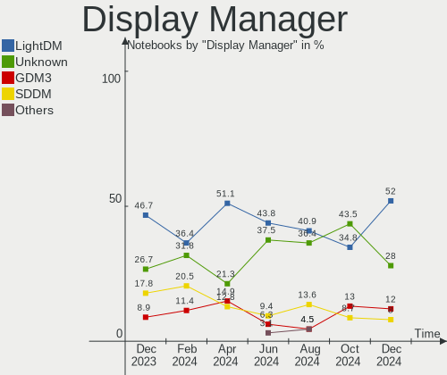

| Name    | Notebooks | Percent |
|---------|-----------|---------|
| LightDM | 17        | 54.84%  |
| Unknown | 8         | 25.81%  |
| GDM3    | 4         | 12.9%   |
| SDDM    | 2         | 6.45%   |

OS Lang
-------

Language

| Lang    | Notebooks | Percent |
|---------|-----------|---------|
| en_US   | 20        | 64.52%  |
| Unknown | 2         | 6.45%   |
| ru_RU   | 1         | 3.23%   |
| pl_PL   | 1         | 3.23%   |
| en_NZ   | 1         | 3.23%   |
| en_NG   | 1         | 3.23%   |
| en_GB   | 1         | 3.23%   |
| en_DK   | 1         | 3.23%   |
| en_CA   | 1         | 3.23%   |
| de_DE   | 1         | 3.23%   |
| bg_BG   | 1         | 3.23%   |

Boot Mode
---------

EFI or BIOS

| Mode | Notebooks | Percent |
|------|-----------|---------|
| EFI  | 20        | 64.52%  |
| BIOS | 11        | 35.48%  |

Filesystem
----------

Type of filesystem

| Type    | Notebooks | Percent |
|---------|-----------|---------|
| Ext4    | 28        | 90.32%  |
| Overlay | 2         | 6.45%   |
| Btrfs   | 1         | 3.23%   |

Part. scheme
------------

Scheme of partitioning

| Type    | Notebooks | Percent |
|---------|-----------|---------|
| GPT     | 15        | 48.39%  |
| MBR     | 10        | 32.26%  |
| Unknown | 6         | 19.35%  |

Dual Boot with Linux/BSD
------------------------

Hosting more than one Linux/BSD

| Dual boot | Notebooks | Percent |
|-----------|-----------|---------|
| No        | 31        | 100%    |

Dual Boot (Win)
---------------

Hosting Linux and Windows

| Dual boot | Notebooks | Percent |
|-----------|-----------|---------|
| No        | 26        | 83.87%  |
| Yes       | 5         | 16.13%  |

Board
-----

Vendor
------

Motherboard manufacturer

| Name             | Notebooks | Percent |
|------------------|-----------|---------|
| Hewlett-Packard  | 10        | 32.26%  |
| Lenovo           | 5         | 16.13%  |
| ASUSTek Computer | 5         | 16.13%  |
| Dell             | 4         | 12.9%   |
| Acer             | 4         | 12.9%   |
| MSI              | 1         | 3.23%   |
| Google           | 1         | 3.23%   |
| Clevo            | 1         | 3.23%   |

Model
-----

Motherboard model

| Name                                     | Notebooks | Percent |
|------------------------------------------|-----------|---------|
| MSI GF65 Thin 10SER                      | 1         | 3.23%   |
| Lenovo Yoga 700-11ISK 80QE               | 1         | 3.23%   |
| Lenovo IdeaPad S340 81QG                 | 1         | 3.23%   |
| Lenovo IdeaPad S145-14IWL 81MU           | 1         | 3.23%   |
| Lenovo G710 20252                        | 1         | 3.23%   |
| HP Stream Laptop 14-cb0XX                | 1         | 3.23%   |
| HP ProBook 650 G1                        | 1         | 3.23%   |
| HP ProBook 4520s                         | 1         | 3.23%   |
| HP ProBook 4340s                         | 1         | 3.23%   |
| HP Pavilion g6                           | 1         | 3.23%   |
| HP Pavilion dv6                          | 1         | 3.23%   |
| HP Pavilion 15                           | 1         | 3.23%   |
| HP Laptop 15-da0xxx                      | 1         | 3.23%   |
| HP Compaq 620                            | 1         | 3.23%   |
| HP 15                                    | 1         | 3.23%   |
| Google Droid                             | 1         | 3.23%   |
| Dell Vostro 3500                         | 1         | 3.23%   |
| Dell Latitude E6420                      | 1         | 3.23%   |
| Dell Latitude 7290                       | 1         | 3.23%   |
| Dell Latitude 5490                       | 1         | 3.23%   |
| Clevo P170EM                             | 1         | 3.23%   |
| ASUS X441NA                              | 1         | 3.23%   |
| ASUS VivoBook_ASUSLaptop X412FA_X412FA   | 1         | 3.23%   |
| ASUS VivoBook_ASUSLaptop S5402ZA_S5402ZA | 1         | 3.23%   |
| ASUS S551LB                              | 1         | 3.23%   |
| ASUS ROG Strix G512LV_G512LV             | 1         | 3.23%   |
| Acer Swift SF314-52                      | 1         | 3.23%   |
| Acer Aspire ES1-711                      | 1         | 3.23%   |
| Acer Aspire E1-422                       | 1         | 3.23%   |
| Acer Aspire A515-57G                     | 1         | 3.23%   |
| Unknown                                  | 1         | 3.23%   |

Model Family
------------

Motherboard model prefix

| Name           | Notebooks | Percent |
|----------------|-----------|---------|
| HP ProBook     | 3         | 9.68%   |
| HP Pavilion    | 3         | 9.68%   |
| Dell Latitude  | 3         | 9.68%   |
| Acer Aspire    | 3         | 9.68%   |
| Lenovo IdeaPad | 2         | 6.45%   |
| ASUS VivoBook  | 2         | 6.45%   |
| MSI GF65       | 1         | 3.23%   |
| Lenovo Yoga    | 1         | 3.23%   |
| Lenovo G710    | 1         | 3.23%   |
| HP Stream      | 1         | 3.23%   |
| HP Laptop      | 1         | 3.23%   |
| HP Compaq      | 1         | 3.23%   |
| HP 15          | 1         | 3.23%   |
| Google Droid   | 1         | 3.23%   |
| Dell Vostro    | 1         | 3.23%   |
| Clevo P170EM   | 1         | 3.23%   |
| ASUS X441NA    | 1         | 3.23%   |
| ASUS S551LB    | 1         | 3.23%   |
| ASUS ROG       | 1         | 3.23%   |
| Acer Swift     | 1         | 3.23%   |
| Unknown        | 1         | 3.23%   |

MFG Year
--------

Motherboard manufacture year

| Year | Notebooks | Percent |
|------|-----------|---------|
| 2013 | 6         | 19.35%  |
| 2022 | 4         | 12.9%   |
| 2018 | 4         | 12.9%   |
| 2012 | 3         | 9.68%   |
| 2010 | 3         | 9.68%   |
| 2020 | 2         | 6.45%   |
| 2019 | 2         | 6.45%   |
| 2017 | 2         | 6.45%   |
| 2011 | 2         | 6.45%   |
| 2015 | 1         | 3.23%   |
| 2014 | 1         | 3.23%   |
| 2008 | 1         | 3.23%   |

Form Factor
-----------

Physical design of the computer

| Name     | Notebooks | Percent |
|----------|-----------|---------|
| Notebook | 31        | 100%    |

Secure Boot
-----------

Enabled or disabled

| State    | Notebooks | Percent |
|----------|-----------|---------|
| Disabled | 31        | 100%    |

Coreboot
--------

Have coreboot on board

| Used | Notebooks | Percent |
|------|-----------|---------|
| No   | 30        | 96.77%  |
| Yes  | 1         | 3.23%   |

RAM Size
--------

Total RAM memory

| Size in GB | Notebooks | Percent |
|------------|-----------|---------|
| 4.01-8.0   | 10        | 32.26%  |
| 3.01-4.0   | 8         | 25.81%  |
| 16.01-24.0 | 6         | 19.35%  |
| 8.01-16.0  | 6         | 19.35%  |
| 1.01-2.0   | 1         | 3.23%   |

RAM Used
--------

Used RAM memory

| Used GB   | Notebooks | Percent |
|-----------|-----------|---------|
| 2.01-3.0  | 10        | 32.26%  |
| 3.01-4.0  | 7         | 22.58%  |
| 1.01-2.0  | 6         | 19.35%  |
| 4.01-8.0  | 5         | 16.13%  |
| 8.01-16.0 | 1         | 3.23%   |
| 0.51-1.0  | 1         | 3.23%   |
| 0.01-0.5  | 1         | 3.23%   |

Total Drives
------------

Number of drives on board

| Drives | Notebooks | Percent |
|--------|-----------|---------|
| 1      | 27        | 87.1%   |
| 3      | 2         | 6.45%   |
| 2      | 2         | 6.45%   |

Has CD-ROM
----------

Has CD-ROM on board

| Presented | Notebooks | Percent |
|-----------|-----------|---------|
| Yes       | 16        | 51.61%  |
| No        | 15        | 48.39%  |

Has Ethernet
------------

Has Ethernet on board

| Presented | Notebooks | Percent |
|-----------|-----------|---------|
| Yes       | 25        | 80.65%  |
| No        | 6         | 19.35%  |

Has WiFi
--------

Has WiFi module

| Presented | Notebooks | Percent |
|-----------|-----------|---------|
| Yes       | 31        | 100%    |

Has Bluetooth
-------------

Has Bluetooth module

| Presented | Notebooks | Percent |
|-----------|-----------|---------|
| Yes       | 27        | 87.1%   |
| No        | 4         | 12.9%   |

Location
--------

Country
-------

Geographic location (country)

| Country     | Notebooks | Percent |
|-------------|-----------|---------|
| USA         | 11        | 35.48%  |
| Sri Lanka   | 2         | 6.45%   |
| Philippines | 2         | 6.45%   |
| India       | 2         | 6.45%   |
| Canada      | 2         | 6.45%   |
| UK          | 1         | 3.23%   |
| Slovenia    | 1         | 3.23%   |
| Singapore   | 1         | 3.23%   |
| Norway      | 1         | 3.23%   |
| Nigeria     | 1         | 3.23%   |
| New Zealand | 1         | 3.23%   |
| Kenya       | 1         | 3.23%   |
| Germany     | 1         | 3.23%   |
| Denmark     | 1         | 3.23%   |
| Croatia     | 1         | 3.23%   |
| Bulgaria    | 1         | 3.23%   |
| Belarus     | 1         | 3.23%   |

City
----

Geographic location (city)

| City           | Notebooks | Percent |
|----------------|-----------|---------|
| Colombo        | 2         | 6.45%   |
| Vitebsk        | 1         | 3.23%   |
| Tulsa          | 1         | 3.23%   |
| Toronto        | 1         | 3.23%   |
| Sofia          | 1         | 3.23%   |
| Singapore      | 1         | 3.23%   |
| Selma          | 1         | 3.23%   |
| San Pedro      | 1         | 3.23%   |
| Quezon City    | 1         | 3.23%   |
| Oslo           | 1         | 3.23%   |
| Nairobi        | 1         | 3.23%   |
| Moscow         | 1         | 3.23%   |
| Medford        | 1         | 3.23%   |
| Lancaster      | 1         | 3.23%   |
| Kongens Lyngby | 1         | 3.23%   |
| Hamburg        | 1         | 3.23%   |
| Guwahati       | 1         | 3.23%   |
| Dulwich        | 1         | 3.23%   |
| Dugo Selo      | 1         | 3.23%   |
| Des Moines     | 1         | 3.23%   |
| Denver         | 1         | 3.23%   |
| Calgary        | 1         | 3.23%   |
| Bothell        | 1         | 3.23%   |
| Aurora         | 1         | 3.23%   |
| Auckland       | 1         | 3.23%   |
| Alexandria     | 1         | 3.23%   |
| Albuquerque    | 1         | 3.23%   |
| Ajdovščina   | 1         | 3.23%   |
| Ahmedabad      | 1         | 3.23%   |
| Abuja          | 1         | 3.23%   |

Drives
------

Drive Vendor
------------

Hard drive vendors

| Vendor              | Notebooks | Drives | Percent |
|---------------------|-----------|--------|---------|
| WDC                 | 4         | 4      | 10.53%  |
| Seagate             | 4         | 4      | 10.53%  |
| Hitachi             | 4         | 4      | 10.53%  |
| SK hynix            | 3         | 3      | 7.89%   |
| ZTE                 | 2         | 2      | 5.26%   |
| Unknown             | 2         | 2      | 5.26%   |
| SanDisk             | 2         | 2      | 5.26%   |
| Micron Technology   | 2         | 2      | 5.26%   |
| Kingston            | 2         | 2      | 5.26%   |
| HGST                | 2         | 2      | 5.26%   |
| Union Memory        | 1         | 1      | 2.63%   |
| Toshiba             | 1         | 1      | 2.63%   |
| Samsung Electronics | 1         | 1      | 2.63%   |
| SABRENT             | 1         | 1      | 2.63%   |
| LITEON              | 1         | 1      | 2.63%   |
| Lexar               | 1         | 1      | 2.63%   |
| Lenovo              | 1         | 1      | 2.63%   |
| LaCie               | 1         | 1      | 2.63%   |
| Intel               | 1         | 1      | 2.63%   |
| Crucial             | 1         | 1      | 2.63%   |
| ASMT                | 1         | 1      | 2.63%   |

Drive Model
-----------

Hard drive models

| Model                                   | Notebooks | Percent |
|-----------------------------------------|-----------|---------|
| ZTE MMC Storage 942MB                   | 2         | 5.26%   |
| Hitachi HTS543232L9A300 320GB           | 2         | 5.26%   |
| HGST HTS545050A7E380 500GB              | 2         | 5.26%   |
| WDC WD5000LPVX-22V0TT0 500GB            | 1         | 2.63%   |
| WDC WD3200BPVT-24JJ5T0 320GB            | 1         | 2.63%   |
| WDC WD10JPVX-80JC3T0 1TB                | 1         | 2.63%   |
| WDC PC SN530 SDBPNPZ-512G-1032 512GB    | 1         | 2.63%   |
| Unknown MMC Card  32GB                  | 1         | 2.63%   |
| Unknown DA4064  64GB                    | 1         | 2.63%   |
| Union Memory RTOTJ128VGD2EYX 128GB SSD  | 1         | 2.63%   |
| Toshiba MQ04ABF100 1TB                  | 1         | 2.63%   |
| SK hynix SC311 SATA 256GB SSD           | 1         | 2.63%   |
| SK hynix SC210 2.5 7MM 256GB SSD        | 1         | 2.63%   |
| SK hynix HFS256G32MND-2200A 256GB SSD   | 1         | 2.63%   |
| Seagate ST9500423AS 500GB               | 1         | 2.63%   |
| Seagate ST500LM030-1RK17D 500GB         | 1         | 2.63%   |
| Seagate ST320LT007-9ZV142 320GB         | 1         | 2.63%   |
| Seagate ST1000LM024 HN-M101MBB 1TB      | 1         | 2.63%   |
| SanDisk SD7TB3Q-256G-1006 256GB SSD     | 1         | 2.63%   |
| Sandisk PC SN520 NVMe SSD 256GB         | 1         | 2.63%   |
| Samsung PM991a NVMe 512GB               | 1         | 2.63%   |
| SABRENT Disk 1TB                        | 1         | 2.63%   |
| Micron 2450_MTFDKBA512TFK 512GB         | 1         | 2.63%   |
| Micron 2450_MTFDKBA1T0TFK 1TB           | 1         | 2.63%   |
| LITEON CV1-8B256 256GB SSD              | 1         | 2.63%   |
| Lexar 256GB SSD                         | 1         | 2.63%   |
| Lenovo MZ7LM480HMHQ-000V3 00LF383 480GB | 1         | 2.63%   |
| LaCie Rugged Mini USB3 2TB              | 1         | 2.63%   |
| Kingston RBUSNS8180DS3256GJ 256GB SSD   | 1         | 2.63%   |
| Kingston RBUSNS8180DS3128GH 128GB SSD   | 1         | 2.63%   |
| Intel SSDPEKNW512G8 512GB               | 1         | 2.63%   |
| Hitachi HTS725025A9A364 250GB           | 1         | 2.63%   |
| Hitachi HTS543232A7A384 320GB           | 1         | 2.63%   |
| Crucial M4-CT128M4SSD3 128GB            | 1         | 2.63%   |
| ASMT USB 3.0 TOSATA 500GB               | 1         | 2.63%   |

HDD Vendor
----------

Hard disk drive vendors

| Vendor  | Notebooks | Drives | Percent |
|---------|-----------|--------|---------|
| Seagate | 4         | 4      | 26.67%  |
| Hitachi | 4         | 4      | 26.67%  |
| WDC     | 3         | 3      | 20%     |
| HGST    | 2         | 2      | 13.33%  |
| Toshiba | 1         | 1      | 6.67%   |
| LaCie   | 1         | 1      | 6.67%   |

SSD Vendor
----------

Solid state drive vendors

| Vendor       | Notebooks | Drives | Percent |
|--------------|-----------|--------|---------|
| SK hynix     | 3         | 3      | 30%     |
| Kingston     | 2         | 2      | 20%     |
| Union Memory | 1         | 1      | 10%     |
| SanDisk      | 1         | 1      | 10%     |
| LITEON       | 1         | 1      | 10%     |
| Lexar        | 1         | 1      | 10%     |
| Crucial      | 1         | 1      | 10%     |

Drive Kind
----------

HDD or SSD

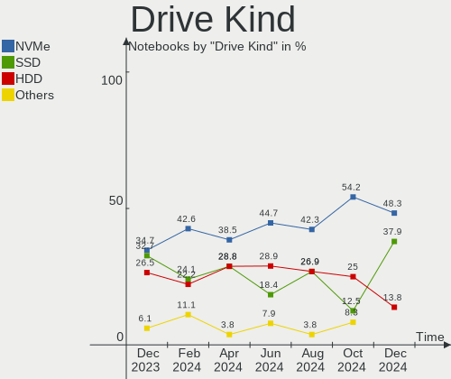

| Kind    | Notebooks | Drives | Percent |
|---------|-----------|--------|---------|
| HDD     | 14        | 15     | 38.89%  |
| SSD     | 10        | 10     | 27.78%  |
| NVMe    | 6         | 7      | 16.67%  |
| Unknown | 4         | 4      | 11.11%  |
| MMC     | 2         | 2      | 5.56%   |

Drive Connector
---------------

SATA, SAS, NVMe, etc.

| Type | Notebooks | Drives | Percent |
|------|-----------|--------|---------|
| SATA | 24        | 25     | 64.86%  |
| NVMe | 6         | 6      | 16.22%  |
| SAS  | 5         | 5      | 13.51%  |
| MMC  | 2         | 2      | 5.41%   |

Drive Size
----------

Size of hard drive

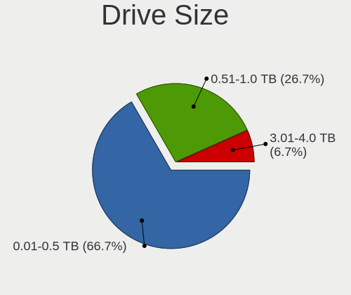

| Size in TB | Notebooks | Drives | Percent |
|------------|-----------|--------|---------|
| 0.01-0.5   | 20        | 21     | 83.33%  |
| 0.51-1.0   | 3         | 3      | 12.5%   |
| 1.01-2.0   | 1         | 1      | 4.17%   |

Space Total
-----------

Amount of disk space available on the file system

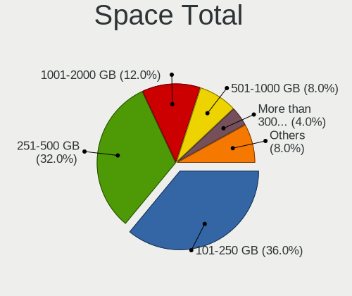

| Size in GB | Notebooks | Percent |
|------------|-----------|---------|
| 251-500    | 11        | 35.48%  |
| 101-250    | 8         | 25.81%  |
| 501-1000   | 3         | 9.68%   |
| 21-50      | 2         | 6.45%   |
| 2001-3000  | 2         | 6.45%   |
| 51-100     | 2         | 6.45%   |
| Unknown    | 2         | 6.45%   |
| 1-20       | 1         | 3.23%   |

Space Used
----------

Amount of used disk space

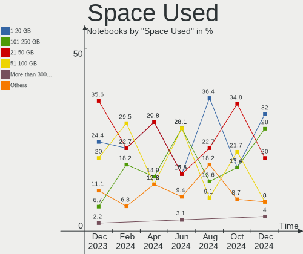

| Used GB  | Notebooks | Percent |
|----------|-----------|---------|
| 1-20     | 11        | 35.48%  |
| 101-250  | 6         | 19.35%  |
| 21-50    | 5         | 16.13%  |
| 51-100   | 5         | 16.13%  |
| Unknown  | 2         | 6.45%   |
| 251-500  | 1         | 3.23%   |
| 501-1000 | 1         | 3.23%   |

Malfunc. Drives
---------------

Drive models with a malfunction

| Model                                 | Notebooks | Drives | Percent |
|---------------------------------------|-----------|--------|---------|
| Hitachi HTS543232L9A300 320GB         | 2         | 2      | 28.57%  |
| SK hynix SC210 2.5 7MM 256GB SSD      | 1         | 1      | 14.29%  |
| SK hynix HFS256G32MND-2200A 256GB SSD | 1         | 1      | 14.29%  |
| Seagate ST320LT007-9ZV142 320GB       | 1         | 1      | 14.29%  |
| Hitachi HTS725025A9A364 250GB         | 1         | 1      | 14.29%  |
| HGST HTS545050A7E380 500GB            | 1         | 1      | 14.29%  |

Malfunc. Drive Vendor
---------------------

Vendors of faulty drives

| Vendor   | Notebooks | Drives | Percent |
|----------|-----------|--------|---------|
| Hitachi  | 3         | 3      | 42.86%  |
| SK hynix | 2         | 2      | 28.57%  |
| Seagate  | 1         | 1      | 14.29%  |
| HGST     | 1         | 1      | 14.29%  |

Malfunc. HDD Vendor
-------------------

Vendors of faulty HDD drives

| Vendor  | Notebooks | Drives | Percent |
|---------|-----------|--------|---------|
| Hitachi | 3         | 3      | 60%     |
| Seagate | 1         | 1      | 20%     |
| HGST    | 1         | 1      | 20%     |

Malfunc. Drive Kind
-------------------

Kinds of faulty drives

| Kind | Notebooks | Drives | Percent |
|------|-----------|--------|---------|
| HDD  | 5         | 5      | 71.43%  |
| SSD  | 2         | 2      | 28.57%  |

Failed Drives
-------------

Failed drive models

Zero info for selected period =(

Failed Drive Vendor
-------------------

Failed drive vendors

Zero info for selected period =(

Drive Status
------------

Number of failed and malfunc. drives

| Status   | Notebooks | Drives | Percent |
|----------|-----------|--------|---------|
| Works    | 16        | 16     | 48.48%  |
| Detected | 10        | 15     | 30.3%   |
| Malfunc  | 7         | 7      | 21.21%  |

Storage controller
------------------

Storage Vendor
--------------

Storage controller vendors

| Vendor              | Notebooks | Percent |
|---------------------|-----------|---------|
| Intel               | 26        | 78.79%  |
| SanDisk             | 2         | 6.06%   |
| Micron Technology   | 2         | 6.06%   |
| AMD                 | 2         | 6.06%   |
| Samsung Electronics | 1         | 3.03%   |

Storage Model
-------------

Storage controller models

| Model                                                                          | Notebooks | Percent |
|--------------------------------------------------------------------------------|-----------|---------|
| Intel Sunrise Point-LP SATA Controller [AHCI mode]                             | 4         | 10.53%  |
| Intel Volume Management Device NVMe RAID Controller                            | 3         | 7.89%   |
| Intel 82801 Mobile SATA Controller [RAID mode]                                 | 3         | 7.89%   |
| Intel 7 Series Chipset Family 6-port SATA Controller [AHCI mode]               | 3         | 7.89%   |
| Micron Non-Volatile memory controller                                          | 2         | 5.26%   |
| Intel 8 Series SATA Controller 1 [AHCI mode]                                   | 2         | 5.26%   |
| AMD FCH SATA Controller [AHCI mode]                                            | 2         | 5.26%   |
| SanDisk WD Blue SN550 NVMe SSD                                                 | 1         | 2.63%   |
| SanDisk PC SN520 NVMe SSD                                                      | 1         | 2.63%   |
| Samsung NVMe SSD Controller 980                                                | 1         | 2.63%   |
| Intel Tiger Lake-LP SATA Controller                                            | 1         | 2.63%   |
| Intel SSD 660P Series                                                          | 1         | 2.63%   |
| Intel Celeron N3350/Pentium N4200/Atom E3900 Series SATA AHCI Controller       | 1         | 2.63%   |
| Intel Cannon Point-LP SATA Controller [AHCI Mode]                              | 1         | 2.63%   |
| Intel Atom Processor E3800 Series SATA AHCI Controller                         | 1         | 2.63%   |
| Intel Alder Lake-P SATA AHCI Controller                                        | 1         | 2.63%   |
| Intel 82801IBM/IEM (ICH9M/ICH9M-E) 4 port SATA Controller [AHCI mode]          | 1         | 2.63%   |
| Intel 82801IBM/IEM (ICH9M/ICH9M-E) 2 port SATA Controller [IDE mode]           | 1         | 2.63%   |
| Intel 8 Series/C220 Series Chipset Family 6-port SATA Controller 1 [AHCI mode] | 1         | 2.63%   |
| Intel 8 Series/C220 Series Chipset Family 2-port SATA Controller 2 [IDE mode]  | 1         | 2.63%   |
| Intel 8 Series Chipset Family 4-port SATA Controller 1 [IDE mode] - Mobile     | 1         | 2.63%   |
| Intel 7 Series Chipset Family 4-port SATA Controller [IDE mode]                | 1         | 2.63%   |
| Intel 7 Series Chipset Family 2-port SATA Controller [IDE mode]                | 1         | 2.63%   |
| Intel 6 Series/C200 Series Chipset Family 6 port Mobile SATA AHCI Controller   | 1         | 2.63%   |
| Intel 5 Series/3400 Series Chipset 4 port SATA IDE Controller                  | 1         | 2.63%   |
| Intel 5 Series/3400 Series Chipset 2 port SATA IDE Controller                  | 1         | 2.63%   |

Storage Kind
------------

Kind of storage controller (IDE, SATA, NVMe, SAS, ...)

| Kind | Notebooks | Percent |
|------|-----------|---------|
| SATA | 19        | 54.29%  |
| RAID | 6         | 17.14%  |
| NVMe | 6         | 17.14%  |
| IDE  | 4         | 11.43%  |

Processor
---------

CPU Vendor
----------

Processor vendors

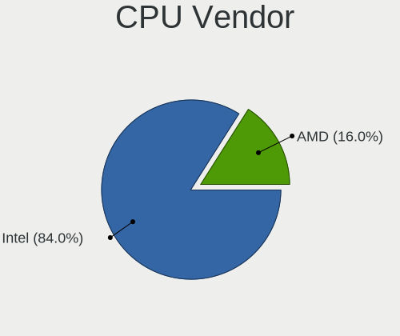

| Vendor | Notebooks | Percent |
|--------|-----------|---------|
| Intel  | 29        | 93.55%  |
| AMD    | 2         | 6.45%   |

CPU Model
---------

Processor models

| Model                                         | Notebooks | Percent |
|-----------------------------------------------|-----------|---------|
| Intel Pentium CPU N4200 @ 1.10GHz             | 1         | 3.23%   |
| Intel Pentium CPU 5405U @ 2.30GHz             | 1         | 3.23%   |
| Intel Core m5-6Y54 CPU @ 1.10GHz              | 1         | 3.23%   |
| Intel Core i7-8565U CPU @ 1.80GHz             | 1         | 3.23%   |
| Intel Core i7-4500U CPU @ 1.80GHz             | 1         | 3.23%   |
| Intel Core i7-3630QM CPU @ 2.40GHz            | 1         | 3.23%   |
| Intel Core i7-10750H CPU @ 2.60GHz            | 1         | 3.23%   |
| Intel Core i5-8350U CPU @ 1.70GHz             | 1         | 3.23%   |
| Intel Core i5-8250U CPU @ 1.60GHz             | 1         | 3.23%   |
| Intel Core i5-7200U CPU @ 2.50GHz             | 1         | 3.23%   |
| Intel Core i5-4300M CPU @ 2.60GHz             | 1         | 3.23%   |
| Intel Core i5-4200M CPU @ 2.50GHz             | 1         | 3.23%   |
| Intel Core i5-3210M CPU @ 2.50GHz             | 1         | 3.23%   |
| Intel Core i5-2520M CPU @ 2.50GHz             | 1         | 3.23%   |
| Intel Core i5-2410M CPU @ 2.30GHz             | 1         | 3.23%   |
| Intel Core i5-10300H CPU @ 2.50GHz            | 1         | 3.23%   |
| Intel Core i3-8130U CPU @ 2.20GHz             | 1         | 3.23%   |
| Intel Core i3-4005U CPU @ 1.70GHz             | 1         | 3.23%   |
| Intel Core i3-3217U CPU @ 1.80GHz             | 1         | 3.23%   |
| Intel Core i3-3110M CPU @ 2.40GHz             | 1         | 3.23%   |
| Intel Core i3 CPU M 330 @ 2.13GHz             | 1         | 3.23%   |
| Intel Core 2 Duo CPU T9400 @ 2.53GHz          | 1         | 3.23%   |
| Intel Core 2 Duo CPU T6670 @ 2.20GHz          | 1         | 3.23%   |
| Intel Celeron N4020 CPU @ 1.10GHz             | 1         | 3.23%   |
| Intel Celeron CPU N3060 @ 1.60GHz             | 1         | 3.23%   |
| Intel Celeron CPU N2940 @ 1.83GHz             | 1         | 3.23%   |
| Intel 12th Gen Core i7-12700H                 | 1         | 3.23%   |
| Intel 12th Gen Core i5-1240P                  | 1         | 3.23%   |
| Intel 11th Gen Core i5-1135G7 @ 2.40GHz       | 1         | 3.23%   |
| AMD Ryzen 7 3700U with Radeon Vega Mobile Gfx | 1         | 3.23%   |
| AMD E1-2500 APU with Radeon HD Graphics       | 1         | 3.23%   |

CPU Model Family
----------------

Processor model prefix

| Model            | Notebooks | Percent |
|------------------|-----------|---------|
| Intel Core i5    | 9         | 29.03%  |
| Intel Core i3    | 5         | 16.13%  |
| Intel Core i7    | 4         | 12.9%   |
| Other            | 3         | 9.68%   |
| Intel Celeron    | 3         | 9.68%   |
| Intel Pentium    | 2         | 6.45%   |
| Intel Core 2 Duo | 2         | 6.45%   |
| Intel Core m5    | 1         | 3.23%   |
| AMD Ryzen 7      | 1         | 3.23%   |
| AMD E1           | 1         | 3.23%   |

CPU Cores
---------

Number of processor cores

| Number | Notebooks | Percent |
|--------|-----------|---------|
| 2      | 19        | 61.29%  |
| 4      | 9         | 29.03%  |
| 14     | 1         | 3.23%   |
| 12     | 1         | 3.23%   |
| 6      | 1         | 3.23%   |

CPU Sockets
-----------

Number of sockets

| Number | Notebooks | Percent |
|--------|-----------|---------|
| 1      | 31        | 100%    |

CPU Threads
-----------

Threads per core (Hyper-Threading)

| Number | Notebooks | Percent |
|--------|-----------|---------|
| 2      | 24        | 77.42%  |
| 1      | 7         | 22.58%  |

CPU Op-Modes
------------

CPU Operation Modes (32-bit, 64-bit)

| Op mode        | Notebooks | Percent |
|----------------|-----------|---------|
| 32-bit, 64-bit | 31        | 100%    |

CPU Microcode
-------------

Microcode number

| Number     | Notebooks | Percent |
|------------|-----------|---------|
| 0x806ea    | 3         | 9.68%   |
| 0x306a9    | 3         | 9.68%   |
| 0xa0652    | 2         | 6.45%   |
| 0x806eb    | 2         | 6.45%   |
| 0x40651    | 2         | 6.45%   |
| 0x306c3    | 2         | 6.45%   |
| 0x206a7    | 2         | 6.45%   |
| Unknown    | 2         | 6.45%   |
| 0x906a3    | 1         | 3.23%   |
| 0x806e9    | 1         | 3.23%   |
| 0x806c1    | 1         | 3.23%   |
| 0x706a8    | 1         | 3.23%   |
| 0x506c9    | 1         | 3.23%   |
| 0x406e3    | 1         | 3.23%   |
| 0x406c4    | 1         | 3.23%   |
| 0x30678    | 1         | 3.23%   |
| 0x20652    | 1         | 3.23%   |
| 0x1067a    | 1         | 3.23%   |
| 0x10676    | 1         | 3.23%   |
| 0x08108109 | 1         | 3.23%   |
| 0x0700010f | 1         | 3.23%   |

CPU Microarch
-------------

Microarchitecture

| Name             | Notebooks | Percent |
|------------------|-----------|---------|
| KabyLake         | 6         | 19.35%  |
| IvyBridge        | 4         | 12.9%   |
| Haswell          | 4         | 12.9%   |
| Silvermont       | 2         | 6.45%   |
| SandyBridge      | 2         | 6.45%   |
| Penryn           | 2         | 6.45%   |
| CometLake        | 2         | 6.45%   |
| Zen+             | 1         | 3.23%   |
| Westmere         | 1         | 3.23%   |
| TigerLake        | 1         | 3.23%   |
| Skylake          | 1         | 3.23%   |
| Jaguar           | 1         | 3.23%   |
| Goldmont plus    | 1         | 3.23%   |
| Goldmont         | 1         | 3.23%   |
| Alderlake Hybrid | 1         | 3.23%   |
| Unknown          | 1         | 3.23%   |

Graphics
--------

GPU Vendor
----------

Vendors of graphics cards

| Vendor | Notebooks | Percent |
|--------|-----------|---------|
| Intel  | 29        | 74.36%  |
| Nvidia | 6         | 15.38%  |
| AMD    | 4         | 10.26%  |

GPU Model
---------

Graphics card models

| Model                                                                                    | Notebooks | Percent |
|------------------------------------------------------------------------------------------|-----------|---------|
| Intel 3rd Gen Core processor Graphics Controller                                         | 4         | 10.26%  |
| Intel UHD Graphics 620                                                                   | 3         | 7.69%   |
| Nvidia TU106M [GeForce RTX 2060 Mobile]                                                  | 2         | 5.13%   |
| Intel Mobile 4 Series Chipset Integrated Graphics Controller                             | 2         | 5.13%   |
| Intel Haswell-ULT Integrated Graphics Controller                                         | 2         | 5.13%   |
| Intel CometLake-H GT2 [UHD Graphics]                                                     | 2         | 5.13%   |
| Intel Alder Lake-P Integrated Graphics Controller                                        | 2         | 5.13%   |
| Intel 4th Gen Core Processor Integrated Graphics Controller                              | 2         | 5.13%   |
| Intel 2nd Generation Core Processor Family Integrated Graphics Controller                | 2         | 5.13%   |
| Nvidia GK208M [GeForce GT 740M]                                                          | 1         | 2.56%   |
| Nvidia GK104M [GeForce GTX 675MX]                                                        | 1         | 2.56%   |
| Nvidia GF117M [GeForce 610M/710M/810M/820M / GT 620M/625M/630M/720M]                     | 1         | 2.56%   |
| Nvidia GA107M [GeForce RTX 2050]                                                         | 1         | 2.56%   |
| Intel WhiskeyLake-U GT2 [UHD Graphics 620]                                               | 1         | 2.56%   |
| Intel TigerLake-LP GT2 [Iris Xe Graphics]                                                | 1         | 2.56%   |
| Intel HD Graphics 620                                                                    | 1         | 2.56%   |
| Intel HD Graphics 515                                                                    | 1         | 2.56%   |
| Intel GeminiLake [UHD Graphics 600]                                                      | 1         | 2.56%   |
| Intel Core Processor Integrated Graphics Controller                                      | 1         | 2.56%   |
| Intel Coffee Lake UHD 610 Graphics Controller                                            | 1         | 2.56%   |
| Intel Celeron N3350/Pentium N4200/Atom E3900 Series Integrated Graphics Controller       | 1         | 2.56%   |
| Intel Atom/Celeron/Pentium Processor x5-E8000/J3xxx/N3xxx Integrated Graphics Controller | 1         | 2.56%   |
| Intel Atom Processor Z36xxx/Z37xxx Series Graphics & Display                             | 1         | 2.56%   |
| AMD Seymour [Radeon HD 6400M/7400M Series]                                               | 1         | 2.56%   |
| AMD RV635/M86 [Mobility Radeon HD 3650]                                                  | 1         | 2.56%   |
| AMD Picasso/Raven 2 [Radeon Vega Series / Radeon Vega Mobile Series]                     | 1         | 2.56%   |
| AMD Kabini [Radeon HD 8240 / R3 Series]                                                  | 1         | 2.56%   |

GPU Combo
---------

Combinations of graphics cards

| Name           | Notebooks | Percent |
|----------------|-----------|---------|
| 1 x Intel      | 20        | 64.52%  |
| Intel + Nvidia | 6         | 19.35%  |
| Intel + AMD    | 2         | 6.45%   |
| 1 x AMD        | 2         | 6.45%   |
| 2 x Intel      | 1         | 3.23%   |

GPU Driver
----------

Free vs proprietary

| Driver      | Notebooks | Percent |
|-------------|-----------|---------|
| Free        | 30        | 96.77%  |
| Proprietary | 1         | 3.23%   |

GPU Memory
----------

Total video memory

| Size in GB | Notebooks | Percent |
|------------|-----------|---------|
| Unknown    | 24        | 77.42%  |
| 1.01-2.0   | 4         | 12.9%   |
| 5.01-6.0   | 1         | 3.23%   |
| 0.51-1.0   | 1         | 3.23%   |
| 0.01-0.5   | 1         | 3.23%   |

Monitor
-------

Monitor Vendor
--------------

Monitor vendors

| Vendor              | Notebooks | Percent |
|---------------------|-----------|---------|
| BOE                 | 10        | 27.03%  |
| AU Optronics        | 7         | 18.92%  |
| Samsung Electronics | 6         | 16.22%  |
| Chimei Innolux      | 5         | 13.51%  |
| LG Display          | 2         | 5.41%   |
| PRI                 | 1         | 2.7%    |
| Medion              | 1         | 2.7%    |
| Lenovo              | 1         | 2.7%    |
| Goldstar            | 1         | 2.7%    |
| Dell                | 1         | 2.7%    |
| Apple               | 1         | 2.7%    |
| Acer                | 1         | 2.7%    |

Monitor Model
-------------

Monitor models

| Model                                                                 | Notebooks | Percent |
|-----------------------------------------------------------------------|-----------|---------|
| BOE LCD Monitor BOE075A 1366x768 309x173mm 13.9-inch                  | 2         | 5.41%   |
| Samsung Electronics LCD Monitor SEC4256 1600x900 382x215mm 17.3-inch  | 1         | 2.7%    |
| Samsung Electronics LCD Monitor SEC3551 1366x768 344x194mm 15.5-inch  | 1         | 2.7%    |
| Samsung Electronics LCD Monitor SEC3250 1366x768 344x193mm 15.5-inch  | 1         | 2.7%    |
| Samsung Electronics LCD Monitor SDC4951 1366x768 344x194mm 15.5-inch  | 1         | 2.7%    |
| Samsung Electronics LCD Monitor SDC4851 1366x768 344x194mm 15.5-inch  | 1         | 2.7%    |
| Samsung Electronics LCD Monitor SDC416D 2880x1800 312x195mm 14.5-inch | 1         | 2.7%    |
| PRI BBY LCD TV PRI0032 1360x768 530x398mm 26.1-inch                   | 1         | 2.7%    |
| Medion MD20444 MED3661 1920x1080 521x293mm 23.5-inch                  | 1         | 2.7%    |
| LG Display LCD Monitor LGD02AD 1366x768 344x194mm 15.5-inch           | 1         | 2.7%    |
| LG Display LCD Monitor LGD0250 1366x768 345x194mm 15.6-inch           | 1         | 2.7%    |
| Lenovo LCD Monitor LEN4053 1680x1050 331x207mm 15.4-inch              | 1         | 2.7%    |
| Goldstar 23EN43 GSM59DC 1920x1080 510x290mm 23.1-inch                 | 1         | 2.7%    |
| Dell P2213 DELF041 1680x1050 473x296mm 22.0-inch                      | 1         | 2.7%    |
| Chimei Innolux LCD Monitor CMN15E7 1920x1080 344x193mm 15.5-inch      | 1         | 2.7%    |
| Chimei Innolux LCD Monitor CMN1521 1920x1080 344x193mm 15.5-inch      | 1         | 2.7%    |
| Chimei Innolux LCD Monitor CMN14C9 1920x1080 309x173mm 13.9-inch      | 1         | 2.7%    |
| Chimei Innolux LCD Monitor CMN1493 1366x768 309x173mm 13.9-inch       | 1         | 2.7%    |
| Chimei Innolux LCD Monitor CMN1137 1920x1080 256x144mm 11.6-inch      | 1         | 2.7%    |
| BOE LCD Monitor BOE082F 1920x1080 344x193mm 15.5-inch                 | 1         | 2.7%    |
| BOE LCD Monitor BOE0819 1920x1080 344x194mm 15.5-inch                 | 1         | 2.7%    |
| BOE LCD Monitor BOE07F6 1920x1080 309x174mm 14.0-inch                 | 1         | 2.7%    |
| BOE LCD Monitor BOE070D 1366x768 309x173mm 13.9-inch                  | 1         | 2.7%    |
| BOE LCD Monitor BOE06F0 1366x768 344x194mm 15.5-inch                  | 1         | 2.7%    |
| BOE LCD Monitor BOE0696 1366x768 309x173mm 13.9-inch                  | 1         | 2.7%    |
| BOE LCD Monitor BOE0618 1366x768 277x156mm 12.5-inch                  | 1         | 2.7%    |
| BOE LCD Monitor BOE05F4 1366x768 277x156mm 12.5-inch                  | 1         | 2.7%    |
| AU Optronics LCD Monitor AUOD0ED 1920x1080 344x193mm 15.5-inch        | 1         | 2.7%    |
| AU Optronics LCD Monitor AUO48EC 1366x768 344x193mm 15.5-inch         | 1         | 2.7%    |
| AU Optronics LCD Monitor AUO323C 1366x768 309x173mm 13.9-inch         | 1         | 2.7%    |
| AU Optronics LCD Monitor AUO312C 1366x768 293x164mm 13.2-inch         | 1         | 2.7%    |
| AU Optronics LCD Monitor AUO193C 1366x768 309x173mm 13.9-inch         | 1         | 2.7%    |
| AU Optronics LCD Monitor AUO149D 1920x1080 381x214mm 17.2-inch        | 1         | 2.7%    |
| AU Optronics LCD Monitor AUO119E 1600x900 382x214mm 17.2-inch         | 1         | 2.7%    |
| Apple LED Cinema APP9236 1920x1200 518x324mm 24.1-inch                | 1         | 2.7%    |
| Acer VG240Y S ACR0750 1920x1080 527x296mm 23.8-inch                   | 1         | 2.7%    |

Monitor Resolution
------------------

Monitor screen resolution

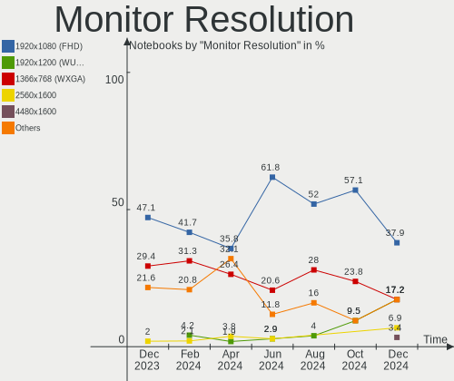

| Resolution         | Notebooks | Percent |
|--------------------|-----------|---------|
| 1366x768 (WXGA)    | 17        | 47.22%  |
| 1920x1080 (FHD)    | 11        | 30.56%  |
| 1680x1050 (WSXGA+) | 3         | 8.33%   |
| 1600x900 (HD+)     | 2         | 5.56%   |
| 2880x1800          | 1         | 2.78%   |
| 1920x1200 (WUXGA)  | 1         | 2.78%   |
| 1360x768           | 1         | 2.78%   |

Monitor Diagonal
----------------

Diagonal size in inches

| Inches | Notebooks | Percent |
|--------|-----------|---------|
| 15     | 14        | 37.84%  |
| 13     | 8         | 21.62%  |
| 17     | 3         | 8.11%   |
| 14     | 3         | 8.11%   |
| 24     | 2         | 5.41%   |
| 12     | 2         | 5.41%   |
| 27     | 1         | 2.7%    |
| 26     | 1         | 2.7%    |
| 23     | 1         | 2.7%    |
| 22     | 1         | 2.7%    |
| 11     | 1         | 2.7%    |

Monitor Width
-------------

Physical width

| Width in mm | Notebooks | Percent |
|-------------|-----------|---------|
| 301-350     | 24        | 64.86%  |
| 501-600     | 5         | 13.51%  |
| 201-300     | 4         | 10.81%  |
| 351-400     | 3         | 8.11%   |
| 401-500     | 1         | 2.7%    |

Aspect Ratio
------------

Proportional relationship between the width and the height

| Ratio | Notebooks | Percent |
|-------|-----------|---------|
| 16/9  | 29        | 85.29%  |
| 16/10 | 4         | 11.76%  |
| 4/3   | 1         | 2.94%   |

Monitor Area
------------

Area in inch²

| Area in inch² | Notebooks | Percent |
|----------------|-----------|---------|
| 101-110        | 14        | 37.84%  |
| 81-90          | 9         | 24.32%  |
| 201-250        | 3         | 8.11%   |
| 121-130        | 3         | 8.11%   |
| 61-70          | 2         | 5.41%   |
| 301-350        | 2         | 5.41%   |
| 71-80          | 1         | 2.7%    |
| 51-60          | 1         | 2.7%    |
| 251-300        | 1         | 2.7%    |
| 91-100         | 1         | 2.7%    |

Pixel Density
-------------

Pixels per inch

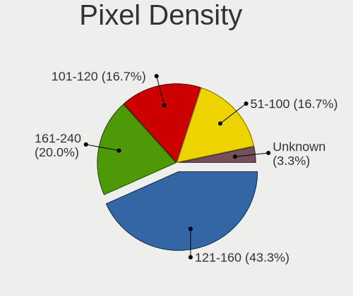

| Density | Notebooks | Percent |
|---------|-----------|---------|
| 101-120 | 17        | 45.95%  |
| 121-160 | 11        | 29.73%  |
| 51-100  | 7         | 18.92%  |
| 161-240 | 2         | 5.41%   |

Multiple Monitors
-----------------

Total monitors connected

| Total | Notebooks | Percent |
|-------|-----------|---------|
| 1     | 24        | 77.42%  |
| 2     | 7         | 22.58%  |

Network
-------

Net Controller Vendor
---------------------

Controller vendors

| Vendor                     | Notebooks | Percent |
|----------------------------|-----------|---------|
| Realtek Semiconductor      | 20        | 37.04%  |
| Intel                      | 13        | 24.07%  |
| Qualcomm Atheros           | 8         | 14.81%  |
| Ralink                     | 3         | 5.56%   |
| Broadcom                   | 3         | 5.56%   |
| ZTE WCDMA Technologies MSM | 1         | 1.85%   |
| U-Blox                     | 1         | 1.85%   |
| TP-Link                    | 1         | 1.85%   |
| Ralink Technology          | 1         | 1.85%   |
| Qualcomm                   | 1         | 1.85%   |
| MediaTek                   | 1         | 1.85%   |
| Arduino SA                 | 1         | 1.85%   |

Net Controller Model
--------------------

Controller models

| Model                                                             | Notebooks | Percent |
|-------------------------------------------------------------------|-----------|---------|
| Realtek RTL8111/8168/8411 PCI Express Gigabit Ethernet Controller | 11        | 17.46%  |
| Realtek RTL810xE PCI Express Fast Ethernet controller             | 5         | 7.94%   |
| Qualcomm Atheros QCA9565 / AR9565 Wireless Network Adapter        | 4         | 6.35%   |
| Realtek RTL8822BE 802.11a/b/g/n/ac WiFi adapter                   | 3         | 4.76%   |
| Intel Wireless 8265 / 8275                                        | 2         | 3.17%   |
| Intel Ethernet Connection (4) I219-LM                             | 2         | 3.17%   |
| Intel Comet Lake PCH CNVi WiFi                                    | 2         | 3.17%   |
| Intel Alder Lake-P PCH CNVi WiFi                                  | 2         | 3.17%   |
| Broadcom BCM4313 802.11bgn Wireless Network Adapter               | 2         | 3.17%   |
| ZTE WCDMA MSM ZTE WCDMA MSM                                       | 1         | 1.59%   |
| U-Blox [u-blox 7]                                                 | 1         | 1.59%   |
| TP-Link Archer T2U PLUS [RTL8821AU]                               | 1         | 1.59%   |
| Realtek RTL8821CE 802.11ac PCIe Wireless Network Adapter          | 1         | 1.59%   |
| Realtek RTL8723BE PCIe Wireless Network Adapter                   | 1         | 1.59%   |
| Realtek RTL8188EE Wireless Network Adapter                        | 1         | 1.59%   |
| Realtek RTL8153 Gigabit Ethernet Adapter                          | 1         | 1.59%   |
| Realtek 802.11ac NIC                                              | 1         | 1.59%   |
| Ralink RT2870/RT3070 Wireless Adapter                             | 1         | 1.59%   |
| Ralink RT5390R 802.11bgn PCIe Wireless Network Adapter            | 1         | 1.59%   |
| Ralink RT3290 Wireless 802.11n 1T/1R PCIe                         | 1         | 1.59%   |
| Ralink RT3090 Wireless 802.11n 1T/1R PCIe                         | 1         | 1.59%   |
| Qualcomm Mobile Router                                            | 1         | 1.59%   |
| Qualcomm Atheros QCA9377 802.11ac Wireless Network Adapter        | 1         | 1.59%   |
| Qualcomm Atheros QCA8172 Fast Ethernet                            | 1         | 1.59%   |
| Qualcomm Atheros QCA8171 Gigabit Ethernet                         | 1         | 1.59%   |
| Qualcomm Atheros AR9485 Wireless Network Adapter                  | 1         | 1.59%   |
| Qualcomm Atheros AR93xx Wireless Network Adapter                  | 1         | 1.59%   |
| MediaTek WiFi                                                     | 1         | 1.59%   |
| Intel Wireless 7265                                               | 1         | 1.59%   |
| Intel Wireless 7260                                               | 1         | 1.59%   |
| Intel PRO/Wireless 5100 AGN [Shiloh] Network Connection           | 1         | 1.59%   |
| Intel Gemini Lake PCH CNVi WiFi                                   | 1         | 1.59%   |
| Intel Ethernet Connection I217-LM                                 | 1         | 1.59%   |
| Intel Dual Band Wireless-AC 3165 Plus Bluetooth                   | 1         | 1.59%   |
| Intel Centrino Advanced-N 6200                                    | 1         | 1.59%   |
| Intel 82579LM Gigabit Network Connection (Lewisville)             | 1         | 1.59%   |
| Intel 82567LM Gigabit Network Connection                          | 1         | 1.59%   |
| Broadcom BCM43142 802.11b/g/n                                     | 1         | 1.59%   |
| Arduino SA Uno R3 (CDC ACM)                                       | 1         | 1.59%   |

Wireless Vendor
---------------

Wireless vendors

| Vendor                | Notebooks | Percent |
|-----------------------|-----------|---------|
| Intel                 | 12        | 35.29%  |
| Qualcomm Atheros      | 7         | 20.59%  |
| Realtek Semiconductor | 6         | 17.65%  |
| Ralink                | 3         | 8.82%   |
| Broadcom              | 3         | 8.82%   |
| TP-Link               | 1         | 2.94%   |
| Ralink Technology     | 1         | 2.94%   |
| MediaTek              | 1         | 2.94%   |

Wireless Model
--------------

Wireless models

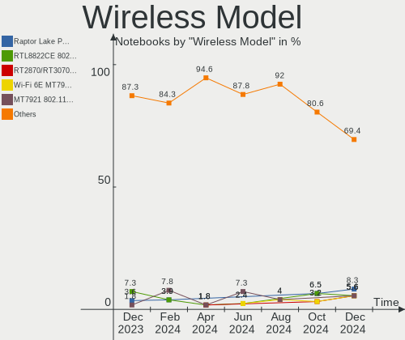

| Model                                                      | Notebooks | Percent |
|------------------------------------------------------------|-----------|---------|
| Qualcomm Atheros QCA9565 / AR9565 Wireless Network Adapter | 4         | 11.43%  |
| Realtek RTL8822BE 802.11a/b/g/n/ac WiFi adapter            | 3         | 8.57%   |
| Intel Wireless 8265 / 8275                                 | 2         | 5.71%   |
| Intel Comet Lake PCH CNVi WiFi                             | 2         | 5.71%   |
| Intel Alder Lake-P PCH CNVi WiFi                           | 2         | 5.71%   |
| Broadcom BCM4313 802.11bgn Wireless Network Adapter        | 2         | 5.71%   |
| TP-Link Archer T2U PLUS [RTL8821AU]                        | 1         | 2.86%   |
| Realtek RTL8821CE 802.11ac PCIe Wireless Network Adapter   | 1         | 2.86%   |
| Realtek RTL8723BE PCIe Wireless Network Adapter            | 1         | 2.86%   |
| Realtek RTL8188EE Wireless Network Adapter                 | 1         | 2.86%   |
| Realtek 802.11ac NIC                                       | 1         | 2.86%   |
| Ralink RT2870/RT3070 Wireless Adapter                      | 1         | 2.86%   |
| Ralink RT5390R 802.11bgn PCIe Wireless Network Adapter     | 1         | 2.86%   |
| Ralink RT3290 Wireless 802.11n 1T/1R PCIe                  | 1         | 2.86%   |
| Ralink RT3090 Wireless 802.11n 1T/1R PCIe                  | 1         | 2.86%   |
| Qualcomm Atheros QCA9377 802.11ac Wireless Network Adapter | 1         | 2.86%   |
| Qualcomm Atheros AR9485 Wireless Network Adapter           | 1         | 2.86%   |
| Qualcomm Atheros AR93xx Wireless Network Adapter           | 1         | 2.86%   |
| MediaTek WiFi                                              | 1         | 2.86%   |
| Intel Wireless 7265                                        | 1         | 2.86%   |
| Intel Wireless 7260                                        | 1         | 2.86%   |
| Intel PRO/Wireless 5100 AGN [Shiloh] Network Connection    | 1         | 2.86%   |
| Intel Gemini Lake PCH CNVi WiFi                            | 1         | 2.86%   |
| Intel Dual Band Wireless-AC 3165 Plus Bluetooth            | 1         | 2.86%   |
| Intel Centrino Advanced-N 6200                             | 1         | 2.86%   |
| Broadcom BCM43142 802.11b/g/n                              | 1         | 2.86%   |

Ethernet Vendor
---------------

Ethernet vendors

| Vendor                     | Notebooks | Percent |
|----------------------------|-----------|---------|
| Realtek Semiconductor      | 17        | 65.38%  |
| Intel                      | 5         | 19.23%  |
| Qualcomm Atheros           | 2         | 7.69%   |
| ZTE WCDMA Technologies MSM | 1         | 3.85%   |
| Qualcomm                   | 1         | 3.85%   |

Ethernet Model
--------------

Ethernet models

| Model                                                             | Notebooks | Percent |
|-------------------------------------------------------------------|-----------|---------|
| Realtek RTL8111/8168/8411 PCI Express Gigabit Ethernet Controller | 11        | 42.31%  |
| Realtek RTL810xE PCI Express Fast Ethernet controller             | 5         | 19.23%  |
| Intel Ethernet Connection (4) I219-LM                             | 2         | 7.69%   |
| ZTE WCDMA MSM ZTE WCDMA MSM                                       | 1         | 3.85%   |
| Realtek RTL8153 Gigabit Ethernet Adapter                          | 1         | 3.85%   |
| Qualcomm Mobile Router                                            | 1         | 3.85%   |
| Qualcomm Atheros QCA8172 Fast Ethernet                            | 1         | 3.85%   |
| Qualcomm Atheros QCA8171 Gigabit Ethernet                         | 1         | 3.85%   |
| Intel Ethernet Connection I217-LM                                 | 1         | 3.85%   |
| Intel 82579LM Gigabit Network Connection (Lewisville)             | 1         | 3.85%   |
| Intel 82567LM Gigabit Network Connection                          | 1         | 3.85%   |

Net Controller Kind
-------------------

Ethernet, WiFi or modem

| Kind     | Notebooks | Percent |
|----------|-----------|---------|
| WiFi     | 31        | 54.39%  |
| Ethernet | 24        | 42.11%  |
| Modem    | 2         | 3.51%   |

Used Controller
---------------

Currently used network controller

| Kind     | Notebooks | Percent |
|----------|-----------|---------|
| WiFi     | 24        | 75%     |
| Ethernet | 8         | 25%     |

NICs
----

Total network controllers on board

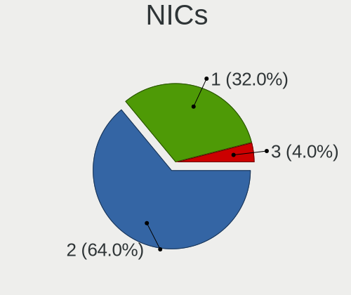

| Total | Notebooks | Percent |
|-------|-----------|---------|
| 2     | 22        | 70.97%  |
| 1     | 7         | 22.58%  |
| 3     | 1         | 3.23%   |
| 0     | 1         | 3.23%   |

IPv6
----

IPv6 vs IPv4

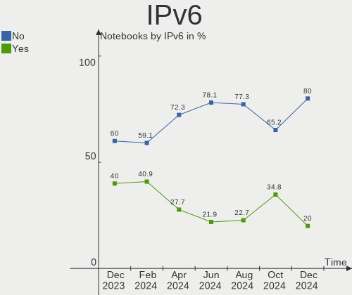

| Used | Notebooks | Percent |
|------|-----------|---------|
| No   | 20        | 64.52%  |
| Yes  | 11        | 35.48%  |

Bluetooth
---------

Bluetooth Vendor
----------------

Controller vendors

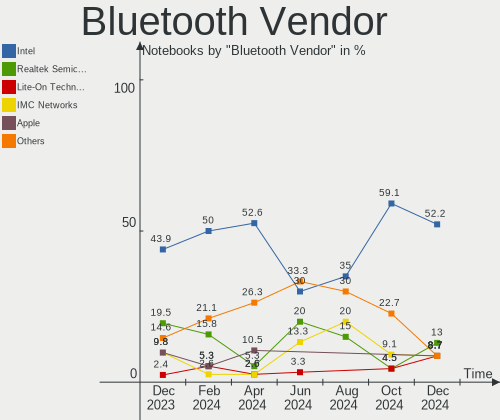

| Vendor                          | Notebooks | Percent |
|---------------------------------|-----------|---------|
| Intel                           | 10        | 37.04%  |
| Realtek Semiconductor           | 6         | 22.22%  |
| Lite-On Technology              | 3         | 11.11%  |
| Qualcomm Atheros Communications | 2         | 7.41%   |
| IMC Networks                    | 2         | 7.41%   |
| Ralink                          | 1         | 3.7%    |
| Hewlett-Packard                 | 1         | 3.7%    |
| Foxconn International           | 1         | 3.7%    |
| Broadcom                        | 1         | 3.7%    |

Bluetooth Model
---------------

Controller models

| Model                                              | Notebooks | Percent |
|----------------------------------------------------|-----------|---------|
| Intel Bluetooth wireless interface                 | 5         | 18.52%  |
| Realtek Bluetooth Radio                            | 3         | 11.11%  |
| Realtek  Bluetooth 4.2 Adapter                     | 2         | 7.41%   |
| Lite-On Atheros AR3012 Bluetooth                   | 2         | 7.41%   |
| Intel Bluetooth Device                             | 2         | 7.41%   |
| Intel AX201 Bluetooth                              | 2         | 7.41%   |
| Realtek RTL8822BE Bluetooth 4.2 Adapter            | 1         | 3.7%    |
| Ralink RT3290 Bluetooth                            | 1         | 3.7%    |
| Qualcomm Atheros  Bluetooth Device                 | 1         | 3.7%    |
| Qualcomm Atheros AR9462 Bluetooth                  | 1         | 3.7%    |
| Lite-On Bluetooth Device                           | 1         | 3.7%    |
| Intel Bluetooth 9460/9560 Jefferson Peak (JfP)     | 1         | 3.7%    |
| IMC Networks Bluetooth USB Host Controller         | 1         | 3.7%    |
| IMC Networks Bluetooth Radio                       | 1         | 3.7%    |
| HP Broadcom 2070 Bluetooth Combo                   | 1         | 3.7%    |
| Foxconn International BCM43142A0 Bluetooth module  | 1         | 3.7%    |
| Broadcom BCM2045B (BDC-2.1) [Bluetooth Controller] | 1         | 3.7%    |

Sound
-----

Sound Vendor
------------

Sound card vendors

| Vendor | Notebooks | Percent |
|--------|-----------|---------|
| Intel  | 29        | 85.29%  |
| Nvidia | 3         | 8.82%   |
| AMD    | 2         | 5.88%   |

Sound Model
-----------

Sound card models

| Model                                                                                             | Notebooks | Percent |
|---------------------------------------------------------------------------------------------------|-----------|---------|
| Intel Sunrise Point-LP HD Audio                                                                   | 5         | 12.5%   |
| Intel 7 Series/C216 Chipset Family High Definition Audio Controller                               | 4         | 10%     |
| Nvidia TU106 High Definition Audio Controller                                                     | 2         | 5%      |
| Intel Xeon E3-1200 v3/4th Gen Core Processor HD Audio Controller                                  | 2         | 5%      |
| Intel Haswell-ULT HD Audio Controller                                                             | 2         | 5%      |
| Intel Comet Lake PCH cAVS                                                                         | 2         | 5%      |
| Intel Cannon Point-LP High Definition Audio Controller                                            | 2         | 5%      |
| Intel Alder Lake PCH-P High Definition Audio Controller                                           | 2         | 5%      |
| Intel 82801I (ICH9 Family) HD Audio Controller                                                    | 2         | 5%      |
| Intel 8 Series/C220 Series Chipset High Definition Audio Controller                               | 2         | 5%      |
| Intel 8 Series HD Audio Controller                                                                | 2         | 5%      |
| Intel 6 Series/C200 Series Chipset Family High Definition Audio Controller                        | 2         | 5%      |
| Nvidia GK104 HDMI Audio Controller                                                                | 1         | 2.5%    |
| Intel Tiger Lake-LP Smart Sound Technology Audio Controller                                       | 1         | 2.5%    |
| Intel Celeron/Pentium Silver Processor High Definition Audio                                      | 1         | 2.5%    |
| Intel Celeron N3350/Pentium N4200/Atom E3900 Series Audio Cluster                                 | 1         | 2.5%    |
| Intel Atom/Celeron/Pentium Processor x5-E8000/J3xxx/N3xxx Series High Definition Audio Controller | 1         | 2.5%    |
| Intel Atom Processor Z36xxx/Z37xxx Series High Definition Audio Controller                        | 1         | 2.5%    |
| Intel 5 Series/3400 Series Chipset High Definition Audio                                          | 1         | 2.5%    |
| AMD Raven/Raven2/Fenghuang HDMI/DP Audio Controller                                               | 1         | 2.5%    |
| AMD Kabini HDMI/DP Audio                                                                          | 1         | 2.5%    |
| AMD FCH Azalia Controller                                                                         | 1         | 2.5%    |
| AMD Family 17h/19h HD Audio Controller                                                            | 1         | 2.5%    |

Memory
------

Memory Vendor
-------------

Memory module vendors

| Vendor              | Notebooks | Percent |
|---------------------|-----------|---------|
| Samsung Electronics | 11        | 31.43%  |
| SK hynix            | 10        | 28.57%  |
| Micron Technology   | 4         | 11.43%  |
| Unknown             | 2         | 5.71%   |
| Kingston            | 2         | 5.71%   |
| Transcend           | 1         | 2.86%   |
| PNY                 | 1         | 2.86%   |
| Elpida              | 1         | 2.86%   |
| Crucial             | 1         | 2.86%   |
| Avant               | 1         | 2.86%   |
| Apacer              | 1         | 2.86%   |

Memory Model
------------

Memory module models

| Model                                                     | Notebooks | Percent |
|-----------------------------------------------------------|-----------|---------|
| SK hynix RAM HMA851S6AFR6N-UH 4GB SODIMM DDR4 2667MT/s    | 3         | 8.33%   |
| Samsung RAM M471B5173DB0-YK0 4GB SODIMM DDR3 1600MT/s     | 3         | 8.33%   |
| SK hynix RAM HMA81GS6AFR8N-UH 8192MB SODIMM DDR4 2667MT/s | 2         | 5.56%   |
| Samsung RAM M471B1G73QH0-YK0 8192MB SODIMM DDR3 1600MT/s  | 2         | 5.56%   |
| Unknown RAM Module 8GB SODIMM DDR3 800MT/s                | 1         | 2.78%   |
| Unknown RAM Module 4GB SODIMM DDR3 1866MT/s               | 1         | 2.78%   |
| Transcend RAM JM1333KSN-2G 2GB SODIMM DDR3 1333MT/s       | 1         | 2.78%   |
| SK hynix RAM HMT451S6BFR8A-PB 4GB SODIMM DDR3 1600MT/s    | 1         | 2.78%   |
| SK hynix RAM HMT351S6BFR8C-H9 4GB SODIMM DDR3 1333MT/s    | 1         | 2.78%   |
| SK hynix RAM HMT125S6TFR8C-H9 2GB SODIMM DDR3 1334MT/s    | 1         | 2.78%   |
| SK hynix RAM HMA851S6CJR6N-VK 4GB SODIMM DDR4 2667MT/s    | 1         | 2.78%   |
| SK hynix RAM H9HCNNN8KUMLHR-NME 1GB LPDDR4 2400MT/s       | 1         | 2.78%   |
| Samsung RAM M471B5773CHS-CF8 2GB SODIMM DDR3 1067MT/s     | 1         | 2.78%   |
| Samsung RAM M471B5673FH0-CH9 2GB SODIMM DDR3 1334MT/s     | 1         | 2.78%   |
| Samsung RAM M471A5244CB0-CWE 4GB SODIMM DDR4 3200MT/s     | 1         | 2.78%   |
| Samsung RAM M471A2K43DB1-CWE 16GB SODIMM DDR4 3200MT/s    | 1         | 2.78%   |
| Samsung RAM M471A1K43EB1-CWE 8GB SODIMM DDR4 3200MT/s     | 1         | 2.78%   |
| Samsung RAM M471A1G44BB0-CWE 8GB SODIMM DDR4 3200MT/s     | 1         | 2.78%   |
| Samsung RAM K4E6E304EE-EGCF 4GB SODIMM LPDDR3 1867MT/s    | 1         | 2.78%   |
| PNY RAM 8GBU2X04JGGG39-12-K 8GB SODIMM DDR4 2400MT/s      | 1         | 2.78%   |
| Micron RAM 8KTF51264HZ-1G6D1 4GB SODIMM DDR3 1600MT/s     | 1         | 2.78%   |
| Micron RAM 8JSF25664HZ-1G4D1 2GB SODIMM DDR3 1334MT/s     | 1         | 2.78%   |
| Micron RAM 16KTF51264HZ-1G6M1 4GB SODIMM DDR3 1600MT/s    | 1         | 2.78%   |
| Micron RAM 16ATF1G64HZ-2G1B1 8GB SODIMM DDR4 2133MT/s     | 1         | 2.78%   |
| Kingston RAM KKRVFX-MIE 8192MB SODIMM DDR4 3200MT/s       | 1         | 2.78%   |
| Kingston RAM KHX2666C15S4/8G 8GB SODIMM DDR4 2667MT/s     | 1         | 2.78%   |
| Elpida RAM EBJ40UG8EFU0-GN-F 4GB SODIMM DDR3 1600MT/s     | 1         | 2.78%   |
| Crucial RAM CT8G4SFRA32A.C8FR 8GB SODIMM DDR4 3200MT/s    | 1         | 2.78%   |
| Avant RAM H6456U64F9333G 2GB SODIMM DDR3 1066MT/s         | 1         | 2.78%   |
| Apacer RAM 76.B305G.D500B 4GB SODIMM DDR4 2400MT/s        | 1         | 2.78%   |

Memory Kind
-----------

Memory module kinds

| Kind   | Notebooks | Percent |
|--------|-----------|---------|
| DDR3   | 12        | 44.44%  |
| DDR4   | 10        | 37.04%  |
| LPDDR4 | 4         | 14.81%  |
| LPDDR3 | 1         | 3.7%    |

Memory Form Factor
------------------

Physical design of the memory module

| Name    | Notebooks | Percent |
|---------|-----------|---------|
| SODIMM  | 24        | 96%     |
| Unknown | 1         | 4%      |

Memory Size
-----------

Memory module size

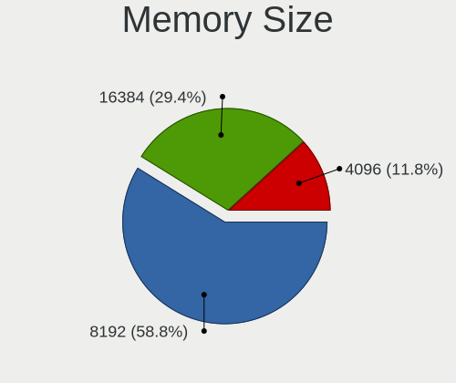

| Size  | Notebooks | Percent |
|-------|-----------|---------|
| 8192  | 12        | 41.38%  |
| 4096  | 11        | 37.93%  |
| 2048  | 4         | 13.79%  |
| 16384 | 1         | 3.45%   |
| 1024  | 1         | 3.45%   |

Memory Speed
------------

Memory module speed

| Speed | Notebooks | Percent |
|-------|-----------|---------|
| 2667  | 9         | 28.13%  |
| 1600  | 6         | 18.75%  |
| 3200  | 4         | 12.5%   |
| 2400  | 3         | 9.38%   |
| 1334  | 3         | 9.38%   |
| 2133  | 1         | 3.13%   |
| 1867  | 1         | 3.13%   |
| 1866  | 1         | 3.13%   |
| 1333  | 1         | 3.13%   |
| 1067  | 1         | 3.13%   |
| 1066  | 1         | 3.13%   |
| 800   | 1         | 3.13%   |

Printers & scanners
-------------------

Printer Vendor
--------------

Printer device vendors

Zero info for selected period =(

Printer Model
-------------

Printer device models

Zero info for selected period =(

Scanner Vendor
--------------

Scanner device vendors

Zero info for selected period =(

Scanner Model
-------------

Scanner device models

Zero info for selected period =(

Camera
------

Camera Vendor
-------------

Camera device vendors

| Vendor                                 | Notebooks | Percent |
|----------------------------------------|-----------|---------|
| Chicony Electronics                    | 7         | 25.93%  |
| Sunplus Innovation Technology          | 3         | 11.11%  |
| Syntek                                 | 2         | 7.41%   |
| Realtek Semiconductor                  | 2         | 7.41%   |
| Quanta                                 | 2         | 7.41%   |
| Microdia                               | 2         | 7.41%   |
| Lite-On Technology                     | 2         | 7.41%   |
| IMC Networks                           | 2         | 7.41%   |
| Suyin                                  | 1         | 3.7%    |
| GEMBIRD                                | 1         | 3.7%    |
| Cheng Uei Precision Industry (Foxlink) | 1         | 3.7%    |
| Apple                                  | 1         | 3.7%    |
| Acer                                   | 1         | 3.7%    |

Camera Model
------------

Camera device models

| Model                                                   | Notebooks | Percent |
|---------------------------------------------------------|-----------|---------|
| Syntek Integrated Camera                                | 2         | 7.41%   |
| Microdia Integrated_Webcam_HD                           | 2         | 7.41%   |
| Chicony HD WebCam                                       | 2         | 7.41%   |
| Suyin HP TrueVision HD Integrated Webcam                | 1         | 3.7%    |
| Sunplus Lenovo EasyCamera                               | 1         | 3.7%    |
| Sunplus Laptop_Integrated_Webcam_FHD                    | 1         | 3.7%    |
| Sunplus HP HD Webcam [Fixed]                            | 1         | 3.7%    |
| Realtek USB Camera                                      | 1         | 3.7%    |
| Realtek Integrated Webcam_HD                            | 1         | 3.7%    |
| Quanta USB2.0 HD UVC WebCam                             | 1         | 3.7%    |
| Quanta HD User Facing                                   | 1         | 3.7%    |
| Lite-On HP TrueVision HD Camera                         | 1         | 3.7%    |
| Lite-On HP HD Webcam                                    | 1         | 3.7%    |
| IMC Networks USB2.0 VGA UVC WebCam                      | 1         | 3.7%    |
| IMC Networks USB2.0 HD UVC WebCam                       | 1         | 3.7%    |
| GEMBIRD Generic UVC 1.00 camera [AppoTech AX2311]       | 1         | 3.7%    |
| Chicony VGA Webcam                                      | 1         | 3.7%    |
| Chicony HP Webcam                                       | 1         | 3.7%    |
| Chicony HP Truevision HD camera                         | 1         | 3.7%    |
| Chicony HP Truevision HD                                | 1         | 3.7%    |
| Chicony ACER HD User Facing                             | 1         | 3.7%    |
| Cheng Uei Precision Industry (Foxlink) HP Truevision HD | 1         | 3.7%    |
| Apple iPhone5/5C/5S/6                                   | 1         | 3.7%    |
| Acer Lenovo Integrated Webcam                           | 1         | 3.7%    |

Security
--------

Fingerprint Vendor
------------------

Fingerprint sensor vendors

| Vendor                | Notebooks | Percent |
|-----------------------|-----------|---------|
| Validity Sensors      | 1         | 25%     |
| Upek                  | 1         | 25%     |
| LighTuning Technology | 1         | 25%     |
| AuthenTec             | 1         | 25%     |

Fingerprint Model
-----------------

Fingerprint sensor models

| Model                                                  | Notebooks | Percent |
|--------------------------------------------------------|-----------|---------|
| Validity Sensors VFS451 Fingerprint Reader             | 1         | 25%     |
| Upek Biometric Touchchip/Touchstrip Fingerprint Sensor | 1         | 25%     |
| LighTuning EgisTec Touch Fingerprint Sensor            | 1         | 25%     |
| AuthenTec AES2810                                      | 1         | 25%     |

Chipcard Vendor
---------------

Chipcard module vendors

| Vendor   | Notebooks | Percent |
|----------|-----------|---------|
| Broadcom | 2         | 100%    |

Chipcard Model
--------------

Chipcard module models

| Model                                                                        | Notebooks | Percent |
|------------------------------------------------------------------------------|-----------|---------|
| Broadcom BCM5880 Secure Applications Processor with fingerprint swipe sensor | 1         | 50%     |
| Broadcom 5880                                                                | 1         | 50%     |

Unsupported
-----------

Unsupported Devices
-------------------

Total unsupported devices on board

| Total | Notebooks | Percent |
|-------|-----------|---------|
| 0     | 23        | 74.19%  |
| 1     | 8         | 25.81%  |

Unsupported Device Types
------------------------

Types of unsupported devices

| Type               | Notebooks | Percent |
|--------------------|-----------|---------|
| Fingerprint reader | 4         | 50%     |
| Chipcard           | 2         | 25%     |
| Camera             | 1         | 12.5%   |
| Bluetooth          | 1         | 12.5%   |

