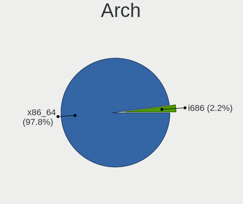
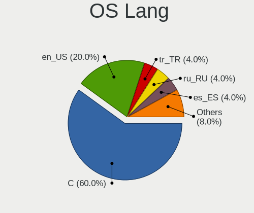
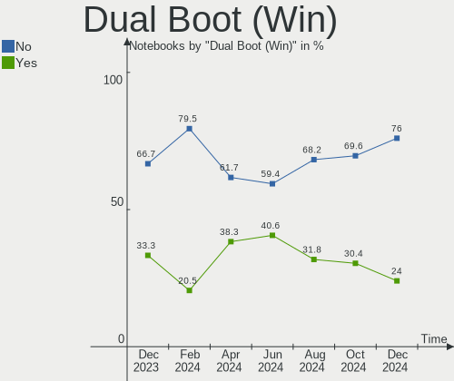
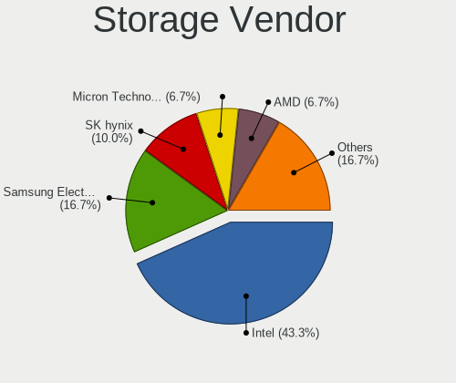
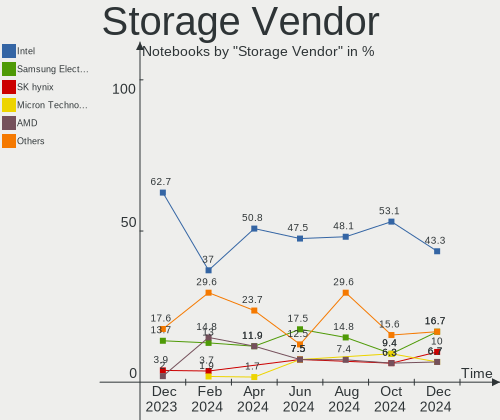

Kali - Hardware Trends (Notebooks)
----------------------------------

A project to identify most popular hardware characteristics and track their change
over time based on data collected by Linux users at https://Linux-Hardware.org.

Anyone can contribute to this report by the [hw-probe](https://github.com/linuxhw/hw-probe) tool:

    sudo -E hw-probe -all -upload

This report is for one last month. Overall report since the beginning of time: [TestDays](https://github.com/linuxhw/TestDays)

Period: Apr, 2024.

Contents
--------

* [ System ](#system)
  - [ OS                       ](#os)
  - [ OS Family                ](#os-family)
  - [ Kernel                   ](#kernel)
  - [ Kernel Family            ](#kernel-family)
  - [ Kernel Major Ver.        ](#kernel-major-ver)
  - [ Arch                     ](#arch)
  - [ DE                       ](#de)
  - [ Display Server           ](#display-server)
  - [ Display Manager          ](#display-manager)
  - [ OS Lang                  ](#os-lang)
  - [ Boot Mode                ](#boot-mode)
  - [ Filesystem               ](#filesystem)
  - [ Part. scheme             ](#part-scheme)
  - [ Dual Boot with Linux/BSD ](#dual-boot-with-linuxbsd)
  - [ Dual Boot (Win)          ](#dual-boot-win)

* [ Board ](#board)
  - [ Vendor                   ](#vendor)
  - [ Model                    ](#model)
  - [ Model Family             ](#model-family)
  - [ MFG Year                 ](#mfg-year)
  - [ Form Factor              ](#form-factor)
  - [ Secure Boot              ](#secure-boot)
  - [ Coreboot                 ](#coreboot)
  - [ RAM Size                 ](#ram-size)
  - [ RAM Used                 ](#ram-used)
  - [ Total Drives             ](#total-drives)
  - [ Has CD-ROM               ](#has-cd-rom)
  - [ Has Ethernet             ](#has-ethernet)
  - [ Has WiFi                 ](#has-wifi)
  - [ Has Bluetooth            ](#has-bluetooth)

* [ Location ](#location)
  - [ Country                  ](#country)
  - [ City                     ](#city)

* [ Drives ](#drives)
  - [ Drive Vendor             ](#drive-vendor)
  - [ Drive Model              ](#drive-model)
  - [ HDD Vendor               ](#hdd-vendor)
  - [ SSD Vendor               ](#ssd-vendor)
  - [ Drive Kind               ](#drive-kind)
  - [ Drive Connector          ](#drive-connector)
  - [ Drive Size               ](#drive-size)
  - [ Space Total              ](#space-total)
  - [ Space Used               ](#space-used)
  - [ Malfunc. Drives          ](#malfunc-drives)
  - [ Malfunc. Drive Vendor    ](#malfunc-drive-vendor)
  - [ Malfunc. HDD Vendor      ](#malfunc-hdd-vendor)
  - [ Malfunc. Drive Kind      ](#malfunc-drive-kind)
  - [ Failed Drives            ](#failed-drives)
  - [ Failed Drive Vendor      ](#failed-drive-vendor)
  - [ Drive Status             ](#drive-status)

* [ Storage controller ](#storage-controller)
  - [ Storage Vendor           ](#storage-vendor)
  - [ Storage Model            ](#storage-model)
  - [ Storage Kind             ](#storage-kind)

* [ Processor ](#processor)
  - [ CPU Vendor               ](#cpu-vendor)
  - [ CPU Model                ](#cpu-model)
  - [ CPU Model Family         ](#cpu-model-family)
  - [ CPU Cores                ](#cpu-cores)
  - [ CPU Sockets              ](#cpu-sockets)
  - [ CPU Threads              ](#cpu-threads)
  - [ CPU Op-Modes             ](#cpu-op-modes)
  - [ CPU Microcode            ](#cpu-microcode)
  - [ CPU Microarch            ](#cpu-microarch)

* [ Graphics ](#graphics)
  - [ GPU Vendor               ](#gpu-vendor)
  - [ GPU Model                ](#gpu-model)
  - [ GPU Combo                ](#gpu-combo)
  - [ GPU Driver               ](#gpu-driver)
  - [ GPU Memory               ](#gpu-memory)

* [ Monitor ](#monitor)
  - [ Monitor Vendor           ](#monitor-vendor)
  - [ Monitor Model            ](#monitor-model)
  - [ Monitor Resolution       ](#monitor-resolution)
  - [ Monitor Diagonal         ](#monitor-diagonal)
  - [ Monitor Width            ](#monitor-width)
  - [ Aspect Ratio             ](#aspect-ratio)
  - [ Monitor Area             ](#monitor-area)
  - [ Pixel Density            ](#pixel-density)
  - [ Multiple Monitors        ](#multiple-monitors)

* [ Network ](#network)
  - [ Net Controller Vendor    ](#net-controller-vendor)
  - [ Net Controller Model     ](#net-controller-model)
  - [ Wireless Vendor          ](#wireless-vendor)
  - [ Wireless Model           ](#wireless-model)
  - [ Ethernet Vendor          ](#ethernet-vendor)
  - [ Ethernet Model           ](#ethernet-model)
  - [ Net Controller Kind      ](#net-controller-kind)
  - [ Used Controller          ](#used-controller)
  - [ NICs                     ](#nics)
  - [ IPv6                     ](#ipv6)

* [ Bluetooth ](#bluetooth)
  - [ Bluetooth Vendor         ](#bluetooth-vendor)
  - [ Bluetooth Model          ](#bluetooth-model)

* [ Sound ](#sound)
  - [ Sound Vendor             ](#sound-vendor)
  - [ Sound Model              ](#sound-model)

* [ Memory ](#memory)
  - [ Memory Vendor            ](#memory-vendor)
  - [ Memory Model             ](#memory-model)
  - [ Memory Kind              ](#memory-kind)
  - [ Memory Form Factor       ](#memory-form-factor)
  - [ Memory Size              ](#memory-size)
  - [ Memory Speed             ](#memory-speed)

* [ Printers & scanners ](#printers--scanners)
  - [ Printer Vendor           ](#printer-vendor)
  - [ Printer Model            ](#printer-model)
  - [ Scanner Vendor           ](#scanner-vendor)
  - [ Scanner Model            ](#scanner-model)

* [ Camera ](#camera)
  - [ Camera Vendor            ](#camera-vendor)
  - [ Camera Model             ](#camera-model)

* [ Security ](#security)
  - [ Fingerprint Vendor       ](#fingerprint-vendor)
  - [ Fingerprint Model        ](#fingerprint-model)
  - [ Chipcard Vendor          ](#chipcard-vendor)
  - [ Chipcard Model           ](#chipcard-model)

* [ Unsupported ](#unsupported)
  - [ Unsupported Devices      ](#unsupported-devices)
  - [ Unsupported Device Types ](#unsupported-device-types)

System
------

OS
--

Installed operating systems

| Name         | Notebooks | Percent |
|--------------|-----------|---------|
| Kali 2024.1  | 42        | 89.36%  |
| Kali 2023.3  | 2         | 4.26%   |
| Kali Rolling | 1         | 2.13%   |
| Kali 2023.1  | 1         | 2.13%   |
| Kali 2021.3  | 1         | 2.13%   |

OS Family
---------

OS without a version

| Name | Notebooks | Percent |
|------|-----------|---------|
| Kali | 47        | 100%    |

Kernel
------

Version of the Linux kernel

| Version            | Notebooks | Percent |
|--------------------|-----------|---------|
| 6.6.9-amd64        | 25        | 53.19%  |
| 6.6.15-amd64       | 14        | 29.79%  |
| 6.3.0-kali1-amd64  | 2         | 4.26%   |
| 6.9.0-rc3-sof+     | 1         | 2.13%   |
| 6.8.7-t2           | 1         | 2.13%   |
| 6.5.0-kali3-amd64  | 1         | 2.13%   |
| 6.0.0-kali6-amd64  | 1         | 2.13%   |
| 5.15.0-kali3-amd64 | 1         | 2.13%   |
| 5.14.0-kali2-amd64 | 1         | 2.13%   |

Kernel Family
-------------

Linux kernel without a distro release

| Version | Notebooks | Percent |
|---------|-----------|---------|
| 6.6.9   | 25        | 53.19%  |
| 6.6.15  | 14        | 29.79%  |
| 6.3.0   | 2         | 4.26%   |
| 6.9.0   | 1         | 2.13%   |
| 6.8.7   | 1         | 2.13%   |
| 6.5.0   | 1         | 2.13%   |
| 6.0.0   | 1         | 2.13%   |
| 5.15.0  | 1         | 2.13%   |
| 5.14.0  | 1         | 2.13%   |

Kernel Major Ver.
-----------------

Linux kernel major version

| Version | Notebooks | Percent |
|---------|-----------|---------|
| 6.6     | 39        | 82.98%  |
| 6.3     | 2         | 4.26%   |
| 6.9     | 1         | 2.13%   |
| 6.8     | 1         | 2.13%   |
| 6.5     | 1         | 2.13%   |
| 6.0     | 1         | 2.13%   |
| 5.15    | 1         | 2.13%   |
| 5.14    | 1         | 2.13%   |

Arch
----

OS architecture (x86_64, i586, etc.)

| Name   | Notebooks | Percent |
|--------|-----------|---------|
| x86_64 | 47        | 100%    |

DE
--

Desktop Environment

| Name          | Notebooks | Percent |
|---------------|-----------|---------|
| XFCE          | 27        | 57.45%  |
| GNOME         | 12        | 25.53%  |
| KDE5          | 6         | 12.77%  |
| GNOME-Classic | 1         | 2.13%   |
| Unknown       | 1         | 2.13%   |

Display Server
--------------

X11 or Wayland

| Name    | Notebooks | Percent |
|---------|-----------|---------|
| X11     | 41        | 87.23%  |
| Wayland | 6         | 12.77%  |

Display Manager
---------------

SDDM, LightDM, etc.

| Name    | Notebooks | Percent |
|---------|-----------|---------|
| LightDM | 24        | 51.06%  |
| Unknown | 10        | 21.28%  |
| GDM3    | 7         | 14.89%  |
| SDDM    | 6         | 12.77%  |

OS Lang
-------

Language

| Lang    | Notebooks | Percent |
|---------|-----------|---------|
| C       | 30        | 63.83%  |
| en_US   | 7         | 14.89%  |
| es_MX   | 2         | 4.26%   |
| en_GB   | 2         | 4.26%   |
| vi_VN   | 1         | 2.13%   |
| ru_RU   | 1         | 2.13%   |
| en_NG   | 1         | 2.13%   |
| en_AU   | 1         | 2.13%   |
| de_DE   | 1         | 2.13%   |
| Unknown | 1         | 2.13%   |

Boot Mode
---------

EFI or BIOS

| Mode | Notebooks | Percent |
|------|-----------|---------|
| EFI  | 33        | 70.21%  |
| BIOS | 14        | 29.79%  |

Filesystem
----------

Type of filesystem

| Type    | Notebooks | Percent |
|---------|-----------|---------|
| Ext4    | 43        | 91.49%  |
| Overlay | 3         | 6.38%   |
| Ext2    | 1         | 2.13%   |

Part. scheme
------------

Scheme of partitioning

| Type    | Notebooks | Percent |
|---------|-----------|---------|
| GPT     | 29        | 61.7%   |
| MBR     | 9         | 19.15%  |
| Unknown | 9         | 19.15%  |

Dual Boot with Linux/BSD
------------------------

Hosting more than one Linux/BSD

| Dual boot | Notebooks | Percent |
|-----------|-----------|---------|
| No        | 36        | 76.6%   |
| Yes       | 11        | 23.4%   |

Dual Boot (Win)
---------------

Hosting Linux and Windows

| Dual boot | Notebooks | Percent |
|-----------|-----------|---------|
| No        | 29        | 61.7%   |
| Yes       | 18        | 38.3%   |

Board
-----

Vendor
------

Motherboard manufacturer

| Name             | Notebooks | Percent |
|------------------|-----------|---------|
| Hewlett-Packard  | 13        | 27.66%  |
| Lenovo           | 9         | 19.15%  |
| Dell             | 6         | 12.77%  |
| Apple            | 5         | 10.64%  |
| ASUSTek Computer | 3         | 6.38%   |
| Toshiba          | 2         | 4.26%   |
| MSI              | 2         | 4.26%   |
| Acer             | 2         | 4.26%   |
| Tactus           | 1         | 2.13%   |
| System76         | 1         | 2.13%   |
| HUAWEI           | 1         | 2.13%   |
| Google           | 1         | 2.13%   |
| eMachines        | 1         | 2.13%   |

Model
-----

Motherboard model

| Name                                     | Notebooks | Percent |
|------------------------------------------|-----------|---------|
| Lenovo V15 G2 IJL 82QY                   | 2         | 4.26%   |
| HP EliteBook 840 G1                      | 2         | 4.26%   |
| Apple MacBookPro8,1                      | 2         | 4.26%   |
| Toshiba Satellite C75D-A                 | 1         | 2.13%   |
| Toshiba Satellite C645D                  | 1         | 2.13%   |
| Tactus GeoBook 140                       | 1         | 2.13%   |
| System76 Oryx Pro                        | 1         | 2.13%   |
| MSI Katana GF76 11UD                     | 1         | 2.13%   |
| MSI Katana GF66 12UD                     | 1         | 2.13%   |
| Lenovo ThinkPad X1 Carbon 6th 20KHCTO1WW | 1         | 2.13%   |
| Lenovo ThinkPad T430s 2352CTO            | 1         | 2.13%   |
| Lenovo ThinkPad T430 2349G87             | 1         | 2.13%   |
| Lenovo ThinkPad P14s Gen 1 20S5S01100    | 1         | 2.13%   |
| Lenovo ThinkPad L15 Gen 1 20U70000MX     | 1         | 2.13%   |
| Lenovo IdeaPad 5 14ITL05 82FE            | 1         | 2.13%   |
| Lenovo IdeaPad 3 14ARE05 81W3            | 1         | 2.13%   |
| HUAWEI KLVDZ-WXX9                        | 1         | 2.13%   |
| HP Victus by Gaming Laptop 15-fa0xxx     | 1         | 2.13%   |
| HP ProBook 4540s                         | 1         | 2.13%   |
| HP Pavilion Gaming Laptop 15-cx0xxx      | 1         | 2.13%   |
| HP Pavilion dv5000 (ET805UA#ABA)         | 1         | 2.13%   |
| HP Pavilion 15                           | 1         | 2.13%   |
| HP EliteBook 845 G8 Notebook PC          | 1         | 2.13%   |
| HP EliteBook 840 G8 Notebook PC          | 1         | 2.13%   |
| HP EliteBook 840 G4                      | 1         | 2.13%   |
| HP EliteBook 820 G3                      | 1         | 2.13%   |
| HP Compaq Presario A900                  | 1         | 2.13%   |
| Google Peppy                             | 1         | 2.13%   |
| eMachines eM355                          | 1         | 2.13%   |
| Dell Precision 5750                      | 1         | 2.13%   |
| Dell Latitude E6410                      | 1         | 2.13%   |
| Dell Latitude E6330                      | 1         | 2.13%   |
| Dell Latitude 7280                       | 1         | 2.13%   |
| Dell Inspiron 5555                       | 1         | 2.13%   |
| Dell G5 5590                             | 1         | 2.13%   |
| ASUS X55VD                               | 1         | 2.13%   |
| ASUS X450CA                              | 1         | 2.13%   |
| ASUS N501VW                              | 1         | 2.13%   |
| Apple MacBookPro9,2                      | 1         | 2.13%   |
| Apple MacBookPro16,2                     | 1         | 2.13%   |

Model Family
------------

Motherboard model prefix

| Name               | Notebooks | Percent |
|--------------------|-----------|---------|
| HP EliteBook       | 6         | 12.77%  |
| Lenovo ThinkPad    | 5         | 10.64%  |
| HP Pavilion        | 3         | 6.38%   |
| Dell Latitude      | 3         | 6.38%   |
| Toshiba Satellite  | 2         | 4.26%   |
| MSI Katana         | 2         | 4.26%   |
| Lenovo V15         | 2         | 4.26%   |
| Lenovo IdeaPad     | 2         | 4.26%   |
| Apple MacBookPro8  | 2         | 4.26%   |
| Acer Nitro         | 2         | 4.26%   |
| Tactus GeoBook     | 1         | 2.13%   |
| System76 Oryx      | 1         | 2.13%   |
| HUAWEI KLVDZ-WXX9  | 1         | 2.13%   |
| HP Victus          | 1         | 2.13%   |
| HP ProBook         | 1         | 2.13%   |
| HP Compaq          | 1         | 2.13%   |
| Google Peppy       | 1         | 2.13%   |
| eMachines eM355    | 1         | 2.13%   |
| Dell Precision     | 1         | 2.13%   |
| Dell Inspiron      | 1         | 2.13%   |
| Dell G5            | 1         | 2.13%   |
| ASUS X55VD         | 1         | 2.13%   |
| ASUS X450CA        | 1         | 2.13%   |
| ASUS N501VW        | 1         | 2.13%   |
| Apple MacBookPro9  | 1         | 2.13%   |
| Apple MacBookPro16 | 1         | 2.13%   |
| Apple MacBookPro12 | 1         | 2.13%   |
| Unknown            | 1         | 2.13%   |

MFG Year
--------

Motherboard manufacture year

| Year | Notebooks | Percent |
|------|-----------|---------|
| 2021 | 9         | 19.15%  |
| 2012 | 6         | 12.77%  |
| 2020 | 5         | 10.64%  |
| 2015 | 5         | 10.64%  |
| 2013 | 5         | 10.64%  |
| 2019 | 3         | 6.38%   |
| 2018 | 3         | 6.38%   |
| 2011 | 3         | 6.38%   |
| 2022 | 2         | 4.26%   |
| 2010 | 2         | 4.26%   |
| 2007 | 2         | 4.26%   |
| 2017 | 1         | 2.13%   |
| 2016 | 1         | 2.13%   |

Form Factor
-----------

Physical design of the computer

| Name     | Notebooks | Percent |
|----------|-----------|---------|
| Notebook | 47        | 100%    |

Secure Boot
-----------

Enabled or disabled

| State    | Notebooks | Percent |
|----------|-----------|---------|
| Disabled | 47        | 100%    |

Coreboot
--------

Have coreboot on board

| Used | Notebooks | Percent |
|------|-----------|---------|
| No   | 46        | 97.87%  |
| Yes  | 1         | 2.13%   |

RAM Size
--------

Total RAM memory

| Size in GB | Notebooks | Percent |
|------------|-----------|---------|
| 4.01-8.0   | 14        | 29.79%  |
| 16.01-24.0 | 10        | 21.28%  |
| 3.01-4.0   | 9         | 19.15%  |
| 8.01-16.0  | 6         | 12.77%  |
| 32.01-64.0 | 4         | 8.51%   |
| 1.01-2.0   | 2         | 4.26%   |
| 24.01-32.0 | 1         | 2.13%   |
| 0.51-1.0   | 1         | 2.13%   |

RAM Used
--------

Used RAM memory

| Used GB  | Notebooks | Percent |
|----------|-----------|---------|
| 3.01-4.0 | 17        | 36.17%  |
| 1.01-2.0 | 10        | 21.28%  |
| 4.01-8.0 | 9         | 19.15%  |
| 2.01-3.0 | 8         | 17.02%  |
| 0.51-1.0 | 2         | 4.26%   |
| 0.01-0.5 | 1         | 2.13%   |

Total Drives
------------

Number of drives on board

| Drives | Notebooks | Percent |
|--------|-----------|---------|
| 1      | 36        | 76.6%   |
| 2      | 10        | 21.28%  |
| 0      | 1         | 2.13%   |

Has CD-ROM
----------

Has CD-ROM on board

| Presented | Notebooks | Percent |
|-----------|-----------|---------|
| No        | 31        | 65.96%  |
| Yes       | 16        | 34.04%  |

Has Ethernet
------------

Has Ethernet on board

| Presented | Notebooks | Percent |
|-----------|-----------|---------|
| Yes       | 38        | 80.85%  |
| No        | 9         | 19.15%  |

Has WiFi
--------

Has WiFi module

| Presented | Notebooks | Percent |
|-----------|-----------|---------|
| Yes       | 45        | 95.74%  |
| No        | 2         | 4.26%   |

Has Bluetooth
-------------

Has Bluetooth module

| Presented | Notebooks | Percent |
|-----------|-----------|---------|
| Yes       | 38        | 80.85%  |
| No        | 9         | 19.15%  |

Location
--------

Country
-------

Geographic location (country)

| Country            | Notebooks | Percent |
|--------------------|-----------|---------|
| USA                | 16        | 34.04%  |
| Mexico             | 5         | 10.64%  |
| UK                 | 2         | 4.26%   |
| Russia             | 2         | 4.26%   |
| Philippines        | 2         | 4.26%   |
| Germany            | 2         | 4.26%   |
| Canada             | 2         | 4.26%   |
| Australia          | 2         | 4.26%   |
| Vietnam            | 1         | 2.13%   |
| Turkey             | 1         | 2.13%   |
| Poland             | 1         | 2.13%   |
| Pakistan           | 1         | 2.13%   |
| Nigeria            | 1         | 2.13%   |
| Netherlands        | 1         | 2.13%   |
| Kenya              | 1         | 2.13%   |
| Hong Kong          | 1         | 2.13%   |
| Egypt              | 1         | 2.13%   |
| Dominican Republic | 1         | 2.13%   |
| Croatia            | 1         | 2.13%   |
| Colombia           | 1         | 2.13%   |
| Bulgaria           | 1         | 2.13%   |
| Azerbaijan         | 1         | 2.13%   |

City
----

Geographic location (city)

| City              | Notebooks | Percent |
|-------------------|-----------|---------|
| Querétaro City   | 2         | 4.26%   |
| Montreal          | 2         | 4.26%   |
| Houston           | 2         | 4.26%   |
| Xalapa            | 1         | 2.13%   |
| Wolverhampton     | 1         | 2.13%   |
| Texarkana         | 1         | 2.13%   |
| Sydney            | 1         | 2.13%   |
| Shau Kei Wan      | 1         | 2.13%   |
| Saratoga          | 1         | 2.13%   |
| Santo Domingo     | 1         | 2.13%   |
| Roosevelt         | 1         | 2.13%   |
| Republic          | 1         | 2.13%   |
| Prescott          | 1         | 2.13%   |
| Plovdiv           | 1         | 2.13%   |
| Phoenix           | 1         | 2.13%   |
| Oroslavje         | 1         | 2.13%   |
| Orlando           | 1         | 2.13%   |
| Nottingham        | 1         | 2.13%   |
| Moscow            | 1         | 2.13%   |
| Miami             | 1         | 2.13%   |
| Medellín         | 1         | 2.13%   |
| Lublin            | 1         | 2.13%   |
| Los Angeles       | 1         | 2.13%   |
| Lahore            | 1         | 2.13%   |
| Lagos             | 1         | 2.13%   |
| Kingsport         | 1         | 2.13%   |
| Istanbul          | 1         | 2.13%   |
| Iligan City       | 1         | 2.13%   |
| Huauchinango      | 1         | 2.13%   |
| Hanoi             | 1         | 2.13%   |
| Hamburg           | 1         | 2.13%   |
| Giza              | 1         | 2.13%   |
| Frankfurt am Main | 1         | 2.13%   |
| Engel's           | 1         | 2.13%   |
| Durham            | 1         | 2.13%   |
| Columbus          | 1         | 2.13%   |
| Clearwater        | 1         | 2.13%   |
| Canton            | 1         | 2.13%   |
| Cagayan de Oro    | 1         | 2.13%   |
| Brisbane          | 1         | 2.13%   |

Drives
------

Drive Vendor
------------

Hard drive vendors

| Vendor                         | Notebooks | Drives | Percent |
|--------------------------------|-----------|--------|---------|
| Toshiba                        | 9         | 10     | 16.36%  |
| Samsung Electronics            | 7         | 7      | 12.73%  |
| Kingston                       | 6         | 6      | 10.91%  |
| WDC                            | 4         | 4      | 7.27%   |
| SanDisk                        | 4         | 4      | 7.27%   |
| Seagate                        | 3         | 3      | 5.45%   |
| Kingston Technology Company    | 2         | 2      | 3.64%   |
| China                          | 2         | 2      | 3.64%   |
| Apple                          | 2         | 2      | 3.64%   |
| USB3.0                         | 1         | 1      | 1.82%   |
| Unknown                        | 1         | 1      | 1.82%   |
| Solid State Storage Technology | 1         | 1      | 1.82%   |
| SK hynix                       | 1         | 1      | 1.82%   |
| PNY                            | 1         | 1      | 1.82%   |
| Netac                          | 1         | 1      | 1.82%   |
| MTFDDAK2                       | 1         | 1      | 1.82%   |
| MSI                            | 1         | 1      | 1.82%   |
| Micron Technology              | 1         | 1      | 1.82%   |
| LITEON                         | 1         | 1      | 1.82%   |
| Intel                          | 1         | 1      | 1.82%   |
| HS-SSD-C100                    | 1         | 1      | 1.82%   |
| Hitachi                        | 1         | 1      | 1.82%   |
| HGST                           | 1         | 1      | 1.82%   |
| Gritronix                      | 1         | 1      | 1.82%   |
| Crucial                        | 1         | 1      | 1.82%   |

Drive Model
-----------

Hard drive models

| Model                                        | Notebooks | Percent |
|----------------------------------------------|-----------|---------|
| WDC WD1600BEVE-00WZT0 160GB                  | 1         | 1.79%   |
| WDC WD10SPSX-75A6WT0 1TB                     | 1         | 1.79%   |
| WDC PC SN530 SDBPMPZ-512G-1101 512GB         | 1         | 1.79%   |
| WDC PC SN530 SDBPMPZ-256G-1101 256GB         | 1         | 1.79%   |
| USB3.0 Super Speed 240GB                     | 1         | 1.79%   |
| Unknown MMC Card  32GB                       | 1         | 1.79%   |
| Toshiba XG6 NVMe SSD Controller 1024GB       | 1         | 1.79%   |
| Toshiba MQ04ABF100 1TB                       | 1         | 1.79%   |
| Toshiba MQ01ACF050 500GB                     | 1         | 1.79%   |
| Toshiba MQ01ABF050 500GB                     | 1         | 1.79%   |
| Toshiba MQ01ABD075 752GB                     | 1         | 1.79%   |
| Toshiba MQ01ABD050V 500GB                    | 1         | 1.79%   |
| Toshiba MK5065GSXF 500GB                     | 1         | 1.79%   |
| Toshiba MK2565GSX 250GB                      | 1         | 1.79%   |
| Toshiba HDWJ105 500GB                        | 1         | 1.79%   |
| Toshiba BG3 NVMe SSD Controller 128GB        | 1         | 1.79%   |
| Solid State Storage SSSTC CL1-4D128 128GB    | 1         | 1.79%   |
| SK hynix SC300 M.2 2280 128GB SSD            | 1         | 1.79%   |
| Seagate ST9500325ASG 500GB                   | 1         | 1.79%   |
| Seagate ST9250311CS 250GB                    | 1         | 1.79%   |
| Seagate ST500LM021-1KJ152 500GB              | 1         | 1.79%   |
| SanDisk Ultra II 500GB SSD                   | 1         | 1.79%   |
| SanDisk SD8SN8U-256G-1006 256GB SSD          | 1         | 1.79%   |
| SanDisk NVMe SSD Drive 512GB                 | 1         | 1.79%   |
| SanDisk NVMe SSD Drive 2TB                   | 1         | 1.79%   |
| Samsung SSD 980 1TB                          | 1         | 1.79%   |
| Samsung SSD 970 EVO Plus 2TB S6S2NS0TC00418Y | 1         | 1.79%   |
| Samsung SSD 860 EVO 1TB                      | 1         | 1.79%   |
| Samsung MZVPV512HDGL-00000 512GB             | 1         | 1.79%   |
| Samsung MZVLB512HBJQ-00000 512GB             | 1         | 1.79%   |
| Samsung MZVLB1T0HBLR-000L7 1TB               | 1         | 1.79%   |
| Samsung MZALQ512HBLU-00BL2 512GB             | 1         | 1.79%   |
| PNY CS900 240GB SSD                          | 1         | 1.79%   |
| Netac SSD 128GB                              | 1         | 1.79%   |
| MTFDDAK2 56MBF-1AN1ZABHA 256GB               | 1         | 1.79%   |
| MSI M450 1TB                                 | 1         | 1.79%   |
| Micron 2450_MTFDKBA512TFK 512GB              | 1         | 1.79%   |
| LITEON CV1-8B256-HP 256GB SSD                | 1         | 1.79%   |
| Kingston Company SNV2S1000G 1TB              | 1         | 1.79%   |
| Kingston Company OM3PDP3 NVMe SSD 512GB      | 1         | 1.79%   |

HDD Vendor
----------

Hard disk drive vendors

| Vendor  | Notebooks | Drives | Percent |
|---------|-----------|--------|---------|
| Toshiba | 8         | 8      | 53.33%  |
| Seagate | 3         | 3      | 20%     |
| WDC     | 2         | 2      | 13.33%  |
| Hitachi | 1         | 1      | 6.67%   |
| HGST    | 1         | 1      | 6.67%   |

SSD Vendor
----------

Solid state drive vendors

| Vendor              | Notebooks | Drives | Percent |
|---------------------|-----------|--------|---------|
| Kingston            | 3         | 3      | 17.65%  |
| SanDisk             | 2         | 2      | 11.76%  |
| China               | 2         | 2      | 11.76%  |
| USB3.0              | 1         | 1      | 5.88%   |
| SK hynix            | 1         | 1      | 5.88%   |
| Samsung Electronics | 1         | 1      | 5.88%   |
| PNY                 | 1         | 1      | 5.88%   |
| Netac               | 1         | 1      | 5.88%   |
| LITEON              | 1         | 1      | 5.88%   |
| Intel               | 1         | 1      | 5.88%   |
| HS-SSD-C100         | 1         | 1      | 5.88%   |
| Gritronix           | 1         | 1      | 5.88%   |
| Apple               | 1         | 1      | 5.88%   |

Drive Kind
----------

HDD or SSD

| Kind    | Notebooks | Drives | Percent |
|---------|-----------|--------|---------|
| NVMe    | 20        | 22     | 38.46%  |
| SSD     | 15        | 17     | 28.85%  |
| HDD     | 15        | 15     | 28.85%  |
| MMC     | 1         | 1      | 1.92%   |
| Unknown | 1         | 1      | 1.92%   |

Drive Connector
---------------

SATA, SAS, NVMe, etc.

| Type | Notebooks | Drives | Percent |
|------|-----------|--------|---------|
| SATA | 28        | 31     | 54.9%   |
| NVMe | 20        | 22     | 39.22%  |
| SAS  | 2         | 2      | 3.92%   |
| MMC  | 1         | 1      | 1.96%   |

Drive Size
----------

Size of hard drive

| Size in TB | Notebooks | Drives | Percent |
|------------|-----------|--------|---------|
| 0.01-0.5   | 23        | 27     | 82.14%  |
| 0.51-1.0   | 5         | 5      | 17.86%  |

Space Total
-----------

Amount of disk space available on the file system

| Size in GB | Notebooks | Percent |
|------------|-----------|---------|
| 101-250    | 16        | 34.04%  |
| 251-500    | 15        | 31.91%  |
| 501-1000   | 4         | 8.51%   |
| 21-50      | 3         | 6.38%   |
| 51-100     | 3         | 6.38%   |
| 1001-2000  | 2         | 4.26%   |
| 1-20       | 2         | 4.26%   |
| 2001-3000  | 1         | 2.13%   |
| Unknown    | 1         | 2.13%   |

Space Used
----------

Amount of used disk space

| Used GB  | Notebooks | Percent |
|----------|-----------|---------|
| 21-50    | 14        | 29.79%  |
| 1-20     | 14        | 29.79%  |
| 101-250  | 7         | 14.89%  |
| 51-100   | 6         | 12.77%  |
| 251-500  | 4         | 8.51%   |
| 501-1000 | 1         | 2.13%   |
| Unknown  | 1         | 2.13%   |

Malfunc. Drives
---------------

Drive models with a malfunction

| Model                           | Notebooks | Drives | Percent |
|---------------------------------|-----------|--------|---------|
| WDC WD1600BEVE-00WZT0 160GB     | 1         | 1      | 12.5%   |
| Toshiba MQ01ABD050V 500GB       | 1         | 1      | 12.5%   |
| Toshiba MK2565GSX 250GB         | 1         | 1      | 12.5%   |
| Seagate ST9500325ASG 500GB      | 1         | 1      | 12.5%   |
| Seagate ST500LM021-1KJ152 500GB | 1         | 1      | 12.5%   |
| Kingston SNS4151S316G 16GB SSD  | 1         | 1      | 12.5%   |
| Hitachi HTS542516K9SA00 160GB   | 1         | 1      | 12.5%   |
| HGST HTS725050A7E630 500GB      | 1         | 1      | 12.5%   |

Malfunc. Drive Vendor
---------------------

Vendors of faulty drives

| Vendor   | Notebooks | Drives | Percent |
|----------|-----------|--------|---------|
| Toshiba  | 2         | 2      | 25%     |
| Seagate  | 2         | 2      | 25%     |
| WDC      | 1         | 1      | 12.5%   |
| Kingston | 1         | 1      | 12.5%   |
| Hitachi  | 1         | 1      | 12.5%   |
| HGST     | 1         | 1      | 12.5%   |

Malfunc. HDD Vendor
-------------------

Vendors of faulty HDD drives

| Vendor  | Notebooks | Drives | Percent |
|---------|-----------|--------|---------|
| Toshiba | 2         | 2      | 28.57%  |
| Seagate | 2         | 2      | 28.57%  |
| WDC     | 1         | 1      | 14.29%  |
| Hitachi | 1         | 1      | 14.29%  |
| HGST    | 1         | 1      | 14.29%  |

Malfunc. Drive Kind
-------------------

Kinds of faulty drives

| Kind | Notebooks | Drives | Percent |
|------|-----------|--------|---------|
| HDD  | 7         | 7      | 87.5%   |
| SSD  | 1         | 1      | 12.5%   |

Failed Drives
-------------

Failed drive models

Zero info for selected period =(

Failed Drive Vendor
-------------------

Failed drive vendors

Zero info for selected period =(

Drive Status
------------

Number of failed and malfunc. drives

| Status   | Notebooks | Drives | Percent |
|----------|-----------|--------|---------|
| Works    | 28        | 30     | 53.85%  |
| Detected | 16        | 18     | 30.77%  |
| Malfunc  | 8         | 8      | 15.38%  |

Storage controller
------------------

Storage Vendor
--------------

Storage controller vendors

| Vendor                         | Notebooks | Percent |
|--------------------------------|-----------|---------|
| Intel                          | 30        | 50.85%  |
| Samsung Electronics            | 7         | 11.86%  |
| AMD                            | 7         | 11.86%  |
| SanDisk                        | 4         | 6.78%   |
| Kingston Technology Company    | 4         | 6.78%   |
| Toshiba America Info Systems   | 2         | 3.39%   |
| Solid State Storage Technology | 1         | 1.69%   |
| Phison Electronics             | 1         | 1.69%   |
| Micron/Crucial Technology      | 1         | 1.69%   |
| Micron Technology              | 1         | 1.69%   |
| Apple                          | 1         | 1.69%   |

Storage Model
-------------

Storage controller models

| Model                                                                          | Notebooks | Percent |
|--------------------------------------------------------------------------------|-----------|---------|
| Intel 7 Series Chipset Family 6-port SATA Controller [AHCI mode]               | 6         | 9.84%   |
| AMD FCH SATA Controller [AHCI mode]                                            | 4         | 6.56%   |
| Samsung NVMe SSD Controller SM981/PM981/PM983                                  | 3         | 4.92%   |
| Intel Sunrise Point-LP SATA Controller [AHCI mode]                             | 3         | 4.92%   |
| Intel Cannon Lake Mobile PCH SATA AHCI Controller                              | 3         | 4.92%   |
| Intel 8 Series SATA Controller 1 [AHCI mode]                                   | 3         | 4.92%   |
| SanDisk PC SN530 NVMe SSD (DRAM-less)                                          | 2         | 3.28%   |
| Samsung NVMe SSD Controller 980 (DRAM-less)                                    | 2         | 3.28%   |
| Kingston Company OM3PDP3 NVMe SSD                                              | 2         | 3.28%   |
| Intel Volume Management Device NVMe RAID Controller                            | 2         | 3.28%   |
| Intel Tiger Lake SATA AHCI Controller                                          | 2         | 3.28%   |
| Intel Jasper Lake SATA AHCI Controller                                         | 2         | 3.28%   |
| Intel 82801 Mobile SATA Controller [RAID mode]                                 | 2         | 3.28%   |
| Intel 6 Series/C200 Series Chipset Family 6 port Mobile SATA AHCI Controller   | 2         | 3.28%   |
| Toshiba America Info Systems XG6 NVMe SSD Controller                           | 1         | 1.64%   |
| Toshiba America Info Systems BG3 x2 NVMe SSD Controller (DRAM-less)            | 1         | 1.64%   |
| Solid State Storage CL1-3D256-Q11 NVMe SSD M.2                                 | 1         | 1.64%   |
| SanDisk WD PC SN810 / Black SN850 NVMe SSD                                     | 1         | 1.64%   |
| Sandisk WD Black SN850X NVMe SSD                                               | 1         | 1.64%   |
| Samsung S4LN058A01[SSUBX] AHCI SSD Controller (Apple slot)                     | 1         | 1.64%   |
| Samsung NVMe SSD Controller SM951/PM951                                        | 1         | 1.64%   |
| Phison PS5019-E19 PCIe4 NVMe Controller (DRAM-less)                            | 1         | 1.64%   |
| Micron/Crucial P2 [Nick P2] / P3 / P3 Plus NVMe PCIe SSD (DRAM-less)           | 1         | 1.64%   |
| Micron 2450 NVMe SSD [HendrixV] (DRAM-less)                                    | 1         | 1.64%   |
| Kingston Company NV2 NVMe SSD SM2267XT (DRAM-less)                             | 1         | 1.64%   |
| Kingston Company KC3000/FURY Renegade NVMe SSD E18                             | 1         | 1.64%   |
| Intel NM10/ICH7 Family SATA Controller [AHCI mode]                             | 1         | 1.64%   |
| Intel HM170/QM170 Chipset SATA Controller [AHCI Mode]                          | 1         | 1.64%   |
| Intel Celeron/Pentium Silver Processor SATA Controller                         | 1         | 1.64%   |
| Intel Alder Lake-P SATA AHCI Controller                                        | 1         | 1.64%   |
| Intel 82801HM/HEM (ICH8M/ICH8M-E) SATA Controller [AHCI mode]                  | 1         | 1.64%   |
| Intel 82801HM/HEM (ICH8M/ICH8M-E) IDE Controller                               | 1         | 1.64%   |
| Intel 8 Series/C220 Series Chipset Family 6-port SATA Controller 1 [AHCI mode] | 1         | 1.64%   |
| Apple ANS2 NVMe Controller                                                     | 1         | 1.64%   |
| AMD SB7x0/SB8x0/SB9x0 SATA Controller [AHCI mode]                              | 1         | 1.64%   |
| AMD IXP SB4x0 IDE Controller                                                   | 1         | 1.64%   |
| AMD FCH SATA Controller [IDE mode]                                             | 1         | 1.64%   |

Storage Kind
------------

Kind of storage controller (IDE, SATA, NVMe, SAS, ...)

| Kind | Notebooks | Percent |
|------|-----------|---------|
| SATA | 34        | 56.67%  |
| NVMe | 20        | 33.33%  |
| RAID | 4         | 6.67%   |
| IDE  | 2         | 3.33%   |

Processor
---------

CPU Vendor
----------

Processor vendors

| Vendor | Notebooks | Percent |
|--------|-----------|---------|
| Intel  | 38        | 80.85%  |
| AMD    | 9         | 19.15%  |

CPU Model
---------

Processor models

| Model                                         | Notebooks | Percent |
|-----------------------------------------------|-----------|---------|
| Intel Core i5-6300U CPU @ 2.40GHz             | 2         | 4.26%   |
| Intel Core i5-4300U CPU @ 1.90GHz             | 2         | 4.26%   |
| Intel Core i5-3210M CPU @ 2.50GHz             | 2         | 4.26%   |
| Intel Core i5-2435M CPU @ 2.40GHz             | 2         | 4.26%   |
| Intel Celeron N4500 @ 1.10GHz                 | 2         | 4.26%   |
| Intel 12th Gen Core i7-12650H                 | 2         | 4.26%   |
| Intel Xeon W-10885M CPU @ 2.40GHz             | 1         | 2.13%   |
| Intel Pentium Dual CPU T2370 @ 1.73GHz        | 1         | 2.13%   |
| Intel Core i7-9750H CPU @ 2.60GHz             | 1         | 2.13%   |
| Intel Core i7-8750H CPU @ 2.20GHz             | 1         | 2.13%   |
| Intel Core i7-8650U CPU @ 1.90GHz             | 1         | 2.13%   |
| Intel Core i7-6700HQ CPU @ 2.60GHz            | 1         | 2.13%   |
| Intel Core i7-1068NG7 CPU @ 2.30GHz           | 1         | 2.13%   |
| Intel Core i7-10610U CPU @ 1.80GHz            | 1         | 2.13%   |
| Intel Core i5-8300H CPU @ 2.30GHz             | 1         | 2.13%   |
| Intel Core i5-7200U CPU @ 2.50GHz             | 1         | 2.13%   |
| Intel Core i5-5287U CPU @ 2.90GHz             | 1         | 2.13%   |
| Intel Core i5-4300M CPU @ 2.60GHz             | 1         | 2.13%   |
| Intel Core i5-3320M CPU @ 2.60GHz             | 1         | 2.13%   |
| Intel Core i3-3217U CPU @ 1.80GHz             | 1         | 2.13%   |
| Intel Core i3-2370M CPU @ 2.40GHz             | 1         | 2.13%   |
| Intel Core i3-2350M CPU @ 2.30GHz             | 1         | 2.13%   |
| Intel Core i3 CPU M 380 @ 2.53GHz             | 1         | 2.13%   |
| Intel Celeron N4020 CPU @ 1.10GHz             | 1         | 2.13%   |
| Intel Celeron CPU 1000M @ 1.80GHz             | 1         | 2.13%   |
| Intel Celeron 2955U @ 1.40GHz                 | 1         | 2.13%   |
| Intel Atom CPU N570 @ 1.66GHz                 | 1         | 2.13%   |
| Intel 11th Gen Core i7-11800H @ 2.30GHz       | 1         | 2.13%   |
| Intel 11th Gen Core i7-1165G7 @ 2.80GHz       | 1         | 2.13%   |
| Intel 11th Gen Core i5-1145G7 @ 2.60GHz       | 1         | 2.13%   |
| Intel 11th Gen Core i5-11400H @ 2.70GHz       | 1         | 2.13%   |
| Intel 11th Gen Core i5-1135G7 @ 2.40GHz       | 1         | 2.13%   |
| AMD V120 Processor                            | 1         | 2.13%   |
| AMD Turion 64 Mobile Technology ML-34         | 1         | 2.13%   |
| AMD Ryzen 7 4700U with Radeon Graphics        | 1         | 2.13%   |
| AMD Ryzen 5 PRO 5650U with Radeon Graphics    | 1         | 2.13%   |
| AMD Ryzen 5 4500U with Radeon Graphics        | 1         | 2.13%   |
| AMD Ryzen 5 3550H with Radeon Vega Mobile Gfx | 1         | 2.13%   |
| AMD A8-7410 APU with AMD Radeon R5 Graphics   | 1         | 2.13%   |
| AMD A6-5200 APU with Radeon HD Graphics       | 1         | 2.13%   |

CPU Model Family
----------------

Processor model prefix

| Model                | Notebooks | Percent |
|----------------------|-----------|---------|
| Intel Core i5        | 13        | 27.66%  |
| Other                | 7         | 14.89%  |
| Intel Core i7        | 6         | 12.77%  |
| Intel Celeron        | 5         | 10.64%  |
| Intel Core i3        | 4         | 8.51%   |
| AMD Ryzen 5          | 2         | 4.26%   |
| Intel Xeon           | 1         | 2.13%   |
| Intel Pentium Dual   | 1         | 2.13%   |
| Intel Atom           | 1         | 2.13%   |
| AMD V120             | 1         | 2.13%   |
| AMD Turion 64 Mobile | 1         | 2.13%   |
| AMD Ryzen 7          | 1         | 2.13%   |
| AMD Ryzen 5 PRO      | 1         | 2.13%   |
| AMD A8               | 1         | 2.13%   |
| AMD A6               | 1         | 2.13%   |
| AMD A10              | 1         | 2.13%   |

CPU Cores
---------

Number of processor cores

| Number | Notebooks | Percent |
|--------|-----------|---------|
| 2      | 24        | 51.06%  |
| 4      | 11        | 23.4%   |
| 6      | 5         | 10.64%  |
| 8      | 3         | 6.38%   |
| 10     | 2         | 4.26%   |
| 1      | 2         | 4.26%   |

CPU Sockets
-----------

Number of sockets

| Number | Notebooks | Percent |
|--------|-----------|---------|
| 1      | 47        | 100%    |

CPU Threads
-----------

Threads per core (Hyper-Threading)

| Number | Notebooks | Percent |
|--------|-----------|---------|
| 2      | 35        | 74.47%  |
| 1      | 12        | 25.53%  |

CPU Op-Modes
------------

CPU Operation Modes (32-bit, 64-bit)

| Op mode        | Notebooks | Percent |
|----------------|-----------|---------|
| 32-bit, 64-bit | 47        | 100%    |

CPU Microcode
-------------

Microcode number

| Number     | Notebooks | Percent |
|------------|-----------|---------|
| Unknown    | 38        | 80.85%  |
| 0x806e9    | 1         | 2.13%   |
| 0x0a50000f | 1         | 2.13%   |
| 0x08600109 | 1         | 2.13%   |
| 0x08600106 | 1         | 2.13%   |
| 0x08108109 | 1         | 2.13%   |
| 0x07030105 | 1         | 2.13%   |
| 0x0700010f | 1         | 2.13%   |
| 0x06001119 | 1         | 2.13%   |
| 0x010000c8 | 1         | 2.13%   |

CPU Microarch
-------------

Microarchitecture

| Name             | Notebooks | Percent |
|------------------|-----------|---------|
| KabyLake         | 6         | 12.77%  |
| IvyBridge        | 5         | 10.64%  |
| SandyBridge      | 4         | 8.51%   |
| Haswell          | 4         | 8.51%   |
| TigerLake        | 3         | 6.38%   |
| Skylake          | 3         | 6.38%   |
| Zen 2            | 2         | 4.26%   |
| Tremont          | 2         | 4.26%   |
| Icelake          | 2         | 4.26%   |
| Alderlake Hybrid | 2         | 4.26%   |
| Zen+             | 1         | 2.13%   |
| Zen 3            | 1         | 2.13%   |
| Westmere         | 1         | 2.13%   |
| Puma             | 1         | 2.13%   |
| Piledriver       | 1         | 2.13%   |
| K8 Hammer        | 1         | 2.13%   |
| K10              | 1         | 2.13%   |
| Jaguar           | 1         | 2.13%   |
| Goldmont plus    | 1         | 2.13%   |
| Core             | 1         | 2.13%   |
| CometLake        | 1         | 2.13%   |
| Broadwell        | 1         | 2.13%   |
| Bonnell          | 1         | 2.13%   |
| Unknown          | 1         | 2.13%   |

Graphics
--------

GPU Vendor
----------

Vendors of graphics cards

| Vendor | Notebooks | Percent |
|--------|-----------|---------|
| Intel  | 38        | 61.29%  |
| Nvidia | 14        | 22.58%  |
| AMD    | 10        | 16.13%  |

GPU Model
---------

Graphics card models

| Model                                                                         | Notebooks | Percent |
|-------------------------------------------------------------------------------|-----------|---------|
| Intel 3rd Gen Core processor Graphics Controller                              | 5         | 7.81%   |
| Intel 2nd Generation Core Processor Family Integrated Graphics Controller     | 4         | 6.25%   |
| Nvidia GA107M [GeForce RTX 3050 Ti Mobile]                                    | 3         | 4.69%   |
| Intel TigerLake-LP GT2 [Iris Xe Graphics]                                     | 3         | 4.69%   |
| Intel Haswell-ULT Integrated Graphics Controller                              | 3         | 4.69%   |
| Intel CoffeeLake-H GT2 [UHD Graphics 630]                                     | 3         | 4.69%   |
| Nvidia TU117M [GeForce GTX 1650 Mobile / Max-Q]                               | 2         | 3.13%   |
| Intel TigerLake-H GT1 [UHD Graphics]                                          | 2         | 3.13%   |
| Intel Skylake GT2 [HD Graphics 520]                                           | 2         | 3.13%   |
| Intel JasperLake [UHD Graphics]                                               | 2         | 3.13%   |
| Intel Alder Lake-P GT1 [UHD Graphics]                                         | 2         | 3.13%   |
| AMD Renoir [Radeon RX Vega 6 (Ryzen 4000/5000 Mobile Series)]                 | 2         | 3.13%   |
| Nvidia TU116M [GeForce GTX 1660 Ti Mobile]                                    | 1         | 1.56%   |
| Nvidia TU106GLM [Quadro RTX 3000 Mobile / Max-Q]                              | 1         | 1.56%   |
| Nvidia TU106 [GeForce RTX 2070]                                               | 1         | 1.56%   |
| Nvidia GP108GLM [Quadro P520]                                                 | 1         | 1.56%   |
| Nvidia GP107M [GeForce GTX 1050 Mobile]                                       | 1         | 1.56%   |
| Nvidia GP106M [GeForce GTX 1060 Mobile]                                       | 1         | 1.56%   |
| Nvidia GM107M [GeForce GTX 960M]                                              | 1         | 1.56%   |
| Nvidia GF119M [GeForce 610M]                                                  | 1         | 1.56%   |
| Nvidia GF117M [GeForce 610M/710M/810M/820M / GT 620M/625M/630M/720M]          | 1         | 1.56%   |
| Intel UHD Graphics 620                                                        | 1         | 1.56%   |
| Intel Mobile GM965/GL960 Integrated Graphics Controller (secondary)           | 1         | 1.56%   |
| Intel Mobile GM965/GL960 Integrated Graphics Controller (primary)             | 1         | 1.56%   |
| Intel Iris Plus Graphics G7                                                   | 1         | 1.56%   |
| Intel Iris Graphics 6100                                                      | 1         | 1.56%   |
| Intel HD Graphics 620                                                         | 1         | 1.56%   |
| Intel HD Graphics 530                                                         | 1         | 1.56%   |
| Intel GeminiLake [UHD Graphics 600]                                           | 1         | 1.56%   |
| Intel Core Processor Integrated Graphics Controller                           | 1         | 1.56%   |
| Intel CometLake-U GT2 [UHD Graphics]                                          | 1         | 1.56%   |
| Intel Coffee Lake-S GT2 [UHD Graphics P630]                                   | 1         | 1.56%   |
| Intel Atom Processor D4xx/D5xx/N4xx/N5xx Integrated Graphics Controller       | 1         | 1.56%   |
| Intel 4th Gen Core Processor Integrated Graphics Controller                   | 1         | 1.56%   |
| AMD Sun XT [Radeon HD 8670A/8670M/8690M / R5 M330 / M430 / Radeon 520 Mobile] | 1         | 1.56%   |
| AMD RS880M [Mobility Radeon HD 4225/4250]                                     | 1         | 1.56%   |
| AMD RS480M [Mobility Radeon Xpress 200]                                       | 1         | 1.56%   |
| AMD Richland [Radeon HD 8610G]                                                | 1         | 1.56%   |
| AMD Picasso/Raven 2 [Radeon Vega Series / Radeon Vega Mobile Series]          | 1         | 1.56%   |
| AMD Mullins [Radeon R4/R5 Graphics]                                           | 1         | 1.56%   |

GPU Combo
---------

Combinations of graphics cards

| Name           | Notebooks | Percent |
|----------------|-----------|---------|
| 1 x Intel      | 23        | 48.94%  |
| Intel + Nvidia | 13        | 27.66%  |
| 1 x AMD        | 7         | 14.89%  |
| 2 x Intel      | 1         | 2.13%   |
| 2 x AMD        | 1         | 2.13%   |
| Intel + AMD    | 1         | 2.13%   |
| AMD + Nvidia   | 1         | 2.13%   |

GPU Driver
----------

Free vs proprietary

| Driver      | Notebooks | Percent |
|-------------|-----------|---------|
| Free        | 43        | 91.49%  |
| Proprietary | 4         | 8.51%   |

GPU Memory
----------

Total video memory

| Size in GB | Notebooks | Percent |
|------------|-----------|---------|
| Unknown    | 32        | 68.09%  |
| 0.01-0.5   | 5         | 10.64%  |
| 3.01-4.0   | 4         | 8.51%   |
| 0.51-1.0   | 4         | 8.51%   |
| 5.01-6.0   | 1         | 2.13%   |
| 1.01-2.0   | 1         | 2.13%   |

Monitor
-------

Monitor Vendor
--------------

Monitor vendors

| Vendor              | Notebooks | Percent |
|---------------------|-----------|---------|
| LG Display          | 11        | 20.75%  |
| BOE                 | 10        | 18.87%  |
| AU Optronics        | 10        | 18.87%  |
| Samsung Electronics | 6         | 11.32%  |
| Apple               | 5         | 9.43%   |
| Chimei Innolux      | 3         | 5.66%   |
| LG Philips          | 2         | 3.77%   |
| Sharp               | 1         | 1.89%   |
| PANDA               | 1         | 1.89%   |
| Lenovo              | 1         | 1.89%   |
| Hewlett-Packard     | 1         | 1.89%   |
| ASUSTek Computer    | 1         | 1.89%   |
| AOC                 | 1         | 1.89%   |

Monitor Model
-------------

Monitor models

| Model                                                                 | Notebooks | Percent |
|-----------------------------------------------------------------------|-----------|---------|
| BOE LCD Monitor BOE08D5 1920x1080 344x194mm 15.5-inch                 | 2         | 3.77%   |
| Apple LCD Monitor APP9CC3 1280x800 286x179mm 13.3-inch                | 2         | 3.77%   |
| Sharp LCD Monitor SHP14D7 1920x1200 366x229mm 17.0-inch               | 1         | 1.89%   |
| Samsung Electronics LU28R55 SAM1017 3840x2160 632x360mm 28.6-inch     | 1         | 1.89%   |
| Samsung Electronics LCD Monitor SEC5441 1366x768 344x194mm 15.5-inch  | 1         | 1.89%   |
| Samsung Electronics LCD Monitor SEC504B 1600x900 382x215mm 17.3-inch  | 1         | 1.89%   |
| Samsung Electronics LCD Monitor SEC3741 1366x768 309x174mm 14.0-inch  | 1         | 1.89%   |
| Samsung Electronics LCD Monitor SDC434B 3840x2160 344x194mm 15.5-inch | 1         | 1.89%   |
| Samsung Electronics LCD Monitor SAM050F 1920x1080                     | 1         | 1.89%   |
| PANDA LCD Monitor NCP004D 1920x1080 344x194mm 15.5-inch               | 1         | 1.89%   |
| LG Philips LCD Monitor LPL2A00 1280x800 330x210mm 15.4-inch           | 1         | 1.89%   |
| LG Philips LCD Monitor LPL0A01 1440x900 367x230mm 17.1-inch           | 1         | 1.89%   |
| LG Display LCD Monitor LGD06F1 1920x1080 309x174mm 14.0-inch          | 1         | 1.89%   |
| LG Display LCD Monitor LGD06CA 1920x1080 309x174mm 14.0-inch          | 1         | 1.89%   |
| LG Display LCD Monitor LGD0676 1920x1080 309x174mm 14.0-inch          | 1         | 1.89%   |
| LG Display LCD Monitor LGD065A 1920x1080 344x194mm 15.5-inch          | 1         | 1.89%   |
| LG Display LCD Monitor LGD05C0 1920x1080 344x194mm 15.5-inch          | 1         | 1.89%   |
| LG Display LCD Monitor LGD0498 1366x768 277x156mm 12.5-inch           | 1         | 1.89%   |
| LG Display LCD Monitor LGD0467 1366x768 310x174mm 14.0-inch           | 1         | 1.89%   |
| LG Display LCD Monitor LGD039F 1366x768 345x194mm 15.6-inch           | 1         | 1.89%   |
| LG Display LCD Monitor LGD033F 1366x768 309x174mm 14.0-inch           | 1         | 1.89%   |
| LG Display LCD Monitor LGD02AC 1366x768 344x194mm 15.5-inch           | 1         | 1.89%   |
| LG Display LCD Monitor LGD0257 1440x900 304x190mm 14.1-inch           | 1         | 1.89%   |
| Lenovo LEN LI1931ewA LEN65A1 1366x768 409x230mm 18.5-inch             | 1         | 1.89%   |
| Hewlett-Packard vs15 HWP2646 1024x768 304x228mm 15.0-inch             | 1         | 1.89%   |
| Chimei Innolux LCD Monitor CMN14F5 1920x1080 309x173mm 13.9-inch      | 1         | 1.89%   |
| Chimei Innolux LCD Monitor CMN14A3 1600x900 309x174mm 14.0-inch       | 1         | 1.89%   |
| Chimei Innolux LCD Monitor CMN1132 1366x768 256x144mm 11.6-inch       | 1         | 1.89%   |
| BOE LCD Monitor BOE094D 1920x1080 344x194mm 15.5-inch                 | 1         | 1.89%   |
| BOE LCD Monitor BOE08D7 1920x1080 309x174mm 14.0-inch                 | 1         | 1.89%   |
| BOE LCD Monitor BOE08C6 1920x1080 344x194mm 15.5-inch                 | 1         | 1.89%   |
| BOE LCD Monitor BOE0893 2160x1440 296x197mm 14.0-inch                 | 1         | 1.89%   |
| BOE LCD Monitor BOE0819 1920x1080 344x194mm 15.5-inch                 | 1         | 1.89%   |
| BOE LCD Monitor BOE07A1 1920x1080 344x193mm 15.5-inch                 | 1         | 1.89%   |
| BOE LCD Monitor BOE0697 1366x768 309x173mm 13.9-inch                  | 1         | 1.89%   |
| BOE LCD Monitor BOE0627 1366x768 309x173mm 13.9-inch                  | 1         | 1.89%   |
| AU Optronics LCD Monitor AUOAF90 1920x1080 344x193mm 15.5-inch        | 1         | 1.89%   |
| AU Optronics LCD Monitor AUO978F 1920x1080 382x215mm 17.3-inch        | 1         | 1.89%   |
| AU Optronics LCD Monitor AUO61D2 1024x600 222x125mm 10.0-inch         | 1         | 1.89%   |
| AU Optronics LCD Monitor AUO333C 1366x768 309x173mm 13.9-inch         | 1         | 1.89%   |

Monitor Resolution
------------------

Monitor screen resolution

| Resolution         | Notebooks | Percent |
|--------------------|-----------|---------|
| 1920x1080 (FHD)    | 19        | 35.85%  |
| 1366x768 (WXGA)    | 14        | 26.42%  |
| 1600x900 (HD+)     | 4         | 7.55%   |
| 1280x800 (WXGA)    | 4         | 7.55%   |
| 3840x2160 (4K)     | 2         | 3.77%   |
| 2560x1600          | 2         | 3.77%   |
| 1440x900 (WXGA+)   | 2         | 3.77%   |
| 2560x1440 (QHD)    | 1         | 1.89%   |
| 2160x1440          | 1         | 1.89%   |
| 1920x1200 (WUXGA)  | 1         | 1.89%   |
| 1680x1050 (WSXGA+) | 1         | 1.89%   |
| 1024x768 (XGA)     | 1         | 1.89%   |
| 1024x600           | 1         | 1.89%   |

Monitor Diagonal
----------------

Diagonal size in inches

| Inches  | Notebooks | Percent |
|---------|-----------|---------|
| 15      | 17        | 32.69%  |
| 14      | 12        | 23.08%  |
| 13      | 10        | 19.23%  |
| 17      | 4         | 7.69%   |
| 12      | 2         | 3.85%   |
| 28      | 1         | 1.92%   |
| 24      | 1         | 1.92%   |
| 22      | 1         | 1.92%   |
| 18      | 1         | 1.92%   |
| 11      | 1         | 1.92%   |
| 10      | 1         | 1.92%   |
| Unknown | 1         | 1.92%   |

Monitor Width
-------------

Physical width

| Width in mm | Notebooks | Percent |
|-------------|-----------|---------|
| 301-350     | 32        | 61.54%  |
| 201-300     | 10        | 19.23%  |
| 351-400     | 5         | 9.62%   |
| 401-500     | 2         | 3.85%   |
| 601-700     | 1         | 1.92%   |
| 501-600     | 1         | 1.92%   |
| Unknown     | 1         | 1.92%   |

Aspect Ratio
------------

Proportional relationship between the width and the height

| Ratio | Notebooks | Percent |
|-------|-----------|---------|
| 16/9  | 36        | 73.47%  |
| 16/10 | 11        | 22.45%  |
| 4/3   | 1         | 2.04%   |
| 3/2   | 1         | 2.04%   |

Monitor Area
------------

Area in inch²

| Area in inch² | Notebooks | Percent |
|----------------|-----------|---------|
| 81-90          | 20        | 38.46%  |
| 101-110        | 17        | 32.69%  |
| 121-130        | 3         | 5.77%   |
| 71-80          | 2         | 3.85%   |
| 61-70          | 2         | 3.85%   |
| 201-250        | 2         | 3.85%   |
| 51-60          | 1         | 1.92%   |
| 351-500        | 1         | 1.92%   |
| 41-50          | 1         | 1.92%   |
| 141-150        | 1         | 1.92%   |
| 131-140        | 1         | 1.92%   |
| Unknown        | 1         | 1.92%   |

Pixel Density
-------------

Pixels per inch

| Density       | Notebooks | Percent |
|---------------|-----------|---------|
| 121-160       | 23        | 45.1%   |
| 101-120       | 13        | 25.49%  |
| 51-100        | 8         | 15.69%  |
| 161-240       | 5         | 9.8%    |
| More than 240 | 1         | 1.96%   |
| Unknown       | 1         | 1.96%   |

Multiple Monitors
-----------------

Total monitors connected

| Total | Notebooks | Percent |
|-------|-----------|---------|
| 1     | 41        | 87.23%  |
| 2     | 6         | 12.77%  |

Network
-------

Net Controller Vendor
---------------------

Controller vendors

| Vendor                          | Notebooks | Percent |
|---------------------------------|-----------|---------|
| Intel                           | 24        | 29.27%  |
| Realtek Semiconductor           | 22        | 26.83%  |
| Qualcomm Atheros                | 9         | 10.98%  |
| Broadcom                        | 6         | 7.32%   |
| Ralink                          | 4         | 4.88%   |
| TP-Link                         | 3         | 3.66%   |
| Ralink Technology               | 2         | 2.44%   |
| Qualcomm                        | 2         | 2.44%   |
| MediaTek                        | 2         | 2.44%   |
| ZTopInc                         | 1         | 1.22%   |
| Xiaomi                          | 1         | 1.22%   |
| Samsung Electronics             | 1         | 1.22%   |
| Qualcomm Atheros Communications | 1         | 1.22%   |
| Huawei Technologies             | 1         | 1.22%   |
| Hewlett-Packard                 | 1         | 1.22%   |
| ASIX Electronics                | 1         | 1.22%   |
| AMD                             | 1         | 1.22%   |

Net Controller Model
--------------------

Controller models

| Model                                                                                         | Notebooks | Percent |
|-----------------------------------------------------------------------------------------------|-----------|---------|
| Realtek RTL8111/8168/8211/8411 PCI Express Gigabit Ethernet Controller                        | 12        | 12.12%  |
| Intel Wireless 8265 / 8275                                                                    | 3         | 3.03%   |
| Intel Wireless 7260                                                                           | 3         | 3.03%   |
| Intel 82579LM Gigabit Network Connection (Lewisville)                                         | 3         | 3.03%   |
| Broadcom NetXtreme BCM57765 Gigabit Ethernet PCIe                                             | 3         | 3.03%   |
| Broadcom BCM4331 802.11a/b/g/n                                                                | 3         | 3.03%   |
| Realtek RTL810xE PCI Express Fast Ethernet controller                                         | 2         | 2.02%   |
| Realtek RTL-8100/8101L/8139 PCI Fast Ethernet Adapter                                         | 2         | 2.02%   |
| Realtek Realtek 8812AU/8821AU 802.11ac WLAN Adapter [USB Wireless Dual-Band Adapter 2.4/5Ghz] | 2         | 2.02%   |
| Ralink RT3290 Wireless 802.11n 1T/1R PCIe                                                     | 2         | 2.02%   |
| Qualcomm Atheros QCA6174 802.11ac Wireless Network Adapter                                    | 2         | 2.02%   |
| Intel Wi-Fi 6 AX201                                                                           | 2         | 2.02%   |
| Intel Wi-Fi 6 AX200                                                                           | 2         | 2.02%   |
| Intel Tiger Lake PCH CNVi WiFi                                                                | 2         | 2.02%   |
| Intel Ethernet Connection I218-LM                                                             | 2         | 2.02%   |
| Intel Ethernet Connection (4) I219-LM                                                         | 2         | 2.02%   |
| Intel Centrino Advanced-N 6205 [Taylor Peak]                                                  | 2         | 2.02%   |
| Intel Cannon Lake PCH CNVi WiFi                                                               | 2         | 2.02%   |
| ZTopInc 802.11n NIC                                                                           | 1         | 1.01%   |
| Xiaomi Mi/Redmi series (RNDIS)                                                                | 1         | 1.01%   |
| TP-Link AC600 wireless Realtek RTL8811AU [Archer T2U Nano]                                    | 1         | 1.01%   |
| TP-Link 802.11ac WLAN Adapter                                                                 | 1         | 1.01%   |
| TP-Link 802.11ac NIC                                                                          | 1         | 1.01%   |
| Samsung Galaxy series, misc. (tethering mode)                                                 | 1         | 1.01%   |
| Realtek RTL8822CE 802.11ac PCIe Wireless Network Adapter                                      | 1         | 1.01%   |
| Realtek RTL8821CE 802.11ac PCIe Wireless Network Adapter                                      | 1         | 1.01%   |
| Realtek RTL8188EUS 802.11n Wireless Network Adapter                                           | 1         | 1.01%   |
| Realtek RTL8188EE Wireless Network Adapter                                                    | 1         | 1.01%   |
| Realtek Killer E2500 Gigabit Ethernet Controller                                              | 1         | 1.01%   |
| Ralink RT2870/RT3070 Wireless Adapter                                                         | 1         | 1.01%   |
| Ralink RT2501/RT2573 Wireless Adapter                                                         | 1         | 1.01%   |
| Ralink RT5390 Wireless 802.11n 1T/1R PCIe                                                     | 1         | 1.01%   |
| Ralink RT3090 Wireless 802.11n 1T/1R PCIe                                                     | 1         | 1.01%   |
| Qualcomm QCNFA765 Wireless Network Adapter                                                    | 1         | 1.01%   |
| Qualcomm Nokia G42 5G                                                                         | 1         | 1.01%   |
| Qualcomm Atheros QCA9565 / AR9565 Wireless Network Adapter                                    | 1         | 1.01%   |
| Qualcomm Atheros AR9271 802.11n                                                               | 1         | 1.01%   |
| Qualcomm Atheros AR9485 Wireless Network Adapter                                              | 1         | 1.01%   |
| Qualcomm Atheros AR9462 Wireless Network Adapter                                              | 1         | 1.01%   |
| Qualcomm Atheros AR8162 Fast Ethernet                                                         | 1         | 1.01%   |

Wireless Vendor
---------------

Wireless vendors

| Vendor                          | Notebooks | Percent |
|---------------------------------|-----------|---------|
| Intel                           | 24        | 42.86%  |
| Realtek Semiconductor           | 6         | 10.71%  |
| Qualcomm Atheros                | 6         | 10.71%  |
| Broadcom                        | 6         | 10.71%  |
| Ralink                          | 4         | 7.14%   |
| TP-Link                         | 3         | 5.36%   |
| Ralink Technology               | 2         | 3.57%   |
| MediaTek                        | 2         | 3.57%   |
| ZTopInc                         | 1         | 1.79%   |
| Qualcomm Atheros Communications | 1         | 1.79%   |
| Qualcomm                        | 1         | 1.79%   |

Wireless Model
--------------

Wireless models

| Model                                                                                         | Notebooks | Percent |
|-----------------------------------------------------------------------------------------------|-----------|---------|
| Intel Wireless 8265 / 8275                                                                    | 3         | 5.36%   |
| Intel Wireless 7260                                                                           | 3         | 5.36%   |
| Broadcom BCM4331 802.11a/b/g/n                                                                | 3         | 5.36%   |
| Realtek Realtek 8812AU/8821AU 802.11ac WLAN Adapter [USB Wireless Dual-Band Adapter 2.4/5Ghz] | 2         | 3.57%   |
| Ralink RT3290 Wireless 802.11n 1T/1R PCIe                                                     | 2         | 3.57%   |
| Qualcomm Atheros QCA6174 802.11ac Wireless Network Adapter                                    | 2         | 3.57%   |
| Intel Wi-Fi 6 AX201                                                                           | 2         | 3.57%   |
| Intel Wi-Fi 6 AX200                                                                           | 2         | 3.57%   |
| Intel Tiger Lake PCH CNVi WiFi                                                                | 2         | 3.57%   |
| Intel Centrino Advanced-N 6205 [Taylor Peak]                                                  | 2         | 3.57%   |
| Intel Cannon Lake PCH CNVi WiFi                                                               | 2         | 3.57%   |
| ZTopInc 802.11n NIC                                                                           | 1         | 1.79%   |
| TP-Link AC600 wireless Realtek RTL8811AU [Archer T2U Nano]                                    | 1         | 1.79%   |
| TP-Link 802.11ac WLAN Adapter                                                                 | 1         | 1.79%   |
| TP-Link 802.11ac NIC                                                                          | 1         | 1.79%   |
| Realtek RTL8822CE 802.11ac PCIe Wireless Network Adapter                                      | 1         | 1.79%   |
| Realtek RTL8821CE 802.11ac PCIe Wireless Network Adapter                                      | 1         | 1.79%   |
| Realtek RTL8188EUS 802.11n Wireless Network Adapter                                           | 1         | 1.79%   |
| Realtek RTL8188EE Wireless Network Adapter                                                    | 1         | 1.79%   |
| Ralink RT2870/RT3070 Wireless Adapter                                                         | 1         | 1.79%   |
| Ralink RT2501/RT2573 Wireless Adapter                                                         | 1         | 1.79%   |
| Ralink RT5390 Wireless 802.11n 1T/1R PCIe                                                     | 1         | 1.79%   |
| Ralink RT3090 Wireless 802.11n 1T/1R PCIe                                                     | 1         | 1.79%   |
| Qualcomm QCNFA765 Wireless Network Adapter                                                    | 1         | 1.79%   |
| Qualcomm Atheros QCA9565 / AR9565 Wireless Network Adapter                                    | 1         | 1.79%   |
| Qualcomm Atheros AR9271 802.11n                                                               | 1         | 1.79%   |
| Qualcomm Atheros AR9485 Wireless Network Adapter                                              | 1         | 1.79%   |
| Qualcomm Atheros AR9462 Wireless Network Adapter                                              | 1         | 1.79%   |
| Qualcomm Atheros AR242x / AR542x Wireless Network Adapter (PCI-Express)                       | 1         | 1.79%   |
| MediaTek MT7921 802.11ax PCI Express Wireless Network Adapter                                 | 1         | 1.79%   |
| MediaTek MT7612U 802.11a/b/g/n/ac Wireless Adapter                                            | 1         | 1.79%   |
| Intel Wireless 8260                                                                           | 1         | 1.79%   |
| Intel Wireless 7265                                                                           | 1         | 1.79%   |
| Intel Wi-Fi 6 AX201 160MHz                                                                    | 1         | 1.79%   |
| Intel Comet Lake PCH-LP CNVi WiFi                                                             | 1         | 1.79%   |
| Intel Comet Lake PCH CNVi WiFi                                                                | 1         | 1.79%   |
| Intel Centrino Wireless-N 2200                                                                | 1         | 1.79%   |
| Intel Centrino Ultimate-N 6300                                                                | 1         | 1.79%   |
| Intel Alder Lake-P PCH CNVi WiFi                                                              | 1         | 1.79%   |
| Broadcom BCM4364 802.11ac Wireless Network Adapter                                            | 1         | 1.79%   |

Ethernet Vendor
---------------

Ethernet vendors

| Vendor                | Notebooks | Percent |
|-----------------------|-----------|---------|
| Realtek Semiconductor | 17        | 40.48%  |
| Intel                 | 12        | 28.57%  |
| Qualcomm Atheros      | 4         | 9.52%   |
| Broadcom              | 3         | 7.14%   |
| Xiaomi                | 1         | 2.38%   |
| Samsung Electronics   | 1         | 2.38%   |
| Qualcomm              | 1         | 2.38%   |
| Huawei Technologies   | 1         | 2.38%   |
| Hewlett-Packard       | 1         | 2.38%   |
| ASIX Electronics      | 1         | 2.38%   |

Ethernet Model
--------------

Ethernet models

| Model                                                                  | Notebooks | Percent |
|------------------------------------------------------------------------|-----------|---------|
| Realtek RTL8111/8168/8211/8411 PCI Express Gigabit Ethernet Controller | 12        | 28.57%  |
| Intel 82579LM Gigabit Network Connection (Lewisville)                  | 3         | 7.14%   |
| Broadcom NetXtreme BCM57765 Gigabit Ethernet PCIe                      | 3         | 7.14%   |
| Realtek RTL810xE PCI Express Fast Ethernet controller                  | 2         | 4.76%   |
| Realtek RTL-8100/8101L/8139 PCI Fast Ethernet Adapter                  | 2         | 4.76%   |
| Intel Ethernet Connection I218-LM                                      | 2         | 4.76%   |
| Intel Ethernet Connection (4) I219-LM                                  | 2         | 4.76%   |
| Xiaomi Mi/Redmi series (RNDIS)                                         | 1         | 2.38%   |
| Samsung Galaxy series, misc. (tethering mode)                          | 1         | 2.38%   |
| Realtek Killer E2500 Gigabit Ethernet Controller                       | 1         | 2.38%   |
| Qualcomm Nokia G42 5G                                                  | 1         | 2.38%   |
| Qualcomm Atheros AR8162 Fast Ethernet                                  | 1         | 2.38%   |
| Qualcomm Atheros AR8161 Gigabit Ethernet                               | 1         | 2.38%   |
| Qualcomm Atheros AR8152 v2.0 Fast Ethernet                             | 1         | 2.38%   |
| Qualcomm Atheros AR8152 v1.1 Fast Ethernet                             | 1         | 2.38%   |
| Intel Ethernet Connection I219-LM                                      | 1         | 2.38%   |
| Intel Ethernet Connection I217-LM                                      | 1         | 2.38%   |
| Intel Ethernet Connection (4) I219-V                                   | 1         | 2.38%   |
| Intel Ethernet Connection (10) I219-LM                                 | 1         | 2.38%   |
| Intel 82577LM Gigabit Network Connection                               | 1         | 2.38%   |
| Huawei E353/E3131                                                      | 1         | 2.38%   |
| HP lt4120 Snapdragon X5 LTE                                            | 1         | 2.38%   |
| ASIX AX88179 Gigabit Ethernet                                          | 1         | 2.38%   |

Net Controller Kind
-------------------

Ethernet, WiFi or modem

| Kind     | Notebooks | Percent |
|----------|-----------|---------|
| WiFi     | 45        | 54.88%  |
| Ethernet | 36        | 43.9%   |
| Modem    | 1         | 1.22%   |

Used Controller
---------------

Currently used network controller

| Kind     | Notebooks | Percent |
|----------|-----------|---------|
| WiFi     | 37        | 82.22%  |
| Ethernet | 8         | 17.78%  |

NICs
----

Total network controllers on board

| Total | Notebooks | Percent |
|-------|-----------|---------|
| 2     | 33        | 70.21%  |
| 1     | 13        | 27.66%  |
| 3     | 1         | 2.13%   |

IPv6
----

IPv6 vs IPv4

| Used | Notebooks | Percent |
|------|-----------|---------|
| No   | 34        | 72.34%  |
| Yes  | 13        | 27.66%  |

Bluetooth
---------

Bluetooth Vendor
----------------

Controller vendors

| Vendor                          | Notebooks | Percent |
|---------------------------------|-----------|---------|
| Intel                           | 20        | 52.63%  |
| Apple                           | 4         | 10.53%  |
| Realtek Semiconductor           | 2         | 5.26%   |
| Ralink                          | 2         | 5.26%   |
| Qualcomm Atheros Communications | 2         | 5.26%   |
| Foxconn / Hon Hai               | 2         | 5.26%   |
| Broadcom                        | 2         | 5.26%   |
| Ralink Technology               | 1         | 2.63%   |
| Lite-On Technology              | 1         | 2.63%   |
| IMC Networks                    | 1         | 2.63%   |
| Cambridge Silicon Radio         | 1         | 2.63%   |

Bluetooth Model
---------------

Controller models

| Model                                               | Notebooks | Percent |
|-----------------------------------------------------|-----------|---------|
| Intel AX201 Bluetooth                               | 7         | 18.42%  |
| Intel Bluetooth wireless interface                  | 4         | 10.53%  |
| Intel Bluetooth Device                              | 4         | 10.53%  |
| Intel Bluetooth 9460/9560 Jefferson Peak (JfP)      | 3         | 7.89%   |
| Apple Bluetooth Host Controller                     | 3         | 7.89%   |
| Realtek Bluetooth Radio                             | 2         | 5.26%   |
| Ralink RT3290 Bluetooth                             | 2         | 5.26%   |
| Intel AX200 Bluetooth                               | 2         | 5.26%   |
| Foxconn / Hon Hai Bluetooth Device                  | 2         | 5.26%   |
| Broadcom BCM20702 Bluetooth 4.0 [ThinkPad]          | 2         | 5.26%   |
| Ralink Motorola BC4 Bluetooth 3.0+HS Adapter        | 1         | 2.63%   |
| Qualcomm Atheros  Bluetooth Device                  | 1         | 2.63%   |
| Qualcomm Atheros QCA61x4 Bluetooth 4.0              | 1         | 2.63%   |
| Lite-On Bluetooth Device                            | 1         | 2.63%   |
| IMC Networks Wireless_Device                        | 1         | 2.63%   |
| Cambridge Silicon Radio Bluetooth Dongle (HCI mode) | 1         | 2.63%   |
| Apple Bluetooth USB Host Controller                 | 1         | 2.63%   |

Sound
-----

Sound Vendor
------------

Sound card vendors

| Vendor | Notebooks | Percent |
|--------|-----------|---------|
| Intel  | 38        | 66.67%  |
| AMD    | 10        | 17.54%  |
| Nvidia | 7         | 12.28%  |
| TX     | 1         | 1.75%   |
| Apple  | 1         | 1.75%   |

Sound Model
-----------

Sound card models

| Model                                                                      | Notebooks | Percent |
|----------------------------------------------------------------------------|-----------|---------|
| Intel 7 Series/C216 Chipset Family High Definition Audio Controller        | 7         | 10.14%  |
| Intel Sunrise Point-LP HD Audio                                            | 4         | 5.8%    |
| AMD Family 17h/19h HD Audio Controller                                     | 4         | 5.8%    |
| Intel Tiger Lake-LP Smart Sound Technology Audio Controller                | 3         | 4.35%   |
| Intel Haswell-ULT HD Audio Controller                                      | 3         | 4.35%   |
| Intel Cannon Lake PCH cAVS                                                 | 3         | 4.35%   |
| Intel 8 Series HD Audio Controller                                         | 3         | 4.35%   |
| AMD Renoir Radeon High Definition Audio Controller                         | 3         | 4.35%   |
| AMD FCH Azalia Controller                                                  | 3         | 4.35%   |
| Nvidia TU106 High Definition Audio Controller                              | 2         | 2.9%    |
| Intel Tiger Lake-H HD Audio Controller                                     | 2         | 2.9%    |
| Intel Jasper Lake HD Audio                                                 | 2         | 2.9%    |
| Intel Alder Lake PCH-P High Definition Audio Controller                    | 2         | 2.9%    |
| Intel 6 Series/C200 Series Chipset Family High Definition Audio Controller | 2         | 2.9%    |
| AMD Kabini HDMI/DP Audio                                                   | 2         | 2.9%    |
| TX USB Audio                                                               | 1         | 1.45%   |
| Nvidia TU116 High Definition Audio Controller                              | 1         | 1.45%   |
| Nvidia TU107 GeForce GTX 1650 High Definition Audio Controller             | 1         | 1.45%   |
| Nvidia GP107GL High Definition Audio Controller                            | 1         | 1.45%   |
| Nvidia GP106 High Definition Audio Controller                              | 1         | 1.45%   |
| Nvidia Audio device                                                        | 1         | 1.45%   |
| Intel Xeon E3-1200 v3/4th Gen Core Processor HD Audio Controller           | 1         | 1.45%   |
| Intel Wildcat Point-LP High Definition Audio Controller                    | 1         | 1.45%   |
| Intel Smart Sound Technology Audio Controller                              | 1         | 1.45%   |
| Intel NM10/ICH7 Family High Definition Audio Controller                    | 1         | 1.45%   |
| Intel Comet Lake PCH-LP cAVS                                               | 1         | 1.45%   |
| Intel Comet Lake PCH cAVS                                                  | 1         | 1.45%   |
| Intel Celeron/Pentium Silver Processor High Definition Audio               | 1         | 1.45%   |
| Intel Broadwell-U Audio Controller                                         | 1         | 1.45%   |
| Intel 82801H (ICH8 Family) HD Audio Controller                             | 1         | 1.45%   |
| Intel 8 Series/C220 Series Chipset High Definition Audio Controller        | 1         | 1.45%   |
| Intel 5 Series/3400 Series Chipset High Definition Audio                   | 1         | 1.45%   |
| Intel 100 Series/C230 Series Chipset Family HD Audio Controller            | 1         | 1.45%   |
| Apple Audio Device                                                         | 1         | 1.45%   |
| AMD Trinity HDMI Audio Controller                                          | 1         | 1.45%   |
| AMD SBx00 Azalia (Intel HDA)                                               | 1         | 1.45%   |
| AMD Raven/Raven2/Fenghuang HDMI/DP Audio Controller                        | 1         | 1.45%   |
| AMD Oland/Hainan/Cape Verde/Pitcairn HDMI Audio [Radeon HD 7000 Series]    | 1         | 1.45%   |
| AMD IXP SB400 AC'97 Audio Controller                                       | 1         | 1.45%   |

Memory
------

Memory Vendor
-------------

Memory module vendors

| Vendor              | Notebooks | Percent |
|---------------------|-----------|---------|
| SK hynix            | 15        | 32.61%  |
| Samsung Electronics | 10        | 21.74%  |
| Kingston            | 6         | 13.04%  |
| Micron Technology   | 4         | 8.7%    |
| Unknown             | 2         | 4.35%   |
| Crucial             | 2         | 4.35%   |
| A-DATA Technology   | 2         | 4.35%   |
| Unknown (ABCD)      | 1         | 2.17%   |
| Ramaxel Technology  | 1         | 2.17%   |
| Nanya Technology    | 1         | 2.17%   |
| Goldkey             | 1         | 2.17%   |
| Elpida              | 1         | 2.17%   |

Memory Model
------------

Memory module models

| Model                                                            | Notebooks | Percent |
|------------------------------------------------------------------|-----------|---------|
| SK hynix RAM HMAA1GS6CJR6N-XN 8GB SODIMM DDR4 3200MT/s           | 3         | 6.12%   |
| SK hynix RAM Module 2GB SODIMM DDR3 1333MT/s                     | 2         | 4.08%   |
| Unknown RAM Module 8GB SODIMM DDR3 1333MT/s                      | 1         | 2.04%   |
| Unknown RAM Module 512MB SODIMM DRAM                             | 1         | 2.04%   |
| Unknown (ABCD) RAM 123456789012345678 2GB SODIMM LPDDR4 2400MT/s | 1         | 2.04%   |
| SK hynix RAM Module 8GB SODIMM DDR4 2133MT/s                     | 1         | 2.04%   |
| SK hynix RAM Module 2GB SODIMM DDR3 1600MT/s                     | 1         | 2.04%   |
| SK hynix RAM HMT425S6AFR6A-PB 2GB SODIMM DDR3 3200MT/s           | 1         | 2.04%   |
| SK hynix RAM HMT41GS6BFR8A-PB 8GB SODIMM DDR3 1600MT/s           | 1         | 2.04%   |
| SK hynix RAM HMT351S6EFR8C-PB 4096MB SODIMM DDR3 1600MT/s        | 1         | 2.04%   |
| SK hynix RAM HMT351S6BFR8C-H9 4GB SODIMM DDR3 1333MT/s           | 1         | 2.04%   |
| SK hynix RAM HMAB2GS6AMR6N-XN 16GB SODIMM DDR4 3200MT/s          | 1         | 2.04%   |
| SK hynix RAM HMA851S6CJR6N-VK 4GB Row Of Chips DDR4 2667MT/s     | 1         | 2.04%   |
| SK hynix RAM HMA82GS6JJR8N-VK 16GB SODIMM DDR4 2667MT/s          | 1         | 2.04%   |
| SK hynix RAM HMA41GS6AFR8N-TF 8GB SODIMM DDR4 2667MT/s           | 1         | 2.04%   |
| SK hynix RAM H9HCNNNCPMALHR-NEE 8GB Row Of Chips LPDDR4 4800MT/s | 1         | 2.04%   |
| Samsung RAM Module 4GB SODIMM DDR3 1867MT/s                      | 1         | 2.04%   |
| Samsung RAM Module 1GB SODIMM DDR2 533MT/s                       | 1         | 2.04%   |
| Samsung RAM M471B5773DH0-CH9 2GB SODIMM DDR3 1600MT/s            | 1         | 2.04%   |
| Samsung RAM M471B5273DH0-CH9 4GB SODIMM DDR3 1334MT/s            | 1         | 2.04%   |
| Samsung RAM M471B5173QH0-YK0 4GB SODIMM DDR3 1600MT/s            | 1         | 2.04%   |
| Samsung RAM M471B5173EB0-YK0 4GB SODIMM DDR3 1600MT/s            | 1         | 2.04%   |
| Samsung RAM M471B5173DB0-YK0 4GB SODIMM DDR3 1600MT/s            | 1         | 2.04%   |
| Samsung RAM M471B1G73QH0-YK0 8GB SODIMM DDR3 1600MT/s            | 1         | 2.04%   |
| Samsung RAM M471A5244CB0-CWE 4GB Row Of Chips DDR4 3200MT/s      | 1         | 2.04%   |
| Samsung RAM M471A2K43DB1-CWE 16GB SODIMM DDR4 3200MT/s           | 1         | 2.04%   |
| Samsung RAM K4EBE304EB-EGCG 8GB Row Of Chips LPDDR3 2133MT/s     | 1         | 2.04%   |
| Ramaxel RAM RMT3170MN68F9F1600 4GB SODIMM DDR3 1600MT/s          | 1         | 2.04%   |
| Nanya RAM M2S4G64CB8HG5N-DI 4GB SODIMM DDR3 1600MT/s             | 1         | 2.04%   |
| Micron RAM Ve.pIqTRr.EPqQfI 8GB SODIMM DDR4 2133MT/s             | 1         | 2.04%   |
| Micron RAM 8JTF5264HZ-1G6D1 4GB SODIMM DDR3 1600MT/s             | 1         | 2.04%   |
| Micron RAM 4471A5244CB0-CWE 4GB Row Of Chips DDR4 3200MT/s       | 1         | 2.04%   |
| Micron RAM 16ATF4G64HZ-3G2E1 32GB SODIMM DDR4 3200MT/s           | 1         | 2.04%   |
| Kingston RAM KF3200C20S4/16G 16GB SODIMM DDR4 3200MT/s           | 1         | 2.04%   |
| Kingston RAM KF2666C16S4/16G 16GB SODIMM DDR4 2667MT/s           | 1         | 2.04%   |
| Kingston RAM HP32D4S2S8MR-8 8GB SODIMM DDR4 3200MT/s             | 1         | 2.04%   |
| Kingston RAM HP16D3LS1KBG/4G 4GB SODIMM DDR3 1600MT/s            | 1         | 2.04%   |
| Kingston RAM ACR26D4S9S8HJ-8 8GB SODIMM DDR4 2667MT/s            | 1         | 2.04%   |
| Kingston RAM 99U5428-101.A00LF 8GB SODIMM DDR3 1600MT/s          | 1         | 2.04%   |
| Kingston RAM 99U5428-018.A00LF 8GB SODIMM DDR3 1600MT/s          | 1         | 2.04%   |

Memory Kind
-----------

Memory module kinds

| Kind   | Notebooks | Percent |
|--------|-----------|---------|
| DDR3   | 17        | 44.74%  |
| DDR4   | 16        | 42.11%  |
| LPDDR4 | 2         | 5.26%   |
| LPDDR3 | 1         | 2.63%   |
| DRAM   | 1         | 2.63%   |
| DDR2   | 1         | 2.63%   |

Memory Form Factor
------------------

Physical design of the memory module

| Name         | Notebooks | Percent |
|--------------|-----------|---------|
| SODIMM       | 33        | 86.84%  |
| Row Of Chips | 5         | 13.16%  |

Memory Size
-----------

Memory module size

| Size  | Notebooks | Percent |
|-------|-----------|---------|
| 8192  | 15        | 35.71%  |
| 4096  | 13        | 30.95%  |
| 16384 | 7         | 16.67%  |
| 2048  | 4         | 9.52%   |
| 32768 | 1         | 2.38%   |
| 1024  | 1         | 2.38%   |
| 512   | 1         | 2.38%   |

Memory Speed
------------

Memory module speed

| Speed   | Notebooks | Percent |
|---------|-----------|---------|
| 1600    | 11        | 26.83%  |
| 3200    | 10        | 24.39%  |
| 2667    | 6         | 14.63%  |
| 1333    | 4         | 9.76%   |
| 2133    | 3         | 7.32%   |
| 2400    | 2         | 4.88%   |
| 4800    | 1         | 2.44%   |
| 1867    | 1         | 2.44%   |
| 1334    | 1         | 2.44%   |
| 533     | 1         | 2.44%   |
| Unknown | 1         | 2.44%   |

Printers & scanners
-------------------

Printer Vendor
--------------

Printer device vendors

Zero info for selected period =(

Printer Model
-------------

Printer device models

Zero info for selected period =(

Scanner Vendor
--------------

Scanner device vendors

Zero info for selected period =(

Scanner Model
-------------

Scanner device models

Zero info for selected period =(

Camera
------

Camera Vendor
-------------

Camera device vendors

| Vendor                                 | Notebooks | Percent |
|----------------------------------------|-----------|---------|
| Chicony Electronics                    | 9         | 20%     |
| Microdia                               | 4         | 8.89%   |
| Bison Electronics                      | 4         | 8.89%   |
| Apple                                  | 4         | 8.89%   |
| Quanta                                 | 3         | 6.67%   |
| Cheng Uei Precision Industry (Foxlink) | 3         | 6.67%   |
| Syntek                                 | 2         | 4.44%   |
| Suyin                                  | 2         | 4.44%   |
| Realtek Semiconductor                  | 2         | 4.44%   |
| Lite-On Technology                     | 2         | 4.44%   |
| IMC Networks                           | 2         | 4.44%   |
| SunplusIT                              | 1         | 2.22%   |
| Sunplus Innovation Technology          | 1         | 2.22%   |
| Ricoh                                  | 1         | 2.22%   |
| Luxvisions Innotech Limited            | 1         | 2.22%   |
| Logitech                               | 1         | 2.22%   |
| Importek                               | 1         | 2.22%   |
| Hangzhou Riyue Electronic              | 1         | 2.22%   |
| Acer                                   | 1         | 2.22%   |

Camera Model
------------

Camera device models

| Model                                                | Notebooks | Percent |
|------------------------------------------------------|-----------|---------|
| Chicony Integrated Camera                            | 3         | 6.67%   |
| Cheng Uei Precision Industry (Foxlink) HP HD Webcam  | 3         | 6.67%   |
| Apple FaceTime HD Camera                             | 3         | 6.67%   |
| Syntek Integrated Camera                             | 2         | 4.44%   |
| Quanta HP HD Camera                                  | 2         | 4.44%   |
| Microdia Integrated_Webcam_HD                        | 2         | 4.44%   |
| Bison HD Webcam                                      | 2         | 4.44%   |
| Suyin WebCam                                         | 1         | 2.22%   |
| Suyin HP Truevision HD                               | 1         | 2.22%   |
| SunplusIT USB 2.0 Camera                             | 1         | 2.22%   |
| Sunplus HD WebCam                                    | 1         | 2.22%   |
| Ricoh HD Webcam                                      | 1         | 2.22%   |
| Realtek USB2.0 HD UVC WebCam                         | 1         | 2.22%   |
| Realtek Asus laptop camera                           | 1         | 2.22%   |
| Quanta HD User Facing                                | 1         | 2.22%   |
| Microdia Integrated Webcam HD                        | 1         | 2.22%   |
| Microdia Dell Integrated HD Webcam                   | 1         | 2.22%   |
| Luxvisions Innotech Limited HP Wide Vision HD Camera | 1         | 2.22%   |
| Logitech C922 Pro Stream Webcam                      | 1         | 2.22%   |
| Lite-On HP Wide Vision HD Camera                     | 1         | 2.22%   |
| Lite-On HP HD Webcam                                 | 1         | 2.22%   |
| Importek Laptop Integrated Webcam                    | 1         | 2.22%   |
| IMC Networks Integrated Camera                       | 1         | 2.22%   |
| IMC Networks HD Camera                               | 1         | 2.22%   |
| Hangzhou Riyue Electronic USB 2.0 Camera             | 1         | 2.22%   |
| Chicony UVC 1.00 device HD UVC WebCam                | 1         | 2.22%   |
| Chicony TOSHIBA Web Camera - HD                      | 1         | 2.22%   |
| Chicony thinkpad t430s camera                        | 1         | 2.22%   |
| Chicony integrated USB webcam                        | 1         | 2.22%   |
| Chicony HP HD Camera                                 | 1         | 2.22%   |
| Chicony HD User Facing                               | 1         | 2.22%   |
| Bison Integrated Camera                              | 1         | 2.22%   |
| Bison BisonCam, NB Pro                               | 1         | 2.22%   |
| Apple iPhone 5/5C/5S/6/SE/7/8/X                      | 1         | 2.22%   |
| Acer Integrated Camera                               | 1         | 2.22%   |

Security
--------

Fingerprint Vendor
------------------

Fingerprint sensor vendors

| Vendor                     | Notebooks | Percent |
|----------------------------|-----------|---------|
| Synaptics                  | 6         | 54.55%  |
| Validity Sensors           | 3         | 27.27%  |
| Shenzhen Goodix Technology | 2         | 18.18%  |

Fingerprint Model
-----------------

Fingerprint sensor models

| Model                                                    | Notebooks | Percent |
|----------------------------------------------------------|-----------|---------|
| Validity Sensors VFS495 Fingerprint Reader               | 3         | 27.27%  |
| Synaptics FS7604 Touch Fingerprint Sensor with PurePrint | 2         | 18.18%  |
| Synaptics WBDI Device                                    | 1         | 9.09%   |
| Synaptics WBDI                                           | 1         | 9.09%   |
| Synaptics Prometheus MIS Touch Fingerprint Reader        | 1         | 9.09%   |
| Synaptics Metallica MIS Touch Fingerprint Reader         | 1         | 9.09%   |
| Shenzhen Goodix  Fingerprint Device                      | 1         | 9.09%   |
| Shenzhen Goodix FingerPrint                              | 1         | 9.09%   |

Chipcard Vendor
---------------

Chipcard module vendors

| Vendor      | Notebooks | Percent |
|-------------|-----------|---------|
| Alcor Micro | 2         | 50%     |
| Upek        | 1         | 25%     |
| Broadcom    | 1         | 25%     |

Chipcard Model
--------------

Chipcard module models

| Model                                                      | Notebooks | Percent |
|------------------------------------------------------------|-----------|---------|
| Alcor Micro AU9540 Smartcard Reader                        | 2         | 50%     |
| Upek TouchChip Fingerprint Coprocessor (WBF advanced mode) | 1         | 25%     |
| Broadcom BCM5880 Secure Applications Processor             | 1         | 25%     |

Unsupported
-----------

Unsupported Devices
-------------------

Total unsupported devices on board

| Total | Notebooks | Percent |
|-------|-----------|---------|
| 0     | 22        | 46.81%  |
| 1     | 18        | 38.3%   |
| 2     | 7         | 14.89%  |

Unsupported Device Types
------------------------

Types of unsupported devices

| Type                  | Notebooks | Percent |
|-----------------------|-----------|---------|
| Fingerprint reader    | 11        | 34.38%  |
| Net/wireless          | 5         | 15.63%  |
| Graphics card         | 5         | 15.63%  |
| Chipcard              | 3         | 9.38%   |
| Bluetooth             | 3         | 9.38%   |
| Multimedia controller | 2         | 6.25%   |
| Card reader           | 2         | 6.25%   |
| Sound                 | 1         | 3.13%   |

