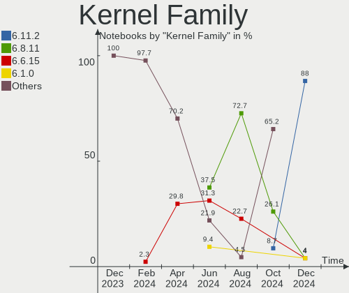
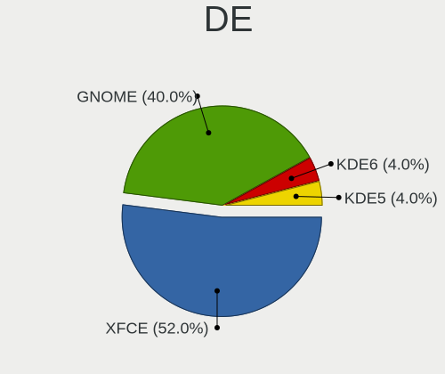
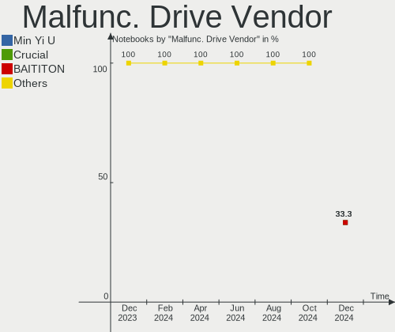
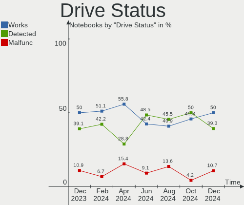
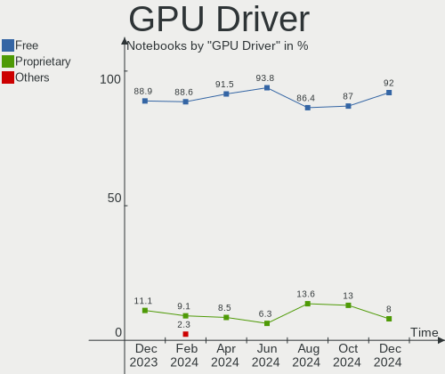

Kali - Hardware Trends (Notebooks)
----------------------------------

A project to identify most popular hardware characteristics and track their change
over time based on data collected by Linux users at https://Linux-Hardware.org.

Anyone can contribute to this report by the [hw-probe](https://github.com/linuxhw/hw-probe) tool:

    sudo -E hw-probe -all -upload

This report is for one last month. Overall report since the beginning of time: [TestDays](https://github.com/linuxhw/TestDays)

Period: Jan, 2024.

Contents
--------

* [ System ](#system)
  - [ OS                       ](#os)
  - [ OS Family                ](#os-family)
  - [ Kernel                   ](#kernel)
  - [ Kernel Family            ](#kernel-family)
  - [ Kernel Major Ver.        ](#kernel-major-ver)
  - [ Arch                     ](#arch)
  - [ DE                       ](#de)
  - [ Display Server           ](#display-server)
  - [ Display Manager          ](#display-manager)
  - [ OS Lang                  ](#os-lang)
  - [ Boot Mode                ](#boot-mode)
  - [ Filesystem               ](#filesystem)
  - [ Part. scheme             ](#part-scheme)
  - [ Dual Boot with Linux/BSD ](#dual-boot-with-linuxbsd)
  - [ Dual Boot (Win)          ](#dual-boot-win)

* [ Board ](#board)
  - [ Vendor                   ](#vendor)
  - [ Model                    ](#model)
  - [ Model Family             ](#model-family)
  - [ MFG Year                 ](#mfg-year)
  - [ Form Factor              ](#form-factor)
  - [ Secure Boot              ](#secure-boot)
  - [ Coreboot                 ](#coreboot)
  - [ RAM Size                 ](#ram-size)
  - [ RAM Used                 ](#ram-used)
  - [ Total Drives             ](#total-drives)
  - [ Has CD-ROM               ](#has-cd-rom)
  - [ Has Ethernet             ](#has-ethernet)
  - [ Has WiFi                 ](#has-wifi)
  - [ Has Bluetooth            ](#has-bluetooth)

* [ Location ](#location)
  - [ Country                  ](#country)
  - [ City                     ](#city)

* [ Drives ](#drives)
  - [ Drive Vendor             ](#drive-vendor)
  - [ Drive Model              ](#drive-model)
  - [ HDD Vendor               ](#hdd-vendor)
  - [ SSD Vendor               ](#ssd-vendor)
  - [ Drive Kind               ](#drive-kind)
  - [ Drive Connector          ](#drive-connector)
  - [ Drive Size               ](#drive-size)
  - [ Space Total              ](#space-total)
  - [ Space Used               ](#space-used)
  - [ Malfunc. Drives          ](#malfunc-drives)
  - [ Malfunc. Drive Vendor    ](#malfunc-drive-vendor)
  - [ Malfunc. HDD Vendor      ](#malfunc-hdd-vendor)
  - [ Malfunc. Drive Kind      ](#malfunc-drive-kind)
  - [ Failed Drives            ](#failed-drives)
  - [ Failed Drive Vendor      ](#failed-drive-vendor)
  - [ Drive Status             ](#drive-status)

* [ Storage controller ](#storage-controller)
  - [ Storage Vendor           ](#storage-vendor)
  - [ Storage Model            ](#storage-model)
  - [ Storage Kind             ](#storage-kind)

* [ Processor ](#processor)
  - [ CPU Vendor               ](#cpu-vendor)
  - [ CPU Model                ](#cpu-model)
  - [ CPU Model Family         ](#cpu-model-family)
  - [ CPU Cores                ](#cpu-cores)
  - [ CPU Sockets              ](#cpu-sockets)
  - [ CPU Threads              ](#cpu-threads)
  - [ CPU Op-Modes             ](#cpu-op-modes)
  - [ CPU Microcode            ](#cpu-microcode)
  - [ CPU Microarch            ](#cpu-microarch)

* [ Graphics ](#graphics)
  - [ GPU Vendor               ](#gpu-vendor)
  - [ GPU Model                ](#gpu-model)
  - [ GPU Combo                ](#gpu-combo)
  - [ GPU Driver               ](#gpu-driver)
  - [ GPU Memory               ](#gpu-memory)

* [ Monitor ](#monitor)
  - [ Monitor Vendor           ](#monitor-vendor)
  - [ Monitor Model            ](#monitor-model)
  - [ Monitor Resolution       ](#monitor-resolution)
  - [ Monitor Diagonal         ](#monitor-diagonal)
  - [ Monitor Width            ](#monitor-width)
  - [ Aspect Ratio             ](#aspect-ratio)
  - [ Monitor Area             ](#monitor-area)
  - [ Pixel Density            ](#pixel-density)
  - [ Multiple Monitors        ](#multiple-monitors)

* [ Network ](#network)
  - [ Net Controller Vendor    ](#net-controller-vendor)
  - [ Net Controller Model     ](#net-controller-model)
  - [ Wireless Vendor          ](#wireless-vendor)
  - [ Wireless Model           ](#wireless-model)
  - [ Ethernet Vendor          ](#ethernet-vendor)
  - [ Ethernet Model           ](#ethernet-model)
  - [ Net Controller Kind      ](#net-controller-kind)
  - [ Used Controller          ](#used-controller)
  - [ NICs                     ](#nics)
  - [ IPv6                     ](#ipv6)

* [ Bluetooth ](#bluetooth)
  - [ Bluetooth Vendor         ](#bluetooth-vendor)
  - [ Bluetooth Model          ](#bluetooth-model)

* [ Sound ](#sound)
  - [ Sound Vendor             ](#sound-vendor)
  - [ Sound Model              ](#sound-model)

* [ Memory ](#memory)
  - [ Memory Vendor            ](#memory-vendor)
  - [ Memory Model             ](#memory-model)
  - [ Memory Kind              ](#memory-kind)
  - [ Memory Form Factor       ](#memory-form-factor)
  - [ Memory Size              ](#memory-size)
  - [ Memory Speed             ](#memory-speed)

* [ Printers & scanners ](#printers--scanners)
  - [ Printer Vendor           ](#printer-vendor)
  - [ Printer Model            ](#printer-model)
  - [ Scanner Vendor           ](#scanner-vendor)
  - [ Scanner Model            ](#scanner-model)

* [ Camera ](#camera)
  - [ Camera Vendor            ](#camera-vendor)
  - [ Camera Model             ](#camera-model)

* [ Security ](#security)
  - [ Fingerprint Vendor       ](#fingerprint-vendor)
  - [ Fingerprint Model        ](#fingerprint-model)
  - [ Chipcard Vendor          ](#chipcard-vendor)
  - [ Chipcard Model           ](#chipcard-model)

* [ Unsupported ](#unsupported)
  - [ Unsupported Devices      ](#unsupported-devices)
  - [ Unsupported Device Types ](#unsupported-device-types)

System
------

OS
--

Installed operating systems

| Name        | Notebooks | Percent |
|-------------|-----------|---------|
| Kali 2023.4 | 56        | 96.55%  |
| Kali 2023.3 | 2         | 3.45%   |

OS Family
---------

OS without a version

| Name | Notebooks | Percent |
|------|-----------|---------|
| Kali | 58        | 100%    |

Kernel
------

Version of the Linux kernel

| Version             | Notebooks | Percent |
|---------------------|-----------|---------|
| 6.5.0-kali3-amd64   | 49        | 84.48%  |
| 6.4.0-kali3-amd64   | 2         | 3.45%   |
| 6.7.0-x64v3-xanmod1 | 1         | 1.72%   |
| 6.6.9-amd64         | 1         | 1.72%   |
| 6.3.0-kali1-amd64   | 1         | 1.72%   |
| 6.1.0-kali9-amd64   | 1         | 1.72%   |
| 6.1.0-17-amd64      | 1         | 1.72%   |
| 5.18.0-kali7-amd64  | 1         | 1.72%   |
| 5.14.0-kali4-amd64  | 1         | 1.72%   |

Kernel Family
-------------

Linux kernel without a distro release

| Version | Notebooks | Percent |
|---------|-----------|---------|
| 6.5.0   | 49        | 84.48%  |
| 6.4.0   | 2         | 3.45%   |
| 6.1.0   | 2         | 3.45%   |
| 6.7.0   | 1         | 1.72%   |
| 6.6.9   | 1         | 1.72%   |
| 6.3.0   | 1         | 1.72%   |
| 5.18.0  | 1         | 1.72%   |
| 5.14.0  | 1         | 1.72%   |

Kernel Major Ver.
-----------------

Linux kernel major version

| Version | Notebooks | Percent |
|---------|-----------|---------|
| 6.5     | 49        | 84.48%  |
| 6.4     | 2         | 3.45%   |
| 6.1     | 2         | 3.45%   |
| 6.7     | 1         | 1.72%   |
| 6.6     | 1         | 1.72%   |
| 6.3     | 1         | 1.72%   |
| 5.18    | 1         | 1.72%   |
| 5.14    | 1         | 1.72%   |

Arch
----

OS architecture (x86_64, i586, etc.)

| Name   | Notebooks | Percent |
|--------|-----------|---------|
| x86_64 | 58        | 100%    |

DE
--

Desktop Environment

| Name             | Notebooks | Percent |
|------------------|-----------|---------|
| XFCE             | 26        | 44.83%  |
| GNOME            | 19        | 32.76%  |
| KDE5             | 9         | 15.52%  |
| Unknown          | 2         | 3.45%   |
| lightdm-xsession | 1         | 1.72%   |
| GNOME Classic    | 1         | 1.72%   |

Display Server
--------------

X11 or Wayland

| Name    | Notebooks | Percent |
|---------|-----------|---------|
| X11     | 54        | 93.1%   |
| Wayland | 4         | 6.9%    |

Display Manager
---------------

SDDM, LightDM, etc.

| Name    | Notebooks | Percent |
|---------|-----------|---------|
| LightDM | 27        | 46.55%  |
| Unknown | 15        | 25.86%  |
| SDDM    | 9         | 15.52%  |
| GDM3    | 7         | 12.07%  |

OS Lang
-------

Language

| Lang    | Notebooks | Percent |
|---------|-----------|---------|
| C       | 34        | 58.62%  |
| en_US   | 11        | 18.97%  |
| de_DE   | 2         | 3.45%   |
| Unknown | 2         | 3.45%   |
| ru_RU   | 1         | 1.72%   |
| it_IT   | 1         | 1.72%   |
| fr_FR   | 1         | 1.72%   |
| es_MX   | 1         | 1.72%   |
| es_ES   | 1         | 1.72%   |
| es_AR   | 1         | 1.72%   |
| en_IN   | 1         | 1.72%   |
| en_GB   | 1         | 1.72%   |
| cs_CZ   | 1         | 1.72%   |

Boot Mode
---------

EFI or BIOS

| Mode | Notebooks | Percent |
|------|-----------|---------|
| EFI  | 43        | 74.14%  |
| BIOS | 15        | 25.86%  |

Filesystem
----------

Type of filesystem

| Type    | Notebooks | Percent |
|---------|-----------|---------|
| Ext4    | 52        | 89.66%  |
| Tmpfs   | 2         | 3.45%   |
| Overlay | 2         | 3.45%   |
| Xfs     | 1         | 1.72%   |
| Btrfs   | 1         | 1.72%   |

Part. scheme
------------

Scheme of partitioning

| Type    | Notebooks | Percent |
|---------|-----------|---------|
| GPT     | 38        | 65.52%  |
| Unknown | 12        | 20.69%  |
| MBR     | 8         | 13.79%  |

Dual Boot with Linux/BSD
------------------------

Hosting more than one Linux/BSD

| Dual boot | Notebooks | Percent |
|-----------|-----------|---------|
| No        | 49        | 84.48%  |
| Yes       | 9         | 15.52%  |

Dual Boot (Win)
---------------

Hosting Linux and Windows

| Dual boot | Notebooks | Percent |
|-----------|-----------|---------|
| No        | 42        | 72.41%  |
| Yes       | 16        | 27.59%  |

Board
-----

Vendor
------

Motherboard manufacturer

| Name                | Notebooks | Percent |
|---------------------|-----------|---------|
| Hewlett-Packard     | 12        | 20.69%  |
| Lenovo              | 11        | 18.97%  |
| ASUSTek Computer    | 11        | 18.97%  |
| Dell                | 7         | 12.07%  |
| Apple               | 4         | 6.9%    |
| Acer                | 3         | 5.17%   |
| Toshiba             | 1         | 1.72%   |
| Samsung Electronics | 1         | 1.72%   |
| MSI                 | 1         | 1.72%   |
| Mediacom            | 1         | 1.72%   |
| HUAWEI              | 1         | 1.72%   |
| Google              | 1         | 1.72%   |
| Fujitsu             | 1         | 1.72%   |
| eMachines           | 1         | 1.72%   |
| Complet             | 1         | 1.72%   |
| COM1                | 1         | 1.72%   |

Model
-----

Motherboard model

| Name                                    | Notebooks | Percent |
|-----------------------------------------|-----------|---------|
| Toshiba Satellite Pro R50-B             | 1         | 1.72%   |
| Samsung 300V3A                          | 1         | 1.72%   |
| MSI GF63 Thin 11UC                      | 1         | 1.72%   |
| Mediacom SMARTBOOK ONE                  | 1         | 1.72%   |
| Lenovo Yoga 3 14 80JH                   | 1         | 1.72%   |
| Lenovo ThinkPad T480s 20L8S0SA00        | 1         | 1.72%   |
| Lenovo ThinkPad T460 20FMS0Q200         | 1         | 1.72%   |
| Lenovo ThinkPad L440 20ASS01400         | 1         | 1.72%   |
| Lenovo ThinkPad E550 20DF0052FR         | 1         | 1.72%   |
| Lenovo Legion Y740-17IRHg 81UJ          | 1         | 1.72%   |
| Lenovo IdeaPad Slim 3 15ABR8 82XM       | 1         | 1.72%   |
| Lenovo IdeaPad S340-15IWL 81N8          | 1         | 1.72%   |
| Lenovo IdeaPad 500-15ACZ 80K4           | 1         | 1.72%   |
| Lenovo IdeaPad 130S-14IGM 81KU          | 1         | 1.72%   |
| Lenovo G580 2189                        | 1         | 1.72%   |
| HUAWEI BOD-WXX9                         | 1         | 1.72%   |
| HP ZBook 15 G5                          | 1         | 1.72%   |
| HP ProBook 6560b                        | 1         | 1.72%   |
| HP ProBook 4540s                        | 1         | 1.72%   |
| HP Pavilion 15                          | 1         | 1.72%   |
| HP Laptop 17-cp0xxx                     | 1         | 1.72%   |
| HP Laptop 15-bs0xx                      | 1         | 1.72%   |
| HP Laptop 14-fq0xxx                     | 1         | 1.72%   |
| HP Laptop 14-dq2xxx                     | 1         | 1.72%   |
| HP EliteBook 840 G8 Notebook PC         | 1         | 1.72%   |
| HP EliteBook 840 14 inch G9 Notebook PC | 1         | 1.72%   |
| HP EliteBook 2560p                      | 1         | 1.72%   |
| HP 250 G7 Notebook PC                   | 1         | 1.72%   |
| Google Liara                            | 1         | 1.72%   |
| Fujitsu LIFEBOOK U7412                  | 1         | 1.72%   |
| eMachines eME732G                       | 1         | 1.72%   |
| Dell XPS 15 7590                        | 1         | 1.72%   |
| Dell XPS 13 9360                        | 1         | 1.72%   |
| Dell Latitude 7310                      | 1         | 1.72%   |
| Dell Latitude 5414                      | 1         | 1.72%   |
| Dell Inspiron 7566                      | 1         | 1.72%   |
| Dell Inspiron 3542                      | 1         | 1.72%   |
| Dell Inspiron 15 5510                   | 1         | 1.72%   |
| Complet MY8315XX                        | 1         | 1.72%   |
| COM1 NBINF-O5-4R7R6                     | 1         | 1.72%   |

Model Family
------------

Motherboard model prefix

| Name                | Notebooks | Percent |
|---------------------|-----------|---------|
| Lenovo ThinkPad     | 4         | 6.9%    |
| Lenovo IdeaPad      | 4         | 6.9%    |
| HP Laptop           | 4         | 6.9%    |
| HP EliteBook        | 3         | 5.17%   |
| Dell Inspiron       | 3         | 5.17%   |
| ASUS ASUS           | 3         | 5.17%   |
| HP ProBook          | 2         | 3.45%   |
| Dell XPS            | 2         | 3.45%   |
| Dell Latitude       | 2         | 3.45%   |
| ASUS VivoBook       | 2         | 3.45%   |
| Acer Aspire         | 2         | 3.45%   |
| Toshiba Satellite   | 1         | 1.72%   |
| Samsung 300V3A      | 1         | 1.72%   |
| MSI GF63            | 1         | 1.72%   |
| Mediacom SMARTBOOK  | 1         | 1.72%   |
| Lenovo Yoga         | 1         | 1.72%   |
| Lenovo Legion       | 1         | 1.72%   |
| Lenovo G580         | 1         | 1.72%   |
| HUAWEI BOD-WXX9     | 1         | 1.72%   |
| HP ZBook            | 1         | 1.72%   |
| HP Pavilion         | 1         | 1.72%   |
| HP 250              | 1         | 1.72%   |
| Google Liara        | 1         | 1.72%   |
| Fujitsu LIFEBOOK    | 1         | 1.72%   |
| eMachines eME732G   | 1         | 1.72%   |
| Complet MY8315XX    | 1         | 1.72%   |
| COM1 NBINF-O5-4R7R6 | 1         | 1.72%   |
| ASUS ZenBook        | 1         | 1.72%   |
| ASUS X540YA         | 1         | 1.72%   |
| ASUS UX410UAK       | 1         | 1.72%   |
| ASUS UX303LAB       | 1         | 1.72%   |
| ASUS N61Jv          | 1         | 1.72%   |
| ASUS ET2321I        | 1         | 1.72%   |
| Apple MacBookPro8   | 1         | 1.72%   |
| Apple MacBookPro14  | 1         | 1.72%   |
| Apple MacBookAir7   | 1         | 1.72%   |
| Apple MacBookAir5   | 1         | 1.72%   |
| Acer Nitro          | 1         | 1.72%   |

MFG Year
--------

Motherboard manufacture year

| Year | Notebooks | Percent |
|------|-----------|---------|
| 2021 | 9         | 15.52%  |
| 2019 | 6         | 10.34%  |
| 2016 | 6         | 10.34%  |
| 2014 | 6         | 10.34%  |
| 2022 | 4         | 6.9%    |
| 2020 | 4         | 6.9%    |
| 2018 | 4         | 6.9%    |
| 2015 | 4         | 6.9%    |
| 2011 | 4         | 6.9%    |
| 2023 | 3         | 5.17%   |
| 2017 | 2         | 3.45%   |
| 2012 | 2         | 3.45%   |
| 2010 | 2         | 3.45%   |
| 2013 | 1         | 1.72%   |
| 2007 | 1         | 1.72%   |

Form Factor
-----------

Physical design of the computer

| Name     | Notebooks | Percent |
|----------|-----------|---------|
| Notebook | 58        | 100%    |

Secure Boot
-----------

Enabled or disabled

| State    | Notebooks | Percent |
|----------|-----------|---------|
| Disabled | 58        | 100%    |

Coreboot
--------

Have coreboot on board

| Used | Notebooks | Percent |
|------|-----------|---------|
| No   | 57        | 98.28%  |
| Yes  | 1         | 1.72%   |

RAM Size
--------

Total RAM memory

| Size in GB | Notebooks | Percent |
|------------|-----------|---------|
| 4.01-8.0   | 15        | 25.86%  |
| 3.01-4.0   | 14        | 24.14%  |
| 16.01-24.0 | 14        | 24.14%  |
| 8.01-16.0  | 13        | 22.41%  |
| 32.01-64.0 | 2         | 3.45%   |

RAM Used
--------

Used RAM memory

| Used GB   | Notebooks | Percent |
|-----------|-----------|---------|
| 2.01-3.0  | 24        | 41.38%  |
| 1.01-2.0  | 14        | 24.14%  |
| 4.01-8.0  | 9         | 15.52%  |
| 3.01-4.0  | 7         | 12.07%  |
| 8.01-16.0 | 3         | 5.17%   |
| 0.51-1.0  | 1         | 1.72%   |

Total Drives
------------

Number of drives on board

| Drives | Notebooks | Percent |
|--------|-----------|---------|
| 1      | 40        | 68.97%  |
| 2      | 17        | 29.31%  |
| 3      | 1         | 1.72%   |

Has CD-ROM
----------

Has CD-ROM on board

| Presented | Notebooks | Percent |
|-----------|-----------|---------|
| No        | 46        | 79.31%  |
| Yes       | 12        | 20.69%  |

Has Ethernet
------------

Has Ethernet on board

| Presented | Notebooks | Percent |
|-----------|-----------|---------|
| Yes       | 36        | 62.07%  |
| No        | 22        | 37.93%  |

Has WiFi
--------

Has WiFi module

| Presented | Notebooks | Percent |
|-----------|-----------|---------|
| Yes       | 57        | 98.28%  |
| No        | 1         | 1.72%   |

Has Bluetooth
-------------

Has Bluetooth module

| Presented | Notebooks | Percent |
|-----------|-----------|---------|
| Yes       | 53        | 91.38%  |
| No        | 5         | 8.62%   |

Location
--------

Country
-------

Geographic location (country)

| Country            | Notebooks | Percent |
|--------------------|-----------|---------|
| USA                | 12        | 20.69%  |
| Germany            | 5         | 8.62%   |
| Spain              | 3         | 5.17%   |
| Italy              | 3         | 5.17%   |
| Canada             | 3         | 5.17%   |
| UK                 | 2         | 3.45%   |
| UAE                | 2         | 3.45%   |
| Russia             | 2         | 3.45%   |
| Romania            | 2         | 3.45%   |
| India              | 2         | 3.45%   |
| Czechia            | 2         | 3.45%   |
| Bulgaria           | 2         | 3.45%   |
| Vietnam            | 1         | 1.72%   |
| Slovakia           | 1         | 1.72%   |
| Portugal           | 1         | 1.72%   |
| Poland             | 1         | 1.72%   |
| Netherlands        | 1         | 1.72%   |
| Morocco            | 1         | 1.72%   |
| Mexico             | 1         | 1.72%   |
| Iraq               | 1         | 1.72%   |
| Indonesia          | 1         | 1.72%   |
| Ghana              | 1         | 1.72%   |
| France             | 1         | 1.72%   |
| Finland            | 1         | 1.72%   |
| Egypt              | 1         | 1.72%   |
| Dominican Republic | 1         | 1.72%   |
| Belarus            | 1         | 1.72%   |
| Bangladesh         | 1         | 1.72%   |
| Australia          | 1         | 1.72%   |
| Argentina          | 1         | 1.72%   |

City
----

Geographic location (city)

| City                  | Notebooks | Percent |
|-----------------------|-----------|---------|
| Toronto               | 2         | 3.45%   |
| Berlin                | 2         | 3.45%   |
| Warsaw                | 1         | 1.72%   |
| Timișoara            | 1         | 1.72%   |
| Tijuana               | 1         | 1.72%   |
| Sydney                | 1         | 1.72%   |
| Suez                  | 1         | 1.72%   |
| Strelice              | 1         | 1.72%   |
| St Petersburg         | 1         | 1.72%   |
| Sofia                 | 1         | 1.72%   |
| Senago                | 1         | 1.72%   |
| Schwarzenbek          | 1         | 1.72%   |
| Schnaittach           | 1         | 1.72%   |
| Santo Domingo         | 1         | 1.72%   |
| San Giorgio a Cremano | 1         | 1.72%   |
| Rome                  | 1         | 1.72%   |
| Prague                | 1         | 1.72%   |
| Porto                 | 1         | 1.72%   |
| Phoenix               | 1         | 1.72%   |
| Parla                 | 1         | 1.72%   |
| Newcastle             | 1         | 1.72%   |
| New York              | 1         | 1.72%   |
| Minsk                 | 1         | 1.72%   |
| Marion                | 1         | 1.72%   |
| Los Angeles           | 1         | 1.72%   |
| Lake Stevens          | 1         | 1.72%   |
| Kingston upon Thames  | 1         | 1.72%   |
| Kazan’              | 1         | 1.72%   |
| Jonesboro             | 1         | 1.72%   |
| Järvenpää          | 1         | 1.72%   |
| Jaipur                | 1         | 1.72%   |
| Hyderabad             | 1         | 1.72%   |
| Ho Chi Minh City      | 1         | 1.72%   |
| Handlova              | 1         | 1.72%   |
| Georgetown            | 1         | 1.72%   |
| Fort Lauderdale       | 1         | 1.72%   |
| Flacheres             | 1         | 1.72%   |
| Fes                   | 1         | 1.72%   |
| Erbil                 | 1         | 1.72%   |
| Elkridge              | 1         | 1.72%   |

Drives
------

Drive Vendor
------------

Hard drive vendors

| Vendor                      | Notebooks | Drives | Percent |
|-----------------------------|-----------|--------|---------|
| WDC                         | 12        | 12     | 16.22%  |
| Toshiba                     | 8         | 8      | 10.81%  |
| Samsung Electronics         | 8         | 8      | 10.81%  |
| Unknown                     | 6         | 8      | 8.11%   |
| SK hynix                    | 6         | 6      | 8.11%   |
| Kingston                    | 5         | 5      | 6.76%   |
| Sandisk                     | 4         | 4      | 5.41%   |
| Intel                       | 4         | 4      | 5.41%   |
| Seagate                     | 3         | 3      | 4.05%   |
| Apple                       | 2         | 3      | 2.7%    |
| SSSTC                       | 1         | 1      | 1.35%   |
| SABRENT                     | 1         | 1      | 1.35%   |
| PNY                         | 1         | 1      | 1.35%   |
| Phison Electronics          | 1         | 1      | 1.35%   |
| Phison                      | 1         | 1      | 1.35%   |
| NGFF                        | 1         | 1      | 1.35%   |
| Micron Technology           | 1         | 1      | 1.35%   |
| KIOXIA                      | 1         | 1      | 1.35%   |
| Kingston Technology Company | 1         | 1      | 1.35%   |
| Hitachi                     | 1         | 1      | 1.35%   |
| Crucial                     | 1         | 1      | 1.35%   |
| BAITITON                    | 1         | 1      | 1.35%   |
| AMD R5SL                    | 1         | 1      | 1.35%   |
| Acer                        | 1         | 1      | 1.35%   |
| A-DATA Technology           | 1         | 1      | 1.35%   |
| Unknown                     | 1         | 1      | 1.35%   |

Drive Model
-----------

Hard drive models

| Model                                 | Notebooks | Percent |
|---------------------------------------|-----------|---------|
| Unknown MMC Card  32GB                | 2         | 2.63%   |
| Toshiba MQ04ABF100 1TB                | 2         | 2.63%   |
| SK hynix HFM001TD3JX013N 1024GB       | 2         | 2.63%   |
| Kingston SA400S37240G 240GB SSD       | 2         | 2.63%   |
| WDC WDS500G2B0A-00SM50 500GB SSD      | 1         | 1.32%   |
| WDC WDS240G3G0A-00BJG0 240GB SSD      | 1         | 1.32%   |
| WDC WDS200T1R0A-68A4W0 2TB SSD        | 1         | 1.32%   |
| WDC WD5000LPVX-75V0TT0 500GB          | 1         | 1.32%   |
| WDC WD5000LPCX-24VHAT0 500GB          | 1         | 1.32%   |
| WDC WD5000BPVT-22HXZT3 500GB          | 1         | 1.32%   |
| WDC WD3200BPVT-22JJ5T0 320GB          | 1         | 1.32%   |
| WDC WD10SPZX-75Z10T2 1TB              | 1         | 1.32%   |
| WDC WD10SPZX-21Z10T0 1TB              | 1         | 1.32%   |
| WDC PC SN530 SDBPNPZ-256G-1006 256GB  | 1         | 1.32%   |
| WDC PC SN530 SDBPNPZ-1T00-1014 1TB    | 1         | 1.32%   |
| WDC PC SN530 SDBPNPZ-1T00-1002 1TB    | 1         | 1.32%   |
| Unknown SD/MMC/MS PRO 256GB           | 1         | 1.32%   |
| Unknown MMC Card  64GB                | 1         | 1.32%   |
| Unknown ED4QT  128GB                  | 1         | 1.32%   |
| Unknown DA4128  128GB                 | 1         | 1.32%   |
| Unknown DA4032  32GB                  | 1         | 1.32%   |
| Unknown APPSD  33GB                   | 1         | 1.32%   |
| Toshiba THNSN5512GPUK NVMe 512GB      | 1         | 1.32%   |
| Toshiba THNSN5256GPU7 256GB           | 1         | 1.32%   |
| Toshiba MQ01ABF050 500GB              | 1         | 1.32%   |
| Toshiba MQ01ABD100 1TB                | 1         | 1.32%   |
| Toshiba MK3276GSX 320GB               | 1         | 1.32%   |
| Toshiba DT01ACA100 1TB                | 1         | 1.32%   |
| SSSTC CVB-8D128-HP 128GB              | 1         | 1.32%   |
| SK hynix HFS250G32TND-3110A 250GB SSD | 1         | 1.32%   |
| SK hynix HFM512GD3JX013N 512GB        | 1         | 1.32%   |
| SK hynix BC711 HFM512GD3JX013N 512GB  | 1         | 1.32%   |
| SK hynix BC511 NVMe 256GB             | 1         | 1.32%   |
| Seagate ST9500325AS 500GB             | 1         | 1.32%   |
| Seagate ST1000LM035-1RK172 1TB        | 1         | 1.32%   |
| Seagate ST1000LM024 HN-M101MBB 1TB    | 1         | 1.32%   |
| Sandisk WD Blue SN570 1TB             | 1         | 1.32%   |
| Sandisk WD Blue SN550 NVMe SSD 512GB  | 1         | 1.32%   |
| SanDisk SSD PLUS 240GB                | 1         | 1.32%   |
| SanDisk SD9SN8W-128G-1006 128GB SSD   | 1         | 1.32%   |

HDD Vendor
----------

Hard disk drive vendors

| Vendor  | Notebooks | Drives | Percent |
|---------|-----------|--------|---------|
| WDC     | 6         | 6      | 35.29%  |
| Toshiba | 6         | 6      | 35.29%  |
| Seagate | 3         | 3      | 17.65%  |
| Unknown | 1         | 1      | 5.88%   |
| Hitachi | 1         | 1      | 5.88%   |

SSD Vendor
----------

Solid state drive vendors

| Vendor              | Notebooks | Drives | Percent |
|---------------------|-----------|--------|---------|
| Kingston            | 5         | 5      | 21.74%  |
| WDC                 | 3         | 3      | 13.04%  |
| Intel               | 3         | 3      | 13.04%  |
| SanDisk             | 2         | 2      | 8.7%    |
| Samsung Electronics | 2         | 2      | 8.7%    |
| SSSTC               | 1         | 1      | 4.35%   |
| SK hynix            | 1         | 1      | 4.35%   |
| SABRENT             | 1         | 1      | 4.35%   |
| PNY                 | 1         | 1      | 4.35%   |
| NGFF                | 1         | 1      | 4.35%   |
| BAITITON            | 1         | 1      | 4.35%   |
| Apple               | 1         | 1      | 4.35%   |
| AMD R5SL            | 1         | 1      | 4.35%   |

Drive Kind
----------

HDD or SSD

| Kind | Notebooks | Drives | Percent |
|------|-----------|--------|---------|
| NVMe | 25        | 29     | 35.71%  |
| SSD  | 22        | 23     | 31.43%  |
| HDD  | 17        | 17     | 24.29%  |
| MMC  | 6         | 8      | 8.57%   |

Drive Connector
---------------

SATA, SAS, NVMe, etc.

| Type | Notebooks | Drives | Percent |
|------|-----------|--------|---------|
| SATA | 32        | 37     | 48.48%  |
| NVMe | 25        | 29     | 37.88%  |
| MMC  | 6         | 8      | 9.09%   |
| SAS  | 3         | 3      | 4.55%   |

Drive Size
----------

Size of hard drive

| Size in TB | Notebooks | Drives | Percent |
|------------|-----------|--------|---------|
| 0.01-0.5   | 24        | 28     | 66.67%  |
| 0.51-1.0   | 11        | 11     | 30.56%  |
| 1.01-2.0   | 1         | 1      | 2.78%   |

Space Total
-----------

Amount of disk space available on the file system

| Size in GB | Notebooks | Percent |
|------------|-----------|---------|
| 101-250    | 25        | 43.1%   |
| 251-500    | 11        | 18.97%  |
| 501-1000   | 7         | 12.07%  |
| 51-100     | 6         | 10.34%  |
| 21-50      | 4         | 6.9%    |
| 2001-3000  | 2         | 3.45%   |
| Unknown    | 2         | 3.45%   |
| 1001-2000  | 1         | 1.72%   |

Space Used
----------

Amount of used disk space

| Used GB  | Notebooks | Percent |
|----------|-----------|---------|
| 1-20     | 16        | 27.59%  |
| 21-50    | 15        | 25.86%  |
| 51-100   | 13        | 22.41%  |
| 101-250  | 7         | 12.07%  |
| 251-500  | 3         | 5.17%   |
| 501-1000 | 2         | 3.45%   |
| Unknown  | 2         | 3.45%   |

Malfunc. Drives
---------------

Drive models with a malfunction

| Model                                 | Notebooks | Drives | Percent |
|---------------------------------------|-----------|--------|---------|
| WDC WDS240G3G0A-00BJG0 240GB SSD      | 1         | 1      | 10%     |
| WDC WD5000BPVT-22HXZT3 500GB          | 1         | 1      | 10%     |
| Toshiba MQ01ABF050 500GB              | 1         | 1      | 10%     |
| Toshiba MK3276GSX 320GB               | 1         | 1      | 10%     |
| SK hynix HFS250G32TND-3110A 250GB SSD | 1         | 1      | 10%     |
| Seagate ST1000LM035-1RK172 1TB        | 1         | 1      | 10%     |
| SanDisk SD9SN8W-128G-1006 128GB SSD   | 1         | 1      | 10%     |
| Intel SSDSA2M080G2GC 80GB             | 1         | 1      | 10%     |
| Hitachi HTS547550A9E384 500GB         | 1         | 1      | 10%     |
| BAITITON BT58SSD12S 512GB             | 1         | 1      | 10%     |

Malfunc. Drive Vendor
---------------------

Vendors of faulty drives

| Vendor   | Notebooks | Drives | Percent |
|----------|-----------|--------|---------|
| WDC      | 2         | 2      | 20%     |
| Toshiba  | 2         | 2      | 20%     |
| SK hynix | 1         | 1      | 10%     |
| Seagate  | 1         | 1      | 10%     |
| SanDisk  | 1         | 1      | 10%     |
| Intel    | 1         | 1      | 10%     |
| Hitachi  | 1         | 1      | 10%     |
| BAITITON | 1         | 1      | 10%     |

Malfunc. HDD Vendor
-------------------

Vendors of faulty HDD drives

| Vendor  | Notebooks | Drives | Percent |
|---------|-----------|--------|---------|
| Toshiba | 2         | 2      | 40%     |
| WDC     | 1         | 1      | 20%     |
| Seagate | 1         | 1      | 20%     |
| Hitachi | 1         | 1      | 20%     |

Malfunc. Drive Kind
-------------------

Kinds of faulty drives

| Kind | Notebooks | Drives | Percent |
|------|-----------|--------|---------|
| SSD  | 5         | 5      | 50%     |
| HDD  | 5         | 5      | 50%     |

Failed Drives
-------------

Failed drive models

Zero info for selected period =(

Failed Drive Vendor
-------------------

Failed drive vendors

Zero info for selected period =(

Drive Status
------------

Number of failed and malfunc. drives

| Status   | Notebooks | Drives | Percent |
|----------|-----------|--------|---------|
| Works    | 36        | 40     | 54.55%  |
| Detected | 20        | 27     | 30.3%   |
| Malfunc  | 10        | 10     | 15.15%  |

Storage controller
------------------

Storage Vendor
--------------

Storage controller vendors

| Vendor                       | Notebooks | Percent |
|------------------------------|-----------|---------|
| Intel                        | 40        | 54.79%  |
| Samsung Electronics          | 7         | 9.59%   |
| SK hynix                     | 5         | 6.85%   |
| SanDisk                      | 5         | 6.85%   |
| AMD                          | 5         | 6.85%   |
| Toshiba America Info Systems | 2         | 2.74%   |
| Phison Electronics           | 2         | 2.74%   |
| Micron/Crucial Technology    | 1         | 1.37%   |
| Micron Technology            | 1         | 1.37%   |
| KIOXIA                       | 1         | 1.37%   |
| Kingston Technology Company  | 1         | 1.37%   |
| Hosin Global Electronics     | 1         | 1.37%   |
| Apple                        | 1         | 1.37%   |
| ADATA Technology             | 1         | 1.37%   |

Storage Model
-------------

Storage controller models

| Model                                                                            | Notebooks | Percent |
|----------------------------------------------------------------------------------|-----------|---------|
| Intel Volume Management Device NVMe RAID Controller                              | 6         | 8%      |
| AMD FCH SATA Controller [AHCI mode]                                              | 5         | 6.67%   |
| SK hynix Gold P31/BC711/PC711 NVMe Solid State Drive                             | 4         | 5.33%   |
| SanDisk Ultra 3D / WD Blue SN550 NVMe SSD                                        | 4         | 5.33%   |
| Intel Sunrise Point-LP SATA Controller [AHCI mode]                               | 4         | 5.33%   |
| Intel Cannon Lake Mobile PCH SATA AHCI Controller                                | 4         | 5.33%   |
| Intel 6 Series/C200 Series Chipset Family 6 port Mobile SATA AHCI Controller     | 4         | 5.33%   |
| Samsung NVMe SSD Controller 980 (DRAM-less)                                      | 3         | 4%      |
| Intel Wildcat Point-LP SATA Controller [AHCI Mode]                               | 3         | 4%      |
| Intel Celeron/Pentium Silver Processor SATA Controller                           | 3         | 4%      |
| Intel 8 Series SATA Controller 1 [AHCI mode]                                     | 3         | 4%      |
| Intel 7 Series Chipset Family 6-port SATA Controller [AHCI mode]                 | 3         | 4%      |
| Samsung NVMe SSD Controller SM981/PM981/PM983                                    | 2         | 2.67%   |
| Intel 82801 Mobile SATA Controller [RAID mode]                                   | 2         | 2.67%   |
| Intel 5 Series/3400 Series Chipset 4 port SATA AHCI Controller                   | 2         | 2.67%   |
| Toshiba America Info Systems XG4 NVMe SSD Controller                             | 1         | 1.33%   |
| Toshiba America Info Systems XG3 NVMe SSD Controller                             | 1         | 1.33%   |
| SK hynix BC511 NVMe SSD                                                          | 1         | 1.33%   |
| SanDisk Ultra 3D / WD Blue SN570 NVMe SSD (DRAM-less)                            | 1         | 1.33%   |
| Samsung S4LN058A01[SSUBX] AHCI SSD Controller (Apple slot)                       | 1         | 1.33%   |
| Samsung NVMe SSD Controller PM9B1 (DRAM-less)                                    | 1         | 1.33%   |
| Phison PS5021-E21 PCIe4 NVMe Controller (DRAM-less)                              | 1         | 1.33%   |
| Phison E12 NVMe Controller                                                       | 1         | 1.33%   |
| Micron/Crucial P1 NVMe PCIe SSD[Frampton]                                        | 1         | 1.33%   |
| Micron 2400 NVMe SSD (DRAM-less)                                                 | 1         | 1.33%   |
| KIOXIA NVMe SSD Controller BG4 (DRAM-less)                                       | 1         | 1.33%   |
| Kingston Company NV2 NVMe SSD SM2267XT (DRAM-less)                               | 1         | 1.33%   |
| Intel Tiger Lake SATA AHCI Controller                                            | 1         | 1.33%   |
| Intel SSD 670p Series [Keystone Harbor]                                          | 1         | 1.33%   |
| Intel HM170/QM170 Chipset SATA Controller [AHCI Mode]                            | 1         | 1.33%   |
| Intel Celeron N3350/Pentium N4200/Atom E3900 Series SATA AHCI Controller         | 1         | 1.33%   |
| Intel Cannon Point-LP SATA Controller [AHCI Mode]                                | 1         | 1.33%   |
| Intel Atom/Celeron/Pentium Processor x5-E8000/J3xxx/N3xxx Series SATA Controller | 1         | 1.33%   |
| Intel 8 Series/C220 Series Chipset Family 6-port SATA Controller 1 [AHCI mode]   | 1         | 1.33%   |
| Hosin Global Non-Volatile memory controller                                      | 1         | 1.33%   |
| Apple S3X NVMe Controller                                                        | 1         | 1.33%   |
| AMD FCH IDE Controller                                                           | 1         | 1.33%   |
| ADATA IM2P33F8 series NVMe SSD (DRAM-less)                                       | 1         | 1.33%   |

Storage Kind
------------

Kind of storage controller (IDE, SATA, NVMe, SAS, ...)

| Kind | Notebooks | Percent |
|------|-----------|---------|
| SATA | 38        | 52.78%  |
| NVMe | 25        | 34.72%  |
| RAID | 8         | 11.11%  |
| IDE  | 1         | 1.39%   |

Processor
---------

CPU Vendor
----------

Processor vendors

| Vendor | Notebooks | Percent |
|--------|-----------|---------|
| Intel  | 48        | 82.76%  |
| AMD    | 10        | 17.24%  |

CPU Model
---------

Processor models

| Model                                   | Notebooks | Percent |
|-----------------------------------------|-----------|---------|
| Intel Core i7-9750H CPU @ 2.60GHz       | 2         | 3.45%   |
| Intel Core i7-5500U CPU @ 2.40GHz       | 2         | 3.45%   |
| Intel Core i5-6300U CPU @ 2.40GHz       | 2         | 3.45%   |
| Intel Core i3-2310M CPU @ 2.10GHz       | 2         | 3.45%   |
| Intel 11th Gen Core i7-11370H @ 3.30GHz | 2         | 3.45%   |
| Intel 11th Gen Core i3-1115G4 @ 3.00GHz | 2         | 3.45%   |
| AMD Ryzen 5 5500U with Radeon Graphics  | 2         | 3.45%   |
| Intel Core i7-8850H CPU @ 2.60GHz       | 1         | 1.72%   |
| Intel Core i7-8550U CPU @ 1.80GHz       | 1         | 1.72%   |
| Intel Core i7-7500U CPU @ 2.70GHz       | 1         | 1.72%   |
| Intel Core i7-6700HQ CPU @ 2.60GHz      | 1         | 1.72%   |
| Intel Core i7-3520M CPU @ 2.90GHz       | 1         | 1.72%   |
| Intel Core i5-9300H CPU @ 2.40GHz       | 1         | 1.72%   |
| Intel Core i5-7360U CPU @ 2.30GHz       | 1         | 1.72%   |
| Intel Core i5-7200U CPU @ 2.50GHz       | 1         | 1.72%   |
| Intel Core i5-5350U CPU @ 1.80GHz       | 1         | 1.72%   |
| Intel Core i5-5200U CPU @ 2.20GHz       | 1         | 1.72%   |
| Intel Core i5-4200U CPU @ 1.60GHz       | 1         | 1.72%   |
| Intel Core i5-3317U CPU @ 1.70GHz       | 1         | 1.72%   |
| Intel Core i5-2435M CPU @ 2.40GHz       | 1         | 1.72%   |
| Intel Core i5-2430M CPU @ 2.40GHz       | 1         | 1.72%   |
| Intel Core i5-1035G1 CPU @ 1.00GHz      | 1         | 1.72%   |
| Intel Core i5-10310U CPU @ 1.70GHz      | 1         | 1.72%   |
| Intel Core i3-8145U CPU @ 2.10GHz       | 1         | 1.72%   |
| Intel Core i3-7020U CPU @ 2.30GHz       | 1         | 1.72%   |
| Intel Core i3-6006U CPU @ 2.00GHz       | 1         | 1.72%   |
| Intel Core i3-4030U CPU @ 1.90GHz       | 1         | 1.72%   |
| Intel Core i3-4005U CPU @ 1.70GHz       | 1         | 1.72%   |
| Intel Core i3-4000M CPU @ 2.40GHz       | 1         | 1.72%   |
| Intel Core i3-2370M CPU @ 2.40GHz       | 1         | 1.72%   |
| Intel Core i3 CPU M 380 @ 2.53GHz       | 1         | 1.72%   |
| Intel Core i3 CPU M 350 @ 2.27GHz       | 1         | 1.72%   |
| Intel Celeron N4020C CPU @ 1.10GHz      | 1         | 1.72%   |
| Intel Celeron N4020 CPU @ 1.10GHz       | 1         | 1.72%   |
| Intel Celeron N4000 CPU @ 1.10GHz       | 1         | 1.72%   |
| Intel Celeron CPU N3350 @ 1.10GHz       | 1         | 1.72%   |
| Intel Celeron CPU N3150 @ 1.60GHz       | 1         | 1.72%   |
| Intel 12th Gen Core i7-12650H           | 1         | 1.72%   |
| Intel 12th Gen Core i7-1255U            | 1         | 1.72%   |
| Intel 12th Gen Core i5-1235U            | 1         | 1.72%   |

CPU Model Family
----------------

Processor model prefix

| Model         | Notebooks | Percent |
|---------------|-----------|---------|
| Intel Core i5 | 13        | 22.41%  |
| Intel Core i3 | 11        | 18.97%  |
| Other         | 10        | 17.24%  |
| Intel Core i7 | 9         | 15.52%  |
| Intel Celeron | 5         | 8.62%   |
| AMD Ryzen 7   | 3         | 5.17%   |
| AMD Ryzen 5   | 2         | 3.45%   |
| AMD A10       | 2         | 3.45%   |
| AMD Ryzen 3   | 1         | 1.72%   |
| AMD E2        | 1         | 1.72%   |
| AMD A4        | 1         | 1.72%   |

CPU Cores
---------

Number of processor cores

| Number | Notebooks | Percent |
|--------|-----------|---------|
| 2      | 35        | 60.34%  |
| 4      | 11        | 18.97%  |
| 6      | 5         | 8.62%   |
| 8      | 4         | 6.9%    |
| 10     | 3         | 5.17%   |

CPU Sockets
-----------

Number of sockets

| Number | Notebooks | Percent |
|--------|-----------|---------|
| 1      | 58        | 100%    |

CPU Threads
-----------

Threads per core (Hyper-Threading)

| Number | Notebooks | Percent |
|--------|-----------|---------|
| 2      | 50        | 86.21%  |
| 1      | 8         | 13.79%  |

CPU Op-Modes
------------

CPU Operation Modes (32-bit, 64-bit)

| Op mode        | Notebooks | Percent |
|----------------|-----------|---------|
| 32-bit, 64-bit | 58        | 100%    |

CPU Microcode
-------------

Microcode number

| Number     | Notebooks | Percent |
|------------|-----------|---------|
| Unknown    | 45        | 77.59%  |
| 0x806c1    | 2         | 3.45%   |
| 0x406e3    | 1         | 1.72%   |
| 0x40651    | 1         | 1.72%   |
| 0x0a404101 | 1         | 1.72%   |
| 0x08608103 | 1         | 1.72%   |
| 0x08608102 | 1         | 1.72%   |
| 0x08600103 | 1         | 1.72%   |
| 0x08108109 | 1         | 1.72%   |
| 0x07030106 | 1         | 1.72%   |
| 0x06006704 | 1         | 1.72%   |
| 0x06006110 | 1         | 1.72%   |
| 0x06003106 | 1         | 1.72%   |

CPU Microarch
-------------

Microarchitecture

| Name             | Notebooks | Percent |
|------------------|-----------|---------|
| KabyLake         | 11        | 18.97%  |
| TigerLake        | 6         | 10.34%  |
| SandyBridge      | 5         | 8.62%   |
| Skylake          | 4         | 6.9%    |
| Haswell          | 4         | 6.9%    |
| Broadwell        | 4         | 6.9%    |
| Unknown          | 4         | 6.9%    |
| Goldmont plus    | 3         | 5.17%   |
| Alderlake Hybrid | 3         | 5.17%   |
| Westmere         | 2         | 3.45%   |
| IvyBridge        | 2         | 3.45%   |
| Excavator        | 2         | 3.45%   |
| Zen+             | 1         | 1.72%   |
| Zen 3            | 1         | 1.72%   |
| Zen 2            | 1         | 1.72%   |
| Steamroller      | 1         | 1.72%   |
| Silvermont       | 1         | 1.72%   |
| Puma             | 1         | 1.72%   |
| IceLake          | 1         | 1.72%   |
| Goldmont         | 1         | 1.72%   |

Graphics
--------

GPU Vendor
----------

Vendors of graphics cards

| Vendor | Notebooks | Percent |
|--------|-----------|---------|
| Intel  | 47        | 65.28%  |
| Nvidia | 13        | 18.06%  |
| AMD    | 12        | 16.67%  |

GPU Model
---------

Graphics card models

| Model                                                                                    | Notebooks | Percent |
|------------------------------------------------------------------------------------------|-----------|---------|
| Intel 2nd Generation Core Processor Family Integrated Graphics Controller                | 5         | 6.76%   |
| Intel TigerLake-LP GT2 [Iris Xe Graphics]                                                | 4         | 5.41%   |
| Intel CoffeeLake-H GT2 [UHD Graphics 630]                                                | 4         | 5.41%   |
| Intel Skylake GT2 [HD Graphics 520]                                                      | 3         | 4.05%   |
| Intel HD Graphics 620                                                                    | 3         | 4.05%   |
| Intel HD Graphics 5500                                                                   | 3         | 4.05%   |
| Intel Haswell-ULT Integrated Graphics Controller                                         | 3         | 4.05%   |
| Intel GeminiLake [UHD Graphics 600]                                                      | 3         | 4.05%   |
| Nvidia TU117M [GeForce GTX 1650 Mobile / Max-Q]                                          | 2         | 2.7%    |
| Nvidia GA107M [GeForce RTX 3050 Ti Mobile]                                               | 2         | 2.7%    |
| Intel Tiger Lake-LP GT2 [UHD Graphics G4]                                                | 2         | 2.7%    |
| Intel Alder Lake-UP3 GT2 [UHD Graphics]                                                  | 2         | 2.7%    |
| Intel 3rd Gen Core processor Graphics Controller                                         | 2         | 2.7%    |
| AMD Lucienne                                                                             | 2         | 2.7%    |
| Nvidia TU106M [GeForce RTX 2060 Mobile]                                                  | 1         | 1.35%   |
| Nvidia TU106BM [GeForce RTX 2060 Mobile]                                                 | 1         | 1.35%   |
| Nvidia GT216M [GeForce GT 325M]                                                          | 1         | 1.35%   |
| Nvidia GP107GLM [Quadro P1000 Mobile]                                                    | 1         | 1.35%   |
| Nvidia GM107M [GeForce GTX 960M]                                                         | 1         | 1.35%   |
| Nvidia GF119M [GeForce GT 520M]                                                          | 1         | 1.35%   |
| Nvidia GF117M [GeForce 610M/710M/810M/820M / GT 620M/625M/630M/720M]                     | 1         | 1.35%   |
| Nvidia GA107M [GeForce RTX 3050 Mobile]                                                  | 1         | 1.35%   |
| Nvidia GA104M [GeForce RTX 3070 Mobile / Max-Q]                                          | 1         | 1.35%   |
| Intel WhiskeyLake-U GT2 [UHD Graphics 620]                                               | 1         | 1.35%   |
| Intel UHD Graphics 620                                                                   | 1         | 1.35%   |
| Intel TigerLake-H GT1 [UHD Graphics]                                                     | 1         | 1.35%   |
| Intel Iris Plus Graphics G1 (Ice Lake)                                                   | 1         | 1.35%   |
| Intel Iris Plus Graphics 640                                                             | 1         | 1.35%   |
| Intel HD Graphics 6000                                                                   | 1         | 1.35%   |
| Intel HD Graphics 530                                                                    | 1         | 1.35%   |
| Intel HD Graphics 500                                                                    | 1         | 1.35%   |
| Intel Core Processor Integrated Graphics Controller                                      | 1         | 1.35%   |
| Intel CometLake-U GT2 [UHD Graphics]                                                     | 1         | 1.35%   |
| Intel Atom/Celeron/Pentium Processor x5-E8000/J3xxx/N3xxx Integrated Graphics Controller | 1         | 1.35%   |
| Intel Alder Lake-P GT1 [UHD Graphics]                                                    | 1         | 1.35%   |
| Intel 4th Gen Core Processor Integrated Graphics Controller                              | 1         | 1.35%   |
| AMD Wani [Radeon R5/R6/R7 Graphics]                                                      | 1         | 1.35%   |
| AMD Topaz XT [Radeon R7 M260/M265 / M340/M360 / M440/M445 / 530/535 / 620/625 Mobile]    | 1         | 1.35%   |
| AMD Stoney [Radeon R2/R3/R4/R5 Graphics]                                                 | 1         | 1.35%   |
| AMD Renoir [Radeon RX Vega 6 (Ryzen 4000/5000 Mobile Series)]                            | 1         | 1.35%   |

GPU Combo
---------

Combinations of graphics cards

| Name           | Notebooks | Percent |
|----------------|-----------|---------|
| 1 x Intel      | 35        | 60.34%  |
| Intel + Nvidia | 11        | 18.97%  |
| 1 x AMD        | 7         | 12.07%  |
| 2 x AMD        | 2         | 3.45%   |
| AMD + Nvidia   | 2         | 3.45%   |
| Intel + AMD    | 1         | 1.72%   |

GPU Driver
----------

Free vs proprietary

| Driver      | Notebooks | Percent |
|-------------|-----------|---------|
| Free        | 53        | 91.38%  |
| Proprietary | 5         | 8.62%   |

GPU Memory
----------

Total video memory

| Size in GB | Notebooks | Percent |
|------------|-----------|---------|
| Unknown    | 41        | 70.69%  |
| 0.01-0.5   | 6         | 10.34%  |
| 3.01-4.0   | 4         | 6.9%    |
| 0.51-1.0   | 4         | 6.9%    |
| 1.01-2.0   | 2         | 3.45%   |
| 7.01-8.0   | 1         | 1.72%   |

Monitor
-------

Monitor Vendor
--------------

Monitor vendors

| Vendor                  | Notebooks | Percent |
|-------------------------|-----------|---------|
| Chimei Innolux          | 16        | 23.53%  |
| AU Optronics            | 12        | 17.65%  |
| BOE                     | 8         | 11.76%  |
| Samsung Electronics     | 5         | 7.35%   |
| LG Display              | 5         | 7.35%   |
| Sharp                   | 4         | 5.88%   |
| Apple                   | 4         | 5.88%   |
| Hewlett-Packard         | 3         | 4.41%   |
| Sony                    | 1         | 1.47%   |
| SHI                     | 1         | 1.47%   |
| Philips                 | 1         | 1.47%   |
| PANDA                   | 1         | 1.47%   |
| ONN                     | 1         | 1.47%   |
| InfoVision              | 1         | 1.47%   |
| Iiyama                  | 1         | 1.47%   |
| HKC                     | 1         | 1.47%   |
| Dell                    | 1         | 1.47%   |
| Chi Mei Optoelectronics | 1         | 1.47%   |
| Ancor Communications    | 1         | 1.47%   |

Monitor Model
-------------

Monitor models

| Model                                                                | Notebooks | Percent |
|----------------------------------------------------------------------|-----------|---------|
| Chimei Innolux LCD Monitor CMN15F5 1920x1080 344x193mm 15.5-inch     | 2         | 2.94%   |
| AU Optronics LCD Monitor AUO2E3C 1366x768 309x173mm 13.9-inch        | 2         | 2.94%   |
| AU Optronics LCD Monitor AUO243D 1920x1080 309x173mm 13.9-inch       | 2         | 2.94%   |
| Sony TV SNYAB03 1920x1080                                            | 1         | 1.47%   |
| SHI LCD-TV**** SHI6102 1360x768 708x398mm 32.0-inch                  | 1         | 1.47%   |
| Sharp LQ156M1JW26 SHP1532 1920x1080 344x194mm 15.5-inch              | 1         | 1.47%   |
| Sharp LCD Monitor SHP14B9 3840x2160 344x194mm 15.5-inch              | 1         | 1.47%   |
| Sharp LCD Monitor SHP1450 3840x2160 350x190mm 15.7-inch              | 1         | 1.47%   |
| Sharp LCD Monitor SHP1449 1920x1080 294x165mm 13.3-inch              | 1         | 1.47%   |
| Samsung Electronics LCD Monitor SEC524D 1366x768 353x198mm 15.9-inch | 1         | 1.47%   |
| Samsung Electronics LCD Monitor SEC4149 1366x768 292x174mm 13.4-inch | 1         | 1.47%   |
| Samsung Electronics LCD Monitor SEC3355 1366x768 293x165mm 13.2-inch | 1         | 1.47%   |
| Samsung Electronics LCD Monitor SDC4547 1366x768 344x194mm 15.5-inch | 1         | 1.47%   |
| Samsung Electronics LCD Monitor SAM050F 1920x1080                    | 1         | 1.47%   |
| Philips PHL 272V8 PHLC21A 1920x1080 600x340mm 27.2-inch              | 1         | 1.47%   |
| PANDA LCD Monitor NCP004D 1920x1080 344x194mm 15.5-inch              | 1         | 1.47%   |
| ONN onn. TV ONN0C94 1920x1080 698x392mm 31.5-inch                    | 1         | 1.47%   |
| LG Display LCD Monitor LGD05E0 1920x1080 382x215mm 17.3-inch         | 1         | 1.47%   |
| LG Display LCD Monitor LGD046A 1366x768 344x194mm 15.5-inch          | 1         | 1.47%   |
| LG Display LCD Monitor LGD033A 1366x768 344x194mm 15.5-inch          | 1         | 1.47%   |
| LG Display LCD Monitor LGD02F1 1366x768 344x194mm 15.5-inch          | 1         | 1.47%   |
| LG Display LCD Monitor LGD02AC 1366x768 344x194mm 15.5-inch          | 1         | 1.47%   |
| InfoVision LCD Monitor IVO057D 1920x1080 309x174mm 14.0-inch         | 1         | 1.47%   |
| Iiyama PL2740QS IVM6664 2560x1440 597x336mm 27.0-inch                | 1         | 1.47%   |
| HKC LCD Monitor HKC3CFB 1920x1080 344x194mm 15.5-inch                | 1         | 1.47%   |
| Hewlett-Packard P231 HWP3114 1920x1080 510x287mm 23.0-inch           | 1         | 1.47%   |
| Hewlett-Packard M22f FHD HPN3704 1920x1080 476x267mm 21.5-inch       | 1         | 1.47%   |
| Hewlett-Packard LE2201w HWP2843 1680x1050 473x296mm 22.0-inch        | 1         | 1.47%   |
| Dell P2714H DELD05F 1920x1080 598x336mm 27.0-inch                    | 1         | 1.47%   |
| Chimei Innolux LCD Monitor CMN15F6 1920x1080 344x193mm 15.5-inch     | 1         | 1.47%   |
| Chimei Innolux LCD Monitor CMN15C4 1920x1080 344x193mm 15.5-inch     | 1         | 1.47%   |
| Chimei Innolux LCD Monitor CMN15BF 1366x768 344x193mm 15.5-inch      | 1         | 1.47%   |
| Chimei Innolux LCD Monitor CMN1552 1920x1080 344x193mm 15.5-inch     | 1         | 1.47%   |
| Chimei Innolux LCD Monitor CMN153C 1920x1080 344x193mm 15.5-inch     | 1         | 1.47%   |
| Chimei Innolux LCD Monitor CMN14F2 1920x1080 309x173mm 13.9-inch     | 1         | 1.47%   |
| Chimei Innolux LCD Monitor CMN14D6 1366x768 309x173mm 13.9-inch      | 1         | 1.47%   |
| Chimei Innolux LCD Monitor CMN14D2 1920x1080 309x173mm 13.9-inch     | 1         | 1.47%   |
| Chimei Innolux LCD Monitor CMN14B6 1920x1080 308x173mm 13.9-inch     | 1         | 1.47%   |
| Chimei Innolux LCD Monitor CMN1492 1366x768 309x174mm 14.0-inch      | 1         | 1.47%   |
| Chimei Innolux LCD Monitor CMN142D 1366x768 309x173mm 13.9-inch      | 1         | 1.47%   |

Monitor Resolution
------------------

Monitor screen resolution

| Resolution         | Notebooks | Percent |
|--------------------|-----------|---------|
| 1920x1080 (FHD)    | 36        | 54.55%  |
| 1366x768 (WXGA)    | 18        | 27.27%  |
| 3840x2160 (4K)     | 2         | 3.03%   |
| 1600x900 (HD+)     | 2         | 3.03%   |
| 2880x1800          | 1         | 1.52%   |
| 2560x1440 (QHD)    | 1         | 1.52%   |
| 1920x515           | 1         | 1.52%   |
| 1920x1200 (WUXGA)  | 1         | 1.52%   |
| 1680x1050 (WSXGA+) | 1         | 1.52%   |
| 1600x1200          | 1         | 1.52%   |
| 1440x900 (WXGA+)   | 1         | 1.52%   |
| 1280x800 (WXGA)    | 1         | 1.52%   |

Monitor Diagonal
----------------

Diagonal size in inches

| Inches  | Notebooks | Percent |
|---------|-----------|---------|
| 15      | 29        | 42.65%  |
| 13      | 15        | 22.06%  |
| 14      | 8         | 11.76%  |
| 27      | 4         | 5.88%   |
| 17      | 3         | 4.41%   |
| Unknown | 2         | 2.94%   |
| 72      | 1         | 1.47%   |
| 32      | 1         | 1.47%   |
| 31      | 1         | 1.47%   |
| 23      | 1         | 1.47%   |
| 22      | 1         | 1.47%   |
| 21      | 1         | 1.47%   |
| 11      | 1         | 1.47%   |

Monitor Width
-------------

Physical width

| Width in mm | Notebooks | Percent |
|-------------|-----------|---------|
| 301-350     | 44        | 64.71%  |
| 201-300     | 8         | 11.76%  |
| 501-600     | 5         | 7.35%   |
| 351-400     | 4         | 5.88%   |
| 401-500     | 2         | 2.94%   |
| Unknown     | 2         | 2.94%   |
| 701-800     | 1         | 1.47%   |
| 601-700     | 1         | 1.47%   |
| 1501-2000   | 1         | 1.47%   |

Aspect Ratio
------------

Proportional relationship between the width and the height

| Ratio | Notebooks | Percent |
|-------|-----------|---------|
| 16/9  | 54        | 91.53%  |
| 16/10 | 4         | 6.78%   |
| 3.73  | 1         | 1.69%   |

Monitor Area
------------

Area in inch²

| Area in inch² | Notebooks | Percent |
|----------------|-----------|---------|
| 101-110        | 29        | 42.65%  |
| 81-90          | 18        | 26.47%  |
| 71-80          | 5         | 7.35%   |
| 301-350        | 4         | 5.88%   |
| 121-130        | 3         | 4.41%   |
| 351-500        | 2         | 2.94%   |
| 201-250        | 2         | 2.94%   |
| Unknown        | 2         | 2.94%   |
| More than 1000 | 1         | 1.47%   |
| 51-60          | 1         | 1.47%   |
| 151-200        | 1         | 1.47%   |

Pixel Density
-------------

Pixels per inch

| Density       | Notebooks | Percent |
|---------------|-----------|---------|
| 121-160       | 29        | 43.28%  |
| 101-120       | 20        | 29.85%  |
| 51-100        | 8         | 11.94%  |
| 161-240       | 4         | 5.97%   |
| More than 240 | 3         | 4.48%   |
| Unknown       | 2         | 2.99%   |
| 1-50          | 1         | 1.49%   |

Multiple Monitors
-----------------

Total monitors connected

| Total | Notebooks | Percent |
|-------|-----------|---------|
| 1     | 45        | 77.59%  |
| 2     | 13        | 22.41%  |

Network
-------

Net Controller Vendor
---------------------

Controller vendors

| Vendor                          | Notebooks | Percent |
|---------------------------------|-----------|---------|
| Intel                           | 31        | 33.33%  |
| Realtek Semiconductor           | 27        | 29.03%  |
| Qualcomm Atheros                | 7         | 7.53%   |
| Broadcom                        | 7         | 7.53%   |
| TP-Link                         | 5         | 5.38%   |
| MediaTek                        | 3         | 3.23%   |
| Broadcom Limited                | 3         | 3.23%   |
| Samsung Electronics             | 2         | 2.15%   |
| Ralink Technology               | 2         | 2.15%   |
| Sierra Wireless                 | 1         | 1.08%   |
| Qualcomm Atheros Communications | 1         | 1.08%   |
| Motorola PCS                    | 1         | 1.08%   |
| Fibocom                         | 1         | 1.08%   |
| Dell                            | 1         | 1.08%   |
| ASIX Electronics                | 1         | 1.08%   |

Net Controller Model
--------------------

Controller models

| Model                                                                                         | Notebooks | Percent |
|-----------------------------------------------------------------------------------------------|-----------|---------|
| Realtek RTL8111/8168/8211/8411 PCI Express Gigabit Ethernet Controller                        | 16        | 14.29%  |
| Realtek RTL8821CE 802.11ac PCIe Wireless Network Adapter                                      | 4         | 3.57%   |
| Intel Wi-Fi 6 AX201                                                                           | 4         | 3.57%   |
| Realtek RTL810xE PCI Express Fast Ethernet controller                                         | 3         | 2.68%   |
| Qualcomm Atheros QCA9565 / AR9565 Wireless Network Adapter                                    | 3         | 2.68%   |
| MediaTek MT7921 802.11ax PCI Express Wireless Network Adapter                                 | 3         | 2.68%   |
| Intel Wireless 7265                                                                           | 3         | 2.68%   |
| Intel Wi-Fi 6 AX200                                                                           | 3         | 2.68%   |
| Intel Alder Lake-P PCH CNVi WiFi                                                              | 3         | 2.68%   |
| Realtek RTL8812AU 802.11a/b/g/n/ac 2T2R DB WLAN Adapter                                       | 2         | 1.79%   |
| Realtek RTL8723BE PCIe Wireless Network Adapter                                               | 2         | 1.79%   |
| Qualcomm Atheros QCA6174 802.11ac Wireless Network Adapter                                    | 2         | 1.79%   |
| Intel Wireless 8260                                                                           | 2         | 1.79%   |
| Intel Wireless 3160                                                                           | 2         | 1.79%   |
| Intel Ethernet Connection I219-LM                                                             | 2         | 1.79%   |
| Intel Ethernet Connection (16) I219-LM                                                        | 2         | 1.79%   |
| Intel Cannon Lake PCH CNVi WiFi                                                               | 2         | 1.79%   |
| TP-Link TL-WN722N v2/v3 [Realtek RTL8188EUS]                                                  | 1         | 0.89%   |
| TP-Link Archer T4U ver.3                                                                      | 1         | 0.89%   |
| TP-Link Archer T2U PLUS [RTL8821AU]                                                           | 1         | 0.89%   |
| TP-Link AC600 wireless Realtek RTL8811AU [Archer T2U Nano]                                    | 1         | 0.89%   |
| TP-Link 802.11ac NIC                                                                          | 1         | 0.89%   |
| Sierra Wireless EM7345 4G LTE                                                                 | 1         | 0.89%   |
| Samsung GT-I9070 (network tethering, USB debugging enabled)                                   | 1         | 0.89%   |
| Samsung Galaxy series, misc. (tethering mode)                                                 | 1         | 0.89%   |
| Realtek RTL8822CE 802.11ac PCIe Wireless Network Adapter                                      | 1         | 0.89%   |
| Realtek RTL8814AU 802.11a/b/g/n/ac Wireless Adapter                                           | 1         | 0.89%   |
| Realtek RTL8723DE Wireless Network Adapter                                                    | 1         | 0.89%   |
| Realtek RTL8723BU 802.11b/g/n WLAN Adapter                                                    | 1         | 0.89%   |
| Realtek RTL8188EUS 802.11n Wireless Network Adapter                                           | 1         | 0.89%   |
| Realtek RTL8153 Gigabit Ethernet Adapter                                                      | 1         | 0.89%   |
| Realtek Realtek 8812AU/8821AU 802.11ac WLAN Adapter [USB Wireless Dual-Band Adapter 2.4/5Ghz] | 1         | 0.89%   |
| Ralink MT7610U ("Archer T2U" 2.4G+5G WLAN Adapter                                             | 1         | 0.89%   |
| Ralink MT7601U Wireless Adapter                                                               | 1         | 0.89%   |
| Qualcomm Atheros AR9271 802.11n                                                               | 1         | 0.89%   |
| Qualcomm Atheros AR9285 Wireless Network Adapter (PCI-Express)                                | 1         | 0.89%   |
| Qualcomm Atheros AR8162 Fast Ethernet                                                         | 1         | 0.89%   |
| Qualcomm Atheros AR8131 Gigabit Ethernet                                                      | 1         | 0.89%   |
| Motorola PCS moto g52                                                                         | 1         | 0.89%   |
| Intel Wireless 8265 / 8275                                                                    | 1         | 0.89%   |

Wireless Vendor
---------------

Wireless vendors

| Vendor                          | Notebooks | Percent |
|---------------------------------|-----------|---------|
| Intel                           | 30        | 41.1%   |
| Realtek Semiconductor           | 14        | 19.18%  |
| Broadcom                        | 7         | 9.59%   |
| Qualcomm Atheros                | 6         | 8.22%   |
| TP-Link                         | 5         | 6.85%   |
| MediaTek                        | 3         | 4.11%   |
| Ralink Technology               | 2         | 2.74%   |
| Broadcom Limited                | 2         | 2.74%   |
| Sierra Wireless                 | 1         | 1.37%   |
| Qualcomm Atheros Communications | 1         | 1.37%   |
| Fibocom                         | 1         | 1.37%   |
| Dell                            | 1         | 1.37%   |

Wireless Model
--------------

Wireless models

| Model                                                                                         | Notebooks | Percent |
|-----------------------------------------------------------------------------------------------|-----------|---------|
| Realtek RTL8821CE 802.11ac PCIe Wireless Network Adapter                                      | 4         | 5.48%   |
| Intel Wi-Fi 6 AX201                                                                           | 4         | 5.48%   |
| Qualcomm Atheros QCA9565 / AR9565 Wireless Network Adapter                                    | 3         | 4.11%   |
| MediaTek MT7921 802.11ax PCI Express Wireless Network Adapter                                 | 3         | 4.11%   |
| Intel Wireless 7265                                                                           | 3         | 4.11%   |
| Intel Wi-Fi 6 AX200                                                                           | 3         | 4.11%   |
| Intel Alder Lake-P PCH CNVi WiFi                                                              | 3         | 4.11%   |
| Realtek RTL8812AU 802.11a/b/g/n/ac 2T2R DB WLAN Adapter                                       | 2         | 2.74%   |
| Realtek RTL8723BE PCIe Wireless Network Adapter                                               | 2         | 2.74%   |
| Qualcomm Atheros QCA6174 802.11ac Wireless Network Adapter                                    | 2         | 2.74%   |
| Intel Wireless 8260                                                                           | 2         | 2.74%   |
| Intel Wireless 3160                                                                           | 2         | 2.74%   |
| Intel Cannon Lake PCH CNVi WiFi                                                               | 2         | 2.74%   |
| TP-Link TL-WN722N v2/v3 [Realtek RTL8188EUS]                                                  | 1         | 1.37%   |
| TP-Link Archer T4U ver.3                                                                      | 1         | 1.37%   |
| TP-Link Archer T2U PLUS [RTL8821AU]                                                           | 1         | 1.37%   |
| TP-Link AC600 wireless Realtek RTL8811AU [Archer T2U Nano]                                    | 1         | 1.37%   |
| TP-Link 802.11ac NIC                                                                          | 1         | 1.37%   |
| Sierra Wireless EM7345 4G LTE                                                                 | 1         | 1.37%   |
| Realtek RTL8822CE 802.11ac PCIe Wireless Network Adapter                                      | 1         | 1.37%   |
| Realtek RTL8814AU 802.11a/b/g/n/ac Wireless Adapter                                           | 1         | 1.37%   |
| Realtek RTL8723DE Wireless Network Adapter                                                    | 1         | 1.37%   |
| Realtek RTL8723BU 802.11b/g/n WLAN Adapter                                                    | 1         | 1.37%   |
| Realtek RTL8188EUS 802.11n Wireless Network Adapter                                           | 1         | 1.37%   |
| Realtek Realtek 8812AU/8821AU 802.11ac WLAN Adapter [USB Wireless Dual-Band Adapter 2.4/5Ghz] | 1         | 1.37%   |
| Ralink MT7610U ("Archer T2U" 2.4G+5G WLAN Adapter                                             | 1         | 1.37%   |
| Ralink MT7601U Wireless Adapter                                                               | 1         | 1.37%   |
| Qualcomm Atheros AR9271 802.11n                                                               | 1         | 1.37%   |
| Qualcomm Atheros AR9285 Wireless Network Adapter (PCI-Express)                                | 1         | 1.37%   |
| Intel Wireless 8265 / 8275                                                                    | 1         | 1.37%   |
| Intel Wireless 7260                                                                           | 1         | 1.37%   |
| Intel Wireless 3165                                                                           | 1         | 1.37%   |
| Intel Wi-Fi 6E(802.11ax) AX210/AX1675* 2x2 [Typhoon Peak]                                     | 1         | 1.37%   |
| Intel Tiger Lake PCH CNVi WiFi                                                                | 1         | 1.37%   |
| Intel Dual Band Wireless-AC 3165 Plus Bluetooth                                               | 1         | 1.37%   |
| Intel Comet Lake PCH-LP CNVi WiFi                                                             | 1         | 1.37%   |
| Intel Centrino Wireless-N 130                                                                 | 1         | 1.37%   |
| Intel Centrino Ultimate-N 6300                                                                | 1         | 1.37%   |
| Intel Centrino Advanced-N 6235                                                                | 1         | 1.37%   |
| Intel Cannon Point-LP CNVi [Wireless-AC]                                                      | 1         | 1.37%   |

Ethernet Vendor
---------------

Ethernet vendors

| Vendor                | Notebooks | Percent |
|-----------------------|-----------|---------|
| Realtek Semiconductor | 20        | 52.63%  |
| Intel                 | 10        | 26.32%  |
| Samsung Electronics   | 2         | 5.26%   |
| Qualcomm Atheros      | 2         | 5.26%   |
| Motorola PCS          | 1         | 2.63%   |
| Broadcom Limited      | 1         | 2.63%   |
| Broadcom              | 1         | 2.63%   |
| ASIX Electronics      | 1         | 2.63%   |

Ethernet Model
--------------

Ethernet models

| Model                                                                  | Notebooks | Percent |
|------------------------------------------------------------------------|-----------|---------|
| Realtek RTL8111/8168/8211/8411 PCI Express Gigabit Ethernet Controller | 16        | 41.03%  |
| Realtek RTL810xE PCI Express Fast Ethernet controller                  | 3         | 7.69%   |
| Intel Ethernet Connection I219-LM                                      | 2         | 5.13%   |
| Intel Ethernet Connection (16) I219-LM                                 | 2         | 5.13%   |
| Samsung GT-I9070 (network tethering, USB debugging enabled)            | 1         | 2.56%   |
| Samsung Galaxy series, misc. (tethering mode)                          | 1         | 2.56%   |
| Realtek RTL8153 Gigabit Ethernet Adapter                               | 1         | 2.56%   |
| Qualcomm Atheros AR8162 Fast Ethernet                                  | 1         | 2.56%   |
| Qualcomm Atheros AR8131 Gigabit Ethernet                               | 1         | 2.56%   |
| Motorola PCS moto g52                                                  | 1         | 2.56%   |
| Intel Ethernet Connection I217-V                                       | 1         | 2.56%   |
| Intel Ethernet Connection (7) I219-LM                                  | 1         | 2.56%   |
| Intel Ethernet Connection (4) I219-V                                   | 1         | 2.56%   |
| Intel Ethernet Connection (3) I218-V                                   | 1         | 2.56%   |
| Intel 82579V Gigabit Network Connection                                | 1         | 2.56%   |
| Intel 82579LM Gigabit Network Connection (Lewisville)                  | 1         | 2.56%   |
| Broadcom NetXtreme BCM57765 Gigabit Ethernet PCIe                      | 1         | 2.56%   |
| Broadcom Limited NetLink BCM57780 Gigabit Ethernet PCIe                | 1         | 2.56%   |
| ASIX AX88772B Fast Ethernet Controller                                 | 1         | 2.56%   |
| ASIX AX88179 Gigabit Ethernet                                          | 1         | 2.56%   |

Net Controller Kind
-------------------

Ethernet, WiFi or modem

| Kind     | Notebooks | Percent |
|----------|-----------|---------|
| WiFi     | 57        | 61.96%  |
| Ethernet | 35        | 38.04%  |

Used Controller
---------------

Currently used network controller

| Kind     | Notebooks | Percent |
|----------|-----------|---------|
| WiFi     | 45        | 80.36%  |
| Ethernet | 11        | 19.64%  |

NICs
----

Total network controllers on board

| Total | Notebooks | Percent |
|-------|-----------|---------|
| 2     | 32        | 55.17%  |
| 1     | 25        | 43.1%   |
| 0     | 1         | 1.72%   |

IPv6
----

IPv6 vs IPv4

| Used | Notebooks | Percent |
|------|-----------|---------|
| No   | 37        | 63.79%  |
| Yes  | 21        | 36.21%  |

Bluetooth
---------

Bluetooth Vendor
----------------

Controller vendors

| Vendor                          | Notebooks | Percent |
|---------------------------------|-----------|---------|
| Intel                           | 28        | 50.91%  |
| Realtek Semiconductor           | 8         | 14.55%  |
| Qualcomm Atheros Communications | 3         | 5.45%   |
| Lite-On Technology              | 3         | 5.45%   |
| IMC Networks                    | 3         | 5.45%   |
| Foxconn / Hon Hai               | 3         | 5.45%   |
| Apple                           | 3         | 5.45%   |
| Hewlett-Packard                 | 2         | 3.64%   |
| MediaTek                        | 1         | 1.82%   |
| Cambridge Silicon Radio         | 1         | 1.82%   |

Bluetooth Model
---------------

Controller models

| Model                                               | Notebooks | Percent |
|-----------------------------------------------------|-----------|---------|
| Intel Bluetooth wireless interface                  | 10        | 18.18%  |
| Intel AX201 Bluetooth                               | 7         | 12.73%  |
| Realtek Bluetooth Radio                             | 5         | 9.09%   |
| Realtek  Bluetooth 4.2 Adapter                      | 3         | 5.45%   |
| Intel Bluetooth Device                              | 3         | 5.45%   |
| Intel Bluetooth 9460/9560 Jefferson Peak (JfP)      | 3         | 5.45%   |
| Intel AX200 Bluetooth                               | 3         | 5.45%   |
| HP Broadcom 2070 Bluetooth Combo                    | 2         | 3.64%   |
| Qualcomm Atheros  Bluetooth Device                  | 1         | 1.82%   |
| Qualcomm Atheros QCA61x4 Bluetooth 4.0              | 1         | 1.82%   |
| Qualcomm Atheros AR9462 Bluetooth                   | 1         | 1.82%   |
| MediaTek Wireless_Device                            | 1         | 1.82%   |
| Lite-On Wireless_Device                             | 1         | 1.82%   |
| Lite-On Qualcomm Atheros Bluetooth                  | 1         | 1.82%   |
| Lite-On Bluetooth Device                            | 1         | 1.82%   |
| Intel Centrino Bluetooth Wireless Transceiver       | 1         | 1.82%   |
| Intel AX210 Bluetooth                               | 1         | 1.82%   |
| IMC Networks Wireless_Device                        | 1         | 1.82%   |
| IMC Networks Bluetooth Radio                        | 1         | 1.82%   |
| IMC Networks BCM20702A0                             | 1         | 1.82%   |
| Foxconn / Hon Hai Wireless_Device                   | 1         | 1.82%   |
| Foxconn / Hon Hai Broadcom BCM20702 Bluetooth       | 1         | 1.82%   |
| Foxconn / Hon Hai BCM2045A0                         | 1         | 1.82%   |
| Cambridge Silicon Radio Bluetooth Dongle (HCI mode) | 1         | 1.82%   |
| Apple Built-in Bluetooth 2.0+EDR HCI                | 1         | 1.82%   |
| Apple Bluetooth USB Host Controller                 | 1         | 1.82%   |
| Apple Bluetooth Host Controller                     | 1         | 1.82%   |

Sound
-----

Sound Vendor
------------

Sound card vendors

| Vendor            | Notebooks | Percent |
|-------------------|-----------|---------|
| Intel             | 46        | 67.65%  |
| AMD               | 10        | 14.71%  |
| Nvidia            | 8         | 11.76%  |
| ASUSTek Computer  | 2         | 2.94%   |
| Texas Instruments | 1         | 1.47%   |
| Apple             | 1         | 1.47%   |

Sound Model
-----------

Sound card models

| Model                                                                                             | Notebooks | Percent |
|---------------------------------------------------------------------------------------------------|-----------|---------|
| Intel Sunrise Point-LP HD Audio                                                                   | 8         | 9.64%   |
| Intel Tiger Lake-LP Smart Sound Technology Audio Controller                                       | 6         | 7.23%   |
| AMD Family 17h/19h HD Audio Controller                                                            | 5         | 6.02%   |
| Intel Wildcat Point-LP High Definition Audio Controller                                           | 4         | 4.82%   |
| Intel Cannon Lake PCH cAVS                                                                        | 4         | 4.82%   |
| Intel Broadwell-U Audio Controller                                                                | 4         | 4.82%   |
| Intel 6 Series/C200 Series Chipset Family High Definition Audio Controller                        | 4         | 4.82%   |
| Intel Haswell-ULT HD Audio Controller                                                             | 3         | 3.61%   |
| Intel Celeron/Pentium Silver Processor High Definition Audio                                      | 3         | 3.61%   |
| Intel 8 Series HD Audio Controller                                                                | 3         | 3.61%   |
| Intel 7 Series/C216 Chipset Family High Definition Audio Controller                               | 3         | 3.61%   |
| AMD Renoir Radeon High Definition Audio Controller                                                | 3         | 3.61%   |
| Nvidia TU106 High Definition Audio Controller                                                     | 2         | 2.41%   |
| Nvidia Audio device                                                                               | 2         | 2.41%   |
| Intel Alder Lake PCH-P High Definition Audio Controller                                           | 2         | 2.41%   |
| Intel 5 Series/3400 Series Chipset High Definition Audio                                          | 2         | 2.41%   |
| ASUSTek Computer C-Media Audio                                                                    | 2         | 2.41%   |
| AMD Kabini HDMI/DP Audio                                                                          | 2         | 2.41%   |
| AMD FCH Azalia Controller                                                                         | 2         | 2.41%   |
| Texas Instruments PCM2902 Audio Codec                                                             | 1         | 1.2%    |
| Nvidia TU107 GeForce GTX 1650 High Definition Audio Controller                                    | 1         | 1.2%    |
| Nvidia GT216 HDMI Audio Controller                                                                | 1         | 1.2%    |
| Nvidia GP107GL High Definition Audio Controller                                                   | 1         | 1.2%    |
| Nvidia GA104 High Definition Audio Controller                                                     | 1         | 1.2%    |
| Intel Xeon E3-1200 v3/4th Gen Core Processor HD Audio Controller                                  | 1         | 1.2%    |
| Intel Tiger Lake-H HD Audio Controller                                                            | 1         | 1.2%    |
| Intel Ice Lake-LP Smart Sound Technology Audio Controller                                         | 1         | 1.2%    |
| Intel Comet Lake PCH-LP cAVS                                                                      | 1         | 1.2%    |
| Intel Celeron N3350/Pentium N4200/Atom E3900 Series Audio Cluster                                 | 1         | 1.2%    |
| Intel Cannon Point-LP High Definition Audio Controller                                            | 1         | 1.2%    |
| Intel Atom/Celeron/Pentium Processor x5-E8000/J3xxx/N3xxx Series High Definition Audio Controller | 1         | 1.2%    |
| Intel 8 Series/C220 Series Chipset High Definition Audio Controller                               | 1         | 1.2%    |
| Apple EarPods                                                                                     | 1         | 1.2%    |
| AMD Redwood HDMI Audio [Radeon HD 5000 Series]                                                    | 1         | 1.2%    |
| AMD Raven/Raven2/Fenghuang HDMI/DP Audio Controller                                               | 1         | 1.2%    |
| AMD Kaveri HDMI/DP Audio Controller                                                               | 1         | 1.2%    |
| AMD High Definition Audio Controller                                                              | 1         | 1.2%    |
| AMD Family 15h (Models 60h-6fh) Audio Controller                                                  | 1         | 1.2%    |

Memory
------

Memory Vendor
-------------

Memory module vendors

| Vendor              | Notebooks | Percent |
|---------------------|-----------|---------|
| Samsung Electronics | 15        | 27.27%  |
| SK hynix            | 11        | 20%     |
| Micron Technology   | 9         | 16.36%  |
| A-DATA Technology   | 4         | 7.27%   |
| Ramaxel Technology  | 3         | 5.45%   |
| Kingston            | 3         | 5.45%   |
| Unknown (ABCD)      | 2         | 3.64%   |
| Unknown (83DA)      | 1         | 1.82%   |
| Unknown (0xD306)    | 1         | 1.82%   |
| Silicon Power       | 1         | 1.82%   |
| Nanya Technology    | 1         | 1.82%   |
| Kllisre             | 1         | 1.82%   |
| Crucial             | 1         | 1.82%   |
| ChangXin Memory     | 1         | 1.82%   |
| ASint Technology    | 1         | 1.82%   |

Memory Model
------------

Memory module models

| Model                                                               | Notebooks | Percent |
|---------------------------------------------------------------------|-----------|---------|
| Unknown (ABCD) RAM 123456789012345678 2048MB SODIMM LPDDR4 2400MT/s | 2         | 3.45%   |
| SK hynix RAM HMT41GS6BFR8A-PB 8GB SODIMM DDR3 1600MT/s              | 2         | 3.45%   |
| SK hynix RAM HMA81GS6AFR8N-UH 8GB SODIMM DDR4 2667MT/s              | 2         | 3.45%   |
| Samsung RAM M471B5173DB0-YK0 4GB SODIMM DDR3 1600MT/s               | 2         | 3.45%   |
| Unknown (83DA) RAM MGN02G64E1BF2MT-BB 2GB SODIMM DDR3 1067MT/s      | 1         | 1.72%   |
| Unknown (0xD306) RAM Module 8GB SODIMM DDR3 800MT/s                 | 1         | 1.72%   |
| SK hynix RAM HMT451S6MFR8C-PB 4GB SODIMM DDR3 1600MT/s              | 1         | 1.72%   |
| SK hynix RAM HMT451S6BFR8A-PB 4GB SODIMM DDR3 1600MT/s              | 1         | 1.72%   |
| SK hynix RAM HMT451S6AFR8A-PB 4GB SODIMM DDR3 1600MT/s              | 1         | 1.72%   |
| SK hynix RAM HMT351S6BFR8C-H9 4GB SODIMM DDR3 1333MT/s              | 1         | 1.72%   |
| SK hynix RAM HMAA1GS6CMR8N-VK 8GB Row Of Chips DDR4 2667MT/s        | 1         | 1.72%   |
| SK hynix RAM HMAA1GS6CJR6N-XN 8GB Row Of Chips DDR4 3200MT/s        | 1         | 1.72%   |
| SK hynix RAM HMA82GS6AFR8N-UH 16GB SODIMM DDR4 2667MT/s             | 1         | 1.72%   |
| SK hynix RAM HMA81GS6MFR8N-UH 8GB SODIMM DDR4 2400MT/s              | 1         | 1.72%   |
| SK hynix RAM HMA81GS6JJR8N-VK 8GB SODIMM DDR4 2667MT/s              | 1         | 1.72%   |
| Silicon Power RAM Module 8GB SODIMM DDR4 2400MT/s                   | 1         | 1.72%   |
| Samsung RAM Module 4GB SODIMM DDR3 1600MT/s                         | 1         | 1.72%   |
| Samsung RAM Module 4GB SODIMM DDR3 1333MT/s                         | 1         | 1.72%   |
| Samsung RAM Module 16GB SODIMM DDR5 4800MT/s                        | 1         | 1.72%   |
| Samsung RAM Module 16GB SODIMM DDR4 3200MT/s                        | 1         | 1.72%   |
| Samsung RAM Module 16GB SODIMM DDR4 2667MT/s                        | 1         | 1.72%   |
| Samsung RAM M471B5673EH1-CF8 2048MB SODIMM 4199MT/s                 | 1         | 1.72%   |
| Samsung RAM M471B1G73EB0-YK0 8GB SODIMM DDR3 1600MT/s               | 1         | 1.72%   |
| Samsung RAM M471A5244CB0-CWE 4GB SODIMM DDR4 3200MT/s               | 1         | 1.72%   |
| Samsung RAM M471A1K43EB1-CWE 8GB SODIMM DDR4 3200MT/s               | 1         | 1.72%   |
| Samsung RAM M471A1K43DB1-CWE 8GB SODIMM DDR4 3200MT/s               | 1         | 1.72%   |
| Samsung RAM M471A1K43BB1-CRC 8GB SODIMM DDR4 2667MT/s               | 1         | 1.72%   |
| Samsung RAM M471A1K43BB0-CPB 8GB SODIMM DDR4 2133MT/s               | 1         | 1.72%   |
| Samsung RAM M471A1G44AB0-CWE 8GB SODIMM DDR4 3200MT/s               | 1         | 1.72%   |
| Samsung RAM M425R1GB4BB0-CQKOL 8GB SODIMM DDR5 4800MT/s             | 1         | 1.72%   |
| Ramaxel RAM RMT3160ED58E9W1600 4096MB SODIMM DDR3 1600MT/s          | 1         | 1.72%   |
| Ramaxel RAM RMSA3260NA78HAF-2666 8GB SODIMM DDR4 2667MT/s           | 1         | 1.72%   |
| Ramaxel RAM RMSA3260ME78HAF-2666 8GB SODIMM DDR4 2667MT/s           | 1         | 1.72%   |
| Nanya RAM Module 2GB SODIMM DDR3 1333MT/s                           | 1         | 1.72%   |
| Micron RAM MT52L512M32D2PF-10 4GB Row Of Chips LPDDR3 1867MT/s      | 1         | 1.72%   |
| Micron RAM MT40A512M16LY-075:E 4GB SODIMM DDR4 3200MT/s             | 1         | 1.72%   |
| Micron RAM Module 4GB SODIMM LPDDR3 2133MT/s                        | 1         | 1.72%   |
| Micron RAM Module 2GB SODIMM DDR3 1600MT/s                          | 1         | 1.72%   |
| Micron RAM 8JTF25664HZ-1G4M1 2GB SODIMM DDR3 1333MT/s               | 1         | 1.72%   |
| Micron RAM 53E1G32D2NP-046 2GB Row Of Chips LPDDR4 4267MT/s         | 1         | 1.72%   |

Memory Kind
-----------

Memory module kinds

| Kind   | Notebooks | Percent |
|--------|-----------|---------|
| DDR4   | 20        | 44.44%  |
| DDR3   | 15        | 33.33%  |
| LPDDR4 | 4         | 8.89%   |
| SDRAM  | 2         | 4.44%   |
| LPDDR3 | 2         | 4.44%   |
| DDR5   | 2         | 4.44%   |

Memory Form Factor
------------------

Physical design of the memory module

| Name         | Notebooks | Percent |
|--------------|-----------|---------|
| SODIMM       | 39        | 88.64%  |
| Row Of Chips | 5         | 11.36%  |

Memory Size
-----------

Memory module size

| Size  | Notebooks | Percent |
|-------|-----------|---------|
| 8192  | 22        | 43.14%  |
| 4096  | 15        | 29.41%  |
| 16384 | 8         | 15.69%  |
| 2048  | 5         | 9.8%    |
| 1024  | 1         | 1.96%   |

Memory Speed
------------

Memory module speed

| Speed | Notebooks | Percent |
|-------|-----------|---------|
| 1600  | 12        | 23.53%  |
| 2667  | 11        | 21.57%  |
| 3200  | 7         | 13.73%  |
| 2400  | 5         | 9.8%    |
| 2133  | 4         | 7.84%   |
| 1333  | 3         | 5.88%   |
| 4800  | 2         | 3.92%   |
| 4199  | 2         | 3.92%   |
| 4267  | 1         | 1.96%   |
| 3733  | 1         | 1.96%   |
| 1867  | 1         | 1.96%   |
| 1067  | 1         | 1.96%   |
| 800   | 1         | 1.96%   |

Printers & scanners
-------------------

Printer Vendor
--------------

Printer device vendors

Zero info for selected period =(

Printer Model
-------------

Printer device models

Zero info for selected period =(

Scanner Vendor
--------------

Scanner device vendors

Zero info for selected period =(

Scanner Model
-------------

Scanner device models

Zero info for selected period =(

Camera
------

Camera Vendor
-------------

Camera device vendors

| Vendor                                 | Notebooks | Percent |
|----------------------------------------|-----------|---------|
| Chicony Electronics                    | 12        | 23.08%  |
| IMC Networks                           | 7         | 13.46%  |
| Sunplus Innovation Technology          | 5         | 9.62%   |
| Realtek Semiconductor                  | 4         | 7.69%   |
| Bison Electronics                      | 4         | 7.69%   |
| Quanta                                 | 3         | 5.77%   |
| Microdia                               | 3         | 5.77%   |
| Cheng Uei Precision Industry (Foxlink) | 3         | 5.77%   |
| Suyin                                  | 2         | 3.85%   |
| Apple                                  | 2         | 3.85%   |
| Acer                                   | 2         | 3.85%   |
| Silicon Motion                         | 1         | 1.92%   |
| Luxvisions Innotech Limited            | 1         | 1.92%   |
| Lite-On Technology                     | 1         | 1.92%   |
| Jieli Technology                       | 1         | 1.92%   |
| Alcor Micro                            | 1         | 1.92%   |

Camera Model
------------

Camera device models

| Model                                            | Notebooks | Percent |
|--------------------------------------------------|-----------|---------|
| IMC Networks USB2.0 HD UVC WebCam                | 3         | 5.77%   |
| Realtek Integrated_Webcam_HD                     | 2         | 3.85%   |
| Quanta HP TrueVision HD Camera                   | 2         | 3.85%   |
| Microdia Integrated_Webcam_HD                    | 2         | 3.85%   |
| IMC Networks USB2.0 VGA UVC WebCam               | 2         | 3.85%   |
| Chicony HP HD Camera                             | 2         | 3.85%   |
| Cheng Uei Precision Industry (Foxlink) HP Webcam | 2         | 3.85%   |
| Bison Lenovo EasyCamera                          | 2         | 3.85%   |
| Acer SunplusIT Integrated Camera                 | 2         | 3.85%   |
| Suyin Integrated_Webcam_HD                       | 1         | 1.92%   |
| Suyin Asus Integrated Webcam                     | 1         | 1.92%   |
| Sunplus SPCA2087 PC Camera                       | 1         | 1.92%   |
| Sunplus Lenovo EasyCamera                        | 1         | 1.92%   |
| Sunplus Laptop Integrated Webcam HD              | 1         | 1.92%   |
| Sunplus HP Universal Camera                      | 1         | 1.92%   |
| Sunplus HP HD Webcam [Fixed]                     | 1         | 1.92%   |
| Silicon Motion WebCam SCB-1100N                  | 1         | 1.92%   |
| Realtek Integrated Camera                        | 1         | 1.92%   |
| Realtek Acer 640 x 480 laptop camera             | 1         | 1.92%   |
| Quanta HD User Facing                            | 1         | 1.92%   |
| Microdia HP Integrated Webcam                    | 1         | 1.92%   |
| Luxvisions Innotech Limited Integrated Camera    | 1         | 1.92%   |
| Lite-On Integrated Camera                        | 1         | 1.92%   |
| Jieli USB PHY 2.0                                | 1         | 1.92%   |
| IMC Networks ov9734_azurewave_camera             | 1         | 1.92%   |
| IMC Networks 2M Integrated Webcam                | 1         | 1.92%   |
| Chicony USB2.0 VGA UVC WebCam                    | 1         | 1.92%   |
| Chicony USB2.0 HD UVC WebCam                     | 1         | 1.92%   |
| Chicony USB2.0 FHD UVC WebCam                    | 1         | 1.92%   |
| Chicony TOSHIBA Web Camera - HD                  | 1         | 1.92%   |
| Chicony HP TrueVision HD Camera                  | 1         | 1.92%   |
| Chicony HP 5MP Camera                            | 1         | 1.92%   |
| Chicony HD Webcam                                | 1         | 1.92%   |
| Chicony HD User Facing                           | 1         | 1.92%   |
| Chicony FJ Camera                                | 1         | 1.92%   |
| Chicony 1.3M Webcam                              | 1         | 1.92%   |
| Cheng Uei Precision Industry (Foxlink) Webcam    | 1         | 1.92%   |
| Bison HD Webcam                                  | 1         | 1.92%   |
| Bison EasyCamera                                 | 1         | 1.92%   |
| Apple iPhone 5/5C/5S/6/SE/7/8/X/XR               | 1         | 1.92%   |

Security
--------

Fingerprint Vendor
------------------

Fingerprint sensor vendors

| Vendor             | Notebooks | Percent |
|--------------------|-----------|---------|
| Synaptics          | 2         | 50%     |
| Validity Sensors   | 1         | 25%     |
| GDMicroelectronics | 1         | 25%     |

Fingerprint Model
-----------------

Fingerprint sensor models

| Model                                                                      | Notebooks | Percent |
|----------------------------------------------------------------------------|-----------|---------|
| Synaptics FS7604 Touch Fingerprint Sensor with PurePrint                   | 2         | 50%     |
| Validity Sensors Synaptics VFS7552 Touch Fingerprint Sensor with PurePrint | 1         | 25%     |
| GDMicroelectronics Touch Fingerprint Sensor                                | 1         | 25%     |

Chipcard Vendor
---------------

Chipcard module vendors

| Vendor      | Notebooks | Percent |
|-------------|-----------|---------|
| Broadcom    | 2         | 66.67%  |
| Alcor Micro | 1         | 33.33%  |

Chipcard Model
--------------

Chipcard module models

| Model                               | Notebooks | Percent |
|-------------------------------------|-----------|---------|
| Broadcom 5880                       | 1         | 33.33%  |
| Broadcom 58200                      | 1         | 33.33%  |
| Alcor Micro AU9540 Smartcard Reader | 1         | 33.33%  |

Unsupported
-----------

Unsupported Devices
-------------------

Total unsupported devices on board

| Total | Notebooks | Percent |
|-------|-----------|---------|
| 0     | 42        | 72.41%  |
| 1     | 16        | 27.59%  |

Unsupported Device Types
------------------------

Types of unsupported devices

| Type                  | Notebooks | Percent |
|-----------------------|-----------|---------|
| Net/wireless          | 4         | 25%     |
| Fingerprint reader    | 4         | 25%     |
| Multimedia controller | 3         | 18.75%  |
| Graphics card         | 3         | 18.75%  |
| Chipcard              | 1         | 6.25%   |
| Bluetooth             | 1         | 6.25%   |

