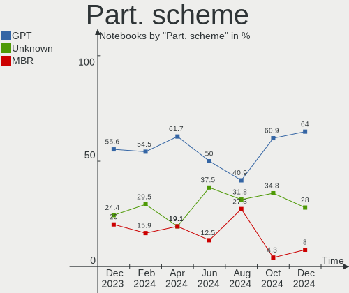
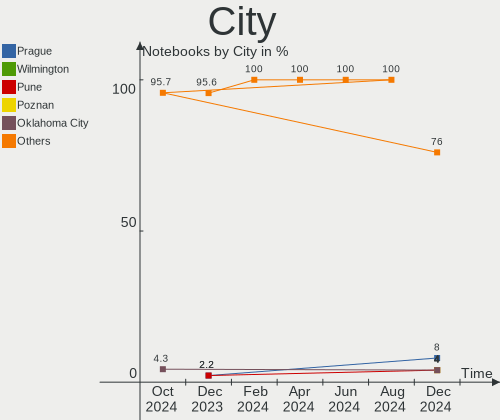
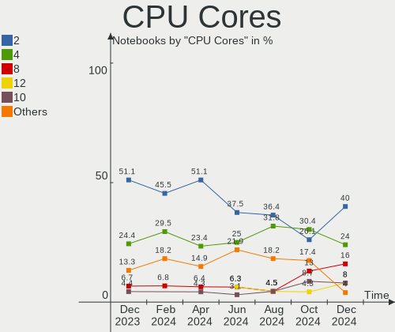
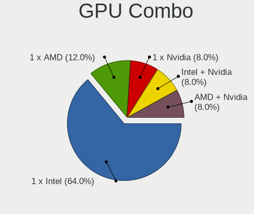
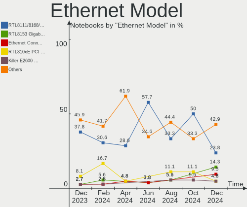
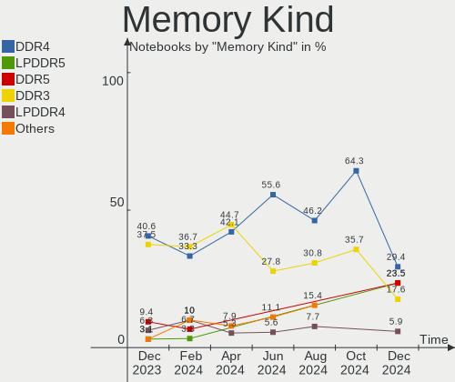
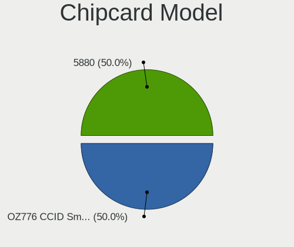

Kali - Hardware Trends (Notebooks)
----------------------------------

A project to identify most popular hardware characteristics and track their change
over time based on data collected by Linux users at https://Linux-Hardware.org.

Anyone can contribute to this report by the [hw-probe](https://github.com/linuxhw/hw-probe) tool:

    sudo -E hw-probe -all -upload

This report is for one last month. Overall report since the beginning of time: [TestCoverage](https://github.com/linuxhw/TestCoverage)

Period: Aug, 2022.

Contents
--------

* [ System ](#system)
  - [ OS                       ](#os)
  - [ OS Family                ](#os-family)
  - [ Kernel                   ](#kernel)
  - [ Kernel Family            ](#kernel-family)
  - [ Kernel Major Ver.        ](#kernel-major-ver)
  - [ Arch                     ](#arch)
  - [ DE                       ](#de)
  - [ Display Server           ](#display-server)
  - [ Display Manager          ](#display-manager)
  - [ OS Lang                  ](#os-lang)
  - [ Boot Mode                ](#boot-mode)
  - [ Filesystem               ](#filesystem)
  - [ Part. scheme             ](#part-scheme)
  - [ Dual Boot with Linux/BSD ](#dual-boot-with-linuxbsd)
  - [ Dual Boot (Win)          ](#dual-boot-win)

* [ Board ](#board)
  - [ Vendor                   ](#vendor)
  - [ Model                    ](#model)
  - [ Model Family             ](#model-family)
  - [ MFG Year                 ](#mfg-year)
  - [ Form Factor              ](#form-factor)
  - [ Secure Boot              ](#secure-boot)
  - [ Coreboot                 ](#coreboot)
  - [ RAM Size                 ](#ram-size)
  - [ RAM Used                 ](#ram-used)
  - [ Total Drives             ](#total-drives)
  - [ Has CD-ROM               ](#has-cd-rom)
  - [ Has Ethernet             ](#has-ethernet)
  - [ Has WiFi                 ](#has-wifi)
  - [ Has Bluetooth            ](#has-bluetooth)

* [ Location ](#location)
  - [ Country                  ](#country)
  - [ City                     ](#city)

* [ Drives ](#drives)
  - [ Drive Vendor             ](#drive-vendor)
  - [ Drive Model              ](#drive-model)
  - [ HDD Vendor               ](#hdd-vendor)
  - [ SSD Vendor               ](#ssd-vendor)
  - [ Drive Kind               ](#drive-kind)
  - [ Drive Connector          ](#drive-connector)
  - [ Drive Size               ](#drive-size)
  - [ Space Total              ](#space-total)
  - [ Space Used               ](#space-used)
  - [ Malfunc. Drives          ](#malfunc-drives)
  - [ Malfunc. Drive Vendor    ](#malfunc-drive-vendor)
  - [ Malfunc. HDD Vendor      ](#malfunc-hdd-vendor)
  - [ Malfunc. Drive Kind      ](#malfunc-drive-kind)
  - [ Failed Drives            ](#failed-drives)
  - [ Failed Drive Vendor      ](#failed-drive-vendor)
  - [ Drive Status             ](#drive-status)

* [ Storage controller ](#storage-controller)
  - [ Storage Vendor           ](#storage-vendor)
  - [ Storage Model            ](#storage-model)
  - [ Storage Kind             ](#storage-kind)

* [ Processor ](#processor)
  - [ CPU Vendor               ](#cpu-vendor)
  - [ CPU Model                ](#cpu-model)
  - [ CPU Model Family         ](#cpu-model-family)
  - [ CPU Cores                ](#cpu-cores)
  - [ CPU Sockets              ](#cpu-sockets)
  - [ CPU Threads              ](#cpu-threads)
  - [ CPU Op-Modes             ](#cpu-op-modes)
  - [ CPU Microcode            ](#cpu-microcode)
  - [ CPU Microarch            ](#cpu-microarch)

* [ Graphics ](#graphics)
  - [ GPU Vendor               ](#gpu-vendor)
  - [ GPU Model                ](#gpu-model)
  - [ GPU Combo                ](#gpu-combo)
  - [ GPU Driver               ](#gpu-driver)
  - [ GPU Memory               ](#gpu-memory)

* [ Monitor ](#monitor)
  - [ Monitor Vendor           ](#monitor-vendor)
  - [ Monitor Model            ](#monitor-model)
  - [ Monitor Resolution       ](#monitor-resolution)
  - [ Monitor Diagonal         ](#monitor-diagonal)
  - [ Monitor Width            ](#monitor-width)
  - [ Aspect Ratio             ](#aspect-ratio)
  - [ Monitor Area             ](#monitor-area)
  - [ Pixel Density            ](#pixel-density)
  - [ Multiple Monitors        ](#multiple-monitors)

* [ Network ](#network)
  - [ Net Controller Vendor    ](#net-controller-vendor)
  - [ Net Controller Model     ](#net-controller-model)
  - [ Wireless Vendor          ](#wireless-vendor)
  - [ Wireless Model           ](#wireless-model)
  - [ Ethernet Vendor          ](#ethernet-vendor)
  - [ Ethernet Model           ](#ethernet-model)
  - [ Net Controller Kind      ](#net-controller-kind)
  - [ Used Controller          ](#used-controller)
  - [ NICs                     ](#nics)
  - [ IPv6                     ](#ipv6)

* [ Bluetooth ](#bluetooth)
  - [ Bluetooth Vendor         ](#bluetooth-vendor)
  - [ Bluetooth Model          ](#bluetooth-model)

* [ Sound ](#sound)
  - [ Sound Vendor             ](#sound-vendor)
  - [ Sound Model              ](#sound-model)

* [ Memory ](#memory)
  - [ Memory Vendor            ](#memory-vendor)
  - [ Memory Model             ](#memory-model)
  - [ Memory Kind              ](#memory-kind)
  - [ Memory Form Factor       ](#memory-form-factor)
  - [ Memory Size              ](#memory-size)
  - [ Memory Speed             ](#memory-speed)

* [ Printers & scanners ](#printers--scanners)
  - [ Printer Vendor           ](#printer-vendor)
  - [ Printer Model            ](#printer-model)
  - [ Scanner Vendor           ](#scanner-vendor)
  - [ Scanner Model            ](#scanner-model)

* [ Camera ](#camera)
  - [ Camera Vendor            ](#camera-vendor)
  - [ Camera Model             ](#camera-model)

* [ Security ](#security)
  - [ Fingerprint Vendor       ](#fingerprint-vendor)
  - [ Fingerprint Model        ](#fingerprint-model)
  - [ Chipcard Vendor          ](#chipcard-vendor)
  - [ Chipcard Model           ](#chipcard-model)

* [ Unsupported ](#unsupported)
  - [ Unsupported Devices      ](#unsupported-devices)
  - [ Unsupported Device Types ](#unsupported-device-types)

System
------

OS
--

Installed operating systems

| Name        | Notebooks | Percent |
|-------------|-----------|---------|
| Kali 2022.3 | 26        | 78.79%  |
| Kali 2022.2 | 6         | 18.18%  |
| Kali 2021.4 | 1         | 3.03%   |

OS Family
---------

OS without a version

| Name | Notebooks | Percent |
|------|-----------|---------|
| Kali | 33        | 100%    |

Kernel
------

Version of the Linux kernel

| Version            | Notebooks | Percent |
|--------------------|-----------|---------|
| 5.18.0-kali5-amd64 | 28        | 84.85%  |
| 5.16.0-kali7-amd64 | 4         | 12.12%  |
| 5.14.0-kali4-amd64 | 1         | 3.03%   |

Kernel Family
-------------

Linux kernel without a distro release

| Version | Notebooks | Percent |
|---------|-----------|---------|
| 5.18.0  | 28        | 84.85%  |
| 5.16.0  | 4         | 12.12%  |
| 5.14.0  | 1         | 3.03%   |

Kernel Major Ver.
-----------------

Linux kernel major version

| Version | Notebooks | Percent |
|---------|-----------|---------|
| 5.18    | 28        | 84.85%  |
| 5.16    | 4         | 12.12%  |
| 5.14    | 1         | 3.03%   |

Arch
----

OS architecture (x86_64, i586, etc.)

| Name   | Notebooks | Percent |
|--------|-----------|---------|
| x86_64 | 33        | 100%    |

DE
--

Desktop Environment

| Name  | Notebooks | Percent |
|-------|-----------|---------|
| XFCE  | 26        | 78.79%  |
| GNOME | 5         | 15.15%  |
| KDE5  | 2         | 6.06%   |

Display Server
--------------

X11 or Wayland

| Name    | Notebooks | Percent |
|---------|-----------|---------|
| X11     | 31        | 93.94%  |
| Wayland | 2         | 6.06%   |

Display Manager
---------------

SDDM, LightDM, etc.

| Name    | Notebooks | Percent |
|---------|-----------|---------|
| LightDM | 25        | 75.76%  |
| GDM3    | 4         | 12.12%  |
| SDDM    | 3         | 9.09%   |
| Unknown | 1         | 3.03%   |

OS Lang
-------

Language

| Lang  | Notebooks | Percent |
|-------|-----------|---------|
| en_US | 20        | 60.61%  |
| en_IN | 2         | 6.06%   |
| en_GB | 2         | 6.06%   |
| de_DE | 2         | 6.06%   |
| ru_RU | 1         | 3.03%   |
| fr_FR | 1         | 3.03%   |
| es_AR | 1         | 3.03%   |
| en_ZA | 1         | 3.03%   |
| en_CA | 1         | 3.03%   |
| en_AU | 1         | 3.03%   |
| de_AT | 1         | 3.03%   |

Boot Mode
---------

EFI or BIOS

| Mode | Notebooks | Percent |
|------|-----------|---------|
| EFI  | 26        | 78.79%  |
| BIOS | 7         | 21.21%  |

Filesystem
----------

Type of filesystem

| Type    | Notebooks | Percent |
|---------|-----------|---------|
| Ext4    | 30        | 90.91%  |
| Overlay | 2         | 6.06%   |
| Btrfs   | 1         | 3.03%   |

Part. scheme
------------

Scheme of partitioning

| Type    | Notebooks | Percent |
|---------|-----------|---------|
| GPT     | 28        | 84.85%  |
| MBR     | 4         | 12.12%  |
| Unknown | 1         | 3.03%   |

Dual Boot with Linux/BSD
------------------------

Hosting more than one Linux/BSD

| Dual boot | Notebooks | Percent |
|-----------|-----------|---------|
| No        | 32        | 96.97%  |
| Yes       | 1         | 3.03%   |

Dual Boot (Win)
---------------

Hosting Linux and Windows

| Dual boot | Notebooks | Percent |
|-----------|-----------|---------|
| No        | 23        | 69.7%   |
| Yes       | 10        | 30.3%   |

Board
-----

Vendor
------

Motherboard manufacturer

| Name             | Notebooks | Percent |
|------------------|-----------|---------|
| Hewlett-Packard  | 11        | 33.33%  |
| Dell             | 6         | 18.18%  |
| ASUSTek Computer | 5         | 15.15%  |
| Acer             | 3         | 9.09%   |
| Sony             | 1         | 3.03%   |
| Novatech         | 1         | 3.03%   |
| MicroByte        | 1         | 3.03%   |
| Lenovo           | 1         | 3.03%   |
| IPASON           | 1         | 3.03%   |
| Google           | 1         | 3.03%   |
| Apple            | 1         | 3.03%   |
| Unknown          | 1         | 3.03%   |

Model
-----

Motherboard model

| Name                                    | Notebooks | Percent |
|-----------------------------------------|-----------|---------|
| Sony VPCZ12M9E                          | 1         | 3.03%   |
| Novatech C141WP-I5HS                    | 1         | 3.03%   |
| MicroByte ezbook                        | 1         | 3.03%   |
| Lenovo ThinkPad E15 Gen 4 21EES00100    | 1         | 3.03%   |
| IPASON MaxBook P1X                      | 1         | 3.03%   |
| HP ProBook 6540b                        | 1         | 3.03%   |
| HP ProBook 440 G5                       | 1         | 3.03%   |
| HP OMEN Laptop 15-ek0xxx                | 1         | 3.03%   |
| HP Laptop 15-dw0xxx                     | 1         | 3.03%   |
| HP Laptop 15 3v0c9ea                    | 1         | 3.03%   |
| HP ENVY m6                              | 1         | 3.03%   |
| HP EliteBook 820 G3                     | 1         | 3.03%   |
| HP EliteBook 820 G1                     | 1         | 3.03%   |
| HP EliteBook 645 14 inch G9 Notebook PC | 1         | 3.03%   |
| HP Compaq 620                           | 1         | 3.03%   |
| HP 245 G7 Notebook PC                   | 1         | 3.03%   |
| Google Bard                             | 1         | 3.03%   |
| Dell Precision M4600                    | 1         | 3.03%   |
| Dell Precision 3551                     | 1         | 3.03%   |
| Dell Latitude E5470                     | 1         | 3.03%   |
| Dell Latitude 7290                      | 1         | 3.03%   |
| Dell Inspiron 3542                      | 1         | 3.03%   |
| Dell Inspiron 15-3567                   | 1         | 3.03%   |
| ASUS X541UV                             | 1         | 3.03%   |
| ASUS VivoBook_ASUSLaptop X531FL_S531FL  | 1         | 3.03%   |
| ASUS VivoBook 15_ASUS Laptop X540UAR    | 1         | 3.03%   |
| ASUS ROG Strix G533ZW_G533ZW            | 1         | 3.03%   |
| ASUS G750JM                             | 1         | 3.03%   |
| Apple MacBookPro14,1                    | 1         | 3.03%   |
| Acer Nitro AN515-43                     | 1         | 3.03%   |
| Acer Aspire R5-471T                     | 1         | 3.03%   |
| Acer Aspire 5755G                       | 1         | 3.03%   |
| Unknown                                 | 1         | 3.03%   |

Model Family
------------

Motherboard model prefix

| Name                 | Notebooks | Percent |
|----------------------|-----------|---------|
| HP EliteBook         | 3         | 9.09%   |
| HP ProBook           | 2         | 6.06%   |
| HP Laptop            | 2         | 6.06%   |
| Dell Precision       | 2         | 6.06%   |
| Dell Latitude        | 2         | 6.06%   |
| Dell Inspiron        | 2         | 6.06%   |
| ASUS VivoBook        | 2         | 6.06%   |
| Acer Aspire          | 2         | 6.06%   |
| Sony VPCZ12M9E       | 1         | 3.03%   |
| Novatech C141WP-I5HS | 1         | 3.03%   |
| MicroByte ezbook     | 1         | 3.03%   |
| Lenovo ThinkPad      | 1         | 3.03%   |
| IPASON MaxBook       | 1         | 3.03%   |
| HP OMEN              | 1         | 3.03%   |
| HP ENVY              | 1         | 3.03%   |
| HP Compaq            | 1         | 3.03%   |
| HP 245               | 1         | 3.03%   |
| Google Bard          | 1         | 3.03%   |
| ASUS X541UV          | 1         | 3.03%   |
| ASUS ROG             | 1         | 3.03%   |
| ASUS G750JM          | 1         | 3.03%   |
| Apple MacBookPro14   | 1         | 3.03%   |
| Acer Nitro           | 1         | 3.03%   |
| Unknown              | 1         | 3.03%   |

MFG Year
--------

Motherboard manufacture year

| Year | Notebooks | Percent |
|------|-----------|---------|
| 2022 | 5         | 15.15%  |
| 2021 | 4         | 12.12%  |
| 2019 | 4         | 12.12%  |
| 2016 | 4         | 12.12%  |
| 2017 | 3         | 9.09%   |
| 2011 | 3         | 9.09%   |
| 2020 | 2         | 6.06%   |
| 2018 | 2         | 6.06%   |
| 2014 | 2         | 6.06%   |
| 2010 | 2         | 6.06%   |
| 2013 | 1         | 3.03%   |
| 2012 | 1         | 3.03%   |

Form Factor
-----------

Physical design of the computer

| Name     | Notebooks | Percent |
|----------|-----------|---------|
| Notebook | 33        | 100%    |

Secure Boot
-----------

Enabled or disabled

| State    | Notebooks | Percent |
|----------|-----------|---------|
| Disabled | 33        | 100%    |

Coreboot
--------

Have coreboot on board

| Used | Notebooks | Percent |
|------|-----------|---------|
| No   | 32        | 96.97%  |
| Yes  | 1         | 3.03%   |

RAM Size
--------

Total RAM memory

| Size in GB  | Notebooks | Percent |
|-------------|-----------|---------|
| 4.01-8.0    | 16        | 48.48%  |
| 8.01-16.0   | 6         | 18.18%  |
| 3.01-4.0    | 4         | 12.12%  |
| 16.01-24.0  | 3         | 9.09%   |
| 32.01-64.0  | 1         | 3.03%   |
| 2.01-3.0    | 1         | 3.03%   |
| 64.01-256.0 | 1         | 3.03%   |
| 1.01-2.0    | 1         | 3.03%   |

RAM Used
--------

Used RAM memory

| Used GB   | Notebooks | Percent |
|-----------|-----------|---------|
| 2.01-3.0  | 10        | 30.3%   |
| 1.01-2.0  | 10        | 30.3%   |
| 4.01-8.0  | 5         | 15.15%  |
| 3.01-4.0  | 5         | 15.15%  |
| 8.01-16.0 | 2         | 6.06%   |
| 0.51-1.0  | 1         | 3.03%   |

Total Drives
------------

Number of drives on board

| Drives | Notebooks | Percent |
|--------|-----------|---------|
| 1      | 24        | 72.73%  |
| 2      | 8         | 24.24%  |
| 3      | 1         | 3.03%   |

Has CD-ROM
----------

Has CD-ROM on board

| Presented | Notebooks | Percent |
|-----------|-----------|---------|
| No        | 25        | 75.76%  |
| Yes       | 8         | 24.24%  |

Has Ethernet
------------

Has Ethernet on board

| Presented | Notebooks | Percent |
|-----------|-----------|---------|
| Yes       | 27        | 81.82%  |
| No        | 6         | 18.18%  |

Has WiFi
--------

Has WiFi module

| Presented | Notebooks | Percent |
|-----------|-----------|---------|
| Yes       | 33        | 100%    |

Has Bluetooth
-------------

Has Bluetooth module

| Presented | Notebooks | Percent |
|-----------|-----------|---------|
| Yes       | 28        | 84.85%  |
| No        | 5         | 15.15%  |

Location
--------

Country
-------

Geographic location (country)

| Country      | Notebooks | Percent |
|--------------|-----------|---------|
| USA          | 12        | 36.36%  |
| UK           | 2         | 6.06%   |
| Serbia       | 2         | 6.06%   |
| Russia       | 2         | 6.06%   |
| India        | 2         | 6.06%   |
| Germany      | 2         | 6.06%   |
| France       | 2         | 6.06%   |
| Sweden       | 1         | 3.03%   |
| Sri Lanka    | 1         | 3.03%   |
| South Africa | 1         | 3.03%   |
| Norway       | 1         | 3.03%   |
| Jordan       | 1         | 3.03%   |
| Canada       | 1         | 3.03%   |
| Austria      | 1         | 3.03%   |
| Australia    | 1         | 3.03%   |
| Argentina    | 1         | 3.03%   |

City
----

Geographic location (city)

| City                  | Notebooks | Percent |
|-----------------------|-----------|---------|
| Phoenix               | 2         | 6.06%   |
| Pasadena              | 2         | 6.06%   |
| Belgrade              | 2         | 6.06%   |
| Vienna                | 1         | 3.03%   |
| Sydney                | 1         | 3.03%   |
| Stuttgart             | 1         | 3.03%   |
| Round Lake            | 1         | 3.03%   |
| Rock Springs          | 1         | 3.03%   |
| Pune                  | 1         | 3.03%   |
| Pretoria              | 1         | 3.03%   |
| Newark                | 1         | 3.03%   |
| Namsos                | 1         | 3.03%   |
| Mumbai                | 1         | 3.03%   |
| Lyon                  | 1         | 3.03%   |
| Los Angeles           | 1         | 3.03%   |
| Liverpool             | 1         | 3.03%   |
| Kista                 | 1         | 3.03%   |
| Khabarovsk            | 1         | 3.03%   |
| Kazan’              | 1         | 3.03%   |
| Heilbad Heiligenstadt | 1         | 3.03%   |
| Elkhart               | 1         | 3.03%   |
| Draguignan            | 1         | 3.03%   |
| Denver                | 1         | 3.03%   |
| Defiance              | 1         | 3.03%   |
| Corrientes            | 1         | 3.03%   |
| Colombo               | 1         | 3.03%   |
| Bella Vista           | 1         | 3.03%   |
| Balham                | 1         | 3.03%   |
| Amman                 | 1         | 3.03%   |
| Airdrie               | 1         | 3.03%   |

Drives
------

Drive Vendor
------------

Hard drive vendors

| Vendor              | Notebooks | Drives | Percent |
|---------------------|-----------|--------|---------|
| WDC                 | 6         | 6      | 15%     |
| Samsung Electronics | 5         | 6      | 12.5%   |
| Unknown             | 3         | 4      | 7.5%    |
| Toshiba             | 3         | 4      | 7.5%    |
| SanDisk             | 3         | 3      | 7.5%    |
| Seagate             | 2         | 2      | 5%      |
| Intel               | 2         | 2      | 5%      |
| Hitachi             | 2         | 2      | 5%      |
| A-DATA Technology   | 2         | 2      | 5%      |
| Unknown             | 2         | 2      | 5%      |
| UMIS                | 1         | 1      | 2.5%    |
| SPCC                | 1         | 1      | 2.5%    |
| SK hynix            | 1         | 1      | 2.5%    |
| NFORCE              | 1         | 1      | 2.5%    |
| Micron Technology   | 1         | 1      | 2.5%    |
| Kingston            | 1         | 1      | 2.5%    |
| KingFast            | 1         | 1      | 2.5%    |
| HGST                | 1         | 1      | 2.5%    |
| China               | 1         | 1      | 2.5%    |
| Apple               | 1         | 2      | 2.5%    |

Drive Model
-----------

Hard drive models

| Model                                | Notebooks | Percent |
|--------------------------------------|-----------|---------|
| Unknown                              | 2         | 4.76%   |
| WDC WDS240G2G0B-00EPW0 240GB SSD     | 1         | 2.38%   |
| WDC WDS200T2B0A-00SM50 2TB SSD       | 1         | 2.38%   |
| WDC WD5000LPZX-60Z10T0 500GB         | 1         | 2.38%   |
| WDC WD10SPZX-60Z10T1 1TB             | 1         | 2.38%   |
| WDC WD10SPZX-60Z10T0 1TB             | 1         | 2.38%   |
| WDC PC SN520 SDAPNUW-512G-1114 512GB | 1         | 2.38%   |
| Unknown USDU1  32GB                  | 1         | 2.38%   |
| Unknown SS08G  8GB                   | 1         | 2.38%   |
| Unknown SR128  128GB                 | 1         | 2.38%   |
| Unknown DA4128  128GB                | 1         | 2.38%   |
| UMIS RPJTJ512MGE1QDQ 512GB           | 1         | 2.38%   |
| Toshiba THNS064GG2BNAA 64GB SSD      | 1         | 2.38%   |
| Toshiba MQ04ABF100 1TB               | 1         | 2.38%   |
| Toshiba MQ01ACF050 500GB             | 1         | 2.38%   |
| SPCC Solid State Disk 256GB          | 1         | 2.38%   |
| SK hynix SC311 SATA 256GB SSD        | 1         | 2.38%   |
| Seagate ST9750420AS 752GB            | 1         | 2.38%   |
| Seagate ST1000LM035-1RK172 1TB       | 1         | 2.38%   |
| SanDisk SDSSDH3 1T02 1TB             | 1         | 2.38%   |
| SanDisk SD8SN8U-256G-1006 256GB SSD  | 1         | 2.38%   |
| SanDisk NVMe SSD Drive 256GB         | 1         | 2.38%   |
| Samsung SSD 980 PRO 2TB              | 1         | 2.38%   |
| Samsung SSD 850 EVO 500GB            | 1         | 2.38%   |
| Samsung SSD 840 Series 120GB         | 1         | 2.38%   |
| Samsung PSSD T7 1TB                  | 1         | 2.38%   |
| Samsung MZVLQ512HBLU-00BH1 512GB     | 1         | 2.38%   |
| Samsung MZVLB512HBJQ-000H1 512GB     | 1         | 2.38%   |
| NFORCE 25625G2 TAS-SSQE3 256GB SSD   | 1         | 2.38%   |
| Micron 3400_MTFDKBA1T0TFH 1TB        | 1         | 2.38%   |
| Kingston SV300S37A120G 120GB SSD     | 1         | 2.38%   |
| KingFast SSD 256GB                   | 1         | 2.38%   |
| Intel SSDPEKNW512G8 512GB            | 1         | 2.38%   |
| Intel SSDPEKKF256G7H 256GB           | 1         | 2.38%   |
| Hitachi HTS543232L9A300 320GB        | 1         | 2.38%   |
| Hitachi HTS541010A9E680 1TB          | 1         | 2.38%   |
| HGST HTS721075A9E630 752GB           | 1         | 2.38%   |
| China SSD 256GB                      | 1         | 2.38%   |
| Apple SSD AP0128J 8.1KB              | 1         | 2.38%   |
| A-DATA SWORDFISH 250GB               | 1         | 2.38%   |
| A-DATA SP580M 256GB SSD              | 1         | 2.38%   |

HDD Vendor
----------

Hard disk drive vendors

| Vendor  | Notebooks | Drives | Percent |
|---------|-----------|--------|---------|
| WDC     | 3         | 3      | 30%     |
| Toshiba | 2         | 2      | 20%     |
| Seagate | 2         | 2      | 20%     |
| Hitachi | 2         | 2      | 20%     |
| HGST    | 1         | 1      | 10%     |

SSD Vendor
----------

Solid state drive vendors

| Vendor              | Notebooks | Drives | Percent |
|---------------------|-----------|--------|---------|
| WDC                 | 2         | 2      | 12.5%   |
| SanDisk             | 2         | 2      | 12.5%   |
| Samsung Electronics | 2         | 3      | 12.5%   |
| Unknown             | 2         | 2      | 12.5%   |
| Toshiba             | 1         | 2      | 6.25%   |
| SPCC                | 1         | 1      | 6.25%   |
| SK hynix            | 1         | 1      | 6.25%   |
| NFORCE              | 1         | 1      | 6.25%   |
| Kingston            | 1         | 1      | 6.25%   |
| KingFast            | 1         | 1      | 6.25%   |
| China               | 1         | 1      | 6.25%   |
| A-DATA Technology   | 1         | 1      | 6.25%   |

Drive Kind
----------

HDD or SSD

| Kind | Notebooks | Drives | Percent |
|------|-----------|--------|---------|
| SSD  | 15        | 18     | 39.47%  |
| NVMe | 10        | 12     | 26.32%  |
| HDD  | 10        | 10     | 26.32%  |
| MMC  | 3         | 4      | 7.89%   |

Drive Connector
---------------

SATA, SAS, NVMe, etc.

| Type | Notebooks | Drives | Percent |
|------|-----------|--------|---------|
| SATA | 23        | 27     | 62.16%  |
| NVMe | 10        | 12     | 27.03%  |
| MMC  | 3         | 4      | 8.11%   |
| SAS  | 1         | 1      | 2.7%    |

Drive Size
----------

Size of hard drive

| Size in TB | Notebooks | Drives | Percent |
|------------|-----------|--------|---------|
| 0.01-0.5   | 16        | 18     | 64%     |
| 0.51-1.0   | 8         | 9      | 32%     |
| 1.01-2.0   | 1         | 1      | 4%      |

Space Total
-----------

Amount of disk space available on the file system

| Size in GB     | Notebooks | Percent |
|----------------|-----------|---------|
| 101-250        | 14        | 42.42%  |
| 251-500        | 9         | 27.27%  |
| 501-1000       | 4         | 12.12%  |
| 51-100         | 2         | 6.06%   |
| More than 3000 | 1         | 3.03%   |
| 21-50          | 1         | 3.03%   |
| 1001-2000      | 1         | 3.03%   |
| 1-20           | 1         | 3.03%   |

Space Used
----------

Amount of used disk space

| Used GB   | Notebooks | Percent |
|-----------|-----------|---------|
| 1-20      | 12        | 36.36%  |
| 51-100    | 7         | 21.21%  |
| 101-250   | 6         | 18.18%  |
| 21-50     | 5         | 15.15%  |
| 1001-2000 | 2         | 6.06%   |
| 251-500   | 1         | 3.03%   |

Malfunc. Drives
---------------

Drive models with a malfunction

| Model                            | Notebooks | Drives | Percent |
|----------------------------------|-----------|--------|---------|
| WDC WD5000LPZX-60Z10T0 500GB     | 1         | 1      | 25%     |
| Kingston SV300S37A120G 120GB SSD | 1         | 1      | 25%     |
| Hitachi HTS543232L9A300 320GB    | 1         | 1      | 25%     |
| Hitachi HTS541010A9E680 1TB      | 1         | 1      | 25%     |

Malfunc. Drive Vendor
---------------------

Vendors of faulty drives

| Vendor   | Notebooks | Drives | Percent |
|----------|-----------|--------|---------|
| Hitachi  | 2         | 2      | 50%     |
| WDC      | 1         | 1      | 25%     |
| Kingston | 1         | 1      | 25%     |

Malfunc. HDD Vendor
-------------------

Vendors of faulty HDD drives

| Vendor  | Notebooks | Drives | Percent |
|---------|-----------|--------|---------|
| Hitachi | 2         | 2      | 66.67%  |
| WDC     | 1         | 1      | 33.33%  |

Malfunc. Drive Kind
-------------------

Kinds of faulty drives

| Kind | Notebooks | Drives | Percent |
|------|-----------|--------|---------|
| HDD  | 3         | 3      | 75%     |
| SSD  | 1         | 1      | 25%     |

Failed Drives
-------------

Failed drive models

Zero info for selected period =(

Failed Drive Vendor
-------------------

Failed drive vendors

Zero info for selected period =(

Drive Status
------------

Number of failed and malfunc. drives

| Status   | Notebooks | Drives | Percent |
|----------|-----------|--------|---------|
| Works    | 26        | 33     | 74.29%  |
| Detected | 5         | 7      | 14.29%  |
| Malfunc  | 4         | 4      | 11.43%  |

Storage controller
------------------

Storage Vendor
--------------

Storage controller vendors

| Vendor                  | Notebooks | Percent |
|-------------------------|-----------|---------|
| Intel                   | 26        | 68.42%  |
| Samsung Electronics     | 3         | 7.89%   |
| AMD                     | 3         | 7.89%   |
| SanDisk                 | 2         | 5.26%   |
| Union Memory (Shenzhen) | 1         | 2.63%   |
| Micron Technology       | 1         | 2.63%   |
| Apple                   | 1         | 2.63%   |
| ADATA Technology        | 1         | 2.63%   |

Storage Model
-------------

Storage controller models

| Model                                                                          | Notebooks | Percent |
|--------------------------------------------------------------------------------|-----------|---------|
| Intel Sunrise Point-LP SATA Controller [AHCI mode]                             | 7         | 16.67%  |
| Intel 82801 Mobile SATA Controller [RAID mode]                                 | 4         | 9.52%   |
| Intel Celeron/Pentium Silver Processor SATA Controller                         | 3         | 7.14%   |
| AMD FCH SATA Controller [AHCI mode]                                            | 3         | 7.14%   |
| Intel Volume Management Device NVMe RAID Controller                            | 2         | 4.76%   |
| Intel 8 Series SATA Controller 1 [AHCI mode]                                   | 2         | 4.76%   |
| Union Memory (Shenzhen) AM630 PCIe 4.0 x4 NVMe SSD Controller                  | 1         | 2.38%   |
| SanDisk WD Blue SN550 NVMe SSD                                                 | 1         | 2.38%   |
| SanDisk WD Blue SN500 / PC SN520 NVMe SSD                                      | 1         | 2.38%   |
| Samsung NVMe SSD Controller SM981/PM981/PM983                                  | 1         | 2.38%   |
| Samsung NVMe SSD Controller PM9A1/PM9A3/980PRO                                 | 1         | 2.38%   |
| Samsung NVMe SSD Controller 980                                                | 1         | 2.38%   |
| Micron Non-Volatile memory controller                                          | 1         | 2.38%   |
| Intel Tiger Lake-LP SATA Controller                                            | 1         | 2.38%   |
| Intel SSD 660P Series                                                          | 1         | 2.38%   |
| Intel SSD 600P Series                                                          | 1         | 2.38%   |
| Intel Ice Lake-LP SATA Controller [AHCI mode]                                  | 1         | 2.38%   |
| Intel Comet Lake PCH-H RAID                                                    | 1         | 2.38%   |
| Intel Celeron N3350/Pentium N4200/Atom E3900 Series SATA AHCI Controller       | 1         | 2.38%   |
| Intel Cannon Point-LP SATA Controller [AHCI Mode]                              | 1         | 2.38%   |
| Intel 82801IBM/IEM (ICH9M/ICH9M-E) 2 port SATA Controller [IDE mode]           | 1         | 2.38%   |
| Intel 8 Series/C220 Series Chipset Family 6-port SATA Controller 1 [AHCI mode] | 1         | 2.38%   |
| Intel 6 Series/C200 Series Chipset Family 6 port Mobile SATA AHCI Controller   | 1         | 2.38%   |
| Intel 5 Series/3400 Series Chipset 4 port SATA IDE Controller                  | 1         | 2.38%   |
| Intel 5 Series/3400 Series Chipset 2 port SATA IDE Controller                  | 1         | 2.38%   |
| Apple S3X NVMe Controller                                                      | 1         | 2.38%   |
| ADATA ADATA XPG GAMMIXS1 1L Media                                              | 1         | 2.38%   |

Storage Kind
------------

Kind of storage controller (IDE, SATA, NVMe, SAS, ...)

| Kind | Notebooks | Percent |
|------|-----------|---------|
| SATA | 21        | 52.5%   |
| NVMe | 10        | 25%     |
| RAID | 7         | 17.5%   |
| IDE  | 2         | 5%      |

Processor
---------

CPU Vendor
----------

Processor vendors

| Vendor | Notebooks | Percent |
|--------|-----------|---------|
| Intel  | 28        | 84.85%  |
| AMD    | 5         | 15.15%  |

CPU Model
---------

Processor models

| Model                                         | Notebooks | Percent |
|-----------------------------------------------|-----------|---------|
| Intel Core i5-8250U CPU @ 1.60GHz             | 2         | 6.06%   |
| Intel Core i5-6200U CPU @ 2.30GHz             | 2         | 6.06%   |
| AMD Ryzen 7 5825U with Radeon Graphics        | 2         | 6.06%   |
| Intel Pentium Silver N5030 CPU @ 1.10GHz      | 1         | 3.03%   |
| Intel Core i7-8565U CPU @ 1.80GHz             | 1         | 3.03%   |
| Intel Core i7-6600U CPU @ 2.60GHz             | 1         | 3.03%   |
| Intel Core i7-4700HQ CPU @ 2.40GHz            | 1         | 3.03%   |
| Intel Core i7-2640M CPU @ 2.80GHz             | 1         | 3.03%   |
| Intel Core i7-10850H CPU @ 2.70GHz            | 1         | 3.03%   |
| Intel Core i7-10750H CPU @ 2.60GHz            | 1         | 3.03%   |
| Intel Core i5-7360U CPU @ 2.30GHz             | 1         | 3.03%   |
| Intel Core i5-6300U CPU @ 2.40GHz             | 1         | 3.03%   |
| Intel Core i5-4310U CPU @ 2.00GHz             | 1         | 3.03%   |
| Intel Core i5-2450M CPU @ 2.50GHz             | 1         | 3.03%   |
| Intel Core i5-1035G1 CPU @ 1.00GHz            | 1         | 3.03%   |
| Intel Core i5 CPU M 520 @ 2.40GHz             | 1         | 3.03%   |
| Intel Core i5 CPU M 430 @ 2.27GHz             | 1         | 3.03%   |
| Intel Core i3-8130U CPU @ 2.20GHz             | 1         | 3.03%   |
| Intel Core i3-7100U CPU @ 2.40GHz             | 1         | 3.03%   |
| Intel Core i3-6006U CPU @ 2.00GHz             | 1         | 3.03%   |
| Intel Core i3-4005U CPU @ 1.70GHz             | 1         | 3.03%   |
| Intel Core 2 Duo CPU T6670 @ 2.20GHz          | 1         | 3.03%   |
| Intel Celeron J4125 CPU @ 2.00GHz             | 1         | 3.03%   |
| Intel Celeron J4005 CPU @ 2.00GHz             | 1         | 3.03%   |
| Intel Celeron CPU N3450 @ 1.10GHz             | 1         | 3.03%   |
| Intel 12th Gen Core i9-12900H                 | 1         | 3.03%   |
| Intel 11th Gen Core i5-1135G7 @ 2.40GHz       | 1         | 3.03%   |
| AMD Ryzen 5 3550H with Radeon Vega Mobile Gfx | 1         | 3.03%   |
| AMD Ryzen 3 3300U with Radeon Vega Mobile Gfx | 1         | 3.03%   |
| AMD A10-4600M APU with Radeon HD Graphics     | 1         | 3.03%   |

CPU Model Family
----------------

Processor model prefix

| Model                | Notebooks | Percent |
|----------------------|-----------|---------|
| Intel Core i5        | 11        | 33.33%  |
| Intel Core i7        | 6         | 18.18%  |
| Intel Core i3        | 4         | 12.12%  |
| Intel Celeron        | 3         | 9.09%   |
| Other                | 2         | 6.06%   |
| AMD Ryzen 7          | 2         | 6.06%   |
| Intel Pentium Silver | 1         | 3.03%   |
| Intel Core 2 Duo     | 1         | 3.03%   |
| AMD Ryzen 5          | 1         | 3.03%   |
| AMD Ryzen 3          | 1         | 3.03%   |
| AMD A10              | 1         | 3.03%   |

CPU Cores
---------

Number of processor cores

| Number | Notebooks | Percent |
|--------|-----------|---------|
| 2      | 17        | 51.52%  |
| 4      | 11        | 33.33%  |
| 8      | 2         | 6.06%   |
| 6      | 2         | 6.06%   |
| 14     | 1         | 3.03%   |

CPU Sockets
-----------

Number of sockets

| Number | Notebooks | Percent |
|--------|-----------|---------|
| 1      | 33        | 100%    |

CPU Threads
-----------

Threads per core (Hyper-Threading)

| Number | Notebooks | Percent |
|--------|-----------|---------|
| 2      | 27        | 81.82%  |
| 1      | 6         | 18.18%  |

CPU Op-Modes
------------

CPU Operation Modes (32-bit, 64-bit)

| Op mode        | Notebooks | Percent |
|----------------|-----------|---------|
| 32-bit, 64-bit | 33        | 100%    |

CPU Microcode
-------------

Microcode number

| Number     | Notebooks | Percent |
|------------|-----------|---------|
| 0x406e3    | 5         | 15.15%  |
| 0x806ea    | 3         | 9.09%   |
| 0xa0652    | 2         | 6.06%   |
| 0x806e9    | 2         | 6.06%   |
| 0x706a8    | 2         | 6.06%   |
| 0x40651    | 2         | 6.06%   |
| 0x0a50000c | 2         | 6.06%   |
| 0x906a3    | 1         | 3.03%   |
| 0x806eb    | 1         | 3.03%   |
| 0x806c1    | 1         | 3.03%   |
| 0x706e5    | 1         | 3.03%   |
| 0x706a1    | 1         | 3.03%   |
| 0x506c9    | 1         | 3.03%   |
| 0x306c3    | 1         | 3.03%   |
| 0x206a7    | 1         | 3.03%   |
| 0x20655    | 1         | 3.03%   |
| 0x20652    | 1         | 3.03%   |
| 0x1067a    | 1         | 3.03%   |
| 0x08108109 | 1         | 3.03%   |
| 0x08108102 | 1         | 3.03%   |
| 0x06001119 | 1         | 3.03%   |
| Unknown    | 1         | 3.03%   |

CPU Microarch
-------------

Microarchitecture

| Name          | Notebooks | Percent |
|---------------|-----------|---------|
| KabyLake      | 6         | 18.18%  |
| Skylake       | 5         | 15.15%  |
| Haswell       | 3         | 9.09%   |
| Goldmont plus | 3         | 9.09%   |
| Zen+          | 2         | 6.06%   |
| Zen 3         | 2         | 6.06%   |
| Westmere      | 2         | 6.06%   |
| SandyBridge   | 2         | 6.06%   |
| CometLake     | 2         | 6.06%   |
| TigerLake     | 1         | 3.03%   |
| Piledriver    | 1         | 3.03%   |
| Penryn        | 1         | 3.03%   |
| IceLake       | 1         | 3.03%   |
| Goldmont      | 1         | 3.03%   |
| Unknown       | 1         | 3.03%   |

Graphics
--------

GPU Vendor
----------

Vendors of graphics cards

| Vendor | Notebooks | Percent |
|--------|-----------|---------|
| Intel  | 28        | 65.12%  |
| Nvidia | 10        | 23.26%  |
| AMD    | 5         | 11.63%  |

GPU Model
---------

Graphics card models

| Model                                                                     | Notebooks | Percent |
|---------------------------------------------------------------------------|-----------|---------|
| Intel Skylake GT2 [HD Graphics 520]                                       | 5         | 11.11%  |
| Intel UHD Graphics 620                                                    | 3         | 6.67%   |
| Intel Haswell-ULT Integrated Graphics Controller                          | 2         | 4.44%   |
| Intel GeminiLake [UHD Graphics 600]                                       | 2         | 4.44%   |
| Intel Core Processor Integrated Graphics Controller                       | 2         | 4.44%   |
| Intel CometLake-H GT2 [UHD Graphics]                                      | 2         | 4.44%   |
| Intel 2nd Generation Core Processor Family Integrated Graphics Controller | 2         | 4.44%   |
| AMD Picasso/Raven 2 [Radeon Vega Series / Radeon Vega Mobile Series]      | 2         | 4.44%   |
| AMD Barcelo                                                               | 2         | 4.44%   |
| Nvidia TU106M [GeForce RTX 2060 Mobile]                                   | 1         | 2.22%   |
| Nvidia GT216M [GeForce GT 330M]                                           | 1         | 2.22%   |
| Nvidia GP108M [GeForce MX250]                                             | 1         | 2.22%   |
| Nvidia GP107M [GeForce MX350]                                             | 1         | 2.22%   |
| Nvidia GP107GLM [Quadro P620]                                             | 1         | 2.22%   |
| Nvidia GM108M [GeForce 920MX]                                             | 1         | 2.22%   |
| Nvidia GM107M [GeForce GTX 860M]                                          | 1         | 2.22%   |
| Nvidia GF108M [GeForce GT 620M/630M/635M/640M LE]                         | 1         | 2.22%   |
| Nvidia GF108GLM [Quadro 1000M]                                            | 1         | 2.22%   |
| Nvidia GA104 [Geforce RTX 3070 Ti Laptop GPU]                             | 1         | 2.22%   |
| Intel WhiskeyLake-U GT2 [UHD Graphics 620]                                | 1         | 2.22%   |
| Intel TigerLake-LP GT2 [Iris Xe Graphics]                                 | 1         | 2.22%   |
| Intel Mobile 4 Series Chipset Integrated Graphics Controller              | 1         | 2.22%   |
| Intel Iris Plus Graphics G1 (Ice Lake)                                    | 1         | 2.22%   |
| Intel Iris Plus Graphics 640                                              | 1         | 2.22%   |
| Intel HD Graphics 620                                                     | 1         | 2.22%   |
| Intel HD Graphics 500                                                     | 1         | 2.22%   |
| Intel GeminiLake [UHD Graphics 605]                                       | 1         | 2.22%   |
| Intel Alder Lake-P Integrated Graphics Controller                         | 1         | 2.22%   |
| Intel 4th Gen Core Processor Integrated Graphics Controller               | 1         | 2.22%   |
| AMD Trinity [Radeon HD 7660G]                                             | 1         | 2.22%   |
| AMD Thames [Radeon HD 7500M/7600M Series]                                 | 1         | 2.22%   |
| AMD Baffin [Radeon RX 460/560D / Pro 450/455/460/555/555X/560/560X]       | 1         | 2.22%   |

GPU Combo
---------

Combinations of graphics cards

| Name           | Notebooks | Percent |
|----------------|-----------|---------|
| 1 x Intel      | 17        | 51.52%  |
| Intel + Nvidia | 10        | 30.3%   |
| 1 x AMD        | 3         | 9.09%   |
| 2 x AMD        | 2         | 6.06%   |
| 2 x Intel      | 1         | 3.03%   |

GPU Driver
----------

Free vs proprietary

| Driver      | Notebooks | Percent |
|-------------|-----------|---------|
| Free        | 30        | 90.91%  |
| Proprietary | 3         | 9.09%   |

GPU Memory
----------

Total video memory

| Size in GB | Notebooks | Percent |
|------------|-----------|---------|
| Unknown    | 21        | 63.64%  |
| 0.51-1.0   | 3         | 9.09%   |
| 0.01-0.5   | 3         | 9.09%   |
| 3.01-4.0   | 2         | 6.06%   |
| 1.01-2.0   | 2         | 6.06%   |
| 7.01-8.0   | 1         | 3.03%   |
| 5.01-6.0   | 1         | 3.03%   |

Monitor
-------

Monitor Vendor
--------------

Monitor vendors

| Vendor              | Notebooks | Percent |
|---------------------|-----------|---------|
| AU Optronics        | 10        | 28.57%  |
| LG Display          | 7         | 20%     |
| Chimei Innolux      | 5         | 14.29%  |
| BOE                 | 5         | 14.29%  |
| TMX                 | 1         | 2.86%   |
| Sony                | 1         | 2.86%   |
| Samsung Electronics | 1         | 2.86%   |
| MXL                 | 1         | 2.86%   |
| GJX                 | 1         | 2.86%   |
| Dell                | 1         | 2.86%   |
| CS_                 | 1         | 2.86%   |
| Apple               | 1         | 2.86%   |

Monitor Model
-------------

Monitor models

| Model                                                                | Notebooks | Percent |
|----------------------------------------------------------------------|-----------|---------|
| TMX TL156VDXP0101 TMX1561 1920x1080 344x194mm 15.5-inch              | 1         | 2.86%   |
| Sony LCD SNY06FA 1600x900 291x164mm 13.2-inch                        | 1         | 2.86%   |
| Samsung Electronics LCD Monitor SEC5441 1366x768 344x194mm 15.5-inch | 1         | 2.86%   |
| MXL Projector MXL6786 1920x1080 1600x1000mm 74.3-inch                | 1         | 2.86%   |
| LG Display LP156WH2-TLR2 LGD027D 1366x768 344x194mm 15.5-inch        | 1         | 2.86%   |
| LG Display LCD Monitor LGD061E 1920x1080 344x194mm 15.5-inch         | 1         | 2.86%   |
| LG Display LCD Monitor LGD05FE 1920x1080 344x194mm 15.5-inch         | 1         | 2.86%   |
| LG Display LCD Monitor LGD0563 1920x1080 344x194mm 15.5-inch         | 1         | 2.86%   |
| LG Display LCD Monitor LGD0404 1366x768 277x156mm 12.5-inch          | 1         | 2.86%   |
| LG Display LCD Monitor LGD02DC 1366x768 344x194mm 15.5-inch          | 1         | 2.86%   |
| LG Display LCD Monitor LGD02AD 1366x768 344x194mm 15.5-inch          | 1         | 2.86%   |
| GJX LCD Monitor GJX0704 1366x768 344x194mm 15.5-inch                 | 1         | 2.86%   |
| Dell P2213 DELF041 1680x1050 470x300mm 22.0-inch                     | 1         | 2.86%   |
| CS_ LCD Monitor CS_5211 1366x768 518x333mm 24.2-inch                 | 1         | 2.86%   |
| Chimei Innolux LCD Monitor CMN15DB 1366x768 344x193mm 15.5-inch      | 1         | 2.86%   |
| Chimei Innolux LCD Monitor CMN15CA 1366x768 344x193mm 15.5-inch      | 1         | 2.86%   |
| Chimei Innolux LCD Monitor CMN15B6 1366x768 344x194mm 15.5-inch      | 1         | 2.86%   |
| Chimei Innolux LCD Monitor CMN151E 1920x1080 344x193mm 15.5-inch     | 1         | 2.86%   |
| Chimei Innolux LCD Monitor CMN14C3 1366x768 309x173mm 13.9-inch      | 1         | 2.86%   |
| BOE LCD Monitor BOE097D 1920x1080 344x194mm 15.5-inch                | 1         | 2.86%   |
| BOE LCD Monitor BOE094A 1920x1080 344x194mm 15.5-inch                | 1         | 2.86%   |
| BOE LCD Monitor BOE06EB 1920x1080 309x173mm 13.9-inch                | 1         | 2.86%   |
| BOE LCD Monitor BOE06A5 1366x768 344x194mm 15.5-inch                 | 1         | 2.86%   |
| BOE LCD Monitor BOE05F4 1366x768 277x156mm 12.5-inch                 | 1         | 2.86%   |
| AU Optronics LCD Monitor AUO40EC 1366x768 344x193mm 15.5-inch        | 1         | 2.86%   |
| AU Optronics LCD Monitor AUO3E3D 1920x1080 309x174mm 14.0-inch       | 1         | 2.86%   |
| AU Optronics LCD Monitor AUO3191 1366x768 344x193mm 15.5-inch        | 1         | 2.86%   |
| AU Optronics LCD Monitor AUO26ED 1920x1080 344x194mm 15.5-inch       | 1         | 2.86%   |
| AU Optronics LCD Monitor AUO219D 1920x1080 381x214mm 17.2-inch       | 1         | 2.86%   |
| AU Optronics LCD Monitor AUO20ED 1920x1080 344x194mm 15.5-inch       | 1         | 2.86%   |
| AU Optronics LCD Monitor AUO203D 1920x1080 309x174mm 14.0-inch       | 1         | 2.86%   |
| AU Optronics LCD Monitor AUO123D 1920x1080 309x173mm 13.9-inch       | 1         | 2.86%   |
| AU Optronics LCD Monitor AUO106C 1366x768 277x156mm 12.5-inch        | 1         | 2.86%   |
| AU Optronics LCD Monitor AUO068B 1920x1080 309x174mm 14.0-inch       | 1         | 2.86%   |
| Apple Color LCD APPA034 2880x1800 286x179mm 13.3-inch                | 1         | 2.86%   |

Monitor Resolution
------------------

Monitor screen resolution

| Resolution         | Notebooks | Percent |
|--------------------|-----------|---------|
| 1920x1080 (FHD)    | 16        | 45.71%  |
| 1366x768 (WXGA)    | 15        | 42.86%  |
| 2880x1800          | 1         | 2.86%   |
| 1680x1050 (WSXGA+) | 1         | 2.86%   |
| 1600x900 (HD+)     | 1         | 2.86%   |
| 1600x1200          | 1         | 2.86%   |

Monitor Diagonal
----------------

Diagonal size in inches

| Inches | Notebooks | Percent |
|--------|-----------|---------|
| 15     | 20        | 57.14%  |
| 13     | 4         | 11.43%  |
| 14     | 3         | 8.57%   |
| 12     | 3         | 8.57%   |
| 17     | 2         | 5.71%   |
| 74     | 1         | 2.86%   |
| 24     | 1         | 2.86%   |
| 22     | 1         | 2.86%   |

Monitor Width
-------------

Physical width

| Width in mm | Notebooks | Percent |
|-------------|-----------|---------|
| 301-350     | 25        | 71.43%  |
| 201-300     | 4         | 11.43%  |
| 351-400     | 3         | 8.57%   |
| 501-600     | 1         | 2.86%   |
| 401-500     | 1         | 2.86%   |
| 1501-2000   | 1         | 2.86%   |

Aspect Ratio
------------

Proportional relationship between the width and the height

| Ratio | Notebooks | Percent |
|-------|-----------|---------|
| 16/9  | 31        | 88.57%  |
| 16/10 | 4         | 11.43%  |

Monitor Area
------------

Area in inch²

| Area in inch² | Notebooks | Percent |
|----------------|-----------|---------|
| 101-110        | 20        | 57.14%  |
| 81-90          | 6         | 17.14%  |
| 61-70          | 3         | 8.57%   |
| 121-130        | 2         | 5.71%   |
| More than 1000 | 1         | 2.86%   |
| 71-80          | 1         | 2.86%   |
| 251-300        | 1         | 2.86%   |
| 201-250        | 1         | 2.86%   |

Pixel Density
-------------

Pixels per inch

| Density       | Notebooks | Percent |
|---------------|-----------|---------|
| 121-160       | 18        | 51.43%  |
| 101-120       | 12        | 34.29%  |
| 51-100        | 3         | 8.57%   |
| More than 240 | 1         | 2.86%   |
| 1-50          | 1         | 2.86%   |

Multiple Monitors
-----------------

Total monitors connected

| Total | Notebooks | Percent |
|-------|-----------|---------|
| 1     | 31        | 93.94%  |
| 2     | 2         | 6.06%   |

Network
-------

Net Controller Vendor
---------------------

Controller vendors

| Vendor                     | Notebooks | Percent |
|----------------------------|-----------|---------|
| Realtek Semiconductor      | 20        | 33.9%   |
| Intel                      | 16        | 27.12%  |
| TP-Link                    | 4         | 6.78%   |
| Qualcomm Atheros           | 4         | 6.78%   |
| Ralink Technology          | 3         | 5.08%   |
| Broadcom                   | 3         | 5.08%   |
| Samsung Electronics        | 2         | 3.39%   |
| Ralink                     | 2         | 3.39%   |
| ZTE WCDMA Technologies MSM | 1         | 1.69%   |
| Qualcomm                   | 1         | 1.69%   |
| Marvell Technology Group   | 1         | 1.69%   |
| Edimax Technology          | 1         | 1.69%   |
| ASIX Electronics           | 1         | 1.69%   |

Net Controller Model
--------------------

Controller models

| Model                                                                                         | Notebooks | Percent |
|-----------------------------------------------------------------------------------------------|-----------|---------|
| Realtek RTL8111/8168/8411 PCI Express Gigabit Ethernet Controller                             | 10        | 13.7%   |
| Realtek RTL8821CE 802.11ac PCIe Wireless Network Adapter                                      | 4         | 5.48%   |
| Realtek RTL810xE PCI Express Fast Ethernet controller                                         | 4         | 5.48%   |
| TP-Link TL-WN722N v2                                                                          | 3         | 4.11%   |
| Intel Wireless 8265 / 8275                                                                    | 3         | 4.11%   |
| Realtek RTL8188EUS 802.11n Wireless Network Adapter                                           | 2         | 2.74%   |
| Intel Wireless 8260                                                                           | 2         | 2.74%   |
| Intel Ethernet Connection I219-LM                                                             | 2         | 2.74%   |
| Intel Comet Lake PCH CNVi WiFi                                                                | 2         | 2.74%   |
| Intel Centrino Advanced-N 6200                                                                | 2         | 2.74%   |
| ZTE WCDMA MSM ZTE Mobile Broadband Station                                                    | 1         | 1.37%   |
| TP-Link 802.11ac WLAN Adapter                                                                 | 1         | 1.37%   |
| Samsung GT-I9070 (network tethering, USB debugging enabled)                                   | 1         | 1.37%   |
| Samsung Galaxy series, misc. (tethering mode)                                                 | 1         | 1.37%   |
| Realtek RTL8822CE 802.11ac PCIe Wireless Network Adapter                                      | 1         | 1.37%   |
| Realtek RTL8822BE 802.11a/b/g/n/ac WiFi adapter                                               | 1         | 1.37%   |
| Realtek RTL8723BE PCIe Wireless Network Adapter                                               | 1         | 1.37%   |
| Realtek RTL8125 2.5GbE Controller                                                             | 1         | 1.37%   |
| Realtek Realtek Network controller                                                            | 1         | 1.37%   |
| Realtek Realtek 8812AU/8821AU 802.11ac WLAN Adapter [USB Wireless Dual-Band Adapter 2.4/5Ghz] | 1         | 1.37%   |
| Realtek 802.11n WLAN Adapter                                                                  | 1         | 1.37%   |
| Ralink RT5572 Wireless Adapter                                                                | 1         | 1.37%   |
| Ralink RT5370 Wireless Adapter                                                                | 1         | 1.37%   |
| Ralink MT7610U ("Archer T2U" 2.4G+5G WLAN Adapter                                             | 1         | 1.37%   |
| Ralink RT3290 Wireless 802.11n 1T/1R PCIe                                                     | 1         | 1.37%   |
| Ralink RT3090 Wireless 802.11n 1T/1R PCIe                                                     | 1         | 1.37%   |
| Qualcomm QCNFA765 Wireless Network Adapter                                                    | 1         | 1.37%   |
| Qualcomm Atheros QCA9377 802.11ac Wireless Network Adapter                                    | 1         | 1.37%   |
| Qualcomm Atheros QCA8171 Gigabit Ethernet                                                     | 1         | 1.37%   |
| Qualcomm Atheros QCA6174 802.11ac Wireless Network Adapter                                    | 1         | 1.37%   |
| Qualcomm Atheros AR9462 Wireless Network Adapter                                              | 1         | 1.37%   |
| Qualcomm Atheros AR9285 Wireless Network Adapter (PCI-Express)                                | 1         | 1.37%   |
| Marvell Group 88E8072 PCI-E Gigabit Ethernet Controller                                       | 1         | 1.37%   |
| Intel Wireless 7265                                                                           | 1         | 1.37%   |
| Intel Wireless 7260                                                                           | 1         | 1.37%   |
| Intel Wi-Fi 6 AX200                                                                           | 1         | 1.37%   |
| Intel Ice Lake-LP PCH CNVi WiFi                                                               | 1         | 1.37%   |
| Intel Ethernet Connection I218-LM                                                             | 1         | 1.37%   |
| Intel Ethernet Connection (4) I219-LM                                                         | 1         | 1.37%   |
| Intel Ethernet Connection (11) I219-LM                                                        | 1         | 1.37%   |
| Intel Centrino Advanced-N 6205 [Taylor Peak]                                                  | 1         | 1.37%   |
| Intel Alder Lake-P PCH CNVi WiFi                                                              | 1         | 1.37%   |
| Intel 82579LM Gigabit Network Connection (Lewisville)                                         | 1         | 1.37%   |
| Intel 82577LC Gigabit Network Connection                                                      | 1         | 1.37%   |
| Edimax EW-7811Un 802.11n Wireless Adapter [Realtek RTL8188CUS]                                | 1         | 1.37%   |
| Broadcom NetLink BCM57785 Gigabit Ethernet PCIe                                               | 1         | 1.37%   |
| Broadcom BCM4350 802.11ac Wireless Network Adapter                                            | 1         | 1.37%   |
| Broadcom BCM4313 802.11bgn Wireless Network Adapter                                           | 1         | 1.37%   |
| ASIX AX88179 Gigabit Ethernet                                                                 | 1         | 1.37%   |

Wireless Vendor
---------------

Wireless vendors

| Vendor                | Notebooks | Percent |
|-----------------------|-----------|---------|
| Intel                 | 15        | 34.09%  |
| Realtek Semiconductor | 12        | 27.27%  |
| TP-Link               | 4         | 9.09%   |
| Qualcomm Atheros      | 4         | 9.09%   |
| Ralink Technology     | 3         | 6.82%   |
| Ralink                | 2         | 4.55%   |
| Broadcom              | 2         | 4.55%   |
| Qualcomm              | 1         | 2.27%   |
| Edimax Technology     | 1         | 2.27%   |

Wireless Model
--------------

Wireless models

| Model                                                                                         | Notebooks | Percent |
|-----------------------------------------------------------------------------------------------|-----------|---------|
| Realtek RTL8821CE 802.11ac PCIe Wireless Network Adapter                                      | 4         | 9.09%   |
| TP-Link TL-WN722N v2                                                                          | 3         | 6.82%   |
| Intel Wireless 8265 / 8275                                                                    | 3         | 6.82%   |
| Realtek RTL8188EUS 802.11n Wireless Network Adapter                                           | 2         | 4.55%   |
| Intel Wireless 8260                                                                           | 2         | 4.55%   |
| Intel Comet Lake PCH CNVi WiFi                                                                | 2         | 4.55%   |
| Intel Centrino Advanced-N 6200                                                                | 2         | 4.55%   |
| TP-Link 802.11ac WLAN Adapter                                                                 | 1         | 2.27%   |
| Realtek RTL8822CE 802.11ac PCIe Wireless Network Adapter                                      | 1         | 2.27%   |
| Realtek RTL8822BE 802.11a/b/g/n/ac WiFi adapter                                               | 1         | 2.27%   |
| Realtek RTL8723BE PCIe Wireless Network Adapter                                               | 1         | 2.27%   |
| Realtek Realtek Network controller                                                            | 1         | 2.27%   |
| Realtek Realtek 8812AU/8821AU 802.11ac WLAN Adapter [USB Wireless Dual-Band Adapter 2.4/5Ghz] | 1         | 2.27%   |
| Realtek 802.11n WLAN Adapter                                                                  | 1         | 2.27%   |
| Ralink RT5572 Wireless Adapter                                                                | 1         | 2.27%   |
| Ralink RT5370 Wireless Adapter                                                                | 1         | 2.27%   |
| Ralink MT7610U ("Archer T2U" 2.4G+5G WLAN Adapter                                             | 1         | 2.27%   |
| Ralink RT3290 Wireless 802.11n 1T/1R PCIe                                                     | 1         | 2.27%   |
| Ralink RT3090 Wireless 802.11n 1T/1R PCIe                                                     | 1         | 2.27%   |
| Qualcomm QCNFA765 Wireless Network Adapter                                                    | 1         | 2.27%   |
| Qualcomm Atheros QCA9377 802.11ac Wireless Network Adapter                                    | 1         | 2.27%   |
| Qualcomm Atheros QCA6174 802.11ac Wireless Network Adapter                                    | 1         | 2.27%   |
| Qualcomm Atheros AR9462 Wireless Network Adapter                                              | 1         | 2.27%   |
| Qualcomm Atheros AR9285 Wireless Network Adapter (PCI-Express)                                | 1         | 2.27%   |
| Intel Wireless 7265                                                                           | 1         | 2.27%   |
| Intel Wireless 7260                                                                           | 1         | 2.27%   |
| Intel Wi-Fi 6 AX200                                                                           | 1         | 2.27%   |
| Intel Ice Lake-LP PCH CNVi WiFi                                                               | 1         | 2.27%   |
| Intel Centrino Advanced-N 6205 [Taylor Peak]                                                  | 1         | 2.27%   |
| Intel Alder Lake-P PCH CNVi WiFi                                                              | 1         | 2.27%   |
| Edimax EW-7811Un 802.11n Wireless Adapter [Realtek RTL8188CUS]                                | 1         | 2.27%   |
| Broadcom BCM4350 802.11ac Wireless Network Adapter                                            | 1         | 2.27%   |
| Broadcom BCM4313 802.11bgn Wireless Network Adapter                                           | 1         | 2.27%   |

Ethernet Vendor
---------------

Ethernet vendors

| Vendor                   | Notebooks | Percent |
|--------------------------|-----------|---------|
| Realtek Semiconductor    | 15        | 53.57%  |
| Intel                    | 7         | 25%     |
| Samsung Electronics      | 2         | 7.14%   |
| Qualcomm Atheros         | 1         | 3.57%   |
| Marvell Technology Group | 1         | 3.57%   |
| Broadcom                 | 1         | 3.57%   |
| ASIX Electronics         | 1         | 3.57%   |

Ethernet Model
--------------

Ethernet models

| Model                                                             | Notebooks | Percent |
|-------------------------------------------------------------------|-----------|---------|
| Realtek RTL8111/8168/8411 PCI Express Gigabit Ethernet Controller | 10        | 35.71%  |
| Realtek RTL810xE PCI Express Fast Ethernet controller             | 4         | 14.29%  |
| Intel Ethernet Connection I219-LM                                 | 2         | 7.14%   |
| Samsung GT-I9070 (network tethering, USB debugging enabled)       | 1         | 3.57%   |
| Samsung Galaxy series, misc. (tethering mode)                     | 1         | 3.57%   |
| Realtek RTL8125 2.5GbE Controller                                 | 1         | 3.57%   |
| Qualcomm Atheros QCA8171 Gigabit Ethernet                         | 1         | 3.57%   |
| Marvell Group 88E8072 PCI-E Gigabit Ethernet Controller           | 1         | 3.57%   |
| Intel Ethernet Connection I218-LM                                 | 1         | 3.57%   |
| Intel Ethernet Connection (4) I219-LM                             | 1         | 3.57%   |
| Intel Ethernet Connection (11) I219-LM                            | 1         | 3.57%   |
| Intel 82579LM Gigabit Network Connection (Lewisville)             | 1         | 3.57%   |
| Intel 82577LC Gigabit Network Connection                          | 1         | 3.57%   |
| Broadcom NetLink BCM57785 Gigabit Ethernet PCIe                   | 1         | 3.57%   |
| ASIX AX88179 Gigabit Ethernet                                     | 1         | 3.57%   |

Net Controller Kind
-------------------

Ethernet, WiFi or modem

| Kind     | Notebooks | Percent |
|----------|-----------|---------|
| WiFi     | 33        | 54.1%   |
| Ethernet | 27        | 44.26%  |
| Modem    | 1         | 1.64%   |

Used Controller
---------------

Currently used network controller

| Kind     | Notebooks | Percent |
|----------|-----------|---------|
| WiFi     | 26        | 81.25%  |
| Ethernet | 6         | 18.75%  |

NICs
----

Total network controllers on board

| Total | Notebooks | Percent |
|-------|-----------|---------|
| 2     | 25        | 75.76%  |
| 1     | 7         | 21.21%  |
| 0     | 1         | 3.03%   |

IPv6
----

IPv6 vs IPv4

| Used | Notebooks | Percent |
|------|-----------|---------|
| No   | 18        | 54.55%  |
| Yes  | 15        | 45.45%  |

Bluetooth
---------

Bluetooth Vendor
----------------

Controller vendors

| Vendor                          | Notebooks | Percent |
|---------------------------------|-----------|---------|
| Intel                           | 12        | 42.86%  |
| Realtek Semiconductor           | 7         | 25%     |
| Qualcomm Atheros Communications | 2         | 7.14%   |
| Foxconn / Hon Hai               | 2         | 7.14%   |
| Ralink Technology               | 1         | 3.57%   |
| Ralink                          | 1         | 3.57%   |
| Lite-On Technology              | 1         | 3.57%   |
| IMC Networks                    | 1         | 3.57%   |
| Dell                            | 1         | 3.57%   |

Bluetooth Model
---------------

Controller models

| Model                                                                               | Notebooks | Percent |
|-------------------------------------------------------------------------------------|-----------|---------|
| Intel Bluetooth wireless interface                                                  | 7         | 25%     |
| Realtek Bluetooth Radio                                                             | 5         | 17.86%  |
| Realtek  Bluetooth 4.2 Adapter                                                      | 2         | 7.14%   |
| Intel AX201 Bluetooth                                                               | 2         | 7.14%   |
| Ralink Motorola BC4 Bluetooth 3.0+HS Adapter                                        | 1         | 3.57%   |
| Ralink RT3290 Bluetooth                                                             | 1         | 3.57%   |
| Qualcomm Atheros  Bluetooth Device                                                  | 1         | 3.57%   |
| Qualcomm Atheros AR3012 Bluetooth 4.0                                               | 1         | 3.57%   |
| Lite-On Bluetooth Device                                                            | 1         | 3.57%   |
| Intel Bluetooth Device                                                              | 1         | 3.57%   |
| Intel Bluetooth 9460/9560 Jefferson Peak (JfP)                                      | 1         | 3.57%   |
| Intel AX200 Bluetooth                                                               | 1         | 3.57%   |
| IMC Networks Bluetooth Radio                                                        | 1         | 3.57%   |
| Foxconn / Hon Hai Foxconn T77H114 BCM2070 [Single-Chip Bluetooth 2.1 + EDR Adapter] | 1         | 3.57%   |
| Foxconn / Hon Hai Bluetooth Device                                                  | 1         | 3.57%   |
| Dell DW375 Bluetooth Module                                                         | 1         | 3.57%   |

Sound
-----

Sound Vendor
------------

Sound card vendors

| Vendor                 | Notebooks | Percent |
|------------------------|-----------|---------|
| Intel                  | 28        | 71.79%  |
| Nvidia                 | 5         | 12.82%  |
| AMD                    | 5         | 12.82%  |
| Generalplus Technology | 1         | 2.56%   |

Sound Model
-----------

Sound card models

| Model                                                                      | Notebooks | Percent |
|----------------------------------------------------------------------------|-----------|---------|
| Intel Sunrise Point-LP HD Audio                                            | 10        | 21.28%  |
| AMD Family 17h/19h HD Audio Controller                                     | 4         | 8.51%   |
| Intel Celeron/Pentium Silver Processor High Definition Audio               | 3         | 6.38%   |
| Nvidia GF108 High Definition Audio Controller                              | 2         | 4.26%   |
| Intel Haswell-ULT HD Audio Controller                                      | 2         | 4.26%   |
| Intel Comet Lake PCH cAVS                                                  | 2         | 4.26%   |
| Intel 8 Series HD Audio Controller                                         | 2         | 4.26%   |
| Intel 6 Series/C200 Series Chipset Family High Definition Audio Controller | 2         | 4.26%   |
| Intel 5 Series/3400 Series Chipset High Definition Audio                   | 2         | 4.26%   |
| AMD Renoir Radeon High Definition Audio Controller                         | 2         | 4.26%   |
| AMD Raven/Raven2/Fenghuang HDMI/DP Audio Controller                        | 2         | 4.26%   |
| Nvidia TU106 High Definition Audio Controller                              | 1         | 2.13%   |
| Nvidia GT216 HDMI Audio Controller                                         | 1         | 2.13%   |
| Nvidia GA104 High Definition Audio Controller                              | 1         | 2.13%   |
| Intel Xeon E3-1200 v3/4th Gen Core Processor HD Audio Controller           | 1         | 2.13%   |
| Intel Tiger Lake-LP Smart Sound Technology Audio Controller                | 1         | 2.13%   |
| Intel Ice Lake-LP Smart Sound Technology Audio Controller                  | 1         | 2.13%   |
| Intel Celeron N3350/Pentium N4200/Atom E3900 Series Audio Cluster          | 1         | 2.13%   |
| Intel Cannon Point-LP High Definition Audio Controller                     | 1         | 2.13%   |
| Intel Alder Lake PCH-P High Definition Audio Controller                    | 1         | 2.13%   |
| Intel 82801I (ICH9 Family) HD Audio Controller                             | 1         | 2.13%   |
| Intel 8 Series/C220 Series Chipset High Definition Audio Controller        | 1         | 2.13%   |
| Generalplus Technology USB Audio Device                                    | 1         | 2.13%   |
| AMD Trinity HDMI Audio Controller                                          | 1         | 2.13%   |
| AMD FCH Azalia Controller                                                  | 1         | 2.13%   |

Memory
------

Memory Vendor
-------------

Memory module vendors

| Vendor              | Notebooks | Percent |
|---------------------|-----------|---------|
| Samsung Electronics | 9         | 25%     |
| SK hynix            | 8         | 22.22%  |
| Micron Technology   | 4         | 11.11%  |
| Kingston            | 4         | 11.11%  |
| Unknown (ABCD)      | 3         | 8.33%   |
| Unknown             | 2         | 5.56%   |
| Crucial             | 2         | 5.56%   |
| Transcend           | 1         | 2.78%   |
| Sesame              | 1         | 2.78%   |
| Elpida              | 1         | 2.78%   |
| A-DATA Technology   | 1         | 2.78%   |

Memory Model
------------

Memory module models

| Model                                                               | Notebooks | Percent |
|---------------------------------------------------------------------|-----------|---------|
| Unknown (ABCD) RAM 123456789012345678 2048MB SODIMM LPDDR4 2400MT/s | 2         | 5.56%   |
| Samsung RAM M471A5244CB0-CTD 4096MB SODIMM DDR4 3266MT/s            | 2         | 5.56%   |
| Unknown RAM Module 8GB SODIMM DDR3 800MT/s                          | 1         | 2.78%   |
| Unknown RAM Module 2GB SODIMM                                       | 1         | 2.78%   |
| Unknown (ABCD) RAM 123456789012345678 1GB DIMM DDR3 2400MT/s        | 1         | 2.78%   |
| Transcend RAM JM1333KSN-4G 4GB SODIMM DDR3 1333MT/s                 | 1         | 2.78%   |
| SK hynix RAM Module 8GB SODIMM DDR4 3200MT/s                        | 1         | 2.78%   |
| SK hynix RAM Module 8GB SODIMM DDR4 2133MT/s                        | 1         | 2.78%   |
| SK hynix RAM HMT351S6CFR8C-H9 4GB SODIMM DDR3 1334MT/s              | 1         | 2.78%   |
| SK hynix RAM HMAA1GS6CJR6N-XN 8GB SODIMM DDR4 3200MT/s              | 1         | 2.78%   |
| SK hynix RAM HMA851S6DJR6N-XN 4GB SODIMM DDR4 3200MT/s              | 1         | 2.78%   |
| SK hynix RAM HMA851S6AFR6N-TF 4GB SODIMM DDR4 2133MT/s              | 1         | 2.78%   |
| SK hynix RAM HMA81GS6AFR8N-UH 8GB SODIMM DDR4 2667MT/s              | 1         | 2.78%   |
| SK hynix RAM H5AN4G6NAFR-UHC 2GB SODIMM DDR4 2400MT/s               | 1         | 2.78%   |
| Sesame RAM S939A2SGS-ITR 8GB SODIMM DDR3 1600MT/s                   | 1         | 2.78%   |
| Samsung RAM Module 4GB SODIMM LPDDR3 1600MT/s                       | 1         | 2.78%   |
| Samsung RAM M471B5773CHS-CF8 2GB SODIMM DDR3 1067MT/s               | 1         | 2.78%   |
| Samsung RAM M471B5273CH0-CH9 4096MB SODIMM DDR3 1334MT/s            | 1         | 2.78%   |
| Samsung RAM M471B1G73EB0-YK0 8GB SODIMM DDR3 1600MT/s               | 1         | 2.78%   |
| Samsung RAM M471A1K43DB1-CWE 8GB SODIMM DDR4 3200MT/s               | 1         | 2.78%   |
| Samsung RAM M471A1K43CB1-CRC 8GB SODIMM DDR4 2667MT/s               | 1         | 2.78%   |
| Samsung RAM M471A1G44BB0-CWE 8192MB SODIMM DDR4 3200MT/s            | 1         | 2.78%   |
| Micron RAM Module 4GB SODIMM LPDDR3 2133MT/s                        | 1         | 2.78%   |
| Micron RAM 8JSF25664HZ-1G4D1 2GB SODIMM DDR3 1334MT/s               | 1         | 2.78%   |
| Micron RAM 8ATF1G64HZ-2G3B1 8GB SODIMM DDR4 2400MT/s                | 1         | 2.78%   |
| Micron RAM 4ATS1G64HZ-2G6E1 8GB SODIMM DDR4 2667MT/s                | 1         | 2.78%   |
| Kingston RAM Module 8GB SODIMM DDR4 2400MT/s                        | 1         | 2.78%   |
| Kingston RAM KHX1866C11S3L/8G 8GB SODIMM DDR3 1867MT/s              | 1         | 2.78%   |
| Kingston RAM KF548S38-32 32GB SODIMM 4800MT/s                       | 1         | 2.78%   |
| Kingston RAM K1CXP8-MIE 16GB SODIMM DDR4 3200MT/s                   | 1         | 2.78%   |
| Elpida RAM EBJ21UE8BDS0-DJ-F 2GB SODIMM DDR3 1334MT/s               | 1         | 2.78%   |
| Crucial RAM CT8G4S266M.M8FJ 8GB SODIMM DDR4 2667MT/s                | 1         | 2.78%   |
| Crucial RAM CB8GS2666.C8ET 8GB SODIMM DDR4 2667MT/s                 | 1         | 2.78%   |
| A-DATA RAM AO1P24HC8T1-BSFS 8GB SODIMM DDR4 2400MT/s                | 1         | 2.78%   |

Memory Kind
-----------

Memory module kinds

| Kind    | Notebooks | Percent |
|---------|-----------|---------|
| DDR4    | 17        | 53.13%  |
| DDR3    | 8         | 25%     |
| LPDDR4  | 3         | 9.38%   |
| LPDDR3  | 2         | 6.25%   |
| DDR5    | 1         | 3.13%   |
| Unknown | 1         | 3.13%   |

Memory Form Factor
------------------

Physical design of the memory module

| Name   | Notebooks | Percent |
|--------|-----------|---------|
| SODIMM | 31        | 96.88%  |
| DIMM   | 1         | 3.13%   |

Memory Size
-----------

Memory module size

| Size  | Notebooks | Percent |
|-------|-----------|---------|
| 8192  | 17        | 53.13%  |
| 4096  | 9         | 28.13%  |
| 2048  | 3         | 9.38%   |
| 16384 | 2         | 6.25%   |
| 32768 | 1         | 3.13%   |

Memory Speed
------------

Memory module speed

| Speed   | Notebooks | Percent |
|---------|-----------|---------|
| 2400    | 7         | 20%     |
| 3200    | 5         | 14.29%  |
| 2667    | 5         | 14.29%  |
| 1334    | 4         | 11.43%  |
| 2133    | 3         | 8.57%   |
| 1600    | 3         | 8.57%   |
| 3266    | 2         | 5.71%   |
| 4800    | 1         | 2.86%   |
| 1867    | 1         | 2.86%   |
| 1333    | 1         | 2.86%   |
| 1067    | 1         | 2.86%   |
| 800     | 1         | 2.86%   |
| Unknown | 1         | 2.86%   |

Printers & scanners
-------------------

Printer Vendor
--------------

Printer device vendors

Zero info for selected period =(

Printer Model
-------------

Printer device models

Zero info for selected period =(

Scanner Vendor
--------------

Scanner device vendors

Zero info for selected period =(

Scanner Model
-------------

Scanner device models

Zero info for selected period =(

Camera
------

Camera Vendor
-------------

Camera device vendors

| Vendor                                 | Notebooks | Percent |
|----------------------------------------|-----------|---------|
| Realtek Semiconductor                  | 5         | 18.52%  |
| Chicony Electronics                    | 5         | 18.52%  |
| Quanta                                 | 3         | 11.11%  |
| Sunplus Innovation Technology          | 2         | 7.41%   |
| Luxvisions Innotech Limited            | 2         | 7.41%   |
| IMC Networks                           | 2         | 7.41%   |
| Cheng Uei Precision Industry (Foxlink) | 2         | 7.41%   |
| Y Media                                | 1         | 3.7%    |
| Suyin                                  | 1         | 3.7%    |
| Ricoh                                  | 1         | 3.7%    |
| icSpring                               | 1         | 3.7%    |
| Alcor Micro                            | 1         | 3.7%    |
| Acer                                   | 1         | 3.7%    |

Camera Model
------------

Camera device models

| Model                                                          | Notebooks | Percent |
|----------------------------------------------------------------|-----------|---------|
| Realtek Integrated_Webcam_HD                                   | 3         | 11.11%  |
| Chicony HP HD Camera                                           | 3         | 11.11%  |
| Quanta HD User Facing                                          | 2         | 7.41%   |
| Luxvisions Innotech Limited HP TrueVision HD Camera            | 2         | 7.41%   |
| Y Media USB Camera                                             | 1         | 3.7%    |
| Suyin 1.3M HD WebCam                                           | 1         | 3.7%    |
| Sunplus Laptop_Integrated_Webcam_FHD                           | 1         | 3.7%    |
| Sunplus HP Truevision HD                                       | 1         | 3.7%    |
| Ricoh Sony Visual Communication Camera                         | 1         | 3.7%    |
| Realtek Integrated Webcam_HD                                   | 1         | 3.7%    |
| Realtek Integrated Webcam                                      | 1         | 3.7%    |
| Quanta HP Wide Vision HD Camera                                | 1         | 3.7%    |
| IMC Networks USB2.0 VGA UVC WebCam                             | 1         | 3.7%    |
| IMC Networks USB2.0 HD IR UVC WebCam                           | 1         | 3.7%    |
| icSpring camera                                                | 1         | 3.7%    |
| Chicony USB2.0 VGA UVC WebCam                                  | 1         | 3.7%    |
| Chicony USB2.0 HD UVC WebCam                                   | 1         | 3.7%    |
| Cheng Uei Precision Industry (Foxlink) HP TrueVision HD Camera | 1         | 3.7%    |
| Cheng Uei Precision Industry (Foxlink) HP HD Webcam            | 1         | 3.7%    |
| Alcor Micro USB 2.0 Camera                                     | 1         | 3.7%    |
| Acer Integrated RGB Camera                                     | 1         | 3.7%    |

Security
--------

Fingerprint Vendor
------------------

Fingerprint sensor vendors

| Vendor           | Notebooks | Percent |
|------------------|-----------|---------|
| Validity Sensors | 5         | 83.33%  |
| Upek             | 1         | 16.67%  |

Fingerprint Model
-----------------

Fingerprint sensor models

| Model                                      | Notebooks | Percent |
|--------------------------------------------|-----------|---------|
| Validity Sensors VFS495 Fingerprint Reader | 3         | 50%     |
| Validity Sensors VFS451 Fingerprint Reader | 1         | 16.67%  |
| Validity Sensors Fingerprint scanner       | 1         | 16.67%  |
| Upek TCS5B Fingerprint sensor              | 1         | 16.67%  |

Chipcard Vendor
---------------

Chipcard module vendors

| Vendor   | Notebooks | Percent |
|----------|-----------|---------|
| Broadcom | 4         | 100%    |

Chipcard Model
--------------

Chipcard module models

| Model                                          | Notebooks | Percent |
|------------------------------------------------|-----------|---------|
| Broadcom 5880                                  | 2         | 50%     |
| Broadcom BCM5880 Secure Applications Processor | 1         | 25%     |
| Broadcom 58200                                 | 1         | 25%     |

Unsupported
-----------

Unsupported Devices
-------------------

Total unsupported devices on board

| Total | Notebooks | Percent |
|-------|-----------|---------|
| 0     | 18        | 54.55%  |
| 1     | 11        | 33.33%  |
| 2     | 4         | 12.12%  |

Unsupported Device Types
------------------------

Types of unsupported devices

| Type                  | Notebooks | Percent |
|-----------------------|-----------|---------|
| Fingerprint reader    | 6         | 28.57%  |
| Net/wireless          | 4         | 19.05%  |
| Chipcard              | 4         | 19.05%  |
| Graphics card         | 2         | 9.52%   |
| Storage               | 1         | 4.76%   |
| Sound                 | 1         | 4.76%   |
| Multimedia controller | 1         | 4.76%   |
| Camera                | 1         | 4.76%   |
| Bluetooth             | 1         | 4.76%   |

