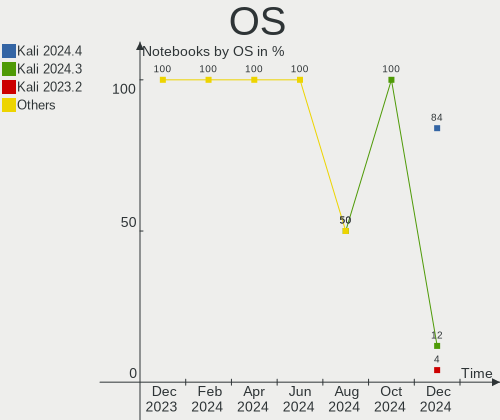
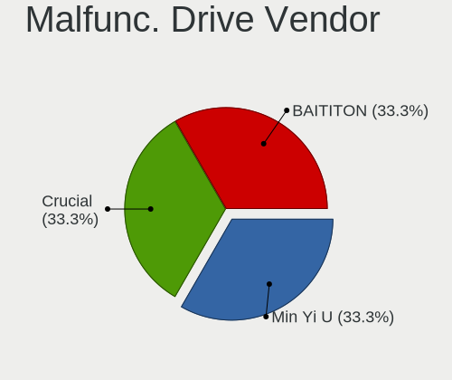
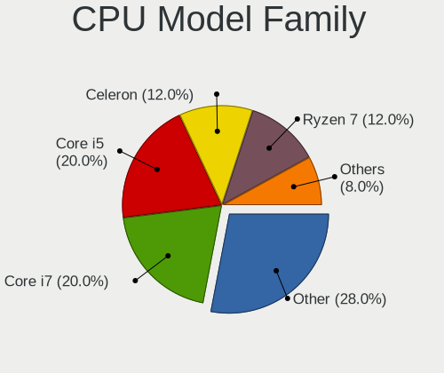
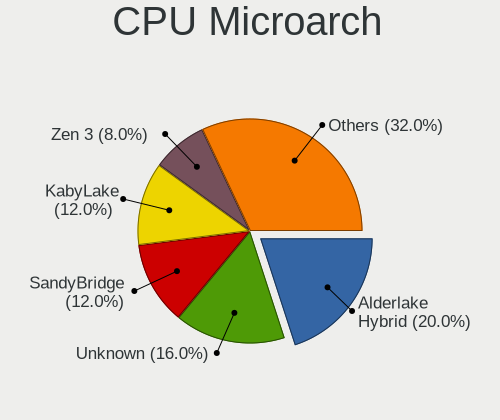
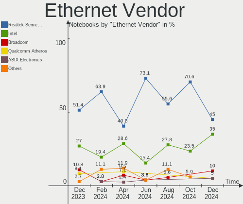
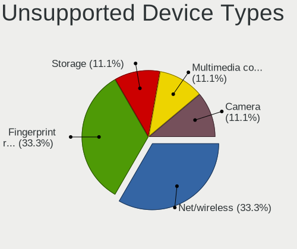

Kali - Hardware Trends (Notebooks)
----------------------------------

A project to identify most popular hardware characteristics and track their change
over time based on data collected by Linux users at https://Linux-Hardware.org.

Anyone can contribute to this report by the [hw-probe](https://github.com/linuxhw/hw-probe) tool:

    sudo -E hw-probe -all -upload

This report is for one last month. Overall report since the beginning of time: [TestDays](https://github.com/linuxhw/TestDays)

Period: Sep, 2023.

Contents
--------

* [ System ](#system)
  - [ OS                       ](#os)
  - [ OS Family                ](#os-family)
  - [ Kernel                   ](#kernel)
  - [ Kernel Family            ](#kernel-family)
  - [ Kernel Major Ver.        ](#kernel-major-ver)
  - [ Arch                     ](#arch)
  - [ DE                       ](#de)
  - [ Display Server           ](#display-server)
  - [ Display Manager          ](#display-manager)
  - [ OS Lang                  ](#os-lang)
  - [ Boot Mode                ](#boot-mode)
  - [ Filesystem               ](#filesystem)
  - [ Part. scheme             ](#part-scheme)
  - [ Dual Boot with Linux/BSD ](#dual-boot-with-linuxbsd)
  - [ Dual Boot (Win)          ](#dual-boot-win)

* [ Board ](#board)
  - [ Vendor                   ](#vendor)
  - [ Model                    ](#model)
  - [ Model Family             ](#model-family)
  - [ MFG Year                 ](#mfg-year)
  - [ Form Factor              ](#form-factor)
  - [ Secure Boot              ](#secure-boot)
  - [ Coreboot                 ](#coreboot)
  - [ RAM Size                 ](#ram-size)
  - [ RAM Used                 ](#ram-used)
  - [ Total Drives             ](#total-drives)
  - [ Has CD-ROM               ](#has-cd-rom)
  - [ Has Ethernet             ](#has-ethernet)
  - [ Has WiFi                 ](#has-wifi)
  - [ Has Bluetooth            ](#has-bluetooth)

* [ Location ](#location)
  - [ Country                  ](#country)
  - [ City                     ](#city)

* [ Drives ](#drives)
  - [ Drive Vendor             ](#drive-vendor)
  - [ Drive Model              ](#drive-model)
  - [ HDD Vendor               ](#hdd-vendor)
  - [ SSD Vendor               ](#ssd-vendor)
  - [ Drive Kind               ](#drive-kind)
  - [ Drive Connector          ](#drive-connector)
  - [ Drive Size               ](#drive-size)
  - [ Space Total              ](#space-total)
  - [ Space Used               ](#space-used)
  - [ Malfunc. Drives          ](#malfunc-drives)
  - [ Malfunc. Drive Vendor    ](#malfunc-drive-vendor)
  - [ Malfunc. HDD Vendor      ](#malfunc-hdd-vendor)
  - [ Malfunc. Drive Kind      ](#malfunc-drive-kind)
  - [ Failed Drives            ](#failed-drives)
  - [ Failed Drive Vendor      ](#failed-drive-vendor)
  - [ Drive Status             ](#drive-status)

* [ Storage controller ](#storage-controller)
  - [ Storage Vendor           ](#storage-vendor)
  - [ Storage Model            ](#storage-model)
  - [ Storage Kind             ](#storage-kind)

* [ Processor ](#processor)
  - [ CPU Vendor               ](#cpu-vendor)
  - [ CPU Model                ](#cpu-model)
  - [ CPU Model Family         ](#cpu-model-family)
  - [ CPU Cores                ](#cpu-cores)
  - [ CPU Sockets              ](#cpu-sockets)
  - [ CPU Threads              ](#cpu-threads)
  - [ CPU Op-Modes             ](#cpu-op-modes)
  - [ CPU Microcode            ](#cpu-microcode)
  - [ CPU Microarch            ](#cpu-microarch)

* [ Graphics ](#graphics)
  - [ GPU Vendor               ](#gpu-vendor)
  - [ GPU Model                ](#gpu-model)
  - [ GPU Combo                ](#gpu-combo)
  - [ GPU Driver               ](#gpu-driver)
  - [ GPU Memory               ](#gpu-memory)

* [ Monitor ](#monitor)
  - [ Monitor Vendor           ](#monitor-vendor)
  - [ Monitor Model            ](#monitor-model)
  - [ Monitor Resolution       ](#monitor-resolution)
  - [ Monitor Diagonal         ](#monitor-diagonal)
  - [ Monitor Width            ](#monitor-width)
  - [ Aspect Ratio             ](#aspect-ratio)
  - [ Monitor Area             ](#monitor-area)
  - [ Pixel Density            ](#pixel-density)
  - [ Multiple Monitors        ](#multiple-monitors)

* [ Network ](#network)
  - [ Net Controller Vendor    ](#net-controller-vendor)
  - [ Net Controller Model     ](#net-controller-model)
  - [ Wireless Vendor          ](#wireless-vendor)
  - [ Wireless Model           ](#wireless-model)
  - [ Ethernet Vendor          ](#ethernet-vendor)
  - [ Ethernet Model           ](#ethernet-model)
  - [ Net Controller Kind      ](#net-controller-kind)
  - [ Used Controller          ](#used-controller)
  - [ NICs                     ](#nics)
  - [ IPv6                     ](#ipv6)

* [ Bluetooth ](#bluetooth)
  - [ Bluetooth Vendor         ](#bluetooth-vendor)
  - [ Bluetooth Model          ](#bluetooth-model)

* [ Sound ](#sound)
  - [ Sound Vendor             ](#sound-vendor)
  - [ Sound Model              ](#sound-model)

* [ Memory ](#memory)
  - [ Memory Vendor            ](#memory-vendor)
  - [ Memory Model             ](#memory-model)
  - [ Memory Kind              ](#memory-kind)
  - [ Memory Form Factor       ](#memory-form-factor)
  - [ Memory Size              ](#memory-size)
  - [ Memory Speed             ](#memory-speed)

* [ Printers & scanners ](#printers--scanners)
  - [ Printer Vendor           ](#printer-vendor)
  - [ Printer Model            ](#printer-model)
  - [ Scanner Vendor           ](#scanner-vendor)
  - [ Scanner Model            ](#scanner-model)

* [ Camera ](#camera)
  - [ Camera Vendor            ](#camera-vendor)
  - [ Camera Model             ](#camera-model)

* [ Security ](#security)
  - [ Fingerprint Vendor       ](#fingerprint-vendor)
  - [ Fingerprint Model        ](#fingerprint-model)
  - [ Chipcard Vendor          ](#chipcard-vendor)
  - [ Chipcard Model           ](#chipcard-model)

* [ Unsupported ](#unsupported)
  - [ Unsupported Devices      ](#unsupported-devices)
  - [ Unsupported Device Types ](#unsupported-device-types)

System
------

OS
--

Installed operating systems

| Name        | Notebooks | Percent |
|-------------|-----------|---------|
| Kali 2023.3 | 52        | 100%    |

OS Family
---------

OS without a version

| Name | Notebooks | Percent |
|------|-----------|---------|
| Kali | 52        | 100%    |

Kernel
------

Version of the Linux kernel

| Version             | Notebooks | Percent |
|---------------------|-----------|---------|
| 6.4.0-kali3-amd64   | 28        | 53.85%  |
| 6.5.0-kali1-amd64   | 12        | 23.08%  |
| 6.3.0-kali1-amd64   | 8         | 15.38%  |
| 6.5.0-kali1-686-pae | 1         | 1.92%   |
| 6.1.0-kali9-amd64   | 1         | 1.92%   |
| 6.1.0-kali7-amd64   | 1         | 1.92%   |
| 6.1.0-kali5-amd64   | 1         | 1.92%   |

Kernel Family
-------------

Linux kernel without a distro release

| Version | Notebooks | Percent |
|---------|-----------|---------|
| 6.4.0   | 28        | 53.85%  |
| 6.5.0   | 13        | 25%     |
| 6.3.0   | 8         | 15.38%  |
| 6.1.0   | 3         | 5.77%   |

Kernel Major Ver.
-----------------

Linux kernel major version

| Version | Notebooks | Percent |
|---------|-----------|---------|
| 6.4     | 28        | 53.85%  |
| 6.5     | 13        | 25%     |
| 6.3     | 8         | 15.38%  |
| 6.1     | 3         | 5.77%   |

Arch
----

OS architecture (x86_64, i586, etc.)

| Name   | Notebooks | Percent |
|--------|-----------|---------|
| x86_64 | 51        | 98.08%  |
| i686   | 1         | 1.92%   |

DE
--

Desktop Environment

| Name  | Notebooks | Percent |
|-------|-----------|---------|
| XFCE  | 32        | 61.54%  |
| GNOME | 14        | 26.92%  |
| KDE5  | 6         | 11.54%  |

Display Server
--------------

X11 or Wayland

| Name    | Notebooks | Percent |
|---------|-----------|---------|
| X11     | 51        | 98.08%  |
| Wayland | 1         | 1.92%   |

Display Manager
---------------

SDDM, LightDM, etc.

| Name    | Notebooks | Percent |
|---------|-----------|---------|
| LightDM | 23        | 44.23%  |
| Unknown | 16        | 30.77%  |
| SDDM    | 8         | 15.38%  |
| GDM3    | 5         | 9.62%   |

OS Lang
-------

Language

| Lang  | Notebooks | Percent |
|-------|-----------|---------|
| C     | 22        | 42.31%  |
| en_US | 14        | 26.92%  |
| en_GB | 4         | 7.69%   |
| de_DE | 3         | 5.77%   |
| pt_BR | 2         | 3.85%   |
| en_AU | 2         | 3.85%   |
| sv_SE | 1         | 1.92%   |
| ru_RU | 1         | 1.92%   |
| fr_FR | 1         | 1.92%   |
| en_ZA | 1         | 1.92%   |
| en_IN | 1         | 1.92%   |

Boot Mode
---------

EFI or BIOS

| Mode | Notebooks | Percent |
|------|-----------|---------|
| EFI  | 34        | 65.38%  |
| BIOS | 18        | 34.62%  |

Filesystem
----------

Type of filesystem

| Type  | Notebooks | Percent |
|-------|-----------|---------|
| Ext4  | 48        | 92.31%  |
| Btrfs | 2         | 3.85%   |
| Xfs   | 1         | 1.92%   |
| Tmpfs | 1         | 1.92%   |

Part. scheme
------------

Scheme of partitioning

| Type    | Notebooks | Percent |
|---------|-----------|---------|
| GPT     | 29        | 55.77%  |
| Unknown | 16        | 30.77%  |
| MBR     | 7         | 13.46%  |

Dual Boot with Linux/BSD
------------------------

Hosting more than one Linux/BSD

| Dual boot | Notebooks | Percent |
|-----------|-----------|---------|
| No        | 49        | 94.23%  |
| Yes       | 3         | 5.77%   |

Dual Boot (Win)
---------------

Hosting Linux and Windows

| Dual boot | Notebooks | Percent |
|-----------|-----------|---------|
| No        | 36        | 69.23%  |
| Yes       | 16        | 30.77%  |

Board
-----

Vendor
------

Motherboard manufacturer

| Name                | Notebooks | Percent |
|---------------------|-----------|---------|
| Hewlett-Packard     | 10        | 19.23%  |
| Dell                | 9         | 17.31%  |
| Lenovo              | 8         | 15.38%  |
| ASUSTek Computer    | 6         | 11.54%  |
| Acer                | 3         | 5.77%   |
| Toshiba             | 2         | 3.85%   |
| Samsung Electronics | 2         | 3.85%   |
| Apple               | 2         | 3.85%   |
| Wortmann AG         | 1         | 1.92%   |
| Panasonic           | 1         | 1.92%   |
| MSI                 | 1         | 1.92%   |
| Medion              | 1         | 1.92%   |
| LG Electronics      | 1         | 1.92%   |
| Google              | 1         | 1.92%   |
| Fujitsu             | 1         | 1.92%   |
| Dynabook            | 1         | 1.92%   |
| Clevo               | 1         | 1.92%   |
| Casper              | 1         | 1.92%   |

Model
-----

Motherboard model

| Name                                      | Notebooks | Percent |
|-------------------------------------------|-----------|---------|
| Wortmann AG TERRA_MOBILE_1512/1712        | 1         | 1.92%   |
| Toshiba Satellite S55-B                   | 1         | 1.92%   |
| Toshiba Satellite L50D-B                  | 1         | 1.92%   |
| Samsung R530/R730/P590                    | 1         | 1.92%   |
| Samsung 370E4K                            | 1         | 1.92%   |
| Panasonic CF-191HACHFN                    | 1         | 1.92%   |
| MSI N6105                                 | 1         | 1.92%   |
| Medion E16402                             | 1         | 1.92%   |
| LG 15Z990-U.AAS5U1                        | 1         | 1.92%   |
| Lenovo ThinkPad X220 Tablet 42992PG       | 1         | 1.92%   |
| Lenovo ThinkPad X1 Extreme 2nd 20QVCTO1WW | 1         | 1.92%   |
| Lenovo ThinkPad X1 Carbon 7th 20QD003JGE  | 1         | 1.92%   |
| Lenovo ThinkPad T14 Gen 1 20S1S96300      | 1         | 1.92%   |
| Lenovo Legion Y740-17IRHg 81UJ            | 1         | 1.92%   |
| Lenovo Legion 5 15ARH05 82B5              | 1         | 1.92%   |
| Lenovo IdeaPad 320-15IKB 81BT             | 1         | 1.92%   |
| Lenovo G580 2189                          | 1         | 1.92%   |
| HP ProBook 450 G1                         | 1         | 1.92%   |
| HP Pavilion Laptop 15-eh1xxx              | 1         | 1.92%   |
| HP Pavilion Laptop 15-eg2xxx              | 1         | 1.92%   |
| HP Pavilion dv7                           | 1         | 1.92%   |
| HP Pavilion dv4                           | 1         | 1.92%   |
| HP Laptop 15-dy1xxx                       | 1         | 1.92%   |
| HP Laptop 15-bs2xx                        | 1         | 1.92%   |
| HP EliteBook 850 G1                       | 1         | 1.92%   |
| HP EliteBook 830 G5                       | 1         | 1.92%   |
| HP 240 14 inch G9 Notebook PC             | 1         | 1.92%   |
| Google Droid                              | 1         | 1.92%   |
| Fujitsu LIFEBOOK AH530                    | 1         | 1.92%   |
| Dynabook TECRA A50-J                      | 1         | 1.92%   |
| Dell Vostro 3583                          | 1         | 1.92%   |
| Dell Precision 5510                       | 1         | 1.92%   |
| Dell Latitude E7270                       | 1         | 1.92%   |
| Dell Latitude E6530                       | 1         | 1.92%   |
| Dell Latitude E6520                       | 1         | 1.92%   |
| Dell Latitude E6430                       | 1         | 1.92%   |
| Dell Latitude 5540                        | 1         | 1.92%   |
| Dell Inspiron 5567                        | 1         | 1.92%   |
| Dell G15 5520                             | 1         | 1.92%   |
| Clevo P170HMx                             | 1         | 1.92%   |

Model Family
------------

Motherboard model prefix

| Name                   | Notebooks | Percent |
|------------------------|-----------|---------|
| Dell Latitude          | 5         | 9.62%   |
| Lenovo ThinkPad        | 4         | 7.69%   |
| HP Pavilion            | 4         | 7.69%   |
| Toshiba Satellite      | 2         | 3.85%   |
| Lenovo Legion          | 2         | 3.85%   |
| HP Laptop              | 2         | 3.85%   |
| HP EliteBook           | 2         | 3.85%   |
| ASUS ROG               | 2         | 3.85%   |
| ASUS ASUS              | 2         | 3.85%   |
| Wortmann AG TERRA      | 1         | 1.92%   |
| Samsung R530           | 1         | 1.92%   |
| Samsung 370E4K         | 1         | 1.92%   |
| Panasonic CF-191HACHFN | 1         | 1.92%   |
| MSI N6105              | 1         | 1.92%   |
| Medion E16402          | 1         | 1.92%   |
| LG 15Z990-U.AAS5U1     | 1         | 1.92%   |
| Lenovo IdeaPad         | 1         | 1.92%   |
| Lenovo G580            | 1         | 1.92%   |
| HP ProBook             | 1         | 1.92%   |
| HP 240                 | 1         | 1.92%   |
| Google Droid           | 1         | 1.92%   |
| Fujitsu LIFEBOOK       | 1         | 1.92%   |
| Dynabook TECRA         | 1         | 1.92%   |
| Dell Vostro            | 1         | 1.92%   |
| Dell Precision         | 1         | 1.92%   |
| Dell Inspiron          | 1         | 1.92%   |
| Dell G15               | 1         | 1.92%   |
| Clevo P170HMx          | 1         | 1.92%   |
| Casper NIRVANA         | 1         | 1.92%   |
| ASUS X501A             | 1         | 1.92%   |
| ASUS X450CC            | 1         | 1.92%   |
| Apple MacBookPro16     | 1         | 1.92%   |
| Apple MacBookPro10     | 1         | 1.92%   |
| Acer Predator          | 1         | 1.92%   |
| Acer Nitro             | 1         | 1.92%   |
| Acer Aspire            | 1         | 1.92%   |

MFG Year
--------

Motherboard manufacture year

| Year | Notebooks | Percent |
|------|-----------|---------|
| 2019 | 8         | 15.38%  |
| 2012 | 6         | 11.54%  |
| 2022 | 5         | 9.62%   |
| 2020 | 4         | 7.69%   |
| 2010 | 4         | 7.69%   |
| 2023 | 3         | 5.77%   |
| 2021 | 3         | 5.77%   |
| 2016 | 3         | 5.77%   |
| 2014 | 3         | 5.77%   |
| 2013 | 3         | 5.77%   |
| 2011 | 3         | 5.77%   |
| 2018 | 2         | 3.85%   |
| 2015 | 2         | 3.85%   |
| 2008 | 2         | 3.85%   |
| 2017 | 1         | 1.92%   |

Form Factor
-----------

Physical design of the computer

| Name     | Notebooks | Percent |
|----------|-----------|---------|
| Notebook | 52        | 100%    |

Secure Boot
-----------

Enabled or disabled

| State    | Notebooks | Percent |
|----------|-----------|---------|
| Disabled | 52        | 100%    |

Coreboot
--------

Have coreboot on board

| Used | Notebooks | Percent |
|------|-----------|---------|
| No   | 51        | 98.08%  |
| Yes  | 1         | 1.92%   |

RAM Size
--------

Total RAM memory

| Size in GB  | Notebooks | Percent |
|-------------|-----------|---------|
| 4.01-8.0    | 21        | 40.38%  |
| 16.01-24.0  | 11        | 21.15%  |
| 3.01-4.0    | 7         | 13.46%  |
| 8.01-16.0   | 6         | 11.54%  |
| 32.01-64.0  | 5         | 9.62%   |
| 64.01-256.0 | 1         | 1.92%   |
| 1.01-2.0    | 1         | 1.92%   |

RAM Used
--------

Used RAM memory

| Used GB   | Notebooks | Percent |
|-----------|-----------|---------|
| 2.01-3.0  | 18        | 34.62%  |
| 3.01-4.0  | 15        | 28.85%  |
| 4.01-8.0  | 9         | 17.31%  |
| 1.01-2.0  | 8         | 15.38%  |
| 8.01-16.0 | 2         | 3.85%   |

Total Drives
------------

Number of drives on board

| Drives | Notebooks | Percent |
|--------|-----------|---------|
| 1      | 39        | 75%     |
| 2      | 13        | 25%     |

Has CD-ROM
----------

Has CD-ROM on board

| Presented | Notebooks | Percent |
|-----------|-----------|---------|
| No        | 35        | 67.31%  |
| Yes       | 17        | 32.69%  |

Has Ethernet
------------

Has Ethernet on board

| Presented | Notebooks | Percent |
|-----------|-----------|---------|
| Yes       | 45        | 86.54%  |
| No        | 7         | 13.46%  |

Has WiFi
--------

Has WiFi module

| Presented | Notebooks | Percent |
|-----------|-----------|---------|
| Yes       | 50        | 96.15%  |
| No        | 2         | 3.85%   |

Has Bluetooth
-------------

Has Bluetooth module

| Presented | Notebooks | Percent |
|-----------|-----------|---------|
| Yes       | 43        | 82.69%  |
| No        | 9         | 17.31%  |

Location
--------

Country
-------

Geographic location (country)

| Country      | Notebooks | Percent |
|--------------|-----------|---------|
| USA          | 8         | 15.38%  |
| Germany      | 5         | 9.62%   |
| Egypt        | 3         | 5.77%   |
| Australia    | 3         | 5.77%   |
| UK           | 2         | 3.85%   |
| Pakistan     | 2         | 3.85%   |
| Norway       | 2         | 3.85%   |
| India        | 2         | 3.85%   |
| France       | 2         | 3.85%   |
| Canada       | 2         | 3.85%   |
| Bulgaria     | 2         | 3.85%   |
| Brazil       | 2         | 3.85%   |
| Turkey       | 1         | 1.92%   |
| Sweden       | 1         | 1.92%   |
| Spain        | 1         | 1.92%   |
| South Africa | 1         | 1.92%   |
| Serbia       | 1         | 1.92%   |
| Russia       | 1         | 1.92%   |
| Poland       | 1         | 1.92%   |
| Peru         | 1         | 1.92%   |
| Nigeria      | 1         | 1.92%   |
| Malaysia     | 1         | 1.92%   |
| Indonesia    | 1         | 1.92%   |
| Greece       | 1         | 1.92%   |
| Denmark      | 1         | 1.92%   |
| Colombia     | 1         | 1.92%   |
| Benin        | 1         | 1.92%   |
| Azerbaijan   | 1         | 1.92%   |
| Austria      | 1         | 1.92%   |

City
----

Geographic location (city)

| City          | Notebooks | Percent |
|---------------|-----------|---------|
| Lahore        | 2         | 3.85%   |
| Cairo         | 2         | 3.85%   |
| Berlin        | 2         | 3.85%   |
| Zaragoza      | 1         | 1.92%   |
| Warsaw        | 1         | 1.92%   |
| Vršac        | 1         | 1.92%   |
| Vlasikha      | 1         | 1.92%   |
| Vienna        | 1         | 1.92%   |
| Viby J        | 1         | 1.92%   |
| Vaureal       | 1         | 1.92%   |
| Utansjo       | 1         | 1.92%   |
| Trondheim     | 1         | 1.92%   |
| Sydney        | 1         | 1.92%   |
| Staunton      | 1         | 1.92%   |
| Sofia         | 1         | 1.92%   |
| Shah Alam     | 1         | 1.92%   |
| Saint-Georges | 1         | 1.92%   |
| Rottweil      | 1         | 1.92%   |
| Reading       | 1         | 1.92%   |
| Qina          | 1         | 1.92%   |
| Pune          | 1         | 1.92%   |
| Pleasant Hill | 1         | 1.92%   |
| Phoenix       | 1         | 1.92%   |
| Melbourne     | 1         | 1.92%   |
| Medellín     | 1         | 1.92%   |
| Manaus        | 1         | 1.92%   |
| Lima          | 1         | 1.92%   |
| Lagos         | 1         | 1.92%   |
| Johannesburg  | 1         | 1.92%   |
| Haugesund     | 1         | 1.92%   |
| Front Royal   | 1         | 1.92%   |
| Edgware       | 1         | 1.92%   |
| Dresden       | 1         | 1.92%   |
| Dayton        | 1         | 1.92%   |
| Cotonou       | 1         | 1.92%   |
| Chino         | 1         | 1.92%   |
| Burgas        | 1         | 1.92%   |
| Brisbane      | 1         | 1.92%   |
| Bochum        | 1         | 1.92%   |
| Bengaluru     | 1         | 1.92%   |

Drives
------

Drive Vendor
------------

Hard drive vendors

| Vendor                      | Notebooks | Drives | Percent |
|-----------------------------|-----------|--------|---------|
| Samsung Electronics         | 11        | 11     | 17.19%  |
| WDC                         | 8         | 8      | 12.5%   |
| Seagate                     | 6         | 6      | 9.38%   |
| SanDisk                     | 5         | 5      | 7.81%   |
| Crucial                     | 5         | 5      | 7.81%   |
| Unknown                     | 4         | 5      | 6.25%   |
| Toshiba                     | 3         | 3      | 4.69%   |
| SK hynix                    | 2         | 2      | 3.13%   |
| Phison Electronics          | 2         | 2      | 3.13%   |
| Micron Technology           | 2         | 2      | 3.13%   |
| Intel                       | 2         | 2      | 3.13%   |
| China                       | 2         | 2      | 3.13%   |
| Apple                       | 2         | 2      | 3.13%   |
| V-GeN                       | 1         | 1      | 1.56%   |
| Silicon Motion              | 1         | 1      | 1.56%   |
| KIOXIA                      | 1         | 1      | 1.56%   |
| Kingston Technology Company | 1         | 1      | 1.56%   |
| JMicron Technology          | 1         | 1      | 1.56%   |
| Integral                    | 1         | 1      | 1.56%   |
| Hitachi                     | 1         | 1      | 1.56%   |
| BAITITON                    | 1         | 1      | 1.56%   |
| ADATA Technology            | 1         | 1      | 1.56%   |
| Unknown                     | 1         | 1      | 1.56%   |

Drive Model
-----------

Hard drive models

| Model                                | Notebooks | Percent |
|--------------------------------------|-----------|---------|
| Toshiba MQ01ABD100 1TB               | 2         | 3.08%   |
| Seagate ST1000LM035-1RK172 1TB       | 2         | 3.08%   |
| Phison E12 NVMe Controller 2TB       | 2         | 3.08%   |
| Crucial CT512MX100SSD1 512GB         | 2         | 3.08%   |
| WDC WDS500G2B0A-00SM50 500GB SSD     | 1         | 1.54%   |
| WDC WD7500BPKT-00PK4T0 752GB         | 1         | 1.54%   |
| WDC WD5000BPKT-60PK4T0 500GB         | 1         | 1.54%   |
| WDC WD3200BEKX-75B7WT0 320GB         | 1         | 1.54%   |
| WDC WD10SPZX-22Z10T1 1TB             | 1         | 1.54%   |
| WDC WD10JPVX-75JC3T0 1TB             | 1         | 1.54%   |
| WDC PC SN730 SDBQNTY-512G-1001 512GB | 1         | 1.54%   |
| WDC PC SN720 SDAPNTW-512G-1014 512GB | 1         | 1.54%   |
| V-GeN V-GEN12SM22AR128HY 128GB SSD   | 1         | 1.54%   |
| Unknown SS32G  32GB                  | 1         | 1.54%   |
| Unknown NCard  32GB                  | 1         | 1.54%   |
| Unknown MMC Card  8GB                | 1         | 1.54%   |
| Unknown hB8aP  32GB                  | 1         | 1.54%   |
| Unknown 032GE4  32GB                 | 1         | 1.54%   |
| Toshiba MK5056GSY 500GB              | 1         | 1.54%   |
| SK hynix BC901 NVMe 1024GB           | 1         | 1.54%   |
| SK hynix BC711 HFM512GD3JX013N 512GB | 1         | 1.54%   |
| Silicon Motion NE-512 512GB          | 1         | 1.54%   |
| Seagate ST9500423AS 500GB            | 1         | 1.54%   |
| Seagate ST1000LX015-1U7172 1TB       | 1         | 1.54%   |
| Seagate ST1000LM014-1EJ164 1TB       | 1         | 1.54%   |
| Seagate Expansion HDD 16TB           | 1         | 1.54%   |
| SanDisk X400 M.2 2280 256GB SSD      | 1         | 1.54%   |
| Sandisk WD_BLACK SN770 2TB           | 1         | 1.54%   |
| Sandisk WD Green SN350 1TB           | 1         | 1.54%   |
| SanDisk SSD PLUS 240GB               | 1         | 1.54%   |
| SanDisk SD8TB8U256G1001 256GB SSD    | 1         | 1.54%   |
| Samsung SSD 990 PRO 2TB              | 1         | 1.54%   |
| Samsung SSD 980 500GB                | 1         | 1.54%   |
| Samsung SSD 980 1TB                  | 1         | 1.54%   |
| Samsung SSD 850 EVO 500GB            | 1         | 1.54%   |
| Samsung SSD 840 Series 120GB         | 1         | 1.54%   |
| Samsung SSD 840 PRO Series 256GB     | 1         | 1.54%   |
| Samsung PM991a NVMe 512GB            | 1         | 1.54%   |
| Samsung MZVLQ512HBLU-00B00 512GB     | 1         | 1.54%   |
| Samsung MZVLB512HBJQ-000L7 512GB     | 1         | 1.54%   |

HDD Vendor
----------

Hard disk drive vendors

| Vendor  | Notebooks | Drives | Percent |
|---------|-----------|--------|---------|
| Seagate | 6         | 6      | 40%     |
| WDC     | 5         | 5      | 33.33%  |
| Toshiba | 3         | 3      | 20%     |
| Hitachi | 1         | 1      | 6.67%   |

SSD Vendor
----------

Solid state drive vendors

| Vendor              | Notebooks | Drives | Percent |
|---------------------|-----------|--------|---------|
| Samsung Electronics | 4         | 4      | 20%     |
| Crucial             | 4         | 4      | 20%     |
| SanDisk             | 3         | 3      | 15%     |
| China               | 2         | 2      | 10%     |
| WDC                 | 1         | 1      | 5%      |
| V-GeN               | 1         | 1      | 5%      |
| JMicron Technology  | 1         | 1      | 5%      |
| Intel               | 1         | 1      | 5%      |
| Integral            | 1         | 1      | 5%      |
| BAITITON            | 1         | 1      | 5%      |
| Apple               | 1         | 1      | 5%      |

Drive Kind
----------

HDD or SSD

| Kind | Notebooks | Drives | Percent |
|------|-----------|--------|---------|
| NVMe | 23        | 24     | 36.51%  |
| SSD  | 20        | 20     | 31.75%  |
| HDD  | 15        | 15     | 23.81%  |
| MMC  | 5         | 6      | 7.94%   |

Drive Connector
---------------

SATA, SAS, NVMe, etc.

| Type | Notebooks | Drives | Percent |
|------|-----------|--------|---------|
| SATA | 29        | 33     | 49.15%  |
| NVMe | 23        | 24     | 38.98%  |
| MMC  | 5         | 6      | 8.47%   |
| SAS  | 2         | 2      | 3.39%   |

Drive Size
----------

Size of hard drive

| Size in TB | Notebooks | Drives | Percent |
|------------|-----------|--------|---------|
| 0.01-0.5   | 20        | 21     | 60.61%  |
| 0.51-1.0   | 12        | 13     | 36.36%  |
| 10.01-20.0 | 1         | 1      | 3.03%   |

Space Total
-----------

Amount of disk space available on the file system

| Size in GB     | Notebooks | Percent |
|----------------|-----------|---------|
| 101-250        | 18        | 34.62%  |
| 251-500        | 12        | 23.08%  |
| 501-1000       | 8         | 15.38%  |
| 21-50          | 4         | 7.69%   |
| 1001-2000      | 4         | 7.69%   |
| 51-100         | 4         | 7.69%   |
| More than 3000 | 2         | 3.85%   |

Space Used
----------

Amount of used disk space

| Used GB        | Notebooks | Percent |
|----------------|-----------|---------|
| 21-50          | 14        | 26.92%  |
| 101-250        | 11        | 21.15%  |
| 51-100         | 11        | 21.15%  |
| 1-20           | 9         | 17.31%  |
| 251-500        | 4         | 7.69%   |
| More than 3000 | 1         | 1.92%   |
| 2001-3000      | 1         | 1.92%   |
| 501-1000       | 1         | 1.92%   |

Malfunc. Drives
---------------

Drive models with a malfunction

| Model                          | Notebooks | Drives | Percent |
|--------------------------------|-----------|--------|---------|
| Toshiba MQ01ABD100 1TB         | 1         | 1      | 20%     |
| Toshiba MK5056GSY 500GB        | 1         | 1      | 20%     |
| Silicon Motion NE-512 512GB    | 1         | 1      | 20%     |
| Seagate ST1000LM035-1RK172 1TB | 1         | 1      | 20%     |
| SanDisk SSD PLUS 240GB         | 1         | 1      | 20%     |

Malfunc. Drive Vendor
---------------------

Vendors of faulty drives

| Vendor         | Notebooks | Drives | Percent |
|----------------|-----------|--------|---------|
| Toshiba        | 2         | 2      | 40%     |
| Silicon Motion | 1         | 1      | 20%     |
| Seagate        | 1         | 1      | 20%     |
| SanDisk        | 1         | 1      | 20%     |

Malfunc. HDD Vendor
-------------------

Vendors of faulty HDD drives

| Vendor  | Notebooks | Drives | Percent |
|---------|-----------|--------|---------|
| Toshiba | 2         | 2      | 66.67%  |
| Seagate | 1         | 1      | 33.33%  |

Malfunc. Drive Kind
-------------------

Kinds of faulty drives

| Kind | Notebooks | Drives | Percent |
|------|-----------|--------|---------|
| HDD  | 3         | 3      | 60%     |
| NVMe | 1         | 1      | 20%     |
| SSD  | 1         | 1      | 20%     |

Failed Drives
-------------

Failed drive models

Zero info for selected period =(

Failed Drive Vendor
-------------------

Failed drive vendors

Zero info for selected period =(

Drive Status
------------

Number of failed and malfunc. drives

| Status   | Notebooks | Drives | Percent |
|----------|-----------|--------|---------|
| Works    | 30        | 31     | 52.63%  |
| Detected | 22        | 29     | 38.6%   |
| Malfunc  | 5         | 5      | 8.77%   |

Storage controller
------------------

Storage Vendor
--------------

Storage controller vendors

| Vendor                      | Notebooks | Percent |
|-----------------------------|-----------|---------|
| Intel                       | 35        | 57.38%  |
| Samsung Electronics         | 7         | 11.48%  |
| SanDisk                     | 4         | 6.56%   |
| AMD                         | 3         | 4.92%   |
| SK hynix                    | 2         | 3.28%   |
| Phison Electronics          | 2         | 3.28%   |
| Micron Technology           | 2         | 3.28%   |
| Silicon Motion              | 1         | 1.64%   |
| Micron/Crucial Technology   | 1         | 1.64%   |
| KIOXIA                      | 1         | 1.64%   |
| Kingston Technology Company | 1         | 1.64%   |
| Apple                       | 1         | 1.64%   |
| ADATA Technology            | 1         | 1.64%   |

Storage Model
-------------

Storage controller models

| Model                                                                          | Notebooks | Percent |
|--------------------------------------------------------------------------------|-----------|---------|
| Intel 82801 Mobile SATA Controller [RAID mode]                                 | 6         | 9.23%   |
| Intel 7 Series Chipset Family 6-port SATA Controller [AHCI mode]               | 6         | 9.23%   |
| Samsung NVMe SSD Controller 980                                                | 4         | 6.15%   |
| Intel 5 Series/3400 Series Chipset 4 port SATA AHCI Controller                 | 4         | 6.15%   |
| Intel Cannon Lake Mobile PCH SATA AHCI Controller                              | 3         | 4.62%   |
| Intel 6 Series/C200 Series Chipset Family 6 port Mobile SATA AHCI Controller   | 3         | 4.62%   |
| Samsung NVMe SSD Controller SM981/PM981/PM983                                  | 2         | 3.08%   |
| Phison E12 NVMe Controller                                                     | 2         | 3.08%   |
| Intel Volume Management Device NVMe RAID Controller                            | 2         | 3.08%   |
| Intel Sunrise Point-LP SATA Controller [AHCI mode]                             | 2         | 3.08%   |
| Intel Cannon Point-LP SATA Controller [AHCI Mode]                              | 2         | 3.08%   |
| Intel Alder Lake-P SATA AHCI Controller                                        | 2         | 3.08%   |
| AMD FCH SATA Controller [AHCI mode]                                            | 2         | 3.08%   |
| SK hynix Gold P31/BC711/PC711 NVMe Solid State Drive                           | 1         | 1.54%   |
| SK hynix BC901 NVMe Solid State Drive (DRAM-less)                              | 1         | 1.54%   |
| Silicon Motion SM2263EN/SM2263XT (DRAM-less) NVMe SSD Controllers              | 1         | 1.54%   |
| SanDisk WD Green SN350 NVMe SSD 1 TB (DRAM-less)                               | 1         | 1.54%   |
| SanDisk WD Black SN770 / PC SN740 256GB / PC SN560 (DRAM-less) NVMe SSD        | 1         | 1.54%   |
| SanDisk WD Black SN750 / PC SN730 NVMe SSD                                     | 1         | 1.54%   |
| SanDisk WD Black 2018/SN750 / PC SN720 NVMe SSD                                | 1         | 1.54%   |
| Samsung NVMe SSD Controller S4LV008[Pascal]                                    | 1         | 1.54%   |
| Micron/Crucial P2 [Nick P2] / P3 / P3 Plus NVMe PCIe SSD (DRAM-less)           | 1         | 1.54%   |
| Micron 3400 NVMe SSD [Hendrix]                                                 | 1         | 1.54%   |
| Micron 2210 NVMe SSD [Cobain]                                                  | 1         | 1.54%   |
| KIOXIA NVMe SSD Controller BG5 (DRAM-less)                                     | 1         | 1.54%   |
| Kingston Company U-SNS8154P3 NVMe SSD                                          | 1         | 1.54%   |
| Intel Wildcat Point-LP SATA Controller [AHCI Mode]                             | 1         | 1.54%   |
| Intel Tiger Lake-LP SATA Controller                                            | 1         | 1.54%   |
| Intel SSD DC P4101/Pro 7600p/760p/E 6100p Series                               | 1         | 1.54%   |
| Intel Q170/Q150/B150/H170/H110/Z170/CM236 Chipset SATA Controller [AHCI Mode]  | 1         | 1.54%   |
| Intel Celeron/Pentium Silver Processor SATA Controller                         | 1         | 1.54%   |
| Intel 8 Series/C220 Series Chipset Family 6-port SATA Controller 1 [AHCI mode] | 1         | 1.54%   |
| Intel 8 Series SATA Controller 1 [AHCI mode]                                   | 1         | 1.54%   |
| Intel 400 Series Chipset Family SATA AHCI Controller                           | 1         | 1.54%   |
| Apple ANS2 NVMe Controller                                                     | 1         | 1.54%   |
| AMD SB7x0/SB8x0/SB9x0 SATA Controller [AHCI mode]                              | 1         | 1.54%   |
| AMD SB7x0/SB8x0/SB9x0 IDE Controller                                           | 1         | 1.54%   |
| ADATA XPG SX8200 Pro PCIe Gen3x4 M.2 2280 Solid State Drive                    | 1         | 1.54%   |

Storage Kind
------------

Kind of storage controller (IDE, SATA, NVMe, SAS, ...)

| Kind | Notebooks | Percent |
|------|-----------|---------|
| SATA | 32        | 50%     |
| NVMe | 23        | 35.94%  |
| RAID | 8         | 12.5%   |
| IDE  | 1         | 1.56%   |

Processor
---------

CPU Vendor
----------

Processor vendors

| Vendor | Notebooks | Percent |
|--------|-----------|---------|
| Intel  | 46        | 88.46%  |
| AMD    | 6         | 11.54%  |

CPU Model
---------

Processor models

| Model                                      | Notebooks | Percent |
|--------------------------------------------|-----------|---------|
| Intel Core i7-9750H CPU @ 2.60GHz          | 4         | 7.69%   |
| Intel Core i7-8565U CPU @ 1.80GHz          | 2         | 3.85%   |
| Intel Core i7-3520M CPU @ 2.90GHz          | 2         | 3.85%   |
| Intel Core i7-2670QM CPU @ 2.20GHz         | 2         | 3.85%   |
| Intel Core i3 CPU M 330 @ 2.13GHz          | 2         | 3.85%   |
| Intel Xeon CPU E3-1505M v5 @ 2.80GHz       | 1         | 1.92%   |
| Intel Core i7-8550U CPU @ 1.80GHz          | 1         | 1.92%   |
| Intel Core i7-7500U CPU @ 2.70GHz          | 1         | 1.92%   |
| Intel Core i7-4702MQ CPU @ 2.20GHz         | 1         | 1.92%   |
| Intel Core i7-4600U CPU @ 2.10GHz          | 1         | 1.92%   |
| Intel Core i7-4510U CPU @ 2.00GHz          | 1         | 1.92%   |
| Intel Core i7-3615QM CPU @ 2.30GHz         | 1         | 1.92%   |
| Intel Core i7-2720QM CPU @ 2.20GHz         | 1         | 1.92%   |
| Intel Core i7-1068NG7 CPU @ 2.30GHz        | 1         | 1.92%   |
| Intel Core i7-1065G7 CPU @ 1.30GHz         | 1         | 1.92%   |
| Intel Core i7-10510U CPU @ 1.80GHz         | 1         | 1.92%   |
| Intel Core i5-8350U CPU @ 1.70GHz          | 1         | 1.92%   |
| Intel Core i5-8265U CPU @ 1.60GHz          | 1         | 1.92%   |
| Intel Core i5-6300U CPU @ 2.40GHz          | 1         | 1.92%   |
| Intel Core i5-3340M CPU @ 2.70GHz          | 1         | 1.92%   |
| Intel Core i5-3320M CPU @ 2.60GHz          | 1         | 1.92%   |
| Intel Core i5-2520M CPU @ 2.50GHz          | 1         | 1.92%   |
| Intel Core i5-10300H CPU @ 2.50GHz         | 1         | 1.92%   |
| Intel Core i5 CPU M 480 @ 2.67GHz          | 1         | 1.92%   |
| Intel Core i5 CPU M 460 @ 2.53GHz          | 1         | 1.92%   |
| Intel Core i3-5005U CPU @ 2.00GHz          | 1         | 1.92%   |
| Intel Core i3-3217U CPU @ 1.80GHz          | 1         | 1.92%   |
| Intel Core i3-2350M CPU @ 2.30GHz          | 1         | 1.92%   |
| Intel Celeron N4020 CPU @ 1.10GHz          | 1         | 1.92%   |
| Intel Celeron N4000 CPU @ 1.10GHz          | 1         | 1.92%   |
| Intel Celeron CPU 1037U @ 1.80GHz          | 1         | 1.92%   |
| Intel Atom CPU Z3735F @ 1.33GHz            | 1         | 1.92%   |
| Intel 13th Gen Core i7-1370P               | 1         | 1.92%   |
| Intel 12th Gen Core i7-12700H              | 1         | 1.92%   |
| Intel 12th Gen Core i7-1255U               | 1         | 1.92%   |
| Intel 12th Gen Core i5-12500H              | 1         | 1.92%   |
| Intel 12th Gen Core i5-1240P               | 1         | 1.92%   |
| Intel 11th Gen Core i7-1165G7 @ 2.80GHz    | 1         | 1.92%   |
| Intel 11th Gen Core i3-1115G4 @ 3.00GHz    | 1         | 1.92%   |
| AMD Ryzen 9 7940HS w/ Radeon 780M Graphics | 1         | 1.92%   |

CPU Model Family
----------------

Processor model prefix

| Model         | Notebooks | Percent |
|---------------|-----------|---------|
| Intel Core i7 | 20        | 38.46%  |
| Intel Core i5 | 9         | 17.31%  |
| Other         | 7         | 13.46%  |
| Intel Core i3 | 5         | 9.62%   |
| Intel Celeron | 3         | 5.77%   |
| AMD Ryzen 7   | 2         | 3.85%   |
| Intel Xeon    | 1         | 1.92%   |
| Intel Atom    | 1         | 1.92%   |
| AMD Ryzen 9   | 1         | 1.92%   |
| AMD Ryzen 5   | 1         | 1.92%   |
| AMD E1        | 1         | 1.92%   |
| AMD Athlon II | 1         | 1.92%   |

CPU Cores
---------

Number of processor cores

| Number | Notebooks | Percent |
|--------|-----------|---------|
| 2      | 22        | 42.31%  |
| 4      | 17        | 32.69%  |
| 6      | 5         | 9.62%   |
| 8      | 3         | 5.77%   |
| 14     | 2         | 3.85%   |
| 12     | 2         | 3.85%   |
| 10     | 1         | 1.92%   |

CPU Sockets
-----------

Number of sockets

| Number | Notebooks | Percent |
|--------|-----------|---------|
| 1      | 52        | 100%    |

CPU Threads
-----------

Threads per core (Hyper-Threading)

| Number | Notebooks | Percent |
|--------|-----------|---------|
| 2      | 45        | 86.54%  |
| 1      | 7         | 13.46%  |

CPU Op-Modes
------------

CPU Operation Modes (32-bit, 64-bit)

| Op mode        | Notebooks | Percent |
|----------------|-----------|---------|
| 32-bit, 64-bit | 52        | 100%    |

CPU Microcode
-------------

Microcode number

| Number     | Notebooks | Percent |
|------------|-----------|---------|
| Unknown    | 46        | 88.46%  |
| 0x0a704101 | 1         | 1.92%   |
| 0x0a50000c | 1         | 1.92%   |
| 0x08608104 | 1         | 1.92%   |
| 0x08600103 | 1         | 1.92%   |
| 0x07030104 | 1         | 1.92%   |
| 0x010000c8 | 1         | 1.92%   |

CPU Microarch
-------------

Microarchitecture

| Name             | Notebooks | Percent |
|------------------|-----------|---------|
| KabyLake         | 11        | 21.15%  |
| IvyBridge        | 7         | 13.46%  |
| SandyBridge      | 5         | 9.62%   |
| Alderlake Hybrid | 5         | 9.62%   |
| Westmere         | 4         | 7.69%   |
| Haswell          | 3         | 5.77%   |
| TigerLake        | 2         | 3.85%   |
| Skylake          | 2         | 3.85%   |
| IceLake          | 2         | 3.85%   |
| Goldmont plus    | 2         | 3.85%   |
| Unknown          | 2         | 3.85%   |
| Zen 3            | 1         | 1.92%   |
| Zen 2            | 1         | 1.92%   |
| Silvermont       | 1         | 1.92%   |
| Puma             | 1         | 1.92%   |
| K10              | 1         | 1.92%   |
| CometLake        | 1         | 1.92%   |
| Broadwell        | 1         | 1.92%   |

Graphics
--------

GPU Vendor
----------

Vendors of graphics cards

| Vendor | Notebooks | Percent |
|--------|-----------|---------|
| Intel  | 43        | 59.72%  |
| Nvidia | 18        | 25%     |
| AMD    | 11        | 15.28%  |

GPU Model
---------

Graphics card models

| Model                                                                     | Notebooks | Percent |
|---------------------------------------------------------------------------|-----------|---------|
| Intel 3rd Gen Core processor Graphics Controller                          | 7         | 9.59%   |
| Intel CoffeeLake-H GT2 [UHD Graphics 630]                                 | 4         | 5.48%   |
| Intel 2nd Generation Core Processor Family Integrated Graphics Controller | 4         | 5.48%   |
| Intel WhiskeyLake-U GT2 [UHD Graphics 620]                                | 3         | 4.11%   |
| Intel Alder Lake-P Integrated Graphics Controller                         | 3         | 4.11%   |
| Nvidia TU116M [GeForce GTX 1660 Ti Mobile]                                | 2         | 2.74%   |
| Intel UHD Graphics 620                                                    | 2         | 2.74%   |
| Intel Iris Plus Graphics G7                                               | 2         | 2.74%   |
| Intel Haswell-ULT Integrated Graphics Controller                          | 2         | 2.74%   |
| Intel GeminiLake [UHD Graphics 600]                                       | 2         | 2.74%   |
| Intel Core Processor Integrated Graphics Controller                       | 2         | 2.74%   |
| Nvidia TU117M [GeForce MX550]                                             | 1         | 1.37%   |
| Nvidia TU117M [GeForce GTX 1650 Ti Mobile]                                | 1         | 1.37%   |
| Nvidia TU117M [GeForce GTX 1650 Mobile / Max-Q]                           | 1         | 1.37%   |
| Nvidia TU117M                                                             | 1         | 1.37%   |
| Nvidia TU106BM [GeForce RTX 2060 Mobile]                                  | 1         | 1.37%   |
| Nvidia GT218M [GeForce 310M]                                              | 1         | 1.37%   |
| Nvidia GM107GLM [Quadro M1000M]                                           | 1         | 1.37%   |
| Nvidia GK107M [GeForce GT 650M Mac Edition]                               | 1         | 1.37%   |
| Nvidia GF119M [NVS 4200M]                                                 | 1         | 1.37%   |
| Nvidia GF117M [GeForce 610M/710M/810M/820M / GT 620M/625M/630M/720M]      | 1         | 1.37%   |
| Nvidia GF116M [GeForce GT 560M]                                           | 1         | 1.37%   |
| Nvidia GF108GLM [NVS 5200M]                                               | 1         | 1.37%   |
| Nvidia GA107M [GeForce RTX 3050 Ti Mobile]                                | 1         | 1.37%   |
| Nvidia GA107BM [GeForce RTX 3050 Ti Mobile]                               | 1         | 1.37%   |
| Nvidia GA106M [GeForce RTX 3060 Mobile / Max-Q]                           | 1         | 1.37%   |
| Nvidia AD107M [GeForce RTX 4060 Max-Q / Mobile]                           | 1         | 1.37%   |
| Intel TigerLake-LP GT2 [Iris Xe Graphics]                                 | 1         | 1.37%   |
| Intel Tiger Lake-LP GT2 [UHD Graphics G4]                                 | 1         | 1.37%   |
| Intel Skylake GT2 [HD Graphics 520]                                       | 1         | 1.37%   |
| Intel Raptor Lake-P [Iris Xe Graphics]                                    | 1         | 1.37%   |
| Intel HD Graphics P530                                                    | 1         | 1.37%   |
| Intel HD Graphics 620                                                     | 1         | 1.37%   |
| Intel HD Graphics 5500                                                    | 1         | 1.37%   |
| Intel CometLake-U GT2 [UHD Graphics]                                      | 1         | 1.37%   |
| Intel CometLake-H GT2 [UHD Graphics]                                      | 1         | 1.37%   |
| Intel Atom Processor Z36xxx/Z37xxx Series Graphics & Display              | 1         | 1.37%   |
| Intel Alder Lake-UP3 GT2 [UHD Graphics]                                   | 1         | 1.37%   |
| Intel 4th Gen Core Processor Integrated Graphics Controller               | 1         | 1.37%   |
| AMD Whistler [Radeon HD 6730M/6770M/7690M XT]                             | 1         | 1.37%   |

GPU Combo
---------

Combinations of graphics cards

| Name           | Notebooks | Percent |
|----------------|-----------|---------|
| 1 x Intel      | 25        | 48.08%  |
| Intel + Nvidia | 13        | 25%     |
| Intel + AMD    | 5         | 9.62%   |
| 1 x Nvidia     | 3         | 5.77%   |
| 1 x AMD        | 3         | 5.77%   |
| AMD + Nvidia   | 2         | 3.85%   |
| 2 x AMD        | 1         | 1.92%   |

GPU Driver
----------

Free vs proprietary

| Driver      | Notebooks | Percent |
|-------------|-----------|---------|
| Free        | 46        | 88.46%  |
| Proprietary | 4         | 7.69%   |
| Unknown     | 2         | 3.85%   |

GPU Memory
----------

Total video memory

| Size in GB | Notebooks | Percent |
|------------|-----------|---------|
| Unknown    | 34        | 65.38%  |
| 3.01-4.0   | 5         | 9.62%   |
| 0.51-1.0   | 5         | 9.62%   |
| 1.01-2.0   | 4         | 7.69%   |
| 0.01-0.5   | 3         | 5.77%   |
| 5.01-6.0   | 1         | 1.92%   |

Monitor
-------

Monitor Vendor
--------------

Monitor vendors

| Vendor                  | Notebooks | Percent |
|-------------------------|-----------|---------|
| BOE                     | 10        | 15.87%  |
| AU Optronics            | 9         | 14.29%  |
| Samsung Electronics     | 8         | 12.7%   |
| LG Display              | 8         | 12.7%   |
| Chimei Innolux          | 5         | 7.94%   |
| PANDA                   | 3         | 4.76%   |
| MStar                   | 2         | 3.17%   |
| Hewlett-Packard         | 2         | 3.17%   |
| Chi Mei Optoelectronics | 2         | 3.17%   |
| Apple                   | 2         | 3.17%   |
| ViewSonic               | 1         | 1.59%   |
| TMX                     | 1         | 1.59%   |
| Sharp                   | 1         | 1.59%   |
| Sceptre Tech            | 1         | 1.59%   |
| Mi                      | 1         | 1.59%   |
| Lenovo                  | 1         | 1.59%   |
| Insignia                | 1         | 1.59%   |
| InfoVision              | 1         | 1.59%   |
| Goldstar                | 1         | 1.59%   |
| Dell                    | 1         | 1.59%   |
| AOC                     | 1         | 1.59%   |
| Acer                    | 1         | 1.59%   |

Monitor Model
-------------

Monitor models

| Model                                                                     | Notebooks | Percent |
|---------------------------------------------------------------------------|-----------|---------|
| Samsung Electronics LCD Monitor SEC5441 1366x768 344x194mm 15.5-inch      | 2         | 3.17%   |
| PANDA LCD Monitor NCP004D 1920x1080 344x194mm 15.5-inch                   | 2         | 3.17%   |
| MStar Demo MST0030 1360x765 1150x650mm 52.0-inch                          | 2         | 3.17%   |
| ViewSonic VA2448 SERIES VSC3828 1920x1080 521x293mm 23.5-inch             | 1         | 1.59%   |
| TMX TL140ADXP02-0 TMX1401 2560x1600 301x188mm 14.0-inch                   | 1         | 1.59%   |
| Sharp LCD Monitor SHP143E 3840x2160 346x194mm 15.6-inch                   | 1         | 1.59%   |
| Sceptre Tech Sceptre F24 SPT09AB 1920x1080 530x290mm 23.8-inch            | 1         | 1.59%   |
| Samsung Electronics SMS24A450 SAM083A 1920x1200 518x324mm 24.1-inch       | 1         | 1.59%   |
| Samsung Electronics S19A33x SAM7120 1366x768 410x230mm 18.5-inch          | 1         | 1.59%   |
| Samsung Electronics LCD Monitor SEC5142 1280x800 303x190mm 14.1-inch      | 1         | 1.59%   |
| Samsung Electronics LCD Monitor SEC414C 1366x768 309x174mm 14.0-inch      | 1         | 1.59%   |
| Samsung Electronics LCD Monitor SEC4141 1366x768 344x193mm 15.5-inch      | 1         | 1.59%   |
| Samsung Electronics LCD Monitor SDC4146 1366x768 344x194mm 15.5-inch      | 1         | 1.59%   |
| PANDA LCD Monitor NCP005F 1920x1080 344x194mm 15.5-inch                   | 1         | 1.59%   |
| Mi Monitor XMI3446 3440x1440 797x334mm 34.0-inch                          | 1         | 1.59%   |
| LG Display LCD Monitor LGD0764 1920x1080 344x194mm 15.5-inch              | 1         | 1.59%   |
| LG Display LCD Monitor LGD05E0 1920x1080 382x215mm 17.3-inch              | 1         | 1.59%   |
| LG Display LCD Monitor LGD05A8 1920x1080 344x194mm 15.5-inch              | 1         | 1.59%   |
| LG Display LCD Monitor LGD039F 1366x768 345x194mm 15.6-inch               | 1         | 1.59%   |
| LG Display LCD Monitor LGD0357 1600x900 382x215mm 17.3-inch               | 1         | 1.59%   |
| LG Display LCD Monitor LGD033A 1366x768 344x194mm 15.5-inch               | 1         | 1.59%   |
| LG Display LCD Monitor LGD02DC 1366x768 344x194mm 15.5-inch               | 1         | 1.59%   |
| LG Display LCD Monitor LGD02D8 1366x768 277x156mm 12.5-inch               | 1         | 1.59%   |
| Lenovo LEN P27h-10 LEN61AF 2560x1440 597x336mm 27.0-inch                  | 1         | 1.59%   |
| Insignia DX-32L221A12 BBY3222 1360x768 697x392mm 31.5-inch                | 1         | 1.59%   |
| InfoVision LCD Monitor IVO03F4 1366x768 344x193mm 15.5-inch               | 1         | 1.59%   |
| Hewlett-Packard w2338h HWP281C 1920x1080 509x286mm 23.0-inch              | 1         | 1.59%   |
| Hewlett-Packard 25vx HWP329A 1920x1080 553x311mm 25.0-inch                | 1         | 1.59%   |
| Goldstar LG ULTRAGEAR GSM776E 2560x1440 700x390mm 31.5-inch               | 1         | 1.59%   |
| Dell U2515H DELD072 2560x1440 553x311mm 25.0-inch                         | 1         | 1.59%   |
| Chimei Innolux LCD Monitor CMN1603 1920x1080 355x199mm 16.0-inch          | 1         | 1.59%   |
| Chimei Innolux LCD Monitor CMN15DB 1366x768 344x193mm 15.5-inch           | 1         | 1.59%   |
| Chimei Innolux LCD Monitor CMN15C6 1366x768 344x193mm 15.5-inch           | 1         | 1.59%   |
| Chimei Innolux LCD Monitor CMN14D4 1920x1080 309x173mm 13.9-inch          | 1         | 1.59%   |
| Chimei Innolux LCD Monitor CMN1429 1920x1080 309x173mm 13.9-inch          | 1         | 1.59%   |
| Chi Mei Optoelectronics LCD Monitor CMO1726 1920x1080 382x215mm 17.3-inch | 1         | 1.59%   |
| Chi Mei Optoelectronics LCD Monitor CMO1590 1366x768 344x194mm 15.5-inch  | 1         | 1.59%   |
| BOE LCD Monitor BOE0A11 1920x1080 382x215mm 17.3-inch                     | 1         | 1.59%   |
| BOE LCD Monitor BOE08CE 3840x2160 309x174mm 14.0-inch                     | 1         | 1.59%   |
| BOE LCD Monitor BOE0809 3840x2160 344x194mm 15.5-inch                     | 1         | 1.59%   |

Monitor Resolution
------------------

Monitor screen resolution

| Resolution        | Notebooks | Percent |
|-------------------|-----------|---------|
| 1920x1080 (FHD)   | 26        | 43.33%  |
| 1366x768 (WXGA)   | 16        | 26.67%  |
| 3840x2160 (4K)    | 6         | 10%     |
| 2560x1440 (QHD)   | 3         | 5%      |
| 2560x1600         | 2         | 3.33%   |
| 1920x1200 (WUXGA) | 2         | 3.33%   |
| 3440x1440         | 1         | 1.67%   |
| 2880x1800         | 1         | 1.67%   |
| 1600x900 (HD+)    | 1         | 1.67%   |
| 1360x768          | 1         | 1.67%   |
| 1280x800 (WXGA)   | 1         | 1.67%   |

Monitor Diagonal
----------------

Diagonal size in inches

| Inches | Notebooks | Percent |
|--------|-----------|---------|
| 15     | 28        | 44.44%  |
| 17     | 7         | 11.11%  |
| 14     | 5         | 7.94%   |
| 13     | 5         | 7.94%   |
| 31     | 3         | 4.76%   |
| 52     | 2         | 3.17%   |
| 25     | 2         | 3.17%   |
| 24     | 2         | 3.17%   |
| 23     | 2         | 3.17%   |
| 12     | 2         | 3.17%   |
| 34     | 1         | 1.59%   |
| 32     | 1         | 1.59%   |
| 27     | 1         | 1.59%   |
| 18     | 1         | 1.59%   |
| 16     | 1         | 1.59%   |

Monitor Width
-------------

Physical width

| Width in mm | Notebooks | Percent |
|-------------|-----------|---------|
| 301-350     | 34        | 53.97%  |
| 351-400     | 10        | 15.87%  |
| 501-600     | 7         | 11.11%  |
| 201-300     | 4         | 6.35%   |
| 601-700     | 3         | 4.76%   |
| 701-800     | 2         | 3.17%   |
| 1001-1500   | 2         | 3.17%   |
| 401-500     | 1         | 1.59%   |

Aspect Ratio
------------

Proportional relationship between the width and the height

| Ratio | Notebooks | Percent |
|-------|-----------|---------|
| 16/9  | 45        | 88.24%  |
| 16/10 | 5         | 9.8%    |
| 21/9  | 1         | 1.96%   |

Monitor Area
------------

Area in inch²

| Area in inch² | Notebooks | Percent |
|----------------|-----------|---------|
| 101-110        | 29        | 46.03%  |
| 81-90          | 8         | 12.7%   |
| 121-130        | 7         | 11.11%  |
| 351-500        | 5         | 7.94%   |
| 251-300        | 3         | 4.76%   |
| 201-250        | 3         | 4.76%   |
| More than 1000 | 2         | 3.17%   |
| 71-80          | 2         | 3.17%   |
| 61-70          | 2         | 3.17%   |
| 301-350        | 1         | 1.59%   |
| 141-150        | 1         | 1.59%   |

Pixel Density
-------------

Pixels per inch

| Density       | Notebooks | Percent |
|---------------|-----------|---------|
| 121-160       | 22        | 36.07%  |
| 101-120       | 18        | 29.51%  |
| 51-100        | 10        | 16.39%  |
| 161-240       | 5         | 8.2%    |
| More than 240 | 3         | 4.92%   |
| 1-50          | 3         | 4.92%   |

Multiple Monitors
-----------------

Total monitors connected

| Total | Notebooks | Percent |
|-------|-----------|---------|
| 1     | 37        | 71.15%  |
| 2     | 11        | 21.15%  |
| 3     | 2         | 3.85%   |
| 0     | 2         | 3.85%   |

Network
-------

Net Controller Vendor
---------------------

Controller vendors

| Vendor                            | Notebooks | Percent |
|-----------------------------------|-----------|---------|
| Realtek Semiconductor             | 30        | 32.26%  |
| Intel                             | 29        | 31.18%  |
| Qualcomm Atheros                  | 10        | 10.75%  |
| MediaTek                          | 4         | 4.3%    |
| Broadcom                          | 4         | 4.3%    |
| TP-Link                           | 3         | 3.23%   |
| Ralink                            | 3         | 3.23%   |
| Qualcomm Atheros Communications   | 2         | 2.15%   |
| DisplayLink                       | 2         | 2.15%   |
| Broadcom Limited                  | 2         | 2.15%   |
| Ralink Technology                 | 1         | 1.08%   |
| Marvell Technology Group          | 1         | 1.08%   |
| JMicron Technology                | 1         | 1.08%   |
| Ericsson Business Mobile Networks | 1         | 1.08%   |

Net Controller Model
--------------------

Controller models

| Model                                                                          | Notebooks | Percent |
|--------------------------------------------------------------------------------|-----------|---------|
| Realtek RTL8111/8168/8411 PCI Express Gigabit Ethernet Controller              | 17        | 15.32%  |
| Realtek RTL810xE PCI Express Fast Ethernet controller                          | 5         | 4.5%    |
| Intel 82579LM Gigabit Network Connection (Lewisville)                          | 5         | 4.5%    |
| Realtek RTL8822CE 802.11ac PCIe Wireless Network Adapter                       | 3         | 2.7%    |
| Realtek RTL8153 Gigabit Ethernet Adapter                                       | 3         | 2.7%    |
| Qualcomm Atheros QCA9565 / AR9565 Wireless Network Adapter                     | 3         | 2.7%    |
| Qualcomm Atheros AR9285 Wireless Network Adapter (PCI-Express)                 | 3         | 2.7%    |
| Intel Cannon Lake PCH CNVi WiFi                                                | 3         | 2.7%    |
| TP-Link TL-WN722N v2/v3 [Realtek RTL8188EUS]                                   | 2         | 1.8%    |
| Ralink RT5390 Wireless 802.11n 1T/1R PCIe                                      | 2         | 1.8%    |
| Qualcomm Atheros AR9271 802.11n                                                | 2         | 1.8%    |
| MediaTek MT7921 802.11ax PCI Express Wireless Network Adapter                  | 2         | 1.8%    |
| Intel Wireless 8260                                                            | 2         | 1.8%    |
| Intel Wireless 3160                                                            | 2         | 1.8%    |
| Intel Wi-Fi 6 AX201                                                            | 2         | 1.8%    |
| Intel Wi-Fi 6 AX200                                                            | 2         | 1.8%    |
| Intel Gemini Lake PCH CNVi WiFi                                                | 2         | 1.8%    |
| Intel Centrino Advanced-N 6205 [Taylor Peak]                                   | 2         | 1.8%    |
| Intel Cannon Point-LP CNVi [Wireless-AC]                                       | 2         | 1.8%    |
| Intel Alder Lake-P PCH CNVi WiFi                                               | 2         | 1.8%    |
| TP-Link AC600 wireless Realtek RTL8811AU [Archer T2U Nano]                     | 1         | 0.9%    |
| Realtek RTL8852AE 802.11ax PCIe Wireless Network Adapter                       | 1         | 0.9%    |
| Realtek RTL8814AU 802.11a/b/g/n/ac Wireless Adapter                            | 1         | 0.9%    |
| Realtek RTL8192EU 802.11b/g/n WLAN Adapter                                     | 1         | 0.9%    |
| Realtek RTL8188FTV 802.11b/g/n 1T1R 2.4G WLAN Adapter                          | 1         | 0.9%    |
| Realtek Killer E2600 Gigabit Ethernet Controller                               | 1         | 0.9%    |
| Realtek 802.11ac NIC                                                           | 1         | 0.9%    |
| Ralink RT2870/RT3070 Wireless Adapter                                          | 1         | 0.9%    |
| Ralink RT3090 Wireless 802.11n 1T/1R PCIe                                      | 1         | 0.9%    |
| Qualcomm Atheros QCA9377 802.11ac Wireless Network Adapter                     | 1         | 0.9%    |
| Qualcomm Atheros Killer E2500 Gigabit Ethernet Controller                      | 1         | 0.9%    |
| Qualcomm Atheros AR9287 Wireless Network Adapter (PCI-Express)                 | 1         | 0.9%    |
| Qualcomm Atheros AR8162 Fast Ethernet                                          | 1         | 0.9%    |
| Qualcomm Atheros AR8151 v1.0 Gigabit Ethernet                                  | 1         | 0.9%    |
| MediaTek MT7922 802.11ax PCI Express Wireless Network Adapter                  | 1         | 0.9%    |
| MediaTek MT7612U 802.11a/b/g/n/ac Wireless Adapter                             | 1         | 0.9%    |
| Marvell Group Yukon Optima 88E8059 [PCIe Gigabit Ethernet Controller with AVB] | 1         | 0.9%    |
| JMicron JMC250 PCI Express Gigabit Ethernet Controller                         | 1         | 0.9%    |
| Intel Wireless 8265 / 8275                                                     | 1         | 0.9%    |
| Intel Wireless 7260                                                            | 1         | 0.9%    |

Wireless Vendor
---------------

Wireless vendors

| Vendor                          | Notebooks | Percent |
|---------------------------------|-----------|---------|
| Intel                           | 27        | 45%     |
| Qualcomm Atheros                | 8         | 13.33%  |
| Realtek Semiconductor           | 7         | 11.67%  |
| MediaTek                        | 4         | 6.67%   |
| TP-Link                         | 3         | 5%      |
| Ralink                          | 3         | 5%      |
| Broadcom                        | 3         | 5%      |
| Qualcomm Atheros Communications | 2         | 3.33%   |
| Broadcom Limited                | 2         | 3.33%   |
| Ralink Technology               | 1         | 1.67%   |

Wireless Model
--------------

Wireless models

| Model                                                          | Notebooks | Percent |
|----------------------------------------------------------------|-----------|---------|
| Realtek RTL8822CE 802.11ac PCIe Wireless Network Adapter       | 3         | 4.92%   |
| Qualcomm Atheros QCA9565 / AR9565 Wireless Network Adapter     | 3         | 4.92%   |
| Qualcomm Atheros AR9285 Wireless Network Adapter (PCI-Express) | 3         | 4.92%   |
| Intel Cannon Lake PCH CNVi WiFi                                | 3         | 4.92%   |
| TP-Link TL-WN722N v2/v3 [Realtek RTL8188EUS]                   | 2         | 3.28%   |
| Ralink RT5390 Wireless 802.11n 1T/1R PCIe                      | 2         | 3.28%   |
| Qualcomm Atheros AR9271 802.11n                                | 2         | 3.28%   |
| MediaTek MT7921 802.11ax PCI Express Wireless Network Adapter  | 2         | 3.28%   |
| Intel Wireless 8260                                            | 2         | 3.28%   |
| Intel Wireless 3160                                            | 2         | 3.28%   |
| Intel Wi-Fi 6 AX201                                            | 2         | 3.28%   |
| Intel Wi-Fi 6 AX200                                            | 2         | 3.28%   |
| Intel Gemini Lake PCH CNVi WiFi                                | 2         | 3.28%   |
| Intel Centrino Advanced-N 6205 [Taylor Peak]                   | 2         | 3.28%   |
| Intel Cannon Point-LP CNVi [Wireless-AC]                       | 2         | 3.28%   |
| TP-Link AC600 wireless Realtek RTL8811AU [Archer T2U Nano]     | 1         | 1.64%   |
| Realtek RTL8852AE 802.11ax PCIe Wireless Network Adapter       | 1         | 1.64%   |
| Realtek RTL8814AU 802.11a/b/g/n/ac Wireless Adapter            | 1         | 1.64%   |
| Realtek RTL8192EU 802.11b/g/n WLAN Adapter                     | 1         | 1.64%   |
| Realtek RTL8188FTV 802.11b/g/n 1T1R 2.4G WLAN Adapter          | 1         | 1.64%   |
| Realtek 802.11ac NIC                                           | 1         | 1.64%   |
| Ralink RT2870/RT3070 Wireless Adapter                          | 1         | 1.64%   |
| Ralink RT3090 Wireless 802.11n 1T/1R PCIe                      | 1         | 1.64%   |
| Qualcomm Atheros QCA9377 802.11ac Wireless Network Adapter     | 1         | 1.64%   |
| Qualcomm Atheros AR9287 Wireless Network Adapter (PCI-Express) | 1         | 1.64%   |
| MediaTek MT7922 802.11ax PCI Express Wireless Network Adapter  | 1         | 1.64%   |
| MediaTek MT7612U 802.11a/b/g/n/ac Wireless Adapter             | 1         | 1.64%   |
| Intel Wireless 8265 / 8275                                     | 1         | 1.64%   |
| Intel Wireless 7260                                            | 1         | 1.64%   |
| Intel Raptor Lake PCH CNVi WiFi                                | 1         | 1.64%   |
| Intel Dual Band Wireless-AC 3165 Plus Bluetooth                | 1         | 1.64%   |
| Intel Comet Lake PCH-LP CNVi WiFi                              | 1         | 1.64%   |
| Intel Centrino Wireless-N 1030 [Rainbow Peak]                  | 1         | 1.64%   |
| Intel Centrino Advanced-N 6235                                 | 1         | 1.64%   |
| Intel Centrino Advanced-N 6230 [Rainbow Peak]                  | 1         | 1.64%   |
| Intel Centrino Advanced-N + WiMAX 6250 [Kilmer Peak]           | 1         | 1.64%   |
| Intel Alder Lake-P PCH CNVi WiFi                               | 1         | 1.64%   |
| Broadcom Limited BCM4331 802.11a/b/g/n                         | 1         | 1.64%   |
| Broadcom Limited BCM4313 802.11bgn Wireless Network Adapter    | 1         | 1.64%   |
| Broadcom BCM4364 802.11ac Wireless Network Adapter             | 1         | 1.64%   |

Ethernet Vendor
---------------

Ethernet vendors

| Vendor                   | Notebooks | Percent |
|--------------------------|-----------|---------|
| Realtek Semiconductor    | 26        | 54.17%  |
| Intel                    | 14        | 29.17%  |
| Qualcomm Atheros         | 3         | 6.25%   |
| DisplayLink              | 2         | 4.17%   |
| Marvell Technology Group | 1         | 2.08%   |
| JMicron Technology       | 1         | 2.08%   |
| Broadcom                 | 1         | 2.08%   |

Ethernet Model
--------------

Ethernet models

| Model                                                                          | Notebooks | Percent |
|--------------------------------------------------------------------------------|-----------|---------|
| Realtek RTL8111/8168/8411 PCI Express Gigabit Ethernet Controller              | 17        | 34.69%  |
| Realtek RTL810xE PCI Express Fast Ethernet controller                          | 5         | 10.2%   |
| Intel 82579LM Gigabit Network Connection (Lewisville)                          | 5         | 10.2%   |
| Realtek RTL8153 Gigabit Ethernet Adapter                                       | 3         | 6.12%   |
| Realtek Killer E2600 Gigabit Ethernet Controller                               | 1         | 2.04%   |
| Qualcomm Atheros Killer E2500 Gigabit Ethernet Controller                      | 1         | 2.04%   |
| Qualcomm Atheros AR8162 Fast Ethernet                                          | 1         | 2.04%   |
| Qualcomm Atheros AR8151 v1.0 Gigabit Ethernet                                  | 1         | 2.04%   |
| Marvell Group Yukon Optima 88E8059 [PCIe Gigabit Ethernet Controller with AVB] | 1         | 2.04%   |
| JMicron JMC250 PCI Express Gigabit Ethernet Controller                         | 1         | 2.04%   |
| Intel WiMAX Connection 2400m                                                   | 1         | 2.04%   |
| Intel Ethernet Controller I219-LM                                              | 1         | 2.04%   |
| Intel Ethernet Connection I219-LM                                              | 1         | 2.04%   |
| Intel Ethernet Connection I218-LM                                              | 1         | 2.04%   |
| Intel Ethernet Connection (7) I219-V                                           | 1         | 2.04%   |
| Intel Ethernet Connection (6) I219-V                                           | 1         | 2.04%   |
| Intel Ethernet Connection (4) I219-LM                                          | 1         | 2.04%   |
| Intel Ethernet Connection (13) I219-V                                          | 1         | 2.04%   |
| Intel Ethernet Connection (10) I219-V                                          | 1         | 2.04%   |
| Intel Alder Lake-P PCH CNVi WiFi                                               | 1         | 2.04%   |
| DisplayLink Dell Universal Dock D6000                                          | 1         | 2.04%   |
| DisplayLink Dell D3100 Docking Station                                         | 1         | 2.04%   |
| Broadcom NetXtreme BCM57786 Gigabit Ethernet PCIe                              | 1         | 2.04%   |

Net Controller Kind
-------------------

Ethernet, WiFi or modem

| Kind     | Notebooks | Percent |
|----------|-----------|---------|
| WiFi     | 50        | 53.19%  |
| Ethernet | 43        | 45.74%  |
| Modem    | 1         | 1.06%   |

Used Controller
---------------

Currently used network controller

| Kind     | Notebooks | Percent |
|----------|-----------|---------|
| WiFi     | 41        | 80.39%  |
| Ethernet | 10        | 19.61%  |

NICs
----

Total network controllers on board

| Total | Notebooks | Percent |
|-------|-----------|---------|
| 2     | 42        | 80.77%  |
| 1     | 9         | 17.31%  |
| 0     | 1         | 1.92%   |

IPv6
----

IPv6 vs IPv4

| Used | Notebooks | Percent |
|------|-----------|---------|
| No   | 39        | 75%     |
| Yes  | 13        | 25%     |

Bluetooth
---------

Bluetooth Vendor
----------------

Controller vendors

| Vendor                          | Notebooks | Percent |
|---------------------------------|-----------|---------|
| Intel                           | 25        | 58.14%  |
| Qualcomm Atheros Communications | 5         | 11.63%  |
| Realtek Semiconductor           | 4         | 9.3%    |
| IMC Networks                    | 2         | 4.65%   |
| Foxconn / Hon Hai               | 2         | 4.65%   |
| Dell                            | 2         | 4.65%   |
| Toshiba                         | 1         | 2.33%   |
| Askey Computer                  | 1         | 2.33%   |
| Apple                           | 1         | 2.33%   |

Bluetooth Model
---------------

Controller models

| Model                                            | Notebooks | Percent |
|--------------------------------------------------|-----------|---------|
| Intel Bluetooth wireless interface               | 7         | 16.28%  |
| Intel Bluetooth 9460/9560 Jefferson Peak (JfP)   | 7         | 16.28%  |
| Intel AX201 Bluetooth                            | 5         | 11.63%  |
| Realtek Bluetooth Radio                          | 4         | 9.3%    |
| Qualcomm Atheros  Bluetooth Device               | 2         | 4.65%   |
| Intel Centrino Advanced-N 6230 Bluetooth adapter | 2         | 4.65%   |
| Intel AX200 Bluetooth                            | 2         | 4.65%   |
| IMC Networks Wireless_Device                     | 2         | 4.65%   |
| Toshiba BCM43142A0                               | 1         | 2.33%   |
| Qualcomm Atheros AR3012 Bluetooth 4.0            | 1         | 2.33%   |
| Qualcomm Atheros AR3012 Bluetooth                | 1         | 2.33%   |
| Qualcomm Atheros AR3011 Bluetooth                | 1         | 2.33%   |
| Intel Centrino Bluetooth Wireless Transceiver    | 1         | 2.33%   |
| Intel Bluetooth Device                           | 1         | 2.33%   |
| Foxconn / Hon Hai Wireless_Device                | 1         | 2.33%   |
| Foxconn / Hon Hai Broadcom BCM20702 Bluetooth    | 1         | 2.33%   |
| Dell DW375 Bluetooth Module                      | 1         | 2.33%   |
| Dell BCM20702A0 Bluetooth Module                 | 1         | 2.33%   |
| Askey Bluetooth Device                           | 1         | 2.33%   |
| Apple Bluetooth Host Controller                  | 1         | 2.33%   |

Sound
-----

Sound Vendor
------------

Sound card vendors

| Vendor                 | Notebooks | Percent |
|------------------------|-----------|---------|
| Intel                  | 44        | 62.86%  |
| Nvidia                 | 15        | 21.43%  |
| AMD                    | 8         | 11.43%  |
| YSTEK Technology       | 1         | 1.43%   |
| Generalplus Technology | 1         | 1.43%   |
| Apple                  | 1         | 1.43%   |

Sound Model
-----------

Sound card models

| Model                                                                      | Notebooks | Percent |
|----------------------------------------------------------------------------|-----------|---------|
| Intel 7 Series/C216 Chipset Family High Definition Audio Controller        | 8         | 10.13%  |
| Intel Sunrise Point-LP HD Audio                                            | 4         | 5.06%   |
| Intel Cannon Lake PCH cAVS                                                 | 4         | 5.06%   |
| Intel Alder Lake PCH-P High Definition Audio Controller                    | 4         | 5.06%   |
| Intel 6 Series/C200 Series Chipset Family High Definition Audio Controller | 4         | 5.06%   |
| Intel 5 Series/3400 Series Chipset High Definition Audio                   | 4         | 5.06%   |
| AMD Family 17h/19h HD Audio Controller                                     | 4         | 5.06%   |
| Nvidia TU107 GeForce GTX 1650 High Definition Audio Controller             | 3         | 3.8%    |
| Nvidia Audio device                                                        | 3         | 3.8%    |
| Intel Cannon Point-LP High Definition Audio Controller                     | 3         | 3.8%    |
| Nvidia TU116 High Definition Audio Controller                              | 2         | 2.53%   |
| Intel Tiger Lake-LP Smart Sound Technology Audio Controller                | 2         | 2.53%   |
| Intel Haswell-ULT HD Audio Controller                                      | 2         | 2.53%   |
| Intel Celeron/Pentium Silver Processor High Definition Audio               | 2         | 2.53%   |
| Intel 8 Series HD Audio Controller                                         | 2         | 2.53%   |
| AMD Renoir Radeon High Definition Audio Controller                         | 2         | 2.53%   |
| YSTEK Technology USB-UAC AP                                                | 1         | 1.27%   |
| Nvidia TU106 High Definition Audio Controller                              | 1         | 1.27%   |
| Nvidia High Definition Audio Controller                                    | 1         | 1.27%   |
| Nvidia GK107 HDMI Audio Controller                                         | 1         | 1.27%   |
| Nvidia GF119 HDMI Audio Controller                                         | 1         | 1.27%   |
| Nvidia GF116 High Definition Audio Controller                              | 1         | 1.27%   |
| Nvidia GF108 High Definition Audio Controller                              | 1         | 1.27%   |
| Nvidia GA106 High Definition Audio Controller                              | 1         | 1.27%   |
| Intel Xeon E3-1200 v3/4th Gen Core Processor HD Audio Controller           | 1         | 1.27%   |
| Intel Wildcat Point-LP High Definition Audio Controller                    | 1         | 1.27%   |
| Intel Smart Sound Technology Audio Controller                              | 1         | 1.27%   |
| Intel Ice Lake-LP Smart Sound Technology Audio Controller                  | 1         | 1.27%   |
| Intel Comet Lake PCH-LP cAVS                                               | 1         | 1.27%   |
| Intel Comet Lake PCH cAVS                                                  | 1         | 1.27%   |
| Intel Broadwell-U Audio Controller                                         | 1         | 1.27%   |
| Intel 8 Series/C220 Series Chipset High Definition Audio Controller        | 1         | 1.27%   |
| Intel 100 Series/C230 Series Chipset Family HD Audio Controller            | 1         | 1.27%   |
| Generalplus Technology USB Audio Device                                    | 1         | 1.27%   |
| Apple Audio Device                                                         | 1         | 1.27%   |
| AMD SBx00 Azalia (Intel HDA)                                               | 1         | 1.27%   |
| AMD RS880 HDMI Audio [Radeon HD 4200 Series]                               | 1         | 1.27%   |
| AMD Rembrandt Radeon High Definition Audio Controller                      | 1         | 1.27%   |
| AMD Redwood HDMI Audio [Radeon HD 5000 Series]                             | 1         | 1.27%   |
| AMD Oland/Hainan/Cape Verde/Pitcairn HDMI Audio [Radeon HD 7000 Series]    | 1         | 1.27%   |

Memory
------

Memory Vendor
-------------

Memory module vendors

| Vendor              | Notebooks | Percent |
|---------------------|-----------|---------|
| SK hynix            | 13        | 26.53%  |
| Samsung Electronics | 12        | 24.49%  |
| Micron Technology   | 8         | 16.33%  |
| Ramaxel Technology  | 3         | 6.12%   |
| Unknown             | 2         | 4.08%   |
| Kingston            | 2         | 4.08%   |
| Crucial             | 2         | 4.08%   |
| Corsair             | 2         | 4.08%   |
| Nanya Technology    | 1         | 2.04%   |
| ff                  | 1         | 2.04%   |
| Elpida              | 1         | 2.04%   |
| A-DATA Technology   | 1         | 2.04%   |
| 4ea5                | 1         | 2.04%   |

Memory Model
------------

Memory module models

| Model                                                            | Notebooks | Percent |
|------------------------------------------------------------------|-----------|---------|
| Samsung RAM M471B5173QH0-YK0 4GB SODIMM DDR3 1600MT/s            | 2         | 3.85%   |
| Unknown RAM Module 2GB SODIMM DDR3 1333MT/s                      | 1         | 1.92%   |
| Unknown RAM MEM-DOWN 8192MB SODIMM DDR4 2400MT/s                 | 1         | 1.92%   |
| SK hynix RAM Module 4GB SODIMM DDR3 1600MT/s                     | 1         | 1.92%   |
| SK hynix RAM HMT451U6MFR8C-C9 4GB SODIMM DDR3 1600MT/s           | 1         | 1.92%   |
| SK hynix RAM HMT451S6BFR8A-PB 4GB SODIMM DDR3 1600MT/s           | 1         | 1.92%   |
| SK hynix RAM HMT425S6AFR6A-PB 2GB SODIMM DDR3 1600MT/s           | 1         | 1.92%   |
| SK hynix RAM HMT351S6CFR8C-PB 4GB SODIMM DDR3 1600MT/s           | 1         | 1.92%   |
| SK hynix RAM HMT351S6CFR8C-H9 4GB SODIMM DDR3 1333MT/s           | 1         | 1.92%   |
| SK hynix RAM HMT351S6CFR8A-H9 4GB SODIMM DDR3 1333MT/s           | 1         | 1.92%   |
| SK hynix RAM HMT325S6EFR8C-PB 2GB SODIMM DDR3 1600MT/s           | 1         | 1.92%   |
| SK hynix RAM HMAA2GS6CJR8N-XN 16GB SODIMM DDR4 3200MT/s          | 1         | 1.92%   |
| SK hynix RAM HMAA1GS6CJR6N-XN 8GB SODIMM DDR4 3200MT/s           | 1         | 1.92%   |
| SK hynix RAM HMA81GS6JJR8N-VK 8GB SODIMM DDR4 2667MT/s           | 1         | 1.92%   |
| SK hynix RAM HMA81GS6AFR8N-UH 8GB SODIMM DDR4 2667MT/s           | 1         | 1.92%   |
| SK hynix RAM H9HCNNNCPMALHR-NEE 8GB Row Of Chips LPDDR4 4800MT/s | 1         | 1.92%   |
| SK hynix RAM H9HCNNN8KUMLHR-NME 1GB LPDDR4 2400MT/s              | 1         | 1.92%   |
| Samsung RAM Module 8GB Row Of Chips LPDDR3 2133MT/s              | 1         | 1.92%   |
| Samsung RAM M471B5673FH0-CF8 2GB SODIMM DDR3 1067MT/s            | 1         | 1.92%   |
| Samsung RAM M471B5273DH0-CH9 4GB SODIMM DDR3 1334MT/s            | 1         | 1.92%   |
| Samsung RAM M471B5273CH0-CH9 4GB SODIMM DDR3 1334MT/s            | 1         | 1.92%   |
| Samsung RAM M471B1G73DB0-YK0 8GB SODIMM DDR3 1600MT/s            | 1         | 1.92%   |
| Samsung RAM M471A5244CB0-CTD 4GB SODIMM DDR4 3266MT/s            | 1         | 1.92%   |
| Samsung RAM M471A4G43MB1-CTD 32GB SODIMM DDR4 2667MT/s           | 1         | 1.92%   |
| Samsung RAM M471A2G44AM0-CWE 16GB SODIMM DDR4 3200MT/s           | 1         | 1.92%   |
| Samsung RAM M471A1K43EB1-CWE 8GB SODIMM DDR4 3200MT/s            | 1         | 1.92%   |
| Samsung RAM M471A1G44AB0-CWE 8GB SODIMM DDR4 3200MT/s            | 1         | 1.92%   |
| Samsung RAM M425R2GA3BB0-CQKOL 16GB SODIMM DDR5 4800MT/s         | 1         | 1.92%   |
| Ramaxel RAM RMT3160ED58E9W1600 4GB SODIMM DDR3 1600MT/s          | 1         | 1.92%   |
| Ramaxel RAM RMSA3270MB86H9F2400 4GB SODIMM DDR4 2400MT/s         | 1         | 1.92%   |
| Ramaxel RAM RMSA3260ME78HAF-2666 8GB SODIMM DDR4 2667MT/s        | 1         | 1.92%   |
| Nanya RAM M2S4G64CC88B4N-DI 4GB SODIMM DDR3 1600MT/s             | 1         | 1.92%   |
| Micron RAM MTC8C1084S1SC48BA1 16GB SODIMM DDR5 4800MT/s          | 1         | 1.92%   |
| Micron RAM MTC4C10163S1SC48BA1 8GB SODIMM DDR5 4800MT/s          | 1         | 1.92%   |
| Micron RAM Module 4GB SODIMM DDR4 2400MT/s                       | 1         | 1.92%   |
| Micron RAM 8KTF51264HZ-1G6N1 4096MB SODIMM DDR3 1600MT/s         | 1         | 1.92%   |
| Micron RAM 8ATF1G64HZ-3G2J1 8GB SODIMM DDR4 3200MT/s             | 1         | 1.92%   |
| Micron RAM 4ATF51264HZ-2G3AZ 4GB SODIMM DDR4 2133MT/s            | 1         | 1.92%   |
| Micron RAM 16KTF51264HZ-1G4M1 4GB SODIMM DDR3 1334MT/s           | 1         | 1.92%   |
| Micron RAM 16KTF1G64HZ-1G6E1 8GB SODIMM DDR3 1600MT/s            | 1         | 1.92%   |

Memory Kind
-----------

Memory module kinds

| Kind   | Notebooks | Percent |
|--------|-----------|---------|
| DDR4   | 15        | 41.67%  |
| DDR3   | 15        | 41.67%  |
| DDR5   | 3         | 8.33%   |
| LPDDR4 | 2         | 5.56%   |
| LPDDR3 | 1         | 2.78%   |

Memory Form Factor
------------------

Physical design of the memory module

| Name         | Notebooks | Percent |
|--------------|-----------|---------|
| SODIMM       | 33        | 91.67%  |
| Row Of Chips | 2         | 5.56%   |
| Unknown      | 1         | 2.78%   |

Memory Size
-----------

Memory module size

| Size  | Notebooks | Percent |
|-------|-----------|---------|
| 8192  | 17        | 40.48%  |
| 4096  | 14        | 33.33%  |
| 16384 | 4         | 9.52%   |
| 2048  | 4         | 9.52%   |
| 32768 | 2         | 4.76%   |
| 1024  | 1         | 2.38%   |

Memory Speed
------------

Memory module speed

| Speed | Notebooks | Percent |
|-------|-----------|---------|
| 1600  | 9         | 22.5%   |
| 3200  | 7         | 17.5%   |
| 2667  | 5         | 12.5%   |
| 4800  | 4         | 10%     |
| 2400  | 4         | 10%     |
| 2133  | 3         | 7.5%    |
| 1334  | 3         | 7.5%    |
| 1333  | 3         | 7.5%    |
| 3266  | 1         | 2.5%    |
| 1067  | 1         | 2.5%    |

Printers & scanners
-------------------

Printer Vendor
--------------

Printer device vendors

| Vendor             | Notebooks | Percent |
|--------------------|-----------|---------|
| Brother Industries | 1         | 100%    |

Printer Model
-------------

Printer device models

| Model                    | Notebooks | Percent |
|--------------------------|-----------|---------|
| Brother HL-L2320D series | 1         | 100%    |

Scanner Vendor
--------------

Scanner device vendors

Zero info for selected period =(

Scanner Model
-------------

Scanner device models

Zero info for selected period =(

Camera
------

Camera Vendor
-------------

Camera device vendors

| Vendor                                 | Notebooks | Percent |
|----------------------------------------|-----------|---------|
| Chicony Electronics                    | 6         | 13.33%  |
| Quanta                                 | 5         | 11.11%  |
| IMC Networks                           | 5         | 11.11%  |
| Sonix Technology                       | 4         | 8.89%   |
| Sunplus Innovation Technology          | 3         | 6.67%   |
| Cheng Uei Precision Industry (Foxlink) | 3         | 6.67%   |
| Bison Electronics                      | 3         | 6.67%   |
| Apple                                  | 3         | 6.67%   |
| Syntek                                 | 2         | 4.44%   |
| Suyin                                  | 2         | 4.44%   |
| Microdia                               | 2         | 4.44%   |
| Luxvisions Innotech Limited            | 2         | 4.44%   |
| Silicon Motion                         | 1         | 2.22%   |
| Realtek Semiconductor                  | 1         | 2.22%   |
| Lite-On Technology                     | 1         | 2.22%   |
| DigiTech                               | 1         | 2.22%   |
| ALi                                    | 1         | 2.22%   |

Camera Model
------------

Camera device models

| Model                                                           | Notebooks | Percent |
|-----------------------------------------------------------------|-----------|---------|
| Sonix USB2.0 HD UVC WebCam                                      | 2         | 4.44%   |
| Microdia Integrated_Webcam_HD                                   | 2         | 4.44%   |
| IMC Networks TOSHIBA Web Camera - HD                            | 2         | 4.44%   |
| Cheng Uei Precision Industry (Foxlink) HP HD Webcam             | 2         | 4.44%   |
| Apple iPhone 5/5C/5S/6/SE/7/8/X/XR                              | 2         | 4.44%   |
| Syntek Integrated Camera                                        | 1         | 2.22%   |
| Syntek EasyCamera                                               | 1         | 2.22%   |
| Suyin HP Webcam                                                 | 1         | 2.22%   |
| Suyin HP TrueVision HD                                          | 1         | 2.22%   |
| Sunplus Laptop_Integrated_Webcam_FHD                            | 1         | 2.22%   |
| Sunplus Integrated Webcam                                       | 1         | 2.22%   |
| Sunplus Dell E5570 integrated webcam                            | 1         | 2.22%   |
| Sonix USB2.0 FHD UVC WebCam                                     | 1         | 2.22%   |
| Sonix USB Camera                                                | 1         | 2.22%   |
| Silicon Motion ATIV VGA Camera                                  | 1         | 2.22%   |
| Realtek USB2.0 HD UVC WebCam                                    | 1         | 2.22%   |
| Quanta USB Webcam                                               | 1         | 2.22%   |
| Quanta HP Webcam                                                | 1         | 2.22%   |
| Quanta HP TrueVision HD Camera                                  | 1         | 2.22%   |
| Quanta HD User Facing                                           | 1         | 2.22%   |
| Quanta ACER HD User Facing                                      | 1         | 2.22%   |
| Luxvisions Innotech Limited HP Wide Vision HD Camera            | 1         | 2.22%   |
| Luxvisions Innotech Limited HP TrueVision HD Camera             | 1         | 2.22%   |
| Lite-On Integrated Camera                                       | 1         | 2.22%   |
| IMC Networks XHC Camera                                         | 1         | 2.22%   |
| IMC Networks UVC VGA Webcam                                     | 1         | 2.22%   |
| IMC Networks Integrated Camera                                  | 1         | 2.22%   |
| DigiTech USB 2.0 PC Camera                                      | 1         | 2.22%   |
| Chicony Web Camera - HD                                         | 1         | 2.22%   |
| Chicony LG Camera                                               | 1         | 2.22%   |
| Chicony Lenovo Integrated Camera (0.3MP)                        | 1         | 2.22%   |
| Chicony Integrated Camera                                       | 1         | 2.22%   |
| Chicony HP HD Camera                                            | 1         | 2.22%   |
| Chicony HD User Facing                                          | 1         | 2.22%   |
| Cheng Uei Precision Industry (Foxlink) HP Wide Vision HD Camera | 1         | 2.22%   |
| Bison SunplusIT Integrated Camera                               | 1         | 2.22%   |
| Bison Lenovo EasyCamera                                         | 1         | 2.22%   |
| Bison BisonCam, NB Pro                                          | 1         | 2.22%   |
| Apple FaceTime HD Camera (Built-in)                             | 1         | 2.22%   |
| ALi Gateway Webcam                                              | 1         | 2.22%   |

Security
--------

Fingerprint Vendor
------------------

Fingerprint sensor vendors

| Vendor           | Notebooks | Percent |
|------------------|-----------|---------|
| Validity Sensors | 3         | 42.86%  |
| Upek             | 2         | 28.57%  |
| Synaptics        | 2         | 28.57%  |

Fingerprint Model
-----------------

Fingerprint sensor models

| Model                                                  | Notebooks | Percent |
|--------------------------------------------------------|-----------|---------|
| Validity Sensors VFS495 Fingerprint Reader             | 2         | 28.57%  |
| Synaptics Prometheus MIS Touch Fingerprint Reader      | 2         | 28.57%  |
| Validity Sensors Fingerprint scanner                   | 1         | 14.29%  |
| Upek TCS5B Fingerprint sensor                          | 1         | 14.29%  |
| Upek Biometric Touchchip/Touchstrip Fingerprint Sensor | 1         | 14.29%  |

Chipcard Vendor
---------------

Chipcard module vendors

| Vendor      | Notebooks | Percent |
|-------------|-----------|---------|
| Broadcom    | 3         | 75%     |
| Alcor Micro | 1         | 25%     |

Chipcard Model
--------------

Chipcard module models

| Model                                                                        | Notebooks | Percent |
|------------------------------------------------------------------------------|-----------|---------|
| Broadcom BCM5880 Secure Applications Processor with fingerprint swipe sensor | 1         | 25%     |
| Broadcom BCM5880 Secure Applications Processor                               | 1         | 25%     |
| Broadcom 5880                                                                | 1         | 25%     |
| Alcor Micro AU9540 Smartcard Reader                                          | 1         | 25%     |

Unsupported
-----------

Unsupported Devices
-------------------

Total unsupported devices on board

| Total | Notebooks | Percent |
|-------|-----------|---------|
| 0     | 32        | 61.54%  |
| 1     | 17        | 32.69%  |
| 2     | 3         | 5.77%   |

Unsupported Device Types
------------------------

Types of unsupported devices

| Type               | Notebooks | Percent |
|--------------------|-----------|---------|
| Fingerprint reader | 7         | 30.43%  |
| Net/wireless       | 5         | 21.74%  |
| Graphics card      | 4         | 17.39%  |
| Storage            | 1         | 4.35%   |
| Sound              | 1         | 4.35%   |
| Net/ethernet       | 1         | 4.35%   |
| Modem              | 1         | 4.35%   |
| Card reader        | 1         | 4.35%   |
| Camera             | 1         | 4.35%   |
| Bluetooth          | 1         | 4.35%   |

