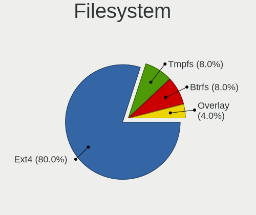
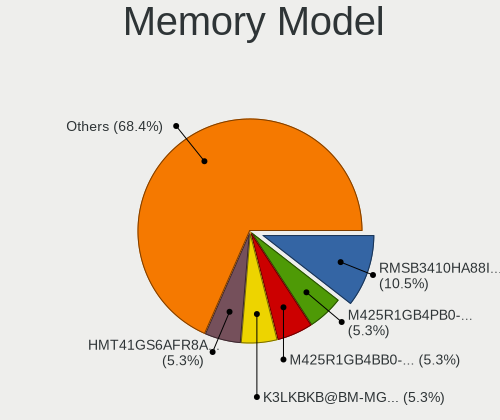

Kali - Hardware Trends (Notebooks)
----------------------------------

A project to identify most popular hardware characteristics and track their change
over time based on data collected by Linux users at https://Linux-Hardware.org.

Anyone can contribute to this report by the [hw-probe](https://github.com/linuxhw/hw-probe) tool:

    sudo -E hw-probe -all -upload

This report is for one last month. Overall report since the beginning of time: [TestDays](https://github.com/linuxhw/TestDays)

Period: Dec, 2024.

Contents
--------

* [ System ](#system)
  - [ OS                       ](#os)
  - [ OS Family                ](#os-family)
  - [ Kernel                   ](#kernel)
  - [ Kernel Family            ](#kernel-family)
  - [ Kernel Major Ver.        ](#kernel-major-ver)
  - [ Arch                     ](#arch)
  - [ DE                       ](#de)
  - [ Display Server           ](#display-server)
  - [ Display Manager          ](#display-manager)
  - [ OS Lang                  ](#os-lang)
  - [ Boot Mode                ](#boot-mode)
  - [ Filesystem               ](#filesystem)
  - [ Part. scheme             ](#part-scheme)
  - [ Dual Boot with Linux/BSD ](#dual-boot-with-linuxbsd)
  - [ Dual Boot (Win)          ](#dual-boot-win)

* [ Board ](#board)
  - [ Vendor                   ](#vendor)
  - [ Model                    ](#model)
  - [ Model Family             ](#model-family)
  - [ MFG Year                 ](#mfg-year)
  - [ Form Factor              ](#form-factor)
  - [ Secure Boot              ](#secure-boot)
  - [ Coreboot                 ](#coreboot)
  - [ RAM Size                 ](#ram-size)
  - [ RAM Used                 ](#ram-used)
  - [ Total Drives             ](#total-drives)
  - [ Has CD-ROM               ](#has-cd-rom)
  - [ Has Ethernet             ](#has-ethernet)
  - [ Has WiFi                 ](#has-wifi)
  - [ Has Bluetooth            ](#has-bluetooth)

* [ Location ](#location)
  - [ Country                  ](#country)
  - [ City                     ](#city)

* [ Drives ](#drives)
  - [ Drive Vendor             ](#drive-vendor)
  - [ Drive Model              ](#drive-model)
  - [ HDD Vendor               ](#hdd-vendor)
  - [ SSD Vendor               ](#ssd-vendor)
  - [ Drive Kind               ](#drive-kind)
  - [ Drive Connector          ](#drive-connector)
  - [ Drive Size               ](#drive-size)
  - [ Space Total              ](#space-total)
  - [ Space Used               ](#space-used)
  - [ Malfunc. Drives          ](#malfunc-drives)
  - [ Malfunc. Drive Vendor    ](#malfunc-drive-vendor)
  - [ Malfunc. HDD Vendor      ](#malfunc-hdd-vendor)
  - [ Malfunc. Drive Kind      ](#malfunc-drive-kind)
  - [ Failed Drives            ](#failed-drives)
  - [ Failed Drive Vendor      ](#failed-drive-vendor)
  - [ Drive Status             ](#drive-status)

* [ Storage controller ](#storage-controller)
  - [ Storage Vendor           ](#storage-vendor)
  - [ Storage Model            ](#storage-model)
  - [ Storage Kind             ](#storage-kind)

* [ Processor ](#processor)
  - [ CPU Vendor               ](#cpu-vendor)
  - [ CPU Model                ](#cpu-model)
  - [ CPU Model Family         ](#cpu-model-family)
  - [ CPU Cores                ](#cpu-cores)
  - [ CPU Sockets              ](#cpu-sockets)
  - [ CPU Threads              ](#cpu-threads)
  - [ CPU Op-Modes             ](#cpu-op-modes)
  - [ CPU Microcode            ](#cpu-microcode)
  - [ CPU Microarch            ](#cpu-microarch)

* [ Graphics ](#graphics)
  - [ GPU Vendor               ](#gpu-vendor)
  - [ GPU Model                ](#gpu-model)
  - [ GPU Combo                ](#gpu-combo)
  - [ GPU Driver               ](#gpu-driver)
  - [ GPU Memory               ](#gpu-memory)

* [ Monitor ](#monitor)
  - [ Monitor Vendor           ](#monitor-vendor)
  - [ Monitor Model            ](#monitor-model)
  - [ Monitor Resolution       ](#monitor-resolution)
  - [ Monitor Diagonal         ](#monitor-diagonal)
  - [ Monitor Width            ](#monitor-width)
  - [ Aspect Ratio             ](#aspect-ratio)
  - [ Monitor Area             ](#monitor-area)
  - [ Pixel Density            ](#pixel-density)
  - [ Multiple Monitors        ](#multiple-monitors)

* [ Network ](#network)
  - [ Net Controller Vendor    ](#net-controller-vendor)
  - [ Net Controller Model     ](#net-controller-model)
  - [ Wireless Vendor          ](#wireless-vendor)
  - [ Wireless Model           ](#wireless-model)
  - [ Ethernet Vendor          ](#ethernet-vendor)
  - [ Ethernet Model           ](#ethernet-model)
  - [ Net Controller Kind      ](#net-controller-kind)
  - [ Used Controller          ](#used-controller)
  - [ NICs                     ](#nics)
  - [ IPv6                     ](#ipv6)

* [ Bluetooth ](#bluetooth)
  - [ Bluetooth Vendor         ](#bluetooth-vendor)
  - [ Bluetooth Model          ](#bluetooth-model)

* [ Sound ](#sound)
  - [ Sound Vendor             ](#sound-vendor)
  - [ Sound Model              ](#sound-model)

* [ Memory ](#memory)
  - [ Memory Vendor            ](#memory-vendor)
  - [ Memory Model             ](#memory-model)
  - [ Memory Kind              ](#memory-kind)
  - [ Memory Form Factor       ](#memory-form-factor)
  - [ Memory Size              ](#memory-size)
  - [ Memory Speed             ](#memory-speed)

* [ Printers & scanners ](#printers--scanners)
  - [ Printer Vendor           ](#printer-vendor)
  - [ Printer Model            ](#printer-model)
  - [ Scanner Vendor           ](#scanner-vendor)
  - [ Scanner Model            ](#scanner-model)

* [ Camera ](#camera)
  - [ Camera Vendor            ](#camera-vendor)
  - [ Camera Model             ](#camera-model)

* [ Security ](#security)
  - [ Fingerprint Vendor       ](#fingerprint-vendor)
  - [ Fingerprint Model        ](#fingerprint-model)
  - [ Chipcard Vendor          ](#chipcard-vendor)
  - [ Chipcard Model           ](#chipcard-model)

* [ Unsupported ](#unsupported)
  - [ Unsupported Devices      ](#unsupported-devices)
  - [ Unsupported Device Types ](#unsupported-device-types)

System
------

OS
--

Installed operating systems

| Name        | Notebooks | Percent |
|-------------|-----------|---------|
| Kali 2024.4 | 21        | 84%     |
| Kali 2024.3 | 3         | 12%     |
| Kali 2023.2 | 1         | 4%      |

OS Family
---------

OS without a version

| Name | Notebooks | Percent |
|------|-----------|---------|
| Kali | 25        | 100%    |

Kernel
------

Version of the Linux kernel

| Version           | Notebooks | Percent |
|-------------------|-----------|---------|
| 6.11.2-amd64      | 22        | 88%     |
| 6.8.11-amd64      | 1         | 4%      |
| 6.6.15-amd64      | 1         | 4%      |
| 6.1.0-kali9-amd64 | 1         | 4%      |

Kernel Family
-------------

Linux kernel without a distro release

| Version | Notebooks | Percent |
|---------|-----------|---------|
| 6.11.2  | 22        | 88%     |
| 6.8.11  | 1         | 4%      |
| 6.6.15  | 1         | 4%      |
| 6.1.0   | 1         | 4%      |

Kernel Major Ver.
-----------------

Linux kernel major version

| Version | Notebooks | Percent |
|---------|-----------|---------|
| 6.11    | 22        | 88%     |
| 6.8     | 1         | 4%      |
| 6.6     | 1         | 4%      |
| 6.1     | 1         | 4%      |

Arch
----

OS architecture (x86_64, i586, etc.)

| Name   | Notebooks | Percent |
|--------|-----------|---------|
| x86_64 | 25        | 100%    |

DE
--

Desktop Environment

| Name  | Notebooks | Percent |
|-------|-----------|---------|
| XFCE  | 13        | 52%     |
| GNOME | 10        | 40%     |
| KDE6  | 1         | 4%      |
| KDE5  | 1         | 4%      |

Display Server
--------------

X11 or Wayland

| Name    | Notebooks | Percent |
|---------|-----------|---------|
| X11     | 21        | 84%     |
| Wayland | 2         | 8%      |
| Tty     | 2         | 8%      |

Display Manager
---------------

SDDM, LightDM, etc.

| Name    | Notebooks | Percent |
|---------|-----------|---------|
| LightDM | 13        | 52%     |
| Unknown | 7         | 28%     |
| GDM3    | 3         | 12%     |
| SDDM    | 2         | 8%      |

OS Lang
-------

Language

| Lang  | Notebooks | Percent |
|-------|-----------|---------|
| C     | 15        | 60%     |
| en_US | 5         | 20%     |
| tr_TR | 1         | 4%      |
| ru_RU | 1         | 4%      |
| es_ES | 1         | 4%      |
| en_IN | 1         | 4%      |
| en_GB | 1         | 4%      |

Boot Mode
---------

EFI or BIOS

| Mode | Notebooks | Percent |
|------|-----------|---------|
| EFI  | 20        | 80%     |
| BIOS | 5         | 20%     |

Filesystem
----------

Type of filesystem

| Type    | Notebooks | Percent |
|---------|-----------|---------|
| Ext4    | 20        | 80%     |
| Tmpfs   | 2         | 8%      |
| Btrfs   | 2         | 8%      |
| Overlay | 1         | 4%      |

Part. scheme
------------

Scheme of partitioning

| Type    | Notebooks | Percent |
|---------|-----------|---------|
| GPT     | 16        | 64%     |
| Unknown | 7         | 28%     |
| MBR     | 2         | 8%      |

Dual Boot with Linux/BSD
------------------------

Hosting more than one Linux/BSD

| Dual boot | Notebooks | Percent |
|-----------|-----------|---------|
| No        | 24        | 96%     |
| Yes       | 1         | 4%      |

Dual Boot (Win)
---------------

Hosting Linux and Windows

| Dual boot | Notebooks | Percent |
|-----------|-----------|---------|
| No        | 19        | 76%     |
| Yes       | 6         | 24%     |

Board
-----

Vendor
------

Motherboard manufacturer

| Name                | Notebooks | Percent |
|---------------------|-----------|---------|
| Lenovo              | 7         | 28%     |
| Acer                | 5         | 20%     |
| Dell                | 4         | 16%     |
| ASUSTek Computer    | 3         | 12%     |
| Hewlett-Packard     | 2         | 8%      |
| Apple               | 2         | 8%      |
| Samsung Electronics | 1         | 4%      |
| Fujitsu             | 1         | 4%      |

Model
-----

Motherboard model

| Name                                     | Notebooks | Percent |
|------------------------------------------|-----------|---------|
| Samsung 550XCJ/550XCR                    | 1         | 4%      |
| Lenovo ThinkPad X220 4291SJ4             | 1         | 4%      |
| Lenovo ThinkPad T470 20HES18R03          | 1         | 4%      |
| Lenovo ThinkPad E16 Gen 2 21M5CTO1WW     | 1         | 4%      |
| Lenovo ThinkBook 14 G6 IRL 21KG          | 1         | 4%      |
| Lenovo Legion Pro 7 16IRX8H 82WQ         | 1         | 4%      |
| Lenovo IdeaPad Slim 3 14IAH8 83EQ        | 1         | 4%      |
| Lenovo G580 2189                         | 1         | 4%      |
| HP Notebook                              | 1         | 4%      |
| HP 250 G8 Notebook PC                    | 1         | 4%      |
| Fujitsu LIFEBOOK S904                    | 1         | 4%      |
| Dell XPS 15 9500                         | 1         | 4%      |
| Dell Precision 7710                      | 1         | 4%      |
| Dell Latitude E5520                      | 1         | 4%      |
| Dell Latitude 7480                       | 1         | 4%      |
| ASUS VivoBook_ASUSLaptop K3605ZF_K3605ZF | 1         | 4%      |
| ASUS Vivobook Go E1504FA_E1504FA         | 1         | 4%      |
| ASUS ASUS EXPERTBOOK B3404CVA_B3404CVA   | 1         | 4%      |
| Apple MacBookPro8,1                      | 1         | 4%      |
| Apple MacBookPro11,3                     | 1         | 4%      |
| Acer Swift SFX14-41G                     | 1         | 4%      |
| Acer Nitro AN517-41                      | 1         | 4%      |
| Acer Nitro AN515-54                      | 1         | 4%      |
| Acer Aspire AG14-31P                     | 1         | 4%      |
| Acer Aspire A515-58M                     | 1         | 4%      |

Model Family
------------

Motherboard model prefix

| Name               | Notebooks | Percent |
|--------------------|-----------|---------|
| Lenovo ThinkPad    | 3         | 12%     |
| Dell Latitude      | 2         | 8%      |
| ASUS VivoBook      | 2         | 8%      |
| Acer Nitro         | 2         | 8%      |
| Acer Aspire        | 2         | 8%      |
| Samsung 550XCJ     | 1         | 4%      |
| Lenovo ThinkBook   | 1         | 4%      |
| Lenovo Legion      | 1         | 4%      |
| Lenovo IdeaPad     | 1         | 4%      |
| Lenovo G580        | 1         | 4%      |
| HP Notebook        | 1         | 4%      |
| HP 250             | 1         | 4%      |
| Fujitsu LIFEBOOK   | 1         | 4%      |
| Dell XPS           | 1         | 4%      |
| Dell Precision     | 1         | 4%      |
| ASUS ASUS          | 1         | 4%      |
| Apple MacBookPro8  | 1         | 4%      |
| Apple MacBookPro11 | 1         | 4%      |
| Acer Swift         | 1         | 4%      |

MFG Year
--------

Motherboard manufacture year

| Year | Notebooks | Percent |
|------|-----------|---------|
| 2023 | 6         | 24%     |
| 2020 | 3         | 12%     |
| 2011 | 3         | 12%     |
| 2024 | 2         | 8%      |
| 2021 | 2         | 8%      |
| 2017 | 2         | 8%      |
| 2013 | 2         | 8%      |
| 2022 | 1         | 4%      |
| 2019 | 1         | 4%      |
| 2018 | 1         | 4%      |
| 2015 | 1         | 4%      |
| 2012 | 1         | 4%      |

Form Factor
-----------

Physical design of the computer

| Name     | Notebooks | Percent |
|----------|-----------|---------|
| Notebook | 25        | 100%    |

Secure Boot
-----------

Enabled or disabled

| State    | Notebooks | Percent |
|----------|-----------|---------|
| Disabled | 25        | 100%    |

Coreboot
--------

Have coreboot on board

| Used | Notebooks | Percent |
|------|-----------|---------|
| No   | 25        | 100%    |

RAM Size
--------

Total RAM memory

| Size in GB | Notebooks | Percent |
|------------|-----------|---------|
| 8.01-16.0  | 9         | 36%     |
| 4.01-8.0   | 7         | 28%     |
| 16.01-24.0 | 5         | 20%     |
| 32.01-64.0 | 3         | 12%     |
| 3.01-4.0   | 1         | 4%      |

RAM Used
--------

Used RAM memory

| Used GB  | Notebooks | Percent |
|----------|-----------|---------|
| 2.01-3.0 | 10        | 40%     |
| 3.01-4.0 | 7         | 28%     |
| 4.01-8.0 | 5         | 20%     |
| 1.01-2.0 | 2         | 8%      |
| 0.51-1.0 | 1         | 4%      |

Total Drives
------------

Number of drives on board

| Drives | Notebooks | Percent |
|--------|-----------|---------|
| 1      | 20        | 80%     |
| 2      | 5         | 20%     |

Has CD-ROM
----------

Has CD-ROM on board

| Presented | Notebooks | Percent |
|-----------|-----------|---------|
| No        | 21        | 84%     |
| Yes       | 4         | 16%     |

Has Ethernet
------------

Has Ethernet on board

| Presented | Notebooks | Percent |
|-----------|-----------|---------|
| Yes       | 20        | 80%     |
| No        | 5         | 20%     |

Has WiFi
--------

Has WiFi module

| Presented | Notebooks | Percent |
|-----------|-----------|---------|
| Yes       | 25        | 100%    |

Has Bluetooth
-------------

Has Bluetooth module

| Presented | Notebooks | Percent |
|-----------|-----------|---------|
| Yes       | 23        | 92%     |
| No        | 2         | 8%      |

Location
--------

Country
-------

Geographic location (country)

| Country   | Notebooks | Percent |
|-----------|-----------|---------|
| USA       | 4         | 16%     |
| Germany   | 3         | 12%     |
| Sweden    | 2         | 8%      |
| India     | 2         | 8%      |
| Czechia   | 2         | 8%      |
| Colombia  | 2         | 8%      |
| UK        | 1         | 4%      |
| Turkey    | 1         | 4%      |
| Thailand  | 1         | 4%      |
| Poland    | 1         | 4%      |
| Mexico    | 1         | 4%      |
| Italy     | 1         | 4%      |
| Hong Kong | 1         | 4%      |
| Greece    | 1         | 4%      |
| Brazil    | 1         | 4%      |
| Austria   | 1         | 4%      |

City
----

Geographic location (city)

| City               | Notebooks | Percent |
|--------------------|-----------|---------|
| Prague             | 2         | 8%      |
| Wilmington         | 1         | 4%      |
| Pune               | 1         | 4%      |
| Poznan             | 1         | 4%      |
| Oklahoma City      | 1         | 4%      |
| Milan              | 1         | 4%      |
| Medellín          | 1         | 4%      |
| Manaus             | 1         | 4%      |
| Llandudno Junction | 1         | 4%      |
| Hok Yuen           | 1         | 4%      |
| Hoellviken         | 1         | 4%      |
| Handen             | 1         | 4%      |
| Gundelfingen       | 1         | 4%      |
| Graz               | 1         | 4%      |
| Fort Myers         | 1         | 4%      |
| Foley              | 1         | 4%      |
| Bogotá            | 1         | 4%      |
| Bocholt            | 1         | 4%      |
| Berlin             | 1         | 4%      |
| Bangkok            | 1         | 4%      |
| Athens             | 1         | 4%      |
| Arandas            | 1         | 4%      |
| Ankara             | 1         | 4%      |
| Ahmedabad          | 1         | 4%      |

Drives
------

Drive Vendor
------------

Hard drive vendors

| Vendor                      | Notebooks | Drives | Percent |
|-----------------------------|-----------|--------|---------|
| Samsung Electronics         | 6         | 10     | 21.43%  |
| Toshiba                     | 3         | 3      | 10.71%  |
| SK hynix                    | 3         | 3      | 10.71%  |
| Micron Technology           | 2         | 2      | 7.14%   |
| Crucial                     | 2         | 2      | 7.14%   |
| WDC                         | 1         | 1      | 3.57%   |
| Team                        | 1         | 1      | 3.57%   |
| SPCC                        | 1         | 1      | 3.57%   |
| SanDisk                     | 1         | 1      | 3.57%   |
| Min Yi U                    | 1         | 1      | 3.57%   |
| MAXIO Technology (Hangzhou) | 1         | 1      | 3.57%   |
| KIOXIA                      | 1         | 1      | 3.57%   |
| Kingston                    | 1         | 2      | 3.57%   |
| Intel                       | 1         | 1      | 3.57%   |
| HGST                        | 1         | 1      | 3.57%   |
| BAITITON                    | 1         | 1      | 3.57%   |
| Apple                       | 1         | 1      | 3.57%   |

Drive Model
-----------

Hard drive models

| Model                                                | Notebooks | Percent |
|------------------------------------------------------|-----------|---------|
| WDC SDINFDO4-128G SSD                                | 1         | 3.23%   |
| Toshiba THNSNH256GCST 256GB SSD                      | 1         | 3.23%   |
| Toshiba MQ01ACF050 500GB                             | 1         | 3.23%   |
| Toshiba MQ01ABF050 500GB                             | 1         | 3.23%   |
| Team T253A3001T 1TB SSD                              | 1         | 3.23%   |
| SPCC Solid State Disk 512GB                          | 1         | 3.23%   |
| SK hynix SKHynix_HFS512GEJ9X115N 512GB               | 1         | 3.23%   |
| SK hynix SKHynix_HFS512GEJ4X112N 512GB               | 1         | 3.23%   |
| SK hynix BC501 HFM256GDJTNG-8310A 256GB              | 1         | 3.23%   |
| SanDisk NVMe SSD Drive 1TB                           | 1         | 3.23%   |
| Samsung SSD 980 1TB                                  | 1         | 3.23%   |
| Samsung SSD 870 EVO 250GB                            | 1         | 3.23%   |
| Samsung SSD 850 EVO 250GB                            | 1         | 3.23%   |
| Samsung PSSD T5 EVO 4TB                              | 1         | 3.23%   |
| Samsung PM981a NVMe 512GB                            | 1         | 3.23%   |
| Samsung NVMe SSD Controller SM961/PM961/SM963 256GB  | 1         | 3.23%   |
| Samsung NVMe SSD Controller PM9A1/PM9A3/980PRO 512GB | 1         | 3.23%   |
| Samsung MZVL21T0HCLR-00BL2 1TB                       | 1         | 3.23%   |
| Min Yi U YZWY_TECH 250GB                             | 1         | 3.23%   |
| Micron MTFDDAV256TDL-1AW1ZABHA 256GB SSD             | 1         | 3.23%   |
| Micron 2400_MTFDKBA512QFM 512GB                      | 1         | 3.23%   |
| MAXIO (Hangzhou) NVMe SSD Controller MAP1202 512GB   | 1         | 3.23%   |
| KIOXIA KBG6AZNT512G LA 512GB                         | 1         | 3.23%   |
| Kingston SNVS250G 250GB                              | 1         | 3.23%   |
| Kingston SA400S37240G 240GB SSD                      | 1         | 3.23%   |
| Intel SSDPEKNU512GZ 512GB                            | 1         | 3.23%   |
| HGST HTS725032A7E630 320GB                           | 1         | 3.23%   |
| Crucial CT500P2SSD8 500GB                            | 1         | 3.23%   |
| Crucial CT1000P3PSSD8 1TB                            | 1         | 3.23%   |
| BAITITON BT58SSD12S 512GB                            | 1         | 3.23%   |
| Apple SSD SM1024F 1TB                                | 1         | 3.23%   |

HDD Vendor
----------

Hard disk drive vendors

| Vendor   | Notebooks | Drives | Percent |
|----------|-----------|--------|---------|
| Toshiba  | 2         | 2      | 50%     |
| Min Yi U | 1         | 1      | 25%     |
| HGST     | 1         | 1      | 25%     |

SSD Vendor
----------

Solid state drive vendors

| Vendor              | Notebooks | Drives | Percent |
|---------------------|-----------|--------|---------|
| Samsung Electronics | 3         | 3      | 27.27%  |
| WDC                 | 1         | 1      | 9.09%   |
| Toshiba             | 1         | 1      | 9.09%   |
| Team                | 1         | 1      | 9.09%   |
| SPCC                | 1         | 1      | 9.09%   |
| Micron Technology   | 1         | 1      | 9.09%   |
| Kingston            | 1         | 1      | 9.09%   |
| BAITITON            | 1         | 1      | 9.09%   |
| Apple               | 1         | 1      | 9.09%   |

Drive Kind
----------

HDD or SSD

| Kind | Notebooks | Drives | Percent |
|------|-----------|--------|---------|
| NVMe | 14        | 18     | 48.28%  |
| SSD  | 11        | 11     | 37.93%  |
| HDD  | 4         | 4      | 13.79%  |

Drive Connector
---------------

SATA, SAS, NVMe, etc.

| Type | Notebooks | Drives | Percent |
|------|-----------|--------|---------|
| NVMe | 14        | 18     | 48.28%  |
| SATA | 12        | 12     | 41.38%  |
| SAS  | 3         | 3      | 10.34%  |

Drive Size
----------

Size of hard drive

| Size in TB | Notebooks | Drives | Percent |
|------------|-----------|--------|---------|
| 0.01-0.5   | 10        | 10     | 66.67%  |
| 0.51-1.0   | 4         | 4      | 26.67%  |
| 3.01-4.0   | 1         | 1      | 6.67%   |

Space Total
-----------

Amount of disk space available on the file system

| Size in GB     | Notebooks | Percent |
|----------------|-----------|---------|
| 101-250        | 9         | 36%     |
| 251-500        | 8         | 32%     |
| 1001-2000      | 3         | 12%     |
| 501-1000       | 2         | 8%      |
| More than 3000 | 1         | 4%      |
| 21-50          | 1         | 4%      |
| 1-20           | 1         | 4%      |

Space Used
----------

Amount of used disk space

| Used GB        | Notebooks | Percent |
|----------------|-----------|---------|
| 1-20           | 8         | 32%     |
| 101-250        | 7         | 28%     |
| 21-50          | 5         | 20%     |
| 51-100         | 2         | 8%      |
| More than 3000 | 1         | 4%      |
| 251-500        | 1         | 4%      |
| 501-1000       | 1         | 4%      |

Malfunc. Drives
---------------

Drive models with a malfunction

| Model                     | Notebooks | Drives | Percent |
|---------------------------|-----------|--------|---------|
| Min Yi U YZWY_TECH 250GB  | 1         | 1      | 33.33%  |
| Crucial CT500P2SSD8 500GB | 1         | 1      | 33.33%  |
| BAITITON BT58SSD12S 512GB | 1         | 1      | 33.33%  |

Malfunc. Drive Vendor
---------------------

Vendors of faulty drives

| Vendor   | Notebooks | Drives | Percent |
|----------|-----------|--------|---------|
| Min Yi U | 1         | 1      | 33.33%  |
| Crucial  | 1         | 1      | 33.33%  |
| BAITITON | 1         | 1      | 33.33%  |

Malfunc. HDD Vendor
-------------------

Vendors of faulty HDD drives

| Vendor   | Notebooks | Drives | Percent |
|----------|-----------|--------|---------|
| Min Yi U | 1         | 1      | 100%    |

Malfunc. Drive Kind
-------------------

Kinds of faulty drives

| Kind | Notebooks | Drives | Percent |
|------|-----------|--------|---------|
| NVMe | 1         | 1      | 33.33%  |
| SSD  | 1         | 1      | 33.33%  |
| HDD  | 1         | 1      | 33.33%  |

Failed Drives
-------------

Failed drive models

Zero info for selected period =(

Failed Drive Vendor
-------------------

Failed drive vendors

Zero info for selected period =(

Drive Status
------------

Number of failed and malfunc. drives

| Status   | Notebooks | Drives | Percent |
|----------|-----------|--------|---------|
| Works    | 14        | 16     | 50%     |
| Detected | 11        | 14     | 39.29%  |
| Malfunc  | 3         | 3      | 10.71%  |

Storage controller
------------------

Storage Vendor
--------------

Storage controller vendors

| Vendor                      | Notebooks | Percent |
|-----------------------------|-----------|---------|
| Intel                       | 13        | 43.33%  |
| Samsung Electronics         | 5         | 16.67%  |
| SK hynix                    | 3         | 10%     |
| Micron Technology           | 2         | 6.67%   |
| AMD                         | 2         | 6.67%   |
| SanDisk                     | 1         | 3.33%   |
| Micron/Crucial Technology   | 1         | 3.33%   |
| MAXIO Technology (Hangzhou) | 1         | 3.33%   |
| KIOXIA                      | 1         | 3.33%   |
| Kingston Technology Company | 1         | 3.33%   |

Storage Model
-------------

Storage controller models

| Model                                                                            | Notebooks | Percent |
|----------------------------------------------------------------------------------|-----------|---------|
| Intel 6 Series/C200 Series Chipset Family 6 port Mobile SATA AHCI Controller     | 3         | 9.68%   |
| Intel 82801 Mobile SATA Controller [RAID mode]                                   | 2         | 6.45%   |
| AMD FCH SATA Controller [AHCI mode]                                              | 2         | 6.45%   |
| SK hynix Platinum P41/PC801 NVMe Solid State Drive                               | 1         | 3.23%   |
| SK hynix BC901 NVMe Solid State Drive (DRAM-less)                                | 1         | 3.23%   |
| SK hynix BC501 NVMe Solid State Drive                                            | 1         | 3.23%   |
| SanDisk WD Black SN770 / PC SN740 256GB / PC SN560 (DRAM-less) NVMe SSD          | 1         | 3.23%   |
| Samsung S4LN053X01 AHCI SSD Controller(Apple slot)                               | 1         | 3.23%   |
| Samsung NVMe SSD Controller SM981/PM981/PM983                                    | 1         | 3.23%   |
| Samsung NVMe SSD Controller SM961/PM961/SM963                                    | 1         | 3.23%   |
| Samsung NVMe SSD Controller PM9A1/PM9A3/980PRO                                   | 1         | 3.23%   |
| Samsung NVMe SSD Controller 980 (DRAM-less)                                      | 1         | 3.23%   |
| Micron/Crucial P2 [Nick P2] / P3 / P3 Plus NVMe PCIe SSD (DRAM-less)             | 1         | 3.23%   |
| Micron 2550 NVMe SSD (DRAM-less)                                                 | 1         | 3.23%   |
| Micron 2400 NVMe SSD (DRAM-less)                                                 | 1         | 3.23%   |
| MAXIO (Hangzhou) NVMe SSD Controller MAP1202 (DRAM-less)                         | 1         | 3.23%   |
| KIOXIA NVMe SSD Controller BG6 (DRAM-less)                                       | 1         | 3.23%   |
| Kingston Company NV1 NVMe SSD [E13T] (DRAM-less)                                 | 1         | 3.23%   |
| Intel Volume Management Device NVMe RAID Controller Intel Corporation            | 1         | 3.23%   |
| Intel SSD 670p Series [Keystone Harbor]                                          | 1         | 3.23%   |
| Intel Q170/Q150/B150/H170/H110/Z170/CM236 Chipset SATA Controller [AHCI Mode]    | 1         | 3.23%   |
| Intel Comet Lake SATA AHCI Controller                                            | 1         | 3.23%   |
| Intel Celeron/Pentium Silver Processor SATA Controller                           | 1         | 3.23%   |
| Intel Atom/Celeron/Pentium Processor x5-E8000/J3xxx/N3xxx Series SATA Controller | 1         | 3.23%   |
| Intel 8 Series SATA Controller 1 [AHCI mode]                                     | 1         | 3.23%   |
| Intel 8 Series HECI IDER                                                         | 1         | 3.23%   |
| Intel 7 Series Chipset Family 6-port SATA Controller [AHCI mode]                 | 1         | 3.23%   |

Storage Kind
------------

Kind of storage controller (IDE, SATA, NVMe, SAS, ...)

| Kind | Notebooks | Percent |
|------|-----------|---------|
| NVMe | 14        | 46.67%  |
| SATA | 12        | 40%     |
| RAID | 3         | 10%     |
| IDE  | 1         | 3.33%   |

Processor
---------

CPU Vendor
----------

Processor vendors

| Vendor | Notebooks | Percent |
|--------|-----------|---------|
| Intel  | 21        | 84%     |
| AMD    | 4         | 16%     |

CPU Model
---------

Processor models

| Model                                   | Notebooks | Percent |
|-----------------------------------------|-----------|---------|
| Intel Core i5-2520M CPU @ 2.50GHz       | 2         | 8%      |
| Intel Xeon CPU E3-1535M v5 @ 2.90GHz    | 1         | 4%      |
| Intel N100                              | 1         | 4%      |
| Intel Core i7-7600U CPU @ 2.80GHz       | 1         | 4%      |
| Intel Core i7-4960HQ CPU @ 2.60GHz      | 1         | 4%      |
| Intel Core i7-4600U CPU @ 2.10GHz       | 1         | 4%      |
| Intel Core i7-3520M CPU @ 2.90GHz       | 1         | 4%      |
| Intel Core i7-2640M CPU @ 2.80GHz       | 1         | 4%      |
| Intel Core i5-9300H CPU @ 2.40GHz       | 1         | 4%      |
| Intel Core i5-7300U CPU @ 2.60GHz       | 1         | 4%      |
| Intel Core i5-10300H CPU @ 2.50GHz      | 1         | 4%      |
| Intel Celeron N4020 CPU @ 1.10GHz       | 1         | 4%      |
| Intel Celeron CPU N3050 @ 1.60GHz       | 1         | 4%      |
| Intel Celeron CPU 5205U @ 1.90GHz       | 1         | 4%      |
| Intel 13th Gen Core i9-13900HX          | 1         | 4%      |
| Intel 13th Gen Core i7-1355U            | 1         | 4%      |
| Intel 13th Gen Core i5-13500H           | 1         | 4%      |
| Intel 13th Gen Core i5-1335U            | 1         | 4%      |
| Intel 12th Gen Core i5-12500H           | 1         | 4%      |
| Intel 12th Gen Core i5-12450H           | 1         | 4%      |
| AMD Ryzen 7 7735HS with Radeon Graphics | 1         | 4%      |
| AMD Ryzen 7 5800U with Radeon Graphics  | 1         | 4%      |
| AMD Ryzen 7 5800H with Radeon Graphics  | 1         | 4%      |
| AMD Ryzen 5 7520U with Radeon Graphics  | 1         | 4%      |

CPU Model Family
----------------

Processor model prefix

| Model         | Notebooks | Percent |
|---------------|-----------|---------|
| Other         | 7         | 28%     |
| Intel Core i7 | 5         | 20%     |
| Intel Core i5 | 5         | 20%     |
| Intel Celeron | 3         | 12%     |
| AMD Ryzen 7   | 3         | 12%     |
| Intel Xeon    | 1         | 4%      |
| AMD Ryzen 5   | 1         | 4%      |

CPU Cores
---------

Number of processor cores

| Number | Notebooks | Percent |
|--------|-----------|---------|
| 2      | 10        | 40%     |
| 4      | 6         | 24%     |
| 8      | 4         | 16%     |
| 12     | 2         | 8%      |
| 10     | 2         | 8%      |
| 24     | 1         | 4%      |

CPU Sockets
-----------

Number of sockets

| Number | Notebooks | Percent |
|--------|-----------|---------|
| 1      | 25        | 100%    |

CPU Threads
-----------

Threads per core (Hyper-Threading)

| Number | Notebooks | Percent |
|--------|-----------|---------|
| 2      | 21        | 84%     |
| 1      | 4         | 16%     |

CPU Op-Modes
------------

CPU Operation Modes (32-bit, 64-bit)

| Op mode        | Notebooks | Percent |
|----------------|-----------|---------|
| 32-bit, 64-bit | 25        | 100%    |

CPU Microcode
-------------

Microcode number

| Number  | Notebooks | Percent |
|---------|-----------|---------|
| Unknown | 24        | 96%     |
| 0xb06a3 | 1         | 4%      |

CPU Microarch
-------------

Microarchitecture

| Name             | Notebooks | Percent |
|------------------|-----------|---------|
| Alderlake Hybrid | 5         | 20%     |
| Unknown          | 4         | 16%     |
| SandyBridge      | 3         | 12%     |
| KabyLake         | 3         | 12%     |
| Zen 3            | 2         | 8%      |
| Haswell          | 2         | 8%      |
| CometLake        | 2         | 8%      |
| Skylake          | 1         | 4%      |
| Silvermont       | 1         | 4%      |
| IvyBridge        | 1         | 4%      |
| Goldmont plus    | 1         | 4%      |

Graphics
--------

GPU Vendor
----------

Vendors of graphics cards

| Vendor | Notebooks | Percent |
|--------|-----------|---------|
| Intel  | 18        | 62.07%  |
| Nvidia | 6         | 20.69%  |
| AMD    | 5         | 17.24%  |

GPU Model
---------

Graphics card models

| Model                                                                                    | Notebooks | Percent |
|------------------------------------------------------------------------------------------|-----------|---------|
| Intel 2nd Generation Core Processor Family Integrated Graphics Controller                | 3         | 10.34%  |
| Intel Raptor Lake-P [Iris Xe Graphics]                                                   | 2         | 6.9%    |
| Intel HD Graphics 620                                                                    | 2         | 6.9%    |
| AMD Cezanne [Radeon Vega Series / Radeon Vega Mobile Series]                             | 2         | 6.9%    |
| Nvidia TU117M [GeForce GTX 1650 Mobile / Max-Q]                                          | 1         | 3.45%   |
| Nvidia GK107M [GeForce GT 750M Mac Edition]                                              | 1         | 3.45%   |
| Nvidia GA107M [GeForce RTX 3050 Ti Mobile]                                               | 1         | 3.45%   |
| Nvidia GA107M [GeForce RTX 2050]                                                         | 1         | 3.45%   |
| Nvidia GA104M [GeForce RTX 3070 Mobile / Max-Q]                                          | 1         | 3.45%   |
| Nvidia AD103M / GN21-X11 [GeForce RTX 4090 Laptop GPU]                                   | 1         | 3.45%   |
| Intel Raptor Lake-P [UHD Graphics]                                                       | 1         | 3.45%   |
| Intel Haswell-ULT Integrated Graphics Controller                                         | 1         | 3.45%   |
| Intel GeminiLake [UHD Graphics 600]                                                      | 1         | 3.45%   |
| Intel CometLake-H GT2 [UHD Graphics]                                                     | 1         | 3.45%   |
| Intel Comet Lake UHD Graphics                                                            | 1         | 3.45%   |
| Intel CoffeeLake-H GT2 [UHD Graphics 630]                                                | 1         | 3.45%   |
| Intel Atom/Celeron/Pentium Processor x5-E8000/J3xxx/N3xxx Integrated Graphics Controller | 1         | 3.45%   |
| Intel Alder Lake-P GT2 [Iris Xe Graphics]                                                | 1         | 3.45%   |
| Intel Alder Lake-P GT1 [UHD Graphics]                                                    | 1         | 3.45%   |
| Intel Alder Lake-N [UHD Graphics]                                                        | 1         | 3.45%   |
| Intel 3rd Gen Core processor Graphics Controller                                         | 1         | 3.45%   |
| AMD Venus XTX [Radeon HD 8890M / R9 M275X/M375X]                                         | 1         | 3.45%   |
| AMD Rembrandt [Radeon 680M]                                                              | 1         | 3.45%   |
| AMD Mendocino                                                                            | 1         | 3.45%   |

GPU Combo
---------

Combinations of graphics cards

| Name           | Notebooks | Percent |
|----------------|-----------|---------|
| 1 x Intel      | 16        | 64%     |
| 1 x AMD        | 3         | 12%     |
| 1 x Nvidia     | 2         | 8%      |
| Intel + Nvidia | 2         | 8%      |
| AMD + Nvidia   | 2         | 8%      |

GPU Driver
----------

Free vs proprietary

| Driver      | Notebooks | Percent |
|-------------|-----------|---------|
| Free        | 23        | 92%     |
| Proprietary | 2         | 8%      |

GPU Memory
----------

Total video memory

| Size in GB | Notebooks | Percent |
|------------|-----------|---------|
| Unknown    | 16        | 64%     |
| 3.01-4.0   | 3         | 12%     |
| 1.01-2.0   | 2         | 8%      |
| 7.01-8.0   | 1         | 4%      |
| 8.01-16.0  | 1         | 4%      |
| 0.51-1.0   | 1         | 4%      |
| 0.01-0.5   | 1         | 4%      |

Monitor
-------

Monitor Vendor
--------------

Monitor vendors

| Vendor              | Notebooks | Percent |
|---------------------|-----------|---------|
| Chimei Innolux      | 6         | 20%     |
| AU Optronics        | 5         | 16.67%  |
| BOE                 | 4         | 13.33%  |
| Samsung Electronics | 3         | 10%     |
| Dell                | 2         | 6.67%   |
| CSO                 | 2         | 6.67%   |
| Apple               | 2         | 6.67%   |
| Sharp               | 1         | 3.33%   |
| Sceptre Tech        | 1         | 3.33%   |
| MSI                 | 1         | 3.33%   |
| LG Display          | 1         | 3.33%   |
| HKC                 | 1         | 3.33%   |
| Unknown             | 1         | 3.33%   |

Monitor Model
-------------

Monitor models

| Model                                                                | Notebooks | Percent |
|----------------------------------------------------------------------|-----------|---------|
| Sharp LCD Monitor SHP14D1 1920x1200 336x210mm 15.6-inch              | 1         | 3.23%   |
| Sceptre Tech Sceptre F24 SPT09AB 1920x1080 526x296mm 23.8-inch       | 1         | 3.23%   |
| Samsung Electronics LF24T450F SAM7094 1920x1080 527x296mm 23.8-inch  | 1         | 3.23%   |
| Samsung Electronics LCD Monitor SEC5441 1280x800 286x179mm 13.3-inch | 1         | 3.23%   |
| Samsung Electronics LCD Monitor SEC3047 1366x768 277x156mm 12.5-inch | 1         | 3.23%   |
| Samsung Electronics LCD Monitor LF24T450F                            | 1         | 3.23%   |
| MSI MP241CA MSI30A9 1920x1080 520x290mm 23.4-inch                    | 1         | 3.23%   |
| LG Display LCD Monitor LGD033A 1366x768 340x190mm 15.3-inch          | 1         | 3.23%   |
| HKC LCD Monitor HKC3D00 1920x1080 344x194mm 15.5-inch                | 1         | 3.23%   |
| Dell U3417W DELA0DF 3440x1440 800x330mm 34.1-inch                    | 1         | 3.23%   |
| Dell 1908FP DEL4026 1280x1024 376x301mm 19.0-inch                    | 1         | 3.23%   |
| CSO LCD Monitor CSO1628 2560x1600 340x220mm 15.9-inch                | 1         | 3.23%   |
| CSO LCD Monitor CSO160E 2560x1600 344x215mm 16.0-inch                | 1         | 3.23%   |
| Chimei Innolux LCD Monitor CMN1618 1920x1200 344x215mm 16.0-inch     | 1         | 3.23%   |
| Chimei Innolux LCD Monitor CMN15F5 1920x1080 344x193mm 15.5-inch     | 1         | 3.23%   |
| Chimei Innolux LCD Monitor CMN15CA 1366x768 344x193mm 15.5-inch      | 1         | 3.23%   |
| Chimei Innolux LCD Monitor CMN14D5 1920x1080 309x173mm 13.9-inch     | 1         | 3.23%   |
| Chimei Innolux LCD Monitor CMN14D3 1920x1080 309x173mm 13.9-inch     | 1         | 3.23%   |
| Chimei Innolux LCD Monitor CMN140A 1920x1080 309x173mm 13.9-inch     | 1         | 3.23%   |
| BOE LCD Monitor BOE0C69 1920x1200 302x188mm 14.0-inch                | 1         | 3.23%   |
| BOE LCD Monitor BOE0C0B 1920x1200 302x189mm 14.0-inch                | 1         | 3.23%   |
| BOE LCD Monitor BOE0B5D 1920x1200 302x188mm 14.0-inch                | 1         | 3.23%   |
| BOE LCD Monitor BOE08EF 1366x768 344x194mm 15.5-inch                 | 1         | 3.23%   |
| AU Optronics LCD Monitor AUO978F 1920x1080 382x215mm 17.3-inch       | 1         | 3.23%   |
| AU Optronics LCD Monitor AUO499F 1920x1080 344x194mm 15.5-inch       | 1         | 3.23%   |
| AU Optronics LCD Monitor AUO21ED 1920x1080 344x193mm 15.5-inch       | 1         | 3.23%   |
| AU Optronics LCD Monitor AUO109D 1920x1080 381x214mm 17.2-inch       | 1         | 3.23%   |
| AU Optronics LCD Monitor AUO103D 1920x1080 309x173mm 13.9-inch       | 1         | 3.23%   |
| Apple LCD Monitor APP9CCB 1280x800 286x179mm 13.3-inch               | 1         | 3.23%   |
| Apple Color LCD APPA019 2880x1800 331x207mm 15.4-inch                | 1         | 3.23%   |
| Unknown                                                              | 1         | 3.23%   |

Monitor Resolution
------------------

Monitor screen resolution

| Resolution        | Notebooks | Percent |
|-------------------|-----------|---------|
| 1920x1080 (FHD)   | 11        | 37.93%  |
| 1920x1200 (WUXGA) | 5         | 17.24%  |
| 1366x768 (WXGA)   | 5         | 17.24%  |
| 2560x1600         | 2         | 6.9%    |
| 4480x1600         | 1         | 3.45%   |
| 3440x1440         | 1         | 3.45%   |
| 2880x1800         | 1         | 3.45%   |
| 1280x800 (WXGA)   | 1         | 3.45%   |
| 1280x1024 (SXGA)  | 1         | 3.45%   |
| Unknown           | 1         | 3.45%   |

Monitor Diagonal
----------------

Diagonal size in inches

| Inches  | Notebooks | Percent |
|---------|-----------|---------|
| 15      | 11        | 36.67%  |
| 13      | 5         | 16.67%  |
| 14      | 3         | 10%     |
| 17      | 2         | 6.67%   |
| 16      | 2         | 6.67%   |
| 34      | 1         | 3.33%   |
| 32      | 1         | 3.33%   |
| 24      | 1         | 3.33%   |
| 23      | 1         | 3.33%   |
| 19      | 1         | 3.33%   |
| 12      | 1         | 3.33%   |
| Unknown | 1         | 3.33%   |

Monitor Width
-------------

Physical width

| Width in mm | Notebooks | Percent |
|-------------|-----------|---------|
| 301-350     | 19        | 63.33%  |
| 351-400     | 4         | 13.33%  |
| 701-800     | 2         | 6.67%   |
| 501-600     | 2         | 6.67%   |
| 201-300     | 2         | 6.67%   |
| Unknown     | 1         | 3.33%   |

Aspect Ratio
------------

Proportional relationship between the width and the height

| Ratio   | Notebooks | Percent |
|---------|-----------|---------|
| 16/9    | 16        | 57.14%  |
| 16/10   | 8         | 28.57%  |
| 5/4     | 1         | 3.57%   |
| 3/2     | 1         | 3.57%   |
| 21/9    | 1         | 3.57%   |
| Unknown | 1         | 3.57%   |

Monitor Area
------------

Area in inch²

| Area in inch² | Notebooks | Percent |
|----------------|-----------|---------|
| 101-110        | 9         | 30%     |
| 81-90          | 7         | 23.33%  |
| 111-120        | 4         | 13.33%  |
| 351-500        | 2         | 6.67%   |
| 201-250        | 2         | 6.67%   |
| 121-130        | 2         | 6.67%   |
| 71-80          | 1         | 3.33%   |
| 61-70          | 1         | 3.33%   |
| 151-200        | 1         | 3.33%   |
| Unknown        | 1         | 3.33%   |

Pixel Density
-------------

Pixels per inch

| Density | Notebooks | Percent |
|---------|-----------|---------|
| 121-160 | 13        | 43.33%  |
| 161-240 | 6         | 20%     |
| 101-120 | 5         | 16.67%  |
| 51-100  | 5         | 16.67%  |
| Unknown | 1         | 3.33%   |

Multiple Monitors
-----------------

Total monitors connected

| Total | Notebooks | Percent |
|-------|-----------|---------|
| 1     | 22        | 88%     |
| 2     | 2         | 8%      |
| 3     | 1         | 4%      |

Network
-------

Net Controller Vendor
---------------------

Controller vendors

| Vendor                            | Notebooks | Percent |
|-----------------------------------|-----------|---------|
| Intel                             | 14        | 29.79%  |
| Realtek Semiconductor             | 13        | 27.66%  |
| MediaTek                          | 4         | 8.51%   |
| Broadcom                          | 3         | 6.38%   |
| TP-Link                           | 2         | 4.26%   |
| Ralink Technology                 | 2         | 4.26%   |
| Sierra Wireless                   | 1         | 2.13%   |
| Samsung Electronics               | 1         | 2.13%   |
| Qualcomm Atheros Communications   | 1         | 2.13%   |
| Qualcomm Atheros                  | 1         | 2.13%   |
| Ericsson Business Mobile Networks | 1         | 2.13%   |
| Dell                              | 1         | 2.13%   |
| D-Link                            | 1         | 2.13%   |
| Broadcom Limited                  | 1         | 2.13%   |
| ASIX Electronics                  | 1         | 2.13%   |

Net Controller Model
--------------------

Controller models

| Model                                                                                         | Notebooks | Percent |
|-----------------------------------------------------------------------------------------------|-----------|---------|
| Realtek RTL8111/8168/8211/8411 PCI Express Gigabit Ethernet Controller                        | 5         | 8.47%   |
| Realtek RTL8153 Gigabit Ethernet Adapter                                                      | 3         | 5.08%   |
| Intel Raptor Lake PCH CNVi WiFi                                                               | 3         | 5.08%   |
| Realtek RTL8822CE 802.11ac PCIe Wireless Network Adapter                                      | 2         | 3.39%   |
| Ralink RT2870/RT3070 Wireless Adapter                                                         | 2         | 3.39%   |
| MediaTek Wi-Fi 6E MT7902 Wireless Network Adapter                                             | 2         | 3.39%   |
| MediaTek MT7921 802.11ax PCI Express Wireless Network Adapter                                 | 2         | 3.39%   |
| Intel Wireless 8265 / 8275                                                                    | 2         | 3.39%   |
| Intel Ethernet Connection (4) I219-LM                                                         | 2         | 3.39%   |
| TP-Link TL-WN822N Version 4 RTL8192EU                                                         | 1         | 1.69%   |
| TP-Link Archer T4U ver.3                                                                      | 1         | 1.69%   |
| Sierra Wireless EM7305 Modem                                                                  | 1         | 1.69%   |
| Samsung GT-I9070 (network tethering, USB debugging enabled)                                   | 1         | 1.69%   |
| Realtek RTL8852BE PCIe 802.11ax Wireless Network Controller                                   | 1         | 1.69%   |
| Realtek RTL8812AU 802.11a/b/g/n/ac 2T2R DB WLAN Adapter                                       | 1         | 1.69%   |
| Realtek RTL8188EE Wireless Network Adapter                                                    | 1         | 1.69%   |
| Realtek RTL8188CE 802.11b/g/n WiFi Adapter                                                    | 1         | 1.69%   |
| Realtek RTL810xE PCI Express Fast Ethernet controller                                         | 1         | 1.69%   |
| Realtek Realtek 8812AU/8821AU 802.11ac WLAN Adapter [USB Wireless Dual-Band Adapter 2.4/5Ghz] | 1         | 1.69%   |
| Realtek Killer E2600 GbE Controller                                                           | 1         | 1.69%   |
| Qualcomm Atheros AR9170 802.11n                                                               | 1         | 1.69%   |
| Qualcomm Atheros AR8162 Fast Ethernet                                                         | 1         | 1.69%   |
| Intel Wireless 7265                                                                           | 1         | 1.69%   |
| Intel Wireless 7260                                                                           | 1         | 1.69%   |
| Intel Raptor Lake-S PCH CNVi WiFi                                                             | 1         | 1.69%   |
| Intel Ethernet Connection I218-LM                                                             | 1         | 1.69%   |
| Intel Ethernet Connection (23) I219-V                                                         | 1         | 1.69%   |
| Intel Ethernet Connection (23) I219-LM                                                        | 1         | 1.69%   |
| Intel Ethernet Connection (2) I219-LM                                                         | 1         | 1.69%   |
| Intel Comet Lake PCH-LP CNVi WiFi                                                             | 1         | 1.69%   |
| Intel Comet Lake PCH CNVi WiFi                                                                | 1         | 1.69%   |
| Intel Centrino Advanced-N 6205 [Taylor Peak]                                                  | 1         | 1.69%   |
| Intel Centrino Advanced-N + WiMAX 6250 [Kilmer Peak]                                          | 1         | 1.69%   |
| Intel Cannon Lake PCH CNVi WiFi                                                               | 1         | 1.69%   |
| Intel Alder Lake-P PCH CNVi WiFi                                                              | 1         | 1.69%   |
| Intel 82579LM Gigabit Network Connection (Lewisville)                                         | 1         | 1.69%   |
| Ericsson Business Mobile Networks F5521gw                                                     | 1         | 1.69%   |
| Dell DW5811e Snapdragon™ X7 LTE                                                          | 1         | 1.69%   |
| D-Link DWA-140 RangeBooster N Adapter(rev.B3) [Ralink RT5372]                                 | 1         | 1.69%   |
| Broadcom NetXtreme BCM57765 Gigabit Ethernet PCIe                                             | 1         | 1.69%   |

Wireless Vendor
---------------

Wireless vendors

| Vendor                          | Notebooks | Percent |
|---------------------------------|-----------|---------|
| Intel                           | 14        | 38.89%  |
| Realtek Semiconductor           | 7         | 19.44%  |
| MediaTek                        | 4         | 11.11%  |
| TP-Link                         | 2         | 5.56%   |
| Ralink Technology               | 2         | 5.56%   |
| Broadcom                        | 2         | 5.56%   |
| Sierra Wireless                 | 1         | 2.78%   |
| Qualcomm Atheros Communications | 1         | 2.78%   |
| Dell                            | 1         | 2.78%   |
| D-Link                          | 1         | 2.78%   |
| Broadcom Limited                | 1         | 2.78%   |

Wireless Model
--------------

Wireless models

| Model                                                                                         | Notebooks | Percent |
|-----------------------------------------------------------------------------------------------|-----------|---------|
| Intel Raptor Lake PCH CNVi WiFi                                                               | 3         | 8.33%   |
| Realtek RTL8822CE 802.11ac PCIe Wireless Network Adapter                                      | 2         | 5.56%   |
| Ralink RT2870/RT3070 Wireless Adapter                                                         | 2         | 5.56%   |
| MediaTek Wi-Fi 6E MT7902 Wireless Network Adapter                                             | 2         | 5.56%   |
| MediaTek MT7921 802.11ax PCI Express Wireless Network Adapter                                 | 2         | 5.56%   |
| Intel Wireless 8265 / 8275                                                                    | 2         | 5.56%   |
| TP-Link TL-WN822N Version 4 RTL8192EU                                                         | 1         | 2.78%   |
| TP-Link Archer T4U ver.3                                                                      | 1         | 2.78%   |
| Sierra Wireless EM7305 Modem                                                                  | 1         | 2.78%   |
| Realtek RTL8852BE PCIe 802.11ax Wireless Network Controller                                   | 1         | 2.78%   |
| Realtek RTL8812AU 802.11a/b/g/n/ac 2T2R DB WLAN Adapter                                       | 1         | 2.78%   |
| Realtek RTL8188EE Wireless Network Adapter                                                    | 1         | 2.78%   |
| Realtek RTL8188CE 802.11b/g/n WiFi Adapter                                                    | 1         | 2.78%   |
| Realtek Realtek 8812AU/8821AU 802.11ac WLAN Adapter [USB Wireless Dual-Band Adapter 2.4/5Ghz] | 1         | 2.78%   |
| Qualcomm Atheros AR9170 802.11n                                                               | 1         | 2.78%   |
| Intel Wireless 7265                                                                           | 1         | 2.78%   |
| Intel Wireless 7260                                                                           | 1         | 2.78%   |
| Intel Raptor Lake-S PCH CNVi WiFi                                                             | 1         | 2.78%   |
| Intel Comet Lake PCH-LP CNVi WiFi                                                             | 1         | 2.78%   |
| Intel Comet Lake PCH CNVi WiFi                                                                | 1         | 2.78%   |
| Intel Centrino Advanced-N 6205 [Taylor Peak]                                                  | 1         | 2.78%   |
| Intel Centrino Advanced-N + WiMAX 6250 [Kilmer Peak]                                          | 1         | 2.78%   |
| Intel Cannon Lake PCH CNVi WiFi                                                               | 1         | 2.78%   |
| Intel Alder Lake-P PCH CNVi WiFi                                                              | 1         | 2.78%   |
| Dell DW5811e Snapdragon™ X7 LTE                                                          | 1         | 2.78%   |
| D-Link DWA-140 RangeBooster N Adapter(rev.B3) [Ralink RT5372]                                 | 1         | 2.78%   |
| Broadcom Limited BCM4313 802.11bgn Wireless Network Adapter                                   | 1         | 2.78%   |
| Broadcom BCM4360 802.11ac Dual Band Wireless Network Adapter                                  | 1         | 2.78%   |
| Broadcom BCM4331 802.11a/b/g/n                                                                | 1         | 2.78%   |

Ethernet Vendor
---------------

Ethernet vendors

| Vendor                | Notebooks | Percent |
|-----------------------|-----------|---------|
| Realtek Semiconductor | 9         | 45%     |
| Intel                 | 7         | 35%     |
| Broadcom              | 2         | 10%     |
| Qualcomm Atheros      | 1         | 5%      |
| ASIX Electronics      | 1         | 5%      |

Ethernet Model
--------------

Ethernet models

| Model                                                                  | Notebooks | Percent |
|------------------------------------------------------------------------|-----------|---------|
| Realtek RTL8111/8168/8211/8411 PCI Express Gigabit Ethernet Controller | 5         | 23.81%  |
| Realtek RTL8153 Gigabit Ethernet Adapter                               | 3         | 14.29%  |
| Intel Ethernet Connection (4) I219-LM                                  | 2         | 9.52%   |
| Realtek RTL810xE PCI Express Fast Ethernet controller                  | 1         | 4.76%   |
| Realtek Killer E2600 GbE Controller                                    | 1         | 4.76%   |
| Qualcomm Atheros AR8162 Fast Ethernet                                  | 1         | 4.76%   |
| Intel Ethernet Connection I218-LM                                      | 1         | 4.76%   |
| Intel Ethernet Connection (23) I219-V                                  | 1         | 4.76%   |
| Intel Ethernet Connection (23) I219-LM                                 | 1         | 4.76%   |
| Intel Ethernet Connection (2) I219-LM                                  | 1         | 4.76%   |
| Intel 82579LM Gigabit Network Connection (Lewisville)                  | 1         | 4.76%   |
| Broadcom NetXtreme BCM57765 Gigabit Ethernet PCIe                      | 1         | 4.76%   |
| Broadcom NetXtreme BCM5761 Gigabit Ethernet PCIe                       | 1         | 4.76%   |
| ASIX AX88179 Gigabit Ethernet                                          | 1         | 4.76%   |

Net Controller Kind
-------------------

Ethernet, WiFi or modem

| Kind     | Notebooks | Percent |
|----------|-----------|---------|
| WiFi     | 25        | 53.19%  |
| Ethernet | 20        | 42.55%  |
| Modem    | 2         | 4.26%   |

Used Controller
---------------

Currently used network controller

| Kind     | Notebooks | Percent |
|----------|-----------|---------|
| WiFi     | 20        | 76.92%  |
| Ethernet | 6         | 23.08%  |

NICs
----

Total network controllers on board

| Total | Notebooks | Percent |
|-------|-----------|---------|
| 2     | 16        | 64%     |
| 1     | 8         | 32%     |
| 3     | 1         | 4%      |

IPv6
----

IPv6 vs IPv4

| Used | Notebooks | Percent |
|------|-----------|---------|
| No   | 20        | 80%     |
| Yes  | 5         | 20%     |

Bluetooth
---------

Bluetooth Vendor
----------------

Controller vendors

| Vendor                | Notebooks | Percent |
|-----------------------|-----------|---------|
| Intel                 | 12        | 52.17%  |
| Realtek Semiconductor | 3         | 13.04%  |
| Lite-On Technology    | 2         | 8.7%    |
| IMC Networks          | 2         | 8.7%    |
| Apple                 | 2         | 8.7%    |
| Foxconn / Hon Hai     | 1         | 4.35%   |
| Broadcom              | 1         | 4.35%   |

Bluetooth Model
---------------

Controller models

| Model                                          | Notebooks | Percent |
|------------------------------------------------|-----------|---------|
| Intel Bluetooth wireless interface             | 4         | 17.39%  |
| Intel AX211 Bluetooth                          | 4         | 17.39%  |
| Realtek Bluetooth Radio                        | 2         | 8.7%    |
| Lite-On Wireless_Device                        | 2         | 8.7%    |
| Intel Bluetooth 9460/9560 Jefferson Peak (JfP) | 2         | 8.7%    |
| Intel AX201 Bluetooth                          | 2         | 8.7%    |
| IMC Networks Wireless_Device                   | 2         | 8.7%    |
| Apple Bluetooth Host Controller                | 2         | 8.7%    |
| Realtek 802.11ac WLAN Adapter                  | 1         | 4.35%   |
| Foxconn / Hon Hai Broadcom BCM20702 Bluetooth  | 1         | 4.35%   |
| Broadcom BCM2045B (BDC-2.1)                    | 1         | 4.35%   |

Sound
-----

Sound Vendor
------------

Sound card vendors

| Vendor | Notebooks | Percent |
|--------|-----------|---------|
| Intel  | 21        | 70%     |
| AMD    | 5         | 16.67%  |
| Nvidia | 4         | 13.33%  |

Sound Model
-----------

Sound card models

| Model                                                                                             | Notebooks | Percent |
|---------------------------------------------------------------------------------------------------|-----------|---------|
| AMD Family 17h/19h/1ah HD Audio Controller                                                        | 4         | 11.76%  |
| Intel Raptor Lake-P/U/H cAVS                                                                      | 3         | 8.82%   |
| Intel 6 Series/C200 Series Chipset Family High Definition Audio Controller                        | 3         | 8.82%   |
| Intel Sunrise Point-LP HD Audio                                                                   | 2         | 5.88%   |
| Intel Alder Lake PCH-P High Definition Audio Controller                                           | 2         | 5.88%   |
| AMD Rembrandt Radeon High Definition Audio Controller                                             | 2         | 5.88%   |
| Nvidia TU107 GeForce GTX 1650 High Definition Audio Controller                                    | 1         | 2.94%   |
| Nvidia GK107 HDMI Audio Controller                                                                | 1         | 2.94%   |
| Nvidia GA104 High Definition Audio Controller                                                     | 1         | 2.94%   |
| Nvidia Audio device                                                                               | 1         | 2.94%   |
| Intel Raptor Lake High Definition Audio Controller                                                | 1         | 2.94%   |
| Intel Haswell-ULT HD Audio Controller                                                             | 1         | 2.94%   |
| Intel Comet Lake PCH-LP cAVS                                                                      | 1         | 2.94%   |
| Intel Comet Lake PCH cAVS                                                                         | 1         | 2.94%   |
| Intel Celeron/Pentium Silver Processor High Definition Audio                                      | 1         | 2.94%   |
| Intel Cannon Lake PCH cAVS                                                                        | 1         | 2.94%   |
| Intel Atom/Celeron/Pentium Processor x5-E8000/J3xxx/N3xxx Series High Definition Audio Controller | 1         | 2.94%   |
| Intel Alder Lake-N PCH High Definition Audio Controller                                           | 1         | 2.94%   |
| Intel 8 Series/C220 Series Chipset High Definition Audio Controller                               | 1         | 2.94%   |
| Intel 8 Series HD Audio Controller                                                                | 1         | 2.94%   |
| Intel 7 Series/C216 Chipset Family High Definition Audio Controller                               | 1         | 2.94%   |
| Intel 100 Series/C230 Series Chipset Family HD Audio Controller                                   | 1         | 2.94%   |
| AMD Renoir Radeon High Definition Audio Controller                                                | 1         | 2.94%   |
| AMD Oland/Hainan/Cape Verde/Pitcairn HDMI Audio [Radeon HD 7000 Series]                           | 1         | 2.94%   |

Memory
------

Memory Vendor
-------------

Memory module vendors

| Vendor              | Notebooks | Percent |
|---------------------|-----------|---------|
| SK hynix            | 8         | 44.44%  |
| Ramaxel Technology  | 3         | 16.67%  |
| Micron Technology   | 3         | 16.67%  |
| Samsung Electronics | 2         | 11.11%  |
| Elpida              | 1         | 5.56%   |
| Corsair             | 1         | 5.56%   |

Memory Model
------------

Memory module models

| Model                                                            | Notebooks | Percent |
|------------------------------------------------------------------|-----------|---------|
| Ramaxel RAM RMSB3410HA88IBF-5600 16GB SODIMM DDR5 5600MT/s       | 2         | 10.53%  |
| SK hynix RAM HMT41GS6AFR8A-PB 8GB SODIMM DDR3 1600MT/s           | 1         | 5.26%   |
| SK hynix RAM HMCG78AGBSA095N 16GB SODIMM DDR5 5600MT/s           | 1         | 5.26%   |
| SK hynix RAM HMAG68EXNSA051N 8GB SODIMM DDR4 3200MT/s            | 1         | 5.26%   |
| SK hynix RAM HMA41GS7AFR8N-TF 8GB SODIMM DDR4 2667MT/s           | 1         | 5.26%   |
| SK hynix RAM H9JCNNNFA5MLYR-N6E 8GB SODIMM LPDDR5 6400MT/s       | 1         | 5.26%   |
| SK hynix RAM H9JCNNNFA5MLYR-N6E 4GB Row Of Chips LPDDR5 6400MT/s | 1         | 5.26%   |
| SK hynix RAM H9JCNNNBK3MLYR-N6E 1GB Row Of Chips LPDDR5 6400MT/s | 1         | 5.26%   |
| SK hynix RAM H9HCNNNCPMMLXR-NEE 8GB SODIMM LPDDR4 4266MT/s       | 1         | 5.26%   |
| Samsung RAM M425R1GB4PB0-CWMOL 8GB SODIMM DDR5 5600MT/s          | 1         | 5.26%   |
| Samsung RAM M425R1GB4BB0-CWMOD 8GB SODIMM DDR5 5600MT/s          | 1         | 5.26%   |
| Samsung RAM K3LKBKB@BM-MGCP 2GB Row Of Chips LPDDR5 6400MT/s     | 1         | 5.26%   |
| Ramaxel RAM RMT3160ED58E9W1600 4GB SODIMM DDR3 1600MT/s          | 1         | 5.26%   |
| Micron RAM 8ATF1G64HZ-2G3B1 8GB SODIMM DDR4 2400MT/s             | 1         | 5.26%   |
| Micron RAM 4ATF1G64HZ-3G2F1 8GB SODIMM DDR4 3200MT/s             | 1         | 5.26%   |
| Micron RAM 4ATF1G64HZ-3G2B2 8GB SODIMM DDR4 3200MT/s             | 1         | 5.26%   |
| Elpida RAM Module 8GB SODIMM DDR3 1600MT/s                       | 1         | 5.26%   |
| Corsair RAM CMSX32GX4M2A3200C22 16GB SODIMM DDR4 3200MT/s        | 1         | 5.26%   |

Memory Kind
-----------

Memory module kinds

| Kind   | Notebooks | Percent |
|--------|-----------|---------|
| DDR4   | 5         | 29.41%  |
| LPDDR5 | 4         | 23.53%  |
| DDR5   | 4         | 23.53%  |
| DDR3   | 3         | 17.65%  |
| LPDDR4 | 1         | 5.88%   |

Memory Form Factor
------------------

Physical design of the memory module

| Name         | Notebooks | Percent |
|--------------|-----------|---------|
| SODIMM       | 14        | 82.35%  |
| Row Of Chips | 3         | 17.65%  |

Memory Size
-----------

Memory module size

| Size  | Notebooks | Percent |
|-------|-----------|---------|
| 8192  | 10        | 58.82%  |
| 16384 | 5         | 29.41%  |
| 4096  | 2         | 11.76%  |

Memory Speed
------------

Memory module speed

| Speed | Notebooks | Percent |
|-------|-----------|---------|
| 6400  | 4         | 23.53%  |
| 5600  | 4         | 23.53%  |
| 3200  | 3         | 17.65%  |
| 1600  | 3         | 17.65%  |
| 4266  | 1         | 5.88%   |
| 2667  | 1         | 5.88%   |
| 2400  | 1         | 5.88%   |

Printers & scanners
-------------------

Printer Vendor
--------------

Printer device vendors

Zero info for selected period =(

Printer Model
-------------

Printer device models

Zero info for selected period =(

Scanner Vendor
--------------

Scanner device vendors

Zero info for selected period =(

Scanner Model
-------------

Scanner device models

Zero info for selected period =(

Camera
------

Camera Vendor
-------------

Camera device vendors

| Vendor                        | Notebooks | Percent |
|-------------------------------|-----------|---------|
| Chicony Electronics           | 5         | 20%     |
| Quanta                        | 3         | 12%     |
| Bison Electronics             | 3         | 12%     |
| Sunplus Innovation Technology | 2         | 8%      |
| Realtek Semiconductor         | 2         | 8%      |
| Luxvisions Innotech Limited   | 2         | 8%      |
| Silicon Motion                | 1         | 4%      |
| ShineTech                     | 1         | 4%      |
| Samsung Electronics           | 1         | 4%      |
| Microdia                      | 1         | 4%      |
| IMC Networks                  | 1         | 4%      |
| Genesys Logic                 | 1         | 4%      |
| BillionPixels                 | 1         | 4%      |
| Apple                         | 1         | 4%      |

Camera Model
------------

Camera device models

| Model                                               | Notebooks | Percent |
|-----------------------------------------------------|-----------|---------|
| Quanta HD User Facing                               | 2         | 7.69%   |
| Chicony Integrated Camera                           | 2         | 7.69%   |
| Bison Integrated RGB Camera                         | 2         | 7.69%   |
| Sunplus Laptop_Integrated_Webcam_FHD                | 1         | 3.85%   |
| Sunplus Dell E5570 integrated webcam                | 1         | 3.85%   |
| Silicon Motion Web Camera                           | 1         | 3.85%   |
| ShineTech USB2.0 HD UVC WebCam                      | 1         | 3.85%   |
| Samsung Galaxy series, misc. (MTP mode)             | 1         | 3.85%   |
| Realtek Integrated_Webcam_HD                        | 1         | 3.85%   |
| Realtek HP Truevision HD                            | 1         | 3.85%   |
| Quanta HD Webcam                                    | 1         | 3.85%   |
| Microdia Integrated_Webcam_HD                       | 1         | 3.85%   |
| Luxvisions Innotech Limited Integrated Camera       | 1         | 3.85%   |
| Luxvisions Innotech Limited HP TrueVision HD Camera | 1         | 3.85%   |
| IMC Networks USB2.0 HD UVC WebCam                   | 1         | 3.85%   |
| Genesys Logic HD camera                             | 1         | 3.85%   |
| Chicony Lenovo Integrated Camera (0.3MP)            | 1         | 3.85%   |
| Chicony Integrated IR Camera                        | 1         | 3.85%   |
| Chicony ACER HD User Facing                         | 1         | 3.85%   |
| Chicony ACER FHD User Facing                        | 1         | 3.85%   |
| Bison Lenovo EasyCamera                             | 1         | 3.85%   |
| BillionPixels USB2.0 HD UVC WebCam                  | 1         | 3.85%   |
| Apple FaceTime HD Camera                            | 1         | 3.85%   |

Security
--------

Fingerprint Vendor
------------------

Fingerprint sensor vendors

| Vendor                     | Notebooks | Percent |
|----------------------------|-----------|---------|
| Validity Sensors           | 2         | 66.67%  |
| Shenzhen Goodix Technology | 1         | 33.33%  |

Fingerprint Model
-----------------

Fingerprint sensor models

| Model                                     | Notebooks | Percent |
|-------------------------------------------|-----------|---------|
| Validity Sensors Synaptics WBDI           | 1         | 33.33%  |
| Validity Sensors Swipe Fingerprint Sensor | 1         | 33.33%  |
| Shenzhen Goodix FingerPrint               | 1         | 33.33%  |

Chipcard Vendor
---------------

Chipcard module vendors

| Vendor   | Notebooks | Percent |
|----------|-----------|---------|
| O2 Micro | 1         | 50%     |
| Broadcom | 1         | 50%     |

Chipcard Model
--------------

Chipcard module models

| Model                                | Notebooks | Percent |
|--------------------------------------|-----------|---------|
| O2 Micro OZ776 CCID Smartcard Reader | 1         | 50%     |
| Broadcom 5880                        | 1         | 50%     |

Unsupported
-----------

Unsupported Devices
-------------------

Total unsupported devices on board

| Total | Notebooks | Percent |
|-------|-----------|---------|
| 0     | 16        | 64%     |
| 1     | 9         | 36%     |

Unsupported Device Types
------------------------

Types of unsupported devices

| Type                  | Notebooks | Percent |
|-----------------------|-----------|---------|
| Net/wireless          | 3         | 33.33%  |
| Fingerprint reader    | 3         | 33.33%  |
| Storage               | 1         | 11.11%  |
| Multimedia controller | 1         | 11.11%  |
| Camera                | 1         | 11.11%  |

