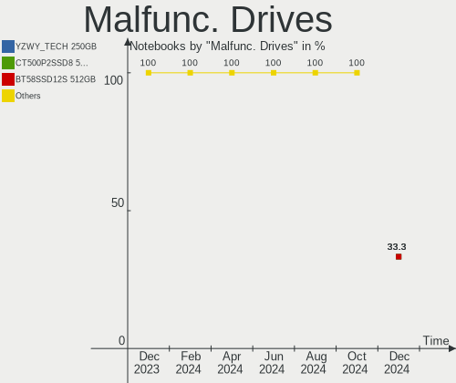
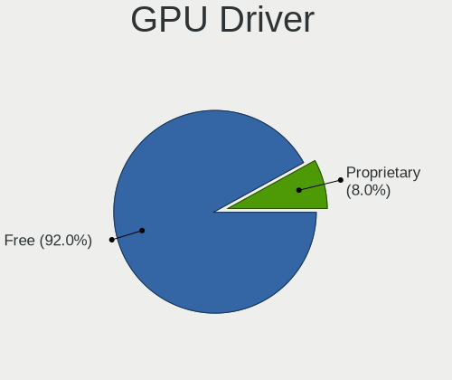
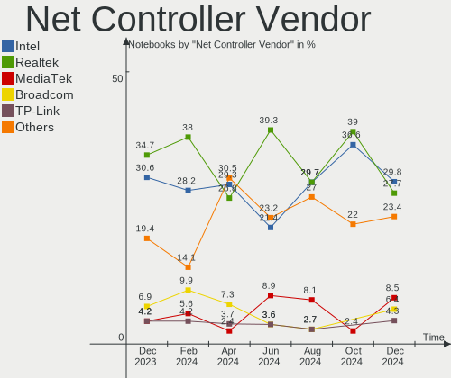
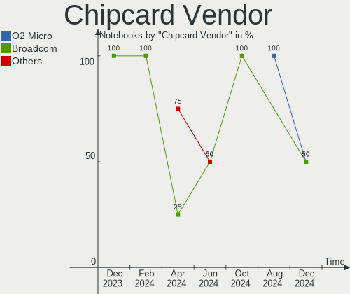

Kali Hardware Trends (Notebooks)
--------------------------------

A project to identify most popular hardware characteristics and track their change
over time based on data collected by Kali users at https://Linux-Hardware.org.

Anyone can contribute to this report by the [hw-probe](https://github.com/linuxhw/hw-probe) tool:

    sudo -E hw-probe -all -upload

This report is for one last month. Overall report since the beginning of time: [TestCoverage](https://github.com/linuxhw/TestCoverage)

Period: Apr, 2022.

Contents
--------

* [ System ](#system)
  - [ OS                       ](#os)
  - [ OS Family                ](#os-family)
  - [ Kernel                   ](#kernel)
  - [ Kernel Family            ](#kernel-family)
  - [ Kernel Major Ver.        ](#kernel-major-ver)
  - [ Arch                     ](#arch)
  - [ DE                       ](#de)
  - [ Display Server           ](#display-server)
  - [ Display Manager          ](#display-manager)
  - [ OS Lang                  ](#os-lang)
  - [ Boot Mode                ](#boot-mode)
  - [ Filesystem               ](#filesystem)
  - [ Part. scheme             ](#part-scheme)
  - [ Dual Boot with Linux/BSD ](#dual-boot-with-linuxbsd)
  - [ Dual Boot (Win)          ](#dual-boot-win)

* [ Board ](#board)
  - [ Vendor                   ](#vendor)
  - [ Model                    ](#model)
  - [ Model Family             ](#model-family)
  - [ MFG Year                 ](#mfg-year)
  - [ Form Factor              ](#form-factor)
  - [ Secure Boot              ](#secure-boot)
  - [ Coreboot                 ](#coreboot)
  - [ RAM Size                 ](#ram-size)
  - [ RAM Used                 ](#ram-used)
  - [ Total Drives             ](#total-drives)
  - [ Has CD-ROM               ](#has-cd-rom)
  - [ Has Ethernet             ](#has-ethernet)
  - [ Has WiFi                 ](#has-wifi)
  - [ Has Bluetooth            ](#has-bluetooth)

* [ Location ](#location)
  - [ Country                  ](#country)
  - [ City                     ](#city)

* [ Drives ](#drives)
  - [ Drive Vendor             ](#drive-vendor)
  - [ Drive Model              ](#drive-model)
  - [ HDD Vendor               ](#hdd-vendor)
  - [ SSD Vendor               ](#ssd-vendor)
  - [ Drive Kind               ](#drive-kind)
  - [ Drive Connector          ](#drive-connector)
  - [ Drive Size               ](#drive-size)
  - [ Space Total              ](#space-total)
  - [ Space Used               ](#space-used)
  - [ Malfunc. Drives          ](#malfunc-drives)
  - [ Malfunc. Drive Vendor    ](#malfunc-drive-vendor)
  - [ Malfunc. HDD Vendor      ](#malfunc-hdd-vendor)
  - [ Malfunc. Drive Kind      ](#malfunc-drive-kind)
  - [ Failed Drives            ](#failed-drives)
  - [ Failed Drive Vendor      ](#failed-drive-vendor)
  - [ Drive Status             ](#drive-status)

* [ Storage controller ](#storage-controller)
  - [ Storage Vendor           ](#storage-vendor)
  - [ Storage Model            ](#storage-model)
  - [ Storage Kind             ](#storage-kind)

* [ Processor ](#processor)
  - [ CPU Vendor               ](#cpu-vendor)
  - [ CPU Model                ](#cpu-model)
  - [ CPU Model Family         ](#cpu-model-family)
  - [ CPU Cores                ](#cpu-cores)
  - [ CPU Sockets              ](#cpu-sockets)
  - [ CPU Threads              ](#cpu-threads)
  - [ CPU Op-Modes             ](#cpu-op-modes)
  - [ CPU Microcode            ](#cpu-microcode)
  - [ CPU Microarch            ](#cpu-microarch)

* [ Graphics ](#graphics)
  - [ GPU Vendor               ](#gpu-vendor)
  - [ GPU Model                ](#gpu-model)
  - [ GPU Combo                ](#gpu-combo)
  - [ GPU Driver               ](#gpu-driver)
  - [ GPU Memory               ](#gpu-memory)

* [ Monitor ](#monitor)
  - [ Monitor Vendor           ](#monitor-vendor)
  - [ Monitor Model            ](#monitor-model)
  - [ Monitor Resolution       ](#monitor-resolution)
  - [ Monitor Diagonal         ](#monitor-diagonal)
  - [ Monitor Width            ](#monitor-width)
  - [ Aspect Ratio             ](#aspect-ratio)
  - [ Monitor Area             ](#monitor-area)
  - [ Pixel Density            ](#pixel-density)
  - [ Multiple Monitors        ](#multiple-monitors)

* [ Network ](#network)
  - [ Net Controller Vendor    ](#net-controller-vendor)
  - [ Net Controller Model     ](#net-controller-model)
  - [ Wireless Vendor          ](#wireless-vendor)
  - [ Wireless Model           ](#wireless-model)
  - [ Ethernet Vendor          ](#ethernet-vendor)
  - [ Ethernet Model           ](#ethernet-model)
  - [ Net Controller Kind      ](#net-controller-kind)
  - [ Used Controller          ](#used-controller)
  - [ NICs                     ](#nics)
  - [ IPv6                     ](#ipv6)

* [ Bluetooth ](#bluetooth)
  - [ Bluetooth Vendor         ](#bluetooth-vendor)
  - [ Bluetooth Model          ](#bluetooth-model)

* [ Sound ](#sound)
  - [ Sound Vendor             ](#sound-vendor)
  - [ Sound Model              ](#sound-model)

* [ Memory ](#memory)
  - [ Memory Vendor            ](#memory-vendor)
  - [ Memory Model             ](#memory-model)
  - [ Memory Kind              ](#memory-kind)
  - [ Memory Form Factor       ](#memory-form-factor)
  - [ Memory Size              ](#memory-size)
  - [ Memory Speed             ](#memory-speed)

* [ Printers & scanners ](#printers--scanners)
  - [ Printer Vendor           ](#printer-vendor)
  - [ Printer Model            ](#printer-model)
  - [ Scanner Vendor           ](#scanner-vendor)
  - [ Scanner Model            ](#scanner-model)

* [ Camera ](#camera)
  - [ Camera Vendor            ](#camera-vendor)
  - [ Camera Model             ](#camera-model)

* [ Security ](#security)
  - [ Fingerprint Vendor       ](#fingerprint-vendor)
  - [ Fingerprint Model        ](#fingerprint-model)
  - [ Chipcard Vendor          ](#chipcard-vendor)
  - [ Chipcard Model           ](#chipcard-model)

* [ Unsupported ](#unsupported)
  - [ Unsupported Devices      ](#unsupported-devices)
  - [ Unsupported Device Types ](#unsupported-device-types)

System
------

OS
--

Installed operating systems

| Name        | Notebooks | Percent |
|-------------|-----------|---------|
| Kali 2022.1 | 25        | 89.29%  |
| Kali 2022.2 | 2         | 7.14%   |
| Kali 2021.4 | 1         | 3.57%   |

OS Family
---------

OS without a version

| Name | Notebooks | Percent |
|------|-----------|---------|
| Kali | 28        | 100%    |

Kernel
------

Version of the Linux kernel

| Version              | Notebooks | Percent |
|----------------------|-----------|---------|
| 5.16.0-kali7-amd64   | 11        | 39.29%  |
| 5.16.0-kali6-amd64   | 6         | 21.43%  |
| 5.15.0-kali3-amd64   | 5         | 17.86%  |
| 5.16.0-kali5-amd64   | 2         | 7.14%   |
| 5.17.0-kali1-amd64   | 1         | 3.57%   |
| 5.16.0-kali3-amd64   | 1         | 3.57%   |
| 5.16.0-kali1-amd64   | 1         | 3.57%   |
| 5.15.0-kali3-686-pae | 1         | 3.57%   |

Kernel Family
-------------

Linux kernel without a distro release

| Version | Notebooks | Percent |
|---------|-----------|---------|
| 5.16.0  | 21        | 75%     |
| 5.15.0  | 6         | 21.43%  |
| 5.17.0  | 1         | 3.57%   |

Kernel Major Ver.
-----------------

Linux kernel major version

| Version | Notebooks | Percent |
|---------|-----------|---------|
| 5.16    | 21        | 75%     |
| 5.15    | 6         | 21.43%  |
| 5.17    | 1         | 3.57%   |

Arch
----

OS architecture (x86_64, i586, etc.)

| Name   | Notebooks | Percent |
|--------|-----------|---------|
| x86_64 | 27        | 96.43%  |
| i686   | 1         | 3.57%   |

DE
--

Desktop Environment

| Name    | Notebooks | Percent |
|---------|-----------|---------|
| XFCE    | 16        | 57.14%  |
| GNOME   | 7         | 25%     |
| KDE5    | 4         | 14.29%  |
| Unknown | 1         | 3.57%   |

Display Server
--------------

X11 or Wayland

| Name    | Notebooks | Percent |
|---------|-----------|---------|
| X11     | 26        | 92.86%  |
| Wayland | 1         | 3.57%   |
| Unknown | 1         | 3.57%   |

Display Manager
---------------

SDDM, LightDM, etc.

| Name    | Notebooks | Percent |
|---------|-----------|---------|
| LightDM | 12        | 42.86%  |
| Unknown | 12        | 42.86%  |
| SDDM    | 2         | 7.14%   |
| GDM3    | 2         | 7.14%   |

OS Lang
-------

Language

| Lang    | Notebooks | Percent |
|---------|-----------|---------|
| en_US   | 14        | 50%     |
| en_CA   | 3         | 10.71%  |
| es_MX   | 2         | 7.14%   |
| ru_RU   | 1         | 3.57%   |
| pl_PL   | 1         | 3.57%   |
| es_ES   | 1         | 3.57%   |
| es_CO   | 1         | 3.57%   |
| en_IN   | 1         | 3.57%   |
| en_AU   | 1         | 3.57%   |
| de_DE   | 1         | 3.57%   |
| cs_CZ   | 1         | 3.57%   |
| Unknown | 1         | 3.57%   |

Boot Mode
---------

EFI or BIOS

| Mode | Notebooks | Percent |
|------|-----------|---------|
| BIOS | 15        | 53.57%  |
| EFI  | 13        | 46.43%  |

Filesystem
----------

Type of filesystem

| Type | Notebooks | Percent |
|------|-----------|---------|
| Ext4 | 28        | 100%    |

Part. scheme
------------

Scheme of partitioning

| Type    | Notebooks | Percent |
|---------|-----------|---------|
| GPT     | 13        | 46.43%  |
| Unknown | 11        | 39.29%  |
| MBR     | 4         | 14.29%  |

Dual Boot with Linux/BSD
------------------------

Hosting more than one Linux/BSD

| Dual boot | Notebooks | Percent |
|-----------|-----------|---------|
| No        | 25        | 89.29%  |
| Yes       | 3         | 10.71%  |

Dual Boot (Win)
---------------

Hosting Linux and Windows

| Dual boot | Notebooks | Percent |
|-----------|-----------|---------|
| No        | 20        | 71.43%  |
| Yes       | 8         | 28.57%  |

Board
-----

Vendor
------

Motherboard manufacturer

| Name             | Notebooks | Percent |
|------------------|-----------|---------|
| Lenovo           | 7         | 25%     |
| ASUSTek Computer | 5         | 17.86%  |
| Acer             | 4         | 14.29%  |
| MSI              | 3         | 10.71%  |
| Hewlett-Packard  | 2         | 7.14%   |
| Dell             | 2         | 7.14%   |
| Toshiba          | 1         | 3.57%   |
| RCA              | 1         | 3.57%   |
| Apple            | 1         | 3.57%   |
| Alienware        | 1         | 3.57%   |
| Unknown          | 1         | 3.57%   |

Model
-----

Motherboard model

| Name                                     | Notebooks | Percent |
|------------------------------------------|-----------|---------|
| Toshiba Satellite U845W                  | 1         | 3.57%   |
| RCA W101SA23T1                           | 1         | 3.57%   |
| MSI Prestige 15 A11SCX                   | 1         | 3.57%   |
| MSI PE60 2QE                             | 1         | 3.57%   |
| MSI GP76 Leopard 10UE                    | 1         | 3.57%   |
| Lenovo ThinkPad T470 20HES18R2C          | 1         | 3.57%   |
| Lenovo ThinkPad Edge E530 62724FU        | 1         | 3.57%   |
| Lenovo ThinkPad E580 20KS0039GE          | 1         | 3.57%   |
| Lenovo IdeaPad Z510 20287                | 1         | 3.57%   |
| Lenovo G570 4334                         | 1         | 3.57%   |
| Lenovo G570 20079                        | 1         | 3.57%   |
| Lenovo B50-80 80EW                       | 1         | 3.57%   |
| HP Spectre 13-SMB Pro Ultrabook          | 1         | 3.57%   |
| HP ProBook 650 G1                        | 1         | 3.57%   |
| Dell Latitude E7450                      | 1         | 3.57%   |
| Dell G3 3590                             | 1         | 3.57%   |
| ASUS X542UQR                             | 1         | 3.57%   |
| ASUS ROG Zephyrus G14 GA401QEC_GA401QEC  | 1         | 3.57%   |
| ASUS K52Dr                               | 1         | 3.57%   |
| ASUS ASUS TUF Gaming F15 FX506LU_FX506LU | 1         | 3.57%   |
| ASUS ASUS EXPERTBOOK P2451FA_P2451FA     | 1         | 3.57%   |
| Apple MacBookAir7,2                      | 1         | 3.57%   |
| Alienware 17                             | 1         | 3.57%   |
| Acer Swift SF314-42                      | 1         | 3.57%   |
| Acer Aspire ES1-523                      | 1         | 3.57%   |
| Acer Aspire E5-573G                      | 1         | 3.57%   |
| Acer Aspire A515-51                      | 1         | 3.57%   |
| Unknown                                  | 1         | 3.57%   |

Model Family
------------

Motherboard model prefix

| Name              | Notebooks | Percent |
|-------------------|-----------|---------|
| Lenovo ThinkPad   | 3         | 10.71%  |
| Acer Aspire       | 3         | 10.71%  |
| Lenovo G570       | 2         | 7.14%   |
| ASUS ASUS         | 2         | 7.14%   |
| Toshiba Satellite | 1         | 3.57%   |
| RCA W101SA23T1    | 1         | 3.57%   |
| MSI Prestige      | 1         | 3.57%   |
| MSI PE60          | 1         | 3.57%   |
| MSI GP76          | 1         | 3.57%   |
| Lenovo IdeaPad    | 1         | 3.57%   |
| Lenovo B50-80     | 1         | 3.57%   |
| HP Spectre        | 1         | 3.57%   |
| HP ProBook        | 1         | 3.57%   |
| Dell Latitude     | 1         | 3.57%   |
| Dell G3           | 1         | 3.57%   |
| ASUS X542UQR      | 1         | 3.57%   |
| ASUS ROG          | 1         | 3.57%   |
| ASUS K52Dr        | 1         | 3.57%   |
| Apple MacBookAir7 | 1         | 3.57%   |
| Alienware 17      | 1         | 3.57%   |
| Acer Swift        | 1         | 3.57%   |
| Unknown           | 1         | 3.57%   |

MFG Year
--------

Motherboard manufacture year

| Year | Notebooks | Percent |
|------|-----------|---------|
| 2020 | 4         | 14.29%  |
| 2017 | 4         | 14.29%  |
| 2013 | 4         | 14.29%  |
| 2021 | 3         | 10.71%  |
| 2015 | 3         | 10.71%  |
| 2016 | 2         | 7.14%   |
| 2012 | 2         | 7.14%   |
| 2011 | 2         | 7.14%   |
| 2019 | 1         | 3.57%   |
| 2018 | 1         | 3.57%   |
| 2014 | 1         | 3.57%   |
| 2010 | 1         | 3.57%   |

Form Factor
-----------

Physical design of the computer

| Name     | Notebooks | Percent |
|----------|-----------|---------|
| Notebook | 28        | 100%    |

Secure Boot
-----------

Enabled or disabled

| State    | Notebooks | Percent |
|----------|-----------|---------|
| Disabled | 28        | 100%    |

Coreboot
--------

Have coreboot on board

| Used | Notebooks | Percent |
|------|-----------|---------|
| No   | 28        | 100%    |

RAM Size
--------

Total RAM memory

| Size in GB | Notebooks | Percent |
|------------|-----------|---------|
| 4.01-8.0   | 9         | 32.14%  |
| 8.01-16.0  | 6         | 21.43%  |
| 3.01-4.0   | 5         | 17.86%  |
| 16.01-24.0 | 5         | 17.86%  |
| 32.01-64.0 | 2         | 7.14%   |
| 1.01-2.0   | 1         | 3.57%   |

RAM Used
--------

Used RAM memory

| Used GB  | Notebooks | Percent |
|----------|-----------|---------|
| 3.01-4.0 | 8         | 28.57%  |
| 2.01-3.0 | 7         | 25%     |
| 1.01-2.0 | 6         | 21.43%  |
| 4.01-8.0 | 5         | 17.86%  |
| 0.51-1.0 | 2         | 7.14%   |

Total Drives
------------

Number of drives on board

| Drives | Notebooks | Percent |
|--------|-----------|---------|
| 1      | 18        | 64.29%  |
| 2      | 6         | 21.43%  |
| 3      | 4         | 14.29%  |

Has CD-ROM
----------

Has CD-ROM on board

| Presented | Notebooks | Percent |
|-----------|-----------|---------|
| No        | 20        | 71.43%  |
| Yes       | 8         | 28.57%  |

Has Ethernet
------------

Has Ethernet on board

| Presented | Notebooks | Percent |
|-----------|-----------|---------|
| Yes       | 24        | 85.71%  |
| No        | 4         | 14.29%  |

Has WiFi
--------

Has WiFi module

| Presented | Notebooks | Percent |
|-----------|-----------|---------|
| Yes       | 26        | 92.86%  |
| No        | 2         | 7.14%   |

Has Bluetooth
-------------

Has Bluetooth module

| Presented | Notebooks | Percent |
|-----------|-----------|---------|
| Yes       | 23        | 82.14%  |
| No        | 5         | 17.86%  |

Location
--------

Country
-------

Geographic location (country)

| Country   | Notebooks | Percent |
|-----------|-----------|---------|
| Canada    | 4         | 14.29%  |
| USA       | 3         | 10.71%  |
| Germany   | 3         | 10.71%  |
| Turkey    | 2         | 7.14%   |
| Spain     | 2         | 7.14%   |
| Russia    | 2         | 7.14%   |
| Colombia  | 2         | 7.14%   |
| Poland    | 1         | 3.57%   |
| Norway    | 1         | 3.57%   |
| Mexico    | 1         | 3.57%   |
| India     | 1         | 3.57%   |
| Ethiopia  | 1         | 3.57%   |
| Egypt     | 1         | 3.57%   |
| Czechia   | 1         | 3.57%   |
| China     | 1         | 3.57%   |
| Brazil    | 1         | 3.57%   |
| Australia | 1         | 3.57%   |

City
----

Geographic location (city)

| City        | Notebooks | Percent |
|-------------|-----------|---------|
| Zaragoza    | 2         | 7.14%   |
| Winnipeg    | 1         | 3.57%   |
| Weyburn     | 1         | 3.57%   |
| Sao Paulo   | 1         | 3.57%   |
| San Diego   | 1         | 3.57%   |
| Prague      | 1         | 3.57%   |
| Perm        | 1         | 3.57%   |
| Mumbai      | 1         | 3.57%   |
| Moscow      | 1         | 3.57%   |
| Mexico City | 1         | 3.57%   |
| Mersin      | 1         | 3.57%   |
| Medellín   | 1         | 3.57%   |
| Krakow      | 1         | 3.57%   |
| Kingsport   | 1         | 3.57%   |
| Karlsruhe   | 1         | 3.57%   |
| Istanbul    | 1         | 3.57%   |
| Ibague      | 1         | 3.57%   |
| Essen       | 1         | 3.57%   |
| Edmonton    | 1         | 3.57%   |
| Corvallis   | 1         | 3.57%   |
| Cochrane    | 1         | 3.57%   |
| Cairo       | 1         | 3.57%   |
| Brisbane    | 1         | 3.57%   |
| Braunfels   | 1         | 3.57%   |
| Beijing     | 1         | 3.57%   |
| Alta        | 1         | 3.57%   |
| Addis Ababa | 1         | 3.57%   |

Drives
------

Drive Vendor
------------

Hard drive vendors

| Vendor              | Notebooks | Drives | Percent |
|---------------------|-----------|--------|---------|
| Samsung Electronics | 10        | 10     | 24.39%  |
| Seagate             | 6         | 7      | 14.63%  |
| WDC                 | 4         | 4      | 9.76%   |
| SanDisk             | 4         | 4      | 9.76%   |
| Micron Technology   | 2         | 2      | 4.88%   |
| Kingston            | 2         | 2      | 4.88%   |
| TYPEC 1T            | 1         | 1      | 2.44%   |
| Toshiba             | 1         | 1      | 2.44%   |
| TO Exter            | 1         | 1      | 2.44%   |
| LITEONIT            | 1         | 1      | 2.44%   |
| Lenovo              | 1         | 1      | 2.44%   |
| KingSpec            | 1         | 1      | 2.44%   |
| KingFast            | 1         | 1      | 2.44%   |
| HUAWEI              | 1         | 1      | 2.44%   |
| Hitachi             | 1         | 1      | 2.44%   |
| HGST                | 1         | 1      | 2.44%   |
| Crucial             | 1         | 1      | 2.44%   |
| China               | 1         | 1      | 2.44%   |
| Apple               | 1         | 1      | 2.44%   |

Drive Model
-----------

Hard drive models

| Model                                | Notebooks | Percent |
|--------------------------------------|-----------|---------|
| Seagate ST1000LM035-1RK172 1TB       | 2         | 4.88%   |
| Seagate Expansion+ 2TB               | 2         | 4.88%   |
| WDC WD3200LPVX-60V0TT0 320GB         | 1         | 2.44%   |
| WDC WD10JPVX-75JC3T0 1TB             | 1         | 2.44%   |
| WDC WD10JPCX-24UE4T0 1TB             | 1         | 2.44%   |
| WDC PC SN520 NVMe 512GB              | 1         | 2.44%   |
| TYPEC 1T B PSSD 1TB                  | 1         | 2.44%   |
| Toshiba MQ04ABF100 1TB               | 1         | 2.44%   |
| TO Exter nal USB 3.0 128GB           | 1         | 2.44%   |
| Seagate ST9500325AS 500GB            | 1         | 2.44%   |
| Seagate ST500LT012-1DG142 500GB      | 1         | 2.44%   |
| SanDisk SSD PLUS 480GB               | 1         | 2.44%   |
| SanDisk SSD PLUS 240GB               | 1         | 2.44%   |
| SanDisk SD6SN1M-256G-1006 256GB SSD  | 1         | 2.44%   |
| SanDisk DF4032  32GB                 | 1         | 2.44%   |
| Samsung SSD PM871 mSATA 256GB        | 1         | 2.44%   |
| Samsung SSD 860 EVO M.2 250GB        | 1         | 2.44%   |
| Samsung SSD 840 EVO 1TB              | 1         | 2.44%   |
| Samsung NVMe SSD Drive 512GB         | 1         | 2.44%   |
| Samsung NVMe SSD Drive 2TB           | 1         | 2.44%   |
| Samsung MZVLQ1T0HALB-00000 1TB       | 1         | 2.44%   |
| Samsung MZVLB256HAHQ-000L7 256GB     | 1         | 2.44%   |
| Samsung MZVL2512HCJQ-00B00 512GB     | 1         | 2.44%   |
| Samsung MZMPC256HBGJ-00000 256GB SSD | 1         | 2.44%   |
| Samsung HN-M101MBB 1TB               | 1         | 2.44%   |
| Micron MTFDDAK128MAM-1J1 128GB SSD   | 1         | 2.44%   |
| Micron 2210_MTFDHBA512QFD 512GB      | 1         | 2.44%   |
| LITEONIT DMT-80M6M-11 mSATA 80GB SSD | 1         | 2.44%   |
| Lenovo LENSE20256GMSP34MEAT2TA 256GB | 1         | 2.44%   |
| Kingston SA400S37240G 240GB SSD      | 1         | 2.44%   |
| Kingston OM8PCP31024F-AI1 1TB        | 1         | 2.44%   |
| KingSpec P3-512 512GB                | 1         | 2.44%   |
| KingFast 512GB                       | 1         | 2.44%   |
| HUAWEI MMC Storage 64GB              | 1         | 2.44%   |
| Hitachi HTS725032A7E630 320GB        | 1         | 2.44%   |
| HGST HTS541010B7E610 1TB             | 1         | 2.44%   |
| Crucial CT250MX500SSD1 250GB         | 1         | 2.44%   |
| China SSD 240GB                      | 1         | 2.44%   |
| Apple SSD SM0128G 121GB              | 1         | 2.44%   |

HDD Vendor
----------

Hard disk drive vendors

| Vendor              | Notebooks | Drives | Percent |
|---------------------|-----------|--------|---------|
| Seagate             | 6         | 7      | 46.15%  |
| WDC                 | 3         | 3      | 23.08%  |
| Toshiba             | 1         | 1      | 7.69%   |
| Samsung Electronics | 1         | 1      | 7.69%   |
| Hitachi             | 1         | 1      | 7.69%   |
| HGST                | 1         | 1      | 7.69%   |

SSD Vendor
----------

Solid state drive vendors

| Vendor              | Notebooks | Drives | Percent |
|---------------------|-----------|--------|---------|
| Samsung Electronics | 4         | 4      | 25%     |
| SanDisk             | 3         | 3      | 18.75%  |
| TYPEC 1T            | 1         | 1      | 6.25%   |
| TO Exter            | 1         | 1      | 6.25%   |
| Micron Technology   | 1         | 1      | 6.25%   |
| LITEONIT            | 1         | 1      | 6.25%   |
| Kingston            | 1         | 1      | 6.25%   |
| KingSpec            | 1         | 1      | 6.25%   |
| Crucial             | 1         | 1      | 6.25%   |
| China               | 1         | 1      | 6.25%   |
| Apple               | 1         | 1      | 6.25%   |

Drive Kind
----------

HDD or SSD

| Kind    | Notebooks | Drives | Percent |
|---------|-----------|--------|---------|
| SSD     | 14        | 16     | 35.9%   |
| HDD     | 13        | 14     | 33.33%  |
| NVMe    | 9         | 9      | 23.08%  |
| Unknown | 2         | 2      | 5.13%   |
| MMC     | 1         | 1      | 2.56%   |

Drive Connector
---------------

SATA, SAS, NVMe, etc.

| Type | Notebooks | Drives | Percent |
|------|-----------|--------|---------|
| SATA | 20        | 26     | 57.14%  |
| NVMe | 9         | 9      | 25.71%  |
| SAS  | 5         | 6      | 14.29%  |
| MMC  | 1         | 1      | 2.86%   |

Drive Size
----------

Size of hard drive

| Size in TB | Notebooks | Drives | Percent |
|------------|-----------|--------|---------|
| 0.01-0.5   | 16        | 17     | 61.54%  |
| 0.51-1.0   | 8         | 10     | 30.77%  |
| 1.01-2.0   | 2         | 3      | 7.69%   |

Space Total
-----------

Amount of disk space available on the file system

| Size in GB     | Notebooks | Percent |
|----------------|-----------|---------|
| 101-250        | 10        | 35.71%  |
| 251-500        | 5         | 17.86%  |
| 1001-2000      | 3         | 10.71%  |
| 501-1000       | 3         | 10.71%  |
| More than 3000 | 2         | 7.14%   |
| 21-50          | 2         | 7.14%   |
| 51-100         | 2         | 7.14%   |
| Unknown        | 1         | 3.57%   |

Space Used
----------

Amount of used disk space

| Used GB   | Notebooks | Percent |
|-----------|-----------|---------|
| 21-50     | 11        | 39.29%  |
| 1-20      | 8         | 28.57%  |
| 51-100    | 3         | 10.71%  |
| 2001-3000 | 2         | 7.14%   |
| 501-1000  | 2         | 7.14%   |
| 251-500   | 1         | 3.57%   |
| Unknown   | 1         | 3.57%   |

Malfunc. Drives
---------------

Drive models with a malfunction

| Model                     | Notebooks | Drives | Percent |
|---------------------------|-----------|--------|---------|
| Seagate ST9500325AS 500GB | 1         | 1      | 50%     |
| SanDisk SSD PLUS 480GB    | 1         | 1      | 50%     |

Malfunc. Drive Vendor
---------------------

Vendors of faulty drives

| Vendor  | Notebooks | Drives | Percent |
|---------|-----------|--------|---------|
| Seagate | 1         | 1      | 50%     |
| SanDisk | 1         | 1      | 50%     |

Malfunc. HDD Vendor
-------------------

Vendors of faulty HDD drives

| Vendor  | Notebooks | Drives | Percent |
|---------|-----------|--------|---------|
| Seagate | 1         | 1      | 100%    |

Malfunc. Drive Kind
-------------------

Kinds of faulty drives

| Kind | Notebooks | Drives | Percent |
|------|-----------|--------|---------|
| SSD  | 1         | 1      | 50%     |
| HDD  | 1         | 1      | 50%     |

Failed Drives
-------------

Failed drive models

Zero info for selected period =(

Failed Drive Vendor
-------------------

Failed drive vendors

Zero info for selected period =(

Drive Status
------------

Number of failed and malfunc. drives

| Status   | Notebooks | Drives | Percent |
|----------|-----------|--------|---------|
| Detected | 15        | 21     | 46.88%  |
| Works    | 15        | 19     | 46.88%  |
| Malfunc  | 2         | 2      | 6.25%   |

Storage controller
------------------

Storage Vendor
--------------

Storage controller vendors

| Vendor                      | Notebooks | Percent |
|-----------------------------|-----------|---------|
| Intel                       | 19        | 59.38%  |
| Samsung Electronics         | 6         | 18.75%  |
| AMD                         | 3         | 9.38%   |
| Sandisk                     | 1         | 3.13%   |
| Micron Technology           | 1         | 3.13%   |
| Lenovo                      | 1         | 3.13%   |
| Kingston Technology Company | 1         | 3.13%   |

Storage Model
-------------

Storage controller models

| Model                                                                          | Notebooks | Percent |
|--------------------------------------------------------------------------------|-----------|---------|
| Intel Sunrise Point-LP SATA Controller [AHCI mode]                             | 3         | 9.38%   |
| Intel 82801 Mobile SATA Controller [RAID mode]                                 | 3         | 9.38%   |
| Samsung NVMe SSD Controller PM9A1/PM9A3/980PRO                                 | 2         | 6.25%   |
| Samsung NVMe SSD Controller 980                                                | 2         | 6.25%   |
| Intel Wildcat Point-LP SATA Controller [AHCI Mode]                             | 2         | 6.25%   |
| Intel 8 Series/C220 Series Chipset Family 6-port SATA Controller 1 [AHCI mode] | 2         | 6.25%   |
| Intel 7 Series Chipset Family 6-port SATA Controller [AHCI mode]               | 2         | 6.25%   |
| Intel 6 Series/C200 Series Chipset Family 6 port Mobile SATA AHCI Controller   | 2         | 6.25%   |
| AMD FCH SATA Controller [AHCI mode]                                            | 2         | 6.25%   |
| Sandisk PC SN520 NVMe SSD                                                      | 1         | 3.13%   |
| Samsung NVMe SSD Controller SM981/PM981/PM983                                  | 1         | 3.13%   |
| Samsung Electronics SATA controller                                            | 1         | 3.13%   |
| Micron Non-Volatile memory controller                                          | 1         | 3.13%   |
| Lenovo Non-Volatile memory controller                                          | 1         | 3.13%   |
| Kingston Company Company Non-Volatile memory controller                        | 1         | 3.13%   |
| Intel Comet Lake SATA AHCI Controller                                          | 1         | 3.13%   |
| Intel Cannon Lake PCH SATA AHCI Controller                                     | 1         | 3.13%   |
| Intel Cannon Lake Mobile PCH SATA AHCI Controller                              | 1         | 3.13%   |
| Intel 8 Series SATA Controller 1 [AHCI mode]                                   | 1         | 3.13%   |
| Intel 400 Series Chipset Family SATA AHCI Controller                           | 1         | 3.13%   |
| AMD SB7x0/SB8x0/SB9x0 SATA Controller [AHCI mode]                              | 1         | 3.13%   |

Storage Kind
------------

Kind of storage controller (IDE, SATA, NVMe, SAS, ...)

| Kind | Notebooks | Percent |
|------|-----------|---------|
| SATA | 20        | 62.5%   |
| NVMe | 9         | 28.13%  |
| RAID | 3         | 9.38%   |

Processor
---------

CPU Vendor
----------

Processor vendors

| Vendor | Notebooks | Percent |
|--------|-----------|---------|
| Intel  | 24        | 85.71%  |
| AMD    | 4         | 14.29%  |

CPU Model
---------

Processor models

| Model                                       | Notebooks | Percent |
|---------------------------------------------|-----------|---------|
| Intel Core i7-10870H CPU @ 2.20GHz          | 2         | 7.14%   |
| Intel Core i5-4200M CPU @ 2.50GHz           | 2         | 7.14%   |
| Intel Pentium CPU B940 @ 2.00GHz            | 1         | 3.57%   |
| Intel Core i9-8950HK CPU @ 2.90GHz          | 1         | 3.57%   |
| Intel Core i7-8550U CPU @ 1.80GHz           | 1         | 3.57%   |
| Intel Core i7-5700HQ CPU @ 2.70GHz          | 1         | 3.57%   |
| Intel Core i7-5600U CPU @ 2.60GHz           | 1         | 3.57%   |
| Intel Core i7-4710MQ CPU @ 2.50GHz          | 1         | 3.57%   |
| Intel Core i7-3517U CPU @ 1.90GHz           | 1         | 3.57%   |
| Intel Core i7-10510U CPU @ 1.80GHz          | 1         | 3.57%   |
| Intel Core i5-9300H CPU @ 2.40GHz           | 1         | 3.57%   |
| Intel Core i5-8250U CPU @ 1.60GHz           | 1         | 3.57%   |
| Intel Core i5-7300U CPU @ 2.60GHz           | 1         | 3.57%   |
| Intel Core i5-5350U CPU @ 1.80GHz           | 1         | 3.57%   |
| Intel Core i5-5200U CPU @ 2.20GHz           | 1         | 3.57%   |
| Intel Core i5-4200U CPU @ 1.60GHz           | 1         | 3.57%   |
| Intel Core i3-7020U CPU @ 2.30GHz           | 1         | 3.57%   |
| Intel Core i3-5005U CPU @ 2.00GHz           | 1         | 3.57%   |
| Intel Core i3-3120M CPU @ 2.50GHz           | 1         | 3.57%   |
| Intel Core i3-2310M CPU @ 2.10GHz           | 1         | 3.57%   |
| Intel Atom CPU Z3735F @ 1.33GHz             | 1         | 3.57%   |
| Intel 11th Gen Core i7-1185G7 @ 3.00GHz     | 1         | 3.57%   |
| AMD Ryzen 9 5900HS with Radeon Graphics     | 1         | 3.57%   |
| AMD Ryzen 7 4700U with Radeon Graphics      | 1         | 3.57%   |
| AMD Phenom II P960 Quad-Core Processor      | 1         | 3.57%   |
| AMD A6-7310 APU with AMD Radeon R4 Graphics | 1         | 3.57%   |

CPU Model Family
----------------

Processor model prefix

| Model         | Notebooks | Percent |
|---------------|-----------|---------|
| Intel Core i7 | 8         | 28.57%  |
| Intel Core i5 | 8         | 28.57%  |
| Intel Core i3 | 4         | 14.29%  |
| Other         | 1         | 3.57%   |
| Intel Pentium | 1         | 3.57%   |
| Intel Core i9 | 1         | 3.57%   |
| Intel Atom    | 1         | 3.57%   |
| AMD Ryzen 9   | 1         | 3.57%   |
| AMD Ryzen 7   | 1         | 3.57%   |
| AMD Phenom II | 1         | 3.57%   |
| AMD A6        | 1         | 3.57%   |

CPU Cores
---------

Number of processor cores

| Number | Notebooks | Percent |
|--------|-----------|---------|
| 2      | 13        | 46.43%  |
| 4      | 10        | 35.71%  |
| 8      | 4         | 14.29%  |
| 6      | 1         | 3.57%   |

CPU Sockets
-----------

Number of sockets

| Number | Notebooks | Percent |
|--------|-----------|---------|
| 1      | 28        | 100%    |

CPU Threads
-----------

Threads per core (Hyper-Threading)

| Number | Notebooks | Percent |
|--------|-----------|---------|
| 2      | 23        | 82.14%  |
| 1      | 5         | 17.86%  |

CPU Op-Modes
------------

CPU Operation Modes (32-bit, 64-bit)

| Op mode        | Notebooks | Percent |
|----------------|-----------|---------|
| 32-bit, 64-bit | 28        | 100%    |

CPU Microcode
-------------

Microcode number

| Number     | Notebooks | Percent |
|------------|-----------|---------|
| Unknown    | 5         | 17.86%  |
| 0x306d4    | 3         | 10.71%  |
| 0x306c3    | 3         | 10.71%  |
| 0xa0652    | 2         | 7.14%   |
| 0x906ea    | 2         | 7.14%   |
| 0x806ea    | 2         | 7.14%   |
| 0x306a9    | 2         | 7.14%   |
| 0x206a7    | 2         | 7.14%   |
| 0x806e9    | 1         | 3.57%   |
| 0x806c1    | 1         | 3.57%   |
| 0x40671    | 1         | 3.57%   |
| 0x30678    | 1         | 3.57%   |
| 0x08600104 | 1         | 3.57%   |
| 0x07030105 | 1         | 3.57%   |
| 0x010000c8 | 1         | 3.57%   |

CPU Microarch
-------------

Microarchitecture

| Name        | Notebooks | Percent |
|-------------|-----------|---------|
| KabyLake    | 7         | 25%     |
| Broadwell   | 5         | 17.86%  |
| Haswell     | 4         | 14.29%  |
| SandyBridge | 2         | 7.14%   |
| IvyBridge   | 2         | 7.14%   |
| CometLake   | 2         | 7.14%   |
| Zen 3       | 1         | 3.57%   |
| Zen 2       | 1         | 3.57%   |
| TigerLake   | 1         | 3.57%   |
| Silvermont  | 1         | 3.57%   |
| Puma        | 1         | 3.57%   |
| K10         | 1         | 3.57%   |

Graphics
--------

GPU Vendor
----------

Vendors of graphics cards

| Vendor | Notebooks | Percent |
|--------|-----------|---------|
| Intel  | 24        | 58.54%  |
| Nvidia | 11        | 26.83%  |
| AMD    | 6         | 14.63%  |

GPU Model
---------

Graphics card models

| Model                                                                     | Notebooks | Percent |
|---------------------------------------------------------------------------|-----------|---------|
| Intel HD Graphics 5500                                                    | 3         | 7.32%   |
| Intel 4th Gen Core Processor Integrated Graphics Controller               | 3         | 7.32%   |
| Nvidia TU116M [GeForce GTX 1660 Ti Mobile]                                | 2         | 4.88%   |
| Intel UHD Graphics 620                                                    | 2         | 4.88%   |
| Intel HD Graphics 620                                                     | 2         | 4.88%   |
| Intel CometLake-H GT2 [UHD Graphics]                                      | 2         | 4.88%   |
| Intel CoffeeLake-H GT2 [UHD Graphics 630]                                 | 2         | 4.88%   |
| Intel 3rd Gen Core processor Graphics Controller                          | 2         | 4.88%   |
| Intel 2nd Generation Core Processor Family Integrated Graphics Controller | 2         | 4.88%   |
| Nvidia TU117M [GeForce GTX 1650 Mobile / Max-Q]                           | 1         | 2.44%   |
| Nvidia TU117M                                                             | 1         | 2.44%   |
| Nvidia GM108M [GeForce 940M]                                              | 1         | 2.44%   |
| Nvidia GM108M [GeForce 940MX]                                             | 1         | 2.44%   |
| Nvidia GM107M [GeForce GTX 960M]                                          | 1         | 2.44%   |
| Nvidia GK208M [GeForce GT 740M]                                           | 1         | 2.44%   |
| Nvidia GK104M [GeForce GTX 860M]                                          | 1         | 2.44%   |
| Nvidia GA107M [GeForce RTX 3050 Ti Mobile]                                | 1         | 2.44%   |
| Nvidia GA106M [GeForce RTX 3060 Mobile / Max-Q]                           | 1         | 2.44%   |
| Intel TigerLake-LP GT2 [Iris Xe Graphics]                                 | 1         | 2.44%   |
| Intel HD Graphics 6000                                                    | 1         | 2.44%   |
| Intel HD Graphics 5600                                                    | 1         | 2.44%   |
| Intel Haswell-ULT Integrated Graphics Controller                          | 1         | 2.44%   |
| Intel CometLake-U GT2 [UHD Graphics]                                      | 1         | 2.44%   |
| Intel Atom Processor Z36xxx/Z37xxx Series Graphics & Display              | 1         | 2.44%   |
| AMD Robson CE [Radeon HD 6370M/7370M]                                     | 1         | 2.44%   |
| AMD Renoir                                                                | 1         | 2.44%   |
| AMD Park [Mobility Radeon HD 5430/5450/5470]                              | 1         | 2.44%   |
| AMD Mullins [Radeon R4/R5 Graphics]                                       | 1         | 2.44%   |
| AMD Lexa PRO [Radeon 540/540X/550/550X / RX 540X/550/550X]                | 1         | 2.44%   |
| AMD Cezanne                                                               | 1         | 2.44%   |

GPU Combo
---------

Combinations of graphics cards

| Name           | Notebooks | Percent |
|----------------|-----------|---------|
| 1 x Intel      | 12        | 42.86%  |
| Intel + Nvidia | 10        | 35.71%  |
| 1 x AMD        | 3         | 10.71%  |
| Intel + AMD    | 2         | 7.14%   |
| AMD + Nvidia   | 1         | 3.57%   |

GPU Driver
----------

Free vs proprietary

| Driver      | Notebooks | Percent |
|-------------|-----------|---------|
| Free        | 24        | 85.71%  |
| Proprietary | 4         | 14.29%  |

GPU Memory
----------

Total video memory

| Size in GB | Notebooks | Percent |
|------------|-----------|---------|
| Unknown    | 17        | 60.71%  |
| 1.01-2.0   | 4         | 14.29%  |
| 0.51-1.0   | 3         | 10.71%  |
| 5.01-6.0   | 2         | 7.14%   |
| 3.01-4.0   | 1         | 3.57%   |
| 0.01-0.5   | 1         | 3.57%   |

Monitor
-------

Monitor Vendor
--------------

Monitor vendors

| Vendor                  | Notebooks | Percent |
|-------------------------|-----------|---------|
| LG Display              | 7         | 25.93%  |
| Chimei Innolux          | 6         | 22.22%  |
| Samsung Electronics     | 3         | 11.11%  |
| BOE                     | 3         | 11.11%  |
| AU Optronics            | 3         | 11.11%  |
| YTH                     | 1         | 3.7%    |
| TMX                     | 1         | 3.7%    |
| PANDA                   | 1         | 3.7%    |
| Chi Mei Optoelectronics | 1         | 3.7%    |
| Apple                   | 1         | 3.7%    |

Monitor Model
-------------

Monitor models

| Model                                                                    | Notebooks | Percent |
|--------------------------------------------------------------------------|-----------|---------|
| YTH YTH156KC YTH1560 3840x2160 600x330mm 27.0-inch                       | 1         | 3.7%    |
| TMX TL140BDXP01-0 TMX1400 2560x1440 310x174mm 14.0-inch                  | 1         | 3.7%    |
| Samsung Electronics LCD Monitor SDC3652 1366x768 344x194mm 15.5-inch     | 1         | 3.7%    |
| Samsung Electronics LCD Monitor SDC324C 1920x1080 344x194mm 15.5-inch    | 1         | 3.7%    |
| Samsung Electronics LCD Monitor SAM0C3C 1366x768 609x347mm 27.6-inch     | 1         | 3.7%    |
| PANDA LCD Monitor NCP004D 1920x1080 344x194mm 15.5-inch                  | 1         | 3.7%    |
| LG Display LCD Monitor LGD05F2 1920x1080 344x194mm 15.5-inch             | 1         | 3.7%    |
| LG Display LCD Monitor LGD046D 1920x1080 309x174mm 14.0-inch             | 1         | 3.7%    |
| LG Display LCD Monitor LGD03E6 1366x768 345x194mm 15.6-inch              | 1         | 3.7%    |
| LG Display LCD Monitor LGD03E0 1366x768 345x194mm 15.6-inch              | 1         | 3.7%    |
| LG Display LCD Monitor LGD033B 1366x768 344x194mm 15.5-inch              | 1         | 3.7%    |
| LG Display LCD Monitor LGD02DC 1366x768 344x194mm 15.5-inch              | 1         | 3.7%    |
| LG Display LCD Monitor LGD02DA 1920x1080 382x215mm 17.3-inch             | 1         | 3.7%    |
| Chimei Innolux LCD Monitor CMN176E 1920x1080 381x214mm 17.2-inch         | 1         | 3.7%    |
| Chimei Innolux LCD Monitor CMN15E8 1920x1080 344x193mm 15.5-inch         | 1         | 3.7%    |
| Chimei Innolux LCD Monitor CMN14E5 1920x1080 309x173mm 13.9-inch         | 1         | 3.7%    |
| Chimei Innolux LCD Monitor CMN14D5 1920x1080 309x173mm 13.9-inch         | 1         | 3.7%    |
| Chimei Innolux LCD Monitor CMN1357 1920x1080 293x165mm 13.2-inch         | 1         | 3.7%    |
| Chimei Innolux LCD Monitor CMN1123 1792x768 336x144mm 14.4-inch          | 1         | 3.7%    |
| Chi Mei Optoelectronics LCD Monitor CMO1592 1366x768 344x193mm 15.5-inch | 1         | 3.7%    |
| BOE LCD Monitor BOE069C 1920x1080 344x193mm 15.5-inch                    | 1         | 3.7%    |
| BOE LCD Monitor BOE0675 1366x768 344x194mm 15.5-inch                     | 1         | 3.7%    |
| BOE LCD Monitor BOE0672 1366x768 344x194mm 15.5-inch                     | 1         | 3.7%    |
| AU Optronics LCD Monitor AUO40EC 1366x768 344x193mm 15.5-inch            | 1         | 3.7%    |
| AU Optronics LCD Monitor AUO21ED 1920x1080 344x194mm 15.5-inch           | 1         | 3.7%    |
| AU Optronics LCD Monitor AUO103D 1920x1080 309x173mm 13.9-inch           | 1         | 3.7%    |
| Apple Color LCD APPA01B 1440x900 286x179mm 13.3-inch                     | 1         | 3.7%    |

Monitor Resolution
------------------

Monitor screen resolution

| Resolution       | Notebooks | Percent |
|------------------|-----------|---------|
| 1920x1080 (FHD)  | 13        | 50%     |
| 1366x768 (WXGA)  | 9         | 34.62%  |
| 3840x2160 (4K)   | 1         | 3.85%   |
| 2560x1440 (QHD)  | 1         | 3.85%   |
| 1792x768         | 1         | 3.85%   |
| 1440x900 (WXGA+) | 1         | 3.85%   |

Monitor Diagonal
----------------

Diagonal size in inches

| Inches | Notebooks | Percent |
|--------|-----------|---------|
| 15     | 15        | 55.56%  |
| 13     | 5         | 18.52%  |
| 14     | 3         | 11.11%  |
| 17     | 2         | 7.41%   |
| 31     | 1         | 3.7%    |
| 27     | 1         | 3.7%    |

Monitor Width
-------------

Physical width

| Width in mm | Notebooks | Percent |
|-------------|-----------|---------|
| 301-350     | 21        | 77.78%  |
| 351-400     | 2         | 7.41%   |
| 201-300     | 2         | 7.41%   |
| 601-700     | 1         | 3.7%    |
| 501-600     | 1         | 3.7%    |

Aspect Ratio
------------

Proportional relationship between the width and the height

| Ratio | Notebooks | Percent |
|-------|-----------|---------|
| 16/9  | 24        | 92.31%  |
| 21/9  | 1         | 3.85%   |
| 16/10 | 1         | 3.85%   |

Monitor Area
------------

Area in inch²

| Area in inch² | Notebooks | Percent |
|----------------|-----------|---------|
| 101-110        | 15        | 55.56%  |
| 81-90          | 6         | 22.22%  |
| 71-80          | 2         | 7.41%   |
| 121-130        | 2         | 7.41%   |
| 351-500        | 1         | 3.7%    |
| 301-350        | 1         | 3.7%    |

Pixel Density
-------------

Pixels per inch

| Density | Notebooks | Percent |
|---------|-----------|---------|
| 121-160 | 14        | 51.85%  |
| 101-120 | 7         | 25.93%  |
| 51-100  | 3         | 11.11%  |
| 161-240 | 2         | 7.41%   |
| 1-50    | 1         | 3.7%    |

Multiple Monitors
-----------------

Total monitors connected

| Total | Notebooks | Percent |
|-------|-----------|---------|
| 1     | 26        | 92.86%  |
| 2     | 2         | 7.14%   |

Network
-------

Net Controller Vendor
---------------------

Controller vendors

| Vendor                | Notebooks | Percent |
|-----------------------|-----------|---------|
| Intel                 | 18        | 39.13%  |
| Realtek Semiconductor | 11        | 23.91%  |
| Qualcomm Atheros      | 9         | 19.57%  |
| Ralink Technology     | 1         | 2.17%   |
| Ralink                | 1         | 2.17%   |
| JMicron Technology    | 1         | 2.17%   |
| Huawei Technologies   | 1         | 2.17%   |
| Broadcom Limited      | 1         | 2.17%   |
| Broadcom              | 1         | 2.17%   |
| ASUSTek Computer      | 1         | 2.17%   |
| ASIX Electronics      | 1         | 2.17%   |

Net Controller Model
--------------------

Controller models

| Model                                                              | Notebooks | Percent |
|--------------------------------------------------------------------|-----------|---------|
| Realtek RTL8111/8168/8411 PCI Express Gigabit Ethernet Controller  | 10        | 18.87%  |
| Qualcomm Atheros QCA9377 802.11ac Wireless Network Adapter         | 3         | 5.66%   |
| Qualcomm Atheros AR8152 v2.0 Fast Ethernet                         | 3         | 5.66%   |
| Qualcomm Atheros Killer E220x Gigabit Ethernet Controller          | 2         | 3.77%   |
| Intel Wireless 7260                                                | 2         | 3.77%   |
| Intel Wireless 3160                                                | 2         | 3.77%   |
| Intel Wi-Fi 6 AX200                                                | 2         | 3.77%   |
| Intel Comet Lake PCH CNVi WiFi                                     | 2         | 3.77%   |
| Intel Centrino Wireless-N 2230                                     | 2         | 3.77%   |
| Intel Centrino Advanced-N 6235                                     | 2         | 3.77%   |
| Realtek RTL8814AU 802.11a/b/g/n/ac Wireless Adapter                | 1         | 1.89%   |
| Realtek RTL810xE PCI Express Fast Ethernet controller              | 1         | 1.89%   |
| Ralink RT5370 Wireless Adapter                                     | 1         | 1.89%   |
| Ralink RT3090 Wireless 802.11n 1T/1R PCIe                          | 1         | 1.89%   |
| Qualcomm Atheros QCA9565 / AR9565 Wireless Network Adapter         | 1         | 1.89%   |
| Qualcomm Atheros AR9285 Wireless Network Adapter (PCI-Express)     | 1         | 1.89%   |
| JMicron JMC250 PCI Express Gigabit Ethernet Controller             | 1         | 1.89%   |
| Intel Wireless 8265 / 8275                                         | 1         | 1.89%   |
| Intel Wireless 7265                                                | 1         | 1.89%   |
| Intel Wireless 3165                                                | 1         | 1.89%   |
| Intel Wi-Fi 6 AX201                                                | 1         | 1.89%   |
| Intel Ethernet Controller I225-V                                   | 1         | 1.89%   |
| Intel Ethernet Connection I217-V                                   | 1         | 1.89%   |
| Intel Ethernet Connection (4) I219-LM                              | 1         | 1.89%   |
| Intel Ethernet Connection (3) I218-LM                              | 1         | 1.89%   |
| Intel Ethernet Connection (10) I219-V                              | 1         | 1.89%   |
| Intel Dual Band Wireless-AC 3165 Plus Bluetooth                    | 1         | 1.89%   |
| Intel Comet Lake PCH-LP CNVi WiFi                                  | 1         | 1.89%   |
| Huawei E220 HSDPA Modem / E230/E270/E870 HSDPA/HSUPA Modem         | 1         | 1.89%   |
| Broadcom Limited BCM4360 802.11ac Wireless Network Adapter         | 1         | 1.89%   |
| Broadcom BCM4352 802.11ac Wireless Network Adapter                 | 1         | 1.89%   |
| ASUS USB-N13 802.11n Network Adapter (rev. B1) [Realtek RTL8192CU] | 1         | 1.89%   |
| ASIX AX88179 Gigabit Ethernet                                      | 1         | 1.89%   |

Wireless Vendor
---------------

Wireless vendors

| Vendor                | Notebooks | Percent |
|-----------------------|-----------|---------|
| Intel                 | 18        | 62.07%  |
| Qualcomm Atheros      | 5         | 17.24%  |
| Realtek Semiconductor | 1         | 3.45%   |
| Ralink Technology     | 1         | 3.45%   |
| Ralink                | 1         | 3.45%   |
| Broadcom Limited      | 1         | 3.45%   |
| Broadcom              | 1         | 3.45%   |
| ASUSTek Computer      | 1         | 3.45%   |

Wireless Model
--------------

Wireless models

| Model                                                              | Notebooks | Percent |
|--------------------------------------------------------------------|-----------|---------|
| Qualcomm Atheros QCA9377 802.11ac Wireless Network Adapter         | 3         | 10.34%  |
| Intel Wireless 7260                                                | 2         | 6.9%    |
| Intel Wireless 3160                                                | 2         | 6.9%    |
| Intel Wi-Fi 6 AX200                                                | 2         | 6.9%    |
| Intel Comet Lake PCH CNVi WiFi                                     | 2         | 6.9%    |
| Intel Centrino Wireless-N 2230                                     | 2         | 6.9%    |
| Intel Centrino Advanced-N 6235                                     | 2         | 6.9%    |
| Realtek RTL8814AU 802.11a/b/g/n/ac Wireless Adapter                | 1         | 3.45%   |
| Ralink RT5370 Wireless Adapter                                     | 1         | 3.45%   |
| Ralink RT3090 Wireless 802.11n 1T/1R PCIe                          | 1         | 3.45%   |
| Qualcomm Atheros QCA9565 / AR9565 Wireless Network Adapter         | 1         | 3.45%   |
| Qualcomm Atheros AR9285 Wireless Network Adapter (PCI-Express)     | 1         | 3.45%   |
| Intel Wireless 8265 / 8275                                         | 1         | 3.45%   |
| Intel Wireless 7265                                                | 1         | 3.45%   |
| Intel Wireless 3165                                                | 1         | 3.45%   |
| Intel Wi-Fi 6 AX201                                                | 1         | 3.45%   |
| Intel Dual Band Wireless-AC 3165 Plus Bluetooth                    | 1         | 3.45%   |
| Intel Comet Lake PCH-LP CNVi WiFi                                  | 1         | 3.45%   |
| Broadcom Limited BCM4360 802.11ac Wireless Network Adapter         | 1         | 3.45%   |
| Broadcom BCM4352 802.11ac Wireless Network Adapter                 | 1         | 3.45%   |
| ASUS USB-N13 802.11n Network Adapter (rev. B1) [Realtek RTL8192CU] | 1         | 3.45%   |

Ethernet Vendor
---------------

Ethernet vendors

| Vendor                | Notebooks | Percent |
|-----------------------|-----------|---------|
| Realtek Semiconductor | 11        | 47.83%  |
| Qualcomm Atheros      | 5         | 21.74%  |
| Intel                 | 5         | 21.74%  |
| JMicron Technology    | 1         | 4.35%   |
| ASIX Electronics      | 1         | 4.35%   |

Ethernet Model
--------------

Ethernet models

| Model                                                             | Notebooks | Percent |
|-------------------------------------------------------------------|-----------|---------|
| Realtek RTL8111/8168/8411 PCI Express Gigabit Ethernet Controller | 10        | 43.48%  |
| Qualcomm Atheros AR8152 v2.0 Fast Ethernet                        | 3         | 13.04%  |
| Qualcomm Atheros Killer E220x Gigabit Ethernet Controller         | 2         | 8.7%    |
| Realtek RTL810xE PCI Express Fast Ethernet controller             | 1         | 4.35%   |
| JMicron JMC250 PCI Express Gigabit Ethernet Controller            | 1         | 4.35%   |
| Intel Ethernet Controller I225-V                                  | 1         | 4.35%   |
| Intel Ethernet Connection I217-V                                  | 1         | 4.35%   |
| Intel Ethernet Connection (4) I219-LM                             | 1         | 4.35%   |
| Intel Ethernet Connection (3) I218-LM                             | 1         | 4.35%   |
| Intel Ethernet Connection (10) I219-V                             | 1         | 4.35%   |
| ASIX AX88179 Gigabit Ethernet                                     | 1         | 4.35%   |

Net Controller Kind
-------------------

Ethernet, WiFi or modem

| Kind     | Notebooks | Percent |
|----------|-----------|---------|
| WiFi     | 26        | 52%     |
| Ethernet | 23        | 46%     |
| Modem    | 1         | 2%      |

Used Controller
---------------

Currently used network controller

| Kind     | Notebooks | Percent |
|----------|-----------|---------|
| WiFi     | 21        | 72.41%  |
| Ethernet | 8         | 27.59%  |

NICs
----

Total network controllers on board

| Total | Notebooks | Percent |
|-------|-----------|---------|
| 2     | 22        | 78.57%  |
| 1     | 4         | 14.29%  |
| 0     | 2         | 7.14%   |

IPv6
----

IPv6 vs IPv4

| Used | Notebooks | Percent |
|------|-----------|---------|
| No   | 19        | 67.86%  |
| Yes  | 9         | 32.14%  |

Bluetooth
---------

Bluetooth Vendor
----------------

Controller vendors

| Vendor                          | Notebooks | Percent |
|---------------------------------|-----------|---------|
| Intel                           | 17        | 70.83%  |
| Lite-On Technology              | 2         | 8.33%   |
| Qualcomm Atheros Communications | 1         | 4.17%   |
| IMC Networks                    | 1         | 4.17%   |
| Foxconn / Hon Hai               | 1         | 4.17%   |
| ASUSTek Computer                | 1         | 4.17%   |
| Apple                           | 1         | 4.17%   |

Bluetooth Model
---------------

Controller models

| Model                                         | Notebooks | Percent |
|-----------------------------------------------|-----------|---------|
| Intel Bluetooth wireless interface            | 8         | 33.33%  |
| Intel Centrino Bluetooth Wireless Transceiver | 4         | 16.67%  |
| Intel Bluetooth Device                        | 4         | 16.67%  |
| Lite-On Bluetooth Device                      | 2         | 8.33%   |
| Qualcomm Atheros  Bluetooth Device            | 1         | 4.17%   |
| Intel AX200 Bluetooth                         | 1         | 4.17%   |
| IMC Networks Wireless_Device                  | 1         | 4.17%   |
| Foxconn / Hon Hai Bluetooth Device            | 1         | 4.17%   |
| ASUS BT-270 Bluetooth Adapter                 | 1         | 4.17%   |
| Apple Bluetooth USB Host Controller           | 1         | 4.17%   |

Sound
-----

Sound Vendor
------------

Sound card vendors

| Vendor | Notebooks | Percent |
|--------|-----------|---------|
| Intel  | 23        | 69.7%   |
| Nvidia | 6         | 18.18%  |
| AMD    | 4         | 12.12%  |

Sound Model
-----------

Sound card models

| Model                                                                      | Notebooks | Percent |
|----------------------------------------------------------------------------|-----------|---------|
| Intel Broadwell-U Audio Controller                                         | 5         | 10.87%  |
| Intel Wildcat Point-LP High Definition Audio Controller                    | 4         | 8.7%    |
| Intel Sunrise Point-LP HD Audio                                            | 4         | 8.7%    |
| Intel 8 Series/C220 Series Chipset High Definition Audio Controller        | 4         | 8.7%    |
| Intel Xeon E3-1200 v3/4th Gen Core Processor HD Audio Controller           | 3         | 6.52%   |
| Nvidia TU116 High Definition Audio Controller                              | 2         | 4.35%   |
| Nvidia Audio device                                                        | 2         | 4.35%   |
| Intel Comet Lake PCH cAVS                                                  | 2         | 4.35%   |
| Intel Cannon Lake PCH cAVS                                                 | 2         | 4.35%   |
| Intel 7 Series/C216 Chipset Family High Definition Audio Controller        | 2         | 4.35%   |
| Intel 6 Series/C200 Series Chipset Family High Definition Audio Controller | 2         | 4.35%   |
| AMD Renoir Radeon High Definition Audio Controller                         | 2         | 4.35%   |
| AMD Family 17h/19h HD Audio Controller                                     | 2         | 4.35%   |
| Nvidia TU107 GeForce GTX 1650 High Definition Audio Controller             | 1         | 2.17%   |
| Nvidia GK104 HDMI Audio Controller                                         | 1         | 2.17%   |
| Intel Tiger Lake-LP Smart Sound Technology Audio Controller                | 1         | 2.17%   |
| Intel Haswell-ULT HD Audio Controller                                      | 1         | 2.17%   |
| Intel Comet Lake PCH-LP cAVS                                               | 1         | 2.17%   |
| Intel 8 Series HD Audio Controller                                         | 1         | 2.17%   |
| AMD SBx00 Azalia (Intel HDA)                                               | 1         | 2.17%   |
| AMD Kabini HDMI/DP Audio                                                   | 1         | 2.17%   |
| AMD FCH Azalia Controller                                                  | 1         | 2.17%   |
| AMD Cedar HDMI Audio [Radeon HD 5400/6300/7300 Series]                     | 1         | 2.17%   |

Memory
------

Memory Vendor
-------------

Memory module vendors

| Vendor              | Notebooks | Percent |
|---------------------|-----------|---------|
| Samsung Electronics | 8         | 38.1%   |
| Kingston            | 5         | 23.81%  |
| SK Hynix            | 4         | 19.05%  |
| Ramaxel Technology  | 2         | 9.52%   |
| Unknown             | 1         | 4.76%   |
| Unifosa             | 1         | 4.76%   |

Memory Model
------------

Memory module models

| Model                                                       | Notebooks | Percent |
|-------------------------------------------------------------|-----------|---------|
| Samsung RAM M471B5173EB0-YK0 4GB SODIMM DDR3 1600MT/s       | 2         | 9.09%   |
| Samsung RAM M471A1K43DB1-CWE 8192MB SODIMM DDR4 3200MT/s    | 2         | 9.09%   |
| Unknown RAM Module 2GB DIMM DDR3 1333MT/s                   | 1         | 4.55%   |
| Unifosa RAM HU6E4403EP0200 4GB SODIMM DDR3 1333MT/s         | 1         | 4.55%   |
| SK Hynix RAM Module 4GB SODIMM DDR3 1600MT/s                | 1         | 4.55%   |
| SK Hynix RAM HMT351S6CFR8C-PB 4GB SODIMM DDR3 1600MT/s      | 1         | 4.55%   |
| SK Hynix RAM HMA851S6AFR6N-UH 4096MB SODIMM DDR4 2667MT/s   | 1         | 4.55%   |
| SK Hynix RAM HMA81GS6AFR8N-UH 8GB SODIMM DDR4 2667MT/s      | 1         | 4.55%   |
| Samsung RAM M471B5773DH0-CH9 2GB SODIMM DDR3 1600MT/s       | 1         | 4.55%   |
| Samsung RAM M471B5273DH0-CK0 4GB SODIMM DDR3 1600MT/s       | 1         | 4.55%   |
| Samsung RAM M471B5173DB0-YK0 4096MB SODIMM DDR3 1600MT/s    | 1         | 4.55%   |
| Samsung RAM M471A2K43EB1-CWE 16384MB SODIMM DDR4 3200MT/s   | 1         | 4.55%   |
| Samsung RAM K4UBE3D4AA-MGCL 8GB SODIMM LPDDR4 4266MT/s      | 1         | 4.55%   |
| Ramaxel RAM RMT3010EC58E8F1333 2GB SODIMM DDR3 1600MT/s     | 1         | 4.55%   |
| Ramaxel RAM RMSA3260MB78HAF2400 8192MB SODIMM DDR4 2400MT/s | 1         | 4.55%   |
| Kingston RAM KKN2NM-MIE 4GB SODIMM DDR4 2667MT/s            | 1         | 4.55%   |
| Kingston RAM KHX1600C9S3L/4G 4GB SODIMM DDR3 1600MT/s       | 1         | 4.55%   |
| Kingston RAM ACR256X64D3S1333C9 2GB SODIMM DDR3 1334MT/s    | 1         | 4.55%   |
| Kingston RAM 99U5428-018.A00LF 8GB SODIMM DDR3 1600MT/s     | 1         | 4.55%   |
| Kingston RAM 9905428-417.A00LF 8GB SODIMM DDR3 1600MT/s     | 1         | 4.55%   |

Memory Kind
-----------

Memory module kinds

| Kind   | Notebooks | Percent |
|--------|-----------|---------|
| DDR3   | 9         | 52.94%  |
| DDR4   | 6         | 35.29%  |
| LPDDR4 | 2         | 11.76%  |

Memory Form Factor
------------------

Physical design of the memory module

| Name   | Notebooks | Percent |
|--------|-----------|---------|
| SODIMM | 16        | 94.12%  |
| DIMM   | 1         | 5.88%   |

Memory Size
-----------

Memory module size

| Size  | Notebooks | Percent |
|-------|-----------|---------|
| 4096  | 8         | 40%     |
| 8192  | 7         | 35%     |
| 2048  | 4         | 20%     |
| 16384 | 1         | 5%      |

Memory Speed
------------

Memory module speed

| Speed | Notebooks | Percent |
|-------|-----------|---------|
| 1600  | 8         | 42.11%  |
| 3200  | 3         | 15.79%  |
| 2667  | 3         | 15.79%  |
| 1334  | 2         | 10.53%  |
| 4266  | 1         | 5.26%   |
| 2400  | 1         | 5.26%   |
| 1333  | 1         | 5.26%   |

Printers & scanners
-------------------

Printer Vendor
--------------

Printer device vendors

Zero info for selected period =(

Printer Model
-------------

Printer device models

Zero info for selected period =(

Scanner Vendor
--------------

Scanner device vendors

Zero info for selected period =(

Scanner Model
-------------

Scanner device models

Zero info for selected period =(

Camera
------

Camera Vendor
-------------

Camera device vendors

| Vendor                        | Notebooks | Percent |
|-------------------------------|-----------|---------|
| Chicony Electronics           | 9         | 34.62%  |
| IMC Networks                  | 4         | 15.38%  |
| Acer                          | 4         | 15.38%  |
| Sunplus Innovation Technology | 2         | 7.69%   |
| Quanta                        | 2         | 7.69%   |
| Samsung Electronics           | 1         | 3.85%   |
| Realtek Semiconductor         | 1         | 3.85%   |
| Microdia                      | 1         | 3.85%   |
| Lite-On Technology            | 1         | 3.85%   |
| Apple                         | 1         | 3.85%   |

Camera Model
------------

Camera device models

| Model                                | Notebooks | Percent |
|--------------------------------------|-----------|---------|
| IMC Networks USB2.0 HD UVC WebCam    | 2         | 7.41%   |
| Chicony Lenovo EasyCamera            | 2         | 7.41%   |
| Sunplus Laptop Integrated Webcam FHD | 1         | 3.7%    |
| Sunplus Integrated_Webcam_HD         | 1         | 3.7%    |
| Samsung Galaxy A5 (MTP)              | 1         | 3.7%    |
| Realtek HP TrueVision Full HD        | 1         | 3.7%    |
| Quanta HD WebCam                     | 1         | 3.7%    |
| Quanta HD User Facing                | 1         | 3.7%    |
| Microdia Integrated_Webcam_HD        | 1         | 3.7%    |
| Lite-On HP HD Webcam                 | 1         | 3.7%    |
| IMC Networks USB2.0 VGA UVC WebCam   | 1         | 3.7%    |
| IMC Networks Lenovo EasyCamera       | 1         | 3.7%    |
| Chicony VGA Webcam                   | 1         | 3.7%    |
| Chicony USB2.0 0.3M UVC WebCam       | 1         | 3.7%    |
| Chicony USB 2.0 Webcam Device        | 1         | 3.7%    |
| Chicony TOSHIBA Web Camera - MP      | 1         | 3.7%    |
| Chicony Integrated IR Camera         | 1         | 3.7%    |
| Chicony Integrated Camera [ThinkPad] | 1         | 3.7%    |
| Chicony Integrated Camera            | 1         | 3.7%    |
| Chicony HD WebCam                    | 1         | 3.7%    |
| Apple iPhone 5/5C/5S/6/SE            | 1         | 3.7%    |
| Acer SunplusIT Integrated Camera     | 1         | 3.7%    |
| Acer Lenovo EasyCamera               | 1         | 3.7%    |
| Acer HD Webcam                       | 1         | 3.7%    |
| Acer HD Camera                       | 1         | 3.7%    |

Security
--------

Fingerprint Vendor
------------------

Fingerprint sensor vendors

| Vendor           | Notebooks | Percent |
|------------------|-----------|---------|
| Validity Sensors | 2         | 50%     |
| Synaptics        | 2         | 50%     |

Fingerprint Model
-----------------

Fingerprint sensor models

| Model                                            | Notebooks | Percent |
|--------------------------------------------------|-----------|---------|
| Validity Sensors VFS5011 Fingerprint Reader      | 1         | 25%     |
| Validity Sensors Synaptics WBDI                  | 1         | 25%     |
| Synaptics Metallica MOH Touch Fingerprint Reader | 1         | 25%     |
| Unknown                                          | 1         | 25%     |

Chipcard Vendor
---------------

Chipcard module vendors

| Vendor   | Notebooks | Percent |
|----------|-----------|---------|
| Broadcom | 1         | 100%    |

Chipcard Model
--------------

Chipcard module models

| Model                                                                        | Notebooks | Percent |
|------------------------------------------------------------------------------|-----------|---------|
| Broadcom BCM5880 Secure Applications Processor with fingerprint swipe sensor | 1         | 100%    |

Unsupported
-----------

Unsupported Devices
-------------------

Total unsupported devices on board

| Total | Notebooks | Percent |
|-------|-----------|---------|
| 0     | 20        | 71.43%  |
| 1     | 7         | 25%     |
| 2     | 1         | 3.57%   |

Unsupported Device Types
------------------------

Types of unsupported devices

| Type                  | Notebooks | Percent |
|-----------------------|-----------|---------|
| Fingerprint reader    | 4         | 44.44%  |
| Multimedia controller | 2         | 22.22%  |
| Net/wireless          | 1         | 11.11%  |
| Graphics card         | 1         | 11.11%  |
| Chipcard              | 1         | 11.11%  |

