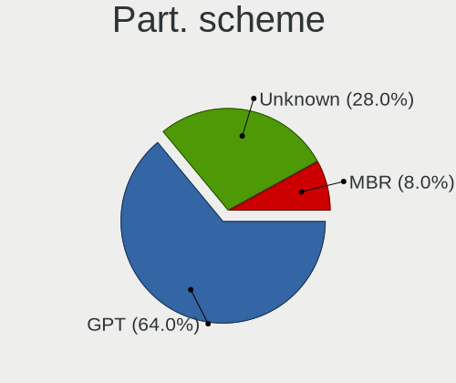
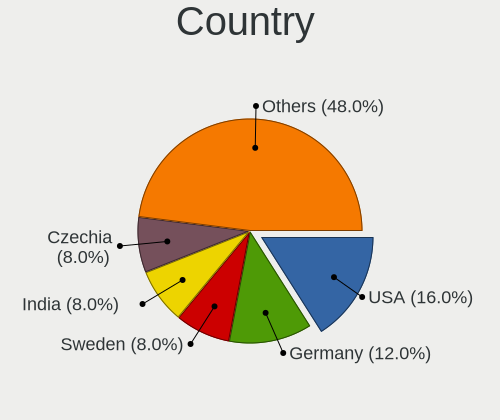
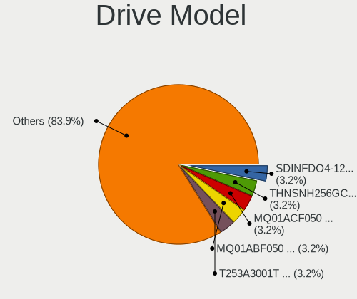
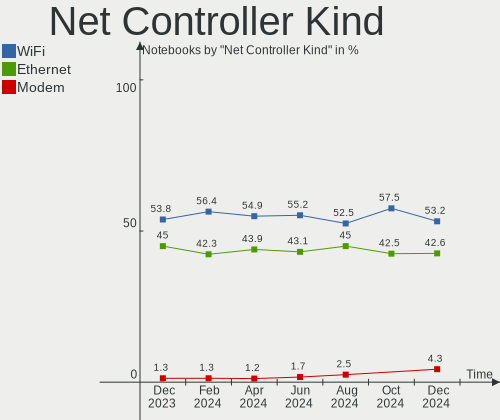
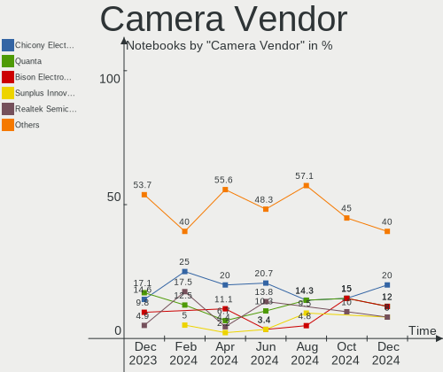

Kali - Hardware Trends (Notebooks)
----------------------------------

A project to identify most popular hardware characteristics and track their change
over time based on data collected by Linux users at https://Linux-Hardware.org.

Anyone can contribute to this report by the [hw-probe](https://github.com/linuxhw/hw-probe) tool:

    sudo -E hw-probe -all -upload

This report is for one last month. Overall report since the beginning of time: [TestDays](https://github.com/linuxhw/TestDays)

Period: Feb, 2023.

Contents
--------

* [ System ](#system)
  - [ OS                       ](#os)
  - [ OS Family                ](#os-family)
  - [ Kernel                   ](#kernel)
  - [ Kernel Family            ](#kernel-family)
  - [ Kernel Major Ver.        ](#kernel-major-ver)
  - [ Arch                     ](#arch)
  - [ DE                       ](#de)
  - [ Display Server           ](#display-server)
  - [ Display Manager          ](#display-manager)
  - [ OS Lang                  ](#os-lang)
  - [ Boot Mode                ](#boot-mode)
  - [ Filesystem               ](#filesystem)
  - [ Part. scheme             ](#part-scheme)
  - [ Dual Boot with Linux/BSD ](#dual-boot-with-linuxbsd)
  - [ Dual Boot (Win)          ](#dual-boot-win)

* [ Board ](#board)
  - [ Vendor                   ](#vendor)
  - [ Model                    ](#model)
  - [ Model Family             ](#model-family)
  - [ MFG Year                 ](#mfg-year)
  - [ Form Factor              ](#form-factor)
  - [ Secure Boot              ](#secure-boot)
  - [ Coreboot                 ](#coreboot)
  - [ RAM Size                 ](#ram-size)
  - [ RAM Used                 ](#ram-used)
  - [ Total Drives             ](#total-drives)
  - [ Has CD-ROM               ](#has-cd-rom)
  - [ Has Ethernet             ](#has-ethernet)
  - [ Has WiFi                 ](#has-wifi)
  - [ Has Bluetooth            ](#has-bluetooth)

* [ Location ](#location)
  - [ Country                  ](#country)
  - [ City                     ](#city)

* [ Drives ](#drives)
  - [ Drive Vendor             ](#drive-vendor)
  - [ Drive Model              ](#drive-model)
  - [ HDD Vendor               ](#hdd-vendor)
  - [ SSD Vendor               ](#ssd-vendor)
  - [ Drive Kind               ](#drive-kind)
  - [ Drive Connector          ](#drive-connector)
  - [ Drive Size               ](#drive-size)
  - [ Space Total              ](#space-total)
  - [ Space Used               ](#space-used)
  - [ Malfunc. Drives          ](#malfunc-drives)
  - [ Malfunc. Drive Vendor    ](#malfunc-drive-vendor)
  - [ Malfunc. HDD Vendor      ](#malfunc-hdd-vendor)
  - [ Malfunc. Drive Kind      ](#malfunc-drive-kind)
  - [ Failed Drives            ](#failed-drives)
  - [ Failed Drive Vendor      ](#failed-drive-vendor)
  - [ Drive Status             ](#drive-status)

* [ Storage controller ](#storage-controller)
  - [ Storage Vendor           ](#storage-vendor)
  - [ Storage Model            ](#storage-model)
  - [ Storage Kind             ](#storage-kind)

* [ Processor ](#processor)
  - [ CPU Vendor               ](#cpu-vendor)
  - [ CPU Model                ](#cpu-model)
  - [ CPU Model Family         ](#cpu-model-family)
  - [ CPU Cores                ](#cpu-cores)
  - [ CPU Sockets              ](#cpu-sockets)
  - [ CPU Threads              ](#cpu-threads)
  - [ CPU Op-Modes             ](#cpu-op-modes)
  - [ CPU Microcode            ](#cpu-microcode)
  - [ CPU Microarch            ](#cpu-microarch)

* [ Graphics ](#graphics)
  - [ GPU Vendor               ](#gpu-vendor)
  - [ GPU Model                ](#gpu-model)
  - [ GPU Combo                ](#gpu-combo)
  - [ GPU Driver               ](#gpu-driver)
  - [ GPU Memory               ](#gpu-memory)

* [ Monitor ](#monitor)
  - [ Monitor Vendor           ](#monitor-vendor)
  - [ Monitor Model            ](#monitor-model)
  - [ Monitor Resolution       ](#monitor-resolution)
  - [ Monitor Diagonal         ](#monitor-diagonal)
  - [ Monitor Width            ](#monitor-width)
  - [ Aspect Ratio             ](#aspect-ratio)
  - [ Monitor Area             ](#monitor-area)
  - [ Pixel Density            ](#pixel-density)
  - [ Multiple Monitors        ](#multiple-monitors)

* [ Network ](#network)
  - [ Net Controller Vendor    ](#net-controller-vendor)
  - [ Net Controller Model     ](#net-controller-model)
  - [ Wireless Vendor          ](#wireless-vendor)
  - [ Wireless Model           ](#wireless-model)
  - [ Ethernet Vendor          ](#ethernet-vendor)
  - [ Ethernet Model           ](#ethernet-model)
  - [ Net Controller Kind      ](#net-controller-kind)
  - [ Used Controller          ](#used-controller)
  - [ NICs                     ](#nics)
  - [ IPv6                     ](#ipv6)

* [ Bluetooth ](#bluetooth)
  - [ Bluetooth Vendor         ](#bluetooth-vendor)
  - [ Bluetooth Model          ](#bluetooth-model)

* [ Sound ](#sound)
  - [ Sound Vendor             ](#sound-vendor)
  - [ Sound Model              ](#sound-model)

* [ Memory ](#memory)
  - [ Memory Vendor            ](#memory-vendor)
  - [ Memory Model             ](#memory-model)
  - [ Memory Kind              ](#memory-kind)
  - [ Memory Form Factor       ](#memory-form-factor)
  - [ Memory Size              ](#memory-size)
  - [ Memory Speed             ](#memory-speed)

* [ Printers & scanners ](#printers--scanners)
  - [ Printer Vendor           ](#printer-vendor)
  - [ Printer Model            ](#printer-model)
  - [ Scanner Vendor           ](#scanner-vendor)
  - [ Scanner Model            ](#scanner-model)

* [ Camera ](#camera)
  - [ Camera Vendor            ](#camera-vendor)
  - [ Camera Model             ](#camera-model)

* [ Security ](#security)
  - [ Fingerprint Vendor       ](#fingerprint-vendor)
  - [ Fingerprint Model        ](#fingerprint-model)
  - [ Chipcard Vendor          ](#chipcard-vendor)
  - [ Chipcard Model           ](#chipcard-model)

* [ Unsupported ](#unsupported)
  - [ Unsupported Devices      ](#unsupported-devices)
  - [ Unsupported Device Types ](#unsupported-device-types)

System
------

OS
--

Installed operating systems

| Name        | Notebooks | Percent |
|-------------|-----------|---------|
| Kali 2022.4 | 31        | 91.18%  |
| Kali 2022.3 | 2         | 5.88%   |
| Kali 2022.2 | 1         | 2.94%   |

OS Family
---------

OS without a version

| Name | Notebooks | Percent |
|------|-----------|---------|
| Kali | 34        | 100%    |

Kernel
------

Version of the Linux kernel

| Version            | Notebooks | Percent |
|--------------------|-----------|---------|
| 6.0.0-kali6-amd64  | 24        | 70.59%  |
| 6.0.0-kali3-amd64  | 4         | 11.76%  |
| 6.1.0-kali5-amd64  | 3         | 8.82%   |
| 5.18.0-kali5-amd64 | 1         | 2.94%   |
| 5.18.0-kali2-amd64 | 1         | 2.94%   |
| 5.16.0-kali7-amd64 | 1         | 2.94%   |

Kernel Family
-------------

Linux kernel without a distro release

| Version | Notebooks | Percent |
|---------|-----------|---------|
| 6.0.0   | 28        | 82.35%  |
| 6.1.0   | 3         | 8.82%   |
| 5.18.0  | 2         | 5.88%   |
| 5.16.0  | 1         | 2.94%   |

Kernel Major Ver.
-----------------

Linux kernel major version

| Version | Notebooks | Percent |
|---------|-----------|---------|
| 6.0     | 28        | 82.35%  |
| 6.1     | 3         | 8.82%   |
| 5.18    | 2         | 5.88%   |
| 5.16    | 1         | 2.94%   |

Arch
----

OS architecture (x86_64, i586, etc.)

| Name   | Notebooks | Percent |
|--------|-----------|---------|
| x86_64 | 34        | 100%    |

DE
--

Desktop Environment

| Name             | Notebooks | Percent |
|------------------|-----------|---------|
| XFCE             | 14        | 41.18%  |
| GNOME            | 10        | 29.41%  |
| KDE5             | 9         | 26.47%  |
| lightdm-xsession | 1         | 2.94%   |

Display Server
--------------

X11 or Wayland

| Name    | Notebooks | Percent |
|---------|-----------|---------|
| X11     | 31        | 91.18%  |
| Wayland | 3         | 8.82%   |

Display Manager
---------------

SDDM, LightDM, etc.

| Name    | Notebooks | Percent |
|---------|-----------|---------|
| Unknown | 11        | 32.35%  |
| LightDM | 10        | 29.41%  |
| GDM3    | 8         | 23.53%  |
| SDDM    | 5         | 14.71%  |

OS Lang
-------

Language

| Lang  | Notebooks | Percent |
|-------|-----------|---------|
| en_US | 19        | 55.88%  |
| fr_FR | 3         | 8.82%   |
| zh_CN | 2         | 5.88%   |
| de_DE | 2         | 5.88%   |
| tr_TR | 1         | 2.94%   |
| ru_RU | 1         | 2.94%   |
| pl_PL | 1         | 2.94%   |
| hu_HU | 1         | 2.94%   |
| es_MX | 1         | 2.94%   |
| en_IN | 1         | 2.94%   |
| en_GB | 1         | 2.94%   |
| C     | 1         | 2.94%   |

Boot Mode
---------

EFI or BIOS

| Mode | Notebooks | Percent |
|------|-----------|---------|
| EFI  | 28        | 82.35%  |
| BIOS | 6         | 17.65%  |

Filesystem
----------

Type of filesystem

| Type    | Notebooks | Percent |
|---------|-----------|---------|
| Ext4    | 33        | 97.06%  |
| Overlay | 1         | 2.94%   |

Part. scheme
------------

Scheme of partitioning

| Type    | Notebooks | Percent |
|---------|-----------|---------|
| GPT     | 20        | 58.82%  |
| Unknown | 11        | 32.35%  |
| MBR     | 3         | 8.82%   |

Dual Boot with Linux/BSD
------------------------

Hosting more than one Linux/BSD

| Dual boot | Notebooks | Percent |
|-----------|-----------|---------|
| No        | 32        | 94.12%  |
| Yes       | 2         | 5.88%   |

Dual Boot (Win)
---------------

Hosting Linux and Windows

| Dual boot | Notebooks | Percent |
|-----------|-----------|---------|
| No        | 26        | 76.47%  |
| Yes       | 8         | 23.53%  |

Board
-----

Vendor
------

Motherboard manufacturer

| Name             | Notebooks | Percent |
|------------------|-----------|---------|
| Lenovo           | 10        | 29.41%  |
| ASUSTek Computer | 8         | 23.53%  |
| Hewlett-Packard  | 6         | 17.65%  |
| Dell             | 2         | 5.88%   |
| Acer             | 2         | 5.88%   |
| Toshiba          | 1         | 2.94%   |
| PC Specialist    | 1         | 2.94%   |
| Packard Bell     | 1         | 2.94%   |
| HUAWEI           | 1         | 2.94%   |
| GPD              | 1         | 2.94%   |
| Unknown          | 1         | 2.94%   |

Model
-----

Motherboard model

| Name                                        | Notebooks | Percent |
|---------------------------------------------|-----------|---------|
| Toshiba Satellite C55-A                     | 1         | 2.94%   |
| PC Specialist PD5x_7xPNP_PNN_PNT            | 1         | 2.94%   |
| Packard Bell EasyNote NJ65                  | 1         | 2.94%   |
| Lenovo ThinkPad X280 20KES2WC06             | 1         | 2.94%   |
| Lenovo ThinkPad X1 Carbon Gen 9 20XWCTO1WW  | 1         | 2.94%   |
| Lenovo ThinkPad X1 Carbon 3rd 20BS00AFMS    | 1         | 2.94%   |
| Lenovo ThinkPad T490s 20NYS4HL0K            | 1         | 2.94%   |
| Lenovo ThinkPad T490 20N2000LRT             | 1         | 2.94%   |
| Lenovo ThinkPad E460 20ETA00CCD             | 1         | 2.94%   |
| Lenovo ThinkPad E14 Gen 2 20TAS0U500        | 1         | 2.94%   |
| Lenovo ThinkBook 15 G3 ACL 21A4             | 1         | 2.94%   |
| Lenovo IdeaPad L340-15API 81LW              | 1         | 2.94%   |
| Lenovo IdeaPad 110-15ISK 80UD               | 1         | 2.94%   |
| HUAWEI NBLB-WAX9N                           | 1         | 2.94%   |
| HP ProBook 6560b                            | 1         | 2.94%   |
| HP ProBook 450 G6                           | 1         | 2.94%   |
| HP Pavilion Gaming Laptop 15-dk2xxx         | 1         | 2.94%   |
| HP Laptop 15s-eq1xxx                        | 1         | 2.94%   |
| HP Laptop 14-cf1xxx                         | 1         | 2.94%   |
| HP EliteBook 840 G6                         | 1         | 2.94%   |
| GPD P2 MAX                                  | 1         | 2.94%   |
| Dell Latitude E7450                         | 1         | 2.94%   |
| Dell Inspiron 3576                          | 1         | 2.94%   |
| ASUS ZenBook UX333FN_UX333FN                | 1         | 2.94%   |
| ASUS X705UAR                                | 1         | 2.94%   |
| ASUS VivoBook_ASUSLaptop X512DA_X512DA      | 1         | 2.94%   |
| ASUS VivoBook_ASUSLaptop X1503ZA_X1503ZA    | 1         | 2.94%   |
| ASUS VivoBook 12_ASUS Laptop E203MAS_E203MA | 1         | 2.94%   |
| ASUS P552SJ                                 | 1         | 2.94%   |
| ASUS ASUS TUF Gaming A15 FA506QR_FA506QR    | 1         | 2.94%   |
| ASUS ASUS TUF Dash F15 FX517ZR_FX517ZR      | 1         | 2.94%   |
| Acer Aspire A515-44                         | 1         | 2.94%   |
| Acer Aspire 4750                            | 1         | 2.94%   |
| Unknown                                     | 1         | 2.94%   |

Model Family
------------

Motherboard model prefix

| Name                  | Notebooks | Percent |
|-----------------------|-----------|---------|
| Lenovo ThinkPad       | 7         | 20.59%  |
| ASUS VivoBook         | 3         | 8.82%   |
| Lenovo IdeaPad        | 2         | 5.88%   |
| HP ProBook            | 2         | 5.88%   |
| HP Laptop             | 2         | 5.88%   |
| ASUS ASUS             | 2         | 5.88%   |
| Acer Aspire           | 2         | 5.88%   |
| Toshiba Satellite     | 1         | 2.94%   |
| PC Specialist PD5x    | 1         | 2.94%   |
| Packard Bell EasyNote | 1         | 2.94%   |
| Lenovo ThinkBook      | 1         | 2.94%   |
| HUAWEI NBLB-WAX9N     | 1         | 2.94%   |
| HP Pavilion           | 1         | 2.94%   |
| HP EliteBook          | 1         | 2.94%   |
| GPD P2                | 1         | 2.94%   |
| Dell Latitude         | 1         | 2.94%   |
| Dell Inspiron         | 1         | 2.94%   |
| ASUS ZenBook          | 1         | 2.94%   |
| ASUS X705UAR          | 1         | 2.94%   |
| ASUS P552SJ           | 1         | 2.94%   |
| Unknown               | 1         | 2.94%   |

MFG Year
--------

Motherboard manufacture year

| Year | Notebooks | Percent |
|------|-----------|---------|
| 2019 | 8         | 23.53%  |
| 2020 | 5         | 14.71%  |
| 2021 | 4         | 11.76%  |
| 2018 | 4         | 11.76%  |
| 2022 | 3         | 8.82%   |
| 2016 | 2         | 5.88%   |
| 2015 | 2         | 5.88%   |
| 2011 | 2         | 5.88%   |
| 2017 | 1         | 2.94%   |
| 2014 | 1         | 2.94%   |
| 2013 | 1         | 2.94%   |
| 2009 | 1         | 2.94%   |

Form Factor
-----------

Physical design of the computer

| Name     | Notebooks | Percent |
|----------|-----------|---------|
| Notebook | 34        | 100%    |

Secure Boot
-----------

Enabled or disabled

| State    | Notebooks | Percent |
|----------|-----------|---------|
| Disabled | 34        | 100%    |

Coreboot
--------

Have coreboot on board

| Used | Notebooks | Percent |
|------|-----------|---------|
| No   | 34        | 100%    |

RAM Size
--------

Total RAM memory

| Size in GB  | Notebooks | Percent |
|-------------|-----------|---------|
| 4.01-8.0    | 13        | 38.24%  |
| 16.01-24.0  | 9         | 26.47%  |
| 3.01-4.0    | 4         | 11.76%  |
| 8.01-16.0   | 4         | 11.76%  |
| 32.01-64.0  | 2         | 5.88%   |
| 2.01-3.0    | 1         | 2.94%   |
| 64.01-256.0 | 1         | 2.94%   |

RAM Used
--------

Used RAM memory

| Used GB   | Notebooks | Percent |
|-----------|-----------|---------|
| 2.01-3.0  | 11        | 32.35%  |
| 3.01-4.0  | 10        | 29.41%  |
| 4.01-8.0  | 8         | 23.53%  |
| 1.01-2.0  | 4         | 11.76%  |
| 8.01-16.0 | 1         | 2.94%   |

Total Drives
------------

Number of drives on board

| Drives | Notebooks | Percent |
|--------|-----------|---------|
| 1      | 27        | 79.41%  |
| 2      | 7         | 20.59%  |

Has CD-ROM
----------

Has CD-ROM on board

| Presented | Notebooks | Percent |
|-----------|-----------|---------|
| No        | 30        | 88.24%  |
| Yes       | 4         | 11.76%  |

Has Ethernet
------------

Has Ethernet on board

| Presented | Notebooks | Percent |
|-----------|-----------|---------|
| Yes       | 27        | 79.41%  |
| No        | 7         | 20.59%  |

Has WiFi
--------

Has WiFi module

| Presented | Notebooks | Percent |
|-----------|-----------|---------|
| Yes       | 34        | 100%    |

Has Bluetooth
-------------

Has Bluetooth module

| Presented | Notebooks | Percent |
|-----------|-----------|---------|
| Yes       | 30        | 88.24%  |
| No        | 4         | 11.76%  |

Location
--------

Country
-------

Geographic location (country)

| Country     | Notebooks | Percent |
|-------------|-----------|---------|
| USA         | 5         | 14.71%  |
| Russia      | 4         | 11.76%  |
| Germany     | 4         | 11.76%  |
| Turkey      | 2         | 5.88%   |
| Zambia      | 1         | 2.94%   |
| Ukraine     | 1         | 2.94%   |
| UK          | 1         | 2.94%   |
| Switzerland | 1         | 2.94%   |
| Sweden      | 1         | 2.94%   |
| Sri Lanka   | 1         | 2.94%   |
| Poland      | 1         | 2.94%   |
| Nigeria     | 1         | 2.94%   |
| Morocco     | 1         | 2.94%   |
| Mexico      | 1         | 2.94%   |
| Jordan      | 1         | 2.94%   |
| Japan       | 1         | 2.94%   |
| Israel      | 1         | 2.94%   |
| Indonesia   | 1         | 2.94%   |
| India       | 1         | 2.94%   |
| Hungary     | 1         | 2.94%   |
| France      | 1         | 2.94%   |
| China       | 1         | 2.94%   |
| Brazil      | 1         | 2.94%   |

City
----

Geographic location (city)

| City         | Notebooks | Percent |
|--------------|-----------|---------|
| Moscow       | 3         | 8.82%   |
| Wroclaw      | 1         | 2.94%   |
| Welschbillig | 1         | 2.94%   |
| Versailles   | 1         | 2.94%   |
| Tokyo        | 1         | 2.94%   |
| Stockholm    | 1         | 2.94%   |
| Sindelfingen | 1         | 2.94%   |
| Santa Monica | 1         | 2.94%   |
| Odesa        | 1         | 2.94%   |
| New York     | 1         | 2.94%   |
| Murutalawa   | 1         | 2.94%   |
| Munford      | 1         | 2.94%   |
| Manchester   | 1         | 2.94%   |
| Lusaka       | 1         | 2.94%   |
| Leipzig      | 1         | 2.94%   |
| Lagos        | 1         | 2.94%   |
| Krasnodar    | 1         | 2.94%   |
| Kethely      | 1         | 2.94%   |
| Kenitra      | 1         | 2.94%   |
| Istanbul     | 1         | 2.94%   |
| Hangzhou     | 1         | 2.94%   |
| Gundih       | 1         | 2.94%   |
| Grajales     | 1         | 2.94%   |
| Denver       | 1         | 2.94%   |
| Conroe       | 1         | 2.94%   |
| Campinas     | 1         | 2.94%   |
| Bremen       | 1         | 2.94%   |
| Bern         | 1         | 2.94%   |
| Aurangabad   | 1         | 2.94%   |
| Ankara       | 1         | 2.94%   |
| Amman        | 1         | 2.94%   |
| Afula        | 1         | 2.94%   |

Drives
------

Drive Vendor
------------

Hard drive vendors

| Vendor              | Notebooks | Drives | Percent |
|---------------------|-----------|--------|---------|
| SK hynix            | 6         | 6      | 14.29%  |
| Samsung Electronics | 5         | 5      | 11.9%   |
| Seagate             | 4         | 4      | 9.52%   |
| Sandisk             | 4         | 4      | 9.52%   |
| WDC                 | 3         | 3      | 7.14%   |
| Unknown             | 2         | 2      | 4.76%   |
| Toshiba             | 2         | 2      | 4.76%   |
| SPCC                | 2         | 2      | 4.76%   |
| Kingston            | 2         | 2      | 4.76%   |
| China               | 2         | 2      | 4.76%   |
| Team                | 1         | 1      | 2.38%   |
| Silicon Motion      | 1         | 1      | 2.38%   |
| Micron Technology   | 1         | 1      | 2.38%   |
| Lexar               | 1         | 1      | 2.38%   |
| Intenso             | 1         | 1      | 2.38%   |
| Intel               | 1         | 1      | 2.38%   |
| Hitachi             | 1         | 1      | 2.38%   |
| Crucial             | 1         | 1      | 2.38%   |
| BIWIN               | 1         | 1      | 2.38%   |
| Unknown             | 1         | 1      | 2.38%   |

Drive Model
-----------

Hard drive models

| Model                                            | Notebooks | Percent |
|--------------------------------------------------|-----------|---------|
| SPCC M.2 PCIe SSD 512GB                          | 2         | 4.76%   |
| WDC WD5000BPVT-22HXZT1 500GB                     | 1         | 2.38%   |
| WDC WD10SPZX-24Z10 1TB                           | 1         | 2.38%   |
| WDC PC SN530 SDBPNPZ-256G-1006 256GB             | 1         | 2.38%   |
| Unknown MMC64G  64GB                             | 1         | 2.38%   |
| Unknown MMC Card  64GB                           | 1         | 2.38%   |
| Toshiba MQ01ABD050V 500GB                        | 1         | 2.38%   |
| Toshiba HDWL110 1TB                              | 1         | 2.38%   |
| Team T253X2512G 512GB SSD                        | 1         | 2.38%   |
| SK hynix SKHynix_HFS001TEJ9X102N 1TB             | 1         | 2.38%   |
| SK hynix SKHynix_HFM512GD3HX015N 512GB           | 1         | 2.38%   |
| SK hynix HFM512GD3JX013N 512GB                   | 1         | 2.38%   |
| SK hynix HFM256GD3JX016N 256GB                   | 1         | 2.38%   |
| SK hynix BC511 512GB                             | 1         | 2.38%   |
| SK hynix BC501 NVMe Solid State Drive 512GB      | 1         | 2.38%   |
| Silicon Motion 512GB                             | 1         | 2.38%   |
| Seagate ST9500325AS 500GB                        | 1         | 2.38%   |
| Seagate ST9250410AS 250GB                        | 1         | 2.38%   |
| Seagate ST500LT012-1DG142 500GB                  | 1         | 2.38%   |
| Seagate ST1000VT001-1RE172 18446744TB            | 1         | 2.38%   |
| Sandisk WD Blue SN500 / PC SN520 NVMe SSD 256GB  | 1         | 2.38%   |
| Sandisk WD Black SN750 / PC SN730 NVMe SSD 512GB | 1         | 2.38%   |
| SanDisk SD9SN8W256G1102 256GB SSD                | 1         | 2.38%   |
| SanDisk DF4064  64GB                             | 1         | 2.38%   |
| Samsung SSD 980 1TB                              | 1         | 2.38%   |
| Samsung SSD 970 EVO Plus 500GB                   | 1         | 2.38%   |
| Samsung SSD 970 EVO Plus 1TB                     | 1         | 2.38%   |
| Samsung SSD 870 EVO 500GB                        | 1         | 2.38%   |
| Samsung MZNLN256HCHP-000L7 256GB SSD             | 1         | 2.38%   |
| Micron M510_MSATA 256GB SSD                      | 1         | 2.38%   |
| Lexar 512GB SSD                                  | 1         | 2.38%   |
| Kingston SNVS1000G 1TB                           | 1         | 2.38%   |
| Kingston OM8PCP3512F-AB 512GB                    | 1         | 2.38%   |
| Intenso SSD 240GB                                | 1         | 2.38%   |
| Intel SSDPEKNU512GZ 512GB                        | 1         | 2.38%   |
| Hitachi HTS543225A7A384 250GB                    | 1         | 2.38%   |
| Crucial CT1000P2SSD8 1TB                         | 1         | 2.38%   |
| China SSD 128GB                                  | 1         | 2.38%   |
| China SATA SSD 120GB                             | 1         | 2.38%   |
| BIWIN SSD 512GB                                  | 1         | 2.38%   |

HDD Vendor
----------

Hard disk drive vendors

| Vendor  | Notebooks | Drives | Percent |
|---------|-----------|--------|---------|
| Seagate | 4         | 4      | 44.44%  |
| WDC     | 2         | 2      | 22.22%  |
| Toshiba | 2         | 2      | 22.22%  |
| Hitachi | 1         | 1      | 11.11%  |

SSD Vendor
----------

Solid state drive vendors

| Vendor              | Notebooks | Drives | Percent |
|---------------------|-----------|--------|---------|
| Samsung Electronics | 2         | 2      | 22.22%  |
| China               | 2         | 2      | 22.22%  |
| Team                | 1         | 1      | 11.11%  |
| SanDisk             | 1         | 1      | 11.11%  |
| Micron Technology   | 1         | 1      | 11.11%  |
| Intenso             | 1         | 1      | 11.11%  |
| Unknown             | 1         | 1      | 11.11%  |

Drive Kind
----------

HDD or SSD

| Kind | Notebooks | Drives | Percent |
|------|-----------|--------|---------|
| NVMe | 20        | 21     | 50%     |
| SSD  | 9         | 9      | 22.5%   |
| HDD  | 8         | 9      | 20%     |
| MMC  | 3         | 3      | 7.5%    |

Drive Connector
---------------

SATA, SAS, NVMe, etc.

| Type | Notebooks | Drives | Percent |
|------|-----------|--------|---------|
| NVMe | 20        | 21     | 52.63%  |
| SATA | 15        | 18     | 39.47%  |
| MMC  | 3         | 3      | 7.89%   |

Drive Size
----------

Size of hard drive

| Size in TB      | Notebooks | Drives | Percent |
|-----------------|-----------|--------|---------|
| 0.01-0.5        | 11        | 13     | 68.75%  |
| 0.51-1.0        | 4         | 4      | 25%     |
| More than 100.0 | 1         | 1      | 6.25%   |

Space Total
-----------

Amount of disk space available on the file system

| Size in GB | Notebooks | Percent |
|------------|-----------|---------|
| 251-500    | 11        | 32.35%  |
| 101-250    | 11        | 32.35%  |
| 51-100     | 5         | 14.71%  |
| 501-1000   | 4         | 11.76%  |
| 1001-2000  | 2         | 5.88%   |
| 21-50      | 1         | 2.94%   |

Space Used
----------

Amount of used disk space

| Used GB | Notebooks | Percent |
|---------|-----------|---------|
| 21-50   | 12        | 35.29%  |
| 51-100  | 10        | 29.41%  |
| 1-20    | 7         | 20.59%  |
| 101-250 | 3         | 8.82%   |
| 251-500 | 2         | 5.88%   |

Malfunc. Drives
---------------

Drive models with a malfunction

| Model                                 | Notebooks | Drives | Percent |
|---------------------------------------|-----------|--------|---------|
| Seagate ST9500325AS 500GB             | 1         | 1      | 50%     |
| Seagate ST1000VT001-1RE172 18446744TB | 1         | 1      | 50%     |

Malfunc. Drive Vendor
---------------------

Vendors of faulty drives

| Vendor  | Notebooks | Drives | Percent |
|---------|-----------|--------|---------|
| Seagate | 2         | 2      | 100%    |

Malfunc. HDD Vendor
-------------------

Vendors of faulty HDD drives

| Vendor  | Notebooks | Drives | Percent |
|---------|-----------|--------|---------|
| Seagate | 2         | 2      | 100%    |

Malfunc. Drive Kind
-------------------

Kinds of faulty drives

| Kind | Notebooks | Drives | Percent |
|------|-----------|--------|---------|
| HDD  | 2         | 2      | 100%    |

Failed Drives
-------------

Failed drive models

Zero info for selected period =(

Failed Drive Vendor
-------------------

Failed drive vendors

Zero info for selected period =(

Drive Status
------------

Number of failed and malfunc. drives

| Status   | Notebooks | Drives | Percent |
|----------|-----------|--------|---------|
| Works    | 20        | 22     | 55.56%  |
| Detected | 14        | 18     | 38.89%  |
| Malfunc  | 2         | 2      | 5.56%   |

Storage controller
------------------

Storage Vendor
--------------

Storage controller vendors

| Vendor                       | Notebooks | Percent |
|------------------------------|-----------|---------|
| Intel                        | 20        | 45.45%  |
| SK hynix                     | 6         | 13.64%  |
| AMD                          | 4         | 9.09%   |
| SanDisk                      | 3         | 6.82%   |
| Samsung Electronics          | 3         | 6.82%   |
| Silicon Motion               | 2         | 4.55%   |
| Kingston Technology Company  | 2         | 4.55%   |
| Shenzhen Longsys Electronics | 1         | 2.27%   |
| Realtek Semiconductor        | 1         | 2.27%   |
| Phison Electronics           | 1         | 2.27%   |
| Micron/Crucial Technology    | 1         | 2.27%   |

Storage Model
-------------

Storage controller models

| Model                                                                                  | Notebooks | Percent |
|----------------------------------------------------------------------------------------|-----------|---------|
| Intel Volume Management Device NVMe RAID Controller                                    | 4         | 8.33%   |
| Intel Sunrise Point-LP SATA Controller [AHCI mode]                                     | 4         | 8.33%   |
| AMD FCH SATA Controller [AHCI mode]                                                    | 4         | 8.33%   |
| SK hynix Gold P31/PC711 NVMe Solid State Drive                                         | 3         | 6.25%   |
| Intel Cannon Point-LP SATA Controller [AHCI Mode]                                      | 3         | 6.25%   |
| Silicon Motion SM2263EN/SM2263XT SSD Controller                                        | 2         | 4.17%   |
| Samsung NVMe SSD Controller SM981/PM981/PM983                                          | 2         | 4.17%   |
| Kingston Company Company Non-Volatile memory controller                                | 2         | 4.17%   |
| Intel 6 Series/C200 Series Chipset Family Mobile SATA Controller (IDE mode, ports 4-5) | 2         | 4.17%   |
| Intel 6 Series/C200 Series Chipset Family Mobile SATA Controller (IDE mode, ports 0-3) | 2         | 4.17%   |
| SK hynix Platinum P41 NVMe Solid State Drive 2TB                                       | 1         | 2.08%   |
| SK hynix BC511                                                                         | 1         | 2.08%   |
| SK hynix BC501 NVMe Solid State Drive                                                  | 1         | 2.08%   |
| Shenzhen Longsys Electronics Non-Volatile memory controller                            | 1         | 2.08%   |
| SanDisk WD Blue SN550 NVMe SSD                                                         | 1         | 2.08%   |
| SanDisk WD Blue SN500 / PC SN520 NVMe SSD                                              | 1         | 2.08%   |
| SanDisk WD Black SN750 / PC SN730 NVMe SSD                                             | 1         | 2.08%   |
| Samsung NVMe SSD Controller 980                                                        | 1         | 2.08%   |
| Realtek Realtek Non-Volatile memory controller                                         | 1         | 2.08%   |
| Phison E12 NVMe Controller                                                             | 1         | 2.08%   |
| Micron/Crucial P2 NVMe PCIe SSD                                                        | 1         | 2.08%   |
| Intel Wildcat Point-LP SATA Controller [AHCI Mode]                                     | 1         | 2.08%   |
| Intel Tiger Lake-LP SATA Controller                                                    | 1         | 2.08%   |
| Intel Non-Volatile memory controller                                                   | 1         | 2.08%   |
| Intel Comet Lake SATA AHCI Controller                                                  | 1         | 2.08%   |
| Intel Celeron N3350/Pentium N4200/Atom E3900 Series SATA AHCI Controller               | 1         | 2.08%   |
| Intel Atom/Celeron/Pentium Processor x5-E8000/J3xxx/N3xxx Series SATA Controller       | 1         | 2.08%   |
| Intel Atom Processor E3800 Series SATA AHCI Controller                                 | 1         | 2.08%   |
| Intel 82801IBM/IEM (ICH9M/ICH9M-E) 4 port SATA Controller [AHCI mode]                  | 1         | 2.08%   |
| Intel 82801 Mobile SATA Controller [RAID mode]                                         | 1         | 2.08%   |

Storage Kind
------------

Kind of storage controller (IDE, SATA, NVMe, SAS, ...)

| Kind | Notebooks | Percent |
|------|-----------|---------|
| NVMe | 20        | 44.44%  |
| SATA | 18        | 40%     |
| RAID | 5         | 11.11%  |
| IDE  | 2         | 4.44%   |

Processor
---------

CPU Vendor
----------

Processor vendors

| Vendor | Notebooks | Percent |
|--------|-----------|---------|
| Intel  | 28        | 82.35%  |
| AMD    | 6         | 17.65%  |

CPU Model
---------

Processor models

| Model                                         | Notebooks | Percent |
|-----------------------------------------------|-----------|---------|
| Intel Core i7-8565U CPU @ 1.80GHz             | 4         | 11.76%  |
| Intel Core i7-5600U CPU @ 2.60GHz             | 2         | 5.88%   |
| Intel Pentium Dual-Core CPU T4300 @ 2.10GHz   | 1         | 2.94%   |
| Intel Pentium CPU N3520 @ 2.16GHz             | 1         | 2.94%   |
| Intel Pentium CPU 5405U @ 2.30GHz             | 1         | 2.94%   |
| Intel Pentium CPU 4417U @ 2.30GHz             | 1         | 2.94%   |
| Intel Core m3-8100Y CPU @ 1.10GHz             | 1         | 2.94%   |
| Intel Core i7-8665U CPU @ 1.90GHz             | 1         | 2.94%   |
| Intel Core i5-8350U CPU @ 1.70GHz             | 1         | 2.94%   |
| Intel Core i5-8250U CPU @ 1.60GHz             | 1         | 2.94%   |
| Intel Core i5-6200U CPU @ 2.30GHz             | 1         | 2.94%   |
| Intel Core i5-2410M CPU @ 2.30GHz             | 1         | 2.94%   |
| Intel Core i3-6100U CPU @ 2.30GHz             | 1         | 2.94%   |
| Intel Core i3-2330M CPU @ 2.20GHz             | 1         | 2.94%   |
| Intel Core i3-10110U CPU @ 2.10GHz            | 1         | 2.94%   |
| Intel Celeron N4000 CPU @ 1.10GHz             | 1         | 2.94%   |
| Intel Celeron CPU N3450 @ 1.10GHz             | 1         | 2.94%   |
| Intel Celeron CPU N3050 @ 1.60GHz             | 1         | 2.94%   |
| Intel 12th Gen Core i7-12700H                 | 1         | 2.94%   |
| Intel 12th Gen Core i7-12650H                 | 1         | 2.94%   |
| Intel 12th Gen Core i3-1220P                  | 1         | 2.94%   |
| Intel 11th Gen Core i7-1185G7 @ 3.00GHz       | 1         | 2.94%   |
| Intel 11th Gen Core i7-1165G7 @ 2.80GHz       | 1         | 2.94%   |
| Intel 11th Gen Core i7-11370H @ 3.30GHz       | 1         | 2.94%   |
| AMD Ryzen 7 5800H with Radeon Graphics        | 1         | 2.94%   |
| AMD Ryzen 7 3700U with Radeon Vega Mobile Gfx | 1         | 2.94%   |
| AMD Ryzen 5 5500U with Radeon Graphics        | 1         | 2.94%   |
| AMD Ryzen 5 4500U with Radeon Graphics        | 1         | 2.94%   |
| AMD Ryzen 5 3500U with Radeon Vega Mobile Gfx | 1         | 2.94%   |
| AMD Athlon Gold 3150U with Radeon Graphics    | 1         | 2.94%   |

CPU Model Family
----------------

Processor model prefix

| Model                   | Notebooks | Percent |
|-------------------------|-----------|---------|
| Intel Core i7           | 7         | 20.59%  |
| Other                   | 6         | 17.65%  |
| Intel Core i5           | 4         | 11.76%  |
| Intel Pentium           | 3         | 8.82%   |
| Intel Core i3           | 3         | 8.82%   |
| Intel Celeron           | 3         | 8.82%   |
| AMD Ryzen 5             | 3         | 8.82%   |
| AMD Ryzen 7             | 2         | 5.88%   |
| Intel Pentium Dual-Core | 1         | 2.94%   |
| Intel Core m3           | 1         | 2.94%   |
| AMD Athlon              | 1         | 2.94%   |

CPU Cores
---------

Number of processor cores

| Number | Notebooks | Percent |
|--------|-----------|---------|
| 4      | 14        | 41.18%  |
| 2      | 14        | 41.18%  |
| 10     | 2         | 5.88%   |
| 6      | 2         | 5.88%   |
| 14     | 1         | 2.94%   |
| 8      | 1         | 2.94%   |

CPU Sockets
-----------

Number of sockets

| Number | Notebooks | Percent |
|--------|-----------|---------|
| 1      | 34        | 100%    |

CPU Threads
-----------

Threads per core (Hyper-Threading)

| Number | Notebooks | Percent |
|--------|-----------|---------|
| 2      | 28        | 82.35%  |
| 1      | 6         | 17.65%  |

CPU Op-Modes
------------

CPU Operation Modes (32-bit, 64-bit)

| Op mode        | Notebooks | Percent |
|----------------|-----------|---------|
| 32-bit, 64-bit | 34        | 100%    |

CPU Microcode
-------------

Microcode number

| Number     | Notebooks | Percent |
|------------|-----------|---------|
| 0x806ec    | 5         | 14.71%  |
| 0x806ea    | 3         | 8.82%   |
| 0x806c1    | 3         | 8.82%   |
| Unknown    | 3         | 8.82%   |
| 0x906a3    | 2         | 5.88%   |
| 0x406e3    | 2         | 5.88%   |
| 0x306d4    | 2         | 5.88%   |
| 0x206a7    | 2         | 5.88%   |
| 0x906a4    | 1         | 2.94%   |
| 0x806eb    | 1         | 2.94%   |
| 0x806e9    | 1         | 2.94%   |
| 0x706a1    | 1         | 2.94%   |
| 0x506c9    | 1         | 2.94%   |
| 0x406c3    | 1         | 2.94%   |
| 0x30673    | 1         | 2.94%   |
| 0x1067a    | 1         | 2.94%   |
| 0x08608103 | 1         | 2.94%   |
| 0x08600103 | 1         | 2.94%   |
| 0x08108109 | 1         | 2.94%   |
| 0x08108102 | 1         | 2.94%   |

CPU Microarch
-------------

Microarchitecture

| Name             | Notebooks | Percent |
|------------------|-----------|---------|
| KabyLake         | 11        | 32.35%  |
| Zen+             | 3         | 8.82%   |
| TigerLake        | 3         | 8.82%   |
| Alderlake Hybrid | 3         | 8.82%   |
| Skylake          | 2         | 5.88%   |
| Silvermont       | 2         | 5.88%   |
| SandyBridge      | 2         | 5.88%   |
| Broadwell        | 2         | 5.88%   |
| Zen 3            | 1         | 2.94%   |
| Zen 2            | 1         | 2.94%   |
| Penryn           | 1         | 2.94%   |
| Goldmont plus    | 1         | 2.94%   |
| Goldmont         | 1         | 2.94%   |
| Unknown          | 1         | 2.94%   |

Graphics
--------

GPU Vendor
----------

Vendors of graphics cards

| Vendor | Notebooks | Percent |
|--------|-----------|---------|
| Intel  | 28        | 62.22%  |
| Nvidia | 9         | 20%     |
| AMD    | 8         | 17.78%  |

GPU Model
---------

Graphics card models

| Model                                                                                    | Notebooks | Percent |
|------------------------------------------------------------------------------------------|-----------|---------|
| Intel WhiskeyLake-U GT2 [UHD Graphics 620]                                               | 5         | 11.11%  |
| Intel TigerLake-LP GT2 [Iris Xe Graphics]                                                | 3         | 6.67%   |
| AMD Picasso/Raven 2 [Radeon Vega Series / Radeon Vega Mobile Series]                     | 3         | 6.67%   |
| Nvidia GA104M [GeForce RTX 3070 Mobile / Max-Q]                                          | 2         | 4.44%   |
| Intel UHD Graphics 620                                                                   | 2         | 4.44%   |
| Intel Skylake GT2 [HD Graphics 520]                                                      | 2         | 4.44%   |
| Intel HD Graphics 5500                                                                   | 2         | 4.44%   |
| Intel 2nd Generation Core Processor Family Integrated Graphics Controller                | 2         | 4.44%   |
| Nvidia TU117M [GeForce MX450]                                                            | 1         | 2.22%   |
| Nvidia GP108M [GeForce MX150]                                                            | 1         | 2.22%   |
| Nvidia GM108M [GeForce MX130]                                                            | 1         | 2.22%   |
| Nvidia GM108M [GeForce 840M]                                                             | 1         | 2.22%   |
| Nvidia GK208BM [GeForce 920M]                                                            | 1         | 2.22%   |
| Nvidia GA107M [GeForce RTX 3050 Mobile]                                                  | 1         | 2.22%   |
| Nvidia GA103M [GeForce RTX 3080 Ti Mobile]                                               | 1         | 2.22%   |
| Intel Whiskey Lake-U GT1 [UHD Graphics 610]                                              | 1         | 2.22%   |
| Intel UHD Graphics 615                                                                   | 1         | 2.22%   |
| Intel Mobile 4 Series Chipset Integrated Graphics Controller                             | 1         | 2.22%   |
| Intel HD Graphics 610                                                                    | 1         | 2.22%   |
| Intel HD Graphics 500                                                                    | 1         | 2.22%   |
| Intel GeminiLake [UHD Graphics 600]                                                      | 1         | 2.22%   |
| Intel CometLake-U GT2 [UHD Graphics]                                                     | 1         | 2.22%   |
| Intel Atom/Celeron/Pentium Processor x5-E8000/J3xxx/N3xxx Integrated Graphics Controller | 1         | 2.22%   |
| Intel Atom Processor Z36xxx/Z37xxx Series Graphics & Display                             | 1         | 2.22%   |
| Intel Alder Lake-UP3 GT1 [UHD Graphics]                                                  | 1         | 2.22%   |
| Intel Alder Lake-P Integrated Graphics Controller                                        | 1         | 2.22%   |
| Intel Alder Lake-P GT1 [UHD Graphics]                                                    | 1         | 2.22%   |
| AMD Sun XT [Radeon HD 8670A/8670M/8690M / R5 M330 / M430 / Radeon 520 Mobile]            | 1         | 2.22%   |
| AMD Renoir                                                                               | 1         | 2.22%   |
| AMD Lucienne                                                                             | 1         | 2.22%   |
| AMD Jet PRO [Radeon R5 M230 / R7 M260DX / Radeon 520/610 Mobile]                         | 1         | 2.22%   |
| AMD Cezanne [Radeon Vega Series / Radeon Vega Mobile Series]                             | 1         | 2.22%   |

GPU Combo
---------

Combinations of graphics cards

| Name           | Notebooks | Percent |
|----------------|-----------|---------|
| 1 x Intel      | 18        | 52.94%  |
| Intel + Nvidia | 8         | 23.53%  |
| 1 x AMD        | 5         | 14.71%  |
| Intel + AMD    | 2         | 5.88%   |
| AMD + Nvidia   | 1         | 2.94%   |

GPU Driver
----------

Free vs proprietary

| Driver      | Notebooks | Percent |
|-------------|-----------|---------|
| Free        | 31        | 91.18%  |
| Proprietary | 3         | 8.82%   |

GPU Memory
----------

Total video memory

| Size in GB | Notebooks | Percent |
|------------|-----------|---------|
| Unknown    | 24        | 70.59%  |
| 1.01-2.0   | 7         | 20.59%  |
| 7.01-8.0   | 1         | 2.94%   |
| 3.01-4.0   | 1         | 2.94%   |
| 0.01-0.5   | 1         | 2.94%   |

Monitor
-------

Monitor Vendor
--------------

Monitor vendors

| Vendor                  | Notebooks | Percent |
|-------------------------|-----------|---------|
| Chimei Innolux          | 9         | 23.68%  |
| AU Optronics            | 9         | 23.68%  |
| BOE                     | 6         | 15.79%  |
| LG Display              | 5         | 13.16%  |
| Sharp                   | 2         | 5.26%   |
| Dell                    | 2         | 5.26%   |
| ViewSonic               | 1         | 2.63%   |
| Samsung Electronics     | 1         | 2.63%   |
| Chi Mei Optoelectronics | 1         | 2.63%   |
| ASUSTek Computer        | 1         | 2.63%   |
| AOC                     | 1         | 2.63%   |

Monitor Model
-------------

Monitor models

| Model                                                                    | Notebooks | Percent |
|--------------------------------------------------------------------------|-----------|---------|
| ViewSonic XG2405 VSC0D39 1920x1080 527x296mm 23.8-inch                   | 1         | 2.63%   |
| Sharp LQ156M1JW26 SHP1559 1920x1080 344x194mm 15.5-inch                  | 1         | 2.63%   |
| Sharp LQ156M1JW03 SHP155D 1920x1080 344x194mm 15.5-inch                  | 1         | 2.63%   |
| Samsung Electronics LCD Monitor SDC416E 2880x1620 344x194mm 15.5-inch    | 1         | 2.63%   |
| LG Display LCD Monitor LGD065A 1920x1080 344x194mm 15.5-inch             | 1         | 2.63%   |
| LG Display LCD Monitor LGD062E 1920x1080 344x194mm 15.5-inch             | 1         | 2.63%   |
| LG Display LCD Monitor LGD05FE 1920x1080 344x194mm 15.5-inch             | 1         | 2.63%   |
| LG Display LCD Monitor LGD0418 2560x1440 310x174mm 14.0-inch             | 1         | 2.63%   |
| LG Display LCD Monitor LGD033A 1366x768 344x194mm 15.5-inch              | 1         | 2.63%   |
| Dell W3207C LCDTV DEL4018 1360x768 698x392mm 31.5-inch                   | 1         | 2.63%   |
| Dell S3220DGF DELD0F2 2560x1440 697x392mm 31.5-inch                      | 1         | 2.63%   |
| Chimei Innolux LCD Monitor CMN1745 1600x900 382x214mm 17.2-inch          | 1         | 2.63%   |
| Chimei Innolux LCD Monitor CMN15C9 1366x768 344x193mm 15.5-inch          | 1         | 2.63%   |
| Chimei Innolux LCD Monitor CMN153C 1920x1080 344x193mm 15.5-inch         | 1         | 2.63%   |
| Chimei Innolux LCD Monitor CMN151E 1920x1080 344x193mm 15.5-inch         | 1         | 2.63%   |
| Chimei Innolux LCD Monitor CMN1502 1920x1080 344x193mm 15.5-inch         | 1         | 2.63%   |
| Chimei Innolux LCD Monitor CMN14FF 1920x1080 309x173mm 13.9-inch         | 1         | 2.63%   |
| Chimei Innolux LCD Monitor CMN14E4 1920x1080 309x173mm 13.9-inch         | 1         | 2.63%   |
| Chimei Innolux LCD Monitor CMN14D4 1920x1080 309x173mm 13.9-inch         | 1         | 2.63%   |
| Chimei Innolux LCD Monitor CMN1130 1366x768 256x144mm 11.6-inch          | 1         | 2.63%   |
| Chi Mei Optoelectronics LCD Monitor CMO1444 1366x768 309x174mm 14.0-inch | 1         | 2.63%   |
| BOE LCD Monitor BOE094C 1920x1200 302x188mm 14.0-inch                    | 1         | 2.63%   |
| BOE LCD Monitor BOE08C7 1920x1080 309x174mm 14.0-inch                    | 1         | 2.63%   |
| BOE LCD Monitor BOE0877 1920x1080 309x173mm 13.9-inch                    | 1         | 2.63%   |
| BOE LCD Monitor BOE07F1 1920x1080 344x193mm 15.5-inch                    | 1         | 2.63%   |
| BOE LCD Monitor BOE0715 1366x768 256x144mm 11.6-inch                     | 1         | 2.63%   |
| BOE LCD Monitor BOE0672 1366x768 344x194mm 15.5-inch                     | 1         | 2.63%   |
| AU Optronics LCD Monitor AUO71EC 1366x768 344x193mm 15.5-inch            | 1         | 2.63%   |
| AU Optronics LCD Monitor AUO61ED 1920x1080 344x193mm 15.5-inch           | 1         | 2.63%   |
| AU Optronics LCD Monitor AUO5C2D 1920x1080 293x165mm 13.2-inch           | 1         | 2.63%   |
| AU Optronics LCD Monitor AUO2E3C 1366x768 309x173mm 13.9-inch            | 1         | 2.63%   |
| AU Optronics LCD Monitor AUO2A3C 1366x768 309x173mm 13.9-inch            | 1         | 2.63%   |
| AU Optronics LCD Monitor AUO23EC 1366x768 344x193mm 15.5-inch            | 1         | 2.63%   |
| AU Optronics LCD Monitor AUO203C 1366x768 309x173mm 13.9-inch            | 1         | 2.63%   |
| AU Optronics LCD Monitor AUO183C 1366x768 309x173mm 13.9-inch            | 1         | 2.63%   |
| AU Optronics LCD Monitor AUO106D 1920x1080 276x155mm 12.5-inch           | 1         | 2.63%   |
| ASUSTek Computer VG249 AUS2421 1920x1080 527x296mm 23.8-inch             | 1         | 2.63%   |
| AOC Q32G1WG4 AOC3201 2560x1440 697x393mm 31.5-inch                       | 1         | 2.63%   |

Monitor Resolution
------------------

Monitor screen resolution

| Resolution        | Notebooks | Percent |
|-------------------|-----------|---------|
| 1920x1080 (FHD)   | 17        | 47.22%  |
| 1366x768 (WXGA)   | 12        | 33.33%  |
| 2560x1440 (QHD)   | 2         | 5.56%   |
| 3840x2160 (4K)    | 1         | 2.78%   |
| 2880x1620         | 1         | 2.78%   |
| 1920x1200 (WUXGA) | 1         | 2.78%   |
| 1600x900 (HD+)    | 1         | 2.78%   |
| 1360x768          | 1         | 2.78%   |

Monitor Diagonal
----------------

Diagonal size in inches

| Inches | Notebooks | Percent |
|--------|-----------|---------|
| 15     | 16        | 42.11%  |
| 13     | 8         | 21.05%  |
| 14     | 5         | 13.16%  |
| 31     | 3         | 7.89%   |
| 24     | 2         | 5.26%   |
| 11     | 2         | 5.26%   |
| 17     | 1         | 2.63%   |
| 12     | 1         | 2.63%   |

Monitor Width
-------------

Physical width

| Width in mm | Notebooks | Percent |
|-------------|-----------|---------|
| 301-350     | 28        | 73.68%  |
| 201-300     | 4         | 10.53%  |
| 601-700     | 3         | 7.89%   |
| 501-600     | 2         | 5.26%   |
| 351-400     | 1         | 2.63%   |

Aspect Ratio
------------

Proportional relationship between the width and the height

| Ratio | Notebooks | Percent |
|-------|-----------|---------|
| 16/9  | 33        | 97.06%  |
| 16/10 | 1         | 2.94%   |

Monitor Area
------------

Area in inch

| Area in inch | Notebooks | Percent |
|----------------|-----------|---------|
| 101-110        | 16        | 42.11%  |
| 81-90          | 12        | 31.58%  |
| 351-500        | 3         | 7.89%   |
| 51-60          | 2         | 5.26%   |
| 201-250        | 2         | 5.26%   |
| 71-80          | 1         | 2.63%   |
| 61-70          | 1         | 2.63%   |
| 121-130        | 1         | 2.63%   |

Pixel Density
-------------

Pixels per inch

| Density | Notebooks | Percent |
|---------|-----------|---------|
| 121-160 | 17        | 44.74%  |
| 101-120 | 11        | 28.95%  |
| 161-240 | 5         | 13.16%  |
| 51-100  | 4         | 10.53%  |
| 1-50    | 1         | 2.63%   |

Multiple Monitors
-----------------

Total monitors connected

| Total | Notebooks | Percent |
|-------|-----------|---------|
| 1     | 30        | 88.24%  |
| 2     | 4         | 11.76%  |

Network
-------

Net Controller Vendor
---------------------

Controller vendors

| Vendor                | Notebooks | Percent |
|-----------------------|-----------|---------|
| Intel                 | 21        | 33.87%  |
| Realtek Semiconductor | 16        | 25.81%  |
| Qualcomm Atheros      | 8         | 12.9%   |
| Xiaomi                | 3         | 4.84%   |
| Broadcom              | 3         | 4.84%   |
| MediaTek              | 2         | 3.23%   |
| Sierra Wireless       | 1         | 1.61%   |
| Ralink Technology     | 1         | 1.61%   |
| NetGear               | 1         | 1.61%   |
| ICS Advent            | 1         | 1.61%   |
| Fibocom               | 1         | 1.61%   |
| Dell                  | 1         | 1.61%   |
| ASIX Electronics      | 1         | 1.61%   |
| Arduino SA            | 1         | 1.61%   |
| AboCom Systems        | 1         | 1.61%   |

Net Controller Model
--------------------

Controller models

| Model                                                             | Notebooks | Percent |
|-------------------------------------------------------------------|-----------|---------|
| Realtek RTL8111/8168/8411 PCI Express Gigabit Ethernet Controller | 11        | 14.67%  |
| Intel Cannon Point-LP CNVi [Wireless-AC]                          | 4         | 5.33%   |
| Xiaomi Mi/Redmi series (RNDIS)                                    | 3         | 4%      |
| Realtek RTL810xE PCI Express Fast Ethernet controller             | 3         | 4%      |
| Qualcomm Atheros QCA9377 802.11ac Wireless Network Adapter        | 3         | 4%      |
| Intel Wireless 7265                                               | 3         | 4%      |
| Intel Wi-Fi 6 AX201                                               | 3         | 4%      |
| Intel Alder Lake-P PCH CNVi WiFi                                  | 3         | 4%      |
| Qualcomm Atheros QCA9565 / AR9565 Wireless Network Adapter        | 2         | 2.67%   |
| MediaTek MT7921 802.11ax PCI Express Wireless Network Adapter     | 2         | 2.67%   |
| Intel Wireless 8265 / 8275                                        | 2         | 2.67%   |
| Intel Ethernet Connection (6) I219-V                              | 2         | 2.67%   |
| Intel Ethernet Connection (3) I218-LM                             | 2         | 2.67%   |
| Sierra Wireless EM7345 4G LTE                                     | 1         | 1.33%   |
| Realtek RTL8822BE 802.11a/b/g/n/ac WiFi adapter                   | 1         | 1.33%   |
| Realtek RTL8821AE 802.11ac PCIe Wireless Network Adapter          | 1         | 1.33%   |
| Realtek RTL8812AU 802.11a/b/g/n/ac 2T2R DB WLAN Adapter           | 1         | 1.33%   |
| Realtek RTL8187 Wireless Adapter                                  | 1         | 1.33%   |
| Realtek RTL8153 Gigabit Ethernet Adapter                          | 1         | 1.33%   |
| Realtek 802.11n WLAN Adapter                                      | 1         | 1.33%   |
| Realtek 802.11ac NIC                                              | 1         | 1.33%   |
| Ralink MT7601U Wireless Adapter                                   | 1         | 1.33%   |
| Qualcomm Atheros QCA6174 802.11ac Wireless Network Adapter        | 1         | 1.33%   |
| Qualcomm Atheros AR928X Wireless Network Adapter (PCI-Express)    | 1         | 1.33%   |
| Qualcomm Atheros AR9287 Wireless Network Adapter (PCI-Express)    | 1         | 1.33%   |
| NetGear WNDA4100 802.11abgn 3x3:3 [Ralink RT3573]                 | 1         | 1.33%   |
| Intel Wireless 7260                                               | 1         | 1.33%   |
| Intel Wi-Fi 6 AX200                                               | 1         | 1.33%   |
| Intel Gemini Lake PCH CNVi WiFi                                   | 1         | 1.33%   |
| Intel Ethernet Connection I219-V                                  | 1         | 1.33%   |
| Intel Ethernet Connection (6) I219-LM                             | 1         | 1.33%   |
| Intel Ethernet Connection (4) I219-LM                             | 1         | 1.33%   |
| Intel Ethernet Connection (16) I219-LM                            | 1         | 1.33%   |
| Intel Dual Band Wireless-AC 3165 Plus Bluetooth                   | 1         | 1.33%   |
| Intel Comet Lake PCH-LP CNVi WiFi                                 | 1         | 1.33%   |
| Intel 82579V Gigabit Network Connection                           | 1         | 1.33%   |
| ICS Advent 10/100M LAN                                            | 1         | 1.33%   |
| Fibocom L830-EB-00 LTE WWAN Modem                                 | 1         | 1.33%   |
| Dell Wireless 5809e Gobi 4G LTE Mobile Broadband Card       | 1         | 1.33%   |
| Broadcom NetLink BCM5784M Gigabit Ethernet PCIe                   | 1         | 1.33%   |

Wireless Vendor
---------------

Wireless vendors

| Vendor                | Notebooks | Percent |
|-----------------------|-----------|---------|
| Intel                 | 20        | 47.62%  |
| Qualcomm Atheros      | 8         | 19.05%  |
| Realtek Semiconductor | 6         | 14.29%  |
| Sierra Wireless       | 1         | 2.38%   |
| Ralink Technology     | 1         | 2.38%   |
| NetGear               | 1         | 2.38%   |
| MediaTek              | 1         | 2.38%   |
| Fibocom               | 1         | 2.38%   |
| Dell                  | 1         | 2.38%   |
| Broadcom              | 1         | 2.38%   |
| AboCom Systems        | 1         | 2.38%   |

Wireless Model
--------------

Wireless models

| Model                                                          | Notebooks | Percent |
|----------------------------------------------------------------|-----------|---------|
| Intel Cannon Point-LP CNVi [Wireless-AC]                       | 4         | 9.52%   |
| Qualcomm Atheros QCA9377 802.11ac Wireless Network Adapter     | 3         | 7.14%   |
| Intel Wireless 7265                                            | 3         | 7.14%   |
| Intel Wi-Fi 6 AX201                                            | 3         | 7.14%   |
| Intel Alder Lake-P PCH CNVi WiFi                               | 3         | 7.14%   |
| Qualcomm Atheros QCA9565 / AR9565 Wireless Network Adapter     | 2         | 4.76%   |
| Intel Wireless 8265 / 8275                                     | 2         | 4.76%   |
| Sierra Wireless EM7345 4G LTE                                  | 1         | 2.38%   |
| Realtek RTL8822BE 802.11a/b/g/n/ac WiFi adapter                | 1         | 2.38%   |
| Realtek RTL8821AE 802.11ac PCIe Wireless Network Adapter       | 1         | 2.38%   |
| Realtek RTL8812AU 802.11a/b/g/n/ac 2T2R DB WLAN Adapter        | 1         | 2.38%   |
| Realtek RTL8187 Wireless Adapter                               | 1         | 2.38%   |
| Realtek 802.11n WLAN Adapter                                   | 1         | 2.38%   |
| Realtek 802.11ac NIC                                           | 1         | 2.38%   |
| Ralink MT7601U Wireless Adapter                                | 1         | 2.38%   |
| Qualcomm Atheros QCA6174 802.11ac Wireless Network Adapter     | 1         | 2.38%   |
| Qualcomm Atheros AR928X Wireless Network Adapter (PCI-Express) | 1         | 2.38%   |
| Qualcomm Atheros AR9287 Wireless Network Adapter (PCI-Express) | 1         | 2.38%   |
| NetGear WNDA4100 802.11abgn 3x3:3 [Ralink RT3573]              | 1         | 2.38%   |
| MediaTek MT7921 802.11ax PCI Express Wireless Network Adapter  | 1         | 2.38%   |
| Intel Wireless 7260                                            | 1         | 2.38%   |
| Intel Wi-Fi 6 AX200                                            | 1         | 2.38%   |
| Intel Gemini Lake PCH CNVi WiFi                                | 1         | 2.38%   |
| Intel Dual Band Wireless-AC 3165 Plus Bluetooth                | 1         | 2.38%   |
| Intel Comet Lake PCH-LP CNVi WiFi                              | 1         | 2.38%   |
| Fibocom L830-EB-00 LTE WWAN Modem                              | 1         | 2.38%   |
| Dell Wireless 5809e Gobi 4G LTE Mobile Broadband Card    | 1         | 2.38%   |
| Broadcom BCM4313 802.11bgn Wireless Network Adapter            | 1         | 2.38%   |
| AboCom Systems 802.11n/b/g Mini Wireless LAN USB2.0 Adapter    | 1         | 2.38%   |

Ethernet Vendor
---------------

Ethernet vendors

| Vendor                | Notebooks | Percent |
|-----------------------|-----------|---------|
| Realtek Semiconductor | 14        | 45.16%  |
| Intel                 | 9         | 29.03%  |
| Xiaomi                | 3         | 9.68%   |
| Broadcom              | 2         | 6.45%   |
| MediaTek              | 1         | 3.23%   |
| ICS Advent            | 1         | 3.23%   |
| ASIX Electronics      | 1         | 3.23%   |

Ethernet Model
--------------

Ethernet models

| Model                                                             | Notebooks | Percent |
|-------------------------------------------------------------------|-----------|---------|
| Realtek RTL8111/8168/8411 PCI Express Gigabit Ethernet Controller | 11        | 34.38%  |
| Xiaomi Mi/Redmi series (RNDIS)                                    | 3         | 9.38%   |
| Realtek RTL810xE PCI Express Fast Ethernet controller             | 3         | 9.38%   |
| Intel Ethernet Connection (6) I219-V                              | 2         | 6.25%   |
| Intel Ethernet Connection (3) I218-LM                             | 2         | 6.25%   |
| Realtek RTL8153 Gigabit Ethernet Adapter                          | 1         | 3.13%   |
| MediaTek MT7921 802.11ax PCI Express Wireless Network Adapter     | 1         | 3.13%   |
| Intel Ethernet Connection I219-V                                  | 1         | 3.13%   |
| Intel Ethernet Connection (6) I219-LM                             | 1         | 3.13%   |
| Intel Ethernet Connection (4) I219-LM                             | 1         | 3.13%   |
| Intel Ethernet Connection (16) I219-LM                            | 1         | 3.13%   |
| Intel 82579V Gigabit Network Connection                           | 1         | 3.13%   |
| ICS Advent 10/100M LAN                                            | 1         | 3.13%   |
| Broadcom NetLink BCM5784M Gigabit Ethernet PCIe                   | 1         | 3.13%   |
| Broadcom NetLink BCM57785 Gigabit Ethernet PCIe                   | 1         | 3.13%   |
| ASIX AX88179 Gigabit Ethernet                                     | 1         | 3.13%   |

Net Controller Kind
-------------------

Ethernet, WiFi or modem

| Kind     | Notebooks | Percent |
|----------|-----------|---------|
| WiFi     | 34        | 54.84%  |
| Ethernet | 27        | 43.55%  |
| Modem    | 1         | 1.61%   |

Used Controller
---------------

Currently used network controller

| Kind     | Notebooks | Percent |
|----------|-----------|---------|
| WiFi     | 26        | 81.25%  |
| Ethernet | 6         | 18.75%  |

NICs
----

Total network controllers on board

| Total | Notebooks | Percent |
|-------|-----------|---------|
| 2     | 25        | 73.53%  |
| 1     | 8         | 23.53%  |
| 0     | 1         | 2.94%   |

IPv6
----

IPv6 vs IPv4

| Used | Notebooks | Percent |
|------|-----------|---------|
| No   | 28        | 82.35%  |
| Yes  | 6         | 17.65%  |

Bluetooth
---------

Bluetooth Vendor
----------------

Controller vendors

| Vendor                          | Notebooks | Percent |
|---------------------------------|-----------|---------|
| Intel                           | 19        | 61.29%  |
| IMC Networks                    | 3         | 9.68%   |
| Realtek Semiconductor           | 2         | 6.45%   |
| Qualcomm Atheros Communications | 2         | 6.45%   |
| Lite-On Technology              | 1         | 3.23%   |
| Hewlett-Packard                 | 1         | 3.23%   |
| Foxconn / Hon Hai               | 1         | 3.23%   |
| Broadcom                        | 1         | 3.23%   |
| ASUSTek Computer                | 1         | 3.23%   |

Bluetooth Model
---------------

Controller models

| Model                                          | Notebooks | Percent |
|------------------------------------------------|-----------|---------|
| Intel Bluetooth wireless interface             | 6         | 19.35%  |
| Intel Bluetooth 9460/9560 Jefferson Peak (JfP) | 6         | 19.35%  |
| Intel AX201 Bluetooth                          | 6         | 19.35%  |
| Qualcomm Atheros  Bluetooth Device             | 2         | 6.45%   |
| IMC Networks Bluetooth Device                  | 2         | 6.45%   |
| Realtek RTL8821A Bluetooth                     | 1         | 3.23%   |
| Realtek  Bluetooth 4.2 Adapter                 | 1         | 3.23%   |
| Lite-On Bluetooth Device                       | 1         | 3.23%   |
| Intel AX200 Bluetooth                          | 1         | 3.23%   |
| IMC Networks Wireless_Device                   | 1         | 3.23%   |
| HP Broadcom 2070 Bluetooth Combo               | 1         | 3.23%   |
| Foxconn / Hon Hai Wireless_Device              | 1         | 3.23%   |
| Broadcom Bluetooth                             | 1         | 3.23%   |
| ASUS Broadcom BCM20702A0 Bluetooth             | 1         | 3.23%   |

Sound
-----

Sound Vendor
------------

Sound card vendors

| Vendor                | Notebooks | Percent |
|-----------------------|-----------|---------|
| Intel                 | 28        | 65.12%  |
| AMD                   | 6         | 13.95%  |
| Nvidia                | 4         | 9.3%    |
| Realtek Semiconductor | 1         | 2.33%   |
| Logitech              | 1         | 2.33%   |
| GN Netcom             | 1         | 2.33%   |
| DSEA A/S              | 1         | 2.33%   |
| ASUSTek Computer      | 1         | 2.33%   |

Sound Model
-----------

Sound card models

| Model                                                                                             | Notebooks | Percent |
|---------------------------------------------------------------------------------------------------|-----------|---------|
| Intel Sunrise Point-LP HD Audio                                                                   | 6         | 11.76%  |
| Intel Cannon Point-LP High Definition Audio Controller                                            | 6         | 11.76%  |
| AMD Family 17h/19h HD Audio Controller                                                            | 6         | 11.76%  |
| Intel Tiger Lake-LP Smart Sound Technology Audio Controller                                       | 3         | 5.88%   |
| Intel Alder Lake PCH-P High Definition Audio Controller                                           | 3         | 5.88%   |
| AMD Renoir Radeon High Definition Audio Controller                                                | 3         | 5.88%   |
| AMD Raven/Raven2/Fenghuang HDMI/DP Audio Controller                                               | 3         | 5.88%   |
| Nvidia GA104 High Definition Audio Controller                                                     | 2         | 3.92%   |
| Intel Wildcat Point-LP High Definition Audio Controller                                           | 2         | 3.92%   |
| Intel Broadwell-U Audio Controller                                                                | 2         | 3.92%   |
| Intel 6 Series/C200 Series Chipset Family High Definition Audio Controller                        | 2         | 3.92%   |
| Realtek Semiconductor USB Audio                                                                   | 1         | 1.96%   |
| Nvidia GK208 HDMI/DP Audio Controller                                                             | 1         | 1.96%   |
| Nvidia Audio device                                                                               | 1         | 1.96%   |
| Logitech G435 Wireless Gaming Headset                                                             | 1         | 1.96%   |
| Intel Comet Lake PCH-LP cAVS                                                                      | 1         | 1.96%   |
| Intel Celeron/Pentium Silver Processor High Definition Audio                                      | 1         | 1.96%   |
| Intel Celeron N3350/Pentium N4200/Atom E3900 Series Audio Cluster                                 | 1         | 1.96%   |
| Intel Atom/Celeron/Pentium Processor x5-E8000/J3xxx/N3xxx Series High Definition Audio Controller | 1         | 1.96%   |
| Intel Atom Processor Z36xxx/Z37xxx Series High Definition Audio Controller                        | 1         | 1.96%   |
| Intel 82801I (ICH9 Family) HD Audio Controller                                                    | 1         | 1.96%   |
| GN Netcom Jabra Engage 75                                                                         | 1         | 1.96%   |
| DSEA A/S Sennheiser Main Audio                                                                    | 1         | 1.96%   |
| ASUSTek Computer C-Media Audio                                                                    | 1         | 1.96%   |

Memory
------

Memory Vendor
-------------

Memory module vendors

| Vendor              | Notebooks | Percent |
|---------------------|-----------|---------|
| SK hynix            | 8         | 29.63%  |
| Samsung Electronics | 8         | 29.63%  |
| Micron Technology   | 4         | 14.81%  |
| Unknown (ABCD)      | 1         | 3.7%    |
| Unknown             | 1         | 3.7%    |
| Ramaxel Technology  | 1         | 3.7%    |
| PNY                 | 1         | 3.7%    |
| Kllisre             | 1         | 3.7%    |
| Kingston            | 1         | 3.7%    |
| Corsair             | 1         | 3.7%    |

Memory Model
------------

Memory module models

| Model                                                            | Notebooks | Percent |
|------------------------------------------------------------------|-----------|---------|
| Unknown RAM Module 4GB SODIMM DDR4 2400MT/s                      | 1         | 3.7%    |
| Unknown (ABCD) RAM 123456789012345678 2GB SODIMM LPDDR4 2400MT/s | 1         | 3.7%    |
| SK hynix RAM Module 16GB SODIMM DDR4 2667MT/s                    | 1         | 3.7%    |
| SK hynix RAM HMT325S6BFR8C-H9 2GB SODIMM DDR3 1333MT/s           | 1         | 3.7%    |
| SK hynix RAM HMCG66MEBSA092N 8GB SODIMM DDR5 4800MT/s            | 1         | 3.7%    |
| SK hynix RAM HMAA1GS6CJR6N-XN 8192MB SODIMM DDR4 3200MT/s        | 1         | 3.7%    |
| SK hynix RAM HMA851S6DJR6N-XN 4GB SODIMM DDR4 3200MT/s           | 1         | 3.7%    |
| SK hynix RAM HMA851S6CJR6N-XN 4GB SODIMM DDR4 3200MT/s           | 1         | 3.7%    |
| SK hynix RAM HMA851S6AFR6N-UH 4GB SODIMM DDR4 2667MT/s           | 1         | 3.7%    |
| SK hynix RAM HMA81GS6JJR8N-VK 8GB SODIMM DDR4 2667MT/s           | 1         | 3.7%    |
| Samsung RAM Module 8GB SODIMM DDR4 2667MT/s                      | 1         | 3.7%    |
| Samsung RAM Module 8GB Row Of Chips LPDDR3 1600MT/s              | 1         | 3.7%    |
| Samsung RAM M471B5674-M0-YK0 4GB Chip DDR3 1600MT/s              | 1         | 3.7%    |
| Samsung RAM M471B1G73QH0-YK0 8GB SODIMM DDR3 1867MT/s            | 1         | 3.7%    |
| Samsung RAM M471A5244CB0-CWE 4GB Row Of Chips DDR4 3200MT/s      | 1         | 3.7%    |
| Samsung RAM M471A2G44AM0-CTD 16GB SODIMM DDR4 2667MT/s           | 1         | 3.7%    |
| Samsung RAM M471A1K43BB1-CTD 8GB SODIMM DDR4 2667MT/s            | 1         | 3.7%    |
| Samsung RAM K4A8G165WC-BCTD 4GB SODIMM DDR4 2667MT/s             | 1         | 3.7%    |
| Ramaxel RAM RMSA3340MB88HBF-3200 16GB SODIMM DDR4 3200MT/s       | 1         | 3.7%    |
| PNY RAM M4S08S681QMMM52-12 8GB SODIMM DDR4 3200MT/s              | 1         | 3.7%    |
| Micron RAM 8KTF25664HZ-1G4M1 2GB SODIMM DDR3 1334MT/s            | 1         | 3.7%    |
| Micron RAM 8ATF1G64HZ-3G2J1 8GB SODIMM DDR4 3200MT/s             | 1         | 3.7%    |
| Micron RAM 53E2G32D4NQ-046 4GB Row Of Chips LPDDR4 4267MT/s      | 1         | 3.7%    |
| Micron RAM 4ATF1G64HZ-3G2F1 8GB SODIMM DDR4 3200MT/s             | 1         | 3.7%    |
| Kllisre RAM KRE-D3S1600M/8G 8GB SODIMM DDR3 1600MT/s             | 1         | 3.7%    |
| Kingston RAM Module 4GB SODIMM DDR4 2667MT/s                     | 1         | 3.7%    |
| Corsair RAM CM4X32GE3200C22S2 32GB SODIMM DDR4 3200MT/s          | 1         | 3.7%    |

Memory Kind
-----------

Memory module kinds

| Kind   | Notebooks | Percent |
|--------|-----------|---------|
| DDR4   | 13        | 59.09%  |
| DDR3   | 4         | 18.18%  |
| LPDDR4 | 3         | 13.64%  |
| LPDDR3 | 1         | 4.55%   |
| DDR5   | 1         | 4.55%   |

Memory Form Factor
------------------

Physical design of the memory module

| Name         | Notebooks | Percent |
|--------------|-----------|---------|
| SODIMM       | 19        | 82.61%  |
| Row Of Chips | 3         | 13.04%  |
| Chip         | 1         | 4.35%   |

Memory Size
-----------

Memory module size

| Size  | Notebooks | Percent |
|-------|-----------|---------|
| 8192  | 11        | 47.83%  |
| 4096  | 7         | 30.43%  |
| 16384 | 3         | 13.04%  |
| 32768 | 1         | 4.35%   |
| 2048  | 1         | 4.35%   |

Memory Speed
------------

Memory module speed

| Speed | Notebooks | Percent |
|-------|-----------|---------|
| 3200  | 7         | 30.43%  |
| 2667  | 7         | 30.43%  |
| 1600  | 3         | 13.04%  |
| 2400  | 2         | 8.7%    |
| 4800  | 1         | 4.35%   |
| 4267  | 1         | 4.35%   |
| 1334  | 1         | 4.35%   |
| 1333  | 1         | 4.35%   |

Printers & scanners
-------------------

Printer Vendor
--------------

Printer device vendors

Zero info for selected period =(

Printer Model
-------------

Printer device models

Zero info for selected period =(

Scanner Vendor
--------------

Scanner device vendors

Zero info for selected period =(

Scanner Model
-------------

Scanner device models

Zero info for selected period =(

Camera
------

Camera Vendor
-------------

Camera device vendors

| Vendor                        | Notebooks | Percent |
|-------------------------------|-----------|---------|
| IMC Networks                  | 10        | 28.57%  |
| Chicony Electronics           | 10        | 28.57%  |
| Syntek                        | 2         | 5.71%   |
| Suyin                         | 2         | 5.71%   |
| Quanta                        | 2         | 5.71%   |
| Sunplus Innovation Technology | 1         | 2.86%   |
| Sonix Technology              | 1         | 2.86%   |
| Silicon Motion                | 1         | 2.86%   |
| Realtek Semiconductor         | 1         | 2.86%   |
| Logitech                      | 1         | 2.86%   |
| Importek                      | 1         | 2.86%   |
| HD WEBCAM                     | 1         | 2.86%   |
| Alcor Micro                   | 1         | 2.86%   |
| Acer                          | 1         | 2.86%   |

Camera Model
------------

Camera device models

| Model                                    | Notebooks | Percent |
|------------------------------------------|-----------|---------|
| IMC Networks USB2.0 HD UVC WebCam        | 3         | 8.57%   |
| Chicony Integrated Camera                | 3         | 8.57%   |
| IMC Networks USB2.0 VGA UVC WebCam       | 2         | 5.71%   |
| IMC Networks Integrated Camera           | 2         | 5.71%   |
| Chicony HP HD Camera                     | 2         | 5.71%   |
| Syntek Integrated Camera                 | 1         | 2.86%   |
| Syntek EasyCamera                        | 1         | 2.86%   |
| Suyin Acer/HP Integrated Webcam [CN0314] | 1         | 2.86%   |
| Suyin 1.3M HD WebCam                     | 1         | 2.86%   |
| Sunplus Laptop Integrated Webcam HD      | 1         | 2.86%   |
| Sonix USB2.0 HD UVC WebCam               | 1         | 2.86%   |
| Silicon Motion 300k Pixel Camera         | 1         | 2.86%   |
| Realtek Integrated Webcam                | 1         | 2.86%   |
| Quanta HP Wide Vision HD Camera          | 1         | 2.86%   |
| Quanta HD User Facing                    | 1         | 2.86%   |
| Logitech BRIO Ultra HD Webcam            | 1         | 2.86%   |
| Importek TOSHIBA Web Camera - HD         | 1         | 2.86%   |
| IMC Networks USB2.0 HD IR UVC WebCam     | 1         | 2.86%   |
| IMC Networks HP TrueVision HD Camera     | 1         | 2.86%   |
| IMC Networks HD Camera                   | 1         | 2.86%   |
| HD WEBCAM Web Camera                     | 1         | 2.86%   |
| Chicony USB2.0 VGA UVC WebCam            | 1         | 2.86%   |
| Chicony ThinkPad T490 Webcam             | 1         | 2.86%   |
| Chicony Integrated HP HD Webcam          | 1         | 2.86%   |
| Chicony Integrated Camera (1280x720@30)  | 1         | 2.86%   |
| Chicony HP TrueVision HD Camera          | 1         | 2.86%   |
| Alcor Micro USB 2.0 Camera               | 1         | 2.86%   |
| Acer BisonCam,NB Pro                     | 1         | 2.86%   |

Security
--------

Fingerprint Vendor
------------------

Fingerprint sensor vendors

| Vendor                     | Notebooks | Percent |
|----------------------------|-----------|---------|
| Synaptics                  | 4         | 50%     |
| Validity Sensors           | 2         | 25%     |
| Shenzhen Goodix Technology | 2         | 25%     |

Fingerprint Model
-----------------

Fingerprint sensor models

| Model                                                      | Notebooks | Percent |
|------------------------------------------------------------|-----------|---------|
| Synaptics Prometheus MIS Touch Fingerprint Reader          | 2         | 25%     |
| Shenzhen Goodix  FingerPrint Device                        | 2         | 25%     |
| Validity Sensors VFS471 Fingerprint Reader                 | 1         | 12.5%   |
| Validity Sensors VFS 5011 fingerprint sensor               | 1         | 12.5%   |
| Synaptics  VFS7552 Touch Fingerprint Sensor with PurePrint | 1         | 12.5%   |
| Synaptics Metallica MIS Touch Fingerprint Reader           | 1         | 12.5%   |

Chipcard Vendor
---------------

Chipcard module vendors

| Vendor      | Notebooks | Percent |
|-------------|-----------|---------|
| Alcor Micro | 2         | 66.67%  |
| Broadcom    | 1         | 33.33%  |

Chipcard Model
--------------

Chipcard module models

| Model                                          | Notebooks | Percent |
|------------------------------------------------|-----------|---------|
| Alcor Micro AU9540 Smartcard Reader            | 2         | 66.67%  |
| Broadcom BCM5880 Secure Applications Processor | 1         | 33.33%  |

Unsupported
-----------

Unsupported Devices
-------------------

Total unsupported devices on board

| Total | Notebooks | Percent |
|-------|-----------|---------|
| 0     | 21        | 61.76%  |
| 1     | 9         | 26.47%  |
| 2     | 4         | 11.76%  |

Unsupported Device Types
------------------------

Types of unsupported devices

| Type                  | Notebooks | Percent |
|-----------------------|-----------|---------|
| Fingerprint reader    | 8         | 44.44%  |
| Camera                | 5         | 27.78%  |
| Chipcard              | 3         | 16.67%  |
| Net/wireless          | 1         | 5.56%   |
| Multimedia controller | 1         | 5.56%   |

