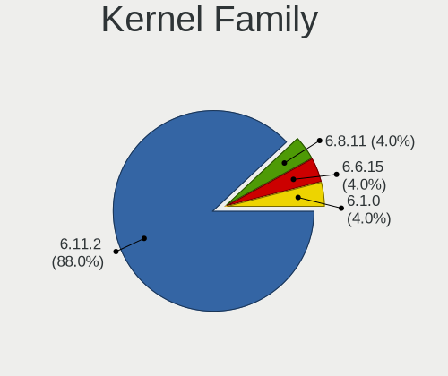
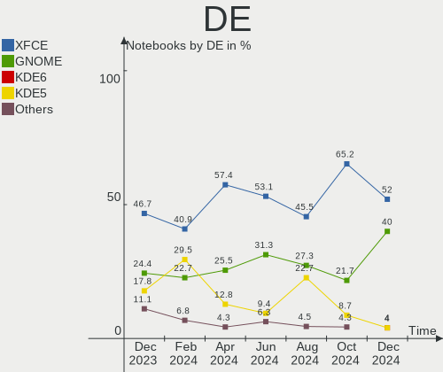
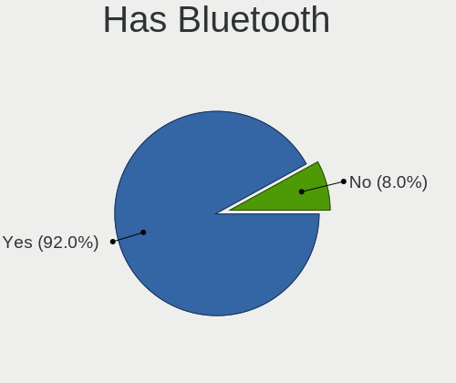
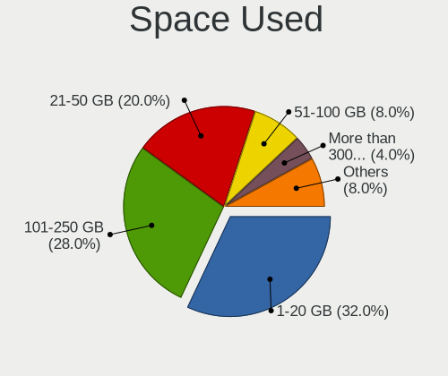

Kali Hardware Trends (Notebooks)
--------------------------------

A project to identify most popular hardware characteristics and track their change
over time based on data collected by Kali users at https://Linux-Hardware.org.

Anyone can contribute to this report by the [hw-probe](https://github.com/linuxhw/hw-probe) tool:

    sudo -E hw-probe -all -upload

Full-feature report is available here: https://linux-hardware.org/?view=trends

Period: Jan, 2022.

Contents
--------

* [ System ](#system)
  - [ OS                       ](#os)
  - [ OS Family                ](#os-family)
  - [ Kernel                   ](#kernel)
  - [ Kernel Family            ](#kernel-family)
  - [ Kernel Major Ver.        ](#kernel-major-ver)
  - [ Arch                     ](#arch)
  - [ DE                       ](#de)
  - [ Display Server           ](#display-server)
  - [ Display Manager          ](#display-manager)
  - [ OS Lang                  ](#os-lang)
  - [ Boot Mode                ](#boot-mode)
  - [ Filesystem               ](#filesystem)
  - [ Part. scheme             ](#part-scheme)
  - [ Dual Boot with Linux/BSD ](#dual-boot-with-linuxbsd)
  - [ Dual Boot (Win)          ](#dual-boot-win)

* [ Board ](#board)
  - [ Vendor                   ](#vendor)
  - [ Model                    ](#model)
  - [ Model Family             ](#model-family)
  - [ MFG Year                 ](#mfg-year)
  - [ Form Factor              ](#form-factor)
  - [ Secure Boot              ](#secure-boot)
  - [ Coreboot                 ](#coreboot)
  - [ RAM Size                 ](#ram-size)
  - [ RAM Used                 ](#ram-used)
  - [ Total Drives             ](#total-drives)
  - [ Has CD-ROM               ](#has-cd-rom)
  - [ Has Ethernet             ](#has-ethernet)
  - [ Has WiFi                 ](#has-wifi)
  - [ Has Bluetooth            ](#has-bluetooth)

* [ Location ](#location)
  - [ Country                  ](#country)
  - [ City                     ](#city)

* [ Drives ](#drives)
  - [ Drive Vendor             ](#drive-vendor)
  - [ Drive Model              ](#drive-model)
  - [ HDD Vendor               ](#hdd-vendor)
  - [ SSD Vendor               ](#ssd-vendor)
  - [ Drive Kind               ](#drive-kind)
  - [ Drive Connector          ](#drive-connector)
  - [ Drive Size               ](#drive-size)
  - [ Space Total              ](#space-total)
  - [ Space Used               ](#space-used)
  - [ Malfunc. Drives          ](#malfunc-drives)
  - [ Malfunc. Drive Vendor    ](#malfunc-drive-vendor)
  - [ Malfunc. HDD Vendor      ](#malfunc-hdd-vendor)
  - [ Malfunc. Drive Kind      ](#malfunc-drive-kind)
  - [ Failed Drives            ](#failed-drives)
  - [ Failed Drive Vendor      ](#failed-drive-vendor)
  - [ Drive Status             ](#drive-status)

* [ Storage controller ](#storage-controller)
  - [ Storage Vendor           ](#storage-vendor)
  - [ Storage Model            ](#storage-model)
  - [ Storage Kind             ](#storage-kind)

* [ Processor ](#processor)
  - [ CPU Vendor               ](#cpu-vendor)
  - [ CPU Model                ](#cpu-model)
  - [ CPU Model Family         ](#cpu-model-family)
  - [ CPU Cores                ](#cpu-cores)
  - [ CPU Sockets              ](#cpu-sockets)
  - [ CPU Threads              ](#cpu-threads)
  - [ CPU Op-Modes             ](#cpu-op-modes)
  - [ CPU Microcode            ](#cpu-microcode)
  - [ CPU Microarch            ](#cpu-microarch)

* [ Graphics ](#graphics)
  - [ GPU Vendor               ](#gpu-vendor)
  - [ GPU Model                ](#gpu-model)
  - [ GPU Combo                ](#gpu-combo)
  - [ GPU Driver               ](#gpu-driver)
  - [ GPU Memory               ](#gpu-memory)

* [ Monitor ](#monitor)
  - [ Monitor Vendor           ](#monitor-vendor)
  - [ Monitor Model            ](#monitor-model)
  - [ Monitor Resolution       ](#monitor-resolution)
  - [ Monitor Diagonal         ](#monitor-diagonal)
  - [ Monitor Width            ](#monitor-width)
  - [ Aspect Ratio             ](#aspect-ratio)
  - [ Monitor Area             ](#monitor-area)
  - [ Pixel Density            ](#pixel-density)
  - [ Multiple Monitors        ](#multiple-monitors)

* [ Network ](#network)
  - [ Net Controller Vendor    ](#net-controller-vendor)
  - [ Net Controller Model     ](#net-controller-model)
  - [ Wireless Vendor          ](#wireless-vendor)
  - [ Wireless Model           ](#wireless-model)
  - [ Ethernet Vendor          ](#ethernet-vendor)
  - [ Ethernet Model           ](#ethernet-model)
  - [ Net Controller Kind      ](#net-controller-kind)
  - [ Used Controller          ](#used-controller)
  - [ NICs                     ](#nics)
  - [ IPv6                     ](#ipv6)

* [ Bluetooth ](#bluetooth)
  - [ Bluetooth Vendor         ](#bluetooth-vendor)
  - [ Bluetooth Model          ](#bluetooth-model)

* [ Sound ](#sound)
  - [ Sound Vendor             ](#sound-vendor)
  - [ Sound Model              ](#sound-model)

* [ Memory ](#memory)
  - [ Memory Vendor            ](#memory-vendor)
  - [ Memory Model             ](#memory-model)
  - [ Memory Kind              ](#memory-kind)
  - [ Memory Form Factor       ](#memory-form-factor)
  - [ Memory Size              ](#memory-size)
  - [ Memory Speed             ](#memory-speed)

* [ Printers & scanners ](#printers--scanners)
  - [ Printer Vendor           ](#printer-vendor)
  - [ Printer Model            ](#printer-model)
  - [ Scanner Vendor           ](#scanner-vendor)
  - [ Scanner Model            ](#scanner-model)

* [ Camera ](#camera)
  - [ Camera Vendor            ](#camera-vendor)
  - [ Camera Model             ](#camera-model)

* [ Security ](#security)
  - [ Fingerprint Vendor       ](#fingerprint-vendor)
  - [ Fingerprint Model        ](#fingerprint-model)
  - [ Chipcard Vendor          ](#chipcard-vendor)
  - [ Chipcard Model           ](#chipcard-model)

* [ Unsupported ](#unsupported)
  - [ Unsupported Devices      ](#unsupported-devices)
  - [ Unsupported Device Types ](#unsupported-device-types)

System
------

OS
--

Installed operating systems

| Name        | Notebooks | Percent |
|-------------|-----------|---------|
| Kali 2021.4 | 25        | 92.59%  |
| Kali 2021.3 | 2         | 7.41%   |

OS Family
---------

OS without a version

| Name | Notebooks | Percent |
|------|-----------|---------|
| Kali | 27        | 100%    |

Kernel
------

Version of the Linux kernel

| Version              | Notebooks | Percent |
|----------------------|-----------|---------|
| 5.15.0-kali2-amd64   | 17        | 62.96%  |
| 5.14.0-kali4-amd64   | 5         | 18.52%  |
| 5.10.0-kali9-amd64   | 2         | 7.41%   |
| 5.15.0-kali2-686-pae | 1         | 3.7%    |
| 5.14.16-custom       | 1         | 3.7%    |
| 5.14.0-kali2-amd64   | 1         | 3.7%    |

Kernel Family
-------------

Linux kernel without a distro release

| Version | Notebooks | Percent |
|---------|-----------|---------|
| 5.15.0  | 18        | 66.67%  |
| 5.14.0  | 6         | 22.22%  |
| 5.10.0  | 2         | 7.41%   |
| 5.14.16 | 1         | 3.7%    |

Kernel Major Ver.
-----------------

Linux kernel major version

| Version | Notebooks | Percent |
|---------|-----------|---------|
| 5.15    | 18        | 66.67%  |
| 5.14    | 7         | 25.93%  |
| 5.10    | 2         | 7.41%   |

Arch
----

OS architecture (x86_64, i586, etc.)

| Name   | Notebooks | Percent |
|--------|-----------|---------|
| x86_64 | 26        | 96.3%   |
| i686   | 1         | 3.7%    |

DE
--

Desktop Environment

| Name            | Notebooks | Percent |
|-----------------|-----------|---------|
| XFCE            | 13        | 48.15%  |
| GNOME           | 9         | 33.33%  |
| LXDE            | 2         | 7.41%   |
| KDE5            | 2         | 7.41%   |
| GNOME Flashback | 1         | 3.7%    |

Display Server
--------------

X11 or Wayland

| Name    | Notebooks | Percent |
|---------|-----------|---------|
| X11     | 23        | 85.19%  |
| Wayland | 4         | 14.81%  |

Display Manager
---------------

SDDM, LightDM, etc.

| Name    | Notebooks | Percent |
|---------|-----------|---------|
| LightDM | 15        | 55.56%  |
| GDM3    | 8         | 29.63%  |
| Unknown | 2         | 7.41%   |
| SDDM    | 1         | 3.7%    |
| GDM     | 1         | 3.7%    |

OS Lang
-------

Language

| Lang  | Notebooks | Percent |
|-------|-----------|---------|
| en_US | 21        | 77.78%  |
| de_DE | 2         | 7.41%   |
| pt_BR | 1         | 3.7%    |
| pl_PL | 1         | 3.7%    |
| it_IT | 1         | 3.7%    |
| fr_FR | 1         | 3.7%    |

Boot Mode
---------

EFI or BIOS

| Mode | Notebooks | Percent |
|------|-----------|---------|
| EFI  | 17        | 62.96%  |
| BIOS | 10        | 37.04%  |

Filesystem
----------

Type of filesystem

| Type    | Notebooks | Percent |
|---------|-----------|---------|
| Ext4    | 25        | 92.59%  |
| Overlay | 1         | 3.7%    |
| Btrfs   | 1         | 3.7%    |

Part. scheme
------------

Scheme of partitioning

| Type    | Notebooks | Percent |
|---------|-----------|---------|
| GPT     | 17        | 62.96%  |
| MBR     | 8         | 29.63%  |
| Unknown | 2         | 7.41%   |

Dual Boot with Linux/BSD
------------------------

Hosting more than one Linux/BSD

| Dual boot | Notebooks | Percent |
|-----------|-----------|---------|
| No        | 25        | 92.59%  |
| Yes       | 2         | 7.41%   |

Dual Boot (Win)
---------------

Hosting Linux and Windows

| Dual boot | Notebooks | Percent |
|-----------|-----------|---------|
| No        | 18        | 66.67%  |
| Yes       | 9         | 33.33%  |

Board
-----

Vendor
------

Motherboard manufacturer

| Name             | Notebooks | Percent |
|------------------|-----------|---------|
| Dell             | 7         | 25.93%  |
| Lenovo           | 5         | 18.52%  |
| Hewlett-Packard  | 4         | 14.81%  |
| ASUSTek Computer | 3         | 11.11%  |
| Sony             | 2         | 7.41%   |
| Unknown          | 2         | 7.41%   |
| Positivo         | 1         | 3.7%    |
| MSI              | 1         | 3.7%    |
| Apple            | 1         | 3.7%    |
| Acer             | 1         | 3.7%    |

Model
-----

Motherboard model

| Name                            | Notebooks | Percent |
|---------------------------------|-----------|---------|
| Unknown                         | 2         | 7.41%   |
| Sony VGN-AR825E                 | 1         | 3.7%    |
| Sony SVE1113M1EB                | 1         | 3.7%    |
| Positivo S14BW01                | 1         | 3.7%    |
| MSI GP76 Leopard 10UE           | 1         | 3.7%    |
| Lenovo ThinkPad T480 20L50011US | 1         | 3.7%    |
| Lenovo ThinkBook 15p 20V3       | 1         | 3.7%    |
| Lenovo IdeaPad 330-15IKB 81FE   | 1         | 3.7%    |
| Lenovo IdeaPad 330-15IKB 81DE   | 1         | 3.7%    |
| Lenovo G710 20252               | 1         | 3.7%    |
| HP ProBook 6560b                | 1         | 3.7%    |
| HP EliteBook 8460p              | 1         | 3.7%    |
| HP EliteBook 840 G2             | 1         | 3.7%    |
| HP EliteBook 820 G1             | 1         | 3.7%    |
| Dell Vostro 5590                | 1         | 3.7%    |
| Dell Vostro 5581                | 1         | 3.7%    |
| Dell Vostro 3558                | 1         | 3.7%    |
| Dell Latitude 3510              | 1         | 3.7%    |
| Dell Inspiron 7352              | 1         | 3.7%    |
| Dell Inspiron 3721              | 1         | 3.7%    |
| Dell Inspiron 3501              | 1         | 3.7%    |
| ASUS X555LB                     | 1         | 3.7%    |
| ASUS Strix 17 GL703GE           | 1         | 3.7%    |
| ASUS F5R                        | 1         | 3.7%    |
| Apple MacBookPro14,1            | 1         | 3.7%    |
| Acer Aspire A515-44             | 1         | 3.7%    |

Model Family
------------

Motherboard model prefix

| Name               | Notebooks | Percent |
|--------------------|-----------|---------|
| HP EliteBook       | 3         | 11.11%  |
| Dell Vostro        | 3         | 11.11%  |
| Dell Inspiron      | 3         | 11.11%  |
| Lenovo IdeaPad     | 2         | 7.41%   |
| Unknown            | 2         | 7.41%   |
| Sony VGN-AR825E    | 1         | 3.7%    |
| Sony SVE1113M1EB   | 1         | 3.7%    |
| Positivo S14BW01   | 1         | 3.7%    |
| MSI GP76           | 1         | 3.7%    |
| Lenovo ThinkPad    | 1         | 3.7%    |
| Lenovo ThinkBook   | 1         | 3.7%    |
| Lenovo G710        | 1         | 3.7%    |
| HP ProBook         | 1         | 3.7%    |
| Dell Latitude      | 1         | 3.7%    |
| ASUS X555LB        | 1         | 3.7%    |
| ASUS Strix         | 1         | 3.7%    |
| ASUS F5R           | 1         | 3.7%    |
| Apple MacBookPro14 | 1         | 3.7%    |
| Acer Aspire        | 1         | 3.7%    |

MFG Year
--------

Motherboard manufacture year

| Year | Notebooks | Percent |
|------|-----------|---------|
| 2020 | 5         | 18.52%  |
| 2018 | 5         | 18.52%  |
| 2015 | 4         | 14.81%  |
| 2013 | 3         | 11.11%  |
| 2019 | 2         | 7.41%   |
| 2011 | 2         | 7.41%   |
| 2021 | 1         | 3.7%    |
| 2017 | 1         | 3.7%    |
| 2016 | 1         | 3.7%    |
| 2014 | 1         | 3.7%    |
| 2008 | 1         | 3.7%    |
| 2007 | 1         | 3.7%    |

Form Factor
-----------

Physical design of the computer

| Name     | Notebooks | Percent |
|----------|-----------|---------|
| Notebook | 27        | 100%    |

Secure Boot
-----------

Enabled or disabled

| State    | Notebooks | Percent |
|----------|-----------|---------|
| Disabled | 27        | 100%    |

Coreboot
--------

Have coreboot on board

| Used | Notebooks | Percent |
|------|-----------|---------|
| No   | 27        | 100%    |

RAM Size
--------

Total RAM memory

| Size in GB | Notebooks | Percent |
|------------|-----------|---------|
| 4.01-8.0   | 9         | 33.33%  |
| 16.01-24.0 | 6         | 22.22%  |
| 8.01-16.0  | 5         | 18.52%  |
| 3.01-4.0   | 3         | 11.11%  |
| 32.01-64.0 | 2         | 7.41%   |
| 2.01-3.0   | 1         | 3.7%    |
| 1.01-2.0   | 1         | 3.7%    |

RAM Used
--------

Used RAM memory

| Used GB  | Notebooks | Percent |
|----------|-----------|---------|
| 2.01-3.0 | 8         | 29.63%  |
| 1.01-2.0 | 8         | 29.63%  |
| 3.01-4.0 | 7         | 25.93%  |
| 4.01-8.0 | 3         | 11.11%  |
| 0.51-1.0 | 1         | 3.7%    |

Total Drives
------------

Number of drives on board

| Drives | Notebooks | Percent |
|--------|-----------|---------|
| 1      | 19        | 70.37%  |
| 2      | 7         | 25.93%  |
| 3      | 1         | 3.7%    |

Has CD-ROM
----------

Has CD-ROM on board

| Presented | Notebooks | Percent |
|-----------|-----------|---------|
| No        | 19        | 70.37%  |
| Yes       | 8         | 29.63%  |

Has Ethernet
------------

Has Ethernet on board

| Presented | Notebooks | Percent |
|-----------|-----------|---------|
| Yes       | 26        | 96.3%   |
| No        | 1         | 3.7%    |

Has WiFi
--------

Has WiFi module

| Presented | Notebooks | Percent |
|-----------|-----------|---------|
| Yes       | 26        | 96.3%   |
| No        | 1         | 3.7%    |

Has Bluetooth
-------------

Has Bluetooth module

| Presented | Notebooks | Percent |
|-----------|-----------|---------|
| Yes       | 22        | 81.48%  |
| No        | 5         | 18.52%  |

Location
--------

Country
-------

Geographic location (country)

| Country         | Notebooks | Percent |
|-----------------|-----------|---------|
| USA             | 10        | 37.04%  |
| Germany         | 5         | 18.52%  |
| France          | 2         | 7.41%   |
| Brazil          | 2         | 7.41%   |
| North Macedonia | 1         | 3.7%    |
| Kenya           | 1         | 3.7%    |
| Italy           | 1         | 3.7%    |
| Indonesia       | 1         | 3.7%    |
| India           | 1         | 3.7%    |
| Greece          | 1         | 3.7%    |
| Croatia         | 1         | 3.7%    |
| Canada          | 1         | 3.7%    |

City
----

Geographic location (city)

| City         | Notebooks | Percent |
|--------------|-----------|---------|
| Zagreb       | 1         | 3.7%    |
| Weyburn      | 1         | 3.7%    |
| Tucson       | 1         | 3.7%    |
| Solingen     | 1         | 3.7%    |
| Sarasota     | 1         | 3.7%    |
| Ronnenberg   | 1         | 3.7%    |
| Roanoke      | 1         | 3.7%    |
| Picos        | 1         | 3.7%    |
| Paradise     | 1         | 3.7%    |
| Noisy-le-Sec | 1         | 3.7%    |
| Naples       | 1         | 3.7%    |
| Nandlstadt   | 1         | 3.7%    |
| Nairobi      | 1         | 3.7%    |
| Los Angeles  | 1         | 3.7%    |
| Kumanovo     | 1         | 3.7%    |
| Grovetown    | 1         | 3.7%    |
| Goffstown    | 1         | 3.7%    |
| Durham       | 1         | 3.7%    |
| Dresden      | 1         | 3.7%    |
| Colombes     | 1         | 3.7%    |
| Chicago      | 1         | 3.7%    |
| Bielefeld    | 1         | 3.7%    |
| Bengaluru    | 1         | 3.7%    |
| Badung       | 1         | 3.7%    |
| Aurora       | 1         | 3.7%    |
| Athens       | 1         | 3.7%    |
| Arcos        | 1         | 3.7%    |

Drives
------

Drive Vendor
------------

Hard drive vendors

| Vendor              | Notebooks | Drives | Percent |
|---------------------|-----------|--------|---------|
| Seagate             | 6         | 6      | 17.65%  |
| Toshiba             | 4         | 4      | 11.76%  |
| SanDisk             | 4         | 4      | 11.76%  |
| WDC                 | 3         | 3      | 8.82%   |
| Unknown             | 3         | 4      | 8.82%   |
| Samsung Electronics | 2         | 2      | 5.88%   |
| UMIS                | 1         | 1      | 2.94%   |
| TYPEC 1T            | 1         | 1      | 2.94%   |
| SPCC                | 1         | 1      | 2.94%   |
| SK Hynix            | 1         | 1      | 2.94%   |
| PNY                 | 1         | 1      | 2.94%   |
| MARSHAL             | 1         | 1      | 2.94%   |
| Kingston            | 1         | 1      | 2.94%   |
| KingSpec            | 1         | 1      | 2.94%   |
| KingFast            | 1         | 1      | 2.94%   |
| Intel               | 1         | 1      | 2.94%   |
| Hitachi             | 1         | 1      | 2.94%   |
| Apple               | 1         | 2      | 2.94%   |

Drive Model
-----------

Hard drive models

| Model                              | Notebooks | Percent |
|------------------------------------|-----------|---------|
| Seagate ST1000LM035-1RK172 1TB     | 3         | 8.57%   |
| Toshiba MQ01ABD100 1TB             | 2         | 5.71%   |
| WDC WD5000LPVT-75G33T0 500GB       | 1         | 2.86%   |
| WDC WD10SPZX-24Z10T0 1TB           | 1         | 2.86%   |
| WDC PC SN530 NVMe 256GB            | 1         | 2.86%   |
| Unknown SD/MMC/MS PRO 128GB        | 1         | 2.86%   |
| Unknown MMC Card  64GB             | 1         | 2.86%   |
| Unknown MMC Card  134GB            | 1         | 2.86%   |
| Unknown M52532  32GB               | 1         | 2.86%   |
| UMIS RPITJ1TBVME2HWD               | 1         | 2.86%   |
| TYPEC 1T B PSSD 1TB                | 1         | 2.86%   |
| Toshiba MQ01ABD050 500GB           | 1         | 2.86%   |
| Toshiba KBG40ZNS256G NVMe 256GB    | 1         | 2.86%   |
| SPCC M.2 PCIe SSD 512GB            | 1         | 2.86%   |
| SK Hynix HFM512GDJTNI-82A0A 512GB  | 1         | 2.86%   |
| Seagate ST9160821AS 160GB          | 1         | 2.86%   |
| Seagate ST500LT012-1DG142 500GB    | 1         | 2.86%   |
| Seagate ST1000LM024 HN-M101MBB 1TB | 1         | 2.86%   |
| SanDisk Z400s 2.5 7MM 128GB SSD    | 1         | 2.86%   |
| SanDisk SSD PLUS 240GB             | 1         | 2.86%   |
| SanDisk SDSSDH3 1T02 1024GB        | 1         | 2.86%   |
| Sandisk NVMe SSD Drive 1TB         | 1         | 2.86%   |
| Samsung SSD 870 EVO 1TB            | 1         | 2.86%   |
| Samsung PM991 NVMe 256GB           | 1         | 2.86%   |
| PNY CS900 1TB SSD                  | 1         | 2.86%   |
| MARSHAL MAL2750SA-T54 752GB        | 1         | 2.86%   |
| Kingston OM8PCP31024F-AI1 1TB      | 1         | 2.86%   |
| KingSpec P3-512 512GB              | 1         | 2.86%   |
| KingFast 512GB                     | 1         | 2.86%   |
| Intel SSDPEKKF256G8L 256GB         | 1         | 2.86%   |
| Hitachi HTS547575A9E384 752GB      | 1         | 2.86%   |
| Apple SSD AP0512J 8.1KB            | 1         | 2.86%   |

HDD Vendor
----------

Hard disk drive vendors

| Vendor  | Notebooks | Drives | Percent |
|---------|-----------|--------|---------|
| Seagate | 6         | 6      | 42.86%  |
| Toshiba | 3         | 3      | 21.43%  |
| WDC     | 2         | 2      | 14.29%  |
| Unknown | 1         | 1      | 7.14%   |
| MARSHAL | 1         | 1      | 7.14%   |
| Hitachi | 1         | 1      | 7.14%   |

SSD Vendor
----------

Solid state drive vendors

| Vendor              | Notebooks | Drives | Percent |
|---------------------|-----------|--------|---------|
| SanDisk             | 3         | 3      | 42.86%  |
| TYPEC 1T            | 1         | 1      | 14.29%  |
| Samsung Electronics | 1         | 1      | 14.29%  |
| PNY                 | 1         | 1      | 14.29%  |
| KingSpec            | 1         | 1      | 14.29%  |

Drive Kind
----------

HDD or SSD

| Kind    | Notebooks | Drives | Percent |
|---------|-----------|--------|---------|
| HDD     | 14        | 14     | 42.42%  |
| NVMe    | 10        | 11     | 30.3%   |
| SSD     | 6         | 7      | 18.18%  |
| MMC     | 2         | 3      | 6.06%   |
| Unknown | 1         | 1      | 3.03%   |

Drive Connector
---------------

SATA, SAS, NVMe, etc.

| Type | Notebooks | Drives | Percent |
|------|-----------|--------|---------|
| SATA | 17        | 19     | 53.13%  |
| NVMe | 10        | 11     | 31.25%  |
| SAS  | 3         | 3      | 9.38%   |
| MMC  | 2         | 3      | 6.25%   |

Drive Size
----------

Size of hard drive

| Size in TB | Notebooks | Drives | Percent |
|------------|-----------|--------|---------|
| 0.51-1.0   | 12        | 13     | 60%     |
| 0.01-0.5   | 7         | 7      | 35%     |
| 1.01-2.0   | 1         | 1      | 5%      |

Space Total
-----------

Amount of disk space available on the file system

| Size in GB | Notebooks | Percent |
|------------|-----------|---------|
| 101-250    | 7         | 25.93%  |
| 501-1000   | 7         | 25.93%  |
| 251-500    | 6         | 22.22%  |
| 1001-2000  | 2         | 7.41%   |
| 1-20       | 2         | 7.41%   |
| 51-100     | 2         | 7.41%   |
| 21-50      | 1         | 3.7%    |

Space Used
----------

Amount of used disk space

| Used GB   | Notebooks | Percent |
|-----------|-----------|---------|
| 1-20      | 11        | 40.74%  |
| 21-50     | 6         | 22.22%  |
| 101-250   | 3         | 11.11%  |
| 51-100    | 3         | 11.11%  |
| 501-1000  | 2         | 7.41%   |
| 251-500   | 1         | 3.7%    |
| 1001-2000 | 1         | 3.7%    |

Malfunc. Drives
---------------

Drive models with a malfunction

| Model                           | Notebooks | Drives | Percent |
|---------------------------------|-----------|--------|---------|
| Toshiba MQ01ABD100 1TB          | 1         | 1      | 14.29%  |
| Toshiba MQ01ABD050 500GB        | 1         | 1      | 14.29%  |
| SPCC M.2 PCIe SSD 512GB         | 1         | 1      | 14.29%  |
| Seagate ST9160821AS 160GB       | 1         | 1      | 14.29%  |
| Seagate ST500LT012-1DG142 500GB | 1         | 1      | 14.29%  |
| Seagate ST1000LM035-1RK172 1TB  | 1         | 1      | 14.29%  |
| MARSHAL MAL2750SA-T54 752GB     | 1         | 1      | 14.29%  |

Malfunc. Drive Vendor
---------------------

Vendors of faulty drives

| Vendor  | Notebooks | Drives | Percent |
|---------|-----------|--------|---------|
| Seagate | 3         | 3      | 42.86%  |
| Toshiba | 2         | 2      | 28.57%  |
| SPCC    | 1         | 1      | 14.29%  |
| MARSHAL | 1         | 1      | 14.29%  |

Malfunc. HDD Vendor
-------------------

Vendors of faulty HDD drives

| Vendor  | Notebooks | Drives | Percent |
|---------|-----------|--------|---------|
| Seagate | 3         | 3      | 50%     |
| Toshiba | 2         | 2      | 33.33%  |
| MARSHAL | 1         | 1      | 16.67%  |

Malfunc. Drive Kind
-------------------

Kinds of faulty drives

| Kind | Notebooks | Drives | Percent |
|------|-----------|--------|---------|
| HDD  | 6         | 6      | 85.71%  |
| NVMe | 1         | 1      | 14.29%  |

Failed Drives
-------------

Failed drive models

| Model                         | Notebooks | Drives | Percent |
|-------------------------------|-----------|--------|---------|
| Hitachi HTS547575A9E384 752GB | 1         | 1      | 100%    |

Failed Drive Vendor
-------------------

Failed drive vendors

| Vendor  | Notebooks | Drives | Percent |
|---------|-----------|--------|---------|
| Hitachi | 1         | 1      | 100%    |

Drive Status
------------

Number of failed and malfunc. drives

| Status   | Notebooks | Drives | Percent |
|----------|-----------|--------|---------|
| Works    | 16        | 20     | 55.17%  |
| Malfunc  | 7         | 7      | 24.14%  |
| Detected | 5         | 8      | 17.24%  |
| Failed   | 1         | 1      | 3.45%   |

Storage controller
------------------

Storage Vendor
--------------

Storage controller vendors

| Vendor                      | Notebooks | Percent |
|-----------------------------|-----------|---------|
| Intel                       | 20        | 62.5%   |
| AMD                         | 3         | 9.38%   |
| Sandisk                     | 2         | 6.25%   |
| Union Memory (Shenzhen)     | 1         | 3.13%   |
| SK Hynix                    | 1         | 3.13%   |
| Silicon Motion              | 1         | 3.13%   |
| Samsung Electronics         | 1         | 3.13%   |
| KIOXIA                      | 1         | 3.13%   |
| Kingston Technology Company | 1         | 3.13%   |
| Apple                       | 1         | 3.13%   |

Storage Model
-------------

Storage controller models

| Model                                                                         | Notebooks | Percent |
|-------------------------------------------------------------------------------|-----------|---------|
| Intel Wildcat Point-LP SATA Controller [AHCI Mode]                            | 4         | 11.11%  |
| Sandisk Non-Volatile memory controller                                        | 2         | 5.56%   |
| Intel Sunrise Point-LP SATA Controller [AHCI mode]                            | 2         | 5.56%   |
| Intel Comet Lake SATA AHCI Controller                                         | 2         | 5.56%   |
| Intel 6 Series/C200 Series Chipset Family 6 port Mobile SATA AHCI Controller  | 2         | 5.56%   |
| AMD FCH SATA Controller [AHCI mode]                                           | 2         | 5.56%   |
| Union Memory (Shenzhen) Non-Volatile memory controller                        | 1         | 2.78%   |
| SK Hynix BC511                                                                | 1         | 2.78%   |
| Silicon Motion SM2263EN/SM2263XT SSD Controller                               | 1         | 2.78%   |
| Samsung NVMe SSD Controller 980                                               | 1         | 2.78%   |
| KIOXIA Non-Volatile memory controller                                         | 1         | 2.78%   |
| Kingston Company Company Non-Volatile memory controller                       | 1         | 2.78%   |
| Intel Volume Management Device NVMe RAID Controller                           | 1         | 2.78%   |
| Intel Tiger Lake-LP SATA Controller [AHCI mode]                               | 1         | 2.78%   |
| Intel SSD Pro 7600p/760p/E 6100p Series                                       | 1         | 2.78%   |
| Intel Cannon Point-LP SATA Controller [AHCI Mode]                             | 1         | 2.78%   |
| Intel Cannon Lake PCH SATA AHCI Controller                                    | 1         | 2.78%   |
| Intel Cannon Lake Mobile PCH SATA AHCI Controller                             | 1         | 2.78%   |
| Intel 82801HM/HEM (ICH8M/ICH8M-E) SATA Controller [AHCI mode]                 | 1         | 2.78%   |
| Intel 82801HM/HEM (ICH8M/ICH8M-E) IDE Controller                              | 1         | 2.78%   |
| Intel 8 Series/C220 Series Chipset Family 2-port SATA Controller 2 [IDE mode] | 1         | 2.78%   |
| Intel 8 Series SATA Controller 1 [AHCI mode]                                  | 1         | 2.78%   |
| Intel 8 Series Chipset Family 4-port SATA Controller 1 [IDE mode] - Mobile    | 1         | 2.78%   |
| Intel 7 Series Chipset Family 6-port SATA Controller [AHCI mode]              | 1         | 2.78%   |
| Intel 400 Series Chipset Family SATA AHCI Controller                          | 1         | 2.78%   |
| Apple S3X NVMe Controller                                                     | 1         | 2.78%   |
| AMD SB600 Non-Raid-5 SATA                                                     | 1         | 2.78%   |
| AMD SB600 IDE                                                                 | 1         | 2.78%   |

Storage Kind
------------

Kind of storage controller (IDE, SATA, NVMe, SAS, ...)

| Kind | Notebooks | Percent |
|------|-----------|---------|
| SATA | 21        | 60%     |
| NVMe | 10        | 28.57%  |
| IDE  | 3         | 8.57%   |
| RAID | 1         | 2.86%   |

Processor
---------

CPU Vendor
----------

Processor vendors

| Vendor | Notebooks | Percent |
|--------|-----------|---------|
| Intel  | 25        | 92.59%  |
| AMD    | 2         | 7.41%   |

CPU Model
---------

Processor models

| Model                                   | Notebooks | Percent |
|-----------------------------------------|-----------|---------|
| Intel Pentium CPU 3550M @ 2.30GHz       | 1         | 3.7%    |
| Intel Pentium CPU 2117U @ 1.80GHz       | 1         | 3.7%    |
| Intel Core i9-8950HK CPU @ 2.90GHz      | 1         | 3.7%    |
| Intel Core i7-8750H CPU @ 2.20GHz       | 1         | 3.7%    |
| Intel Core i7-5500U CPU @ 2.40GHz       | 1         | 3.7%    |
| Intel Core i7-10870H CPU @ 2.20GHz      | 1         | 3.7%    |
| Intel Core i7-10750H CPU @ 2.60GHz      | 1         | 3.7%    |
| Intel Core i7-10510U CPU @ 1.80GHz      | 1         | 3.7%    |
| Intel Core i5-8350U CPU @ 1.70GHz       | 1         | 3.7%    |
| Intel Core i5-8265U CPU @ 1.60GHz       | 1         | 3.7%    |
| Intel Core i5-8250U CPU @ 1.60GHz       | 1         | 3.7%    |
| Intel Core i5-7360U CPU @ 2.30GHz       | 1         | 3.7%    |
| Intel Core i5-5300U CPU @ 2.30GHz       | 1         | 3.7%    |
| Intel Core i5-5200U CPU @ 2.20GHz       | 1         | 3.7%    |
| Intel Core i5-4310U CPU @ 2.00GHz       | 1         | 3.7%    |
| Intel Core i5-2540M CPU @ 2.60GHz       | 1         | 3.7%    |
| Intel Core i5-2520M CPU @ 2.50GHz       | 1         | 3.7%    |
| Intel Core i3-8130U CPU @ 2.20GHz       | 1         | 3.7%    |
| Intel Core i3-5005U CPU @ 2.00GHz       | 1         | 3.7%    |
| Intel Core i3-10110U CPU @ 2.10GHz      | 1         | 3.7%    |
| Intel Core Duo CPU T2450 @ 2.00GHz      | 1         | 3.7%    |
| Intel Core 2 Duo CPU T5750 @ 2.00GHz    | 1         | 3.7%    |
| Intel Celeron CPU N3010 @ 1.04GHz       | 1         | 3.7%    |
| Intel Atom x5-Z8350 CPU @ 1.44GHz       | 1         | 3.7%    |
| Intel 11th Gen Core i5-1135G7 @ 2.40GHz | 1         | 3.7%    |
| AMD Ryzen 7 4700U with Radeon Graphics  | 1         | 3.7%    |
| AMD E2-2000 APU with Radeon HD Graphics | 1         | 3.7%    |

CPU Model Family
----------------

Processor model prefix

| Model            | Notebooks | Percent |
|------------------|-----------|---------|
| Intel Core i5    | 9         | 33.33%  |
| Intel Core i7    | 5         | 18.52%  |
| Intel Core i3    | 3         | 11.11%  |
| Intel Pentium    | 2         | 7.41%   |
| Other            | 1         | 3.7%    |
| Intel Core i9    | 1         | 3.7%    |
| Intel Core Duo   | 1         | 3.7%    |
| Intel Core 2 Duo | 1         | 3.7%    |
| Intel Celeron    | 1         | 3.7%    |
| Intel Atom       | 1         | 3.7%    |
| AMD Ryzen 7      | 1         | 3.7%    |
| AMD E2           | 1         | 3.7%    |

CPU Cores
---------

Number of processor cores

| Number | Notebooks | Percent |
|--------|-----------|---------|
| 2      | 16        | 59.26%  |
| 4      | 6         | 22.22%  |
| 6      | 3         | 11.11%  |
| 8      | 2         | 7.41%   |

CPU Sockets
-----------

Number of sockets

| Number | Notebooks | Percent |
|--------|-----------|---------|
| 1      | 27        | 100%    |

CPU Threads
-----------

Threads per core (Hyper-Threading)

| Number | Notebooks | Percent |
|--------|-----------|---------|
| 2      | 18        | 66.67%  |
| 1      | 9         | 33.33%  |

CPU Op-Modes
------------

CPU Operation Modes (32-bit, 64-bit)

| Op mode        | Notebooks | Percent |
|----------------|-----------|---------|
| 32-bit, 64-bit | 26        | 96.3%   |
| 32-bit         | 1         | 3.7%    |

CPU Microcode
-------------

Microcode number

| Number     | Notebooks | Percent |
|------------|-----------|---------|
| 0x306d4    | 4         | 14.81%  |
| 0x806ec    | 3         | 11.11%  |
| 0x806ea    | 3         | 11.11%  |
| 0xa0652    | 2         | 7.41%   |
| 0x906ea    | 2         | 7.41%   |
| 0x406c4    | 2         | 7.41%   |
| Unknown    | 2         | 7.41%   |
| 0x806e9    | 1         | 3.7%    |
| 0x806c1    | 1         | 3.7%    |
| 0x6fd      | 1         | 3.7%    |
| 0x6ec      | 1         | 3.7%    |
| 0x40651    | 1         | 3.7%    |
| 0x306c3    | 1         | 3.7%    |
| 0x306a9    | 1         | 3.7%    |
| 0x206a7    | 1         | 3.7%    |
| 0x08600103 | 1         | 3.7%    |

CPU Microarch
-------------

Microarchitecture

| Name        | Notebooks | Percent |
|-------------|-----------|---------|
| KabyLake    | 9         | 33.33%  |
| Broadwell   | 4         | 14.81%  |
| Silvermont  | 2         | 7.41%   |
| SandyBridge | 2         | 7.41%   |
| Haswell     | 2         | 7.41%   |
| CometLake   | 2         | 7.41%   |
| Zen 2       | 1         | 3.7%    |
| TigerLake   | 1         | 3.7%    |
| P6          | 1         | 3.7%    |
| IvyBridge   | 1         | 3.7%    |
| Core        | 1         | 3.7%    |
| Bobcat      | 1         | 3.7%    |

Graphics
--------

GPU Vendor
----------

Vendors of graphics cards

| Vendor | Notebooks | Percent |
|--------|-----------|---------|
| Intel  | 23        | 67.65%  |
| Nvidia | 8         | 23.53%  |
| AMD    | 3         | 8.82%   |

GPU Model
---------

Graphics card models

| Model                                                                                    | Notebooks | Percent |
|------------------------------------------------------------------------------------------|-----------|---------|
| Intel HD Graphics 5500                                                                   | 4         | 11.76%  |
| Intel UHD Graphics 620                                                                   | 3         | 8.82%   |
| Intel CometLake-U GT2 [UHD Graphics]                                                     | 2         | 5.88%   |
| Intel CometLake-H GT2 [UHD Graphics]                                                     | 2         | 5.88%   |
| Intel CoffeeLake-H GT2 [UHD Graphics 630]                                                | 2         | 5.88%   |
| Intel Atom/Celeron/Pentium Processor x5-E8000/J3xxx/N3xxx Integrated Graphics Controller | 2         | 5.88%   |
| Intel 2nd Generation Core Processor Family Integrated Graphics Controller                | 2         | 5.88%   |
| Nvidia TU117M [GeForce GTX 1650 Ti Mobile]                                               | 1         | 2.94%   |
| Nvidia TU117M [GeForce GTX 1650 Mobile / Max-Q]                                          | 1         | 2.94%   |
| Nvidia GP108M [GeForce MX330]                                                            | 1         | 2.94%   |
| Nvidia GP108M [GeForce MX250]                                                            | 1         | 2.94%   |
| Nvidia GP107M [GeForce GTX 1050 Ti Mobile]                                               | 1         | 2.94%   |
| Nvidia GM108M [GeForce 940M]                                                             | 1         | 2.94%   |
| Nvidia GA106M [GeForce RTX 3060 Mobile / Max-Q]                                          | 1         | 2.94%   |
| Nvidia G86M [GeForce 8400M GT]                                                           | 1         | 2.94%   |
| Intel WhiskeyLake-U GT2 [UHD Graphics 620]                                               | 1         | 2.94%   |
| Intel TigerLake-LP GT2 [Iris Xe Graphics]                                                | 1         | 2.94%   |
| Intel Iris Plus Graphics 640                                                             | 1         | 2.94%   |
| Intel Haswell-ULT Integrated Graphics Controller                                         | 1         | 2.94%   |
| Intel Haswell Integrated Graphics Controller                                             | 1         | 2.94%   |
| Intel 3rd Gen Core processor Graphics Controller                                         | 1         | 2.94%   |
| AMD Wrestler [Radeon HD 7340]                                                            | 1         | 2.94%   |
| AMD Renoir                                                                               | 1         | 2.94%   |
| AMD RC410M [Mobility Radeon Xpress 200M]                                                 | 1         | 2.94%   |

GPU Combo
---------

Combinations of graphics cards

| Name           | Notebooks | Percent |
|----------------|-----------|---------|
| 1 x Intel      | 16        | 59.26%  |
| Intel + Nvidia | 7         | 25.93%  |
| 1 x AMD        | 3         | 11.11%  |
| 1 x Nvidia     | 1         | 3.7%    |

GPU Driver
----------

Free vs proprietary

| Driver      | Notebooks | Percent |
|-------------|-----------|---------|
| Free        | 26        | 96.3%   |
| Proprietary | 1         | 3.7%    |

GPU Memory
----------

Total video memory

| Size in GB | Notebooks | Percent |
|------------|-----------|---------|
| Unknown    | 19        | 70.37%  |
| 1.01-2.0   | 3         | 11.11%  |
| 0.01-0.5   | 3         | 11.11%  |
| 3.01-4.0   | 2         | 7.41%   |

Monitor
-------

Monitor Vendor
--------------

Monitor vendors

| Vendor                  | Notebooks | Percent |
|-------------------------|-----------|---------|
| BOE                     | 6         | 20%     |
| Chimei Innolux          | 5         | 16.67%  |
| AU Optronics            | 5         | 16.67%  |
| Samsung Electronics     | 3         | 10%     |
| LG Display              | 2         | 6.67%   |
| YTH                     | 1         | 3.33%   |
| Sony                    | 1         | 3.33%   |
| Sharp                   | 1         | 3.33%   |
| PANDA                   | 1         | 3.33%   |
| Goldstar                | 1         | 3.33%   |
| CSO                     | 1         | 3.33%   |
| Chi Mei Optoelectronics | 1         | 3.33%   |
| Arnos Instruments       | 1         | 3.33%   |
| Apple                   | 1         | 3.33%   |

Monitor Model
-------------

Monitor models

| Model                                                                    | Notebooks | Percent |
|--------------------------------------------------------------------------|-----------|---------|
| YTH YTH156PC YTH1560 1920x1080 600x330mm 27.0-inch                       | 1         | 3.33%   |
| Sony TV SNY7A02 1360x768 487x274mm 22.0-inch                             | 1         | 3.33%   |
| Sharp HDMI SHP116E 1360x768 700x390mm 31.5-inch                          | 1         | 3.33%   |
| Samsung Electronics S22D300 SAM0B3B 1920x1080 477x268mm 21.5-inch        | 1         | 3.33%   |
| Samsung Electronics LCD Monitor SEC544B 1600x900 344x194mm 15.5-inch     | 1         | 3.33%   |
| Samsung Electronics LCD Monitor SDC4C48 1920x1080 293x165mm 13.2-inch    | 1         | 3.33%   |
| PANDA LCD Monitor NCP006E 1920x1080 344x194mm 15.5-inch                  | 1         | 3.33%   |
| LG Display LCD Monitor LGD0404 1366x768 277x156mm 12.5-inch              | 1         | 3.33%   |
| LG Display LCD Monitor LGD02F1 1366x768 344x194mm 15.5-inch              | 1         | 3.33%   |
| Goldstar ULTRAWIDE GSM59F1 2560x1080 677x290mm 29.0-inch                 | 1         | 3.33%   |
| CSO LCD Monitor CSO1500 3840x2160 344x194mm 15.5-inch                    | 1         | 3.33%   |
| Chimei Innolux LCD Monitor CMN176E 1920x1080 381x214mm 17.2-inch         | 1         | 3.33%   |
| Chimei Innolux LCD Monitor CMN1747 1920x1080 380x210mm 17.1-inch         | 1         | 3.33%   |
| Chimei Innolux LCD Monitor CMN1728 1600x900 382x215mm 17.3-inch          | 1         | 3.33%   |
| Chimei Innolux LCD Monitor CMN15DB 1366x768 344x193mm 15.5-inch          | 1         | 3.33%   |
| Chimei Innolux LCD Monitor CMN1495 1366x768 309x173mm 13.9-inch          | 1         | 3.33%   |
| Chi Mei Optoelectronics LCD Monitor CMO1526 1280x800 331x207mm 15.4-inch | 1         | 3.33%   |
| BOE LCD Monitor BOE08CD 1366x768 344x194mm 15.5-inch                     | 1         | 3.33%   |
| BOE LCD Monitor BOE07B4 1366x768 344x194mm 15.5-inch                     | 1         | 3.33%   |
| BOE LCD Monitor BOE0791 1920x1080 309x173mm 13.9-inch                    | 1         | 3.33%   |
| BOE LCD Monitor BOE078C 1920x1080 344x194mm 15.5-inch                    | 1         | 3.33%   |
| BOE LCD Monitor BOE0696 1366x768 309x173mm 13.9-inch                     | 1         | 3.33%   |
| BOE LCD Monitor BOE0620 1366x768 344x194mm 15.5-inch                     | 1         | 3.33%   |
| AU Optronics LCD Monitor AUODF87 1920x1080 344x193mm 15.5-inch           | 1         | 3.33%   |
| AU Optronics LCD Monitor AUO32EC 1366x768 344x193mm 15.5-inch            | 1         | 3.33%   |
| AU Optronics LCD Monitor AUO313C 1366x768 309x173mm 13.9-inch            | 1         | 3.33%   |
| AU Optronics LCD Monitor AUO305C 1366x768 256x144mm 11.6-inch            | 1         | 3.33%   |
| AU Optronics LCD Monitor AUO23ED 1920x1080 344x194mm 15.5-inch           | 1         | 3.33%   |
| Arnos Instruments F-417 AIC7450 1280x1024 338x270mm 17.0-inch            | 1         | 3.33%   |
| Apple Color LCD APPA034 2880x1800 286x179mm 13.3-inch                    | 1         | 3.33%   |

Monitor Resolution
------------------

Monitor screen resolution

| Resolution       | Notebooks | Percent |
|------------------|-----------|---------|
| 1366x768 (WXGA)  | 11        | 36.67%  |
| 1920x1080 (FHD)  | 9         | 30%     |
| 3840x2160 (4K)   | 2         | 6.67%   |
| 1600x900 (HD+)   | 2         | 6.67%   |
| 1360x768         | 2         | 6.67%   |
| 2880x1800        | 1         | 3.33%   |
| 2560x1080        | 1         | 3.33%   |
| 1280x800 (WXGA)  | 1         | 3.33%   |
| 1280x1024 (SXGA) | 1         | 3.33%   |

Monitor Diagonal
----------------

Diagonal size in inches

| Inches | Notebooks | Percent |
|--------|-----------|---------|
| 15     | 12        | 40%     |
| 17     | 5         | 16.67%  |
| 13     | 4         | 13.33%  |
| 34     | 1         | 3.33%   |
| 31     | 1         | 3.33%   |
| 27     | 1         | 3.33%   |
| 26     | 1         | 3.33%   |
| 21     | 1         | 3.33%   |
| 18     | 1         | 3.33%   |
| 14     | 1         | 3.33%   |
| 12     | 1         | 3.33%   |
| 11     | 1         | 3.33%   |

Monitor Width
-------------

Physical width

| Width in mm | Notebooks | Percent |
|-------------|-----------|---------|
| 301-350     | 17        | 56.67%  |
| 351-400     | 4         | 13.33%  |
| 201-300     | 3         | 10%     |
| 501-600     | 2         | 6.67%   |
| 401-500     | 2         | 6.67%   |
| 701-800     | 1         | 3.33%   |
| 601-700     | 1         | 3.33%   |

Aspect Ratio
------------

Proportional relationship between the width and the height

| Ratio | Notebooks | Percent |
|-------|-----------|---------|
| 16/9  | 23        | 85.19%  |
| 16/10 | 2         | 7.41%   |
| 5/4   | 1         | 3.7%    |
| 21/9  | 1         | 3.7%    |

Monitor Area
------------

Area in inch

| Area in inch | Notebooks | Percent |
|----------------|-----------|---------|
| 101-110        | 12        | 40%     |
| 81-90          | 4         | 13.33%  |
| 121-130        | 3         | 10%     |
| 351-500        | 2         | 6.67%   |
| 141-150        | 2         | 6.67%   |
| 71-80          | 1         | 3.33%   |
| 61-70          | 1         | 3.33%   |
| 51-60          | 1         | 3.33%   |
| 301-350        | 1         | 3.33%   |
| 251-300        | 1         | 3.33%   |
| 201-250        | 1         | 3.33%   |
| 131-140        | 1         | 3.33%   |

Pixel Density
-------------

Pixels per inch

| Density       | Notebooks | Percent |
|---------------|-----------|---------|
| 101-120       | 13        | 43.33%  |
| 121-160       | 9         | 30%     |
| 51-100        | 5         | 16.67%  |
| More than 240 | 2         | 6.67%   |
| 1-50          | 1         | 3.33%   |

Multiple Monitors
-----------------

Total monitors connected

| Total | Notebooks | Percent |
|-------|-----------|---------|
| 1     | 23        | 85.19%  |
| 2     | 4         | 14.81%  |

Network
-------

Net Controller Vendor
---------------------

Controller vendors

| Vendor                   | Notebooks | Percent |
|--------------------------|-----------|---------|
| Realtek Semiconductor    | 19        | 35.85%  |
| Intel                    | 17        | 32.08%  |
| Qualcomm Atheros         | 5         | 9.43%   |
| Ralink Technology        | 3         | 5.66%   |
| Broadcom                 | 3         | 5.66%   |
| Samsung Electronics      | 2         | 3.77%   |
| TP-Link                  | 1         | 1.89%   |
| Marvell Technology Group | 1         | 1.89%   |
| Broadcom Limited         | 1         | 1.89%   |
| ASIX Electronics         | 1         | 1.89%   |

Net Controller Model
--------------------

Controller models

| Model                                                                   | Notebooks | Percent |
|-------------------------------------------------------------------------|-----------|---------|
| Realtek RTL8111/8168/8411 PCI Express Gigabit Ethernet Controller       | 15        | 25%     |
| Ralink RT2870/RT3070 Wireless Adapter                                   | 2         | 3.33%   |
| Qualcomm Atheros QCA6174 802.11ac Wireless Network Adapter              | 2         | 3.33%   |
| Intel Wireless 3165                                                     | 2         | 3.33%   |
| Intel Comet Lake PCH CNVi WiFi                                          | 2         | 3.33%   |
| Intel Centrino Advanced-N 6205 [Taylor Peak]                            | 2         | 3.33%   |
| Intel 82579LM Gigabit Network Connection (Lewisville)                   | 2         | 3.33%   |
| Broadcom BCM43142 802.11b/g/n                                           | 2         | 3.33%   |
| TP-Link TL-WN722N v2/v3 [Realtek RTL8188EUS]                            | 1         | 1.67%   |
| Samsung GT-I9070 (network tethering, USB debugging enabled)             | 1         | 1.67%   |
| Samsung Galaxy series, misc. (tethering mode)                           | 1         | 1.67%   |
| Realtek RTL88x2bu [AC1200 Techkey]                                      | 1         | 1.67%   |
| Realtek RTL8814AU 802.11a/b/g/n/ac Wireless Adapter                     | 1         | 1.67%   |
| Realtek RTL8188FTV 802.11b/g/n 1T1R 2.4G WLAN Adapter                   | 1         | 1.67%   |
| Realtek RTL8153 Gigabit Ethernet Adapter                                | 1         | 1.67%   |
| Realtek RTL810xE PCI Express Fast Ethernet controller                   | 1         | 1.67%   |
| Ralink RT3572 Wireless Adapter                                          | 1         | 1.67%   |
| Qualcomm Atheros QCA8172 Fast Ethernet                                  | 1         | 1.67%   |
| Qualcomm Atheros Attansic L2 Fast Ethernet                              | 1         | 1.67%   |
| Qualcomm Atheros AR9485 Wireless Network Adapter                        | 1         | 1.67%   |
| Qualcomm Atheros AR242x / AR542x Wireless Network Adapter (PCI-Express) | 1         | 1.67%   |
| Marvell Group 88E8055 PCI-E Gigabit Ethernet Controller                 | 1         | 1.67%   |
| Intel Wireless 8265 / 8275                                              | 1         | 1.67%   |
| Intel Wireless 7265                                                     | 1         | 1.67%   |
| Intel Wireless 7260                                                     | 1         | 1.67%   |
| Intel Wireless 3160                                                     | 1         | 1.67%   |
| Intel Wi-Fi 6 AX201                                                     | 1         | 1.67%   |
| Intel PRO/Wireless 4965 AG or AGN [Kedron] Network Connection           | 1         | 1.67%   |
| Intel Ethernet Controller I225-V                                        | 1         | 1.67%   |
| Intel Ethernet Connection I218-LM                                       | 1         | 1.67%   |
| Intel Ethernet Connection (4) I219-LM                                   | 1         | 1.67%   |
| Intel Ethernet Connection (3) I218-LM                                   | 1         | 1.67%   |
| Intel Dual Band Wireless-AC 3165 Plus Bluetooth                         | 1         | 1.67%   |
| Intel Comet Lake PCH-LP CNVi WiFi                                       | 1         | 1.67%   |
| Intel Cannon Point-LP CNVi [Wireless-AC]                                | 1         | 1.67%   |
| Intel Cannon Lake PCH CNVi WiFi                                         | 1         | 1.67%   |
| Broadcom Limited BCM43142 802.11b/g/n                                   | 1         | 1.67%   |
| Broadcom BCM4350 802.11ac Wireless Network Adapter                      | 1         | 1.67%   |
| ASIX AX88179 Gigabit Ethernet                                           | 1         | 1.67%   |

Wireless Vendor
---------------

Wireless vendors

| Vendor                | Notebooks | Percent |
|-----------------------|-----------|---------|
| Intel                 | 16        | 51.61%  |
| Qualcomm Atheros      | 4         | 12.9%   |
| Realtek Semiconductor | 3         | 9.68%   |
| Ralink Technology     | 3         | 9.68%   |
| Broadcom              | 3         | 9.68%   |
| TP-Link               | 1         | 3.23%   |
| Broadcom Limited      | 1         | 3.23%   |

Wireless Model
--------------

Wireless models

| Model                                                                   | Notebooks | Percent |
|-------------------------------------------------------------------------|-----------|---------|
| Ralink RT2870/RT3070 Wireless Adapter                                   | 2         | 6.45%   |
| Qualcomm Atheros QCA6174 802.11ac Wireless Network Adapter              | 2         | 6.45%   |
| Intel Wireless 3165                                                     | 2         | 6.45%   |
| Intel Comet Lake PCH CNVi WiFi                                          | 2         | 6.45%   |
| Intel Centrino Advanced-N 6205 [Taylor Peak]                            | 2         | 6.45%   |
| Broadcom BCM43142 802.11b/g/n                                           | 2         | 6.45%   |
| TP-Link TL-WN722N v2/v3 [Realtek RTL8188EUS]                            | 1         | 3.23%   |
| Realtek RTL88x2bu [AC1200 Techkey]                                      | 1         | 3.23%   |
| Realtek RTL8814AU 802.11a/b/g/n/ac Wireless Adapter                     | 1         | 3.23%   |
| Realtek RTL8188FTV 802.11b/g/n 1T1R 2.4G WLAN Adapter                   | 1         | 3.23%   |
| Ralink RT3572 Wireless Adapter                                          | 1         | 3.23%   |
| Qualcomm Atheros AR9485 Wireless Network Adapter                        | 1         | 3.23%   |
| Qualcomm Atheros AR242x / AR542x Wireless Network Adapter (PCI-Express) | 1         | 3.23%   |
| Intel Wireless 8265 / 8275                                              | 1         | 3.23%   |
| Intel Wireless 7265                                                     | 1         | 3.23%   |
| Intel Wireless 7260                                                     | 1         | 3.23%   |
| Intel Wireless 3160                                                     | 1         | 3.23%   |
| Intel Wi-Fi 6 AX201                                                     | 1         | 3.23%   |
| Intel PRO/Wireless 4965 AG or AGN [Kedron] Network Connection           | 1         | 3.23%   |
| Intel Dual Band Wireless-AC 3165 Plus Bluetooth                         | 1         | 3.23%   |
| Intel Comet Lake PCH-LP CNVi WiFi                                       | 1         | 3.23%   |
| Intel Cannon Point-LP CNVi [Wireless-AC]                                | 1         | 3.23%   |
| Intel Cannon Lake PCH CNVi WiFi                                         | 1         | 3.23%   |
| Broadcom Limited BCM43142 802.11b/g/n                                   | 1         | 3.23%   |
| Broadcom BCM4350 802.11ac Wireless Network Adapter                      | 1         | 3.23%   |

Ethernet Vendor
---------------

Ethernet vendors

| Vendor                   | Notebooks | Percent |
|--------------------------|-----------|---------|
| Realtek Semiconductor    | 17        | 58.62%  |
| Intel                    | 6         | 20.69%  |
| Samsung Electronics      | 2         | 6.9%    |
| Qualcomm Atheros         | 2         | 6.9%    |
| Marvell Technology Group | 1         | 3.45%   |
| ASIX Electronics         | 1         | 3.45%   |

Ethernet Model
--------------

Ethernet models

| Model                                                             | Notebooks | Percent |
|-------------------------------------------------------------------|-----------|---------|
| Realtek RTL8111/8168/8411 PCI Express Gigabit Ethernet Controller | 15        | 51.72%  |
| Intel 82579LM Gigabit Network Connection (Lewisville)             | 2         | 6.9%    |
| Samsung GT-I9070 (network tethering, USB debugging enabled)       | 1         | 3.45%   |
| Samsung Galaxy series, misc. (tethering mode)                     | 1         | 3.45%   |
| Realtek RTL8153 Gigabit Ethernet Adapter                          | 1         | 3.45%   |
| Realtek RTL810xE PCI Express Fast Ethernet controller             | 1         | 3.45%   |
| Qualcomm Atheros QCA8172 Fast Ethernet                            | 1         | 3.45%   |
| Qualcomm Atheros Attansic L2 Fast Ethernet                        | 1         | 3.45%   |
| Marvell Group 88E8055 PCI-E Gigabit Ethernet Controller           | 1         | 3.45%   |
| Intel Ethernet Controller I225-V                                  | 1         | 3.45%   |
| Intel Ethernet Connection I218-LM                                 | 1         | 3.45%   |
| Intel Ethernet Connection (4) I219-LM                             | 1         | 3.45%   |
| Intel Ethernet Connection (3) I218-LM                             | 1         | 3.45%   |
| ASIX AX88179 Gigabit Ethernet                                     | 1         | 3.45%   |

Net Controller Kind
-------------------

Ethernet, WiFi or modem

| Kind     | Notebooks | Percent |
|----------|-----------|---------|
| WiFi     | 26        | 50%     |
| Ethernet | 26        | 50%     |

Used Controller
---------------

Currently used network controller

| Kind     | Notebooks | Percent |
|----------|-----------|---------|
| WiFi     | 21        | 60%     |
| Ethernet | 14        | 40%     |

NICs
----

Total network controllers on board

| Total | Notebooks | Percent |
|-------|-----------|---------|
| 2     | 22        | 81.48%  |
| 1     | 5         | 18.52%  |

IPv6
----

IPv6 vs IPv4

| Used | Notebooks | Percent |
|------|-----------|---------|
| No   | 17        | 62.96%  |
| Yes  | 10        | 37.04%  |

Bluetooth
---------

Bluetooth Vendor
----------------

Controller vendors

| Vendor                          | Notebooks | Percent |
|---------------------------------|-----------|---------|
| Intel                           | 13        | 56.52%  |
| Lite-On Technology              | 2         | 8.7%    |
| Hewlett-Packard                 | 2         | 8.7%    |
| Unknown                         | 1         | 4.35%   |
| Qualcomm Atheros Communications | 1         | 4.35%   |
| Foxconn International           | 1         | 4.35%   |
| Foxconn / Hon Hai               | 1         | 4.35%   |
| Cambridge Silicon Radio         | 1         | 4.35%   |
| Broadcom                        | 1         | 4.35%   |

Bluetooth Model
---------------

Controller models

| Model                                               | Notebooks | Percent |
|-----------------------------------------------------|-----------|---------|
| Intel Bluetooth Device                              | 8         | 34.78%  |
| Intel Bluetooth 9460/9560 Jefferson Peak (JfP)      | 4         | 17.39%  |
| HP Broadcom 2070 Bluetooth Combo                    | 2         | 8.7%    |
| Unknown Bluetooth Device                            | 1         | 4.35%   |
| Qualcomm Atheros  Bluetooth Device                  | 1         | 4.35%   |
| Lite-On Broadcom BCM43142A0 Bluetooth Device        | 1         | 4.35%   |
| Lite-On Bluetooth Device                            | 1         | 4.35%   |
| Intel Bluetooth wireless interface                  | 1         | 4.35%   |
| Foxconn International BCM43142A0 Bluetooth module   | 1         | 4.35%   |
| Foxconn / Hon Hai Bluetooth USB Host Controller     | 1         | 4.35%   |
| Cambridge Silicon Radio Bluetooth Dongle (HCI mode) | 1         | 4.35%   |
| Broadcom BCM43142 Bluetooth 4.0                     | 1         | 4.35%   |

Sound
-----

Sound Vendor
------------

Sound card vendors

| Vendor              | Notebooks | Percent |
|---------------------|-----------|---------|
| Intel               | 23        | 76.67%  |
| Nvidia              | 3         | 10%     |
| AMD                 | 3         | 10%     |
| C-Media Electronics | 1         | 3.33%   |

Sound Model
-----------

Sound card models

| Model                                                                                             | Notebooks | Percent |
|---------------------------------------------------------------------------------------------------|-----------|---------|
| Intel Wildcat Point-LP High Definition Audio Controller                                           | 4         | 10.53%  |
| Intel Sunrise Point-LP HD Audio                                                                   | 4         | 10.53%  |
| Intel Broadwell-U Audio Controller                                                                | 4         | 10.53%  |
| Nvidia TU107 GeForce GTX 1650 High Definition Audio Controller                                    | 2         | 5.26%   |
| Intel Comet Lake PCH-LP cAVS                                                                      | 2         | 5.26%   |
| Intel Comet Lake PCH cAVS                                                                         | 2         | 5.26%   |
| Intel Cannon Lake PCH cAVS                                                                        | 2         | 5.26%   |
| Intel 6 Series/C200 Series Chipset Family High Definition Audio Controller                        | 2         | 5.26%   |
| Nvidia Audio device                                                                               | 1         | 2.63%   |
| Intel Xeon E3-1200 v3/4th Gen Core Processor HD Audio Controller                                  | 1         | 2.63%   |
| Intel Tiger Lake-LP Smart Sound Technology Audio Controller                                       | 1         | 2.63%   |
| Intel Haswell-ULT HD Audio Controller                                                             | 1         | 2.63%   |
| Intel Cannon Point-LP High Definition Audio Controller                                            | 1         | 2.63%   |
| Intel Atom/Celeron/Pentium Processor x5-E8000/J3xxx/N3xxx Series High Definition Audio Controller | 1         | 2.63%   |
| Intel 82801H (ICH8 Family) HD Audio Controller                                                    | 1         | 2.63%   |
| Intel 8 Series/C220 Series Chipset High Definition Audio Controller                               | 1         | 2.63%   |
| Intel 8 Series HD Audio Controller                                                                | 1         | 2.63%   |
| Intel 7 Series/C216 Chipset Family High Definition Audio Controller                               | 1         | 2.63%   |
| C-Media Electronics CM108 Audio Controller                                                        | 1         | 2.63%   |
| AMD Wrestler HDMI Audio                                                                           | 1         | 2.63%   |
| AMD SBx00 Azalia (Intel HDA)                                                                      | 1         | 2.63%   |
| AMD Renoir Radeon High Definition Audio Controller                                                | 1         | 2.63%   |
| AMD FCH Azalia Controller                                                                         | 1         | 2.63%   |
| AMD Family 17h (Models 10h-1fh) HD Audio Controller                                               | 1         | 2.63%   |

Memory
------

Memory Vendor
-------------

Memory module vendors

| Vendor              | Notebooks | Percent |
|---------------------|-----------|---------|
| Samsung Electronics | 11        | 35.48%  |
| SK Hynix            | 7         | 22.58%  |
| Micron Technology   | 5         | 16.13%  |
| Unknown             | 4         | 12.9%   |
| Multilaser          | 1         | 3.23%   |
| Kingston            | 1         | 3.23%   |
| HT Micron           | 1         | 3.23%   |
| Crucial             | 1         | 3.23%   |

Memory Model
------------

Memory module models

| Model                                                     | Notebooks | Percent |
|-----------------------------------------------------------|-----------|---------|
| Samsung RAM M471B5173DB0-YK0 4GB SODIMM DDR3 1600MT/s     | 3         | 8.57%   |
| SK Hynix RAM HMT351S6BFR8C-H9 4GB SODIMM DDR3 1333MT/s    | 2         | 5.71%   |
| Samsung RAM M471B1G73QH0-YK0 8192MB SODIMM DDR3 2667MT/s  | 2         | 5.71%   |
| Samsung RAM M471A1K43DB1-CWE 8GB SODIMM DDR4 3200MT/s     | 2         | 5.71%   |
| Unknown RAM Module 8GB SODIMM DDR4 2667MT/s               | 1         | 2.86%   |
| Unknown RAM Module 4GB SODIMM DDR3                        | 1         | 2.86%   |
| Unknown RAM Module 2GB SODIMM DDR2                        | 1         | 2.86%   |
| Unknown RAM Module 1GB SODIMM DDR2                        | 1         | 2.86%   |
| Unknown RAM Module 1GB SODIMM DDR                         | 1         | 2.86%   |
| SK Hynix RAM HMT451S6AFR8A-PB 4GB SODIMM DDR3 1600MT/s    | 1         | 2.86%   |
| SK Hynix RAM HMT351S6EFR8C-PB 4GB SODIMM DDR3 1600MT/s    | 1         | 2.86%   |
| SK Hynix RAM HMT125S6BFR8C-G7 2GB SODIMM DDR3 1333MT/s    | 1         | 2.86%   |
| SK Hynix RAM HMAA1GS6CMR6N-VK 8GB SODIMM DDR4 2667MT/s    | 1         | 2.86%   |
| SK Hynix RAM HMA81GS6DJR8N-XN 8GB SODIMM DDR4 3200MT/s    | 1         | 2.86%   |
| SK Hynix RAM HMA81GS6CJR8N-VK 8GB SODIMM DDR4 2667MT/s    | 1         | 2.86%   |
| Samsung RAM M471B5273DH0-CH9 4GB SODIMM DDR3 1334MT/s     | 1         | 2.86%   |
| Samsung RAM M471B1G73DB0-YK0 8GB SODIMM DDR3 1600MT/s     | 1         | 2.86%   |
| Samsung RAM M471A5244CB0-CRC 4096MB SODIMM DDR4 2667MT/s  | 1         | 2.86%   |
| Samsung RAM M471A2K43CB1-CTD 16384MB SODIMM DDR4 2667MT/s | 1         | 2.86%   |
| Samsung RAM M471A1K43DB1-CTD 8GB SODIMM DDR4 2667MT/s     | 1         | 2.86%   |
| Samsung RAM M471A1G44AB0-CWE 8192MB SODIMM DDR4 3200MT/s  | 1         | 2.86%   |
| Multilaser RAM MS3512NSZ-CA3G1 4GB SODIMM DDR3 1600MT/s   | 1         | 2.86%   |
| Micron RAM Module 4GB SODIMM LPDDR3 2133MT/s              | 1         | 2.86%   |
| Micron RAM 8KTF51264HZ-1G6E1 4096MB SODIMM DDR3 1600MT/s  | 1         | 2.86%   |
| Micron RAM 4ATS1G64HZ-2G3E1 8GB SODIMM DDR4 2667MT/s      | 1         | 2.86%   |
| Micron RAM 4ATF51264HZ-3G2J1 4GB SODIMM DDR4 3200MT/s     | 1         | 2.86%   |
| Micron RAM 16KTF51264HZ-1G6M1 4096MB SODIMM DDR3 1600MT/s | 1         | 2.86%   |
| Kingston RAM 9905744-005.A00G 16GB SODIMM DDR4 2400MT/s   | 1         | 2.86%   |
| HT Micron RAM HTH5AN8G6NAFR-UHD 4GB SODIMM DDR4 2400MT/s  | 1         | 2.86%   |
| Crucial RAM CT8G4SFD824A.C16FBD2 8GB SODIMM DDR4 2400MT/s | 1         | 2.86%   |

Memory Kind
-----------

Memory module kinds

| Kind   | Notebooks | Percent |
|--------|-----------|---------|
| DDR4   | 11        | 44%     |
| DDR3   | 11        | 44%     |
| LPDDR3 | 1         | 4%      |
| DDR2   | 1         | 4%      |
| DDR    | 1         | 4%      |

Memory Form Factor
------------------

Physical design of the memory module

| Name   | Notebooks | Percent |
|--------|-----------|---------|
| SODIMM | 25        | 100%    |

Memory Size
-----------

Memory module size

| Size  | Notebooks | Percent |
|-------|-----------|---------|
| 4096  | 13        | 43.33%  |
| 8192  | 11        | 36.67%  |
| 16384 | 2         | 6.67%   |
| 2048  | 2         | 6.67%   |
| 1024  | 2         | 6.67%   |

Memory Speed
------------

Memory module speed

| Speed   | Notebooks | Percent |
|---------|-----------|---------|
| 2667    | 8         | 25.81%  |
| 1600    | 8         | 25.81%  |
| 3200    | 5         | 16.13%  |
| 1333    | 3         | 9.68%   |
| Unknown | 3         | 9.68%   |
| 2400    | 2         | 6.45%   |
| 2133    | 1         | 3.23%   |
| 1334    | 1         | 3.23%   |

Printers & scanners
-------------------

Printer Vendor
--------------

Printer device vendors

Zero info for selected period =(

Printer Model
-------------

Printer device models

Zero info for selected period =(

Scanner Vendor
--------------

Scanner device vendors

Zero info for selected period =(

Scanner Model
-------------

Scanner device models

Zero info for selected period =(

Camera
------

Camera Vendor
-------------

Camera device vendors

| Vendor                                 | Notebooks | Percent |
|----------------------------------------|-----------|---------|
| Acer                                   | 4         | 18.18%  |
| Realtek Semiconductor                  | 3         | 13.64%  |
| Chicony Electronics                    | 3         | 13.64%  |
| Syntek                                 | 2         | 9.09%   |
| Sunplus Innovation Technology          | 2         | 9.09%   |
| Microdia                               | 2         | 9.09%   |
| IMC Networks                           | 2         | 9.09%   |
| Suyin                                  | 1         | 4.55%   |
| Ricoh                                  | 1         | 4.55%   |
| Lite-On Technology                     | 1         | 4.55%   |
| Cheng Uei Precision Industry (Foxlink) | 1         | 4.55%   |

Camera Model
------------

Camera device models

| Model                                               | Notebooks | Percent |
|-----------------------------------------------------|-----------|---------|
| Sunplus Integrated_Webcam_HD                        | 2         | 9.09%   |
| Realtek Integrated_Webcam_HD                        | 2         | 9.09%   |
| Syntek Integrated Camera                            | 1         | 4.55%   |
| Syntek EasyCamera                                   | 1         | 4.55%   |
| Suyin Integrated_Webcam_HD                          | 1         | 4.55%   |
| Ricoh Visual Communication Camera VGP-VCC6 [R5U870] | 1         | 4.55%   |
| Realtek USB Camera                                  | 1         | 4.55%   |
| Microdia Laptop_Integrated_Webcam_HD                | 1         | 4.55%   |
| Microdia Integrated_Webcam_HD                       | 1         | 4.55%   |
| Lite-On HP HD Webcam                                | 1         | 4.55%   |
| IMC Networks USB2.0 HD UVC WebCam                   | 1         | 4.55%   |
| IMC Networks Integrated Camera                      | 1         | 4.55%   |
| Chicony VGA WebCam                                  | 1         | 4.55%   |
| Chicony Integrated HP HD Webcam                     | 1         | 4.55%   |
| Chicony HD User Facing                              | 1         | 4.55%   |
| Cheng Uei Precision Industry (Foxlink) HP HD Webcam | 1         | 4.55%   |
| Acer USB2.0 Camera                                  | 1         | 4.55%   |
| Acer Lenovo Integrated Webcam                       | 1         | 4.55%   |
| Acer HD Webcam                                      | 1         | 4.55%   |
| Acer EasyCamera                                     | 1         | 4.55%   |

Security
--------

Fingerprint Vendor
------------------

Fingerprint sensor vendors

| Vendor                | Notebooks | Percent |
|-----------------------|-----------|---------|
| Validity Sensors      | 3         | 60%     |
| Synaptics             | 1         | 20%     |
| Elan Microelectronics | 1         | 20%     |

Fingerprint Model
-----------------

Fingerprint sensor models

| Model                                            | Notebooks | Percent |
|--------------------------------------------------|-----------|---------|
| Validity Sensors VFS495 Fingerprint Reader       | 2         | 40%     |
| Validity Sensors VFS471 Fingerprint Reader       | 1         | 20%     |
| Synaptics Metallica MIS Touch Fingerprint Reader | 1         | 20%     |
| Elan ELAN:Fingerprint                            | 1         | 20%     |

Chipcard Vendor
---------------

Chipcard module vendors

| Vendor      | Notebooks | Percent |
|-------------|-----------|---------|
| Alcor Micro | 1         | 100%    |

Chipcard Model
--------------

Chipcard module models

| Model                               | Notebooks | Percent |
|-------------------------------------|-----------|---------|
| Alcor Micro AU9540 Smartcard Reader | 1         | 100%    |

Unsupported
-----------

Unsupported Devices
-------------------

Total unsupported devices on board

| Total | Notebooks | Percent |
|-------|-----------|---------|
| 0     | 15        | 55.56%  |
| 1     | 8         | 29.63%  |
| 2     | 4         | 14.81%  |

Unsupported Device Types
------------------------

Types of unsupported devices

| Type                  | Notebooks | Percent |
|-----------------------|-----------|---------|
| Net/wireless          | 5         | 31.25%  |
| Fingerprint reader    | 5         | 31.25%  |
| Card reader           | 2         | 12.5%   |
| Sound                 | 1         | 6.25%   |
| Network               | 1         | 6.25%   |
| Multimedia controller | 1         | 6.25%   |
| Graphics card         | 1         | 6.25%   |

