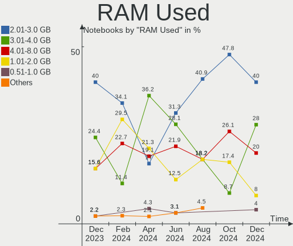
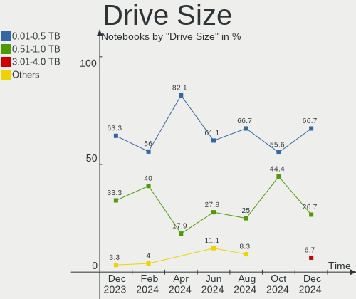
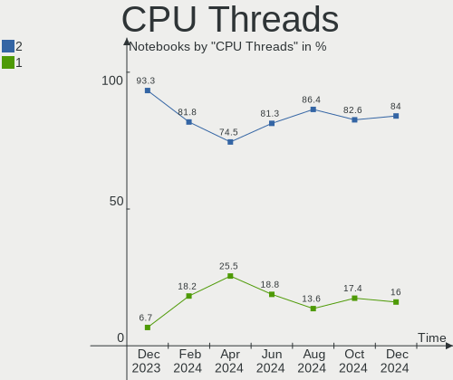
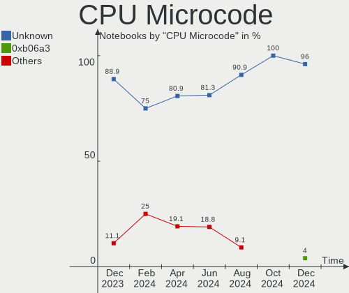
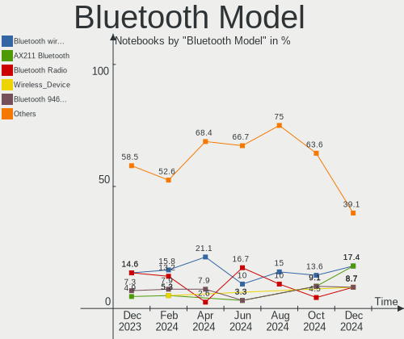
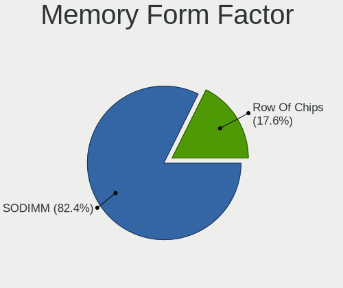
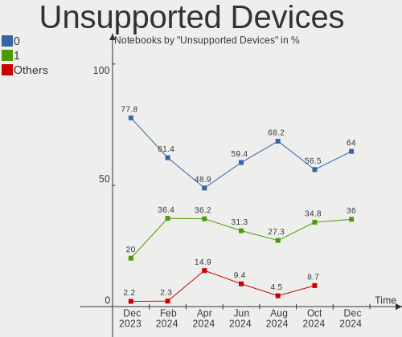

Kali - Hardware Trends (Notebooks)
----------------------------------

A project to identify most popular hardware characteristics and track their change
over time based on data collected by Linux users at https://Linux-Hardware.org.

Anyone can contribute to this report by the [hw-probe](https://github.com/linuxhw/hw-probe) tool:

    sudo -E hw-probe -all -upload

This report is for one last month. Overall report since the beginning of time: [TestCoverage](https://github.com/linuxhw/TestCoverage)

Period: Jun, 2022.

Contents
--------

* [ System ](#system)
  - [ OS                       ](#os)
  - [ OS Family                ](#os-family)
  - [ Kernel                   ](#kernel)
  - [ Kernel Family            ](#kernel-family)
  - [ Kernel Major Ver.        ](#kernel-major-ver)
  - [ Arch                     ](#arch)
  - [ DE                       ](#de)
  - [ Display Server           ](#display-server)
  - [ Display Manager          ](#display-manager)
  - [ OS Lang                  ](#os-lang)
  - [ Boot Mode                ](#boot-mode)
  - [ Filesystem               ](#filesystem)
  - [ Part. scheme             ](#part-scheme)
  - [ Dual Boot with Linux/BSD ](#dual-boot-with-linuxbsd)
  - [ Dual Boot (Win)          ](#dual-boot-win)

* [ Board ](#board)
  - [ Vendor                   ](#vendor)
  - [ Model                    ](#model)
  - [ Model Family             ](#model-family)
  - [ MFG Year                 ](#mfg-year)
  - [ Form Factor              ](#form-factor)
  - [ Secure Boot              ](#secure-boot)
  - [ Coreboot                 ](#coreboot)
  - [ RAM Size                 ](#ram-size)
  - [ RAM Used                 ](#ram-used)
  - [ Total Drives             ](#total-drives)
  - [ Has CD-ROM               ](#has-cd-rom)
  - [ Has Ethernet             ](#has-ethernet)
  - [ Has WiFi                 ](#has-wifi)
  - [ Has Bluetooth            ](#has-bluetooth)

* [ Location ](#location)
  - [ Country                  ](#country)
  - [ City                     ](#city)

* [ Drives ](#drives)
  - [ Drive Vendor             ](#drive-vendor)
  - [ Drive Model              ](#drive-model)
  - [ HDD Vendor               ](#hdd-vendor)
  - [ SSD Vendor               ](#ssd-vendor)
  - [ Drive Kind               ](#drive-kind)
  - [ Drive Connector          ](#drive-connector)
  - [ Drive Size               ](#drive-size)
  - [ Space Total              ](#space-total)
  - [ Space Used               ](#space-used)
  - [ Malfunc. Drives          ](#malfunc-drives)
  - [ Malfunc. Drive Vendor    ](#malfunc-drive-vendor)
  - [ Malfunc. HDD Vendor      ](#malfunc-hdd-vendor)
  - [ Malfunc. Drive Kind      ](#malfunc-drive-kind)
  - [ Failed Drives            ](#failed-drives)
  - [ Failed Drive Vendor      ](#failed-drive-vendor)
  - [ Drive Status             ](#drive-status)

* [ Storage controller ](#storage-controller)
  - [ Storage Vendor           ](#storage-vendor)
  - [ Storage Model            ](#storage-model)
  - [ Storage Kind             ](#storage-kind)

* [ Processor ](#processor)
  - [ CPU Vendor               ](#cpu-vendor)
  - [ CPU Model                ](#cpu-model)
  - [ CPU Model Family         ](#cpu-model-family)
  - [ CPU Cores                ](#cpu-cores)
  - [ CPU Sockets              ](#cpu-sockets)
  - [ CPU Threads              ](#cpu-threads)
  - [ CPU Op-Modes             ](#cpu-op-modes)
  - [ CPU Microcode            ](#cpu-microcode)
  - [ CPU Microarch            ](#cpu-microarch)

* [ Graphics ](#graphics)
  - [ GPU Vendor               ](#gpu-vendor)
  - [ GPU Model                ](#gpu-model)
  - [ GPU Combo                ](#gpu-combo)
  - [ GPU Driver               ](#gpu-driver)
  - [ GPU Memory               ](#gpu-memory)

* [ Monitor ](#monitor)
  - [ Monitor Vendor           ](#monitor-vendor)
  - [ Monitor Model            ](#monitor-model)
  - [ Monitor Resolution       ](#monitor-resolution)
  - [ Monitor Diagonal         ](#monitor-diagonal)
  - [ Monitor Width            ](#monitor-width)
  - [ Aspect Ratio             ](#aspect-ratio)
  - [ Monitor Area             ](#monitor-area)
  - [ Pixel Density            ](#pixel-density)
  - [ Multiple Monitors        ](#multiple-monitors)

* [ Network ](#network)
  - [ Net Controller Vendor    ](#net-controller-vendor)
  - [ Net Controller Model     ](#net-controller-model)
  - [ Wireless Vendor          ](#wireless-vendor)
  - [ Wireless Model           ](#wireless-model)
  - [ Ethernet Vendor          ](#ethernet-vendor)
  - [ Ethernet Model           ](#ethernet-model)
  - [ Net Controller Kind      ](#net-controller-kind)
  - [ Used Controller          ](#used-controller)
  - [ NICs                     ](#nics)
  - [ IPv6                     ](#ipv6)

* [ Bluetooth ](#bluetooth)
  - [ Bluetooth Vendor         ](#bluetooth-vendor)
  - [ Bluetooth Model          ](#bluetooth-model)

* [ Sound ](#sound)
  - [ Sound Vendor             ](#sound-vendor)
  - [ Sound Model              ](#sound-model)

* [ Memory ](#memory)
  - [ Memory Vendor            ](#memory-vendor)
  - [ Memory Model             ](#memory-model)
  - [ Memory Kind              ](#memory-kind)
  - [ Memory Form Factor       ](#memory-form-factor)
  - [ Memory Size              ](#memory-size)
  - [ Memory Speed             ](#memory-speed)

* [ Printers & scanners ](#printers--scanners)
  - [ Printer Vendor           ](#printer-vendor)
  - [ Printer Model            ](#printer-model)
  - [ Scanner Vendor           ](#scanner-vendor)
  - [ Scanner Model            ](#scanner-model)

* [ Camera ](#camera)
  - [ Camera Vendor            ](#camera-vendor)
  - [ Camera Model             ](#camera-model)

* [ Security ](#security)
  - [ Fingerprint Vendor       ](#fingerprint-vendor)
  - [ Fingerprint Model        ](#fingerprint-model)
  - [ Chipcard Vendor          ](#chipcard-vendor)
  - [ Chipcard Model           ](#chipcard-model)

* [ Unsupported ](#unsupported)
  - [ Unsupported Devices      ](#unsupported-devices)
  - [ Unsupported Device Types ](#unsupported-device-types)

System
------

OS
--

Installed operating systems

| Name        | Notebooks | Percent |
|-------------|-----------|---------|
| Kali 2022.2 | 20        | 90.91%  |
| Kali 2022.1 | 2         | 9.09%   |

OS Family
---------

OS without a version

| Name | Notebooks | Percent |
|------|-----------|---------|
| Kali | 22        | 100%    |

Kernel
------

Version of the Linux kernel

| Version            | Notebooks | Percent |
|--------------------|-----------|---------|
| 5.16.0-kali7-amd64 | 11        | 50%     |
| 5.17.0-kali3-amd64 | 8         | 36.36%  |
| 5.18.0-kali2-amd64 | 3         | 13.64%  |

Kernel Family
-------------

Linux kernel without a distro release

| Version | Notebooks | Percent |
|---------|-----------|---------|
| 5.16.0  | 11        | 50%     |
| 5.17.0  | 8         | 36.36%  |
| 5.18.0  | 3         | 13.64%  |

Kernel Major Ver.
-----------------

Linux kernel major version

| Version | Notebooks | Percent |
|---------|-----------|---------|
| 5.16    | 11        | 50%     |
| 5.17    | 8         | 36.36%  |
| 5.18    | 3         | 13.64%  |

Arch
----

OS architecture (x86_64, i586, etc.)

| Name   | Notebooks | Percent |
|--------|-----------|---------|
| x86_64 | 22        | 100%    |

DE
--

Desktop Environment

| Name       | Notebooks | Percent |
|------------|-----------|---------|
| XFCE       | 13        | 59.09%  |
| GNOME      | 5         | 22.73%  |
| X-Cinnamon | 1         | 4.55%   |
| KDE5       | 1         | 4.55%   |
| Cinnamon   | 1         | 4.55%   |
| Budgie     | 1         | 4.55%   |

Display Server
--------------

X11 or Wayland

| Name    | Notebooks | Percent |
|---------|-----------|---------|
| X11     | 20        | 90.91%  |
| Wayland | 2         | 9.09%   |

Display Manager
---------------

SDDM, LightDM, etc.

| Name    | Notebooks | Percent |
|---------|-----------|---------|
| LightDM | 14        | 63.64%  |
| GDM3    | 5         | 22.73%  |
| SDDM    | 2         | 9.09%   |
| Unknown | 1         | 4.55%   |

OS Lang
-------

Language

| Lang  | Notebooks | Percent |
|-------|-----------|---------|
| en_US | 12        | 54.55%  |
| ru_RU | 3         | 13.64%  |
| en_GB | 2         | 9.09%   |
| sv_SE | 1         | 4.55%   |
| pl_PL | 1         | 4.55%   |
| en_IE | 1         | 4.55%   |
| en_CA | 1         | 4.55%   |
| de_DE | 1         | 4.55%   |

Boot Mode
---------

EFI or BIOS

| Mode | Notebooks | Percent |
|------|-----------|---------|
| EFI  | 18        | 81.82%  |
| BIOS | 4         | 18.18%  |

Filesystem
----------

Type of filesystem

| Type    | Notebooks | Percent |
|---------|-----------|---------|
| Ext4    | 21        | 95.45%  |
| Overlay | 1         | 4.55%   |

Part. scheme
------------

Scheme of partitioning

| Type    | Notebooks | Percent |
|---------|-----------|---------|
| GPT     | 15        | 68.18%  |
| MBR     | 5         | 22.73%  |
| Unknown | 2         | 9.09%   |

Dual Boot with Linux/BSD
------------------------

Hosting more than one Linux/BSD

| Dual boot | Notebooks | Percent |
|-----------|-----------|---------|
| No        | 21        | 95.45%  |
| Yes       | 1         | 4.55%   |

Dual Boot (Win)
---------------

Hosting Linux and Windows

| Dual boot | Notebooks | Percent |
|-----------|-----------|---------|
| Yes       | 11        | 50%     |
| No        | 11        | 50%     |

Board
-----

Vendor
------

Motherboard manufacturer

| Name                | Notebooks | Percent |
|---------------------|-----------|---------|
| Lenovo              | 6         | 27.27%  |
| Dell                | 5         | 22.73%  |
| Hewlett-Packard     | 2         | 9.09%   |
| Acer                | 2         | 9.09%   |
| Toshiba             | 1         | 4.55%   |
| Samsung Electronics | 1         | 4.55%   |
| Razer               | 1         | 4.55%   |
| MSI                 | 1         | 4.55%   |
| MicroByte           | 1         | 4.55%   |
| Fujitsu             | 1         | 4.55%   |
| ASUSTek Computer    | 1         | 4.55%   |

Model
-----

Motherboard model

| Name                                       | Notebooks | Percent |
|--------------------------------------------|-----------|---------|
| Toshiba Satellite L775D                    | 1         | 4.55%   |
| Samsung 300V3A/300V4A/300V5A/200A4B/200A5B | 1         | 4.55%   |
| Razer Blade 17 (2022) - RZ09-0423          | 1         | 4.55%   |
| MSI GL63 8RD                               | 1         | 4.55%   |
| MicroByte ezbook                           | 1         | 4.55%   |
| Lenovo Z41-70 80K5                         | 1         | 4.55%   |
| Lenovo ThinkPad T560 20FJS1KE00            | 1         | 4.55%   |
| Lenovo ThinkPad L480 20LTS1NK27            | 1         | 4.55%   |
| Lenovo Legion Y740-17IRHg 81UJ             | 1         | 4.55%   |
| Lenovo Legion Y540-15IRH 81SX              | 1         | 4.55%   |
| Lenovo G500 20236                          | 1         | 4.55%   |
| HP 8460p                                   | 1         | 4.55%   |
| HP 650                                     | 1         | 4.55%   |
| Fujitsu CELSIUS H730                       | 1         | 4.55%   |
| Dell XPS 9320                              | 1         | 4.55%   |
| Dell XPS 15 9520                           | 1         | 4.55%   |
| Dell XPS 15 9510                           | 1         | 4.55%   |
| Dell Vostro 2520                           | 1         | 4.55%   |
| Dell Inspiron 3520                         | 1         | 4.55%   |
| ASUS ASUS TUF Gaming F15 FX507ZM_FX507ZM   | 1         | 4.55%   |
| Acer Nitro AN515-54                        | 1         | 4.55%   |
| Acer Aspire A314-32                        | 1         | 4.55%   |

Model Family
------------

Motherboard model prefix

| Name              | Notebooks | Percent |
|-------------------|-----------|---------|
| Dell XPS          | 3         | 13.64%  |
| Lenovo ThinkPad   | 2         | 9.09%   |
| Lenovo Legion     | 2         | 9.09%   |
| Toshiba Satellite | 1         | 4.55%   |
| Samsung 300V3A    | 1         | 4.55%   |
| Razer Blade       | 1         | 4.55%   |
| MSI GL63          | 1         | 4.55%   |
| MicroByte ezbook  | 1         | 4.55%   |
| Lenovo Z41-70     | 1         | 4.55%   |
| Lenovo G500       | 1         | 4.55%   |
| HP 8460p          | 1         | 4.55%   |
| HP 650            | 1         | 4.55%   |
| Fujitsu CELSIUS   | 1         | 4.55%   |
| Dell Vostro       | 1         | 4.55%   |
| Dell Inspiron     | 1         | 4.55%   |
| ASUS ASUS         | 1         | 4.55%   |
| Acer Nitro        | 1         | 4.55%   |
| Acer Aspire       | 1         | 4.55%   |

MFG Year
--------

Motherboard manufacture year

| Year | Notebooks | Percent |
|------|-----------|---------|
| 2022 | 4         | 18.18%  |
| 2018 | 4         | 18.18%  |
| 2019 | 3         | 13.64%  |
| 2012 | 3         | 13.64%  |
| 2021 | 2         | 9.09%   |
| 2016 | 2         | 9.09%   |
| 2011 | 2         | 9.09%   |
| 2014 | 1         | 4.55%   |
| 2013 | 1         | 4.55%   |

Form Factor
-----------

Physical design of the computer

| Name     | Notebooks | Percent |
|----------|-----------|---------|
| Notebook | 22        | 100%    |

Secure Boot
-----------

Enabled or disabled

| State    | Notebooks | Percent |
|----------|-----------|---------|
| Disabled | 22        | 100%    |

Coreboot
--------

Have coreboot on board

| Used | Notebooks | Percent |
|------|-----------|---------|
| No   | 22        | 100%    |

RAM Size
--------

Total RAM memory

| Size in GB | Notebooks | Percent |
|------------|-----------|---------|
| 32.01-64.0 | 7         | 31.82%  |
| 16.01-24.0 | 6         | 27.27%  |
| 4.01-8.0   | 5         | 22.73%  |
| 8.01-16.0  | 2         | 9.09%   |
| 3.01-4.0   | 1         | 4.55%   |
| 2.01-3.0   | 1         | 4.55%   |

RAM Used
--------

Used RAM memory

| Used GB   | Notebooks | Percent |
|-----------|-----------|---------|
| 2.01-3.0  | 9         | 40.91%  |
| 4.01-8.0  | 4         | 18.18%  |
| 1.01-2.0  | 4         | 18.18%  |
| 3.01-4.0  | 2         | 9.09%   |
| 0.51-1.0  | 2         | 9.09%   |
| 8.01-16.0 | 1         | 4.55%   |

Total Drives
------------

Number of drives on board

| Drives | Notebooks | Percent |
|--------|-----------|---------|
| 1      | 14        | 63.64%  |
| 2      | 6         | 27.27%  |
| 3      | 2         | 9.09%   |

Has CD-ROM
----------

Has CD-ROM on board

| Presented | Notebooks | Percent |
|-----------|-----------|---------|
| No        | 16        | 72.73%  |
| Yes       | 6         | 27.27%  |

Has Ethernet
------------

Has Ethernet on board

| Presented | Notebooks | Percent |
|-----------|-----------|---------|
| Yes       | 21        | 95.45%  |
| No        | 1         | 4.55%   |

Has WiFi
--------

Has WiFi module

| Presented | Notebooks | Percent |
|-----------|-----------|---------|
| Yes       | 22        | 100%    |

Has Bluetooth
-------------

Has Bluetooth module

| Presented | Notebooks | Percent |
|-----------|-----------|---------|
| Yes       | 19        | 86.36%  |
| No        | 3         | 13.64%  |

Location
--------

Country
-------

Geographic location (country)

| Country    | Notebooks | Percent |
|------------|-----------|---------|
| USA        | 5         | 22.73%  |
| Russia     | 3         | 13.64%  |
| UK         | 2         | 9.09%   |
| Poland     | 2         | 9.09%   |
| Sweden     | 1         | 4.55%   |
| Spain      | 1         | 4.55%   |
| Serbia     | 1         | 4.55%   |
| Iran       | 1         | 4.55%   |
| Indonesia  | 1         | 4.55%   |
| Germany    | 1         | 4.55%   |
| France     | 1         | 4.55%   |
| Costa Rica | 1         | 4.55%   |
| Canada     | 1         | 4.55%   |
| Bulgaria   | 1         | 4.55%   |

City
----

Geographic location (city)

| City            | Notebooks | Percent |
|-----------------|-----------|---------|
| Zaragoza        | 1         | 4.55%   |
| Warsaw          | 1         | 4.55%   |
| Tres Rios       | 1         | 4.55%   |
| Sussex          | 1         | 4.55%   |
| Stockholm       | 1         | 4.55%   |
| Shiraz          | 1         | 4.55%   |
| Salzgitter      | 1         | 4.55%   |
| Phenix City     | 1         | 4.55%   |
| Peronne         | 1         | 4.55%   |
| Novosibirsk     | 1         | 4.55%   |
| Novi Sad        | 1         | 4.55%   |
| Maricopa        | 1         | 4.55%   |
| Krasnoyarsk     | 1         | 4.55%   |
| Jakarta         | 1         | 4.55%   |
| Harrow          | 1         | 4.55%   |
| Hamilton        | 1         | 4.55%   |
| Edmonton        | 1         | 4.55%   |
| Crosby          | 1         | 4.55%   |
| Burgas          | 1         | 4.55%   |
| Bojszowy        | 1         | 4.55%   |
| Blagoveshchensk | 1         | 4.55%   |
| Alpharetta      | 1         | 4.55%   |

Drives
------

Drive Vendor
------------

Hard drive vendors

| Vendor                         | Notebooks | Drives | Percent |
|--------------------------------|-----------|--------|---------|
| Samsung Electronics            | 7         | 8      | 25%     |
| WDC                            | 3         | 3      | 10.71%  |
| Kingston                       | 2         | 2      | 7.14%   |
| Intel                          | 2         | 2      | 7.14%   |
| Crucial                        | 2         | 2      | 7.14%   |
| Toshiba                        | 1         | 1      | 3.57%   |
| Solid State Storage Technology | 1         | 1      | 3.57%   |
| Seagate                        | 1         | 1      | 3.57%   |
| SanDisk                        | 1         | 1      | 3.57%   |
| PNY                            | 1         | 1      | 3.57%   |
| Patriot                        | 1         | 1      | 3.57%   |
| Micron Technology              | 1         | 1      | 3.57%   |
| Hitachi                        | 1         | 1      | 3.57%   |
| Hewlett-Packard                | 1         | 1      | 3.57%   |
| Foxline                        | 1         | 1      | 3.57%   |
| Corsair                        | 1         | 1      | 3.57%   |
| China                          | 1         | 1      | 3.57%   |

Drive Model
-----------

Hard drive models

| Model                                  | Notebooks | Percent |
|----------------------------------------|-----------|---------|
| WDC WD10SPZX-24Z10 1TB                 | 1         | 3.45%   |
| WDC WD10JPCX-24UE4T0 1TB               | 1         | 3.45%   |
| WDC PC SN520 SDAPNUW-512G-1014 512GB   | 1         | 3.45%   |
| Toshiba MK1665GSX H 160GB              | 1         | 3.45%   |
| Solid State Storage NVMe SSD Drive 1TB | 1         | 3.45%   |
| Seagate Expansion+ Desk 4TB            | 1         | 3.45%   |
| SanDisk SD9SN8W256G 256GB SSD          | 1         | 3.45%   |
| Samsung SSD 980 PRO 1TB                | 1         | 3.45%   |
| Samsung SSD 850 EVO 250GB              | 1         | 3.45%   |
| Samsung PM9A1 NVMe 512GB               | 1         | 3.45%   |
| Samsung PM9A1 NVMe 1024GB              | 1         | 3.45%   |
| Samsung MZVLQ1T0HBLB-00B00 1TB         | 1         | 3.45%   |
| Samsung MZVLB1T0HALR-000L2 1TB         | 1         | 3.45%   |
| Samsung MZ7TE256HMHP-00004 256GB SSD   | 1         | 3.45%   |
| Samsung MZ7LN512HMJP-000L7 512GB SSD   | 1         | 3.45%   |
| PNY CS900 120GB SSD                    | 1         | 3.45%   |
| Patriot P200 2TB SSD                   | 1         | 3.45%   |
| Micron 3400 NVMe 1024GB                | 1         | 3.45%   |
| Kingston SA400S37480G 480GB SSD        | 1         | 3.45%   |
| Kingston RBUSNS8180DS3128GJ 128GB SSD  | 1         | 3.45%   |
| Intel SSDSC2BW240A4 240GB              | 1         | 3.45%   |
| Intel H10 HBRPEKNX0202A NVMe 512GB     | 1         | 3.45%   |
| Hitachi HTS547575A9E384 752GB          | 1         | 3.45%   |
| HP SSD S650 120GB                      | 1         | 3.45%   |
| Foxline FLSSD128X5SE 128GB             | 1         | 3.45%   |
| Crucial CT240BX500SSD1 240GB           | 1         | 3.45%   |
| Crucial CT1000P1SSD8 1TB               | 1         | 3.45%   |
| Corsair Force MP600 1TB                | 1         | 3.45%   |
| China SSD 256GB                        | 1         | 3.45%   |

HDD Vendor
----------

Hard disk drive vendors

| Vendor  | Notebooks | Drives | Percent |
|---------|-----------|--------|---------|
| WDC     | 2         | 2      | 40%     |
| Toshiba | 1         | 1      | 20%     |
| Seagate | 1         | 1      | 20%     |
| Hitachi | 1         | 1      | 20%     |

SSD Vendor
----------

Solid state drive vendors

| Vendor              | Notebooks | Drives | Percent |
|---------------------|-----------|--------|---------|
| Samsung Electronics | 3         | 3      | 23.08%  |
| Kingston            | 2         | 2      | 15.38%  |
| SanDisk             | 1         | 1      | 7.69%   |
| PNY                 | 1         | 1      | 7.69%   |
| Patriot             | 1         | 1      | 7.69%   |
| Intel               | 1         | 1      | 7.69%   |
| Hewlett-Packard     | 1         | 1      | 7.69%   |
| Foxline             | 1         | 1      | 7.69%   |
| Crucial             | 1         | 1      | 7.69%   |
| China               | 1         | 1      | 7.69%   |

Drive Kind
----------

HDD or SSD

| Kind | Notebooks | Drives | Percent |
|------|-----------|--------|---------|
| SSD  | 11        | 13     | 45.83%  |
| NVMe | 8         | 11     | 33.33%  |
| HDD  | 5         | 5      | 20.83%  |

Drive Connector
---------------

SATA, SAS, NVMe, etc.

| Type | Notebooks | Drives | Percent |
|------|-----------|--------|---------|
| SATA | 15        | 17     | 62.5%   |
| NVMe | 8         | 11     | 33.33%  |
| SAS  | 1         | 1      | 4.17%   |

Drive Size
----------

Size of hard drive

| Size in TB | Notebooks | Drives | Percent |
|------------|-----------|--------|---------|
| 0.01-0.5   | 10        | 12     | 62.5%   |
| 0.51-1.0   | 4         | 4      | 25%     |
| 3.01-4.0   | 1         | 1      | 6.25%   |
| 1.01-2.0   | 1         | 1      | 6.25%   |

Space Total
-----------

Amount of disk space available on the file system

| Size in GB     | Notebooks | Percent |
|----------------|-----------|---------|
| 101-250        | 9         | 40.91%  |
| 251-500        | 3         | 13.64%  |
| 21-50          | 2         | 9.09%   |
| 1001-2000      | 2         | 9.09%   |
| 501-1000       | 2         | 9.09%   |
| More than 3000 | 1         | 4.55%   |
| 2001-3000      | 1         | 4.55%   |
| 1-20           | 1         | 4.55%   |
| 51-100         | 1         | 4.55%   |

Space Used
----------

Amount of used disk space

| Used GB   | Notebooks | Percent |
|-----------|-----------|---------|
| 21-50     | 7         | 31.82%  |
| 1-20      | 6         | 27.27%  |
| 101-250   | 3         | 13.64%  |
| 51-100    | 3         | 13.64%  |
| 251-500   | 1         | 4.55%   |
| 2001-3000 | 1         | 4.55%   |
| 501-1000  | 1         | 4.55%   |

Malfunc. Drives
---------------

Drive models with a malfunction

| Model                         | Notebooks | Drives | Percent |
|-------------------------------|-----------|--------|---------|
| Toshiba MK1665GSX H 160GB     | 1         | 1      | 33.33%  |
| Patriot P200 2TB SSD          | 1         | 1      | 33.33%  |
| Hitachi HTS547575A9E384 752GB | 1         | 1      | 33.33%  |

Malfunc. Drive Vendor
---------------------

Vendors of faulty drives

| Vendor  | Notebooks | Drives | Percent |
|---------|-----------|--------|---------|
| Toshiba | 1         | 1      | 33.33%  |
| Patriot | 1         | 1      | 33.33%  |
| Hitachi | 1         | 1      | 33.33%  |

Malfunc. HDD Vendor
-------------------

Vendors of faulty HDD drives

| Vendor  | Notebooks | Drives | Percent |
|---------|-----------|--------|---------|
| Toshiba | 1         | 1      | 50%     |
| Hitachi | 1         | 1      | 50%     |

Malfunc. Drive Kind
-------------------

Kinds of faulty drives

| Kind | Notebooks | Drives | Percent |
|------|-----------|--------|---------|
| HDD  | 2         | 2      | 66.67%  |
| SSD  | 1         | 1      | 33.33%  |

Failed Drives
-------------

Failed drive models

Zero info for selected period =(

Failed Drive Vendor
-------------------

Failed drive vendors

Zero info for selected period =(

Drive Status
------------

Number of failed and malfunc. drives

| Status   | Notebooks | Drives | Percent |
|----------|-----------|--------|---------|
| Works    | 17        | 21     | 73.91%  |
| Detected | 3         | 5      | 13.04%  |
| Malfunc  | 3         | 3      | 13.04%  |

Storage controller
------------------

Storage Vendor
--------------

Storage controller vendors

| Vendor                         | Notebooks | Percent |
|--------------------------------|-----------|---------|
| Intel                          | 18        | 64.29%  |
| Samsung Electronics            | 4         | 14.29%  |
| Solid State Storage Technology | 1         | 3.57%   |
| SanDisk                        | 1         | 3.57%   |
| Phison Electronics             | 1         | 3.57%   |
| Micron/Crucial Technology      | 1         | 3.57%   |
| Micron Technology              | 1         | 3.57%   |
| AMD                            | 1         | 3.57%   |

Storage Model
-------------

Storage controller models

| Model                                                                          | Notebooks | Percent |
|--------------------------------------------------------------------------------|-----------|---------|
| Intel Cannon Lake Mobile PCH SATA AHCI Controller                              | 4         | 13.79%  |
| Intel 7 Series Chipset Family 6-port SATA Controller [AHCI mode]               | 4         | 13.79%  |
| Samsung NVMe SSD Controller PM9A1/PM9A3/980PRO                                 | 2         | 6.9%    |
| Intel Sunrise Point-LP SATA Controller [AHCI mode]                             | 2         | 6.9%    |
| Intel 6 Series/C200 Series Chipset Family 6 port Mobile SATA AHCI Controller   | 2         | 6.9%    |
| Solid State Storage Non-Volatile memory controller                             | 1         | 3.45%   |
| SanDisk WD Blue SN500 / PC SN520 NVMe SSD                                      | 1         | 3.45%   |
| Samsung NVMe SSD Controller SM981/PM981/PM983                                  | 1         | 3.45%   |
| Samsung NVMe SSD Controller 980                                                | 1         | 3.45%   |
| Phison E16 PCIe4 NVMe Controller                                               | 1         | 3.45%   |
| Micron/Crucial NVMe Controller                                                 | 1         | 3.45%   |
| Micron Non-Volatile memory controller                                          | 1         | 3.45%   |
| Intel Wildcat Point-LP SATA Controller [AHCI Mode]                             | 1         | 3.45%   |
| Intel Volume Management Device NVMe RAID Controller                            | 1         | 3.45%   |
| Intel Non-Volatile memory controller                                           | 1         | 3.45%   |
| Intel Celeron/Pentium Silver Processor SATA Controller                         | 1         | 3.45%   |
| Intel Celeron N3350/Pentium N4200/Atom E3900 Series SATA AHCI Controller       | 1         | 3.45%   |
| Intel 8 Series/C220 Series Chipset Family 6-port SATA Controller 1 [AHCI mode] | 1         | 3.45%   |
| AMD FCH SATA Controller [IDE mode]                                             | 1         | 3.45%   |
| AMD FCH IDE Controller                                                         | 1         | 3.45%   |

Storage Kind
------------

Kind of storage controller (IDE, SATA, NVMe, SAS, ...)

| Kind | Notebooks | Percent |
|------|-----------|---------|
| SATA | 17        | 62.96%  |
| NVMe | 8         | 29.63%  |
| RAID | 1         | 3.7%    |
| IDE  | 1         | 3.7%    |

Processor
---------

CPU Vendor
----------

Processor vendors

| Vendor | Notebooks | Percent |
|--------|-----------|---------|
| Intel  | 21        | 95.45%  |
| AMD    | 1         | 4.55%   |

CPU Model
---------

Processor models

| Model                                    | Notebooks | Percent |
|------------------------------------------|-----------|---------|
| Intel Core i7-9750H CPU @ 2.60GHz        | 3         | 13.64%  |
| Intel Core i3-2328M CPU @ 2.20GHz        | 2         | 9.09%   |
| Intel Core i7-8750H CPU @ 2.20GHz        | 1         | 4.55%   |
| Intel Core i7-6600U CPU @ 2.60GHz        | 1         | 4.55%   |
| Intel Core i7-4800MQ CPU @ 2.70GHz       | 1         | 4.55%   |
| Intel Core i5-8350U CPU @ 1.70GHz        | 1         | 4.55%   |
| Intel Core i5-5200U CPU @ 2.20GHz        | 1         | 4.55%   |
| Intel Core i5-3210M CPU @ 2.50GHz        | 1         | 4.55%   |
| Intel Core i5-2520M CPU @ 2.50GHz        | 1         | 4.55%   |
| Intel Core i3-3110M CPU @ 2.40GHz        | 1         | 4.55%   |
| Intel Core i3-2350M CPU @ 2.30GHz        | 1         | 4.55%   |
| Intel Celeron N4020 CPU @ 1.10GHz        | 1         | 4.55%   |
| Intel Celeron CPU N3450 @ 1.10GHz        | 1         | 4.55%   |
| Intel 12th Gen Core i7-12800H            | 1         | 4.55%   |
| Intel 12th Gen Core i7-12700H            | 1         | 4.55%   |
| Intel 12th Gen Core i7-1260P             | 1         | 4.55%   |
| Intel 12th Gen Core i5-12500H            | 1         | 4.55%   |
| Intel 11th Gen Core i9-11900H @ 2.50GHz  | 1         | 4.55%   |
| AMD A6-3400M APU with Radeon HD Graphics | 1         | 4.55%   |

CPU Model Family
----------------

Processor model prefix

| Model         | Notebooks | Percent |
|---------------|-----------|---------|
| Intel Core i7 | 6         | 27.27%  |
| Other         | 5         | 22.73%  |
| Intel Core i5 | 4         | 18.18%  |
| Intel Core i3 | 4         | 18.18%  |
| Intel Celeron | 2         | 9.09%   |
| AMD A6        | 1         | 4.55%   |

CPU Cores
---------

Number of processor cores

| Number | Notebooks | Percent |
|--------|-----------|---------|
| 2      | 8         | 36.36%  |
| 6      | 4         | 18.18%  |
| 4      | 4         | 18.18%  |
| 14     | 2         | 9.09%   |
| 12     | 2         | 9.09%   |
| 8      | 1         | 4.55%   |
| 1      | 1         | 4.55%   |

CPU Sockets
-----------

Number of sockets

| Number | Notebooks | Percent |
|--------|-----------|---------|
| 1      | 22        | 100%    |

CPU Threads
-----------

Threads per core (Hyper-Threading)

| Number | Notebooks | Percent |
|--------|-----------|---------|
| 2      | 19        | 86.36%  |
| 1      | 3         | 13.64%  |

CPU Op-Modes
------------

CPU Operation Modes (32-bit, 64-bit)

| Op mode        | Notebooks | Percent |
|----------------|-----------|---------|
| 32-bit, 64-bit | 22        | 100%    |

CPU Microcode
-------------

Microcode number

| Number     | Notebooks | Percent |
|------------|-----------|---------|
| 0x906ea    | 4         | 18.18%  |
| 0x906a3    | 4         | 18.18%  |
| 0x206a7    | 3         | 13.64%  |
| 0x306a9    | 2         | 9.09%   |
| 0x806ea    | 1         | 4.55%   |
| 0x806d1    | 1         | 4.55%   |
| 0x706a8    | 1         | 4.55%   |
| 0x506c9    | 1         | 4.55%   |
| 0x406e3    | 1         | 4.55%   |
| 0x306d4    | 1         | 4.55%   |
| 0x306c3    | 1         | 4.55%   |
| 0x03000027 | 1         | 4.55%   |
| Unknown    | 1         | 4.55%   |

CPU Microarch
-------------

Microarchitecture

| Name             | Notebooks | Percent |
|------------------|-----------|---------|
| KabyLake         | 5         | 22.73%  |
| SandyBridge      | 4         | 18.18%  |
| Alderlake Hybrid | 4         | 18.18%  |
| IvyBridge        | 2         | 9.09%   |
| Skylake          | 1         | 4.55%   |
| K10 Llano        | 1         | 4.55%   |
| Icelake          | 1         | 4.55%   |
| Haswell          | 1         | 4.55%   |
| Goldmont plus    | 1         | 4.55%   |
| Goldmont         | 1         | 4.55%   |
| Broadwell        | 1         | 4.55%   |

Graphics
--------

GPU Vendor
----------

Vendors of graphics cards

| Vendor | Notebooks | Percent |
|--------|-----------|---------|
| Intel  | 20        | 64.52%  |
| Nvidia | 8         | 25.81%  |
| AMD    | 3         | 9.68%   |

GPU Model
---------

Graphics card models

| Model                                                                                 | Notebooks | Percent |
|---------------------------------------------------------------------------------------|-----------|---------|
| Intel Alder Lake-P Integrated Graphics Controller                                     | 4         | 12.9%   |
| Intel 2nd Generation Core Processor Family Integrated Graphics Controller             | 4         | 12.9%   |
| Intel CoffeeLake-H GT2 [UHD Graphics 630]                                             | 3         | 9.68%   |
| Intel 3rd Gen Core processor Graphics Controller                                      | 2         | 6.45%   |
| Nvidia TU117M [GeForce GTX 1650 Mobile / Max-Q]                                       | 1         | 3.23%   |
| Nvidia TU116M [GeForce GTX 1660 Ti Mobile]                                            | 1         | 3.23%   |
| Nvidia TU106BM [GeForce RTX 2060 Mobile]                                              | 1         | 3.23%   |
| Nvidia GK106GLM [Quadro K2100M]                                                       | 1         | 3.23%   |
| Nvidia GF119M [GeForce GT 520MX]                                                      | 1         | 3.23%   |
| Nvidia GA107M [GeForce RTX 3050 Ti Mobile]                                            | 1         | 3.23%   |
| Nvidia GA106M [GeForce RTX 3060 Mobile / Max-Q]                                       | 1         | 3.23%   |
| Nvidia GA103M [GeForce RTX 3080 Ti Laptop GPU]                                        | 1         | 3.23%   |
| Intel UHD Graphics 620                                                                | 1         | 3.23%   |
| Intel TigerLake-H GT1 [UHD Graphics]                                                  | 1         | 3.23%   |
| Intel Skylake GT2 [HD Graphics 520]                                                   | 1         | 3.23%   |
| Intel HD Graphics 5500                                                                | 1         | 3.23%   |
| Intel HD Graphics 500                                                                 | 1         | 3.23%   |
| Intel GeminiLake [UHD Graphics 600]                                                   | 1         | 3.23%   |
| Intel 4th Gen Core Processor Integrated Graphics Controller                           | 1         | 3.23%   |
| AMD Topaz XT [Radeon R7 M260/M265 / M340/M360 / M440/M445 / 530/535 / 620/625 Mobile] | 1         | 3.23%   |
| AMD Sun PRO [Radeon HD 8570A/8570M]                                                   | 1         | 3.23%   |
| AMD Sumo [Radeon HD 6520G]                                                            | 1         | 3.23%   |

GPU Combo
---------

Combinations of graphics cards

| Name           | Notebooks | Percent |
|----------------|-----------|---------|
| 1 x Intel      | 11        | 50%     |
| Intel + Nvidia | 7         | 31.82%  |
| Intel + AMD    | 2         | 9.09%   |
| 1 x Nvidia     | 1         | 4.55%   |
| 1 x AMD        | 1         | 4.55%   |

GPU Driver
----------

Free vs proprietary

| Driver      | Notebooks | Percent |
|-------------|-----------|---------|
| Free        | 20        | 90.91%  |
| Proprietary | 1         | 4.55%   |
| Unknown     | 1         | 4.55%   |

GPU Memory
----------

Total video memory

| Size in GB | Notebooks | Percent |
|------------|-----------|---------|
| Unknown    | 15        | 68.18%  |
| 1.01-2.0   | 3         | 13.64%  |
| 5.01-6.0   | 1         | 4.55%   |
| 3.01-4.0   | 1         | 4.55%   |
| 0.51-1.0   | 1         | 4.55%   |
| 0.01-0.5   | 1         | 4.55%   |

Monitor
-------

Monitor Vendor
--------------

Monitor vendors

| Vendor                  | Notebooks | Percent |
|-------------------------|-----------|---------|
| LG Display              | 5         | 17.24%  |
| Chimei Innolux          | 4         | 13.79%  |
| Samsung Electronics     | 3         | 10.34%  |
| BOE                     | 3         | 10.34%  |
| AU Optronics            | 3         | 10.34%  |
| Sharp                   | 2         | 6.9%    |
| AOC                     | 2         | 6.9%    |
| OEM                     | 1         | 3.45%   |
| MStar                   | 1         | 3.45%   |
| Goldstar                | 1         | 3.45%   |
| Gateway                 | 1         | 3.45%   |
| Dell                    | 1         | 3.45%   |
| CS_                     | 1         | 3.45%   |
| Chi Mei Optoelectronics | 1         | 3.45%   |

Monitor Model
-------------

Monitor models

| Model                                                                    | Notebooks | Percent |
|--------------------------------------------------------------------------|-----------|---------|
| Sharp LCD Monitor SHP1548 1920x1200 288x180mm 13.4-inch                  | 1         | 3.45%   |
| Sharp LCD Monitor SHP1515 1920x1200 336x210mm 15.6-inch                  | 1         | 3.45%   |
| Samsung Electronics LCD Monitor SEC544B 1600x900 310x174mm 14.0-inch     | 1         | 3.45%   |
| Samsung Electronics LCD Monitor SEC324A 1366x768 344x194mm 15.5-inch     | 1         | 3.45%   |
| Samsung Electronics C27F390 SAM0D32 1920x1080 598x336mm 27.0-inch        | 1         | 3.45%   |
| OEM 32W_LCD_TV OEM3700 1920x540                                          | 1         | 3.45%   |
| MStar PROJECTORS MST0B01 1920x540 708x398mm 32.0-inch                    | 1         | 3.45%   |
| LG Display LCD Monitor LGD06B3 1920x1200 336x210mm 15.6-inch             | 1         | 3.45%   |
| LG Display LCD Monitor LGD05E0 1920x1080 382x215mm 17.3-inch             | 1         | 3.45%   |
| LG Display LCD Monitor LGD0563 1920x1080 344x194mm 15.5-inch             | 1         | 3.45%   |
| LG Display LCD Monitor LGD0533 1920x1080 344x194mm 15.5-inch             | 1         | 3.45%   |
| LG Display LCD Monitor LGD040F 1920x1080 345x194mm 15.6-inch             | 1         | 3.45%   |
| Goldstar IPS FULLHD GSM5AB8 1920x1080 480x270mm 21.7-inch                | 1         | 3.45%   |
| Gateway FHD2400 GWY096C 1920x1200 518x291mm 23.4-inch                    | 1         | 3.45%   |
| Dell U3419W DELA12E 3440x1440 800x335mm 34.1-inch                        | 1         | 3.45%   |
| CS_ LCD Monitor CS_5211 1920x1080 519x324mm 24.1-inch                    | 1         | 3.45%   |
| Chimei Innolux LCD Monitor CMN15E8 1920x1080 340x190mm 15.3-inch         | 1         | 3.45%   |
| Chimei Innolux LCD Monitor CMN15A9 1366x768 344x194mm 15.5-inch          | 1         | 3.45%   |
| Chimei Innolux LCD Monitor CMN14C9 1920x1080 309x173mm 13.9-inch         | 1         | 3.45%   |
| Chimei Innolux LCD Monitor CMN14A7 1920x1080 308x173mm 13.9-inch         | 1         | 3.45%   |
| Chi Mei Optoelectronics LCD Monitor CMO15A7 1366x768 344x193mm 15.5-inch | 1         | 3.45%   |
| BOE LCD Monitor BOE09F9 2560x1440 381x214mm 17.2-inch                    | 1         | 3.45%   |
| BOE LCD Monitor BOE0630 1920x1080 344x194mm 15.5-inch                    | 1         | 3.45%   |
| BOE LCD Monitor BOE05B3 1366x768 344x193mm 15.5-inch                     | 1         | 3.45%   |
| AU Optronics LCD Monitor AUO23EC 1366x768 344x193mm 15.5-inch            | 1         | 3.45%   |
| AU Optronics LCD Monitor AUO223E 1600x900 309x174mm 14.0-inch            | 1         | 3.45%   |
| AU Optronics LCD Monitor AUO1B3D 1920x1080 309x173mm 13.9-inch           | 1         | 3.45%   |
| AOC U34G2G4R3 AOC3402 3440x1440 797x334mm 34.0-inch                      | 1         | 3.45%   |
| AOC 716Sw AOC1716 1280x720 340x270mm 17.1-inch                           | 1         | 3.45%   |

Monitor Resolution
------------------

Monitor screen resolution

| Resolution        | Notebooks | Percent |
|-------------------|-----------|---------|
| 1920x1080 (FHD)   | 12        | 42.86%  |
| 1366x768 (WXGA)   | 5         | 17.86%  |
| 1920x1200 (WUXGA) | 4         | 14.29%  |
| 1920x540          | 2         | 7.14%   |
| 1600x900 (HD+)    | 2         | 7.14%   |
| 3440x1440         | 1         | 3.57%   |
| 2560x1440 (QHD)   | 1         | 3.57%   |
| 1440x900 (WXGA+)  | 1         | 3.57%   |

Monitor Diagonal
----------------

Diagonal size in inches

| Inches | Notebooks | Percent |
|--------|-----------|---------|
| 15     | 12        | 42.86%  |
| 13     | 4         | 14.29%  |
| 17     | 3         | 10.71%  |
| 24     | 2         | 7.14%   |
| 34     | 1         | 3.57%   |
| 32     | 1         | 3.57%   |
| 27     | 1         | 3.57%   |
| 23     | 1         | 3.57%   |
| 21     | 1         | 3.57%   |
| 18     | 1         | 3.57%   |
| 14     | 1         | 3.57%   |

Monitor Width
-------------

Physical width

| Width in mm | Notebooks | Percent |
|-------------|-----------|---------|
| 301-350     | 16        | 57.14%  |
| 501-600     | 4         | 14.29%  |
| 351-400     | 3         | 10.71%  |
| 701-800     | 2         | 7.14%   |
| 401-500     | 2         | 7.14%   |
| 201-300     | 1         | 3.57%   |

Aspect Ratio
------------

Proportional relationship between the width and the height

| Ratio | Notebooks | Percent |
|-------|-----------|---------|
| 16/9  | 18        | 75%     |
| 16/10 | 5         | 20.83%  |
| 21/9  | 1         | 4.17%   |

Monitor Area
------------

Area in inch²

| Area in inch² | Notebooks | Percent |
|----------------|-----------|---------|
| 101-110        | 11        | 39.29%  |
| 81-90          | 4         | 14.29%  |
| 201-250        | 3         | 10.71%  |
| 121-130        | 3         | 10.71%  |
| 351-500        | 2         | 7.14%   |
| 71-80          | 1         | 3.57%   |
| 301-350        | 1         | 3.57%   |
| 251-300        | 1         | 3.57%   |
| 151-200        | 1         | 3.57%   |
| 111-120        | 1         | 3.57%   |

Pixel Density
-------------

Pixels per inch

| Density | Notebooks | Percent |
|---------|-----------|---------|
| 121-160 | 12        | 42.86%  |
| 101-120 | 7         | 25%     |
| 51-100  | 7         | 25%     |
| 161-240 | 2         | 7.14%   |

Multiple Monitors
-----------------

Total monitors connected

| Total | Notebooks | Percent |
|-------|-----------|---------|
| 1     | 14        | 63.64%  |
| 2     | 6         | 27.27%  |
| 4     | 1         | 4.55%   |
| 0     | 1         | 4.55%   |

Network
-------

Net Controller Vendor
---------------------

Controller vendors

| Vendor                | Notebooks | Percent |
|-----------------------|-----------|---------|
| Realtek Semiconductor | 17        | 41.46%  |
| Intel                 | 14        | 34.15%  |
| Qualcomm Atheros      | 5         | 12.2%   |
| Xiaomi                | 1         | 2.44%   |
| TP-Link               | 1         | 2.44%   |
| Ralink Technology     | 1         | 2.44%   |
| D-Link System         | 1         | 2.44%   |
| Broadcom              | 1         | 2.44%   |

Net Controller Model
--------------------

Controller models

| Model                                                                | Notebooks | Percent |
|----------------------------------------------------------------------|-----------|---------|
| Realtek RTL8111/8168/8411 PCI Express Gigabit Ethernet Controller    | 8         | 15.38%  |
| Realtek RTL8153 Gigabit Ethernet Adapter                             | 4         | 7.69%   |
| Intel Cannon Lake PCH CNVi WiFi                                      | 4         | 7.69%   |
| Intel Alder Lake-P PCH CNVi WiFi                                     | 4         | 7.69%   |
| Qualcomm Atheros AR9485 Wireless Network Adapter                     | 3         | 5.77%   |
| Realtek RTL8814AU 802.11a/b/g/n/ac Wireless Adapter                  | 2         | 3.85%   |
| Realtek RTL810xE PCI Express Fast Ethernet controller                | 2         | 3.85%   |
| Xiaomi Mi/Redmi series (RNDIS)                                       | 1         | 1.92%   |
| TP-Link 802.11n NIC                                                  | 1         | 1.92%   |
| Realtek RTL8821CE 802.11ac PCIe Wireless Network Adapter             | 1         | 1.92%   |
| Realtek RTL8812AU 802.11a/b/g/n/ac 2T2R DB WLAN Adapter              | 1         | 1.92%   |
| Realtek RTL8188SU 802.11n WLAN Adapter                               | 1         | 1.92%   |
| Realtek RTL8188EUS 802.11n Wireless Network Adapter                  | 1         | 1.92%   |
| Realtek RTL8188CE 802.11b/g/n WiFi Adapter                           | 1         | 1.92%   |
| Realtek RTL8125 2.5GbE Controller                                    | 1         | 1.92%   |
| Ralink RT2870/RT3070 Wireless Adapter                                | 1         | 1.92%   |
| Qualcomm Atheros QCA9377 802.11ac Wireless Network Adapter           | 1         | 1.92%   |
| Qualcomm Atheros QCA8172 Fast Ethernet                               | 1         | 1.92%   |
| Qualcomm Atheros QCA8171 Gigabit Ethernet                            | 1         | 1.92%   |
| Intel Wireless 8265 / 8275                                           | 1         | 1.92%   |
| Intel Wireless 8260                                                  | 1         | 1.92%   |
| Intel Wireless 7260                                                  | 1         | 1.92%   |
| Intel Tiger Lake PCH CNVi WiFi                                       | 1         | 1.92%   |
| Intel Ethernet Connection I219-LM                                    | 1         | 1.92%   |
| Intel Ethernet Connection I217-LM                                    | 1         | 1.92%   |
| Intel Ethernet Connection (4) I219-LM                                | 1         | 1.92%   |
| Intel Ethernet Connection (16) I219-LM                               | 1         | 1.92%   |
| Intel Centrino Wireless-N 130                                        | 1         | 1.92%   |
| Intel Centrino Advanced-N 6205 [Taylor Peak]                         | 1         | 1.92%   |
| Intel 82579LM Gigabit Network Connection (Lewisville)                | 1         | 1.92%   |
| D-Link System DWA-140 RangeBooster N Adapter(rev.B2) [Ralink RT3072] | 1         | 1.92%   |
| Broadcom BCM43162 802.11ac Wireless Network Adapter                  | 1         | 1.92%   |

Wireless Vendor
---------------

Wireless vendors

| Vendor                | Notebooks | Percent |
|-----------------------|-----------|---------|
| Intel                 | 14        | 50%     |
| Realtek Semiconductor | 6         | 21.43%  |
| Qualcomm Atheros      | 4         | 14.29%  |
| TP-Link               | 1         | 3.57%   |
| Ralink Technology     | 1         | 3.57%   |
| D-Link System         | 1         | 3.57%   |
| Broadcom              | 1         | 3.57%   |

Wireless Model
--------------

Wireless models

| Model                                                                | Notebooks | Percent |
|----------------------------------------------------------------------|-----------|---------|
| Intel Cannon Lake PCH CNVi WiFi                                      | 4         | 13.79%  |
| Intel Alder Lake-P PCH CNVi WiFi                                     | 4         | 13.79%  |
| Qualcomm Atheros AR9485 Wireless Network Adapter                     | 3         | 10.34%  |
| Realtek RTL8814AU 802.11a/b/g/n/ac Wireless Adapter                  | 2         | 6.9%    |
| TP-Link 802.11n NIC                                                  | 1         | 3.45%   |
| Realtek RTL8821CE 802.11ac PCIe Wireless Network Adapter             | 1         | 3.45%   |
| Realtek RTL8812AU 802.11a/b/g/n/ac 2T2R DB WLAN Adapter              | 1         | 3.45%   |
| Realtek RTL8188SU 802.11n WLAN Adapter                               | 1         | 3.45%   |
| Realtek RTL8188EUS 802.11n Wireless Network Adapter                  | 1         | 3.45%   |
| Realtek RTL8188CE 802.11b/g/n WiFi Adapter                           | 1         | 3.45%   |
| Ralink RT2870/RT3070 Wireless Adapter                                | 1         | 3.45%   |
| Qualcomm Atheros QCA9377 802.11ac Wireless Network Adapter           | 1         | 3.45%   |
| Intel Wireless 8265 / 8275                                           | 1         | 3.45%   |
| Intel Wireless 8260                                                  | 1         | 3.45%   |
| Intel Wireless 7260                                                  | 1         | 3.45%   |
| Intel Tiger Lake PCH CNVi WiFi                                       | 1         | 3.45%   |
| Intel Centrino Wireless-N 130                                        | 1         | 3.45%   |
| Intel Centrino Advanced-N 6205 [Taylor Peak]                         | 1         | 3.45%   |
| D-Link System DWA-140 RangeBooster N Adapter(rev.B2) [Ralink RT3072] | 1         | 3.45%   |
| Broadcom BCM43162 802.11ac Wireless Network Adapter                  | 1         | 3.45%   |

Ethernet Vendor
---------------

Ethernet vendors

| Vendor                | Notebooks | Percent |
|-----------------------|-----------|---------|
| Realtek Semiconductor | 15        | 65.22%  |
| Intel                 | 5         | 21.74%  |
| Qualcomm Atheros      | 2         | 8.7%    |
| Xiaomi                | 1         | 4.35%   |

Ethernet Model
--------------

Ethernet models

| Model                                                             | Notebooks | Percent |
|-------------------------------------------------------------------|-----------|---------|
| Realtek RTL8111/8168/8411 PCI Express Gigabit Ethernet Controller | 8         | 34.78%  |
| Realtek RTL8153 Gigabit Ethernet Adapter                          | 4         | 17.39%  |
| Realtek RTL810xE PCI Express Fast Ethernet controller             | 2         | 8.7%    |
| Xiaomi Mi/Redmi series (RNDIS)                                    | 1         | 4.35%   |
| Realtek RTL8125 2.5GbE Controller                                 | 1         | 4.35%   |
| Qualcomm Atheros QCA8172 Fast Ethernet                            | 1         | 4.35%   |
| Qualcomm Atheros QCA8171 Gigabit Ethernet                         | 1         | 4.35%   |
| Intel Ethernet Connection I219-LM                                 | 1         | 4.35%   |
| Intel Ethernet Connection I217-LM                                 | 1         | 4.35%   |
| Intel Ethernet Connection (4) I219-LM                             | 1         | 4.35%   |
| Intel Ethernet Connection (16) I219-LM                            | 1         | 4.35%   |
| Intel 82579LM Gigabit Network Connection (Lewisville)             | 1         | 4.35%   |

Net Controller Kind
-------------------

Ethernet, WiFi or modem

| Kind     | Notebooks | Percent |
|----------|-----------|---------|
| WiFi     | 22        | 51.16%  |
| Ethernet | 21        | 48.84%  |

Used Controller
---------------

Currently used network controller

| Kind     | Notebooks | Percent |
|----------|-----------|---------|
| WiFi     | 14        | 66.67%  |
| Ethernet | 7         | 33.33%  |

NICs
----

Total network controllers on board

| Total | Notebooks | Percent |
|-------|-----------|---------|
| 2     | 17        | 77.27%  |
| 1     | 5         | 22.73%  |

IPv6
----

IPv6 vs IPv4

| Used | Notebooks | Percent |
|------|-----------|---------|
| No   | 15        | 68.18%  |
| Yes  | 7         | 31.82%  |

Bluetooth
---------

Bluetooth Vendor
----------------

Controller vendors

| Vendor                          | Notebooks | Percent |
|---------------------------------|-----------|---------|
| Intel                           | 12        | 63.16%  |
| Qualcomm Atheros Communications | 3         | 15.79%  |
| Realtek Semiconductor           | 1         | 5.26%   |
| Lite-On Technology              | 1         | 5.26%   |
| Hewlett-Packard                 | 1         | 5.26%   |
| Foxconn / Hon Hai               | 1         | 5.26%   |

Bluetooth Model
---------------

Controller models

| Model                                            | Notebooks | Percent |
|--------------------------------------------------|-----------|---------|
| Intel Bluetooth Device                           | 5         | 26.32%  |
| Intel Bluetooth 9460/9560 Jefferson Peak (JfP)   | 4         | 21.05%  |
| Qualcomm Atheros Bluetooth USB Host Controller   | 2         | 10.53%  |
| Intel Bluetooth wireless interface               | 2         | 10.53%  |
| Realtek Bluetooth Radio                          | 1         | 5.26%   |
| Qualcomm Atheros AR3012 Bluetooth 4.0            | 1         | 5.26%   |
| Lite-On Qualcomm Atheros QCA9377 Bluetooth       | 1         | 5.26%   |
| Intel Centrino Advanced-N 6230 Bluetooth adapter | 1         | 5.26%   |
| HP Broadcom 2070 Bluetooth Combo                 | 1         | 5.26%   |
| Foxconn / Hon Hai BCM2045A0                      | 1         | 5.26%   |

Sound
-----

Sound Vendor
------------

Sound card vendors

| Vendor                | Notebooks | Percent |
|-----------------------|-----------|---------|
| Intel                 | 21        | 70%     |
| Nvidia                | 5         | 16.67%  |
| Realtek Semiconductor | 1         | 3.33%   |
| C-Media Electronics   | 1         | 3.33%   |
| ASUSTek Computer      | 1         | 3.33%   |
| AMD                   | 1         | 3.33%   |

Sound Model
-----------

Sound card models

| Model                                                                      | Notebooks | Percent |
|----------------------------------------------------------------------------|-----------|---------|
| Intel Cannon Lake PCH cAVS                                                 | 4         | 12.12%  |
| Intel Alder Lake PCH-P High Definition Audio Controller                    | 4         | 12.12%  |
| Intel 7 Series/C216 Chipset Family High Definition Audio Controller        | 4         | 12.12%  |
| Nvidia Audio device                                                        | 2         | 6.06%   |
| Intel Sunrise Point-LP HD Audio                                            | 2         | 6.06%   |
| Intel 6 Series/C200 Series Chipset Family High Definition Audio Controller | 2         | 6.06%   |
| Realtek Semiconductor USB Audio                                            | 1         | 3.03%   |
| Nvidia TU116 High Definition Audio Controller                              | 1         | 3.03%   |
| Nvidia TU107 GeForce GTX 1650 High Definition Audio Controller             | 1         | 3.03%   |
| Nvidia TU106 High Definition Audio Controller                              | 1         | 3.03%   |
| Intel Xeon E3-1200 v3/4th Gen Core Processor HD Audio Controller           | 1         | 3.03%   |
| Intel Wildcat Point-LP High Definition Audio Controller                    | 1         | 3.03%   |
| Intel Tiger Lake-H HD Audio Controller                                     | 1         | 3.03%   |
| Intel Celeron/Pentium Silver Processor High Definition Audio               | 1         | 3.03%   |
| Intel Celeron N3350/Pentium N4200/Atom E3900 Series Audio Cluster          | 1         | 3.03%   |
| Intel Broadwell-U Audio Controller                                         | 1         | 3.03%   |
| Intel 8 Series/C220 Series Chipset High Definition Audio Controller        | 1         | 3.03%   |
| C-Media Electronics Audio Adapter                                          | 1         | 3.03%   |
| ASUSTek Computer C-Media Audio                                             | 1         | 3.03%   |
| AMD FCH Azalia Controller                                                  | 1         | 3.03%   |
| AMD BeaverCreek HDMI Audio [Radeon HD 6500D and 6400G-6600G series]        | 1         | 3.03%   |

Memory
------

Memory Vendor
-------------

Memory module vendors

| Vendor              | Notebooks | Percent |
|---------------------|-----------|---------|
| Samsung Electronics | 8         | 28.57%  |
| SK hynix            | 6         | 21.43%  |
| Ramaxel Technology  | 3         | 10.71%  |
| Nanya Technology    | 2         | 7.14%   |
| Micron Technology   | 2         | 7.14%   |
| Unknown (ABCD)      | 1         | 3.57%   |
| Unknown             | 1         | 3.57%   |
| Kingston            | 1         | 3.57%   |
| Crucial             | 1         | 3.57%   |
| AMD                 | 1         | 3.57%   |
| A-DATA Technology   | 1         | 3.57%   |
| Unknown             | 1         | 3.57%   |

Memory Model
------------

Memory module models

| Model                                                               | Notebooks | Percent |
|---------------------------------------------------------------------|-----------|---------|
| Ramaxel RAM RMSA3260ME78HAF-2666 8GB SODIMM DDR4 2667MT/s           | 2         | 6.9%    |
| Unknown RAM Module 4GB SODIMM DDR3 1600MT/s                         | 1         | 3.45%   |
| Unknown (ABCD) RAM 123456789012345678 2048MB SODIMM LPDDR4 2400MT/s | 1         | 3.45%   |
| SK hynix RAM HMT451S6BFR8A-PB 4096MB SODIMM DDR3 1600MT/s           | 1         | 3.45%   |
| SK hynix RAM HMT41GS6AFR8A-PB 8192MB SODIMM DDR3 1600MT/s           | 1         | 3.45%   |
| SK hynix RAM HMT351S6EFR8A-PB 4GB SODIMM DDR3 1600MT/s              | 1         | 3.45%   |
| SK hynix RAM HMT351S6CFR8C-PB 4GB SODIMM DDR3 1600MT/s              | 1         | 3.45%   |
| SK hynix RAM HMCG66MEBSA095N 8GB SODIMM 4800MT/s                    | 1         | 3.45%   |
| SK hynix RAM HMA81GS6JJR8N-VK 8GB SODIMM DDR4 2667MT/s              | 1         | 3.45%   |
| Samsung RAM M471B5273DH0-CK0 4GB SODIMM DDR3 1600MT/s               | 1         | 3.45%   |
| Samsung RAM M471B5273DH0-CH9 4GB SODIMM DDR3 1334MT/s               | 1         | 3.45%   |
| Samsung RAM M471B5173EB0-YK0 4GB SODIMM DDR3 1600MT/s               | 1         | 3.45%   |
| Samsung RAM M471B1G73EB0-YK0 8GB SODIMM DDR3 1600MT/s               | 1         | 3.45%   |
| Samsung RAM M471B1G73EB0-YK0 8GB Chip DDR3 1600MT/s                 | 1         | 3.45%   |
| Samsung RAM M471B1G73DB0-YK0 8GB SODIMM DDR3 1600MT/s               | 1         | 3.45%   |
| Samsung RAM M471A2G43BB2-CWE 16GB SODIMM DDR4 3200MT/s              | 1         | 3.45%   |
| Samsung RAM M425R2GA3BB0-CQKOL 16384MB SODIMM 4800MT/s              | 1         | 3.45%   |
| Samsung RAM M425R1GB4BB0-CQKOL 8GB SODIMM 4800MT/s                  | 1         | 3.45%   |
| Ramaxel RAM RMT3170EB68F9W1600 4GB SODIMM DDR3 1600MT/s             | 1         | 3.45%   |
| Nanya RAM NT4GC64B8HG0NS-DI 4GB SODIMM DDR3 1600MT/s                | 1         | 3.45%   |
| Nanya RAM NT1GC64BH4B0PS-CG 1GB SODIMM DDR3 1333MT/s                | 1         | 3.45%   |
| Micron RAM Module 4GB SODIMM DDR4 2400MT/s                          | 1         | 3.45%   |
| Micron RAM 16KTF51264HZ-1G6M1 4GB SODIMM DDR3 1600MT/s              | 1         | 3.45%   |
| Kingston RAM ACR256X64D3S1333C9 2048MB SODIMM DDR3 1334MT/s         | 1         | 3.45%   |
| Crucial RAM CT16G4SFD8266.M16FJ 16GB SODIMM DDR4 2667MT/s           | 1         | 3.45%   |
| AMD RAM R538G1601S2S 8GB SODIMM DDR3 1600MT/s                       | 1         | 3.45%   |
| A-DATA RAM Module 16GB SODIMM DDR4 2667MT/s                         | 1         | 3.45%   |
| Unknown                                                             | 1         | 3.45%   |

Memory Kind
-----------

Memory module kinds

| Kind    | Notebooks | Percent |
|---------|-----------|---------|
| DDR3    | 9         | 45%     |
| DDR4    | 6         | 30%     |
| Unknown | 4         | 20%     |
| LPDDR4  | 1         | 5%      |

Memory Form Factor
------------------

Physical design of the memory module

| Name         | Notebooks | Percent |
|--------------|-----------|---------|
| SODIMM       | 19        | 90.48%  |
| Row Of Chips | 1         | 4.76%   |
| Chip         | 1         | 4.76%   |

Memory Size
-----------

Memory module size

| Size  | Notebooks | Percent |
|-------|-----------|---------|
| 4096  | 8         | 38.1%   |
| 8192  | 7         | 33.33%  |
| 16384 | 4         | 19.05%  |
| 2048  | 1         | 4.76%   |
| 1024  | 1         | 4.76%   |

Memory Speed
------------

Memory module speed

| Speed | Notebooks | Percent |
|-------|-----------|---------|
| 1600  | 8         | 36.36%  |
| 2667  | 4         | 18.18%  |
| 4800  | 3         | 13.64%  |
| 2400  | 2         | 9.09%   |
| 1334  | 2         | 9.09%   |
| 6400  | 1         | 4.55%   |
| 3200  | 1         | 4.55%   |
| 1333  | 1         | 4.55%   |

Printers & scanners
-------------------

Printer Vendor
--------------

Printer device vendors

Zero info for selected period =(

Printer Model
-------------

Printer device models

Zero info for selected period =(

Scanner Vendor
--------------

Scanner device vendors

Zero info for selected period =(

Scanner Model
-------------

Scanner device models

Zero info for selected period =(

Camera
------

Camera Vendor
-------------

Camera device vendors

| Vendor                | Notebooks | Percent |
|-----------------------|-----------|---------|
| Chicony Electronics   | 3         | 16.67%  |
| Acer                  | 3         | 16.67%  |
| Quanta                | 2         | 11.11%  |
| Microdia              | 2         | 11.11%  |
| Apple                 | 2         | 11.11%  |
| Suyin                 | 1         | 5.56%   |
| Sonix Technology      | 1         | 5.56%   |
| Silicon Motion        | 1         | 5.56%   |
| Realtek Semiconductor | 1         | 5.56%   |
| Lite-On Technology    | 1         | 5.56%   |
| IMC Networks          | 1         | 5.56%   |

Camera Model
------------

Camera device models

| Model                                    | Notebooks | Percent |
|------------------------------------------|-----------|---------|
| Microdia Laptop_Integrated_Webcam_HD     | 2         | 11.11%  |
| Chicony Lenovo EasyCamera                | 2         | 11.11%  |
| Apple iPhone 5/5C/5S/6/SE                | 2         | 11.11%  |
| Acer SunplusIT Integrated Camera         | 2         | 11.11%  |
| Suyin HP TrueVision HD Integrated Webcam | 1         | 5.56%   |
| Sonix USB2.0 HD UVC WebCam               | 1         | 5.56%   |
| Silicon Motion WebCam SCB-1100N          | 1         | 5.56%   |
| Realtek USB2.0 camera                    | 1         | 5.56%   |
| Quanta VGA WebCam                        | 1         | 5.56%   |
| Quanta HD Webcam                         | 1         | 5.56%   |
| Lite-On Integrated Camera                | 1         | 5.56%   |
| IMC Networks Integrated RGB Camera       | 1         | 5.56%   |
| Chicony Integrated Camera                | 1         | 5.56%   |
| Acer HD Webcam                           | 1         | 5.56%   |

Security
--------

Fingerprint Vendor
------------------

Fingerprint sensor vendors

| Vendor           | Notebooks | Percent |
|------------------|-----------|---------|
| Validity Sensors | 1         | 50%     |
| Synaptics        | 1         | 50%     |

Fingerprint Model
-----------------

Fingerprint sensor models

| Model                                            | Notebooks | Percent |
|--------------------------------------------------|-----------|---------|
| Validity Sensors VFS 5011 fingerprint sensor     | 1         | 50%     |
| Synaptics Metallica MIS Touch Fingerprint Reader | 1         | 50%     |

Chipcard Vendor
---------------

Chipcard module vendors

| Vendor      | Notebooks | Percent |
|-------------|-----------|---------|
| O2 Micro    | 1         | 50%     |
| Alcor Micro | 1         | 50%     |

Chipcard Model
--------------

Chipcard module models

| Model                                | Notebooks | Percent |
|--------------------------------------|-----------|---------|
| O2 Micro OZ776 CCID Smartcard Reader | 1         | 50%     |
| Alcor Micro AU9540 Smartcard Reader  | 1         | 50%     |

Unsupported
-----------

Unsupported Devices
-------------------

Total unsupported devices on board

| Total | Notebooks | Percent |
|-------|-----------|---------|
| 0     | 11        | 50%     |
| 1     | 8         | 36.36%  |
| 2     | 3         | 13.64%  |

Unsupported Device Types
------------------------

Types of unsupported devices

| Type                  | Notebooks | Percent |
|-----------------------|-----------|---------|
| Net/wireless          | 3         | 23.08%  |
| Graphics card         | 3         | 23.08%  |
| Fingerprint reader    | 2         | 15.38%  |
| Chipcard              | 2         | 15.38%  |
| Bluetooth             | 2         | 15.38%  |
| Multimedia controller | 1         | 7.69%   |

