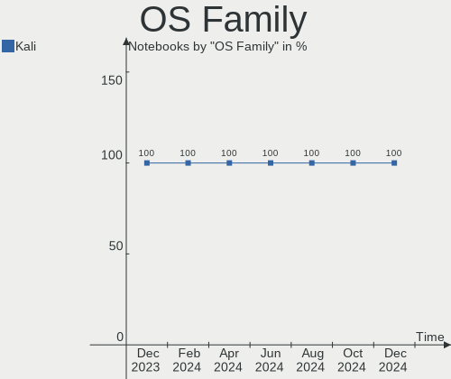
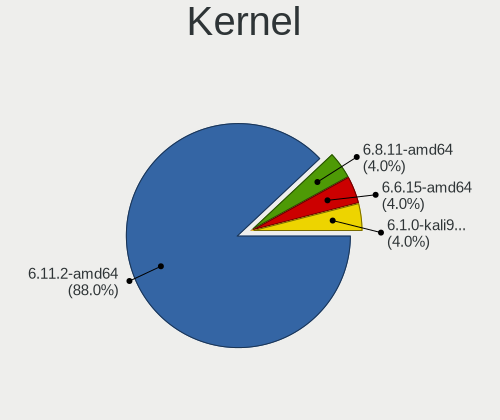
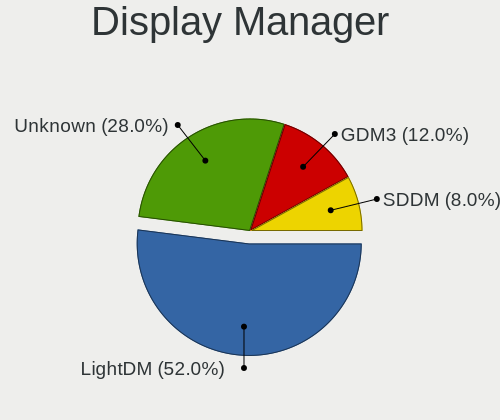
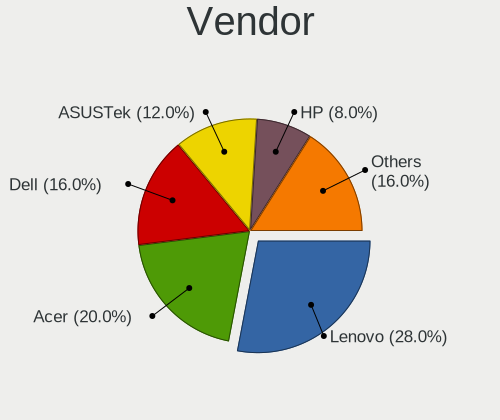
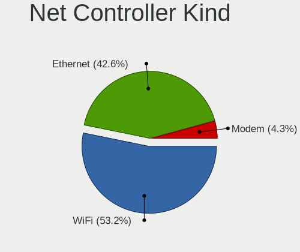

Kali - Hardware Trends (Notebooks)
----------------------------------

A project to identify most popular hardware characteristics and track their change
over time based on data collected by Linux users at https://Linux-Hardware.org.

Anyone can contribute to this report by the [hw-probe](https://github.com/linuxhw/hw-probe) tool:

    sudo -E hw-probe -all -upload

This report is for one last month. Overall report since the beginning of time: [TestCoverage](https://github.com/linuxhw/TestCoverage)

Period: Nov, 2022.

Contents
--------

* [ System ](#system)
  - [ OS                       ](#os)
  - [ OS Family                ](#os-family)
  - [ Kernel                   ](#kernel)
  - [ Kernel Family            ](#kernel-family)
  - [ Kernel Major Ver.        ](#kernel-major-ver)
  - [ Arch                     ](#arch)
  - [ DE                       ](#de)
  - [ Display Server           ](#display-server)
  - [ Display Manager          ](#display-manager)
  - [ OS Lang                  ](#os-lang)
  - [ Boot Mode                ](#boot-mode)
  - [ Filesystem               ](#filesystem)
  - [ Part. scheme             ](#part-scheme)
  - [ Dual Boot with Linux/BSD ](#dual-boot-with-linuxbsd)
  - [ Dual Boot (Win)          ](#dual-boot-win)

* [ Board ](#board)
  - [ Vendor                   ](#vendor)
  - [ Model                    ](#model)
  - [ Model Family             ](#model-family)
  - [ MFG Year                 ](#mfg-year)
  - [ Form Factor              ](#form-factor)
  - [ Secure Boot              ](#secure-boot)
  - [ Coreboot                 ](#coreboot)
  - [ RAM Size                 ](#ram-size)
  - [ RAM Used                 ](#ram-used)
  - [ Total Drives             ](#total-drives)
  - [ Has CD-ROM               ](#has-cd-rom)
  - [ Has Ethernet             ](#has-ethernet)
  - [ Has WiFi                 ](#has-wifi)
  - [ Has Bluetooth            ](#has-bluetooth)

* [ Location ](#location)
  - [ Country                  ](#country)
  - [ City                     ](#city)

* [ Drives ](#drives)
  - [ Drive Vendor             ](#drive-vendor)
  - [ Drive Model              ](#drive-model)
  - [ HDD Vendor               ](#hdd-vendor)
  - [ SSD Vendor               ](#ssd-vendor)
  - [ Drive Kind               ](#drive-kind)
  - [ Drive Connector          ](#drive-connector)
  - [ Drive Size               ](#drive-size)
  - [ Space Total              ](#space-total)
  - [ Space Used               ](#space-used)
  - [ Malfunc. Drives          ](#malfunc-drives)
  - [ Malfunc. Drive Vendor    ](#malfunc-drive-vendor)
  - [ Malfunc. HDD Vendor      ](#malfunc-hdd-vendor)
  - [ Malfunc. Drive Kind      ](#malfunc-drive-kind)
  - [ Failed Drives            ](#failed-drives)
  - [ Failed Drive Vendor      ](#failed-drive-vendor)
  - [ Drive Status             ](#drive-status)

* [ Storage controller ](#storage-controller)
  - [ Storage Vendor           ](#storage-vendor)
  - [ Storage Model            ](#storage-model)
  - [ Storage Kind             ](#storage-kind)

* [ Processor ](#processor)
  - [ CPU Vendor               ](#cpu-vendor)
  - [ CPU Model                ](#cpu-model)
  - [ CPU Model Family         ](#cpu-model-family)
  - [ CPU Cores                ](#cpu-cores)
  - [ CPU Sockets              ](#cpu-sockets)
  - [ CPU Threads              ](#cpu-threads)
  - [ CPU Op-Modes             ](#cpu-op-modes)
  - [ CPU Microcode            ](#cpu-microcode)
  - [ CPU Microarch            ](#cpu-microarch)

* [ Graphics ](#graphics)
  - [ GPU Vendor               ](#gpu-vendor)
  - [ GPU Model                ](#gpu-model)
  - [ GPU Combo                ](#gpu-combo)
  - [ GPU Driver               ](#gpu-driver)
  - [ GPU Memory               ](#gpu-memory)

* [ Monitor ](#monitor)
  - [ Monitor Vendor           ](#monitor-vendor)
  - [ Monitor Model            ](#monitor-model)
  - [ Monitor Resolution       ](#monitor-resolution)
  - [ Monitor Diagonal         ](#monitor-diagonal)
  - [ Monitor Width            ](#monitor-width)
  - [ Aspect Ratio             ](#aspect-ratio)
  - [ Monitor Area             ](#monitor-area)
  - [ Pixel Density            ](#pixel-density)
  - [ Multiple Monitors        ](#multiple-monitors)

* [ Network ](#network)
  - [ Net Controller Vendor    ](#net-controller-vendor)
  - [ Net Controller Model     ](#net-controller-model)
  - [ Wireless Vendor          ](#wireless-vendor)
  - [ Wireless Model           ](#wireless-model)
  - [ Ethernet Vendor          ](#ethernet-vendor)
  - [ Ethernet Model           ](#ethernet-model)
  - [ Net Controller Kind      ](#net-controller-kind)
  - [ Used Controller          ](#used-controller)
  - [ NICs                     ](#nics)
  - [ IPv6                     ](#ipv6)

* [ Bluetooth ](#bluetooth)
  - [ Bluetooth Vendor         ](#bluetooth-vendor)
  - [ Bluetooth Model          ](#bluetooth-model)

* [ Sound ](#sound)
  - [ Sound Vendor             ](#sound-vendor)
  - [ Sound Model              ](#sound-model)

* [ Memory ](#memory)
  - [ Memory Vendor            ](#memory-vendor)
  - [ Memory Model             ](#memory-model)
  - [ Memory Kind              ](#memory-kind)
  - [ Memory Form Factor       ](#memory-form-factor)
  - [ Memory Size              ](#memory-size)
  - [ Memory Speed             ](#memory-speed)

* [ Printers & scanners ](#printers--scanners)
  - [ Printer Vendor           ](#printer-vendor)
  - [ Printer Model            ](#printer-model)
  - [ Scanner Vendor           ](#scanner-vendor)
  - [ Scanner Model            ](#scanner-model)

* [ Camera ](#camera)
  - [ Camera Vendor            ](#camera-vendor)
  - [ Camera Model             ](#camera-model)

* [ Security ](#security)
  - [ Fingerprint Vendor       ](#fingerprint-vendor)
  - [ Fingerprint Model        ](#fingerprint-model)
  - [ Chipcard Vendor          ](#chipcard-vendor)
  - [ Chipcard Model           ](#chipcard-model)

* [ Unsupported ](#unsupported)
  - [ Unsupported Devices      ](#unsupported-devices)
  - [ Unsupported Device Types ](#unsupported-device-types)

System
------

OS
--

Installed operating systems

| Name        | Notebooks | Percent |
|-------------|-----------|---------|
| Kali 2022.3 | 25        | 58.14%  |
| Kali 2022.4 | 18        | 41.86%  |

OS Family
---------

OS without a version

| Name | Notebooks | Percent |
|------|-----------|---------|
| Kali | 43        | 100%    |

Kernel
------

Version of the Linux kernel

| Version              | Notebooks | Percent |
|----------------------|-----------|---------|
| 5.19.0-kali2-amd64   | 18        | 41.86%  |
| 6.0.0-kali3-amd64    | 13        | 30.23%  |
| 5.18.0-kali5-amd64   | 9         | 20.93%  |
| 5.18.0-kali7-amd64   | 2         | 4.65%   |
| 5.18.0-kali5-686-pae | 1         | 2.33%   |

Kernel Family
-------------

Linux kernel without a distro release

| Version | Notebooks | Percent |
|---------|-----------|---------|
| 5.19.0  | 18        | 41.86%  |
| 6.0.0   | 13        | 30.23%  |
| 5.18.0  | 12        | 27.91%  |

Kernel Major Ver.
-----------------

Linux kernel major version

| Version | Notebooks | Percent |
|---------|-----------|---------|
| 5.19    | 18        | 41.86%  |
| 6.0     | 13        | 30.23%  |
| 5.18    | 12        | 27.91%  |

Arch
----

OS architecture (x86_64, i586, etc.)

| Name   | Notebooks | Percent |
|--------|-----------|---------|
| x86_64 | 42        | 97.67%  |
| i686   | 1         | 2.33%   |

DE
--

Desktop Environment

| Name             | Notebooks | Percent |
|------------------|-----------|---------|
| XFCE             | 23        | 53.49%  |
| GNOME            | 11        | 25.58%  |
| KDE5             | 8         | 18.6%   |
| lightdm-xsession | 1         | 2.33%   |

Display Server
--------------

X11 or Wayland

| Name    | Notebooks | Percent |
|---------|-----------|---------|
| X11     | 39        | 90.7%   |
| Wayland | 3         | 6.98%   |
| Tty     | 1         | 2.33%   |

Display Manager
---------------

SDDM, LightDM, etc.

| Name    | Notebooks | Percent |
|---------|-----------|---------|
| LightDM | 26        | 60.47%  |
| GDM3    | 9         | 20.93%  |
| SDDM    | 5         | 11.63%  |
| Unknown | 2         | 4.65%   |
| GDM     | 1         | 2.33%   |

OS Lang
-------

Language

| Lang  | Notebooks | Percent |
|-------|-----------|---------|
| en_US | 28        | 65.12%  |
| en_IN | 4         | 9.3%    |
| en_GB | 2         | 4.65%   |
| ru_RU | 1         | 2.33%   |
| nl_BE | 1         | 2.33%   |
| it_IT | 1         | 2.33%   |
| id_ID | 1         | 2.33%   |
| fr_FR | 1         | 2.33%   |
| es_HN | 1         | 2.33%   |
| es_ES | 1         | 2.33%   |
| en_AU | 1         | 2.33%   |
| de_DE | 1         | 2.33%   |

Boot Mode
---------

EFI or BIOS

| Mode | Notebooks | Percent |
|------|-----------|---------|
| EFI  | 33        | 76.74%  |
| BIOS | 10        | 23.26%  |

Filesystem
----------

Type of filesystem

| Type    | Notebooks | Percent |
|---------|-----------|---------|
| Ext4    | 38        | 88.37%  |
| Overlay | 2         | 4.65%   |
| Ext2    | 2         | 4.65%   |
| Btrfs   | 1         | 2.33%   |

Part. scheme
------------

Scheme of partitioning

| Type    | Notebooks | Percent |
|---------|-----------|---------|
| GPT     | 34        | 79.07%  |
| MBR     | 7         | 16.28%  |
| Unknown | 2         | 4.65%   |

Dual Boot with Linux/BSD
------------------------

Hosting more than one Linux/BSD

| Dual boot | Notebooks | Percent |
|-----------|-----------|---------|
| No        | 42        | 97.67%  |
| Yes       | 1         | 2.33%   |

Dual Boot (Win)
---------------

Hosting Linux and Windows

| Dual boot | Notebooks | Percent |
|-----------|-----------|---------|
| No        | 22        | 51.16%  |
| Yes       | 21        | 48.84%  |

Board
-----

Vendor
------

Motherboard manufacturer

| Name             | Notebooks | Percent |
|------------------|-----------|---------|
| Lenovo           | 11        | 25.58%  |
| Hewlett-Packard  | 9         | 20.93%  |
| Dell             | 9         | 20.93%  |
| Acer             | 5         | 11.63%  |
| Google           | 3         | 6.98%   |
| ASUSTek Computer | 3         | 6.98%   |
| MSI              | 2         | 4.65%   |
| Alienware        | 1         | 2.33%   |

Model
-----

Motherboard model

| Name                                   | Notebooks | Percent |
|----------------------------------------|-----------|---------|
| MSI Modern 14 C12M                     | 1         | 2.33%   |
| MSI Katana GF76 12UC                   | 1         | 2.33%   |
| Lenovo ThinkPad X270 W10DG 20K60014MX  | 1         | 2.33%   |
| Lenovo ThinkPad T450 20BV0005US        | 1         | 2.33%   |
| Lenovo ThinkPad P52s 20LB0026US        | 1         | 2.33%   |
| Lenovo ThinkPad E15 Gen 2 20TD004NMX   | 1         | 2.33%   |
| Lenovo Legion Y740-17IRHg 81UJ         | 1         | 2.33%   |
| Lenovo IdeaPad Gaming 3 15IMH05 82CG   | 1         | 2.33%   |
| Lenovo IdeaPad 330S-15ARR 81FB         | 1         | 2.33%   |
| Lenovo IdeaPad 320-15IAP 80XR          | 1         | 2.33%   |
| Lenovo IdeaPad 3 15IAU7 82RK           | 1         | 2.33%   |
| Lenovo IdeaPad 3 14IIL05 81WD          | 1         | 2.33%   |
| Lenovo IdeaPad 120S-11IAP 81A4         | 1         | 2.33%   |
| HP Stream Laptop 14-ax0XX              | 1         | 2.33%   |
| HP Pavilion Laptop 15-cs0xxx           | 1         | 2.33%   |
| HP Pavilion Laptop 14-dv0xxx           | 1         | 2.33%   |
| HP Pavilion 15                         | 1         | 2.33%   |
| HP Laptop 15-da0xxx                    | 1         | 2.33%   |
| HP EliteBook 8570w                     | 1         | 2.33%   |
| HP EliteBook 840 G3                    | 1         | 2.33%   |
| HP 250 G7 Notebook PC                  | 1         | 2.33%   |
| HP 245 G3                              | 1         | 2.33%   |
| Google Nightfury                       | 1         | 2.33%   |
| Google Droid                           | 1         | 2.33%   |
| Google Delbin                          | 1         | 2.33%   |
| Dell Vostro 1310                       | 1         | 2.33%   |
| Dell Precision 7550                    | 1         | 2.33%   |
| Dell Precision 3510                    | 1         | 2.33%   |
| Dell Latitude E7240                    | 1         | 2.33%   |
| Dell Latitude 5580                     | 1         | 2.33%   |
| Dell Latitude 5420                     | 1         | 2.33%   |
| Dell Latitude 3580                     | 1         | 2.33%   |
| Dell Inspiron 3521                     | 1         | 2.33%   |
| Dell Inspiron 3501                     | 1         | 2.33%   |
| ASUS N61Jv                             | 1         | 2.33%   |
| ASUS N550JV                            | 1         | 2.33%   |
| ASUS ASUS TUF Dash F15 FX517ZM_FX517ZM | 1         | 2.33%   |
| Alienware 17 R3                        | 1         | 2.33%   |
| Acer Nitro AN515-57                    | 1         | 2.33%   |
| Acer Nitro AN515-54                    | 1         | 2.33%   |

Model Family
------------

Motherboard model prefix

| Name             | Notebooks | Percent |
|------------------|-----------|---------|
| Lenovo IdeaPad   | 6         | 13.95%  |
| Lenovo ThinkPad  | 4         | 9.3%    |
| Dell Latitude    | 4         | 9.3%    |
| HP Pavilion      | 3         | 6.98%   |
| Acer Nitro       | 3         | 6.98%   |
| HP EliteBook     | 2         | 4.65%   |
| Dell Precision   | 2         | 4.65%   |
| Dell Inspiron    | 2         | 4.65%   |
| MSI Modern       | 1         | 2.33%   |
| MSI Katana       | 1         | 2.33%   |
| Lenovo Legion    | 1         | 2.33%   |
| HP Stream        | 1         | 2.33%   |
| HP Laptop        | 1         | 2.33%   |
| HP 250           | 1         | 2.33%   |
| HP 245           | 1         | 2.33%   |
| Google Nightfury | 1         | 2.33%   |
| Google Droid     | 1         | 2.33%   |
| Google Delbin    | 1         | 2.33%   |
| Dell Vostro      | 1         | 2.33%   |
| ASUS N61Jv       | 1         | 2.33%   |
| ASUS N550JV      | 1         | 2.33%   |
| ASUS ASUS        | 1         | 2.33%   |
| Alienware 17     | 1         | 2.33%   |
| Acer E1-532P     | 1         | 2.33%   |
| Acer Aspire      | 1         | 2.33%   |

MFG Year
--------

Motherboard manufacture year

| Year | Notebooks | Percent |
|------|-----------|---------|
| 2022 | 7         | 16.28%  |
| 2020 | 6         | 13.95%  |
| 2018 | 6         | 13.95%  |
| 2017 | 5         | 11.63%  |
| 2016 | 4         | 9.3%    |
| 2013 | 4         | 9.3%    |
| 2021 | 2         | 4.65%   |
| 2019 | 2         | 4.65%   |
| 2014 | 2         | 4.65%   |
| 2012 | 2         | 4.65%   |
| 2015 | 1         | 2.33%   |
| 2010 | 1         | 2.33%   |
| 2008 | 1         | 2.33%   |

Form Factor
-----------

Physical design of the computer

| Name     | Notebooks | Percent |
|----------|-----------|---------|
| Notebook | 43        | 100%    |

Secure Boot
-----------

Enabled or disabled

| State    | Notebooks | Percent |
|----------|-----------|---------|
| Disabled | 43        | 100%    |

Coreboot
--------

Have coreboot on board

| Used | Notebooks | Percent |
|------|-----------|---------|
| No   | 40        | 93.02%  |
| Yes  | 3         | 6.98%   |

RAM Size
--------

Total RAM memory

| Size in GB  | Notebooks | Percent |
|-------------|-----------|---------|
| 4.01-8.0    | 16        | 37.21%  |
| 3.01-4.0    | 11        | 25.58%  |
| 16.01-24.0  | 5         | 11.63%  |
| 8.01-16.0   | 5         | 11.63%  |
| 32.01-64.0  | 3         | 6.98%   |
| 24.01-32.0  | 1         | 2.33%   |
| 64.01-256.0 | 1         | 2.33%   |
| 1.01-2.0    | 1         | 2.33%   |

RAM Used
--------

Used RAM memory

| Used GB   | Notebooks | Percent |
|-----------|-----------|---------|
| 2.01-3.0  | 20        | 46.51%  |
| 1.01-2.0  | 12        | 27.91%  |
| 4.01-8.0  | 4         | 9.3%    |
| 3.01-4.0  | 4         | 9.3%    |
| 0.51-1.0  | 2         | 4.65%   |
| 8.01-16.0 | 1         | 2.33%   |

Total Drives
------------

Number of drives on board

| Drives | Notebooks | Percent |
|--------|-----------|---------|
| 1      | 29        | 67.44%  |
| 2      | 12        | 27.91%  |
| 0      | 2         | 4.65%   |

Has CD-ROM
----------

Has CD-ROM on board

| Presented | Notebooks | Percent |
|-----------|-----------|---------|
| No        | 37        | 86.05%  |
| Yes       | 6         | 13.95%  |

Has Ethernet
------------

Has Ethernet on board

| Presented | Notebooks | Percent |
|-----------|-----------|---------|
| Yes       | 35        | 81.4%   |
| No        | 8         | 18.6%   |

Has WiFi
--------

Has WiFi module

| Presented | Notebooks | Percent |
|-----------|-----------|---------|
| Yes       | 43        | 100%    |

Has Bluetooth
-------------

Has Bluetooth module

| Presented | Notebooks | Percent |
|-----------|-----------|---------|
| Yes       | 41        | 95.35%  |
| No        | 2         | 4.65%   |

Location
--------

Country
-------

Geographic location (country)

| Country     | Notebooks | Percent |
|-------------|-----------|---------|
| USA         | 10        | 23.26%  |
| India       | 4         | 9.3%    |
| Spain       | 3         | 6.98%   |
| Bulgaria    | 3         | 6.98%   |
| Italy       | 2         | 4.65%   |
| Indonesia   | 2         | 4.65%   |
| Germany     | 2         | 4.65%   |
| Canada      | 2         | 4.65%   |
| Belgium     | 2         | 4.65%   |
| Bangladesh  | 2         | 4.65%   |
| Qatar       | 1         | 2.33%   |
| Pakistan    | 1         | 2.33%   |
| Netherlands | 1         | 2.33%   |
| Nepal       | 1         | 2.33%   |
| Moldova     | 1         | 2.33%   |
| Honduras    | 1         | 2.33%   |
| France      | 1         | 2.33%   |
| Finland     | 1         | 2.33%   |
| Brazil      | 1         | 2.33%   |
| Australia   | 1         | 2.33%   |
| Armenia     | 1         | 2.33%   |

City
----

Geographic location (city)

| City                  | Notebooks | Percent |
|-----------------------|-----------|---------|
| Houston               | 2         | 4.65%   |
| Dhaka                 | 2         | 4.65%   |
| Yerevan               | 1         | 2.33%   |
| Udine                 | 1         | 2.33%   |
| Turku                 | 1         | 2.33%   |
| Toronto               | 1         | 2.33%   |
| Topi                  | 1         | 2.33%   |
| Tonawanda             | 1         | 2.33%   |
| Tegucigalpa           | 1         | 2.33%   |
| Sao Jose do Rio Preto | 1         | 2.33%   |
| Samokov               | 1         | 2.33%   |
| Rome                  | 1         | 2.33%   |
| Requena               | 1         | 2.33%   |
| Rajkot                | 1         | 2.33%   |
| Pune                  | 1         | 2.33%   |
| Pozuelo de Alarcón   | 1         | 2.33%   |
| Portland              | 1         | 2.33%   |
| Picayune              | 1         | 2.33%   |
| Philadelphia          | 1         | 2.33%   |
| Perth                 | 1         | 2.33%   |
| Penticton             | 1         | 2.33%   |
| Onet-le-Chateau       | 1         | 2.33%   |
| Lynn Haven            | 1         | 2.33%   |
| Kaski                 | 1         | 2.33%   |
| Jakarta               | 1         | 2.33%   |
| Huy                   | 1         | 2.33%   |
| Hanford               | 1         | 2.33%   |
| Guntur                | 1         | 2.33%   |
| Goshen                | 1         | 2.33%   |
| Erfurt                | 1         | 2.33%   |
| Enschede              | 1         | 2.33%   |
| Düren                | 1         | 2.33%   |
| Doha                  | 1         | 2.33%   |
| Delhi                 | 1         | 2.33%   |
| De Pinte              | 1         | 2.33%   |
| Chorbadzhiysko        | 1         | 2.33%   |
| Chisinau              | 1         | 2.33%   |
| Burgas                | 1         | 2.33%   |
| Boone                 | 1         | 2.33%   |
| Bandung               | 1         | 2.33%   |

Drives
------

Drive Vendor
------------

Hard drive vendors

| Vendor              | Notebooks | Drives | Percent |
|---------------------|-----------|--------|---------|
| Samsung Electronics | 10        | 10     | 19.61%  |
| SanDisk             | 5         | 5      | 9.8%    |
| Seagate             | 4         | 4      | 7.84%   |
| Unknown             | 3         | 3      | 5.88%   |
| KIOXIA              | 3         | 4      | 5.88%   |
| Kingston            | 3         | 3      | 5.88%   |
| WDC                 | 2         | 2      | 3.92%   |
| SK hynix            | 2         | 2      | 3.92%   |
| Micron Technology   | 2         | 2      | 3.92%   |
| Intel               | 2         | 2      | 3.92%   |
| Crucial             | 2         | 2      | 3.92%   |
| Unknown             | 2         | 3      | 3.92%   |
| V-GeN               | 1         | 1      | 1.96%   |
| Toshiba             | 1         | 1      | 1.96%   |
| Team                | 1         | 1      | 1.96%   |
| SPCC                | 1         | 1      | 1.96%   |
| Silicon Motion      | 1         | 1      | 1.96%   |
| LITEON              | 1         | 1      | 1.96%   |
| KingSpec            | 1         | 1      | 1.96%   |
| Hitachi             | 1         | 1      | 1.96%   |
| HGST                | 1         | 1      | 1.96%   |
| Gritronix           | 1         | 1      | 1.96%   |
| A-DATA Technology   | 1         | 1      | 1.96%   |

Drive Model
-----------

Hard drive models

| Model                               | Notebooks | Percent |
|-------------------------------------|-----------|---------|
| Seagate ST500LT012-9WS142 500GB     | 2         | 3.92%   |
| Unknown                             | 2         | 3.92%   |
| WDC WD5000LPCX-24VHAT0 500GB        | 1         | 1.96%   |
| WDC WD10SPZX-21Z10T0 1TB            | 1         | 1.96%   |
| V-GeN V-GEN08SM22SCY512MTNV 512GB   | 1         | 1.96%   |
| Unknown SU64G  64GB                 | 1         | 1.96%   |
| Unknown SS32G  32GB                 | 1         | 1.96%   |
| Unknown DA4064  64GB                | 1         | 1.96%   |
| Toshiba MQ04ABF100 1TB              | 1         | 1.96%   |
| Team TM8PS7512G 512GB SSD           | 1         | 1.96%   |
| SPCC Solid State Disk 256GB         | 1         | 1.96%   |
| SK hynix HFM128GDJTNG-8310A 128GB   | 1         | 1.96%   |
| SK hynix BC511 512GB                | 1         | 1.96%   |
| Silicon Motion NE-512 512GB         | 1         | 1.96%   |
| Seagate ST1000LM035-1RK172 1TB      | 1         | 1.96%   |
| Seagate BUP Slim BK 2TB             | 1         | 1.96%   |
| SanDisk X400 M.2 2280 512GB SSD     | 1         | 1.96%   |
| SanDisk SD9SN8W-128G-1006 128GB SSD | 1         | 1.96%   |
| SanDisk Extreme 55AE 500GB SSD      | 1         | 1.96%   |
| SanDisk DF4064  64GB                | 1         | 1.96%   |
| SanDisk DF4032  32GB                | 1         | 1.96%   |
| Samsung SSD PM871 M.2 2280 128GB    | 1         | 1.96%   |
| Samsung SSD PM851 mSATA 128GB       | 1         | 1.96%   |
| Samsung SSD 870 QVO 1TB             | 1         | 1.96%   |
| Samsung SSD 860 EVO 500GB           | 1         | 1.96%   |
| Samsung SSD 850 EVO 250GB           | 1         | 1.96%   |
| Samsung MZVLW256HEHP-000L7 256GB    | 1         | 1.96%   |
| Samsung MZVLQ512HBLU-00B00 512GB    | 1         | 1.96%   |
| Samsung MZVLQ256HAJD-000H1 256GB    | 1         | 1.96%   |
| Samsung MZVLB1T0HALR-000L2 1TB      | 1         | 1.96%   |
| Samsung MZALQ256HAJD-000L1 256GB    | 1         | 1.96%   |
| Micron MTFDHBA512QFD 512GB          | 1         | 1.96%   |
| Micron 2450_MTFDKBA512TFK 512GB     | 1         | 1.96%   |
| LITEON CV3-8D256-11 SATA 256GB SSD  | 1         | 1.96%   |
| KIOXIA KXG60ZNV1T02 NVMe 1024GB     | 1         | 1.96%   |
| KIOXIA KBG40ZNS512G NVMe 512GB      | 1         | 1.96%   |
| KIOXIA KBG40ZNS256G NVMe 256GB      | 1         | 1.96%   |
| Kingston SUV500MS120G 120GB SSD     | 1         | 1.96%   |
| Kingston SA400S37480G 480GB SSD     | 1         | 1.96%   |
| Kingston OM8PDP3256B-AA1 256GB      | 1         | 1.96%   |

HDD Vendor
----------

Hard disk drive vendors

| Vendor  | Notebooks | Drives | Percent |
|---------|-----------|--------|---------|
| Seagate | 4         | 4      | 44.44%  |
| WDC     | 2         | 2      | 22.22%  |
| Toshiba | 1         | 1      | 11.11%  |
| Hitachi | 1         | 1      | 11.11%  |
| HGST    | 1         | 1      | 11.11%  |

SSD Vendor
----------

Solid state drive vendors

| Vendor              | Notebooks | Drives | Percent |
|---------------------|-----------|--------|---------|
| Samsung Electronics | 5         | 5      | 27.78%  |
| SanDisk             | 3         | 3      | 16.67%  |
| Kingston            | 2         | 2      | 11.11%  |
| Crucial             | 2         | 2      | 11.11%  |
| Team                | 1         | 1      | 5.56%   |
| SPCC                | 1         | 1      | 5.56%   |
| LITEON              | 1         | 1      | 5.56%   |
| KingSpec            | 1         | 1      | 5.56%   |
| Gritronix           | 1         | 1      | 5.56%   |
| A-DATA Technology   | 1         | 1      | 5.56%   |

Drive Kind
----------

HDD or SSD

| Kind | Notebooks | Drives | Percent |
|------|-----------|--------|---------|
| NVMe | 16        | 18     | 36.36%  |
| SSD  | 14        | 18     | 31.82%  |
| HDD  | 9         | 9      | 20.45%  |
| MMC  | 5         | 8      | 11.36%  |

Drive Connector
---------------

SATA, SAS, NVMe, etc.

| Type | Notebooks | Drives | Percent |
|------|-----------|--------|---------|
| SATA | 21        | 24     | 46.67%  |
| NVMe | 16        | 18     | 35.56%  |
| MMC  | 5         | 8      | 11.11%  |
| SAS  | 3         | 3      | 6.67%   |

Drive Size
----------

Size of hard drive

| Size in TB | Notebooks | Drives | Percent |
|------------|-----------|--------|---------|
| 0.01-0.5   | 15        | 17     | 60%     |
| 0.51-1.0   | 9         | 9      | 36%     |
| 1.01-2.0   | 1         | 1      | 4%      |

Space Total
-----------

Amount of disk space available on the file system

| Size in GB | Notebooks | Percent |
|------------|-----------|---------|
| 101-250    | 14        | 32.56%  |
| 251-500    | 11        | 25.58%  |
| 51-100     | 9         | 20.93%  |
| 501-1000   | 3         | 6.98%   |
| 21-50      | 2         | 4.65%   |
| 1001-2000  | 2         | 4.65%   |
| 2001-3000  | 1         | 2.33%   |
| 1-20       | 1         | 2.33%   |

Space Used
----------

Amount of used disk space

| Used GB  | Notebooks | Percent |
|----------|-----------|---------|
| 1-20     | 15        | 34.88%  |
| 21-50    | 14        | 32.56%  |
| 51-100   | 7         | 16.28%  |
| 101-250  | 4         | 9.3%    |
| 501-1000 | 2         | 4.65%   |
| 251-500  | 1         | 2.33%   |

Malfunc. Drives
---------------

Drive models with a malfunction

| Model                           | Notebooks | Drives | Percent |
|---------------------------------|-----------|--------|---------|
| Seagate ST500LT012-9WS142 500GB | 2         | 2      | 40%     |
| Kingston SUV500MS120G 120GB SSD | 1         | 1      | 20%     |
| Hitachi HTS542525K9SA00 250GB   | 1         | 1      | 20%     |
| Gritronix M.2 2280 256GB SSD    | 1         | 1      | 20%     |

Malfunc. Drive Vendor
---------------------

Vendors of faulty drives

| Vendor    | Notebooks | Drives | Percent |
|-----------|-----------|--------|---------|
| Seagate   | 2         | 2      | 40%     |
| Kingston  | 1         | 1      | 20%     |
| Hitachi   | 1         | 1      | 20%     |
| Gritronix | 1         | 1      | 20%     |

Malfunc. HDD Vendor
-------------------

Vendors of faulty HDD drives

| Vendor  | Notebooks | Drives | Percent |
|---------|-----------|--------|---------|
| Seagate | 2         | 2      | 66.67%  |
| Hitachi | 1         | 1      | 33.33%  |

Malfunc. Drive Kind
-------------------

Kinds of faulty drives

| Kind | Notebooks | Drives | Percent |
|------|-----------|--------|---------|
| HDD  | 3         | 3      | 60%     |
| SSD  | 2         | 2      | 40%     |

Failed Drives
-------------

Failed drive models

Zero info for selected period =(

Failed Drive Vendor
-------------------

Failed drive vendors

Zero info for selected period =(

Drive Status
------------

Number of failed and malfunc. drives

| Status   | Notebooks | Drives | Percent |
|----------|-----------|--------|---------|
| Works    | 27        | 32     | 60%     |
| Detected | 13        | 16     | 28.89%  |
| Malfunc  | 5         | 5      | 11.11%  |

Storage controller
------------------

Storage Vendor
--------------

Storage controller vendors

| Vendor                       | Notebooks | Percent |
|------------------------------|-----------|---------|
| Intel                        | 29        | 60.42%  |
| Samsung Electronics          | 5         | 10.42%  |
| AMD                          | 4         | 8.33%   |
| SK hynix                     | 2         | 4.17%   |
| Silicon Motion               | 2         | 4.17%   |
| Micron Technology            | 2         | 4.17%   |
| KIOXIA                       | 2         | 4.17%   |
| Toshiba America Info Systems | 1         | 2.08%   |
| Kingston Technology Company  | 1         | 2.08%   |

Storage Model
-------------

Storage controller models

| Model                                                                          | Notebooks | Percent |
|--------------------------------------------------------------------------------|-----------|---------|
| Intel 82801 Mobile SATA Controller [RAID mode]                                 | 6         | 11.32%  |
| Intel Volume Management Device NVMe RAID Controller                            | 4         | 7.55%   |
| AMD FCH SATA Controller [AHCI mode]                                            | 4         | 7.55%   |
| Samsung NVMe SSD Controller 980                                                | 3         | 5.66%   |
| Intel 8 Series SATA Controller 1 [AHCI mode]                                   | 3         | 5.66%   |
| Micron Non-Volatile memory controller                                          | 2         | 3.77%   |
| KIOXIA NVMe SSD Controller BG4                                                 | 2         | 3.77%   |
| Intel Sunrise Point-LP SATA Controller [AHCI mode]                             | 2         | 3.77%   |
| Intel Non-Volatile memory controller                                           | 2         | 3.77%   |
| Intel Celeron N3350/Pentium N4200/Atom E3900 Series SATA AHCI Controller       | 2         | 3.77%   |
| Intel Alder Lake-P SATA AHCI Controller                                        | 2         | 3.77%   |
| Intel 7 Series Chipset Family 6-port SATA Controller [AHCI mode]               | 2         | 3.77%   |
| Toshiba America Info Systems XG6 NVMe SSD Controller                           | 1         | 1.89%   |
| SK hynix BC511                                                                 | 1         | 1.89%   |
| SK hynix BC501 NVMe Solid State Drive                                          | 1         | 1.89%   |
| Silicon Motion SM2263EN/SM2263XT SSD Controller                                | 1         | 1.89%   |
| Silicon Motion SM2262/SM2262EN SSD Controller                                  | 1         | 1.89%   |
| Samsung NVMe SSD Controller SM981/PM981/PM983                                  | 1         | 1.89%   |
| Samsung NVMe SSD Controller SM961/PM961/SM963                                  | 1         | 1.89%   |
| Kingston Company OM3PDP3 NVMe SSD                                              | 1         | 1.89%   |
| Intel Wildcat Point-LP SATA Controller [AHCI Mode]                             | 1         | 1.89%   |
| Intel Tiger Lake-LP SATA Controller                                            | 1         | 1.89%   |
| Intel Q170/Q150/B150/H170/H110/Z170/CM236 Chipset SATA Controller [AHCI Mode]  | 1         | 1.89%   |
| Intel Ice Lake-LP SATA Controller [AHCI mode]                                  | 1         | 1.89%   |
| Intel Cannon Lake Mobile PCH SATA AHCI Controller                              | 1         | 1.89%   |
| Intel 82801HM/HEM (ICH8M/ICH8M-E) SATA Controller [AHCI mode]                  | 1         | 1.89%   |
| Intel 82801HM/HEM (ICH8M/ICH8M-E) IDE Controller                               | 1         | 1.89%   |
| Intel 8 Series/C220 Series Chipset Family 6-port SATA Controller 1 [AHCI mode] | 1         | 1.89%   |
| Intel 500 Series Chipset Family SATA AHCI Controller                           | 1         | 1.89%   |
| Intel 5 Series/3400 Series Chipset 4 port SATA AHCI Controller                 | 1         | 1.89%   |
| Intel 400 Series Chipset Family SATA AHCI Controller                           | 1         | 1.89%   |

Storage Kind
------------

Kind of storage controller (IDE, SATA, NVMe, SAS, ...)

| Kind | Notebooks | Percent |
|------|-----------|---------|
| SATA | 25        | 48.08%  |
| NVMe | 16        | 30.77%  |
| RAID | 10        | 19.23%  |
| IDE  | 1         | 1.92%   |

Processor
---------

CPU Vendor
----------

Processor vendors

| Vendor | Notebooks | Percent |
|--------|-----------|---------|
| Intel  | 39        | 90.7%   |
| AMD    | 4         | 9.3%    |

CPU Model
---------

Processor models

| Model                                         | Notebooks | Percent |
|-----------------------------------------------|-----------|---------|
| Intel Core i7-9750H CPU @ 2.60GHz             | 2         | 4.65%   |
| Intel Core i7-8550U CPU @ 1.80GHz             | 2         | 4.65%   |
| Intel Core i5-4210U CPU @ 1.70GHz             | 2         | 4.65%   |
| Intel Celeron CPU N3350 @ 1.10GHz             | 2         | 4.65%   |
| Intel 12th Gen Core i5-1235U                  | 2         | 4.65%   |
| Intel 11th Gen Core i5-1135G7 @ 2.40GHz       | 2         | 4.65%   |
| AMD Ryzen 5 2500U with Radeon Vega Mobile Gfx | 2         | 4.65%   |
| Intel Xeon W-10885M CPU @ 2.40GHz             | 1         | 2.33%   |
| Intel Pentium 3556U @ 1.70GHz                 | 1         | 2.33%   |
| Intel Core i7-7600U CPU @ 2.80GHz             | 1         | 2.33%   |
| Intel Core i7-7500U CPU @ 2.70GHz             | 1         | 2.33%   |
| Intel Core i7-6700HQ CPU @ 2.60GHz            | 1         | 2.33%   |
| Intel Core i7-6600U CPU @ 2.60GHz             | 1         | 2.33%   |
| Intel Core i7-4700HQ CPU @ 2.40GHz            | 1         | 2.33%   |
| Intel Core i7-3630QM CPU @ 2.40GHz            | 1         | 2.33%   |
| Intel Core i7-10750H CPU @ 2.60GHz            | 1         | 2.33%   |
| Intel Core i5-6300U CPU @ 2.40GHz             | 1         | 2.33%   |
| Intel Core i5-6300HQ CPU @ 2.30GHz            | 1         | 2.33%   |
| Intel Core i5-5200U CPU @ 2.20GHz             | 1         | 2.33%   |
| Intel Core i5-1035G1 CPU @ 1.00GHz            | 1         | 2.33%   |
| Intel Core i5 CPU M 430 @ 2.27GHz             | 1         | 2.33%   |
| Intel Core i3-8130U CPU @ 2.20GHz             | 1         | 2.33%   |
| Intel Core i3-7020U CPU @ 2.30GHz             | 1         | 2.33%   |
| Intel Core i3-2375M CPU @ 1.50GHz             | 1         | 2.33%   |
| Intel Core 2 Duo CPU T5670 @ 1.80GHz          | 1         | 2.33%   |
| Intel Celeron N4020 CPU @ 1.10GHz             | 1         | 2.33%   |
| Intel Celeron CPU N3060 @ 1.60GHz             | 1         | 2.33%   |
| Intel Celeron CPU 5205U @ 1.90GHz             | 1         | 2.33%   |
| Intel 12th Gen Core i7-12700H                 | 1         | 2.33%   |
| Intel 12th Gen Core i7-12650H                 | 1         | 2.33%   |
| Intel 11th Gen Core i7-1185G7 @ 3.00GHz       | 1         | 2.33%   |
| Intel 11th Gen Core i7-1165G7 @ 2.80GHz       | 1         | 2.33%   |
| Intel 11th Gen Core i5-11400H @ 2.70GHz       | 1         | 2.33%   |
| Intel 11th Gen Core i3-1115G4 @ 3.00GHz       | 1         | 2.33%   |
| AMD E1-6010 APU with AMD Radeon R2 Graphics   | 1         | 2.33%   |
| AMD A10-5757M APU with Radeon HD Graphics     | 1         | 2.33%   |

CPU Model Family
----------------

Processor model prefix

| Model            | Notebooks | Percent |
|------------------|-----------|---------|
| Intel Core i7    | 11        | 25.58%  |
| Other            | 10        | 23.26%  |
| Intel Core i5    | 7         | 16.28%  |
| Intel Celeron    | 5         | 11.63%  |
| Intel Core i3    | 3         | 6.98%   |
| AMD Ryzen 5      | 2         | 4.65%   |
| Intel Xeon       | 1         | 2.33%   |
| Intel Pentium    | 1         | 2.33%   |
| Intel Core 2 Duo | 1         | 2.33%   |
| AMD E1           | 1         | 2.33%   |
| AMD A10          | 1         | 2.33%   |

CPU Cores
---------

Number of processor cores

| Number | Notebooks | Percent |
|--------|-----------|---------|
| 2      | 21        | 48.84%  |
| 4      | 13        | 30.23%  |
| 6      | 4         | 9.3%    |
| 10     | 3         | 6.98%   |
| 14     | 1         | 2.33%   |
| 8      | 1         | 2.33%   |

CPU Sockets
-----------

Number of sockets

| Number | Notebooks | Percent |
|--------|-----------|---------|
| 1      | 43        | 100%    |

CPU Threads
-----------

Threads per core (Hyper-Threading)

| Number | Notebooks | Percent |
|--------|-----------|---------|
| 2      | 33        | 76.74%  |
| 1      | 10        | 23.26%  |

CPU Op-Modes
------------

CPU Operation Modes (32-bit, 64-bit)

| Op mode        | Notebooks | Percent |
|----------------|-----------|---------|
| 32-bit, 64-bit | 43        | 100%    |

CPU Microcode
-------------

Microcode number

| Number     | Notebooks | Percent |
|------------|-----------|---------|
| 0x806c1    | 5         | 11.63%  |
| 0x806ea    | 3         | 6.98%   |
| 0x806e9    | 3         | 6.98%   |
| 0x40651    | 3         | 6.98%   |
| 0xa0652    | 2         | 4.65%   |
| 0x906ea    | 2         | 4.65%   |
| 0x906a4    | 2         | 4.65%   |
| 0x906a3    | 2         | 4.65%   |
| 0x506e3    | 2         | 4.65%   |
| 0x506c9    | 2         | 4.65%   |
| 0x406e3    | 2         | 4.65%   |
| 0x0810100b | 2         | 4.65%   |
| 0x806ec    | 1         | 2.33%   |
| 0x806d1    | 1         | 2.33%   |
| 0x706e5    | 1         | 2.33%   |
| 0x706a8    | 1         | 2.33%   |
| 0x6fd      | 1         | 2.33%   |
| 0x406c4    | 1         | 2.33%   |
| 0x306d4    | 1         | 2.33%   |
| 0x306c3    | 1         | 2.33%   |
| 0x306a9    | 1         | 2.33%   |
| 0x206a7    | 1         | 2.33%   |
| 0x20652    | 1         | 2.33%   |
| 0x07030105 | 1         | 2.33%   |
| 0x06001119 | 1         | 2.33%   |

CPU Microarch
-------------

Microarchitecture

| Name             | Notebooks | Percent |
|------------------|-----------|---------|
| KabyLake         | 9         | 20.93%  |
| TigerLake        | 5         | 11.63%  |
| Skylake          | 4         | 9.3%    |
| Haswell          | 4         | 9.3%    |
| Alderlake Hybrid | 4         | 9.3%    |
| Zen              | 2         | 4.65%   |
| IceLake          | 2         | 4.65%   |
| Goldmont         | 2         | 4.65%   |
| CometLake        | 2         | 4.65%   |
| Westmere         | 1         | 2.33%   |
| Silvermont       | 1         | 2.33%   |
| SandyBridge      | 1         | 2.33%   |
| Puma             | 1         | 2.33%   |
| Piledriver       | 1         | 2.33%   |
| IvyBridge        | 1         | 2.33%   |
| Goldmont plus    | 1         | 2.33%   |
| Core             | 1         | 2.33%   |
| Broadwell        | 1         | 2.33%   |

Graphics
--------

GPU Vendor
----------

Vendors of graphics cards

| Vendor | Notebooks | Percent |
|--------|-----------|---------|
| Intel  | 38        | 64.41%  |
| Nvidia | 14        | 23.73%  |
| AMD    | 7         | 11.86%  |

GPU Model
---------

Graphics card models

| Model                                                                                    | Notebooks | Percent |
|------------------------------------------------------------------------------------------|-----------|---------|
| Intel TigerLake-LP GT2 [Iris Xe Graphics]                                                | 4         | 6.56%   |
| Intel UHD Graphics 620                                                                   | 3         | 4.92%   |
| Intel HD Graphics 620                                                                    | 3         | 4.92%   |
| Intel Haswell-ULT Integrated Graphics Controller                                         | 3         | 4.92%   |
| Intel Skylake GT2 [HD Graphics 520]                                                      | 2         | 3.28%   |
| Intel HD Graphics 530                                                                    | 2         | 3.28%   |
| Intel HD Graphics 500                                                                    | 2         | 3.28%   |
| Intel CoffeeLake-H GT2 [UHD Graphics 630]                                                | 2         | 3.28%   |
| AMD Raven Ridge [Radeon Vega Series / Radeon Vega Mobile Series]                         | 2         | 3.28%   |
| Nvidia TU117M [GeForce MX450]                                                            | 1         | 1.64%   |
| Nvidia TU117M [GeForce GTX 1650 Mobile / Max-Q]                                          | 1         | 1.64%   |
| Nvidia TU117M                                                                            | 1         | 1.64%   |
| Nvidia TU117GLM [Quadro T2000 Mobile / Max-Q]                                            | 1         | 1.64%   |
| Nvidia TU116M [GeForce GTX 1660 Ti Mobile]                                               | 1         | 1.64%   |
| Nvidia TU106BM [GeForce RTX 2060 Mobile]                                                 | 1         | 1.64%   |
| Nvidia GT216M [GeForce GT 325M]                                                          | 1         | 1.64%   |
| Nvidia GP108GLM [Quadro P500 Mobile]                                                     | 1         | 1.64%   |
| Nvidia GM204M [GeForce GTX 980M]                                                         | 1         | 1.64%   |
| Nvidia GM108M [GeForce 930MX]                                                            | 1         | 1.64%   |
| Nvidia GM108M [GeForce 840M]                                                             | 1         | 1.64%   |
| Nvidia GK107M [GeForce GT 750M]                                                          | 1         | 1.64%   |
| Nvidia GA107M [GeForce RTX 3050 Mobile]                                                  | 1         | 1.64%   |
| Nvidia GA106M [GeForce RTX 3060 Mobile / Max-Q]                                          | 1         | 1.64%   |
| Intel TigerLake-H GT1 [UHD Graphics]                                                     | 1         | 1.64%   |
| Intel Tiger Lake-LP GT2 [UHD Graphics G4]                                                | 1         | 1.64%   |
| Intel Mobile GM965/GL960 Integrated Graphics Controller (secondary)                      | 1         | 1.64%   |
| Intel Mobile GM965/GL960 Integrated Graphics Controller (primary)                        | 1         | 1.64%   |
| Intel Iris Plus Graphics G1 (Ice Lake)                                                   | 1         | 1.64%   |
| Intel HD Graphics 5500                                                                   | 1         | 1.64%   |
| Intel GeminiLake [UHD Graphics 600]                                                      | 1         | 1.64%   |
| Intel Core Processor Integrated Graphics Controller                                      | 1         | 1.64%   |
| Intel CometLake-H GT2 [UHD Graphics]                                                     | 1         | 1.64%   |
| Intel Comet Lake-U GT2 [UHD Graphics 620]                                                | 1         | 1.64%   |
| Intel Coffee Lake-S GT2 [UHD Graphics P630]                                              | 1         | 1.64%   |
| Intel Atom/Celeron/Pentium Processor x5-E8000/J3xxx/N3xxx Integrated Graphics Controller | 1         | 1.64%   |
| Intel Alder Lake-UP3 GT2 [UHD Graphics]                                                  | 1         | 1.64%   |
| Intel Alder Lake-UP3 GT2 [Iris Xe Graphics]                                              | 1         | 1.64%   |
| Intel Alder Lake-P Integrated Graphics Controller                                        | 1         | 1.64%   |
| Intel Alder Lake-P GT1 [UHD Graphics]                                                    | 1         | 1.64%   |
| Intel 4th Gen Core Processor Integrated Graphics Controller                              | 1         | 1.64%   |

GPU Combo
---------

Combinations of graphics cards

| Name           | Notebooks | Percent |
|----------------|-----------|---------|
| 1 x Intel      | 22        | 51.16%  |
| Intel + Nvidia | 14        | 32.56%  |
| 1 x AMD        | 4         | 9.3%    |
| Intel + AMD    | 2         | 4.65%   |
| 2 x AMD        | 1         | 2.33%   |

GPU Driver
----------

Free vs proprietary

| Driver      | Notebooks | Percent |
|-------------|-----------|---------|
| Free        | 41        | 95.35%  |
| Proprietary | 2         | 4.65%   |

GPU Memory
----------

Total video memory

| Size in GB | Notebooks | Percent |
|------------|-----------|---------|
| Unknown    | 24        | 55.81%  |
| 1.01-2.0   | 7         | 16.28%  |
| 3.01-4.0   | 5         | 11.63%  |
| 0.01-0.5   | 3         | 6.98%   |
| 5.01-6.0   | 2         | 4.65%   |
| 0.51-1.0   | 2         | 4.65%   |

Monitor
-------

Monitor Vendor
--------------

Monitor vendors

| Vendor              | Notebooks | Percent |
|---------------------|-----------|---------|
| AU Optronics        | 12        | 25.53%  |
| BOE                 | 10        | 21.28%  |
| LG Display          | 8         | 17.02%  |
| Chimei Innolux      | 7         | 14.89%  |
| Samsung Electronics | 2         | 4.26%   |
| PANDA               | 2         | 4.26%   |
| Philips             | 1         | 2.13%   |
| Lenovo              | 1         | 2.13%   |
| Hewlett-Packard     | 1         | 2.13%   |
| HannStar            | 1         | 2.13%   |
| Goldstar            | 1         | 2.13%   |
| CSO                 | 1         | 2.13%   |

Monitor Model
-------------

Monitor models

| Model                                                                | Notebooks | Percent |
|----------------------------------------------------------------------|-----------|---------|
| Chimei Innolux LCD Monitor CMN15E7 1920x1080 344x193mm 15.5-inch     | 2         | 4.26%   |
| Samsung Electronics LS32AG32x SAM71DE 1920x1080 698x393mm 31.5-inch  | 1         | 2.13%   |
| Samsung Electronics LCD Monitor SEC5441 1366x768 344x194mm 15.5-inch | 1         | 2.13%   |
| Philips PHL 241E1 PHLC207 1920x1080 527x296mm 23.8-inch              | 1         | 2.13%   |
| PANDA LCD Monitor NCP0046 1920x1080 344x194mm 15.5-inch              | 1         | 2.13%   |
| PANDA LCD Monitor NCP0036 1920x1080 344x194mm 15.5-inch              | 1         | 2.13%   |
| LG Display LCD Monitor LGD068D 1920x1080 309x174mm 14.0-inch         | 1         | 2.13%   |
| LG Display LCD Monitor LGD0676 1920x1080 309x174mm 14.0-inch         | 1         | 2.13%   |
| LG Display LCD Monitor LGD060F 1920x1080 309x174mm 14.0-inch         | 1         | 2.13%   |
| LG Display LCD Monitor LGD05E0 1920x1080 382x215mm 17.3-inch         | 1         | 2.13%   |
| LG Display LCD Monitor LGD0590 1920x1080 344x194mm 15.5-inch         | 1         | 2.13%   |
| LG Display LCD Monitor LGD046F 1920x1080 345x194mm 15.6-inch         | 1         | 2.13%   |
| LG Display LCD Monitor LGD039F 1366x768 345x194mm 15.6-inch          | 1         | 2.13%   |
| LG Display LCD Monitor LGD0323 1920x1080 345x194mm 15.6-inch         | 1         | 2.13%   |
| Lenovo LCD Monitor LEN40BA 1920x1080 344x194mm 15.5-inch             | 1         | 2.13%   |
| Hewlett-Packard E273 HPN3470 1920x1080 598x336mm 27.0-inch           | 1         | 2.13%   |
| HannStar HSD160PHW1 HSD0640 1366x768 353x199mm 16.0-inch             | 1         | 2.13%   |
| Goldstar E2040 GSM4EB3 1600x900 443x249mm 20.0-inch                  | 1         | 2.13%   |
| CSO LCD Monitor CSO1304 1920x1080 293x165mm 13.2-inch                | 1         | 2.13%   |
| Chimei Innolux LCD Monitor CMN15E6 1366x768 344x193mm 15.5-inch      | 1         | 2.13%   |
| Chimei Innolux LCD Monitor CMN153C 1920x1080 344x193mm 15.5-inch     | 1         | 2.13%   |
| Chimei Innolux LCD Monitor CMN1499 1366x768 309x174mm 14.0-inch      | 1         | 2.13%   |
| Chimei Innolux LCD Monitor CMN1490 1366x768 309x173mm 13.9-inch      | 1         | 2.13%   |
| Chimei Innolux LCD Monitor CMN1132 1366x768 256x144mm 11.6-inch      | 1         | 2.13%   |
| BOE LCD Monitor BOE08D5 1920x1080 344x194mm 15.5-inch                | 1         | 2.13%   |
| BOE LCD Monitor BOE085E 1920x1080 344x194mm 15.5-inch                | 1         | 2.13%   |
| BOE LCD Monitor BOE075A 1366x768 309x173mm 13.9-inch                 | 1         | 2.13%   |
| BOE LCD Monitor BOE06F0 1366x768 344x194mm 15.5-inch                 | 1         | 2.13%   |
| BOE LCD Monitor BOE06CB 1920x1080 344x194mm 15.5-inch                | 1         | 2.13%   |
| BOE LCD Monitor BOE0696 1366x768 309x173mm 13.9-inch                 | 1         | 2.13%   |
| BOE LCD Monitor BOE0687 1920x1080 344x193mm 15.5-inch                | 1         | 2.13%   |
| BOE LCD Monitor BOE0675 1366x768 344x194mm 15.5-inch                 | 1         | 2.13%   |
| BOE LCD Monitor BOE0632 1920x1080 344x194mm 15.5-inch                | 1         | 2.13%   |
| BOE LCD Monitor BOE05DA 1366x768 277x156mm 12.5-inch                 | 1         | 2.13%   |
| AU Optronics LCD Monitor AUOAF90 1920x1080 344x193mm 15.5-inch       | 1         | 2.13%   |
| AU Optronics LCD Monitor AUO978F 1920x1080 382x215mm 17.3-inch       | 1         | 2.13%   |
| AU Optronics LCD Monitor AUO45EC 1366x768 344x193mm 15.5-inch        | 1         | 2.13%   |
| AU Optronics LCD Monitor AUO41EB 3840x2160 344x193mm 15.5-inch       | 1         | 2.13%   |
| AU Optronics LCD Monitor AUO403D 1920x1080 309x173mm 13.9-inch       | 1         | 2.13%   |
| AU Optronics LCD Monitor AUO31EC 1366x768 344x193mm 15.5-inch        | 1         | 2.13%   |

Monitor Resolution
------------------

Monitor screen resolution

| Resolution      | Notebooks | Percent |
|-----------------|-----------|---------|
| 1920x1080 (FHD) | 26        | 57.78%  |
| 1366x768 (WXGA) | 16        | 35.56%  |
| 3840x2160 (4K)  | 2         | 4.44%   |
| 1600x900 (HD+)  | 1         | 2.22%   |

Monitor Diagonal
----------------

Diagonal size in inches

| Inches | Notebooks | Percent |
|--------|-----------|---------|
| 15     | 26        | 55.32%  |
| 14     | 6         | 12.77%  |
| 13     | 4         | 8.51%   |
| 17     | 3         | 6.38%   |
| 12     | 2         | 4.26%   |
| 31     | 1         | 2.13%   |
| 27     | 1         | 2.13%   |
| 24     | 1         | 2.13%   |
| 20     | 1         | 2.13%   |
| 16     | 1         | 2.13%   |
| 11     | 1         | 2.13%   |

Monitor Width
-------------

Physical width

| Width in mm | Notebooks | Percent |
|-------------|-----------|---------|
| 301-350     | 34        | 72.34%  |
| 351-400     | 5         | 10.64%  |
| 201-300     | 4         | 8.51%   |
| 501-600     | 2         | 4.26%   |
| 601-700     | 1         | 2.13%   |
| 401-500     | 1         | 2.13%   |

Aspect Ratio
------------

Proportional relationship between the width and the height

| Ratio | Notebooks | Percent |
|-------|-----------|---------|
| 16/9  | 43        | 100%    |

Monitor Area
------------

Area in inch²

| Area in inch² | Notebooks | Percent |
|----------------|-----------|---------|
| 101-110        | 27        | 57.45%  |
| 81-90          | 9         | 19.15%  |
| 121-130        | 3         | 6.38%   |
| 61-70          | 2         | 4.26%   |
| 71-80          | 1         | 2.13%   |
| 51-60          | 1         | 2.13%   |
| 351-500        | 1         | 2.13%   |
| 301-350        | 1         | 2.13%   |
| 201-250        | 1         | 2.13%   |
| 151-200        | 1         | 2.13%   |

Pixel Density
-------------

Pixels per inch

| Density       | Notebooks | Percent |
|---------------|-----------|---------|
| 121-160       | 25        | 54.35%  |
| 101-120       | 11        | 23.91%  |
| 51-100        | 6         | 13.04%  |
| More than 240 | 2         | 4.35%   |
| 161-240       | 2         | 4.35%   |

Multiple Monitors
-----------------

Total monitors connected

| Total | Notebooks | Percent |
|-------|-----------|---------|
| 1     | 40        | 93.02%  |
| 2     | 2         | 4.65%   |
| 3     | 1         | 2.33%   |

Network
-------

Net Controller Vendor
---------------------

Controller vendors

| Vendor                          | Notebooks | Percent |
|---------------------------------|-----------|---------|
| Intel                           | 28        | 38.36%  |
| Realtek Semiconductor           | 21        | 28.77%  |
| Qualcomm Atheros                | 11        | 15.07%  |
| Broadcom                        | 3         | 4.11%   |
| Ralink Technology               | 2         | 2.74%   |
| Qualcomm Atheros Communications | 2         | 2.74%   |
| NetGear                         | 1         | 1.37%   |
| Lenovo                          | 1         | 1.37%   |
| ICS Advent                      | 1         | 1.37%   |
| Hewlett-Packard                 | 1         | 1.37%   |
| Fibocom                         | 1         | 1.37%   |
| ASIX Electronics                | 1         | 1.37%   |

Net Controller Model
--------------------

Controller models

| Model                                                             | Notebooks | Percent |
|-------------------------------------------------------------------|-----------|---------|
| Realtek RTL8111/8168/8411 PCI Express Gigabit Ethernet Controller | 12        | 13.19%  |
| Realtek RTL810xE PCI Express Fast Ethernet controller             | 4         | 4.4%    |
| Intel Wi-Fi 6 AX201                                               | 4         | 4.4%    |
| Intel Alder Lake-P PCH CNVi WiFi                                  | 4         | 4.4%    |
| Realtek RTL8812AU 802.11a/b/g/n/ac 2T2R DB WLAN Adapter           | 3         | 3.3%    |
| Qualcomm Atheros QCA6174 802.11ac Wireless Network Adapter        | 3         | 3.3%    |
| Intel Wireless 8260                                               | 3         | 3.3%    |
| Intel Wireless 7265                                               | 3         | 3.3%    |
| Qualcomm Atheros QCA9565 / AR9565 Wireless Network Adapter        | 2         | 2.2%    |
| Qualcomm Atheros AR9271 802.11n                                   | 2         | 2.2%    |
| Qualcomm Atheros AR9485 Wireless Network Adapter                  | 2         | 2.2%    |
| Intel Wireless 8265 / 8275                                        | 2         | 2.2%    |
| Intel Ethernet Connection I219-LM                                 | 2         | 2.2%    |
| Intel Comet Lake PCH CNVi WiFi                                    | 2         | 2.2%    |
| Realtek RTL88x2bu [AC1200 Techkey]                                | 1         | 1.1%    |
| Realtek RTL8822BE 802.11a/b/g/n/ac WiFi adapter                   | 1         | 1.1%    |
| Realtek RTL8821CE 802.11ac PCIe Wireless Network Adapter          | 1         | 1.1%    |
| Realtek RTL8821AE 802.11ac PCIe Wireless Network Adapter          | 1         | 1.1%    |
| Realtek Killer E2600 Gigabit Ethernet Controller                  | 1         | 1.1%    |
| Realtek 802.11n WLAN Adapter                                      | 1         | 1.1%    |
| Ralink RT3072 Wireless Adapter                                    | 1         | 1.1%    |
| Ralink RT2870/RT3070 Wireless Adapter                             | 1         | 1.1%    |
| Qualcomm Atheros QCA9377 802.11ac Wireless Network Adapter        | 1         | 1.1%    |
| Qualcomm Atheros QCA8171 Gigabit Ethernet                         | 1         | 1.1%    |
| Qualcomm Atheros Killer E2500 Gigabit Ethernet Controller         | 1         | 1.1%    |
| Qualcomm Atheros Killer E2400 Gigabit Ethernet Controller         | 1         | 1.1%    |
| Qualcomm Atheros AR9462 Wireless Network Adapter                  | 1         | 1.1%    |
| Qualcomm Atheros AR9285 Wireless Network Adapter (PCI-Express)    | 1         | 1.1%    |
| Qualcomm Atheros AR8131 Gigabit Ethernet                          | 1         | 1.1%    |
| NetGear WNDA3100v2 802.11abgn [Broadcom BCM4323]                  | 1         | 1.1%    |
| Lenovo ThinkPad Dock Ethernet [Realtek RTL8153B]                  | 1         | 1.1%    |
| Intel Wireless 7260                                               | 1         | 1.1%    |
| Intel Wi-Fi 6 AX200                                               | 1         | 1.1%    |
| Intel Tiger Lake PCH CNVi WiFi                                    | 1         | 1.1%    |
| Intel Ice Lake-LP PCH CNVi WiFi                                   | 1         | 1.1%    |
| Intel Gemini Lake PCH CNVi WiFi                                   | 1         | 1.1%    |
| Intel Ethernet Connection I218-LM                                 | 1         | 1.1%    |
| Intel Ethernet Connection (4) I219-V                              | 1         | 1.1%    |
| Intel Ethernet Connection (4) I219-LM                             | 1         | 1.1%    |
| Intel Ethernet Connection (3) I218-V                              | 1         | 1.1%    |

Wireless Vendor
---------------

Wireless vendors

| Vendor                          | Notebooks | Percent |
|---------------------------------|-----------|---------|
| Intel                           | 28        | 50.91%  |
| Qualcomm Atheros                | 10        | 18.18%  |
| Realtek Semiconductor           | 8         | 14.55%  |
| Ralink Technology               | 2         | 3.64%   |
| Qualcomm Atheros Communications | 2         | 3.64%   |
| Broadcom                        | 2         | 3.64%   |
| NetGear                         | 1         | 1.82%   |
| Hewlett-Packard                 | 1         | 1.82%   |
| Fibocom                         | 1         | 1.82%   |

Wireless Model
--------------

Wireless models

| Model                                                          | Notebooks | Percent |
|----------------------------------------------------------------|-----------|---------|
| Intel Wi-Fi 6 AX201                                            | 4         | 7.27%   |
| Intel Alder Lake-P PCH CNVi WiFi                               | 4         | 7.27%   |
| Realtek RTL8812AU 802.11a/b/g/n/ac 2T2R DB WLAN Adapter        | 3         | 5.45%   |
| Qualcomm Atheros QCA6174 802.11ac Wireless Network Adapter     | 3         | 5.45%   |
| Intel Wireless 8260                                            | 3         | 5.45%   |
| Intel Wireless 7265                                            | 3         | 5.45%   |
| Qualcomm Atheros QCA9565 / AR9565 Wireless Network Adapter     | 2         | 3.64%   |
| Qualcomm Atheros AR9271 802.11n                                | 2         | 3.64%   |
| Qualcomm Atheros AR9485 Wireless Network Adapter               | 2         | 3.64%   |
| Intel Wireless 8265 / 8275                                     | 2         | 3.64%   |
| Intel Comet Lake PCH CNVi WiFi                                 | 2         | 3.64%   |
| Realtek RTL88x2bu [AC1200 Techkey]                             | 1         | 1.82%   |
| Realtek RTL8822BE 802.11a/b/g/n/ac WiFi adapter                | 1         | 1.82%   |
| Realtek RTL8821CE 802.11ac PCIe Wireless Network Adapter       | 1         | 1.82%   |
| Realtek RTL8821AE 802.11ac PCIe Wireless Network Adapter       | 1         | 1.82%   |
| Realtek 802.11n WLAN Adapter                                   | 1         | 1.82%   |
| Ralink RT3072 Wireless Adapter                                 | 1         | 1.82%   |
| Ralink RT2870/RT3070 Wireless Adapter                          | 1         | 1.82%   |
| Qualcomm Atheros QCA9377 802.11ac Wireless Network Adapter     | 1         | 1.82%   |
| Qualcomm Atheros AR9462 Wireless Network Adapter               | 1         | 1.82%   |
| Qualcomm Atheros AR9285 Wireless Network Adapter (PCI-Express) | 1         | 1.82%   |
| NetGear WNDA3100v2 802.11abgn [Broadcom BCM4323]               | 1         | 1.82%   |
| Intel Wireless 7260                                            | 1         | 1.82%   |
| Intel Wi-Fi 6 AX200                                            | 1         | 1.82%   |
| Intel Tiger Lake PCH CNVi WiFi                                 | 1         | 1.82%   |
| Intel Ice Lake-LP PCH CNVi WiFi                                | 1         | 1.82%   |
| Intel Gemini Lake PCH CNVi WiFi                                | 1         | 1.82%   |
| Intel Dual Band Wireless-AC 3168NGW [Stone Peak]               | 1         | 1.82%   |
| Intel Dual Band Wireless-AC 3165 Plus Bluetooth                | 1         | 1.82%   |
| Intel Comet Lake PCH-LP CNVi WiFi                              | 1         | 1.82%   |
| Intel Centrino Ultimate-N 6300                                 | 1         | 1.82%   |
| Intel Cannon Lake PCH CNVi WiFi                                | 1         | 1.82%   |
| HP lt4120 Snapdragon X5 LTE                                    | 1         | 1.82%   |
| Fibocom L831-EAU                                               | 1         | 1.82%   |
| Broadcom BCM4321 802.11a/b/g/n                                 | 1         | 1.82%   |
| Broadcom BCM43142 802.11b/g/n                                  | 1         | 1.82%   |

Ethernet Vendor
---------------

Ethernet vendors

| Vendor                | Notebooks | Percent |
|-----------------------|-----------|---------|
| Realtek Semiconductor | 17        | 47.22%  |
| Intel                 | 11        | 30.56%  |
| Qualcomm Atheros      | 4         | 11.11%  |
| Lenovo                | 1         | 2.78%   |
| ICS Advent            | 1         | 2.78%   |
| Broadcom              | 1         | 2.78%   |
| ASIX Electronics      | 1         | 2.78%   |

Ethernet Model
--------------

Ethernet models

| Model                                                             | Notebooks | Percent |
|-------------------------------------------------------------------|-----------|---------|
| Realtek RTL8111/8168/8411 PCI Express Gigabit Ethernet Controller | 12        | 33.33%  |
| Realtek RTL810xE PCI Express Fast Ethernet controller             | 4         | 11.11%  |
| Intel Ethernet Connection I219-LM                                 | 2         | 5.56%   |
| Realtek Killer E2600 Gigabit Ethernet Controller                  | 1         | 2.78%   |
| Qualcomm Atheros QCA8171 Gigabit Ethernet                         | 1         | 2.78%   |
| Qualcomm Atheros Killer E2500 Gigabit Ethernet Controller         | 1         | 2.78%   |
| Qualcomm Atheros Killer E2400 Gigabit Ethernet Controller         | 1         | 2.78%   |
| Qualcomm Atheros AR8131 Gigabit Ethernet                          | 1         | 2.78%   |
| Lenovo ThinkPad Dock Ethernet [Realtek RTL8153B]                  | 1         | 2.78%   |
| Intel Ethernet Connection I218-LM                                 | 1         | 2.78%   |
| Intel Ethernet Connection (4) I219-V                              | 1         | 2.78%   |
| Intel Ethernet Connection (4) I219-LM                             | 1         | 2.78%   |
| Intel Ethernet Connection (3) I218-V                              | 1         | 2.78%   |
| Intel Ethernet Connection (2) I219-LM                             | 1         | 2.78%   |
| Intel Ethernet Connection (16) I219-LM                            | 1         | 2.78%   |
| Intel Ethernet Connection (13) I219-LM                            | 1         | 2.78%   |
| Intel Ethernet Connection (11) I219-LM                            | 1         | 2.78%   |
| Intel 82579LM Gigabit Network Connection (Lewisville)             | 1         | 2.78%   |
| ICS Advent DM9601 Fast Ethernet Adapter                           | 1         | 2.78%   |
| Broadcom NetXtreme BCM57786 Gigabit Ethernet PCIe                 | 1         | 2.78%   |
| ASIX AX88772B                                                     | 1         | 2.78%   |

Net Controller Kind
-------------------

Ethernet, WiFi or modem

| Kind     | Notebooks | Percent |
|----------|-----------|---------|
| WiFi     | 43        | 55.13%  |
| Ethernet | 35        | 44.87%  |

Used Controller
---------------

Currently used network controller

| Kind     | Notebooks | Percent |
|----------|-----------|---------|
| WiFi     | 31        | 73.81%  |
| Ethernet | 11        | 26.19%  |

NICs
----

Total network controllers on board

| Total | Notebooks | Percent |
|-------|-----------|---------|
| 2     | 33        | 76.74%  |
| 1     | 10        | 23.26%  |

IPv6
----

IPv6 vs IPv4

| Used | Notebooks | Percent |
|------|-----------|---------|
| No   | 30        | 69.77%  |
| Yes  | 13        | 30.23%  |

Bluetooth
---------

Bluetooth Vendor
----------------

Controller vendors

| Vendor                          | Notebooks | Percent |
|---------------------------------|-----------|---------|
| Intel                           | 27        | 65.85%  |
| Qualcomm Atheros Communications | 4         | 9.76%   |
| Realtek Semiconductor           | 3         | 7.32%   |
| Lite-On Technology              | 3         | 7.32%   |
| Broadcom                        | 2         | 4.88%   |
| IMC Networks                    | 1         | 2.44%   |
| Dell                            | 1         | 2.44%   |

Bluetooth Model
---------------

Controller models

| Model                                          | Notebooks | Percent |
|------------------------------------------------|-----------|---------|
| Intel AX201 Bluetooth                          | 11        | 26.83%  |
| Intel Bluetooth wireless interface             | 10        | 24.39%  |
| Qualcomm Atheros  Bluetooth Device             | 4         | 9.76%   |
| Intel Bluetooth 9460/9560 Jefferson Peak (JfP) | 4         | 9.76%   |
| Realtek  Bluetooth 4.2 Adapter                 | 2         | 4.88%   |
| Lite-On Bluetooth Device                       | 2         | 4.88%   |
| Realtek RTL8821A Bluetooth                     | 1         | 2.44%   |
| Lite-On Atheros AR3012 Bluetooth               | 1         | 2.44%   |
| Intel Wireless-AC 3168 Bluetooth               | 1         | 2.44%   |
| Intel AX200 Bluetooth                          | 1         | 2.44%   |
| IMC Networks Bluetooth USB Host Controller     | 1         | 2.44%   |
| Dell Wireless 360 Bluetooth                    | 1         | 2.44%   |
| Broadcom HP Portable SoftSailing               | 1         | 2.44%   |
| Broadcom BCM43142A0 Bluetooth Device           | 1         | 2.44%   |

Sound
-----

Sound Vendor
------------

Sound card vendors

| Vendor                    | Notebooks | Percent |
|---------------------------|-----------|---------|
| Intel                     | 39        | 70.91%  |
| Nvidia                    | 8         | 14.55%  |
| AMD                       | 5         | 9.09%   |
| Sennheiser Communications | 1         | 1.82%   |
| Lenovo                    | 1         | 1.82%   |
| ASUSTek Computer          | 1         | 1.82%   |

Sound Model
-----------

Sound card models

| Model                                                                                             | Notebooks | Percent |
|---------------------------------------------------------------------------------------------------|-----------|---------|
| Intel Sunrise Point-LP HD Audio                                                                   | 8         | 12.5%   |
| Intel Tiger Lake-LP Smart Sound Technology Audio Controller                                       | 5         | 7.81%   |
| Intel Alder Lake PCH-P High Definition Audio Controller                                           | 4         | 6.25%   |
| Nvidia TU107 GeForce GTX 1650 High Definition Audio Controller                                    | 3         | 4.69%   |
| Intel Haswell-ULT HD Audio Controller                                                             | 3         | 4.69%   |
| Intel 8 Series HD Audio Controller                                                                | 3         | 4.69%   |
| Intel Comet Lake PCH cAVS                                                                         | 2         | 3.13%   |
| Intel Celeron N3350/Pentium N4200/Atom E3900 Series Audio Cluster                                 | 2         | 3.13%   |
| Intel Cannon Lake PCH cAVS                                                                        | 2         | 3.13%   |
| Intel 7 Series/C216 Chipset Family High Definition Audio Controller                               | 2         | 3.13%   |
| Intel 100 Series/C230 Series Chipset Family HD Audio Controller                                   | 2         | 3.13%   |
| AMD Raven/Raven2/Fenghuang HDMI/DP Audio Controller                                               | 2         | 3.13%   |
| AMD FCH Azalia Controller                                                                         | 2         | 3.13%   |
| AMD Family 17h/19h HD Audio Controller                                                            | 2         | 3.13%   |
| Sennheiser Communications EPOS BTD 800                                                            | 1         | 1.56%   |
| Nvidia TU116 High Definition Audio Controller                                                     | 1         | 1.56%   |
| Nvidia TU106 High Definition Audio Controller                                                     | 1         | 1.56%   |
| Nvidia GT216 HDMI Audio Controller                                                                | 1         | 1.56%   |
| Nvidia GM204 High Definition Audio Controller                                                     | 1         | 1.56%   |
| Nvidia GA106 High Definition Audio Controller                                                     | 1         | 1.56%   |
| Lenovo ThinkPad Dock Audio                                                                        | 1         | 1.56%   |
| Intel Xeon E3-1200 v3/4th Gen Core Processor HD Audio Controller                                  | 1         | 1.56%   |
| Intel Wildcat Point-LP High Definition Audio Controller                                           | 1         | 1.56%   |
| Intel Tiger Lake-H HD Audio Controller                                                            | 1         | 1.56%   |
| Intel Ice Lake-LP Smart Sound Technology Audio Controller                                         | 1         | 1.56%   |
| Intel Comet Lake PCH-LP cAVS                                                                      | 1         | 1.56%   |
| Intel Celeron/Pentium Silver Processor High Definition Audio                                      | 1         | 1.56%   |
| Intel Broadwell-U Audio Controller                                                                | 1         | 1.56%   |
| Intel Atom/Celeron/Pentium Processor x5-E8000/J3xxx/N3xxx Series High Definition Audio Controller | 1         | 1.56%   |
| Intel 82801H (ICH8 Family) HD Audio Controller                                                    | 1         | 1.56%   |
| Intel 8 Series/C220 Series Chipset High Definition Audio Controller                               | 1         | 1.56%   |
| Intel 5 Series/3400 Series Chipset High Definition Audio                                          | 1         | 1.56%   |
| ASUSTek Computer C-Media Audio                                                                    | 1         | 1.56%   |
| AMD Trinity HDMI Audio Controller                                                                 | 1         | 1.56%   |
| AMD Oland/Hainan/Cape Verde/Pitcairn HDMI Audio [Radeon HD 7000 Series]                           | 1         | 1.56%   |
| AMD Kabini HDMI/DP Audio                                                                          | 1         | 1.56%   |

Memory
------

Memory Vendor
-------------

Memory module vendors

| Vendor              | Notebooks | Percent |
|---------------------|-----------|---------|
| Samsung Electronics | 14        | 31.11%  |
| SK hynix            | 11        | 24.44%  |
| Micron Technology   | 6         | 13.33%  |
| Kingston            | 5         | 11.11%  |
| Crucial             | 3         | 6.67%   |
| Unifosa             | 1         | 2.22%   |
| Smart Brazil        | 1         | 2.22%   |
| Ramaxel Technology  | 1         | 2.22%   |
| Elpida              | 1         | 2.22%   |
| Corsair             | 1         | 2.22%   |
| ASint Technology    | 1         | 2.22%   |

Memory Model
------------

Memory module models

| Model                                                        | Notebooks | Percent |
|--------------------------------------------------------------|-----------|---------|
| Samsung RAM M471A5244CB0-CTD 4GB SODIMM DDR4 3266MT/s        | 2         | 4.44%   |
| Unifosa RAM GU332G0AJEPR8H2L.. 2GB SODIMM DDR2 667MT/s       | 1         | 2.22%   |
| Smart Brazil RAM SMS4WEC8C1K0446FCG 8GB SODIMM DDR4 2933MT/s | 1         | 2.22%   |
| SK hynix RAM Module 8GB SODIMM DDR4 2133MT/s                 | 1         | 2.22%   |
| SK hynix RAM HMT451S6MFR8A-PB 4GB SODIMM DDR3 1600MT/s       | 1         | 2.22%   |
| SK hynix RAM HMAA4GS7AJR8N-XN 32GB SODIMM DDR4 3200MT/s      | 1         | 2.22%   |
| SK hynix RAM HMAA1GS6CJR6N-XN 8GB SODIMM DDR4 3200MT/s       | 1         | 2.22%   |
| SK hynix RAM HMA81GS6JJR8N-VK 8GB SODIMM DDR4 2667MT/s       | 1         | 2.22%   |
| SK hynix RAM HMA81GS6CJR8N-XN 8GB SODIMM DDR4 3200MT/s       | 1         | 2.22%   |
| SK hynix RAM HMA81GS6AFR8N-UH 8GB SODIMM DDR4 2400MT/s       | 1         | 2.22%   |
| SK hynix RAM HMA451S6AFR8N-TF 4GB SODIMM DDR4 2133MT/s       | 1         | 2.22%   |
| SK hynix RAM HMA41GS6AFR8N-TF 8GB SODIMM DDR4 2667MT/s       | 1         | 2.22%   |
| SK hynix RAM H9HCNNNBKMMLXR-NEE 1GB LPDDR4 3733MT/s          | 1         | 2.22%   |
| SK hynix RAM H9HCNNN8KUMLHR-NME 1GB LPDDR4 2400MT/s          | 1         | 2.22%   |
| Samsung RAM Module 2GB Row Of Chips LPDDR3 2133MT/s          | 1         | 2.22%   |
| Samsung RAM M471B5273EB0-CK0 4GB SODIMM DDR3 4199MT/s        | 1         | 2.22%   |
| Samsung RAM M471B5273CH0-YK0 4GB SODIMM DDR3 1600MT/s        | 1         | 2.22%   |
| Samsung RAM M471B5173EB0-YK0 4GB SODIMM DDR3 1600MT/s        | 1         | 2.22%   |
| Samsung RAM M471B5173DB0-YK0 4096MB SODIMM DDR3 1600MT/s     | 1         | 2.22%   |
| Samsung RAM M471A5244CB0-CTD 4GB Row Of Chips DDR4 2667MT/s  | 1         | 2.22%   |
| Samsung RAM M471A2K43EB1-CWE 16GB SODIMM DDR4 3200MT/s       | 1         | 2.22%   |
| Samsung RAM M471A2K43DB1-CWE 16GB SODIMM DDR4 3200MT/s       | 1         | 2.22%   |
| Samsung RAM M471A1K43CB1-CTD 8GB SODIMM DDR4 2667MT/s        | 1         | 2.22%   |
| Samsung RAM M471A1K43CB1-CRC 8GB SODIMM DDR4 2667MT/s        | 1         | 2.22%   |
| Samsung RAM M425R1GB4BB0-CQKOL 8GB SODIMM 4800MT/s           | 1         | 2.22%   |
| Samsung RAM K4F8E304HB-MGCJ 1GB SODIMM LPDDR4 2400MT/s       | 1         | 2.22%   |
| Ramaxel RAM RMSA3260ME78HAF-2666 8GB SODIMM DDR4 2667MT/s    | 1         | 2.22%   |
| Micron RAM 8KTF51264HZ-1G6N1 4GB SODIMM DDR3 1600MT/s        | 1         | 2.22%   |
| Micron RAM 8ATF2G64HZ-3G2E2 16GB SODIMM DDR4 3200MT/s        | 1         | 2.22%   |
| Micron RAM 8ATF1G64HZ-2G6E1 8GB SODIMM DDR4 2667MT/s         | 1         | 2.22%   |
| Micron RAM 16KTF51264HZ-1G6M1 4GB SODIMM DDR3 1600MT/s       | 1         | 2.22%   |
| Micron RAM 16KTF1G64HZ-1G6E1 8GB SODIMM DDR3 1600MT/s        | 1         | 2.22%   |
| Micron RAM 16ATF1G64HZ-2G1B1 8GB SODIMM DDR4 2133MT/s        | 1         | 2.22%   |
| Kingston RAM KF3200C20S4/16G 16GB SODIMM DDR4 3200MT/s       | 1         | 2.22%   |
| Kingston RAM K821PJ-MID 16GB SODIMM DDR4 2400MT/s            | 1         | 2.22%   |
| Kingston RAM ACR26D4S9S8ME-8 8GB SODIMM DDR4 2667MT/s        | 1         | 2.22%   |
| Kingston RAM ACR16D3LS1NBG/4G 4GB SODIMM DDR3 1600MT/s       | 1         | 2.22%   |
| Kingston RAM 9905295-055.A00LF 2GB SODIMM DDR2 667MT/s       | 1         | 2.22%   |
| Elpida RAM FCJ41UG6BBU0-DJ-F 4GB SODIMM DDR3 1600MT/s        | 1         | 2.22%   |
| Crucial RAM Module 4GB SODIMM DDR3 1600MT/s                  | 1         | 2.22%   |

Memory Kind
-----------

Memory module kinds

| Kind   | Notebooks | Percent |
|--------|-----------|---------|
| DDR4   | 22        | 57.89%  |
| DDR3   | 8         | 21.05%  |
| LPDDR4 | 3         | 7.89%   |
| SDRAM  | 2         | 5.26%   |
| LPDDR3 | 1         | 2.63%   |
| DDR5   | 1         | 2.63%   |
| DDR2   | 1         | 2.63%   |

Memory Form Factor
------------------

Physical design of the memory module

| Name         | Notebooks | Percent |
|--------------|-----------|---------|
| SODIMM       | 34        | 89.47%  |
| Row Of Chips | 2         | 5.26%   |
| Unknown      | 2         | 5.26%   |

Memory Size
-----------

Memory module size

| Size  | Notebooks | Percent |
|-------|-----------|---------|
| 8192  | 15        | 38.46%  |
| 4096  | 14        | 35.9%   |
| 16384 | 5         | 12.82%  |
| 2048  | 3         | 7.69%   |
| 32768 | 1         | 2.56%   |
| 1024  | 1         | 2.56%   |

Memory Speed
------------

Memory module speed

| Speed | Notebooks | Percent |
|-------|-----------|---------|
| 2667  | 8         | 20%     |
| 1600  | 8         | 20%     |
| 3200  | 7         | 17.5%   |
| 2400  | 4         | 10%     |
| 2133  | 4         | 10%     |
| 4199  | 2         | 5%      |
| 3266  | 2         | 5%      |
| 4800  | 1         | 2.5%    |
| 3733  | 1         | 2.5%    |
| 2933  | 1         | 2.5%    |
| 2267  | 1         | 2.5%    |
| 667   | 1         | 2.5%    |

Printers & scanners
-------------------

Printer Vendor
--------------

Printer device vendors

Zero info for selected period =(

Printer Model
-------------

Printer device models

Zero info for selected period =(

Scanner Vendor
--------------

Scanner device vendors

Zero info for selected period =(

Scanner Model
-------------

Scanner device models

Zero info for selected period =(

Camera
------

Camera Vendor
-------------

Camera device vendors

| Vendor                                 | Notebooks | Percent |
|----------------------------------------|-----------|---------|
| Chicony Electronics                    | 9         | 21.43%  |
| Acer                                   | 7         | 16.67%  |
| Microdia                               | 4         | 9.52%   |
| IMC Networks                           | 4         | 9.52%   |
| Sunplus Innovation Technology          | 3         | 7.14%   |
| Realtek Semiconductor                  | 3         | 7.14%   |
| Quanta                                 | 3         | 7.14%   |
| Lite-On Technology                     | 2         | 4.76%   |
| Cheng Uei Precision Industry (Foxlink) | 2         | 4.76%   |
| Suyin                                  | 1         | 2.38%   |
| Sonix Technology                       | 1         | 2.38%   |
| kingcome                               | 1         | 2.38%   |
| DJKANA19IDX53W                         | 1         | 2.38%   |
| Apple                                  | 1         | 2.38%   |

Camera Model
------------

Camera device models

| Model                                                          | Notebooks | Percent |
|----------------------------------------------------------------|-----------|---------|
| Chicony Integrated Camera                                      | 3         | 7.14%   |
| Acer Integrated Camera                                         | 3         | 7.14%   |
| Sunplus HD WebCam                                              | 2         | 4.76%   |
| Realtek Integrated Webcam HD                                   | 2         | 4.76%   |
| Microdia Integrated_Webcam_HD                                  | 2         | 4.76%   |
| Chicony HP TrueVision HD Camera                                | 2         | 4.76%   |
| Chicony HD User Facing                                         | 2         | 4.76%   |
| Acer HD Webcam                                                 | 2         | 4.76%   |
| Suyin HP Truevision HD                                         | 1         | 2.38%   |
| Sunplus FHD Camera Microphone                                  | 1         | 2.38%   |
| Sonix USB2.0 HD UVC WebCam                                     | 1         | 2.38%   |
| Realtek Integrated_Webcam_HD                                   | 1         | 2.38%   |
| Quanta USB2.0 HD UVC WebCam                                    | 1         | 2.38%   |
| Quanta HD Webcam                                               | 1         | 2.38%   |
| Quanta HD User Facing                                          | 1         | 2.38%   |
| Microdia Sonix Integrated Webcam                               | 1         | 2.38%   |
| Microdia HP Integrated Webcam                                  | 1         | 2.38%   |
| Lite-On HP Wide Vision HD Camera                               | 1         | 2.38%   |
| Lite-On HP HD Webcam                                           | 1         | 2.38%   |
| kingcome 720p HD Camera                                        | 1         | 2.38%   |
| IMC Networks USB2.0 UVC HD Webcam                              | 1         | 2.38%   |
| IMC Networks Integrated Camera                                 | 1         | 2.38%   |
| IMC Networks EasyCamera                                        | 1         | 2.38%   |
| IMC Networks 2M Integrated Webcam                              | 1         | 2.38%   |
| DJKANA19IDX53W HP Wide Vision HD Camera                        | 1         | 2.38%   |
| Chicony Integrated Camera (1280x720@30)                        | 1         | 2.38%   |
| Chicony HP HD Webcam [Fixed]                                   | 1         | 2.38%   |
| Cheng Uei Precision Industry (Foxlink) HP Webcam               | 1         | 2.38%   |
| Cheng Uei Precision Industry (Foxlink) HP TrueVision HD Camera | 1         | 2.38%   |
| Apple iPhone 5/5C/5S/6/SE                                      | 1         | 2.38%   |
| Acer SunplusIT Integrated Camera                               | 1         | 2.38%   |
| Acer EasyCamera                                                | 1         | 2.38%   |

Security
--------

Fingerprint Vendor
------------------

Fingerprint sensor vendors

| Vendor                     | Notebooks | Percent |
|----------------------------|-----------|---------|
| Validity Sensors           | 3         | 50%     |
| Synaptics                  | 1         | 16.67%  |
| Shenzhen Goodix Technology | 1         | 16.67%  |
| Elan Microelectronics      | 1         | 16.67%  |

Fingerprint Model
-----------------

Fingerprint sensor models

| Model                                            | Notebooks | Percent |
|--------------------------------------------------|-----------|---------|
| Validity Sensors VFS491                          | 1         | 16.67%  |
| Validity Sensors VFS 5011 fingerprint sensor     | 1         | 16.67%  |
| Validity Sensors Synaptics WBDI                  | 1         | 16.67%  |
| Synaptics Metallica MIS Touch Fingerprint Reader | 1         | 16.67%  |
| Shenzhen Goodix  FingerPrint Device              | 1         | 16.67%  |
| Elan ELAN:ARM-M4                                 | 1         | 16.67%  |

Chipcard Vendor
---------------

Chipcard module vendors

| Vendor      | Notebooks | Percent |
|-------------|-----------|---------|
| Broadcom    | 4         | 80%     |
| Alcor Micro | 1         | 20%     |

Chipcard Model
--------------

Chipcard module models

| Model                               | Notebooks | Percent |
|-------------------------------------|-----------|---------|
| Broadcom 5880                       | 2         | 40%     |
| Broadcom 58200                      | 2         | 40%     |
| Alcor Micro AU9540 Smartcard Reader | 1         | 20%     |

Unsupported
-----------

Unsupported Devices
-------------------

Total unsupported devices on board

| Total | Notebooks | Percent |
|-------|-----------|---------|
| 0     | 24        | 55.81%  |
| 1     | 15        | 34.88%  |
| 2     | 4         | 9.3%    |

Unsupported Device Types
------------------------

Types of unsupported devices

| Type                     | Notebooks | Percent |
|--------------------------|-----------|---------|
| Net/wireless             | 6         | 27.27%  |
| Fingerprint reader       | 5         | 22.73%  |
| Chipcard                 | 5         | 22.73%  |
| Graphics card            | 2         | 9.09%   |
| Bluetooth                | 2         | 9.09%   |
| Storage                  | 1         | 4.55%   |
| Communication controller | 1         | 4.55%   |

