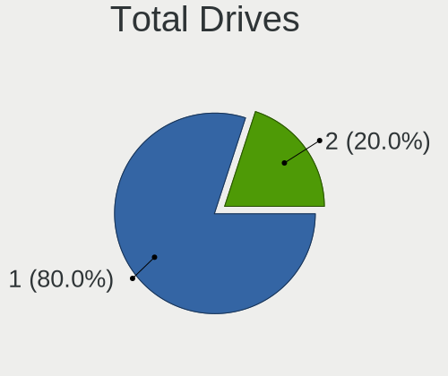
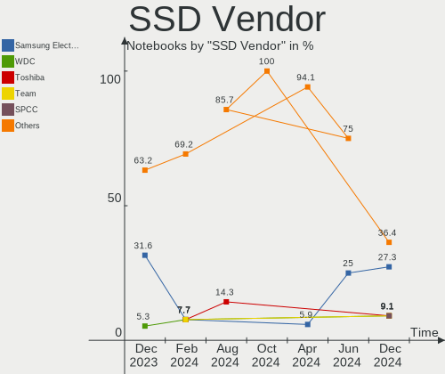
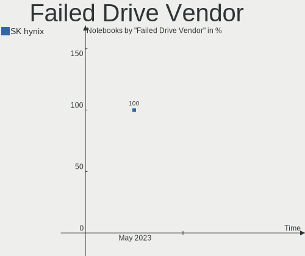
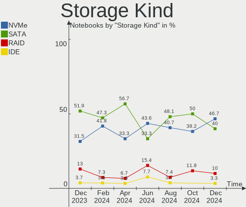
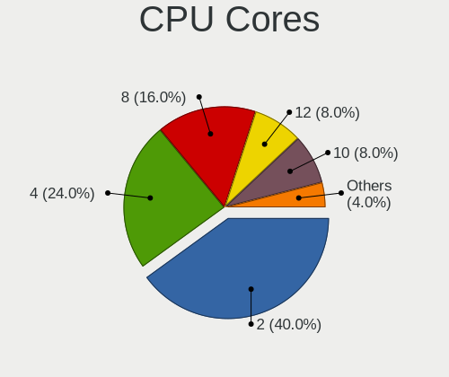
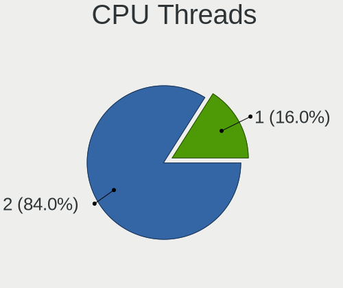
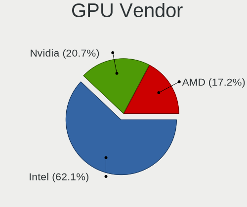

Kali - Hardware Trends (Notebooks)
----------------------------------

A project to identify most popular hardware characteristics and track their change
over time based on data collected by Linux users at https://Linux-Hardware.org.

Anyone can contribute to this report by the [hw-probe](https://github.com/linuxhw/hw-probe) tool:

    sudo -E hw-probe -all -upload

This report is for one last month. Overall report since the beginning of time: [TestCoverage](https://github.com/linuxhw/TestCoverage)

Period: Dec, 2022.

Contents
--------

* [ System ](#system)
  - [ OS                       ](#os)
  - [ OS Family                ](#os-family)
  - [ Kernel                   ](#kernel)
  - [ Kernel Family            ](#kernel-family)
  - [ Kernel Major Ver.        ](#kernel-major-ver)
  - [ Arch                     ](#arch)
  - [ DE                       ](#de)
  - [ Display Server           ](#display-server)
  - [ Display Manager          ](#display-manager)
  - [ OS Lang                  ](#os-lang)
  - [ Boot Mode                ](#boot-mode)
  - [ Filesystem               ](#filesystem)
  - [ Part. scheme             ](#part-scheme)
  - [ Dual Boot with Linux/BSD ](#dual-boot-with-linuxbsd)
  - [ Dual Boot (Win)          ](#dual-boot-win)

* [ Board ](#board)
  - [ Vendor                   ](#vendor)
  - [ Model                    ](#model)
  - [ Model Family             ](#model-family)
  - [ MFG Year                 ](#mfg-year)
  - [ Form Factor              ](#form-factor)
  - [ Secure Boot              ](#secure-boot)
  - [ Coreboot                 ](#coreboot)
  - [ RAM Size                 ](#ram-size)
  - [ RAM Used                 ](#ram-used)
  - [ Total Drives             ](#total-drives)
  - [ Has CD-ROM               ](#has-cd-rom)
  - [ Has Ethernet             ](#has-ethernet)
  - [ Has WiFi                 ](#has-wifi)
  - [ Has Bluetooth            ](#has-bluetooth)

* [ Location ](#location)
  - [ Country                  ](#country)
  - [ City                     ](#city)

* [ Drives ](#drives)
  - [ Drive Vendor             ](#drive-vendor)
  - [ Drive Model              ](#drive-model)
  - [ HDD Vendor               ](#hdd-vendor)
  - [ SSD Vendor               ](#ssd-vendor)
  - [ Drive Kind               ](#drive-kind)
  - [ Drive Connector          ](#drive-connector)
  - [ Drive Size               ](#drive-size)
  - [ Space Total              ](#space-total)
  - [ Space Used               ](#space-used)
  - [ Malfunc. Drives          ](#malfunc-drives)
  - [ Malfunc. Drive Vendor    ](#malfunc-drive-vendor)
  - [ Malfunc. HDD Vendor      ](#malfunc-hdd-vendor)
  - [ Malfunc. Drive Kind      ](#malfunc-drive-kind)
  - [ Failed Drives            ](#failed-drives)
  - [ Failed Drive Vendor      ](#failed-drive-vendor)
  - [ Drive Status             ](#drive-status)

* [ Storage controller ](#storage-controller)
  - [ Storage Vendor           ](#storage-vendor)
  - [ Storage Model            ](#storage-model)
  - [ Storage Kind             ](#storage-kind)

* [ Processor ](#processor)
  - [ CPU Vendor               ](#cpu-vendor)
  - [ CPU Model                ](#cpu-model)
  - [ CPU Model Family         ](#cpu-model-family)
  - [ CPU Cores                ](#cpu-cores)
  - [ CPU Sockets              ](#cpu-sockets)
  - [ CPU Threads              ](#cpu-threads)
  - [ CPU Op-Modes             ](#cpu-op-modes)
  - [ CPU Microcode            ](#cpu-microcode)
  - [ CPU Microarch            ](#cpu-microarch)

* [ Graphics ](#graphics)
  - [ GPU Vendor               ](#gpu-vendor)
  - [ GPU Model                ](#gpu-model)
  - [ GPU Combo                ](#gpu-combo)
  - [ GPU Driver               ](#gpu-driver)
  - [ GPU Memory               ](#gpu-memory)

* [ Monitor ](#monitor)
  - [ Monitor Vendor           ](#monitor-vendor)
  - [ Monitor Model            ](#monitor-model)
  - [ Monitor Resolution       ](#monitor-resolution)
  - [ Monitor Diagonal         ](#monitor-diagonal)
  - [ Monitor Width            ](#monitor-width)
  - [ Aspect Ratio             ](#aspect-ratio)
  - [ Monitor Area             ](#monitor-area)
  - [ Pixel Density            ](#pixel-density)
  - [ Multiple Monitors        ](#multiple-monitors)

* [ Network ](#network)
  - [ Net Controller Vendor    ](#net-controller-vendor)
  - [ Net Controller Model     ](#net-controller-model)
  - [ Wireless Vendor          ](#wireless-vendor)
  - [ Wireless Model           ](#wireless-model)
  - [ Ethernet Vendor          ](#ethernet-vendor)
  - [ Ethernet Model           ](#ethernet-model)
  - [ Net Controller Kind      ](#net-controller-kind)
  - [ Used Controller          ](#used-controller)
  - [ NICs                     ](#nics)
  - [ IPv6                     ](#ipv6)

* [ Bluetooth ](#bluetooth)
  - [ Bluetooth Vendor         ](#bluetooth-vendor)
  - [ Bluetooth Model          ](#bluetooth-model)

* [ Sound ](#sound)
  - [ Sound Vendor             ](#sound-vendor)
  - [ Sound Model              ](#sound-model)

* [ Memory ](#memory)
  - [ Memory Vendor            ](#memory-vendor)
  - [ Memory Model             ](#memory-model)
  - [ Memory Kind              ](#memory-kind)
  - [ Memory Form Factor       ](#memory-form-factor)
  - [ Memory Size              ](#memory-size)
  - [ Memory Speed             ](#memory-speed)

* [ Printers & scanners ](#printers--scanners)
  - [ Printer Vendor           ](#printer-vendor)
  - [ Printer Model            ](#printer-model)
  - [ Scanner Vendor           ](#scanner-vendor)
  - [ Scanner Model            ](#scanner-model)

* [ Camera ](#camera)
  - [ Camera Vendor            ](#camera-vendor)
  - [ Camera Model             ](#camera-model)

* [ Security ](#security)
  - [ Fingerprint Vendor       ](#fingerprint-vendor)
  - [ Fingerprint Model        ](#fingerprint-model)
  - [ Chipcard Vendor          ](#chipcard-vendor)
  - [ Chipcard Model           ](#chipcard-model)

* [ Unsupported ](#unsupported)
  - [ Unsupported Devices      ](#unsupported-devices)
  - [ Unsupported Device Types ](#unsupported-device-types)

System
------

OS
--

Installed operating systems

| Name         | Notebooks | Percent |
|--------------|-----------|---------|
| Kali 2022.4  | 44        | 91.67%  |
| Kali 2022.3  | 3         | 6.25%   |
| Kali Rolling | 1         | 2.08%   |

OS Family
---------

OS without a version

| Name | Notebooks | Percent |
|------|-----------|---------|
| Kali | 48        | 100%    |

Kernel
------

Version of the Linux kernel

| Version            | Notebooks | Percent |
|--------------------|-----------|---------|
| 6.0.0-kali3-amd64  | 19        | 39.58%  |
| 6.0.0-kali5-amd64  | 12        | 25%     |
| 6.0.0-kali6-amd64  | 9         | 18.75%  |
| 5.18.0-kali5-amd64 | 5         | 10.42%  |
| 6.0.0-4-amd64      | 1         | 2.08%   |
| 5.18.0-kali7-amd64 | 1         | 2.08%   |
| 5.14.0-kali4-amd64 | 1         | 2.08%   |

Kernel Family
-------------

Linux kernel without a distro release

| Version | Notebooks | Percent |
|---------|-----------|---------|
| 6.0.0   | 41        | 85.42%  |
| 5.18.0  | 6         | 12.5%   |
| 5.14.0  | 1         | 2.08%   |

Kernel Major Ver.
-----------------

Linux kernel major version

| Version | Notebooks | Percent |
|---------|-----------|---------|
| 6.0     | 41        | 85.42%  |
| 5.18    | 6         | 12.5%   |
| 5.14    | 1         | 2.08%   |

Arch
----

OS architecture (x86_64, i586, etc.)

| Name   | Notebooks | Percent |
|--------|-----------|---------|
| x86_64 | 48        | 100%    |

DE
--

Desktop Environment

| Name    | Notebooks | Percent |
|---------|-----------|---------|
| XFCE    | 30        | 62.5%   |
| GNOME   | 10        | 20.83%  |
| KDE5    | 7         | 14.58%  |
| Unknown | 1         | 2.08%   |

Display Server
--------------

X11 or Wayland

| Name | Notebooks | Percent |
|------|-----------|---------|
| X11  | 48        | 100%    |

Display Manager
---------------

SDDM, LightDM, etc.

| Name    | Notebooks | Percent |
|---------|-----------|---------|
| LightDM | 26        | 54.17%  |
| GDM3    | 10        | 20.83%  |
| Unknown | 8         | 16.67%  |
| SDDM    | 4         | 8.33%   |

OS Lang
-------

Language

| Lang  | Notebooks | Percent |
|-------|-----------|---------|
| en_US | 28        | 58.33%  |
| fr_FR | 3         | 6.25%   |
| en_IN | 3         | 6.25%   |
| ru_RU | 2         | 4.17%   |
| en_GB | 2         | 4.17%   |
| pl_PL | 1         | 2.08%   |
| nl_BE | 1         | 2.08%   |
| it_IT | 1         | 2.08%   |
| hu_HU | 1         | 2.08%   |
| fr_BE | 1         | 2.08%   |
| es_ES | 1         | 2.08%   |
| en_NZ | 1         | 2.08%   |
| en_DE | 1         | 2.08%   |
| en_AU | 1         | 2.08%   |
| de_DE | 1         | 2.08%   |

Boot Mode
---------

EFI or BIOS

| Mode | Notebooks | Percent |
|------|-----------|---------|
| EFI  | 33        | 68.75%  |
| BIOS | 15        | 31.25%  |

Filesystem
----------

Type of filesystem

| Type    | Notebooks | Percent |
|---------|-----------|---------|
| Ext4    | 45        | 93.75%  |
| Overlay | 3         | 6.25%   |

Part. scheme
------------

Scheme of partitioning

| Type    | Notebooks | Percent |
|---------|-----------|---------|
| GPT     | 33        | 68.75%  |
| MBR     | 8         | 16.67%  |
| Unknown | 7         | 14.58%  |

Dual Boot with Linux/BSD
------------------------

Hosting more than one Linux/BSD

| Dual boot | Notebooks | Percent |
|-----------|-----------|---------|
| No        | 42        | 87.5%   |
| Yes       | 6         | 12.5%   |

Dual Boot (Win)
---------------

Hosting Linux and Windows

| Dual boot | Notebooks | Percent |
|-----------|-----------|---------|
| No        | 31        | 64.58%  |
| Yes       | 17        | 35.42%  |

Board
-----

Vendor
------

Motherboard manufacturer

| Name                | Notebooks | Percent |
|---------------------|-----------|---------|
| Dell                | 11        | 22.92%  |
| Hewlett-Packard     | 9         | 18.75%  |
| Acer                | 6         | 12.5%   |
| Apple               | 5         | 10.42%  |
| Lenovo              | 4         | 8.33%   |
| Samsung Electronics | 3         | 6.25%   |
| Gigabyte Technology | 2         | 4.17%   |
| ASUSTek Computer    | 2         | 4.17%   |
| Packard Bell        | 1         | 2.08%   |
| MSI                 | 1         | 2.08%   |
| Monster             | 1         | 2.08%   |
| Danew               | 1         | 2.08%   |
| Chuwi               | 1         | 2.08%   |
| Unknown             | 1         | 2.08%   |

Model
-----

Motherboard model

| Name                                    | Notebooks | Percent |
|-----------------------------------------|-----------|---------|
| HP Pavilion g6                          | 2         | 4.17%   |
| Dell Inspiron 3521                      | 2         | 4.17%   |
| Samsung 935XDB                          | 1         | 2.08%   |
| Samsung 930XED                          | 1         | 2.08%   |
| Samsung 300E5M/300E5L                   | 1         | 2.08%   |
| Packard Bell EasyNote TE11HC            | 1         | 2.08%   |
| MSI GF65 Thin 10SDR                     | 1         | 2.08%   |
| Monster HUMA H4 V4.1                    | 1         | 2.08%   |
| Lenovo ThinkPad L15 Gen 2 20X4S4LM01    | 1         | 2.08%   |
| Lenovo ThinkPad L15 Gen 1 20U8S0PR00    | 1         | 2.08%   |
| Lenovo Legion 5 15IMH05 82AU            | 1         | 2.08%   |
| Lenovo IdeaPad 320-15IKB 81BT           | 1         | 2.08%   |
| HP Pavilion dv6                         | 1         | 2.08%   |
| HP Notebook                             | 1         | 2.08%   |
| HP Laptop 14-fq0xxx                     | 1         | 2.08%   |
| HP EliteBook 850 G7 Notebook PC         | 1         | 2.08%   |
| HP EliteBook 640 14 inch G9 Notebook PC | 1         | 2.08%   |
| HP Compaq 6910p                         | 1         | 2.08%   |
| HP 245 G3                               | 1         | 2.08%   |
| Gigabyte AORUS 15G KC                   | 1         | 2.08%   |
| Gigabyte AERO 17 XE5                    | 1         | 2.08%   |
| Dell Precision 5510                     | 1         | 2.08%   |
| Dell Latitude E6410                     | 1         | 2.08%   |
| Dell Latitude 5580                      | 1         | 2.08%   |
| Dell Latitude 5480                      | 1         | 2.08%   |
| Dell Inspiron 5567                      | 1         | 2.08%   |
| Dell Inspiron 5370                      | 1         | 2.08%   |
| Dell Inspiron 3531                      | 1         | 2.08%   |
| Dell Inspiron 14-3462                   | 1         | 2.08%   |
| Dell Inspiron 13-5378                   | 1         | 2.08%   |
| Danew Dbook 131                         | 1         | 2.08%   |
| Chuwi HeroBook                          | 1         | 2.08%   |
| ASUS X541UJ                             | 1         | 2.08%   |
| ASUS ROG Zephyrus G14 GA401IH_GA401IH   | 1         | 2.08%   |
| Apple MacBookPro9,2                     | 1         | 2.08%   |
| Apple MacBookPro15,1                    | 1         | 2.08%   |
| Apple MacBookPro14,1                    | 1         | 2.08%   |
| Apple MacBookAir9,1                     | 1         | 2.08%   |
| Apple MacBookAir7,2                     | 1         | 2.08%   |
| Acer Extensa 5630                       | 1         | 2.08%   |

Model Family
------------

Motherboard model prefix

| Name                  | Notebooks | Percent |
|-----------------------|-----------|---------|
| Dell Inspiron         | 7         | 14.58%  |
| Acer Aspire           | 4         | 8.33%   |
| HP Pavilion           | 3         | 6.25%   |
| Dell Latitude         | 3         | 6.25%   |
| Lenovo ThinkPad       | 2         | 4.17%   |
| HP EliteBook          | 2         | 4.17%   |
| Samsung 935XDB        | 1         | 2.08%   |
| Samsung 930XED        | 1         | 2.08%   |
| Samsung 300E5M        | 1         | 2.08%   |
| Packard Bell EasyNote | 1         | 2.08%   |
| MSI GF65              | 1         | 2.08%   |
| Monster HUMA          | 1         | 2.08%   |
| Lenovo Legion         | 1         | 2.08%   |
| Lenovo IdeaPad        | 1         | 2.08%   |
| HP Notebook           | 1         | 2.08%   |
| HP Laptop             | 1         | 2.08%   |
| HP Compaq             | 1         | 2.08%   |
| HP 245                | 1         | 2.08%   |
| Gigabyte AORUS        | 1         | 2.08%   |
| Gigabyte AERO         | 1         | 2.08%   |
| Dell Precision        | 1         | 2.08%   |
| Danew Dbook           | 1         | 2.08%   |
| Chuwi HeroBook        | 1         | 2.08%   |
| ASUS X541UJ           | 1         | 2.08%   |
| ASUS ROG              | 1         | 2.08%   |
| Apple MacBookPro9     | 1         | 2.08%   |
| Apple MacBookPro15    | 1         | 2.08%   |
| Apple MacBookPro14    | 1         | 2.08%   |
| Apple MacBookAir9     | 1         | 2.08%   |
| Apple MacBookAir7     | 1         | 2.08%   |
| Acer Extensa          | 1         | 2.08%   |
| Acer EX-215-52        | 1         | 2.08%   |
| Unknown               | 1         | 2.08%   |

MFG Year
--------

Motherboard manufacture year

| Year | Notebooks | Percent |
|------|-----------|---------|
| 2020 | 8         | 16.67%  |
| 2016 | 6         | 12.5%   |
| 2022 | 5         | 10.42%  |
| 2021 | 5         | 10.42%  |
| 2017 | 5         | 10.42%  |
| 2012 | 5         | 10.42%  |
| 2019 | 2         | 4.17%   |
| 2018 | 2         | 4.17%   |
| 2014 | 2         | 4.17%   |
| 2011 | 2         | 4.17%   |
| 2010 | 2         | 4.17%   |
| 2008 | 2         | 4.17%   |
| 2015 | 1         | 2.08%   |
| 2007 | 1         | 2.08%   |

Form Factor
-----------

Physical design of the computer

| Name     | Notebooks | Percent |
|----------|-----------|---------|
| Notebook | 48        | 100%    |

Secure Boot
-----------

Enabled or disabled

| State    | Notebooks | Percent |
|----------|-----------|---------|
| Disabled | 48        | 100%    |

Coreboot
--------

Have coreboot on board

| Used | Notebooks | Percent |
|------|-----------|---------|
| No   | 48        | 100%    |

RAM Size
--------

Total RAM memory

| Size in GB | Notebooks | Percent |
|------------|-----------|---------|
| 4.01-8.0   | 14        | 29.17%  |
| 8.01-16.0  | 11        | 22.92%  |
| 3.01-4.0   | 9         | 18.75%  |
| 16.01-24.0 | 7         | 14.58%  |
| 32.01-64.0 | 5         | 10.42%  |
| 1.01-2.0   | 2         | 4.17%   |

RAM Used
--------

Used RAM memory

| Used GB   | Notebooks | Percent |
|-----------|-----------|---------|
| 1.01-2.0  | 18        | 37.5%   |
| 2.01-3.0  | 13        | 27.08%  |
| 3.01-4.0  | 10        | 20.83%  |
| 4.01-8.0  | 4         | 8.33%   |
| 8.01-16.0 | 3         | 6.25%   |

Total Drives
------------

Number of drives on board

| Drives | Notebooks | Percent |
|--------|-----------|---------|
| 1      | 38        | 79.17%  |
| 2      | 7         | 14.58%  |
| 3      | 3         | 6.25%   |

Has CD-ROM
----------

Has CD-ROM on board

| Presented | Notebooks | Percent |
|-----------|-----------|---------|
| No        | 36        | 75%     |
| Yes       | 12        | 25%     |

Has Ethernet
------------

Has Ethernet on board

| Presented | Notebooks | Percent |
|-----------|-----------|---------|
| Yes       | 33        | 68.75%  |
| No        | 15        | 31.25%  |

Has WiFi
--------

Has WiFi module

| Presented | Notebooks | Percent |
|-----------|-----------|---------|
| Yes       | 47        | 97.92%  |
| No        | 1         | 2.08%   |

Has Bluetooth
-------------

Has Bluetooth module

| Presented | Notebooks | Percent |
|-----------|-----------|---------|
| Yes       | 34        | 70.83%  |
| No        | 14        | 29.17%  |

Location
--------

Country
-------

Geographic location (country)

| Country     | Notebooks | Percent |
|-------------|-----------|---------|
| USA         | 7         | 14.58%  |
| India       | 4         | 8.33%   |
| France      | 4         | 8.33%   |
| Russia      | 3         | 6.25%   |
| Germany     | 3         | 6.25%   |
| Spain       | 2         | 4.17%   |
| Poland      | 2         | 4.17%   |
| Philippines | 2         | 4.17%   |
| Netherlands | 2         | 4.17%   |
| Brazil      | 2         | 4.17%   |
| Belgium     | 2         | 4.17%   |
| Australia   | 2         | 4.17%   |
| UK          | 1         | 2.08%   |
| Turkey      | 1         | 2.08%   |
| Sri Lanka   | 1         | 2.08%   |
| New Zealand | 1         | 2.08%   |
| Nepal       | 1         | 2.08%   |
| Japan       | 1         | 2.08%   |
| Italy       | 1         | 2.08%   |
| Indonesia   | 1         | 2.08%   |
| Hungary     | 1         | 2.08%   |
| Ghana       | 1         | 2.08%   |
| Canada      | 1         | 2.08%   |
| Bulgaria    | 1         | 2.08%   |
| Belarus     | 1         | 2.08%   |

City
----

Geographic location (city)

| City                  | Notebooks | Percent |
|-----------------------|-----------|---------|
| Iloilo City           | 2         | 4.17%   |
| Wolfsheim             | 1         | 2.08%   |
| Vitrolles             | 1         | 2.08%   |
| Visakhapatnam         | 1         | 2.08%   |
| Victoria              | 1         | 2.08%   |
| Valencia              | 1         | 2.08%   |
| Sydney                | 1         | 2.08%   |
| St Petersburg         | 1         | 2.08%   |
| Setagaya-ku           | 1         | 2.08%   |
| Sao Paulo             | 1         | 2.08%   |
| Sao Jose do Rio Preto | 1         | 2.08%   |
| San Jose              | 1         | 2.08%   |
| San Costanzo          | 1         | 2.08%   |
| San Antonio           | 1         | 2.08%   |
| Samsun                | 1         | 2.08%   |
| Rajkot                | 1         | 2.08%   |
| Pozuelo de Alarcón   | 1         | 2.08%   |
| Paris                 | 1         | 2.08%   |
| Novosibirsk           | 1         | 2.08%   |
| New Iberia            | 1         | 2.08%   |
| Naaldwijk             | 1         | 2.08%   |
| Munich                | 1         | 2.08%   |
| Mesa                  | 1         | 2.08%   |
| Medan                 | 1         | 2.08%   |
| Ludhiana              | 1         | 2.08%   |
| London                | 1         | 2.08%   |
| Lodz                  | 1         | 2.08%   |
| Liège                | 1         | 2.08%   |
| Lalitpur              | 1         | 2.08%   |
| Ivanava               | 1         | 2.08%   |
| Houston               | 1         | 2.08%   |
| Hisarya               | 1         | 2.08%   |
| Gödöllő            | 1         | 2.08%   |
| Gambais               | 1         | 2.08%   |
| Elblag                | 1         | 2.08%   |
| Duffel                | 1         | 2.08%   |
| Denver                | 1         | 2.08%   |
| Colombo               | 1         | 2.08%   |
| Chicago               | 1         | 2.08%   |
| Brisbane              | 1         | 2.08%   |

Drives
------

Drive Vendor
------------

Hard drive vendors

| Vendor                    | Notebooks | Drives | Percent |
|---------------------------|-----------|--------|---------|
| Toshiba                   | 10        | 10     | 16.39%  |
| Samsung Electronics       | 8         | 8      | 13.11%  |
| WDC                       | 6         | 6      | 9.84%   |
| Seagate                   | 6         | 6      | 9.84%   |
| Apple                     | 5         | 5      | 8.2%    |
| Hitachi                   | 4         | 4      | 6.56%   |
| Kingston                  | 3         | 3      | 4.92%   |
| SanDisk                   | 2         | 2      | 3.28%   |
| China                     | 2         | 2      | 3.28%   |
| ZTE                       | 1         | 1      | 1.64%   |
| XPG                       | 1         | 1      | 1.64%   |
| Unknown                   | 1         | 1      | 1.64%   |
| SK hynix                  | 1         | 1      | 1.64%   |
| Phison Electronics        | 1         | 1      | 1.64%   |
| Phison                    | 1         | 1      | 1.64%   |
| OSCOO                     | 1         | 1      | 1.64%   |
| Micron/Crucial Technology | 1         | 1      | 1.64%   |
| Micron Technology         | 1         | 1      | 1.64%   |
| Intel                     | 1         | 2      | 1.64%   |
| HGST HTS                  | 1         | 1      | 1.64%   |
| Gigabyte Technology       | 1         | 1      | 1.64%   |
| Crucial                   | 1         | 1      | 1.64%   |
| A-DATA Technology         | 1         | 1      | 1.64%   |
| Unknown                   | 1         | 1      | 1.64%   |

Drive Model
-----------

Hard drive models

| Model                                | Notebooks | Percent |
|--------------------------------------|-----------|---------|
| Toshiba MQ01ABF050 500GB             | 2         | 3.23%   |
| Hitachi HTS543232L9A300 320GB        | 2         | 3.23%   |
| ZTE MMC Storage 942MB                | 1         | 1.61%   |
| XPG GAMMIX S50 Lite 1TB              | 1         | 1.61%   |
| WDC WDS500G3X0C-00SJG0 500GB         | 1         | 1.61%   |
| WDC WDS500G2B0B-00YS70 500GB SSD     | 1         | 1.61%   |
| WDC WD3200BPVT-22ZEST0 320GB         | 1         | 1.61%   |
| WDC WD10JPVX-35JC3T0 1TB             | 1         | 1.61%   |
| WDC WD My Passport 25F3 512GB        | 1         | 1.61%   |
| WDC PC SN530 SDBPNPZ-256G-1006 256GB | 1         | 1.61%   |
| Unknown M0S002  64GB                 | 1         | 1.61%   |
| Toshiba MQ04ABF100 1TB               | 1         | 1.61%   |
| Toshiba MQ01ABF032 320GB             | 1         | 1.61%   |
| Toshiba MQ01ABD100 1TB               | 1         | 1.61%   |
| Toshiba MQ01ABD050 500GB             | 1         | 1.61%   |
| Toshiba MK5075GSX 500GB              | 1         | 1.61%   |
| Toshiba KXG6AZNV256G 256GB           | 1         | 1.61%   |
| Toshiba KBG30ZMV512G 512GB           | 1         | 1.61%   |
| Toshiba HDWJ110 1TB                  | 1         | 1.61%   |
| SK hynix SC311 SATA 512GB SSD        | 1         | 1.61%   |
| Seagate Xbox SSD 1TB                 | 1         | 1.61%   |
| Seagate ST500LT012-1DG142 500GB      | 1         | 1.61%   |
| Seagate ST2000LM007-1R8174 2TB       | 1         | 1.61%   |
| Seagate ST1000LM035-1RK172 1TB       | 1         | 1.61%   |
| Seagate Expansion 4TB                | 1         | 1.61%   |
| Seagate BUP Slim BK 1TB              | 1         | 1.61%   |
| SanDisk X400 M.2 2280 512GB SSD      | 1         | 1.61%   |
| SanDisk SSD PLUS 240GB               | 1         | 1.61%   |
| Samsung SSD 980 1TB                  | 1         | 1.61%   |
| Samsung SSD 850 EVO 250GB            | 1         | 1.61%   |
| Samsung MZVLQ512HBLU-00B 512GB       | 1         | 1.61%   |
| Samsung MZVLQ256HBJD-00BH1 256GB     | 1         | 1.61%   |
| Samsung MZVLB512HBJQ-000L7 512GB     | 1         | 1.61%   |
| Samsung MZVLB512HAJQ-000L7 512GB     | 1         | 1.61%   |
| Samsung MZVLB256HBHQ-000L2 256GB     | 1         | 1.61%   |
| Samsung MZ9LQ512HBLU-00B 512GB       | 1         | 1.61%   |
| Phison ESR512GTLCG-EAC-4 512GB       | 1         | 1.61%   |
| Phison E12 NVMe Controller 1TB       | 1         | 1.61%   |
| OSCOO OSC SSD 120GB                  | 1         | 1.61%   |
| Micron/Crucial CT1000P5PSSD8 1TB     | 1         | 1.61%   |

HDD Vendor
----------

Hard disk drive vendors

| Vendor   | Notebooks | Drives | Percent |
|----------|-----------|--------|---------|
| Toshiba  | 8         | 8      | 38.1%   |
| Seagate  | 5         | 5      | 23.81%  |
| Hitachi  | 4         | 4      | 19.05%  |
| WDC      | 2         | 2      | 9.52%   |
| HGST HTS | 1         | 1      | 4.76%   |
| Apple    | 1         | 1      | 4.76%   |

SSD Vendor
----------

Solid state drive vendors

| Vendor              | Notebooks | Drives | Percent |
|---------------------|-----------|--------|---------|
| SanDisk             | 2         | 2      | 14.29%  |
| China               | 2         | 2      | 14.29%  |
| WDC                 | 1         | 1      | 7.14%   |
| SK hynix            | 1         | 1      | 7.14%   |
| Seagate             | 1         | 1      | 7.14%   |
| Samsung Electronics | 1         | 1      | 7.14%   |
| OSCOO               | 1         | 1      | 7.14%   |
| Micron Technology   | 1         | 1      | 7.14%   |
| Kingston            | 1         | 1      | 7.14%   |
| Crucial             | 1         | 1      | 7.14%   |
| Apple               | 1         | 1      | 7.14%   |
| A-DATA Technology   | 1         | 1      | 7.14%   |

Drive Kind
----------

HDD or SSD

| Kind    | Notebooks | Drives | Percent |
|---------|-----------|--------|---------|
| HDD     | 20        | 21     | 35.09%  |
| NVMe    | 19        | 23     | 33.33%  |
| SSD     | 14        | 14     | 24.56%  |
| MMC     | 2         | 2      | 3.51%   |
| Unknown | 2         | 2      | 3.51%   |

Drive Connector
---------------

SATA, SAS, NVMe, etc.

| Type | Notebooks | Drives | Percent |
|------|-----------|--------|---------|
| SATA | 29        | 31     | 51.79%  |
| NVMe | 19        | 23     | 33.93%  |
| SAS  | 6         | 6      | 10.71%  |
| MMC  | 2         | 2      | 3.57%   |

Drive Size
----------

Size of hard drive

| Size in TB | Notebooks | Drives | Percent |
|------------|-----------|--------|---------|
| 0.01-0.5   | 20        | 22     | 60.61%  |
| 0.51-1.0   | 11        | 11     | 33.33%  |
| 3.01-4.0   | 1         | 1      | 3.03%   |
| 1.01-2.0   | 1         | 1      | 3.03%   |

Space Total
-----------

Amount of disk space available on the file system

| Size in GB     | Notebooks | Percent |
|----------------|-----------|---------|
| 101-250        | 15        | 31.25%  |
| 251-500        | 13        | 27.08%  |
| 501-1000       | 8         | 16.67%  |
| 21-50          | 4         | 8.33%   |
| 51-100         | 4         | 8.33%   |
| 1-20           | 2         | 4.17%   |
| More than 3000 | 1         | 2.08%   |
| 1001-2000      | 1         | 2.08%   |

Space Used
----------

Amount of used disk space

| Used GB | Notebooks | Percent |
|---------|-----------|---------|
| 1-20    | 17        | 35.42%  |
| 21-50   | 14        | 29.17%  |
| 51-100  | 7         | 14.58%  |
| 251-500 | 6         | 12.5%   |
| 101-250 | 4         | 8.33%   |

Malfunc. Drives
---------------

Drive models with a malfunction

| Model                          | Notebooks | Drives | Percent |
|--------------------------------|-----------|--------|---------|
| Hitachi HTS543232L9A300 320GB  | 2         | 2      | 28.57%  |
| WDC WD3200BPVT-22ZEST0 320GB   | 1         | 1      | 14.29%  |
| Toshiba MQ01ABF050 500GB       | 1         | 1      | 14.29%  |
| Seagate ST1000LM035-1RK172 1TB | 1         | 1      | 14.29%  |
| OSCOO OSC SSD 120GB            | 1         | 1      | 14.29%  |
| Hitachi HTS545050A7E380 500GB  | 1         | 1      | 14.29%  |

Malfunc. Drive Vendor
---------------------

Vendors of faulty drives

| Vendor  | Notebooks | Drives | Percent |
|---------|-----------|--------|---------|
| Hitachi | 3         | 3      | 42.86%  |
| WDC     | 1         | 1      | 14.29%  |
| Toshiba | 1         | 1      | 14.29%  |
| Seagate | 1         | 1      | 14.29%  |
| OSCOO   | 1         | 1      | 14.29%  |

Malfunc. HDD Vendor
-------------------

Vendors of faulty HDD drives

| Vendor  | Notebooks | Drives | Percent |
|---------|-----------|--------|---------|
| Hitachi | 3         | 3      | 50%     |
| WDC     | 1         | 1      | 16.67%  |
| Toshiba | 1         | 1      | 16.67%  |
| Seagate | 1         | 1      | 16.67%  |

Malfunc. Drive Kind
-------------------

Kinds of faulty drives

| Kind | Notebooks | Drives | Percent |
|------|-----------|--------|---------|
| HDD  | 6         | 6      | 85.71%  |
| SSD  | 1         | 1      | 14.29%  |

Failed Drives
-------------

Failed drive models

| Model                           | Notebooks | Drives | Percent |
|---------------------------------|-----------|--------|---------|
| Samsung Electronics SSD 980 1TB | 1         | 1      | 100%    |

Failed Drive Vendor
-------------------

Failed drive vendors

| Vendor              | Notebooks | Drives | Percent |
|---------------------|-----------|--------|---------|
| Samsung Electronics | 1         | 1      | 100%    |

Drive Status
------------

Number of failed and malfunc. drives

| Status   | Notebooks | Drives | Percent |
|----------|-----------|--------|---------|
| Works    | 33        | 38     | 57.89%  |
| Detected | 16        | 16     | 28.07%  |
| Malfunc  | 7         | 7      | 12.28%  |
| Failed   | 1         | 1      | 1.75%   |

Storage controller
------------------

Storage Vendor
--------------

Storage controller vendors

| Vendor                       | Notebooks | Percent |
|------------------------------|-----------|---------|
| Intel                        | 29        | 52.73%  |
| Samsung Electronics          | 9         | 16.36%  |
| AMD                          | 4         | 7.27%   |
| Phison Electronics           | 3         | 5.45%   |
| Toshiba America Info Systems | 2         | 3.64%   |
| SanDisk                      | 2         | 3.64%   |
| Kingston Technology Company  | 2         | 3.64%   |
| Apple                        | 2         | 3.64%   |
| Micron/Crucial Technology    | 1         | 1.82%   |
| ADATA Technology             | 1         | 1.82%   |

Storage Model
-------------

Storage controller models

| Model                                                                            | Notebooks | Percent |
|----------------------------------------------------------------------------------|-----------|---------|
| Intel Sunrise Point-LP SATA Controller [AHCI mode]                               | 7         | 12.5%   |
| Intel 7 Series Chipset Family 6-port SATA Controller [AHCI mode]                 | 5         | 8.93%   |
| Samsung NVMe SSD Controller 980                                                  | 4         | 7.14%   |
| AMD FCH SATA Controller [AHCI mode]                                              | 4         | 7.14%   |
| Samsung NVMe SSD Controller SM981/PM981/PM983                                    | 3         | 5.36%   |
| Intel 82801 Mobile SATA Controller [RAID mode]                                   | 3         | 5.36%   |
| Phison E12 NVMe Controller                                                       | 2         | 3.57%   |
| Kingston Company Company Non-Volatile memory controller                          | 2         | 3.57%   |
| Intel Celeron/Pentium Silver Processor SATA Controller                           | 2         | 3.57%   |
| Apple ANS2 NVMe Controller                                                       | 2         | 3.57%   |
| Toshiba America Info Systems XG6 NVMe SSD Controller                             | 1         | 1.79%   |
| Toshiba America Info Systems BG3 NVMe SSD Controller                             | 1         | 1.79%   |
| SanDisk WD Blue SN550 NVMe SSD                                                   | 1         | 1.79%   |
| SanDisk WD Black SN750 / PC SN730 NVMe SSD                                       | 1         | 1.79%   |
| Samsung NVMe SSD Controller SM961/PM961/SM963                                    | 1         | 1.79%   |
| Samsung Electronics SATA controller                                              | 1         | 1.79%   |
| Phison E18 PCIe4 NVMe Controller                                                 | 1         | 1.79%   |
| Micron/Crucial P5 Plus NVMe PCIe SSD                                             | 1         | 1.79%   |
| Intel SSD Pro 7600p/760p/E 6100p Series                                          | 1         | 1.79%   |
| Intel Q170/Q150/B150/H170/H110/Z170/CM236 Chipset SATA Controller [AHCI Mode]    | 1         | 1.79%   |
| Intel Ice Lake-LP SATA Controller [AHCI mode]                                    | 1         | 1.79%   |
| Intel Comet Lake SATA AHCI Controller                                            | 1         | 1.79%   |
| Intel Celeron N3350/Pentium N4200/Atom E3900 Series SATA AHCI Controller         | 1         | 1.79%   |
| Intel Atom/Celeron/Pentium Processor x5-E8000/J3xxx/N3xxx Series SATA Controller | 1         | 1.79%   |
| Intel Atom Processor E3800 Series SATA AHCI Controller                           | 1         | 1.79%   |
| Intel 82801IBM/IEM (ICH9M/ICH9M-E) 4 port SATA Controller [AHCI mode]            | 1         | 1.79%   |
| Intel 82801HM/HEM (ICH8M/ICH8M-E) SATA Controller [AHCI mode]                    | 1         | 1.79%   |
| Intel 6 Series/C200 Series Chipset Family 6 port Mobile SATA AHCI Controller     | 1         | 1.79%   |
| Intel 5 Series/3400 Series Chipset 6 port SATA AHCI Controller                   | 1         | 1.79%   |
| Intel 5 Series/3400 Series Chipset 4 port SATA AHCI Controller                   | 1         | 1.79%   |
| Intel 400 Series Chipset Family SATA AHCI Controller                             | 1         | 1.79%   |
| ADATA XPG GAMMIX S50 NVMe SSD                                                    | 1         | 1.79%   |

Storage Kind
------------

Kind of storage controller (IDE, SATA, NVMe, SAS, ...)

| Kind | Notebooks | Percent |
|------|-----------|---------|
| SATA | 31        | 58.49%  |
| NVMe | 19        | 35.85%  |
| RAID | 3         | 5.66%   |

Processor
---------

CPU Vendor
----------

Processor vendors

| Vendor | Notebooks | Percent |
|--------|-----------|---------|
| Intel  | 43        | 89.58%  |
| AMD    | 5         | 10.42%  |

CPU Model
---------

Processor models

| Model                                      | Notebooks | Percent |
|--------------------------------------------|-----------|---------|
| Intel Core i5-7200U CPU @ 2.50GHz          | 4         | 8.33%   |
| Intel Core i7-10750H CPU @ 2.60GHz         | 2         | 4.17%   |
| Intel Core i3-6006U CPU @ 2.00GHz          | 2         | 4.17%   |
| Intel Xeon CPU E3-1505M v5 @ 2.80GHz       | 1         | 2.08%   |
| Intel Pentium CPU B940 @ 2.00GHz           | 1         | 2.08%   |
| Intel Core i7-8850H CPU @ 2.60GHz          | 1         | 2.08%   |
| Intel Core i7-8550U CPU @ 1.80GHz          | 1         | 2.08%   |
| Intel Core i7-7600U CPU @ 2.80GHz          | 1         | 2.08%   |
| Intel Core i7-6600U CPU @ 2.60GHz          | 1         | 2.08%   |
| Intel Core i7-3520M CPU @ 2.90GHz          | 1         | 2.08%   |
| Intel Core i7-10870H CPU @ 2.20GHz         | 1         | 2.08%   |
| Intel Core i5-8250U CPU @ 1.60GHz          | 1         | 2.08%   |
| Intel Core i5-7360U CPU @ 2.30GHz          | 1         | 2.08%   |
| Intel Core i5-5350U CPU @ 1.80GHz          | 1         | 2.08%   |
| Intel Core i5-3210M CPU @ 2.50GHz          | 1         | 2.08%   |
| Intel Core i5-2410M CPU @ 2.30GHz          | 1         | 2.08%   |
| Intel Core i5-10310U CPU @ 1.70GHz         | 1         | 2.08%   |
| Intel Core i5-1030NG7 CPU @ 1.10GHz        | 1         | 2.08%   |
| Intel Core i5-10210U CPU @ 1.60GHz         | 1         | 2.08%   |
| Intel Core i5 CPU M 580 @ 2.67GHz          | 1         | 2.08%   |
| Intel Core i3-3227U CPU @ 1.90GHz          | 1         | 2.08%   |
| Intel Core i3-1005G1 CPU @ 1.20GHz         | 1         | 2.08%   |
| Intel Core i3 CPU M 380 @ 2.53GHz          | 1         | 2.08%   |
| Intel Core 2 Duo CPU T7300 @ 2.00GHz       | 1         | 2.08%   |
| Intel Core 2 Duo CPU T6400 @ 2.00GHz       | 1         | 2.08%   |
| Intel Celeron N4020 CPU @ 1.10GHz          | 1         | 2.08%   |
| Intel Celeron J4105 CPU @ 1.50GHz          | 1         | 2.08%   |
| Intel Celeron CPU N3350 @ 1.10GHz          | 1         | 2.08%   |
| Intel Celeron CPU N3060 @ 1.60GHz          | 1         | 2.08%   |
| Intel Celeron CPU N2830 @ 2.16GHz          | 1         | 2.08%   |
| Intel Celeron CPU 1017U @ 1.60GHz          | 1         | 2.08%   |
| Intel Atom x5-E8000 CPU @ 1.04GHz          | 1         | 2.08%   |
| Intel 12th Gen Core i7-12700H              | 1         | 2.08%   |
| Intel 12th Gen Core i7-1260P               | 1         | 2.08%   |
| Intel 12th Gen Core i5-1245U               | 1         | 2.08%   |
| Intel 11th Gen Core i7-1165G7 @ 2.80GHz    | 1         | 2.08%   |
| Intel 11th Gen Core i7-1160G7 @ 1.20GHz    | 1         | 2.08%   |
| Intel 11th Gen Core i5-1145G7 @ 2.60GHz    | 1         | 2.08%   |
| AMD Ryzen 7 4800HS with Radeon Graphics    | 1         | 2.08%   |
| AMD Ryzen 5 PRO 4650U with Radeon Graphics | 1         | 2.08%   |

CPU Model Family
----------------

Processor model prefix

| Model            | Notebooks | Percent |
|------------------|-----------|---------|
| Intel Core i5    | 13        | 27.08%  |
| Intel Core i7    | 8         | 16.67%  |
| Other            | 6         | 12.5%   |
| Intel Celeron    | 6         | 12.5%   |
| Intel Core i3    | 5         | 10.42%  |
| Intel Core 2 Duo | 2         | 4.17%   |
| Intel Xeon       | 1         | 2.08%   |
| Intel Pentium    | 1         | 2.08%   |
| Intel Atom       | 1         | 2.08%   |
| AMD Ryzen 7      | 1         | 2.08%   |
| AMD Ryzen 5 PRO  | 1         | 2.08%   |
| AMD E1           | 1         | 2.08%   |
| AMD Athlon       | 1         | 2.08%   |
| AMD A6           | 1         | 2.08%   |

CPU Cores
---------

Number of processor cores

| Number | Notebooks | Percent |
|--------|-----------|---------|
| 2      | 27        | 56.25%  |
| 4      | 11        | 22.92%  |
| 6      | 4         | 8.33%   |
| 8      | 2         | 4.17%   |
| 14     | 1         | 2.08%   |
| 12     | 1         | 2.08%   |
| 10     | 1         | 2.08%   |
| 1      | 1         | 2.08%   |

CPU Sockets
-----------

Number of sockets

| Number | Notebooks | Percent |
|--------|-----------|---------|
| 1      | 48        | 100%    |

CPU Threads
-----------

Threads per core (Hyper-Threading)

| Number | Notebooks | Percent |
|--------|-----------|---------|
| 2      | 37        | 77.08%  |
| 1      | 11        | 22.92%  |

CPU Op-Modes
------------

CPU Operation Modes (32-bit, 64-bit)

| Op mode        | Notebooks | Percent |
|----------------|-----------|---------|
| 32-bit, 64-bit | 48        | 100%    |

CPU Microcode
-------------

Microcode number

| Number     | Notebooks | Percent |
|------------|-----------|---------|
| 0x806e9    | 6         | 12.5%   |
| Unknown    | 6         | 12.5%   |
| 0x306a9    | 4         | 8.33%   |
| 0xa0652    | 3         | 6.25%   |
| 0x806c1    | 3         | 6.25%   |
| 0x906a3    | 2         | 4.17%   |
| 0x806ec    | 2         | 4.17%   |
| 0x806ea    | 2         | 4.17%   |
| 0x706e5    | 2         | 4.17%   |
| 0x406e3    | 2         | 4.17%   |
| 0x20655    | 2         | 4.17%   |
| 0x906ea    | 1         | 2.08%   |
| 0x906a4    | 1         | 2.08%   |
| 0x706a8    | 1         | 2.08%   |
| 0x706a1    | 1         | 2.08%   |
| 0x6fa      | 1         | 2.08%   |
| 0x506c9    | 1         | 2.08%   |
| 0x406c4    | 1         | 2.08%   |
| 0x206a7    | 1         | 2.08%   |
| 0x1067a    | 1         | 2.08%   |
| 0x08600106 | 1         | 2.08%   |
| 0x08600104 | 1         | 2.08%   |
| 0x08108109 | 1         | 2.08%   |
| 0x07030105 | 1         | 2.08%   |
| 0x06001119 | 1         | 2.08%   |

CPU Microarch
-------------

Microarchitecture

| Name             | Notebooks | Percent |
|------------------|-----------|---------|
| KabyLake         | 11        | 22.92%  |
| Skylake          | 4         | 8.33%   |
| IvyBridge        | 4         | 8.33%   |
| TigerLake        | 3         | 6.25%   |
| Silvermont       | 3         | 6.25%   |
| CometLake        | 3         | 6.25%   |
| Alderlake Hybrid | 3         | 6.25%   |
| Zen 2            | 2         | 4.17%   |
| Westmere         | 2         | 4.17%   |
| SandyBridge      | 2         | 4.17%   |
| IceLake          | 2         | 4.17%   |
| Goldmont plus    | 2         | 4.17%   |
| Zen+             | 1         | 2.08%   |
| Puma             | 1         | 2.08%   |
| Piledriver       | 1         | 2.08%   |
| Penryn           | 1         | 2.08%   |
| Goldmont         | 1         | 2.08%   |
| Core             | 1         | 2.08%   |
| Broadwell        | 1         | 2.08%   |

Graphics
--------

GPU Vendor
----------

Vendors of graphics cards

| Vendor | Notebooks | Percent |
|--------|-----------|---------|
| Intel  | 39        | 62.9%   |
| AMD    | 12        | 19.35%  |
| Nvidia | 11        | 17.74%  |

GPU Model
---------

Graphics card models

| Model                                                                                    | Notebooks | Percent |
|------------------------------------------------------------------------------------------|-----------|---------|
| Intel HD Graphics 620                                                                    | 5         | 7.81%   |
| Intel 3rd Gen Core processor Graphics Controller                                         | 4         | 6.25%   |
| Intel Skylake GT2 [HD Graphics 520]                                                      | 3         | 4.69%   |
| AMD Topaz XT [Radeon R7 M260/M265 / M340/M360 / M440/M445 / 530/535 / 620/625 Mobile]    | 3         | 4.69%   |
| Nvidia TU117M                                                                            | 2         | 3.13%   |
| Nvidia GM108M [GeForce 930MX]                                                            | 2         | 3.13%   |
| Intel UHD Graphics 620                                                                   | 2         | 3.13%   |
| Intel TigerLake-LP GT2 [Iris Xe Graphics]                                                | 2         | 3.13%   |
| Intel GeminiLake [UHD Graphics 600]                                                      | 2         | 3.13%   |
| Intel Core Processor Integrated Graphics Controller                                      | 2         | 3.13%   |
| Intel CometLake-U GT2 [UHD Graphics]                                                     | 2         | 3.13%   |
| Intel Atom/Celeron/Pentium Processor x5-E8000/J3xxx/N3xxx Integrated Graphics Controller | 2         | 3.13%   |
| Intel Alder Lake-P Integrated Graphics Controller                                        | 2         | 3.13%   |
| Intel 2nd Generation Core Processor Family Integrated Graphics Controller                | 2         | 3.13%   |
| AMD Thames [Radeon HD 7500M/7600M Series]                                                | 2         | 3.13%   |
| AMD Renoir                                                                               | 2         | 3.13%   |
| Nvidia TU116M [GeForce GTX 1660 Ti Mobile]                                               | 1         | 1.56%   |
| Nvidia GP108M [GeForce MX230]                                                            | 1         | 1.56%   |
| Nvidia GM108M [GeForce 920MX]                                                            | 1         | 1.56%   |
| Nvidia GM107GLM [Quadro M1000M]                                                          | 1         | 1.56%   |
| Nvidia GK208BM [GeForce 920M]                                                            | 1         | 1.56%   |
| Nvidia GA106M [GeForce RTX 3060 Mobile / Max-Q]                                          | 1         | 1.56%   |
| Nvidia GA104 [Geforce RTX 3070 Ti Laptop GPU]                                            | 1         | 1.56%   |
| Intel Tiger Lake-UP4 GT2 [Iris Xe Graphics]                                              | 1         | 1.56%   |
| Intel Mobile GM965/GL960 Integrated Graphics Controller (secondary)                      | 1         | 1.56%   |
| Intel Mobile GM965/GL960 Integrated Graphics Controller (primary)                        | 1         | 1.56%   |
| Intel Iris Plus Graphics G7 (Ice Lake)                                                   | 1         | 1.56%   |
| Intel Iris Plus Graphics G1 (Ice Lake)                                                   | 1         | 1.56%   |
| Intel Iris Plus Graphics 640                                                             | 1         | 1.56%   |
| Intel HD Graphics P530                                                                   | 1         | 1.56%   |
| Intel HD Graphics 6000                                                                   | 1         | 1.56%   |
| Intel HD Graphics 500                                                                    | 1         | 1.56%   |
| Intel CometLake-H GT2 [UHD Graphics]                                                     | 1         | 1.56%   |
| Intel Atom Processor Z36xxx/Z37xxx Series Graphics & Display                             | 1         | 1.56%   |
| Intel Alder Lake-UP3 GT2 [UHD Graphics]                                                  | 1         | 1.56%   |
| AMD Trinity 2 [Radeon HD 7520G]                                                          | 1         | 1.56%   |
| AMD Seymour [Radeon HD 6400M/7400M Series]                                               | 1         | 1.56%   |
| AMD RV620/M82 [Mobility Radeon HD 3450/3470]                                             | 1         | 1.56%   |
| AMD Picasso/Raven 2 [Radeon Vega Series / Radeon Vega Mobile Series]                     | 1         | 1.56%   |
| AMD Mullins [Radeon R2 Graphics]                                                         | 1         | 1.56%   |

GPU Combo
---------

Combinations of graphics cards

| Name           | Notebooks | Percent |
|----------------|-----------|---------|
| 1 x Intel      | 25        | 52.08%  |
| Intel + Nvidia | 8         | 16.67%  |
| Intel + AMD    | 5         | 10.42%  |
| 1 x AMD        | 5         | 10.42%  |
| 1 x Nvidia     | 2         | 4.17%   |
| 2 x Intel      | 1         | 2.08%   |
| 2 x AMD        | 1         | 2.08%   |
| AMD + Nvidia   | 1         | 2.08%   |

GPU Driver
----------

Free vs proprietary

| Driver      | Notebooks | Percent |
|-------------|-----------|---------|
| Free        | 43        | 89.58%  |
| Proprietary | 5         | 10.42%  |

GPU Memory
----------

Total video memory

| Size in GB | Notebooks | Percent |
|------------|-----------|---------|
| Unknown    | 33        | 68.75%  |
| 1.01-2.0   | 6         | 12.5%   |
| 0.01-0.5   | 4         | 8.33%   |
| 5.01-6.0   | 2         | 4.17%   |
| 3.01-4.0   | 2         | 4.17%   |
| 0.51-1.0   | 1         | 2.08%   |

Monitor
-------

Monitor Vendor
--------------

Monitor vendors

| Vendor                  | Notebooks | Percent |
|-------------------------|-----------|---------|
| Chimei Innolux          | 9         | 17.31%  |
| LG Display              | 8         | 15.38%  |
| BOE                     | 8         | 15.38%  |
| AU Optronics            | 8         | 15.38%  |
| Samsung Electronics     | 6         | 11.54%  |
| Apple                   | 5         | 9.62%   |
| Sharp                   | 2         | 3.85%   |
| Goldstar                | 2         | 3.85%   |
| Dell                    | 2         | 3.85%   |
| Gateway                 | 1         | 1.92%   |
| Chi Mei Optoelectronics | 1         | 1.92%   |

Monitor Model
-------------

Monitor models

| Model                                                                    | Notebooks | Percent |
|--------------------------------------------------------------------------|-----------|---------|
| Samsung Electronics LCD Monitor SDC4156 1920x1080 294x165mm 13.3-inch    | 2         | 3.77%   |
| LG Display LCD Monitor LGD03AB 1366x768 344x194mm 15.5-inch              | 2         | 3.77%   |
| Sharp LQ156M1JW03 SHP14C5 1920x1080 344x194mm 15.5-inch                  | 1         | 1.89%   |
| Sharp LCD Monitor SHP143E 3840x2160 346x194mm 15.6-inch                  | 1         | 1.89%   |
| Samsung Electronics S34J55x SAM0F72 3440x1440 797x333mm 34.0-inch        | 1         | 1.89%   |
| Samsung Electronics LCD Monitor SEC5442 1440x900 331x207mm 15.4-inch     | 1         | 1.89%   |
| Samsung Electronics LCD Monitor SDC5441 1366x768 309x174mm 14.0-inch     | 1         | 1.89%   |
| Samsung Electronics C32F391 SAM0D34 1920x1080 698x393mm 31.5-inch        | 1         | 1.89%   |
| LG Display LCD Monitor LGD06DA 1920x1080 344x194mm 15.5-inch             | 1         | 1.89%   |
| LG Display LCD Monitor LGD0527 1366x768 309x174mm 14.0-inch              | 1         | 1.89%   |
| LG Display LCD Monitor LGD0384 1366x768 344x194mm 15.5-inch              | 1         | 1.89%   |
| LG Display LCD Monitor LGD02DC 1366x768 344x194mm 15.5-inch              | 1         | 1.89%   |
| LG Display LCD Monitor LGD0258 1600x900 345x194mm 15.6-inch              | 1         | 1.89%   |
| LG Display LCD Monitor LGD0250 1366x768 350x190mm 15.7-inch              | 1         | 1.89%   |
| Goldstar HD GSM5ACB 1366x768 410x230mm 18.5-inch                         | 1         | 1.89%   |
| Goldstar 23EN43 GSM59DC 1920x1080 510x290mm 23.1-inch                    | 1         | 1.89%   |
| Gateway FHD2400 GWY096C 1920x1200 518x291mm 23.4-inch                    | 1         | 1.89%   |
| Dell U3223QE DEL427C 3840x2160 698x393mm 31.5-inch                       | 1         | 1.89%   |
| Dell U3223QE DEL427B 3840x2160 698x393mm 31.5-inch                       | 1         | 1.89%   |
| Dell U2415 DELA0BA 1920x1200 520x320mm 24.0-inch                         | 1         | 1.89%   |
| Chimei Innolux LCD Monitor CMN15E7 1920x1080 344x193mm 15.5-inch         | 1         | 1.89%   |
| Chimei Innolux LCD Monitor CMN15E6 1366x768 344x193mm 15.5-inch          | 1         | 1.89%   |
| Chimei Innolux LCD Monitor CMN15D5 1920x1080 344x193mm 15.5-inch         | 1         | 1.89%   |
| Chimei Innolux LCD Monitor CMN14D5 1920x1080 309x173mm 13.9-inch         | 1         | 1.89%   |
| Chimei Innolux LCD Monitor CMN14C9 1920x1080 309x173mm 13.9-inch         | 1         | 1.89%   |
| Chimei Innolux LCD Monitor CMN1499 1366x768 309x174mm 14.0-inch          | 1         | 1.89%   |
| Chimei Innolux LCD Monitor CMN143D 1920x1080 309x173mm 13.9-inch         | 1         | 1.89%   |
| Chimei Innolux LCD Monitor CMN13A0 1366x768 293x165mm 13.2-inch          | 1         | 1.89%   |
| Chimei Innolux LCD Monitor CMN1375 1920x1080 293x165mm 13.2-inch         | 1         | 1.89%   |
| Chi Mei Optoelectronics LCD Monitor CMO1430 1440x900 303x190mm 14.1-inch | 1         | 1.89%   |
| BOE LCD Monitor BOE0A95 1920x1080 309x174mm 14.0-inch                    | 1         | 1.89%   |
| BOE LCD Monitor BOE0961 1920x1200 302x188mm 14.0-inch                    | 1         | 1.89%   |
| BOE LCD Monitor BOE082E 1920x1080 309x174mm 14.0-inch                    | 1         | 1.89%   |
| BOE LCD Monitor BOE07CE 1366x768 344x193mm 15.5-inch                     | 1         | 1.89%   |
| BOE LCD Monitor BOE07CB 1920x1080 344x193mm 15.5-inch                    | 1         | 1.89%   |
| BOE LCD Monitor BOE06CB 1920x1080 344x194mm 15.5-inch                    | 1         | 1.89%   |
| BOE LCD Monitor BOE069C 1920x1080 344x193mm 15.5-inch                    | 1         | 1.89%   |
| BOE LCD Monitor BOE0696 1366x768 309x173mm 13.9-inch                     | 1         | 1.89%   |
| AU Optronics LCD Monitor AUOD0ED 1920x1080 344x193mm 15.5-inch           | 1         | 1.89%   |
| AU Optronics LCD Monitor AUOC48A 1920x1080 344x194mm 15.5-inch           | 1         | 1.89%   |

Monitor Resolution
------------------

Monitor screen resolution

| Resolution        | Notebooks | Percent |
|-------------------|-----------|---------|
| 1920x1080 (FHD)   | 21        | 42%     |
| 1366x768 (WXGA)   | 15        | 30%     |
| 3840x2160 (4K)    | 3         | 6%      |
| 1440x900 (WXGA+)  | 3         | 6%      |
| 2880x1800         | 2         | 4%      |
| 1920x1200 (WUXGA) | 2         | 4%      |
| 3440x1440         | 1         | 2%      |
| 2560x1600         | 1         | 2%      |
| 1600x900 (HD+)    | 1         | 2%      |
| 1280x800 (WXGA)   | 1         | 2%      |

Monitor Diagonal
----------------

Diagonal size in inches

| Inches | Notebooks | Percent |
|--------|-----------|---------|
| 15     | 22        | 42.31%  |
| 13     | 14        | 26.92%  |
| 14     | 6         | 11.54%  |
| 17     | 3         | 5.77%   |
| 31     | 2         | 3.85%   |
| 23     | 2         | 3.85%   |
| 34     | 1         | 1.92%   |
| 24     | 1         | 1.92%   |
| 18     | 1         | 1.92%   |

Monitor Width
-------------

Physical width

| Width in mm | Notebooks | Percent |
|-------------|-----------|---------|
| 301-350     | 33        | 63.46%  |
| 201-300     | 9         | 17.31%  |
| 501-600     | 3         | 5.77%   |
| 351-400     | 3         | 5.77%   |
| 601-700     | 2         | 3.85%   |
| 701-800     | 1         | 1.92%   |
| 401-500     | 1         | 1.92%   |

Aspect Ratio
------------

Proportional relationship between the width and the height

| Ratio | Notebooks | Percent |
|-------|-----------|---------|
| 16/9  | 38        | 79.17%  |
| 16/10 | 9         | 18.75%  |
| 21/9  | 1         | 2.08%   |

Monitor Area
------------

Area in inch²

| Area in inch² | Notebooks | Percent |
|----------------|-----------|---------|
| 101-110        | 22        | 42.31%  |
| 81-90          | 13        | 25%     |
| 71-80          | 7         | 13.46%  |
| 351-500        | 3         | 5.77%   |
| 201-250        | 2         | 3.85%   |
| 121-130        | 2         | 3.85%   |
| 251-300        | 1         | 1.92%   |
| 141-150        | 1         | 1.92%   |
| 131-140        | 1         | 1.92%   |

Pixel Density
-------------

Pixels per inch

| Density       | Notebooks | Percent |
|---------------|-----------|---------|
| 121-160       | 17        | 33.33%  |
| 101-120       | 17        | 33.33%  |
| 161-240       | 7         | 13.73%  |
| 51-100        | 7         | 13.73%  |
| More than 240 | 3         | 5.88%   |

Multiple Monitors
-----------------

Total monitors connected

| Total | Notebooks | Percent |
|-------|-----------|---------|
| 1     | 40        | 83.33%  |
| 2     | 6         | 12.5%   |
| 3     | 1         | 2.08%   |
| 0     | 1         | 2.08%   |

Network
-------

Net Controller Vendor
---------------------

Controller vendors

| Vendor                        | Notebooks | Percent |
|-------------------------------|-----------|---------|
| Realtek Semiconductor         | 28        | 32.18%  |
| Intel                         | 20        | 22.99%  |
| Qualcomm Atheros              | 12        | 13.79%  |
| Broadcom                      | 9         | 10.34%  |
| Ralink Technology             | 3         | 3.45%   |
| MediaTek                      | 3         | 3.45%   |
| TP-Link                       | 2         | 2.3%    |
| ZTE WCDMA Technologies MSM    | 1         | 1.15%   |
| Samsung Electronics           | 1         | 1.15%   |
| Ralink                        | 1         | 1.15%   |
| OnePlus Technology (Shenzhen) | 1         | 1.15%   |
| Logitec                       | 1         | 1.15%   |
| Google                        | 1         | 1.15%   |
| DisplayLink                   | 1         | 1.15%   |
| Dell                          | 1         | 1.15%   |
| Broadcom Limited              | 1         | 1.15%   |
| ASIX Electronics              | 1         | 1.15%   |

Net Controller Model
--------------------

Controller models

| Model                                                                                         | Notebooks | Percent |
|-----------------------------------------------------------------------------------------------|-----------|---------|
| Realtek RTL810xE PCI Express Fast Ethernet controller                                         | 9         | 8.91%   |
| Realtek RTL8111/8168/8411 PCI Express Gigabit Ethernet Controller                             | 8         | 7.92%   |
| Qualcomm Atheros QCA9377 802.11ac Wireless Network Adapter                                    | 6         | 5.94%   |
| Realtek RTL8814AU 802.11a/b/g/n/ac Wireless Adapter                                           | 3         | 2.97%   |
| Realtek RTL8153 Gigabit Ethernet Adapter                                                      | 3         | 2.97%   |
| Realtek 802.11n WLAN Adapter                                                                  | 3         | 2.97%   |
| Ralink RT2870/RT3070 Wireless Adapter                                                         | 3         | 2.97%   |
| Qualcomm Atheros AR9285 Wireless Network Adapter (PCI-Express)                                | 3         | 2.97%   |
| Intel Wireless 3165                                                                           | 3         | 2.97%   |
| Intel Alder Lake-P PCH CNVi WiFi                                                              | 3         | 2.97%   |
| Realtek RTL8821CE 802.11ac PCIe Wireless Network Adapter                                      | 2         | 1.98%   |
| Realtek RTL8812AU 802.11a/b/g/n/ac 2T2R DB WLAN Adapter                                       | 2         | 1.98%   |
| Realtek RTL8723BE PCIe Wireless Network Adapter                                               | 2         | 1.98%   |
| MediaTek MT7921 802.11ax PCI Express Wireless Network Adapter                                 | 2         | 1.98%   |
| Intel Wi-Fi 6 AX200                                                                           | 2         | 1.98%   |
| Intel Ethernet Connection (4) I219-LM                                                         | 2         | 1.98%   |
| Intel Comet Lake PCH CNVi WiFi                                                                | 2         | 1.98%   |
| ZTE WCDMA MSM ZTE WCDMA MSM                                                                   | 1         | 0.99%   |
| TP-Link TL-WN722N v2/v3 [Realtek RTL8188EUS]                                                  | 1         | 0.99%   |
| TP-Link Archer T2U PLUS [RTL8821AU]                                                           | 1         | 0.99%   |
| Samsung Galaxy series, misc. (tethering mode)                                                 | 1         | 0.99%   |
| Realtek RTL8822CE 802.11ac PCIe Wireless Network Adapter                                      | 1         | 0.99%   |
| Realtek RTL8125 2.5GbE Controller                                                             | 1         | 0.99%   |
| Realtek Realtek 8812AU/8821AU 802.11ac WLAN Adapter [USB Wireless Dual-Band Adapter 2.4/5Ghz] | 1         | 0.99%   |
| Realtek 802.11ac NIC                                                                          | 1         | 0.99%   |
| Ralink RT3290 Wireless 802.11n 1T/1R PCIe                                                     | 1         | 0.99%   |
| Qualcomm Atheros QCA9565 / AR9565 Wireless Network Adapter                                    | 1         | 0.99%   |
| Qualcomm Atheros QCA6174 802.11ac Wireless Network Adapter                                    | 1         | 0.99%   |
| Qualcomm Atheros AR9485 Wireless Network Adapter                                              | 1         | 0.99%   |
| OnePlus (Shenzhen) OnePlus                                                                    | 1         | 0.99%   |
| MediaTek MT7612U 802.11a/b/g/n/ac Wireless Adapter                                            | 1         | 0.99%   |
| Logitec 802.11 n WLAN                                                                         | 1         | 0.99%   |
| Intel Wireless 8265 / 8275                                                                    | 1         | 0.99%   |
| Intel Wireless 8260                                                                           | 1         | 0.99%   |
| Intel WiFi Link 5100                                                                          | 1         | 0.99%   |
| Intel Wi-Fi 6 AX210/AX211/AX411 160MHz                                                        | 1         | 0.99%   |
| Intel Wi-Fi 6 AX201                                                                           | 1         | 0.99%   |
| Intel PRO/Wireless 4965 AG or AGN [Kedron] Network Connection                                 | 1         | 0.99%   |
| Intel Ethernet Connection (16) I219-LM                                                        | 1         | 0.99%   |
| Intel Ethernet Connection (13) I219-V                                                         | 1         | 0.99%   |

Wireless Vendor
---------------

Wireless vendors

| Vendor                | Notebooks | Percent |
|-----------------------|-----------|---------|
| Intel                 | 18        | 30.51%  |
| Realtek Semiconductor | 12        | 20.34%  |
| Qualcomm Atheros      | 12        | 20.34%  |
| Broadcom              | 6         | 10.17%  |
| Ralink Technology     | 3         | 5.08%   |
| MediaTek              | 3         | 5.08%   |
| TP-Link               | 2         | 3.39%   |
| Ralink                | 1         | 1.69%   |
| Logitec               | 1         | 1.69%   |
| Broadcom Limited      | 1         | 1.69%   |

Wireless Model
--------------

Wireless models

| Model                                                                                         | Notebooks | Percent |
|-----------------------------------------------------------------------------------------------|-----------|---------|
| Qualcomm Atheros QCA9377 802.11ac Wireless Network Adapter                                    | 6         | 9.68%   |
| Realtek RTL8814AU 802.11a/b/g/n/ac Wireless Adapter                                           | 3         | 4.84%   |
| Realtek 802.11n WLAN Adapter                                                                  | 3         | 4.84%   |
| Ralink RT2870/RT3070 Wireless Adapter                                                         | 3         | 4.84%   |
| Qualcomm Atheros AR9285 Wireless Network Adapter (PCI-Express)                                | 3         | 4.84%   |
| Intel Wireless 3165                                                                           | 3         | 4.84%   |
| Intel Alder Lake-P PCH CNVi WiFi                                                              | 3         | 4.84%   |
| Realtek RTL8821CE 802.11ac PCIe Wireless Network Adapter                                      | 2         | 3.23%   |
| Realtek RTL8812AU 802.11a/b/g/n/ac 2T2R DB WLAN Adapter                                       | 2         | 3.23%   |
| Realtek RTL8723BE PCIe Wireless Network Adapter                                               | 2         | 3.23%   |
| MediaTek MT7921 802.11ax PCI Express Wireless Network Adapter                                 | 2         | 3.23%   |
| Intel Wi-Fi 6 AX200                                                                           | 2         | 3.23%   |
| Intel Comet Lake PCH CNVi WiFi                                                                | 2         | 3.23%   |
| TP-Link TL-WN722N v2/v3 [Realtek RTL8188EUS]                                                  | 1         | 1.61%   |
| TP-Link Archer T2U PLUS [RTL8821AU]                                                           | 1         | 1.61%   |
| Realtek RTL8822CE 802.11ac PCIe Wireless Network Adapter                                      | 1         | 1.61%   |
| Realtek Realtek 8812AU/8821AU 802.11ac WLAN Adapter [USB Wireless Dual-Band Adapter 2.4/5Ghz] | 1         | 1.61%   |
| Realtek 802.11ac NIC                                                                          | 1         | 1.61%   |
| Ralink RT3290 Wireless 802.11n 1T/1R PCIe                                                     | 1         | 1.61%   |
| Qualcomm Atheros QCA9565 / AR9565 Wireless Network Adapter                                    | 1         | 1.61%   |
| Qualcomm Atheros QCA6174 802.11ac Wireless Network Adapter                                    | 1         | 1.61%   |
| Qualcomm Atheros AR9485 Wireless Network Adapter                                              | 1         | 1.61%   |
| MediaTek MT7612U 802.11a/b/g/n/ac Wireless Adapter                                            | 1         | 1.61%   |
| Logitec 802.11 n WLAN                                                                         | 1         | 1.61%   |
| Intel Wireless 8265 / 8275                                                                    | 1         | 1.61%   |
| Intel Wireless 8260                                                                           | 1         | 1.61%   |
| Intel WiFi Link 5100                                                                          | 1         | 1.61%   |
| Intel Wi-Fi 6 AX210/AX211/AX411 160MHz                                                        | 1         | 1.61%   |
| Intel Wi-Fi 6 AX201                                                                           | 1         | 1.61%   |
| Intel PRO/Wireless 4965 AG or AGN [Kedron] Network Connection                                 | 1         | 1.61%   |
| Intel Comet Lake PCH-LP CNVi WiFi                                                             | 1         | 1.61%   |
| Intel Centrino Advanced-N 6200                                                                | 1         | 1.61%   |
| Broadcom Limited BCM4360 802.11ac Wireless Network Adapter                                    | 1         | 1.61%   |
| Broadcom BCM4377b Wireless Network Adapter                                                    | 1         | 1.61%   |
| Broadcom BCM4364 802.11ac Wireless Network Adapter                                            | 1         | 1.61%   |
| Broadcom BCM4350 802.11ac Wireless Network Adapter                                            | 1         | 1.61%   |
| Broadcom BCM4331 802.11a/b/g/n                                                                | 1         | 1.61%   |
| Broadcom BCM43142 802.11b/g/n                                                                 | 1         | 1.61%   |
| Broadcom BCM4313 802.11bgn Wireless Network Adapter                                           | 1         | 1.61%   |

Ethernet Vendor
---------------

Ethernet vendors

| Vendor                        | Notebooks | Percent |
|-------------------------------|-----------|---------|
| Realtek Semiconductor         | 20        | 55.56%  |
| Intel                         | 6         | 16.67%  |
| Broadcom                      | 4         | 11.11%  |
| ZTE WCDMA Technologies MSM    | 1         | 2.78%   |
| Samsung Electronics           | 1         | 2.78%   |
| OnePlus Technology (Shenzhen) | 1         | 2.78%   |
| Google                        | 1         | 2.78%   |
| DisplayLink                   | 1         | 2.78%   |
| ASIX Electronics              | 1         | 2.78%   |

Ethernet Model
--------------

Ethernet models

| Model                                                             | Notebooks | Percent |
|-------------------------------------------------------------------|-----------|---------|
| Realtek RTL810xE PCI Express Fast Ethernet controller             | 9         | 24.32%  |
| Realtek RTL8111/8168/8411 PCI Express Gigabit Ethernet Controller | 8         | 21.62%  |
| Realtek RTL8153 Gigabit Ethernet Adapter                          | 3         | 8.11%   |
| Intel Ethernet Connection (4) I219-LM                             | 2         | 5.41%   |
| ZTE WCDMA MSM ZTE WCDMA MSM                                       | 1         | 2.7%    |
| Samsung Galaxy series, misc. (tethering mode)                     | 1         | 2.7%    |
| Realtek RTL8125 2.5GbE Controller                                 | 1         | 2.7%    |
| OnePlus (Shenzhen) OnePlus                                        | 1         | 2.7%    |
| Intel Ethernet Connection (16) I219-LM                            | 1         | 2.7%    |
| Intel Ethernet Connection (13) I219-V                             | 1         | 2.7%    |
| Intel 82577LM Gigabit Network Connection                          | 1         | 2.7%    |
| Intel 82566MM Gigabit Network Connection                          | 1         | 2.7%    |
| Google Pixel 6 Pro                                                | 1         | 2.7%    |
| DisplayLink Dell Universal Dock D6000                             | 1         | 2.7%    |
| Broadcom NetXtreme BCM57765 Gigabit Ethernet PCIe                 | 1         | 2.7%    |
| Broadcom NetXtreme BCM5764M Gigabit Ethernet PCIe                 | 1         | 2.7%    |
| Broadcom NetLink BCM57785 Gigabit Ethernet PCIe                   | 1         | 2.7%    |
| Broadcom NetLink BCM57780 Gigabit Ethernet PCIe                   | 1         | 2.7%    |
| ASIX AX88179 Gigabit Ethernet                                     | 1         | 2.7%    |

Net Controller Kind
-------------------

Ethernet, WiFi or modem

| Kind     | Notebooks | Percent |
|----------|-----------|---------|
| WiFi     | 47        | 57.32%  |
| Ethernet | 33        | 40.24%  |
| Modem    | 1         | 1.22%   |
| Unknown  | 1         | 1.22%   |

Used Controller
---------------

Currently used network controller

| Kind     | Notebooks | Percent |
|----------|-----------|---------|
| WiFi     | 34        | 77.27%  |
| Ethernet | 10        | 22.73%  |

NICs
----

Total network controllers on board

| Total | Notebooks | Percent |
|-------|-----------|---------|
| 2     | 28        | 58.33%  |
| 1     | 18        | 37.5%   |
| 0     | 2         | 4.17%   |

IPv6
----

IPv6 vs IPv4

| Used | Notebooks | Percent |
|------|-----------|---------|
| No   | 33        | 68.75%  |
| Yes  | 15        | 31.25%  |

Bluetooth
---------

Bluetooth Vendor
----------------

Controller vendors

| Vendor                          | Notebooks | Percent |
|---------------------------------|-----------|---------|
| Intel                           | 14        | 41.18%  |
| Realtek Semiconductor           | 5         | 14.71%  |
| Qualcomm Atheros Communications | 4         | 11.76%  |
| Lite-On Technology              | 4         | 11.76%  |
| Foxconn / Hon Hai               | 2         | 5.88%   |
| Apple                           | 2         | 5.88%   |
| Ralink                          | 1         | 2.94%   |
| Hewlett-Packard                 | 1         | 2.94%   |
| Broadcom                        | 1         | 2.94%   |

Bluetooth Model
---------------

Controller models

| Model                                         | Notebooks | Percent |
|-----------------------------------------------|-----------|---------|
| Realtek Bluetooth Radio                       | 5         | 14.71%  |
| Intel Bluetooth wireless interface            | 5         | 14.71%  |
| Qualcomm Atheros  Bluetooth Device            | 4         | 11.76%  |
| Lite-On Qualcomm Atheros QCA9377 Bluetooth    | 4         | 11.76%  |
| Intel AX201 Bluetooth                         | 4         | 11.76%  |
| Intel Bluetooth Device                        | 2         | 5.88%   |
| Intel AX200 Bluetooth                         | 2         | 5.88%   |
| Apple Bluetooth USB Host Controller           | 2         | 5.88%   |
| Ralink RT3290 Bluetooth                       | 1         | 2.94%   |
| Intel AX210 Bluetooth                         | 1         | 2.94%   |
| HP Bluetooth 2.0 Interface [Broadcom BCM2045] | 1         | 2.94%   |
| Foxconn / Hon Hai Wireless_Device             | 1         | 2.94%   |
| Foxconn / Hon Hai Acer Module                 | 1         | 2.94%   |
| Broadcom BCM43142 Bluetooth 4.0               | 1         | 2.94%   |

Sound
-----

Sound Vendor
------------

Sound card vendors

| Vendor                | Notebooks | Percent |
|-----------------------|-----------|---------|
| Intel                 | 42        | 71.19%  |
| AMD                   | 7         | 11.86%  |
| Nvidia                | 6         | 10.17%  |
| Apple                 | 2         | 3.39%   |
| Realtek Semiconductor | 1         | 1.69%   |
| Hewlett-Packard       | 1         | 1.69%   |

Sound Model
-----------

Sound card models

| Model                                                                                             | Notebooks | Percent |
|---------------------------------------------------------------------------------------------------|-----------|---------|
| Intel Sunrise Point-LP HD Audio                                                                   | 11        | 16.92%  |
| Intel 7 Series/C216 Chipset Family High Definition Audio Controller                               | 5         | 7.69%   |
| Intel Tiger Lake-LP Smart Sound Technology Audio Controller                                       | 3         | 4.62%   |
| Intel Comet Lake PCH cAVS                                                                         | 3         | 4.62%   |
| Intel Alder Lake PCH-P High Definition Audio Controller                                           | 3         | 4.62%   |
| AMD Family 17h/19h HD Audio Controller                                                            | 3         | 4.62%   |
| Nvidia TU107 GeForce GTX 1650 High Definition Audio Controller                                    | 2         | 3.08%   |
| Intel Comet Lake PCH-LP cAVS                                                                      | 2         | 3.08%   |
| Intel Celeron/Pentium Silver Processor High Definition Audio                                      | 2         | 3.08%   |
| Intel Atom/Celeron/Pentium Processor x5-E8000/J3xxx/N3xxx Series High Definition Audio Controller | 2         | 3.08%   |
| Intel 5 Series/3400 Series Chipset High Definition Audio                                          | 2         | 3.08%   |
| Apple Audio Device                                                                                | 2         | 3.08%   |
| AMD Renoir Radeon High Definition Audio Controller                                                | 2         | 3.08%   |
| AMD FCH Azalia Controller                                                                         | 2         | 3.08%   |
| Realtek Semiconductor USB Audio                                                                   | 1         | 1.54%   |
| Nvidia TU116 High Definition Audio Controller                                                     | 1         | 1.54%   |
| Nvidia GK208 HDMI/DP Audio Controller                                                             | 1         | 1.54%   |
| Nvidia GA106 High Definition Audio Controller                                                     | 1         | 1.54%   |
| Nvidia GA104 High Definition Audio Controller                                                     | 1         | 1.54%   |
| Intel Wildcat Point-LP High Definition Audio Controller                                           | 1         | 1.54%   |
| Intel Ice Lake-LP Smart Sound Technology Audio Controller                                         | 1         | 1.54%   |
| Intel Celeron N3350/Pentium N4200/Atom E3900 Series Audio Cluster                                 | 1         | 1.54%   |
| Intel Broadwell-U Audio Controller                                                                | 1         | 1.54%   |
| Intel Audio device                                                                                | 1         | 1.54%   |
| Intel Atom Processor Z36xxx/Z37xxx Series High Definition Audio Controller                        | 1         | 1.54%   |
| Intel 82801I (ICH9 Family) HD Audio Controller                                                    | 1         | 1.54%   |
| Intel 82801H (ICH8 Family) HD Audio Controller                                                    | 1         | 1.54%   |
| Intel 6 Series/C200 Series Chipset Family High Definition Audio Controller                        | 1         | 1.54%   |
| Intel 100 Series/C230 Series Chipset Family HD Audio Controller                                   | 1         | 1.54%   |
| Hewlett-Packard USB Audio                                                                         | 1         | 1.54%   |
| AMD Trinity HDMI Audio Controller                                                                 | 1         | 1.54%   |
| AMD RV620 HDMI Audio [Radeon HD 3450/3470/3550/3570]                                              | 1         | 1.54%   |
| AMD Raven/Raven2/Fenghuang HDMI/DP Audio Controller                                               | 1         | 1.54%   |
| AMD Kabini HDMI/DP Audio                                                                          | 1         | 1.54%   |
| AMD Baffin HDMI/DP Audio [Radeon RX 550 640SP / RX 560/560X]                                      | 1         | 1.54%   |

Memory
------

Memory Vendor
-------------

Memory module vendors

| Vendor              | Notebooks | Percent |
|---------------------|-----------|---------|
| Samsung Electronics | 11        | 23.4%   |
| SK hynix            | 10        | 21.28%  |
| Micron Technology   | 9         | 19.15%  |
| Kingston            | 7         | 14.89%  |
| Unknown (ABCD)      | 2         | 4.26%   |
| Unknown             | 1         | 2.13%   |
| Transcend           | 1         | 2.13%   |
| TEXTORM             | 1         | 2.13%   |
| Smart               | 1         | 2.13%   |
| Nanya Technology    | 1         | 2.13%   |
| Elpida              | 1         | 2.13%   |
| Crucial             | 1         | 2.13%   |
| A-DATA Technology   | 1         | 2.13%   |

Memory Model
------------

Memory module models

| Model                                                            | Notebooks | Percent |
|------------------------------------------------------------------|-----------|---------|
| Unknown (ABCD) RAM 123456789012345678 2GB SODIMM LPDDR4 2400MT/s | 2         | 4.08%   |
| Samsung RAM M471B5173EB0-YK0 4GB SODIMM DDR3 1600MT/s            | 2         | 4.08%   |
| Unknown RAM Module 2GB SODIMM DDR3 1066MT/s                      | 1         | 2.04%   |
| Transcend RAM JM1333KSN-2G 2GB SODIMM DDR3 1333MT/s              | 1         | 2.04%   |
| TEXTORM RAM TXS16G2M2666C19 16GB SODIMM DDR4 2667MT/s            | 1         | 2.04%   |
| Smart RAM SF4641G8CKHIWDFSEG 8GB SODIMM DDR4 2133MT/s            | 1         | 2.04%   |
| SK hynix RAM Module 16GB SODIMM DDR4 3200MT/s                    | 1         | 2.04%   |
| SK hynix RAM HYMP125S64CP8-S6 2GB SODIMM DDR2 2048MT/s           | 1         | 2.04%   |
| SK hynix RAM HMT351S6EFR8A-PB 4096MB SODIMM DDR3 1600MT/s        | 1         | 2.04%   |
| SK hynix RAM HMT351S6BFR8C-H9 4GB SODIMM DDR3 1333MT/s           | 1         | 2.04%   |
| SK hynix RAM HMT325S6EFR8A-PB 2GB SODIMM DDR3 1600MT/s           | 1         | 2.04%   |
| SK hynix RAM HMAA2GS6CJR8N-XN 16GB SODIMM DDR4 3200MT/s          | 1         | 2.04%   |
| SK hynix RAM HMA851S6DJR6N-XN 4GB SODIMM DDR4 3200MT/s           | 1         | 2.04%   |
| SK hynix RAM HMA851S6CJR6N-VK 4GB SODIMM DDR4 2667MT/s           | 1         | 2.04%   |
| SK hynix RAM HMA851S6AFR6N-UH 2GB SODIMM LPDDR4 2667MT/s         | 1         | 2.04%   |
| SK hynix RAM HMA82GS6MFR8N-TF 16GB SODIMM DDR4 2133MT/s          | 1         | 2.04%   |
| SK hynix RAM HMA81GS6AFR8N-UH 8GB SODIMM DDR4 2667MT/s           | 1         | 2.04%   |
| Samsung RAM U7H704AM-JGCR 2GB Row Of Chips LPDDR4 4267MT/s       | 1         | 2.04%   |
| Samsung RAM M471B5773DH0-CH9 2GB SODIMM DDR3 1600MT/s            | 1         | 2.04%   |
| Samsung RAM M471B5173BH0-YK0 4GB SODIMM DDR3 1600MT/s            | 1         | 2.04%   |
| Samsung RAM M471A5244CB0-CTD 4GB SODIMM DDR4 3266MT/s            | 1         | 2.04%   |
| Samsung RAM M471A5244CB0-CRC 4GB SODIMM DDR4 2667MT/s            | 1         | 2.04%   |
| Samsung RAM M471A1K43EB1-CWE 8GB SODIMM DDR4 3200MT/s            | 1         | 2.04%   |
| Samsung RAM M471A1K43CB1-CTD 8GB SODIMM DDR4 2667MT/s            | 1         | 2.04%   |
| Samsung RAM M471A1K43BB1-CRC 8192MB SODIMM DDR4 2667MT/s         | 1         | 2.04%   |
| Samsung RAM M4 70T5663CZ3-CE6 2GB SODIMM DDR2 1639MT/s           | 1         | 2.04%   |
| Samsung RAM K3LKBKB@BM-MGCP 2GB Row Of Chips 6400MT/s            | 1         | 2.04%   |
| Nanya RAM NT2GT64U8HD0BN-3C 2GB SODIMM DDR2 667MT/s              | 1         | 2.04%   |
| Micron RAM MT53E1G64D8NW-053 8GB Row Of Chips LPDDR4 3733MT/s    | 1         | 2.04%   |
| Micron RAM Module 4GB SODIMM LPDDR3 2133MT/s                     | 1         | 2.04%   |
| Micron RAM Module 4GB SODIMM DDR3 1600MT/s                       | 1         | 2.04%   |
| Micron RAM Module 16GB SODIMM DDR4 3200MT/s                      | 1         | 2.04%   |
| Micron RAM 8ATF1G64HZ-2G6E1 8GB SODIMM DDR4 2667MT/s             | 1         | 2.04%   |
| Micron RAM 8ATF1G64HZ-2G3H1R 8GB SODIMM DDR4 2400MT/s            | 1         | 2.04%   |
| Micron RAM 8ATF1G64HZ-2G3B1 8GB SODIMM DDR4 2400MT/s             | 1         | 2.04%   |
| Micron RAM 4ATF51264HZ-3G2R1 4GB SODIMM DDR4 3200MT/s            | 1         | 2.04%   |
| Micron RAM 16KTF1G64HZ-1G6N1 8GB SODIMM DDR3 1600MT/s            | 1         | 2.04%   |
| Kingston RAM Module 2GB SODIMM DDR2 667MT/s                      | 1         | 2.04%   |
| Kingston RAM LV32D4S2S8HD-8 8GB SODIMM DDR4 3200MT/s             | 1         | 2.04%   |
| Kingston RAM KF548S38-32 32GB SODIMM DDR5 4800MT/s               | 1         | 2.04%   |

Memory Kind
-----------

Memory module kinds

| Kind   | Notebooks | Percent |
|--------|-----------|---------|
| DDR4   | 20        | 50%     |
| DDR3   | 10        | 25%     |
| LPDDR4 | 5         | 12.5%   |
| SDRAM  | 1         | 2.5%    |
| LPDDR5 | 1         | 2.5%    |
| LPDDR3 | 1         | 2.5%    |
| DDR5   | 1         | 2.5%    |
| DDR2   | 1         | 2.5%    |

Memory Form Factor
------------------

Physical design of the memory module

| Name         | Notebooks | Percent |
|--------------|-----------|---------|
| SODIMM       | 37        | 92.5%   |
| Row Of Chips | 3         | 7.5%    |

Memory Size
-----------

Memory module size

| Size  | Notebooks | Percent |
|-------|-----------|---------|
| 8192  | 17        | 37.78%  |
| 4096  | 12        | 26.67%  |
| 16384 | 8         | 17.78%  |
| 2048  | 7         | 15.56%  |
| 32768 | 1         | 2.22%   |

Memory Speed
------------

Memory module speed

| Speed | Notebooks | Percent |
|-------|-----------|---------|
| 2667  | 9         | 20.93%  |
| 1600  | 8         | 18.6%   |
| 3200  | 7         | 16.28%  |
| 2400  | 5         | 11.63%  |
| 2133  | 4         | 9.3%    |
| 6400  | 1         | 2.33%   |
| 4800  | 1         | 2.33%   |
| 4267  | 1         | 2.33%   |
| 3733  | 1         | 2.33%   |
| 3266  | 1         | 2.33%   |
| 2048  | 1         | 2.33%   |
| 1639  | 1         | 2.33%   |
| 1333  | 1         | 2.33%   |
| 1066  | 1         | 2.33%   |
| 667   | 1         | 2.33%   |

Printers & scanners
-------------------

Printer Vendor
--------------

Printer device vendors

Zero info for selected period =(

Printer Model
-------------

Printer device models

Zero info for selected period =(

Scanner Vendor
--------------

Scanner device vendors

Zero info for selected period =(

Scanner Model
-------------

Scanner device models

Zero info for selected period =(

Camera
------

Camera Vendor
-------------

Camera device vendors

| Vendor                                 | Notebooks | Percent |
|----------------------------------------|-----------|---------|
| Chicony Electronics                    | 6         | 15.79%  |
| Microdia                               | 5         | 13.16%  |
| Quanta                                 | 4         | 10.53%  |
| IMC Networks                           | 4         | 10.53%  |
| Realtek Semiconductor                  | 3         | 7.89%   |
| Sunplus Innovation Technology          | 2         | 5.26%   |
| Apple                                  | 2         | 5.26%   |
| USB Camera                             | 1         | 2.63%   |
| Unknown                                | 1         | 2.63%   |
| Syntek                                 | 1         | 2.63%   |
| Suyin                                  | 1         | 2.63%   |
| SunplusIT                              | 1         | 2.63%   |
| Silicon Motion                         | 1         | 2.63%   |
| Samsung Electronics                    | 1         | 2.63%   |
| Luxvisions Innotech Limited            | 1         | 2.63%   |
| lihappe8                               | 1         | 2.63%   |
| Goodong                                | 1         | 2.63%   |
| Cheng Uei Precision Industry (Foxlink) | 1         | 2.63%   |
| Acer                                   | 1         | 2.63%   |

Camera Model
------------

Camera device models

| Model                                                   | Notebooks | Percent |
|---------------------------------------------------------|-----------|---------|
| Quanta VGA WebCam                                       | 2         | 5.13%   |
| Microdia Laptop_Integrated_Webcam_HD                    | 2         | 5.13%   |
| Microdia Integrated_Webcam_HD                           | 2         | 5.13%   |
| Chicony HP TrueVision HD                                | 2         | 5.13%   |
| Chicony HD WebCam                                       | 2         | 5.13%   |
| USB Camera USB Camera                                   | 1         | 2.56%   |
| Unknown 720p HD Camera                                  | 1         | 2.56%   |
| Syntek Integrated Camera                                | 1         | 2.56%   |
| Suyin HP TrueVision HD Integrated Webcam                | 1         | 2.56%   |
| SunplusIT 1080p FHD Camera                              | 1         | 2.56%   |
| Sunplus Integrated_Webcam_HD                            | 1         | 2.56%   |
| Sunplus HD WebCam                                       | 1         | 2.56%   |
| Silicon Motion Web Camera                               | 1         | 2.56%   |
| Samsung Galaxy A5 (MTP)                                 | 1         | 2.56%   |
| Realtek USB Camera                                      | 1         | 2.56%   |
| Realtek Integrated_Webcam_HD                            | 1         | 2.56%   |
| Realtek Integrated Webcam                               | 1         | 2.56%   |
| Quanta HP HD Camera                                     | 1         | 2.56%   |
| Quanta HD Webcam                                        | 1         | 2.56%   |
| Microdia USB 2.0 Camera                                 | 1         | 2.56%   |
| Microdia Dell Laptop Integrated Webcam HD               | 1         | 2.56%   |
| Luxvisions Innotech Limited HP TrueVision HD Camera     | 1         | 2.56%   |
| lihappe8 USB 2.0 Camera                                 | 1         | 2.56%   |
| IMC Networks XHC Camera                                 | 1         | 2.56%   |
| IMC Networks USB2.0 VGA UVC WebCam                      | 1         | 2.56%   |
| IMC Networks USB2.0 HD UVC WebCam                       | 1         | 2.56%   |
| IMC Networks Integrated Camera                          | 1         | 2.56%   |
| Goodong USB Camera                                      | 1         | 2.56%   |
| Chicony HP Truevision HD camera                         | 1         | 2.56%   |
| Chicony Acer CrystalEye Webcam                          | 1         | 2.56%   |
| Cheng Uei Precision Industry (Foxlink) HP Truevision HD | 1         | 2.56%   |
| Apple iPhone5/5C/5S/6                                   | 1         | 2.56%   |
| Apple FaceTime HD Camera                                | 1         | 2.56%   |
| Acer EasyCamera                                         | 1         | 2.56%   |

Security
--------

Fingerprint Vendor
------------------

Fingerprint sensor vendors

| Vendor    | Notebooks | Percent |
|-----------|-----------|---------|
| Synaptics | 1         | 50%     |
| AuthenTec | 1         | 50%     |

Fingerprint Model
-----------------

Fingerprint sensor models

| Model                                                     | Notebooks | Percent |
|-----------------------------------------------------------|-----------|---------|
| Synaptics  FS7604 Touch Fingerprint Sensor with PurePrint | 1         | 50%     |
| AuthenTec AES2501 Fingerprint Sensor                      | 1         | 50%     |

Chipcard Vendor
---------------

Chipcard module vendors

| Vendor      | Notebooks | Percent |
|-------------|-----------|---------|
| Broadcom    | 3         | 60%     |
| Alcor Micro | 2         | 40%     |

Chipcard Model
--------------

Chipcard module models

| Model                                          | Notebooks | Percent |
|------------------------------------------------|-----------|---------|
| Broadcom 5880                                  | 2         | 40%     |
| Alcor Micro AU9540 Smartcard Reader            | 2         | 40%     |
| Broadcom BCM5880 Secure Applications Processor | 1         | 20%     |

Unsupported
-----------

Unsupported Devices
-------------------

Total unsupported devices on board

| Total | Notebooks | Percent |
|-------|-----------|---------|
| 0     | 30        | 62.5%   |
| 1     | 13        | 27.08%  |
| 2     | 4         | 8.33%   |
| 3     | 1         | 2.08%   |

Unsupported Device Types
------------------------

Types of unsupported devices

| Type                  | Notebooks | Percent |
|-----------------------|-----------|---------|
| Net/wireless          | 5         | 20.83%  |
| Chipcard              | 5         | 20.83%  |
| Multimedia controller | 3         | 12.5%   |
| Graphics card         | 3         | 12.5%   |
| Sound                 | 2         | 8.33%   |
| Fingerprint reader    | 2         | 8.33%   |
| Bluetooth             | 2         | 8.33%   |
| Storage               | 1         | 4.17%   |
| Network               | 1         | 4.17%   |

