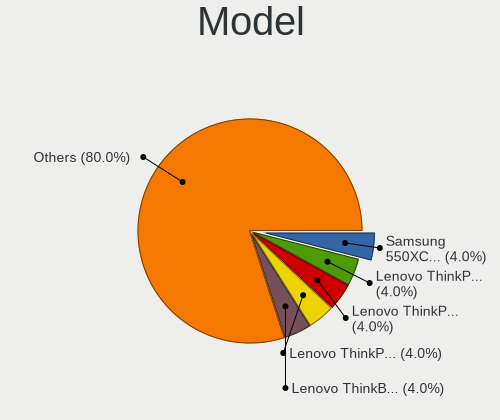
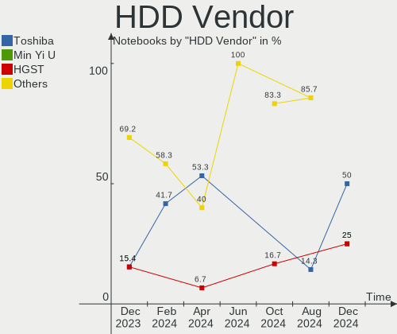
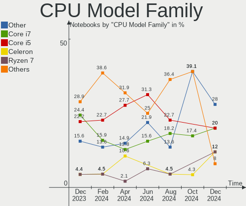
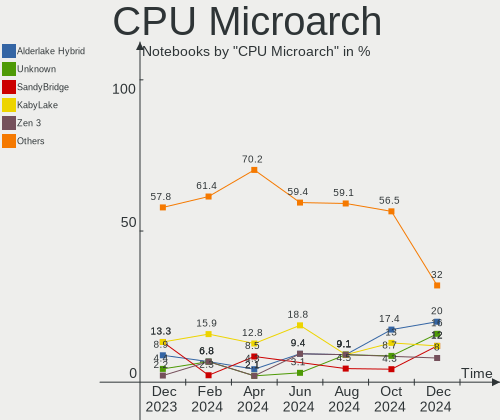
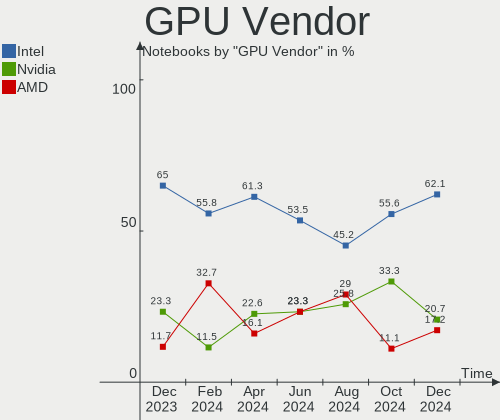
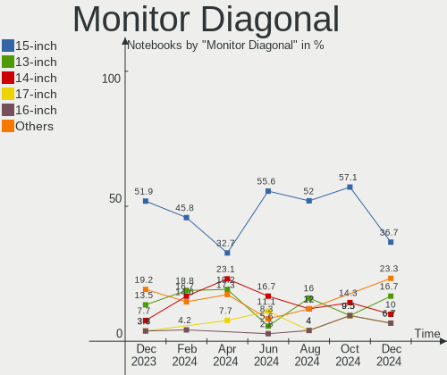
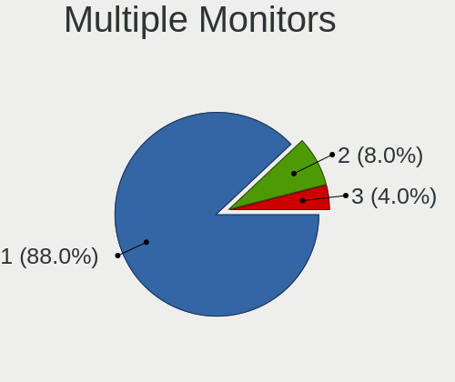
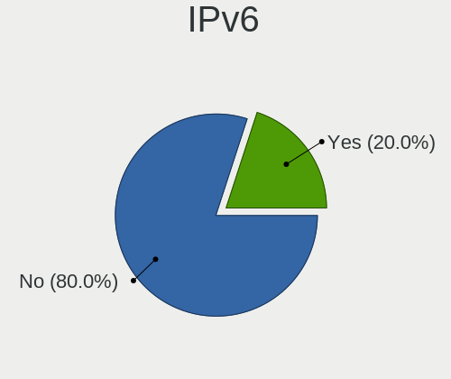
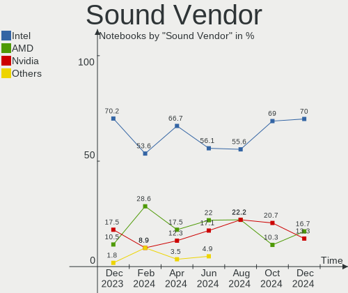

Kali - Hardware Trends (Notebooks)
----------------------------------

A project to identify most popular hardware characteristics and track their change
over time based on data collected by Linux users at https://Linux-Hardware.org.

Anyone can contribute to this report by the [hw-probe](https://github.com/linuxhw/hw-probe) tool:

    sudo -E hw-probe -all -upload

This report is for one last month. Overall report since the beginning of time: [TestDays](https://github.com/linuxhw/TestDays)

Period: Jul, 2023.

Contents
--------

* [ System ](#system)
  - [ OS                       ](#os)
  - [ OS Family                ](#os-family)
  - [ Kernel                   ](#kernel)
  - [ Kernel Family            ](#kernel-family)
  - [ Kernel Major Ver.        ](#kernel-major-ver)
  - [ Arch                     ](#arch)
  - [ DE                       ](#de)
  - [ Display Server           ](#display-server)
  - [ Display Manager          ](#display-manager)
  - [ OS Lang                  ](#os-lang)
  - [ Boot Mode                ](#boot-mode)
  - [ Filesystem               ](#filesystem)
  - [ Part. scheme             ](#part-scheme)
  - [ Dual Boot with Linux/BSD ](#dual-boot-with-linuxbsd)
  - [ Dual Boot (Win)          ](#dual-boot-win)

* [ Board ](#board)
  - [ Vendor                   ](#vendor)
  - [ Model                    ](#model)
  - [ Model Family             ](#model-family)
  - [ MFG Year                 ](#mfg-year)
  - [ Form Factor              ](#form-factor)
  - [ Secure Boot              ](#secure-boot)
  - [ Coreboot                 ](#coreboot)
  - [ RAM Size                 ](#ram-size)
  - [ RAM Used                 ](#ram-used)
  - [ Total Drives             ](#total-drives)
  - [ Has CD-ROM               ](#has-cd-rom)
  - [ Has Ethernet             ](#has-ethernet)
  - [ Has WiFi                 ](#has-wifi)
  - [ Has Bluetooth            ](#has-bluetooth)

* [ Location ](#location)
  - [ Country                  ](#country)
  - [ City                     ](#city)

* [ Drives ](#drives)
  - [ Drive Vendor             ](#drive-vendor)
  - [ Drive Model              ](#drive-model)
  - [ HDD Vendor               ](#hdd-vendor)
  - [ SSD Vendor               ](#ssd-vendor)
  - [ Drive Kind               ](#drive-kind)
  - [ Drive Connector          ](#drive-connector)
  - [ Drive Size               ](#drive-size)
  - [ Space Total              ](#space-total)
  - [ Space Used               ](#space-used)
  - [ Malfunc. Drives          ](#malfunc-drives)
  - [ Malfunc. Drive Vendor    ](#malfunc-drive-vendor)
  - [ Malfunc. HDD Vendor      ](#malfunc-hdd-vendor)
  - [ Malfunc. Drive Kind      ](#malfunc-drive-kind)
  - [ Failed Drives            ](#failed-drives)
  - [ Failed Drive Vendor      ](#failed-drive-vendor)
  - [ Drive Status             ](#drive-status)

* [ Storage controller ](#storage-controller)
  - [ Storage Vendor           ](#storage-vendor)
  - [ Storage Model            ](#storage-model)
  - [ Storage Kind             ](#storage-kind)

* [ Processor ](#processor)
  - [ CPU Vendor               ](#cpu-vendor)
  - [ CPU Model                ](#cpu-model)
  - [ CPU Model Family         ](#cpu-model-family)
  - [ CPU Cores                ](#cpu-cores)
  - [ CPU Sockets              ](#cpu-sockets)
  - [ CPU Threads              ](#cpu-threads)
  - [ CPU Op-Modes             ](#cpu-op-modes)
  - [ CPU Microcode            ](#cpu-microcode)
  - [ CPU Microarch            ](#cpu-microarch)

* [ Graphics ](#graphics)
  - [ GPU Vendor               ](#gpu-vendor)
  - [ GPU Model                ](#gpu-model)
  - [ GPU Combo                ](#gpu-combo)
  - [ GPU Driver               ](#gpu-driver)
  - [ GPU Memory               ](#gpu-memory)

* [ Monitor ](#monitor)
  - [ Monitor Vendor           ](#monitor-vendor)
  - [ Monitor Model            ](#monitor-model)
  - [ Monitor Resolution       ](#monitor-resolution)
  - [ Monitor Diagonal         ](#monitor-diagonal)
  - [ Monitor Width            ](#monitor-width)
  - [ Aspect Ratio             ](#aspect-ratio)
  - [ Monitor Area             ](#monitor-area)
  - [ Pixel Density            ](#pixel-density)
  - [ Multiple Monitors        ](#multiple-monitors)

* [ Network ](#network)
  - [ Net Controller Vendor    ](#net-controller-vendor)
  - [ Net Controller Model     ](#net-controller-model)
  - [ Wireless Vendor          ](#wireless-vendor)
  - [ Wireless Model           ](#wireless-model)
  - [ Ethernet Vendor          ](#ethernet-vendor)
  - [ Ethernet Model           ](#ethernet-model)
  - [ Net Controller Kind      ](#net-controller-kind)
  - [ Used Controller          ](#used-controller)
  - [ NICs                     ](#nics)
  - [ IPv6                     ](#ipv6)

* [ Bluetooth ](#bluetooth)
  - [ Bluetooth Vendor         ](#bluetooth-vendor)
  - [ Bluetooth Model          ](#bluetooth-model)

* [ Sound ](#sound)
  - [ Sound Vendor             ](#sound-vendor)
  - [ Sound Model              ](#sound-model)

* [ Memory ](#memory)
  - [ Memory Vendor            ](#memory-vendor)
  - [ Memory Model             ](#memory-model)
  - [ Memory Kind              ](#memory-kind)
  - [ Memory Form Factor       ](#memory-form-factor)
  - [ Memory Size              ](#memory-size)
  - [ Memory Speed             ](#memory-speed)

* [ Printers & scanners ](#printers--scanners)
  - [ Printer Vendor           ](#printer-vendor)
  - [ Printer Model            ](#printer-model)
  - [ Scanner Vendor           ](#scanner-vendor)
  - [ Scanner Model            ](#scanner-model)

* [ Camera ](#camera)
  - [ Camera Vendor            ](#camera-vendor)
  - [ Camera Model             ](#camera-model)

* [ Security ](#security)
  - [ Fingerprint Vendor       ](#fingerprint-vendor)
  - [ Fingerprint Model        ](#fingerprint-model)
  - [ Chipcard Vendor          ](#chipcard-vendor)
  - [ Chipcard Model           ](#chipcard-model)

* [ Unsupported ](#unsupported)
  - [ Unsupported Devices      ](#unsupported-devices)
  - [ Unsupported Device Types ](#unsupported-device-types)

System
------

OS
--

Installed operating systems

| Name        | Notebooks | Percent |
|-------------|-----------|---------|
| Kali 2023.2 | 38        | 92.68%  |
| Kali 2023.1 | 3         | 7.32%   |

OS Family
---------

OS without a version

| Name | Notebooks | Percent |
|------|-----------|---------|
| Kali | 41        | 100%    |

Kernel
------

Version of the Linux kernel

| Version            | Notebooks | Percent |
|--------------------|-----------|---------|
| 6.1.0-kali9-amd64  | 20        | 48.78%  |
| 6.3.0-kali1-amd64  | 15        | 36.59%  |
| 6.1.0-kali7-amd64  | 3         | 7.32%   |
| 6.1.0-kali5-amd64  | 2         | 4.88%   |
| 5.18.0-kali5-amd64 | 1         | 2.44%   |

Kernel Family
-------------

Linux kernel without a distro release

| Version | Notebooks | Percent |
|---------|-----------|---------|
| 6.1.0   | 25        | 60.98%  |
| 6.3.0   | 15        | 36.59%  |
| 5.18.0  | 1         | 2.44%   |

Kernel Major Ver.
-----------------

Linux kernel major version

| Version | Notebooks | Percent |
|---------|-----------|---------|
| 6.1     | 25        | 60.98%  |
| 6.3     | 15        | 36.59%  |
| 5.18    | 1         | 2.44%   |

Arch
----

OS architecture (x86_64, i586, etc.)

| Name   | Notebooks | Percent |
|--------|-----------|---------|
| x86_64 | 41        | 100%    |

DE
--

Desktop Environment

| Name             | Notebooks | Percent |
|------------------|-----------|---------|
| GNOME            | 18        | 43.9%   |
| XFCE             | 17        | 41.46%  |
| KDE5             | 5         | 12.2%   |
| lightdm-xsession | 1         | 2.44%   |

Display Server
--------------

X11 or Wayland

| Name    | Notebooks | Percent |
|---------|-----------|---------|
| X11     | 36        | 87.8%   |
| Wayland | 5         | 12.2%   |

Display Manager
---------------

SDDM, LightDM, etc.

| Name    | Notebooks | Percent |
|---------|-----------|---------|
| LightDM | 14        | 34.15%  |
| GDM3    | 10        | 24.39%  |
| Unknown | 10        | 24.39%  |
| SDDM    | 6         | 14.63%  |
| GDM     | 1         | 2.44%   |

OS Lang
-------

Language

| Lang  | Notebooks | Percent |
|-------|-----------|---------|
| en_US | 21        | 51.22%  |
| ru_RU | 2         | 4.88%   |
| hu_HU | 2         | 4.88%   |
| fr_FR | 2         | 4.88%   |
| es_ES | 2         | 4.88%   |
| en_IN | 2         | 4.88%   |
| de_DE | 2         | 4.88%   |
| pt_BR | 1         | 2.44%   |
| ja_JP | 1         | 2.44%   |
| it_IT | 1         | 2.44%   |
| fr_CA | 1         | 2.44%   |
| es_CO | 1         | 2.44%   |
| en_ZW | 1         | 2.44%   |
| en_IE | 1         | 2.44%   |
| en_CA | 1         | 2.44%   |

Boot Mode
---------

EFI or BIOS

| Mode | Notebooks | Percent |
|------|-----------|---------|
| EFI  | 27        | 65.85%  |
| BIOS | 14        | 34.15%  |

Filesystem
----------

Type of filesystem

| Type  | Notebooks | Percent |
|-------|-----------|---------|
| Ext4  | 38        | 92.68%  |
| Tmpfs | 2         | 4.88%   |
| Btrfs | 1         | 2.44%   |

Part. scheme
------------

Scheme of partitioning

| Type    | Notebooks | Percent |
|---------|-----------|---------|
| GPT     | 26        | 63.41%  |
| Unknown | 10        | 24.39%  |
| MBR     | 5         | 12.2%   |

Dual Boot with Linux/BSD
------------------------

Hosting more than one Linux/BSD

| Dual boot | Notebooks | Percent |
|-----------|-----------|---------|
| No        | 36        | 87.8%   |
| Yes       | 5         | 12.2%   |

Dual Boot (Win)
---------------

Hosting Linux and Windows

| Dual boot | Notebooks | Percent |
|-----------|-----------|---------|
| No        | 26        | 63.41%  |
| Yes       | 15        | 36.59%  |

Board
-----

Vendor
------

Motherboard manufacturer

| Name             | Notebooks | Percent |
|------------------|-----------|---------|
| Lenovo           | 10        | 24.39%  |
| Hewlett-Packard  | 8         | 19.51%  |
| ASUSTek Computer | 6         | 14.63%  |
| Dell             | 5         | 12.2%   |
| Apple            | 3         | 7.32%   |
| Toshiba          | 2         | 4.88%   |
| MSI              | 2         | 4.88%   |
| Valve            | 1         | 2.44%   |
| HUAWEI           | 1         | 2.44%   |
| Google           | 1         | 2.44%   |
| Alienware        | 1         | 2.44%   |
| Acer             | 1         | 2.44%   |

Model
-----

Motherboard model

| Name                                       | Notebooks | Percent |
|--------------------------------------------|-----------|---------|
| HP Victus by Gaming Laptop 15-fa0xxx       | 2         | 4.88%   |
| Valve Jupiter                              | 1         | 2.44%   |
| Toshiba TECRA R950                         | 1         | 2.44%   |
| Toshiba Satellite C640                     | 1         | 2.44%   |
| MSI GL63 8SD                               | 1         | 2.44%   |
| MSI GF75 Thin 9SC                          | 1         | 2.44%   |
| Lenovo ThinkPad X230 Tablet 3436A15        | 1         | 2.44%   |
| Lenovo ThinkPad X1 Carbon Gen 9 20XWCTO1WW | 1         | 2.44%   |
| Lenovo ThinkPad P51s W10DG 20JY0009US      | 1         | 2.44%   |
| Lenovo Slim 7 Carbon 13IAP7 82V4           | 1         | 2.44%   |
| Lenovo IdeaPad S340-15IWL 81N8             | 1         | 2.44%   |
| Lenovo IdeaPad S340-14API 81NB             | 1         | 2.44%   |
| Lenovo IdeaPad 5 Pro 16ACH6 82L5           | 1         | 2.44%   |
| Lenovo IdeaPad 3 15ADA05 81W1              | 1         | 2.44%   |
| Lenovo IdeaPad 110-15ACL 80TJ              | 1         | 2.44%   |
| Lenovo G580 2189                           | 1         | 2.44%   |
| HUAWEI BOHB-WAX9                           | 1         | 2.44%   |
| HP Laptop 15s-eq1xxx                       | 1         | 2.44%   |
| HP Laptop 14-cf2xxx                        | 1         | 2.44%   |
| HP EliteBook 840 G2                        | 1         | 2.44%   |
| HP EliteBook 820 G2                        | 1         | 2.44%   |
| HP EliteBook 745 G6                        | 1         | 2.44%   |
| HP 15                                      | 1         | 2.44%   |
| Google Kohaku                              | 1         | 2.44%   |
| Dell Latitude E6440                        | 1         | 2.44%   |
| Dell Latitude 3490                         | 1         | 2.44%   |
| Dell Inspiron 3551                         | 1         | 2.44%   |
| Dell Inspiron 15-3565                      | 1         | 2.44%   |
| Dell G15 5510                              | 1         | 2.44%   |
| ASUS VivoBook_ASUSLaptop X7400PC_N7400PC   | 1         | 2.44%   |
| ASUS VivoBook_ASUSLaptop X515DA_X515DA     | 1         | 2.44%   |
| ASUS TUF Gaming FX505DD                    | 1         | 2.44%   |
| ASUS TP300LA                               | 1         | 2.44%   |
| ASUS ROG Zephyrus G14 GA401IV_GA401IV      | 1         | 2.44%   |
| ASUS ROG Strix G713PI_G713PI               | 1         | 2.44%   |
| Apple MacBookPro8,1                        | 1         | 2.44%   |
| Apple MacBookPro15,1                       | 1         | 2.44%   |
| Apple MacBookAir4,1                        | 1         | 2.44%   |
| Alienware x15 R1                           | 1         | 2.44%   |
| Acer Aspire 5250                           | 1         | 2.44%   |

Model Family
------------

Motherboard model prefix

| Name               | Notebooks | Percent |
|--------------------|-----------|---------|
| Lenovo IdeaPad     | 5         | 12.2%   |
| Lenovo ThinkPad    | 3         | 7.32%   |
| HP EliteBook       | 3         | 7.32%   |
| HP Victus          | 2         | 4.88%   |
| HP Laptop          | 2         | 4.88%   |
| Dell Latitude      | 2         | 4.88%   |
| Dell Inspiron      | 2         | 4.88%   |
| ASUS VivoBook      | 2         | 4.88%   |
| ASUS ROG           | 2         | 4.88%   |
| Valve Jupiter      | 1         | 2.44%   |
| Toshiba TECRA      | 1         | 2.44%   |
| Toshiba Satellite  | 1         | 2.44%   |
| MSI GL63           | 1         | 2.44%   |
| MSI GF75           | 1         | 2.44%   |
| Lenovo Slim        | 1         | 2.44%   |
| Lenovo G580        | 1         | 2.44%   |
| HUAWEI BOHB-WAX9   | 1         | 2.44%   |
| HP 15              | 1         | 2.44%   |
| Google Kohaku      | 1         | 2.44%   |
| Dell G15           | 1         | 2.44%   |
| ASUS TUF           | 1         | 2.44%   |
| ASUS TP300LA       | 1         | 2.44%   |
| Apple MacBookPro8  | 1         | 2.44%   |
| Apple MacBookPro15 | 1         | 2.44%   |
| Apple MacBookAir4  | 1         | 2.44%   |
| Alienware x15      | 1         | 2.44%   |
| Acer Aspire        | 1         | 2.44%   |

MFG Year
--------

Motherboard manufacture year

| Year | Notebooks | Percent |
|------|-----------|---------|
| 2021 | 8         | 19.51%  |
| 2019 | 6         | 14.63%  |
| 2022 | 5         | 12.2%   |
| 2012 | 5         | 12.2%   |
| 2020 | 4         | 9.76%   |
| 2015 | 2         | 4.88%   |
| 2014 | 2         | 4.88%   |
| 2013 | 2         | 4.88%   |
| 2011 | 2         | 4.88%   |
| 2023 | 1         | 2.44%   |
| 2018 | 1         | 2.44%   |
| 2017 | 1         | 2.44%   |
| 2016 | 1         | 2.44%   |
| 2010 | 1         | 2.44%   |

Form Factor
-----------

Physical design of the computer

| Name     | Notebooks | Percent |
|----------|-----------|---------|
| Notebook | 41        | 100%    |

Secure Boot
-----------

Enabled or disabled

| State    | Notebooks | Percent |
|----------|-----------|---------|
| Disabled | 41        | 100%    |

Coreboot
--------

Have coreboot on board

| Used | Notebooks | Percent |
|------|-----------|---------|
| No   | 40        | 97.56%  |
| Yes  | 1         | 2.44%   |

RAM Size
--------

Total RAM memory

| Size in GB  | Notebooks | Percent |
|-------------|-----------|---------|
| 4.01-8.0    | 13        | 31.71%  |
| 16.01-24.0  | 8         | 19.51%  |
| 8.01-16.0   | 7         | 17.07%  |
| 3.01-4.0    | 6         | 14.63%  |
| 32.01-64.0  | 5         | 12.2%   |
| 24.01-32.0  | 1         | 2.44%   |
| 64.01-256.0 | 1         | 2.44%   |

RAM Used
--------

Used RAM memory

| Used GB    | Notebooks | Percent |
|------------|-----------|---------|
| 2.01-3.0   | 12        | 29.27%  |
| 1.01-2.0   | 10        | 24.39%  |
| 4.01-8.0   | 8         | 19.51%  |
| 3.01-4.0   | 7         | 17.07%  |
| 8.01-16.0  | 3         | 7.32%   |
| 16.01-24.0 | 1         | 2.44%   |

Total Drives
------------

Number of drives on board

| Drives | Notebooks | Percent |
|--------|-----------|---------|
| 1      | 30        | 73.17%  |
| 2      | 9         | 21.95%  |
| 3      | 2         | 4.88%   |

Has CD-ROM
----------

Has CD-ROM on board

| Presented | Notebooks | Percent |
|-----------|-----------|---------|
| No        | 32        | 78.05%  |
| Yes       | 9         | 21.95%  |

Has Ethernet
------------

Has Ethernet on board

| Presented | Notebooks | Percent |
|-----------|-----------|---------|
| Yes       | 25        | 60.98%  |
| No        | 16        | 39.02%  |

Has WiFi
--------

Has WiFi module

| Presented | Notebooks | Percent |
|-----------|-----------|---------|
| Yes       | 41        | 100%    |

Has Bluetooth
-------------

Has Bluetooth module

| Presented | Notebooks | Percent |
|-----------|-----------|---------|
| Yes       | 37        | 90.24%  |
| No        | 4         | 9.76%   |

Location
--------

Country
-------

Geographic location (country)

| Country     | Notebooks | Percent |
|-------------|-----------|---------|
| USA         | 8         | 19.51%  |
| Indonesia   | 3         | 7.32%   |
| Spain       | 2         | 4.88%   |
| Japan       | 2         | 4.88%   |
| India       | 2         | 4.88%   |
| Hungary     | 2         | 4.88%   |
| Germany     | 2         | 4.88%   |
| France      | 2         | 4.88%   |
| Canada      | 2         | 4.88%   |
| Zimbabwe    | 1         | 2.44%   |
| UK          | 1         | 2.44%   |
| Syria       | 1         | 2.44%   |
| Switzerland | 1         | 2.44%   |
| Sweden      | 1         | 2.44%   |
| Russia      | 1         | 2.44%   |
| Romania     | 1         | 2.44%   |
| Poland      | 1         | 2.44%   |
| Pakistan    | 1         | 2.44%   |
| Kenya       | 1         | 2.44%   |
| Italy       | 1         | 2.44%   |
| Ireland     | 1         | 2.44%   |
| Colombia    | 1         | 2.44%   |
| Bulgaria    | 1         | 2.44%   |
| Brazil      | 1         | 2.44%   |
| Algeria     | 1         | 2.44%   |

City
----

Geographic location (city)

| City           | Notebooks | Percent |
|----------------|-----------|---------|
| Denpasar       | 2         | 4.88%   |
| Zaragoza       | 1         | 2.44%   |
| Warsaw         | 1         | 2.44%   |
| Vila Velha     | 1         | 2.44%   |
| Tholey         | 1         | 2.44%   |
| Sofia          | 1         | 2.44%   |
| Shirala        | 1         | 2.44%   |
| Seville        | 1         | 2.44%   |
| Sacramento     | 1         | 2.44%   |
| Rossville      | 1         | 2.44%   |
| Richmond       | 1         | 2.44%   |
| Rennes         | 1         | 2.44%   |
| Québec        | 1         | 2.44%   |
| Pomaz          | 1         | 2.44%   |
| Pisa           | 1         | 2.44%   |
| Nairobi        | 1         | 2.44%   |
| Nagoya         | 1         | 2.44%   |
| Minato-ku      | 1         | 2.44%   |
| Milford        | 1         | 2.44%   |
| Los Angeles    | 1         | 2.44%   |
| London         | 1         | 2.44%   |
| Les Avenieres  | 1         | 2.44%   |
| Lausanne       | 1         | 2.44%   |
| Las Vegas      | 1         | 2.44%   |
| Lahore         | 1         | 2.44%   |
| Kiel           | 1         | 2.44%   |
| Harare         | 1         | 2.44%   |
| Haerryda       | 1         | 2.44%   |
| Delhi          | 1         | 2.44%   |
| Damascus       | 1         | 2.44%   |
| Chelyabinsk    | 1         | 2.44%   |
| Charlotte      | 1         | 2.44%   |
| Calgary        | 1         | 2.44%   |
| Budapest       | 1         | 2.44%   |
| Bucharest      | 1         | 2.44%   |
| Brigham City   | 1         | 2.44%   |
| Boudouaou      | 1         | 2.44%   |
| Bogotá        | 1         | 2.44%   |
| Bandar Lampung | 1         | 2.44%   |
| Ballybofey     | 1         | 2.44%   |

Drives
------

Drive Vendor
------------

Hard drive vendors

| Vendor                      | Notebooks | Drives | Percent |
|-----------------------------|-----------|--------|---------|
| WDC                         | 5         | 7      | 10%     |
| SK hynix                    | 5         | 5      | 10%     |
| Samsung Electronics         | 4         | 4      | 8%      |
| Kingston                    | 4         | 4      | 8%      |
| Unknown                     | 3         | 3      | 6%      |
| Toshiba                     | 3         | 3      | 6%      |
| Seagate                     | 3         | 3      | 6%      |
| Crucial                     | 3         | 3      | 6%      |
| Transcend                   | 2         | 2      | 4%      |
| Micron Technology           | 2         | 2      | 4%      |
| HGST                        | 2         | 2      | 4%      |
| Apple                       | 2         | 2      | 4%      |
| Unknown                     | 2         | 2      | 4%      |
| SSSTC                       | 1         | 1      | 2%      |
| Sandisk                     | 1         | 1      | 2%      |
| Micron/Crucial Technology   | 1         | 1      | 2%      |
| MAXIO Technology (Hangzhou) | 1         | 1      | 2%      |
| LITEONIT                    | 1         | 1      | 2%      |
| JMicron Technology          | 1         | 1      | 2%      |
| Intel                       | 1         | 1      | 2%      |
| China                       | 1         | 1      | 2%      |
| BAITITON                    | 1         | 1      | 2%      |
| ASMT                        | 1         | 1      | 2%      |

Drive Model
-----------

Hard drive models

| Model                                              | Notebooks | Percent |
|----------------------------------------------------|-----------|---------|
| Toshiba MQ01ABD100 1TB                             | 2         | 3.85%   |
| Unknown                                            | 2         | 3.85%   |
| WDC WDS480G2G0B-00EPW0 480GB SSD                   | 1         | 1.92%   |
| WDC WDS200T2B0C-00PXH0 2TB                         | 1         | 1.92%   |
| WDC WDS200T1X0E-00AFY0 2TB                         | 1         | 1.92%   |
| WDC WDS100T2B0A 1TB SSD                            | 1         | 1.92%   |
| WDC WD5000LPCX-24VHAT0 500GB                       | 1         | 1.92%   |
| WDC WD3200BPVT-22JJ5T0 320GB                       | 1         | 1.92%   |
| WDC WD10SPZX-24Z10 1TB                             | 1         | 1.92%   |
| Unknown xD/SD/M.S.                                 | 1         | 1.92%   |
| Unknown NVMe SSD Drive 2TB                         | 1         | 1.92%   |
| Unknown MMC Card  16GB                             | 1         | 1.92%   |
| Transcend TS256GSSD370S 256GB                      | 1         | 1.92%   |
| Transcend TS1TSSD220Q 1TB                          | 1         | 1.92%   |
| Toshiba MK3265GSXN 320GB                           | 1         | 1.92%   |
| SSSTC CL1-3D256 256GB                              | 1         | 1.92%   |
| SK hynix SKHynix_HFS512GDE9X084N 512GB             | 1         | 1.92%   |
| SK hynix SKHynix_HFS001TEJ9X102N 1TB               | 1         | 1.92%   |
| SK hynix HFM001TD3JX013N 1TB                       | 1         | 1.92%   |
| SK hynix BC511 HFM256GDJTNI-82A0A 256GB            | 1         | 1.92%   |
| SK hynix BC501 NVMe Solid State Drive 512GB        | 1         | 1.92%   |
| Seagate ST2000LM007-1R8174 2TB                     | 1         | 1.92%   |
| Seagate ST1000LM049-2GH172 1TB                     | 1         | 1.92%   |
| Seagate ST1000LM035-1RK172 1TB                     | 1         | 1.92%   |
| Sandisk WD_BLACK SN770 2TB                         | 1         | 1.92%   |
| Samsung PM9A1 NVMe 1024GB                          | 1         | 1.92%   |
| Samsung NVMe SSD Controller PM9A1/PM9A3/980PRO 1TB | 1         | 1.92%   |
| Samsung MZVLB256HBHQ-00000 256GB                   | 1         | 1.92%   |
| Samsung MZNLN256HAJQ-000H7 256GB SSD               | 1         | 1.92%   |
| Micron/Crucial P2 NVMe PCIe SSD 1TB                | 1         | 1.92%   |
| Micron MTFDDAV512MBF-1AN1ZABHA 512GB SSD           | 1         | 1.92%   |
| Micron 2400_MTFDKBA1T0QFM 1024GB                   | 1         | 1.92%   |
| MAXIO (Hangzhou) YSSDHB-2TN7000 2TB                | 1         | 1.92%   |
| LITEONIT LCS-128M6S 2.5 7mm 128GB SSD              | 1         | 1.92%   |
| Kingston SA400S37240G 240GB SSD                    | 1         | 1.92%   |
| Kingston RBUSNS8154P3256GJ 256GB                   | 1         | 1.92%   |
| Kingston OM3PDP3256B-A01 256GB                     | 1         | 1.92%   |
| Kingston NVMe SSD Drive 256GB                      | 1         | 1.92%   |
| JMicron Generic 512GB                              | 1         | 1.92%   |
| Intel SSD 660P Series 1024GB                       | 1         | 1.92%   |

HDD Vendor
----------

Hard disk drive vendors

| Vendor             | Notebooks | Drives | Percent |
|--------------------|-----------|--------|---------|
| WDC                | 3         | 3      | 25%     |
| Toshiba            | 3         | 3      | 25%     |
| Seagate            | 3         | 3      | 25%     |
| HGST               | 2         | 2      | 16.67%  |
| JMicron Technology | 1         | 1      | 8.33%   |

SSD Vendor
----------

Solid state drive vendors

| Vendor              | Notebooks | Drives | Percent |
|---------------------|-----------|--------|---------|
| WDC                 | 2         | 2      | 14.29%  |
| Transcend           | 2         | 2      | 14.29%  |
| Crucial             | 2         | 2      | 14.29%  |
| Samsung Electronics | 1         | 1      | 7.14%   |
| Micron Technology   | 1         | 1      | 7.14%   |
| LITEONIT            | 1         | 1      | 7.14%   |
| Kingston            | 1         | 1      | 7.14%   |
| China               | 1         | 1      | 7.14%   |
| BAITITON            | 1         | 1      | 7.14%   |
| ASMT                | 1         | 1      | 7.14%   |
| Apple               | 1         | 1      | 7.14%   |

Drive Kind
----------

HDD or SSD

| Kind    | Notebooks | Drives | Percent |
|---------|-----------|--------|---------|
| NVMe    | 20        | 22     | 40.82%  |
| SSD     | 14        | 14     | 28.57%  |
| HDD     | 11        | 12     | 22.45%  |
| MMC     | 3         | 3      | 6.12%   |
| Unknown | 1         | 1      | 2.04%   |

Drive Connector
---------------

SATA, SAS, NVMe, etc.

| Type | Notebooks | Drives | Percent |
|------|-----------|--------|---------|
| SATA | 22        | 24     | 45.83%  |
| NVMe | 20        | 22     | 41.67%  |
| SAS  | 3         | 3      | 6.25%   |
| MMC  | 3         | 3      | 6.25%   |

Drive Size
----------

Size of hard drive

| Size in TB | Notebooks | Drives | Percent |
|------------|-----------|--------|---------|
| 0.01-0.5   | 12        | 13     | 50%     |
| 0.51-1.0   | 11        | 12     | 45.83%  |
| 1.01-2.0   | 1         | 1      | 4.17%   |

Space Total
-----------

Amount of disk space available on the file system

| Size in GB | Notebooks | Percent |
|------------|-----------|---------|
| 101-250    | 14        | 34.15%  |
| 251-500    | 12        | 29.27%  |
| 1001-2000  | 7         | 17.07%  |
| 51-100     | 4         | 9.76%   |
| 501-1000   | 3         | 7.32%   |
| 21-50      | 1         | 2.44%   |

Space Used
----------

Amount of used disk space

| Used GB   | Notebooks | Percent |
|-----------|-----------|---------|
| 21-50     | 16        | 39.02%  |
| 51-100    | 8         | 19.51%  |
| 101-250   | 4         | 9.76%   |
| 1-20      | 4         | 9.76%   |
| 251-500   | 3         | 7.32%   |
| 1001-2000 | 3         | 7.32%   |
| 501-1000  | 3         | 7.32%   |

Malfunc. Drives
---------------

Drive models with a malfunction

| Model                    | Notebooks | Drives | Percent |
|--------------------------|-----------|--------|---------|
| Toshiba MK3265GSXN 320GB | 1         | 1      | 100%    |

Malfunc. Drive Vendor
---------------------

Vendors of faulty drives

| Vendor  | Notebooks | Drives | Percent |
|---------|-----------|--------|---------|
| Toshiba | 1         | 1      | 100%    |

Malfunc. HDD Vendor
-------------------

Vendors of faulty HDD drives

| Vendor  | Notebooks | Drives | Percent |
|---------|-----------|--------|---------|
| Toshiba | 1         | 1      | 100%    |

Malfunc. Drive Kind
-------------------

Kinds of faulty drives

| Kind | Notebooks | Drives | Percent |
|------|-----------|--------|---------|
| HDD  | 1         | 1      | 100%    |

Failed Drives
-------------

Failed drive models

Zero info for selected period =(

Failed Drive Vendor
-------------------

Failed drive vendors

Zero info for selected period =(

Drive Status
------------

Number of failed and malfunc. drives

| Status   | Notebooks | Drives | Percent |
|----------|-----------|--------|---------|
| Works    | 27        | 32     | 60%     |
| Detected | 17        | 19     | 37.78%  |
| Malfunc  | 1         | 1      | 2.22%   |

Storage controller
------------------

Storage Vendor
--------------

Storage controller vendors

| Vendor                         | Notebooks | Percent |
|--------------------------------|-----------|---------|
| Intel                          | 22        | 43.14%  |
| AMD                            | 8         | 15.69%  |
| SK hynix                       | 5         | 9.8%    |
| SanDisk                        | 3         | 5.88%   |
| Samsung Electronics            | 3         | 5.88%   |
| Kingston Technology Company    | 3         | 5.88%   |
| Micron/Crucial Technology      | 2         | 3.92%   |
| Solid State Storage Technology | 1         | 1.96%   |
| Micron Technology              | 1         | 1.96%   |
| MAXIO Technology (Hangzhou)    | 1         | 1.96%   |
| INNOGRIT                       | 1         | 1.96%   |
| Apple                          | 1         | 1.96%   |

Storage Model
-------------

Storage controller models

| Model                                                                                  | Notebooks | Percent |
|----------------------------------------------------------------------------------------|-----------|---------|
| AMD FCH SATA Controller [AHCI mode]                                                    | 7         | 13.73%  |
| Intel 82801 Mobile SATA Controller [RAID mode]                                         | 3         | 5.88%   |
| Intel 7 Series Chipset Family 6-port SATA Controller [AHCI mode]                       | 3         | 5.88%   |
| SK hynix Gold P31/BC711/PC711 NVMe Solid State Drive                                   | 2         | 3.92%   |
| Samsung NVMe SSD Controller PM9A1/PM9A3/980PRO                                         | 2         | 3.92%   |
| Micron/Crucial P2 [Nick P2] / P3 / P3 Plus NVMe PCIe SSD (DRAM-less)                   | 2         | 3.92%   |
| Kingston Company OM3PDP3 NVMe SSD                                                      | 2         | 3.92%   |
| Intel Wildcat Point-LP SATA Controller [AHCI Mode]                                     | 2         | 3.92%   |
| Intel Volume Management Device NVMe RAID Controller                                    | 2         | 3.92%   |
| Intel Comet Lake SATA AHCI Controller                                                  | 2         | 3.92%   |
| Intel Cannon Lake Mobile PCH SATA AHCI Controller                                      | 2         | 3.92%   |
| Intel Atom Processor E3800 Series SATA AHCI Controller                                 | 2         | 3.92%   |
| Solid State Storage CL1-3D256-Q11 NVMe SSD M.2                                         | 1         | 1.96%   |
| SK hynix Platinum P41/PC801 NVMe Solid State Drive                                     | 1         | 1.96%   |
| SK hynix BC511 NVMe SSD                                                                | 1         | 1.96%   |
| SK hynix BC501 NVMe Solid State Drive                                                  | 1         | 1.96%   |
| SanDisk WD PC SN810 / Black SN850 NVMe SSD                                             | 1         | 1.96%   |
| SanDisk WD Blue SN550 NVMe SSD 2TB (DRAM-less)                                         | 1         | 1.96%   |
| SanDisk WD Black SN770 / PC SN740 256GB / PC SN560 (DRAM-less) NVMe SSD                | 1         | 1.96%   |
| Samsung NVMe SSD Controller SM981/PM981/PM983                                          | 1         | 1.96%   |
| Micron 2400 NVMe SSD (DRAM-less)                                                       | 1         | 1.96%   |
| MAXIO (Hangzhou) NVMe SSD Controller MAP1602                                           | 1         | 1.96%   |
| Kingston Company U-SNS8154P3 NVMe SSD                                                  | 1         | 1.96%   |
| Intel Sunrise Point-LP SATA Controller [AHCI mode]                                     | 1         | 1.96%   |
| Intel SSD 660P Series                                                                  | 1         | 1.96%   |
| Intel 8 Series SATA Controller 1 [AHCI mode]                                           | 1         | 1.96%   |
| Intel 6 Series/C200 Series Chipset Family Mobile SATA Controller (IDE mode, ports 0-3) | 1         | 1.96%   |
| Intel 6 Series/C200 Series Chipset Family 6 port Mobile SATA AHCI Controller           | 1         | 1.96%   |
| Intel 5 Series/3400 Series Chipset 4 port SATA AHCI Controller                         | 1         | 1.96%   |
| INNOGRIT NVMe SSD Controller IG5236                                                    | 1         | 1.96%   |
| Apple ANS2 NVMe Controller                                                             | 1         | 1.96%   |
| AMD SB7x0/SB8x0/SB9x0 SATA Controller [AHCI mode]                                      | 1         | 1.96%   |

Storage Kind
------------

Kind of storage controller (IDE, SATA, NVMe, SAS, ...)

| Kind | Notebooks | Percent |
|------|-----------|---------|
| SATA | 23        | 46.94%  |
| NVMe | 20        | 40.82%  |
| RAID | 5         | 10.2%   |
| IDE  | 1         | 2.04%   |

Processor
---------

CPU Vendor
----------

Processor vendors

| Vendor | Notebooks | Percent |
|--------|-----------|---------|
| Intel  | 28        | 68.29%  |
| AMD    | 13        | 31.71%  |

CPU Model
---------

Processor models

| Model                                           | Notebooks | Percent |
|-------------------------------------------------|-----------|---------|
| Intel Core i5-3320M CPU @ 2.60GHz               | 2         | 4.88%   |
| AMD Ryzen 7 3700U with Radeon Vega Mobile Gfx   | 2         | 4.88%   |
| Intel Pentium CPU P6200 @ 2.13GHz               | 1         | 2.44%   |
| Intel Pentium CPU N3530 @ 2.16GHz               | 1         | 2.44%   |
| Intel Core i9-9980HK CPU @ 2.40GHz              | 1         | 2.44%   |
| Intel Core i7-9750H CPU @ 2.60GHz               | 1         | 2.44%   |
| Intel Core i7-8750H CPU @ 2.20GHz               | 1         | 2.44%   |
| Intel Core i7-8565U CPU @ 1.80GHz               | 1         | 2.44%   |
| Intel Core i7-6500U CPU @ 2.50GHz               | 1         | 2.44%   |
| Intel Core i7-3520M CPU @ 2.90GHz               | 1         | 2.44%   |
| Intel Core i5-8250U CPU @ 1.60GHz               | 1         | 2.44%   |
| Intel Core i5-5300U CPU @ 2.30GHz               | 1         | 2.44%   |
| Intel Core i5-4300M CPU @ 2.60GHz               | 1         | 2.44%   |
| Intel Core i5-2467M CPU @ 1.60GHz               | 1         | 2.44%   |
| Intel Core i5-2435M CPU @ 2.40GHz               | 1         | 2.44%   |
| Intel Core i5-10210U CPU @ 1.60GHz              | 1         | 2.44%   |
| Intel Core i5-10200H CPU @ 2.40GHz              | 1         | 2.44%   |
| Intel Core i3-5010U CPU @ 2.10GHz               | 1         | 2.44%   |
| Intel Core i3-4005U CPU @ 1.70GHz               | 1         | 2.44%   |
| Intel Core i3-10110U CPU @ 2.10GHz              | 1         | 2.44%   |
| Intel Celeron N4120 CPU @ 1.10GHz               | 1         | 2.44%   |
| Intel Celeron CPU N2840 @ 2.16GHz               | 1         | 2.44%   |
| Intel 12th Gen Core i7-1260P                    | 1         | 2.44%   |
| Intel 12th Gen Core i5-12500H                   | 1         | 2.44%   |
| Intel 12th Gen Core i5-12450H                   | 1         | 2.44%   |
| Intel 11th Gen Core i7-1185G7 @ 3.00GHz         | 1         | 2.44%   |
| Intel 11th Gen Core i7-11800H @ 2.30GHz         | 1         | 2.44%   |
| Intel 11th Gen Core i7-11370H @ 3.30GHz         | 1         | 2.44%   |
| AMD Ryzen 9 7945HX with Radeon Graphics         | 1         | 2.44%   |
| AMD Ryzen 9 4900HS with Radeon Graphics         | 1         | 2.44%   |
| AMD Ryzen 7 5800H with Radeon Graphics          | 1         | 2.44%   |
| AMD Ryzen 5 PRO 3500U w/ Radeon Vega Mobile Gfx | 1         | 2.44%   |
| AMD Ryzen 5 3550H with Radeon Vega Mobile Gfx   | 1         | 2.44%   |
| AMD Ryzen 5 3500U with Radeon Vega Mobile Gfx   | 1         | 2.44%   |
| AMD E2-9000 RADEON R2, 4 COMPUTE CORES 2C+2G    | 1         | 2.44%   |
| AMD E1-7010 APU with AMD Radeon R2 Graphics     | 1         | 2.44%   |
| AMD E-350 Processor                             | 1         | 2.44%   |
| AMD Custom APU 0405                             | 1         | 2.44%   |
| AMD Athlon Silver 3050U with Radeon Graphics    | 1         | 2.44%   |

CPU Model Family
----------------

Processor model prefix

| Model           | Notebooks | Percent |
|-----------------|-----------|---------|
| Intel Core i5   | 9         | 21.95%  |
| Other           | 7         | 17.07%  |
| Intel Core i7   | 5         | 12.2%   |
| Intel Core i3   | 3         | 7.32%   |
| AMD Ryzen 7     | 3         | 7.32%   |
| Intel Pentium   | 2         | 4.88%   |
| Intel Celeron   | 2         | 4.88%   |
| AMD Ryzen 9     | 2         | 4.88%   |
| AMD Ryzen 5     | 2         | 4.88%   |
| Intel Core i9   | 1         | 2.44%   |
| AMD Ryzen 5 PRO | 1         | 2.44%   |
| AMD E2          | 1         | 2.44%   |
| AMD E1          | 1         | 2.44%   |
| AMD E           | 1         | 2.44%   |
| AMD Athlon      | 1         | 2.44%   |

CPU Cores
---------

Number of processor cores

| Number | Notebooks | Percent |
|--------|-----------|---------|
| 2      | 17        | 41.46%  |
| 4      | 14        | 34.15%  |
| 8      | 5         | 12.2%   |
| 12     | 2         | 4.88%   |
| 6      | 2         | 4.88%   |
| 16     | 1         | 2.44%   |

CPU Sockets
-----------

Number of sockets

| Number | Notebooks | Percent |
|--------|-----------|---------|
| 1      | 41        | 100%    |

CPU Threads
-----------

Threads per core (Hyper-Threading)

| Number | Notebooks | Percent |
|--------|-----------|---------|
| 2      | 30        | 73.17%  |
| 1      | 11        | 26.83%  |

CPU Op-Modes
------------

CPU Operation Modes (32-bit, 64-bit)

| Op mode        | Notebooks | Percent |
|----------------|-----------|---------|
| 32-bit, 64-bit | 41        | 100%    |

CPU Microcode
-------------

Microcode number

| Number     | Notebooks | Percent |
|------------|-----------|---------|
| Unknown    | 13        | 31.71%  |
| 0x08108109 | 4         | 9.76%   |
| 0x306a9    | 3         | 7.32%   |
| 0x906ea    | 2         | 4.88%   |
| 0x806ec    | 2         | 4.88%   |
| 0x806c1    | 2         | 4.88%   |
| 0x206a7    | 2         | 4.88%   |
| 0x906ed    | 1         | 2.44%   |
| 0x906a3    | 1         | 2.44%   |
| 0x806d1    | 1         | 2.44%   |
| 0x706a8    | 1         | 2.44%   |
| 0x40651    | 1         | 2.44%   |
| 0x30678    | 1         | 2.44%   |
| 0x20655    | 1         | 2.44%   |
| 0x0a601203 | 1         | 2.44%   |
| 0x0a50000c | 1         | 2.44%   |
| 0x08900201 | 1         | 2.44%   |
| 0x08600104 | 1         | 2.44%   |
| 0x08108102 | 1         | 2.44%   |
| 0x06006704 | 1         | 2.44%   |

CPU Microarch
-------------

Microarchitecture

| Name             | Notebooks | Percent |
|------------------|-----------|---------|
| KabyLake         | 7         | 17.07%  |
| Zen+             | 6         | 14.63%  |
| Unknown          | 4         | 9.76%   |
| IvyBridge        | 3         | 7.32%   |
| TigerLake        | 2         | 4.88%   |
| Silvermont       | 2         | 4.88%   |
| SandyBridge      | 2         | 4.88%   |
| Haswell          | 2         | 4.88%   |
| Broadwell        | 2         | 4.88%   |
| Zen 3            | 1         | 2.44%   |
| Zen 2            | 1         | 2.44%   |
| Westmere         | 1         | 2.44%   |
| Skylake          | 1         | 2.44%   |
| Puma             | 1         | 2.44%   |
| Icelake          | 1         | 2.44%   |
| Goldmont plus    | 1         | 2.44%   |
| Excavator        | 1         | 2.44%   |
| CometLake        | 1         | 2.44%   |
| Bobcat           | 1         | 2.44%   |
| Alderlake Hybrid | 1         | 2.44%   |

Graphics
--------

GPU Vendor
----------

Vendors of graphics cards

| Vendor | Notebooks | Percent |
|--------|-----------|---------|
| Intel  | 27        | 50%     |
| AMD    | 15        | 27.78%  |
| Nvidia | 12        | 22.22%  |

GPU Model
---------

Graphics card models

| Model                                                                         | Notebooks | Percent |
|-------------------------------------------------------------------------------|-----------|---------|
| AMD Picasso/Raven 2 [Radeon Vega Series / Radeon Vega Mobile Series]          | 6         | 11.11%  |
| Nvidia GA107M [GeForce RTX 3050 Mobile]                                       | 4         | 7.41%   |
| Intel 3rd Gen Core processor Graphics Controller                              | 3         | 5.56%   |
| Nvidia TU117M [GeForce GTX 1650 Mobile / Max-Q]                               | 2         | 3.7%    |
| Intel TigerLake-LP GT2 [Iris Xe Graphics]                                     | 2         | 3.7%    |
| Intel HD Graphics 5500                                                        | 2         | 3.7%    |
| Intel CometLake-U GT2 [UHD Graphics]                                          | 2         | 3.7%    |
| Intel CoffeeLake-H GT2 [UHD Graphics 630]                                     | 2         | 3.7%    |
| Intel Atom Processor Z36xxx/Z37xxx Series Graphics & Display                  | 2         | 3.7%    |
| Intel Alder Lake-P Integrated Graphics Controller                             | 2         | 3.7%    |
| Intel 2nd Generation Core Processor Family Integrated Graphics Controller     | 2         | 3.7%    |
| Nvidia TU116M [GeForce GTX 1660 Ti Mobile]                                    | 1         | 1.85%   |
| Nvidia TU106M [GeForce RTX 2060 Max-Q]                                        | 1         | 1.85%   |
| Nvidia GP107M [GeForce GTX 1050 3 GB Max-Q]                                   | 1         | 1.85%   |
| Nvidia GM108GLM [Quadro M520 Mobile]                                          | 1         | 1.85%   |
| Nvidia GA106M [GeForce RTX 3060 Mobile / Max-Q]                               | 1         | 1.85%   |
| Nvidia AD106M [GeForce RTX 4070 Max-Q / Mobile]                               | 1         | 1.85%   |
| Intel WhiskeyLake-U GT2 [UHD Graphics 620]                                    | 1         | 1.85%   |
| Intel UHD Graphics 620                                                        | 1         | 1.85%   |
| Intel TigerLake-H GT1 [UHD Graphics]                                          | 1         | 1.85%   |
| Intel Skylake GT2 [HD Graphics 520]                                           | 1         | 1.85%   |
| Intel Haswell-ULT Integrated Graphics Controller                              | 1         | 1.85%   |
| Intel GeminiLake [UHD Graphics 600]                                           | 1         | 1.85%   |
| Intel Core Processor Integrated Graphics Controller                           | 1         | 1.85%   |
| Intel Comet Lake-H GT1 [UHD Graphics 610]                                     | 1         | 1.85%   |
| Intel Alder Lake-P GT1 [UHD Graphics]                                         | 1         | 1.85%   |
| Intel 4th Gen Core Processor Integrated Graphics Controller                   | 1         | 1.85%   |
| AMD Wrestler [Radeon HD 6310]                                                 | 1         | 1.85%   |
| AMD VanGogh [AMD Custom GPU 0405]                                             | 1         | 1.85%   |
| AMD Sun XT [Radeon HD 8670A/8670M/8690M / R5 M330 / M430 / Radeon 520 Mobile] | 1         | 1.85%   |
| AMD Stoney [Radeon R2/R3/R4/R5 Graphics]                                      | 1         | 1.85%   |
| AMD Renoir                                                                    | 1         | 1.85%   |
| AMD Raphael                                                                   | 1         | 1.85%   |
| AMD Mullins [Radeon R2 Graphics]                                              | 1         | 1.85%   |
| AMD Cezanne [Radeon Vega Series / Radeon Vega Mobile Series]                  | 1         | 1.85%   |
| AMD Baffin [Radeon RX 460/560D / Pro 450/455/460/555/555X/560/560X]           | 1         | 1.85%   |

GPU Combo
---------

Combinations of graphics cards

| Name           | Notebooks | Percent |
|----------------|-----------|---------|
| 1 x Intel      | 18        | 43.9%   |
| 1 x AMD        | 10        | 24.39%  |
| Intel + Nvidia | 8         | 19.51%  |
| AMD + Nvidia   | 4         | 9.76%   |
| Intel + AMD    | 1         | 2.44%   |

GPU Driver
----------

Free vs proprietary

| Driver      | Notebooks | Percent |
|-------------|-----------|---------|
| Free        | 32        | 78.05%  |
| Proprietary | 8         | 19.51%  |
| Unknown     | 1         | 2.44%   |

GPU Memory
----------

Total video memory

| Size in GB | Notebooks | Percent |
|------------|-----------|---------|
| Unknown    | 26        | 63.41%  |
| 1.01-2.0   | 5         | 12.2%   |
| 0.01-0.5   | 4         | 9.76%   |
| 3.01-4.0   | 3         | 7.32%   |
| 5.01-6.0   | 2         | 4.88%   |
| 0.51-1.0   | 1         | 2.44%   |

Monitor
-------

Monitor Vendor
--------------

Monitor vendors

| Vendor              | Notebooks | Percent |
|---------------------|-----------|---------|
| Chimei Innolux      | 7         | 16.28%  |
| AU Optronics        | 7         | 16.28%  |
| Samsung Electronics | 6         | 13.95%  |
| BOE                 | 6         | 13.95%  |
| LG Display          | 5         | 11.63%  |
| PANDA               | 3         | 6.98%   |
| CSO                 | 3         | 6.98%   |
| Apple               | 3         | 6.98%   |
| Valve               | 1         | 2.33%   |
| Toshiba             | 1         | 2.33%   |
| Goldstar            | 1         | 2.33%   |

Monitor Model
-------------

Monitor models

| Model                                                                  | Notebooks | Percent |
|------------------------------------------------------------------------|-----------|---------|
| Chimei Innolux LCD Monitor CMN15F5 1920x1080 344x193mm 15.5-inch       | 2         | 4.55%   |
| Valve ANX7530 U VLV3001 800x1280 100x150mm 7.1-inch                    | 1         | 2.27%   |
| Toshiba TV TSB0209 1920x1080 1594x900mm 72.1-inch                      | 1         | 2.27%   |
| Samsung Electronics LCD Monitor SDC4A42 1366x768 309x174mm 14.0-inch   | 1         | 2.27%   |
| Samsung Electronics LCD Monitor SDC4651 1366x768 344x194mm 15.5-inch   | 1         | 2.27%   |
| Samsung Electronics LCD Monitor SDC4154 2880x1800 302x189mm 14.0-inch  | 1         | 2.27%   |
| Samsung Electronics LCD Monitor SDC4142 3840x2160 294x165mm 13.3-inch  | 1         | 2.27%   |
| Samsung Electronics LCD Monitor SAM0C39 1920x1080 885x498mm 40.0-inch  | 1         | 2.27%   |
| Samsung Electronics LCD Monitor SAM07C5 1920x1080 1210x680mm 54.6-inch | 1         | 2.27%   |
| Samsung Electronics C27F390 SAM0D32 1920x1080 598x336mm 27.0-inch      | 1         | 2.27%   |
| PANDA LCD Monitor NCP005F 1920x1080 344x194mm 15.5-inch                | 1         | 2.27%   |
| PANDA LCD Monitor NCP0040 1920x1080 344x194mm 15.5-inch                | 1         | 2.27%   |
| PANDA LCD Monitor NCP002D 1920x1080 344x194mm 15.5-inch                | 1         | 2.27%   |
| LG Display LCD Monitor LGD0484 1366x768 344x194mm 15.5-inch            | 1         | 2.27%   |
| LG Display LCD Monitor LGD033A 1366x768 344x194mm 15.5-inch            | 1         | 2.27%   |
| LG Display LCD Monitor LGD02DC 1366x768 344x194mm 15.5-inch            | 1         | 2.27%   |
| LG Display LCD Monitor LGD02D8 1366x768 277x156mm 12.5-inch            | 1         | 2.27%   |
| LG Display LCD Monitor LGD029B 1366x768 310x174mm 14.0-inch            | 1         | 2.27%   |
| Goldstar E2260 GSM57E0 1920x1080 477x268mm 21.5-inch                   | 1         | 2.27%   |
| CSO MNH301CA3-1 CSO1702 2560x1440 381x214mm 17.2-inch                  | 1         | 2.27%   |
| CSO LCD Monitor CSO160A 2560x1600 345x215mm 16.0-inch                  | 1         | 2.27%   |
| CSO LCD Monitor CSO1311 2560x1600 286x179mm 13.3-inch                  | 1         | 2.27%   |
| Chimei Innolux LCD Monitor CMN15E6 1366x768 344x193mm 15.5-inch        | 1         | 2.27%   |
| Chimei Innolux LCD Monitor CMN15DC 1366x768 344x193mm 15.5-inch        | 1         | 2.27%   |
| Chimei Innolux LCD Monitor CMN15D6 1920x1080 344x193mm 15.5-inch       | 1         | 2.27%   |
| Chimei Innolux LCD Monitor CMN14C3 1366x768 309x173mm 13.9-inch        | 1         | 2.27%   |
| Chimei Innolux LCD Monitor CMN1481 1600x900 309x174mm 14.0-inch        | 1         | 2.27%   |
| BOE LCD Monitor BOE094C 1920x1200 302x188mm 14.0-inch                  | 1         | 2.27%   |
| BOE LCD Monitor BOE092B 1366x768 309x174mm 14.0-inch                   | 1         | 2.27%   |
| BOE LCD Monitor BOE0872 1920x1080 344x194mm 15.5-inch                  | 1         | 2.27%   |
| BOE LCD Monitor BOE07AA 1366x768 344x194mm 15.5-inch                   | 1         | 2.27%   |
| BOE LCD Monitor BOE0674 1366x768 344x194mm 15.5-inch                   | 1         | 2.27%   |
| BOE LCD Monitor BOE05DF 1366x768 293x165mm 13.2-inch                   | 1         | 2.27%   |
| AU Optronics LCD Monitor AUOE68C 2560x1440 309x174mm 14.0-inch         | 1         | 2.27%   |
| AU Optronics LCD Monitor AUO8092 1920x1080 344x193mm 15.5-inch         | 1         | 2.27%   |
| AU Optronics LCD Monitor AUO499F 1920x1080 344x194mm 15.5-inch         | 1         | 2.27%   |
| AU Optronics LCD Monitor AUO429D 1920x1080 382x215mm 17.3-inch         | 1         | 2.27%   |
| AU Optronics LCD Monitor AUO2992 1920x1080 344x193mm 15.5-inch         | 1         | 2.27%   |
| AU Optronics LCD Monitor AUO206C 1366x768 277x156mm 12.5-inch          | 1         | 2.27%   |
| AU Optronics LCD Monitor AUO203D 1920x1080 309x174mm 14.0-inch         | 1         | 2.27%   |

Monitor Resolution
------------------

Monitor screen resolution

| Resolution        | Notebooks | Percent |
|-------------------|-----------|---------|
| 1366x768 (WXGA)   | 16        | 39.02%  |
| 1920x1080 (FHD)   | 14        | 34.15%  |
| 2880x1800         | 2         | 4.88%   |
| 2560x1600         | 2         | 4.88%   |
| 2560x1440 (QHD)   | 2         | 4.88%   |
| 800x1280          | 1         | 2.44%   |
| 3840x2160 (4K)    | 1         | 2.44%   |
| 1920x1200 (WUXGA) | 1         | 2.44%   |
| 1600x900 (HD+)    | 1         | 2.44%   |
| 1280x800 (WXGA)   | 1         | 2.44%   |

Monitor Diagonal
----------------

Diagonal size in inches

| Inches | Notebooks | Percent |
|--------|-----------|---------|
| 15     | 19        | 43.18%  |
| 14     | 8         | 18.18%  |
| 13     | 5         | 11.36%  |
| 17     | 2         | 4.55%   |
| 12     | 2         | 4.55%   |
| 72     | 1         | 2.27%   |
| 54     | 1         | 2.27%   |
| 47     | 1         | 2.27%   |
| 40     | 1         | 2.27%   |
| 21     | 1         | 2.27%   |
| 16     | 1         | 2.27%   |
| 11     | 1         | 2.27%   |
| 7      | 1         | 2.27%   |

Monitor Width
-------------

Physical width

| Width in mm | Notebooks | Percent |
|-------------|-----------|---------|
| 301-350     | 29        | 67.44%  |
| 201-300     | 7         | 16.28%  |
| 351-400     | 2         | 4.65%   |
| 801-900     | 1         | 2.33%   |
| 401-500     | 1         | 2.33%   |
| 1501-2000   | 1         | 2.33%   |
| 1001-1500   | 1         | 2.33%   |
| 1-100       | 1         | 2.33%   |

Aspect Ratio
------------

Proportional relationship between the width and the height

| Ratio | Notebooks | Percent |
|-------|-----------|---------|
| 16/9  | 32        | 82.05%  |
| 16/10 | 6         | 15.38%  |
| 0.67  | 1         | 2.56%   |

Monitor Area
------------

Area in inch²

| Area in inch² | Notebooks | Percent |
|----------------|-----------|---------|
| 101-110        | 19        | 43.18%  |
| 81-90          | 10        | 22.73%  |
| 71-80          | 3         | 6.82%   |
| More than 1000 | 2         | 4.55%   |
| 61-70          | 2         | 4.55%   |
| 121-130        | 2         | 4.55%   |
| 501-1000       | 2         | 4.55%   |
| 51-60          | 1         | 2.27%   |
| 1-40           | 1         | 2.27%   |
| 201-250        | 1         | 2.27%   |
| 111-120        | 1         | 2.27%   |

Pixel Density
-------------

Pixels per inch

| Density       | Notebooks | Percent |
|---------------|-----------|---------|
| 121-160       | 16        | 38.1%   |
| 101-120       | 14        | 33.33%  |
| 161-240       | 7         | 16.67%  |
| More than 240 | 2         | 4.76%   |
| 1-50          | 2         | 4.76%   |
| 51-100        | 1         | 2.38%   |

Multiple Monitors
-----------------

Total monitors connected

| Total | Notebooks | Percent |
|-------|-----------|---------|
| 1     | 36        | 87.8%   |
| 2     | 3         | 7.32%   |
| 3     | 1         | 2.44%   |
| 0     | 1         | 2.44%   |

Network
-------

Net Controller Vendor
---------------------

Controller vendors

| Vendor                            | Notebooks | Percent |
|-----------------------------------|-----------|---------|
| Realtek Semiconductor             | 19        | 28.36%  |
| Intel                             | 17        | 25.37%  |
| Qualcomm Atheros                  | 11        | 16.42%  |
| MediaTek                          | 5         | 7.46%   |
| TP-Link                           | 3         | 4.48%   |
| Broadcom                          | 3         | 4.48%   |
| Ralink Technology                 | 2         | 2.99%   |
| Qualcomm Atheros Communications   | 1         | 1.49%   |
| Microsoft                         | 1         | 1.49%   |
| Ericsson Business Mobile Networks | 1         | 1.49%   |
| Dell                              | 1         | 1.49%   |
| D-Link                            | 1         | 1.49%   |
| BUFFALO                           | 1         | 1.49%   |
| Broadcom Limited                  | 1         | 1.49%   |

Net Controller Model
--------------------

Controller models

| Model                                                             | Notebooks | Percent |
|-------------------------------------------------------------------|-----------|---------|
| Realtek RTL8111/8168/8411 PCI Express Gigabit Ethernet Controller | 9         | 11.11%  |
| Qualcomm Atheros QCA9377 802.11ac Wireless Network Adapter        | 5         | 6.17%   |
| MediaTek MT7921 802.11ax PCI Express Wireless Network Adapter     | 4         | 4.94%   |
| Realtek RTL8822CE 802.11ac PCIe Wireless Network Adapter          | 3         | 3.7%    |
| Realtek RTL8812AU 802.11a/b/g/n/ac 2T2R DB WLAN Adapter           | 3         | 3.7%    |
| Realtek RTL810xE PCI Express Fast Ethernet controller             | 3         | 3.7%    |
| Realtek RTL8821CE 802.11ac PCIe Wireless Network Adapter          | 2         | 2.47%   |
| Realtek RTL8153 Gigabit Ethernet Adapter                          | 2         | 2.47%   |
| Intel Wireless 7265                                               | 2         | 2.47%   |
| Intel Ethernet Connection (3) I218-LM                             | 2         | 2.47%   |
| Intel Comet Lake PCH-LP CNVi WiFi                                 | 2         | 2.47%   |
| Intel Centrino Advanced-N 6235                                    | 2         | 2.47%   |
| Intel Cannon Lake PCH CNVi WiFi                                   | 2         | 2.47%   |
| Intel 82579LM Gigabit Network Connection (Lewisville)             | 2         | 2.47%   |
| TP-Link UE300 10/100/1000 LAN (ethernet mode) [Realtek RTL8153]   | 1         | 1.23%   |
| TP-Link TL-WN823N v2/v3 [Realtek RTL8192EU]                       | 1         | 1.23%   |
| TP-Link Archer T3U [Realtek RTL8812BU]                            | 1         | 1.23%   |
| Realtek RTL8814AU 802.11a/b/g/n/ac Wireless Adapter               | 1         | 1.23%   |
| Realtek RTL8188EE Wireless Network Adapter                        | 1         | 1.23%   |
| Realtek RTL8188CE 802.11b/g/n WiFi Adapter                        | 1         | 1.23%   |
| Ralink RT2870/RT3070 Wireless Adapter                             | 1         | 1.23%   |
| Ralink MT7601U Wireless Adapter                                   | 1         | 1.23%   |
| Qualcomm Atheros QCA9565 / AR9565 Wireless Network Adapter        | 1         | 1.23%   |
| Qualcomm Atheros QCA6174 802.11ac Wireless Network Adapter        | 1         | 1.23%   |
| Qualcomm Atheros Killer E2400 Gigabit Ethernet Controller         | 1         | 1.23%   |
| Qualcomm Atheros AR9271 802.11n                                   | 1         | 1.23%   |
| Qualcomm Atheros AR9485 Wireless Network Adapter                  | 1         | 1.23%   |
| Qualcomm Atheros AR9285 Wireless Network Adapter (PCI-Express)    | 1         | 1.23%   |
| Qualcomm Atheros AR8162 Fast Ethernet                             | 1         | 1.23%   |
| Qualcomm Atheros AR8152 v2.0 Fast Ethernet                        | 1         | 1.23%   |
| Qualcomm Atheros AR8152 v1.1 Fast Ethernet                        | 1         | 1.23%   |
| Microsoft Xbox Wireless Adapter for Windows                       | 1         | 1.23%   |
| MediaTek MT7922 802.11ax PCI Express Wireless Network Adapter     | 1         | 1.23%   |
| Intel Wireless-AC 9260                                            | 1         | 1.23%   |
| Intel Wireless 8260                                               | 1         | 1.23%   |
| Intel Wireless 7260                                               | 1         | 1.23%   |
| Intel Wi-Fi 6 AX210/AX211/AX411 160MHz                            | 1         | 1.23%   |
| Intel Wi-Fi 6 AX201                                               | 1         | 1.23%   |
| Intel Wi-Fi 6 AX200                                               | 1         | 1.23%   |
| Intel Ethernet Connection I219-V                                  | 1         | 1.23%   |

Wireless Vendor
---------------

Wireless vendors

| Vendor                          | Notebooks | Percent |
|---------------------------------|-----------|---------|
| Intel                           | 16        | 30.19%  |
| Realtek Semiconductor           | 10        | 18.87%  |
| Qualcomm Atheros                | 9         | 16.98%  |
| MediaTek                        | 5         | 9.43%   |
| Broadcom                        | 3         | 5.66%   |
| TP-Link                         | 2         | 3.77%   |
| Ralink Technology               | 2         | 3.77%   |
| Qualcomm Atheros Communications | 1         | 1.89%   |
| Microsoft                       | 1         | 1.89%   |
| Dell                            | 1         | 1.89%   |
| D-Link                          | 1         | 1.89%   |
| BUFFALO                         | 1         | 1.89%   |
| Broadcom Limited                | 1         | 1.89%   |

Wireless Model
--------------

Wireless models

| Model                                                          | Notebooks | Percent |
|----------------------------------------------------------------|-----------|---------|
| Qualcomm Atheros QCA9377 802.11ac Wireless Network Adapter     | 5         | 9.26%   |
| MediaTek MT7921 802.11ax PCI Express Wireless Network Adapter  | 4         | 7.41%   |
| Realtek RTL8822CE 802.11ac PCIe Wireless Network Adapter       | 3         | 5.56%   |
| Realtek RTL8812AU 802.11a/b/g/n/ac 2T2R DB WLAN Adapter        | 3         | 5.56%   |
| Realtek RTL8821CE 802.11ac PCIe Wireless Network Adapter       | 2         | 3.7%    |
| Intel Wireless 7265                                            | 2         | 3.7%    |
| Intel Comet Lake PCH-LP CNVi WiFi                              | 2         | 3.7%    |
| Intel Centrino Advanced-N 6235                                 | 2         | 3.7%    |
| Intel Cannon Lake PCH CNVi WiFi                                | 2         | 3.7%    |
| TP-Link TL-WN823N v2/v3 [Realtek RTL8192EU]                    | 1         | 1.85%   |
| TP-Link Archer T3U [Realtek RTL8812BU]                         | 1         | 1.85%   |
| Realtek RTL8814AU 802.11a/b/g/n/ac Wireless Adapter            | 1         | 1.85%   |
| Realtek RTL8188EE Wireless Network Adapter                     | 1         | 1.85%   |
| Realtek RTL8188CE 802.11b/g/n WiFi Adapter                     | 1         | 1.85%   |
| Ralink RT2870/RT3070 Wireless Adapter                          | 1         | 1.85%   |
| Ralink MT7601U Wireless Adapter                                | 1         | 1.85%   |
| Qualcomm Atheros QCA9565 / AR9565 Wireless Network Adapter     | 1         | 1.85%   |
| Qualcomm Atheros QCA6174 802.11ac Wireless Network Adapter     | 1         | 1.85%   |
| Qualcomm Atheros AR9271 802.11n                                | 1         | 1.85%   |
| Qualcomm Atheros AR9485 Wireless Network Adapter               | 1         | 1.85%   |
| Qualcomm Atheros AR9285 Wireless Network Adapter (PCI-Express) | 1         | 1.85%   |
| Microsoft Xbox Wireless Adapter for Windows                    | 1         | 1.85%   |
| MediaTek MT7922 802.11ax PCI Express Wireless Network Adapter  | 1         | 1.85%   |
| Intel Wireless-AC 9260                                         | 1         | 1.85%   |
| Intel Wireless 8260                                            | 1         | 1.85%   |
| Intel Wireless 7260                                            | 1         | 1.85%   |
| Intel Wi-Fi 6 AX210/AX211/AX411 160MHz                         | 1         | 1.85%   |
| Intel Wi-Fi 6 AX201                                            | 1         | 1.85%   |
| Intel Wi-Fi 6 AX200                                            | 1         | 1.85%   |
| Intel Comet Lake PCH CNVi WiFi                                 | 1         | 1.85%   |
| Intel Alder Lake-P PCH CNVi WiFi                               | 1         | 1.85%   |
| Dell USB 10/100/1G/2.5G LAN                                    | 1         | 1.85%   |
| D-Link DWA-140 RangeBooster N Adapter(rev.B3) [Ralink RT5372]  | 1         | 1.85%   |
| BUFFALO WLI-UC-GNM Wireless LAN Adapter [Ralink RT8070]        | 1         | 1.85%   |
| Broadcom Limited BCM4313 802.11bgn Wireless Network Adapter    | 1         | 1.85%   |
| Broadcom BCM4364 802.11ac Wireless Network Adapter             | 1         | 1.85%   |
| Broadcom BCM4331 802.11a/b/g/n                                 | 1         | 1.85%   |
| Broadcom BCM43224 802.11a/b/g/n                                | 1         | 1.85%   |

Ethernet Vendor
---------------

Ethernet vendors

| Vendor                | Notebooks | Percent |
|-----------------------|-----------|---------|
| Realtek Semiconductor | 13        | 52%     |
| Intel                 | 6         | 24%     |
| Qualcomm Atheros      | 4         | 16%     |
| TP-Link               | 1         | 4%      |
| Broadcom              | 1         | 4%      |

Ethernet Model
--------------

Ethernet models

| Model                                                             | Notebooks | Percent |
|-------------------------------------------------------------------|-----------|---------|
| Realtek RTL8111/8168/8411 PCI Express Gigabit Ethernet Controller | 9         | 34.62%  |
| Realtek RTL810xE PCI Express Fast Ethernet controller             | 3         | 11.54%  |
| Realtek RTL8153 Gigabit Ethernet Adapter                          | 2         | 7.69%   |
| Intel Ethernet Connection (3) I218-LM                             | 2         | 7.69%   |
| Intel 82579LM Gigabit Network Connection (Lewisville)             | 2         | 7.69%   |
| TP-Link UE300 10/100/1000 LAN (ethernet mode) [Realtek RTL8153]   | 1         | 3.85%   |
| Qualcomm Atheros Killer E2400 Gigabit Ethernet Controller         | 1         | 3.85%   |
| Qualcomm Atheros AR8162 Fast Ethernet                             | 1         | 3.85%   |
| Qualcomm Atheros AR8152 v2.0 Fast Ethernet                        | 1         | 3.85%   |
| Qualcomm Atheros AR8152 v1.1 Fast Ethernet                        | 1         | 3.85%   |
| Intel Ethernet Connection I219-V                                  | 1         | 3.85%   |
| Intel Ethernet Connection I217-LM                                 | 1         | 3.85%   |
| Broadcom NetXtreme BCM57765 Gigabit Ethernet PCIe                 | 1         | 3.85%   |

Net Controller Kind
-------------------

Ethernet, WiFi or modem

| Kind     | Notebooks | Percent |
|----------|-----------|---------|
| WiFi     | 41        | 61.19%  |
| Ethernet | 25        | 37.31%  |
| Modem    | 1         | 1.49%   |

Used Controller
---------------

Currently used network controller

| Kind     | Notebooks | Percent |
|----------|-----------|---------|
| WiFi     | 37        | 88.1%   |
| Ethernet | 5         | 11.9%   |

NICs
----

Total network controllers on board

| Total | Notebooks | Percent |
|-------|-----------|---------|
| 2     | 23        | 56.1%   |
| 1     | 18        | 43.9%   |

IPv6
----

IPv6 vs IPv4

| Used | Notebooks | Percent |
|------|-----------|---------|
| No   | 26        | 63.41%  |
| Yes  | 15        | 36.59%  |

Bluetooth
---------

Bluetooth Vendor
----------------

Controller vendors

| Vendor                          | Notebooks | Percent |
|---------------------------------|-----------|---------|
| Intel                           | 16        | 43.24%  |
| Qualcomm Atheros Communications | 6         | 16.22%  |
| IMC Networks                    | 6         | 16.22%  |
| Realtek Semiconductor           | 3         | 8.11%   |
| Foxconn / Hon Hai               | 3         | 8.11%   |
| Apple                           | 2         | 5.41%   |
| Broadcom                        | 1         | 2.7%    |

Bluetooth Model
---------------

Controller models

| Model                                          | Notebooks | Percent |
|------------------------------------------------|-----------|---------|
| Qualcomm Atheros  Bluetooth Device             | 6         | 16.22%  |
| Intel Bluetooth wireless interface             | 4         | 10.81%  |
| Intel Bluetooth 9460/9560 Jefferson Peak (JfP) | 3         | 8.11%   |
| Intel AX201 Bluetooth                          | 3         | 8.11%   |
| IMC Networks Wireless_Device                   | 3         | 8.11%   |
| Realtek Bluetooth Radio                        | 2         | 5.41%   |
| Intel Centrino Bluetooth Wireless Transceiver  | 2         | 5.41%   |
| IMC Networks Bluetooth Radio                   | 2         | 5.41%   |
| Realtek  Bluetooth 4.2 Adapter                 | 1         | 2.7%    |
| Intel Wireless-AC 9260 Bluetooth Adapter       | 1         | 2.7%    |
| Intel Bluetooth Device                         | 1         | 2.7%    |
| Intel AX210 Bluetooth                          | 1         | 2.7%    |
| Intel AX200 Bluetooth                          | 1         | 2.7%    |
| IMC Networks Bluetooth Device                  | 1         | 2.7%    |
| Foxconn / Hon Hai Wireless_Device              | 1         | 2.7%    |
| Foxconn / Hon Hai MediaTek Bluetooth Adapter   | 1         | 2.7%    |
| Foxconn / Hon Hai Broadcom BCM20702 Bluetooth  | 1         | 2.7%    |
| Broadcom BCM20702 Bluetooth 4.0 [ThinkPad]     | 1         | 2.7%    |
| Apple Built-in Bluetooth 2.0+EDR HCI           | 1         | 2.7%    |
| Apple Bluetooth Host Controller                | 1         | 2.7%    |

Sound
-----

Sound Vendor
------------

Sound card vendors

| Vendor | Notebooks | Percent |
|--------|-----------|---------|
| Intel  | 27        | 54%     |
| AMD    | 14        | 28%     |
| Nvidia | 8         | 16%     |
| Apple  | 1         | 2%      |

Sound Model
-----------

Sound card models

| Model                                                                      | Notebooks | Percent |
|----------------------------------------------------------------------------|-----------|---------|
| AMD Family 17h/19h HD Audio Controller                                     | 9         | 14.29%  |
| AMD Raven/Raven2/Fenghuang HDMI/DP Audio Controller                        | 5         | 7.94%   |
| Nvidia Audio device                                                        | 3         | 4.76%   |
| Intel Alder Lake PCH-P High Definition Audio Controller                    | 3         | 4.76%   |
| Intel 7 Series/C216 Chipset Family High Definition Audio Controller        | 3         | 4.76%   |
| Intel Wildcat Point-LP High Definition Audio Controller                    | 2         | 3.17%   |
| Intel Tiger Lake-LP Smart Sound Technology Audio Controller                | 2         | 3.17%   |
| Intel Sunrise Point-LP HD Audio                                            | 2         | 3.17%   |
| Intel Comet Lake PCH-LP cAVS                                               | 2         | 3.17%   |
| Intel Cannon Lake PCH cAVS                                                 | 2         | 3.17%   |
| Intel Broadwell-U Audio Controller                                         | 2         | 3.17%   |
| Intel Atom Processor Z36xxx/Z37xxx Series High Definition Audio Controller | 2         | 3.17%   |
| Intel 6 Series/C200 Series Chipset Family High Definition Audio Controller | 2         | 3.17%   |
| AMD Renoir Radeon High Definition Audio Controller                         | 2         | 3.17%   |
| Nvidia TU116 High Definition Audio Controller                              | 1         | 1.59%   |
| Nvidia TU107 GeForce GTX 1650 High Definition Audio Controller             | 1         | 1.59%   |
| Nvidia TU106 High Definition Audio Controller                              | 1         | 1.59%   |
| Nvidia GP107GL High Definition Audio Controller                            | 1         | 1.59%   |
| Nvidia GA106 High Definition Audio Controller                              | 1         | 1.59%   |
| Intel Xeon E3-1200 v3/4th Gen Core Processor HD Audio Controller           | 1         | 1.59%   |
| Intel Tiger Lake-H HD Audio Controller                                     | 1         | 1.59%   |
| Intel Haswell-ULT HD Audio Controller                                      | 1         | 1.59%   |
| Intel Comet Lake PCH cAVS                                                  | 1         | 1.59%   |
| Intel Celeron/Pentium Silver Processor High Definition Audio               | 1         | 1.59%   |
| Intel Cannon Point-LP High Definition Audio Controller                     | 1         | 1.59%   |
| Intel 8 Series/C220 Series Chipset High Definition Audio Controller        | 1         | 1.59%   |
| Intel 8 Series HD Audio Controller                                         | 1         | 1.59%   |
| Intel 5 Series/3400 Series Chipset High Definition Audio                   | 1         | 1.59%   |
| Apple Audio Device                                                         | 1         | 1.59%   |
| AMD SBx00 Azalia (Intel HDA)                                               | 1         | 1.59%   |
| AMD Rembrandt Radeon High Definition Audio Controller                      | 1         | 1.59%   |
| AMD Kabini HDMI/DP Audio                                                   | 1         | 1.59%   |
| AMD High Definition Audio Controller                                       | 1         | 1.59%   |
| AMD FCH Azalia Controller                                                  | 1         | 1.59%   |
| AMD Family 15h (Models 60h-6fh) Audio Controller                           | 1         | 1.59%   |
| AMD Baffin HDMI/DP Audio [Radeon RX 550 640SP / RX 560/560X]               | 1         | 1.59%   |

Memory
------

Memory Vendor
-------------

Memory module vendors

| Vendor              | Notebooks | Percent |
|---------------------|-----------|---------|
| Samsung Electronics | 9         | 26.47%  |
| SK hynix            | 7         | 20.59%  |
| Micron Technology   | 7         | 20.59%  |
| Kingston            | 3         | 8.82%   |
| Ramaxel Technology  | 2         | 5.88%   |
| Crucial             | 2         | 5.88%   |
| Team                | 1         | 2.94%   |
| Corsair             | 1         | 2.94%   |
| Avant               | 1         | 2.94%   |
| Unknown             | 1         | 2.94%   |

Memory Model
------------

Memory module models

| Model                                                         | Notebooks | Percent |
|---------------------------------------------------------------|-----------|---------|
| Samsung RAM M471A5244CB0-CTD 4GB SODIMM DDR4 3266MT/s         | 3         | 8.33%   |
| Micron RAM Module 8GB SODIMM DDR4 3200MT/s                    | 2         | 5.56%   |
| Team RAM TEAMGROUP-SD4-2400 8GB SODIMM DDR4 8400MT/s          | 1         | 2.78%   |
| SK hynix RAM Module 8GB SODIMM DDR4 2667MT/s                  | 1         | 2.78%   |
| SK hynix RAM HMT451S6BFR8A-PB 4GB SODIMM DDR3 1600MT/s        | 1         | 2.78%   |
| SK hynix RAM HMT425S6AFR6A-PB 2GB SODIMM DDR3 3200MT/s        | 1         | 2.78%   |
| SK hynix RAM HMCG78MEBSA092N 16GB SODIMM DDR5 4800MT/s        | 1         | 2.78%   |
| SK hynix RAM HMAA1GS6CJR6N-XN 8GB Row Of Chips DDR4 3200MT/s  | 1         | 2.78%   |
| SK hynix RAM HMA851S6DJR6N-XN 4GB SODIMM DDR4 3200MT/s        | 1         | 2.78%   |
| SK hynix RAM H5ANAG8NAMR-UHC 16GB SODIMM DDR4 2400MT/s        | 1         | 2.78%   |
| Samsung RAM Module 4GB Row Of Chips LPDDR3 2133MT/s           | 1         | 2.78%   |
| Samsung RAM M471B5173DB0-YK0 4GB SODIMM DDR3 1600MT/s         | 1         | 2.78%   |
| Samsung RAM M471B1G73QH0-YK0 8GB SODIMM DDR3 1867MT/s         | 1         | 2.78%   |
| Samsung RAM M471B1G73EB0-YK0 8GB SODIMM DDR3 1600MT/s         | 1         | 2.78%   |
| Samsung RAM M471A1K43CB1-CTD 8GB SODIMM DDR4 2667MT/s         | 1         | 2.78%   |
| Samsung RAM M471A1G44AB0-CWE 8GB SODIMM DDR4 3200MT/s         | 1         | 2.78%   |
| Samsung RAM K3LK7K70BM-BGCP000 4096MB SODIMM 4266MT/s         | 1         | 2.78%   |
| Ramaxel RAM RMT3160ED58E9W1600 4GB SODIMM DDR3 1600MT/s       | 1         | 2.78%   |
| Ramaxel RAM RMSA3310NA86H9F-2666 4GB SODIMM DDR4 2667MT/s     | 1         | 2.78%   |
| Micron RAM MT62F1G32D4DR-031 2GB Row Of Chips LPDDR5 6400MT/s | 1         | 2.78%   |
| Micron RAM MT40A512M16LY-075:E 4GB SODIMM DDR4 3200MT/s       | 1         | 2.78%   |
| Micron RAM Module 4GB SODIMM DDR3 1600MT/s                    | 1         | 2.78%   |
| Micron RAM 53E2G32D4NQ-046 4GB Row Of Chips LPDDR4 4267MT/s   | 1         | 2.78%   |
| Micron RAM 4ATF11G64HZ-3G2E1 8GB Row Of Chips DDR4 3200MT/s   | 1         | 2.78%   |
| Kingston RAM KF2933C17S4/8G 8GB SODIMM DDR4 2933MT/s          | 1         | 2.78%   |
| Kingston RAM KF2666C15S4/16G 16GB SODIMM DDR4 2667MT/s        | 1         | 2.78%   |
| Kingston RAM ACR16D3LFS1KBG/2G 2GB SODIMM DDR3 1600MT/s       | 1         | 2.78%   |
| Kingston RAM 9905594-001.A00G 2GB SODIMM DDR3 1600MT/s        | 1         | 2.78%   |
| Crucial RAM CT16G4SFD8266.C16FD1 16GB SODIMM DDR4 2667MT/s    | 1         | 2.78%   |
| Crucial RAM CT102464BF160B.C16 8GB SODIMM DDR3 1600MT/s       | 1         | 2.78%   |
| Corsair RAM Module 8GB SODIMM DDR3 1333MT/s                   | 1         | 2.78%   |
| Avant RAM J642GU42J9266NQ 16GB SODIMM DDR4 2667MT/s           | 1         | 2.78%   |
| Unknown                                                       | 1         | 2.78%   |

Memory Kind
-----------

Memory module kinds

| Kind   | Notebooks | Percent |
|--------|-----------|---------|
| DDR4   | 15        | 51.72%  |
| DDR3   | 9         | 31.03%  |
| LPDDR5 | 2         | 6.9%    |
| LPDDR4 | 1         | 3.45%   |
| LPDDR3 | 1         | 3.45%   |
| DDR5   | 1         | 3.45%   |

Memory Form Factor
------------------

Physical design of the memory module

| Name         | Notebooks | Percent |
|--------------|-----------|---------|
| SODIMM       | 24        | 82.76%  |
| Row Of Chips | 5         | 17.24%  |

Memory Size
-----------

Memory module size

| Size  | Notebooks | Percent |
|-------|-----------|---------|
| 4096  | 12        | 38.71%  |
| 8192  | 10        | 32.26%  |
| 16384 | 6         | 19.35%  |
| 2048  | 3         | 9.68%   |

Memory Speed
------------

Memory module speed

| Speed | Notebooks | Percent |
|-------|-----------|---------|
| 3200  | 8         | 24.24%  |
| 1600  | 7         | 21.21%  |
| 2667  | 6         | 18.18%  |
| 3266  | 3         | 9.09%   |
| 8400  | 1         | 3.03%   |
| 6400  | 1         | 3.03%   |
| 4800  | 1         | 3.03%   |
| 4267  | 1         | 3.03%   |
| 4266  | 1         | 3.03%   |
| 2933  | 1         | 3.03%   |
| 2400  | 1         | 3.03%   |
| 2133  | 1         | 3.03%   |
| 1333  | 1         | 3.03%   |

Printers & scanners
-------------------

Printer Vendor
--------------

Printer device vendors

Zero info for selected period =(

Printer Model
-------------

Printer device models

Zero info for selected period =(

Scanner Vendor
--------------

Scanner device vendors

Zero info for selected period =(

Scanner Model
-------------

Scanner device models

Zero info for selected period =(

Camera
------

Camera Vendor
-------------

Camera device vendors

| Vendor                                 | Notebooks | Percent |
|----------------------------------------|-----------|---------|
| Chicony Electronics                    | 8         | 23.53%  |
| IMC Networks                           | 5         | 14.71%  |
| Microdia                               | 3         | 8.82%   |
| Suyin                                  | 2         | 5.88%   |
| Quanta                                 | 2         | 5.88%   |
| Luxvisions Innotech Limited            | 2         | 5.88%   |
| Bison Electronics                      | 2         | 5.88%   |
| Apple                                  | 2         | 5.88%   |
| Acer                                   | 2         | 5.88%   |
| Sunplus Innovation Technology          | 1         | 2.94%   |
| Sonix Technology                       | 1         | 2.94%   |
| Realtek Semiconductor                  | 1         | 2.94%   |
| Lite-On Technology                     | 1         | 2.94%   |
| Importek                               | 1         | 2.94%   |
| Cheng Uei Precision Industry (Foxlink) | 1         | 2.94%   |

Camera Model
------------

Camera device models

| Model                                                          | Notebooks | Percent |
|----------------------------------------------------------------|-----------|---------|
| Chicony Integrated Camera                                      | 4         | 11.43%  |
| IMC Networks USB2.0 HD UVC WebCam                              | 3         | 8.57%   |
| IMC Networks Integrated Camera                                 | 2         | 5.71%   |
| Suyin WebCam                                                   | 1         | 2.86%   |
| Suyin Asus Integrated Webcam                                   | 1         | 2.86%   |
| Sunplus Integrated_Webcam_HD                                   | 1         | 2.86%   |
| Sonix USB2.0 HD UVC WebCam                                     | 1         | 2.86%   |
| Realtek Integrated_Webcam_HD                                   | 1         | 2.86%   |
| Quanta HP Wide Vision HD Camera                                | 1         | 2.86%   |
| Quanta HD Camera                                               | 1         | 2.86%   |
| Microdia Laptop_Integrated_Webcam_HD                           | 1         | 2.86%   |
| Microdia Integrated_Webcam_HD                                  | 1         | 2.86%   |
| Microdia Integrated Webcam                                     | 1         | 2.86%   |
| Luxvisions Innotech Limited HP Wide Vision HD Camera           | 1         | 2.86%   |
| Luxvisions Innotech Limited HP TrueVision HD Camera            | 1         | 2.86%   |
| Lite-On HP HD Camera                                           | 1         | 2.86%   |
| Importek Laptop Integrated Webcam                              | 1         | 2.86%   |
| Chicony TOSHIBA Web Camera - FHD                               | 1         | 2.86%   |
| Chicony HP Webcam                                              | 1         | 2.86%   |
| Chicony HP HD Webcam                                           | 1         | 2.86%   |
| Chicony 8M Camera                                              | 1         | 2.86%   |
| Chicony 720p HD Camera                                         | 1         | 2.86%   |
| Cheng Uei Precision Industry (Foxlink) HP TrueVision HD Camera | 1         | 2.86%   |
| Bison Lenovo EasyCamera                                        | 1         | 2.86%   |
| Bison EasyCamera                                               | 1         | 2.86%   |
| Apple FaceTime HD Camera                                       | 1         | 2.86%   |
| Apple FaceTime Camera                                          | 1         | 2.86%   |
| Acer Integrated Camera                                         | 1         | 2.86%   |
| Acer HD Webcam                                                 | 1         | 2.86%   |

Security
--------

Fingerprint Vendor
------------------

Fingerprint sensor vendors

| Vendor           | Notebooks | Percent |
|------------------|-----------|---------|
| Validity Sensors | 2         | 50%     |
| Synaptics        | 1         | 25%     |
| AuthenTec        | 1         | 25%     |

Fingerprint Model
-----------------

Fingerprint sensor models

| Model                                      | Notebooks | Percent |
|--------------------------------------------|-----------|---------|
| Validity Sensors VFS495 Fingerprint Reader | 1         | 25%     |
| Validity Sensors Synaptics WBDI            | 1         | 25%     |
| Synaptics Fingerprint reader [HP G6]       | 1         | 25%     |
| AuthenTec Fingerprint Sensor               | 1         | 25%     |

Chipcard Vendor
---------------

Chipcard module vendors

Zero info for selected period =(

Chipcard Model
--------------

Chipcard module models

Zero info for selected period =(

Unsupported
-----------

Unsupported Devices
-------------------

Total unsupported devices on board

| Total | Notebooks | Percent |
|-------|-----------|---------|
| 0     | 29        | 70.73%  |
| 1     | 11        | 26.83%  |
| 2     | 1         | 2.44%   |

Unsupported Device Types
------------------------

Types of unsupported devices

| Type                  | Notebooks | Percent |
|-----------------------|-----------|---------|
| Fingerprint reader    | 4         | 33.33%  |
| Net/wireless          | 3         | 25%     |
| Graphics card         | 3         | 25%     |
| Sound                 | 1         | 8.33%   |
| Multimedia controller | 1         | 8.33%   |

