Kali - Hardware Trends
----------------------

A project to identify most popular hardware characteristics and track their change
over time based on data collected by Linux users at https://Linux-Hardware.org.

Anyone can contribute to this report by the [hw-probe](https://github.com/linuxhw/hw-probe) tool:

    sudo -E hw-probe -all -upload

This is a report for all computer types. See also reports for [desktops](/Dist/Kali/Desktop/README.md) and [notebooks](/Dist/Kali/Notebook/README.md).

This report is for one last month. Overall report since the beginning of time: [TestDays](https://github.com/linuxhw/TestDays)

Period: Dec, 2025.

Contents
--------

* [ System ](#system)
  - [ OS                       ](#os)
  - [ OS Family                ](#os-family)
  - [ Kernel                   ](#kernel)
  - [ Kernel Family            ](#kernel-family)
  - [ Kernel Major Ver.        ](#kernel-major-ver)
  - [ Arch                     ](#arch)
  - [ DE                       ](#de)
  - [ Display Server           ](#display-server)
  - [ Display Manager          ](#display-manager)
  - [ OS Lang                  ](#os-lang)
  - [ Boot Mode                ](#boot-mode)
  - [ Filesystem               ](#filesystem)
  - [ Part. scheme             ](#part-scheme)
  - [ Dual Boot with Linux/BSD ](#dual-boot-with-linuxbsd)
  - [ Dual Boot (Win)          ](#dual-boot-win)

* [ Board ](#board)
  - [ Vendor                   ](#vendor)
  - [ Model                    ](#model)
  - [ Model Family             ](#model-family)
  - [ MFG Year                 ](#mfg-year)
  - [ Form Factor              ](#form-factor)
  - [ Secure Boot              ](#secure-boot)
  - [ Coreboot                 ](#coreboot)
  - [ RAM Size                 ](#ram-size)
  - [ RAM Used                 ](#ram-used)
  - [ Total Drives             ](#total-drives)
  - [ Has CD-ROM               ](#has-cd-rom)
  - [ Has Ethernet             ](#has-ethernet)
  - [ Has WiFi                 ](#has-wifi)
  - [ Has Bluetooth            ](#has-bluetooth)

* [ Location ](#location)
  - [ Country                  ](#country)
  - [ City                     ](#city)

* [ Drives ](#drives)
  - [ Drive Vendor             ](#drive-vendor)
  - [ Drive Model              ](#drive-model)
  - [ HDD Vendor               ](#hdd-vendor)
  - [ SSD Vendor               ](#ssd-vendor)
  - [ Drive Kind               ](#drive-kind)
  - [ Drive Connector          ](#drive-connector)
  - [ Drive Size               ](#drive-size)
  - [ Space Total              ](#space-total)
  - [ Space Used               ](#space-used)
  - [ Malfunc. Drives          ](#malfunc-drives)
  - [ Malfunc. Drive Vendor    ](#malfunc-drive-vendor)
  - [ Malfunc. HDD Vendor      ](#malfunc-hdd-vendor)
  - [ Malfunc. Drive Kind      ](#malfunc-drive-kind)
  - [ Failed Drives            ](#failed-drives)
  - [ Failed Drive Vendor      ](#failed-drive-vendor)
  - [ Drive Status             ](#drive-status)

* [ Storage controller ](#storage-controller)
  - [ Storage Vendor           ](#storage-vendor)
  - [ Storage Model            ](#storage-model)
  - [ Storage Kind             ](#storage-kind)

* [ Processor ](#processor)
  - [ CPU Vendor               ](#cpu-vendor)
  - [ CPU Model                ](#cpu-model)
  - [ CPU Model Family         ](#cpu-model-family)
  - [ CPU Cores                ](#cpu-cores)
  - [ CPU Sockets              ](#cpu-sockets)
  - [ CPU Threads              ](#cpu-threads)
  - [ CPU Op-Modes             ](#cpu-op-modes)
  - [ CPU Microcode            ](#cpu-microcode)
  - [ CPU Microarch            ](#cpu-microarch)

* [ Graphics ](#graphics)
  - [ GPU Vendor               ](#gpu-vendor)
  - [ GPU Model                ](#gpu-model)
  - [ GPU Combo                ](#gpu-combo)
  - [ GPU Driver               ](#gpu-driver)
  - [ GPU Memory               ](#gpu-memory)

* [ Monitor ](#monitor)
  - [ Monitor Vendor           ](#monitor-vendor)
  - [ Monitor Model            ](#monitor-model)
  - [ Monitor Resolution       ](#monitor-resolution)
  - [ Monitor Diagonal         ](#monitor-diagonal)
  - [ Monitor Width            ](#monitor-width)
  - [ Aspect Ratio             ](#aspect-ratio)
  - [ Monitor Area             ](#monitor-area)
  - [ Pixel Density            ](#pixel-density)
  - [ Multiple Monitors        ](#multiple-monitors)

* [ Network ](#network)
  - [ Net Controller Vendor    ](#net-controller-vendor)
  - [ Net Controller Model     ](#net-controller-model)
  - [ Wireless Vendor          ](#wireless-vendor)
  - [ Wireless Model           ](#wireless-model)
  - [ Ethernet Vendor          ](#ethernet-vendor)
  - [ Ethernet Model           ](#ethernet-model)
  - [ Net Controller Kind      ](#net-controller-kind)
  - [ Used Controller          ](#used-controller)
  - [ NICs                     ](#nics)
  - [ IPv6                     ](#ipv6)

* [ Bluetooth ](#bluetooth)
  - [ Bluetooth Vendor         ](#bluetooth-vendor)
  - [ Bluetooth Model          ](#bluetooth-model)

* [ Sound ](#sound)
  - [ Sound Vendor             ](#sound-vendor)
  - [ Sound Model              ](#sound-model)

* [ Memory ](#memory)
  - [ Memory Vendor            ](#memory-vendor)
  - [ Memory Model             ](#memory-model)
  - [ Memory Kind              ](#memory-kind)
  - [ Memory Form Factor       ](#memory-form-factor)
  - [ Memory Size              ](#memory-size)
  - [ Memory Speed             ](#memory-speed)

* [ Printers & scanners ](#printers--scanners)
  - [ Printer Vendor           ](#printer-vendor)
  - [ Printer Model            ](#printer-model)
  - [ Scanner Vendor           ](#scanner-vendor)
  - [ Scanner Model            ](#scanner-model)

* [ Camera ](#camera)
  - [ Camera Vendor            ](#camera-vendor)
  - [ Camera Model             ](#camera-model)

* [ Security ](#security)
  - [ Fingerprint Vendor       ](#fingerprint-vendor)
  - [ Fingerprint Model        ](#fingerprint-model)
  - [ Chipcard Vendor          ](#chipcard-vendor)
  - [ Chipcard Model           ](#chipcard-model)

* [ Unsupported ](#unsupported)
  - [ Unsupported Devices      ](#unsupported-devices)
  - [ Unsupported Device Types ](#unsupported-device-types)

System
------

OS
--

Installed operating systems

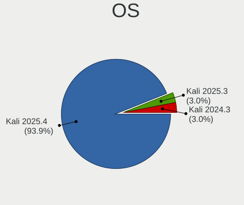

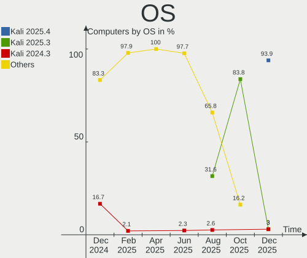

| Name        | Computers | Percent |
|-------------|-----------|---------|
| Kali 2025.4 | 31        | 93.94%  |
| Kali 2025.3 | 1         | 3.03%   |
| Kali 2024.3 | 1         | 3.03%   |

OS Family
---------

OS without a version

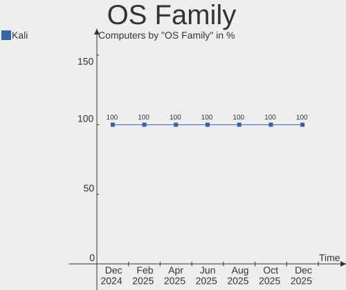

| Name | Computers | Percent |
|------|-----------|---------|
| Kali | 33        | 100%    |

Kernel
------

Version of the Linux kernel

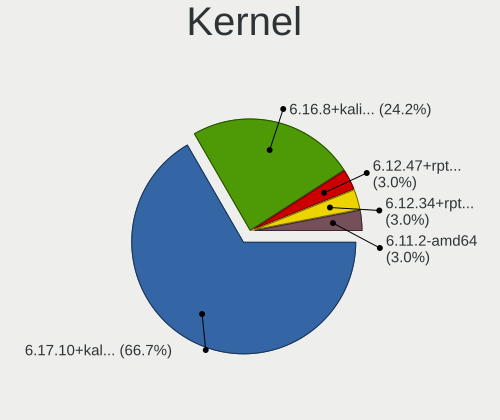

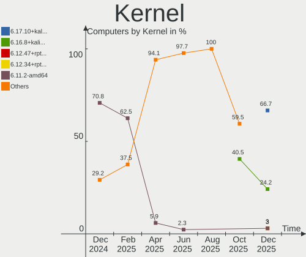

| Version              | Computers | Percent |
|----------------------|-----------|---------|
| 6.17.10+kali-amd64   | 22        | 66.67%  |
| 6.16.8+kali-amd64    | 8         | 24.24%  |
| 6.12.47+rpt-rpi-2712 | 1         | 3.03%   |
| 6.12.34+rpt-rpi-v8   | 1         | 3.03%   |
| 6.11.2-amd64         | 1         | 3.03%   |

Kernel Family
-------------

Linux kernel without a distro release

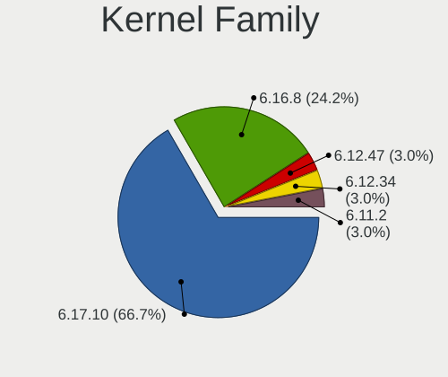

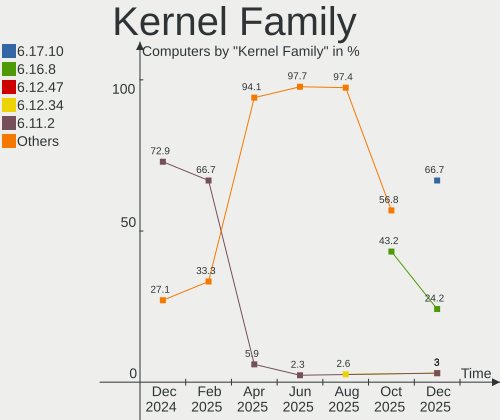

| Version | Computers | Percent |
|---------|-----------|---------|
| 6.17.10 | 22        | 66.67%  |
| 6.16.8  | 8         | 24.24%  |
| 6.12.47 | 1         | 3.03%   |
| 6.12.34 | 1         | 3.03%   |
| 6.11.2  | 1         | 3.03%   |

Kernel Major Ver.
-----------------

Linux kernel major version

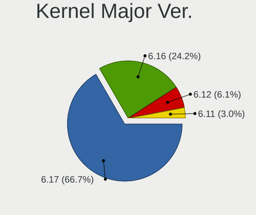

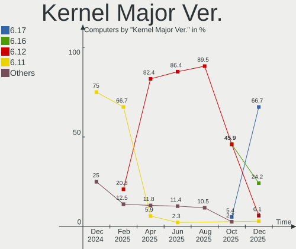

| Version | Computers | Percent |
|---------|-----------|---------|
| 6.17    | 22        | 66.67%  |
| 6.16    | 8         | 24.24%  |
| 6.12    | 2         | 6.06%   |
| 6.11    | 1         | 3.03%   |

Arch
----

OS architecture (x86_64, i586, etc.)

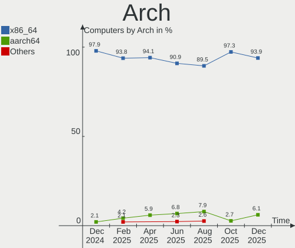

| Name    | Computers | Percent |
|---------|-----------|---------|
| x86_64  | 31        | 93.94%  |
| aarch64 | 2         | 6.06%   |

DE
--

Desktop Environment

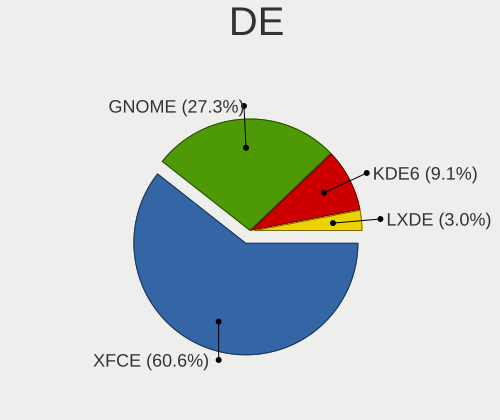

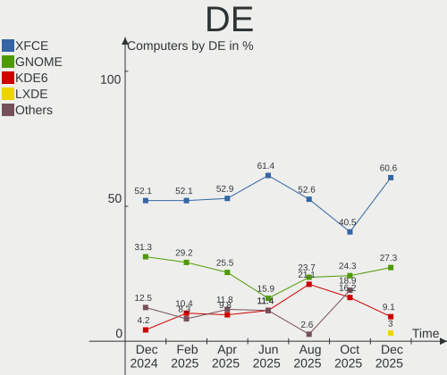

| Name  | Computers | Percent |
|-------|-----------|---------|
| XFCE  | 20        | 60.61%  |
| GNOME | 9         | 27.27%  |
| KDE6  | 3         | 9.09%   |
| LXDE  | 1         | 3.03%   |

Display Server
--------------

X11 or Wayland

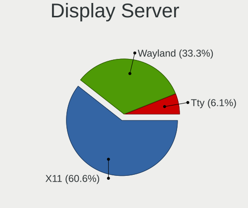

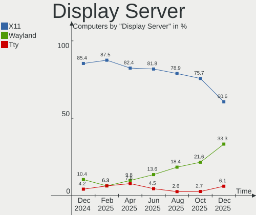

| Name    | Computers | Percent |
|---------|-----------|---------|
| X11     | 20        | 60.61%  |
| Wayland | 11        | 33.33%  |
| Tty     | 2         | 6.06%   |

Display Manager
---------------

SDDM, LightDM, etc.

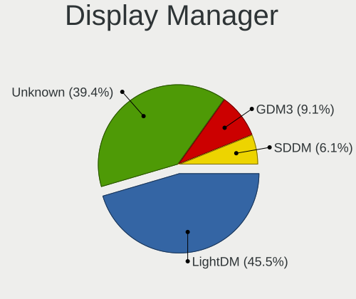

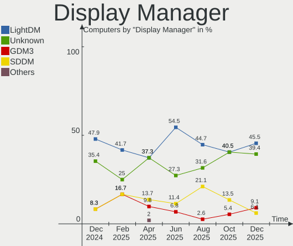

| Name    | Computers | Percent |
|---------|-----------|---------|
| LightDM | 15        | 45.45%  |
| Unknown | 13        | 39.39%  |
| GDM3    | 3         | 9.09%   |
| SDDM    | 2         | 6.06%   |

OS Lang
-------

Language

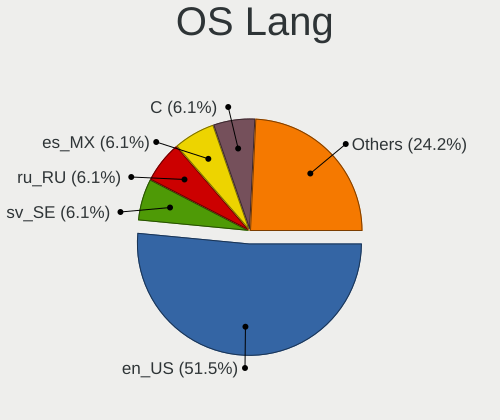

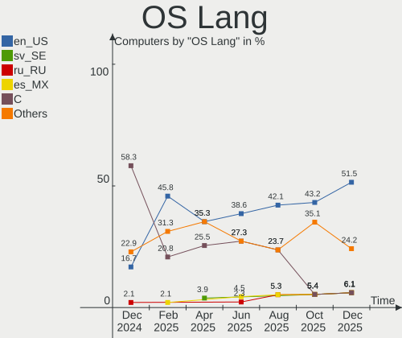

| Lang   | Computers | Percent |
|--------|-----------|---------|
| en_US  | 17        | 51.52%  |
| sv_SE  | 2         | 6.06%   |
| ru_RU  | 2         | 6.06%   |
| es_MX  | 2         | 6.06%   |
| C      | 2         | 6.06%   |
| tr_TR  | 1         | 3.03%   |
| pt_BR  | 1         | 3.03%   |
| id_ID  | 1         | 3.03%   |
| et_EE  | 1         | 3.03%   |
| en_GB  | 1         | 3.03%   |
| en_AU  | 1         | 3.03%   |
| de_DE  | 1         | 3.03%   |
| ast_ES | 1         | 3.03%   |

Boot Mode
---------

EFI or BIOS

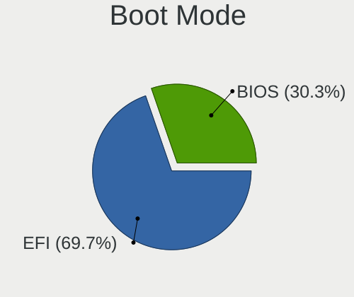

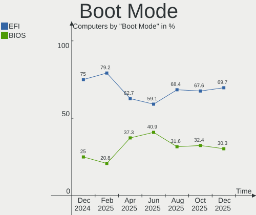

| Mode | Computers | Percent |
|------|-----------|---------|
| EFI  | 23        | 69.7%   |
| BIOS | 10        | 30.3%   |

Filesystem
----------

Type of filesystem

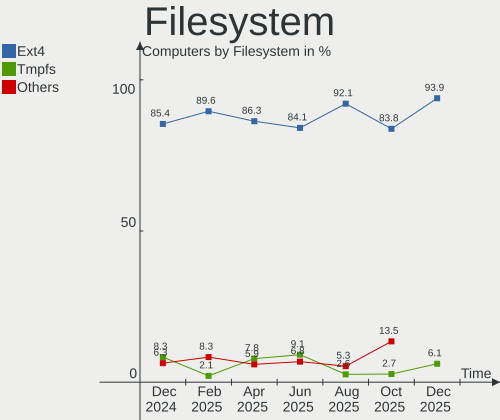

| Type  | Computers | Percent |
|-------|-----------|---------|
| Ext4  | 31        | 93.94%  |
| Tmpfs | 2         | 6.06%   |

Part. scheme
------------

Scheme of partitioning

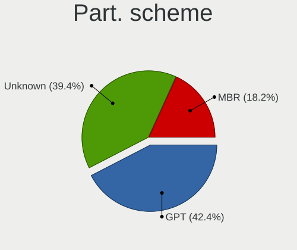

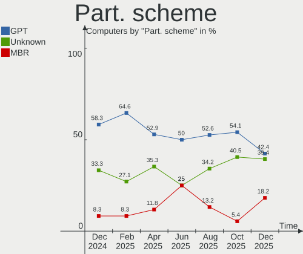

| Type    | Computers | Percent |
|---------|-----------|---------|
| GPT     | 14        | 42.42%  |
| Unknown | 13        | 39.39%  |
| MBR     | 6         | 18.18%  |

Dual Boot with Linux/BSD
------------------------

Hosting more than one Linux/BSD

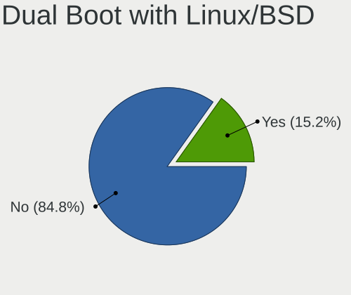

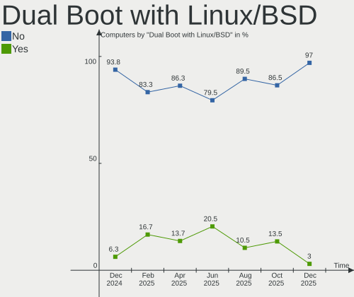

| Dual boot | Computers | Percent |
|-----------|-----------|---------|
| No        | 32        | 96.97%  |
| Yes       | 1         | 3.03%   |

Dual Boot (Win)
---------------

Hosting Linux and Windows

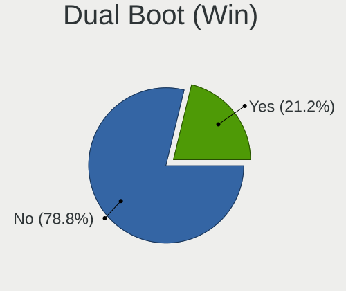

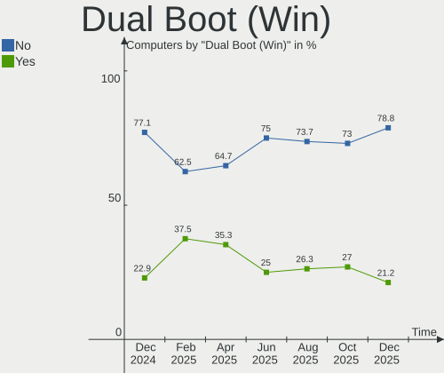

| Dual boot | Computers | Percent |
|-----------|-----------|---------|
| No        | 26        | 78.79%  |
| Yes       | 7         | 21.21%  |

Board
-----

Vendor
------

Motherboard manufacturer

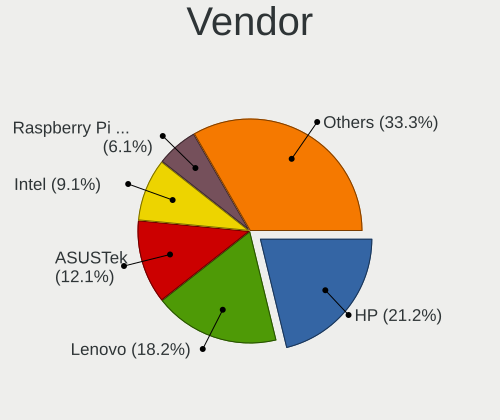

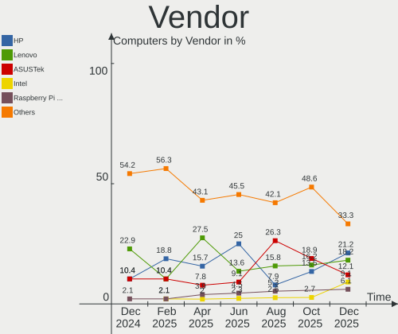

| Name                    | Computers | Percent |
|-------------------------|-----------|---------|
| Hewlett-Packard         | 7         | 21.21%  |
| Lenovo                  | 6         | 18.18%  |
| ASUSTek Computer        | 4         | 12.12%  |
| Intel                   | 3         | 9.09%   |
| Raspberry Pi Foundation | 2         | 6.06%   |
| Dell                    | 2         | 6.06%   |
| Toshiba                 | 1         | 3.03%   |
| Sony                    | 1         | 3.03%   |
| SHANGZHAOYUAN           | 1         | 3.03%   |
| MSI                     | 1         | 3.03%   |
| Google                  | 1         | 3.03%   |
| Gigabyte Technology     | 1         | 3.03%   |
| Apple                   | 1         | 3.03%   |
| ADVAN                   | 1         | 3.03%   |
| Acer                    | 1         | 3.03%   |

Model
-----

Motherboard model

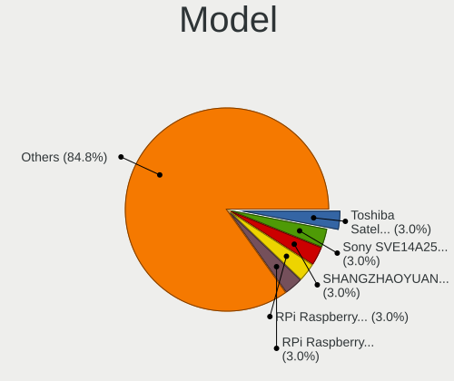

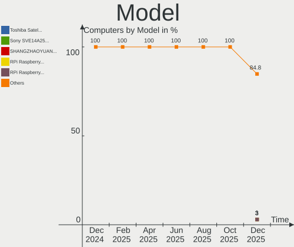

| Name                                        | Computers | Percent |
|---------------------------------------------|-----------|---------|
| Toshiba Satellite E45W-C                    | 1         | 3.03%   |
| Sony SVE14A25CGWI                           | 1         | 3.03%   |
| SHANGZHAOYUAN X99 PR9                       | 1         | 3.03%   |
| RPi Raspberry Pi 500 Rev 1.0                | 1         | 3.03%   |
| RPi Raspberry Pi 4 Model B Rev 1.5          | 1         | 3.03%   |
| MSI Cubi N JSL (MS-B0A1)                    | 1         | 3.03%   |
| Lenovo ThinkPad X270 W10DG 20K5S0PS0Y       | 1         | 3.03%   |
| Lenovo ThinkPad X1 Carbon Gen 10 21CCS12300 | 1         | 3.03%   |
| Lenovo ThinkPad T14 Gen 1 20S1S98704        | 1         | 3.03%   |
| Lenovo ThinkPad E495 20NES0FJ00             | 1         | 3.03%   |
| Lenovo LOQ 15ARP9 83JC                      | 1         | 3.03%   |
| Lenovo Legion 5 15IRX10 83LY                | 1         | 3.03%   |
| Intel NUC7CJYHN                             | 1         | 3.03%   |
| Intel Jasper Lake Client Platform           | 1         | 3.03%   |
| Intel G41                                   | 1         | 3.03%   |
| HP ProBook 430 G8 Notebook PC               | 1         | 3.03%   |
| HP Laptop 17t-cn300                         | 1         | 3.03%   |
| HP EliteDesk 800 G2 SFF                     | 1         | 3.03%   |
| HP EliteBook 840 G6                         | 1         | 3.03%   |
| HP Compaq 8200 Elite SFF PC                 | 1         | 3.03%   |
| HP 247 G8                                   | 1         | 3.03%   |
| HP 240 G7 Notebook PC                       | 1         | 3.03%   |
| Google Bobba                                | 1         | 3.03%   |
| Gigabyte B550 GAMING X V2                   | 1         | 3.03%   |
| Dell Latitude E6440                         | 1         | 3.03%   |
| Dell Inspiron N5110                         | 1         | 3.03%   |
| ASUS Zenbook UX3402ZA_Q409ZA                | 1         | 3.03%   |
| ASUS VivoBook_ASUSLaptop X412DA_R424DA      | 1         | 3.03%   |
| ASUS VivoBook_ASUSLaptop MJ401TA            | 1         | 3.03%   |
| ASUS ASUS EXPERTBOOK B2502FBA_B2502FBA      | 1         | 3.03%   |
| Apple MacBookAir6,2                         | 1         | 3.03%   |
| ADVAN 1701                                  | 1         | 3.03%   |
| Acer Aspire A315-53                         | 1         | 3.03%   |

Model Family
------------

Motherboard model prefix

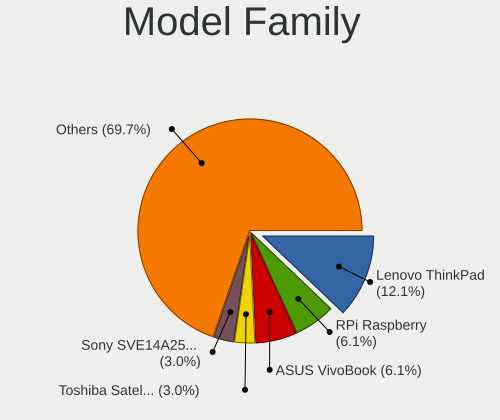

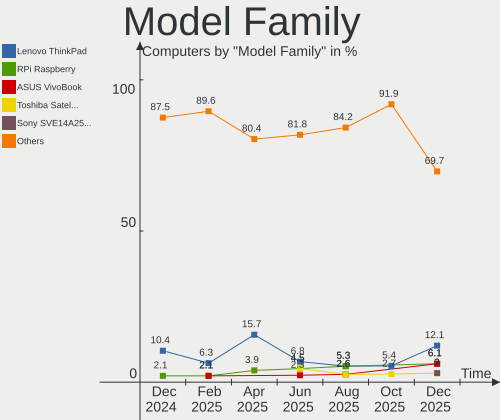

| Name              | Computers | Percent |
|-------------------|-----------|---------|
| Lenovo ThinkPad   | 4         | 12.12%  |
| RPi Raspberry     | 2         | 6.06%   |
| ASUS VivoBook     | 2         | 6.06%   |
| Toshiba Satellite | 1         | 3.03%   |
| Sony SVE14A25CGWI | 1         | 3.03%   |
| SHANGZHAOYUAN X99 | 1         | 3.03%   |
| MSI Cubi          | 1         | 3.03%   |
| Lenovo LOQ        | 1         | 3.03%   |
| Lenovo Legion     | 1         | 3.03%   |
| Intel NUC7CJYHN   | 1         | 3.03%   |
| Intel Jasper      | 1         | 3.03%   |
| Intel G41         | 1         | 3.03%   |
| HP ProBook        | 1         | 3.03%   |
| HP Laptop         | 1         | 3.03%   |
| HP EliteDesk      | 1         | 3.03%   |
| HP EliteBook      | 1         | 3.03%   |
| HP Compaq         | 1         | 3.03%   |
| HP 247            | 1         | 3.03%   |
| HP 240            | 1         | 3.03%   |
| Google Bobba      | 1         | 3.03%   |
| Gigabyte B550     | 1         | 3.03%   |
| Dell Latitude     | 1         | 3.03%   |
| Dell Inspiron     | 1         | 3.03%   |
| ASUS Zenbook      | 1         | 3.03%   |
| ASUS ASUS         | 1         | 3.03%   |
| Apple MacBookAir6 | 1         | 3.03%   |
| ADVAN 1701        | 1         | 3.03%   |
| Acer Aspire       | 1         | 3.03%   |

MFG Year
--------

Motherboard manufacture year

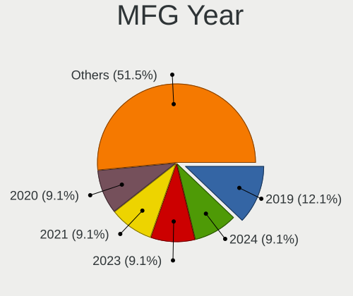

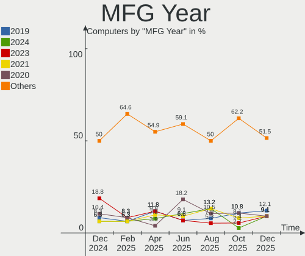

| Year    | Computers | Percent |
|---------|-----------|---------|
| 2019    | 4         | 12.12%  |
| 2024    | 3         | 9.09%   |
| 2023    | 3         | 9.09%   |
| 2021    | 3         | 9.09%   |
| 2020    | 3         | 9.09%   |
| 2015    | 3         | 9.09%   |
| Unknown | 3         | 9.09%   |
| 2022    | 2         | 6.06%   |
| 2018    | 2         | 6.06%   |
| 2013    | 2         | 6.06%   |
| 2011    | 2         | 6.06%   |
| 2025    | 1         | 3.03%   |
| 2017    | 1         | 3.03%   |
| 2014    | 1         | 3.03%   |

Form Factor
-----------

Physical design of the computer

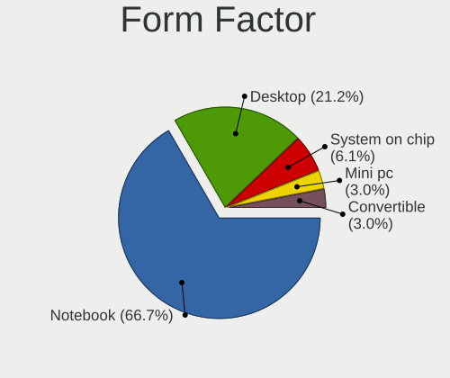

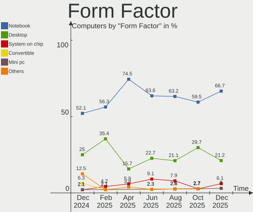

| Name           | Computers | Percent |
|----------------|-----------|---------|
| Notebook       | 22        | 66.67%  |
| Desktop        | 7         | 21.21%  |
| System on chip | 2         | 6.06%   |
| Convertible    | 1         | 3.03%   |
| Mini pc        | 1         | 3.03%   |

Secure Boot
-----------

Enabled or disabled

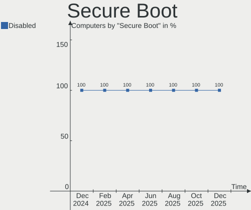

| State    | Computers | Percent |
|----------|-----------|---------|
| Disabled | 33        | 100%    |

Coreboot
--------

Have coreboot on board

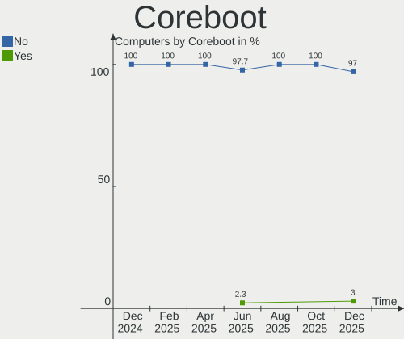

| Used | Computers | Percent |
|------|-----------|---------|
| No   | 32        | 96.97%  |
| Yes  | 1         | 3.03%   |

RAM Size
--------

Total RAM memory

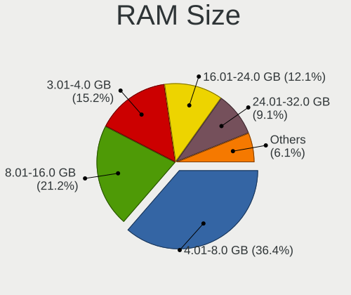

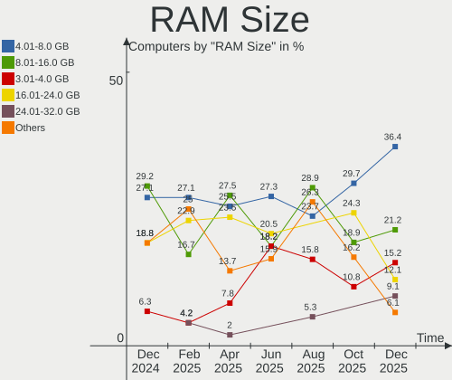

| Size in GB | Computers | Percent |
|------------|-----------|---------|
| 4.01-8.0   | 12        | 36.36%  |
| 8.01-16.0  | 7         | 21.21%  |
| 3.01-4.0   | 5         | 15.15%  |
| 16.01-24.0 | 4         | 12.12%  |
| 24.01-32.0 | 3         | 9.09%   |
| 32.01-64.0 | 2         | 6.06%   |

RAM Used
--------

Used RAM memory

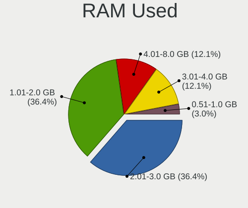

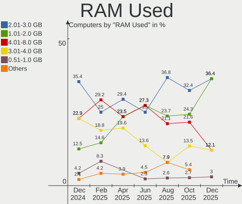

| Used GB  | Computers | Percent |
|----------|-----------|---------|
| 2.01-3.0 | 12        | 36.36%  |
| 1.01-2.0 | 12        | 36.36%  |
| 4.01-8.0 | 4         | 12.12%  |
| 3.01-4.0 | 4         | 12.12%  |
| 0.51-1.0 | 1         | 3.03%   |

Total Drives
------------

Number of drives on board

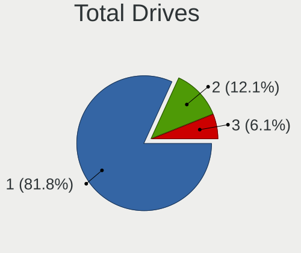

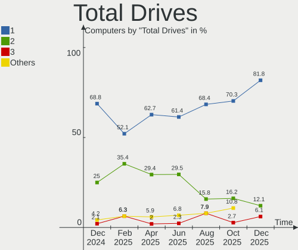

| Drives | Computers | Percent |
|--------|-----------|---------|
| 1      | 27        | 81.82%  |
| 2      | 4         | 12.12%  |
| 3      | 2         | 6.06%   |

Has CD-ROM
----------

Has CD-ROM on board

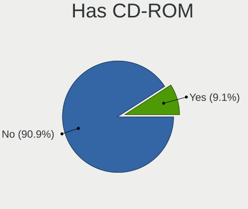

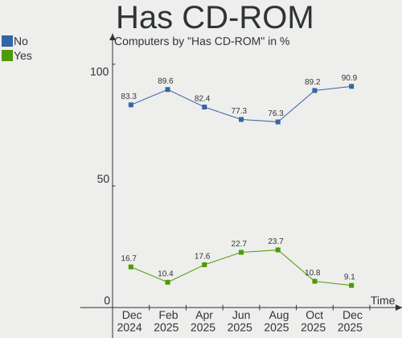

| Presented | Computers | Percent |
|-----------|-----------|---------|
| No        | 30        | 90.91%  |
| Yes       | 3         | 9.09%   |

Has Ethernet
------------

Has Ethernet on board

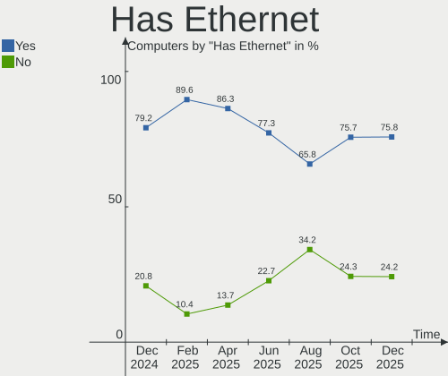

| Presented | Computers | Percent |
|-----------|-----------|---------|
| Yes       | 25        | 75.76%  |
| No        | 8         | 24.24%  |

Has WiFi
--------

Has WiFi module

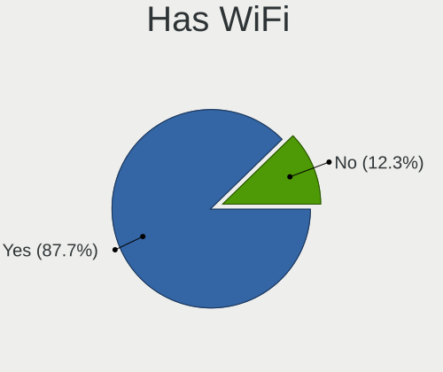

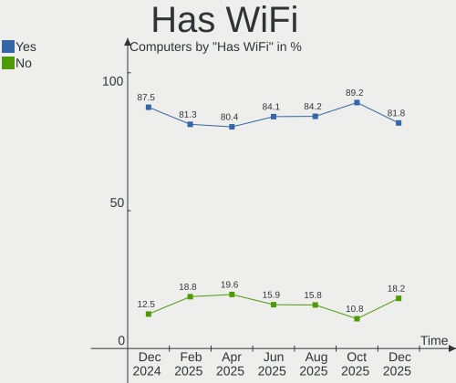

| Presented | Computers | Percent |
|-----------|-----------|---------|
| Yes       | 27        | 81.82%  |
| No        | 6         | 18.18%  |

Has Bluetooth
-------------

Has Bluetooth module

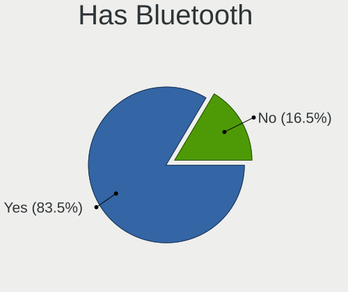

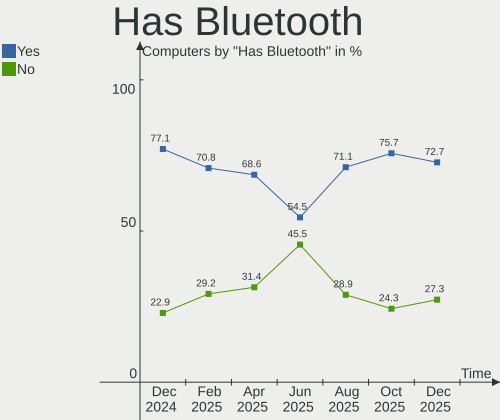

| Presented | Computers | Percent |
|-----------|-----------|---------|
| Yes       | 24        | 72.73%  |
| No        | 9         | 27.27%  |

Location
--------

Country
-------

Geographic location (country)

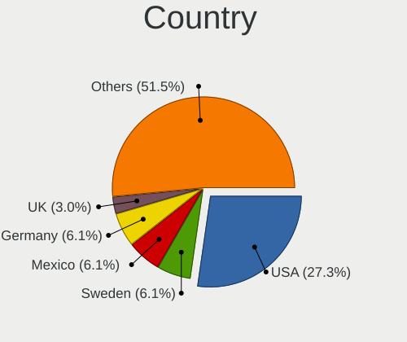

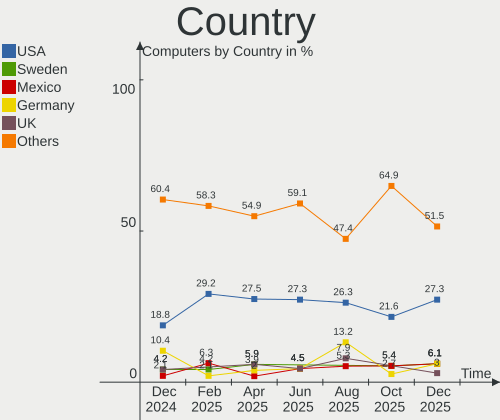

| Country      | Computers | Percent |
|--------------|-----------|---------|
| USA          | 9         | 27.27%  |
| Sweden       | 2         | 6.06%   |
| Mexico       | 2         | 6.06%   |
| Germany      | 2         | 6.06%   |
| UK           | 1         | 3.03%   |
| Turkey       | 1         | 3.03%   |
| Thailand     | 1         | 3.03%   |
| Spain        | 1         | 3.03%   |
| South Africa | 1         | 3.03%   |
| Russia       | 1         | 3.03%   |
| Moldova      | 1         | 3.03%   |
| Malaysia     | 1         | 3.03%   |
| Lithuania    | 1         | 3.03%   |
| Jordan       | 1         | 3.03%   |
| Indonesia    | 1         | 3.03%   |
| India        | 1         | 3.03%   |
| Estonia      | 1         | 3.03%   |
| Czechia      | 1         | 3.03%   |
| China        | 1         | 3.03%   |
| Bulgaria     | 1         | 3.03%   |
| Brazil       | 1         | 3.03%   |
| Australia    | 1         | 3.03%   |

City
----

Geographic location (city)

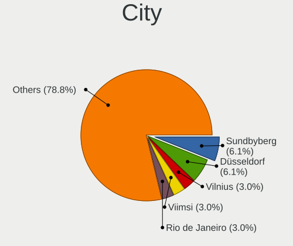

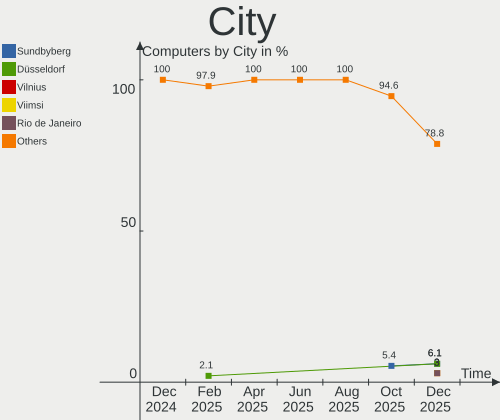

| City           | Computers | Percent |
|----------------|-----------|---------|
| Sundbyberg     | 2         | 6.06%   |
| Düsseldorf    | 2         | 6.06%   |
| Vilnius        | 1         | 3.03%   |
| Viimsi         | 1         | 3.03%   |
| Rio de Janeiro | 1         | 3.03%   |
| Pontianak      | 1         | 3.03%   |
| Pilsen         | 1         | 3.03%   |
| Petaling Jaya  | 1         | 3.03%   |
| Nogales        | 1         | 3.03%   |
| Nanjing        | 1         | 3.03%   |
| Mikhaylovsk    | 1         | 3.03%   |
| Melbourne      | 1         | 3.03%   |
| Las Flores     | 1         | 3.03%   |
| Kütahya       | 1         | 3.03%   |
| Kernersville   | 1         | 3.03%   |
| Indianapolis   | 1         | 3.03%   |
| Hermitage      | 1         | 3.03%   |
| Hackney        | 1         | 3.03%   |
| Dallas         | 1         | 3.03%   |
| Chisinau       | 1         | 3.03%   |
| Chicago        | 1         | 3.03%   |
| Carbondale     | 1         | 3.03%   |
| Cape Town      | 1         | 3.03%   |
| Belovo         | 1         | 3.03%   |
| Bangkok        | 1         | 3.03%   |
| Avilés        | 1         | 3.03%   |
| Atlanta        | 1         | 3.03%   |
| Amritsar       | 1         | 3.03%   |
| Amman          | 1         | 3.03%   |
| Alexandria     | 1         | 3.03%   |
| Aguascalientes | 1         | 3.03%   |

Drives
------

Drive Vendor
------------

Hard drive vendors

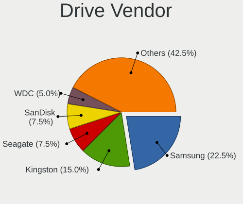

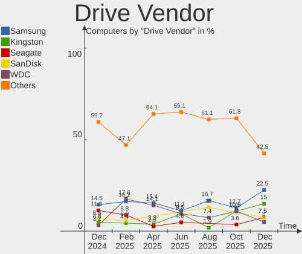

| Vendor                    | Computers | Drives | Percent |
|---------------------------|-----------|--------|---------|
| Samsung Electronics       | 9         | 9      | 22.5%   |
| Kingston                  | 6         | 6      | 15%     |
| Seagate                   | 3         | 3      | 7.5%    |
| SanDisk                   | 3         | 4      | 7.5%    |
| WDC                       | 2         | 2      | 5%      |
| Hitachi                   | 2         | 2      | 5%      |
| Unknown                   | 2         | 2      | 5%      |
| Unknown                   | 1         | 1      | 2.5%    |
| Teelkoou                  | 1         | 1      | 2.5%    |
| SK hynix                  | 1         | 1      | 2.5%    |
| Silicon Motion            | 1         | 1      | 2.5%    |
| Rayson                    | 1         | 1      | 2.5%    |
| PNY                       | 1         | 1      | 2.5%    |
| Phison Electronics        | 1         | 1      | 2.5%    |
| Micron/Crucial Technology | 1         | 1      | 2.5%    |
| Micron Technology         | 1         | 1      | 2.5%    |
| Intel                     | 1         | 1      | 2.5%    |
| INRAM                     | 1         | 1      | 2.5%    |
| China                     | 1         | 1      | 2.5%    |
| Apple                     | 1         | 1      | 2.5%    |

Drive Model
-----------

Hard drive models

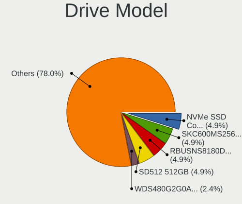

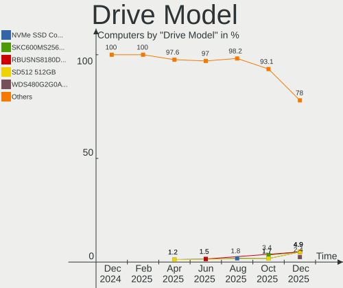

| Model                                                 | Computers | Percent |
|-------------------------------------------------------|-----------|---------|
| Samsung NVMe SSD Controller SM981/PM981/PM983 1TB     | 2         | 4.88%   |
| Kingston SKC600MS256G 256GB SSD                       | 2         | 4.88%   |
| Kingston RBUSNS8180DS3128GJ 128GB SSD                 | 2         | 4.88%   |
| Unknown                                               | 2         | 4.88%   |
| WDC WDS480G2G0A-00JH30 480GB SSD                      | 1         | 2.44%   |
| WDC WD10JPVX-22JC3T0 1TB                              | 1         | 2.44%   |
| Unknown MMC Card  64GB                                | 1         | 2.44%   |
| Teelkoou SSD 128GB                                    | 1         | 2.44%   |
| SK hynix PC601 HFS512GD9TNG-L2A0A 512GB               | 1         | 2.44%   |
| Silicon Motion SM2263EN/SM2263XT SSD Controller 512GB | 1         | 2.44%   |
| Seagate ST9500325AS 500GB                             | 1         | 2.44%   |
| Seagate ST500LT012-9WS142 500GB                       | 1         | 2.44%   |
| Seagate ST320LT012-9WS14C 320GB                       | 1         | 2.44%   |
| Sandisk WD Green SN350 1TB 2G0C                       | 1         | 2.44%   |
| Sandisk WD Blue SN5000 1TB                            | 1         | 2.44%   |
| SanDisk SSD PLUS 1000GB                               | 1         | 2.44%   |
| SanDisk SDSSDP128G 128GB                              | 1         | 2.44%   |
| Samsung SSD 870 EVO 250GB                             | 1         | 2.44%   |
| Samsung NVMe SSD Controller SM961/PM961/SM963 1024GB  | 1         | 2.44%   |
| Samsung MZVLQ256HAJD-000H1 256GB                      | 1         | 2.44%   |
| Samsung MZVL8256HEJD-00BH1 256GB                      | 1         | 2.44%   |
| Samsung MZVL21T0HCLR-00BL7 1TB                        | 1         | 2.44%   |
| Samsung MZAMX512HCLV-00BL2 512GB                      | 1         | 2.44%   |
| Samsung MZAL81T0HFLB-00BL2 1TB                        | 1         | 2.44%   |
| Rayson RS256GSSD310 256GB                             | 1         | 2.44%   |
| PNY CS2140 1TB SSD                                    | 1         | 2.44%   |
| Phison PS5013 E13 NVMe Controller 500GB               | 1         | 2.44%   |
| Micron/Crucial P2 NVMe PCIe SSD 2TB                   | 1         | 2.44%   |
| Micron 2450_MTFDKBA512TFK 512GB                       | 1         | 2.44%   |
| Kingston SNV2S500G 500GB                              | 1         | 2.44%   |
| Kingston SA400S37120G 120GB SSD                       | 1         | 2.44%   |
| Intel SSDPEKKW256G7 256GB                             | 1         | 2.44%   |
| INRAM SSD 512GB                                       | 1         | 2.44%   |
| Hitachi HTS545025B9A300 250GB                         | 1         | 2.44%   |
| Hitachi HTS543232A7A384 320GB                         | 1         | 2.44%   |
| China SSD 256GB                                       | 1         | 2.44%   |
| Apple SSD SM0512F 500GB                               | 1         | 2.44%   |

HDD Vendor
----------

Hard disk drive vendors

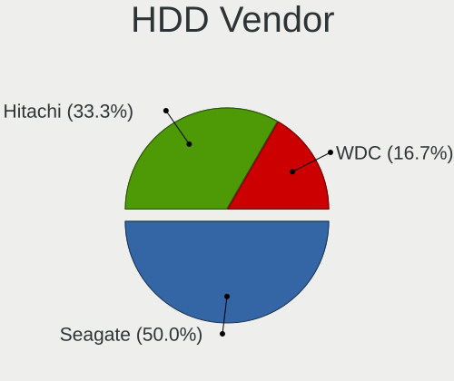

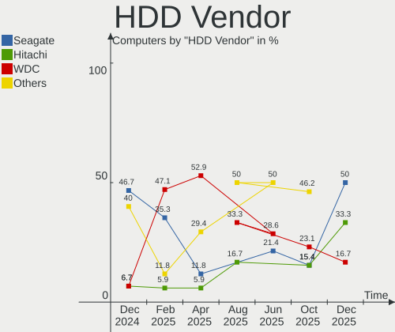

| Vendor  | Computers | Drives | Percent |
|---------|-----------|--------|---------|
| Seagate | 3         | 3      | 50%     |
| Hitachi | 2         | 2      | 33.33%  |
| WDC     | 1         | 1      | 16.67%  |

SSD Vendor
----------

Solid state drive vendors

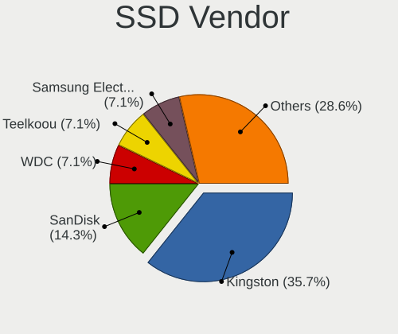

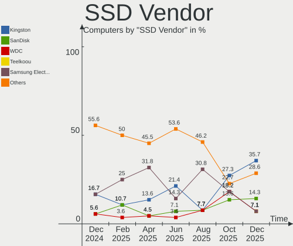

| Vendor              | Computers | Drives | Percent |
|---------------------|-----------|--------|---------|
| Kingston            | 5         | 5      | 35.71%  |
| SanDisk             | 2         | 2      | 14.29%  |
| WDC                 | 1         | 1      | 7.14%   |
| Teelkoou            | 1         | 1      | 7.14%   |
| Samsung Electronics | 1         | 1      | 7.14%   |
| Rayson              | 1         | 1      | 7.14%   |
| INRAM               | 1         | 1      | 7.14%   |
| China               | 1         | 1      | 7.14%   |
| Apple               | 1         | 1      | 7.14%   |

Drive Kind
----------

HDD or SSD

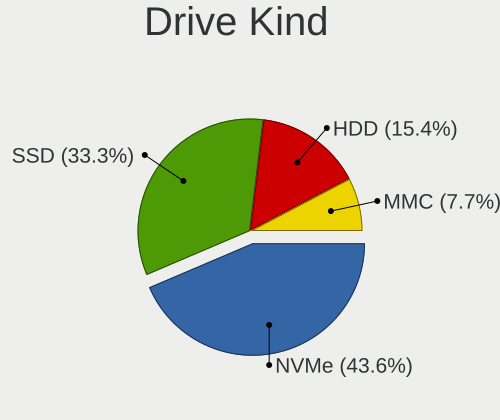

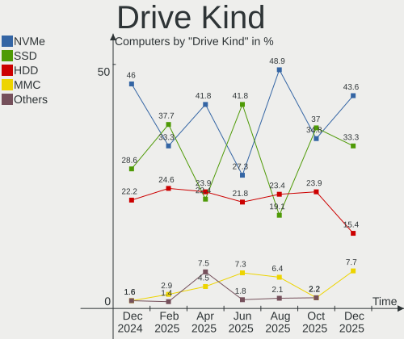

| Kind | Computers | Drives | Percent |
|------|-----------|--------|---------|
| NVMe | 17        | 18     | 43.59%  |
| SSD  | 13        | 14     | 33.33%  |
| HDD  | 6         | 6      | 15.38%  |
| MMC  | 3         | 3      | 7.69%   |

Drive Connector
---------------

SATA, SAS, NVMe, etc.

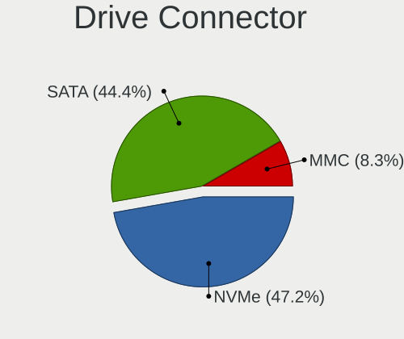

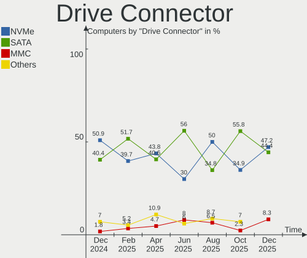

| Type | Computers | Drives | Percent |
|------|-----------|--------|---------|
| NVMe | 17        | 18     | 47.22%  |
| SATA | 16        | 20     | 44.44%  |
| MMC  | 3         | 3      | 8.33%   |

Drive Size
----------

Size of hard drive

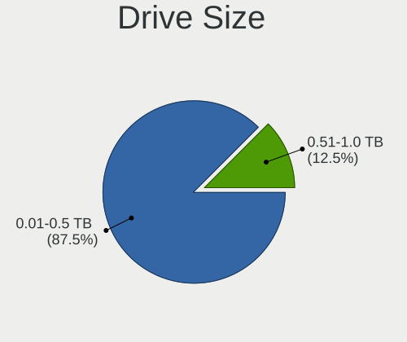

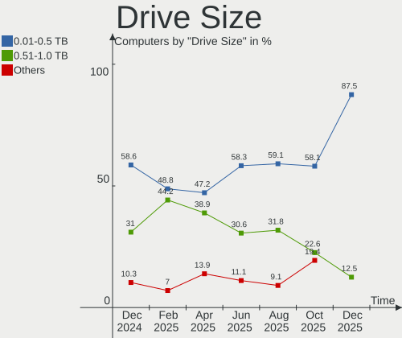

| Size in TB | Computers | Drives | Percent |
|------------|-----------|--------|---------|
| 0.01-0.5   | 14        | 17     | 87.5%   |
| 0.51-1.0   | 2         | 3      | 12.5%   |

Space Total
-----------

Amount of disk space available on the file system

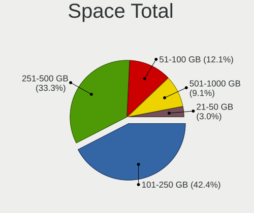

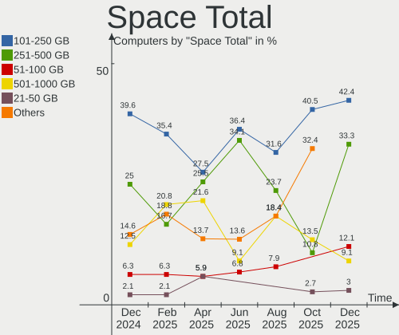

| Size in GB | Computers | Percent |
|------------|-----------|---------|
| 101-250    | 14        | 42.42%  |
| 251-500    | 11        | 33.33%  |
| 51-100     | 4         | 12.12%  |
| 501-1000   | 3         | 9.09%   |
| 21-50      | 1         | 3.03%   |

Space Used
----------

Amount of used disk space

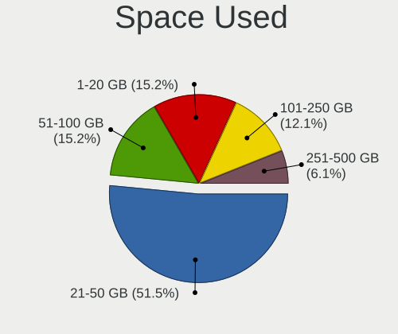

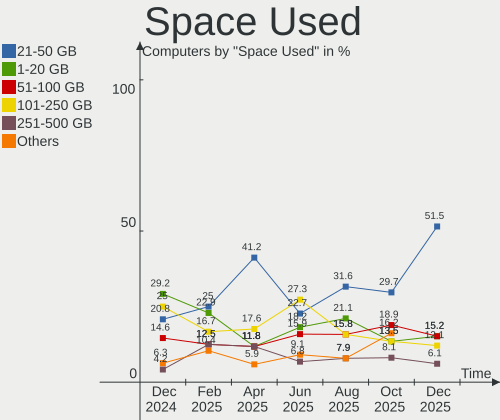

| Used GB | Computers | Percent |
|---------|-----------|---------|
| 21-50   | 17        | 51.52%  |
| 1-20    | 5         | 15.15%  |
| 51-100  | 5         | 15.15%  |
| 101-250 | 4         | 12.12%  |
| 251-500 | 2         | 6.06%   |

Malfunc. Drives
---------------

Drive models with a malfunction

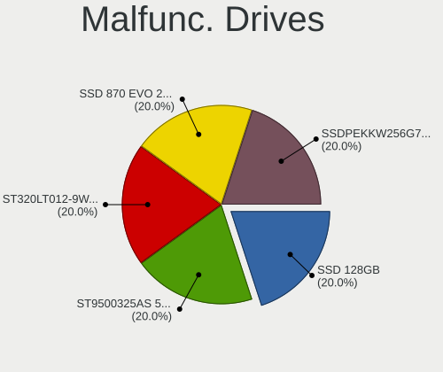

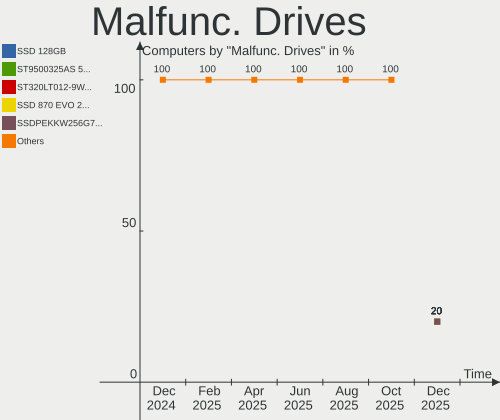

| Model                                 | Computers | Drives | Percent |
|---------------------------------------|-----------|--------|---------|
| Teelkoou SSD 128GB                    | 1         | 1      | 20%     |
| Seagate ST9500325AS 500GB             | 1         | 1      | 20%     |
| Seagate ST320LT012-9WS14C 320GB       | 1         | 1      | 20%     |
| Samsung Electronics SSD 870 EVO 250GB | 1         | 1      | 20%     |
| Intel SSDPEKKW256G7 256GB             | 1         | 1      | 20%     |

Malfunc. Drive Vendor
---------------------

Vendors of faulty drives

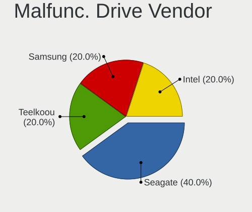

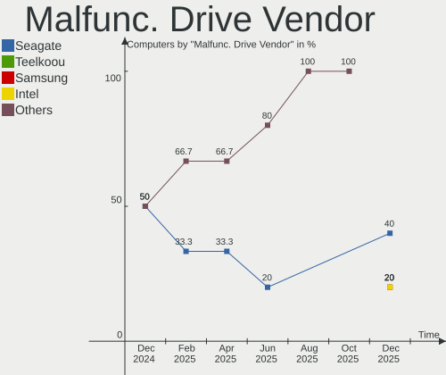

| Vendor              | Computers | Drives | Percent |
|---------------------|-----------|--------|---------|
| Seagate             | 2         | 2      | 40%     |
| Teelkoou            | 1         | 1      | 20%     |
| Samsung Electronics | 1         | 1      | 20%     |
| Intel               | 1         | 1      | 20%     |

Malfunc. HDD Vendor
-------------------

Vendors of faulty HDD drives

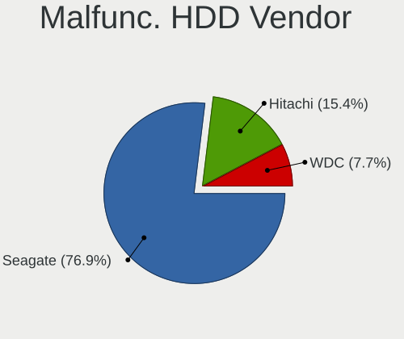

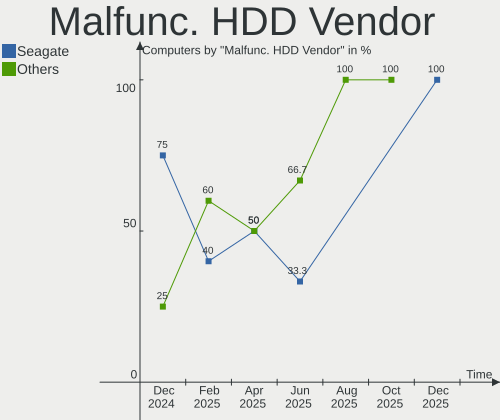

| Vendor  | Computers | Drives | Percent |
|---------|-----------|--------|---------|
| Seagate | 2         | 2      | 100%    |

Malfunc. Drive Kind
-------------------

Kinds of faulty drives

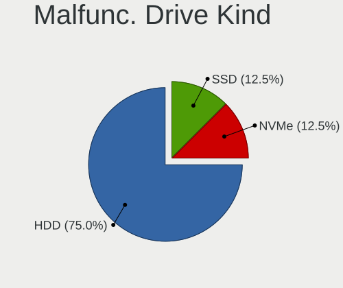

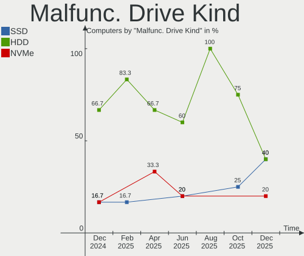

| Kind | Computers | Drives | Percent |
|------|-----------|--------|---------|
| SSD  | 2         | 2      | 40%     |
| HDD  | 2         | 2      | 40%     |
| NVMe | 1         | 1      | 20%     |

Failed Drives
-------------

Failed drive models

Zero info for selected period =(

Failed Drive Vendor
-------------------

Failed drive vendors

Zero info for selected period =(

Drive Status
------------

Number of failed and malfunc. drives

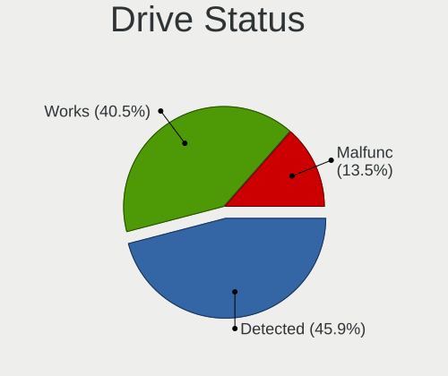

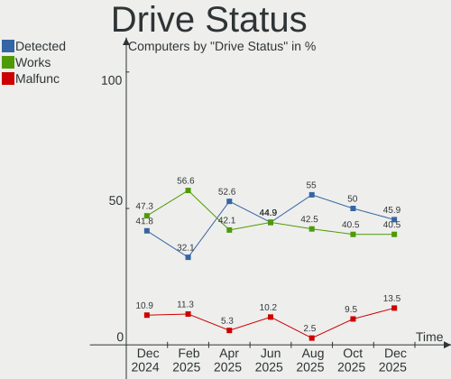

| Status   | Computers | Drives | Percent |
|----------|-----------|--------|---------|
| Detected | 17        | 21     | 45.95%  |
| Works    | 15        | 15     | 40.54%  |
| Malfunc  | 5         | 5      | 13.51%  |

Storage controller
------------------

Storage Vendor
--------------

Storage controller vendors

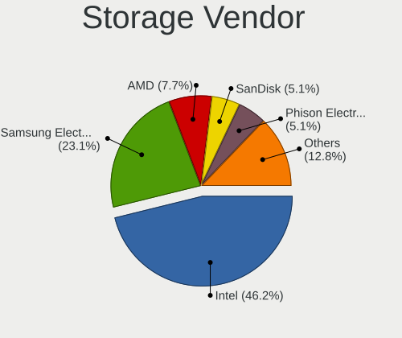

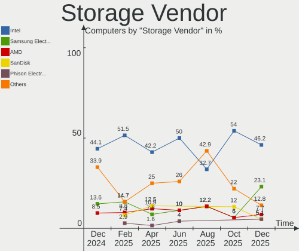

| Vendor                      | Computers | Percent |
|-----------------------------|-----------|---------|
| Intel                       | 18        | 46.15%  |
| Samsung Electronics         | 9         | 23.08%  |
| AMD                         | 3         | 7.69%   |
| SanDisk                     | 2         | 5.13%   |
| Phison Electronics          | 2         | 5.13%   |
| SK hynix                    | 1         | 2.56%   |
| Silicon Motion              | 1         | 2.56%   |
| Micron/Crucial Technology   | 1         | 2.56%   |
| Micron Technology           | 1         | 2.56%   |
| Kingston Technology Company | 1         | 2.56%   |

Storage Model
-------------

Storage controller models

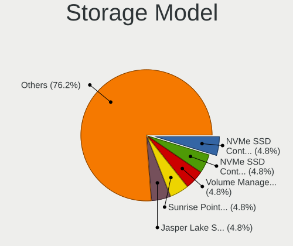

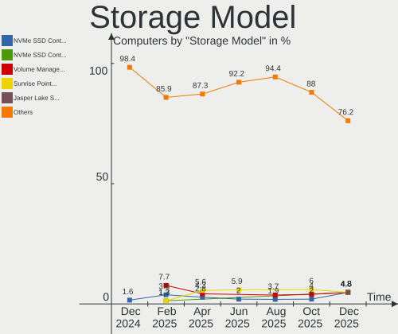

| Model                                                                          | Computers | Percent |
|--------------------------------------------------------------------------------|-----------|---------|
| Samsung NVMe SSD Controller SM981/PM981/PM983                                  | 2         | 4.76%   |
| Samsung NVMe SSD Controller PM9C1a (DRAM-less)                                 | 2         | 4.76%   |
| Intel Volume Management Device NVMe RAID Controller                            | 2         | 4.76%   |
| Intel Sunrise Point-LP SATA Controller [AHCI mode]                             | 2         | 4.76%   |
| Intel Jasper Lake SATA AHCI Controller                                         | 2         | 4.76%   |
| Intel Alder Lake-P SATA AHCI Controller                                        | 2         | 4.76%   |
| Intel 82801 Mobile SATA Controller [RAID mode]                                 | 2         | 4.76%   |
| AMD FCH SATA Controller [AHCI mode]                                            | 2         | 4.76%   |
| SK hynix PC601 NVMe Solid State Drive                                          | 1         | 2.38%   |
| Silicon Motion SM2263EN/SM2263XT (DRAM-less) NVMe SSD Controllers              | 1         | 2.38%   |
| SanDisk WD SN560/SN740/SN770/SN5000 NVMe SSD                                   | 1         | 2.38%   |
| SanDisk WD Green SN350 240GB (DRAM-less) / SN560E NVMe SSD                     | 1         | 2.38%   |
| Samsung S4LN053X01 AHCI SSD Controller(Apple slot)                             | 1         | 2.38%   |
| Samsung NVMe SSD Controller SM961/PM961/SM963                                  | 1         | 2.38%   |
| Samsung NVMe SSD Controller PM9A1/PM9A3/980PRO                                 | 1         | 2.38%   |
| Samsung NVMe SSD Controller 980 (DRAM-less)                                    | 1         | 2.38%   |
| Samsung BM9C1 QLC NVME SSD (DRAM-less)                                         | 1         | 2.38%   |
| Phison PS5019-E19 PCIe4 NVMe Controller (DRAM-less)                            | 1         | 2.38%   |
| Phison PS5013-E13 PCIe3 NVMe Controller (DRAM-less)                            | 1         | 2.38%   |
| Micron/Crucial P2 [Nick P2] / P3 / P3 Plus NVMe PCIe SSD (DRAM-less)           | 1         | 2.38%   |
| Micron 2450 NVMe SSD [HendrixV] (DRAM-less)                                    | 1         | 2.38%   |
| Kingston Company NV2 NVMe SSD [E21T] (DRAM-less)                               | 1         | 2.38%   |
| Intel Wildcat Point-LP SATA Controller [AHCI Mode]                             | 1         | 2.38%   |
| Intel SSD 600P Series                                                          | 1         | 2.38%   |
| Intel SATA Controller [RAID mode]                                              | 1         | 2.38%   |
| Intel NM10/ICH7 Family SATA Controller [IDE mode]                              | 1         | 2.38%   |
| Intel Ice Lake-LP SATA Controller [AHCI mode]                                  | 1         | 2.38%   |
| Intel Celeron/Pentium Silver Processor SATA Controller                         | 1         | 2.38%   |
| Intel 82801G (ICH7 Family) IDE Controller                                      | 1         | 2.38%   |
| Intel 8 Series/C220 Series Chipset Family 6-port SATA Controller 1 [AHCI mode] | 1         | 2.38%   |
| Intel 7 Series Chipset Family 6-port SATA Controller [AHCI mode]               | 1         | 2.38%   |
| Intel 6 Series/C200 Series Chipset Family 6 port Mobile SATA AHCI Controller   | 1         | 2.38%   |
| Intel 6 Series/C200 Series Chipset Family 6 port Desktop SATA AHCI Controller  | 1         | 2.38%   |
| AMD 500 Series Chipset SATA Controller                                         | 1         | 2.38%   |

Storage Kind
------------

Kind of storage controller (IDE, SATA, NVMe, SAS, ...)

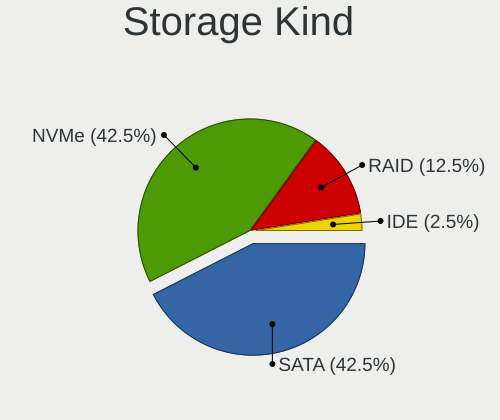

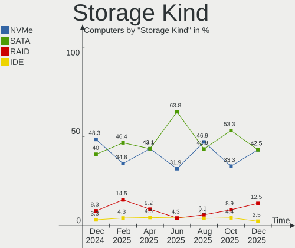

| Kind | Computers | Percent |
|------|-----------|---------|
| NVMe | 17        | 42.5%   |
| SATA | 17        | 42.5%   |
| RAID | 5         | 12.5%   |
| IDE  | 1         | 2.5%    |

Processor
---------

CPU Vendor
----------

Processor vendors

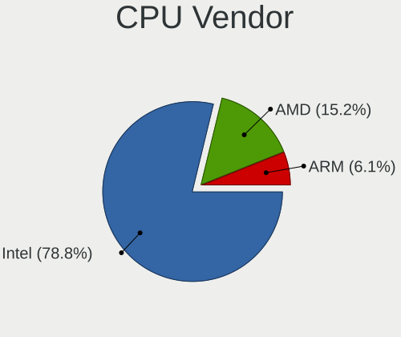

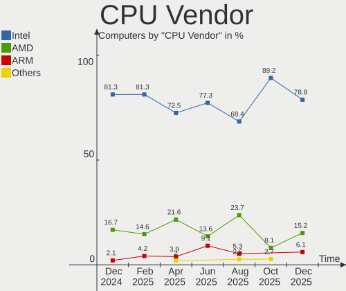

| Vendor | Computers | Percent |
|--------|-----------|---------|
| Intel  | 26        | 78.79%  |
| AMD    | 5         | 15.15%  |
| ARM    | 2         | 6.06%   |

CPU Model
---------

Processor models

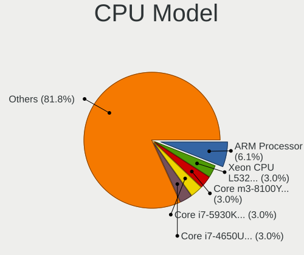

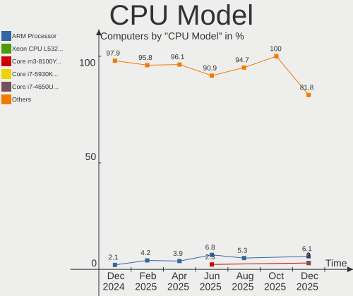

| Model                                         | Computers | Percent |
|-----------------------------------------------|-----------|---------|
| ARM Processor                                 | 2         | 6.06%   |
| Intel Xeon CPU L5320 @ 1.86GHz                | 1         | 3.03%   |
| Intel Core m3-8100Y CPU @ 1.10GHz             | 1         | 3.03%   |
| Intel Core i7-5930K CPU @ 3.50GHz             | 1         | 3.03%   |
| Intel Core i7-4650U CPU @ 1.70GHz             | 1         | 3.03%   |
| Intel Core i7-2630QM CPU @ 2.00GHz            | 1         | 3.03%   |
| Intel Core i7-14700HX                         | 1         | 3.03%   |
| Intel Core i7-10610U CPU @ 1.80GHz            | 1         | 3.03%   |
| Intel Core i5-8365U CPU @ 1.60GHz             | 1         | 3.03%   |
| Intel Core i5-6500 CPU @ 3.20GHz              | 1         | 3.03%   |
| Intel Core i5-6300U CPU @ 2.40GHz             | 1         | 3.03%   |
| Intel Core i5-4310M CPU @ 2.70GHz             | 1         | 3.03%   |
| Intel Core i5-3210M CPU @ 2.50GHz             | 1         | 3.03%   |
| Intel Core i5-2400 CPU @ 3.10GHz              | 1         | 3.03%   |
| Intel Core i5-1035G7 CPU @ 1.20GHz            | 1         | 3.03%   |
| Intel Core i5-1035G1 CPU @ 1.00GHz            | 1         | 3.03%   |
| Intel Core i3-7100U CPU @ 2.40GHz             | 1         | 3.03%   |
| Intel Core i3-5015U CPU @ 2.10GHz             | 1         | 3.03%   |
| Intel Celeron N5105 @ 2.00GHz                 | 1         | 3.03%   |
| Intel Celeron N4500 @ 1.10GHz                 | 1         | 3.03%   |
| Intel Celeron N4020 CPU @ 1.10GHz             | 1         | 3.03%   |
| Intel Celeron J4025 CPU @ 2.00GHz             | 1         | 3.03%   |
| Intel 13th Gen Core i5-1334U                  | 1         | 3.03%   |
| Intel 12th Gen Core i7-1270P                  | 1         | 3.03%   |
| Intel 12th Gen Core i7-1260P                  | 1         | 3.03%   |
| Intel 12th Gen Core i5-1240P                  | 1         | 3.03%   |
| Intel 11th Gen Core i3-1115G4 @ 3.00GHz       | 1         | 3.03%   |
| AMD Ryzen 7 7435HS                            | 1         | 3.03%   |
| AMD Ryzen 5 4500 6-Core Processor             | 1         | 3.03%   |
| AMD Ryzen 5 3500U with Radeon Vega Mobile Gfx | 1         | 3.03%   |
| AMD Ryzen 3 5300U with Radeon Graphics        | 1         | 3.03%   |
| AMD Ryzen 3 3200U with Radeon Vega Mobile Gfx | 1         | 3.03%   |

CPU Model Family
----------------

Processor model prefix

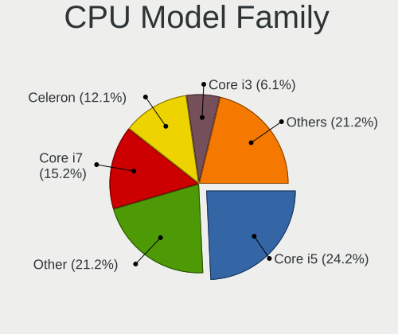

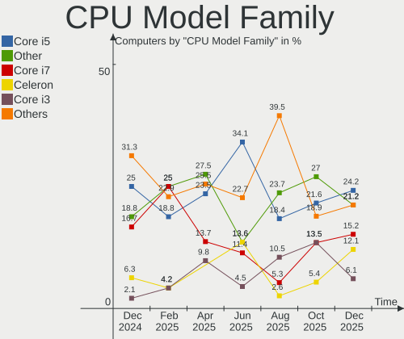

| Model         | Computers | Percent |
|---------------|-----------|---------|
| Intel Core i5 | 8         | 24.24%  |
| Other         | 7         | 21.21%  |
| Intel Core i7 | 5         | 15.15%  |
| Intel Celeron | 4         | 12.12%  |
| Intel Core i3 | 2         | 6.06%   |
| AMD Ryzen 5   | 2         | 6.06%   |
| AMD Ryzen 3   | 2         | 6.06%   |
| Intel Xeon    | 1         | 3.03%   |
| Intel Core m3 | 1         | 3.03%   |
| AMD Ryzen 7   | 1         | 3.03%   |

CPU Cores
---------

Number of processor cores

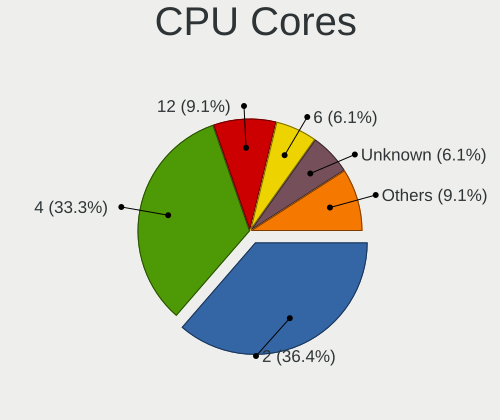

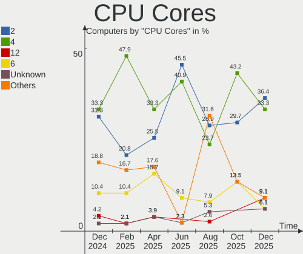

| Number  | Computers | Percent |
|---------|-----------|---------|
| 2       | 12        | 36.36%  |
| 4       | 11        | 33.33%  |
| 12      | 3         | 9.09%   |
| 6       | 2         | 6.06%   |
| Unknown | 2         | 6.06%   |
| 20      | 1         | 3.03%   |
| 10      | 1         | 3.03%   |
| 8       | 1         | 3.03%   |

CPU Sockets
-----------

Number of sockets

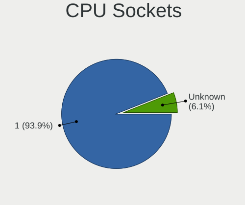

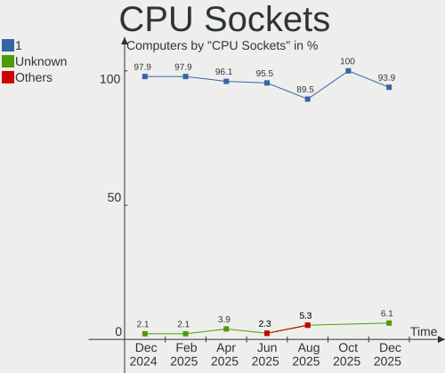

| Number  | Computers | Percent |
|---------|-----------|---------|
| 1       | 31        | 93.94%  |
| Unknown | 2         | 6.06%   |

CPU Threads
-----------

Threads per core (Hyper-Threading)

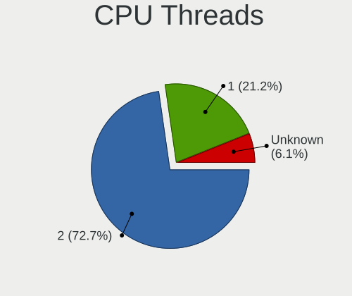

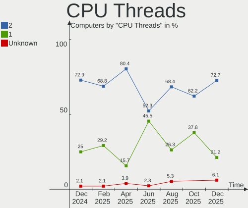

| Number  | Computers | Percent |
|---------|-----------|---------|
| 2       | 24        | 72.73%  |
| 1       | 7         | 21.21%  |
| Unknown | 2         | 6.06%   |

CPU Op-Modes
------------

CPU Operation Modes (32-bit, 64-bit)

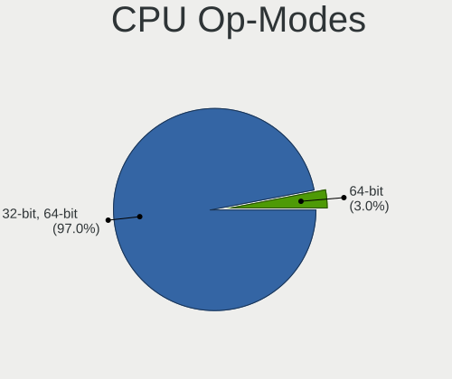

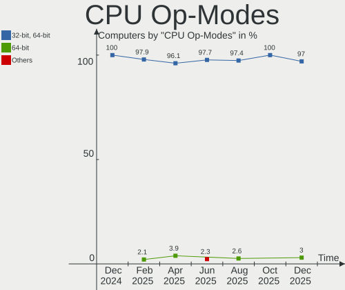

| Op mode        | Computers | Percent |
|----------------|-----------|---------|
| 32-bit, 64-bit | 32        | 96.97%  |
| 64-bit         | 1         | 3.03%   |

CPU Microcode
-------------

Microcode number

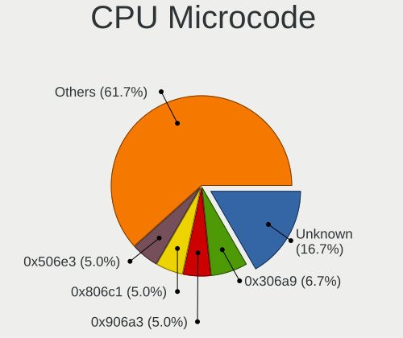

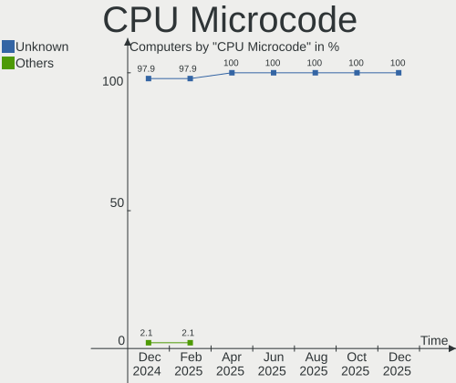

| Number  | Computers | Percent |
|---------|-----------|---------|
| Unknown | 33        | 100%    |

CPU Microarch
-------------

Microarchitecture

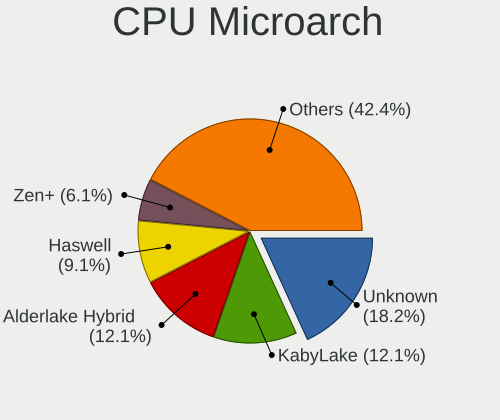

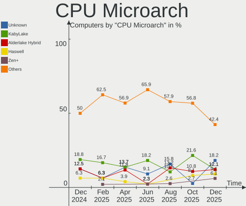

| Name             | Computers | Percent |
|------------------|-----------|---------|
| Unknown          | 6         | 18.18%  |
| KabyLake         | 4         | 12.12%  |
| Alderlake Hybrid | 4         | 12.12%  |
| Haswell          | 3         | 9.09%   |
| Zen+             | 2         | 6.06%   |
| Skylake          | 2         | 6.06%   |
| SandyBridge      | 2         | 6.06%   |
| IceLake          | 2         | 6.06%   |
| Goldmont plus    | 2         | 6.06%   |
| Zen 2            | 1         | 3.03%   |
| Tremont          | 1         | 3.03%   |
| TigerLake        | 1         | 3.03%   |
| IvyBridge        | 1         | 3.03%   |
| Core             | 1         | 3.03%   |
| Broadwell        | 1         | 3.03%   |

Graphics
--------

GPU Vendor
----------

Vendors of graphics cards

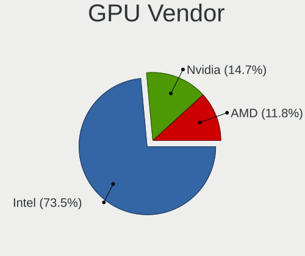

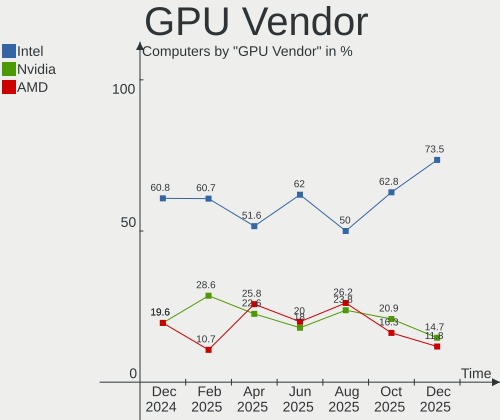

| Vendor | Computers | Percent |
|--------|-----------|---------|
| Intel  | 25        | 73.53%  |
| Nvidia | 5         | 14.71%  |
| AMD    | 4         | 11.76%  |

GPU Model
---------

Graphics card models

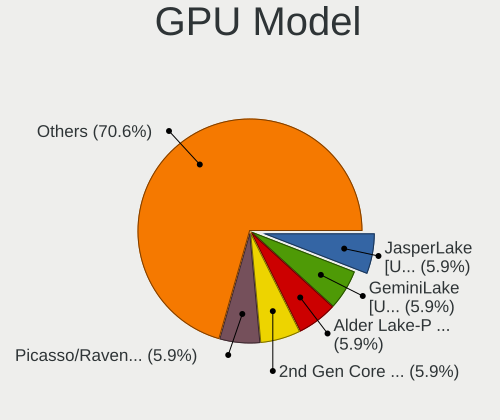

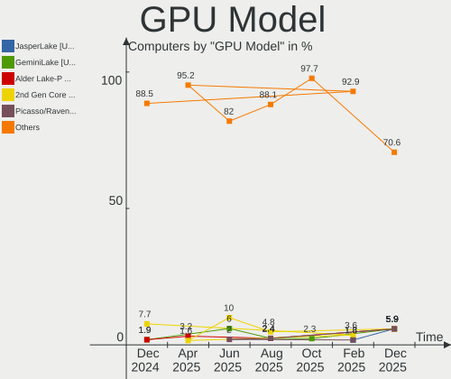

| Model                                                                     | Computers | Percent |
|---------------------------------------------------------------------------|-----------|---------|
| Intel JasperLake [UHD Graphics]                                           | 2         | 5.88%   |
| Intel GeminiLake [UHD Graphics 600]                                       | 2         | 5.88%   |
| Intel Alder Lake-P GT2 [Iris Xe Graphics]                                 | 2         | 5.88%   |
| Intel 2nd Generation Core Processor Family Integrated Graphics Controller | 2         | 5.88%   |
| AMD Picasso/Raven 2 [Radeon Vega Series / Radeon Vega Mobile Series]      | 2         | 5.88%   |
| Nvidia GT218 [GeForce 210]                                                | 1         | 2.94%   |
| Nvidia GP107 [GeForce GTX 1050 Ti]                                        | 1         | 2.94%   |
| Nvidia GK104 [GeForce GTX 770]                                            | 1         | 2.94%   |
| Nvidia GB206M [GeForce RTX 5070 Max-Q / Mobile]                           | 1         | 2.94%   |
| Nvidia AD107M [GeForce RTX 4050 Max-Q / Mobile]                           | 1         | 2.94%   |
| Intel WhiskeyLake-U GT2 [UHD Graphics 620]                                | 1         | 2.94%   |
| Intel UHD Graphics 615                                                    | 1         | 2.94%   |
| Intel Tiger Lake-LP GT2 [UHD Graphics G4]                                 | 1         | 2.94%   |
| Intel Skylake-U GT2 [HD Graphics 520]                                     | 1         | 2.94%   |
| Intel Skylake-S GT2 [HD Graphics 530]                                     | 1         | 2.94%   |
| Intel Raptor Lake-S UHD Graphics                                          | 1         | 2.94%   |
| Intel Raptor Lake-P [Iris Xe Graphics]                                    | 1         | 2.94%   |
| Intel Kaby Lake-U GT2 [HD Graphics 620]                                   | 1         | 2.94%   |
| Intel Iris Plus Graphics G7                                               | 1         | 2.94%   |
| Intel Iris Plus Graphics G1 (Ice Lake)                                    | 1         | 2.94%   |
| Intel Haswell-ULT Integrated Graphics Controller                          | 1         | 2.94%   |
| Intel CometLake-U GT2 [UHD Graphics]                                      | 1         | 2.94%   |
| Intel Broadwell-U GT2 [HD Graphics 5500]                                  | 1         | 2.94%   |
| Intel Alder Lake-P Integrated Graphics Controller                         | 1         | 2.94%   |
| Intel 4th Gen Core Processor Integrated Graphics Controller               | 1         | 2.94%   |
| Intel 4 Series Chipset Integrated Graphics Controller                     | 1         | 2.94%   |
| Intel 3rd Gen Core processor Graphics Controller                          | 1         | 2.94%   |
| AMD Thames [Radeon HD 7500M/7600M Series]                                 | 1         | 2.94%   |
| AMD Lucienne                                                              | 1         | 2.94%   |

GPU Combo
---------

Combinations of graphics cards

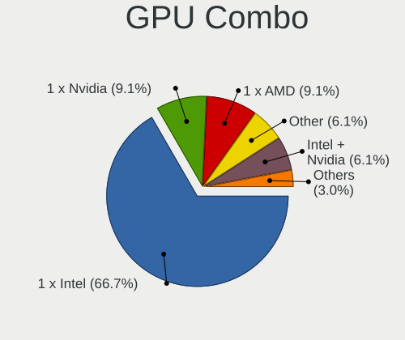

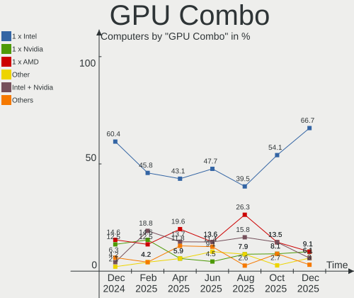

| Name           | Computers | Percent |
|----------------|-----------|---------|
| 1 x Intel      | 22        | 66.67%  |
| 1 x Nvidia     | 3         | 9.09%   |
| 1 x AMD        | 3         | 9.09%   |
| Other          | 2         | 6.06%   |
| Intel + Nvidia | 2         | 6.06%   |
| Intel + AMD    | 1         | 3.03%   |

GPU Driver
----------

Free vs proprietary

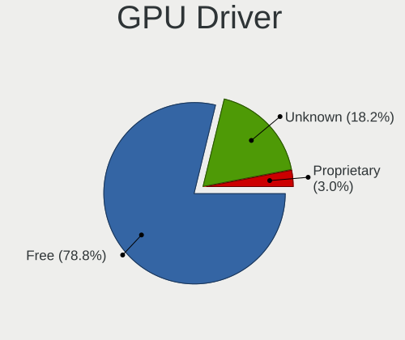

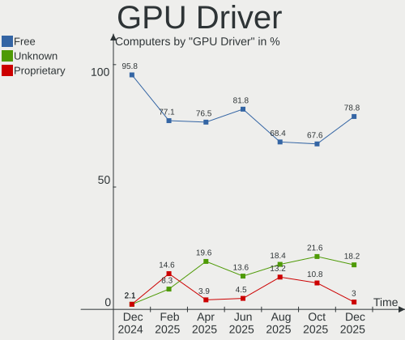

| Driver      | Computers | Percent |
|-------------|-----------|---------|
| Free        | 26        | 78.79%  |
| Unknown     | 6         | 18.18%  |
| Proprietary | 1         | 3.03%   |

GPU Memory
----------

Total video memory

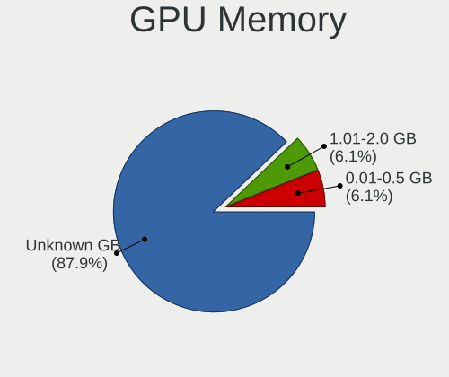

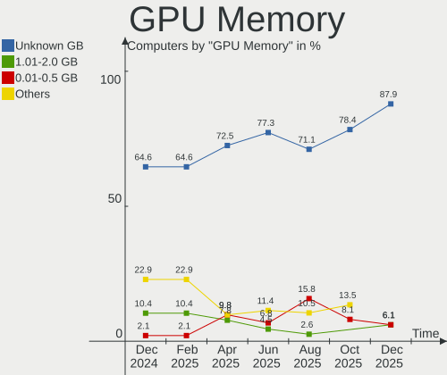

| Size in GB | Computers | Percent |
|------------|-----------|---------|
| Unknown    | 29        | 87.88%  |
| 1.01-2.0   | 2         | 6.06%   |
| 0.01-0.5   | 2         | 6.06%   |

Monitor
-------

Monitor Vendor
--------------

Monitor vendors

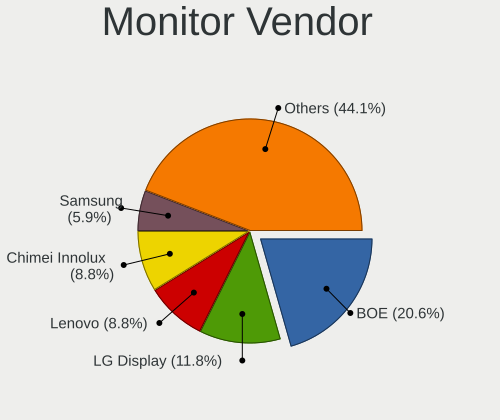

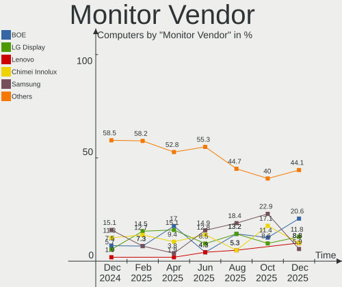

| Vendor              | Computers | Percent |
|---------------------|-----------|---------|
| BOE                 | 7         | 20.59%  |
| LG Display          | 4         | 11.76%  |
| Lenovo              | 3         | 8.82%   |
| Chimei Innolux      | 3         | 8.82%   |
| Samsung Electronics | 2         | 5.88%   |
| Philips             | 2         | 5.88%   |
| Dell                | 2         | 5.88%   |
| AU Optronics        | 2         | 5.88%   |
| Roku                | 1         | 2.94%   |
| PANDA               | 1         | 2.94%   |
| IPS                 | 1         | 2.94%   |
| HKC                 | 1         | 2.94%   |
| Eizo                | 1         | 2.94%   |
| EDO                 | 1         | 2.94%   |
| BenQ                | 1         | 2.94%   |
| Apple               | 1         | 2.94%   |
| AOC                 | 1         | 2.94%   |

Monitor Model
-------------

Monitor models

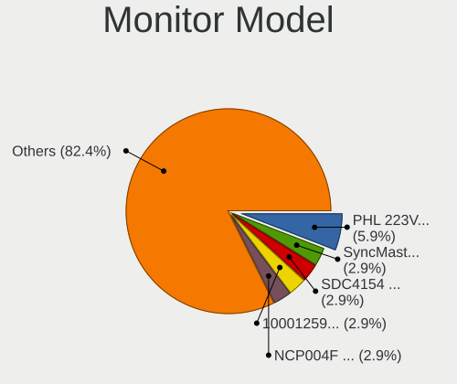

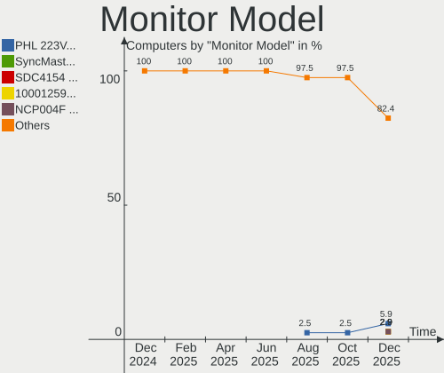

| Model                                                                 | Computers | Percent |
|-----------------------------------------------------------------------|-----------|---------|
| Philips PHL 223V5 PHLC0CF 1920x1080 477x268mm 21.5-inch               | 2         | 5.88%   |
| Samsung Electronics SyncMaster SAM0420 1680x1050 474x296mm 22.0-inch  | 1         | 2.94%   |
| Samsung Electronics LCD Monitor SDC4154 2880x1800 302x189mm 14.0-inch | 1         | 2.94%   |
| Roku 100012590 RKU0B01 1920x1080 698x392mm 31.5-inch                  | 1         | 2.94%   |
| PANDA LCD Monitor NCP004F 1920x1080 309x174mm 14.0-inch               | 1         | 2.94%   |
| LG Display LCD Monitor LGD06ED 1920x1200 302x188mm 14.0-inch          | 1         | 2.94%   |
| LG Display LCD Monitor LGD046D 1920x1080 309x174mm 14.0-inch          | 1         | 2.94%   |
| LG Display LCD Monitor LGD0454 1366x768 310x174mm 14.0-inch           | 1         | 2.94%   |
| LG Display LCD Monitor LGD02DC 1366x768 344x194mm 15.5-inch           | 1         | 2.94%   |
| Lenovo LEN T2254pC LEN60CC 1680x1050 474x296mm 22.0-inch              | 1         | 2.94%   |
| Lenovo LCD Monitor LEN40A0 1366x768 309x173mm 13.9-inch               | 1         | 2.94%   |
| Lenovo D27-30 LEN66B8 1920x1080 600x340mm 27.2-inch                   | 1         | 2.94%   |
| IPS COOLGEN IPS2019 1920x1080 304x228mm 15.0-inch                     | 1         | 2.94%   |
| HKC LCD Monitor HKC36BB 1366x768 309x174mm 14.0-inch                  | 1         | 2.94%   |
| Eizo EV2455 ENC2534 1920x1080 519x324mm 24.1-inch                     | 1         | 2.94%   |
| EDO EF10QBC64.C EDO4245                                               | 1         | 2.94%   |
| Dell SE2416H DELD082 1920x1080 527x296mm 23.8-inch                    | 1         | 2.94%   |
| Dell 1900FP DEL3009 1280x1024 376x301mm 19.0-inch                     | 1         | 2.94%   |
| Chimei Innolux LCD Monitor CMN14D4 1920x1080 309x173mm 13.9-inch      | 1         | 2.94%   |
| Chimei Innolux LCD Monitor CMN139E 1920x1080 293x165mm 13.2-inch      | 1         | 2.94%   |
| Chimei Innolux LCD Monitor CMN1138 1366x768 256x144mm 11.6-inch       | 1         | 2.94%   |
| BOE LCD Monitor BOE0C29 1920x1080 344x194mm 15.5-inch                 | 1         | 2.94%   |
| BOE LCD Monitor BOE0A6A 1920x1200 301x188mm 14.0-inch                 | 1         | 2.94%   |
| BOE LCD Monitor BOE0955 1600x900 382x215mm 17.3-inch                  | 1         | 2.94%   |
| BOE LCD Monitor BOE07F6 1920x1080 309x174mm 14.0-inch                 | 1         | 2.94%   |
| BOE LCD Monitor BOE07C9 1920x1080 309x173mm 13.9-inch                 | 1         | 2.94%   |
| BOE LCD Monitor BOE06CE 1366x768 277x156mm 12.5-inch                  | 1         | 2.94%   |
| BOE LCD Monitor BOE0697 1366x768 309x173mm 13.9-inch                  | 1         | 2.94%   |
| BenQ T201W BNQ7719 1680x1050 433x271mm 20.1-inch                      | 1         | 2.94%   |
| AU Optronics LCD Monitor AUO21ED 1920x1080 344x193mm 15.5-inch        | 1         | 2.94%   |
| AU Optronics LCD Monitor AUO203E 1600x900 309x174mm 14.0-inch         | 1         | 2.94%   |
| Apple Color LCD APP9CF0 1440x900 290x180mm 13.4-inch                  | 1         | 2.94%   |
| AOC 2050W AOC2050 1600x900 432x240mm 19.5-inch                        | 1         | 2.94%   |

Monitor Resolution
------------------

Monitor screen resolution

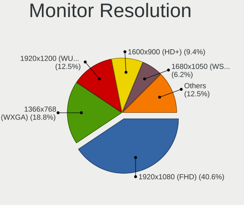

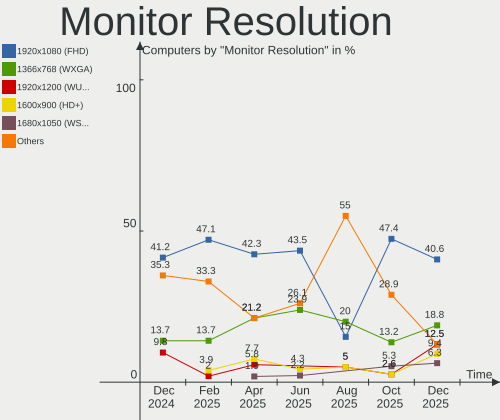

| Resolution         | Computers | Percent |
|--------------------|-----------|---------|
| 1920x1080 (FHD)    | 13        | 40.63%  |
| 1366x768 (WXGA)    | 6         | 18.75%  |
| 1920x1200 (WUXGA)  | 4         | 12.5%   |
| 1600x900 (HD+)     | 3         | 9.38%   |
| 1680x1050 (WSXGA+) | 2         | 6.25%   |
| 2880x1800          | 1         | 3.13%   |
| 1440x900 (WXGA+)   | 1         | 3.13%   |
| 1280x1024 (SXGA)   | 1         | 3.13%   |
| Unknown            | 1         | 3.13%   |

Monitor Diagonal
----------------

Diagonal size in inches

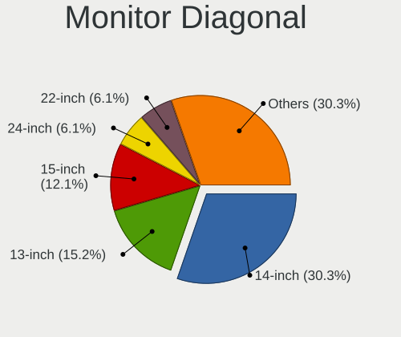

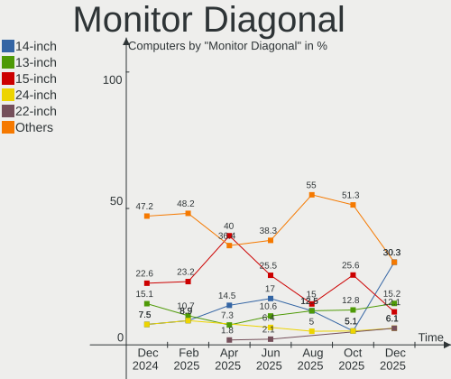

| Inches  | Computers | Percent |
|---------|-----------|---------|
| 14      | 10        | 30.3%   |
| 13      | 5         | 15.15%  |
| 15      | 4         | 12.12%  |
| 24      | 2         | 6.06%   |
| 22      | 2         | 6.06%   |
| 21      | 2         | 6.06%   |
| 31      | 1         | 3.03%   |
| 27      | 1         | 3.03%   |
| 20      | 1         | 3.03%   |
| 19      | 1         | 3.03%   |
| 17      | 1         | 3.03%   |
| 12      | 1         | 3.03%   |
| 11      | 1         | 3.03%   |
| Unknown | 1         | 3.03%   |

Monitor Width
-------------

Physical width

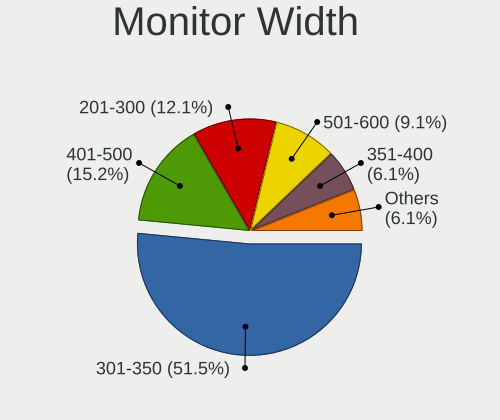

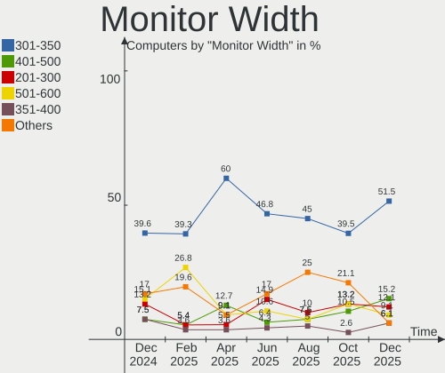

| Width in mm | Computers | Percent |
|-------------|-----------|---------|
| 301-350     | 17        | 51.52%  |
| 401-500     | 5         | 15.15%  |
| 201-300     | 4         | 12.12%  |
| 501-600     | 3         | 9.09%   |
| 351-400     | 2         | 6.06%   |
| 601-700     | 1         | 3.03%   |
| Unknown     | 1         | 3.03%   |

Aspect Ratio
------------

Proportional relationship between the width and the height

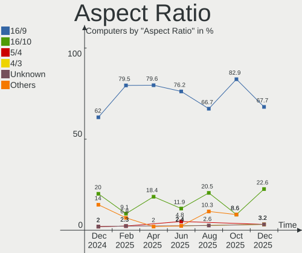

| Ratio   | Computers | Percent |
|---------|-----------|---------|
| 16/9    | 21        | 67.74%  |
| 16/10   | 7         | 22.58%  |
| 5/4     | 1         | 3.23%   |
| 4/3     | 1         | 3.23%   |
| Unknown | 1         | 3.23%   |

Monitor Area
------------

Area in inch²

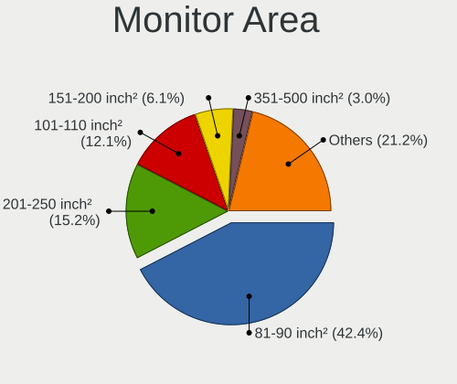

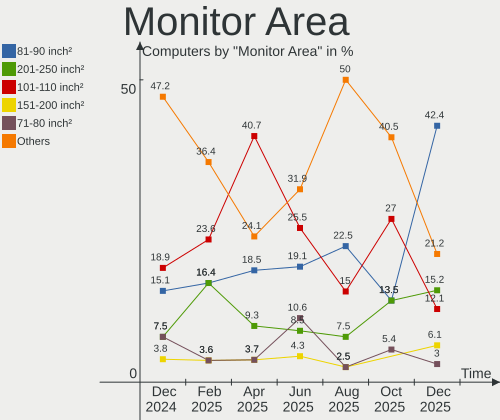

| Area in inch² | Computers | Percent |
|----------------|-----------|---------|
| 81-90          | 14        | 42.42%  |
| 201-250        | 5         | 15.15%  |
| 101-110        | 4         | 12.12%  |
| 151-200        | 2         | 6.06%   |
| 71-80          | 1         | 3.03%   |
| 61-70          | 1         | 3.03%   |
| 51-60          | 1         | 3.03%   |
| 351-500        | 1         | 3.03%   |
| 301-350        | 1         | 3.03%   |
| 251-300        | 1         | 3.03%   |
| 121-130        | 1         | 3.03%   |
| Unknown        | 1         | 3.03%   |

Pixel Density
-------------

Pixels per inch

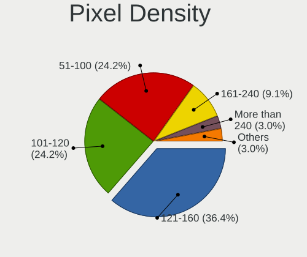

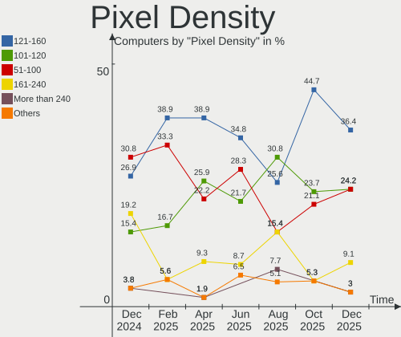

| Density       | Computers | Percent |
|---------------|-----------|---------|
| 121-160       | 12        | 36.36%  |
| 101-120       | 8         | 24.24%  |
| 51-100        | 8         | 24.24%  |
| 161-240       | 3         | 9.09%   |
| More than 240 | 1         | 3.03%   |
| Unknown       | 1         | 3.03%   |

Multiple Monitors
-----------------

Total monitors connected

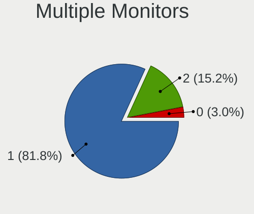

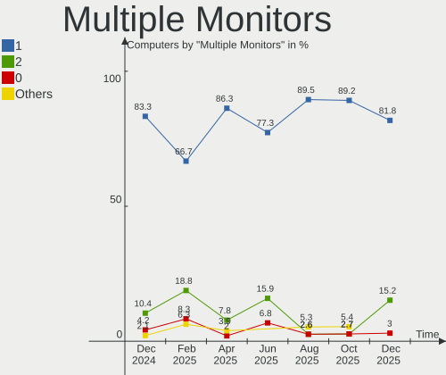

| Total | Computers | Percent |
|-------|-----------|---------|
| 1     | 27        | 81.82%  |
| 2     | 5         | 15.15%  |
| 0     | 1         | 3.03%   |

Network
-------

Net Controller Vendor
---------------------

Controller vendors

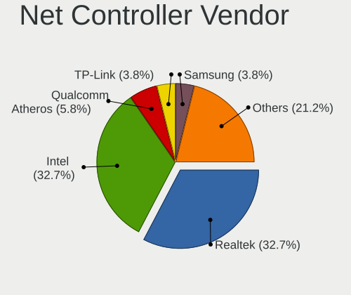

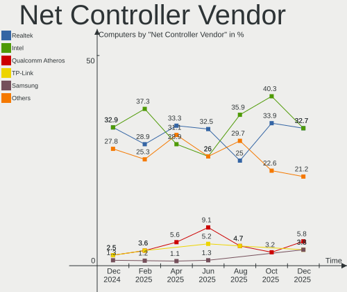

| Vendor                | Computers | Percent |
|-----------------------|-----------|---------|
| Realtek Semiconductor | 17        | 32.69%  |
| Intel                 | 17        | 32.69%  |
| Qualcomm Atheros      | 3         | 5.77%   |
| TP-Link               | 2         | 3.85%   |
| Samsung Electronics   | 2         | 3.85%   |
| MediaTek              | 2         | 3.85%   |
| Broadcom Limited      | 2         | 3.85%   |
| Xiaomi                | 1         | 1.92%   |
| Raspberry Pi          | 1         | 1.92%   |
| Ralink Technology     | 1         | 1.92%   |
| Ralink                | 1         | 1.92%   |
| LG Electronics        | 1         | 1.92%   |
| Belkin Components     | 1         | 1.92%   |
| ASR Microelectronics  | 1         | 1.92%   |

Net Controller Model
--------------------

Controller models

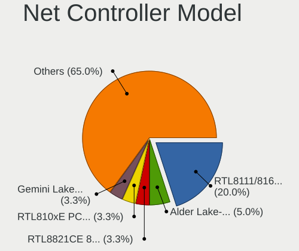

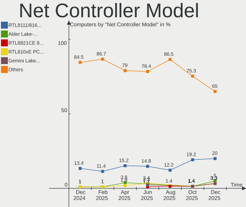

| Model                                                                           | Computers | Percent |
|---------------------------------------------------------------------------------|-----------|---------|
| Realtek RTL8111/8168/8211/8411 PCI Express Gigabit Ethernet Controller          | 12        | 20%     |
| Intel Alder Lake-P PCH CNVi WiFi                                                | 3         | 5%      |
| Realtek RTL8821CE 802.11ac PCIe Wireless Network Adapter                        | 2         | 3.33%   |
| Realtek RTL810xE PCI Express Fast Ethernet controller                           | 2         | 3.33%   |
| Intel Gemini Lake PCH CNVi WiFi                                                 | 2         | 3.33%   |
| Intel Centrino Advanced-N 6235                                                  | 2         | 3.33%   |
| Xiaomi Mi/Redmi series (RNDIS + ADB)                                            | 1         | 1.67%   |
| TP-Link TL-WN821N v5/v6 [RTL8192EU]                                             | 1         | 1.67%   |
| TP-Link Archer T2U PLUS [RTL8821AU]                                             | 1         | 1.67%   |
| Samsung Remote Download Wireless Adapter                                        | 1         | 1.67%   |
| Samsung Galaxy series, misc. (tethering mode)                                   | 1         | 1.67%   |
| Realtek RTL8852BE PCIe 802.11ax Wireless Network Controller                     | 1         | 1.67%   |
| Realtek RTL8852AE 802.11ax PCIe Wireless Network Adapter                        | 1         | 1.67%   |
| Realtek RTL8153 Gigabit Ethernet Adapter                                        | 1         | 1.67%   |
| Realtek 802.11ac NIC                                                            | 1         | 1.67%   |
| Raspberry Pi RP1 PCIe 2.0 South Bridge                                          | 1         | 1.67%   |
| Ralink RT3072 Wireless Adapter                                                  | 1         | 1.67%   |
| Ralink RT5392 PCIe Wireless Network Adapter                                     | 1         | 1.67%   |
| Qualcomm Atheros QCA9377 802.11ac Wireless Network Adapter                      | 1         | 1.67%   |
| Qualcomm Atheros QCA6174 802.11ac Wireless Network Adapter                      | 1         | 1.67%   |
| Qualcomm Atheros AR9485 Wireless Network Adapter                                | 1         | 1.67%   |
| MediaTek MT7925 802.11be 160MHz 2x2 PCIe Wireless Network Adapter [Filogic 360] | 1         | 1.67%   |
| MediaTek MT7921 802.11ax PCIe Wireless Network Adapter [Filogic 330]            | 1         | 1.67%   |
| LG 802.11 n WLAN                                                                | 1         | 1.67%   |
| Intel Wireless 8265 / 8275                                                      | 1         | 1.67%   |
| Intel Wireless 8260                                                             | 1         | 1.67%   |
| Intel Wi-Fi 6 AX201                                                             | 1         | 1.67%   |
| Intel Wi-Fi 6 AX200                                                             | 1         | 1.67%   |
| Intel Wi-Fi 5(802.11ac) Wireless-AC 9x6x [Thunder Peak]                         | 1         | 1.67%   |
| Intel Jasper Lake PCH CNVi WiFi                                                 | 1         | 1.67%   |
| Intel Ice Lake-LP PCH CNVi WiFi                                                 | 1         | 1.67%   |
| Intel Ethernet Connection I219-LM                                               | 1         | 1.67%   |
| Intel Ethernet Connection I217-LM                                               | 1         | 1.67%   |
| Intel Ethernet Connection (6) I219-LM                                           | 1         | 1.67%   |
| Intel Ethernet Connection (2) I219-LM                                           | 1         | 1.67%   |
| Intel Ethernet Connection (16) I219-V                                           | 1         | 1.67%   |
| Intel Ethernet Connection (10) I219-LM                                          | 1         | 1.67%   |
| Intel Comet Lake PCH-LP CNVi WiFi                                               | 1         | 1.67%   |
| Intel 82579LM Gigabit Network Connection (Lewisville)                           | 1         | 1.67%   |
| Broadcom Limited BCM4360 802.11ac Dual Band Wireless Network Adapter            | 1         | 1.67%   |

Wireless Vendor
---------------

Wireless vendors

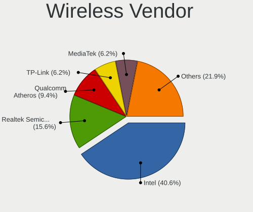

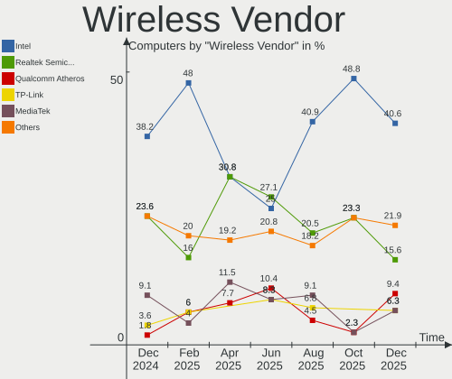

| Vendor                | Computers | Percent |
|-----------------------|-----------|---------|
| Intel                 | 13        | 40.63%  |
| Realtek Semiconductor | 5         | 15.63%  |
| Qualcomm Atheros      | 3         | 9.38%   |
| TP-Link               | 2         | 6.25%   |
| MediaTek              | 2         | 6.25%   |
| Broadcom Limited      | 2         | 6.25%   |
| Samsung Electronics   | 1         | 3.13%   |
| Ralink Technology     | 1         | 3.13%   |
| Ralink                | 1         | 3.13%   |
| LG Electronics        | 1         | 3.13%   |
| Belkin Components     | 1         | 3.13%   |

Wireless Model
--------------

Wireless models

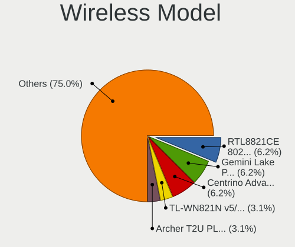

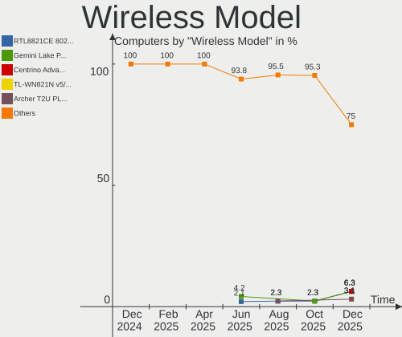

| Model                                                                           | Computers | Percent |
|---------------------------------------------------------------------------------|-----------|---------|
| Realtek RTL8821CE 802.11ac PCIe Wireless Network Adapter                        | 2         | 6.25%   |
| Intel Gemini Lake PCH CNVi WiFi                                                 | 2         | 6.25%   |
| Intel Centrino Advanced-N 6235                                                  | 2         | 6.25%   |
| TP-Link TL-WN821N v5/v6 [RTL8192EU]                                             | 1         | 3.13%   |
| TP-Link Archer T2U PLUS [RTL8821AU]                                             | 1         | 3.13%   |
| Samsung Remote Download Wireless Adapter                                        | 1         | 3.13%   |
| Realtek RTL8852BE PCIe 802.11ax Wireless Network Controller                     | 1         | 3.13%   |
| Realtek RTL8852AE 802.11ax PCIe Wireless Network Adapter                        | 1         | 3.13%   |
| Realtek 802.11ac NIC                                                            | 1         | 3.13%   |
| Ralink RT3072 Wireless Adapter                                                  | 1         | 3.13%   |
| Ralink RT5392 PCIe Wireless Network Adapter                                     | 1         | 3.13%   |
| Qualcomm Atheros QCA9377 802.11ac Wireless Network Adapter                      | 1         | 3.13%   |
| Qualcomm Atheros QCA6174 802.11ac Wireless Network Adapter                      | 1         | 3.13%   |
| Qualcomm Atheros AR9485 Wireless Network Adapter                                | 1         | 3.13%   |
| MediaTek MT7925 802.11be 160MHz 2x2 PCIe Wireless Network Adapter [Filogic 360] | 1         | 3.13%   |
| MediaTek MT7921 802.11ax PCIe Wireless Network Adapter [Filogic 330]            | 1         | 3.13%   |
| LG 802.11 n WLAN                                                                | 1         | 3.13%   |
| Intel Wireless 8265 / 8275                                                      | 1         | 3.13%   |
| Intel Wireless 8260                                                             | 1         | 3.13%   |
| Intel Wi-Fi 6 AX201                                                             | 1         | 3.13%   |
| Intel Wi-Fi 6 AX200                                                             | 1         | 3.13%   |
| Intel Wi-Fi 5(802.11ac) Wireless-AC 9x6x [Thunder Peak]                         | 1         | 3.13%   |
| Intel Jasper Lake PCH CNVi WiFi                                                 | 1         | 3.13%   |
| Intel Ice Lake-LP PCH CNVi WiFi                                                 | 1         | 3.13%   |
| Intel Comet Lake PCH-LP CNVi WiFi                                               | 1         | 3.13%   |
| Intel Alder Lake-P PCH CNVi WiFi                                                | 1         | 3.13%   |
| Broadcom Limited BCM4360 802.11ac Dual Band Wireless Network Adapter            | 1         | 3.13%   |
| Broadcom Limited BCM4312 802.11b/g LP-PHY                                       | 1         | 3.13%   |
| Belkin Components F7D1101 v1 Basic Wireless Adapter [Realtek RTL8188SU]         | 1         | 3.13%   |

Ethernet Vendor
---------------

Ethernet vendors

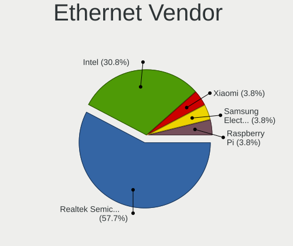

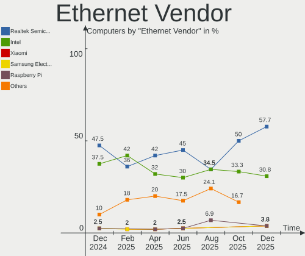

| Vendor                | Computers | Percent |
|-----------------------|-----------|---------|
| Realtek Semiconductor | 15        | 57.69%  |
| Intel                 | 8         | 30.77%  |
| Xiaomi                | 1         | 3.85%   |
| Samsung Electronics   | 1         | 3.85%   |
| Raspberry Pi          | 1         | 3.85%   |

Ethernet Model
--------------

Ethernet models

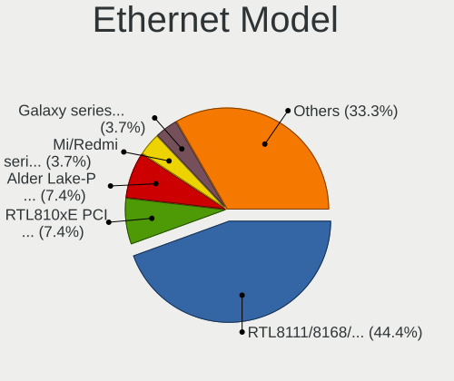

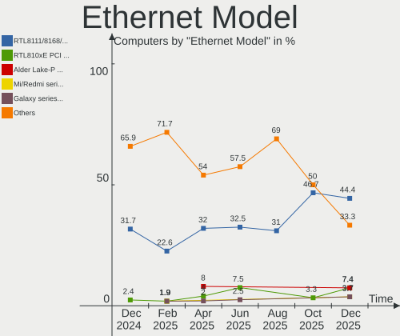

| Model                                                                  | Computers | Percent |
|------------------------------------------------------------------------|-----------|---------|
| Realtek RTL8111/8168/8211/8411 PCI Express Gigabit Ethernet Controller | 12        | 44.44%  |
| Realtek RTL810xE PCI Express Fast Ethernet controller                  | 2         | 7.41%   |
| Intel Alder Lake-P PCH CNVi WiFi                                       | 2         | 7.41%   |
| Xiaomi Mi/Redmi series (RNDIS + ADB)                                   | 1         | 3.7%    |
| Samsung Galaxy series, misc. (tethering mode)                          | 1         | 3.7%    |
| Realtek RTL8153 Gigabit Ethernet Adapter                               | 1         | 3.7%    |
| Raspberry Pi RP1 PCIe 2.0 South Bridge                                 | 1         | 3.7%    |
| Intel Ethernet Connection I219-LM                                      | 1         | 3.7%    |
| Intel Ethernet Connection I217-LM                                      | 1         | 3.7%    |
| Intel Ethernet Connection (6) I219-LM                                  | 1         | 3.7%    |
| Intel Ethernet Connection (2) I219-LM                                  | 1         | 3.7%    |
| Intel Ethernet Connection (16) I219-V                                  | 1         | 3.7%    |
| Intel Ethernet Connection (10) I219-LM                                 | 1         | 3.7%    |
| Intel 82579LM Gigabit Network Connection (Lewisville)                  | 1         | 3.7%    |

Net Controller Kind
-------------------

Ethernet, WiFi or modem

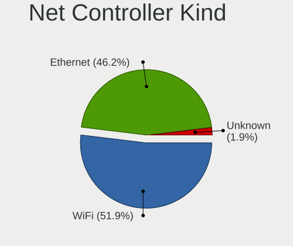

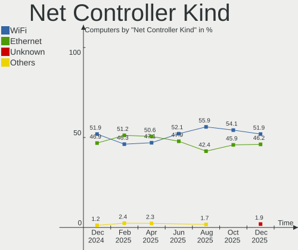

| Kind     | Computers | Percent |
|----------|-----------|---------|
| WiFi     | 27        | 51.92%  |
| Ethernet | 24        | 46.15%  |
| Unknown  | 1         | 1.92%   |

Used Controller
---------------

Currently used network controller

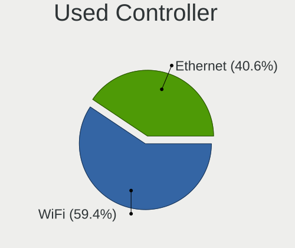

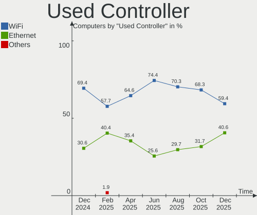

| Kind     | Computers | Percent |
|----------|-----------|---------|
| WiFi     | 19        | 59.38%  |
| Ethernet | 13        | 40.63%  |

NICs
----

Total network controllers on board

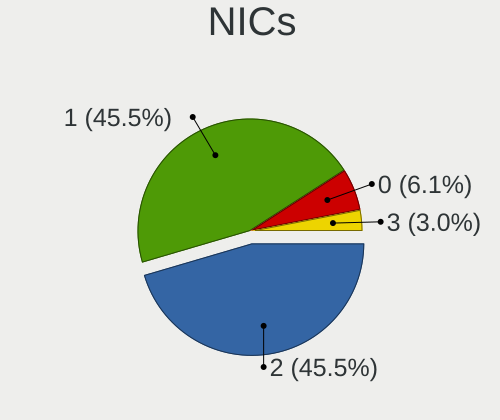

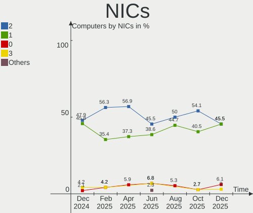

| Total | Computers | Percent |
|-------|-----------|---------|
| 2     | 15        | 45.45%  |
| 1     | 15        | 45.45%  |
| 0     | 2         | 6.06%   |
| 3     | 1         | 3.03%   |

IPv6
----

IPv6 vs IPv4

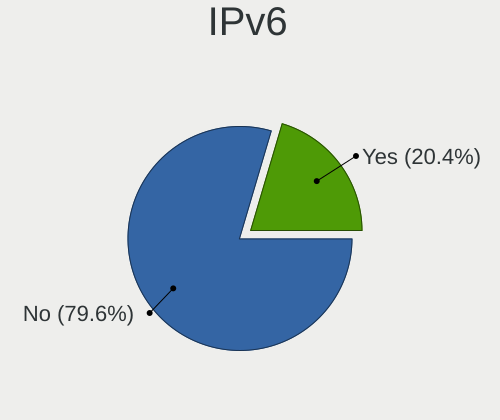

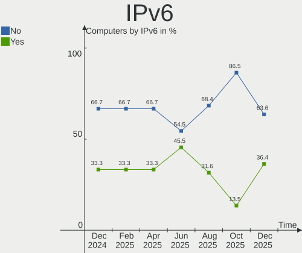

| Used | Computers | Percent |
|------|-----------|---------|
| No   | 21        | 63.64%  |
| Yes  | 12        | 36.36%  |

Bluetooth
---------

Bluetooth Vendor
----------------

Controller vendors

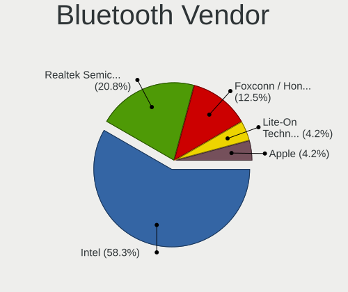

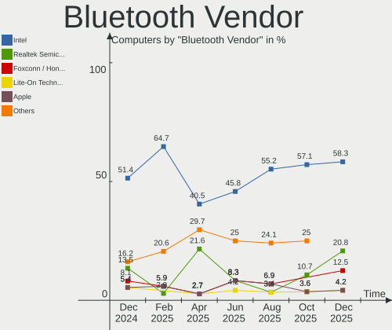

| Vendor                | Computers | Percent |
|-----------------------|-----------|---------|
| Intel                 | 14        | 58.33%  |
| Realtek Semiconductor | 5         | 20.83%  |
| Foxconn / Hon Hai     | 3         | 12.5%   |
| Lite-On Technology    | 1         | 4.17%   |
| Apple                 | 1         | 4.17%   |

Bluetooth Model
---------------

Controller models

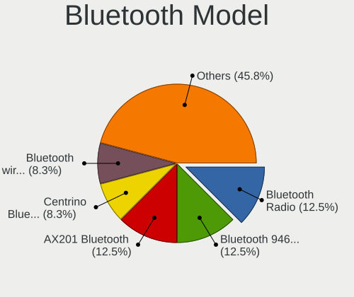

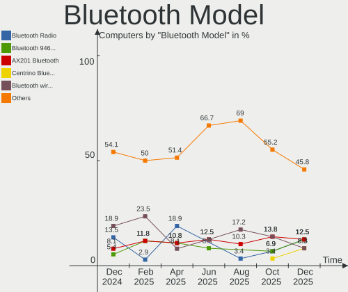

| Model                                          | Computers | Percent |
|------------------------------------------------|-----------|---------|
| Realtek Bluetooth Radio                        | 3         | 12.5%   |
| Intel Bluetooth 9460/9560 Jefferson Peak (JfP) | 3         | 12.5%   |
| Intel AX201 Bluetooth                          | 3         | 12.5%   |
| Intel Centrino Bluetooth Wireless Transceiver  | 2         | 8.33%   |
| Intel Bluetooth wireless interface             | 2         | 8.33%   |
| Intel Bluetooth Device                         | 2         | 8.33%   |
| Realtek  Bluetooth 4.2 Adapter                 | 1         | 4.17%   |
| Realtek Bluetooth 5.3 Radio                    | 1         | 4.17%   |
| Lite-On Qualcomm Atheros QCA9377 Bluetooth     | 1         | 4.17%   |
| Intel Wireless-AC 9260 Bluetooth Adapter       | 1         | 4.17%   |
| Intel AX200 Bluetooth                          | 1         | 4.17%   |
| Foxconn / Hon Hai Wireless_Device              | 1         | 4.17%   |
| Foxconn / Hon Hai MediaTek Bluetooth Adapter   | 1         | 4.17%   |
| Foxconn / Hon Hai Bluetooth Device             | 1         | 4.17%   |
| Apple Bluetooth USB Host Controller            | 1         | 4.17%   |

Sound
-----

Sound Vendor
------------

Sound card vendors

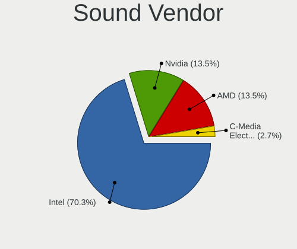

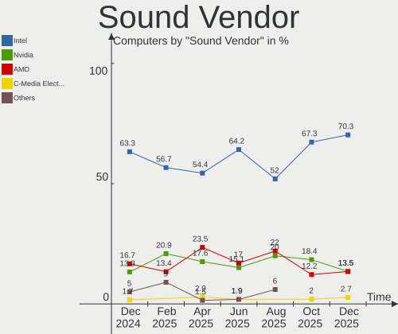

| Vendor              | Computers | Percent |
|---------------------|-----------|---------|
| Intel               | 26        | 70.27%  |
| Nvidia              | 5         | 13.51%  |
| AMD                 | 5         | 13.51%  |
| C-Media Electronics | 1         | 2.7%    |

Sound Model
-----------

Sound card models

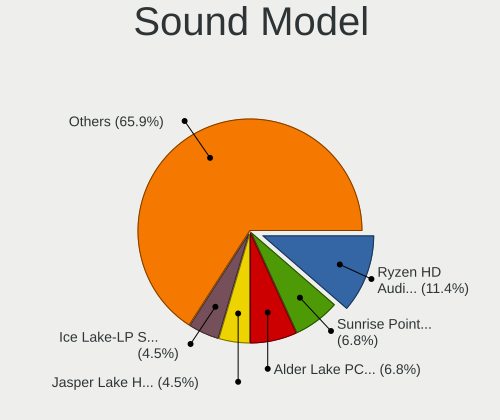

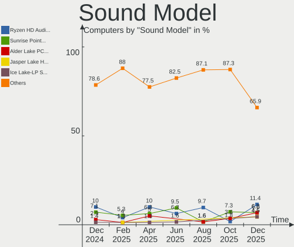

| Model                                                                      | Computers | Percent |
|----------------------------------------------------------------------------|-----------|---------|
| AMD Ryzen HD Audio Controller                                              | 5         | 11.36%  |
| Intel Sunrise Point-LP HD Audio                                            | 3         | 6.82%   |
| Intel Alder Lake PCH-P High Definition Audio Controller                    | 3         | 6.82%   |
| Intel Jasper Lake HD Audio                                                 | 2         | 4.55%   |
| Intel Ice Lake-LP Smart Sound Technology Audio Controller                  | 2         | 4.55%   |
| Intel Celeron/Pentium Silver Processor High Definition Audio               | 2         | 4.55%   |
| Intel 8 Series/C220 Series Chipset High Definition Audio Controller        | 2         | 4.55%   |
| Intel 6 Series/C200 Series Chipset Family High Definition Audio Controller | 2         | 4.55%   |
| AMD Renoir/Cezanne HDMI/DP Audio Controller                                | 2         | 4.55%   |
| AMD Raven/Raven2/Fenghuang HDMI/DP Audio Controller                        | 2         | 4.55%   |
| Nvidia High Definition Audio Controller                                    | 1         | 2.27%   |
| Nvidia GP107GL High Definition Audio Controller                            | 1         | 2.27%   |
| Nvidia GK104 HDMI Audio Controller                                         | 1         | 2.27%   |
| Nvidia GB206 High Definition Audio Controller                              | 1         | 2.27%   |
| Nvidia AD107 High Definition Audio Controller                              | 1         | 2.27%   |
| Intel Xeon E3-1200 v3/4th Gen Core Processor HD Audio Controller           | 1         | 2.27%   |
| Intel Wildcat Point-LP High Definition Audio Controller                    | 1         | 2.27%   |
| Intel Tiger Lake-LP Smart Sound Technology Audio Controller                | 1         | 2.27%   |
| Intel Raptor Lake-P/U/H cAVS                                               | 1         | 2.27%   |
| Intel Raptor Lake High Definition Audio Controller                         | 1         | 2.27%   |
| Intel NM10/ICH7 Family High Definition Audio Controller                    | 1         | 2.27%   |
| Intel Haswell-ULT HD Audio Controller                                      | 1         | 2.27%   |
| Intel Comet Lake PCH-LP cAVS                                               | 1         | 2.27%   |
| Intel Cannon Point-LP High Definition Audio Controller                     | 1         | 2.27%   |
| Intel Broadwell-U Audio Controller                                         | 1         | 2.27%   |
| Intel 8 Series HD Audio Controller                                         | 1         | 2.27%   |
| Intel 7 Series/C216 Chipset Family High Definition Audio Controller        | 1         | 2.27%   |
| Intel 100 Series/C230 Series Chipset Family HD Audio Controller            | 1         | 2.27%   |
| C-Media Electronics Audio Adapter (Unitek Y-247A)                          | 1         | 2.27%   |

Memory
------

Memory Vendor
-------------

Memory module vendors

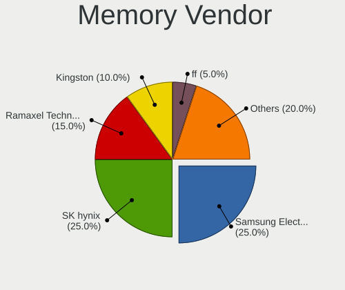

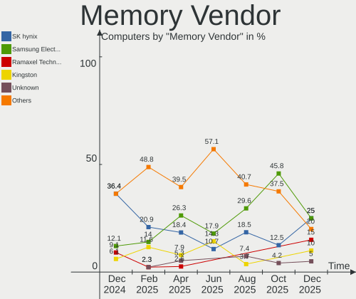

| Vendor              | Computers | Percent |
|---------------------|-----------|---------|
| SK hynix            | 5         | 25%     |
| Samsung Electronics | 5         | 25%     |
| Ramaxel Technology  | 3         | 15%     |
| Kingston            | 2         | 10%     |
| Unknown             | 1         | 5%      |
| Micron Technology   | 1         | 5%      |
| ff                  | 1         | 5%      |
| Crucial             | 1         | 5%      |
| 4ea5                | 1         | 5%      |

Memory Model
------------

Memory module models

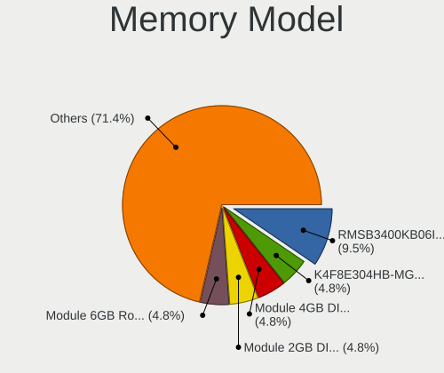

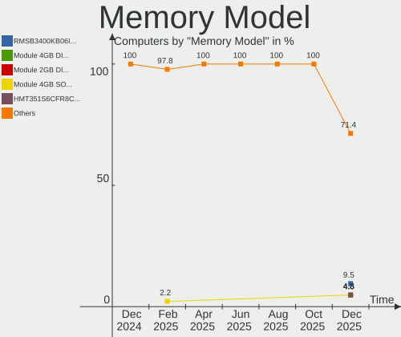

| Model                                                            | Computers | Percent |
|------------------------------------------------------------------|-----------|---------|
| Ramaxel RAM RMSB3400KB06IVF-4800 12GB SODIMM DDR5 4800MT/s       | 2         | 9.52%   |
| Unknown RAM Module 4GB DIMM SDRAM                                | 1         | 4.76%   |
| Unknown RAM Module 2GB DIMM SDRAM                                | 1         | 4.76%   |
| SK hynix RAM Module 4GB SODIMM DDR3 1600MT/s                     | 1         | 4.76%   |
| SK hynix RAM HMT351S6CFR8C-PB 4096MB SODIMM DDR3 1600MT/s        | 1         | 4.76%   |
| SK hynix RAM HMAG56EXNSA051N 4GB SODIMM DDR4 3200MT/s            | 1         | 4.76%   |
| SK hynix RAM HMA851S6AFR6N-UH 4GB SODIMM DDR4 2400MT/s           | 1         | 4.76%   |
| SK hynix RAM H9JCNNNBK3MLYR-N6E 1GB Row Of Chips LPDDR5 6400MT/s | 1         | 4.76%   |
| Samsung RAM Module 6GB Row Of Chips LPDDR4 3733MT/s              | 1         | 4.76%   |
| Samsung RAM M471B5173QH0-YK0 4GB SODIMM DDR3 1600MT/s            | 1         | 4.76%   |
| Samsung RAM K4F8E304HB-MGCJ 1GB LPDDR4 2400MT/s                  | 1         | 4.76%   |
| Samsung RAM K4E8E324EB-EGCG 2GB Row Of Chips LPDDR3 2133MT/s     | 1         | 4.76%   |
| Samsung RAM K3LKCKC0BM-MGCP 4GB Row Of Chips LPDDR5 6400MT/s     | 1         | 4.76%   |
| Ramaxel RAM RMT3170EB68F9W1600 4GB SODIMM DDR3 1600MT/s          | 1         | 4.76%   |
| Micron RAM Module 8GB SODIMM DDR4 2400MT/s                       | 1         | 4.76%   |
| Kingston RAM Module 4GB DIMM DDR3 1333MT/s                       | 1         | 4.76%   |
| Kingston RAM 99U5469-053.A00LF 4GB SODIMM DDR3 1333MT/s          | 1         | 4.76%   |
| ff RAM K4F8E304HB-MGCJ 1GB LPDDR4 2400MT/s                       | 1         | 4.76%   |
| Crucial RAM BLS16G4D240FSC.16FBD 16GB DIMM DDR4 2400MT/s         | 1         | 4.76%   |
| 4ea5 RAM K4F8E304HB-MGCJ 1GB LPDDR4 2400MT/s                     | 1         | 4.76%   |

Memory Kind
-----------

Memory module kinds

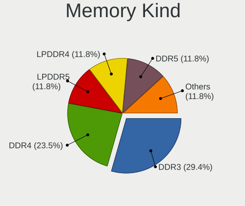

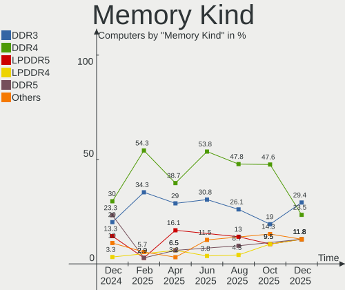

| Kind   | Computers | Percent |
|--------|-----------|---------|
| DDR3   | 5         | 29.41%  |
| DDR4   | 4         | 23.53%  |
| LPDDR5 | 2         | 11.76%  |
| LPDDR4 | 2         | 11.76%  |
| DDR5   | 2         | 11.76%  |
| SDRAM  | 1         | 5.88%   |
| LPDDR3 | 1         | 5.88%   |

Memory Form Factor
------------------

Physical design of the memory module

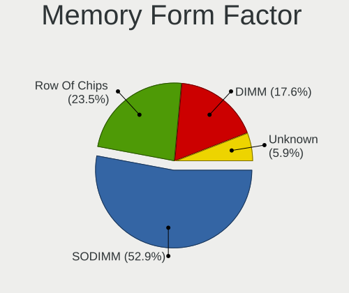

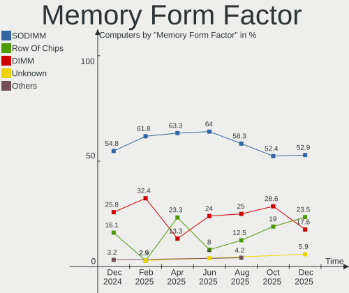

| Name         | Computers | Percent |
|--------------|-----------|---------|
| SODIMM       | 9         | 52.94%  |
| Row Of Chips | 4         | 23.53%  |
| DIMM         | 3         | 17.65%  |
| Unknown      | 1         | 5.88%   |

Memory Size
-----------

Memory module size

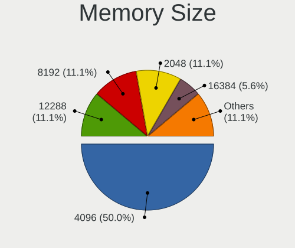

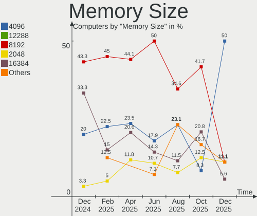

| Size  | Computers | Percent |
|-------|-----------|---------|
| 4096  | 9         | 50%     |
| 12288 | 2         | 11.11%  |
| 8192  | 2         | 11.11%  |
| 2048  | 2         | 11.11%  |
| 16384 | 1         | 5.56%   |
| 6144  | 1         | 5.56%   |
| 1024  | 1         | 5.56%   |

Memory Speed
------------

Memory module speed

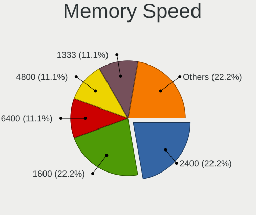

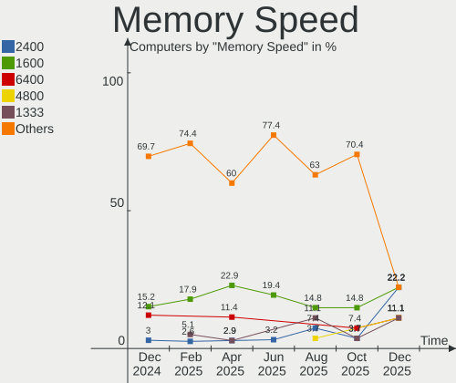

| Speed   | Computers | Percent |
|---------|-----------|---------|
| 2400    | 4         | 22.22%  |
| 1600    | 4         | 22.22%  |
| 6400    | 2         | 11.11%  |
| 4800    | 2         | 11.11%  |
| 1333    | 2         | 11.11%  |
| 3733    | 1         | 5.56%   |
| 3200    | 1         | 5.56%   |
| 2133    | 1         | 5.56%   |
| Unknown | 1         | 5.56%   |

Printers & scanners
-------------------

Printer Vendor
--------------

Printer device vendors

Zero info for selected period =(

Printer Model
-------------

Printer device models

Zero info for selected period =(

Scanner Vendor
--------------

Scanner device vendors

Zero info for selected period =(

Scanner Model
-------------

Scanner device models

Zero info for selected period =(

Camera
------

Camera Vendor
-------------

Camera device vendors

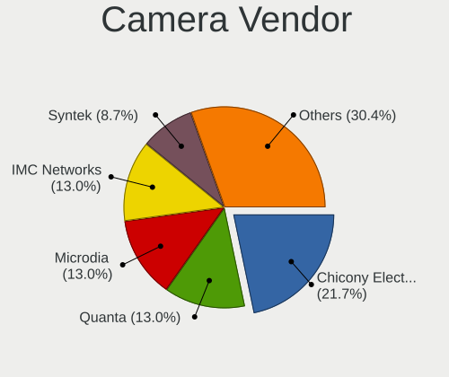

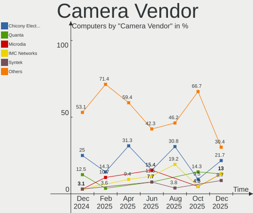

| Vendor                                 | Computers | Percent |
|----------------------------------------|-----------|---------|
| Chicony Electronics                    | 5         | 21.74%  |
| Quanta                                 | 3         | 13.04%  |
| Microdia                               | 3         | 13.04%  |
| IMC Networks                           | 3         | 13.04%  |
| Syntek                                 | 2         | 8.7%    |
| Luxvisions Innotech Limited            | 2         | 8.7%    |
| Bison Electronics                      | 2         | 8.7%    |
| Sonix Technology                       | 1         | 4.35%   |
| Cheng Uei Precision Industry (Foxlink) | 1         | 4.35%   |
| Apple                                  | 1         | 4.35%   |

Camera Model
------------

Camera device models

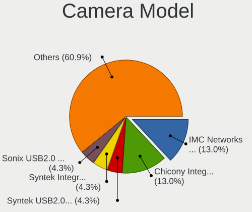

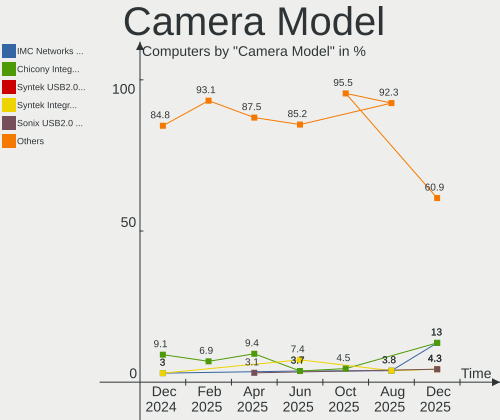

| Model                                                          | Computers | Percent |
|----------------------------------------------------------------|-----------|---------|
| IMC Networks USB2.0 HD UVC WebCam                              | 3         | 13.04%  |
| Chicony Integrated Camera                                      | 3         | 13.04%  |
| Syntek USB2.0 Camera                                           | 1         | 4.35%   |
| Syntek Integrated Camera                                       | 1         | 4.35%   |
| Sonix USB2.0 HD UVC WebCam                                     | 1         | 4.35%   |
| Quanta VGA WebCam                                              | 1         | 4.35%   |
| Quanta HP TrueVision HD Camera                                 | 1         | 4.35%   |
| Quanta HP HD Camera                                            | 1         | 4.35%   |
| Microdia Webcam Vitade AF                                      | 1         | 4.35%   |
| Microdia Laptop_Integrated_Webcam_HD                           | 1         | 4.35%   |
| Microdia Integrated Webcam                                     | 1         | 4.35%   |
| Luxvisions Innotech Limited HP True Vision HD Camera           | 1         | 4.35%   |
| Luxvisions Innotech Limited HP HD Camera                       | 1         | 4.35%   |
| Chicony TOSHIBA Web Camera - HD                                | 1         | 4.35%   |
| Chicony HD WebCam                                              | 1         | 4.35%   |
| Cheng Uei Precision Industry (Foxlink) HP TrueVision HD Camera | 1         | 4.35%   |
| Bison Integrated RGB Camera                                    | 1         | 4.35%   |
| Bison Integrated Camera                                        | 1         | 4.35%   |
| Apple iPhone 5/5C/5S/6/SE/7/8/X                                | 1         | 4.35%   |

Security
--------

Fingerprint Vendor
------------------

Fingerprint sensor vendors

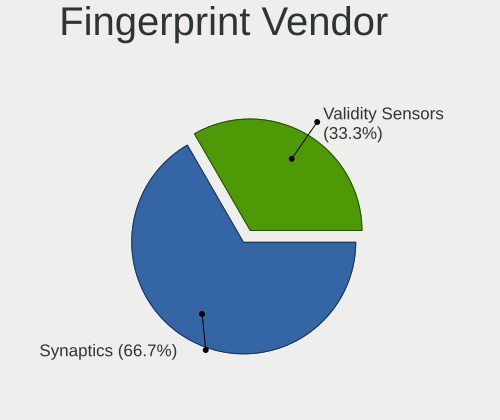

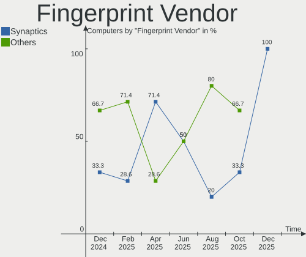

| Vendor    | Computers | Percent |
|-----------|-----------|---------|
| Synaptics | 2         | 100%    |

Fingerprint Model
-----------------

Fingerprint sensor models

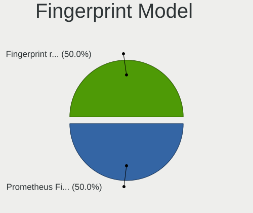

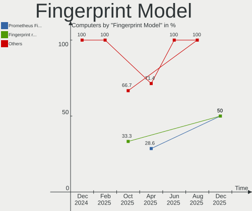

| Model                                   | Computers | Percent |
|-----------------------------------------|-----------|---------|
| Synaptics Prometheus Fingerprint Reader | 1         | 50%     |
| Synaptics Fingerprint reader [HP G6]    | 1         | 50%     |

Chipcard Vendor
---------------

Chipcard module vendors

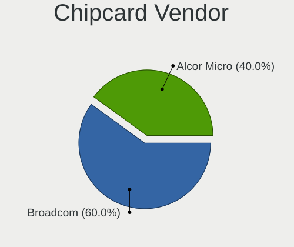

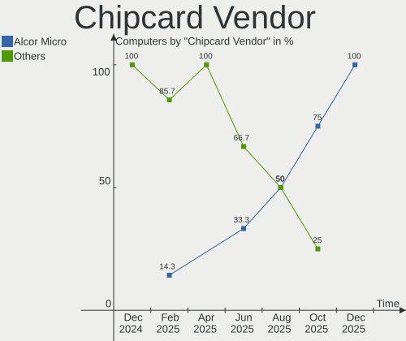

| Vendor      | Computers | Percent |
|-------------|-----------|---------|
| Alcor Micro | 1         | 100%    |

Chipcard Model
--------------

Chipcard module models

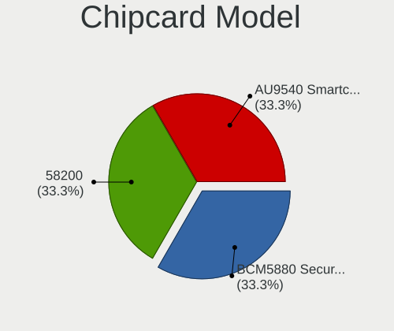

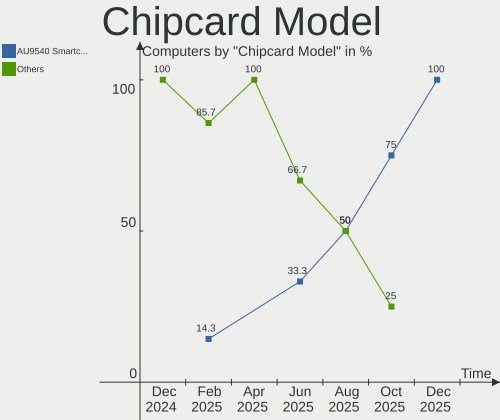

| Model                               | Computers | Percent |
|-------------------------------------|-----------|---------|
| Alcor Micro AU9540 Smartcard Reader | 1         | 100%    |

Unsupported
-----------

Unsupported Devices
-------------------

Total unsupported devices on board

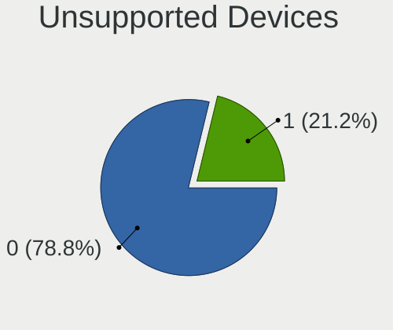

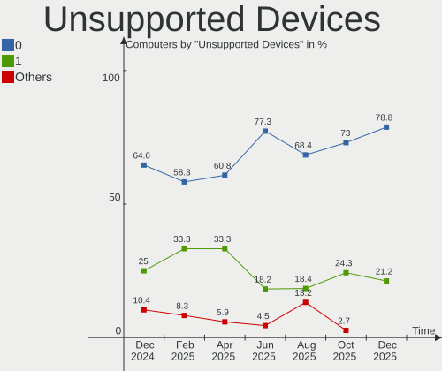

| Total | Computers | Percent |
|-------|-----------|---------|
| 0     | 26        | 78.79%  |
| 1     | 7         | 21.21%  |

Unsupported Device Types
------------------------

Types of unsupported devices

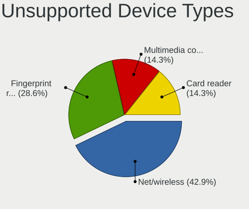

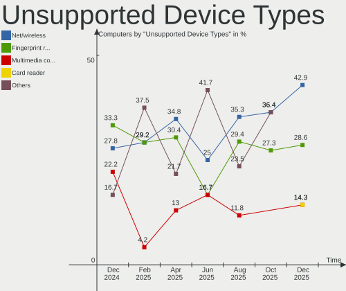

| Type                  | Computers | Percent |
|-----------------------|-----------|---------|
| Net/wireless          | 3         | 42.86%  |
| Fingerprint reader    | 2         | 28.57%  |
| Multimedia controller | 1         | 14.29%  |
| Card reader           | 1         | 14.29%  |

