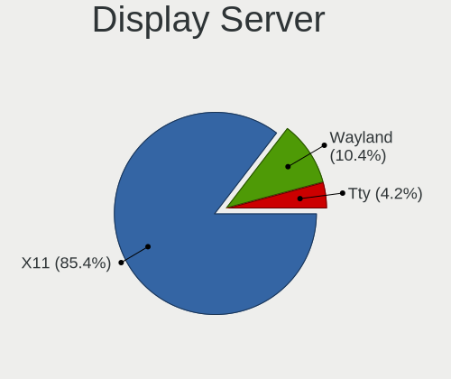
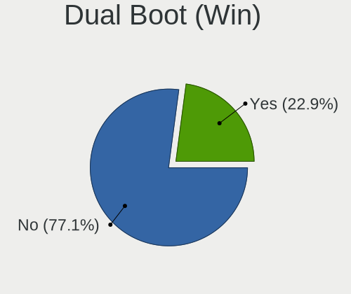
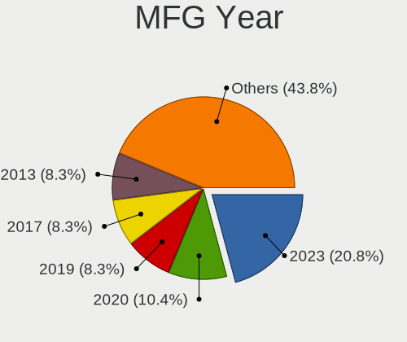
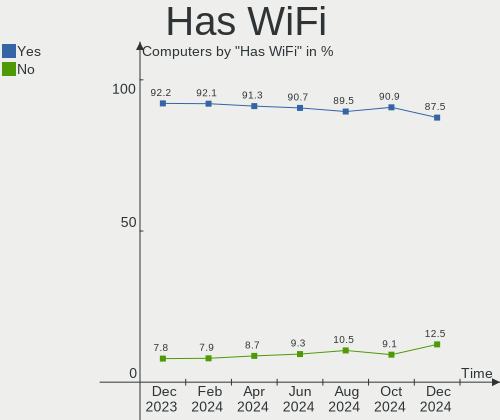
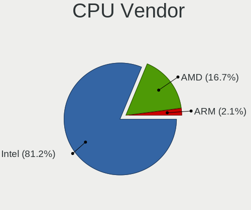
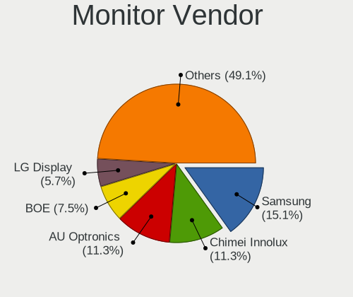
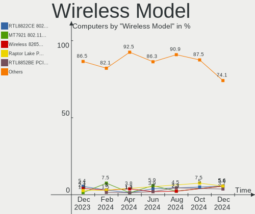
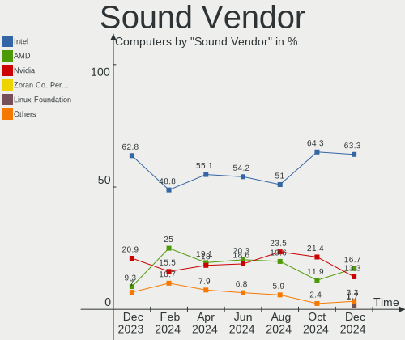
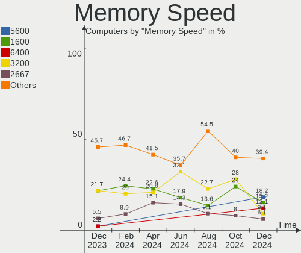

Kali - Hardware Trends
----------------------

A project to identify most popular hardware characteristics and track their change
over time based on data collected by Linux users at https://Linux-Hardware.org.

Anyone can contribute to this report by the [hw-probe](https://github.com/linuxhw/hw-probe) tool:

    sudo -E hw-probe -all -upload

This is a report for all computer types. See also reports for [desktops](/Dist/Kali/Desktop/README.md) and [notebooks](/Dist/Kali/Notebook/README.md).

This report is for one last month. Overall report since the beginning of time: [TestDays](https://github.com/linuxhw/TestDays)

Period: Nov, 2023.

Contents
--------

* [ System ](#system)
  - [ OS                       ](#os)
  - [ OS Family                ](#os-family)
  - [ Kernel                   ](#kernel)
  - [ Kernel Family            ](#kernel-family)
  - [ Kernel Major Ver.        ](#kernel-major-ver)
  - [ Arch                     ](#arch)
  - [ DE                       ](#de)
  - [ Display Server           ](#display-server)
  - [ Display Manager          ](#display-manager)
  - [ OS Lang                  ](#os-lang)
  - [ Boot Mode                ](#boot-mode)
  - [ Filesystem               ](#filesystem)
  - [ Part. scheme             ](#part-scheme)
  - [ Dual Boot with Linux/BSD ](#dual-boot-with-linuxbsd)
  - [ Dual Boot (Win)          ](#dual-boot-win)

* [ Board ](#board)
  - [ Vendor                   ](#vendor)
  - [ Model                    ](#model)
  - [ Model Family             ](#model-family)
  - [ MFG Year                 ](#mfg-year)
  - [ Form Factor              ](#form-factor)
  - [ Secure Boot              ](#secure-boot)
  - [ Coreboot                 ](#coreboot)
  - [ RAM Size                 ](#ram-size)
  - [ RAM Used                 ](#ram-used)
  - [ Total Drives             ](#total-drives)
  - [ Has CD-ROM               ](#has-cd-rom)
  - [ Has Ethernet             ](#has-ethernet)
  - [ Has WiFi                 ](#has-wifi)
  - [ Has Bluetooth            ](#has-bluetooth)

* [ Location ](#location)
  - [ Country                  ](#country)
  - [ City                     ](#city)

* [ Drives ](#drives)
  - [ Drive Vendor             ](#drive-vendor)
  - [ Drive Model              ](#drive-model)
  - [ HDD Vendor               ](#hdd-vendor)
  - [ SSD Vendor               ](#ssd-vendor)
  - [ Drive Kind               ](#drive-kind)
  - [ Drive Connector          ](#drive-connector)
  - [ Drive Size               ](#drive-size)
  - [ Space Total              ](#space-total)
  - [ Space Used               ](#space-used)
  - [ Malfunc. Drives          ](#malfunc-drives)
  - [ Malfunc. Drive Vendor    ](#malfunc-drive-vendor)
  - [ Malfunc. HDD Vendor      ](#malfunc-hdd-vendor)
  - [ Malfunc. Drive Kind      ](#malfunc-drive-kind)
  - [ Failed Drives            ](#failed-drives)
  - [ Failed Drive Vendor      ](#failed-drive-vendor)
  - [ Drive Status             ](#drive-status)

* [ Storage controller ](#storage-controller)
  - [ Storage Vendor           ](#storage-vendor)
  - [ Storage Model            ](#storage-model)
  - [ Storage Kind             ](#storage-kind)

* [ Processor ](#processor)
  - [ CPU Vendor               ](#cpu-vendor)
  - [ CPU Model                ](#cpu-model)
  - [ CPU Model Family         ](#cpu-model-family)
  - [ CPU Cores                ](#cpu-cores)
  - [ CPU Sockets              ](#cpu-sockets)
  - [ CPU Threads              ](#cpu-threads)
  - [ CPU Op-Modes             ](#cpu-op-modes)
  - [ CPU Microcode            ](#cpu-microcode)
  - [ CPU Microarch            ](#cpu-microarch)

* [ Graphics ](#graphics)
  - [ GPU Vendor               ](#gpu-vendor)
  - [ GPU Model                ](#gpu-model)
  - [ GPU Combo                ](#gpu-combo)
  - [ GPU Driver               ](#gpu-driver)
  - [ GPU Memory               ](#gpu-memory)

* [ Monitor ](#monitor)
  - [ Monitor Vendor           ](#monitor-vendor)
  - [ Monitor Model            ](#monitor-model)
  - [ Monitor Resolution       ](#monitor-resolution)
  - [ Monitor Diagonal         ](#monitor-diagonal)
  - [ Monitor Width            ](#monitor-width)
  - [ Aspect Ratio             ](#aspect-ratio)
  - [ Monitor Area             ](#monitor-area)
  - [ Pixel Density            ](#pixel-density)
  - [ Multiple Monitors        ](#multiple-monitors)

* [ Network ](#network)
  - [ Net Controller Vendor    ](#net-controller-vendor)
  - [ Net Controller Model     ](#net-controller-model)
  - [ Wireless Vendor          ](#wireless-vendor)
  - [ Wireless Model           ](#wireless-model)
  - [ Ethernet Vendor          ](#ethernet-vendor)
  - [ Ethernet Model           ](#ethernet-model)
  - [ Net Controller Kind      ](#net-controller-kind)
  - [ Used Controller          ](#used-controller)
  - [ NICs                     ](#nics)
  - [ IPv6                     ](#ipv6)

* [ Bluetooth ](#bluetooth)
  - [ Bluetooth Vendor         ](#bluetooth-vendor)
  - [ Bluetooth Model          ](#bluetooth-model)

* [ Sound ](#sound)
  - [ Sound Vendor             ](#sound-vendor)
  - [ Sound Model              ](#sound-model)

* [ Memory ](#memory)
  - [ Memory Vendor            ](#memory-vendor)
  - [ Memory Model             ](#memory-model)
  - [ Memory Kind              ](#memory-kind)
  - [ Memory Form Factor       ](#memory-form-factor)
  - [ Memory Size              ](#memory-size)
  - [ Memory Speed             ](#memory-speed)

* [ Printers & scanners ](#printers--scanners)
  - [ Printer Vendor           ](#printer-vendor)
  - [ Printer Model            ](#printer-model)
  - [ Scanner Vendor           ](#scanner-vendor)
  - [ Scanner Model            ](#scanner-model)

* [ Camera ](#camera)
  - [ Camera Vendor            ](#camera-vendor)
  - [ Camera Model             ](#camera-model)

* [ Security ](#security)
  - [ Fingerprint Vendor       ](#fingerprint-vendor)
  - [ Fingerprint Model        ](#fingerprint-model)
  - [ Chipcard Vendor          ](#chipcard-vendor)
  - [ Chipcard Model           ](#chipcard-model)

* [ Unsupported ](#unsupported)
  - [ Unsupported Devices      ](#unsupported-devices)
  - [ Unsupported Device Types ](#unsupported-device-types)

System
------

OS
--

Installed operating systems

| Name        | Computers | Percent |
|-------------|-----------|---------|
| Kali 2023.3 | 65        | 89.04%  |
| Kali 2023.4 | 4         | 5.48%   |
| Kali 2023.2 | 2         | 2.74%   |
| Kali 2023.1 | 2         | 2.74%   |

OS Family
---------

OS without a version

| Name | Computers | Percent |
|------|-----------|---------|
| Kali | 73        | 100%    |

Kernel
------

Version of the Linux kernel

| Version             | Computers | Percent |
|---------------------|-----------|---------|
| 6.5.0-kali3-amd64   | 54        | 73.97%  |
| 6.3.0-kali1-amd64   | 7         | 9.59%   |
| 6.1.0-kali5-amd64   | 2         | 2.74%   |
| 5.18.0-kali5-amd64  | 2         | 2.74%   |
| 6.5.0-kali1-amd64   | 1         | 1.37%   |
| 6.5.0-4-amd64       | 1         | 1.37%   |
| 6.1.0-kali9-amd64   | 1         | 1.37%   |
| 5.19.0-21-generic   | 1         | 1.37%   |
| 5.15.44-Re4son-v8l+ | 1         | 1.37%   |
| 5.15.44-Re4son-v7l+ | 1         | 1.37%   |
| 5.10.0-kali3-amd64  | 1         | 1.37%   |
| 4.19.127+           | 1         | 1.37%   |

Kernel Family
-------------

Linux kernel without a distro release

| Version  | Computers | Percent |
|----------|-----------|---------|
| 6.5.0    | 56        | 76.71%  |
| 6.3.0    | 7         | 9.59%   |
| 6.1.0    | 3         | 4.11%   |
| 5.18.0   | 2         | 2.74%   |
| 5.15.44  | 2         | 2.74%   |
| 5.19.0   | 1         | 1.37%   |
| 5.10.0   | 1         | 1.37%   |
| 4.19.127 | 1         | 1.37%   |

Kernel Major Ver.
-----------------

Linux kernel major version

| Version | Computers | Percent |
|---------|-----------|---------|
| 6.5     | 56        | 76.71%  |
| 6.3     | 7         | 9.59%   |
| 6.1     | 3         | 4.11%   |
| 5.18    | 2         | 2.74%   |
| 5.15    | 2         | 2.74%   |
| 5.19    | 1         | 1.37%   |
| 5.10    | 1         | 1.37%   |
| 4.19    | 1         | 1.37%   |

Arch
----

OS architecture (x86_64, i586, etc.)

| Name    | Computers | Percent |
|---------|-----------|---------|
| x86_64  | 70        | 95.89%  |
| armv7l  | 2         | 2.74%   |
| aarch64 | 1         | 1.37%   |

DE
--

Desktop Environment

| Name             | Computers | Percent |
|------------------|-----------|---------|
| XFCE             | 37        | 50.68%  |
| GNOME            | 21        | 28.77%  |
| KDE5             | 11        | 15.07%  |
| X-Cinnamon       | 1         | 1.37%   |
| MATE             | 1         | 1.37%   |
| lightdm-xsession | 1         | 1.37%   |
| Unknown          | 1         | 1.37%   |

Display Server
--------------

X11 or Wayland

| Name    | Computers | Percent |
|---------|-----------|---------|
| X11     | 64        | 87.67%  |
| Wayland | 7         | 9.59%   |
| Tty     | 1         | 1.37%   |
| Unknown | 1         | 1.37%   |

Display Manager
---------------

SDDM, LightDM, etc.

| Name    | Computers | Percent |
|---------|-----------|---------|
| LightDM | 29        | 39.73%  |
| Unknown | 17        | 23.29%  |
| SDDM    | 15        | 20.55%  |
| GDM3    | 12        | 16.44%  |

OS Lang
-------

Language

| Lang    | Computers | Percent |
|---------|-----------|---------|
| C       | 32        | 43.84%  |
| en_US   | 21        | 28.77%  |
| de_DE   | 4         | 5.48%   |
| zh_CN   | 2         | 2.74%   |
| ru_RU   | 2         | 2.74%   |
| pt_PT   | 2         | 2.74%   |
| fr_FR   | 2         | 2.74%   |
| Unknown | 2         | 2.74%   |
| pl_PL   | 1         | 1.37%   |
| it_IT   | 1         | 1.37%   |
| hu_HU   | 1         | 1.37%   |
| es_EC   | 1         | 1.37%   |
| en_IN   | 1         | 1.37%   |
| en_GB   | 1         | 1.37%   |

Boot Mode
---------

EFI or BIOS

| Mode | Computers | Percent |
|------|-----------|---------|
| EFI  | 52        | 71.23%  |
| BIOS | 21        | 28.77%  |

Filesystem
----------

Type of filesystem

| Type    | Computers | Percent |
|---------|-----------|---------|
| Ext4    | 64        | 87.67%  |
| Tmpfs   | 6         | 8.22%   |
| Overlay | 2         | 2.74%   |
| Ext3    | 1         | 1.37%   |

Part. scheme
------------

Scheme of partitioning

| Type    | Computers | Percent |
|---------|-----------|---------|
| GPT     | 45        | 61.64%  |
| Unknown | 16        | 21.92%  |
| MBR     | 12        | 16.44%  |

Dual Boot with Linux/BSD
------------------------

Hosting more than one Linux/BSD

| Dual boot | Computers | Percent |
|-----------|-----------|---------|
| No        | 68        | 93.15%  |
| Yes       | 5         | 6.85%   |

Dual Boot (Win)
---------------

Hosting Linux and Windows

| Dual boot | Computers | Percent |
|-----------|-----------|---------|
| No        | 41        | 56.16%  |
| Yes       | 32        | 43.84%  |

Board
-----

Vendor
------

Motherboard manufacturer

| Name                     | Computers | Percent |
|--------------------------|-----------|---------|
| Hewlett-Packard          | 16        | 21.92%  |
| Dell                     | 9         | 12.33%  |
| ASUSTek Computer         | 9         | 12.33%  |
| Lenovo                   | 8         | 10.96%  |
| Unknown                  | 6         | 8.22%   |
| MSI                      | 5         | 6.85%   |
| Acer                     | 4         | 5.48%   |
| Raspberry Pi Foundation  | 2         | 2.74%   |
| Google                   | 2         | 2.74%   |
| Gigabyte Technology      | 2         | 2.74%   |
| Wortmann AG              | 1         | 1.37%   |
| Toshiba                  | 1         | 1.37%   |
| Medion                   | 1         | 1.37%   |
| Mediacom                 | 1         | 1.37%   |
| K.A.Technologies Limited | 1         | 1.37%   |
| Intel                    | 1         | 1.37%   |
| HONOR                    | 1         | 1.37%   |
| Fujitsu                  | 1         | 1.37%   |
| Apple                    | 1         | 1.37%   |
| Alienware                | 1         | 1.37%   |

Model
-----

Motherboard model

| Name                                              | Computers | Percent |
|---------------------------------------------------|-----------|---------|
| Unknown                                           | 7         | 9.59%   |
| Dell Latitude 3380                                | 2         | 2.74%   |
| Wortmann AG 1220571_1470066                       | 1         | 1.37%   |
| Toshiba PORTEGE Z930                              | 1         | 1.37%   |
| RPi Raspberry Pi 4 Model B Rev 1.2                | 1         | 1.37%   |
| RPi Raspberry Pi 4 Model B Rev 1.1                | 1         | 1.37%   |
| MSI Thin GF63 12VF                                | 1         | 1.37%   |
| MSI MS-7C95                                       | 1         | 1.37%   |
| MSI MS-7B07                                       | 1         | 1.37%   |
| MSI MS-7788                                       | 1         | 1.37%   |
| MSI Modern 14 A10M                                | 1         | 1.37%   |
| Medion M14L-256                                   | 1         | 1.37%   |
| Mediacom WinPad 11,6 FullHD- WPU11                | 1         | 1.37%   |
| Lenovo V130-15IKB 81HN                            | 1         | 1.37%   |
| Lenovo ThinkPad X1 Carbon 7th 20QD000BUS          | 1         | 1.37%   |
| Lenovo ThinkPad T460s 20FAS1TT00                  | 1         | 1.37%   |
| Lenovo ThinkBook 16 G4+ IAP 21CY                  | 1         | 1.37%   |
| Lenovo Legion Y740-17IRHg 81UJ                    | 1         | 1.37%   |
| Lenovo IdeaPad S410p 20296                        | 1         | 1.37%   |
| Lenovo IdeaPad Gaming 3 15IAH7 82S9               | 1         | 1.37%   |
| Lenovo G580 2189                                  | 1         | 1.37%   |
| K.A.Technologies Limited TM1                      | 1         | 1.37%   |
| Intel H61                                         | 1         | 1.37%   |
| HONOR BRN-FXX                                     | 1         | 1.37%   |
| HP ZBook Firefly 14 inch G8 Mobile Workstation PC | 1         | 1.37%   |
| HP Slim Desktop S01-pF2xxx                        | 1         | 1.37%   |
| HP ProBook 655 G1                                 | 1         | 1.37%   |
| HP ProBook 11 G2                                  | 1         | 1.37%   |
| HP Pavilion Gaming Laptop 15-dk0xxx               | 1         | 1.37%   |
| HP Pavilion g7                                    | 1         | 1.37%   |
| HP Pavilion dv7                                   | 1         | 1.37%   |
| HP Pavilion 14                                    | 1         | 1.37%   |
| HP Notebook                                       | 1         | 1.37%   |
| HP Laptop 17-cp0xxx                               | 1         | 1.37%   |
| HP Laptop 15s-eq2xxx                              | 1         | 1.37%   |
| HP Laptop 14-dk0xxx                               | 1         | 1.37%   |
| HP ENVY x360 Convertible 15m-eu0xxx               | 1         | 1.37%   |
| HP ENVY x360 Convertible 13-bd0xxx                | 1         | 1.37%   |
| HP EliteBook 1040 G4                              | 1         | 1.37%   |
| Google Lindar                                     | 1         | 1.37%   |

Model Family
------------

Motherboard model prefix

| Name                         | Computers | Percent |
|------------------------------|-----------|---------|
| Unknown                      | 7         | 9.59%   |
| Dell Latitude                | 5         | 6.85%   |
| HP Pavilion                  | 4         | 5.48%   |
| HP Laptop                    | 3         | 4.11%   |
| Dell Inspiron                | 3         | 4.11%   |
| ASUS PRIME                   | 3         | 4.11%   |
| RPi Raspberry                | 2         | 2.74%   |
| Lenovo ThinkPad              | 2         | 2.74%   |
| Lenovo IdeaPad               | 2         | 2.74%   |
| HP ProBook                   | 2         | 2.74%   |
| HP ENVY                      | 2         | 2.74%   |
| ASUS VivoBook                | 2         | 2.74%   |
| Acer Aspire                  | 2         | 2.74%   |
| Wortmann AG 1220571          | 1         | 1.37%   |
| Toshiba PORTEGE              | 1         | 1.37%   |
| MSI Thin                     | 1         | 1.37%   |
| MSI MS-7C95                  | 1         | 1.37%   |
| MSI MS-7B07                  | 1         | 1.37%   |
| MSI MS-7788                  | 1         | 1.37%   |
| MSI Modern                   | 1         | 1.37%   |
| Medion M14L-256              | 1         | 1.37%   |
| Mediacom WinPad              | 1         | 1.37%   |
| Lenovo V130-15IKB            | 1         | 1.37%   |
| Lenovo ThinkBook             | 1         | 1.37%   |
| Lenovo Legion                | 1         | 1.37%   |
| Lenovo G580                  | 1         | 1.37%   |
| K.A.Technologies Limited TM1 | 1         | 1.37%   |
| Intel H61                    | 1         | 1.37%   |
| HONOR BRN-FXX                | 1         | 1.37%   |
| HP ZBook                     | 1         | 1.37%   |
| HP Slim                      | 1         | 1.37%   |
| HP Notebook                  | 1         | 1.37%   |
| HP EliteBook                 | 1         | 1.37%   |
| Google Lindar                | 1         | 1.37%   |
| Google Droid                 | 1         | 1.37%   |
| Gigabyte X570                | 1         | 1.37%   |
| Gigabyte AX370-Gaming        | 1         | 1.37%   |
| Fujitsu LIFEBOOK             | 1         | 1.37%   |
| Dell System                  | 1         | 1.37%   |
| ASUS TUF                     | 1         | 1.37%   |

MFG Year
--------

Motherboard manufacture year

| Year    | Computers | Percent |
|---------|-----------|---------|
| 2021    | 13        | 17.81%  |
| 2019    | 11        | 15.07%  |
| 2023    | 8         | 10.96%  |
| 2017    | 6         | 8.22%   |
| 2022    | 5         | 6.85%   |
| 2020    | 4         | 5.48%   |
| 2018    | 4         | 5.48%   |
| 2016    | 4         | 5.48%   |
| 2012    | 4         | 5.48%   |
| 2013    | 3         | 4.11%   |
| 2011    | 3         | 4.11%   |
| Unknown | 3         | 4.11%   |
| 2008    | 2         | 2.74%   |
| 2014    | 1         | 1.37%   |
| 2010    | 1         | 1.37%   |
| 2007    | 1         | 1.37%   |

Form Factor
-----------

Physical design of the computer

| Name           | Computers | Percent |
|----------------|-----------|---------|
| Notebook       | 53        | 72.6%   |
| Desktop        | 14        | 19.18%  |
| Convertible    | 3         | 4.11%   |
| System on chip | 2         | 2.74%   |
| Tablet         | 1         | 1.37%   |

Secure Boot
-----------

Enabled or disabled

| State    | Computers | Percent |
|----------|-----------|---------|
| Disabled | 73        | 100%    |

Coreboot
--------

Have coreboot on board

| Used | Computers | Percent |
|------|-----------|---------|
| No   | 71        | 97.26%  |
| Yes  | 2         | 2.74%   |

RAM Size
--------

Total RAM memory

| Size in GB  | Computers | Percent |
|-------------|-----------|---------|
| 16.01-24.0  | 22        | 30.14%  |
| 4.01-8.0    | 19        | 26.03%  |
| 3.01-4.0    | 13        | 17.81%  |
| 8.01-16.0   | 8         | 10.96%  |
| 32.01-64.0  | 6         | 8.22%   |
| 64.01-256.0 | 2         | 2.74%   |
| 2.01-3.0    | 1         | 1.37%   |
| 1.01-2.0    | 1         | 1.37%   |
| 0.51-1.0    | 1         | 1.37%   |

RAM Used
--------

Used RAM memory

| Used GB   | Computers | Percent |
|-----------|-----------|---------|
| 2.01-3.0  | 24        | 32.88%  |
| 1.01-2.0  | 17        | 23.29%  |
| 3.01-4.0  | 13        | 17.81%  |
| 4.01-8.0  | 11        | 15.07%  |
| 8.01-16.0 | 4         | 5.48%   |
| 0.51-1.0  | 3         | 4.11%   |
| 0.01-0.5  | 1         | 1.37%   |

Total Drives
------------

Number of drives on board

| Drives | Computers | Percent |
|--------|-----------|---------|
| 1      | 50        | 68.49%  |
| 2      | 17        | 23.29%  |
| 4      | 3         | 4.11%   |
| 3      | 2         | 2.74%   |
| 5      | 1         | 1.37%   |

Has CD-ROM
----------

Has CD-ROM on board

| Presented | Computers | Percent |
|-----------|-----------|---------|
| No        | 56        | 76.71%  |
| Yes       | 17        | 23.29%  |

Has Ethernet
------------

Has Ethernet on board

| Presented | Computers | Percent |
|-----------|-----------|---------|
| Yes       | 57        | 78.08%  |
| No        | 16        | 21.92%  |

Has WiFi
--------

Has WiFi module

| Presented | Computers | Percent |
|-----------|-----------|---------|
| Yes       | 66        | 90.41%  |
| No        | 7         | 9.59%   |

Has Bluetooth
-------------

Has Bluetooth module

| Presented | Computers | Percent |
|-----------|-----------|---------|
| Yes       | 54        | 73.97%  |
| No        | 19        | 26.03%  |

Location
--------

Country
-------

Geographic location (country)

| Country            | Computers | Percent |
|--------------------|-----------|---------|
| USA                | 12        | 16.44%  |
| Germany            | 7         | 9.59%   |
| Canada             | 4         | 5.48%   |
| Spain              | 3         | 4.11%   |
| Russia             | 3         | 4.11%   |
| Italy              | 3         | 4.11%   |
| UK                 | 2         | 2.74%   |
| Sweden             | 2         | 2.74%   |
| Indonesia          | 2         | 2.74%   |
| India              | 2         | 2.74%   |
| France             | 2         | 2.74%   |
| China              | 2         | 2.74%   |
| Australia          | 2         | 2.74%   |
| Yemen              | 1         | 1.37%   |
| Turkey             | 1         | 1.37%   |
| Tunisia            | 1         | 1.37%   |
| The Netherlands    | 1         | 1.37%   |
| Thailand           | 1         | 1.37%   |
| Sri Lanka          | 1         | 1.37%   |
| Slovenia           | 1         | 1.37%   |
| Saudi Arabia       | 1         | 1.37%   |
| Portugal           | 1         | 1.37%   |
| Poland             | 1         | 1.37%   |
| Pakistan           | 1         | 1.37%   |
| Malaysia           | 1         | 1.37%   |
| Kyrgyzstan         | 1         | 1.37%   |
| Kenya              | 1         | 1.37%   |
| Hungary            | 1         | 1.37%   |
| Greece             | 1         | 1.37%   |
| Ghana              | 1         | 1.37%   |
| Finland            | 1         | 1.37%   |
| Estonia            | 1         | 1.37%   |
| Egypt              | 1         | 1.37%   |
| Ecuador            | 1         | 1.37%   |
| Dominican Republic | 1         | 1.37%   |
| Cameroon           | 1         | 1.37%   |
| Bulgaria           | 1         | 1.37%   |
| Belgium            | 1         | 1.37%   |
| Bangladesh         | 1         | 1.37%   |
| Austria            | 1         | 1.37%   |

City
----

Geographic location (city)

| City                           | Computers | Percent |
|--------------------------------|-----------|---------|
| Zaragoza                       | 2         | 2.74%   |
| Pensacola                      | 2         | 2.74%   |
| Ottawa                         | 2         | 2.74%   |
| Moscow                         | 2         | 2.74%   |
| Berlin                         | 2         | 2.74%   |
| Vipava                         | 1         | 1.37%   |
| Vienna                         | 1         | 1.37%   |
| Veyangoda                      | 1         | 1.37%   |
| Uppsala                        | 1         | 1.37%   |
| Toronto                        | 1         | 1.37%   |
| Tallinn                        | 1         | 1.37%   |
| Stockholm                      | 1         | 1.37%   |
| Shanghai                       | 1         | 1.37%   |
| Semarang                       | 1         | 1.37%   |
| Saskatoon                      | 1         | 1.37%   |
| Santo Domingo de los Colorados | 1         | 1.37%   |
| Sanaa                          | 1         | 1.37%   |
| San Juan                       | 1         | 1.37%   |
| Roosendaal                     | 1         | 1.37%   |
| Rho                            | 1         | 1.37%   |
| Rendsburg                      | 1         | 1.37%   |
| Poulsbo                        | 1         | 1.37%   |
| Pionerskiy                     | 1         | 1.37%   |
| Perth                          | 1         | 1.37%   |
| Paris                          | 1         | 1.37%   |
| Nairobi                        | 1         | 1.37%   |
| Milton Keynes                  | 1         | 1.37%   |
| Milano                         | 1         | 1.37%   |
| Milan                          | 1         | 1.37%   |
| Mainz                          | 1         | 1.37%   |
| Ludhiana                       | 1         | 1.37%   |
| Loudéac                       | 1         | 1.37%   |
| Los Angeles                    | 1         | 1.37%   |
| London                         | 1         | 1.37%   |
| Lilancun                       | 1         | 1.37%   |
| Kuala Lumpur                   | 1         | 1.37%   |
| Krakow                         | 1         | 1.37%   |
| Kiel                           | 1         | 1.37%   |
| Karachi                        | 1         | 1.37%   |
| Kairouan                       | 1         | 1.37%   |

Drives
------

Drive Vendor
------------

Hard drive vendors

| Vendor                      | Computers | Drives | Percent |
|-----------------------------|-----------|--------|---------|
| Samsung Electronics         | 15        | 16     | 14.85%  |
| WDC                         | 10        | 13     | 9.9%    |
| Seagate                     | 8         | 9      | 7.92%   |
| Unknown                     | 7         | 8      | 6.93%   |
| Toshiba                     | 7         | 7      | 6.93%   |
| Sandisk                     | 6         | 6      | 5.94%   |
| Intel                       | 6         | 7      | 5.94%   |
| SSSTC                       | 3         | 3      | 2.97%   |
| Silicon Motion              | 3         | 4      | 2.97%   |
| Micron Technology           | 3         | 3      | 2.97%   |
| Kingston                    | 3         | 3      | 2.97%   |
| Maxone                      | 2         | 2      | 1.98%   |
| MAXIO Technology (Hangzhou) | 2         | 2      | 1.98%   |
| China                       | 2         | 2      | 1.98%   |
| V-GeN                       | 1         | 1      | 0.99%   |
| Transcend                   | 1         | 1      | 0.99%   |
| TO Exter                    | 1         | 1      | 0.99%   |
| Team                        | 1         | 1      | 0.99%   |
| SABRENT                     | 1         | 1      | 0.99%   |
| Realtek Semiconductor       | 1         | 1      | 0.99%   |
| Ramos Technology            | 1         | 1      | 0.99%   |
| PNY                         | 1         | 1      | 0.99%   |
| Plextor                     | 1         | 1      | 0.99%   |
| Phison                      | 1         | 1      | 0.99%   |
| Netac                       | 1         | 1      | 0.99%   |
| Lexar                       | 1         | 1      | 0.99%   |
| KIOXIA                      | 1         | 1      | 0.99%   |
| Kingston Technology Company | 1         | 1      | 0.99%   |
| Hitachi                     | 1         | 1      | 0.99%   |
| HGST                        | 1         | 1      | 0.99%   |
| Hewlett-Packard             | 1         | 2      | 0.99%   |
| GLOWAY                      | 1         | 1      | 0.99%   |
| Emtec                       | 1         | 1      | 0.99%   |
| Crucial                     | 1         | 1      | 0.99%   |
| Corsair                     | 1         | 1      | 0.99%   |
| BAITITON                    | 1         | 1      | 0.99%   |
| AirDisk                     | 1         | 1      | 0.99%   |
| Unknown                     | 1         | 1      | 0.99%   |

Drive Model
-----------

Hard drive models

| Model                                                 | Computers | Percent |
|-------------------------------------------------------|-----------|---------|
| Sandisk WD Blue SN550 NVMe SSD 512GB                  | 3         | 2.78%   |
| WDC WD10EZEX-08WN4A0 1TB                              | 2         | 1.85%   |
| Silicon Motion SM2263EN/SM2263XT SSD Controller 256GB | 2         | 1.85%   |
| Maxone USB 3.0 320GB                                  | 2         | 1.85%   |
| China SSD 256GB                                       | 2         | 1.85%   |
| WDC WDS500G3X0C-00SJG0 500GB                          | 1         | 0.93%   |
| WDC WDS240G2G0A-00JH30 240GB SSD                      | 1         | 0.93%   |
| WDC WDS100T2B0C-00PXH0 1TB                            | 1         | 0.93%   |
| WDC WDS100T2B0A-00SM50 1TB SSD                        | 1         | 0.93%   |
| WDC WD5000LPVX-75V0TT0 500GB                          | 1         | 0.93%   |
| WDC WD5000BPKT-60PK4T0 500GB                          | 1         | 0.93%   |
| WDC WD5000AAKS-00TMA0 500GB                           | 1         | 0.93%   |
| WDC WD40EFAX-68JH4N0 4TB                              | 1         | 0.93%   |
| WDC WD10SPZX-22Z10T0 1TB                              | 1         | 0.93%   |
| WDC WD10EZRX-00L4HB0 1TB                              | 1         | 0.93%   |
| WDC PC SN730 SDBPNTY-512G-1032 512GB                  | 1         | 0.93%   |
| V-GeN V-GEN11SM18EG120GB SSD                          | 1         | 0.93%   |
| Unknown TA2964  64GB                                  | 1         | 0.93%   |
| Unknown SC32G  32GB                                   | 1         | 0.93%   |
| Unknown SC16G  16GB                                   | 1         | 0.93%   |
| Unknown NCard  32GB                                   | 1         | 0.93%   |
| Unknown MMC Card  32GB                                | 1         | 0.93%   |
| Unknown MMC Card  16GB                                | 1         | 0.93%   |
| Unknown MMC Card  128GB                               | 1         | 0.93%   |
| Unknown DA4064  64GB                                  | 1         | 0.93%   |
| Transcend TS512GMTS430S 512GB SSD                     | 1         | 0.93%   |
| Toshiba THNSNF128GMCS 128GB SSD                       | 1         | 0.93%   |
| Toshiba THNSFJ256GDNU A 256GB SSD                     | 1         | 0.93%   |
| Toshiba RD400 256GB                                   | 1         | 0.93%   |
| Toshiba MQ01ABD100V 1TB                               | 1         | 0.93%   |
| Toshiba KXG50ZNV512G 512GB                            | 1         | 0.93%   |
| Toshiba HDWR160 6TB                                   | 1         | 0.93%   |
| Toshiba DT02ABA200V 2TB                               | 1         | 0.93%   |
| TO Exter nal USB 3.0 1TB                              | 1         | 0.93%   |
| Team T253512GB SSD                                    | 1         | 0.93%   |
| SSSTC CL4-8D512 512GB                                 | 1         | 0.93%   |
| SSSTC CL1-3D256-Q11 NVMe 256GB                        | 1         | 0.93%   |
| SSSTC CL1-3D128-Q11 NVMe 128GB                        | 1         | 0.93%   |
| Silicon Motion SSD_M.2_PCI_NVME_1TB_InnovationIT      | 1         | 0.93%   |
| Silicon Motion N256T3V 256GB                          | 1         | 0.93%   |

HDD Vendor
----------

Hard disk drive vendors

| Vendor   | Computers | Drives | Percent |
|----------|-----------|--------|---------|
| Seagate  | 8         | 9      | 34.78%  |
| WDC      | 7         | 8      | 30.43%  |
| Toshiba  | 3         | 3      | 13.04%  |
| Maxone   | 2         | 2      | 8.7%    |
| TO Exter | 1         | 1      | 4.35%   |
| Hitachi  | 1         | 1      | 4.35%   |
| HGST     | 1         | 1      | 4.35%   |

SSD Vendor
----------

Solid state drive vendors

| Vendor              | Computers | Drives | Percent |
|---------------------|-----------|--------|---------|
| Samsung Electronics | 7         | 8      | 23.33%  |
| WDC                 | 2         | 2      | 6.67%   |
| Toshiba             | 2         | 2      | 6.67%   |
| Kingston            | 2         | 2      | 6.67%   |
| China               | 2         | 2      | 6.67%   |
| V-GeN               | 1         | 1      | 3.33%   |
| Transcend           | 1         | 1      | 3.33%   |
| Team                | 1         | 1      | 3.33%   |
| SanDisk             | 1         | 1      | 3.33%   |
| Ramos Technology    | 1         | 1      | 3.33%   |
| PNY                 | 1         | 1      | 3.33%   |
| Netac               | 1         | 1      | 3.33%   |
| Micron Technology   | 1         | 1      | 3.33%   |
| Intel               | 1         | 1      | 3.33%   |
| Hewlett-Packard     | 1         | 2      | 3.33%   |
| GLOWAY              | 1         | 1      | 3.33%   |
| Crucial             | 1         | 1      | 3.33%   |
| BAITITON            | 1         | 1      | 3.33%   |
| AirDisk             | 1         | 1      | 3.33%   |
| Unknown             | 1         | 1      | 3.33%   |

Drive Kind
----------

HDD or SSD

| Kind    | Computers | Drives | Percent |
|---------|-----------|--------|---------|
| NVMe    | 36        | 44     | 39.13%  |
| SSD     | 27        | 32     | 29.35%  |
| HDD     | 21        | 25     | 22.83%  |
| MMC     | 7         | 8      | 7.61%   |
| Unknown | 1         | 1      | 1.09%   |

Drive Connector
---------------

SATA, SAS, NVMe, etc.

| Type | Computers | Drives | Percent |
|------|-----------|--------|---------|
| SATA | 42        | 53     | 46.15%  |
| NVMe | 35        | 42     | 38.46%  |
| SAS  | 7         | 7      | 7.69%   |
| MMC  | 7         | 8      | 7.69%   |

Drive Size
----------

Size of hard drive

| Size in TB | Computers | Drives | Percent |
|------------|-----------|--------|---------|
| 0.01-0.5   | 29        | 34     | 55.77%  |
| 0.51-1.0   | 18        | 18     | 34.62%  |
| 3.01-4.0   | 2         | 2      | 3.85%   |
| 1.01-2.0   | 2         | 2      | 3.85%   |
| 4.01-10.0  | 1         | 1      | 1.92%   |

Space Total
-----------

Amount of disk space available on the file system

| Size in GB     | Computers | Percent |
|----------------|-----------|---------|
| 101-250        | 27        | 36.99%  |
| 251-500        | 19        | 26.03%  |
| 501-1000       | 9         | 12.33%  |
| 51-100         | 6         | 8.22%   |
| More than 3000 | 3         | 4.11%   |
| 21-50          | 3         | 4.11%   |
| 1001-2000      | 2         | 2.74%   |
| 1-20           | 2         | 2.74%   |
| 2001-3000      | 1         | 1.37%   |
| Unknown        | 1         | 1.37%   |

Space Used
----------

Amount of used disk space

| Used GB        | Computers | Percent |
|----------------|-----------|---------|
| 21-50          | 20        | 27.4%   |
| 1-20           | 15        | 20.55%  |
| 51-100         | 15        | 20.55%  |
| 101-250        | 12        | 16.44%  |
| 251-500        | 6         | 8.22%   |
| 1001-2000      | 2         | 2.74%   |
| More than 3000 | 1         | 1.37%   |
| 501-1000       | 1         | 1.37%   |
| Unknown        | 1         | 1.37%   |

Malfunc. Drives
---------------

Drive models with a malfunction

| Model                           | Computers | Drives | Percent |
|---------------------------------|-----------|--------|---------|
| WDC WD10EZEX-08WN4A0 1TB        | 1         | 1      | 16.67%  |
| Seagate ST9640320AS 640GB       | 1         | 1      | 16.67%  |
| Seagate ST500LT012-1DG142 500GB | 1         | 1      | 16.67%  |
| SanDisk SSD PLUS 1000GB         | 1         | 1      | 16.67%  |
| HGST HTS541075A9E680 752GB      | 1         | 1      | 16.67%  |
| GLOWAY FER120GS3-S7 120GB SSD   | 1         | 1      | 16.67%  |

Malfunc. Drive Vendor
---------------------

Vendors of faulty drives

| Vendor  | Computers | Drives | Percent |
|---------|-----------|--------|---------|
| Seagate | 2         | 2      | 33.33%  |
| WDC     | 1         | 1      | 16.67%  |
| SanDisk | 1         | 1      | 16.67%  |
| HGST    | 1         | 1      | 16.67%  |
| GLOWAY  | 1         | 1      | 16.67%  |

Malfunc. HDD Vendor
-------------------

Vendors of faulty HDD drives

| Vendor  | Computers | Drives | Percent |
|---------|-----------|--------|---------|
| Seagate | 2         | 2      | 50%     |
| WDC     | 1         | 1      | 25%     |
| HGST    | 1         | 1      | 25%     |

Malfunc. Drive Kind
-------------------

Kinds of faulty drives

| Kind | Computers | Drives | Percent |
|------|-----------|--------|---------|
| HDD  | 4         | 4      | 66.67%  |
| SSD  | 2         | 2      | 33.33%  |

Failed Drives
-------------

Failed drive models

Zero info for selected period =(

Failed Drive Vendor
-------------------

Failed drive vendors

Zero info for selected period =(

Drive Status
------------

Number of failed and malfunc. drives

| Status   | Computers | Drives | Percent |
|----------|-----------|--------|---------|
| Works    | 43        | 60     | 51.81%  |
| Detected | 34        | 44     | 40.96%  |
| Malfunc  | 6         | 6      | 7.23%   |

Storage controller
------------------

Storage Vendor
--------------

Storage controller vendors

| Vendor                         | Computers | Percent |
|--------------------------------|-----------|---------|
| Intel                          | 44        | 46.81%  |
| AMD                            | 13        | 13.83%  |
| Sandisk                        | 7         | 7.45%   |
| Samsung Electronics            | 7         | 7.45%   |
| Solid State Storage Technology | 3         | 3.19%   |
| Silicon Motion                 | 3         | 3.19%   |
| Phison Electronics             | 2         | 2.13%   |
| Micron Technology              | 2         | 2.13%   |
| MAXIO Technology (Hangzhou)    | 2         | 2.13%   |
| Kingston Technology Company    | 2         | 2.13%   |
| ASMedia Technology             | 2         | 2.13%   |
| Toshiba America Info Systems   | 1         | 1.06%   |
| Shenzhen Longsys Electronics   | 1         | 1.06%   |
| Realtek Semiconductor          | 1         | 1.06%   |
| OCZ Technology Group           | 1         | 1.06%   |
| Marvell Technology Group       | 1         | 1.06%   |
| Lite-On Technology             | 1         | 1.06%   |
| KIOXIA                         | 1         | 1.06%   |

Storage Model
-------------

Storage controller models

| Model                                                                        | Computers | Percent |
|------------------------------------------------------------------------------|-----------|---------|
| AMD FCH SATA Controller [AHCI mode]                                          | 11        | 11.11%  |
| Intel Sunrise Point-LP SATA Controller [AHCI mode]                           | 6         | 6.06%   |
| Intel Celeron/Pentium Silver Processor SATA Controller                       | 5         | 5.05%   |
| Samsung NVMe SSD Controller 980 (DRAM-less)                                  | 4         | 4.04%   |
| Intel Volume Management Device NVMe RAID Controller                          | 4         | 4.04%   |
| Intel 82801 Mobile SATA Controller [RAID mode]                               | 4         | 4.04%   |
| Silicon Motion SM2263EN/SM2263XT (DRAM-less) NVMe SSD Controllers            | 3         | 3.03%   |
| SanDisk Ultra 3D / WD Blue SN550 NVMe SSD                                    | 3         | 3.03%   |
| Intel 7 Series Chipset Family 6-port SATA Controller [AHCI mode]             | 3         | 3.03%   |
| Intel 6 Series/C200 Series Chipset Family 6 port Mobile SATA AHCI Controller | 3         | 3.03%   |
| Solid State Storage CL1-3D256-Q11 NVMe SSD M.2                               | 2         | 2.02%   |
| SanDisk Extreme Pro / WD Black SN750 / PC SN730 / Red SN700 NVMe SSD         | 2         | 2.02%   |
| Samsung NVMe SSD Controller SM981/PM981/PM983                                | 2         | 2.02%   |
| MAXIO (Hangzhou) NVMe SSD Controller MAP1202                                 | 2         | 2.02%   |
| Intel Tiger Lake-LP SATA Controller                                          | 2         | 2.02%   |
| Intel SSD 670p Series [Keystone Harbor]                                      | 2         | 2.02%   |
| Intel 8 Series SATA Controller 1 [AHCI mode]                                 | 2         | 2.02%   |
| ASMedia ASM1062 Serial ATA Controller                                        | 2         | 2.02%   |
| AMD 500 Series Chipset SATA Controller                                       | 2         | 2.02%   |
| Toshiba America Info Systems XG5 NVMe SSD Controller                         | 1         | 1.01%   |
| Solid State Storage CL4-8D512 NVMe SSD M.2 (DRAM-less)                       | 1         | 1.01%   |
| Shenzhen Longsys Lexar NM610 PRO NVME SSD (DRAM-less)                        | 1         | 1.01%   |
| Sandisk WD Blue SN580 NVMe SSD (DRAM-less)                                   | 1         | 1.01%   |
| SanDisk WD Black SN770 / PC SN740 256GB / PC SN560 (DRAM-less) NVMe SSD      | 1         | 1.01%   |
| Samsung NVMe SSD Controller PM9A1/PM9A3/980PRO                               | 1         | 1.01%   |
| Realtek RTS5765DL NVMe SSD Controller (DRAM-less)                            | 1         | 1.01%   |
| Phison PS5013-E13 PCIe3 NVMe Controller (DRAM-less)                          | 1         | 1.01%   |
| Phison E12 NVMe Controller                                                   | 1         | 1.01%   |
| OCZ Group RD400/400A SSD                                                     | 1         | 1.01%   |
| Micron 2450 NVMe SSD [HendrixV] (DRAM-less)                                  | 1         | 1.01%   |
| Micron 2400 NVMe SSD (DRAM-less)                                             | 1         | 1.01%   |
| Marvell Group 88SE9123 PCIe SATA 6.0 Gb/s controller                         | 1         | 1.01%   |
| Lite-On M8Pe Series NVMe SSD                                                 | 1         | 1.01%   |
| KIOXIA NVMe SSD Controller BG5 (DRAM-less)                                   | 1         | 1.01%   |
| Kingston Company NV2 NVMe SSD SM2267XT                                       | 1         | 1.01%   |
| Kingston Company KC3000/FURY Renegade NVMe SSD E18                           | 1         | 1.01%   |
| Intel Wildcat Point-LP SATA Controller [AHCI Mode]                           | 1         | 1.01%   |
| Intel SSD 660P Series                                                        | 1         | 1.01%   |
| Intel SATA Controller [RAID mode]                                            | 1         | 1.01%   |
| Intel Optane NVME SSD H10 with Solid State Storage [Teton Glacier]           | 1         | 1.01%   |

Storage Kind
------------

Kind of storage controller (IDE, SATA, NVMe, SAS, ...)

| Kind | Computers | Percent |
|------|-----------|---------|
| SATA | 44        | 50%     |
| NVMe | 34        | 38.64%  |
| RAID | 9         | 10.23%  |
| IDE  | 1         | 1.14%   |

Processor
---------

CPU Vendor
----------

Processor vendors

| Vendor | Computers | Percent |
|--------|-----------|---------|
| Intel  | 51        | 69.86%  |
| AMD    | 19        | 26.03%  |
| ARM    | 3         | 4.11%   |

CPU Model
---------

Processor models

| Model                                   | Computers | Percent |
|-----------------------------------------|-----------|---------|
| Intel Core i7-9750H CPU @ 2.60GHz       | 3         | 4.11%   |
| Intel Core i5-7200U CPU @ 2.50GHz       | 3         | 4.11%   |
| Intel Celeron N4020 CPU @ 1.10GHz       | 3         | 4.11%   |
| Intel Core i5-4200U CPU @ 1.60GHz       | 2         | 2.74%   |
| Intel Celeron J4125 CPU @ 2.00GHz       | 2         | 2.74%   |
| Intel 12th Gen Core i7-12650H           | 2         | 2.74%   |
| Intel 11th Gen Core i5-11300H @ 3.10GHz | 2         | 2.74%   |
| AMD Ryzen 7 5700U with Radeon Graphics  | 2         | 2.74%   |
| AMD Ryzen 5 5500U with Radeon Graphics  | 2         | 2.74%   |
| Intel Xeon CPU X5690 @ 3.47GHz          | 1         | 1.37%   |
| Intel Pentium Gold 7505 @ 2.00GHz       | 1         | 1.37%   |
| Intel Pentium CPU N3710 @ 1.60GHz       | 1         | 1.37%   |
| Intel Core i7-4700MQ CPU @ 2.40GHz      | 1         | 1.37%   |
| Intel Core i7-3520M CPU @ 2.90GHz       | 1         | 1.37%   |
| Intel Core i7-2670QM CPU @ 2.20GHz      | 1         | 1.37%   |
| Intel Core i5-8350U CPU @ 1.70GHz       | 1         | 1.37%   |
| Intel Core i5-8265U CPU @ 1.60GHz       | 1         | 1.37%   |
| Intel Core i5-7300U CPU @ 2.60GHz       | 1         | 1.37%   |
| Intel Core i5-6300U CPU @ 2.40GHz       | 1         | 1.37%   |
| Intel Core i5-3437U CPU @ 1.90GHz       | 1         | 1.37%   |
| Intel Core i5-2500 CPU @ 3.30GHz        | 1         | 1.37%   |
| Intel Core i5-2435M CPU @ 2.40GHz       | 1         | 1.37%   |
| Intel Core i5-2410M CPU @ 2.30GHz       | 1         | 1.37%   |
| Intel Core i5-10500T CPU @ 2.30GHz      | 1         | 1.37%   |
| Intel Core i5-10210U CPU @ 1.60GHz      | 1         | 1.37%   |
| Intel Core i3-9100 CPU @ 3.60GHz        | 1         | 1.37%   |
| Intel Core i3-8100 CPU @ 3.60GHz        | 1         | 1.37%   |
| Intel Core i3-7020U CPU @ 2.30GHz       | 1         | 1.37%   |
| Intel Core i3-6100U CPU @ 2.30GHz       | 1         | 1.37%   |
| Intel Core i3-5005U CPU @ 2.00GHz       | 1         | 1.37%   |
| Intel Core i3-3217U CPU @ 1.80GHz       | 1         | 1.37%   |
| Intel Core i3-2120 CPU @ 3.30GHz        | 1         | 1.37%   |
| Intel Core i3-1005G1 CPU @ 1.20GHz      | 1         | 1.37%   |
| Intel Core 2 Duo CPU P8400 @ 2.26GHz    | 1         | 1.37%   |
| Intel Core 2 Duo CPU E6550 @ 2.33GHz    | 1         | 1.37%   |
| Intel Celeron N4120 CPU @ 1.10GHz       | 1         | 1.37%   |
| Intel Atom x5-Z8300 CPU @ 1.44GHz       | 1         | 1.37%   |
| Intel 12th Gen Core i7-1260P            | 1         | 1.37%   |
| Intel 12th Gen Core i5-12450H           | 1         | 1.37%   |
| Intel 12th Gen Core i5-1235U            | 1         | 1.37%   |

CPU Model Family
----------------

Processor model prefix

| Model              | Computers | Percent |
|--------------------|-----------|---------|
| Intel Core i5      | 15        | 20.55%  |
| Other              | 11        | 15.07%  |
| Intel Core i3      | 8         | 10.96%  |
| AMD Ryzen 5        | 7         | 9.59%   |
| Intel Core i7      | 6         | 8.22%   |
| Intel Celeron      | 6         | 8.22%   |
| AMD Ryzen 7        | 5         | 6.85%   |
| AMD Ryzen 9        | 3         | 4.11%   |
| Intel Core 2 Duo   | 2         | 2.74%   |
| Intel Xeon         | 1         | 1.37%   |
| Intel Pentium Gold | 1         | 1.37%   |
| Intel Pentium      | 1         | 1.37%   |
| Intel Atom         | 1         | 1.37%   |
| ARM BCM            | 1         | 1.37%   |
| ARM ARMv7          | 1         | 1.37%   |
| AMD Ryzen 3        | 1         | 1.37%   |
| AMD E2             | 1         | 1.37%   |
| AMD A6             | 1         | 1.37%   |
| AMD A10            | 1         | 1.37%   |

CPU Cores
---------

Number of processor cores

| Number  | Computers | Percent |
|---------|-----------|---------|
| 4       | 24        | 32.88%  |
| 2       | 24        | 32.88%  |
| 6       | 10        | 13.7%   |
| 8       | 8         | 10.96%  |
| 12      | 3         | 4.11%   |
| 10      | 3         | 4.11%   |
| Unknown | 1         | 1.37%   |

CPU Sockets
-----------

Number of sockets

| Number  | Computers | Percent |
|---------|-----------|---------|
| 1       | 71        | 97.26%  |
| 2       | 1         | 1.37%   |
| Unknown | 1         | 1.37%   |

CPU Threads
-----------

Threads per core (Hyper-Threading)

| Number  | Computers | Percent |
|---------|-----------|---------|
| 2       | 55        | 75.34%  |
| 1       | 17        | 23.29%  |
| Unknown | 1         | 1.37%   |

CPU Op-Modes
------------

CPU Operation Modes (32-bit, 64-bit)

| Op mode        | Computers | Percent |
|----------------|-----------|---------|
| 32-bit, 64-bit | 71        | 97.26%  |
| Unknown        | 2         | 2.74%   |

CPU Microcode
-------------

Microcode number

| Number     | Computers | Percent |
|------------|-----------|---------|
| Unknown    | 48        | 65.75%  |
| 0x706a8    | 3         | 4.11%   |
| 0x08608103 | 3         | 4.11%   |
| 0x206a7    | 2         | 2.74%   |
| 0x08608104 | 2         | 2.74%   |
| 0x08108109 | 2         | 2.74%   |
| 0x806e9    | 1         | 1.37%   |
| 0x406c3    | 1         | 1.37%   |
| 0x40651    | 1         | 1.37%   |
| 0x0a704103 | 1         | 1.37%   |
| 0x0a50000c | 1         | 1.37%   |
| 0x0a20120e | 1         | 1.37%   |
| 0x0a20120a | 1         | 1.37%   |
| 0x08701030 | 1         | 1.37%   |
| 0x08701013 | 1         | 1.37%   |
| 0x0800820d | 1         | 1.37%   |
| 0x08001138 | 1         | 1.37%   |
| 0x08001136 | 1         | 1.37%   |
| 0x07030106 | 1         | 1.37%   |

CPU Microarch
-------------

Microarchitecture

| Name             | Computers | Percent |
|------------------|-----------|---------|
| KabyLake         | 13        | 17.81%  |
| Unknown          | 10        | 13.7%   |
| TigerLake        | 6         | 8.22%   |
| Goldmont plus    | 6         | 8.22%   |
| SandyBridge      | 5         | 6.85%   |
| Alderlake Hybrid | 4         | 5.48%   |
| Zen+             | 3         | 4.11%   |
| Zen 3            | 3         | 4.11%   |
| IvyBridge        | 3         | 4.11%   |
| Haswell          | 3         | 4.11%   |
| Zen 2            | 2         | 2.74%   |
| Zen              | 2         | 2.74%   |
| Skylake          | 2         | 2.74%   |
| Silvermont       | 2         | 2.74%   |
| Westmere         | 1         | 1.37%   |
| Puma             | 1         | 1.37%   |
| Piledriver       | 1         | 1.37%   |
| Penryn           | 1         | 1.37%   |
| K10 Llano        | 1         | 1.37%   |
| IceLake          | 1         | 1.37%   |
| Core             | 1         | 1.37%   |
| CometLake        | 1         | 1.37%   |
| Broadwell        | 1         | 1.37%   |

Graphics
--------

GPU Vendor
----------

Vendors of graphics cards

| Vendor | Computers | Percent |
|--------|-----------|---------|
| Intel  | 49        | 57.65%  |
| Nvidia | 20        | 23.53%  |
| AMD    | 16        | 18.82%  |

GPU Model
---------

Graphics card models

| Model                                                                                    | Computers | Percent |
|------------------------------------------------------------------------------------------|-----------|---------|
| Intel GeminiLake [UHD Graphics 600]                                                      | 6         | 7.06%   |
| Intel TigerLake-LP GT2 [Iris Xe Graphics]                                                | 5         | 5.88%   |
| Intel HD Graphics 620                                                                    | 5         | 5.88%   |
| AMD Lucienne                                                                             | 5         | 5.88%   |
| Intel 2nd Generation Core Processor Family Integrated Graphics Controller                | 4         | 4.71%   |
| Intel CoffeeLake-H GT2 [UHD Graphics 630]                                                | 3         | 3.53%   |
| Intel Alder Lake-P GT1 [UHD Graphics]                                                    | 3         | 3.53%   |
| Intel 3rd Gen Core processor Graphics Controller                                         | 3         | 3.53%   |
| Nvidia TU117M [GeForce GTX 1650 Mobile / Max-Q]                                          | 2         | 2.35%   |
| Nvidia GA107M [GeForce RTX 3050 Mobile]                                                  | 2         | 2.35%   |
| Intel Skylake GT2 [HD Graphics 520]                                                      | 2         | 2.35%   |
| Intel Haswell-ULT Integrated Graphics Controller                                         | 2         | 2.35%   |
| Intel CoffeeLake-S GT2 [UHD Graphics 630]                                                | 2         | 2.35%   |
| Intel Atom/Celeron/Pentium Processor x5-E8000/J3xxx/N3xxx Integrated Graphics Controller | 2         | 2.35%   |
| AMD Picasso/Raven 2 [Radeon Vega Series / Radeon Vega Mobile Series]                     | 2         | 2.35%   |
| Nvidia TU116 [GeForce GTX 1650 SUPER]                                                    | 1         | 1.18%   |
| Nvidia TU106M [GeForce RTX 2060 Mobile]                                                  | 1         | 1.18%   |
| Nvidia TU106BM [GeForce RTX 2060 Mobile]                                                 | 1         | 1.18%   |
| Nvidia TU106 [GeForce RTX 2070 Rev. A]                                                   | 1         | 1.18%   |
| Nvidia TU102 [GeForce RTX 2080 Ti Rev. A]                                                | 1         | 1.18%   |
| Nvidia GP107 [GeForce GTX 1050]                                                          | 1         | 1.18%   |
| Nvidia GP107 [GeForce GTX 1050 Ti]                                                       | 1         | 1.18%   |
| Nvidia GP106 [GeForce GTX 1060 6GB]                                                      | 1         | 1.18%   |
| Nvidia GP104 [GeForce GTX 1080]                                                          | 1         | 1.18%   |
| Nvidia GK208M [GeForce GT 740M]                                                          | 1         | 1.18%   |
| Nvidia GK110 [GeForce GTX TITAN]                                                         | 1         | 1.18%   |
| Nvidia GK106M [GeForce GTX 765M]                                                         | 1         | 1.18%   |
| Nvidia GF117M [GeForce 610M/710M/810M/820M / GT 620M/625M/630M/720M]                     | 1         | 1.18%   |
| Nvidia GA106M [GeForce RTX 3060 Mobile / Max-Q]                                          | 1         | 1.18%   |
| Nvidia GA106 [GeForce RTX 3060 Lite Hash Rate]                                           | 1         | 1.18%   |
| Nvidia AD107M [GeForce RTX 4060 Max-Q / Mobile]                                          | 1         | 1.18%   |
| Intel WhiskeyLake-U GT2 [UHD Graphics 620]                                               | 1         | 1.18%   |
| Intel UHD Graphics 620                                                                   | 1         | 1.18%   |
| Intel Tiger Lake-LP GT2 [UHD Graphics G4]                                                | 1         | 1.18%   |
| Intel Mobile 4 Series Chipset Integrated Graphics Controller                             | 1         | 1.18%   |
| Intel Iris Plus Graphics G1 (Ice Lake)                                                   | 1         | 1.18%   |
| Intel HD Graphics 5500                                                                   | 1         | 1.18%   |
| Intel CometLake-U GT2 [UHD Graphics]                                                     | 1         | 1.18%   |
| Intel CometLake-S GT2 [UHD Graphics 630]                                                 | 1         | 1.18%   |
| Intel Alder Lake-UP3 GT2 [Iris Xe Graphics]                                              | 1         | 1.18%   |

GPU Combo
---------

Combinations of graphics cards

| Name           | Computers | Percent |
|----------------|-----------|---------|
| 1 x Intel      | 34        | 46.58%  |
| 1 x AMD        | 13        | 17.81%  |
| Intel + Nvidia | 12        | 16.44%  |
| 1 x Nvidia     | 7         | 9.59%   |
| Other          | 3         | 4.11%   |
| Intel + AMD    | 2         | 2.74%   |
| 2 x Intel      | 1         | 1.37%   |
| AMD + Nvidia   | 1         | 1.37%   |

GPU Driver
----------

Free vs proprietary

| Driver      | Computers | Percent |
|-------------|-----------|---------|
| Free        | 58        | 79.45%  |
| Proprietary | 11        | 15.07%  |
| Unknown     | 4         | 5.48%   |

GPU Memory
----------

Total video memory

| Size in GB | Computers | Percent |
|------------|-----------|---------|
| Unknown    | 51        | 69.86%  |
| 0.01-0.5   | 7         | 9.59%   |
| 1.01-2.0   | 5         | 6.85%   |
| 3.01-4.0   | 3         | 4.11%   |
| 7.01-8.0   | 2         | 2.74%   |
| 8.01-16.0  | 2         | 2.74%   |
| 5.01-6.0   | 1         | 1.37%   |
| 2.01-3.0   | 1         | 1.37%   |
| 0.51-1.0   | 1         | 1.37%   |

Monitor
-------

Monitor Vendor
--------------

Monitor vendors

| Vendor              | Computers | Percent |
|---------------------|-----------|---------|
| BOE                 | 16        | 21.33%  |
| Chimei Innolux      | 11        | 14.67%  |
| AU Optronics        | 10        | 13.33%  |
| LG Display          | 9         | 12%     |
| Samsung Electronics | 5         | 6.67%   |
| ASUSTek Computer    | 4         | 5.33%   |
| InfoVision          | 3         | 4%      |
| ViewSonic           | 2         | 2.67%   |
| Sharp               | 2         | 2.67%   |
| Hewlett-Packard     | 2         | 2.67%   |
| Unknown (XXX)       | 1         | 1.33%   |
| STA                 | 1         | 1.33%   |
| Philips             | 1         | 1.33%   |
| PANDA               | 1         | 1.33%   |
| HKC                 | 1         | 1.33%   |
| Goldstar            | 1         | 1.33%   |
| Dell                | 1         | 1.33%   |
| BenQ                | 1         | 1.33%   |
| Apple               | 1         | 1.33%   |
| AOC                 | 1         | 1.33%   |
| Acer                | 1         | 1.33%   |

Monitor Model
-------------

Monitor models

| Model                                                                 | Computers | Percent |
|-----------------------------------------------------------------------|-----------|---------|
| AU Optronics LCD Monitor AUOAF90 1920x1080 344x193mm 15.5-inch        | 3         | 3.85%   |
| BOE LCD Monitor BOE0747 1920x1080 345x195mm 15.6-inch                 | 2         | 2.56%   |
| BOE LCD Monitor BOE0708 1366x768 277x156mm 12.5-inch                  | 2         | 2.56%   |
| ViewSonic VX2250 SERIES VSCCB25 1920x1080 477x268mm 21.5-inch         | 1         | 1.28%   |
| ViewSonic VA2419 Series VSC7B32 1920x1080 530x300mm 24.0-inch         | 1         | 1.28%   |
| Unknown (XXX) Beyond TV XXX2851 3840x2160 1210x680mm 54.6-inch        | 1         | 1.28%   |
| STA XR140EA1T STA0450 1366x768 310x174mm 14.0-inch                    | 1         | 1.28%   |
| Sharp LQ133M1JW01 SHP141B 1920x1080 294x165mm 13.3-inch               | 1         | 1.28%   |
| Sharp LCD Monitor SHP1479 1920x1280 259x173mm 12.3-inch               | 1         | 1.28%   |
| Samsung Electronics U28E590 SAM0C4D 3840x2160 610x350mm 27.7-inch     | 1         | 1.28%   |
| Samsung Electronics SyncMaster SAM0425 1920x1200 518x324mm 24.1-inch  | 1         | 1.28%   |
| Samsung Electronics SA300/SA350 SAM078F 1920x1080 477x268mm 21.5-inch | 1         | 1.28%   |
| Samsung Electronics S27F350 SAM0D22 1920x1080 598x336mm 27.0-inch     | 1         | 1.28%   |
| Samsung Electronics S24E450 SAM0C80 1920x1080 520x290mm 23.4-inch     | 1         | 1.28%   |
| Samsung Electronics LC32G5xT SAM7089 2560x1440 698x393mm 31.5-inch    | 1         | 1.28%   |
| Samsung Electronics LC27G5xT SAM7079 2560x1440 597x336mm 27.0-inch    | 1         | 1.28%   |
| Philips FTV PHL04C3 1920x1080 1440x810mm 65.0-inch                    | 1         | 1.28%   |
| PANDA LCD Monitor NCP004D 1920x1080 344x194mm 15.5-inch               | 1         | 1.28%   |
| LG Display LCD Monitor LGD0ABC 1280x800 304x190mm 14.1-inch           | 1         | 1.28%   |
| LG Display LCD Monitor LGD0690 2560x1440 344x194mm 15.5-inch          | 1         | 1.28%   |
| LG Display LCD Monitor LGD060F 1920x1080 309x174mm 14.0-inch          | 1         | 1.28%   |
| LG Display LCD Monitor LGD0608 1920x1080 309x174mm 14.0-inch          | 1         | 1.28%   |
| LG Display LCD Monitor LGD05E0 1920x1080 382x215mm 17.3-inch          | 1         | 1.28%   |
| LG Display LCD Monitor LGD0551 1920x1080 309x174mm 14.0-inch          | 1         | 1.28%   |
| LG Display LCD Monitor LGD03EA 1920x1080 309x174mm 14.0-inch          | 1         | 1.28%   |
| LG Display LCD Monitor LGD033A 1366x768 344x194mm 15.5-inch           | 1         | 1.28%   |
| LG Display LCD Monitor LGD02E9 1366x768 309x174mm 14.0-inch           | 1         | 1.28%   |
| InfoVision LCD Monitor IVO8584 1920x1080 294x165mm 13.3-inch          | 1         | 1.28%   |
| InfoVision LCD Monitor IVO057D 1920x1080 309x174mm 14.0-inch          | 1         | 1.28%   |
| InfoVision LCD Monitor IVO0489 1366x768 256x144mm 11.6-inch           | 1         | 1.28%   |
| HKC LCD Monitor HKC023D 1920x1080 344x194mm 15.5-inch                 | 1         | 1.28%   |
| Hewlett-Packard w2408 HWP26CE 1920x1200 518x324mm 24.1-inch           | 1         | 1.28%   |
| Hewlett-Packard L1706 HWP265C 1280x1024 337x270mm 17.0-inch           | 1         | 1.28%   |
| Goldstar E2060 GSM4EBF 1600x900 443x249mm 20.0-inch                   | 1         | 1.28%   |
| Dell U2515H DELD070 2560x1440 553x311mm 25.0-inch                     | 1         | 1.28%   |
| Chimei Innolux LCD Monitor CMN175C 1920x1080 380x210mm 17.1-inch      | 1         | 1.28%   |
| Chimei Innolux LCD Monitor CMN1728 1600x900 382x215mm 17.3-inch       | 1         | 1.28%   |
| Chimei Innolux LCD Monitor CMN15C2 1920x1080 344x194mm 15.5-inch      | 1         | 1.28%   |
| Chimei Innolux LCD Monitor CMN1538 1920x1080 344x193mm 15.5-inch      | 1         | 1.28%   |
| Chimei Innolux LCD Monitor CMN14D7 1920x1080 309x173mm 13.9-inch      | 1         | 1.28%   |

Monitor Resolution
------------------

Monitor screen resolution

| Resolution        | Computers | Percent |
|-------------------|-----------|---------|
| 1920x1080 (FHD)   | 34        | 45.33%  |
| 1366x768 (WXGA)   | 17        | 22.67%  |
| 2560x1440 (QHD)   | 6         | 8%      |
| 3840x2160 (4K)    | 5         | 6.67%   |
| 1920x1200 (WUXGA) | 5         | 6.67%   |
| 1600x900 (HD+)    | 3         | 4%      |
| 1280x800 (WXGA)   | 2         | 2.67%   |
| 2560x1600         | 1         | 1.33%   |
| 1920x1280         | 1         | 1.33%   |
| 1280x1024 (SXGA)  | 1         | 1.33%   |

Monitor Diagonal
----------------

Diagonal size in inches

| Inches | Computers | Percent |
|--------|-----------|---------|
| 15     | 22        | 28.57%  |
| 14     | 9         | 11.69%  |
| 13     | 9         | 11.69%  |
| 27     | 7         | 9.09%   |
| 17     | 6         | 7.79%   |
| 24     | 4         | 5.19%   |
| 16     | 4         | 5.19%   |
| 21     | 3         | 3.9%    |
| 12     | 3         | 3.9%    |
| 31     | 2         | 2.6%    |
| 11     | 2         | 2.6%    |
| 65     | 1         | 1.3%    |
| 54     | 1         | 1.3%    |
| 36     | 1         | 1.3%    |
| 25     | 1         | 1.3%    |
| 23     | 1         | 1.3%    |
| 20     | 1         | 1.3%    |

Monitor Width
-------------

Physical width

| Width in mm | Computers | Percent |
|-------------|-----------|---------|
| 301-350     | 41        | 53.25%  |
| 501-600     | 12        | 15.58%  |
| 201-300     | 9         | 11.69%  |
| 351-400     | 5         | 6.49%   |
| 401-500     | 4         | 5.19%   |
| 601-700     | 3         | 3.9%    |
| 1001-1500   | 2         | 2.6%    |
| 701-800     | 1         | 1.3%    |

Aspect Ratio
------------

Proportional relationship between the width and the height

| Ratio | Computers | Percent |
|-------|-----------|---------|
| 16/9  | 59        | 85.51%  |
| 16/10 | 8         | 11.59%  |
| 5/4   | 1         | 1.45%   |
| 3/2   | 1         | 1.45%   |

Monitor Area
------------

Area in inch²

| Area in inch² | Computers | Percent |
|----------------|-----------|---------|
| 101-110        | 22        | 28.57%  |
| 81-90          | 14        | 18.18%  |
| 301-350        | 7         | 9.09%   |
| 201-250        | 5         | 6.49%   |
| 71-80          | 4         | 5.19%   |
| 121-130        | 4         | 5.19%   |
| 111-120        | 4         | 5.19%   |
| 61-70          | 3         | 3.9%    |
| 251-300        | 3         | 3.9%    |
| More than 1000 | 2         | 2.6%    |
| 51-60          | 2         | 2.6%    |
| 351-500        | 2         | 2.6%    |
| 151-200        | 2         | 2.6%    |
| 141-150        | 1         | 1.3%    |
| 131-140        | 1         | 1.3%    |
| 501-1000       | 1         | 1.3%    |

Pixel Density
-------------

Pixels per inch

| Density | Computers | Percent |
|---------|-----------|---------|
| 121-160 | 34        | 44.16%  |
| 101-120 | 23        | 29.87%  |
| 51-100  | 14        | 18.18%  |
| 161-240 | 5         | 6.49%   |
| 1-50    | 1         | 1.3%    |

Multiple Monitors
-----------------

Total monitors connected

| Total | Computers | Percent |
|-------|-----------|---------|
| 1     | 56        | 76.71%  |
| 2     | 11        | 15.07%  |
| 0     | 5         | 6.85%   |
| 3     | 1         | 1.37%   |

Network
-------

Net Controller Vendor
---------------------

Controller vendors

| Vendor                          | Computers | Percent |
|---------------------------------|-----------|---------|
| Realtek Semiconductor           | 46        | 35.66%  |
| Intel                           | 37        | 28.68%  |
| Qualcomm Atheros                | 9         | 6.98%   |
| TP-Link                         | 7         | 5.43%   |
| Broadcom                        | 6         | 4.65%   |
| Ralink Technology               | 4         | 3.1%    |
| MediaTek                        | 4         | 3.1%    |
| Samsung Electronics             | 2         | 1.55%   |
| Ralink                          | 2         | 1.55%   |
| Qualcomm Atheros Communications | 2         | 1.55%   |
| Huawei Technologies             | 2         | 1.55%   |
| ASIX Electronics                | 2         | 1.55%   |
| Xiaomi                          | 1         | 0.78%   |
| Toshiba                         | 1         | 0.78%   |
| Marvell Technology Group        | 1         | 0.78%   |
| Dell                            | 1         | 0.78%   |
| Broadcom Limited                | 1         | 0.78%   |
| Aquantia                        | 1         | 0.78%   |

Net Controller Model
--------------------

Controller models

| Model                                                             | Computers | Percent |
|-------------------------------------------------------------------|-----------|---------|
| Realtek RTL8111/8168/8411 PCI Express Gigabit Ethernet Controller | 20        | 13.61%  |
| Realtek RTL810xE PCI Express Fast Ethernet controller             | 7         | 4.76%   |
| Intel Wi-Fi 6 AX201                                               | 6         | 4.08%   |
| Realtek RTL8153 Gigabit Ethernet Adapter                          | 4         | 2.72%   |
| Intel Alder Lake-P PCH CNVi WiFi                                  | 4         | 2.72%   |
| TP-Link Archer T2U PLUS [RTL8821AU]                               | 3         | 2.04%   |
| Realtek RTL8821CE 802.11ac PCIe Wireless Network Adapter          | 3         | 2.04%   |
| Realtek RTL8812AU 802.11a/b/g/n/ac 2T2R DB WLAN Adapter           | 3         | 2.04%   |
| Intel Wireless 8265 / 8275                                        | 3         | 2.04%   |
| Intel I211 Gigabit Network Connection                             | 3         | 2.04%   |
| Samsung GT-I9070 (network tethering, USB debugging enabled)       | 2         | 1.36%   |
| Realtek RTL88x2bu [AC1200 Techkey]                                | 2         | 1.36%   |
| Realtek RTL8814AU 802.11a/b/g/n/ac Wireless Adapter               | 2         | 1.36%   |
| Realtek 802.11ac NIC                                              | 2         | 1.36%   |
| Ralink MT7601U Wireless Adapter                                   | 2         | 1.36%   |
| Qualcomm Atheros QCA6174 802.11ac Wireless Network Adapter        | 2         | 1.36%   |
| Qualcomm Atheros Killer E2500 Gigabit Ethernet Controller         | 2         | 1.36%   |
| Qualcomm Atheros AR9271 802.11n                                   | 2         | 1.36%   |
| Qualcomm Atheros AR9485 Wireless Network Adapter                  | 2         | 1.36%   |
| MediaTek MT7922 802.11ax PCI Express Wireless Network Adapter     | 2         | 1.36%   |
| Intel Wireless 8260                                               | 2         | 1.36%   |
| Intel Wireless 7265                                               | 2         | 1.36%   |
| Intel Centrino Wireless-N 1030 [Rainbow Peak]                     | 2         | 1.36%   |
| Intel Cannon Lake PCH CNVi WiFi                                   | 2         | 1.36%   |
| Huawei MAR-LX1M                                                   | 2         | 1.36%   |
| Broadcom BCM43228 802.11a/b/g/n                                   | 2         | 1.36%   |
| ASIX AX88179 Gigabit Ethernet                                     | 2         | 1.36%   |
| Xiaomi Mi/Redmi series (RNDIS + ADB)                              | 1         | 0.68%   |
| TP-Link Archer T3U [Realtek RTL8812BU]                            | 1         | 0.68%   |
| TP-Link AC600 wireless Realtek RTL8811AU [Archer T2U Nano]        | 1         | 0.68%   |
| TP-Link 802.11ac WLAN Adapter                                     | 1         | 0.68%   |
| TP-Link 802.11ac NIC                                              | 1         | 0.68%   |
| Toshiba H5321gw                                                   | 1         | 0.68%   |
| Realtek RTL8852BE PCIe 802.11ax Wireless Network Controller       | 1         | 0.68%   |
| Realtek RTL8852AE 802.11ax PCIe Wireless Network Adapter          | 1         | 0.68%   |
| Realtek RTL8822CE 802.11ac PCIe Wireless Network Adapter          | 1         | 0.68%   |
| Realtek RTL8822BE 802.11a/b/g/n/ac WiFi adapter                   | 1         | 0.68%   |
| Realtek RTL8723BE PCIe Wireless Network Adapter                   | 1         | 0.68%   |
| Realtek RTL8192EU 802.11b/g/n WLAN Adapter                        | 1         | 0.68%   |
| Realtek RTL8188FTV 802.11b/g/n 1T1R 2.4G WLAN Adapter             | 1         | 0.68%   |

Wireless Vendor
---------------

Wireless vendors

| Vendor                          | Computers | Percent |
|---------------------------------|-----------|---------|
| Intel                           | 31        | 37.8%   |
| Realtek Semiconductor           | 20        | 24.39%  |
| TP-Link                         | 7         | 8.54%   |
| Broadcom                        | 6         | 7.32%   |
| Qualcomm Atheros                | 5         | 6.1%    |
| Ralink Technology               | 4         | 4.88%   |
| MediaTek                        | 4         | 4.88%   |
| Ralink                          | 2         | 2.44%   |
| Qualcomm Atheros Communications | 2         | 2.44%   |
| Broadcom Limited                | 1         | 1.22%   |

Wireless Model
--------------

Wireless models

| Model                                                         | Computers | Percent |
|---------------------------------------------------------------|-----------|---------|
| Intel Wi-Fi 6 AX201                                           | 6         | 7.23%   |
| Intel Alder Lake-P PCH CNVi WiFi                              | 4         | 4.82%   |
| TP-Link Archer T2U PLUS [RTL8821AU]                           | 3         | 3.61%   |
| Realtek RTL8821CE 802.11ac PCIe Wireless Network Adapter      | 3         | 3.61%   |
| Realtek RTL8812AU 802.11a/b/g/n/ac 2T2R DB WLAN Adapter       | 3         | 3.61%   |
| Intel Wireless 8265 / 8275                                    | 3         | 3.61%   |
| Realtek RTL88x2bu [AC1200 Techkey]                            | 2         | 2.41%   |
| Realtek RTL8814AU 802.11a/b/g/n/ac Wireless Adapter           | 2         | 2.41%   |
| Realtek 802.11ac NIC                                          | 2         | 2.41%   |
| Ralink MT7601U Wireless Adapter                               | 2         | 2.41%   |
| Qualcomm Atheros QCA6174 802.11ac Wireless Network Adapter    | 2         | 2.41%   |
| Qualcomm Atheros AR9271 802.11n                               | 2         | 2.41%   |
| Qualcomm Atheros AR9485 Wireless Network Adapter              | 2         | 2.41%   |
| MediaTek MT7922 802.11ax PCI Express Wireless Network Adapter | 2         | 2.41%   |
| Intel Wireless 8260                                           | 2         | 2.41%   |
| Intel Wireless 7265                                           | 2         | 2.41%   |
| Intel Centrino Wireless-N 1030 [Rainbow Peak]                 | 2         | 2.41%   |
| Intel Cannon Lake PCH CNVi WiFi                               | 2         | 2.41%   |
| Broadcom BCM43228 802.11a/b/g/n                               | 2         | 2.41%   |
| TP-Link Archer T3U [Realtek RTL8812BU]                        | 1         | 1.2%    |
| TP-Link AC600 wireless Realtek RTL8811AU [Archer T2U Nano]    | 1         | 1.2%    |
| TP-Link 802.11ac WLAN Adapter                                 | 1         | 1.2%    |
| TP-Link 802.11ac NIC                                          | 1         | 1.2%    |
| Realtek RTL8852BE PCIe 802.11ax Wireless Network Controller   | 1         | 1.2%    |
| Realtek RTL8852AE 802.11ax PCIe Wireless Network Adapter      | 1         | 1.2%    |
| Realtek RTL8822CE 802.11ac PCIe Wireless Network Adapter      | 1         | 1.2%    |
| Realtek RTL8822BE 802.11a/b/g/n/ac WiFi adapter               | 1         | 1.2%    |
| Realtek RTL8723BE PCIe Wireless Network Adapter               | 1         | 1.2%    |
| Realtek RTL8192EU 802.11b/g/n WLAN Adapter                    | 1         | 1.2%    |
| Realtek RTL8188FTV 802.11b/g/n 1T1R 2.4G WLAN Adapter         | 1         | 1.2%    |
| Realtek RTL8188CUS 802.11n WLAN Adapter                       | 1         | 1.2%    |
| Realtek 802.11n WLAN Adapter                                  | 1         | 1.2%    |
| Ralink RT5372 Wireless Adapter                                | 1         | 1.2%    |
| Ralink RT3572 Wireless Adapter                                | 1         | 1.2%    |
| Ralink RT5592 PCIe Wireless Network Adapter                   | 1         | 1.2%    |
| Ralink RT3290 Wireless 802.11n 1T/1R PCIe                     | 1         | 1.2%    |
| Qualcomm Atheros AR9462 Wireless Network Adapter              | 1         | 1.2%    |
| MediaTek WiFi                                                 | 1         | 1.2%    |
| MediaTek Wi-Fi 6E MT7902 Wireless Network Adapter             | 1         | 1.2%    |
| Intel Wireless 3165                                           | 1         | 1.2%    |

Ethernet Vendor
---------------

Ethernet vendors

| Vendor                   | Computers | Percent |
|--------------------------|-----------|---------|
| Realtek Semiconductor    | 33        | 55.93%  |
| Intel                    | 13        | 22.03%  |
| Qualcomm Atheros         | 5         | 8.47%   |
| Huawei Technologies      | 2         | 3.39%   |
| ASIX Electronics         | 2         | 3.39%   |
| Xiaomi                   | 1         | 1.69%   |
| Marvell Technology Group | 1         | 1.69%   |
| Broadcom                 | 1         | 1.69%   |
| Aquantia                 | 1         | 1.69%   |

Ethernet Model
--------------

Ethernet models

| Model                                                               | Computers | Percent |
|---------------------------------------------------------------------|-----------|---------|
| Realtek RTL8111/8168/8411 PCI Express Gigabit Ethernet Controller   | 20        | 33.33%  |
| Realtek RTL810xE PCI Express Fast Ethernet controller               | 7         | 11.67%  |
| Realtek RTL8153 Gigabit Ethernet Adapter                            | 4         | 6.67%   |
| Intel I211 Gigabit Network Connection                               | 3         | 5%      |
| Qualcomm Atheros Killer E2500 Gigabit Ethernet Controller           | 2         | 3.33%   |
| Huawei MAR-LX1M                                                     | 2         | 3.33%   |
| ASIX AX88179 Gigabit Ethernet                                       | 2         | 3.33%   |
| Xiaomi Mi/Redmi series (RNDIS + ADB)                                | 1         | 1.67%   |
| Realtek RTL8152 Fast Ethernet Adapter                               | 1         | 1.67%   |
| Realtek PCIe GbE Family Controller                                  | 1         | 1.67%   |
| Realtek Killer E2600 Gigabit Ethernet Controller                    | 1         | 1.67%   |
| Qualcomm Atheros QCA8172 Fast Ethernet                              | 1         | 1.67%   |
| Qualcomm Atheros Killer E220x Gigabit Ethernet Controller           | 1         | 1.67%   |
| Qualcomm Atheros AR8162 Fast Ethernet                               | 1         | 1.67%   |
| Marvell Group 88E8056 PCI-E Gigabit Ethernet Controller             | 1         | 1.67%   |
| Intel Ethernet Connection I219-LM                                   | 1         | 1.67%   |
| Intel Ethernet Connection (7) I219-V                                | 1         | 1.67%   |
| Intel Ethernet Connection (6) I219-V                                | 1         | 1.67%   |
| Intel Ethernet Connection (4) I219-LM                               | 1         | 1.67%   |
| Intel Ethernet Connection (2) I219-V                                | 1         | 1.67%   |
| Intel Ethernet Connection (16) I219-V                               | 1         | 1.67%   |
| Intel Ethernet Connection (13) I219-V                               | 1         | 1.67%   |
| Intel 82579LM Gigabit Network Connection (Lewisville)               | 1         | 1.67%   |
| Intel 82567LM Gigabit Network Connection                            | 1         | 1.67%   |
| Intel 82562V-2 10/100 Network Connection                            | 1         | 1.67%   |
| Broadcom NetXtreme BCM57765 Gigabit Ethernet PCIe                   | 1         | 1.67%   |
| Aquantia AQC113CS NBase-T/IEEE 802.3bz Ethernet Controller [AQtion] | 1         | 1.67%   |

Net Controller Kind
-------------------

Ethernet, WiFi or modem

| Kind     | Computers | Percent |
|----------|-----------|---------|
| WiFi     | 66        | 51.97%  |
| Ethernet | 57        | 44.88%  |
| Modem    | 4         | 3.15%   |

Used Controller
---------------

Currently used network controller

| Kind     | Computers | Percent |
|----------|-----------|---------|
| WiFi     | 50        | 68.49%  |
| Ethernet | 23        | 31.51%  |

NICs
----

Total network controllers on board

| Total | Computers | Percent |
|-------|-----------|---------|
| 2     | 38        | 52.05%  |
| 1     | 25        | 34.25%  |
| 0     | 8         | 10.96%  |
| 3     | 2         | 2.74%   |

IPv6
----

IPv6 vs IPv4

| Used | Computers | Percent |
|------|-----------|---------|
| No   | 52        | 71.23%  |
| Yes  | 21        | 28.77%  |

Bluetooth
---------

Bluetooth Vendor
----------------

Controller vendors

| Vendor                          | Computers | Percent |
|---------------------------------|-----------|---------|
| Intel                           | 29        | 53.7%   |
| Realtek Semiconductor           | 8         | 14.81%  |
| Qualcomm Atheros Communications | 3         | 5.56%   |
| IMC Networks                    | 3         | 5.56%   |
| Foxconn / Hon Hai               | 3         | 5.56%   |
| Broadcom                        | 3         | 5.56%   |
| TP-Link                         | 1         | 1.85%   |
| Ralink                          | 1         | 1.85%   |
| MediaTek                        | 1         | 1.85%   |
| Dynex                           | 1         | 1.85%   |
| Apple                           | 1         | 1.85%   |

Bluetooth Model
---------------

Controller models

| Model                                                    | Computers | Percent |
|----------------------------------------------------------|-----------|---------|
| Intel Bluetooth wireless interface                       | 9         | 16.67%  |
| Intel AX201 Bluetooth                                    | 9         | 16.67%  |
| Realtek Bluetooth Radio                                  | 6         | 11.11%  |
| Intel Bluetooth 9460/9560 Jefferson Peak (JfP)           | 6         | 11.11%  |
| Qualcomm Atheros  Bluetooth Device                       | 2         | 3.7%    |
| Intel Centrino Advanced-N 6230 Bluetooth adapter         | 2         | 3.7%    |
| Intel Bluetooth Device                                   | 2         | 3.7%    |
| TP-Link TP-Cdj+ UB5A Adapter                             | 1         | 1.85%   |
| Realtek  Bluetooth 4.2 Adapter                           | 1         | 1.85%   |
| Realtek 802.11ac WLAN Adapter                            | 1         | 1.85%   |
| Ralink RT3290 Bluetooth                                  | 1         | 1.85%   |
| Qualcomm Atheros AR3012 Bluetooth 4.0                    | 1         | 1.85%   |
| MediaTek Wireless_Device                                 | 1         | 1.85%   |
| Intel Centrino Bluetooth Wireless Transceiver            | 1         | 1.85%   |
| IMC Networks Wireless_Device                             | 1         | 1.85%   |
| IMC Networks Bluetooth Radio                             | 1         | 1.85%   |
| IMC Networks BCM20702A0                                  | 1         | 1.85%   |
| Foxconn / Hon Hai Wireless_Device                        | 1         | 1.85%   |
| Foxconn / Hon Hai Broadcom BCM20702 Bluetooth            | 1         | 1.85%   |
| Foxconn / Hon Hai BCM20702A0                             | 1         | 1.85%   |
| Dynex Bluetooth 4.0 Adapter [Broadcom, 1.12, BCM20702A0] | 1         | 1.85%   |
| Broadcom HP Portable Bumble Bee                          | 1         | 1.85%   |
| Broadcom BCM43142A0 Bluetooth 4.0                        | 1         | 1.85%   |
| Broadcom BCM20702A0 Bluetooth 4.0                        | 1         | 1.85%   |
| Apple Bluetooth Host Controller                          | 1         | 1.85%   |

Sound
-----

Sound Vendor
------------

Sound card vendors

| Vendor              | Computers | Percent |
|---------------------|-----------|---------|
| Intel               | 50        | 55.56%  |
| AMD                 | 20        | 22.22%  |
| Nvidia              | 17        | 18.89%  |
| Logitech            | 1         | 1.11%   |
| Creative Technology | 1         | 1.11%   |
| C-Media Electronics | 1         | 1.11%   |

Sound Model
-----------

Sound card models

| Model                                                                                             | Computers | Percent |
|---------------------------------------------------------------------------------------------------|-----------|---------|
| AMD Family 17h/19h HD Audio Controller                                                            | 9         | 8.33%   |
| Intel Sunrise Point-LP HD Audio                                                                   | 8         | 7.41%   |
| Intel Tiger Lake-LP Smart Sound Technology Audio Controller                                       | 6         | 5.56%   |
| Intel Celeron/Pentium Silver Processor High Definition Audio                                      | 6         | 5.56%   |
| AMD Renoir Radeon High Definition Audio Controller                                                | 6         | 5.56%   |
| Intel Alder Lake PCH-P High Definition Audio Controller                                           | 5         | 4.63%   |
| Intel 6 Series/C200 Series Chipset Family High Definition Audio Controller                        | 5         | 4.63%   |
| Intel Cannon Lake PCH cAVS                                                                        | 4         | 3.7%    |
| AMD Starship/Matisse HD Audio Controller                                                          | 4         | 3.7%    |
| Nvidia TU106 High Definition Audio Controller                                                     | 3         | 2.78%   |
| Intel 7 Series/C216 Chipset Family High Definition Audio Controller                               | 3         | 2.78%   |
| AMD FCH Azalia Controller                                                                         | 3         | 2.78%   |
| AMD Family 17h (Models 00h-0fh) HD Audio Controller                                               | 3         | 2.78%   |
| Nvidia TU107 GeForce GTX 1650 High Definition Audio Controller                                    | 2         | 1.85%   |
| Nvidia GP107GL High Definition Audio Controller                                                   | 2         | 1.85%   |
| Nvidia GA106 High Definition Audio Controller                                                     | 2         | 1.85%   |
| Nvidia Audio device                                                                               | 2         | 1.85%   |
| Intel Haswell-ULT HD Audio Controller                                                             | 2         | 1.85%   |
| Intel 82801I (ICH9 Family) HD Audio Controller                                                    | 2         | 1.85%   |
| Intel 8 Series HD Audio Controller                                                                | 2         | 1.85%   |
| AMD Raven/Raven2/Fenghuang HDMI/DP Audio Controller                                               | 2         | 1.85%   |
| Nvidia TU116 High Definition Audio Controller                                                     | 1         | 0.93%   |
| Nvidia TU102 High Definition Audio Controller                                                     | 1         | 0.93%   |
| Nvidia GP106 High Definition Audio Controller                                                     | 1         | 0.93%   |
| Nvidia GP104 High Definition Audio Controller                                                     | 1         | 0.93%   |
| Nvidia GK110 High Definition Audio Controller                                                     | 1         | 0.93%   |
| Nvidia GK106 HDMI Audio Controller                                                                | 1         | 0.93%   |
| Logitech G432 Gaming Headset                                                                      | 1         | 0.93%   |
| Intel Xeon E3-1200 v3/4th Gen Core Processor HD Audio Controller                                  | 1         | 0.93%   |
| Intel Wildcat Point-LP High Definition Audio Controller                                           | 1         | 0.93%   |
| Intel Smart Sound Technology (SST) Audio Controller                                               | 1         | 0.93%   |
| Intel Ice Lake-LP Smart Sound Technology Audio Controller                                         | 1         | 0.93%   |
| Intel Comet Lake PCH-LP cAVS                                                                      | 1         | 0.93%   |
| Intel Cannon Point-LP High Definition Audio Controller                                            | 1         | 0.93%   |
| Intel Broadwell-U Audio Controller                                                                | 1         | 0.93%   |
| Intel Atom/Celeron/Pentium Processor x5-E8000/J3xxx/N3xxx Series High Definition Audio Controller | 1         | 0.93%   |
| Intel 82801JI (ICH10 Family) HD Audio Controller                                                  | 1         | 0.93%   |
| Intel 8 Series/C220 Series Chipset High Definition Audio Controller                               | 1         | 0.93%   |
| Intel 200 Series PCH HD Audio                                                                     | 1         | 0.93%   |
| Creative Technology Sound BlasterX Katana                                                         | 1         | 0.93%   |

Memory
------

Memory Vendor
-------------

Memory module vendors

| Vendor              | Computers | Percent |
|---------------------|-----------|---------|
| Samsung Electronics | 15        | 22.73%  |
| SK hynix            | 11        | 16.67%  |
| Micron Technology   | 7         | 10.61%  |
| Kingston            | 6         | 9.09%   |
| Unknown (ABCD)      | 4         | 6.06%   |
| Ramaxel Technology  | 4         | 6.06%   |
| Corsair             | 4         | 6.06%   |
| Unknown             | 3         | 4.55%   |
| G.Skill             | 2         | 3.03%   |
| Crucial             | 2         | 3.03%   |
| A-DATA Technology   | 2         | 3.03%   |
| Unknown             | 2         | 3.03%   |
| PNY                 | 1         | 1.52%   |
| KLEVV               | 1         | 1.52%   |
| ff                  | 1         | 1.52%   |
| 4ea5                | 1         | 1.52%   |

Memory Model
------------

Memory module models

| Model                                                            | Computers | Percent |
|------------------------------------------------------------------|-----------|---------|
| Unknown (ABCD) RAM 123456789012345678 2GB SODIMM LPDDR4 2400MT/s | 4         | 5.71%   |
| SK hynix RAM HMAA1GS6CJR6N-XN 8GB SODIMM DDR4 3200MT/s           | 2         | 2.86%   |
| SK hynix RAM HMA81GS6JJR8N-VK 8GB SODIMM DDR4 2667MT/s           | 2         | 2.86%   |
| Samsung RAM M471B5273DH0-CH9 4GB SODIMM DDR3 1334MT/s            | 2         | 2.86%   |
| Samsung RAM M471A1K43BB1-CRC 8192MB SODIMM DDR4 2667MT/s         | 2         | 2.86%   |
| Samsung RAM K4AAG165WA-BCWE 8GB SODIMM DDR4 3200MT/s             | 2         | 2.86%   |
| Micron RAM 8ATF1G64HZ-3G2R1 8GB SODIMM DDR4 3200MT/s             | 2         | 2.86%   |
| Unknown                                                          | 2         | 2.86%   |
| Unknown RAM Module 4GB DIMM 1066MT/s                             | 1         | 1.43%   |
| Unknown RAM Module 4GB Chip DDR4 2133MT/s                        | 1         | 1.43%   |
| Unknown RAM Module 2GB SODIMM DDR3 1066MT/s                      | 1         | 1.43%   |
| Unknown RAM Module 2GB DIMM 1066MT/s                             | 1         | 1.43%   |
| SK hynix RAM Module 1GB Row Of Chips LPDDR4 3733MT/s             | 1         | 1.43%   |
| SK hynix RAM HYMP125S64CP8-S6 2GB SODIMM DDR2 975MT/s            | 1         | 1.43%   |
| SK hynix RAM HMA851S6AFR6N-UH 4GB SODIMM DDR4 2667MT/s           | 1         | 1.43%   |
| SK hynix RAM HMA81GS6DJR8N-XN 8GB SODIMM DDR4 3200MT/s           | 1         | 1.43%   |
| SK hynix RAM HMA81GS6AFR8N-UH 8GB SODIMM DDR4 2667MT/s           | 1         | 1.43%   |
| SK hynix RAM H9HCNNN8KUMLHR-NME 1GB LPDDR4 2400MT/s              | 1         | 1.43%   |
| SK hynix RAM DMT351U6CFR8C-H9 4GB DIMM DDR3 1333MT/s             | 1         | 1.43%   |
| Samsung RAM Module 4GB SODIMM DDR3 1067MT/s                      | 1         | 1.43%   |
| Samsung RAM Module 4GB Row Of Chips LPDDR3 2133MT/s              | 1         | 1.43%   |
| Samsung RAM M471B5773CHS-CK0 2GB DDR3 1600MT/s                   | 1         | 1.43%   |
| Samsung RAM M471A5244CB0-CTD 4GB SODIMM DDR4 3266MT/s            | 1         | 1.43%   |
| Samsung RAM M471A5143EB0-CPB 4GB SODIMM DDR4 2133MT/s            | 1         | 1.43%   |
| Samsung RAM M471A4G43MB1-CTD 32GB SODIMM DDR4 2667MT/s           | 1         | 1.43%   |
| Samsung RAM M471A1K43EB1-CWE 8GB SODIMM DDR4 3200MT/s            | 1         | 1.43%   |
| Samsung RAM M425R1GB4BB0-CQKOL 8GB SODIMM 4800MT/s               | 1         | 1.43%   |
| Samsung RAM M4 70T5663EH3-CF7 2GB SODIMM DDR2 975MT/s            | 1         | 1.43%   |
| Samsung RAM K3LKBKB@BM-MGCP 2GB Row Of Chips LPDDR5 6400MT/s     | 1         | 1.43%   |
| Ramaxel RAM RMT3170EF68F9W1600 4GB SODIMM DDR3 1600MT/s          | 1         | 1.43%   |
| Ramaxel RAM RMT3160ED58E9W1600 4GB SODIMM DDR3 1600MT/s          | 1         | 1.43%   |
| Ramaxel RAM RMSA3320MR78HAF-3200 8GB SODIMM DDR4 3200MT/s        | 1         | 1.43%   |
| Ramaxel RAM RMSA3260ME78HAF-2666 8GB SODIMM DDR4 2667MT/s        | 1         | 1.43%   |
| PNY RAM 8GBF1X08RHJJ40-135-K 8GB DIMM DDR4 3600MT/s              | 1         | 1.43%   |
| Micron RAM MTC4C10163S1SC48BA1 8GB SODIMM DDR5 4800MT/s          | 1         | 1.43%   |
| Micron RAM MT53E1G32D2NP-046 W 2GB Row Of Chips LPDDR4 4267MT/s  | 1         | 1.43%   |
| Micron RAM Module 32GB SODIMM DDR4 3200MT/s                      | 1         | 1.43%   |
| Micron RAM 8KTF51264HZ-1G9P1 4GB SODIMM DDR3 1867MT/s            | 1         | 1.43%   |
| Micron RAM 4ATF1G64HZ-3G2B1 8GB SODIMM DDR4 3200MT/s             | 1         | 1.43%   |
| KLEVV RAM KD4AGS881-26N190D 16GB SODIMM DDR4 2400MT/s            | 1         | 1.43%   |

Memory Kind
-----------

Memory module kinds

| Kind    | Computers | Percent |
|---------|-----------|---------|
| DDR4    | 31        | 55.36%  |
| DDR3    | 11        | 19.64%  |
| LPDDR4  | 8         | 14.29%  |
| SDRAM   | 1         | 1.79%   |
| LPDDR5  | 1         | 1.79%   |
| LPDDR3  | 1         | 1.79%   |
| DDR5    | 1         | 1.79%   |
| DDR2    | 1         | 1.79%   |
| Unknown | 1         | 1.79%   |

Memory Form Factor
------------------

Physical design of the memory module

| Name         | Computers | Percent |
|--------------|-----------|---------|
| SODIMM       | 39        | 68.42%  |
| DIMM         | 10        | 17.54%  |
| Row Of Chips | 5         | 8.77%   |
| Unknown      | 2         | 3.51%   |
| Chip         | 1         | 1.75%   |

Memory Size
-----------

Memory module size

| Size  | Computers | Percent |
|-------|-----------|---------|
| 8192  | 29        | 50%     |
| 4096  | 10        | 17.24%  |
| 16384 | 9         | 15.52%  |
| 2048  | 5         | 8.62%   |
| 32768 | 3         | 5.17%   |
| 1024  | 2         | 3.45%   |

Memory Speed
------------

Memory module speed

| Speed | Computers | Percent |
|-------|-----------|---------|
| 3200  | 16        | 25.81%  |
| 2667  | 8         | 12.9%   |
| 1600  | 7         | 11.29%  |
| 2400  | 6         | 9.68%   |
| 2133  | 3         | 4.84%   |
| 3800  | 2         | 3.23%   |
| 3000  | 2         | 3.23%   |
| 1334  | 2         | 3.23%   |
| 1066  | 2         | 3.23%   |
| 6400  | 1         | 1.61%   |
| 4800  | 1         | 1.61%   |
| 4267  | 1         | 1.61%   |
| 3733  | 1         | 1.61%   |
| 3600  | 1         | 1.61%   |
| 3534  | 1         | 1.61%   |
| 3533  | 1         | 1.61%   |
| 3400  | 1         | 1.61%   |
| 3266  | 1         | 1.61%   |
| 2048  | 1         | 1.61%   |
| 1867  | 1         | 1.61%   |
| 1333  | 1         | 1.61%   |
| 1067  | 1         | 1.61%   |
| 975   | 1         | 1.61%   |

Printers & scanners
-------------------

Printer Vendor
--------------

Printer device vendors

| Vendor              | Computers | Percent |
|---------------------|-----------|---------|
| Samsung Electronics | 1         | 33.33%  |
| Hewlett-Packard     | 1         | 33.33%  |
| Canon               | 1         | 33.33%  |

Printer Model
-------------

Printer device models

| Model                                | Computers | Percent |
|--------------------------------------|-----------|---------|
| Samsung ML-1640 Series Laser Printer | 1         | 25%     |
| HP ENVY 4500 series                  | 1         | 25%     |
| Canon PIXMA MG5600 Series            | 1         | 25%     |
| Canon iP4200                         | 1         | 25%     |

Scanner Vendor
--------------

Scanner device vendors

Zero info for selected period =(

Scanner Model
-------------

Scanner device models

Zero info for selected period =(

Camera
------

Camera Vendor
-------------

Camera device vendors

| Vendor                                 | Computers | Percent |
|----------------------------------------|-----------|---------|
| Chicony Electronics                    | 8         | 15.38%  |
| Microdia                               | 6         | 11.54%  |
| Cheng Uei Precision Industry (Foxlink) | 5         | 9.62%   |
| Sunplus Innovation Technology          | 4         | 7.69%   |
| Quanta                                 | 4         | 7.69%   |
| icSpring                               | 4         | 7.69%   |
| Bison Electronics                      | 4         | 7.69%   |
| Syntek                                 | 2         | 3.85%   |
| Samsung Electronics                    | 2         | 3.85%   |
| Apple                                  | 2         | 3.85%   |
| Y Media                                | 1         | 1.92%   |
| Suyin                                  | 1         | 1.92%   |
| SunplusIT                              | 1         | 1.92%   |
| ShineTech                              | 1         | 1.92%   |
| ShineOptics                            | 1         | 1.92%   |
| Realtek Semiconductor                  | 1         | 1.92%   |
| Luxvisions Innotech Limited            | 1         | 1.92%   |
| Logitech                               | 1         | 1.92%   |
| IMC Networks                           | 1         | 1.92%   |
| GEMBIRD                                | 1         | 1.92%   |
| Alcor Micro                            | 1         | 1.92%   |

Camera Model
------------

Camera device models

| Model                                                                      | Computers | Percent |
|----------------------------------------------------------------------------|-----------|---------|
| icSpring camera                                                            | 4         | 7.69%   |
| Samsung Galaxy series, misc. (MTP mode)                                    | 2         | 3.85%   |
| Chicony HD User Facing                                                     | 2         | 3.85%   |
| Cheng Uei Precision Industry (Foxlink) HP TrueVision HD                    | 2         | 3.85%   |
| Y Media USB Camera                                                         | 1         | 1.92%   |
| Syntek Lenovo EasyCamera                                                   | 1         | 1.92%   |
| Syntek Integrated Camera                                                   | 1         | 1.92%   |
| Suyin HP TrueVision HD                                                     | 1         | 1.92%   |
| SunplusIT USB 2M Camera                                                    | 1         | 1.92%   |
| Sunplus Laptop_Integrated_Webcam_HD                                        | 1         | 1.92%   |
| Sunplus Integrated_Webcam_HD                                               | 1         | 1.92%   |
| Sunplus Integrated_Webcam_FHD                                              | 1         | 1.92%   |
| Sunplus HD WebCam                                                          | 1         | 1.92%   |
| ShineTech USB2.0 HD UVC WebCam                                             | 1         | 1.92%   |
| ShineOptics HD Camera                                                      | 1         | 1.92%   |
| Realtek Integrated Webcam                                                  | 1         | 1.92%   |
| Quanta HP Wide Vision HD Camera                                            | 1         | 1.92%   |
| Quanta HP TrueVision HD Camera                                             | 1         | 1.92%   |
| Quanta HD User Facing                                                      | 1         | 1.92%   |
| Quanta ACER HD User Facing                                                 | 1         | 1.92%   |
| Microdia Laptop_Integrated_Webcam_FHD                                      | 1         | 1.92%   |
| Microdia Integrated_Webcam_HD                                              | 1         | 1.92%   |
| Microdia Integrated_Webcam_FHD                                             | 1         | 1.92%   |
| Microdia Integrated Camera                                                 | 1         | 1.92%   |
| Microdia HP Webcam                                                         | 1         | 1.92%   |
| Microdia HP Integrated Webcam                                              | 1         | 1.92%   |
| Luxvisions Innotech Limited HP TrueVision HD Camera                        | 1         | 1.92%   |
| Logitech B525 HD Webcam                                                    | 1         | 1.92%   |
| IMC Networks Integrated Camera                                             | 1         | 1.92%   |
| GEMBIRD USB2.0 PC CAMERA                                                   | 1         | 1.92%   |
| Chicony USB2.0 Camera                                                      | 1         | 1.92%   |
| Chicony Integrated Camera (1280x720@30)                                    | 1         | 1.92%   |
| Chicony Integrated Camera                                                  | 1         | 1.92%   |
| Chicony HP Truevision HD                                                   | 1         | 1.92%   |
| Chicony HP HD Camera                                                       | 1         | 1.92%   |
| Chicony FJ Camera                                                          | 1         | 1.92%   |
| Cheng Uei Precision Industry (Foxlink) HP Wide Vision HD Integrated Webcam | 1         | 1.92%   |
| Cheng Uei Precision Industry (Foxlink) HP TrueVision HD Camera             | 1         | 1.92%   |
| Cheng Uei Precision Industry (Foxlink) HP HD Webcam                        | 1         | 1.92%   |
| Bison SunplusIT Integrated Camera                                          | 1         | 1.92%   |

Security
--------

Fingerprint Vendor
------------------

Fingerprint sensor vendors

| Vendor                | Computers | Percent |
|-----------------------|-----------|---------|
| Validity Sensors      | 4         | 44.44%  |
| Synaptics             | 2         | 22.22%  |
| HOLTEK                | 2         | 22.22%  |
| Elan Microelectronics | 1         | 11.11%  |

Fingerprint Model
-----------------

Fingerprint sensor models

| Model                                                       | Computers | Percent |
|-------------------------------------------------------------|-----------|---------|
| HOLTEK FocalTech Fingerprint Device                         | 2         | 22.22%  |
| Validity Sensors VFS7500 Touch Fingerprint Sensor           | 1         | 11.11%  |
| Validity Sensors VFS495 Fingerprint Reader                  | 1         | 11.11%  |
| Validity Sensors Synaptics VFS7552 Touch Fingerprint Sensor | 1         | 11.11%  |
| Validity Sensors Fingerprint scanner                        | 1         | 11.11%  |
| Synaptics UWP WBDI                                          | 1         | 11.11%  |
| Synaptics FS7604 Touch Fingerprint Sensor with PurePrint    | 1         | 11.11%  |
| Elan ELAN:ARM-M4                                            | 1         | 11.11%  |

Chipcard Vendor
---------------

Chipcard module vendors

| Vendor      | Computers | Percent |
|-------------|-----------|---------|
| Broadcom    | 2         | 66.67%  |
| Alcor Micro | 1         | 33.33%  |

Chipcard Model
--------------

Chipcard module models

| Model                                          | Computers | Percent |
|------------------------------------------------|-----------|---------|
| Broadcom BCM5880 Secure Applications Processor | 1         | 33.33%  |
| Broadcom 5880                                  | 1         | 33.33%  |
| Alcor Micro AU9540 Smartcard Reader            | 1         | 33.33%  |

Unsupported
-----------

Unsupported Devices
-------------------

Total unsupported devices on board

| Total | Computers | Percent |
|-------|-----------|---------|
| 0     | 51        | 69.86%  |
| 1     | 19        | 26.03%  |
| 2     | 2         | 2.74%   |
| 3     | 1         | 1.37%   |

Unsupported Device Types
------------------------

Types of unsupported devices

| Type                  | Computers | Percent |
|-----------------------|-----------|---------|
| Fingerprint reader    | 9         | 37.5%   |
| Graphics card         | 5         | 20.83%  |
| Net/wireless          | 4         | 16.67%  |
| Multimedia controller | 2         | 8.33%   |
| Card reader           | 2         | 8.33%   |
| Bluetooth             | 2         | 8.33%   |

